Linux in Romania - Tested Hardware & Statistics
-----------------------------------------------

A project to collect tested hardware configurations for Linux in Romania.

Anyone can contribute to this report by the [hw-probe](https://github.com/linuxhw/hw-probe) tool:

    sudo -E hw-probe -all -upload

Please contribute! Especially if your hardware is rare.

This is a report for all computer types. See also reports for [desktops](/Location/Romania/Desktop/README.md) and [notebooks](/Location/Romania/Notebook/README.md).

Contents
--------

* [ Test Cases ](#test-cases)

* [ System ](#system)
  - [ OS                       ](#os)
  - [ OS Family                ](#os-family)
  - [ Kernel                   ](#kernel)
  - [ Kernel Family            ](#kernel-family)
  - [ Kernel Major Ver.        ](#kernel-major-ver)
  - [ Arch                     ](#arch)
  - [ DE                       ](#de)
  - [ Display Server           ](#display-server)
  - [ Display Manager          ](#display-manager)
  - [ OS Lang                  ](#os-lang)
  - [ Boot Mode                ](#boot-mode)
  - [ Filesystem               ](#filesystem)
  - [ Part. scheme             ](#part-scheme)
  - [ Dual Boot with Linux/BSD ](#dual-boot-with-linuxbsd)
  - [ Dual Boot (Win)          ](#dual-boot-win)

* [ Board ](#board)
  - [ Vendor                   ](#vendor)
  - [ Model                    ](#model)
  - [ Model Family             ](#model-family)
  - [ MFG Year                 ](#mfg-year)
  - [ Form Factor              ](#form-factor)
  - [ Secure Boot              ](#secure-boot)
  - [ Coreboot                 ](#coreboot)
  - [ RAM Size                 ](#ram-size)
  - [ RAM Used                 ](#ram-used)
  - [ Total Drives             ](#total-drives)
  - [ Has CD-ROM               ](#has-cd-rom)
  - [ Has Ethernet             ](#has-ethernet)
  - [ Has WiFi                 ](#has-wifi)
  - [ Has Bluetooth            ](#has-bluetooth)

* [ Location ](#location)
  - [ Country                  ](#country)
  - [ City                     ](#city)

* [ Drives ](#drives)
  - [ Drive Vendor             ](#drive-vendor)
  - [ Drive Model              ](#drive-model)
  - [ HDD Vendor               ](#hdd-vendor)
  - [ SSD Vendor               ](#ssd-vendor)
  - [ Drive Kind               ](#drive-kind)
  - [ Drive Connector          ](#drive-connector)
  - [ Drive Size               ](#drive-size)
  - [ Space Total              ](#space-total)
  - [ Space Used               ](#space-used)
  - [ Malfunc. Drives          ](#malfunc-drives)
  - [ Malfunc. Drive Vendor    ](#malfunc-drive-vendor)
  - [ Malfunc. HDD Vendor      ](#malfunc-hdd-vendor)
  - [ Malfunc. Drive Kind      ](#malfunc-drive-kind)
  - [ Failed Drives            ](#failed-drives)
  - [ Failed Drive Vendor      ](#failed-drive-vendor)
  - [ Drive Status             ](#drive-status)

* [ Storage controller ](#storage-controller)
  - [ Storage Vendor           ](#storage-vendor)
  - [ Storage Model            ](#storage-model)
  - [ Storage Kind             ](#storage-kind)

* [ Processor ](#processor)
  - [ CPU Vendor               ](#cpu-vendor)
  - [ CPU Model                ](#cpu-model)
  - [ CPU Model Family         ](#cpu-model-family)
  - [ CPU Cores                ](#cpu-cores)
  - [ CPU Sockets              ](#cpu-sockets)
  - [ CPU Threads              ](#cpu-threads)
  - [ CPU Op-Modes             ](#cpu-op-modes)
  - [ CPU Microcode            ](#cpu-microcode)
  - [ CPU Microarch            ](#cpu-microarch)

* [ Graphics ](#graphics)
  - [ GPU Vendor               ](#gpu-vendor)
  - [ GPU Model                ](#gpu-model)
  - [ GPU Combo                ](#gpu-combo)
  - [ GPU Driver               ](#gpu-driver)
  - [ GPU Memory               ](#gpu-memory)

* [ Monitor ](#monitor)
  - [ Monitor Vendor           ](#monitor-vendor)
  - [ Monitor Model            ](#monitor-model)
  - [ Monitor Resolution       ](#monitor-resolution)
  - [ Monitor Diagonal         ](#monitor-diagonal)
  - [ Monitor Width            ](#monitor-width)
  - [ Aspect Ratio             ](#aspect-ratio)
  - [ Monitor Area             ](#monitor-area)
  - [ Pixel Density            ](#pixel-density)
  - [ Multiple Monitors        ](#multiple-monitors)

* [ Network ](#network)
  - [ Net Controller Vendor    ](#net-controller-vendor)
  - [ Net Controller Model     ](#net-controller-model)
  - [ Wireless Vendor          ](#wireless-vendor)
  - [ Wireless Model           ](#wireless-model)
  - [ Ethernet Vendor          ](#ethernet-vendor)
  - [ Ethernet Model           ](#ethernet-model)
  - [ Net Controller Kind      ](#net-controller-kind)
  - [ Used Controller          ](#used-controller)
  - [ NICs                     ](#nics)
  - [ IPv6                     ](#ipv6)

* [ Bluetooth ](#bluetooth)
  - [ Bluetooth Vendor         ](#bluetooth-vendor)
  - [ Bluetooth Model          ](#bluetooth-model)

* [ Sound ](#sound)
  - [ Sound Vendor             ](#sound-vendor)
  - [ Sound Model              ](#sound-model)

* [ Memory ](#memory)
  - [ Memory Vendor            ](#memory-vendor)
  - [ Memory Model             ](#memory-model)
  - [ Memory Kind              ](#memory-kind)
  - [ Memory Form Factor       ](#memory-form-factor)
  - [ Memory Size              ](#memory-size)
  - [ Memory Speed             ](#memory-speed)

* [ Printers & scanners ](#printers--scanners)
  - [ Printer Vendor           ](#printer-vendor)
  - [ Printer Model            ](#printer-model)
  - [ Scanner Vendor           ](#scanner-vendor)
  - [ Scanner Model            ](#scanner-model)

* [ Camera ](#camera)
  - [ Camera Vendor            ](#camera-vendor)
  - [ Camera Model             ](#camera-model)

* [ Security ](#security)
  - [ Fingerprint Vendor       ](#fingerprint-vendor)
  - [ Fingerprint Model        ](#fingerprint-model)
  - [ Chipcard Vendor          ](#chipcard-vendor)
  - [ Chipcard Model           ](#chipcard-model)

* [ Unsupported ](#unsupported)
  - [ Unsupported Devices      ](#unsupported-devices)
  - [ Unsupported Device Types ](#unsupported-device-types)

Test Cases
----------

Total: 4096

| Vendor        | Model                       | Form-Factor | Probe                                                      | Date         |
|---------------|-----------------------------|-------------|------------------------------------------------------------|--------------|
| ASUSTek       | Pro B560M-C                 | Desktop     | [e9abe3bb3e](https://linux-hardware.org/?probe=e9abe3bb3e) | Jan 03, 2026 |
| HP            | EliteBook 8460p             | Notebook    | [e5a7edcec3](https://linux-hardware.org/?probe=e5a7edcec3) | Jan 03, 2026 |
| HP            | 158A                        | Desktop     | [cb420d2b75](https://linux-hardware.org/?probe=cb420d2b75) | Jan 03, 2026 |
| Apple         | MacBookPro13,3              | Notebook    | [c88f9d2f52](https://linux-hardware.org/?probe=c88f9d2f52) | Jan 03, 2026 |
| Lenovo        | Legion Pro 5 16IAX10H 83... | Notebook    | [2f4ecc7ced](https://linux-hardware.org/?probe=2f4ecc7ced) | Jan 01, 2026 |
| Lenovo        | IdeaPad Gaming 3 15ACH6 ... | Notebook    | [5c94ecebcf](https://linux-hardware.org/?probe=5c94ecebcf) | Jan 01, 2026 |
| ASUSTek       | GL752VW                     | Notebook    | [984265f24d](https://linux-hardware.org/?probe=984265f24d) | Jan 01, 2026 |
| Lenovo        | IdeaPad Slim 5 14AHP9 83... | Notebook    | [c9e89a6e44](https://linux-hardware.org/?probe=c9e89a6e44) | Dec 28, 2025 |
| ASUSTek       | Pro B560M-C                 | Desktop     | [c72185f26d](https://linux-hardware.org/?probe=c72185f26d) | Dec 28, 2025 |
| HP            | Pavilion 15                 | Notebook    | [ce11e5d5ed](https://linux-hardware.org/?probe=ce11e5d5ed) | Dec 27, 2025 |
| ASRock        | X870E Taichi                | Desktop     | [360041aa2b](https://linux-hardware.org/?probe=360041aa2b) | Dec 27, 2025 |
| MSI           | GT80S 6QF                   | Notebook    | [970834ace7](https://linux-hardware.org/?probe=970834ace7) | Dec 26, 2025 |
| MSI           | GT80S 6QF                   | Notebook    | [dd9f4d74a9](https://linux-hardware.org/?probe=dd9f4d74a9) | Dec 26, 2025 |
| Chuwi         | CW129-6 N150 V2             | Notebook    | [057fa264c3](https://linux-hardware.org/?probe=057fa264c3) | Dec 26, 2025 |
| HP            | 829A                        | Mini pc     | [cdb74947fe](https://linux-hardware.org/?probe=cdb74947fe) | Dec 25, 2025 |
| ASRock        | B850M Pro-A WiFi            | Desktop     | [95e186f2a8](https://linux-hardware.org/?probe=95e186f2a8) | Dec 25, 2025 |
| Dell          | Inspiron 3558               | Notebook    | [d206517351](https://linux-hardware.org/?probe=d206517351) | Dec 24, 2025 |
| ASUSTek       | U46SM                       | Notebook    | [bd0d38e805](https://linux-hardware.org/?probe=bd0d38e805) | Dec 24, 2025 |
| Lenovo        | ThinkPad T14 Gen 1 20S1S... | Notebook    | [2cee48b259](https://linux-hardware.org/?probe=2cee48b259) | Dec 24, 2025 |
| HP            | EliteBook 840 G8 Noteboo... | Notebook    | [04d26d5c13](https://linux-hardware.org/?probe=04d26d5c13) | Dec 24, 2025 |
| Lenovo        | ThinkPad T14 Gen 1 20S1S... | Notebook    | [d3b88f254a](https://linux-hardware.org/?probe=d3b88f254a) | Dec 23, 2025 |
| Lenovo        | IdeaPad Y700-15ISK 80NV     | Notebook    | [60d6bcd761](https://linux-hardware.org/?probe=60d6bcd761) | Dec 23, 2025 |
| HP            | Pavilion x360 Convertibl... | Convertible | [93bc0c8e07](https://linux-hardware.org/?probe=93bc0c8e07) | Dec 23, 2025 |
| HP            | Pavilion dv7                | Notebook    | [5ae45d1a7f](https://linux-hardware.org/?probe=5ae45d1a7f) | Dec 23, 2025 |
| ASUSTek       | UX410UQK                    | Notebook    | [184bc2d47b](https://linux-hardware.org/?probe=184bc2d47b) | Dec 23, 2025 |
| HP            | 83E8                        | Desktop     | [f22d743618](https://linux-hardware.org/?probe=f22d743618) | Dec 22, 2025 |
| ASRock        | 990FX Extreme3              | Desktop     | [d6133eb3d9](https://linux-hardware.org/?probe=d6133eb3d9) | Dec 22, 2025 |
| HP            | OMEN by Gaming Laptop 16... | Notebook    | [ac5ee1a3fb](https://linux-hardware.org/?probe=ac5ee1a3fb) | Dec 21, 2025 |
| Gigabyte      | A320M-S2H-CF                | Desktop     | [9264d36162](https://linux-hardware.org/?probe=9264d36162) | Dec 21, 2025 |
| Dell          | Latitude E5440              | Notebook    | [f28ee0498f](https://linux-hardware.org/?probe=f28ee0498f) | Dec 21, 2025 |
| Dell          | Latitude E5440              | Notebook    | [5b0d8a5777](https://linux-hardware.org/?probe=5b0d8a5777) | Dec 21, 2025 |
| Lenovo        | Legion Slim 5 16APH8 82Y... | Notebook    | [b6eb4f9df8](https://linux-hardware.org/?probe=b6eb4f9df8) | Dec 21, 2025 |
| ASUSTek       | PRIME B560M-A               | Desktop     | [6496b34f0e](https://linux-hardware.org/?probe=6496b34f0e) | Dec 20, 2025 |
| Gigabyte      | 970A-DS3P                   | Desktop     | [3bd5c81259](https://linux-hardware.org/?probe=3bd5c81259) | Dec 19, 2025 |
| Lenovo        | 3140 NOK                    | Desktop     | [a9d284ef6a](https://linux-hardware.org/?probe=a9d284ef6a) | Dec 19, 2025 |
| ASUSTek       | ASUS Vivobook S 14 M5406... | Notebook    | [15e5b3c65f](https://linux-hardware.org/?probe=15e5b3c65f) | Dec 17, 2025 |
| ASUSTek       | ASUS TUF Gaming F15 FX50... | Notebook    | [5603c2f83e](https://linux-hardware.org/?probe=5603c2f83e) | Dec 17, 2025 |
| ASUSTek       | TUF Gaming B550-PLUS WIF... | Desktop     | [7942862f5a](https://linux-hardware.org/?probe=7942862f5a) | Dec 14, 2025 |
| Lenovo        | ThinkBook 14 G8 IAL 21SJ    | Notebook    | [092a67a0fd](https://linux-hardware.org/?probe=092a67a0fd) | Dec 14, 2025 |
| Lenovo        | IdeaPad 1 15AMN7 82VG       | Notebook    | [5acd9fce6c](https://linux-hardware.org/?probe=5acd9fce6c) | Dec 14, 2025 |
| Toshiba       | Satellite C50-A-1HF         | Notebook    | [c5a3068acc](https://linux-hardware.org/?probe=c5a3068acc) | Dec 14, 2025 |
| ASUSTek       | TUF B450M-PLUS GAMING       | Desktop     | [7019c2ba45](https://linux-hardware.org/?probe=7019c2ba45) | Dec 13, 2025 |
| ASUSTek       | GL752VW                     | Notebook    | [30d5cd259c](https://linux-hardware.org/?probe=30d5cd259c) | Dec 13, 2025 |
| ASUSTek       | TUF Gaming B550-PLUS        | Desktop     | [5e4d800a37](https://linux-hardware.org/?probe=5e4d800a37) | Dec 12, 2025 |
| Lenovo        | ThinkPad X220 4293AF4       | Notebook    | [184d632d26](https://linux-hardware.org/?probe=184d632d26) | Dec 12, 2025 |
| ASUSTek       | TUF Gaming B560M-PLUS WI... | Desktop     | [4d06edb238](https://linux-hardware.org/?probe=4d06edb238) | Dec 10, 2025 |
| HP            | OMEN by Laptop 15-dc0xxx    | Notebook    | [853813fe9d](https://linux-hardware.org/?probe=853813fe9d) | Dec 08, 2025 |
| HP            | 1589                        | Desktop     | [cf33fc05ba](https://linux-hardware.org/?probe=cf33fc05ba) | Dec 08, 2025 |
| ASRock        | B250M Pro4                  | Desktop     | [b4f4d54d5d](https://linux-hardware.org/?probe=b4f4d54d5d) | Dec 08, 2025 |
| Gigabyte      | G41MT-USB3                  | Desktop     | [4bd97809ed](https://linux-hardware.org/?probe=4bd97809ed) | Dec 07, 2025 |
| Acer          | Nitro ANV15-41              | Notebook    | [0747d333f7](https://linux-hardware.org/?probe=0747d333f7) | Dec 07, 2025 |
| Gigabyte      | Z690 AORUS ELITE AX         | Desktop     | [421ed98277](https://linux-hardware.org/?probe=421ed98277) | Dec 07, 2025 |
| MSI           | GF63 Thin 11UC              | Notebook    | [e3af347e0f](https://linux-hardware.org/?probe=e3af347e0f) | Dec 07, 2025 |
| ASRock        | B550M Steel Legend          | Desktop     | [015b8ef8ac](https://linux-hardware.org/?probe=015b8ef8ac) | Dec 07, 2025 |
| Acer          | Nitro ANV15-41              | Notebook    | [cf099ccdea](https://linux-hardware.org/?probe=cf099ccdea) | Dec 06, 2025 |
| ASUSTek       | PRIME H410M-K               | Desktop     | [7a7e3c991a](https://linux-hardware.org/?probe=7a7e3c991a) | Dec 06, 2025 |
| Lenovo        | ThinkPad T590 20N5S3FR00    | Notebook    | [cc805f3509](https://linux-hardware.org/?probe=cc805f3509) | Dec 06, 2025 |
| ASUSTek       | ROG STRIX B650E-E GAMING... | Desktop     | [4321cb91e9](https://linux-hardware.org/?probe=4321cb91e9) | Dec 06, 2025 |
| Apple         | Mac-35C5E08120C7EEAF Mac... | Mini pc     | [aad871f7ef](https://linux-hardware.org/?probe=aad871f7ef) | Dec 06, 2025 |
| Gigabyte      | A520M K                     | Desktop     | [663916c0ea](https://linux-hardware.org/?probe=663916c0ea) | Dec 04, 2025 |
| Apple         | MacBookPro14,1              | Notebook    | [c87c463275](https://linux-hardware.org/?probe=c87c463275) | Dec 04, 2025 |
| MSI           | H410M-A PRO                 | Desktop     | [5f5e2578d8](https://linux-hardware.org/?probe=5f5e2578d8) | Dec 04, 2025 |
| Raspberry ... | Raspberry Pi 4 Model B R... | Soc         | [9e4e190829](https://linux-hardware.org/?probe=9e4e190829) | Dec 04, 2025 |
| ASUSTek       | PRIME A320M-K               | Desktop     | [d710a04af1](https://linux-hardware.org/?probe=d710a04af1) | Dec 02, 2025 |
| ASUSTek       | PRIME A320M-K               | Desktop     | [9e8a077524](https://linux-hardware.org/?probe=9e8a077524) | Dec 01, 2025 |
| ASUSTek       | PRIME A320M-K               | Desktop     | [3a7b59b76f](https://linux-hardware.org/?probe=3a7b59b76f) | Dec 01, 2025 |
| ASRock        | X870 Pro RS WiFi            | Desktop     | [ec60e026ea](https://linux-hardware.org/?probe=ec60e026ea) | Dec 01, 2025 |
| ASUSTek       | Pro B560M-C                 | Desktop     | [1910ca386d](https://linux-hardware.org/?probe=1910ca386d) | Dec 01, 2025 |
| ASUSTek       | Q500A                       | Notebook    | [290a71cb6a](https://linux-hardware.org/?probe=290a71cb6a) | Nov 30, 2025 |
| Dell          | Latitude E5440              | Notebook    | [fa44a455a0](https://linux-hardware.org/?probe=fa44a455a0) | Nov 29, 2025 |
| HP            | Laptop 15-fd0xxx            | Notebook    | [3bd25bfdd8](https://linux-hardware.org/?probe=3bd25bfdd8) | Nov 28, 2025 |
| HP            | Laptop 15-fd0xxx            | Notebook    | [77a48d6915](https://linux-hardware.org/?probe=77a48d6915) | Nov 28, 2025 |
| ASUSTek       | X555LJ                      | Notebook    | [947da235d9](https://linux-hardware.org/?probe=947da235d9) | Nov 27, 2025 |
| ASUSTek       | X550VX                      | Notebook    | [5f92269f3d](https://linux-hardware.org/?probe=5f92269f3d) | Nov 27, 2025 |
| Fujitsu       | LIFEBOOK U7311              | Notebook    | [cf7526701c](https://linux-hardware.org/?probe=cf7526701c) | Nov 26, 2025 |
| ASUSTek       | Pro B560M-C                 | Desktop     | [47c8e065b3](https://linux-hardware.org/?probe=47c8e065b3) | Nov 25, 2025 |
| ASUSTek       | ASUS Vivobook S 14 M5406... | Notebook    | [624a4d1c03](https://linux-hardware.org/?probe=624a4d1c03) | Nov 25, 2025 |
| Lenovo        | LOQ 15IRX10 83JE            | Notebook    | [2663569817](https://linux-hardware.org/?probe=2663569817) | Nov 25, 2025 |
| ASUSTek       | NUC14MNB2 60AS00H0-MB6A0... | Mini pc     | [55e4eff6ec](https://linux-hardware.org/?probe=55e4eff6ec) | Nov 24, 2025 |
| ASUSTek       | NUC14MNB2 60AS00H0-MB6A0... | Mini pc     | [8ffd59eaae](https://linux-hardware.org/?probe=8ffd59eaae) | Nov 24, 2025 |
| Acer          | Aspire V5-573G              | Notebook    | [628a1edbda](https://linux-hardware.org/?probe=628a1edbda) | Nov 23, 2025 |
| Apple         | MacBookPro9,1               | Notebook    | [2e2cf4d6a3](https://linux-hardware.org/?probe=2e2cf4d6a3) | Nov 23, 2025 |
| ASUSTek       | GL552VW                     | Notebook    | [26f205d4ad](https://linux-hardware.org/?probe=26f205d4ad) | Nov 22, 2025 |
| MSI           | B450 GAMING PLUS            | Desktop     | [f5313b579a](https://linux-hardware.org/?probe=f5313b579a) | Nov 21, 2025 |
| Lenovo        | IdeaPad Slim 5 15ARP10 8... | Notebook    | [2b8c0b604c](https://linux-hardware.org/?probe=2b8c0b604c) | Nov 21, 2025 |
| Fujitsu       | LIFEBOOK U7311              | Notebook    | [beb576a7f8](https://linux-hardware.org/?probe=beb576a7f8) | Nov 21, 2025 |
| Dell          | Latitude E7440              | Notebook    | [782436a032](https://linux-hardware.org/?probe=782436a032) | Nov 21, 2025 |
| Dell          | Latitude 5580               | Notebook    | [faf79439f4](https://linux-hardware.org/?probe=faf79439f4) | Nov 19, 2025 |
| ASUSTek       | Pro B560M-C                 | Desktop     | [63ee261c00](https://linux-hardware.org/?probe=63ee261c00) | Nov 19, 2025 |
| ECS           | H61H2-M2                    | Desktop     | [77f9a1308b](https://linux-hardware.org/?probe=77f9a1308b) | Nov 18, 2025 |
| HP            | EliteBook 8530p             | Notebook    | [1c93ab075b](https://linux-hardware.org/?probe=1c93ab075b) | Nov 18, 2025 |
| ASUSTek       | X541NA                      | Notebook    | [ba3d843404](https://linux-hardware.org/?probe=ba3d843404) | Nov 17, 2025 |
| ASUSTek       | X541NA                      | Notebook    | [523a4f088b](https://linux-hardware.org/?probe=523a4f088b) | Nov 17, 2025 |
| Lenovo        | IdeaPad Pro 5 14IMH9 83D... | Notebook    | [87cc517a3b](https://linux-hardware.org/?probe=87cc517a3b) | Nov 17, 2025 |
| Lenovo        | LOQ 15ARP9 83JC             | Notebook    | [4fba2c47f2](https://linux-hardware.org/?probe=4fba2c47f2) | Nov 16, 2025 |
| HP            | 8265                        | Desktop     | [da1a014825](https://linux-hardware.org/?probe=da1a014825) | Nov 16, 2025 |
| Google        | Storo                       | Notebook    | [18b293c62f](https://linux-hardware.org/?probe=18b293c62f) | Nov 14, 2025 |
| Apple         | Mac-F65AE981FFA204ED Mac... | Mini pc     | [bf1f135313](https://linux-hardware.org/?probe=bf1f135313) | Nov 14, 2025 |
| Lenovo        | 15ARE05 81W4                | Notebook    | [6f6c5de345](https://linux-hardware.org/?probe=6f6c5de345) | Nov 14, 2025 |
| Lenovo        | 15ARE05 81W4                | Notebook    | [bd9d287a8b](https://linux-hardware.org/?probe=bd9d287a8b) | Nov 14, 2025 |
| Dell          | Precision 7520              | Notebook    | [71ad331a6f](https://linux-hardware.org/?probe=71ad331a6f) | Nov 13, 2025 |
| Lenovo        | 3328 NOK                    | Desktop     | [ef08877633](https://linux-hardware.org/?probe=ef08877633) | Nov 13, 2025 |
| HP            | 1495                        | Desktop     | [80de7fc7b5](https://linux-hardware.org/?probe=80de7fc7b5) | Nov 11, 2025 |
| Lenovo        | ThinkPad T440 20B7S3FW00    | Notebook    | [6ee2457900](https://linux-hardware.org/?probe=6ee2457900) | Nov 11, 2025 |
| Acer          | Aspire E5-573G              | Notebook    | [0075a366d2](https://linux-hardware.org/?probe=0075a366d2) | Nov 09, 2025 |
| ASUSTek       | ASUS TUF Gaming A15 FA50... | Notebook    | [73bd3bee17](https://linux-hardware.org/?probe=73bd3bee17) | Nov 09, 2025 |
| MSI           | B450 TOMAHAWK MAX           | Desktop     | [3d1d5bbcc4](https://linux-hardware.org/?probe=3d1d5bbcc4) | Nov 08, 2025 |
| HP            | Pavilion Gaming Laptop 1... | Notebook    | [2abb2d8e7e](https://linux-hardware.org/?probe=2abb2d8e7e) | Nov 07, 2025 |
| HP            | 8717                        | Desktop     | [634309a836](https://linux-hardware.org/?probe=634309a836) | Nov 07, 2025 |
| Lenovo        | Yoga Slim 7 14AKP10 83JY    | Notebook    | [09bc607c42](https://linux-hardware.org/?probe=09bc607c42) | Nov 06, 2025 |
| Gigabyte      | B760 GAMING X AX            | Notebook    | [03bdaa566a](https://linux-hardware.org/?probe=03bdaa566a) | Nov 05, 2025 |
| Lenovo        | ThinkPad E550 20DF007YRI    | Notebook    | [16b04f86c8](https://linux-hardware.org/?probe=16b04f86c8) | Nov 01, 2025 |
| HP            | EliteBook 840 G5            | Notebook    | [7ac0466143](https://linux-hardware.org/?probe=7ac0466143) | Oct 31, 2025 |
| HP            | ProBook 430 G3              | Notebook    | [d2e38bc75c](https://linux-hardware.org/?probe=d2e38bc75c) | Oct 30, 2025 |
| HP            | ProBook 430 G3              | Notebook    | [5f5133ec07](https://linux-hardware.org/?probe=5f5133ec07) | Oct 30, 2025 |
| HP            | Pavilion Gaming Laptop 1... | Notebook    | [73ef150668](https://linux-hardware.org/?probe=73ef150668) | Oct 30, 2025 |
| Lenovo        | 3328 NOK                    | Desktop     | [d94408d7ca](https://linux-hardware.org/?probe=d94408d7ca) | Oct 29, 2025 |
| HP            | Pavilion Gaming Laptop 1... | Notebook    | [65b6eec280](https://linux-hardware.org/?probe=65b6eec280) | Oct 28, 2025 |
| Lenovo        | ThinkPad X1 Carbon 6th 2... | Notebook    | [433271aa2b](https://linux-hardware.org/?probe=433271aa2b) | Oct 28, 2025 |
| Lenovo        | IdeaPad Slim 5 14AHP9 83... | Notebook    | [6148e20792](https://linux-hardware.org/?probe=6148e20792) | Oct 26, 2025 |
| TUXEDO        | Stellaris Slim 15 AMD Ge... | Notebook    | [8fc2db2715](https://linux-hardware.org/?probe=8fc2db2715) | Oct 26, 2025 |
| Lenovo        | Legion 5 15IMH6 82NL        | Notebook    | [cf90463a45](https://linux-hardware.org/?probe=cf90463a45) | Oct 25, 2025 |
| Lenovo        | Legion 5 15ARH05H 82B1      | Notebook    | [4187360951](https://linux-hardware.org/?probe=4187360951) | Oct 25, 2025 |
| Lenovo        | ThinkPad X390 20Q1S1RB00    | Notebook    | [0c9f454367](https://linux-hardware.org/?probe=0c9f454367) | Oct 24, 2025 |
| ASRock        | H510M-HVS R2.0              | Desktop     | [a929d2f31d](https://linux-hardware.org/?probe=a929d2f31d) | Oct 24, 2025 |
| Kiano         | Elegance 11.6 360           | Tablet      | [0f94246bdb](https://linux-hardware.org/?probe=0f94246bdb) | Oct 24, 2025 |
| Lenovo        | Legion 5 15IMH6 82NL        | Notebook    | [cfeb727ce0](https://linux-hardware.org/?probe=cfeb727ce0) | Oct 24, 2025 |
| Lenovo        | ThinkCentre M58 7637A2G     | Desktop     | [0adc1142fc](https://linux-hardware.org/?probe=0adc1142fc) | Oct 24, 2025 |
| ASUSTek       | G750JW                      | Notebook    | [e723f7d1c4](https://linux-hardware.org/?probe=e723f7d1c4) | Oct 21, 2025 |
| HUAWEI        | NBD-WXX9                    | Notebook    | [3ae70fb3f6](https://linux-hardware.org/?probe=3ae70fb3f6) | Oct 19, 2025 |
| Acer          | Nitro AN515-57              | Notebook    | [ce39b94efe](https://linux-hardware.org/?probe=ce39b94efe) | Oct 19, 2025 |
| Gigabyte      | B650M GAMING X AX           | Notebook    | [7409c3c2e5](https://linux-hardware.org/?probe=7409c3c2e5) | Oct 18, 2025 |
| Lenovo        | Legion 5 Pro 16IAH7 82S0    | Notebook    | [1167e372aa](https://linux-hardware.org/?probe=1167e372aa) | Oct 18, 2025 |
| ASUSTek       | X542UAR                     | Notebook    | [0f43076953](https://linux-hardware.org/?probe=0f43076953) | Oct 18, 2025 |
| ASUSTek       | X542UAR                     | Notebook    | [106a113cb9](https://linux-hardware.org/?probe=106a113cb9) | Oct 18, 2025 |
| HP            | Compaq CQ58                 | Notebook    | [4654782ed1](https://linux-hardware.org/?probe=4654782ed1) | Oct 17, 2025 |
| Apple         | Mac-F4238CC8 PVT            | All in one  | [f36ab90a13](https://linux-hardware.org/?probe=f36ab90a13) | Oct 17, 2025 |
| HP            | Victus by Laptop 16-e0xx... | Notebook    | [d24eb8b62e](https://linux-hardware.org/?probe=d24eb8b62e) | Oct 16, 2025 |
| ASUSTek       | PRIME H410M-K               | Desktop     | [d2cce87183](https://linux-hardware.org/?probe=d2cce87183) | Oct 16, 2025 |
| ASUSTek       | ASUS TUF Gaming A15 FA50... | Notebook    | [9d83d4183e](https://linux-hardware.org/?probe=9d83d4183e) | Oct 15, 2025 |
| ASUSTek       | ASUS EXPERTBOOK P5405CSA    | Notebook    | [9546ac0511](https://linux-hardware.org/?probe=9546ac0511) | Oct 15, 2025 |
| Lenovo        | LOQ 15ARP9 83JC             | Notebook    | [299d6000d3](https://linux-hardware.org/?probe=299d6000d3) | Oct 15, 2025 |
| Gigabyte      | X870 GAMING X WIFI7         | Desktop     | [20d9e5f28c](https://linux-hardware.org/?probe=20d9e5f28c) | Oct 15, 2025 |
| Lenovo        | V330-15IKB 81AX             | Notebook    | [294bf7a57a](https://linux-hardware.org/?probe=294bf7a57a) | Oct 14, 2025 |
| Lenovo        | 30C0 SDK0J40697 WIN 3305... | Desktop     | [6710671e94](https://linux-hardware.org/?probe=6710671e94) | Oct 13, 2025 |
| Lenovo        | IdeaPad L340-15IWL 81LG     | Notebook    | [84b130c630](https://linux-hardware.org/?probe=84b130c630) | Oct 12, 2025 |
| HP            | 18E7                        | Desktop     | [d6e38c868f](https://linux-hardware.org/?probe=d6e38c868f) | Oct 12, 2025 |
| Dell          | Latitude E6420              | Notebook    | [b6da901eaa](https://linux-hardware.org/?probe=b6da901eaa) | Oct 12, 2025 |
| Acer          | Veriton M4630G V:1.0        | Desktop     | [b5d5594566](https://linux-hardware.org/?probe=b5d5594566) | Oct 11, 2025 |
| Acer          | Veriton M4630G V:1.0        | Desktop     | [f402ab1713](https://linux-hardware.org/?probe=f402ab1713) | Oct 11, 2025 |
| Lenovo        | ThinkPad E590 20NB0056RI    | Notebook    | [da00721460](https://linux-hardware.org/?probe=da00721460) | Oct 10, 2025 |
| Gigabyte      | HA65M-D2H-B3                | Desktop     | [5033f54bba](https://linux-hardware.org/?probe=5033f54bba) | Oct 09, 2025 |
| Gigabyte      | Z490 AORUS ULTRA            | Desktop     | [bd7e222b82](https://linux-hardware.org/?probe=bd7e222b82) | Oct 09, 2025 |
| Gigabyte      | B650 AERO G                 | Desktop     | [8cec41e9d5](https://linux-hardware.org/?probe=8cec41e9d5) | Oct 08, 2025 |
| HP            | EliteBook 840 G3            | Notebook    | [1aab9d5d9a](https://linux-hardware.org/?probe=1aab9d5d9a) | Oct 08, 2025 |
| HP            | EliteBook 840 G3            | Notebook    | [f9da39ec4e](https://linux-hardware.org/?probe=f9da39ec4e) | Oct 08, 2025 |
| ASUSTek       | Pro B560M-C                 | Desktop     | [97108c9a2e](https://linux-hardware.org/?probe=97108c9a2e) | Oct 07, 2025 |
| Acer          | Aspire ES1-512              | Notebook    | [be0a7b57a0](https://linux-hardware.org/?probe=be0a7b57a0) | Oct 07, 2025 |
| ASUSTek       | GL552VW                     | Notebook    | [873c1dfd39](https://linux-hardware.org/?probe=873c1dfd39) | Oct 06, 2025 |
| Lenovo        | Yoga Slim 7 13ACN5 82CY     | Notebook    | [c5aee95777](https://linux-hardware.org/?probe=c5aee95777) | Oct 06, 2025 |
| HP            | 158A                        | Desktop     | [09aaa164f3](https://linux-hardware.org/?probe=09aaa164f3) | Oct 05, 2025 |
| ASUSTek       | Maximus VII RANGER          | Desktop     | [cb820ad801](https://linux-hardware.org/?probe=cb820ad801) | Oct 04, 2025 |
| Lenovo        | ThinkPad S1 Yoga 12 20DK... | Notebook    | [a32c7802d8](https://linux-hardware.org/?probe=a32c7802d8) | Oct 04, 2025 |
| ASUSTek       | VivoBook_ASUSLaptop X150... | Notebook    | [9c8489fdce](https://linux-hardware.org/?probe=9c8489fdce) | Oct 03, 2025 |
| ASUSTek       | VivoBook_ASUSLaptop X515... | Notebook    | [05e5d797e8](https://linux-hardware.org/?probe=05e5d797e8) | Oct 03, 2025 |
| Lenovo        | IdeaPad Gaming 3 15ACH6 ... | Notebook    | [79fcfbf4fa](https://linux-hardware.org/?probe=79fcfbf4fa) | Oct 03, 2025 |
| Acer          | Nitro AN515-46              | Notebook    | [4fa0e63acb](https://linux-hardware.org/?probe=4fa0e63acb) | Oct 01, 2025 |
| HP            | EliteBook 840 G3            | Notebook    | [8b487e6146](https://linux-hardware.org/?probe=8b487e6146) | Oct 01, 2025 |
| Apple         | MacBookAir4,1               | Notebook    | [8b9a9abff8](https://linux-hardware.org/?probe=8b9a9abff8) | Sep 30, 2025 |
| ASUSTek       | PRIME B760-PLUS D4          | Desktop     | [da043fcfce](https://linux-hardware.org/?probe=da043fcfce) | Sep 30, 2025 |
| Acer          | Swift SFG16-72              | Notebook    | [aa74e837f2](https://linux-hardware.org/?probe=aa74e837f2) | Sep 29, 2025 |
| Fujitsu       | LIFEBOOK A3511              | Notebook    | [e7ab1d32ae](https://linux-hardware.org/?probe=e7ab1d32ae) | Sep 29, 2025 |
| ASUSTek       | Pro B560M-C                 | Desktop     | [192f3e6d02](https://linux-hardware.org/?probe=192f3e6d02) | Sep 29, 2025 |
| Gigabyte      | B550 AORUS ELITE V2         | Desktop     | [7845866785](https://linux-hardware.org/?probe=7845866785) | Sep 28, 2025 |
| ASUSTek       | Q87M-E                      | Desktop     | [0076f9f874](https://linux-hardware.org/?probe=0076f9f874) | Sep 27, 2025 |
| HP            | 339A                        | Desktop     | [c2f4c0d7e9](https://linux-hardware.org/?probe=c2f4c0d7e9) | Sep 27, 2025 |
| Lenovo        | ThinkPad X13 Gen 1 20T3S... | Notebook    | [6e8ee0deab](https://linux-hardware.org/?probe=6e8ee0deab) | Sep 26, 2025 |
| Lenovo        | ThinkPad X13 Gen 1 20T3S... | Notebook    | [fe12fac31a](https://linux-hardware.org/?probe=fe12fac31a) | Sep 26, 2025 |
| Acer          | Aspire A315-41              | Notebook    | [abe75e6c8a](https://linux-hardware.org/?probe=abe75e6c8a) | Sep 26, 2025 |
| Schenker      | XMG FUSION (E24)            | Notebook    | [476266b9ef](https://linux-hardware.org/?probe=476266b9ef) | Sep 25, 2025 |
| HP            | EliteBook 840 G3            | Notebook    | [4aa4410804](https://linux-hardware.org/?probe=4aa4410804) | Sep 25, 2025 |
| ASUSTek       | Pro B560M-C                 | Desktop     | [d9f3fbb01b](https://linux-hardware.org/?probe=d9f3fbb01b) | Sep 25, 2025 |
| Lenovo        | ThinkPad X280 20KES2EF00    | Notebook    | [6a972c85fa](https://linux-hardware.org/?probe=6a972c85fa) | Sep 25, 2025 |
| Lenovo        | IdeaPad 110-15IBR 80T7      | Notebook    | [ddf447ed6d](https://linux-hardware.org/?probe=ddf447ed6d) | Sep 24, 2025 |
| ASUSTek       | ROG Zephyrus G14 GA401IV... | Notebook    | [f845c326b7](https://linux-hardware.org/?probe=f845c326b7) | Sep 23, 2025 |
| Dell          | Inspiron 1520               | Notebook    | [f57bc6d0c1](https://linux-hardware.org/?probe=f57bc6d0c1) | Sep 23, 2025 |
| ASUSTek       | Vivobook Go E1504FA_E150... | Notebook    | [041bfca5e5](https://linux-hardware.org/?probe=041bfca5e5) | Sep 22, 2025 |
| Lenovo        | Legion Y530-15ICH 81FV      | Notebook    | [e8203f9de3](https://linux-hardware.org/?probe=e8203f9de3) | Sep 21, 2025 |
| Intel         | NUC10i5FNB M38063-308       | Mini pc     | [d01ef1cd9f](https://linux-hardware.org/?probe=d01ef1cd9f) | Sep 21, 2025 |
| Acer          | Aspire E1-570G              | Notebook    | [738fee85c1](https://linux-hardware.org/?probe=738fee85c1) | Sep 20, 2025 |
| Dell          | G5 5587                     | Notebook    | [9619cb4bc6](https://linux-hardware.org/?probe=9619cb4bc6) | Sep 19, 2025 |
| HP            | 21D0                        | Desktop     | [fbfe3348df](https://linux-hardware.org/?probe=fbfe3348df) | Sep 19, 2025 |
| ASUSTek       | ASUS EXPERTBOOK P5405CSA    | Notebook    | [834752166a](https://linux-hardware.org/?probe=834752166a) | Sep 18, 2025 |
| Lenovo        | B50-80 80EW                 | Notebook    | [0ef80e88e6](https://linux-hardware.org/?probe=0ef80e88e6) | Sep 14, 2025 |
| Samsung       | 370R4E/370R4V/370R5E/357... | Notebook    | [23c568bd7b](https://linux-hardware.org/?probe=23c568bd7b) | Sep 14, 2025 |
| ASUSTek       | Pro B560M-C                 | Desktop     | [392954721d](https://linux-hardware.org/?probe=392954721d) | Sep 13, 2025 |
| ASUSTek       | ROG Strix G512LI_G512LI     | Notebook    | [86123c7890](https://linux-hardware.org/?probe=86123c7890) | Sep 11, 2025 |
| ASUSTek       | X541UVK                     | Notebook    | [bda837e806](https://linux-hardware.org/?probe=bda837e806) | Sep 11, 2025 |
| Dell          | 0XHGV1 A00                  | Desktop     | [dbe1fcb4e7](https://linux-hardware.org/?probe=dbe1fcb4e7) | Sep 10, 2025 |
| Dell          | Vostro 15 3530              | Notebook    | [c5562460e7](https://linux-hardware.org/?probe=c5562460e7) | Sep 10, 2025 |
| Lenovo        | ThinkBook 13x G4 IMH 21K... | Notebook    | [486c95573b](https://linux-hardware.org/?probe=486c95573b) | Sep 10, 2025 |
| ASUSTek       | ROG Zephyrus M16 GU603ZW... | Notebook    | [11c2c2ac1e](https://linux-hardware.org/?probe=11c2c2ac1e) | Sep 09, 2025 |
| Dell          | Inspiron 5555               | Notebook    | [614dcc8bbf](https://linux-hardware.org/?probe=614dcc8bbf) | Sep 07, 2025 |
| Dell          | 0W0CHX A00                  | Desktop     | [351b876cdb](https://linux-hardware.org/?probe=351b876cdb) | Sep 07, 2025 |
| ASUSTek       | GL502VMZ                    | Notebook    | [b130803c98](https://linux-hardware.org/?probe=b130803c98) | Sep 06, 2025 |
| ASUSTek       | GL502VMZ                    | Notebook    | [accd5f984e](https://linux-hardware.org/?probe=accd5f984e) | Sep 06, 2025 |
| Lenovo        | IdeaPad Gaming 3 15IHU6 ... | Notebook    | [96b9218fa4](https://linux-hardware.org/?probe=96b9218fa4) | Sep 05, 2025 |
| MSI           | H81M-P33                    | Desktop     | [18d0d50173](https://linux-hardware.org/?probe=18d0d50173) | Sep 04, 2025 |
| Lenovo        | IdeaPad 3 15ARE05 81W4      | Notebook    | [be27f2772e](https://linux-hardware.org/?probe=be27f2772e) | Sep 03, 2025 |
| Lenovo        | LOQ 15ARP9 83JC             | Notebook    | [b5f8fdb526](https://linux-hardware.org/?probe=b5f8fdb526) | Sep 02, 2025 |
| ASUSTek       | VivoBook_ASUSLaptop X150... | Notebook    | [b96a164390](https://linux-hardware.org/?probe=b96a164390) | Sep 02, 2025 |
| HP            | Pavilion Gaming Laptop 1... | Notebook    | [654d81a3bb](https://linux-hardware.org/?probe=654d81a3bb) | Sep 02, 2025 |
| Lenovo        | IdeaPad 3 15ALC6 82KU       | Notebook    | [af0574f16e](https://linux-hardware.org/?probe=af0574f16e) | Sep 02, 2025 |
| MACHINIST     | X99 PR9-H                   | Desktop     | [11e3fad99e](https://linux-hardware.org/?probe=11e3fad99e) | Sep 02, 2025 |
| HUAWEI        | BOD-WXX9                    | Notebook    | [88d455bf61](https://linux-hardware.org/?probe=88d455bf61) | Sep 01, 2025 |
| ASUSTek       | Pro B560M-C                 | Desktop     | [a62454a535](https://linux-hardware.org/?probe=a62454a535) | Sep 01, 2025 |
| Dell          | Latitude E5440              | Notebook    | [399c98088a](https://linux-hardware.org/?probe=399c98088a) | Sep 01, 2025 |
| Gigabyte      | B650 AORUS ELITE AX V2      | Desktop     | [94426b3e40](https://linux-hardware.org/?probe=94426b3e40) | Sep 01, 2025 |
| Lenovo        | IdeaPad Gaming 3 15ARH05... | Notebook    | [7d859c5a6a](https://linux-hardware.org/?probe=7d859c5a6a) | Aug 29, 2025 |
| ASRock        | B650M-HDV/M.2               | Desktop     | [d1c669adad](https://linux-hardware.org/?probe=d1c669adad) | Aug 29, 2025 |
| Lenovo        | Yoga Pro 7 14IMH9 83E2      | Notebook    | [d6c2e542f5](https://linux-hardware.org/?probe=d6c2e542f5) | Aug 28, 2025 |
| Gigabyte      | B150M-D3H-CF                | Desktop     | [b877851cc4](https://linux-hardware.org/?probe=b877851cc4) | Aug 27, 2025 |
| MSI           | B450 GAMING PLUS            | Desktop     | [0e30524ded](https://linux-hardware.org/?probe=0e30524ded) | Aug 26, 2025 |
| Gigabyte      | H510M H                     | Notebook    | [67d8b4b827](https://linux-hardware.org/?probe=67d8b4b827) | Aug 24, 2025 |
| Lenovo        | G500 20236                  | Notebook    | [e58530488e](https://linux-hardware.org/?probe=e58530488e) | Aug 24, 2025 |
| Lenovo        | G500 20236                  | Notebook    | [f72c0bee99](https://linux-hardware.org/?probe=f72c0bee99) | Aug 24, 2025 |
| ASUSTek       | F5SR                        | Notebook    | [dd52be8b03](https://linux-hardware.org/?probe=dd52be8b03) | Aug 22, 2025 |
| Unknown       | Unknown                     | Notebook    | [b9f603e888](https://linux-hardware.org/?probe=b9f603e888) | Aug 22, 2025 |
| ASUSTek       | VivoBook_ASUSLaptop X150... | Notebook    | [349b4a9553](https://linux-hardware.org/?probe=349b4a9553) | Aug 21, 2025 |
| ASUSTek       | VivoBook_ASUSLaptop X150... | Notebook    | [b0228ceb18](https://linux-hardware.org/?probe=b0228ceb18) | Aug 21, 2025 |
| Fujitsu Si... | D2811-A1 S26361-D2811-A1    | Desktop     | [4a5e940993](https://linux-hardware.org/?probe=4a5e940993) | Aug 20, 2025 |
| ASUSTek       | ROG Strix G513RW_G513RW     | Notebook    | [a127a3d707](https://linux-hardware.org/?probe=a127a3d707) | Aug 19, 2025 |
| ASUSTek       | PRIME B760-PLUS D4          | Desktop     | [fa98f80fb2](https://linux-hardware.org/?probe=fa98f80fb2) | Aug 18, 2025 |
| HUAWEI        | NBLK-WAX9X                  | Notebook    | [3e04f5f89f](https://linux-hardware.org/?probe=3e04f5f89f) | Aug 18, 2025 |
| Lenovo        | IdeaPad Gaming 3 15ACH6 ... | Notebook    | [376b33cbf9](https://linux-hardware.org/?probe=376b33cbf9) | Aug 17, 2025 |
| ASUSTek       | VivoBook_ASUSLaptop X509... | Notebook    | [c1aa58aa9c](https://linux-hardware.org/?probe=c1aa58aa9c) | Aug 17, 2025 |
| MSI           | B350M GAMING PRO            | Desktop     | [b3235377e5](https://linux-hardware.org/?probe=b3235377e5) | Aug 17, 2025 |
| Lenovo        | IdeaPad Gaming 3 15ACH6 ... | Notebook    | [ba7518c875](https://linux-hardware.org/?probe=ba7518c875) | Aug 17, 2025 |
| ASUSTek       | ASUS TUF Gaming A16 FA60... | Notebook    | [78df4b6ed2](https://linux-hardware.org/?probe=78df4b6ed2) | Aug 16, 2025 |
| Intel         | D33217GKE G76540-206        | Desktop     | [a772042608](https://linux-hardware.org/?probe=a772042608) | Aug 16, 2025 |
| ASRock        | B650M-HDV/M.2               | Desktop     | [90063c4478](https://linux-hardware.org/?probe=90063c4478) | Aug 14, 2025 |
| Dell          | Latitude E6420              | Notebook    | [eaf14256e5](https://linux-hardware.org/?probe=eaf14256e5) | Aug 14, 2025 |
| ASUSTek       | VivoBook_ASUSLaptop X415... | Notebook    | [22644f085c](https://linux-hardware.org/?probe=22644f085c) | Aug 13, 2025 |
| ASUSTek       | VivoBook_ASUSLaptop X150... | Notebook    | [faa343d6c3](https://linux-hardware.org/?probe=faa343d6c3) | Aug 13, 2025 |
| ASRock        | B550M PG Riptide            | Desktop     | [6bab3da43b](https://linux-hardware.org/?probe=6bab3da43b) | Aug 12, 2025 |
| Acer          | Aspire 4752                 | Notebook    | [dc992187b4](https://linux-hardware.org/?probe=dc992187b4) | Aug 11, 2025 |
| ASUSTek       | ASUS EXPERTBOOK B1500CEA... | Notebook    | [9736ec7b61](https://linux-hardware.org/?probe=9736ec7b61) | Aug 10, 2025 |
| Gigabyte      | Z690 GAMING X               | Desktop     | [374fd1a39e](https://linux-hardware.org/?probe=374fd1a39e) | Aug 09, 2025 |
| Gigabyte      | B365M DS3H                  | Desktop     | [15e548de75](https://linux-hardware.org/?probe=15e548de75) | Aug 09, 2025 |
| Lenovo        | ThinkPad L490 20Q6S87C00    | Notebook    | [31e0aa4aa8](https://linux-hardware.org/?probe=31e0aa4aa8) | Aug 09, 2025 |
| Lenovo        | LOQ 15ARP9 83JC             | Notebook    | [276975cfc2](https://linux-hardware.org/?probe=276975cfc2) | Aug 09, 2025 |
| Lenovo        | LOQ 15ARP9 83JC             | Notebook    | [05fc4aac11](https://linux-hardware.org/?probe=05fc4aac11) | Aug 09, 2025 |
| ASUSTek       | M4A77T                      | Desktop     | [a1aade4266](https://linux-hardware.org/?probe=a1aade4266) | Aug 08, 2025 |
| EDMOOR        | EM_G8811_200B_DC35_V4.0     | All in one  | [7dc16118d0](https://linux-hardware.org/?probe=7dc16118d0) | Aug 08, 2025 |
| Lenovo        | LOQ 15ARP9 83JC             | Notebook    | [ac9ae75a82](https://linux-hardware.org/?probe=ac9ae75a82) | Aug 07, 2025 |
| MSI           | B450 GAMING PLUS            | Desktop     | [ff7036abe2](https://linux-hardware.org/?probe=ff7036abe2) | Aug 07, 2025 |
| ASUSTek       | PRIME A320M-K               | Desktop     | [1499a9a88e](https://linux-hardware.org/?probe=1499a9a88e) | Aug 07, 2025 |
| Gigabyte      | B650 EAGLE                  | Desktop     | [07159deac7](https://linux-hardware.org/?probe=07159deac7) | Aug 06, 2025 |
| Lenovo        | IdeaPad Slim 5 14AHP9 83... | Notebook    | [14400bcbba](https://linux-hardware.org/?probe=14400bcbba) | Aug 05, 2025 |
| ASUSTek       | G75VW                       | Notebook    | [b30413e58c](https://linux-hardware.org/?probe=b30413e58c) | Aug 05, 2025 |
| Toshiba       | Satellite C50-A-1HF         | Notebook    | [7e5669c6b8](https://linux-hardware.org/?probe=7e5669c6b8) | Aug 05, 2025 |
| Unknown       | Unknown                     | Desktop     | [fc11dd68d9](https://linux-hardware.org/?probe=fc11dd68d9) | Aug 05, 2025 |
| Lenovo        | IdeaPad Z570 10246ZG        | Notebook    | [e50a9eb41b](https://linux-hardware.org/?probe=e50a9eb41b) | Aug 03, 2025 |
| HP            | EliteBook 8540w             | Notebook    | [04cf265847](https://linux-hardware.org/?probe=04cf265847) | Aug 03, 2025 |
| MSI           | B450 TOMAHAWK MAX           | Desktop     | [06b08341b2](https://linux-hardware.org/?probe=06b08341b2) | Aug 02, 2025 |
| Lenovo        | 3730 NOK                    | Desktop     | [dc3444eb07](https://linux-hardware.org/?probe=dc3444eb07) | Aug 02, 2025 |
| ASUSTek       | X541UAK                     | Notebook    | [df0053f97f](https://linux-hardware.org/?probe=df0053f97f) | Aug 02, 2025 |
| ASUSTek       | PRIME B760M-A WIFI          | Desktop     | [3303fc6680](https://linux-hardware.org/?probe=3303fc6680) | Aug 02, 2025 |
| ASUSTek       | X541UAK                     | Notebook    | [eb9a6b1027](https://linux-hardware.org/?probe=eb9a6b1027) | Aug 02, 2025 |
| Dell          | 042P49 A02                  | Desktop     | [7cff86a344](https://linux-hardware.org/?probe=7cff86a344) | Aug 01, 2025 |
| ASUSTek       | Pro B560M-C                 | Desktop     | [22d640e046](https://linux-hardware.org/?probe=22d640e046) | Aug 01, 2025 |
| ASUSTek       | UX561UD                     | Convertible | [fea78c5060](https://linux-hardware.org/?probe=fea78c5060) | Jul 31, 2025 |
| Gigabyte      | AB350M-Gaming 3-CF          | Desktop     | [3a4d65187d](https://linux-hardware.org/?probe=3a4d65187d) | Jul 31, 2025 |
| ASUSTek       | PRIME B760M-A WIFI          | Desktop     | [c1332555eb](https://linux-hardware.org/?probe=c1332555eb) | Jul 31, 2025 |
| ASUSTek       | PRIME B650M-A WIFI          | Desktop     | [8cb831e2c7](https://linux-hardware.org/?probe=8cb831e2c7) | Jul 31, 2025 |
| HP            | 8396                        | Desktop     | [64c9b52afb](https://linux-hardware.org/?probe=64c9b52afb) | Jul 29, 2025 |
| ASUSTek       | ASUS Vivobook S 16 M5606... | Notebook    | [bc7cec68c5](https://linux-hardware.org/?probe=bc7cec68c5) | Jul 29, 2025 |
| ASUSTek       | ASUS Vivobook S 14 S5406... | Notebook    | [0a81365453](https://linux-hardware.org/?probe=0a81365453) | Jul 28, 2025 |
| ASUSTek       | ASUS Vivobook S 14 S5406... | Notebook    | [ea61afe76e](https://linux-hardware.org/?probe=ea61afe76e) | Jul 28, 2025 |
| Dell          | Precision 5680              | Notebook    | [9758d2e875](https://linux-hardware.org/?probe=9758d2e875) | Jul 27, 2025 |
| Dell          | Precision M3800             | Notebook    | [46810094f2](https://linux-hardware.org/?probe=46810094f2) | Jul 27, 2025 |
| Lenovo        | Yoga Pro 7 14ASP9 83HN      | Notebook    | [fb4800a184](https://linux-hardware.org/?probe=fb4800a184) | Jul 27, 2025 |
| ASUSTek       | ROG STRIX Z790-E GAMING ... | Desktop     | [d527b8e86d](https://linux-hardware.org/?probe=d527b8e86d) | Jul 26, 2025 |
| HP            | 8298                        | Desktop     | [60c0a69836](https://linux-hardware.org/?probe=60c0a69836) | Jul 25, 2025 |
| Acer          | Veriton M4650G V:1.0        | Desktop     | [14116b23e5](https://linux-hardware.org/?probe=14116b23e5) | Jul 24, 2025 |
| ASUSTek       | ROG Maximus XI CODE         | Desktop     | [34ca7e7f6c](https://linux-hardware.org/?probe=34ca7e7f6c) | Jul 21, 2025 |
| Lenovo        | ThinkPad E14 Gen 6 21M30... | Notebook    | [b278f04c95](https://linux-hardware.org/?probe=b278f04c95) | Jul 21, 2025 |
| HP            | Pavilion Laptop 15-cw1xx... | Notebook    | [a2379afbf2](https://linux-hardware.org/?probe=a2379afbf2) | Jul 20, 2025 |
| Acer          | Aspire ES1-512              | Notebook    | [b8a42bca85](https://linux-hardware.org/?probe=b8a42bca85) | Jul 20, 2025 |
| HP            | Pavilion Laptop 15-cw1xx... | Notebook    | [eb54170399](https://linux-hardware.org/?probe=eb54170399) | Jul 20, 2025 |
| Gigabyte      | AB350M-Gaming 3-CF          | Desktop     | [62f256f310](https://linux-hardware.org/?probe=62f256f310) | Jul 20, 2025 |
| Lenovo        | MAHOBAY Win8 Pro DPK TPG    | Desktop     | [50dbbc07d9](https://linux-hardware.org/?probe=50dbbc07d9) | Jul 19, 2025 |
| Lenovo        | MAHOBAY Win8 Pro DPK TPG    | Desktop     | [5a254770c4](https://linux-hardware.org/?probe=5a254770c4) | Jul 19, 2025 |
| Lenovo        | ThinkPad P70 20ESS0JJ00     | Notebook    | [dce378aeef](https://linux-hardware.org/?probe=dce378aeef) | Jul 18, 2025 |
| Dell          | Latitude 5400               | Notebook    | [b3840912b2](https://linux-hardware.org/?probe=b3840912b2) | Jul 17, 2025 |
| Acer          | FG43D                       | Desktop     | [9b5e63c917](https://linux-hardware.org/?probe=9b5e63c917) | Jul 16, 2025 |
| ASUSTek       | B150M-C D3                  | Desktop     | [030d68b1cb](https://linux-hardware.org/?probe=030d68b1cb) | Jul 14, 2025 |
| HP            | EliteBook 840 G6            | Notebook    | [7f0dd34eed](https://linux-hardware.org/?probe=7f0dd34eed) | Jul 14, 2025 |
| Lenovo        | IdeaPad 3 15ALC6 82KU       | Notebook    | [0c1fd9b654](https://linux-hardware.org/?probe=0c1fd9b654) | Jul 13, 2025 |
| Lenovo        | 333E                        | Mini pc     | [a22cbd9d23](https://linux-hardware.org/?probe=a22cbd9d23) | Jul 13, 2025 |
| Dell          | Vostro 1320                 | Notebook    | [435571c2e7](https://linux-hardware.org/?probe=435571c2e7) | Jul 13, 2025 |
| ASUSTek       | Vivobook Go E1504FA_L150... | Notebook    | [eda983228e](https://linux-hardware.org/?probe=eda983228e) | Jul 12, 2025 |
| Gigabyte      | B450 AORUS M                | Desktop     | [e28630d825](https://linux-hardware.org/?probe=e28630d825) | Jul 11, 2025 |
| Gigabyte      | 970A-DS3P FX                | Desktop     | [b6de78eeed](https://linux-hardware.org/?probe=b6de78eeed) | Jul 10, 2025 |
| Lenovo        | 3743 NOK                    | Desktop     | [dedeb1fd4d](https://linux-hardware.org/?probe=dedeb1fd4d) | Jul 10, 2025 |
| Lenovo        | IdeaPad 5 2-in-1 16AHP9 ... | Convertible | [0383b1daf3](https://linux-hardware.org/?probe=0383b1daf3) | Jul 09, 2025 |
| ASUSTek       | Pro B560M-C                 | Desktop     | [f9e9e5e3b1](https://linux-hardware.org/?probe=f9e9e5e3b1) | Jul 08, 2025 |
| Lenovo        | IdeaPad Slim 5 16AHP9 83... | Notebook    | [12eedf8b68](https://linux-hardware.org/?probe=12eedf8b68) | Jul 07, 2025 |
| Intel         | DH61DL AAG14066-207         | Desktop     | [a2f7a3dc5f](https://linux-hardware.org/?probe=a2f7a3dc5f) | Jul 07, 2025 |
| Gigabyte      | B550M DS3H                  | Desktop     | [285081bf65](https://linux-hardware.org/?probe=285081bf65) | Jul 06, 2025 |
| Lenovo        | IdeaPad Gaming 3 15ACH6 ... | Notebook    | [7727882fc5](https://linux-hardware.org/?probe=7727882fc5) | Jul 06, 2025 |
| Dell          | Latitude 5591               | Notebook    | [75dca27035](https://linux-hardware.org/?probe=75dca27035) | Jul 04, 2025 |
| ASUSTek       | PRIME H510M-K               | Desktop     | [8658a02e62](https://linux-hardware.org/?probe=8658a02e62) | Jul 04, 2025 |
| ASUSTek       | PRIME H510M-K               | Desktop     | [d84b2819ff](https://linux-hardware.org/?probe=d84b2819ff) | Jul 04, 2025 |
| ASUSTek       | ASUS TUF Gaming A15 FA50... | Notebook    | [2e7ac2325c](https://linux-hardware.org/?probe=2e7ac2325c) | Jul 04, 2025 |
| ASUSTek       | N750JV                      | Notebook    | [66799d8413](https://linux-hardware.org/?probe=66799d8413) | Jul 02, 2025 |
| Lenovo        | IdeaPad L340-15IWL 81LG     | Notebook    | [131602d786](https://linux-hardware.org/?probe=131602d786) | Jul 02, 2025 |
| Dell          | Precision 5680              | Notebook    | [c80763fa0f](https://linux-hardware.org/?probe=c80763fa0f) | Jul 02, 2025 |
| Dell          | Precision M3800             | Notebook    | [bec1a911de](https://linux-hardware.org/?probe=bec1a911de) | Jul 01, 2025 |
| MSI           | GF63 Thin 11UC              | Notebook    | [7ceabc28cb](https://linux-hardware.org/?probe=7ceabc28cb) | Jul 01, 2025 |
| Apple         | MacBook8,1                  | Notebook    | [1a8a0dadc4](https://linux-hardware.org/?probe=1a8a0dadc4) | Jul 01, 2025 |
| Lenovo        | IdeaPad L340-15IWL 81LG     | Notebook    | [2647b33814](https://linux-hardware.org/?probe=2647b33814) | Jul 01, 2025 |
| Acer          | Extensa 5235                | Notebook    | [1c1d9b9c57](https://linux-hardware.org/?probe=1c1d9b9c57) | Jun 30, 2025 |
| ASUSTek       | VivoBook_ASUSLaptop X150... | Notebook    | [b5ef6db29b](https://linux-hardware.org/?probe=b5ef6db29b) | Jun 28, 2025 |
| Lenovo        | 3102 SDK0J40697 WIN 3305... | Desktop     | [38308d7cc5](https://linux-hardware.org/?probe=38308d7cc5) | Jun 28, 2025 |
| MSI           | B550M PRO-VDH               | Desktop     | [2696fb987f](https://linux-hardware.org/?probe=2696fb987f) | Jun 27, 2025 |
| Lenovo        | ThinkPad T495 20NKS1R649    | Notebook    | [66a9f8c033](https://linux-hardware.org/?probe=66a9f8c033) | Jun 27, 2025 |
| ASUSTek       | Pro B560M-C                 | Desktop     | [b29cf9dba3](https://linux-hardware.org/?probe=b29cf9dba3) | Jun 26, 2025 |
| HP            | 2187 A01                    | Desktop     | [1f23b911aa](https://linux-hardware.org/?probe=1f23b911aa) | Jun 26, 2025 |
| Lenovo        | IdeaPad Slim 5 16AHP9 83... | Notebook    | [b102519d2e](https://linux-hardware.org/?probe=b102519d2e) | Jun 25, 2025 |
| Lenovo        | IdeaPad Slim 5 16AHP9 83... | Notebook    | [de02436028](https://linux-hardware.org/?probe=de02436028) | Jun 25, 2025 |
| Apple         | Mac-FC02E91DDD3FA6A4 iMa... | All in one  | [ea4b80f029](https://linux-hardware.org/?probe=ea4b80f029) | Jun 25, 2025 |
| Toshiba       | Satellite C50-A-1HF         | Notebook    | [9ad62202ec](https://linux-hardware.org/?probe=9ad62202ec) | Jun 23, 2025 |
| MSI           | PR201/PR321                 | Notebook    | [2a53daf9f2](https://linux-hardware.org/?probe=2a53daf9f2) | Jun 21, 2025 |
| HP            | Laptop 15s-eq3xxx           | Notebook    | [22649bb1ba](https://linux-hardware.org/?probe=22649bb1ba) | Jun 21, 2025 |
| Lenovo        | IdeaPad Slim 3 15ABR8 82... | Notebook    | [23c3e40f68](https://linux-hardware.org/?probe=23c3e40f68) | Jun 21, 2025 |
| TUXEDO        | InfinityBook Pro Gen7 (M... | Notebook    | [4a22b2adbc](https://linux-hardware.org/?probe=4a22b2adbc) | Jun 21, 2025 |
| Gigabyte      | A320M-H-CF                  | Desktop     | [f24ef2df9a](https://linux-hardware.org/?probe=f24ef2df9a) | Jun 19, 2025 |
| Lenovo        | Legion 5 15ARH05H 82B1      | Notebook    | [cc3c13029d](https://linux-hardware.org/?probe=cc3c13029d) | Jun 19, 2025 |
| ASUSTek       | ProArt X870E-CREATOR WIF... | Desktop     | [666ba12861](https://linux-hardware.org/?probe=666ba12861) | Jun 17, 2025 |
| ASUSTek       | PRIME A320M-R               | Desktop     | [1ff5f95d1a](https://linux-hardware.org/?probe=1ff5f95d1a) | Jun 11, 2025 |
| Hampoo        | Cherry Trail CR V101        | Notebook    | [9c930e6f10](https://linux-hardware.org/?probe=9c930e6f10) | Jun 09, 2025 |
| ASUSTek       | H81M-K                      | Desktop     | [58e78d1854](https://linux-hardware.org/?probe=58e78d1854) | Jun 07, 2025 |
| Acer          | Aspire V5-591G              | Notebook    | [27678c94de](https://linux-hardware.org/?probe=27678c94de) | Jun 07, 2025 |
| MSI           | Vector 17 HX A14VIG         | Notebook    | [bf2a9334fa](https://linux-hardware.org/?probe=bf2a9334fa) | Jun 06, 2025 |
| ASUSTek       | ASUS TUF Gaming F15 FX50... | Notebook    | [0c4d95a44e](https://linux-hardware.org/?probe=0c4d95a44e) | Jun 05, 2025 |
| Dell          | 0WPG9H A00                  | All in one  | [88445862b3](https://linux-hardware.org/?probe=88445862b3) | Jun 04, 2025 |
| Gigabyte      | Z690 AORUS MASTER           | Desktop     | [e6c9b5259e](https://linux-hardware.org/?probe=e6c9b5259e) | Jun 03, 2025 |
| HP            | ENVY Laptop 17-cg0xxx       | Notebook    | [1aef6a31fa](https://linux-hardware.org/?probe=1aef6a31fa) | Jun 03, 2025 |
| Acer          | Aspire E1-570G              | Notebook    | [1dc9e6fc47](https://linux-hardware.org/?probe=1dc9e6fc47) | Jun 02, 2025 |
| Dell          | Inspiron 7520               | Notebook    | [aa1a9bd744](https://linux-hardware.org/?probe=aa1a9bd744) | Jun 02, 2025 |
| Lenovo        | IdeaPad Gaming 3 15ACH6 ... | Notebook    | [b4db20e3ff](https://linux-hardware.org/?probe=b4db20e3ff) | Jun 02, 2025 |
| Acer          | Predator PT316-51s          | Notebook    | [273d5ec77d](https://linux-hardware.org/?probe=273d5ec77d) | Jun 01, 2025 |
| Acer          | Aspire E1-570G              | Notebook    | [61762dfc7f](https://linux-hardware.org/?probe=61762dfc7f) | Jun 01, 2025 |
| Dell          | Latitude E5570              | Notebook    | [fed7cdcf66](https://linux-hardware.org/?probe=fed7cdcf66) | Jun 01, 2025 |
| MSI           | B450 GAMING PLUS MAX        | Desktop     | [f15602b4a0](https://linux-hardware.org/?probe=f15602b4a0) | May 30, 2025 |
| Acer          | Nitro AN515-57              | Notebook    | [3d1a0ca946](https://linux-hardware.org/?probe=3d1a0ca946) | May 30, 2025 |
| ASUSTek       | ROG Zephyrus G14 GA402RK... | Notebook    | [707fafddf6](https://linux-hardware.org/?probe=707fafddf6) | May 30, 2025 |
| MSI           | B450 GAMING PLUS MAX        | Desktop     | [65997eb012](https://linux-hardware.org/?probe=65997eb012) | May 29, 2025 |
| Lenovo        | Unknown                     | Notebook    | [98a517f66a](https://linux-hardware.org/?probe=98a517f66a) | May 29, 2025 |
| Lenovo        | ThinkPad E550 20DF007YRI    | Notebook    | [86f73f24bc](https://linux-hardware.org/?probe=86f73f24bc) | May 28, 2025 |
| ASUSTek       | Pro B560M-C                 | Desktop     | [4d58919403](https://linux-hardware.org/?probe=4d58919403) | May 28, 2025 |
| Dell          | Latitude E7440              | Notebook    | [cc7c6aad15](https://linux-hardware.org/?probe=cc7c6aad15) | May 27, 2025 |
| Dell          | Latitude 7410               | Notebook    | [904cadb092](https://linux-hardware.org/?probe=904cadb092) | May 27, 2025 |
| Dell          | Vostro 3520                 | Notebook    | [1b393aa6c9](https://linux-hardware.org/?probe=1b393aa6c9) | May 26, 2025 |
| ASUSTek       | ASUS TUF Gaming A15 FA50... | Notebook    | [7e19557765](https://linux-hardware.org/?probe=7e19557765) | May 25, 2025 |
| Dell          | 02DXT3 A00                  | Mini pc     | [6137e6fe3e](https://linux-hardware.org/?probe=6137e6fe3e) | May 25, 2025 |
| HP            | Laptop 17-cn0xxx            | Notebook    | [0117b0df95](https://linux-hardware.org/?probe=0117b0df95) | May 25, 2025 |
| HP            | Laptop 17-cn0xxx            | Notebook    | [6c6305ba63](https://linux-hardware.org/?probe=6c6305ba63) | May 25, 2025 |
| Lenovo        | Legion Y540-17IRH 81Q4      | Notebook    | [3503a272e8](https://linux-hardware.org/?probe=3503a272e8) | May 24, 2025 |
| Acer          | NC-E5-511-C6NM              | Notebook    | [b4a9f62429](https://linux-hardware.org/?probe=b4a9f62429) | May 23, 2025 |
| Acer          | NC-E5-511-C6NM              | Notebook    | [0b470565de](https://linux-hardware.org/?probe=0b470565de) | May 23, 2025 |
| ASUSTek       | VivoBook_ASUSLaptop X509... | Notebook    | [c63030c630](https://linux-hardware.org/?probe=c63030c630) | May 22, 2025 |
| Lenovo        | ThinkPad T440p 20AWS0WP0... | Notebook    | [a75c4a4195](https://linux-hardware.org/?probe=a75c4a4195) | May 19, 2025 |
| Lenovo        | ThinkPad T440p 20AWS0WP0... | Notebook    | [27c87c54c7](https://linux-hardware.org/?probe=27c87c54c7) | May 19, 2025 |
| Gigabyte      | B650 AORUS ELITE AX V2      | Desktop     | [67fa8031f2](https://linux-hardware.org/?probe=67fa8031f2) | May 18, 2025 |
| Apple         | MacBookPro9,1               | Notebook    | [1bc64bed99](https://linux-hardware.org/?probe=1bc64bed99) | May 18, 2025 |
| ASUSTek       | P5P43TD/USB3                | Desktop     | [9146239255](https://linux-hardware.org/?probe=9146239255) | May 18, 2025 |
| Apple         | MacBookPro9,1               | Notebook    | [53ba60ee1f](https://linux-hardware.org/?probe=53ba60ee1f) | May 17, 2025 |
| HP            | ProBook 4530s               | Notebook    | [b592feff8d](https://linux-hardware.org/?probe=b592feff8d) | May 17, 2025 |
| ASUSTek       | VivoBook_ASUSLaptop X412... | Notebook    | [a3b5d987a0](https://linux-hardware.org/?probe=a3b5d987a0) | May 17, 2025 |
| ASUSTek       | ASUS Vivobook S 14 M5406... | Notebook    | [d6c6df5c71](https://linux-hardware.org/?probe=d6c6df5c71) | May 17, 2025 |
| Acer          | Aspire A715-41G             | Notebook    | [101e7f8e77](https://linux-hardware.org/?probe=101e7f8e77) | May 15, 2025 |
| Gigabyte      | A320M-S2H V2-CF             | Desktop     | [bec279c101](https://linux-hardware.org/?probe=bec279c101) | May 15, 2025 |
| ASUSTek       | H110M-R                     | Desktop     | [48cf8253f7](https://linux-hardware.org/?probe=48cf8253f7) | May 14, 2025 |
| HP            | OMEN by Laptop              | Notebook    | [6ee749ea43](https://linux-hardware.org/?probe=6ee749ea43) | May 11, 2025 |
| ASUSTek       | ASUS TUF Gaming F15 FX50... | Notebook    | [4016ea1ae9](https://linux-hardware.org/?probe=4016ea1ae9) | May 11, 2025 |
| ASRock        | 970 Pro3 R2.0               | Desktop     | [d54fdfa45a](https://linux-hardware.org/?probe=d54fdfa45a) | May 09, 2025 |
| Acer          | Swift SFA16-41              | Notebook    | [81d1ad04ca](https://linux-hardware.org/?probe=81d1ad04ca) | May 09, 2025 |
| ASUSTek       | Pro B560M-C                 | Desktop     | [598065e732](https://linux-hardware.org/?probe=598065e732) | May 07, 2025 |
| MSI           | Unknown                     | Notebook    | [49ca54ed5a](https://linux-hardware.org/?probe=49ca54ed5a) | May 07, 2025 |
| Lenovo        | ThinkPad T495 20NKS3YE22    | Notebook    | [8a91169583](https://linux-hardware.org/?probe=8a91169583) | May 07, 2025 |
| Apple         | Mac-77F17D7DA9285301 iMa... | All in one  | [2e171a7579](https://linux-hardware.org/?probe=2e171a7579) | May 07, 2025 |
| ASUSTek       | PRIME A320M-K               | Desktop     | [87d228b614](https://linux-hardware.org/?probe=87d228b614) | May 04, 2025 |
| Toshiba       | Satellite A500              | Notebook    | [e7c8910310](https://linux-hardware.org/?probe=e7c8910310) | May 03, 2025 |
| Acer          | FG43D                       | Desktop     | [6351f90afc](https://linux-hardware.org/?probe=6351f90afc) | May 03, 2025 |
| Lenovo        | Legion Pro 5 16IRX9 83DF    | Notebook    | [0f6d7d2772](https://linux-hardware.org/?probe=0f6d7d2772) | May 03, 2025 |
| ASUSTek       | Pro B560M-C                 | Desktop     | [ee4c0e31e2](https://linux-hardware.org/?probe=ee4c0e31e2) | Apr 30, 2025 |
| Lenovo        | IdeaPad L340-15IWL 81LG     | Notebook    | [03cc3ebc65](https://linux-hardware.org/?probe=03cc3ebc65) | Apr 30, 2025 |
| ASUSTek       | GL702ZC                     | Notebook    | [38d744ca1c](https://linux-hardware.org/?probe=38d744ca1c) | Apr 30, 2025 |
| Acer          | Aspire A315-59              | Notebook    | [a3dc9aacf1](https://linux-hardware.org/?probe=a3dc9aacf1) | Apr 27, 2025 |
| Lenovo        | ThinkPad X1 Carbon 6th 2... | Notebook    | [ea3a141fc7](https://linux-hardware.org/?probe=ea3a141fc7) | Apr 27, 2025 |
| Dell          | Vostro 3525                 | Notebook    | [c1071d1f67](https://linux-hardware.org/?probe=c1071d1f67) | Apr 26, 2025 |
| MSI           | B350M PRO-VD PLUS           | Desktop     | [ece7998267](https://linux-hardware.org/?probe=ece7998267) | Apr 26, 2025 |
| MSI           | B350M PRO-VD PLUS           | Desktop     | [53516df67d](https://linux-hardware.org/?probe=53516df67d) | Apr 26, 2025 |
| Lenovo        | ThinkPad P52 20MAS1U200     | Notebook    | [de6563677c](https://linux-hardware.org/?probe=de6563677c) | Apr 25, 2025 |
| Lenovo        | ThinkPad X1 Carbon Gen 1... | Notebook    | [0a7adcdcf0](https://linux-hardware.org/?probe=0a7adcdcf0) | Apr 24, 2025 |
| Lenovo        | 376A NOK                    | Desktop     | [5eb87e55e1](https://linux-hardware.org/?probe=5eb87e55e1) | Apr 24, 2025 |
| Acer          | FG43D                       | Desktop     | [46129a20f9](https://linux-hardware.org/?probe=46129a20f9) | Apr 24, 2025 |
| ASUSTek       | VivoBook_ASUSLaptop X150... | Notebook    | [b7fd73a71a](https://linux-hardware.org/?probe=b7fd73a71a) | Apr 23, 2025 |
| Dell          | Latitude E6410              | Notebook    | [66d61bc747](https://linux-hardware.org/?probe=66d61bc747) | Apr 22, 2025 |
| ASRock        | B250M-HDV                   | Desktop     | [7fd7589be3](https://linux-hardware.org/?probe=7fd7589be3) | Apr 22, 2025 |
| Dell          | Vostro 3525                 | Notebook    | [3be60433ea](https://linux-hardware.org/?probe=3be60433ea) | Apr 22, 2025 |
| MSI           | MS-1656                     | Notebook    | [de9f5812e4](https://linux-hardware.org/?probe=de9f5812e4) | Apr 20, 2025 |
| ASUSTek       | ROG Strix G18 G814JIR_G8... | Notebook    | [ab47eb4020](https://linux-hardware.org/?probe=ab47eb4020) | Apr 20, 2025 |
| ASUSTek       | PRIME Z370-A                | Desktop     | [e16d182a22](https://linux-hardware.org/?probe=e16d182a22) | Apr 20, 2025 |
| ASUSTek       | Maximus VIII FORMULA        | Desktop     | [0ac59d2669](https://linux-hardware.org/?probe=0ac59d2669) | Apr 19, 2025 |
| MSI           | MS-1656                     | Notebook    | [810c86e942](https://linux-hardware.org/?probe=810c86e942) | Apr 19, 2025 |
| HP            | EliteBook 745 G2            | Notebook    | [abbacf957c](https://linux-hardware.org/?probe=abbacf957c) | Apr 18, 2025 |
| ASUSTek       | VivoBook_ASUSLaptop X509... | Notebook    | [2c0376c60f](https://linux-hardware.org/?probe=2c0376c60f) | Apr 18, 2025 |
| Toshiba       | TECRA A50-C                 | Notebook    | [21f4a8c690](https://linux-hardware.org/?probe=21f4a8c690) | Apr 17, 2025 |
| TUXEDO        | Stellaris Slim 15 AMD Ge... | Notebook    | [619baf4bd1](https://linux-hardware.org/?probe=619baf4bd1) | Apr 16, 2025 |
| ASUSTek       | X550LN                      | Notebook    | [f55b9dd373](https://linux-hardware.org/?probe=f55b9dd373) | Apr 15, 2025 |
| Fujitsu       | FMVUH01007                  | Notebook    | [a33cc5ce4b](https://linux-hardware.org/?probe=a33cc5ce4b) | Apr 15, 2025 |
| Acer          | Nitro AN515-58              | Notebook    | [1571dbd9cf](https://linux-hardware.org/?probe=1571dbd9cf) | Apr 15, 2025 |
| Lenovo        | SHARKBAY 0B98405 STD        | Desktop     | [2daffcbf67](https://linux-hardware.org/?probe=2daffcbf67) | Apr 14, 2025 |
| TUXEDO        | Stellaris Slim 15 AMD Ge... | Notebook    | [0d65a82519](https://linux-hardware.org/?probe=0d65a82519) | Apr 13, 2025 |
| ASUSTek       | VivoBook_ASUSLaptop X509... | Notebook    | [b7590ae90f](https://linux-hardware.org/?probe=b7590ae90f) | Apr 13, 2025 |
| Gigabyte      | Z77P-D3                     | Desktop     | [c6586c90bf](https://linux-hardware.org/?probe=c6586c90bf) | Apr 11, 2025 |
| Dell          | Vostro 3500                 | Notebook    | [e4ccc17fd6](https://linux-hardware.org/?probe=e4ccc17fd6) | Apr 11, 2025 |
| ASUSTek       | X553MA                      | Notebook    | [90a9aaa1df](https://linux-hardware.org/?probe=90a9aaa1df) | Apr 10, 2025 |
| HP            | ZBook 15 G2                 | Notebook    | [63b3e95a2b](https://linux-hardware.org/?probe=63b3e95a2b) | Apr 10, 2025 |
| HP            | ZBook 15 G2                 | Notebook    | [d2b64fd4f4](https://linux-hardware.org/?probe=d2b64fd4f4) | Apr 09, 2025 |
| Dell          | Latitude 5580               | Notebook    | [0814e4536d](https://linux-hardware.org/?probe=0814e4536d) | Apr 08, 2025 |
| HP            | Pavilion tx2500             | Notebook    | [25e98318bd](https://linux-hardware.org/?probe=25e98318bd) | Apr 07, 2025 |
| HP            | Pavilion tx2500             | Notebook    | [8bf35a3641](https://linux-hardware.org/?probe=8bf35a3641) | Apr 07, 2025 |
| ASUSTek       | TUF B450M-PLUS GAMING       | Desktop     | [e82dfc20f3](https://linux-hardware.org/?probe=e82dfc20f3) | Apr 07, 2025 |
| ASUSTek       | TUF B450M-PLUS GAMING       | Desktop     | [1abb86996a](https://linux-hardware.org/?probe=1abb86996a) | Apr 07, 2025 |
| Lenovo        | Z50-70 20354                | Notebook    | [061cf56d63](https://linux-hardware.org/?probe=061cf56d63) | Apr 06, 2025 |
| HP            | Pavilion dv7                | Notebook    | [dfecaf70fb](https://linux-hardware.org/?probe=dfecaf70fb) | Apr 06, 2025 |
| HP            | Pavilion dv7                | Notebook    | [874def84ab](https://linux-hardware.org/?probe=874def84ab) | Apr 06, 2025 |
| Gigabyte      | B365M D3H-CF                | Desktop     | [74f7e9b2d9](https://linux-hardware.org/?probe=74f7e9b2d9) | Apr 04, 2025 |
| Dell          | 0WPG9H A00                  | All in one  | [d29d8f4749](https://linux-hardware.org/?probe=d29d8f4749) | Apr 04, 2025 |
| Lenovo        | ThinkPad S1 Yoga 12 20DK... | Notebook    | [800201059a](https://linux-hardware.org/?probe=800201059a) | Apr 03, 2025 |
| MSI           | B550-A PRO                  | Desktop     | [fccc8229f0](https://linux-hardware.org/?probe=fccc8229f0) | Apr 02, 2025 |
| HUAWEI        | NBLK-WAX9X                  | Notebook    | [567c6fcb9f](https://linux-hardware.org/?probe=567c6fcb9f) | Apr 02, 2025 |
| Lenovo        | IdeaPad Pro 5 16APH8 83A... | Notebook    | [39c5cb7741](https://linux-hardware.org/?probe=39c5cb7741) | Apr 02, 2025 |
| Lenovo        | Yoga 7 14ITL5 82BH          | Convertible | [6da0ee4e3a](https://linux-hardware.org/?probe=6da0ee4e3a) | Mar 31, 2025 |
| Acer          | Aspire 5745DG               | Notebook    | [816db81251](https://linux-hardware.org/?probe=816db81251) | Mar 31, 2025 |
| Lenovo        | IdeaPad Pro 5 16APH8 83A... | Notebook    | [ca7d0682a8](https://linux-hardware.org/?probe=ca7d0682a8) | Mar 30, 2025 |
| Lenovo        | IdeaPad Slim 5 15ARP10 8... | Notebook    | [145ce92f10](https://linux-hardware.org/?probe=145ce92f10) | Mar 30, 2025 |
| Acer          | Aspire E5-572G              | Notebook    | [404695dc69](https://linux-hardware.org/?probe=404695dc69) | Mar 28, 2025 |
| Lenovo        | Legion Slim 7 16IRH8 82Y... | Notebook    | [4e56ff862e](https://linux-hardware.org/?probe=4e56ff862e) | Mar 28, 2025 |
| MSI           | PRO H610M-G DDR4            | Desktop     | [3a589d7903](https://linux-hardware.org/?probe=3a589d7903) | Mar 26, 2025 |
| MSI           | B450 GAMING PLUS            | Desktop     | [26a49590df](https://linux-hardware.org/?probe=26a49590df) | Mar 26, 2025 |
| Acer          | Extensa 2510                | Notebook    | [4cdd08cd16](https://linux-hardware.org/?probe=4cdd08cd16) | Mar 25, 2025 |
| Dell          | Inspiron 5570               | Notebook    | [0826cacd1c](https://linux-hardware.org/?probe=0826cacd1c) | Mar 24, 2025 |
| Lenovo        | IdeaPad Slim 5 15ARP10 8... | Notebook    | [5549e88895](https://linux-hardware.org/?probe=5549e88895) | Mar 24, 2025 |
| Lenovo        | Legion Slim 5 16IRH8 82Y... | Notebook    | [678540c70d](https://linux-hardware.org/?probe=678540c70d) | Mar 23, 2025 |
| ASUSTek       | T100TA                      | Notebook    | [a78534950a](https://linux-hardware.org/?probe=a78534950a) | Mar 23, 2025 |
| Dell          | XPS 15 9530                 | Notebook    | [6e39cb0e4b](https://linux-hardware.org/?probe=6e39cb0e4b) | Mar 23, 2025 |
| ASRock        | B850 Steel Legend WiFi      | Desktop     | [a1dfc04ac4](https://linux-hardware.org/?probe=a1dfc04ac4) | Mar 22, 2025 |
| Gigabyte      | Z890 AORUS ELITE WIFI7 I... | Desktop     | [ba25048618](https://linux-hardware.org/?probe=ba25048618) | Mar 22, 2025 |
| ASUSTek       | Q87M-E                      | Desktop     | [b82d52f118](https://linux-hardware.org/?probe=b82d52f118) | Mar 21, 2025 |
| Sony          | VGN-NR38M_S                 | Notebook    | [c510696a45](https://linux-hardware.org/?probe=c510696a45) | Mar 20, 2025 |
| Lenovo        | IdeaPad 330-15ARR 81D2      | Notebook    | [df5dbfc215](https://linux-hardware.org/?probe=df5dbfc215) | Mar 20, 2025 |
| Dell          | Inspiron 5570               | Notebook    | [5db1ab546e](https://linux-hardware.org/?probe=5db1ab546e) | Mar 19, 2025 |
| Gigabyte      | X470 AORUS ULTRA GAMING-... | Desktop     | [bb235d473b](https://linux-hardware.org/?probe=bb235d473b) | Mar 18, 2025 |
| Quanmax       | spo-book BOX N2930 B1       | Desktop     | [13b4b8d122](https://linux-hardware.org/?probe=13b4b8d122) | Mar 18, 2025 |
| ASRock        | B250M-HDV                   | Desktop     | [70495013b8](https://linux-hardware.org/?probe=70495013b8) | Mar 18, 2025 |
| AMI           | Aptio CRB                   | Mini pc     | [fd1a343f6b](https://linux-hardware.org/?probe=fd1a343f6b) | Mar 18, 2025 |
| Intel         | NUC8BEB J72692-309          | Mini pc     | [3bd56dbd4b](https://linux-hardware.org/?probe=3bd56dbd4b) | Mar 18, 2025 |
| Intel         | NUC8BEB J72692-310          | Mini pc     | [0368589627](https://linux-hardware.org/?probe=0368589627) | Mar 18, 2025 |
| Intel         | NUC8BEB J72692-306          | Mini pc     | [ac3642849a](https://linux-hardware.org/?probe=ac3642849a) | Mar 18, 2025 |
| AZW           | SEi                         | Notebook    | [85cbabefdb](https://linux-hardware.org/?probe=85cbabefdb) | Mar 18, 2025 |
| ASRock        | H470 Steel Legend           | Desktop     | [27c4ebd106](https://linux-hardware.org/?probe=27c4ebd106) | Mar 17, 2025 |
| ASUSTek       | Pro B560M-C                 | Desktop     | [54d2517d32](https://linux-hardware.org/?probe=54d2517d32) | Mar 17, 2025 |
| Dell          | Latitude E7440              | Notebook    | [4841d53197](https://linux-hardware.org/?probe=4841d53197) | Mar 16, 2025 |
| Lenovo        | ThinkPad T14s Gen 2i 20W... | Notebook    | [6cc5e7a051](https://linux-hardware.org/?probe=6cc5e7a051) | Mar 16, 2025 |
| ASUSTek       | Pro B560M-C                 | Desktop     | [ca1dd9ffa6](https://linux-hardware.org/?probe=ca1dd9ffa6) | Mar 15, 2025 |
| ASUSTek       | T100TA                      | Notebook    | [22c56d2c5c](https://linux-hardware.org/?probe=22c56d2c5c) | Mar 15, 2025 |
| ASUSTek       | VivoBook_ASUSLaptop M150... | Notebook    | [d5a28b9443](https://linux-hardware.org/?probe=d5a28b9443) | Mar 14, 2025 |
| Lenovo        | IdeaPad Slim 5 15ARP10 8... | Notebook    | [0b61208e68](https://linux-hardware.org/?probe=0b61208e68) | Mar 13, 2025 |
| Lenovo        | IdeaPad Slim 5 15ARP10 8... | Notebook    | [5d5fa7d871](https://linux-hardware.org/?probe=5d5fa7d871) | Mar 13, 2025 |
| Apple         | MacBookPro15,1              | Notebook    | [fc076d436a](https://linux-hardware.org/?probe=fc076d436a) | Mar 12, 2025 |
| ASUSTek       | ROG Strix G713PU_G713PU     | Notebook    | [0dd2fe4800](https://linux-hardware.org/?probe=0dd2fe4800) | Mar 11, 2025 |
| Gigabyte      | B650 GAMING X AX V2         | Desktop     | [fd1d9ffa06](https://linux-hardware.org/?probe=fd1d9ffa06) | Mar 11, 2025 |
| ASRock        | B250M-HDV                   | Desktop     | [e66a0d9682](https://linux-hardware.org/?probe=e66a0d9682) | Mar 10, 2025 |
| Gigabyte      | G41MT-S2PT                  | Desktop     | [49bba4531c](https://linux-hardware.org/?probe=49bba4531c) | Mar 10, 2025 |
| Gigabyte      | G41MT-S2PT                  | Desktop     | [d4e04df3cf](https://linux-hardware.org/?probe=d4e04df3cf) | Mar 10, 2025 |
| Acer          | Nitro ANV15-51              | Notebook    | [767de91d02](https://linux-hardware.org/?probe=767de91d02) | Mar 08, 2025 |
| Acer          | Nitro ANV15-51              | Notebook    | [607c9acdaa](https://linux-hardware.org/?probe=607c9acdaa) | Mar 08, 2025 |
| ASUSTek       | T100TA                      | Notebook    | [34656c0496](https://linux-hardware.org/?probe=34656c0496) | Mar 07, 2025 |
| Lenovo        | 0B98401 PRO                 | Desktop     | [484403e824](https://linux-hardware.org/?probe=484403e824) | Mar 07, 2025 |
| Framework     | Laptop 16 (AMD Ryzen 704... | Notebook    | [db16029784](https://linux-hardware.org/?probe=db16029784) | Mar 07, 2025 |
| Dell          | Latitude E5450              | Notebook    | [6b77066b66](https://linux-hardware.org/?probe=6b77066b66) | Mar 06, 2025 |
| Lenovo        | 3328 NOK                    | Desktop     | [b873be3e66](https://linux-hardware.org/?probe=b873be3e66) | Mar 05, 2025 |
| Dell          | Precision 7670              | Notebook    | [beb61a7e51](https://linux-hardware.org/?probe=beb61a7e51) | Mar 05, 2025 |
| ASRock        | H55M-LE                     | Desktop     | [997ab2227a](https://linux-hardware.org/?probe=997ab2227a) | Mar 05, 2025 |
| HP            | Pavilion Gaming Laptop 1... | Notebook    | [f5051d00df](https://linux-hardware.org/?probe=f5051d00df) | Mar 05, 2025 |
| Lenovo        | 3328 NOK                    | Desktop     | [da98fd2218](https://linux-hardware.org/?probe=da98fd2218) | Mar 04, 2025 |
| Lenovo        | IdeaPad 5 Pro 16ARH7 82S... | Notebook    | [1c604ab490](https://linux-hardware.org/?probe=1c604ab490) | Mar 04, 2025 |
| Lenovo        | ThinkPad T480 20L6S4920M    | Notebook    | [0c945be332](https://linux-hardware.org/?probe=0c945be332) | Mar 04, 2025 |
| Lenovo        | Legion Y540-17IRH-PG0 81... | Notebook    | [40af3b159b](https://linux-hardware.org/?probe=40af3b159b) | Mar 04, 2025 |
| Acer          | Aspire E1-572G              | Notebook    | [41152bfded](https://linux-hardware.org/?probe=41152bfded) | Mar 03, 2025 |
| HP            | EliteBook 2570p             | Notebook    | [ae0d5cbf76](https://linux-hardware.org/?probe=ae0d5cbf76) | Mar 02, 2025 |
| eMachines     | MCP61PM-GM                  | Desktop     | [eec3a5e628](https://linux-hardware.org/?probe=eec3a5e628) | Feb 28, 2025 |
| Dell          | Precision 5680              | Notebook    | [db7b90a441](https://linux-hardware.org/?probe=db7b90a441) | Feb 28, 2025 |
| Dell          | Precision 5680              | Notebook    | [326c3a0bd9](https://linux-hardware.org/?probe=326c3a0bd9) | Feb 28, 2025 |
| HP            | EliteBook 8460p             | Notebook    | [f42455b444](https://linux-hardware.org/?probe=f42455b444) | Feb 28, 2025 |
| eMachines     | MCP61PM-GM                  | Desktop     | [1f9b242b5e](https://linux-hardware.org/?probe=1f9b242b5e) | Feb 27, 2025 |
| Gigabyte      | Z590 AORUS ELITE AX         | Desktop     | [f4057227b0](https://linux-hardware.org/?probe=f4057227b0) | Feb 27, 2025 |
| ASUSTek       | PRIME B450M-K               | Desktop     | [e610e35b90](https://linux-hardware.org/?probe=e610e35b90) | Feb 26, 2025 |
| ASUSTek       | TUF Gaming B760M-PLUS D4    | Desktop     | [3fefbfe9aa](https://linux-hardware.org/?probe=3fefbfe9aa) | Feb 26, 2025 |
| Dell          | Inspiron 3537               | Notebook    | [8082d8aac1](https://linux-hardware.org/?probe=8082d8aac1) | Feb 26, 2025 |
| Gigabyte      | X870 AORUS ELITE WIFI7 I... | Desktop     | [23e5c6b30a](https://linux-hardware.org/?probe=23e5c6b30a) | Feb 25, 2025 |
| ASUSTek       | PRIME B560M-K               | Desktop     | [782089d71a](https://linux-hardware.org/?probe=782089d71a) | Feb 25, 2025 |
| HP            | EliteBook 8460p             | Notebook    | [ef85fa1454](https://linux-hardware.org/?probe=ef85fa1454) | Feb 25, 2025 |
| ASUSTek       | K50IJ                       | Notebook    | [04bb6c983f](https://linux-hardware.org/?probe=04bb6c983f) | Feb 25, 2025 |
| ASUSTek       | K50IJ                       | Notebook    | [7b6c9d9f33](https://linux-hardware.org/?probe=7b6c9d9f33) | Feb 24, 2025 |
| Lenovo        | 3106 SDK0J40697 WIN 3305... | Desktop     | [60515b9b0b](https://linux-hardware.org/?probe=60515b9b0b) | Feb 24, 2025 |
| Dell          | Vostro 3525                 | Notebook    | [71e34f960d](https://linux-hardware.org/?probe=71e34f960d) | Feb 24, 2025 |
| ASRock        | B650 Pro RS                 | Desktop     | [aa2774b3a2](https://linux-hardware.org/?probe=aa2774b3a2) | Feb 23, 2025 |
| Gigabyte      | B450 AORUS M                | Desktop     | [f910c7e69c](https://linux-hardware.org/?probe=f910c7e69c) | Feb 23, 2025 |
| ASUSTek       | X541UVK                     | Notebook    | [d19dd1844f](https://linux-hardware.org/?probe=d19dd1844f) | Feb 23, 2025 |
| ASUSTek       | X541UAK                     | Notebook    | [48578f6f6b](https://linux-hardware.org/?probe=48578f6f6b) | Feb 22, 2025 |
| Acer          | Nitro N50-656               | Desktop     | [2b4d98122d](https://linux-hardware.org/?probe=2b4d98122d) | Feb 21, 2025 |
| Acer          | Aspire A515-45              | Notebook    | [3e495975fa](https://linux-hardware.org/?probe=3e495975fa) | Feb 20, 2025 |
| Lenovo        | Legion 7 16IRX9 83FD        | Notebook    | [ef1c523600](https://linux-hardware.org/?probe=ef1c523600) | Feb 20, 2025 |
| Fujitsu       | D3313-E1 S26361-D3313-E1    | Desktop     | [7f00fa85c7](https://linux-hardware.org/?probe=7f00fa85c7) | Feb 20, 2025 |
| Gigabyte      | B365M H                     | Desktop     | [0fbe277a1b](https://linux-hardware.org/?probe=0fbe277a1b) | Feb 16, 2025 |
| Lenovo        | ThinkPad E14 Gen 5 21JSS... | Notebook    | [319ce19579](https://linux-hardware.org/?probe=319ce19579) | Feb 15, 2025 |
| Lenovo        | MAHOBAY NOK                 | Desktop     | [2710aa6e49](https://linux-hardware.org/?probe=2710aa6e49) | Feb 14, 2025 |
| ASUSTek       | VivoBook_ASUSLaptop K660... | Notebook    | [d69a0fe03c](https://linux-hardware.org/?probe=d69a0fe03c) | Feb 13, 2025 |
| Shenzhen M... | DRBAA                       | Desktop     | [14b5430a85](https://linux-hardware.org/?probe=14b5430a85) | Feb 12, 2025 |
| Unknown       | Unknown                     | Desktop     | [0ed90e3a74](https://linux-hardware.org/?probe=0ed90e3a74) | Feb 12, 2025 |
| Acer          | Nitro N50-656               | Desktop     | [d235f4feb8](https://linux-hardware.org/?probe=d235f4feb8) | Feb 10, 2025 |
| Lenovo        | ThinkBook 15 G4 ABA 21DL    | Notebook    | [b0ac7c7532](https://linux-hardware.org/?probe=b0ac7c7532) | Feb 10, 2025 |
| Lenovo        | ThinkPad P52 20M90017GE     | Notebook    | [4bf7ded05d](https://linux-hardware.org/?probe=4bf7ded05d) | Feb 08, 2025 |
| Intel         | DQ57TM AAE70931-404         | Desktop     | [9e4ccb7b82](https://linux-hardware.org/?probe=9e4ccb7b82) | Feb 08, 2025 |
| Lenovo        | ThinkPad P52 20M90017GE     | Notebook    | [e57e1ac020](https://linux-hardware.org/?probe=e57e1ac020) | Feb 08, 2025 |
| ASRock        | B650 PG Lightning           | Desktop     | [2ef57107ea](https://linux-hardware.org/?probe=2ef57107ea) | Feb 08, 2025 |
| HP            | 805A                        | Desktop     | [9d9b539b71](https://linux-hardware.org/?probe=9d9b539b71) | Feb 07, 2025 |
| Lenovo        | IdeaPad 3 17ALC6 82KV       | Notebook    | [a5e2c81334](https://linux-hardware.org/?probe=a5e2c81334) | Feb 06, 2025 |
| ASUSTek       | VivoBook_ASUSLaptop X415... | Notebook    | [4e373c0940](https://linux-hardware.org/?probe=4e373c0940) | Feb 05, 2025 |
| ASUSTek       | ROG Strix G512LI_G512LI     | Notebook    | [7a78ed0646](https://linux-hardware.org/?probe=7a78ed0646) | Feb 04, 2025 |
| ASRock        | J4105-ITX                   | Desktop     | [e765843a2f](https://linux-hardware.org/?probe=e765843a2f) | Feb 03, 2025 |
| Dell          | 00V62H A01                  | Desktop     | [573bd60f87](https://linux-hardware.org/?probe=573bd60f87) | Feb 03, 2025 |
| Gigabyte      | TRX40 AORUS MASTER          | Desktop     | [b836412e06](https://linux-hardware.org/?probe=b836412e06) | Feb 02, 2025 |
| Gigabyte      | H77M-D3H                    | Desktop     | [56d88a1078](https://linux-hardware.org/?probe=56d88a1078) | Feb 02, 2025 |
| MSI           | B450 GAMING PLUS MAX        | Desktop     | [460a9c37e6](https://linux-hardware.org/?probe=460a9c37e6) | Feb 02, 2025 |
| ASUSTek       | Pro B560M-C                 | Desktop     | [cd194a73a2](https://linux-hardware.org/?probe=cd194a73a2) | Feb 01, 2025 |
| Gigabyte      | P55-US3L                    | Desktop     | [ff9b1ea9c5](https://linux-hardware.org/?probe=ff9b1ea9c5) | Jan 31, 2025 |
| Gigabyte      | Z68AP-D3                    | Desktop     | [31a939653a](https://linux-hardware.org/?probe=31a939653a) | Jan 31, 2025 |
| Gigabyte      | B365M H                     | Desktop     | [cf292cd113](https://linux-hardware.org/?probe=cf292cd113) | Jan 31, 2025 |
| Lenovo        | 36C9 NOK                    | Desktop     | [9d578cd3c6](https://linux-hardware.org/?probe=9d578cd3c6) | Jan 30, 2025 |
| Gigabyte      | X670 GAMING X AX V2         | Desktop     | [1c20766383](https://linux-hardware.org/?probe=1c20766383) | Jan 30, 2025 |
| ASUSTek       | ASUS EXPERTBOOK P5405CSA    | Notebook    | [5851864b35](https://linux-hardware.org/?probe=5851864b35) | Jan 30, 2025 |
| ASUSTek       | ASUS EXPERTBOOK P5405CSA    | Notebook    | [b7b55d9fd6](https://linux-hardware.org/?probe=b7b55d9fd6) | Jan 30, 2025 |
| Acer          | Extensa 215-55              | Notebook    | [abdd5f4bfe](https://linux-hardware.org/?probe=abdd5f4bfe) | Jan 28, 2025 |
| Lenovo        | B50-80 80EW                 | Notebook    | [78d1401ca2](https://linux-hardware.org/?probe=78d1401ca2) | Jan 28, 2025 |
| Acer          | TravelMate 5744             | Notebook    | [ab3546dea3](https://linux-hardware.org/?probe=ab3546dea3) | Jan 28, 2025 |
| ASUSTek       | Q87M-E                      | Desktop     | [afe8aea67e](https://linux-hardware.org/?probe=afe8aea67e) | Jan 28, 2025 |
| ASUSTek       | M4A87TD/USB3                | Desktop     | [a5a97b8241](https://linux-hardware.org/?probe=a5a97b8241) | Jan 28, 2025 |
| Dell          | Latitude 7480               | Notebook    | [b3c7103cb4](https://linux-hardware.org/?probe=b3c7103cb4) | Jan 28, 2025 |
| ASRock        | 990FX Killer                | Desktop     | [acfab2ad39](https://linux-hardware.org/?probe=acfab2ad39) | Jan 27, 2025 |
| MSI           | A55M-E33                    | Desktop     | [417129b525](https://linux-hardware.org/?probe=417129b525) | Jan 27, 2025 |
| Lenovo        | ThinkPad E550 20DF007YRI    | Notebook    | [6cb33923cd](https://linux-hardware.org/?probe=6cb33923cd) | Jan 26, 2025 |
| ASUSTek       | PRIME B350-PLUS             | Desktop     | [6bf881c908](https://linux-hardware.org/?probe=6bf881c908) | Jan 26, 2025 |
| Gigabyte      | Z690 UD DDR4                | Desktop     | [fe2b6925b0](https://linux-hardware.org/?probe=fe2b6925b0) | Jan 26, 2025 |
| Acer          | Extensa 5230                | Notebook    | [c3e098af96](https://linux-hardware.org/?probe=c3e098af96) | Jan 26, 2025 |
| ASUSTek       | PRIME H610M-K D4            | Desktop     | [5c06ae4183](https://linux-hardware.org/?probe=5c06ae4183) | Jan 25, 2025 |
| MSI           | B550-A PRO                  | Desktop     | [09bbcc10ff](https://linux-hardware.org/?probe=09bbcc10ff) | Jan 25, 2025 |
| Gigabyte      | B85M-HD3G                   | Desktop     | [93f1cf24a4](https://linux-hardware.org/?probe=93f1cf24a4) | Jan 24, 2025 |
| Lenovo        | IdeaPad 1 15AMN7 82VG       | Notebook    | [026a75871c](https://linux-hardware.org/?probe=026a75871c) | Jan 24, 2025 |
| Gigabyte      | H97M-D3H                    | Desktop     | [d28883980d](https://linux-hardware.org/?probe=d28883980d) | Jan 24, 2025 |
| ASUSTek       | PRIME A320M-K               | Desktop     | [a2af3a9bc9](https://linux-hardware.org/?probe=a2af3a9bc9) | Jan 23, 2025 |
| Gigabyte      | B650M AORUS ELITE AX        | Desktop     | [81e6802dde](https://linux-hardware.org/?probe=81e6802dde) | Jan 23, 2025 |
| MSI           | MAG B550 TOMAHAWK           | Desktop     | [3aac00d956](https://linux-hardware.org/?probe=3aac00d956) | Jan 22, 2025 |
| ASUSTek       | PRIME B460-PLUS             | Desktop     | [5cbec90a25](https://linux-hardware.org/?probe=5cbec90a25) | Jan 22, 2025 |
| Lenovo        | Yoga 6 13ALC6 82ND          | Convertible | [36a14b3689](https://linux-hardware.org/?probe=36a14b3689) | Jan 21, 2025 |
| Gigabyte      | Z690 UD DDR4                | Desktop     | [bae07cbe81](https://linux-hardware.org/?probe=bae07cbe81) | Jan 21, 2025 |
| Lenovo        | ThinkPad P53 20QQS6BR01     | Notebook    | [af0e7893f8](https://linux-hardware.org/?probe=af0e7893f8) | Jan 20, 2025 |
| Lenovo        | IdeaPad 3 15ARE05 81W4      | Notebook    | [20297b25b9](https://linux-hardware.org/?probe=20297b25b9) | Jan 20, 2025 |
| Lenovo        | Legion 5 15IMH6 82NL        | Notebook    | [d14f1009dc](https://linux-hardware.org/?probe=d14f1009dc) | Jan 19, 2025 |
| ASUSTek       | X55A                        | Notebook    | [d1d442afc1](https://linux-hardware.org/?probe=d1d442afc1) | Jan 18, 2025 |
| Lenovo        | ThinkPad P53 20QQS2TU00     | Notebook    | [13bbf984ac](https://linux-hardware.org/?probe=13bbf984ac) | Jan 17, 2025 |
| ASUSTek       | GL503VM                     | Notebook    | [cdbf3cf45f](https://linux-hardware.org/?probe=cdbf3cf45f) | Jan 17, 2025 |
| HP            | Notebook                    | Notebook    | [47d5d54663](https://linux-hardware.org/?probe=47d5d54663) | Jan 16, 2025 |
| ASUSTek       | Pro B560M-C                 | Desktop     | [166425998c](https://linux-hardware.org/?probe=166425998c) | Jan 15, 2025 |
| Lenovo        | G560 20042                  | Notebook    | [01c5880dfa](https://linux-hardware.org/?probe=01c5880dfa) | Jan 15, 2025 |
| HP            | Laptop 15-db1xxx            | Notebook    | [58eba0296f](https://linux-hardware.org/?probe=58eba0296f) | Jan 14, 2025 |
| ASUSTek       | PRIME B350-PLUS             | Desktop     | [0993a7bffe](https://linux-hardware.org/?probe=0993a7bffe) | Jan 14, 2025 |
| HP            | 3396                        | Desktop     | [e2fdcbb4aa](https://linux-hardware.org/?probe=e2fdcbb4aa) | Jan 14, 2025 |
| ASUSTek       | VivoBook_ASUSLaptop X150... | Notebook    | [1b42aef7b1](https://linux-hardware.org/?probe=1b42aef7b1) | Jan 12, 2025 |
| Dell          | Latitude E6230              | Notebook    | [7a8ea2b83a](https://linux-hardware.org/?probe=7a8ea2b83a) | Jan 12, 2025 |
| ASUSTek       | PRIME B560M-K               | Desktop     | [5a8633d3c4](https://linux-hardware.org/?probe=5a8633d3c4) | Jan 11, 2025 |
| GPD           | MicroPC                     | Notebook    | [2744df1288](https://linux-hardware.org/?probe=2744df1288) | Jan 11, 2025 |
| Dell          | XPS 13 9380                 | Notebook    | [892b43c56e](https://linux-hardware.org/?probe=892b43c56e) | Jan 11, 2025 |
| HP            | 83E8                        | Desktop     | [f826777524](https://linux-hardware.org/?probe=f826777524) | Jan 11, 2025 |
| ASUSTek       | X550MJ                      | Notebook    | [4a038e9d8b](https://linux-hardware.org/?probe=4a038e9d8b) | Jan 10, 2025 |
| HP            | 829E                        | Mini pc     | [6eabdc593f](https://linux-hardware.org/?probe=6eabdc593f) | Jan 10, 2025 |
| ASRock        | X670E Taichi                | Desktop     | [439d411a5d](https://linux-hardware.org/?probe=439d411a5d) | Jan 10, 2025 |
| ASUSTek       | VivoBook_ASUSLaptop X521... | Notebook    | [6fe6495645](https://linux-hardware.org/?probe=6fe6495645) | Jan 10, 2025 |
| Lenovo        | 30C0 SDK0J40697 WIN 3305... | Desktop     | [b3f6e2c9ae](https://linux-hardware.org/?probe=b3f6e2c9ae) | Jan 09, 2025 |
| Lenovo        | ThinkPad T440p 20AWS0WP0... | Notebook    | [0c4a1e7fe9](https://linux-hardware.org/?probe=0c4a1e7fe9) | Jan 09, 2025 |
| Lenovo        | ThinkPad W520 427637U       | Notebook    | [78e48b5a94](https://linux-hardware.org/?probe=78e48b5a94) | Jan 07, 2025 |
| Lenovo        | ThinkPad T14 Gen 3 21AH0... | Notebook    | [e8d4324dc3](https://linux-hardware.org/?probe=e8d4324dc3) | Jan 07, 2025 |
| MSI           | B450 GAMING PLUS MAX        | Desktop     | [998577b8d6](https://linux-hardware.org/?probe=998577b8d6) | Jan 07, 2025 |
| MSI           | B450 GAMING PLUS MAX        | Desktop     | [13bb9e2ef6](https://linux-hardware.org/?probe=13bb9e2ef6) | Jan 07, 2025 |
| Gigabyte      | TRX40 AORUS MASTER          | Desktop     | [99f8bb0efc](https://linux-hardware.org/?probe=99f8bb0efc) | Jan 07, 2025 |
| Gigabyte      | B650M AORUS ELITE AX        | Desktop     | [3e788f76ac](https://linux-hardware.org/?probe=3e788f76ac) | Jan 06, 2025 |
| Sony          | VGN-NR21E_S                 | Notebook    | [0ed147c4fb](https://linux-hardware.org/?probe=0ed147c4fb) | Jan 05, 2025 |
| ASUSTek       | VivoBook_ASUSLaptop X150... | Notebook    | [0f5c50a01c](https://linux-hardware.org/?probe=0f5c50a01c) | Jan 05, 2025 |
| ASUSTek       | ROG Strix G713RC_G713RC     | Notebook    | [721dbc3f65](https://linux-hardware.org/?probe=721dbc3f65) | Jan 04, 2025 |
| ASUSTek       | ROG Strix G713RC_G713RC     | Notebook    | [e6b0e5183e](https://linux-hardware.org/?probe=e6b0e5183e) | Jan 04, 2025 |
| ASUSTek       | Pro B560M-C                 | Desktop     | [00895d3b67](https://linux-hardware.org/?probe=00895d3b67) | Jan 03, 2025 |
| Toshiba       | Satellite C660              | Notebook    | [0767070a44](https://linux-hardware.org/?probe=0767070a44) | Jan 03, 2025 |
| Acer          | Aspire A315-24P             | Notebook    | [40320094a6](https://linux-hardware.org/?probe=40320094a6) | Jan 02, 2025 |
| ASUSTek       | VivoBook_ASUSLaptop X150... | Notebook    | [110b5ee190](https://linux-hardware.org/?probe=110b5ee190) | Jan 02, 2025 |
| MSI           | Vector GP76HX 12UGS         | Notebook    | [3873360b8b](https://linux-hardware.org/?probe=3873360b8b) | Jan 02, 2025 |
| ASUSTek       | ROG STRIX B650E-E GAMING... | Desktop     | [501ef7e401](https://linux-hardware.org/?probe=501ef7e401) | Dec 31, 2024 |
| Lenovo        | ThinkPad E550 20DF007YRI    | Notebook    | [8ad38acc8a](https://linux-hardware.org/?probe=8ad38acc8a) | Dec 31, 2024 |
| ASUSTek       | Pro B560M-C                 | Desktop     | [0d9d36f397](https://linux-hardware.org/?probe=0d9d36f397) | Dec 30, 2024 |
| Lenovo        | IdeaPad 330-15ARR 81D2      | Notebook    | [7a8e2cd7ed](https://linux-hardware.org/?probe=7a8e2cd7ed) | Dec 30, 2024 |
| Lenovo        | IdeaPad 330-15ARR 81D2      | Notebook    | [104b0f2168](https://linux-hardware.org/?probe=104b0f2168) | Dec 30, 2024 |
| ASUSTek       | X541UVK                     | Notebook    | [84cde5a12c](https://linux-hardware.org/?probe=84cde5a12c) | Dec 30, 2024 |
| HP            | Laptop 17-by3xxx            | Notebook    | [798564ee8d](https://linux-hardware.org/?probe=798564ee8d) | Dec 28, 2024 |
| ASUSTek       | X550VL                      | Notebook    | [f39f501a7f](https://linux-hardware.org/?probe=f39f501a7f) | Dec 28, 2024 |
| Acer          | Aspire E1-571G              | Notebook    | [6da76de24e](https://linux-hardware.org/?probe=6da76de24e) | Dec 27, 2024 |
| Gigabyte      | A520M K                     | Desktop     | [669dc7155c](https://linux-hardware.org/?probe=669dc7155c) | Dec 27, 2024 |
| MSI           | H110M PRO-D                 | Desktop     | [9ecfd504b7](https://linux-hardware.org/?probe=9ecfd504b7) | Dec 26, 2024 |
| ASUSTek       | X541UVK                     | Notebook    | [e84d6fc1f1](https://linux-hardware.org/?probe=e84d6fc1f1) | Dec 26, 2024 |
| Gigabyte      | B650I AX                    | Desktop     | [65f34ef743](https://linux-hardware.org/?probe=65f34ef743) | Dec 26, 2024 |
| HP            | EliteBook 8460p             | Notebook    | [0916dd5986](https://linux-hardware.org/?probe=0916dd5986) | Dec 25, 2024 |
| ASRock        | J4105-ITX                   | Desktop     | [760c59fa66](https://linux-hardware.org/?probe=760c59fa66) | Dec 25, 2024 |
| HP            | EliteBook 840 G3            | Notebook    | [bae2eb1cb6](https://linux-hardware.org/?probe=bae2eb1cb6) | Dec 25, 2024 |
| Acer          | Aspire A517-51G             | Notebook    | [4c16c27b7b](https://linux-hardware.org/?probe=4c16c27b7b) | Dec 25, 2024 |
| ASUSTek       | PRIME A320M-K               | Desktop     | [52d87cf435](https://linux-hardware.org/?probe=52d87cf435) | Dec 25, 2024 |
| Apple         | Mac-F227BEC8 PVT            | All in one  | [1d1daf9285](https://linux-hardware.org/?probe=1d1daf9285) | Dec 24, 2024 |
| ASRock        | B250M-HDV                   | Desktop     | [3b8f677d39](https://linux-hardware.org/?probe=3b8f677d39) | Dec 24, 2024 |
| HP            | ZBook FuRY 16 G10 Mobile    | Notebook    | [3914f42ba9](https://linux-hardware.org/?probe=3914f42ba9) | Dec 23, 2024 |
| Lenovo        | V330-15IKB 81AX             | Notebook    | [1b1e58284a](https://linux-hardware.org/?probe=1b1e58284a) | Dec 23, 2024 |
| HP            | EliteBook 8460p             | Notebook    | [963d7abc23](https://linux-hardware.org/?probe=963d7abc23) | Dec 21, 2024 |
| Gigabyte      | B550M DS3H                  | Desktop     | [8387032a00](https://linux-hardware.org/?probe=8387032a00) | Dec 21, 2024 |
| HP            | EliteBook 850 G5            | Notebook    | [e54906d193](https://linux-hardware.org/?probe=e54906d193) | Dec 21, 2024 |
| ASUSTek       | PRIME H510M-A               | Desktop     | [2e9c14e21d](https://linux-hardware.org/?probe=2e9c14e21d) | Dec 21, 2024 |
| ASUSTek       | ASUS Vivobook S 14 M5406... | Notebook    | [5245e69e47](https://linux-hardware.org/?probe=5245e69e47) | Dec 20, 2024 |
| Hampoo        | P02BD6_HI-122LP             | Tablet      | [160f76dd46](https://linux-hardware.org/?probe=160f76dd46) | Dec 18, 2024 |
| Lenovo        | ThinkBook 16 G7 IML 21MS    | Notebook    | [79b9b179ef](https://linux-hardware.org/?probe=79b9b179ef) | Dec 18, 2024 |
| ASRock        | B550M-HVS SE                | Desktop     | [c7507cc0e0](https://linux-hardware.org/?probe=c7507cc0e0) | Dec 16, 2024 |
| HP            | OMEN by Laptop 17-ck1xxx    | Notebook    | [a39d299b50](https://linux-hardware.org/?probe=a39d299b50) | Dec 15, 2024 |
| MSI           | A320M-A PRO MAX             | Desktop     | [9c3b938ad7](https://linux-hardware.org/?probe=9c3b938ad7) | Dec 15, 2024 |
| Dell          | 0PC5F7 A02                  | Desktop     | [300b0dac16](https://linux-hardware.org/?probe=300b0dac16) | Dec 15, 2024 |
| ASUSTek       | X541UAK                     | Notebook    | [3b5b163084](https://linux-hardware.org/?probe=3b5b163084) | Dec 14, 2024 |
| Lenovo        | Legion S7 15IMH5 82BC       | Notebook    | [4a38241f5d](https://linux-hardware.org/?probe=4a38241f5d) | Dec 13, 2024 |
| Acer          | Nitro AN515-58              | Notebook    | [444ca7d70a](https://linux-hardware.org/?probe=444ca7d70a) | Dec 12, 2024 |
| HP            | 83E9                        | Desktop     | [bb43ae5b62](https://linux-hardware.org/?probe=bb43ae5b62) | Dec 12, 2024 |
| Acer          | Nitro AN515-58              | Notebook    | [b18d1c210a](https://linux-hardware.org/?probe=b18d1c210a) | Dec 12, 2024 |
| ASUSTek       | VivoBook_ASUSLaptop X150... | Notebook    | [c22f3c5d77](https://linux-hardware.org/?probe=c22f3c5d77) | Dec 12, 2024 |
| ASUSTek       | X541UAK                     | Notebook    | [b0c9088b05](https://linux-hardware.org/?probe=b0c9088b05) | Dec 10, 2024 |
| Dell          | 0F6X5P A00                  | Desktop     | [680aead333](https://linux-hardware.org/?probe=680aead333) | Dec 10, 2024 |
| HP            | OMEN by Laptop 17-cb1xxx    | Notebook    | [4c1f450872](https://linux-hardware.org/?probe=4c1f450872) | Dec 08, 2024 |
| Dell          | Precision 7530              | Notebook    | [0548741152](https://linux-hardware.org/?probe=0548741152) | Dec 07, 2024 |
| Acer          | Aspire 7530                 | Notebook    | [d3ba125ebf](https://linux-hardware.org/?probe=d3ba125ebf) | Dec 07, 2024 |
| MSI           | A320M PRO-E                 | Desktop     | [bae9cfba05](https://linux-hardware.org/?probe=bae9cfba05) | Dec 07, 2024 |
| Unknown       | Unknown                     | Desktop     | [d58ff3bf72](https://linux-hardware.org/?probe=d58ff3bf72) | Dec 07, 2024 |
| Unknown       | Unknown                     | Desktop     | [722fa16afd](https://linux-hardware.org/?probe=722fa16afd) | Dec 07, 2024 |
| ASUSTek       | ASUS Vivobook S 16 M5606... | Notebook    | [a3dad268d2](https://linux-hardware.org/?probe=a3dad268d2) | Dec 06, 2024 |
| Unknown       | Unknown                     | Desktop     | [ed080e6dcc](https://linux-hardware.org/?probe=ed080e6dcc) | Dec 06, 2024 |
| ASUSTek       | ASUS Vivobook S 16 M5606... | Notebook    | [8ab8ddf97e](https://linux-hardware.org/?probe=8ab8ddf97e) | Dec 06, 2024 |
| Lenovo        | ThinkPad T440p 20AWS0WP0... | Notebook    | [1b667db1d3](https://linux-hardware.org/?probe=1b667db1d3) | Dec 04, 2024 |
| Lenovo        | ThinkPad T440p 20AWS0WP0... | Notebook    | [4b2d509faa](https://linux-hardware.org/?probe=4b2d509faa) | Dec 04, 2024 |
| Unknown       | Unknown                     | Desktop     | [c832be89c4](https://linux-hardware.org/?probe=c832be89c4) | Dec 03, 2024 |
| ASUSTek       | ProArt B550-CREATOR         | Desktop     | [074e91d7d5](https://linux-hardware.org/?probe=074e91d7d5) | Dec 03, 2024 |
| Dell          | Vostro 15 3515              | Notebook    | [c220d225cc](https://linux-hardware.org/?probe=c220d225cc) | Dec 03, 2024 |
| Lenovo        | IdeaPad Slim 5 14AHP9 83... | Notebook    | [3a866971df](https://linux-hardware.org/?probe=3a866971df) | Dec 02, 2024 |
| Lenovo        | ThinkPad T60 2007YQY        | Notebook    | [8d792cc626](https://linux-hardware.org/?probe=8d792cc626) | Dec 02, 2024 |
| Gigabyte      | Z590 AORUS ULTRA            | Desktop     | [ba4ef6acce](https://linux-hardware.org/?probe=ba4ef6acce) | Dec 02, 2024 |
| ASUSTek       | ASUS TUF Gaming F15 FX50... | Notebook    | [eec68584ed](https://linux-hardware.org/?probe=eec68584ed) | Dec 01, 2024 |
| Gigabyte      | X670 GAMING X AX            | Desktop     | [35ae0deb67](https://linux-hardware.org/?probe=35ae0deb67) | Dec 01, 2024 |
| ASRock        | B250M-HDV                   | Desktop     | [e9df8950aa](https://linux-hardware.org/?probe=e9df8950aa) | Nov 30, 2024 |
| Apple         | MacBookPro8,1               | Notebook    | [82c25b95f2](https://linux-hardware.org/?probe=82c25b95f2) | Nov 30, 2024 |
| Acer          | Predator PT316-51s          | Notebook    | [59b81c6d72](https://linux-hardware.org/?probe=59b81c6d72) | Nov 29, 2024 |
| Gigabyte      | H410M S2H V2                | Desktop     | [d7b1ed88f7](https://linux-hardware.org/?probe=d7b1ed88f7) | Nov 29, 2024 |
| Gigabyte      | H410M S2H V2                | Desktop     | [d7e219e8d0](https://linux-hardware.org/?probe=d7e219e8d0) | Nov 29, 2024 |
| ASUSTek       | H81M-R                      | Desktop     | [48fb51cf34](https://linux-hardware.org/?probe=48fb51cf34) | Nov 27, 2024 |
| HP            | 158A                        | Desktop     | [82590de33d](https://linux-hardware.org/?probe=82590de33d) | Nov 27, 2024 |
| ASUSTek       | PRIME H310M-R R2.0          | Desktop     | [7b8612d136](https://linux-hardware.org/?probe=7b8612d136) | Nov 27, 2024 |
| HP            | EliteBook 840 G6            | Notebook    | [942a83432e](https://linux-hardware.org/?probe=942a83432e) | Nov 26, 2024 |
| Lenovo        | ThinkPad E550 20DF007YRI    | Notebook    | [8be5fd8c72](https://linux-hardware.org/?probe=8be5fd8c72) | Nov 25, 2024 |
| ASUSTek       | Pro B560M-C                 | Desktop     | [84dd81dd0b](https://linux-hardware.org/?probe=84dd81dd0b) | Nov 25, 2024 |
| MSI           | MS-7367                     | Desktop     | [74a01dfd89](https://linux-hardware.org/?probe=74a01dfd89) | Nov 24, 2024 |
| ASUSTek       | ROG Strix G713PU_G713PU     | Notebook    | [9743c11187](https://linux-hardware.org/?probe=9743c11187) | Nov 24, 2024 |
| Lenovo        | IdeaPad Gaming 3 15ARH7 ... | Notebook    | [9456b52471](https://linux-hardware.org/?probe=9456b52471) | Nov 23, 2024 |
| Apple         | Mac-27ADBB7B4CEE8E61 iMa... | All in one  | [4ae0ff6bb2](https://linux-hardware.org/?probe=4ae0ff6bb2) | Nov 23, 2024 |
| Lenovo        | ThinkPad E550 20DF007YRI    | Notebook    | [f652a62a8c](https://linux-hardware.org/?probe=f652a62a8c) | Nov 23, 2024 |
| HP            | Pavilion g7                 | Notebook    | [059e972b96](https://linux-hardware.org/?probe=059e972b96) | Nov 23, 2024 |
| ASUSTek       | TUF Gaming B450-PLUS II     | Desktop     | [777759441c](https://linux-hardware.org/?probe=777759441c) | Nov 20, 2024 |
| ASUSTek       | Pro B560M-C                 | Desktop     | [e5c007a68f](https://linux-hardware.org/?probe=e5c007a68f) | Nov 19, 2024 |
| Chuwi         | GemiBook Pro                | Notebook    | [d9d23cdc2c](https://linux-hardware.org/?probe=d9d23cdc2c) | Nov 18, 2024 |
| Chuwi         | GemiBook Pro                | Notebook    | [1a57440afe](https://linux-hardware.org/?probe=1a57440afe) | Nov 18, 2024 |
| ASUSTek       | ASUS TUF Gaming F17 FX70... | Notebook    | [840bd96126](https://linux-hardware.org/?probe=840bd96126) | Nov 18, 2024 |
| Lenovo        | Legion 7 16IRX9 83FD        | Notebook    | [d3c3b4b1a7](https://linux-hardware.org/?probe=d3c3b4b1a7) | Nov 17, 2024 |
| Lenovo        | Legion 7 16IRX9 83FD        | Notebook    | [840968c712](https://linux-hardware.org/?probe=840968c712) | Nov 17, 2024 |
| HP            | 1905                        | Desktop     | [603e331581](https://linux-hardware.org/?probe=603e331581) | Nov 17, 2024 |
| HC Technol... | HCAR6000-MI2                | Desktop     | [bc6c7d0dc9](https://linux-hardware.org/?probe=bc6c7d0dc9) | Nov 17, 2024 |
| HP            | Pavilion dv6500             | Notebook    | [a875301ed0](https://linux-hardware.org/?probe=a875301ed0) | Nov 15, 2024 |
| Dell          | Precision 5690              | Notebook    | [d1160c82f8](https://linux-hardware.org/?probe=d1160c82f8) | Nov 14, 2024 |
| Lenovo        | IdeaPad Slim 5 14ABR8 82... | Notebook    | [3272a7f74d](https://linux-hardware.org/?probe=3272a7f74d) | Nov 14, 2024 |
| ASUSTek       | Z87-K                       | Desktop     | [fc4eed155d](https://linux-hardware.org/?probe=fc4eed155d) | Nov 14, 2024 |
| HP            | 1589                        | Desktop     | [5e5b4b317f](https://linux-hardware.org/?probe=5e5b4b317f) | Nov 13, 2024 |
| Gigabyte      | Z77P-D3                     | Desktop     | [4246bccdbe](https://linux-hardware.org/?probe=4246bccdbe) | Nov 12, 2024 |
| Apple         | MacBookPro16,2              | Notebook    | [1a7115becf](https://linux-hardware.org/?probe=1a7115becf) | Nov 12, 2024 |
| Apple         | MacBookPro16,2              | Notebook    | [612dc6bdf9](https://linux-hardware.org/?probe=612dc6bdf9) | Nov 12, 2024 |
| ASRock        | FM2A68M-DG3+                | Desktop     | [50988a1e09](https://linux-hardware.org/?probe=50988a1e09) | Nov 09, 2024 |
| Toshiba       | Satellite C660              | Notebook    | [efca38e06f](https://linux-hardware.org/?probe=efca38e06f) | Nov 08, 2024 |
| Dell          | 0HY9JP A00                  | Desktop     | [ba793c9a96](https://linux-hardware.org/?probe=ba793c9a96) | Nov 07, 2024 |
| ASUSTek       | P8H67-M                     | Desktop     | [d7ef318b8e](https://linux-hardware.org/?probe=d7ef318b8e) | Nov 06, 2024 |
| ASUSTek       | Pro B560M-C                 | Desktop     | [670dcfd347](https://linux-hardware.org/?probe=670dcfd347) | Nov 05, 2024 |
| Acer          | Aspire A515-45              | Notebook    | [56fa1eb0ff](https://linux-hardware.org/?probe=56fa1eb0ff) | Nov 04, 2024 |
| Gigabyte      | P55A-UD3                    | Desktop     | [3492a588b9](https://linux-hardware.org/?probe=3492a588b9) | Nov 04, 2024 |
| Dell          | Precision 5530              | Notebook    | [82a3124495](https://linux-hardware.org/?probe=82a3124495) | Nov 03, 2024 |
| Lenovo        | Legion 5 15ARH7H 82RD       | Notebook    | [27e080a699](https://linux-hardware.org/?probe=27e080a699) | Nov 02, 2024 |
| Lenovo        | IdeaPad Pro 5 14AHP9 83D... | Notebook    | [e82e4d82e0](https://linux-hardware.org/?probe=e82e4d82e0) | Nov 01, 2024 |
| Dell          | 0KH290                      | Desktop     | [1a0ac895ae](https://linux-hardware.org/?probe=1a0ac895ae) | Oct 31, 2024 |
| HP            | 250 15.6 inch G9 Noteboo... | Notebook    | [6c33a69b77](https://linux-hardware.org/?probe=6c33a69b77) | Oct 29, 2024 |
| Lenovo        | ThinkPad X220 42902P3       | Notebook    | [5224137903](https://linux-hardware.org/?probe=5224137903) | Oct 29, 2024 |
| ASUSTek       | X541UVK                     | Notebook    | [1bec944a0f](https://linux-hardware.org/?probe=1bec944a0f) | Oct 29, 2024 |
| ASUSTek       | X541UVK                     | Notebook    | [308efea806](https://linux-hardware.org/?probe=308efea806) | Oct 29, 2024 |
| Lenovo        | ThinkPad X220 42902P3       | Notebook    | [c4a87fec75](https://linux-hardware.org/?probe=c4a87fec75) | Oct 28, 2024 |
| HP            | 18E4                        | Desktop     | [0936cdf872](https://linux-hardware.org/?probe=0936cdf872) | Oct 28, 2024 |
| Lenovo        | ThinkPad Edge E320 1298A... | Notebook    | [db967cf215](https://linux-hardware.org/?probe=db967cf215) | Oct 27, 2024 |
| Lenovo        | 15ARE05 81W4                | Notebook    | [049414e1fb](https://linux-hardware.org/?probe=049414e1fb) | Oct 27, 2024 |
| Toshiba       | Satellite C850D-119         | Notebook    | [e3773c1a70](https://linux-hardware.org/?probe=e3773c1a70) | Oct 27, 2024 |
| Gigabyte      | Z170X-Gaming 3              | Desktop     | [090cd0be16](https://linux-hardware.org/?probe=090cd0be16) | Oct 26, 2024 |
| Gigabyte      | Z170X-Gaming 3              | Desktop     | [17bfc7765c](https://linux-hardware.org/?probe=17bfc7765c) | Oct 26, 2024 |
| HP            | 250 15.6 inch G9 Noteboo... | Notebook    | [80e86c27ad](https://linux-hardware.org/?probe=80e86c27ad) | Oct 23, 2024 |
| ASRock        | X99 Extreme4                | Desktop     | [168d757821](https://linux-hardware.org/?probe=168d757821) | Oct 21, 2024 |
| Lenovo        | B50-70 20384                | Notebook    | [09f5eef685](https://linux-hardware.org/?probe=09f5eef685) | Oct 21, 2024 |
| Lenovo        | ThinkPad E14 Gen 6 21M70... | Notebook    | [3be6a2a535](https://linux-hardware.org/?probe=3be6a2a535) | Oct 21, 2024 |
| Acer          | Aspire V3-571G              | Notebook    | [58cd9eafa2](https://linux-hardware.org/?probe=58cd9eafa2) | Oct 19, 2024 |
| Lenovo        | Legion 5 15IMH6 82NL        | Notebook    | [7f08763473](https://linux-hardware.org/?probe=7f08763473) | Oct 19, 2024 |
| Lenovo        | Legion 5 15IMH6 82NL        | Notebook    | [f3ed5c74a3](https://linux-hardware.org/?probe=f3ed5c74a3) | Oct 19, 2024 |
| Dell          | 0VFD52 A01                  | Desktop     | [389583bab9](https://linux-hardware.org/?probe=389583bab9) | Oct 18, 2024 |
| ASUSTek       | ASUS TUF Gaming F15 FX50... | Notebook    | [b55e37a8aa](https://linux-hardware.org/?probe=b55e37a8aa) | Oct 18, 2024 |
| ASRock        | A320M Pro4-F                | Desktop     | [b1b3e21e4a](https://linux-hardware.org/?probe=b1b3e21e4a) | Oct 17, 2024 |
| System76      | Darter Pro                  | Notebook    | [a3b432217e](https://linux-hardware.org/?probe=a3b432217e) | Oct 17, 2024 |
| Acer          | Nitro ANV15-51              | Notebook    | [17d1356bba](https://linux-hardware.org/?probe=17d1356bba) | Oct 17, 2024 |
| Acer          | Nitro ANV15-51              | Notebook    | [65b2fb14db](https://linux-hardware.org/?probe=65b2fb14db) | Oct 17, 2024 |
| Lenovo        | IdeaPad 320-15AST 80XV      | Notebook    | [facae97aa8](https://linux-hardware.org/?probe=facae97aa8) | Oct 16, 2024 |
| Acer          | Aspire A315-44P             | Notebook    | [2571a863c2](https://linux-hardware.org/?probe=2571a863c2) | Oct 15, 2024 |
| Lenovo        | ThinkPad X390 20Q0S1FS00    | Notebook    | [a8debb3ea7](https://linux-hardware.org/?probe=a8debb3ea7) | Oct 14, 2024 |
| ASUSTek       | VivoBook_ASUSLaptop X571... | Notebook    | [7ce127030d](https://linux-hardware.org/?probe=7ce127030d) | Oct 13, 2024 |
| Lenovo        | G550 20023                  | Notebook    | [2fc18b7f13](https://linux-hardware.org/?probe=2fc18b7f13) | Oct 13, 2024 |
| ASUSTek       | ASUS TUF Gaming F15 FX50... | Notebook    | [08db2a684b](https://linux-hardware.org/?probe=08db2a684b) | Oct 13, 2024 |
| Dell          | Inspiron 3580               | Notebook    | [f9d97279aa](https://linux-hardware.org/?probe=f9d97279aa) | Oct 13, 2024 |
| Dell          | Inspiron 3580               | Notebook    | [0900d30a08](https://linux-hardware.org/?probe=0900d30a08) | Oct 13, 2024 |
| Gigabyte      | B550M AORUS ELITE           | Desktop     | [54ee3d9efe](https://linux-hardware.org/?probe=54ee3d9efe) | Oct 12, 2024 |
| HP            | OMEN X by Laptop 15-dg0x... | Notebook    | [f0f16c0be5](https://linux-hardware.org/?probe=f0f16c0be5) | Oct 12, 2024 |
| ASUSTek       | ROG Zephyrus G14 GA401IU... | Notebook    | [48cb304978](https://linux-hardware.org/?probe=48cb304978) | Oct 11, 2024 |
| Biostar       | G41D3C                      | Desktop     | [3301adecfb](https://linux-hardware.org/?probe=3301adecfb) | Oct 11, 2024 |
| ASUSTek       | VivoBook_ASUSLaptop X150... | Notebook    | [4d3bf0cfba](https://linux-hardware.org/?probe=4d3bf0cfba) | Oct 11, 2024 |
| ASUSTek       | ASUS Zenbook 14 UX3405MA... | Notebook    | [ff68925fa4](https://linux-hardware.org/?probe=ff68925fa4) | Oct 10, 2024 |
| ASUSTek       | X556UQK                     | Notebook    | [b5e78247a7](https://linux-hardware.org/?probe=b5e78247a7) | Oct 09, 2024 |
| ASUSTek       | PRIME H410M-R               | Desktop     | [f1e93910c5](https://linux-hardware.org/?probe=f1e93910c5) | Oct 09, 2024 |
| ASUSTek       | TUF Gaming B760M-PLUS D4    | Desktop     | [a90624a194](https://linux-hardware.org/?probe=a90624a194) | Oct 07, 2024 |
| HP            | EliteBook 2570p             | Notebook    | [4167d934bb](https://linux-hardware.org/?probe=4167d934bb) | Oct 07, 2024 |
| ASUSTek       | X541UVK                     | Notebook    | [b5ad97117b](https://linux-hardware.org/?probe=b5ad97117b) | Oct 07, 2024 |
| Gigabyte      | Z270X-Gaming 5              | Desktop     | [d4ebea1e11](https://linux-hardware.org/?probe=d4ebea1e11) | Oct 04, 2024 |
| Lenovo        | Yoga 7 14ARP8 82YM          | Convertible | [1c4d33ad9a](https://linux-hardware.org/?probe=1c4d33ad9a) | Oct 04, 2024 |
| Fujitsu       | D3224-A1 S26361-D3224-A1    | Desktop     | [b852c4d06d](https://linux-hardware.org/?probe=b852c4d06d) | Oct 04, 2024 |
| ASUSTek       | H81M-K                      | Desktop     | [5abbd584c8](https://linux-hardware.org/?probe=5abbd584c8) | Oct 03, 2024 |
| ASUSTek       | ASUS Vivobook Pro 15 N65... | Notebook    | [4b1fe1b108](https://linux-hardware.org/?probe=4b1fe1b108) | Oct 01, 2024 |
| ASRock        | N68-GE3 UCC                 | Desktop     | [99ebcd11b4](https://linux-hardware.org/?probe=99ebcd11b4) | Oct 01, 2024 |
| HP            | EliteBook 860 16 inch G1... | Notebook    | [ce12c2ab86](https://linux-hardware.org/?probe=ce12c2ab86) | Sep 30, 2024 |
| Acer          | EQ45LM                      | Desktop     | [daa80c4356](https://linux-hardware.org/?probe=daa80c4356) | Sep 30, 2024 |
| Lenovo        | Legion 5 Pro 16ACH6H 82J... | Notebook    | [645c999c2b](https://linux-hardware.org/?probe=645c999c2b) | Sep 28, 2024 |
| HP            | ZBook 15 G5                 | Notebook    | [d62ce9aa5a](https://linux-hardware.org/?probe=d62ce9aa5a) | Sep 25, 2024 |
| Apple         | MacBookPro11,2              | Notebook    | [f82874c7bf](https://linux-hardware.org/?probe=f82874c7bf) | Sep 23, 2024 |
| ASRock        | X670E Taichi                | Desktop     | [5482e0ffdf](https://linux-hardware.org/?probe=5482e0ffdf) | Sep 23, 2024 |
| Lenovo        | Legion 5 Pro 16ACH6H 82J... | Notebook    | [5354d8dedb](https://linux-hardware.org/?probe=5354d8dedb) | Sep 23, 2024 |
| ASUSTek       | X550JX                      | Notebook    | [ed8b9a0c40](https://linux-hardware.org/?probe=ed8b9a0c40) | Sep 23, 2024 |
| ASUSTek       | ROG Strix G513IE_G513IE     | Notebook    | [6cdf2f1f7f](https://linux-hardware.org/?probe=6cdf2f1f7f) | Sep 22, 2024 |
| HP            | EliteBook 840 G6            | Notebook    | [3051525bf1](https://linux-hardware.org/?probe=3051525bf1) | Sep 22, 2024 |
| Acer          | Aspire E5-575               | Notebook    | [c29c98e6a0](https://linux-hardware.org/?probe=c29c98e6a0) | Sep 22, 2024 |
| Lenovo        | ThinkPad E16 Gen 2 21MA0... | Notebook    | [b5245f6826](https://linux-hardware.org/?probe=b5245f6826) | Sep 21, 2024 |
| Raspberry ... | Raspberry Pi                | Soc         | [78febce1fa](https://linux-hardware.org/?probe=78febce1fa) | Sep 21, 2024 |
| ASUSTek       | ProArt P16 H7606WI_H7606... | Notebook    | [e0fc023be7](https://linux-hardware.org/?probe=e0fc023be7) | Sep 19, 2024 |
| Gigabyte      | X48-DS5                     | Desktop     | [331284f7e5](https://linux-hardware.org/?probe=331284f7e5) | Sep 19, 2024 |
| Acer          | Nitro AN515-58              | Notebook    | [82685285ce](https://linux-hardware.org/?probe=82685285ce) | Sep 18, 2024 |
| ASUSTek       | TUF Gaming B450-PLUS II     | Desktop     | [d167dbf12f](https://linux-hardware.org/?probe=d167dbf12f) | Sep 18, 2024 |
| ASUSTek       | VC65                        | Desktop     | [f7469cf003](https://linux-hardware.org/?probe=f7469cf003) | Sep 18, 2024 |
| HP            | 1587h                       | Desktop     | [a99b0dda68](https://linux-hardware.org/?probe=a99b0dda68) | Sep 18, 2024 |
| ASUSTek       | ASUS EXPERTBOOK B1500CEA... | Notebook    | [325da6b558](https://linux-hardware.org/?probe=325da6b558) | Sep 16, 2024 |
| ASRock        | N68-GE3 UCC                 | Desktop     | [a040bbb78e](https://linux-hardware.org/?probe=a040bbb78e) | Sep 16, 2024 |
| ASUSTek       | TUF Gaming B760M-PLUS D4    | Desktop     | [c51172004a](https://linux-hardware.org/?probe=c51172004a) | Sep 16, 2024 |
| Lenovo        | Legion Y540-17IRH 81Q4      | Notebook    | [5ad05846db](https://linux-hardware.org/?probe=5ad05846db) | Sep 15, 2024 |
| Dell          | 0DR845                      | Desktop     | [99a6870586](https://linux-hardware.org/?probe=99a6870586) | Sep 14, 2024 |
| Dell          | 0DR845                      | Desktop     | [4f3086d8f3](https://linux-hardware.org/?probe=4f3086d8f3) | Sep 14, 2024 |
| ASUSTek       | VivoBook 15_ASUS Laptop ... | Notebook    | [8da5010b73](https://linux-hardware.org/?probe=8da5010b73) | Sep 12, 2024 |
| Lenovo        | ThinkPad T430 2347FF9       | Notebook    | [0e9f60231f](https://linux-hardware.org/?probe=0e9f60231f) | Sep 11, 2024 |
| Lenovo        | IdeaPad Slim 5 14ABR8 82... | Notebook    | [9333a17b1f](https://linux-hardware.org/?probe=9333a17b1f) | Sep 11, 2024 |
| Lenovo        | IdeaPad Slim 5 14ABR8 82... | Notebook    | [630b6c1179](https://linux-hardware.org/?probe=630b6c1179) | Sep 11, 2024 |
| ASUSTek       | PRIME H610M-K D4            | Desktop     | [7df5552411](https://linux-hardware.org/?probe=7df5552411) | Sep 11, 2024 |
| Samsung       | 300E4Z/300E5Z/300E7Z        | Notebook    | [6f92c6744a](https://linux-hardware.org/?probe=6f92c6744a) | Sep 10, 2024 |
| Lenovo        | V310-15ISK 80SY             | Notebook    | [be693955cd](https://linux-hardware.org/?probe=be693955cd) | Sep 09, 2024 |
| Complet       | MY8305                      | Notebook    | [fdab3231de](https://linux-hardware.org/?probe=fdab3231de) | Sep 07, 2024 |
| Acer          | Aspire A315-21G             | Notebook    | [1bd863c2c2](https://linux-hardware.org/?probe=1bd863c2c2) | Sep 05, 2024 |
| HP            | Laptop 17-cn3xxx            | Notebook    | [fe37e84853](https://linux-hardware.org/?probe=fe37e84853) | Sep 05, 2024 |
| Acer          | Aspire A515-45              | Notebook    | [fbffd2655c](https://linux-hardware.org/?probe=fbffd2655c) | Sep 05, 2024 |
| Schenker      | XMG PRO (E23)               | Notebook    | [a1b8f9dca6](https://linux-hardware.org/?probe=a1b8f9dca6) | Sep 03, 2024 |
| ASUSTek       | X550DP                      | Notebook    | [c3f9c0f31c](https://linux-hardware.org/?probe=c3f9c0f31c) | Sep 03, 2024 |
| ASUSTek       | X550DP                      | Notebook    | [e1a17da1b6](https://linux-hardware.org/?probe=e1a17da1b6) | Sep 03, 2024 |
| Lenovo        | ThinkCentre Edge71 1607R... | Desktop     | [29cdb0e2f5](https://linux-hardware.org/?probe=29cdb0e2f5) | Sep 02, 2024 |
| MSI           | B450 TOMAHAWK MAX           | Desktop     | [589217f8f1](https://linux-hardware.org/?probe=589217f8f1) | Sep 02, 2024 |
| ASUSTek       | ROG STRIX B450-F GAMING ... | Desktop     | [0f3d3fd727](https://linux-hardware.org/?probe=0f3d3fd727) | Sep 01, 2024 |
| ASUSTek       | VivoBook_ASUSLaptop X430... | Notebook    | [ab4ea0dcac](https://linux-hardware.org/?probe=ab4ea0dcac) | Sep 01, 2024 |
| Gigabyte      | B650M AORUS ELITE AX        | Desktop     | [3e5f800134](https://linux-hardware.org/?probe=3e5f800134) | Sep 01, 2024 |
| ASUSTek       | X550JX                      | Notebook    | [3e6e47761d](https://linux-hardware.org/?probe=3e6e47761d) | Sep 01, 2024 |
| Lenovo        | ThinkPad E15 Gen 2 20T80... | Notebook    | [1e6412c54a](https://linux-hardware.org/?probe=1e6412c54a) | Aug 31, 2024 |
| ASUSTek       | VivoBook_ASUSLaptop X515... | Notebook    | [74da2d9a21](https://linux-hardware.org/?probe=74da2d9a21) | Aug 30, 2024 |
| HP            | OMEN Laptop 15-en0xxx       | Notebook    | [1e19fc2c83](https://linux-hardware.org/?probe=1e19fc2c83) | Aug 30, 2024 |
| MSI           | Z97I GAMING ACK             | Desktop     | [0e21542635](https://linux-hardware.org/?probe=0e21542635) | Aug 28, 2024 |
| Lenovo        | IdeaPad 110-15IBR 80T7      | Notebook    | [b54b92bc81](https://linux-hardware.org/?probe=b54b92bc81) | Aug 28, 2024 |
| ASUSTek       | ASUS TUF Gaming A15 FA50... | Notebook    | [0670a48314](https://linux-hardware.org/?probe=0670a48314) | Aug 28, 2024 |
| HP            | 250 G8 Notebook PC          | Notebook    | [7ac05b5327](https://linux-hardware.org/?probe=7ac05b5327) | Aug 27, 2024 |
| Valve         | Galileo                     | Notebook    | [8f13ce096b](https://linux-hardware.org/?probe=8f13ce096b) | Aug 27, 2024 |
| ASUSTek       | PRIME X670-P                | Desktop     | [84186c6be7](https://linux-hardware.org/?probe=84186c6be7) | Aug 25, 2024 |
| MSI           | X370 SLI PLUS               | Desktop     | [051554e0fd](https://linux-hardware.org/?probe=051554e0fd) | Aug 24, 2024 |
| Acer          | Aspire A515-47              | Notebook    | [f39eb3b2f9](https://linux-hardware.org/?probe=f39eb3b2f9) | Aug 23, 2024 |
| ASUSTek       | ROG Strix G513QY_G513QY     | Notebook    | [d9fd7042a5](https://linux-hardware.org/?probe=d9fd7042a5) | Aug 23, 2024 |
| ASUSTek       | ProArt B550-CREATOR         | Desktop     | [98155d66f7](https://linux-hardware.org/?probe=98155d66f7) | Aug 20, 2024 |
| MSI           | Z97I GAMING ACK             | Desktop     | [a251ae1d39](https://linux-hardware.org/?probe=a251ae1d39) | Aug 19, 2024 |
| ASUSTek       | M5A99X EVO                  | Desktop     | [09a6bd933a](https://linux-hardware.org/?probe=09a6bd933a) | Aug 19, 2024 |
| ASUSTek       | ASUS Vivobook S 14 M5406... | Notebook    | [c4fef6d124](https://linux-hardware.org/?probe=c4fef6d124) | Aug 16, 2024 |
| HP            | ProBook 450 15.6 inch G9... | Notebook    | [b53667784c](https://linux-hardware.org/?probe=b53667784c) | Aug 14, 2024 |
| ASRock        | B85M-DGS                    | Desktop     | [70fd24795c](https://linux-hardware.org/?probe=70fd24795c) | Aug 14, 2024 |
| HP            | Pavilion Notebook           | Notebook    | [d3a5544148](https://linux-hardware.org/?probe=d3a5544148) | Aug 14, 2024 |
| HP            | Laptop 14s-dq1xxx           | Notebook    | [1476999c39](https://linux-hardware.org/?probe=1476999c39) | Aug 13, 2024 |
| ASRock        | N68C-S UCC                  | Desktop     | [b3529de081](https://linux-hardware.org/?probe=b3529de081) | Aug 11, 2024 |
| ASUSTek       | G750JM                      | Notebook    | [f7169a12d4](https://linux-hardware.org/?probe=f7169a12d4) | Aug 11, 2024 |
| Dell          | Vostro 15 3515              | Notebook    | [1a4a792879](https://linux-hardware.org/?probe=1a4a792879) | Aug 11, 2024 |
| ASUSTek       | TUF Gaming B460-PLUS        | Desktop     | [9848d09011](https://linux-hardware.org/?probe=9848d09011) | Aug 07, 2024 |
| Lenovo        | ThinkPad L420 78294XG       | Notebook    | [3378ef7e66](https://linux-hardware.org/?probe=3378ef7e66) | Aug 07, 2024 |
| Gigabyte      | B760M DS3H DDR4             | Desktop     | [d057308b0e](https://linux-hardware.org/?probe=d057308b0e) | Aug 05, 2024 |
| Lenovo        | Legion Y530-15ICH 81FV      | Notebook    | [471cbd54ba](https://linux-hardware.org/?probe=471cbd54ba) | Aug 05, 2024 |
| Sony          | VPCEH1L0E                   | Notebook    | [b6126492d1](https://linux-hardware.org/?probe=b6126492d1) | Aug 05, 2024 |
| Lenovo        | IdeaPad 5 Pro 16ACH6 82L... | Notebook    | [dbaab84f85](https://linux-hardware.org/?probe=dbaab84f85) | Aug 05, 2024 |
| Gigabyte      | B650M DS3H                  | Desktop     | [603b2e2a98](https://linux-hardware.org/?probe=603b2e2a98) | Aug 05, 2024 |
| Lenovo        | LOQ 16APH8 82XU             | Notebook    | [022fce9e22](https://linux-hardware.org/?probe=022fce9e22) | Aug 05, 2024 |
| Lenovo        | Legion 5 15ITH6H 82JH       | Notebook    | [ca1e6f7786](https://linux-hardware.org/?probe=ca1e6f7786) | Aug 04, 2024 |
| Lenovo        | 30BC SDK0J40697 WIN 3305... | Desktop     | [6cabf822ae](https://linux-hardware.org/?probe=6cabf822ae) | Aug 03, 2024 |
| Lenovo        | ThinkPad T530 2429B69       | Notebook    | [cfe8e9461f](https://linux-hardware.org/?probe=cfe8e9461f) | Aug 02, 2024 |
| Lenovo        | ThinkPad X200 7459LK9       | Notebook    | [4d3053ad8f](https://linux-hardware.org/?probe=4d3053ad8f) | Aug 01, 2024 |
| Lenovo        | Legion 5 Pro 16ACH6H 82J... | Notebook    | [8bbe8fd188](https://linux-hardware.org/?probe=8bbe8fd188) | Jul 29, 2024 |
| MSI           | B450M MORTAR MAX            | Desktop     | [8adadff9e1](https://linux-hardware.org/?probe=8adadff9e1) | Jul 28, 2024 |
| Toshiba       | Satellite C50-A-1HF         | Notebook    | [429d9c2dee](https://linux-hardware.org/?probe=429d9c2dee) | Jul 28, 2024 |
| Acer          | Eagle2B                     | Desktop     | [8172d0782d](https://linux-hardware.org/?probe=8172d0782d) | Jul 28, 2024 |
| AIO           | H81H3-TI2                   | Desktop     | [2924888cac](https://linux-hardware.org/?probe=2924888cac) | Jul 28, 2024 |
| HP            | ElitePad 1000 G2            | Notebook    | [d7969e8d4a](https://linux-hardware.org/?probe=d7969e8d4a) | Jul 28, 2024 |
| Intel         | STCK1A32WFC H67490-303      | Notebook    | [b12d74f728](https://linux-hardware.org/?probe=b12d74f728) | Jul 27, 2024 |
| HP            | 83E9                        | Desktop     | [c1d112f379](https://linux-hardware.org/?probe=c1d112f379) | Jul 27, 2024 |
| Lenovo        | SHARKBAY SDK0E50510 WIN     | Desktop     | [2d1bd9d543](https://linux-hardware.org/?probe=2d1bd9d543) | Jul 25, 2024 |
| MSI           | B350M GAMING PRO            | Desktop     | [2de872ecab](https://linux-hardware.org/?probe=2de872ecab) | Jul 24, 2024 |
| Gigabyte      | B550M AORUS ELITE           | Desktop     | [a6a2f141e1](https://linux-hardware.org/?probe=a6a2f141e1) | Jul 24, 2024 |
| Lenovo        | Legion Slim 5 16APH8 82Y... | Notebook    | [b505ebec8c](https://linux-hardware.org/?probe=b505ebec8c) | Jul 24, 2024 |
| Lenovo        | ThinkPad Edge E531 68856... | Notebook    | [37fc2e067d](https://linux-hardware.org/?probe=37fc2e067d) | Jul 23, 2024 |
| Gigabyte      | B650I AX                    | Desktop     | [37196d5c35](https://linux-hardware.org/?probe=37196d5c35) | Jul 23, 2024 |
| Lenovo        | IdeaPad Pro 5 16APH8 83A... | Notebook    | [6255653f2a](https://linux-hardware.org/?probe=6255653f2a) | Jul 22, 2024 |
| Dell          | 0773VG A00                  | Desktop     | [73c3f015d8](https://linux-hardware.org/?probe=73c3f015d8) | Jul 22, 2024 |
| HP            | ProBook 455 G2              | Notebook    | [6e9b0d9256](https://linux-hardware.org/?probe=6e9b0d9256) | Jul 22, 2024 |
| HP            | 339A                        | Desktop     | [6fbdecb6eb](https://linux-hardware.org/?probe=6fbdecb6eb) | Jul 21, 2024 |
| Apple         | MacBookPro11,1              | Notebook    | [fa917601f3](https://linux-hardware.org/?probe=fa917601f3) | Jul 19, 2024 |
| Intel         | DZ77RE-75K AAG39010-302     | Desktop     | [61dcfcacf4](https://linux-hardware.org/?probe=61dcfcacf4) | Jul 19, 2024 |
| HP            | 255 G8 Notebook PC          | Notebook    | [0d8bf26d80](https://linux-hardware.org/?probe=0d8bf26d80) | Jul 19, 2024 |
| HP            | EliteBook 840 14 inch G1... | Notebook    | [90031d618e](https://linux-hardware.org/?probe=90031d618e) | Jul 18, 2024 |
| Acer          | Aspire A515-57              | Notebook    | [f357c7735c](https://linux-hardware.org/?probe=f357c7735c) | Jul 16, 2024 |
| Dell          | Latitude 7480               | Notebook    | [c5b3a19dc6](https://linux-hardware.org/?probe=c5b3a19dc6) | Jul 16, 2024 |
| MSI           | Creator M16 HX C14VFG       | Notebook    | [148abc94cc](https://linux-hardware.org/?probe=148abc94cc) | Jul 15, 2024 |
| Intel         | NUC5i5RYB H40999-504        | Mini pc     | [b75277d22d](https://linux-hardware.org/?probe=b75277d22d) | Jul 13, 2024 |
| ASUSTek       | Pro B560M-C                 | Desktop     | [083a63cd0d](https://linux-hardware.org/?probe=083a63cd0d) | Jul 12, 2024 |
| ASUSTek       | Pro B560M-C                 | Desktop     | [c38fb1f3d0](https://linux-hardware.org/?probe=c38fb1f3d0) | Jul 12, 2024 |
| Lenovo        | IdeaPad 1 15AMN7 82VG       | Notebook    | [a91087d3fa](https://linux-hardware.org/?probe=a91087d3fa) | Jul 09, 2024 |
| Dell          | Inspiron 5567               | Notebook    | [03d2cff74e](https://linux-hardware.org/?probe=03d2cff74e) | Jul 09, 2024 |
| HUAWEI        | CREF-XX                     | Notebook    | [eba6610b80](https://linux-hardware.org/?probe=eba6610b80) | Jul 08, 2024 |
| Valve         | Jupiter                     | Notebook    | [eed14819ad](https://linux-hardware.org/?probe=eed14819ad) | Jul 08, 2024 |
| Valve         | Jupiter                     | Notebook    | [e840ba5076](https://linux-hardware.org/?probe=e840ba5076) | Jul 08, 2024 |
| Lenovo        | Legion Y540-17IRH-PG0 81... | Notebook    | [1f090e0caf](https://linux-hardware.org/?probe=1f090e0caf) | Jul 07, 2024 |
| Lenovo        | LOQ 15APH8 82XT             | Notebook    | [f08dd79a79](https://linux-hardware.org/?probe=f08dd79a79) | Jul 06, 2024 |
| Lenovo        | ThinkPad T490s 20NYS9VG0... | Notebook    | [8db6b837aa](https://linux-hardware.org/?probe=8db6b837aa) | Jul 06, 2024 |
| Lenovo        | 376A NOK                    | Desktop     | [600d2ffa34](https://linux-hardware.org/?probe=600d2ffa34) | Jul 04, 2024 |
| HP            | EliteBook 820 G1            | Notebook    | [ed985ce59b](https://linux-hardware.org/?probe=ed985ce59b) | Jul 04, 2024 |
| Dell          | 0KH290                      | Desktop     | [5bb79e98fc](https://linux-hardware.org/?probe=5bb79e98fc) | Jul 04, 2024 |
| Lenovo        | V310-15ISK 80SY             | Notebook    | [94b7066ac3](https://linux-hardware.org/?probe=94b7066ac3) | Jul 03, 2024 |
| ASRock        | H61M-S                      | Desktop     | [6631fc5760](https://linux-hardware.org/?probe=6631fc5760) | Jul 02, 2024 |
| Lenovo        | IdeaPad 5 2-in-1 16AHP9 ... | Convertible | [8d31118b31](https://linux-hardware.org/?probe=8d31118b31) | Jul 02, 2024 |
| Lenovo        | ThinkPad T14 Gen 3 21AJS... | Notebook    | [eb34572d85](https://linux-hardware.org/?probe=eb34572d85) | Jul 02, 2024 |
| HP            | 1850                        | Desktop     | [fa7254331e](https://linux-hardware.org/?probe=fa7254331e) | Jul 01, 2024 |
| Microsoft     | Surface Laptop Go 2         | Tablet      | [c534f413e2](https://linux-hardware.org/?probe=c534f413e2) | Jul 01, 2024 |
| ASUSTek       | P5P43TD/USB3                | Desktop     | [89f6fd984f](https://linux-hardware.org/?probe=89f6fd984f) | Jul 01, 2024 |
| Dell          | 0KH290                      | Desktop     | [22c6478289](https://linux-hardware.org/?probe=22c6478289) | Jun 30, 2024 |
| ASUSTek       | Pro B560M-C                 | Desktop     | [5789311cdd](https://linux-hardware.org/?probe=5789311cdd) | Jun 29, 2024 |
| Toshiba       | Satellite C50-A-1HF         | Notebook    | [464c82e7d2](https://linux-hardware.org/?probe=464c82e7d2) | Jun 29, 2024 |
| MSI           | B85-G43                     | Desktop     | [f1f1a9a1e4](https://linux-hardware.org/?probe=f1f1a9a1e4) | Jun 28, 2024 |
| ASUSTek       | PRIME B450M-A II            | Desktop     | [8138b9714a](https://linux-hardware.org/?probe=8138b9714a) | Jun 28, 2024 |
| Lenovo        | ThinkPad T470p 20J6003DG... | Notebook    | [ab192cfff2](https://linux-hardware.org/?probe=ab192cfff2) | Jun 27, 2024 |
| Dell          | Precision 5570              | Notebook    | [46d5773924](https://linux-hardware.org/?probe=46d5773924) | Jun 26, 2024 |
| Gigabyte      | A320M-S2H-CF                | Desktop     | [a2804074c3](https://linux-hardware.org/?probe=a2804074c3) | Jun 26, 2024 |
| Gigabyte      | GA-78LMT-USB3 R2            | Desktop     | [0a596b3a15](https://linux-hardware.org/?probe=0a596b3a15) | Jun 25, 2024 |
| Gigabyte      | GA-78LMT-USB3 R2            | Desktop     | [541dd376fe](https://linux-hardware.org/?probe=541dd376fe) | Jun 25, 2024 |
| ASUSTek       | H87-PRO                     | Desktop     | [1b3638e77c](https://linux-hardware.org/?probe=1b3638e77c) | Jun 25, 2024 |
| ASUSTek       | Pro B560M-C                 | Desktop     | [d8034a724b](https://linux-hardware.org/?probe=d8034a724b) | Jun 20, 2024 |
| Gigabyte      | B550 AORUS ELITE V2         | Desktop     | [6900714a99](https://linux-hardware.org/?probe=6900714a99) | Jun 20, 2024 |
| ASUSTek       | ROG Strix G713RS_G713RS     | Notebook    | [f33e866e3a](https://linux-hardware.org/?probe=f33e866e3a) | Jun 19, 2024 |
| ASUSTek       | UX370UAR                    | Convertible | [57b92c7739](https://linux-hardware.org/?probe=57b92c7739) | Jun 19, 2024 |
| ASUSTek       | T100TA                      | Notebook    | [2c7298ac53](https://linux-hardware.org/?probe=2c7298ac53) | Jun 17, 2024 |
| Apple         | Mac-942B59F58194171B iMa... | All in one  | [6ded61e3ab](https://linux-hardware.org/?probe=6ded61e3ab) | Jun 16, 2024 |
| Shenzhen M... | F7BSC                       | Mini pc     | [406d42cf10](https://linux-hardware.org/?probe=406d42cf10) | Jun 16, 2024 |
| ASUSTek       | ZenBook UX425IA_UM425IA     | Notebook    | [f50752193a](https://linux-hardware.org/?probe=f50752193a) | Jun 15, 2024 |
| Toshiba       | Satellite A500              | Notebook    | [8c0070e9ab](https://linux-hardware.org/?probe=8c0070e9ab) | Jun 14, 2024 |
| Lenovo        | IdeaPad 3-15 ADA6 82KR      | Notebook    | [9a6d39356c](https://linux-hardware.org/?probe=9a6d39356c) | Jun 14, 2024 |
| HP            | Pavilion Gaming Laptop 1... | Notebook    | [16d0d1bbdd](https://linux-hardware.org/?probe=16d0d1bbdd) | Jun 14, 2024 |
| Acer          | Aspire E5-571               | Notebook    | [961bd5bde2](https://linux-hardware.org/?probe=961bd5bde2) | Jun 14, 2024 |
| Dell          | System XPS L502X            | Notebook    | [c47c404a95](https://linux-hardware.org/?probe=c47c404a95) | Jun 13, 2024 |
| Dell          | Latitude 7480               | Notebook    | [c9ce520244](https://linux-hardware.org/?probe=c9ce520244) | Jun 13, 2024 |
| Myway         | U1306i                      | Notebook    | [a029a374de](https://linux-hardware.org/?probe=a029a374de) | Jun 12, 2024 |
| ASUSTek       | P7P55D                      | Desktop     | [1fa64e272c](https://linux-hardware.org/?probe=1fa64e272c) | Jun 12, 2024 |
| Lenovo        | Legion 5 Pro 16ACH6H 82J... | Notebook    | [10d3a7713d](https://linux-hardware.org/?probe=10d3a7713d) | Jun 12, 2024 |
| Gigabyte      | X570 UD                     | Desktop     | [5be50e6828](https://linux-hardware.org/?probe=5be50e6828) | Jun 11, 2024 |
| Dell          | XPS 15 9530                 | Notebook    | [1e145ec645](https://linux-hardware.org/?probe=1e145ec645) | Jun 11, 2024 |
| ASUSTek       | VivoBook_ASUSLaptop X513... | Notebook    | [5d2466c564](https://linux-hardware.org/?probe=5d2466c564) | Jun 10, 2024 |
| HP            | 250 G7 Notebook PC          | Notebook    | [218c416abf](https://linux-hardware.org/?probe=218c416abf) | Jun 09, 2024 |
| ASUSTek       | ASUS TUF Gaming F15 FX50... | Notebook    | [021499aed9](https://linux-hardware.org/?probe=021499aed9) | Jun 08, 2024 |
| ASUSTek       | ASUS TUF Gaming F15 FX50... | Notebook    | [146cef5d74](https://linux-hardware.org/?probe=146cef5d74) | Jun 08, 2024 |
| HUAWEI        | BOM-WXX9                    | Notebook    | [e7e349c28e](https://linux-hardware.org/?probe=e7e349c28e) | Jun 07, 2024 |
| ASUSTek       | VivoBook_ASUSLaptop K350... | Notebook    | [72995e700f](https://linux-hardware.org/?probe=72995e700f) | Jun 07, 2024 |
| HUAWEI        | BOM-WXX9                    | Notebook    | [3c0ef8ae3f](https://linux-hardware.org/?probe=3c0ef8ae3f) | Jun 07, 2024 |
| Lenovo        | IdeaPad Pro 5 14IMH9 83D... | Notebook    | [6e7e3934c1](https://linux-hardware.org/?probe=6e7e3934c1) | Jun 05, 2024 |
| Dell          | Precision M4500             | Notebook    | [b04b051024](https://linux-hardware.org/?probe=b04b051024) | Jun 04, 2024 |
| Dell          | Inspiron 15-3567            | Notebook    | [1529cb39d6](https://linux-hardware.org/?probe=1529cb39d6) | Jun 04, 2024 |
| ASUSTek       | Pro B560M-C                 | Desktop     | [203b0ef877](https://linux-hardware.org/?probe=203b0ef877) | Jun 02, 2024 |
| Dell          | XPS 15 9500                 | Notebook    | [5e54d8d839](https://linux-hardware.org/?probe=5e54d8d839) | Jun 02, 2024 |
| ASUSTek       | TUF Gaming FX505DD_FX505... | Notebook    | [187d6649ae](https://linux-hardware.org/?probe=187d6649ae) | Jun 02, 2024 |
| Lenovo        | ThinkPad T460 20FMS43Q00    | Notebook    | [91cbb57aa7](https://linux-hardware.org/?probe=91cbb57aa7) | May 31, 2024 |
| Dell          | Latitude E6320              | Notebook    | [356970f66c](https://linux-hardware.org/?probe=356970f66c) | May 30, 2024 |
| HP            | ZBook 15u G4                | Notebook    | [a8ce115639](https://linux-hardware.org/?probe=a8ce115639) | May 30, 2024 |
| Lenovo        | ThinkPad R60 9459WJF        | Notebook    | [075b8e4949](https://linux-hardware.org/?probe=075b8e4949) | May 30, 2024 |
| ASUSTek       | Pro B560M-C                 | Desktop     | [8518c2d799](https://linux-hardware.org/?probe=8518c2d799) | May 29, 2024 |
| HP            | ProBook 6550b               | Notebook    | [c2fd6d6d71](https://linux-hardware.org/?probe=c2fd6d6d71) | May 27, 2024 |
| HP            | ProBook 6550b               | Notebook    | [05682fe802](https://linux-hardware.org/?probe=05682fe802) | May 26, 2024 |
| ASUSTek       | GL552VX                     | Notebook    | [9f2697991a](https://linux-hardware.org/?probe=9f2697991a) | May 26, 2024 |
| ASUSTek       | VivoBook_ASUSLaptop X403... | Notebook    | [8b30e5083a](https://linux-hardware.org/?probe=8b30e5083a) | May 26, 2024 |
| Lenovo        | MIIX 310-10ICR 80SG         | Tablet      | [2b886fa5c1](https://linux-hardware.org/?probe=2b886fa5c1) | May 24, 2024 |
| HUAWEI        | HN-WX9X                     | Notebook    | [8a72dd7e1b](https://linux-hardware.org/?probe=8a72dd7e1b) | May 24, 2024 |
| Lenovo        | IdeaPad 720S-13IKB 81BV     | Notebook    | [58f66f7832](https://linux-hardware.org/?probe=58f66f7832) | May 23, 2024 |
| Acer          | Predator PHN16-72           | Notebook    | [288c4ba67a](https://linux-hardware.org/?probe=288c4ba67a) | May 23, 2024 |
| Jumper        | EZbook                      | Notebook    | [4e42f86a8c](https://linux-hardware.org/?probe=4e42f86a8c) | May 22, 2024 |
| Gigabyte      | P41-ES3G                    | Desktop     | [169e3458d5](https://linux-hardware.org/?probe=169e3458d5) | May 18, 2024 |
| ASUSTek       | UX310UQ                     | Notebook    | [766c6ca45c](https://linux-hardware.org/?probe=766c6ca45c) | May 18, 2024 |
| Toshiba       | Satellite L50-B             | Notebook    | [4179b24509](https://linux-hardware.org/?probe=4179b24509) | May 17, 2024 |
| ASUSTek       | Pro B560M-C                 | Desktop     | [b4452760a1](https://linux-hardware.org/?probe=b4452760a1) | May 16, 2024 |
| Lenovo        | ThinkPad T470p 20J6003DG... | Notebook    | [789796e1a0](https://linux-hardware.org/?probe=789796e1a0) | May 16, 2024 |
| Dell          | Vostro 3525                 | Notebook    | [a9f23cadfb](https://linux-hardware.org/?probe=a9f23cadfb) | May 15, 2024 |
| Dell          | Precision 5540              | Notebook    | [1ac194f562](https://linux-hardware.org/?probe=1ac194f562) | May 14, 2024 |
| Huanan        | X79 V6.11                   | Desktop     | [4fb63a4f27](https://linux-hardware.org/?probe=4fb63a4f27) | May 13, 2024 |
| Lenovo        | ThinkPad T495 20NKS3YE22    | Notebook    | [2e301f8c1a](https://linux-hardware.org/?probe=2e301f8c1a) | May 13, 2024 |
| Dell          | Precision M4700             | Notebook    | [3025a7f21e](https://linux-hardware.org/?probe=3025a7f21e) | May 13, 2024 |
| Gigabyte      | B650 AORUS PRO AX           | Desktop     | [08e7a4f7f3](https://linux-hardware.org/?probe=08e7a4f7f3) | May 12, 2024 |
| Gigabyte      | B650 AORUS PRO AX           | Desktop     | [a98b2dac0c](https://linux-hardware.org/?probe=a98b2dac0c) | May 12, 2024 |
| Lenovo        | Legion 5 15ITH6H 82JH       | Notebook    | [983dacb4cb](https://linux-hardware.org/?probe=983dacb4cb) | May 12, 2024 |
| ASUSTek       | PRIME B360M-A               | Desktop     | [e08c31b9e2](https://linux-hardware.org/?probe=e08c31b9e2) | May 11, 2024 |
| Dell          | Latitude E6320              | Notebook    | [3d34ee9056](https://linux-hardware.org/?probe=3d34ee9056) | May 10, 2024 |
| ECS           | MCP61M-M3                   | Desktop     | [444cf4c365](https://linux-hardware.org/?probe=444cf4c365) | May 10, 2024 |
| ECS           | MCP61M-M3                   | Desktop     | [890042b3bc](https://linux-hardware.org/?probe=890042b3bc) | May 09, 2024 |
| ECS           | MCP61M-M3                   | Desktop     | [4a66244a0d](https://linux-hardware.org/?probe=4a66244a0d) | May 08, 2024 |
| Acer          | Aspire A515-57              | Notebook    | [c7471afead](https://linux-hardware.org/?probe=c7471afead) | May 07, 2024 |
| HP            | EliteBook 840 G6            | Notebook    | [504b36774f](https://linux-hardware.org/?probe=504b36774f) | May 07, 2024 |
| ASUSTek       | ROG STRIX Z690-G GAMING ... | Desktop     | [a923d8607b](https://linux-hardware.org/?probe=a923d8607b) | May 06, 2024 |
| HP            | 1850                        | Desktop     | [5bab4e9f9b](https://linux-hardware.org/?probe=5bab4e9f9b) | May 05, 2024 |
| Lenovo        | Yoga Slim 7 14ARE05 82A2    | Notebook    | [afb966db9e](https://linux-hardware.org/?probe=afb966db9e) | May 04, 2024 |
| ASUSTek       | ROG Strix G513RC_G513RC     | Notebook    | [c41b2ac54b](https://linux-hardware.org/?probe=c41b2ac54b) | May 04, 2024 |
| Acer          | EQ45LM                      | Desktop     | [52563cbf82](https://linux-hardware.org/?probe=52563cbf82) | May 04, 2024 |
| ASUSTek       | ASUS EXPERTBOOK B1500CEA... | Notebook    | [ea3a8f97a7](https://linux-hardware.org/?probe=ea3a8f97a7) | May 04, 2024 |
| ASUSTek       | VivoBook_ASUSLaptop M150... | Notebook    | [ad6d7c5f93](https://linux-hardware.org/?probe=ad6d7c5f93) | May 03, 2024 |
| ASUSTek       | X553MA                      | Notebook    | [1aaeefe305](https://linux-hardware.org/?probe=1aaeefe305) | May 02, 2024 |
| Lenovo        | IdeaPad Gaming 3 15ACH6 ... | Notebook    | [c23a3238c0](https://linux-hardware.org/?probe=c23a3238c0) | May 02, 2024 |
| ASUSTek       | PRIME H410M-K               | Desktop     | [9c6f64ecd9](https://linux-hardware.org/?probe=9c6f64ecd9) | Apr 29, 2024 |
| BESSTAR Te... | HM80                        | Desktop     | [7e9ff18aba](https://linux-hardware.org/?probe=7e9ff18aba) | Apr 29, 2024 |
| HP            | 83E9                        | Desktop     | [f5850d107f](https://linux-hardware.org/?probe=f5850d107f) | Apr 29, 2024 |
| Gigabyte      | B660M DS3H DDR4             | Desktop     | [a365316494](https://linux-hardware.org/?probe=a365316494) | Apr 28, 2024 |
| Gigabyte      | B660M DS3H DDR4             | Desktop     | [5a9d78e148](https://linux-hardware.org/?probe=5a9d78e148) | Apr 28, 2024 |
| Dell          | Inspiron 5567               | Notebook    | [caf8879e78](https://linux-hardware.org/?probe=caf8879e78) | Apr 27, 2024 |
| Toshiba       | Satellite C660              | Notebook    | [c2513f220d](https://linux-hardware.org/?probe=c2513f220d) | Apr 27, 2024 |
| Google        | Laser14                     | Notebook    | [5addd4566a](https://linux-hardware.org/?probe=5addd4566a) | Apr 27, 2024 |
| HP            | 829E                        | Mini pc     | [a349228c43](https://linux-hardware.org/?probe=a349228c43) | Apr 26, 2024 |
| Lenovo        | ThinkPad L15 Gen 1 20U70... | Notebook    | [86305e383e](https://linux-hardware.org/?probe=86305e383e) | Apr 25, 2024 |
| Lenovo        | ThinkPad L15 Gen 1 20U70... | Notebook    | [113c93d444](https://linux-hardware.org/?probe=113c93d444) | Apr 25, 2024 |
| Jetway        | 1.0                         | Desktop     | [5410155063](https://linux-hardware.org/?probe=5410155063) | Apr 25, 2024 |
| ASUSTek       | ROG STRIX Z690-G GAMING ... | Desktop     | [0c9119abc9](https://linux-hardware.org/?probe=0c9119abc9) | Apr 25, 2024 |
| Lenovo        | IdeaPad 5 14IIL05 81YH      | Notebook    | [f537e8aab2](https://linux-hardware.org/?probe=f537e8aab2) | Apr 24, 2024 |

...

See full list of test cases in the file [Test_Cases.md](</Location/Romania/All/Test_Cases.md>).

System
------

OS
--

Installed operating systems

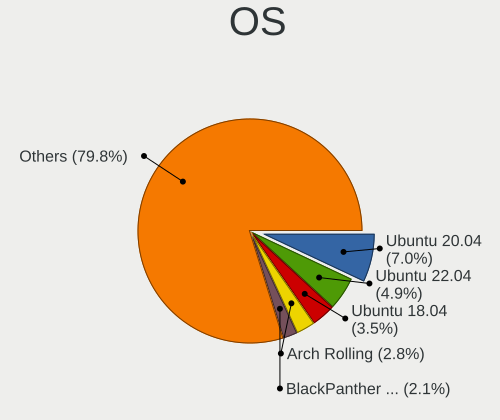

| Name                         | Computers | Percent |
|------------------------------|-----------|---------|
| Ubuntu 20.04                 | 215       | 7%      |
| Ubuntu 22.04                 | 149       | 4.85%   |
| Ubuntu 18.04                 | 107       | 3.49%   |
| Arch Rolling                 | 85        | 2.77%   |
| BlackPanther 18.1            | 64        | 2.08%   |
| Debian 12                    | 63        | 2.05%   |
| Ubuntu 24.04                 | 60        | 1.95%   |
| OpenMandriva 4.3             | 52        | 1.69%   |
| Pop!_OS 22.04                | 46        | 1.5%    |
| OpenMandriva 4.2             | 45        | 1.47%   |
| Zorin 17                     | 41        | 1.34%   |
| Manjaro                      | 41        | 1.34%   |
| Fedora 39                    | 39        | 1.27%   |
| OpenMandriva 24.12           | 35        | 1.14%   |
| Fedora 42                    | 35        | 1.14%   |
| openSUSE Tumbleweed-XXXXXXXX | 34        | 1.11%   |
| Zorin 16                     | 33        | 1.07%   |
| ArcoLinux Rolling            | 33        | 1.07%   |
| Debian 11                    | 32        | 1.04%   |
| Fedora 41                    | 30        | 0.98%   |
| Fedora 40                    | 30        | 0.98%   |
| Arch                         | 28        | 0.91%   |
| ROSA R10                     | 27        | 0.88%   |
| OpenMandriva 23.08           | 27        | 0.88%   |
| OpenMandriva 25.90           | 26        | 0.85%   |
| KDE neon 20.04               | 24        | 0.78%   |
| Pop!_OS 21.04                | 23        | 0.75%   |
| Linux Mint 21.1              | 23        | 0.75%   |
| Pop!_OS 20.04                | 21        | 0.68%   |
| Linux Mint 21.2              | 21        | 0.68%   |
| Ubuntu 21.10                 | 20        | 0.65%   |
| Endless 3.7.8                | 20        | 0.65%   |
| Zorin 15                     | 19        | 0.62%   |
| Fedora 35                    | 19        | 0.62%   |
| EndeavourOS Rolling          | 19        | 0.62%   |
| Ubuntu 23.04                 | 18        | 0.59%   |
| Ubuntu 20.10                 | 18        | 0.59%   |
| Fedora 38                    | 18        | 0.59%   |
| Endless 3.9.5                | 18        | 0.59%   |
| Endless 3.9.1                | 18        | 0.59%   |

OS Family
---------

OS without a version

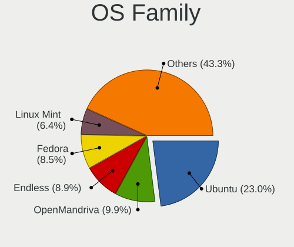

| Name          | Computers | Percent |
|---------------|-----------|---------|
| Ubuntu        | 656       | 23.02%  |
| OpenMandriva  | 283       | 9.93%   |
| Endless       | 254       | 8.91%   |
| Fedora        | 241       | 8.46%   |
| Linux Mint    | 183       | 6.42%   |
| Debian        | 127       | 4.46%   |
| Pop!_OS       | 114       | 4%      |
| Arch          | 111       | 3.89%   |
| Zorin         | 106       | 3.72%   |
| BlackPanther  | 80        | 2.81%   |
| Manjaro       | 76        | 2.67%   |
| ROSA          | 70        | 2.46%   |
| KDE neon      | 44        | 1.54%   |
| openSUSE      | 43        | 1.51%   |
| Kubuntu       | 41        | 1.44%   |
| ArcoLinux     | 36        | 1.26%   |
| Xubuntu       | 28        | 0.98%   |
| Bazzite       | 25        | 0.88%   |
| Kali          | 20        | 0.7%    |
| Gentoo        | 20        | 0.7%    |
| EndeavourOS   | 20        | 0.7%    |
| Elementary    | 19        | 0.67%   |
| Ubuntu Unity  | 16        | 0.56%   |
| SteamOS       | 15        | 0.53%   |
| Lubuntu       | 15        | 0.53%   |
| Garuda Linux  | 15        | 0.53%   |
| Clear Linux   | 14        | 0.49%   |
| NixOS         | 13        | 0.46%   |
| Nobara        | 12        | 0.42%   |
| MX            | 12        | 0.42%   |
| LMDE          | 12        | 0.42%   |
| Ubuntu MATE   | 11        | 0.39%   |
| CachyOS       | 11        | 0.39%   |
| TUXEDO OS     | 7         | 0.25%   |
| Peppermint    | 7         | 0.25%   |
| Ubuntu Budgie | 6         | 0.21%   |
| Linux Lite    | 6         | 0.21%   |
| Void Linux    | 5         | 0.18%   |
| CentOS        | 5         | 0.18%   |
| Xero          | 4         | 0.14%   |

Kernel
------

Version of the Linux kernel

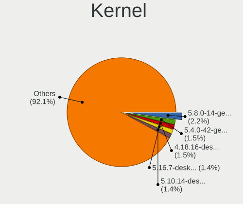

| Version                         | Computers | Percent |
|---------------------------------|-----------|---------|
| 5.8.0-14-generic                | 70        | 2.15%   |
| 5.4.0-42-generic                | 50        | 1.54%   |
| 4.18.16-desktop-1bP             | 48        | 1.47%   |
| 5.16.7-desktop-1omv4003         | 44        | 1.35%   |
| 5.10.14-desktop-1omv4002        | 44        | 1.35%   |
| 6.14.2-desktop-3omv2590         | 42        | 1.29%   |
| 5.4.0-19-generic                | 32        | 0.98%   |
| 5.3.0-28-generic                | 26        | 0.8%    |
| 6.12.1-desktop-1omv2490         | 25        | 0.77%   |
| 6.4.11-desktop-1omv2390         | 20        | 0.61%   |
| 5.11.0-35-generic               | 19        | 0.58%   |
| 6.6.2-desktop-1omv2390          | 18        | 0.55%   |
| 5.3.0-23-generic                | 18        | 0.55%   |
| 6.1.1-desktop-1omv2290          | 17        | 0.52%   |
| 4.18.0-15-generic               | 17        | 0.52%   |
| 5.6.14-desktop-2bP              | 16        | 0.49%   |
| 4.9.60-nrj-desktop-1rosa-x86_64 | 16        | 0.49%   |
| 5.0.0-25-generic                | 15        | 0.46%   |
| 6.6.32-power-1bP                | 14        | 0.43%   |
| 6.2.6-desktop-1omv2390          | 14        | 0.43%   |
| 5.4.0-40-generic                | 14        | 0.43%   |
| 5.15.0-58-generic               | 14        | 0.43%   |
| 6.8.0-51-generic                | 13        | 0.4%    |
| 5.3.0-46-generic                | 13        | 0.4%    |
| 5.0.0-20-generic                | 12        | 0.37%   |
| 6.9.3-76060903-generic          | 11        | 0.34%   |
| 6.2.0-36-generic                | 11        | 0.34%   |
| 5.4.0-52-generic                | 11        | 0.34%   |
| 5.4.0-29-generic                | 11        | 0.34%   |
| 5.4.0-26-generic                | 11        | 0.34%   |
| 5.3.0-19-generic                | 11        | 0.34%   |
| 5.15.0-52-generic               | 11        | 0.34%   |
| 6.8.0-52-generic                | 10        | 0.31%   |
| 6.5.0-21-generic                | 10        | 0.31%   |
| 6.5.0-14-generic                | 10        | 0.31%   |
| 6.10.0-desktop-1omv2490         | 10        | 0.31%   |
| 5.4.0-56-generic                | 10        | 0.31%   |
| 5.4.0-54-generic                | 10        | 0.31%   |
| 5.15.0-56-generic               | 10        | 0.31%   |
| 5.13.0-28-generic               | 10        | 0.31%   |

Kernel Family
-------------

Linux kernel without a distro release

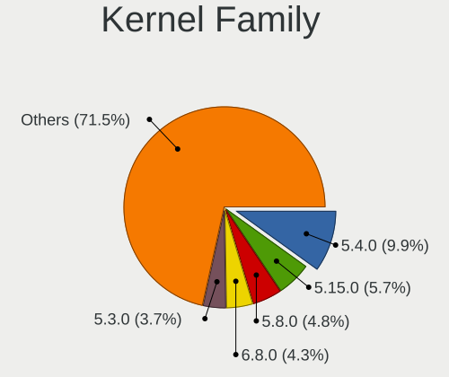

| Version | Computers | Percent |
|---------|-----------|---------|
| 5.4.0   | 312       | 9.94%   |
| 5.15.0  | 178       | 5.67%   |
| 5.8.0   | 151       | 4.81%   |
| 6.8.0   | 136       | 4.33%   |
| 5.3.0   | 117       | 3.73%   |
| 5.11.0  | 103       | 3.28%   |
| 4.15.0  | 99        | 3.15%   |
| 6.5.0   | 82        | 2.61%   |
| 5.0.0   | 80        | 2.55%   |
| 6.1.0   | 68        | 2.17%   |
| 5.13.0  | 68        | 2.17%   |
| 6.2.0   | 58        | 1.85%   |
| 4.18.0  | 54        | 1.72%   |
| 6.14.0  | 53        | 1.69%   |
| 5.19.0  | 51        | 1.62%   |
| 6.14.2  | 48        | 1.53%   |
| 4.18.16 | 48        | 1.53%   |
| 5.10.14 | 45        | 1.43%   |
| 5.16.7  | 44        | 1.4%    |
| 5.10.0  | 42        | 1.34%   |
| 6.11.0  | 30        | 0.96%   |
| 6.12.1  | 25        | 0.8%    |
| 6.4.11  | 23        | 0.73%   |
| 6.6.2   | 21        | 0.67%   |
| 6.1.1   | 20        | 0.64%   |
| 6.2.6   | 19        | 0.61%   |
| 4.9.60  | 18        | 0.57%   |
| 5.6.14  | 17        | 0.54%   |
| 6.9.3   | 16        | 0.51%   |
| 6.6.32  | 15        | 0.48%   |
| 4.9.20  | 15        | 0.48%   |
| 6.12.9  | 14        | 0.45%   |
| 6.17.7  | 13        | 0.41%   |
| 6.5.6   | 12        | 0.38%   |
| 6.5.5   | 12        | 0.38%   |
| 6.12.6  | 12        | 0.38%   |
| 6.3.5   | 11        | 0.35%   |
| 6.10.0  | 11        | 0.35%   |
| 4.19.0  | 11        | 0.35%   |
| 4.13.0  | 11        | 0.35%   |

Kernel Major Ver.
-----------------

Linux kernel major version

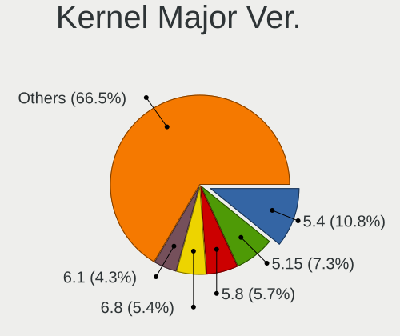

| Version | Computers | Percent |
|---------|-----------|---------|
| 5.4     | 335       | 10.82%  |
| 5.15    | 226       | 7.3%    |
| 5.8     | 178       | 5.75%   |
| 6.8     | 167       | 5.39%   |
| 6.1     | 132       | 4.26%   |
| 6.5     | 129       | 4.17%   |
| 5.3     | 127       | 4.1%    |
| 5.11    | 117       | 3.78%   |
| 6.12    | 114       | 3.68%   |
| 6.14    | 112       | 3.62%   |
| 5.10    | 112       | 3.62%   |
| 4.18    | 104       | 3.36%   |
| 4.15    | 100       | 3.23%   |
| 6.2     | 92        | 2.97%   |
| 5.0     | 85        | 2.74%   |
| 6.6     | 84        | 2.71%   |
| 5.16    | 77        | 2.49%   |
| 5.13    | 75        | 2.42%   |
| 5.19    | 71        | 2.29%   |
| 6.11    | 60        | 1.94%   |
| 4.9     | 50        | 1.61%   |
| 6.4     | 43        | 1.39%   |
| 6.16    | 41        | 1.32%   |
| 6.9     | 39        | 1.26%   |
| 6.17    | 39        | 1.26%   |
| 6.10    | 36        | 1.16%   |
| 6.0     | 36        | 1.16%   |
| 5.6     | 31        | 1%      |
| 6.15    | 29        | 0.94%   |
| 5.18    | 26        | 0.84%   |
| 5.14    | 25        | 0.81%   |
| 6.3     | 24        | 0.77%   |
| 6.13    | 24        | 0.77%   |
| 5.9     | 22        | 0.71%   |
| 5.17    | 22        | 0.71%   |
| 6.7     | 19        | 0.61%   |
| 5.12    | 18        | 0.58%   |
| 4.19    | 14        | 0.45%   |
| 4.13    | 11        | 0.36%   |
| 5.7     | 10        | 0.32%   |

Arch
----

OS architecture (x86_64, i586, etc.)

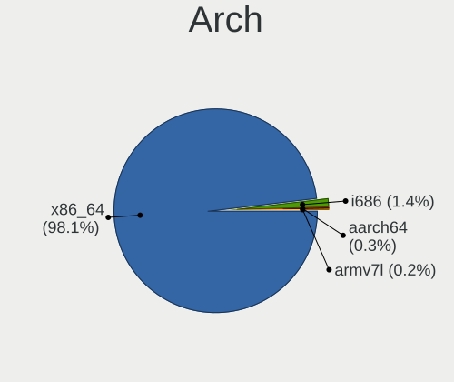

| Name    | Computers | Percent |
|---------|-----------|---------|
| x86_64  | 2670      | 98.13%  |
| i686    | 39        | 1.43%   |
| aarch64 | 7         | 0.26%   |
| armv7l  | 5         | 0.18%   |

DE
--

Desktop Environment

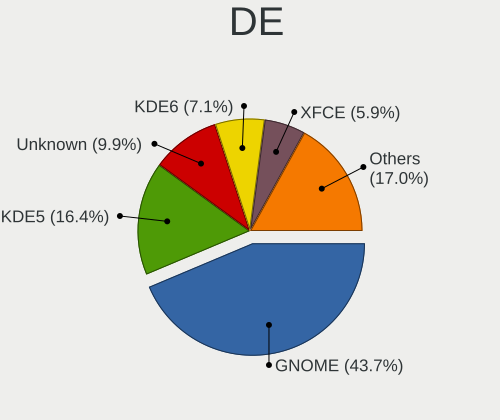

| Name             | Computers | Percent |
|------------------|-----------|---------|
| GNOME            | 1253      | 43.66%  |
| KDE5             | 470       | 16.38%  |
| Unknown          | 285       | 9.93%   |
| KDE6             | 205       | 7.14%   |
| XFCE             | 170       | 5.92%   |
| X-Cinnamon       | 161       | 5.61%   |
| KDE              | 54        | 1.88%   |
| KDE4             | 46        | 1.6%    |
| LXQt             | 41        | 1.43%   |
| MATE             | 39        | 1.36%   |
| Cinnamon         | 18        | 0.63%   |
| Pantheon         | 17        | 0.59%   |
| Unity            | 16        | 0.56%   |
| LXDE             | 15        | 0.52%   |
| i3               | 15        | 0.52%   |
| Hyprland         | 9         | 0.31%   |
| Budgie           | 8         | 0.28%   |
| sway             | 6         | 0.21%   |
| Endless:GNOME    | 5         | 0.17%   |
| Openbox          | 4         | 0.14%   |
| GNOME Flashback  | 3         | 0.1%    |
| GNOME Classic    | 3         | 0.1%    |
| Deepin           | 3         | 0.1%    |
| COSMIC           | 3         | 0.1%    |
| xmonad           | 2         | 0.07%   |
| DWM              | 2         | 0.07%   |
| bspwm            | 2         | 0.07%   |
| awesome          | 2         | 0.07%   |
| ubuntu           | 1         | 0.03%   |
| sussy_bspwm      | 1         | 0.03%   |
| qtile            | 1         | 0.03%   |
| niri             | 1         | 0.03%   |
| lightdm-xsession | 1         | 0.03%   |
| LeftWM           | 1         | 0.03%   |
| jwm              | 1         | 0.03%   |
| i3-with-shmlog   | 1         | 0.03%   |
| hyprstart        | 1         | 0.03%   |
| GNUstep          | 1         | 0.03%   |
| GNOME-Flashback  | 1         | 0.03%   |
| Enlightenment    | 1         | 0.03%   |

Display Server
--------------

X11 or Wayland

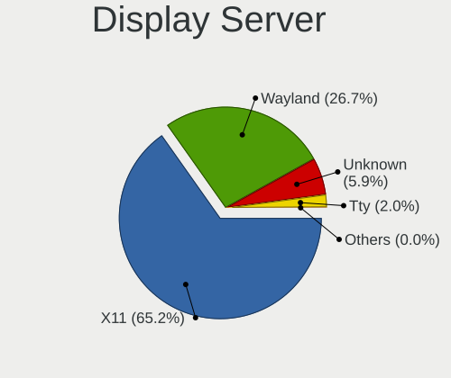

| Name        | Computers | Percent |
|-------------|-----------|---------|
| X11         | 1838      | 65.22%  |
| Wayland     | 753       | 26.72%  |
| Unknown     | 167       | 5.93%   |
| Tty         | 57        | 2.02%   |
| Web         | 2         | 0.07%   |
| Unspecified | 1         | 0.04%   |

Display Manager
---------------

SDDM, LightDM, etc.

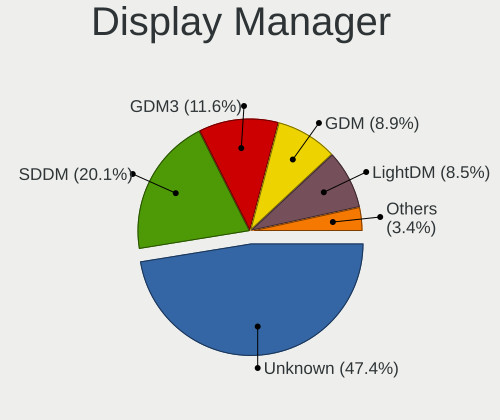

| Name                  | Computers | Percent |
|-----------------------|-----------|---------|
| Unknown               | 1354      | 47.44%  |
| SDDM                  | 574       | 20.11%  |
| GDM3                  | 330       | 11.56%  |
| GDM                   | 255       | 8.93%   |
| LightDM               | 243       | 8.51%   |
| KDM                   | 44        | 1.54%   |
| TDM                   | 41        | 1.44%   |
| XDM                   | 5         | 0.18%   |
| SLiM                  | 3         | 0.11%   |
| GREETD                | 2         | 0.07%   |
| Ly                    | 1         | 0.04%   |
| LXDM                  | 1         | 0.04%   |
| DISPLAY-MANAGER-START | 1         | 0.04%   |

OS Lang
-------

Language

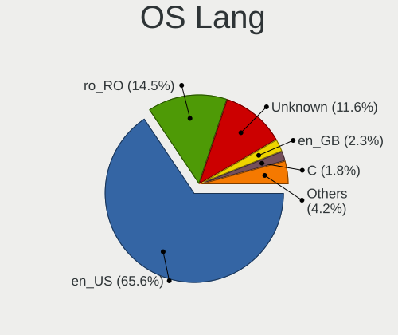

| Lang        | Computers | Percent |
|-------------|-----------|---------|
| en_US       | 1831      | 65.58%  |
| ro_RO       | 405       | 14.51%  |
| Unknown     | 324       | 11.6%   |
| en_GB       | 64        | 2.29%   |
| C           | 50        | 1.79%   |
| hu_HU       | 34        | 1.22%   |
| it_IT       | 14        | 0.5%    |
| fr_FR       | 14        | 0.5%    |
| es_ES       | 13        | 0.47%   |
| de_DE       | 9         | 0.32%   |
| ru_RU       | 4         | 0.14%   |
| en_IL       | 4         | 0.14%   |
| C.UTF8      | 3         | 0.11%   |
| en_US.UTF8  | 2         | 0.07%   |
| en_IN       | 2         | 0.07%   |
| en_IE       | 2         | 0.07%   |
| en_DK       | 2         | 0.07%   |
| en_CA       | 2         | 0.07%   |
| en_AG       | 2         | 0.07%   |
| uk_UA       | 1         | 0.04%   |
| tr_TR       | 1         | 0.04%   |
| POSIX       | 1         | 0.04%   |
| nl_NL       | 1         | 0.04%   |
| fr_CH       | 1         | 0.04%   |
| es_MX       | 1         | 0.04%   |
| en_US.UTF.8 | 1         | 0.04%   |
| en_US.utf-8 | 1         | 0.04%   |
| en_DE       | 1         | 0.04%   |
| en_001      | 1         | 0.04%   |
| de_IT       | 1         | 0.04%   |

Boot Mode
---------

EFI or BIOS

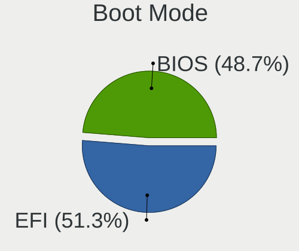

| Mode | Computers | Percent |
|------|-----------|---------|
| EFI  | 1429      | 51.27%  |
| BIOS | 1358      | 48.73%  |

Filesystem
----------

Type of filesystem

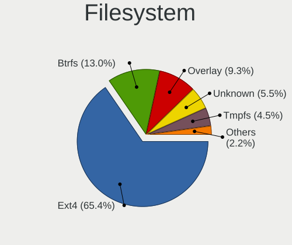

| Type     | Computers | Percent |
|----------|-----------|---------|
| Ext4     | 1841      | 65.42%  |
| Btrfs    | 365       | 12.97%  |
| Overlay  | 263       | 9.35%   |
| Unknown  | 156       | 5.54%   |
| Tmpfs    | 127       | 4.51%   |
| Xfs      | 31        | 1.1%    |
| Zfs      | 17        | 0.6%    |
| F2fs     | 5         | 0.18%   |
| Rootfs   | 3         | 0.11%   |
| Ext2     | 3         | 0.11%   |
| Jfs      | 1         | 0.04%   |
| Ext3     | 1         | 0.04%   |
| Bcachefs | 1         | 0.04%   |

Part. scheme
------------

Scheme of partitioning

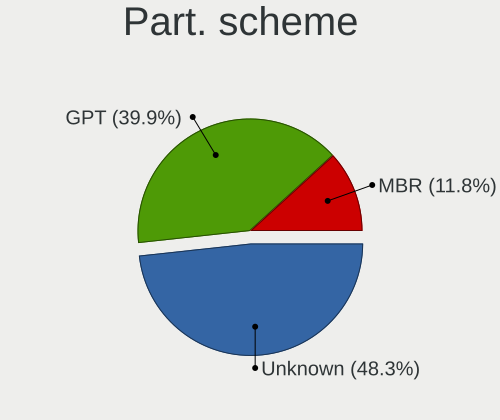

| Type    | Computers | Percent |
|---------|-----------|---------|
| Unknown | 1350      | 48.28%  |
| GPT     | 1117      | 39.95%  |
| MBR     | 329       | 11.77%  |

Dual Boot with Linux/BSD
------------------------

Hosting more than one Linux/BSD

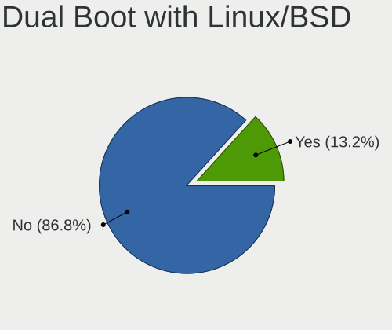

| Dual boot | Computers | Percent |
|-----------|-----------|---------|
| No        | 2404      | 86.76%  |
| Yes       | 367       | 13.24%  |

Dual Boot (Win)
---------------

Hosting Linux and Windows

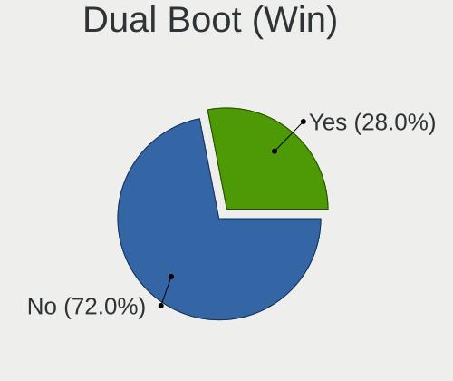

| Dual boot | Computers | Percent |
|-----------|-----------|---------|
| No        | 2001      | 71.95%  |
| Yes       | 780       | 28.05%  |

Board
-----

Vendor
------

Motherboard manufacturer

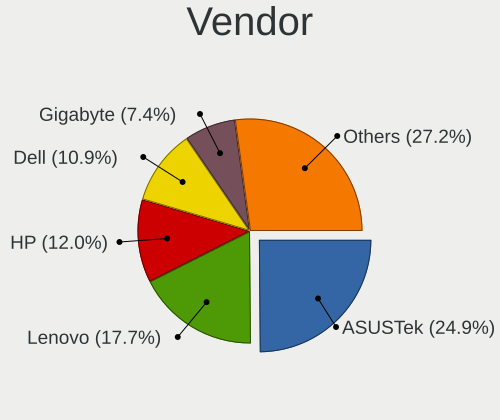

| Name                                 | Computers | Percent |
|--------------------------------------|-----------|---------|
| ASUSTek Computer                     | 676       | 24.87%  |
| Lenovo                               | 481       | 17.7%   |
| Hewlett-Packard                      | 326       | 11.99%  |
| Dell                                 | 296       | 10.89%  |
| Gigabyte Technology                  | 201       | 7.4%    |
| Acer                                 | 198       | 7.28%   |
| MSI                                  | 109       | 4.01%   |
| ASRock                               | 76        | 2.8%    |
| Toshiba                              | 33        | 1.21%   |
| Apple                                | 33        | 1.21%   |
| Intel                                | 30        | 1.1%    |
| Fujitsu                              | 19        | 0.7%    |
| HUAWEI                               | 17        | 0.63%   |
| Unknown                              | 17        | 0.63%   |
| Sony                                 | 14        | 0.52%   |
| Fujitsu Siemens                      | 14        | 0.52%   |
| Complet                              | 14        | 0.52%   |
| Valve                                | 10        | 0.37%   |
| Samsung Electronics                  | 9         | 0.33%   |
| Raspberry Pi Foundation              | 9         | 0.33%   |
| Medion                               | 9         | 0.33%   |
| Allview                              | 9         | 0.33%   |
| Chuwi                                | 7         | 0.26%   |
| Pegatron                             | 6         | 0.22%   |
| Google                               | 6         | 0.22%   |
| Foxconn                              | 6         | 0.22%   |
| TUXEDO                               | 5         | 0.18%   |
| Alienware                            | 5         | 0.18%   |
| Packard Bell                         | 4         | 0.15%   |
| AZW                                  | 4         | 0.15%   |
| Hampoo                               | 3         | 0.11%   |
| ECS                                  | 3         | 0.11%   |
| BESSTAR Tech                         | 3         | 0.11%   |
| AMI                                  | 3         | 0.11%   |
| WesternDigital                       | 2         | 0.07%   |
| Timi                                 | 2         | 0.07%   |
| Supermicro                           | 2         | 0.07%   |
| Shenzhen Meigao Electronic Equipment | 2         | 0.07%   |
| Schenker                             | 2         | 0.07%   |
| Jumper                               | 2         | 0.07%   |

Model
-----

Motherboard model

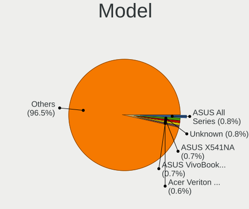

| Name                                       | Computers | Percent |
|--------------------------------------------|-----------|---------|
| ASUS All Series                            | 23        | 0.85%   |
| Unknown                                    | 22        | 0.81%   |
| ASUS X541NA                                | 18        | 0.66%   |
| ASUS VivoBook 15_ASUS Laptop X540MA_X543MA | 18        | 0.66%   |
| Acer Veriton L670G                         | 15        | 0.55%   |
| ASUS PRIME A320M-K                         | 11        | 0.4%    |
| ASUS VivoBook_ASUSLaptop X509FA_X509FA     | 10        | 0.37%   |
| ASUS VivoBook 15_ASUS Laptop X540MA_X540MA | 10        | 0.37%   |
| Valve Jupiter                              | 9         | 0.33%   |
| Dell XPS 15 9530                           | 9         | 0.33%   |
| ASUS X541UVK                               | 9         | 0.33%   |
| Lenovo Legion Y530-15ICH 81FV              | 8         | 0.29%   |
| ASUS X541UAK                               | 8         | 0.29%   |
| Gigabyte B450M DS3H                        | 7         | 0.26%   |
| Complet MY8312                             | 7         | 0.26%   |
| ASUS X406UAR                               | 7         | 0.26%   |
| HP Notebook                                | 6         | 0.22%   |
| Dell OptiPlex 7010                         | 6         | 0.22%   |
| Dell Latitude E6420                        | 6         | 0.22%   |
| ASUS VivoBook_ASUSLaptop X509FB_X509FB     | 6         | 0.22%   |
| ASUS VivoBook 15_ASUS Laptop X540MA_A540MA | 6         | 0.22%   |
| MSI MS-7B86                                | 5         | 0.18%   |
| MSI MS-7996                                | 5         | 0.18%   |
| Lenovo IdeaPad Gaming 3 15ARH05 82EY       | 5         | 0.18%   |
| Gigabyte B450 AORUS M                      | 5         | 0.18%   |
| Dell OptiPlex 9020                         | 5         | 0.18%   |
| Dell Latitude E7440                        | 5         | 0.18%   |
| Dell Latitude E6410                        | 5         | 0.18%   |
| ASUS X542UAR                               | 5         | 0.18%   |
| ASUS VivoBook_ASUSLaptop X512DA_X512DA     | 5         | 0.18%   |
| ASUS VivoBook_ASUSLaptop X509DAP_M509DA    | 5         | 0.18%   |
| ASUS VivoBook_ASUSLaptop X1504ZA_X1504ZA   | 5         | 0.18%   |
| ASUS VivoBook_ASUS Laptop X505ZA_A505ZA    | 5         | 0.18%   |
| ASUS VivoBook 15_ASUS Laptop X540UAR       | 5         | 0.18%   |
| ASUS GL552JX                               | 5         | 0.18%   |
| Allview Allbook H                          | 5         | 0.18%   |
| Acer Aspire E5-573G                        | 5         | 0.18%   |
| Acer Aspire A315-21G                       | 5         | 0.18%   |
| RPi Raspberry Pi                           | 4         | 0.15%   |
| MSI MS-7721                                | 4         | 0.15%   |

Model Family
------------

Motherboard model prefix

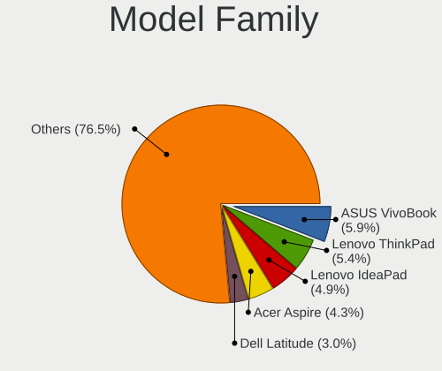

| Name               | Computers | Percent |
|--------------------|-----------|---------|
| ASUS VivoBook      | 160       | 5.89%   |
| Lenovo ThinkPad    | 146       | 5.37%   |
| Lenovo IdeaPad     | 134       | 4.93%   |
| Acer Aspire        | 118       | 4.34%   |
| Dell Latitude      | 82        | 3.02%   |
| Dell Inspiron      | 66        | 2.43%   |
| ASUS PRIME         | 62        | 2.28%   |
| ASUS ROG           | 58        | 2.13%   |
| Lenovo Legion      | 53        | 1.95%   |
| HP EliteBook       | 49        | 1.8%    |
| ASUS ASUS          | 48        | 1.77%   |
| Dell OptiPlex      | 47        | 1.73%   |
| HP Compaq          | 46        | 1.69%   |
| HP Pavilion        | 41        | 1.51%   |
| HP ProBook         | 38        | 1.4%    |
| Lenovo ThinkCentre | 32        | 1.18%   |
| Toshiba Satellite  | 31        | 1.14%   |
| Dell Precision     | 27        | 0.99%   |
| Dell XPS           | 26        | 0.96%   |
| ASUS TUF           | 26        | 0.96%   |
| HP Laptop          | 24        | 0.88%   |
| ASUS All           | 23        | 0.85%   |
| Acer Veriton       | 23        | 0.85%   |
| Unknown            | 22        | 0.81%   |
| Lenovo Yoga        | 20        | 0.74%   |
| Dell Vostro        | 19        | 0.7%    |
| ASUS X541NA        | 18        | 0.66%   |
| ASUS Zenbook       | 17        | 0.63%   |
| Acer Nitro         | 17        | 0.63%   |
| Lenovo ThinkBook   | 16        | 0.59%   |
| HP EliteDesk       | 15        | 0.55%   |
| HP OMEN            | 14        | 0.52%   |
| HP 250             | 13        | 0.48%   |
| HP ZBook           | 12        | 0.44%   |
| HP ProDesk         | 11        | 0.4%    |
| Acer Swift         | 10        | 0.37%   |
| Acer Extensa       | 10        | 0.37%   |
| Valve Jupiter      | 9         | 0.33%   |
| RPi Raspberry      | 9         | 0.33%   |
| Gigabyte B450M     | 9         | 0.33%   |

MFG Year
--------

Motherboard manufacture year

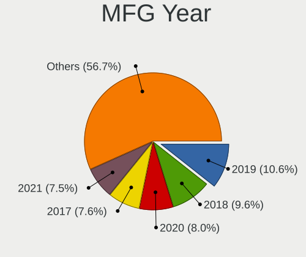

| Year    | Computers | Percent |
|---------|-----------|---------|
| 2019    | 289       | 10.63%  |
| 2018    | 261       | 9.6%    |
| 2020    | 217       | 7.98%   |
| 2017    | 207       | 7.62%   |
| 2021    | 203       | 7.47%   |
| 2013    | 171       | 6.29%   |
| 2015    | 155       | 5.7%    |
| 2012    | 144       | 5.3%    |
| 2011    | 140       | 5.15%   |
| 2014    | 135       | 4.97%   |
| 2022    | 131       | 4.82%   |
| 2016    | 103       | 3.79%   |
| 2010    | 101       | 3.72%   |
| 2023    | 96        | 3.53%   |
| 2008    | 94        | 3.46%   |
| 2009    | 78        | 2.87%   |
| 2024    | 75        | 2.76%   |
| 2007    | 69        | 2.54%   |
| 2006    | 23        | 0.85%   |
| Unknown | 12        | 0.44%   |
| 2025    | 7         | 0.26%   |
| 2005    | 5         | 0.18%   |
| 2004    | 2         | 0.07%   |

Form Factor
-----------

Physical design of the computer

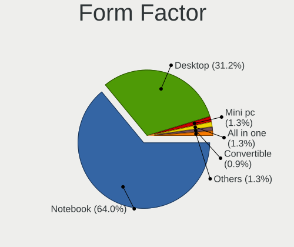

| Name           | Computers | Percent |
|----------------|-----------|---------|
| Notebook       | 1740      | 64.02%  |
| Desktop        | 849       | 31.24%  |
| Mini pc        | 35        | 1.29%   |
| All in one     | 35        | 1.29%   |
| Convertible    | 25        | 0.92%   |
| Tablet         | 14        | 0.52%   |
| System on chip | 10        | 0.37%   |
| Server         | 10        | 0.37%   |

Secure Boot
-----------

Enabled or disabled

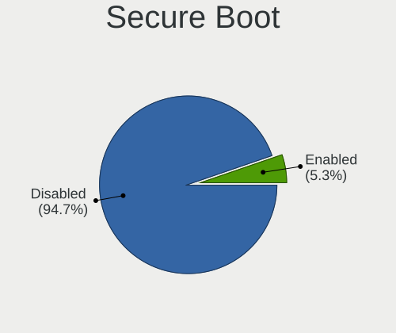

| State    | Computers | Percent |
|----------|-----------|---------|
| Disabled | 2594      | 94.74%  |
| Enabled  | 144       | 5.26%   |

Coreboot
--------

Have coreboot on board

| Used | Computers | Percent |
|------|-----------|---------|
| No   | 2712      | 99.78%  |
| Yes  | 6         | 0.22%   |

RAM Size
--------

Total RAM memory

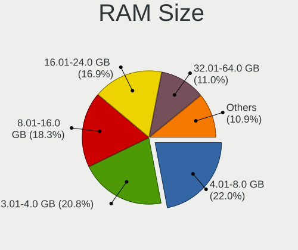

| Size in GB      | Computers | Percent |
|-----------------|-----------|---------|
| 4.01-8.0        | 611       | 22.03%  |
| 3.01-4.0        | 576       | 20.77%  |
| 8.01-16.0       | 508       | 18.32%  |
| 16.01-24.0      | 470       | 16.95%  |
| 32.01-64.0      | 306       | 11.03%  |
| 1.01-2.0        | 91        | 3.28%   |
| 64.01-256.0     | 87        | 3.14%   |
| 24.01-32.0      | 81        | 2.92%   |
| 2.01-3.0        | 25        | 0.9%    |
| 0.51-1.0        | 16        | 0.58%   |
| More than 256.0 | 2         | 0.07%   |

RAM Used
--------

Used RAM memory

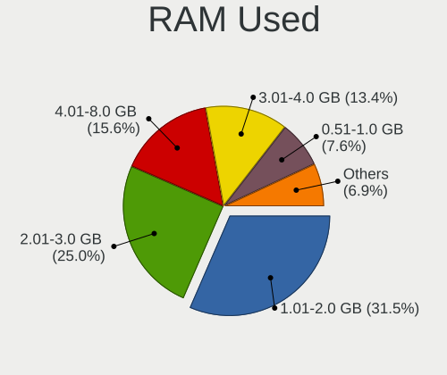

| Used GB     | Computers | Percent |
|-------------|-----------|---------|
| 1.01-2.0    | 963       | 31.51%  |
| 2.01-3.0    | 765       | 25.03%  |
| 4.01-8.0    | 476       | 15.58%  |
| 3.01-4.0    | 409       | 13.38%  |
| 0.51-1.0    | 231       | 7.56%   |
| 8.01-16.0   | 132       | 4.32%   |
| 0.01-0.5    | 51        | 1.67%   |
| 16.01-24.0  | 19        | 0.62%   |
| 24.01-32.0  | 5         | 0.16%   |
| 32.01-64.0  | 3         | 0.1%    |
| 64.01-256.0 | 2         | 0.07%   |

Total Drives
------------

Number of drives on board

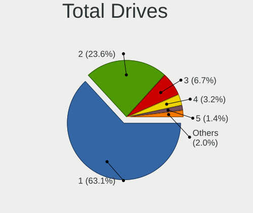

| Drives | Computers | Percent |
|--------|-----------|---------|
| 1      | 1773      | 63.14%  |
| 2      | 663       | 23.61%  |
| 3      | 188       | 6.7%    |
| 4      | 89        | 3.17%   |
| 5      | 40        | 1.42%   |
| 0      | 20        | 0.71%   |
| 6      | 14        | 0.5%    |
| 7      | 7         | 0.25%   |
| 9      | 4         | 0.14%   |
| 8      | 4         | 0.14%   |
| 10     | 2         | 0.07%   |
| 24     | 1         | 0.04%   |
| 15     | 1         | 0.04%   |
| 14     | 1         | 0.04%   |
| 11     | 1         | 0.04%   |

Has CD-ROM
----------

Has CD-ROM on board

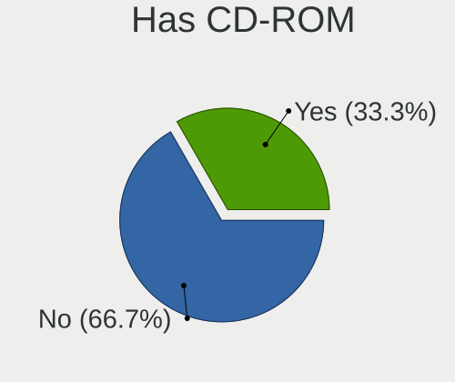

| Presented | Computers | Percent |
|-----------|-----------|---------|
| No        | 1828      | 66.69%  |
| Yes       | 913       | 33.31%  |

Has Ethernet
------------

Has Ethernet on board

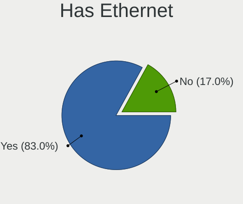

| Presented | Computers | Percent |
|-----------|-----------|---------|
| Yes       | 2262      | 83.01%  |
| No        | 463       | 16.99%  |

Has WiFi
--------

Has WiFi module

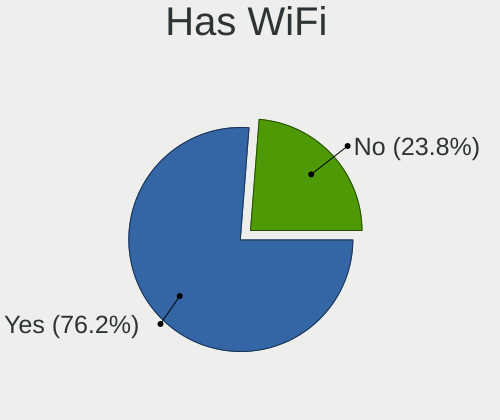

| Presented | Computers | Percent |
|-----------|-----------|---------|
| Yes       | 2085      | 76.23%  |
| No        | 650       | 23.77%  |

Has Bluetooth
-------------

Has Bluetooth module

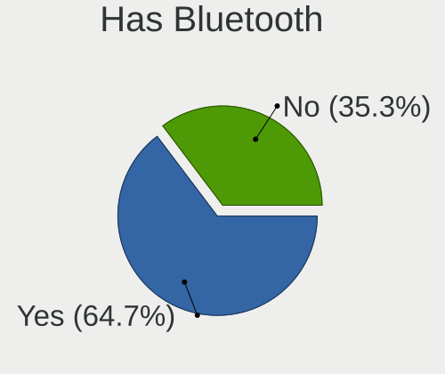

| Presented | Computers | Percent |
|-----------|-----------|---------|
| Yes       | 1782      | 64.71%  |
| No        | 972       | 35.29%  |

Location
--------

Country
-------

Geographic location (country)

| Country | Computers | Percent |
|---------|-----------|---------|
| Romania | 2718      | 100%    |

City
----

Geographic location (city)

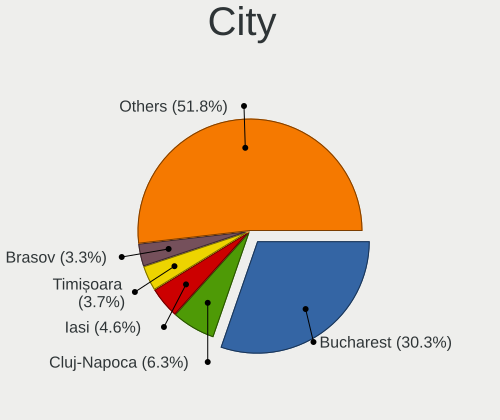

| City                  | Computers | Percent |
|-----------------------|-----------|---------|
| Bucharest             | 873       | 30.29%  |
| Cluj-Napoca           | 183       | 6.35%   |
| Iasi                  | 132       | 4.58%   |
| Timișoara            | 106       | 3.68%   |
| Brasov                | 95        | 3.3%    |
| Târgu Mureş         | 71        | 2.46%   |
| Ploieşti             | 66        | 2.29%   |
| Constanța            | 61        | 2.12%   |
| Sibiu                 | 55        | 1.91%   |
| Oradea                | 51        | 1.77%   |
| Arad                  | 48        | 1.67%   |
| Craiova               | 42        | 1.46%   |
| Piteşti              | 39        | 1.35%   |
| Galati                | 32        | 1.11%   |
| Baia Mare             | 32        | 1.11%   |
| Râmnicu Vâlcea      | 27        | 0.94%   |
| Popesti-Leordeni      | 27        | 0.94%   |
| Zalău                | 26        | 0.9%    |
| Miercurea-Ciuc        | 26        | 0.9%    |
| Voluntari             | 22        | 0.76%   |
| Bacau                 | 22        | 0.76%   |
| Botosani              | 21        | 0.73%   |
| Targoviste            | 19        | 0.66%   |
| Satu Mare             | 19        | 0.66%   |
| Piatra Neamţ         | 18        | 0.62%   |
| Floresti              | 18        | 0.62%   |
| Braila                | 18        | 0.62%   |
| Buzau                 | 17        | 0.59%   |
| Tulcea                | 16        | 0.56%   |
| Mediaş               | 16        | 0.56%   |
| Drobeta-Turnu Severin | 16        | 0.56%   |
| Târgu Jiu            | 15        | 0.52%   |
| Reşiţa              | 15        | 0.52%   |
| Focşani              | 15        | 0.52%   |
| Alba Iulia            | 14        | 0.49%   |
| Suceava               | 13        | 0.45%   |
| Deva                  | 13        | 0.45%   |
| Bistriţa             | 13        | 0.45%   |
| Roman                 | 12        | 0.42%   |
| Alexandria            | 12        | 0.42%   |

Drives
------

Drive Vendor
------------

Hard drive vendors

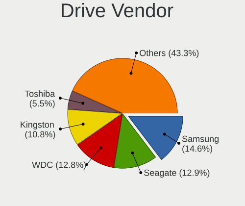

| Vendor                      | Computers | Drives | Percent |
|-----------------------------|-----------|--------|---------|
| Samsung Electronics         | 577       | 813    | 14.64%  |
| Seagate                     | 509       | 773    | 12.92%  |
| WDC                         | 503       | 748    | 12.77%  |
| Kingston                    | 427       | 594    | 10.84%  |
| Toshiba                     | 217       | 267    | 5.51%   |
| Sandisk                     | 191       | 233    | 4.85%   |
| A-DATA Technology           | 141       | 213    | 3.58%   |
| Intel                       | 136       | 173    | 3.45%   |
| Unknown                     | 133       | 167    | 3.38%   |
| SK hynix                    | 130       | 167    | 3.3%    |
| Micron Technology           | 110       | 141    | 2.79%   |
| Hitachi                     | 86        | 106    | 2.18%   |
| HGST                        | 79        | 101    | 2.01%   |
| Kingston Technology Company | 73        | 94     | 1.85%   |
| Crucial                     | 58        | 78     | 1.47%   |
| SPCC                        | 28        | 38     | 0.71%   |
| KIOXIA                      | 27        | 29     | 0.69%   |
| Phison Electronics          | 26        | 32     | 0.66%   |
| Patriot                     | 25        | 29     | 0.63%   |
| Hewlett-Packard             | 23        | 29     | 0.58%   |
| Maxtor                      | 22        | 31     | 0.56%   |
| ADATA Technology            | 22        | 25     | 0.56%   |
| China                       | 18        | 20     | 0.46%   |
| Silicon Motion              | 17        | 22     | 0.43%   |
| Apple                       | 17        | 21     | 0.43%   |
| Phison                      | 16        | 19     | 0.41%   |
| XPG                         | 13        | 17     | 0.33%   |
| Gigabyte Technology         | 13        | 19     | 0.33%   |
| OCZ                         | 12        | 22     | 0.3%    |
| GOODRAM                     | 12        | 13     | 0.3%    |
| Fujitsu                     | 12        | 15     | 0.3%    |
| Transcend                   | 11        | 14     | 0.28%   |
| Realtek Semiconductor       | 11        | 12     | 0.28%   |
| Verbatim                    | 10        | 13     | 0.25%   |
| Team                        | 10        | 10     | 0.25%   |
| Netac                       | 10        | 12     | 0.25%   |
| Kingmax                     | 10        | 11     | 0.25%   |
| Corsair                     | 10        | 22     | 0.25%   |
| Micron/Crucial Technology   | 9         | 11     | 0.23%   |
| FORESEE                     | 9         | 10     | 0.23%   |

Drive Model
-----------

Hard drive models

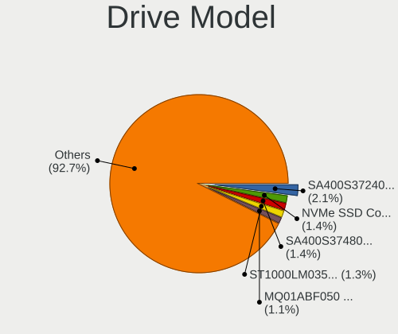

| Model                                                | Computers | Percent |
|------------------------------------------------------|-----------|---------|
| Kingston SA400S37240G 240GB SSD                      | 89        | 2.09%   |
| Samsung NVMe SSD Controller SM981/PM981/PM983 1TB    | 60        | 1.41%   |
| Kingston SA400S37480G 480GB SSD                      | 59        | 1.38%   |
| Seagate ST1000LM035-1RK172 1TB                       | 56        | 1.31%   |
| Toshiba MQ01ABF050 500GB                             | 49        | 1.15%   |
| Kingston SA400S37120G 120GB SSD                      | 39        | 0.91%   |
| Seagate ST500LT012-1DG142 500GB                      | 36        | 0.84%   |
| Seagate ST1000DM010-2EP102 1TB                       | 36        | 0.84%   |
| Kingston SV300S37A120G 120GB SSD                     | 36        | 0.84%   |
| Samsung NVMe SSD Controller PM9A1/PM9A3/980PRO 1TB   | 33        | 0.77%   |
| Kingston Company SNV2S1000G 1TB                      | 33        | 0.77%   |
| Samsung SSD 860 EVO 500GB                            | 28        | 0.66%   |
| HGST HTS721010A9E630 1TB                             | 28        | 0.66%   |
| WDC WD10EZEX-08WN4A0 1TB                             | 27        | 0.63%   |
| Samsung SSD 850 EVO 250GB                            | 27        | 0.63%   |
| Unknown MMC Card  32GB                               | 25        | 0.59%   |
| Toshiba MQ04ABF100 1TB                               | 23        | 0.54%   |
| Seagate ST1000LM024 HN-M101MBB 1TB                   | 23        | 0.54%   |
| Kingston SA400S37960G 960GB SSD                      | 22        | 0.52%   |
| SanDisk NVMe SSD Drive 512GB                         | 21        | 0.49%   |
| Samsung NVMe SSD Drive 512GB                         | 21        | 0.49%   |
| A-DATA SU650 240GB SSD                               | 21        | 0.49%   |
| Toshiba MQ01ABD100 1TB                               | 20        | 0.47%   |
| Unknown MMC Card  64GB                               | 18        | 0.42%   |
| SanDisk NVMe SSD Drive 256GB                         | 18        | 0.42%   |
| Samsung SSD 860 EVO 250GB                            | 18        | 0.42%   |
| Seagate ST500DM002-1BD142 500GB                      | 17        | 0.4%    |
| Seagate Expansion 2TB                                | 16        | 0.38%   |
| Samsung SSD 870 EVO 1TB                              | 16        | 0.38%   |
| Kingston SUV400S37120G 120GB SSD                     | 16        | 0.38%   |
| A-DATA SU630 240GB SSD                               | 16        | 0.38%   |
| Sandisk WD Blue SN550 NVMe SSD 1024GB                | 15        | 0.35%   |
| Samsung SSD 980 1TB                                  | 15        | 0.35%   |
| Kingston SV300S37A240G 240GB SSD                     | 15        | 0.35%   |
| Seagate ST2000DM008-2FR102 2TB                       | 14        | 0.33%   |
| HGST HTS545050A7E680 500GB                           | 14        | 0.33%   |
| Toshiba DT01ACA050 500GB                             | 13        | 0.3%    |
| SanDisk NVMe SSD Drive 1TB                           | 13        | 0.3%    |
| Samsung SSD 860 EVO 1TB                              | 13        | 0.3%    |
| Samsung NVMe SSD Controller SM961/PM961/SM963 1024GB | 13        | 0.3%    |

HDD Vendor
----------

Hard disk drive vendors

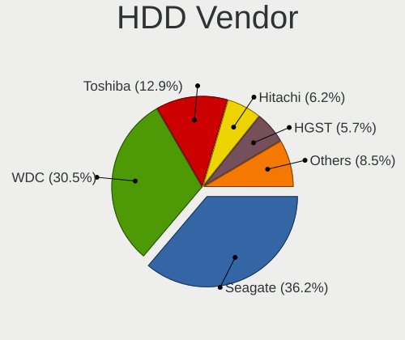

| Vendor              | Computers | Drives | Percent |
|---------------------|-----------|--------|---------|
| Seagate             | 498       | 757    | 36.19%  |
| WDC                 | 419       | 641    | 30.45%  |
| Toshiba             | 177       | 219    | 12.86%  |
| Hitachi             | 86        | 106    | 6.25%   |
| HGST                | 79        | 101    | 5.74%   |
| Samsung Electronics | 40        | 51     | 2.91%   |
| Maxtor              | 20        | 29     | 1.45%   |
| Fujitsu             | 12        | 15     | 0.87%   |
| Unknown             | 11        | 12     | 0.8%    |
| Apple               | 7         | 8      | 0.51%   |
| TO Exter            | 5         | 8      | 0.36%   |
| Hewlett-Packard     | 4         | 8      | 0.29%   |
| LaCie               | 2         | 8      | 0.15%   |
| IBM/Hitachi         | 2         | 2      | 0.15%   |
| ASMT                | 2         | 2      | 0.15%   |
| XrayDisk            | 1         | 1      | 0.07%   |
| USB3.0              | 1         | 1      | 0.07%   |
| T-FORCE             | 1         | 2      | 0.07%   |
| Shenzhen            | 1         | 1      | 0.07%   |
| MARVELL             | 1         | 1      | 0.07%   |
| JMicron Technology  | 1         | 1      | 0.07%   |
| Intenso             | 1         | 1      | 0.07%   |
| HPE                 | 1         | 1      | 0.07%   |
| HGST HTS            | 1         | 1      | 0.07%   |
| External            | 1         | 1      | 0.07%   |
| ExcelStor           | 1         | 1      | 0.07%   |
| ASMT109x            | 1         | 1      | 0.07%   |

SSD Vendor
----------

Solid state drive vendors

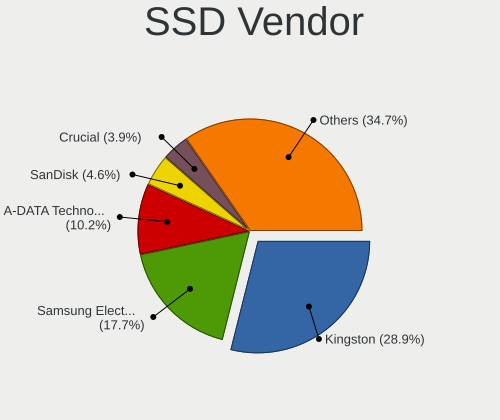

| Vendor              | Computers | Drives | Percent |
|---------------------|-----------|--------|---------|
| Kingston            | 362       | 486    | 28.91%  |
| Samsung Electronics | 222       | 307    | 17.73%  |
| A-DATA Technology   | 128       | 199    | 10.22%  |
| SanDisk             | 57        | 73     | 4.55%   |
| Crucial             | 49        | 68     | 3.91%   |
| Intel               | 41        | 45     | 3.27%   |
| WDC                 | 39        | 43     | 3.12%   |
| Micron Technology   | 33        | 40     | 2.64%   |
| SK hynix            | 31        | 45     | 2.48%   |
| SPCC                | 27        | 37     | 2.16%   |
| Patriot             | 24        | 28     | 1.92%   |
| China               | 18        | 20     | 1.44%   |
| Hewlett-Packard     | 15        | 16     | 1.2%    |
| Toshiba             | 12        | 13     | 0.96%   |
| OCZ                 | 12        | 22     | 0.96%   |
| GOODRAM             | 12        | 13     | 0.96%   |
| Gigabyte Technology | 11        | 17     | 0.88%   |
| Team                | 10        | 10     | 0.8%    |
| Netac               | 10        | 12     | 0.8%    |
| Kingmax             | 10        | 11     | 0.8%    |
| Verbatim            | 9         | 12     | 0.72%   |
| Transcend           | 9         | 12     | 0.72%   |
| FORESEE             | 9         | 10     | 0.72%   |
| Corsair             | 8         | 19     | 0.64%   |
| Emtec               | 7         | 7      | 0.56%   |
| LITEON              | 6         | 6      | 0.48%   |
| PNY                 | 5         | 7      | 0.4%    |
| LITEONIT            | 5         | 5      | 0.4%    |
| ASMT                | 5         | 5      | 0.4%    |
| Apacer              | 5         | 8      | 0.4%    |
| Intenso             | 4         | 4      | 0.32%   |
| Apple               | 4         | 5      | 0.32%   |
| KingSpec            | 3         | 4      | 0.24%   |
| Teclast             | 2         | 2      | 0.16%   |
| Supersonic          | 2         | 2      | 0.16%   |
| Seagate             | 2         | 2      | 0.16%   |
| MicroFrom           | 2         | 2      | 0.16%   |
| Maxtor              | 2         | 2      | 0.16%   |
| Lite-On             | 2         | 2      | 0.16%   |
| HS-SSD-E100N        | 2         | 2      | 0.16%   |

Drive Kind
----------

HDD or SSD

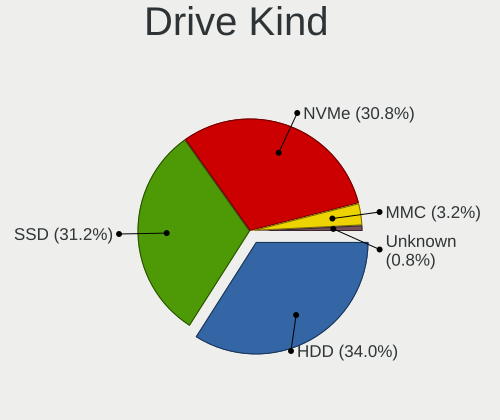

| Kind    | Computers | Drives | Percent |
|---------|-----------|--------|---------|
| HDD     | 1188      | 1980   | 34.02%  |
| SSD     | 1088      | 1668   | 31.16%  |
| NVMe    | 1077      | 1564   | 30.84%  |
| MMC     | 111       | 141    | 3.18%   |
| Unknown | 28        | 34     | 0.8%    |

Drive Connector
---------------

SATA, SAS, NVMe, etc.

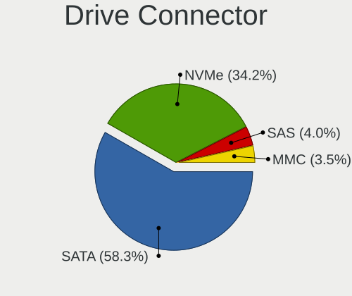

| Type | Computers | Drives | Percent |
|------|-----------|--------|---------|
| SATA | 1833      | 3491   | 58.26%  |
| NVMe | 1076      | 1560   | 34.2%   |
| SAS  | 126       | 195    | 4.01%   |
| MMC  | 111       | 141    | 3.53%   |

Drive Size
----------

Size of hard drive

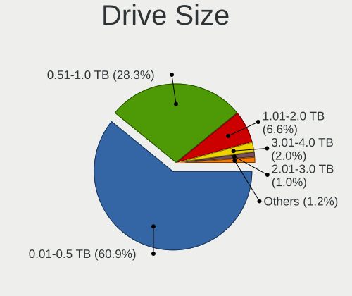

| Size in TB | Computers | Drives | Percent |
|------------|-----------|--------|---------|
| 0.01-0.5   | 1407      | 2258   | 60.86%  |
| 0.51-1.0   | 654       | 928    | 28.29%  |
| 1.01-2.0   | 153       | 237    | 6.62%   |
| 3.01-4.0   | 47        | 84     | 2.03%   |
| 2.01-3.0   | 24        | 66     | 1.04%   |
| 4.01-10.0  | 23        | 67     | 0.99%   |
| 10.01-20.0 | 3         | 6      | 0.13%   |
| 20.01-50.0 | 1         | 2      | 0.04%   |

Space Total
-----------

Amount of disk space available on the file system

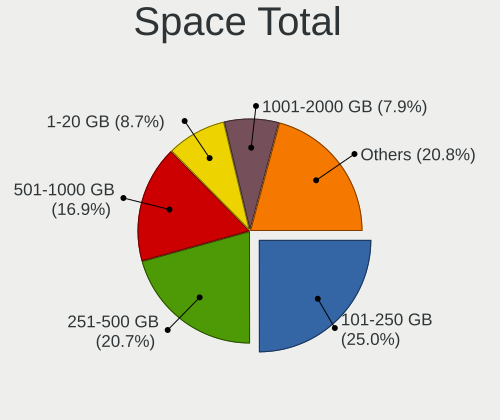

| Size in GB     | Computers | Percent |
|----------------|-----------|---------|
| 101-250        | 730       | 24.99%  |
| 251-500        | 604       | 20.68%  |
| 501-1000       | 495       | 16.95%  |
| 1-20           | 253       | 8.66%   |
| 1001-2000      | 231       | 7.91%   |
| 51-100         | 183       | 6.26%   |
| Unknown        | 116       | 3.97%   |
| More than 3000 | 113       | 3.87%   |
| 21-50          | 108       | 3.7%    |
| 2001-3000      | 88        | 3.01%   |

Space Used
----------

Amount of used disk space

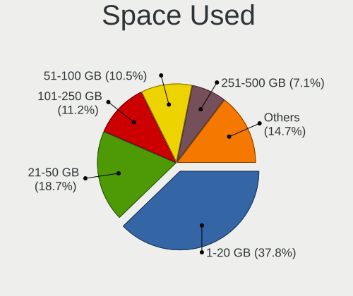

| Used GB        | Computers | Percent |
|----------------|-----------|---------|
| 1-20           | 1137      | 37.76%  |
| 21-50          | 564       | 18.73%  |
| 101-250        | 337       | 11.19%  |
| 51-100         | 316       | 10.49%  |
| 251-500        | 215       | 7.14%   |
| 501-1000       | 180       | 5.98%   |
| Unknown        | 116       | 3.85%   |
| 1001-2000      | 89        | 2.96%   |
| More than 3000 | 30        | 1%      |
| 2001-3000      | 25        | 0.83%   |
| 0              | 2         | 0.07%   |

Malfunc. Drives
---------------

Drive models with a malfunction

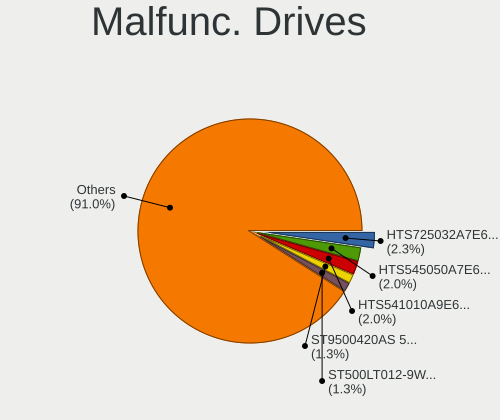

| Model                                 | Computers | Drives | Percent |
|---------------------------------------|-----------|--------|---------|
| Hitachi HTS725032A7E630 320GB         | 7         | 7      | 2.34%   |
| HGST HTS545050A7E680 500GB            | 6         | 6      | 2.01%   |
| HGST HTS541010A9E680 1TB              | 6         | 6      | 2.01%   |
| Seagate ST9500420AS 500GB             | 4         | 4      | 1.34%   |
| Seagate ST500LT012-9WS142 500GB       | 4         | 4      | 1.34%   |
| Maxtor STM3250310AS 250GB             | 4         | 5      | 1.34%   |
| Kingston SV300S37A120G 120GB SSD      | 4         | 5      | 1.34%   |
| HGST HTS725050A7E630 500GB            | 4         | 5      | 1.34%   |
| HGST HTS721010A9E630 1TB              | 4         | 4      | 1.34%   |
| WDC WD5000AAKX-001CA0 500GB           | 3         | 3      | 1%      |
| WDC WD3200AAJS-60Z0A0 320GB           | 3         | 6      | 1%      |
| Seagate ST500DM002-1BD142 500GB       | 3         | 4      | 1%      |
| Seagate ST3500312CS 500GB             | 3         | 3      | 1%      |
| Seagate ST1000DM010-2EP102 1TB        | 3         | 3      | 1%      |
| Samsung Electronics SSD 870 EVO 1TB   | 3         | 4      | 1%      |
| WDC WD5000AADS-00S9B0 500GB           | 2         | 2      | 0.67%   |
| WDC WD10EZEX-21WN4A0 1TB              | 2         | 2      | 0.67%   |
| WDC WD1002FAEX-00Z3A0 1TB             | 2         | 2      | 0.67%   |
| WDC PC SA530 SDASN8Y-256G-1006 256GB  | 2         | 2      | 0.67%   |
| Toshiba MQ01ABF050 500GB              | 2         | 2      | 0.67%   |
| SK hynix HFS256G39TND-N210A 256GB SSD | 2         | 2      | 0.67%   |
| Seagate STM3250318AS 250GB            | 2         | 3      | 0.67%   |
| Seagate ST95005620AS 500GB            | 2         | 5      | 0.67%   |
| Seagate ST9500325AS 500GB             | 2         | 2      | 0.67%   |
| Seagate ST9160821AS 160GB             | 2         | 2      | 0.67%   |
| Seagate ST500LT012-1DG142 500GB       | 2         | 3      | 0.67%   |
| Seagate ST500LM021-1KJ152 500GB       | 2         | 2      | 0.67%   |
| Seagate ST500LM000-1EJ162 500GB       | 2         | 3      | 0.67%   |
| Seagate ST3500413AS 500GB             | 2         | 2      | 0.67%   |
| Seagate ST3500320AS 500GB             | 2         | 3      | 0.67%   |
| Seagate ST3250410AS 250GB             | 2         | 2      | 0.67%   |
| Seagate ST3250318AS 250GB             | 2         | 3      | 0.67%   |
| Seagate ST250DM000-1BD141 250GB       | 2         | 2      | 0.67%   |
| Seagate ST1000LX015-1U7172 1TB        | 2         | 2      | 0.67%   |
| Seagate ST1000DM003-1SB102 1TB        | 2         | 3      | 0.67%   |
| Samsung Electronics SSD 850 EVO 250GB | 2         | 2      | 0.67%   |
| Samsung Electronics HD502HJ 500GB     | 2         | 2      | 0.67%   |
| Samsung Electronics HD161HJ 160GB     | 2         | 2      | 0.67%   |
| OCZ ARC100 240GB SSD                  | 2         | 2      | 0.67%   |
| Kingston SA400S37480G 480GB SSD       | 2         | 4      | 0.67%   |

Malfunc. Drive Vendor
---------------------

Vendors of faulty drives

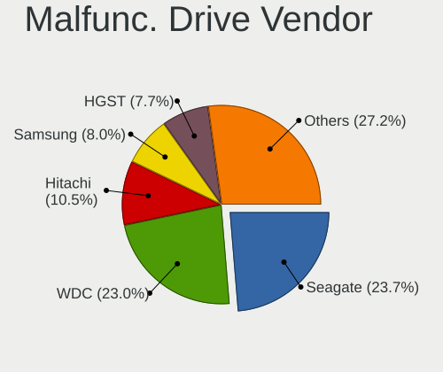

| Vendor              | Computers | Drives | Percent |
|---------------------|-----------|--------|---------|
| Seagate             | 68        | 84     | 23.69%  |
| WDC                 | 66        | 104    | 23%     |
| Hitachi             | 30        | 34     | 10.45%  |
| Samsung Electronics | 23        | 28     | 8.01%   |
| HGST                | 22        | 23     | 7.67%   |
| Toshiba             | 13        | 14     | 4.53%   |
| Kingston            | 12        | 15     | 4.18%   |
| SK hynix            | 8         | 9      | 2.79%   |
| Maxtor              | 8         | 10     | 2.79%   |
| Intel               | 8         | 9      | 2.79%   |
| A-DATA Technology   | 4         | 5      | 1.39%   |
| Hewlett-Packard     | 3         | 3      | 1.05%   |
| Fujitsu             | 3         | 3      | 1.05%   |
| China               | 3         | 3      | 1.05%   |
| Patriot             | 2         | 2      | 0.7%    |
| OCZ                 | 2         | 2      | 0.7%    |
| Apacer              | 2         | 3      | 0.7%    |
| XrayDisk            | 1         | 1      | 0.35%   |
| Teclast             | 1         | 1      | 0.35%   |
| Silicon Motion      | 1         | 1      | 0.35%   |
| SanDisk             | 1         | 1      | 0.35%   |
| Plextor             | 1         | 1      | 0.35%   |
| Micron Technology   | 1         | 1      | 0.35%   |
| LITEONIT            | 1         | 1      | 0.35%   |
| Dogfish             | 1         | 1      | 0.35%   |
| Crucial             | 1         | 1      | 0.35%   |
| Corsair             | 1         | 7      | 0.35%   |

Malfunc. HDD Vendor
-------------------

Vendors of faulty HDD drives

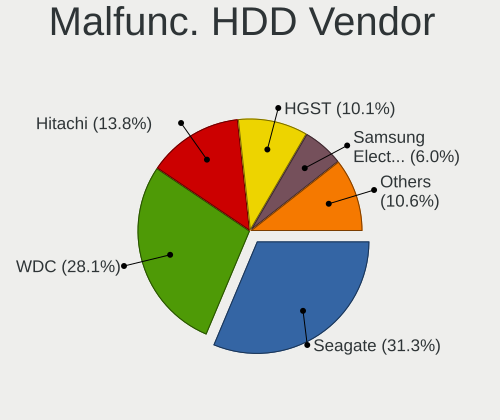

| Vendor              | Computers | Drives | Percent |
|---------------------|-----------|--------|---------|
| Seagate             | 68        | 84     | 31.34%  |
| WDC                 | 61        | 99     | 28.11%  |
| Hitachi             | 30        | 34     | 13.82%  |
| HGST                | 22        | 23     | 10.14%  |
| Samsung Electronics | 13        | 16     | 5.99%   |
| Toshiba             | 12        | 13     | 5.53%   |
| Maxtor              | 8         | 10     | 3.69%   |
| Fujitsu             | 3         | 3      | 1.38%   |

Malfunc. Drive Kind
-------------------

Kinds of faulty drives

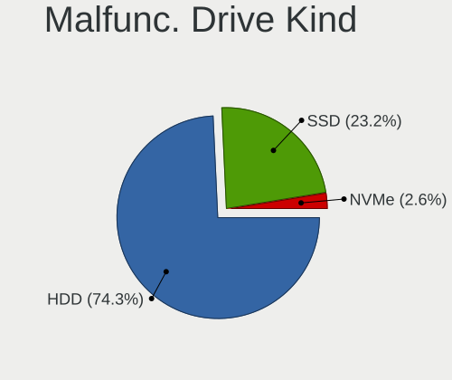

| Kind | Computers | Drives | Percent |
|------|-----------|--------|---------|
| HDD  | 202       | 282    | 74.26%  |
| SSD  | 63        | 77     | 23.16%  |
| NVMe | 7         | 8      | 2.57%   |

Failed Drives
-------------

Failed drive models

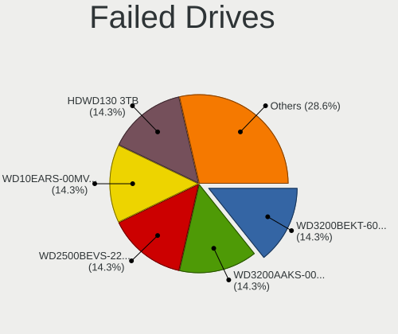

| Model                                               | Computers | Drives | Percent |
|-----------------------------------------------------|-----------|--------|---------|
| WDC WD3200BEKT-60KA9T0 320GB                        | 1         | 1      | 14.29%  |
| WDC WD3200AAKS-00VYA0 320GB                         | 1         | 1      | 14.29%  |
| WDC WD2500BEVS-22UST0 250GB                         | 1         | 2      | 14.29%  |
| WDC WD10EARS-00MVWB0 1TB                            | 1         | 1      | 14.29%  |
| Toshiba HDWD130 3TB                                 | 1         | 1      | 14.29%  |
| Seagate ST3160215A 160GB                            | 1         | 1      | 14.29%  |
| Micron Technology MTFDDAV256TBN-1AR15ABHA 256GB SSD | 1         | 1      | 14.29%  |

Failed Drive Vendor
-------------------

Failed drive vendors

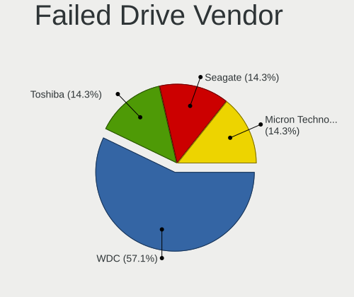

| Vendor            | Computers | Drives | Percent |
|-------------------|-----------|--------|---------|
| WDC               | 4         | 5      | 57.14%  |
| Toshiba           | 1         | 1      | 14.29%  |
| Seagate           | 1         | 1      | 14.29%  |
| Micron Technology | 1         | 1      | 14.29%  |

Drive Status
------------

Number of failed and malfunc. drives

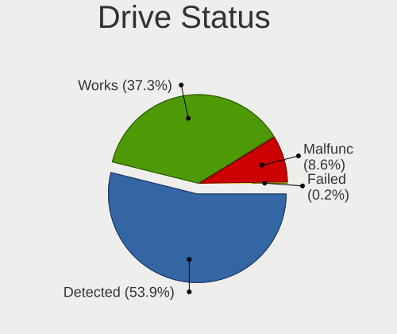

| Status   | Computers | Drives | Percent |
|----------|-----------|--------|---------|
| Detected | 1616      | 3034   | 53.87%  |
| Works    | 1120      | 1978   | 37.33%  |
| Malfunc  | 257       | 367    | 8.57%   |
| Failed   | 7         | 8      | 0.23%   |

Storage controller
------------------

Storage Vendor
--------------

Storage controller vendors

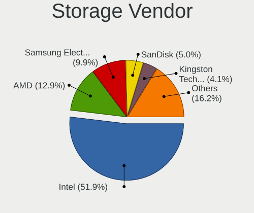

| Vendor                           | Computers | Percent |
|----------------------------------|-----------|---------|
| Intel                            | 1843      | 51.9%   |
| AMD                              | 457       | 12.87%  |
| Samsung Electronics              | 350       | 9.86%   |
| SanDisk                          | 179       | 5.04%   |
| Kingston Technology Company      | 145       | 4.08%   |
| SK hynix                         | 98        | 2.76%   |
| Micron Technology                | 78        | 2.2%    |
| Phison Electronics               | 42        | 1.18%   |
| ADATA Technology                 | 41        | 1.15%   |
| ASMedia Technology               | 40        | 1.13%   |
| KIOXIA                           | 30        | 0.84%   |
| Toshiba America Info Systems     | 29        | 0.82%   |
| JMicron Technology               | 25        | 0.7%    |
| Silicon Motion                   | 22        | 0.62%   |
| Marvell Technology Group         | 22        | 0.62%   |
| Nvidia                           | 21        | 0.59%   |
| Realtek Semiconductor            | 20        | 0.56%   |
| Micron/Crucial Technology        | 16        | 0.45%   |
| Solidigm                         | 11        | 0.31%   |
| Seagate Technology               | 9         | 0.25%   |
| Shenzhen Longsys Electronics     | 8         | 0.23%   |
| Lite-On Technology               | 8         | 0.23%   |
| VIA Technologies                 | 6         | 0.17%   |
| Silicon Integrated Systems [SiS] | 6         | 0.17%   |
| MAXIO Technology (Hangzhou)      | 6         | 0.17%   |
| Broadcom / LSI                   | 6         | 0.17%   |
| Silicon Image                    | 5         | 0.14%   |
| Apple                            | 5         | 0.14%   |
| LSI Logic / Symbios Logic        | 4         | 0.11%   |
| Union Memory (Shenzhen)          | 3         | 0.08%   |
| Solid State Storage Technology   | 3         | 0.08%   |
| Lenovo                           | 3         | 0.08%   |
| Integrated Technology Express    | 2         | 0.06%   |
| Hewlett-Packard                  | 2         | 0.06%   |
| Biwin Storage Technology         | 2         | 0.06%   |
| Yangtze Memory Technologies      | 1         | 0.03%   |
| Transcend                        | 1         | 0.03%   |
| Shenzhen Techwinsemi Technology  | 1         | 0.03%   |
| INNOGRIT                         | 1         | 0.03%   |

Storage Model
-------------

Storage controller models

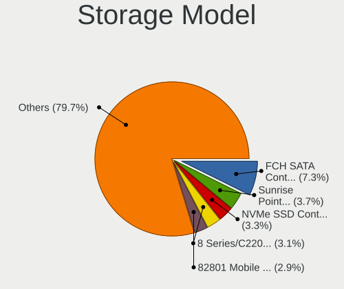

| Model                                                                          | Computers | Percent |
|--------------------------------------------------------------------------------|-----------|---------|
| AMD FCH SATA Controller [AHCI mode]                                            | 296       | 7.33%   |
| Intel Sunrise Point-LP SATA Controller [AHCI mode]                             | 150       | 3.71%   |
| Samsung NVMe SSD Controller SM981/PM981/PM983                                  | 132       | 3.27%   |
| Intel 8 Series/C220 Series Chipset Family 6-port SATA Controller 1 [AHCI mode] | 124       | 3.07%   |
| Intel 82801 Mobile SATA Controller [RAID mode]                                 | 117       | 2.9%    |
| Intel 7 Series Chipset Family 6-port SATA Controller [AHCI mode]               | 89        | 2.2%    |
| Intel Volume Management Device NVMe RAID Controller                            | 88        | 2.18%   |
| Intel Celeron/Pentium Silver Processor SATA Controller                         | 79        | 1.96%   |
| Samsung NVMe SSD Controller 980 (DRAM-less)                                    | 77        | 1.91%   |
| Intel 6 Series/C200 Series Chipset Family 6 port Mobile SATA AHCI Controller   | 71        | 1.76%   |
| Intel 8 Series SATA Controller 1 [AHCI mode]                                   | 68        | 1.68%   |
| Samsung NVMe SSD Controller PM9A1/PM9A3/980PRO                                 | 60        | 1.49%   |
| Intel Cannon Lake Mobile PCH SATA AHCI Controller                              | 59        | 1.46%   |
| Intel 200 Series PCH SATA controller [AHCI mode]                               | 53        | 1.31%   |
| Intel Q170/Q150/B150/H170/H110/Z170/CM236 Chipset SATA Controller [AHCI Mode]  | 52        | 1.29%   |
| AMD 400 Series Chipset SATA Controller                                         | 50        | 1.24%   |
| Intel Wildcat Point-LP SATA Controller [AHCI Mode]                             | 46        | 1.14%   |
| Intel HM170/QM170 Chipset SATA Controller [AHCI Mode]                          | 45        | 1.11%   |
| Intel Celeron N3350/Pentium N4200/Atom E3900 Series SATA AHCI Controller       | 45        | 1.11%   |
| SanDisk Ultra 3D / WD PC SN530, IX SN530, Blue SN550 NVMe SSD (DRAM-less)      | 39        | 0.97%   |
| Intel 82801IBM/IEM (ICH9M/ICH9M-E) 4 port SATA Controller [AHCI mode]          | 39        | 0.97%   |
| Intel 5 Series/3400 Series Chipset 6 port SATA AHCI Controller                 | 38        | 0.94%   |
| Samsung NVMe SSD Controller SM961/PM961/SM963                                  | 37        | 0.92%   |
| ASMedia ASM1061/ASM1062 Serial ATA Controller                                  | 37        | 0.92%   |
| AMD SB7x0/SB8x0/SB9x0 IDE Controller                                           | 37        | 0.92%   |
| AMD 600 Series Chipset SATA Controller                                         | 37        | 0.92%   |
| AMD 500 Series Chipset SATA Controller                                         | 37        | 0.92%   |
| SK hynix Gold P31/BC711/PC711 NVMe Solid State Drive                           | 36        | 0.89%   |
| Intel NM10/ICH7 Family SATA Controller [IDE mode]                              | 36        | 0.89%   |
| Intel Tiger Lake-LP SATA Controller                                            | 35        | 0.87%   |
| Intel SSD 660P Series                                                          | 34        | 0.84%   |
| Intel 82801G (ICH7 Family) IDE Controller                                      | 34        | 0.84%   |
| Intel 6 Series/C200 Series Chipset Family 6 port Desktop SATA AHCI Controller  | 34        | 0.84%   |
| Intel SATA Controller [RAID Mode]                                              | 33        | 0.82%   |
| AMD SB7x0/SB8x0/SB9x0 SATA Controller [AHCI mode]                              | 33        | 0.82%   |
| Kingston Company A2000 NVMe SSD [SM2263EN]                                     | 32        | 0.79%   |
| Intel Cannon Point-LP SATA Controller [AHCI Mode]                              | 32        | 0.79%   |
| Kingston Company NV2 NVMe SSD [SM2267XT] (DRAM-less)                           | 30        | 0.74%   |
| Intel 82801HM/HEM (ICH8M/ICH8M-E) IDE Controller                               | 30        | 0.74%   |
| Intel 5 Series/3400 Series Chipset 4 port SATA AHCI Controller                 | 29        | 0.72%   |

Storage Kind
------------

Kind of storage controller (IDE, SATA, NVMe, SAS, ...)

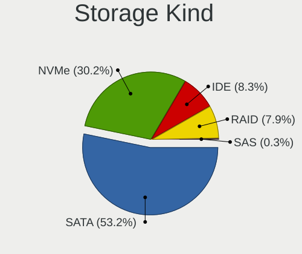

| Kind | Computers | Percent |
|------|-----------|---------|
| SATA | 1908      | 53.22%  |
| NVMe | 1084      | 30.24%  |
| IDE  | 298       | 8.31%   |
| RAID | 283       | 7.89%   |
| SAS  | 12        | 0.33%   |

Processor
---------

CPU Vendor
----------

Processor vendors

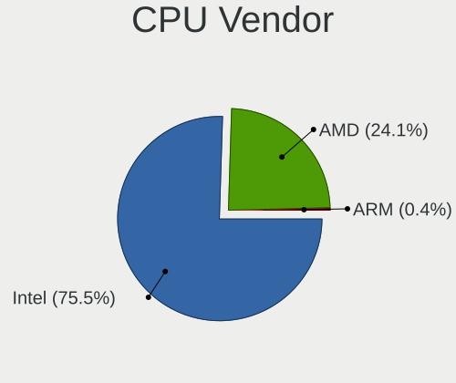

| Vendor | Computers | Percent |
|--------|-----------|---------|
| Intel  | 2052      | 75.5%   |
| AMD    | 655       | 24.1%   |
| ARM    | 11        | 0.4%    |

CPU Model
---------

Processor models

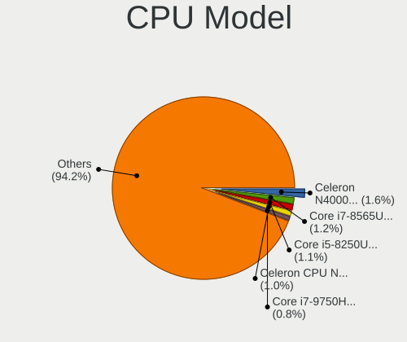

| Model                                         | Computers | Percent |
|-----------------------------------------------|-----------|---------|
| Intel Celeron N4000 CPU @ 1.10GHz             | 44        | 1.61%   |
| Intel Core i7-8565U CPU @ 1.80GHz             | 33        | 1.21%   |
| Intel Core i5-8250U CPU @ 1.60GHz             | 31        | 1.14%   |
| Intel Celeron CPU N3350 @ 1.10GHz             | 28        | 1.03%   |
| Intel Core i7-9750H CPU @ 2.60GHz             | 23        | 0.84%   |
| Intel Core i7-8550U CPU @ 1.80GHz             | 23        | 0.84%   |
| Intel 11th Gen Core i7-1165G7 @ 2.80GHz       | 23        | 0.84%   |
| AMD Ryzen 5 3500U with Radeon Vega Mobile Gfx | 23        | 0.84%   |
| Intel Core i7-6700HQ CPU @ 2.60GHz            | 22        | 0.81%   |
| Intel Core i5-7200U CPU @ 2.50GHz             | 21        | 0.77%   |
| Intel Core i7-8750H CPU @ 2.20GHz             | 20        | 0.73%   |
| Intel Core i5-8265U CPU @ 1.60GHz             | 20        | 0.73%   |
| Intel Core i7-7700HQ CPU @ 2.80GHz            | 19        | 0.7%    |
| Intel Core i3-8145U CPU @ 2.10GHz             | 19        | 0.7%    |
| Intel 11th Gen Core i3-1115G4 @ 3.00GHz       | 19        | 0.7%    |
| Intel 11th Gen Core i5-1135G7 @ 2.40GHz       | 18        | 0.66%   |
| Intel Core 2 Duo CPU E7400 @ 2.80GHz          | 17        | 0.62%   |
| Intel Core i5-5200U CPU @ 2.20GHz             | 16        | 0.59%   |
| Intel Core i3-4005U CPU @ 1.70GHz             | 16        | 0.59%   |
| Intel Core i3-7100U CPU @ 2.40GHz             | 15        | 0.55%   |
| Intel 12th Gen Core i5-1235U                  | 15        | 0.55%   |
| Intel Core i7-4510U CPU @ 2.00GHz             | 14        | 0.51%   |
| Intel Core i5-2400 CPU @ 3.10GHz              | 14        | 0.51%   |
| AMD Ryzen 7 4800H with Radeon Graphics        | 14        | 0.51%   |
| AMD Ryzen 5 3600 6-Core Processor             | 14        | 0.51%   |
| Intel Core i7-3770 CPU @ 3.40GHz              | 13        | 0.48%   |
| Intel Core i5-3470 CPU @ 3.20GHz              | 13        | 0.48%   |
| Intel Core i5-1035G1 CPU @ 1.00GHz            | 13        | 0.48%   |
| AMD Ryzen 7 5800H with Radeon Graphics        | 13        | 0.48%   |
| Intel Core i7-10750H CPU @ 2.60GHz            | 12        | 0.44%   |
| Intel Core i5-2520M CPU @ 2.50GHz             | 12        | 0.44%   |
| Intel Core i3-5005U CPU @ 2.00GHz             | 12        | 0.44%   |
| Intel Core 2 Duo CPU E8400 @ 3.00GHz          | 12        | 0.44%   |
| AMD Ryzen 7 8845HS w/ Radeon 780M Graphics    | 12        | 0.44%   |
| Intel Core i7-7500U CPU @ 2.70GHz             | 11        | 0.4%    |
| Intel Core i7-4770 CPU @ 3.40GHz              | 11        | 0.4%    |
| Intel Core i7-2670QM CPU @ 2.20GHz            | 11        | 0.4%    |
| Intel Core i7-1065G7 CPU @ 1.30GHz            | 11        | 0.4%    |
| Intel Core i5-7400 CPU @ 3.00GHz              | 11        | 0.4%    |
| Intel Core i5-6300U CPU @ 2.40GHz             | 11        | 0.4%    |

CPU Model Family
----------------

Processor model prefix

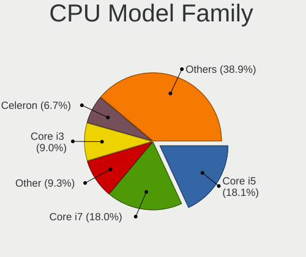

| Model                   | Computers | Percent |
|-------------------------|-----------|---------|
| Intel Core i5           | 492       | 18.08%  |
| Intel Core i7           | 490       | 18.01%  |
| Other                   | 253       | 9.3%    |
| Intel Core i3           | 245       | 9%      |
| Intel Celeron           | 183       | 6.73%   |
| AMD Ryzen 7             | 178       | 6.54%   |
| AMD Ryzen 5             | 167       | 6.14%   |
| Intel Core 2 Duo        | 114       | 4.19%   |
| Intel Pentium           | 68        | 2.5%    |
| AMD Ryzen 9             | 58        | 2.13%   |
| AMD Ryzen 3             | 44        | 1.62%   |
| Intel Xeon              | 43        | 1.58%   |
| Intel Atom              | 37        | 1.36%   |
| Intel Core i9           | 28        | 1.03%   |
| Intel Pentium Dual-Core | 25        | 0.92%   |
| AMD FX                  | 22        | 0.81%   |
| Intel Core              | 20        | 0.74%   |
| Intel Core 2 Quad       | 19        | 0.7%    |
| AMD A4                  | 19        | 0.7%    |
| AMD A8                  | 17        | 0.62%   |
| Intel Genuine           | 14        | 0.51%   |
| Intel Core 2            | 14        | 0.51%   |
| Intel Pentium Dual      | 11        | 0.4%    |
| AMD Ryzen 5 PRO         | 11        | 0.4%    |
| AMD Ryzen 7 PRO         | 9         | 0.33%   |
| AMD Phenom II X4        | 8         | 0.29%   |
| AMD Athlon              | 8         | 0.29%   |
| AMD Ryzen Threadripper  | 7         | 0.26%   |
| AMD E                   | 7         | 0.26%   |
| AMD A10                 | 7         | 0.26%   |
| Intel Pentium Silver    | 6         | 0.22%   |
| AMD A6                  | 6         | 0.22%   |
| AMD E2                  | 5         | 0.18%   |
| AMD Athlon II X4        | 5         | 0.18%   |
| Intel Celeron M         | 4         | 0.15%   |
| ARM BCM                 | 4         | 0.15%   |
| AMD Sempron             | 4         | 0.15%   |
| AMD E1                  | 4         | 0.15%   |
| AMD Athlon II X3        | 4         | 0.15%   |
| Intel Pentium D         | 3         | 0.11%   |

CPU Cores
---------

Number of processor cores

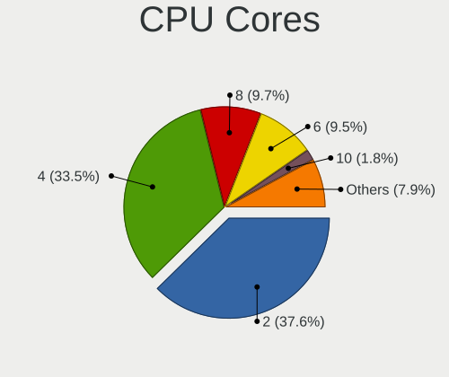

| Number  | Computers | Percent |
|---------|-----------|---------|
| 2       | 1025      | 37.64%  |
| 4       | 913       | 33.53%  |
| 8       | 265       | 9.73%   |
| 6       | 258       | 9.47%   |
| 10      | 48        | 1.76%   |
| 1       | 46        | 1.69%   |
| 12      | 45        | 1.65%   |
| 16      | 44        | 1.62%   |
| 14      | 33        | 1.21%   |
| 24      | 17        | 0.62%   |
| 3       | 11        | 0.4%    |
| 20      | 7         | 0.26%   |
| 32      | 4         | 0.15%   |
| Unknown | 3         | 0.11%   |
| 64      | 1         | 0.04%   |
| 36      | 1         | 0.04%   |
| 28      | 1         | 0.04%   |
| 18      | 1         | 0.04%   |

CPU Sockets
-----------

Number of sockets

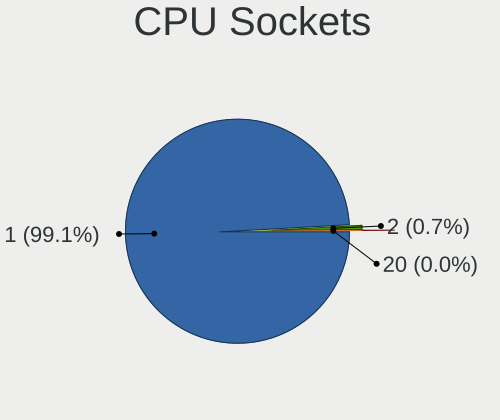

| Number  | Computers | Percent |
|---------|-----------|---------|
| 1       | 2696      | 99.12%  |
| 2       | 20        | 0.74%   |
| Unknown | 3         | 0.11%   |
| 20      | 1         | 0.04%   |

CPU Threads
-----------

Threads per core (Hyper-Threading)

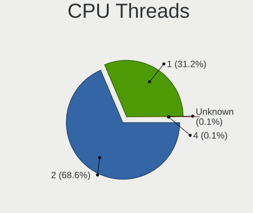

| Number  | Computers | Percent |
|---------|-----------|---------|
| 2       | 1869      | 68.61%  |
| 1       | 850       | 31.2%   |
| Unknown | 3         | 0.11%   |
| 4       | 2         | 0.07%   |

CPU Op-Modes
------------

CPU Operation Modes (32-bit, 64-bit)

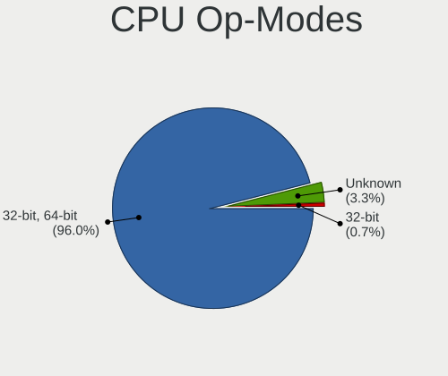

| Op mode        | Computers | Percent |
|----------------|-----------|---------|
| 32-bit, 64-bit | 2617      | 96%     |
| Unknown        | 91        | 3.34%   |
| 32-bit         | 18        | 0.66%   |

CPU Microcode
-------------

Microcode number

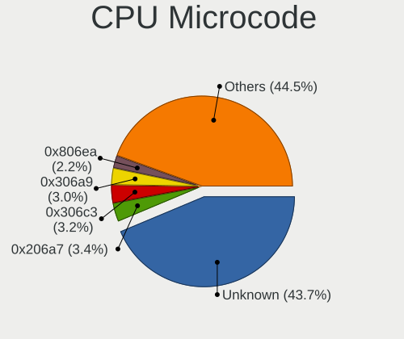

| Number     | Computers | Percent |
|------------|-----------|---------|
| Unknown    | 1235      | 43.69%  |
| 0x206a7    | 95        | 3.36%   |
| 0x306c3    | 91        | 3.22%   |
| 0x306a9    | 86        | 3.04%   |
| 0x806ea    | 63        | 2.23%   |
| 0x1067a    | 63        | 2.23%   |
| 0x806ec    | 62        | 2.19%   |
| 0x906ea    | 58        | 2.05%   |
| 0x706a1    | 51        | 1.8%    |
| 0x906e9    | 45        | 1.59%   |
| 0x40651    | 42        | 1.49%   |
| 0x506e3    | 36        | 1.27%   |
| 0x806c1    | 35        | 1.24%   |
| 0x506c9    | 35        | 1.24%   |
| 0x806e9    | 33        | 1.17%   |
| 0x20655    | 33        | 1.17%   |
| 0x306d4    | 30        | 1.06%   |
| 0x0a50000c | 27        | 0.96%   |
| 0x406e3    | 26        | 0.92%   |
| 0x10676    | 26        | 0.92%   |
| 0x08108109 | 25        | 0.88%   |
| 0x806eb    | 24        | 0.85%   |
| 0x6fd      | 21        | 0.74%   |
| 0x08600106 | 21        | 0.74%   |
| 0x010000c8 | 21        | 0.74%   |
| 0x706e5    | 19        | 0.67%   |
| 0x406c4    | 19        | 0.67%   |
| 0x08108102 | 19        | 0.67%   |
| 0x08701021 | 15        | 0.53%   |
| 0x08600104 | 15        | 0.53%   |
| 0xa0652    | 14        | 0.5%    |
| 0x0810100b | 13        | 0.46%   |
| 0x06001119 | 13        | 0.46%   |
| 0x906ed    | 12        | 0.42%   |
| 0x6fb      | 12        | 0.42%   |
| 0x406c3    | 12        | 0.42%   |
| 0x0800820d | 12        | 0.42%   |
| 0x706a8    | 11        | 0.39%   |
| 0x30678    | 11        | 0.39%   |
| 0x906a4    | 10        | 0.35%   |

CPU Microarch
-------------

Microarchitecture

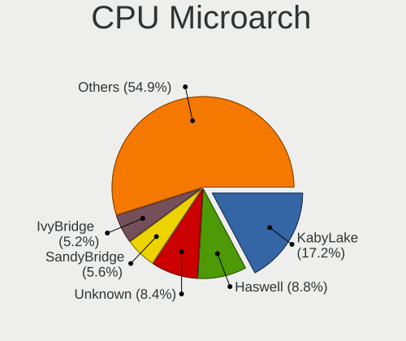

| Name              | Computers | Percent |
|-------------------|-----------|---------|
| KabyLake          | 469       | 17.19%  |
| Haswell           | 239       | 8.76%   |
| Unknown           | 228       | 8.36%   |
| SandyBridge       | 152       | 5.57%   |
| IvyBridge         | 141       | 5.17%   |
| Penryn            | 130       | 4.77%   |
| Skylake           | 123       | 4.51%   |
| Zen 2             | 107       | 3.92%   |
| Zen 3             | 103       | 3.78%   |
| Alderlake Hybrid  | 88        | 3.23%   |
| Zen+              | 87        | 3.19%   |
| Goldmont plus     | 80        | 2.93%   |
| Core              | 74        | 2.71%   |
| Silvermont        | 73        | 2.68%   |
| Westmere          | 70        | 2.57%   |
| TigerLake         | 70        | 2.57%   |
| Zen               | 58        | 2.13%   |
| CometLake         | 57        | 2.09%   |
| Broadwell         | 57        | 2.09%   |
| IceLake           | 47        | 1.72%   |
| Goldmont          | 45        | 1.65%   |
| Piledriver        | 39        | 1.43%   |
| K10               | 35        | 1.28%   |
| Excavator         | 23        | 0.84%   |
| P6                | 16        | 0.59%   |
| Nehalem           | 16        | 0.59%   |
| K8 Hammer         | 15        | 0.55%   |
| Bonnell           | 11        | 0.4%    |
| Bobcat            | 11        | 0.4%    |
| Puma              | 9         | 0.33%   |
| Meteorlake Hybrid | 9         | 0.33%   |
| Tremont           | 8         | 0.29%   |
| Steamroller       | 7         | 0.26%   |
| NetBurst          | 7         | 0.26%   |
| K8 & K10 hybrid   | 6         | 0.22%   |
| K10 Llano         | 5         | 0.18%   |
| Jaguar            | 5         | 0.18%   |
| Lunarlake Hybrid  | 4         | 0.15%   |
| Gracemont         | 2         | 0.07%   |
| Bulldozer         | 1         | 0.04%   |

Graphics
--------

GPU Vendor
----------

Vendors of graphics cards

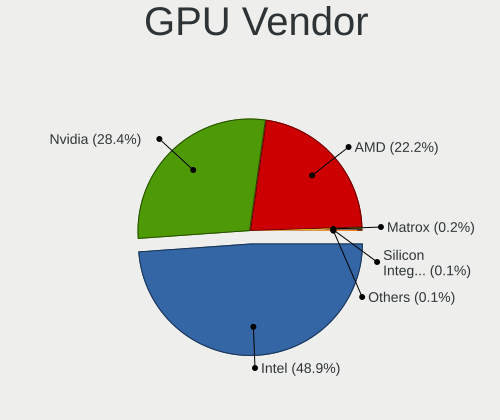

| Vendor                           | Computers | Percent |
|----------------------------------|-----------|---------|
| Intel                            | 1651      | 48.88%  |
| Nvidia                           | 959       | 28.39%  |
| AMD                              | 751       | 22.23%  |
| Matrox Electronics Systems       | 7         | 0.21%   |
| Silicon Integrated Systems [SiS] | 5         | 0.15%   |
| ASPEED Technology                | 4         | 0.12%   |
| VIA Technologies                 | 1         | 0.03%   |

GPU Model
---------

Graphics card models

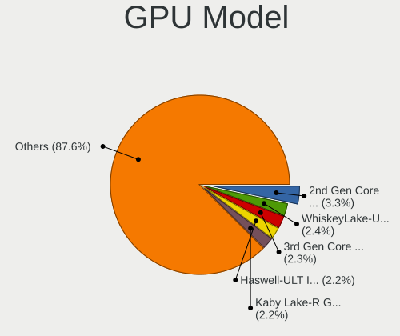

| Model                                                                                    | Computers | Percent |
|------------------------------------------------------------------------------------------|-----------|---------|
| Intel 2nd Generation Core Processor Family Integrated Graphics Controller                | 115       | 3.32%   |
| Intel WhiskeyLake-U GT2 [UHD Graphics 620]                                               | 82        | 2.37%   |
| Intel 3rd Gen Core processor Graphics Controller                                         | 80        | 2.31%   |
| Intel Haswell-ULT Integrated Graphics Controller                                         | 77        | 2.22%   |
| Intel Kaby Lake-R GT2 [UHD Graphics 620]                                                 | 76        | 2.2%    |
| Intel GeminiLake [UHD Graphics 600]                                                      | 76        | 2.2%    |
| Intel CoffeeLake-H GT2 [UHD Graphics 630]                                                | 65        | 1.88%   |
| AMD Picasso/Raven 2 [Radeon Vega Series / Radeon Vega Mobile Series]                     | 62        | 1.79%   |
| Intel Kaby Lake-U GT2 [HD Graphics 620]                                                  | 57        | 1.65%   |
| Intel 4th Gen Core Processor Integrated Graphics Controller                              | 55        | 1.59%   |
| AMD Renoir [Radeon Vega Series / Radeon Vega Mobile Series]                              | 55        | 1.59%   |
| Intel TigerLake-LP GT2 [Iris Xe Graphics]                                                | 51        | 1.47%   |
| AMD Ellesmere [Radeon RX 470/480/570/570X/580/580X/590]                                  | 49        | 1.42%   |
| Intel Xeon E3-1200 v3/4th Gen Core Processor Integrated Graphics Controller              | 48        | 1.39%   |
| Intel Core Processor Integrated Graphics Controller                                      | 48        | 1.39%   |
| AMD Cezanne [Radeon Vega Series / Radeon Vega Mobile Series]                             | 48        | 1.39%   |
| Intel Broadwell-U GT2 [HD Graphics 5500]                                                 | 46        | 1.33%   |
| Intel Atom/Celeron/Pentium Processor x5-E8000/J3xxx/N3xxx Integrated Graphics Controller | 42        | 1.21%   |
| Intel Skylake-U GT2 [HD Graphics 520]                                                    | 36        | 1.04%   |
| Intel 4 Series Chipset Integrated Graphics Controller                                    | 35        | 1.01%   |
| Intel Apollo Lake GT1 [HD Graphics 500]                                                  | 34        | 0.98%   |
| AMD Raven Ridge [Radeon Vega Series / Radeon Vega Mobile Series]                         | 33        | 0.95%   |
| Intel Mobile 4 Series Chipset Integrated Graphics Controller                             | 32        | 0.92%   |
| Intel CometLake-U GT2 [UHD Graphics]                                                     | 32        | 0.92%   |
| AMD Rembrandt [Radeon 680M]                                                              | 32        | 0.92%   |
| Nvidia TU117M [GeForce GTX 1650 Mobile / Max-Q]                                          | 31        | 0.9%    |
| Intel Atom Processor Z36xxx/Z37xxx Series Graphics & Display                             | 31        | 0.9%    |
| Nvidia GF117M [GeForce 610M/710M/810M/820M / GT 620M/625M/630M/720M]                     | 28        | 0.81%   |
| Intel Skylake-H GT2 [HD Graphics 530]                                                    | 28        | 0.81%   |
| Intel Skylake-S GT2 [HD Graphics 530]                                                    | 26        | 0.75%   |
| Intel Kaby Lake-S GT2 [HD Graphics 630]                                                  | 26        | 0.75%   |
| Intel TigerLake-H GT1 [UHD Graphics]                                                     | 25        | 0.72%   |
| Intel Kaby Lake-H GT2 [HD Graphics 630]                                                  | 25        | 0.72%   |
| Nvidia GK208B [GeForce GT 710]                                                           | 24        | 0.69%   |
| Nvidia GM107M [GeForce GTX 950M]                                                         | 22        | 0.64%   |
| Nvidia GA107M [GeForce RTX 3050 Mobile]                                                  | 22        | 0.64%   |
| Intel CometLake-H GT2 [UHD Graphics]                                                     | 22        | 0.64%   |
| Intel Mobile GM965/GL960 Integrated Graphics Controller (secondary)                      | 20        | 0.58%   |
| Intel Mobile GM965/GL960 Integrated Graphics Controller (primary)                        | 20        | 0.58%   |
| Intel Alder Lake-P GT2 [Iris Xe Graphics]                                                | 20        | 0.58%   |

GPU Combo
---------

Combinations of graphics cards

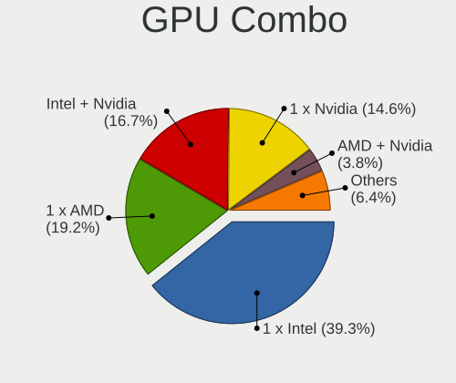

| Name           | Computers | Percent |
|----------------|-----------|---------|
| 1 x Intel      | 1073      | 39.26%  |
| 1 x AMD        | 525       | 19.21%  |
| Intel + Nvidia | 456       | 16.68%  |
| 1 x Nvidia     | 399       | 14.6%   |
| AMD + Nvidia   | 105       | 3.84%   |
| Intel + AMD    | 82        | 3%      |
| 2 x AMD        | 37        | 1.35%   |
| 2 x Intel      | 23        | 0.84%   |
| Other          | 12        | 0.44%   |
| 1 x Matrox     | 7         | 0.26%   |
| 1 x SiS        | 5         | 0.18%   |
| 2 x Nvidia     | 4         | 0.15%   |
| 1 x ASPEED     | 3         | 0.11%   |
| 1 x VIA        | 1         | 0.04%   |
| AMD + ASPEED   | 1         | 0.04%   |

GPU Driver
----------

Free vs proprietary

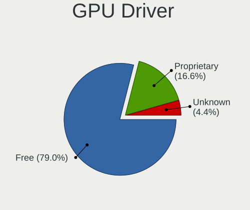

| Driver      | Computers | Percent |
|-------------|-----------|---------|
| Free        | 2181      | 78.99%  |
| Proprietary | 458       | 16.59%  |
| Unknown     | 122       | 4.42%   |

GPU Memory
----------

Total video memory

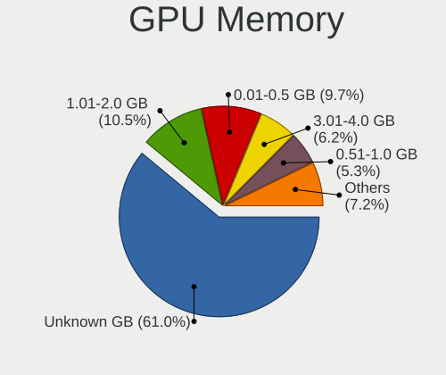

| Size in GB | Computers | Percent |
|------------|-----------|---------|
| Unknown    | 1716      | 61%     |
| 1.01-2.0   | 296       | 10.52%  |
| 0.01-0.5   | 274       | 9.74%   |
| 3.01-4.0   | 174       | 6.19%   |
| 0.51-1.0   | 150       | 5.33%   |
| 7.01-8.0   | 91        | 3.23%   |
| 5.01-6.0   | 58        | 2.06%   |
| 8.01-16.0  | 28        | 1%      |
| 2.01-3.0   | 15        | 0.53%   |
| 16.01-24.0 | 10        | 0.36%   |
| 0          | 1         | 0.04%   |

Monitor
-------

Monitor Vendor
--------------

Monitor vendors

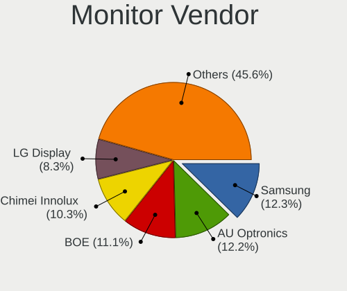

| Vendor                  | Computers | Percent |
|-------------------------|-----------|---------|
| Samsung Electronics     | 364       | 12.35%  |
| AU Optronics            | 361       | 12.25%  |
| BOE                     | 327       | 11.09%  |
| Chimei Innolux          | 305       | 10.35%  |
| LG Display              | 246       | 8.34%   |
| Dell                    | 230       | 7.8%    |
| Goldstar                | 147       | 4.99%   |
| Philips                 | 96        | 3.26%   |
| Lenovo                  | 78        | 2.65%   |
| PANDA                   | 65        | 2.2%    |
| BenQ                    | 62        | 2.1%    |
| AOC                     | 61        | 2.07%   |
| Hewlett-Packard         | 58        | 1.97%   |
| Acer                    | 52        | 1.76%   |
| Ancor Communications    | 46        | 1.56%   |
| Chi Mei Optoelectronics | 43        | 1.46%   |
| Sharp                   | 42        | 1.42%   |
| ASUSTek Computer        | 25        | 0.85%   |
| Apple                   | 25        | 0.85%   |
| Fujitsu Siemens         | 24        | 0.81%   |
| LG Philips              | 17        | 0.58%   |
| Unknown                 | 15        | 0.51%   |
| CSO                     | 15        | 0.51%   |
| Sony                    | 13        | 0.44%   |
| LG Electronics          | 12        | 0.41%   |
| Eizo                    | 12        | 0.41%   |
| ViewSonic               | 10        | 0.34%   |
| InfoVision              | 10        | 0.34%   |
| Iiyama                  | 9         | 0.31%   |
| Vestel Elektronik       | 8         | 0.27%   |
| Panasonic               | 8         | 0.27%   |
| KTC                     | 7         | 0.24%   |
| CPT                     | 7         | 0.24%   |
| Valve                   | 6         | 0.2%    |
| MSI                     | 6         | 0.2%    |
| Lenovo Group Limited    | 6         | 0.2%    |
| Toshiba                 | 5         | 0.17%   |
| NEC Computers           | 5         | 0.17%   |
| InnoLux Display         | 5         | 0.17%   |
| CSOT                    | 5         | 0.17%   |

Monitor Model
-------------

Monitor models

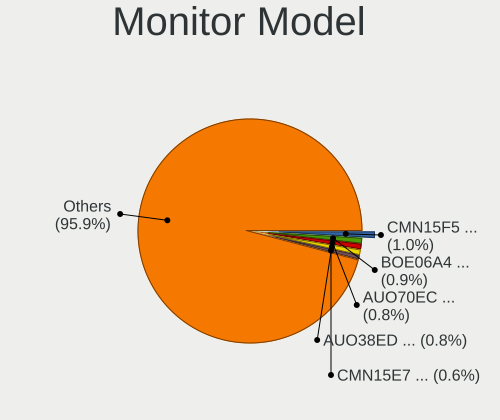

| Model                                                                    | Computers | Percent |
|--------------------------------------------------------------------------|-----------|---------|
| Chimei Innolux LCD Monitor CMN15F5 1920x1080 344x193mm 15.5-inch         | 29        | 0.96%   |
| BOE LCD Monitor BOE06A4 1366x768 344x194mm 15.5-inch                     | 26        | 0.86%   |
| AU Optronics LCD Monitor AUO70EC 1366x768 344x193mm 15.5-inch            | 25        | 0.82%   |
| AU Optronics LCD Monitor AUO38ED 1920x1080 344x193mm 15.5-inch           | 25        | 0.82%   |
| Chimei Innolux LCD Monitor CMN15E7 1920x1080 344x193mm 15.5-inch         | 19        | 0.63%   |
| Chimei Innolux LCD Monitor CMN14D4 1920x1080 309x173mm 13.9-inch         | 18        | 0.59%   |
| AU Optronics LCD Monitor AUO21ED 1920x1080 344x193mm 15.5-inch           | 18        | 0.59%   |
| BOE LCD Monitor BOE069C 1920x1080 344x193mm 15.5-inch                    | 17        | 0.56%   |
| Chimei Innolux LCD Monitor CMN1521 1920x1080 344x193mm 15.5-inch         | 16        | 0.53%   |
| Goldstar E2250 GSM578D 1920x1080 477x268mm 21.5-inch                     | 15        | 0.49%   |
| Samsung Electronics LCD Monitor SEC5441 1280x800 331x207mm 15.4-inch     | 13        | 0.43%   |
| Chimei Innolux LCD Monitor CMN15D5 1920x1080 344x193mm 15.5-inch         | 13        | 0.43%   |
| Samsung Electronics C24F390 SAM0D2C 1920x1080 521x293mm 23.5-inch        | 12        | 0.4%    |
| Goldstar LG ULTRAWIDE GSM59F1 2560x1080 670x280mm 28.6-inch              | 12        | 0.4%    |
| Chimei Innolux LCD Monitor CMN15DC 1366x768 344x193mm 15.5-inch          | 12        | 0.4%    |
| Chimei Innolux LCD Monitor CMN15DB 1366x768 344x193mm 15.5-inch          | 12        | 0.4%    |
| Chimei Innolux LCD Monitor CMN15CA 1366x768 344x193mm 15.5-inch          | 12        | 0.4%    |
| AU Optronics LCD Monitor AUO403D 1920x1080 309x174mm 14.0-inch           | 12        | 0.4%    |
| PANDA LCD Monitor NCP004D 1920x1080 344x194mm 15.5-inch                  | 11        | 0.36%   |
| PANDA LCD Monitor NCP0046 1920x1080 344x194mm 15.5-inch                  | 11        | 0.36%   |
| LG Display LCD Monitor LGD033A 1366x768 344x194mm 15.5-inch              | 11        | 0.36%   |
| Chimei Innolux LCD Monitor CMN15E8 1920x1080 344x193mm 15.5-inch         | 11        | 0.36%   |
| Chimei Innolux LCD Monitor CMN15C4 1920x1080 344x193mm 15.5-inch         | 11        | 0.36%   |
| BOE LCD Monitor BOE06A5 1366x768 344x194mm 15.5-inch                     | 11        | 0.36%   |
| LG Display LCD Monitor LGD046F 1920x1080 344x194mm 15.5-inch             | 10        | 0.33%   |
| Goldstar LG IPS FULLHD GSM5AB8 1920x1080 480x270mm 21.7-inch             | 10        | 0.33%   |
| AU Optronics LCD Monitor AUO45EC 1366x768 344x193mm 15.5-inch            | 10        | 0.33%   |
| Philips PHL 223V5 PHLC0CF 1920x1080 477x268mm 21.5-inch                  | 9         | 0.3%    |
| LG Display LCD Monitor LGD0563 1920x1080 344x194mm 15.5-inch             | 9         | 0.3%    |
| Dell P2417H DELA0DC 1920x1080 527x296mm 23.8-inch                        | 9         | 0.3%    |
| Chimei Innolux LCD Monitor CMN15E6 1366x768 344x193mm 15.5-inch          | 9         | 0.3%    |
| Vestel Elektronik 40UHD_LCD_TV VES3700 3840x2160 880x500mm 39.8-inch     | 8         | 0.26%   |
| LG Display LCD Monitor LGD02DC 1366x768 344x194mm 15.5-inch              | 8         | 0.26%   |
| Chi Mei Optoelectronics LCD Monitor CMO15A7 1366x768 344x193mm 15.5-inch | 8         | 0.26%   |
| AU Optronics LCD Monitor AUO41EC 1366x768 344x193mm 15.5-inch            | 8         | 0.26%   |
| AU Optronics LCD Monitor AUO22EC 1366x768 344x193mm 15.5-inch            | 8         | 0.26%   |
| AU Optronics LCD Monitor AUO20EC 1366x768 344x193mm 15.5-inch            | 8         | 0.26%   |
| Sharp LCD Monitor SHP13F8 3200x1800 346x194mm 15.6-inch                  | 7         | 0.23%   |
| Philips PHL 243V7 PHLC155 1920x1080 527x296mm 23.8-inch                  | 7         | 0.23%   |
| LG Display LCD Monitor LGD039F 1366x768 345x194mm 15.6-inch              | 7         | 0.23%   |

Monitor Resolution
------------------

Monitor screen resolution

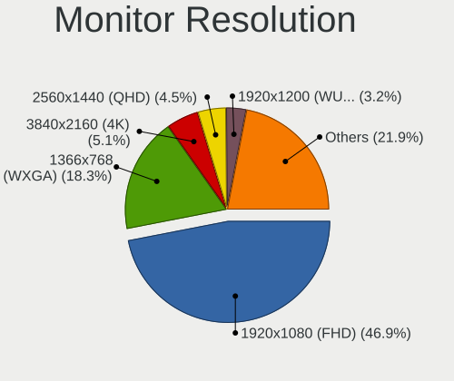

| Resolution         | Computers | Percent |
|--------------------|-----------|---------|
| 1920x1080 (FHD)    | 1320      | 46.94%  |
| 1366x768 (WXGA)    | 514       | 18.28%  |
| 3840x2160 (4K)     | 144       | 5.12%   |
| 2560x1440 (QHD)    | 127       | 4.52%   |
| 1920x1200 (WUXGA)  | 90        | 3.2%    |
| 1280x1024 (SXGA)   | 86        | 3.06%   |
| 1600x900 (HD+)     | 74        | 2.63%   |
| 1680x1050 (WSXGA+) | 66        | 2.35%   |
| 1280x800 (WXGA)    | 48        | 1.71%   |
| 2560x1600          | 44        | 1.56%   |
| 1440x900 (WXGA+)   | 38        | 1.35%   |
| 2880x1800          | 33        | 1.17%   |
| 2560x1080          | 26        | 0.92%   |
| Unknown            | 25        | 0.89%   |
| 3440x1440          | 24        | 0.85%   |
| 1360x768           | 17        | 0.6%    |
| 3200x1800 (QHD+)   | 12        | 0.43%   |
| 3840x1080          | 11        | 0.39%   |
| 3200x2000          | 11        | 0.39%   |
| 2160x1440          | 10        | 0.36%   |
| 800x1280           | 9         | 0.32%   |
| 1024x768 (XGA)     | 8         | 0.28%   |
| 1024x600           | 8         | 0.28%   |
| 2288x1287          | 6         | 0.21%   |
| 3840x2400          | 5         | 0.18%   |
| 1920x540           | 5         | 0.18%   |
| 1600x1200          | 4         | 0.14%   |
| 3840x1600          | 3         | 0.11%   |
| 2880x1920          | 3         | 0.11%   |
| 2880x1620          | 3         | 0.11%   |
| 1400x1050          | 3         | 0.11%   |
| 5760x2160          | 2         | 0.07%   |
| 5120x1440          | 2         | 0.07%   |
| 3456x2160          | 2         | 0.07%   |
| 2048x1280          | 2         | 0.07%   |
| 1280x720 (HD)      | 2         | 0.07%   |
| 800x600            | 1         | 0.04%   |
| 7680x2160          | 1         | 0.04%   |
| 7680x1440          | 1         | 0.04%   |
| 6400x1440          | 1         | 0.04%   |

Monitor Diagonal
----------------

Diagonal size in inches

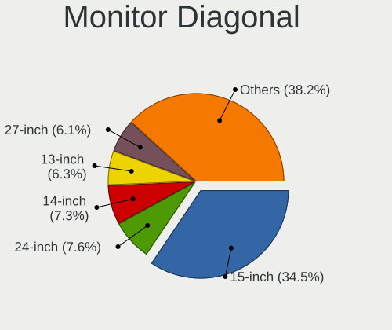

| Inches  | Computers | Percent |
|---------|-----------|---------|
| 15      | 1008      | 34.49%  |
| 24      | 222       | 7.59%   |
| 14      | 212       | 7.25%   |
| 13      | 185       | 6.33%   |
| 27      | 179       | 6.12%   |
| 21      | 159       | 5.44%   |
| 17      | 153       | 5.23%   |
| 23      | 150       | 5.13%   |
| Unknown | 87        | 2.98%   |
| 16      | 75        | 2.57%   |
| 19      | 67        | 2.29%   |
| 31      | 53        | 1.81%   |
| 22      | 51        | 1.74%   |
| 34      | 49        | 1.68%   |
| 18      | 45        | 1.54%   |
| 12      | 31        | 1.06%   |
| 84      | 27        | 0.92%   |
| 32      | 17        | 0.58%   |
| 20      | 17        | 0.58%   |
| 54      | 15        | 0.51%   |
| 11      | 14        | 0.48%   |
| 10      | 11        | 0.38%   |
| 65      | 8         | 0.27%   |
| 43      | 8         | 0.27%   |
| 26      | 8         | 0.27%   |
| 72      | 7         | 0.24%   |
| 142     | 6         | 0.21%   |
| 40      | 6         | 0.21%   |
| 7       | 6         | 0.21%   |
| 48      | 5         | 0.17%   |
| 46      | 5         | 0.17%   |
| 42      | 5         | 0.17%   |
| 63      | 4         | 0.14%   |
| 25      | 4         | 0.14%   |
| 37      | 3         | 0.1%    |
| 28      | 3         | 0.1%    |
| 3       | 3         | 0.1%    |
| 58      | 2         | 0.07%   |
| 52      | 2         | 0.07%   |
| 49      | 2         | 0.07%   |

Monitor Width
-------------

Physical width

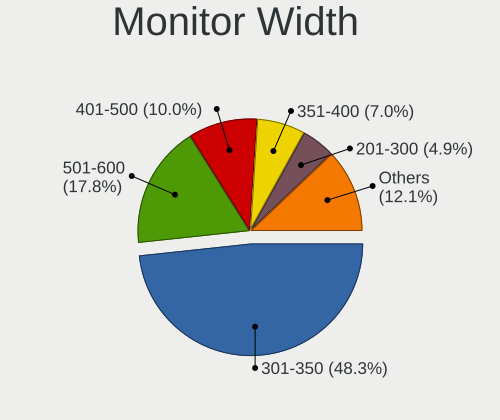

| Width in mm    | Computers | Percent |
|----------------|-----------|---------|
| 301-350        | 1395      | 48.3%   |
| 501-600        | 513       | 17.76%  |
| 401-500        | 288       | 9.97%   |
| 351-400        | 202       | 6.99%   |
| 201-300        | 141       | 4.88%   |
| Unknown        | 87        | 3.01%   |
| 601-700        | 75        | 2.6%    |
| 701-800        | 68        | 2.35%   |
| 1001-1500      | 45        | 1.56%   |
| 1501-2000      | 34        | 1.18%   |
| 901-1000       | 14        | 0.48%   |
| 801-900        | 9         | 0.31%   |
| 1-100          | 9         | 0.31%   |
| More than 2000 | 6         | 0.21%   |
| 101-200        | 2         | 0.07%   |

Aspect Ratio
------------

Proportional relationship between the width and the height

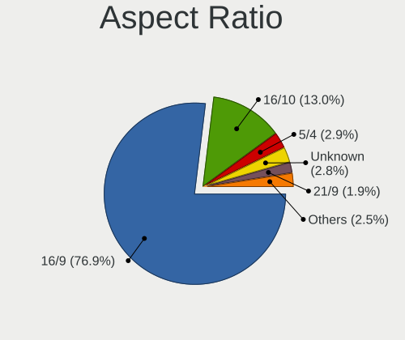

| Ratio   | Computers | Percent |
|---------|-----------|---------|
| 16/9    | 2067      | 76.93%  |
| 16/10   | 350       | 13.03%  |
| 5/4     | 77        | 2.87%   |
| Unknown | 74        | 2.75%   |
| 21/9    | 52        | 1.94%   |
| 3/2     | 20        | 0.74%   |
| 4/3     | 19        | 0.71%   |
| 6/5     | 8         | 0.3%    |
| 32/9    | 6         | 0.22%   |
| 1.00    | 6         | 0.22%   |
| 0.67    | 5         | 0.19%   |
| 0.56    | 2         | 0.07%   |
| 0.62    | 1         | 0.04%   |

Monitor Area
------------

Area in inch²

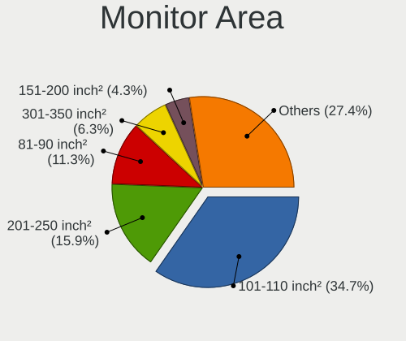

| Area in inch² | Computers | Percent |
|----------------|-----------|---------|
| 101-110        | 1010      | 34.7%   |
| 201-250        | 464       | 15.94%  |
| 81-90          | 328       | 11.27%  |
| 301-350        | 184       | 6.32%   |
| 151-200        | 126       | 4.33%   |
| 351-500        | 122       | 4.19%   |
| 121-130        | 114       | 3.92%   |
| Unknown        | 87        | 2.99%   |
| 251-300        | 84        | 2.89%   |
| More than 1000 | 74        | 2.54%   |
| 111-120        | 70        | 2.4%    |
| 71-80          | 64        | 2.2%    |
| 141-150        | 64        | 2.2%    |
| 501-1000       | 35        | 1.2%    |
| 61-70          | 29        | 1%      |
| 51-60          | 14        | 0.48%   |
| 131-140        | 14        | 0.48%   |
| 41-50          | 11        | 0.38%   |
| 1-40           | 11        | 0.38%   |
| 91-100         | 6         | 0.21%   |

Pixel Density
-------------

Pixels per inch

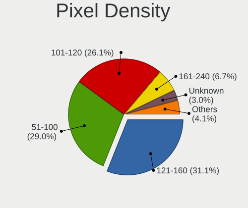

| Density       | Computers | Percent |
|---------------|-----------|---------|
| 121-160       | 890       | 31.05%  |
| 51-100        | 831       | 29%     |
| 101-120       | 749       | 26.13%  |
| 161-240       | 191       | 6.66%   |
| Unknown       | 87        | 3.04%   |
| More than 240 | 62        | 2.16%   |
| 1-50          | 56        | 1.95%   |

Multiple Monitors
-----------------

Total monitors connected

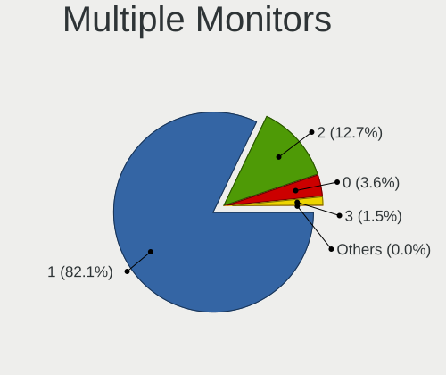

| Total | Computers | Percent |
|-------|-----------|---------|
| 1     | 2287      | 82.15%  |
| 2     | 354       | 12.72%  |
| 0     | 99        | 3.56%   |
| 3     | 41        | 1.47%   |
| 4     | 2         | 0.07%   |
| 5     | 1         | 0.04%   |

Network
-------

Net Controller Vendor
---------------------

Controller vendors

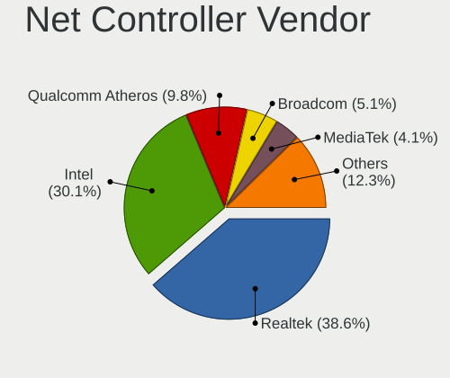

| Vendor                            | Computers | Percent |
|-----------------------------------|-----------|---------|
| Realtek Semiconductor             | 1560      | 38.6%   |
| Intel                             | 1216      | 30.09%  |
| Qualcomm Atheros                  | 398       | 9.85%   |
| Broadcom                          | 205       | 5.07%   |
| MediaTek                          | 164       | 4.06%   |
| TP-Link                           | 86        | 2.13%   |
| Broadcom Limited                  | 44        | 1.09%   |
| Ralink Technology                 | 35        | 0.87%   |
| Ralink                            | 28        | 0.69%   |
| Marvell Technology Group          | 27        | 0.67%   |
| Samsung Electronics               | 22        | 0.54%   |
| ASIX Electronics                  | 19        | 0.47%   |
| ASUSTek Computer                  | 17        | 0.42%   |
| Nvidia                            | 16        | 0.4%    |
| Xiaomi                            | 14        | 0.35%   |
| Shenzhen Goodix Technology        | 14        | 0.35%   |
| Huawei Technologies               | 14        | 0.35%   |
| Aquantia                          | 12        | 0.3%    |
| D-Link                            | 11        | 0.27%   |
| Ericsson Business Mobile Networks | 10        | 0.25%   |
| Sierra Wireless                   | 8         | 0.2%    |
| Qualcomm Atheros Communications   | 8         | 0.2%    |
| Hewlett-Packard                   | 8         | 0.2%    |
| Microsoft                         | 7         | 0.17%   |
| Google                            | 7         | 0.17%   |
| Lenovo                            | 6         | 0.15%   |
| DisplayLink                       | 6         | 0.15%   |
| ZTE WCDMA Technologies MSM        | 5         | 0.12%   |
| Silicon Integrated Systems [SiS]  | 5         | 0.12%   |
| Dell                              | 5         | 0.12%   |
| JMicron Technology                | 4         | 0.1%    |
| Edimax Technology                 | 4         | 0.1%    |
| VIA Technologies                  | 3         | 0.07%   |
| Qualcomm                          | 3         | 0.07%   |
| QinHeng Electronics               | 3         | 0.07%   |
| Microchip Technology              | 3         | 0.07%   |
| Mercucys                          | 3         | 0.07%   |
| Fibocom                           | 3         | 0.07%   |
| Tenda                             | 2         | 0.05%   |
| OPPO Electronics                  | 2         | 0.05%   |

Net Controller Model
--------------------

Controller models

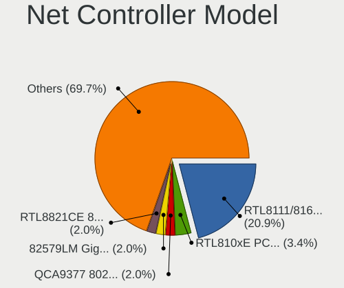

| Model                                                                  | Computers | Percent |
|------------------------------------------------------------------------|-----------|---------|
| Realtek RTL8111/8168/8211/8411 PCI Express Gigabit Ethernet Controller | 991       | 20.95%  |
| Realtek RTL810xE PCI Express Fast Ethernet controller                  | 161       | 3.4%    |
| Qualcomm Atheros QCA9377 802.11ac Wireless Network Adapter             | 96        | 2.03%   |
| Intel 82579LM Gigabit Network Connection (Lewisville)                  | 94        | 1.99%   |
| Realtek RTL8821CE 802.11ac PCIe Wireless Network Adapter               | 93        | 1.97%   |
| Realtek RTL8125 2.5GbE Controller                                      | 93        | 1.97%   |
| Intel Wi-Fi 6 AX200                                                    | 92        | 1.94%   |
| Intel Wireless 8265 / 8275                                             | 87        | 1.84%   |
| Realtek RTL8153 Gigabit Ethernet Adapter                               | 72        | 1.52%   |
| Realtek RTL8822BE 802.11a/b/g/n/ac WiFi adapter                        | 65        | 1.37%   |
| Qualcomm Atheros QCA9565 / AR9565 Wireless Network Adapter             | 63        | 1.33%   |
| Realtek RTL8723BE PCIe Wireless Network Adapter                        | 62        | 1.31%   |
| Realtek RTL8822CE 802.11ac PCIe Wireless Network Adapter               | 61        | 1.29%   |
| MediaTek MT7921 802.11ax PCIe Wireless Network Adapter [Filogic 330]   | 61        | 1.29%   |
| MediaTek MT7922 802.11ax PCI Express Wireless Network Adapter          | 56        | 1.18%   |
| Intel Cannon Lake PCH CNVi WiFi                                        | 54        | 1.14%   |
| Intel Wi-Fi 6 AX201                                                    | 51        | 1.08%   |
| Intel Cannon Point-LP CNVi [Wireless-AC]                               | 48        | 1.01%   |
| Intel Ethernet Connection I217-LM                                      | 47        | 0.99%   |
| Qualcomm Atheros AR9285 Wireless Network Adapter (PCI-Express)         | 44        | 0.93%   |
| Intel Wireless 7265                                                    | 44        | 0.93%   |
| Intel Wireless 7260                                                    | 43        | 0.91%   |
| Intel Wireless 8260                                                    | 40        | 0.85%   |
| Qualcomm Atheros AR9485 Wireless Network Adapter                       | 36        | 0.76%   |
| Intel I211 Gigabit Network Connection                                  | 36        | 0.76%   |
| Intel Centrino Advanced-N 6205 [Taylor Peak]                           | 32        | 0.68%   |
| Qualcomm Atheros QCA6174 802.11ac Wireless Network Adapter             | 30        | 0.63%   |
| Intel Wireless 3165                                                    | 30        | 0.63%   |
| Intel Ethernet Connection (2) I219-V                                   | 30        | 0.63%   |
| Intel 82567LM-3 Gigabit Network Connection                             | 30        | 0.63%   |
| Realtek RTL8852BE PCIe 802.11ax Wireless Network Controller            | 27        | 0.57%   |
| Intel Comet Lake PCH CNVi WiFi                                         | 27        | 0.57%   |
| Intel Wireless 3160                                                    | 26        | 0.55%   |
| Intel Dual Band Wireless-AC 3165 Plus Bluetooth                        | 26        | 0.55%   |
| Intel Alder Lake-P PCH CNVi WiFi                                       | 26        | 0.55%   |
| Qualcomm Atheros AR8151 v2.0 Gigabit Ethernet                          | 25        | 0.53%   |
| Intel Comet Lake PCH-LP CNVi WiFi                                      | 25        | 0.53%   |
| Broadcom BCM43142 802.11b/g/n                                          | 25        | 0.53%   |
| Broadcom BCM4313 802.11bgn Wireless Network Adapter                    | 23        | 0.49%   |
| MediaTek MT7902 802.11ax PCIe Wireless Network Adapter [Filogic 310]   | 21        | 0.44%   |

Wireless Vendor
---------------

Wireless vendors

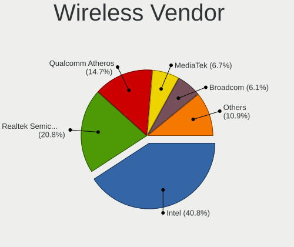

| Vendor                          | Computers | Percent |
|---------------------------------|-----------|---------|
| Intel                           | 896       | 40.82%  |
| Realtek Semiconductor           | 457       | 20.82%  |
| Qualcomm Atheros                | 322       | 14.67%  |
| MediaTek                        | 147       | 6.7%    |
| Broadcom                        | 134       | 6.1%    |
| TP-Link                         | 72        | 3.28%   |
| Ralink Technology               | 35        | 1.59%   |
| Ralink                          | 28        | 1.28%   |
| Broadcom Limited                | 25        | 1.14%   |
| ASUSTek Computer                | 16        | 0.73%   |
| D-Link                          | 11        | 0.5%    |
| Sierra Wireless                 | 8         | 0.36%   |
| Qualcomm Atheros Communications | 8         | 0.36%   |
| Microsoft                       | 6         | 0.27%   |
| Edimax Technology               | 4         | 0.18%   |
| Mercucys                        | 3         | 0.14%   |
| Fibocom                         | 3         | 0.14%   |
| Tenda                           | 2         | 0.09%   |
| Qualcomm                        | 2         | 0.09%   |
| IMC Networks                    | 2         | 0.09%   |
| Belkin Components               | 2         | 0.09%   |
| Accton Technology               | 2         | 0.09%   |
| Wacom                           | 1         | 0.05%   |
| Sitecom Europe                  | 1         | 0.05%   |
| Qcom                            | 1         | 0.05%   |
| NetGear                         | 1         | 0.05%   |
| Micro Star International        | 1         | 0.05%   |
| Linksys                         | 1         | 0.05%   |
| Hewlett-Packard                 | 1         | 0.05%   |
| Dell                            | 1         | 0.05%   |
| D-Link System                   | 1         | 0.05%   |
| Belkin                          | 1         | 0.05%   |

Wireless Model
--------------

Wireless models

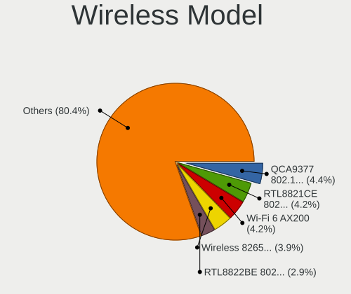

| Model                                                                | Computers | Percent |
|----------------------------------------------------------------------|-----------|---------|
| Qualcomm Atheros QCA9377 802.11ac Wireless Network Adapter           | 96        | 4.36%   |
| Realtek RTL8821CE 802.11ac PCIe Wireless Network Adapter             | 93        | 4.22%   |
| Intel Wi-Fi 6 AX200                                                  | 92        | 4.17%   |
| Intel Wireless 8265 / 8275                                           | 87        | 3.95%   |
| Realtek RTL8822BE 802.11a/b/g/n/ac WiFi adapter                      | 65        | 2.95%   |
| Qualcomm Atheros QCA9565 / AR9565 Wireless Network Adapter           | 63        | 2.86%   |
| Realtek RTL8723BE PCIe Wireless Network Adapter                      | 62        | 2.81%   |
| Realtek RTL8822CE 802.11ac PCIe Wireless Network Adapter             | 61        | 2.77%   |
| MediaTek MT7921 802.11ax PCIe Wireless Network Adapter [Filogic 330] | 61        | 2.77%   |
| Intel Cannon Lake PCH CNVi WiFi                                      | 54        | 2.45%   |
| Intel Wi-Fi 6 AX201                                                  | 51        | 2.31%   |
| Intel Cannon Point-LP CNVi [Wireless-AC]                             | 48        | 2.18%   |
| MediaTek MT7922 802.11ax PCI Express Wireless Network Adapter        | 47        | 2.13%   |
| Qualcomm Atheros AR9285 Wireless Network Adapter (PCI-Express)       | 44        | 2%      |
| Intel Wireless 7265                                                  | 44        | 2%      |
| Intel Wireless 7260                                                  | 43        | 1.95%   |
| Intel Wireless 8260                                                  | 40        | 1.81%   |
| Qualcomm Atheros AR9485 Wireless Network Adapter                     | 36        | 1.63%   |
| Intel Centrino Advanced-N 6205 [Taylor Peak]                         | 32        | 1.45%   |
| Qualcomm Atheros QCA6174 802.11ac Wireless Network Adapter           | 30        | 1.36%   |
| Intel Wireless 3165                                                  | 30        | 1.36%   |
| Intel Comet Lake PCH CNVi WiFi                                       | 27        | 1.23%   |
| Realtek RTL8852BE PCIe 802.11ax Wireless Network Controller          | 26        | 1.18%   |
| Intel Wireless 3160                                                  | 26        | 1.18%   |
| Intel Dual Band Wireless-AC 3165 Plus Bluetooth                      | 26        | 1.18%   |
| Intel Comet Lake PCH-LP CNVi WiFi                                    | 25        | 1.13%   |
| Broadcom BCM43142 802.11b/g/n                                        | 25        | 1.13%   |
| Broadcom BCM4313 802.11bgn Wireless Network Adapter                  | 23        | 1.04%   |
| MediaTek MT7902 802.11ax PCIe Wireless Network Adapter [Filogic 310] | 21        | 0.95%   |
| Intel Centrino Advanced-N 6200                                       | 18        | 0.82%   |
| Realtek RTL8723BU 802.11b/g/n WLAN Adapter                           | 17        | 0.77%   |
| Realtek RTL8188EUS 802.11n Wireless Network Adapter                  | 17        | 0.77%   |
| Intel PRO/Wireless 3945ABG [Golan] Network Connection                | 17        | 0.77%   |
| Intel Centrino Ultimate-N 6300                                       | 17        | 0.77%   |
| Ralink MT7601U Wireless Adapter                                      | 16        | 0.73%   |
| Intel Wi-Fi 6E(802.11ax) AX210/AX1675* 2x2 [Typhoon Peak]            | 16        | 0.73%   |
| Intel Wi-Fi 5(802.11ac) Wireless-AC 9x6x [Thunder Peak]              | 16        | 0.73%   |
| Intel Raptor Lake PCH CNVi WiFi                                      | 16        | 0.73%   |
| TP-Link Archer T2U PLUS [RTL8821AU]                                  | 15        | 0.68%   |
| Intel Tiger Lake PCH CNVi WiFi                                       | 15        | 0.68%   |

Ethernet Vendor
---------------

Ethernet vendors

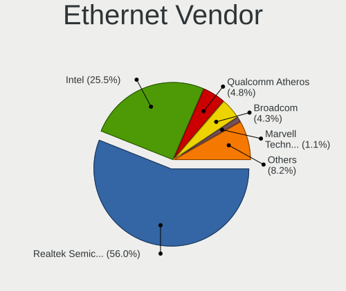

| Vendor                                 | Computers | Percent |
|----------------------------------------|-----------|---------|
| Realtek Semiconductor                  | 1348      | 56.03%  |
| Intel                                  | 613       | 25.48%  |
| Qualcomm Atheros                       | 116       | 4.82%   |
| Broadcom                               | 104       | 4.32%   |
| Marvell Technology Group               | 27        | 1.12%   |
| Samsung Electronics                    | 22        | 0.91%   |
| Broadcom Limited                       | 19        | 0.79%   |
| ASIX Electronics                       | 19        | 0.79%   |
| Nvidia                                 | 16        | 0.67%   |
| MediaTek                               | 16        | 0.67%   |
| Xiaomi                                 | 14        | 0.58%   |
| TP-Link                                | 14        | 0.58%   |
| Aquantia                               | 12        | 0.5%    |
| Huawei Technologies                    | 10        | 0.42%   |
| Google                                 | 7         | 0.29%   |
| Lenovo                                 | 6         | 0.25%   |
| DisplayLink                            | 6         | 0.25%   |
| Silicon Integrated Systems [SiS]       | 5         | 0.21%   |
| JMicron Technology                     | 4         | 0.17%   |
| VIA Technologies                       | 3         | 0.12%   |
| OPPO Electronics                       | 2         | 0.08%   |
| Motorola PCS                           | 2         | 0.08%   |
| Microchip Technology                   | 2         | 0.08%   |
| Giga-Byte Technology                   | 2         | 0.08%   |
| Apple                                  | 2         | 0.08%   |
| Suzhou Motorcomm Electronic Technology | 1         | 0.04%   |
| Spreadtrum Communications              | 1         | 0.04%   |
| Sony Ericsson Mobile Communications AB | 1         | 0.04%   |
| Raspberry Pi                           | 1         | 0.04%   |
| Qualcomm                               | 1         | 0.04%   |
| QNAP System                            | 1         | 0.04%   |
| QLogic                                 | 1         | 0.04%   |
| QinHeng Electronics                    | 1         | 0.04%   |
| Microsoft                              | 1         | 0.04%   |
| HMD Global                             | 1         | 0.04%   |
| Hewlett-Packard                        | 1         | 0.04%   |
| Dell                                   | 1         | 0.04%   |
| D-Link System                          | 1         | 0.04%   |
| ASUSTek Computer                       | 1         | 0.04%   |
| 3Com                                   | 1         | 0.04%   |

Ethernet Model
--------------

Ethernet models

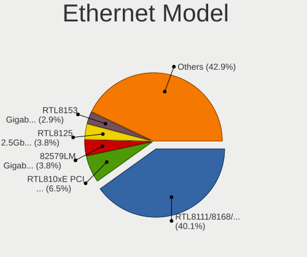

| Model                                                                  | Computers | Percent |
|------------------------------------------------------------------------|-----------|---------|
| Realtek RTL8111/8168/8211/8411 PCI Express Gigabit Ethernet Controller | 991       | 40.09%  |
| Realtek RTL810xE PCI Express Fast Ethernet controller                  | 161       | 6.51%   |
| Intel 82579LM Gigabit Network Connection (Lewisville)                  | 94        | 3.8%    |
| Realtek RTL8125 2.5GbE Controller                                      | 93        | 3.76%   |
| Realtek RTL8153 Gigabit Ethernet Adapter                               | 72        | 2.91%   |
| Intel Ethernet Connection I217-LM                                      | 47        | 1.9%    |
| Intel I211 Gigabit Network Connection                                  | 36        | 1.46%   |
| Intel Ethernet Connection (2) I219-V                                   | 30        | 1.21%   |
| Intel 82567LM-3 Gigabit Network Connection                             | 30        | 1.21%   |
| Qualcomm Atheros AR8151 v2.0 Gigabit Ethernet                          | 25        | 1.01%   |
| Intel Ethernet Connection (4) I219-LM                                  | 21        | 0.85%   |
| Intel 82577LM Gigabit Network Connection                               | 21        | 0.85%   |
| Intel Ethernet Controller I225-V                                       | 20        | 0.81%   |
| Intel Ethernet Connection I218-LM                                      | 19        | 0.77%   |
| Intel Ethernet Connection (7) I219-LM                                  | 18        | 0.73%   |
| Broadcom NetLink BCM57785 Gigabit Ethernet PCIe                        | 17        | 0.69%   |
| Samsung Galaxy series, misc. (tethering mode)                          | 16        | 0.65%   |
| ASIX AX88179 Gigabit Ethernet                                          | 16        | 0.65%   |
| Intel Ethernet Connection I217-V                                       | 15        | 0.61%   |
| Intel Ethernet Connection (7) I219-V                                   | 15        | 0.61%   |
| Intel Ethernet Connection (6) I219-V                                   | 15        | 0.61%   |
| Intel Ethernet Connection I219-LM                                      | 14        | 0.57%   |
| Intel Ethernet Connection (5) I219-LM                                  | 14        | 0.57%   |
| TP-Link UE300 10/100/1000 LAN (ethernet mode) [Realtek RTL8153]        | 13        | 0.53%   |
| Qualcomm Atheros QCA8172 Fast Ethernet                                 | 13        | 0.53%   |
| Intel Ethernet Connection (2) I219-LM                                  | 12        | 0.49%   |
| Intel 82579V Gigabit Network Connection                                | 12        | 0.49%   |
| Xiaomi Mi/Redmi series (RNDIS)                                         | 11        | 0.44%   |
| Realtek RTL-8100/8101L/8139 PCI Fast Ethernet Adapter                  | 11        | 0.44%   |
| Intel Ethernet Connection (3) I218-LM                                  | 11        | 0.44%   |
| Intel Alder Lake-P PCH CNVi WiFi                                       | 11        | 0.44%   |
| Realtek Killer E2600 GbE Controller                                    | 10        | 0.4%    |
| Qualcomm Atheros QCA8171 Gigabit Ethernet                              | 10        | 0.4%    |
| Qualcomm Atheros AR8161 Gigabit Ethernet                               | 10        | 0.4%    |
| Qualcomm Atheros AR8152 v2.0 Fast Ethernet                             | 10        | 0.4%    |
| Intel 82574L Gigabit Network Connection                                | 10        | 0.4%    |
| Intel 82566DM-2 Gigabit Network Connection                             | 10        | 0.4%    |
| Broadcom NetXtreme BCM57766 Gigabit Ethernet PCIe                      | 10        | 0.4%    |
| Qualcomm Atheros Killer E220x Gigabit Ethernet Controller              | 9         | 0.36%   |
| Nvidia MCP61 Ethernet                                                  | 9         | 0.36%   |

Net Controller Kind
-------------------

Ethernet, WiFi or modem

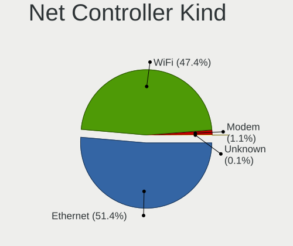

| Kind     | Computers | Percent |
|----------|-----------|---------|
| Ethernet | 2258      | 51.38%  |
| WiFi     | 2082      | 47.37%  |
| Modem    | 50        | 1.14%   |
| Unknown  | 5         | 0.11%   |

Used Controller
---------------

Currently used network controller

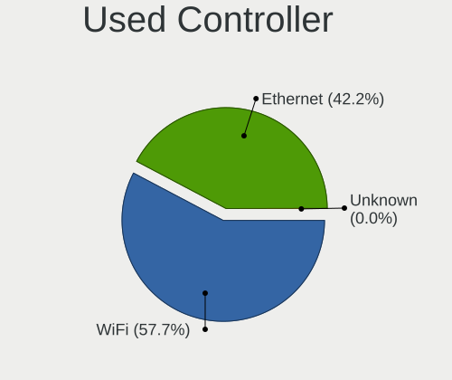

| Kind     | Computers | Percent |
|----------|-----------|---------|
| WiFi     | 1622      | 57.72%  |
| Ethernet | 1187      | 42.24%  |
| Unknown  | 1         | 0.04%   |

NICs
----

Total network controllers on board

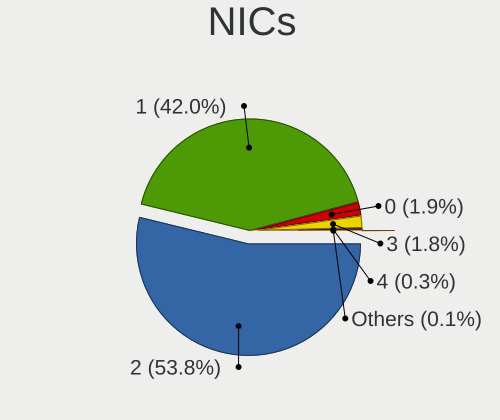

| Total | Computers | Percent |
|-------|-----------|---------|
| 2     | 1465      | 53.8%   |
| 1     | 1145      | 42.05%  |
| 0     | 53        | 1.95%   |
| 3     | 48        | 1.76%   |
| 4     | 9         | 0.33%   |
| 8     | 1         | 0.04%   |
| 6     | 1         | 0.04%   |
| 5     | 1         | 0.04%   |

IPv6
----

IPv6 vs IPv4

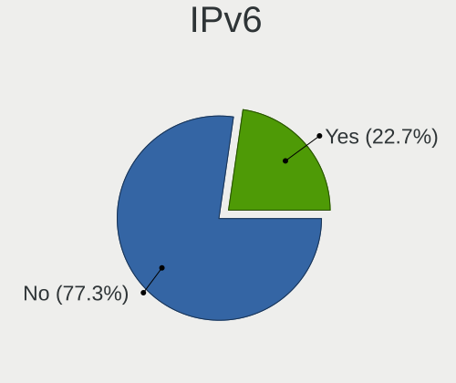

| Used | Computers | Percent |
|------|-----------|---------|
| No   | 2149      | 77.27%  |
| Yes  | 632       | 22.73%  |

Bluetooth
---------

Bluetooth Vendor
----------------

Controller vendors

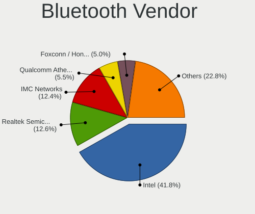

| Vendor                          | Computers | Percent |
|---------------------------------|-----------|---------|
| Intel                           | 751       | 41.82%  |
| Realtek Semiconductor           | 226       | 12.58%  |
| IMC Networks                    | 222       | 12.36%  |
| Qualcomm Atheros Communications | 98        | 5.46%   |
| Foxconn / Hon Hai               | 90        | 5.01%   |
| Lite-On Technology              | 85        | 4.73%   |
| Broadcom                        | 56        | 3.12%   |
| Cambridge Silicon Radio         | 51        | 2.84%   |
| ASUSTek Computer                | 51        | 2.84%   |
| Dell                            | 26        | 1.45%   |
| Apple                           | 26        | 1.45%   |
| MediaTek                        | 19        | 1.06%   |
| Hewlett-Packard                 | 19        | 1.06%   |
| Toshiba                         | 16        | 0.89%   |
| Ralink                          | 12        | 0.67%   |
| Realtek                         | 11        | 0.61%   |
| TP-Link                         | 9         | 0.5%    |
| Integrated System Solution      | 4         | 0.22%   |
| USI                             | 3         | 0.17%   |
| Alps Electric                   | 3         | 0.17%   |
| SINO WEALTH                     | 2         | 0.11%   |
| Micro Star International        | 2         | 0.11%   |
| Foxconn International           | 2         | 0.11%   |
| Chicony Electronics             | 2         | 0.11%   |
| Unknown                         | 2         | 0.11%   |
| Ralink Technology               | 1         | 0.06%   |
| Opticis                         | 1         | 0.06%   |
| Edimax Technology               | 1         | 0.06%   |
| Conwise Technology              | 1         | 0.06%   |
| Belkin Components               | 1         | 0.06%   |
| Askey Computer                  | 1         | 0.06%   |
| Actions                         | 1         | 0.06%   |
| Accel Semiconductor             | 1         | 0.06%   |

Bluetooth Model
---------------

Controller models

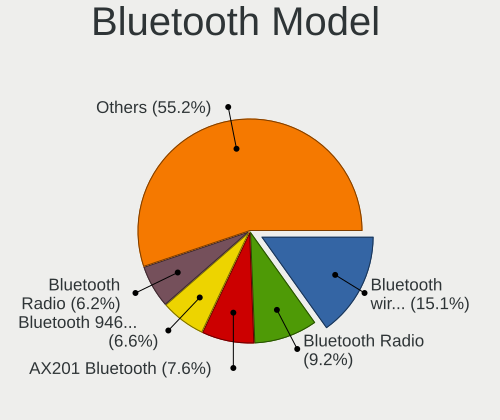

| Model                                               | Computers | Percent |
|-----------------------------------------------------|-----------|---------|
| Intel Bluetooth wireless interface                  | 272       | 15.14%  |
| Realtek Bluetooth Radio                             | 166       | 9.24%   |
| Intel AX201 Bluetooth                               | 137       | 7.63%   |
| Intel Bluetooth 9460/9560 Jefferson Peak (JfP)      | 118       | 6.57%   |
| IMC Networks Bluetooth Radio                        | 112       | 6.24%   |
| Intel AX200 Bluetooth                               | 90        | 5.01%   |
| Intel Bluetooth Device                              | 61        | 3.4%    |
| IMC Networks Wireless_Device                        | 61        | 3.4%    |
| Qualcomm Atheros  Bluetooth Device                  | 51        | 2.84%   |
| Cambridge Silicon Radio Bluetooth Dongle (HCI mode) | 51        | 2.84%   |
| Foxconn / Hon Hai Wireless_Device                   | 42        | 2.34%   |
| IMC Networks Bluetooth Device                       | 38        | 2.12%   |
| Realtek  Bluetooth 4.2 Adapter                      | 29        | 1.61%   |
| Lite-On Qualcomm Atheros QCA9377 Bluetooth          | 29        | 1.61%   |
| ASUS Broadcom BCM20702A0 Bluetooth                  | 24        | 1.34%   |
| ASUS ASUS USB-BT500                                 | 22        | 1.22%   |
| MediaTek Wireless_Device                            | 19        | 1.06%   |
| Lite-On Atheros AR3012 Bluetooth                    | 16        | 0.89%   |
| Intel Centrino Bluetooth Wireless Transceiver       | 16        | 0.89%   |
| Intel AX210 Bluetooth                               | 16        | 0.89%   |
| Realtek RTL8822BE Bluetooth 4.2 Adapter             | 15        | 0.84%   |
| Qualcomm Atheros QCA61x4 Bluetooth 4.0              | 15        | 0.84%   |
| Foxconn / Hon Hai MediaTek Bluetooth Adapter        | 15        | 0.84%   |
| Lite-On Bluetooth Device                            | 14        | 0.78%   |
| Intel Wireless-AC 9260 Bluetooth Adapter            | 14        | 0.78%   |
| Intel Centrino Advanced-N 6230 Bluetooth adapter    | 14        | 0.78%   |
| Lite-On Wireless_Device                             | 13        | 0.72%   |
| Dell DW375 Bluetooth Module                         | 13        | 0.72%   |
| Ralink RT3290 Bluetooth                             | 12        | 0.67%   |
| Qualcomm Atheros AR3011 Bluetooth                   | 12        | 0.67%   |
| Intel Wireless-AC 3168 Bluetooth                    | 12        | 0.67%   |
| Apple Bluetooth Host Controller                     | 12        | 0.67%   |
| Realtek Bluetooth Radio                             | 11        | 0.61%   |
| HP Broadcom 2070 Bluetooth Combo                    | 11        | 0.61%   |
| Foxconn / Hon Hai Bluetooth Device                  | 11        | 0.61%   |
| Qualcomm Atheros AR3012 Bluetooth 4.0               | 10        | 0.56%   |
| TP-Link TP-T@- UB500 Adapter                        | 9         | 0.5%    |
| HP Bluetooth 2.0 Interface [Broadcom BCM2045]       | 8         | 0.45%   |
| Toshiba Bluetooth Device                            | 7         | 0.39%   |
| Realtek RTL8723B Bluetooth                          | 7         | 0.39%   |

Sound
-----

Sound Vendor
------------

Sound card vendors

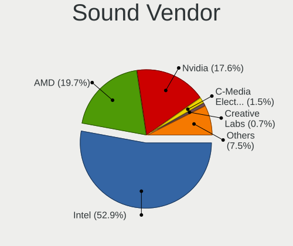

| Vendor                               | Computers | Percent |
|--------------------------------------|-----------|---------|
| Intel                                | 1988      | 52.9%   |
| AMD                                  | 742       | 19.74%  |
| Nvidia                               | 662       | 17.62%  |
| C-Media Electronics                  | 58        | 1.54%   |
| Creative Labs                        | 28        | 0.75%   |
| Logitech                             | 21        | 0.56%   |
| GN Netcom                            | 20        | 0.53%   |
| ASUSTek Computer                     | 16        | 0.43%   |
| Realtek Semiconductor                | 12        | 0.32%   |
| Kingston Technology                  | 12        | 0.32%   |
| Creative Technology                  | 12        | 0.32%   |
| Razer USA                            | 11        | 0.29%   |
| Hewlett-Packard                      | 11        | 0.29%   |
| Texas Instruments                    | 10        | 0.27%   |
| Plantronics                          | 9         | 0.24%   |
| Trust                                | 8         | 0.21%   |
| JMTek                                | 8         | 0.21%   |
| DSEA A/S                             | 8         | 0.21%   |
| Lenovo                               | 7         | 0.19%   |
| Giga-Byte Technology                 | 7         | 0.19%   |
| Generalplus Technology               | 7         | 0.19%   |
| Silicon Integrated Systems [SiS]     | 6         | 0.16%   |
| Tenx Technology                      | 5         | 0.13%   |
| Sony                                 | 5         | 0.13%   |
| Focusrite-Novation                   | 5         | 0.13%   |
| XMOS                                 | 4         | 0.11%   |
| VIA Technologies                     | 3         | 0.08%   |
| Thesycon Systemsoftware & Consulting | 3         | 0.08%   |
| SteelSeries ApS                      | 3         | 0.08%   |
| Dell                                 | 3         | 0.08%   |
| Corsair                              | 3         | 0.08%   |
| BEHRINGER International              | 3         | 0.08%   |
| ASRock                               | 3         | 0.08%   |
| Apple                                | 3         | 0.08%   |
| Samsung Electronics                  | 2         | 0.05%   |
| PreSonus Audio Electronics           | 2         | 0.05%   |
| Microsoft                            | 2         | 0.05%   |
| M-Audio                              | 2         | 0.05%   |
| KTMicro                              | 2         | 0.05%   |
| Jieli Technology                     | 2         | 0.05%   |

Sound Model
-----------

Sound card models

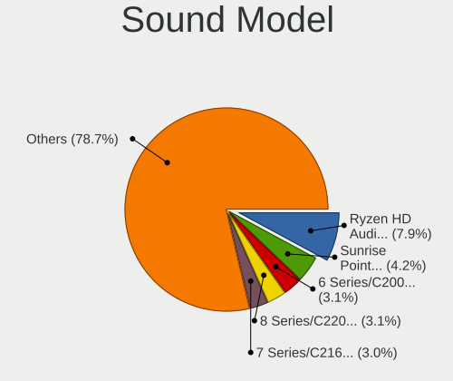

| Model                                                                      | Computers | Percent |
|----------------------------------------------------------------------------|-----------|---------|
| AMD Ryzen HD Audio Controller                                              | 354       | 7.87%   |
| Intel Sunrise Point-LP HD Audio                                            | 190       | 4.22%   |
| Intel 6 Series/C200 Series Chipset Family High Definition Audio Controller | 141       | 3.13%   |
| Intel 8 Series/C220 Series Chipset High Definition Audio Controller        | 139       | 3.09%   |
| Intel 7 Series/C216 Chipset Family High Definition Audio Controller        | 134       | 2.98%   |
| AMD Renoir/Cezanne HDMI/DP Audio Controller                                | 123       | 2.73%   |
| Intel Cannon Lake PCH cAVS                                                 | 107       | 2.38%   |
| Intel Xeon E3-1200 v3/4th Gen Core Processor HD Audio Controller           | 106       | 2.36%   |
| AMD Radeon High Definition Audio Controller                                | 101       | 2.24%   |
| Intel Cannon Point-LP High Definition Audio Controller                     | 94        | 2.09%   |
| AMD Raven/Raven2/Fenghuang HDMI/DP Audio Controller                        | 86        | 1.91%   |
| Intel Celeron/Pentium Silver Processor High Definition Audio               | 79        | 1.76%   |
| Intel 100 Series/C230 Series Chipset Family HD Audio Controller            | 78        | 1.73%   |
| Intel Haswell-ULT HD Audio Controller                                      | 77        | 1.71%   |
| Intel 5 Series/3400 Series Chipset High Definition Audio                   | 77        | 1.71%   |
| Intel 8 Series HD Audio Controller                                         | 76        | 1.69%   |
| AMD Starship/Matisse HD Audio Controller                                   | 72        | 1.6%    |
| Intel Tiger Lake-LP Smart Sound Technology Audio Controller                | 70        | 1.56%   |
| Intel 82801I (ICH9 Family) HD Audio Controller                             | 69        | 1.53%   |
| Intel NM10/ICH7 Family High Definition Audio Controller                    | 63        | 1.4%    |
| AMD SBx00 Azalia (Intel HDA)                                               | 60        | 1.33%   |
| Intel 200 Series PCH HD Audio                                              | 54        | 1.2%    |
| Intel Alder Lake PCH-P High Definition Audio Controller                    | 53        | 1.18%   |
| AMD Ellesmere HDMI Audio [Radeon RX 470/480 / 570/580/590]                 | 53        | 1.18%   |
| AMD FCH Azalia Controller                                                  | 52        | 1.16%   |
| Intel Wildcat Point-LP High Definition Audio Controller                    | 51        | 1.13%   |
| Intel Broadwell-U Audio Controller                                         | 51        | 1.13%   |
| Nvidia GK208 HDMI/DP Audio Controller                                      | 49        | 1.09%   |
| Nvidia TU107 GeForce GTX 1650 High Definition Audio Controller             | 45        | 1%      |
| Intel Celeron N3350/Pentium N4200/Atom E3900 Series Audio Cluster          | 45        | 1%      |
| Nvidia GF108 High Definition Audio Controller                              | 44        | 0.98%   |
| AMD Family 17h (Models 00h-0fh) HD Audio Controller                        | 43        | 0.96%   |
| Nvidia GP107GL High Definition Audio Controller                            | 42        | 0.93%   |
| Intel 82801H (ICH8 Family) HD Audio Controller                             | 42        | 0.93%   |
| Nvidia TU116 High Definition Audio Controller                              | 40        | 0.89%   |
| Intel Comet Lake PCH cAVS                                                  | 37        | 0.82%   |
| Intel Comet Lake PCH-LP cAVS                                               | 35        | 0.78%   |
| AMD Navi 21/23 HDMI/DP Audio Controller                                    | 35        | 0.78%   |
| Nvidia GP106 High Definition Audio Controller                              | 33        | 0.73%   |
| Intel Tiger Lake-H HD Audio Controller                                     | 33        | 0.73%   |

Memory
------

Memory Vendor
-------------

Memory module vendors

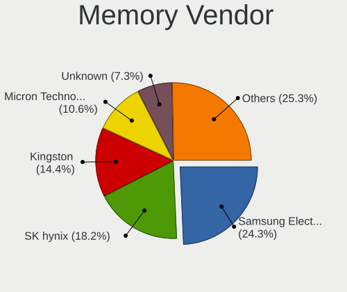

| Vendor                       | Computers | Percent |
|------------------------------|-----------|---------|
| Samsung Electronics          | 411       | 24.29%  |
| SK hynix                     | 308       | 18.2%   |
| Kingston                     | 243       | 14.36%  |
| Micron Technology            | 179       | 10.58%  |
| Unknown                      | 123       | 7.27%   |
| Corsair                      | 119       | 7.03%   |
| Crucial                      | 53        | 3.13%   |
| A-DATA Technology            | 40        | 2.36%   |
| Ramaxel Technology           | 36        | 2.13%   |
| Elpida                       | 25        | 1.48%   |
| G.Skill                      | 24        | 1.42%   |
| Nanya Technology             | 23        | 1.36%   |
| Unknown (ABCD)               | 16        | 0.95%   |
| Unknown                      | 16        | 0.95%   |
| Kingmax                      | 14        | 0.83%   |
| Patriot                      | 9         | 0.53%   |
| GOODRAM                      | 7         | 0.41%   |
| Apacer                       | 5         | 0.3%    |
| Transcend                    | 3         | 0.18%   |
| Team                         | 3         | 0.18%   |
| Qimonda                      | 3         | 0.18%   |
| Kingmax Semiconductor        | 3         | 0.18%   |
| Silicon Power                | 2         | 0.12%   |
| S                            | 2         | 0.12%   |
| Patriot Memory (PDP Systems) | 2         | 0.12%   |
| H                            | 2         | 0.12%   |
| Golden Empire                | 2         | 0.12%   |
| Avant                        | 2         | 0.12%   |
| Unknown (7F7F7F94FFFFFFFF)   | 1         | 0.06%   |
| Unknown (0x9801)             | 1         | 0.06%   |
| Unknown (0x7FDA000000000000) | 1         | 0.06%   |
| Unknown (0B45)               | 1         | 0.06%   |
| Toshiba                      | 1         | 0.06%   |
| TakeMS                       | 1         | 0.06%   |
| SK_Hynix                     | 1         | 0.06%   |
| SHARETRONIC                  | 1         | 0.06%   |
| PNY                          | 1         | 0.06%   |
| Lexar                        | 1         | 0.06%   |
| KingFast                     | 1         | 0.06%   |
| Infineon                     | 1         | 0.06%   |

Memory Model
------------

Memory module models

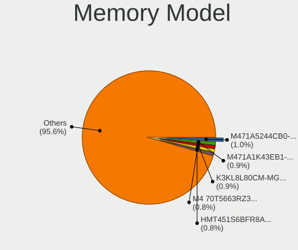

| Model                                                            | Computers | Percent |
|------------------------------------------------------------------|-----------|---------|
| Samsung RAM M471A5244CB0-CTD 4GB SODIMM DDR4 3266MT/s            | 18        | 0.98%   |
| Samsung RAM M471A1K43EB1-CWE 8GB SODIMM DDR4 3200MT/s            | 17        | 0.93%   |
| Unknown                                                          | 16        | 0.87%   |
| SK hynix RAM HMT451S6BFR8A-PB 4GB SODIMM DDR3 1600MT/s           | 15        | 0.82%   |
| Samsung RAM M4 70T5663RZ3-CE6 2GB SODIMM DDR 667MT/s             | 15        | 0.82%   |
| Samsung RAM M471A1K43DB1-CWE 8GB SODIMM DDR4 3200MT/s            | 14        | 0.76%   |
| Samsung RAM M471A1G44AB0-CWE 8GiB SODIMM DDR4 3200MT/s           | 14        | 0.76%   |
| Unknown (ABCD) RAM 123456789012345678 2GB SODIMM LPDDR4 2400MT/s | 13        | 0.71%   |
| SK hynix RAM HMT41GS6AFR8A-PB 8GiB SODIMM DDR3 2667MT/s          | 13        | 0.71%   |
| SK hynix RAM HMAA1GS6CJR6N-XN 8GB SODIMM DDR4 3200MT/s           | 13        | 0.71%   |
| Samsung RAM M471A5244CB0-CRC 4GB SODIMM DDR4 2667MT/s            | 13        | 0.71%   |
| Samsung RAM M471A1K43DB1-CTD 8GB SODIMM DDR4 2667MT/s            | 13        | 0.71%   |
| SK hynix RAM HMT41GS6BFR8A-PB 8GB SODIMM DDR3 2667MT/s           | 11        | 0.6%    |
| SK hynix RAM HMA81GS6AFR8N-UH 8GB SODIMM DDR4 2667MT/s           | 11        | 0.6%    |
| Samsung RAM M471B5173QH0-YK0 4GB SODIMM DDR3 1600MT/s            | 11        | 0.6%    |
| Samsung RAM M471B5173EB0-YK0 4GB SODIMM DDR3 1600MT/s            | 11        | 0.6%    |
| Samsung RAM M471A5244CB0-CWE 4GB SODIMM DDR4 3200MT/s            | 11        | 0.6%    |
| Samsung RAM M471B1G73EB0-YK0 8192MB SODIMM DDR3 1600MT/s         | 10        | 0.55%   |
| Micron RAM 4ATF1G64HZ-3G2F1 8GB SODIMM DDR4 3200MT/s             | 10        | 0.55%   |
| Kingston RAM KHX1600C9D3/4GX 4GB DIMM DDR3 1867MT/s              | 10        | 0.55%   |
| SK hynix RAM HMA81GS6CJR8N-VK 8GB SODIMM DDR4 2667MT/s           | 9         | 0.49%   |
| Samsung RAM M471B1G73QH0-YK0 8GB SODIMM DDR3 1600MT/s            | 9         | 0.49%   |
| SK hynix RAM HMA81GS6JJR8N-VK 8GB SODIMM DDR4 2667MT/s           | 8         | 0.44%   |
| Samsung RAM M471A1K43CB1-CTD 8GB SODIMM DDR4 3200MT/s            | 8         | 0.44%   |
| Samsung RAM M471A1G44BB0-CWE 8GB SODIMM DDR4 3200MT/s            | 8         | 0.44%   |
| Samsung RAM M471B5273DH0-CH9 4GB SODIMM DDR3 1600MT/s            | 7         | 0.38%   |
| Samsung RAM M471B1G73DB0-YK0 8GB SODIMM DDR3 1600MT/s            | 7         | 0.38%   |
| Micron RAM 4ATF51264HZ-3G2J1 4GB SODIMM DDR4 3200MT/s            | 7         | 0.38%   |
| Micron RAM 4ATF1G64HZ-3G2E1 8GB SODIMM DDR4 3200MT/s             | 7         | 0.38%   |
| Unknown RAM Module 2048MB DIMM 800MT/s                           | 6         | 0.33%   |
| SK hynix RAM HMA81GS6DJR8N-XN 8GB SODIMM DDR4 3200MT/s           | 6         | 0.33%   |
| Samsung RAM M471B5173DB0-YK0 4GB SODIMM DDR3 1600MT/s            | 6         | 0.33%   |
| Samsung RAM M471A1K43CB1-CRC 8GB SODIMM DDR4 8400MT/s            | 6         | 0.33%   |
| Samsung RAM M471A1K43BB1-CRC 8GB SODIMM DDR4 2667MT/s            | 6         | 0.33%   |
| Samsung RAM M425R1GB4BB0-CQKOL 8GB SODIMM DDR5 4800MT/s          | 6         | 0.33%   |
| Samsung RAM M378B5173QH0-CK0 4GB DIMM DDR3                       | 6         | 0.33%   |
| Kingston RAM KHX3200C16D4/8GX 8GB DIMM DDR4 3733MT/s             | 6         | 0.33%   |
| Kingston RAM KHX2133C14/8G 8GB DIMM DDR4 2666MT/s                | 6         | 0.33%   |
| Unknown RAM Module 2048MB DIMM SDRAM                             | 5         | 0.27%   |
| SK hynix RAM HMT351S6EFR8A-PB 4GB SODIMM DDR3 1600MT/s           | 5         | 0.27%   |

Memory Kind
-----------

Memory module kinds

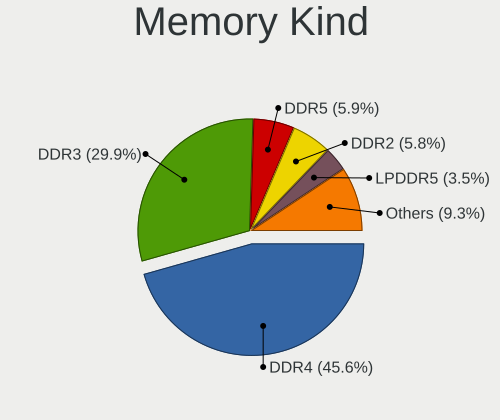

| Kind    | Computers | Percent |
|---------|-----------|---------|
| DDR4    | 655       | 45.61%  |
| DDR3    | 429       | 29.87%  |
| DDR5    | 85        | 5.92%   |
| DDR2    | 83        | 5.78%   |
| LPDDR5  | 50        | 3.48%   |
| LPDDR4  | 38        | 2.65%   |
| SDRAM   | 36        | 2.51%   |
| Unknown | 31        | 2.16%   |
| LPDDR3  | 22        | 1.53%   |
| DDR     | 4         | 0.28%   |
| DRAM    | 3         | 0.21%   |

Memory Form Factor
------------------

Physical design of the memory module

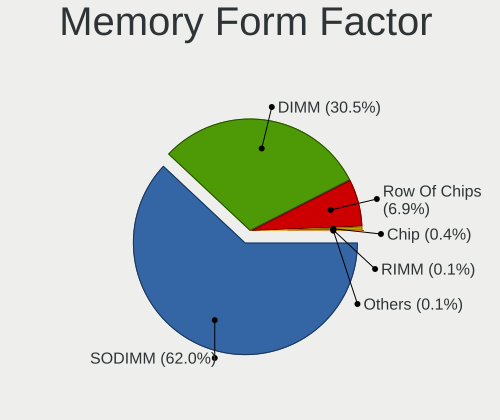

| Name         | Computers | Percent |
|--------------|-----------|---------|
| SODIMM       | 884       | 61.99%  |
| DIMM         | 435       | 30.5%   |
| Row Of Chips | 98        | 6.87%   |
| Chip         | 6         | 0.42%   |
| RIMM         | 1         | 0.07%   |
| FB-DIMM      | 1         | 0.07%   |
| Unknown      | 1         | 0.07%   |

Memory Size
-----------

Memory module size

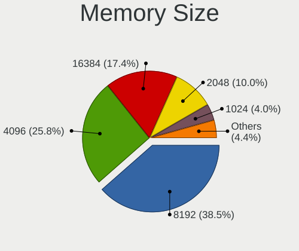

| Size  | Computers | Percent |
|-------|-----------|---------|
| 8192  | 602       | 38.52%  |
| 4096  | 403       | 25.78%  |
| 16384 | 272       | 17.4%   |
| 2048  | 156       | 9.98%   |
| 1024  | 62        | 3.97%   |
| 32768 | 58        | 3.71%   |
| 512   | 6         | 0.38%   |
| 24576 | 1         | 0.06%   |
| 12288 | 1         | 0.06%   |
| 6144  | 1         | 0.06%   |
| 3072  | 1         | 0.06%   |

Memory Speed
------------

Memory module speed

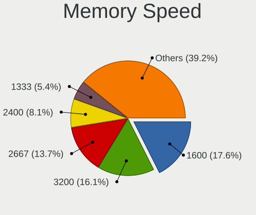

| Speed   | Computers | Percent |
|---------|-----------|---------|
| 1600    | 279       | 17.57%  |
| 3200    | 256       | 16.12%  |
| 2667    | 218       | 13.73%  |
| 2400    | 128       | 8.06%   |
| 1333    | 85        | 5.35%   |
| 2133    | 57        | 3.59%   |
| 667     | 49        | 3.09%   |
| 1334    | 41        | 2.58%   |
| 3600    | 35        | 2.2%    |
| 800     | 35        | 2.2%    |
| 4800    | 32        | 2.02%   |
| 5600    | 31        | 1.95%   |
| Unknown | 27        | 1.7%    |
| 6400    | 23        | 1.45%   |
| 3733    | 19        | 1.2%    |
| 3266    | 19        | 1.2%    |
| 7500    | 18        | 1.13%   |
| 6000    | 14        | 0.88%   |
| 3000    | 14        | 0.88%   |
| 1067    | 14        | 0.88%   |
| 1867    | 13        | 0.82%   |
| 1066    | 13        | 0.82%   |
| 3400    | 12        | 0.76%   |
| 2666    | 9         | 0.57%   |
| 1866    | 9         | 0.57%   |
| 8400    | 8         | 0.5%    |
| 4267    | 8         | 0.5%    |
| 3800    | 8         | 0.5%    |
| 975     | 8         | 0.5%    |
| 533     | 8         | 0.5%    |
| 4266    | 6         | 0.38%   |
| 4199    | 6         | 0.38%   |
| 8533    | 5         | 0.31%   |
| 3500    | 5         | 0.31%   |
| 2933    | 5         | 0.31%   |
| 2048    | 5         | 0.31%   |
| 1800    | 5         | 0.31%   |
| 400     | 5         | 0.31%   |
| 4000    | 4         | 0.25%   |
| 3466    | 4         | 0.25%   |

Printers & scanners
-------------------

Printer Vendor
--------------

Printer device vendors

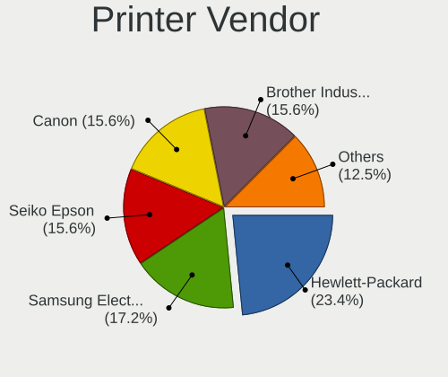

| Vendor                | Computers | Percent |
|-----------------------|-----------|---------|
| Hewlett-Packard       | 15        | 23.44%  |
| Samsung Electronics   | 11        | 17.19%  |
| Seiko Epson           | 10        | 15.63%  |
| Canon                 | 10        | 15.63%  |
| Brother Industries    | 10        | 15.63%  |
| Xerox                 | 2         | 3.13%   |
| Lexmark International | 2         | 3.13%   |
| Zebra                 | 1         | 1.56%   |
| QinHeng Electronics   | 1         | 1.56%   |
| Pantum                | 1         | 1.56%   |
| ATEN International    | 1         | 1.56%   |

Printer Model
-------------

Printer device models

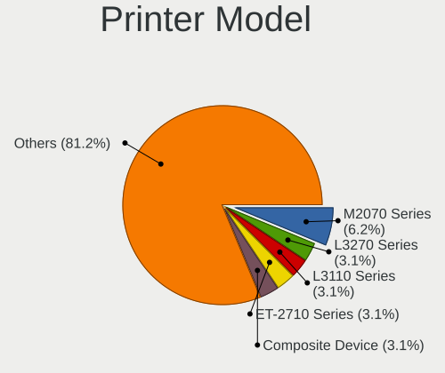

| Model                                         | Computers | Percent |
|-----------------------------------------------|-----------|---------|
| Samsung M2070 Series                          | 4         | 6.25%   |
| Seiko Epson L3270 Series                      | 2         | 3.13%   |
| Seiko Epson L3110 Series                      | 2         | 3.13%   |
| Seiko Epson ET-2710 Series                    | 2         | 3.13%   |
| Samsung Composite Device                      | 2         | 3.13%   |
| Lexmark International InkJet Color Printer    | 2         | 3.13%   |
| HP DeskJet 2130 series                        | 2         | 3.13%   |
| Canon MF4010 series                           | 2         | 3.13%   |
| Brother HL-5380DN series                      | 2         | 3.13%   |
| Brother HL-1110 series                        | 2         | 3.13%   |
| Zebra GK420t Label Printer                    | 1         | 1.56%   |
| Xerox Phaser 6130N                            | 1         | 1.56%   |
| Xerox Phaser 3020                             | 1         | 1.56%   |
| Seiko Epson ME 340 Series/Stylus NX130 Series | 1         | 1.56%   |
| Seiko Epson M3140 Series                      | 1         | 1.56%   |
| Seiko Epson L3050 Series                      | 1         | 1.56%   |
| Seiko Epson ET-3750 Series                    | 1         | 1.56%   |
| Samsung ML-216x Series Laser Printer          | 1         | 1.56%   |
| Samsung ML-1660 Series                        | 1         | 1.56%   |
| Samsung M267x 287x Series                     | 1         | 1.56%   |
| Samsung M2020 Series                          | 1         | 1.56%   |
| Samsung CLP-310 Color Laser Printer           | 1         | 1.56%   |
| QinHeng CH340S                                | 1         | 1.56%   |
| Pantum M6500NW-series                         | 1         | 1.56%   |
| HP LaserJet M14-M17                           | 1         | 1.56%   |
| HP LaserJet 400 M401dne                       | 1         | 1.56%   |
| HP LaserJet 3050                              | 1         | 1.56%   |
| HP LaserJet 1022                              | 1         | 1.56%   |
| HP LaserJet 1018                              | 1         | 1.56%   |
| HP HP Laser 107w                              | 1         | 1.56%   |
| HP Deskjet F4500 series                       | 1         | 1.56%   |
| HP DeskJet F2492 All-in-One                   | 1         | 1.56%   |
| HP Deskjet 3050A                              | 1         | 1.56%   |
| HP DeskJet 2700 series                        | 1         | 1.56%   |
| HP DeskJet 2300 series                        | 1         | 1.56%   |
| HP Deskjet 2050 J510                          | 1         | 1.56%   |
| HP color LaserJet 5550                        | 1         | 1.56%   |
| Canon PIXMA MP280                             | 1         | 1.56%   |
| Canon PIXMA MP250                             | 1         | 1.56%   |
| Canon MF4320-4350                             | 1         | 1.56%   |

Scanner Vendor
--------------

Scanner device vendors

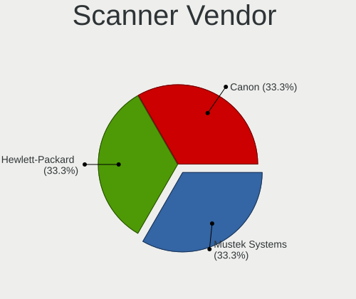

| Vendor          | Computers | Percent |
|-----------------|-----------|---------|
| Mustek Systems  | 1         | 33.33%  |
| Hewlett-Packard | 1         | 33.33%  |
| Canon           | 1         | 33.33%  |

Scanner Model
-------------

Scanner device models

| Model                               | Computers | Percent |
|-------------------------------------|-----------|---------|
| Mustek Systems BearPaw 2448 TA Plus | 1         | 33.33%  |
| HP Scanjet G2710                    | 1         | 33.33%  |
| Canon CanoScan LiDE 100             | 1         | 33.33%  |

Camera
------

Camera Vendor
-------------

Camera device vendors

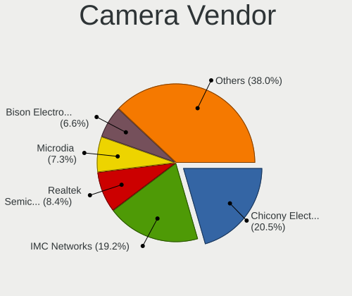

| Vendor                                 | Computers | Percent |
|----------------------------------------|-----------|---------|
| Chicony Electronics                    | 360       | 20.51%  |
| IMC Networks                           | 337       | 19.2%   |
| Realtek Semiconductor                  | 147       | 8.38%   |
| Microdia                               | 128       | 7.29%   |
| Bison Electronics                      | 116       | 6.61%   |
| Quanta                                 | 89        | 5.07%   |
| Sunplus Innovation Technology          | 76        | 4.33%   |
| Logitech                               | 46        | 2.62%   |
| Syntek                                 | 42        | 2.39%   |
| Luxvisions Innotech Limited            | 41        | 2.34%   |
| Sonix Technology                       | 39        | 2.22%   |
| Cheng Uei Precision Industry (Foxlink) | 39        | 2.22%   |
| Lite-On Technology                     | 37        | 2.11%   |
| Alcor Micro                            | 33        | 1.88%   |
| Apple                                  | 29        | 1.65%   |
| Suyin                                  | 28        | 1.6%    |
| ShineTech                              | 18        | 1.03%   |
| Samsung Electronics                    | 16        | 0.91%   |
| Ricoh                                  | 13        | 0.74%   |
| Microsoft                              | 12        | 0.68%   |
| Silicon Motion                         | 11        | 0.63%   |
| Z-Star Microelectronics                | 9         | 0.51%   |
| OmniVision Technologies                | 6         | 0.34%   |
| ALi                                    | 5         | 0.28%   |
| Acer                                   | 5         | 0.28%   |
| Trust                                  | 4         | 0.23%   |
| Shine-optics                           | 4         | 0.23%   |
| Primax Electronics                     | 4         | 0.23%   |
| Lenovo                                 | 4         | 0.23%   |
| BillionPixels                          | 4         | 0.23%   |
| webcam                                 | 3         | 0.17%   |
| GEMBIRD                                | 3         | 0.17%   |
| Cubeternet                             | 3         | 0.17%   |
| Y Media                                | 2         | 0.11%   |
| WaveRider Communications               | 2         | 0.11%   |
| Sunplus Technology                     | 2         | 0.11%   |
| Razer USA                              | 2         | 0.11%   |
| MacroSilicon                           | 2         | 0.11%   |
| KYE Systems (Mouse Systems)            | 2         | 0.11%   |
| kingcome                               | 2         | 0.11%   |

Camera Model
------------

Camera device models

| Model                                               | Computers | Percent |
|-----------------------------------------------------|-----------|---------|
| IMC Networks USB2.0 VGA UVC WebCam                  | 122       | 6.94%   |
| IMC Networks USB2.0 HD UVC WebCam                   | 111       | 6.31%   |
| Chicony Integrated Camera                           | 89        | 5.06%   |
| IMC Networks Integrated Camera                      | 53        | 3.01%   |
| Realtek Integrated_Webcam_HD                        | 46        | 2.62%   |
| Microdia Integrated_Webcam_HD                       | 40        | 2.27%   |
| Bison Integrated Camera                             | 32        | 1.82%   |
| Sonix USB2.0 HD UVC WebCam                          | 30        | 1.71%   |
| Chicony HD WebCam                                   | 29        | 1.65%   |
| Syntek Integrated Camera                            | 27        | 1.53%   |
| Chicony USB2.0 VGA UVC WebCam                       | 24        | 1.36%   |
| Chicony USB2.0 HD UVC WebCam                        | 21        | 1.19%   |
| Realtek USB Camera                                  | 17        | 0.97%   |
| Sunplus HD WebCam                                   | 16        | 0.91%   |
| Samsung Galaxy series, misc. (MTP mode)             | 16        | 0.91%   |
| Lite-On Integrated Camera                           | 15        | 0.85%   |
| Bison SunplusIT Integrated Camera                   | 14        | 0.8%    |
| Bison Lenovo EasyCamera                             | 14        | 0.8%    |
| Quanta HD Webcam                                    | 13        | 0.74%   |
| Luxvisions Innotech Limited Integrated RGB Camera   | 13        | 0.74%   |
| Chicony TOSHIBA Web Camera - HD                     | 13        | 0.74%   |
| Quanta VGA WebCam                                   | 12        | 0.68%   |
| Bison EasyCamera                                    | 12        | 0.68%   |
| Realtek USB2.0 HD UVC WebCam                        | 11        | 0.63%   |
| Microdia Integrated Webcam                          | 11        | 0.63%   |
| IMC Networks USB2.0 UVC HD Webcam                   | 11        | 0.63%   |
| Chicony HP HD Camera                                | 11        | 0.63%   |
| Chicony EasyCamera                                  | 11        | 0.63%   |
| Sunplus Integrated_Webcam_HD                        | 10        | 0.57%   |
| Microdia Camera                                     | 10        | 0.57%   |
| Chicony VGA Webcam                                  | 10        | 0.57%   |
| Chicony HP Webcam                                   | 10        | 0.57%   |
| Bison Integrated RGB Camera                         | 10        | 0.57%   |
| Apple FaceTime HD Camera (Built-in)                 | 10        | 0.57%   |
| Alcor Micro USB 2.0 Camera                          | 10        | 0.57%   |
| Sunplus Asus Webcam                                 | 9         | 0.51%   |
| Luxvisions Innotech Limited HP TrueVision HD Camera | 9         | 0.51%   |
| Logitech HD Pro Webcam C920                         | 9         | 0.51%   |
| Chicony Integrated Camera (1280x720@30)             | 9         | 0.51%   |
| Apple iPhone 5/5C/5S/6/SE/7/8/X                     | 9         | 0.51%   |

Security
--------

Fingerprint Vendor
------------------

Fingerprint sensor vendors

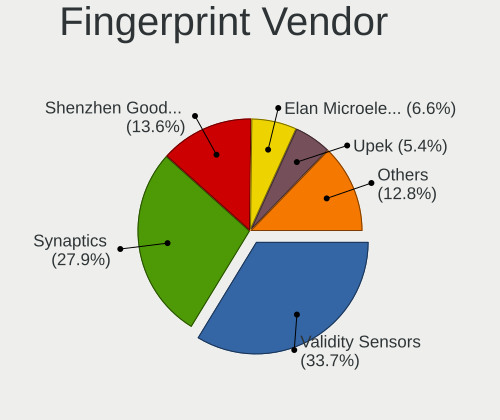

| Vendor                             | Computers | Percent |
|------------------------------------|-----------|---------|
| Validity Sensors                   | 87        | 33.72%  |
| Synaptics                          | 72        | 27.91%  |
| Shenzhen Goodix Technology         | 35        | 13.57%  |
| Elan Microelectronics              | 17        | 6.59%   |
| Upek                               | 14        | 5.43%   |
| AuthenTec                          | 12        | 4.65%   |
| LighTuning Technology              | 11        | 4.26%   |
| STMicroelectronics                 | 3         | 1.16%   |
| Realtek USB2.0 Finger Print Bridge | 2         | 0.78%   |
| Focal-systems.Corp                 | 2         | 0.78%   |
| Samsung Electronics                | 1         | 0.39%   |
| GDMicroelectronics                 | 1         | 0.39%   |
| Dell                               | 1         | 0.39%   |

Fingerprint Model
-----------------

Fingerprint sensor models

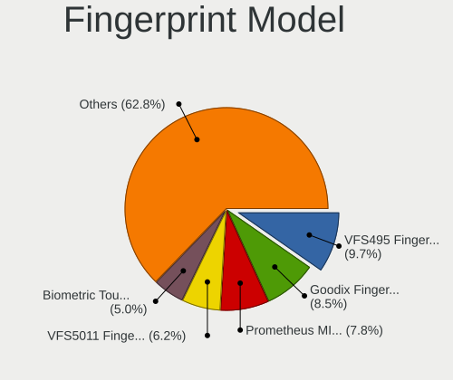

| Model                                                                      | Computers | Percent |
|----------------------------------------------------------------------------|-----------|---------|
| Validity Sensors VFS495 Fingerprint Reader                                 | 25        | 9.69%   |
| Shenzhen Goodix  Fingerprint Device                                        | 22        | 8.53%   |
| Synaptics Prometheus MIS Touch Fingerprint Reader                          | 20        | 7.75%   |
| Validity Sensors VFS5011 Fingerprint Reader                                | 16        | 6.2%    |
| Upek Biometric Touchchip/Touchstrip Fingerprint Sensor                     | 13        | 5.04%   |
| Synaptics  WBDI                                                            | 12        | 4.65%   |
| Synaptics Metallica MIS Touch Fingerprint Reader                           | 12        | 4.65%   |
| Shenzhen Goodix Fingerprint Reader                                         | 11        | 4.26%   |
| Elan ELAN:Fingerprint                                                      | 11        | 4.26%   |
| Validity Sensors VFS471 Fingerprint Reader                                 | 8         | 3.1%    |
| Validity Sensors Synaptics WBDI                                            | 8         | 3.1%    |
| Validity Sensors VFS451 Fingerprint Reader                                 | 7         | 2.71%   |
| Validity Sensors VFS 5011 fingerprint sensor                               | 7         | 2.71%   |
| AuthenTec AES2810                                                          | 7         | 2.71%   |
| Synaptics FS7604 Touch Fingerprint Sensor with PurePrint                   | 6         | 2.33%   |
| Synaptics Fingerprint reader [HP G6]                                       | 6         | 2.33%   |
| Elan ELAN:ARM-M4                                                           | 6         | 2.33%   |
| Validity Sensors Synaptics VFS7552 Touch Fingerprint Sensor with PurePrint | 5         | 1.94%   |
| Validity Sensors VFS491                                                    | 4         | 1.55%   |
| Synaptics WBDI                                                             | 4         | 1.55%   |
| Synaptics WBDI Fingerprint Reader USB 086                                  | 3         | 1.16%   |
| Synaptics  FS7604 Touch Fingerprint Sensor with PurePrint                  | 3         | 1.16%   |
| Synaptics Metallica MOH Touch Fingerprint Reader                           | 3         | 1.16%   |
| STMicroelectronics Fingerprint Reader                                      | 3         | 1.16%   |
| LighTuning Fingerprint Reader                                              | 3         | 1.16%   |
| LighTuning ES603 Swipe Fingerprint Sensor                                  | 3         | 1.16%   |
| LighTuning EgisTec Touch Fingerprint Sensor                                | 3         | 1.16%   |
| Validity Sensors VFS7500 Touch Fingerprint Sensor                          | 2         | 0.78%   |
| Validity Sensors Swipe Fingerprint Sensor                                  | 2         | 0.78%   |
| Validity Sensors Fingerprint scanner                                       | 2         | 0.78%   |
| Synaptics UWP WBDI Device                                                  | 2         | 0.78%   |
| Shenzhen Goodix FingerPrint                                                | 2         | 0.78%   |
| Realtek USB2.0 Finger Print Bridge FocalTech Fingerprint Device            | 2         | 0.78%   |
| LighTuning Fingerprint Sensor                                              | 2         | 0.78%   |
| Focal-systems.Corp FT9201Fingerprint.                                      | 2         | 0.78%   |
| AuthenTec Fingerprint Sensor                                               | 2         | 0.78%   |
| AuthenTec AES2501 Fingerprint Sensor                                       | 2         | 0.78%   |
| Validity Sensors VFS7552 Touch Fingerprint Sensor                          | 1         | 0.39%   |
| Upek TCS5B Fingerprint sensor                                              | 1         | 0.39%   |
| Synaptics UWP WBDI                                                         | 1         | 0.39%   |

Chipcard Vendor
---------------

Chipcard module vendors

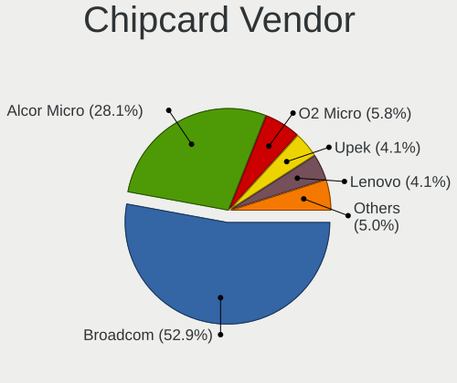

| Vendor                    | Computers | Percent |
|---------------------------|-----------|---------|
| Broadcom                  | 64        | 52.89%  |
| Alcor Micro               | 34        | 28.1%   |
| O2 Micro                  | 7         | 5.79%   |
| Upek                      | 5         | 4.13%   |
| Lenovo                    | 5         | 4.13%   |
| Aladdin Knowledge Systems | 2         | 1.65%   |
| Gemalto (was Gemplus)     | 1         | 0.83%   |
| Fujitsu Siemens Computers | 1         | 0.83%   |
| Chicony Electronics       | 1         | 0.83%   |
| Advanced Card Systems     | 1         | 0.83%   |

Chipcard Model
--------------

Chipcard module models

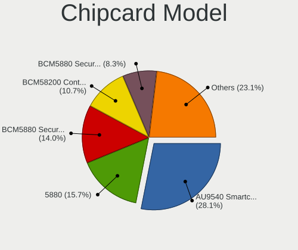

| Model                                                                        | Computers | Percent |
|------------------------------------------------------------------------------|-----------|---------|
| Alcor Micro AU9540 Smartcard Reader                                          | 34        | 28.1%   |
| Broadcom 5880                                                                | 19        | 15.7%   |
| Broadcom BCM5880 Secure Applications Processor                               | 17        | 14.05%  |
| Broadcom BCM58200 ControlVault 3 (FingerPrint sensor + Contacted SmartCard)  | 13        | 10.74%  |
| Broadcom BCM5880 Secure Applications Processor with fingerprint swipe sensor | 10        | 8.26%   |
| O2 Micro OZ776 CCID Smartcard Reader                                         | 7         | 5.79%   |
| Upek TouchChip Fingerprint Coprocessor (WBF advanced mode)                   | 5         | 4.13%   |
| Lenovo Integrated Smart Card Reader                                          | 5         | 4.13%   |
| Broadcom 58200                                                               | 5         | 4.13%   |
| Aladdin Knowledge Systems Token JC                                           | 2         | 1.65%   |
| Gemalto (was Gemplus) Compact Smart Card Reader Writer                       | 1         | 0.83%   |
| Fujitsu Siemens Computers SmartCard Reader 2A                                | 1         | 0.83%   |
| Chicony Electronics HP Skylab USB Smartcard Keyboard                         | 1         | 0.83%   |
| Advanced Card Systems ACR39U                                                 | 1         | 0.83%   |

Unsupported
-----------

Unsupported Devices
-------------------

Total unsupported devices on board

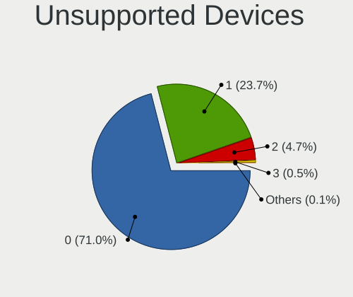

| Total | Computers | Percent |
|-------|-----------|---------|
| 0     | 1969      | 71.01%  |
| 1     | 657       | 23.69%  |
| 2     | 129       | 4.65%   |
| 3     | 14        | 0.5%    |
| 4     | 2         | 0.07%   |
| 10    | 1         | 0.04%   |
| 5     | 1         | 0.04%   |

Unsupported Device Types
------------------------

Types of unsupported devices

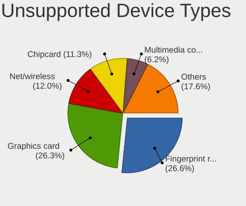

| Type                     | Computers | Percent |
|--------------------------|-----------|---------|
| Fingerprint reader       | 254       | 26.6%   |
| Graphics card            | 251       | 26.28%  |
| Net/wireless             | 115       | 12.04%  |
| Chipcard                 | 108       | 11.31%  |
| Multimedia controller    | 59        | 6.18%   |
| Communication controller | 33        | 3.46%   |
| Camera                   | 32        | 3.35%   |
| Bluetooth                | 26        | 2.72%   |
| Storage                  | 21        | 2.2%    |
| Card reader              | 10        | 1.05%   |
| Sound                    | 9         | 0.94%   |
| Unassigned class         | 8         | 0.84%   |
| Net/ethernet             | 6         | 0.63%   |
| Storage/raid             | 4         | 0.42%   |
| Storage/ide              | 4         | 0.42%   |
| Modem                    | 4         | 0.42%   |
| Network                  | 3         | 0.31%   |
| Flash memory             | 2         | 0.21%   |
| Dvb card                 | 2         | 0.21%   |
| Unclassified device      | 1         | 0.1%    |
| Storage/nvme             | 1         | 0.1%    |
| Storage/ata              | 1         | 0.1%    |
| Firewire controller      | 1         | 0.1%    |

