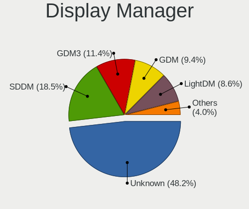
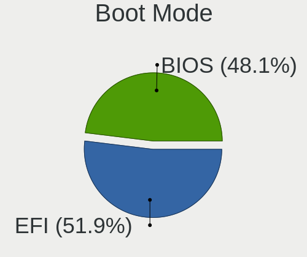
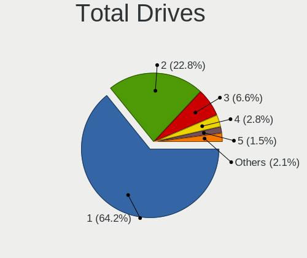
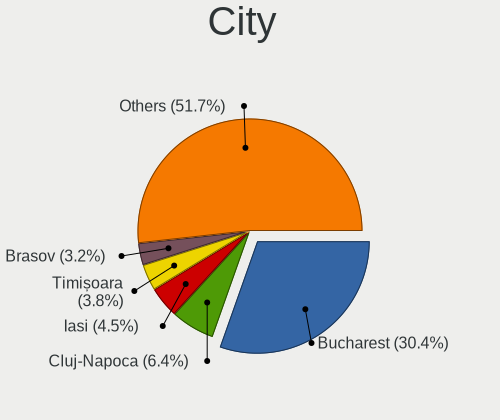
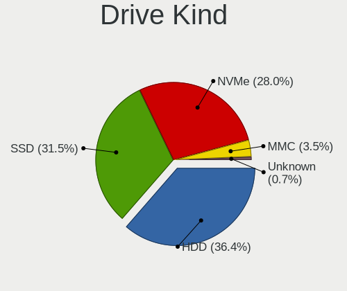
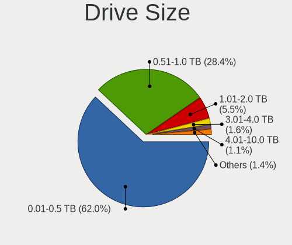
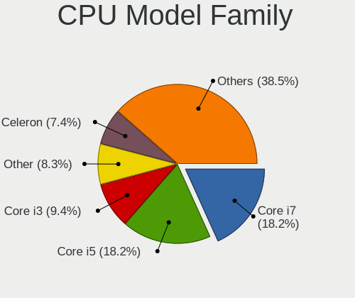
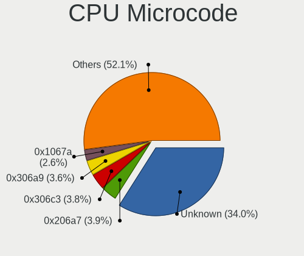
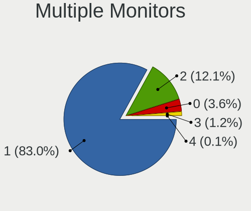
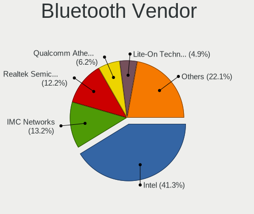

Linux in Romania - Tested Hardware & Statistics
-----------------------------------------------

A project to collect tested hardware configurations for Linux in Romania.

Anyone can contribute to this report by the [hw-probe](https://github.com/linuxhw/hw-probe) tool:

    sudo -E hw-probe -all -upload

Please contribute! Especially if your hardware is rare.

This is a report for all computer types. See also reports for [desktops](/Location/Romania/Desktop/README.md) and [notebooks](/Location/Romania/Notebook/README.md).

Contents
--------

* [ Test Cases ](#test-cases)

* [ System ](#system)
  - [ OS                       ](#os)
  - [ OS Family                ](#os-family)
  - [ Kernel                   ](#kernel)
  - [ Kernel Family            ](#kernel-family)
  - [ Kernel Major Ver.        ](#kernel-major-ver)
  - [ Arch                     ](#arch)
  - [ DE                       ](#de)
  - [ Display Server           ](#display-server)
  - [ Display Manager          ](#display-manager)
  - [ OS Lang                  ](#os-lang)
  - [ Boot Mode                ](#boot-mode)
  - [ Filesystem               ](#filesystem)
  - [ Part. scheme             ](#part-scheme)
  - [ Dual Boot with Linux/BSD ](#dual-boot-with-linuxbsd)
  - [ Dual Boot (Win)          ](#dual-boot-win)

* [ Board ](#board)
  - [ Vendor                   ](#vendor)
  - [ Model                    ](#model)
  - [ Model Family             ](#model-family)
  - [ MFG Year                 ](#mfg-year)
  - [ Form Factor              ](#form-factor)
  - [ Secure Boot              ](#secure-boot)
  - [ Coreboot                 ](#coreboot)
  - [ RAM Size                 ](#ram-size)
  - [ RAM Used                 ](#ram-used)
  - [ Total Drives             ](#total-drives)
  - [ Has CD-ROM               ](#has-cd-rom)
  - [ Has Ethernet             ](#has-ethernet)
  - [ Has WiFi                 ](#has-wifi)
  - [ Has Bluetooth            ](#has-bluetooth)

* [ Location ](#location)
  - [ Country                  ](#country)
  - [ City                     ](#city)

* [ Drives ](#drives)
  - [ Drive Vendor             ](#drive-vendor)
  - [ Drive Model              ](#drive-model)
  - [ HDD Vendor               ](#hdd-vendor)
  - [ SSD Vendor               ](#ssd-vendor)
  - [ Drive Kind               ](#drive-kind)
  - [ Drive Connector          ](#drive-connector)
  - [ Drive Size               ](#drive-size)
  - [ Space Total              ](#space-total)
  - [ Space Used               ](#space-used)
  - [ Malfunc. Drives          ](#malfunc-drives)
  - [ Malfunc. Drive Vendor    ](#malfunc-drive-vendor)
  - [ Malfunc. HDD Vendor      ](#malfunc-hdd-vendor)
  - [ Malfunc. Drive Kind      ](#malfunc-drive-kind)
  - [ Failed Drives            ](#failed-drives)
  - [ Failed Drive Vendor      ](#failed-drive-vendor)
  - [ Drive Status             ](#drive-status)

* [ Storage controller ](#storage-controller)
  - [ Storage Vendor           ](#storage-vendor)
  - [ Storage Model            ](#storage-model)
  - [ Storage Kind             ](#storage-kind)

* [ Processor ](#processor)
  - [ CPU Vendor               ](#cpu-vendor)
  - [ CPU Model                ](#cpu-model)
  - [ CPU Model Family         ](#cpu-model-family)
  - [ CPU Cores                ](#cpu-cores)
  - [ CPU Sockets              ](#cpu-sockets)
  - [ CPU Threads              ](#cpu-threads)
  - [ CPU Op-Modes             ](#cpu-op-modes)
  - [ CPU Microcode            ](#cpu-microcode)
  - [ CPU Microarch            ](#cpu-microarch)

* [ Graphics ](#graphics)
  - [ GPU Vendor               ](#gpu-vendor)
  - [ GPU Model                ](#gpu-model)
  - [ GPU Combo                ](#gpu-combo)
  - [ GPU Driver               ](#gpu-driver)
  - [ GPU Memory               ](#gpu-memory)

* [ Monitor ](#monitor)
  - [ Monitor Vendor           ](#monitor-vendor)
  - [ Monitor Model            ](#monitor-model)
  - [ Monitor Resolution       ](#monitor-resolution)
  - [ Monitor Diagonal         ](#monitor-diagonal)
  - [ Monitor Width            ](#monitor-width)
  - [ Aspect Ratio             ](#aspect-ratio)
  - [ Monitor Area             ](#monitor-area)
  - [ Pixel Density            ](#pixel-density)
  - [ Multiple Monitors        ](#multiple-monitors)

* [ Network ](#network)
  - [ Net Controller Vendor    ](#net-controller-vendor)
  - [ Net Controller Model     ](#net-controller-model)
  - [ Wireless Vendor          ](#wireless-vendor)
  - [ Wireless Model           ](#wireless-model)
  - [ Ethernet Vendor          ](#ethernet-vendor)
  - [ Ethernet Model           ](#ethernet-model)
  - [ Net Controller Kind      ](#net-controller-kind)
  - [ Used Controller          ](#used-controller)
  - [ NICs                     ](#nics)
  - [ IPv6                     ](#ipv6)

* [ Bluetooth ](#bluetooth)
  - [ Bluetooth Vendor         ](#bluetooth-vendor)
  - [ Bluetooth Model          ](#bluetooth-model)

* [ Sound ](#sound)
  - [ Sound Vendor             ](#sound-vendor)
  - [ Sound Model              ](#sound-model)

* [ Memory ](#memory)
  - [ Memory Vendor            ](#memory-vendor)
  - [ Memory Model             ](#memory-model)
  - [ Memory Kind              ](#memory-kind)
  - [ Memory Form Factor       ](#memory-form-factor)
  - [ Memory Size              ](#memory-size)
  - [ Memory Speed             ](#memory-speed)

* [ Printers & scanners ](#printers--scanners)
  - [ Printer Vendor           ](#printer-vendor)
  - [ Printer Model            ](#printer-model)
  - [ Scanner Vendor           ](#scanner-vendor)
  - [ Scanner Model            ](#scanner-model)

* [ Camera ](#camera)
  - [ Camera Vendor            ](#camera-vendor)
  - [ Camera Model             ](#camera-model)

* [ Security ](#security)
  - [ Fingerprint Vendor       ](#fingerprint-vendor)
  - [ Fingerprint Model        ](#fingerprint-model)
  - [ Chipcard Vendor          ](#chipcard-vendor)
  - [ Chipcard Model           ](#chipcard-model)

* [ Unsupported ](#unsupported)
  - [ Unsupported Devices      ](#unsupported-devices)
  - [ Unsupported Device Types ](#unsupported-device-types)

Test Cases
----------

Total: 2135

| Vendor        | Model                       | Form-Factor | Probe                                                      | Date         |
|---------------|-----------------------------|-------------|------------------------------------------------------------|--------------|
| Dell          | Latitude 5521               | Notebook    | [dcf7869cf6](https://linux-hardware.org/?probe=dcf7869cf6) | Sep 01, 2022 |
| Valve         | Jupiter                     | Notebook    | [6e9790c5e7](https://linux-hardware.org/?probe=6e9790c5e7) | Sep 01, 2022 |
| MSI           | Z97 GAMING 7                | Desktop     | [c9ebe69583](https://linux-hardware.org/?probe=c9ebe69583) | Aug 30, 2022 |
| Lenovo        | IdeaPad 5 Pro 14ACN6 82L... | Notebook    | [b4a9d1fecc](https://linux-hardware.org/?probe=b4a9d1fecc) | Aug 30, 2022 |
| Lenovo        | 36F4 SDK0J40697 WIN 3305... | All in one  | [c129f7c9b1](https://linux-hardware.org/?probe=c129f7c9b1) | Aug 29, 2022 |
| Dell          | Latitude E7470              | Notebook    | [568c9bfd40](https://linux-hardware.org/?probe=568c9bfd40) | Aug 28, 2022 |
| Acer          | Aspire A315-23              | Notebook    | [4c16a58579](https://linux-hardware.org/?probe=4c16a58579) | Aug 28, 2022 |
| Lenovo        | ThinkPad L440 20ASS3A300    | Notebook    | [fbf3d4a87a](https://linux-hardware.org/?probe=fbf3d4a87a) | Aug 27, 2022 |
| ASUSTek       | VivoBook_ASUSLaptop X435... | Notebook    | [02c6bde77b](https://linux-hardware.org/?probe=02c6bde77b) | Aug 27, 2022 |
| ASUSTek       | X550CC                      | Notebook    | [8b85141416](https://linux-hardware.org/?probe=8b85141416) | Aug 26, 2022 |
| Complet       | MY8312                      | Notebook    | [4db1527bde](https://linux-hardware.org/?probe=4db1527bde) | Aug 26, 2022 |
| Lenovo        | IdeaPad 5 14ARE05 81YM      | Notebook    | [c8b4d18767](https://linux-hardware.org/?probe=c8b4d18767) | Aug 25, 2022 |
| Lenovo        | ThinkPad L440 20ASS3A300    | Notebook    | [09feb7053d](https://linux-hardware.org/?probe=09feb7053d) | Aug 25, 2022 |
| HUAWEI        | NBLB-WAX9N                  | Notebook    | [69281b6cc3](https://linux-hardware.org/?probe=69281b6cc3) | Aug 24, 2022 |
| Gigabyte      | EP45-DS3P                   | Desktop     | [2af48f00ac](https://linux-hardware.org/?probe=2af48f00ac) | Aug 22, 2022 |
| Gigabyte      | EP45-DS3P                   | Desktop     | [0910ca3887](https://linux-hardware.org/?probe=0910ca3887) | Aug 22, 2022 |
| Fujitsu       | D3220-A1 S26361-D3220-A1    | Desktop     | [5cf178d7ac](https://linux-hardware.org/?probe=5cf178d7ac) | Aug 22, 2022 |
| Dell          | Latitude 7410               | Notebook    | [ae90ce90ed](https://linux-hardware.org/?probe=ae90ce90ed) | Aug 22, 2022 |
| Lenovo        | ThinkBook 15p 20V3          | Notebook    | [9c31fff4b2](https://linux-hardware.org/?probe=9c31fff4b2) | Aug 20, 2022 |
| Dell          | Latitude 7420               | Notebook    | [d599ef65fd](https://linux-hardware.org/?probe=d599ef65fd) | Aug 20, 2022 |
| Lenovo        | 36F4 SDK0J40697 WIN 3305... | All in one  | [5cbe471be8](https://linux-hardware.org/?probe=5cbe471be8) | Aug 19, 2022 |
| Lenovo        | ThinkPad L440 20ASS3A300    | Notebook    | [1a0800fc4a](https://linux-hardware.org/?probe=1a0800fc4a) | Aug 19, 2022 |
| Dell          | Inspiron 5558               | Notebook    | [b4bc42c01c](https://linux-hardware.org/?probe=b4bc42c01c) | Aug 18, 2022 |
| Lenovo        | 36F4 SDK0J40697 WIN 3305... | All in one  | [4b585d8c34](https://linux-hardware.org/?probe=4b585d8c34) | Aug 18, 2022 |
| Lenovo        | IdeaPad 5 Pro 14ACN6 82L... | Notebook    | [97fb16fc3f](https://linux-hardware.org/?probe=97fb16fc3f) | Aug 17, 2022 |
| Dell          | XPS 15 9530                 | Notebook    | [71f62cef7a](https://linux-hardware.org/?probe=71f62cef7a) | Aug 16, 2022 |
| Dell          | Inspiron 1501               | Notebook    | [11b4c83b79](https://linux-hardware.org/?probe=11b4c83b79) | Aug 15, 2022 |
| Gigabyte      | Z77X-UD5H                   | Desktop     | [5262ee60e8](https://linux-hardware.org/?probe=5262ee60e8) | Aug 14, 2022 |
| Acer          | Aspire V3-571G              | Notebook    | [f45a97ca40](https://linux-hardware.org/?probe=f45a97ca40) | Aug 12, 2022 |
| ASUSTek       | VivoBook_ASUS Laptop X50... | Notebook    | [9e77f6044a](https://linux-hardware.org/?probe=9e77f6044a) | Aug 12, 2022 |
| Intel         | DQ67SW AAG12527-309         | Desktop     | [ca6a3b3fba](https://linux-hardware.org/?probe=ca6a3b3fba) | Aug 12, 2022 |
| MSI           | A320M-A PRO MAX             | Desktop     | [cdee8ca864](https://linux-hardware.org/?probe=cdee8ca864) | Aug 12, 2022 |
| ASUSTek       | VivoBook_ASUS Laptop X50... | Notebook    | [eb79423b1d](https://linux-hardware.org/?probe=eb79423b1d) | Aug 12, 2022 |
| Inventec      | Dell Wyse Thin Client De... | Mini pc     | [86523f9a5f](https://linux-hardware.org/?probe=86523f9a5f) | Aug 11, 2022 |
| ASUSTek       | M5A78L-M/USB3               | Desktop     | [aebe04abda](https://linux-hardware.org/?probe=aebe04abda) | Aug 11, 2022 |
| Lenovo        | IdeaPad 330-15IKB 81DE      | Notebook    | [cc51e49c51](https://linux-hardware.org/?probe=cc51e49c51) | Aug 10, 2022 |
| Lenovo        | IdeaPad 5 Pro 16ACH6 82L... | Notebook    | [6826a8d40d](https://linux-hardware.org/?probe=6826a8d40d) | Aug 08, 2022 |
| ASUSTek       | X550CL                      | Notebook    | [83626d765b](https://linux-hardware.org/?probe=83626d765b) | Aug 08, 2022 |
| ASUSTek       | Z170 PRO GAMING             | Desktop     | [20a93d57e6](https://linux-hardware.org/?probe=20a93d57e6) | Aug 08, 2022 |
| MSI           | B550-A PRO                  | Desktop     | [94d50a1c56](https://linux-hardware.org/?probe=94d50a1c56) | Aug 08, 2022 |
| Fujitsu       | D3041-A1 S26361-D3041-A1    | Desktop     | [1fe8a14d3b](https://linux-hardware.org/?probe=1fe8a14d3b) | Aug 06, 2022 |
| Dell          | Latitude E6540              | Notebook    | [d47b2c5c2b](https://linux-hardware.org/?probe=d47b2c5c2b) | Aug 06, 2022 |
| Unknown       | 1.0                         | Desktop     | [4394243123](https://linux-hardware.org/?probe=4394243123) | Aug 05, 2022 |
| Acer          | Aspire A515-45              | Notebook    | [ddd717c7e6](https://linux-hardware.org/?probe=ddd717c7e6) | Aug 05, 2022 |
| ASUSTek       | ASUS TUF Gaming F15 FX50... | Notebook    | [3025bd4ded](https://linux-hardware.org/?probe=3025bd4ded) | Aug 05, 2022 |
| ASUSTek       | ROG Strix G713RS_G713RS     | Notebook    | [707ab083b3](https://linux-hardware.org/?probe=707ab083b3) | Aug 04, 2022 |
| Unknown       | 1.0                         | Desktop     | [545d9cf73c](https://linux-hardware.org/?probe=545d9cf73c) | Aug 04, 2022 |
| Apple         | Mac-7BA5B2DFE22DDD8C Mac... | Mini pc     | [fbe4f4d2ce](https://linux-hardware.org/?probe=fbe4f4d2ce) | Aug 02, 2022 |
| Apple         | Mac-7BA5B2DFE22DDD8C Mac... | Mini pc     | [eeccdc2b7f](https://linux-hardware.org/?probe=eeccdc2b7f) | Aug 02, 2022 |
| HP            | Pavilion 15                 | Notebook    | [e6bfde2a29](https://linux-hardware.org/?probe=e6bfde2a29) | Jul 29, 2022 |
| Dell          | System Inspiron N7110       | Notebook    | [d2cbf8528a](https://linux-hardware.org/?probe=d2cbf8528a) | Jul 28, 2022 |
| ASUSTek       | VivoBook 15_ASUS Laptop ... | Notebook    | [8b3fd99e18](https://linux-hardware.org/?probe=8b3fd99e18) | Jul 27, 2022 |
| HP            | EliteBook 8460p             | Notebook    | [7b2de05256](https://linux-hardware.org/?probe=7b2de05256) | Jul 27, 2022 |
| ASUSTek       | VivoBook 15_ASUS Laptop ... | Notebook    | [4ee4fc0689](https://linux-hardware.org/?probe=4ee4fc0689) | Jul 26, 2022 |
| HP            | 8704                        | Desktop     | [eaa4bc0059](https://linux-hardware.org/?probe=eaa4bc0059) | Jul 21, 2022 |
| Lenovo        | ThinkPad P52 20MAS1R100     | Notebook    | [7a01b8819c](https://linux-hardware.org/?probe=7a01b8819c) | Jul 21, 2022 |
| Lenovo        | 312A SDK0J40697 WIN 3305... | Desktop     | [892229b650](https://linux-hardware.org/?probe=892229b650) | Jul 21, 2022 |
| HP            | ZBook Power G7 Mobile Wo... | Notebook    | [9a5f11c4b9](https://linux-hardware.org/?probe=9a5f11c4b9) | Jul 19, 2022 |
| HP            | EliteBook 850 G1            | Notebook    | [383ec7a7fd](https://linux-hardware.org/?probe=383ec7a7fd) | Jul 18, 2022 |
| Acer          | Aspire SW3-016              | Notebook    | [c48cdf5576](https://linux-hardware.org/?probe=c48cdf5576) | Jul 17, 2022 |
| Intel         | NUC8BEB J72692-310          | Mini pc     | [84cd652e24](https://linux-hardware.org/?probe=84cd652e24) | Jul 16, 2022 |
| ASUSTek       | M4A79XTD EVO                | Desktop     | [b12edadc03](https://linux-hardware.org/?probe=b12edadc03) | Jul 13, 2022 |
| ASUSTek       | VivoBook_ASUSLaptop X712... | Notebook    | [55efce6cdc](https://linux-hardware.org/?probe=55efce6cdc) | Jul 13, 2022 |
| Lenovo        | ThinkBook 13s-IML 20RR      | Notebook    | [be909dd3b4](https://linux-hardware.org/?probe=be909dd3b4) | Jul 12, 2022 |
| HP            | 355 G2                      | Notebook    | [55239c5062](https://linux-hardware.org/?probe=55239c5062) | Jul 11, 2022 |
| HP            | 355 G2                      | Notebook    | [9b5e64b838](https://linux-hardware.org/?probe=9b5e64b838) | Jul 11, 2022 |
| ASUSTek       | ROG Zephyrus G14 GA401QM... | Notebook    | [e7b17323df](https://linux-hardware.org/?probe=e7b17323df) | Jul 10, 2022 |
| Gigabyte      | B450 AORUS M                | Desktop     | [6d15b85193](https://linux-hardware.org/?probe=6d15b85193) | Jul 10, 2022 |
| Lenovo        | ThinkPad T14 Gen 2a 20XK... | Notebook    | [8f36480ad7](https://linux-hardware.org/?probe=8f36480ad7) | Jul 10, 2022 |
| HP            | 250 G4                      | Notebook    | [33dcd9203d](https://linux-hardware.org/?probe=33dcd9203d) | Jul 09, 2022 |
| Acer          | Nitro AN515-45              | Notebook    | [a9dd7c4072](https://linux-hardware.org/?probe=a9dd7c4072) | Jul 08, 2022 |
| ASUSTek       | ZenBook UX434FLC_UX434FL    | Notebook    | [99172a6e6f](https://linux-hardware.org/?probe=99172a6e6f) | Jul 08, 2022 |
| ASUSTek       | P5KC                        | Desktop     | [0ce9dd5cee](https://linux-hardware.org/?probe=0ce9dd5cee) | Jul 08, 2022 |
| Dell          | Latitude 5420               | Notebook    | [cb302e010e](https://linux-hardware.org/?probe=cb302e010e) | Jul 08, 2022 |
| ASUSTek       | Pro H510M-C                 | Desktop     | [f991c1fba8](https://linux-hardware.org/?probe=f991c1fba8) | Jul 07, 2022 |
| ASUSTek       | Pro H510M-C                 | Desktop     | [a5f338ae1a](https://linux-hardware.org/?probe=a5f338ae1a) | Jul 07, 2022 |
| HP            | ProBook 4310s               | Notebook    | [86ae79b260](https://linux-hardware.org/?probe=86ae79b260) | Jul 07, 2022 |
| Dell          | 0VHWTR A02                  | Desktop     | [32463f298d](https://linux-hardware.org/?probe=32463f298d) | Jul 05, 2022 |
| Acer          | Aspire A515-51G             | Notebook    | [3ab547df65](https://linux-hardware.org/?probe=3ab547df65) | Jul 04, 2022 |
| ASUSTek       | ROG STRIX X570-E GAMING     | Desktop     | [92fe4c2ff3](https://linux-hardware.org/?probe=92fe4c2ff3) | Jul 03, 2022 |
| Acer          | Aspire A515-51G             | Notebook    | [98ef915ec8](https://linux-hardware.org/?probe=98ef915ec8) | Jul 03, 2022 |
| ASUSTek       | ROG Flow X13 GV301RE_GV3... | Convertible | [457aa90e64](https://linux-hardware.org/?probe=457aa90e64) | Jul 02, 2022 |
| Dell          | Latitude 5521               | Notebook    | [2fda374f06](https://linux-hardware.org/?probe=2fda374f06) | Jun 24, 2022 |
| Gigabyte      | Z690I AORUS ULTRA           | Desktop     | [eeac425783](https://linux-hardware.org/?probe=eeac425783) | Jun 23, 2022 |
| Dell          | Inspiron 5567               | Notebook    | [2791443b0d](https://linux-hardware.org/?probe=2791443b0d) | Jun 22, 2022 |
| Lenovo        | ThinkPad E14 Gen 2 20T60... | Notebook    | [fc053b8a95](https://linux-hardware.org/?probe=fc053b8a95) | Jun 20, 2022 |
| ASUSTek       | VivoBook_ASUS Laptop X50... | Notebook    | [70d6947d54](https://linux-hardware.org/?probe=70d6947d54) | Jun 16, 2022 |
| HP            | 1790                        | Desktop     | [341a6c4c70](https://linux-hardware.org/?probe=341a6c4c70) | Jun 15, 2022 |
| ASUSTek       | VivoBook_ASUSLaptop X740... | Notebook    | [1e88796016](https://linux-hardware.org/?probe=1e88796016) | Jun 15, 2022 |
| Lenovo        | SHARKBAY NOK                | Desktop     | [4b2037715f](https://linux-hardware.org/?probe=4b2037715f) | Jun 15, 2022 |
| Acer          | Aspire One 522              | Notebook    | [7f4af0143d](https://linux-hardware.org/?probe=7f4af0143d) | Jun 11, 2022 |
| ASUSTek       | K50IJ                       | Notebook    | [c8bac63870](https://linux-hardware.org/?probe=c8bac63870) | Jun 10, 2022 |
| ASUSTek       | K50IJ                       | Notebook    | [addb86fcb0](https://linux-hardware.org/?probe=addb86fcb0) | Jun 10, 2022 |
| Dell          | Latitude E6440              | Notebook    | [63238f8fe9](https://linux-hardware.org/?probe=63238f8fe9) | Jun 09, 2022 |
| ASUSTek       | PRIME B450M-A               | Desktop     | [a144e0b75e](https://linux-hardware.org/?probe=a144e0b75e) | Jun 08, 2022 |
| HUAWEI        | KLVL-WXX9                   | Notebook    | [992f232db5](https://linux-hardware.org/?probe=992f232db5) | Jun 08, 2022 |
| ASRock        | B365M Pro4                  | Desktop     | [ef5b8100ce](https://linux-hardware.org/?probe=ef5b8100ce) | Jun 07, 2022 |
| Dell          | Latitude D520               | Notebook    | [285ab7b873](https://linux-hardware.org/?probe=285ab7b873) | Jun 01, 2022 |
| Prestigio     | PSB141C04CGP                | Notebook    | [4fa2ee47c0](https://linux-hardware.org/?probe=4fa2ee47c0) | Jun 01, 2022 |
| Dell          | 07WP95 A02                  | Desktop     | [65ae31976a](https://linux-hardware.org/?probe=65ae31976a) | May 31, 2022 |
| Acer          | Aspire A315-51              | Notebook    | [083e3a354a](https://linux-hardware.org/?probe=083e3a354a) | May 29, 2022 |
| ASUSTek       | N53SM                       | Notebook    | [83209051cb](https://linux-hardware.org/?probe=83209051cb) | May 29, 2022 |
| Lenovo        | IdeaPad 510-15IKB 80SV      | Notebook    | [caaf2a56b6](https://linux-hardware.org/?probe=caaf2a56b6) | May 26, 2022 |
| Lenovo        | Legion Y740-15IRHg 81UH     | Notebook    | [74c64ebe72](https://linux-hardware.org/?probe=74c64ebe72) | May 26, 2022 |
| ASUSTek       | ROG Zephyrus G15 GA503RS... | Notebook    | [940a448ea6](https://linux-hardware.org/?probe=940a448ea6) | May 24, 2022 |
| Dell          | 096JG8 A01                  | Desktop     | [51aaf4adcd](https://linux-hardware.org/?probe=51aaf4adcd) | May 24, 2022 |
| ASUSTek       | N53SM                       | Notebook    | [3115570400](https://linux-hardware.org/?probe=3115570400) | May 24, 2022 |
| Allview       | Allbook H                   | Notebook    | [9ea4897c6b](https://linux-hardware.org/?probe=9ea4897c6b) | May 24, 2022 |
| Dell          | Latitude E7470              | Notebook    | [b01633e1ae](https://linux-hardware.org/?probe=b01633e1ae) | May 24, 2022 |
| Dell          | Latitude E7470              | Notebook    | [815dbb114b](https://linux-hardware.org/?probe=815dbb114b) | May 23, 2022 |
| Unknown       | Unknown                     | Desktop     | [aa6db2ed41](https://linux-hardware.org/?probe=aa6db2ed41) | May 23, 2022 |
| Dell          | Latitude E7470              | Notebook    | [9a6c29a243](https://linux-hardware.org/?probe=9a6c29a243) | May 21, 2022 |
| Acer          | Aspire One 522              | Notebook    | [0ac567a5cf](https://linux-hardware.org/?probe=0ac567a5cf) | May 21, 2022 |
| Dell          | Latitude E6410              | Notebook    | [739ffac681](https://linux-hardware.org/?probe=739ffac681) | May 21, 2022 |
| Dell          | Inspiron 3542               | Notebook    | [949f8f3e50](https://linux-hardware.org/?probe=949f8f3e50) | May 20, 2022 |
| ASUSTek       | VivoBook_ASUSLaptop M740... | Notebook    | [4d2d33c41c](https://linux-hardware.org/?probe=4d2d33c41c) | May 20, 2022 |
| Lenovo        | IdeaPad Creator 5 15IMH0... | Notebook    | [59d945a9b3](https://linux-hardware.org/?probe=59d945a9b3) | May 19, 2022 |
| Foxconn       | 2ADA                        | Desktop     | [60579b7d68](https://linux-hardware.org/?probe=60579b7d68) | May 18, 2022 |
| Lenovo        | ThinkPad P53 20QNS01900     | Notebook    | [158f212b30](https://linux-hardware.org/?probe=158f212b30) | May 13, 2022 |
| ASUSTek       | P5KC                        | Desktop     | [bf7fdb19c8](https://linux-hardware.org/?probe=bf7fdb19c8) | May 12, 2022 |
| Dell          | Inspiron 3542               | Notebook    | [550824d592](https://linux-hardware.org/?probe=550824d592) | May 12, 2022 |
| HP            | 0AA8h                       | Desktop     | [7d29587a1a](https://linux-hardware.org/?probe=7d29587a1a) | May 11, 2022 |
| Dell          | Inspiron 3542               | Notebook    | [324d1abe3b](https://linux-hardware.org/?probe=324d1abe3b) | May 08, 2022 |
| HP            | ProBook 4520s               | Notebook    | [06e044a425](https://linux-hardware.org/?probe=06e044a425) | May 08, 2022 |
| ASUSTek       | ASUS TUF Gaming F17 FX70... | Notebook    | [52c2a321a4](https://linux-hardware.org/?probe=52c2a321a4) | May 07, 2022 |
| Acer          | Aspire E1-570               | Notebook    | [53ddeaa413](https://linux-hardware.org/?probe=53ddeaa413) | May 07, 2022 |
| Dell          | 0D6H9T A00                  | Desktop     | [9fe037820e](https://linux-hardware.org/?probe=9fe037820e) | May 05, 2022 |
| Dell          | 0YNVJG A01                  | Desktop     | [7a6aa0c236](https://linux-hardware.org/?probe=7a6aa0c236) | May 03, 2022 |
| HP            | Laptop 14s-dq1xxx           | Notebook    | [713358f855](https://linux-hardware.org/?probe=713358f855) | May 02, 2022 |
| ASRock        | B450 Pro4                   | Desktop     | [a8e967a378](https://linux-hardware.org/?probe=a8e967a378) | May 01, 2022 |
| Lenovo        | IdeaPad Gaming 3 15ARH05... | Notebook    | [6537fb670a](https://linux-hardware.org/?probe=6537fb670a) | May 01, 2022 |
| Toshiba       | Satellite C55-A-1J8         | Notebook    | [26cd3478c5](https://linux-hardware.org/?probe=26cd3478c5) | Apr 30, 2022 |
| HP            | ProBook 4520s               | Notebook    | [60eab2c6c5](https://linux-hardware.org/?probe=60eab2c6c5) | Apr 30, 2022 |
| Pegatron      | Spring Peak                 | Notebook    | [66a1692171](https://linux-hardware.org/?probe=66a1692171) | Apr 30, 2022 |
| Dell          | 07WP95 A02                  | Desktop     | [8dd4d42608](https://linux-hardware.org/?probe=8dd4d42608) | Apr 29, 2022 |
| HP            | ENVY Laptop 14-eb0xxx       | Notebook    | [495a74c914](https://linux-hardware.org/?probe=495a74c914) | Apr 27, 2022 |
| Acer          | Aspire E1-570               | Notebook    | [efcd6be006](https://linux-hardware.org/?probe=efcd6be006) | Apr 27, 2022 |
| Dell          | Latitude E4310              | Notebook    | [41db45879c](https://linux-hardware.org/?probe=41db45879c) | Apr 27, 2022 |
| ASUSTek       | ZenBook UX450FDX_UX450FD... | Notebook    | [afe44fa080](https://linux-hardware.org/?probe=afe44fa080) | Apr 27, 2022 |
| Lenovo        | IdeaPad Gaming 3 15ARH05... | Notebook    | [8ece944a7b](https://linux-hardware.org/?probe=8ece944a7b) | Apr 27, 2022 |
| Dell          | Latitude E6520              | Notebook    | [1ca407a69f](https://linux-hardware.org/?probe=1ca407a69f) | Apr 27, 2022 |
| Acer          | Aspire E1-570               | Notebook    | [1621e22812](https://linux-hardware.org/?probe=1621e22812) | Apr 26, 2022 |
| ASUSTek       | VivoBook 15_ASUS Laptop ... | Notebook    | [bcc0c7612d](https://linux-hardware.org/?probe=bcc0c7612d) | Apr 26, 2022 |
| Lenovo        | ThinkPad T440p 20AWS1EH0... | Notebook    | [fae5ee6551](https://linux-hardware.org/?probe=fae5ee6551) | Apr 26, 2022 |
| Dell          | XPS 17 9710                 | Notebook    | [c7dfc69b32](https://linux-hardware.org/?probe=c7dfc69b32) | Apr 26, 2022 |
| HP            | ProBook 4520s               | Notebook    | [1621eddc70](https://linux-hardware.org/?probe=1621eddc70) | Apr 25, 2022 |
| ASUSTek       | ASUS TUF Gaming F15 FX50... | Notebook    | [1d1c33575f](https://linux-hardware.org/?probe=1d1c33575f) | Apr 24, 2022 |
| Lenovo        | ThinkPad T540p 20BES05A0... | Notebook    | [41276f12db](https://linux-hardware.org/?probe=41276f12db) | Apr 23, 2022 |
| Lenovo        | ThinkPad T540p 20BES05A0... | Notebook    | [55733b5ae3](https://linux-hardware.org/?probe=55733b5ae3) | Apr 23, 2022 |
| ASUSTek       | VivoBook_ASUS Laptop X50... | Notebook    | [a551ef1ec7](https://linux-hardware.org/?probe=a551ef1ec7) | Apr 23, 2022 |
| ASUSTek       | VivoBook_ASUS Laptop X50... | Notebook    | [fd6718859d](https://linux-hardware.org/?probe=fd6718859d) | Apr 23, 2022 |
| ASUSTek       | X450CP                      | Notebook    | [2518b6daad](https://linux-hardware.org/?probe=2518b6daad) | Apr 22, 2022 |
| ASUSTek       | X450CP                      | Notebook    | [17d51c502f](https://linux-hardware.org/?probe=17d51c502f) | Apr 22, 2022 |
| HP            | Laptop 15-ra0xx             | Notebook    | [bc175803f2](https://linux-hardware.org/?probe=bc175803f2) | Apr 22, 2022 |
| ASUSTek       | PRIME B450M-A               | Desktop     | [a3a204ed56](https://linux-hardware.org/?probe=a3a204ed56) | Apr 21, 2022 |
| Gigabyte      | B550M AORUS ELITE           | Desktop     | [4521315d14](https://linux-hardware.org/?probe=4521315d14) | Apr 21, 2022 |
| Gigabyte      | B550M AORUS ELITE           | Desktop     | [fff2447e5a](https://linux-hardware.org/?probe=fff2447e5a) | Apr 21, 2022 |
| Lenovo        | ThinkPad T440p 20AWS1Y90... | Notebook    | [de746c72d1](https://linux-hardware.org/?probe=de746c72d1) | Apr 20, 2022 |
| HP            | ENVY Laptop 14-eb0xxx       | Notebook    | [5d95841f54](https://linux-hardware.org/?probe=5d95841f54) | Apr 20, 2022 |
| Lenovo        | ThinkPad T560 20FJS0NT04    | Notebook    | [19ebdf705a](https://linux-hardware.org/?probe=19ebdf705a) | Apr 20, 2022 |
| ASUSTek       | X541UAK                     | Notebook    | [8b54af493a](https://linux-hardware.org/?probe=8b54af493a) | Apr 19, 2022 |
| Dell          | Latitude E6440              | Notebook    | [33955db41e](https://linux-hardware.org/?probe=33955db41e) | Apr 17, 2022 |
| ASUSTek       | VivoBook_ASUSLaptop X513... | Notebook    | [1825f45bfa](https://linux-hardware.org/?probe=1825f45bfa) | Apr 17, 2022 |
| MSI           | Modern 14 B4MW              | Notebook    | [5d8e6ca082](https://linux-hardware.org/?probe=5d8e6ca082) | Apr 16, 2022 |
| HP            | Pavilion 17                 | Notebook    | [acb0c7fd0e](https://linux-hardware.org/?probe=acb0c7fd0e) | Apr 16, 2022 |
| Lenovo        | ThinkPad T440p 20AWS1Y90... | Notebook    | [a572c901ca](https://linux-hardware.org/?probe=a572c901ca) | Apr 15, 2022 |
| HP            | Pavilion 17                 | Notebook    | [014f42ecee](https://linux-hardware.org/?probe=014f42ecee) | Apr 15, 2022 |
| Gigabyte      | H61M-D2H-USB3               | Desktop     | [016243a675](https://linux-hardware.org/?probe=016243a675) | Apr 15, 2022 |
| Acer          | Aspire 5750G                | Notebook    | [73d1368d93](https://linux-hardware.org/?probe=73d1368d93) | Apr 15, 2022 |
| Unknown       | Unknown                     | Desktop     | [9709ffeb9a](https://linux-hardware.org/?probe=9709ffeb9a) | Apr 14, 2022 |
| Dell          | System XPS L702X            | Notebook    | [9ed530100f](https://linux-hardware.org/?probe=9ed530100f) | Apr 13, 2022 |
| ASUSTek       | ROG Strix G733QS_G733QS     | Notebook    | [95ddaa1dae](https://linux-hardware.org/?probe=95ddaa1dae) | Apr 13, 2022 |
| Dell          | Inspiron 5570               | Notebook    | [ba6f51707b](https://linux-hardware.org/?probe=ba6f51707b) | Apr 13, 2022 |
| HP            | EliteBook 2540p             | Notebook    | [a06e300bfd](https://linux-hardware.org/?probe=a06e300bfd) | Apr 12, 2022 |
| ASUSTek       | X541UAK                     | Notebook    | [ffb5635168](https://linux-hardware.org/?probe=ffb5635168) | Apr 10, 2022 |
| Dell          | Vostro 3500                 | Notebook    | [5b1a24bf51](https://linux-hardware.org/?probe=5b1a24bf51) | Apr 10, 2022 |
| Dell          | Vostro 3500                 | Notebook    | [b2adbbe7d0](https://linux-hardware.org/?probe=b2adbbe7d0) | Apr 10, 2022 |
| Gigabyte      | B550 AORUS ELITE AX V2      | Desktop     | [59b9f6ab96](https://linux-hardware.org/?probe=59b9f6ab96) | Apr 09, 2022 |
| Gigabyte      | B550 AORUS ELITE AX V2      | Desktop     | [27e9b2e124](https://linux-hardware.org/?probe=27e9b2e124) | Apr 09, 2022 |
| Dell          | Vostro 15 3515              | Notebook    | [5fea9b2c3a](https://linux-hardware.org/?probe=5fea9b2c3a) | Apr 08, 2022 |
| Lenovo        | IdeaPad 330-15IGM 81D1      | Notebook    | [8cdcd8d130](https://linux-hardware.org/?probe=8cdcd8d130) | Apr 08, 2022 |
| ASUSTek       | VivoBook_ASUSLaptop X435... | Notebook    | [d49b3ef408](https://linux-hardware.org/?probe=d49b3ef408) | Apr 08, 2022 |
| Lenovo        | MAHOBAY NO DPK              | Desktop     | [dd2c447b48](https://linux-hardware.org/?probe=dd2c447b48) | Apr 07, 2022 |
| HP            | 0AA8h                       | Desktop     | [0de7915496](https://linux-hardware.org/?probe=0de7915496) | Apr 06, 2022 |
| ASUSTek       | ROG Strix G512LV_G512LV     | Notebook    | [9cbf0f3aad](https://linux-hardware.org/?probe=9cbf0f3aad) | Apr 04, 2022 |
| Lenovo        | G510 20238                  | Notebook    | [beeceac759](https://linux-hardware.org/?probe=beeceac759) | Apr 04, 2022 |
| Lenovo        | B590 37612LG                | Notebook    | [153a6c2343](https://linux-hardware.org/?probe=153a6c2343) | Apr 04, 2022 |
| Gigabyte      | Z690 UD AX                  | Desktop     | [a052a5e936](https://linux-hardware.org/?probe=a052a5e936) | Apr 03, 2022 |
| HP            | 1790                        | Desktop     | [9b8f0779ab](https://linux-hardware.org/?probe=9b8f0779ab) | Apr 03, 2022 |
| ASUSTek       | ROG STRIX X570-E GAMING     | Desktop     | [13aa7656f3](https://linux-hardware.org/?probe=13aa7656f3) | Apr 03, 2022 |
| Unknown       | Unknown                     | Desktop     | [4de543bc53](https://linux-hardware.org/?probe=4de543bc53) | Apr 03, 2022 |
| Unknown       | Unknown                     | Desktop     | [ec51dcaf0a](https://linux-hardware.org/?probe=ec51dcaf0a) | Apr 03, 2022 |
| Lenovo        | Yoga Slim 7 13ACN5 82CY     | Notebook    | [4c96d9df2f](https://linux-hardware.org/?probe=4c96d9df2f) | Apr 02, 2022 |
| Gigabyte      | Z690 UD AX                  | Desktop     | [62982f1e80](https://linux-hardware.org/?probe=62982f1e80) | Apr 02, 2022 |
| Medion        | H81H3-EM2                   | Desktop     | [4c887e357d](https://linux-hardware.org/?probe=4c887e357d) | Mar 31, 2022 |
| HP            | 250 G4                      | Notebook    | [69a3535c1a](https://linux-hardware.org/?probe=69a3535c1a) | Mar 30, 2022 |
| Acer          | Aspire 5920G                | Notebook    | [c2d3fbb93e](https://linux-hardware.org/?probe=c2d3fbb93e) | Mar 30, 2022 |
| Acer          | Swift SF314-511             | Notebook    | [ffde31bd20](https://linux-hardware.org/?probe=ffde31bd20) | Mar 26, 2022 |
| Gigabyte      | B550M AORUS ELITE           | Desktop     | [c1e113a82d](https://linux-hardware.org/?probe=c1e113a82d) | Mar 26, 2022 |
| Lenovo        | ThinkPad Edge E540 20C60... | Notebook    | [a05a647662](https://linux-hardware.org/?probe=a05a647662) | Mar 25, 2022 |
| Dell          | Inspiron 15-3567            | Notebook    | [2bbea411a6](https://linux-hardware.org/?probe=2bbea411a6) | Mar 24, 2022 |
| Dell          | 0C522T A03                  | Desktop     | [3dc84dc8ff](https://linux-hardware.org/?probe=3dc84dc8ff) | Mar 24, 2022 |
| Dell          | Inspiron 15-3567            | Notebook    | [c55e29b1e9](https://linux-hardware.org/?probe=c55e29b1e9) | Mar 22, 2022 |
| Gigabyte      | AERO 15 YD                  | Notebook    | [ce6cc28ca1](https://linux-hardware.org/?probe=ce6cc28ca1) | Mar 21, 2022 |
| ASUSTek       | VivoBook_ASUSLaptop X509... | Notebook    | [8d1c371df2](https://linux-hardware.org/?probe=8d1c371df2) | Mar 21, 2022 |
| Gigabyte      | AERO 15 YD                  | Notebook    | [35da4bbe2c](https://linux-hardware.org/?probe=35da4bbe2c) | Mar 21, 2022 |
| Lenovo        | IdeaPad 3 15ARE05 81W4      | Notebook    | [626ee37f9b](https://linux-hardware.org/?probe=626ee37f9b) | Mar 21, 2022 |
| Acer          | Swift SF314-57              | Notebook    | [a93c59159d](https://linux-hardware.org/?probe=a93c59159d) | Mar 20, 2022 |
| Acer          | Swift SF514-55GT            | Notebook    | [ae09c5da41](https://linux-hardware.org/?probe=ae09c5da41) | Mar 20, 2022 |
| Acer          | Swift SF114-33              | Notebook    | [7e8098be12](https://linux-hardware.org/?probe=7e8098be12) | Mar 20, 2022 |
| Lenovo        | IdeaPad 330S-14IKB 81F4     | Notebook    | [b8b480e048](https://linux-hardware.org/?probe=b8b480e048) | Mar 20, 2022 |
| Dell          | Inspiron 3583               | Notebook    | [a3a8154156](https://linux-hardware.org/?probe=a3a8154156) | Mar 17, 2022 |
| HP            | ProBook 450 G2              | Notebook    | [177d9b8820](https://linux-hardware.org/?probe=177d9b8820) | Mar 16, 2022 |
| Dell          | 05R2TK A01                  | All in one  | [d678cbb1cc](https://linux-hardware.org/?probe=d678cbb1cc) | Mar 15, 2022 |
| Dell          | Inspiron 15-3567            | Notebook    | [5da90f10f4](https://linux-hardware.org/?probe=5da90f10f4) | Mar 15, 2022 |
| ASUSTek       | PRIME H410M-R               | Desktop     | [4bc060dc9d](https://linux-hardware.org/?probe=4bc060dc9d) | Mar 14, 2022 |
| ASUSTek       | X540YA                      | Notebook    | [0cd3840828](https://linux-hardware.org/?probe=0cd3840828) | Mar 14, 2022 |
| Gigabyte      | B450 AORUS ELITE            | Desktop     | [28303b98cc](https://linux-hardware.org/?probe=28303b98cc) | Mar 14, 2022 |
| Gigabyte      | B450 AORUS ELITE            | Desktop     | [a339fe7a39](https://linux-hardware.org/?probe=a339fe7a39) | Mar 13, 2022 |
| Intel         | DG31PR AAD97573-300         | Desktop     | [509c41b106](https://linux-hardware.org/?probe=509c41b106) | Mar 13, 2022 |
| Lenovo        | IdeaPad 530S-14ARR 81H1     | Notebook    | [1b57f1f410](https://linux-hardware.org/?probe=1b57f1f410) | Mar 13, 2022 |
| Lenovo        | G510 20238                  | Notebook    | [c82a0d33a2](https://linux-hardware.org/?probe=c82a0d33a2) | Mar 12, 2022 |
| Gigabyte      | X470 AORUS ULTRA GAMING-... | Desktop     | [e8c3922bb3](https://linux-hardware.org/?probe=e8c3922bb3) | Mar 12, 2022 |
| MSI           | B75MA-P45                   | Desktop     | [6034a2269a](https://linux-hardware.org/?probe=6034a2269a) | Mar 09, 2022 |
| ASUSTek       | TUF B450M-PLUS GAMING       | Desktop     | [385d1914ee](https://linux-hardware.org/?probe=385d1914ee) | Mar 07, 2022 |
| Dell          | Inspiron MM061              | Notebook    | [ad5413d163](https://linux-hardware.org/?probe=ad5413d163) | Mar 06, 2022 |
| Lenovo        | ThinkBook 14p Gen 2 20YN    | Notebook    | [3b3220eeee](https://linux-hardware.org/?probe=3b3220eeee) | Mar 06, 2022 |
| Dell          | 0YXT71 A03                  | Desktop     | [b1ac4ae8e7](https://linux-hardware.org/?probe=b1ac4ae8e7) | Mar 05, 2022 |
| Lenovo        | Legion Y740-17IRHg 81UJ     | Notebook    | [f89153c3e1](https://linux-hardware.org/?probe=f89153c3e1) | Mar 05, 2022 |
| Acer          | Aspire A315-41              | Notebook    | [6d26072b9e](https://linux-hardware.org/?probe=6d26072b9e) | Mar 03, 2022 |
| Lenovo        | IdeaPad Gaming 3 15ACH6 ... | Notebook    | [53d74176e9](https://linux-hardware.org/?probe=53d74176e9) | Mar 03, 2022 |
| Lenovo        | ThinkPad X1 Carbon 3rd 2... | Notebook    | [73881ad12e](https://linux-hardware.org/?probe=73881ad12e) | Mar 03, 2022 |
| Daewoo Luc... | Solo Top                    | Desktop     | [7f7b20688f](https://linux-hardware.org/?probe=7f7b20688f) | Mar 03, 2022 |
| Dell          | 0XHGV1 A02                  | Desktop     | [768657efd5](https://linux-hardware.org/?probe=768657efd5) | Mar 03, 2022 |
| MSI           | GP75 Leopard 9SE            | Notebook    | [6090fb66ea](https://linux-hardware.org/?probe=6090fb66ea) | Mar 02, 2022 |
| MSI           | GP75 Leopard 9SE            | Notebook    | [c56a98389f](https://linux-hardware.org/?probe=c56a98389f) | Mar 01, 2022 |
| Gigabyte      | GA-790XTA-UD4               | Desktop     | [f455a7b7a5](https://linux-hardware.org/?probe=f455a7b7a5) | Feb 28, 2022 |
| Medion        | E16402                      | Notebook    | [1622ca8570](https://linux-hardware.org/?probe=1622ca8570) | Feb 27, 2022 |
| Gigabyte      | GA-790XTA-UD4               | Desktop     | [74461b0659](https://linux-hardware.org/?probe=74461b0659) | Feb 27, 2022 |
| HP            | Pavilion x360 Convertibl... | Convertible | [c57b3c9081](https://linux-hardware.org/?probe=c57b3c9081) | Feb 26, 2022 |
| Lenovo        | ThinkPad 10 20C3S0P900      | Tablet      | [a7034fd62e](https://linux-hardware.org/?probe=a7034fd62e) | Feb 26, 2022 |
| Lenovo        | ThinkPad 10 20C3S0P900      | Tablet      | [61c4a46887](https://linux-hardware.org/?probe=61c4a46887) | Feb 26, 2022 |
| Acer          | Aspire E1-571               | Notebook    | [c8dd47fb82](https://linux-hardware.org/?probe=c8dd47fb82) | Feb 26, 2022 |
| Lenovo        | IdeaPadFlex 5 15ALC05 82... | Convertible | [800ecfe818](https://linux-hardware.org/?probe=800ecfe818) | Feb 24, 2022 |
| ASUSTek       | VivoBook_ASUSLaptop X509... | Notebook    | [402a27e190](https://linux-hardware.org/?probe=402a27e190) | Feb 24, 2022 |
| ASUSTek       | X55U                        | Notebook    | [c7c38f077d](https://linux-hardware.org/?probe=c7c38f077d) | Feb 24, 2022 |
| HP            | 84DE                        | All in one  | [43184fd6bf](https://linux-hardware.org/?probe=43184fd6bf) | Feb 23, 2022 |
| ASUSTek       | VivoBook_ASUSLaptop X512... | Notebook    | [6083eed5da](https://linux-hardware.org/?probe=6083eed5da) | Feb 21, 2022 |
| Lenovo        | ThinkPad T430 2349U15       | Notebook    | [38a194c33d](https://linux-hardware.org/?probe=38a194c33d) | Feb 20, 2022 |
| MSI           | MS-7392                     | Desktop     | [c64a5b4adf](https://linux-hardware.org/?probe=c64a5b4adf) | Feb 20, 2022 |
| MSI           | MS-7392                     | Desktop     | [308ed6c0c6](https://linux-hardware.org/?probe=308ed6c0c6) | Feb 20, 2022 |
| Gigabyte      | H77-DS3H                    | Desktop     | [417a759484](https://linux-hardware.org/?probe=417a759484) | Feb 18, 2022 |
| Dell          | Latitude E6540              | Notebook    | [dfc7dad0ee](https://linux-hardware.org/?probe=dfc7dad0ee) | Feb 17, 2022 |
| Lenovo        | ThinkPad P50 20ENS0FQ00     | Notebook    | [8d8e30fdfb](https://linux-hardware.org/?probe=8d8e30fdfb) | Feb 17, 2022 |
| ASUSTek       | VivoBook_ASUSLaptop X350... | Notebook    | [5d2de5cd73](https://linux-hardware.org/?probe=5d2de5cd73) | Feb 17, 2022 |
| Apple         | Mac-77F17D7DA9285301 iMa... | All in one  | [be010e2d04](https://linux-hardware.org/?probe=be010e2d04) | Feb 17, 2022 |
| Gigabyte      | B365M H                     | Desktop     | [fec0662c03](https://linux-hardware.org/?probe=fec0662c03) | Feb 16, 2022 |
| Acer          | Aspire A315-34              | Notebook    | [f6383e06d7](https://linux-hardware.org/?probe=f6383e06d7) | Feb 16, 2022 |
| Gigabyte      | GA-790XTA-UD4               | Desktop     | [b06467c5df](https://linux-hardware.org/?probe=b06467c5df) | Feb 16, 2022 |
| Gigabyte      | H81M-HD3                    | Desktop     | [13989d56ec](https://linux-hardware.org/?probe=13989d56ec) | Feb 14, 2022 |
| MSI           | EX620                       | Notebook    | [8eda01e2a8](https://linux-hardware.org/?probe=8eda01e2a8) | Feb 14, 2022 |
| Gigabyte      | B450M DS3H-CF               | Desktop     | [e48e07387e](https://linux-hardware.org/?probe=e48e07387e) | Feb 13, 2022 |
| Lenovo        | MIIX 320-10ICR 80XF         | Tablet      | [be994742e1](https://linux-hardware.org/?probe=be994742e1) | Feb 13, 2022 |
| HP            | 09F8h                       | Desktop     | [d887fef9ff](https://linux-hardware.org/?probe=d887fef9ff) | Feb 13, 2022 |
| HP            | EliteBook 8530p             | Notebook    | [6b45115b9e](https://linux-hardware.org/?probe=6b45115b9e) | Feb 13, 2022 |
| Lenovo        | MIIX 320-10ICR 80XF         | Tablet      | [eeeac91ae4](https://linux-hardware.org/?probe=eeeac91ae4) | Feb 13, 2022 |
| ASUSTek       | P8H61-M LX                  | Desktop     | [a016adec7d](https://linux-hardware.org/?probe=a016adec7d) | Feb 12, 2022 |
| HP            | 339A                        | Desktop     | [a4eac4d7b8](https://linux-hardware.org/?probe=a4eac4d7b8) | Feb 11, 2022 |
| Lenovo        | NOK                         | Desktop     | [f860aaeaf3](https://linux-hardware.org/?probe=f860aaeaf3) | Feb 11, 2022 |
| HP            | 0AA8h                       | Desktop     | [a78b5c3460](https://linux-hardware.org/?probe=a78b5c3460) | Feb 10, 2022 |
| MSI           | MAG B550M MORTAR            | Desktop     | [5e071a1807](https://linux-hardware.org/?probe=5e071a1807) | Feb 09, 2022 |
| Lenovo        | ThinkPad T410 2522Y15       | Notebook    | [66a496ba4c](https://linux-hardware.org/?probe=66a496ba4c) | Feb 09, 2022 |
| Chuwi         | GemiBook Pro                | Notebook    | [7d600bcdc7](https://linux-hardware.org/?probe=7d600bcdc7) | Feb 08, 2022 |
| Lenovo        | ThinkPad L380 20M5003FUK    | Notebook    | [fe486b4de6](https://linux-hardware.org/?probe=fe486b4de6) | Feb 08, 2022 |
| Lenovo        | ThinkPad T460 20FMS3W300    | Notebook    | [a49c14ab70](https://linux-hardware.org/?probe=a49c14ab70) | Feb 06, 2022 |
| Apple         | Mac-27ADBB7B4CEE8E61 iMa... | All in one  | [275d33a826](https://linux-hardware.org/?probe=275d33a826) | Feb 06, 2022 |
| Lenovo        | 3140 SDK0J40697 WIN 3305... | Desktop     | [23b715cc77](https://linux-hardware.org/?probe=23b715cc77) | Feb 05, 2022 |
| Allview       | Allbook H                   | Notebook    | [f1ba3f22c4](https://linux-hardware.org/?probe=f1ba3f22c4) | Feb 05, 2022 |
| Gigabyte      | P35-DS3R                    | Desktop     | [3164a5ed5b](https://linux-hardware.org/?probe=3164a5ed5b) | Feb 05, 2022 |
| Lenovo        | G510 20238                  | Notebook    | [4975c3b6b7](https://linux-hardware.org/?probe=4975c3b6b7) | Feb 05, 2022 |
| ASUSTek       | H81M-PLUS                   | Desktop     | [5eaea69c49](https://linux-hardware.org/?probe=5eaea69c49) | Feb 04, 2022 |
| Gigabyte      | H81M-HD3                    | Desktop     | [d554447e6b](https://linux-hardware.org/?probe=d554447e6b) | Feb 04, 2022 |
| HP            | Pavilion dv6                | Notebook    | [63c8ab5447](https://linux-hardware.org/?probe=63c8ab5447) | Feb 03, 2022 |
| HP            | EliteBook x360 1040 G5      | Notebook    | [4aa3aa1f30](https://linux-hardware.org/?probe=4aa3aa1f30) | Feb 02, 2022 |
| ASUSTek       | VivoBook_ASUSLaptop X350... | Notebook    | [1e330f1e0e](https://linux-hardware.org/?probe=1e330f1e0e) | Feb 02, 2022 |
| MSI           | A320M PRO-VD/S              | Desktop     | [5d9bab6a00](https://linux-hardware.org/?probe=5d9bab6a00) | Feb 02, 2022 |
| ASUSTek       | PRIME H510M-D               | Desktop     | [94fefac9e1](https://linux-hardware.org/?probe=94fefac9e1) | Feb 01, 2022 |
| ASUSTek       | P8H61-M LX3                 | Desktop     | [b80429c5fe](https://linux-hardware.org/?probe=b80429c5fe) | Jan 31, 2022 |
| HP            | Laptop 15s-fq1xxx           | Notebook    | [7c2762f41c](https://linux-hardware.org/?probe=7c2762f41c) | Jan 31, 2022 |
| HP            | Laptop 15s-fq1xxx           | Notebook    | [2aa45a8d1b](https://linux-hardware.org/?probe=2aa45a8d1b) | Jan 31, 2022 |
| Acer          | RS880M05                    | Desktop     | [43b14c0f42](https://linux-hardware.org/?probe=43b14c0f42) | Jan 31, 2022 |
| Lenovo        | G510 20238                  | Notebook    | [b61bba90ad](https://linux-hardware.org/?probe=b61bba90ad) | Jan 30, 2022 |
| Gigabyte      | B85-HD3                     | Desktop     | [ad70601774](https://linux-hardware.org/?probe=ad70601774) | Jan 26, 2022 |
| Acer          | Extensa 2510                | Notebook    | [1fcabc0254](https://linux-hardware.org/?probe=1fcabc0254) | Jan 26, 2022 |
| Lenovo        | V330-15IKB 81AX             | Notebook    | [3bcb1d5f53](https://linux-hardware.org/?probe=3bcb1d5f53) | Jan 25, 2022 |
| HP            | Pavilion TS 11              | Notebook    | [6d62bb9596](https://linux-hardware.org/?probe=6d62bb9596) | Jan 24, 2022 |
| Dell          | Inspiron 5567               | Notebook    | [0e47f03d64](https://linux-hardware.org/?probe=0e47f03d64) | Jan 24, 2022 |
| HP            | EliteBook 840 G6            | Notebook    | [ded9015aff](https://linux-hardware.org/?probe=ded9015aff) | Jan 23, 2022 |
| Gigabyte      | Z690 UD AX                  | Desktop     | [6ab6d3c8b2](https://linux-hardware.org/?probe=6ab6d3c8b2) | Jan 23, 2022 |
| Acer          | Aspire E1-531               | Notebook    | [d90de3e8f7](https://linux-hardware.org/?probe=d90de3e8f7) | Jan 21, 2022 |
| Dell          | 0YXT71 A03                  | Desktop     | [3609f04919](https://linux-hardware.org/?probe=3609f04919) | Jan 19, 2022 |
| MSI           | B365M PRO-VH                | Desktop     | [8e66dbbe5c](https://linux-hardware.org/?probe=8e66dbbe5c) | Jan 19, 2022 |
| HP            | Pavilion TS 11              | Notebook    | [d4187f35fd](https://linux-hardware.org/?probe=d4187f35fd) | Jan 19, 2022 |
| ASUSTek       | X541UAK                     | Notebook    | [2f55e0a142](https://linux-hardware.org/?probe=2f55e0a142) | Jan 19, 2022 |
| Dell          | MXG071                      | Notebook    | [cd914ee2f0](https://linux-hardware.org/?probe=cd914ee2f0) | Jan 18, 2022 |
| ASUSTek       | Maximus IV GENE-Z           | Desktop     | [e4489c39b8](https://linux-hardware.org/?probe=e4489c39b8) | Jan 18, 2022 |
| Lenovo        | ThinkPad X1 Carbon 7th 2... | Notebook    | [d786a0b993](https://linux-hardware.org/?probe=d786a0b993) | Jan 17, 2022 |
| Lenovo        | ThinkPad X1 Carbon 7th 2... | Notebook    | [6af6121c33](https://linux-hardware.org/?probe=6af6121c33) | Jan 17, 2022 |
| Dell          | Inspiron 5567               | Notebook    | [4b51693e30](https://linux-hardware.org/?probe=4b51693e30) | Jan 17, 2022 |
| Lenovo        | ThinkPad X61s 7666WCQ       | Notebook    | [7e1d764ca8](https://linux-hardware.org/?probe=7e1d764ca8) | Jan 16, 2022 |
| Samsung       | R580/R590                   | Notebook    | [be1e77de84](https://linux-hardware.org/?probe=be1e77de84) | Jan 16, 2022 |
| Acer          | Aspire E1-531               | Notebook    | [342f6f2beb](https://linux-hardware.org/?probe=342f6f2beb) | Jan 16, 2022 |
| Acer          | Aspire E1-531               | Notebook    | [34f103b8d2](https://linux-hardware.org/?probe=34f103b8d2) | Jan 16, 2022 |
| Supermicro    | X10SDV-4C-TLN2F             | Server      | [12db3650f6](https://linux-hardware.org/?probe=12db3650f6) | Jan 14, 2022 |
| MSI           | 2A9C                        | Desktop     | [09004ce71d](https://linux-hardware.org/?probe=09004ce71d) | Jan 14, 2022 |
| Lenovo        | IdeaPad 100-15IBY 80MJ      | Notebook    | [efe75d8f3f](https://linux-hardware.org/?probe=efe75d8f3f) | Jan 14, 2022 |
| Lenovo        | 3141 SDK0J40700 WIN 3258... | Desktop     | [6976b6ebbd](https://linux-hardware.org/?probe=6976b6ebbd) | Jan 14, 2022 |
| Lenovo        | ThinkPad T420 4236WR1       | Notebook    | [15dd95fdfd](https://linux-hardware.org/?probe=15dd95fdfd) | Jan 14, 2022 |
| Lenovo        | G50-70 20351                | Notebook    | [615ed31a98](https://linux-hardware.org/?probe=615ed31a98) | Jan 13, 2022 |
| Acer          | Aspire T3-710 V:1.1         | Desktop     | [088a0a9608](https://linux-hardware.org/?probe=088a0a9608) | Jan 12, 2022 |
| Dell          | Inspiron 5570               | Notebook    | [5f41c8e050](https://linux-hardware.org/?probe=5f41c8e050) | Jan 12, 2022 |
| HP            | ProBook 450 G2              | Notebook    | [7ace73b9e5](https://linux-hardware.org/?probe=7ace73b9e5) | Jan 12, 2022 |
| Unknown       | Unknown                     | Desktop     | [a80be6a29f](https://linux-hardware.org/?probe=a80be6a29f) | Jan 12, 2022 |
| ASUSTek       | VivoBook_ASUSLaptop X509... | Notebook    | [56d6ea164b](https://linux-hardware.org/?probe=56d6ea164b) | Jan 09, 2022 |
| ASUSTek       | VivoBook_ASUSLaptop X513... | Notebook    | [d9bd1bab23](https://linux-hardware.org/?probe=d9bd1bab23) | Jan 09, 2022 |
| ASUSTek       | X541UAK                     | Notebook    | [353534e82a](https://linux-hardware.org/?probe=353534e82a) | Jan 08, 2022 |
| Lenovo        | IdeaPad 100-15IBD 80QQ      | Notebook    | [ba78c8aef3](https://linux-hardware.org/?probe=ba78c8aef3) | Jan 07, 2022 |
| HP            | 843B                        | Desktop     | [24e5dae02e](https://linux-hardware.org/?probe=24e5dae02e) | Jan 07, 2022 |
| Raspberry ... | Raspberry Pi 400 Rev 1.0    | Soc         | [1630e680bc](https://linux-hardware.org/?probe=1630e680bc) | Jan 06, 2022 |
| Hungaro Fl... | Navon Loop 360              | Notebook    | [3e7d72e09a](https://linux-hardware.org/?probe=3e7d72e09a) | Jan 06, 2022 |
| Chuwi         | Hero Book                   | Notebook    | [b111f44fad](https://linux-hardware.org/?probe=b111f44fad) | Jan 05, 2022 |
| Lenovo        | Legion Y530-15ICH 81FV      | Notebook    | [6eab59bbbf](https://linux-hardware.org/?probe=6eab59bbbf) | Jan 05, 2022 |
| Dell          | Inspiron 7586               | Convertible | [9a480f9de9](https://linux-hardware.org/?probe=9a480f9de9) | Jan 04, 2022 |
| ASUSTek       | X550VL                      | Notebook    | [46ed51f6ef](https://linux-hardware.org/?probe=46ed51f6ef) | Jan 04, 2022 |
| MSI           | Prestige 15 A10SC           | Notebook    | [0132076c85](https://linux-hardware.org/?probe=0132076c85) | Jan 04, 2022 |
| ASUSTek       | X550VX                      | Notebook    | [d7ef034908](https://linux-hardware.org/?probe=d7ef034908) | Jan 03, 2022 |
| ASUSTek       | N53Jf                       | Notebook    | [3f0e64b85e](https://linux-hardware.org/?probe=3f0e64b85e) | Jan 03, 2022 |
| ASUSTek       | N53Jf                       | Notebook    | [6d7b0abdfa](https://linux-hardware.org/?probe=6d7b0abdfa) | Jan 03, 2022 |
| Lenovo        | ThinkPad X220 4291B78       | Notebook    | [76350af57f](https://linux-hardware.org/?probe=76350af57f) | Jan 03, 2022 |
| ASUSTek       | VivoBook_ASUSLaptop X515... | Notebook    | [a7217db810](https://linux-hardware.org/?probe=a7217db810) | Jan 02, 2022 |
| Lenovo        | IdeaPad S130-11IGM 81J1     | Notebook    | [286ce69daf](https://linux-hardware.org/?probe=286ce69daf) | Jan 02, 2022 |
| HP            | 1497                        | Desktop     | [540458f943](https://linux-hardware.org/?probe=540458f943) | Jan 02, 2022 |
| Lenovo        | IdeaPad S130-11IGM 81J1     | Notebook    | [f5eafcc9e4](https://linux-hardware.org/?probe=f5eafcc9e4) | Jan 02, 2022 |
| HP            | Laptop 15-da0xxx            | Notebook    | [50a5dc78eb](https://linux-hardware.org/?probe=50a5dc78eb) | Jan 02, 2022 |
| MSI           | EX705                       | Notebook    | [a969bd4369](https://linux-hardware.org/?probe=a969bd4369) | Dec 31, 2021 |
| Lenovo        | Legion Y740-17IRHg 81UJ     | Notebook    | [64743b9e56](https://linux-hardware.org/?probe=64743b9e56) | Dec 30, 2021 |
| ASUSTek       | P8H61-M LE/USB3             | Desktop     | [a8b3cc88b1](https://linux-hardware.org/?probe=a8b3cc88b1) | Dec 29, 2021 |
| MSI           | GP75 Leopard 9SE            | Notebook    | [af923f06cc](https://linux-hardware.org/?probe=af923f06cc) | Dec 29, 2021 |
| Dell          | Latitude E5420m             | Notebook    | [6f5af5da5c](https://linux-hardware.org/?probe=6f5af5da5c) | Dec 29, 2021 |
| MSI           | GP75 Leopard 9SE            | Notebook    | [a7a37c26c7](https://linux-hardware.org/?probe=a7a37c26c7) | Dec 29, 2021 |
| Dream Mach... | NH5x_NH7x_HHx_HJx_HKx       | Notebook    | [c3f88b03df](https://linux-hardware.org/?probe=c3f88b03df) | Dec 28, 2021 |
| Lenovo        | ThinkStation E20 4220RF8    | Desktop     | [e525340bef](https://linux-hardware.org/?probe=e525340bef) | Dec 28, 2021 |
| Intel         | NUC8BEB J72692-310          | Mini pc     | [82a0c6cd43](https://linux-hardware.org/?probe=82a0c6cd43) | Dec 28, 2021 |
| HP            | EliteBook 850 G2            | Notebook    | [a71c970cbf](https://linux-hardware.org/?probe=a71c970cbf) | Dec 25, 2021 |
| ASUSTek       | ASUS TUF Gaming F15 FX50... | Notebook    | [b2b9ea9e60](https://linux-hardware.org/?probe=b2b9ea9e60) | Dec 24, 2021 |
| Lenovo        | ThinkPad X220 4291B78       | Notebook    | [2c8a912b3e](https://linux-hardware.org/?probe=2c8a912b3e) | Dec 24, 2021 |
| HP            | EliteBook 850 G2            | Notebook    | [e4dc4b8711](https://linux-hardware.org/?probe=e4dc4b8711) | Dec 23, 2021 |
| ASUSTek       | ASUS TUF Gaming A17 FA70... | Notebook    | [d6d85114b6](https://linux-hardware.org/?probe=d6d85114b6) | Dec 23, 2021 |
| Gigabyte      | B450M DS3H-CF               | Desktop     | [1f334f4c1c](https://linux-hardware.org/?probe=1f334f4c1c) | Dec 22, 2021 |
| Acer          | Aspire A315-41              | Notebook    | [85da21d9e9](https://linux-hardware.org/?probe=85da21d9e9) | Dec 22, 2021 |
| HP            | 18E7                        | Desktop     | [b233eb9f3e](https://linux-hardware.org/?probe=b233eb9f3e) | Dec 20, 2021 |
| Lenovo        | ThinkPad E15 Gen 2 20TD0... | Notebook    | [6748ebc68a](https://linux-hardware.org/?probe=6748ebc68a) | Dec 20, 2021 |
| Dell          | 0YXT71 A03                  | Desktop     | [0a48d9579b](https://linux-hardware.org/?probe=0a48d9579b) | Dec 19, 2021 |
| MSI           | Modern 14 B5M               | Notebook    | [3e8138c5b4](https://linux-hardware.org/?probe=3e8138c5b4) | Dec 18, 2021 |
| Lenovo        | IdeaPad 530S-14ARR 81H1     | Notebook    | [00868d9166](https://linux-hardware.org/?probe=00868d9166) | Dec 17, 2021 |
| HP            | 1998                        | Desktop     | [9bfa0ed638](https://linux-hardware.org/?probe=9bfa0ed638) | Dec 17, 2021 |
| Timi          | TM1701                      | Notebook    | [f063712cce](https://linux-hardware.org/?probe=f063712cce) | Dec 16, 2021 |
| ASUSTek       | VivoBook_ASUSLaptop X513... | Notebook    | [ac40d89d27](https://linux-hardware.org/?probe=ac40d89d27) | Dec 16, 2021 |
| ASUSTek       | VivoBook_ASUSLaptop E410... | Notebook    | [7da5a1020d](https://linux-hardware.org/?probe=7da5a1020d) | Dec 15, 2021 |
| Gigabyte      | TRX40 AORUS MASTER          | Desktop     | [5915e986de](https://linux-hardware.org/?probe=5915e986de) | Dec 15, 2021 |
| Chuwi         | Hero Book                   | Notebook    | [27e37e5a15](https://linux-hardware.org/?probe=27e37e5a15) | Dec 14, 2021 |
| Lenovo        | SHARKBAY NOK                | Desktop     | [2acaeac0de](https://linux-hardware.org/?probe=2acaeac0de) | Dec 14, 2021 |
| Lenovo        | SHARKBAY NOK                | Desktop     | [2c39bc3721](https://linux-hardware.org/?probe=2c39bc3721) | Dec 14, 2021 |
| Gigabyte      | GA-MA78LMT-US2H             | Desktop     | [45a5dc5b06](https://linux-hardware.org/?probe=45a5dc5b06) | Dec 13, 2021 |
| Lenovo        | IdeaPad 5 14ARE05 81YM      | Notebook    | [85770fb8f5](https://linux-hardware.org/?probe=85770fb8f5) | Dec 12, 2021 |
| ASUSTek       | VivoBook_ASUSLaptop X545... | Notebook    | [b68de5799e](https://linux-hardware.org/?probe=b68de5799e) | Dec 12, 2021 |
| MSI           | Modern 14 B4MW              | Notebook    | [5d06e53d08](https://linux-hardware.org/?probe=5d06e53d08) | Dec 12, 2021 |
| ASUSTek       | TUF B450M-PLUS GAMING       | Desktop     | [ed065155fb](https://linux-hardware.org/?probe=ed065155fb) | Dec 11, 2021 |
| ASUSTek       | TUF B450M-PLUS GAMING       | Desktop     | [7fe98389c6](https://linux-hardware.org/?probe=7fe98389c6) | Dec 11, 2021 |
| ASUSTek       | X550LD                      | Notebook    | [5be7aac3a2](https://linux-hardware.org/?probe=5be7aac3a2) | Dec 09, 2021 |
| ASUSTek       | V241FA                      | All in one  | [60c6c7ea7c](https://linux-hardware.org/?probe=60c6c7ea7c) | Dec 08, 2021 |
| Hungaro Fl... | Navon Loop 360              | Notebook    | [96b150762b](https://linux-hardware.org/?probe=96b150762b) | Dec 08, 2021 |
| Dell          | 0J3C2F A02                  | Desktop     | [a1cc2ad6fd](https://linux-hardware.org/?probe=a1cc2ad6fd) | Dec 08, 2021 |
| Lenovo        | IdeaPad 100-15IBD 80QQ      | Notebook    | [98f25277f5](https://linux-hardware.org/?probe=98f25277f5) | Dec 08, 2021 |
| ASRockRack    | E3C232D4U-V1L               | Desktop     | [139a75e689](https://linux-hardware.org/?probe=139a75e689) | Dec 07, 2021 |
| Dell          | Inspiron 7586               | Convertible | [53604c12d1](https://linux-hardware.org/?probe=53604c12d1) | Dec 05, 2021 |
| INET          | Z12B                        | Mini pc     | [95470b9d91](https://linux-hardware.org/?probe=95470b9d91) | Dec 04, 2021 |
| Unknown       | Unknown                     | Desktop     | [1c6db4a61b](https://linux-hardware.org/?probe=1c6db4a61b) | Dec 03, 2021 |
| Lenovo        | Y520-15IKBM 80YY            | Notebook    | [902395fcce](https://linux-hardware.org/?probe=902395fcce) | Dec 03, 2021 |
| Gigabyte      | H110M-S2V-CF                | Desktop     | [ad91050095](https://linux-hardware.org/?probe=ad91050095) | Dec 03, 2021 |
| HP            | ZBook 15 G5                 | Notebook    | [b42c2359f4](https://linux-hardware.org/?probe=b42c2359f4) | Dec 03, 2021 |
| MSI           | X370 XPOWER GAMING TITAN... | Desktop     | [56bd9b515c](https://linux-hardware.org/?probe=56bd9b515c) | Dec 02, 2021 |
| Unknown       | Unknown                     | Desktop     | [e73cda5c1e](https://linux-hardware.org/?probe=e73cda5c1e) | Dec 02, 2021 |
| Lenovo        | G510 20238                  | Notebook    | [d3040ac7d5](https://linux-hardware.org/?probe=d3040ac7d5) | Nov 30, 2021 |
| Allview       | Allbook J                   | Notebook    | [957074dbe3](https://linux-hardware.org/?probe=957074dbe3) | Nov 30, 2021 |
| Sony          | SVE1713Y1EB                 | Notebook    | [317b686b33](https://linux-hardware.org/?probe=317b686b33) | Nov 29, 2021 |
| Dell          | Vostro 3500                 | Notebook    | [c323b490bf](https://linux-hardware.org/?probe=c323b490bf) | Nov 26, 2021 |
| ASUSTek       | Maximus IV GENE-Z           | Desktop     | [89729fef47](https://linux-hardware.org/?probe=89729fef47) | Nov 25, 2021 |
| ASUSTek       | K53SD                       | Notebook    | [b2826b96f2](https://linux-hardware.org/?probe=b2826b96f2) | Nov 24, 2021 |
| Sony          | SVE1713Y1EB                 | Notebook    | [755b7b85f5](https://linux-hardware.org/?probe=755b7b85f5) | Nov 24, 2021 |
| Medion        | E7218                       | Notebook    | [e4a790a38d](https://linux-hardware.org/?probe=e4a790a38d) | Nov 23, 2021 |
| ASUSTek       | Maximus IV GENE-Z           | Desktop     | [dab6e17223](https://linux-hardware.org/?probe=dab6e17223) | Nov 23, 2021 |
| ASUSTek       | PRIME H310M-K R2.0          | Desktop     | [dba80843bc](https://linux-hardware.org/?probe=dba80843bc) | Nov 23, 2021 |
| HP            | Compaq 2510p                | Notebook    | [8bc24dae3e](https://linux-hardware.org/?probe=8bc24dae3e) | Nov 23, 2021 |
| Lenovo        | IdeaPad 520-15IKB 81BF      | Notebook    | [eb7191f8cb](https://linux-hardware.org/?probe=eb7191f8cb) | Nov 22, 2021 |
| Lenovo        | IdeaPad 520-15IKB 81BF      | Notebook    | [1169bef865](https://linux-hardware.org/?probe=1169bef865) | Nov 22, 2021 |
| HP            | Compaq 2510p                | Notebook    | [c76241a894](https://linux-hardware.org/?probe=c76241a894) | Nov 22, 2021 |
| ASUSTek       | ASUS TUF Gaming F15 FX50... | Notebook    | [bb48a45349](https://linux-hardware.org/?probe=bb48a45349) | Nov 22, 2021 |
| Lenovo        | Legion Y540-17IRH-PG0 81... | Notebook    | [898f3db0ed](https://linux-hardware.org/?probe=898f3db0ed) | Nov 22, 2021 |
| Acer          | Aspire E1-531               | Notebook    | [9a83e53e34](https://linux-hardware.org/?probe=9a83e53e34) | Nov 22, 2021 |
| ASUSTek       | X450CP                      | Notebook    | [7228a5157c](https://linux-hardware.org/?probe=7228a5157c) | Nov 20, 2021 |
| Lenovo        | IdeaPad 330S-14IKB 81F4     | Notebook    | [04fa536869](https://linux-hardware.org/?probe=04fa536869) | Nov 20, 2021 |
| Lenovo        | IdeaPad 330S-14IKB 81F4     | Notebook    | [097de81570](https://linux-hardware.org/?probe=097de81570) | Nov 20, 2021 |
| Sony          | SVE1713Y1EB                 | Notebook    | [4a77a751d9](https://linux-hardware.org/?probe=4a77a751d9) | Nov 20, 2021 |
| Dell          | 0YNVJG A01                  | Desktop     | [00f5cc73fe](https://linux-hardware.org/?probe=00f5cc73fe) | Nov 19, 2021 |
| Dell          | Latitude 7410               | Notebook    | [226f912726](https://linux-hardware.org/?probe=226f912726) | Nov 18, 2021 |
| ASUSTek       | K53U                        | Notebook    | [8b542e61d9](https://linux-hardware.org/?probe=8b542e61d9) | Nov 18, 2021 |
| Dell          | Latitude E7470              | Notebook    | [0358863974](https://linux-hardware.org/?probe=0358863974) | Nov 16, 2021 |
| Lenovo        | SHARKBAY NOK                | Desktop     | [2e7ed34d33](https://linux-hardware.org/?probe=2e7ed34d33) | Nov 16, 2021 |
| Lenovo        | IdeaPad 330-15ARR 81D2      | Notebook    | [6677eae4da](https://linux-hardware.org/?probe=6677eae4da) | Nov 14, 2021 |
| Lenovo        | ThinkPad X1 Carbon 7th 2... | Notebook    | [48f29ffe3a](https://linux-hardware.org/?probe=48f29ffe3a) | Nov 14, 2021 |
| ASUSTek       | X540SA                      | Notebook    | [1292ab6f15](https://linux-hardware.org/?probe=1292ab6f15) | Nov 14, 2021 |
| Dell          | Latitude E6410              | Notebook    | [1a31fa8433](https://linux-hardware.org/?probe=1a31fa8433) | Nov 13, 2021 |
| ASUSTek       | X540SA                      | Notebook    | [463e1f35a9](https://linux-hardware.org/?probe=463e1f35a9) | Nov 13, 2021 |
| Sony          | SVF14N1E2ES                 | Notebook    | [a04441e5cd](https://linux-hardware.org/?probe=a04441e5cd) | Nov 13, 2021 |
| Dell          | Precision 3541              | Notebook    | [8f6085ab9d](https://linux-hardware.org/?probe=8f6085ab9d) | Nov 12, 2021 |
| Packard Be... | EasyNote TN36               | Notebook    | [17ebc64721](https://linux-hardware.org/?probe=17ebc64721) | Nov 11, 2021 |
| Dell          | XPS 13 9350                 | Notebook    | [e70882b3fd](https://linux-hardware.org/?probe=e70882b3fd) | Nov 11, 2021 |
| Notebook      | N85_N87HCHNHZ               | Notebook    | [32988fae95](https://linux-hardware.org/?probe=32988fae95) | Nov 11, 2021 |
| ASUSTek       | VivoBook_ASUSLaptop X712... | Notebook    | [b79aef683b](https://linux-hardware.org/?probe=b79aef683b) | Nov 11, 2021 |
| Gigabyte      | Z270X-Gaming 5              | Desktop     | [c32869e5a8](https://linux-hardware.org/?probe=c32869e5a8) | Nov 08, 2021 |
| ASUSTek       | A58M-K                      | Desktop     | [0dbc01db57](https://linux-hardware.org/?probe=0dbc01db57) | Nov 08, 2021 |
| Gigabyte      | P31-DS3L                    | Desktop     | [c0ef5646a8](https://linux-hardware.org/?probe=c0ef5646a8) | Nov 07, 2021 |
| Lenovo        | Yoga C940-15IRH 81TE        | Convertible | [6dd5b7f191](https://linux-hardware.org/?probe=6dd5b7f191) | Nov 06, 2021 |
| HP            | EliteBook 850 G2            | Notebook    | [c1bd9abdd2](https://linux-hardware.org/?probe=c1bd9abdd2) | Nov 03, 2021 |
| HP            | 18E4                        | Desktop     | [1c3ea795a0](https://linux-hardware.org/?probe=1c3ea795a0) | Nov 03, 2021 |
| HP            | 18E4                        | Desktop     | [4994f5c700](https://linux-hardware.org/?probe=4994f5c700) | Nov 03, 2021 |
| Dell          | 0YNVJG A01                  | Desktop     | [0243b19a08](https://linux-hardware.org/?probe=0243b19a08) | Nov 03, 2021 |
| Dell          | 0YNVJG A01                  | Desktop     | [f7d58b572d](https://linux-hardware.org/?probe=f7d58b572d) | Nov 03, 2021 |
| Dell          | G3 3579                     | Notebook    | [f9fdeb003b](https://linux-hardware.org/?probe=f9fdeb003b) | Nov 03, 2021 |
| ASUSTek       | VivoBook_ASUSLaptop X513... | Notebook    | [8cdb34dbc8](https://linux-hardware.org/?probe=8cdb34dbc8) | Nov 01, 2021 |
| Lenovo        | ThinkPad T430 2349U15       | Notebook    | [c9d8efc9b9](https://linux-hardware.org/?probe=c9d8efc9b9) | Oct 31, 2021 |
| ASUSTek       | H61M-K                      | Desktop     | [f31e6e3dd0](https://linux-hardware.org/?probe=f31e6e3dd0) | Oct 29, 2021 |
| ASUSTek       | V241EA                      | All in one  | [243713e97a](https://linux-hardware.org/?probe=243713e97a) | Oct 28, 2021 |
| Lenovo        | G510 20238                  | Notebook    | [60fa5ff04c](https://linux-hardware.org/?probe=60fa5ff04c) | Oct 28, 2021 |
| Dell          | 07T4MC A11                  | Desktop     | [219a3a234f](https://linux-hardware.org/?probe=219a3a234f) | Oct 27, 2021 |
| Dell          | 07T4MC A11                  | Desktop     | [870145802c](https://linux-hardware.org/?probe=870145802c) | Oct 27, 2021 |
| Dell          | Latitude E5450              | Notebook    | [fb61a77e5c](https://linux-hardware.org/?probe=fb61a77e5c) | Oct 26, 2021 |
| IBM           | 82121QG                     | Desktop     | [765d524e7f](https://linux-hardware.org/?probe=765d524e7f) | Oct 26, 2021 |
| ASUSTek       | P5KC                        | Desktop     | [109cb750a6](https://linux-hardware.org/?probe=109cb750a6) | Oct 25, 2021 |
| Lenovo        | ThinkPad X230 2325SWF       | Notebook    | [64f9882936](https://linux-hardware.org/?probe=64f9882936) | Oct 25, 2021 |
| Apple         | MacBookPro14,3              | Notebook    | [69a5d79a58](https://linux-hardware.org/?probe=69a5d79a58) | Oct 24, 2021 |
| ASUSTek       | ROG Zephyrus G14 GA401II... | Notebook    | [9b3e361eb7](https://linux-hardware.org/?probe=9b3e361eb7) | Oct 24, 2021 |
| Dell          | Latitude E7470              | Notebook    | [69a251cc1f](https://linux-hardware.org/?probe=69a251cc1f) | Oct 22, 2021 |
| Dell          | Latitude E7470              | Notebook    | [96ef0ee68c](https://linux-hardware.org/?probe=96ef0ee68c) | Oct 22, 2021 |
| ASUSTek       | ZenBook UX431DA_UM431DA     | Notebook    | [21379aad70](https://linux-hardware.org/?probe=21379aad70) | Oct 21, 2021 |
| HP            | Pavilion Gaming Laptop 1... | Notebook    | [f0c049fc34](https://linux-hardware.org/?probe=f0c049fc34) | Oct 20, 2021 |
| HP            | Pavilion Gaming Laptop 1... | Notebook    | [d550d04ac7](https://linux-hardware.org/?probe=d550d04ac7) | Oct 20, 2021 |
| HUAWEI        | MACHD-WXX9                  | Notebook    | [8563f3786e](https://linux-hardware.org/?probe=8563f3786e) | Oct 19, 2021 |
| Lenovo        | ThinkPad L440 20ASS3A300    | Notebook    | [ac37b3fd23](https://linux-hardware.org/?probe=ac37b3fd23) | Oct 18, 2021 |
| MSI           | GE66 Raider 11UH            | Notebook    | [cbf3c67be2](https://linux-hardware.org/?probe=cbf3c67be2) | Oct 18, 2021 |
| Lenovo        | IdeaPad L340-17API 81LY     | Notebook    | [cc0290a8df](https://linux-hardware.org/?probe=cc0290a8df) | Oct 18, 2021 |
| MSI           | GE66 Raider 11UH            | Notebook    | [0b2123c367](https://linux-hardware.org/?probe=0b2123c367) | Oct 16, 2021 |
| Dell          | Latitude E7470              | Notebook    | [3bbcb85b9f](https://linux-hardware.org/?probe=3bbcb85b9f) | Oct 16, 2021 |
| HP            | 255 G7 Notebook PC          | Notebook    | [28930b356e](https://linux-hardware.org/?probe=28930b356e) | Oct 16, 2021 |
| ASRock        | A75 Extreme6                | Desktop     | [5735bac676](https://linux-hardware.org/?probe=5735bac676) | Oct 16, 2021 |
| ASRock        | 4X4-4000 Series             | Desktop     | [fd95402aa1](https://linux-hardware.org/?probe=fd95402aa1) | Oct 14, 2021 |
| ASRock        | 4X4-4000 Series             | Desktop     | [538c0f7723](https://linux-hardware.org/?probe=538c0f7723) | Oct 14, 2021 |
| Sony          | SVE1713Y1EB                 | Notebook    | [b59de957b3](https://linux-hardware.org/?probe=b59de957b3) | Oct 11, 2021 |
| Sony          | SVE1713Y1EB                 | Notebook    | [a427a26f34](https://linux-hardware.org/?probe=a427a26f34) | Oct 11, 2021 |
| ASUSTek       | VivoBook_ASUSLaptop X509... | Notebook    | [1965a71536](https://linux-hardware.org/?probe=1965a71536) | Oct 11, 2021 |
| ASUSTek       | VivoBook_ASUSLaptop X509... | Notebook    | [6166a72ec2](https://linux-hardware.org/?probe=6166a72ec2) | Oct 11, 2021 |
| ASUSTek       | VivoBook_ASUSLaptop E510... | Notebook    | [0acb396573](https://linux-hardware.org/?probe=0acb396573) | Oct 11, 2021 |
| Acer          | Aspire 5741G                | Notebook    | [ea162f9171](https://linux-hardware.org/?probe=ea162f9171) | Oct 10, 2021 |
| HP            | 3031h                       | Desktop     | [eb48a6bfe5](https://linux-hardware.org/?probe=eb48a6bfe5) | Oct 10, 2021 |
| Acer          | Aspire A315-51              | Notebook    | [d79188a009](https://linux-hardware.org/?probe=d79188a009) | Oct 10, 2021 |
| Acer          | Aspire A315-51              | Notebook    | [aae51881da](https://linux-hardware.org/?probe=aae51881da) | Oct 10, 2021 |
| Lenovo        | IdeaPad S145-15IWL 81MV     | Notebook    | [efb88027ec](https://linux-hardware.org/?probe=efb88027ec) | Oct 09, 2021 |
| MSI           | H110M PRO-VD                | Desktop     | [ec7609239e](https://linux-hardware.org/?probe=ec7609239e) | Oct 06, 2021 |
| MSI           | B450 TOMAHAWK MAX           | Desktop     | [1f29f9efba](https://linux-hardware.org/?probe=1f29f9efba) | Oct 06, 2021 |
| Lenovo        | ThinkPad T14 Gen 1 20S00... | Notebook    | [2236b91c55](https://linux-hardware.org/?probe=2236b91c55) | Oct 05, 2021 |
| HP            | EliteBook 8770w             | Notebook    | [d23574ecf1](https://linux-hardware.org/?probe=d23574ecf1) | Oct 04, 2021 |
| Dell          | 0T10XW A02                  | Desktop     | [97333f9cab](https://linux-hardware.org/?probe=97333f9cab) | Oct 04, 2021 |
| Lenovo        | IdeaPad 330-15IKB 81DC      | Notebook    | [2f89b6fcf1](https://linux-hardware.org/?probe=2f89b6fcf1) | Oct 03, 2021 |
| ASUSTek       | H81M-K                      | Desktop     | [06d254591f](https://linux-hardware.org/?probe=06d254591f) | Oct 02, 2021 |
| Lenovo        | ThinkPad T470 20HES0FA02    | Notebook    | [b368193a4e](https://linux-hardware.org/?probe=b368193a4e) | Oct 02, 2021 |
| Lenovo        | IdeaPad 3 15ADA05 81W1      | Notebook    | [3f4fe97a8a](https://linux-hardware.org/?probe=3f4fe97a8a) | Sep 30, 2021 |
| ASUSTek       | P5QL PRO                    | Desktop     | [02d6cacb04](https://linux-hardware.org/?probe=02d6cacb04) | Sep 30, 2021 |
| Gigabyte      | J4005ND2P-CF                | Desktop     | [699985f9e6](https://linux-hardware.org/?probe=699985f9e6) | Sep 28, 2021 |
| Gigabyte      | J4005ND2P-CF                | Desktop     | [d82bdfcf17](https://linux-hardware.org/?probe=d82bdfcf17) | Sep 28, 2021 |
| ASUSTek       | ZenBook UX431DA_UM431DA     | Notebook    | [032d34e75b](https://linux-hardware.org/?probe=032d34e75b) | Sep 28, 2021 |
| MSI           | H110M PRO-VD                | Desktop     | [68a76785a0](https://linux-hardware.org/?probe=68a76785a0) | Sep 27, 2021 |
| Acer          | Aspire A315-42              | Notebook    | [3cbca1757f](https://linux-hardware.org/?probe=3cbca1757f) | Sep 26, 2021 |
| ASRock        | 970 Extreme4                | Desktop     | [7baf276ca0](https://linux-hardware.org/?probe=7baf276ca0) | Sep 26, 2021 |
| Alienware     | 17 R2                       | Notebook    | [cbe7430492](https://linux-hardware.org/?probe=cbe7430492) | Sep 26, 2021 |
| ASUSTek       | FX503VD                     | Notebook    | [c91cad59c2](https://linux-hardware.org/?probe=c91cad59c2) | Sep 25, 2021 |
| Acer          | Aspire 5715Z                | Notebook    | [a44995aac4](https://linux-hardware.org/?probe=a44995aac4) | Sep 25, 2021 |
| HP            | Pavilion dv6                | Notebook    | [a97e17fc48](https://linux-hardware.org/?probe=a97e17fc48) | Sep 25, 2021 |
| HP            | EliteBook 8530p             | Notebook    | [8002401481](https://linux-hardware.org/?probe=8002401481) | Sep 23, 2021 |
| Dell          | 0GM819                      | Desktop     | [708ca8f58a](https://linux-hardware.org/?probe=708ca8f58a) | Sep 22, 2021 |
| Dell          | 0GM819                      | Desktop     | [37f5afac35](https://linux-hardware.org/?probe=37f5afac35) | Sep 22, 2021 |
| HP            | Pavilion dv6                | Notebook    | [72f179ec58](https://linux-hardware.org/?probe=72f179ec58) | Sep 22, 2021 |
| Lenovo        | ThinkPad X260 20F5S08Q00    | Notebook    | [f6dfc42935](https://linux-hardware.org/?probe=f6dfc42935) | Sep 22, 2021 |
| MSI           | A55M-E33                    | Desktop     | [695bc5477d](https://linux-hardware.org/?probe=695bc5477d) | Sep 22, 2021 |
| ASUSTek       | UX550VE                     | Notebook    | [72925fef5d](https://linux-hardware.org/?probe=72925fef5d) | Sep 21, 2021 |
| ASUSTek       | GL752VW                     | Notebook    | [ec4b89fd42](https://linux-hardware.org/?probe=ec4b89fd42) | Sep 20, 2021 |
| Lenovo        | Legion Y7000 2019 PG0 81... | Notebook    | [75c71d1f1e](https://linux-hardware.org/?probe=75c71d1f1e) | Sep 20, 2021 |
| Acer          | Aspire A515-56              | Notebook    | [7b95b06b4d](https://linux-hardware.org/?probe=7b95b06b4d) | Sep 20, 2021 |
| Dell          | Inspiron 1564               | Notebook    | [3a0a2208fb](https://linux-hardware.org/?probe=3a0a2208fb) | Sep 20, 2021 |
| ASRock        | Z68 Pro3-M                  | Desktop     | [c7e3f44f44](https://linux-hardware.org/?probe=c7e3f44f44) | Sep 19, 2021 |
| ASUSTek       | X540YA                      | Notebook    | [c0b5da7979](https://linux-hardware.org/?probe=c0b5da7979) | Sep 19, 2021 |
| Acer          | AOA110                      | Notebook    | [a54c248743](https://linux-hardware.org/?probe=a54c248743) | Sep 19, 2021 |
| HP            | Pavilion dv6                | Notebook    | [b4d25f6f3a](https://linux-hardware.org/?probe=b4d25f6f3a) | Sep 19, 2021 |
| Sony          | VGN-CR21Z_N                 | Notebook    | [6fc19f4c67](https://linux-hardware.org/?probe=6fc19f4c67) | Sep 19, 2021 |
| HP            | 3397                        | Desktop     | [13d358c48e](https://linux-hardware.org/?probe=13d358c48e) | Sep 18, 2021 |
| Dell          | Inspiron 1564               | Notebook    | [252914c6d3](https://linux-hardware.org/?probe=252914c6d3) | Sep 16, 2021 |
| Supermicro    | X11SSL-CF                   | Server      | [50169a0ffb](https://linux-hardware.org/?probe=50169a0ffb) | Sep 15, 2021 |
| Fujitsu Si... | D2608-A1 S26361-D2608-A1    | Desktop     | [d47952ec42](https://linux-hardware.org/?probe=d47952ec42) | Sep 15, 2021 |
| Fujitsu Si... | D2608-A1 S26361-D2608-A1    | Desktop     | [9c310e15bd](https://linux-hardware.org/?probe=9c310e15bd) | Sep 15, 2021 |
| Dell          | Inspiron 7537               | Notebook    | [1493a2eae1](https://linux-hardware.org/?probe=1493a2eae1) | Sep 15, 2021 |
| ASUSTek       | PRIME B450M-K               | Desktop     | [b8b49f201f](https://linux-hardware.org/?probe=b8b49f201f) | Sep 14, 2021 |
| Toshiba       | Satellite C55-C             | Notebook    | [8966b3a7b5](https://linux-hardware.org/?probe=8966b3a7b5) | Sep 14, 2021 |
| HP            | EliteBook 840 G4            | Notebook    | [8bd6acee77](https://linux-hardware.org/?probe=8bd6acee77) | Sep 13, 2021 |
| ASUSTek       | ROG STRIX Z390-E GAMING     | Desktop     | [da1dd9bb01](https://linux-hardware.org/?probe=da1dd9bb01) | Sep 13, 2021 |
| Lenovo        | IdeaPad 3 15ARE05 81W4      | Notebook    | [bc6963f758](https://linux-hardware.org/?probe=bc6963f758) | Sep 11, 2021 |
| Packard Be... | EasyNote MV86               | Notebook    | [ea018cddf2](https://linux-hardware.org/?probe=ea018cddf2) | Sep 10, 2021 |
| Dell          | 0YXT71 A03                  | Desktop     | [151a3381f0](https://linux-hardware.org/?probe=151a3381f0) | Sep 09, 2021 |
| Dell          | Inspiron 5520               | Notebook    | [835f9cb8a1](https://linux-hardware.org/?probe=835f9cb8a1) | Sep 07, 2021 |
| Dell          | Latitude 7410               | Notebook    | [8f1a1a4798](https://linux-hardware.org/?probe=8f1a1a4798) | Sep 06, 2021 |
| Dell          | Latitude 7410               | Notebook    | [b03a0e0152](https://linux-hardware.org/?probe=b03a0e0152) | Sep 06, 2021 |
| Lenovo        | G50-70 20351                | Notebook    | [576b96b6da](https://linux-hardware.org/?probe=576b96b6da) | Sep 06, 2021 |
| MSI           | B350 TOMAHAWK               | Desktop     | [638993c7b0](https://linux-hardware.org/?probe=638993c7b0) | Sep 06, 2021 |
| Dell          | 0YXT71 A03                  | Desktop     | [bb0ef0735f](https://linux-hardware.org/?probe=bb0ef0735f) | Sep 05, 2021 |
| Lenovo        | ThinkPad W520 4284AW3       | Notebook    | [6647a6a4b4](https://linux-hardware.org/?probe=6647a6a4b4) | Sep 03, 2021 |
| ASUSTek       | D340MC-C                    | Desktop     | [cf81a7ddc2](https://linux-hardware.org/?probe=cf81a7ddc2) | Sep 02, 2021 |
| ASUSTek       | VivoBook_ASUSLaptop X513... | Notebook    | [47c2053681](https://linux-hardware.org/?probe=47c2053681) | Sep 02, 2021 |
| Fujitsu Si... | ESPRIMO Mobile V5515        | Notebook    | [fdb725803b](https://linux-hardware.org/?probe=fdb725803b) | Sep 01, 2021 |
| HP            | 18E9                        | Desktop     | [22f86af485](https://linux-hardware.org/?probe=22f86af485) | Sep 01, 2021 |
| Lenovo        | IdeaPad 330-15IGM 81D1      | Notebook    | [4765b87a68](https://linux-hardware.org/?probe=4765b87a68) | Sep 01, 2021 |
| MSI           | A88XM-E35                   | Desktop     | [66070c788f](https://linux-hardware.org/?probe=66070c788f) | Sep 01, 2021 |
| HP            | 3032h                       | Desktop     | [7d94cc3baa](https://linux-hardware.org/?probe=7d94cc3baa) | Sep 01, 2021 |
| ASUSTek       | K52F                        | Notebook    | [743e5c8059](https://linux-hardware.org/?probe=743e5c8059) | Sep 01, 2021 |
| ASUSTek       | K52F                        | Notebook    | [54d5076bc6](https://linux-hardware.org/?probe=54d5076bc6) | Sep 01, 2021 |
| ASUSTek       | UX550VE                     | Notebook    | [cd80e1ebb2](https://linux-hardware.org/?probe=cd80e1ebb2) | Aug 31, 2021 |
| Lenovo        | IdeaPad 330-15IGM 81D1      | Notebook    | [c2b7f1ee7c](https://linux-hardware.org/?probe=c2b7f1ee7c) | Aug 30, 2021 |
| Lenovo        | IdeaPad 330-15IGM 81D1      | Notebook    | [301be6f800](https://linux-hardware.org/?probe=301be6f800) | Aug 30, 2021 |
| MSI           | MS-16Y1                     | Notebook    | [a9801b616e](https://linux-hardware.org/?probe=a9801b616e) | Aug 29, 2021 |
| HP            | 18E9                        | Desktop     | [539f181954](https://linux-hardware.org/?probe=539f181954) | Aug 29, 2021 |
| Lenovo        | ThinkPad L440 20ASS3A300    | Notebook    | [0a9f1f10d8](https://linux-hardware.org/?probe=0a9f1f10d8) | Aug 29, 2021 |
| Gigabyte      | H61M-DS2                    | Desktop     | [fd9d91270d](https://linux-hardware.org/?probe=fd9d91270d) | Aug 29, 2021 |
| ASUSTek       | X450CP                      | Notebook    | [d646ffd8db](https://linux-hardware.org/?probe=d646ffd8db) | Aug 29, 2021 |
| Gigabyte      | H110M-S2-CF                 | Desktop     | [30d745e8d3](https://linux-hardware.org/?probe=30d745e8d3) | Aug 28, 2021 |
| Fujitsu Si... | ESPRIMO Mobile M9410        | Notebook    | [954900ccc6](https://linux-hardware.org/?probe=954900ccc6) | Aug 28, 2021 |
| Acer          | Aspire 5750G                | Notebook    | [03a89677c0](https://linux-hardware.org/?probe=03a89677c0) | Aug 26, 2021 |
| HP            | Presario CQ57               | Notebook    | [4b863ffc87](https://linux-hardware.org/?probe=4b863ffc87) | Aug 25, 2021 |
| HP            | 84DE                        | All in one  | [11f4f1348a](https://linux-hardware.org/?probe=11f4f1348a) | Aug 25, 2021 |
| HP            | 84DE                        | All in one  | [ba6157396c](https://linux-hardware.org/?probe=ba6157396c) | Aug 25, 2021 |
| ASUSTek       | ASUS TUF Dash F15 FX516P... | Notebook    | [f534340eab](https://linux-hardware.org/?probe=f534340eab) | Aug 22, 2021 |
| ASUSTek       | ASUS TUF Dash F15 FX516P... | Notebook    | [4f6bd2a75e](https://linux-hardware.org/?probe=4f6bd2a75e) | Aug 22, 2021 |
| HP            | Presario CQ57               | Notebook    | [a45389ec74](https://linux-hardware.org/?probe=a45389ec74) | Aug 21, 2021 |
| Dell          | Inspiron 5558               | Notebook    | [eb664f1a19](https://linux-hardware.org/?probe=eb664f1a19) | Aug 20, 2021 |
| ASUSTek       | N53SM                       | Notebook    | [cf9c1726af](https://linux-hardware.org/?probe=cf9c1726af) | Aug 19, 2021 |
| HP            | 1587h                       | Desktop     | [3ddbdb3101](https://linux-hardware.org/?probe=3ddbdb3101) | Aug 19, 2021 |
| Gigabyte      | GA-78LMT-USB3 x.x           | Desktop     | [70be38d5e1](https://linux-hardware.org/?probe=70be38d5e1) | Aug 18, 2021 |
| HP            | Pavilion dv6                | Notebook    | [40cd012d76](https://linux-hardware.org/?probe=40cd012d76) | Aug 18, 2021 |
| ASUSTek       | PRIME Z390-P                | Desktop     | [8cf3477dd1](https://linux-hardware.org/?probe=8cf3477dd1) | Aug 18, 2021 |
| Lenovo        | IdeaPad 3 15ADA05 81W1      | Notebook    | [7465dcb16d](https://linux-hardware.org/?probe=7465dcb16d) | Aug 17, 2021 |
| HP            | Pavilion dv6                | Notebook    | [8bf5049adc](https://linux-hardware.org/?probe=8bf5049adc) | Aug 17, 2021 |
| HP            | Pavilion dv6                | Notebook    | [92e25a1c2c](https://linux-hardware.org/?probe=92e25a1c2c) | Aug 15, 2021 |
| Fujitsu       | D3221-A1 S26361-D3221-A1    | Desktop     | [4b4a995bad](https://linux-hardware.org/?probe=4b4a995bad) | Aug 15, 2021 |
| Lenovo        | ThinkPad T495 20NJCTO1WW    | Notebook    | [f3506aaa1c](https://linux-hardware.org/?probe=f3506aaa1c) | Aug 14, 2021 |
| HP            | 630                         | Notebook    | [eda8d23dba](https://linux-hardware.org/?probe=eda8d23dba) | Aug 13, 2021 |
| ASUSTek       | TUF Gaming FX505DT_FX505... | Notebook    | [c8b1a45676](https://linux-hardware.org/?probe=c8b1a45676) | Aug 13, 2021 |
| ASUSTek       | VivoBook_ASUSLaptop X509... | Notebook    | [20a828b938](https://linux-hardware.org/?probe=20a828b938) | Aug 11, 2021 |
| ASUSTek       | X550JX                      | Notebook    | [da2cacc763](https://linux-hardware.org/?probe=da2cacc763) | Aug 11, 2021 |
| ASUSTek       | PRIME A320M-K               | Desktop     | [40d1d24c90](https://linux-hardware.org/?probe=40d1d24c90) | Aug 11, 2021 |
| Dell          | Inspiron 1564               | Notebook    | [86ab410358](https://linux-hardware.org/?probe=86ab410358) | Aug 10, 2021 |
| Dell          | Inspiron 1564               | Notebook    | [d7ad85015d](https://linux-hardware.org/?probe=d7ad85015d) | Aug 10, 2021 |
| ASUSTek       | PRIME A320M-K               | Desktop     | [7cc269740d](https://linux-hardware.org/?probe=7cc269740d) | Aug 10, 2021 |
| Gigabyte      | B450M DS3H-CF               | Desktop     | [99763e52f1](https://linux-hardware.org/?probe=99763e52f1) | Aug 09, 2021 |
| Lenovo        | ThinkPad T460 20FMS75800    | Notebook    | [1a1c3f469d](https://linux-hardware.org/?probe=1a1c3f469d) | Aug 07, 2021 |
| HP            | 2AE2                        | Desktop     | [e8a9a769fe](https://linux-hardware.org/?probe=e8a9a769fe) | Aug 07, 2021 |
| Gigabyte      | A520 AORUS ELITE            | Desktop     | [1d3167cdf0](https://linux-hardware.org/?probe=1d3167cdf0) | Aug 05, 2021 |
| MSI           | Z370 TOMAHAWK               | Desktop     | [3118d29bf0](https://linux-hardware.org/?probe=3118d29bf0) | Aug 05, 2021 |
| Lenovo        | ThinkPad S1 Yoga 12 20DK... | Notebook    | [1a6e7a1825](https://linux-hardware.org/?probe=1a6e7a1825) | Aug 04, 2021 |
| ASRock        | X570 Taichi                 | Desktop     | [a7feba2af0](https://linux-hardware.org/?probe=a7feba2af0) | Aug 04, 2021 |
| ASUSTek       | SABERTOOTH Z170 MARK 1      | Desktop     | [a7c1a61e9f](https://linux-hardware.org/?probe=a7c1a61e9f) | Aug 03, 2021 |
| ASUSTek       | SABERTOOTH Z170 MARK 1      | Desktop     | [d58be51f72](https://linux-hardware.org/?probe=d58be51f72) | Aug 03, 2021 |
| ASUSTek       | TUF Gaming X570-PLUS        | Desktop     | [64dcd58bc3](https://linux-hardware.org/?probe=64dcd58bc3) | Aug 03, 2021 |
| ASUSTek       | TUF Gaming FX505DU_FX505... | Notebook    | [586add668c](https://linux-hardware.org/?probe=586add668c) | Aug 03, 2021 |
| ASUSTek       | TUF Gaming FX505DU_FX505... | Notebook    | [5096c7cbb6](https://linux-hardware.org/?probe=5096c7cbb6) | Aug 03, 2021 |
| Lenovo        | IdeaPad 320-15ISK 80XH      | Notebook    | [462a00dded](https://linux-hardware.org/?probe=462a00dded) | Aug 02, 2021 |
| Lenovo        | IdeaPad 320-15ISK 80XH      | Notebook    | [5f2773a82c](https://linux-hardware.org/?probe=5f2773a82c) | Aug 02, 2021 |
| Gigabyte      | P75-D3                      | Desktop     | [5f0bee42c2](https://linux-hardware.org/?probe=5f0bee42c2) | Aug 01, 2021 |
| HP            | 2AE2                        | Desktop     | [61acec4a9c](https://linux-hardware.org/?probe=61acec4a9c) | Aug 01, 2021 |
| HP            | 2AE2                        | Desktop     | [3de122823e](https://linux-hardware.org/?probe=3de122823e) | Aug 01, 2021 |
| HP            | 15                          | Notebook    | [715128c8f0](https://linux-hardware.org/?probe=715128c8f0) | Jul 31, 2021 |
| Toshiba       | Satellite Z30-B             | Notebook    | [af9632e99f](https://linux-hardware.org/?probe=af9632e99f) | Jul 30, 2021 |
| Lenovo        | ThinkPad T410 2537CJ0       | Notebook    | [3722a27c42](https://linux-hardware.org/?probe=3722a27c42) | Jul 28, 2021 |
| HP            | Laptop 15s-eq1xxx           | Notebook    | [f448eea5b9](https://linux-hardware.org/?probe=f448eea5b9) | Jul 27, 2021 |
| MSI           | Z97 GAMING 3                | Desktop     | [a5cc51aec1](https://linux-hardware.org/?probe=a5cc51aec1) | Jul 26, 2021 |
| MSI           | Z97 GAMING 3                | Desktop     | [9e05add91a](https://linux-hardware.org/?probe=9e05add91a) | Jul 26, 2021 |
| HP            | 1850                        | Desktop     | [76e386707a](https://linux-hardware.org/?probe=76e386707a) | Jul 24, 2021 |
| HP            | OMEN by Laptop 15-dc0xxx    | Notebook    | [7fa1d5f6ab](https://linux-hardware.org/?probe=7fa1d5f6ab) | Jul 24, 2021 |
| Gigabyte      | Z170X-GamingG1              | Desktop     | [b0ce1bc8f5](https://linux-hardware.org/?probe=b0ce1bc8f5) | Jul 24, 2021 |
| Gigabyte      | TRX40 DESIGNARE             | Desktop     | [11daeb0d8d](https://linux-hardware.org/?probe=11daeb0d8d) | Jul 24, 2021 |
| HP            | 0AA8h                       | Desktop     | [a04f3a673d](https://linux-hardware.org/?probe=a04f3a673d) | Jul 23, 2021 |
| HP            | 0AA8h                       | Desktop     | [b3bbc0186c](https://linux-hardware.org/?probe=b3bbc0186c) | Jul 22, 2021 |
| Dell          | 0YXT71 A03                  | Desktop     | [9f6c5866ae](https://linux-hardware.org/?probe=9f6c5866ae) | Jul 20, 2021 |
| Dell          | 0YXT71 A03                  | Desktop     | [74f54d66b2](https://linux-hardware.org/?probe=74f54d66b2) | Jul 20, 2021 |
| Toshiba       | Satellite C660D             | Notebook    | [039468c7c5](https://linux-hardware.org/?probe=039468c7c5) | Jul 18, 2021 |
| ASUSTek       | X406UAR                     | Notebook    | [f50ab25a97](https://linux-hardware.org/?probe=f50ab25a97) | Jul 17, 2021 |
| ASUSTek       | X406UAR                     | Notebook    | [594955a00b](https://linux-hardware.org/?probe=594955a00b) | Jul 17, 2021 |
| HP            | 3047h                       | Desktop     | [ac149ca840](https://linux-hardware.org/?probe=ac149ca840) | Jul 17, 2021 |
| ASUSTek       | VivoBook_ASUSLaptop X515... | Notebook    | [e2c9b58e23](https://linux-hardware.org/?probe=e2c9b58e23) | Jul 17, 2021 |
| Lenovo        | IdeaPad Gaming 3 15ARH05... | Notebook    | [14ce128e1a](https://linux-hardware.org/?probe=14ce128e1a) | Jul 16, 2021 |
| Lenovo        | IdeaPad Gaming 3 15ARH05... | Notebook    | [f656b6c149](https://linux-hardware.org/?probe=f656b6c149) | Jul 16, 2021 |
| Lenovo        | IdeaPad 5 15ITL05 82FG      | Notebook    | [d1105aa53f](https://linux-hardware.org/?probe=d1105aa53f) | Jul 16, 2021 |
| ASUSTek       | Z97-K                       | Desktop     | [a2a1798503](https://linux-hardware.org/?probe=a2a1798503) | Jul 15, 2021 |
| HP            | ZBook Power G7 Mobile Wo... | Notebook    | [14b9ddda83](https://linux-hardware.org/?probe=14b9ddda83) | Jul 14, 2021 |
| Dell          | 0X9X1W A00                  | Desktop     | [702d489268](https://linux-hardware.org/?probe=702d489268) | Jul 13, 2021 |
| ASUSTek       | VivoBook_ASUSLaptop X513... | Notebook    | [876c8173d3](https://linux-hardware.org/?probe=876c8173d3) | Jul 13, 2021 |
| HP            | Pavilion Gaming Laptop 1... | Notebook    | [f9d7bd513c](https://linux-hardware.org/?probe=f9d7bd513c) | Jul 13, 2021 |
| Lenovo        | 3102 NOK                    | Desktop     | [71974ffb04](https://linux-hardware.org/?probe=71974ffb04) | Jul 12, 2021 |
| Biostar       | N61PA-M2S                   | Desktop     | [346b5914bf](https://linux-hardware.org/?probe=346b5914bf) | Jul 11, 2021 |
| ASUSTek       | VivoBook_ASUSLaptop X712... | Notebook    | [c9c8fdd393](https://linux-hardware.org/?probe=c9c8fdd393) | Jul 11, 2021 |
| Raspberry ... | Raspberry Pi                | Soc         | [76dc55b00e](https://linux-hardware.org/?probe=76dc55b00e) | Jul 11, 2021 |
| Dell          | 0YXT71 A03                  | Desktop     | [e6d4cd2e90](https://linux-hardware.org/?probe=e6d4cd2e90) | Jul 10, 2021 |
| Acer          | One S1003                   | Tablet      | [5b88dd3887](https://linux-hardware.org/?probe=5b88dd3887) | Jul 09, 2021 |
| HP            | ProBook 4330s               | Notebook    | [64030992e8](https://linux-hardware.org/?probe=64030992e8) | Jul 08, 2021 |
| Dell          | System XPS L502X            | Notebook    | [c384fff091](https://linux-hardware.org/?probe=c384fff091) | Jul 08, 2021 |
| MSI           | Bravo 17 A4DDR              | Notebook    | [6aa95f6599](https://linux-hardware.org/?probe=6aa95f6599) | Jul 08, 2021 |
| MSI           | Bravo 17 A4DDR              | Notebook    | [2a2e03aaa8](https://linux-hardware.org/?probe=2a2e03aaa8) | Jul 08, 2021 |
| Dell          | 04GJJT A00                  | Desktop     | [257e9719c0](https://linux-hardware.org/?probe=257e9719c0) | Jul 07, 2021 |
| HP            | EliteBook 8540p             | Notebook    | [d09c65051f](https://linux-hardware.org/?probe=d09c65051f) | Jul 06, 2021 |
| Lenovo        | ThinkPad T470p 20J7S1860... | Notebook    | [6b3e194f93](https://linux-hardware.org/?probe=6b3e194f93) | Jul 06, 2021 |
| Allview       | Allbook H                   | Notebook    | [ac0835f4f5](https://linux-hardware.org/?probe=ac0835f4f5) | Jul 06, 2021 |
| HP            | EliteBook 8560w             | Notebook    | [e609104d2c](https://linux-hardware.org/?probe=e609104d2c) | Jul 06, 2021 |
| HP            | EliteBook 8560w             | Notebook    | [f3ac1ba96d](https://linux-hardware.org/?probe=f3ac1ba96d) | Jul 06, 2021 |
| Dell          | 0VD5HY A07                  | Desktop     | [398ee87d95](https://linux-hardware.org/?probe=398ee87d95) | Jul 04, 2021 |
| Dell          | 0VD5HY A07                  | Desktop     | [0fa3ef38f2](https://linux-hardware.org/?probe=0fa3ef38f2) | Jul 04, 2021 |
| Lenovo        | B50-80 80EW                 | Notebook    | [b35369b2b3](https://linux-hardware.org/?probe=b35369b2b3) | Jul 03, 2021 |
| Dell          | XPS L501X                   | Notebook    | [27ed8f445a](https://linux-hardware.org/?probe=27ed8f445a) | Jul 03, 2021 |
| HP            | ProBook 450 G1              | Notebook    | [9b296f3c9c](https://linux-hardware.org/?probe=9b296f3c9c) | Jul 03, 2021 |
| MSI           | B350 TOMAHAWK               | Desktop     | [42fcbcb1e4](https://linux-hardware.org/?probe=42fcbcb1e4) | Jul 02, 2021 |
| HP            | 15                          | Notebook    | [b435e6f220](https://linux-hardware.org/?probe=b435e6f220) | Jul 02, 2021 |
| ASRock        | B550 Phantom Gaming 4       | Desktop     | [2e13a4aff4](https://linux-hardware.org/?probe=2e13a4aff4) | Jul 02, 2021 |
| ASRock        | B550 Phantom Gaming 4       | Desktop     | [618b266cc7](https://linux-hardware.org/?probe=618b266cc7) | Jul 02, 2021 |
| Toshiba       | Satellite C660D             | Notebook    | [fdbefe0e71](https://linux-hardware.org/?probe=fdbefe0e71) | Jul 01, 2021 |
| Lenovo        | Legion 5 15IMH05 82AU       | Notebook    | [cab06ed3ed](https://linux-hardware.org/?probe=cab06ed3ed) | Jul 01, 2021 |
| HUAWEI        | KLVL-WXX9                   | Notebook    | [a8f90b8625](https://linux-hardware.org/?probe=a8f90b8625) | Jun 30, 2021 |
| ASUSTek       | X751LJ                      | Notebook    | [8a67af6b70](https://linux-hardware.org/?probe=8a67af6b70) | Jun 30, 2021 |
| Lenovo        | Legion Y530-15ICH 81FV      | Notebook    | [21e0e9dda8](https://linux-hardware.org/?probe=21e0e9dda8) | Jun 29, 2021 |
| Raspberry ... | Raspberry Pi                | Soc         | [f31a585b5d](https://linux-hardware.org/?probe=f31a585b5d) | Jun 28, 2021 |
| Lenovo        | IdeaPad Gaming 3 15IMH05... | Notebook    | [4a3a417531](https://linux-hardware.org/?probe=4a3a417531) | Jun 28, 2021 |
| Lenovo        | IdeaPad Gaming 3 15IMH05... | Notebook    | [14b760d760](https://linux-hardware.org/?probe=14b760d760) | Jun 28, 2021 |
| Acer          | One S1003                   | Tablet      | [db5be6c431](https://linux-hardware.org/?probe=db5be6c431) | Jun 28, 2021 |
| ASUSTek       | X751LJ                      | Notebook    | [d4314245a2](https://linux-hardware.org/?probe=d4314245a2) | Jun 28, 2021 |
| HP            | InsydeH2O EFI BIOS          | Notebook    | [83b0ff67dd](https://linux-hardware.org/?probe=83b0ff67dd) | Jun 28, 2021 |
| HP            | EliteBook 2530p             | Notebook    | [7a20aa2c3b](https://linux-hardware.org/?probe=7a20aa2c3b) | Jun 27, 2021 |
| Gigabyte      | P55-UD5                     | Desktop     | [934948c85f](https://linux-hardware.org/?probe=934948c85f) | Jun 27, 2021 |
| Allview       | Allbook H                   | Notebook    | [02832b0883](https://linux-hardware.org/?probe=02832b0883) | Jun 26, 2021 |
| ASUSTek       | ASUS TUF Gaming A17 FA70... | Notebook    | [a6c3875064](https://linux-hardware.org/?probe=a6c3875064) | Jun 25, 2021 |
| ASUSTek       | ASUS TUF Gaming A17 FA70... | Notebook    | [3fabc021d6](https://linux-hardware.org/?probe=3fabc021d6) | Jun 25, 2021 |
| ASUSTek       | ROG Maximus XI FORMULA      | Desktop     | [59b653ec10](https://linux-hardware.org/?probe=59b653ec10) | Jun 25, 2021 |
| Lenovo        | IdeaPad 3 17ADA05 81W2      | Notebook    | [f19497e31d](https://linux-hardware.org/?probe=f19497e31d) | Jun 22, 2021 |
| ASUSTek       | H81M-K                      | Desktop     | [aa753c135b](https://linux-hardware.org/?probe=aa753c135b) | Jun 21, 2021 |
| Lenovo        | IdeaPad 3 15IML05 81WB      | Notebook    | [07cc916c5e](https://linux-hardware.org/?probe=07cc916c5e) | Jun 21, 2021 |
| Fujitsu Si... | ESPRIMO Mobile M9410        | Notebook    | [7bc2410a2a](https://linux-hardware.org/?probe=7bc2410a2a) | Jun 20, 2021 |
| MSI           | Z87-G43                     | Desktop     | [c049769b6b](https://linux-hardware.org/?probe=c049769b6b) | Jun 20, 2021 |
| Lenovo        | ThinkPad T440s 20ARS06C0... | Notebook    | [368b96ef78](https://linux-hardware.org/?probe=368b96ef78) | Jun 20, 2021 |
| HP            | 255 G4                      | Notebook    | [3a4a67761f](https://linux-hardware.org/?probe=3a4a67761f) | Jun 19, 2021 |
| Lenovo        | IdeaPad 500-15ISK 80NT      | Notebook    | [5ed8c507ef](https://linux-hardware.org/?probe=5ed8c507ef) | Jun 18, 2021 |
| Dell          | Precision M6600             | Notebook    | [3ba95fa890](https://linux-hardware.org/?probe=3ba95fa890) | Jun 18, 2021 |
| Dell          | Inspiron 3593               | Notebook    | [ba202e6f1e](https://linux-hardware.org/?probe=ba202e6f1e) | Jun 17, 2021 |
| ASRock        | A320M-DVS R4.0              | Desktop     | [4bc7b480e0](https://linux-hardware.org/?probe=4bc7b480e0) | Jun 16, 2021 |
| ASUSTek       | ASUS TUF Gaming A17 FA70... | Notebook    | [01666caf41](https://linux-hardware.org/?probe=01666caf41) | Jun 16, 2021 |
| Lenovo        | IdeaPad 3 17ADA05 81W2      | Notebook    | [ef3ce7621e](https://linux-hardware.org/?probe=ef3ce7621e) | Jun 13, 2021 |
| Lenovo        | IdeaPad 530S-14ARR 81H1     | Notebook    | [86c9df0816](https://linux-hardware.org/?probe=86c9df0816) | Jun 12, 2021 |
| HP            | 829E                        | Mini pc     | [7795bf0d95](https://linux-hardware.org/?probe=7795bf0d95) | Jun 12, 2021 |
| ASRock        | G41M-VS3                    | Desktop     | [1df7b23225](https://linux-hardware.org/?probe=1df7b23225) | Jun 11, 2021 |
| HP            | 1494                        | Desktop     | [d34b022996](https://linux-hardware.org/?probe=d34b022996) | Jun 11, 2021 |
| ASUSTek       | V241FA                      | All in one  | [ab5720591e](https://linux-hardware.org/?probe=ab5720591e) | Jun 11, 2021 |
| Dell          | XPS L501X                   | Notebook    | [53b5e4986f](https://linux-hardware.org/?probe=53b5e4986f) | Jun 10, 2021 |
| ASUSTek       | TUF Gaming FX506LU_FX506... | Notebook    | [5a8e01e79d](https://linux-hardware.org/?probe=5a8e01e79d) | Jun 05, 2021 |
| ASUSTek       | TUF Gaming FX506LU_FX506... | Notebook    | [98c6853a46](https://linux-hardware.org/?probe=98c6853a46) | Jun 05, 2021 |
| Lenovo        | ThinkPad T440 20B7A04RGE    | Notebook    | [5b0de3fa72](https://linux-hardware.org/?probe=5b0de3fa72) | Jun 04, 2021 |
| Lenovo        | ThinkPad T495 20NJCTO1WW    | Notebook    | [b513f2fc77](https://linux-hardware.org/?probe=b513f2fc77) | Jun 03, 2021 |
| Packard Be... | EasyNote MV86               | Notebook    | [c393f3c880](https://linux-hardware.org/?probe=c393f3c880) | Jun 03, 2021 |
| Gigabyte      | B250M-DS3H-CF               | Desktop     | [290d70d292](https://linux-hardware.org/?probe=290d70d292) | Jun 03, 2021 |
| ASUSTek       | P5LD2-VM                    | Desktop     | [6b68ceb0b3](https://linux-hardware.org/?probe=6b68ceb0b3) | Jun 02, 2021 |
| Lenovo        | G550 20023                  | Notebook    | [a962a76b58](https://linux-hardware.org/?probe=a962a76b58) | Jun 01, 2021 |
| ASUSTek       | P5LD2-VM                    | Desktop     | [3bdb847f96](https://linux-hardware.org/?probe=3bdb847f96) | Jun 01, 2021 |
| Lenovo        | G550 20023                  | Notebook    | [1bbec614aa](https://linux-hardware.org/?probe=1bbec614aa) | May 31, 2021 |
| Huanan        | X99-TF                      | Desktop     | [b92f4485e6](https://linux-hardware.org/?probe=b92f4485e6) | May 31, 2021 |
| ASUSTek       | VivoBook_ASUSLaptop X712... | Notebook    | [6aff8771b1](https://linux-hardware.org/?probe=6aff8771b1) | May 30, 2021 |
| ASUSTek       | ASUS TUF Dash F15 FX516P... | Notebook    | [b63698a4af](https://linux-hardware.org/?probe=b63698a4af) | May 29, 2021 |
| Intel         | NUC8BEB J72693-308          | Mini pc     | [d340a44211](https://linux-hardware.org/?probe=d340a44211) | May 28, 2021 |
| HP            | 3031h                       | Desktop     | [d69cd77c4d](https://linux-hardware.org/?probe=d69cd77c4d) | May 28, 2021 |
| Gigabyte      | 965GM-S2                    | Desktop     | [05ac3124f9](https://linux-hardware.org/?probe=05ac3124f9) | May 26, 2021 |
| Lenovo        | G510 20238                  | Notebook    | [7fb630f632](https://linux-hardware.org/?probe=7fb630f632) | May 26, 2021 |
| Lenovo        | ThinkPad X220 Tablet 429... | Notebook    | [b251de2587](https://linux-hardware.org/?probe=b251de2587) | May 26, 2021 |
| Lenovo        | ThinkPad X220 Tablet 429... | Notebook    | [3ff174d668](https://linux-hardware.org/?probe=3ff174d668) | May 26, 2021 |
| ASUSTek       | X555LN                      | Notebook    | [7baba93fdf](https://linux-hardware.org/?probe=7baba93fdf) | May 25, 2021 |
| Gigabyte      | G41M-Combo                  | Desktop     | [87aca59a7c](https://linux-hardware.org/?probe=87aca59a7c) | May 25, 2021 |
| HP            | ZBook Studio G5             | Notebook    | [522583da69](https://linux-hardware.org/?probe=522583da69) | May 25, 2021 |
| Gigabyte      | H310M H x.x                 | Desktop     | [141475f02b](https://linux-hardware.org/?probe=141475f02b) | May 25, 2021 |
| Dell          | Latitude D630               | Notebook    | [e65fcdd35a](https://linux-hardware.org/?probe=e65fcdd35a) | May 24, 2021 |
| HP            | ENVY Laptop 15-ep0xxx       | Notebook    | [02d50458ce](https://linux-hardware.org/?probe=02d50458ce) | May 22, 2021 |
| ASUSTek       | VivoBook_ASUSLaptop X712... | Notebook    | [8fe5ffb1cc](https://linux-hardware.org/?probe=8fe5ffb1cc) | May 21, 2021 |
| HP            | 3029h                       | Desktop     | [1f0ebaa79c](https://linux-hardware.org/?probe=1f0ebaa79c) | May 20, 2021 |
| HP            | 3029h                       | Desktop     | [9eac66bf17](https://linux-hardware.org/?probe=9eac66bf17) | May 20, 2021 |
| Pegatron      | IPPPV-D3G                   | Desktop     | [d4187bad77](https://linux-hardware.org/?probe=d4187bad77) | May 20, 2021 |
| ASRock        | Z77 Extreme4                | Desktop     | [9bc3a8a33e](https://linux-hardware.org/?probe=9bc3a8a33e) | May 20, 2021 |
| Gigabyte      | 965GM-S2                    | Desktop     | [7db6d2bc1a](https://linux-hardware.org/?probe=7db6d2bc1a) | May 20, 2021 |
| HP            | Laptop 15s-fq1xxx           | Notebook    | [1c24b50a75](https://linux-hardware.org/?probe=1c24b50a75) | May 20, 2021 |
| ASUSTek       | ROG Zephyrus G15 GA503QM... | Notebook    | [32546ecaa0](https://linux-hardware.org/?probe=32546ecaa0) | May 17, 2021 |
| ASUSTek       | X541NA                      | Notebook    | [9f12330c51](https://linux-hardware.org/?probe=9f12330c51) | May 15, 2021 |
| HP            | Laptop 15s-fq1xxx           | Notebook    | [86b562f999](https://linux-hardware.org/?probe=86b562f999) | May 14, 2021 |
| ASUSTek       | H170 PRO GAMING             | Desktop     | [110d291fde](https://linux-hardware.org/?probe=110d291fde) | May 13, 2021 |
| HP            | EliteBook 845 G7 Noteboo... | Notebook    | [18ca89b617](https://linux-hardware.org/?probe=18ca89b617) | May 11, 2021 |
| HP            | 1494                        | Desktop     | [26a35b5f46](https://linux-hardware.org/?probe=26a35b5f46) | May 10, 2021 |
| ASUSTek       | J1800I-C                    | Desktop     | [2554e9ed0c](https://linux-hardware.org/?probe=2554e9ed0c) | May 10, 2021 |
| ASUSTek       | X541NA                      | Notebook    | [7a0e366273](https://linux-hardware.org/?probe=7a0e366273) | May 09, 2021 |
| ASUSTek       | TUF Gaming FX504GD_FX80G... | Notebook    | [1809630187](https://linux-hardware.org/?probe=1809630187) | May 09, 2021 |
| HP            | 1496                        | Desktop     | [ef4e0697d7](https://linux-hardware.org/?probe=ef4e0697d7) | May 08, 2021 |
| Gigabyte      | B450M DS3H-CF               | Desktop     | [356c77df30](https://linux-hardware.org/?probe=356c77df30) | May 07, 2021 |
| HP            | Laptop 15s-eq0xxx           | Notebook    | [d4cf6a320b](https://linux-hardware.org/?probe=d4cf6a320b) | May 07, 2021 |
| Dell          | Latitude E7470              | Notebook    | [c854d464d4](https://linux-hardware.org/?probe=c854d464d4) | May 07, 2021 |
| Toshiba       | Satellite Pro U200          | Notebook    | [ea94c20118](https://linux-hardware.org/?probe=ea94c20118) | May 06, 2021 |
| Gigabyte      | TRX40 AORUS MASTER          | Desktop     | [5927d6bfa2](https://linux-hardware.org/?probe=5927d6bfa2) | May 06, 2021 |
| Acer          | Aspire E1-571               | Notebook    | [8770317d57](https://linux-hardware.org/?probe=8770317d57) | May 06, 2021 |
| Raspberry ... | Raspberry Pi 4 Model B R... | Soc         | [ec0def5c1e](https://linux-hardware.org/?probe=ec0def5c1e) | May 06, 2021 |
| Dell          | XPS 13 7390 2-in-1          | Convertible | [cd3b8f3bca](https://linux-hardware.org/?probe=cd3b8f3bca) | May 06, 2021 |
| Lenovo        | IdeaPad S540-14IML 81NF     | Notebook    | [6367a7db0a](https://linux-hardware.org/?probe=6367a7db0a) | May 06, 2021 |
| Toshiba       | Satellite Pro U200          | Notebook    | [1442c68bc8](https://linux-hardware.org/?probe=1442c68bc8) | May 05, 2021 |
| ASUSTek       | VivoBook 15_ASUS Laptop ... | Notebook    | [f90ca57fa0](https://linux-hardware.org/?probe=f90ca57fa0) | May 04, 2021 |
| Intel         | DQ77MK AAG39642-500         | Desktop     | [b1a5da541f](https://linux-hardware.org/?probe=b1a5da541f) | May 04, 2021 |
| Intel         | DQ77MK AAG39642-500         | Desktop     | [155da00fc0](https://linux-hardware.org/?probe=155da00fc0) | May 03, 2021 |
| Lenovo        | IdeaPad 100-15IBD 80QQ      | Notebook    | [157ae0cc83](https://linux-hardware.org/?probe=157ae0cc83) | May 02, 2021 |
| Lenovo        | ThinkPad T61 7659W1W        | Notebook    | [c366a3e7a2](https://linux-hardware.org/?probe=c366a3e7a2) | May 01, 2021 |
| Gigabyte      | B250M-D2V-CF                | Desktop     | [3eeaf82899](https://linux-hardware.org/?probe=3eeaf82899) | May 01, 2021 |
| Dell          | Latitude E7470              | Notebook    | [b4d85c0e7c](https://linux-hardware.org/?probe=b4d85c0e7c) | May 01, 2021 |
| Dell          | Latitude E7470              | Notebook    | [1e60f8c14a](https://linux-hardware.org/?probe=1e60f8c14a) | May 01, 2021 |
| Dell          | Latitude E6430              | Notebook    | [4ba28d9505](https://linux-hardware.org/?probe=4ba28d9505) | May 01, 2021 |
| ASUSTek       | X541UAK                     | Notebook    | [d0c8d6944c](https://linux-hardware.org/?probe=d0c8d6944c) | Apr 30, 2021 |
| Acer          | Aspire E5-573G              | Notebook    | [a72228a343](https://linux-hardware.org/?probe=a72228a343) | Apr 29, 2021 |
| ASUSTek       | TUF Z390-PLUS GAMING        | Desktop     | [7f935099f0](https://linux-hardware.org/?probe=7f935099f0) | Apr 28, 2021 |
| ASUSTek       | TUF Z390-PLUS GAMING        | Desktop     | [8dbfa5594e](https://linux-hardware.org/?probe=8dbfa5594e) | Apr 27, 2021 |
| Dell          | 0YXT71 A03                  | Desktop     | [ed71084f85](https://linux-hardware.org/?probe=ed71084f85) | Apr 27, 2021 |
| ASUSTek       | ROG Strix G531GV_G531GV     | Notebook    | [4dfa28cef5](https://linux-hardware.org/?probe=4dfa28cef5) | Apr 25, 2021 |
| Lenovo        | IdeaPad 100-15IBD 80QQ      | Notebook    | [12081d4e79](https://linux-hardware.org/?probe=12081d4e79) | Apr 25, 2021 |
| ASUSTek       | X541UAK                     | Notebook    | [d5a5a8496d](https://linux-hardware.org/?probe=d5a5a8496d) | Apr 23, 2021 |
| MSI           | MS-7502 Fab D               | Desktop     | [2a2d112995](https://linux-hardware.org/?probe=2a2d112995) | Apr 23, 2021 |
| ASUSTek       | A68HM-K                     | Desktop     | [06b060c49c](https://linux-hardware.org/?probe=06b060c49c) | Apr 23, 2021 |
| HP            | G62                         | Notebook    | [d728a70b0b](https://linux-hardware.org/?probe=d728a70b0b) | Apr 23, 2021 |
| ASUSTek       | GL552VX                     | Notebook    | [294a96afbb](https://linux-hardware.org/?probe=294a96afbb) | Apr 22, 2021 |
| ASUSTek       | GL552VX                     | Notebook    | [534b39dba5](https://linux-hardware.org/?probe=534b39dba5) | Apr 22, 2021 |
| Lenovo        | IdeaPad 530S-14ARR 81H1     | Notebook    | [1c206551a3](https://linux-hardware.org/?probe=1c206551a3) | Apr 22, 2021 |
| ASUSTek       | X541UAK                     | Notebook    | [83c7d6b0a2](https://linux-hardware.org/?probe=83c7d6b0a2) | Apr 22, 2021 |
| Lenovo        | ThinkPad E560 20EV003AUK    | Notebook    | [3f10db447f](https://linux-hardware.org/?probe=3f10db447f) | Apr 22, 2021 |
| Lenovo        | IdeaPad Gaming 3 15ARH05... | Notebook    | [3feeb55814](https://linux-hardware.org/?probe=3feeb55814) | Apr 20, 2021 |
| Gigabyte      | AB350-Gaming 3-CF           | Desktop     | [42b2eb88ad](https://linux-hardware.org/?probe=42b2eb88ad) | Apr 19, 2021 |
| Acer          | Swift SF114-33              | Notebook    | [b91839a518](https://linux-hardware.org/?probe=b91839a518) | Apr 19, 2021 |
| MSI           | MS-7367                     | Desktop     | [1a103f941a](https://linux-hardware.org/?probe=1a103f941a) | Apr 18, 2021 |
| HP            | 1790                        | Desktop     | [75557f3294](https://linux-hardware.org/?probe=75557f3294) | Apr 18, 2021 |
| Dell          | 0YXT71 A03                  | Desktop     | [a83dfd361b](https://linux-hardware.org/?probe=a83dfd361b) | Apr 14, 2021 |
| Dell          | 0YXT71 A03                  | Desktop     | [b8e3c87a38](https://linux-hardware.org/?probe=b8e3c87a38) | Apr 14, 2021 |
| HP            | ZBook Studio G7 Mobile W... | Notebook    | [22d879f5ea](https://linux-hardware.org/?probe=22d879f5ea) | Apr 13, 2021 |
| ASUSTek       | VivoBook_ASUSLaptop X509... | Notebook    | [8b5a5a31fb](https://linux-hardware.org/?probe=8b5a5a31fb) | Apr 13, 2021 |
| ASUSTek       | VivoBook 15_ASUS Laptop ... | Notebook    | [d6b88752a0](https://linux-hardware.org/?probe=d6b88752a0) | Apr 12, 2021 |
| Lenovo        | ThinkPad S3-S440 20AYCTO... | Notebook    | [d2d3020f8b](https://linux-hardware.org/?probe=d2d3020f8b) | Apr 12, 2021 |
| Lenovo        | IdeaPad 100S-14IBR 80R9     | Notebook    | [082fe11ffb](https://linux-hardware.org/?probe=082fe11ffb) | Apr 12, 2021 |
| Lenovo        | IdeaPad 100S-14IBR 80R9     | Notebook    | [2e69cf4f5a](https://linux-hardware.org/?probe=2e69cf4f5a) | Apr 12, 2021 |
| Dell          | 04GJJT A00                  | Desktop     | [b687e379b9](https://linux-hardware.org/?probe=b687e379b9) | Apr 11, 2021 |
| Gigabyte      | Z68P-DS3                    | Desktop     | [7b4c090391](https://linux-hardware.org/?probe=7b4c090391) | Apr 11, 2021 |
| Lenovo        | ThinkCentre M91p 4524AS3    | Desktop     | [79febd76c3](https://linux-hardware.org/?probe=79febd76c3) | Apr 11, 2021 |
| Dell          | Latitude E6410              | Notebook    | [9fc394df40](https://linux-hardware.org/?probe=9fc394df40) | Apr 10, 2021 |
| ASUSTek       | X541UAK                     | Notebook    | [79528a1998](https://linux-hardware.org/?probe=79528a1998) | Apr 09, 2021 |
| HP            | 2215                        | Desktop     | [0ce403b929](https://linux-hardware.org/?probe=0ce403b929) | Apr 09, 2021 |
| Lenovo        | ThinkCentre M58 7373WB7     | Desktop     | [57e7329bf2](https://linux-hardware.org/?probe=57e7329bf2) | Apr 09, 2021 |
| Lenovo        | IdeaPad 530S-14ARR 81H1     | Notebook    | [7730367108](https://linux-hardware.org/?probe=7730367108) | Apr 08, 2021 |
| Lenovo        | Legion Y540-17IRH 81Q4      | Notebook    | [949f9eb773](https://linux-hardware.org/?probe=949f9eb773) | Apr 06, 2021 |
| Dell          | Vostro 3550                 | Notebook    | [af302c8ef5](https://linux-hardware.org/?probe=af302c8ef5) | Apr 05, 2021 |
| Lenovo        | ThinkCentre M58 7359A59     | Desktop     | [0784afdde4](https://linux-hardware.org/?probe=0784afdde4) | Apr 05, 2021 |
| Lenovo        | ThinkCentre M58 7359A59     | Desktop     | [3c49f2205f](https://linux-hardware.org/?probe=3c49f2205f) | Apr 05, 2021 |
| HP            | G62                         | Notebook    | [b706770f8d](https://linux-hardware.org/?probe=b706770f8d) | Apr 05, 2021 |
| MSI           | FM2-A55M-E33                | Desktop     | [ac0a48160a](https://linux-hardware.org/?probe=ac0a48160a) | Apr 05, 2021 |
| MSI           | FM2-A55M-E33                | Desktop     | [533ebeaa6e](https://linux-hardware.org/?probe=533ebeaa6e) | Apr 05, 2021 |
| Dell          | XPS 15 7590                 | Notebook    | [4b5d46fe3a](https://linux-hardware.org/?probe=4b5d46fe3a) | Apr 03, 2021 |
| Dell          | Latitude E6410              | Notebook    | [297aaeb4ac](https://linux-hardware.org/?probe=297aaeb4ac) | Apr 03, 2021 |
| HP            | EliteBook 2540p             | Notebook    | [f66cd74385](https://linux-hardware.org/?probe=f66cd74385) | Apr 03, 2021 |
| ASUSTek       | X541UAK                     | Notebook    | [11d853a6cd](https://linux-hardware.org/?probe=11d853a6cd) | Apr 03, 2021 |
| Lenovo        | G710 20252                  | Notebook    | [a97fe90c04](https://linux-hardware.org/?probe=a97fe90c04) | Apr 03, 2021 |
| Raspberry ... | Raspberry Pi 3 Model B P... | Soc         | [83700e8ca7](https://linux-hardware.org/?probe=83700e8ca7) | Apr 03, 2021 |
| Samsung       | 300V3Z/300V4Z/300V5Z/200... | Notebook    | [51ed7ce2e8](https://linux-hardware.org/?probe=51ed7ce2e8) | Apr 03, 2021 |
| Samsung       | 300V3Z/300V4Z/300V5Z/200... | Notebook    | [a3bd82613b](https://linux-hardware.org/?probe=a3bd82613b) | Apr 03, 2021 |
| Fujitsu       | LIFEBOOK NH751              | Notebook    | [27bf374b6e](https://linux-hardware.org/?probe=27bf374b6e) | Apr 01, 2021 |
| Fujitsu       | LIFEBOOK NH751              | Notebook    | [24b8bc435b](https://linux-hardware.org/?probe=24b8bc435b) | Apr 01, 2021 |
| ASUSTek       | ZenBook UX431DA_UM431DA     | Notebook    | [c3bc72bfce](https://linux-hardware.org/?probe=c3bc72bfce) | Mar 29, 2021 |
| Gigabyte      | X570 AORUS ELITE            | Desktop     | [93285dae9e](https://linux-hardware.org/?probe=93285dae9e) | Mar 29, 2021 |
| Lenovo        | ThinkPad T480s 20L7001LR... | Notebook    | [440edfbe7e](https://linux-hardware.org/?probe=440edfbe7e) | Mar 26, 2021 |
| HP            | OMEN by Laptop 15-dh0xxx    | Notebook    | [3fe5519929](https://linux-hardware.org/?probe=3fe5519929) | Mar 25, 2021 |
| ASUSTek       | VivoBook_ASUSLaptop X712... | Notebook    | [3d13dd330c](https://linux-hardware.org/?probe=3d13dd330c) | Mar 25, 2021 |
| ASUSTek       | P5KC                        | Desktop     | [0d1ffacb54](https://linux-hardware.org/?probe=0d1ffacb54) | Mar 24, 2021 |
| ASUSTek       | GL552JX                     | Notebook    | [af998c8996](https://linux-hardware.org/?probe=af998c8996) | Mar 22, 2021 |
| HP            | OMEN by Laptop 15-dh0xxx    | Notebook    | [103f41c99c](https://linux-hardware.org/?probe=103f41c99c) | Mar 21, 2021 |
| Dell          | Latitude E6440              | Notebook    | [6f00c6ac0b](https://linux-hardware.org/?probe=6f00c6ac0b) | Mar 21, 2021 |
| Gigabyte      | A320M-H-CF                  | Desktop     | [6270efa573](https://linux-hardware.org/?probe=6270efa573) | Mar 20, 2021 |
| ASUSTek       | ASUS TUF Dash F15 FX516P... | Notebook    | [e76eac394d](https://linux-hardware.org/?probe=e76eac394d) | Mar 20, 2021 |
| ASUSTek       | ASUS TUF Dash F15 FX516P... | Notebook    | [a9efbe668e](https://linux-hardware.org/?probe=a9efbe668e) | Mar 20, 2021 |
| HP            | 3029h                       | Desktop     | [0ddf4fe8c8](https://linux-hardware.org/?probe=0ddf4fe8c8) | Mar 20, 2021 |
| HP            | EliteBook x360 1040 G5      | Notebook    | [6c42757430](https://linux-hardware.org/?probe=6c42757430) | Mar 19, 2021 |
| ASUSTek       | VivoBook 15_ASUS Laptop ... | Notebook    | [35f9677ce6](https://linux-hardware.org/?probe=35f9677ce6) | Mar 19, 2021 |
| Dell          | Inspiron 3537               | Notebook    | [98d6ff8291](https://linux-hardware.org/?probe=98d6ff8291) | Mar 19, 2021 |
| MSI           | EX620                       | Notebook    | [92223bedbf](https://linux-hardware.org/?probe=92223bedbf) | Mar 18, 2021 |
| HP            | Laptop 17-ak0xx             | Notebook    | [2eee8ebb3d](https://linux-hardware.org/?probe=2eee8ebb3d) | Mar 18, 2021 |
| HP            | Laptop 17-ak0xx             | Notebook    | [4e9b5c0bbe](https://linux-hardware.org/?probe=4e9b5c0bbe) | Mar 18, 2021 |
| HP            | Laptop 17-ak0xx             | Notebook    | [f6768a311c](https://linux-hardware.org/?probe=f6768a311c) | Mar 18, 2021 |
| HP            | 3047h                       | Desktop     | [d4a58313d6](https://linux-hardware.org/?probe=d4a58313d6) | Mar 16, 2021 |
| ASUSTek       | ASUS TUF Gaming A15 FA50... | Notebook    | [b1f0621720](https://linux-hardware.org/?probe=b1f0621720) | Mar 15, 2021 |
| Dell          | 0RY007                      | Desktop     | [8c2cacd439](https://linux-hardware.org/?probe=8c2cacd439) | Mar 15, 2021 |
| Dell          | 0RY007                      | Desktop     | [e2527f8f11](https://linux-hardware.org/?probe=e2527f8f11) | Mar 15, 2021 |
| ASUSTek       | V241FF                      | All in one  | [72fcc11e52](https://linux-hardware.org/?probe=72fcc11e52) | Mar 14, 2021 |
| MSI           | 760GM -E51                  | Desktop     | [ed4ec28115](https://linux-hardware.org/?probe=ed4ec28115) | Mar 13, 2021 |
| Gigabyte      | P55-UD5                     | Desktop     | [203d98c6a0](https://linux-hardware.org/?probe=203d98c6a0) | Mar 13, 2021 |
| ASUSTek       | P5KC                        | Desktop     | [d20831473f](https://linux-hardware.org/?probe=d20831473f) | Mar 12, 2021 |
| Dell          | Inspiron 3593               | Notebook    | [e2f95f0c46](https://linux-hardware.org/?probe=e2f95f0c46) | Mar 10, 2021 |
| ASUSTek       | X555LJ                      | Notebook    | [e645327b43](https://linux-hardware.org/?probe=e645327b43) | Mar 10, 2021 |
| Toshiba       | Satellite C55-A             | Notebook    | [7404ca8168](https://linux-hardware.org/?probe=7404ca8168) | Mar 10, 2021 |
| Toshiba       | Satellite C55-A             | Notebook    | [07d0435295](https://linux-hardware.org/?probe=07d0435295) | Mar 10, 2021 |
| Gigabyte      | X570 AORUS ELITE            | Desktop     | [3f9b2942e1](https://linux-hardware.org/?probe=3f9b2942e1) | Mar 10, 2021 |
| ASUSTek       | ZenBook UX431DA_UM431DA     | Notebook    | [fa166645b1](https://linux-hardware.org/?probe=fa166645b1) | Mar 09, 2021 |
| HP            | 3047h                       | Desktop     | [970a03f12b](https://linux-hardware.org/?probe=970a03f12b) | Mar 09, 2021 |
| HP            | 3047h                       | Desktop     | [2277d0a259](https://linux-hardware.org/?probe=2277d0a259) | Mar 09, 2021 |
| HP            | 3029h                       | Desktop     | [163d32c75c](https://linux-hardware.org/?probe=163d32c75c) | Mar 09, 2021 |
| HP            | ProBook 640 G1              | Notebook    | [c745fe0fbf](https://linux-hardware.org/?probe=c745fe0fbf) | Mar 09, 2021 |
| Dell          | 0GY6Y8 A02                  | Desktop     | [6eac92f735](https://linux-hardware.org/?probe=6eac92f735) | Mar 08, 2021 |
| ASUSTek       | VivoBook_ASUSLaptop X712... | Notebook    | [3eab48365a](https://linux-hardware.org/?probe=3eab48365a) | Mar 08, 2021 |
| Lenovo        | Legion Y530-15ICH 81FV      | Notebook    | [2b34023242](https://linux-hardware.org/?probe=2b34023242) | Mar 07, 2021 |
| ASUSTek       | TUF Gaming FX705GM_FX705... | Notebook    | [44428b2791](https://linux-hardware.org/?probe=44428b2791) | Mar 06, 2021 |
| Lenovo        | ThinkPad W530 24491D1       | Notebook    | [665f41ae68](https://linux-hardware.org/?probe=665f41ae68) | Mar 06, 2021 |
| Lenovo        | ThinkPad E14 Gen 2 20TA0... | Notebook    | [74af4c6f9d](https://linux-hardware.org/?probe=74af4c6f9d) | Mar 05, 2021 |
| ASUSTek       | ZenBook Pro 15 UX550GD_U... | Notebook    | [3123875940](https://linux-hardware.org/?probe=3123875940) | Mar 05, 2021 |
| ASUSTek       | K54LY                       | Notebook    | [6968932b0f](https://linux-hardware.org/?probe=6968932b0f) | Mar 04, 2021 |
| Acer          | Aspire V5-552               | Notebook    | [7a32a8a1c3](https://linux-hardware.org/?probe=7a32a8a1c3) | Mar 03, 2021 |
| Dell          | Inspiron 3537               | Notebook    | [746e41378c](https://linux-hardware.org/?probe=746e41378c) | Mar 03, 2021 |
| HP            | 1497                        | Desktop     | [6d49e950fe](https://linux-hardware.org/?probe=6d49e950fe) | Mar 03, 2021 |
| HP            | ProBook 470 G3              | Notebook    | [395ee9975c](https://linux-hardware.org/?probe=395ee9975c) | Mar 01, 2021 |
| ASUSTek       | GL753VD                     | Notebook    | [bdb6fc8fb3](https://linux-hardware.org/?probe=bdb6fc8fb3) | Feb 27, 2021 |
| Acer          | Aspire E5-571               | Notebook    | [4a0c1cf20f](https://linux-hardware.org/?probe=4a0c1cf20f) | Feb 27, 2021 |
| ASUSTek       | X550MD                      | Notebook    | [75d04a8384](https://linux-hardware.org/?probe=75d04a8384) | Feb 27, 2021 |
| Gigabyte      | B450 I AORUS PRO WIFI-CF    | Desktop     | [8b2adea4fc](https://linux-hardware.org/?probe=8b2adea4fc) | Feb 27, 2021 |
| Dell          | Latitude 7410               | Notebook    | [5b725b01aa](https://linux-hardware.org/?probe=5b725b01aa) | Feb 26, 2021 |
| Dell          | Latitude 7410               | Notebook    | [430ac9fa0c](https://linux-hardware.org/?probe=430ac9fa0c) | Feb 24, 2021 |
| Dell          | Latitude 7410               | Notebook    | [7aeb2cc674](https://linux-hardware.org/?probe=7aeb2cc674) | Feb 22, 2021 |
| Dell          | Latitude 7490               | Notebook    | [57718f7826](https://linux-hardware.org/?probe=57718f7826) | Feb 22, 2021 |
| Apple         | MacBookPro12,1              | Notebook    | [6a8d2a4826](https://linux-hardware.org/?probe=6a8d2a4826) | Feb 22, 2021 |
| Fujitsu Si... | AMILO Li 2735               | Notebook    | [ca3a6f2e30](https://linux-hardware.org/?probe=ca3a6f2e30) | Feb 21, 2021 |
| Fujitsu Si... | AMILO Li 2735               | Notebook    | [f873a05dc6](https://linux-hardware.org/?probe=f873a05dc6) | Feb 21, 2021 |
| Dell          | Latitude E6400              | Notebook    | [4285e6b02b](https://linux-hardware.org/?probe=4285e6b02b) | Feb 20, 2021 |
| ASUSTek       | VivoBook_ASUSLaptop X545... | Notebook    | [c1dae36682](https://linux-hardware.org/?probe=c1dae36682) | Feb 20, 2021 |
| Gigabyte      | B450M DS3H-CF               | Desktop     | [8f08d3592d](https://linux-hardware.org/?probe=8f08d3592d) | Feb 20, 2021 |
| MSI           | 760GM-P23                   | Desktop     | [2f9c20e9ed](https://linux-hardware.org/?probe=2f9c20e9ed) | Feb 20, 2021 |
| Apple         | MacBookPro12,1              | Notebook    | [d8a44d0f28](https://linux-hardware.org/?probe=d8a44d0f28) | Feb 20, 2021 |
| Lenovo        | IdeaPad Y500 20193          | Notebook    | [f088672fd6](https://linux-hardware.org/?probe=f088672fd6) | Feb 19, 2021 |
| ASUSTek       | VivoBook_ASUSLaptop X513... | Notebook    | [3f321d1a28](https://linux-hardware.org/?probe=3f321d1a28) | Feb 19, 2021 |
| Lenovo        | IdeaPad 300-15ISK 80Q7      | Notebook    | [663573b53a](https://linux-hardware.org/?probe=663573b53a) | Feb 18, 2021 |
| HP            | 1998                        | Desktop     | [a574c0a6bb](https://linux-hardware.org/?probe=a574c0a6bb) | Feb 18, 2021 |
| Lenovo        | ThinkPad W510 431924G       | Notebook    | [2f320b6b8b](https://linux-hardware.org/?probe=2f320b6b8b) | Feb 18, 2021 |
| ASUSTek       | VivoBook 15_ASUS Laptop ... | Notebook    | [f35f504d4c](https://linux-hardware.org/?probe=f35f504d4c) | Feb 18, 2021 |
| ASUSTek       | VivoBook 15_ASUS Laptop ... | Notebook    | [5d1d62012e](https://linux-hardware.org/?probe=5d1d62012e) | Feb 18, 2021 |
| ASUSTek       | X540NA                      | Notebook    | [ffe6defb70](https://linux-hardware.org/?probe=ffe6defb70) | Feb 17, 2021 |
| ASUSTek       | VivoBook_ASUSLaptop X545... | Notebook    | [f9157c519d](https://linux-hardware.org/?probe=f9157c519d) | Feb 17, 2021 |
| ASUSTek       | M4A785D-M PRO               | Desktop     | [dcc226166f](https://linux-hardware.org/?probe=dcc226166f) | Feb 17, 2021 |
| ASUSTek       | M4A785D-M PRO               | Desktop     | [d326bb69fd](https://linux-hardware.org/?probe=d326bb69fd) | Feb 16, 2021 |
| ASUSTek       | X541UAK                     | Notebook    | [784536a677](https://linux-hardware.org/?probe=784536a677) | Feb 16, 2021 |
| Dell          | Latitude E5540              | Notebook    | [7832e1a3b7](https://linux-hardware.org/?probe=7832e1a3b7) | Feb 16, 2021 |
| Gigabyte      | GA-MA790GP-DS4H             | Desktop     | [d288f0a8cd](https://linux-hardware.org/?probe=d288f0a8cd) | Feb 16, 2021 |
| Gigabyte      | GA-MA790GP-DS4H             | Desktop     | [656a59d9a6](https://linux-hardware.org/?probe=656a59d9a6) | Feb 16, 2021 |
| ASUSTek       | VivoBook 15_ASUS Laptop ... | Notebook    | [152203a2ba](https://linux-hardware.org/?probe=152203a2ba) | Feb 16, 2021 |
| Toshiba       | Satellite C55-A-142         | Notebook    | [247d69009c](https://linux-hardware.org/?probe=247d69009c) | Feb 14, 2021 |
| Apple         | MacBookPro7,1               | Notebook    | [57ec5647c3](https://linux-hardware.org/?probe=57ec5647c3) | Feb 14, 2021 |
| ASUSTek       | 1015PN                      | Notebook    | [baf4b343fd](https://linux-hardware.org/?probe=baf4b343fd) | Feb 14, 2021 |
| ASUSTek       | ROG STRIX X470-F GAMING     | Desktop     | [7450b827a1](https://linux-hardware.org/?probe=7450b827a1) | Feb 14, 2021 |
| Lenovo        | ThinkPad T400 6475CA6       | Notebook    | [73e76bab10](https://linux-hardware.org/?probe=73e76bab10) | Feb 14, 2021 |
| ASRock        | B550M Steel Legend          | Desktop     | [4744d31675](https://linux-hardware.org/?probe=4744d31675) | Feb 14, 2021 |
| HP            | Laptop 17-by3xxx            | Notebook    | [b4b56c090a](https://linux-hardware.org/?probe=b4b56c090a) | Feb 13, 2021 |
| Acer          | Extensa 2510                | Notebook    | [817ace0ace](https://linux-hardware.org/?probe=817ace0ace) | Feb 13, 2021 |
| Lenovo        | IdeaPad Y500 20193          | Notebook    | [31543637c8](https://linux-hardware.org/?probe=31543637c8) | Feb 13, 2021 |
| ASUSTek       | ROG Strix G533QS_G533QS     | Notebook    | [cdb4ad1982](https://linux-hardware.org/?probe=cdb4ad1982) | Feb 13, 2021 |
| ASUSTek       | PRIME A320M-K               | Desktop     | [19dc97c5e3](https://linux-hardware.org/?probe=19dc97c5e3) | Feb 13, 2021 |
| Dell          | Latitude E5540              | Notebook    | [5584cf7f24](https://linux-hardware.org/?probe=5584cf7f24) | Feb 13, 2021 |
| HP            | 3048h                       | Desktop     | [2c055ef572](https://linux-hardware.org/?probe=2c055ef572) | Feb 13, 2021 |
| MSI           | MS-7502 Fab D               | Desktop     | [147ca461b7](https://linux-hardware.org/?probe=147ca461b7) | Feb 12, 2021 |
| Gigabyte      | X470 AORUS ULTRA GAMING-... | Desktop     | [5fff5b3dd5](https://linux-hardware.org/?probe=5fff5b3dd5) | Feb 12, 2021 |
| ASUSTek       | X541UAK                     | Notebook    | [8276f6c2bd](https://linux-hardware.org/?probe=8276f6c2bd) | Feb 11, 2021 |
| Lenovo        | ThinkStation D20 415892G    | Desktop     | [4abbaf6f5b](https://linux-hardware.org/?probe=4abbaf6f5b) | Feb 11, 2021 |
| MSI           | A68HM-E33 V2                | Desktop     | [353831c5ff](https://linux-hardware.org/?probe=353831c5ff) | Feb 11, 2021 |
| HP            | EliteBook 850 G2            | Notebook    | [043a4f9a2f](https://linux-hardware.org/?probe=043a4f9a2f) | Feb 10, 2021 |
| HP            | ProBook 4730s               | Notebook    | [5ff33d4354](https://linux-hardware.org/?probe=5ff33d4354) | Feb 09, 2021 |
| HP            | ProBook 4730s               | Notebook    | [93d90c3fb1](https://linux-hardware.org/?probe=93d90c3fb1) | Feb 09, 2021 |
| ASUSTek       | X550LN                      | Notebook    | [73d6c6f15e](https://linux-hardware.org/?probe=73d6c6f15e) | Feb 09, 2021 |
| ASUSTek       | ASUSPRO P2540FAC_P2540FA    | Notebook    | [abdca28e7c](https://linux-hardware.org/?probe=abdca28e7c) | Feb 09, 2021 |
| Lenovo        | IdeaPad 320-15ISK 80XH      | Notebook    | [f58cfe253f](https://linux-hardware.org/?probe=f58cfe253f) | Feb 07, 2021 |
| Lenovo        | Legion 5 15ARH05 82B5       | Notebook    | [013f6aff04](https://linux-hardware.org/?probe=013f6aff04) | Feb 07, 2021 |
| Dell          | MXP061                      | Notebook    | [6f7197b7ae](https://linux-hardware.org/?probe=6f7197b7ae) | Feb 06, 2021 |
| Dell          | MXP061                      | Notebook    | [22a06d3323](https://linux-hardware.org/?probe=22a06d3323) | Feb 06, 2021 |
| Lenovo        | ThinkPad E14 Gen 2 20TA0... | Notebook    | [cb770a2a4a](https://linux-hardware.org/?probe=cb770a2a4a) | Feb 05, 2021 |
| ASUSTek       | VivoBook_ASUSLaptop X712... | Notebook    | [2eb0c82f70](https://linux-hardware.org/?probe=2eb0c82f70) | Feb 03, 2021 |
| Complet       | MY8313                      | Desktop     | [c730316a6b](https://linux-hardware.org/?probe=c730316a6b) | Feb 03, 2021 |
| ASUSTek       | M11BB                       | Desktop     | [30ab270226](https://linux-hardware.org/?probe=30ab270226) | Feb 02, 2021 |
| ASUSTek       | M11BB                       | Desktop     | [58e5dd3c71](https://linux-hardware.org/?probe=58e5dd3c71) | Feb 02, 2021 |
| Sony          | VGN-FE41M                   | Notebook    | [c51a776cc5](https://linux-hardware.org/?probe=c51a776cc5) | Feb 02, 2021 |
| HP            | Presario CQ57               | Notebook    | [19a6c09c3e](https://linux-hardware.org/?probe=19a6c09c3e) | Jan 31, 2021 |
| ASRock        | H61M-HVS                    | Desktop     | [eee3d9cfa2](https://linux-hardware.org/?probe=eee3d9cfa2) | Jan 31, 2021 |
| Lenovo        | ThinkCentre M58 7373A25     | Desktop     | [80c84ece52](https://linux-hardware.org/?probe=80c84ece52) | Jan 30, 2021 |
| ASUSTek       | VivoBook_ASUSLaptop X712... | Notebook    | [ac311333ff](https://linux-hardware.org/?probe=ac311333ff) | Jan 30, 2021 |
| ASUSTek       | VivoBook 15_ASUS Laptop ... | Notebook    | [d4da3e2513](https://linux-hardware.org/?probe=d4da3e2513) | Jan 29, 2021 |
| Lenovo        | ThinkPad E14 Gen 2 20TA0... | Notebook    | [272eade130](https://linux-hardware.org/?probe=272eade130) | Jan 29, 2021 |
| Lenovo        | IdeaPad Y700-15ISK 80NV     | Notebook    | [289f9ae271](https://linux-hardware.org/?probe=289f9ae271) | Jan 29, 2021 |
| ASUSTek       | UX305UA                     | Notebook    | [b1dc433a09](https://linux-hardware.org/?probe=b1dc433a09) | Jan 28, 2021 |
| Acer          | One S1003                   | Tablet      | [f52f3cf2e6](https://linux-hardware.org/?probe=f52f3cf2e6) | Jan 28, 2021 |
| Lenovo        | ThinkCentre M58 7373A25     | Desktop     | [1610c2fab2](https://linux-hardware.org/?probe=1610c2fab2) | Jan 28, 2021 |
| Lenovo        | ThinkPad T540p 20BE00B8G... | Notebook    | [9d1461485d](https://linux-hardware.org/?probe=9d1461485d) | Jan 28, 2021 |
| HP            | Presario CQ57               | Notebook    | [1919dbbb75](https://linux-hardware.org/?probe=1919dbbb75) | Jan 28, 2021 |
| ASUSTek       | CS-B                        | Desktop     | [46b5f91f9e](https://linux-hardware.org/?probe=46b5f91f9e) | Jan 27, 2021 |
| ASUSTek       | CS-B                        | Desktop     | [cf20b0834e](https://linux-hardware.org/?probe=cf20b0834e) | Jan 27, 2021 |
| Lenovo        | G70-35 80Q5                 | Notebook    | [f3c89d149b](https://linux-hardware.org/?probe=f3c89d149b) | Jan 27, 2021 |
| Lenovo        | IdeaPad L340-17API 81LY     | Notebook    | [a85ceac13e](https://linux-hardware.org/?probe=a85ceac13e) | Jan 26, 2021 |
| ASUSTek       | X541UAK                     | Notebook    | [6a5476a3e1](https://linux-hardware.org/?probe=6a5476a3e1) | Jan 26, 2021 |
| ASUSTek       | VivoBook 15_ASUS Laptop ... | Notebook    | [bafe61522f](https://linux-hardware.org/?probe=bafe61522f) | Jan 25, 2021 |
| ASUSTek       | ASUS TUF Gaming A17 FA70... | Notebook    | [828f2b7754](https://linux-hardware.org/?probe=828f2b7754) | Jan 23, 2021 |
| ASUSTek       | N551JK                      | Notebook    | [a9a6946b8e](https://linux-hardware.org/?probe=a9a6946b8e) | Jan 23, 2021 |
| ASUSTek       | M2N-MX SE Plus              | Desktop     | [83922cd9de](https://linux-hardware.org/?probe=83922cd9de) | Jan 23, 2021 |
| Acer          | Predator G3610              | Desktop     | [582803fed3](https://linux-hardware.org/?probe=582803fed3) | Jan 23, 2021 |
| HP            | ProBook 650 G1              | Notebook    | [9021b90504](https://linux-hardware.org/?probe=9021b90504) | Jan 22, 2021 |
| ASUSTek       | ASUS TUF Gaming A17 FA70... | Notebook    | [43ba8acee5](https://linux-hardware.org/?probe=43ba8acee5) | Jan 22, 2021 |
| Dell          | Latitude E6510              | Notebook    | [bc65564608](https://linux-hardware.org/?probe=bc65564608) | Jan 22, 2021 |
| Dell          | Latitude E6510              | Notebook    | [19035e3a57](https://linux-hardware.org/?probe=19035e3a57) | Jan 22, 2021 |
| Lenovo        | IdeaPad 330-15IKB 81DE      | Notebook    | [0f10632552](https://linux-hardware.org/?probe=0f10632552) | Jan 21, 2021 |
| Gigabyte      | H61M-DS2                    | Desktop     | [9939bcc31c](https://linux-hardware.org/?probe=9939bcc31c) | Jan 20, 2021 |
| Lenovo        | ThinkCentre M58 7373A25     | Desktop     | [2f06637fa5](https://linux-hardware.org/?probe=2f06637fa5) | Jan 19, 2021 |
| Dell          | Latitude 7490               | Notebook    | [b47d279f38](https://linux-hardware.org/?probe=b47d279f38) | Jan 19, 2021 |
| Gigabyte      | A320M-S2H-CF                | Desktop     | [bda205658e](https://linux-hardware.org/?probe=bda205658e) | Jan 19, 2021 |
| Lenovo        | Legion Y530-15ICH-1060 8... | Notebook    | [acf297a14f](https://linux-hardware.org/?probe=acf297a14f) | Jan 18, 2021 |
| Gigabyte      | P55-UD5                     | Desktop     | [8552ebd200](https://linux-hardware.org/?probe=8552ebd200) | Jan 18, 2021 |
| Acer          | Aspire E5-573G              | Notebook    | [8b86d45cac](https://linux-hardware.org/?probe=8b86d45cac) | Jan 18, 2021 |
| HP            | 250 G7 Notebook PC          | Notebook    | [28100702d5](https://linux-hardware.org/?probe=28100702d5) | Jan 17, 2021 |
| HP            | 250 G7 Notebook PC          | Notebook    | [a2d9b3dfda](https://linux-hardware.org/?probe=a2d9b3dfda) | Jan 17, 2021 |
| Lenovo        | Legion Y530-15ICH-1060 8... | Notebook    | [7a5d933436](https://linux-hardware.org/?probe=7a5d933436) | Jan 17, 2021 |
| Acer          | Aspire E5-571G              | Notebook    | [57635b1aba](https://linux-hardware.org/?probe=57635b1aba) | Jan 17, 2021 |
| Acer          | Aspire E5-571G              | Notebook    | [65cde34da7](https://linux-hardware.org/?probe=65cde34da7) | Jan 17, 2021 |
| Dell          | System Vostro 3750          | Notebook    | [9937221a43](https://linux-hardware.org/?probe=9937221a43) | Jan 17, 2021 |
| Medion        | Akoya THE TOUCH 10          | Notebook    | [eceacb3f4d](https://linux-hardware.org/?probe=eceacb3f4d) | Jan 17, 2021 |
| Dell          | System Vostro 3750          | Notebook    | [a418e425c7](https://linux-hardware.org/?probe=a418e425c7) | Jan 17, 2021 |
| Medion        | Akoya THE TOUCH 10          | Notebook    | [a180a8e458](https://linux-hardware.org/?probe=a180a8e458) | Jan 17, 2021 |
| Gigabyte      | X470 AORUS ULTRA GAMING-... | Desktop     | [72500dd03c](https://linux-hardware.org/?probe=72500dd03c) | Jan 16, 2021 |
| Acer          | Aspire S3                   | Notebook    | [7e2b356d79](https://linux-hardware.org/?probe=7e2b356d79) | Jan 16, 2021 |
| Packard Be... | VG300                       | Desktop     | [9a025e03bb](https://linux-hardware.org/?probe=9a025e03bb) | Jan 15, 2021 |
| Packard Be... | VG300                       | Desktop     | [7649b086c0](https://linux-hardware.org/?probe=7649b086c0) | Jan 15, 2021 |
| Dell          | G5 5590                     | Notebook    | [ba4c180ec8](https://linux-hardware.org/?probe=ba4c180ec8) | Jan 15, 2021 |
| HP            | ProLiant DL160 G6           | Server      | [7ec2e301b0](https://linux-hardware.org/?probe=7ec2e301b0) | Jan 15, 2021 |
| ASUSTek       | X541UAK                     | Notebook    | [aa55f96c20](https://linux-hardware.org/?probe=aa55f96c20) | Jan 13, 2021 |
| Lenovo        | V14-ADA 82C6                | Notebook    | [0475ad6615](https://linux-hardware.org/?probe=0475ad6615) | Jan 13, 2021 |
| Lenovo        | V14-ADA 82C6                | Notebook    | [5b356a57ae](https://linux-hardware.org/?probe=5b356a57ae) | Jan 13, 2021 |
| Lenovo        | G50-30 80G0                 | Notebook    | [bb1bcd6b1e](https://linux-hardware.org/?probe=bb1bcd6b1e) | Jan 12, 2021 |
| Lenovo        | 3102 SDK0J40697 WIN 3305... | Desktop     | [4aeb7c78a2](https://linux-hardware.org/?probe=4aeb7c78a2) | Jan 12, 2021 |
| MSI           | B450M PRO-VDH MAX           | Desktop     | [0efd730397](https://linux-hardware.org/?probe=0efd730397) | Jan 12, 2021 |
| Lenovo        | G50-30 80G0                 | Notebook    | [410e9671aa](https://linux-hardware.org/?probe=410e9671aa) | Jan 12, 2021 |
| ASUSTek       | VivoBook_ASUSLaptop X509... | Notebook    | [47079d3d35](https://linux-hardware.org/?probe=47079d3d35) | Jan 11, 2021 |
| Lenovo        | Legion Y540-15IRH 81SX      | Notebook    | [8f657c591d](https://linux-hardware.org/?probe=8f657c591d) | Jan 09, 2021 |
| Lenovo        | Legion Y540-15IRH 81SX      | Notebook    | [0fddb1fb39](https://linux-hardware.org/?probe=0fddb1fb39) | Jan 09, 2021 |
| ASUSTek       | X541NA                      | Notebook    | [6781408d67](https://linux-hardware.org/?probe=6781408d67) | Jan 09, 2021 |
| HP            | 620                         | Notebook    | [729c0df418](https://linux-hardware.org/?probe=729c0df418) | Jan 08, 2021 |
| Dell          | Latitude 3410               | Notebook    | [c5d394794f](https://linux-hardware.org/?probe=c5d394794f) | Jan 08, 2021 |
| ASUSTek       | VivoBook_ASUSLaptop X509... | Notebook    | [d0e5cef961](https://linux-hardware.org/?probe=d0e5cef961) | Jan 07, 2021 |
| ASUSTek       | VivoBook_ASUSLaptop X509... | Notebook    | [ae5845289c](https://linux-hardware.org/?probe=ae5845289c) | Jan 07, 2021 |
| Dell          | Latitude 5500               | Notebook    | [7d60998274](https://linux-hardware.org/?probe=7d60998274) | Jan 06, 2021 |
| ASRock        | B450 Pro4                   | Desktop     | [c4bd6738dd](https://linux-hardware.org/?probe=c4bd6738dd) | Jan 05, 2021 |
| ASRock        | B450 Pro4                   | Desktop     | [462a5eec6c](https://linux-hardware.org/?probe=462a5eec6c) | Jan 05, 2021 |
| Panasonic     | CF-C2CC-03CM                | Notebook    | [67c905be49](https://linux-hardware.org/?probe=67c905be49) | Jan 05, 2021 |
| ASUSTek       | VivoBook_ASUSLaptop X712... | Notebook    | [d1f58ffd6c](https://linux-hardware.org/?probe=d1f58ffd6c) | Jan 05, 2021 |
| Dell          | System XPS L502X            | Notebook    | [33310a7b7f](https://linux-hardware.org/?probe=33310a7b7f) | Jan 04, 2021 |
| Gigabyte      | X570 AORUS ELITE            | Desktop     | [65d3eda43c](https://linux-hardware.org/?probe=65d3eda43c) | Jan 02, 2021 |
| Acer          | AOD255                      | Notebook    | [534f59ebc3](https://linux-hardware.org/?probe=534f59ebc3) | Jan 02, 2021 |
| ASUSTek       | V241FA                      | All in one  | [9a5f760ec7](https://linux-hardware.org/?probe=9a5f760ec7) | Dec 31, 2020 |
| Dell          | Inspiron 1564               | Notebook    | [0561beb40e](https://linux-hardware.org/?probe=0561beb40e) | Dec 30, 2020 |
| ASUSTek       | VivoBook 15_ASUS Laptop ... | Notebook    | [de6fb7c6e1](https://linux-hardware.org/?probe=de6fb7c6e1) | Dec 28, 2020 |
| MSI           | MS-7346                     | Desktop     | [3e709ba6e1](https://linux-hardware.org/?probe=3e709ba6e1) | Dec 26, 2020 |
| HP            | 18E9                        | Desktop     | [a33c671a96](https://linux-hardware.org/?probe=a33c671a96) | Dec 26, 2020 |
| Lenovo        | Legion Y530-15ICH 81FV      | Notebook    | [94e0005a31](https://linux-hardware.org/?probe=94e0005a31) | Dec 26, 2020 |
| Lenovo        | ThinkPad X240 20AL007YMD    | Notebook    | [0d24a583d3](https://linux-hardware.org/?probe=0d24a583d3) | Dec 25, 2020 |
| ASUSTek       | VivoBook 15_ASUS Laptop ... | Notebook    | [305752cb5f](https://linux-hardware.org/?probe=305752cb5f) | Dec 24, 2020 |
| ASUSTek       | VivoBook 15_ASUS Laptop ... | Notebook    | [0aaad8ee34](https://linux-hardware.org/?probe=0aaad8ee34) | Dec 24, 2020 |
| Lenovo        | ThinkPad T495 20NJCTO1WW    | Notebook    | [f6164f5e30](https://linux-hardware.org/?probe=f6164f5e30) | Dec 23, 2020 |
| ASUSTek       | VivoBook_ASUSLaptop X509... | Notebook    | [99b7148d04](https://linux-hardware.org/?probe=99b7148d04) | Dec 23, 2020 |
| ASUSTek       | VivoBook 15_ASUS Laptop ... | Notebook    | [76261098a6](https://linux-hardware.org/?probe=76261098a6) | Dec 23, 2020 |
| ASUSTek       | Maximus VIII HERO           | Desktop     | [56d4ff7c49](https://linux-hardware.org/?probe=56d4ff7c49) | Dec 22, 2020 |
| ASUSTek       | Maximus VIII HERO           | Desktop     | [33193096fe](https://linux-hardware.org/?probe=33193096fe) | Dec 22, 2020 |
| ASUSTek       | K52N                        | Notebook    | [8d2ca7de30](https://linux-hardware.org/?probe=8d2ca7de30) | Dec 21, 2020 |
| ECS           | nForce3-A                   | Desktop     | [0150835d63](https://linux-hardware.org/?probe=0150835d63) | Dec 21, 2020 |
| ECS           | nForce3-A                   | Desktop     | [c08a9c2d3a](https://linux-hardware.org/?probe=c08a9c2d3a) | Dec 21, 2020 |
| ASUSTek       | VivoBook 15_ASUS Laptop ... | Notebook    | [c68261476a](https://linux-hardware.org/?probe=c68261476a) | Dec 21, 2020 |
| MSI           | X370 GAMING PRO CARBON      | Desktop     | [c74c628d8a](https://linux-hardware.org/?probe=c74c628d8a) | Dec 19, 2020 |
| Dell          | Inspiron 1525               | Notebook    | [747b27942b](https://linux-hardware.org/?probe=747b27942b) | Dec 19, 2020 |
| Lenovo        | ThinkPad X1 Carbon 7th 2... | Notebook    | [d0a8d6ce10](https://linux-hardware.org/?probe=d0a8d6ce10) | Dec 18, 2020 |
| Lenovo        | ThinkPad X1 Carbon 7th 2... | Notebook    | [77e1cb3ca1](https://linux-hardware.org/?probe=77e1cb3ca1) | Dec 18, 2020 |
| Dell          | Latitude E5530 non-vPro     | Notebook    | [141cb1851f](https://linux-hardware.org/?probe=141cb1851f) | Dec 18, 2020 |
| Dell          | Latitude E5530 non-vPro     | Notebook    | [b113008ece](https://linux-hardware.org/?probe=b113008ece) | Dec 17, 2020 |
| Raspberry ... | Raspberry Pi                | Soc         | [0cb925c456](https://linux-hardware.org/?probe=0cb925c456) | Dec 17, 2020 |
| ASUSTek       | VivoBook_ASUS Laptop X50... | Notebook    | [5ad2754f9b](https://linux-hardware.org/?probe=5ad2754f9b) | Dec 17, 2020 |
| ASUSTek       | VivoBook_ASUSLaptop X509... | Notebook    | [7bae88cc8f](https://linux-hardware.org/?probe=7bae88cc8f) | Dec 16, 2020 |
| ASUSTek       | TUF Gaming FX505DT_FX505... | Notebook    | [81ac257b9e](https://linux-hardware.org/?probe=81ac257b9e) | Dec 16, 2020 |
| ASUSTek       | VivoBook_ASUSLaptop X509... | Notebook    | [19516bc732](https://linux-hardware.org/?probe=19516bc732) | Dec 15, 2020 |
| Gigabyte      | B85M-D3H-A                  | Desktop     | [f0c5adfa14](https://linux-hardware.org/?probe=f0c5adfa14) | Dec 15, 2020 |
| Lenovo        | IdeaPad S540-14IML 81NF     | Notebook    | [0caaf0f2b5](https://linux-hardware.org/?probe=0caaf0f2b5) | Dec 15, 2020 |
| Sony          | VPCSB11FX                   | Notebook    | [388e730d58](https://linux-hardware.org/?probe=388e730d58) | Dec 14, 2020 |
| Acer          | Nitro GX50-600              | Desktop     | [ca40ac648d](https://linux-hardware.org/?probe=ca40ac648d) | Dec 14, 2020 |
| ASUSTek       | X541UVK                     | Notebook    | [006e477f5f](https://linux-hardware.org/?probe=006e477f5f) | Dec 14, 2020 |
| Acer          | Nitro GX50-600              | Desktop     | [61f4f9991a](https://linux-hardware.org/?probe=61f4f9991a) | Dec 13, 2020 |
| ASUSTek       | VivoBook 15_ASUS Laptop ... | Notebook    | [cd65198133](https://linux-hardware.org/?probe=cd65198133) | Dec 13, 2020 |
| Acer          | AOD260                      | Notebook    | [dabc9bc556](https://linux-hardware.org/?probe=dabc9bc556) | Dec 13, 2020 |
| Lenovo        | IdeaPad 530S-14IKB 81EU     | Notebook    | [e34076901f](https://linux-hardware.org/?probe=e34076901f) | Dec 13, 2020 |
| ASUSTek       | X541NA                      | Notebook    | [3682e9a5cb](https://linux-hardware.org/?probe=3682e9a5cb) | Dec 13, 2020 |
| ASUSTek       | VivoBook_ASUSLaptop X509... | Notebook    | [f0b1d1dfe8](https://linux-hardware.org/?probe=f0b1d1dfe8) | Dec 13, 2020 |
| Acer          | Extensa 5220                | Notebook    | [3dfca3a90f](https://linux-hardware.org/?probe=3dfca3a90f) | Dec 12, 2020 |
| Acer          | Nitro N50-610               | Desktop     | [560e5d0b17](https://linux-hardware.org/?probe=560e5d0b17) | Dec 12, 2020 |
| Acer          | Extensa 5220                | Notebook    | [9b67134373](https://linux-hardware.org/?probe=9b67134373) | Dec 12, 2020 |
| Lenovo        | IdeaPad S540-14IML 81NF     | Notebook    | [b8d0c8158d](https://linux-hardware.org/?probe=b8d0c8158d) | Dec 12, 2020 |
| Lenovo        | IdeaPad S540-14IML 81NF     | Notebook    | [880408fa1c](https://linux-hardware.org/?probe=880408fa1c) | Dec 11, 2020 |
| ASUSTek       | X541UAK                     | Notebook    | [6b32f6d525](https://linux-hardware.org/?probe=6b32f6d525) | Dec 11, 2020 |
| ASUSTek       | VivoBook_ASUSLaptop X430... | Notebook    | [1579cfe3a2](https://linux-hardware.org/?probe=1579cfe3a2) | Dec 11, 2020 |
| HP            | 3047h                       | Desktop     | [b7967b4e02](https://linux-hardware.org/?probe=b7967b4e02) | Dec 10, 2020 |
| HP            | Pavilion dv6700             | Notebook    | [2903cb1f15](https://linux-hardware.org/?probe=2903cb1f15) | Dec 10, 2020 |
| ASUSTek       | ROG STRIX B550-F GAMING     | Desktop     | [e452d60d3e](https://linux-hardware.org/?probe=e452d60d3e) | Dec 09, 2020 |
| Gigabyte      | B250M-D3H-CF                | Desktop     | [b8cf7df3c1](https://linux-hardware.org/?probe=b8cf7df3c1) | Dec 09, 2020 |
| HP            | ProBook 6450b               | Notebook    | [4e8bb2e458](https://linux-hardware.org/?probe=4e8bb2e458) | Dec 09, 2020 |
| MSI           | H170A PC MATE               | Desktop     | [5cc4fd552a](https://linux-hardware.org/?probe=5cc4fd552a) | Dec 07, 2020 |
| Dell          | Latitude D630               | Notebook    | [6c6318192a](https://linux-hardware.org/?probe=6c6318192a) | Dec 07, 2020 |
| Gigabyte      | B550M DS3H                  | Desktop     | [01fa23f0fc](https://linux-hardware.org/?probe=01fa23f0fc) | Dec 07, 2020 |
| Dell          | Inspiron 1545               | Notebook    | [87359e53e9](https://linux-hardware.org/?probe=87359e53e9) | Dec 07, 2020 |
| Dell          | Inspiron 1545               | Notebook    | [ea31ff03c8](https://linux-hardware.org/?probe=ea31ff03c8) | Dec 07, 2020 |
| Raspberry ... | Raspberry Pi 4 Model B R... | Soc         | [7df5a73307](https://linux-hardware.org/?probe=7df5a73307) | Dec 06, 2020 |
| Acer          | AOD255E                     | Notebook    | [5eea1b55a3](https://linux-hardware.org/?probe=5eea1b55a3) | Dec 06, 2020 |
| ASUSTek       | ROG STRIX B450-F GAMING     | Desktop     | [3f93555527](https://linux-hardware.org/?probe=3f93555527) | Dec 05, 2020 |
| ASUSTek       | X541UAK                     | Notebook    | [f7463ea747](https://linux-hardware.org/?probe=f7463ea747) | Dec 05, 2020 |
| HP            | 2820h                       | Desktop     | [eb04cf12aa](https://linux-hardware.org/?probe=eb04cf12aa) | Dec 05, 2020 |
| Dell          | Latitude 5500               | Notebook    | [26de745c7b](https://linux-hardware.org/?probe=26de745c7b) | Dec 04, 2020 |
| Dell          | 0YDJK3 A05                  | Server      | [923f7c1735](https://linux-hardware.org/?probe=923f7c1735) | Dec 04, 2020 |
| MSI           | Creator 17 A10SE            | Notebook    | [35220ae516](https://linux-hardware.org/?probe=35220ae516) | Dec 04, 2020 |
| OEM_MB        | Acacia                      | Desktop     | [e6eacc1023](https://linux-hardware.org/?probe=e6eacc1023) | Dec 03, 2020 |
| ASUSTek       | VivoBook_ASUSLaptop X509... | Notebook    | [d084d420e0](https://linux-hardware.org/?probe=d084d420e0) | Dec 03, 2020 |
| HP            | Compaq CQ58                 | Notebook    | [0e2bb3654b](https://linux-hardware.org/?probe=0e2bb3654b) | Dec 03, 2020 |
| ASUSTek       | PRIME A320M-E               | Desktop     | [9d05f29b71](https://linux-hardware.org/?probe=9d05f29b71) | Dec 02, 2020 |
| ASUSTek       | G73Sw                       | Notebook    | [9b1e1d6799](https://linux-hardware.org/?probe=9b1e1d6799) | Dec 02, 2020 |
| ASUSTek       | G73Sw                       | Notebook    | [b01fce2bb9](https://linux-hardware.org/?probe=b01fce2bb9) | Dec 02, 2020 |
| HP            | 18E9                        | Desktop     | [0358f91af6](https://linux-hardware.org/?probe=0358f91af6) | Dec 01, 2020 |
| Acer          | Aspire 7750G                | Notebook    | [47d2187fab](https://linux-hardware.org/?probe=47d2187fab) | Dec 01, 2020 |
| Dell          | Latitude E5530 non-vPro     | Notebook    | [7dcf0cebbe](https://linux-hardware.org/?probe=7dcf0cebbe) | Dec 01, 2020 |
| ASUSTek       | X550LB                      | Notebook    | [c56e4b8726](https://linux-hardware.org/?probe=c56e4b8726) | Nov 30, 2020 |
| ASUSTek       | VivoBook_ASUSLaptop X430... | Notebook    | [a5b0b03310](https://linux-hardware.org/?probe=a5b0b03310) | Nov 30, 2020 |
| Dell          | 0GM819                      | Desktop     | [2555a4411a](https://linux-hardware.org/?probe=2555a4411a) | Nov 30, 2020 |
| ASUSTek       | VivoBook_ASUSLaptop X509... | Notebook    | [4f20504a63](https://linux-hardware.org/?probe=4f20504a63) | Nov 30, 2020 |
| Gigabyte      | AB350-Gaming 3-CF           | Desktop     | [194ae6839d](https://linux-hardware.org/?probe=194ae6839d) | Nov 30, 2020 |
| Dell          | 0XPDFK A01                  | Desktop     | [02ffa180c8](https://linux-hardware.org/?probe=02ffa180c8) | Nov 30, 2020 |
| ASUSTek       | VivoBook 15_ASUS Laptop ... | Notebook    | [c614d0579b](https://linux-hardware.org/?probe=c614d0579b) | Nov 29, 2020 |
| ASUSTek       | X541NA                      | Notebook    | [0ba1837c2d](https://linux-hardware.org/?probe=0ba1837c2d) | Nov 29, 2020 |
| HP            | EliteBook 2540p             | Notebook    | [acdd976c37](https://linux-hardware.org/?probe=acdd976c37) | Nov 28, 2020 |
| MSI           | A320M-A PRO MAX             | Desktop     | [4b40e4f17c](https://linux-hardware.org/?probe=4b40e4f17c) | Nov 28, 2020 |
| ASUSTek       | G73Sw                       | Notebook    | [410a4cad90](https://linux-hardware.org/?probe=410a4cad90) | Nov 28, 2020 |
| Gigabyte      | X570 AORUS ELITE            | Desktop     | [294c2bf2e7](https://linux-hardware.org/?probe=294c2bf2e7) | Nov 28, 2020 |
| ASUSTek       | VivoBook_ASUSLaptop X512... | Notebook    | [acc99cf7d1](https://linux-hardware.org/?probe=acc99cf7d1) | Nov 28, 2020 |
| HUAWEI        | WRTB-WXX9                   | Notebook    | [886c0ae823](https://linux-hardware.org/?probe=886c0ae823) | Nov 27, 2020 |
| Dell          | Vostro A860                 | Notebook    | [beffd605b7](https://linux-hardware.org/?probe=beffd605b7) | Nov 27, 2020 |
| ASUSTek       | Z97-A                       | Desktop     | [ab840ac981](https://linux-hardware.org/?probe=ab840ac981) | Nov 26, 2020 |
| ASUSTek       | GL552VX                     | Notebook    | [f325deb3a0](https://linux-hardware.org/?probe=f325deb3a0) | Nov 26, 2020 |
| HP            | ProBook 4540s               | Notebook    | [0e026f8802](https://linux-hardware.org/?probe=0e026f8802) | Nov 26, 2020 |
| ASUSTek       | VivoBook_ASUSLaptop X403... | Notebook    | [ee6d8b5ee8](https://linux-hardware.org/?probe=ee6d8b5ee8) | Nov 26, 2020 |
| ASUSTek       | X406UAR                     | Notebook    | [5b12bbe50c](https://linux-hardware.org/?probe=5b12bbe50c) | Nov 26, 2020 |
| HP            | 2820h                       | Desktop     | [2afd23d45d](https://linux-hardware.org/?probe=2afd23d45d) | Nov 26, 2020 |
| HP            | ProBook 4540s               | Notebook    | [5d8ebf5589](https://linux-hardware.org/?probe=5d8ebf5589) | Nov 25, 2020 |
| Gigabyte      | TRX40 AORUS MASTER          | Desktop     | [a6e62c55c4](https://linux-hardware.org/?probe=a6e62c55c4) | Nov 24, 2020 |
| Dell          | 0C27VV A02                  | Desktop     | [0ed1683811](https://linux-hardware.org/?probe=0ed1683811) | Nov 24, 2020 |
| HP            | ProBook 4540s               | Notebook    | [93f48c6529](https://linux-hardware.org/?probe=93f48c6529) | Nov 24, 2020 |
| HP            | ProBook 6450b               | Notebook    | [6bf78ad580](https://linux-hardware.org/?probe=6bf78ad580) | Nov 24, 2020 |
| Lenovo        | IdeaPad 5 14IIL05 81YH      | Notebook    | [87ba3cd4ed](https://linux-hardware.org/?probe=87ba3cd4ed) | Nov 24, 2020 |
| Lenovo        | IdeaPad 5 14IIL05 81YH      | Notebook    | [4129c71a62](https://linux-hardware.org/?probe=4129c71a62) | Nov 23, 2020 |
| ASUSTek       | G73Sw                       | Notebook    | [e3f441cd1d](https://linux-hardware.org/?probe=e3f441cd1d) | Nov 23, 2020 |
| ASUSTek       | G73Sw                       | Notebook    | [1dfdd6d63c](https://linux-hardware.org/?probe=1dfdd6d63c) | Nov 23, 2020 |
| HP            | Laptop 15-ra0xx             | Notebook    | [35b6daa8bf](https://linux-hardware.org/?probe=35b6daa8bf) | Nov 23, 2020 |
| ASUSTek       | G73Sw                       | Notebook    | [6a01d589bc](https://linux-hardware.org/?probe=6a01d589bc) | Nov 22, 2020 |
| Sony          | VPCZ13Z9E                   | Notebook    | [0590fd3738](https://linux-hardware.org/?probe=0590fd3738) | Nov 22, 2020 |
| ASUSTek       | V222GA                      | All in one  | [2f7819cc84](https://linux-hardware.org/?probe=2f7819cc84) | Nov 22, 2020 |
| Gigabyte      | B450M DS3H-CF               | Desktop     | [6e5f3102d1](https://linux-hardware.org/?probe=6e5f3102d1) | Nov 21, 2020 |
| ASUSTek       | X541NA                      | Notebook    | [a66fe0e5c8](https://linux-hardware.org/?probe=a66fe0e5c8) | Nov 21, 2020 |
| ASUSTek       | PRIME B250M-K               | Desktop     | [e8b8c79116](https://linux-hardware.org/?probe=e8b8c79116) | Nov 20, 2020 |
| ASUSTek       | PRIME B250M-K               | Desktop     | [0f5dcabdb8](https://linux-hardware.org/?probe=0f5dcabdb8) | Nov 20, 2020 |
| Dell          | Latitude E7450              | Notebook    | [d1a21c867e](https://linux-hardware.org/?probe=d1a21c867e) | Nov 20, 2020 |
| HP            | ProBook 6570b               | Notebook    | [37993e4fa8](https://linux-hardware.org/?probe=37993e4fa8) | Nov 20, 2020 |
| HP            | ProBook 6570b               | Notebook    | [7e9fdcc355](https://linux-hardware.org/?probe=7e9fdcc355) | Nov 20, 2020 |
| Gigabyte      | H81M-DS2V                   | Desktop     | [32e27e5b75](https://linux-hardware.org/?probe=32e27e5b75) | Nov 19, 2020 |
| Gigabyte      | H81M-DS2V                   | Desktop     | [dc3e802782](https://linux-hardware.org/?probe=dc3e802782) | Nov 19, 2020 |
| HP            | EliteBook 8540p             | Notebook    | [d797246cd7](https://linux-hardware.org/?probe=d797246cd7) | Nov 18, 2020 |
| HP            | 3048h                       | Desktop     | [7fe9c668aa](https://linux-hardware.org/?probe=7fe9c668aa) | Nov 18, 2020 |
| ASUSTek       | VivoBook 15_ASUS Laptop ... | Notebook    | [266411c1ec](https://linux-hardware.org/?probe=266411c1ec) | Nov 18, 2020 |
| HP            | OMEN by Laptop 15-dh1xxx    | Notebook    | [1174318685](https://linux-hardware.org/?probe=1174318685) | Nov 17, 2020 |
| HP            | OMEN by Laptop 15-dh1xxx    | Notebook    | [9ba00c3039](https://linux-hardware.org/?probe=9ba00c3039) | Nov 17, 2020 |
| ASUSTek       | K50IJ                       | Notebook    | [26b67890fc](https://linux-hardware.org/?probe=26b67890fc) | Nov 16, 2020 |
| Acer          | Aspire C22-820              | All in one  | [6c97e389f7](https://linux-hardware.org/?probe=6c97e389f7) | Nov 15, 2020 |
| Lenovo        | IdeaPad C340-14API 81N6     | Notebook    | [2f7deb99e7](https://linux-hardware.org/?probe=2f7deb99e7) | Nov 15, 2020 |
| Gigabyte      | Z77X-D3H                    | Desktop     | [d7dc793c40](https://linux-hardware.org/?probe=d7dc793c40) | Nov 15, 2020 |
| Gigabyte      | X570 UD                     | Desktop     | [9003c7f0b1](https://linux-hardware.org/?probe=9003c7f0b1) | Nov 15, 2020 |
| Lenovo        | IdeaPad 3 15ADA05 81W1      | Notebook    | [889cb35866](https://linux-hardware.org/?probe=889cb35866) | Nov 13, 2020 |
| ASUSTek       | J1800I-C                    | Desktop     | [d93f8d1bbc](https://linux-hardware.org/?probe=d93f8d1bbc) | Nov 13, 2020 |
| ASUSTek       | VivoBook_ASUSLaptop X509... | Notebook    | [eb6ede0831](https://linux-hardware.org/?probe=eb6ede0831) | Nov 12, 2020 |
| HP            | EliteBook 840 G1            | Notebook    | [66a2004080](https://linux-hardware.org/?probe=66a2004080) | Nov 12, 2020 |
| ASUSTek       | VivoBook_ASUSLaptop X512... | Notebook    | [50e185035e](https://linux-hardware.org/?probe=50e185035e) | Nov 12, 2020 |
| Unknown       | Unknown                     | Desktop     | [5f2dac9c99](https://linux-hardware.org/?probe=5f2dac9c99) | Nov 11, 2020 |
| ASUSTek       | VivoBook_ASUSLaptop X509... | Notebook    | [c6a59cd43b](https://linux-hardware.org/?probe=c6a59cd43b) | Nov 11, 2020 |
| ASUSTek       | VivoBook_ASUSLaptop X712... | Notebook    | [8c4f3792bb](https://linux-hardware.org/?probe=8c4f3792bb) | Nov 11, 2020 |
| Dynabook      | PORTEGE X30L-G              | Notebook    | [0499612b59](https://linux-hardware.org/?probe=0499612b59) | Nov 10, 2020 |
| ASUSTek       | X556UV                      | Notebook    | [0b3a9b5950](https://linux-hardware.org/?probe=0b3a9b5950) | Nov 09, 2020 |
| Medion        | E7212                       | Notebook    | [8979d90ea2](https://linux-hardware.org/?probe=8979d90ea2) | Nov 09, 2020 |
| Medion        | E7212                       | Notebook    | [3650f725ba](https://linux-hardware.org/?probe=3650f725ba) | Nov 09, 2020 |
| ASUSTek       | VivoBook_ASUSLaptop X712... | Notebook    | [30f3de963b](https://linux-hardware.org/?probe=30f3de963b) | Nov 09, 2020 |
| ASUSTek       | VivoBook_ASUS Laptop X50... | Notebook    | [0452d01d1a](https://linux-hardware.org/?probe=0452d01d1a) | Nov 08, 2020 |
| Lenovo        | ThinkPad X1 Extreme 2nd ... | Notebook    | [4934aff2c8](https://linux-hardware.org/?probe=4934aff2c8) | Nov 08, 2020 |
| Foxconn       | 45CMX/45GMX/45CMX-K         | Desktop     | [05b7d97ed0](https://linux-hardware.org/?probe=05b7d97ed0) | Nov 08, 2020 |
| ASRock        | N68-GE3 UCC                 | Desktop     | [325e278ffe](https://linux-hardware.org/?probe=325e278ffe) | Nov 08, 2020 |
| Fujitsu Si... | D2587-A1 S26361-D2587-A1    | Desktop     | [d584773eee](https://linux-hardware.org/?probe=d584773eee) | Nov 08, 2020 |
| Foxconn       | 45CMX/45GMX/45CMX-K         | Desktop     | [6b84bce70f](https://linux-hardware.org/?probe=6b84bce70f) | Nov 08, 2020 |
| MSI           | MS-7367                     | Desktop     | [1caace16cf](https://linux-hardware.org/?probe=1caace16cf) | Nov 08, 2020 |
| ASUSTek       | ZenBook UX431DA_UM431DA     | Notebook    | [a5306af98c](https://linux-hardware.org/?probe=a5306af98c) | Nov 07, 2020 |
| HP            | 15                          | Notebook    | [a322932224](https://linux-hardware.org/?probe=a322932224) | Nov 07, 2020 |
| Lenovo        | MIIX 320-10ICR 80XF         | Tablet      | [e1512ae2e5](https://linux-hardware.org/?probe=e1512ae2e5) | Nov 06, 2020 |
| Acer          | Aspire C24-963              | All in one  | [d8ffd8a934](https://linux-hardware.org/?probe=d8ffd8a934) | Nov 05, 2020 |
| Dell          | Inspiron 3542               | Notebook    | [6dd030da31](https://linux-hardware.org/?probe=6dd030da31) | Nov 05, 2020 |
| ASUSTek       | X541NA                      | Notebook    | [4b61f9ffaa](https://linux-hardware.org/?probe=4b61f9ffaa) | Nov 05, 2020 |
| MSI           | H110M PRO-VD                | Desktop     | [bb789b7196](https://linux-hardware.org/?probe=bb789b7196) | Nov 04, 2020 |
| ASUSTek       | VivoBook 15_ASUS Laptop ... | Notebook    | [e35da2ef25](https://linux-hardware.org/?probe=e35da2ef25) | Nov 04, 2020 |
| ASUSTek       | VivoBook_ASUSLaptop X403... | Notebook    | [1234862547](https://linux-hardware.org/?probe=1234862547) | Nov 04, 2020 |
| MSI           | B365M PRO-VH                | Desktop     | [2f0b8b27c3](https://linux-hardware.org/?probe=2f0b8b27c3) | Nov 03, 2020 |
| Dell          | Latitude 7400               | Notebook    | [69820b5628](https://linux-hardware.org/?probe=69820b5628) | Nov 02, 2020 |
| ASUSTek       | CS-B                        | Desktop     | [4e0f76c433](https://linux-hardware.org/?probe=4e0f76c433) | Nov 02, 2020 |
| ASUSTek       | X541UAK                     | Notebook    | [971d72f3f2](https://linux-hardware.org/?probe=971d72f3f2) | Nov 01, 2020 |
| Fujitsu Si... | D2594-A1 S26361-D2594-A1    | Desktop     | [b04f10e40a](https://linux-hardware.org/?probe=b04f10e40a) | Nov 01, 2020 |
| Lenovo        | ThinkPad S3-S440 20AYCTO... | Notebook    | [85ed281e0a](https://linux-hardware.org/?probe=85ed281e0a) | Nov 01, 2020 |
| MSI           | MEG Z490I UNIFY             | Desktop     | [e59b548946](https://linux-hardware.org/?probe=e59b548946) | Oct 31, 2020 |
| MSI           | MEG Z490I UNIFY             | Desktop     | [39348ac053](https://linux-hardware.org/?probe=39348ac053) | Oct 31, 2020 |
| ASUSTek       | X541UAK                     | Notebook    | [80c9e12aad](https://linux-hardware.org/?probe=80c9e12aad) | Oct 30, 2020 |
| Gigabyte      | A320M-S2H-CF                | Desktop     | [85c49d42c4](https://linux-hardware.org/?probe=85c49d42c4) | Oct 29, 2020 |
| ASUSTek       | X541UAK                     | Notebook    | [1235a5963f](https://linux-hardware.org/?probe=1235a5963f) | Oct 29, 2020 |
| ASUSTek       | X541UAK                     | Notebook    | [1a907fd694](https://linux-hardware.org/?probe=1a907fd694) | Oct 29, 2020 |
| ASUSTek       | VivoBook_ASUSLaptop X509... | Notebook    | [4df21abd9b](https://linux-hardware.org/?probe=4df21abd9b) | Oct 29, 2020 |
| Samsung       | 300V3Z/300V4Z/300V5Z/200... | Notebook    | [e9ff5b55dc](https://linux-hardware.org/?probe=e9ff5b55dc) | Oct 25, 2020 |
| Lenovo        | Legion Y530-15ICH 81FV      | Notebook    | [6391e167a7](https://linux-hardware.org/?probe=6391e167a7) | Oct 25, 2020 |
| Complet       | MY8307                      | Tablet      | [cdc4024687](https://linux-hardware.org/?probe=cdc4024687) | Oct 24, 2020 |
| MSI           | MS-7253                     | Desktop     | [5a04962352](https://linux-hardware.org/?probe=5a04962352) | Oct 24, 2020 |
| MSI           | MS-7253                     | Desktop     | [b8ace166e0](https://linux-hardware.org/?probe=b8ace166e0) | Oct 23, 2020 |
| Toshiba       | Satellite C855-248          | Notebook    | [9cb35dc352](https://linux-hardware.org/?probe=9cb35dc352) | Oct 23, 2020 |
| Dell          | 0J3C2F A02                  | Desktop     | [a0c7490384](https://linux-hardware.org/?probe=a0c7490384) | Oct 23, 2020 |
| Lenovo        | ThinkCentre M91p 4524AS3    | Desktop     | [910418d797](https://linux-hardware.org/?probe=910418d797) | Oct 22, 2020 |
| Apple         | Mac-F2218FA9                | All in one  | [a3bf786e45](https://linux-hardware.org/?probe=a3bf786e45) | Oct 22, 2020 |
| HP            | EliteBook x360 1040 G5      | Notebook    | [118974f05c](https://linux-hardware.org/?probe=118974f05c) | Oct 22, 2020 |
| ASUSTek       | X541NA                      | Notebook    | [632eb67e6b](https://linux-hardware.org/?probe=632eb67e6b) | Oct 21, 2020 |
| ASUSTek       | X541NA                      | Notebook    | [6e16a63ab1](https://linux-hardware.org/?probe=6e16a63ab1) | Oct 20, 2020 |
| Fujitsu       | LIFEBOOK S710               | Notebook    | [fa8314c368](https://linux-hardware.org/?probe=fa8314c368) | Oct 19, 2020 |
| Lenovo        | ThinkPad T60 1952EB4        | Notebook    | [62681b5680](https://linux-hardware.org/?probe=62681b5680) | Oct 19, 2020 |
| Gigabyte      | H310M H x.x                 | Desktop     | [72566da264](https://linux-hardware.org/?probe=72566da264) | Oct 18, 2020 |
| ASUSTek       | H81M-K                      | Desktop     | [799659ac10](https://linux-hardware.org/?probe=799659ac10) | Oct 18, 2020 |
| MSI           | B450 GAMING PLUS MAX        | Desktop     | [5fa86b3b29](https://linux-hardware.org/?probe=5fa86b3b29) | Oct 18, 2020 |
| ASUSTek       | VivoBook_ASUSLaptop X509... | Notebook    | [70a35724ab](https://linux-hardware.org/?probe=70a35724ab) | Oct 17, 2020 |
| Foxconn       | 2ADA                        | Desktop     | [4365f32962](https://linux-hardware.org/?probe=4365f32962) | Oct 16, 2020 |
| Dell          | Vostro 3578                 | Notebook    | [aca3bf63fc](https://linux-hardware.org/?probe=aca3bf63fc) | Oct 16, 2020 |
| ASUSTek       | VivoBook_ASUSLaptop X509... | Notebook    | [c760b0c229](https://linux-hardware.org/?probe=c760b0c229) | Oct 16, 2020 |
| Foxconn       | 45CMX/45GMX/45CMX-K         | Desktop     | [dff0f9c7be](https://linux-hardware.org/?probe=dff0f9c7be) | Oct 16, 2020 |
| Raspberry ... | Raspberry Pi 3 Model B P... | Soc         | [d5ffd1ff38](https://linux-hardware.org/?probe=d5ffd1ff38) | Oct 15, 2020 |
| Dynabook      | PORTEGE X30L-G              | Notebook    | [00ad2832f0](https://linux-hardware.org/?probe=00ad2832f0) | Oct 15, 2020 |
| Foxconn       | 45CMX/45GMX/45CMX-K         | Desktop     | [98b9a321a8](https://linux-hardware.org/?probe=98b9a321a8) | Oct 15, 2020 |
| HP            | 843B                        | Desktop     | [86632c3a3e](https://linux-hardware.org/?probe=86632c3a3e) | Oct 15, 2020 |
| Toshiba       | Satellite C50-A-1HF         | Notebook    | [c7dfec30b3](https://linux-hardware.org/?probe=c7dfec30b3) | Oct 14, 2020 |
| Dell          | 0PC5F7 A02                  | Desktop     | [0b4436db73](https://linux-hardware.org/?probe=0b4436db73) | Oct 14, 2020 |
| Dell          | Latitude 7400               | Notebook    | [91bdb0cd8d](https://linux-hardware.org/?probe=91bdb0cd8d) | Oct 14, 2020 |
| ASUSTek       | H110M-C                     | Desktop     | [8e61f49a7f](https://linux-hardware.org/?probe=8e61f49a7f) | Oct 14, 2020 |
| ASUSTek       | VivoBook_ASUSLaptop X530... | Notebook    | [b572236a74](https://linux-hardware.org/?probe=b572236a74) | Oct 14, 2020 |
| ASUSTek       | VivoBook 15_ASUS Laptop ... | Notebook    | [34500fc62e](https://linux-hardware.org/?probe=34500fc62e) | Oct 13, 2020 |
| Gigabyte      | Z270X-Gaming 5              | Desktop     | [f700963cf3](https://linux-hardware.org/?probe=f700963cf3) | Oct 11, 2020 |
| ASUSTek       | V241FA                      | All in one  | [0ea91e4e6b](https://linux-hardware.org/?probe=0ea91e4e6b) | Oct 10, 2020 |
| Lenovo        | Z50-75 80EC                 | Notebook    | [ed6d8ada04](https://linux-hardware.org/?probe=ed6d8ada04) | Oct 10, 2020 |
| HP            | EliteBook x360 1040 G5      | Notebook    | [0c8712a97d](https://linux-hardware.org/?probe=0c8712a97d) | Oct 08, 2020 |
| Complet       | MY8312                      | Notebook    | [e9ec50e9d3](https://linux-hardware.org/?probe=e9ec50e9d3) | Oct 08, 2020 |
| MSI           | H61M-P20                    | Desktop     | [0bf2f11818](https://linux-hardware.org/?probe=0bf2f11818) | Oct 08, 2020 |
| Dell          | XPS 15 9570                 | Notebook    | [c9e22b9ded](https://linux-hardware.org/?probe=c9e22b9ded) | Oct 07, 2020 |
| Dell          | Vostro 1700                 | Notebook    | [9c48306437](https://linux-hardware.org/?probe=9c48306437) | Oct 07, 2020 |
| Dell          | Vostro 1700                 | Notebook    | [f6b7e65512](https://linux-hardware.org/?probe=f6b7e65512) | Oct 07, 2020 |
| Lenovo        | ThinkPad W510 431924G       | Notebook    | [3b3774f092](https://linux-hardware.org/?probe=3b3774f092) | Oct 06, 2020 |
| ASUSTek       | P5KPL-AM EPU                | Desktop     | [091b86b414](https://linux-hardware.org/?probe=091b86b414) | Oct 06, 2020 |
| ASUSTek       | VivoBook 15_ASUS Laptop ... | Notebook    | [3a52d9b063](https://linux-hardware.org/?probe=3a52d9b063) | Oct 05, 2020 |
| Toshiba       | Satellite C55-C             | Notebook    | [100f1ee419](https://linux-hardware.org/?probe=100f1ee419) | Oct 05, 2020 |
| ASUSTek       | X541NA                      | Notebook    | [acb389920c](https://linux-hardware.org/?probe=acb389920c) | Oct 05, 2020 |
| ASUSTek       | S551LN                      | Notebook    | [5668b2f059](https://linux-hardware.org/?probe=5668b2f059) | Oct 04, 2020 |
| ASUSTek       | S551LN                      | Notebook    | [68fd29b9ee](https://linux-hardware.org/?probe=68fd29b9ee) | Oct 04, 2020 |
| ASRock        | 970 Extreme4                | Desktop     | [e4bb5bfc52](https://linux-hardware.org/?probe=e4bb5bfc52) | Oct 02, 2020 |
| HP            | ProBook 4540s               | Notebook    | [35d24d8dfe](https://linux-hardware.org/?probe=35d24d8dfe) | Oct 01, 2020 |
| HP            | ProBook 4540s               | Notebook    | [79aa030173](https://linux-hardware.org/?probe=79aa030173) | Oct 01, 2020 |
| Fujitsu Si... | AMILO Pa 1510               | Notebook    | [6d68ce16bd](https://linux-hardware.org/?probe=6d68ce16bd) | Oct 01, 2020 |
| Dell          | Inspiron 3583               | Notebook    | [4493f0ea26](https://linux-hardware.org/?probe=4493f0ea26) | Oct 01, 2020 |
| Dell          | Inspiron 3583               | Notebook    | [6bd973e7e1](https://linux-hardware.org/?probe=6bd973e7e1) | Oct 01, 2020 |
| Fujitsu Si... | AMILO Pa 1510               | Notebook    | [978510a0b5](https://linux-hardware.org/?probe=978510a0b5) | Oct 01, 2020 |
| ASUSTek       | VivoBook_ASUSLaptop X712... | Notebook    | [4f97d73b64](https://linux-hardware.org/?probe=4f97d73b64) | Sep 30, 2020 |
| ASUSTek       | X541NA                      | Notebook    | [93bdfaf3db](https://linux-hardware.org/?probe=93bdfaf3db) | Sep 29, 2020 |
| ASUSTek       | ROG Maximus XII FORMULA     | Desktop     | [baf6875e8d](https://linux-hardware.org/?probe=baf6875e8d) | Sep 29, 2020 |
| ASRock        | H87 Pro4                    | Desktop     | [c9e5c6c639](https://linux-hardware.org/?probe=c9e5c6c639) | Sep 29, 2020 |
| Acer          | Aspire 5710                 | Notebook    | [dedd73d125](https://linux-hardware.org/?probe=dedd73d125) | Sep 27, 2020 |
| Acer          | FG43D                       | Desktop     | [6b0868f448](https://linux-hardware.org/?probe=6b0868f448) | Sep 27, 2020 |
| ASUSTek       | X541NA                      | Notebook    | [653b643c7a](https://linux-hardware.org/?probe=653b643c7a) | Sep 27, 2020 |
| MSI           | B350 TOMAHAWK               | Desktop     | [3be86ad86b](https://linux-hardware.org/?probe=3be86ad86b) | Sep 26, 2020 |
| MSI           | B350 TOMAHAWK               | Desktop     | [a0de953cb3](https://linux-hardware.org/?probe=a0de953cb3) | Sep 26, 2020 |
| ASUSTek       | VivoBook_ASUSLaptop X403... | Notebook    | [a8cbab13ef](https://linux-hardware.org/?probe=a8cbab13ef) | Sep 25, 2020 |
| ASUSTek       | VivoBook_ASUSLaptop X403... | Notebook    | [9e02133de7](https://linux-hardware.org/?probe=9e02133de7) | Sep 25, 2020 |
| ASUSTek       | X541UVK                     | Notebook    | [ea88cc333b](https://linux-hardware.org/?probe=ea88cc333b) | Sep 25, 2020 |
| Lenovo        | ThinkPad T495 20NJCTO1WW    | Notebook    | [e0efe47cb6](https://linux-hardware.org/?probe=e0efe47cb6) | Sep 25, 2020 |
| Intel         | NUC7JYB J67967-404          | Mini pc     | [5e54f25f85](https://linux-hardware.org/?probe=5e54f25f85) | Sep 24, 2020 |
| Acer          | Extensa 5620                | Notebook    | [2cd43c8065](https://linux-hardware.org/?probe=2cd43c8065) | Sep 24, 2020 |
| ASUSTek       | VivoBook_ASUSLaptop X509... | Notebook    | [9e488275fb](https://linux-hardware.org/?probe=9e488275fb) | Sep 23, 2020 |
| ASUSTek       | K50AB                       | Notebook    | [fa66c49c14](https://linux-hardware.org/?probe=fa66c49c14) | Sep 23, 2020 |
| ASUSTek       | P8H77-M PRO                 | Desktop     | [2b3c2ec612](https://linux-hardware.org/?probe=2b3c2ec612) | Sep 22, 2020 |
| Gigabyte      | GA-870A-USB3L               | Desktop     | [bfff15642e](https://linux-hardware.org/?probe=bfff15642e) | Sep 22, 2020 |
| Dell          | Inspiron 5593               | Notebook    | [f3c754bb88](https://linux-hardware.org/?probe=f3c754bb88) | Sep 21, 2020 |
| HP            | ZBook 15 G6                 | Notebook    | [ab03e826aa](https://linux-hardware.org/?probe=ab03e826aa) | Sep 21, 2020 |
| ASUSTek       | VivoBook 15_ASUS Laptop ... | Notebook    | [c118f72c5e](https://linux-hardware.org/?probe=c118f72c5e) | Sep 20, 2020 |
| ASUSTek       | K55VD                       | Notebook    | [6428dbb6a4](https://linux-hardware.org/?probe=6428dbb6a4) | Sep 20, 2020 |
| HP            | 0A54h                       | Desktop     | [0ee20adf26](https://linux-hardware.org/?probe=0ee20adf26) | Sep 20, 2020 |
| Hungaro Fl... | Navon Loop 360              | Notebook    | [4f768eeeac](https://linux-hardware.org/?probe=4f768eeeac) | Sep 20, 2020 |
| Dell          | 0J3C2F A02                  | Desktop     | [c1cbfad587](https://linux-hardware.org/?probe=c1cbfad587) | Sep 20, 2020 |
| HP            | 0A54h                       | Desktop     | [0095e33a1e](https://linux-hardware.org/?probe=0095e33a1e) | Sep 20, 2020 |
| ASUSTek       | VivoBook_ASUSLaptop X421... | Notebook    | [cbde92e63f](https://linux-hardware.org/?probe=cbde92e63f) | Sep 17, 2020 |
| ASUSTek       | VivoBook_ASUSLaptop X509... | Notebook    | [d33cfb7831](https://linux-hardware.org/?probe=d33cfb7831) | Sep 17, 2020 |
| Lenovo        | ThinkPad T495 20NJCTO1WW    | Notebook    | [1fa7cd3dc7](https://linux-hardware.org/?probe=1fa7cd3dc7) | Sep 16, 2020 |
| Lenovo        | V110-15ISK 80TL             | Notebook    | [1c7564950b](https://linux-hardware.org/?probe=1c7564950b) | Sep 13, 2020 |
| ASUSTek       | K50AB                       | Notebook    | [7a26a54f38](https://linux-hardware.org/?probe=7a26a54f38) | Sep 13, 2020 |
| ASUSTek       | PRIME X470-PRO              | Desktop     | [6c0de749d5](https://linux-hardware.org/?probe=6c0de749d5) | Sep 12, 2020 |
| ASUSTek       | VivoBook_ASUSLaptop X545... | Notebook    | [1697990f38](https://linux-hardware.org/?probe=1697990f38) | Sep 12, 2020 |
| ASUSTek       | X541UVK                     | Notebook    | [1c04612630](https://linux-hardware.org/?probe=1c04612630) | Sep 11, 2020 |
| Lenovo        | ThinkPad W510 431924G       | Notebook    | [8248f08a34](https://linux-hardware.org/?probe=8248f08a34) | Sep 11, 2020 |
| Lenovo        | IdeaPad S340-14API 81NB     | Notebook    | [652b191bb2](https://linux-hardware.org/?probe=652b191bb2) | Sep 11, 2020 |
| Fujitsu Si... | D2584-A1 S26361-D2584-A1    | Desktop     | [bdc2121d7e](https://linux-hardware.org/?probe=bdc2121d7e) | Sep 11, 2020 |
| Lenovo        | ThinkPad S3-S440 20AYCTO... | Notebook    | [9b7beb4199](https://linux-hardware.org/?probe=9b7beb4199) | Sep 10, 2020 |
| Dell          | Latitude 5501               | Notebook    | [bceeec9520](https://linux-hardware.org/?probe=bceeec9520) | Sep 10, 2020 |
| ASUSTek       | X550JX                      | Notebook    | [73576f6c41](https://linux-hardware.org/?probe=73576f6c41) | Sep 09, 2020 |
| Dell          | Latitude 5501               | Notebook    | [0df822dc02](https://linux-hardware.org/?probe=0df822dc02) | Sep 09, 2020 |
| Gigabyte      | Z77-DS3H                    | Desktop     | [ab95a02da7](https://linux-hardware.org/?probe=ab95a02da7) | Sep 09, 2020 |
| HP            | ENVY 15                     | Notebook    | [7c3a7ca004](https://linux-hardware.org/?probe=7c3a7ca004) | Sep 08, 2020 |
| HP            | ENVY 15                     | Notebook    | [271d977662](https://linux-hardware.org/?probe=271d977662) | Sep 08, 2020 |
| Hungaro Fl... | Navon Loop 360              | Notebook    | [24b55d18fb](https://linux-hardware.org/?probe=24b55d18fb) | Sep 07, 2020 |
| ASUSTek       | VivoBook_ASUSLaptop X712... | Notebook    | [a359d9bb3e](https://linux-hardware.org/?probe=a359d9bb3e) | Sep 07, 2020 |
| ASUSTek       | K50AB                       | Notebook    | [875022889d](https://linux-hardware.org/?probe=875022889d) | Sep 06, 2020 |
| Lenovo        | Legion Y530-15ICH 81FV      | Notebook    | [19bc56d65c](https://linux-hardware.org/?probe=19bc56d65c) | Sep 06, 2020 |
| Lenovo        | Legion Y530-15ICH 81FV      | Notebook    | [13c21685a6](https://linux-hardware.org/?probe=13c21685a6) | Sep 05, 2020 |
| Apple         | MacBook2,1                  | Notebook    | [7f1bcb2254](https://linux-hardware.org/?probe=7f1bcb2254) | Sep 05, 2020 |
| HP            | 0A54h                       | Desktop     | [a519d456a2](https://linux-hardware.org/?probe=a519d456a2) | Sep 05, 2020 |
| Acer          | Aspire A315-53              | Notebook    | [c2d5971945](https://linux-hardware.org/?probe=c2d5971945) | Sep 04, 2020 |
| Lenovo        | IdeaPad 330-15IKB 81DE      | Notebook    | [87fcc056b6](https://linux-hardware.org/?probe=87fcc056b6) | Sep 03, 2020 |
| Gigabyte      | X570 AORUS PRO              | Desktop     | [4a6b216d3f](https://linux-hardware.org/?probe=4a6b216d3f) | Sep 03, 2020 |
| MSI           | B450 GAMING PLUS MAX        | Desktop     | [ed48b53c8f](https://linux-hardware.org/?probe=ed48b53c8f) | Sep 03, 2020 |
| Lenovo        | ThinkPad P1 20MES2PB00      | Notebook    | [79de72d26f](https://linux-hardware.org/?probe=79de72d26f) | Sep 03, 2020 |
| ASUSTek       | PRIME A320M-K               | Desktop     | [55f5a50f2f](https://linux-hardware.org/?probe=55f5a50f2f) | Sep 03, 2020 |
| Gigabyte      | X570 AORUS PRO              | Desktop     | [106859ac08](https://linux-hardware.org/?probe=106859ac08) | Sep 03, 2020 |
| Dell          | Latitude E6420              | Notebook    | [2db037ae33](https://linux-hardware.org/?probe=2db037ae33) | Sep 02, 2020 |
| Dell          | Latitude E6420              | Notebook    | [2d61335a4c](https://linux-hardware.org/?probe=2d61335a4c) | Sep 02, 2020 |
| Acer          | Aspire VN7-592G             | Notebook    | [2eeaf6bdda](https://linux-hardware.org/?probe=2eeaf6bdda) | Sep 02, 2020 |
| ASUSTek       | V241FA                      | All in one  | [653fdb0ee6](https://linux-hardware.org/?probe=653fdb0ee6) | Sep 01, 2020 |
| Sony          | VGN-AW41ZF_B                | Notebook    | [84088f6217](https://linux-hardware.org/?probe=84088f6217) | Sep 01, 2020 |
| Fujitsu Si... | D2587-A1 S26361-D2587-A1    | Desktop     | [89e7ddc6ec](https://linux-hardware.org/?probe=89e7ddc6ec) | Sep 01, 2020 |
| Lenovo        | IdeaPad 700-15ISK 80RU      | Notebook    | [f0392ec136](https://linux-hardware.org/?probe=f0392ec136) | Sep 01, 2020 |
| Toshiba       | Satellite C55-A-16D         | Notebook    | [ffb7e1e547](https://linux-hardware.org/?probe=ffb7e1e547) | Aug 31, 2020 |
| Lenovo        | V15-IWL 81YE                | Notebook    | [2e26a6fd67](https://linux-hardware.org/?probe=2e26a6fd67) | Aug 31, 2020 |
| Lenovo        | V15-IWL 81YE                | Notebook    | [6b077e7171](https://linux-hardware.org/?probe=6b077e7171) | Aug 31, 2020 |
| Lenovo        | IdeaPad 5 14IIL05 81YH      | Notebook    | [448b7010bd](https://linux-hardware.org/?probe=448b7010bd) | Aug 29, 2020 |
| Lenovo        | ThinkBook 15-IIL 20SM       | Notebook    | [0f60018033](https://linux-hardware.org/?probe=0f60018033) | Aug 28, 2020 |
| Dell          | Inspiron 15 7000 Gaming     | Notebook    | [6d902d850e](https://linux-hardware.org/?probe=6d902d850e) | Aug 28, 2020 |
| Dell          | G3 3579                     | Notebook    | [6a49371fb5](https://linux-hardware.org/?probe=6a49371fb5) | Aug 27, 2020 |
| Dell          | G3 3579                     | Notebook    | [0dbcb6c89c](https://linux-hardware.org/?probe=0dbcb6c89c) | Aug 27, 2020 |
| Apple         | MacBook2,1                  | Notebook    | [845d7083b8](https://linux-hardware.org/?probe=845d7083b8) | Aug 27, 2020 |
| Dell          | 0GTK4K A02                  | Desktop     | [81f3fe5ce0](https://linux-hardware.org/?probe=81f3fe5ce0) | Aug 26, 2020 |
| Dell          | 0GTK4K A02                  | Desktop     | [09fb692364](https://linux-hardware.org/?probe=09fb692364) | Aug 26, 2020 |
| HP            | Unknown                     | Notebook    | [d0efd61c2d](https://linux-hardware.org/?probe=d0efd61c2d) | Aug 25, 2020 |
| ASUSTek       | TUF Gaming FX505DV_FX505... | Notebook    | [a31f6d4a29](https://linux-hardware.org/?probe=a31f6d4a29) | Aug 25, 2020 |
| HP            | 2215                        | Desktop     | [3a17574701](https://linux-hardware.org/?probe=3a17574701) | Aug 25, 2020 |
| Lenovo        | G70-70 80HW                 | Notebook    | [fa6cb45c9b](https://linux-hardware.org/?probe=fa6cb45c9b) | Aug 24, 2020 |
| ECS           | nForce3-A                   | Desktop     | [749e54bb87](https://linux-hardware.org/?probe=749e54bb87) | Aug 24, 2020 |
| Hungaro Fl... | Navon Loop 360              | Notebook    | [55a00eeb5d](https://linux-hardware.org/?probe=55a00eeb5d) | Aug 23, 2020 |
| Lenovo        | ThinkPad S3-S440 20AYCTO... | Notebook    | [c7b50f684e](https://linux-hardware.org/?probe=c7b50f684e) | Aug 23, 2020 |
| ASUSTek       | VivoBook_ASUSLaptop X412... | Notebook    | [96de1e7935](https://linux-hardware.org/?probe=96de1e7935) | Aug 22, 2020 |
| ASUSTek       | VivoBook_ASUSLaptop X412... | Notebook    | [42a29c8ce1](https://linux-hardware.org/?probe=42a29c8ce1) | Aug 22, 2020 |
| Dell          | Latitude 5300 2-in-1        | Convertible | [51d817996f](https://linux-hardware.org/?probe=51d817996f) | Aug 19, 2020 |
| Lenovo        | G70-70 80HW                 | Notebook    | [97fd3ea86f](https://linux-hardware.org/?probe=97fd3ea86f) | Aug 18, 2020 |
| Lenovo        | G70-70 80HW                 | Notebook    | [ae00b8f92a](https://linux-hardware.org/?probe=ae00b8f92a) | Aug 18, 2020 |
| Intel         | NUC8BEB J72688-307          | Mini pc     | [a11e28f505](https://linux-hardware.org/?probe=a11e28f505) | Aug 17, 2020 |
| ASUSTek       | N56VB                       | Notebook    | [98b35742d1](https://linux-hardware.org/?probe=98b35742d1) | Aug 16, 2020 |
| Lenovo        | G510 20238                  | Notebook    | [0c2aa9c100](https://linux-hardware.org/?probe=0c2aa9c100) | Aug 16, 2020 |
| ASUSTek       | P8H77-M PRO                 | Desktop     | [bab7cedeb6](https://linux-hardware.org/?probe=bab7cedeb6) | Aug 15, 2020 |
| HP            | 0A54h                       | Desktop     | [2267cb3001](https://linux-hardware.org/?probe=2267cb3001) | Aug 14, 2020 |
| Gigabyte      | B360M HD3                   | Desktop     | [be8312bb93](https://linux-hardware.org/?probe=be8312bb93) | Aug 14, 2020 |
| Lenovo        | ThinkBook 15-IIL 20SM       | Notebook    | [e606d3b38d](https://linux-hardware.org/?probe=e606d3b38d) | Aug 13, 2020 |
| ASUSTek       | ASUSPRO P2540FAC_P2540FA    | Notebook    | [3a7aa036e3](https://linux-hardware.org/?probe=3a7aa036e3) | Aug 12, 2020 |
| Unknown       | Unknown                     | Notebook    | [ef5b05a658](https://linux-hardware.org/?probe=ef5b05a658) | Aug 12, 2020 |
| Acer          | Aspire A515-51G             | Notebook    | [045f3f0298](https://linux-hardware.org/?probe=045f3f0298) | Aug 10, 2020 |
| Toshiba       | Satellite L50-B             | Notebook    | [ee6cca4054](https://linux-hardware.org/?probe=ee6cca4054) | Aug 10, 2020 |
| Acer          | Extensa 5635ZG              | Notebook    | [e34aab5c40](https://linux-hardware.org/?probe=e34aab5c40) | Aug 10, 2020 |
| HP            | EliteBook 840 G3            | Notebook    | [1b5a9ac8fa](https://linux-hardware.org/?probe=1b5a9ac8fa) | Aug 09, 2020 |
| ASUSTek       | VivoBook_ASUSLaptop X412... | Notebook    | [bfce1a5904](https://linux-hardware.org/?probe=bfce1a5904) | Aug 09, 2020 |
| ASUSTek       | VivoBook_ASUSLaptop X430... | Notebook    | [966f3fe6a3](https://linux-hardware.org/?probe=966f3fe6a3) | Aug 09, 2020 |
| ASUSTek       | VivoBook_ASUSLaptop X412... | Notebook    | [af0796c69a](https://linux-hardware.org/?probe=af0796c69a) | Aug 08, 2020 |
| ASUSTek       | VivoBook_ASUSLaptop X512... | Notebook    | [1a4de1242b](https://linux-hardware.org/?probe=1a4de1242b) | Aug 06, 2020 |
| ASUSTek       | ZenBook UX431DA_UM431DA     | Notebook    | [18baebae93](https://linux-hardware.org/?probe=18baebae93) | Aug 06, 2020 |
| MSI           | 760GM -E51                  | Desktop     | [a519c7c3b0](https://linux-hardware.org/?probe=a519c7c3b0) | Aug 06, 2020 |
| ASUSTek       | VivoBook_ASUSLaptop X412... | Notebook    | [1204c0beec](https://linux-hardware.org/?probe=1204c0beec) | Aug 05, 2020 |
| Foxconn       | 2ABF                        | Desktop     | [d35ce8ed45](https://linux-hardware.org/?probe=d35ce8ed45) | Aug 05, 2020 |
| ASUSTek       | ZenBook UX431DA_UM431DA     | Notebook    | [2c3e9f51e5](https://linux-hardware.org/?probe=2c3e9f51e5) | Aug 05, 2020 |
| ASUSTek       | ASUSPRO P2540FAC_P2540FA    | Notebook    | [16345eadec](https://linux-hardware.org/?probe=16345eadec) | Aug 04, 2020 |
| ASUSTek       | VivoBook_ASUSLaptop X430... | Notebook    | [ce52dfcb6e](https://linux-hardware.org/?probe=ce52dfcb6e) | Aug 04, 2020 |
| ASUSTek       | V241FA                      | All in one  | [2af0af630c](https://linux-hardware.org/?probe=2af0af630c) | Aug 02, 2020 |
| HP            | 2820h                       | Desktop     | [07f1d4d4c5](https://linux-hardware.org/?probe=07f1d4d4c5) | Aug 01, 2020 |
| Dell          | Inspiron 5558               | Notebook    | [41836e60d6](https://linux-hardware.org/?probe=41836e60d6) | Jul 31, 2020 |
| MSI           | H61M-P20                    | Desktop     | [0f9ddb6d2d](https://linux-hardware.org/?probe=0f9ddb6d2d) | Jul 29, 2020 |
| MSI           | H61M-P20                    | Desktop     | [5c52b6abf8](https://linux-hardware.org/?probe=5c52b6abf8) | Jul 29, 2020 |
| Unknown       | Unknown                     | Notebook    | [1046c4a095](https://linux-hardware.org/?probe=1046c4a095) | Jul 28, 2020 |
| ASUSTek       | VivoBook_ASUSLaptop X530... | Notebook    | [ed0bffa8e4](https://linux-hardware.org/?probe=ed0bffa8e4) | Jul 27, 2020 |
| Lenovo        | ThinkPad T470 20HDS07V00    | Notebook    | [3f62c519df](https://linux-hardware.org/?probe=3f62c519df) | Jul 24, 2020 |
| Acer          | Aspire E1-531               | Notebook    | [6104770d46](https://linux-hardware.org/?probe=6104770d46) | Jul 23, 2020 |
| Lenovo        | ThinkPad S3-S440 20AYCTO... | Notebook    | [fd2179a1f5](https://linux-hardware.org/?probe=fd2179a1f5) | Jul 23, 2020 |
| Dell          | Inspiron 3537               | Notebook    | [50a7e88fb1](https://linux-hardware.org/?probe=50a7e88fb1) | Jul 22, 2020 |
| ASRock        | G41M-VS3                    | Desktop     | [f8c988d901](https://linux-hardware.org/?probe=f8c988d901) | Jul 22, 2020 |
| ASRock        | G41M-VS3                    | Desktop     | [1ea1f6acd1](https://linux-hardware.org/?probe=1ea1f6acd1) | Jul 22, 2020 |
| ASUSTek       | Z170 PRO GAMING             | Desktop     | [01f8c369e0](https://linux-hardware.org/?probe=01f8c369e0) | Jul 21, 2020 |
| MSI           | B360M PRO-VDH               | Desktop     | [d0203a02fc](https://linux-hardware.org/?probe=d0203a02fc) | Jul 21, 2020 |
| Lenovo        | ThinkCentre M90z 2471W18    | All in one  | [03b15c1544](https://linux-hardware.org/?probe=03b15c1544) | Jul 21, 2020 |
| ASUSTek       | ZenBook UX433FA_UX433FA     | Notebook    | [f144a6d038](https://linux-hardware.org/?probe=f144a6d038) | Jul 20, 2020 |
| Dell          | Latitude 5501               | Notebook    | [16c2224ca5](https://linux-hardware.org/?probe=16c2224ca5) | Jul 20, 2020 |
| Dell          | Latitude 5501               | Notebook    | [cc65eebb49](https://linux-hardware.org/?probe=cc65eebb49) | Jul 20, 2020 |
| ASUSTek       | VivoBook_ASUSLaptop X530... | Notebook    | [ac9895ec45](https://linux-hardware.org/?probe=ac9895ec45) | Jul 20, 2020 |
| Dell          | 0C27VV A00                  | Desktop     | [60cd9f8b7e](https://linux-hardware.org/?probe=60cd9f8b7e) | Jul 19, 2020 |
| HP            | Compaq nx7400 (RH387EA#A... | Notebook    | [dff9b522b5](https://linux-hardware.org/?probe=dff9b522b5) | Jul 19, 2020 |
| Toshiba       | Satellite P300              | Notebook    | [09001c1687](https://linux-hardware.org/?probe=09001c1687) | Jul 17, 2020 |
| HP            | 158A                        | Desktop     | [7bd0d3ac0a](https://linux-hardware.org/?probe=7bd0d3ac0a) | Jul 17, 2020 |
| ASUSTek       | VivoBook_ASUSLaptop X530... | Notebook    | [da2930279f](https://linux-hardware.org/?probe=da2930279f) | Jul 17, 2020 |
| Gigabyte      | Z170-HD3 DDR3-CF            | Desktop     | [b48720d1bf](https://linux-hardware.org/?probe=b48720d1bf) | Jul 16, 2020 |
| HP            | ProBook 450 G6              | Notebook    | [fba6b3bdbc](https://linux-hardware.org/?probe=fba6b3bdbc) | Jul 15, 2020 |
| HP            | ProBook 450 G6              | Notebook    | [84ebe7a069](https://linux-hardware.org/?probe=84ebe7a069) | Jul 15, 2020 |
| ASUSTek       | VivoBook_ASUSLaptop X530... | Notebook    | [50932c1d96](https://linux-hardware.org/?probe=50932c1d96) | Jul 15, 2020 |
| ASUSTek       | GL552JX                     | Notebook    | [d34c14eba3](https://linux-hardware.org/?probe=d34c14eba3) | Jul 14, 2020 |
| ASUSTek       | GL552JX                     | Notebook    | [925e0dea47](https://linux-hardware.org/?probe=925e0dea47) | Jul 14, 2020 |
| ASUSTek       | X541UAK                     | Notebook    | [789952264e](https://linux-hardware.org/?probe=789952264e) | Jul 13, 2020 |
| Acer          | Aspire 7750G                | Notebook    | [901d2aad2d](https://linux-hardware.org/?probe=901d2aad2d) | Jul 12, 2020 |
| HP            | 2215                        | Desktop     | [fbd9395652](https://linux-hardware.org/?probe=fbd9395652) | Jul 12, 2020 |
| Lenovo        | IdeaPad S145-15IIL 81W8     | Notebook    | [a10a13d801](https://linux-hardware.org/?probe=a10a13d801) | Jul 12, 2020 |
| ASUSTek       | X541NA                      | Notebook    | [760dd006db](https://linux-hardware.org/?probe=760dd006db) | Jul 12, 2020 |
| Gigabyte      | X570 AORUS MASTER           | Desktop     | [2e464f5c9a](https://linux-hardware.org/?probe=2e464f5c9a) | Jul 11, 2020 |
| Biostar       | N61PA-M2S                   | Desktop     | [42e0cd75c1](https://linux-hardware.org/?probe=42e0cd75c1) | Jul 10, 2020 |
| Biostar       | N61PA-M2S                   | Desktop     | [d8c6dd9ca2](https://linux-hardware.org/?probe=d8c6dd9ca2) | Jul 10, 2020 |
| HP            | ProBook 6555b               | Notebook    | [356a79988b](https://linux-hardware.org/?probe=356a79988b) | Jul 10, 2020 |
| HP            | ProBook 6555b               | Notebook    | [699cd52b2c](https://linux-hardware.org/?probe=699cd52b2c) | Jul 10, 2020 |
| HP            | EliteBook 820 G2            | Notebook    | [7518072c45](https://linux-hardware.org/?probe=7518072c45) | Jul 08, 2020 |
| ASRock        | K8Upgrade-NF3               | Desktop     | [c083fb4bfe](https://linux-hardware.org/?probe=c083fb4bfe) | Jul 08, 2020 |
| Dell          | Latitude E6430              | Notebook    | [5146a82b91](https://linux-hardware.org/?probe=5146a82b91) | Jul 07, 2020 |
| Dell          | Latitude E6430              | Notebook    | [1324e210a0](https://linux-hardware.org/?probe=1324e210a0) | Jul 07, 2020 |
| MSI           | MPG X570 GAMING EDGE WIF... | Desktop     | [27ee239e69](https://linux-hardware.org/?probe=27ee239e69) | Jul 07, 2020 |
| MSI           | MS-7367                     | Desktop     | [f34fd6f016](https://linux-hardware.org/?probe=f34fd6f016) | Jul 07, 2020 |
| ASRock        | K8Upgrade-NF3               | Desktop     | [8ee0cf7d01](https://linux-hardware.org/?probe=8ee0cf7d01) | Jul 06, 2020 |
| ASUSTek       | VivoBook 15_ASUS Laptop ... | Notebook    | [b99b1022e0](https://linux-hardware.org/?probe=b99b1022e0) | Jul 06, 2020 |
| ASRock        | 990FX Extreme3              | Desktop     | [e5ec01d31c](https://linux-hardware.org/?probe=e5ec01d31c) | Jul 05, 2020 |
| ASUSTek       | X555LP                      | Notebook    | [68f74a87ad](https://linux-hardware.org/?probe=68f74a87ad) | Jul 04, 2020 |
| ASUSTek       | PRIME X370-PRO              | Desktop     | [333fcb65b5](https://linux-hardware.org/?probe=333fcb65b5) | Jul 04, 2020 |
| ASUSTek       | X555LP                      | Notebook    | [3a5cca0e02](https://linux-hardware.org/?probe=3a5cca0e02) | Jul 04, 2020 |
| ASRock        | 990FX Extreme3              | Desktop     | [318ea016b3](https://linux-hardware.org/?probe=318ea016b3) | Jul 04, 2020 |
| Gigabyte      | H110M-S2H DDR3-CF           | Desktop     | [647c30ca0c](https://linux-hardware.org/?probe=647c30ca0c) | Jul 03, 2020 |
| ASUSTek       | VivoBook 15_ASUS Laptop ... | Notebook    | [3477201b1a](https://linux-hardware.org/?probe=3477201b1a) | Jul 02, 2020 |
| Foxconn       | 2ADA                        | Desktop     | [478ff4e2a2](https://linux-hardware.org/?probe=478ff4e2a2) | Jul 01, 2020 |
| Foxconn       | 2ADA                        | Desktop     | [d63d4101a2](https://linux-hardware.org/?probe=d63d4101a2) | Jul 01, 2020 |
| Dell          | 0JJW8N A03                  | Desktop     | [f3f1076643](https://linux-hardware.org/?probe=f3f1076643) | Jul 01, 2020 |
| ASUSTek       | VivoBook 15_ASUS Laptop ... | Notebook    | [7af261c29f](https://linux-hardware.org/?probe=7af261c29f) | Jul 01, 2020 |
| ASUSTek       | VivoBook 15_ASUS Laptop ... | Notebook    | [dbf2893295](https://linux-hardware.org/?probe=dbf2893295) | Jul 01, 2020 |
| HP            | 0A54h                       | Desktop     | [2613499d80](https://linux-hardware.org/?probe=2613499d80) | Jun 30, 2020 |
| ASUSTek       | VivoBook 15_ASUS Laptop ... | Notebook    | [e41886bb0b](https://linux-hardware.org/?probe=e41886bb0b) | Jun 29, 2020 |
| Fujitsu Si... | D2811-A1 S26361-D2811-A1    | Desktop     | [a40e30b62b](https://linux-hardware.org/?probe=a40e30b62b) | Jun 29, 2020 |
| Fujitsu Si... | D2811-A1 S26361-D2811-A1    | Desktop     | [cb20f6e877](https://linux-hardware.org/?probe=cb20f6e877) | Jun 29, 2020 |
| HP            | 0A54h                       | Desktop     | [89d11a0415](https://linux-hardware.org/?probe=89d11a0415) | Jun 27, 2020 |
| Dell          | XPS 13 9300                 | Notebook    | [b4d5437ca8](https://linux-hardware.org/?probe=b4d5437ca8) | Jun 25, 2020 |
| Dell          | 0RW203                      | Desktop     | [8ba004d478](https://linux-hardware.org/?probe=8ba004d478) | Jun 25, 2020 |
| Dell          | 0RW203                      | Desktop     | [7e50eb34dc](https://linux-hardware.org/?probe=7e50eb34dc) | Jun 24, 2020 |
| Dell          | 0RW203                      | Desktop     | [b853674a1a](https://linux-hardware.org/?probe=b853674a1a) | Jun 24, 2020 |
| HP            | 3032h                       | Desktop     | [5976308dd2](https://linux-hardware.org/?probe=5976308dd2) | Jun 23, 2020 |
| Gigabyte      | H81M-S2V                    | Desktop     | [5834d675d4](https://linux-hardware.org/?probe=5834d675d4) | Jun 22, 2020 |
| ASRock        | H61M-VS                     | Desktop     | [a7873af7a8](https://linux-hardware.org/?probe=a7873af7a8) | Jun 22, 2020 |
| HP            | 3032h                       | Desktop     | [e8f5c5f1dd](https://linux-hardware.org/?probe=e8f5c5f1dd) | Jun 22, 2020 |
| Lenovo        | ThinkPad S3-S440 20AYCTO... | Notebook    | [08e3d13364](https://linux-hardware.org/?probe=08e3d13364) | Jun 21, 2020 |
| Gigabyte      | GA-870A-USB3L               | Desktop     | [5a16692c62](https://linux-hardware.org/?probe=5a16692c62) | Jun 21, 2020 |
| MSI           | H110M PRO-D                 | Desktop     | [c69d5f5bf9](https://linux-hardware.org/?probe=c69d5f5bf9) | Jun 20, 2020 |
| Dell          | Inspiron 7520               | Notebook    | [7441c27fec](https://linux-hardware.org/?probe=7441c27fec) | Jun 19, 2020 |
| Lenovo        | IdeaPad 700-17ISK 80RV      | Notebook    | [69a8f7244f](https://linux-hardware.org/?probe=69a8f7244f) | Jun 19, 2020 |
| Dell          | Inspiron 5520               | Notebook    | [bc18b53449](https://linux-hardware.org/?probe=bc18b53449) | Jun 18, 2020 |
| Dell          | Inspiron 5520               | Notebook    | [955a7269fd](https://linux-hardware.org/?probe=955a7269fd) | Jun 17, 2020 |
| Lenovo        | ThinkPad S3-S440 20AYCTO... | Notebook    | [7e078e6c51](https://linux-hardware.org/?probe=7e078e6c51) | Jun 16, 2020 |
| ASUSTek       | K72F                        | Notebook    | [e1509b0d4d](https://linux-hardware.org/?probe=e1509b0d4d) | Jun 16, 2020 |
| HP            | Notebook                    | Notebook    | [27eee4d6ad](https://linux-hardware.org/?probe=27eee4d6ad) | Jun 16, 2020 |
| Lenovo        | IdeaPad 330S-15ARR 81FB     | Notebook    | [e46b59c4d2](https://linux-hardware.org/?probe=e46b59c4d2) | Jun 15, 2020 |
| Acer          | Aspire E5-573G              | Notebook    | [66d42d625f](https://linux-hardware.org/?probe=66d42d625f) | Jun 15, 2020 |
| Lenovo        | ThinkPad S3-S440 20AYCTO... | Notebook    | [c8a004cce7](https://linux-hardware.org/?probe=c8a004cce7) | Jun 15, 2020 |
| ASUSTek       | P5GC-MX/1333                | Desktop     | [c8f7c8e815](https://linux-hardware.org/?probe=c8f7c8e815) | Jun 15, 2020 |
| HP            | Compaq nx7400 (RH387EA#A... | Notebook    | [bcb3103fce](https://linux-hardware.org/?probe=bcb3103fce) | Jun 14, 2020 |
| HP            | Compaq nx7400 (RH387EA#A... | Notebook    | [5a6ccdd378](https://linux-hardware.org/?probe=5a6ccdd378) | Jun 14, 2020 |
| ASUSTek       | X541NA                      | Notebook    | [a005b53fbe](https://linux-hardware.org/?probe=a005b53fbe) | Jun 14, 2020 |
| ASUSTek       | VivoBook_ASUSLaptop X512... | Notebook    | [161c0896f8](https://linux-hardware.org/?probe=161c0896f8) | Jun 14, 2020 |
| ASUSTek       | G751JT                      | Notebook    | [36db240b8d](https://linux-hardware.org/?probe=36db240b8d) | Jun 14, 2020 |
| Dell          | Latitude 7490               | Notebook    | [f298be1905](https://linux-hardware.org/?probe=f298be1905) | Jun 13, 2020 |
| Gigabyte      | 990XA-UD3                   | Desktop     | [d8882da61a](https://linux-hardware.org/?probe=d8882da61a) | Jun 13, 2020 |
| ASUSTek       | V222UA                      | All in one  | [e0ef808e3f](https://linux-hardware.org/?probe=e0ef808e3f) | Jun 12, 2020 |
| Dell          | Latitude E5530 non-vPro     | Notebook    | [42fb4f2d10](https://linux-hardware.org/?probe=42fb4f2d10) | Jun 11, 2020 |
| Dell          | Latitude E7470              | Notebook    | [8caa0aa306](https://linux-hardware.org/?probe=8caa0aa306) | Jun 09, 2020 |
| Acer          | AOD270                      | Notebook    | [3a0d567ba7](https://linux-hardware.org/?probe=3a0d567ba7) | Jun 09, 2020 |
| ASUSTek       | VivoBook 15_ASUS Laptop ... | Notebook    | [048f6e7162](https://linux-hardware.org/?probe=048f6e7162) | Jun 08, 2020 |
| Intel         | NUC7JYB J67969-401          | Mini pc     | [fbb15f5490](https://linux-hardware.org/?probe=fbb15f5490) | Jun 08, 2020 |
| Intel         | NUC7JYB J67969-401          | Mini pc     | [a58de8ce5f](https://linux-hardware.org/?probe=a58de8ce5f) | Jun 08, 2020 |
| Lenovo        | NOK                         | Desktop     | [b61ac858bf](https://linux-hardware.org/?probe=b61ac858bf) | Jun 06, 2020 |
| Gigabyte      | Z390 D                      | Desktop     | [b1a29e63a6](https://linux-hardware.org/?probe=b1a29e63a6) | Jun 06, 2020 |
| Complet       | MY8312                      | Notebook    | [d80d0a4989](https://linux-hardware.org/?probe=d80d0a4989) | Jun 05, 2020 |
| ASUSTek       | PRIME H310M-R R2.0          | Desktop     | [aa7fa3a7d6](https://linux-hardware.org/?probe=aa7fa3a7d6) | Jun 05, 2020 |
| Dell          | Inspiron 14-3452            | Notebook    | [95d41cc0b9](https://linux-hardware.org/?probe=95d41cc0b9) | Jun 04, 2020 |
| Dell          | Studio 1535                 | Notebook    | [1c0f9e7721](https://linux-hardware.org/?probe=1c0f9e7721) | Jun 04, 2020 |
| ASUSTek       | N56VB                       | Notebook    | [74005ed1a3](https://linux-hardware.org/?probe=74005ed1a3) | Jun 04, 2020 |
| Lenovo        | ThinkPad P1 20MD000NRI      | Notebook    | [2ab45bc5f7](https://linux-hardware.org/?probe=2ab45bc5f7) | Jun 03, 2020 |
| Lenovo        | IdeaPad L340-17API 81LY     | Notebook    | [bebe74edbc](https://linux-hardware.org/?probe=bebe74edbc) | Jun 03, 2020 |
| Lenovo        | IdeaPad L340-17API 81LY     | Notebook    | [7797a08e6f](https://linux-hardware.org/?probe=7797a08e6f) | Jun 03, 2020 |
| Complet       | MY8312                      | Notebook    | [aa5df98823](https://linux-hardware.org/?probe=aa5df98823) | Jun 03, 2020 |
| Intel         | DQ77MK AAG39642-302         | Desktop     | [dee8f8adaa](https://linux-hardware.org/?probe=dee8f8adaa) | Jun 03, 2020 |
| Lenovo        | 30C9 SDK0J40697 WIN 3305... | Desktop     | [0bd408c7b1](https://linux-hardware.org/?probe=0bd408c7b1) | Jun 03, 2020 |
| LG Electro... | E500-S.AP19B                | Notebook    | [da33747d00](https://linux-hardware.org/?probe=da33747d00) | Jun 03, 2020 |
| ASUSTek       | VivoBook_ASUSLaptop X712... | Notebook    | [e88d091d3d](https://linux-hardware.org/?probe=e88d091d3d) | Jun 03, 2020 |
| MSI           | X570-A PRO                  | Desktop     | [aeb2569425](https://linux-hardware.org/?probe=aeb2569425) | Jun 03, 2020 |
| Lenovo        | 30C9 SDK0J40697 WIN 3305... | Desktop     | [b56fca6b80](https://linux-hardware.org/?probe=b56fca6b80) | Jun 02, 2020 |
| Dell          | XPS 15 9560                 | Notebook    | [5170565277](https://linux-hardware.org/?probe=5170565277) | Jun 02, 2020 |
| ASUSTek       | PRIME H310M-R R2.0          | Desktop     | [1cfddc628b](https://linux-hardware.org/?probe=1cfddc628b) | Jun 02, 2020 |
| Acer          | Aspire 4750                 | Notebook    | [9d33619568](https://linux-hardware.org/?probe=9d33619568) | May 31, 2020 |
| Lenovo        | 30C9 SDK0J40697 WIN 3305... | Desktop     | [9db69a23c3](https://linux-hardware.org/?probe=9db69a23c3) | May 31, 2020 |
| Sony          | VPCEJ3B1E                   | Notebook    | [d626f5ad2a](https://linux-hardware.org/?probe=d626f5ad2a) | May 30, 2020 |
| ASUSTek       | GL753VD                     | Notebook    | [da9612a08e](https://linux-hardware.org/?probe=da9612a08e) | May 29, 2020 |
| Dell          | Inspiron 14-3452            | Notebook    | [cacbe46890](https://linux-hardware.org/?probe=cacbe46890) | May 28, 2020 |
| Lenovo        | Z710 20250                  | Notebook    | [439debfc05](https://linux-hardware.org/?probe=439debfc05) | May 27, 2020 |
| MSI           | MS-16Y1                     | Notebook    | [5c4c780358](https://linux-hardware.org/?probe=5c4c780358) | May 27, 2020 |
| Gigabyte      | Z390 AORUS ELITE-CF         | Desktop     | [570ec797bb](https://linux-hardware.org/?probe=570ec797bb) | May 26, 2020 |
| HP            | ProBook 4330s               | Notebook    | [47c19065cb](https://linux-hardware.org/?probe=47c19065cb) | May 26, 2020 |
| HP            | 15                          | Notebook    | [c39075bd80](https://linux-hardware.org/?probe=c39075bd80) | May 25, 2020 |
| Lenovo        | NOK                         | Desktop     | [1533aaa14e](https://linux-hardware.org/?probe=1533aaa14e) | May 25, 2020 |
| ASUSTek       | VivoBook_ASUSLaptop X403... | Notebook    | [4e45bc4b06](https://linux-hardware.org/?probe=4e45bc4b06) | May 25, 2020 |
| Lenovo        | NOK                         | Desktop     | [870f6a7371](https://linux-hardware.org/?probe=870f6a7371) | May 25, 2020 |
| Lenovo        | NOK                         | Desktop     | [65e8f4a17a](https://linux-hardware.org/?probe=65e8f4a17a) | May 25, 2020 |
| Dell          | Inspiron 1545               | Notebook    | [d79115e627](https://linux-hardware.org/?probe=d79115e627) | May 25, 2020 |
| Dell          | Inspiron 14-3452            | Notebook    | [35e786b7f1](https://linux-hardware.org/?probe=35e786b7f1) | May 24, 2020 |
| ASUSTek       | X540NA                      | Notebook    | [8c6665059f](https://linux-hardware.org/?probe=8c6665059f) | May 24, 2020 |
| ASUSTek       | X540NA                      | Notebook    | [ba122a0e9f](https://linux-hardware.org/?probe=ba122a0e9f) | May 24, 2020 |
| Lenovo        | IdeaPad 520-15IKB 81BF      | Notebook    | [55203c216f](https://linux-hardware.org/?probe=55203c216f) | May 23, 2020 |
| Lenovo        | IdeaPad 520-15IKB 81BF      | Notebook    | [d0240e3633](https://linux-hardware.org/?probe=d0240e3633) | May 23, 2020 |
| ASUSTek       | VivoBook 15_ASUS Laptop ... | Notebook    | [0c7e3c8693](https://linux-hardware.org/?probe=0c7e3c8693) | May 23, 2020 |
| ASUSTek       | VivoBook 15_ASUS Laptop ... | Notebook    | [26cca4d819](https://linux-hardware.org/?probe=26cca4d819) | May 22, 2020 |
| Acer          | AOD270                      | Notebook    | [e254f3b7e5](https://linux-hardware.org/?probe=e254f3b7e5) | May 22, 2020 |
| ASUSTek       | X550LN                      | Notebook    | [facad77ace](https://linux-hardware.org/?probe=facad77ace) | May 22, 2020 |
| ASUSTek       | 1005P                       | Notebook    | [a2b309ff12](https://linux-hardware.org/?probe=a2b309ff12) | May 21, 2020 |
| ASUSTek       | P8H77-M PRO                 | Desktop     | [cdaf886b58](https://linux-hardware.org/?probe=cdaf886b58) | May 20, 2020 |
| ASUSTek       | P8H77-M PRO                 | Desktop     | [e8b5bf55c7](https://linux-hardware.org/?probe=e8b5bf55c7) | May 20, 2020 |
| ASUSTek       | GL753VE                     | Notebook    | [bfa1dcbf68](https://linux-hardware.org/?probe=bfa1dcbf68) | May 20, 2020 |
| ASRock        | 970 Pro3 R2.0               | Desktop     | [194b0f5144](https://linux-hardware.org/?probe=194b0f5144) | May 19, 2020 |
| Gigabyte      | Z390 AORUS PRO-CF           | Desktop     | [efbb3a1981](https://linux-hardware.org/?probe=efbb3a1981) | May 19, 2020 |
| MSI           | B350 PC MATE                | Desktop     | [e451a207b9](https://linux-hardware.org/?probe=e451a207b9) | May 17, 2020 |
| Lenovo        | ThinkPad T60 2008T60        | Notebook    | [000f332c7c](https://linux-hardware.org/?probe=000f332c7c) | May 17, 2020 |
| HP            | Laptop 17-ca0xxx            | Notebook    | [7bad52fabe](https://linux-hardware.org/?probe=7bad52fabe) | May 17, 2020 |
| HP            | ProBook 450 G5              | Notebook    | [7a1cbf25c7](https://linux-hardware.org/?probe=7a1cbf25c7) | May 17, 2020 |
| HP            | ProBook 4330s               | Notebook    | [94f22fbf09](https://linux-hardware.org/?probe=94f22fbf09) | May 17, 2020 |
| HP            | ProBook 4330s               | Notebook    | [d2ec91503e](https://linux-hardware.org/?probe=d2ec91503e) | May 16, 2020 |
| HP            | EliteBook Folio 9470m       | Notebook    | [f7916b70ab](https://linux-hardware.org/?probe=f7916b70ab) | May 16, 2020 |
| Dell          | XPS 15 7590                 | Notebook    | [1415018b19](https://linux-hardware.org/?probe=1415018b19) | May 16, 2020 |
| Dell          | XPS 15 7590                 | Notebook    | [b200c13a00](https://linux-hardware.org/?probe=b200c13a00) | May 16, 2020 |
| Acer          | Aspire C22-820              | All in one  | [580537ef29](https://linux-hardware.org/?probe=580537ef29) | May 16, 2020 |
| Acer          | Aspire C22-820              | All in one  | [1391138954](https://linux-hardware.org/?probe=1391138954) | May 16, 2020 |
| Lenovo        | V330-15IKB 81AX             | Notebook    | [5e7a73b865](https://linux-hardware.org/?probe=5e7a73b865) | May 15, 2020 |
| MSI           | B350 PC MATE                | Desktop     | [0ad7002dd0](https://linux-hardware.org/?probe=0ad7002dd0) | May 15, 2020 |
| ASUSTek       | P5KC                        | Desktop     | [430457f5ee](https://linux-hardware.org/?probe=430457f5ee) | May 15, 2020 |
| HP            | ProBook 450 G5              | Notebook    | [585fa6d3ca](https://linux-hardware.org/?probe=585fa6d3ca) | May 15, 2020 |
| OEM_MB        | Acacia                      | Desktop     | [728c9bcc6f](https://linux-hardware.org/?probe=728c9bcc6f) | May 13, 2020 |
| Matsushita... | CF-52AJCBUBE                | Notebook    | [878c34b787](https://linux-hardware.org/?probe=878c34b787) | May 13, 2020 |
| ASUSTek       | VivoBook 15_ASUS Laptop ... | Notebook    | [9a1c01eced](https://linux-hardware.org/?probe=9a1c01eced) | May 13, 2020 |
| ASUSTek       | VivoBook 15_ASUS Laptop ... | Notebook    | [5bcbf4bf22](https://linux-hardware.org/?probe=5bcbf4bf22) | May 13, 2020 |
| ASUSTek       | K75DE                       | Notebook    | [2b813fc3fa](https://linux-hardware.org/?probe=2b813fc3fa) | May 12, 2020 |
| ASUSTek       | K75DE                       | Notebook    | [b14cbab38d](https://linux-hardware.org/?probe=b14cbab38d) | May 12, 2020 |
| Lenovo        | Y520-15IKBN 80WK            | Notebook    | [9ff3f83146](https://linux-hardware.org/?probe=9ff3f83146) | May 10, 2020 |
| Lenovo        | Y520-15IKBN 80WK            | Notebook    | [cbf0677f48](https://linux-hardware.org/?probe=cbf0677f48) | May 10, 2020 |
| ASUSTek       | PRIME H310M-R R2.0          | Desktop     | [bd619a1dbf](https://linux-hardware.org/?probe=bd619a1dbf) | May 09, 2020 |
| ASUSTek       | PRIME H310M-R R2.0          | Desktop     | [50fc5c1115](https://linux-hardware.org/?probe=50fc5c1115) | May 09, 2020 |
| ASUSTek       | TUF X470-PLUS GAMING        | Desktop     | [9e0089ee78](https://linux-hardware.org/?probe=9e0089ee78) | May 09, 2020 |
| Dell          | 09KPNV A00                  | Desktop     | [4a3b4d800c](https://linux-hardware.org/?probe=4a3b4d800c) | May 09, 2020 |
| ASUSTek       | VivoBook_ASUSLaptop X509... | Notebook    | [72d2eb8ee2](https://linux-hardware.org/?probe=72d2eb8ee2) | May 08, 2020 |
| ASUSTek       | K52F                        | Notebook    | [09ec33f17a](https://linux-hardware.org/?probe=09ec33f17a) | May 08, 2020 |
| ASUSTek       | K52F                        | Notebook    | [6903278a7f](https://linux-hardware.org/?probe=6903278a7f) | May 08, 2020 |
| Apple         | MacBook2,1                  | Notebook    | [cf71eca998](https://linux-hardware.org/?probe=cf71eca998) | May 08, 2020 |
| Apple         | MacBook2,1                  | Notebook    | [724585734c](https://linux-hardware.org/?probe=724585734c) | May 08, 2020 |
| Lenovo        | IdeaPad 330-15IKB 81DE      | Notebook    | [1252a466c2](https://linux-hardware.org/?probe=1252a466c2) | May 08, 2020 |
| Lenovo        | V330-15IKB 81AX             | Notebook    | [f5b5089570](https://linux-hardware.org/?probe=f5b5089570) | May 08, 2020 |
| AMI           | Cherry Trail CR             | Notebook    | [4f6eba7bd8](https://linux-hardware.org/?probe=4f6eba7bd8) | May 08, 2020 |
| AMI           | Cherry Trail CR             | Notebook    | [add5a4d7d9](https://linux-hardware.org/?probe=add5a4d7d9) | May 08, 2020 |
| ASUSTek       | PRIME H310M-R R2.0          | Desktop     | [24005d0bbd](https://linux-hardware.org/?probe=24005d0bbd) | May 08, 2020 |
| HP            | 530                         | Notebook    | [0bd3d9d47f](https://linux-hardware.org/?probe=0bd3d9d47f) | May 07, 2020 |
| Apple         | Mac-F4208EC8 PVT            | Mini pc     | [970a9cb8bf](https://linux-hardware.org/?probe=970a9cb8bf) | May 07, 2020 |
| Dell          | 0XC7MM A00                  | Desktop     | [93a90c984c](https://linux-hardware.org/?probe=93a90c984c) | May 07, 2020 |
| Sony          | VPCSB11FX                   | Notebook    | [3a517d6a1c](https://linux-hardware.org/?probe=3a517d6a1c) | May 07, 2020 |
| HP            | ProBook 450 G1              | Notebook    | [c1a8e7ee33](https://linux-hardware.org/?probe=c1a8e7ee33) | May 06, 2020 |
| ASUSTek       | X541NA                      | Notebook    | [241a24dc87](https://linux-hardware.org/?probe=241a24dc87) | May 06, 2020 |
| ASUSTek       | X302LA                      | Notebook    | [a994852110](https://linux-hardware.org/?probe=a994852110) | May 06, 2020 |
| Dell          | G3 3590                     | Notebook    | [745c9dc9df](https://linux-hardware.org/?probe=745c9dc9df) | May 05, 2020 |
| ASUSTek       | VivoBook_ASUSLaptop X403... | Notebook    | [c2af1d8149](https://linux-hardware.org/?probe=c2af1d8149) | May 05, 2020 |
| Gigabyte      | Z97X-Gaming 3               | Desktop     | [a4c12b7e1d](https://linux-hardware.org/?probe=a4c12b7e1d) | May 05, 2020 |
| ASUSTek       | K50C                        | Notebook    | [f8c1ec1bcb](https://linux-hardware.org/?probe=f8c1ec1bcb) | May 05, 2020 |
| ASUSTek       | K50C                        | Notebook    | [0d07dc6b29](https://linux-hardware.org/?probe=0d07dc6b29) | May 05, 2020 |
| Lenovo        | 3102 NOK                    | Desktop     | [a5548bc2a2](https://linux-hardware.org/?probe=a5548bc2a2) | May 05, 2020 |
| Lenovo        | 3102 NOK                    | Desktop     | [9045fced05](https://linux-hardware.org/?probe=9045fced05) | May 05, 2020 |
| Unknown       | Unknown                     | Notebook    | [d48b9d22a4](https://linux-hardware.org/?probe=d48b9d22a4) | May 05, 2020 |
| Unknown       | Unknown                     | Notebook    | [2edd304986](https://linux-hardware.org/?probe=2edd304986) | May 05, 2020 |
| Lenovo        | G70-70 80HW                 | Notebook    | [b8552fcf16](https://linux-hardware.org/?probe=b8552fcf16) | May 04, 2020 |
| ASRock        | N68-S                       | Desktop     | [6fe5619a96](https://linux-hardware.org/?probe=6fe5619a96) | May 04, 2020 |
| Unknown       | Unknown                     | Notebook    | [62fa7dc4fc](https://linux-hardware.org/?probe=62fa7dc4fc) | May 04, 2020 |
| Lenovo        | IdeaPad 320-15ISK 80XH      | Notebook    | [291a82af97](https://linux-hardware.org/?probe=291a82af97) | May 04, 2020 |
| Gigabyte      | B250M-D2V-CF                | Desktop     | [fe8ae782e5](https://linux-hardware.org/?probe=fe8ae782e5) | May 04, 2020 |
| ASUSTek       | VivoBook_ASUSLaptop X403... | Notebook    | [241eed4f84](https://linux-hardware.org/?probe=241eed4f84) | May 04, 2020 |
| Acer          | Swift SF114-31              | Notebook    | [7b7db12037](https://linux-hardware.org/?probe=7b7db12037) | May 04, 2020 |
| Apple         | MacBookPro14,3              | Notebook    | [1404a94a34](https://linux-hardware.org/?probe=1404a94a34) | May 03, 2020 |
| Acer          | Nitro AN515-54              | Notebook    | [3a83bb9980](https://linux-hardware.org/?probe=3a83bb9980) | May 03, 2020 |
| Lenovo        | IdeaPad L340-17API 81LY     | Notebook    | [8f609123c9](https://linux-hardware.org/?probe=8f609123c9) | May 03, 2020 |
| Lenovo        | IdeaPad L340-17API 81LY     | Notebook    | [6f4803dd72](https://linux-hardware.org/?probe=6f4803dd72) | May 03, 2020 |
| ASUSTek       | X541NA                      | Notebook    | [85b249b1c8](https://linux-hardware.org/?probe=85b249b1c8) | May 03, 2020 |
| ASUSTek       | VivoBook 15_ASUS Laptop ... | Notebook    | [ec0fbace1b](https://linux-hardware.org/?probe=ec0fbace1b) | May 03, 2020 |
| Complet       | MY8313                      | Desktop     | [9113ead08c](https://linux-hardware.org/?probe=9113ead08c) | May 01, 2020 |
| ASUSTek       | X541NA                      | Notebook    | [7b82521098](https://linux-hardware.org/?probe=7b82521098) | Apr 30, 2020 |
| ASUSTek       | TUF Gaming FX705GM_FX705... | Notebook    | [4378118c71](https://linux-hardware.org/?probe=4378118c71) | Apr 30, 2020 |
| ASUSTek       | VivoBook 15_ASUS Laptop ... | Notebook    | [0ae7c20197](https://linux-hardware.org/?probe=0ae7c20197) | Apr 29, 2020 |
| ASUSTek       | X541NA                      | Notebook    | [8826e140f4](https://linux-hardware.org/?probe=8826e140f4) | Apr 29, 2020 |
| ASUSTek       | VivoBook 15_ASUS Laptop ... | Notebook    | [bc0fa71ded](https://linux-hardware.org/?probe=bc0fa71ded) | Apr 29, 2020 |
| ASUSTek       | VivoBook 15_ASUS Laptop ... | Notebook    | [4abf464e13](https://linux-hardware.org/?probe=4abf464e13) | Apr 29, 2020 |
| ASUSTek       | X550LN                      | Notebook    | [82d3140426](https://linux-hardware.org/?probe=82d3140426) | Apr 29, 2020 |
| ASUSTek       | X550LN                      | Notebook    | [5249afecd9](https://linux-hardware.org/?probe=5249afecd9) | Apr 29, 2020 |
| Lenovo        | ThinkPad T440 20B7S0GW00    | Notebook    | [f7ae27e981](https://linux-hardware.org/?probe=f7ae27e981) | Apr 29, 2020 |
| ASUSTek       | TUF X470-PLUS GAMING        | Desktop     | [6bcd8b58d1](https://linux-hardware.org/?probe=6bcd8b58d1) | Apr 28, 2020 |
| ASUSTek       | VivoBook 15_ASUS Laptop ... | Notebook    | [2c9d0da604](https://linux-hardware.org/?probe=2c9d0da604) | Apr 28, 2020 |
| ASUSTek       | VivoBook 15_ASUS Laptop ... | Notebook    | [9c9428a01e](https://linux-hardware.org/?probe=9c9428a01e) | Apr 28, 2020 |
| Acer          | Aspire 7560G                | Notebook    | [31695d16a1](https://linux-hardware.org/?probe=31695d16a1) | Apr 28, 2020 |
| ASUSTek       | TUF Gaming FX505DU_FX505... | Notebook    | [9693753d32](https://linux-hardware.org/?probe=9693753d32) | Apr 27, 2020 |
| Lenovo        | ThinkBook 15-IML 20RW       | Notebook    | [e4a412fdb0](https://linux-hardware.org/?probe=e4a412fdb0) | Apr 27, 2020 |
| Gigabyte      | EQ45M-S2                    | Desktop     | [1faa92e0c1](https://linux-hardware.org/?probe=1faa92e0c1) | Apr 27, 2020 |
| Gigabyte      | EQ45M-S2                    | Desktop     | [e8adc47158](https://linux-hardware.org/?probe=e8adc47158) | Apr 27, 2020 |
| ASUSTek       | UX550VE                     | Notebook    | [82a586b6f7](https://linux-hardware.org/?probe=82a586b6f7) | Apr 26, 2020 |
| HP            | ProBook 450 G5              | Notebook    | [7ad7801eb3](https://linux-hardware.org/?probe=7ad7801eb3) | Apr 25, 2020 |
| HP            | ProBook 450 G5              | Notebook    | [fb19b5b586](https://linux-hardware.org/?probe=fb19b5b586) | Apr 25, 2020 |
| ASUSTek       | VivoBook_ASUSLaptop X403... | Notebook    | [e367d8e558](https://linux-hardware.org/?probe=e367d8e558) | Apr 25, 2020 |
| Acer          | Aspire 5710                 | Notebook    | [95f601e42d](https://linux-hardware.org/?probe=95f601e42d) | Apr 25, 2020 |
| Lenovo        | Yoga 720-13IKB 81C3         | Convertible | [c32a8b839c](https://linux-hardware.org/?probe=c32a8b839c) | Apr 25, 2020 |
| Gigabyte      | Z97X-Gaming 7               | Desktop     | [ae0a57779f](https://linux-hardware.org/?probe=ae0a57779f) | Apr 24, 2020 |
| ASUSTek       | VivoBook 15_ASUS Laptop ... | Notebook    | [02e0c87cf1](https://linux-hardware.org/?probe=02e0c87cf1) | Apr 24, 2020 |
| HP            | Pavilion Gaming Laptop 1... | Notebook    | [f08ba4be83](https://linux-hardware.org/?probe=f08ba4be83) | Apr 20, 2020 |
| MSI           | MS-16Y1                     | Notebook    | [0204b98d1b](https://linux-hardware.org/?probe=0204b98d1b) | Apr 19, 2020 |
| Visual Fan    | AllBook X                   | Notebook    | [1c911424f1](https://linux-hardware.org/?probe=1c911424f1) | Apr 19, 2020 |
| ASUSTek       | PRIME X370-PRO              | Desktop     | [4f21b4b167](https://linux-hardware.org/?probe=4f21b4b167) | Apr 18, 2020 |
| Lenovo        | IdeaPad 330-15ICH 81FK      | Notebook    | [acb4f0a749](https://linux-hardware.org/?probe=acb4f0a749) | Apr 18, 2020 |
| ASUSTek       | H81M-K                      | Desktop     | [13f01f24a0](https://linux-hardware.org/?probe=13f01f24a0) | Apr 18, 2020 |
| Acer          | Swift SF114-31              | Notebook    | [8fae699256](https://linux-hardware.org/?probe=8fae699256) | Apr 17, 2020 |
| ASUSTek       | VivoBook 15_ASUS Laptop ... | Notebook    | [2ddea4b58a](https://linux-hardware.org/?probe=2ddea4b58a) | Apr 17, 2020 |
| Fujitsu Si... | AMILO Li1705                | Notebook    | [ef7d67c86b](https://linux-hardware.org/?probe=ef7d67c86b) | Apr 16, 2020 |
| Fujitsu Si... | AMILO Li1705                | Notebook    | [71d4692ea0](https://linux-hardware.org/?probe=71d4692ea0) | Apr 16, 2020 |
| Intel         | P61A-D3                     | Desktop     | [0f22534587](https://linux-hardware.org/?probe=0f22534587) | Apr 16, 2020 |
| ASUSTek       | VivoBook 15_ASUS Laptop ... | Notebook    | [2c20fd40fb](https://linux-hardware.org/?probe=2c20fd40fb) | Apr 16, 2020 |
| Lenovo        | ThinkPad Edge E440 20C50... | Notebook    | [bc9d3d1f9c](https://linux-hardware.org/?probe=bc9d3d1f9c) | Apr 15, 2020 |
| Unknown       | Unknown                     | Notebook    | [1db1ae1b9f](https://linux-hardware.org/?probe=1db1ae1b9f) | Apr 15, 2020 |
| Unknown       | Unknown                     | Notebook    | [718f8df47b](https://linux-hardware.org/?probe=718f8df47b) | Apr 15, 2020 |
| HP            | Notebook                    | Notebook    | [00c46079f1](https://linux-hardware.org/?probe=00c46079f1) | Apr 14, 2020 |
| ASUSTek       | VivoBook_ASUSLaptop X509... | Notebook    | [2d73da3234](https://linux-hardware.org/?probe=2d73da3234) | Apr 14, 2020 |
| ASUSTek       | PRIME X470-PRO              | Desktop     | [e9be68d1ba](https://linux-hardware.org/?probe=e9be68d1ba) | Apr 13, 2020 |
| Gigabyte      | B150M-HD3-CF                | Desktop     | [cd8a2159c3](https://linux-hardware.org/?probe=cd8a2159c3) | Apr 13, 2020 |
| HP            | EliteBook 820 G2            | Notebook    | [b3a5d64378](https://linux-hardware.org/?probe=b3a5d64378) | Apr 12, 2020 |
| HP            | EliteBook 820 G2            | Notebook    | [0fcc5ffde7](https://linux-hardware.org/?probe=0fcc5ffde7) | Apr 12, 2020 |
| Dell          | Inspiron 5558               | Notebook    | [4b3c82b48c](https://linux-hardware.org/?probe=4b3c82b48c) | Apr 11, 2020 |
| Dell          | Inspiron 5558               | Notebook    | [5f14c20cc3](https://linux-hardware.org/?probe=5f14c20cc3) | Apr 11, 2020 |
| HP            | Notebook                    | Notebook    | [61932a45d7](https://linux-hardware.org/?probe=61932a45d7) | Apr 10, 2020 |
| Apple         | Mac-4B682C642B45593E iMa... | All in one  | [92dc9d48b2](https://linux-hardware.org/?probe=92dc9d48b2) | Apr 09, 2020 |
| Dell          | Inspiron 3576               | Notebook    | [78de5db868](https://linux-hardware.org/?probe=78de5db868) | Apr 08, 2020 |
| Lenovo        | G70-70 80HW                 | Notebook    | [9c961688e9](https://linux-hardware.org/?probe=9c961688e9) | Apr 08, 2020 |
| Unknown       | Unknown                     | Notebook    | [18f0232ade](https://linux-hardware.org/?probe=18f0232ade) | Apr 07, 2020 |
| Unknown       | Unknown                     | Notebook    | [13872ca68e](https://linux-hardware.org/?probe=13872ca68e) | Apr 07, 2020 |
| ASUSTek       | X555LN                      | Notebook    | [2a25010ecd](https://linux-hardware.org/?probe=2a25010ecd) | Apr 06, 2020 |
| ASUSTek       | X555LN                      | Notebook    | [8087d17370](https://linux-hardware.org/?probe=8087d17370) | Apr 06, 2020 |
| Intel         | DH77EB AAG39073-304         | Desktop     | [fcdb9f69df](https://linux-hardware.org/?probe=fcdb9f69df) | Apr 05, 2020 |
| MSI           | GP65 Leopard 9SD            | Notebook    | [831c08b72a](https://linux-hardware.org/?probe=831c08b72a) | Apr 05, 2020 |
| MSI           | GP65 Leopard 9SD            | Notebook    | [85be5619b6](https://linux-hardware.org/?probe=85be5619b6) | Apr 05, 2020 |
| MSI           | GP65 Leopard 9SD            | Notebook    | [c37e1869bf](https://linux-hardware.org/?probe=c37e1869bf) | Apr 05, 2020 |
| Intel         | DH77EB AAG39073-304         | Desktop     | [e482f59a9f](https://linux-hardware.org/?probe=e482f59a9f) | Apr 04, 2020 |
| Lenovo        | IdeaPad S205 10382JG        | Notebook    | [49cb85adfd](https://linux-hardware.org/?probe=49cb85adfd) | Apr 03, 2020 |
| Thomson       | NEO14A-4SL64                | Notebook    | [29f5507201](https://linux-hardware.org/?probe=29f5507201) | Apr 02, 2020 |
| Dell          | 0DPRKF A05                  | Server      | [8751384090](https://linux-hardware.org/?probe=8751384090) | Apr 02, 2020 |
| ASUSTek       | VivoBook 15_ASUS Laptop ... | Notebook    | [f70354acf8](https://linux-hardware.org/?probe=f70354acf8) | Apr 02, 2020 |
| HP            | Spectre x360 Convertible... | Convertible | [35d8af573c](https://linux-hardware.org/?probe=35d8af573c) | Apr 02, 2020 |
| Dell          | Vostro 3490                 | Notebook    | [2009046e3a](https://linux-hardware.org/?probe=2009046e3a) | Apr 01, 2020 |
| HP            | EliteBook 8560p             | Notebook    | [30b998ab80](https://linux-hardware.org/?probe=30b998ab80) | Apr 01, 2020 |
| ASUSTek       | VivoBook 15_ASUS Laptop ... | Notebook    | [13d369fa1e](https://linux-hardware.org/?probe=13d369fa1e) | Mar 31, 2020 |
| Acer          | Aspire A515-41G             | Notebook    | [4482daf943](https://linux-hardware.org/?probe=4482daf943) | Mar 31, 2020 |
| Lenovo        | G550 20023                  | Notebook    | [0aceab1235](https://linux-hardware.org/?probe=0aceab1235) | Mar 31, 2020 |
| ASRock        | Q1900M                      | Desktop     | [ef0888b755](https://linux-hardware.org/?probe=ef0888b755) | Mar 31, 2020 |
| Dell          | 0M863N A00                  | Desktop     | [39201e0067](https://linux-hardware.org/?probe=39201e0067) | Mar 30, 2020 |
| ASUSTek       | X550DP                      | Notebook    | [78657eb2f9](https://linux-hardware.org/?probe=78657eb2f9) | Mar 29, 2020 |
| ASUSTek       | X550DP                      | Notebook    | [97e9748d5a](https://linux-hardware.org/?probe=97e9748d5a) | Mar 29, 2020 |
| HP            | 3047h                       | Desktop     | [82d80b5b7b](https://linux-hardware.org/?probe=82d80b5b7b) | Mar 28, 2020 |
| Pegatron      | 2A94h                       | Desktop     | [b48f3764dd](https://linux-hardware.org/?probe=b48f3764dd) | Mar 27, 2020 |
| Dell          | 0HR330                      | Desktop     | [45d93c28db](https://linux-hardware.org/?probe=45d93c28db) | Mar 27, 2020 |
| Dell          | Latitude E7440              | Notebook    | [f23dd02899](https://linux-hardware.org/?probe=f23dd02899) | Mar 27, 2020 |
| ASUSTek       | Maximus IV Extreme          | Desktop     | [0f6b13c96c](https://linux-hardware.org/?probe=0f6b13c96c) | Mar 26, 2020 |
| Gigabyte      | B450M DS3H-CF               | Desktop     | [63493eaa7c](https://linux-hardware.org/?probe=63493eaa7c) | Mar 26, 2020 |
| ASUSTek       | VivoBook_ASUSLaptop X509... | Notebook    | [0518aa245a](https://linux-hardware.org/?probe=0518aa245a) | Mar 26, 2020 |
| ASUSTek       | VivoBook_ASUSLaptop X509... | Notebook    | [2ff01494b1](https://linux-hardware.org/?probe=2ff01494b1) | Mar 26, 2020 |
| HP            | 635                         | Notebook    | [7203c4da44](https://linux-hardware.org/?probe=7203c4da44) | Mar 25, 2020 |
| Dell          | Latitude E7440              | Notebook    | [90895fa2a8](https://linux-hardware.org/?probe=90895fa2a8) | Mar 25, 2020 |
| ASUSTek       | X541NA                      | Notebook    | [44a3a4cdc6](https://linux-hardware.org/?probe=44a3a4cdc6) | Mar 25, 2020 |
| Gigabyte      | A320M-S2H-CF                | Desktop     | [7f673748d3](https://linux-hardware.org/?probe=7f673748d3) | Mar 25, 2020 |
| Dell          | XPS 13 9350                 | Notebook    | [5cd357ae19](https://linux-hardware.org/?probe=5cd357ae19) | Mar 24, 2020 |
| ASUSTek       | VivoBook_ASUSLaptop X403... | Notebook    | [8f21974eeb](https://linux-hardware.org/?probe=8f21974eeb) | Mar 23, 2020 |
| Lenovo        | IdeaPad 330-15IKB 81DE      | Notebook    | [eef3a5e272](https://linux-hardware.org/?probe=eef3a5e272) | Mar 20, 2020 |
| ASUSTek       | PRIME Z370-A                | Desktop     | [29e5b3da4d](https://linux-hardware.org/?probe=29e5b3da4d) | Mar 20, 2020 |
| ASUSTek       | VivoBook_ASUSLaptop X512... | Notebook    | [86fcca8e90](https://linux-hardware.org/?probe=86fcca8e90) | Mar 20, 2020 |
| MSI           | B250M PRO-VDH               | Desktop     | [76e711b112](https://linux-hardware.org/?probe=76e711b112) | Mar 19, 2020 |
| MSI           | B250M PRO-VDH               | Desktop     | [8dfaccae3f](https://linux-hardware.org/?probe=8dfaccae3f) | Mar 19, 2020 |
| Dell          | Inspiron 3583               | Notebook    | [aae6f46d7f](https://linux-hardware.org/?probe=aae6f46d7f) | Mar 19, 2020 |
| Lenovo        | IdeaPad S340-14IWL 81N7     | Notebook    | [4e7194c2dd](https://linux-hardware.org/?probe=4e7194c2dd) | Mar 19, 2020 |
| Gigabyte      | B250M-D2V-CF                | Desktop     | [0a4936eac1](https://linux-hardware.org/?probe=0a4936eac1) | Mar 18, 2020 |
| Lenovo        | IdeaPad L340-17IWL 81M0     | Notebook    | [55eb8d252d](https://linux-hardware.org/?probe=55eb8d252d) | Mar 18, 2020 |
| Lenovo        | IdeaPad S340-14IWL 81N7     | Notebook    | [bcc67a9d94](https://linux-hardware.org/?probe=bcc67a9d94) | Mar 17, 2020 |
| Lenovo        | G50-70 20351                | Notebook    | [bb73a70e51](https://linux-hardware.org/?probe=bb73a70e51) | Mar 16, 2020 |
| Lenovo        | IdeaPad 700-15ISK 80RU      | Notebook    | [e5cb61ec26](https://linux-hardware.org/?probe=e5cb61ec26) | Mar 16, 2020 |
| Fujitsu Si... | ESPRIMO Mobile V5515        | Notebook    | [511141014d](https://linux-hardware.org/?probe=511141014d) | Mar 15, 2020 |
| Fujitsu Si... | ESPRIMO Mobile V5515        | Notebook    | [fee112b1c2](https://linux-hardware.org/?probe=fee112b1c2) | Mar 15, 2020 |
| Acer          | RS780DV                     | Desktop     | [e8a070d344](https://linux-hardware.org/?probe=e8a070d344) | Mar 15, 2020 |
| ASUSTek       | VivoBook_ASUSLaptop X509... | Notebook    | [416733af01](https://linux-hardware.org/?probe=416733af01) | Mar 13, 2020 |
| ASUSTek       | VivoBook_ASUSLaptop X509... | Notebook    | [f12b8462af](https://linux-hardware.org/?probe=f12b8462af) | Mar 13, 2020 |
| Gigabyte      | B450M DS3H-CF               | Desktop     | [5f9a0dc8a8](https://linux-hardware.org/?probe=5f9a0dc8a8) | Mar 12, 2020 |
| ASUSTek       | M5A78L-M/USB3               | Desktop     | [9b5408936f](https://linux-hardware.org/?probe=9b5408936f) | Mar 09, 2020 |
| Dell          | Latitude 5280               | Notebook    | [0eafbae3ae](https://linux-hardware.org/?probe=0eafbae3ae) | Mar 07, 2020 |
| MSI           | MS-7367                     | Desktop     | [8eb4606ae2](https://linux-hardware.org/?probe=8eb4606ae2) | Mar 07, 2020 |
| Lenovo        | G70-70 80HW                 | Notebook    | [76b2915149](https://linux-hardware.org/?probe=76b2915149) | Mar 06, 2020 |
| Acer          | Aspire A315-55G             | Notebook    | [c7668f2b32](https://linux-hardware.org/?probe=c7668f2b32) | Mar 06, 2020 |
| HP            | EliteBook 840 G2            | Notebook    | [b23a6cc526](https://linux-hardware.org/?probe=b23a6cc526) | Mar 06, 2020 |
| Gigabyte      | B250M-D2V-CF                | Desktop     | [f625e9f2ae](https://linux-hardware.org/?probe=f625e9f2ae) | Mar 06, 2020 |
| ASRock        | N68-S                       | Desktop     | [dfa1f67ae9](https://linux-hardware.org/?probe=dfa1f67ae9) | Mar 03, 2020 |
| HP            | 625                         | Notebook    | [4dada42290](https://linux-hardware.org/?probe=4dada42290) | Mar 02, 2020 |
| ASUSTek       | VivoBook 15_ASUS Laptop ... | Notebook    | [c34c510472](https://linux-hardware.org/?probe=c34c510472) | Mar 02, 2020 |
| Dell          | Latitude E7440              | Notebook    | [3f548117de](https://linux-hardware.org/?probe=3f548117de) | Mar 01, 2020 |
| Intel         | P61A-D3                     | Desktop     | [21fe352cc4](https://linux-hardware.org/?probe=21fe352cc4) | Feb 29, 2020 |
| Lenovo        | IdeaPad 320-15ISK 80XH      | Notebook    | [2a2c5c6d7f](https://linux-hardware.org/?probe=2a2c5c6d7f) | Feb 28, 2020 |
| Apple         | MacBookPro7,1               | Notebook    | [6f4cb66d1b](https://linux-hardware.org/?probe=6f4cb66d1b) | Feb 27, 2020 |
| Gigabyte      | B250M-D2V-CF                | Desktop     | [6549fb9401](https://linux-hardware.org/?probe=6549fb9401) | Feb 25, 2020 |
| ASUSTek       | X406UAR                     | Notebook    | [99c56d6f68](https://linux-hardware.org/?probe=99c56d6f68) | Feb 25, 2020 |
| Fujitsu       | LIFEBOOK S710               | Notebook    | [98ffe89322](https://linux-hardware.org/?probe=98ffe89322) | Feb 24, 2020 |
| HP            | ProBook 4540s               | Notebook    | [3e17237e42](https://linux-hardware.org/?probe=3e17237e42) | Feb 24, 2020 |
| Lenovo        | IdeaPad 100-14IBY 80MH      | Notebook    | [599b42c5d7](https://linux-hardware.org/?probe=599b42c5d7) | Feb 23, 2020 |
| Lenovo        | G70-70 80HW                 | Notebook    | [28288d0217](https://linux-hardware.org/?probe=28288d0217) | Feb 22, 2020 |
| Complet       | MY8312                      | Notebook    | [327dd7f3f6](https://linux-hardware.org/?probe=327dd7f3f6) | Feb 22, 2020 |
| MSI           | MS-7367                     | Desktop     | [fd923525d3](https://linux-hardware.org/?probe=fd923525d3) | Feb 21, 2020 |
| ASRock        | X99 Professional Gaming ... | Desktop     | [d1589dfc12](https://linux-hardware.org/?probe=d1589dfc12) | Feb 21, 2020 |
| ASRock        | X570 Taichi                 | Desktop     | [4af950f796](https://linux-hardware.org/?probe=4af950f796) | Feb 21, 2020 |
| Complet       | MY8312                      | Notebook    | [d5d53a2c14](https://linux-hardware.org/?probe=d5d53a2c14) | Feb 18, 2020 |
| Toshiba       | PORTEGE R700                | Notebook    | [7b9936c8ea](https://linux-hardware.org/?probe=7b9936c8ea) | Feb 18, 2020 |
| ASUSTek       | J1800I-C                    | Desktop     | [a1311f8998](https://linux-hardware.org/?probe=a1311f8998) | Feb 18, 2020 |
| ASUSTek       | J1800I-C                    | Desktop     | [35e0f9b772](https://linux-hardware.org/?probe=35e0f9b772) | Feb 18, 2020 |
| ASUSTek       | Maximus IV Extreme          | Desktop     | [daf1f1f048](https://linux-hardware.org/?probe=daf1f1f048) | Feb 18, 2020 |
| ASUSTek       | Maximus IV Extreme          | Desktop     | [48767aacae](https://linux-hardware.org/?probe=48767aacae) | Feb 18, 2020 |
| ASUSTek       | GL553VE                     | Notebook    | [a3c8b0be80](https://linux-hardware.org/?probe=a3c8b0be80) | Feb 17, 2020 |
| ASUSTek       | Z170-A                      | Desktop     | [1ef6222ab2](https://linux-hardware.org/?probe=1ef6222ab2) | Feb 16, 2020 |
| ASUSTek       | Z170-A                      | Desktop     | [c96f9af8a3](https://linux-hardware.org/?probe=c96f9af8a3) | Feb 16, 2020 |
| Alienware     | 15 R3                       | Notebook    | [5058a11ac6](https://linux-hardware.org/?probe=5058a11ac6) | Feb 16, 2020 |
| ASUSTek       | X580VN                      | Notebook    | [8c49808e5f](https://linux-hardware.org/?probe=8c49808e5f) | Feb 16, 2020 |
| Complet       | MY8312                      | Notebook    | [64883dadb8](https://linux-hardware.org/?probe=64883dadb8) | Feb 16, 2020 |
| Lenovo        | Yoga 730-15IKB 81CU         | Convertible | [a0bdfcc837](https://linux-hardware.org/?probe=a0bdfcc837) | Feb 13, 2020 |
| Acer          | Aspire 5940                 | Notebook    | [57ffadb7c2](https://linux-hardware.org/?probe=57ffadb7c2) | Feb 10, 2020 |
| ASUSTek       | Z10PA-D8 Series             | Desktop     | [150fb396a7](https://linux-hardware.org/?probe=150fb396a7) | Feb 10, 2020 |
| Toshiba       | Satellite L300              | Notebook    | [6c924b861c](https://linux-hardware.org/?probe=6c924b861c) | Feb 10, 2020 |
| Complet       | MY8305                      | Notebook    | [ab4c4b469d](https://linux-hardware.org/?probe=ab4c4b469d) | Feb 10, 2020 |
| Gigabyte      | P61A-D3                     | Desktop     | [2bc82261f2](https://linux-hardware.org/?probe=2bc82261f2) | Feb 10, 2020 |
| Dell          | Inspiron 1545               | Notebook    | [0b534c9709](https://linux-hardware.org/?probe=0b534c9709) | Feb 10, 2020 |
| ASUSTek       | X406UAR                     | Notebook    | [63c393ada5](https://linux-hardware.org/?probe=63c393ada5) | Feb 09, 2020 |
| Toshiba       | Satellite L300              | Notebook    | [05342757e3](https://linux-hardware.org/?probe=05342757e3) | Feb 09, 2020 |
| ASUSTek       | VivoBook 15_ASUS Laptop ... | Notebook    | [f341b1d3ca](https://linux-hardware.org/?probe=f341b1d3ca) | Feb 09, 2020 |
| ASUSTek       | VivoBook 15_ASUS Laptop ... | Notebook    | [cbdadccd15](https://linux-hardware.org/?probe=cbdadccd15) | Feb 09, 2020 |
| ASUSTek       | VivoBook_ASUSLaptop X509... | Notebook    | [50a9bf4bc6](https://linux-hardware.org/?probe=50a9bf4bc6) | Feb 07, 2020 |
| Lenovo        | IdeaPad 320-15ISK 80XH      | Notebook    | [a741ecdedb](https://linux-hardware.org/?probe=a741ecdedb) | Feb 06, 2020 |
| ASUSTek       | G750JM                      | Notebook    | [8c3119ff6f](https://linux-hardware.org/?probe=8c3119ff6f) | Feb 05, 2020 |
| MSI           | A320M PRO-VD PLUS           | Desktop     | [e6ac4bad03](https://linux-hardware.org/?probe=e6ac4bad03) | Feb 04, 2020 |
| MSI           | A320M PRO-VD PLUS           | Desktop     | [3b23ebaf4a](https://linux-hardware.org/?probe=3b23ebaf4a) | Feb 04, 2020 |
| Lenovo        | IdeaPad 320-15ISK 80XH      | Notebook    | [b5fbaa316d](https://linux-hardware.org/?probe=b5fbaa316d) | Feb 03, 2020 |
| Lenovo        | ThinkCentre M90z 2471W18    | All in one  | [bbab6de207](https://linux-hardware.org/?probe=bbab6de207) | Feb 02, 2020 |
| Lenovo        | ThinkCentre M90z 2471W18    | All in one  | [54850ff262](https://linux-hardware.org/?probe=54850ff262) | Feb 02, 2020 |
| Dell          | System XPS L702X            | Notebook    | [0f11aba0bd](https://linux-hardware.org/?probe=0f11aba0bd) | Feb 01, 2020 |
| ASUSTek       | VivoBook_ASUSLaptop X509... | Notebook    | [208250f142](https://linux-hardware.org/?probe=208250f142) | Feb 01, 2020 |
| Lenovo        | Z50-70 20354                | Notebook    | [fb00f30264](https://linux-hardware.org/?probe=fb00f30264) | Feb 01, 2020 |
| ASUSTek       | P8H61-M LX2/CSM             | Desktop     | [68ecdc80d6](https://linux-hardware.org/?probe=68ecdc80d6) | Jan 30, 2020 |
| ASUSTek       | Maximus IV Extreme          | Desktop     | [c693069d4a](https://linux-hardware.org/?probe=c693069d4a) | Jan 30, 2020 |
| Dell          | Latitude E6440              | Notebook    | [f3299aeb35](https://linux-hardware.org/?probe=f3299aeb35) | Jan 28, 2020 |
| HP            | Unknown                     | Notebook    | [b1fdf3a3c0](https://linux-hardware.org/?probe=b1fdf3a3c0) | Jan 27, 2020 |
| HP            | 83F0                        | Desktop     | [89a6f21080](https://linux-hardware.org/?probe=89a6f21080) | Jan 27, 2020 |
| Dell          | G5 5587                     | Notebook    | [8f0d644674](https://linux-hardware.org/?probe=8f0d644674) | Jan 26, 2020 |
| Acer          | Aspire A315-42              | Notebook    | [f82bd4cf20](https://linux-hardware.org/?probe=f82bd4cf20) | Jan 26, 2020 |
| Dell          | Latitude E7450              | Notebook    | [97d838db7d](https://linux-hardware.org/?probe=97d838db7d) | Jan 26, 2020 |
| MSI           | Prestige 15 A10SC           | Notebook    | [8ad5bbd754](https://linux-hardware.org/?probe=8ad5bbd754) | Jan 24, 2020 |
| Medion        | P6612                       | Notebook    | [139eb837bf](https://linux-hardware.org/?probe=139eb837bf) | Jan 24, 2020 |
| ASUSTek       | VivoBook_ASUSLaptop X509... | Notebook    | [3573144998](https://linux-hardware.org/?probe=3573144998) | Jan 23, 2020 |
| nJoy Roman... | Aerial                      | Notebook    | [4b68309cef](https://linux-hardware.org/?probe=4b68309cef) | Jan 23, 2020 |
| ASUSTek       | VivoBook 15_ASUS Laptop ... | Notebook    | [407a326ac9](https://linux-hardware.org/?probe=407a326ac9) | Jan 23, 2020 |
| ASUSTek       | X541NA                      | Notebook    | [a6269867a6](https://linux-hardware.org/?probe=a6269867a6) | Jan 20, 2020 |
| ASRock        | N68-S                       | Desktop     | [ce51ddbd14](https://linux-hardware.org/?probe=ce51ddbd14) | Jan 20, 2020 |
| Lenovo        | G550 20023                  | Notebook    | [2680336755](https://linux-hardware.org/?probe=2680336755) | Jan 20, 2020 |
| ASUSTek       | X540LJ                      | Notebook    | [e5d9b4abe9](https://linux-hardware.org/?probe=e5d9b4abe9) | Jan 18, 2020 |
| HP            | 339B                        | Desktop     | [2660198e55](https://linux-hardware.org/?probe=2660198e55) | Jan 18, 2020 |
| ASUSTek       | X406UAR                     | Notebook    | [728adea8c7](https://linux-hardware.org/?probe=728adea8c7) | Jan 18, 2020 |
| Gigabyte      | AX370-Gaming 5              | Desktop     | [25c8c37228](https://linux-hardware.org/?probe=25c8c37228) | Jan 16, 2020 |
| Dell          | Inspiron 3582               | Notebook    | [be4b01672f](https://linux-hardware.org/?probe=be4b01672f) | Jan 14, 2020 |
| ASUSTek       | Maximus IV Extreme          | Desktop     | [317c6352fb](https://linux-hardware.org/?probe=317c6352fb) | Jan 13, 2020 |
| HP            | 1850                        | Desktop     | [2b217c7053](https://linux-hardware.org/?probe=2b217c7053) | Jan 12, 2020 |
| ASRock        | B150M-HDV                   | Desktop     | [51120580b6](https://linux-hardware.org/?probe=51120580b6) | Jan 12, 2020 |
| Lenovo        | ACLU12                      | Notebook    | [0afe54e329](https://linux-hardware.org/?probe=0afe54e329) | Jan 12, 2020 |
| Lenovo        | IdeaPad S205 10382JG        | Notebook    | [b6f0826cfd](https://linux-hardware.org/?probe=b6f0826cfd) | Jan 12, 2020 |
| Acer          | Aspire 5720                 | Notebook    | [03357c4ad5](https://linux-hardware.org/?probe=03357c4ad5) | Jan 12, 2020 |
| Acer          | Aspire V5-531               | Notebook    | [55b5e79316](https://linux-hardware.org/?probe=55b5e79316) | Jan 12, 2020 |
| Acer          | Aspire V5-531               | Notebook    | [0166d9c989](https://linux-hardware.org/?probe=0166d9c989) | Jan 12, 2020 |
| Acer          | Aspire 5710                 | Notebook    | [a139b59979](https://linux-hardware.org/?probe=a139b59979) | Jan 11, 2020 |
| Lenovo        | IdeaPad 520-15IKB 80YL      | Notebook    | [acb4e528a4](https://linux-hardware.org/?probe=acb4e528a4) | Jan 11, 2020 |
| ASUSTek       | VivoBook_ASUSLaptop X509... | Notebook    | [2685fc180e](https://linux-hardware.org/?probe=2685fc180e) | Jan 10, 2020 |
| ASUSTek       | X540SA                      | Notebook    | [b917b69644](https://linux-hardware.org/?probe=b917b69644) | Jan 10, 2020 |
| MSI           | GS65 Stealth 9SF            | Notebook    | [9f88cc48ff](https://linux-hardware.org/?probe=9f88cc48ff) | Jan 09, 2020 |
| Dell          | Latitude E6430              | Notebook    | [589ee8c872](https://linux-hardware.org/?probe=589ee8c872) | Jan 09, 2020 |
| Acer          | RS780DV                     | Desktop     | [ce332a3ede](https://linux-hardware.org/?probe=ce332a3ede) | Jan 08, 2020 |
| ASRock        | G41M-VS3                    | Desktop     | [746152d015](https://linux-hardware.org/?probe=746152d015) | Jan 08, 2020 |
| Lenovo        | G70-70 80HW                 | Notebook    | [29430f702c](https://linux-hardware.org/?probe=29430f702c) | Jan 07, 2020 |
| Packard Be... | EasyNote MH35               | Notebook    | [219fd394d3](https://linux-hardware.org/?probe=219fd394d3) | Jan 06, 2020 |
| Packard Be... | EasyNote MH35               | Notebook    | [c686755748](https://linux-hardware.org/?probe=c686755748) | Jan 06, 2020 |
| HP            | 3396                        | Desktop     | [ab6fc8a364](https://linux-hardware.org/?probe=ab6fc8a364) | Jan 05, 2020 |
| ASUSTek       | X550LD                      | Notebook    | [899df8f2d6](https://linux-hardware.org/?probe=899df8f2d6) | Jan 05, 2020 |
| Lenovo        | IdeaPad S205 10382JG        | Notebook    | [a540307c64](https://linux-hardware.org/?probe=a540307c64) | Jan 05, 2020 |
| Acer          | Aspire TC-885 V:1.1         | Desktop     | [02c480f1df](https://linux-hardware.org/?probe=02c480f1df) | Jan 04, 2020 |
| ASUSTek       | X540SA                      | Notebook    | [46a32288a0](https://linux-hardware.org/?probe=46a32288a0) | Jan 03, 2020 |
| ASUSTek       | X540SA                      | Notebook    | [09dbfa9163](https://linux-hardware.org/?probe=09dbfa9163) | Jan 03, 2020 |
| Acer          | Nitro AN515-31              | Notebook    | [4b798e1010](https://linux-hardware.org/?probe=4b798e1010) | Jan 03, 2020 |
| Dell          | 0TY565                      | Desktop     | [f4507c2fdb](https://linux-hardware.org/?probe=f4507c2fdb) | Jan 03, 2020 |
| HP            | EliteBook 8560p             | Notebook    | [d2d193d319](https://linux-hardware.org/?probe=d2d193d319) | Jan 03, 2020 |
| Dell          | Latitude E7440              | Notebook    | [2a3e90a2a9](https://linux-hardware.org/?probe=2a3e90a2a9) | Jan 02, 2020 |
| HP            | 255 G5                      | Notebook    | [ffc4dbb017](https://linux-hardware.org/?probe=ffc4dbb017) | Jan 01, 2020 |
| Gigabyte      | B365M HD3                   | Desktop     | [38e87e8eda](https://linux-hardware.org/?probe=38e87e8eda) | Dec 31, 2019 |
| Gigabyte      | B365M HD3                   | Desktop     | [27b598fbcd](https://linux-hardware.org/?probe=27b598fbcd) | Dec 31, 2019 |
| ASUSTek       | U46E                        | Notebook    | [a13aa38bde](https://linux-hardware.org/?probe=a13aa38bde) | Dec 31, 2019 |
| ASUSTek       | U46E                        | Notebook    | [1d688f55c7](https://linux-hardware.org/?probe=1d688f55c7) | Dec 31, 2019 |
| ASUSTek       | PRIME Z370-P                | Desktop     | [6b8999dfe2](https://linux-hardware.org/?probe=6b8999dfe2) | Dec 31, 2019 |
| Gigabyte      | X470 AORUS ULTRA GAMING-... | Desktop     | [89c89d30f5](https://linux-hardware.org/?probe=89c89d30f5) | Dec 29, 2019 |
| Lenovo        | IdeaPad 320-15ISK 80XH      | Notebook    | [f326905c01](https://linux-hardware.org/?probe=f326905c01) | Dec 28, 2019 |
| ASUSTek       | VivoBook_ASUSLaptop X705... | Notebook    | [9e6dfc3316](https://linux-hardware.org/?probe=9e6dfc3316) | Dec 27, 2019 |
| ASUSTek       | VivoBook_ASUSLaptop X509... | Notebook    | [fbb7e34a3d](https://linux-hardware.org/?probe=fbb7e34a3d) | Dec 27, 2019 |
| ASUSTek       | VivoBook_ASUSLaptop X509... | Notebook    | [aa84f9bd1b](https://linux-hardware.org/?probe=aa84f9bd1b) | Dec 27, 2019 |
| ASRock        | G41M-VS3                    | Desktop     | [6fdb8dfe61](https://linux-hardware.org/?probe=6fdb8dfe61) | Dec 26, 2019 |
| Dell          | Inspiron 3582               | Notebook    | [c60527a16f](https://linux-hardware.org/?probe=c60527a16f) | Dec 25, 2019 |
| Lenovo        | ThinkPad T400 6474B21       | Notebook    | [c1997e94de](https://linux-hardware.org/?probe=c1997e94de) | Dec 21, 2019 |
| Lenovo        | ThinkPad T400 6474B21       | Notebook    | [ca04809d83](https://linux-hardware.org/?probe=ca04809d83) | Dec 21, 2019 |
| Dell          | Inspiron 3543               | Notebook    | [4ab980d7c1](https://linux-hardware.org/?probe=4ab980d7c1) | Dec 20, 2019 |
| Dell          | Inspiron 3543               | Notebook    | [0b3bf7e369](https://linux-hardware.org/?probe=0b3bf7e369) | Dec 20, 2019 |
| Sony          | SVF1521C6EW                 | Notebook    | [b9133671a8](https://linux-hardware.org/?probe=b9133671a8) | Dec 17, 2019 |
| MSI           | H81M-P33                    | Desktop     | [ad72c20454](https://linux-hardware.org/?probe=ad72c20454) | Dec 15, 2019 |
| Lenovo        | ThinkPad Edge E530 3259A... | Notebook    | [5a786c9d29](https://linux-hardware.org/?probe=5a786c9d29) | Dec 14, 2019 |
| ASUSTek       | VivoBook 15_ASUS Laptop ... | Notebook    | [d7f1320909](https://linux-hardware.org/?probe=d7f1320909) | Dec 14, 2019 |
| ASUSTek       | X541NA                      | Notebook    | [1b6fcc3fdf](https://linux-hardware.org/?probe=1b6fcc3fdf) | Dec 14, 2019 |
| Dell          | 0GXM1W A00                  | Desktop     | [0ef6e2666a](https://linux-hardware.org/?probe=0ef6e2666a) | Dec 12, 2019 |
| ASUSTek       | VivoBook_ASUSLaptop X509... | Notebook    | [baee55fb37](https://linux-hardware.org/?probe=baee55fb37) | Dec 10, 2019 |
| Dell          | 01W23F A02                  | Server      | [d1faa99d53](https://linux-hardware.org/?probe=d1faa99d53) | Dec 10, 2019 |
| ASUSTek       | X551CAP                     | Notebook    | [e2d8066257](https://linux-hardware.org/?probe=e2d8066257) | Dec 08, 2019 |
| Gigabyte      | X470 AORUS ULTRA GAMING-... | Desktop     | [94934b2da3](https://linux-hardware.org/?probe=94934b2da3) | Dec 07, 2019 |
| Pegatron      | 2A94                        | Desktop     | [f94ced2773](https://linux-hardware.org/?probe=f94ced2773) | Dec 05, 2019 |
| ASUSTek       | ROG Strix G531GW_G531GW     | Notebook    | [e37d2d71c3](https://linux-hardware.org/?probe=e37d2d71c3) | Dec 05, 2019 |
| HP            | EliteBook Folio 9470m       | Notebook    | [06738bd923](https://linux-hardware.org/?probe=06738bd923) | Dec 04, 2019 |
| ASUSTek       | VivoBook 15_ASUS Laptop ... | Notebook    | [a0f31934bb](https://linux-hardware.org/?probe=a0f31934bb) | Dec 03, 2019 |
| ASUSTek       | VivoBook 15_ASUS Laptop ... | Notebook    | [4bff4adbee](https://linux-hardware.org/?probe=4bff4adbee) | Dec 03, 2019 |
| ASUSTek       | GL552VX                     | Notebook    | [dcf75081ec](https://linux-hardware.org/?probe=dcf75081ec) | Dec 03, 2019 |
| Dell          | XPS 15 9570                 | Notebook    | [f122a42ede](https://linux-hardware.org/?probe=f122a42ede) | Dec 02, 2019 |
| HP            | 3396                        | Desktop     | [aa20ad778c](https://linux-hardware.org/?probe=aa20ad778c) | Dec 01, 2019 |
| ZOTAC         | AMD HUDSON-M1               | Desktop     | [d26292844b](https://linux-hardware.org/?probe=d26292844b) | Nov 29, 2019 |
| Lenovo        | ThinkPad E590 20NB0065RI    | Notebook    | [456ba43aa7](https://linux-hardware.org/?probe=456ba43aa7) | Nov 28, 2019 |
| ASUSTek       | VivoBook_ASUSLaptop X509... | Notebook    | [694960c759](https://linux-hardware.org/?probe=694960c759) | Nov 26, 2019 |
| Toshiba       | Satellite P100              | Notebook    | [4697bd88eb](https://linux-hardware.org/?probe=4697bd88eb) | Nov 25, 2019 |
| Toshiba       | Satellite P100              | Notebook    | [1f368f7ed1](https://linux-hardware.org/?probe=1f368f7ed1) | Nov 25, 2019 |
| HP            | Laptop 15-db0xxx            | Notebook    | [81bc1fc79f](https://linux-hardware.org/?probe=81bc1fc79f) | Nov 24, 2019 |
| HP            | Laptop 15-db0xxx            | Notebook    | [74f5170806](https://linux-hardware.org/?probe=74f5170806) | Nov 24, 2019 |
| ASUSTek       | VivoBook_ASUSLaptop X509... | Notebook    | [e8fa1eb44a](https://linux-hardware.org/?probe=e8fa1eb44a) | Nov 24, 2019 |
| ASUSTek       | VivoBook_ASUSLaptop X509... | Notebook    | [e88a53ade3](https://linux-hardware.org/?probe=e88a53ade3) | Nov 24, 2019 |
| ASUSTek       | VivoBook_ASUSLaptop X509... | Notebook    | [94ec38c9e6](https://linux-hardware.org/?probe=94ec38c9e6) | Nov 23, 2019 |
| ASUSTek       | VivoBook 15_ASUS Laptop ... | Notebook    | [62e9a11d42](https://linux-hardware.org/?probe=62e9a11d42) | Nov 22, 2019 |
| Gigabyte      | G31M-ES2L                   | Desktop     | [cc5e341359](https://linux-hardware.org/?probe=cc5e341359) | Nov 22, 2019 |
| Toshiba       | Satellite P100              | Notebook    | [f09e5570ed](https://linux-hardware.org/?probe=f09e5570ed) | Nov 22, 2019 |
| Packard Be... | IMEDIA L4880                | Desktop     | [3dc7cd311b](https://linux-hardware.org/?probe=3dc7cd311b) | Nov 21, 2019 |
| ASUSTek       | VivoBook 15_ASUS Laptop ... | Notebook    | [097c03f54e](https://linux-hardware.org/?probe=097c03f54e) | Nov 21, 2019 |
| ASUSTek       | VivoBook_ASUSLaptop X430... | Notebook    | [5d41ed5285](https://linux-hardware.org/?probe=5d41ed5285) | Nov 20, 2019 |
| ASUSTek       | VivoBook 15_ASUS Laptop ... | Notebook    | [45eb159824](https://linux-hardware.org/?probe=45eb159824) | Nov 20, 2019 |
| ASUSTek       | VivoBook_ASUSLaptop X509... | Notebook    | [4b9fb6714b](https://linux-hardware.org/?probe=4b9fb6714b) | Nov 20, 2019 |
| ASUSTek       | X406UAR                     | Notebook    | [8a1390a55e](https://linux-hardware.org/?probe=8a1390a55e) | Nov 18, 2019 |
| MSI           | A55M-P33                    | Desktop     | [ae27e5ac51](https://linux-hardware.org/?probe=ae27e5ac51) | Nov 18, 2019 |
| ASUSTek       | X406UAR                     | Notebook    | [3e3aa2bc55](https://linux-hardware.org/?probe=3e3aa2bc55) | Nov 18, 2019 |
| ASUSTek       | VivoBook_ASUSLaptop X509... | Notebook    | [450ec88d96](https://linux-hardware.org/?probe=450ec88d96) | Nov 18, 2019 |
| Lenovo        | V110-15IAP 80TG             | Notebook    | [0aaad336ee](https://linux-hardware.org/?probe=0aaad336ee) | Nov 15, 2019 |
| Pegatron      | Benicia                     | Desktop     | [50c16b189c](https://linux-hardware.org/?probe=50c16b189c) | Nov 15, 2019 |
| Lenovo        | IdeaPad S145-15IWL 81MV     | Notebook    | [592716d9fb](https://linux-hardware.org/?probe=592716d9fb) | Nov 14, 2019 |
| MSI           | A55M-P33                    | Desktop     | [29dd833843](https://linux-hardware.org/?probe=29dd833843) | Nov 14, 2019 |
| ASUSTek       | VivoBook 15_ASUS Laptop ... | Notebook    | [dae31e24f3](https://linux-hardware.org/?probe=dae31e24f3) | Nov 14, 2019 |
| ASUSTek       | VivoBook_ASUS Laptop X50... | Notebook    | [a6c273f42d](https://linux-hardware.org/?probe=a6c273f42d) | Nov 14, 2019 |
| ASUSTek       | VivoBook_ASUS Laptop X50... | Notebook    | [fce7cb41b8](https://linux-hardware.org/?probe=fce7cb41b8) | Nov 14, 2019 |
| ASUSTek       | VivoBook 15_ASUS Laptop ... | Notebook    | [b1ec2e6b76](https://linux-hardware.org/?probe=b1ec2e6b76) | Nov 13, 2019 |
| Toshiba       | Satellite P100              | Notebook    | [749e6d9f4a](https://linux-hardware.org/?probe=749e6d9f4a) | Nov 12, 2019 |
| ASUSTek       | Z97-K                       | Desktop     | [1d74a5a6c1](https://linux-hardware.org/?probe=1d74a5a6c1) | Nov 12, 2019 |
| Lenovo        | IdeaPad S145-15IWL 81MV     | Notebook    | [7f33124814](https://linux-hardware.org/?probe=7f33124814) | Nov 12, 2019 |
| ASUSTek       | X550CL                      | Notebook    | [3c131af038](https://linux-hardware.org/?probe=3c131af038) | Nov 11, 2019 |
| ASUSTek       | N552VW                      | Notebook    | [35d97833a7](https://linux-hardware.org/?probe=35d97833a7) | Nov 11, 2019 |
| ASUSTek       | K53SV                       | Notebook    | [0bf4c46499](https://linux-hardware.org/?probe=0bf4c46499) | Nov 08, 2019 |
| MSI           | Z170A XPOWER GAMING TITA... | Desktop     | [8868e8087f](https://linux-hardware.org/?probe=8868e8087f) | Nov 07, 2019 |
| ASUSTek       | X551MA                      | Notebook    | [c7092eb5e7](https://linux-hardware.org/?probe=c7092eb5e7) | Nov 06, 2019 |
| ASUSTek       | X551MA                      | Notebook    | [671fcea818](https://linux-hardware.org/?probe=671fcea818) | Nov 06, 2019 |
| MSI           | MS-7360                     | Desktop     | [d3a716b66f](https://linux-hardware.org/?probe=d3a716b66f) | Nov 03, 2019 |
| MSI           | MS-7360                     | Desktop     | [441f1bb5cc](https://linux-hardware.org/?probe=441f1bb5cc) | Nov 03, 2019 |
| HP            | 2820h                       | Desktop     | [61f956fa74](https://linux-hardware.org/?probe=61f956fa74) | Nov 02, 2019 |
| HP            | 2820h                       | Desktop     | [aa5b0ed445](https://linux-hardware.org/?probe=aa5b0ed445) | Nov 02, 2019 |
| HP            | 2820h                       | Desktop     | [2215b346af](https://linux-hardware.org/?probe=2215b346af) | Nov 02, 2019 |
| ASUSTek       | VivoBook 15_ASUS Laptop ... | Notebook    | [cc9ab9e917](https://linux-hardware.org/?probe=cc9ab9e917) | Nov 02, 2019 |
| ASUSTek       | X551MA                      | Notebook    | [7644efa6c8](https://linux-hardware.org/?probe=7644efa6c8) | Oct 29, 2019 |
| HP            | Notebook                    | Notebook    | [99a71a7260](https://linux-hardware.org/?probe=99a71a7260) | Oct 28, 2019 |
| HP            | Notebook                    | Notebook    | [4038260302](https://linux-hardware.org/?probe=4038260302) | Oct 27, 2019 |
| Dell          | 0RW199                      | Desktop     | [eec984cf36](https://linux-hardware.org/?probe=eec984cf36) | Oct 27, 2019 |
| Dell          | Inspiron 1720               | Notebook    | [63a97b9a22](https://linux-hardware.org/?probe=63a97b9a22) | Oct 22, 2019 |
| Acer          | Aspire 5715Z                | Notebook    | [ede5f01079](https://linux-hardware.org/?probe=ede5f01079) | Oct 20, 2019 |
| ASUSTek       | X541UJ                      | Notebook    | [3668630e7f](https://linux-hardware.org/?probe=3668630e7f) | Oct 17, 2019 |
| MSI           | H81M-P33                    | Desktop     | [2b781a9140](https://linux-hardware.org/?probe=2b781a9140) | Oct 16, 2019 |
| MSI           | H81M-P33                    | Desktop     | [ebec8ad331](https://linux-hardware.org/?probe=ebec8ad331) | Oct 16, 2019 |
| Dell          | Inspiron N5010              | Notebook    | [502dda3844](https://linux-hardware.org/?probe=502dda3844) | Oct 16, 2019 |
| ASUSTek       | ZenBook UX433FA_UX433FA     | Notebook    | [6602ba1d08](https://linux-hardware.org/?probe=6602ba1d08) | Oct 14, 2019 |
| ASUSTek       | ZenBook UX433FA_UX433FA     | Notebook    | [60233c1978](https://linux-hardware.org/?probe=60233c1978) | Oct 13, 2019 |
| ASUSTek       | VivoBook_ASUS Laptop X50... | Notebook    | [74db2ea05e](https://linux-hardware.org/?probe=74db2ea05e) | Oct 10, 2019 |
| Mediacom      | SmartBook 14 FullHD - SB... | Notebook    | [d9b5c00f03](https://linux-hardware.org/?probe=d9b5c00f03) | Oct 08, 2019 |
| ASUSTek       | X541UVK                     | Notebook    | [8ba9abed90](https://linux-hardware.org/?probe=8ba9abed90) | Oct 07, 2019 |
| ASUSTek       | X542UN                      | Notebook    | [9ef759c7c6](https://linux-hardware.org/?probe=9ef759c7c6) | Oct 07, 2019 |
| Apple         | MacBook1,1                  | Notebook    | [2aee48e77b](https://linux-hardware.org/?probe=2aee48e77b) | Oct 06, 2019 |
| Lenovo        | ThinkPad X1 Carbon 7th 2... | Notebook    | [8c84df3c59](https://linux-hardware.org/?probe=8c84df3c59) | Oct 02, 2019 |
| HP            | Pavilion Notebook           | Notebook    | [4c67512831](https://linux-hardware.org/?probe=4c67512831) | Sep 28, 2019 |
| HP            | Pavilion Notebook           | Notebook    | [347b35f565](https://linux-hardware.org/?probe=347b35f565) | Sep 28, 2019 |
| Lenovo        | Legion Y7000P-1060 81LF     | Notebook    | [00c92fc93f](https://linux-hardware.org/?probe=00c92fc93f) | Sep 27, 2019 |
| Dell          | Inspiron 3582               | Notebook    | [fe537c25bc](https://linux-hardware.org/?probe=fe537c25bc) | Sep 26, 2019 |
| Dell          | Inspiron 1720               | Notebook    | [fc12fd231d](https://linux-hardware.org/?probe=fc12fd231d) | Sep 24, 2019 |
| ASUSTek       | X542UAR                     | Notebook    | [a60e502ca7](https://linux-hardware.org/?probe=a60e502ca7) | Sep 24, 2019 |
| Hampoo        | P02BD6_HI-122LP             | Tablet      | [5c6efa82ad](https://linux-hardware.org/?probe=5c6efa82ad) | Sep 23, 2019 |
| Gigabyte      | 8I915P Duo                  | Desktop     | [62d61d6cf7](https://linux-hardware.org/?probe=62d61d6cf7) | Sep 23, 2019 |
| Gigabyte      | AB350-Gaming 3-CF           | Desktop     | [4c3108daed](https://linux-hardware.org/?probe=4c3108daed) | Sep 22, 2019 |
| ASUSTek       | VivoBook 15_ASUS Laptop ... | Notebook    | [601c1fc1d3](https://linux-hardware.org/?probe=601c1fc1d3) | Sep 21, 2019 |
| ASUSTek       | X541NA                      | Notebook    | [2052257a8d](https://linux-hardware.org/?probe=2052257a8d) | Sep 21, 2019 |
| ASUSTek       | X542UAR                     | Notebook    | [87dff9f22a](https://linux-hardware.org/?probe=87dff9f22a) | Sep 20, 2019 |
| ASUSTek       | X551MA                      | Notebook    | [367f0fb173](https://linux-hardware.org/?probe=367f0fb173) | Sep 20, 2019 |
| ASUSTek       | X541NA                      | Notebook    | [c11d4b6bf1](https://linux-hardware.org/?probe=c11d4b6bf1) | Sep 20, 2019 |
| Gigabyte      | G31M-S2C                    | Desktop     | [a6ba57e034](https://linux-hardware.org/?probe=a6ba57e034) | Sep 14, 2019 |
| Dell          | 0NK70N A03                  | Desktop     | [c7e1e32971](https://linux-hardware.org/?probe=c7e1e32971) | Sep 12, 2019 |
| ASUSTek       | GL552JX                     | Notebook    | [a79508eea9](https://linux-hardware.org/?probe=a79508eea9) | Sep 10, 2019 |
| ASUSTek       | VivoBook 15_ASUS Laptop ... | Notebook    | [0c7200a567](https://linux-hardware.org/?probe=0c7200a567) | Sep 06, 2019 |
| ASUSTek       | X551MA                      | Notebook    | [a592f615a7](https://linux-hardware.org/?probe=a592f615a7) | Sep 03, 2019 |
| Belmicro C... | T11                         | Tablet      | [c4aa0df9da](https://linux-hardware.org/?probe=c4aa0df9da) | Sep 01, 2019 |
| ASUSTek       | N56VZ                       | Notebook    | [c5b21a1e4f](https://linux-hardware.org/?probe=c5b21a1e4f) | Aug 31, 2019 |
| Acer          | Aspire ES1-520              | Notebook    | [7531b6adc0](https://linux-hardware.org/?probe=7531b6adc0) | Aug 30, 2019 |
| Acer          | Aspire ES1-520              | Notebook    | [dd416b6819](https://linux-hardware.org/?probe=dd416b6819) | Aug 30, 2019 |
| Acer          | Aspire ES1-520              | Notebook    | [01210420d9](https://linux-hardware.org/?probe=01210420d9) | Aug 30, 2019 |
| Toshiba       | Satellite P100              | Notebook    | [73ddaf1962](https://linux-hardware.org/?probe=73ddaf1962) | Aug 27, 2019 |
| Toshiba       | Satellite P100              | Notebook    | [10b704ebfb](https://linux-hardware.org/?probe=10b704ebfb) | Aug 27, 2019 |
| Lenovo        | Legion Y7000P-1060 81LF     | Notebook    | [466663b86a](https://linux-hardware.org/?probe=466663b86a) | Aug 25, 2019 |
| Lenovo        | MIIX 310-10ICR 80SG         | Tablet      | [85ac9b2b53](https://linux-hardware.org/?probe=85ac9b2b53) | Aug 20, 2019 |
| MSI           | H110M PRO-D                 | Desktop     | [50b9ccd9d4](https://linux-hardware.org/?probe=50b9ccd9d4) | Aug 20, 2019 |
| Complet       | MY8314                      | Notebook    | [fee8a4971b](https://linux-hardware.org/?probe=fee8a4971b) | Aug 13, 2019 |
| ASUSTek       | X555LD                      | Notebook    | [c64189a887](https://linux-hardware.org/?probe=c64189a887) | Aug 13, 2019 |
| Pegatron      | 2A94h                       | Desktop     | [036d8fd0d2](https://linux-hardware.org/?probe=036d8fd0d2) | Aug 11, 2019 |
| ASUSTek       | X542UAR                     | Notebook    | [40a39ee96d](https://linux-hardware.org/?probe=40a39ee96d) | Aug 11, 2019 |
| ASUSTek       | X542UAR                     | Notebook    | [045d6b00b9](https://linux-hardware.org/?probe=045d6b00b9) | Aug 11, 2019 |
| Dell          | Latitude E6540              | Notebook    | [c9564bf81b](https://linux-hardware.org/?probe=c9564bf81b) | Aug 10, 2019 |
| Dell          | Latitude E6540              | Notebook    | [8165f7312c](https://linux-hardware.org/?probe=8165f7312c) | Aug 10, 2019 |
| ASUSTek       | VivoBook 15_ASUS Laptop ... | Notebook    | [949f477ccc](https://linux-hardware.org/?probe=949f477ccc) | Aug 10, 2019 |
| Complet       | MY8314                      | Notebook    | [291e027ee4](https://linux-hardware.org/?probe=291e027ee4) | Aug 10, 2019 |
| ASUSTek       | VivoBook_ASUS Laptop X50... | Notebook    | [67097bb9b6](https://linux-hardware.org/?probe=67097bb9b6) | Aug 09, 2019 |
| ASUSTek       | X541NA                      | Notebook    | [9a2aaf657d](https://linux-hardware.org/?probe=9a2aaf657d) | Aug 08, 2019 |
| ASUSTek       | X541NA                      | Notebook    | [a1788691e4](https://linux-hardware.org/?probe=a1788691e4) | Aug 07, 2019 |
| Foxconn       | 2A8C                        | Desktop     | [8c6027330f](https://linux-hardware.org/?probe=8c6027330f) | Aug 07, 2019 |
| Gigabyte      | B85-HD3-A                   | Desktop     | [49b5471963](https://linux-hardware.org/?probe=49b5471963) | Aug 06, 2019 |
| HP            | 250 G1                      | Notebook    | [c5a465b37e](https://linux-hardware.org/?probe=c5a465b37e) | Aug 05, 2019 |
| Fujitsu       | LIFEBOOK E751               | Notebook    | [efbbbba405](https://linux-hardware.org/?probe=efbbbba405) | Aug 05, 2019 |
| nJoy Roman... | Aerial                      | Notebook    | [9c6f78e920](https://linux-hardware.org/?probe=9c6f78e920) | Aug 04, 2019 |
| ASRock        | H81M-VG4 R2.0               | Desktop     | [5df54937af](https://linux-hardware.org/?probe=5df54937af) | Aug 01, 2019 |
| ASRock        | H81M-VG4 R2.0               | Desktop     | [fde713212c](https://linux-hardware.org/?probe=fde713212c) | Aug 01, 2019 |
| ASRock        | H81M-VG4 R2.0               | Desktop     | [f59241f4fe](https://linux-hardware.org/?probe=f59241f4fe) | Aug 01, 2019 |
| ASUSTek       | VivoBook 15_ASUS Laptop ... | Notebook    | [a9c2d483df](https://linux-hardware.org/?probe=a9c2d483df) | Jul 31, 2019 |
| ASUSTek       | VivoBook_ASUSLaptop X530... | Notebook    | [547ddf3704](https://linux-hardware.org/?probe=547ddf3704) | Jul 30, 2019 |
| ASUSTek       | Z170 PRO GAMING             | Desktop     | [6dc8d77438](https://linux-hardware.org/?probe=6dc8d77438) | Jul 30, 2019 |
| Lenovo        | ThinkPad T430 2349SSH       | Notebook    | [6d5f1234c2](https://linux-hardware.org/?probe=6d5f1234c2) | Jul 24, 2019 |
| ASUSTek       | X541NA                      | Notebook    | [0fad7ac4eb](https://linux-hardware.org/?probe=0fad7ac4eb) | Jul 23, 2019 |
| HP            | ProBook 470 G2              | Notebook    | [456a3dffe5](https://linux-hardware.org/?probe=456a3dffe5) | Jul 22, 2019 |
| Pegatron      | 2A73h                       | Desktop     | [dd83d661bd](https://linux-hardware.org/?probe=dd83d661bd) | Jul 22, 2019 |
| Gigabyte      | A320M-H-CF                  | Desktop     | [be4f0a278a](https://linux-hardware.org/?probe=be4f0a278a) | Jul 20, 2019 |
| HP            | ProBook 470 G3              | Notebook    | [a586f57112](https://linux-hardware.org/?probe=a586f57112) | Jul 19, 2019 |
| Gigabyte      | A320M-H-CF                  | Desktop     | [2179866533](https://linux-hardware.org/?probe=2179866533) | Jul 12, 2019 |
| ASUSTek       | VivoBook_ASUSLaptop X530... | Notebook    | [702f54b654](https://linux-hardware.org/?probe=702f54b654) | Jul 12, 2019 |
| ASUSTek       | VivoBook 15_ASUS Laptop ... | Notebook    | [2346e2d4e4](https://linux-hardware.org/?probe=2346e2d4e4) | Jul 11, 2019 |
| ASUSTek       | VivoBook 15_ASUS Laptop ... | Notebook    | [7097ba8a71](https://linux-hardware.org/?probe=7097ba8a71) | Jul 11, 2019 |
| Acer          | Aspire A315-21G             | Notebook    | [0d71e52a34](https://linux-hardware.org/?probe=0d71e52a34) | Jul 09, 2019 |
| Lenovo        | IdeaPad 520S-14IKB 80X2     | Notebook    | [84a7393998](https://linux-hardware.org/?probe=84a7393998) | Jul 06, 2019 |
| Acer          | Aspire ES1-524              | Notebook    | [9a0d26c5fb](https://linux-hardware.org/?probe=9a0d26c5fb) | Jul 03, 2019 |
| ASUSTek       | X55VD                       | Notebook    | [e218134423](https://linux-hardware.org/?probe=e218134423) | Jun 30, 2019 |
| Acer          | Swift SF314-52G             | Notebook    | [6711f5b48f](https://linux-hardware.org/?probe=6711f5b48f) | Jun 30, 2019 |
| ASUSTek       | P5LD2-Deluxe                | Desktop     | [2bf9512ad1](https://linux-hardware.org/?probe=2bf9512ad1) | Jun 29, 2019 |
| ASUSTek       | P5LD2-Deluxe                | Desktop     | [a14cd7c7f6](https://linux-hardware.org/?probe=a14cd7c7f6) | Jun 29, 2019 |
| Gigabyte      | P41T-D3                     | Desktop     | [e6c57b3382](https://linux-hardware.org/?probe=e6c57b3382) | Jun 28, 2019 |
| Dell          | XPS M1330                   | Notebook    | [14ac7530e2](https://linux-hardware.org/?probe=14ac7530e2) | Jun 27, 2019 |
| Dell          | Inspiron 1545               | Notebook    | [3a39ef0147](https://linux-hardware.org/?probe=3a39ef0147) | Jun 25, 2019 |
| ASUSTek       | X541UVK                     | Notebook    | [baf89919e7](https://linux-hardware.org/?probe=baf89919e7) | Jun 24, 2019 |
| ASUSTek       | VivoBook_ASUSLaptop X530... | Notebook    | [5af7cc8bb3](https://linux-hardware.org/?probe=5af7cc8bb3) | Jun 23, 2019 |
| Acer          | Swift SF314-52G             | Notebook    | [b9fa3feb25](https://linux-hardware.org/?probe=b9fa3feb25) | Jun 23, 2019 |
| Acer          | Swift SF314-52G             | Notebook    | [5da987aebe](https://linux-hardware.org/?probe=5da987aebe) | Jun 22, 2019 |
| Foxconn       | 2A8C                        | Desktop     | [928d183726](https://linux-hardware.org/?probe=928d183726) | Jun 21, 2019 |
| Dell          | Precision M4600             | Notebook    | [4e1ce5dff3](https://linux-hardware.org/?probe=4e1ce5dff3) | Jun 19, 2019 |
| Dell          | Latitude E5530 non-vPro     | Notebook    | [85b9549cff](https://linux-hardware.org/?probe=85b9549cff) | Jun 18, 2019 |
| ASUSTek       | VivoBook 15_ASUS Laptop ... | Notebook    | [4f404f2696](https://linux-hardware.org/?probe=4f404f2696) | Jun 16, 2019 |
| ASUSTek       | VivoBook 15_ASUS Laptop ... | Notebook    | [7c78299ee2](https://linux-hardware.org/?probe=7c78299ee2) | Jun 14, 2019 |
| Dell          | Vostro 1015                 | Notebook    | [262f3281ce](https://linux-hardware.org/?probe=262f3281ce) | Jun 13, 2019 |
| Dell          | Vostro 1015                 | Notebook    | [0032f738ab](https://linux-hardware.org/?probe=0032f738ab) | Jun 13, 2019 |
| ASUSTek       | PRIME Z370-P                | Desktop     | [bbf26abf59](https://linux-hardware.org/?probe=bbf26abf59) | Jun 08, 2019 |
| AMI           | Cherry Trail CR             | Desktop     | [b22cee1c35](https://linux-hardware.org/?probe=b22cee1c35) | Jun 03, 2019 |
| Acer          | Aspire A315-21G             | Notebook    | [afc3f308b5](https://linux-hardware.org/?probe=afc3f308b5) | Jun 02, 2019 |
| Fujitsu       | LIFEBOOK A557               | Notebook    | [4fb1fd55a3](https://linux-hardware.org/?probe=4fb1fd55a3) | Jun 02, 2019 |
| Sony          | VGN-FW11M                   | Notebook    | [25c759104c](https://linux-hardware.org/?probe=25c759104c) | Jun 01, 2019 |
| Sony          | VGN-FW11M                   | Notebook    | [62cdd2d1ef](https://linux-hardware.org/?probe=62cdd2d1ef) | Jun 01, 2019 |
| Acer          | Aspire A315-21G             | Notebook    | [a6c70e947c](https://linux-hardware.org/?probe=a6c70e947c) | May 31, 2019 |
| Lenovo        | G585 20137                  | Notebook    | [dbdecf9c14](https://linux-hardware.org/?probe=dbdecf9c14) | May 31, 2019 |
| Lenovo        | G585 20137                  | Notebook    | [9d49db61f7](https://linux-hardware.org/?probe=9d49db61f7) | May 31, 2019 |
| ASRock        | A320M-DVS R4.0              | Desktop     | [6ca9fbd415](https://linux-hardware.org/?probe=6ca9fbd415) | May 28, 2019 |
| Hampoo        | B3W6_M1489 Reserved         | Notebook    | [2780eefc05](https://linux-hardware.org/?probe=2780eefc05) | May 26, 2019 |
| Maguay        | Myway E1504i                | Notebook    | [6cc6e7ee78](https://linux-hardware.org/?probe=6cc6e7ee78) | May 24, 2019 |
| Dell          | Inspiron 1545               | Notebook    | [cd6a8d550d](https://linux-hardware.org/?probe=cd6a8d550d) | May 24, 2019 |
| Gigabyte      | F2A78M-HD2                  | Desktop     | [57098a751c](https://linux-hardware.org/?probe=57098a751c) | May 23, 2019 |
| Dell          | 0Y7WYT A00                  | Desktop     | [5e6308d089](https://linux-hardware.org/?probe=5e6308d089) | May 21, 2019 |
| ASRock        | H97 Pro4                    | Desktop     | [3ce2141ee6](https://linux-hardware.org/?probe=3ce2141ee6) | May 20, 2019 |
| ASUSTek       | ROG Maximus X HERO          | Desktop     | [d7d3d4f56b](https://linux-hardware.org/?probe=d7d3d4f56b) | May 19, 2019 |
| Toshiba       | Satellite L50-B             | Notebook    | [1856b7eb7c](https://linux-hardware.org/?probe=1856b7eb7c) | May 19, 2019 |
| IBM           | 2652J4U                     | Notebook    | [3ea811e273](https://linux-hardware.org/?probe=3ea811e273) | May 19, 2019 |
| IBM           | 2652J4U                     | Notebook    | [5c44cab3ee](https://linux-hardware.org/?probe=5c44cab3ee) | May 18, 2019 |
| MSI           | Z270 GAMING PRO CARBON      | Desktop     | [8a74ee23bc](https://linux-hardware.org/?probe=8a74ee23bc) | May 17, 2019 |
| HP            | ProBook 450 G5              | Notebook    | [15372e5dd6](https://linux-hardware.org/?probe=15372e5dd6) | May 15, 2019 |
| ASUSTek       | S400CA                      | Notebook    | [19ab1b4351](https://linux-hardware.org/?probe=19ab1b4351) | May 14, 2019 |
| HP            | ProBook 450 G5              | Notebook    | [d58efdd43b](https://linux-hardware.org/?probe=d58efdd43b) | May 13, 2019 |
| Samsung       | 550P5C/550P7C               | Notebook    | [62bc79673f](https://linux-hardware.org/?probe=62bc79673f) | May 12, 2019 |
| Lenovo        | V330-15IKB 81AX             | Notebook    | [b595bf8876](https://linux-hardware.org/?probe=b595bf8876) | May 11, 2019 |
| Toshiba       | Satellite L50-B             | Notebook    | [0da6fe8a0f](https://linux-hardware.org/?probe=0da6fe8a0f) | May 09, 2019 |
| Maguay        | Myway E1504i                | Notebook    | [7e9fd83755](https://linux-hardware.org/?probe=7e9fd83755) | May 09, 2019 |
| IBM           | 2652J4U                     | Notebook    | [4f283eabc9](https://linux-hardware.org/?probe=4f283eabc9) | May 08, 2019 |
| IBM           | 2652J4U                     | Notebook    | [28bd7bd27b](https://linux-hardware.org/?probe=28bd7bd27b) | May 08, 2019 |
| Dell          | Latitude E5450              | Notebook    | [b0d5e3884b](https://linux-hardware.org/?probe=b0d5e3884b) | May 08, 2019 |
| HP            | ProBook 450 G5              | Notebook    | [fb56ff7e4f](https://linux-hardware.org/?probe=fb56ff7e4f) | May 08, 2019 |
| Lenovo        | ThinkPad L470 20J4003SRI    | Notebook    | [1db1e753e3](https://linux-hardware.org/?probe=1db1e753e3) | May 08, 2019 |
| ASUSTek       | VivoBook_ASUSLaptop X530... | Notebook    | [fbd2210111](https://linux-hardware.org/?probe=fbd2210111) | May 07, 2019 |
| Foxconn       | 945 7AE Series              | Desktop     | [3845e956b9](https://linux-hardware.org/?probe=3845e956b9) | May 07, 2019 |
| ASUSTek       | X541NA                      | Notebook    | [c264843625](https://linux-hardware.org/?probe=c264843625) | May 06, 2019 |
| Dell          | Latitude E6420              | Notebook    | [140b39acd8](https://linux-hardware.org/?probe=140b39acd8) | May 04, 2019 |
| ASUSTek       | X541NA                      | Notebook    | [6ea8b87176](https://linux-hardware.org/?probe=6ea8b87176) | Apr 30, 2019 |
| HP            | 3397                        | Desktop     | [6ae2115a36](https://linux-hardware.org/?probe=6ae2115a36) | Apr 30, 2019 |
| ASUSTek       | A88X-PLUS                   | Desktop     | [a9fe63d8fe](https://linux-hardware.org/?probe=a9fe63d8fe) | Apr 30, 2019 |
| Lenovo        | V330-15IKB 81AX             | Notebook    | [d12a2c1130](https://linux-hardware.org/?probe=d12a2c1130) | Apr 29, 2019 |
| Complet       | MY8312                      | Notebook    | [0d52a57c5a](https://linux-hardware.org/?probe=0d52a57c5a) | Apr 28, 2019 |
| Lenovo        | V330-15IKB 81AX             | Notebook    | [9f3082e7bc](https://linux-hardware.org/?probe=9f3082e7bc) | Apr 28, 2019 |
| Acer          | Aspire A314-31              | Notebook    | [b630f8ad4a](https://linux-hardware.org/?probe=b630f8ad4a) | Apr 26, 2019 |
| MSI           | G31TM-P21                   | Desktop     | [99777b72f9](https://linux-hardware.org/?probe=99777b72f9) | Apr 26, 2019 |
| ASUSTek       | X550LD                      | Notebook    | [163611dc70](https://linux-hardware.org/?probe=163611dc70) | Apr 26, 2019 |
| Acer          | Aspire A315-21G             | Notebook    | [2a57867fa4](https://linux-hardware.org/?probe=2a57867fa4) | Apr 25, 2019 |
| Acer          | Aspire A315-31              | Notebook    | [c917e7f751](https://linux-hardware.org/?probe=c917e7f751) | Apr 23, 2019 |
| ASUSTek       | VivoBook_ASUSLaptop X530... | Notebook    | [3dfd7f0c85](https://linux-hardware.org/?probe=3dfd7f0c85) | Apr 22, 2019 |
| Toshiba       | Satellite C55-A-1H1         | Notebook    | [7bd2e23e64](https://linux-hardware.org/?probe=7bd2e23e64) | Apr 20, 2019 |
| Gigabyte      | GA-78LMT-USB3 x.x           | Desktop     | [cf5404d629](https://linux-hardware.org/?probe=cf5404d629) | Apr 19, 2019 |
| TUXEDO        | Unknown                     | Notebook    | [7ea57f303a](https://linux-hardware.org/?probe=7ea57f303a) | Apr 18, 2019 |
| ASUSTek       | K55VD                       | Notebook    | [e903850028](https://linux-hardware.org/?probe=e903850028) | Apr 18, 2019 |
| ASUSTek       | K55VD                       | Notebook    | [4145eaf0eb](https://linux-hardware.org/?probe=4145eaf0eb) | Apr 18, 2019 |
| Medion        | P8614                       | Notebook    | [1a9de85583](https://linux-hardware.org/?probe=1a9de85583) | Apr 15, 2019 |
| Acer          | Aspire A315-21G             | Notebook    | [2fc8e2ce77](https://linux-hardware.org/?probe=2fc8e2ce77) | Apr 14, 2019 |
| ASUSTek       | P5B-Premium                 | Desktop     | [40f56d3108](https://linux-hardware.org/?probe=40f56d3108) | Apr 14, 2019 |
| Acer          | Aspire E1-531               | Notebook    | [35c59cdcf5](https://linux-hardware.org/?probe=35c59cdcf5) | Apr 13, 2019 |
| ASUSTek       | VivoBook 15_ASUS Laptop ... | Notebook    | [d048ed6bc9](https://linux-hardware.org/?probe=d048ed6bc9) | Apr 11, 2019 |
| Lenovo        | V110-15ISK 80TL             | Notebook    | [7c0ce5c68a](https://linux-hardware.org/?probe=7c0ce5c68a) | Apr 10, 2019 |
| Dell          | 02YYK5 A01                  | Desktop     | [9dcd7b3dd8](https://linux-hardware.org/?probe=9dcd7b3dd8) | Apr 10, 2019 |
| ASUSTek       | VivoBook_ASUS Laptop X50... | Notebook    | [6c77e04429](https://linux-hardware.org/?probe=6c77e04429) | Apr 07, 2019 |
| ASUSTek       | P5B-Premium                 | Desktop     | [90ab4e39e8](https://linux-hardware.org/?probe=90ab4e39e8) | Apr 07, 2019 |
| Acer          | Extensa 5220                | Notebook    | [aa3a2978f0](https://linux-hardware.org/?probe=aa3a2978f0) | Apr 06, 2019 |
| Acer          | Extensa 5220                | Notebook    | [242e805b4c](https://linux-hardware.org/?probe=242e805b4c) | Apr 06, 2019 |
| ASUSTek       | Maximus IV Extreme-Z        | Desktop     | [995bc4566a](https://linux-hardware.org/?probe=995bc4566a) | Apr 04, 2019 |
| Acer          | Aspire A315-21G             | Notebook    | [396bd73341](https://linux-hardware.org/?probe=396bd73341) | Apr 03, 2019 |
| Lenovo        | IdeaPad 530S-14ARR 81H1     | Notebook    | [fc22553a70](https://linux-hardware.org/?probe=fc22553a70) | Apr 02, 2019 |
| ASUSTek       | P5K SE                      | Desktop     | [31de6cd2d0](https://linux-hardware.org/?probe=31de6cd2d0) | Mar 30, 2019 |
| HP            | Pavilion dv7                | Notebook    | [0a6baa1080](https://linux-hardware.org/?probe=0a6baa1080) | Mar 27, 2019 |
| Gigabyte      | GA-78LMT-USB3 x.x           | Desktop     | [41b11ce878](https://linux-hardware.org/?probe=41b11ce878) | Mar 27, 2019 |
| Apple         | MacBookPro8,1               | Notebook    | [59fd7d7e51](https://linux-hardware.org/?probe=59fd7d7e51) | Mar 23, 2019 |
| ASUSTek       | X542UAR                     | Notebook    | [06d8680a97](https://linux-hardware.org/?probe=06d8680a97) | Mar 21, 2019 |
| Gigabyte      | P61A-D3                     | Desktop     | [16fcc7801b](https://linux-hardware.org/?probe=16fcc7801b) | Mar 17, 2019 |
| HP            | ProBook 4510s               | Notebook    | [925d8364df](https://linux-hardware.org/?probe=925d8364df) | Mar 15, 2019 |
| HP            | ProBook 4510s               | Notebook    | [2de36a73e7](https://linux-hardware.org/?probe=2de36a73e7) | Mar 15, 2019 |
| ASUSTek       | A88XM-A                     | Desktop     | [42af7fc1f3](https://linux-hardware.org/?probe=42af7fc1f3) | Mar 14, 2019 |
| MSI           | MS-7346                     | Desktop     | [3baabb1753](https://linux-hardware.org/?probe=3baabb1753) | Mar 14, 2019 |
| ASUSTek       | GL552JX                     | Notebook    | [bef72655ab](https://linux-hardware.org/?probe=bef72655ab) | Mar 12, 2019 |
| ASRock        | B150 Gaming K4/Hyper        | Desktop     | [fcd2e0fac9](https://linux-hardware.org/?probe=fcd2e0fac9) | Mar 05, 2019 |
| Dell          | Vostro 3350                 | Notebook    | [c507579cc6](https://linux-hardware.org/?probe=c507579cc6) | Mar 03, 2019 |
| Toshiba       | Satellite C40-C             | Notebook    | [3a5137626a](https://linux-hardware.org/?probe=3a5137626a) | Mar 01, 2019 |
| Toshiba       | Satellite C40-C             | Notebook    | [581e998bdd](https://linux-hardware.org/?probe=581e998bdd) | Feb 22, 2019 |
| Toshiba       | Satellite C40-C             | Notebook    | [cf3664e02a](https://linux-hardware.org/?probe=cf3664e02a) | Feb 17, 2019 |
| Acer          | AOD255E                     | Notebook    | [5369e41c3c](https://linux-hardware.org/?probe=5369e41c3c) | Feb 17, 2019 |
| Lenovo        | Yoga 510-15IKB 80VC         | Convertible | [a388f4b414](https://linux-hardware.org/?probe=a388f4b414) | Feb 17, 2019 |
| Lenovo        | Yoga 510-15IKB 80VC         | Convertible | [a392838a3d](https://linux-hardware.org/?probe=a392838a3d) | Feb 17, 2019 |
| ASUSTek       | X406UAR                     | Notebook    | [d9635af7d3](https://linux-hardware.org/?probe=d9635af7d3) | Feb 11, 2019 |
| Acer          | Extensa 5630                | Notebook    | [2589b300f1](https://linux-hardware.org/?probe=2589b300f1) | Feb 05, 2019 |
| Lenovo        | ThinkPad E580 20KTS0S500    | Notebook    | [933038951d](https://linux-hardware.org/?probe=933038951d) | Jan 31, 2019 |
| Dell          | 0KRC95 A02                  | Desktop     | [a1988b9c4d](https://linux-hardware.org/?probe=a1988b9c4d) | Jan 30, 2019 |
| ASUSTek       | CROSSHAIR V FORMULA-Z       | Desktop     | [cb29bdbf2d](https://linux-hardware.org/?probe=cb29bdbf2d) | Jan 28, 2019 |
| ASUSTek       | X541NA                      | Notebook    | [bd0c6f2cb2](https://linux-hardware.org/?probe=bd0c6f2cb2) | Jan 27, 2019 |
| Acer          | Aspire A315-21G             | Notebook    | [eecfc99de0](https://linux-hardware.org/?probe=eecfc99de0) | Jan 24, 2019 |
| ASUSTek       | X541UVK                     | Notebook    | [c71a005d75](https://linux-hardware.org/?probe=c71a005d75) | Jan 22, 2019 |
| ASUSTek       | X541UVK                     | Notebook    | [fb49bb0013](https://linux-hardware.org/?probe=fb49bb0013) | Jan 22, 2019 |
| ASUSTek       | X542UAR                     | Notebook    | [05f9aa0400](https://linux-hardware.org/?probe=05f9aa0400) | Jan 07, 2019 |
| ASUSTek       | A88XM-A                     | Desktop     | [8727337204](https://linux-hardware.org/?probe=8727337204) | Jan 03, 2019 |
| NEC Comput... | PC-VY21AEZ75                | Notebook    | [bad6851d48](https://linux-hardware.org/?probe=bad6851d48) | Dec 30, 2018 |
| NEC Comput... | PC-VY21AEZ75                | Notebook    | [c0d6bce257](https://linux-hardware.org/?probe=c0d6bce257) | Dec 29, 2018 |
| ASUSTek       | X406UAR                     | Notebook    | [de68258822](https://linux-hardware.org/?probe=de68258822) | Dec 13, 2018 |
| ASUSTek       | X406UAR                     | Notebook    | [b9f10538a2](https://linux-hardware.org/?probe=b9f10538a2) | Dec 13, 2018 |
| Acer          | Aspire A515-51G             | Notebook    | [d5b2570b21](https://linux-hardware.org/?probe=d5b2570b21) | Dec 13, 2018 |
| Acer          | Aspire A515-51G             | Notebook    | [e5aacac62a](https://linux-hardware.org/?probe=e5aacac62a) | Dec 13, 2018 |
| Acer          | Aspire A315-21G             | Notebook    | [ab77fbe997](https://linux-hardware.org/?probe=ab77fbe997) | Dec 06, 2018 |
| Acer          | Aspire A315-21G             | Notebook    | [0dae2ed4e4](https://linux-hardware.org/?probe=0dae2ed4e4) | Dec 06, 2018 |
| MSI           | GF615M-P33                  | Desktop     | [5ea14f0cad](https://linux-hardware.org/?probe=5ea14f0cad) | Dec 06, 2018 |
| ASUSTek       | K52JK                       | Notebook    | [1c1606abcd](https://linux-hardware.org/?probe=1c1606abcd) | Dec 02, 2018 |
| ASUSTek       | K52JK                       | Notebook    | [6e10b25333](https://linux-hardware.org/?probe=6e10b25333) | Dec 02, 2018 |
| ASUSTek       | X541NA                      | Notebook    | [16210d4b5c](https://linux-hardware.org/?probe=16210d4b5c) | Dec 02, 2018 |
| Gigabyte      | A320M-S2H-CF                | Desktop     | [0dc3a4c1d2](https://linux-hardware.org/?probe=0dc3a4c1d2) | Nov 25, 2018 |
| Gigabyte      | A320M-S2H-CF                | Desktop     | [d50f5a68ba](https://linux-hardware.org/?probe=d50f5a68ba) | Nov 25, 2018 |
| ASUSTek       | X406UAR                     | Notebook    | [5b568c693a](https://linux-hardware.org/?probe=5b568c693a) | Nov 24, 2018 |
| Gigabyte      | A320M-S2H-CF                | Desktop     | [a72d5458ff](https://linux-hardware.org/?probe=a72d5458ff) | Nov 23, 2018 |
| Gigabyte      | X48-DS5                     | Desktop     | [c40e02daf8](https://linux-hardware.org/?probe=c40e02daf8) | Nov 23, 2018 |
| Acer          | Aspire E1-531G              | Notebook    | [22a907c78c](https://linux-hardware.org/?probe=22a907c78c) | Nov 21, 2018 |
| ASUSTek       | X510UAR                     | Notebook    | [1792a6dd41](https://linux-hardware.org/?probe=1792a6dd41) | Nov 20, 2018 |
| ASUSTek       | X510UAR                     | Notebook    | [3a1e5f2286](https://linux-hardware.org/?probe=3a1e5f2286) | Nov 20, 2018 |
| ASUSTek       | V221IC                      | All in one  | [ee7f588c0d](https://linux-hardware.org/?probe=ee7f588c0d) | Nov 19, 2018 |
| ASUSTek       | V221IC                      | All in one  | [7d2fc1395c](https://linux-hardware.org/?probe=7d2fc1395c) | Nov 19, 2018 |
| ASUSTek       | X406UAR                     | Notebook    | [e1a6bb8d4f](https://linux-hardware.org/?probe=e1a6bb8d4f) | Nov 19, 2018 |
| Gigabyte      | GA-MA74GM-S2H               | Desktop     | [ce695c7b55](https://linux-hardware.org/?probe=ce695c7b55) | Nov 18, 2018 |
| ASRock        | 970A-G                      | Desktop     | [c94c26c4fe](https://linux-hardware.org/?probe=c94c26c4fe) | Nov 17, 2018 |
| ASRock        | 970A-G                      | Desktop     | [eafdda2dc2](https://linux-hardware.org/?probe=eafdda2dc2) | Nov 17, 2018 |
| Gigabyte      | H55M-S2                     | Desktop     | [cdc9ee702d](https://linux-hardware.org/?probe=cdc9ee702d) | Nov 17, 2018 |
| Gigabyte      | H61M-S1                     | Desktop     | [66f67078ab](https://linux-hardware.org/?probe=66f67078ab) | Nov 13, 2018 |
| MSI           | MS-7346                     | Desktop     | [5a3b5f371e](https://linux-hardware.org/?probe=5a3b5f371e) | Nov 06, 2018 |
| Lenovo        | IdeaPad 100-15IBD 80QQ      | Notebook    | [a2e7d81e97](https://linux-hardware.org/?probe=a2e7d81e97) | Nov 04, 2018 |
| Acer          | Aspire V5-591G              | Notebook    | [3ca8e77bae](https://linux-hardware.org/?probe=3ca8e77bae) | Oct 31, 2018 |
| ASUSTek       | X541NA                      | Notebook    | [55360b5420](https://linux-hardware.org/?probe=55360b5420) | Oct 26, 2018 |
| Gigabyte      | EP41-UD3L                   | Desktop     | [0dcbf3f2de](https://linux-hardware.org/?probe=0dcbf3f2de) | Oct 25, 2018 |
| Acer          | Aspire E1-531G              | Notebook    | [269b2bcda2](https://linux-hardware.org/?probe=269b2bcda2) | Oct 22, 2018 |
| Gigabyte      | X48-DS5                     | Desktop     | [fcc7ff886e](https://linux-hardware.org/?probe=fcc7ff886e) | Sep 30, 2018 |
| MSI           | MS-7346                     | Desktop     | [faf555551b](https://linux-hardware.org/?probe=faf555551b) | Sep 26, 2018 |
| Acer          | Aspire 5920                 | Notebook    | [7259a3286b](https://linux-hardware.org/?probe=7259a3286b) | Sep 21, 2018 |
| Gigabyte      | X48-DS5                     | Desktop     | [c02908e70d](https://linux-hardware.org/?probe=c02908e70d) | Sep 19, 2018 |
| MSI           | H110M PRO-D                 | Desktop     | [da7af8d522](https://linux-hardware.org/?probe=da7af8d522) | Sep 19, 2018 |
| Foxconn       | 2A8C                        | Desktop     | [82d6455d21](https://linux-hardware.org/?probe=82d6455d21) | Sep 19, 2018 |
| ASUSTek       | E403NA                      | Notebook    | [b46f2fee35](https://linux-hardware.org/?probe=b46f2fee35) | Aug 31, 2018 |
| Dell          | Latitude 5480               | Notebook    | [cf6d273e40](https://linux-hardware.org/?probe=cf6d273e40) | Aug 19, 2018 |
| Acer          | Aspire E5-771G              | Notebook    | [e9dc685fa5](https://linux-hardware.org/?probe=e9dc685fa5) | Aug 07, 2018 |
| Acer          | Aspire E5-771G              | Notebook    | [1262620be3](https://linux-hardware.org/?probe=1262620be3) | Jun 29, 2018 |
| Toshiba       | Satellite C55-A-1L1         | Notebook    | [5fcca8d1b8](https://linux-hardware.org/?probe=5fcca8d1b8) | Jun 21, 2018 |
| MSI           | MS-7346                     | Desktop     | [b3c93d2eb7](https://linux-hardware.org/?probe=b3c93d2eb7) | May 31, 2018 |
| MSI           | MS-7346                     | Desktop     | [545037fda5](https://linux-hardware.org/?probe=545037fda5) | May 31, 2018 |
| Acer          | Aspire 7750G                | Notebook    | [24e670d208](https://linux-hardware.org/?probe=24e670d208) | May 30, 2018 |
| ASUSTek       | X541NA                      | Notebook    | [199b4a5df1](https://linux-hardware.org/?probe=199b4a5df1) | May 30, 2018 |
| Gigabyte      | G31M-S2L                    | Desktop     | [cb713e1fdc](https://linux-hardware.org/?probe=cb713e1fdc) | May 16, 2018 |
| HP            | Laptop 15-ra0xx             | Notebook    | [a733de46ee](https://linux-hardware.org/?probe=a733de46ee) | Mar 31, 2018 |
| MSI           | MEGA BOOK M670              | Notebook    | [278ef4a255](https://linux-hardware.org/?probe=278ef4a255) | Mar 24, 2018 |
| Gigabyte      | AX370-Gaming 5              | Desktop     | [2f17066f92](https://linux-hardware.org/?probe=2f17066f92) | Mar 19, 2018 |
| Gigabyte      | AX370-Gaming 5              | Desktop     | [69127de08f](https://linux-hardware.org/?probe=69127de08f) | Mar 16, 2018 |
| Acer          | Aspire E5-571               | Notebook    | [aa53ac010a](https://linux-hardware.org/?probe=aa53ac010a) | Mar 13, 2018 |
| ASUSTek       | H110M-K                     | Desktop     | [978f84d6c0](https://linux-hardware.org/?probe=978f84d6c0) | Mar 13, 2018 |
| Lenovo        | V110-15ISK 80TL             | Notebook    | [f555a37baf](https://linux-hardware.org/?probe=f555a37baf) | Feb 28, 2018 |
| ABIT          | IP35                        | Desktop     | [0bb2462820](https://linux-hardware.org/?probe=0bb2462820) | Feb 24, 2018 |
| MSI           | G41M4                       | Desktop     | [a00139a613](https://linux-hardware.org/?probe=a00139a613) | Feb 20, 2018 |
| ASUSTek       | K50AB                       | Notebook    | [ab6fdcf57f](https://linux-hardware.org/?probe=ab6fdcf57f) | Feb 14, 2018 |
| HP            | Laptop 15-bs0xx             | Notebook    | [4662737536](https://linux-hardware.org/?probe=4662737536) | Feb 11, 2018 |
| HP            | Compaq 6720s                | Notebook    | [34e0a28d59](https://linux-hardware.org/?probe=34e0a28d59) | Feb 07, 2018 |
| HP            | G62                         | Notebook    | [02c599fd1d](https://linux-hardware.org/?probe=02c599fd1d) | Feb 05, 2018 |
| ASUSTek       | X541NA                      | Notebook    | [ec1178ddec](https://linux-hardware.org/?probe=ec1178ddec) | Dec 27, 2017 |
| Gigabyte      | EP43-UD3L                   | Desktop     | [585d110911](https://linux-hardware.org/?probe=585d110911) | Dec 17, 2017 |
| Acer          | Aspire 5920                 | Notebook    | [57811521fb](https://linux-hardware.org/?probe=57811521fb) | Dec 13, 2017 |
| MSI           | G41M4                       | Desktop     | [36c4e313ac](https://linux-hardware.org/?probe=36c4e313ac) | Dec 08, 2017 |
| ASUSTek       | H110M-K                     | Desktop     | [6d7e86c85a](https://linux-hardware.org/?probe=6d7e86c85a) | Dec 08, 2017 |
| ASUSTek       | M3A78 PRO                   | Desktop     | [2c258a2915](https://linux-hardware.org/?probe=2c258a2915) | Dec 07, 2017 |
| ASRock        | H81M-HDS                    | Desktop     | [ab1774560b](https://linux-hardware.org/?probe=ab1774560b) | Dec 05, 2017 |
| Dell          | Vostro 3350                 | Notebook    | [418e8d9d45](https://linux-hardware.org/?probe=418e8d9d45) | Nov 11, 2017 |
| ASUSTek       | P5K SE                      | Desktop     | [40bd9b1ada](https://linux-hardware.org/?probe=40bd9b1ada) | Oct 26, 2017 |
| Gigabyte      | H110M-DS2-CF                | Desktop     | [6d0e45f3ce](https://linux-hardware.org/?probe=6d0e45f3ce) | Sep 19, 2017 |
| Lenovo        | IdeaPad 100-15IBD 80QQ      | Notebook    | [9428769c61](https://linux-hardware.org/?probe=9428769c61) | Jul 09, 2017 |
| HP            | 650                         | Notebook    | [c693d206d3](https://linux-hardware.org/?probe=c693d206d3) | Jun 22, 2017 |
| ASUSTek       | 901                         | Notebook    | [1f9db786c1](https://linux-hardware.org/?probe=1f9db786c1) | Jun 22, 2017 |
| MSI           | 2A78h                       | Desktop     | [11214e5016](https://linux-hardware.org/?probe=11214e5016) | May 31, 2017 |
| Intel         | NUC6i7KYB H90766-405        | Mini pc     | [9f1c331d21](https://linux-hardware.org/?probe=9f1c331d21) | May 28, 2017 |
| MSI           | G41M4                       | Desktop     | [238edf60a9](https://linux-hardware.org/?probe=238edf60a9) | May 13, 2017 |
| Toshiba       | Satellite A665              | Notebook    | [2d14ed8ab7](https://linux-hardware.org/?probe=2d14ed8ab7) | May 06, 2017 |
| HP            | EliteBook 6930p             | Notebook    | [209bfc5977](https://linux-hardware.org/?probe=209bfc5977) | May 01, 2017 |
| HP            | ProBook 4540s               | Notebook    | [eb90a3de81](https://linux-hardware.org/?probe=eb90a3de81) | Apr 24, 2017 |
| HP            | ProBook 4540s               | Notebook    | [af6625d842](https://linux-hardware.org/?probe=af6625d842) | Apr 24, 2017 |
| Foxconn       | 2A8C                        | Desktop     | [40bd4d1f0c](https://linux-hardware.org/?probe=40bd4d1f0c) | Apr 22, 2017 |
| Toshiba       | Satellite A665              | Notebook    | [acafa8447c](https://linux-hardware.org/?probe=acafa8447c) | Apr 21, 2017 |
| ASRock        | B85M-DGS                    | Desktop     | [e85a15a247](https://linux-hardware.org/?probe=e85a15a247) | Apr 02, 2017 |
| Lenovo        | ThinkPad T430 2349G2G       | Notebook    | [bd91b6c661](https://linux-hardware.org/?probe=bd91b6c661) | Mar 15, 2017 |
| Lenovo        | ThinkPad T430 2349G2G       | Notebook    | [f0aa6c3f7d](https://linux-hardware.org/?probe=f0aa6c3f7d) | Mar 15, 2017 |
| HP            | ENVY 4                      | Notebook    | [76ab884964](https://linux-hardware.org/?probe=76ab884964) | Mar 15, 2017 |
| HP            | 3029h                       | Desktop     | [3a677087d4](https://linux-hardware.org/?probe=3a677087d4) | Mar 11, 2017 |
| Gigabyte      | P75-D3                      | Desktop     | [c489105947](https://linux-hardware.org/?probe=c489105947) | Mar 10, 2017 |
| Gigabyte      | P75-D3                      | Desktop     | [185a41377a](https://linux-hardware.org/?probe=185a41377a) | Mar 10, 2017 |
| Gigabyte      | EP35-DS3                    | Desktop     | [a9bf5b385b](https://linux-hardware.org/?probe=a9bf5b385b) | Mar 09, 2017 |
| ASRock        | B85 Killer                  | Desktop     | [a59bf1823c](https://linux-hardware.org/?probe=a59bf1823c) | Feb 24, 2017 |
| ASRock        | B150M-HDV                   | Desktop     | [d95ccebd88](https://linux-hardware.org/?probe=d95ccebd88) | Feb 08, 2017 |
| Dell          | Vostro 3350                 | Notebook    | [bee28da6a5](https://linux-hardware.org/?probe=bee28da6a5) | Feb 07, 2017 |
| Gigabyte      | B250-HD3P-CF                | Desktop     | [6126e55d1a](https://linux-hardware.org/?probe=6126e55d1a) | Jan 19, 2017 |
| ASRock        | B150M-HDV                   | Desktop     | [14e2cbe871](https://linux-hardware.org/?probe=14e2cbe871) | Jan 10, 2017 |
| HP            | 255 G5                      | Notebook    | [ef0faab3d9](https://linux-hardware.org/?probe=ef0faab3d9) | Dec 09, 2016 |
| Gigabyte      | EP45-DS3R                   | Desktop     | [86b3438b9e](https://linux-hardware.org/?probe=86b3438b9e) | Dec 05, 2016 |

...

See full list of test cases in the file [Test_Cases.md](</Location/Romania/All/Test_Cases.md>).

System
------

OS
--

Installed operating systems

| Name                         | Computers | Percent |
|------------------------------|-----------|---------|
| Ubuntu 20.04                 | 206       | 13.36%  |
| Ubuntu 18.04                 | 106       | 6.87%   |
| BlackPanther 18.1            | 57        | 3.7%    |
| OpenMandriva 4.2             | 42        | 2.72%   |
| ROSA R10                     | 27        | 1.75%   |
| Arch                         | 25        | 1.62%   |
| Pop!_OS 21.04                | 23        | 1.49%   |
| Manjaro                      | 23        | 1.49%   |
| KDE neon 20.04               | 23        | 1.49%   |
| Ubuntu 22.04                 | 21        | 1.36%   |
| Ubuntu 21.10                 | 20        | 1.3%    |
| Pop!_OS 20.04                | 20        | 1.3%    |
| OpenMandriva 4.3             | 20        | 1.3%    |
| Endless 3.7.8                | 20        | 1.3%    |
| Zorin 15                     | 19        | 1.23%   |
| Endless 3.9.5                | 18        | 1.17%   |
| Endless 3.9.1                | 18        | 1.17%   |
| Ubuntu 20.10                 | 17        | 1.1%    |
| Ubuntu 19.10                 | 17        | 1.1%    |
| Fedora 35                    | 17        | 1.1%    |
| Ubuntu 21.04                 | 16        | 1.04%   |
| Zorin 16                     | 15        | 0.97%   |
| Ubuntu 19.04                 | 15        | 0.97%   |
| Pop!_OS 20.10                | 15        | 0.97%   |
| Fedora 34                    | 15        | 0.97%   |
| Endless 3.8.6                | 15        | 0.97%   |
| Endless 3.8.0                | 15        | 0.97%   |
| Linux Mint 20.2              | 14        | 0.91%   |
| Linux Mint 20.1              | 14        | 0.91%   |
| ArcoLinux Rolling            | 14        | 0.91%   |
| ROSA R9                      | 13        | 0.84%   |
| Debian 11                    | 13        | 0.84%   |
| Xubuntu 20.04                | 12        | 0.78%   |
| Ubuntu 16.04                 | 12        | 0.78%   |
| ROSA R11                     | 12        | 0.78%   |
| Pop!_OS 21.10                | 12        | 0.78%   |
| Linux Mint 20.3              | 12        | 0.78%   |
| Endless 3.9.0                | 12        | 0.78%   |
| Arch Rolling                 | 12        | 0.78%   |
| Linux Mint 19.3              | 11        | 0.71%   |
| Fedora 33                    | 11        | 0.71%   |
| Debian 10                    | 11        | 0.71%   |
| Endless 3.9.4                | 10        | 0.65%   |
| Endless 3.9.3                | 10        | 0.65%   |
| Endless 3.8.7                | 10        | 0.65%   |
| Pop!_OS 22.04                | 9         | 0.58%   |
| openSUSE Tumbleweed-XXXXXXXX | 9         | 0.58%   |
| Linux Mint 20                | 9         | 0.58%   |
| Fedora 32                    | 9         | 0.58%   |
| Fedora 31                    | 9         | 0.58%   |
| Endless 3.9.2                | 9         | 0.58%   |
| Endless 3.5.8                | 9         | 0.58%   |
| Xubuntu 18.04                | 8         | 0.52%   |
| ROSA R8.1                    | 8         | 0.52%   |
| Kubuntu 20.04                | 8         | 0.52%   |
| Fedora 36                    | 8         | 0.52%   |
| Endless 3.7.6                | 8         | 0.52%   |
| Endless 3.7.5                | 8         | 0.52%   |
| Endless 3.7.4                | 8         | 0.52%   |
| Endless 3.6.4                | 8         | 0.52%   |

OS Family
---------

OS without a version

| Name              | Computers | Percent |
|-------------------|-----------|---------|
| Ubuntu            | 427       | 29.92%  |
| Endless           | 239       | 16.75%  |
| Pop!_OS           | 76        | 5.33%   |
| Fedora            | 73        | 5.12%   |
| Linux Mint        | 70        | 4.91%   |
| OpenMandriva      | 69        | 4.84%   |
| ROSA              | 64        | 4.48%   |
| BlackPanther      | 59        | 4.13%   |
| Manjaro           | 51        | 3.57%   |
| Zorin             | 37        | 2.59%   |
| Arch              | 37        | 2.59%   |
| Debian            | 28        | 1.96%   |
| KDE neon          | 25        | 1.75%   |
| Xubuntu           | 21        | 1.47%   |
| ArcoLinux         | 16        | 1.12%   |
| Kubuntu           | 15        | 1.05%   |
| Clear Linux       | 14        | 0.98%   |
| openSUSE          | 12        | 0.84%   |
| Kali              | 10        | 0.7%    |
| Ubuntu MATE       | 9         | 0.63%   |
| Gentoo            | 8         | 0.56%   |
| Elementary        | 8         | 0.56%   |
| Peppermint        | 7         | 0.49%   |
| Garuda Linux      | 6         | 0.42%   |
| LMDE              | 5         | 0.35%   |
| Raspbian          | 4         | 0.28%   |
| Lubuntu           | 4         | 0.28%   |
| Linux Lite        | 4         | 0.28%   |
| EndeavourOS       | 3         | 0.21%   |
| CentOS            | 3         | 0.21%   |
| Ubuntu Studio     | 2         | 0.14%   |
| Ubuntu Budgie     | 2         | 0.14%   |
| RHEL              | 2         | 0.14%   |
| Q4OS              | 2         | 0.14%   |
| Oracle Linux      | 2         | 0.14%   |
| MX                | 2         | 0.14%   |
| Ultramarine Linux | 1         | 0.07%   |
| SteamOS           | 1         | 0.07%   |
| Redcore           | 1         | 0.07%   |
| Parrot            | 1         | 0.07%   |
| NixOS             | 1         | 0.07%   |
| Mageia            | 1         | 0.07%   |
| LinuxFX           | 1         | 0.07%   |
| Deepin            | 1         | 0.07%   |
| CryptoDATA        | 1         | 0.07%   |
| Artix             | 1         | 0.07%   |
| ArchLabs          | 1         | 0.07%   |

Kernel
------

Version of the Linux kernel

| Version                         | Computers | Percent |
|---------------------------------|-----------|---------|
| 5.8.0-14-generic                | 68        | 4.19%   |
| 5.4.0-42-generic                | 50        | 3.08%   |
| 4.18.16-desktop-1bP             | 45        | 2.78%   |
| 5.10.14-desktop-1omv4002        | 41        | 2.53%   |
| 5.4.0-19-generic                | 32        | 1.97%   |
| 5.3.0-28-generic                | 26        | 1.6%    |
| 5.16.7-desktop-1omv4003         | 20        | 1.23%   |
| 5.3.0-23-generic                | 18        | 1.11%   |
| 4.18.0-15-generic               | 17        | 1.05%   |
| 4.9.60-nrj-desktop-1rosa-x86_64 | 16        | 0.99%   |
| 5.0.0-25-generic                | 15        | 0.93%   |
| 5.4.0-40-generic                | 14        | 0.86%   |
| 5.3.0-46-generic                | 13        | 0.8%    |
| 5.6.14-desktop-2bP              | 12        | 0.74%   |
| 5.0.0-20-generic                | 12        | 0.74%   |
| 5.4.0-52-generic                | 11        | 0.68%   |
| 5.4.0-29-generic                | 11        | 0.68%   |
| 5.4.0-26-generic                | 11        | 0.68%   |
| 5.3.0-19-generic                | 11        | 0.68%   |
| 5.4.0-56-generic                | 10        | 0.62%   |
| 5.4.0-54-generic                | 10        | 0.62%   |
| 5.13.0-28-generic               | 10        | 0.62%   |
| 5.11.0-7620-generic             | 10        | 0.62%   |
| 5.11.0-43-generic               | 10        | 0.62%   |
| 5.0.0-37-generic                | 10        | 0.62%   |
| 4.15.0-15-generic               | 10        | 0.62%   |
| 5.8.0-50-generic                | 9         | 0.56%   |
| 5.4.0-7634-generic              | 9         | 0.56%   |
| 5.4.0-66-generic                | 9         | 0.56%   |
| 5.4.0-47-generic                | 9         | 0.56%   |
| 5.4.0-37-generic                | 9         | 0.56%   |
| 5.4.0-31-generic                | 9         | 0.56%   |
| 5.3.0-51-generic                | 9         | 0.56%   |
| 5.11.0-35-generic               | 9         | 0.56%   |
| 4.9.20-nrj-desktop-1rosa-x86_64 | 9         | 0.56%   |
| 5.8.0-7642-generic              | 8         | 0.49%   |
| 5.4.0-91-generic                | 8         | 0.49%   |
| 5.4.0-74-generic                | 8         | 0.49%   |
| 5.4.0-72-generic                | 8         | 0.49%   |
| 5.4.0-48-generic                | 8         | 0.49%   |
| 5.13.0-7614-generic             | 8         | 0.49%   |
| 5.11.0-41-generic               | 8         | 0.49%   |
| 5.8.0-7630-generic              | 7         | 0.43%   |
| 5.8.0-41-generic                | 7         | 0.43%   |
| 5.4.0-51-generic                | 7         | 0.43%   |
| 5.3.0-40-generic                | 7         | 0.43%   |
| 5.3.0-12-generic                | 7         | 0.43%   |
| 5.11.0-34-generic               | 7         | 0.43%   |
| 5.0.0-7-generic                 | 7         | 0.43%   |
| 5.0.0-17-generic                | 7         | 0.43%   |
| 5.0.0-15-generic                | 7         | 0.43%   |
| 4.9.76-nrj-desktop-1rosa-x86_64 | 7         | 0.43%   |
| 4.13.0-32-generic               | 7         | 0.43%   |
| 5.8.0-59-generic                | 6         | 0.37%   |
| 5.8.0-38-generic                | 6         | 0.37%   |
| 5.4.0-73-generic                | 6         | 0.37%   |
| 5.4.0-58-generic                | 6         | 0.37%   |
| 5.4.0-45-generic                | 6         | 0.37%   |
| 5.4.0-39-generic                | 6         | 0.37%   |
| 5.4.0-100-generic               | 6         | 0.37%   |

Kernel Family
-------------

Linux kernel without a distro release

| Version | Computers | Percent |
|---------|-----------|---------|
| 5.4.0   | 298       | 19.34%  |
| 5.8.0   | 148       | 9.6%    |
| 5.3.0   | 117       | 7.59%   |
| 4.15.0  | 96        | 6.23%   |
| 5.11.0  | 91        | 5.91%   |
| 5.0.0   | 80        | 5.19%   |
| 5.13.0  | 61        | 3.96%   |
| 4.18.0  | 52        | 3.37%   |
| 4.18.16 | 45        | 2.92%   |
| 5.10.14 | 42        | 2.73%   |
| 5.15.0  | 35        | 2.27%   |
| 5.10.0  | 21        | 1.36%   |
| 5.16.7  | 20        | 1.3%    |
| 4.9.60  | 18        | 1.17%   |
| 4.9.20  | 15        | 0.97%   |
| 5.6.14  | 13        | 0.84%   |
| 4.19.0  | 11        | 0.71%   |
| 4.13.0  | 10        | 0.65%   |
| 4.9.76  | 8         | 0.52%   |
| 5.8.18  | 7         | 0.45%   |
| 5.18.10 | 6         | 0.39%   |
| 5.9.16  | 5         | 0.32%   |
| 5.9.0   | 5         | 0.32%   |
| 5.18.12 | 5         | 0.32%   |
| 5.15.8  | 5         | 0.32%   |
| 5.15.12 | 5         | 0.32%   |
| 5.8.3   | 4         | 0.26%   |
| 5.4.18  | 4         | 0.26%   |
| 5.3.18  | 4         | 0.26%   |
| 5.16.11 | 4         | 0.26%   |
| 5.15.4  | 4         | 0.26%   |
| 5.14.0  | 4         | 0.26%   |
| 5.12.4  | 4         | 0.26%   |
| 5.1.15  | 4         | 0.26%   |
| 4.9.9   | 4         | 0.26%   |
| 4.9.124 | 4         | 0.26%   |
| 4.1.38  | 4         | 0.26%   |
| 4.1.34  | 4         | 0.26%   |
| 5.9.6   | 3         | 0.19%   |
| 5.9.14  | 3         | 0.19%   |
| 5.8.13  | 3         | 0.19%   |
| 5.7.9   | 3         | 0.19%   |
| 5.6.0   | 3         | 0.19%   |
| 5.18.0  | 3         | 0.19%   |
| 5.17.0  | 3         | 0.19%   |
| 5.16.18 | 3         | 0.19%   |
| 5.15.5  | 3         | 0.19%   |
| 5.15.32 | 3         | 0.19%   |
| 5.15.15 | 3         | 0.19%   |
| 5.15.10 | 3         | 0.19%   |
| 5.11.11 | 3         | 0.19%   |
| 4.9.155 | 3         | 0.19%   |
| 5.9.11  | 2         | 0.13%   |
| 5.8.6   | 2         | 0.13%   |
| 5.8.4   | 2         | 0.13%   |
| 5.8.16  | 2         | 0.13%   |
| 5.8.14  | 2         | 0.13%   |
| 5.7.8   | 2         | 0.13%   |
| 5.7.0   | 2         | 0.13%   |
| 5.6.8   | 2         | 0.13%   |

Kernel Major Ver.
-----------------

Linux kernel major version

| Version | Computers | Percent |
|---------|-----------|---------|
| 5.4     | 319       | 20.89%  |
| 5.8     | 175       | 11.46%  |
| 5.3     | 127       | 8.32%   |
| 5.11    | 105       | 6.88%   |
| 4.18    | 99        | 6.48%   |
| 4.15    | 96        | 6.29%   |
| 5.10    | 86        | 5.63%   |
| 5.0     | 85        | 5.57%   |
| 5.15    | 76        | 4.98%   |
| 5.13    | 68        | 4.45%   |
| 4.9     | 49        | 3.21%   |
| 5.16    | 43        | 2.82%   |
| 5.6     | 27        | 1.77%   |
| 5.18    | 24        | 1.57%   |
| 5.9     | 22        | 1.44%   |
| 5.17    | 19        | 1.24%   |
| 5.12    | 18        | 1.18%   |
| 5.14    | 17        | 1.11%   |
| 4.19    | 14        | 0.92%   |
| 5.7     | 10        | 0.65%   |
| 4.13    | 10        | 0.65%   |
| 4.1     | 8         | 0.52%   |
| 5.5     | 7         | 0.46%   |
| 5.2     | 5         | 0.33%   |
| 5.19    | 4         | 0.26%   |
| 5.1     | 4         | 0.26%   |
| 4.8     | 3         | 0.2%    |
| 4.12    | 2         | 0.13%   |
| 4.4     | 1         | 0.07%   |
| 4.17    | 1         | 0.07%   |
| 4.16    | 1         | 0.07%   |
| 4.14    | 1         | 0.07%   |
| Unknown | 1         | 0.07%   |

Arch
----

OS architecture (x86_64, i586, etc.)

| Name    | Computers | Percent |
|---------|-----------|---------|
| x86_64  | 1344      | 97.04%  |
| i686    | 33        | 2.38%   |
| armv7l  | 4         | 0.29%   |
| aarch64 | 4         | 0.29%   |

DE
--

Desktop Environment

| Name            | Computers | Percent |
|-----------------|-----------|---------|
| GNOME           | 688       | 47.91%  |
| KDE5            | 228       | 15.88%  |
| Unknown         | 218       | 15.18%  |
| XFCE            | 73        | 5.08%   |
| X-Cinnamon      | 53        | 3.69%   |
| KDE4            | 44        | 3.06%   |
| KDE             | 38        | 2.65%   |
| MATE            | 21        | 1.46%   |
| Cinnamon        | 12        | 0.84%   |
| Unity           | 11        | 0.77%   |
| LXDE            | 10        | 0.7%    |
| LXQt            | 9         | 0.63%   |
| Pantheon        | 6         | 0.42%   |
| i3              | 4         | 0.28%   |
| Openbox         | 3         | 0.21%   |
| Budgie          | 3         | 0.21%   |
| xmonad          | 2         | 0.14%   |
| sway            | 2         | 0.14%   |
| GNOME Flashback | 2         | 0.14%   |
| GNOME Classic   | 2         | 0.14%   |
| Deepin          | 2         | 0.14%   |
| jwm             | 1         | 0.07%   |
| GNUstep         | 1         | 0.07%   |
| GNOME-Flashback | 1         | 0.07%   |
| dusk            | 1         | 0.07%   |
| bspwm           | 1         | 0.07%   |

Display Server
--------------

X11 or Wayland

| Name        | Computers | Percent |
|-------------|-----------|---------|
| X11         | 1140      | 80.74%  |
| Unknown     | 144       | 10.2%   |
| Wayland     | 111       | 7.86%   |
| Tty         | 16        | 1.13%   |
| Unspecified | 1         | 0.07%   |

Display Manager
---------------

SDDM, LightDM, etc.

| Name    | Computers | Percent |
|---------|-----------|---------|
| Unknown | 859       | 59.94%  |
| SDDM    | 211       | 14.72%  |
| GDM     | 138       | 9.63%   |
| GDM3    | 68        | 4.75%   |
| LightDM | 64        | 4.47%   |
| KDM     | 44        | 3.07%   |
| TDM     | 42        | 2.93%   |
| XDM     | 3         | 0.21%   |
| SLiM    | 2         | 0.14%   |
| Ly      | 1         | 0.07%   |
| LXDM    | 1         | 0.07%   |

OS Lang
-------

Language

| Lang        | Computers | Percent |
|-------------|-----------|---------|
| en_US       | 773       | 54.32%  |
| Unknown     | 304       | 21.36%  |
| ro_RO       | 254       | 17.85%  |
| en_GB       | 25        | 1.76%   |
| C           | 21        | 1.48%   |
| hu_HU       | 11        | 0.77%   |
| it_IT       | 9         | 0.63%   |
| de_DE       | 4         | 0.28%   |
| fr_FR       | 3         | 0.21%   |
| es_ES       | 3         | 0.21%   |
| en_IL       | 3         | 0.21%   |
| en_IN       | 2         | 0.14%   |
| ru_RU       | 1         | 0.07%   |
| nl_NL       | 1         | 0.07%   |
| fr_CH       | 1         | 0.07%   |
| es_MX       | 1         | 0.07%   |
| en_US.UTF8  | 1         | 0.07%   |
| en_US.utf-8 | 1         | 0.07%   |
| en_DE       | 1         | 0.07%   |
| en_CA       | 1         | 0.07%   |
| en_AG       | 1         | 0.07%   |
| en_001      | 1         | 0.07%   |
| C.UTF8      | 1         | 0.07%   |

Boot Mode
---------

EFI or BIOS

| Mode | Computers | Percent |
|------|-----------|---------|
| EFI  | 705       | 50.11%  |
| BIOS | 702       | 49.89%  |

Filesystem
----------

Type of filesystem

| Type    | Computers | Percent |
|---------|-----------|---------|
| Ext4    | 1036      | 73.16%  |
| Unknown | 154       | 10.88%  |
| Overlay | 130       | 9.18%   |
| Btrfs   | 66        | 4.66%   |
| Xfs     | 12        | 0.85%   |
| Tmpfs   | 6         | 0.42%   |
| Zfs     | 4         | 0.28%   |
| F2fs    | 3         | 0.21%   |
| Ext2    | 3         | 0.21%   |
| Jfs     | 1         | 0.07%   |
| Ext3    | 1         | 0.07%   |

Part. scheme
------------

Scheme of partitioning

| Type    | Computers | Percent |
|---------|-----------|---------|
| Unknown | 893       | 63.65%  |
| GPT     | 325       | 23.16%  |
| MBR     | 185       | 13.19%  |

Dual Boot with Linux/BSD
------------------------

Hosting more than one Linux/BSD

| Dual boot | Computers | Percent |
|-----------|-----------|---------|
| No        | 1234      | 87.58%  |
| Yes       | 175       | 12.42%  |

Dual Boot (Win)
---------------

Hosting Linux and Windows

| Dual boot | Computers | Percent |
|-----------|-----------|---------|
| No        | 1036      | 73.53%  |
| Yes       | 373       | 26.47%  |

Board
-----

Vendor
------

Motherboard manufacturer

| Name                           | Computers | Percent |
|--------------------------------|-----------|---------|
| ASUSTek Computer               | 360       | 26.03%  |
| Lenovo                         | 218       | 15.76%  |
| Dell                           | 166       | 12%     |
| Hewlett-Packard                | 161       | 11.64%  |
| Gigabyte Technology            | 104       | 7.52%   |
| Acer                           | 92        | 6.65%   |
| MSI                            | 68        | 4.92%   |
| ASRock                         | 35        | 2.53%   |
| Toshiba                        | 21        | 1.52%   |
| Apple                          | 13        | 0.94%   |
| Intel                          | 12        | 0.87%   |
| Fujitsu Siemens                | 12        | 0.87%   |
| Complet                        | 12        | 0.87%   |
| Sony                           | 10        | 0.72%   |
| Unknown                        | 9         | 0.65%   |
| Raspberry Pi Foundation        | 8         | 0.58%   |
| Medion                         | 7         | 0.51%   |
| Fujitsu                        | 7         | 0.51%   |
| Pegatron                       | 6         | 0.43%   |
| Foxconn                        | 6         | 0.43%   |
| HUAWEI                         | 5         | 0.36%   |
| Samsung Electronics            | 4         | 0.29%   |
| Packard Bell                   | 4         | 0.29%   |
| Chuwi                          | 3         | 0.22%   |
| Allview                        | 3         | 0.22%   |
| Supermicro                     | 2         | 0.14%   |
| IBM                            | 2         | 0.14%   |
| AMI                            | 2         | 0.14%   |
| Alienware                      | 2         | 0.14%   |
| ZOTAC                          | 1         | 0.07%   |
| Visual Fan                     | 1         | 0.07%   |
| Valve                          | 1         | 0.07%   |
| TUXEDO                         | 1         | 0.07%   |
| Timi                           | 1         | 0.07%   |
| Thomson                        | 1         | 0.07%   |
| Prestigio                      | 1         | 0.07%   |
| Panasonic                      | 1         | 0.07%   |
| OEM_MB                         | 1         | 0.07%   |
| Notebook                       | 1         | 0.07%   |
| nJoy Romania                   | 1         | 0.07%   |
| NEC Computers                  | 1         | 0.07%   |
| Mediacom                       | 1         | 0.07%   |
| Matsushita Electric Industrial | 1         | 0.07%   |
| Maguay                         | 1         | 0.07%   |
| LG Electronics                 | 1         | 0.07%   |
| Inventec                       | 1         | 0.07%   |
| INET                           | 1         | 0.07%   |
| Hungaro Flotta Kft             | 1         | 0.07%   |
| Huanan                         | 1         | 0.07%   |
| Hampoo                         | 1         | 0.07%   |
| ECS                            | 1         | 0.07%   |
| Dynabook                       | 1         | 0.07%   |
| Dream Machines                 | 1         | 0.07%   |
| Daewoo Lucoms                  | 1         | 0.07%   |
| Biostar                        | 1         | 0.07%   |
| Belmicro Computadores          | 1         | 0.07%   |
| ASRockRack                     | 1         | 0.07%   |
| ABIT                           | 1         | 0.07%   |

Model
-----

Motherboard model

| Name                                       | Computers | Percent |
|--------------------------------------------|-----------|---------|
| ASUS X541NA                                | 17        | 1.23%   |
| ASUS VivoBook 15_ASUS Laptop X540MA_X543MA | 16        | 1.16%   |
| Unknown                                    | 12        | 0.87%   |
| ASUS All Series                            | 11        | 0.8%    |
| ASUS VivoBook 15_ASUS Laptop X540MA_X540MA | 10        | 0.72%   |
| ASUS VivoBook_ASUSLaptop X509FA_X509FA     | 9         | 0.65%   |
| Complet MY8312                             | 7         | 0.51%   |
| Lenovo Legion Y530-15ICH 81FV              | 6         | 0.43%   |
| ASUS X406UAR                               | 6         | 0.43%   |
| ASUS VivoBook_ASUSLaptop X509FB_X509FB     | 6         | 0.43%   |
| Lenovo V330-15IKB 81AX                     | 5         | 0.36%   |
| Gigabyte B450M DS3H                        | 5         | 0.36%   |
| ASUS X541UVK                               | 5         | 0.36%   |
| ASUS X541UAK                               | 5         | 0.36%   |
| ASUS VivoBook_ASUS Laptop X505ZA_A505ZA    | 5         | 0.36%   |
| ASUS VivoBook 15_ASUS Laptop X540UAR       | 5         | 0.36%   |
| ASUS VivoBook 15_ASUS Laptop X540MA_A540MA | 5         | 0.36%   |
| MSI MS-7996                                | 4         | 0.29%   |
| MSI MS-7721                                | 4         | 0.29%   |
| Lenovo IdeaPad 330-15IKB 81DE              | 4         | 0.29%   |
| Lenovo IdeaPad 100-15IBD 80QQ              | 4         | 0.29%   |
| Lenovo G510 20238                          | 4         | 0.29%   |
| HP Notebook                                | 4         | 0.29%   |
| Gigabyte X470 AORUS ULTRA GAMING           | 4         | 0.29%   |
| Dell OptiPlex 7010                         | 4         | 0.29%   |
| Dell Inspiron 5558                         | 4         | 0.29%   |
| ASUS ZenBook UX431DA_UM431DA               | 4         | 0.29%   |
| ASUS X542UAR                               | 4         | 0.29%   |
| ASUS VivoBook_ASUSLaptop X530FA_S530FA     | 4         | 0.29%   |
| ASUS VivoBook_ASUSLaptop X513EA_K513EA     | 4         | 0.29%   |
| ASUS VivoBook_ASUSLaptop X512DA_X512DA     | 4         | 0.29%   |
| ASUS GL552JX                               | 4         | 0.29%   |
| Acer Aspire E1-531                         | 4         | 0.29%   |
| Acer Aspire A315-21G                       | 4         | 0.29%   |
| RPi Raspberry Pi                           | 3         | 0.22%   |
| Lenovo V110-15ISK 80TL                     | 3         | 0.22%   |
| Lenovo ThinkPad E14 Gen 2 20TA002GRI       | 3         | 0.22%   |
| Lenovo IdeaPad L340-17API 81LY             | 3         | 0.22%   |
| Lenovo IdeaPad Gaming 3 15ARH05 82EY       | 3         | 0.22%   |
| Lenovo IdeaPad 320-15ISK 80XH              | 3         | 0.22%   |
| Lenovo G50-70 20351                        | 3         | 0.22%   |
| HP Pavilion dv6                            | 3         | 0.22%   |
| Gigabyte TRX40 AORUS MASTER                | 3         | 0.22%   |
| Gigabyte A320M-S2H                         | 3         | 0.22%   |
| Dell Latitude E7470                        | 3         | 0.22%   |
| Dell Latitude E6540                        | 3         | 0.22%   |
| Dell Latitude E6440                        | 3         | 0.22%   |
| Dell Inspiron 3583                         | 3         | 0.22%   |
| Dell Inspiron 1564                         | 3         | 0.22%   |
| Dell Inspiron 1545                         | 3         | 0.22%   |
| ASUS Z170 PRO GAMING                       | 3         | 0.22%   |
| ASUS X540SA                                | 3         | 0.22%   |
| ASUS VivoBook_ASUSLaptop X509FA_A509FA     | 3         | 0.22%   |
| ASUS VivoBook_ASUSLaptop X403FA_X403FA     | 3         | 0.22%   |
| ASUS UX550VE                               | 3         | 0.22%   |
| ASUS PRIME H310M-R R2.0                    | 3         | 0.22%   |
| ASUS PRIME A320M-K                         | 3         | 0.22%   |
| ASUS GL552VX                               | 3         | 0.22%   |
| ASUS ASUSPRO P2540FAC_P2540FA              | 3         | 0.22%   |
| ASRock G41M-VS3                            | 3         | 0.22%   |

Model Family
------------

Motherboard model prefix

| Name                    | Computers | Percent |
|-------------------------|-----------|---------|
| ASUS VivoBook           | 103       | 7.45%   |
| Lenovo IdeaPad          | 68        | 4.92%   |
| Lenovo ThinkPad         | 65        | 4.7%    |
| Acer Aspire             | 62        | 4.48%   |
| Dell Latitude           | 47        | 3.4%    |
| Dell Inspiron           | 42        | 3.04%   |
| HP Compaq               | 31        | 2.24%   |
| HP EliteBook            | 25        | 1.81%   |
| HP ProBook              | 23        | 1.66%   |
| Dell OptiPlex           | 23        | 1.66%   |
| Toshiba Satellite       | 20        | 1.45%   |
| ASUS ROG                | 20        | 1.45%   |
| ASUS PRIME              | 19        | 1.37%   |
| ASUS X541NA             | 17        | 1.23%   |
| Lenovo Legion           | 16        | 1.16%   |
| Lenovo ThinkCentre      | 14        | 1.01%   |
| HP Pavilion             | 14        | 1.01%   |
| HP Laptop               | 13        | 0.94%   |
| Dell XPS                | 13        | 0.94%   |
| ASUS TUF                | 13        | 0.94%   |
| Dell Vostro             | 12        | 0.87%   |
| Unknown                 | 12        | 0.87%   |
| ASUS ASUS               | 11        | 0.8%    |
| ASUS All                | 11        | 0.8%    |
| Dell Precision          | 9         | 0.65%   |
| ASUS ZenBook            | 9         | 0.65%   |
| RPi Raspberry           | 8         | 0.58%   |
| Fujitsu Siemens ESPRIMO | 7         | 0.51%   |
| Complet MY8312          | 7         | 0.51%   |
| Acer Extensa            | 7         | 0.51%   |
| HP ZBook                | 6         | 0.43%   |
| Gigabyte X570           | 6         | 0.43%   |
| Dell System             | 6         | 0.43%   |
| Dell PowerEdge          | 6         | 0.43%   |
| ASUS X406UAR            | 6         | 0.43%   |
| Acer Swift              | 6         | 0.43%   |
| Lenovo Yoga             | 5         | 0.36%   |
| Lenovo V330-15IKB       | 5         | 0.36%   |
| Lenovo ThinkBook        | 5         | 0.36%   |
| Gigabyte B450M          | 5         | 0.36%   |
| ASUS X541UVK            | 5         | 0.36%   |
| ASUS X541UAK            | 5         | 0.36%   |
| ASUS Vivo               | 5         | 0.36%   |
| Acer Nitro              | 5         | 0.36%   |
| MSI MS-7996             | 4         | 0.29%   |
| MSI MS-7721             | 4         | 0.29%   |
| Lenovo G510             | 4         | 0.29%   |
| HP ProDesk              | 4         | 0.29%   |
| HP OMEN                 | 4         | 0.29%   |
| HP Notebook             | 4         | 0.29%   |
| HP ENVY                 | 4         | 0.29%   |
| HP EliteDesk            | 4         | 0.29%   |
| HP 250                  | 4         | 0.29%   |
| Gigabyte X470           | 4         | 0.29%   |
| Gigabyte TRX40          | 4         | 0.29%   |
| Fujitsu LIFEBOOK        | 4         | 0.29%   |
| ASUS X542UAR            | 4         | 0.29%   |
| ASUS Maximus            | 4         | 0.29%   |
| ASUS GL552JX            | 4         | 0.29%   |
| ASUS ASUSPRO            | 4         | 0.29%   |

MFG Year
--------

Motherboard manufacture year

| Year    | Computers | Percent |
|---------|-----------|---------|
| 2019    | 191       | 13.81%  |
| 2018    | 169       | 12.22%  |
| 2017    | 123       | 8.89%   |
| 2020    | 100       | 7.23%   |
| 2013    | 98        | 7.09%   |
| 2015    | 91        | 6.58%   |
| 2012    | 80        | 5.78%   |
| 2011    | 74        | 5.35%   |
| 2014    | 72        | 5.21%   |
| 2010    | 65        | 4.7%    |
| 2008    | 65        | 4.7%    |
| 2021    | 57        | 4.12%   |
| 2016    | 57        | 4.12%   |
| 2009    | 52        | 3.76%   |
| 2007    | 51        | 3.69%   |
| 2006    | 15        | 1.08%   |
| Unknown | 9         | 0.65%   |
| 2022    | 7         | 0.51%   |
| 2005    | 5         | 0.36%   |
| 2004    | 2         | 0.14%   |

Form Factor
-----------

Physical design of the computer

| Name           | Computers | Percent |
|----------------|-----------|---------|
| Notebook       | 899       | 65%     |
| Desktop        | 421       | 30.44%  |
| All in one     | 18        | 1.3%    |
| Convertible    | 12        | 0.87%   |
| Mini pc        | 11        | 0.8%    |
| System on chip | 8         | 0.58%   |
| Tablet         | 8         | 0.58%   |
| Server         | 6         | 0.43%   |

Secure Boot
-----------

Enabled or disabled

| State    | Computers | Percent |
|----------|-----------|---------|
| Disabled | 1327      | 95.33%  |
| Enabled  | 65        | 4.67%   |

Coreboot
--------

Have coreboot on board

| Used | Computers | Percent |
|------|-----------|---------|
| No   | 1383      | 100%    |

RAM Size
--------

Total RAM memory

| Size in GB  | Computers | Percent |
|-------------|-----------|---------|
| 3.01-4.0    | 412       | 29.24%  |
| 4.01-8.0    | 333       | 23.63%  |
| 8.01-16.0   | 237       | 16.82%  |
| 16.01-24.0  | 212       | 15.05%  |
| 32.01-64.0  | 81        | 5.75%   |
| 1.01-2.0    | 71        | 5.04%   |
| 64.01-256.0 | 24        | 1.7%    |
| 2.01-3.0    | 16        | 1.14%   |
| 0.51-1.0    | 13        | 0.92%   |
| 24.01-32.0  | 10        | 0.71%   |

RAM Used
--------

Used RAM memory

| Used GB     | Computers | Percent |
|-------------|-----------|---------|
| 1.01-2.0    | 601       | 38.92%  |
| 2.01-3.0    | 371       | 24.03%  |
| 3.01-4.0    | 173       | 11.2%   |
| 0.51-1.0    | 170       | 11.01%  |
| 4.01-8.0    | 142       | 9.2%    |
| 8.01-16.0   | 40        | 2.59%   |
| 0.01-0.5    | 39        | 2.53%   |
| 16.01-24.0  | 3         | 0.19%   |
| 32.01-64.0  | 2         | 0.13%   |
| 64.01-256.0 | 2         | 0.13%   |
| 24.01-32.0  | 1         | 0.06%   |

Total Drives
------------

Number of drives on board

| Drives | Computers | Percent |
|--------|-----------|---------|
| 1      | 954       | 67.18%  |
| 2      | 309       | 21.76%  |
| 3      | 85        | 5.99%   |
| 4      | 32        | 2.25%   |
| 5      | 15        | 1.06%   |
| 0      | 13        | 0.92%   |
| 6      | 4         | 0.28%   |
| 9      | 2         | 0.14%   |
| 8      | 2         | 0.14%   |
| 24     | 1         | 0.07%   |
| 14     | 1         | 0.07%   |
| 11     | 1         | 0.07%   |
| 7      | 1         | 0.07%   |

Has CD-ROM
----------

Has CD-ROM on board

| Presented | Computers | Percent |
|-----------|-----------|---------|
| No        | 807       | 57.89%  |
| Yes       | 587       | 42.11%  |

Has Ethernet
------------

Has Ethernet on board

| Presented | Computers | Percent |
|-----------|-----------|---------|
| Yes       | 1145      | 82.73%  |
| No        | 239       | 17.27%  |

Has WiFi
--------

Has WiFi module

| Presented | Computers | Percent |
|-----------|-----------|---------|
| Yes       | 1054      | 75.77%  |
| No        | 337       | 24.23%  |

Has Bluetooth
-------------

Has Bluetooth module

| Presented | Computers | Percent |
|-----------|-----------|---------|
| Yes       | 833       | 59.5%   |
| No        | 567       | 40.5%   |

Location
--------

Country
-------

Geographic location (country)

| Country | Computers | Percent |
|---------|-----------|---------|
| Romania | 1383      | 100%    |

City
----

Geographic location (city)

| City                  | Computers | Percent |
|-----------------------|-----------|---------|
| Bucharest             | 462       | 31.41%  |
| Cluj-Napoca           | 97        | 6.59%   |
| Iasi                  | 71        | 4.83%   |
| Timioara            | 51        | 3.47%   |
| Brasov                | 43        | 2.92%   |
| Trgu Mure         | 40        | 2.72%   |
| Ploieti             | 35        | 2.38%   |
| Oradea                | 26        | 1.77%   |
| Constana            | 26        | 1.77%   |
| Sibiu                 | 23        | 1.56%   |
| Piteti              | 23        | 1.56%   |
| Craiova               | 21        | 1.43%   |
| Arad                  | 20        | 1.36%   |
| Popesti-Leordeni      | 19        | 1.29%   |
| Galati                | 18        | 1.22%   |
| Baia Mare             | 17        | 1.16%   |
| Zalu                | 13        | 0.88%   |
| Voluntari             | 13        | 0.88%   |
| Bacau                 | 12        | 0.82%   |
| Satu Mare             | 11        | 0.75%   |
| Rmnicu Vlcea      | 11        | 0.75%   |
| Miercurea-Ciuc        | 11        | 0.75%   |
| Targoviste            | 10        | 0.68%   |
| Piatra Neam         | 10        | 0.68%   |
| Braila                | 10        | 0.68%   |
| Reia              | 9         | 0.61%   |
| Focani              | 9         | 0.61%   |
| Botosani              | 9         | 0.61%   |
| Alba Iulia            | 9         | 0.61%   |
| Trgu Jiu            | 8         | 0.54%   |
| Media               | 8         | 0.54%   |
| Tulcea                | 7         | 0.48%   |
| Sfantu Gheorghe       | 7         | 0.48%   |
| Floresti              | 7         | 0.48%   |
| Drobeta-Turnu Severin | 7         | 0.48%   |
| Deva                  | 7         | 0.48%   |
| Iorcani               | 6         | 0.41%   |
| Otopeni               | 5         | 0.34%   |
| Chiajna               | 5         | 0.34%   |
| Beiu                | 5         | 0.34%   |
| Turda                 | 4         | 0.27%   |
| Tecuci                | 4         | 0.27%   |
| Suceava               | 4         | 0.27%   |
| Slatina               | 4         | 0.27%   |
| Sighetu Marmaiei    | 4         | 0.27%   |
| Roman                 | 4         | 0.27%   |
| Ramnicu Sarat         | 4         | 0.27%   |
| Odorheiu Secuiesc     | 4         | 0.27%   |
| Navodari              | 4         | 0.27%   |
| Fagaras               | 4         | 0.27%   |
| Caransebes            | 4         | 0.27%   |
| Buzau                 | 4         | 0.27%   |
| Brlad               | 4         | 0.27%   |
| Alexandria            | 4         | 0.27%   |
| Vaslui                | 3         | 0.2%    |
| Valenii de Munte      | 3         | 0.2%    |
| Tormac                | 3         | 0.2%    |
| Stefanestii de Jos    | 3         | 0.2%    |
| Slobozia              | 3         | 0.2%    |
| Sector 1              | 3         | 0.2%    |

Drives
------

Drive Vendor
------------

Hard drive vendors

| Vendor                         | Computers | Drives | Percent |
|--------------------------------|-----------|--------|---------|
| Seagate                        | 301       | 449    | 15.79%  |
| WDC                            | 294       | 405    | 15.42%  |
| Samsung Electronics            | 238       | 307    | 12.49%  |
| Kingston                       | 224       | 303    | 11.75%  |
| Toshiba                        | 142       | 173    | 7.45%   |
| SanDisk                        | 77        | 90     | 4.04%   |
| Unknown                        | 72        | 97     | 3.78%   |
| A-DATA Technology              | 65        | 83     | 3.41%   |
| Intel                          | 63        | 81     | 3.31%   |
| HGST                           | 55        | 71     | 2.89%   |
| SK hynix                       | 53        | 71     | 2.78%   |
| Hitachi                        | 49        | 62     | 2.57%   |
| Micron Technology              | 31        | 36     | 1.63%   |
| Crucial                        | 24        | 28     | 1.26%   |
| Patriot                        | 17        | 20     | 0.89%   |
| Phison                         | 14        | 17     | 0.73%   |
| Maxtor                         | 13        | 19     | 0.68%   |
| SPCC                           | 10        | 12     | 0.52%   |
| OCZ                            | 9         | 16     | 0.47%   |
| KIOXIA                         | 9         | 9      | 0.47%   |
| Hewlett-Packard                | 9         | 11     | 0.47%   |
| FORESEE                        | 9         | 10     | 0.47%   |
| XPG                            | 8         | 12     | 0.42%   |
| Corsair                        | 8         | 10     | 0.42%   |
| Fujitsu                        | 7         | 8      | 0.37%   |
| Realtek Semiconductor          | 6         | 7      | 0.31%   |
| Kingmax                        | 6         | 7      | 0.31%   |
| Apple                          | 6         | 7      | 0.31%   |
| Transcend                      | 5         | 7      | 0.26%   |
| Gigabyte Technology            | 5         | 5      | 0.26%   |
| China                          | 5         | 5      | 0.26%   |
| Plextor                        | 4         | 4      | 0.21%   |
| Goodram                        | 4         | 4      | 0.21%   |
| Team                           | 3         | 3      | 0.16%   |
| Netac                          | 3         | 5      | 0.16%   |
| LITEON                         | 3         | 3      | 0.16%   |
| Lite-On                        | 3         | 3      | 0.16%   |
| Emtec                          | 3         | 3      | 0.16%   |
| ASMT                           | 3         | 3      | 0.16%   |
| Apacer                         | 3         | 4      | 0.16%   |
| Unknown                        | 3         | 3      | 0.16%   |
| Verbatim                       | 2         | 2      | 0.1%    |
| Teclast                        | 2         | 2      | 0.1%    |
| Silicon Motion                 | 2         | 2      | 0.1%    |
| Micron/Crucial Technology      | 2         | 3      | 0.1%    |
| LITEONIT                       | 2         | 2      | 0.1%    |
| Lenovo                         | 2         | 2      | 0.1%    |
| LaCie                          | 2         | 5      | 0.1%    |
| KESU                           | 2         | 2      | 0.1%    |
| IBM/Hitachi                    | 2         | 2      | 0.1%    |
| W800S                          | 1         | 1      | 0.05%   |
| TO Exter                       | 1         | 3      | 0.05%   |
| SSSTC                          | 1         | 1      | 0.05%   |
| Solid State Storage Technology | 1         | 1      | 0.05%   |
| sobetter                       | 1         | 1      | 0.05%   |
| ShanDianZhe                    | 1         | 1      | 0.05%   |
| PNY                            | 1         | 2      | 0.05%   |
| OCZ-VERTEX3                    | 1         | 1      | 0.05%   |
| Mass                           | 1         | 1      | 0.05%   |
| Kston                          | 1         | 4      | 0.05%   |

Drive Model
-----------

Hard drive models

| Model                                   | Computers | Percent |
|-----------------------------------------|-----------|---------|
| Kingston SA400S37240G 240GB SSD         | 53        | 2.6%    |
| Toshiba MQ01ABF050 500GB                | 43        | 2.11%   |
| Seagate ST1000LM035-1RK172 1TB          | 41        | 2.01%   |
| Seagate ST500LT012-1DG142 500GB         | 26        | 1.28%   |
| Kingston SA400S37120G 120GB SSD         | 23        | 1.13%   |
| Kingston SA400S37480G 480GB SSD         | 22        | 1.08%   |
| Toshiba MQ04ABF100 1TB                  | 21        | 1.03%   |
| Seagate ST1000DM010-2EP102 1TB          | 21        | 1.03%   |
| Samsung NVMe SSD Drive 512GB            | 21        | 1.03%   |
| Kingston SV300S37A120G 120GB SSD        | 20        | 0.98%   |
| Unknown MMC Card  32GB                  | 19        | 0.93%   |
| HGST HTS721010A9E630 1TB                | 19        | 0.93%   |
| SanDisk NVMe SSD Drive 256GB            | 18        | 0.88%   |
| Samsung SSD 860 EVO 500GB               | 17        | 0.83%   |
| Samsung SSD 850 EVO 250GB               | 17        | 0.83%   |
| SanDisk NVMe SSD Drive 512GB            | 16        | 0.79%   |
| WDC WD10EZEX-08WN4A0 1TB                | 13        | 0.64%   |
| Seagate ST500DM002-1BD142 500GB         | 13        | 0.64%   |
| Kingston SV300S37A240G 240GB SSD        | 13        | 0.64%   |
| SK hynix NVMe SSD Drive 512GB           | 12        | 0.59%   |
| Intel NVMe SSD Drive 512GB              | 12        | 0.59%   |
| Toshiba DT01ACA050 500GB                | 11        | 0.54%   |
| Seagate ST1000LM024 HN-M101MBB 1TB      | 11        | 0.54%   |
| Samsung NVMe SSD Drive 256GB            | 11        | 0.54%   |
| Patriot Burst 120GB SSD                 | 11        | 0.54%   |
| A-DATA SU650 240GB SSD                  | 11        | 0.54%   |
| Seagate Expansion 500GB                 | 10        | 0.49%   |
| Samsung SSD 860 EVO 250GB               | 9         | 0.44%   |
| Kingston SUV400S37120G 120GB SSD        | 9         | 0.44%   |
| Kingston RBUSNS8180DS3256GJ 256GB SSD   | 9         | 0.44%   |
| Kingston RBUSC180DS37256GJ 256GB SSD    | 9         | 0.44%   |
| HGST HTS541010A9E680 1TB                | 9         | 0.44%   |
| WDC WD10SPZX-21Z10T0 1TB                | 8         | 0.39%   |
| Unknown MMC Card  64GB                  | 8         | 0.39%   |
| Samsung SSD 850 EVO 500GB               | 8         | 0.39%   |
| HGST HTS545050A7E680 500GB              | 8         | 0.39%   |
| WDC WD10JPCX-24UE4T0 1TB                | 7         | 0.34%   |
| Unknown SD/MMC/MS PRO 128GB             | 7         | 0.34%   |
| Toshiba MQ01ABD100 1TB                  | 7         | 0.34%   |
| Seagate ST9500325AS 500GB               | 7         | 0.34%   |
| Seagate ST2000LM007-1R8174 2TB          | 7         | 0.34%   |
| Samsung SSD 860 QVO 1TB                 | 7         | 0.34%   |
| Samsung SSD 860 EVO 1TB                 | 7         | 0.34%   |
| Intel NVMe SSD Drive 256GB              | 7         | 0.34%   |
| FORESEE 256GB SSD                       | 7         | 0.34%   |
| A-DATA SU630 240GB SSD                  | 7         | 0.34%   |
| Unknown MMC Card  128GB                 | 6         | 0.29%   |
| SK hynix HFS256G39TND-N210A 256GB SSD   | 6         | 0.29%   |
| Seagate ST3250318AS 250GB               | 6         | 0.29%   |
| Samsung SM963 2.5" NVMe PCIe SSD 1024GB | 6         | 0.29%   |
| Micron 1100_MTFDDAV256TBN 256GB SSD     | 6         | 0.29%   |
| Kingston SV300S37A60G 64GB SSD          | 6         | 0.29%   |
| Kingston SA2000M8500G 500GB             | 6         | 0.29%   |
| A-DATA SU800 256GB SSD                  | 6         | 0.29%   |
| A-DATA SU630 480GB SSD                  | 6         | 0.29%   |
| WDC WDS500G2B0A-00SM50 500GB SSD        | 5         | 0.25%   |
| WDC WD5000AAKX-001CA0 500GB             | 5         | 0.25%   |
| WDC WD5000AADS-00S9B0 500GB             | 5         | 0.25%   |
| WDC WD10EZEX-00BN5A0 1TB                | 5         | 0.25%   |
| Unknown NVMe SSD Drive 512GB            | 5         | 0.25%   |

HDD Vendor
----------

Hard disk drive vendors

| Vendor              | Computers | Drives | Percent |
|---------------------|-----------|--------|---------|
| Seagate             | 300       | 448    | 35.29%  |
| WDC                 | 255       | 359    | 30%     |
| Toshiba             | 122       | 152    | 14.35%  |
| HGST                | 55        | 71     | 6.47%   |
| Hitachi             | 49        | 62     | 5.76%   |
| Samsung Electronics | 28        | 32     | 3.29%   |
| Maxtor              | 12        | 18     | 1.41%   |
| Unknown             | 7         | 8      | 0.82%   |
| Fujitsu             | 7         | 8      | 0.82%   |
| ASMT                | 3         | 3      | 0.35%   |
| Apple               | 3         | 3      | 0.35%   |
| IBM/Hitachi         | 2         | 2      | 0.24%   |
| Hewlett-Packard     | 2         | 3      | 0.24%   |
| LaCie               | 1         | 4      | 0.12%   |
| Intenso             | 1         | 1      | 0.12%   |
| HGST HTS            | 1         | 1      | 0.12%   |
| ExcelStor           | 1         | 1      | 0.12%   |
| ASMT109x            | 1         | 1      | 0.12%   |

SSD Vendor
----------

Solid state drive vendors

| Vendor              | Computers | Drives | Percent |
|---------------------|-----------|--------|---------|
| Kingston            | 194       | 264    | 31.49%  |
| Samsung Electronics | 114       | 155    | 18.51%  |
| A-DATA Technology   | 60        | 78     | 9.74%   |
| SanDisk             | 34        | 43     | 5.52%   |
| Intel               | 25        | 28     | 4.06%   |
| Crucial             | 22        | 26     | 3.57%   |
| SK hynix            | 17        | 24     | 2.76%   |
| Patriot             | 16        | 19     | 2.6%    |
| WDC                 | 15        | 17     | 2.44%   |
| Micron Technology   | 14        | 15     | 2.27%   |
| SPCC                | 10        | 12     | 1.62%   |
| OCZ                 | 9         | 16     | 1.46%   |
| FORESEE             | 9         | 10     | 1.46%   |
| Toshiba             | 7         | 7      | 1.14%   |
| Kingmax             | 6         | 7      | 0.97%   |
| Corsair             | 6         | 7      | 0.97%   |
| Hewlett-Packard     | 5         | 5      | 0.81%   |
| Gigabyte Technology | 5         | 5      | 0.81%   |
| China               | 5         | 5      | 0.81%   |
| Transcend           | 4         | 6      | 0.65%   |
| GOODRAM             | 4         | 4      | 0.65%   |
| Team                | 3         | 3      | 0.49%   |
| Netac               | 3         | 5      | 0.49%   |
| LITEON              | 3         | 3      | 0.49%   |
| Emtec               | 3         | 3      | 0.49%   |
| Apacer              | 3         | 4      | 0.49%   |
| Verbatim            | 2         | 2      | 0.32%   |
| Teclast             | 2         | 2      | 0.32%   |
| LITEONIT            | 2         | 2      | 0.32%   |
| Lite-On             | 2         | 2      | 0.32%   |
| W800S               | 1         | 1      | 0.16%   |
| Unknown             | 1         | 1      | 0.16%   |
| TO Exter            | 1         | 3      | 0.16%   |
| PNY                 | 1         | 2      | 0.16%   |
| OCZ-VERTEX3         | 1         | 1      | 0.16%   |
| Maxtor              | 1         | 1      | 0.16%   |
| Kston               | 1         | 4      | 0.16%   |
| KingDian            | 1         | 1      | 0.16%   |
| ASUS-PHISON         | 1         | 2      | 0.16%   |
| Apple               | 1         | 1      | 0.16%   |
| AMD                 | 1         | 1      | 0.16%   |
| Unknown             | 1         | 1      | 0.16%   |

Drive Kind
----------

HDD or SSD

| Kind    | Computers | Drives | Percent |
|---------|-----------|--------|---------|
| HDD     | 744       | 1177   | 42.91%  |
| SSD     | 565       | 798    | 32.58%  |
| NVMe    | 351       | 452    | 20.24%  |
| MMC     | 60        | 81     | 3.46%   |
| Unknown | 14        | 16     | 0.81%   |

Drive Connector
---------------

SATA, SAS, NVMe, etc.

| Type | Computers | Drives | Percent |
|------|-----------|--------|---------|
| SATA | 1080      | 1920   | 70.04%  |
| NVMe | 351       | 451    | 22.76%  |
| MMC  | 60        | 81     | 3.89%   |
| SAS  | 51        | 72     | 3.31%   |

Drive Size
----------

Size of hard drive

| Size in TB | Computers | Drives | Percent |
|------------|-----------|--------|---------|
| 0.01-0.5   | 835       | 1304   | 64.63%  |
| 0.51-1.0   | 358       | 476    | 27.71%  |
| 1.01-2.0   | 59        | 92     | 4.57%   |
| 3.01-4.0   | 18        | 33     | 1.39%   |
| 2.01-3.0   | 11        | 33     | 0.85%   |
| 4.01-10.0  | 9         | 33     | 0.7%    |
| 10.01-20.0 | 2         | 4      | 0.15%   |

Space Total
-----------

Amount of disk space available on the file system

| Size in GB     | Computers | Percent |
|----------------|-----------|---------|
| 101-250        | 410       | 27.85%  |
| 251-500        | 334       | 22.69%  |
| 501-1000       | 225       | 15.29%  |
| 1-20           | 134       | 9.1%    |
| 51-100         | 107       | 7.27%   |
| 21-50          | 75        | 5.1%    |
| 1001-2000      | 70        | 4.76%   |
| Unknown        | 64        | 4.35%   |
| 2001-3000      | 27        | 1.83%   |
| More than 3000 | 26        | 1.77%   |

Space Used
----------

Amount of used disk space

| Used GB        | Computers | Percent |
|----------------|-----------|---------|
| 1-20           | 613       | 40.49%  |
| 21-50          | 326       | 21.53%  |
| 101-250        | 161       | 10.63%  |
| 51-100         | 155       | 10.24%  |
| 251-500        | 87        | 5.75%   |
| Unknown        | 64        | 4.23%   |
| 501-1000       | 62        | 4.1%    |
| 1001-2000      | 31        | 2.05%   |
| More than 3000 | 11        | 0.73%   |
| 2001-3000      | 4         | 0.26%   |

Malfunc. Drives
---------------

Drive models with a malfunction

| Model                            | Computers | Drives | Percent |
|----------------------------------|-----------|--------|---------|
| HGST HTS541010A9E680 1TB         | 4         | 4      | 2.6%    |
| WDC WD5000AAKX-001CA0 500GB      | 3         | 3      | 1.95%   |
| WDC WD3200AAJS-60Z0A0 320GB      | 3         | 6      | 1.95%   |
| Seagate ST9500420AS 500GB        | 3         | 3      | 1.95%   |
| WDC WD5000AADS-00S9B0 500GB      | 2         | 2      | 1.3%    |
| Seagate ST95005620AS 500GB       | 2         | 5      | 1.3%    |
| Seagate ST9500325AS 500GB        | 2         | 2      | 1.3%    |
| Seagate ST9160821AS 160GB        | 2         | 2      | 1.3%    |
| Seagate ST500LT012-1DG142 500GB  | 2         | 3      | 1.3%    |
| Seagate ST500DM002-1BD142 500GB  | 2         | 2      | 1.3%    |
| Seagate ST3500320AS 500GB        | 2         | 3      | 1.3%    |
| Seagate ST3500312CS 500GB        | 2         | 2      | 1.3%    |
| Seagate ST3250318AS 250GB        | 2         | 3      | 1.3%    |
| Seagate ST1000DM010-2EP102 1TB   | 2         | 2      | 1.3%    |
| Seagate ST1000DM003-1SB102 1TB   | 2         | 2      | 1.3%    |
| OCZ ARC100 240GB SSD             | 2         | 2      | 1.3%    |
| Maxtor STM3250310AS 250GB        | 2         | 3      | 1.3%    |
| Hitachi HTS545016B9A300 160GB    | 2         | 2      | 1.3%    |
| HGST HTS725050A7E630 500GB       | 2         | 2      | 1.3%    |
| Apacer 16GB SATA Flash Drive SSD | 2         | 3      | 1.3%    |
| WDC WDS120G2G0A-00JH30 120GB SSD | 1         | 1      | 0.65%   |
| WDC WD7500BPVT-60HXZT3 752GB     | 1         | 2      | 0.65%   |
| WDC WD7500BPVT-22HXZT3 752GB     | 1         | 1      | 0.65%   |
| WDC WD5000BPKT-60PK4T0 500GB     | 1         | 2      | 0.65%   |
| WDC WD5000BEVT-60A0RT0 500GB     | 1         | 1      | 0.65%   |
| WDC WD400EB-00CPF0 40GB          | 1         | 1      | 0.65%   |
| WDC WD400BD-08JMC0 40GB          | 1         | 1      | 0.65%   |
| WDC WD3200BPVT-22JJ5T0 320GB     | 1         | 1      | 0.65%   |
| WDC WD3200AVVS-63L2B0 320GB      | 1         | 1      | 0.65%   |
| WDC WD3200AVBS-63TAA0 320GB      | 1         | 1      | 0.65%   |
| WDC WD3200AAKS-75L9A0 320GB      | 1         | 1      | 0.65%   |
| WDC WD30EFRX-68EUZN0 3TB         | 1         | 10     | 0.65%   |
| WDC WD30EFRX-68AX9N0 3TB         | 1         | 1      | 0.65%   |
| WDC WD2500JS-60MHB5 250GB        | 1         | 3      | 0.65%   |
| WDC WD2500JB-00REA0 250GB        | 1         | 1      | 0.65%   |
| WDC WD2500BEKT-75PVMT1 250GB     | 1         | 1      | 0.65%   |
| WDC WD2000JD-22HBC0 200GB        | 1         | 1      | 0.65%   |
| WDC WD1600BEVS-07RST0 160GB      | 1         | 1      | 0.65%   |
| WDC WD1600AAJS-07M0A0 160GB      | 1         | 1      | 0.65%   |
| WDC WD1600AAJS-00PSA0 160GB      | 1         | 2      | 0.65%   |
| WDC WD15EARS-00MVWB0 1TB         | 1         | 1      | 0.65%   |
| WDC WD1502FAEX-007BA0 1TB        | 1         | 1      | 0.65%   |
| WDC WD10JPVX-22JC3T0 1TB         | 1         | 1      | 0.65%   |
| WDC WD10EZEX-21WN4A0 1TB         | 1         | 1      | 0.65%   |
| WDC WD10EZEX-08WN4A0 1TB         | 1         | 1      | 0.65%   |
| WDC WD10EAVS-22D7B0 1TB          | 1         | 1      | 0.65%   |
| WDC WD10EARS-22Y5B1 1TB          | 1         | 1      | 0.65%   |
| WDC WD10EADS-00L5B1 1TB          | 1         | 1      | 0.65%   |
| WDC WD1002FAEX-00Z3A0 1TB        | 1         | 1      | 0.65%   |
| Toshiba MQ04ABF100 1TB           | 1         | 1      | 0.65%   |
| Toshiba MQ01ABF050 500GB         | 1         | 1      | 0.65%   |
| Toshiba MQ01ABD100 1TB           | 1         | 1      | 0.65%   |
| Toshiba MK6476GSX 640GB          | 1         | 1      | 0.65%   |
| Toshiba MK5076GSX 500GB          | 1         | 1      | 0.65%   |
| Toshiba MK3252GSX 320GB          | 1         | 2      | 0.65%   |
| Toshiba MK2556GSY 250GB          | 1         | 1      | 0.65%   |
| Toshiba MK2035GSS 200GB          | 1         | 1      | 0.65%   |
| Toshiba DT01ACA100 1TB           | 1         | 1      | 0.65%   |
| Teclast 360GB A850 SSD           | 1         | 1      | 0.65%   |
| SK hynix SC210 2.5 7MM 256GB SSD | 1         | 1      | 0.65%   |

Malfunc. Drive Vendor
---------------------

Vendors of faulty drives

| Vendor              | Computers | Drives | Percent |
|---------------------|-----------|--------|---------|
| Seagate             | 41        | 53     | 27.89%  |
| WDC                 | 35        | 54     | 23.81%  |
| Hitachi             | 13        | 15     | 8.84%   |
| Samsung Electronics | 12        | 13     | 8.16%   |
| HGST                | 10        | 10     | 6.8%    |
| Toshiba             | 9         | 10     | 6.12%   |
| Maxtor              | 5         | 7      | 3.4%    |
| Kingston            | 4         | 4      | 2.72%   |
| SK hynix            | 2         | 2      | 1.36%   |
| OCZ                 | 2         | 2      | 1.36%   |
| Intel               | 2         | 2      | 1.36%   |
| Fujitsu             | 2         | 2      | 1.36%   |
| Apacer              | 2         | 3      | 1.36%   |
| Teclast             | 1         | 1      | 0.68%   |
| SanDisk             | 1         | 1      | 0.68%   |
| Plextor             | 1         | 1      | 0.68%   |
| Patriot             | 1         | 1      | 0.68%   |
| Micron Technology   | 1         | 1      | 0.68%   |
| LITEONIT            | 1         | 1      | 0.68%   |
| Hewlett-Packard     | 1         | 1      | 0.68%   |
| A-DATA Technology   | 1         | 1      | 0.68%   |

Malfunc. HDD Vendor
-------------------

Vendors of faulty HDD drives

| Vendor              | Computers | Drives | Percent |
|---------------------|-----------|--------|---------|
| Seagate             | 41        | 53     | 33.06%  |
| WDC                 | 34        | 53     | 27.42%  |
| Hitachi             | 13        | 15     | 10.48%  |
| Samsung Electronics | 10        | 11     | 8.06%   |
| HGST                | 10        | 10     | 8.06%   |
| Toshiba             | 9         | 10     | 7.26%   |
| Maxtor              | 5         | 7      | 4.03%   |
| Fujitsu             | 2         | 2      | 1.61%   |

Malfunc. Drive Kind
-------------------

Kinds of faulty drives

| Kind | Computers | Drives | Percent |
|------|-----------|--------|---------|
| HDD  | 114       | 161    | 83.21%  |
| SSD  | 22        | 23     | 16.06%  |
| NVMe | 1         | 1      | 0.73%   |

Failed Drives
-------------

Failed drive models

| Model                       | Computers | Drives | Percent |
|-----------------------------|-----------|--------|---------|
| WDC WD2500BEVS-22UST0 250GB | 1         | 1      | 50%     |
| Seagate ST3160215A 160GB    | 1         | 1      | 50%     |

Failed Drive Vendor
-------------------

Failed drive vendors

| Vendor  | Computers | Drives | Percent |
|---------|-----------|--------|---------|
| WDC     | 1         | 1      | 50%     |
| Seagate | 1         | 1      | 50%     |

Drive Status
------------

Number of failed and malfunc. drives

| Status   | Computers | Drives | Percent |
|----------|-----------|--------|---------|
| Detected | 928       | 1617   | 62.16%  |
| Works    | 432       | 720    | 28.94%  |
| Malfunc  | 131       | 185    | 8.77%   |
| Failed   | 2         | 2      | 0.13%   |

Storage controller
------------------

Storage Vendor
--------------

Storage controller vendors

| Vendor                           | Computers | Percent |
|----------------------------------|-----------|---------|
| Intel                            | 1040      | 62.02%  |
| AMD                              | 211       | 12.58%  |
| Samsung Electronics              | 112       | 6.68%   |
| SanDisk                          | 64        | 3.82%   |
| Kingston Technology Company      | 36        | 2.15%   |
| SK hynix                         | 35        | 2.09%   |
| Micron Technology                | 17        | 1.01%   |
| ASMedia Technology               | 16        | 0.95%   |
| Marvell Technology Group         | 15        | 0.89%   |
| JMicron Technology               | 15        | 0.89%   |
| Phison Electronics               | 14        | 0.83%   |
| ADATA Technology                 | 14        | 0.83%   |
| Toshiba America Info Systems     | 13        | 0.78%   |
| Nvidia                           | 13        | 0.78%   |
| Realtek Semiconductor            | 11        | 0.66%   |
| KIOXIA                           | 11        | 0.66%   |
| Silicon Motion                   | 7         | 0.42%   |
| Lite-On Technology               | 5         | 0.3%    |
| VIA Technologies                 | 4         | 0.24%   |
| Silicon Integrated Systems [SiS] | 4         | 0.24%   |
| Silicon Image                    | 4         | 0.24%   |
| LSI Logic / Symbios Logic        | 4         | 0.24%   |
| Micron/Crucial Technology        | 3         | 0.18%   |
| Broadcom / LSI                   | 3         | 0.18%   |
| Lenovo                           | 2         | 0.12%   |
| Solid State Storage Technology   | 1         | 0.06%   |
| Seagate Technology               | 1         | 0.06%   |
| Integrated Technology Express    | 1         | 0.06%   |
| Apple                            | 1         | 0.06%   |

Storage Model
-------------

Storage controller models

| Model                                                                                   | Computers | Percent |
|-----------------------------------------------------------------------------------------|-----------|---------|
| AMD FCH SATA Controller [AHCI mode]                                                     | 153       | 7.88%   |
| Intel Sunrise Point-LP SATA Controller [AHCI mode]                                      | 92        | 4.74%   |
| Intel 82801 Mobile SATA Controller [RAID mode]                                          | 79        | 4.07%   |
| Intel 8 Series/C220 Series Chipset Family 6-port SATA Controller 1 [AHCI mode]          | 65        | 3.35%   |
| Samsung NVMe SSD Controller SM981/PM981/PM983                                           | 60        | 3.09%   |
| Intel Celeron/Pentium Silver Processor SATA Controller                                  | 54        | 2.78%   |
| Intel 7 Series Chipset Family 6-port SATA Controller [AHCI mode]                        | 50        | 2.57%   |
| Intel 8 Series SATA Controller 1 [AHCI mode]                                            | 44        | 2.27%   |
| Intel 6 Series/C200 Series Chipset Family 6 port Mobile SATA AHCI Controller            | 41        | 2.11%   |
| Intel Celeron N3350/Pentium N4200/Atom E3900 Series SATA AHCI Controller                | 39        | 2.01%   |
| Intel Cannon Lake Mobile PCH SATA AHCI Controller                                       | 39        | 2.01%   |
| Intel Q170/Q150/B150/H170/H110/Z170/CM236 Chipset SATA Controller [AHCI Mode]           | 33        | 1.7%    |
| Intel Wildcat Point-LP SATA Controller [AHCI Mode]                                      | 31        | 1.6%    |
| Intel NM10/ICH7 Family SATA Controller [IDE mode]                                       | 28        | 1.44%   |
| Intel 82801IBM/IEM (ICH9M/ICH9M-E) 4 port SATA Controller [AHCI mode]                   | 28        | 1.44%   |
| Intel 82801G (ICH7 Family) IDE Controller                                               | 26        | 1.34%   |
| Intel 200 Series PCH SATA controller [AHCI mode]                                        | 26        | 1.34%   |
| AMD SB7x0/SB8x0/SB9x0 SATA Controller [AHCI mode]                                       | 25        | 1.29%   |
| AMD 400 Series Chipset SATA Controller                                                  | 25        | 1.29%   |
| Intel HM170/QM170 Chipset SATA Controller [AHCI Mode]                                   | 24        | 1.24%   |
| Samsung NVMe SSD Controller 980                                                         | 23        | 1.18%   |
| Intel Volume Management Device NVMe RAID Controller                                     | 23        | 1.18%   |
| Intel 5 Series/3400 Series Chipset 6 port SATA AHCI Controller                          | 23        | 1.18%   |
| Intel 82801HM/HEM (ICH8M/ICH8M-E) IDE Controller                                        | 22        | 1.13%   |
| AMD SB7x0/SB8x0/SB9x0 IDE Controller                                                    | 22        | 1.13%   |
| Samsung NVMe SSD Controller SM961/PM961/SM963                                           | 21        | 1.08%   |
| Intel 82801HM/HEM (ICH8M/ICH8M-E) SATA Controller [AHCI mode]                           | 20        | 1.03%   |
| SanDisk WD Blue SN500 / PC SN520 NVMe SSD                                               | 19        | 0.98%   |
| Kingston Company A2000 NVMe SSD                                                         | 19        | 0.98%   |
| Intel SSD 660P Series                                                                   | 19        | 0.98%   |
| Intel Cannon Point-LP SATA Controller [AHCI Mode]                                       | 19        | 0.98%   |
| Intel 6 Series/C200 Series Chipset Family 6 port Desktop SATA AHCI Controller           | 19        | 0.98%   |
| Intel Cannon Lake PCH SATA AHCI Controller                                              | 18        | 0.93%   |
| SK hynix Gold P31 SSD                                                                   | 17        | 0.88%   |
| Micron Non-Volatile memory controller                                                   | 17        | 0.88%   |
| Intel 5 Series/3400 Series Chipset 4 port SATA AHCI Controller                          | 16        | 0.82%   |
| AMD FCH SATA Controller D                                                               | 16        | 0.82%   |
| Intel 7 Series/C210 Series Chipset Family 6-port SATA Controller [AHCI mode]            | 15        | 0.77%   |
| ASMedia ASM1062 Serial ATA Controller                                                   | 15        | 0.77%   |
| AMD SB7x0/SB8x0/SB9x0 SATA Controller [IDE mode]                                        | 15        | 0.77%   |
| Intel Comet Lake SATA AHCI Controller                                                   | 14        | 0.72%   |
| ADATA XPG SX8200 Pro PCIe Gen3x4 M.2 2280 Solid State Drive                             | 14        | 0.72%   |
| Intel Tiger Lake-LP SATA Controller                                                     | 13        | 0.67%   |
| Intel SATA Controller [RAID mode]                                                       | 13        | 0.67%   |
| Intel 82801I (ICH9 Family) 2 port SATA Controller [IDE mode]                            | 13        | 0.67%   |
| Intel 6 Series/C200 Series Chipset Family Desktop SATA Controller (IDE mode, ports 4-5) | 13        | 0.67%   |
| Intel 6 Series/C200 Series Chipset Family Desktop SATA Controller (IDE mode, ports 0-3) | 13        | 0.67%   |
| Intel 4 Series Chipset PT IDER Controller                                               | 12        | 0.62%   |
| KIOXIA NVMe SSD Controller BG4                                                          | 11        | 0.57%   |
| SanDisk WD Blue SN550 NVMe SSD                                                          | 10        | 0.51%   |
| SanDisk Non-Volatile memory controller                                                  | 10        | 0.51%   |
| Intel Atom Processor E3800 Series SATA AHCI Controller                                  | 10        | 0.51%   |
| Intel 82801GBM/GHM (ICH7-M Family) SATA Controller [IDE mode]                           | 10        | 0.51%   |
| SanDisk PC SN520 NVMe SSD                                                               | 9         | 0.46%   |
| Kingston Company Company Non-Volatile memory controller                                 | 9         | 0.46%   |
| Intel Atom/Celeron/Pentium Processor x5-E8000/J3xxx/N3xxx Series SATA Controller        | 9         | 0.46%   |
| Intel 400 Series Chipset Family SATA AHCI Controller                                    | 9         | 0.46%   |
| SK hynix BC501 NVMe Solid State Drive                                                   | 8         | 0.41%   |
| Phison E12 NVMe Controller                                                              | 8         | 0.41%   |
| Intel 82801JI (ICH10 Family) SATA AHCI Controller                                       | 8         | 0.41%   |

Storage Kind
------------

Kind of storage controller (IDE, SATA, NVMe, SAS, ...)

| Kind | Computers | Percent |
|------|-----------|---------|
| SATA | 1032      | 59.72%  |
| NVMe | 360       | 20.83%  |
| IDE  | 201       | 11.63%  |
| RAID | 129       | 7.47%   |
| SAS  | 6         | 0.35%   |

Processor
---------

CPU Vendor
----------

Processor vendors

| Vendor | Computers | Percent |
|--------|-----------|---------|
| Intel  | 1118      | 80.84%  |
| AMD    | 257       | 18.58%  |
| ARM    | 8         | 0.58%   |

CPU Model
---------

Processor models

| Model                                         | Computers | Percent |
|-----------------------------------------------|-----------|---------|
| Intel Celeron N4000 CPU @ 1.10GHz             | 35        | 2.53%   |
| Intel Core i5-8250U CPU @ 1.60GHz             | 25        | 1.8%    |
| Intel Core i7-8565U CPU @ 1.80GHz             | 24        | 1.73%   |
| Intel Celeron CPU N3350 @ 1.10GHz             | 24        | 1.73%   |
| Intel Core i7-9750H CPU @ 2.60GHz             | 19        | 1.37%   |
| Intel Core i3-8145U CPU @ 2.10GHz             | 18        | 1.3%    |
| AMD Ryzen 5 3500U with Radeon Vega Mobile Gfx | 16        | 1.15%   |
| Intel Core i7-8750H CPU @ 2.20GHz             | 14        | 1.01%   |
| Intel Core i7-8550U CPU @ 1.80GHz             | 14        | 1.01%   |
| Intel Core i7-7700HQ CPU @ 2.80GHz            | 14        | 1.01%   |
| Intel Core i5-8265U CPU @ 1.60GHz             | 13        | 0.94%   |
| Intel Core i5-5200U CPU @ 2.20GHz             | 13        | 0.94%   |
| Intel Core i7-4510U CPU @ 2.00GHz             | 11        | 0.79%   |
| Intel Pentium CPU N4200 @ 1.10GHz             | 10        | 0.72%   |
| Intel Core i7-6700HQ CPU @ 2.60GHz            | 10        | 0.72%   |
| Intel Core i5-1035G1 CPU @ 1.00GHz            | 10        | 0.72%   |
| Intel Core i3-6006U CPU @ 2.00GHz             | 10        | 0.72%   |
| Intel 11th Gen Core i7-1165G7 @ 2.80GHz       | 10        | 0.72%   |
| Intel Core i3-8130U CPU @ 2.20GHz             | 9         | 0.65%   |
| Intel Core i3-7100U CPU @ 2.40GHz             | 9         | 0.65%   |
| Intel Core i3-4005U CPU @ 1.70GHz             | 9         | 0.65%   |
| Intel Core 2 Duo CPU E8400 @ 3.00GHz          | 9         | 0.65%   |
| Intel 11th Gen Core i3-1115G4 @ 3.00GHz       | 9         | 0.65%   |
| Intel Core i7-2670QM CPU @ 2.20GHz            | 8         | 0.58%   |
| Intel Core i5-7200U CPU @ 2.50GHz             | 8         | 0.58%   |
| Intel Core i5-3470 CPU @ 3.20GHz              | 8         | 0.58%   |
| Intel Core i5-2400 CPU @ 3.10GHz              | 8         | 0.58%   |
| Intel Atom x5-Z8350 CPU @ 1.44GHz             | 8         | 0.58%   |
| AMD Ryzen 7 3700X 8-Core Processor            | 8         | 0.58%   |
| Intel Core i5-8300H CPU @ 2.30GHz             | 7         | 0.51%   |
| Intel Core i5-7400 CPU @ 3.00GHz              | 7         | 0.51%   |
| Intel Core i5-10210U CPU @ 1.60GHz            | 7         | 0.51%   |
| Intel Core i3-5005U CPU @ 2.00GHz             | 7         | 0.51%   |
| Intel Core 2 Quad CPU Q6600 @ 2.40GHz         | 7         | 0.51%   |
| Intel Core i7-4720HQ CPU @ 2.60GHz            | 6         | 0.43%   |
| Intel Core i7-3630QM CPU @ 2.40GHz            | 6         | 0.43%   |
| Intel Core i7-10750H CPU @ 2.60GHz            | 6         | 0.43%   |
| Intel Core i7-1065G7 CPU @ 1.30GHz            | 6         | 0.43%   |
| Intel Core i7-10510U CPU @ 1.80GHz            | 6         | 0.43%   |
| Intel Core i5-5300U CPU @ 2.30GHz             | 6         | 0.43%   |
| Intel Core i5-2410M CPU @ 2.30GHz             | 6         | 0.43%   |
| Intel Core i5 CPU M 560 @ 2.67GHz             | 6         | 0.43%   |
| Intel Core 2 Duo CPU E8500 @ 3.16GHz          | 6         | 0.43%   |
| Intel Celeron N4000C CPU @ 1.10GHz            | 6         | 0.43%   |
| AMD Ryzen 5 2500U with Radeon Vega Mobile Gfx | 6         | 0.43%   |
| Intel Core i7-7500U CPU @ 2.70GHz             | 5         | 0.36%   |
| Intel Core i7-6700K CPU @ 4.00GHz             | 5         | 0.36%   |
| Intel Core i7-4790 CPU @ 3.60GHz              | 5         | 0.36%   |
| Intel Core i7-3770 CPU @ 3.40GHz              | 5         | 0.36%   |
| Intel Core i5-6200U CPU @ 2.30GHz             | 5         | 0.36%   |
| Intel Core i5-4570 CPU @ 3.20GHz              | 5         | 0.36%   |
| Intel Core i5-3230M CPU @ 2.60GHz             | 5         | 0.36%   |
| Intel Core i5-3210M CPU @ 2.50GHz             | 5         | 0.36%   |
| Intel Core i5 CPU M 430 @ 2.27GHz             | 5         | 0.36%   |
| Intel Core i3-7020U CPU @ 2.30GHz             | 5         | 0.36%   |
| Intel Core i3-4030U CPU @ 1.90GHz             | 5         | 0.36%   |
| Intel Core i3-2310M CPU @ 2.10GHz             | 5         | 0.36%   |
| Intel Core 2 CPU 6400 @ 2.13GHz               | 5         | 0.36%   |
| Intel 11th Gen Core i5-1135G7 @ 2.40GHz       | 5         | 0.36%   |
| AMD Ryzen 9 3900X 12-Core Processor           | 5         | 0.36%   |

CPU Model Family
----------------

Processor model prefix

| Model                          | Computers | Percent |
|--------------------------------|-----------|---------|
| Intel Core i7                  | 276       | 19.94%  |
| Intel Core i5                  | 267       | 19.29%  |
| Intel Core i3                  | 156       | 11.27%  |
| Intel Celeron                  | 117       | 8.45%   |
| Intel Core 2 Duo               | 77        | 5.56%   |
| AMD Ryzen 5                    | 66        | 4.77%   |
| Other                          | 52        | 3.76%   |
| AMD Ryzen 7                    | 49        | 3.54%   |
| Intel Pentium                  | 48        | 3.47%   |
| Intel Atom                     | 26        | 1.88%   |
| Intel Xeon                     | 19        | 1.37%   |
| Intel Pentium Dual-Core        | 19        | 1.37%   |
| AMD Ryzen 3                    | 19        | 1.37%   |
| Intel Core 2 Quad              | 16        | 1.16%   |
| AMD A4                         | 14        | 1.01%   |
| Intel Core 2                   | 13        | 0.94%   |
| AMD Ryzen 9                    | 11        | 0.79%   |
| AMD FX                         | 11        | 0.79%   |
| AMD A8                         | 11        | 0.79%   |
| Intel Genuine                  | 9         | 0.65%   |
| Intel Core i9                  | 9         | 0.65%   |
| Intel Pentium Dual             | 7         | 0.51%   |
| AMD Phenom II X4               | 6         | 0.43%   |
| AMD E                          | 6         | 0.43%   |
| AMD Athlon                     | 6         | 0.43%   |
| Intel Celeron M                | 4         | 0.29%   |
| ARM BCM                        | 4         | 0.29%   |
| AMD Sempron                    | 4         | 0.29%   |
| AMD Ryzen Threadripper         | 4         | 0.29%   |
| AMD Ryzen 7 PRO                | 4         | 0.29%   |
| AMD E2                         | 4         | 0.29%   |
| AMD Athlon II X4               | 3         | 0.22%   |
| Intel Pentium Silver           | 2         | 0.14%   |
| Intel Pentium Gold             | 2         | 0.14%   |
| Intel Pentium D                | 2         | 0.14%   |
| Intel Pentium 4                | 2         | 0.14%   |
| Intel Core Duo                 | 2         | 0.14%   |
| Intel Core 2 Extreme           | 2         | 0.14%   |
| AMD V140                       | 2         | 0.14%   |
| AMD Turion X2 Dual-Core Mobile | 2         | 0.14%   |
| AMD Phenom II X3               | 2         | 0.14%   |
| AMD Phenom                     | 2         | 0.14%   |
| AMD Athlon X4                  | 2         | 0.14%   |
| AMD Athlon II X3               | 2         | 0.14%   |
| AMD Athlon 64 X2               | 2         | 0.14%   |
| AMD A10                        | 2         | 0.14%   |
| Intel Pentium M                | 1         | 0.07%   |
| Intel Mobile Pentium 4         | 1         | 0.07%   |
| Intel Celeron Dual-Core        | 1         | 0.07%   |
| AMD Turion 64 X2 Mobile        | 1         | 0.07%   |
| AMD Turion 64 Mobile           | 1         | 0.07%   |
| AMD Ryzen 5 PRO                | 1         | 0.07%   |
| AMD Ryzen 3 PRO                | 1         | 0.07%   |
| AMD Phenom II X2               | 1         | 0.07%   |
| AMD Phenom II                  | 1         | 0.07%   |
| AMD Mobile Sempron             | 1         | 0.07%   |
| AMD E1                         | 1         | 0.07%   |
| AMD C-50                       | 1         | 0.07%   |
| AMD Athlon X2                  | 1         | 0.07%   |
| AMD Athlon II X2               | 1         | 0.07%   |

CPU Cores
---------

Number of processor cores

| Number | Computers | Percent |
|--------|-----------|---------|
| 2      | 648       | 46.85%  |
| 4      | 488       | 35.29%  |
| 6      | 104       | 7.52%   |
| 8      | 74        | 5.35%   |
| 1      | 38        | 2.75%   |
| 12     | 10        | 0.72%   |
| 3      | 9         | 0.65%   |
| 32     | 3         | 0.22%   |
| 16     | 3         | 0.22%   |
| 10     | 3         | 0.22%   |
| 24     | 2         | 0.14%   |
| 20     | 1         | 0.07%   |

CPU Sockets
-----------

Number of sockets

| Number | Computers | Percent |
|--------|-----------|---------|
| 1      | 1373      | 99.28%  |
| 2      | 10        | 0.72%   |

CPU Threads
-----------

Threads per core (Hyper-Threading)

| Number | Computers | Percent |
|--------|-----------|---------|
| 2      | 866       | 62.57%  |
| 1      | 518       | 37.43%  |

CPU Op-Modes
------------

CPU Operation Modes (32-bit, 64-bit)

| Op mode        | Computers | Percent |
|----------------|-----------|---------|
| 32-bit, 64-bit | 1289      | 92.8%   |
| Unknown        | 87        | 6.26%   |
| 32-bit         | 13        | 0.94%   |

CPU Microcode
-------------

Microcode number

| Number     | Computers | Percent |
|------------|-----------|---------|
| Unknown    | 235       | 16.58%  |
| 0x206a7    | 76        | 5.36%   |
| 0x306c3    | 69        | 4.87%   |
| 0x306a9    | 68        | 4.8%    |
| 0x1067a    | 57        | 4.02%   |
| 0x906ea    | 54        | 3.81%   |
| 0x806ea    | 54        | 3.81%   |
| 0x806ec    | 50        | 3.53%   |
| 0x706a1    | 44        | 3.11%   |
| 0x906e9    | 36        | 2.54%   |
| 0x40651    | 36        | 2.54%   |
| 0x506c9    | 34        | 2.4%    |
| 0x506e3    | 31        | 2.19%   |
| 0x20655    | 27        | 1.91%   |
| 0x806e9    | 26        | 1.83%   |
| 0x306d4    | 25        | 1.76%   |
| 0x10676    | 25        | 1.76%   |
| 0x806c1    | 24        | 1.69%   |
| 0x406e3    | 22        | 1.55%   |
| 0x806eb    | 21        | 1.48%   |
| 0x6fd      | 18        | 1.27%   |
| 0x010000c8 | 17        | 1.2%    |
| 0x706e5    | 16        | 1.13%   |
| 0x08108102 | 16        | 1.13%   |
| 0x406c4    | 15        | 1.06%   |
| 0x08108109 | 14        | 0.99%   |
| 0xa0652    | 12        | 0.85%   |
| 0x6fb      | 12        | 0.85%   |
| 0x0a50000c | 11        | 0.78%   |
| 0x0810100b | 11        | 0.78%   |
| 0x06001119 | 11        | 0.78%   |
| 0x906ed    | 10        | 0.71%   |
| 0x08701013 | 10        | 0.71%   |
| 0x08600104 | 10        | 0.71%   |
| 0x406c3    | 9         | 0.64%   |
| 0x30678    | 8         | 0.56%   |
| 0x08701021 | 8         | 0.56%   |
| 0x0800820d | 8         | 0.56%   |
| 0x806d1    | 7         | 0.49%   |
| 0x6f6      | 7         | 0.49%   |
| 0x106ca    | 7         | 0.49%   |
| 0x08600106 | 7         | 0.49%   |
| 0x08101016 | 7         | 0.49%   |
| 0x906eb    | 6         | 0.42%   |
| 0x6e8      | 6         | 0.42%   |
| 0x20652    | 6         | 0.42%   |
| 0x106e5    | 6         | 0.42%   |
| 0x06000852 | 6         | 0.42%   |
| 0x706a8    | 5         | 0.35%   |
| 0x6f2      | 5         | 0.35%   |
| 0x08101007 | 5         | 0.35%   |
| 0x06006704 | 5         | 0.35%   |
| 0x6ec      | 4         | 0.28%   |
| 0x08001137 | 4         | 0.28%   |
| 0xf62      | 3         | 0.21%   |
| 0xa0655    | 3         | 0.21%   |
| 0xa0653    | 3         | 0.21%   |
| 0x6fa      | 3         | 0.21%   |
| 0x106a5    | 3         | 0.21%   |
| 0x0a201009 | 3         | 0.21%   |

CPU Microarch
-------------

Microarchitecture

| Name             | Computers | Percent |
|------------------|-----------|---------|
| KabyLake         | 291       | 21.01%  |
| Haswell          | 129       | 9.31%   |
| Penryn           | 88        | 6.35%   |
| SandyBridge      | 85        | 6.14%   |
| IvyBridge        | 79        | 5.7%    |
| Skylake          | 63        | 4.55%   |
| Core             | 57        | 4.12%   |
| Goldmont plus    | 54        | 3.9%    |
| Zen+             | 51        | 3.68%   |
| Zen 2            | 47        | 3.39%   |
| Westmere         | 41        | 2.96%   |
| Goldmont         | 39        | 2.82%   |
| Silvermont       | 37        | 2.67%   |
| Broadwell        | 36        | 2.6%    |
| Zen              | 35        | 2.53%   |
| TigerLake        | 30        | 2.17%   |
| K10              | 25        | 1.81%   |
| IceLake          | 25        | 1.81%   |
| Piledriver       | 24        | 1.73%   |
| Zen 3            | 22        | 1.59%   |
| CometLake        | 22        | 1.59%   |
| Unknown          | 18        | 1.3%    |
| Excavator        | 12        | 0.87%   |
| P6               | 11        | 0.79%   |
| Nehalem          | 10        | 0.72%   |
| K8 Hammer        | 10        | 0.72%   |
| Bonnell          | 10        | 0.72%   |
| Bobcat           | 8         | 0.58%   |
| Puma             | 6         | 0.43%   |
| NetBurst         | 6         | 0.43%   |
| K8 & K10 hybrid  | 3         | 0.22%   |
| K10 Llano        | 3         | 0.22%   |
| Steamroller      | 2         | 0.14%   |
| Jaguar           | 2         | 0.14%   |
| Alderlake Hybrid | 2         | 0.14%   |
| Tremont          | 1         | 0.07%   |
| Bulldozer        | 1         | 0.07%   |

Graphics
--------

GPU Vendor
----------

Vendors of graphics cards

| Vendor                           | Computers | Percent |
|----------------------------------|-----------|---------|
| Intel                            | 905       | 53.3%   |
| Nvidia                           | 456       | 26.86%  |
| AMD                              | 325       | 19.14%  |
| Silicon Integrated Systems [SiS] | 4         | 0.24%   |
| ASPEED Technology                | 4         | 0.24%   |
| Matrox Electronics Systems       | 3         | 0.18%   |
| VIA Technologies                 | 1         | 0.06%   |

GPU Model
---------

Graphics card models

| Model                                                                                    | Computers | Percent |
|------------------------------------------------------------------------------------------|-----------|---------|
| Intel 2nd Generation Core Processor Family Integrated Graphics Controller                | 68        | 3.89%   |
| Intel WhiskeyLake-U GT2 [UHD Graphics 620]                                               | 59        | 3.38%   |
| Intel GeminiLake [UHD Graphics 600]                                                      | 52        | 2.98%   |
| Intel UHD Graphics 620                                                                   | 50        | 2.86%   |
| Intel Haswell-ULT Integrated Graphics Controller                                         | 47        | 2.69%   |
| Intel CoffeeLake-H GT2 [UHD Graphics 630]                                                | 44        | 2.52%   |
| Intel 3rd Gen Core processor Graphics Controller                                         | 44        | 2.52%   |
| AMD Picasso/Raven 2 [Radeon Vega Series / Radeon Vega Mobile Series]                     | 37        | 2.12%   |
| Intel 4th Gen Core Processor Integrated Graphics Controller                              | 34        | 1.95%   |
| Intel HD Graphics 5500                                                                   | 33        | 1.89%   |
| Intel Core Processor Integrated Graphics Controller                                      | 31        | 1.78%   |
| Intel HD Graphics 620                                                                    | 28        | 1.6%    |
| Intel HD Graphics 500                                                                    | 28        | 1.6%    |
| Intel HD Graphics 630                                                                    | 27        | 1.55%   |
| AMD Ellesmere [Radeon RX 470/480/570/570X/580/580X/590]                                  | 27        | 1.55%   |
| Intel HD Graphics 530                                                                    | 25        | 1.43%   |
| Intel Atom/Celeron/Pentium Processor x5-E8000/J3xxx/N3xxx Integrated Graphics Controller | 25        | 1.43%   |
| Intel Mobile 4 Series Chipset Integrated Graphics Controller                             | 22        | 1.26%   |
| Intel TigerLake-LP GT2 [Iris Xe Graphics]                                                | 21        | 1.2%    |
| AMD Renoir                                                                               | 21        | 1.2%    |
| Intel Xeon E3-1200 v3/4th Gen Core Processor Integrated Graphics Controller              | 20        | 1.15%   |
| AMD Raven Ridge [Radeon Vega Series / Radeon Vega Mobile Series]                         | 20        | 1.15%   |
| Nvidia GK208B [GeForce GT 710]                                                           | 19        | 1.09%   |
| Intel Skylake GT2 [HD Graphics 520]                                                      | 19        | 1.09%   |
| Nvidia GF117M [GeForce 610M/710M/810M/820M / GT 620M/625M/630M/720M]                     | 17        | 0.97%   |
| Intel CometLake-U GT2 [UHD Graphics]                                                     | 17        | 0.97%   |
| Intel Mobile GM965/GL960 Integrated Graphics Controller (secondary)                      | 16        | 0.92%   |
| Intel Mobile GM965/GL960 Integrated Graphics Controller (primary)                        | 16        | 0.92%   |
| AMD Cezanne                                                                              | 16        | 0.92%   |
| Nvidia TU117M [GeForce GTX 1650 Mobile / Max-Q]                                          | 14        | 0.8%    |
| Nvidia GP107M [GeForce GTX 1050 Ti Mobile]                                               | 14        | 0.8%    |
| Nvidia GM107M [GeForce GTX 950M]                                                         | 14        | 0.8%    |
| Intel 4 Series Chipset Integrated Graphics Controller                                    | 14        | 0.8%    |
| Nvidia GK208BM [GeForce 920M]                                                            | 13        | 0.74%   |
| Intel CoffeeLake-S GT2 [UHD Graphics 630]                                                | 13        | 0.74%   |
| AMD Topaz XT [Radeon R7 M260/M265 / M340/M360 / M440/M445 / 530/535 / 620/625 Mobile]    | 13        | 0.74%   |
| Nvidia GP108M [GeForce MX150]                                                            | 12        | 0.69%   |
| Intel Xeon E3-1200 v2/3rd Gen Core processor Graphics Controller                         | 12        | 0.69%   |
| Intel Iris Plus Graphics G1 (Ice Lake)                                                   | 12        | 0.69%   |
| Intel Atom Processor Z36xxx/Z37xxx Series Graphics & Display                             | 12        | 0.69%   |
| Intel Mobile 945GM/GMS/GME, 943/940GML Express Integrated Graphics Controller            | 11        | 0.63%   |
| Intel CometLake-H GT2 [UHD Graphics]                                                     | 11        | 0.63%   |
| Intel Celeron N3350/Pentium N4200/Atom E3900 Series Integrated Graphics Controller       | 11        | 0.63%   |
| Nvidia GP107M [GeForce GTX 1050 Mobile]                                                  | 10        | 0.57%   |
| Nvidia GM108M [GeForce MX110]                                                            | 10        | 0.57%   |
| AMD Jet PRO [Radeon R5 M230 / R7 M260DX / Radeon 520 Mobile]                             | 10        | 0.57%   |
| Intel TigerLake-H GT1 [UHD Graphics]                                                     | 9         | 0.52%   |
| Intel Tiger Lake UHD Graphics                                                            | 9         | 0.52%   |
| Intel Mobile 945GM/GMS, 943/940GML Express Integrated Graphics Controller                | 9         | 0.52%   |
| AMD Sun XT [Radeon HD 8670A/8670M/8690M / R5 M330 / M430 / Radeon 520 Mobile]            | 9         | 0.52%   |
| AMD Stoney [Radeon R2/R3/R4/R5 Graphics]                                                 | 9         | 0.52%   |
| Nvidia TU106M [GeForce RTX 2060 Mobile]                                                  | 8         | 0.46%   |
| Nvidia GM108M [GeForce 840M]                                                             | 8         | 0.46%   |
| Intel 4th Generation Core Processor Family Integrated Graphics Controller                | 8         | 0.46%   |
| AMD Navi 10 [Radeon RX 5600 OEM/5600 XT / 5700/5700 XT]                                  | 8         | 0.46%   |
| AMD Baffin [Radeon RX 460/560D / Pro 450/455/460/555/555X/560/560X]                      | 8         | 0.46%   |
| Nvidia TU117M [GeForce GTX 1650 Ti Mobile]                                               | 7         | 0.4%    |
| Nvidia TU116M [GeForce GTX 1660 Ti Mobile]                                               | 7         | 0.4%    |
| Nvidia GP104 [GeForce GTX 1080]                                                          | 7         | 0.4%    |
| Nvidia GP104 [GeForce GTX 1070]                                                          | 7         | 0.4%    |

GPU Combo
---------

Combinations of graphics cards

| Name           | Computers | Percent |
|----------------|-----------|---------|
| 1 x Intel      | 613       | 44.2%   |
| Intel + Nvidia | 229       | 16.51%  |
| 1 x AMD        | 227       | 16.37%  |
| 1 x Nvidia     | 200       | 14.42%  |
| Intel + AMD    | 53        | 3.82%   |
| AMD + Nvidia   | 26        | 1.87%   |
| 2 x AMD        | 18        | 1.3%    |
| Other          | 8         | 0.58%   |
| 1 x SiS        | 4         | 0.29%   |
| 1 x Matrox     | 3         | 0.22%   |
| 1 x ASPEED     | 3         | 0.22%   |
| 2 x Nvidia     | 1         | 0.07%   |
| 1 x VIA        | 1         | 0.07%   |
| AMD + ASPEED   | 1         | 0.07%   |

GPU Driver
----------

Free vs proprietary

| Driver      | Computers | Percent |
|-------------|-----------|---------|
| Free        | 1096      | 78.74%  |
| Proprietary | 257       | 18.46%  |
| Unknown     | 39        | 2.8%    |

GPU Memory
----------

Total video memory

| Size in GB | Computers | Percent |
|------------|-----------|---------|
| Unknown    | 776       | 54.76%  |
| 1.01-2.0   | 201       | 14.18%  |
| 0.01-0.5   | 144       | 10.16%  |
| 3.01-4.0   | 115       | 8.12%   |
| 0.51-1.0   | 101       | 7.13%   |
| 7.01-8.0   | 40        | 2.82%   |
| 5.01-6.0   | 27        | 1.91%   |
| 2.01-3.0   | 8         | 0.56%   |
| 8.01-16.0  | 4         | 0.28%   |
| 16.01-24.0 | 1         | 0.07%   |

Monitor
-------

Monitor Vendor
--------------

Monitor vendors

| Vendor                  | Computers | Percent |
|-------------------------|-----------|---------|
| AU Optronics            | 201       | 13.73%  |
| Samsung Electronics     | 174       | 11.89%  |
| LG Display              | 158       | 10.79%  |
| BOE                     | 150       | 10.25%  |
| Chimei Innolux          | 148       | 10.11%  |
| Dell                    | 96        | 6.56%   |
| Goldstar                | 64        | 4.37%   |
| Philips                 | 55        | 3.76%   |
| PANDA                   | 37        | 2.53%   |
| BenQ                    | 35        | 2.39%   |
| Chi Mei Optoelectronics | 31        | 2.12%   |
| Lenovo                  | 28        | 1.91%   |
| Acer                    | 26        | 1.78%   |
| Hewlett-Packard         | 25        | 1.71%   |
| AOC                     | 24        | 1.64%   |
| Sharp                   | 21        | 1.43%   |
| Ancor Communications    | 20        | 1.37%   |
| Fujitsu Siemens         | 18        | 1.23%   |
| ASUSTek Computer        | 13        | 0.89%   |
| LG Philips              | 11        | 0.75%   |
| LG Electronics          | 10        | 0.68%   |
| Apple                   | 10        | 0.68%   |
| Unknown                 | 8         | 0.55%   |
| KTC                     | 7         | 0.48%   |
| Vestel Elektronik       | 6         | 0.41%   |
| Sony                    | 6         | 0.41%   |
| Lenovo Group Limited    | 6         | 0.41%   |
| Toshiba                 | 5         | 0.34%   |
| Panasonic               | 5         | 0.34%   |
| InfoVision              | 5         | 0.34%   |
| Eizo                    | 5         | 0.34%   |
| LGD                     | 4         | 0.27%   |
| Iiyama                  | 4         | 0.27%   |
| ViewSonic               | 3         | 0.2%    |
| HannStar                | 3         | 0.2%    |
| CSO                     | 3         | 0.2%    |
| CPT                     | 3         | 0.2%    |
| NAD                     | 2         | 0.14%   |
| InnoLux Display         | 2         | 0.14%   |
| FUS                     | 2         | 0.14%   |
| Belinea                 | 2         | 0.14%   |
| ___                     | 1         | 0.07%   |
| Yakumo                  | 1         | 0.07%   |
| Xerox                   | 1         | 0.07%   |
| VIE                     | 1         | 0.07%   |
| Unknown (XXX)           | 1         | 0.07%   |
| TMX                     | 1         | 0.07%   |
| Seiko/Epson             | 1         | 0.07%   |
| RTD                     | 1         | 0.07%   |
| Quanta Display          | 1         | 0.07%   |
| OEM                     | 1         | 0.07%   |
| Nvidia                  | 1         | 0.07%   |
| MStar                   | 1         | 0.07%   |
| MSI                     | 1         | 0.07%   |
| ITE                     | 1         | 0.07%   |
| Idek Iiyama             | 1         | 0.07%   |
| IBM                     | 1         | 0.07%   |
| Hyundai ImageQuest      | 1         | 0.07%   |
| HUAWEI                  | 1         | 0.07%   |
| Hitachi                 | 1         | 0.07%   |

Monitor Model
-------------

Monitor models

| Model                                                                    | Computers | Percent |
|--------------------------------------------------------------------------|-----------|---------|
| BOE LCD Monitor BOE06A4 1366x768 344x194mm 15.5-inch                     | 25        | 1.67%   |
| AU Optronics LCD Monitor AUO70EC 1366x768 344x193mm 15.5-inch            | 21        | 1.4%    |
| AU Optronics LCD Monitor AUO38ED 1920x1080 344x193mm 15.5-inch           | 17        | 1.14%   |
| Chimei Innolux LCD Monitor CMN15F5 1920x1080 344x193mm 15.5-inch         | 16        | 1.07%   |
| AU Optronics LCD Monitor AUO61ED 1920x1080 344x193mm 15.5-inch           | 15        | 1%      |
| BOE LCD Monitor BOE069C 1920x1080 344x193mm 15.5-inch                    | 12        | 0.8%    |
| Chimei Innolux LCD Monitor CMN15DC 1366x768 344x193mm 15.5-inch          | 11        | 0.73%   |
| Chimei Innolux LCD Monitor CMN14D4 1920x1080 309x173mm 13.9-inch         | 11        | 0.73%   |
| Samsung Electronics C24F390 SAM0D2C 1920x1080 520x290mm 23.4-inch        | 8         | 0.53%   |
| LG Display LCD Monitor LGD033A 1366x768 344x194mm 15.5-inch              | 8         | 0.53%   |
| Chimei Innolux LCD Monitor CMN15DB 1366x768 344x193mm 15.5-inch          | 8         | 0.53%   |
| Chimei Innolux LCD Monitor CMN15D5 1920x1080 344x193mm 15.5-inch         | 8         | 0.53%   |
| Chimei Innolux LCD Monitor CMN15CA 1366x768 344x193mm 15.5-inch          | 8         | 0.53%   |
| AU Optronics LCD Monitor AUO403D 1920x1080 309x173mm 13.9-inch           | 8         | 0.53%   |
| AU Optronics LCD Monitor AUO21ED 1920x1080 344x193mm 15.5-inch           | 8         | 0.53%   |
| Samsung Electronics LCD Monitor SEC5441 1366x768 344x194mm 15.5-inch     | 7         | 0.47%   |
| Chimei Innolux LCD Monitor CMN15C4 1920x1080 344x193mm 15.5-inch         | 7         | 0.47%   |
| BOE LCD Monitor BOE06A5 1366x768 344x194mm 15.5-inch                     | 7         | 0.47%   |
| Vestel Elektronik 50UHD_LCD_TV VES3700 3840x2160 1872x1053mm 84.6-inch   | 6         | 0.4%    |
| Philips PHL 223V5 PHLC0CF 1920x1080 477x268mm 21.5-inch                  | 6         | 0.4%    |
| LG Display LCD Monitor LGD0563 1920x1080 344x194mm 15.5-inch             | 6         | 0.4%    |
| LG Display LCD Monitor LGD046F 1920x1080 345x194mm 15.6-inch             | 6         | 0.4%    |
| LG Display LCD Monitor LGD02DC 1366x768 344x194mm 15.5-inch              | 6         | 0.4%    |
| Goldstar LCD Monitor GSM5AB8 1920x1080 480x270mm 21.7-inch               | 6         | 0.4%    |
| Chimei Innolux LCD Monitor CMN15E8 1920x1080 344x193mm 15.5-inch         | 6         | 0.4%    |
| Chimei Innolux LCD Monitor CMN15E6 1366x768 344x193mm 15.5-inch          | 6         | 0.4%    |
| BOE LCD Monitor BOE07F1 1920x1080 344x193mm 15.5-inch                    | 6         | 0.4%    |
| BOE LCD Monitor BOE0718 1920x1080 309x173mm 13.9-inch                    | 6         | 0.4%    |
| AU Optronics LCD Monitor AUO45EC 1366x768 344x193mm 15.5-inch            | 6         | 0.4%    |
| PANDA LCD Monitor NCP0035 1920x1080 309x174mm 14.0-inch                  | 5         | 0.33%   |
| PANDA LC133LF2L03 NCP0015 1920x1080 294x165mm 13.3-inch                  | 5         | 0.33%   |
| Goldstar ULTRAWIDE GSM59F1 2560x1080 673x284mm 28.8-inch                 | 5         | 0.33%   |
| Chimei Innolux LCD Monitor CMN15E7 1920x1080 344x193mm 15.5-inch         | 5         | 0.33%   |
| Chimei Innolux LCD Monitor CMN1482 1600x900 309x174mm 14.0-inch          | 5         | 0.33%   |
| Chi Mei Optoelectronics LCD Monitor CMO15A7 1366x768 344x193mm 15.5-inch | 5         | 0.33%   |
| AU Optronics LCD Monitor AUO20EC 1366x768 344x193mm 15.5-inch            | 5         | 0.33%   |
| Samsung Electronics LCD Monitor SEC324A 1366x768 344x194mm 15.5-inch     | 4         | 0.27%   |
| Samsung Electronics LCD Monitor SDC4852 1366x768 344x194mm 15.5-inch     | 4         | 0.27%   |
| Samsung Electronics LCD Monitor SAM0902 1920x1080 890x500mm 40.2-inch    | 4         | 0.27%   |
| Philips PHL 243V7 PHLC155 1920x1080 527x296mm 23.8-inch                  | 4         | 0.27%   |
| PANDA LM156LF1L03 NCP001C 1920x1080 344x194mm 15.5-inch                  | 4         | 0.27%   |
| PANDA LCD Monitor NCP004D 1920x1080 344x194mm 15.5-inch                  | 4         | 0.27%   |
| PANDA LCD Monitor NCP0046 1920x1080 344x194mm 15.5-inch                  | 4         | 0.27%   |
| PANDA LCD Monitor NCP0036 1920x1080 344x194mm 15.5-inch                  | 4         | 0.27%   |
| LG Display LCD Monitor LGD0590 1920x1080 344x194mm 15.5-inch             | 4         | 0.27%   |
| LG Display LCD Monitor LGD039F 1366x768 345x194mm 15.6-inch              | 4         | 0.27%   |
| LG Display LCD Monitor LGD038E 1366x768 344x194mm 15.5-inch              | 4         | 0.27%   |
| LG Display LCD Monitor LGD0266 1366x768 344x194mm 15.5-inch              | 4         | 0.27%   |
| Goldstar L1918S GSM4B31 1280x1024 376x301mm 19.0-inch                    | 4         | 0.27%   |
| Goldstar 2D FHD TV GSM59C6 1920x1080 509x286mm 23.0-inch                 | 4         | 0.27%   |
| Dell U2412M DELA07A 1920x1200 518x324mm 24.1-inch                        | 4         | 0.27%   |
| Chimei Innolux LCD Monitor CMN1521 1920x1080 344x193mm 15.5-inch         | 4         | 0.27%   |
| Chi Mei Optoelectronics LCD Monitor CMO15A1 1366x768 344x193mm 15.5-inch | 4         | 0.27%   |
| BOE LCD Monitor BOE0700 1920x1080 344x194mm 15.5-inch                    | 4         | 0.27%   |
| BOE LCD Monitor BOE0675 1366x768 344x194mm 15.5-inch                     | 4         | 0.27%   |
| BOE LCD Monitor BOE0615 1366x768 309x173mm 13.9-inch                     | 4         | 0.27%   |
| AU Optronics LCD Monitor AUO71EC 1366x768 344x193mm 15.5-inch            | 4         | 0.27%   |
| AU Optronics LCD Monitor AUO243D 1920x1080 309x173mm 13.9-inch           | 4         | 0.27%   |
| AU Optronics LCD Monitor AUO22EC 1366x768 344x193mm 15.5-inch            | 4         | 0.27%   |
| ASUSTek Computer V241FA ASU282C 1920x1080 527x296mm 23.8-inch            | 4         | 0.27%   |

Monitor Resolution
------------------

Monitor screen resolution

| Resolution         | Computers | Percent |
|--------------------|-----------|---------|
| 1920x1080 (FHD)    | 644       | 45.71%  |
| 1366x768 (WXGA)    | 325       | 23.07%  |
| 1280x1024 (SXGA)   | 65        | 4.61%   |
| 3840x2160 (4K)     | 59        | 4.19%   |
| 1600x900 (HD+)     | 51        | 3.62%   |
| 2560x1440 (QHD)    | 40        | 2.84%   |
| 1680x1050 (WSXGA+) | 38        | 2.7%    |
| 1280x800 (WXGA)    | 34        | 2.41%   |
| 1440x900 (WXGA+)   | 25        | 1.77%   |
| 1920x1200 (WUXGA)  | 20        | 1.42%   |
| Unknown            | 15        | 1.06%   |
| 1360x768           | 13        | 0.92%   |
| 2560x1080          | 9         | 0.64%   |
| 3440x1440          | 8         | 0.57%   |
| 1024x600           | 7         | 0.5%    |
| 3840x1080          | 6         | 0.43%   |
| 2880x1800          | 6         | 0.43%   |
| 3200x1800 (QHD+)   | 5         | 0.35%   |
| 2160x1440          | 4         | 0.28%   |
| 1024x768 (XGA)     | 4         | 0.28%   |
| 2560x1600          | 3         | 0.21%   |
| 5120x1440          | 2         | 0.14%   |
| 3840x2400          | 2         | 0.14%   |
| 1600x1200          | 2         | 0.14%   |
| 1400x1050          | 2         | 0.14%   |
| 1280x720 (HD)      | 2         | 0.14%   |
| 800x600            | 1         | 0.07%   |
| 800x1280           | 1         | 0.07%   |
| 7680x1440          | 1         | 0.07%   |
| 6400x1440          | 1         | 0.07%   |
| 6000x1440          | 1         | 0.07%   |
| 3926x1440          | 1         | 0.07%   |
| 3840x1600          | 1         | 0.07%   |
| 3600x1200          | 1         | 0.07%   |
| 3286x1080          | 1         | 0.07%   |
| 3000x2000          | 1         | 0.07%   |
| 2960x1050          | 1         | 0.07%   |
| 2720x1024          | 1         | 0.07%   |
| 2624x1200          | 1         | 0.07%   |
| 2240x1400          | 1         | 0.07%   |
| 2048x1152          | 1         | 0.07%   |
| 1920x540           | 1         | 0.07%   |
| 1680x945           | 1         | 0.07%   |
| 1280x960           | 1         | 0.07%   |

Monitor Diagonal
----------------

Diagonal size in inches

| Inches  | Computers | Percent |
|---------|-----------|---------|
| 15      | 573       | 39.57%  |
| 14      | 106       | 7.32%   |
| 13      | 92        | 6.35%   |
| 17      | 90        | 6.22%   |
| 24      | 87        | 6.01%   |
| 23      | 80        | 5.52%   |
| 21      | 79        | 5.46%   |
| Unknown | 64        | 4.42%   |
| 27      | 59        | 4.07%   |
| 19      | 43        | 2.97%   |
| 22      | 26        | 1.8%    |
| 18      | 26        | 1.8%    |
| 34      | 16        | 1.1%    |
| 31      | 16        | 1.1%    |
| 84      | 14        | 0.97%   |
| 12      | 14        | 0.97%   |
| 20      | 10        | 0.69%   |
| 10      | 8         | 0.55%   |
| 54      | 7         | 0.48%   |
| 72      | 6         | 0.41%   |
| 32      | 5         | 0.35%   |
| 65      | 3         | 0.21%   |
| 40      | 3         | 0.21%   |
| 16      | 3         | 0.21%   |
| 11      | 3         | 0.21%   |
| 26      | 2         | 0.14%   |
| 25      | 2         | 0.14%   |
| 8       | 2         | 0.14%   |
| 52      | 1         | 0.07%   |
| 49      | 1         | 0.07%   |
| 48      | 1         | 0.07%   |
| 47      | 1         | 0.07%   |
| 46      | 1         | 0.07%   |
| 43      | 1         | 0.07%   |
| 42      | 1         | 0.07%   |
| 37      | 1         | 0.07%   |
| 28      | 1         | 0.07%   |

Monitor Width
-------------

Physical width

| Width in mm | Computers | Percent |
|-------------|-----------|---------|
| 301-350     | 740       | 51.6%   |
| 501-600     | 212       | 14.78%  |
| 401-500     | 148       | 10.32%  |
| 351-400     | 113       | 7.88%   |
| 201-300     | 70        | 4.88%   |
| Unknown     | 64        | 4.46%   |
| 601-700     | 23        | 1.6%    |
| 701-800     | 21        | 1.46%   |
| 1501-2000   | 20        | 1.39%   |
| 1001-1500   | 15        | 1.05%   |
| 801-900     | 4         | 0.28%   |
| 101-200     | 2         | 0.14%   |
| 901-1000    | 2         | 0.14%   |

Aspect Ratio
------------

Proportional relationship between the width and the height

| Ratio   | Computers | Percent |
|---------|-----------|---------|
| 16/9    | 1067      | 79.04%  |
| 16/10   | 127       | 9.41%   |
| 5/4     | 57        | 4.22%   |
| Unknown | 55        | 4.07%   |
| 21/9    | 18        | 1.33%   |
| 4/3     | 12        | 0.89%   |
| 3/2     | 8         | 0.59%   |
| 6/5     | 4         | 0.3%    |
| 32/9    | 1         | 0.07%   |
| 0.62    | 1         | 0.07%   |

Monitor Area
------------

Area in inch

| Area in inch | Computers | Percent |
|----------------|-----------|---------|
| 101-110        | 573       | 39.85%  |
| 201-250        | 221       | 15.37%  |
| 81-90          | 162       | 11.27%  |
| 151-200        | 81        | 5.63%   |
| Unknown        | 64        | 4.45%   |
| 301-350        | 61        | 4.24%   |
| 121-130        | 58        | 4.03%   |
| 141-150        | 44        | 3.06%   |
| 351-500        | 36        | 2.5%    |
| 71-80          | 34        | 2.36%   |
| More than 1000 | 32        | 2.23%   |
| 251-300        | 24        | 1.67%   |
| 61-70          | 12        | 0.83%   |
| 501-1000       | 9         | 0.63%   |
| 41-50          | 8         | 0.56%   |
| 131-140        | 8         | 0.56%   |
| 91-100         | 4         | 0.28%   |
| 51-60          | 3         | 0.21%   |
| 1-40           | 2         | 0.14%   |
| 111-120        | 2         | 0.14%   |

Pixel Density
-------------

Pixels per inch

| Density       | Computers | Percent |
|---------------|-----------|---------|
| 101-120       | 438       | 30.85%  |
| 121-160       | 422       | 29.72%  |
| 51-100        | 403       | 28.38%  |
| Unknown       | 64        | 4.51%   |
| 161-240       | 44        | 3.1%    |
| More than 240 | 26        | 1.83%   |
| 1-50          | 23        | 1.62%   |

Multiple Monitors
-----------------

Total monitors connected

| Total | Computers | Percent |
|-------|-----------|---------|
| 1     | 1205      | 85.4%   |
| 2     | 143       | 10.13%  |
| 0     | 45        | 3.19%   |
| 3     | 17        | 1.2%    |
| 4     | 1         | 0.07%   |

Network
-------

Net Controller Vendor
---------------------

Controller vendors

| Vendor                            | Computers | Percent |
|-----------------------------------|-----------|---------|
| Realtek Semiconductor             | 784       | 38.85%  |
| Intel                             | 601       | 29.78%  |
| Qualcomm Atheros                  | 252       | 12.49%  |
| Broadcom                          | 114       | 5.65%   |
| TP-Link                           | 41        | 2.03%   |
| MediaTek                          | 25        | 1.24%   |
| Ralink                            | 21        | 1.04%   |
| Broadcom Limited                  | 21        | 1.04%   |
| Marvell Technology Group          | 20        | 0.99%   |
| Ralink Technology                 | 15        | 0.74%   |
| Nvidia                            | 12        | 0.59%   |
| ASUSTek Computer                  | 10        | 0.5%    |
| Huawei Technologies               | 8         | 0.4%    |
| Samsung Electronics               | 7         | 0.35%   |
| D-Link                            | 7         | 0.35%   |
| Xiaomi                            | 6         | 0.3%    |
| Ericsson Business Mobile Networks | 6         | 0.3%    |
| Microsoft                         | 5         | 0.25%   |
| Hewlett-Packard                   | 5         | 0.25%   |
| ASIX Electronics                  | 5         | 0.25%   |
| Aquantia                          | 5         | 0.25%   |
| ZTE WCDMA Technologies MSM        | 4         | 0.2%    |
| Qualcomm Atheros Communications   | 4         | 0.2%    |
| JMicron Technology                | 4         | 0.2%    |
| VIA Technologies                  | 3         | 0.15%   |
| Silicon Integrated Systems [SiS]  | 3         | 0.15%   |
| Standard Microsystems             | 2         | 0.1%    |
| Lenovo                            | 2         | 0.1%    |
| IMC Networks                      | 2         | 0.1%    |
| Giga-Byte Technology              | 2         | 0.1%    |
| Fibocom                           | 2         | 0.1%    |
| Edimax Technology                 | 2         | 0.1%    |
| Dell                              | 2         | 0.1%    |
| Belkin Components                 | 2         | 0.1%    |
| U-Blox                            | 1         | 0.05%   |
| Sierra Wireless                   | 1         | 0.05%   |
| QLogic                            | 1         | 0.05%   |
| NetGear                           | 1         | 0.05%   |
| Microchip Technology              | 1         | 0.05%   |
| Micro Star International          | 1         | 0.05%   |
| Mercucys                          | 1         | 0.05%   |
| HMD Global                        | 1         | 0.05%   |
| Google                            | 1         | 0.05%   |
| Fitbit                            | 1         | 0.05%   |
| DisplayLink                       | 1         | 0.05%   |
| D-Link System                     | 1         | 0.05%   |
| Belkin                            | 1         | 0.05%   |
| 3Com                              | 1         | 0.05%   |

Net Controller Model
--------------------

Controller models

| Model                                                                   | Computers | Percent |
|-------------------------------------------------------------------------|-----------|---------|
| Realtek RTL8111/8168/8411 PCI Express Gigabit Ethernet Controller       | 524       | 22.35%  |
| Realtek RTL810xE PCI Express Fast Ethernet controller                   | 111       | 4.74%   |
| Qualcomm Atheros QCA9377 802.11ac Wireless Network Adapter              | 68        | 2.9%    |
| Realtek RTL8822BE 802.11a/b/g/n/ac WiFi adapter                         | 49        | 2.09%   |
| Intel Wireless 8265 / 8275                                              | 49        | 2.09%   |
| Realtek RTL8821CE 802.11ac PCIe Wireless Network Adapter                | 47        | 2.01%   |
| Intel 82579LM Gigabit Network Connection (Lewisville)                   | 47        | 2.01%   |
| Realtek RTL8723BE PCIe Wireless Network Adapter                         | 42        | 1.79%   |
| Intel Cannon Lake PCH CNVi WiFi                                         | 37        | 1.58%   |
| Intel Wi-Fi 6 AX200                                                     | 36        | 1.54%   |
| Qualcomm Atheros QCA9565 / AR9565 Wireless Network Adapter              | 35        | 1.49%   |
| Qualcomm Atheros AR9285 Wireless Network Adapter (PCI-Express)          | 31        | 1.32%   |
| Intel Cannon Point-LP CNVi [Wireless-AC]                                | 31        | 1.32%   |
| Intel I211 Gigabit Network Connection                                   | 26        | 1.11%   |
| Qualcomm Atheros AR9485 Wireless Network Adapter                        | 25        | 1.07%   |
| Realtek RTL8822CE 802.11ac PCIe Wireless Network Adapter                | 24        | 1.02%   |
| Intel Wi-Fi 6 AX201                                                     | 24        | 1.02%   |
| Intel Wireless 7260                                                     | 23        | 0.98%   |
| Intel Ethernet Connection I217-LM                                       | 23        | 0.98%   |
| Intel Wireless 7265                                                     | 22        | 0.94%   |
| Intel Dual Band Wireless-AC 3165 Plus Bluetooth                         | 19        | 0.81%   |
| Intel Wireless 8260                                                     | 18        | 0.77%   |
| Intel Wireless 3160                                                     | 18        | 0.77%   |
| Realtek RTL8153 Gigabit Ethernet Adapter                                | 17        | 0.73%   |
| Intel Wireless 3165                                                     | 17        | 0.73%   |
| Intel Centrino Advanced-N 6205 [Taylor Peak]                            | 17        | 0.73%   |
| Broadcom BCM43142 802.11b/g/n                                           | 17        | 0.73%   |
| Intel Ethernet Connection (2) I219-V                                    | 16        | 0.68%   |
| Realtek RTL8723BU 802.11b/g/n WLAN Adapter                              | 15        | 0.64%   |
| Qualcomm Atheros AR8151 v2.0 Gigabit Ethernet                           | 15        | 0.64%   |
| MediaTek MT7921 802.11ax PCI Express Wireless Network Adapter           | 14        | 0.6%    |
| Intel Comet Lake PCH CNVi WiFi                                          | 14        | 0.6%    |
| Intel Centrino Advanced-N 6200                                          | 14        | 0.6%    |
| Broadcom BCM4313 802.11bgn Wireless Network Adapter                     | 14        | 0.6%    |
| Intel PRO/Wireless 3945ABG [Golan] Network Connection                   | 13        | 0.55%   |
| Intel Comet Lake PCH-LP CNVi WiFi                                       | 13        | 0.55%   |
| Realtek RTL8125 2.5GbE Controller                                       | 12        | 0.51%   |
| Qualcomm Atheros QCA6174 802.11ac Wireless Network Adapter              | 12        | 0.51%   |
| Intel 82577LM Gigabit Network Connection                                | 12        | 0.51%   |
| Intel 82567LM-3 Gigabit Network Connection                              | 12        | 0.51%   |
| Broadcom NetLink BCM57785 Gigabit Ethernet PCIe                         | 11        | 0.47%   |
| Qualcomm Atheros QCA8172 Fast Ethernet                                  | 10        | 0.43%   |
| Intel Ethernet Connection (7) I219-V                                    | 10        | 0.43%   |
| TP-Link TL-WN823N v2/v3 [Realtek RTL8192EU]                             | 9         | 0.38%   |
| Realtek RTL8188EUS 802.11n Wireless Network Adapter                     | 9         | 0.38%   |
| Ralink RT3290 Wireless 802.11n 1T/1R PCIe                               | 9         | 0.38%   |
| Qualcomm Atheros AR242x / AR542x Wireless Network Adapter (PCI-Express) | 9         | 0.38%   |
| Intel Ice Lake-LP PCH CNVi WiFi                                         | 9         | 0.38%   |
| Intel Ethernet Connection I218-LM                                       | 9         | 0.38%   |
| Intel Centrino Ultimate-N 6300                                          | 9         | 0.38%   |
| Realtek RTL-8100/8101L/8139 PCI Fast Ethernet Adapter                   | 8         | 0.34%   |
| Qualcomm Atheros AR8161 Gigabit Ethernet                                | 8         | 0.34%   |
| Intel Ethernet Connection (7) I219-LM                                   | 8         | 0.34%   |
| Intel Ethernet Connection (6) I219-V                                    | 8         | 0.34%   |
| Intel Ethernet Connection (3) I218-LM                                   | 8         | 0.34%   |
| Intel 82566DM-2 Gigabit Network Connection                              | 8         | 0.34%   |
| Ralink MT7601U Wireless Adapter                                         | 7         | 0.3%    |
| Intel Centrino Wireless-N 1030 [Rainbow Peak]                           | 7         | 0.3%    |
| Intel Centrino Advanced-N 6235                                          | 7         | 0.3%    |
| Intel 82579V Gigabit Network Connection                                 | 7         | 0.3%    |

Wireless Vendor
---------------

Wireless vendors

| Vendor                            | Computers | Percent |
|-----------------------------------|-----------|---------|
| Intel                             | 454       | 41.42%  |
| Realtek Semiconductor             | 222       | 20.26%  |
| Qualcomm Atheros                  | 202       | 18.43%  |
| Broadcom                          | 71        | 6.48%   |
| TP-Link                           | 37        | 3.38%   |
| Ralink                            | 21        | 1.92%   |
| MediaTek                          | 20        | 1.82%   |
| Ralink Technology                 | 15        | 1.37%   |
| Broadcom Limited                  | 12        | 1.09%   |
| ASUSTek Computer                  | 10        | 0.91%   |
| D-Link                            | 7         | 0.64%   |
| Microsoft                         | 5         | 0.46%   |
| Qualcomm Atheros Communications   | 4         | 0.36%   |
| Ericsson Business Mobile Networks | 4         | 0.36%   |
| IMC Networks                      | 2         | 0.18%   |
| Edimax Technology                 | 2         | 0.18%   |
| Belkin Components                 | 2         | 0.18%   |
| Sierra Wireless                   | 1         | 0.09%   |
| NetGear                           | 1         | 0.09%   |
| Micro Star International          | 1         | 0.09%   |
| Mercucys                          | 1         | 0.09%   |
| Fibocom                           | 1         | 0.09%   |
| Belkin                            | 1         | 0.09%   |

Wireless Model
--------------

Wireless models

| Model                                                                   | Computers | Percent |
|-------------------------------------------------------------------------|-----------|---------|
| Qualcomm Atheros QCA9377 802.11ac Wireless Network Adapter              | 68        | 6.18%   |
| Realtek RTL8822BE 802.11a/b/g/n/ac WiFi adapter                         | 49        | 4.45%   |
| Intel Wireless 8265 / 8275                                              | 49        | 4.45%   |
| Realtek RTL8821CE 802.11ac PCIe Wireless Network Adapter                | 47        | 4.27%   |
| Realtek RTL8723BE PCIe Wireless Network Adapter                         | 42        | 3.81%   |
| Intel Cannon Lake PCH CNVi WiFi                                         | 37        | 3.36%   |
| Intel Wi-Fi 6 AX200                                                     | 36        | 3.27%   |
| Qualcomm Atheros QCA9565 / AR9565 Wireless Network Adapter              | 35        | 3.18%   |
| Qualcomm Atheros AR9285 Wireless Network Adapter (PCI-Express)          | 31        | 2.82%   |
| Intel Cannon Point-LP CNVi [Wireless-AC]                                | 31        | 2.82%   |
| Qualcomm Atheros AR9485 Wireless Network Adapter                        | 25        | 2.27%   |
| Realtek RTL8822CE 802.11ac PCIe Wireless Network Adapter                | 24        | 2.18%   |
| Intel Wi-Fi 6 AX201                                                     | 24        | 2.18%   |
| Intel Wireless 7260                                                     | 23        | 2.09%   |
| Intel Wireless 7265                                                     | 22        | 2%      |
| Intel Dual Band Wireless-AC 3165 Plus Bluetooth                         | 19        | 1.73%   |
| Intel Wireless 8260                                                     | 18        | 1.63%   |
| Intel Wireless 3160                                                     | 18        | 1.63%   |
| Intel Wireless 3165                                                     | 17        | 1.54%   |
| Intel Centrino Advanced-N 6205 [Taylor Peak]                            | 17        | 1.54%   |
| Broadcom BCM43142 802.11b/g/n                                           | 17        | 1.54%   |
| Realtek RTL8723BU 802.11b/g/n WLAN Adapter                              | 15        | 1.36%   |
| MediaTek MT7921 802.11ax PCI Express Wireless Network Adapter           | 14        | 1.27%   |
| Intel Comet Lake PCH CNVi WiFi                                          | 14        | 1.27%   |
| Intel Centrino Advanced-N 6200                                          | 14        | 1.27%   |
| Broadcom BCM4313 802.11bgn Wireless Network Adapter                     | 14        | 1.27%   |
| Intel PRO/Wireless 3945ABG [Golan] Network Connection                   | 13        | 1.18%   |
| Intel Comet Lake PCH-LP CNVi WiFi                                       | 13        | 1.18%   |
| Qualcomm Atheros QCA6174 802.11ac Wireless Network Adapter              | 12        | 1.09%   |
| TP-Link TL-WN823N v2/v3 [Realtek RTL8192EU]                             | 9         | 0.82%   |
| Realtek RTL8188EUS 802.11n Wireless Network Adapter                     | 9         | 0.82%   |
| Ralink RT3290 Wireless 802.11n 1T/1R PCIe                               | 9         | 0.82%   |
| Qualcomm Atheros AR242x / AR542x Wireless Network Adapter (PCI-Express) | 9         | 0.82%   |
| Intel Ice Lake-LP PCH CNVi WiFi                                         | 9         | 0.82%   |
| Intel Centrino Ultimate-N 6300                                          | 8         | 0.73%   |
| Ralink MT7601U Wireless Adapter                                         | 7         | 0.64%   |
| Intel Centrino Wireless-N 1030 [Rainbow Peak]                           | 7         | 0.64%   |
| Intel Centrino Advanced-N 6235                                          | 7         | 0.64%   |
| Broadcom Limited BCM4312 802.11b/g LP-PHY                               | 7         | 0.64%   |
| Broadcom BCM4312 802.11b/g LP-PHY                                       | 7         | 0.64%   |
| Broadcom BCM4311 802.11b/g WLAN                                         | 7         | 0.64%   |
| Realtek RTL8192EE PCIe Wireless Network Adapter                         | 6         | 0.54%   |
| Intel Wireless-AC 9260                                                  | 6         | 0.54%   |
| Intel Dual Band Wireless-AC 3168NGW [Stone Peak]                        | 6         | 0.54%   |
| TP-Link TL-WN822N Version 4 RTL8192EU                                   | 5         | 0.45%   |
| TP-Link Archer T3U [Realtek RTL8812BU]                                  | 5         | 0.45%   |
| Realtek RTL8821AE 802.11ac PCIe Wireless Network Adapter                | 5         | 0.45%   |
| Realtek RTL8723DE Wireless Network Adapter                              | 5         | 0.45%   |
| Qualcomm Atheros AR9462 Wireless Network Adapter                        | 5         | 0.45%   |
| Intel WiFi Link 5100                                                    | 5         | 0.45%   |
| Broadcom BCM43602 802.11ac Wireless LAN SoC                             | 5         | 0.45%   |
| TP-Link TL-WN722N v2                                                    | 4         | 0.36%   |
| TP-Link Archer T2U PLUS [RTL8821AU]                                     | 4         | 0.36%   |
| Ralink RT3090 Wireless 802.11n 1T/1R PCIe                               | 4         | 0.36%   |
| Intel Wi-Fi 6 AX210/AX211/AX411 160MHz                                  | 4         | 0.36%   |
| Intel Ultimate N WiFi Link 5300                                         | 4         | 0.36%   |
| Intel Tiger Lake PCH CNVi WiFi                                          | 4         | 0.36%   |
| Intel PRO/Wireless 5100 AGN [Shiloh] Network Connection                 | 4         | 0.36%   |
| Intel Centrino Wireless-N 2230                                          | 4         | 0.36%   |
| Intel Centrino Wireless-N 1000 [Condor Peak]                            | 4         | 0.36%   |

Ethernet Vendor
---------------

Ethernet vendors

| Vendor                           | Computers | Percent |
|----------------------------------|-----------|---------|
| Realtek Semiconductor            | 674       | 55.98%  |
| Intel                            | 290       | 24.09%  |
| Qualcomm Atheros                 | 76        | 6.31%   |
| Broadcom                         | 62        | 5.15%   |
| Marvell Technology Group         | 20        | 1.66%   |
| Nvidia                           | 12        | 1%      |
| Broadcom Limited                 | 9         | 0.75%   |
| Samsung Electronics              | 7         | 0.58%   |
| Xiaomi                           | 6         | 0.5%    |
| Huawei Technologies              | 6         | 0.5%    |
| MediaTek                         | 5         | 0.42%   |
| ASIX Electronics                 | 5         | 0.42%   |
| Aquantia                         | 5         | 0.42%   |
| TP-Link                          | 4         | 0.33%   |
| JMicron Technology               | 4         | 0.33%   |
| VIA Technologies                 | 3         | 0.25%   |
| Silicon Integrated Systems [SiS] | 3         | 0.25%   |
| Standard Microsystems            | 2         | 0.17%   |
| Lenovo                           | 2         | 0.17%   |
| Giga-Byte Technology             | 2         | 0.17%   |
| QLogic                           | 1         | 0.08%   |
| HMD Global                       | 1         | 0.08%   |
| Google                           | 1         | 0.08%   |
| Fibocom                          | 1         | 0.08%   |
| DisplayLink                      | 1         | 0.08%   |
| D-Link System                    | 1         | 0.08%   |
| 3Com                             | 1         | 0.08%   |

Ethernet Model
--------------

Ethernet models

| Model                                                             | Computers | Percent |
|-------------------------------------------------------------------|-----------|---------|
| Realtek RTL8111/8168/8411 PCI Express Gigabit Ethernet Controller | 524       | 42.92%  |
| Realtek RTL810xE PCI Express Fast Ethernet controller             | 111       | 9.09%   |
| Intel 82579LM Gigabit Network Connection (Lewisville)             | 47        | 3.85%   |
| Intel I211 Gigabit Network Connection                             | 26        | 2.13%   |
| Intel Ethernet Connection I217-LM                                 | 23        | 1.88%   |
| Realtek RTL8153 Gigabit Ethernet Adapter                          | 17        | 1.39%   |
| Intel Ethernet Connection (2) I219-V                              | 16        | 1.31%   |
| Qualcomm Atheros AR8151 v2.0 Gigabit Ethernet                     | 15        | 1.23%   |
| Realtek RTL8125 2.5GbE Controller                                 | 12        | 0.98%   |
| Intel 82577LM Gigabit Network Connection                          | 12        | 0.98%   |
| Intel 82567LM-3 Gigabit Network Connection                        | 12        | 0.98%   |
| Broadcom NetLink BCM57785 Gigabit Ethernet PCIe                   | 11        | 0.9%    |
| Qualcomm Atheros QCA8172 Fast Ethernet                            | 10        | 0.82%   |
| Intel Ethernet Connection (7) I219-V                              | 10        | 0.82%   |
| Intel Ethernet Connection I218-LM                                 | 9         | 0.74%   |
| Realtek RTL-8100/8101L/8139 PCI Fast Ethernet Adapter             | 8         | 0.66%   |
| Qualcomm Atheros AR8161 Gigabit Ethernet                          | 8         | 0.66%   |
| Intel Ethernet Connection (7) I219-LM                             | 8         | 0.66%   |
| Intel Ethernet Connection (6) I219-V                              | 8         | 0.66%   |
| Intel Ethernet Connection (3) I218-LM                             | 8         | 0.66%   |
| Intel 82566DM-2 Gigabit Network Connection                        | 8         | 0.66%   |
| Intel 82579V Gigabit Network Connection                           | 7         | 0.57%   |
| Intel 82567LM Gigabit Network Connection                          | 7         | 0.57%   |
| Broadcom NetXtreme BCM5761 Gigabit Ethernet PCIe                  | 7         | 0.57%   |
| Broadcom NetLink BCM5787M Gigabit Ethernet PCI Express            | 7         | 0.57%   |
| Xiaomi Mi/Redmi series (RNDIS)                                    | 6         | 0.49%   |
| Qualcomm Atheros Killer E220x Gigabit Ethernet Controller         | 6         | 0.49%   |
| Qualcomm Atheros AR8152 v2.0 Fast Ethernet                        | 6         | 0.49%   |
| Nvidia MCP61 Ethernet                                             | 6         | 0.49%   |
| Intel I210 Gigabit Network Connection                             | 6         | 0.49%   |
| Intel Ethernet Connection I219-LM                                 | 6         | 0.49%   |
| Huawei JNY-LX1                                                    | 6         | 0.49%   |
| Broadcom NetXtreme BCM5754 Gigabit Ethernet PCI Express           | 6         | 0.49%   |
| Samsung Galaxy series, misc. (tethering mode)                     | 5         | 0.41%   |
| Qualcomm Atheros AR8121/AR8113/AR8114 Gigabit or Fast Ethernet    | 5         | 0.41%   |
| MediaTek moto e6s                                                 | 5         | 0.41%   |
| Intel Ethernet Connection I217-V                                  | 5         | 0.41%   |
| Intel Ethernet Connection (4) I219-LM                             | 5         | 0.41%   |
| Intel Ethernet Connection (2) I219-LM                             | 5         | 0.41%   |
| ASIX AX88179 Gigabit Ethernet                                     | 5         | 0.41%   |
| Realtek RTL8169 PCI Gigabit Ethernet Controller                   | 4         | 0.33%   |
| Qualcomm Atheros QCA8171 Gigabit Ethernet                         | 4         | 0.33%   |
| Qualcomm Atheros Killer E2500 Gigabit Ethernet Controller         | 4         | 0.33%   |
| Qualcomm Atheros Killer E2400 Gigabit Ethernet Controller         | 4         | 0.33%   |
| Qualcomm Atheros AR8152 v1.1 Fast Ethernet                        | 4         | 0.33%   |
| Qualcomm Atheros AR8131 Gigabit Ethernet                          | 4         | 0.33%   |
| Marvell Group 88E8053 PCI-E Gigabit Ethernet Controller           | 4         | 0.33%   |
| Marvell Group 88E8040 PCI-E Fast Ethernet Controller              | 4         | 0.33%   |
| JMicron JMC250 PCI Express Gigabit Ethernet Controller            | 4         | 0.33%   |
| Intel Ethernet Controller I225-V                                  | 4         | 0.33%   |
| Intel Ethernet Connection (4) I219-V                              | 4         | 0.33%   |
| Intel 82578DM Gigabit Network Connection                          | 4         | 0.33%   |
| Broadcom NetXtreme BCM57766 Gigabit Ethernet PCIe                 | 4         | 0.33%   |
| Broadcom BCM4401-B0 100Base-TX                                    | 4         | 0.33%   |
| Aquantia AQC111 NBase-T/IEEE 802.3bz Ethernet Controller [AQtion] | 4         | 0.33%   |
| TP-Link UE300 10/100/1000 LAN (ethernet mode) [Realtek RTL8153]   | 3         | 0.25%   |
| Silicon Integrated Systems [SiS] 191 Gigabit Ethernet Adapter     | 3         | 0.25%   |
| Realtek RTL8152 Fast Ethernet Adapter                             | 3         | 0.25%   |
| Nvidia MCP51 Ethernet Controller                                  | 3         | 0.25%   |
| Marvell Group 88E8056 PCI-E Gigabit Ethernet Controller           | 3         | 0.25%   |

Net Controller Kind
-------------------

Ethernet, WiFi or modem

| Kind     | Computers | Percent |
|----------|-----------|---------|
| Ethernet | 1143      | 51.51%  |
| WiFi     | 1054      | 47.5%   |
| Modem    | 16        | 0.72%   |
| Unknown  | 6         | 0.27%   |

Used Controller
---------------

Currently used network controller

| Kind     | Computers | Percent |
|----------|-----------|---------|
| WiFi     | 851       | 59.51%  |
| Ethernet | 577       | 40.35%  |
| Unknown  | 2         | 0.14%   |

NICs
----

Total network controllers on board

| Total | Computers | Percent |
|-------|-----------|---------|
| 2     | 752       | 54.3%   |
| 1     | 574       | 41.44%  |
| 0     | 32        | 2.31%   |
| 3     | 23        | 1.66%   |
| 4     | 3         | 0.22%   |
| 6     | 1         | 0.07%   |

IPv6
----

IPv6 vs IPv4

| Used | Computers | Percent |
|------|-----------|---------|
| No   | 1247      | 88.44%  |
| Yes  | 163       | 11.56%  |

Bluetooth
---------

Bluetooth Vendor
----------------

Controller vendors

| Vendor                          | Computers | Percent |
|---------------------------------|-----------|---------|
| Intel                           | 353       | 42.28%  |
| IMC Networks                    | 115       | 13.77%  |
| Realtek Semiconductor           | 95        | 11.38%  |
| Qualcomm Atheros Communications | 65        | 7.78%   |
| Lite-On Technology              | 42        | 5.03%   |
| Broadcom                        | 31        | 3.71%   |
| Cambridge Silicon Radio         | 24        | 2.87%   |
| ASUSTek Computer                | 22        | 2.63%   |
| Foxconn / Hon Hai               | 16        | 1.92%   |
| Dell                            | 15        | 1.8%    |
| Hewlett-Packard                 | 12        | 1.44%   |
| Toshiba                         | 10        | 1.2%    |
| Apple                           | 10        | 1.2%    |
| Ralink                          | 9         | 1.08%   |
| Alps Electric                   | 3         | 0.36%   |
| Realtek                         | 2         | 0.24%   |
| MediaTek                        | 2         | 0.24%   |
| Chicony Electronics             | 2         | 0.24%   |
| Unknown                         | 1         | 0.12%   |
| Ralink Technology               | 1         | 0.12%   |
| Micro Star International        | 1         | 0.12%   |
| Integrated System Solution      | 1         | 0.12%   |
| Foxconn International           | 1         | 0.12%   |
| Conwise Technology              | 1         | 0.12%   |
| Askey Computer                  | 1         | 0.12%   |

Bluetooth Model
---------------

Controller models

| Model                                               | Computers | Percent |
|-----------------------------------------------------|-----------|---------|
| Intel Bluetooth wireless interface                  | 153       | 18.32%  |
| Intel Bluetooth 9460/9560 Jefferson Peak (JfP)      | 76        | 9.1%    |
| IMC Networks Bluetooth Radio                        | 72        | 8.62%   |
| Realtek Bluetooth Radio                             | 62        | 7.43%   |
| Intel AX201 Bluetooth                               | 55        | 6.59%   |
| Qualcomm Atheros  Bluetooth Device                  | 38        | 4.55%   |
| Intel AX200 Bluetooth                               | 35        | 4.19%   |
| IMC Networks Bluetooth Device                       | 25        | 2.99%   |
| Cambridge Silicon Radio Bluetooth Dongle (HCI mode) | 24        | 2.87%   |
| Lite-On Qualcomm Atheros QCA9377 Bluetooth          | 20        | 2.4%    |
| ASUS Broadcom BCM20702A0 Bluetooth                  | 17        | 2.04%   |
| Realtek  Bluetooth 4.2 Adapter                      | 16        | 1.92%   |
| IMC Networks Wireless_Device                        | 12        | 1.44%   |
| Intel Centrino Advanced-N 6230 Bluetooth adapter    | 11        | 1.32%   |
| Realtek RTL8822BE Bluetooth 4.2 Adapter             | 9         | 1.08%   |
| Ralink RT3290 Bluetooth                             | 9         | 1.08%   |
| Lite-On Bluetooth Device                            | 8         | 0.96%   |
| Intel Centrino Bluetooth Wireless Transceiver       | 8         | 0.96%   |
| Qualcomm Atheros AR3012 Bluetooth 4.0               | 7         | 0.84%   |
| Qualcomm Atheros AR3011 Bluetooth                   | 7         | 0.84%   |
| HP Broadcom 2070 Bluetooth Combo                    | 7         | 0.84%   |
| Qualcomm Atheros QCA61x4 Bluetooth 4.0              | 6         | 0.72%   |
| Intel Wireless-AC 9260 Bluetooth Adapter            | 6         | 0.72%   |
| Dell DW375 Bluetooth Module                         | 6         | 0.72%   |
| Lite-On Broadcom BCM43142A0 Bluetooth Device        | 5         | 0.6%    |
| Intel Wireless-AC 3168 Bluetooth                    | 5         | 0.6%    |
| HP Bluetooth 2.0 Interface [Broadcom BCM2045]       | 5         | 0.6%    |
| Broadcom BCM2045B (BDC-2.1)                         | 5         | 0.6%    |
| Toshiba Bluetooth Device                            | 4         | 0.48%   |
| Realtek RTL8821A Bluetooth                          | 4         | 0.48%   |
| Realtek RTL8723B Bluetooth                          | 4         | 0.48%   |
| Lite-On Atheros AR3012 Bluetooth                    | 4         | 0.48%   |
| Intel AX210 Bluetooth                               | 4         | 0.48%   |
| Qualcomm Atheros AR9462 Bluetooth                   | 3         | 0.36%   |
| Foxconn / Hon Hai Wireless_Device                   | 3         | 0.36%   |
| Foxconn / Hon Hai BCM20702A0                        | 3         | 0.36%   |
| Foxconn / Hon Hai Acer Bluetooth module             | 3         | 0.36%   |
| Dell Wireless 365 Bluetooth                         | 3         | 0.36%   |
| Dell BCM20702A0 Bluetooth Module                    | 3         | 0.36%   |
| Apple Bluetooth USB Host Controller                 | 3         | 0.36%   |
| Apple Bluetooth Host Controller                     | 3         | 0.36%   |
| Apple Bluetooth HCI                                 | 3         | 0.36%   |
| Toshiba Integrated Bluetooth HCI                    | 2         | 0.24%   |
| Toshiba BCM43142A0                                  | 2         | 0.24%   |
| Realtek Bluetooth Radio                             | 2         | 0.24%   |
| Qualcomm Atheros AR3012 Bluetooth                   | 2         | 0.24%   |
| MediaTek Wireless_Device                            | 2         | 0.24%   |
| Lite-On Wireless_Device                             | 2         | 0.24%   |
| Lite-On BCM43142A0                                  | 2         | 0.24%   |
| IMC Networks Broadcom Bluetooth 2.1                 | 2         | 0.24%   |
| Foxconn / Hon Hai Bluetooth Device                  | 2         | 0.24%   |
| Foxconn / Hon Hai BCM43142A0                        | 2         | 0.24%   |
| Chicony Bluetooth (RTL8723BE)                       | 2         | 0.24%   |
| Broadcom HP Portable Valentine                      | 2         | 0.24%   |
| Broadcom HP Portable SoftSailing                    | 2         | 0.24%   |
| Broadcom Bluetooth 2.1 Device                       | 2         | 0.24%   |
| Broadcom BCM43142A0 Bluetooth 4.0                   | 2         | 0.24%   |
| Broadcom BCM43142 Bluetooth 4.0                     | 2         | 0.24%   |
| Broadcom BCM20702 Bluetooth 4.0 [ThinkPad]          | 2         | 0.24%   |
| Broadcom BCM2070 Bluetooth 2.1 + EDR                | 2         | 0.24%   |

Sound
-----

Sound Vendor
------------

Sound card vendors

| Vendor                                       | Computers | Percent |
|----------------------------------------------|-----------|---------|
| Intel                                        | 1078      | 59.76%  |
| AMD                                          | 300       | 16.63%  |
| Nvidia                                       | 284       | 15.74%  |
| C-Media Electronics                          | 26        | 1.44%   |
| Creative Labs                                | 20        | 1.11%   |
| Logitech                                     | 11        | 0.61%   |
| GN Netcom                                    | 8         | 0.44%   |
| Creative Technology                          | 7         | 0.39%   |
| Sennheiser Communications                    | 5         | 0.28%   |
| Giga-Byte Technology                         | 5         | 0.28%   |
| Trust                                        | 4         | 0.22%   |
| Silicon Integrated Systems [SiS]             | 4         | 0.22%   |
| Kingston Technology                          | 4         | 0.22%   |
| VIA Technologies                             | 3         | 0.17%   |
| Texas Instruments                            | 3         | 0.17%   |
| Realtek Semiconductor                        | 3         | 0.17%   |
| XMOS                                         | 2         | 0.11%   |
| Tenx Technology                              | 2         | 0.11%   |
| Plantronics                                  | 2         | 0.11%   |
| Lenovo                                       | 2         | 0.11%   |
| GYROCOM C&C                                  | 2         | 0.11%   |
| Generalplus Technology                       | 2         | 0.11%   |
| Dell                                         | 2         | 0.11%   |
| Audio-Technica                               | 2         | 0.11%   |
| Zoran Co. Personal Media Division (Nogatech) | 1         | 0.06%   |
| Unknown                                      | 1         | 0.06%   |
| Thesycon Systemsoftware & Consulting         | 1         | 0.06%   |
| TEAC                                         | 1         | 0.06%   |
| Studiologic                                  | 1         | 0.06%   |
| Sony                                         | 1         | 0.06%   |
| Samson Technologies                          | 1         | 0.06%   |
| Razer USA                                    | 1         | 0.06%   |
| OnePlus Technology (Shenzhen)                | 1         | 0.06%   |
| Nam Tai E&E Products                         | 1         | 0.06%   |
| JMTek                                        | 1         | 0.06%   |
| iCreate Technologies                         | 1         | 0.06%   |
| Holtek Semiconductor                         | 1         | 0.06%   |
| Hewlett-Packard                              | 1         | 0.06%   |
| Focusrite-Novation                           | 1         | 0.06%   |
| DCMT Technology                              | 1         | 0.06%   |
| Corsair                                      | 1         | 0.06%   |
| CMX Systems                                  | 1         | 0.06%   |
| Cambridge Audio                              | 1         | 0.06%   |
| BEHRINGER International                      | 1         | 0.06%   |
| Apple                                        | 1         | 0.06%   |
| AKAI Professional M.I.                       | 1         | 0.06%   |
| A4Tech                                       | 1         | 0.06%   |

Sound Model
-----------

Sound card models

| Model                                                                                             | Computers | Percent |
|---------------------------------------------------------------------------------------------------|-----------|---------|
| Intel Sunrise Point-LP HD Audio                                                                   | 111       | 5.22%   |
| AMD Family 17h/19h HD Audio Controller                                                            | 103       | 4.84%   |
| Intel 6 Series/C200 Series Chipset Family High Definition Audio Controller                        | 80        | 3.76%   |
| Intel 7 Series/C216 Chipset Family High Definition Audio Controller                               | 79        | 3.71%   |
| Intel 8 Series/C220 Series Chipset High Definition Audio Controller                               | 71        | 3.34%   |
| Intel Cannon Lake PCH cAVS                                                                        | 69        | 3.24%   |
| Intel Cannon Point-LP High Definition Audio Controller                                            | 65        | 3.05%   |
| Intel Xeon E3-1200 v3/4th Gen Core Processor HD Audio Controller                                  | 57        | 2.68%   |
| Intel Celeron/Pentium Silver Processor High Definition Audio                                      | 54        | 2.54%   |
| Intel 82801I (ICH9 Family) HD Audio Controller                                                    | 53        | 2.49%   |
| Intel NM10/ICH7 Family High Definition Audio Controller                                           | 51        | 2.4%    |
| AMD Raven/Raven2/Fenghuang HDMI/DP Audio Controller                                               | 51        | 2.4%    |
| Intel Haswell-ULT HD Audio Controller                                                             | 47        | 2.21%   |
| Intel 8 Series HD Audio Controller                                                                | 46        | 2.16%   |
| Intel 100 Series/C230 Series Chipset Family HD Audio Controller                                   | 45        | 2.11%   |
| Intel 5 Series/3400 Series Chipset High Definition Audio                                          | 44        | 2.07%   |
| AMD SBx00 Azalia (Intel HDA)                                                                      | 40        | 1.88%   |
| Intel Celeron N3350/Pentium N4200/Atom E3900 Series Audio Cluster                                 | 39        | 1.83%   |
| Nvidia GK208 HDMI/DP Audio Controller                                                             | 36        | 1.69%   |
| Intel Wildcat Point-LP High Definition Audio Controller                                           | 34        | 1.6%    |
| Intel Broadwell-U Audio Controller                                                                | 34        | 1.6%    |
| AMD Renoir Radeon High Definition Audio Controller                                                | 34        | 1.6%    |
| Intel 82801H (ICH8 Family) HD Audio Controller                                                    | 31        | 1.46%   |
| Intel Tiger Lake-LP Smart Sound Technology Audio Controller                                       | 30        | 1.41%   |
| AMD FCH Azalia Controller                                                                         | 30        | 1.41%   |
| AMD Starship/Matisse HD Audio Controller                                                          | 29        | 1.36%   |
| Nvidia GF108 High Definition Audio Controller                                                     | 27        | 1.27%   |
| AMD Ellesmere HDMI Audio [Radeon RX 470/480 / 570/580/590]                                        | 27        | 1.27%   |
| Nvidia TU107 GeForce GTX 1650 High Definition Audio Controller                                    | 25        | 1.17%   |
| Intel 200 Series PCH HD Audio                                                                     | 25        | 1.17%   |
| AMD Family 17h (Models 00h-0fh) HD Audio Controller                                               | 25        | 1.17%   |
| Nvidia GP107GL High Definition Audio Controller                                                   | 21        | 0.99%   |
| Intel Comet Lake PCH-LP cAVS                                                                      | 20        | 0.94%   |
| Intel Ice Lake-LP Smart Sound Technology Audio Controller                                         | 18        | 0.85%   |
| Nvidia TU106 High Definition Audio Controller                                                     | 17        | 0.8%    |
| Intel Comet Lake PCH cAVS                                                                         | 17        | 0.8%    |
| Nvidia GP104 High Definition Audio Controller                                                     | 16        | 0.75%   |
| Intel CM238 HD Audio Controller                                                                   | 16        | 0.75%   |
| AMD Baffin HDMI/DP Audio [Radeon RX 550 640SP / RX 560/560X]                                      | 16        | 0.75%   |
| Nvidia High Definition Audio Controller                                                           | 15        | 0.7%    |
| Nvidia GK107 HDMI Audio Controller                                                                | 14        | 0.66%   |
| Intel Atom/Celeron/Pentium Processor x5-E8000/J3xxx/N3xxx Series High Definition Audio Controller | 14        | 0.66%   |
| Nvidia TU116 High Definition Audio Controller                                                     | 13        | 0.61%   |
| Nvidia GP106 High Definition Audio Controller                                                     | 13        | 0.61%   |
| AMD Family 15h (Models 60h-6fh) Audio Controller                                                  | 12        | 0.56%   |
| Intel Atom Processor Z36xxx/Z37xxx Series High Definition Audio Controller                        | 11        | 0.52%   |
| Intel 82801JD/DO (ICH10 Family) HD Audio Controller                                               | 11        | 0.52%   |
| AMD Navi 10 HDMI Audio                                                                            | 11        | 0.52%   |
| Intel Tiger Lake-H HD Audio Controller                                                            | 9         | 0.42%   |
| Intel 82801JI (ICH10 Family) HD Audio Controller                                                  | 9         | 0.42%   |
| AMD RV710/730 HDMI Audio [Radeon HD 4000 series]                                                  | 9         | 0.42%   |
| AMD Oland/Hainan/Cape Verde/Pitcairn HDMI Audio [Radeon HD 7000 Series]                           | 9         | 0.42%   |
| AMD Kabini HDMI/DP Audio                                                                          | 9         | 0.42%   |
| AMD High Definition Audio Controller                                                              | 9         | 0.42%   |
| Nvidia GT216 HDMI Audio Controller                                                                | 8         | 0.38%   |
| Nvidia GA104 High Definition Audio Controller                                                     | 8         | 0.38%   |
| Intel 9 Series Chipset Family HD Audio Controller                                                 | 8         | 0.38%   |
| AMD Trinity HDMI Audio Controller                                                                 | 8         | 0.38%   |
| AMD Cedar HDMI Audio [Radeon HD 5400/6300/7300 Series]                                            | 8         | 0.38%   |
| AMD Caicos HDMI Audio [Radeon HD 6450 / 7450/8450/8490 OEM / R5 230/235/235X OEM]                 | 7         | 0.33%   |

Memory
------

Memory Vendor
-------------

Memory module vendors

| Vendor                       | Computers | Percent |
|------------------------------|-----------|---------|
| Samsung Electronics          | 154       | 21.63%  |
| SK hynix                     | 122       | 17.13%  |
| Kingston                     | 110       | 15.45%  |
| Unknown                      | 68        | 9.55%   |
| Micron Technology            | 65        | 9.13%   |
| Corsair                      | 52        | 7.3%    |
| Ramaxel Technology           | 24        | 3.37%   |
| Crucial                      | 19        | 2.67%   |
| A-DATA Technology            | 19        | 2.67%   |
| Nanya Technology             | 16        | 2.25%   |
| Elpida                       | 15        | 2.11%   |
| G.Skill                      | 9         | 1.26%   |
| Kingmax                      | 8         | 1.12%   |
| Unknown (ABCD)               | 7         | 0.98%   |
| Unknown                      | 4         | 0.56%   |
| Patriot                      | 3         | 0.42%   |
| Transcend                    | 2         | 0.28%   |
| Qimonda                      | 2         | 0.28%   |
| Goodram                      | 2         | 0.28%   |
| Apacer                       | 2         | 0.28%   |
| Unknown (0x7FDA000000000000) | 1         | 0.14%   |
| Unknown (0B45)               | 1         | 0.14%   |
| TakeMS                       | 1         | 0.14%   |
| Silicon Power                | 1         | 0.14%   |
| S                            | 1         | 0.14%   |
| Kingmax Semiconductor        | 1         | 0.14%   |
| H                            | 1         | 0.14%   |
| Avant                        | 1         | 0.14%   |
| ASint Technology             | 1         | 0.14%   |

Memory Model
------------

Memory module models

| Model                                                               | Computers | Percent |
|---------------------------------------------------------------------|-----------|---------|
| Samsung RAM M471A1K43DB1-CTD 8GB SODIMM DDR4 2667MT/s               | 9         | 1.16%   |
| Samsung RAM M471A1G44AB0-CWE 8GB SODIMM DDR4 3200MT/s               | 9         | 1.16%   |
| Samsung RAM M471A5244CB0-CRC 4GB SODIMM DDR4 2667MT/s               | 8         | 1.03%   |
| Samsung RAM M471A1K43DB1-CWE 8GB SODIMM DDR4 3200MT/s               | 8         | 1.03%   |
| Kingston RAM KHX1600C9D3/4GX 4GB DIMM DDR3 2400MT/s                 | 7         | 0.9%    |
| Unknown RAM Module 2048MB DIMM 800MT/s                              | 6         | 0.77%   |
| SK hynix RAM HYMP125S64CP8-S6 2GB SODIMM DDR2 800MT/s               | 6         | 0.77%   |
| SK hynix RAM HMT451S6BFR8A-PB 4GB SODIMM DDR3 1600MT/s              | 6         | 0.77%   |
| SK hynix RAM HMA81GS6JJR8N-VK 8GB SODIMM DDR4 2667MT/s              | 6         | 0.77%   |
| SK hynix RAM HMA81GS6AFR8N-UH 8GB SODIMM DDR4 2667MT/s              | 6         | 0.77%   |
| Samsung RAM M471A5244CB0-CTD 4096MB SODIMM DDR4 3266MT/s            | 6         | 0.77%   |
| Samsung RAM M471A1K43CB1-CTD 8GB SODIMM DDR4 2667MT/s               | 6         | 0.77%   |
| Unknown RAM Module 2048MB DIMM SDRAM                                | 5         | 0.64%   |
| Unknown (ABCD) RAM 123456789012345678 2048MB SODIMM LPDDR4 2400MT/s | 5         | 0.64%   |
| SK hynix RAM HMT41GS6BFR8A-PB 8GB SODIMM DDR3 1600MT/s              | 5         | 0.64%   |
| SK hynix RAM HMA81GS6CJR8N-VK 8GB SODIMM DDR4 2667MT/s              | 5         | 0.64%   |
| Samsung RAM M471B5173EB0-YK0 4GB SODIMM DDR3 1600MT/s               | 5         | 0.64%   |
| Samsung RAM M471B1G73QH0-YK0 8GB SODIMM DDR3 1600MT/s               | 5         | 0.64%   |
| Micron RAM 4ATF51264HZ-3G2J1 4GB SODIMM DDR4 3200MT/s               | 5         | 0.64%   |
| Kingston RAM KHX2133C14/8G 8GB DIMM DDR4 2400MT/s                   | 5         | 0.64%   |
| SK hynix RAM HMT351S6CFR8C-PB 4GB SODIMM DDR3 1600MT/s              | 4         | 0.51%   |
| SK hynix RAM HMA851S6AFR6N-UH 4GB SODIMM DDR4 2400MT/s              | 4         | 0.51%   |
| Samsung RAM M471B5273DH0-CH9 4096MB SODIMM DDR3 1334MT/s            | 4         | 0.51%   |
| Samsung RAM M471B1G73EB0-YK0 8GB SODIMM DDR3 1600MT/s               | 4         | 0.51%   |
| Samsung RAM M471A1K43BB1-CRC 8GB SODIMM DDR4 2667MT/s               | 4         | 0.51%   |
| Corsair RAM CMSO8GX3M1C1600C11 8GB SODIMM DDR3 1600MT/s             | 4         | 0.51%   |
| Unknown                                                             | 4         | 0.51%   |
| Unknown RAM Module 4096MB SODIMM DDR3 1600MT/s                      | 3         | 0.39%   |
| SK hynix RAM HMT451U6AFR8C-PB 4GB DIMM DDR3                         | 3         | 0.39%   |
| SK hynix RAM HMAA1GS6CJR6N-XN 8GB SODIMM DDR4 3200MT/s              | 3         | 0.39%   |
| SK hynix RAM HMA851S6CJR6N-VK 4GB SODIMM DDR4 2667MT/s              | 3         | 0.39%   |
| SK hynix RAM HMA82GS6JJR8N-VK 16GB SODIMM DDR4 2667MT/s             | 3         | 0.39%   |
| SK hynix RAM HMA82GS6CJR8N-VK 16GB SODIMM DDR4 2667MT/s             | 3         | 0.39%   |
| SK hynix RAM HMA41GS6AFR8N-TF 8GB SODIMM DDR4 2667MT/s              | 3         | 0.39%   |
| Samsung RAM Module 8GB Row Of Chips LPDDR3 2133MT/s                 | 3         | 0.39%   |
| Samsung RAM M471B5773DH0-CH9 2048MB SODIMM DDR3 1600MT/s            | 3         | 0.39%   |
| Samsung RAM M471B5273CH0-CH9 4096MB SODIMM DDR3 1334MT/s            | 3         | 0.39%   |
| Samsung RAM M471B5173QH0-YK0 4GB SODIMM DDR3 1600MT/s               | 3         | 0.39%   |
| Samsung RAM M471A2K43DB1-CWE 16GB SODIMM DDR4 3200MT/s              | 3         | 0.39%   |
| Samsung RAM M471A2G43AB2-CWE 16384MB SODIMM DDR4 3200MT/s           | 3         | 0.39%   |
| Samsung RAM M471A1K44BM0-CRC 8GB SODIMM DDR4 2400MT/s               | 3         | 0.39%   |
| Ramaxel RAM RMT3170ME68F9F1600 4096MB SODIMM DDR3 1600MT/s          | 3         | 0.39%   |
| Ramaxel RAM RMSA3270MB86H9F2400 4GB SODIMM DDR4 2400MT/s            | 3         | 0.39%   |
| Nanya RAM NT1GT64U8HB0BY-3C 1GB DIMM DDR2 667MT/s                   | 3         | 0.39%   |
| Micron RAM 8ATF1G64HZ-2G6E1 8GB SODIMM DDR4 2667MT/s                | 3         | 0.39%   |
| Micron RAM 8ATF1G64HZ-2G3E1 8GB SODIMM DDR4 2400MT/s                | 3         | 0.39%   |
| Micron RAM 4ATF1G64HZ-3G2E1 8GB SODIMM DDR4 3200MT/s                | 3         | 0.39%   |
| Micron RAM 4ATF1G64HZ-3G2E1 8GB Row Of Chips DDR4 3200MT/s          | 3         | 0.39%   |
| Micron RAM 16JSF51264HZ-1G4D1 4096MB SODIMM DDR3 1334MT/s           | 3         | 0.39%   |
| Kingston RAM LV32D4S2S8HD-8 8GB SODIMM DDR4 3200MT/s                | 3         | 0.39%   |
| Kingston RAM KHX3200C16D4/8GX 8GB DIMM DDR4 3600MT/s                | 3         | 0.39%   |
| Kingston RAM KHX2666C15S4/16G 16GB SODIMM DDR4 2667MT/s             | 3         | 0.39%   |
| Kingston RAM KHX2400C15/8G 8GB DIMM DDR4 2933MT/s                   | 3         | 0.39%   |
| Kingston RAM KHX2400C14S4/8G 8GB SODIMM DDR4 2400MT/s               | 3         | 0.39%   |
| Kingston RAM KHX2133C14D4/4G 4GB DIMM DDR4 2933MT/s                 | 3         | 0.39%   |
| Kingston RAM 99U5469-045.A00LF 4GB SODIMM DDR3 1600MT/s             | 3         | 0.39%   |
| Kingston RAM 99U5428-018.A00LF 8GB SODIMM DDR3 1600MT/s             | 3         | 0.39%   |
| G.Skill RAM F4-3200C16-8GVKB 8GB DIMM DDR4 3200MT/s                 | 3         | 0.39%   |
| Elpida RAM EBJ41UF8BCS0-DJ-F 4GB SODIMM DDR3 1334MT/s               | 3         | 0.39%   |
| Elpida RAM EBJ21UE8BDS0-DJ-F 2GB SODIMM DDR3 1334MT/s               | 3         | 0.39%   |

Memory Kind
-----------

Memory module kinds

| Kind    | Computers | Percent |
|---------|-----------|---------|
| DDR4    | 273       | 44.83%  |
| DDR3    | 212       | 34.81%  |
| DDR2    | 48        | 7.88%   |
| SDRAM   | 25        | 4.11%   |
| Unknown | 19        | 3.12%   |
| LPDDR4  | 15        | 2.46%   |
| LPDDR3  | 11        | 1.81%   |
| DDR     | 4         | 0.66%   |
| DRAM    | 1         | 0.16%   |
| DDR5    | 1         | 0.16%   |

Memory Form Factor
------------------

Physical design of the memory module

| Name         | Computers | Percent |
|--------------|-----------|---------|
| SODIMM       | 359       | 60.54%  |
| DIMM         | 207       | 34.91%  |
| Row Of Chips | 22        | 3.71%   |
| Chip         | 3         | 0.51%   |
| RIMM         | 1         | 0.17%   |
| FB-DIMM      | 1         | 0.17%   |

Memory Size
-----------

Memory module size

| Size  | Computers | Percent |
|-------|-----------|---------|
| 8192  | 220       | 33.9%   |
| 4096  | 205       | 31.59%  |
| 2048  | 95        | 14.64%  |
| 16384 | 71        | 10.94%  |
| 1024  | 45        | 6.93%   |
| 32768 | 10        | 1.54%   |
| 512   | 3         | 0.46%   |

Memory Speed
------------

Memory module speed

| Speed   | Computers | Percent |
|---------|-----------|---------|
| 1600    | 138       | 20.44%  |
| 2667    | 109       | 16.15%  |
| 3200    | 74        | 10.96%  |
| 2400    | 69        | 10.22%  |
| 1333    | 47        | 6.96%   |
| 1334    | 32        | 4.74%   |
| 2133    | 26        | 3.85%   |
| 800     | 26        | 3.85%   |
| 667     | 25        | 3.7%    |
| Unknown | 16        | 2.37%   |
| 3600    | 12        | 1.78%   |
| 975     | 8         | 1.19%   |
| 3266    | 7         | 1.04%   |
| 2933    | 7         | 1.04%   |
| 1067    | 7         | 1.04%   |
| 4267    | 6         | 0.89%   |
| 1867    | 6         | 0.89%   |
| 3466    | 5         | 0.74%   |
| 3000    | 5         | 0.74%   |
| 1066    | 5         | 0.74%   |
| 2048    | 4         | 0.59%   |
| 533     | 4         | 0.59%   |
| 4199    | 3         | 0.44%   |
| 2800    | 3         | 0.44%   |
| 2666    | 3         | 0.44%   |
| 1866    | 3         | 0.44%   |
| 4800    | 2         | 0.3%    |
| 4266    | 2         | 0.3%    |
| 3733    | 2         | 0.3%    |
| 3400    | 2         | 0.3%    |
| 1800    | 2         | 0.3%    |
| 1639    | 2         | 0.3%    |
| 400     | 2         | 0.3%    |
| 49926   | 1         | 0.15%   |
| 8192    | 1         | 0.15%   |
| 3500    | 1         | 0.15%   |
| 3334    | 1         | 0.15%   |
| 3151    | 1         | 0.15%   |
| 3100    | 1         | 0.15%   |
| 3007    | 1         | 0.15%   |
| 2934    | 1         | 0.15%   |
| 2600    | 1         | 0.15%   |
| 2187    | 1         | 0.15%   |
| 333     | 1         | 0.15%   |

Printers & scanners
-------------------

Printer Vendor
--------------

Printer device vendors

| Vendor                | Computers | Percent |
|-----------------------|-----------|---------|
| Hewlett-Packard       | 10        | 22.22%  |
| Canon                 | 9         | 20%     |
| Brother Industries    | 8         | 17.78%  |
| Seiko Epson           | 6         | 13.33%  |
| Samsung Electronics   | 6         | 13.33%  |
| Xerox                 | 2         | 4.44%   |
| Zebra                 | 1         | 2.22%   |
| QinHeng Electronics   | 1         | 2.22%   |
| Lexmark International | 1         | 2.22%   |
| ATEN International    | 1         | 2.22%   |

Printer Model
-------------

Printer device models

| Model                                         | Computers | Percent |
|-----------------------------------------------|-----------|---------|
| Seiko Epson L3110 Series                      | 2         | 4.44%   |
| Samsung M2070 Series                          | 2         | 4.44%   |
| Samsung Composite Device                      | 2         | 4.44%   |
| Canon MF4010 series                           | 2         | 4.44%   |
| Brother HL-1110 series                        | 2         | 4.44%   |
| Zebra GK420t Label Printer                    | 1         | 2.22%   |
| Xerox Phaser 6130N                            | 1         | 2.22%   |
| Xerox Phaser 3020                             | 1         | 2.22%   |
| Seiko Epson ME 340 Series/Stylus NX130 Series | 1         | 2.22%   |
| Seiko Epson L395 Series                       | 1         | 2.22%   |
| Seiko Epson L3150 Series                      | 1         | 2.22%   |
| Seiko Epson ET-3750 Series                    | 1         | 2.22%   |
| Samsung ML-216x Series Laser Printer          | 1         | 2.22%   |
| Samsung CLP-310 Color Laser Printer           | 1         | 2.22%   |
| QinHeng CH340S                                | 1         | 2.22%   |
| Lexmark International InkJet Color Printer    | 1         | 2.22%   |
| HP LaserJet M14-M17                           | 1         | 2.22%   |
| HP LaserJet 3050                              | 1         | 2.22%   |
| HP LaserJet 1022                              | 1         | 2.22%   |
| HP LaserJet 1018                              | 1         | 2.22%   |
| HP Laser 107w                                 | 1         | 2.22%   |
| HP Deskjet F4500 series                       | 1         | 2.22%   |
| HP DeskJet F2492 All-in-One                   | 1         | 2.22%   |
| HP Deskjet 3050A                              | 1         | 2.22%   |
| HP DeskJet 2130 series                        | 1         | 2.22%   |
| HP Deskjet 2050 J510                          | 1         | 2.22%   |
| Canon PIXMA MP280                             | 1         | 2.22%   |
| Canon PIXMA MP250                             | 1         | 2.22%   |
| Canon MF4320-4350                             | 1         | 2.22%   |
| Canon MF3200 series                           | 1         | 2.22%   |
| Canon MF3110                                  | 1         | 2.22%   |
| Canon iP7200 series                           | 1         | 2.22%   |
| Canon CanoScan LiDE 300                       | 1         | 2.22%   |
| Brother MFC-7420                              | 1         | 2.22%   |
| Brother HL-5380DN series                      | 1         | 2.22%   |
| Brother HL-5250DN Printer                     | 1         | 2.22%   |
| Brother HL-1210W series                       | 1         | 2.22%   |
| Brother DCP-T310                              | 1         | 2.22%   |
| Brother DCP-7030                              | 1         | 2.22%   |
| ATEN International UC-1284B Printer Port      | 1         | 2.22%   |

Scanner Vendor
--------------

Scanner device vendors

Zero info for selected period =(

Scanner Model
-------------

Scanner device models

Zero info for selected period =(

Camera
------

Camera Vendor
-------------

Camera device vendors

| Vendor                                 | Computers | Percent |
|----------------------------------------|-----------|---------|
| IMC Networks                           | 215       | 23.57%  |
| Chicony Electronics                    | 176       | 19.3%   |
| Realtek Semiconductor                  | 75        | 8.22%   |
| Microdia                               | 73        | 8%      |
| Acer                                   | 63        | 6.91%   |
| Sunplus Innovation Technology          | 48        | 5.26%   |
| Quanta                                 | 39        | 4.28%   |
| Syntek                                 | 24        | 2.63%   |
| Alcor Micro                            | 23        | 2.52%   |
| Lite-On Technology                     | 21        | 2.3%    |
| Cheng Uei Precision Industry (Foxlink) | 20        | 2.19%   |
| Logitech                               | 19        | 2.08%   |
| Suyin                                  | 18        | 1.97%   |
| Apple                                  | 12        | 1.32%   |
| Samsung Electronics                    | 8         | 0.88%   |
| Ricoh                                  | 8         | 0.88%   |
| Microsoft                              | 8         | 0.88%   |
| Sonix Technology                       | 7         | 0.77%   |
| Z-Star Microelectronics                | 6         | 0.66%   |
| Silicon Motion                         | 5         | 0.55%   |
| OmniVision Technologies                | 5         | 0.55%   |
| Luxvisions Innotech Limited            | 4         | 0.44%   |
| Lenovo                                 | 3         | 0.33%   |
| GEMBIRD                                | 3         | 0.33%   |
| Cubeternet                             | 3         | 0.33%   |
| ALi                                    | 3         | 0.33%   |
| Sunplus Technology                     | 2         | 0.22%   |
| Primax Electronics                     | 2         | 0.22%   |
| Importek                               | 2         | 0.22%   |
| Genesys Logic                          | 2         | 0.22%   |
| Aveo Technology                        | 2         | 0.22%   |
| WaveRider Communications               | 1         | 0.11%   |
| Unknown                                | 1         | 0.11%   |
| Trust                                  | 1         | 0.11%   |
| Philips (or NXP)                       | 1         | 0.11%   |
| Novatek Microelectronics               | 1         | 0.11%   |
| KYE Systems (Mouse Systems)            | 1         | 0.11%   |
| Jieli Technology                       | 1         | 0.11%   |
| Jeilin Technology                      | 1         | 0.11%   |
| Huawei Technologies                    | 1         | 0.11%   |
| Generalplus Technology                 | 1         | 0.11%   |
| Epiphan Systems                        | 1         | 0.11%   |
| Arkmicro Technologies                  | 1         | 0.11%   |
| ARC International                      | 1         | 0.11%   |

Camera Model
------------

Camera device models

| Model                                            | Computers | Percent |
|--------------------------------------------------|-----------|---------|
| IMC Networks USB2.0 VGA UVC WebCam               | 97        | 10.62%  |
| IMC Networks USB2.0 HD UVC WebCam                | 66        | 7.23%   |
| Chicony Integrated Camera                        | 35        | 3.83%   |
| Realtek Integrated_Webcam_HD                     | 23        | 2.52%   |
| Microdia Integrated_Webcam_HD                    | 21        | 2.3%    |
| IMC Networks Integrated Camera                   | 21        | 2.3%    |
| Acer Integrated Camera                           | 19        | 2.08%   |
| Chicony USB2.0 VGA UVC WebCam                    | 15        | 1.64%   |
| Chicony HD WebCam                                | 14        | 1.53%   |
| Syntek Integrated Camera                         | 12        | 1.31%   |
| Realtek USB Camera                               | 11        | 1.2%    |
| Chicony USB2.0 HD UVC WebCam                     | 10        | 1.1%    |
| Acer Lenovo EasyCamera                           | 10        | 1.1%    |
| Sunplus HD WebCam                                | 9         | 0.99%   |
| Quanta VGA WebCam                                | 9         | 0.99%   |
| Chicony TOSHIBA Web Camera - HD                  | 9         | 0.99%   |
| Samsung Galaxy series, misc. (MTP mode)          | 8         | 0.88%   |
| Microdia Integrated Webcam                       | 8         | 0.88%   |
| Lite-On Integrated Camera                        | 8         | 0.88%   |
| Alcor Micro USB 2.0 PC Camera                    | 8         | 0.88%   |
| Acer EasyCamera                                  | 8         | 0.88%   |
| Sunplus Integrated_Webcam_HD                     | 7         | 0.77%   |
| Realtek USB2.0 HD UVC WebCam                     | 7         | 0.77%   |
| Microdia Camera                                  | 7         | 0.77%   |
| IMC Networks USB2.0 UVC HD Webcam                | 7         | 0.77%   |
| Chicony EasyCamera                               | 7         | 0.77%   |
| Acer SunplusIT Integrated Camera                 | 7         | 0.77%   |
| Syntek EasyCamera                                | 6         | 0.66%   |
| Realtek Lenovo EasyCamera                        | 6         | 0.66%   |
| Microsoft LifeCam HD-3000                        | 6         | 0.66%   |
| Chicony VGA WebCam                               | 6         | 0.66%   |
| Chicony HP HD Webcam                             | 6         | 0.66%   |
| Cheng Uei Precision Industry (Foxlink) Webcam    | 6         | 0.66%   |
| Alcor Micro USB 2.0 Camera                       | 6         | 0.66%   |
| Syntek Lenovo EasyCamera                         | 5         | 0.55%   |
| Sonix USB2.0 HD UVC WebCam                       | 5         | 0.55%   |
| Realtek USB2.0 VGA UVC WebCam                    | 5         | 0.55%   |
| Realtek Integrated Webcam                        | 5         | 0.55%   |
| Quanta HD Webcam                                 | 5         | 0.55%   |
| OmniVision OV2640 Webcam                         | 5         | 0.55%   |
| Microdia USB 2.0 Camera                          | 5         | 0.55%   |
| Microdia HP Integrated Webcam                    | 5         | 0.55%   |
| Lite-On HP Wide Vision HD Camera                 | 5         | 0.55%   |
| Chicony HP Webcam                                | 5         | 0.55%   |
| Chicony 2.0M UVC Webcam / CNF7129                | 5         | 0.55%   |
| Acer HD Webcam                                   | 5         | 0.55%   |
| Suyin HP Truevision HD                           | 4         | 0.44%   |
| Sunplus Laptop_Integrated_Webcam_FHD             | 4         | 0.44%   |
| Sunplus HP HD Webcam [Fixed]                     | 4         | 0.44%   |
| Sunplus ASUS USB2.0 Webcam                       | 4         | 0.44%   |
| Quanta USB2.0 VGA UVC WebCam                     | 4         | 0.44%   |
| Quanta Laptop_Integrated_Webcam_2HDM             | 4         | 0.44%   |
| Microdia 1.3 MPixel Integrated Webcam            | 4         | 0.44%   |
| Logitech HD Pro Webcam C920                      | 4         | 0.44%   |
| IMC Networks USB2.0 HD IR UVC WebCam             | 4         | 0.44%   |
| IMC Networks HD Camera                           | 4         | 0.44%   |
| Chicony USB2.0 Camera                            | 4         | 0.44%   |
| Chicony Integrated Camera (1280x720@30)          | 4         | 0.44%   |
| Chicony HP Webcam [2 MP Macro]                   | 4         | 0.44%   |
| Cheng Uei Precision Industry (Foxlink) HP Webcam | 4         | 0.44%   |

Security
--------

Fingerprint Vendor
------------------

Fingerprint sensor vendors

| Vendor                     | Computers | Percent |
|----------------------------|-----------|---------|
| Validity Sensors           | 48        | 36.64%  |
| Synaptics                  | 36        | 27.48%  |
| Shenzhen Goodix Technology | 14        | 10.69%  |
| Upek                       | 10        | 7.63%   |
| Elan Microelectronics      | 9         | 6.87%   |
| AuthenTec                  | 7         | 5.34%   |
| LighTuning Technology      | 5         | 3.82%   |
| STMicroelectronics         | 1         | 0.76%   |
| Focal-systems.Corp         | 1         | 0.76%   |

Fingerprint Model
-----------------

Fingerprint sensor models

| Model                                                                      | Computers | Percent |
|----------------------------------------------------------------------------|-----------|---------|
| Validity Sensors VFS495 Fingerprint Reader                                 | 10        | 7.63%   |
| Synaptics  WBDI                                                            | 10        | 7.63%   |
| Upek Biometric Touchchip/Touchstrip Fingerprint Sensor                     | 9         | 6.87%   |
| Shenzhen Goodix  FingerPrint Device                                        | 9         | 6.87%   |
| Elan ELAN:Fingerprint                                                      | 9         | 6.87%   |
| Validity Sensors VFS5011 Fingerprint Reader                                | 8         | 6.11%   |
| Unknown                                                                    | 8         | 6.11%   |
| Synaptics Prometheus MIS Touch Fingerprint Reader                          | 7         | 5.34%   |
| Validity Sensors VFS 5011 fingerprint sensor                               | 6         | 4.58%   |
| Validity Sensors VFS471 Fingerprint Reader                                 | 5         | 3.82%   |
| AuthenTec AES2810                                                          | 5         | 3.82%   |
| Validity Sensors VFS491                                                    | 4         | 3.05%   |
| Validity Sensors VFS451 Fingerprint Reader                                 | 4         | 3.05%   |
| Validity Sensors Synaptics WBDI                                            | 4         | 3.05%   |
| Synaptics Metallica MIS Touch Fingerprint Reader                           | 4         | 3.05%   |
| Shenzhen Goodix Fingerprint Reader                                         | 4         | 3.05%   |
| Validity Sensors Synaptics VFS7552 Touch Fingerprint Sensor with PurePrint | 3         | 2.29%   |
| Synaptics  VFS7552 Touch Fingerprint Sensor with PurePrint                 | 3         | 2.29%   |
| Synaptics  FS7604 Touch Fingerprint Sensor with PurePrint                  | 2         | 1.53%   |
| Synaptics Metallica MOH Touch Fingerprint Reader                           | 2         | 1.53%   |
| LighTuning Fingerprint Reader                                              | 2         | 1.53%   |
| LighTuning EgisTec Touch Fingerprint Sensor                                | 2         | 1.53%   |
| Validity Sensors VFS7552 Touch Fingerprint Sensor                          | 1         | 0.76%   |
| Validity Sensors VFS7500 Touch Fingerprint Sensor                          | 1         | 0.76%   |
| Validity Sensors Swipe Fingerprint Sensor                                  | 1         | 0.76%   |
| Validity Sensors Fingerprint scanner                                       | 1         | 0.76%   |
| Upek TCS5B Fingerprint sensor                                              | 1         | 0.76%   |
| STMicroelectronics Fingerprint Reader                                      | 1         | 0.76%   |
| Shenzhen Goodix FingerPrint                                                | 1         | 0.76%   |
| LighTuning ES603 Swipe Fingerprint Sensor                                  | 1         | 0.76%   |
| Focal-systems.Corp FT9201Fingerprint.                                      | 1         | 0.76%   |
| AuthenTec Fingerprint Sensor                                               | 1         | 0.76%   |
| AuthenTec AES2501 Fingerprint Sensor                                       | 1         | 0.76%   |

Chipcard Vendor
---------------

Chipcard module vendors

| Vendor                    | Computers | Percent |
|---------------------------|-----------|---------|
| Broadcom                  | 33        | 58.93%  |
| Alcor Micro               | 12        | 21.43%  |
| O2 Micro                  | 3         | 5.36%   |
| Lenovo                    | 3         | 5.36%   |
| Upek                      | 1         | 1.79%   |
| Gemalto (was Gemplus)     | 1         | 1.79%   |
| Fujitsu Siemens Computers | 1         | 1.79%   |
| Chicony Electronics       | 1         | 1.79%   |
| Aladdin Knowledge Systems | 1         | 1.79%   |

Chipcard Model
--------------

Chipcard module models

| Model                                                                        | Computers | Percent |
|------------------------------------------------------------------------------|-----------|---------|
| Alcor Micro AU9540 Smartcard Reader                                          | 12        | 21.43%  |
| Broadcom 58200                                                               | 11        | 19.64%  |
| Broadcom BCM5880 Secure Applications Processor                               | 8         | 14.29%  |
| Broadcom BCM5880 Secure Applications Processor with fingerprint swipe sensor | 7         | 12.5%   |
| Broadcom 5880                                                                | 7         | 12.5%   |
| O2 Micro OZ776 CCID Smartcard Reader                                         | 3         | 5.36%   |
| Lenovo Integrated Smart Card Reader                                          | 3         | 5.36%   |
| Upek TouchChip Fingerprint Coprocessor (WBF advanced mode)                   | 1         | 1.79%   |
| Gemalto (was Gemplus) Compact Smart Card Reader Writer                       | 1         | 1.79%   |
| Fujitsu Siemens Computers SmartCard Reader 2A                                | 1         | 1.79%   |
| Chicony Electronics HP Skylab USB Smartcard Keyboard                         | 1         | 1.79%   |
| Aladdin Knowledge Systems Token JC                                           | 1         | 1.79%   |

Unsupported
-----------

Unsupported Devices
-------------------

Total unsupported devices on board

| Total | Computers | Percent |
|-------|-----------|---------|
| 0     | 1033      | 73.52%  |
| 1     | 308       | 21.92%  |
| 2     | 58        | 4.13%   |
| 3     | 4         | 0.28%   |
| 10    | 1         | 0.07%   |
| 4     | 1         | 0.07%   |

Unsupported Device Types
------------------------

Types of unsupported devices

| Type                     | Computers | Percent |
|--------------------------|-----------|---------|
| Fingerprint reader       | 130       | 29.75%  |
| Graphics card            | 83        | 18.99%  |
| Net/wireless             | 57        | 13.04%  |
| Chipcard                 | 52        | 11.9%   |
| Multimedia controller    | 30        | 6.86%   |
| Communication controller | 19        | 4.35%   |
| Bluetooth                | 16        | 3.66%   |
| Storage                  | 13        | 2.97%   |
| Camera                   | 11        | 2.52%   |
| Sound                    | 5         | 1.14%   |
| Unassigned class         | 4         | 0.92%   |
| Card reader              | 4         | 0.92%   |
| Storage/ide              | 2         | 0.46%   |
| Network                  | 2         | 0.46%   |
| Net/ethernet             | 2         | 0.46%   |
| Unclassified device      | 1         | 0.23%   |
| Storage/raid             | 1         | 0.23%   |
| Storage/nvme             | 1         | 0.23%   |
| Modem                    | 1         | 0.23%   |
| Flash memory             | 1         | 0.23%   |
| Firewire controller      | 1         | 0.23%   |
| Dvb card                 | 1         | 0.23%   |

