Linux in Romania - Tested Hardware & Statistics (Desktops)
----------------------------------------------------------

A project to collect tested hardware configurations for Linux in Romania.

Anyone can contribute to this report by the [hw-probe](https://github.com/linuxhw/hw-probe) tool:

    sudo -E hw-probe -all -upload

Please contribute! Especially if your hardware is rare.

Contents
--------

* [ Test Cases ](#test-cases)

* [ System ](#system)
  - [ OS                       ](#os)
  - [ OS Family                ](#os-family)
  - [ Kernel                   ](#kernel)
  - [ Kernel Family            ](#kernel-family)
  - [ Kernel Major Ver.        ](#kernel-major-ver)
  - [ Arch                     ](#arch)
  - [ DE                       ](#de)
  - [ Display Server           ](#display-server)
  - [ Display Manager          ](#display-manager)
  - [ OS Lang                  ](#os-lang)
  - [ Boot Mode                ](#boot-mode)
  - [ Filesystem               ](#filesystem)
  - [ Part. scheme             ](#part-scheme)
  - [ Dual Boot with Linux/BSD ](#dual-boot-with-linuxbsd)
  - [ Dual Boot (Win)          ](#dual-boot-win)

* [ Board ](#board)
  - [ Vendor                   ](#vendor)
  - [ Model                    ](#model)
  - [ Model Family             ](#model-family)
  - [ MFG Year                 ](#mfg-year)
  - [ Form Factor              ](#form-factor)
  - [ Secure Boot              ](#secure-boot)
  - [ Coreboot                 ](#coreboot)
  - [ RAM Size                 ](#ram-size)
  - [ RAM Used                 ](#ram-used)
  - [ Total Drives             ](#total-drives)
  - [ Has CD-ROM               ](#has-cd-rom)
  - [ Has Ethernet             ](#has-ethernet)
  - [ Has WiFi                 ](#has-wifi)
  - [ Has Bluetooth            ](#has-bluetooth)

* [ Location ](#location)
  - [ Country                  ](#country)
  - [ City                     ](#city)

* [ Drives ](#drives)
  - [ Drive Vendor             ](#drive-vendor)
  - [ Drive Model              ](#drive-model)
  - [ HDD Vendor               ](#hdd-vendor)
  - [ SSD Vendor               ](#ssd-vendor)
  - [ Drive Kind               ](#drive-kind)
  - [ Drive Connector          ](#drive-connector)
  - [ Drive Size               ](#drive-size)
  - [ Space Total              ](#space-total)
  - [ Space Used               ](#space-used)
  - [ Malfunc. Drives          ](#malfunc-drives)
  - [ Malfunc. Drive Vendor    ](#malfunc-drive-vendor)
  - [ Malfunc. HDD Vendor      ](#malfunc-hdd-vendor)
  - [ Malfunc. Drive Kind      ](#malfunc-drive-kind)
  - [ Failed Drives            ](#failed-drives)
  - [ Failed Drive Vendor      ](#failed-drive-vendor)
  - [ Drive Status             ](#drive-status)

* [ Storage controller ](#storage-controller)
  - [ Storage Vendor           ](#storage-vendor)
  - [ Storage Model            ](#storage-model)
  - [ Storage Kind             ](#storage-kind)

* [ Processor ](#processor)
  - [ CPU Vendor               ](#cpu-vendor)
  - [ CPU Model                ](#cpu-model)
  - [ CPU Model Family         ](#cpu-model-family)
  - [ CPU Cores                ](#cpu-cores)
  - [ CPU Sockets              ](#cpu-sockets)
  - [ CPU Threads              ](#cpu-threads)
  - [ CPU Op-Modes             ](#cpu-op-modes)
  - [ CPU Microcode            ](#cpu-microcode)
  - [ CPU Microarch            ](#cpu-microarch)

* [ Graphics ](#graphics)
  - [ GPU Vendor               ](#gpu-vendor)
  - [ GPU Model                ](#gpu-model)
  - [ GPU Combo                ](#gpu-combo)
  - [ GPU Driver               ](#gpu-driver)
  - [ GPU Memory               ](#gpu-memory)

* [ Monitor ](#monitor)
  - [ Monitor Vendor           ](#monitor-vendor)
  - [ Monitor Model            ](#monitor-model)
  - [ Monitor Resolution       ](#monitor-resolution)
  - [ Monitor Diagonal         ](#monitor-diagonal)
  - [ Monitor Width            ](#monitor-width)
  - [ Aspect Ratio             ](#aspect-ratio)
  - [ Monitor Area             ](#monitor-area)
  - [ Pixel Density            ](#pixel-density)
  - [ Multiple Monitors        ](#multiple-monitors)

* [ Network ](#network)
  - [ Net Controller Vendor    ](#net-controller-vendor)
  - [ Net Controller Model     ](#net-controller-model)
  - [ Wireless Vendor          ](#wireless-vendor)
  - [ Wireless Model           ](#wireless-model)
  - [ Ethernet Vendor          ](#ethernet-vendor)
  - [ Ethernet Model           ](#ethernet-model)
  - [ Net Controller Kind      ](#net-controller-kind)
  - [ Used Controller          ](#used-controller)
  - [ NICs                     ](#nics)
  - [ IPv6                     ](#ipv6)

* [ Bluetooth ](#bluetooth)
  - [ Bluetooth Vendor         ](#bluetooth-vendor)
  - [ Bluetooth Model          ](#bluetooth-model)

* [ Sound ](#sound)
  - [ Sound Vendor             ](#sound-vendor)
  - [ Sound Model              ](#sound-model)

* [ Memory ](#memory)
  - [ Memory Vendor            ](#memory-vendor)
  - [ Memory Model             ](#memory-model)
  - [ Memory Kind              ](#memory-kind)
  - [ Memory Form Factor       ](#memory-form-factor)
  - [ Memory Size              ](#memory-size)
  - [ Memory Speed             ](#memory-speed)

* [ Printers & scanners ](#printers--scanners)
  - [ Printer Vendor           ](#printer-vendor)
  - [ Printer Model            ](#printer-model)
  - [ Scanner Vendor           ](#scanner-vendor)
  - [ Scanner Model            ](#scanner-model)

* [ Camera ](#camera)
  - [ Camera Vendor            ](#camera-vendor)
  - [ Camera Model             ](#camera-model)

* [ Security ](#security)
  - [ Fingerprint Vendor       ](#fingerprint-vendor)
  - [ Fingerprint Model        ](#fingerprint-model)
  - [ Chipcard Vendor          ](#chipcard-vendor)
  - [ Chipcard Model           ](#chipcard-model)

* [ Unsupported ](#unsupported)
  - [ Unsupported Devices      ](#unsupported-devices)
  - [ Unsupported Device Types ](#unsupported-device-types)

Test Cases
----------

Total: 1312

| Vendor        | Model                       | Probe                                                      | Date         |
|---------------|-----------------------------|------------------------------------------------------------|--------------|
| ASUSTek       | Pro B560M-C                 | [e9abe3bb3e](https://linux-hardware.org/?probe=e9abe3bb3e) | Jan 03, 2026 |
| HP            | 158A                        | [cb420d2b75](https://linux-hardware.org/?probe=cb420d2b75) | Jan 03, 2026 |
| ASUSTek       | Pro B560M-C                 | [c72185f26d](https://linux-hardware.org/?probe=c72185f26d) | Dec 28, 2025 |
| ASRock        | X870E Taichi                | [360041aa2b](https://linux-hardware.org/?probe=360041aa2b) | Dec 27, 2025 |
| ASRock        | B850M Pro-A WiFi            | [95e186f2a8](https://linux-hardware.org/?probe=95e186f2a8) | Dec 25, 2025 |
| HP            | 83E8                        | [f22d743618](https://linux-hardware.org/?probe=f22d743618) | Dec 22, 2025 |
| ASRock        | 990FX Extreme3              | [d6133eb3d9](https://linux-hardware.org/?probe=d6133eb3d9) | Dec 22, 2025 |
| Gigabyte      | A320M-S2H-CF                | [9264d36162](https://linux-hardware.org/?probe=9264d36162) | Dec 21, 2025 |
| ASUSTek       | PRIME B560M-A               | [6496b34f0e](https://linux-hardware.org/?probe=6496b34f0e) | Dec 20, 2025 |
| Gigabyte      | 970A-DS3P                   | [3bd5c81259](https://linux-hardware.org/?probe=3bd5c81259) | Dec 19, 2025 |
| Lenovo        | 3140 NOK                    | [a9d284ef6a](https://linux-hardware.org/?probe=a9d284ef6a) | Dec 19, 2025 |
| ASUSTek       | TUF Gaming B550-PLUS WIF... | [7942862f5a](https://linux-hardware.org/?probe=7942862f5a) | Dec 14, 2025 |
| ASUSTek       | TUF B450M-PLUS GAMING       | [7019c2ba45](https://linux-hardware.org/?probe=7019c2ba45) | Dec 13, 2025 |
| ASUSTek       | TUF Gaming B550-PLUS        | [5e4d800a37](https://linux-hardware.org/?probe=5e4d800a37) | Dec 12, 2025 |
| ASUSTek       | TUF Gaming B560M-PLUS WI... | [4d06edb238](https://linux-hardware.org/?probe=4d06edb238) | Dec 10, 2025 |
| HP            | 1589                        | [cf33fc05ba](https://linux-hardware.org/?probe=cf33fc05ba) | Dec 08, 2025 |
| ASRock        | B250M Pro4                  | [b4f4d54d5d](https://linux-hardware.org/?probe=b4f4d54d5d) | Dec 08, 2025 |
| Gigabyte      | G41MT-USB3                  | [4bd97809ed](https://linux-hardware.org/?probe=4bd97809ed) | Dec 07, 2025 |
| Gigabyte      | Z690 AORUS ELITE AX         | [421ed98277](https://linux-hardware.org/?probe=421ed98277) | Dec 07, 2025 |
| ASRock        | B550M Steel Legend          | [015b8ef8ac](https://linux-hardware.org/?probe=015b8ef8ac) | Dec 07, 2025 |
| ASUSTek       | PRIME H410M-K               | [7a7e3c991a](https://linux-hardware.org/?probe=7a7e3c991a) | Dec 06, 2025 |
| ASUSTek       | ROG STRIX B650E-E GAMING... | [4321cb91e9](https://linux-hardware.org/?probe=4321cb91e9) | Dec 06, 2025 |
| Gigabyte      | A520M K                     | [663916c0ea](https://linux-hardware.org/?probe=663916c0ea) | Dec 04, 2025 |
| MSI           | H410M-A PRO                 | [5f5e2578d8](https://linux-hardware.org/?probe=5f5e2578d8) | Dec 04, 2025 |
| ASUSTek       | PRIME A320M-K               | [d710a04af1](https://linux-hardware.org/?probe=d710a04af1) | Dec 02, 2025 |
| ASUSTek       | PRIME A320M-K               | [9e8a077524](https://linux-hardware.org/?probe=9e8a077524) | Dec 01, 2025 |
| ASUSTek       | PRIME A320M-K               | [3a7b59b76f](https://linux-hardware.org/?probe=3a7b59b76f) | Dec 01, 2025 |
| ASRock        | X870 Pro RS WiFi            | [ec60e026ea](https://linux-hardware.org/?probe=ec60e026ea) | Dec 01, 2025 |
| ASUSTek       | Pro B560M-C                 | [1910ca386d](https://linux-hardware.org/?probe=1910ca386d) | Dec 01, 2025 |
| ASUSTek       | Pro B560M-C                 | [47c8e065b3](https://linux-hardware.org/?probe=47c8e065b3) | Nov 25, 2025 |
| MSI           | B450 GAMING PLUS            | [f5313b579a](https://linux-hardware.org/?probe=f5313b579a) | Nov 21, 2025 |
| ASUSTek       | Pro B560M-C                 | [63ee261c00](https://linux-hardware.org/?probe=63ee261c00) | Nov 19, 2025 |
| ECS           | H61H2-M2                    | [77f9a1308b](https://linux-hardware.org/?probe=77f9a1308b) | Nov 18, 2025 |
| HP            | 8265                        | [da1a014825](https://linux-hardware.org/?probe=da1a014825) | Nov 16, 2025 |
| Lenovo        | 3328 NOK                    | [ef08877633](https://linux-hardware.org/?probe=ef08877633) | Nov 13, 2025 |
| HP            | 1495                        | [80de7fc7b5](https://linux-hardware.org/?probe=80de7fc7b5) | Nov 11, 2025 |
| MSI           | B450 TOMAHAWK MAX           | [3d1d5bbcc4](https://linux-hardware.org/?probe=3d1d5bbcc4) | Nov 08, 2025 |
| HP            | 8717                        | [634309a836](https://linux-hardware.org/?probe=634309a836) | Nov 07, 2025 |
| Lenovo        | 3328 NOK                    | [d94408d7ca](https://linux-hardware.org/?probe=d94408d7ca) | Oct 29, 2025 |
| ASRock        | H510M-HVS R2.0              | [a929d2f31d](https://linux-hardware.org/?probe=a929d2f31d) | Oct 24, 2025 |
| Lenovo        | ThinkCentre M58 7637A2G     | [0adc1142fc](https://linux-hardware.org/?probe=0adc1142fc) | Oct 24, 2025 |
| ASUSTek       | PRIME H410M-K               | [d2cce87183](https://linux-hardware.org/?probe=d2cce87183) | Oct 16, 2025 |
| Gigabyte      | X870 GAMING X WIFI7         | [20d9e5f28c](https://linux-hardware.org/?probe=20d9e5f28c) | Oct 15, 2025 |
| Lenovo        | 30C0 SDK0J40697 WIN 3305... | [6710671e94](https://linux-hardware.org/?probe=6710671e94) | Oct 13, 2025 |
| HP            | 18E7                        | [d6e38c868f](https://linux-hardware.org/?probe=d6e38c868f) | Oct 12, 2025 |
| Acer          | Veriton M4630G V:1.0        | [b5d5594566](https://linux-hardware.org/?probe=b5d5594566) | Oct 11, 2025 |
| Acer          | Veriton M4630G V:1.0        | [f402ab1713](https://linux-hardware.org/?probe=f402ab1713) | Oct 11, 2025 |
| Gigabyte      | HA65M-D2H-B3                | [5033f54bba](https://linux-hardware.org/?probe=5033f54bba) | Oct 09, 2025 |
| Gigabyte      | Z490 AORUS ULTRA            | [bd7e222b82](https://linux-hardware.org/?probe=bd7e222b82) | Oct 09, 2025 |
| Gigabyte      | B650 AERO G                 | [8cec41e9d5](https://linux-hardware.org/?probe=8cec41e9d5) | Oct 08, 2025 |
| ASUSTek       | Pro B560M-C                 | [97108c9a2e](https://linux-hardware.org/?probe=97108c9a2e) | Oct 07, 2025 |
| HP            | 158A                        | [09aaa164f3](https://linux-hardware.org/?probe=09aaa164f3) | Oct 05, 2025 |
| ASUSTek       | Maximus VII RANGER          | [cb820ad801](https://linux-hardware.org/?probe=cb820ad801) | Oct 04, 2025 |
| ASUSTek       | PRIME B760-PLUS D4          | [da043fcfce](https://linux-hardware.org/?probe=da043fcfce) | Sep 30, 2025 |
| ASUSTek       | Pro B560M-C                 | [192f3e6d02](https://linux-hardware.org/?probe=192f3e6d02) | Sep 29, 2025 |
| Gigabyte      | B550 AORUS ELITE V2         | [7845866785](https://linux-hardware.org/?probe=7845866785) | Sep 28, 2025 |
| ASUSTek       | Q87M-E                      | [0076f9f874](https://linux-hardware.org/?probe=0076f9f874) | Sep 27, 2025 |
| HP            | 339A                        | [c2f4c0d7e9](https://linux-hardware.org/?probe=c2f4c0d7e9) | Sep 27, 2025 |
| ASUSTek       | Pro B560M-C                 | [d9f3fbb01b](https://linux-hardware.org/?probe=d9f3fbb01b) | Sep 25, 2025 |
| HP            | 21D0                        | [fbfe3348df](https://linux-hardware.org/?probe=fbfe3348df) | Sep 19, 2025 |
| ASUSTek       | Pro B560M-C                 | [392954721d](https://linux-hardware.org/?probe=392954721d) | Sep 13, 2025 |
| Dell          | 0XHGV1 A00                  | [dbe1fcb4e7](https://linux-hardware.org/?probe=dbe1fcb4e7) | Sep 10, 2025 |
| Dell          | 0W0CHX A00                  | [351b876cdb](https://linux-hardware.org/?probe=351b876cdb) | Sep 07, 2025 |
| MSI           | H81M-P33                    | [18d0d50173](https://linux-hardware.org/?probe=18d0d50173) | Sep 04, 2025 |
| MACHINIST     | X99 PR9-H                   | [11e3fad99e](https://linux-hardware.org/?probe=11e3fad99e) | Sep 02, 2025 |
| ASUSTek       | Pro B560M-C                 | [a62454a535](https://linux-hardware.org/?probe=a62454a535) | Sep 01, 2025 |
| Gigabyte      | B650 AORUS ELITE AX V2      | [94426b3e40](https://linux-hardware.org/?probe=94426b3e40) | Sep 01, 2025 |
| ASRock        | B650M-HDV/M.2               | [d1c669adad](https://linux-hardware.org/?probe=d1c669adad) | Aug 29, 2025 |
| Gigabyte      | B150M-D3H-CF                | [b877851cc4](https://linux-hardware.org/?probe=b877851cc4) | Aug 27, 2025 |
| MSI           | B450 GAMING PLUS            | [0e30524ded](https://linux-hardware.org/?probe=0e30524ded) | Aug 26, 2025 |
| Fujitsu Si... | D2811-A1 S26361-D2811-A1    | [4a5e940993](https://linux-hardware.org/?probe=4a5e940993) | Aug 20, 2025 |
| ASUSTek       | PRIME B760-PLUS D4          | [fa98f80fb2](https://linux-hardware.org/?probe=fa98f80fb2) | Aug 18, 2025 |
| MSI           | B350M GAMING PRO            | [b3235377e5](https://linux-hardware.org/?probe=b3235377e5) | Aug 17, 2025 |
| Intel         | D33217GKE G76540-206        | [a772042608](https://linux-hardware.org/?probe=a772042608) | Aug 16, 2025 |
| ASRock        | B650M-HDV/M.2               | [90063c4478](https://linux-hardware.org/?probe=90063c4478) | Aug 14, 2025 |
| ASRock        | B550M PG Riptide            | [6bab3da43b](https://linux-hardware.org/?probe=6bab3da43b) | Aug 12, 2025 |
| Gigabyte      | Z690 GAMING X               | [374fd1a39e](https://linux-hardware.org/?probe=374fd1a39e) | Aug 09, 2025 |
| Gigabyte      | B365M DS3H                  | [15e548de75](https://linux-hardware.org/?probe=15e548de75) | Aug 09, 2025 |
| ASUSTek       | M4A77T                      | [a1aade4266](https://linux-hardware.org/?probe=a1aade4266) | Aug 08, 2025 |
| MSI           | B450 GAMING PLUS            | [ff7036abe2](https://linux-hardware.org/?probe=ff7036abe2) | Aug 07, 2025 |
| ASUSTek       | PRIME A320M-K               | [1499a9a88e](https://linux-hardware.org/?probe=1499a9a88e) | Aug 07, 2025 |
| Gigabyte      | B650 EAGLE                  | [07159deac7](https://linux-hardware.org/?probe=07159deac7) | Aug 06, 2025 |
| Unknown       | Unknown                     | [fc11dd68d9](https://linux-hardware.org/?probe=fc11dd68d9) | Aug 05, 2025 |
| MSI           | B450 TOMAHAWK MAX           | [06b08341b2](https://linux-hardware.org/?probe=06b08341b2) | Aug 02, 2025 |
| Lenovo        | 3730 NOK                    | [dc3444eb07](https://linux-hardware.org/?probe=dc3444eb07) | Aug 02, 2025 |
| ASUSTek       | PRIME B760M-A WIFI          | [3303fc6680](https://linux-hardware.org/?probe=3303fc6680) | Aug 02, 2025 |
| Dell          | 042P49 A02                  | [7cff86a344](https://linux-hardware.org/?probe=7cff86a344) | Aug 01, 2025 |
| ASUSTek       | Pro B560M-C                 | [22d640e046](https://linux-hardware.org/?probe=22d640e046) | Aug 01, 2025 |
| Gigabyte      | AB350M-Gaming 3-CF          | [3a4d65187d](https://linux-hardware.org/?probe=3a4d65187d) | Jul 31, 2025 |
| ASUSTek       | PRIME B760M-A WIFI          | [c1332555eb](https://linux-hardware.org/?probe=c1332555eb) | Jul 31, 2025 |
| ASUSTek       | PRIME B650M-A WIFI          | [8cb831e2c7](https://linux-hardware.org/?probe=8cb831e2c7) | Jul 31, 2025 |
| HP            | 8396                        | [64c9b52afb](https://linux-hardware.org/?probe=64c9b52afb) | Jul 29, 2025 |
| ASUSTek       | ROG STRIX Z790-E GAMING ... | [d527b8e86d](https://linux-hardware.org/?probe=d527b8e86d) | Jul 26, 2025 |
| HP            | 8298                        | [60c0a69836](https://linux-hardware.org/?probe=60c0a69836) | Jul 25, 2025 |
| Acer          | Veriton M4650G V:1.0        | [14116b23e5](https://linux-hardware.org/?probe=14116b23e5) | Jul 24, 2025 |
| ASUSTek       | ROG Maximus XI CODE         | [34ca7e7f6c](https://linux-hardware.org/?probe=34ca7e7f6c) | Jul 21, 2025 |
| Gigabyte      | AB350M-Gaming 3-CF          | [62f256f310](https://linux-hardware.org/?probe=62f256f310) | Jul 20, 2025 |
| Lenovo        | MAHOBAY Win8 Pro DPK TPG    | [50dbbc07d9](https://linux-hardware.org/?probe=50dbbc07d9) | Jul 19, 2025 |
| Lenovo        | MAHOBAY Win8 Pro DPK TPG    | [5a254770c4](https://linux-hardware.org/?probe=5a254770c4) | Jul 19, 2025 |
| Acer          | FG43D                       | [9b5e63c917](https://linux-hardware.org/?probe=9b5e63c917) | Jul 16, 2025 |
| ASUSTek       | B150M-C D3                  | [030d68b1cb](https://linux-hardware.org/?probe=030d68b1cb) | Jul 14, 2025 |
| Gigabyte      | B450 AORUS M                | [e28630d825](https://linux-hardware.org/?probe=e28630d825) | Jul 11, 2025 |
| Gigabyte      | 970A-DS3P FX                | [b6de78eeed](https://linux-hardware.org/?probe=b6de78eeed) | Jul 10, 2025 |
| Lenovo        | 3743 NOK                    | [dedeb1fd4d](https://linux-hardware.org/?probe=dedeb1fd4d) | Jul 10, 2025 |
| ASUSTek       | Pro B560M-C                 | [f9e9e5e3b1](https://linux-hardware.org/?probe=f9e9e5e3b1) | Jul 08, 2025 |
| Intel         | DH61DL AAG14066-207         | [a2f7a3dc5f](https://linux-hardware.org/?probe=a2f7a3dc5f) | Jul 07, 2025 |
| Gigabyte      | B550M DS3H                  | [285081bf65](https://linux-hardware.org/?probe=285081bf65) | Jul 06, 2025 |
| ASUSTek       | PRIME H510M-K               | [8658a02e62](https://linux-hardware.org/?probe=8658a02e62) | Jul 04, 2025 |
| ASUSTek       | PRIME H510M-K               | [d84b2819ff](https://linux-hardware.org/?probe=d84b2819ff) | Jul 04, 2025 |
| Lenovo        | 3102 SDK0J40697 WIN 3305... | [38308d7cc5](https://linux-hardware.org/?probe=38308d7cc5) | Jun 28, 2025 |
| MSI           | B550M PRO-VDH               | [2696fb987f](https://linux-hardware.org/?probe=2696fb987f) | Jun 27, 2025 |
| ASUSTek       | Pro B560M-C                 | [b29cf9dba3](https://linux-hardware.org/?probe=b29cf9dba3) | Jun 26, 2025 |
| HP            | 2187 A01                    | [1f23b911aa](https://linux-hardware.org/?probe=1f23b911aa) | Jun 26, 2025 |
| Gigabyte      | A320M-H-CF                  | [f24ef2df9a](https://linux-hardware.org/?probe=f24ef2df9a) | Jun 19, 2025 |
| ASUSTek       | ProArt X870E-CREATOR WIF... | [666ba12861](https://linux-hardware.org/?probe=666ba12861) | Jun 17, 2025 |
| ASUSTek       | PRIME A320M-R               | [1ff5f95d1a](https://linux-hardware.org/?probe=1ff5f95d1a) | Jun 11, 2025 |
| ASUSTek       | H81M-K                      | [58e78d1854](https://linux-hardware.org/?probe=58e78d1854) | Jun 07, 2025 |
| Gigabyte      | Z690 AORUS MASTER           | [e6c9b5259e](https://linux-hardware.org/?probe=e6c9b5259e) | Jun 03, 2025 |
| MSI           | B450 GAMING PLUS MAX        | [f15602b4a0](https://linux-hardware.org/?probe=f15602b4a0) | May 30, 2025 |
| MSI           | B450 GAMING PLUS MAX        | [65997eb012](https://linux-hardware.org/?probe=65997eb012) | May 29, 2025 |
| ASUSTek       | Pro B560M-C                 | [4d58919403](https://linux-hardware.org/?probe=4d58919403) | May 28, 2025 |
| Gigabyte      | B650 AORUS ELITE AX V2      | [67fa8031f2](https://linux-hardware.org/?probe=67fa8031f2) | May 18, 2025 |
| ASUSTek       | P5P43TD/USB3                | [9146239255](https://linux-hardware.org/?probe=9146239255) | May 18, 2025 |
| Gigabyte      | A320M-S2H V2-CF             | [bec279c101](https://linux-hardware.org/?probe=bec279c101) | May 15, 2025 |
| ASUSTek       | H110M-R                     | [48cf8253f7](https://linux-hardware.org/?probe=48cf8253f7) | May 14, 2025 |
| ASRock        | 970 Pro3 R2.0               | [d54fdfa45a](https://linux-hardware.org/?probe=d54fdfa45a) | May 09, 2025 |
| ASUSTek       | Pro B560M-C                 | [598065e732](https://linux-hardware.org/?probe=598065e732) | May 07, 2025 |
| ASUSTek       | PRIME A320M-K               | [87d228b614](https://linux-hardware.org/?probe=87d228b614) | May 04, 2025 |
| Acer          | FG43D                       | [6351f90afc](https://linux-hardware.org/?probe=6351f90afc) | May 03, 2025 |
| ASUSTek       | Pro B560M-C                 | [ee4c0e31e2](https://linux-hardware.org/?probe=ee4c0e31e2) | Apr 30, 2025 |
| MSI           | B350M PRO-VD PLUS           | [ece7998267](https://linux-hardware.org/?probe=ece7998267) | Apr 26, 2025 |
| MSI           | B350M PRO-VD PLUS           | [53516df67d](https://linux-hardware.org/?probe=53516df67d) | Apr 26, 2025 |
| Lenovo        | 376A NOK                    | [5eb87e55e1](https://linux-hardware.org/?probe=5eb87e55e1) | Apr 24, 2025 |
| Acer          | FG43D                       | [46129a20f9](https://linux-hardware.org/?probe=46129a20f9) | Apr 24, 2025 |
| ASRock        | B250M-HDV                   | [7fd7589be3](https://linux-hardware.org/?probe=7fd7589be3) | Apr 22, 2025 |
| ASUSTek       | PRIME Z370-A                | [e16d182a22](https://linux-hardware.org/?probe=e16d182a22) | Apr 20, 2025 |
| ASUSTek       | Maximus VIII FORMULA        | [0ac59d2669](https://linux-hardware.org/?probe=0ac59d2669) | Apr 19, 2025 |
| Lenovo        | SHARKBAY 0B98405 STD        | [2daffcbf67](https://linux-hardware.org/?probe=2daffcbf67) | Apr 14, 2025 |
| Gigabyte      | Z77P-D3                     | [c6586c90bf](https://linux-hardware.org/?probe=c6586c90bf) | Apr 11, 2025 |
| ASUSTek       | TUF B450M-PLUS GAMING       | [e82dfc20f3](https://linux-hardware.org/?probe=e82dfc20f3) | Apr 07, 2025 |
| ASUSTek       | TUF B450M-PLUS GAMING       | [1abb86996a](https://linux-hardware.org/?probe=1abb86996a) | Apr 07, 2025 |
| Gigabyte      | B365M D3H-CF                | [74f7e9b2d9](https://linux-hardware.org/?probe=74f7e9b2d9) | Apr 04, 2025 |
| MSI           | B550-A PRO                  | [fccc8229f0](https://linux-hardware.org/?probe=fccc8229f0) | Apr 02, 2025 |
| MSI           | PRO H610M-G DDR4            | [3a589d7903](https://linux-hardware.org/?probe=3a589d7903) | Mar 26, 2025 |
| MSI           | B450 GAMING PLUS            | [26a49590df](https://linux-hardware.org/?probe=26a49590df) | Mar 26, 2025 |
| ASRock        | B850 Steel Legend WiFi      | [a1dfc04ac4](https://linux-hardware.org/?probe=a1dfc04ac4) | Mar 22, 2025 |
| Gigabyte      | Z890 AORUS ELITE WIFI7 I... | [ba25048618](https://linux-hardware.org/?probe=ba25048618) | Mar 22, 2025 |
| ASUSTek       | Q87M-E                      | [b82d52f118](https://linux-hardware.org/?probe=b82d52f118) | Mar 21, 2025 |
| Gigabyte      | X470 AORUS ULTRA GAMING-... | [bb235d473b](https://linux-hardware.org/?probe=bb235d473b) | Mar 18, 2025 |
| Quanmax       | spo-book BOX N2930 B1       | [13b4b8d122](https://linux-hardware.org/?probe=13b4b8d122) | Mar 18, 2025 |
| ASRock        | B250M-HDV                   | [70495013b8](https://linux-hardware.org/?probe=70495013b8) | Mar 18, 2025 |
| ASRock        | H470 Steel Legend           | [27c4ebd106](https://linux-hardware.org/?probe=27c4ebd106) | Mar 17, 2025 |
| ASUSTek       | Pro B560M-C                 | [54d2517d32](https://linux-hardware.org/?probe=54d2517d32) | Mar 17, 2025 |
| ASUSTek       | Pro B560M-C                 | [ca1dd9ffa6](https://linux-hardware.org/?probe=ca1dd9ffa6) | Mar 15, 2025 |
| Gigabyte      | B650 GAMING X AX V2         | [fd1d9ffa06](https://linux-hardware.org/?probe=fd1d9ffa06) | Mar 11, 2025 |
| ASRock        | B250M-HDV                   | [e66a0d9682](https://linux-hardware.org/?probe=e66a0d9682) | Mar 10, 2025 |
| Gigabyte      | G41MT-S2PT                  | [49bba4531c](https://linux-hardware.org/?probe=49bba4531c) | Mar 10, 2025 |
| Gigabyte      | G41MT-S2PT                  | [d4e04df3cf](https://linux-hardware.org/?probe=d4e04df3cf) | Mar 10, 2025 |
| Lenovo        | 0B98401 PRO                 | [484403e824](https://linux-hardware.org/?probe=484403e824) | Mar 07, 2025 |
| Lenovo        | 3328 NOK                    | [b873be3e66](https://linux-hardware.org/?probe=b873be3e66) | Mar 05, 2025 |
| ASRock        | H55M-LE                     | [997ab2227a](https://linux-hardware.org/?probe=997ab2227a) | Mar 05, 2025 |
| Lenovo        | 3328 NOK                    | [da98fd2218](https://linux-hardware.org/?probe=da98fd2218) | Mar 04, 2025 |
| eMachines     | MCP61PM-GM                  | [eec3a5e628](https://linux-hardware.org/?probe=eec3a5e628) | Feb 28, 2025 |
| eMachines     | MCP61PM-GM                  | [1f9b242b5e](https://linux-hardware.org/?probe=1f9b242b5e) | Feb 27, 2025 |
| Gigabyte      | Z590 AORUS ELITE AX         | [f4057227b0](https://linux-hardware.org/?probe=f4057227b0) | Feb 27, 2025 |
| ASUSTek       | PRIME B450M-K               | [e610e35b90](https://linux-hardware.org/?probe=e610e35b90) | Feb 26, 2025 |
| ASUSTek       | TUF Gaming B760M-PLUS D4    | [3fefbfe9aa](https://linux-hardware.org/?probe=3fefbfe9aa) | Feb 26, 2025 |
| Gigabyte      | X870 AORUS ELITE WIFI7 I... | [23e5c6b30a](https://linux-hardware.org/?probe=23e5c6b30a) | Feb 25, 2025 |
| ASUSTek       | PRIME B560M-K               | [782089d71a](https://linux-hardware.org/?probe=782089d71a) | Feb 25, 2025 |
| Lenovo        | 3106 SDK0J40697 WIN 3305... | [60515b9b0b](https://linux-hardware.org/?probe=60515b9b0b) | Feb 24, 2025 |
| ASRock        | B650 Pro RS                 | [aa2774b3a2](https://linux-hardware.org/?probe=aa2774b3a2) | Feb 23, 2025 |
| Gigabyte      | B450 AORUS M                | [f910c7e69c](https://linux-hardware.org/?probe=f910c7e69c) | Feb 23, 2025 |
| Acer          | Nitro N50-656               | [2b4d98122d](https://linux-hardware.org/?probe=2b4d98122d) | Feb 21, 2025 |
| Fujitsu       | D3313-E1 S26361-D3313-E1    | [7f00fa85c7](https://linux-hardware.org/?probe=7f00fa85c7) | Feb 20, 2025 |
| Gigabyte      | B365M H                     | [0fbe277a1b](https://linux-hardware.org/?probe=0fbe277a1b) | Feb 16, 2025 |
| Lenovo        | MAHOBAY NOK                 | [2710aa6e49](https://linux-hardware.org/?probe=2710aa6e49) | Feb 14, 2025 |
| Shenzhen M... | DRBAA                       | [14b5430a85](https://linux-hardware.org/?probe=14b5430a85) | Feb 12, 2025 |
| Unknown       | Unknown                     | [0ed90e3a74](https://linux-hardware.org/?probe=0ed90e3a74) | Feb 12, 2025 |
| Acer          | Nitro N50-656               | [d235f4feb8](https://linux-hardware.org/?probe=d235f4feb8) | Feb 10, 2025 |
| Intel         | DQ57TM AAE70931-404         | [9e4ccb7b82](https://linux-hardware.org/?probe=9e4ccb7b82) | Feb 08, 2025 |
| ASRock        | B650 PG Lightning           | [2ef57107ea](https://linux-hardware.org/?probe=2ef57107ea) | Feb 08, 2025 |
| HP            | 805A                        | [9d9b539b71](https://linux-hardware.org/?probe=9d9b539b71) | Feb 07, 2025 |
| ASRock        | J4105-ITX                   | [e765843a2f](https://linux-hardware.org/?probe=e765843a2f) | Feb 03, 2025 |
| Dell          | 00V62H A01                  | [573bd60f87](https://linux-hardware.org/?probe=573bd60f87) | Feb 03, 2025 |
| Gigabyte      | TRX40 AORUS MASTER          | [b836412e06](https://linux-hardware.org/?probe=b836412e06) | Feb 02, 2025 |
| Gigabyte      | H77M-D3H                    | [56d88a1078](https://linux-hardware.org/?probe=56d88a1078) | Feb 02, 2025 |
| MSI           | B450 GAMING PLUS MAX        | [460a9c37e6](https://linux-hardware.org/?probe=460a9c37e6) | Feb 02, 2025 |
| ASUSTek       | Pro B560M-C                 | [cd194a73a2](https://linux-hardware.org/?probe=cd194a73a2) | Feb 01, 2025 |
| Gigabyte      | P55-US3L                    | [ff9b1ea9c5](https://linux-hardware.org/?probe=ff9b1ea9c5) | Jan 31, 2025 |
| Gigabyte      | Z68AP-D3                    | [31a939653a](https://linux-hardware.org/?probe=31a939653a) | Jan 31, 2025 |
| Gigabyte      | B365M H                     | [cf292cd113](https://linux-hardware.org/?probe=cf292cd113) | Jan 31, 2025 |
| Lenovo        | 36C9 NOK                    | [9d578cd3c6](https://linux-hardware.org/?probe=9d578cd3c6) | Jan 30, 2025 |
| Gigabyte      | X670 GAMING X AX V2         | [1c20766383](https://linux-hardware.org/?probe=1c20766383) | Jan 30, 2025 |
| ASUSTek       | Q87M-E                      | [afe8aea67e](https://linux-hardware.org/?probe=afe8aea67e) | Jan 28, 2025 |
| ASUSTek       | M4A87TD/USB3                | [a5a97b8241](https://linux-hardware.org/?probe=a5a97b8241) | Jan 28, 2025 |
| ASRock        | 990FX Killer                | [acfab2ad39](https://linux-hardware.org/?probe=acfab2ad39) | Jan 27, 2025 |
| MSI           | A55M-E33                    | [417129b525](https://linux-hardware.org/?probe=417129b525) | Jan 27, 2025 |
| ASUSTek       | PRIME B350-PLUS             | [6bf881c908](https://linux-hardware.org/?probe=6bf881c908) | Jan 26, 2025 |
| Gigabyte      | Z690 UD DDR4                | [fe2b6925b0](https://linux-hardware.org/?probe=fe2b6925b0) | Jan 26, 2025 |
| ASUSTek       | PRIME H610M-K D4            | [5c06ae4183](https://linux-hardware.org/?probe=5c06ae4183) | Jan 25, 2025 |
| MSI           | B550-A PRO                  | [09bbcc10ff](https://linux-hardware.org/?probe=09bbcc10ff) | Jan 25, 2025 |
| Gigabyte      | B85M-HD3G                   | [93f1cf24a4](https://linux-hardware.org/?probe=93f1cf24a4) | Jan 24, 2025 |
| Gigabyte      | H97M-D3H                    | [d28883980d](https://linux-hardware.org/?probe=d28883980d) | Jan 24, 2025 |
| ASUSTek       | PRIME A320M-K               | [a2af3a9bc9](https://linux-hardware.org/?probe=a2af3a9bc9) | Jan 23, 2025 |
| Gigabyte      | B650M AORUS ELITE AX        | [81e6802dde](https://linux-hardware.org/?probe=81e6802dde) | Jan 23, 2025 |
| MSI           | MAG B550 TOMAHAWK           | [3aac00d956](https://linux-hardware.org/?probe=3aac00d956) | Jan 22, 2025 |
| ASUSTek       | PRIME B460-PLUS             | [5cbec90a25](https://linux-hardware.org/?probe=5cbec90a25) | Jan 22, 2025 |
| Gigabyte      | Z690 UD DDR4                | [bae07cbe81](https://linux-hardware.org/?probe=bae07cbe81) | Jan 21, 2025 |
| ASUSTek       | Pro B560M-C                 | [166425998c](https://linux-hardware.org/?probe=166425998c) | Jan 15, 2025 |
| ASUSTek       | PRIME B350-PLUS             | [0993a7bffe](https://linux-hardware.org/?probe=0993a7bffe) | Jan 14, 2025 |
| HP            | 3396                        | [e2fdcbb4aa](https://linux-hardware.org/?probe=e2fdcbb4aa) | Jan 14, 2025 |
| ASUSTek       | PRIME B560M-K               | [5a8633d3c4](https://linux-hardware.org/?probe=5a8633d3c4) | Jan 11, 2025 |
| HP            | 83E8                        | [f826777524](https://linux-hardware.org/?probe=f826777524) | Jan 11, 2025 |
| ASRock        | X670E Taichi                | [439d411a5d](https://linux-hardware.org/?probe=439d411a5d) | Jan 10, 2025 |
| Lenovo        | 30C0 SDK0J40697 WIN 3305... | [b3f6e2c9ae](https://linux-hardware.org/?probe=b3f6e2c9ae) | Jan 09, 2025 |
| MSI           | B450 GAMING PLUS MAX        | [998577b8d6](https://linux-hardware.org/?probe=998577b8d6) | Jan 07, 2025 |
| MSI           | B450 GAMING PLUS MAX        | [13bb9e2ef6](https://linux-hardware.org/?probe=13bb9e2ef6) | Jan 07, 2025 |
| Gigabyte      | TRX40 AORUS MASTER          | [99f8bb0efc](https://linux-hardware.org/?probe=99f8bb0efc) | Jan 07, 2025 |
| Gigabyte      | B650M AORUS ELITE AX        | [3e788f76ac](https://linux-hardware.org/?probe=3e788f76ac) | Jan 06, 2025 |
| ASUSTek       | Pro B560M-C                 | [00895d3b67](https://linux-hardware.org/?probe=00895d3b67) | Jan 03, 2025 |
| ASUSTek       | ROG STRIX B650E-E GAMING... | [501ef7e401](https://linux-hardware.org/?probe=501ef7e401) | Dec 31, 2024 |
| ASUSTek       | Pro B560M-C                 | [0d9d36f397](https://linux-hardware.org/?probe=0d9d36f397) | Dec 30, 2024 |
| Gigabyte      | A520M K                     | [669dc7155c](https://linux-hardware.org/?probe=669dc7155c) | Dec 27, 2024 |
| MSI           | H110M PRO-D                 | [9ecfd504b7](https://linux-hardware.org/?probe=9ecfd504b7) | Dec 26, 2024 |
| Gigabyte      | B650I AX                    | [65f34ef743](https://linux-hardware.org/?probe=65f34ef743) | Dec 26, 2024 |
| ASRock        | J4105-ITX                   | [760c59fa66](https://linux-hardware.org/?probe=760c59fa66) | Dec 25, 2024 |
| ASUSTek       | PRIME A320M-K               | [52d87cf435](https://linux-hardware.org/?probe=52d87cf435) | Dec 25, 2024 |
| ASRock        | B250M-HDV                   | [3b8f677d39](https://linux-hardware.org/?probe=3b8f677d39) | Dec 24, 2024 |
| Gigabyte      | B550M DS3H                  | [8387032a00](https://linux-hardware.org/?probe=8387032a00) | Dec 21, 2024 |
| ASUSTek       | PRIME H510M-A               | [2e9c14e21d](https://linux-hardware.org/?probe=2e9c14e21d) | Dec 21, 2024 |
| ASRock        | B550M-HVS SE                | [c7507cc0e0](https://linux-hardware.org/?probe=c7507cc0e0) | Dec 16, 2024 |
| MSI           | A320M-A PRO MAX             | [9c3b938ad7](https://linux-hardware.org/?probe=9c3b938ad7) | Dec 15, 2024 |
| Dell          | 0PC5F7 A02                  | [300b0dac16](https://linux-hardware.org/?probe=300b0dac16) | Dec 15, 2024 |
| HP            | 83E9                        | [bb43ae5b62](https://linux-hardware.org/?probe=bb43ae5b62) | Dec 12, 2024 |
| Dell          | 0F6X5P A00                  | [680aead333](https://linux-hardware.org/?probe=680aead333) | Dec 10, 2024 |
| MSI           | A320M PRO-E                 | [bae9cfba05](https://linux-hardware.org/?probe=bae9cfba05) | Dec 07, 2024 |
| Unknown       | Unknown                     | [d58ff3bf72](https://linux-hardware.org/?probe=d58ff3bf72) | Dec 07, 2024 |
| Unknown       | Unknown                     | [722fa16afd](https://linux-hardware.org/?probe=722fa16afd) | Dec 07, 2024 |
| Unknown       | Unknown                     | [ed080e6dcc](https://linux-hardware.org/?probe=ed080e6dcc) | Dec 06, 2024 |
| Unknown       | Unknown                     | [c832be89c4](https://linux-hardware.org/?probe=c832be89c4) | Dec 03, 2024 |
| ASUSTek       | ProArt B550-CREATOR         | [074e91d7d5](https://linux-hardware.org/?probe=074e91d7d5) | Dec 03, 2024 |
| Gigabyte      | Z590 AORUS ULTRA            | [ba4ef6acce](https://linux-hardware.org/?probe=ba4ef6acce) | Dec 02, 2024 |
| Gigabyte      | X670 GAMING X AX            | [35ae0deb67](https://linux-hardware.org/?probe=35ae0deb67) | Dec 01, 2024 |
| ASRock        | B250M-HDV                   | [e9df8950aa](https://linux-hardware.org/?probe=e9df8950aa) | Nov 30, 2024 |
| Gigabyte      | H410M S2H V2                | [d7b1ed88f7](https://linux-hardware.org/?probe=d7b1ed88f7) | Nov 29, 2024 |
| Gigabyte      | H410M S2H V2                | [d7e219e8d0](https://linux-hardware.org/?probe=d7e219e8d0) | Nov 29, 2024 |
| ASUSTek       | H81M-R                      | [48fb51cf34](https://linux-hardware.org/?probe=48fb51cf34) | Nov 27, 2024 |
| HP            | 158A                        | [82590de33d](https://linux-hardware.org/?probe=82590de33d) | Nov 27, 2024 |
| ASUSTek       | PRIME H310M-R R2.0          | [7b8612d136](https://linux-hardware.org/?probe=7b8612d136) | Nov 27, 2024 |
| ASUSTek       | Pro B560M-C                 | [84dd81dd0b](https://linux-hardware.org/?probe=84dd81dd0b) | Nov 25, 2024 |
| MSI           | MS-7367                     | [74a01dfd89](https://linux-hardware.org/?probe=74a01dfd89) | Nov 24, 2024 |
| ASUSTek       | TUF Gaming B450-PLUS II     | [777759441c](https://linux-hardware.org/?probe=777759441c) | Nov 20, 2024 |
| ASUSTek       | Pro B560M-C                 | [e5c007a68f](https://linux-hardware.org/?probe=e5c007a68f) | Nov 19, 2024 |
| HP            | 1905                        | [603e331581](https://linux-hardware.org/?probe=603e331581) | Nov 17, 2024 |
| HC Technol... | HCAR6000-MI2                | [bc6c7d0dc9](https://linux-hardware.org/?probe=bc6c7d0dc9) | Nov 17, 2024 |
| ASUSTek       | Z87-K                       | [fc4eed155d](https://linux-hardware.org/?probe=fc4eed155d) | Nov 14, 2024 |
| HP            | 1589                        | [5e5b4b317f](https://linux-hardware.org/?probe=5e5b4b317f) | Nov 13, 2024 |
| Gigabyte      | Z77P-D3                     | [4246bccdbe](https://linux-hardware.org/?probe=4246bccdbe) | Nov 12, 2024 |
| ASRock        | FM2A68M-DG3+                | [50988a1e09](https://linux-hardware.org/?probe=50988a1e09) | Nov 09, 2024 |
| Dell          | 0HY9JP A00                  | [ba793c9a96](https://linux-hardware.org/?probe=ba793c9a96) | Nov 07, 2024 |
| ASUSTek       | P8H67-M                     | [d7ef318b8e](https://linux-hardware.org/?probe=d7ef318b8e) | Nov 06, 2024 |
| ASUSTek       | Pro B560M-C                 | [670dcfd347](https://linux-hardware.org/?probe=670dcfd347) | Nov 05, 2024 |
| Gigabyte      | P55A-UD3                    | [3492a588b9](https://linux-hardware.org/?probe=3492a588b9) | Nov 04, 2024 |
| Dell          | 0KH290                      | [1a0ac895ae](https://linux-hardware.org/?probe=1a0ac895ae) | Oct 31, 2024 |
| HP            | 18E4                        | [0936cdf872](https://linux-hardware.org/?probe=0936cdf872) | Oct 28, 2024 |
| Gigabyte      | Z170X-Gaming 3              | [090cd0be16](https://linux-hardware.org/?probe=090cd0be16) | Oct 26, 2024 |
| Gigabyte      | Z170X-Gaming 3              | [17bfc7765c](https://linux-hardware.org/?probe=17bfc7765c) | Oct 26, 2024 |
| ASRock        | X99 Extreme4                | [168d757821](https://linux-hardware.org/?probe=168d757821) | Oct 21, 2024 |
| Dell          | 0VFD52 A01                  | [389583bab9](https://linux-hardware.org/?probe=389583bab9) | Oct 18, 2024 |
| ASRock        | A320M Pro4-F                | [b1b3e21e4a](https://linux-hardware.org/?probe=b1b3e21e4a) | Oct 17, 2024 |
| Gigabyte      | B550M AORUS ELITE           | [54ee3d9efe](https://linux-hardware.org/?probe=54ee3d9efe) | Oct 12, 2024 |
| Biostar       | G41D3C                      | [3301adecfb](https://linux-hardware.org/?probe=3301adecfb) | Oct 11, 2024 |
| ASUSTek       | PRIME H410M-R               | [f1e93910c5](https://linux-hardware.org/?probe=f1e93910c5) | Oct 09, 2024 |
| ASUSTek       | TUF Gaming B760M-PLUS D4    | [a90624a194](https://linux-hardware.org/?probe=a90624a194) | Oct 07, 2024 |
| Gigabyte      | Z270X-Gaming 5              | [d4ebea1e11](https://linux-hardware.org/?probe=d4ebea1e11) | Oct 04, 2024 |
| Fujitsu       | D3224-A1 S26361-D3224-A1    | [b852c4d06d](https://linux-hardware.org/?probe=b852c4d06d) | Oct 04, 2024 |
| ASUSTek       | H81M-K                      | [5abbd584c8](https://linux-hardware.org/?probe=5abbd584c8) | Oct 03, 2024 |
| ASRock        | N68-GE3 UCC                 | [99ebcd11b4](https://linux-hardware.org/?probe=99ebcd11b4) | Oct 01, 2024 |
| Acer          | EQ45LM                      | [daa80c4356](https://linux-hardware.org/?probe=daa80c4356) | Sep 30, 2024 |
| ASRock        | X670E Taichi                | [5482e0ffdf](https://linux-hardware.org/?probe=5482e0ffdf) | Sep 23, 2024 |
| Gigabyte      | X48-DS5                     | [331284f7e5](https://linux-hardware.org/?probe=331284f7e5) | Sep 19, 2024 |
| ASUSTek       | TUF Gaming B450-PLUS II     | [d167dbf12f](https://linux-hardware.org/?probe=d167dbf12f) | Sep 18, 2024 |
| ASUSTek       | VC65                        | [f7469cf003](https://linux-hardware.org/?probe=f7469cf003) | Sep 18, 2024 |
| HP            | 1587h                       | [a99b0dda68](https://linux-hardware.org/?probe=a99b0dda68) | Sep 18, 2024 |
| ASRock        | N68-GE3 UCC                 | [a040bbb78e](https://linux-hardware.org/?probe=a040bbb78e) | Sep 16, 2024 |
| ASUSTek       | TUF Gaming B760M-PLUS D4    | [c51172004a](https://linux-hardware.org/?probe=c51172004a) | Sep 16, 2024 |
| Dell          | 0DR845                      | [99a6870586](https://linux-hardware.org/?probe=99a6870586) | Sep 14, 2024 |
| Dell          | 0DR845                      | [4f3086d8f3](https://linux-hardware.org/?probe=4f3086d8f3) | Sep 14, 2024 |
| ASUSTek       | PRIME H610M-K D4            | [7df5552411](https://linux-hardware.org/?probe=7df5552411) | Sep 11, 2024 |
| Lenovo        | ThinkCentre Edge71 1607R... | [29cdb0e2f5](https://linux-hardware.org/?probe=29cdb0e2f5) | Sep 02, 2024 |
| MSI           | B450 TOMAHAWK MAX           | [589217f8f1](https://linux-hardware.org/?probe=589217f8f1) | Sep 02, 2024 |
| ASUSTek       | ROG STRIX B450-F GAMING ... | [0f3d3fd727](https://linux-hardware.org/?probe=0f3d3fd727) | Sep 01, 2024 |
| Gigabyte      | B650M AORUS ELITE AX        | [3e5f800134](https://linux-hardware.org/?probe=3e5f800134) | Sep 01, 2024 |
| MSI           | Z97I GAMING ACK             | [0e21542635](https://linux-hardware.org/?probe=0e21542635) | Aug 28, 2024 |
| ASUSTek       | PRIME X670-P                | [84186c6be7](https://linux-hardware.org/?probe=84186c6be7) | Aug 25, 2024 |
| MSI           | X370 SLI PLUS               | [051554e0fd](https://linux-hardware.org/?probe=051554e0fd) | Aug 24, 2024 |
| ASUSTek       | ProArt B550-CREATOR         | [98155d66f7](https://linux-hardware.org/?probe=98155d66f7) | Aug 20, 2024 |
| MSI           | Z97I GAMING ACK             | [a251ae1d39](https://linux-hardware.org/?probe=a251ae1d39) | Aug 19, 2024 |
| ASUSTek       | M5A99X EVO                  | [09a6bd933a](https://linux-hardware.org/?probe=09a6bd933a) | Aug 19, 2024 |
| ASRock        | B85M-DGS                    | [70fd24795c](https://linux-hardware.org/?probe=70fd24795c) | Aug 14, 2024 |
| ASRock        | N68C-S UCC                  | [b3529de081](https://linux-hardware.org/?probe=b3529de081) | Aug 11, 2024 |
| ASUSTek       | TUF Gaming B460-PLUS        | [9848d09011](https://linux-hardware.org/?probe=9848d09011) | Aug 07, 2024 |
| Gigabyte      | B760M DS3H DDR4             | [d057308b0e](https://linux-hardware.org/?probe=d057308b0e) | Aug 05, 2024 |
| Gigabyte      | B650M DS3H                  | [603b2e2a98](https://linux-hardware.org/?probe=603b2e2a98) | Aug 05, 2024 |
| Lenovo        | 30BC SDK0J40697 WIN 3305... | [6cabf822ae](https://linux-hardware.org/?probe=6cabf822ae) | Aug 03, 2024 |
| MSI           | B450M MORTAR MAX            | [8adadff9e1](https://linux-hardware.org/?probe=8adadff9e1) | Jul 28, 2024 |
| Acer          | Eagle2B                     | [8172d0782d](https://linux-hardware.org/?probe=8172d0782d) | Jul 28, 2024 |
| AIO           | H81H3-TI2                   | [2924888cac](https://linux-hardware.org/?probe=2924888cac) | Jul 28, 2024 |
| HP            | 83E9                        | [c1d112f379](https://linux-hardware.org/?probe=c1d112f379) | Jul 27, 2024 |
| Lenovo        | SHARKBAY SDK0E50510 WIN     | [2d1bd9d543](https://linux-hardware.org/?probe=2d1bd9d543) | Jul 25, 2024 |
| MSI           | B350M GAMING PRO            | [2de872ecab](https://linux-hardware.org/?probe=2de872ecab) | Jul 24, 2024 |
| Gigabyte      | B550M AORUS ELITE           | [a6a2f141e1](https://linux-hardware.org/?probe=a6a2f141e1) | Jul 24, 2024 |
| Gigabyte      | B650I AX                    | [37196d5c35](https://linux-hardware.org/?probe=37196d5c35) | Jul 23, 2024 |
| Dell          | 0773VG A00                  | [73c3f015d8](https://linux-hardware.org/?probe=73c3f015d8) | Jul 22, 2024 |
| HP            | 339A                        | [6fbdecb6eb](https://linux-hardware.org/?probe=6fbdecb6eb) | Jul 21, 2024 |
| Intel         | DZ77RE-75K AAG39010-302     | [61dcfcacf4](https://linux-hardware.org/?probe=61dcfcacf4) | Jul 19, 2024 |
| ASUSTek       | Pro B560M-C                 | [083a63cd0d](https://linux-hardware.org/?probe=083a63cd0d) | Jul 12, 2024 |
| ASUSTek       | Pro B560M-C                 | [c38fb1f3d0](https://linux-hardware.org/?probe=c38fb1f3d0) | Jul 12, 2024 |
| Lenovo        | 376A NOK                    | [600d2ffa34](https://linux-hardware.org/?probe=600d2ffa34) | Jul 04, 2024 |
| Dell          | 0KH290                      | [5bb79e98fc](https://linux-hardware.org/?probe=5bb79e98fc) | Jul 04, 2024 |
| ASRock        | H61M-S                      | [6631fc5760](https://linux-hardware.org/?probe=6631fc5760) | Jul 02, 2024 |
| HP            | 1850                        | [fa7254331e](https://linux-hardware.org/?probe=fa7254331e) | Jul 01, 2024 |
| ASUSTek       | P5P43TD/USB3                | [89f6fd984f](https://linux-hardware.org/?probe=89f6fd984f) | Jul 01, 2024 |
| Dell          | 0KH290                      | [22c6478289](https://linux-hardware.org/?probe=22c6478289) | Jun 30, 2024 |
| ASUSTek       | Pro B560M-C                 | [5789311cdd](https://linux-hardware.org/?probe=5789311cdd) | Jun 29, 2024 |
| MSI           | B85-G43                     | [f1f1a9a1e4](https://linux-hardware.org/?probe=f1f1a9a1e4) | Jun 28, 2024 |
| ASUSTek       | PRIME B450M-A II            | [8138b9714a](https://linux-hardware.org/?probe=8138b9714a) | Jun 28, 2024 |
| Gigabyte      | A320M-S2H-CF                | [a2804074c3](https://linux-hardware.org/?probe=a2804074c3) | Jun 26, 2024 |
| Gigabyte      | GA-78LMT-USB3 R2            | [0a596b3a15](https://linux-hardware.org/?probe=0a596b3a15) | Jun 25, 2024 |
| Gigabyte      | GA-78LMT-USB3 R2            | [541dd376fe](https://linux-hardware.org/?probe=541dd376fe) | Jun 25, 2024 |
| ASUSTek       | H87-PRO                     | [1b3638e77c](https://linux-hardware.org/?probe=1b3638e77c) | Jun 25, 2024 |
| ASUSTek       | Pro B560M-C                 | [d8034a724b](https://linux-hardware.org/?probe=d8034a724b) | Jun 20, 2024 |
| Gigabyte      | B550 AORUS ELITE V2         | [6900714a99](https://linux-hardware.org/?probe=6900714a99) | Jun 20, 2024 |
| ASUSTek       | P7P55D                      | [1fa64e272c](https://linux-hardware.org/?probe=1fa64e272c) | Jun 12, 2024 |
| Gigabyte      | X570 UD                     | [5be50e6828](https://linux-hardware.org/?probe=5be50e6828) | Jun 11, 2024 |
| ASUSTek       | Pro B560M-C                 | [203b0ef877](https://linux-hardware.org/?probe=203b0ef877) | Jun 02, 2024 |
| ASUSTek       | Pro B560M-C                 | [8518c2d799](https://linux-hardware.org/?probe=8518c2d799) | May 29, 2024 |
| Gigabyte      | P41-ES3G                    | [169e3458d5](https://linux-hardware.org/?probe=169e3458d5) | May 18, 2024 |
| ASUSTek       | Pro B560M-C                 | [b4452760a1](https://linux-hardware.org/?probe=b4452760a1) | May 16, 2024 |
| Huanan        | X79 V6.11                   | [4fb63a4f27](https://linux-hardware.org/?probe=4fb63a4f27) | May 13, 2024 |
| Gigabyte      | B650 AORUS PRO AX           | [08e7a4f7f3](https://linux-hardware.org/?probe=08e7a4f7f3) | May 12, 2024 |
| Gigabyte      | B650 AORUS PRO AX           | [a98b2dac0c](https://linux-hardware.org/?probe=a98b2dac0c) | May 12, 2024 |
| ASUSTek       | PRIME B360M-A               | [e08c31b9e2](https://linux-hardware.org/?probe=e08c31b9e2) | May 11, 2024 |
| ECS           | MCP61M-M3                   | [444cf4c365](https://linux-hardware.org/?probe=444cf4c365) | May 10, 2024 |
| ECS           | MCP61M-M3                   | [890042b3bc](https://linux-hardware.org/?probe=890042b3bc) | May 09, 2024 |
| ECS           | MCP61M-M3                   | [4a66244a0d](https://linux-hardware.org/?probe=4a66244a0d) | May 08, 2024 |
| ASUSTek       | ROG STRIX Z690-G GAMING ... | [a923d8607b](https://linux-hardware.org/?probe=a923d8607b) | May 06, 2024 |
| HP            | 1850                        | [5bab4e9f9b](https://linux-hardware.org/?probe=5bab4e9f9b) | May 05, 2024 |
| Acer          | EQ45LM                      | [52563cbf82](https://linux-hardware.org/?probe=52563cbf82) | May 04, 2024 |
| ASUSTek       | PRIME H410M-K               | [9c6f64ecd9](https://linux-hardware.org/?probe=9c6f64ecd9) | Apr 29, 2024 |
| BESSTAR Te... | HM80                        | [7e9ff18aba](https://linux-hardware.org/?probe=7e9ff18aba) | Apr 29, 2024 |
| HP            | 83E9                        | [f5850d107f](https://linux-hardware.org/?probe=f5850d107f) | Apr 29, 2024 |
| Gigabyte      | B660M DS3H DDR4             | [a365316494](https://linux-hardware.org/?probe=a365316494) | Apr 28, 2024 |
| Gigabyte      | B660M DS3H DDR4             | [5a9d78e148](https://linux-hardware.org/?probe=5a9d78e148) | Apr 28, 2024 |
| Jetway        | 1.0                         | [5410155063](https://linux-hardware.org/?probe=5410155063) | Apr 25, 2024 |
| ASUSTek       | ROG STRIX Z690-G GAMING ... | [0c9119abc9](https://linux-hardware.org/?probe=0c9119abc9) | Apr 25, 2024 |
| Gigabyte      | Z790 UD                     | [098435751f](https://linux-hardware.org/?probe=098435751f) | Apr 18, 2024 |
| Gigabyte      | Z790 UD                     | [ab7e23fe7d](https://linux-hardware.org/?probe=ab7e23fe7d) | Apr 18, 2024 |
| Lenovo        | 3102 SDK0J40697 WIN 3305... | [2bb2f2f042](https://linux-hardware.org/?probe=2bb2f2f042) | Apr 13, 2024 |
| HP            | 3397                        | [31cfb1bfb0](https://linux-hardware.org/?probe=31cfb1bfb0) | Apr 12, 2024 |
| ASUSTek       | Pro B560M-C                 | [e7a4618bc4](https://linux-hardware.org/?probe=e7a4618bc4) | Apr 11, 2024 |
| Gigabyte      | B650M DS3H                  | [2c7e501a12](https://linux-hardware.org/?probe=2c7e501a12) | Apr 09, 2024 |
| Gigabyte      | AB350-Gaming 3-CF           | [334edc82aa](https://linux-hardware.org/?probe=334edc82aa) | Apr 07, 2024 |
| Gigabyte      | B360 AORUS GAMING 3 WIFI... | [2146bb4952](https://linux-hardware.org/?probe=2146bb4952) | Apr 06, 2024 |
| ASUSTek       | TUF Gaming Z690-PLUS WIF... | [798958312f](https://linux-hardware.org/?probe=798958312f) | Apr 06, 2024 |
| Gigabyte      | B550M DS3H                  | [2ec08fd0c4](https://linux-hardware.org/?probe=2ec08fd0c4) | Mar 31, 2024 |
| ASUSTek       | SABERTOOTH 990FX R2.0       | [e988ec8d61](https://linux-hardware.org/?probe=e988ec8d61) | Mar 30, 2024 |
| ASUSTek       | SABERTOOTH 990FX R2.0       | [b3bd8d15bb](https://linux-hardware.org/?probe=b3bd8d15bb) | Mar 20, 2024 |
| ASUSTek       | TUF Gaming B550M-ZAKU       | [aef062b601](https://linux-hardware.org/?probe=aef062b601) | Mar 20, 2024 |
| ASUSTek       | PRIME B450-PLUS             | [a5aa554570](https://linux-hardware.org/?probe=a5aa554570) | Mar 19, 2024 |
| ASUSTek       | P5KC                        | [4b54f8d3f2](https://linux-hardware.org/?probe=4b54f8d3f2) | Mar 18, 2024 |
| ASUSTek       | ROG STRIX B650E-E GAMING... | [0c33dcb635](https://linux-hardware.org/?probe=0c33dcb635) | Mar 18, 2024 |
| ASUSTek       | P5KC                        | [31ffdb4543](https://linux-hardware.org/?probe=31ffdb4543) | Mar 11, 2024 |
| Dell          | 0V8WGR A01                  | [addd0c2871](https://linux-hardware.org/?probe=addd0c2871) | Mar 09, 2024 |
| Unknown       | Unknown                     | [c7284d6ccf](https://linux-hardware.org/?probe=c7284d6ccf) | Mar 07, 2024 |
| Unknown       | Unknown                     | [dea5e59413](https://linux-hardware.org/?probe=dea5e59413) | Mar 07, 2024 |
| HP            | 1589                        | [624b940448](https://linux-hardware.org/?probe=624b940448) | Mar 07, 2024 |
| HP            | 3048h                       | [ea6c0c96cf](https://linux-hardware.org/?probe=ea6c0c96cf) | Mar 05, 2024 |
| Acer          | EQ45LM                      | [876c209627](https://linux-hardware.org/?probe=876c209627) | Mar 04, 2024 |
| ASUSTek       | PRIME B550M-A               | [a01de15f57](https://linux-hardware.org/?probe=a01de15f57) | Mar 04, 2024 |
| Dell          | 0V8WGR A01                  | [7365a2624f](https://linux-hardware.org/?probe=7365a2624f) | Mar 03, 2024 |
| Gigabyte      | GA-78LMT-USB3 R2            | [7f0877ee14](https://linux-hardware.org/?probe=7f0877ee14) | Mar 03, 2024 |
| Gigabyte      | PH67-UD3-B3                 | [b3fe2a1c07](https://linux-hardware.org/?probe=b3fe2a1c07) | Mar 02, 2024 |
| Dell          | 0PC5F7 A02                  | [e79e62f136](https://linux-hardware.org/?probe=e79e62f136) | Feb 26, 2024 |
| Gigabyte      | GA-78LMT-USB3 R2            | [7019e3f6f8](https://linux-hardware.org/?probe=7019e3f6f8) | Feb 25, 2024 |
| Unknown       | 1.0                         | [735e204dc7](https://linux-hardware.org/?probe=735e204dc7) | Feb 25, 2024 |
| Gigabyte      | EP35-DS3                    | [083ed26b97](https://linux-hardware.org/?probe=083ed26b97) | Feb 20, 2024 |
| Dell          | 0VRWRC A00                  | [6b3b3a204b](https://linux-hardware.org/?probe=6b3b3a204b) | Feb 19, 2024 |
| Dell          | 0VRWRC A00                  | [b19dc32aca](https://linux-hardware.org/?probe=b19dc32aca) | Feb 19, 2024 |
| Acer          | EQ45LM                      | [295ed7c12d](https://linux-hardware.org/?probe=295ed7c12d) | Feb 19, 2024 |
| Lenovo        | SHARKBAY 0B98401 WIN        | [dc26b7c9b2](https://linux-hardware.org/?probe=dc26b7c9b2) | Feb 18, 2024 |
| Lenovo        | SHARKBAY 0B98401 WIN        | [11e04cb0a5](https://linux-hardware.org/?probe=11e04cb0a5) | Feb 18, 2024 |
| Gigabyte      | Z690 AORUS ELITE AX         | [309c178513](https://linux-hardware.org/?probe=309c178513) | Feb 16, 2024 |
| Acer          | EQ45LM                      | [0f040d7ea3](https://linux-hardware.org/?probe=0f040d7ea3) | Feb 09, 2024 |
| ASRock        | Z790 Nova WiFi              | [370e5e9a1d](https://linux-hardware.org/?probe=370e5e9a1d) | Feb 07, 2024 |
| Gigabyte      | X670 AORUS ELITE AX         | [f0bd42b414](https://linux-hardware.org/?probe=f0bd42b414) | Feb 01, 2024 |
| ASUSTek       | B85M-K                      | [3058093889](https://linux-hardware.org/?probe=3058093889) | Jan 31, 2024 |
| HP            | 1495                        | [a2017adb28](https://linux-hardware.org/?probe=a2017adb28) | Jan 30, 2024 |
| Gateway       | DS10G                       | [869339de12](https://linux-hardware.org/?probe=869339de12) | Jan 28, 2024 |
| ASUSTek       | PRIME B550M-A               | [0937d9ebea](https://linux-hardware.org/?probe=0937d9ebea) | Jan 27, 2024 |
| Alienware     | 07W25T A01                  | [538d2e2b5f](https://linux-hardware.org/?probe=538d2e2b5f) | Jan 24, 2024 |
| ASUSTek       | ROG Rampage VI EXTREME E... | [299dd0311b](https://linux-hardware.org/?probe=299dd0311b) | Jan 24, 2024 |
| Alienware     | 07W25T A01                  | [2a7a6fd405](https://linux-hardware.org/?probe=2a7a6fd405) | Jan 22, 2024 |
| AZW           | GTR V21                     | [dbc8e08754](https://linux-hardware.org/?probe=dbc8e08754) | Jan 21, 2024 |
| Gigabyte      | 945GZM-S2                   | [41c285445b](https://linux-hardware.org/?probe=41c285445b) | Jan 21, 2024 |
| ASUSTek       | ProArt B550-CREATOR         | [97f56eac35](https://linux-hardware.org/?probe=97f56eac35) | Jan 19, 2024 |
| Lenovo        | SHARKBAY 0B98401 PRO        | [f830d5e5f7](https://linux-hardware.org/?probe=f830d5e5f7) | Jan 18, 2024 |
| ASRock        | X470 Taichi                 | [85ada6019c](https://linux-hardware.org/?probe=85ada6019c) | Jan 15, 2024 |
| ASUSTek       | Pro WS X570-ACE             | [268e37f04e](https://linux-hardware.org/?probe=268e37f04e) | Jan 14, 2024 |
| Lenovo        | SHARKBAY NOK                | [1ece67bdd1](https://linux-hardware.org/?probe=1ece67bdd1) | Jan 12, 2024 |
| ASUSTek       | G10DK                       | [7339bf1ed8](https://linux-hardware.org/?probe=7339bf1ed8) | Jan 09, 2024 |
| Gigabyte      | 945GZM-S2                   | [931f2e4a0e](https://linux-hardware.org/?probe=931f2e4a0e) | Jan 08, 2024 |
| ASUSTek       | TUF B450M-PLUS GAMING       | [1db7814b85](https://linux-hardware.org/?probe=1db7814b85) | Jan 07, 2024 |
| Gigabyte      | GA-78LMT-USB3 R2            | [d99098989d](https://linux-hardware.org/?probe=d99098989d) | Jan 03, 2024 |
| Gigabyte      | MH610AT-SI                  | [1b75d28eb3](https://linux-hardware.org/?probe=1b75d28eb3) | Jan 03, 2024 |
| Fujitsu       | D3501-A1 S26361-D3501-A1    | [9711c69823](https://linux-hardware.org/?probe=9711c69823) | Jan 02, 2024 |
| ASUSTek       | Z87-DELUXE                  | [018238aa79](https://linux-hardware.org/?probe=018238aa79) | Jan 01, 2024 |
| ASUSTek       | PRIME A320M-K               | [e260b20e5d](https://linux-hardware.org/?probe=e260b20e5d) | Dec 28, 2023 |
| ASUSTek       | Pro WS WRX80E-SAGE SE WI... | [aa11af3235](https://linux-hardware.org/?probe=aa11af3235) | Dec 20, 2023 |
| MSI           | B85-G43                     | [2c855d2376](https://linux-hardware.org/?probe=2c855d2376) | Dec 19, 2023 |
| MSI           | MAG B550M MORTAR            | [6d81343411](https://linux-hardware.org/?probe=6d81343411) | Dec 18, 2023 |
| Fujitsu       | D3233-A1 S26361-D3233-A1    | [f93e198dd4](https://linux-hardware.org/?probe=f93e198dd4) | Dec 18, 2023 |
| Fujitsu       | D3501-A1 S26361-D3501-A1    | [47747d42ef](https://linux-hardware.org/?probe=47747d42ef) | Dec 17, 2023 |
| ASUSTek       | Z170-A                      | [9c68457da9](https://linux-hardware.org/?probe=9c68457da9) | Dec 16, 2023 |
| ASUSTek       | Pro WS WRX80E-SAGE SE WI... | [230f41f6b5](https://linux-hardware.org/?probe=230f41f6b5) | Dec 12, 2023 |
| Gigabyte      | P55-UD3                     | [4c20f6a826](https://linux-hardware.org/?probe=4c20f6a826) | Dec 10, 2023 |
| Dell          | 0GM819                      | [5c9ffb0977](https://linux-hardware.org/?probe=5c9ffb0977) | Dec 07, 2023 |
| ASUSTek       | CROSSHAIR V FORMULA-Z       | [5f96473345](https://linux-hardware.org/?probe=5f96473345) | Dec 07, 2023 |
| ASUSTek       | Pro WS WRX80E-SAGE SE WI... | [93675534e1](https://linux-hardware.org/?probe=93675534e1) | Dec 05, 2023 |
| HP            | 8299                        | [fb5b226159](https://linux-hardware.org/?probe=fb5b226159) | Dec 02, 2023 |
| HP            | 843B                        | [5a69492f49](https://linux-hardware.org/?probe=5a69492f49) | Nov 30, 2023 |
| Dell          | 0YP806 A01                  | [078d014e70](https://linux-hardware.org/?probe=078d014e70) | Nov 26, 2023 |
| ASUSTek       | PRIME Z490-P                | [6dcba67a12](https://linux-hardware.org/?probe=6dcba67a12) | Nov 26, 2023 |
| Gigabyte      | X99-UD4-CF                  | [d71110004d](https://linux-hardware.org/?probe=d71110004d) | Nov 23, 2023 |
| MSI           | X370 XPOWER GAMING TITAN... | [4cb5f6eae9](https://linux-hardware.org/?probe=4cb5f6eae9) | Nov 17, 2023 |
| MSI           | B550M-A PRO                 | [753bf22a5f](https://linux-hardware.org/?probe=753bf22a5f) | Nov 17, 2023 |
| Gigabyte      | X570 AORUS ELITE            | [391e71ffae](https://linux-hardware.org/?probe=391e71ffae) | Nov 17, 2023 |
| ASUSTek       | ROG STRIX B450-F GAMING     | [adaf0ff475](https://linux-hardware.org/?probe=adaf0ff475) | Nov 15, 2023 |
| ASUSTek       | ROG STRIX Z690-G GAMING ... | [b7788fefa0](https://linux-hardware.org/?probe=b7788fefa0) | Nov 13, 2023 |
| ASUSTek       | ROG STRIX Z690-G GAMING ... | [de08a9140e](https://linux-hardware.org/?probe=de08a9140e) | Nov 12, 2023 |
| ASUSTek       | PRIME Q270M-C               | [0fcd993247](https://linux-hardware.org/?probe=0fcd993247) | Nov 10, 2023 |
| MSI           | X299 RAIDER                 | [3f714787ff](https://linux-hardware.org/?probe=3f714787ff) | Nov 09, 2023 |
| Gigabyte      | GA-78LMT-USB3 R2            | [0d04acd22d](https://linux-hardware.org/?probe=0d04acd22d) | Nov 07, 2023 |
| Gigabyte      | GA-78LMT-USB3 R2            | [982bf3ea4c](https://linux-hardware.org/?probe=982bf3ea4c) | Nov 07, 2023 |
| ASUSTek       | P30AD                       | [63322c386f](https://linux-hardware.org/?probe=63322c386f) | Nov 05, 2023 |
| ASUSTek       | PRIME Z490-P                | [f8a30d78d3](https://linux-hardware.org/?probe=f8a30d78d3) | Nov 04, 2023 |
| ASUSTek       | Z97M-PLUS                   | [b0d77e36b1](https://linux-hardware.org/?probe=b0d77e36b1) | Nov 03, 2023 |
| Gigabyte      | GA-78LMT-USB3 R2            | [0af35bd53b](https://linux-hardware.org/?probe=0af35bd53b) | Nov 02, 2023 |
| Gigabyte      | GA-78LMT-USB3 R2            | [32a001fb07](https://linux-hardware.org/?probe=32a001fb07) | Nov 02, 2023 |
| ASUSTek       | P8H67-M EVO                 | [64a6524677](https://linux-hardware.org/?probe=64a6524677) | Oct 31, 2023 |
| Intel         | X99                         | [426c412f62](https://linux-hardware.org/?probe=426c412f62) | Oct 30, 2023 |
| Fujitsu       | D3062-A1 S26361-D3062-A1    | [4d9e5a7157](https://linux-hardware.org/?probe=4d9e5a7157) | Oct 30, 2023 |
| ASUSTek       | P8H67-M EVO                 | [a4bed1729d](https://linux-hardware.org/?probe=a4bed1729d) | Oct 28, 2023 |
| Intel         | DX79TO AAG28805-401         | [75e8f73b6a](https://linux-hardware.org/?probe=75e8f73b6a) | Oct 25, 2023 |
| Lenovo        | SHARKBAY SDK0E50510 WIN     | [e622e81e16](https://linux-hardware.org/?probe=e622e81e16) | Oct 24, 2023 |
| ASUSTek       | M5A78L-M PLUS/USB3          | [a7a49e3d3f](https://linux-hardware.org/?probe=a7a49e3d3f) | Oct 23, 2023 |
| HP            | 3397                        | [d826d02943](https://linux-hardware.org/?probe=d826d02943) | Oct 20, 2023 |
| ASUSTek       | Pro WS WRX80E-SAGE SE WI... | [de8a8232ba](https://linux-hardware.org/?probe=de8a8232ba) | Oct 19, 2023 |
| ASRock        | X670E PG Lightning          | [d2e0e9fc07](https://linux-hardware.org/?probe=d2e0e9fc07) | Oct 14, 2023 |
| Gigabyte      | B650 GAMING X AX            | [551ff39482](https://linux-hardware.org/?probe=551ff39482) | Oct 14, 2023 |
| HP            | 8437                        | [ac8d6773a3](https://linux-hardware.org/?probe=ac8d6773a3) | Oct 11, 2023 |
| HP            | 0A58h                       | [f55b84ff65](https://linux-hardware.org/?probe=f55b84ff65) | Oct 07, 2023 |
| ASUSTek       | PRIME B550M-A               | [5324f47bcf](https://linux-hardware.org/?probe=5324f47bcf) | Oct 07, 2023 |
| Gigabyte      | B550M AORUS PRO-P           | [96c62ad87e](https://linux-hardware.org/?probe=96c62ad87e) | Oct 03, 2023 |
| Gigabyte      | Z790 AORUS ELITE AX         | [9a749a1c41](https://linux-hardware.org/?probe=9a749a1c41) | Sep 30, 2023 |
| Gigabyte      | Z790 AORUS ELITE AX         | [452cd2622a](https://linux-hardware.org/?probe=452cd2622a) | Sep 30, 2023 |
| WesternDig... | BBC 0001                    | [b31e10d01b](https://linux-hardware.org/?probe=b31e10d01b) | Sep 29, 2023 |
| WesternDig... | BBC 0001                    | [ba340393f7](https://linux-hardware.org/?probe=ba340393f7) | Sep 29, 2023 |
| HP            | 1496                        | [3867e7af58](https://linux-hardware.org/?probe=3867e7af58) | Sep 28, 2023 |
| ASUSTek       | Pro WS WRX80E-SAGE SE WI... | [7ab6fc6901](https://linux-hardware.org/?probe=7ab6fc6901) | Sep 27, 2023 |
| Apple         | Mac-F60DEB81FF30ACF6 Mac... | [d59518d612](https://linux-hardware.org/?probe=d59518d612) | Sep 25, 2023 |
| ASUSTek       | B150M-C D3                  | [179a66ec43](https://linux-hardware.org/?probe=179a66ec43) | Sep 19, 2023 |
| ASUSTek       | H81M-R                      | [6ed76f72d7](https://linux-hardware.org/?probe=6ed76f72d7) | Sep 19, 2023 |
| HP            | 158B                        | [f8385c7d22](https://linux-hardware.org/?probe=f8385c7d22) | Sep 18, 2023 |
| ASRock        | B550 Phantom Gaming 4       | [afbaf99497](https://linux-hardware.org/?probe=afbaf99497) | Sep 16, 2023 |
| Fujitsu       | D3220-A1 S26361-D3220-A1    | [effa0104c0](https://linux-hardware.org/?probe=effa0104c0) | Sep 16, 2023 |
| Fujitsu       | D3220-A1 S26361-D3220-A1    | [72ec01815f](https://linux-hardware.org/?probe=72ec01815f) | Sep 16, 2023 |
| HP            | 158B                        | [986f0c6ba1](https://linux-hardware.org/?probe=986f0c6ba1) | Sep 15, 2023 |
| HP            | 339A                        | [1b8a467d98](https://linux-hardware.org/?probe=1b8a467d98) | Sep 13, 2023 |
| Lenovo        | 3717 NO DPK                 | [13870a17b4](https://linux-hardware.org/?probe=13870a17b4) | Sep 13, 2023 |
| ASUSTek       | H110M-K                     | [ba05e7b3a7](https://linux-hardware.org/?probe=ba05e7b3a7) | Sep 12, 2023 |
| ASUSTek       | PRIME A320M-K               | [1275709f08](https://linux-hardware.org/?probe=1275709f08) | Sep 09, 2023 |
| Acer          | EQ45LM                      | [015ea66c32](https://linux-hardware.org/?probe=015ea66c32) | Sep 09, 2023 |
| Acer          | EQ45LM                      | [22af76a0b6](https://linux-hardware.org/?probe=22af76a0b6) | Sep 06, 2023 |
| ASUSTek       | PRIME A320M-K               | [7263435dde](https://linux-hardware.org/?probe=7263435dde) | Sep 05, 2023 |
| Gigabyte      | B550M DS3H                  | [90b8d2cb66](https://linux-hardware.org/?probe=90b8d2cb66) | Aug 28, 2023 |
| ASUSTek       | M5A78L-M PLUS/USB3          | [8169effdbe](https://linux-hardware.org/?probe=8169effdbe) | Aug 27, 2023 |
| MSI           | MPG X570 GAMING EDGE WIF... | [dd4626de1b](https://linux-hardware.org/?probe=dd4626de1b) | Aug 27, 2023 |
| ASUSTek       | M5A78L-M PLUS/USB3          | [78a62eeefe](https://linux-hardware.org/?probe=78a62eeefe) | Aug 26, 2023 |
| Acer          | EQ45LM                      | [aa8ea529f7](https://linux-hardware.org/?probe=aa8ea529f7) | Aug 24, 2023 |
| ASUSTek       | PRIME H270-PRO              | [05eae6c877](https://linux-hardware.org/?probe=05eae6c877) | Aug 22, 2023 |
| ASRock        | 890GX Pro3                  | [c36b43c52a](https://linux-hardware.org/?probe=c36b43c52a) | Aug 21, 2023 |
| ASRock        | B250M-HDV                   | [d7805c8232](https://linux-hardware.org/?probe=d7805c8232) | Aug 19, 2023 |
| Gigabyte      | Z390 AORUS PRO-CF           | [8478931432](https://linux-hardware.org/?probe=8478931432) | Aug 17, 2023 |
| Gigabyte      | Z270M-D3H-CF                | [74d96ec17a](https://linux-hardware.org/?probe=74d96ec17a) | Aug 15, 2023 |
| Gigabyte      | Z270M-D3H-CF                | [8e4f3bf14e](https://linux-hardware.org/?probe=8e4f3bf14e) | Aug 15, 2023 |
| Gigabyte      | X670E AORUS MASTER          | [f0f6b13bf3](https://linux-hardware.org/?probe=f0f6b13bf3) | Aug 13, 2023 |
| Lenovo        | 30D2 SDK0J40697 WIN 3305... | [3b5e9f52a2](https://linux-hardware.org/?probe=3b5e9f52a2) | Aug 05, 2023 |
| Gigabyte      | X470 AORUS ULTRA GAMING-... | [66d6565a06](https://linux-hardware.org/?probe=66d6565a06) | Aug 05, 2023 |
| Gigabyte      | X470 AORUS ULTRA GAMING-... | [70aa79986f](https://linux-hardware.org/?probe=70aa79986f) | Aug 05, 2023 |
| Acer          | EQ45LM                      | [b9be16315e](https://linux-hardware.org/?probe=b9be16315e) | Aug 05, 2023 |
| ASUSTek       | TUF Z390-PLUS GAMING        | [cc0ea700cc](https://linux-hardware.org/?probe=cc0ea700cc) | Aug 04, 2023 |
| MSI           | Z270 TOMAHAWK OPT BOOST     | [9cc0db1a3d](https://linux-hardware.org/?probe=9cc0db1a3d) | Jul 29, 2023 |
| Unknown       | Unknown                     | [9f04167710](https://linux-hardware.org/?probe=9f04167710) | Jul 27, 2023 |
| Acer          | EQ45LM                      | [29e2f587cd](https://linux-hardware.org/?probe=29e2f587cd) | Jul 26, 2023 |
| Acer          | EQ45LM                      | [37f6c76c11](https://linux-hardware.org/?probe=37f6c76c11) | Jul 25, 2023 |
| MSI           | Z270 TOMAHAWK OPT BOOST     | [6417b2e0e3](https://linux-hardware.org/?probe=6417b2e0e3) | Jul 24, 2023 |
| ASUSTek       | PRIME A320M-K               | [d64ea4b9cd](https://linux-hardware.org/?probe=d64ea4b9cd) | Jul 15, 2023 |
| ASRock        | B250M-HDV                   | [85d4919b9c](https://linux-hardware.org/?probe=85d4919b9c) | Jul 12, 2023 |
| Fujitsu       | D3220-A1 S26361-D3220-A1    | [0ae95a7985](https://linux-hardware.org/?probe=0ae95a7985) | Jul 10, 2023 |
| Acer          | EQ45LM                      | [3cafc83ffb](https://linux-hardware.org/?probe=3cafc83ffb) | Jul 08, 2023 |
| ASUSTek       | P5KC                        | [952e97925b](https://linux-hardware.org/?probe=952e97925b) | Jul 08, 2023 |
| ASUSTek       | V-P7H55E                    | [79d631563a](https://linux-hardware.org/?probe=79d631563a) | Jul 01, 2023 |
| Acer          | EQ45LM                      | [30781f8f1b](https://linux-hardware.org/?probe=30781f8f1b) | Jun 25, 2023 |
| ASUSTek       | Q87M-E                      | [f0ab10725e](https://linux-hardware.org/?probe=f0ab10725e) | Jun 23, 2023 |
| Fujitsu       | D3233-A1 S26361-D3233-A1    | [4622902df7](https://linux-hardware.org/?probe=4622902df7) | Jun 17, 2023 |
| Acer          | Veriton N4640G              | [f1f16d8add](https://linux-hardware.org/?probe=f1f16d8add) | Jun 16, 2023 |
| HP            | 81B3                        | [9ba98d3c27](https://linux-hardware.org/?probe=9ba98d3c27) | Jun 14, 2023 |
| Gigabyte      | 970A-D3                     | [1c62ecb77d](https://linux-hardware.org/?probe=1c62ecb77d) | Jun 14, 2023 |
| Gigabyte      | A520M DS3H                  | [0f5b161a60](https://linux-hardware.org/?probe=0f5b161a60) | Jun 13, 2023 |
| Dell          | 0XCR8D A02                  | [d567ae409c](https://linux-hardware.org/?probe=d567ae409c) | Jun 12, 2023 |
| ASUSTek       | CROSSHAIR V FORMULA-Z       | [b6a626c812](https://linux-hardware.org/?probe=b6a626c812) | Jun 10, 2023 |
| Gigabyte      | B560M H                     | [fadb7a6aa8](https://linux-hardware.org/?probe=fadb7a6aa8) | Jun 10, 2023 |
| Acer          | EQ45LM                      | [73f7a3078f](https://linux-hardware.org/?probe=73f7a3078f) | Jun 06, 2023 |
| ASRock        | X670E PG Lightning          | [7cd25ddbda](https://linux-hardware.org/?probe=7cd25ddbda) | Jun 04, 2023 |
| MSI           | X370 XPOWER GAMING TITAN... | [3ecf79af69](https://linux-hardware.org/?probe=3ecf79af69) | May 29, 2023 |
| MSI           | B450 GAMING PLUS MAX        | [acee298918](https://linux-hardware.org/?probe=acee298918) | May 26, 2023 |
| Acer          | EQ45LM                      | [a49c4c8438](https://linux-hardware.org/?probe=a49c4c8438) | May 26, 2023 |
| HP            | 805D                        | [2ac4992bcd](https://linux-hardware.org/?probe=2ac4992bcd) | May 22, 2023 |
| Gigabyte      | B450M S2H                   | [5309c41b94](https://linux-hardware.org/?probe=5309c41b94) | May 21, 2023 |
| Gigabyte      | B550I AORUS PRO AX          | [b8ed6a8b77](https://linux-hardware.org/?probe=b8ed6a8b77) | May 18, 2023 |
| Dell          | 09KPNV A01                  | [cbd408a1a6](https://linux-hardware.org/?probe=cbd408a1a6) | May 13, 2023 |
| Gigabyte      | Z97X-SLI-CF                 | [5921d78ceb](https://linux-hardware.org/?probe=5921d78ceb) | May 10, 2023 |
| Dell          | 0YXT71 A03                  | [b8281f77a3](https://linux-hardware.org/?probe=b8281f77a3) | May 07, 2023 |
| Gigabyte      | Z97-D3H-CF                  | [f86e67c005](https://linux-hardware.org/?probe=f86e67c005) | May 07, 2023 |
| ASRock        | B250M-HDV                   | [d905babc43](https://linux-hardware.org/?probe=d905babc43) | May 06, 2023 |
| ASRock        | B250M-HDV                   | [bb7835495e](https://linux-hardware.org/?probe=bb7835495e) | May 06, 2023 |
| ASUSTek       | M5A78L-M PLUS/USB3          | [862ef64565](https://linux-hardware.org/?probe=862ef64565) | May 05, 2023 |
| ASUSTek       | ROG CROSSHAIR VIII HERO     | [e055c16455](https://linux-hardware.org/?probe=e055c16455) | May 03, 2023 |
| ASUSTek       | TUF Gaming Z690-PLUS WIF... | [2beb48be05](https://linux-hardware.org/?probe=2beb48be05) | Apr 27, 2023 |
| ASUSTek       | M5A78L-M PLUS/USB3          | [481c5a9169](https://linux-hardware.org/?probe=481c5a9169) | Apr 23, 2023 |
| ASUSTek       | M5A78L-M PLUS/USB3          | [1127dfa79c](https://linux-hardware.org/?probe=1127dfa79c) | Apr 21, 2023 |
| ASUSTek       | TUF Gaming B550M-PLUS       | [c7ca0e9fd1](https://linux-hardware.org/?probe=c7ca0e9fd1) | Apr 14, 2023 |
| Lenovo        | 3141 SDK0J40700 WIN 3258... | [356ff49c7c](https://linux-hardware.org/?probe=356ff49c7c) | Apr 13, 2023 |
| HP            | 1495                        | [569a6f28f4](https://linux-hardware.org/?probe=569a6f28f4) | Apr 12, 2023 |
| Fujitsu       | D3220-A1 S26361-D3220-A1    | [6b554016fe](https://linux-hardware.org/?probe=6b554016fe) | Apr 03, 2023 |
| ASUSTek       | J1900I-C                    | [0fbd47b12e](https://linux-hardware.org/?probe=0fbd47b12e) | Apr 02, 2023 |
| Gigabyte      | GA-880GM-UD2H               | [90796fbad9](https://linux-hardware.org/?probe=90796fbad9) | Mar 31, 2023 |
| HP            | 3047h                       | [c4f4f0c51d](https://linux-hardware.org/?probe=c4f4f0c51d) | Mar 28, 2023 |
| Gigabyte      | A320M-S2H-CF                | [ceb794a09f](https://linux-hardware.org/?probe=ceb794a09f) | Mar 17, 2023 |
| ASUSTek       | P9X79 WS                    | [29e03bb7ce](https://linux-hardware.org/?probe=29e03bb7ce) | Mar 17, 2023 |
| ASUSTek       | PRIME H510M-D               | [d1edfbc4b3](https://linux-hardware.org/?probe=d1edfbc4b3) | Mar 16, 2023 |
| Dell          | 042P49 A00                  | [8912f590e3](https://linux-hardware.org/?probe=8912f590e3) | Mar 14, 2023 |
| MSI           | X370 XPOWER GAMING TITAN... | [abebd8a5c2](https://linux-hardware.org/?probe=abebd8a5c2) | Mar 11, 2023 |
| Gigabyte      | B85M-D3H                    | [a3a158ccf2](https://linux-hardware.org/?probe=a3a158ccf2) | Mar 08, 2023 |
| ASUSTek       | P5KC                        | [72d0284bdd](https://linux-hardware.org/?probe=72d0284bdd) | Mar 05, 2023 |
| ASUSTek       | PRIME Z390-P                | [ab48c17484](https://linux-hardware.org/?probe=ab48c17484) | Mar 04, 2023 |
| Lenovo        | SHARKBAY NOK                | [9fba7bceb7](https://linux-hardware.org/?probe=9fba7bceb7) | Mar 03, 2023 |
| ASUSTek       | P5KC                        | [45f781ee3a](https://linux-hardware.org/?probe=45f781ee3a) | Feb 28, 2023 |
| Gigabyte      | H87-D3H-CF                  | [ea8bb4c0e4](https://linux-hardware.org/?probe=ea8bb4c0e4) | Feb 27, 2023 |
| ASUSTek       | PRIME Q270M-C               | [edf748dbbb](https://linux-hardware.org/?probe=edf748dbbb) | Feb 26, 2023 |
| ASUSTek       | ROG STRIX X570-E GAMING     | [fad109dc98](https://linux-hardware.org/?probe=fad109dc98) | Feb 25, 2023 |
| ASRock        | B460 Steel Legend           | [e8963c4e59](https://linux-hardware.org/?probe=e8963c4e59) | Feb 21, 2023 |
| ASRock        | B250M-HDV                   | [f36e84dcaf](https://linux-hardware.org/?probe=f36e84dcaf) | Feb 16, 2023 |
| Gigabyte      | B450M DS3H-CF               | [684445aeab](https://linux-hardware.org/?probe=684445aeab) | Feb 16, 2023 |
| HP            | 0AA8h                       | [e7bbc5903b](https://linux-hardware.org/?probe=e7bbc5903b) | Feb 15, 2023 |
| ASUSTek       | PRIME H410M-K               | [7cc71e6021](https://linux-hardware.org/?probe=7cc71e6021) | Feb 12, 2023 |
| Gigabyte      | H410M H V3                  | [1360d3227f](https://linux-hardware.org/?probe=1360d3227f) | Feb 10, 2023 |
| Acer          | Veriton N4630G              | [262d8ec347](https://linux-hardware.org/?probe=262d8ec347) | Feb 09, 2023 |
| ASUSTek       | TUF B360M-PLUS GAMING       | [fa2a1dba2d](https://linux-hardware.org/?probe=fa2a1dba2d) | Feb 09, 2023 |
| Lenovo        | MAHOBAY NOK                 | [a2729c9880](https://linux-hardware.org/?probe=a2729c9880) | Feb 08, 2023 |
| Gigabyte      | B660M DS3H DDR4             | [6161d6b31d](https://linux-hardware.org/?probe=6161d6b31d) | Feb 08, 2023 |
| HP            | 1494                        | [ba7c61bf23](https://linux-hardware.org/?probe=ba7c61bf23) | Feb 07, 2023 |
| HP            | 1494                        | [a582a0d6c7](https://linux-hardware.org/?probe=a582a0d6c7) | Feb 07, 2023 |
| ASRock        | 4X4-4000 Series             | [4ed27fe851](https://linux-hardware.org/?probe=4ed27fe851) | Feb 04, 2023 |
| ASRock        | B250M-HDV                   | [a2ff80e7dd](https://linux-hardware.org/?probe=a2ff80e7dd) | Feb 01, 2023 |
| Dell          | 042P49 A01                  | [2791787281](https://linux-hardware.org/?probe=2791787281) | Jan 31, 2023 |
| MSI           | H81M-P33                    | [63402c414d](https://linux-hardware.org/?probe=63402c414d) | Jan 30, 2023 |
| ASRock        | J4125M                      | [535c1b6821](https://linux-hardware.org/?probe=535c1b6821) | Jan 30, 2023 |
| ASUSTek       | PRIME Z690-P WIFI           | [da2056876e](https://linux-hardware.org/?probe=da2056876e) | Jan 29, 2023 |
| ASUSTek       | PRIME H310M-K R2.0          | [b7377ee894](https://linux-hardware.org/?probe=b7377ee894) | Jan 27, 2023 |
| Gigabyte      | B450 AORUS M                | [3e65f42529](https://linux-hardware.org/?probe=3e65f42529) | Jan 26, 2023 |
| Gigabyte      | X470 AORUS ULTRA GAMING-... | [5269e78083](https://linux-hardware.org/?probe=5269e78083) | Jan 26, 2023 |
| ASRock        | B250M-HDV                   | [5b2fd24ed7](https://linux-hardware.org/?probe=5b2fd24ed7) | Jan 24, 2023 |
| Gigabyte      | X470 AORUS ULTRA GAMING-... | [7f1bb5c3c3](https://linux-hardware.org/?probe=7f1bb5c3c3) | Jan 23, 2023 |
| Gigabyte      | X470 AORUS ULTRA GAMING-... | [f74d2ca84b](https://linux-hardware.org/?probe=f74d2ca84b) | Jan 23, 2023 |
| ASUSTek       | PRIME H270-PRO              | [ac4fa9fd5f](https://linux-hardware.org/?probe=ac4fa9fd5f) | Jan 23, 2023 |
| ASRock        | N68-GE3 UCC                 | [cd23d81f65](https://linux-hardware.org/?probe=cd23d81f65) | Jan 22, 2023 |
| ASUSTek       | ROG STRIX B650-A GAMING ... | [e3d0558aee](https://linux-hardware.org/?probe=e3d0558aee) | Jan 19, 2023 |
| MSI           | 970A-G43                    | [086e04b65f](https://linux-hardware.org/?probe=086e04b65f) | Jan 17, 2023 |
| Dell          | 06D7TR A00                  | [bf8115e391](https://linux-hardware.org/?probe=bf8115e391) | Jan 15, 2023 |
| Gigabyte      | B450M DS3H-CF               | [25cf332260](https://linux-hardware.org/?probe=25cf332260) | Jan 15, 2023 |
| Gigabyte      | B450M DS3H-CF               | [3f12fad87c](https://linux-hardware.org/?probe=3f12fad87c) | Jan 15, 2023 |
| Gigabyte      | A320M-S2H-CF                | [6584beb723](https://linux-hardware.org/?probe=6584beb723) | Jan 15, 2023 |
| Gigabyte      | H67M-D2-B3                  | [6a4e71bb84](https://linux-hardware.org/?probe=6a4e71bb84) | Jan 14, 2023 |
| ASUSTek       | J1900I-C                    | [f12439ce42](https://linux-hardware.org/?probe=f12439ce42) | Jan 13, 2023 |
| HP            | 21F5                        | [141aa3faa6](https://linux-hardware.org/?probe=141aa3faa6) | Jan 12, 2023 |
| ASUSTek       | P5G41T-M LE                 | [de94c3e313](https://linux-hardware.org/?probe=de94c3e313) | Jan 12, 2023 |
| ASUSTek       | TUF Gaming B550M-PLUS       | [34259527c2](https://linux-hardware.org/?probe=34259527c2) | Jan 07, 2023 |
| ASUSTek       | TUF Gaming B550M-E WIFI     | [c4ae03416f](https://linux-hardware.org/?probe=c4ae03416f) | Jan 07, 2023 |
| ASUSTek       | H81M-E                      | [165bb4a9ab](https://linux-hardware.org/?probe=165bb4a9ab) | Jan 06, 2023 |
| ASRock        | FM2A88M-HD+ R3.0            | [acbd8114d2](https://linux-hardware.org/?probe=acbd8114d2) | Jan 04, 2023 |
| ASRock        | FM2A88X Extreme4+           | [3fb1b015e3](https://linux-hardware.org/?probe=3fb1b015e3) | Jan 02, 2023 |
| Gigabyte      | B550M AORUS PRO-P           | [cdb2bf4725](https://linux-hardware.org/?probe=cdb2bf4725) | Jan 02, 2023 |
| MSI           | PRO B660M-E DDR4            | [6ae9b30e34](https://linux-hardware.org/?probe=6ae9b30e34) | Jan 02, 2023 |
| Lenovo        | No DPK                      | [944f84567a](https://linux-hardware.org/?probe=944f84567a) | Dec 28, 2022 |
| ASRock        | N68-GE3 UCC                 | [57a42cabf6](https://linux-hardware.org/?probe=57a42cabf6) | Dec 27, 2022 |
| ASUSTek       | PRIME B450M-K II            | [9a6b000b23](https://linux-hardware.org/?probe=9a6b000b23) | Dec 23, 2022 |
| ASRock        | N68-GE3 UCC                 | [2892951c9c](https://linux-hardware.org/?probe=2892951c9c) | Dec 23, 2022 |
| ASRock        | N68-GE3 UCC                 | [ddc35a5b0d](https://linux-hardware.org/?probe=ddc35a5b0d) | Dec 22, 2022 |
| ASUSTek       | M2N-E                       | [d27a2a4e0f](https://linux-hardware.org/?probe=d27a2a4e0f) | Dec 20, 2022 |
| Dell          | 0VHWTR A01                  | [a5070ec279](https://linux-hardware.org/?probe=a5070ec279) | Dec 20, 2022 |
| MSI           | A320M-A PRO MAX             | [30aec905c0](https://linux-hardware.org/?probe=30aec905c0) | Dec 19, 2022 |
| ASRock        | X670E Steel Legend          | [fec86201de](https://linux-hardware.org/?probe=fec86201de) | Dec 15, 2022 |
| MSI           | B450 TOMAHAWK MAX           | [d087536cbf](https://linux-hardware.org/?probe=d087536cbf) | Dec 14, 2022 |
| ASRock        | B250M-HDV                   | [20c4b98c2c](https://linux-hardware.org/?probe=20c4b98c2c) | Dec 14, 2022 |
| MSI           | MS-B1591                    | [33cb107fb9](https://linux-hardware.org/?probe=33cb107fb9) | Dec 13, 2022 |
| ASUSTek       | CM6330_CM6630_CM6730_CM6... | [d1b0bc1c03](https://linux-hardware.org/?probe=d1b0bc1c03) | Dec 12, 2022 |
| ASRock        | X300M-STX                   | [97691e3dca](https://linux-hardware.org/?probe=97691e3dca) | Dec 11, 2022 |
| ASUSTek       | CM6330_CM6630_CM6730_CM6... | [32e7431c24](https://linux-hardware.org/?probe=32e7431c24) | Dec 11, 2022 |
| ASUSTek       | PRIME X670E-PRO WIFI        | [a9351a042f](https://linux-hardware.org/?probe=a9351a042f) | Dec 10, 2022 |
| MSI           | X370 XPOWER GAMING TITAN... | [cb246bfc71](https://linux-hardware.org/?probe=cb246bfc71) | Dec 08, 2022 |
| MSI           | X370 XPOWER GAMING TITAN... | [1b0ddaccb8](https://linux-hardware.org/?probe=1b0ddaccb8) | Dec 08, 2022 |
| ASRock        | B250M-HDV                   | [e7495f12e4](https://linux-hardware.org/?probe=e7495f12e4) | Dec 08, 2022 |
| Gigabyte      | EP45-DS3P                   | [6844d4578b](https://linux-hardware.org/?probe=6844d4578b) | Dec 07, 2022 |
| ASRock        | N68-GE3 UCC                 | [fd65cfedda](https://linux-hardware.org/?probe=fd65cfedda) | Dec 07, 2022 |
| ASUSTek       | TUF Z390-PLUS GAMING        | [d5ada57985](https://linux-hardware.org/?probe=d5ada57985) | Dec 03, 2022 |
| MSI           | G41M-S03                    | [763decb5d5](https://linux-hardware.org/?probe=763decb5d5) | Dec 01, 2022 |
| ASUSTek       | Pro WS WRX80E-SAGE SE WI... | [40c84f5af9](https://linux-hardware.org/?probe=40c84f5af9) | Nov 28, 2022 |
| Dell          | 0D24M8 A00                  | [c58c83e367](https://linux-hardware.org/?probe=c58c83e367) | Nov 26, 2022 |
| Dell          | 0D24M8 A00                  | [85b508d6d3](https://linux-hardware.org/?probe=85b508d6d3) | Nov 26, 2022 |
| Gigabyte      | EP45-DS3P                   | [20015fb913](https://linux-hardware.org/?probe=20015fb913) | Nov 26, 2022 |
| Gigabyte      | TRX40 AORUS MASTER          | [0e35d31780](https://linux-hardware.org/?probe=0e35d31780) | Nov 26, 2022 |
| ASUSTek       | PRIME B450-PLUS             | [6c797b4554](https://linux-hardware.org/?probe=6c797b4554) | Nov 23, 2022 |
| Unknown       | Unknown                     | [029cddbcd6](https://linux-hardware.org/?probe=029cddbcd6) | Nov 23, 2022 |
| Gigabyte      | B360 AORUS GAMING 3 WIFI... | [b8379d261b](https://linux-hardware.org/?probe=b8379d261b) | Nov 22, 2022 |
| Gigabyte      | B360 AORUS GAMING 3 WIFI... | [2089ec3efb](https://linux-hardware.org/?probe=2089ec3efb) | Nov 18, 2022 |
| Fujitsu Si... | D2364-A3 S26361-D2364-A3    | [62ce7f9a0b](https://linux-hardware.org/?probe=62ce7f9a0b) | Nov 18, 2022 |
| ASUSTek       | PRIME H510M-D               | [3491c5eef1](https://linux-hardware.org/?probe=3491c5eef1) | Nov 17, 2022 |
| HP            | 843B                        | [373e5cc61d](https://linux-hardware.org/?probe=373e5cc61d) | Nov 16, 2022 |
| ASRock        | B250M-HDV                   | [30916d8420](https://linux-hardware.org/?probe=30916d8420) | Nov 16, 2022 |
| ASUSTek       | PRIME X470-PRO              | [370fb87faa](https://linux-hardware.org/?probe=370fb87faa) | Nov 13, 2022 |
| MSI           | H81M-P33                    | [2ef23ed4ac](https://linux-hardware.org/?probe=2ef23ed4ac) | Nov 07, 2022 |
| Gigabyte      | B450M GAMING                | [12c49f9e36](https://linux-hardware.org/?probe=12c49f9e36) | Nov 05, 2022 |
| Gigabyte      | GA-MA770-DS3                | [f435ef302a](https://linux-hardware.org/?probe=f435ef302a) | Nov 05, 2022 |
| Gigabyte      | H410M S2H V3                | [9e8ec19352](https://linux-hardware.org/?probe=9e8ec19352) | Oct 26, 2022 |
| ASUSTek       | ROG STRIX B360-G GAMING     | [eaad7f0757](https://linux-hardware.org/?probe=eaad7f0757) | Oct 20, 2022 |
| ASRock        | B250M-HDV                   | [478ba58d34](https://linux-hardware.org/?probe=478ba58d34) | Oct 13, 2022 |
| Intel         | D54250WYK H13922-303        | [79236a7a89](https://linux-hardware.org/?probe=79236a7a89) | Oct 11, 2022 |
| Intel         | D54250WYK H13922-303        | [abc991002e](https://linux-hardware.org/?probe=abc991002e) | Oct 10, 2022 |
| ASUSTek       | TUF Gaming B550M-PLUS       | [8694ed82a6](https://linux-hardware.org/?probe=8694ed82a6) | Oct 09, 2022 |
| ASUSTek       | ROG STRIX X570-F GAMING     | [d4f76a4236](https://linux-hardware.org/?probe=d4f76a4236) | Oct 01, 2022 |
| ASRock        | B450M Pro4                  | [ed76eeb703](https://linux-hardware.org/?probe=ed76eeb703) | Sep 30, 2022 |
| Intel         | DQ67SW AAG12527-310         | [235930defb](https://linux-hardware.org/?probe=235930defb) | Sep 28, 2022 |
| BESSTAR Te... | UM250 V1.0                  | [aba8915769](https://linux-hardware.org/?probe=aba8915769) | Sep 19, 2022 |
| ASUSTek       | PRIME B450M-A               | [2af6edb7a0](https://linux-hardware.org/?probe=2af6edb7a0) | Sep 12, 2022 |
| Dell          | 03NVJ6 A00                  | [ef8c1a9dee](https://linux-hardware.org/?probe=ef8c1a9dee) | Sep 10, 2022 |
| MSI           | B450 TOMAHAWK MAX           | [43311add57](https://linux-hardware.org/?probe=43311add57) | Sep 09, 2022 |
| MSI           | B450 TOMAHAWK MAX           | [c13cd2c2ac](https://linux-hardware.org/?probe=c13cd2c2ac) | Sep 09, 2022 |
| Dell          | 09KPNV A01                  | [b5cc00787f](https://linux-hardware.org/?probe=b5cc00787f) | Sep 04, 2022 |
| Gigabyte      | B450 AORUS M                | [3ac55201b6](https://linux-hardware.org/?probe=3ac55201b6) | Sep 04, 2022 |
| Gigabyte      | TRX40 DESIGNARE             | [a2962588fa](https://linux-hardware.org/?probe=a2962588fa) | Sep 04, 2022 |
| MSI           | Z97 GAMING 7                | [c9ebe69583](https://linux-hardware.org/?probe=c9ebe69583) | Aug 30, 2022 |
| Gigabyte      | EP45-DS3P                   | [2af48f00ac](https://linux-hardware.org/?probe=2af48f00ac) | Aug 22, 2022 |
| Gigabyte      | EP45-DS3P                   | [0910ca3887](https://linux-hardware.org/?probe=0910ca3887) | Aug 22, 2022 |
| Fujitsu       | D3220-A1 S26361-D3220-A1    | [5cf178d7ac](https://linux-hardware.org/?probe=5cf178d7ac) | Aug 22, 2022 |
| Gigabyte      | Z77X-UD5H                   | [5262ee60e8](https://linux-hardware.org/?probe=5262ee60e8) | Aug 14, 2022 |
| Intel         | DQ67SW AAG12527-309         | [ca6a3b3fba](https://linux-hardware.org/?probe=ca6a3b3fba) | Aug 12, 2022 |
| MSI           | A320M-A PRO MAX             | [cdee8ca864](https://linux-hardware.org/?probe=cdee8ca864) | Aug 12, 2022 |
| ASUSTek       | M5A78L-M/USB3               | [aebe04abda](https://linux-hardware.org/?probe=aebe04abda) | Aug 11, 2022 |
| ASUSTek       | Z170 PRO GAMING             | [20a93d57e6](https://linux-hardware.org/?probe=20a93d57e6) | Aug 08, 2022 |
| MSI           | B550-A PRO                  | [94d50a1c56](https://linux-hardware.org/?probe=94d50a1c56) | Aug 08, 2022 |
| Fujitsu       | D3041-A1 S26361-D3041-A1    | [1fe8a14d3b](https://linux-hardware.org/?probe=1fe8a14d3b) | Aug 06, 2022 |
| Unknown       | 1.0                         | [4394243123](https://linux-hardware.org/?probe=4394243123) | Aug 05, 2022 |
| Unknown       | 1.0                         | [545d9cf73c](https://linux-hardware.org/?probe=545d9cf73c) | Aug 04, 2022 |
| HP            | 8704                        | [eaa4bc0059](https://linux-hardware.org/?probe=eaa4bc0059) | Jul 21, 2022 |
| Lenovo        | 312A SDK0J40697 WIN 3305... | [892229b650](https://linux-hardware.org/?probe=892229b650) | Jul 21, 2022 |
| ASUSTek       | M4A79XTD EVO                | [b12edadc03](https://linux-hardware.org/?probe=b12edadc03) | Jul 13, 2022 |
| Gigabyte      | B450 AORUS M                | [6d15b85193](https://linux-hardware.org/?probe=6d15b85193) | Jul 10, 2022 |
| ASUSTek       | P5KC                        | [0ce9dd5cee](https://linux-hardware.org/?probe=0ce9dd5cee) | Jul 08, 2022 |
| ASUSTek       | Pro H510M-C                 | [f991c1fba8](https://linux-hardware.org/?probe=f991c1fba8) | Jul 07, 2022 |
| ASUSTek       | Pro H510M-C                 | [a5f338ae1a](https://linux-hardware.org/?probe=a5f338ae1a) | Jul 07, 2022 |
| Dell          | 0VHWTR A02                  | [32463f298d](https://linux-hardware.org/?probe=32463f298d) | Jul 05, 2022 |
| ASUSTek       | ROG STRIX X570-E GAMING     | [92fe4c2ff3](https://linux-hardware.org/?probe=92fe4c2ff3) | Jul 03, 2022 |
| Gigabyte      | Z690I AORUS ULTRA           | [eeac425783](https://linux-hardware.org/?probe=eeac425783) | Jun 23, 2022 |
| HP            | 1790                        | [341a6c4c70](https://linux-hardware.org/?probe=341a6c4c70) | Jun 15, 2022 |
| Lenovo        | SHARKBAY NOK                | [4b2037715f](https://linux-hardware.org/?probe=4b2037715f) | Jun 15, 2022 |
| ASUSTek       | PRIME B450M-A               | [a144e0b75e](https://linux-hardware.org/?probe=a144e0b75e) | Jun 08, 2022 |
| ASRock        | B365M Pro4                  | [ef5b8100ce](https://linux-hardware.org/?probe=ef5b8100ce) | Jun 07, 2022 |
| Dell          | 07WP95 A02                  | [65ae31976a](https://linux-hardware.org/?probe=65ae31976a) | May 31, 2022 |
| Dell          | 096JG8 A01                  | [51aaf4adcd](https://linux-hardware.org/?probe=51aaf4adcd) | May 24, 2022 |
| Unknown       | Unknown                     | [aa6db2ed41](https://linux-hardware.org/?probe=aa6db2ed41) | May 23, 2022 |
| Foxconn       | 2ADA                        | [60579b7d68](https://linux-hardware.org/?probe=60579b7d68) | May 18, 2022 |
| ASUSTek       | P5KC                        | [bf7fdb19c8](https://linux-hardware.org/?probe=bf7fdb19c8) | May 12, 2022 |
| HP            | 0AA8h                       | [7d29587a1a](https://linux-hardware.org/?probe=7d29587a1a) | May 11, 2022 |
| Dell          | 0D6H9T A00                  | [9fe037820e](https://linux-hardware.org/?probe=9fe037820e) | May 05, 2022 |
| Dell          | 0YNVJG A01                  | [7a6aa0c236](https://linux-hardware.org/?probe=7a6aa0c236) | May 03, 2022 |
| ASRock        | B450 Pro4                   | [a8e967a378](https://linux-hardware.org/?probe=a8e967a378) | May 01, 2022 |
| Dell          | 07WP95 A02                  | [8dd4d42608](https://linux-hardware.org/?probe=8dd4d42608) | Apr 29, 2022 |
| ASUSTek       | PRIME B450M-A               | [a3a204ed56](https://linux-hardware.org/?probe=a3a204ed56) | Apr 21, 2022 |
| Gigabyte      | B550M AORUS ELITE           | [4521315d14](https://linux-hardware.org/?probe=4521315d14) | Apr 21, 2022 |
| Gigabyte      | B550M AORUS ELITE           | [fff2447e5a](https://linux-hardware.org/?probe=fff2447e5a) | Apr 21, 2022 |
| Gigabyte      | H61M-D2H-USB3               | [016243a675](https://linux-hardware.org/?probe=016243a675) | Apr 15, 2022 |
| Unknown       | Unknown                     | [9709ffeb9a](https://linux-hardware.org/?probe=9709ffeb9a) | Apr 14, 2022 |
| Gigabyte      | B550 AORUS ELITE AX V2      | [59b9f6ab96](https://linux-hardware.org/?probe=59b9f6ab96) | Apr 09, 2022 |
| Gigabyte      | B550 AORUS ELITE AX V2      | [27e9b2e124](https://linux-hardware.org/?probe=27e9b2e124) | Apr 09, 2022 |
| Lenovo        | MAHOBAY NO DPK              | [dd2c447b48](https://linux-hardware.org/?probe=dd2c447b48) | Apr 07, 2022 |
| HP            | 0AA8h                       | [0de7915496](https://linux-hardware.org/?probe=0de7915496) | Apr 06, 2022 |
| Gigabyte      | Z690 UD AX                  | [a052a5e936](https://linux-hardware.org/?probe=a052a5e936) | Apr 03, 2022 |
| HP            | 1790                        | [9b8f0779ab](https://linux-hardware.org/?probe=9b8f0779ab) | Apr 03, 2022 |
| ASUSTek       | ROG STRIX X570-E GAMING     | [13aa7656f3](https://linux-hardware.org/?probe=13aa7656f3) | Apr 03, 2022 |
| Unknown       | Unknown                     | [4de543bc53](https://linux-hardware.org/?probe=4de543bc53) | Apr 03, 2022 |
| Unknown       | Unknown                     | [ec51dcaf0a](https://linux-hardware.org/?probe=ec51dcaf0a) | Apr 03, 2022 |
| Gigabyte      | Z690 UD AX                  | [62982f1e80](https://linux-hardware.org/?probe=62982f1e80) | Apr 02, 2022 |
| Medion        | H81H3-EM2                   | [4c887e357d](https://linux-hardware.org/?probe=4c887e357d) | Mar 31, 2022 |
| Gigabyte      | B550M AORUS ELITE           | [c1e113a82d](https://linux-hardware.org/?probe=c1e113a82d) | Mar 26, 2022 |
| Dell          | 0C522T A03                  | [3dc84dc8ff](https://linux-hardware.org/?probe=3dc84dc8ff) | Mar 24, 2022 |
| ASUSTek       | PRIME H410M-R               | [4bc060dc9d](https://linux-hardware.org/?probe=4bc060dc9d) | Mar 14, 2022 |
| Gigabyte      | B450 AORUS ELITE            | [28303b98cc](https://linux-hardware.org/?probe=28303b98cc) | Mar 14, 2022 |
| Gigabyte      | B450 AORUS ELITE            | [a339fe7a39](https://linux-hardware.org/?probe=a339fe7a39) | Mar 13, 2022 |
| Intel         | DG31PR AAD97573-300         | [509c41b106](https://linux-hardware.org/?probe=509c41b106) | Mar 13, 2022 |
| Gigabyte      | X470 AORUS ULTRA GAMING-... | [e8c3922bb3](https://linux-hardware.org/?probe=e8c3922bb3) | Mar 12, 2022 |
| MSI           | B75MA-P45                   | [6034a2269a](https://linux-hardware.org/?probe=6034a2269a) | Mar 09, 2022 |
| ASUSTek       | TUF B450M-PLUS GAMING       | [385d1914ee](https://linux-hardware.org/?probe=385d1914ee) | Mar 07, 2022 |
| Dell          | 0YXT71 A03                  | [b1ac4ae8e7](https://linux-hardware.org/?probe=b1ac4ae8e7) | Mar 05, 2022 |
| Daewoo Luc... | Solo Top                    | [7f7b20688f](https://linux-hardware.org/?probe=7f7b20688f) | Mar 03, 2022 |
| Dell          | 0XHGV1 A02                  | [768657efd5](https://linux-hardware.org/?probe=768657efd5) | Mar 03, 2022 |
| Gigabyte      | GA-790XTA-UD4               | [f455a7b7a5](https://linux-hardware.org/?probe=f455a7b7a5) | Feb 28, 2022 |
| Gigabyte      | GA-790XTA-UD4               | [74461b0659](https://linux-hardware.org/?probe=74461b0659) | Feb 27, 2022 |
| MSI           | MS-7392                     | [c64a5b4adf](https://linux-hardware.org/?probe=c64a5b4adf) | Feb 20, 2022 |
| MSI           | MS-7392                     | [308ed6c0c6](https://linux-hardware.org/?probe=308ed6c0c6) | Feb 20, 2022 |
| Gigabyte      | H77-DS3H                    | [417a759484](https://linux-hardware.org/?probe=417a759484) | Feb 18, 2022 |
| Gigabyte      | B365M H                     | [fec0662c03](https://linux-hardware.org/?probe=fec0662c03) | Feb 16, 2022 |
| Gigabyte      | GA-790XTA-UD4               | [b06467c5df](https://linux-hardware.org/?probe=b06467c5df) | Feb 16, 2022 |
| Gigabyte      | H81M-HD3                    | [13989d56ec](https://linux-hardware.org/?probe=13989d56ec) | Feb 14, 2022 |
| Gigabyte      | B450M DS3H-CF               | [e48e07387e](https://linux-hardware.org/?probe=e48e07387e) | Feb 13, 2022 |
| HP            | 09F8h                       | [d887fef9ff](https://linux-hardware.org/?probe=d887fef9ff) | Feb 13, 2022 |
| ASUSTek       | P8H61-M LX                  | [a016adec7d](https://linux-hardware.org/?probe=a016adec7d) | Feb 12, 2022 |
| HP            | 339A                        | [a4eac4d7b8](https://linux-hardware.org/?probe=a4eac4d7b8) | Feb 11, 2022 |
| Lenovo        | NOK                         | [f860aaeaf3](https://linux-hardware.org/?probe=f860aaeaf3) | Feb 11, 2022 |
| HP            | 0AA8h                       | [a78b5c3460](https://linux-hardware.org/?probe=a78b5c3460) | Feb 10, 2022 |
| MSI           | MAG B550M MORTAR            | [5e071a1807](https://linux-hardware.org/?probe=5e071a1807) | Feb 09, 2022 |
| Lenovo        | 3140 SDK0J40697 WIN 3305... | [23b715cc77](https://linux-hardware.org/?probe=23b715cc77) | Feb 05, 2022 |
| Gigabyte      | P35-DS3R                    | [3164a5ed5b](https://linux-hardware.org/?probe=3164a5ed5b) | Feb 05, 2022 |
| ASUSTek       | H81M-PLUS                   | [5eaea69c49](https://linux-hardware.org/?probe=5eaea69c49) | Feb 04, 2022 |
| Gigabyte      | H81M-HD3                    | [d554447e6b](https://linux-hardware.org/?probe=d554447e6b) | Feb 04, 2022 |
| MSI           | A320M PRO-VD/S              | [5d9bab6a00](https://linux-hardware.org/?probe=5d9bab6a00) | Feb 02, 2022 |
| ASUSTek       | PRIME H510M-D               | [94fefac9e1](https://linux-hardware.org/?probe=94fefac9e1) | Feb 01, 2022 |
| ASUSTek       | P8H61-M LX3                 | [b80429c5fe](https://linux-hardware.org/?probe=b80429c5fe) | Jan 31, 2022 |
| Acer          | RS880M05                    | [43b14c0f42](https://linux-hardware.org/?probe=43b14c0f42) | Jan 31, 2022 |
| Gigabyte      | B85-HD3                     | [ad70601774](https://linux-hardware.org/?probe=ad70601774) | Jan 26, 2022 |
| Gigabyte      | Z690 UD AX                  | [6ab6d3c8b2](https://linux-hardware.org/?probe=6ab6d3c8b2) | Jan 23, 2022 |
| Dell          | 0YXT71 A03                  | [3609f04919](https://linux-hardware.org/?probe=3609f04919) | Jan 19, 2022 |
| MSI           | B365M PRO-VH                | [8e66dbbe5c](https://linux-hardware.org/?probe=8e66dbbe5c) | Jan 19, 2022 |
| ASUSTek       | Maximus IV GENE-Z           | [e4489c39b8](https://linux-hardware.org/?probe=e4489c39b8) | Jan 18, 2022 |
| MSI           | 2A9C                        | [09004ce71d](https://linux-hardware.org/?probe=09004ce71d) | Jan 14, 2022 |
| Lenovo        | 3141 SDK0J40700 WIN 3258... | [6976b6ebbd](https://linux-hardware.org/?probe=6976b6ebbd) | Jan 14, 2022 |
| Acer          | Aspire T3-710 V:1.1         | [088a0a9608](https://linux-hardware.org/?probe=088a0a9608) | Jan 12, 2022 |
| Unknown       | Unknown                     | [a80be6a29f](https://linux-hardware.org/?probe=a80be6a29f) | Jan 12, 2022 |
| HP            | 843B                        | [24e5dae02e](https://linux-hardware.org/?probe=24e5dae02e) | Jan 07, 2022 |
| HP            | 1497                        | [540458f943](https://linux-hardware.org/?probe=540458f943) | Jan 02, 2022 |
| ASUSTek       | P8H61-M LE/USB3             | [a8b3cc88b1](https://linux-hardware.org/?probe=a8b3cc88b1) | Dec 29, 2021 |
| Lenovo        | ThinkStation E20 4220RF8    | [e525340bef](https://linux-hardware.org/?probe=e525340bef) | Dec 28, 2021 |
| Gigabyte      | B450M DS3H-CF               | [1f334f4c1c](https://linux-hardware.org/?probe=1f334f4c1c) | Dec 22, 2021 |
| HP            | 18E7                        | [b233eb9f3e](https://linux-hardware.org/?probe=b233eb9f3e) | Dec 20, 2021 |
| Dell          | 0YXT71 A03                  | [0a48d9579b](https://linux-hardware.org/?probe=0a48d9579b) | Dec 19, 2021 |
| HP            | 1998                        | [9bfa0ed638](https://linux-hardware.org/?probe=9bfa0ed638) | Dec 17, 2021 |
| Gigabyte      | TRX40 AORUS MASTER          | [5915e986de](https://linux-hardware.org/?probe=5915e986de) | Dec 15, 2021 |
| Lenovo        | SHARKBAY NOK                | [2acaeac0de](https://linux-hardware.org/?probe=2acaeac0de) | Dec 14, 2021 |
| Lenovo        | SHARKBAY NOK                | [2c39bc3721](https://linux-hardware.org/?probe=2c39bc3721) | Dec 14, 2021 |
| Gigabyte      | GA-MA78LMT-US2H             | [45a5dc5b06](https://linux-hardware.org/?probe=45a5dc5b06) | Dec 13, 2021 |
| ASUSTek       | TUF B450M-PLUS GAMING       | [ed065155fb](https://linux-hardware.org/?probe=ed065155fb) | Dec 11, 2021 |
| ASUSTek       | TUF B450M-PLUS GAMING       | [7fe98389c6](https://linux-hardware.org/?probe=7fe98389c6) | Dec 11, 2021 |
| Dell          | 0J3C2F A02                  | [a1cc2ad6fd](https://linux-hardware.org/?probe=a1cc2ad6fd) | Dec 08, 2021 |
| ASRockRack    | E3C232D4U-V1L               | [139a75e689](https://linux-hardware.org/?probe=139a75e689) | Dec 07, 2021 |
| Unknown       | Unknown                     | [1c6db4a61b](https://linux-hardware.org/?probe=1c6db4a61b) | Dec 03, 2021 |
| Gigabyte      | H110M-S2V-CF                | [ad91050095](https://linux-hardware.org/?probe=ad91050095) | Dec 03, 2021 |
| MSI           | X370 XPOWER GAMING TITAN... | [56bd9b515c](https://linux-hardware.org/?probe=56bd9b515c) | Dec 02, 2021 |
| Unknown       | Unknown                     | [e73cda5c1e](https://linux-hardware.org/?probe=e73cda5c1e) | Dec 02, 2021 |
| ASUSTek       | Maximus IV GENE-Z           | [89729fef47](https://linux-hardware.org/?probe=89729fef47) | Nov 25, 2021 |
| ASUSTek       | Maximus IV GENE-Z           | [dab6e17223](https://linux-hardware.org/?probe=dab6e17223) | Nov 23, 2021 |
| ASUSTek       | PRIME H310M-K R2.0          | [dba80843bc](https://linux-hardware.org/?probe=dba80843bc) | Nov 23, 2021 |
| Dell          | 0YNVJG A01                  | [00f5cc73fe](https://linux-hardware.org/?probe=00f5cc73fe) | Nov 19, 2021 |
| Lenovo        | SHARKBAY NOK                | [2e7ed34d33](https://linux-hardware.org/?probe=2e7ed34d33) | Nov 16, 2021 |
| Gigabyte      | Z270X-Gaming 5              | [c32869e5a8](https://linux-hardware.org/?probe=c32869e5a8) | Nov 08, 2021 |
| ASUSTek       | A58M-K                      | [0dbc01db57](https://linux-hardware.org/?probe=0dbc01db57) | Nov 08, 2021 |
| Gigabyte      | P31-DS3L                    | [c0ef5646a8](https://linux-hardware.org/?probe=c0ef5646a8) | Nov 07, 2021 |
| HP            | 18E4                        | [1c3ea795a0](https://linux-hardware.org/?probe=1c3ea795a0) | Nov 03, 2021 |
| HP            | 18E4                        | [4994f5c700](https://linux-hardware.org/?probe=4994f5c700) | Nov 03, 2021 |
| Dell          | 0YNVJG A01                  | [0243b19a08](https://linux-hardware.org/?probe=0243b19a08) | Nov 03, 2021 |
| Dell          | 0YNVJG A01                  | [f7d58b572d](https://linux-hardware.org/?probe=f7d58b572d) | Nov 03, 2021 |
| ASUSTek       | H61M-K                      | [f31e6e3dd0](https://linux-hardware.org/?probe=f31e6e3dd0) | Oct 29, 2021 |
| Dell          | 07T4MC A11                  | [219a3a234f](https://linux-hardware.org/?probe=219a3a234f) | Oct 27, 2021 |
| Dell          | 07T4MC A11                  | [870145802c](https://linux-hardware.org/?probe=870145802c) | Oct 27, 2021 |
| IBM           | 82121QG                     | [765d524e7f](https://linux-hardware.org/?probe=765d524e7f) | Oct 26, 2021 |
| ASUSTek       | P5KC                        | [109cb750a6](https://linux-hardware.org/?probe=109cb750a6) | Oct 25, 2021 |
| ASRock        | A75 Extreme6                | [5735bac676](https://linux-hardware.org/?probe=5735bac676) | Oct 16, 2021 |
| ASRock        | 4X4-4000 Series             | [fd95402aa1](https://linux-hardware.org/?probe=fd95402aa1) | Oct 14, 2021 |
| ASRock        | 4X4-4000 Series             | [538c0f7723](https://linux-hardware.org/?probe=538c0f7723) | Oct 14, 2021 |
| HP            | 3031h                       | [eb48a6bfe5](https://linux-hardware.org/?probe=eb48a6bfe5) | Oct 10, 2021 |
| MSI           | H110M PRO-VD                | [ec7609239e](https://linux-hardware.org/?probe=ec7609239e) | Oct 06, 2021 |
| MSI           | B450 TOMAHAWK MAX           | [1f29f9efba](https://linux-hardware.org/?probe=1f29f9efba) | Oct 06, 2021 |
| Dell          | 0T10XW A02                  | [97333f9cab](https://linux-hardware.org/?probe=97333f9cab) | Oct 04, 2021 |
| ASUSTek       | H81M-K                      | [06d254591f](https://linux-hardware.org/?probe=06d254591f) | Oct 02, 2021 |
| ASUSTek       | P5QL PRO                    | [02d6cacb04](https://linux-hardware.org/?probe=02d6cacb04) | Sep 30, 2021 |
| Gigabyte      | J4005ND2P-CF                | [699985f9e6](https://linux-hardware.org/?probe=699985f9e6) | Sep 28, 2021 |
| Gigabyte      | J4005ND2P-CF                | [d82bdfcf17](https://linux-hardware.org/?probe=d82bdfcf17) | Sep 28, 2021 |
| MSI           | H110M PRO-VD                | [68a76785a0](https://linux-hardware.org/?probe=68a76785a0) | Sep 27, 2021 |
| ASRock        | 970 Extreme4                | [7baf276ca0](https://linux-hardware.org/?probe=7baf276ca0) | Sep 26, 2021 |
| Dell          | 0GM819                      | [708ca8f58a](https://linux-hardware.org/?probe=708ca8f58a) | Sep 22, 2021 |
| Dell          | 0GM819                      | [37f5afac35](https://linux-hardware.org/?probe=37f5afac35) | Sep 22, 2021 |
| MSI           | A55M-E33                    | [695bc5477d](https://linux-hardware.org/?probe=695bc5477d) | Sep 22, 2021 |
| ASRock        | Z68 Pro3-M                  | [c7e3f44f44](https://linux-hardware.org/?probe=c7e3f44f44) | Sep 19, 2021 |
| HP            | 3397                        | [13d358c48e](https://linux-hardware.org/?probe=13d358c48e) | Sep 18, 2021 |
| Fujitsu Si... | D2608-A1 S26361-D2608-A1    | [d47952ec42](https://linux-hardware.org/?probe=d47952ec42) | Sep 15, 2021 |
| Fujitsu Si... | D2608-A1 S26361-D2608-A1    | [9c310e15bd](https://linux-hardware.org/?probe=9c310e15bd) | Sep 15, 2021 |
| ASUSTek       | PRIME B450M-K               | [b8b49f201f](https://linux-hardware.org/?probe=b8b49f201f) | Sep 14, 2021 |
| ASUSTek       | ROG STRIX Z390-E GAMING     | [da1dd9bb01](https://linux-hardware.org/?probe=da1dd9bb01) | Sep 13, 2021 |
| Dell          | 0YXT71 A03                  | [151a3381f0](https://linux-hardware.org/?probe=151a3381f0) | Sep 09, 2021 |
| MSI           | B350 TOMAHAWK               | [638993c7b0](https://linux-hardware.org/?probe=638993c7b0) | Sep 06, 2021 |
| Dell          | 0YXT71 A03                  | [bb0ef0735f](https://linux-hardware.org/?probe=bb0ef0735f) | Sep 05, 2021 |
| ASUSTek       | D340MC-C                    | [cf81a7ddc2](https://linux-hardware.org/?probe=cf81a7ddc2) | Sep 02, 2021 |
| HP            | 18E9                        | [22f86af485](https://linux-hardware.org/?probe=22f86af485) | Sep 01, 2021 |
| MSI           | A88XM-E35                   | [66070c788f](https://linux-hardware.org/?probe=66070c788f) | Sep 01, 2021 |
| HP            | 3032h                       | [7d94cc3baa](https://linux-hardware.org/?probe=7d94cc3baa) | Sep 01, 2021 |
| HP            | 18E9                        | [539f181954](https://linux-hardware.org/?probe=539f181954) | Aug 29, 2021 |
| Gigabyte      | H61M-DS2                    | [fd9d91270d](https://linux-hardware.org/?probe=fd9d91270d) | Aug 29, 2021 |
| Gigabyte      | H110M-S2-CF                 | [30d745e8d3](https://linux-hardware.org/?probe=30d745e8d3) | Aug 28, 2021 |
| HP            | 1587h                       | [3ddbdb3101](https://linux-hardware.org/?probe=3ddbdb3101) | Aug 19, 2021 |
| Gigabyte      | GA-78LMT-USB3 x.x           | [70be38d5e1](https://linux-hardware.org/?probe=70be38d5e1) | Aug 18, 2021 |
| ASUSTek       | PRIME Z390-P                | [8cf3477dd1](https://linux-hardware.org/?probe=8cf3477dd1) | Aug 18, 2021 |
| Fujitsu       | D3221-A1 S26361-D3221-A1    | [4b4a995bad](https://linux-hardware.org/?probe=4b4a995bad) | Aug 15, 2021 |
| ASUSTek       | PRIME A320M-K               | [40d1d24c90](https://linux-hardware.org/?probe=40d1d24c90) | Aug 11, 2021 |
| ASUSTek       | PRIME A320M-K               | [7cc269740d](https://linux-hardware.org/?probe=7cc269740d) | Aug 10, 2021 |
| Gigabyte      | B450M DS3H-CF               | [99763e52f1](https://linux-hardware.org/?probe=99763e52f1) | Aug 09, 2021 |
| HP            | 2AE2                        | [e8a9a769fe](https://linux-hardware.org/?probe=e8a9a769fe) | Aug 07, 2021 |
| Gigabyte      | A520 AORUS ELITE            | [1d3167cdf0](https://linux-hardware.org/?probe=1d3167cdf0) | Aug 05, 2021 |
| MSI           | Z370 TOMAHAWK               | [3118d29bf0](https://linux-hardware.org/?probe=3118d29bf0) | Aug 05, 2021 |
| ASRock        | X570 Taichi                 | [a7feba2af0](https://linux-hardware.org/?probe=a7feba2af0) | Aug 04, 2021 |
| ASUSTek       | SABERTOOTH Z170 MARK 1      | [a7c1a61e9f](https://linux-hardware.org/?probe=a7c1a61e9f) | Aug 03, 2021 |
| ASUSTek       | SABERTOOTH Z170 MARK 1      | [d58be51f72](https://linux-hardware.org/?probe=d58be51f72) | Aug 03, 2021 |
| ASUSTek       | TUF Gaming X570-PLUS        | [64dcd58bc3](https://linux-hardware.org/?probe=64dcd58bc3) | Aug 03, 2021 |
| Gigabyte      | P75-D3                      | [5f0bee42c2](https://linux-hardware.org/?probe=5f0bee42c2) | Aug 01, 2021 |
| HP            | 2AE2                        | [61acec4a9c](https://linux-hardware.org/?probe=61acec4a9c) | Aug 01, 2021 |
| HP            | 2AE2                        | [3de122823e](https://linux-hardware.org/?probe=3de122823e) | Aug 01, 2021 |
| MSI           | Z97 GAMING 3                | [a5cc51aec1](https://linux-hardware.org/?probe=a5cc51aec1) | Jul 26, 2021 |
| MSI           | Z97 GAMING 3                | [9e05add91a](https://linux-hardware.org/?probe=9e05add91a) | Jul 26, 2021 |
| HP            | 1850                        | [76e386707a](https://linux-hardware.org/?probe=76e386707a) | Jul 24, 2021 |
| Gigabyte      | Z170X-GamingG1              | [b0ce1bc8f5](https://linux-hardware.org/?probe=b0ce1bc8f5) | Jul 24, 2021 |
| Gigabyte      | TRX40 DESIGNARE             | [11daeb0d8d](https://linux-hardware.org/?probe=11daeb0d8d) | Jul 24, 2021 |
| HP            | 0AA8h                       | [a04f3a673d](https://linux-hardware.org/?probe=a04f3a673d) | Jul 23, 2021 |
| HP            | 0AA8h                       | [b3bbc0186c](https://linux-hardware.org/?probe=b3bbc0186c) | Jul 22, 2021 |
| Dell          | 0YXT71 A03                  | [9f6c5866ae](https://linux-hardware.org/?probe=9f6c5866ae) | Jul 20, 2021 |
| Dell          | 0YXT71 A03                  | [74f54d66b2](https://linux-hardware.org/?probe=74f54d66b2) | Jul 20, 2021 |
| HP            | 3047h                       | [ac149ca840](https://linux-hardware.org/?probe=ac149ca840) | Jul 17, 2021 |
| ASUSTek       | Z97-K                       | [a2a1798503](https://linux-hardware.org/?probe=a2a1798503) | Jul 15, 2021 |
| Dell          | 0X9X1W A00                  | [702d489268](https://linux-hardware.org/?probe=702d489268) | Jul 13, 2021 |
| Lenovo        | 3102 NOK                    | [71974ffb04](https://linux-hardware.org/?probe=71974ffb04) | Jul 12, 2021 |
| Biostar       | N61PA-M2S                   | [346b5914bf](https://linux-hardware.org/?probe=346b5914bf) | Jul 11, 2021 |
| Dell          | 0YXT71 A03                  | [e6d4cd2e90](https://linux-hardware.org/?probe=e6d4cd2e90) | Jul 10, 2021 |
| Dell          | 04GJJT A00                  | [257e9719c0](https://linux-hardware.org/?probe=257e9719c0) | Jul 07, 2021 |
| Dell          | 0VD5HY A07                  | [398ee87d95](https://linux-hardware.org/?probe=398ee87d95) | Jul 04, 2021 |
| Dell          | 0VD5HY A07                  | [0fa3ef38f2](https://linux-hardware.org/?probe=0fa3ef38f2) | Jul 04, 2021 |
| MSI           | B350 TOMAHAWK               | [42fcbcb1e4](https://linux-hardware.org/?probe=42fcbcb1e4) | Jul 02, 2021 |
| ASRock        | B550 Phantom Gaming 4       | [2e13a4aff4](https://linux-hardware.org/?probe=2e13a4aff4) | Jul 02, 2021 |
| ASRock        | B550 Phantom Gaming 4       | [618b266cc7](https://linux-hardware.org/?probe=618b266cc7) | Jul 02, 2021 |
| Gigabyte      | P55-UD5                     | [934948c85f](https://linux-hardware.org/?probe=934948c85f) | Jun 27, 2021 |
| ASUSTek       | ROG Maximus XI FORMULA      | [59b653ec10](https://linux-hardware.org/?probe=59b653ec10) | Jun 25, 2021 |
| ASUSTek       | H81M-K                      | [aa753c135b](https://linux-hardware.org/?probe=aa753c135b) | Jun 21, 2021 |
| MSI           | Z87-G43                     | [c049769b6b](https://linux-hardware.org/?probe=c049769b6b) | Jun 20, 2021 |
| ASRock        | A320M-DVS R4.0              | [4bc7b480e0](https://linux-hardware.org/?probe=4bc7b480e0) | Jun 16, 2021 |
| ASRock        | G41M-VS3                    | [1df7b23225](https://linux-hardware.org/?probe=1df7b23225) | Jun 11, 2021 |
| HP            | 1494                        | [d34b022996](https://linux-hardware.org/?probe=d34b022996) | Jun 11, 2021 |
| Gigabyte      | B250M-DS3H-CF               | [290d70d292](https://linux-hardware.org/?probe=290d70d292) | Jun 03, 2021 |
| ASUSTek       | P5LD2-VM                    | [6b68ceb0b3](https://linux-hardware.org/?probe=6b68ceb0b3) | Jun 02, 2021 |
| ASUSTek       | P5LD2-VM                    | [3bdb847f96](https://linux-hardware.org/?probe=3bdb847f96) | Jun 01, 2021 |
| Huanan        | X99-TF                      | [b92f4485e6](https://linux-hardware.org/?probe=b92f4485e6) | May 31, 2021 |
| HP            | 3031h                       | [d69cd77c4d](https://linux-hardware.org/?probe=d69cd77c4d) | May 28, 2021 |
| Gigabyte      | 965GM-S2                    | [05ac3124f9](https://linux-hardware.org/?probe=05ac3124f9) | May 26, 2021 |
| Gigabyte      | G41M-Combo                  | [87aca59a7c](https://linux-hardware.org/?probe=87aca59a7c) | May 25, 2021 |
| Gigabyte      | H310M H x.x                 | [141475f02b](https://linux-hardware.org/?probe=141475f02b) | May 25, 2021 |
| HP            | 3029h                       | [1f0ebaa79c](https://linux-hardware.org/?probe=1f0ebaa79c) | May 20, 2021 |
| HP            | 3029h                       | [9eac66bf17](https://linux-hardware.org/?probe=9eac66bf17) | May 20, 2021 |
| Pegatron      | IPPPV-D3G                   | [d4187bad77](https://linux-hardware.org/?probe=d4187bad77) | May 20, 2021 |
| ASRock        | Z77 Extreme4                | [9bc3a8a33e](https://linux-hardware.org/?probe=9bc3a8a33e) | May 20, 2021 |
| Gigabyte      | 965GM-S2                    | [7db6d2bc1a](https://linux-hardware.org/?probe=7db6d2bc1a) | May 20, 2021 |
| ASUSTek       | H170 PRO GAMING             | [110d291fde](https://linux-hardware.org/?probe=110d291fde) | May 13, 2021 |
| HP            | 1494                        | [26a35b5f46](https://linux-hardware.org/?probe=26a35b5f46) | May 10, 2021 |
| ASUSTek       | J1800I-C                    | [2554e9ed0c](https://linux-hardware.org/?probe=2554e9ed0c) | May 10, 2021 |
| HP            | 1496                        | [ef4e0697d7](https://linux-hardware.org/?probe=ef4e0697d7) | May 08, 2021 |
| Gigabyte      | B450M DS3H-CF               | [356c77df30](https://linux-hardware.org/?probe=356c77df30) | May 07, 2021 |
| Gigabyte      | TRX40 AORUS MASTER          | [5927d6bfa2](https://linux-hardware.org/?probe=5927d6bfa2) | May 06, 2021 |
| Intel         | DQ77MK AAG39642-500         | [b1a5da541f](https://linux-hardware.org/?probe=b1a5da541f) | May 04, 2021 |
| Intel         | DQ77MK AAG39642-500         | [155da00fc0](https://linux-hardware.org/?probe=155da00fc0) | May 03, 2021 |
| Gigabyte      | B250M-D2V-CF                | [3eeaf82899](https://linux-hardware.org/?probe=3eeaf82899) | May 01, 2021 |
| ASUSTek       | TUF Z390-PLUS GAMING        | [7f935099f0](https://linux-hardware.org/?probe=7f935099f0) | Apr 28, 2021 |
| ASUSTek       | TUF Z390-PLUS GAMING        | [8dbfa5594e](https://linux-hardware.org/?probe=8dbfa5594e) | Apr 27, 2021 |
| Dell          | 0YXT71 A03                  | [ed71084f85](https://linux-hardware.org/?probe=ed71084f85) | Apr 27, 2021 |
| MSI           | MS-7502 Fab D               | [2a2d112995](https://linux-hardware.org/?probe=2a2d112995) | Apr 23, 2021 |
| ASUSTek       | A68HM-K                     | [06b060c49c](https://linux-hardware.org/?probe=06b060c49c) | Apr 23, 2021 |
| Gigabyte      | AB350-Gaming 3-CF           | [42b2eb88ad](https://linux-hardware.org/?probe=42b2eb88ad) | Apr 19, 2021 |
| MSI           | MS-7367                     | [1a103f941a](https://linux-hardware.org/?probe=1a103f941a) | Apr 18, 2021 |
| HP            | 1790                        | [75557f3294](https://linux-hardware.org/?probe=75557f3294) | Apr 18, 2021 |
| Dell          | 0YXT71 A03                  | [a83dfd361b](https://linux-hardware.org/?probe=a83dfd361b) | Apr 14, 2021 |
| Dell          | 0YXT71 A03                  | [b8e3c87a38](https://linux-hardware.org/?probe=b8e3c87a38) | Apr 14, 2021 |
| Dell          | 04GJJT A00                  | [b687e379b9](https://linux-hardware.org/?probe=b687e379b9) | Apr 11, 2021 |
| Gigabyte      | Z68P-DS3                    | [7b4c090391](https://linux-hardware.org/?probe=7b4c090391) | Apr 11, 2021 |
| Lenovo        | ThinkCentre M91p 4524AS3    | [79febd76c3](https://linux-hardware.org/?probe=79febd76c3) | Apr 11, 2021 |
| HP            | 2215                        | [0ce403b929](https://linux-hardware.org/?probe=0ce403b929) | Apr 09, 2021 |
| Lenovo        | ThinkCentre M58 7373WB7     | [57e7329bf2](https://linux-hardware.org/?probe=57e7329bf2) | Apr 09, 2021 |
| Lenovo        | ThinkCentre M58 7359A59     | [0784afdde4](https://linux-hardware.org/?probe=0784afdde4) | Apr 05, 2021 |
| Lenovo        | ThinkCentre M58 7359A59     | [3c49f2205f](https://linux-hardware.org/?probe=3c49f2205f) | Apr 05, 2021 |
| MSI           | FM2-A55M-E33                | [ac0a48160a](https://linux-hardware.org/?probe=ac0a48160a) | Apr 05, 2021 |
| MSI           | FM2-A55M-E33                | [533ebeaa6e](https://linux-hardware.org/?probe=533ebeaa6e) | Apr 05, 2021 |
| Gigabyte      | X570 AORUS ELITE            | [93285dae9e](https://linux-hardware.org/?probe=93285dae9e) | Mar 29, 2021 |
| ASUSTek       | P5KC                        | [0d1ffacb54](https://linux-hardware.org/?probe=0d1ffacb54) | Mar 24, 2021 |
| Gigabyte      | A320M-H-CF                  | [6270efa573](https://linux-hardware.org/?probe=6270efa573) | Mar 20, 2021 |
| HP            | 3029h                       | [0ddf4fe8c8](https://linux-hardware.org/?probe=0ddf4fe8c8) | Mar 20, 2021 |
| HP            | 3047h                       | [d4a58313d6](https://linux-hardware.org/?probe=d4a58313d6) | Mar 16, 2021 |
| Dell          | 0RY007                      | [8c2cacd439](https://linux-hardware.org/?probe=8c2cacd439) | Mar 15, 2021 |
| Dell          | 0RY007                      | [e2527f8f11](https://linux-hardware.org/?probe=e2527f8f11) | Mar 15, 2021 |
| MSI           | 760GM -E51                  | [ed4ec28115](https://linux-hardware.org/?probe=ed4ec28115) | Mar 13, 2021 |
| Gigabyte      | P55-UD5                     | [203d98c6a0](https://linux-hardware.org/?probe=203d98c6a0) | Mar 13, 2021 |
| ASUSTek       | P5KC                        | [d20831473f](https://linux-hardware.org/?probe=d20831473f) | Mar 12, 2021 |
| Gigabyte      | X570 AORUS ELITE            | [3f9b2942e1](https://linux-hardware.org/?probe=3f9b2942e1) | Mar 10, 2021 |
| HP            | 3047h                       | [970a03f12b](https://linux-hardware.org/?probe=970a03f12b) | Mar 09, 2021 |
| HP            | 3047h                       | [2277d0a259](https://linux-hardware.org/?probe=2277d0a259) | Mar 09, 2021 |
| HP            | 3029h                       | [163d32c75c](https://linux-hardware.org/?probe=163d32c75c) | Mar 09, 2021 |
| Dell          | 0GY6Y8 A02                  | [6eac92f735](https://linux-hardware.org/?probe=6eac92f735) | Mar 08, 2021 |
| HP            | 1497                        | [6d49e950fe](https://linux-hardware.org/?probe=6d49e950fe) | Mar 03, 2021 |
| Gigabyte      | B450 I AORUS PRO WIFI-CF    | [8b2adea4fc](https://linux-hardware.org/?probe=8b2adea4fc) | Feb 27, 2021 |
| Gigabyte      | B450M DS3H-CF               | [8f08d3592d](https://linux-hardware.org/?probe=8f08d3592d) | Feb 20, 2021 |
| MSI           | 760GM-P23                   | [2f9c20e9ed](https://linux-hardware.org/?probe=2f9c20e9ed) | Feb 20, 2021 |
| HP            | 1998                        | [a574c0a6bb](https://linux-hardware.org/?probe=a574c0a6bb) | Feb 18, 2021 |
| ASUSTek       | M4A785D-M PRO               | [dcc226166f](https://linux-hardware.org/?probe=dcc226166f) | Feb 17, 2021 |
| ASUSTek       | M4A785D-M PRO               | [d326bb69fd](https://linux-hardware.org/?probe=d326bb69fd) | Feb 16, 2021 |
| Gigabyte      | GA-MA790GP-DS4H             | [d288f0a8cd](https://linux-hardware.org/?probe=d288f0a8cd) | Feb 16, 2021 |
| Gigabyte      | GA-MA790GP-DS4H             | [656a59d9a6](https://linux-hardware.org/?probe=656a59d9a6) | Feb 16, 2021 |
| ASUSTek       | ROG STRIX X470-F GAMING     | [7450b827a1](https://linux-hardware.org/?probe=7450b827a1) | Feb 14, 2021 |
| ASRock        | B550M Steel Legend          | [4744d31675](https://linux-hardware.org/?probe=4744d31675) | Feb 14, 2021 |
| ASUSTek       | PRIME A320M-K               | [19dc97c5e3](https://linux-hardware.org/?probe=19dc97c5e3) | Feb 13, 2021 |
| HP            | 3048h                       | [2c055ef572](https://linux-hardware.org/?probe=2c055ef572) | Feb 13, 2021 |
| MSI           | MS-7502 Fab D               | [147ca461b7](https://linux-hardware.org/?probe=147ca461b7) | Feb 12, 2021 |
| Gigabyte      | X470 AORUS ULTRA GAMING-... | [5fff5b3dd5](https://linux-hardware.org/?probe=5fff5b3dd5) | Feb 12, 2021 |
| Lenovo        | ThinkStation D20 415892G    | [4abbaf6f5b](https://linux-hardware.org/?probe=4abbaf6f5b) | Feb 11, 2021 |
| MSI           | A68HM-E33 V2                | [353831c5ff](https://linux-hardware.org/?probe=353831c5ff) | Feb 11, 2021 |
| Complet       | MY8313                      | [c730316a6b](https://linux-hardware.org/?probe=c730316a6b) | Feb 03, 2021 |
| ASUSTek       | M11BB                       | [30ab270226](https://linux-hardware.org/?probe=30ab270226) | Feb 02, 2021 |
| ASUSTek       | M11BB                       | [58e5dd3c71](https://linux-hardware.org/?probe=58e5dd3c71) | Feb 02, 2021 |
| ASRock        | H61M-HVS                    | [eee3d9cfa2](https://linux-hardware.org/?probe=eee3d9cfa2) | Jan 31, 2021 |
| Lenovo        | ThinkCentre M58 7373A25     | [80c84ece52](https://linux-hardware.org/?probe=80c84ece52) | Jan 30, 2021 |
| Lenovo        | ThinkCentre M58 7373A25     | [1610c2fab2](https://linux-hardware.org/?probe=1610c2fab2) | Jan 28, 2021 |
| ASUSTek       | CS-B                        | [46b5f91f9e](https://linux-hardware.org/?probe=46b5f91f9e) | Jan 27, 2021 |
| ASUSTek       | CS-B                        | [cf20b0834e](https://linux-hardware.org/?probe=cf20b0834e) | Jan 27, 2021 |
| ASUSTek       | M2N-MX SE Plus              | [83922cd9de](https://linux-hardware.org/?probe=83922cd9de) | Jan 23, 2021 |
| Acer          | Predator G3610              | [582803fed3](https://linux-hardware.org/?probe=582803fed3) | Jan 23, 2021 |
| Gigabyte      | H61M-DS2                    | [9939bcc31c](https://linux-hardware.org/?probe=9939bcc31c) | Jan 20, 2021 |
| Lenovo        | ThinkCentre M58 7373A25     | [2f06637fa5](https://linux-hardware.org/?probe=2f06637fa5) | Jan 19, 2021 |
| Gigabyte      | A320M-S2H-CF                | [bda205658e](https://linux-hardware.org/?probe=bda205658e) | Jan 19, 2021 |
| Gigabyte      | P55-UD5                     | [8552ebd200](https://linux-hardware.org/?probe=8552ebd200) | Jan 18, 2021 |
| Gigabyte      | X470 AORUS ULTRA GAMING-... | [72500dd03c](https://linux-hardware.org/?probe=72500dd03c) | Jan 16, 2021 |
| Packard Be... | VG300                       | [9a025e03bb](https://linux-hardware.org/?probe=9a025e03bb) | Jan 15, 2021 |
| Packard Be... | VG300                       | [7649b086c0](https://linux-hardware.org/?probe=7649b086c0) | Jan 15, 2021 |
| Lenovo        | 3102 SDK0J40697 WIN 3305... | [4aeb7c78a2](https://linux-hardware.org/?probe=4aeb7c78a2) | Jan 12, 2021 |
| MSI           | B450M PRO-VDH MAX           | [0efd730397](https://linux-hardware.org/?probe=0efd730397) | Jan 12, 2021 |
| ASRock        | B450 Pro4                   | [c4bd6738dd](https://linux-hardware.org/?probe=c4bd6738dd) | Jan 05, 2021 |
| ASRock        | B450 Pro4                   | [462a5eec6c](https://linux-hardware.org/?probe=462a5eec6c) | Jan 05, 2021 |
| Gigabyte      | X570 AORUS ELITE            | [65d3eda43c](https://linux-hardware.org/?probe=65d3eda43c) | Jan 02, 2021 |
| MSI           | MS-7346                     | [3e709ba6e1](https://linux-hardware.org/?probe=3e709ba6e1) | Dec 26, 2020 |
| HP            | 18E9                        | [a33c671a96](https://linux-hardware.org/?probe=a33c671a96) | Dec 26, 2020 |
| ASUSTek       | Maximus VIII HERO           | [56d4ff7c49](https://linux-hardware.org/?probe=56d4ff7c49) | Dec 22, 2020 |
| ASUSTek       | Maximus VIII HERO           | [33193096fe](https://linux-hardware.org/?probe=33193096fe) | Dec 22, 2020 |
| ECS           | nForce3-A                   | [0150835d63](https://linux-hardware.org/?probe=0150835d63) | Dec 21, 2020 |
| ECS           | nForce3-A                   | [c08a9c2d3a](https://linux-hardware.org/?probe=c08a9c2d3a) | Dec 21, 2020 |
| MSI           | X370 GAMING PRO CARBON      | [c74c628d8a](https://linux-hardware.org/?probe=c74c628d8a) | Dec 19, 2020 |
| Gigabyte      | B85M-D3H-A                  | [f0c5adfa14](https://linux-hardware.org/?probe=f0c5adfa14) | Dec 15, 2020 |
| Acer          | Nitro GX50-600              | [ca40ac648d](https://linux-hardware.org/?probe=ca40ac648d) | Dec 14, 2020 |
| Acer          | Nitro GX50-600              | [61f4f9991a](https://linux-hardware.org/?probe=61f4f9991a) | Dec 13, 2020 |
| Acer          | Nitro N50-610               | [560e5d0b17](https://linux-hardware.org/?probe=560e5d0b17) | Dec 12, 2020 |
| HP            | 3047h                       | [b7967b4e02](https://linux-hardware.org/?probe=b7967b4e02) | Dec 10, 2020 |
| ASUSTek       | ROG STRIX B550-F GAMING     | [e452d60d3e](https://linux-hardware.org/?probe=e452d60d3e) | Dec 09, 2020 |
| Gigabyte      | B250M-D3H-CF                | [b8cf7df3c1](https://linux-hardware.org/?probe=b8cf7df3c1) | Dec 09, 2020 |
| MSI           | H170A PC MATE               | [5cc4fd552a](https://linux-hardware.org/?probe=5cc4fd552a) | Dec 07, 2020 |
| Gigabyte      | B550M DS3H                  | [01fa23f0fc](https://linux-hardware.org/?probe=01fa23f0fc) | Dec 07, 2020 |
| ASUSTek       | ROG STRIX B450-F GAMING     | [3f93555527](https://linux-hardware.org/?probe=3f93555527) | Dec 05, 2020 |
| HP            | 2820h                       | [eb04cf12aa](https://linux-hardware.org/?probe=eb04cf12aa) | Dec 05, 2020 |
| OEM_MB        | Acacia                      | [e6eacc1023](https://linux-hardware.org/?probe=e6eacc1023) | Dec 03, 2020 |
| ASUSTek       | PRIME A320M-E               | [9d05f29b71](https://linux-hardware.org/?probe=9d05f29b71) | Dec 02, 2020 |
| HP            | 18E9                        | [0358f91af6](https://linux-hardware.org/?probe=0358f91af6) | Dec 01, 2020 |
| Dell          | 0GM819                      | [2555a4411a](https://linux-hardware.org/?probe=2555a4411a) | Nov 30, 2020 |
| Gigabyte      | AB350-Gaming 3-CF           | [194ae6839d](https://linux-hardware.org/?probe=194ae6839d) | Nov 30, 2020 |
| Dell          | 0XPDFK A01                  | [02ffa180c8](https://linux-hardware.org/?probe=02ffa180c8) | Nov 30, 2020 |
| MSI           | A320M-A PRO MAX             | [4b40e4f17c](https://linux-hardware.org/?probe=4b40e4f17c) | Nov 28, 2020 |
| Gigabyte      | X570 AORUS ELITE            | [294c2bf2e7](https://linux-hardware.org/?probe=294c2bf2e7) | Nov 28, 2020 |
| ASUSTek       | Z97-A                       | [ab840ac981](https://linux-hardware.org/?probe=ab840ac981) | Nov 26, 2020 |
| HP            | 2820h                       | [2afd23d45d](https://linux-hardware.org/?probe=2afd23d45d) | Nov 26, 2020 |
| Gigabyte      | TRX40 AORUS MASTER          | [a6e62c55c4](https://linux-hardware.org/?probe=a6e62c55c4) | Nov 24, 2020 |
| Dell          | 0C27VV A02                  | [0ed1683811](https://linux-hardware.org/?probe=0ed1683811) | Nov 24, 2020 |
| Gigabyte      | B450M DS3H-CF               | [6e5f3102d1](https://linux-hardware.org/?probe=6e5f3102d1) | Nov 21, 2020 |
| ASUSTek       | PRIME B250M-K               | [e8b8c79116](https://linux-hardware.org/?probe=e8b8c79116) | Nov 20, 2020 |
| ASUSTek       | PRIME B250M-K               | [0f5dcabdb8](https://linux-hardware.org/?probe=0f5dcabdb8) | Nov 20, 2020 |

...

See full list of test cases in the file [Test_Cases.md](</Location/Romania/Desktop/Test_Cases.md>).

System
------

OS
--

Installed operating systems

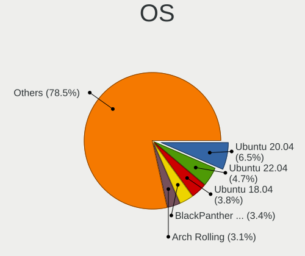

| Name                         | Desktops | Percent |
|------------------------------|----------|---------|
| Ubuntu 20.04                 | 63       | 6.51%   |
| Ubuntu 22.04                 | 45       | 4.65%   |
| Ubuntu 18.04                 | 37       | 3.83%   |
| BlackPanther 18.1            | 33       | 3.41%   |
| Arch Rolling                 | 30       | 3.1%    |
| Debian 12                    | 24       | 2.48%   |
| OpenMandriva 4.2             | 22       | 2.28%   |
| OpenMandriva 4.3             | 21       | 2.17%   |
| Ubuntu 24.04                 | 20       | 2.07%   |
| Manjaro                      | 16       | 1.65%   |
| Fedora 41                    | 16       | 1.65%   |
| OpenMandriva 25.90           | 14       | 1.45%   |
| OpenMandriva 24.12           | 14       | 1.45%   |
| Zorin 17                     | 13       | 1.34%   |
| Debian 11                    | 13       | 1.34%   |
| Pop!_OS 22.04                | 12       | 1.24%   |
| OpenMandriva 5.0             | 12       | 1.24%   |
| ArcoLinux Rolling            | 12       | 1.24%   |
| ROSA R10                     | 11       | 1.14%   |
| Fedora 42                    | 11       | 1.14%   |
| Fedora 40                    | 11       | 1.14%   |
| openSUSE Tumbleweed-XXXXXXXX | 10       | 1.03%   |
| Arch                         | 10       | 1.03%   |
| OpenMandriva 24.07           | 9        | 0.93%   |
| Xubuntu 20.04                | 8        | 0.83%   |
| Pop!_OS 20.04                | 8        | 0.83%   |
| OpenMandriva 23.08           | 8        | 0.83%   |
| Linux Mint 21.1              | 8        | 0.83%   |
| Linux Mint 20.2              | 8        | 0.83%   |
| Fedora 39                    | 8        | 0.83%   |
| Bazzite 42                   | 8        | 0.83%   |
| Zorin 16                     | 7        | 0.72%   |
| ROSA R11                     | 7        | 0.72%   |
| OpenMandriva 23.01           | 7        | 0.72%   |
| Ubuntu 19.10                 | 6        | 0.62%   |
| Pop!_OS 20.10                | 6        | 0.62%   |
| KDE neon 20.04               | 6        | 0.62%   |
| Fedora 37                    | 6        | 0.62%   |
| Fedora 35                    | 6        | 0.62%   |
| Fedora 31                    | 6        | 0.62%   |

OS Family
---------

OS without a version

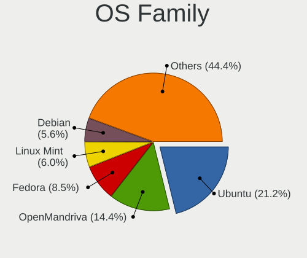

| Name          | Desktops | Percent |
|---------------|----------|---------|
| Ubuntu        | 190      | 21.18%  |
| OpenMandriva  | 129      | 14.38%  |
| Fedora        | 76       | 8.47%   |
| Linux Mint    | 54       | 6.02%   |
| Debian        | 50       | 5.57%   |
| Arch          | 40       | 4.46%   |
| Pop!_OS       | 36       | 4.01%   |
| BlackPanther  | 34       | 3.79%   |
| ROSA          | 32       | 3.57%   |
| Endless       | 30       | 3.34%   |
| Manjaro       | 28       | 3.12%   |
| Zorin         | 25       | 2.79%   |
| openSUSE      | 14       | 1.56%   |
| KDE neon      | 14       | 1.56%   |
| Bazzite       | 14       | 1.56%   |
| ArcoLinux     | 13       | 1.45%   |
| Kubuntu       | 11       | 1.23%   |
| Xubuntu       | 8        | 0.89%   |
| Nobara        | 7        | 0.78%   |
| Gentoo        | 6        | 0.67%   |
| Ubuntu Unity  | 5        | 0.56%   |
| NixOS         | 5        | 0.56%   |
| Lubuntu       | 5        | 0.56%   |
| Garuda Linux  | 5        | 0.56%   |
| Clear Linux   | 5        | 0.56%   |
| Ubuntu Budgie | 4        | 0.45%   |
| EndeavourOS   | 4        | 0.45%   |
| CentOS        | 4        | 0.45%   |
| CachyOS       | 4        | 0.45%   |
| TUXEDO OS     | 3        | 0.33%   |
| SteamOS       | 3        | 0.33%   |
| Solus         | 3        | 0.33%   |
| Elementary    | 3        | 0.33%   |
| Xero          | 2        | 0.22%   |
| Ubuntu MATE   | 2        | 0.22%   |
| Rocky Linux   | 2        | 0.22%   |
| Peppermint    | 2        | 0.22%   |
| MX            | 2        | 0.22%   |
| LMDE          | 2        | 0.22%   |
| Kali          | 2        | 0.22%   |

Kernel
------

Version of the Linux kernel

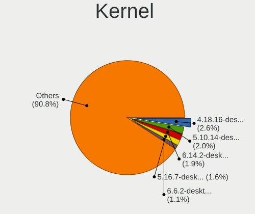

| Version                         | Desktops | Percent |
|---------------------------------|----------|---------|
| 4.18.16-desktop-1bP             | 27       | 2.55%   |
| 5.10.14-desktop-1omv4002        | 21       | 1.99%   |
| 6.14.2-desktop-3omv2590         | 20       | 1.89%   |
| 5.16.7-desktop-1omv4003         | 17       | 1.61%   |
| 6.6.2-desktop-1omv2390          | 12       | 1.14%   |
| 6.12.1-desktop-1omv2490         | 11       | 1.04%   |
| 4.9.60-nrj-desktop-1rosa-x86_64 | 10       | 0.95%   |
| 5.4.0-42-generic                | 8        | 0.76%   |
| 5.15.0-58-generic               | 8        | 0.76%   |
| 6.10.0-desktop-1omv2490         | 7        | 0.66%   |
| 6.1.1-desktop-1omv2290          | 7        | 0.66%   |
| 5.8.0-14-generic                | 7        | 0.66%   |
| 5.6.14-desktop-2bP              | 7        | 0.66%   |
| 5.4.0-40-generic                | 7        | 0.66%   |
| 6.4.11-desktop-1omv2390         | 6        | 0.57%   |
| 6.3.5-desktop-3omv2390          | 6        | 0.57%   |
| 6.2.6-desktop-1omv2390          | 6        | 0.57%   |
| 6.8.0-40-generic                | 5        | 0.47%   |
| 6.2.0-36-generic                | 5        | 0.47%   |
| 5.4.0-74-generic                | 5        | 0.47%   |
| 5.4.0-72-generic                | 5        | 0.47%   |
| 5.4.0-52-generic                | 5        | 0.47%   |
| 5.4.0-29-generic                | 5        | 0.47%   |
| 5.3.0-28-generic                | 5        | 0.47%   |
| 5.16.13-desktop-1omv4003        | 5        | 0.47%   |
| 6.8.0-49-generic                | 4        | 0.38%   |
| 6.8.0-48-generic                | 4        | 0.38%   |
| 6.5.0-21-generic                | 4        | 0.38%   |
| 6.5.0-14-generic                | 4        | 0.38%   |
| 6.12.9-desktop-1omv2490         | 4        | 0.38%   |
| 5.8.0-7630-generic              | 4        | 0.38%   |
| 5.4.0-89-generic                | 4        | 0.38%   |
| 5.4.0-7634-generic              | 4        | 0.38%   |
| 5.4.0-66-generic                | 4        | 0.38%   |
| 5.4.0-51-generic                | 4        | 0.38%   |
| 5.4.0-48-generic                | 4        | 0.38%   |
| 5.4.0-47-generic                | 4        | 0.38%   |
| 5.4.0-19-generic                | 4        | 0.38%   |
| 5.3.0-46-generic                | 4        | 0.38%   |
| 5.3.0-23-generic                | 4        | 0.38%   |

Kernel Family
-------------

Linux kernel without a distro release

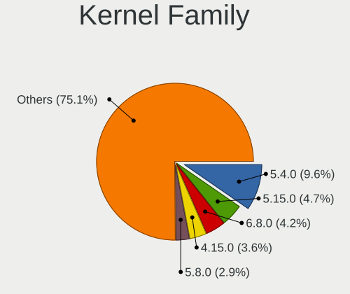

| Version | Desktops | Percent |
|---------|----------|---------|
| 5.4.0   | 97       | 9.61%   |
| 5.15.0  | 47       | 4.66%   |
| 6.8.0   | 42       | 4.16%   |
| 4.15.0  | 36       | 3.57%   |
| 5.8.0   | 29       | 2.87%   |
| 5.11.0  | 28       | 2.78%   |
| 4.18.16 | 27       | 2.68%   |
| 6.14.2  | 25       | 2.48%   |
| 5.3.0   | 25       | 2.48%   |
| 6.5.0   | 24       | 2.38%   |
| 6.1.0   | 24       | 2.38%   |
| 5.10.14 | 21       | 2.08%   |
| 5.16.7  | 17       | 1.68%   |
| 5.10.0  | 15       | 1.49%   |
| 5.0.0   | 15       | 1.49%   |
| 6.2.0   | 14       | 1.39%   |
| 5.19.0  | 14       | 1.39%   |
| 6.14.0  | 13       | 1.29%   |
| 4.18.0  | 13       | 1.29%   |
| 6.6.2   | 12       | 1.19%   |
| 6.12.1  | 11       | 1.09%   |
| 4.9.60  | 10       | 0.99%   |
| 5.13.0  | 9        | 0.89%   |
| 6.10.0  | 8        | 0.79%   |
| 6.1.1   | 8        | 0.79%   |
| 6.4.11  | 7        | 0.69%   |
| 6.12.9  | 7        | 0.69%   |
| 5.6.14  | 7        | 0.69%   |
| 6.3.5   | 6        | 0.59%   |
| 6.2.6   | 6        | 0.59%   |
| 6.12.10 | 6        | 0.59%   |
| 6.0.11  | 6        | 0.59%   |
| 4.9.20  | 6        | 0.59%   |
| 6.5.5   | 5        | 0.5%    |
| 6.12.6  | 5        | 0.5%    |
| 6.11.0  | 5        | 0.5%    |
| 5.8.18  | 5        | 0.5%    |
| 5.16.13 | 5        | 0.5%    |
| 6.17.7  | 4        | 0.4%    |
| 6.16.12 | 4        | 0.4%    |

Kernel Major Ver.
-----------------

Linux kernel major version

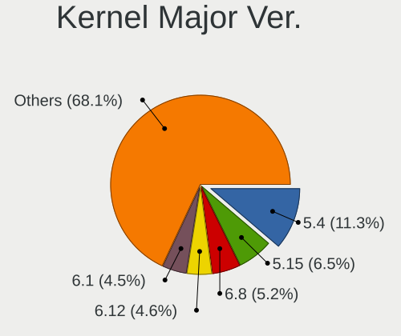

| Version | Desktops | Percent |
|---------|----------|---------|
| 5.4     | 111      | 11.26%  |
| 5.15    | 64       | 6.49%   |
| 6.8     | 51       | 5.17%   |
| 6.12    | 45       | 4.56%   |
| 6.1     | 44       | 4.46%   |
| 6.14    | 42       | 4.26%   |
| 5.8     | 42       | 4.26%   |
| 5.10    | 41       | 4.16%   |
| 4.18    | 40       | 4.06%   |
| 6.5     | 39       | 3.96%   |
| 4.15    | 37       | 3.75%   |
| 5.11    | 32       | 3.25%   |
| 5.16    | 30       | 3.04%   |
| 5.3     | 27       | 2.74%   |
| 6.6     | 24       | 2.43%   |
| 6.2     | 23       | 2.33%   |
| 4.9     | 22       | 2.23%   |
| 5.19    | 19       | 1.93%   |
| 6.11    | 18       | 1.83%   |
| 6.10    | 18       | 1.83%   |
| 5.0     | 18       | 1.83%   |
| 6.0     | 17       | 1.72%   |
| 6.4     | 15       | 1.52%   |
| 6.16    | 13       | 1.32%   |
| 5.6     | 13       | 1.32%   |
| 6.15    | 12       | 1.22%   |
| 5.13    | 12       | 1.22%   |
| 6.9     | 11       | 1.12%   |
| 6.17    | 11       | 1.12%   |
| 6.13    | 11       | 1.12%   |
| 5.18    | 11       | 1.12%   |
| 5.14    | 11       | 1.12%   |
| 6.3     | 9        | 0.91%   |
| 5.9     | 7        | 0.71%   |
| 5.17    | 7        | 0.71%   |
| 5.12    | 6        | 0.61%   |
| 6.7     | 5        | 0.51%   |
| 4.19    | 5        | 0.51%   |
| 4.1     | 5        | 0.51%   |
| 5.7     | 4        | 0.41%   |

Arch
----

OS architecture (x86_64, i586, etc.)

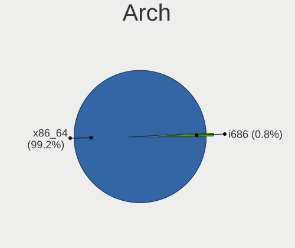

| Name   | Desktops | Percent |
|--------|----------|---------|
| x86_64 | 843      | 99.18%  |
| i686   | 7        | 0.82%   |

DE
--

Desktop Environment

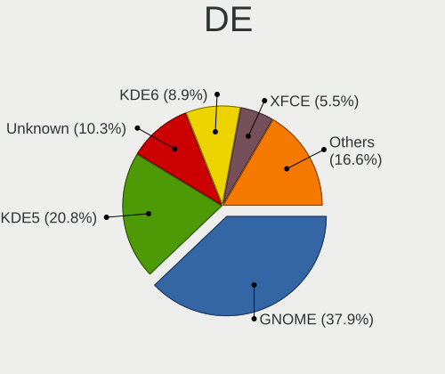

| Name            | Desktops | Percent |
|-----------------|----------|---------|
| GNOME           | 345      | 37.91%  |
| KDE5            | 189      | 20.77%  |
| Unknown         | 94       | 10.33%  |
| KDE6            | 81       | 8.9%    |
| XFCE            | 50       | 5.49%   |
| X-Cinnamon      | 41       | 4.51%   |
| KDE4            | 20       | 2.2%    |
| LXQt            | 19       | 2.09%   |
| KDE             | 19       | 2.09%   |
| MATE            | 11       | 1.21%   |
| LXDE            | 7        | 0.77%   |
| i3              | 6        | 0.66%   |
| Unity           | 5        | 0.55%   |
| Cinnamon        | 5        | 0.55%   |
| Budgie          | 4        | 0.44%   |
| Pantheon        | 2        | 0.22%   |
| COSMIC          | 2        | 0.22%   |
| sway            | 1        | 0.11%   |
| sussy_bspwm     | 1        | 0.11%   |
| openbox         | 1        | 0.11%   |
| hyprstart       | 1        | 0.11%   |
| Hyprland        | 1        | 0.11%   |
| GNUstep         | 1        | 0.11%   |
| GNOME Flashback | 1        | 0.11%   |
| dusk            | 1        | 0.11%   |
| Deepin          | 1        | 0.11%   |
| awesome         | 1        | 0.11%   |

Display Server
--------------

X11 or Wayland

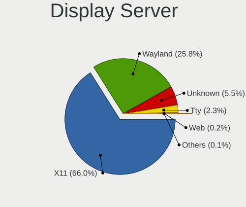

| Name        | Desktops | Percent |
|-------------|----------|---------|
| X11         | 583      | 66.02%  |
| Wayland     | 228      | 25.82%  |
| Unknown     | 49       | 5.55%   |
| Tty         | 20       | 2.27%   |
| Web         | 2        | 0.23%   |
| Unspecified | 1        | 0.11%   |

Display Manager
---------------

SDDM, LightDM, etc.

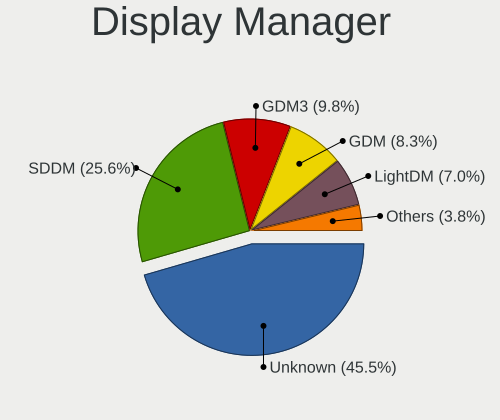

| Name    | Desktops | Percent |
|---------|----------|---------|
| Unknown | 410      | 45.5%   |
| SDDM    | 231      | 25.64%  |
| GDM3    | 88       | 9.77%   |
| GDM     | 75       | 8.32%   |
| LightDM | 63       | 6.99%   |
| KDM     | 19       | 2.11%   |
| TDM     | 12       | 1.33%   |
| XDM     | 1        | 0.11%   |
| Ly      | 1        | 0.11%   |
| LXDM    | 1        | 0.11%   |

OS Lang
-------

Language

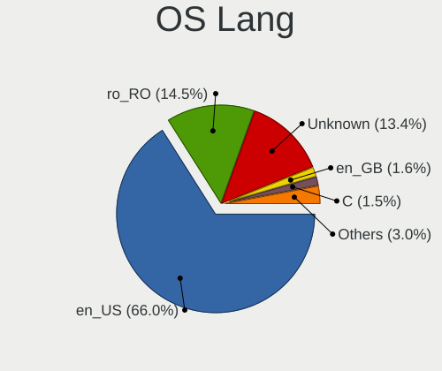

| Lang        | Desktops | Percent |
|-------------|----------|---------|
| en_US       | 575      | 66.02%  |
| ro_RO       | 126      | 14.47%  |
| Unknown     | 117      | 13.43%  |
| en_GB       | 14       | 1.61%   |
| C           | 13       | 1.49%   |
| hu_HU       | 7        | 0.8%    |
| fr_FR       | 5        | 0.57%   |
| es_ES       | 3        | 0.34%   |
| de_DE       | 2        | 0.23%   |
| ru_RU       | 1        | 0.11%   |
| it_IT       | 1        | 0.11%   |
| en_US.UTF8  | 1        | 0.11%   |
| en_US.utf-8 | 1        | 0.11%   |
| en_IN       | 1        | 0.11%   |
| en_IL       | 1        | 0.11%   |
| en_DK       | 1        | 0.11%   |
| en_DE       | 1        | 0.11%   |
| en_CA       | 1        | 0.11%   |

Boot Mode
---------

EFI or BIOS

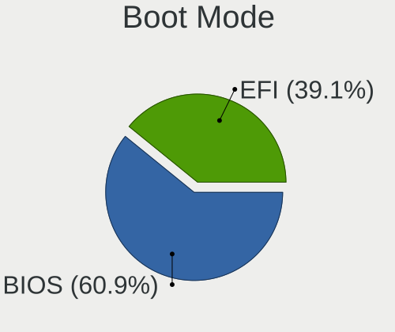

| Mode | Desktops | Percent |
|------|----------|---------|
| BIOS | 527      | 60.85%  |
| EFI  | 339      | 39.15%  |

Filesystem
----------

Type of filesystem

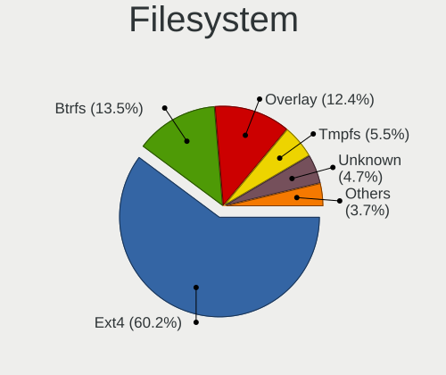

| Type    | Desktops | Percent |
|---------|----------|---------|
| Ext4    | 535      | 60.18%  |
| Btrfs   | 120      | 13.5%   |
| Overlay | 110      | 12.37%  |
| Tmpfs   | 49       | 5.51%   |
| Unknown | 42       | 4.72%   |
| Xfs     | 18       | 2.02%   |
| Zfs     | 7        | 0.79%   |
| F2fs    | 3        | 0.34%   |
| Rootfs  | 2        | 0.22%   |
| Jfs     | 1        | 0.11%   |
| Ext3    | 1        | 0.11%   |
| Ext2    | 1        | 0.11%   |

Part. scheme
------------

Scheme of partitioning

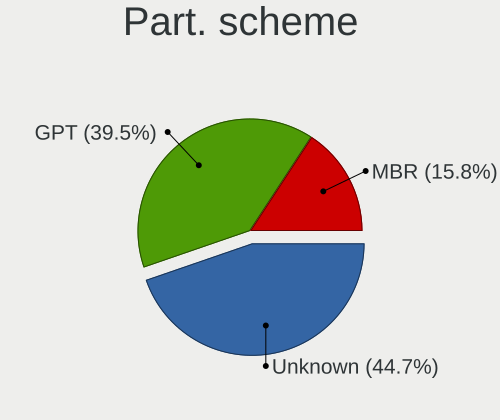

| Type    | Desktops | Percent |
|---------|----------|---------|
| Unknown | 394      | 44.72%  |
| GPT     | 348      | 39.5%   |
| MBR     | 139      | 15.78%  |

Dual Boot with Linux/BSD
------------------------

Hosting more than one Linux/BSD

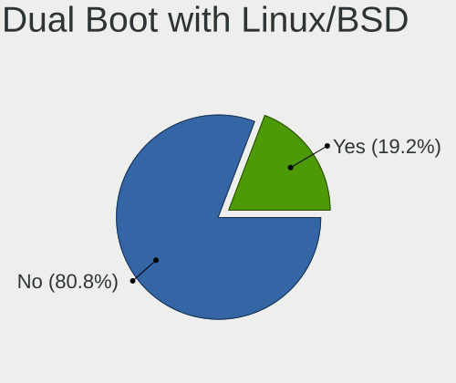

| Dual boot | Desktops | Percent |
|-----------|----------|---------|
| No        | 707      | 80.8%   |
| Yes       | 168      | 19.2%   |

Dual Boot (Win)
---------------

Hosting Linux and Windows

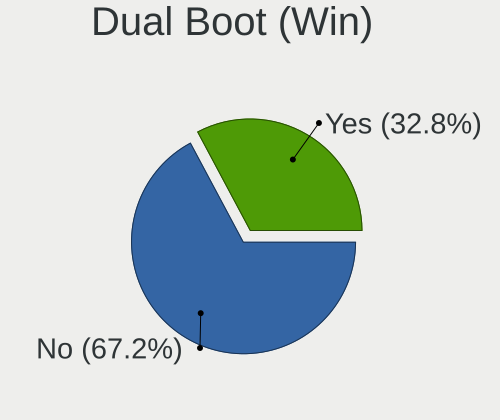

| Dual boot | Desktops | Percent |
|-----------|----------|---------|
| No        | 590      | 67.2%   |
| Yes       | 288      | 32.8%   |

Board
-----

Vendor
------

Motherboard manufacturer

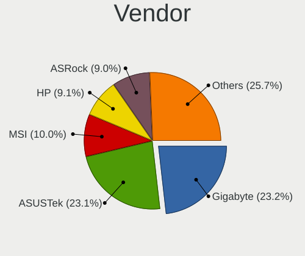

| Name                                 | Desktops | Percent |
|--------------------------------------|----------|---------|
| Gigabyte Technology                  | 197      | 23.2%   |
| ASUSTek Computer                     | 196      | 23.09%  |
| MSI                                  | 85       | 10.01%  |
| Hewlett-Packard                      | 77       | 9.07%   |
| ASRock                               | 76       | 8.95%   |
| Dell                                 | 60       | 7.07%   |
| Lenovo                               | 44       | 5.18%   |
| Acer                                 | 30       | 3.53%   |
| Intel                                | 14       | 1.65%   |
| Fujitsu                              | 10       | 1.18%   |
| Unknown                              | 10       | 1.18%   |
| Fujitsu Siemens                      | 6        | 0.71%   |
| Foxconn                              | 6        | 0.71%   |
| Pegatron                             | 5        | 0.59%   |
| ECS                                  | 3        | 0.35%   |
| WesternDigital                       | 2        | 0.24%   |
| Huanan                               | 2        | 0.24%   |
| Complet                              | 2        | 0.24%   |
| Biostar                              | 2        | 0.24%   |
| BESSTAR Tech                         | 2        | 0.24%   |
| ZOTAC                                | 1        | 0.12%   |
| Shenzhen Meigao Electronic Equipment | 1        | 0.12%   |
| Quanmax                              | 1        | 0.12%   |
| Packard Bell                         | 1        | 0.12%   |
| OEM_MB                               | 1        | 0.12%   |
| Medion                               | 1        | 0.12%   |
| MACHINIST                            | 1        | 0.12%   |
| Jetway                               | 1        | 0.12%   |
| IBM                                  | 1        | 0.12%   |
| HC Technology.                       | 1        | 0.12%   |
| Gateway                              | 1        | 0.12%   |
| eMachines                            | 1        | 0.12%   |
| Daewoo Lucoms                        | 1        | 0.12%   |
| AZW                                  | 1        | 0.12%   |
| ASRockRack                           | 1        | 0.12%   |
| Apple                                | 1        | 0.12%   |
| AMI                                  | 1        | 0.12%   |
| Alienware                            | 1        | 0.12%   |
| AIO                                  | 1        | 0.12%   |
| ABIT                                 | 1        | 0.12%   |

Model
-----

Motherboard model

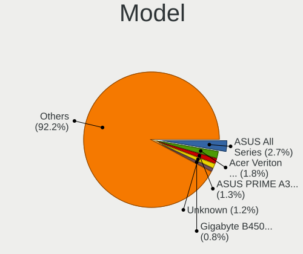

| Name                               | Desktops | Percent |
|------------------------------------|----------|---------|
| ASUS All Series                    | 23       | 2.71%   |
| Acer Veriton L670G                 | 15       | 1.77%   |
| ASUS PRIME A320M-K                 | 11       | 1.3%    |
| Unknown                            | 10       | 1.18%   |
| Gigabyte B450M DS3H                | 7        | 0.82%   |
| Dell OptiPlex 7010                 | 6        | 0.71%   |
| MSI MS-7B86                        | 5        | 0.59%   |
| MSI MS-7996                        | 5        | 0.59%   |
| Gigabyte B450 AORUS M              | 5        | 0.59%   |
| Dell OptiPlex 9020                 | 5        | 0.59%   |
| MSI MS-7721                        | 4        | 0.47%   |
| Gigabyte X470 AORUS ULTRA GAMING   | 4        | 0.47%   |
| Gigabyte TRX40 AORUS MASTER        | 4        | 0.47%   |
| Dell OptiPlex 755                  | 4        | 0.47%   |
| Dell OptiPlex 3010                 | 4        | 0.47%   |
| ASUS PRIME H310M-R R2.0            | 4        | 0.47%   |
| MSI MS-7C56                        | 3        | 0.35%   |
| MSI MS-7C37                        | 3        | 0.35%   |
| MSI MS-7C02                        | 3        | 0.35%   |
| MSI MS-7B38                        | 3        | 0.35%   |
| MSI MS-7817                        | 3        | 0.35%   |
| HP Z620 Workstation                | 3        | 0.35%   |
| HP EliteDesk 705 G4 DM 35W (TAA)   | 3        | 0.35%   |
| HP Compaq Pro 6305 SFF             | 3        | 0.35%   |
| HP Compaq Elite 8300 SFF           | 3        | 0.35%   |
| Gigabyte X570 AORUS ELITE          | 3        | 0.35%   |
| Gigabyte B550M DS3H                | 3        | 0.35%   |
| Gigabyte B550M AORUS ELITE         | 3        | 0.35%   |
| Gigabyte AB350-Gaming 3            | 3        | 0.35%   |
| Gigabyte A320M-S2H                 | 3        | 0.35%   |
| Gigabyte A320M-H                   | 3        | 0.35%   |
| Dell Precision WorkStation T3500   | 3        | 0.35%   |
| Dell OptiPlex 780                  | 3        | 0.35%   |
| Dell OptiPlex 7050                 | 3        | 0.35%   |
| ASUS Z170 PRO GAMING               | 3        | 0.35%   |
| ASUS ROG STRIX B650E-E GAMING WIFI | 3        | 0.35%   |
| ASUS PRIME X470-PRO                | 3        | 0.35%   |
| ASRock G41M-VS3                    | 3        | 0.35%   |
| WesternDigital WDBNFA0000NBK-00    | 2        | 0.24%   |
| MSI MS-7D46                        | 2        | 0.24%   |

Model Family
------------

Motherboard model prefix

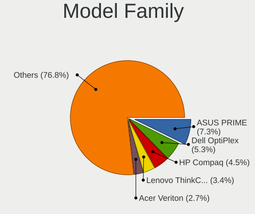

| Name                    | Desktops | Percent |
|-------------------------|----------|---------|
| ASUS PRIME              | 62       | 7.3%    |
| Dell OptiPlex           | 45       | 5.3%    |
| HP Compaq               | 38       | 4.48%   |
| Lenovo ThinkCentre      | 29       | 3.42%   |
| ASUS ROG                | 23       | 2.71%   |
| ASUS All                | 23       | 2.71%   |
| Acer Veriton            | 23       | 2.71%   |
| ASUS TUF                | 15       | 1.77%   |
| HP EliteDesk            | 14       | 1.65%   |
| Unknown                 | 10       | 1.18%   |
| Gigabyte B450M          | 9        | 1.06%   |
| HP ProDesk              | 8        | 0.94%   |
| Gigabyte X570           | 8        | 0.94%   |
| Fujitsu ESPRIMO         | 8        | 0.94%   |
| Gigabyte B550M          | 7        | 0.82%   |
| Gigabyte B450           | 7        | 0.82%   |
| Dell Precision          | 7        | 0.82%   |
| Gigabyte Z690           | 6        | 0.71%   |
| Gigabyte B650           | 6        | 0.71%   |
| MSI MS-7B86             | 5        | 0.59%   |
| MSI MS-7996             | 5        | 0.59%   |
| Gigabyte TRX40          | 5        | 0.59%   |
| ASUS Pro                | 5        | 0.59%   |
| ASUS Maximus            | 5        | 0.59%   |
| ASRock X670E            | 5        | 0.59%   |
| MSI MS-7721             | 4        | 0.47%   |
| Gigabyte Z390           | 4        | 0.47%   |
| Gigabyte X470           | 4        | 0.47%   |
| Gigabyte A320M-S2H      | 4        | 0.47%   |
| Fujitsu Siemens ESPRIMO | 4        | 0.47%   |
| MSI MS-7C56             | 3        | 0.35%   |
| MSI MS-7C37             | 3        | 0.35%   |
| MSI MS-7C02             | 3        | 0.35%   |
| MSI MS-7B38             | 3        | 0.35%   |
| MSI MS-7817             | 3        | 0.35%   |
| Lenovo ThinkStation     | 3        | 0.35%   |
| Lenovo Legion           | 3        | 0.35%   |
| Lenovo IdeaCentre       | 3        | 0.35%   |
| HP Z620                 | 3        | 0.35%   |
| Gigabyte X670           | 3        | 0.35%   |

MFG Year
--------

Motherboard manufacture year

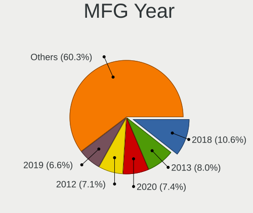

| Year    | Desktops | Percent |
|---------|----------|---------|
| 2018    | 90       | 10.6%   |
| 2013    | 68       | 8.01%   |
| 2020    | 63       | 7.42%   |
| 2012    | 60       | 7.07%   |
| 2019    | 56       | 6.6%    |
| 2017    | 55       | 6.48%   |
| 2021    | 53       | 6.24%   |
| 2014    | 49       | 5.77%   |
| 2011    | 49       | 5.77%   |
| 2008    | 49       | 5.77%   |
| 2015    | 41       | 4.83%   |
| 2009    | 41       | 4.83%   |
| 2007    | 33       | 3.89%   |
| 2022    | 31       | 3.65%   |
| 2010    | 31       | 3.65%   |
| 2016    | 29       | 3.42%   |
| 2023    | 19       | 2.24%   |
| 2024    | 18       | 2.12%   |
| 2006    | 7        | 0.82%   |
| 2005    | 4        | 0.47%   |
| 2025    | 1        | 0.12%   |
| 2004    | 1        | 0.12%   |
| Unknown | 1        | 0.12%   |

Form Factor
-----------

Physical design of the computer

| Name    | Desktops | Percent |
|---------|----------|---------|
| Desktop | 849      | 100%    |

Secure Boot
-----------

Enabled or disabled

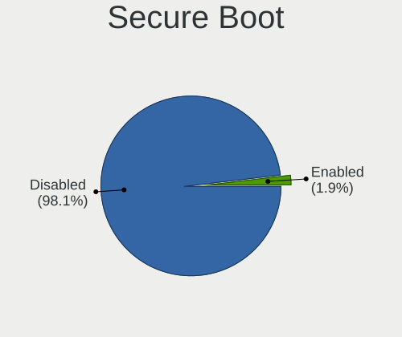

| State    | Desktops | Percent |
|----------|----------|---------|
| Disabled | 838      | 98.13%  |
| Enabled  | 16       | 1.87%   |

Coreboot
--------

Have coreboot on board

| Used | Desktops | Percent |
|------|----------|---------|
| No   | 849      | 100%    |

RAM Size
--------

Total RAM memory

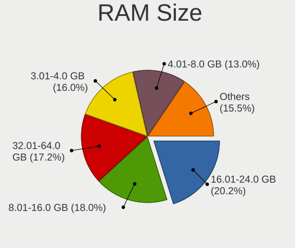

| Size in GB      | Desktops | Percent |
|-----------------|----------|---------|
| 16.01-24.0      | 178      | 20.18%  |
| 8.01-16.0       | 159      | 18.03%  |
| 32.01-64.0      | 152      | 17.23%  |
| 3.01-4.0        | 141      | 15.99%  |
| 4.01-8.0        | 115      | 13.04%  |
| 64.01-256.0     | 61       | 6.92%   |
| 24.01-32.0      | 39       | 4.42%   |
| 1.01-2.0        | 25       | 2.83%   |
| 2.01-3.0        | 7        | 0.79%   |
| 0.51-1.0        | 3        | 0.34%   |
| More than 256.0 | 2        | 0.23%   |

RAM Used
--------

Used RAM memory

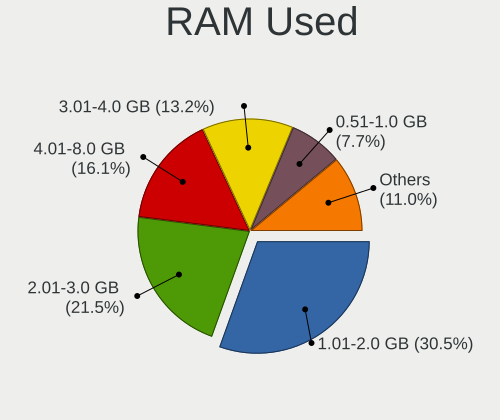

| Used GB     | Desktops | Percent |
|-------------|----------|---------|
| 1.01-2.0    | 296      | 30.48%  |
| 2.01-3.0    | 209      | 21.52%  |
| 4.01-8.0    | 156      | 16.07%  |
| 3.01-4.0    | 128      | 13.18%  |
| 0.51-1.0    | 75       | 7.72%   |
| 8.01-16.0   | 60       | 6.18%   |
| 0.01-0.5    | 32       | 3.3%    |
| 16.01-24.0  | 10       | 1.03%   |
| 32.01-64.0  | 2        | 0.21%   |
| 64.01-256.0 | 2        | 0.21%   |
| 24.01-32.0  | 1        | 0.1%    |

Total Drives
------------

Number of drives on board

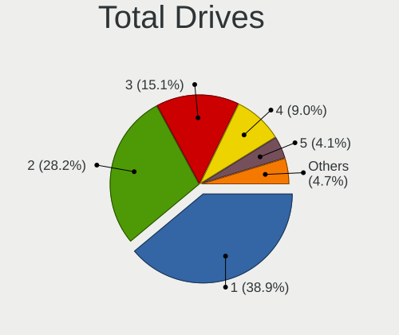

| Drives | Desktops | Percent |
|--------|----------|---------|
| 1      | 354      | 38.94%  |
| 2      | 256      | 28.16%  |
| 3      | 137      | 15.07%  |
| 4      | 82       | 9.02%   |
| 5      | 37       | 4.07%   |
| 6      | 14       | 1.54%   |
| 0      | 9        | 0.99%   |
| 7      | 6        | 0.66%   |
| 9      | 4        | 0.44%   |
| 8      | 4        | 0.44%   |
| 10     | 2        | 0.22%   |
| 24     | 1        | 0.11%   |
| 15     | 1        | 0.11%   |
| 14     | 1        | 0.11%   |
| 11     | 1        | 0.11%   |

Has CD-ROM
----------

Has CD-ROM on board

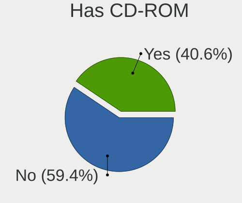

| Presented | Desktops | Percent |
|-----------|----------|---------|
| No        | 513      | 59.44%  |
| Yes       | 350      | 40.56%  |

Has Ethernet
------------

Has Ethernet on board

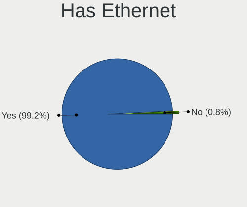

| Presented | Desktops | Percent |
|-----------|----------|---------|
| Yes       | 842      | 99.18%  |
| No        | 7        | 0.82%   |

Has WiFi
--------

Has WiFi module

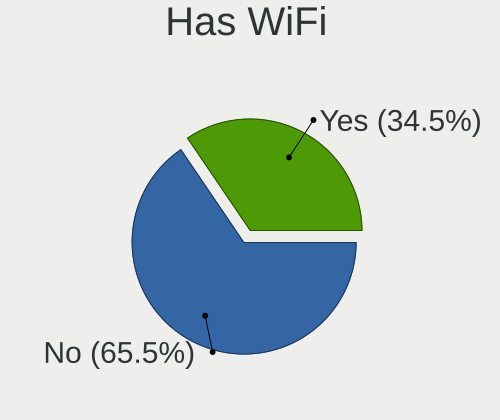

| Presented | Desktops | Percent |
|-----------|----------|---------|
| No        | 566      | 65.51%  |
| Yes       | 298      | 34.49%  |

Has Bluetooth
-------------

Has Bluetooth module

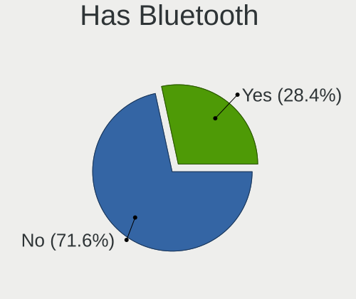

| Presented | Desktops | Percent |
|-----------|----------|---------|
| No        | 621      | 71.63%  |
| Yes       | 246      | 28.37%  |

Location
--------

Country
-------

Geographic location (country)

| Country | Desktops | Percent |
|---------|----------|---------|
| Romania | 849      | 100%    |

City
----

Geographic location (city)

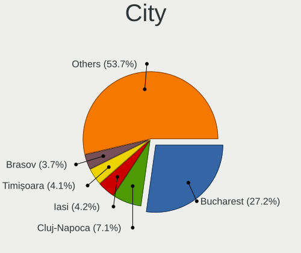

| City                  | Desktops | Percent |
|-----------------------|----------|---------|
| Bucharest             | 245      | 27.22%  |
| Cluj-Napoca           | 64       | 7.11%   |
| Iasi                  | 38       | 4.22%   |
| Timișoara            | 37       | 4.11%   |
| Brasov                | 33       | 3.67%   |
| Târgu Mureş         | 27       | 3%      |
| Oradea                | 24       | 2.67%   |
| Sibiu                 | 21       | 2.33%   |
| Arad                  | 19       | 2.11%   |
| Constanța            | 18       | 2%      |
| Baia Mare             | 14       | 1.56%   |
| Craiova               | 12       | 1.33%   |
| Zalău                | 11       | 1.22%   |
| Satu Mare             | 11       | 1.22%   |
| Galati                | 11       | 1.22%   |
| Ploieşti             | 10       | 1.11%   |
| Piatra Neamţ         | 10       | 1.11%   |
| Piteşti              | 9        | 1%      |
| Targoviste            | 8        | 0.89%   |
| Drobeta-Turnu Severin | 8        | 0.89%   |
| Bacau                 | 8        | 0.89%   |
| Voluntari             | 7        | 0.78%   |
| Tulcea                | 7        | 0.78%   |
| Popesti-Leordeni      | 7        | 0.78%   |
| Miercurea-Ciuc        | 7        | 0.78%   |
| Alexandria            | 7        | 0.78%   |
| Râmnicu Vâlcea      | 6        | 0.67%   |
| Otopeni               | 6        | 0.67%   |
| Bistriţa             | 6        | 0.67%   |
| Târgu Jiu            | 5        | 0.56%   |
| Mediaş               | 5        | 0.56%   |
| Floresti              | 5        | 0.56%   |
| Braila                | 5        | 0.56%   |
| Beiuș                | 5        | 0.56%   |
| Suceava               | 4        | 0.44%   |
| Sfantu Gheorghe       | 4        | 0.44%   |
| Focşani              | 4        | 0.44%   |
| Buzau                 | 4        | 0.44%   |
| Botosani              | 4        | 0.44%   |
| Reşiţa              | 3        | 0.33%   |

Drives
------

Drive Vendor
------------

Hard drive vendors

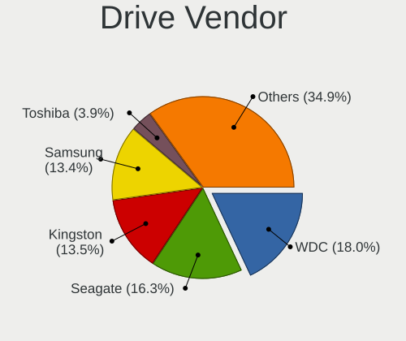

| Vendor                       | Desktops | Drives | Percent |
|------------------------------|----------|--------|---------|
| WDC                          | 292      | 498    | 18.02%  |
| Seagate                      | 264      | 446    | 16.3%   |
| Kingston                     | 218      | 336    | 13.46%  |
| Samsung Electronics          | 217      | 349    | 13.4%   |
| Toshiba                      | 63       | 81     | 3.89%   |
| A-DATA Technology            | 63       | 117    | 3.89%   |
| Kingston Technology Company  | 45       | 58     | 2.78%   |
| Hitachi                      | 38       | 55     | 2.35%   |
| SanDisk                      | 33       | 48     | 2.04%   |
| Intel                        | 33       | 37     | 2.04%   |
| Crucial                      | 32       | 46     | 1.98%   |
| Maxtor                       | 21       | 30     | 1.3%    |
| HGST                         | 19       | 29     | 1.17%   |
| SPCC                         | 17       | 24     | 1.05%   |
| Phison Electronics           | 17       | 23     | 1.05%   |
| Unknown                      | 14       | 17     | 0.86%   |
| Patriot                      | 14       | 17     | 0.86%   |
| Hewlett-Packard              | 12       | 14     | 0.74%   |
| ADATA Technology             | 12       | 13     | 0.74%   |
| SK hynix                     | 10       | 12     | 0.62%   |
| Silicon Motion               | 10       | 14     | 0.62%   |
| XPG                          | 9        | 12     | 0.56%   |
| Verbatim                     | 8        | 11     | 0.49%   |
| Team                         | 8        | 8      | 0.49%   |
| OCZ                          | 8        | 16     | 0.49%   |
| Micron Technology            | 8        | 9      | 0.49%   |
| Micron/Crucial Technology    | 7        | 8      | 0.43%   |
| GOODRAM                      | 7        | 7      | 0.43%   |
| Gigabyte Technology          | 7        | 13     | 0.43%   |
| China                        | 7        | 7      | 0.43%   |
| Transcend                    | 6        | 8      | 0.37%   |
| Phison                       | 6        | 8      | 0.37%   |
| Kingmax                      | 6        | 7      | 0.37%   |
| Shenzhen Longsys Electronics | 4        | 4      | 0.25%   |
| Realtek Semiconductor        | 4        | 4      | 0.25%   |
| PNY                          | 4        | 5      | 0.25%   |
| Plextor                      | 4        | 5      | 0.25%   |
| LaCie                        | 4        | 10     | 0.25%   |
| Corsair                      | 4        | 15     | 0.25%   |
| AMD                          | 4        | 21     | 0.25%   |

Drive Model
-----------

Hard drive models

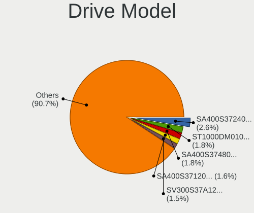

| Model                                              | Desktops | Percent |
|----------------------------------------------------|----------|---------|
| Kingston SA400S37240G 240GB SSD                    | 49       | 2.64%   |
| Seagate ST1000DM010-2EP102 1TB                     | 34       | 1.83%   |
| Kingston SA400S37480G 480GB SSD                    | 33       | 1.78%   |
| Kingston SA400S37120G 120GB SSD                    | 29       | 1.56%   |
| Kingston SV300S37A120G 120GB SSD                   | 27       | 1.45%   |
| WDC WD10EZEX-08WN4A0 1TB                           | 25       | 1.35%   |
| Samsung NVMe SSD Controller SM981/PM981/PM983 1TB  | 21       | 1.13%   |
| Samsung SSD 850 EVO 250GB                          | 19       | 1.02%   |
| Kingston Company SNV2S1000G 1TB                    | 19       | 1.02%   |
| Samsung SSD 860 EVO 500GB                          | 18       | 0.97%   |
| Kingston SA400S37960G 960GB SSD                    | 17       | 0.92%   |
| Seagate ST500DM002-1BD142 500GB                    | 16       | 0.86%   |
| Samsung NVMe SSD Controller PM9A1/PM9A3/980PRO 1TB | 16       | 0.86%   |
| Seagate ST2000DM008-2FR102 2TB                     | 14       | 0.75%   |
| Toshiba DT01ACA050 500GB                           | 13       | 0.7%    |
| WDC WD1600AAJS-22L7A0 160GB                        | 12       | 0.65%   |
| A-DATA SU650 240GB SSD                             | 12       | 0.65%   |
| Toshiba DT01ACA100 1TB                             | 11       | 0.59%   |
| Seagate ST2000DM008-2UB102 2TB                     | 11       | 0.59%   |
| Samsung SSD 860 EVO 250GB                          | 11       | 0.59%   |
| Kingston Company A2000 NVMe SSD 250GB              | 11       | 0.59%   |
| WDC WD10EZEX-22MFCA0 1TB                           | 9        | 0.48%   |
| Samsung SSD 870 EVO 1TB                            | 9        | 0.48%   |
| Kingston SUV400S37120G 120GB SSD                   | 9        | 0.48%   |
| Kingston SNV2S500G 500GB                           | 9        | 0.48%   |
| Seagate ST4000DM004-2CV104 4TB                     | 8        | 0.43%   |
| Seagate ST1000DM003-1CH162 1TB                     | 8        | 0.43%   |
| A-DATA SU650 480GB SSD                             | 8        | 0.43%   |
| Seagate ST2000DM006-2DM164 2TB                     | 7        | 0.38%   |
| Samsung SSD 850 EVO 500GB                          | 7        | 0.38%   |
| Patriot Burst 120GB SSD                            | 7        | 0.38%   |
| Kingston Company SNV2S2000G 2TB                    | 7        | 0.38%   |
| WDC WD5000AAKX-001CA0 500GB                        | 6        | 0.32%   |
| WDC WD10EZEX-00WN4A0 1TB                           | 6        | 0.32%   |
| WDC WD10EZEX-00BN5A0 1TB                           | 6        | 0.32%   |
| SPCC Solid State Disk 1TB                          | 6        | 0.32%   |
| Seagate ST3500312CS 500GB                          | 6        | 0.32%   |
| Seagate ST250DM000-1BD141 250GB                    | 6        | 0.32%   |
| Seagate ST1000DM003-1SB10C 1TB                     | 6        | 0.32%   |
| Seagate ST1000DM003-1SB102 1TB                     | 6        | 0.32%   |

HDD Vendor
----------

Hard disk drive vendors

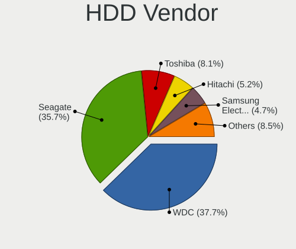

| Vendor              | Desktops | Drives | Percent |
|---------------------|----------|--------|---------|
| WDC                 | 274      | 469    | 37.74%  |
| Seagate             | 259      | 437    | 35.67%  |
| Toshiba             | 59       | 75     | 8.13%   |
| Hitachi             | 38       | 55     | 5.23%   |
| Samsung Electronics | 34       | 43     | 4.68%   |
| Maxtor              | 20       | 29     | 2.75%   |
| HGST                | 19       | 29     | 2.62%   |
| Unknown             | 6        | 6      | 0.83%   |
| TO Exter            | 3        | 4      | 0.41%   |
| LaCie               | 2        | 8      | 0.28%   |
| Fujitsu             | 2        | 2      | 0.28%   |
| USB3.0              | 1        | 1      | 0.14%   |
| Shenzhen            | 1        | 1      | 0.14%   |
| MARVELL             | 1        | 1      | 0.14%   |
| JMicron Technology  | 1        | 1      | 0.14%   |
| Intenso             | 1        | 1      | 0.14%   |
| HPE                 | 1        | 1      | 0.14%   |
| Hewlett-Packard     | 1        | 1      | 0.14%   |
| ExcelStor           | 1        | 1      | 0.14%   |
| ASMT109x            | 1        | 1      | 0.14%   |
| ASMT                | 1        | 1      | 0.14%   |

SSD Vendor
----------

Solid state drive vendors

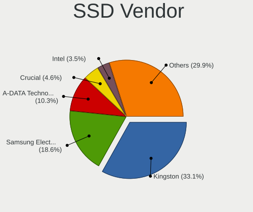

| Vendor              | Desktops | Drives | Percent |
|---------------------|----------|--------|---------|
| Kingston            | 189      | 269    | 33.1%   |
| Samsung Electronics | 106      | 158    | 18.56%  |
| A-DATA Technology   | 59       | 112    | 10.33%  |
| Crucial             | 26       | 39     | 4.55%   |
| Intel               | 20       | 23     | 3.5%    |
| WDC                 | 18       | 22     | 3.15%   |
| SPCC                | 16       | 23     | 2.8%    |
| Patriot             | 14       | 17     | 2.45%   |
| SanDisk             | 11       | 15     | 1.93%   |
| Team                | 8        | 8      | 1.4%    |
| OCZ                 | 8        | 16     | 1.4%    |
| Verbatim            | 7        | 10     | 1.23%   |
| Hewlett-Packard     | 7        | 8      | 1.23%   |
| GOODRAM             | 7        | 7      | 1.23%   |
| China               | 7        | 7      | 1.23%   |
| Kingmax             | 6        | 7      | 1.05%   |
| Transcend           | 5        | 7      | 0.88%   |
| SK hynix            | 5        | 6      | 0.88%   |
| Micron Technology   | 5        | 6      | 0.88%   |
| Gigabyte Technology | 5        | 11     | 0.88%   |
| Toshiba             | 4        | 5      | 0.7%    |
| PNY                 | 4        | 5      | 0.7%    |
| Emtec               | 3        | 3      | 0.53%   |
| Corsair             | 3        | 13     | 0.53%   |
| Seagate             | 2        | 2      | 0.35%   |
| AMD                 | 2        | 2      | 0.35%   |
| Vaseky              | 1        | 1      | 0.18%   |
| OCZ-VERTEX3         | 1        | 1      | 0.18%   |
| Netac               | 1        | 1      | 0.18%   |
| Micron 2            | 1        | 1      | 0.18%   |
| MicroFrom           | 1        | 1      | 0.18%   |
| Maxtor              | 1        | 1      | 0.18%   |
| LITEONIT            | 1        | 1      | 0.18%   |
| LITEON              | 1        | 1      | 0.18%   |
| Kston               | 1        | 6      | 0.18%   |
| KingSpec            | 1        | 2      | 0.18%   |
| KingDian            | 1        | 1      | 0.18%   |
| Innodisk            | 1        | 1      | 0.18%   |
| HS-SSD-E100N        | 1        | 1      | 0.18%   |
| Fordisk             | 1        | 1      | 0.18%   |

Drive Kind
----------

HDD or SSD

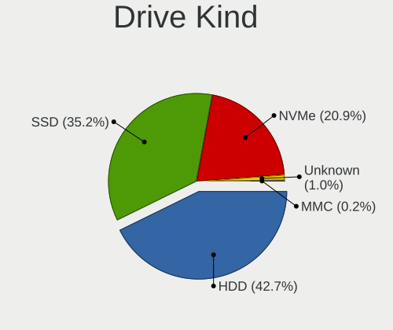

| Kind    | Desktops | Drives | Percent |
|---------|----------|--------|---------|
| HDD     | 559      | 1167   | 42.74%  |
| SSD     | 460      | 832    | 35.17%  |
| NVMe    | 273      | 493    | 20.87%  |
| Unknown | 13       | 17     | 0.99%   |
| MMC     | 3        | 3      | 0.23%   |

Drive Connector
---------------

SATA, SAS, NVMe, etc.

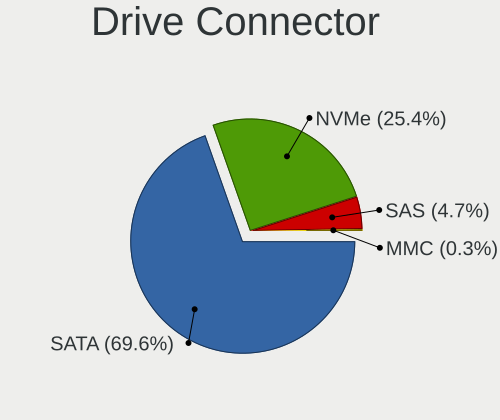

| Type | Desktops | Drives | Percent |
|------|----------|--------|---------|
| SATA | 744      | 1920   | 69.6%   |
| NVMe | 272      | 492    | 25.44%  |
| SAS  | 50       | 97     | 4.68%   |
| MMC  | 3        | 3      | 0.28%   |

Drive Size
----------

Size of hard drive

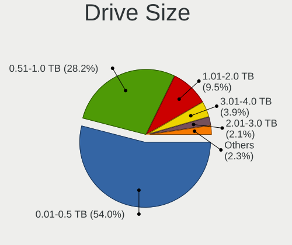

| Size in TB | Desktops | Drives | Percent |
|------------|----------|--------|---------|
| 0.01-0.5   | 583      | 1134   | 54.03%  |
| 0.51-1.0   | 304      | 494    | 28.17%  |
| 1.01-2.0   | 102      | 158    | 9.45%   |
| 3.01-4.0   | 42       | 78     | 3.89%   |
| 2.01-3.0   | 23       | 62     | 2.13%   |
| 4.01-10.0  | 21       | 65     | 1.95%   |
| 10.01-20.0 | 3        | 6      | 0.28%   |
| 20.01-50.0 | 1        | 2      | 0.09%   |

Space Total
-----------

Amount of disk space available on the file system

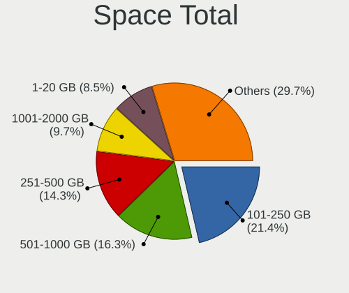

| Size in GB     | Desktops | Percent |
|----------------|----------|---------|
| 101-250        | 200      | 21.37%  |
| 501-1000       | 153      | 16.35%  |
| 251-500        | 134      | 14.32%  |
| 1001-2000      | 91       | 9.72%   |
| 1-20           | 80       | 8.55%   |
| More than 3000 | 75       | 8.01%   |
| 51-100         | 63       | 6.73%   |
| Unknown        | 57       | 6.09%   |
| 2001-3000      | 50       | 5.34%   |
| 21-50          | 33       | 3.53%   |

Space Used
----------

Amount of used disk space

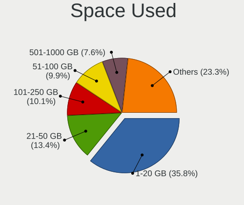

| Used GB        | Desktops | Percent |
|----------------|----------|---------|
| 1-20           | 345      | 35.83%  |
| 21-50          | 129      | 13.4%   |
| 101-250        | 97       | 10.07%  |
| 51-100         | 95       | 9.87%   |
| 501-1000       | 73       | 7.58%   |
| 251-500        | 70       | 7.27%   |
| Unknown        | 57       | 5.92%   |
| 1001-2000      | 52       | 5.4%    |
| More than 3000 | 25       | 2.6%    |
| 2001-3000      | 18       | 1.87%   |
| 0              | 2        | 0.21%   |

Malfunc. Drives
---------------

Drive models with a malfunction

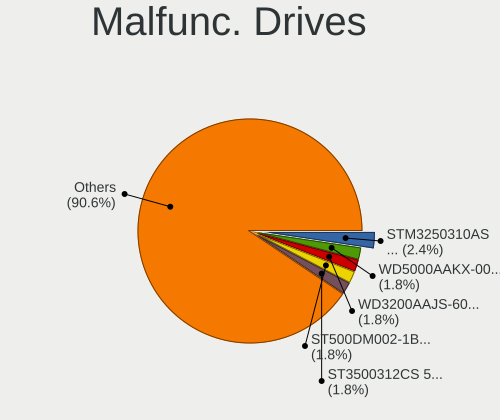

| Model                                 | Desktops | Drives | Percent |
|---------------------------------------|----------|--------|---------|
| Maxtor STM3250310AS 250GB             | 4        | 5      | 2.35%   |
| WDC WD5000AAKX-001CA0 500GB           | 3        | 3      | 1.76%   |
| WDC WD3200AAJS-60Z0A0 320GB           | 3        | 6      | 1.76%   |
| Seagate ST500DM002-1BD142 500GB       | 3        | 4      | 1.76%   |
| Seagate ST3500312CS 500GB             | 3        | 3      | 1.76%   |
| Seagate ST1000DM010-2EP102 1TB        | 3        | 3      | 1.76%   |
| Samsung Electronics SSD 870 EVO 1TB   | 3        | 4      | 1.76%   |
| WDC WD5000AADS-00S9B0 500GB           | 2        | 2      | 1.18%   |
| WDC WD10EZEX-21WN4A0 1TB              | 2        | 2      | 1.18%   |
| WDC WD1002FAEX-00Z3A0 1TB             | 2        | 2      | 1.18%   |
| Seagate STM3250318AS 250GB            | 2        | 3      | 1.18%   |
| Seagate ST500LM021-1KJ152 500GB       | 2        | 2      | 1.18%   |
| Seagate ST3500413AS 500GB             | 2        | 2      | 1.18%   |
| Seagate ST3500320AS 500GB             | 2        | 3      | 1.18%   |
| Seagate ST3250410AS 250GB             | 2        | 2      | 1.18%   |
| Seagate ST3250318AS 250GB             | 2        | 3      | 1.18%   |
| Seagate ST250DM000-1BD141 250GB       | 2        | 2      | 1.18%   |
| Samsung Electronics SSD 850 EVO 250GB | 2        | 2      | 1.18%   |
| Samsung Electronics HD502HJ 500GB     | 2        | 2      | 1.18%   |
| Samsung Electronics HD161HJ 160GB     | 2        | 2      | 1.18%   |
| OCZ ARC100 240GB SSD                  | 2        | 2      | 1.18%   |
| Kingston SV300S37A120G 120GB SSD      | 2        | 3      | 1.18%   |
| Kingston SA400S37480G 480GB SSD       | 2        | 4      | 1.18%   |
| Kingston SA400S37240G 240GB SSD       | 2        | 2      | 1.18%   |
| Hitachi HTS725032A9A364 320GB         | 2        | 3      | 1.18%   |
| Hitachi HTS543232L9A300 320GB         | 2        | 2      | 1.18%   |
| Hitachi HDS721616PLA380 160GB         | 2        | 2      | 1.18%   |
| HGST HTS725050A7E630 500GB            | 2        | 3      | 1.18%   |
| HGST HTS545050A7E680 500GB            | 2        | 2      | 1.18%   |
| WDC WDS120G2G0A-00JH30 120GB SSD      | 1        | 1      | 0.59%   |
| WDC WD5000AZLX-08K2TA0 500GB          | 1        | 1      | 0.59%   |
| WDC WD5000AAKX-75U6AA0 500GB          | 1        | 1      | 0.59%   |
| WDC WD5000AAKX-22ERMA0 500GB          | 1        | 1      | 0.59%   |
| WDC WD5000AAKX-08U6AA0 500GB          | 1        | 1      | 0.59%   |
| WDC WD5000AADS-56S9B0 500GB           | 1        | 1      | 0.59%   |
| WDC WD5000AACS-00G8B1 500GB           | 1        | 7      | 0.59%   |
| WDC WD400EB-00CPF0 40GB               | 1        | 1      | 0.59%   |
| WDC WD400BD-08JMC0 40GB               | 1        | 1      | 0.59%   |
| WDC WD3200AVVS-63L2B0 320GB           | 1        | 1      | 0.59%   |
| WDC WD3200AVBS-63TAA0 320GB           | 1        | 1      | 0.59%   |

Malfunc. Drive Vendor
---------------------

Vendors of faulty drives

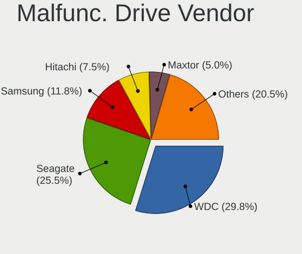

| Vendor              | Desktops | Drives | Percent |
|---------------------|----------|--------|---------|
| WDC                 | 48       | 80     | 29.81%  |
| Seagate             | 41       | 52     | 25.47%  |
| Samsung Electronics | 19       | 24     | 11.8%   |
| Hitachi             | 12       | 14     | 7.45%   |
| Maxtor              | 8        | 10     | 4.97%   |
| Kingston            | 7        | 10     | 4.35%   |
| Intel               | 6        | 7      | 3.73%   |
| HGST                | 5        | 6      | 3.11%   |
| Toshiba             | 3        | 3      | 1.86%   |
| OCZ                 | 2        | 2      | 1.24%   |
| A-DATA Technology   | 2        | 3      | 1.24%   |
| SK hynix            | 1        | 1      | 0.62%   |
| Silicon Motion      | 1        | 1      | 0.62%   |
| Plextor             | 1        | 1      | 0.62%   |
| Patriot             | 1        | 1      | 0.62%   |
| Hewlett-Packard     | 1        | 1      | 0.62%   |
| Crucial             | 1        | 1      | 0.62%   |
| Corsair             | 1        | 7      | 0.62%   |
| Apacer              | 1        | 2      | 0.62%   |

Malfunc. HDD Vendor
-------------------

Vendors of faulty HDD drives

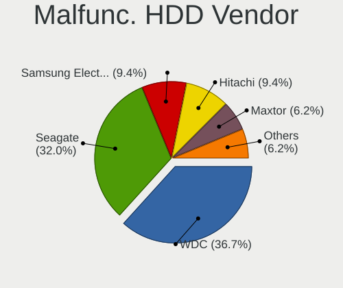

| Vendor              | Desktops | Drives | Percent |
|---------------------|----------|--------|---------|
| WDC                 | 47       | 79     | 36.72%  |
| Seagate             | 41       | 52     | 32.03%  |
| Samsung Electronics | 12       | 15     | 9.38%   |
| Hitachi             | 12       | 14     | 9.38%   |
| Maxtor              | 8        | 10     | 6.25%   |
| HGST                | 5        | 6      | 3.91%   |
| Toshiba             | 3        | 3      | 2.34%   |

Malfunc. Drive Kind
-------------------

Kinds of faulty drives

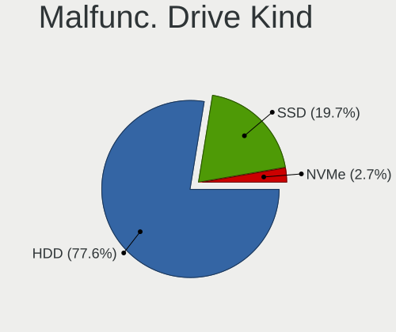

| Kind | Desktops | Drives | Percent |
|------|----------|--------|---------|
| HDD  | 114      | 179    | 77.55%  |
| SSD  | 29       | 42     | 19.73%  |
| NVMe | 4        | 5      | 2.72%   |

Failed Drives
-------------

Failed drive models

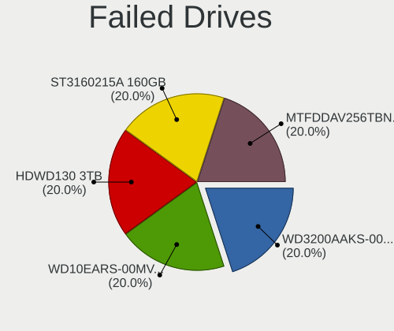

| Model                                               | Desktops | Drives | Percent |
|-----------------------------------------------------|----------|--------|---------|
| WDC WD3200AAKS-00VYA0 320GB                         | 1        | 1      | 20%     |
| WDC WD10EARS-00MVWB0 1TB                            | 1        | 1      | 20%     |
| Toshiba HDWD130 3TB                                 | 1        | 1      | 20%     |
| Seagate ST3160215A 160GB                            | 1        | 1      | 20%     |
| Micron Technology MTFDDAV256TBN-1AR15ABHA 256GB SSD | 1        | 1      | 20%     |

Failed Drive Vendor
-------------------

Failed drive vendors

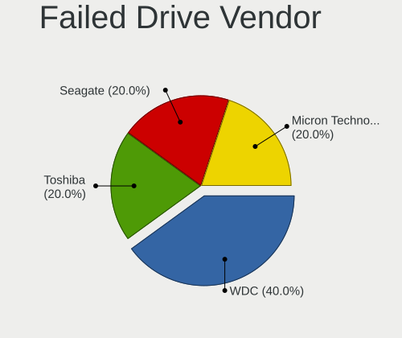

| Vendor            | Desktops | Drives | Percent |
|-------------------|----------|--------|---------|
| WDC               | 2        | 2      | 40%     |
| Toshiba           | 1        | 1      | 20%     |
| Seagate           | 1        | 1      | 20%     |
| Micron Technology | 1        | 1      | 20%     |

Drive Status
------------

Number of failed and malfunc. drives

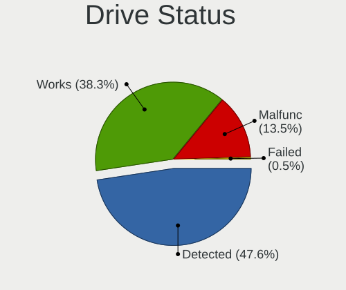

| Status   | Desktops | Drives | Percent |
|----------|----------|--------|---------|
| Detected | 471      | 1331   | 47.62%  |
| Works    | 379      | 950    | 38.32%  |
| Malfunc  | 134      | 226    | 13.55%  |
| Failed   | 5        | 5      | 0.51%   |

Storage controller
------------------

Storage Vendor
--------------

Storage controller vendors

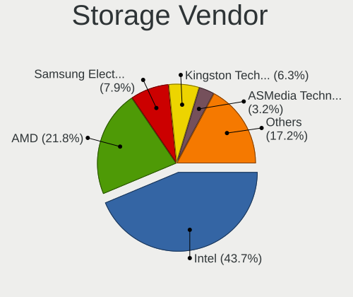

| Vendor                        | Desktops | Percent |
|-------------------------------|----------|---------|
| Intel                         | 552      | 43.71%  |
| AMD                           | 275      | 21.77%  |
| Samsung Electronics           | 100      | 7.92%   |
| Kingston Technology Company   | 79       | 6.25%   |
| ASMedia Technology            | 40       | 3.17%   |
| SanDisk                       | 27       | 2.14%   |
| Phison Electronics            | 24       | 1.9%    |
| JMicron Technology            | 23       | 1.82%   |
| ADATA Technology              | 23       | 1.82%   |
| Marvell Technology Group      | 21       | 1.66%   |
| Nvidia                        | 16       | 1.27%   |
| Silicon Motion                | 14       | 1.11%   |
| Micron/Crucial Technology     | 11       | 0.87%   |
| Realtek Semiconductor         | 8        | 0.63%   |
| VIA Technologies              | 5        | 0.4%    |
| SK hynix                      | 5        | 0.4%    |
| Shenzhen Longsys Electronics  | 5        | 0.4%    |
| Lite-On Technology            | 5        | 0.4%    |
| Silicon Image                 | 4        | 0.32%   |
| Solidigm                      | 3        | 0.24%   |
| Seagate Technology            | 3        | 0.24%   |
| Micron Technology             | 3        | 0.24%   |
| MAXIO Technology (Hangzhou)   | 3        | 0.24%   |
| Broadcom / LSI                | 3        | 0.24%   |
| LSI Logic / Symbios Logic     | 2        | 0.16%   |
| KIOXIA                        | 2        | 0.16%   |
| Integrated Technology Express | 2        | 0.16%   |
| Biwin Storage Technology      | 2        | 0.16%   |
| Toshiba America Info Systems  | 1        | 0.08%   |
| Lenovo                        | 1        | 0.08%   |
| INNOGRIT                      | 1        | 0.08%   |

Storage Model
-------------

Storage controller models

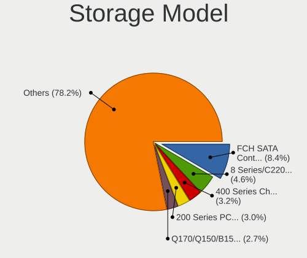

| Model                                                                                   | Desktops | Percent |
|-----------------------------------------------------------------------------------------|----------|---------|
| AMD FCH SATA Controller [AHCI mode]                                                     | 133      | 8.44%   |
| Intel 8 Series/C220 Series Chipset Family 6-port SATA Controller 1 [AHCI mode]          | 72       | 4.57%   |
| AMD 400 Series Chipset SATA Controller                                                  | 50       | 3.17%   |
| Intel 200 Series PCH SATA controller [AHCI mode]                                        | 47       | 2.98%   |
| Intel Q170/Q150/B150/H170/H110/Z170/CM236 Chipset SATA Controller [AHCI Mode]           | 42       | 2.67%   |
| Samsung NVMe SSD Controller SM981/PM981/PM983                                           | 41       | 2.6%    |
| ASMedia ASM1061/ASM1062 Serial ATA Controller                                           | 37       | 2.35%   |
| AMD 500 Series Chipset SATA Controller                                                  | 37       | 2.35%   |
| AMD 600 Series Chipset SATA Controller                                                  | 36       | 2.29%   |
| Intel NM10/ICH7 Family SATA Controller [IDE mode]                                       | 35       | 2.22%   |
| AMD SB7x0/SB8x0/SB9x0 IDE Controller                                                    | 34       | 2.16%   |
| Intel 6 Series/C200 Series Chipset Family 6 port Desktop SATA AHCI Controller           | 32       | 2.03%   |
| Intel SATA Controller [RAID mode]                                                       | 31       | 1.97%   |
| AMD A320 Chipset SATA Controller [AHCI mode]                                            | 28       | 1.78%   |
| Samsung NVMe SSD Controller PM9A1/PM9A3/980PRO                                          | 26       | 1.65%   |
| Intel 82801JD/DO (ICH10 Family) SATA AHCI Controller                                    | 25       | 1.59%   |
| Intel Cannon Lake PCH SATA AHCI Controller                                              | 24       | 1.52%   |
| Intel 7 Series/C210 Series Chipset Family 6-port SATA Controller [AHCI mode]            | 24       | 1.52%   |
| AMD SB7x0/SB8x0/SB9x0 SATA Controller [IDE mode]                                        | 24       | 1.52%   |
| Kingston Company A2000 NVMe SSD [SM2263EN]                                              | 22       | 1.4%    |
| Kingston Company NV2 NVMe SSD [SM2267XT] (DRAM-less)                                    | 21       | 1.33%   |
| Intel 82801G (ICH7 Family) IDE Controller                                               | 21       | 1.33%   |
| Intel 6 Series/C200 Series Chipset Family Desktop SATA Controller (IDE mode, ports 4-5) | 21       | 1.33%   |
| Intel 6 Series/C200 Series Chipset Family Desktop SATA Controller (IDE mode, ports 0-3) | 21       | 1.33%   |
| AMD SB7x0/SB8x0/SB9x0 SATA Controller [AHCI mode]                                       | 21       | 1.33%   |
| Intel Alder Lake-S PCH SATA Controller [AHCI Mode]                                      | 17       | 1.08%   |
| AMD 300 Series Chipset SATA Controller                                                  | 16       | 1.02%   |
| Samsung NVMe SSD Controller SM961/PM961/SM963                                           | 15       | 0.95%   |
| Intel 500 Series Chipset Family SATA AHCI Controller                                    | 15       | 0.95%   |
| Intel 4 Series Chipset PT IDER Controller                                               | 15       | 0.95%   |
| Intel 82801I (ICH9 Family) 2 port SATA Controller [IDE mode]                            | 14       | 0.89%   |
| Samsung NVMe SSD Controller 980 (DRAM-less)                                             | 13       | 0.83%   |
| Intel Raptor Lake SATA AHCI Controller                                                  | 13       | 0.83%   |
| Intel 9 Series Chipset Family SATA Controller [AHCI Mode]                               | 13       | 0.83%   |
| ADATA XPG SX8200 Pro PCIe Gen3x4 M.2 2280 Solid State Drive                             | 13       | 0.83%   |
| JMicron JMB363 SATA/IDE Controller                                                      | 11       | 0.7%    |
| Samsung NVMe SSD Controller S4LV008[Pascal]                                             | 10       | 0.63%   |
| Phison E12 NVMe Controller                                                              | 10       | 0.63%   |
| Nvidia MCP61 SATA Controller                                                            | 10       | 0.63%   |
| Intel 82801JI (ICH10 Family) SATA AHCI Controller                                       | 10       | 0.63%   |

Storage Kind
------------

Kind of storage controller (IDE, SATA, NVMe, SAS, ...)

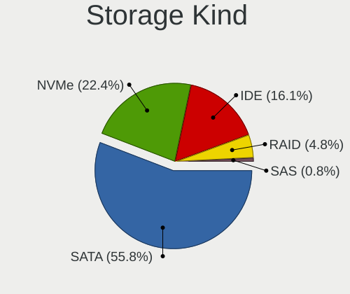

| Kind | Desktops | Percent |
|------|----------|---------|
| SATA | 689      | 55.83%  |
| NVMe | 277      | 22.45%  |
| IDE  | 199      | 16.13%  |
| RAID | 59       | 4.78%   |
| SAS  | 10       | 0.81%   |

Processor
---------

CPU Vendor
----------

Processor vendors

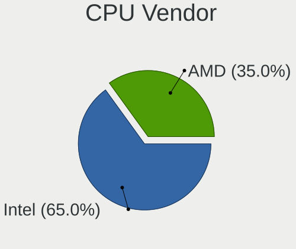

| Vendor | Desktops | Percent |
|--------|----------|---------|
| Intel  | 552      | 65.02%  |
| AMD    | 297      | 34.98%  |

CPU Model
---------

Processor models

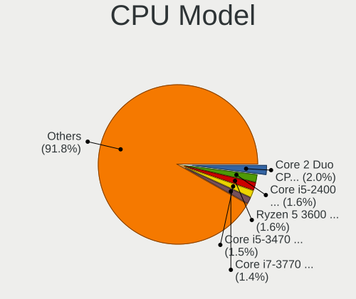

| Model                                       | Desktops | Percent |
|---------------------------------------------|----------|---------|
| Intel Core 2 Duo CPU E7400 @ 2.80GHz        | 17       | 1.99%   |
| Intel Core i5-2400 CPU @ 3.10GHz            | 14       | 1.64%   |
| AMD Ryzen 5 3600 6-Core Processor           | 14       | 1.64%   |
| Intel Core i5-3470 CPU @ 3.20GHz            | 13       | 1.52%   |
| Intel Core i7-3770 CPU @ 3.40GHz            | 12       | 1.41%   |
| Intel Core 2 Duo CPU E8400 @ 3.00GHz        | 12       | 1.41%   |
| Intel Core i7-4770 CPU @ 3.40GHz            | 11       | 1.29%   |
| AMD Ryzen 7 3700X 8-Core Processor          | 11       | 1.29%   |
| Intel Core i7-6700K CPU @ 4.00GHz           | 9        | 1.06%   |
| Intel Core i5-7400 CPU @ 3.00GHz            | 9        | 1.06%   |
| AMD Ryzen 5 2600 Six-Core Processor         | 9        | 1.06%   |
| Intel Core i5-10400F CPU @ 2.90GHz          | 8        | 0.94%   |
| Intel Core 2 Quad CPU Q6600 @ 2.40GHz       | 8        | 0.94%   |
| AMD Ryzen 5 5600X 6-Core Processor          | 8        | 0.94%   |
| Intel Core i7-4790 CPU @ 3.60GHz            | 7        | 0.82%   |
| Intel Core i5-4590 CPU @ 3.30GHz            | 7        | 0.82%   |
| Intel Core i5-4570 CPU @ 3.20GHz            | 7        | 0.82%   |
| Intel Core 2 Duo CPU E8500 @ 3.16GHz        | 7        | 0.82%   |
| AMD Ryzen 7 2700X Eight-Core Processor      | 7        | 0.82%   |
| AMD Ryzen 5 2400G with Radeon Vega Graphics | 7        | 0.82%   |
| Intel Pentium Dual-Core CPU E5700 @ 3.00GHz | 6        | 0.7%    |
| Intel Core i7-8700 CPU @ 3.20GHz            | 6        | 0.7%    |
| Intel Core i7-7700K CPU @ 4.20GHz           | 6        | 0.7%    |
| Intel Core i7-4790K CPU @ 4.00GHz           | 6        | 0.7%    |
| Intel Core i5-9400F CPU @ 2.90GHz           | 6        | 0.7%    |
| Intel Core i3-6100 CPU @ 3.70GHz            | 6        | 0.7%    |
| Intel Core i3-4170 CPU @ 3.70GHz            | 6        | 0.7%    |
| Intel Core i3-4160 CPU @ 3.60GHz            | 6        | 0.7%    |
| Intel Core 2 CPU 6400 @ 2.13GHz             | 6        | 0.7%    |
| AMD Ryzen 9 7950X 16-Core Processor         | 6        | 0.7%    |
| AMD Ryzen 9 3900X 12-Core Processor         | 6        | 0.7%    |
| AMD Ryzen 7 7800X3D 8-Core Processor        | 6        | 0.7%    |
| AMD Ryzen 7 5700G with Radeon Graphics      | 6        | 0.7%    |
| AMD Ryzen 3 2200G with Radeon Vega Graphics | 6        | 0.7%    |
| AMD FX-8320 Eight-Core Processor            | 6        | 0.7%    |
| Intel Core i9-9900K CPU @ 3.60GHz           | 5        | 0.59%   |
| Intel Core i7-6700 CPU @ 3.40GHz            | 5        | 0.59%   |
| Intel Core i7-2600 CPU @ 3.40GHz            | 5        | 0.59%   |
| Intel Core i3-7100 CPU @ 3.90GHz            | 5        | 0.59%   |
| AMD Ryzen 9 5950X 16-Core Processor         | 5        | 0.59%   |

CPU Model Family
----------------

Processor model prefix

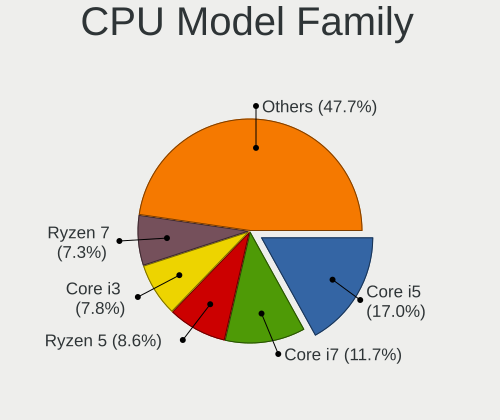

| Model                   | Desktops | Percent |
|-------------------------|----------|---------|
| Intel Core i5           | 144      | 16.96%  |
| Intel Core i7           | 99       | 11.66%  |
| AMD Ryzen 5             | 73       | 8.6%    |
| Intel Core i3           | 66       | 7.77%   |
| AMD Ryzen 7             | 62       | 7.3%    |
| Intel Core 2 Duo        | 57       | 6.71%   |
| Other                   | 36       | 4.24%   |
| AMD Ryzen 9             | 34       | 4%      |
| Intel Xeon              | 31       | 3.65%   |
| Intel Celeron           | 24       | 2.83%   |
| Intel Pentium           | 23       | 2.71%   |
| AMD FX                  | 20       | 2.36%   |
| Intel Core 2 Quad       | 19       | 2.24%   |
| AMD Ryzen 3             | 19       | 2.24%   |
| Intel Core i9           | 15       | 1.77%   |
| Intel Pentium Dual-Core | 14       | 1.65%   |
| AMD A8                  | 13       | 1.53%   |
| AMD Phenom II X4        | 8        | 0.94%   |
| AMD A4                  | 8        | 0.94%   |
| Intel Core 2            | 7        | 0.82%   |
| AMD Ryzen Threadripper  | 7        | 0.82%   |
| AMD Ryzen 5 PRO         | 7        | 0.82%   |
| AMD Athlon II X4        | 5        | 0.59%   |
| Intel Pentium Dual      | 4        | 0.47%   |
| AMD Sempron             | 4        | 0.47%   |
| AMD Athlon II X3        | 4        | 0.47%   |
| AMD Athlon              | 4        | 0.47%   |
| Intel Pentium D         | 3        | 0.35%   |
| Intel Genuine           | 3        | 0.35%   |
| Intel Atom              | 3        | 0.35%   |
| AMD Athlon II X2        | 3        | 0.35%   |
| AMD Athlon 64 X2        | 3        | 0.35%   |
| Intel Pentium Gold      | 2        | 0.24%   |
| Intel Pentium 4         | 2        | 0.24%   |
| AMD Phenom II X3        | 2        | 0.24%   |
| AMD Phenom II X2        | 2        | 0.24%   |
| AMD Phenom              | 2        | 0.24%   |
| AMD GX                  | 2        | 0.24%   |
| AMD Athlon X4           | 2        | 0.24%   |
| AMD Athlon Dual Core    | 2        | 0.24%   |

CPU Cores
---------

Number of processor cores

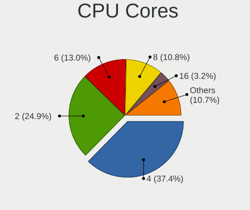

| Number | Desktops | Percent |
|--------|----------|---------|
| 4      | 318      | 37.37%  |
| 2      | 212      | 24.91%  |
| 6      | 111      | 13.04%  |
| 8      | 92       | 10.81%  |
| 16     | 27       | 3.17%   |
| 12     | 26       | 3.06%   |
| 1      | 20       | 2.35%   |
| 10     | 12       | 1.41%   |
| 3      | 11       | 1.29%   |
| 24     | 7        | 0.82%   |
| 32     | 4        | 0.47%   |
| 20     | 4        | 0.47%   |
| 14     | 4        | 0.47%   |
| 64     | 1        | 0.12%   |
| 36     | 1        | 0.12%   |
| 18     | 1        | 0.12%   |

CPU Sockets
-----------

Number of sockets

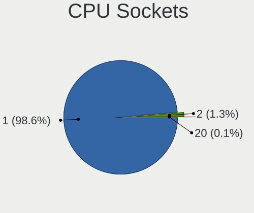

| Number | Desktops | Percent |
|--------|----------|---------|
| 1      | 837      | 98.59%  |
| 2      | 11       | 1.3%    |
| 20     | 1        | 0.12%   |

CPU Threads
-----------

Threads per core (Hyper-Threading)

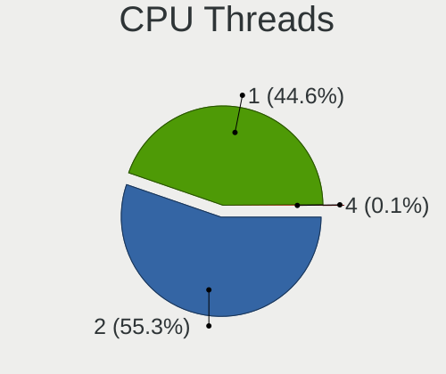

| Number | Desktops | Percent |
|--------|----------|---------|
| 2      | 471      | 55.28%  |
| 1      | 380      | 44.6%   |
| 4      | 1        | 0.12%   |

CPU Op-Modes
------------

CPU Operation Modes (32-bit, 64-bit)

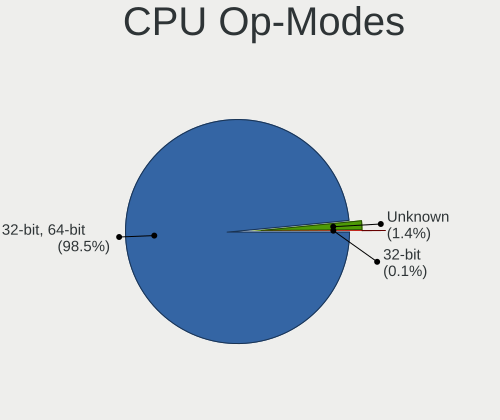

| Op mode        | Desktops | Percent |
|----------------|----------|---------|
| 32-bit, 64-bit | 838      | 98.47%  |
| Unknown        | 12       | 1.41%   |
| 32-bit         | 1        | 0.12%   |

CPU Microcode
-------------

Microcode number

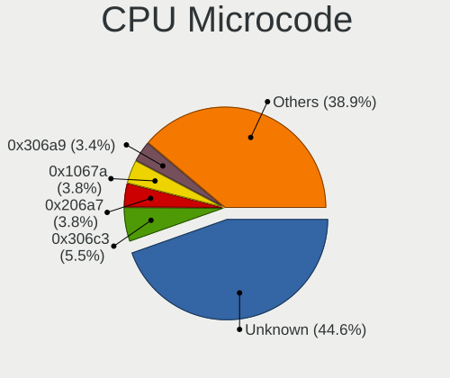

| Number     | Desktops | Percent |
|------------|----------|---------|
| Unknown    | 396      | 44.59%  |
| 0x306c3    | 49       | 5.52%   |
| 0x206a7    | 34       | 3.83%   |
| 0x1067a    | 34       | 3.83%   |
| 0x306a9    | 30       | 3.38%   |
| 0x906e9    | 23       | 2.59%   |
| 0x906ea    | 20       | 2.25%   |
| 0x506e3    | 20       | 2.25%   |
| 0x010000c8 | 17       | 1.91%   |
| 0x08701021 | 15       | 1.69%   |
| 0x10676    | 13       | 1.46%   |
| 0x0800820d | 12       | 1.35%   |
| 0x08701013 | 10       | 1.13%   |
| 0x06001119 | 10       | 1.13%   |
| 0x6fb      | 9        | 1.01%   |
| 0x08101016 | 9        | 1.01%   |
| 0x6fd      | 8        | 0.9%    |
| 0x0a20120a | 7        | 0.79%   |
| 0x0810100b | 7        | 0.79%   |
| 0x06000852 | 7        | 0.79%   |
| 0xa0655    | 6        | 0.68%   |
| 0x906eb    | 6        | 0.68%   |
| 0x0a601203 | 6        | 0.68%   |
| 0x0a201009 | 6        | 0.68%   |
| 0xa0653    | 5        | 0.56%   |
| 0x90672    | 5        | 0.56%   |
| 0x08600106 | 5        | 0.56%   |
| 0x6f2      | 4        | 0.45%   |
| 0x506c9    | 4        | 0.45%   |
| 0x406c4    | 4        | 0.45%   |
| 0x106e5    | 4        | 0.45%   |
| 0x0a201016 | 4        | 0.45%   |
| 0x08001138 | 4        | 0.45%   |
| 0x08001137 | 4        | 0.45%   |
| 0xf62      | 3        | 0.34%   |
| 0x906ed    | 3        | 0.34%   |
| 0x306e4    | 3        | 0.34%   |
| 0x30679    | 3        | 0.34%   |
| 0x20655    | 3        | 0.34%   |
| 0x0a50000d | 3        | 0.34%   |

CPU Microarch
-------------

Microarchitecture

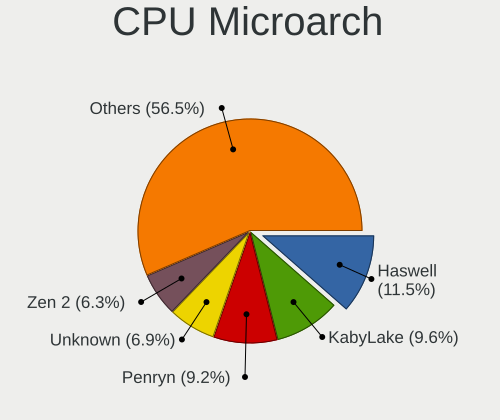

| Name             | Desktops | Percent |
|------------------|----------|---------|
| Haswell          | 98       | 11.46%  |
| KabyLake         | 82       | 9.59%   |
| Penryn           | 79       | 9.24%   |
| Unknown          | 59       | 6.9%    |
| Zen 2            | 54       | 6.32%   |
| SandyBridge      | 54       | 6.32%   |
| IvyBridge        | 51       | 5.96%   |
| Zen 3            | 46       | 5.38%   |
| Zen              | 40       | 4.68%   |
| Skylake          | 40       | 4.68%   |
| Piledriver       | 34       | 3.98%   |
| K10              | 31       | 3.63%   |
| Core             | 31       | 3.63%   |
| Zen+             | 30       | 3.51%   |
| CometLake        | 28       | 3.27%   |
| Alderlake Hybrid | 20       | 2.34%   |
| Silvermont       | 11       | 1.29%   |
| Nehalem          | 10       | 1.17%   |
| K8 Hammer        | 10       | 1.17%   |
| Westmere         | 7        | 0.82%   |
| NetBurst         | 6        | 0.7%    |
| Goldmont         | 5        | 0.58%   |
| Steamroller      | 4        | 0.47%   |
| Icelake          | 4        | 0.47%   |
| Goldmont plus    | 4        | 0.47%   |
| Broadwell        | 4        | 0.47%   |
| Excavator        | 3        | 0.35%   |
| Puma             | 2        | 0.23%   |
| K10 Llano        | 2        | 0.23%   |
| P6               | 1        | 0.12%   |
| Jaguar           | 1        | 0.12%   |
| Gracemont        | 1        | 0.12%   |
| Bulldozer        | 1        | 0.12%   |
| Bonnell          | 1        | 0.12%   |
| Bobcat           | 1        | 0.12%   |

Graphics
--------

GPU Vendor
----------

Vendors of graphics cards

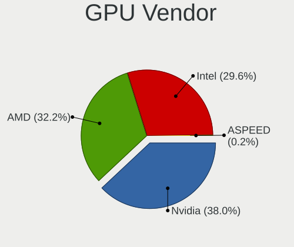

| Vendor            | Desktops | Percent |
|-------------------|----------|---------|
| Nvidia            | 352      | 38.01%  |
| AMD               | 298      | 32.18%  |
| Intel             | 274      | 29.59%  |
| ASPEED Technology | 2        | 0.22%   |

GPU Model
---------

Graphics card models

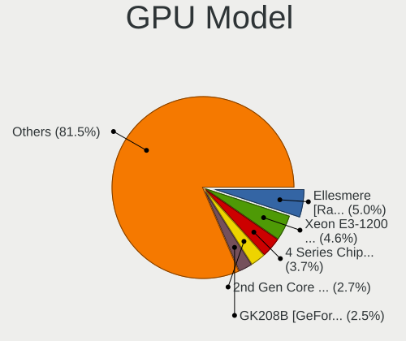

| Model                                                                       | Desktops | Percent |
|-----------------------------------------------------------------------------|----------|---------|
| AMD Ellesmere [Radeon RX 470/480/570/570X/580/580X/590]                     | 48       | 5.03%   |
| Intel Xeon E3-1200 v3/4th Gen Core Processor Integrated Graphics Controller | 44       | 4.61%   |
| Intel 4 Series Chipset Integrated Graphics Controller                       | 35       | 3.66%   |
| Intel 2nd Generation Core Processor Family Integrated Graphics Controller   | 26       | 2.72%   |
| Nvidia GK208B [GeForce GT 710]                                              | 24       | 2.51%   |
| Intel Kaby Lake-S GT2 [HD Graphics 630]                                     | 23       | 2.41%   |
| Intel Skylake-S GT2 [HD Graphics 530]                                       | 22       | 2.3%    |
| AMD Raven Ridge [Radeon Vega Series / Radeon Vega Mobile Series]            | 17       | 1.78%   |
| AMD Raphael                                                                 | 16       | 1.68%   |
| Intel Xeon E3-1200 v2/3rd Gen Core processor Graphics Controller            | 15       | 1.57%   |
| Nvidia GP107 [GeForce GTX 1050 Ti]                                          | 14       | 1.47%   |
| Intel CoffeeLake-S GT2 [UHD Graphics 630]                                   | 14       | 1.47%   |
| AMD Navi 10 [Radeon RX 5600 OEM/5600 XT / 5700/5700 XT]                     | 14       | 1.47%   |
| AMD Cedar [Radeon HD 5000/6000/7350/8350 Series]                            | 14       | 1.47%   |
| Nvidia GP108 [GeForce GT 1030]                                              | 13       | 1.36%   |
| Nvidia GP106 [GeForce GTX 1060 6GB]                                         | 12       | 1.26%   |
| Intel 4th Generation Core Processor Family Integrated Graphics Controller   | 12       | 1.26%   |
| AMD Granite Ridge [Radeon Graphics]                                         | 11       | 1.15%   |
| Nvidia GT218 [GeForce 210]                                                  | 10       | 1.05%   |
| AMD Navi 22 [Radeon RX 6700/6700 XT/6750 XT / 6800M/6850M XT]               | 10       | 1.05%   |
| AMD Navi 21 [Radeon RX 6800/6800 XT / 6900 XT]                              | 10       | 1.05%   |
| Nvidia TU117 [GeForce GTX 1650]                                             | 9        | 0.94%   |
| Nvidia GP104 [GeForce GTX 1070]                                             | 9        | 0.94%   |
| Nvidia GA106 [GeForce RTX 3060 Lite Hash Rate]                              | 9        | 0.94%   |
| Intel IvyBridge GT2 [HD Graphics 4000]                                      | 9        | 0.94%   |
| Intel Alder Lake-S GT1 [UHD Graphics 770]                                   | 9        | 0.94%   |
| AMD Navi 23 [Radeon RX 6600/6600 XT/6600M]                                  | 9        | 0.94%   |
| AMD Lexa PRO [Radeon 540/540X/550/550X / RX 540X/550/550X]                  | 9        | 0.94%   |
| Nvidia GP104 [GeForce GTX 1080]                                             | 8        | 0.84%   |
| Nvidia GF108 [GeForce GT 730]                                               | 8        | 0.84%   |
| Nvidia AD102 [GeForce RTX 4090]                                             | 8        | 0.84%   |
| AMD Oland PRO [Radeon R7 240/340 / Radeon 520]                              | 8        | 0.84%   |
| AMD Cezanne [Radeon Vega Series / Radeon Vega Mobile Series]                | 8        | 0.84%   |
| Nvidia TU116 [GeForce GTX 1660 SUPER]                                       | 7        | 0.73%   |
| Nvidia GM206 [GeForce GTX 960]                                              | 7        | 0.73%   |
| Nvidia GM204 [GeForce GTX 970]                                              | 7        | 0.73%   |
| Nvidia GM107 [GeForce GTX 750 Ti]                                           | 7        | 0.73%   |
| Nvidia G96C [GeForce 9500 GT]                                               | 7        | 0.73%   |
| Intel Atom Processor Z36xxx/Z37xxx Series Graphics & Display                | 7        | 0.73%   |
| AMD Renoir [Radeon Vega Series / Radeon Vega Mobile Series]                 | 7        | 0.73%   |

GPU Combo
---------

Combinations of graphics cards

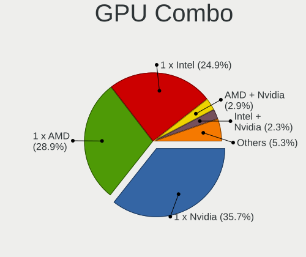

| Name           | Desktops | Percent |
|----------------|----------|---------|
| 1 x Nvidia     | 307      | 35.66%  |
| 1 x AMD        | 249      | 28.92%  |
| 1 x Intel      | 214      | 24.85%  |
| AMD + Nvidia   | 25       | 2.9%    |
| Intel + Nvidia | 20       | 2.32%   |
| 2 x Intel      | 18       | 2.09%   |
| 2 x AMD        | 15       | 1.74%   |
| Intel + AMD    | 7        | 0.81%   |
| 2 x Nvidia     | 4        | 0.46%   |
| 1 x ASPEED     | 1        | 0.12%   |
| AMD + ASPEED   | 1        | 0.12%   |

GPU Driver
----------

Free vs proprietary

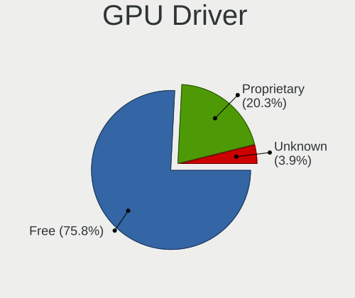

| Driver      | Desktops | Percent |
|-------------|----------|---------|
| Free        | 661      | 75.8%   |
| Proprietary | 177      | 20.3%   |
| Unknown     | 34       | 3.9%    |

GPU Memory
----------

Total video memory

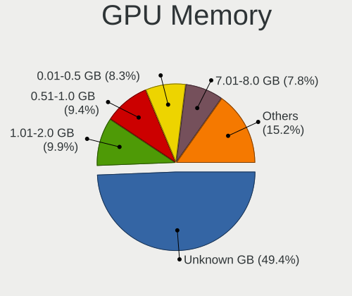

| Size in GB | Desktops | Percent |
|------------|----------|---------|
| Unknown    | 442      | 49.39%  |
| 1.01-2.0   | 89       | 9.94%   |
| 0.51-1.0   | 84       | 9.39%   |
| 0.01-0.5   | 74       | 8.27%   |
| 7.01-8.0   | 70       | 7.82%   |
| 3.01-4.0   | 61       | 6.82%   |
| 5.01-6.0   | 30       | 3.35%   |
| 8.01-16.0  | 28       | 3.13%   |
| 16.01-24.0 | 10       | 1.12%   |
| 2.01-3.0   | 7        | 0.78%   |

Monitor
-------

Monitor Vendor
--------------

Monitor vendors

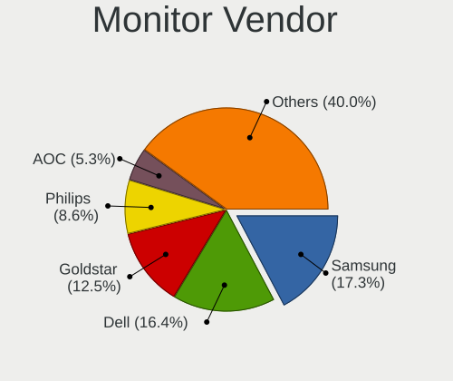

| Vendor               | Desktops | Percent |
|----------------------|----------|---------|
| Samsung Electronics  | 157      | 17.25%  |
| Dell                 | 149      | 16.37%  |
| Goldstar             | 114      | 12.53%  |
| Philips              | 78       | 8.57%   |
| AOC                  | 48       | 5.27%   |
| BenQ                 | 44       | 4.84%   |
| Hewlett-Packard      | 37       | 4.07%   |
| Ancor Communications | 37       | 4.07%   |
| Acer                 | 35       | 3.85%   |
| Lenovo               | 24       | 2.64%   |
| Fujitsu Siemens      | 20       | 2.2%    |
| Unknown              | 15       | 1.65%   |
| ASUSTek Computer     | 13       | 1.43%   |
| LG Electronics       | 11       | 1.21%   |
| Eizo                 | 11       | 1.21%   |
| ViewSonic            | 7        | 0.77%   |
| Sony                 | 7        | 0.77%   |
| Panasonic            | 7        | 0.77%   |
| MSI                  | 6        | 0.66%   |
| Iiyama               | 6        | 0.66%   |
| Vestel Elektronik    | 5        | 0.55%   |
| NEC Computers        | 5        | 0.55%   |
| KTC                  | 5        | 0.55%   |
| Toshiba              | 4        | 0.44%   |
| Mi                   | 3        | 0.33%   |
| Lenovo Group Limited | 3        | 0.33%   |
| HUAWEI               | 3        | 0.33%   |
| Unknown              | 3        | 0.33%   |
| TCL                  | 2        | 0.22%   |
| S2-Tek               | 2        | 0.22%   |
| Pixio                | 2        | 0.22%   |
| OEM                  | 2        | 0.22%   |
| Hitachi              | 2        | 0.22%   |
| HannStar             | 2        | 0.22%   |
| Gigabyte Technology  | 2        | 0.22%   |
| FUS                  | 2        | 0.22%   |
| CVT                  | 2        | 0.22%   |
| Belinea              | 2        | 0.22%   |
| AGO                  | 2        | 0.22%   |
| ___                  | 1        | 0.11%   |

Monitor Model
-------------

Monitor models

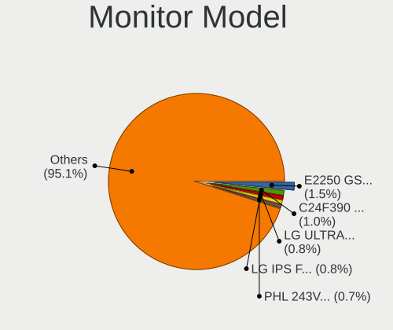

| Model                                                                 | Desktops | Percent |
|-----------------------------------------------------------------------|----------|---------|
| Goldstar E2250 GSM578D 1920x1080 477x268mm 21.5-inch                  | 15       | 1.54%   |
| Samsung Electronics C24F390 SAM0D2C 1920x1080 521x293mm 23.5-inch     | 10       | 1.03%   |
| Goldstar LG ULTRAWIDE GSM59F1 2560x1080 670x280mm 28.6-inch           | 8        | 0.82%   |
| Goldstar LG IPS FULLHD GSM5AB8 1920x1080 480x270mm 21.7-inch          | 8        | 0.82%   |
| Philips PHL 243V7 PHLC155 1920x1080 527x296mm 23.8-inch               | 7        | 0.72%   |
| Philips PHL 223V5 PHLC0CF 1920x1080 477x268mm 21.5-inch               | 7        | 0.72%   |
| Unknown LCD Monitor FFFF 2288x1287 2550x2550mm 142.0-inch             | 6        | 0.62%   |
| Panasonic TV MEIA296 1920x1080 698x392mm 31.5-inch                    | 6        | 0.62%   |
| Vestel Elektronik 40UHD_LCD_TV VES3700 3840x2160 880x500mm 39.8-inch  | 5        | 0.51%   |
| Samsung Electronics S24F350 SAM0D21 1920x1080 521x293mm 23.5-inch     | 5        | 0.51%   |
| Samsung Electronics S24F350 SAM0D20 1920x1080 521x293mm 23.5-inch     | 5        | 0.51%   |
| Goldstar MP59G GSM5B34 1920x1080 480x270mm 21.7-inch                  | 5        | 0.51%   |
| Goldstar L1918S GSM4B31 1280x1024 380x300mm 19.1-inch                 | 5        | 0.51%   |
| AOC 2590G4 AOC2590 1920x1080 544x303mm 24.5-inch                      | 5        | 0.51%   |
| Ancor Communications ASUS VS197 ACI19F2 1366x768 410x230mm 18.5-inch  | 5        | 0.51%   |
| Philips PHL 243V5 PHLC0D1 1920x1080 521x293mm 23.5-inch               | 4        | 0.41%   |
| Philips 220E PHLC02E 1920x1080 476x268mm 21.5-inch                    | 4        | 0.41%   |
| Lenovo T24i-10 LEN61A6 1920x1080 527x296mm 23.8-inch                  | 4        | 0.41%   |
| Dell P2213 DELF043 1680x1050 473x296mm 22.0-inch                      | 4        | 0.41%   |
| AOC Q2770 AOC2770 2560x1440 597x336mm 27.0-inch                       | 4        | 0.41%   |
| Ancor Communications ASUS VP228 ACI22C3 1920x1080 476x268mm 21.5-inch | 4        | 0.41%   |
| Samsung Electronics U28E590 SAM0C4D 3840x2160 607x345mm 27.5-inch     | 3        | 0.31%   |
| Samsung Electronics T24C300 SAM0A9B 1920x1080 531x299mm 24.0-inch     | 3        | 0.31%   |
| Samsung Electronics LCD Monitor SAM0902 1920x1080 890x500mm 40.2-inch | 3        | 0.31%   |
| Samsung Electronics LCD Monitor SAM0659 1920x1080                     | 3        | 0.31%   |
| Philips PHL 246V5 PHLC0C5 1920x1080 531x299mm 24.0-inch               | 3        | 0.31%   |
| Philips FTV PHL01EA 1920x1080 1440x810mm 65.0-inch                    | 3        | 0.31%   |
| Goldstar W2452 GSM5694 1920x1200 518x324mm 24.1-inch                  | 3        | 0.31%   |
| Goldstar W1941 GSM4B91 1360x768 406x229mm 18.4-inch                   | 3        | 0.31%   |
| Goldstar 2D FHD TV GSM59C6 1920x1080 509x286mm 23.0-inch              | 3        | 0.31%   |
| Dell U2715H DELD067 2560x1440 597x336mm 27.0-inch                     | 3        | 0.31%   |
| Dell U2412M DELA07A 1920x1200 518x324mm 24.1-inch                     | 3        | 0.31%   |
| Dell U2410 DELF017 1920x1200 520x320mm 24.0-inch                      | 3        | 0.31%   |
| Dell SE2419HR DELF113 1920x1080 527x296mm 23.8-inch                   | 3        | 0.31%   |
| Dell SE2417HGX DELD0F6 1920x1080 521x293mm 23.5-inch                  | 3        | 0.31%   |
| Dell S2721DGF DEL41D9 2560x1440 597x336mm 27.0-inch                   | 3        | 0.31%   |
| Dell S2522HG DELA1C2 1920x1080 544x303mm 24.5-inch                    | 3        | 0.31%   |
| Dell P2214H DELA097 1920x1080 477x268mm 21.5-inch                     | 3        | 0.31%   |
| Dell G2722HS DEL427F 1920x1080 597x336mm 27.0-inch                    | 3        | 0.31%   |
| BenQ GL2460 BNQ78CE 1920x1080 531x299mm 24.0-inch                     | 3        | 0.31%   |

Monitor Resolution
------------------

Monitor screen resolution

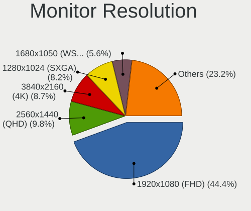

| Resolution         | Desktops | Percent |
|--------------------|----------|---------|
| 1920x1080 (FHD)    | 393      | 44.41%  |
| 2560x1440 (QHD)    | 87       | 9.83%   |
| 3840x2160 (4K)     | 77       | 8.7%    |
| 1280x1024 (SXGA)   | 73       | 8.25%   |
| 1680x1050 (WSXGA+) | 50       | 5.65%   |
| 1920x1200 (WUXGA)  | 31       | 3.5%    |
| 1366x768 (WXGA)    | 31       | 3.5%    |
| Unknown            | 21       | 2.37%   |
| 1440x900 (WXGA+)   | 19       | 2.15%   |
| 3440x1440          | 16       | 1.81%   |
| 2560x1080          | 15       | 1.69%   |
| 1360x768           | 12       | 1.36%   |
| 3840x1080          | 10       | 1.13%   |
| 2288x1287          | 6        | 0.68%   |
| 1600x900 (HD+)     | 6        | 0.68%   |
| 1024x768 (XGA)     | 5        | 0.56%   |
| 1920x540           | 4        | 0.45%   |
| 1600x1200          | 4        | 0.45%   |
| 3840x1600          | 3        | 0.34%   |
| 5760x2160          | 2        | 0.23%   |
| 5120x1440          | 2        | 0.23%   |
| 2560x1600          | 2        | 0.23%   |
| 800x600            | 1        | 0.11%   |
| 7680x2160          | 1        | 0.11%   |
| 7680x1440          | 1        | 0.11%   |
| 6400x1440          | 1        | 0.11%   |
| 6000x1440          | 1        | 0.11%   |
| 4960x1080          | 1        | 0.11%   |
| 3840x2524          | 1        | 0.11%   |
| 3600x1200          | 1        | 0.11%   |
| 3600x1080          | 1        | 0.11%   |
| 3360x1080          | 1        | 0.11%   |
| 3286x1080          | 1        | 0.11%   |
| 2960x1050          | 1        | 0.11%   |
| 2720x1024          | 1        | 0.11%   |
| 2624x1200          | 1        | 0.11%   |
| 1280x960           | 1        | 0.11%   |
| 1280x720 (HD)      | 1        | 0.11%   |

Monitor Diagonal
----------------

Diagonal size in inches

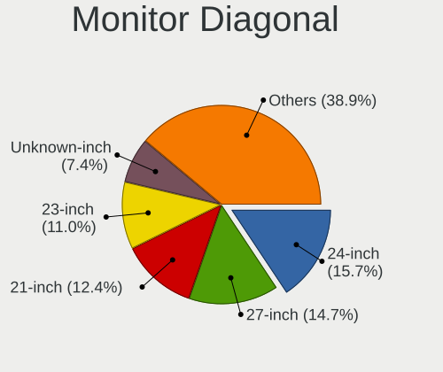

| Inches  | Desktops | Percent |
|---------|----------|---------|
| 24      | 140      | 15.66%  |
| 27      | 131      | 14.65%  |
| 21      | 111      | 12.42%  |
| 23      | 98       | 10.96%  |
| Unknown | 66       | 7.38%   |
| 19      | 56       | 6.26%   |
| 22      | 42       | 4.7%    |
| 31      | 36       | 4.03%   |
| 18      | 35       | 3.91%   |
| 34      | 32       | 3.58%   |
| 17      | 24       | 2.68%   |
| 84      | 19       | 2.13%   |
| 20      | 11       | 1.23%   |
| 32      | 10       | 1.12%   |
| 15      | 10       | 1.12%   |
| 54      | 9        | 1.01%   |
| 26      | 7        | 0.78%   |
| 142     | 6        | 0.67%   |
| 65      | 6        | 0.67%   |
| 72      | 5        | 0.56%   |
| 40      | 5        | 0.56%   |
| 48      | 4        | 0.45%   |
| 46      | 4        | 0.45%   |
| 43      | 3        | 0.34%   |
| 42      | 3        | 0.34%   |
| 37      | 3        | 0.34%   |
| 49      | 2        | 0.22%   |
| 33      | 2        | 0.22%   |
| 29      | 2        | 0.22%   |
| 28      | 2        | 0.22%   |
| 25      | 2        | 0.22%   |
| 63      | 1        | 0.11%   |
| 58      | 1        | 0.11%   |
| 52      | 1        | 0.11%   |
| 41      | 1        | 0.11%   |
| 16      | 1        | 0.11%   |
| 14      | 1        | 0.11%   |
| 13      | 1        | 0.11%   |
| 12      | 1        | 0.11%   |

Monitor Width
-------------

Physical width

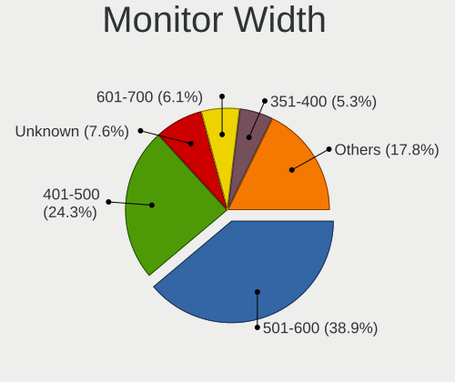

| Width in mm    | Desktops | Percent |
|----------------|----------|---------|
| 501-600        | 337      | 38.87%  |
| 401-500        | 211      | 24.34%  |
| Unknown        | 66       | 7.61%   |
| 601-700        | 53       | 6.11%   |
| 351-400        | 46       | 5.31%   |
| 701-800        | 44       | 5.07%   |
| 301-350        | 35       | 4.04%   |
| 1001-1500      | 28       | 3.23%   |
| 1501-2000      | 24       | 2.77%   |
| 801-900        | 8        | 0.92%   |
| 901-1000       | 7        | 0.81%   |
| More than 2000 | 6        | 0.69%   |
| 201-300        | 2        | 0.23%   |

Aspect Ratio
------------

Proportional relationship between the width and the height

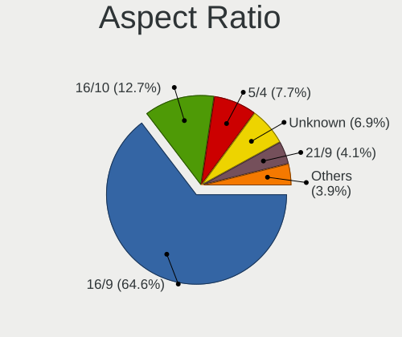

| Ratio   | Desktops | Percent |
|---------|----------|---------|
| 16/9    | 534      | 64.65%  |
| 16/10   | 105      | 12.71%  |
| 5/4     | 64       | 7.75%   |
| Unknown | 57       | 6.9%    |
| 21/9    | 34       | 4.12%   |
| 4/3     | 13       | 1.57%   |
| 32/9    | 6        | 0.73%   |
| 1.00    | 6        | 0.73%   |
| 6/5     | 4        | 0.48%   |
| 3/2     | 3        | 0.36%   |

Monitor Area
------------

Area in inch²

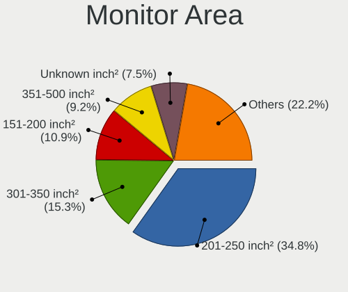

| Area in inch² | Desktops | Percent |
|----------------|----------|---------|
| 201-250        | 307      | 34.85%  |
| 301-350        | 135      | 15.32%  |
| 151-200        | 96       | 10.9%   |
| 351-500        | 81       | 9.19%   |
| Unknown        | 66       | 7.49%   |
| 251-300        | 58       | 6.58%   |
| More than 1000 | 49       | 5.56%   |
| 141-150        | 49       | 5.56%   |
| 501-1000       | 25       | 2.84%   |
| 101-110        | 9        | 1.02%   |
| 111-120        | 2        | 0.23%   |
| 81-90          | 1        | 0.11%   |
| 71-80          | 1        | 0.11%   |
| 131-140        | 1        | 0.11%   |
| 121-130        | 1        | 0.11%   |

Pixel Density
-------------

Pixels per inch

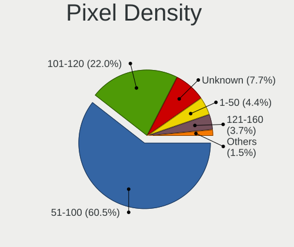

| Density | Desktops | Percent |
|---------|----------|---------|
| 51-100  | 517      | 60.54%  |
| 101-120 | 188      | 22.01%  |
| Unknown | 66       | 7.73%   |
| 1-50    | 38       | 4.45%   |
| 121-160 | 32       | 3.75%   |
| 161-240 | 13       | 1.52%   |

Multiple Monitors
-----------------

Total monitors connected

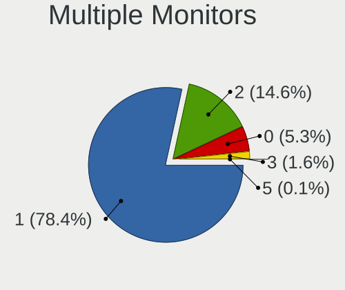

| Total | Desktops | Percent |
|-------|----------|---------|
| 1     | 683      | 78.42%  |
| 2     | 127      | 14.58%  |
| 0     | 46       | 5.28%   |
| 3     | 14       | 1.61%   |
| 5     | 1        | 0.11%   |

Network
-------

Net Controller Vendor
---------------------

Controller vendors

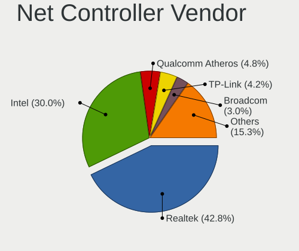

| Vendor                          | Desktops | Percent |
|---------------------------------|----------|---------|
| Realtek Semiconductor           | 493      | 42.83%  |
| Intel                           | 345      | 29.97%  |
| Qualcomm Atheros                | 55       | 4.78%   |
| TP-Link                         | 48       | 4.17%   |
| Broadcom                        | 34       | 2.95%   |
| MediaTek                        | 30       | 2.61%   |
| Ralink Technology               | 20       | 1.74%   |
| Nvidia                          | 14       | 1.22%   |
| Broadcom Limited                | 13       | 1.13%   |
| Aquantia                        | 12       | 1.04%   |
| ASUSTek Computer                | 9        | 0.78%   |
| Ralink                          | 8        | 0.7%    |
| Microsoft                       | 6        | 0.52%   |
| D-Link                          | 6        | 0.52%   |
| Samsung Electronics             | 5        | 0.43%   |
| Marvell Technology Group        | 5        | 0.43%   |
| Xiaomi                          | 4        | 0.35%   |
| Qualcomm Atheros Communications | 4        | 0.35%   |
| Mercucys                        | 3        | 0.26%   |
| Edimax Technology               | 3        | 0.26%   |
| ZTE WCDMA Technologies MSM      | 2        | 0.17%   |
| VIA Technologies                | 2        | 0.17%   |
| Tenda                           | 2        | 0.17%   |
| OPPO Electronics                | 2        | 0.17%   |
| IMC Networks                    | 2        | 0.17%   |
| Huawei Technologies             | 2        | 0.17%   |
| Giga-Byte Technology            | 2        | 0.17%   |
| Belkin Components               | 2        | 0.17%   |
| ASIX Electronics                | 2        | 0.17%   |
| Texas Instruments               | 1        | 0.09%   |
| Qualcomm                        | 1        | 0.09%   |
| QNAP System                     | 1        | 0.09%   |
| QLogic                          | 1        | 0.09%   |
| QinHeng Electronics             | 1        | 0.09%   |
| NetGear                         | 1        | 0.09%   |
| Micro Star International        | 1        | 0.09%   |
| Linksys                         | 1        | 0.09%   |
| HMD Global                      | 1        | 0.09%   |
| Google                          | 1        | 0.09%   |
| Fitbit                          | 1        | 0.09%   |

Net Controller Model
--------------------

Controller models

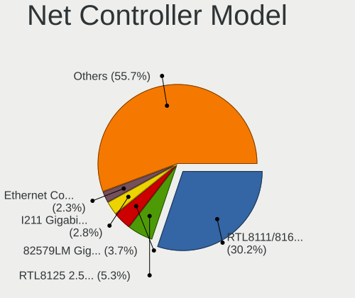

| Model                                                                  | Desktops | Percent |
|------------------------------------------------------------------------|----------|---------|
| Realtek RTL8111/8168/8211/8411 PCI Express Gigabit Ethernet Controller | 388      | 30.17%  |
| Realtek RTL8125 2.5GbE Controller                                      | 68       | 5.29%   |
| Intel 82579LM Gigabit Network Connection (Lewisville)                  | 48       | 3.73%   |
| Intel I211 Gigabit Network Connection                                  | 36       | 2.8%    |
| Intel Ethernet Connection I217-LM                                      | 30       | 2.33%   |
| Intel 82567LM-3 Gigabit Network Connection                             | 30       | 2.33%   |
| Intel Ethernet Connection (2) I219-V                                   | 29       | 2.26%   |
| Intel Wi-Fi 6 AX200                                                    | 28       | 2.18%   |
| Intel Ethernet Controller I225-V                                       | 18       | 1.4%    |
| MediaTek MT7922 802.11ax PCI Express Wireless Network Adapter          | 13       | 1.01%   |
| Intel Ethernet Connection I217-V                                       | 13       | 1.01%   |
| Realtek RTL8188EUS 802.11n Wireless Network Adapter                    | 11       | 0.86%   |
| Intel Ethernet Connection (7) I219-V                                   | 11       | 0.86%   |
| TP-Link Archer T2U PLUS [RTL8821AU]                                    | 10       | 0.78%   |
| Realtek RTL810xE PCI Express Fast Ethernet controller                  | 10       | 0.78%   |
| Qualcomm Atheros AR8151 v2.0 Gigabit Ethernet                          | 10       | 0.78%   |
| Intel 82574L Gigabit Network Connection                                | 10       | 0.78%   |
| Intel 82566DM-2 Gigabit Network Connection                             | 10       | 0.78%   |
| Realtek RTL-8100/8101L/8139 PCI Fast Ethernet Adapter                  | 9        | 0.7%    |
| Nvidia MCP61 Ethernet                                                  | 9        | 0.7%    |
| Intel Ethernet Connection (2) I219-LM                                  | 9        | 0.7%    |
| Intel Ethernet Connection (14) I219-V                                  | 9        | 0.7%    |
| Intel 82579V Gigabit Network Connection                                | 9        | 0.7%    |
| Qualcomm Atheros Killer E220x Gigabit Ethernet Controller              | 8        | 0.62%   |
| TP-Link TL-WN823N v2/v3 [Realtek RTL8192EU]                            | 7        | 0.54%   |
| Realtek RTL8192EE PCIe Wireless Network Adapter                        | 7        | 0.54%   |
| Ralink MT7601U Wireless Adapter                                        | 7        | 0.54%   |
| Qualcomm Atheros AR8152 v2.0 Fast Ethernet                             | 7        | 0.54%   |
| Intel Ethernet Connection (2) I218-V                                   | 7        | 0.54%   |
| Broadcom NetXtreme BCM5754 Gigabit Ethernet PCI Express                | 7        | 0.54%   |
| Realtek RTL8169 PCI Gigabit Ethernet Controller                        | 6        | 0.47%   |
| Realtek RTL8111/8168/8411 PCI Express Gigabit Ethernet Controller      | 6        | 0.47%   |
| Intel Ethernet Controller I226-V                                       | 6        | 0.47%   |
| Intel Cannon Lake PCH CNVi WiFi                                        | 6        | 0.47%   |
| Intel Alder Lake-S PCH CNVi WiFi                                       | 6        | 0.47%   |
| TP-Link TL-WN722N v2/v3 [Realtek RTL8188EUS]                           | 5        | 0.39%   |
| TP-Link Archer T3U [Realtek RTL8812BU]                                 | 5        | 0.39%   |
| Realtek RTL8852CE PCIe 802.11ax Wireless Network Controller            | 5        | 0.39%   |
| Realtek RTL8852BE PCIe 802.11ax Wireless Network Controller            | 5        | 0.39%   |
| Realtek RTL8192CE PCIe Wireless Network Adapter                        | 5        | 0.39%   |

Wireless Vendor
---------------

Wireless vendors

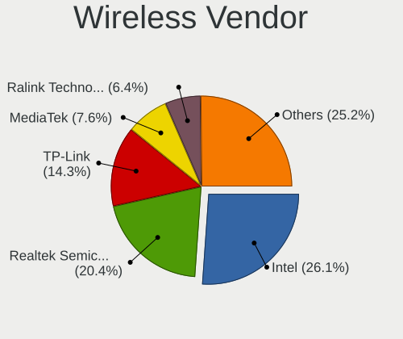

| Vendor                          | Desktops | Percent |
|---------------------------------|----------|---------|
| Intel                           | 82       | 26.11%  |
| Realtek Semiconductor           | 64       | 20.38%  |
| TP-Link                         | 45       | 14.33%  |
| MediaTek                        | 24       | 7.64%   |
| Ralink Technology               | 20       | 6.37%   |
| Qualcomm Atheros                | 18       | 5.73%   |
| Broadcom                        | 9        | 2.87%   |
| ASUSTek Computer                | 9        | 2.87%   |
| Ralink                          | 8        | 2.55%   |
| D-Link                          | 6        | 1.91%   |
| Microsoft                       | 5        | 1.59%   |
| Qualcomm Atheros Communications | 4        | 1.27%   |
| Broadcom Limited                | 4        | 1.27%   |
| Mercucys                        | 3        | 0.96%   |
| Edimax Technology               | 3        | 0.96%   |
| Tenda                           | 2        | 0.64%   |
| IMC Networks                    | 2        | 0.64%   |
| Belkin Components               | 2        | 0.64%   |
| NetGear                         | 1        | 0.32%   |
| Micro Star International        | 1        | 0.32%   |
| Linksys                         | 1        | 0.32%   |
| Accton Technology               | 1        | 0.32%   |

Wireless Model
--------------

Wireless models

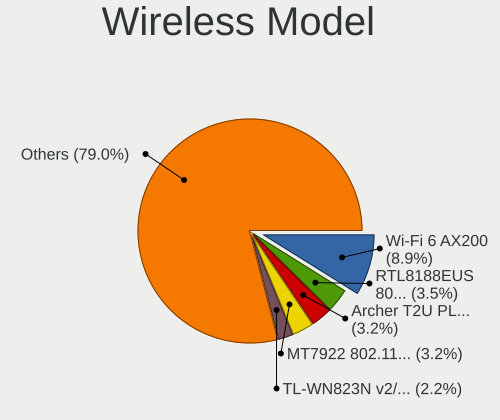

| Model                                                                           | Desktops | Percent |
|---------------------------------------------------------------------------------|----------|---------|
| Intel Wi-Fi 6 AX200                                                             | 28       | 8.89%   |
| Realtek RTL8188EUS 802.11n Wireless Network Adapter                             | 11       | 3.49%   |
| TP-Link Archer T2U PLUS [RTL8821AU]                                             | 10       | 3.17%   |
| MediaTek MT7922 802.11ax PCI Express Wireless Network Adapter                   | 10       | 3.17%   |
| TP-Link TL-WN823N v2/v3 [Realtek RTL8192EU]                                     | 7        | 2.22%   |
| Realtek RTL8192EE PCIe Wireless Network Adapter                                 | 7        | 2.22%   |
| Ralink MT7601U Wireless Adapter                                                 | 7        | 2.22%   |
| Intel Cannon Lake PCH CNVi WiFi                                                 | 6        | 1.9%    |
| Intel Alder Lake-S PCH CNVi WiFi                                                | 6        | 1.9%    |
| TP-Link TL-WN722N v2/v3 [Realtek RTL8188EUS]                                    | 5        | 1.59%   |
| TP-Link Archer T3U [Realtek RTL8812BU]                                          | 5        | 1.59%   |
| Realtek RTL8852CE PCIe 802.11ax Wireless Network Controller                     | 5        | 1.59%   |
| Realtek RTL8192CE PCIe Wireless Network Adapter                                 | 5        | 1.59%   |
| Ralink RT5370 Wireless Adapter                                                  | 5        | 1.59%   |
| Intel Wireless 8265 / 8275                                                      | 5        | 1.59%   |
| Intel Wi-Fi 6E(802.11ax) AX210/AX1675* 2x2 [Typhoon Peak]                       | 5        | 1.59%   |
| TP-Link TL-WN821N v5/v6 [RTL8192EU]                                             | 4        | 1.27%   |
| TP-Link Archer T4U ver.3                                                        | 4        | 1.27%   |
| Realtek RTL8852BE PCIe 802.11ax Wireless Network Controller                     | 4        | 1.27%   |
| Realtek RTL8192CU 802.11n WLAN Adapter                                          | 4        | 1.27%   |
| Realtek 802.11ac NIC                                                            | 4        | 1.27%   |
| Ralink RT2501/RT2573 Wireless Adapter                                           | 4        | 1.27%   |
| Qualcomm Atheros QCA6174 802.11ac Wireless Network Adapter                      | 4        | 1.27%   |
| MediaTek MT7921K (RZ608) Wi-Fi 6E 80MHz                                         | 4        | 1.27%   |
| Intel Wireless 7265                                                             | 4        | 1.27%   |
| Intel Dual Band Wireless-AC 3168NGW [Stone Peak]                                | 4        | 1.27%   |
| Intel Comet Lake PCH CNVi WiFi                                                  | 4        | 1.27%   |
| Intel 700 Series Chipset CNVi WiFi                                              | 4        | 1.27%   |
| TP-Link TL-WN822N Version 4 RTL8192EU                                           | 3        | 0.95%   |
| Realtek RTL8822CE 802.11ac PCIe Wireless Network Adapter                        | 3        | 0.95%   |
| Realtek RTL8812AU 802.11a/b/g/n/ac 2T2R DB WLAN Adapter                         | 3        | 0.95%   |
| Realtek RTL8188FTV 802.11b/g/n 1T1R 2.4G WLAN Adapter                           | 3        | 0.95%   |
| Realtek RTL8188CUS 802.11n WLAN Adapter                                         | 3        | 0.95%   |
| Ralink RT2870/RT3070 Wireless Adapter                                           | 3        | 0.95%   |
| Qualcomm Atheros AR9271 802.11n                                                 | 3        | 0.95%   |
| MediaTek MT7925 802.11be 160MHz 2x2 PCIe Wireless Network Adapter [Filogic 360] | 3        | 0.95%   |
| MediaTek MT7925 (RZ717) Wi-Fi 7 160MHz                                          | 3        | 0.95%   |
| MediaTek MT7921 802.11ax PCIe Wireless Network Adapter [Filogic 330]            | 3        | 0.95%   |
| Intel Wireless 3165                                                             | 3        | 0.95%   |
| Intel Wi-Fi 5(802.11ac) Wireless-AC 9x6x [Thunder Peak]                         | 3        | 0.95%   |

Ethernet Vendor
---------------

Ethernet vendors

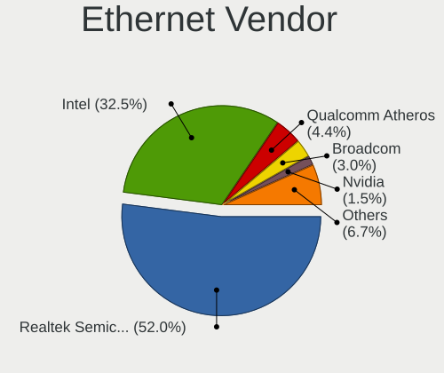

| Vendor                   | Desktops | Percent |
|--------------------------|----------|---------|
| Realtek Semiconductor    | 476      | 52.02%  |
| Intel                    | 297      | 32.46%  |
| Qualcomm Atheros         | 40       | 4.37%   |
| Broadcom                 | 27       | 2.95%   |
| Nvidia                   | 14       | 1.53%   |
| Aquantia                 | 12       | 1.31%   |
| Broadcom Limited         | 9        | 0.98%   |
| Samsung Electronics      | 5        | 0.55%   |
| MediaTek                 | 5        | 0.55%   |
| Marvell Technology Group | 5        | 0.55%   |
| Xiaomi                   | 4        | 0.44%   |
| TP-Link                  | 3        | 0.33%   |
| VIA Technologies         | 2        | 0.22%   |
| OPPO Electronics         | 2        | 0.22%   |
| Giga-Byte Technology     | 2        | 0.22%   |
| ASIX Electronics         | 2        | 0.22%   |
| Qualcomm                 | 1        | 0.11%   |
| QNAP System              | 1        | 0.11%   |
| QLogic                   | 1        | 0.11%   |
| Microsoft                | 1        | 0.11%   |
| Huawei Technologies      | 1        | 0.11%   |
| HMD Global               | 1        | 0.11%   |
| Google                   | 1        | 0.11%   |
| DisplayLink              | 1        | 0.11%   |
| D-Link System            | 1        | 0.11%   |
| 3Com                     | 1        | 0.11%   |

Ethernet Model
--------------

Ethernet models

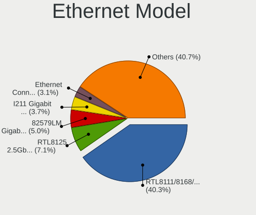

| Model                                                                  | Desktops | Percent |
|------------------------------------------------------------------------|----------|---------|
| Realtek RTL8111/8168/8211/8411 PCI Express Gigabit Ethernet Controller | 388      | 40.33%  |
| Realtek RTL8125 2.5GbE Controller                                      | 68       | 7.07%   |
| Intel 82579LM Gigabit Network Connection (Lewisville)                  | 48       | 4.99%   |
| Intel I211 Gigabit Network Connection                                  | 36       | 3.74%   |
| Intel Ethernet Connection I217-LM                                      | 30       | 3.12%   |
| Intel 82567LM-3 Gigabit Network Connection                             | 30       | 3.12%   |
| Intel Ethernet Connection (2) I219-V                                   | 29       | 3.01%   |
| Intel Ethernet Controller I225-V                                       | 18       | 1.87%   |
| Intel Ethernet Connection I217-V                                       | 13       | 1.35%   |
| Intel Ethernet Connection (7) I219-V                                   | 11       | 1.14%   |
| Realtek RTL810xE PCI Express Fast Ethernet controller                  | 10       | 1.04%   |
| Qualcomm Atheros AR8151 v2.0 Gigabit Ethernet                          | 10       | 1.04%   |
| Intel 82574L Gigabit Network Connection                                | 10       | 1.04%   |
| Intel 82566DM-2 Gigabit Network Connection                             | 10       | 1.04%   |
| Realtek RTL-8100/8101L/8139 PCI Fast Ethernet Adapter                  | 9        | 0.94%   |
| Nvidia MCP61 Ethernet                                                  | 9        | 0.94%   |
| Intel Ethernet Connection (2) I219-LM                                  | 9        | 0.94%   |
| Intel Ethernet Connection (14) I219-V                                  | 9        | 0.94%   |
| Intel 82579V Gigabit Network Connection                                | 9        | 0.94%   |
| Qualcomm Atheros Killer E220x Gigabit Ethernet Controller              | 8        | 0.83%   |
| Qualcomm Atheros AR8152 v2.0 Fast Ethernet                             | 7        | 0.73%   |
| Intel Ethernet Connection (2) I218-V                                   | 7        | 0.73%   |
| Broadcom NetXtreme BCM5754 Gigabit Ethernet PCI Express                | 7        | 0.73%   |
| Realtek RTL8169 PCI Gigabit Ethernet Controller                        | 6        | 0.62%   |
| Realtek RTL8111/8168/8411 PCI Express Gigabit Ethernet Controller      | 6        | 0.62%   |
| Intel Ethernet Controller I226-V                                       | 6        | 0.62%   |
| Realtek RTL8153 Gigabit Ethernet Adapter                               | 5        | 0.52%   |
| Intel I210 Gigabit Network Connection                                  | 5        | 0.52%   |
| Intel Ethernet Connection (5) I219-LM                                  | 5        | 0.52%   |
| Broadcom NetXtreme BCM5761 Gigabit Ethernet PCIe                       | 5        | 0.52%   |
| Aquantia AQC111 NBase-T/IEEE 802.3bz Ethernet Controller [AQtion]      | 5        | 0.52%   |
| Samsung Galaxy series, misc. (tethering mode)                          | 4        | 0.42%   |
| Intel 82583V Gigabit Network Connection                                | 4        | 0.42%   |
| Broadcom Limited NetXtreme BCM5761 Gigabit Ethernet PCIe               | 4        | 0.42%   |
| Xiaomi Mi/Redmi series (RNDIS)                                         | 3        | 0.31%   |
| Realtek Killer E3000 2.5GbE Controller                                 | 3        | 0.31%   |
| Qualcomm Atheros Killer E2500 Gigabit Ethernet Controller              | 3        | 0.31%   |
| Qualcomm Atheros Attansic L1 Gigabit Ethernet                          | 3        | 0.31%   |
| MediaTek MT7922 802.11ax PCI Express Wireless Network Adapter          | 3        | 0.31%   |
| Marvell Group 88E8056 PCI-E Gigabit Ethernet Controller                | 3        | 0.31%   |

Net Controller Kind
-------------------

Ethernet, WiFi or modem

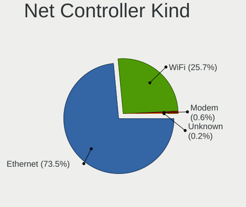

| Kind     | Desktops | Percent |
|----------|----------|---------|
| Ethernet | 843      | 73.5%   |
| WiFi     | 295      | 25.72%  |
| Modem    | 7        | 0.61%   |
| Unknown  | 2        | 0.17%   |

Used Controller
---------------

Currently used network controller

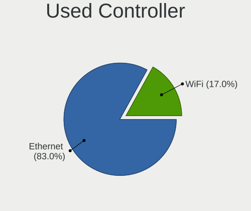

| Kind     | Desktops | Percent |
|----------|----------|---------|
| Ethernet | 720      | 83.04%  |
| WiFi     | 147      | 16.96%  |

NICs
----

Total network controllers on board

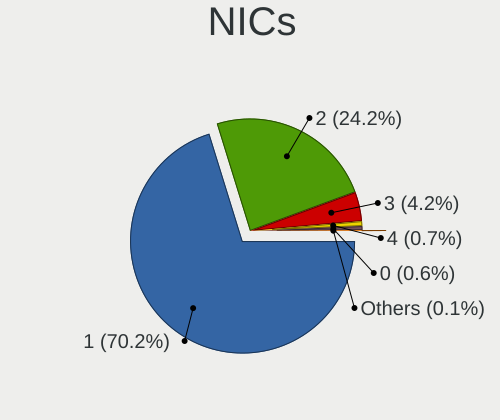

| Total | Desktops | Percent |
|-------|----------|---------|
| 1     | 599      | 70.22%  |
| 2     | 206      | 24.15%  |
| 3     | 36       | 4.22%   |
| 4     | 6        | 0.7%    |
| 0     | 5        | 0.59%   |
| 5     | 1        | 0.12%   |

IPv6
----

IPv6 vs IPv4

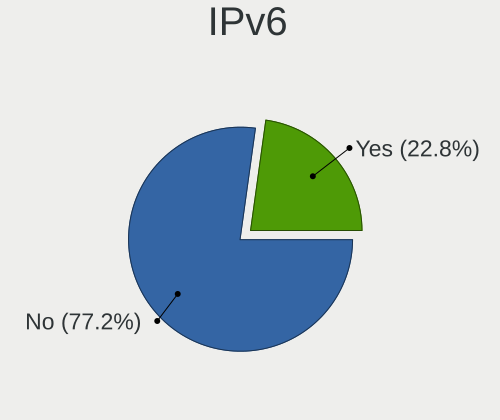

| Used | Desktops | Percent |
|------|----------|---------|
| No   | 670      | 77.19%  |
| Yes  | 198      | 22.81%  |

Bluetooth
---------

Bluetooth Vendor
----------------

Controller vendors

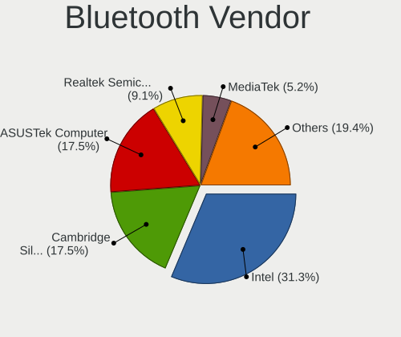

| Vendor                          | Desktops | Percent |
|---------------------------------|----------|---------|
| Intel                           | 79       | 31.35%  |
| Cambridge Silicon Radio         | 44       | 17.46%  |
| ASUSTek Computer                | 44       | 17.46%  |
| Realtek Semiconductor           | 23       | 9.13%   |
| MediaTek                        | 13       | 5.16%   |
| TP-Link                         | 9        | 3.57%   |
| IMC Networks                    | 9        | 3.57%   |
| Foxconn / Hon Hai               | 6        | 2.38%   |
| Qualcomm Atheros Communications | 5        | 1.98%   |
| Integrated System Solution      | 3        | 1.19%   |
| Broadcom                        | 3        | 1.19%   |
| Realtek                         | 2        | 0.79%   |
| Apple                           | 2        | 0.79%   |
| SINO WEALTH                     | 1        | 0.4%    |
| Ralink                          | 1        | 0.4%    |
| Micro Star International        | 1        | 0.4%    |
| Lite-On Technology              | 1        | 0.4%    |
| Edimax Technology               | 1        | 0.4%    |
| Conwise Technology              | 1        | 0.4%    |
| Belkin Components               | 1        | 0.4%    |
| Actions                         | 1        | 0.4%    |
| Accel Semiconductor             | 1        | 0.4%    |
| Unknown                         | 1        | 0.4%    |

Bluetooth Model
---------------

Controller models

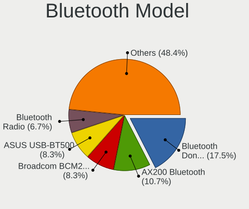

| Model                                                                               | Desktops | Percent |
|-------------------------------------------------------------------------------------|----------|---------|
| Cambridge Silicon Radio Bluetooth Dongle (HCI mode)                                 | 44       | 17.46%  |
| Intel AX200 Bluetooth                                                               | 27       | 10.71%  |
| ASUS Broadcom BCM20702A0 Bluetooth                                                  | 21       | 8.33%   |
| ASUS ASUS USB-BT500                                                                 | 21       | 8.33%   |
| Realtek Bluetooth Radio                                                             | 17       | 6.75%   |
| Intel Bluetooth wireless interface                                                  | 15       | 5.95%   |
| MediaTek Wireless_Device                                                            | 13       | 5.16%   |
| Intel AX201 Bluetooth                                                               | 13       | 5.16%   |
| TP-Link TP-T@- UB500 Adapter                                                        | 9        | 3.57%   |
| Intel Bluetooth 9460/9560 Jefferson Peak (JfP)                                      | 6        | 2.38%   |
| IMC Networks Wireless_Device                                                        | 6        | 2.38%   |
| Intel Bluetooth Device                                                              | 5        | 1.98%   |
| Intel AX210 Bluetooth                                                               | 5        | 1.98%   |
| Foxconn / Hon Hai Wireless_Device                                                   | 5        | 1.98%   |
| Intel Wireless-AC 3168 Bluetooth                                                    | 4        | 1.59%   |
| Intel Wireless-AC 9260 Bluetooth Adapter                                            | 3        | 1.19%   |
| IMC Networks Bluetooth Radio                                                        | 3        | 1.19%   |
| Realtek  Bluetooth 4.2 Adapter                                                      | 2        | 0.79%   |
| Realtek Bluetooth 5.4 Radio                                                         | 2        | 0.79%   |
| Realtek Bluetooth Radio                                                             | 2        | 0.79%   |
| Qualcomm Atheros  Bluetooth Device                                                  | 2        | 0.79%   |
| Qualcomm Atheros QCA61x4 Bluetooth 4.0                                              | 2        | 0.79%   |
| Integrated System Solution Bluetooth Device                                         | 2        | 0.79%   |
| Apple Bluetooth Host Controller                                                     | 2        | 0.79%   |
| SINO WEALTH Bluetooth Keyboard                                                      | 1        | 0.4%    |
| Realtek RTL8723B Bluetooth                                                          | 1        | 0.4%    |
| Realtek Bluetooth 5.3 Radio                                                         | 1        | 0.4%    |
| Ralink RT3290 Bluetooth                                                             | 1        | 0.4%    |
| Qualcomm Atheros AR3012 Bluetooth 4.0                                               | 1        | 0.4%    |
| Micro Star International Bluetooth Device                                           | 1        | 0.4%    |
| Lite-On Bluetooth Radio                                                             | 1        | 0.4%    |
| Intel Centrino Bluetooth Wireless Transceiver                                       | 1        | 0.4%    |
| Integrated System Solution KY-BT100 Bluetooth Adapter                               | 1        | 0.4%    |
| Foxconn / Hon Hai Foxconn T77H114 BCM2070 [Single-Chip Bluetooth 2.1 + EDR Adapter] | 1        | 0.4%    |
| Edimax EW-7611ULB 802.11b/g/n and Bluetooth 4.0 Adapter                             | 1        | 0.4%    |
| Conwise CW6622                                                                      | 1        | 0.4%    |
| Broadcom HP Portable Bumble Bee                                                     | 1        | 0.4%    |
| Broadcom BCM92046DG-CL1ROM Bluetooth 2.1 Adapter                                    | 1        | 0.4%    |
| Broadcom BCM2045 Bluetooth                                                          | 1        | 0.4%    |
| Belkin Components Bluetooth Mini Dongle                                             | 1        | 0.4%    |

Sound
-----

Sound Vendor
------------

Sound card vendors

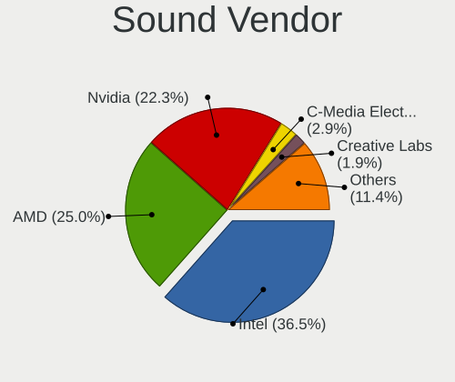

| Vendor                                       | Desktops | Percent |
|----------------------------------------------|----------|---------|
| Intel                                        | 529      | 36.53%  |
| AMD                                          | 362      | 25%     |
| Nvidia                                       | 323      | 22.31%  |
| C-Media Electronics                          | 42       | 2.9%    |
| Creative Labs                                | 27       | 1.86%   |
| Logitech                                     | 14       | 0.97%   |
| Texas Instruments                            | 10       | 0.69%   |
| ASUSTek Computer                             | 9        | 0.62%   |
| Razer USA                                    | 8        | 0.55%   |
| Kingston Technology                          | 8        | 0.55%   |
| Hewlett-Packard                              | 8        | 0.55%   |
| Creative Technology                          | 8        | 0.55%   |
| Trust                                        | 7        | 0.48%   |
| JMTek                                        | 7        | 0.48%   |
| Giga-Byte Technology                         | 7        | 0.48%   |
| GN Netcom                                    | 5        | 0.35%   |
| DSEA A/S                                     | 5        | 0.35%   |
| Tenx Technology                              | 4        | 0.28%   |
| Generalplus Technology                       | 4        | 0.28%   |
| Focusrite-Novation                           | 4        | 0.28%   |
| Thesycon Systemsoftware & Consulting         | 3        | 0.21%   |
| BEHRINGER International                      | 3        | 0.21%   |
| ASRock                                       | 3        | 0.21%   |
| SteelSeries ApS                              | 2        | 0.14%   |
| Plantronics                                  | 2        | 0.14%   |
| Microsoft                                    | 2        | 0.14%   |
| M-Audio                                      | 2        | 0.14%   |
| Jieli Technology                             | 2        | 0.14%   |
| GYROCOM C&C                                  | 2        | 0.14%   |
| Edifier Technology                           | 2        | 0.14%   |
| Corsair                                      | 2        | 0.14%   |
| Audio-Technica                               | 2        | 0.14%   |
| Zoran Co. Personal Media Division (Nogatech) | 1        | 0.07%   |
| Yamaha                                       | 1        | 0.07%   |
| XMOS                                         | 1        | 0.07%   |
| VIA Technologies                             | 1        | 0.07%   |
| TEAC                                         | 1        | 0.07%   |
| Studiologic                                  | 1        | 0.07%   |
| Sony                                         | 1        | 0.07%   |
| Sennheiser                                   | 1        | 0.07%   |

Sound Model
-----------

Sound card models

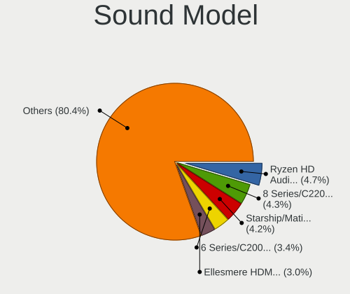

| Model                                                                      | Desktops | Percent |
|----------------------------------------------------------------------------|----------|---------|
| AMD Ryzen HD Audio Controller                                              | 80       | 4.66%   |
| Intel 8 Series/C220 Series Chipset High Definition Audio Controller        | 74       | 4.31%   |
| AMD Starship/Matisse HD Audio Controller                                   | 72       | 4.19%   |
| Intel 6 Series/C200 Series Chipset Family High Definition Audio Controller | 58       | 3.38%   |
| AMD Ellesmere HDMI Audio [Radeon RX 470/480 / 570/580/590]                 | 52       | 3.03%   |
| Intel Xeon E3-1200 v3/4th Gen Core Processor HD Audio Controller           | 48       | 2.79%   |
| Intel 200 Series PCH HD Audio                                              | 48       | 2.79%   |
| AMD SBx00 Azalia (Intel HDA)                                               | 44       | 2.56%   |
| Intel 100 Series/C230 Series Chipset Family HD Audio Controller            | 43       | 2.5%    |
| AMD Family 17h (Models 00h-0fh) HD Audio Controller                        | 42       | 2.44%   |
| Intel NM10/ICH7 Family High Definition Audio Controller                    | 34       | 1.98%   |
| AMD Navi 21/23 HDMI/DP Audio Controller                                    | 33       | 1.92%   |
| Intel 7 Series/C216 Chipset Family High Definition Audio Controller        | 32       | 1.86%   |
| AMD Radeon High Definition Audio Controller                                | 31       | 1.8%    |
| Nvidia GK208 HDMI/DP Audio Controller                                      | 29       | 1.69%   |
| Intel 82801JD/DO (ICH10 Family) HD Audio Controller                        | 29       | 1.69%   |
| Intel Cannon Lake PCH cAVS                                                 | 25       | 1.46%   |
| Intel 82801I (ICH9 Family) HD Audio Controller                             | 25       | 1.46%   |
| AMD FCH Azalia Controller                                                  | 25       | 1.46%   |
| AMD Oland/Hainan/Cape Verde/Pitcairn HDMI Audio [Radeon HD 7000 Series]    | 23       | 1.34%   |
| AMD Raven/Raven2/Fenghuang HDMI/DP Audio Controller                        | 21       | 1.22%   |
| AMD Baffin HDMI/DP Audio [Radeon RX 550 640SP / RX 560/560X]               | 21       | 1.22%   |
| Nvidia GP104 High Definition Audio Controller                              | 20       | 1.16%   |
| Nvidia TU116 High Definition Audio Controller                              | 19       | 1.11%   |
| Nvidia GP106 High Definition Audio Controller                              | 19       | 1.11%   |
| AMD Renoir/Cezanne HDMI/DP Audio Controller                                | 18       | 1.05%   |
| AMD Navi 10 HDMI Audio                                                     | 18       | 1.05%   |
| Nvidia High Definition Audio Controller                                    | 17       | 0.99%   |
| Nvidia GF108 High Definition Audio Controller                              | 17       | 0.99%   |
| Nvidia GP107GL High Definition Audio Controller                            | 16       | 0.93%   |
| Intel Alder Lake-S HD Audio Controller                                     | 16       | 0.93%   |
| Intel 9 Series Chipset Family HD Audio Controller                          | 15       | 0.87%   |
| Intel 82801JI (ICH10 Family) HD Audio Controller                           | 14       | 0.81%   |
| Nvidia GP108 High Definition Audio Controller                              | 13       | 0.76%   |
| AMD Cedar HDMI Audio [Radeon HD 5400/6300/7300 Series]                     | 13       | 0.76%   |
| Nvidia GK107 HDMI Audio Controller                                         | 12       | 0.7%    |
| Nvidia GA106 High Definition Audio Controller                              | 12       | 0.7%    |
| Intel Raptor Lake High Definition Audio Controller                         | 12       | 0.7%    |
| Intel C600/X79 series chipset High Definition Audio Controller             | 12       | 0.7%    |
| Intel 5 Series/3400 Series Chipset High Definition Audio                   | 12       | 0.7%    |

Memory
------

Memory Vendor
-------------

Memory module vendors

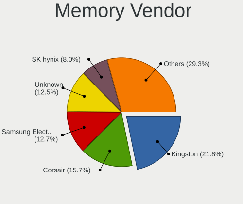

| Vendor                       | Desktops | Percent |
|------------------------------|----------|---------|
| Kingston                     | 122      | 21.79%  |
| Corsair                      | 88       | 15.71%  |
| Samsung Electronics          | 71       | 12.68%  |
| Unknown                      | 70       | 12.5%   |
| SK hynix                     | 45       | 8.04%   |
| G.Skill                      | 24       | 4.29%   |
| Crucial                      | 24       | 4.29%   |
| A-DATA Technology            | 18       | 3.21%   |
| Micron Technology            | 17       | 3.04%   |
| Ramaxel Technology           | 10       | 1.79%   |
| Nanya Technology             | 10       | 1.79%   |
| Kingmax                      | 9        | 1.61%   |
| Patriot                      | 8        | 1.43%   |
| GOODRAM                      | 7        | 1.25%   |
| Elpida                       | 5        | 0.89%   |
| Unknown                      | 5        | 0.89%   |
| Qimonda                      | 3        | 0.54%   |
| Apacer                       | 3        | 0.54%   |
| Unknown (ABCD)               | 2        | 0.36%   |
| S                            | 2        | 0.36%   |
| Patriot Memory (PDP Systems) | 2        | 0.36%   |
| H                            | 2        | 0.36%   |
| Golden Empire                | 2        | 0.36%   |
| Unknown (7F7F7F94FFFFFFFF)   | 1        | 0.18%   |
| Unknown (0x9801)             | 1        | 0.18%   |
| Toshiba                      | 1        | 0.18%   |
| Team                         | 1        | 0.18%   |
| TakeMS                       | 1        | 0.18%   |
| Silicon Power                | 1        | 0.18%   |
| Lexar                        | 1        | 0.18%   |
| Kingmax Semiconductor        | 1        | 0.18%   |
| Exceleram                    | 1        | 0.18%   |
| Atermiter                    | 1        | 0.18%   |
| AMD                          | 1        | 0.18%   |

Memory Model
------------

Memory module models

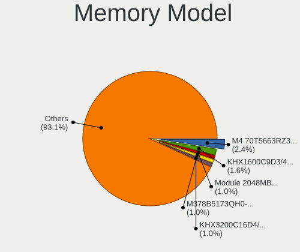

| Model                                                  | Desktops | Percent |
|--------------------------------------------------------|----------|---------|
| Samsung RAM M4 70T5663RZ3-CE6 2GB SODIMM DDR 667MT/s   | 15       | 2.42%   |
| Kingston RAM KHX1600C9D3/4GX 4GB DIMM DDR3 1867MT/s    | 10       | 1.61%   |
| Unknown RAM Module 2048MB DIMM 800MT/s                 | 6        | 0.97%   |
| Samsung RAM M378B5173QH0-CK0 4GB DIMM DDR3             | 6        | 0.97%   |
| Kingston RAM KHX3200C16D4/8GX 8GB DIMM DDR4 3733MT/s   | 6        | 0.97%   |
| Kingston RAM KHX2133C14/8G 8GB DIMM DDR4 2666MT/s      | 6        | 0.97%   |
| Unknown RAM Module 2048MB DIMM SDRAM                   | 5        | 0.81%   |
| Samsung RAM M378A1K43CB2-CRC 8GB DIMM DDR4 3500MT/s    | 5        | 0.81%   |
| Kingston RAM KF3200C16D4/16GX 16GB DIMM DDR4 3733MT/s  | 5        | 0.81%   |
| Corsair RAM CMK32GX4M2E3200C16 16GB DIMM DDR4 3600MT/s | 5        | 0.81%   |
| Corsair RAM CMK32GX4M2B3000C15 16GB DIMM DDR4 3000MT/s | 5        | 0.81%   |
| Corsair RAM CMK16GX4M2B3200C16 8GB DIMM DDR4 3600MT/s  | 5        | 0.81%   |
| Unknown                                                | 5        | 0.81%   |
| Unknown RAM Module 8GB DIMM 1600MT/s                   | 4        | 0.64%   |
| Unknown RAM Module 4GB DIMM 1333MT/s                   | 4        | 0.64%   |
| SK hynix RAM HMT451U6AFR8C-PB 4GB DIMM DDR3 1600MT/s   | 4        | 0.64%   |
| SK hynix RAM HMT125U6TFR8C-H9 2GB DIMM DDR3 1333MT/s   | 4        | 0.64%   |
| Kingston RAM KHX2400C15/8G 8GB DIMM DDR4 3400MT/s      | 4        | 0.64%   |
| Kingston RAM KHX2133C14D4/4G 4GB DIMM DDR4 3200MT/s    | 4        | 0.64%   |
| Kingston RAM KHX1600C9D3/8GX 8GB DIMM DDR3 2133MT/s    | 4        | 0.64%   |
| Corsair RAM CMZ16GX3M2A1600C9 8GB DIMM DDR3 1600MT/s   | 4        | 0.64%   |
| Corsair RAM CMK32GX4M2B3200C16 16GB DIMM DDR4 3800MT/s | 4        | 0.64%   |
| Unknown RAM Module 8GB DIMM DDR3 1600MT/s              | 3        | 0.48%   |
| Unknown RAM Module 8GB DIMM DDR3 1333MT/s              | 3        | 0.48%   |
| Unknown RAM Module 4GB DIMM DDR3 1600MT/s              | 3        | 0.48%   |
| Unknown RAM Module 2GB DIMM 400MT/s                    | 3        | 0.48%   |
| SK hynix RAM HMT451U6BFR8A-PB 4GB DIMM DDR3 1600MT/s   | 3        | 0.48%   |
| SK hynix RAM HMT351U6EFR8C-PB 4GB DIMM DDR3 1600MT/s   | 3        | 0.48%   |
| Samsung RAM M471B1G73DB0-YK0 8GB SODIMM DDR3 1600MT/s  | 3        | 0.48%   |
| Samsung RAM M378B5773DH0-CH9 2GB DIMM DDR3 1333MT/s    | 3        | 0.48%   |
| Samsung RAM M378B5173EB0-YK0 4GB DIMM DDR3 1600MT/s    | 3        | 0.48%   |
| Samsung RAM M378B5173DB0-CK0 4096MB DIMM DDR3 1600MT/s | 3        | 0.48%   |
| Qimonda RAM 64T128020HU3SB 1GB DIMM DDR2 667MT/s       | 3        | 0.48%   |
| Patriot RAM PSD48G266681 8GB DIMM DDR4 2934MT/s        | 3        | 0.48%   |
| Nanya RAM NT1GT64U8HB0BY-3C 1GB DIMM DDR2 667MT/s      | 3        | 0.48%   |
| Kingston RAM KHX2666C16D4/16GX 16GB DIMM DDR4 3000MT/s | 3        | 0.48%   |
| Kingston RAM KHX1600C10D3/8G 8GB DIMM DDR3 2133MT/s    | 3        | 0.48%   |
| Kingston RAM KF3200C16D4/8GX 8GiB DIMM DDR4 3600MT/s   | 3        | 0.48%   |
| Kingston RAM 99U5458-005.A01LF 4GB DIMM DDR3 1333MT/s  | 3        | 0.48%   |
| G.Skill RAM F4-3200C16-8GVKB 8GB DIMM DDR4 4000MT/s    | 3        | 0.48%   |

Memory Kind
-----------

Memory module kinds

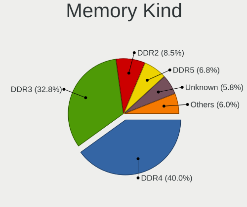

| Kind    | Desktops | Percent |
|---------|----------|---------|
| DDR4    | 193      | 40.04%  |
| DDR3    | 158      | 32.78%  |
| DDR2    | 41       | 8.51%   |
| DDR5    | 33       | 6.85%   |
| Unknown | 28       | 5.81%   |
| SDRAM   | 23       | 4.77%   |
| DDR     | 3        | 0.62%   |
| LPDDR4  | 2        | 0.41%   |
| DRAM    | 1        | 0.21%   |

Memory Form Factor
------------------

Physical design of the memory module

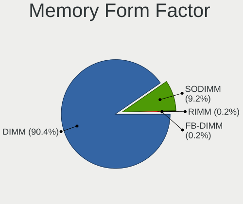

| Name    | Desktops | Percent |
|---------|----------|---------|
| DIMM    | 423      | 90.38%  |
| SODIMM  | 43       | 9.19%   |
| RIMM    | 1        | 0.21%   |
| FB-DIMM | 1        | 0.21%   |

Memory Size
-----------

Memory module size

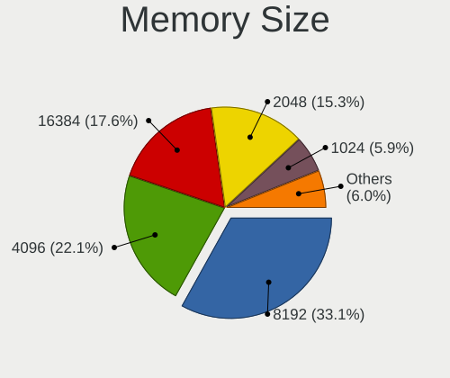

| Size  | Desktops | Percent |
|-------|----------|---------|
| 8192  | 175      | 33.08%  |
| 4096  | 117      | 22.12%  |
| 16384 | 93       | 17.58%  |
| 2048  | 81       | 15.31%  |
| 1024  | 31       | 5.86%   |
| 32768 | 27       | 5.1%    |
| 512   | 4        | 0.76%   |
| 24576 | 1        | 0.19%   |

Memory Speed
------------

Memory module speed

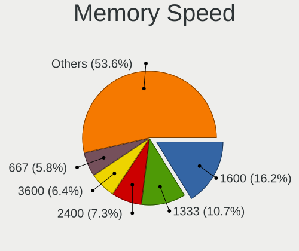

| Speed   | Desktops | Percent |
|---------|----------|---------|
| 1600    | 89       | 16.21%  |
| 1333    | 59       | 10.75%  |
| 2400    | 40       | 7.29%   |
| 3600    | 35       | 6.38%   |
| 667     | 32       | 5.83%   |
| 3200    | 27       | 4.92%   |
| 800     | 27       | 4.92%   |
| 2667    | 26       | 4.74%   |
| 2133    | 21       | 3.83%   |
| 3733    | 17       | 3.1%    |
| 6000    | 14       | 2.55%   |
| 3000    | 14       | 2.55%   |
| 3400    | 12       | 2.19%   |
| Unknown | 12       | 2.19%   |
| 1866    | 9        | 1.64%   |
| 3800    | 8        | 1.46%   |
| 2666    | 8        | 1.46%   |
| 1867    | 7        | 1.28%   |
| 5600    | 5        | 0.91%   |
| 4800    | 5        | 0.91%   |
| 3500    | 5        | 0.91%   |
| 1800    | 5        | 0.91%   |
| 533     | 5        | 0.91%   |
| 4000    | 4        | 0.73%   |
| 3466    | 4        | 0.73%   |
| 2800    | 4        | 0.73%   |
| 1066    | 4        | 0.73%   |
| 400     | 4        | 0.73%   |
| 6400    | 3        | 0.55%   |
| 3066    | 3        | 0.55%   |
| 2934    | 3        | 0.55%   |
| 1648    | 3        | 0.55%   |
| 5400    | 2        | 0.36%   |
| 3666    | 2        | 0.36%   |
| 3333    | 2        | 0.36%   |
| 3151    | 2        | 0.36%   |
| 2048    | 2        | 0.36%   |
| 1334    | 2        | 0.36%   |
| 1331    | 2        | 0.36%   |
| 1067    | 2        | 0.36%   |

Printers & scanners
-------------------

Printer Vendor
--------------

Printer device vendors

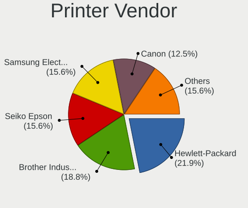

| Vendor                | Desktops | Percent |
|-----------------------|----------|---------|
| Hewlett-Packard       | 7        | 21.88%  |
| Brother Industries    | 6        | 18.75%  |
| Seiko Epson           | 5        | 15.63%  |
| Samsung Electronics   | 5        | 15.63%  |
| Canon                 | 4        | 12.5%   |
| Zebra                 | 1        | 3.13%   |
| Xerox                 | 1        | 3.13%   |
| QinHeng Electronics   | 1        | 3.13%   |
| Lexmark International | 1        | 3.13%   |
| ATEN International    | 1        | 3.13%   |

Printer Model
-------------

Printer device models

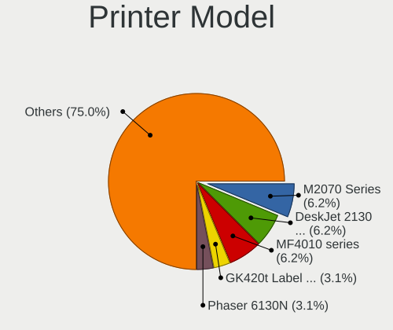

| Model                                         | Desktops | Percent |
|-----------------------------------------------|----------|---------|
| Samsung M2070 Series                          | 2        | 6.25%   |
| HP DeskJet 2130 series                        | 2        | 6.25%   |
| Canon MF4010 series                           | 2        | 6.25%   |
| Zebra GK420t Label Printer                    | 1        | 3.13%   |
| Xerox Phaser 6130N                            | 1        | 3.13%   |
| Seiko Epson ME 340 Series/Stylus NX130 Series | 1        | 3.13%   |
| Seiko Epson M3140 Series                      | 1        | 3.13%   |
| Seiko Epson L3050 Series                      | 1        | 3.13%   |
| Seiko Epson ET-3750 Series                    | 1        | 3.13%   |
| Seiko Epson ET-2710 Series                    | 1        | 3.13%   |
| Samsung ML-216x Series Laser Printer          | 1        | 3.13%   |
| Samsung M267x 287x Series                     | 1        | 3.13%   |
| Samsung CLP-310 Color Laser Printer           | 1        | 3.13%   |
| QinHeng CH340S                                | 1        | 3.13%   |
| Lexmark International InkJet Color Printer    | 1        | 3.13%   |
| HP LaserJet M14-M17                           | 1        | 3.13%   |
| HP LaserJet 3050                              | 1        | 3.13%   |
| HP DeskJet F2492 All-in-One                   | 1        | 3.13%   |
| HP Deskjet 3050A                              | 1        | 3.13%   |
| HP color LaserJet 5550                        | 1        | 3.13%   |
| Canon PIXMA MP280                             | 1        | 3.13%   |
| Canon MF3110                                  | 1        | 3.13%   |
| Brother MFC-7420                              | 1        | 3.13%   |
| Brother HL-5380DN series                      | 1        | 3.13%   |
| Brother HL-5250DN Printer                     | 1        | 3.13%   |
| Brother HL-1210W series                       | 1        | 3.13%   |
| Brother HL-1110 series                        | 1        | 3.13%   |
| Brother DCP-7030                              | 1        | 3.13%   |
| ATEN International UC-1284B Printer Port      | 1        | 3.13%   |

Scanner Vendor
--------------

Scanner device vendors

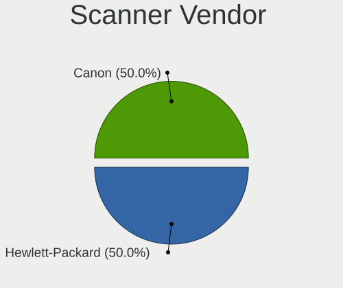

| Vendor          | Desktops | Percent |
|-----------------|----------|---------|
| Hewlett-Packard | 1        | 50%     |
| Canon           | 1        | 50%     |

Scanner Model
-------------

Scanner device models

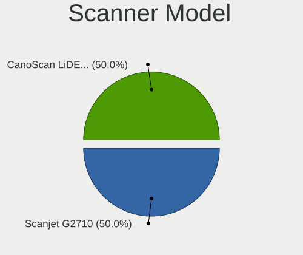

| Model                   | Desktops | Percent |
|-------------------------|----------|---------|
| HP Scanjet G2710        | 1        | 50%     |
| Canon CanoScan LiDE 100 | 1        | 50%     |

Camera
------

Camera Vendor
-------------

Camera device vendors

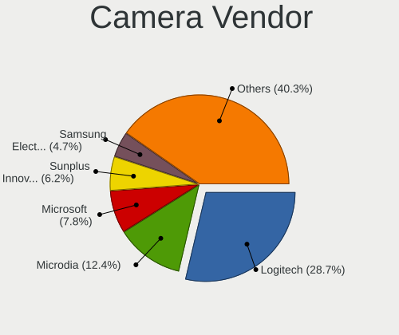

| Vendor                        | Desktops | Percent |
|-------------------------------|----------|---------|
| Logitech                      | 37       | 28.68%  |
| Microdia                      | 16       | 12.4%   |
| Microsoft                     | 10       | 7.75%   |
| Sunplus Innovation Technology | 8        | 6.2%    |
| Samsung Electronics           | 6        | 4.65%   |
| Apple                         | 5        | 3.88%   |
| Z-Star Microelectronics       | 4        | 3.1%    |
| GEMBIRD                       | 3        | 2.33%   |
| webcam                        | 2        | 1.55%   |
| WaveRider Communications      | 2        | 1.55%   |
| Trust                         | 2        | 1.55%   |
| Realtek Semiconductor         | 2        | 1.55%   |
| MacroSilicon                  | 2        | 1.55%   |
| Lenovo                        | 2        | 1.55%   |
| Jieli Technology              | 2        | 1.55%   |
| Cubeternet                    | 2        | 1.55%   |
| Creative Technology           | 2        | 1.55%   |
| Chicony Electronics           | 2        | 1.55%   |
| Aveo Technology               | 2        | 1.55%   |
| Arkmicro Technologies         | 2        | 1.55%   |
| Alpha Imaging Technology      | 2        | 1.55%   |
| Alcor Micro                   | 2        | 1.55%   |
| Unknown                       | 1        | 0.78%   |
| Ricoh                         | 1        | 0.78%   |
| Razer USA                     | 1        | 0.78%   |
| Novatek Microelectronics      | 1        | 0.78%   |
| Nikon                         | 1        | 0.78%   |
| KYE Systems (Mouse Systems)   | 1        | 0.78%   |
| Jeilin Technology             | 1        | 0.78%   |
| IMC Networks                  | 1        | 0.78%   |
| Huawei Technologies           | 1        | 0.78%   |
| Hewlett-Packard               | 1        | 0.78%   |
| Generalplus Technology        | 1        | 0.78%   |
| ARC International             | 1        | 0.78%   |

Camera Model
------------

Camera device models

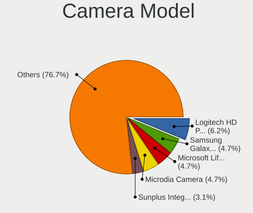

| Model                                             | Desktops | Percent |
|---------------------------------------------------|----------|---------|
| Logitech HD Pro Webcam C920                       | 8        | 6.2%    |
| Samsung Galaxy series, misc. (MTP mode)           | 6        | 4.65%   |
| Microsoft LifeCam HD-3000                         | 6        | 4.65%   |
| Microdia Camera                                   | 6        | 4.65%   |
| Sunplus Integrated Camera                         | 4        | 3.1%    |
| Logitech QuickCam Pro 9000                        | 4        | 3.1%    |
| Apple iPhone 5/5C/5S/6/SE/7/8/X                   | 4        | 3.1%    |
| Sunplus Full HD webcam                            | 3        | 2.33%   |
| Microdia Sonix USB 2.0 Camera                     | 3        | 2.33%   |
| Logitech Webcam C270                              | 3        | 2.33%   |
| Z-Star Full HD 1080P PC Camera                    | 2        | 1.55%   |
| webcam webcam                                     | 2        | 1.55%   |
| Trust USB Camera                                  | 2        | 1.55%   |
| Microdia USB 2.0 Camera                           | 2        | 1.55%   |
| Microdia Integrated Camera                        | 2        | 1.55%   |
| Microdia HP Integrated Webcam                     | 2        | 1.55%   |
| Logitech Webcam C170                              | 2        | 1.55%   |
| Logitech Webcam B500                              | 2        | 1.55%   |
| Logitech C922 Pro Stream Webcam                   | 2        | 1.55%   |
| Logitech C920 PRO HD Webcam                       | 2        | 1.55%   |
| Jieli USB PHY 2.0                                 | 2        | 1.55%   |
| GEMBIRD USB2.0 PC CAMERA                          | 2        | 1.55%   |
| Arkmicro USB2.0 PC CAMERA                         | 2        | 1.55%   |
| Alpha Imaging hama C-600 Pro Webcam               | 2        | 1.55%   |
| Z-Star Venus USB2.0 Camera                        | 1        | 0.78%   |
| Z-Star A4 TECH USB2.0 PC Camera E                 | 1        | 0.78%   |
| WaveRider USB Live camera                         | 1        | 0.78%   |
| WaveRider USB 2.0 Camera                          | 1        | 0.78%   |
| Unknown HD camera                                 | 1        | 0.78%   |
| Sunplus SPCA2281 Web Camera                       | 1        | 0.78%   |
| Ricoh Sony Vaio Integrated Webcam                 | 1        | 0.78%   |
| Realtek USB Camera                                | 1        | 0.78%   |
| Realtek FULL HD 1080P Webcam                      | 1        | 0.78%   |
| Razer USA Razer Kiyo X                            | 1        | 0.78%   |
| Novatek HP High Definition 2MP Webcam             | 1        | 0.78%   |
| Nikon DSC D3200                                   | 1        | 0.78%   |
| Microsoft Microsoft LifeCam HD-6000 for Notebooks | 1        | 0.78%   |
| Microsoft LifeCam VX-7000 (UVC-compliant)         | 1        | 0.78%   |
| Microsoft LifeCam VX-500 [1357]                   | 1        | 0.78%   |
| Microsoft LifeCam VX-2000                         | 1        | 0.78%   |

Security
--------

Fingerprint Vendor
------------------

Fingerprint sensor vendors

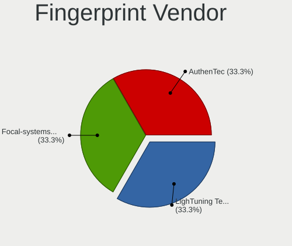

| Vendor                | Desktops | Percent |
|-----------------------|----------|---------|
| STMicroelectronics    | 1        | 20%     |
| LighTuning Technology | 1        | 20%     |
| Focal-systems.Corp    | 1        | 20%     |
| Dell                  | 1        | 20%     |
| AuthenTec             | 1        | 20%     |

Fingerprint Model
-----------------

Fingerprint sensor models

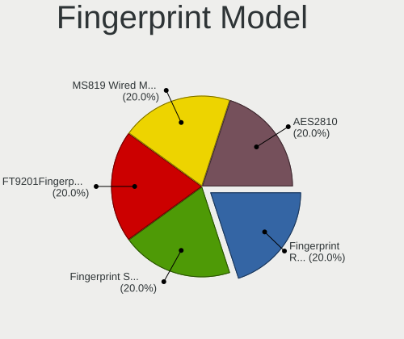

| Model                                          | Desktops | Percent |
|------------------------------------------------|----------|---------|
| STMicroelectronics Fingerprint Reader          | 1        | 20%     |
| LighTuning Fingerprint Sensor                  | 1        | 20%     |
| Focal-systems.Corp FT9201Fingerprint.          | 1        | 20%     |
| Dell MS819 Wired Mouse With Fingerprint Reader | 1        | 20%     |
| AuthenTec AES2810                              | 1        | 20%     |

Chipcard Vendor
---------------

Chipcard module vendors

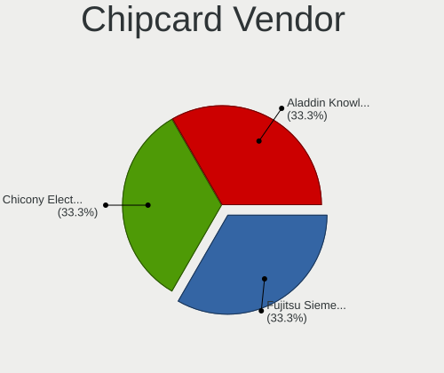

| Vendor                    | Desktops | Percent |
|---------------------------|----------|---------|
| Fujitsu Siemens Computers | 1        | 33.33%  |
| Chicony Electronics       | 1        | 33.33%  |
| Aladdin Knowledge Systems | 1        | 33.33%  |

Chipcard Model
--------------

Chipcard module models

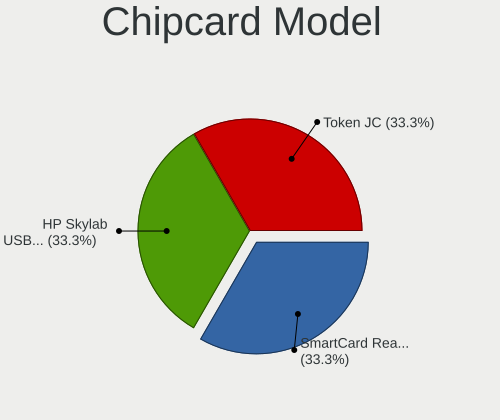

| Model                                                | Desktops | Percent |
|------------------------------------------------------|----------|---------|
| Fujitsu Siemens Computers SmartCard Reader 2A        | 1        | 33.33%  |
| Chicony Electronics HP Skylab USB Smartcard Keyboard | 1        | 33.33%  |
| Aladdin Knowledge Systems Token JC                   | 1        | 33.33%  |

Unsupported
-----------

Unsupported Devices
-------------------

Total unsupported devices on board

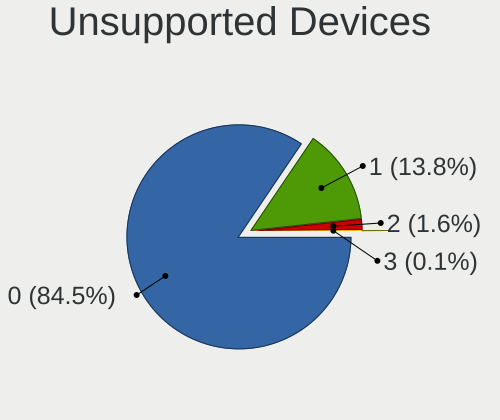

| Total | Desktops | Percent |
|-------|----------|---------|
| 0     | 734      | 84.46%  |
| 1     | 120      | 13.81%  |
| 2     | 14       | 1.61%   |
| 3     | 1        | 0.12%   |

Unsupported Device Types
------------------------

Types of unsupported devices

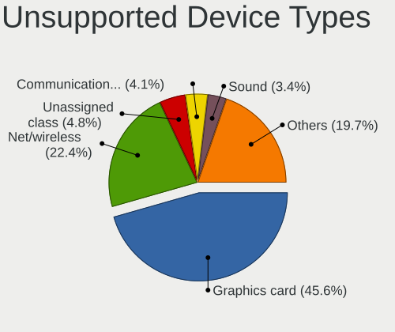

| Type                     | Desktops | Percent |
|--------------------------|----------|---------|
| Graphics card            | 67       | 45.58%  |
| Net/wireless             | 33       | 22.45%  |
| Unassigned class         | 7        | 4.76%   |
| Communication controller | 6        | 4.08%   |
| Sound                    | 5        | 3.4%    |
| Multimedia controller    | 5        | 3.4%    |
| Storage/raid             | 4        | 2.72%   |
| Storage/ide              | 4        | 2.72%   |
| Fingerprint reader       | 4        | 2.72%   |
| Camera                   | 3        | 2.04%   |
| Bluetooth                | 3        | 2.04%   |
| Unclassified device      | 1        | 0.68%   |
| Storage/ata              | 1        | 0.68%   |
| Storage                  | 1        | 0.68%   |
| Net/ethernet             | 1        | 0.68%   |
| Chipcard                 | 1        | 0.68%   |
| Card reader              | 1        | 0.68%   |

