Linux in Romania - Tested Hardware & Statistics (Desktops)
----------------------------------------------------------

A project to collect tested hardware configurations for Linux in Romania.

Anyone can contribute to this report by the [hw-probe](https://github.com/linuxhw/hw-probe) tool:

    sudo -E hw-probe -all -upload

Please contribute! Especially if your hardware is rare.

Contents
--------

* [ Test Cases ](#test-cases)

* [ System ](#system)
  - [ OS                       ](#os)
  - [ OS Family                ](#os-family)
  - [ Kernel                   ](#kernel)
  - [ Kernel Family            ](#kernel-family)
  - [ Kernel Major Ver.        ](#kernel-major-ver)
  - [ Arch                     ](#arch)
  - [ DE                       ](#de)
  - [ Display Server           ](#display-server)
  - [ Display Manager          ](#display-manager)
  - [ OS Lang                  ](#os-lang)
  - [ Boot Mode                ](#boot-mode)
  - [ Filesystem               ](#filesystem)
  - [ Part. scheme             ](#part-scheme)
  - [ Dual Boot with Linux/BSD ](#dual-boot-with-linuxbsd)
  - [ Dual Boot (Win)          ](#dual-boot-win)

* [ Board ](#board)
  - [ Vendor                   ](#vendor)
  - [ Model                    ](#model)
  - [ Model Family             ](#model-family)
  - [ MFG Year                 ](#mfg-year)
  - [ Form Factor              ](#form-factor)
  - [ Secure Boot              ](#secure-boot)
  - [ Coreboot                 ](#coreboot)
  - [ RAM Size                 ](#ram-size)
  - [ RAM Used                 ](#ram-used)
  - [ Total Drives             ](#total-drives)
  - [ Has CD-ROM               ](#has-cd-rom)
  - [ Has Ethernet             ](#has-ethernet)
  - [ Has WiFi                 ](#has-wifi)
  - [ Has Bluetooth            ](#has-bluetooth)

* [ Location ](#location)
  - [ Country                  ](#country)
  - [ City                     ](#city)

* [ Drives ](#drives)
  - [ Drive Vendor             ](#drive-vendor)
  - [ Drive Model              ](#drive-model)
  - [ HDD Vendor               ](#hdd-vendor)
  - [ SSD Vendor               ](#ssd-vendor)
  - [ Drive Kind               ](#drive-kind)
  - [ Drive Connector          ](#drive-connector)
  - [ Drive Size               ](#drive-size)
  - [ Space Total              ](#space-total)
  - [ Space Used               ](#space-used)
  - [ Malfunc. Drives          ](#malfunc-drives)
  - [ Malfunc. Drive Vendor    ](#malfunc-drive-vendor)
  - [ Malfunc. HDD Vendor      ](#malfunc-hdd-vendor)
  - [ Malfunc. Drive Kind      ](#malfunc-drive-kind)
  - [ Failed Drives            ](#failed-drives)
  - [ Failed Drive Vendor      ](#failed-drive-vendor)
  - [ Drive Status             ](#drive-status)

* [ Storage controller ](#storage-controller)
  - [ Storage Vendor           ](#storage-vendor)
  - [ Storage Model            ](#storage-model)
  - [ Storage Kind             ](#storage-kind)

* [ Processor ](#processor)
  - [ CPU Vendor               ](#cpu-vendor)
  - [ CPU Model                ](#cpu-model)
  - [ CPU Model Family         ](#cpu-model-family)
  - [ CPU Cores                ](#cpu-cores)
  - [ CPU Sockets              ](#cpu-sockets)
  - [ CPU Threads              ](#cpu-threads)
  - [ CPU Op-Modes             ](#cpu-op-modes)
  - [ CPU Microcode            ](#cpu-microcode)
  - [ CPU Microarch            ](#cpu-microarch)

* [ Graphics ](#graphics)
  - [ GPU Vendor               ](#gpu-vendor)
  - [ GPU Model                ](#gpu-model)
  - [ GPU Combo                ](#gpu-combo)
  - [ GPU Driver               ](#gpu-driver)
  - [ GPU Memory               ](#gpu-memory)

* [ Monitor ](#monitor)
  - [ Monitor Vendor           ](#monitor-vendor)
  - [ Monitor Model            ](#monitor-model)
  - [ Monitor Resolution       ](#monitor-resolution)
  - [ Monitor Diagonal         ](#monitor-diagonal)
  - [ Monitor Width            ](#monitor-width)
  - [ Aspect Ratio             ](#aspect-ratio)
  - [ Monitor Area             ](#monitor-area)
  - [ Pixel Density            ](#pixel-density)
  - [ Multiple Monitors        ](#multiple-monitors)

* [ Network ](#network)
  - [ Net Controller Vendor    ](#net-controller-vendor)
  - [ Net Controller Model     ](#net-controller-model)
  - [ Wireless Vendor          ](#wireless-vendor)
  - [ Wireless Model           ](#wireless-model)
  - [ Ethernet Vendor          ](#ethernet-vendor)
  - [ Ethernet Model           ](#ethernet-model)
  - [ Net Controller Kind      ](#net-controller-kind)
  - [ Used Controller          ](#used-controller)
  - [ NICs                     ](#nics)
  - [ IPv6                     ](#ipv6)

* [ Bluetooth ](#bluetooth)
  - [ Bluetooth Vendor         ](#bluetooth-vendor)
  - [ Bluetooth Model          ](#bluetooth-model)

* [ Sound ](#sound)
  - [ Sound Vendor             ](#sound-vendor)
  - [ Sound Model              ](#sound-model)

* [ Memory ](#memory)
  - [ Memory Vendor            ](#memory-vendor)
  - [ Memory Model             ](#memory-model)
  - [ Memory Kind              ](#memory-kind)
  - [ Memory Form Factor       ](#memory-form-factor)
  - [ Memory Size              ](#memory-size)
  - [ Memory Speed             ](#memory-speed)

* [ Printers & scanners ](#printers--scanners)
  - [ Printer Vendor           ](#printer-vendor)
  - [ Printer Model            ](#printer-model)
  - [ Scanner Vendor           ](#scanner-vendor)
  - [ Scanner Model            ](#scanner-model)

* [ Camera ](#camera)
  - [ Camera Vendor            ](#camera-vendor)
  - [ Camera Model             ](#camera-model)

* [ Security ](#security)
  - [ Fingerprint Vendor       ](#fingerprint-vendor)
  - [ Fingerprint Model        ](#fingerprint-model)
  - [ Chipcard Vendor          ](#chipcard-vendor)
  - [ Chipcard Model           ](#chipcard-model)

* [ Unsupported ](#unsupported)
  - [ Unsupported Devices      ](#unsupported-devices)
  - [ Unsupported Device Types ](#unsupported-device-types)

Test Cases
----------

Total: 815

| Vendor        | Model                       | Probe                                                      | Date         |
|---------------|-----------------------------|------------------------------------------------------------|--------------|
| Lenovo        | 30D2 SDK0J40697 WIN 3305... | [3b5e9f52a2](https://linux-hardware.org/?probe=3b5e9f52a2) | Aug 05, 2023 |
| Gigabyte      | X470 AORUS ULTRA GAMING-... | [66d6565a06](https://linux-hardware.org/?probe=66d6565a06) | Aug 05, 2023 |
| Gigabyte      | X470 AORUS ULTRA GAMING-... | [70aa79986f](https://linux-hardware.org/?probe=70aa79986f) | Aug 05, 2023 |
| Acer          | EQ45LM                      | [b9be16315e](https://linux-hardware.org/?probe=b9be16315e) | Aug 05, 2023 |
| ASUSTek       | TUF Z390-PLUS GAMING        | [cc0ea700cc](https://linux-hardware.org/?probe=cc0ea700cc) | Aug 04, 2023 |
| MSI           | Z270 TOMAHAWK OPT BOOST     | [9cc0db1a3d](https://linux-hardware.org/?probe=9cc0db1a3d) | Jul 29, 2023 |
| Unknown       | Unknown                     | [9f04167710](https://linux-hardware.org/?probe=9f04167710) | Jul 27, 2023 |
| Acer          | EQ45LM                      | [29e2f587cd](https://linux-hardware.org/?probe=29e2f587cd) | Jul 26, 2023 |
| Acer          | EQ45LM                      | [37f6c76c11](https://linux-hardware.org/?probe=37f6c76c11) | Jul 25, 2023 |
| MSI           | Z270 TOMAHAWK OPT BOOST     | [6417b2e0e3](https://linux-hardware.org/?probe=6417b2e0e3) | Jul 24, 2023 |
| ASUSTek       | PRIME A320M-K               | [d64ea4b9cd](https://linux-hardware.org/?probe=d64ea4b9cd) | Jul 15, 2023 |
| ASRock        | B250M-HDV                   | [85d4919b9c](https://linux-hardware.org/?probe=85d4919b9c) | Jul 12, 2023 |
| Fujitsu       | D3220-A1 S26361-D3220-A1    | [0ae95a7985](https://linux-hardware.org/?probe=0ae95a7985) | Jul 10, 2023 |
| Acer          | EQ45LM                      | [3cafc83ffb](https://linux-hardware.org/?probe=3cafc83ffb) | Jul 08, 2023 |
| ASUSTek       | P5KC                        | [952e97925b](https://linux-hardware.org/?probe=952e97925b) | Jul 08, 2023 |
| ASUSTek       | V-P7H55E                    | [79d631563a](https://linux-hardware.org/?probe=79d631563a) | Jul 01, 2023 |
| Acer          | EQ45LM                      | [30781f8f1b](https://linux-hardware.org/?probe=30781f8f1b) | Jun 25, 2023 |
| ASUSTek       | Q87M-E                      | [f0ab10725e](https://linux-hardware.org/?probe=f0ab10725e) | Jun 23, 2023 |
| Fujitsu       | D3233-A1 S26361-D3233-A1    | [4622902df7](https://linux-hardware.org/?probe=4622902df7) | Jun 17, 2023 |
| Acer          | Veriton N4640G              | [f1f16d8add](https://linux-hardware.org/?probe=f1f16d8add) | Jun 16, 2023 |
| HP            | 81B3                        | [9ba98d3c27](https://linux-hardware.org/?probe=9ba98d3c27) | Jun 14, 2023 |
| Gigabyte      | 970A-D3                     | [1c62ecb77d](https://linux-hardware.org/?probe=1c62ecb77d) | Jun 14, 2023 |
| Gigabyte      | A520M DS3H                  | [0f5b161a60](https://linux-hardware.org/?probe=0f5b161a60) | Jun 13, 2023 |
| Dell          | 0XCR8D A02                  | [d567ae409c](https://linux-hardware.org/?probe=d567ae409c) | Jun 12, 2023 |
| ASUSTek       | CROSSHAIR V FORMULA-Z       | [b6a626c812](https://linux-hardware.org/?probe=b6a626c812) | Jun 10, 2023 |
| Gigabyte      | B560M H                     | [fadb7a6aa8](https://linux-hardware.org/?probe=fadb7a6aa8) | Jun 10, 2023 |
| Acer          | EQ45LM                      | [73f7a3078f](https://linux-hardware.org/?probe=73f7a3078f) | Jun 06, 2023 |
| ASRock        | X670E PG Lightning          | [7cd25ddbda](https://linux-hardware.org/?probe=7cd25ddbda) | Jun 04, 2023 |
| MSI           | X370 XPOWER GAMING TITAN... | [3ecf79af69](https://linux-hardware.org/?probe=3ecf79af69) | May 29, 2023 |
| MSI           | B450 GAMING PLUS MAX        | [acee298918](https://linux-hardware.org/?probe=acee298918) | May 26, 2023 |
| Acer          | EQ45LM                      | [a49c4c8438](https://linux-hardware.org/?probe=a49c4c8438) | May 26, 2023 |
| HP            | 805D                        | [2ac4992bcd](https://linux-hardware.org/?probe=2ac4992bcd) | May 22, 2023 |
| Gigabyte      | B450M S2H                   | [5309c41b94](https://linux-hardware.org/?probe=5309c41b94) | May 21, 2023 |
| Gigabyte      | B550I AORUS PRO AX          | [b8ed6a8b77](https://linux-hardware.org/?probe=b8ed6a8b77) | May 18, 2023 |
| Dell          | 09KPNV A01                  | [cbd408a1a6](https://linux-hardware.org/?probe=cbd408a1a6) | May 13, 2023 |
| Gigabyte      | Z97X-SLI-CF                 | [5921d78ceb](https://linux-hardware.org/?probe=5921d78ceb) | May 10, 2023 |
| Dell          | 0YXT71 A03                  | [b8281f77a3](https://linux-hardware.org/?probe=b8281f77a3) | May 07, 2023 |
| Gigabyte      | Z97-D3H-CF                  | [f86e67c005](https://linux-hardware.org/?probe=f86e67c005) | May 07, 2023 |
| ASRock        | B250M-HDV                   | [d905babc43](https://linux-hardware.org/?probe=d905babc43) | May 06, 2023 |
| ASRock        | B250M-HDV                   | [bb7835495e](https://linux-hardware.org/?probe=bb7835495e) | May 06, 2023 |
| ASUSTek       | M5A78L-M PLUS/USB3          | [862ef64565](https://linux-hardware.org/?probe=862ef64565) | May 05, 2023 |
| ASUSTek       | ROG CROSSHAIR VIII HERO     | [e055c16455](https://linux-hardware.org/?probe=e055c16455) | May 03, 2023 |
| ASUSTek       | TUF Gaming Z690-PLUS WIF... | [2beb48be05](https://linux-hardware.org/?probe=2beb48be05) | Apr 27, 2023 |
| ASUSTek       | M5A78L-M PLUS/USB3          | [481c5a9169](https://linux-hardware.org/?probe=481c5a9169) | Apr 23, 2023 |
| ASUSTek       | M5A78L-M PLUS/USB3          | [1127dfa79c](https://linux-hardware.org/?probe=1127dfa79c) | Apr 21, 2023 |
| ASUSTek       | TUF Gaming B550M-PLUS       | [c7ca0e9fd1](https://linux-hardware.org/?probe=c7ca0e9fd1) | Apr 14, 2023 |
| Lenovo        | 3141 SDK0J40700 WIN 3258... | [356ff49c7c](https://linux-hardware.org/?probe=356ff49c7c) | Apr 13, 2023 |
| HP            | 1495                        | [569a6f28f4](https://linux-hardware.org/?probe=569a6f28f4) | Apr 12, 2023 |
| Fujitsu       | D3220-A1 S26361-D3220-A1    | [6b554016fe](https://linux-hardware.org/?probe=6b554016fe) | Apr 03, 2023 |
| ASUSTek       | J1900I-C                    | [0fbd47b12e](https://linux-hardware.org/?probe=0fbd47b12e) | Apr 02, 2023 |
| Gigabyte      | GA-880GM-UD2H               | [90796fbad9](https://linux-hardware.org/?probe=90796fbad9) | Mar 31, 2023 |
| HP            | 3047h                       | [c4f4f0c51d](https://linux-hardware.org/?probe=c4f4f0c51d) | Mar 28, 2023 |
| Gigabyte      | A320M-S2H-CF                | [ceb794a09f](https://linux-hardware.org/?probe=ceb794a09f) | Mar 17, 2023 |
| ASUSTek       | P9X79 WS                    | [29e03bb7ce](https://linux-hardware.org/?probe=29e03bb7ce) | Mar 17, 2023 |
| ASUSTek       | PRIME H510M-D               | [d1edfbc4b3](https://linux-hardware.org/?probe=d1edfbc4b3) | Mar 16, 2023 |
| Dell          | 042P49 A00                  | [8912f590e3](https://linux-hardware.org/?probe=8912f590e3) | Mar 14, 2023 |
| MSI           | X370 XPOWER GAMING TITAN... | [abebd8a5c2](https://linux-hardware.org/?probe=abebd8a5c2) | Mar 11, 2023 |
| Gigabyte      | B85M-D3H                    | [a3a158ccf2](https://linux-hardware.org/?probe=a3a158ccf2) | Mar 08, 2023 |
| ASUSTek       | P5KC                        | [72d0284bdd](https://linux-hardware.org/?probe=72d0284bdd) | Mar 05, 2023 |
| ASUSTek       | PRIME Z390-P                | [ab48c17484](https://linux-hardware.org/?probe=ab48c17484) | Mar 04, 2023 |
| Lenovo        | SHARKBAY NOK                | [9fba7bceb7](https://linux-hardware.org/?probe=9fba7bceb7) | Mar 03, 2023 |
| ASUSTek       | P5KC                        | [45f781ee3a](https://linux-hardware.org/?probe=45f781ee3a) | Feb 28, 2023 |
| Gigabyte      | H87-D3H-CF                  | [ea8bb4c0e4](https://linux-hardware.org/?probe=ea8bb4c0e4) | Feb 27, 2023 |
| ASUSTek       | PRIME Q270M-C               | [edf748dbbb](https://linux-hardware.org/?probe=edf748dbbb) | Feb 26, 2023 |
| ASUSTek       | ROG STRIX X570-E GAMING     | [fad109dc98](https://linux-hardware.org/?probe=fad109dc98) | Feb 25, 2023 |
| ASRock        | B460 Steel Legend           | [e8963c4e59](https://linux-hardware.org/?probe=e8963c4e59) | Feb 21, 2023 |
| ASRock        | B250M-HDV                   | [f36e84dcaf](https://linux-hardware.org/?probe=f36e84dcaf) | Feb 16, 2023 |
| Gigabyte      | B450M DS3H-CF               | [684445aeab](https://linux-hardware.org/?probe=684445aeab) | Feb 16, 2023 |
| HP            | 0AA8h                       | [e7bbc5903b](https://linux-hardware.org/?probe=e7bbc5903b) | Feb 15, 2023 |
| ASUSTek       | PRIME H410M-K               | [7cc71e6021](https://linux-hardware.org/?probe=7cc71e6021) | Feb 12, 2023 |
| Gigabyte      | H410M H V3                  | [1360d3227f](https://linux-hardware.org/?probe=1360d3227f) | Feb 10, 2023 |
| Acer          | Veriton N4630G              | [262d8ec347](https://linux-hardware.org/?probe=262d8ec347) | Feb 09, 2023 |
| ASUSTek       | TUF B360M-PLUS GAMING       | [fa2a1dba2d](https://linux-hardware.org/?probe=fa2a1dba2d) | Feb 09, 2023 |
| Lenovo        | MAHOBAY NOK                 | [a2729c9880](https://linux-hardware.org/?probe=a2729c9880) | Feb 08, 2023 |
| Gigabyte      | B660M DS3H DDR4             | [6161d6b31d](https://linux-hardware.org/?probe=6161d6b31d) | Feb 08, 2023 |
| HP            | 1494                        | [ba7c61bf23](https://linux-hardware.org/?probe=ba7c61bf23) | Feb 07, 2023 |
| HP            | 1494                        | [a582a0d6c7](https://linux-hardware.org/?probe=a582a0d6c7) | Feb 07, 2023 |
| ASRock        | 4X4-4000 Series             | [4ed27fe851](https://linux-hardware.org/?probe=4ed27fe851) | Feb 04, 2023 |
| ASRock        | B250M-HDV                   | [a2ff80e7dd](https://linux-hardware.org/?probe=a2ff80e7dd) | Feb 01, 2023 |
| Dell          | 042P49 A01                  | [2791787281](https://linux-hardware.org/?probe=2791787281) | Jan 31, 2023 |
| MSI           | H81M-P33                    | [63402c414d](https://linux-hardware.org/?probe=63402c414d) | Jan 30, 2023 |
| ASRock        | J4125M                      | [535c1b6821](https://linux-hardware.org/?probe=535c1b6821) | Jan 30, 2023 |
| ASUSTek       | PRIME Z690-P WIFI           | [da2056876e](https://linux-hardware.org/?probe=da2056876e) | Jan 29, 2023 |
| ASUSTek       | PRIME H310M-K R2.0          | [b7377ee894](https://linux-hardware.org/?probe=b7377ee894) | Jan 27, 2023 |
| Gigabyte      | B450 AORUS M                | [3e65f42529](https://linux-hardware.org/?probe=3e65f42529) | Jan 26, 2023 |
| Gigabyte      | X470 AORUS ULTRA GAMING-... | [5269e78083](https://linux-hardware.org/?probe=5269e78083) | Jan 26, 2023 |
| ASRock        | B250M-HDV                   | [5b2fd24ed7](https://linux-hardware.org/?probe=5b2fd24ed7) | Jan 24, 2023 |
| Gigabyte      | X470 AORUS ULTRA GAMING-... | [7f1bb5c3c3](https://linux-hardware.org/?probe=7f1bb5c3c3) | Jan 23, 2023 |
| Gigabyte      | X470 AORUS ULTRA GAMING-... | [f74d2ca84b](https://linux-hardware.org/?probe=f74d2ca84b) | Jan 23, 2023 |
| ASUSTek       | PRIME H270-PRO              | [ac4fa9fd5f](https://linux-hardware.org/?probe=ac4fa9fd5f) | Jan 23, 2023 |
| ASRock        | N68-GE3 UCC                 | [cd23d81f65](https://linux-hardware.org/?probe=cd23d81f65) | Jan 22, 2023 |
| ASUSTek       | ROG STRIX B650-A GAMING ... | [e3d0558aee](https://linux-hardware.org/?probe=e3d0558aee) | Jan 19, 2023 |
| MSI           | 970A-G43                    | [086e04b65f](https://linux-hardware.org/?probe=086e04b65f) | Jan 17, 2023 |
| Dell          | 06D7TR A00                  | [bf8115e391](https://linux-hardware.org/?probe=bf8115e391) | Jan 15, 2023 |
| Gigabyte      | B450M DS3H-CF               | [25cf332260](https://linux-hardware.org/?probe=25cf332260) | Jan 15, 2023 |
| Gigabyte      | B450M DS3H-CF               | [3f12fad87c](https://linux-hardware.org/?probe=3f12fad87c) | Jan 15, 2023 |
| Gigabyte      | A320M-S2H-CF                | [6584beb723](https://linux-hardware.org/?probe=6584beb723) | Jan 15, 2023 |
| Gigabyte      | H67M-D2-B3                  | [6a4e71bb84](https://linux-hardware.org/?probe=6a4e71bb84) | Jan 14, 2023 |
| ASUSTek       | J1900I-C                    | [f12439ce42](https://linux-hardware.org/?probe=f12439ce42) | Jan 13, 2023 |
| HP            | 21F5                        | [141aa3faa6](https://linux-hardware.org/?probe=141aa3faa6) | Jan 12, 2023 |
| ASUSTek       | P5G41T-M LE                 | [de94c3e313](https://linux-hardware.org/?probe=de94c3e313) | Jan 12, 2023 |
| ASUSTek       | TUF Gaming B550M-PLUS       | [34259527c2](https://linux-hardware.org/?probe=34259527c2) | Jan 07, 2023 |
| ASUSTek       | TUF Gaming B550M-E WIFI     | [c4ae03416f](https://linux-hardware.org/?probe=c4ae03416f) | Jan 07, 2023 |
| ASUSTek       | H81M-E                      | [165bb4a9ab](https://linux-hardware.org/?probe=165bb4a9ab) | Jan 06, 2023 |
| ASRock        | FM2A88M-HD+ R3.0            | [acbd8114d2](https://linux-hardware.org/?probe=acbd8114d2) | Jan 04, 2023 |
| ASRock        | FM2A88X Extreme4+           | [3fb1b015e3](https://linux-hardware.org/?probe=3fb1b015e3) | Jan 02, 2023 |
| Gigabyte      | B550M AORUS PRO-P           | [cdb2bf4725](https://linux-hardware.org/?probe=cdb2bf4725) | Jan 02, 2023 |
| MSI           | PRO B660M-E DDR4            | [6ae9b30e34](https://linux-hardware.org/?probe=6ae9b30e34) | Jan 02, 2023 |
| Lenovo        | No DPK                      | [944f84567a](https://linux-hardware.org/?probe=944f84567a) | Dec 28, 2022 |
| ASRock        | N68-GE3 UCC                 | [57a42cabf6](https://linux-hardware.org/?probe=57a42cabf6) | Dec 27, 2022 |
| ASUSTek       | PRIME B450M-K II            | [9a6b000b23](https://linux-hardware.org/?probe=9a6b000b23) | Dec 23, 2022 |
| ASRock        | N68-GE3 UCC                 | [2892951c9c](https://linux-hardware.org/?probe=2892951c9c) | Dec 23, 2022 |
| ASRock        | N68-GE3 UCC                 | [ddc35a5b0d](https://linux-hardware.org/?probe=ddc35a5b0d) | Dec 22, 2022 |
| ASUSTek       | M2N-E                       | [d27a2a4e0f](https://linux-hardware.org/?probe=d27a2a4e0f) | Dec 20, 2022 |
| Dell          | 0VHWTR A01                  | [a5070ec279](https://linux-hardware.org/?probe=a5070ec279) | Dec 20, 2022 |
| MSI           | A320M-A PRO MAX             | [30aec905c0](https://linux-hardware.org/?probe=30aec905c0) | Dec 19, 2022 |
| ASRock        | X670E Steel Legend          | [fec86201de](https://linux-hardware.org/?probe=fec86201de) | Dec 15, 2022 |
| MSI           | B450 TOMAHAWK MAX           | [d087536cbf](https://linux-hardware.org/?probe=d087536cbf) | Dec 14, 2022 |
| ASRock        | B250M-HDV                   | [20c4b98c2c](https://linux-hardware.org/?probe=20c4b98c2c) | Dec 14, 2022 |
| MSI           | MS-B1591                    | [33cb107fb9](https://linux-hardware.org/?probe=33cb107fb9) | Dec 13, 2022 |
| ASUSTek       | CM6330_CM6630_CM6730_CM6... | [d1b0bc1c03](https://linux-hardware.org/?probe=d1b0bc1c03) | Dec 12, 2022 |
| ASRock        | X300M-STX                   | [97691e3dca](https://linux-hardware.org/?probe=97691e3dca) | Dec 11, 2022 |
| ASUSTek       | CM6330_CM6630_CM6730_CM6... | [32e7431c24](https://linux-hardware.org/?probe=32e7431c24) | Dec 11, 2022 |
| ASUSTek       | PRIME X670E-PRO WIFI        | [a9351a042f](https://linux-hardware.org/?probe=a9351a042f) | Dec 10, 2022 |
| MSI           | X370 XPOWER GAMING TITAN... | [cb246bfc71](https://linux-hardware.org/?probe=cb246bfc71) | Dec 08, 2022 |
| MSI           | X370 XPOWER GAMING TITAN... | [1b0ddaccb8](https://linux-hardware.org/?probe=1b0ddaccb8) | Dec 08, 2022 |
| ASRock        | B250M-HDV                   | [e7495f12e4](https://linux-hardware.org/?probe=e7495f12e4) | Dec 08, 2022 |
| Gigabyte      | EP45-DS3P                   | [6844d4578b](https://linux-hardware.org/?probe=6844d4578b) | Dec 07, 2022 |
| ASRock        | N68-GE3 UCC                 | [fd65cfedda](https://linux-hardware.org/?probe=fd65cfedda) | Dec 07, 2022 |
| ASUSTek       | TUF Z390-PLUS GAMING        | [d5ada57985](https://linux-hardware.org/?probe=d5ada57985) | Dec 03, 2022 |
| MSI           | G41M-S03                    | [763decb5d5](https://linux-hardware.org/?probe=763decb5d5) | Dec 01, 2022 |
| ASUSTek       | Pro WS WRX80E-SAGE SE WI... | [40c84f5af9](https://linux-hardware.org/?probe=40c84f5af9) | Nov 28, 2022 |
| Dell          | 0D24M8 A00                  | [c58c83e367](https://linux-hardware.org/?probe=c58c83e367) | Nov 26, 2022 |
| Dell          | 0D24M8 A00                  | [85b508d6d3](https://linux-hardware.org/?probe=85b508d6d3) | Nov 26, 2022 |
| Gigabyte      | EP45-DS3P                   | [20015fb913](https://linux-hardware.org/?probe=20015fb913) | Nov 26, 2022 |
| Gigabyte      | TRX40 AORUS MASTER          | [0e35d31780](https://linux-hardware.org/?probe=0e35d31780) | Nov 26, 2022 |
| ASUSTek       | PRIME B450-PLUS             | [6c797b4554](https://linux-hardware.org/?probe=6c797b4554) | Nov 23, 2022 |
| Unknown       | Unknown                     | [029cddbcd6](https://linux-hardware.org/?probe=029cddbcd6) | Nov 23, 2022 |
| Gigabyte      | B360 AORUS GAMING 3 WIFI... | [b8379d261b](https://linux-hardware.org/?probe=b8379d261b) | Nov 22, 2022 |
| Gigabyte      | B360 AORUS GAMING 3 WIFI... | [2089ec3efb](https://linux-hardware.org/?probe=2089ec3efb) | Nov 18, 2022 |
| Fujitsu Si... | D2364-A3 S26361-D2364-A3    | [62ce7f9a0b](https://linux-hardware.org/?probe=62ce7f9a0b) | Nov 18, 2022 |
| ASUSTek       | PRIME H510M-D               | [3491c5eef1](https://linux-hardware.org/?probe=3491c5eef1) | Nov 17, 2022 |
| HP            | 843B                        | [373e5cc61d](https://linux-hardware.org/?probe=373e5cc61d) | Nov 16, 2022 |
| ASRock        | B250M-HDV                   | [30916d8420](https://linux-hardware.org/?probe=30916d8420) | Nov 16, 2022 |
| ASUSTek       | PRIME X470-PRO              | [370fb87faa](https://linux-hardware.org/?probe=370fb87faa) | Nov 13, 2022 |
| MSI           | H81M-P33                    | [2ef23ed4ac](https://linux-hardware.org/?probe=2ef23ed4ac) | Nov 07, 2022 |
| Gigabyte      | B450M GAMING                | [12c49f9e36](https://linux-hardware.org/?probe=12c49f9e36) | Nov 05, 2022 |
| Gigabyte      | GA-MA770-DS3                | [f435ef302a](https://linux-hardware.org/?probe=f435ef302a) | Nov 05, 2022 |
| Gigabyte      | H410M S2H V3                | [9e8ec19352](https://linux-hardware.org/?probe=9e8ec19352) | Oct 26, 2022 |
| ASUSTek       | ROG STRIX B360-G GAMING     | [eaad7f0757](https://linux-hardware.org/?probe=eaad7f0757) | Oct 20, 2022 |
| ASRock        | B250M-HDV                   | [478ba58d34](https://linux-hardware.org/?probe=478ba58d34) | Oct 13, 2022 |
| Intel         | D54250WYK H13922-303        | [79236a7a89](https://linux-hardware.org/?probe=79236a7a89) | Oct 11, 2022 |
| Intel         | D54250WYK H13922-303        | [abc991002e](https://linux-hardware.org/?probe=abc991002e) | Oct 10, 2022 |
| ASUSTek       | TUF Gaming B550M-PLUS       | [8694ed82a6](https://linux-hardware.org/?probe=8694ed82a6) | Oct 09, 2022 |
| ASUSTek       | ROG STRIX X570-F GAMING     | [d4f76a4236](https://linux-hardware.org/?probe=d4f76a4236) | Oct 01, 2022 |
| ASRock        | B450M Pro4                  | [ed76eeb703](https://linux-hardware.org/?probe=ed76eeb703) | Sep 30, 2022 |
| Intel         | DQ67SW AAG12527-310         | [235930defb](https://linux-hardware.org/?probe=235930defb) | Sep 28, 2022 |
| BESSTAR Te... | UM250 V1.0                  | [aba8915769](https://linux-hardware.org/?probe=aba8915769) | Sep 19, 2022 |
| ASUSTek       | PRIME B450M-A               | [2af6edb7a0](https://linux-hardware.org/?probe=2af6edb7a0) | Sep 12, 2022 |
| Dell          | 03NVJ6 A00                  | [ef8c1a9dee](https://linux-hardware.org/?probe=ef8c1a9dee) | Sep 10, 2022 |
| MSI           | B450 TOMAHAWK MAX           | [43311add57](https://linux-hardware.org/?probe=43311add57) | Sep 09, 2022 |
| MSI           | B450 TOMAHAWK MAX           | [c13cd2c2ac](https://linux-hardware.org/?probe=c13cd2c2ac) | Sep 09, 2022 |
| Dell          | 09KPNV A01                  | [b5cc00787f](https://linux-hardware.org/?probe=b5cc00787f) | Sep 04, 2022 |
| Gigabyte      | B450 AORUS M                | [3ac55201b6](https://linux-hardware.org/?probe=3ac55201b6) | Sep 04, 2022 |
| Gigabyte      | TRX40 DESIGNARE             | [a2962588fa](https://linux-hardware.org/?probe=a2962588fa) | Sep 04, 2022 |
| MSI           | Z97 GAMING 7                | [c9ebe69583](https://linux-hardware.org/?probe=c9ebe69583) | Aug 30, 2022 |
| Gigabyte      | EP45-DS3P                   | [2af48f00ac](https://linux-hardware.org/?probe=2af48f00ac) | Aug 22, 2022 |
| Gigabyte      | EP45-DS3P                   | [0910ca3887](https://linux-hardware.org/?probe=0910ca3887) | Aug 22, 2022 |
| Fujitsu       | D3220-A1 S26361-D3220-A1    | [5cf178d7ac](https://linux-hardware.org/?probe=5cf178d7ac) | Aug 22, 2022 |
| Gigabyte      | Z77X-UD5H                   | [5262ee60e8](https://linux-hardware.org/?probe=5262ee60e8) | Aug 14, 2022 |
| Intel         | DQ67SW AAG12527-309         | [ca6a3b3fba](https://linux-hardware.org/?probe=ca6a3b3fba) | Aug 12, 2022 |
| MSI           | A320M-A PRO MAX             | [cdee8ca864](https://linux-hardware.org/?probe=cdee8ca864) | Aug 12, 2022 |
| ASUSTek       | M5A78L-M/USB3               | [aebe04abda](https://linux-hardware.org/?probe=aebe04abda) | Aug 11, 2022 |
| ASUSTek       | Z170 PRO GAMING             | [20a93d57e6](https://linux-hardware.org/?probe=20a93d57e6) | Aug 08, 2022 |
| MSI           | B550-A PRO                  | [94d50a1c56](https://linux-hardware.org/?probe=94d50a1c56) | Aug 08, 2022 |
| Fujitsu       | D3041-A1 S26361-D3041-A1    | [1fe8a14d3b](https://linux-hardware.org/?probe=1fe8a14d3b) | Aug 06, 2022 |
| Unknown       | 1.0                         | [4394243123](https://linux-hardware.org/?probe=4394243123) | Aug 05, 2022 |
| Unknown       | 1.0                         | [545d9cf73c](https://linux-hardware.org/?probe=545d9cf73c) | Aug 04, 2022 |
| HP            | 8704                        | [eaa4bc0059](https://linux-hardware.org/?probe=eaa4bc0059) | Jul 21, 2022 |
| Lenovo        | 312A SDK0J40697 WIN 3305... | [892229b650](https://linux-hardware.org/?probe=892229b650) | Jul 21, 2022 |
| ASUSTek       | M4A79XTD EVO                | [b12edadc03](https://linux-hardware.org/?probe=b12edadc03) | Jul 13, 2022 |
| Gigabyte      | B450 AORUS M                | [6d15b85193](https://linux-hardware.org/?probe=6d15b85193) | Jul 10, 2022 |
| ASUSTek       | P5KC                        | [0ce9dd5cee](https://linux-hardware.org/?probe=0ce9dd5cee) | Jul 08, 2022 |
| ASUSTek       | Pro H510M-C                 | [f991c1fba8](https://linux-hardware.org/?probe=f991c1fba8) | Jul 07, 2022 |
| ASUSTek       | Pro H510M-C                 | [a5f338ae1a](https://linux-hardware.org/?probe=a5f338ae1a) | Jul 07, 2022 |
| Dell          | 0VHWTR A02                  | [32463f298d](https://linux-hardware.org/?probe=32463f298d) | Jul 05, 2022 |
| ASUSTek       | ROG STRIX X570-E GAMING     | [92fe4c2ff3](https://linux-hardware.org/?probe=92fe4c2ff3) | Jul 03, 2022 |
| Gigabyte      | Z690I AORUS ULTRA           | [eeac425783](https://linux-hardware.org/?probe=eeac425783) | Jun 23, 2022 |
| HP            | 1790                        | [341a6c4c70](https://linux-hardware.org/?probe=341a6c4c70) | Jun 15, 2022 |
| Lenovo        | SHARKBAY NOK                | [4b2037715f](https://linux-hardware.org/?probe=4b2037715f) | Jun 15, 2022 |
| ASUSTek       | PRIME B450M-A               | [a144e0b75e](https://linux-hardware.org/?probe=a144e0b75e) | Jun 08, 2022 |
| ASRock        | B365M Pro4                  | [ef5b8100ce](https://linux-hardware.org/?probe=ef5b8100ce) | Jun 07, 2022 |
| Dell          | 07WP95 A02                  | [65ae31976a](https://linux-hardware.org/?probe=65ae31976a) | May 31, 2022 |
| Dell          | 096JG8 A01                  | [51aaf4adcd](https://linux-hardware.org/?probe=51aaf4adcd) | May 24, 2022 |
| Unknown       | Unknown                     | [aa6db2ed41](https://linux-hardware.org/?probe=aa6db2ed41) | May 23, 2022 |
| Foxconn       | 2ADA                        | [60579b7d68](https://linux-hardware.org/?probe=60579b7d68) | May 18, 2022 |
| ASUSTek       | P5KC                        | [bf7fdb19c8](https://linux-hardware.org/?probe=bf7fdb19c8) | May 12, 2022 |
| HP            | 0AA8h                       | [7d29587a1a](https://linux-hardware.org/?probe=7d29587a1a) | May 11, 2022 |
| Dell          | 0D6H9T A00                  | [9fe037820e](https://linux-hardware.org/?probe=9fe037820e) | May 05, 2022 |
| Dell          | 0YNVJG A01                  | [7a6aa0c236](https://linux-hardware.org/?probe=7a6aa0c236) | May 03, 2022 |
| ASRock        | B450 Pro4                   | [a8e967a378](https://linux-hardware.org/?probe=a8e967a378) | May 01, 2022 |
| Dell          | 07WP95 A02                  | [8dd4d42608](https://linux-hardware.org/?probe=8dd4d42608) | Apr 29, 2022 |
| ASUSTek       | PRIME B450M-A               | [a3a204ed56](https://linux-hardware.org/?probe=a3a204ed56) | Apr 21, 2022 |
| Gigabyte      | B550M AORUS ELITE           | [4521315d14](https://linux-hardware.org/?probe=4521315d14) | Apr 21, 2022 |
| Gigabyte      | B550M AORUS ELITE           | [fff2447e5a](https://linux-hardware.org/?probe=fff2447e5a) | Apr 21, 2022 |
| Gigabyte      | H61M-D2H-USB3               | [016243a675](https://linux-hardware.org/?probe=016243a675) | Apr 15, 2022 |
| Unknown       | Unknown                     | [9709ffeb9a](https://linux-hardware.org/?probe=9709ffeb9a) | Apr 14, 2022 |
| Gigabyte      | B550 AORUS ELITE AX V2      | [59b9f6ab96](https://linux-hardware.org/?probe=59b9f6ab96) | Apr 09, 2022 |
| Gigabyte      | B550 AORUS ELITE AX V2      | [27e9b2e124](https://linux-hardware.org/?probe=27e9b2e124) | Apr 09, 2022 |
| Lenovo        | MAHOBAY NO DPK              | [dd2c447b48](https://linux-hardware.org/?probe=dd2c447b48) | Apr 07, 2022 |
| HP            | 0AA8h                       | [0de7915496](https://linux-hardware.org/?probe=0de7915496) | Apr 06, 2022 |
| Gigabyte      | Z690 UD AX                  | [a052a5e936](https://linux-hardware.org/?probe=a052a5e936) | Apr 03, 2022 |
| HP            | 1790                        | [9b8f0779ab](https://linux-hardware.org/?probe=9b8f0779ab) | Apr 03, 2022 |
| ASUSTek       | ROG STRIX X570-E GAMING     | [13aa7656f3](https://linux-hardware.org/?probe=13aa7656f3) | Apr 03, 2022 |
| Unknown       | Unknown                     | [4de543bc53](https://linux-hardware.org/?probe=4de543bc53) | Apr 03, 2022 |
| Unknown       | Unknown                     | [ec51dcaf0a](https://linux-hardware.org/?probe=ec51dcaf0a) | Apr 03, 2022 |
| Gigabyte      | Z690 UD AX                  | [62982f1e80](https://linux-hardware.org/?probe=62982f1e80) | Apr 02, 2022 |
| Medion        | H81H3-EM2                   | [4c887e357d](https://linux-hardware.org/?probe=4c887e357d) | Mar 31, 2022 |
| Gigabyte      | B550M AORUS ELITE           | [c1e113a82d](https://linux-hardware.org/?probe=c1e113a82d) | Mar 26, 2022 |
| Dell          | 0C522T A03                  | [3dc84dc8ff](https://linux-hardware.org/?probe=3dc84dc8ff) | Mar 24, 2022 |
| ASUSTek       | PRIME H410M-R               | [4bc060dc9d](https://linux-hardware.org/?probe=4bc060dc9d) | Mar 14, 2022 |
| Gigabyte      | B450 AORUS ELITE            | [28303b98cc](https://linux-hardware.org/?probe=28303b98cc) | Mar 14, 2022 |
| Gigabyte      | B450 AORUS ELITE            | [a339fe7a39](https://linux-hardware.org/?probe=a339fe7a39) | Mar 13, 2022 |
| Intel         | DG31PR AAD97573-300         | [509c41b106](https://linux-hardware.org/?probe=509c41b106) | Mar 13, 2022 |
| Gigabyte      | X470 AORUS ULTRA GAMING-... | [e8c3922bb3](https://linux-hardware.org/?probe=e8c3922bb3) | Mar 12, 2022 |
| MSI           | B75MA-P45                   | [6034a2269a](https://linux-hardware.org/?probe=6034a2269a) | Mar 09, 2022 |
| ASUSTek       | TUF B450M-PLUS GAMING       | [385d1914ee](https://linux-hardware.org/?probe=385d1914ee) | Mar 07, 2022 |
| Dell          | 0YXT71 A03                  | [b1ac4ae8e7](https://linux-hardware.org/?probe=b1ac4ae8e7) | Mar 05, 2022 |
| Daewoo Luc... | Solo Top                    | [7f7b20688f](https://linux-hardware.org/?probe=7f7b20688f) | Mar 03, 2022 |
| Dell          | 0XHGV1 A02                  | [768657efd5](https://linux-hardware.org/?probe=768657efd5) | Mar 03, 2022 |
| Gigabyte      | GA-790XTA-UD4               | [f455a7b7a5](https://linux-hardware.org/?probe=f455a7b7a5) | Feb 28, 2022 |
| Gigabyte      | GA-790XTA-UD4               | [74461b0659](https://linux-hardware.org/?probe=74461b0659) | Feb 27, 2022 |
| MSI           | MS-7392                     | [c64a5b4adf](https://linux-hardware.org/?probe=c64a5b4adf) | Feb 20, 2022 |
| MSI           | MS-7392                     | [308ed6c0c6](https://linux-hardware.org/?probe=308ed6c0c6) | Feb 20, 2022 |
| Gigabyte      | H77-DS3H                    | [417a759484](https://linux-hardware.org/?probe=417a759484) | Feb 18, 2022 |
| Gigabyte      | B365M H                     | [fec0662c03](https://linux-hardware.org/?probe=fec0662c03) | Feb 16, 2022 |
| Gigabyte      | GA-790XTA-UD4               | [b06467c5df](https://linux-hardware.org/?probe=b06467c5df) | Feb 16, 2022 |
| Gigabyte      | H81M-HD3                    | [13989d56ec](https://linux-hardware.org/?probe=13989d56ec) | Feb 14, 2022 |
| Gigabyte      | B450M DS3H-CF               | [e48e07387e](https://linux-hardware.org/?probe=e48e07387e) | Feb 13, 2022 |
| HP            | 09F8h                       | [d887fef9ff](https://linux-hardware.org/?probe=d887fef9ff) | Feb 13, 2022 |
| ASUSTek       | P8H61-M LX                  | [a016adec7d](https://linux-hardware.org/?probe=a016adec7d) | Feb 12, 2022 |
| HP            | 339A                        | [a4eac4d7b8](https://linux-hardware.org/?probe=a4eac4d7b8) | Feb 11, 2022 |
| Lenovo        | NOK                         | [f860aaeaf3](https://linux-hardware.org/?probe=f860aaeaf3) | Feb 11, 2022 |
| HP            | 0AA8h                       | [a78b5c3460](https://linux-hardware.org/?probe=a78b5c3460) | Feb 10, 2022 |
| MSI           | MAG B550M MORTAR            | [5e071a1807](https://linux-hardware.org/?probe=5e071a1807) | Feb 09, 2022 |
| Lenovo        | 3140 SDK0J40697 WIN 3305... | [23b715cc77](https://linux-hardware.org/?probe=23b715cc77) | Feb 05, 2022 |
| Gigabyte      | P35-DS3R                    | [3164a5ed5b](https://linux-hardware.org/?probe=3164a5ed5b) | Feb 05, 2022 |
| ASUSTek       | H81M-PLUS                   | [5eaea69c49](https://linux-hardware.org/?probe=5eaea69c49) | Feb 04, 2022 |
| Gigabyte      | H81M-HD3                    | [d554447e6b](https://linux-hardware.org/?probe=d554447e6b) | Feb 04, 2022 |
| MSI           | A320M PRO-VD/S              | [5d9bab6a00](https://linux-hardware.org/?probe=5d9bab6a00) | Feb 02, 2022 |
| ASUSTek       | PRIME H510M-D               | [94fefac9e1](https://linux-hardware.org/?probe=94fefac9e1) | Feb 01, 2022 |
| ASUSTek       | P8H61-M LX3                 | [b80429c5fe](https://linux-hardware.org/?probe=b80429c5fe) | Jan 31, 2022 |
| Acer          | RS880M05                    | [43b14c0f42](https://linux-hardware.org/?probe=43b14c0f42) | Jan 31, 2022 |
| Gigabyte      | B85-HD3                     | [ad70601774](https://linux-hardware.org/?probe=ad70601774) | Jan 26, 2022 |
| Gigabyte      | Z690 UD AX                  | [6ab6d3c8b2](https://linux-hardware.org/?probe=6ab6d3c8b2) | Jan 23, 2022 |
| Dell          | 0YXT71 A03                  | [3609f04919](https://linux-hardware.org/?probe=3609f04919) | Jan 19, 2022 |
| MSI           | B365M PRO-VH                | [8e66dbbe5c](https://linux-hardware.org/?probe=8e66dbbe5c) | Jan 19, 2022 |
| ASUSTek       | Maximus IV GENE-Z           | [e4489c39b8](https://linux-hardware.org/?probe=e4489c39b8) | Jan 18, 2022 |
| MSI           | 2A9C                        | [09004ce71d](https://linux-hardware.org/?probe=09004ce71d) | Jan 14, 2022 |
| Lenovo        | 3141 SDK0J40700 WIN 3258... | [6976b6ebbd](https://linux-hardware.org/?probe=6976b6ebbd) | Jan 14, 2022 |
| Acer          | Aspire T3-710 V:1.1         | [088a0a9608](https://linux-hardware.org/?probe=088a0a9608) | Jan 12, 2022 |
| Unknown       | Unknown                     | [a80be6a29f](https://linux-hardware.org/?probe=a80be6a29f) | Jan 12, 2022 |
| HP            | 843B                        | [24e5dae02e](https://linux-hardware.org/?probe=24e5dae02e) | Jan 07, 2022 |
| HP            | 1497                        | [540458f943](https://linux-hardware.org/?probe=540458f943) | Jan 02, 2022 |
| ASUSTek       | P8H61-M LE/USB3             | [a8b3cc88b1](https://linux-hardware.org/?probe=a8b3cc88b1) | Dec 29, 2021 |
| Lenovo        | ThinkStation E20 4220RF8    | [e525340bef](https://linux-hardware.org/?probe=e525340bef) | Dec 28, 2021 |
| Gigabyte      | B450M DS3H-CF               | [1f334f4c1c](https://linux-hardware.org/?probe=1f334f4c1c) | Dec 22, 2021 |
| HP            | 18E7                        | [b233eb9f3e](https://linux-hardware.org/?probe=b233eb9f3e) | Dec 20, 2021 |
| Dell          | 0YXT71 A03                  | [0a48d9579b](https://linux-hardware.org/?probe=0a48d9579b) | Dec 19, 2021 |
| HP            | 1998                        | [9bfa0ed638](https://linux-hardware.org/?probe=9bfa0ed638) | Dec 17, 2021 |
| Gigabyte      | TRX40 AORUS MASTER          | [5915e986de](https://linux-hardware.org/?probe=5915e986de) | Dec 15, 2021 |
| Lenovo        | SHARKBAY NOK                | [2acaeac0de](https://linux-hardware.org/?probe=2acaeac0de) | Dec 14, 2021 |
| Lenovo        | SHARKBAY NOK                | [2c39bc3721](https://linux-hardware.org/?probe=2c39bc3721) | Dec 14, 2021 |
| Gigabyte      | GA-MA78LMT-US2H             | [45a5dc5b06](https://linux-hardware.org/?probe=45a5dc5b06) | Dec 13, 2021 |
| ASUSTek       | TUF B450M-PLUS GAMING       | [ed065155fb](https://linux-hardware.org/?probe=ed065155fb) | Dec 11, 2021 |
| ASUSTek       | TUF B450M-PLUS GAMING       | [7fe98389c6](https://linux-hardware.org/?probe=7fe98389c6) | Dec 11, 2021 |
| Dell          | 0J3C2F A02                  | [a1cc2ad6fd](https://linux-hardware.org/?probe=a1cc2ad6fd) | Dec 08, 2021 |
| ASRockRack    | E3C232D4U-V1L               | [139a75e689](https://linux-hardware.org/?probe=139a75e689) | Dec 07, 2021 |
| Unknown       | Unknown                     | [1c6db4a61b](https://linux-hardware.org/?probe=1c6db4a61b) | Dec 03, 2021 |
| Gigabyte      | H110M-S2V-CF                | [ad91050095](https://linux-hardware.org/?probe=ad91050095) | Dec 03, 2021 |
| MSI           | X370 XPOWER GAMING TITAN... | [56bd9b515c](https://linux-hardware.org/?probe=56bd9b515c) | Dec 02, 2021 |
| Unknown       | Unknown                     | [e73cda5c1e](https://linux-hardware.org/?probe=e73cda5c1e) | Dec 02, 2021 |
| ASUSTek       | Maximus IV GENE-Z           | [89729fef47](https://linux-hardware.org/?probe=89729fef47) | Nov 25, 2021 |
| ASUSTek       | Maximus IV GENE-Z           | [dab6e17223](https://linux-hardware.org/?probe=dab6e17223) | Nov 23, 2021 |
| ASUSTek       | PRIME H310M-K R2.0          | [dba80843bc](https://linux-hardware.org/?probe=dba80843bc) | Nov 23, 2021 |
| Dell          | 0YNVJG A01                  | [00f5cc73fe](https://linux-hardware.org/?probe=00f5cc73fe) | Nov 19, 2021 |
| Lenovo        | SHARKBAY NOK                | [2e7ed34d33](https://linux-hardware.org/?probe=2e7ed34d33) | Nov 16, 2021 |
| Gigabyte      | Z270X-Gaming 5              | [c32869e5a8](https://linux-hardware.org/?probe=c32869e5a8) | Nov 08, 2021 |
| ASUSTek       | A58M-K                      | [0dbc01db57](https://linux-hardware.org/?probe=0dbc01db57) | Nov 08, 2021 |
| Gigabyte      | P31-DS3L                    | [c0ef5646a8](https://linux-hardware.org/?probe=c0ef5646a8) | Nov 07, 2021 |
| HP            | 18E4                        | [1c3ea795a0](https://linux-hardware.org/?probe=1c3ea795a0) | Nov 03, 2021 |
| HP            | 18E4                        | [4994f5c700](https://linux-hardware.org/?probe=4994f5c700) | Nov 03, 2021 |
| Dell          | 0YNVJG A01                  | [0243b19a08](https://linux-hardware.org/?probe=0243b19a08) | Nov 03, 2021 |
| Dell          | 0YNVJG A01                  | [f7d58b572d](https://linux-hardware.org/?probe=f7d58b572d) | Nov 03, 2021 |
| ASUSTek       | H61M-K                      | [f31e6e3dd0](https://linux-hardware.org/?probe=f31e6e3dd0) | Oct 29, 2021 |
| Dell          | 07T4MC A11                  | [219a3a234f](https://linux-hardware.org/?probe=219a3a234f) | Oct 27, 2021 |
| Dell          | 07T4MC A11                  | [870145802c](https://linux-hardware.org/?probe=870145802c) | Oct 27, 2021 |
| IBM           | 82121QG                     | [765d524e7f](https://linux-hardware.org/?probe=765d524e7f) | Oct 26, 2021 |
| ASUSTek       | P5KC                        | [109cb750a6](https://linux-hardware.org/?probe=109cb750a6) | Oct 25, 2021 |
| ASRock        | A75 Extreme6                | [5735bac676](https://linux-hardware.org/?probe=5735bac676) | Oct 16, 2021 |
| ASRock        | 4X4-4000 Series             | [fd95402aa1](https://linux-hardware.org/?probe=fd95402aa1) | Oct 14, 2021 |
| ASRock        | 4X4-4000 Series             | [538c0f7723](https://linux-hardware.org/?probe=538c0f7723) | Oct 14, 2021 |
| HP            | 3031h                       | [eb48a6bfe5](https://linux-hardware.org/?probe=eb48a6bfe5) | Oct 10, 2021 |
| MSI           | H110M PRO-VD                | [ec7609239e](https://linux-hardware.org/?probe=ec7609239e) | Oct 06, 2021 |
| MSI           | B450 TOMAHAWK MAX           | [1f29f9efba](https://linux-hardware.org/?probe=1f29f9efba) | Oct 06, 2021 |
| Dell          | 0T10XW A02                  | [97333f9cab](https://linux-hardware.org/?probe=97333f9cab) | Oct 04, 2021 |
| ASUSTek       | H81M-K                      | [06d254591f](https://linux-hardware.org/?probe=06d254591f) | Oct 02, 2021 |
| ASUSTek       | P5QL PRO                    | [02d6cacb04](https://linux-hardware.org/?probe=02d6cacb04) | Sep 30, 2021 |
| Gigabyte      | J4005ND2P-CF                | [699985f9e6](https://linux-hardware.org/?probe=699985f9e6) | Sep 28, 2021 |
| Gigabyte      | J4005ND2P-CF                | [d82bdfcf17](https://linux-hardware.org/?probe=d82bdfcf17) | Sep 28, 2021 |
| MSI           | H110M PRO-VD                | [68a76785a0](https://linux-hardware.org/?probe=68a76785a0) | Sep 27, 2021 |
| ASRock        | 970 Extreme4                | [7baf276ca0](https://linux-hardware.org/?probe=7baf276ca0) | Sep 26, 2021 |
| Dell          | 0GM819                      | [708ca8f58a](https://linux-hardware.org/?probe=708ca8f58a) | Sep 22, 2021 |
| Dell          | 0GM819                      | [37f5afac35](https://linux-hardware.org/?probe=37f5afac35) | Sep 22, 2021 |
| MSI           | A55M-E33                    | [695bc5477d](https://linux-hardware.org/?probe=695bc5477d) | Sep 22, 2021 |
| ASRock        | Z68 Pro3-M                  | [c7e3f44f44](https://linux-hardware.org/?probe=c7e3f44f44) | Sep 19, 2021 |
| HP            | 3397                        | [13d358c48e](https://linux-hardware.org/?probe=13d358c48e) | Sep 18, 2021 |
| Fujitsu Si... | D2608-A1 S26361-D2608-A1    | [d47952ec42](https://linux-hardware.org/?probe=d47952ec42) | Sep 15, 2021 |
| Fujitsu Si... | D2608-A1 S26361-D2608-A1    | [9c310e15bd](https://linux-hardware.org/?probe=9c310e15bd) | Sep 15, 2021 |
| ASUSTek       | PRIME B450M-K               | [b8b49f201f](https://linux-hardware.org/?probe=b8b49f201f) | Sep 14, 2021 |
| ASUSTek       | ROG STRIX Z390-E GAMING     | [da1dd9bb01](https://linux-hardware.org/?probe=da1dd9bb01) | Sep 13, 2021 |
| Dell          | 0YXT71 A03                  | [151a3381f0](https://linux-hardware.org/?probe=151a3381f0) | Sep 09, 2021 |
| MSI           | B350 TOMAHAWK               | [638993c7b0](https://linux-hardware.org/?probe=638993c7b0) | Sep 06, 2021 |
| Dell          | 0YXT71 A03                  | [bb0ef0735f](https://linux-hardware.org/?probe=bb0ef0735f) | Sep 05, 2021 |
| ASUSTek       | D340MC-C                    | [cf81a7ddc2](https://linux-hardware.org/?probe=cf81a7ddc2) | Sep 02, 2021 |
| HP            | 18E9                        | [22f86af485](https://linux-hardware.org/?probe=22f86af485) | Sep 01, 2021 |
| MSI           | A88XM-E35                   | [66070c788f](https://linux-hardware.org/?probe=66070c788f) | Sep 01, 2021 |
| HP            | 3032h                       | [7d94cc3baa](https://linux-hardware.org/?probe=7d94cc3baa) | Sep 01, 2021 |
| HP            | 18E9                        | [539f181954](https://linux-hardware.org/?probe=539f181954) | Aug 29, 2021 |
| Gigabyte      | H61M-DS2                    | [fd9d91270d](https://linux-hardware.org/?probe=fd9d91270d) | Aug 29, 2021 |
| Gigabyte      | H110M-S2-CF                 | [30d745e8d3](https://linux-hardware.org/?probe=30d745e8d3) | Aug 28, 2021 |
| HP            | 1587h                       | [3ddbdb3101](https://linux-hardware.org/?probe=3ddbdb3101) | Aug 19, 2021 |
| Gigabyte      | GA-78LMT-USB3 x.x           | [70be38d5e1](https://linux-hardware.org/?probe=70be38d5e1) | Aug 18, 2021 |
| ASUSTek       | PRIME Z390-P                | [8cf3477dd1](https://linux-hardware.org/?probe=8cf3477dd1) | Aug 18, 2021 |
| Fujitsu       | D3221-A1 S26361-D3221-A1    | [4b4a995bad](https://linux-hardware.org/?probe=4b4a995bad) | Aug 15, 2021 |
| ASUSTek       | PRIME A320M-K               | [40d1d24c90](https://linux-hardware.org/?probe=40d1d24c90) | Aug 11, 2021 |
| ASUSTek       | PRIME A320M-K               | [7cc269740d](https://linux-hardware.org/?probe=7cc269740d) | Aug 10, 2021 |
| Gigabyte      | B450M DS3H-CF               | [99763e52f1](https://linux-hardware.org/?probe=99763e52f1) | Aug 09, 2021 |
| HP            | 2AE2                        | [e8a9a769fe](https://linux-hardware.org/?probe=e8a9a769fe) | Aug 07, 2021 |
| Gigabyte      | A520 AORUS ELITE            | [1d3167cdf0](https://linux-hardware.org/?probe=1d3167cdf0) | Aug 05, 2021 |
| MSI           | Z370 TOMAHAWK               | [3118d29bf0](https://linux-hardware.org/?probe=3118d29bf0) | Aug 05, 2021 |
| ASRock        | X570 Taichi                 | [a7feba2af0](https://linux-hardware.org/?probe=a7feba2af0) | Aug 04, 2021 |
| ASUSTek       | SABERTOOTH Z170 MARK 1      | [a7c1a61e9f](https://linux-hardware.org/?probe=a7c1a61e9f) | Aug 03, 2021 |
| ASUSTek       | SABERTOOTH Z170 MARK 1      | [d58be51f72](https://linux-hardware.org/?probe=d58be51f72) | Aug 03, 2021 |
| ASUSTek       | TUF Gaming X570-PLUS        | [64dcd58bc3](https://linux-hardware.org/?probe=64dcd58bc3) | Aug 03, 2021 |
| Gigabyte      | P75-D3                      | [5f0bee42c2](https://linux-hardware.org/?probe=5f0bee42c2) | Aug 01, 2021 |
| HP            | 2AE2                        | [61acec4a9c](https://linux-hardware.org/?probe=61acec4a9c) | Aug 01, 2021 |
| HP            | 2AE2                        | [3de122823e](https://linux-hardware.org/?probe=3de122823e) | Aug 01, 2021 |
| MSI           | Z97 GAMING 3                | [a5cc51aec1](https://linux-hardware.org/?probe=a5cc51aec1) | Jul 26, 2021 |
| MSI           | Z97 GAMING 3                | [9e05add91a](https://linux-hardware.org/?probe=9e05add91a) | Jul 26, 2021 |
| HP            | 1850                        | [76e386707a](https://linux-hardware.org/?probe=76e386707a) | Jul 24, 2021 |
| Gigabyte      | Z170X-GamingG1              | [b0ce1bc8f5](https://linux-hardware.org/?probe=b0ce1bc8f5) | Jul 24, 2021 |
| Gigabyte      | TRX40 DESIGNARE             | [11daeb0d8d](https://linux-hardware.org/?probe=11daeb0d8d) | Jul 24, 2021 |
| HP            | 0AA8h                       | [a04f3a673d](https://linux-hardware.org/?probe=a04f3a673d) | Jul 23, 2021 |
| HP            | 0AA8h                       | [b3bbc0186c](https://linux-hardware.org/?probe=b3bbc0186c) | Jul 22, 2021 |
| Dell          | 0YXT71 A03                  | [9f6c5866ae](https://linux-hardware.org/?probe=9f6c5866ae) | Jul 20, 2021 |
| Dell          | 0YXT71 A03                  | [74f54d66b2](https://linux-hardware.org/?probe=74f54d66b2) | Jul 20, 2021 |
| HP            | 3047h                       | [ac149ca840](https://linux-hardware.org/?probe=ac149ca840) | Jul 17, 2021 |
| ASUSTek       | Z97-K                       | [a2a1798503](https://linux-hardware.org/?probe=a2a1798503) | Jul 15, 2021 |
| Dell          | 0X9X1W A00                  | [702d489268](https://linux-hardware.org/?probe=702d489268) | Jul 13, 2021 |
| Lenovo        | 3102 NOK                    | [71974ffb04](https://linux-hardware.org/?probe=71974ffb04) | Jul 12, 2021 |
| Biostar       | N61PA-M2S                   | [346b5914bf](https://linux-hardware.org/?probe=346b5914bf) | Jul 11, 2021 |
| Dell          | 0YXT71 A03                  | [e6d4cd2e90](https://linux-hardware.org/?probe=e6d4cd2e90) | Jul 10, 2021 |
| Dell          | 04GJJT A00                  | [257e9719c0](https://linux-hardware.org/?probe=257e9719c0) | Jul 07, 2021 |
| Dell          | 0VD5HY A07                  | [398ee87d95](https://linux-hardware.org/?probe=398ee87d95) | Jul 04, 2021 |
| Dell          | 0VD5HY A07                  | [0fa3ef38f2](https://linux-hardware.org/?probe=0fa3ef38f2) | Jul 04, 2021 |
| MSI           | B350 TOMAHAWK               | [42fcbcb1e4](https://linux-hardware.org/?probe=42fcbcb1e4) | Jul 02, 2021 |
| ASRock        | B550 Phantom Gaming 4       | [2e13a4aff4](https://linux-hardware.org/?probe=2e13a4aff4) | Jul 02, 2021 |
| ASRock        | B550 Phantom Gaming 4       | [618b266cc7](https://linux-hardware.org/?probe=618b266cc7) | Jul 02, 2021 |
| Gigabyte      | P55-UD5                     | [934948c85f](https://linux-hardware.org/?probe=934948c85f) | Jun 27, 2021 |
| ASUSTek       | ROG Maximus XI FORMULA      | [59b653ec10](https://linux-hardware.org/?probe=59b653ec10) | Jun 25, 2021 |
| ASUSTek       | H81M-K                      | [aa753c135b](https://linux-hardware.org/?probe=aa753c135b) | Jun 21, 2021 |
| MSI           | Z87-G43                     | [c049769b6b](https://linux-hardware.org/?probe=c049769b6b) | Jun 20, 2021 |
| ASRock        | A320M-DVS R4.0              | [4bc7b480e0](https://linux-hardware.org/?probe=4bc7b480e0) | Jun 16, 2021 |
| ASRock        | G41M-VS3                    | [1df7b23225](https://linux-hardware.org/?probe=1df7b23225) | Jun 11, 2021 |
| HP            | 1494                        | [d34b022996](https://linux-hardware.org/?probe=d34b022996) | Jun 11, 2021 |
| Gigabyte      | B250M-DS3H-CF               | [290d70d292](https://linux-hardware.org/?probe=290d70d292) | Jun 03, 2021 |
| ASUSTek       | P5LD2-VM                    | [6b68ceb0b3](https://linux-hardware.org/?probe=6b68ceb0b3) | Jun 02, 2021 |
| ASUSTek       | P5LD2-VM                    | [3bdb847f96](https://linux-hardware.org/?probe=3bdb847f96) | Jun 01, 2021 |
| Huanan        | X99-TF                      | [b92f4485e6](https://linux-hardware.org/?probe=b92f4485e6) | May 31, 2021 |
| HP            | 3031h                       | [d69cd77c4d](https://linux-hardware.org/?probe=d69cd77c4d) | May 28, 2021 |
| Gigabyte      | 965GM-S2                    | [05ac3124f9](https://linux-hardware.org/?probe=05ac3124f9) | May 26, 2021 |
| Gigabyte      | G41M-Combo                  | [87aca59a7c](https://linux-hardware.org/?probe=87aca59a7c) | May 25, 2021 |
| Gigabyte      | H310M H x.x                 | [141475f02b](https://linux-hardware.org/?probe=141475f02b) | May 25, 2021 |
| HP            | 3029h                       | [1f0ebaa79c](https://linux-hardware.org/?probe=1f0ebaa79c) | May 20, 2021 |
| HP            | 3029h                       | [9eac66bf17](https://linux-hardware.org/?probe=9eac66bf17) | May 20, 2021 |
| Pegatron      | IPPPV-D3G                   | [d4187bad77](https://linux-hardware.org/?probe=d4187bad77) | May 20, 2021 |
| ASRock        | Z77 Extreme4                | [9bc3a8a33e](https://linux-hardware.org/?probe=9bc3a8a33e) | May 20, 2021 |
| Gigabyte      | 965GM-S2                    | [7db6d2bc1a](https://linux-hardware.org/?probe=7db6d2bc1a) | May 20, 2021 |
| ASUSTek       | H170 PRO GAMING             | [110d291fde](https://linux-hardware.org/?probe=110d291fde) | May 13, 2021 |
| HP            | 1494                        | [26a35b5f46](https://linux-hardware.org/?probe=26a35b5f46) | May 10, 2021 |
| ASUSTek       | J1800I-C                    | [2554e9ed0c](https://linux-hardware.org/?probe=2554e9ed0c) | May 10, 2021 |
| HP            | 1496                        | [ef4e0697d7](https://linux-hardware.org/?probe=ef4e0697d7) | May 08, 2021 |
| Gigabyte      | B450M DS3H-CF               | [356c77df30](https://linux-hardware.org/?probe=356c77df30) | May 07, 2021 |
| Gigabyte      | TRX40 AORUS MASTER          | [5927d6bfa2](https://linux-hardware.org/?probe=5927d6bfa2) | May 06, 2021 |
| Intel         | DQ77MK AAG39642-500         | [b1a5da541f](https://linux-hardware.org/?probe=b1a5da541f) | May 04, 2021 |
| Intel         | DQ77MK AAG39642-500         | [155da00fc0](https://linux-hardware.org/?probe=155da00fc0) | May 03, 2021 |
| Gigabyte      | B250M-D2V-CF                | [3eeaf82899](https://linux-hardware.org/?probe=3eeaf82899) | May 01, 2021 |
| ASUSTek       | TUF Z390-PLUS GAMING        | [7f935099f0](https://linux-hardware.org/?probe=7f935099f0) | Apr 28, 2021 |
| ASUSTek       | TUF Z390-PLUS GAMING        | [8dbfa5594e](https://linux-hardware.org/?probe=8dbfa5594e) | Apr 27, 2021 |
| Dell          | 0YXT71 A03                  | [ed71084f85](https://linux-hardware.org/?probe=ed71084f85) | Apr 27, 2021 |
| MSI           | MS-7502 Fab D               | [2a2d112995](https://linux-hardware.org/?probe=2a2d112995) | Apr 23, 2021 |
| ASUSTek       | A68HM-K                     | [06b060c49c](https://linux-hardware.org/?probe=06b060c49c) | Apr 23, 2021 |
| Gigabyte      | AB350-Gaming 3-CF           | [42b2eb88ad](https://linux-hardware.org/?probe=42b2eb88ad) | Apr 19, 2021 |
| MSI           | MS-7367                     | [1a103f941a](https://linux-hardware.org/?probe=1a103f941a) | Apr 18, 2021 |
| HP            | 1790                        | [75557f3294](https://linux-hardware.org/?probe=75557f3294) | Apr 18, 2021 |
| Dell          | 0YXT71 A03                  | [a83dfd361b](https://linux-hardware.org/?probe=a83dfd361b) | Apr 14, 2021 |
| Dell          | 0YXT71 A03                  | [b8e3c87a38](https://linux-hardware.org/?probe=b8e3c87a38) | Apr 14, 2021 |
| Dell          | 04GJJT A00                  | [b687e379b9](https://linux-hardware.org/?probe=b687e379b9) | Apr 11, 2021 |
| Gigabyte      | Z68P-DS3                    | [7b4c090391](https://linux-hardware.org/?probe=7b4c090391) | Apr 11, 2021 |
| Lenovo        | ThinkCentre M91p 4524AS3    | [79febd76c3](https://linux-hardware.org/?probe=79febd76c3) | Apr 11, 2021 |
| HP            | 2215                        | [0ce403b929](https://linux-hardware.org/?probe=0ce403b929) | Apr 09, 2021 |
| Lenovo        | ThinkCentre M58 7373WB7     | [57e7329bf2](https://linux-hardware.org/?probe=57e7329bf2) | Apr 09, 2021 |
| Lenovo        | ThinkCentre M58 7359A59     | [0784afdde4](https://linux-hardware.org/?probe=0784afdde4) | Apr 05, 2021 |
| Lenovo        | ThinkCentre M58 7359A59     | [3c49f2205f](https://linux-hardware.org/?probe=3c49f2205f) | Apr 05, 2021 |
| MSI           | FM2-A55M-E33                | [ac0a48160a](https://linux-hardware.org/?probe=ac0a48160a) | Apr 05, 2021 |
| MSI           | FM2-A55M-E33                | [533ebeaa6e](https://linux-hardware.org/?probe=533ebeaa6e) | Apr 05, 2021 |
| Gigabyte      | X570 AORUS ELITE            | [93285dae9e](https://linux-hardware.org/?probe=93285dae9e) | Mar 29, 2021 |
| ASUSTek       | P5KC                        | [0d1ffacb54](https://linux-hardware.org/?probe=0d1ffacb54) | Mar 24, 2021 |
| Gigabyte      | A320M-H-CF                  | [6270efa573](https://linux-hardware.org/?probe=6270efa573) | Mar 20, 2021 |
| HP            | 3029h                       | [0ddf4fe8c8](https://linux-hardware.org/?probe=0ddf4fe8c8) | Mar 20, 2021 |
| HP            | 3047h                       | [d4a58313d6](https://linux-hardware.org/?probe=d4a58313d6) | Mar 16, 2021 |
| Dell          | 0RY007                      | [8c2cacd439](https://linux-hardware.org/?probe=8c2cacd439) | Mar 15, 2021 |
| Dell          | 0RY007                      | [e2527f8f11](https://linux-hardware.org/?probe=e2527f8f11) | Mar 15, 2021 |
| MSI           | 760GM -E51                  | [ed4ec28115](https://linux-hardware.org/?probe=ed4ec28115) | Mar 13, 2021 |
| Gigabyte      | P55-UD5                     | [203d98c6a0](https://linux-hardware.org/?probe=203d98c6a0) | Mar 13, 2021 |
| ASUSTek       | P5KC                        | [d20831473f](https://linux-hardware.org/?probe=d20831473f) | Mar 12, 2021 |
| Gigabyte      | X570 AORUS ELITE            | [3f9b2942e1](https://linux-hardware.org/?probe=3f9b2942e1) | Mar 10, 2021 |
| HP            | 3047h                       | [970a03f12b](https://linux-hardware.org/?probe=970a03f12b) | Mar 09, 2021 |
| HP            | 3047h                       | [2277d0a259](https://linux-hardware.org/?probe=2277d0a259) | Mar 09, 2021 |
| HP            | 3029h                       | [163d32c75c](https://linux-hardware.org/?probe=163d32c75c) | Mar 09, 2021 |
| Dell          | 0GY6Y8 A02                  | [6eac92f735](https://linux-hardware.org/?probe=6eac92f735) | Mar 08, 2021 |
| HP            | 1497                        | [6d49e950fe](https://linux-hardware.org/?probe=6d49e950fe) | Mar 03, 2021 |
| Gigabyte      | B450 I AORUS PRO WIFI-CF    | [8b2adea4fc](https://linux-hardware.org/?probe=8b2adea4fc) | Feb 27, 2021 |
| Gigabyte      | B450M DS3H-CF               | [8f08d3592d](https://linux-hardware.org/?probe=8f08d3592d) | Feb 20, 2021 |
| MSI           | 760GM-P23                   | [2f9c20e9ed](https://linux-hardware.org/?probe=2f9c20e9ed) | Feb 20, 2021 |
| HP            | 1998                        | [a574c0a6bb](https://linux-hardware.org/?probe=a574c0a6bb) | Feb 18, 2021 |
| ASUSTek       | M4A785D-M PRO               | [dcc226166f](https://linux-hardware.org/?probe=dcc226166f) | Feb 17, 2021 |
| ASUSTek       | M4A785D-M PRO               | [d326bb69fd](https://linux-hardware.org/?probe=d326bb69fd) | Feb 16, 2021 |
| Gigabyte      | GA-MA790GP-DS4H             | [d288f0a8cd](https://linux-hardware.org/?probe=d288f0a8cd) | Feb 16, 2021 |
| Gigabyte      | GA-MA790GP-DS4H             | [656a59d9a6](https://linux-hardware.org/?probe=656a59d9a6) | Feb 16, 2021 |
| ASUSTek       | ROG STRIX X470-F GAMING     | [7450b827a1](https://linux-hardware.org/?probe=7450b827a1) | Feb 14, 2021 |
| ASRock        | B550M Steel Legend          | [4744d31675](https://linux-hardware.org/?probe=4744d31675) | Feb 14, 2021 |
| ASUSTek       | PRIME A320M-K               | [19dc97c5e3](https://linux-hardware.org/?probe=19dc97c5e3) | Feb 13, 2021 |
| HP            | 3048h                       | [2c055ef572](https://linux-hardware.org/?probe=2c055ef572) | Feb 13, 2021 |
| MSI           | MS-7502 Fab D               | [147ca461b7](https://linux-hardware.org/?probe=147ca461b7) | Feb 12, 2021 |
| Gigabyte      | X470 AORUS ULTRA GAMING-... | [5fff5b3dd5](https://linux-hardware.org/?probe=5fff5b3dd5) | Feb 12, 2021 |
| Lenovo        | ThinkStation D20 415892G    | [4abbaf6f5b](https://linux-hardware.org/?probe=4abbaf6f5b) | Feb 11, 2021 |
| MSI           | A68HM-E33 V2                | [353831c5ff](https://linux-hardware.org/?probe=353831c5ff) | Feb 11, 2021 |
| Complet       | MY8313                      | [c730316a6b](https://linux-hardware.org/?probe=c730316a6b) | Feb 03, 2021 |
| ASUSTek       | M11BB                       | [30ab270226](https://linux-hardware.org/?probe=30ab270226) | Feb 02, 2021 |
| ASUSTek       | M11BB                       | [58e5dd3c71](https://linux-hardware.org/?probe=58e5dd3c71) | Feb 02, 2021 |
| ASRock        | H61M-HVS                    | [eee3d9cfa2](https://linux-hardware.org/?probe=eee3d9cfa2) | Jan 31, 2021 |
| Lenovo        | ThinkCentre M58 7373A25     | [80c84ece52](https://linux-hardware.org/?probe=80c84ece52) | Jan 30, 2021 |
| Lenovo        | ThinkCentre M58 7373A25     | [1610c2fab2](https://linux-hardware.org/?probe=1610c2fab2) | Jan 28, 2021 |
| ASUSTek       | CS-B                        | [46b5f91f9e](https://linux-hardware.org/?probe=46b5f91f9e) | Jan 27, 2021 |
| ASUSTek       | CS-B                        | [cf20b0834e](https://linux-hardware.org/?probe=cf20b0834e) | Jan 27, 2021 |
| ASUSTek       | M2N-MX SE Plus              | [83922cd9de](https://linux-hardware.org/?probe=83922cd9de) | Jan 23, 2021 |
| Acer          | Predator G3610              | [582803fed3](https://linux-hardware.org/?probe=582803fed3) | Jan 23, 2021 |
| Gigabyte      | H61M-DS2                    | [9939bcc31c](https://linux-hardware.org/?probe=9939bcc31c) | Jan 20, 2021 |
| Lenovo        | ThinkCentre M58 7373A25     | [2f06637fa5](https://linux-hardware.org/?probe=2f06637fa5) | Jan 19, 2021 |
| Gigabyte      | A320M-S2H-CF                | [bda205658e](https://linux-hardware.org/?probe=bda205658e) | Jan 19, 2021 |
| Gigabyte      | P55-UD5                     | [8552ebd200](https://linux-hardware.org/?probe=8552ebd200) | Jan 18, 2021 |
| Gigabyte      | X470 AORUS ULTRA GAMING-... | [72500dd03c](https://linux-hardware.org/?probe=72500dd03c) | Jan 16, 2021 |
| Packard Be... | VG300                       | [9a025e03bb](https://linux-hardware.org/?probe=9a025e03bb) | Jan 15, 2021 |
| Packard Be... | VG300                       | [7649b086c0](https://linux-hardware.org/?probe=7649b086c0) | Jan 15, 2021 |
| Lenovo        | 3102 SDK0J40697 WIN 3305... | [4aeb7c78a2](https://linux-hardware.org/?probe=4aeb7c78a2) | Jan 12, 2021 |
| MSI           | B450M PRO-VDH MAX           | [0efd730397](https://linux-hardware.org/?probe=0efd730397) | Jan 12, 2021 |
| ASRock        | B450 Pro4                   | [c4bd6738dd](https://linux-hardware.org/?probe=c4bd6738dd) | Jan 05, 2021 |
| ASRock        | B450 Pro4                   | [462a5eec6c](https://linux-hardware.org/?probe=462a5eec6c) | Jan 05, 2021 |
| Gigabyte      | X570 AORUS ELITE            | [65d3eda43c](https://linux-hardware.org/?probe=65d3eda43c) | Jan 02, 2021 |
| MSI           | MS-7346                     | [3e709ba6e1](https://linux-hardware.org/?probe=3e709ba6e1) | Dec 26, 2020 |
| HP            | 18E9                        | [a33c671a96](https://linux-hardware.org/?probe=a33c671a96) | Dec 26, 2020 |
| ASUSTek       | Maximus VIII HERO           | [56d4ff7c49](https://linux-hardware.org/?probe=56d4ff7c49) | Dec 22, 2020 |
| ASUSTek       | Maximus VIII HERO           | [33193096fe](https://linux-hardware.org/?probe=33193096fe) | Dec 22, 2020 |
| ECS           | nForce3-A                   | [0150835d63](https://linux-hardware.org/?probe=0150835d63) | Dec 21, 2020 |
| ECS           | nForce3-A                   | [c08a9c2d3a](https://linux-hardware.org/?probe=c08a9c2d3a) | Dec 21, 2020 |
| MSI           | X370 GAMING PRO CARBON      | [c74c628d8a](https://linux-hardware.org/?probe=c74c628d8a) | Dec 19, 2020 |
| Gigabyte      | B85M-D3H-A                  | [f0c5adfa14](https://linux-hardware.org/?probe=f0c5adfa14) | Dec 15, 2020 |
| Acer          | Nitro GX50-600              | [ca40ac648d](https://linux-hardware.org/?probe=ca40ac648d) | Dec 14, 2020 |
| Acer          | Nitro GX50-600              | [61f4f9991a](https://linux-hardware.org/?probe=61f4f9991a) | Dec 13, 2020 |
| Acer          | Nitro N50-610               | [560e5d0b17](https://linux-hardware.org/?probe=560e5d0b17) | Dec 12, 2020 |
| HP            | 3047h                       | [b7967b4e02](https://linux-hardware.org/?probe=b7967b4e02) | Dec 10, 2020 |
| ASUSTek       | ROG STRIX B550-F GAMING     | [e452d60d3e](https://linux-hardware.org/?probe=e452d60d3e) | Dec 09, 2020 |
| Gigabyte      | B250M-D3H-CF                | [b8cf7df3c1](https://linux-hardware.org/?probe=b8cf7df3c1) | Dec 09, 2020 |
| MSI           | H170A PC MATE               | [5cc4fd552a](https://linux-hardware.org/?probe=5cc4fd552a) | Dec 07, 2020 |
| Gigabyte      | B550M DS3H                  | [01fa23f0fc](https://linux-hardware.org/?probe=01fa23f0fc) | Dec 07, 2020 |
| ASUSTek       | ROG STRIX B450-F GAMING     | [3f93555527](https://linux-hardware.org/?probe=3f93555527) | Dec 05, 2020 |
| HP            | 2820h                       | [eb04cf12aa](https://linux-hardware.org/?probe=eb04cf12aa) | Dec 05, 2020 |
| OEM_MB        | Acacia                      | [e6eacc1023](https://linux-hardware.org/?probe=e6eacc1023) | Dec 03, 2020 |
| ASUSTek       | PRIME A320M-E               | [9d05f29b71](https://linux-hardware.org/?probe=9d05f29b71) | Dec 02, 2020 |
| HP            | 18E9                        | [0358f91af6](https://linux-hardware.org/?probe=0358f91af6) | Dec 01, 2020 |
| Dell          | 0GM819                      | [2555a4411a](https://linux-hardware.org/?probe=2555a4411a) | Nov 30, 2020 |
| Gigabyte      | AB350-Gaming 3-CF           | [194ae6839d](https://linux-hardware.org/?probe=194ae6839d) | Nov 30, 2020 |
| Dell          | 0XPDFK A01                  | [02ffa180c8](https://linux-hardware.org/?probe=02ffa180c8) | Nov 30, 2020 |
| MSI           | A320M-A PRO MAX             | [4b40e4f17c](https://linux-hardware.org/?probe=4b40e4f17c) | Nov 28, 2020 |
| Gigabyte      | X570 AORUS ELITE            | [294c2bf2e7](https://linux-hardware.org/?probe=294c2bf2e7) | Nov 28, 2020 |
| ASUSTek       | Z97-A                       | [ab840ac981](https://linux-hardware.org/?probe=ab840ac981) | Nov 26, 2020 |
| HP            | 2820h                       | [2afd23d45d](https://linux-hardware.org/?probe=2afd23d45d) | Nov 26, 2020 |
| Gigabyte      | TRX40 AORUS MASTER          | [a6e62c55c4](https://linux-hardware.org/?probe=a6e62c55c4) | Nov 24, 2020 |
| Dell          | 0C27VV A02                  | [0ed1683811](https://linux-hardware.org/?probe=0ed1683811) | Nov 24, 2020 |
| Gigabyte      | B450M DS3H-CF               | [6e5f3102d1](https://linux-hardware.org/?probe=6e5f3102d1) | Nov 21, 2020 |
| ASUSTek       | PRIME B250M-K               | [e8b8c79116](https://linux-hardware.org/?probe=e8b8c79116) | Nov 20, 2020 |
| ASUSTek       | PRIME B250M-K               | [0f5dcabdb8](https://linux-hardware.org/?probe=0f5dcabdb8) | Nov 20, 2020 |
| Gigabyte      | H81M-DS2V                   | [32e27e5b75](https://linux-hardware.org/?probe=32e27e5b75) | Nov 19, 2020 |
| Gigabyte      | H81M-DS2V                   | [dc3e802782](https://linux-hardware.org/?probe=dc3e802782) | Nov 19, 2020 |
| HP            | 3048h                       | [7fe9c668aa](https://linux-hardware.org/?probe=7fe9c668aa) | Nov 18, 2020 |
| Gigabyte      | Z77X-D3H                    | [d7dc793c40](https://linux-hardware.org/?probe=d7dc793c40) | Nov 15, 2020 |
| Gigabyte      | X570 UD                     | [9003c7f0b1](https://linux-hardware.org/?probe=9003c7f0b1) | Nov 15, 2020 |
| ASUSTek       | J1800I-C                    | [d93f8d1bbc](https://linux-hardware.org/?probe=d93f8d1bbc) | Nov 13, 2020 |
| Unknown       | Unknown                     | [5f2dac9c99](https://linux-hardware.org/?probe=5f2dac9c99) | Nov 11, 2020 |
| Foxconn       | 45CMX/45GMX/45CMX-K         | [05b7d97ed0](https://linux-hardware.org/?probe=05b7d97ed0) | Nov 08, 2020 |
| ASRock        | N68-GE3 UCC                 | [325e278ffe](https://linux-hardware.org/?probe=325e278ffe) | Nov 08, 2020 |
| Fujitsu Si... | D2587-A1 S26361-D2587-A1    | [d584773eee](https://linux-hardware.org/?probe=d584773eee) | Nov 08, 2020 |
| Foxconn       | 45CMX/45GMX/45CMX-K         | [6b84bce70f](https://linux-hardware.org/?probe=6b84bce70f) | Nov 08, 2020 |
| MSI           | MS-7367                     | [1caace16cf](https://linux-hardware.org/?probe=1caace16cf) | Nov 08, 2020 |
| MSI           | H110M PRO-VD                | [bb789b7196](https://linux-hardware.org/?probe=bb789b7196) | Nov 04, 2020 |
| MSI           | B365M PRO-VH                | [2f0b8b27c3](https://linux-hardware.org/?probe=2f0b8b27c3) | Nov 03, 2020 |
| ASUSTek       | CS-B                        | [4e0f76c433](https://linux-hardware.org/?probe=4e0f76c433) | Nov 02, 2020 |
| Fujitsu Si... | D2594-A1 S26361-D2594-A1    | [b04f10e40a](https://linux-hardware.org/?probe=b04f10e40a) | Nov 01, 2020 |
| MSI           | MEG Z490I UNIFY             | [e59b548946](https://linux-hardware.org/?probe=e59b548946) | Oct 31, 2020 |
| MSI           | MEG Z490I UNIFY             | [39348ac053](https://linux-hardware.org/?probe=39348ac053) | Oct 31, 2020 |
| Gigabyte      | A320M-S2H-CF                | [85c49d42c4](https://linux-hardware.org/?probe=85c49d42c4) | Oct 29, 2020 |
| MSI           | MS-7253                     | [5a04962352](https://linux-hardware.org/?probe=5a04962352) | Oct 24, 2020 |
| MSI           | MS-7253                     | [b8ace166e0](https://linux-hardware.org/?probe=b8ace166e0) | Oct 23, 2020 |
| Dell          | 0J3C2F A02                  | [a0c7490384](https://linux-hardware.org/?probe=a0c7490384) | Oct 23, 2020 |
| Lenovo        | ThinkCentre M91p 4524AS3    | [910418d797](https://linux-hardware.org/?probe=910418d797) | Oct 22, 2020 |
| Gigabyte      | H310M H x.x                 | [72566da264](https://linux-hardware.org/?probe=72566da264) | Oct 18, 2020 |
| ASUSTek       | H81M-K                      | [799659ac10](https://linux-hardware.org/?probe=799659ac10) | Oct 18, 2020 |
| MSI           | B450 GAMING PLUS MAX        | [5fa86b3b29](https://linux-hardware.org/?probe=5fa86b3b29) | Oct 18, 2020 |
| Foxconn       | 2ADA                        | [4365f32962](https://linux-hardware.org/?probe=4365f32962) | Oct 16, 2020 |
| Foxconn       | 45CMX/45GMX/45CMX-K         | [dff0f9c7be](https://linux-hardware.org/?probe=dff0f9c7be) | Oct 16, 2020 |
| Foxconn       | 45CMX/45GMX/45CMX-K         | [98b9a321a8](https://linux-hardware.org/?probe=98b9a321a8) | Oct 15, 2020 |
| HP            | 843B                        | [86632c3a3e](https://linux-hardware.org/?probe=86632c3a3e) | Oct 15, 2020 |
| Dell          | 0PC5F7 A02                  | [0b4436db73](https://linux-hardware.org/?probe=0b4436db73) | Oct 14, 2020 |
| ASUSTek       | H110M-C                     | [8e61f49a7f](https://linux-hardware.org/?probe=8e61f49a7f) | Oct 14, 2020 |
| Gigabyte      | Z270X-Gaming 5              | [f700963cf3](https://linux-hardware.org/?probe=f700963cf3) | Oct 11, 2020 |
| MSI           | H61M-P20                    | [0bf2f11818](https://linux-hardware.org/?probe=0bf2f11818) | Oct 08, 2020 |
| ASUSTek       | P5KPL-AM EPU                | [091b86b414](https://linux-hardware.org/?probe=091b86b414) | Oct 06, 2020 |
| ASRock        | 970 Extreme4                | [e4bb5bfc52](https://linux-hardware.org/?probe=e4bb5bfc52) | Oct 02, 2020 |
| ASUSTek       | ROG Maximus XII FORMULA     | [baf6875e8d](https://linux-hardware.org/?probe=baf6875e8d) | Sep 29, 2020 |
| ASRock        | H87 Pro4                    | [c9e5c6c639](https://linux-hardware.org/?probe=c9e5c6c639) | Sep 29, 2020 |
| Acer          | FG43D                       | [6b0868f448](https://linux-hardware.org/?probe=6b0868f448) | Sep 27, 2020 |
| MSI           | B350 TOMAHAWK               | [3be86ad86b](https://linux-hardware.org/?probe=3be86ad86b) | Sep 26, 2020 |
| MSI           | B350 TOMAHAWK               | [a0de953cb3](https://linux-hardware.org/?probe=a0de953cb3) | Sep 26, 2020 |
| ASUSTek       | P8H77-M PRO                 | [2b3c2ec612](https://linux-hardware.org/?probe=2b3c2ec612) | Sep 22, 2020 |
| Gigabyte      | GA-870A-USB3L               | [bfff15642e](https://linux-hardware.org/?probe=bfff15642e) | Sep 22, 2020 |
| HP            | 0A54h                       | [0ee20adf26](https://linux-hardware.org/?probe=0ee20adf26) | Sep 20, 2020 |
| Dell          | 0J3C2F A02                  | [c1cbfad587](https://linux-hardware.org/?probe=c1cbfad587) | Sep 20, 2020 |
| HP            | 0A54h                       | [0095e33a1e](https://linux-hardware.org/?probe=0095e33a1e) | Sep 20, 2020 |
| ASUSTek       | PRIME X470-PRO              | [6c0de749d5](https://linux-hardware.org/?probe=6c0de749d5) | Sep 12, 2020 |
| Fujitsu Si... | D2584-A1 S26361-D2584-A1    | [bdc2121d7e](https://linux-hardware.org/?probe=bdc2121d7e) | Sep 11, 2020 |
| Gigabyte      | Z77-DS3H                    | [ab95a02da7](https://linux-hardware.org/?probe=ab95a02da7) | Sep 09, 2020 |
| HP            | 0A54h                       | [a519d456a2](https://linux-hardware.org/?probe=a519d456a2) | Sep 05, 2020 |
| Gigabyte      | X570 AORUS PRO              | [4a6b216d3f](https://linux-hardware.org/?probe=4a6b216d3f) | Sep 03, 2020 |
| MSI           | B450 GAMING PLUS MAX        | [ed48b53c8f](https://linux-hardware.org/?probe=ed48b53c8f) | Sep 03, 2020 |
| ASUSTek       | PRIME A320M-K               | [55f5a50f2f](https://linux-hardware.org/?probe=55f5a50f2f) | Sep 03, 2020 |
| Gigabyte      | X570 AORUS PRO              | [106859ac08](https://linux-hardware.org/?probe=106859ac08) | Sep 03, 2020 |
| Fujitsu Si... | D2587-A1 S26361-D2587-A1    | [89e7ddc6ec](https://linux-hardware.org/?probe=89e7ddc6ec) | Sep 01, 2020 |
| Dell          | 0GTK4K A02                  | [81f3fe5ce0](https://linux-hardware.org/?probe=81f3fe5ce0) | Aug 26, 2020 |
| Dell          | 0GTK4K A02                  | [09fb692364](https://linux-hardware.org/?probe=09fb692364) | Aug 26, 2020 |
| HP            | 2215                        | [3a17574701](https://linux-hardware.org/?probe=3a17574701) | Aug 25, 2020 |
| ECS           | nForce3-A                   | [749e54bb87](https://linux-hardware.org/?probe=749e54bb87) | Aug 24, 2020 |
| ASUSTek       | P8H77-M PRO                 | [bab7cedeb6](https://linux-hardware.org/?probe=bab7cedeb6) | Aug 15, 2020 |
| HP            | 0A54h                       | [2267cb3001](https://linux-hardware.org/?probe=2267cb3001) | Aug 14, 2020 |
| Gigabyte      | B360M HD3                   | [be8312bb93](https://linux-hardware.org/?probe=be8312bb93) | Aug 14, 2020 |
| MSI           | 760GM -E51                  | [a519c7c3b0](https://linux-hardware.org/?probe=a519c7c3b0) | Aug 06, 2020 |
| Foxconn       | 2ABF                        | [d35ce8ed45](https://linux-hardware.org/?probe=d35ce8ed45) | Aug 05, 2020 |
| HP            | 2820h                       | [07f1d4d4c5](https://linux-hardware.org/?probe=07f1d4d4c5) | Aug 01, 2020 |
| MSI           | H61M-P20                    | [0f9ddb6d2d](https://linux-hardware.org/?probe=0f9ddb6d2d) | Jul 29, 2020 |
| MSI           | H61M-P20                    | [5c52b6abf8](https://linux-hardware.org/?probe=5c52b6abf8) | Jul 29, 2020 |
| ASRock        | G41M-VS3                    | [f8c988d901](https://linux-hardware.org/?probe=f8c988d901) | Jul 22, 2020 |
| ASRock        | G41M-VS3                    | [1ea1f6acd1](https://linux-hardware.org/?probe=1ea1f6acd1) | Jul 22, 2020 |
| ASUSTek       | Z170 PRO GAMING             | [01f8c369e0](https://linux-hardware.org/?probe=01f8c369e0) | Jul 21, 2020 |
| MSI           | B360M PRO-VDH               | [d0203a02fc](https://linux-hardware.org/?probe=d0203a02fc) | Jul 21, 2020 |
| Dell          | 0C27VV A00                  | [60cd9f8b7e](https://linux-hardware.org/?probe=60cd9f8b7e) | Jul 19, 2020 |
| HP            | 158A                        | [7bd0d3ac0a](https://linux-hardware.org/?probe=7bd0d3ac0a) | Jul 17, 2020 |
| Gigabyte      | Z170-HD3 DDR3-CF            | [b48720d1bf](https://linux-hardware.org/?probe=b48720d1bf) | Jul 16, 2020 |
| HP            | 2215                        | [fbd9395652](https://linux-hardware.org/?probe=fbd9395652) | Jul 12, 2020 |
| Gigabyte      | X570 AORUS MASTER           | [2e464f5c9a](https://linux-hardware.org/?probe=2e464f5c9a) | Jul 11, 2020 |
| Biostar       | N61PA-M2S                   | [42e0cd75c1](https://linux-hardware.org/?probe=42e0cd75c1) | Jul 10, 2020 |
| Biostar       | N61PA-M2S                   | [d8c6dd9ca2](https://linux-hardware.org/?probe=d8c6dd9ca2) | Jul 10, 2020 |
| ASRock        | K8Upgrade-NF3               | [c083fb4bfe](https://linux-hardware.org/?probe=c083fb4bfe) | Jul 08, 2020 |
| MSI           | MPG X570 GAMING EDGE WIF... | [27ee239e69](https://linux-hardware.org/?probe=27ee239e69) | Jul 07, 2020 |
| MSI           | MS-7367                     | [f34fd6f016](https://linux-hardware.org/?probe=f34fd6f016) | Jul 07, 2020 |
| ASRock        | K8Upgrade-NF3               | [8ee0cf7d01](https://linux-hardware.org/?probe=8ee0cf7d01) | Jul 06, 2020 |
| ASRock        | 990FX Extreme3              | [e5ec01d31c](https://linux-hardware.org/?probe=e5ec01d31c) | Jul 05, 2020 |
| ASUSTek       | PRIME X370-PRO              | [333fcb65b5](https://linux-hardware.org/?probe=333fcb65b5) | Jul 04, 2020 |
| ASRock        | 990FX Extreme3              | [318ea016b3](https://linux-hardware.org/?probe=318ea016b3) | Jul 04, 2020 |
| Gigabyte      | H110M-S2H DDR3-CF           | [647c30ca0c](https://linux-hardware.org/?probe=647c30ca0c) | Jul 03, 2020 |
| Foxconn       | 2ADA                        | [478ff4e2a2](https://linux-hardware.org/?probe=478ff4e2a2) | Jul 01, 2020 |
| Foxconn       | 2ADA                        | [d63d4101a2](https://linux-hardware.org/?probe=d63d4101a2) | Jul 01, 2020 |
| Dell          | 0JJW8N A03                  | [f3f1076643](https://linux-hardware.org/?probe=f3f1076643) | Jul 01, 2020 |
| HP            | 0A54h                       | [2613499d80](https://linux-hardware.org/?probe=2613499d80) | Jun 30, 2020 |
| Fujitsu Si... | D2811-A1 S26361-D2811-A1    | [a40e30b62b](https://linux-hardware.org/?probe=a40e30b62b) | Jun 29, 2020 |
| Fujitsu Si... | D2811-A1 S26361-D2811-A1    | [cb20f6e877](https://linux-hardware.org/?probe=cb20f6e877) | Jun 29, 2020 |
| HP            | 0A54h                       | [89d11a0415](https://linux-hardware.org/?probe=89d11a0415) | Jun 27, 2020 |
| Dell          | 0RW203                      | [8ba004d478](https://linux-hardware.org/?probe=8ba004d478) | Jun 25, 2020 |
| Dell          | 0RW203                      | [7e50eb34dc](https://linux-hardware.org/?probe=7e50eb34dc) | Jun 24, 2020 |
| Dell          | 0RW203                      | [b853674a1a](https://linux-hardware.org/?probe=b853674a1a) | Jun 24, 2020 |
| HP            | 3032h                       | [5976308dd2](https://linux-hardware.org/?probe=5976308dd2) | Jun 23, 2020 |
| Gigabyte      | H81M-S2V                    | [5834d675d4](https://linux-hardware.org/?probe=5834d675d4) | Jun 22, 2020 |
| ASRock        | H61M-VS                     | [a7873af7a8](https://linux-hardware.org/?probe=a7873af7a8) | Jun 22, 2020 |
| HP            | 3032h                       | [e8f5c5f1dd](https://linux-hardware.org/?probe=e8f5c5f1dd) | Jun 22, 2020 |
| Gigabyte      | GA-870A-USB3L               | [5a16692c62](https://linux-hardware.org/?probe=5a16692c62) | Jun 21, 2020 |
| MSI           | H110M PRO-D                 | [c69d5f5bf9](https://linux-hardware.org/?probe=c69d5f5bf9) | Jun 20, 2020 |
| ASUSTek       | P5GC-MX/1333                | [c8f7c8e815](https://linux-hardware.org/?probe=c8f7c8e815) | Jun 15, 2020 |
| Gigabyte      | 990XA-UD3                   | [d8882da61a](https://linux-hardware.org/?probe=d8882da61a) | Jun 13, 2020 |
| Lenovo        | NOK                         | [b61ac858bf](https://linux-hardware.org/?probe=b61ac858bf) | Jun 06, 2020 |
| Gigabyte      | Z390 D                      | [b1a29e63a6](https://linux-hardware.org/?probe=b1a29e63a6) | Jun 06, 2020 |
| ASUSTek       | PRIME H310M-R R2.0          | [aa7fa3a7d6](https://linux-hardware.org/?probe=aa7fa3a7d6) | Jun 05, 2020 |
| Intel         | DQ77MK AAG39642-302         | [dee8f8adaa](https://linux-hardware.org/?probe=dee8f8adaa) | Jun 03, 2020 |
| Lenovo        | 30C9 SDK0J40697 WIN 3305... | [0bd408c7b1](https://linux-hardware.org/?probe=0bd408c7b1) | Jun 03, 2020 |
| MSI           | X570-A PRO                  | [aeb2569425](https://linux-hardware.org/?probe=aeb2569425) | Jun 03, 2020 |
| Lenovo        | 30C9 SDK0J40697 WIN 3305... | [b56fca6b80](https://linux-hardware.org/?probe=b56fca6b80) | Jun 02, 2020 |
| ASUSTek       | PRIME H310M-R R2.0          | [1cfddc628b](https://linux-hardware.org/?probe=1cfddc628b) | Jun 02, 2020 |
| Lenovo        | 30C9 SDK0J40697 WIN 3305... | [9db69a23c3](https://linux-hardware.org/?probe=9db69a23c3) | May 31, 2020 |
| Gigabyte      | Z390 AORUS ELITE-CF         | [570ec797bb](https://linux-hardware.org/?probe=570ec797bb) | May 26, 2020 |
| Lenovo        | NOK                         | [1533aaa14e](https://linux-hardware.org/?probe=1533aaa14e) | May 25, 2020 |
| Lenovo        | NOK                         | [870f6a7371](https://linux-hardware.org/?probe=870f6a7371) | May 25, 2020 |
| Lenovo        | NOK                         | [65e8f4a17a](https://linux-hardware.org/?probe=65e8f4a17a) | May 25, 2020 |
| ASUSTek       | P8H77-M PRO                 | [cdaf886b58](https://linux-hardware.org/?probe=cdaf886b58) | May 20, 2020 |
| ASUSTek       | P8H77-M PRO                 | [e8b5bf55c7](https://linux-hardware.org/?probe=e8b5bf55c7) | May 20, 2020 |
| ASRock        | 970 Pro3 R2.0               | [194b0f5144](https://linux-hardware.org/?probe=194b0f5144) | May 19, 2020 |
| Gigabyte      | Z390 AORUS PRO-CF           | [efbb3a1981](https://linux-hardware.org/?probe=efbb3a1981) | May 19, 2020 |
| MSI           | B350 PC MATE                | [e451a207b9](https://linux-hardware.org/?probe=e451a207b9) | May 17, 2020 |
| MSI           | B350 PC MATE                | [0ad7002dd0](https://linux-hardware.org/?probe=0ad7002dd0) | May 15, 2020 |
| ASUSTek       | P5KC                        | [430457f5ee](https://linux-hardware.org/?probe=430457f5ee) | May 15, 2020 |
| OEM_MB        | Acacia                      | [728c9bcc6f](https://linux-hardware.org/?probe=728c9bcc6f) | May 13, 2020 |
| ASUSTek       | PRIME H310M-R R2.0          | [bd619a1dbf](https://linux-hardware.org/?probe=bd619a1dbf) | May 09, 2020 |
| ASUSTek       | PRIME H310M-R R2.0          | [50fc5c1115](https://linux-hardware.org/?probe=50fc5c1115) | May 09, 2020 |
| ASUSTek       | TUF X470-PLUS GAMING        | [9e0089ee78](https://linux-hardware.org/?probe=9e0089ee78) | May 09, 2020 |
| Dell          | 09KPNV A00                  | [4a3b4d800c](https://linux-hardware.org/?probe=4a3b4d800c) | May 09, 2020 |
| ASUSTek       | PRIME H310M-R R2.0          | [24005d0bbd](https://linux-hardware.org/?probe=24005d0bbd) | May 08, 2020 |
| Dell          | 0XC7MM A00                  | [93a90c984c](https://linux-hardware.org/?probe=93a90c984c) | May 07, 2020 |
| Gigabyte      | Z97X-Gaming 3               | [a4c12b7e1d](https://linux-hardware.org/?probe=a4c12b7e1d) | May 05, 2020 |
| Lenovo        | 3102 NOK                    | [a5548bc2a2](https://linux-hardware.org/?probe=a5548bc2a2) | May 05, 2020 |
| Lenovo        | 3102 NOK                    | [9045fced05](https://linux-hardware.org/?probe=9045fced05) | May 05, 2020 |
| ASRock        | N68-S                       | [6fe5619a96](https://linux-hardware.org/?probe=6fe5619a96) | May 04, 2020 |
| Gigabyte      | B250M-D2V-CF                | [fe8ae782e5](https://linux-hardware.org/?probe=fe8ae782e5) | May 04, 2020 |
| Complet       | MY8313                      | [9113ead08c](https://linux-hardware.org/?probe=9113ead08c) | May 01, 2020 |
| ASUSTek       | TUF X470-PLUS GAMING        | [6bcd8b58d1](https://linux-hardware.org/?probe=6bcd8b58d1) | Apr 28, 2020 |
| Gigabyte      | EQ45M-S2                    | [1faa92e0c1](https://linux-hardware.org/?probe=1faa92e0c1) | Apr 27, 2020 |
| Gigabyte      | EQ45M-S2                    | [e8adc47158](https://linux-hardware.org/?probe=e8adc47158) | Apr 27, 2020 |
| Gigabyte      | Z97X-Gaming 7               | [ae0a57779f](https://linux-hardware.org/?probe=ae0a57779f) | Apr 24, 2020 |
| ASUSTek       | PRIME X370-PRO              | [4f21b4b167](https://linux-hardware.org/?probe=4f21b4b167) | Apr 18, 2020 |
| ASUSTek       | H81M-K                      | [13f01f24a0](https://linux-hardware.org/?probe=13f01f24a0) | Apr 18, 2020 |
| Intel         | P61A-D3                     | [0f22534587](https://linux-hardware.org/?probe=0f22534587) | Apr 16, 2020 |
| ASUSTek       | PRIME X470-PRO              | [e9be68d1ba](https://linux-hardware.org/?probe=e9be68d1ba) | Apr 13, 2020 |
| Gigabyte      | B150M-HD3-CF                | [cd8a2159c3](https://linux-hardware.org/?probe=cd8a2159c3) | Apr 13, 2020 |
| Intel         | DH77EB AAG39073-304         | [fcdb9f69df](https://linux-hardware.org/?probe=fcdb9f69df) | Apr 05, 2020 |
| Intel         | DH77EB AAG39073-304         | [e482f59a9f](https://linux-hardware.org/?probe=e482f59a9f) | Apr 04, 2020 |
| ASRock        | Q1900M                      | [ef0888b755](https://linux-hardware.org/?probe=ef0888b755) | Mar 31, 2020 |
| Dell          | 0M863N A00                  | [39201e0067](https://linux-hardware.org/?probe=39201e0067) | Mar 30, 2020 |
| HP            | 3047h                       | [82d80b5b7b](https://linux-hardware.org/?probe=82d80b5b7b) | Mar 28, 2020 |
| Pegatron      | 2A94h                       | [b48f3764dd](https://linux-hardware.org/?probe=b48f3764dd) | Mar 27, 2020 |
| Dell          | 0HR330                      | [45d93c28db](https://linux-hardware.org/?probe=45d93c28db) | Mar 27, 2020 |
| ASUSTek       | Maximus IV Extreme          | [0f6b13c96c](https://linux-hardware.org/?probe=0f6b13c96c) | Mar 26, 2020 |
| Gigabyte      | B450M DS3H-CF               | [63493eaa7c](https://linux-hardware.org/?probe=63493eaa7c) | Mar 26, 2020 |
| Gigabyte      | A320M-S2H-CF                | [7f673748d3](https://linux-hardware.org/?probe=7f673748d3) | Mar 25, 2020 |
| ASUSTek       | PRIME Z370-A                | [29e5b3da4d](https://linux-hardware.org/?probe=29e5b3da4d) | Mar 20, 2020 |
| MSI           | B250M PRO-VDH               | [76e711b112](https://linux-hardware.org/?probe=76e711b112) | Mar 19, 2020 |
| MSI           | B250M PRO-VDH               | [8dfaccae3f](https://linux-hardware.org/?probe=8dfaccae3f) | Mar 19, 2020 |
| Gigabyte      | B250M-D2V-CF                | [0a4936eac1](https://linux-hardware.org/?probe=0a4936eac1) | Mar 18, 2020 |
| Acer          | RS780DV                     | [e8a070d344](https://linux-hardware.org/?probe=e8a070d344) | Mar 15, 2020 |
| Gigabyte      | B450M DS3H-CF               | [5f9a0dc8a8](https://linux-hardware.org/?probe=5f9a0dc8a8) | Mar 12, 2020 |
| ASUSTek       | M5A78L-M/USB3               | [9b5408936f](https://linux-hardware.org/?probe=9b5408936f) | Mar 09, 2020 |
| MSI           | MS-7367                     | [8eb4606ae2](https://linux-hardware.org/?probe=8eb4606ae2) | Mar 07, 2020 |
| Gigabyte      | B250M-D2V-CF                | [f625e9f2ae](https://linux-hardware.org/?probe=f625e9f2ae) | Mar 06, 2020 |
| ASRock        | N68-S                       | [dfa1f67ae9](https://linux-hardware.org/?probe=dfa1f67ae9) | Mar 03, 2020 |
| Intel         | P61A-D3                     | [21fe352cc4](https://linux-hardware.org/?probe=21fe352cc4) | Feb 29, 2020 |
| Gigabyte      | B250M-D2V-CF                | [6549fb9401](https://linux-hardware.org/?probe=6549fb9401) | Feb 25, 2020 |
| MSI           | MS-7367                     | [fd923525d3](https://linux-hardware.org/?probe=fd923525d3) | Feb 21, 2020 |
| ASRock        | X99 Professional Gaming ... | [d1589dfc12](https://linux-hardware.org/?probe=d1589dfc12) | Feb 21, 2020 |
| ASRock        | X570 Taichi                 | [4af950f796](https://linux-hardware.org/?probe=4af950f796) | Feb 21, 2020 |
| ASUSTek       | J1800I-C                    | [a1311f8998](https://linux-hardware.org/?probe=a1311f8998) | Feb 18, 2020 |
| ASUSTek       | J1800I-C                    | [35e0f9b772](https://linux-hardware.org/?probe=35e0f9b772) | Feb 18, 2020 |
| ASUSTek       | Maximus IV Extreme          | [daf1f1f048](https://linux-hardware.org/?probe=daf1f1f048) | Feb 18, 2020 |
| ASUSTek       | Maximus IV Extreme          | [48767aacae](https://linux-hardware.org/?probe=48767aacae) | Feb 18, 2020 |
| ASUSTek       | Z170-A                      | [1ef6222ab2](https://linux-hardware.org/?probe=1ef6222ab2) | Feb 16, 2020 |
| ASUSTek       | Z170-A                      | [c96f9af8a3](https://linux-hardware.org/?probe=c96f9af8a3) | Feb 16, 2020 |
| ASUSTek       | Z10PA-D8 Series             | [150fb396a7](https://linux-hardware.org/?probe=150fb396a7) | Feb 10, 2020 |
| Gigabyte      | P61A-D3                     | [2bc82261f2](https://linux-hardware.org/?probe=2bc82261f2) | Feb 10, 2020 |
| MSI           | A320M PRO-VD PLUS           | [e6ac4bad03](https://linux-hardware.org/?probe=e6ac4bad03) | Feb 04, 2020 |
| MSI           | A320M PRO-VD PLUS           | [3b23ebaf4a](https://linux-hardware.org/?probe=3b23ebaf4a) | Feb 04, 2020 |
| ASUSTek       | P8H61-M LX2/CSM             | [68ecdc80d6](https://linux-hardware.org/?probe=68ecdc80d6) | Jan 30, 2020 |
| ASUSTek       | Maximus IV Extreme          | [c693069d4a](https://linux-hardware.org/?probe=c693069d4a) | Jan 30, 2020 |
| HP            | 83F0                        | [89a6f21080](https://linux-hardware.org/?probe=89a6f21080) | Jan 27, 2020 |
| ASRock        | N68-S                       | [ce51ddbd14](https://linux-hardware.org/?probe=ce51ddbd14) | Jan 20, 2020 |
| HP            | 339B                        | [2660198e55](https://linux-hardware.org/?probe=2660198e55) | Jan 18, 2020 |
| Gigabyte      | AX370-Gaming 5              | [25c8c37228](https://linux-hardware.org/?probe=25c8c37228) | Jan 16, 2020 |
| ASUSTek       | Maximus IV Extreme          | [317c6352fb](https://linux-hardware.org/?probe=317c6352fb) | Jan 13, 2020 |
| HP            | 1850                        | [2b217c7053](https://linux-hardware.org/?probe=2b217c7053) | Jan 12, 2020 |
| ASRock        | B150M-HDV                   | [51120580b6](https://linux-hardware.org/?probe=51120580b6) | Jan 12, 2020 |
| Acer          | RS780DV                     | [ce332a3ede](https://linux-hardware.org/?probe=ce332a3ede) | Jan 08, 2020 |
| ASRock        | G41M-VS3                    | [746152d015](https://linux-hardware.org/?probe=746152d015) | Jan 08, 2020 |
| HP            | 3396                        | [ab6fc8a364](https://linux-hardware.org/?probe=ab6fc8a364) | Jan 05, 2020 |
| Acer          | Aspire TC-885 V:1.1         | [02c480f1df](https://linux-hardware.org/?probe=02c480f1df) | Jan 04, 2020 |
| Dell          | 0TY565                      | [f4507c2fdb](https://linux-hardware.org/?probe=f4507c2fdb) | Jan 03, 2020 |
| Gigabyte      | B365M HD3                   | [38e87e8eda](https://linux-hardware.org/?probe=38e87e8eda) | Dec 31, 2019 |
| Gigabyte      | B365M HD3                   | [27b598fbcd](https://linux-hardware.org/?probe=27b598fbcd) | Dec 31, 2019 |
| ASUSTek       | PRIME Z370-P                | [6b8999dfe2](https://linux-hardware.org/?probe=6b8999dfe2) | Dec 31, 2019 |
| Gigabyte      | X470 AORUS ULTRA GAMING-... | [89c89d30f5](https://linux-hardware.org/?probe=89c89d30f5) | Dec 29, 2019 |
| ASRock        | G41M-VS3                    | [6fdb8dfe61](https://linux-hardware.org/?probe=6fdb8dfe61) | Dec 26, 2019 |
| MSI           | H81M-P33                    | [ad72c20454](https://linux-hardware.org/?probe=ad72c20454) | Dec 15, 2019 |
| Dell          | 0GXM1W A00                  | [0ef6e2666a](https://linux-hardware.org/?probe=0ef6e2666a) | Dec 12, 2019 |
| Gigabyte      | X470 AORUS ULTRA GAMING-... | [94934b2da3](https://linux-hardware.org/?probe=94934b2da3) | Dec 07, 2019 |
| Pegatron      | 2A94                        | [f94ced2773](https://linux-hardware.org/?probe=f94ced2773) | Dec 05, 2019 |
| HP            | 3396                        | [aa20ad778c](https://linux-hardware.org/?probe=aa20ad778c) | Dec 01, 2019 |
| ZOTAC         | AMD HUDSON-M1               | [d26292844b](https://linux-hardware.org/?probe=d26292844b) | Nov 29, 2019 |
| Gigabyte      | G31M-ES2L                   | [cc5e341359](https://linux-hardware.org/?probe=cc5e341359) | Nov 22, 2019 |
| Packard Be... | IMEDIA L4880                | [3dc7cd311b](https://linux-hardware.org/?probe=3dc7cd311b) | Nov 21, 2019 |
| MSI           | A55M-P33                    | [ae27e5ac51](https://linux-hardware.org/?probe=ae27e5ac51) | Nov 18, 2019 |
| Pegatron      | Benicia                     | [50c16b189c](https://linux-hardware.org/?probe=50c16b189c) | Nov 15, 2019 |
| MSI           | A55M-P33                    | [29dd833843](https://linux-hardware.org/?probe=29dd833843) | Nov 14, 2019 |
| ASUSTek       | Z97-K                       | [1d74a5a6c1](https://linux-hardware.org/?probe=1d74a5a6c1) | Nov 12, 2019 |
| MSI           | Z170A XPOWER GAMING TITA... | [8868e8087f](https://linux-hardware.org/?probe=8868e8087f) | Nov 07, 2019 |
| MSI           | MS-7360                     | [d3a716b66f](https://linux-hardware.org/?probe=d3a716b66f) | Nov 03, 2019 |
| MSI           | MS-7360                     | [441f1bb5cc](https://linux-hardware.org/?probe=441f1bb5cc) | Nov 03, 2019 |
| HP            | 2820h                       | [61f956fa74](https://linux-hardware.org/?probe=61f956fa74) | Nov 02, 2019 |
| HP            | 2820h                       | [aa5b0ed445](https://linux-hardware.org/?probe=aa5b0ed445) | Nov 02, 2019 |
| HP            | 2820h                       | [2215b346af](https://linux-hardware.org/?probe=2215b346af) | Nov 02, 2019 |
| Dell          | 0RW199                      | [eec984cf36](https://linux-hardware.org/?probe=eec984cf36) | Oct 27, 2019 |
| MSI           | H81M-P33                    | [2b781a9140](https://linux-hardware.org/?probe=2b781a9140) | Oct 16, 2019 |
| MSI           | H81M-P33                    | [ebec8ad331](https://linux-hardware.org/?probe=ebec8ad331) | Oct 16, 2019 |
| Gigabyte      | 8I915P Duo                  | [62d61d6cf7](https://linux-hardware.org/?probe=62d61d6cf7) | Sep 23, 2019 |
| Gigabyte      | AB350-Gaming 3-CF           | [4c3108daed](https://linux-hardware.org/?probe=4c3108daed) | Sep 22, 2019 |
| Gigabyte      | G31M-S2C                    | [a6ba57e034](https://linux-hardware.org/?probe=a6ba57e034) | Sep 14, 2019 |
| Dell          | 0NK70N A03                  | [c7e1e32971](https://linux-hardware.org/?probe=c7e1e32971) | Sep 12, 2019 |
| MSI           | H110M PRO-D                 | [50b9ccd9d4](https://linux-hardware.org/?probe=50b9ccd9d4) | Aug 20, 2019 |
| Pegatron      | 2A94h                       | [036d8fd0d2](https://linux-hardware.org/?probe=036d8fd0d2) | Aug 11, 2019 |
| Foxconn       | 2A8C                        | [8c6027330f](https://linux-hardware.org/?probe=8c6027330f) | Aug 07, 2019 |
| Gigabyte      | B85-HD3-A                   | [49b5471963](https://linux-hardware.org/?probe=49b5471963) | Aug 06, 2019 |
| ASRock        | H81M-VG4 R2.0               | [5df54937af](https://linux-hardware.org/?probe=5df54937af) | Aug 01, 2019 |
| ASRock        | H81M-VG4 R2.0               | [fde713212c](https://linux-hardware.org/?probe=fde713212c) | Aug 01, 2019 |
| ASRock        | H81M-VG4 R2.0               | [f59241f4fe](https://linux-hardware.org/?probe=f59241f4fe) | Aug 01, 2019 |
| ASUSTek       | Z170 PRO GAMING             | [6dc8d77438](https://linux-hardware.org/?probe=6dc8d77438) | Jul 30, 2019 |
| Pegatron      | 2A73h                       | [dd83d661bd](https://linux-hardware.org/?probe=dd83d661bd) | Jul 22, 2019 |
| Gigabyte      | A320M-H-CF                  | [be4f0a278a](https://linux-hardware.org/?probe=be4f0a278a) | Jul 20, 2019 |
| Gigabyte      | A320M-H-CF                  | [2179866533](https://linux-hardware.org/?probe=2179866533) | Jul 12, 2019 |
| ASUSTek       | P5LD2-Deluxe                | [2bf9512ad1](https://linux-hardware.org/?probe=2bf9512ad1) | Jun 29, 2019 |
| ASUSTek       | P5LD2-Deluxe                | [a14cd7c7f6](https://linux-hardware.org/?probe=a14cd7c7f6) | Jun 29, 2019 |
| Gigabyte      | P41T-D3                     | [e6c57b3382](https://linux-hardware.org/?probe=e6c57b3382) | Jun 28, 2019 |
| Foxconn       | 2A8C                        | [928d183726](https://linux-hardware.org/?probe=928d183726) | Jun 21, 2019 |
| ASUSTek       | PRIME Z370-P                | [bbf26abf59](https://linux-hardware.org/?probe=bbf26abf59) | Jun 08, 2019 |
| AMI           | Cherry Trail CR             | [b22cee1c35](https://linux-hardware.org/?probe=b22cee1c35) | Jun 03, 2019 |
| ASRock        | A320M-DVS R4.0              | [6ca9fbd415](https://linux-hardware.org/?probe=6ca9fbd415) | May 28, 2019 |
| Gigabyte      | F2A78M-HD2                  | [57098a751c](https://linux-hardware.org/?probe=57098a751c) | May 23, 2019 |
| Dell          | 0Y7WYT A00                  | [5e6308d089](https://linux-hardware.org/?probe=5e6308d089) | May 21, 2019 |
| ASRock        | H97 Pro4                    | [3ce2141ee6](https://linux-hardware.org/?probe=3ce2141ee6) | May 20, 2019 |
| ASUSTek       | ROG Maximus X HERO          | [d7d3d4f56b](https://linux-hardware.org/?probe=d7d3d4f56b) | May 19, 2019 |
| MSI           | Z270 GAMING PRO CARBON      | [8a74ee23bc](https://linux-hardware.org/?probe=8a74ee23bc) | May 17, 2019 |
| Foxconn       | 945 7AE Series              | [3845e956b9](https://linux-hardware.org/?probe=3845e956b9) | May 07, 2019 |
| HP            | 3397                        | [6ae2115a36](https://linux-hardware.org/?probe=6ae2115a36) | Apr 30, 2019 |
| ASUSTek       | A88X-PLUS                   | [a9fe63d8fe](https://linux-hardware.org/?probe=a9fe63d8fe) | Apr 30, 2019 |
| MSI           | G31TM-P21                   | [99777b72f9](https://linux-hardware.org/?probe=99777b72f9) | Apr 26, 2019 |
| Gigabyte      | GA-78LMT-USB3 x.x           | [cf5404d629](https://linux-hardware.org/?probe=cf5404d629) | Apr 19, 2019 |
| ASUSTek       | P5B-Premium                 | [40f56d3108](https://linux-hardware.org/?probe=40f56d3108) | Apr 14, 2019 |
| Dell          | 02YYK5 A01                  | [9dcd7b3dd8](https://linux-hardware.org/?probe=9dcd7b3dd8) | Apr 10, 2019 |
| ASUSTek       | P5B-Premium                 | [90ab4e39e8](https://linux-hardware.org/?probe=90ab4e39e8) | Apr 07, 2019 |
| ASUSTek       | Maximus IV Extreme-Z        | [995bc4566a](https://linux-hardware.org/?probe=995bc4566a) | Apr 04, 2019 |
| ASUSTek       | P5K SE                      | [31de6cd2d0](https://linux-hardware.org/?probe=31de6cd2d0) | Mar 30, 2019 |
| Gigabyte      | GA-78LMT-USB3 x.x           | [41b11ce878](https://linux-hardware.org/?probe=41b11ce878) | Mar 27, 2019 |
| Gigabyte      | P61A-D3                     | [16fcc7801b](https://linux-hardware.org/?probe=16fcc7801b) | Mar 17, 2019 |
| ASUSTek       | A88XM-A                     | [42af7fc1f3](https://linux-hardware.org/?probe=42af7fc1f3) | Mar 14, 2019 |
| MSI           | MS-7346                     | [3baabb1753](https://linux-hardware.org/?probe=3baabb1753) | Mar 14, 2019 |
| ASRock        | B150 Gaming K4/Hyper        | [fcd2e0fac9](https://linux-hardware.org/?probe=fcd2e0fac9) | Mar 05, 2019 |
| Dell          | 0KRC95 A02                  | [a1988b9c4d](https://linux-hardware.org/?probe=a1988b9c4d) | Jan 30, 2019 |
| ASUSTek       | CROSSHAIR V FORMULA-Z       | [cb29bdbf2d](https://linux-hardware.org/?probe=cb29bdbf2d) | Jan 28, 2019 |
| ASUSTek       | A88XM-A                     | [8727337204](https://linux-hardware.org/?probe=8727337204) | Jan 03, 2019 |
| MSI           | GF615M-P33                  | [5ea14f0cad](https://linux-hardware.org/?probe=5ea14f0cad) | Dec 06, 2018 |
| Gigabyte      | A320M-S2H-CF                | [0dc3a4c1d2](https://linux-hardware.org/?probe=0dc3a4c1d2) | Nov 25, 2018 |
| Gigabyte      | A320M-S2H-CF                | [d50f5a68ba](https://linux-hardware.org/?probe=d50f5a68ba) | Nov 25, 2018 |
| Gigabyte      | A320M-S2H-CF                | [a72d5458ff](https://linux-hardware.org/?probe=a72d5458ff) | Nov 23, 2018 |
| Gigabyte      | X48-DS5                     | [c40e02daf8](https://linux-hardware.org/?probe=c40e02daf8) | Nov 23, 2018 |
| Gigabyte      | GA-MA74GM-S2H               | [ce695c7b55](https://linux-hardware.org/?probe=ce695c7b55) | Nov 18, 2018 |
| ASRock        | 970A-G                      | [c94c26c4fe](https://linux-hardware.org/?probe=c94c26c4fe) | Nov 17, 2018 |
| ASRock        | 970A-G                      | [eafdda2dc2](https://linux-hardware.org/?probe=eafdda2dc2) | Nov 17, 2018 |
| Gigabyte      | H55M-S2                     | [cdc9ee702d](https://linux-hardware.org/?probe=cdc9ee702d) | Nov 17, 2018 |
| Gigabyte      | H61M-S1                     | [66f67078ab](https://linux-hardware.org/?probe=66f67078ab) | Nov 13, 2018 |
| MSI           | MS-7346                     | [5a3b5f371e](https://linux-hardware.org/?probe=5a3b5f371e) | Nov 06, 2018 |
| Gigabyte      | EP41-UD3L                   | [0dcbf3f2de](https://linux-hardware.org/?probe=0dcbf3f2de) | Oct 25, 2018 |
| Gigabyte      | X48-DS5                     | [fcc7ff886e](https://linux-hardware.org/?probe=fcc7ff886e) | Sep 30, 2018 |
| MSI           | MS-7346                     | [faf555551b](https://linux-hardware.org/?probe=faf555551b) | Sep 26, 2018 |
| Gigabyte      | X48-DS5                     | [c02908e70d](https://linux-hardware.org/?probe=c02908e70d) | Sep 19, 2018 |
| MSI           | H110M PRO-D                 | [da7af8d522](https://linux-hardware.org/?probe=da7af8d522) | Sep 19, 2018 |
| Foxconn       | 2A8C                        | [82d6455d21](https://linux-hardware.org/?probe=82d6455d21) | Sep 19, 2018 |
| MSI           | MS-7346                     | [b3c93d2eb7](https://linux-hardware.org/?probe=b3c93d2eb7) | May 31, 2018 |
| MSI           | MS-7346                     | [545037fda5](https://linux-hardware.org/?probe=545037fda5) | May 31, 2018 |
| Gigabyte      | G31M-S2L                    | [cb713e1fdc](https://linux-hardware.org/?probe=cb713e1fdc) | May 16, 2018 |
| Gigabyte      | AX370-Gaming 5              | [2f17066f92](https://linux-hardware.org/?probe=2f17066f92) | Mar 19, 2018 |
| Gigabyte      | AX370-Gaming 5              | [69127de08f](https://linux-hardware.org/?probe=69127de08f) | Mar 16, 2018 |
| ASUSTek       | H110M-K                     | [978f84d6c0](https://linux-hardware.org/?probe=978f84d6c0) | Mar 13, 2018 |
| ABIT          | IP35                        | [0bb2462820](https://linux-hardware.org/?probe=0bb2462820) | Feb 24, 2018 |
| MSI           | G41M4                       | [a00139a613](https://linux-hardware.org/?probe=a00139a613) | Feb 20, 2018 |
| Gigabyte      | EP43-UD3L                   | [585d110911](https://linux-hardware.org/?probe=585d110911) | Dec 17, 2017 |
| MSI           | G41M4                       | [36c4e313ac](https://linux-hardware.org/?probe=36c4e313ac) | Dec 08, 2017 |
| ASUSTek       | H110M-K                     | [6d7e86c85a](https://linux-hardware.org/?probe=6d7e86c85a) | Dec 08, 2017 |
| ASUSTek       | M3A78 PRO                   | [2c258a2915](https://linux-hardware.org/?probe=2c258a2915) | Dec 07, 2017 |
| ASRock        | H81M-HDS                    | [ab1774560b](https://linux-hardware.org/?probe=ab1774560b) | Dec 05, 2017 |
| ASUSTek       | P5K SE                      | [40bd9b1ada](https://linux-hardware.org/?probe=40bd9b1ada) | Oct 26, 2017 |
| Gigabyte      | H110M-DS2-CF                | [6d0e45f3ce](https://linux-hardware.org/?probe=6d0e45f3ce) | Sep 19, 2017 |
| MSI           | 2A78h                       | [11214e5016](https://linux-hardware.org/?probe=11214e5016) | May 31, 2017 |
| MSI           | G41M4                       | [238edf60a9](https://linux-hardware.org/?probe=238edf60a9) | May 13, 2017 |
| Foxconn       | 2A8C                        | [40bd4d1f0c](https://linux-hardware.org/?probe=40bd4d1f0c) | Apr 22, 2017 |
| ASRock        | B85M-DGS                    | [e85a15a247](https://linux-hardware.org/?probe=e85a15a247) | Apr 02, 2017 |
| HP            | 3029h                       | [3a677087d4](https://linux-hardware.org/?probe=3a677087d4) | Mar 11, 2017 |
| Gigabyte      | P75-D3                      | [c489105947](https://linux-hardware.org/?probe=c489105947) | Mar 10, 2017 |
| Gigabyte      | P75-D3                      | [185a41377a](https://linux-hardware.org/?probe=185a41377a) | Mar 10, 2017 |
| Gigabyte      | EP35-DS3                    | [a9bf5b385b](https://linux-hardware.org/?probe=a9bf5b385b) | Mar 09, 2017 |
| ASRock        | B85 Killer                  | [a59bf1823c](https://linux-hardware.org/?probe=a59bf1823c) | Feb 24, 2017 |
| ASRock        | B150M-HDV                   | [d95ccebd88](https://linux-hardware.org/?probe=d95ccebd88) | Feb 08, 2017 |
| Gigabyte      | B250-HD3P-CF                | [6126e55d1a](https://linux-hardware.org/?probe=6126e55d1a) | Jan 19, 2017 |
| ASRock        | B150M-HDV                   | [14e2cbe871](https://linux-hardware.org/?probe=14e2cbe871) | Jan 10, 2017 |
| Gigabyte      | EP45-DS3R                   | [86b3438b9e](https://linux-hardware.org/?probe=86b3438b9e) | Dec 05, 2016 |

...

See full list of test cases in the file [Test_Cases.md](</Location/Romania/Desktop/Test_Cases.md>).

System
------

OS
--

Installed operating systems

| Name               | Desktops | Percent |
|--------------------|----------|---------|
| Ubuntu 20.04       | 62       | 10.58%  |
| Ubuntu 18.04       | 37       | 6.31%   |
| BlackPanther 18.1  | 31       | 5.29%   |
| OpenMandriva 4.2   | 22       | 3.75%   |
| Ubuntu 22.04       | 21       | 3.58%   |
| OpenMandriva 4.3   | 16       | 2.73%   |
| Manjaro            | 14       | 2.39%   |
| Debian 11          | 13       | 2.22%   |
| ROSA R10           | 11       | 1.88%   |
| Arch               | 10       | 1.71%   |
| Xubuntu 20.04      | 8        | 1.37%   |
| Pop!_OS 20.04      | 8        | 1.37%   |
| Linux Mint 21.1    | 8        | 1.37%   |
| Linux Mint 20.2    | 8        | 1.37%   |
| ArcoLinux Rolling  | 8        | 1.37%   |
| Arch Rolling       | 8        | 1.37%   |
| ROSA R11           | 7        | 1.19%   |
| OpenMandriva 23.01 | 7        | 1.19%   |
| Zorin 16           | 6        | 1.02%   |
| Ubuntu 19.10       | 6        | 1.02%   |
| Pop!_OS 22.04      | 6        | 1.02%   |
| Pop!_OS 20.10      | 6        | 1.02%   |
| KDE neon 20.04     | 6        | 1.02%   |
| Fedora 37          | 6        | 1.02%   |
| Fedora 35          | 6        | 1.02%   |
| Fedora 31          | 6        | 1.02%   |
| Ubuntu 21.04       | 5        | 0.85%   |
| Ubuntu 20.10       | 5        | 0.85%   |
| Ubuntu 19.04       | 5        | 0.85%   |
| ROSA R9            | 5        | 0.85%   |
| ROSA R8            | 5        | 0.85%   |
| Pop!_OS 21.10      | 5        | 0.85%   |
| OpenMandriva 23.03 | 5        | 0.85%   |
| Linux Mint 20.1    | 5        | 0.85%   |
| Debian 10          | 5        | 0.85%   |
| Ubuntu 18.10       | 4        | 0.68%   |
| ROSA R11.1         | 4        | 0.68%   |
| Pop!_OS 21.04      | 4        | 0.68%   |
| Linux Mint 20.3    | 4        | 0.68%   |
| Linux Mint 19.3    | 4        | 0.68%   |

OS Family
---------

OS without a version

| Name          | Desktops | Percent |
|---------------|----------|---------|
| Ubuntu        | 144      | 26.13%  |
| OpenMandriva  | 58       | 10.53%  |
| Linux Mint    | 35       | 6.35%   |
| Fedora        | 33       | 5.99%   |
| BlackPanther  | 32       | 5.81%   |
| ROSA          | 31       | 5.63%   |
| Endless       | 30       | 5.44%   |
| Pop!_OS       | 28       | 5.08%   |
| Manjaro       | 25       | 4.54%   |
| Debian        | 22       | 3.99%   |
| Arch          | 18       | 3.27%   |
| Zorin         | 10       | 1.81%   |
| KDE neon      | 10       | 1.81%   |
| ArcoLinux     | 9        | 1.63%   |
| Xubuntu       | 8        | 1.45%   |
| Kubuntu       | 6        | 1.09%   |
| Gentoo        | 5        | 0.91%   |
| Clear Linux   | 5        | 0.91%   |
| Ubuntu Unity  | 4        | 0.73%   |
| openSUSE      | 4        | 0.73%   |
| Ubuntu Budgie | 3        | 0.54%   |
| Solus         | 3        | 0.54%   |
| Garuda Linux  | 3        | 0.54%   |
| CentOS        | 3        | 0.54%   |
| Ubuntu MATE   | 2        | 0.36%   |
| Peppermint    | 2        | 0.36%   |
| Lubuntu       | 2        | 0.36%   |
| EndeavourOS   | 2        | 0.36%   |
| Elementary    | 2        | 0.36%   |
| Ultramarine   | 1        | 0.18%   |
| Ubuntu Studio | 1        | 0.18%   |
| TUXEDO OS     | 1        | 0.18%   |
| SteamOS       | 1        | 0.18%   |
| Redcore       | 1        | 0.18%   |
| Parrot        | 1        | 0.18%   |
| Oracle Linux  | 1        | 0.18%   |
| MX            | 1        | 0.18%   |
| LMDE          | 1        | 0.18%   |
| Kali          | 1        | 0.18%   |
| Deepin        | 1        | 0.18%   |

Kernel
------

Version of the Linux kernel

| Version                         | Desktops | Percent |
|---------------------------------|----------|---------|
| 4.18.16-desktop-1bP             | 26       | 3.99%   |
| 5.10.14-desktop-1omv4002        | 21       | 3.23%   |
| 5.16.7-desktop-1omv4003         | 13       | 2%      |
| 4.9.60-nrj-desktop-1rosa-x86_64 | 10       | 1.54%   |
| 5.4.0-42-generic                | 8        | 1.23%   |
| 5.15.0-58-generic               | 8        | 1.23%   |
| 6.1.1-desktop-1omv2290          | 7        | 1.08%   |
| 5.8.0-14-generic                | 7        | 1.08%   |
| 5.4.0-40-generic                | 7        | 1.08%   |
| 6.2.6-desktop-1omv2390          | 6        | 0.92%   |
| 5.6.14-desktop-2bP              | 6        | 0.92%   |
| 6.3.5-desktop-3omv2390          | 5        | 0.77%   |
| 5.4.0-74-generic                | 5        | 0.77%   |
| 5.4.0-72-generic                | 5        | 0.77%   |
| 5.4.0-52-generic                | 5        | 0.77%   |
| 5.4.0-29-generic                | 5        | 0.77%   |
| 5.3.0-28-generic                | 5        | 0.77%   |
| 5.8.0-7630-generic              | 4        | 0.61%   |
| 5.4.0-89-generic                | 4        | 0.61%   |
| 5.4.0-7634-generic              | 4        | 0.61%   |
| 5.4.0-66-generic                | 4        | 0.61%   |
| 5.4.0-51-generic                | 4        | 0.61%   |
| 5.4.0-48-generic                | 4        | 0.61%   |
| 5.4.0-47-generic                | 4        | 0.61%   |
| 5.4.0-19-generic                | 4        | 0.61%   |
| 5.3.0-46-generic                | 4        | 0.61%   |
| 5.3.0-23-generic                | 4        | 0.61%   |
| 5.3.0-19-generic                | 4        | 0.61%   |
| 5.16.13-desktop-1omv4003        | 4        | 0.61%   |
| 5.11.0-34-generic               | 4        | 0.61%   |
| 4.15.0-50-generic               | 4        | 0.61%   |
| 5.8.0-7642-generic              | 3        | 0.46%   |
| 5.4.0-91-generic                | 3        | 0.46%   |
| 5.4.0-77-generic                | 3        | 0.46%   |
| 5.4.0-54-generic                | 3        | 0.46%   |
| 5.4.0-37-generic                | 3        | 0.46%   |
| 5.4.0-31-generic                | 3        | 0.46%   |
| 5.19.0-43-generic               | 3        | 0.46%   |
| 5.19.0-35-generic               | 3        | 0.46%   |
| 5.15.0-60-generic               | 3        | 0.46%   |

Kernel Family
-------------

Linux kernel without a distro release

| Version | Desktops | Percent |
|---------|----------|---------|
| 5.4.0   | 94       | 15.28%  |
| 5.15.0  | 35       | 5.69%   |
| 4.15.0  | 35       | 5.69%   |
| 5.8.0   | 29       | 4.72%   |
| 5.11.0  | 28       | 4.55%   |
| 4.18.16 | 26       | 4.23%   |
| 5.3.0   | 25       | 4.07%   |
| 5.10.14 | 21       | 3.41%   |
| 5.10.0  | 15       | 2.44%   |
| 5.0.0   | 15       | 2.44%   |
| 5.19.0  | 14       | 2.28%   |
| 5.16.7  | 13       | 2.11%   |
| 4.18.0  | 11       | 1.79%   |
| 4.9.60  | 10       | 1.63%   |
| 5.13.0  | 9        | 1.46%   |
| 6.1.1   | 8        | 1.3%    |
| 6.2.6   | 6        | 0.98%   |
| 6.0.11  | 6        | 0.98%   |
| 5.6.14  | 6        | 0.98%   |
| 4.9.20  | 6        | 0.98%   |
| 6.3.5   | 5        | 0.81%   |
| 5.8.18  | 5        | 0.81%   |
| 6.1.0   | 4        | 0.65%   |
| 6.0.12  | 4        | 0.65%   |
| 5.16.13 | 4        | 0.65%   |
| 5.15.12 | 4        | 0.65%   |
| 4.19.0  | 4        | 0.65%   |
| 6.1.12  | 3        | 0.49%   |
| 5.18.10 | 3        | 0.49%   |
| 5.16.11 | 3        | 0.49%   |
| 4.9.76  | 3        | 0.49%   |
| 4.9.155 | 3        | 0.49%   |
| 4.1.34  | 3        | 0.49%   |
| 6.3.1   | 2        | 0.33%   |
| 6.2.15  | 2        | 0.33%   |
| 6.0.8   | 2        | 0.33%   |
| 6.0.0   | 2        | 0.33%   |
| 5.9.16  | 2        | 0.33%   |
| 5.9.14  | 2        | 0.33%   |
| 5.8.3   | 2        | 0.33%   |

Kernel Major Ver.
-----------------

Linux kernel major version

| Version | Desktops | Percent |
|---------|----------|---------|
| 5.4     | 108      | 17.94%  |
| 5.15    | 52       | 8.64%   |
| 5.8     | 42       | 6.98%   |
| 5.10    | 40       | 6.64%   |
| 4.18    | 37       | 6.15%   |
| 4.15    | 35       | 5.81%   |
| 5.11    | 32       | 5.32%   |
| 5.3     | 27       | 4.49%   |
| 5.16    | 25       | 4.15%   |
| 4.9     | 22       | 3.65%   |
| 6.1     | 19       | 3.16%   |
| 5.19    | 18       | 2.99%   |
| 5.0     | 18       | 2.99%   |
| 6.0     | 17       | 2.82%   |
| 5.6     | 12       | 1.99%   |
| 5.13    | 12       | 1.99%   |
| 5.18    | 11       | 1.83%   |
| 6.2     | 10       | 1.66%   |
| 5.14    | 9        | 1.5%    |
| 6.3     | 8        | 1.33%   |
| 5.9     | 7        | 1.16%   |
| 5.17    | 7        | 1.16%   |
| 5.12    | 6        | 1%      |
| 4.19    | 5        | 0.83%   |
| 4.1     | 5        | 0.83%   |
| 5.7     | 4        | 0.66%   |
| 5.2     | 3        | 0.5%    |
| 6.4     | 2        | 0.33%   |
| 5.5     | 2        | 0.33%   |
| 4.8     | 2        | 0.33%   |
| 4.13    | 2        | 0.33%   |
| 5.1     | 1        | 0.17%   |
| 4.4     | 1        | 0.17%   |
| 4.14    | 1        | 0.17%   |

Arch
----

OS architecture (x86_64, i586, etc.)

| Name   | Desktops | Percent |
|--------|----------|---------|
| x86_64 | 522      | 99.05%  |
| i686   | 5        | 0.95%   |

DE
--

Desktop Environment

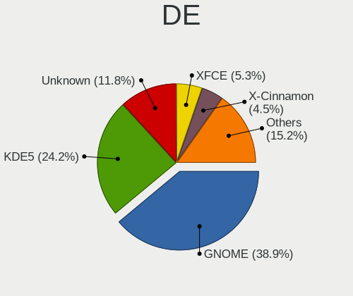

| Name            | Desktops | Percent |
|-----------------|----------|---------|
| GNOME           | 221      | 39.75%  |
| KDE5            | 135      | 24.28%  |
| Unknown         | 67       | 12.05%  |
| XFCE            | 30       | 5.4%    |
| X-Cinnamon      | 26       | 4.68%   |
| KDE4            | 18       | 3.24%   |
| KDE             | 16       | 2.88%   |
| MATE            | 9        | 1.62%   |
| LXQt            | 8        | 1.44%   |
| LXDE            | 5        | 0.9%    |
| Unity           | 4        | 0.72%   |
| Cinnamon        | 4        | 0.72%   |
| Budgie          | 3        | 0.54%   |
| i3              | 2        | 0.36%   |
| sway            | 1        | 0.18%   |
| sussy_bspwm     | 1        | 0.18%   |
| Pantheon        | 1        | 0.18%   |
| GNUstep         | 1        | 0.18%   |
| GNOME Flashback | 1        | 0.18%   |
| dusk            | 1        | 0.18%   |
| Deepin          | 1        | 0.18%   |
| awesome         | 1        | 0.18%   |

Display Server
--------------

X11 or Wayland

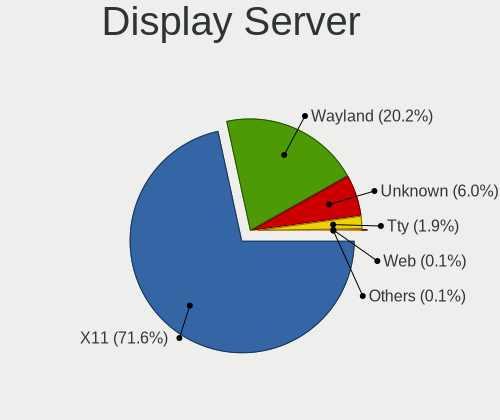

| Name        | Desktops | Percent |
|-------------|----------|---------|
| X11         | 433      | 79.74%  |
| Wayland     | 62       | 11.42%  |
| Unknown     | 40       | 7.37%   |
| Tty         | 7        | 1.29%   |
| Unspecified | 1        | 0.18%   |

Display Manager
---------------

SDDM, LightDM, etc.

| Name    | Desktops | Percent |
|---------|----------|---------|
| Unknown | 274      | 49.37%  |
| SDDM    | 125      | 22.52%  |
| GDM     | 52       | 9.37%   |
| LightDM | 35       | 6.31%   |
| GDM3    | 35       | 6.31%   |
| KDM     | 19       | 3.42%   |
| TDM     | 12       | 2.16%   |
| XDM     | 1        | 0.18%   |
| Ly      | 1        | 0.18%   |
| LXDM    | 1        | 0.18%   |

OS Lang
-------

Language

| Lang        | Desktops | Percent |
|-------------|----------|---------|
| en_US       | 305      | 56.27%  |
| Unknown     | 111      | 20.48%  |
| ro_RO       | 95       | 17.53%  |
| en_GB       | 9        | 1.66%   |
| C           | 6        | 1.11%   |
| hu_HU       | 5        | 0.92%   |
| fr_FR       | 2        | 0.37%   |
| de_DE       | 2        | 0.37%   |
| ru_RU       | 1        | 0.18%   |
| it_IT       | 1        | 0.18%   |
| es_ES       | 1        | 0.18%   |
| en_US.UTF8  | 1        | 0.18%   |
| en_US.utf-8 | 1        | 0.18%   |
| en_IN       | 1        | 0.18%   |
| en_DE       | 1        | 0.18%   |

Boot Mode
---------

EFI or BIOS

| Mode | Desktops | Percent |
|------|----------|---------|
| BIOS | 335      | 62.73%  |
| EFI  | 199      | 37.27%  |

Filesystem
----------

Type of filesystem

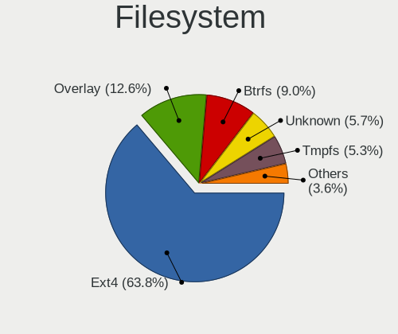

| Type    | Desktops | Percent |
|---------|----------|---------|
| Ext4    | 379      | 69.67%  |
| Overlay | 70       | 12.87%  |
| Unknown | 41       | 7.54%   |
| Btrfs   | 30       | 5.51%   |
| Xfs     | 9        | 1.65%   |
| Tmpfs   | 6        | 1.1%    |
| Zfs     | 4        | 0.74%   |
| F2fs    | 2        | 0.37%   |
| Jfs     | 1        | 0.18%   |
| Ext3    | 1        | 0.18%   |
| Ext2    | 1        | 0.18%   |

Part. scheme
------------

Scheme of partitioning

| Type    | Desktops | Percent |
|---------|----------|---------|
| Unknown | 276      | 51.11%  |
| GPT     | 158      | 29.26%  |
| MBR     | 106      | 19.63%  |

Dual Boot with Linux/BSD
------------------------

Hosting more than one Linux/BSD

| Dual boot | Desktops | Percent |
|-----------|----------|---------|
| No        | 434      | 79.63%  |
| Yes       | 111      | 20.37%  |

Dual Boot (Win)
---------------

Hosting Linux and Windows

| Dual boot | Desktops | Percent |
|-----------|----------|---------|
| No        | 366      | 67.65%  |
| Yes       | 175      | 32.35%  |

Board
-----

Vendor
------

Motherboard manufacturer

| Name                | Desktops | Percent |
|---------------------|----------|---------|
| Gigabyte Technology | 125      | 23.76%  |
| ASUSTek Computer    | 116      | 22.05%  |
| MSI                 | 62       | 11.79%  |
| ASRock              | 46       | 8.75%   |
| Hewlett-Packard     | 44       | 8.37%   |
| Dell                | 44       | 8.37%   |
| Lenovo              | 22       | 4.18%   |
| Acer                | 17       | 3.23%   |
| Intel               | 8        | 1.52%   |
| Fujitsu Siemens     | 6        | 1.14%   |
| Foxconn             | 6        | 1.14%   |
| Pegatron            | 5        | 0.95%   |
| Fujitsu             | 5        | 0.95%   |
| Unknown             | 5        | 0.95%   |
| Complet             | 2        | 0.38%   |
| ZOTAC               | 1        | 0.19%   |
| Packard Bell        | 1        | 0.19%   |
| OEM_MB              | 1        | 0.19%   |
| Medion              | 1        | 0.19%   |
| IBM                 | 1        | 0.19%   |
| Huanan              | 1        | 0.19%   |
| ECS                 | 1        | 0.19%   |
| Daewoo Lucoms       | 1        | 0.19%   |
| Biostar             | 1        | 0.19%   |
| BESSTAR Tech        | 1        | 0.19%   |
| ASRockRack          | 1        | 0.19%   |
| AMI                 | 1        | 0.19%   |
| ABIT                | 1        | 0.19%   |

Model
-----

Motherboard model

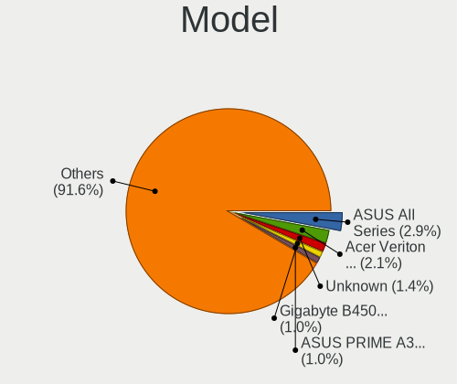

| Name                                   | Desktops | Percent |
|----------------------------------------|----------|---------|
| ASUS All Series                        | 13       | 2.47%   |
| Gigabyte B450M DS3H                    | 7        | 1.33%   |
| Acer Veriton L670G                     | 7        | 1.33%   |
| Unknown                                | 5        | 0.95%   |
| MSI MS-7996                            | 4        | 0.76%   |
| MSI MS-7721                            | 4        | 0.76%   |
| Gigabyte X470 AORUS ULTRA GAMING       | 4        | 0.76%   |
| Dell OptiPlex 7010                     | 4        | 0.76%   |
| ASUS PRIME A320M-K                     | 4        | 0.76%   |
| Gigabyte TRX40 AORUS MASTER            | 3        | 0.57%   |
| Gigabyte B450 AORUS M                  | 3        | 0.57%   |
| Gigabyte A320M-S2H                     | 3        | 0.57%   |
| Dell Precision WorkStation T3500       | 3        | 0.57%   |
| Dell OptiPlex 780                      | 3        | 0.57%   |
| Dell OptiPlex 3010                     | 3        | 0.57%   |
| ASUS Z170 PRO GAMING                   | 3        | 0.57%   |
| ASUS PRIME X470-PRO                    | 3        | 0.57%   |
| ASUS PRIME H310M-R R2.0                | 3        | 0.57%   |
| ASRock G41M-VS3                        | 3        | 0.57%   |
| MSI MS-7C52                            | 2        | 0.38%   |
| MSI MS-7C37                            | 2        | 0.38%   |
| MSI MS-7C02                            | 2        | 0.38%   |
| MSI MS-7B86                            | 2        | 0.38%   |
| MSI MS-7B38                            | 2        | 0.38%   |
| MSI MS-7A34                            | 2        | 0.38%   |
| MSI MS-7817                            | 2        | 0.38%   |
| MSI MS-7596                            | 2        | 0.38%   |
| Lenovo ThinkCentre M83 10AHS0FM00      | 2        | 0.38%   |
| HP EliteDesk 800 G1 SFF                | 2        | 0.38%   |
| HP Compaq Elite 8300 SFF               | 2        | 0.38%   |
| HP Compaq dc7900 Small Form Factor     | 2        | 0.38%   |
| HP Compaq dc7900 Convertible Minitower | 2        | 0.38%   |
| HP Compaq dc7800p Small Form Factor    | 2        | 0.38%   |
| HP Compaq dc5800 Small Form Factor     | 2        | 0.38%   |
| HP Compaq 8200 Elite CMT PC            | 2        | 0.38%   |
| HP Compaq 6200 Pro SFF PC              | 2        | 0.38%   |
| HP Compaq 6005 Pro SFF PC              | 2        | 0.38%   |
| Gigabyte X570 AORUS PRO                | 2        | 0.38%   |
| Gigabyte X570 AORUS ELITE              | 2        | 0.38%   |
| Gigabyte P75-D3                        | 2        | 0.38%   |

Model Family
------------

Motherboard model prefix

| Name                    | Desktops | Percent |
|-------------------------|----------|---------|
| ASUS PRIME              | 31       | 5.89%   |
| Dell OptiPlex           | 30       | 5.7%    |
| HP Compaq               | 28       | 5.32%   |
| Lenovo ThinkCentre      | 15       | 2.85%   |
| ASUS ROG                | 13       | 2.47%   |
| ASUS All                | 13       | 2.47%   |
| Acer Veriton            | 12       | 2.28%   |
| Gigabyte B450M          | 9        | 1.71%   |
| ASUS TUF                | 8        | 1.52%   |
| Dell Precision          | 7        | 1.33%   |
| Gigabyte X570           | 6        | 1.14%   |
| HP ProDesk              | 5        | 0.95%   |
| Gigabyte B450           | 5        | 0.95%   |
| Unknown                 | 5        | 0.95%   |
| MSI MS-7996             | 4        | 0.76%   |
| MSI MS-7721             | 4        | 0.76%   |
| HP EliteDesk            | 4        | 0.76%   |
| Gigabyte X470           | 4        | 0.76%   |
| Gigabyte TRX40          | 4        | 0.76%   |
| Fujitsu Siemens ESPRIMO | 4        | 0.76%   |
| Fujitsu ESPRIMO         | 4        | 0.76%   |
| ASUS Maximus            | 4        | 0.76%   |
| Gigabyte Z390           | 3        | 0.57%   |
| Gigabyte B550M          | 3        | 0.57%   |
| Gigabyte A320M-S2H      | 3        | 0.57%   |
| Dell PowerEdge          | 3        | 0.57%   |
| ASUS Z170               | 3        | 0.57%   |
| ASUS M5A78L-M           | 3        | 0.57%   |
| ASRock G41M-VS3         | 3        | 0.57%   |
| Pegatron Pro            | 2        | 0.38%   |
| MSI MS-7C52             | 2        | 0.38%   |
| MSI MS-7C37             | 2        | 0.38%   |
| MSI MS-7C02             | 2        | 0.38%   |
| MSI MS-7B86             | 2        | 0.38%   |
| MSI MS-7B38             | 2        | 0.38%   |
| MSI MS-7A34             | 2        | 0.38%   |
| MSI MS-7817             | 2        | 0.38%   |
| MSI MS-7596             | 2        | 0.38%   |
| Lenovo ThinkStation     | 2        | 0.38%   |
| Intel DQ77MK            | 2        | 0.38%   |

MFG Year
--------

Motherboard manufacture year

| Year | Desktops | Percent |
|------|----------|---------|
| 2018 | 68       | 12.93%  |
| 2013 | 45       | 8.56%   |
| 2008 | 40       | 7.6%    |
| 2012 | 38       | 7.22%   |
| 2019 | 36       | 6.84%   |
| 2020 | 34       | 6.46%   |
| 2015 | 32       | 6.08%   |
| 2011 | 31       | 5.89%   |
| 2017 | 30       | 5.7%    |
| 2009 | 30       | 5.7%    |
| 2014 | 28       | 5.32%   |
| 2007 | 27       | 5.13%   |
| 2016 | 24       | 4.56%   |
| 2010 | 24       | 4.56%   |
| 2021 | 22       | 4.18%   |
| 2022 | 8        | 1.52%   |
| 2006 | 4        | 0.76%   |
| 2005 | 4        | 0.76%   |
| 2004 | 1        | 0.19%   |

Form Factor
-----------

Physical design of the computer

| Name    | Desktops | Percent |
|---------|----------|---------|
| Desktop | 526      | 100%    |

Secure Boot
-----------

Enabled or disabled

| State    | Desktops | Percent |
|----------|----------|---------|
| Disabled | 522      | 98.86%  |
| Enabled  | 6        | 1.14%   |

Coreboot
--------

Have coreboot on board

| Used | Desktops | Percent |
|------|----------|---------|
| No   | 526      | 100%    |

RAM Size
--------

Total RAM memory

| Size in GB      | Desktops | Percent |
|-----------------|----------|---------|
| 8.01-16.0       | 118      | 21.73%  |
| 16.01-24.0      | 107      | 19.71%  |
| 3.01-4.0        | 106      | 19.52%  |
| 4.01-8.0        | 77       | 14.18%  |
| 32.01-64.0      | 67       | 12.34%  |
| 64.01-256.0     | 26       | 4.79%   |
| 1.01-2.0        | 25       | 4.6%    |
| 24.01-32.0      | 9        | 1.66%   |
| 2.01-3.0        | 4        | 0.74%   |
| 0.51-1.0        | 3        | 0.55%   |
| More than 256.0 | 1        | 0.18%   |

RAM Used
--------

Used RAM memory

| Used GB     | Desktops | Percent |
|-------------|----------|---------|
| 1.01-2.0    | 203      | 34.12%  |
| 2.01-3.0    | 141      | 23.7%   |
| 3.01-4.0    | 73       | 12.27%  |
| 4.01-8.0    | 61       | 10.25%  |
| 0.51-1.0    | 56       | 9.41%   |
| 8.01-16.0   | 27       | 4.54%   |
| 0.01-0.5    | 25       | 4.2%    |
| 16.01-24.0  | 5        | 0.84%   |
| 64.01-256.0 | 2        | 0.34%   |
| 32.01-64.0  | 1        | 0.17%   |
| 24.01-32.0  | 1        | 0.17%   |

Total Drives
------------

Number of drives on board

| Drives | Desktops | Percent |
|--------|----------|---------|
| 1      | 234      | 42.01%  |
| 2      | 150      | 26.93%  |
| 3      | 83       | 14.9%   |
| 4      | 43       | 7.72%   |
| 5      | 22       | 3.95%   |
| 6      | 6        | 1.08%   |
| 9      | 4        | 0.72%   |
| 0      | 4        | 0.72%   |
| 8      | 3        | 0.54%   |
| 7      | 3        | 0.54%   |
| 24     | 1        | 0.18%   |
| 15     | 1        | 0.18%   |
| 14     | 1        | 0.18%   |
| 11     | 1        | 0.18%   |
| 10     | 1        | 0.18%   |

Has CD-ROM
----------

Has CD-ROM on board

| Presented | Desktops | Percent |
|-----------|----------|---------|
| No        | 279      | 52.25%  |
| Yes       | 255      | 47.75%  |

Has Ethernet
------------

Has Ethernet on board

| Presented | Desktops | Percent |
|-----------|----------|---------|
| Yes       | 523      | 99.43%  |
| No        | 3        | 0.57%   |

Has WiFi
--------

Has WiFi module

| Presented | Desktops | Percent |
|-----------|----------|---------|
| No        | 377      | 70.34%  |
| Yes       | 159      | 29.66%  |

Has Bluetooth
-------------

Has Bluetooth module

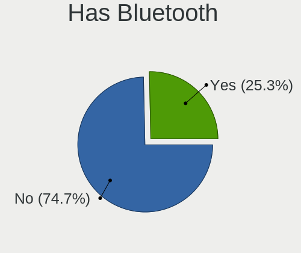

| Presented | Desktops | Percent |
|-----------|----------|---------|
| No        | 423      | 79.21%  |
| Yes       | 111      | 20.79%  |

Location
--------

Country
-------

Geographic location (country)

| Country | Desktops | Percent |
|---------|----------|---------|
| Romania | 526      | 100%    |

City
----

Geographic location (city)

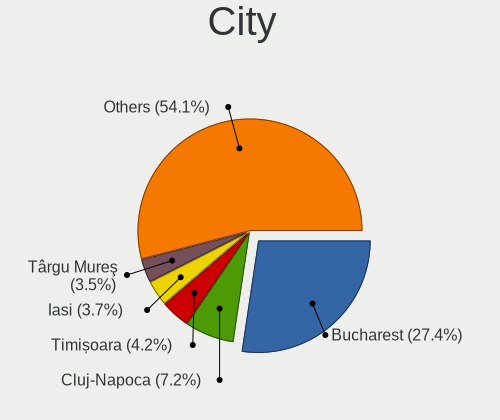

| City             | Desktops | Percent |
|------------------|----------|---------|
| Bucharest        | 158      | 28.26%  |
| Cluj-Napoca      | 40       | 7.16%   |
| Timioara       | 25       | 4.47%   |
| Iasi             | 24       | 4.29%   |
| Trgu Mure    | 17       | 3.04%   |
| Oradea           | 16       | 2.86%   |
| Sibiu            | 15       | 2.68%   |
| Brasov           | 15       | 2.68%   |
| Constana       | 11       | 1.97%   |
| Arad             | 11       | 1.97%   |
| Baia Mare        | 10       | 1.79%   |
| Zalu           | 8        | 1.43%   |
| Satu Mare        | 8        | 1.43%   |
| Piatra Neam    | 8        | 1.43%   |
| Craiova          | 8        | 1.43%   |
| Galati           | 7        | 1.25%   |
| Targoviste       | 6        | 1.07%   |
| Popesti-Leordeni | 6        | 1.07%   |
| Bacau            | 6        | 1.07%   |
| Voluntari        | 5        | 0.89%   |
| Piteti         | 5        | 0.89%   |
| Braila           | 5        | 0.89%   |
| Rmnicu Vlcea | 4        | 0.72%   |
| Ploieti        | 4        | 0.72%   |
| Otopeni          | 4        | 0.72%   |
| Miercurea-Ciuc   | 4        | 0.72%   |
| Beiu           | 4        | 0.72%   |
| Alexandria       | 4        | 0.72%   |
| Tulcea           | 3        | 0.54%   |
| Trgu Jiu       | 3        | 0.54%   |
| Sfantu Gheorghe  | 3        | 0.54%   |
| Reia         | 3        | 0.54%   |
| Media          | 3        | 0.54%   |
| Focani         | 3        | 0.54%   |
| Floresti         | 3        | 0.54%   |
| Botosani         | 3        | 0.54%   |
| Alba Iulia       | 3        | 0.54%   |
| Urziceni         | 2        | 0.36%   |
| Sovata           | 2        | 0.36%   |
| Pantelimon       | 2        | 0.36%   |

Drives
------

Drive Vendor
------------

Hard drive vendors

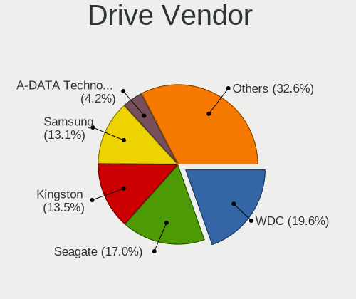

| Vendor                      | Desktops | Drives | Percent |
|-----------------------------|----------|--------|---------|
| WDC                         | 209      | 349    | 21.46%  |
| Seagate                     | 179      | 319    | 18.38%  |
| Kingston                    | 135      | 204    | 13.86%  |
| Samsung Electronics         | 120      | 186    | 12.32%  |
| A-DATA Technology           | 44       | 61     | 4.52%   |
| Toshiba                     | 43       | 57     | 4.41%   |
| Hitachi                     | 28       | 44     | 2.87%   |
| Intel                       | 17       | 20     | 1.75%   |
| Crucial                     | 17       | 22     | 1.75%   |
| Maxtor                      | 15       | 22     | 1.54%   |
| Sandisk                     | 13       | 20     | 1.33%   |
| HGST                        | 12       | 21     | 1.23%   |
| Patriot                     | 11       | 14     | 1.13%   |
| Unknown                     | 9        | 12     | 0.92%   |
| SPCC                        | 8        | 10     | 0.82%   |
| OCZ                         | 7        | 15     | 0.72%   |
| Kingston Technology Company | 7        | 9      | 0.72%   |
| XPG                         | 6        | 9      | 0.62%   |
| Phison                      | 6        | 8      | 0.62%   |
| Kingmax                     | 6        | 7      | 0.62%   |
| Hewlett-Packard             | 6        | 7      | 0.62%   |
| Transcend                   | 5        | 7      | 0.51%   |
| Team                        | 5        | 5      | 0.51%   |
| Phison Electronics          | 5        | 5      | 0.51%   |
| Silicon Motion              | 4        | 4      | 0.41%   |
| Plextor                     | 4        | 4      | 0.41%   |
| GOODRAM                     | 4        | 4      | 0.41%   |
| Gigabyte Technology         | 4        | 5      | 0.41%   |
| SK hynix                    | 3        | 3      | 0.31%   |
| Micron/Crucial Technology   | 3        | 4      | 0.31%   |
| LaCie                       | 3        | 9      | 0.31%   |
| Emtec                       | 3        | 3      | 0.31%   |
| Corsair                     | 3        | 9      | 0.31%   |
| China                       | 3        | 3      | 0.31%   |
| Verbatim                    | 2        | 4      | 0.21%   |
| Realtek Semiconductor       | 2        | 2      | 0.21%   |
| PNY                         | 2        | 2      | 0.21%   |
| Fujitsu                     | 2        | 2      | 0.21%   |
| ASMT                        | 2        | 2      | 0.21%   |
| TO Exter                    | 1        | 2      | 0.1%    |

Drive Model
-----------

Hard drive models

| Model                               | Desktops | Percent |
|-------------------------------------|----------|---------|
| Kingston SA400S37240G 240GB SSD     | 42       | 3.76%   |
| Seagate ST1000DM010-2EP102 1TB      | 26       | 2.33%   |
| Kingston SA400S37120G 120GB SSD     | 22       | 1.97%   |
| Kingston SV300S37A120G 120GB SSD    | 17       | 1.52%   |
| WDC WD10EZEX-08WN4A0 1TB            | 15       | 1.34%   |
| Kingston SA400S37480G 480GB SSD     | 14       | 1.25%   |
| Seagate ST500DM002-1BD142 500GB     | 13       | 1.16%   |
| Samsung SSD 850 EVO 250GB           | 13       | 1.16%   |
| Samsung SSD 860 EVO 500GB           | 12       | 1.08%   |
| Toshiba DT01ACA050 500GB            | 11       | 0.99%   |
| A-DATA SU650 240GB SSD              | 8        | 0.72%   |
| WDC WD1600AAJS-22L7A0 160GB         | 7        | 0.63%   |
| Seagate ST2000DM008-2FR102 2TB      | 7        | 0.63%   |
| Seagate ST2000DM006-2DM164 2TB      | 7        | 0.63%   |
| Patriot Burst 120GB SSD             | 7        | 0.63%   |
| Kingston Company A2000 NVMe SSD 1TB | 7        | 0.63%   |
| Toshiba DT01ACA100 1TB              | 6        | 0.54%   |
| Samsung SSD 860 EVO 250GB           | 6        | 0.54%   |
| Kingston SUV400S37120G 120GB SSD    | 6        | 0.54%   |
| WDC WD5000AAKX-001CA0 500GB         | 5        | 0.45%   |
| WDC WD5000AADS-00S9B0 500GB         | 5        | 0.45%   |
| WDC WD10EZEX-21WN4A0 1TB            | 5        | 0.45%   |
| WDC WD10EZEX-00BN5A0 1TB            | 5        | 0.45%   |
| Seagate ST3500312CS 500GB           | 5        | 0.45%   |
| Seagate ST250DM000-1BD141 250GB     | 5        | 0.45%   |
| Seagate ST1000DM003-1ER162 1TB      | 5        | 0.45%   |
| Seagate Expansion Desk 8TB          | 5        | 0.45%   |
| Samsung SSD 860 QVO 1TB             | 5        | 0.45%   |
| WDC WDS120G2G0A-00JH30 120GB SSD    | 4        | 0.36%   |
| WDC WD5000AZRX-00A8LB0 500GB        | 4        | 0.36%   |
| WDC WD10EZEX-60WN4A1 1TB            | 4        | 0.36%   |
| WDC WD10EZEX-22MFCA0 1TB            | 4        | 0.36%   |
| WDC WD10EZEX-00WN4A0 1TB            | 4        | 0.36%   |
| WDC WD10EADS-00L5B1 1TB             | 4        | 0.36%   |
| Unknown SD/MMC/MS PRO 128GB         | 4        | 0.36%   |
| Unknown NVMe SSD Drive 512GB        | 4        | 0.36%   |
| Seagate ST4000DM004-2CV104 4TB      | 4        | 0.36%   |
| Seagate ST3500418AS 500GB           | 4        | 0.36%   |
| Seagate ST3250318AS 250GB           | 4        | 0.36%   |
| Seagate ST1000DM003-1SB102 1TB      | 4        | 0.36%   |

HDD Vendor
----------

Hard disk drive vendors

| Vendor              | Desktops | Drives | Percent |
|---------------------|----------|--------|---------|
| WDC                 | 195      | 326    | 38.31%  |
| Seagate             | 176      | 312    | 34.58%  |
| Toshiba             | 41       | 53     | 8.06%   |
| Samsung Electronics | 28       | 36     | 5.5%    |
| Hitachi             | 28       | 44     | 5.5%    |
| Maxtor              | 15       | 22     | 2.95%   |
| HGST                | 12       | 21     | 2.36%   |
| Unknown             | 4        | 4      | 0.79%   |
| LaCie               | 2        | 8      | 0.39%   |
| Fujitsu             | 2        | 2      | 0.39%   |
| ASMT                | 2        | 2      | 0.39%   |
| Intenso             | 1        | 1      | 0.2%    |
| Hewlett-Packard     | 1        | 1      | 0.2%    |
| ExcelStor           | 1        | 1      | 0.2%    |
| ASMT109x            | 1        | 1      | 0.2%    |

SSD Vendor
----------

Solid state drive vendors

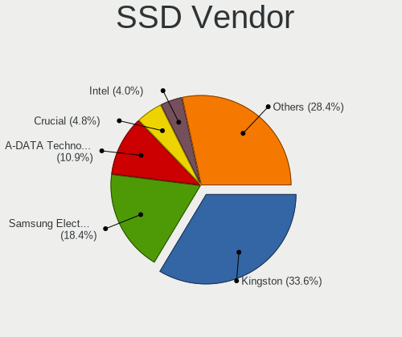

| Vendor              | Desktops | Drives | Percent |
|---------------------|----------|--------|---------|
| Kingston            | 120      | 170    | 34.78%  |
| Samsung Electronics | 60       | 86     | 17.39%  |
| A-DATA Technology   | 42       | 59     | 12.17%  |
| WDC                 | 14       | 18     | 4.06%   |
| Crucial             | 13       | 18     | 3.77%   |
| Patriot             | 11       | 14     | 3.19%   |
| Intel               | 11       | 13     | 3.19%   |
| SPCC                | 8        | 10     | 2.32%   |
| SanDisk             | 7        | 11     | 2.03%   |
| OCZ                 | 7        | 15     | 2.03%   |
| Kingmax             | 6        | 7      | 1.74%   |
| Team                | 5        | 5      | 1.45%   |
| Transcend           | 4        | 6      | 1.16%   |
| GOODRAM             | 4        | 4      | 1.16%   |
| Toshiba             | 3        | 4      | 0.87%   |
| Hewlett-Packard     | 3        | 3      | 0.87%   |
| Gigabyte Technology | 3        | 4      | 0.87%   |
| Emtec               | 3        | 3      | 0.87%   |
| China               | 3        | 3      | 0.87%   |
| Verbatim            | 2        | 4      | 0.58%   |
| SK hynix            | 2        | 2      | 0.58%   |
| Seagate             | 2        | 2      | 0.58%   |
| PNY                 | 2        | 2      | 0.58%   |
| Corsair             | 2        | 7      | 0.58%   |
| TO Exter            | 1        | 2      | 0.29%   |
| OCZ-VERTEX3         | 1        | 1      | 0.29%   |
| MicroFrom           | 1        | 1      | 0.29%   |
| Kston               | 1        | 5      | 0.29%   |
| KingDian            | 1        | 1      | 0.29%   |
| EDGE SE8            | 1        | 1      | 0.29%   |
| Apacer              | 1        | 2      | 0.29%   |
| AMD                 | 1        | 1      | 0.29%   |

Drive Kind
----------

HDD or SSD

| Kind    | Desktops | Drives | Percent |
|---------|----------|--------|---------|
| HDD     | 389      | 834    | 48.81%  |
| SSD     | 289      | 484    | 36.26%  |
| NVMe    | 113      | 189    | 14.18%  |
| Unknown | 5        | 8      | 0.63%   |
| MMC     | 1        | 1      | 0.13%   |

Drive Connector
---------------

SATA, SAS, NVMe, etc.

| Type | Desktops | Drives | Percent |
|------|----------|--------|---------|
| SATA | 490      | 1268   | 77.53%  |
| NVMe | 112      | 188    | 17.72%  |
| SAS  | 29       | 59     | 4.59%   |
| MMC  | 1        | 1      | 0.16%   |

Drive Size
----------

Size of hard drive

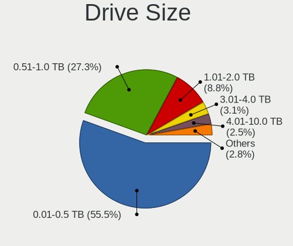

| Size in TB | Desktops | Drives | Percent |
|------------|----------|--------|---------|
| 0.01-0.5   | 402      | 789    | 57.51%  |
| 0.51-1.0   | 183      | 288    | 26.18%  |
| 1.01-2.0   | 57       | 87     | 8.15%   |
| 3.01-4.0   | 22       | 45     | 3.15%   |
| 4.01-10.0  | 17       | 55     | 2.43%   |
| 2.01-3.0   | 15       | 49     | 2.15%   |
| 10.01-20.0 | 3        | 5      | 0.43%   |

Space Total
-----------

Amount of disk space available on the file system

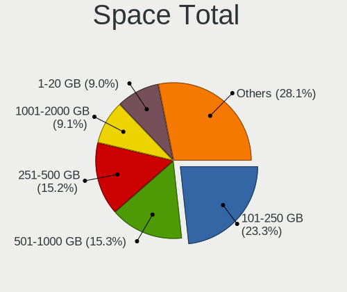

| Size in GB     | Desktops | Percent |
|----------------|----------|---------|
| 101-250        | 140      | 24.26%  |
| 251-500        | 86       | 14.9%   |
| 501-1000       | 86       | 14.9%   |
| 1-20           | 54       | 9.36%   |
| 51-100         | 47       | 8.15%   |
| 1001-2000      | 46       | 7.97%   |
| Unknown        | 40       | 6.93%   |
| More than 3000 | 30       | 5.2%    |
| 21-50          | 25       | 4.33%   |
| 2001-3000      | 23       | 3.99%   |

Space Used
----------

Amount of used disk space

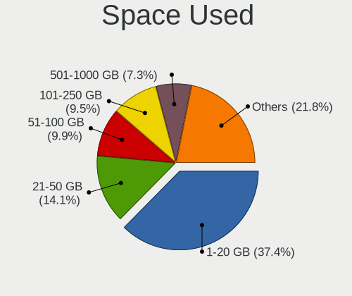

| Used GB        | Desktops | Percent |
|----------------|----------|---------|
| 1-20           | 230      | 38.92%  |
| 21-50          | 79       | 13.37%  |
| 51-100         | 55       | 9.31%   |
| 101-250        | 53       | 8.97%   |
| 251-500        | 42       | 7.11%   |
| 501-1000       | 42       | 7.11%   |
| Unknown        | 40       | 6.77%   |
| 1001-2000      | 28       | 4.74%   |
| More than 3000 | 14       | 2.37%   |
| 2001-3000      | 8        | 1.35%   |

Malfunc. Drives
---------------

Drive models with a malfunction

| Model                            | Desktops | Drives | Percent |
|----------------------------------|----------|--------|---------|
| WDC WD5000AAKX-001CA0 500GB      | 3        | 3      | 2.54%   |
| WDC WD3200AAJS-60Z0A0 320GB      | 3        | 6      | 2.54%   |
| Seagate ST3500312CS 500GB        | 3        | 3      | 2.54%   |
| WDC WD5000AADS-00S9B0 500GB      | 2        | 2      | 1.69%   |
| WDC WD1002FAEX-00Z3A0 1TB        | 2        | 2      | 1.69%   |
| Seagate STM3250318AS 250GB       | 2        | 3      | 1.69%   |
| Seagate ST500LM021-1KJ152 500GB  | 2        | 2      | 1.69%   |
| Seagate ST500DM002-1BD142 500GB  | 2        | 2      | 1.69%   |
| Seagate ST3500320AS 500GB        | 2        | 3      | 1.69%   |
| Seagate ST3250318AS 250GB        | 2        | 3      | 1.69%   |
| Seagate ST1000DM010-2EP102 1TB   | 2        | 2      | 1.69%   |
| OCZ ARC100 240GB SSD             | 2        | 2      | 1.69%   |
| Maxtor STM3250310AS 250GB        | 2        | 3      | 1.69%   |
| Hitachi HTS725032A9A364 320GB    | 2        | 2      | 1.69%   |
| WDC WDS120G2G0A-00JH30 120GB SSD | 1        | 1      | 0.85%   |
| WDC WD5000AAKX-22ERMA0 500GB     | 1        | 1      | 0.85%   |
| WDC WD5000AACS-00G8B1 500GB      | 1        | 6      | 0.85%   |
| WDC WD400EB-00CPF0 40GB          | 1        | 1      | 0.85%   |
| WDC WD400BD-08JMC0 40GB          | 1        | 1      | 0.85%   |
| WDC WD3200AVVS-63L2B0 320GB      | 1        | 1      | 0.85%   |
| WDC WD3200AVBS-63TAA0 320GB      | 1        | 1      | 0.85%   |
| WDC WD3200AAKS-75L9A0 320GB      | 1        | 1      | 0.85%   |
| WDC WD30PURX-64P6ZY0 3TB         | 1        | 2      | 0.85%   |
| WDC WD30EFRX-68EUZN0 3TB         | 1        | 10     | 0.85%   |
| WDC WD30EFRX-68AX9N0 3TB         | 1        | 1      | 0.85%   |
| WDC WD2500JS-60MHB5 250GB        | 1        | 3      | 0.85%   |
| WDC WD2500JB-00REA0 250GB        | 1        | 1      | 0.85%   |
| WDC WD2500BEKT-75PVMT1 250GB     | 1        | 1      | 0.85%   |
| WDC WD20EARX-00PASB0 2TB         | 1        | 1      | 0.85%   |
| WDC WD2000JD-22HBC0 200GB        | 1        | 1      | 0.85%   |
| WDC WD1600AAJS-07M0A0 160GB      | 1        | 1      | 0.85%   |
| WDC WD1600AAJS-00PSA0 160GB      | 1        | 2      | 0.85%   |
| WDC WD15EARS-00MVWB0 1TB         | 1        | 1      | 0.85%   |
| WDC WD1502FAEX-007BA0 1TB        | 1        | 1      | 0.85%   |
| WDC WD10EZEX-21WN4A0 1TB         | 1        | 1      | 0.85%   |
| WDC WD10EZEX-08WN4A0 1TB         | 1        | 1      | 0.85%   |
| WDC WD10EZEX-08M2NA0 1TB         | 1        | 1      | 0.85%   |
| WDC WD10EAVS-22D7B0 1TB          | 1        | 1      | 0.85%   |
| WDC WD10EARS-22Y5B1 1TB          | 1        | 1      | 0.85%   |
| WDC WD10EARS-00Y5B1 1TB          | 1        | 1      | 0.85%   |

Malfunc. Drive Vendor
---------------------

Vendors of faulty drives

| Vendor              | Desktops | Drives | Percent |
|---------------------|----------|--------|---------|
| WDC                 | 35       | 58     | 31.53%  |
| Seagate             | 29       | 39     | 26.13%  |
| Samsung Electronics | 13       | 15     | 11.71%  |
| Hitachi             | 7        | 8      | 6.31%   |
| Maxtor              | 6        | 8      | 5.41%   |
| Kingston            | 4        | 4      | 3.6%    |
| HGST                | 3        | 3      | 2.7%    |
| Toshiba             | 2        | 2      | 1.8%    |
| OCZ                 | 2        | 2      | 1.8%    |
| Intel               | 2        | 2      | 1.8%    |
| A-DATA Technology   | 2        | 2      | 1.8%    |
| Plextor             | 1        | 1      | 0.9%    |
| Patriot             | 1        | 1      | 0.9%    |
| Hewlett-Packard     | 1        | 1      | 0.9%    |
| Crucial             | 1        | 1      | 0.9%    |
| Corsair             | 1        | 6      | 0.9%    |
| Apacer              | 1        | 2      | 0.9%    |

Malfunc. HDD Vendor
-------------------

Vendors of faulty HDD drives

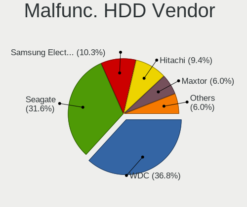

| Vendor              | Desktops | Drives | Percent |
|---------------------|----------|--------|---------|
| WDC                 | 34       | 57     | 36.96%  |
| Seagate             | 29       | 39     | 31.52%  |
| Samsung Electronics | 11       | 13     | 11.96%  |
| Hitachi             | 7        | 8      | 7.61%   |
| Maxtor              | 6        | 8      | 6.52%   |
| HGST                | 3        | 3      | 3.26%   |
| Toshiba             | 2        | 2      | 2.17%   |

Malfunc. Drive Kind
-------------------

Kinds of faulty drives

| Kind | Desktops | Drives | Percent |
|------|----------|--------|---------|
| HDD  | 81       | 130    | 81%     |
| SSD  | 18       | 24     | 18%     |
| NVMe | 1        | 1      | 1%      |

Failed Drives
-------------

Failed drive models

| Model                    | Desktops | Drives | Percent |
|--------------------------|----------|--------|---------|
| Seagate ST3160215A 160GB | 1        | 1      | 100%    |

Failed Drive Vendor
-------------------

Failed drive vendors

| Vendor  | Desktops | Drives | Percent |
|---------|----------|--------|---------|
| Seagate | 1        | 1      | 100%    |

Drive Status
------------

Number of failed and malfunc. drives

| Status   | Desktops | Drives | Percent |
|----------|----------|--------|---------|
| Detected | 297      | 824    | 48.69%  |
| Works    | 221      | 536    | 36.23%  |
| Malfunc  | 91       | 155    | 14.92%  |
| Failed   | 1        | 1      | 0.16%   |

Storage controller
------------------

Storage Vendor
--------------

Storage controller vendors

| Vendor                        | Desktops | Percent |
|-------------------------------|----------|---------|
| Intel                         | 351      | 49.3%   |
| AMD                           | 157      | 22.05%  |
| Samsung Electronics           | 46       | 6.46%   |
| Kingston Technology Company   | 27       | 3.79%   |
| ASMedia Technology            | 22       | 3.09%   |
| Marvell Technology Group      | 16       | 2.25%   |
| JMicron Technology            | 13       | 1.83%   |
| Phison Electronics            | 12       | 1.69%   |
| Nvidia                        | 12       | 1.69%   |
| SanDisk                       | 10       | 1.4%    |
| ADATA Technology              | 10       | 1.4%    |
| Silicon Motion                | 8        | 1.12%   |
| Micron/Crucial Technology     | 5        | 0.7%    |
| Lite-On Technology            | 5        | 0.7%    |
| Realtek Semiconductor         | 4        | 0.56%   |
| VIA Technologies              | 3        | 0.42%   |
| Silicon Image                 | 3        | 0.42%   |
| LSI Logic / Symbios Logic     | 2        | 0.28%   |
| Broadcom / LSI                | 2        | 0.28%   |
| SK hynix                      | 1        | 0.14%   |
| Seagate Technology            | 1        | 0.14%   |
| KIOXIA                        | 1        | 0.14%   |
| Integrated Technology Express | 1        | 0.14%   |

Storage Model
-------------

Storage controller models

| Model                                                                                   | Desktops | Percent |
|-----------------------------------------------------------------------------------------|----------|---------|
| AMD FCH SATA Controller [AHCI mode]                                                     | 98       | 10.68%  |
| Intel 8 Series/C220 Series Chipset Family 6-port SATA Controller 1 [AHCI mode]          | 40       | 4.36%   |
| AMD 400 Series Chipset SATA Controller                                                  | 38       | 4.14%   |
| Intel Q170/Q150/B150/H170/H110/Z170/CM236 Chipset SATA Controller [AHCI Mode]           | 30       | 3.27%   |
| Intel NM10/ICH7 Family SATA Controller [IDE mode]                                       | 29       | 3.16%   |
| Intel 200 Series PCH SATA controller [AHCI mode]                                        | 29       | 3.16%   |
| Intel 6 Series/C200 Series Chipset Family 6 port Desktop SATA AHCI Controller           | 26       | 2.83%   |
| AMD SB7x0/SB8x0/SB9x0 IDE Controller                                                    | 25       | 2.72%   |
| Intel Cannon Lake PCH SATA AHCI Controller                                              | 21       | 2.29%   |
| Samsung NVMe SSD Controller SM981/PM981/PM983                                           | 20       | 2.18%   |
| ASMedia ASM1062 Serial ATA Controller                                                   | 20       | 2.18%   |
| Kingston Company A2000 NVMe SSD                                                         | 19       | 2.07%   |
| AMD SB7x0/SB8x0/SB9x0 SATA Controller [IDE mode]                                        | 19       | 2.07%   |
| Intel 82801G (ICH7 Family) IDE Controller                                               | 18       | 1.96%   |
| Intel SATA Controller [RAID mode]                                                       | 17       | 1.85%   |
| AMD FCH SATA Controller D                                                               | 17       | 1.85%   |
| Intel 7 Series/C210 Series Chipset Family 6-port SATA Controller [AHCI mode]            | 16       | 1.74%   |
| Intel 82801JD/DO (ICH10 Family) SATA AHCI Controller                                    | 15       | 1.63%   |
| AMD SB7x0/SB8x0/SB9x0 SATA Controller [AHCI mode]                                       | 15       | 1.63%   |
| Intel 4 Series Chipset PT IDER Controller                                               | 14       | 1.53%   |
| Intel 82801I (ICH9 Family) 2 port SATA Controller [IDE mode]                            | 13       | 1.42%   |
| Intel 6 Series/C200 Series Chipset Family Desktop SATA Controller (IDE mode, ports 4-5) | 13       | 1.42%   |
| Intel 6 Series/C200 Series Chipset Family Desktop SATA Controller (IDE mode, ports 0-3) | 13       | 1.42%   |
| AMD 500 Series Chipset SATA Controller                                                  | 12       | 1.31%   |
| Samsung NVMe SSD Controller SM961/PM961/SM963                                           | 11       | 1.2%    |
| Intel 9 Series Chipset Family SATA Controller [AHCI Mode]                               | 9        | 0.98%   |
| ADATA XPG SX8200 Pro PCIe Gen3x4 M.2 2280 Solid State Drive                             | 9        | 0.98%   |
| Samsung NVMe SSD Controller PM9A1/PM9A3/980PRO                                          | 8        | 0.87%   |
| Intel 82801JI (ICH10 Family) SATA AHCI Controller                                       | 8        | 0.87%   |
| Silicon Motion SM2263EN/SM2263XT (DRAM-less) NVMe SSD Controllers                       | 7        | 0.76%   |
| Samsung NVMe SSD Controller 980                                                         | 7        | 0.76%   |
| Nvidia MCP61 SATA Controller                                                            | 7        | 0.76%   |
| JMicron JMB363 SATA/IDE Controller                                                      | 7        | 0.76%   |
| Intel 82801IR/IO/IH (ICH9R/DO/DH) 6 port SATA Controller [AHCI mode]                    | 7        | 0.76%   |
| Intel 82801IR/IO/IH (ICH9R/DO/DH) 4 port SATA Controller [IDE mode]                     | 7        | 0.76%   |
| Intel 7 Series/C210 Series Chipset Family 4-port SATA Controller [IDE mode]             | 7        | 0.76%   |
| Intel 7 Series/C210 Series Chipset Family 2-port SATA Controller [IDE mode]             | 7        | 0.76%   |
| Phison E12 NVMe Controller                                                              | 6        | 0.65%   |
| Nvidia MCP61 IDE                                                                        | 6        | 0.65%   |
| Intel Alder Lake-S PCH SATA Controller [AHCI Mode]                                      | 6        | 0.65%   |

Storage Kind
------------

Kind of storage controller (IDE, SATA, NVMe, SAS, ...)

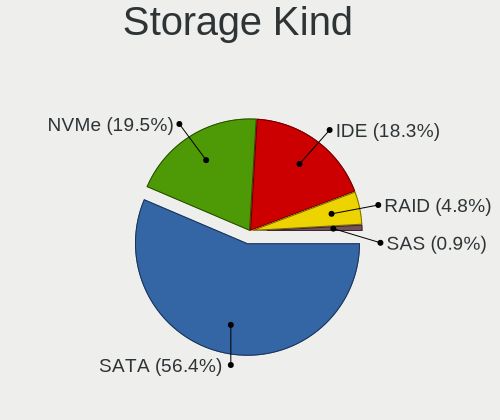

| Kind | Desktops | Percent |
|------|----------|---------|
| SATA | 409      | 57.36%  |
| IDE  | 150      | 21.04%  |
| NVMe | 117      | 16.41%  |
| RAID | 32       | 4.49%   |
| SAS  | 5        | 0.7%    |

Processor
---------

CPU Vendor
----------

Processor vendors

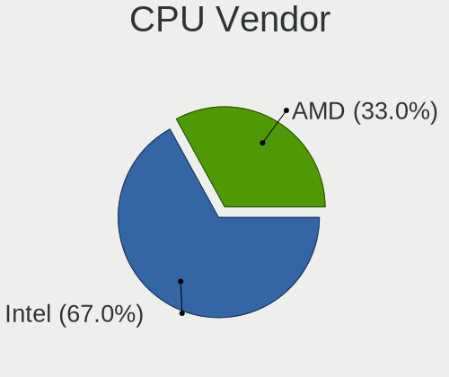

| Vendor | Desktops | Percent |
|--------|----------|---------|
| Intel  | 354      | 67.3%   |
| AMD    | 172      | 32.7%   |

CPU Model
---------

Processor models

| Model                                       | Desktops | Percent |
|---------------------------------------------|----------|---------|
| Intel Core i5-3470 CPU @ 3.20GHz            | 10       | 1.89%   |
| Intel Core i5-2400 CPU @ 3.10GHz            | 9        | 1.7%    |
| Intel Core 2 Duo CPU E8400 @ 3.00GHz        | 9        | 1.7%    |
| Intel Core 2 Duo CPU E7400 @ 2.80GHz        | 9        | 1.7%    |
| AMD Ryzen 5 3600 6-Core Processor           | 9        | 1.7%    |
| AMD Ryzen 7 3700X 8-Core Processor          | 8        | 1.51%   |
| Intel Core i7-3770 CPU @ 3.40GHz            | 7        | 1.32%   |
| Intel Core 2 Quad CPU Q6600 @ 2.40GHz       | 7        | 1.32%   |
| Intel Core i7-4790 CPU @ 3.60GHz            | 6        | 1.13%   |
| Intel Core i5-7400 CPU @ 3.00GHz            | 6        | 1.13%   |
| Intel Core i5-4570 CPU @ 3.20GHz            | 6        | 1.13%   |
| Intel Core 2 Duo CPU E8500 @ 3.16GHz        | 6        | 1.13%   |
| AMD Ryzen 9 3900X 12-Core Processor         | 6        | 1.13%   |
| AMD Ryzen 7 2700X Eight-Core Processor      | 6        | 1.13%   |
| AMD Ryzen 5 2600 Six-Core Processor         | 6        | 1.13%   |
| Intel Core i9-9900K CPU @ 3.60GHz           | 5        | 0.95%   |
| Intel Core i7-6700K CPU @ 4.00GHz           | 5        | 0.95%   |
| Intel Core i7-4790K CPU @ 4.00GHz           | 5        | 0.95%   |
| Intel Core i5-9400F CPU @ 2.90GHz           | 5        | 0.95%   |
| Intel Core i3-4160 CPU @ 3.60GHz            | 5        | 0.95%   |
| Intel Core 2 CPU 6400 @ 2.13GHz             | 5        | 0.95%   |
| AMD Ryzen 7 5700G with Radeon Graphics      | 5        | 0.95%   |
| AMD Ryzen 3 2200G with Radeon Vega Graphics | 5        | 0.95%   |
| Intel Pentium Dual-Core CPU E5700 @ 3.00GHz | 4        | 0.76%   |
| Intel Pentium CPU G4560 @ 3.50GHz           | 4        | 0.76%   |
| Intel Core i7-7700K CPU @ 4.20GHz           | 4        | 0.76%   |
| Intel Core i7-4770 CPU @ 3.40GHz            | 4        | 0.76%   |
| Intel Core i7-2600 CPU @ 3.40GHz            | 4        | 0.76%   |
| Intel Core i5-4590 CPU @ 3.30GHz            | 4        | 0.76%   |
| Intel Core i3-9100F CPU @ 3.60GHz           | 4        | 0.76%   |
| Intel Core i3-8100 CPU @ 3.60GHz            | 4        | 0.76%   |
| Intel Core i3-3240 CPU @ 3.40GHz            | 4        | 0.76%   |
| Intel Core i3-2100 CPU @ 3.10GHz            | 4        | 0.76%   |
| Intel Core 2 Duo CPU E7300 @ 2.66GHz        | 4        | 0.76%   |
| Intel 12th Gen Core i7-12700K               | 4        | 0.76%   |
| AMD Ryzen 5 5600X 6-Core Processor          | 4        | 0.76%   |
| AMD Ryzen 5 2400G with Radeon Vega Graphics | 4        | 0.76%   |
| AMD A4-5300 APU with Radeon HD Graphics     | 4        | 0.76%   |
| Intel Pentium Dual-Core CPU E5200 @ 2.50GHz | 3        | 0.57%   |
| Intel Pentium CPU G3250 @ 3.20GHz           | 3        | 0.57%   |

CPU Model Family
----------------

Processor model prefix

| Model                   | Desktops | Percent |
|-------------------------|----------|---------|
| Intel Core i5           | 90       | 17.11%  |
| Intel Core i7           | 57       | 10.84%  |
| Intel Core i3           | 46       | 8.75%   |
| Intel Core 2 Duo        | 42       | 7.98%   |
| AMD Ryzen 5             | 35       | 6.65%   |
| AMD Ryzen 7             | 31       | 5.89%   |
| Intel Pentium           | 18       | 3.42%   |
| Intel Celeron           | 18       | 3.42%   |
| Intel Xeon              | 17       | 3.23%   |
| Intel Core 2 Quad       | 17       | 3.23%   |
| AMD Ryzen 3             | 16       | 3.04%   |
| AMD FX                  | 14       | 2.66%   |
| Intel Pentium Dual-Core | 12       | 2.28%   |
| AMD Ryzen 9             | 12       | 2.28%   |
| AMD A8                  | 10       | 1.9%    |
| Other                   | 9        | 1.71%   |
| Intel Core i9           | 8        | 1.52%   |
| AMD A4                  | 8        | 1.52%   |
| AMD Phenom II X4        | 7        | 1.33%   |
| Intel Core 2            | 6        | 1.14%   |
| AMD Ryzen Threadripper  | 5        | 0.95%   |
| Intel Pentium Dual      | 4        | 0.76%   |
| AMD Sempron             | 4        | 0.76%   |
| AMD Athlon II X4        | 4        | 0.76%   |
| Intel Atom              | 3        | 0.57%   |
| AMD Athlon II X3        | 3        | 0.57%   |
| AMD Athlon 64 X2        | 3        | 0.57%   |
| Intel Pentium Gold      | 2        | 0.38%   |
| Intel Pentium D         | 2        | 0.38%   |
| Intel Pentium 4         | 2        | 0.38%   |
| Intel Genuine           | 2        | 0.38%   |
| AMD Phenom II X3        | 2        | 0.38%   |
| AMD Phenom              | 2        | 0.38%   |
| AMD Athlon X4           | 2        | 0.38%   |
| AMD Athlon              | 2        | 0.38%   |
| Intel Core 2 Extreme    | 1        | 0.19%   |
| AMD Ryzen Embedded      | 1        | 0.19%   |
| AMD Ryzen 7 PRO         | 1        | 0.19%   |
| AMD Ryzen 5 PRO         | 1        | 0.19%   |
| AMD Ryzen 3 PRO         | 1        | 0.19%   |

CPU Cores
---------

Number of processor cores

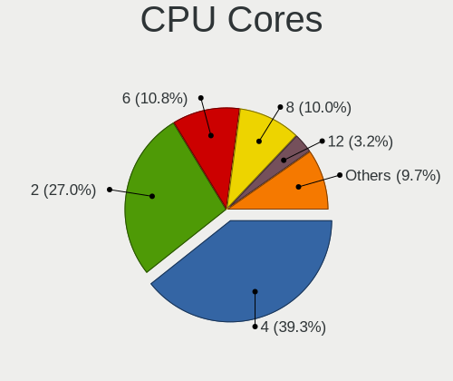

| Number | Desktops | Percent |
|--------|----------|---------|
| 4      | 208      | 39.54%  |
| 2      | 157      | 29.85%  |
| 6      | 54       | 10.27%  |
| 8      | 47       | 8.94%   |
| 1      | 18       | 3.42%   |
| 12     | 16       | 3.04%   |
| 3      | 10       | 1.9%    |
| 16     | 6        | 1.14%   |
| 10     | 4        | 0.76%   |
| 32     | 3        | 0.57%   |
| 64     | 1        | 0.19%   |
| 24     | 1        | 0.19%   |
| 20     | 1        | 0.19%   |

CPU Sockets
-----------

Number of sockets

| Number | Desktops | Percent |
|--------|----------|---------|
| 1      | 519      | 98.67%  |
| 2      | 7        | 1.33%   |

CPU Threads
-----------

Threads per core (Hyper-Threading)

| Number | Desktops | Percent |
|--------|----------|---------|
| 1      | 269      | 51.14%  |
| 2      | 256      | 48.67%  |
| 4      | 1        | 0.19%   |

CPU Op-Modes
------------

CPU Operation Modes (32-bit, 64-bit)

| Op mode        | Desktops | Percent |
|----------------|----------|---------|
| 32-bit, 64-bit | 516      | 97.73%  |
| Unknown        | 12       | 2.27%   |

CPU Microcode
-------------

Microcode number

| Number     | Desktops | Percent |
|------------|----------|---------|
| Unknown    | 117      | 21.31%  |
| 0x306c3    | 47       | 8.56%   |
| 0x1067a    | 34       | 6.19%   |
| 0x206a7    | 31       | 5.65%   |
| 0x306a9    | 29       | 5.28%   |
| 0x906e9    | 22       | 4.01%   |
| 0x906ea    | 19       | 3.46%   |
| 0x506e3    | 19       | 3.46%   |
| 0x010000c8 | 14       | 2.55%   |
| 0x10676    | 13       | 2.37%   |
| 0x08701021 | 13       | 2.37%   |
| 0x08701013 | 10       | 1.82%   |
| 0x0800820d | 10       | 1.82%   |
| 0x6fb      | 9        | 1.64%   |
| 0x06001119 | 9        | 1.64%   |
| 0x6fd      | 8        | 1.46%   |
| 0x08101016 | 8        | 1.46%   |
| 0x06000852 | 7        | 1.28%   |
| 0x906eb    | 6        | 1.09%   |
| 0x0810100b | 6        | 1.09%   |
| 0xa0653    | 5        | 0.91%   |
| 0x90672    | 5        | 0.91%   |
| 0x0a20120a | 5        | 0.91%   |
| 0xa0655    | 4        | 0.73%   |
| 0x6f2      | 4        | 0.73%   |
| 0x506c9    | 4        | 0.73%   |
| 0x0a601203 | 4        | 0.73%   |
| 0x0a201009 | 4        | 0.73%   |
| 0x08001137 | 4        | 0.73%   |
| 0xf62      | 3        | 0.55%   |
| 0x906ed    | 3        | 0.55%   |
| 0x20655    | 3        | 0.55%   |
| 0x106e5    | 3        | 0.55%   |
| 0x0a201016 | 3        | 0.55%   |
| 0x08600106 | 3        | 0.55%   |
| 0x08008206 | 3        | 0.55%   |
| 0x08001138 | 3        | 0.55%   |
| 0x706a8    | 2        | 0.36%   |
| 0x6f6      | 2        | 0.36%   |
| 0x406c4    | 2        | 0.36%   |

CPU Microarch
-------------

Microarchitecture

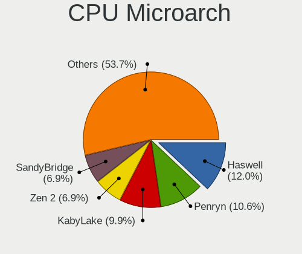

| Name             | Desktops | Percent |
|------------------|----------|---------|
| KabyLake         | 63       | 11.91%  |
| Haswell          | 60       | 11.34%  |
| Penryn           | 59       | 11.15%  |
| Zen 2            | 37       | 6.99%   |
| SandyBridge      | 35       | 6.62%   |
| IvyBridge        | 35       | 6.62%   |
| Core             | 27       | 5.1%    |
| Zen              | 26       | 4.91%   |
| Piledriver       | 26       | 4.91%   |
| K10              | 24       | 4.54%   |
| Skylake          | 23       | 4.35%   |
| Zen+             | 21       | 3.97%   |
| Zen 3            | 17       | 3.21%   |
| CometLake        | 13       | 2.46%   |
| K8 Hammer        | 8        | 1.51%   |
| Silvermont       | 7        | 1.32%   |
| Unknown          | 7        | 1.32%   |
| Nehalem          | 6        | 1.13%   |
| Alderlake Hybrid | 6        | 1.13%   |
| Westmere         | 5        | 0.95%   |
| NetBurst         | 5        | 0.95%   |
| Goldmont         | 4        | 0.76%   |
| Goldmont plus    | 3        | 0.57%   |
| Steamroller      | 2        | 0.38%   |
| K10 Llano        | 2        | 0.38%   |
| Excavator        | 2        | 0.38%   |
| Puma             | 1        | 0.19%   |
| Icelake          | 1        | 0.19%   |
| Bulldozer        | 1        | 0.19%   |
| Broadwell        | 1        | 0.19%   |
| Bonnell          | 1        | 0.19%   |
| Bobcat           | 1        | 0.19%   |

Graphics
--------

GPU Vendor
----------

Vendors of graphics cards

| Vendor            | Desktops | Percent |
|-------------------|----------|---------|
| Nvidia            | 210      | 37.7%   |
| Intel             | 180      | 32.32%  |
| AMD               | 165      | 29.62%  |
| ASPEED Technology | 2        | 0.36%   |

GPU Model
---------

Graphics card models

| Model                                                                       | Desktops | Percent |
|-----------------------------------------------------------------------------|----------|---------|
| AMD Ellesmere [Radeon RX 470/480/570/570X/580/580X/590]                     | 36       | 6.3%    |
| Intel Xeon E3-1200 v3/4th Gen Core Processor Integrated Graphics Controller | 24       | 4.2%    |
| Intel 4 Series Chipset Integrated Graphics Controller                       | 22       | 3.85%   |
| Nvidia GK208B [GeForce GT 710]                                              | 21       | 3.68%   |
| Intel 2nd Generation Core Processor Family Integrated Graphics Controller   | 18       | 3.15%   |
| Intel HD Graphics 630                                                       | 15       | 2.63%   |
| Intel Xeon E3-1200 v2/3rd Gen Core processor Graphics Controller            | 13       | 2.28%   |
| Intel HD Graphics 530                                                       | 13       | 2.28%   |
| Intel CoffeeLake-S GT2 [UHD Graphics 630]                                   | 12       | 2.1%    |
| AMD Navi 10 [Radeon RX 5600 OEM/5600 XT / 5700/5700 XT]                     | 11       | 1.93%   |
| Intel 4th Generation Core Processor Family Integrated Graphics Controller   | 9        | 1.58%   |
| AMD Raven Ridge [Radeon Vega Series / Radeon Vega Mobile Series]            | 9        | 1.58%   |
| Nvidia TU117 [GeForce GTX 1650]                                             | 8        | 1.4%    |
| Nvidia GT218 [GeForce 210]                                                  | 8        | 1.4%    |
| Nvidia GP108 [GeForce GT 1030]                                              | 8        | 1.4%    |
| Nvidia GP107 [GeForce GTX 1050 Ti]                                          | 8        | 1.4%    |
| Nvidia GP104 [GeForce GTX 1070]                                             | 8        | 1.4%    |
| Nvidia GP106 [GeForce GTX 1060 6GB]                                         | 7        | 1.23%   |
| Nvidia GP104 [GeForce GTX 1080]                                             | 7        | 1.23%   |
| Nvidia GF108 [GeForce GT 730]                                               | 7        | 1.23%   |
| AMD Cedar [Radeon HD 5000/6000/7350/8350 Series]                            | 7        | 1.23%   |
| AMD Baffin [Radeon RX 460/560D / Pro 450/455/460/555/555X/560/560X]         | 6        | 1.05%   |
| Nvidia GM206 [GeForce GTX 960]                                              | 5        | 0.88%   |
| Nvidia GK107 [GeForce GT 740]                                               | 5        | 0.88%   |
| Nvidia GF108 [GeForce GT 630]                                               | 5        | 0.88%   |
| Nvidia G96C [GeForce 9500 GT]                                               | 5        | 0.88%   |
| Nvidia G92 [GeForce GTS 250]                                                | 5        | 0.88%   |
| Intel IvyBridge GT2 [HD Graphics 4000]                                      | 5        | 0.88%   |
| Intel Atom Processor Z36xxx/Z37xxx Series Graphics & Display                | 5        | 0.88%   |
| Intel AlderLake-S GT1                                                       | 5        | 0.88%   |
| Intel 82945G/GZ Integrated Graphics Controller                              | 5        | 0.88%   |
| AMD Renoir                                                                  | 5        | 0.88%   |
| AMD Oland PRO [Radeon R7 240/340 / Radeon 520]                              | 5        | 0.88%   |
| AMD Navi 21 [Radeon RX 6800/6800 XT / 6900 XT]                              | 5        | 0.88%   |
| AMD Cezanne [Radeon Vega Series / Radeon Vega Mobile Series]                | 5        | 0.88%   |
| AMD Baffin [Radeon RX 550 640SP / RX 560/560X]                              | 5        | 0.88%   |
| Nvidia TU104 [GeForce RTX 2070 SUPER]                                       | 4        | 0.7%    |
| Nvidia GM107 [GeForce GTX 750 Ti]                                           | 4        | 0.7%    |
| Nvidia GK208B [GeForce GT 730]                                              | 4        | 0.7%    |
| Intel CometLake-S GT2 [UHD Graphics 630]                                    | 4        | 0.7%    |

GPU Combo
---------

Combinations of graphics cards

| Name           | Desktops | Percent |
|----------------|----------|---------|
| 1 x Nvidia     | 194      | 36.6%   |
| 1 x Intel      | 152      | 28.68%  |
| 1 x AMD        | 151      | 28.49%  |
| Intel + Nvidia | 9        | 1.7%    |
| 2 x Intel      | 7        | 1.32%   |
| 2 x AMD        | 6        | 1.13%   |
| AMD + Nvidia   | 6        | 1.13%   |
| 2 x Nvidia     | 2        | 0.38%   |
| Intel + AMD    | 1        | 0.19%   |
| 1 x ASPEED     | 1        | 0.19%   |
| AMD + ASPEED   | 1        | 0.19%   |

GPU Driver
----------

Free vs proprietary

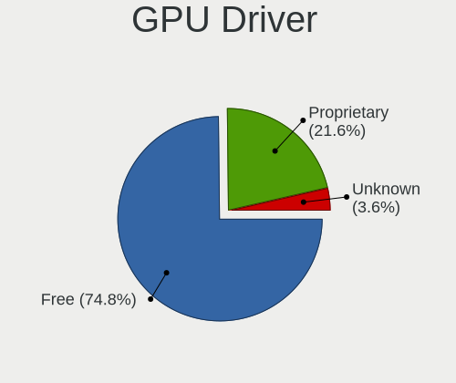

| Driver      | Desktops | Percent |
|-------------|----------|---------|
| Free        | 404      | 75.23%  |
| Proprietary | 115      | 21.42%  |
| Unknown     | 18       | 3.35%   |

GPU Memory
----------

Total video memory

| Size in GB | Desktops | Percent |
|------------|----------|---------|
| Unknown    | 233      | 42.21%  |
| 1.01-2.0   | 72       | 13.04%  |
| 0.51-1.0   | 66       | 11.96%  |
| 0.01-0.5   | 58       | 10.51%  |
| 7.01-8.0   | 49       | 8.88%   |
| 3.01-4.0   | 41       | 7.43%   |
| 5.01-6.0   | 15       | 2.72%   |
| 8.01-16.0  | 11       | 1.99%   |
| 2.01-3.0   | 5        | 0.91%   |
| 16.01-24.0 | 2        | 0.36%   |

Monitor
-------

Monitor Vendor
--------------

Monitor vendors

| Vendor               | Desktops | Percent |
|----------------------|----------|---------|
| Samsung Electronics  | 101      | 18.2%   |
| Dell                 | 79       | 14.23%  |
| Goldstar             | 74       | 13.33%  |
| Philips              | 56       | 10.09%  |
| BenQ                 | 30       | 5.41%   |
| AOC                  | 25       | 4.5%    |
| Hewlett-Packard      | 22       | 3.96%   |
| Ancor Communications | 21       | 3.78%   |
| Acer                 | 20       | 3.6%    |
| Fujitsu Siemens      | 17       | 3.06%   |
| Lenovo               | 13       | 2.34%   |
| LG Electronics       | 11       | 1.98%   |
| Unknown              | 10       | 1.8%    |
| ASUSTek Computer     | 7        | 1.26%   |
| KTC                  | 5        | 0.9%    |
| Eizo                 | 5        | 0.9%    |
| ViewSonic            | 4        | 0.72%   |
| Vestel Elektronik    | 4        | 0.72%   |
| Toshiba              | 4        | 0.72%   |
| Sony                 | 4        | 0.72%   |
| Panasonic            | 4        | 0.72%   |
| Lenovo Group Limited | 3        | 0.54%   |
| Iiyama               | 3        | 0.54%   |
| OEM                  | 2        | 0.36%   |
| MSI                  | 2        | 0.36%   |
| HannStar             | 2        | 0.36%   |
| FUS                  | 2        | 0.36%   |
| Belinea              | 2        | 0.36%   |
| AGO                  | 2        | 0.36%   |
| Unknown              | 2        | 0.36%   |
| ___                  | 1        | 0.18%   |
| Yakumo               | 1        | 0.18%   |
| Xerox                | 1        | 0.18%   |
| VIE                  | 1        | 0.18%   |
| Unknown (XXX)        | 1        | 0.18%   |
| RTD                  | 1        | 0.18%   |
| NEC Computers        | 1        | 0.18%   |
| NAD                  | 1        | 0.18%   |
| MStar                | 1        | 0.18%   |
| Idek Iiyama          | 1        | 0.18%   |

Monitor Model
-------------

Monitor models

| Model                                                                 | Desktops | Percent |
|-----------------------------------------------------------------------|----------|---------|
| Samsung Electronics C24F390 SAM0D2C 1920x1080 521x293mm 23.5-inch     | 8        | 1.34%   |
| Philips PHL 223V5 PHLC0CF 1920x1080 477x268mm 21.5-inch               | 7        | 1.18%   |
| Goldstar LG IPS FULLHD GSM5AB8 1920x1080 480x270mm 21.7-inch          | 7        | 1.18%   |
| Goldstar E2250 GSM578D 1920x1080 477x268mm 21.5-inch                  | 7        | 1.18%   |
| Goldstar MP59G GSM5B34 1920x1080 480x270mm 21.7-inch                  | 5        | 0.84%   |
| Vestel Elektronik 42 FHD_LCD-TV VES3700 1920x540                      | 4        | 0.67%   |
| Samsung Electronics S24F350 SAM0D21 1920x1080 521x293mm 23.5-inch     | 4        | 0.67%   |
| Philips PHL 243V7 PHLC155 1920x1080 530x300mm 24.0-inch               | 4        | 0.67%   |
| Philips 220E PHLC02E 1920x1080 476x268mm 21.5-inch                    | 4        | 0.67%   |
| Goldstar ULTRAWIDE GSM59F1 2560x1080 673x284mm 28.8-inch              | 4        | 0.67%   |
| Goldstar L1918S GSM4B31 1280x1024 376x301mm 19.0-inch                 | 4        | 0.67%   |
| AOC 2590G5 AOC2590 1920x1080 544x303mm 24.5-inch                      | 4        | 0.67%   |
| Ancor Communications ASUS VP228 ACI22C3 1920x1080 476x268mm 21.5-inch | 4        | 0.67%   |
| Samsung Electronics T24C300 SAM0A9B 1920x1080 531x299mm 24.0-inch     | 3        | 0.5%    |
| Samsung Electronics S24F350 SAM0D20 1920x1080 521x293mm 23.5-inch     | 3        | 0.5%    |
| Samsung Electronics LCD Monitor SAM0902 1920x1080 700x390mm 31.5-inch | 3        | 0.5%    |
| Samsung Electronics LCD Monitor SAM0659 1920x1080                     | 3        | 0.5%    |
| Philips PHL 246V5 PHLC0C5 1920x1080 531x299mm 24.0-inch               | 3        | 0.5%    |
| Philips PHL 243V5 PHLC0D1 1920x1080 521x293mm 23.5-inch               | 3        | 0.5%    |
| Philips FTV PHL01EA 1920x1080 1440x810mm 65.0-inch                    | 3        | 0.5%    |
| Panasonic TV MEIA296 3840x2160 698x392mm 31.5-inch                    | 3        | 0.5%    |
| Goldstar W1941 GSM4B91 1360x768 406x229mm 18.4-inch                   | 3        | 0.5%    |
| Goldstar 2D FHD TV GSM59C6 1920x1080 509x286mm 23.0-inch              | 3        | 0.5%    |
| Dell U2715H DELD067 2560x1440 600x340mm 27.2-inch                     | 3        | 0.5%    |
| Dell U2412M DELA07A 1920x1200 518x324mm 24.1-inch                     | 3        | 0.5%    |
| Dell SE2419HR DELF113 1920x1080 527x296mm 23.8-inch                   | 3        | 0.5%    |
| Dell P2214H DELA097 1920x1080 477x268mm 21.5-inch                     | 3        | 0.5%    |
| AOC 2770 AOC2770 1920x1080 598x336mm 27.0-inch                        | 3        | 0.5%    |
| Unknown LCD Monitor SAMSUNG 1920x1080                                 | 2        | 0.34%   |
| Unknown LCD Monitor SAMSUNG                                           | 2        | 0.34%   |
| Samsung Electronics SyncMaster SAM03F2 1680x1050                      | 2        | 0.34%   |
| Samsung Electronics SyncMaster SAM022B 1280x1024 338x270mm 17.0-inch  | 2        | 0.34%   |
| Samsung Electronics SyncMaster SAM011E 1280x1024 338x270mm 17.0-inch  | 2        | 0.34%   |
| Samsung Electronics SMS24A350H SAM07D6 1920x1080 531x299mm 24.0-inch  | 2        | 0.34%   |
| Samsung Electronics S24D330 SAM0D92 1920x1080 531x299mm 24.0-inch     | 2        | 0.34%   |
| Samsung Electronics S24B350 SAM08D9 1920x1080 531x299mm 24.0-inch     | 2        | 0.34%   |
| Samsung Electronics LF24T35 SAM707D 1920x1080 528x297mm 23.9-inch     | 2        | 0.34%   |
| Samsung Electronics LCD Monitor SAM07BF 1920x1080 886x498mm 40.0-inch | 2        | 0.34%   |
| Samsung Electronics LCD Monitor SAM0658 1920x1080 886x498mm 40.0-inch | 2        | 0.34%   |
| Samsung Electronics C27F591 SAM0D37 1920x1080 598x336mm 27.0-inch     | 2        | 0.34%   |

Monitor Resolution
------------------

Monitor screen resolution

| Resolution         | Desktops | Percent |
|--------------------|----------|---------|
| 1920x1080 (FHD)    | 245      | 44.95%  |
| 1280x1024 (SXGA)   | 65       | 11.93%  |
| 3840x2160 (4K)     | 36       | 6.61%   |
| 1680x1050 (WSXGA+) | 35       | 6.42%   |
| 2560x1440 (QHD)    | 34       | 6.24%   |
| 1366x768 (WXGA)    | 18       | 3.3%    |
| Unknown            | 17       | 3.12%   |
| 1920x1200 (WUXGA)  | 14       | 2.57%   |
| 1440x900 (WXGA+)   | 14       | 2.57%   |
| 1360x768           | 11       | 2.02%   |
| 3440x1440          | 10       | 1.83%   |
| 3840x1080          | 6        | 1.1%    |
| 2560x1080          | 6        | 1.1%    |
| 1024x768 (XGA)     | 5        | 0.92%   |
| 1600x900 (HD+)     | 4        | 0.73%   |
| 5120x1440          | 2        | 0.37%   |
| 3840x1600          | 2        | 0.37%   |
| 2560x1600          | 2        | 0.37%   |
| 1920x540           | 2        | 0.37%   |
| 1600x1200          | 2        | 0.37%   |
| 800x600            | 1        | 0.18%   |
| 7680x1440          | 1        | 0.18%   |
| 6400x1440          | 1        | 0.18%   |
| 6000x1440          | 1        | 0.18%   |
| 5760x2160          | 1        | 0.18%   |
| 4960x1080          | 1        | 0.18%   |
| 3600x1200          | 1        | 0.18%   |
| 3360x1080          | 1        | 0.18%   |
| 3286x1080          | 1        | 0.18%   |
| 2960x1050          | 1        | 0.18%   |
| 2720x1024          | 1        | 0.18%   |
| 2624x1200          | 1        | 0.18%   |
| 2288x1287          | 1        | 0.18%   |
| 1280x960           | 1        | 0.18%   |
| 1280x720 (HD)      | 1        | 0.18%   |

Monitor Diagonal
----------------

Diagonal size in inches

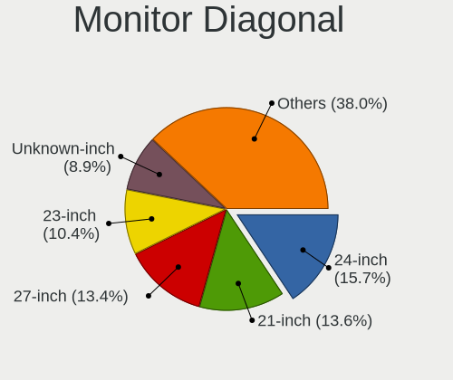

| Inches  | Desktops | Percent |
|---------|----------|---------|
| 21      | 82       | 14.99%  |
| 24      | 75       | 13.71%  |
| 23      | 62       | 11.33%  |
| 27      | 58       | 10.6%   |
| Unknown | 58       | 10.6%   |
| 19      | 44       | 8.04%   |
| 22      | 25       | 4.57%   |
| 17      | 24       | 4.39%   |
| 18      | 23       | 4.2%    |
| 34      | 15       | 2.74%   |
| 31      | 15       | 2.74%   |
| 84      | 11       | 2.01%   |
| 20      | 8        | 1.46%   |
| 15      | 6        | 1.1%    |
| 72      | 5        | 0.91%   |
| 65      | 5        | 0.91%   |
| 40      | 5        | 0.91%   |
| 54      | 4        | 0.73%   |
| 32      | 4        | 0.73%   |
| 37      | 2        | 0.37%   |
| 29      | 2        | 0.37%   |
| 28      | 2        | 0.37%   |
| 26      | 2        | 0.37%   |
| 142     | 1        | 0.18%   |
| 52      | 1        | 0.18%   |
| 49      | 1        | 0.18%   |
| 47      | 1        | 0.18%   |
| 46      | 1        | 0.18%   |
| 43      | 1        | 0.18%   |
| 42      | 1        | 0.18%   |
| 25      | 1        | 0.18%   |
| 16      | 1        | 0.18%   |
| 12      | 1        | 0.18%   |

Monitor Width
-------------

Physical width

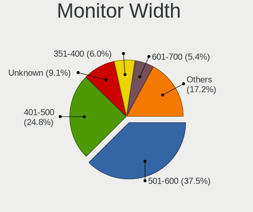

| Width in mm    | Desktops | Percent |
|----------------|----------|---------|
| 501-600        | 178      | 33.4%   |
| 401-500        | 145      | 27.2%   |
| Unknown        | 58       | 10.88%  |
| 351-400        | 39       | 7.32%   |
| 301-350        | 30       | 5.63%   |
| 601-700        | 24       | 4.5%    |
| 701-800        | 19       | 3.56%   |
| 1501-2000      | 16       | 3%      |
| 1001-1500      | 13       | 2.44%   |
| 801-900        | 7        | 1.31%   |
| 901-1000       | 2        | 0.38%   |
| More than 2000 | 1        | 0.19%   |
| 201-300        | 1        | 0.19%   |

Aspect Ratio
------------

Proportional relationship between the width and the height

| Ratio   | Desktops | Percent |
|---------|----------|---------|
| 16/9    | 307      | 60.08%  |
| 16/10   | 62       | 12.13%  |
| 5/4     | 57       | 11.15%  |
| Unknown | 50       | 9.78%   |
| 21/9    | 17       | 3.33%   |
| 4/3     | 9        | 1.76%   |
| 6/5     | 4        | 0.78%   |
| 3/2     | 3        | 0.59%   |
| 32/9    | 1        | 0.2%    |
| 1.00    | 1        | 0.2%    |

Monitor Area
------------

Area in inch

| Area in inch | Desktops | Percent |
|----------------|----------|---------|
| 201-250        | 196      | 36.5%   |
| 151-200        | 76       | 14.15%  |
| 301-350        | 60       | 11.17%  |
| Unknown        | 58       | 10.8%   |
| 141-150        | 39       | 7.26%   |
| 351-500        | 36       | 6.7%    |
| More than 1000 | 27       | 5.03%   |
| 251-300        | 24       | 4.47%   |
| 501-1000       | 12       | 2.23%   |
| 101-110        | 5        | 0.93%   |
| 71-80          | 1        | 0.19%   |
| 131-140        | 1        | 0.19%   |
| 121-130        | 1        | 0.19%   |
| 111-120        | 1        | 0.19%   |

Pixel Density
-------------

Pixels per inch

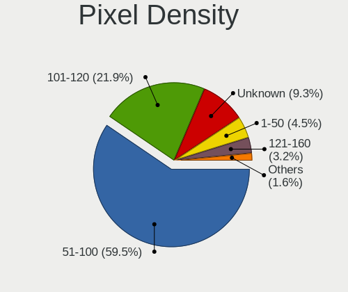

| Density | Desktops | Percent |
|---------|----------|---------|
| 51-100  | 310      | 59.16%  |
| 101-120 | 115      | 21.95%  |
| Unknown | 58       | 11.07%  |
| 1-50    | 23       | 4.39%   |
| 121-160 | 13       | 2.48%   |
| 161-240 | 5        | 0.95%   |

Multiple Monitors
-----------------

Total monitors connected

| Total | Desktops | Percent |
|-------|----------|---------|
| 1     | 428      | 79.55%  |
| 2     | 72       | 13.38%  |
| 0     | 27       | 5.02%   |
| 3     | 11       | 2.04%   |

Network
-------

Net Controller Vendor
---------------------

Controller vendors

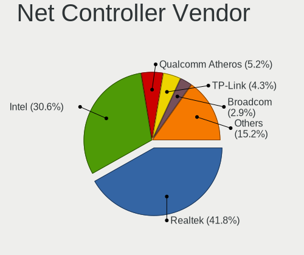

| Vendor                          | Desktops | Percent |
|---------------------------------|----------|---------|
| Realtek Semiconductor           | 289      | 41.76%  |
| Intel                           | 206      | 29.77%  |
| Qualcomm Atheros                | 39       | 5.64%   |
| TP-Link                         | 30       | 4.34%   |
| Broadcom                        | 21       | 3.03%   |
| Ralink Technology               | 12       | 1.73%   |
| Nvidia                          | 12       | 1.73%   |
| MediaTek                        | 9        | 1.3%    |
| Broadcom Limited                | 8        | 1.16%   |
| Ralink                          | 7        | 1.01%   |
| ASUSTek Computer                | 7        | 1.01%   |
| D-Link                          | 6        | 0.87%   |
| Marvell Technology Group        | 5        | 0.72%   |
| Aquantia                        | 5        | 0.72%   |
| Microsoft                       | 4        | 0.58%   |
| Samsung Electronics             | 3        | 0.43%   |
| Qualcomm Atheros Communications | 3        | 0.43%   |
| ZTE WCDMA Technologies MSM      | 2        | 0.29%   |
| VIA Technologies                | 2        | 0.29%   |
| IMC Networks                    | 2        | 0.29%   |
| Giga-Byte Technology            | 2        | 0.29%   |
| Belkin Components               | 2        | 0.29%   |
| Xiaomi                          | 1        | 0.14%   |
| Texas Instruments               | 1        | 0.14%   |
| Tenda                           | 1        | 0.14%   |
| QLogic                          | 1        | 0.14%   |
| NetGear                         | 1        | 0.14%   |
| Micro Star International        | 1        | 0.14%   |
| Mercucys                        | 1        | 0.14%   |
| Huawei Technologies             | 1        | 0.14%   |
| HMD Global                      | 1        | 0.14%   |
| Fitbit                          | 1        | 0.14%   |
| Edimax Technology               | 1        | 0.14%   |
| Dresden Elektronik              | 1        | 0.14%   |
| DisplayLink                     | 1        | 0.14%   |
| D-Link System                   | 1        | 0.14%   |
| ASIX Electronics                | 1        | 0.14%   |
| 3Com                            | 1        | 0.14%   |

Net Controller Model
--------------------

Controller models

| Model                                                             | Desktops | Percent |
|-------------------------------------------------------------------|----------|---------|
| Realtek RTL8111/8168/8411 PCI Express Gigabit Ethernet Controller | 252      | 33.11%  |
| Intel I211 Gigabit Network Connection                             | 30       | 3.94%   |
| Intel 82579LM Gigabit Network Connection (Lewisville)             | 30       | 3.94%   |
| Realtek RTL8125 2.5GbE Controller                                 | 21       | 2.76%   |
| Intel Ethernet Connection (2) I219-V                              | 20       | 2.63%   |
| Intel 82567LM-3 Gigabit Network Connection                        | 20       | 2.63%   |
| Intel Wi-Fi 6 AX200                                               | 15       | 1.97%   |
| Intel Ethernet Connection I217-LM                                 | 15       | 1.97%   |
| Realtek RTL810xE PCI Express Fast Ethernet controller             | 9        | 1.18%   |
| Intel Ethernet Connection I217-V                                  | 9        | 1.18%   |
| Intel Ethernet Connection (7) I219-V                              | 9        | 1.18%   |
| Intel 82566DM-2 Gigabit Network Connection                        | 8        | 1.05%   |
| Realtek RTL8188EUS 802.11n Wireless Network Adapter               | 7        | 0.92%   |
| Qualcomm Atheros AR8151 v2.0 Gigabit Ethernet                     | 7        | 0.92%   |
| Nvidia MCP61 Ethernet                                             | 7        | 0.92%   |
| Realtek RTL-8100/8101L/8139 PCI Fast Ethernet Adapter             | 6        | 0.79%   |
| Intel Ethernet Controller I225-V                                  | 6        | 0.79%   |
| Intel 82579V Gigabit Network Connection                           | 6        | 0.79%   |
| Broadcom NetXtreme BCM5754 Gigabit Ethernet PCI Express           | 6        | 0.79%   |
| TP-Link TL-WN823N v2/v3 [Realtek RTL8192EU]                       | 5        | 0.66%   |
| Realtek RTL8192EE PCIe Wireless Network Adapter                   | 5        | 0.66%   |
| Realtek RTL8169 PCI Gigabit Ethernet Controller                   | 5        | 0.66%   |
| Qualcomm Atheros Killer E220x Gigabit Ethernet Controller         | 5        | 0.66%   |
| Qualcomm Atheros AR8152 v2.0 Fast Ethernet                        | 5        | 0.66%   |
| Intel I210 Gigabit Network Connection                             | 5        | 0.66%   |
| Intel Ethernet Connection (2) I219-LM                             | 5        | 0.66%   |
| Intel Cannon Lake PCH CNVi WiFi                                   | 5        | 0.66%   |
| Broadcom NetXtreme BCM5761 Gigabit Ethernet PCIe                  | 5        | 0.66%   |
| TP-Link TL-WN722N v2/v3 [Realtek RTL8188EUS]                      | 4        | 0.53%   |
| TP-Link Archer T2U PLUS [RTL8821AU]                               | 4        | 0.53%   |
| Ralink RT5370 Wireless Adapter                                    | 4        | 0.53%   |
| Ralink MT7601U Wireless Adapter                                   | 4        | 0.53%   |
| Intel Ethernet Connection (14) I219-V                             | 4        | 0.53%   |
| Intel Alder Lake-S PCH CNVi WiFi                                  | 4        | 0.53%   |
| Intel 82583V Gigabit Network Connection                           | 4        | 0.53%   |
| Intel 82574L Gigabit Network Connection                           | 4        | 0.53%   |
| Aquantia AQC111 NBase-T/IEEE 802.3bz Ethernet Controller [AQtion] | 4        | 0.53%   |
| TP-Link TL-WN822N Version 4 RTL8192EU                             | 3        | 0.39%   |
| TP-Link TL-WN821N v5/v6 [RTL8192EU]                               | 3        | 0.39%   |
| TP-Link Archer T4U ver.3                                          | 3        | 0.39%   |

Wireless Vendor
---------------

Wireless vendors

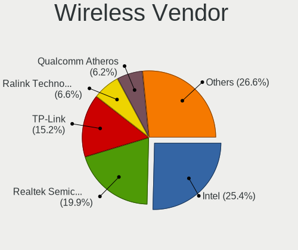

| Vendor                          | Desktops | Percent |
|---------------------------------|----------|---------|
| Intel                           | 45       | 26.79%  |
| TP-Link                         | 28       | 16.67%  |
| Realtek Semiconductor           | 27       | 16.07%  |
| Ralink Technology               | 12       | 7.14%   |
| Qualcomm Atheros                | 10       | 5.95%   |
| Ralink                          | 7        | 4.17%   |
| MediaTek                        | 7        | 4.17%   |
| ASUSTek Computer                | 7        | 4.17%   |
| D-Link                          | 6        | 3.57%   |
| Microsoft                       | 4        | 2.38%   |
| Qualcomm Atheros Communications | 3        | 1.79%   |
| Broadcom                        | 3        | 1.79%   |
| IMC Networks                    | 2        | 1.19%   |
| Belkin Components               | 2        | 1.19%   |
| NetGear                         | 1        | 0.6%    |
| Micro Star International        | 1        | 0.6%    |
| Mercucys                        | 1        | 0.6%    |
| Edimax Technology               | 1        | 0.6%    |
| Broadcom Limited                | 1        | 0.6%    |

Wireless Model
--------------

Wireless models

| Model                                                                | Desktops | Percent |
|----------------------------------------------------------------------|----------|---------|
| Intel Wi-Fi 6 AX200                                                  | 15       | 8.88%   |
| Realtek RTL8188EUS 802.11n Wireless Network Adapter                  | 7        | 4.14%   |
| TP-Link TL-WN823N v2/v3 [Realtek RTL8192EU]                          | 5        | 2.96%   |
| Realtek RTL8192EE PCIe Wireless Network Adapter                      | 5        | 2.96%   |
| Intel Cannon Lake PCH CNVi WiFi                                      | 5        | 2.96%   |
| TP-Link TL-WN722N v2/v3 [Realtek RTL8188EUS]                         | 4        | 2.37%   |
| TP-Link Archer T2U PLUS [RTL8821AU]                                  | 4        | 2.37%   |
| Ralink RT5370 Wireless Adapter                                       | 4        | 2.37%   |
| Ralink MT7601U Wireless Adapter                                      | 4        | 2.37%   |
| Intel Alder Lake-S PCH CNVi WiFi                                     | 4        | 2.37%   |
| TP-Link TL-WN822N Version 4 RTL8192EU                                | 3        | 1.78%   |
| TP-Link TL-WN821N v5/v6 [RTL8192EU]                                  | 3        | 1.78%   |
| TP-Link Archer T4U ver.3                                             | 3        | 1.78%   |
| Realtek RTL8192CE PCIe Wireless Network Adapter                      | 3        | 1.78%   |
| Realtek RTL8188CUS 802.11n WLAN Adapter                              | 3        | 1.78%   |
| Ralink RT2501/RT2573 Wireless Adapter                                | 3        | 1.78%   |
| MediaTek MT7921K (RZ608) Wi-Fi 6E 80MHz                              | 3        | 1.78%   |
| Intel Wireless-AC 9260                                               | 3        | 1.78%   |
| Intel Wireless 8265 / 8275                                           | 3        | 1.78%   |
| Intel Wireless 3165                                                  | 3        | 1.78%   |
| Intel Dual Band Wireless-AC 3168NGW [Stone Peak]                     | 3        | 1.78%   |
| Intel Comet Lake PCH CNVi WiFi                                       | 3        | 1.78%   |
| ASUS USB-N14 802.11b/g/n (2x2) Wireless Adapter [Ralink RT5372]      | 3        | 1.78%   |
| TP-Link Archer T3U [Realtek RTL8812BU]                               | 2        | 1.18%   |
| Realtek RTL8192CU 802.11n WLAN Adapter                               | 2        | 1.18%   |
| Realtek RTL8188FTV 802.11b/g/n 1T1R 2.4G WLAN Adapter                | 2        | 1.18%   |
| Ralink RT3090 Wireless 802.11n 1T/1R PCIe                            | 2        | 1.18%   |
| Qualcomm Atheros AR9271 802.11n                                      | 2        | 1.18%   |
| Qualcomm Atheros AR9227 Wireless Network Adapter                     | 2        | 1.18%   |
| Qualcomm Atheros AR5212/5213/2414 Wireless Network Adapter           | 2        | 1.18%   |
| Microsoft Xbox Wireless Adapter for Windows                          | 2        | 1.18%   |
| Microsoft Xbox 360 Wireless Adapter                                  | 2        | 1.18%   |
| MediaTek MT7922 802.11ax PCI Express Wireless Network Adapter        | 2        | 1.18%   |
| MediaTek MT7921 802.11ax PCI Express Wireless Network Adapter        | 2        | 1.18%   |
| Intel Wireless 7265                                                  | 2        | 1.18%   |
| D-Link DWA-131 Wireless N Nano Adapter (Rev. E1) [Realtek RTL8192EU] | 2        | 1.18%   |
| Broadcom BCM4360 802.11ac Wireless Network Adapter                   | 2        | 1.18%   |
| ASUS AC51 802.11a/b/g/n/ac Wireless Adapter [Mediatek MT7610U]       | 2        | 1.18%   |
| TP-Link Archer T4UH v2 [Realtek RTL8812AU]                           | 1        | 0.59%   |
| TP-Link Archer T4U v2 [Realtek RTL8812AU]                            | 1        | 0.59%   |

Ethernet Vendor
---------------

Ethernet vendors

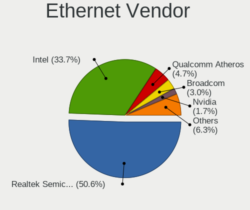

| Vendor                   | Desktops | Percent |
|--------------------------|----------|---------|
| Realtek Semiconductor    | 283      | 50.18%  |
| Intel                    | 185      | 32.8%   |
| Qualcomm Atheros         | 30       | 5.32%   |
| Broadcom                 | 18       | 3.19%   |
| Nvidia                   | 12       | 2.13%   |
| Broadcom Limited         | 7        | 1.24%   |
| Marvell Technology Group | 5        | 0.89%   |
| Aquantia                 | 5        | 0.89%   |
| VIA Technologies         | 2        | 0.35%   |
| TP-Link                  | 2        | 0.35%   |
| Samsung Electronics      | 2        | 0.35%   |
| MediaTek                 | 2        | 0.35%   |
| Giga-Byte Technology     | 2        | 0.35%   |
| Xiaomi                   | 1        | 0.18%   |
| Tenda                    | 1        | 0.18%   |
| QLogic                   | 1        | 0.18%   |
| Huawei Technologies      | 1        | 0.18%   |
| HMD Global               | 1        | 0.18%   |
| DisplayLink              | 1        | 0.18%   |
| D-Link System            | 1        | 0.18%   |
| ASIX Electronics         | 1        | 0.18%   |
| 3Com                     | 1        | 0.18%   |

Ethernet Model
--------------

Ethernet models

| Model                                                             | Desktops | Percent |
|-------------------------------------------------------------------|----------|---------|
| Realtek RTL8111/8168/8411 PCI Express Gigabit Ethernet Controller | 252      | 43.08%  |
| Intel I211 Gigabit Network Connection                             | 30       | 5.13%   |
| Intel 82579LM Gigabit Network Connection (Lewisville)             | 30       | 5.13%   |
| Realtek RTL8125 2.5GbE Controller                                 | 21       | 3.59%   |
| Intel Ethernet Connection (2) I219-V                              | 20       | 3.42%   |
| Intel 82567LM-3 Gigabit Network Connection                        | 20       | 3.42%   |
| Intel Ethernet Connection I217-LM                                 | 15       | 2.56%   |
| Realtek RTL810xE PCI Express Fast Ethernet controller             | 9        | 1.54%   |
| Intel Ethernet Connection I217-V                                  | 9        | 1.54%   |
| Intel Ethernet Connection (7) I219-V                              | 9        | 1.54%   |
| Intel 82566DM-2 Gigabit Network Connection                        | 8        | 1.37%   |
| Qualcomm Atheros AR8151 v2.0 Gigabit Ethernet                     | 7        | 1.2%    |
| Nvidia MCP61 Ethernet                                             | 7        | 1.2%    |
| Realtek RTL-8100/8101L/8139 PCI Fast Ethernet Adapter             | 6        | 1.03%   |
| Intel Ethernet Controller I225-V                                  | 6        | 1.03%   |
| Intel 82579V Gigabit Network Connection                           | 6        | 1.03%   |
| Broadcom NetXtreme BCM5754 Gigabit Ethernet PCI Express           | 6        | 1.03%   |
| Realtek RTL8169 PCI Gigabit Ethernet Controller                   | 5        | 0.85%   |
| Qualcomm Atheros Killer E220x Gigabit Ethernet Controller         | 5        | 0.85%   |
| Qualcomm Atheros AR8152 v2.0 Fast Ethernet                        | 5        | 0.85%   |
| Intel I210 Gigabit Network Connection                             | 5        | 0.85%   |
| Intel Ethernet Connection (2) I219-LM                             | 5        | 0.85%   |
| Broadcom NetXtreme BCM5761 Gigabit Ethernet PCIe                  | 5        | 0.85%   |
| Intel Ethernet Connection (14) I219-V                             | 4        | 0.68%   |
| Intel 82583V Gigabit Network Connection                           | 4        | 0.68%   |
| Intel 82574L Gigabit Network Connection                           | 4        | 0.68%   |
| Aquantia AQC111 NBase-T/IEEE 802.3bz Ethernet Controller [AQtion] | 4        | 0.68%   |
| Marvell Group 88E8056 PCI-E Gigabit Ethernet Controller           | 3        | 0.51%   |
| Intel Ethernet Connection (2) I218-V                              | 3        | 0.51%   |
| Samsung Galaxy series, misc. (tethering mode)                     | 2        | 0.34%   |
| Qualcomm Atheros Killer E2500 Gigabit Ethernet Controller         | 2        | 0.34%   |
| Qualcomm Atheros Killer E2400 Gigabit Ethernet Controller         | 2        | 0.34%   |
| Qualcomm Atheros Attansic L1 Gigabit Ethernet                     | 2        | 0.34%   |
| Qualcomm Atheros AR8131 Gigabit Ethernet                          | 2        | 0.34%   |
| Qualcomm Atheros AR8121/AR8113/AR8114 Gigabit or Fast Ethernet    | 2        | 0.34%   |
| Nvidia MCP51 Ethernet Controller                                  | 2        | 0.34%   |
| Nvidia CK8S Ethernet Controller                                   | 2        | 0.34%   |
| MediaTek Titan pocket                                             | 2        | 0.34%   |
| Intel Ethernet Connection (7) I219-LM                             | 2        | 0.34%   |
| Intel Ethernet Connection (5) I219-LM                             | 2        | 0.34%   |

Net Controller Kind
-------------------

Ethernet, WiFi or modem

| Kind     | Desktops | Percent |
|----------|----------|---------|
| Ethernet | 523      | 76.13%  |
| WiFi     | 157      | 22.85%  |
| Modem    | 5        | 0.73%   |
| Unknown  | 2        | 0.29%   |

Used Controller
---------------

Currently used network controller

| Kind     | Desktops | Percent |
|----------|----------|---------|
| Ethernet | 461      | 85.85%  |
| WiFi     | 76       | 14.15%  |

NICs
----

Total network controllers on board

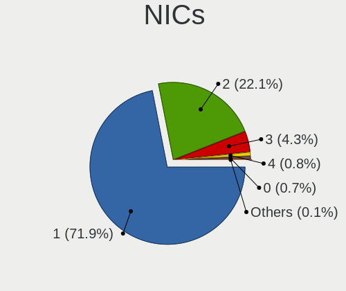

| Total | Desktops | Percent |
|-------|----------|---------|
| 1     | 399      | 75.57%  |
| 2     | 102      | 19.32%  |
| 3     | 22       | 4.17%   |
| 0     | 3        | 0.57%   |
| 4     | 2        | 0.38%   |

IPv6
----

IPv6 vs IPv4

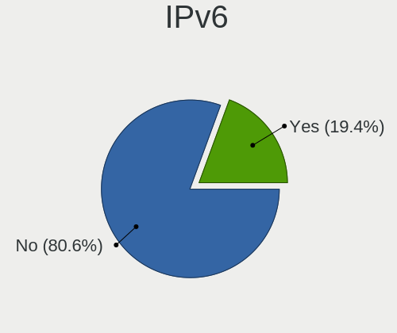

| Used | Desktops | Percent |
|------|----------|---------|
| No   | 451      | 84.14%  |
| Yes  | 85       | 15.86%  |

Bluetooth
---------

Bluetooth Vendor
----------------

Controller vendors

| Vendor                          | Desktops | Percent |
|---------------------------------|----------|---------|
| Intel                           | 42       | 37.17%  |
| Cambridge Silicon Radio         | 29       | 25.66%  |
| ASUSTek Computer                | 22       | 19.47%  |
| MediaTek                        | 5        | 4.42%   |
| Realtek Semiconductor           | 3        | 2.65%   |
| TP-Link                         | 1        | 0.88%   |
| SINO WEALTH                     | 1        | 0.88%   |
| Qualcomm Atheros Communications | 1        | 0.88%   |
| Micro Star International        | 1        | 0.88%   |
| Integrated System Solution      | 1        | 0.88%   |
| IMC Networks                    | 1        | 0.88%   |
| Foxconn / Hon Hai               | 1        | 0.88%   |
| Edimax Technology               | 1        | 0.88%   |
| Conwise Technology              | 1        | 0.88%   |
| Broadcom                        | 1        | 0.88%   |
| Belkin Components               | 1        | 0.88%   |
| Accel Semiconductor             | 1        | 0.88%   |

Bluetooth Model
---------------

Controller models

| Model                                                   | Desktops | Percent |
|---------------------------------------------------------|----------|---------|
| Cambridge Silicon Radio Bluetooth Dongle (HCI mode)     | 29       | 25.66%  |
| ASUS Broadcom BCM20702A0 Bluetooth                      | 17       | 15.04%  |
| Intel AX200 Bluetooth                                   | 14       | 12.39%  |
| Intel Bluetooth wireless interface                      | 9        | 7.96%   |
| Intel AX201 Bluetooth                                   | 7        | 6.19%   |
| MediaTek Wireless_Device                                | 5        | 4.42%   |
| Intel Bluetooth 9460/9560 Jefferson Peak (JfP)          | 5        | 4.42%   |
| ASUS ASUS USB-BT500                                     | 5        | 4.42%   |
| Intel Wireless-AC 9260 Bluetooth Adapter                | 3        | 2.65%   |
| Intel Wireless-AC 3168 Bluetooth                        | 3        | 2.65%   |
| Realtek Bluetooth Radio                                 | 2        | 1.77%   |
| TP-Link UB500 Adapter                                   | 1        | 0.88%   |
| SINO WEALTH RK Bluetooth Keyboar                        | 1        | 0.88%   |
| Realtek  Bluetooth 4.2 Adapter                          | 1        | 0.88%   |
| Qualcomm Atheros QCA61x4 Bluetooth 4.0                  | 1        | 0.88%   |
| Micro Star International Bluetooth Device               | 1        | 0.88%   |
| Intel AX210 Bluetooth                                   | 1        | 0.88%   |
| Integrated System Solution Bluetooth Device             | 1        | 0.88%   |
| IMC Networks Wireless_Device                            | 1        | 0.88%   |
| Foxconn / Hon Hai Wireless_Device                       | 1        | 0.88%   |
| Edimax EW-7611ULB 802.11b/g/n and Bluetooth 4.0 Adapter | 1        | 0.88%   |
| Conwise CW6622                                          | 1        | 0.88%   |
| Broadcom BCM92046DG-CL1ROM Bluetooth 2.1 Adapter        | 1        | 0.88%   |
| Belkin Components Bluetooth Mini Dongle                 | 1        | 0.88%   |
| Accel Bluetooth Device                                  | 1        | 0.88%   |

Sound
-----

Sound Vendor
------------

Sound card vendors

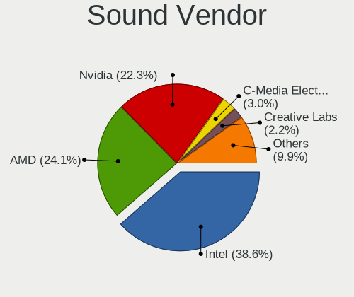

| Vendor                                       | Desktops | Percent |
|----------------------------------------------|----------|---------|
| Intel                                        | 335      | 39.41%  |
| AMD                                          | 200      | 23.53%  |
| Nvidia                                       | 187      | 22%     |
| C-Media Electronics                          | 27       | 3.18%   |
| Creative Labs                                | 21       | 2.47%   |
| Logitech                                     | 8        | 0.94%   |
| Trust                                        | 6        | 0.71%   |
| Texas Instruments                            | 6        | 0.71%   |
| Creative Technology                          | 6        | 0.71%   |
| Giga-Byte Technology                         | 5        | 0.59%   |
| Kingston Technology                          | 4        | 0.47%   |
| Tenx Technology                              | 3        | 0.35%   |
| Generalplus Technology                       | 3        | 0.35%   |
| DSEA A/S                                     | 3        | 0.35%   |
| Razer USA                                    | 2        | 0.24%   |
| JMTek                                        | 2        | 0.24%   |
| GYROCOM C&C                                  | 2        | 0.24%   |
| Focusrite-Novation                           | 2        | 0.24%   |
| Edifier Technology                           | 2        | 0.24%   |
| Corsair                                      | 2        | 0.24%   |
| Audio-Technica                               | 2        | 0.24%   |
| ASUSTek Computer                             | 2        | 0.24%   |
| Zoran Co. Personal Media Division (Nogatech) | 1        | 0.12%   |
| VIA Technologies                             | 1        | 0.12%   |
| Thesycon Systemsoftware & Consulting         | 1        | 0.12%   |
| TEAC                                         | 1        | 0.12%   |
| Studiologic                                  | 1        | 0.12%   |
| Sennheiser Communications                    | 1        | 0.12%   |
| Samson Technologies                          | 1        | 0.12%   |
| Plantronics                                  | 1        | 0.12%   |
| OnePlus Technology (Shenzhen)                | 1        | 0.12%   |
| Nam Tai E&E Products                         | 1        | 0.12%   |
| Microsoft                                    | 1        | 0.12%   |
| iCreate Technologies                         | 1        | 0.12%   |
| Holtek Semiconductor                         | 1        | 0.12%   |
| GN Netcom                                    | 1        | 0.12%   |
| EGO SYStems                                  | 1        | 0.12%   |
| Dell                                         | 1        | 0.12%   |
| Cambridge Audio                              | 1        | 0.12%   |
| BEHRINGER International                      | 1        | 0.12%   |

Sound Model
-----------

Sound card models

| Model                                                                             | Desktops | Percent |
|-----------------------------------------------------------------------------------|----------|---------|
| Intel 8 Series/C220 Series Chipset High Definition Audio Controller               | 44       | 4.41%   |
| Intel 6 Series/C200 Series Chipset Family High Definition Audio Controller        | 42       | 4.21%   |
| AMD Starship/Matisse HD Audio Controller                                          | 41       | 4.11%   |
| AMD Ellesmere HDMI Audio [Radeon RX 470/480 / 570/580/590]                        | 36       | 3.61%   |
| AMD SBx00 Azalia (Intel HDA)                                                      | 33       | 3.31%   |
| Intel 100 Series/C230 Series Chipset Family HD Audio Controller                   | 31       | 3.11%   |
| AMD Family 17h (Models 00h-0fh) HD Audio Controller                               | 31       | 3.11%   |
| Intel 200 Series PCH HD Audio                                                     | 30       | 3.01%   |
| Intel NM10/ICH7 Family High Definition Audio Controller                           | 29       | 2.91%   |
| Intel Xeon E3-1200 v3/4th Gen Core Processor HD Audio Controller                  | 28       | 2.81%   |
| AMD Family 17h/19h HD Audio Controller                                            | 27       | 2.71%   |
| Nvidia GK208 HDMI/DP Audio Controller                                             | 25       | 2.51%   |
| Intel 7 Series/C216 Chipset Family High Definition Audio Controller               | 22       | 2.21%   |
| Intel Cannon Lake PCH cAVS                                                        | 21       | 2.11%   |
| Intel 82801I (ICH9 Family) HD Audio Controller                                    | 21       | 2.11%   |
| Intel 82801JD/DO (ICH10 Family) HD Audio Controller                               | 19       | 1.91%   |
| AMD FCH Azalia Controller                                                         | 19       | 1.91%   |
| Nvidia GP104 High Definition Audio Controller                                     | 17       | 1.71%   |
| Nvidia GF108 High Definition Audio Controller                                     | 15       | 1.5%    |
| AMD Baffin HDMI/DP Audio [Radeon RX 550 640SP / RX 560/560X]                      | 15       | 1.5%    |
| Nvidia High Definition Audio Controller                                           | 14       | 1.4%    |
| AMD Navi 10 HDMI Audio                                                            | 14       | 1.4%    |
| AMD Oland/Hainan/Cape Verde/Pitcairn HDMI Audio [Radeon HD 7000 Series]           | 13       | 1.3%    |
| AMD Raven/Raven2/Fenghuang HDMI/DP Audio Controller                               | 12       | 1.2%    |
| Intel 9 Series Chipset Family HD Audio Controller                                 | 11       | 1.1%    |
| Nvidia GP106 High Definition Audio Controller                                     | 10       | 1%      |
| Intel 82801JI (ICH10 Family) HD Audio Controller                                  | 10       | 1%      |
| Nvidia GP107GL High Definition Audio Controller                                   | 9        | 0.9%    |
| Nvidia GK107 HDMI Audio Controller                                                | 9        | 0.9%    |
| AMD Renoir Radeon High Definition Audio Controller                                | 9        | 0.9%    |
| Nvidia TU107 GeForce GTX 1650 High Definition Audio Controller                    | 8        | 0.8%    |
| Nvidia GP108 High Definition Audio Controller                                     | 8        | 0.8%    |
| AMD Navi 21/23 HDMI/DP Audio Controller                                           | 8        | 0.8%    |
| Nvidia TU104 HD Audio Controller                                                  | 7        | 0.7%    |
| Nvidia MCP61 High Definition Audio                                                | 7        | 0.7%    |
| AMD Caicos HDMI Audio [Radeon HD 6450 / 7450/8450/8490 OEM / R5 230/235/235X OEM] | 7        | 0.7%    |
| Nvidia TU116 High Definition Audio Controller                                     | 6        | 0.6%    |
| Nvidia TU106 High Definition Audio Controller                                     | 6        | 0.6%    |
| Intel 82801H (ICH8 Family) HD Audio Controller                                    | 6        | 0.6%    |
| Intel 5 Series/3400 Series Chipset High Definition Audio                          | 6        | 0.6%    |

Memory
------

Memory Vendor
-------------

Memory module vendors

| Vendor              | Desktops | Percent |
|---------------------|----------|---------|
| Kingston            | 74       | 22.22%  |
| Corsair             | 49       | 14.71%  |
| Unknown             | 48       | 14.41%  |
| Samsung Electronics | 40       | 12.01%  |
| SK hynix            | 26       | 7.81%   |
| G.Skill             | 16       | 4.8%    |
| Crucial             | 14       | 4.2%    |
| Micron Technology   | 12       | 3.6%    |
| A-DATA Technology   | 9        | 2.7%    |
| Nanya Technology    | 8        | 2.4%    |
| Ramaxel Technology  | 7        | 2.1%    |
| Kingmax             | 5        | 1.5%    |
| Elpida              | 5        | 1.5%    |
| Patriot             | 3        | 0.9%    |
| GOODRAM             | 3        | 0.9%    |
| Unknown             | 3        | 0.9%    |
| Qimonda             | 2        | 0.6%    |
| Apacer              | 2        | 0.6%    |
| Unknown (ABCD)      | 1        | 0.3%    |
| Team                | 1        | 0.3%    |
| TakeMS              | 1        | 0.3%    |
| Silicon Power       | 1        | 0.3%    |
| S                   | 1        | 0.3%    |
| H                   | 1        | 0.3%    |
| Exceleram           | 1        | 0.3%    |

Memory Model
------------

Memory module models

| Model                                                  | Desktops | Percent |
|--------------------------------------------------------|----------|---------|
| Kingston RAM KHX1600C9D3/4GX 4GB DIMM DDR3 1600MT/s    | 8        | 2.14%   |
| Samsung RAM M4 70T5663RZ3-CE6 2GB SODIMM DDR2 667MT/s  | 7        | 1.88%   |
| Unknown RAM Module 2048MB DIMM 800MT/s                 | 6        | 1.61%   |
| Unknown RAM Module 2048MB DIMM SDRAM                   | 5        | 1.34%   |
| Kingston RAM KHX2133C14/8G 8GB DIMM DDR4 2400MT/s      | 5        | 1.34%   |
| Samsung RAM M378B5173QH0-CK0 4GB DIMM DDR3 1600MT/s    | 4        | 1.07%   |
| Kingston RAM KHX2400C15/8G 8GB DIMM DDR4 3400MT/s      | 4        | 1.07%   |
| Kingston RAM KHX2133C14D4/4G 4GB DIMM DDR4 2933MT/s    | 4        | 1.07%   |
| Corsair RAM CMZ16GX3M2A1600C9 8GB DIMM DDR3 1600MT/s   | 4        | 1.07%   |
| Corsair RAM CMK16GX4M2B3200C16 8GB DIMM DDR4 3600MT/s  | 4        | 1.07%   |
| Unknown RAM Module 8GB DIMM 1600MT/s                   | 3        | 0.8%    |
| SK hynix RAM HMT451U6AFR8C-PB 4GB DIMM DDR3 1600MT/s   | 3        | 0.8%    |
| SK hynix RAM HMT125U6TFR8C-H9 2GB DIMM DDR3 1333MT/s   | 3        | 0.8%    |
| Samsung RAM M378B5773DH0-CH9 2GB DIMM DDR3 1333MT/s    | 3        | 0.8%    |
| Samsung RAM M378B5173EB0-YK0 4GB DIMM DDR3 1600MT/s    | 3        | 0.8%    |
| Samsung RAM M378A1K43CB2-CRC 8GB DIMM DDR4 3500MT/s    | 3        | 0.8%    |
| Nanya RAM NT1GT64U8HB0BY-3C 1GB DIMM DDR2 667MT/s      | 3        | 0.8%    |
| Kingston RAM KHX3200C16D4/8GX 8GB DIMM DDR4 3600MT/s   | 3        | 0.8%    |
| Kingston RAM 99U5458-005.A01LF 4GB DIMM DDR3 1333MT/s  | 3        | 0.8%    |
| G.Skill RAM F4-3200C16-8GVKB 8GB DIMM DDR4 3866MT/s    | 3        | 0.8%    |
| Corsair RAM CMK32GX4M2B3000C15 16GB DIMM DDR4 3000MT/s | 3        | 0.8%    |
| Unknown                                                | 3        | 0.8%    |
| Unknown RAM Module 4GB DIMM 400MT/s                    | 2        | 0.54%   |
| Unknown RAM Module 4096MB DIMM DDR3 1333MT/s           | 2        | 0.54%   |
| Unknown RAM Module 2GB DIMM DDR3 1333MT/s              | 2        | 0.54%   |
| Unknown RAM Module 2GB DIMM DDR2 800MT/s               | 2        | 0.54%   |
| Unknown RAM Module 2048MB DIMM DDR3 1333MT/s           | 2        | 0.54%   |
| Unknown RAM Module 1024MB DIMM DDR2 667MT/s            | 2        | 0.54%   |
| Unknown RAM Module 1024MB DIMM 800MT/s                 | 2        | 0.54%   |
| Unknown RAM Module 1024MB DIMM                         | 2        | 0.54%   |
| SK hynix RAM HMT451U6BFR8A-PB 4GB DIMM DDR3 1648MT/s   | 2        | 0.54%   |
| SK hynix RAM HMT325U6BFR8C-H9 2GB DIMM DDR3 1333MT/s   | 2        | 0.54%   |
| Samsung RAM M378B5773CH0-CH9 2GB DIMM DDR3 1867MT/s    | 2        | 0.54%   |
| Samsung RAM M378B5173DB0-CK0 4GB DIMM DDR3 1600MT/s    | 2        | 0.54%   |
| Ramaxel RAM RML1520EC48D7W-800 1GB DIMM DDR2 800MT/s   | 2        | 0.54%   |
| Qimonda RAM 64T128020HU3SB 1GB DIMM DDR2 667MT/s       | 2        | 0.54%   |
| Nanya RAM NT2GT64U8HD0BY-AD 2GB DIMM DDR2 2048MT/s     | 2        | 0.54%   |
| Nanya RAM M2Y2G64TU8HD6B-AC 2GB DIMM DDR2 800MT/s      | 2        | 0.54%   |
| Kingston RAM KHX3200C16D4/16GX 16GB DIMM DDR4 3600MT/s | 2        | 0.54%   |
| Kingston RAM KHX2666C16D4/16GX 16GB DIMM DDR4 3000MT/s | 2        | 0.54%   |

Memory Kind
-----------

Memory module kinds

| Kind    | Desktops | Percent |
|---------|----------|---------|
| DDR4    | 116      | 39.46%  |
| DDR3    | 101      | 34.35%  |
| DDR2    | 28       | 9.52%   |
| SDRAM   | 20       | 6.8%    |
| Unknown | 19       | 6.46%   |
| DDR5    | 6        | 2.04%   |
| DDR     | 3        | 1.02%   |
| LPDDR4  | 1        | 0.34%   |

Memory Form Factor
------------------

Physical design of the memory module

| Name    | Desktops | Percent |
|---------|----------|---------|
| DIMM    | 260      | 92.53%  |
| SODIMM  | 19       | 6.76%   |
| RIMM    | 1        | 0.36%   |
| FB-DIMM | 1        | 0.36%   |

Memory Size
-----------

Memory module size

| Size  | Desktops | Percent |
|-------|----------|---------|
| 8192  | 98       | 31.11%  |
| 4096  | 80       | 25.4%   |
| 2048  | 58       | 18.41%  |
| 16384 | 39       | 12.38%  |
| 1024  | 25       | 7.94%   |
| 32768 | 12       | 3.81%   |
| 512   | 3        | 0.95%   |

Memory Speed
------------

Memory module speed

| Speed   | Desktops | Percent |
|---------|----------|---------|
| 1600    | 51       | 15.5%   |
| 1333    | 42       | 12.77%  |
| 2400    | 27       | 8.21%   |
| 3600    | 22       | 6.69%   |
| 667     | 22       | 6.69%   |
| 800     | 21       | 6.38%   |
| 2667    | 18       | 5.47%   |
| 3200    | 12       | 3.65%   |
| 2133    | 12       | 3.65%   |
| 3000    | 9        | 2.74%   |
| Unknown | 9        | 2.74%   |
| 3400    | 8        | 2.43%   |
| 1866    | 6        | 1.82%   |
| 1867    | 5        | 1.52%   |
| 2933    | 4        | 1.22%   |
| 2800    | 4        | 1.22%   |
| 2666    | 4        | 1.22%   |
| 533     | 4        | 1.22%   |
| 4800    | 3        | 0.91%   |
| 3866    | 3        | 0.91%   |
| 3733    | 3        | 0.91%   |
| 3500    | 3        | 0.91%   |
| 1800    | 3        | 0.91%   |
| 3466    | 2        | 0.61%   |
| 3266    | 2        | 0.61%   |
| 2048    | 2        | 0.61%   |
| 1648    | 2        | 0.61%   |
| 1334    | 2        | 0.61%   |
| 1067    | 2        | 0.61%   |
| 1066    | 2        | 0.61%   |
| 400     | 2        | 0.61%   |
| 49926   | 1        | 0.3%    |
| 8192    | 1        | 0.3%    |
| 6000    | 1        | 0.3%    |
| 5808    | 1        | 0.3%    |
| 5200    | 1        | 0.3%    |
| 4266    | 1        | 0.3%    |
| 3666    | 1        | 0.3%    |
| 3533    | 1        | 0.3%    |
| 3334    | 1        | 0.3%    |

Printers & scanners
-------------------

Printer Vendor
--------------

Printer device vendors

| Vendor                | Desktops | Percent |
|-----------------------|----------|---------|
| Hewlett-Packard       | 6        | 20.69%  |
| Brother Industries    | 6        | 20.69%  |
| Seiko Epson           | 4        | 13.79%  |
| Samsung Electronics   | 4        | 13.79%  |
| Canon                 | 4        | 13.79%  |
| Zebra                 | 1        | 3.45%   |
| Xerox                 | 1        | 3.45%   |
| QinHeng Electronics   | 1        | 3.45%   |
| Lexmark International | 1        | 3.45%   |
| ATEN International    | 1        | 3.45%   |

Printer Model
-------------

Printer device models

| Model                                         | Desktops | Percent |
|-----------------------------------------------|----------|---------|
| HP DeskJet 2130 series                        | 2        | 6.9%    |
| Canon MF4010 series                           | 2        | 6.9%    |
| Zebra GK420t Label Printer                    | 1        | 3.45%   |
| Xerox Phaser 6130N                            | 1        | 3.45%   |
| Seiko Epson ME 340 Series/Stylus NX130 Series | 1        | 3.45%   |
| Seiko Epson L6160 Series                      | 1        | 3.45%   |
| Seiko Epson L396 Series                       | 1        | 3.45%   |
| Seiko Epson ET-2710 Series                    | 1        | 3.45%   |
| Samsung ML-216x Series Laser Printer          | 1        | 3.45%   |
| Samsung M267x 287x Series                     | 1        | 3.45%   |
| Samsung M2070 Series                          | 1        | 3.45%   |
| Samsung CLP-310 Color Laser Printer           | 1        | 3.45%   |
| QinHeng CH340S                                | 1        | 3.45%   |
| Lexmark International InkJet Color Printer    | 1        | 3.45%   |
| HP LaserJet M14-M17                           | 1        | 3.45%   |
| HP LaserJet 3050                              | 1        | 3.45%   |
| HP DeskJet F2492 All-in-One                   | 1        | 3.45%   |
| HP Deskjet 3050A                              | 1        | 3.45%   |
| Canon PIXMA MP280                             | 1        | 3.45%   |
| Canon MF3110                                  | 1        | 3.45%   |
| Brother MFC-7420                              | 1        | 3.45%   |
| Brother HL-5380DN series                      | 1        | 3.45%   |
| Brother HL-5250DN Printer                     | 1        | 3.45%   |
| Brother HL-1210W series                       | 1        | 3.45%   |
| Brother HL-1110 series                        | 1        | 3.45%   |
| Brother DCP-7030                              | 1        | 3.45%   |
| ATEN International UC-1284B Printer Port      | 1        | 3.45%   |

Scanner Vendor
--------------

Scanner device vendors

| Vendor | Desktops | Percent |
|--------|----------|---------|
| Canon  | 1        | 100%    |

Scanner Model
-------------

Scanner device models

| Model                   | Desktops | Percent |
|-------------------------|----------|---------|
| Canon CanoScan LiDE 100 | 1        | 100%    |

Camera
------

Camera Vendor
-------------

Camera device vendors

| Vendor                        | Desktops | Percent |
|-------------------------------|----------|---------|
| Logitech                      | 22       | 26.83%  |
| Microdia                      | 13       | 15.85%  |
| Microsoft                     | 7        | 8.54%   |
| Sunplus Innovation Technology | 6        | 7.32%   |
| Samsung Electronics           | 3        | 3.66%   |
| GEMBIRD                       | 3        | 3.66%   |
| Z-Star Microelectronics       | 2        | 2.44%   |
| Realtek Semiconductor         | 2        | 2.44%   |
| Jieli Technology              | 2        | 2.44%   |
| Cubeternet                    | 2        | 2.44%   |
| Chicony Electronics           | 2        | 2.44%   |
| Aveo Technology               | 2        | 2.44%   |
| Apple                         | 2        | 2.44%   |
| WaveRider Communications      | 1        | 1.22%   |
| Unknown                       | 1        | 1.22%   |
| Novatek Microelectronics      | 1        | 1.22%   |
| Nikon                         | 1        | 1.22%   |
| MacroSilicon                  | 1        | 1.22%   |
| Lenovo                        | 1        | 1.22%   |
| KYE Systems (Mouse Systems)   | 1        | 1.22%   |
| Jeilin Technology             | 1        | 1.22%   |
| IMC Networks                  | 1        | 1.22%   |
| Huawei Technologies           | 1        | 1.22%   |
| Generalplus Technology        | 1        | 1.22%   |
| Arkmicro Technologies         | 1        | 1.22%   |
| ARC International             | 1        | 1.22%   |
| Alcor Micro                   | 1        | 1.22%   |

Camera Model
------------

Camera device models

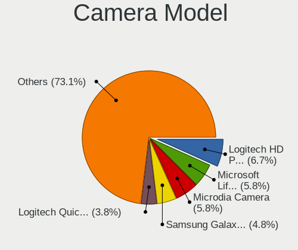

| Model                                       | Desktops | Percent |
|---------------------------------------------|----------|---------|
| Microsoft LifeCam HD-3000                   | 5        | 6.1%    |
| Microdia Camera                             | 4        | 4.88%   |
| Logitech HD Pro Webcam C920                 | 4        | 4.88%   |
| Sunplus 1080P Webcam                        | 3        | 3.66%   |
| Samsung Galaxy series, misc. (MTP mode)     | 3        | 3.66%   |
| Microdia Sonix USB 2.0 Camera               | 3        | 3.66%   |
| Logitech QuickCam Pro 9000                  | 3        | 3.66%   |
| Sunplus papalook AF 925                     | 2        | 2.44%   |
| Microdia Integrated Camera                  | 2        | 2.44%   |
| Microdia HP Integrated Webcam               | 2        | 2.44%   |
| Logitech Webcam C270                        | 2        | 2.44%   |
| Logitech Webcam C170                        | 2        | 2.44%   |
| Jieli USB PHY 2.0                           | 2        | 2.44%   |
| GEMBIRD USB2.0 PC CAMERA                    | 2        | 2.44%   |
| Z-Star Venus USB2.0 Camera                  | 1        | 1.22%   |
| Z-Star A4 TECH HD PC Camera                 | 1        | 1.22%   |
| WaveRider USB 2.0 Camera                    | 1        | 1.22%   |
| Unknown HD camera                           | 1        | 1.22%   |
| Sunplus HD 720P webcam                      | 1        | 1.22%   |
| Realtek USB Camera                          | 1        | 1.22%   |
| Realtek FULL HD 1080P Webcam                | 1        | 1.22%   |
| Novatek HP High Definition 2MP Webcam       | 1        | 1.22%   |
| Nikon DSC D3200                             | 1        | 1.22%   |
| Microsoft LifeCam VX-7000 (UVC-compliant)   | 1        | 1.22%   |
| Microsoft LifeCam VX-500 [1357]             | 1        | 1.22%   |
| Microdia USB 2.0 Camera                     | 1        | 1.22%   |
| Microdia Defender G-Lens 2577 HD720p Camera | 1        | 1.22%   |
| MacroSilicon USB Video                      | 1        | 1.22%   |
| Logitech Webcam C310                        | 1        | 1.22%   |
| Logitech Webcam C250                        | 1        | 1.22%   |
| Logitech Webcam C110                        | 1        | 1.22%   |
| Logitech Webcam B500                        | 1        | 1.22%   |
| Logitech Logitech Webcam C100               | 1        | 1.22%   |
| Logitech HD Webcam C615                     | 1        | 1.22%   |
| Logitech HD Webcam C525                     | 1        | 1.22%   |
| Logitech C922 Pro Stream Webcam             | 1        | 1.22%   |
| Logitech C920 PRO HD Webcam                 | 1        | 1.22%   |
| Logitech BCC950 ConferenceCam               | 1        | 1.22%   |
| Logitech B525 HD Webcam                     | 1        | 1.22%   |
| Lenovo 500 RGB Camera                       | 1        | 1.22%   |

Security
--------

Fingerprint Vendor
------------------

Fingerprint sensor vendors

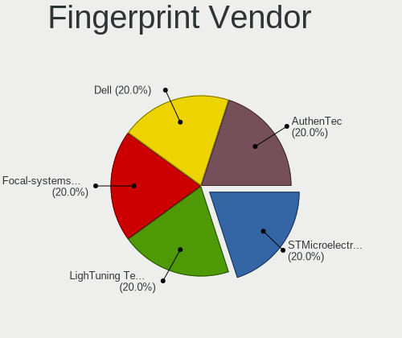

| Vendor             | Desktops | Percent |
|--------------------|----------|---------|
| Focal-systems.Corp | 1        | 100%    |

Fingerprint Model
-----------------

Fingerprint sensor models

| Model                                 | Desktops | Percent |
|---------------------------------------|----------|---------|
| Focal-systems.Corp FT9201Fingerprint. | 1        | 100%    |

Chipcard Vendor
---------------

Chipcard module vendors

| Vendor                    | Desktops | Percent |
|---------------------------|----------|---------|
| Fujitsu Siemens Computers | 1        | 50%     |
| Chicony Electronics       | 1        | 50%     |

Chipcard Model
--------------

Chipcard module models

| Model                                                | Desktops | Percent |
|------------------------------------------------------|----------|---------|
| Fujitsu Siemens Computers SmartCard Reader 2A        | 1        | 50%     |
| Chicony Electronics HP Skylab USB Smartcard Keyboard | 1        | 50%     |

Unsupported
-----------

Unsupported Devices
-------------------

Total unsupported devices on board

| Total | Desktops | Percent |
|-------|----------|---------|
| 0     | 461      | 86.01%  |
| 1     | 65       | 12.13%  |
| 2     | 9        | 1.68%   |
| 3     | 1        | 0.19%   |

Unsupported Device Types
------------------------

Types of unsupported devices

| Type                     | Desktops | Percent |
|--------------------------|----------|---------|
| Graphics card            | 32       | 38.55%  |
| Net/wireless             | 21       | 25.3%   |
| Communication controller | 6        | 7.23%   |
| Unassigned class         | 4        | 4.82%   |
| Multimedia controller    | 4        | 4.82%   |
| Sound                    | 3        | 3.61%   |
| Storage/ide              | 2        | 2.41%   |
| Camera                   | 2        | 2.41%   |
| Bluetooth                | 2        | 2.41%   |
| Unclassified device      | 1        | 1.2%    |
| Storage/raid             | 1        | 1.2%    |
| Storage                  | 1        | 1.2%    |
| Net/ethernet             | 1        | 1.2%    |
| Fingerprint reader       | 1        | 1.2%    |
| Chipcard                 | 1        | 1.2%    |
| Card reader              | 1        | 1.2%    |

