Linux in Romania - Tested Hardware & Statistics (Notebooks)
-----------------------------------------------------------

A project to collect tested hardware configurations for Linux in Romania.

Anyone can contribute to this report by the [hw-probe](https://github.com/linuxhw/hw-probe) tool:

    sudo -E hw-probe -all -upload

Please contribute! Especially if your hardware is rare.

Contents
--------

* [ Test Cases ](#test-cases)

* [ System ](#system)
  - [ OS                       ](#os)
  - [ OS Family                ](#os-family)
  - [ Kernel                   ](#kernel)
  - [ Kernel Family            ](#kernel-family)
  - [ Kernel Major Ver.        ](#kernel-major-ver)
  - [ Arch                     ](#arch)
  - [ DE                       ](#de)
  - [ Display Server           ](#display-server)
  - [ Display Manager          ](#display-manager)
  - [ OS Lang                  ](#os-lang)
  - [ Boot Mode                ](#boot-mode)
  - [ Filesystem               ](#filesystem)
  - [ Part. scheme             ](#part-scheme)
  - [ Dual Boot with Linux/BSD ](#dual-boot-with-linuxbsd)
  - [ Dual Boot (Win)          ](#dual-boot-win)

* [ Board ](#board)
  - [ Vendor                   ](#vendor)
  - [ Model                    ](#model)
  - [ Model Family             ](#model-family)
  - [ MFG Year                 ](#mfg-year)
  - [ Form Factor              ](#form-factor)
  - [ Secure Boot              ](#secure-boot)
  - [ Coreboot                 ](#coreboot)
  - [ RAM Size                 ](#ram-size)
  - [ RAM Used                 ](#ram-used)
  - [ Total Drives             ](#total-drives)
  - [ Has CD-ROM               ](#has-cd-rom)
  - [ Has Ethernet             ](#has-ethernet)
  - [ Has WiFi                 ](#has-wifi)
  - [ Has Bluetooth            ](#has-bluetooth)

* [ Location ](#location)
  - [ Country                  ](#country)
  - [ City                     ](#city)

* [ Drives ](#drives)
  - [ Drive Vendor             ](#drive-vendor)
  - [ Drive Model              ](#drive-model)
  - [ HDD Vendor               ](#hdd-vendor)
  - [ SSD Vendor               ](#ssd-vendor)
  - [ Drive Kind               ](#drive-kind)
  - [ Drive Connector          ](#drive-connector)
  - [ Drive Size               ](#drive-size)
  - [ Space Total              ](#space-total)
  - [ Space Used               ](#space-used)
  - [ Malfunc. Drives          ](#malfunc-drives)
  - [ Malfunc. Drive Vendor    ](#malfunc-drive-vendor)
  - [ Malfunc. HDD Vendor      ](#malfunc-hdd-vendor)
  - [ Malfunc. Drive Kind      ](#malfunc-drive-kind)
  - [ Failed Drives            ](#failed-drives)
  - [ Failed Drive Vendor      ](#failed-drive-vendor)
  - [ Drive Status             ](#drive-status)

* [ Storage controller ](#storage-controller)
  - [ Storage Vendor           ](#storage-vendor)
  - [ Storage Model            ](#storage-model)
  - [ Storage Kind             ](#storage-kind)

* [ Processor ](#processor)
  - [ CPU Vendor               ](#cpu-vendor)
  - [ CPU Model                ](#cpu-model)
  - [ CPU Model Family         ](#cpu-model-family)
  - [ CPU Cores                ](#cpu-cores)
  - [ CPU Sockets              ](#cpu-sockets)
  - [ CPU Threads              ](#cpu-threads)
  - [ CPU Op-Modes             ](#cpu-op-modes)
  - [ CPU Microcode            ](#cpu-microcode)
  - [ CPU Microarch            ](#cpu-microarch)

* [ Graphics ](#graphics)
  - [ GPU Vendor               ](#gpu-vendor)
  - [ GPU Model                ](#gpu-model)
  - [ GPU Combo                ](#gpu-combo)
  - [ GPU Driver               ](#gpu-driver)
  - [ GPU Memory               ](#gpu-memory)

* [ Monitor ](#monitor)
  - [ Monitor Vendor           ](#monitor-vendor)
  - [ Monitor Model            ](#monitor-model)
  - [ Monitor Resolution       ](#monitor-resolution)
  - [ Monitor Diagonal         ](#monitor-diagonal)
  - [ Monitor Width            ](#monitor-width)
  - [ Aspect Ratio             ](#aspect-ratio)
  - [ Monitor Area             ](#monitor-area)
  - [ Pixel Density            ](#pixel-density)
  - [ Multiple Monitors        ](#multiple-monitors)

* [ Network ](#network)
  - [ Net Controller Vendor    ](#net-controller-vendor)
  - [ Net Controller Model     ](#net-controller-model)
  - [ Wireless Vendor          ](#wireless-vendor)
  - [ Wireless Model           ](#wireless-model)
  - [ Ethernet Vendor          ](#ethernet-vendor)
  - [ Ethernet Model           ](#ethernet-model)
  - [ Net Controller Kind      ](#net-controller-kind)
  - [ Used Controller          ](#used-controller)
  - [ NICs                     ](#nics)
  - [ IPv6                     ](#ipv6)

* [ Bluetooth ](#bluetooth)
  - [ Bluetooth Vendor         ](#bluetooth-vendor)
  - [ Bluetooth Model          ](#bluetooth-model)

* [ Sound ](#sound)
  - [ Sound Vendor             ](#sound-vendor)
  - [ Sound Model              ](#sound-model)

* [ Memory ](#memory)
  - [ Memory Vendor            ](#memory-vendor)
  - [ Memory Model             ](#memory-model)
  - [ Memory Kind              ](#memory-kind)
  - [ Memory Form Factor       ](#memory-form-factor)
  - [ Memory Size              ](#memory-size)
  - [ Memory Speed             ](#memory-speed)

* [ Printers & scanners ](#printers--scanners)
  - [ Printer Vendor           ](#printer-vendor)
  - [ Printer Model            ](#printer-model)
  - [ Scanner Vendor           ](#scanner-vendor)
  - [ Scanner Model            ](#scanner-model)

* [ Camera ](#camera)
  - [ Camera Vendor            ](#camera-vendor)
  - [ Camera Model             ](#camera-model)

* [ Security ](#security)
  - [ Fingerprint Vendor       ](#fingerprint-vendor)
  - [ Fingerprint Model        ](#fingerprint-model)
  - [ Chipcard Vendor          ](#chipcard-vendor)
  - [ Chipcard Model           ](#chipcard-model)

* [ Unsupported ](#unsupported)
  - [ Unsupported Devices      ](#unsupported-devices)
  - [ Unsupported Device Types ](#unsupported-device-types)

Test Cases
----------

Total: 2620

| Vendor        | Model                       | Probe                                                      | Date         |
|---------------|-----------------------------|------------------------------------------------------------|--------------|
| HP            | EliteBook 8460p             | [e5a7edcec3](https://linux-hardware.org/?probe=e5a7edcec3) | Jan 03, 2026 |
| Apple         | MacBookPro13,3              | [c88f9d2f52](https://linux-hardware.org/?probe=c88f9d2f52) | Jan 03, 2026 |
| Lenovo        | Legion Pro 5 16IAX10H 83... | [2f4ecc7ced](https://linux-hardware.org/?probe=2f4ecc7ced) | Jan 01, 2026 |
| Lenovo        | IdeaPad Gaming 3 15ACH6 ... | [5c94ecebcf](https://linux-hardware.org/?probe=5c94ecebcf) | Jan 01, 2026 |
| ASUSTek       | GL752VW                     | [984265f24d](https://linux-hardware.org/?probe=984265f24d) | Jan 01, 2026 |
| Lenovo        | IdeaPad Slim 5 14AHP9 83... | [c9e89a6e44](https://linux-hardware.org/?probe=c9e89a6e44) | Dec 28, 2025 |
| HP            | Pavilion 15                 | [ce11e5d5ed](https://linux-hardware.org/?probe=ce11e5d5ed) | Dec 27, 2025 |
| MSI           | GT80S 6QF                   | [970834ace7](https://linux-hardware.org/?probe=970834ace7) | Dec 26, 2025 |
| MSI           | GT80S 6QF                   | [dd9f4d74a9](https://linux-hardware.org/?probe=dd9f4d74a9) | Dec 26, 2025 |
| Chuwi         | CW129-6 N150 V2             | [057fa264c3](https://linux-hardware.org/?probe=057fa264c3) | Dec 26, 2025 |
| Dell          | Inspiron 3558               | [d206517351](https://linux-hardware.org/?probe=d206517351) | Dec 24, 2025 |
| ASUSTek       | U46SM                       | [bd0d38e805](https://linux-hardware.org/?probe=bd0d38e805) | Dec 24, 2025 |
| Lenovo        | ThinkPad T14 Gen 1 20S1S... | [2cee48b259](https://linux-hardware.org/?probe=2cee48b259) | Dec 24, 2025 |
| HP            | EliteBook 840 G8 Noteboo... | [04d26d5c13](https://linux-hardware.org/?probe=04d26d5c13) | Dec 24, 2025 |
| Lenovo        | ThinkPad T14 Gen 1 20S1S... | [d3b88f254a](https://linux-hardware.org/?probe=d3b88f254a) | Dec 23, 2025 |
| Lenovo        | IdeaPad Y700-15ISK 80NV     | [60d6bcd761](https://linux-hardware.org/?probe=60d6bcd761) | Dec 23, 2025 |
| HP            | Pavilion dv7                | [5ae45d1a7f](https://linux-hardware.org/?probe=5ae45d1a7f) | Dec 23, 2025 |
| ASUSTek       | UX410UQK                    | [184bc2d47b](https://linux-hardware.org/?probe=184bc2d47b) | Dec 23, 2025 |
| HP            | OMEN by Gaming Laptop 16... | [ac5ee1a3fb](https://linux-hardware.org/?probe=ac5ee1a3fb) | Dec 21, 2025 |
| Dell          | Latitude E5440              | [f28ee0498f](https://linux-hardware.org/?probe=f28ee0498f) | Dec 21, 2025 |
| Dell          | Latitude E5440              | [5b0d8a5777](https://linux-hardware.org/?probe=5b0d8a5777) | Dec 21, 2025 |
| Lenovo        | Legion Slim 5 16APH8 82Y... | [b6eb4f9df8](https://linux-hardware.org/?probe=b6eb4f9df8) | Dec 21, 2025 |
| ASUSTek       | ASUS Vivobook S 14 M5406... | [15e5b3c65f](https://linux-hardware.org/?probe=15e5b3c65f) | Dec 17, 2025 |
| ASUSTek       | ASUS TUF Gaming F15 FX50... | [5603c2f83e](https://linux-hardware.org/?probe=5603c2f83e) | Dec 17, 2025 |
| Lenovo        | ThinkBook 14 G8 IAL 21SJ    | [092a67a0fd](https://linux-hardware.org/?probe=092a67a0fd) | Dec 14, 2025 |
| Lenovo        | IdeaPad 1 15AMN7 82VG       | [5acd9fce6c](https://linux-hardware.org/?probe=5acd9fce6c) | Dec 14, 2025 |
| Toshiba       | Satellite C50-A-1HF         | [c5a3068acc](https://linux-hardware.org/?probe=c5a3068acc) | Dec 14, 2025 |
| ASUSTek       | GL752VW                     | [30d5cd259c](https://linux-hardware.org/?probe=30d5cd259c) | Dec 13, 2025 |
| Lenovo        | ThinkPad X220 4293AF4       | [184d632d26](https://linux-hardware.org/?probe=184d632d26) | Dec 12, 2025 |
| HP            | OMEN by Laptop 15-dc0xxx    | [853813fe9d](https://linux-hardware.org/?probe=853813fe9d) | Dec 08, 2025 |
| Acer          | Nitro ANV15-41              | [0747d333f7](https://linux-hardware.org/?probe=0747d333f7) | Dec 07, 2025 |
| MSI           | GF63 Thin 11UC              | [e3af347e0f](https://linux-hardware.org/?probe=e3af347e0f) | Dec 07, 2025 |
| Acer          | Nitro ANV15-41              | [cf099ccdea](https://linux-hardware.org/?probe=cf099ccdea) | Dec 06, 2025 |
| Lenovo        | ThinkPad T590 20N5S3FR00    | [cc805f3509](https://linux-hardware.org/?probe=cc805f3509) | Dec 06, 2025 |
| Apple         | MacBookPro14,1              | [c87c463275](https://linux-hardware.org/?probe=c87c463275) | Dec 04, 2025 |
| ASUSTek       | Q500A                       | [290a71cb6a](https://linux-hardware.org/?probe=290a71cb6a) | Nov 30, 2025 |
| Dell          | Latitude E5440              | [fa44a455a0](https://linux-hardware.org/?probe=fa44a455a0) | Nov 29, 2025 |
| HP            | Laptop 15-fd0xxx            | [3bd25bfdd8](https://linux-hardware.org/?probe=3bd25bfdd8) | Nov 28, 2025 |
| HP            | Laptop 15-fd0xxx            | [77a48d6915](https://linux-hardware.org/?probe=77a48d6915) | Nov 28, 2025 |
| ASUSTek       | X555LJ                      | [947da235d9](https://linux-hardware.org/?probe=947da235d9) | Nov 27, 2025 |
| ASUSTek       | X550VX                      | [5f92269f3d](https://linux-hardware.org/?probe=5f92269f3d) | Nov 27, 2025 |
| Fujitsu       | LIFEBOOK U7311              | [cf7526701c](https://linux-hardware.org/?probe=cf7526701c) | Nov 26, 2025 |
| ASUSTek       | ASUS Vivobook S 14 M5406... | [624a4d1c03](https://linux-hardware.org/?probe=624a4d1c03) | Nov 25, 2025 |
| Lenovo        | LOQ 15IRX10 83JE            | [2663569817](https://linux-hardware.org/?probe=2663569817) | Nov 25, 2025 |
| Acer          | Aspire V5-573G              | [628a1edbda](https://linux-hardware.org/?probe=628a1edbda) | Nov 23, 2025 |
| Apple         | MacBookPro9,1               | [2e2cf4d6a3](https://linux-hardware.org/?probe=2e2cf4d6a3) | Nov 23, 2025 |
| ASUSTek       | GL552VW                     | [26f205d4ad](https://linux-hardware.org/?probe=26f205d4ad) | Nov 22, 2025 |
| Lenovo        | IdeaPad Slim 5 15ARP10 8... | [2b8c0b604c](https://linux-hardware.org/?probe=2b8c0b604c) | Nov 21, 2025 |
| Fujitsu       | LIFEBOOK U7311              | [beb576a7f8](https://linux-hardware.org/?probe=beb576a7f8) | Nov 21, 2025 |
| Dell          | Latitude E7440              | [782436a032](https://linux-hardware.org/?probe=782436a032) | Nov 21, 2025 |
| Dell          | Latitude 5580               | [faf79439f4](https://linux-hardware.org/?probe=faf79439f4) | Nov 19, 2025 |
| HP            | EliteBook 8530p             | [1c93ab075b](https://linux-hardware.org/?probe=1c93ab075b) | Nov 18, 2025 |
| ASUSTek       | X541NA                      | [ba3d843404](https://linux-hardware.org/?probe=ba3d843404) | Nov 17, 2025 |
| ASUSTek       | X541NA                      | [523a4f088b](https://linux-hardware.org/?probe=523a4f088b) | Nov 17, 2025 |
| Lenovo        | IdeaPad Pro 5 14IMH9 83D... | [87cc517a3b](https://linux-hardware.org/?probe=87cc517a3b) | Nov 17, 2025 |
| Lenovo        | LOQ 15ARP9 83JC             | [4fba2c47f2](https://linux-hardware.org/?probe=4fba2c47f2) | Nov 16, 2025 |
| Google        | Storo                       | [18b293c62f](https://linux-hardware.org/?probe=18b293c62f) | Nov 14, 2025 |
| Lenovo        | 15ARE05 81W4                | [6f6c5de345](https://linux-hardware.org/?probe=6f6c5de345) | Nov 14, 2025 |
| Lenovo        | 15ARE05 81W4                | [bd9d287a8b](https://linux-hardware.org/?probe=bd9d287a8b) | Nov 14, 2025 |
| Dell          | Precision 7520              | [71ad331a6f](https://linux-hardware.org/?probe=71ad331a6f) | Nov 13, 2025 |
| Lenovo        | ThinkPad T440 20B7S3FW00    | [6ee2457900](https://linux-hardware.org/?probe=6ee2457900) | Nov 11, 2025 |
| Acer          | Aspire E5-573G              | [0075a366d2](https://linux-hardware.org/?probe=0075a366d2) | Nov 09, 2025 |
| ASUSTek       | ASUS TUF Gaming A15 FA50... | [73bd3bee17](https://linux-hardware.org/?probe=73bd3bee17) | Nov 09, 2025 |
| HP            | Pavilion Gaming Laptop 1... | [2abb2d8e7e](https://linux-hardware.org/?probe=2abb2d8e7e) | Nov 07, 2025 |
| Lenovo        | Yoga Slim 7 14AKP10 83JY    | [09bc607c42](https://linux-hardware.org/?probe=09bc607c42) | Nov 06, 2025 |
| Gigabyte      | B760 GAMING X AX            | [03bdaa566a](https://linux-hardware.org/?probe=03bdaa566a) | Nov 05, 2025 |
| Lenovo        | ThinkPad E550 20DF007YRI    | [16b04f86c8](https://linux-hardware.org/?probe=16b04f86c8) | Nov 01, 2025 |
| HP            | EliteBook 840 G5            | [7ac0466143](https://linux-hardware.org/?probe=7ac0466143) | Oct 31, 2025 |
| HP            | ProBook 430 G3              | [d2e38bc75c](https://linux-hardware.org/?probe=d2e38bc75c) | Oct 30, 2025 |
| HP            | ProBook 430 G3              | [5f5133ec07](https://linux-hardware.org/?probe=5f5133ec07) | Oct 30, 2025 |
| HP            | Pavilion Gaming Laptop 1... | [73ef150668](https://linux-hardware.org/?probe=73ef150668) | Oct 30, 2025 |
| HP            | Pavilion Gaming Laptop 1... | [65b6eec280](https://linux-hardware.org/?probe=65b6eec280) | Oct 28, 2025 |
| Lenovo        | ThinkPad X1 Carbon 6th 2... | [433271aa2b](https://linux-hardware.org/?probe=433271aa2b) | Oct 28, 2025 |
| Lenovo        | IdeaPad Slim 5 14AHP9 83... | [6148e20792](https://linux-hardware.org/?probe=6148e20792) | Oct 26, 2025 |
| TUXEDO        | Stellaris Slim 15 AMD Ge... | [8fc2db2715](https://linux-hardware.org/?probe=8fc2db2715) | Oct 26, 2025 |
| Lenovo        | Legion 5 15IMH6 82NL        | [cf90463a45](https://linux-hardware.org/?probe=cf90463a45) | Oct 25, 2025 |
| Lenovo        | Legion 5 15ARH05H 82B1      | [4187360951](https://linux-hardware.org/?probe=4187360951) | Oct 25, 2025 |
| Lenovo        | ThinkPad X390 20Q1S1RB00    | [0c9f454367](https://linux-hardware.org/?probe=0c9f454367) | Oct 24, 2025 |
| Lenovo        | Legion 5 15IMH6 82NL        | [cfeb727ce0](https://linux-hardware.org/?probe=cfeb727ce0) | Oct 24, 2025 |
| ASUSTek       | G750JW                      | [e723f7d1c4](https://linux-hardware.org/?probe=e723f7d1c4) | Oct 21, 2025 |
| HUAWEI        | NBD-WXX9                    | [3ae70fb3f6](https://linux-hardware.org/?probe=3ae70fb3f6) | Oct 19, 2025 |
| Acer          | Nitro AN515-57              | [ce39b94efe](https://linux-hardware.org/?probe=ce39b94efe) | Oct 19, 2025 |
| Gigabyte      | B650M GAMING X AX           | [7409c3c2e5](https://linux-hardware.org/?probe=7409c3c2e5) | Oct 18, 2025 |
| Lenovo        | Legion 5 Pro 16IAH7 82S0    | [1167e372aa](https://linux-hardware.org/?probe=1167e372aa) | Oct 18, 2025 |
| ASUSTek       | X542UAR                     | [0f43076953](https://linux-hardware.org/?probe=0f43076953) | Oct 18, 2025 |
| ASUSTek       | X542UAR                     | [106a113cb9](https://linux-hardware.org/?probe=106a113cb9) | Oct 18, 2025 |
| HP            | Compaq CQ58                 | [4654782ed1](https://linux-hardware.org/?probe=4654782ed1) | Oct 17, 2025 |
| HP            | Victus by Laptop 16-e0xx... | [d24eb8b62e](https://linux-hardware.org/?probe=d24eb8b62e) | Oct 16, 2025 |
| ASUSTek       | ASUS TUF Gaming A15 FA50... | [9d83d4183e](https://linux-hardware.org/?probe=9d83d4183e) | Oct 15, 2025 |
| ASUSTek       | ASUS EXPERTBOOK P5405CSA    | [9546ac0511](https://linux-hardware.org/?probe=9546ac0511) | Oct 15, 2025 |
| Lenovo        | LOQ 15ARP9 83JC             | [299d6000d3](https://linux-hardware.org/?probe=299d6000d3) | Oct 15, 2025 |
| Lenovo        | V330-15IKB 81AX             | [294bf7a57a](https://linux-hardware.org/?probe=294bf7a57a) | Oct 14, 2025 |
| Lenovo        | IdeaPad L340-15IWL 81LG     | [84b130c630](https://linux-hardware.org/?probe=84b130c630) | Oct 12, 2025 |
| Dell          | Latitude E6420              | [b6da901eaa](https://linux-hardware.org/?probe=b6da901eaa) | Oct 12, 2025 |
| Lenovo        | ThinkPad E590 20NB0056RI    | [da00721460](https://linux-hardware.org/?probe=da00721460) | Oct 10, 2025 |
| HP            | EliteBook 840 G3            | [1aab9d5d9a](https://linux-hardware.org/?probe=1aab9d5d9a) | Oct 08, 2025 |
| HP            | EliteBook 840 G3            | [f9da39ec4e](https://linux-hardware.org/?probe=f9da39ec4e) | Oct 08, 2025 |
| Acer          | Aspire ES1-512              | [be0a7b57a0](https://linux-hardware.org/?probe=be0a7b57a0) | Oct 07, 2025 |
| ASUSTek       | GL552VW                     | [873c1dfd39](https://linux-hardware.org/?probe=873c1dfd39) | Oct 06, 2025 |
| Lenovo        | Yoga Slim 7 13ACN5 82CY     | [c5aee95777](https://linux-hardware.org/?probe=c5aee95777) | Oct 06, 2025 |
| Lenovo        | ThinkPad S1 Yoga 12 20DK... | [a32c7802d8](https://linux-hardware.org/?probe=a32c7802d8) | Oct 04, 2025 |
| ASUSTek       | VivoBook_ASUSLaptop X150... | [9c8489fdce](https://linux-hardware.org/?probe=9c8489fdce) | Oct 03, 2025 |
| ASUSTek       | VivoBook_ASUSLaptop X515... | [05e5d797e8](https://linux-hardware.org/?probe=05e5d797e8) | Oct 03, 2025 |
| Lenovo        | IdeaPad Gaming 3 15ACH6 ... | [79fcfbf4fa](https://linux-hardware.org/?probe=79fcfbf4fa) | Oct 03, 2025 |
| Acer          | Nitro AN515-46              | [4fa0e63acb](https://linux-hardware.org/?probe=4fa0e63acb) | Oct 01, 2025 |
| HP            | EliteBook 840 G3            | [8b487e6146](https://linux-hardware.org/?probe=8b487e6146) | Oct 01, 2025 |
| Apple         | MacBookAir4,1               | [8b9a9abff8](https://linux-hardware.org/?probe=8b9a9abff8) | Sep 30, 2025 |
| Acer          | Swift SFG16-72              | [aa74e837f2](https://linux-hardware.org/?probe=aa74e837f2) | Sep 29, 2025 |
| Fujitsu       | LIFEBOOK A3511              | [e7ab1d32ae](https://linux-hardware.org/?probe=e7ab1d32ae) | Sep 29, 2025 |
| Lenovo        | ThinkPad X13 Gen 1 20T3S... | [6e8ee0deab](https://linux-hardware.org/?probe=6e8ee0deab) | Sep 26, 2025 |
| Lenovo        | ThinkPad X13 Gen 1 20T3S... | [fe12fac31a](https://linux-hardware.org/?probe=fe12fac31a) | Sep 26, 2025 |
| Acer          | Aspire A315-41              | [abe75e6c8a](https://linux-hardware.org/?probe=abe75e6c8a) | Sep 26, 2025 |
| Schenker      | XMG FUSION (E24)            | [476266b9ef](https://linux-hardware.org/?probe=476266b9ef) | Sep 25, 2025 |
| HP            | EliteBook 840 G3            | [4aa4410804](https://linux-hardware.org/?probe=4aa4410804) | Sep 25, 2025 |
| Lenovo        | ThinkPad X280 20KES2EF00    | [6a972c85fa](https://linux-hardware.org/?probe=6a972c85fa) | Sep 25, 2025 |
| Lenovo        | IdeaPad 110-15IBR 80T7      | [ddf447ed6d](https://linux-hardware.org/?probe=ddf447ed6d) | Sep 24, 2025 |
| ASUSTek       | ROG Zephyrus G14 GA401IV... | [f845c326b7](https://linux-hardware.org/?probe=f845c326b7) | Sep 23, 2025 |
| Dell          | Inspiron 1520               | [f57bc6d0c1](https://linux-hardware.org/?probe=f57bc6d0c1) | Sep 23, 2025 |
| ASUSTek       | Vivobook Go E1504FA_E150... | [041bfca5e5](https://linux-hardware.org/?probe=041bfca5e5) | Sep 22, 2025 |
| Lenovo        | Legion Y530-15ICH 81FV      | [e8203f9de3](https://linux-hardware.org/?probe=e8203f9de3) | Sep 21, 2025 |
| Acer          | Aspire E1-570G              | [738fee85c1](https://linux-hardware.org/?probe=738fee85c1) | Sep 20, 2025 |
| Dell          | G5 5587                     | [9619cb4bc6](https://linux-hardware.org/?probe=9619cb4bc6) | Sep 19, 2025 |
| ASUSTek       | ASUS EXPERTBOOK P5405CSA    | [834752166a](https://linux-hardware.org/?probe=834752166a) | Sep 18, 2025 |
| Lenovo        | B50-80 80EW                 | [0ef80e88e6](https://linux-hardware.org/?probe=0ef80e88e6) | Sep 14, 2025 |
| Samsung       | 370R4E/370R4V/370R5E/357... | [23c568bd7b](https://linux-hardware.org/?probe=23c568bd7b) | Sep 14, 2025 |
| ASUSTek       | ROG Strix G512LI_G512LI     | [86123c7890](https://linux-hardware.org/?probe=86123c7890) | Sep 11, 2025 |
| ASUSTek       | X541UVK                     | [bda837e806](https://linux-hardware.org/?probe=bda837e806) | Sep 11, 2025 |
| Dell          | Vostro 15 3530              | [c5562460e7](https://linux-hardware.org/?probe=c5562460e7) | Sep 10, 2025 |
| Lenovo        | ThinkBook 13x G4 IMH 21K... | [486c95573b](https://linux-hardware.org/?probe=486c95573b) | Sep 10, 2025 |
| ASUSTek       | ROG Zephyrus M16 GU603ZW... | [11c2c2ac1e](https://linux-hardware.org/?probe=11c2c2ac1e) | Sep 09, 2025 |
| Dell          | Inspiron 5555               | [614dcc8bbf](https://linux-hardware.org/?probe=614dcc8bbf) | Sep 07, 2025 |
| ASUSTek       | GL502VMZ                    | [b130803c98](https://linux-hardware.org/?probe=b130803c98) | Sep 06, 2025 |
| ASUSTek       | GL502VMZ                    | [accd5f984e](https://linux-hardware.org/?probe=accd5f984e) | Sep 06, 2025 |
| Lenovo        | IdeaPad Gaming 3 15IHU6 ... | [96b9218fa4](https://linux-hardware.org/?probe=96b9218fa4) | Sep 05, 2025 |
| Lenovo        | IdeaPad 3 15ARE05 81W4      | [be27f2772e](https://linux-hardware.org/?probe=be27f2772e) | Sep 03, 2025 |
| Lenovo        | LOQ 15ARP9 83JC             | [b5f8fdb526](https://linux-hardware.org/?probe=b5f8fdb526) | Sep 02, 2025 |
| ASUSTek       | VivoBook_ASUSLaptop X150... | [b96a164390](https://linux-hardware.org/?probe=b96a164390) | Sep 02, 2025 |
| HP            | Pavilion Gaming Laptop 1... | [654d81a3bb](https://linux-hardware.org/?probe=654d81a3bb) | Sep 02, 2025 |
| Lenovo        | IdeaPad 3 15ALC6 82KU       | [af0574f16e](https://linux-hardware.org/?probe=af0574f16e) | Sep 02, 2025 |
| HUAWEI        | BOD-WXX9                    | [88d455bf61](https://linux-hardware.org/?probe=88d455bf61) | Sep 01, 2025 |
| Dell          | Latitude E5440              | [399c98088a](https://linux-hardware.org/?probe=399c98088a) | Sep 01, 2025 |
| Lenovo        | IdeaPad Gaming 3 15ARH05... | [7d859c5a6a](https://linux-hardware.org/?probe=7d859c5a6a) | Aug 29, 2025 |
| Lenovo        | Yoga Pro 7 14IMH9 83E2      | [d6c2e542f5](https://linux-hardware.org/?probe=d6c2e542f5) | Aug 28, 2025 |
| Gigabyte      | H510M H                     | [67d8b4b827](https://linux-hardware.org/?probe=67d8b4b827) | Aug 24, 2025 |
| Lenovo        | G500 20236                  | [e58530488e](https://linux-hardware.org/?probe=e58530488e) | Aug 24, 2025 |
| Lenovo        | G500 20236                  | [f72c0bee99](https://linux-hardware.org/?probe=f72c0bee99) | Aug 24, 2025 |
| ASUSTek       | F5SR                        | [dd52be8b03](https://linux-hardware.org/?probe=dd52be8b03) | Aug 22, 2025 |
| Unknown       | Unknown                     | [b9f603e888](https://linux-hardware.org/?probe=b9f603e888) | Aug 22, 2025 |
| ASUSTek       | VivoBook_ASUSLaptop X150... | [349b4a9553](https://linux-hardware.org/?probe=349b4a9553) | Aug 21, 2025 |
| ASUSTek       | VivoBook_ASUSLaptop X150... | [b0228ceb18](https://linux-hardware.org/?probe=b0228ceb18) | Aug 21, 2025 |
| ASUSTek       | ROG Strix G513RW_G513RW     | [a127a3d707](https://linux-hardware.org/?probe=a127a3d707) | Aug 19, 2025 |
| HUAWEI        | NBLK-WAX9X                  | [3e04f5f89f](https://linux-hardware.org/?probe=3e04f5f89f) | Aug 18, 2025 |
| Lenovo        | IdeaPad Gaming 3 15ACH6 ... | [376b33cbf9](https://linux-hardware.org/?probe=376b33cbf9) | Aug 17, 2025 |
| ASUSTek       | VivoBook_ASUSLaptop X509... | [c1aa58aa9c](https://linux-hardware.org/?probe=c1aa58aa9c) | Aug 17, 2025 |
| Lenovo        | IdeaPad Gaming 3 15ACH6 ... | [ba7518c875](https://linux-hardware.org/?probe=ba7518c875) | Aug 17, 2025 |
| ASUSTek       | ASUS TUF Gaming A16 FA60... | [78df4b6ed2](https://linux-hardware.org/?probe=78df4b6ed2) | Aug 16, 2025 |
| Dell          | Latitude E6420              | [eaf14256e5](https://linux-hardware.org/?probe=eaf14256e5) | Aug 14, 2025 |
| ASUSTek       | VivoBook_ASUSLaptop X415... | [22644f085c](https://linux-hardware.org/?probe=22644f085c) | Aug 13, 2025 |
| ASUSTek       | VivoBook_ASUSLaptop X150... | [faa343d6c3](https://linux-hardware.org/?probe=faa343d6c3) | Aug 13, 2025 |
| Acer          | Aspire 4752                 | [dc992187b4](https://linux-hardware.org/?probe=dc992187b4) | Aug 11, 2025 |
| ASUSTek       | ASUS EXPERTBOOK B1500CEA... | [9736ec7b61](https://linux-hardware.org/?probe=9736ec7b61) | Aug 10, 2025 |
| Lenovo        | ThinkPad L490 20Q6S87C00    | [31e0aa4aa8](https://linux-hardware.org/?probe=31e0aa4aa8) | Aug 09, 2025 |
| Lenovo        | LOQ 15ARP9 83JC             | [276975cfc2](https://linux-hardware.org/?probe=276975cfc2) | Aug 09, 2025 |
| Lenovo        | LOQ 15ARP9 83JC             | [05fc4aac11](https://linux-hardware.org/?probe=05fc4aac11) | Aug 09, 2025 |
| Lenovo        | LOQ 15ARP9 83JC             | [ac9ae75a82](https://linux-hardware.org/?probe=ac9ae75a82) | Aug 07, 2025 |
| Lenovo        | IdeaPad Slim 5 14AHP9 83... | [14400bcbba](https://linux-hardware.org/?probe=14400bcbba) | Aug 05, 2025 |
| ASUSTek       | G75VW                       | [b30413e58c](https://linux-hardware.org/?probe=b30413e58c) | Aug 05, 2025 |
| Toshiba       | Satellite C50-A-1HF         | [7e5669c6b8](https://linux-hardware.org/?probe=7e5669c6b8) | Aug 05, 2025 |
| Lenovo        | IdeaPad Z570 10246ZG        | [e50a9eb41b](https://linux-hardware.org/?probe=e50a9eb41b) | Aug 03, 2025 |
| HP            | EliteBook 8540w             | [04cf265847](https://linux-hardware.org/?probe=04cf265847) | Aug 03, 2025 |
| ASUSTek       | X541UAK                     | [df0053f97f](https://linux-hardware.org/?probe=df0053f97f) | Aug 02, 2025 |
| ASUSTek       | X541UAK                     | [eb9a6b1027](https://linux-hardware.org/?probe=eb9a6b1027) | Aug 02, 2025 |
| ASUSTek       | ASUS Vivobook S 16 M5606... | [bc7cec68c5](https://linux-hardware.org/?probe=bc7cec68c5) | Jul 29, 2025 |
| ASUSTek       | ASUS Vivobook S 14 S5406... | [0a81365453](https://linux-hardware.org/?probe=0a81365453) | Jul 28, 2025 |
| ASUSTek       | ASUS Vivobook S 14 S5406... | [ea61afe76e](https://linux-hardware.org/?probe=ea61afe76e) | Jul 28, 2025 |
| Dell          | Precision 5680              | [9758d2e875](https://linux-hardware.org/?probe=9758d2e875) | Jul 27, 2025 |
| Dell          | Precision M3800             | [46810094f2](https://linux-hardware.org/?probe=46810094f2) | Jul 27, 2025 |
| Lenovo        | Yoga Pro 7 14ASP9 83HN      | [fb4800a184](https://linux-hardware.org/?probe=fb4800a184) | Jul 27, 2025 |
| Lenovo        | ThinkPad E14 Gen 6 21M30... | [b278f04c95](https://linux-hardware.org/?probe=b278f04c95) | Jul 21, 2025 |
| HP            | Pavilion Laptop 15-cw1xx... | [a2379afbf2](https://linux-hardware.org/?probe=a2379afbf2) | Jul 20, 2025 |
| Acer          | Aspire ES1-512              | [b8a42bca85](https://linux-hardware.org/?probe=b8a42bca85) | Jul 20, 2025 |
| HP            | Pavilion Laptop 15-cw1xx... | [eb54170399](https://linux-hardware.org/?probe=eb54170399) | Jul 20, 2025 |
| Lenovo        | ThinkPad P70 20ESS0JJ00     | [dce378aeef](https://linux-hardware.org/?probe=dce378aeef) | Jul 18, 2025 |
| Dell          | Latitude 5400               | [b3840912b2](https://linux-hardware.org/?probe=b3840912b2) | Jul 17, 2025 |
| HP            | EliteBook 840 G6            | [7f0dd34eed](https://linux-hardware.org/?probe=7f0dd34eed) | Jul 14, 2025 |
| Lenovo        | IdeaPad 3 15ALC6 82KU       | [0c1fd9b654](https://linux-hardware.org/?probe=0c1fd9b654) | Jul 13, 2025 |
| Dell          | Vostro 1320                 | [435571c2e7](https://linux-hardware.org/?probe=435571c2e7) | Jul 13, 2025 |
| ASUSTek       | Vivobook Go E1504FA_L150... | [eda983228e](https://linux-hardware.org/?probe=eda983228e) | Jul 12, 2025 |
| Lenovo        | IdeaPad Slim 5 16AHP9 83... | [12eedf8b68](https://linux-hardware.org/?probe=12eedf8b68) | Jul 07, 2025 |
| Lenovo        | IdeaPad Gaming 3 15ACH6 ... | [7727882fc5](https://linux-hardware.org/?probe=7727882fc5) | Jul 06, 2025 |
| Dell          | Latitude 5591               | [75dca27035](https://linux-hardware.org/?probe=75dca27035) | Jul 04, 2025 |
| ASUSTek       | ASUS TUF Gaming A15 FA50... | [2e7ac2325c](https://linux-hardware.org/?probe=2e7ac2325c) | Jul 04, 2025 |
| ASUSTek       | N750JV                      | [66799d8413](https://linux-hardware.org/?probe=66799d8413) | Jul 02, 2025 |
| Lenovo        | IdeaPad L340-15IWL 81LG     | [131602d786](https://linux-hardware.org/?probe=131602d786) | Jul 02, 2025 |
| Dell          | Precision 5680              | [c80763fa0f](https://linux-hardware.org/?probe=c80763fa0f) | Jul 02, 2025 |
| Dell          | Precision M3800             | [bec1a911de](https://linux-hardware.org/?probe=bec1a911de) | Jul 01, 2025 |
| MSI           | GF63 Thin 11UC              | [7ceabc28cb](https://linux-hardware.org/?probe=7ceabc28cb) | Jul 01, 2025 |
| Apple         | MacBook8,1                  | [1a8a0dadc4](https://linux-hardware.org/?probe=1a8a0dadc4) | Jul 01, 2025 |
| Lenovo        | IdeaPad L340-15IWL 81LG     | [2647b33814](https://linux-hardware.org/?probe=2647b33814) | Jul 01, 2025 |
| Acer          | Extensa 5235                | [1c1d9b9c57](https://linux-hardware.org/?probe=1c1d9b9c57) | Jun 30, 2025 |
| ASUSTek       | VivoBook_ASUSLaptop X150... | [b5ef6db29b](https://linux-hardware.org/?probe=b5ef6db29b) | Jun 28, 2025 |
| Lenovo        | ThinkPad T495 20NKS1R649    | [66a9f8c033](https://linux-hardware.org/?probe=66a9f8c033) | Jun 27, 2025 |
| Lenovo        | IdeaPad Slim 5 16AHP9 83... | [b102519d2e](https://linux-hardware.org/?probe=b102519d2e) | Jun 25, 2025 |
| Lenovo        | IdeaPad Slim 5 16AHP9 83... | [de02436028](https://linux-hardware.org/?probe=de02436028) | Jun 25, 2025 |
| Toshiba       | Satellite C50-A-1HF         | [9ad62202ec](https://linux-hardware.org/?probe=9ad62202ec) | Jun 23, 2025 |
| MSI           | PR201/PR321                 | [2a53daf9f2](https://linux-hardware.org/?probe=2a53daf9f2) | Jun 21, 2025 |
| HP            | Laptop 15s-eq3xxx           | [22649bb1ba](https://linux-hardware.org/?probe=22649bb1ba) | Jun 21, 2025 |
| Lenovo        | IdeaPad Slim 3 15ABR8 82... | [23c3e40f68](https://linux-hardware.org/?probe=23c3e40f68) | Jun 21, 2025 |
| TUXEDO        | InfinityBook Pro Gen7 (M... | [4a22b2adbc](https://linux-hardware.org/?probe=4a22b2adbc) | Jun 21, 2025 |
| Lenovo        | Legion 5 15ARH05H 82B1      | [cc3c13029d](https://linux-hardware.org/?probe=cc3c13029d) | Jun 19, 2025 |
| Hampoo        | Cherry Trail CR V101        | [9c930e6f10](https://linux-hardware.org/?probe=9c930e6f10) | Jun 09, 2025 |
| Acer          | Aspire V5-591G              | [27678c94de](https://linux-hardware.org/?probe=27678c94de) | Jun 07, 2025 |
| MSI           | Vector 17 HX A14VIG         | [bf2a9334fa](https://linux-hardware.org/?probe=bf2a9334fa) | Jun 06, 2025 |
| ASUSTek       | ASUS TUF Gaming F15 FX50... | [0c4d95a44e](https://linux-hardware.org/?probe=0c4d95a44e) | Jun 05, 2025 |
| HP            | ENVY Laptop 17-cg0xxx       | [1aef6a31fa](https://linux-hardware.org/?probe=1aef6a31fa) | Jun 03, 2025 |
| Acer          | Aspire E1-570G              | [1dc9e6fc47](https://linux-hardware.org/?probe=1dc9e6fc47) | Jun 02, 2025 |
| Dell          | Inspiron 7520               | [aa1a9bd744](https://linux-hardware.org/?probe=aa1a9bd744) | Jun 02, 2025 |
| Lenovo        | IdeaPad Gaming 3 15ACH6 ... | [b4db20e3ff](https://linux-hardware.org/?probe=b4db20e3ff) | Jun 02, 2025 |
| Acer          | Predator PT316-51s          | [273d5ec77d](https://linux-hardware.org/?probe=273d5ec77d) | Jun 01, 2025 |
| Acer          | Aspire E1-570G              | [61762dfc7f](https://linux-hardware.org/?probe=61762dfc7f) | Jun 01, 2025 |
| Dell          | Latitude E5570              | [fed7cdcf66](https://linux-hardware.org/?probe=fed7cdcf66) | Jun 01, 2025 |
| Acer          | Nitro AN515-57              | [3d1a0ca946](https://linux-hardware.org/?probe=3d1a0ca946) | May 30, 2025 |
| ASUSTek       | ROG Zephyrus G14 GA402RK... | [707fafddf6](https://linux-hardware.org/?probe=707fafddf6) | May 30, 2025 |
| Lenovo        | Unknown                     | [98a517f66a](https://linux-hardware.org/?probe=98a517f66a) | May 29, 2025 |
| Lenovo        | ThinkPad E550 20DF007YRI    | [86f73f24bc](https://linux-hardware.org/?probe=86f73f24bc) | May 28, 2025 |
| Dell          | Latitude E7440              | [cc7c6aad15](https://linux-hardware.org/?probe=cc7c6aad15) | May 27, 2025 |
| Dell          | Latitude 7410               | [904cadb092](https://linux-hardware.org/?probe=904cadb092) | May 27, 2025 |
| Dell          | Vostro 3520                 | [1b393aa6c9](https://linux-hardware.org/?probe=1b393aa6c9) | May 26, 2025 |
| ASUSTek       | ASUS TUF Gaming A15 FA50... | [7e19557765](https://linux-hardware.org/?probe=7e19557765) | May 25, 2025 |
| HP            | Laptop 17-cn0xxx            | [0117b0df95](https://linux-hardware.org/?probe=0117b0df95) | May 25, 2025 |
| HP            | Laptop 17-cn0xxx            | [6c6305ba63](https://linux-hardware.org/?probe=6c6305ba63) | May 25, 2025 |
| Lenovo        | Legion Y540-17IRH 81Q4      | [3503a272e8](https://linux-hardware.org/?probe=3503a272e8) | May 24, 2025 |
| Acer          | NC-E5-511-C6NM              | [b4a9f62429](https://linux-hardware.org/?probe=b4a9f62429) | May 23, 2025 |
| Acer          | NC-E5-511-C6NM              | [0b470565de](https://linux-hardware.org/?probe=0b470565de) | May 23, 2025 |
| ASUSTek       | VivoBook_ASUSLaptop X509... | [c63030c630](https://linux-hardware.org/?probe=c63030c630) | May 22, 2025 |
| Lenovo        | ThinkPad T440p 20AWS0WP0... | [a75c4a4195](https://linux-hardware.org/?probe=a75c4a4195) | May 19, 2025 |
| Lenovo        | ThinkPad T440p 20AWS0WP0... | [27c87c54c7](https://linux-hardware.org/?probe=27c87c54c7) | May 19, 2025 |
| Apple         | MacBookPro9,1               | [1bc64bed99](https://linux-hardware.org/?probe=1bc64bed99) | May 18, 2025 |
| Apple         | MacBookPro9,1               | [53ba60ee1f](https://linux-hardware.org/?probe=53ba60ee1f) | May 17, 2025 |
| HP            | ProBook 4530s               | [b592feff8d](https://linux-hardware.org/?probe=b592feff8d) | May 17, 2025 |
| ASUSTek       | VivoBook_ASUSLaptop X412... | [a3b5d987a0](https://linux-hardware.org/?probe=a3b5d987a0) | May 17, 2025 |
| ASUSTek       | ASUS Vivobook S 14 M5406... | [d6c6df5c71](https://linux-hardware.org/?probe=d6c6df5c71) | May 17, 2025 |
| Acer          | Aspire A715-41G             | [101e7f8e77](https://linux-hardware.org/?probe=101e7f8e77) | May 15, 2025 |
| HP            | OMEN by Laptop              | [6ee749ea43](https://linux-hardware.org/?probe=6ee749ea43) | May 11, 2025 |
| ASUSTek       | ASUS TUF Gaming F15 FX50... | [4016ea1ae9](https://linux-hardware.org/?probe=4016ea1ae9) | May 11, 2025 |
| Acer          | Swift SFA16-41              | [81d1ad04ca](https://linux-hardware.org/?probe=81d1ad04ca) | May 09, 2025 |
| MSI           | Unknown                     | [49ca54ed5a](https://linux-hardware.org/?probe=49ca54ed5a) | May 07, 2025 |
| Lenovo        | ThinkPad T495 20NKS3YE22    | [8a91169583](https://linux-hardware.org/?probe=8a91169583) | May 07, 2025 |
| Toshiba       | Satellite A500              | [e7c8910310](https://linux-hardware.org/?probe=e7c8910310) | May 03, 2025 |
| Lenovo        | Legion Pro 5 16IRX9 83DF    | [0f6d7d2772](https://linux-hardware.org/?probe=0f6d7d2772) | May 03, 2025 |
| Lenovo        | IdeaPad L340-15IWL 81LG     | [03cc3ebc65](https://linux-hardware.org/?probe=03cc3ebc65) | Apr 30, 2025 |
| ASUSTek       | GL702ZC                     | [38d744ca1c](https://linux-hardware.org/?probe=38d744ca1c) | Apr 30, 2025 |
| Acer          | Aspire A315-59              | [a3dc9aacf1](https://linux-hardware.org/?probe=a3dc9aacf1) | Apr 27, 2025 |
| Lenovo        | ThinkPad X1 Carbon 6th 2... | [ea3a141fc7](https://linux-hardware.org/?probe=ea3a141fc7) | Apr 27, 2025 |
| Dell          | Vostro 3525                 | [c1071d1f67](https://linux-hardware.org/?probe=c1071d1f67) | Apr 26, 2025 |
| Lenovo        | ThinkPad P52 20MAS1U200     | [de6563677c](https://linux-hardware.org/?probe=de6563677c) | Apr 25, 2025 |
| Lenovo        | ThinkPad X1 Carbon Gen 1... | [0a7adcdcf0](https://linux-hardware.org/?probe=0a7adcdcf0) | Apr 24, 2025 |
| ASUSTek       | VivoBook_ASUSLaptop X150... | [b7fd73a71a](https://linux-hardware.org/?probe=b7fd73a71a) | Apr 23, 2025 |
| Dell          | Latitude E6410              | [66d61bc747](https://linux-hardware.org/?probe=66d61bc747) | Apr 22, 2025 |
| Dell          | Vostro 3525                 | [3be60433ea](https://linux-hardware.org/?probe=3be60433ea) | Apr 22, 2025 |
| MSI           | MS-1656                     | [de9f5812e4](https://linux-hardware.org/?probe=de9f5812e4) | Apr 20, 2025 |
| ASUSTek       | ROG Strix G18 G814JIR_G8... | [ab47eb4020](https://linux-hardware.org/?probe=ab47eb4020) | Apr 20, 2025 |
| MSI           | MS-1656                     | [810c86e942](https://linux-hardware.org/?probe=810c86e942) | Apr 19, 2025 |
| HP            | EliteBook 745 G2            | [abbacf957c](https://linux-hardware.org/?probe=abbacf957c) | Apr 18, 2025 |
| ASUSTek       | VivoBook_ASUSLaptop X509... | [2c0376c60f](https://linux-hardware.org/?probe=2c0376c60f) | Apr 18, 2025 |
| Toshiba       | TECRA A50-C                 | [21f4a8c690](https://linux-hardware.org/?probe=21f4a8c690) | Apr 17, 2025 |
| TUXEDO        | Stellaris Slim 15 AMD Ge... | [619baf4bd1](https://linux-hardware.org/?probe=619baf4bd1) | Apr 16, 2025 |
| ASUSTek       | X550LN                      | [f55b9dd373](https://linux-hardware.org/?probe=f55b9dd373) | Apr 15, 2025 |
| Fujitsu       | FMVUH01007                  | [a33cc5ce4b](https://linux-hardware.org/?probe=a33cc5ce4b) | Apr 15, 2025 |
| Acer          | Nitro AN515-58              | [1571dbd9cf](https://linux-hardware.org/?probe=1571dbd9cf) | Apr 15, 2025 |
| TUXEDO        | Stellaris Slim 15 AMD Ge... | [0d65a82519](https://linux-hardware.org/?probe=0d65a82519) | Apr 13, 2025 |
| ASUSTek       | VivoBook_ASUSLaptop X509... | [b7590ae90f](https://linux-hardware.org/?probe=b7590ae90f) | Apr 13, 2025 |
| Dell          | Vostro 3500                 | [e4ccc17fd6](https://linux-hardware.org/?probe=e4ccc17fd6) | Apr 11, 2025 |
| ASUSTek       | X553MA                      | [90a9aaa1df](https://linux-hardware.org/?probe=90a9aaa1df) | Apr 10, 2025 |
| HP            | ZBook 15 G2                 | [63b3e95a2b](https://linux-hardware.org/?probe=63b3e95a2b) | Apr 10, 2025 |
| HP            | ZBook 15 G2                 | [d2b64fd4f4](https://linux-hardware.org/?probe=d2b64fd4f4) | Apr 09, 2025 |
| Dell          | Latitude 5580               | [0814e4536d](https://linux-hardware.org/?probe=0814e4536d) | Apr 08, 2025 |
| HP            | Pavilion tx2500             | [25e98318bd](https://linux-hardware.org/?probe=25e98318bd) | Apr 07, 2025 |
| HP            | Pavilion tx2500             | [8bf35a3641](https://linux-hardware.org/?probe=8bf35a3641) | Apr 07, 2025 |
| Lenovo        | Z50-70 20354                | [061cf56d63](https://linux-hardware.org/?probe=061cf56d63) | Apr 06, 2025 |
| HP            | Pavilion dv7                | [dfecaf70fb](https://linux-hardware.org/?probe=dfecaf70fb) | Apr 06, 2025 |
| HP            | Pavilion dv7                | [874def84ab](https://linux-hardware.org/?probe=874def84ab) | Apr 06, 2025 |
| Lenovo        | ThinkPad S1 Yoga 12 20DK... | [800201059a](https://linux-hardware.org/?probe=800201059a) | Apr 03, 2025 |
| HUAWEI        | NBLK-WAX9X                  | [567c6fcb9f](https://linux-hardware.org/?probe=567c6fcb9f) | Apr 02, 2025 |
| Lenovo        | IdeaPad Pro 5 16APH8 83A... | [39c5cb7741](https://linux-hardware.org/?probe=39c5cb7741) | Apr 02, 2025 |
| Acer          | Aspire 5745DG               | [816db81251](https://linux-hardware.org/?probe=816db81251) | Mar 31, 2025 |
| Lenovo        | IdeaPad Pro 5 16APH8 83A... | [ca7d0682a8](https://linux-hardware.org/?probe=ca7d0682a8) | Mar 30, 2025 |
| Lenovo        | IdeaPad Slim 5 15ARP10 8... | [145ce92f10](https://linux-hardware.org/?probe=145ce92f10) | Mar 30, 2025 |
| Acer          | Aspire E5-572G              | [404695dc69](https://linux-hardware.org/?probe=404695dc69) | Mar 28, 2025 |
| Lenovo        | Legion Slim 7 16IRH8 82Y... | [4e56ff862e](https://linux-hardware.org/?probe=4e56ff862e) | Mar 28, 2025 |
| Acer          | Extensa 2510                | [4cdd08cd16](https://linux-hardware.org/?probe=4cdd08cd16) | Mar 25, 2025 |
| Dell          | Inspiron 5570               | [0826cacd1c](https://linux-hardware.org/?probe=0826cacd1c) | Mar 24, 2025 |
| Lenovo        | IdeaPad Slim 5 15ARP10 8... | [5549e88895](https://linux-hardware.org/?probe=5549e88895) | Mar 24, 2025 |
| Lenovo        | Legion Slim 5 16IRH8 82Y... | [678540c70d](https://linux-hardware.org/?probe=678540c70d) | Mar 23, 2025 |
| ASUSTek       | T100TA                      | [a78534950a](https://linux-hardware.org/?probe=a78534950a) | Mar 23, 2025 |
| Dell          | XPS 15 9530                 | [6e39cb0e4b](https://linux-hardware.org/?probe=6e39cb0e4b) | Mar 23, 2025 |
| Sony          | VGN-NR38M_S                 | [c510696a45](https://linux-hardware.org/?probe=c510696a45) | Mar 20, 2025 |
| Lenovo        | IdeaPad 330-15ARR 81D2      | [df5dbfc215](https://linux-hardware.org/?probe=df5dbfc215) | Mar 20, 2025 |
| Dell          | Inspiron 5570               | [5db1ab546e](https://linux-hardware.org/?probe=5db1ab546e) | Mar 19, 2025 |
| AZW           | SEi                         | [85cbabefdb](https://linux-hardware.org/?probe=85cbabefdb) | Mar 18, 2025 |
| Dell          | Latitude E7440              | [4841d53197](https://linux-hardware.org/?probe=4841d53197) | Mar 16, 2025 |
| Lenovo        | ThinkPad T14s Gen 2i 20W... | [6cc5e7a051](https://linux-hardware.org/?probe=6cc5e7a051) | Mar 16, 2025 |
| ASUSTek       | T100TA                      | [22c56d2c5c](https://linux-hardware.org/?probe=22c56d2c5c) | Mar 15, 2025 |
| ASUSTek       | VivoBook_ASUSLaptop M150... | [d5a28b9443](https://linux-hardware.org/?probe=d5a28b9443) | Mar 14, 2025 |
| Lenovo        | IdeaPad Slim 5 15ARP10 8... | [0b61208e68](https://linux-hardware.org/?probe=0b61208e68) | Mar 13, 2025 |
| Lenovo        | IdeaPad Slim 5 15ARP10 8... | [5d5fa7d871](https://linux-hardware.org/?probe=5d5fa7d871) | Mar 13, 2025 |
| Apple         | MacBookPro15,1              | [fc076d436a](https://linux-hardware.org/?probe=fc076d436a) | Mar 12, 2025 |
| ASUSTek       | ROG Strix G713PU_G713PU     | [0dd2fe4800](https://linux-hardware.org/?probe=0dd2fe4800) | Mar 11, 2025 |
| Acer          | Nitro ANV15-51              | [767de91d02](https://linux-hardware.org/?probe=767de91d02) | Mar 08, 2025 |
| Acer          | Nitro ANV15-51              | [607c9acdaa](https://linux-hardware.org/?probe=607c9acdaa) | Mar 08, 2025 |
| ASUSTek       | T100TA                      | [34656c0496](https://linux-hardware.org/?probe=34656c0496) | Mar 07, 2025 |
| Framework     | Laptop 16 (AMD Ryzen 704... | [db16029784](https://linux-hardware.org/?probe=db16029784) | Mar 07, 2025 |
| Dell          | Latitude E5450              | [6b77066b66](https://linux-hardware.org/?probe=6b77066b66) | Mar 06, 2025 |
| Dell          | Precision 7670              | [beb61a7e51](https://linux-hardware.org/?probe=beb61a7e51) | Mar 05, 2025 |
| HP            | Pavilion Gaming Laptop 1... | [f5051d00df](https://linux-hardware.org/?probe=f5051d00df) | Mar 05, 2025 |
| Lenovo        | IdeaPad 5 Pro 16ARH7 82S... | [1c604ab490](https://linux-hardware.org/?probe=1c604ab490) | Mar 04, 2025 |
| Lenovo        | ThinkPad T480 20L6S4920M    | [0c945be332](https://linux-hardware.org/?probe=0c945be332) | Mar 04, 2025 |
| Lenovo        | Legion Y540-17IRH-PG0 81... | [40af3b159b](https://linux-hardware.org/?probe=40af3b159b) | Mar 04, 2025 |
| Acer          | Aspire E1-572G              | [41152bfded](https://linux-hardware.org/?probe=41152bfded) | Mar 03, 2025 |
| HP            | EliteBook 2570p             | [ae0d5cbf76](https://linux-hardware.org/?probe=ae0d5cbf76) | Mar 02, 2025 |
| Dell          | Precision 5680              | [db7b90a441](https://linux-hardware.org/?probe=db7b90a441) | Feb 28, 2025 |
| Dell          | Precision 5680              | [326c3a0bd9](https://linux-hardware.org/?probe=326c3a0bd9) | Feb 28, 2025 |
| HP            | EliteBook 8460p             | [f42455b444](https://linux-hardware.org/?probe=f42455b444) | Feb 28, 2025 |
| Dell          | Inspiron 3537               | [8082d8aac1](https://linux-hardware.org/?probe=8082d8aac1) | Feb 26, 2025 |
| HP            | EliteBook 8460p             | [ef85fa1454](https://linux-hardware.org/?probe=ef85fa1454) | Feb 25, 2025 |
| ASUSTek       | K50IJ                       | [04bb6c983f](https://linux-hardware.org/?probe=04bb6c983f) | Feb 25, 2025 |
| ASUSTek       | K50IJ                       | [7b6c9d9f33](https://linux-hardware.org/?probe=7b6c9d9f33) | Feb 24, 2025 |
| Dell          | Vostro 3525                 | [71e34f960d](https://linux-hardware.org/?probe=71e34f960d) | Feb 24, 2025 |
| ASUSTek       | X541UVK                     | [d19dd1844f](https://linux-hardware.org/?probe=d19dd1844f) | Feb 23, 2025 |
| ASUSTek       | X541UAK                     | [48578f6f6b](https://linux-hardware.org/?probe=48578f6f6b) | Feb 22, 2025 |
| Acer          | Aspire A515-45              | [3e495975fa](https://linux-hardware.org/?probe=3e495975fa) | Feb 20, 2025 |
| Lenovo        | Legion 7 16IRX9 83FD        | [ef1c523600](https://linux-hardware.org/?probe=ef1c523600) | Feb 20, 2025 |
| Lenovo        | ThinkPad E14 Gen 5 21JSS... | [319ce19579](https://linux-hardware.org/?probe=319ce19579) | Feb 15, 2025 |
| ASUSTek       | VivoBook_ASUSLaptop K660... | [d69a0fe03c](https://linux-hardware.org/?probe=d69a0fe03c) | Feb 13, 2025 |
| Lenovo        | ThinkBook 15 G4 ABA 21DL    | [b0ac7c7532](https://linux-hardware.org/?probe=b0ac7c7532) | Feb 10, 2025 |
| Lenovo        | ThinkPad P52 20M90017GE     | [4bf7ded05d](https://linux-hardware.org/?probe=4bf7ded05d) | Feb 08, 2025 |
| Lenovo        | ThinkPad P52 20M90017GE     | [e57e1ac020](https://linux-hardware.org/?probe=e57e1ac020) | Feb 08, 2025 |
| Lenovo        | IdeaPad 3 17ALC6 82KV       | [a5e2c81334](https://linux-hardware.org/?probe=a5e2c81334) | Feb 06, 2025 |
| ASUSTek       | VivoBook_ASUSLaptop X415... | [4e373c0940](https://linux-hardware.org/?probe=4e373c0940) | Feb 05, 2025 |
| ASUSTek       | ROG Strix G512LI_G512LI     | [7a78ed0646](https://linux-hardware.org/?probe=7a78ed0646) | Feb 04, 2025 |
| ASUSTek       | ASUS EXPERTBOOK P5405CSA    | [5851864b35](https://linux-hardware.org/?probe=5851864b35) | Jan 30, 2025 |
| ASUSTek       | ASUS EXPERTBOOK P5405CSA    | [b7b55d9fd6](https://linux-hardware.org/?probe=b7b55d9fd6) | Jan 30, 2025 |
| Acer          | Extensa 215-55              | [abdd5f4bfe](https://linux-hardware.org/?probe=abdd5f4bfe) | Jan 28, 2025 |
| Lenovo        | B50-80 80EW                 | [78d1401ca2](https://linux-hardware.org/?probe=78d1401ca2) | Jan 28, 2025 |
| Acer          | TravelMate 5744             | [ab3546dea3](https://linux-hardware.org/?probe=ab3546dea3) | Jan 28, 2025 |
| Dell          | Latitude 7480               | [b3c7103cb4](https://linux-hardware.org/?probe=b3c7103cb4) | Jan 28, 2025 |
| Lenovo        | ThinkPad E550 20DF007YRI    | [6cb33923cd](https://linux-hardware.org/?probe=6cb33923cd) | Jan 26, 2025 |
| Acer          | Extensa 5230                | [c3e098af96](https://linux-hardware.org/?probe=c3e098af96) | Jan 26, 2025 |
| Lenovo        | IdeaPad 1 15AMN7 82VG       | [026a75871c](https://linux-hardware.org/?probe=026a75871c) | Jan 24, 2025 |
| Lenovo        | ThinkPad P53 20QQS6BR01     | [af0e7893f8](https://linux-hardware.org/?probe=af0e7893f8) | Jan 20, 2025 |
| Lenovo        | IdeaPad 3 15ARE05 81W4      | [20297b25b9](https://linux-hardware.org/?probe=20297b25b9) | Jan 20, 2025 |
| Lenovo        | Legion 5 15IMH6 82NL        | [d14f1009dc](https://linux-hardware.org/?probe=d14f1009dc) | Jan 19, 2025 |
| ASUSTek       | X55A                        | [d1d442afc1](https://linux-hardware.org/?probe=d1d442afc1) | Jan 18, 2025 |
| Lenovo        | ThinkPad P53 20QQS2TU00     | [13bbf984ac](https://linux-hardware.org/?probe=13bbf984ac) | Jan 17, 2025 |
| ASUSTek       | GL503VM                     | [cdbf3cf45f](https://linux-hardware.org/?probe=cdbf3cf45f) | Jan 17, 2025 |
| HP            | Notebook                    | [47d5d54663](https://linux-hardware.org/?probe=47d5d54663) | Jan 16, 2025 |
| Lenovo        | G560 20042                  | [01c5880dfa](https://linux-hardware.org/?probe=01c5880dfa) | Jan 15, 2025 |
| HP            | Laptop 15-db1xxx            | [58eba0296f](https://linux-hardware.org/?probe=58eba0296f) | Jan 14, 2025 |
| ASUSTek       | VivoBook_ASUSLaptop X150... | [1b42aef7b1](https://linux-hardware.org/?probe=1b42aef7b1) | Jan 12, 2025 |
| Dell          | Latitude E6230              | [7a8ea2b83a](https://linux-hardware.org/?probe=7a8ea2b83a) | Jan 12, 2025 |
| GPD           | MicroPC                     | [2744df1288](https://linux-hardware.org/?probe=2744df1288) | Jan 11, 2025 |
| Dell          | XPS 13 9380                 | [892b43c56e](https://linux-hardware.org/?probe=892b43c56e) | Jan 11, 2025 |
| ASUSTek       | X550MJ                      | [4a038e9d8b](https://linux-hardware.org/?probe=4a038e9d8b) | Jan 10, 2025 |
| ASUSTek       | VivoBook_ASUSLaptop X521... | [6fe6495645](https://linux-hardware.org/?probe=6fe6495645) | Jan 10, 2025 |
| Lenovo        | ThinkPad T440p 20AWS0WP0... | [0c4a1e7fe9](https://linux-hardware.org/?probe=0c4a1e7fe9) | Jan 09, 2025 |
| Lenovo        | ThinkPad W520 427637U       | [78e48b5a94](https://linux-hardware.org/?probe=78e48b5a94) | Jan 07, 2025 |
| Lenovo        | ThinkPad T14 Gen 3 21AH0... | [e8d4324dc3](https://linux-hardware.org/?probe=e8d4324dc3) | Jan 07, 2025 |
| Sony          | VGN-NR21E_S                 | [0ed147c4fb](https://linux-hardware.org/?probe=0ed147c4fb) | Jan 05, 2025 |
| ASUSTek       | VivoBook_ASUSLaptop X150... | [0f5c50a01c](https://linux-hardware.org/?probe=0f5c50a01c) | Jan 05, 2025 |
| ASUSTek       | ROG Strix G713RC_G713RC     | [721dbc3f65](https://linux-hardware.org/?probe=721dbc3f65) | Jan 04, 2025 |
| ASUSTek       | ROG Strix G713RC_G713RC     | [e6b0e5183e](https://linux-hardware.org/?probe=e6b0e5183e) | Jan 04, 2025 |
| Toshiba       | Satellite C660              | [0767070a44](https://linux-hardware.org/?probe=0767070a44) | Jan 03, 2025 |
| Acer          | Aspire A315-24P             | [40320094a6](https://linux-hardware.org/?probe=40320094a6) | Jan 02, 2025 |
| ASUSTek       | VivoBook_ASUSLaptop X150... | [110b5ee190](https://linux-hardware.org/?probe=110b5ee190) | Jan 02, 2025 |
| MSI           | Vector GP76HX 12UGS         | [3873360b8b](https://linux-hardware.org/?probe=3873360b8b) | Jan 02, 2025 |
| Lenovo        | ThinkPad E550 20DF007YRI    | [8ad38acc8a](https://linux-hardware.org/?probe=8ad38acc8a) | Dec 31, 2024 |
| Lenovo        | IdeaPad 330-15ARR 81D2      | [7a8e2cd7ed](https://linux-hardware.org/?probe=7a8e2cd7ed) | Dec 30, 2024 |
| Lenovo        | IdeaPad 330-15ARR 81D2      | [104b0f2168](https://linux-hardware.org/?probe=104b0f2168) | Dec 30, 2024 |
| ASUSTek       | X541UVK                     | [84cde5a12c](https://linux-hardware.org/?probe=84cde5a12c) | Dec 30, 2024 |
| HP            | Laptop 17-by3xxx            | [798564ee8d](https://linux-hardware.org/?probe=798564ee8d) | Dec 28, 2024 |
| ASUSTek       | X550VL                      | [f39f501a7f](https://linux-hardware.org/?probe=f39f501a7f) | Dec 28, 2024 |
| Acer          | Aspire E1-571G              | [6da76de24e](https://linux-hardware.org/?probe=6da76de24e) | Dec 27, 2024 |
| ASUSTek       | X541UVK                     | [e84d6fc1f1](https://linux-hardware.org/?probe=e84d6fc1f1) | Dec 26, 2024 |
| HP            | EliteBook 8460p             | [0916dd5986](https://linux-hardware.org/?probe=0916dd5986) | Dec 25, 2024 |
| HP            | EliteBook 840 G3            | [bae2eb1cb6](https://linux-hardware.org/?probe=bae2eb1cb6) | Dec 25, 2024 |
| Acer          | Aspire A517-51G             | [4c16c27b7b](https://linux-hardware.org/?probe=4c16c27b7b) | Dec 25, 2024 |
| HP            | ZBook FuRY 16 G10 Mobile    | [3914f42ba9](https://linux-hardware.org/?probe=3914f42ba9) | Dec 23, 2024 |
| Lenovo        | V330-15IKB 81AX             | [1b1e58284a](https://linux-hardware.org/?probe=1b1e58284a) | Dec 23, 2024 |
| HP            | EliteBook 8460p             | [963d7abc23](https://linux-hardware.org/?probe=963d7abc23) | Dec 21, 2024 |
| HP            | EliteBook 850 G5            | [e54906d193](https://linux-hardware.org/?probe=e54906d193) | Dec 21, 2024 |
| ASUSTek       | ASUS Vivobook S 14 M5406... | [5245e69e47](https://linux-hardware.org/?probe=5245e69e47) | Dec 20, 2024 |
| Lenovo        | ThinkBook 16 G7 IML 21MS    | [79b9b179ef](https://linux-hardware.org/?probe=79b9b179ef) | Dec 18, 2024 |
| HP            | OMEN by Laptop 17-ck1xxx    | [a39d299b50](https://linux-hardware.org/?probe=a39d299b50) | Dec 15, 2024 |
| ASUSTek       | X541UAK                     | [3b5b163084](https://linux-hardware.org/?probe=3b5b163084) | Dec 14, 2024 |
| Lenovo        | Legion S7 15IMH5 82BC       | [4a38241f5d](https://linux-hardware.org/?probe=4a38241f5d) | Dec 13, 2024 |
| Acer          | Nitro AN515-58              | [444ca7d70a](https://linux-hardware.org/?probe=444ca7d70a) | Dec 12, 2024 |
| Acer          | Nitro AN515-58              | [b18d1c210a](https://linux-hardware.org/?probe=b18d1c210a) | Dec 12, 2024 |
| ASUSTek       | VivoBook_ASUSLaptop X150... | [c22f3c5d77](https://linux-hardware.org/?probe=c22f3c5d77) | Dec 12, 2024 |
| ASUSTek       | X541UAK                     | [b0c9088b05](https://linux-hardware.org/?probe=b0c9088b05) | Dec 10, 2024 |
| HP            | OMEN by Laptop 17-cb1xxx    | [4c1f450872](https://linux-hardware.org/?probe=4c1f450872) | Dec 08, 2024 |
| Dell          | Precision 7530              | [0548741152](https://linux-hardware.org/?probe=0548741152) | Dec 07, 2024 |
| Acer          | Aspire 7530                 | [d3ba125ebf](https://linux-hardware.org/?probe=d3ba125ebf) | Dec 07, 2024 |
| ASUSTek       | ASUS Vivobook S 16 M5606... | [a3dad268d2](https://linux-hardware.org/?probe=a3dad268d2) | Dec 06, 2024 |
| ASUSTek       | ASUS Vivobook S 16 M5606... | [8ab8ddf97e](https://linux-hardware.org/?probe=8ab8ddf97e) | Dec 06, 2024 |
| Lenovo        | ThinkPad T440p 20AWS0WP0... | [1b667db1d3](https://linux-hardware.org/?probe=1b667db1d3) | Dec 04, 2024 |
| Lenovo        | ThinkPad T440p 20AWS0WP0... | [4b2d509faa](https://linux-hardware.org/?probe=4b2d509faa) | Dec 04, 2024 |
| Dell          | Vostro 15 3515              | [c220d225cc](https://linux-hardware.org/?probe=c220d225cc) | Dec 03, 2024 |
| Lenovo        | IdeaPad Slim 5 14AHP9 83... | [3a866971df](https://linux-hardware.org/?probe=3a866971df) | Dec 02, 2024 |
| Lenovo        | ThinkPad T60 2007YQY        | [8d792cc626](https://linux-hardware.org/?probe=8d792cc626) | Dec 02, 2024 |
| ASUSTek       | ASUS TUF Gaming F15 FX50... | [eec68584ed](https://linux-hardware.org/?probe=eec68584ed) | Dec 01, 2024 |
| Apple         | MacBookPro8,1               | [82c25b95f2](https://linux-hardware.org/?probe=82c25b95f2) | Nov 30, 2024 |
| Acer          | Predator PT316-51s          | [59b81c6d72](https://linux-hardware.org/?probe=59b81c6d72) | Nov 29, 2024 |
| HP            | EliteBook 840 G6            | [942a83432e](https://linux-hardware.org/?probe=942a83432e) | Nov 26, 2024 |
| Lenovo        | ThinkPad E550 20DF007YRI    | [8be5fd8c72](https://linux-hardware.org/?probe=8be5fd8c72) | Nov 25, 2024 |
| ASUSTek       | ROG Strix G713PU_G713PU     | [9743c11187](https://linux-hardware.org/?probe=9743c11187) | Nov 24, 2024 |
| Lenovo        | IdeaPad Gaming 3 15ARH7 ... | [9456b52471](https://linux-hardware.org/?probe=9456b52471) | Nov 23, 2024 |
| Lenovo        | ThinkPad E550 20DF007YRI    | [f652a62a8c](https://linux-hardware.org/?probe=f652a62a8c) | Nov 23, 2024 |
| HP            | Pavilion g7                 | [059e972b96](https://linux-hardware.org/?probe=059e972b96) | Nov 23, 2024 |
| Chuwi         | GemiBook Pro                | [d9d23cdc2c](https://linux-hardware.org/?probe=d9d23cdc2c) | Nov 18, 2024 |
| Chuwi         | GemiBook Pro                | [1a57440afe](https://linux-hardware.org/?probe=1a57440afe) | Nov 18, 2024 |
| ASUSTek       | ASUS TUF Gaming F17 FX70... | [840bd96126](https://linux-hardware.org/?probe=840bd96126) | Nov 18, 2024 |
| Lenovo        | Legion 7 16IRX9 83FD        | [d3c3b4b1a7](https://linux-hardware.org/?probe=d3c3b4b1a7) | Nov 17, 2024 |
| Lenovo        | Legion 7 16IRX9 83FD        | [840968c712](https://linux-hardware.org/?probe=840968c712) | Nov 17, 2024 |
| HP            | Pavilion dv6500             | [a875301ed0](https://linux-hardware.org/?probe=a875301ed0) | Nov 15, 2024 |
| Dell          | Precision 5690              | [d1160c82f8](https://linux-hardware.org/?probe=d1160c82f8) | Nov 14, 2024 |
| Lenovo        | IdeaPad Slim 5 14ABR8 82... | [3272a7f74d](https://linux-hardware.org/?probe=3272a7f74d) | Nov 14, 2024 |
| Apple         | MacBookPro16,2              | [1a7115becf](https://linux-hardware.org/?probe=1a7115becf) | Nov 12, 2024 |
| Apple         | MacBookPro16,2              | [612dc6bdf9](https://linux-hardware.org/?probe=612dc6bdf9) | Nov 12, 2024 |
| Toshiba       | Satellite C660              | [efca38e06f](https://linux-hardware.org/?probe=efca38e06f) | Nov 08, 2024 |
| Acer          | Aspire A515-45              | [56fa1eb0ff](https://linux-hardware.org/?probe=56fa1eb0ff) | Nov 04, 2024 |
| Dell          | Precision 5530              | [82a3124495](https://linux-hardware.org/?probe=82a3124495) | Nov 03, 2024 |
| Lenovo        | Legion 5 15ARH7H 82RD       | [27e080a699](https://linux-hardware.org/?probe=27e080a699) | Nov 02, 2024 |
| Lenovo        | IdeaPad Pro 5 14AHP9 83D... | [e82e4d82e0](https://linux-hardware.org/?probe=e82e4d82e0) | Nov 01, 2024 |
| HP            | 250 15.6 inch G9 Noteboo... | [6c33a69b77](https://linux-hardware.org/?probe=6c33a69b77) | Oct 29, 2024 |
| Lenovo        | ThinkPad X220 42902P3       | [5224137903](https://linux-hardware.org/?probe=5224137903) | Oct 29, 2024 |
| ASUSTek       | X541UVK                     | [1bec944a0f](https://linux-hardware.org/?probe=1bec944a0f) | Oct 29, 2024 |
| ASUSTek       | X541UVK                     | [308efea806](https://linux-hardware.org/?probe=308efea806) | Oct 29, 2024 |
| Lenovo        | ThinkPad X220 42902P3       | [c4a87fec75](https://linux-hardware.org/?probe=c4a87fec75) | Oct 28, 2024 |
| Lenovo        | ThinkPad Edge E320 1298A... | [db967cf215](https://linux-hardware.org/?probe=db967cf215) | Oct 27, 2024 |
| Lenovo        | 15ARE05 81W4                | [049414e1fb](https://linux-hardware.org/?probe=049414e1fb) | Oct 27, 2024 |
| Toshiba       | Satellite C850D-119         | [e3773c1a70](https://linux-hardware.org/?probe=e3773c1a70) | Oct 27, 2024 |
| HP            | 250 15.6 inch G9 Noteboo... | [80e86c27ad](https://linux-hardware.org/?probe=80e86c27ad) | Oct 23, 2024 |
| Lenovo        | B50-70 20384                | [09f5eef685](https://linux-hardware.org/?probe=09f5eef685) | Oct 21, 2024 |
| Lenovo        | ThinkPad E14 Gen 6 21M70... | [3be6a2a535](https://linux-hardware.org/?probe=3be6a2a535) | Oct 21, 2024 |
| Acer          | Aspire V3-571G              | [58cd9eafa2](https://linux-hardware.org/?probe=58cd9eafa2) | Oct 19, 2024 |
| Lenovo        | Legion 5 15IMH6 82NL        | [7f08763473](https://linux-hardware.org/?probe=7f08763473) | Oct 19, 2024 |
| Lenovo        | Legion 5 15IMH6 82NL        | [f3ed5c74a3](https://linux-hardware.org/?probe=f3ed5c74a3) | Oct 19, 2024 |
| ASUSTek       | ASUS TUF Gaming F15 FX50... | [b55e37a8aa](https://linux-hardware.org/?probe=b55e37a8aa) | Oct 18, 2024 |
| System76      | Darter Pro                  | [a3b432217e](https://linux-hardware.org/?probe=a3b432217e) | Oct 17, 2024 |
| Acer          | Nitro ANV15-51              | [17d1356bba](https://linux-hardware.org/?probe=17d1356bba) | Oct 17, 2024 |
| Acer          | Nitro ANV15-51              | [65b2fb14db](https://linux-hardware.org/?probe=65b2fb14db) | Oct 17, 2024 |
| Lenovo        | IdeaPad 320-15AST 80XV      | [facae97aa8](https://linux-hardware.org/?probe=facae97aa8) | Oct 16, 2024 |
| Acer          | Aspire A315-44P             | [2571a863c2](https://linux-hardware.org/?probe=2571a863c2) | Oct 15, 2024 |
| Lenovo        | ThinkPad X390 20Q0S1FS00    | [a8debb3ea7](https://linux-hardware.org/?probe=a8debb3ea7) | Oct 14, 2024 |
| ASUSTek       | VivoBook_ASUSLaptop X571... | [7ce127030d](https://linux-hardware.org/?probe=7ce127030d) | Oct 13, 2024 |
| Lenovo        | G550 20023                  | [2fc18b7f13](https://linux-hardware.org/?probe=2fc18b7f13) | Oct 13, 2024 |
| ASUSTek       | ASUS TUF Gaming F15 FX50... | [08db2a684b](https://linux-hardware.org/?probe=08db2a684b) | Oct 13, 2024 |
| Dell          | Inspiron 3580               | [f9d97279aa](https://linux-hardware.org/?probe=f9d97279aa) | Oct 13, 2024 |
| Dell          | Inspiron 3580               | [0900d30a08](https://linux-hardware.org/?probe=0900d30a08) | Oct 13, 2024 |
| HP            | OMEN X by Laptop 15-dg0x... | [f0f16c0be5](https://linux-hardware.org/?probe=f0f16c0be5) | Oct 12, 2024 |
| ASUSTek       | ROG Zephyrus G14 GA401IU... | [48cb304978](https://linux-hardware.org/?probe=48cb304978) | Oct 11, 2024 |
| ASUSTek       | VivoBook_ASUSLaptop X150... | [4d3bf0cfba](https://linux-hardware.org/?probe=4d3bf0cfba) | Oct 11, 2024 |
| ASUSTek       | ASUS Zenbook 14 UX3405MA... | [ff68925fa4](https://linux-hardware.org/?probe=ff68925fa4) | Oct 10, 2024 |
| ASUSTek       | X556UQK                     | [b5e78247a7](https://linux-hardware.org/?probe=b5e78247a7) | Oct 09, 2024 |
| HP            | EliteBook 2570p             | [4167d934bb](https://linux-hardware.org/?probe=4167d934bb) | Oct 07, 2024 |
| ASUSTek       | X541UVK                     | [b5ad97117b](https://linux-hardware.org/?probe=b5ad97117b) | Oct 07, 2024 |
| ASUSTek       | ASUS Vivobook Pro 15 N65... | [4b1fe1b108](https://linux-hardware.org/?probe=4b1fe1b108) | Oct 01, 2024 |
| HP            | EliteBook 860 16 inch G1... | [ce12c2ab86](https://linux-hardware.org/?probe=ce12c2ab86) | Sep 30, 2024 |
| Lenovo        | Legion 5 Pro 16ACH6H 82J... | [645c999c2b](https://linux-hardware.org/?probe=645c999c2b) | Sep 28, 2024 |
| HP            | ZBook 15 G5                 | [d62ce9aa5a](https://linux-hardware.org/?probe=d62ce9aa5a) | Sep 25, 2024 |
| Apple         | MacBookPro11,2              | [f82874c7bf](https://linux-hardware.org/?probe=f82874c7bf) | Sep 23, 2024 |
| Lenovo        | Legion 5 Pro 16ACH6H 82J... | [5354d8dedb](https://linux-hardware.org/?probe=5354d8dedb) | Sep 23, 2024 |
| ASUSTek       | X550JX                      | [ed8b9a0c40](https://linux-hardware.org/?probe=ed8b9a0c40) | Sep 23, 2024 |
| ASUSTek       | ROG Strix G513IE_G513IE     | [6cdf2f1f7f](https://linux-hardware.org/?probe=6cdf2f1f7f) | Sep 22, 2024 |
| HP            | EliteBook 840 G6            | [3051525bf1](https://linux-hardware.org/?probe=3051525bf1) | Sep 22, 2024 |
| Acer          | Aspire E5-575               | [c29c98e6a0](https://linux-hardware.org/?probe=c29c98e6a0) | Sep 22, 2024 |
| Lenovo        | ThinkPad E16 Gen 2 21MA0... | [b5245f6826](https://linux-hardware.org/?probe=b5245f6826) | Sep 21, 2024 |
| ASUSTek       | ProArt P16 H7606WI_H7606... | [e0fc023be7](https://linux-hardware.org/?probe=e0fc023be7) | Sep 19, 2024 |
| Acer          | Nitro AN515-58              | [82685285ce](https://linux-hardware.org/?probe=82685285ce) | Sep 18, 2024 |
| ASUSTek       | ASUS EXPERTBOOK B1500CEA... | [325da6b558](https://linux-hardware.org/?probe=325da6b558) | Sep 16, 2024 |
| Lenovo        | Legion Y540-17IRH 81Q4      | [5ad05846db](https://linux-hardware.org/?probe=5ad05846db) | Sep 15, 2024 |
| ASUSTek       | VivoBook 15_ASUS Laptop ... | [8da5010b73](https://linux-hardware.org/?probe=8da5010b73) | Sep 12, 2024 |
| Lenovo        | ThinkPad T430 2347FF9       | [0e9f60231f](https://linux-hardware.org/?probe=0e9f60231f) | Sep 11, 2024 |
| Lenovo        | IdeaPad Slim 5 14ABR8 82... | [9333a17b1f](https://linux-hardware.org/?probe=9333a17b1f) | Sep 11, 2024 |
| Lenovo        | IdeaPad Slim 5 14ABR8 82... | [630b6c1179](https://linux-hardware.org/?probe=630b6c1179) | Sep 11, 2024 |
| Samsung       | 300E4Z/300E5Z/300E7Z        | [6f92c6744a](https://linux-hardware.org/?probe=6f92c6744a) | Sep 10, 2024 |
| Lenovo        | V310-15ISK 80SY             | [be693955cd](https://linux-hardware.org/?probe=be693955cd) | Sep 09, 2024 |
| Complet       | MY8305                      | [fdab3231de](https://linux-hardware.org/?probe=fdab3231de) | Sep 07, 2024 |
| Acer          | Aspire A315-21G             | [1bd863c2c2](https://linux-hardware.org/?probe=1bd863c2c2) | Sep 05, 2024 |
| HP            | Laptop 17-cn3xxx            | [fe37e84853](https://linux-hardware.org/?probe=fe37e84853) | Sep 05, 2024 |
| Acer          | Aspire A515-45              | [fbffd2655c](https://linux-hardware.org/?probe=fbffd2655c) | Sep 05, 2024 |
| Schenker      | XMG PRO (E23)               | [a1b8f9dca6](https://linux-hardware.org/?probe=a1b8f9dca6) | Sep 03, 2024 |
| ASUSTek       | X550DP                      | [c3f9c0f31c](https://linux-hardware.org/?probe=c3f9c0f31c) | Sep 03, 2024 |
| ASUSTek       | X550DP                      | [e1a17da1b6](https://linux-hardware.org/?probe=e1a17da1b6) | Sep 03, 2024 |
| ASUSTek       | VivoBook_ASUSLaptop X430... | [ab4ea0dcac](https://linux-hardware.org/?probe=ab4ea0dcac) | Sep 01, 2024 |
| ASUSTek       | X550JX                      | [3e6e47761d](https://linux-hardware.org/?probe=3e6e47761d) | Sep 01, 2024 |
| Lenovo        | ThinkPad E15 Gen 2 20T80... | [1e6412c54a](https://linux-hardware.org/?probe=1e6412c54a) | Aug 31, 2024 |
| ASUSTek       | VivoBook_ASUSLaptop X515... | [74da2d9a21](https://linux-hardware.org/?probe=74da2d9a21) | Aug 30, 2024 |
| HP            | OMEN Laptop 15-en0xxx       | [1e19fc2c83](https://linux-hardware.org/?probe=1e19fc2c83) | Aug 30, 2024 |
| Lenovo        | IdeaPad 110-15IBR 80T7      | [b54b92bc81](https://linux-hardware.org/?probe=b54b92bc81) | Aug 28, 2024 |
| ASUSTek       | ASUS TUF Gaming A15 FA50... | [0670a48314](https://linux-hardware.org/?probe=0670a48314) | Aug 28, 2024 |
| HP            | 250 G8 Notebook PC          | [7ac05b5327](https://linux-hardware.org/?probe=7ac05b5327) | Aug 27, 2024 |
| Valve         | Galileo                     | [8f13ce096b](https://linux-hardware.org/?probe=8f13ce096b) | Aug 27, 2024 |
| Acer          | Aspire A515-47              | [f39eb3b2f9](https://linux-hardware.org/?probe=f39eb3b2f9) | Aug 23, 2024 |
| ASUSTek       | ROG Strix G513QY_G513QY     | [d9fd7042a5](https://linux-hardware.org/?probe=d9fd7042a5) | Aug 23, 2024 |
| ASUSTek       | ASUS Vivobook S 14 M5406... | [c4fef6d124](https://linux-hardware.org/?probe=c4fef6d124) | Aug 16, 2024 |
| HP            | ProBook 450 15.6 inch G9... | [b53667784c](https://linux-hardware.org/?probe=b53667784c) | Aug 14, 2024 |
| HP            | Pavilion Notebook           | [d3a5544148](https://linux-hardware.org/?probe=d3a5544148) | Aug 14, 2024 |
| HP            | Laptop 14s-dq1xxx           | [1476999c39](https://linux-hardware.org/?probe=1476999c39) | Aug 13, 2024 |
| ASUSTek       | G750JM                      | [f7169a12d4](https://linux-hardware.org/?probe=f7169a12d4) | Aug 11, 2024 |
| Dell          | Vostro 15 3515              | [1a4a792879](https://linux-hardware.org/?probe=1a4a792879) | Aug 11, 2024 |
| Lenovo        | ThinkPad L420 78294XG       | [3378ef7e66](https://linux-hardware.org/?probe=3378ef7e66) | Aug 07, 2024 |
| Lenovo        | Legion Y530-15ICH 81FV      | [471cbd54ba](https://linux-hardware.org/?probe=471cbd54ba) | Aug 05, 2024 |
| Sony          | VPCEH1L0E                   | [b6126492d1](https://linux-hardware.org/?probe=b6126492d1) | Aug 05, 2024 |
| Lenovo        | IdeaPad 5 Pro 16ACH6 82L... | [dbaab84f85](https://linux-hardware.org/?probe=dbaab84f85) | Aug 05, 2024 |
| Lenovo        | LOQ 16APH8 82XU             | [022fce9e22](https://linux-hardware.org/?probe=022fce9e22) | Aug 05, 2024 |
| Lenovo        | Legion 5 15ITH6H 82JH       | [ca1e6f7786](https://linux-hardware.org/?probe=ca1e6f7786) | Aug 04, 2024 |
| Lenovo        | ThinkPad T530 2429B69       | [cfe8e9461f](https://linux-hardware.org/?probe=cfe8e9461f) | Aug 02, 2024 |
| Lenovo        | ThinkPad X200 7459LK9       | [4d3053ad8f](https://linux-hardware.org/?probe=4d3053ad8f) | Aug 01, 2024 |
| Lenovo        | Legion 5 Pro 16ACH6H 82J... | [8bbe8fd188](https://linux-hardware.org/?probe=8bbe8fd188) | Jul 29, 2024 |
| Toshiba       | Satellite C50-A-1HF         | [429d9c2dee](https://linux-hardware.org/?probe=429d9c2dee) | Jul 28, 2024 |
| HP            | ElitePad 1000 G2            | [d7969e8d4a](https://linux-hardware.org/?probe=d7969e8d4a) | Jul 28, 2024 |
| Intel         | STCK1A32WFC H67490-303      | [b12d74f728](https://linux-hardware.org/?probe=b12d74f728) | Jul 27, 2024 |
| Lenovo        | Legion Slim 5 16APH8 82Y... | [b505ebec8c](https://linux-hardware.org/?probe=b505ebec8c) | Jul 24, 2024 |
| Lenovo        | ThinkPad Edge E531 68856... | [37fc2e067d](https://linux-hardware.org/?probe=37fc2e067d) | Jul 23, 2024 |
| Lenovo        | IdeaPad Pro 5 16APH8 83A... | [6255653f2a](https://linux-hardware.org/?probe=6255653f2a) | Jul 22, 2024 |
| HP            | ProBook 455 G2              | [6e9b0d9256](https://linux-hardware.org/?probe=6e9b0d9256) | Jul 22, 2024 |
| Apple         | MacBookPro11,1              | [fa917601f3](https://linux-hardware.org/?probe=fa917601f3) | Jul 19, 2024 |
| HP            | 255 G8 Notebook PC          | [0d8bf26d80](https://linux-hardware.org/?probe=0d8bf26d80) | Jul 19, 2024 |
| HP            | EliteBook 840 14 inch G1... | [90031d618e](https://linux-hardware.org/?probe=90031d618e) | Jul 18, 2024 |
| Acer          | Aspire A515-57              | [f357c7735c](https://linux-hardware.org/?probe=f357c7735c) | Jul 16, 2024 |
| Dell          | Latitude 7480               | [c5b3a19dc6](https://linux-hardware.org/?probe=c5b3a19dc6) | Jul 16, 2024 |
| MSI           | Creator M16 HX C14VFG       | [148abc94cc](https://linux-hardware.org/?probe=148abc94cc) | Jul 15, 2024 |
| Lenovo        | IdeaPad 1 15AMN7 82VG       | [a91087d3fa](https://linux-hardware.org/?probe=a91087d3fa) | Jul 09, 2024 |
| Dell          | Inspiron 5567               | [03d2cff74e](https://linux-hardware.org/?probe=03d2cff74e) | Jul 09, 2024 |
| HUAWEI        | CREF-XX                     | [eba6610b80](https://linux-hardware.org/?probe=eba6610b80) | Jul 08, 2024 |
| Valve         | Jupiter                     | [eed14819ad](https://linux-hardware.org/?probe=eed14819ad) | Jul 08, 2024 |
| Valve         | Jupiter                     | [e840ba5076](https://linux-hardware.org/?probe=e840ba5076) | Jul 08, 2024 |
| Lenovo        | Legion Y540-17IRH-PG0 81... | [1f090e0caf](https://linux-hardware.org/?probe=1f090e0caf) | Jul 07, 2024 |
| Lenovo        | LOQ 15APH8 82XT             | [f08dd79a79](https://linux-hardware.org/?probe=f08dd79a79) | Jul 06, 2024 |
| Lenovo        | ThinkPad T490s 20NYS9VG0... | [8db6b837aa](https://linux-hardware.org/?probe=8db6b837aa) | Jul 06, 2024 |
| HP            | EliteBook 820 G1            | [ed985ce59b](https://linux-hardware.org/?probe=ed985ce59b) | Jul 04, 2024 |
| Lenovo        | V310-15ISK 80SY             | [94b7066ac3](https://linux-hardware.org/?probe=94b7066ac3) | Jul 03, 2024 |
| Lenovo        | ThinkPad T14 Gen 3 21AJS... | [eb34572d85](https://linux-hardware.org/?probe=eb34572d85) | Jul 02, 2024 |
| Toshiba       | Satellite C50-A-1HF         | [464c82e7d2](https://linux-hardware.org/?probe=464c82e7d2) | Jun 29, 2024 |
| Lenovo        | ThinkPad T470p 20J6003DG... | [ab192cfff2](https://linux-hardware.org/?probe=ab192cfff2) | Jun 27, 2024 |
| Dell          | Precision 5570              | [46d5773924](https://linux-hardware.org/?probe=46d5773924) | Jun 26, 2024 |
| ASUSTek       | ROG Strix G713RS_G713RS     | [f33e866e3a](https://linux-hardware.org/?probe=f33e866e3a) | Jun 19, 2024 |
| ASUSTek       | T100TA                      | [2c7298ac53](https://linux-hardware.org/?probe=2c7298ac53) | Jun 17, 2024 |
| ASUSTek       | ZenBook UX425IA_UM425IA     | [f50752193a](https://linux-hardware.org/?probe=f50752193a) | Jun 15, 2024 |
| Toshiba       | Satellite A500              | [8c0070e9ab](https://linux-hardware.org/?probe=8c0070e9ab) | Jun 14, 2024 |
| Lenovo        | IdeaPad 3-15 ADA6 82KR      | [9a6d39356c](https://linux-hardware.org/?probe=9a6d39356c) | Jun 14, 2024 |
| HP            | Pavilion Gaming Laptop 1... | [16d0d1bbdd](https://linux-hardware.org/?probe=16d0d1bbdd) | Jun 14, 2024 |
| Acer          | Aspire E5-571               | [961bd5bde2](https://linux-hardware.org/?probe=961bd5bde2) | Jun 14, 2024 |
| Dell          | System XPS L502X            | [c47c404a95](https://linux-hardware.org/?probe=c47c404a95) | Jun 13, 2024 |
| Dell          | Latitude 7480               | [c9ce520244](https://linux-hardware.org/?probe=c9ce520244) | Jun 13, 2024 |
| Myway         | U1306i                      | [a029a374de](https://linux-hardware.org/?probe=a029a374de) | Jun 12, 2024 |
| Lenovo        | Legion 5 Pro 16ACH6H 82J... | [10d3a7713d](https://linux-hardware.org/?probe=10d3a7713d) | Jun 12, 2024 |
| Dell          | XPS 15 9530                 | [1e145ec645](https://linux-hardware.org/?probe=1e145ec645) | Jun 11, 2024 |
| ASUSTek       | VivoBook_ASUSLaptop X513... | [5d2466c564](https://linux-hardware.org/?probe=5d2466c564) | Jun 10, 2024 |
| HP            | 250 G7 Notebook PC          | [218c416abf](https://linux-hardware.org/?probe=218c416abf) | Jun 09, 2024 |
| ASUSTek       | ASUS TUF Gaming F15 FX50... | [021499aed9](https://linux-hardware.org/?probe=021499aed9) | Jun 08, 2024 |
| ASUSTek       | ASUS TUF Gaming F15 FX50... | [146cef5d74](https://linux-hardware.org/?probe=146cef5d74) | Jun 08, 2024 |
| HUAWEI        | BOM-WXX9                    | [e7e349c28e](https://linux-hardware.org/?probe=e7e349c28e) | Jun 07, 2024 |
| ASUSTek       | VivoBook_ASUSLaptop K350... | [72995e700f](https://linux-hardware.org/?probe=72995e700f) | Jun 07, 2024 |
| HUAWEI        | BOM-WXX9                    | [3c0ef8ae3f](https://linux-hardware.org/?probe=3c0ef8ae3f) | Jun 07, 2024 |
| Lenovo        | IdeaPad Pro 5 14IMH9 83D... | [6e7e3934c1](https://linux-hardware.org/?probe=6e7e3934c1) | Jun 05, 2024 |
| Dell          | Precision M4500             | [b04b051024](https://linux-hardware.org/?probe=b04b051024) | Jun 04, 2024 |
| Dell          | Inspiron 15-3567            | [1529cb39d6](https://linux-hardware.org/?probe=1529cb39d6) | Jun 04, 2024 |
| Dell          | XPS 15 9500                 | [5e54d8d839](https://linux-hardware.org/?probe=5e54d8d839) | Jun 02, 2024 |
| ASUSTek       | TUF Gaming FX505DD_FX505... | [187d6649ae](https://linux-hardware.org/?probe=187d6649ae) | Jun 02, 2024 |
| Lenovo        | ThinkPad T460 20FMS43Q00    | [91cbb57aa7](https://linux-hardware.org/?probe=91cbb57aa7) | May 31, 2024 |
| Dell          | Latitude E6320              | [356970f66c](https://linux-hardware.org/?probe=356970f66c) | May 30, 2024 |
| HP            | ZBook 15u G4                | [a8ce115639](https://linux-hardware.org/?probe=a8ce115639) | May 30, 2024 |
| Lenovo        | ThinkPad R60 9459WJF        | [075b8e4949](https://linux-hardware.org/?probe=075b8e4949) | May 30, 2024 |
| HP            | ProBook 6550b               | [c2fd6d6d71](https://linux-hardware.org/?probe=c2fd6d6d71) | May 27, 2024 |
| HP            | ProBook 6550b               | [05682fe802](https://linux-hardware.org/?probe=05682fe802) | May 26, 2024 |
| ASUSTek       | GL552VX                     | [9f2697991a](https://linux-hardware.org/?probe=9f2697991a) | May 26, 2024 |
| ASUSTek       | VivoBook_ASUSLaptop X403... | [8b30e5083a](https://linux-hardware.org/?probe=8b30e5083a) | May 26, 2024 |
| HUAWEI        | HN-WX9X                     | [8a72dd7e1b](https://linux-hardware.org/?probe=8a72dd7e1b) | May 24, 2024 |
| Lenovo        | IdeaPad 720S-13IKB 81BV     | [58f66f7832](https://linux-hardware.org/?probe=58f66f7832) | May 23, 2024 |
| Acer          | Predator PHN16-72           | [288c4ba67a](https://linux-hardware.org/?probe=288c4ba67a) | May 23, 2024 |
| Jumper        | EZbook                      | [4e42f86a8c](https://linux-hardware.org/?probe=4e42f86a8c) | May 22, 2024 |
| ASUSTek       | UX310UQ                     | [766c6ca45c](https://linux-hardware.org/?probe=766c6ca45c) | May 18, 2024 |
| Toshiba       | Satellite L50-B             | [4179b24509](https://linux-hardware.org/?probe=4179b24509) | May 17, 2024 |
| Lenovo        | ThinkPad T470p 20J6003DG... | [789796e1a0](https://linux-hardware.org/?probe=789796e1a0) | May 16, 2024 |
| Dell          | Vostro 3525                 | [a9f23cadfb](https://linux-hardware.org/?probe=a9f23cadfb) | May 15, 2024 |
| Dell          | Precision 5540              | [1ac194f562](https://linux-hardware.org/?probe=1ac194f562) | May 14, 2024 |
| Lenovo        | ThinkPad T495 20NKS3YE22    | [2e301f8c1a](https://linux-hardware.org/?probe=2e301f8c1a) | May 13, 2024 |
| Dell          | Precision M4700             | [3025a7f21e](https://linux-hardware.org/?probe=3025a7f21e) | May 13, 2024 |
| Lenovo        | Legion 5 15ITH6H 82JH       | [983dacb4cb](https://linux-hardware.org/?probe=983dacb4cb) | May 12, 2024 |
| Dell          | Latitude E6320              | [3d34ee9056](https://linux-hardware.org/?probe=3d34ee9056) | May 10, 2024 |
| Acer          | Aspire A515-57              | [c7471afead](https://linux-hardware.org/?probe=c7471afead) | May 07, 2024 |
| HP            | EliteBook 840 G6            | [504b36774f](https://linux-hardware.org/?probe=504b36774f) | May 07, 2024 |
| Lenovo        | Yoga Slim 7 14ARE05 82A2    | [afb966db9e](https://linux-hardware.org/?probe=afb966db9e) | May 04, 2024 |
| ASUSTek       | ROG Strix G513RC_G513RC     | [c41b2ac54b](https://linux-hardware.org/?probe=c41b2ac54b) | May 04, 2024 |
| ASUSTek       | ASUS EXPERTBOOK B1500CEA... | [ea3a8f97a7](https://linux-hardware.org/?probe=ea3a8f97a7) | May 04, 2024 |
| ASUSTek       | VivoBook_ASUSLaptop M150... | [ad6d7c5f93](https://linux-hardware.org/?probe=ad6d7c5f93) | May 03, 2024 |
| ASUSTek       | X553MA                      | [1aaeefe305](https://linux-hardware.org/?probe=1aaeefe305) | May 02, 2024 |
| Lenovo        | IdeaPad Gaming 3 15ACH6 ... | [c23a3238c0](https://linux-hardware.org/?probe=c23a3238c0) | May 02, 2024 |
| Dell          | Inspiron 5567               | [caf8879e78](https://linux-hardware.org/?probe=caf8879e78) | Apr 27, 2024 |
| Toshiba       | Satellite C660              | [c2513f220d](https://linux-hardware.org/?probe=c2513f220d) | Apr 27, 2024 |
| Google        | Laser14                     | [5addd4566a](https://linux-hardware.org/?probe=5addd4566a) | Apr 27, 2024 |
| Lenovo        | ThinkPad L15 Gen 1 20U70... | [86305e383e](https://linux-hardware.org/?probe=86305e383e) | Apr 25, 2024 |
| Lenovo        | ThinkPad L15 Gen 1 20U70... | [113c93d444](https://linux-hardware.org/?probe=113c93d444) | Apr 25, 2024 |
| Lenovo        | IdeaPad 5 14IIL05 81YH      | [f537e8aab2](https://linux-hardware.org/?probe=f537e8aab2) | Apr 24, 2024 |
| Lenovo        | ThinkPad T480 20L6S0DH0V    | [28d54c7e4d](https://linux-hardware.org/?probe=28d54c7e4d) | Apr 22, 2024 |
| Lenovo        | Legion Y540-17IRH-PG0 81... | [a206f7f2d5](https://linux-hardware.org/?probe=a206f7f2d5) | Apr 21, 2024 |
| TUXEDO        | Stellaris/Polaris AMD Ge... | [bb18adad6a](https://linux-hardware.org/?probe=bb18adad6a) | Apr 19, 2024 |
| HP            | Pavilion Notebook           | [cee4508310](https://linux-hardware.org/?probe=cee4508310) | Apr 13, 2024 |
| ASUSTek       | VivoBook_ASUSLaptop X415... | [983a566cbf](https://linux-hardware.org/?probe=983a566cbf) | Apr 13, 2024 |
| BESSTAR Te... | X400                        | [0701fdbfed](https://linux-hardware.org/?probe=0701fdbfed) | Apr 12, 2024 |
| Lenovo        | ThinkPad E15 20RD005VRI     | [d7f5702701](https://linux-hardware.org/?probe=d7f5702701) | Apr 12, 2024 |
| HP            | Pavilion Notebook           | [07ccfe7f99](https://linux-hardware.org/?probe=07ccfe7f99) | Apr 11, 2024 |
| Lenovo        | Yoga Pro 7 14APH8 82Y8      | [85d3c8baf5](https://linux-hardware.org/?probe=85d3c8baf5) | Apr 10, 2024 |
| ASUSTek       | ROG Strix G531GU_G531GU     | [b264255cbe](https://linux-hardware.org/?probe=b264255cbe) | Apr 07, 2024 |
| ASUSTek       | ROG Strix G531GU_G531GU     | [65f080ba2d](https://linux-hardware.org/?probe=65f080ba2d) | Apr 06, 2024 |
| Google        | Landrid                     | [d4b1948b6a](https://linux-hardware.org/?probe=d4b1948b6a) | Apr 04, 2024 |
| ASUSTek       | ROG Zephyrus G16 GU605MI... | [4581288732](https://linux-hardware.org/?probe=4581288732) | Apr 04, 2024 |
| Acer          | Aspire E1-572G              | [7a19eed833](https://linux-hardware.org/?probe=7a19eed833) | Apr 03, 2024 |
| Lenovo        | IdeaPad Pro 5 16APH8 83A... | [054b7415b5](https://linux-hardware.org/?probe=054b7415b5) | Apr 01, 2024 |
| Lenovo        | ThinkBook 15-IIL 20SM       | [0f82bff1ce](https://linux-hardware.org/?probe=0f82bff1ce) | Apr 01, 2024 |
| Dell          | Inspiron 5570               | [57667ea730](https://linux-hardware.org/?probe=57667ea730) | Mar 29, 2024 |
| Dell          | Inspiron 1520               | [1a4ee5c6ab](https://linux-hardware.org/?probe=1a4ee5c6ab) | Mar 27, 2024 |
| ASUSTek       | UX550VE                     | [25985cf7e8](https://linux-hardware.org/?probe=25985cf7e8) | Mar 27, 2024 |
| ASUSTek       | UX550VE                     | [433914ac7c](https://linux-hardware.org/?probe=433914ac7c) | Mar 27, 2024 |
| Acer          | Swift SF514-56T             | [37cec8bd6a](https://linux-hardware.org/?probe=37cec8bd6a) | Mar 24, 2024 |
| Lenovo        | G550 2958                   | [91d2b11e4d](https://linux-hardware.org/?probe=91d2b11e4d) | Mar 24, 2024 |
| Dell          | Inspiron 14-3452            | [1d762c03e9](https://linux-hardware.org/?probe=1d762c03e9) | Mar 21, 2024 |
| Dell          | Inspiron 14-3452            | [2951df6391](https://linux-hardware.org/?probe=2951df6391) | Mar 21, 2024 |
| Dell          | G7 7790                     | [6488d5dbe5](https://linux-hardware.org/?probe=6488d5dbe5) | Mar 21, 2024 |
| Dell          | G7 7790                     | [58718acc5f](https://linux-hardware.org/?probe=58718acc5f) | Mar 19, 2024 |
| Lenovo        | ThinkPad T480 20L6S4G72S    | [301d6aad48](https://linux-hardware.org/?probe=301d6aad48) | Mar 19, 2024 |
| HP            | ProBook 430 G5              | [cbe9e1dc0f](https://linux-hardware.org/?probe=cbe9e1dc0f) | Mar 16, 2024 |
| Dell          | Vostro 3525                 | [25cd61c444](https://linux-hardware.org/?probe=25cd61c444) | Mar 16, 2024 |
| ASUSTek       | ROG Strix G713PU_G713PU     | [307decbb24](https://linux-hardware.org/?probe=307decbb24) | Mar 16, 2024 |
| ASUSTek       | ROG Zephyrus G14 GA401IH... | [18da3a8d78](https://linux-hardware.org/?probe=18da3a8d78) | Mar 13, 2024 |
| ASUSTek       | VivoBook_ASUSLaptop X150... | [850ae02029](https://linux-hardware.org/?probe=850ae02029) | Mar 13, 2024 |
| Acer          | Aspire A315-59              | [f1c498121d](https://linux-hardware.org/?probe=f1c498121d) | Mar 13, 2024 |
| Lenovo        | ThinkPad L14 Gen 4 21H6S... | [de4a81edcc](https://linux-hardware.org/?probe=de4a81edcc) | Mar 12, 2024 |
| Lenovo        | ThinkPad E14 Gen 2 20T60... | [879e485252](https://linux-hardware.org/?probe=879e485252) | Mar 11, 2024 |
| Alienware     | m15 R7 AMD                  | [e6f85671a4](https://linux-hardware.org/?probe=e6f85671a4) | Mar 10, 2024 |
| ASUSTek       | X550JX                      | [5b8d7edfa8](https://linux-hardware.org/?probe=5b8d7edfa8) | Mar 10, 2024 |
| ASUSTek       | X550JX                      | [0fd5f29628](https://linux-hardware.org/?probe=0fd5f29628) | Mar 09, 2024 |
| ASUSTek       | X205TAW                     | [6ed323ca5c](https://linux-hardware.org/?probe=6ed323ca5c) | Mar 07, 2024 |
| ASUSTek       | X205TAW                     | [2dd874e62c](https://linux-hardware.org/?probe=2dd874e62c) | Mar 07, 2024 |
| HP            | ProBook 450 G5              | [7e89a95523](https://linux-hardware.org/?probe=7e89a95523) | Mar 06, 2024 |
| ASUSTek       | TUF Gaming FX505DT_FX505... | [23a8bcc014](https://linux-hardware.org/?probe=23a8bcc014) | Mar 06, 2024 |
| Lenovo        | V15 G3 ABA 82TV             | [e25dd52aab](https://linux-hardware.org/?probe=e25dd52aab) | Mar 06, 2024 |
| HP            | Pavilion dv6000 (GH906EA... | [be0ca4a00c](https://linux-hardware.org/?probe=be0ca4a00c) | Mar 06, 2024 |
| Lenovo        | IdeaPad Gaming 3 15ARH05... | [831ff2cb1b](https://linux-hardware.org/?probe=831ff2cb1b) | Mar 02, 2024 |
| Dell          | Latitude E6420              | [bfa7f2e249](https://linux-hardware.org/?probe=bfa7f2e249) | Feb 29, 2024 |
| Lenovo        | ThinkBook 15 G4 IAP 21DJ    | [b5cd8e1e86](https://linux-hardware.org/?probe=b5cd8e1e86) | Feb 28, 2024 |
| Toshiba       | Satellite C660              | [8a559e94c0](https://linux-hardware.org/?probe=8a559e94c0) | Feb 27, 2024 |
| HP            | OMEN by Laptop 15-dc0xxx    | [ce35471f83](https://linux-hardware.org/?probe=ce35471f83) | Feb 27, 2024 |
| Dell          | Precision M4500             | [9eb2dd262d](https://linux-hardware.org/?probe=9eb2dd262d) | Feb 26, 2024 |
| Acer          | TravelMate P256-MG          | [abcfd5362f](https://linux-hardware.org/?probe=abcfd5362f) | Feb 25, 2024 |
| Toshiba       | Satellite A500              | [ff10d941c4](https://linux-hardware.org/?probe=ff10d941c4) | Feb 25, 2024 |
| Dell          | Latitude E6510              | [a8457cc11f](https://linux-hardware.org/?probe=a8457cc11f) | Feb 25, 2024 |
| Lenovo        | ThinkPad T420 4236C92       | [57a7f3d065](https://linux-hardware.org/?probe=57a7f3d065) | Feb 25, 2024 |
| Dell          | Precision M4500             | [f6cefd913d](https://linux-hardware.org/?probe=f6cefd913d) | Feb 24, 2024 |
| Dell          | XPS 13 9370                 | [e94228e06b](https://linux-hardware.org/?probe=e94228e06b) | Feb 22, 2024 |
| Lenovo        | ThinkBook 15 G2 ITL 20VE    | [416de2c634](https://linux-hardware.org/?probe=416de2c634) | Feb 21, 2024 |
| Lenovo        | Legion Slim 7 16APH8 82Y... | [b8151c46bb](https://linux-hardware.org/?probe=b8151c46bb) | Feb 20, 2024 |
| Lenovo        | Legion Pro 5 16IRX8 82WK    | [3260a2265c](https://linux-hardware.org/?probe=3260a2265c) | Feb 18, 2024 |
| HP            | EliteBook 850 G2            | [a398d0bc5e](https://linux-hardware.org/?probe=a398d0bc5e) | Feb 16, 2024 |
| Google        | Berknip                     | [cab3f6a686](https://linux-hardware.org/?probe=cab3f6a686) | Feb 13, 2024 |
| Dell          | XPS 13 9370                 | [11b5a42b88](https://linux-hardware.org/?probe=11b5a42b88) | Feb 11, 2024 |
| Google        | Berknip                     | [b39f5eec0b](https://linux-hardware.org/?probe=b39f5eec0b) | Feb 11, 2024 |
| HP            | ENVY Laptop 16-h1xxx        | [5690cf9537](https://linux-hardware.org/?probe=5690cf9537) | Feb 10, 2024 |
| ASUSTek       | G750JM                      | [91c1ae83cb](https://linux-hardware.org/?probe=91c1ae83cb) | Feb 10, 2024 |
| HP            | ZBook Studio G5             | [ac8738f9d5](https://linux-hardware.org/?probe=ac8738f9d5) | Feb 09, 2024 |
| ASUSTek       | Zenbook UM3402YAR_UM3402... | [6700a2fd4d](https://linux-hardware.org/?probe=6700a2fd4d) | Feb 09, 2024 |
| ASUSTek       | Zenbook UM3402YAR_UM3402... | [238b0e7660](https://linux-hardware.org/?probe=238b0e7660) | Feb 09, 2024 |
| ASUSTek       | K54C                        | [56b8a644da](https://linux-hardware.org/?probe=56b8a644da) | Feb 08, 2024 |
| ASUSTek       | X550VC                      | [424775f910](https://linux-hardware.org/?probe=424775f910) | Feb 07, 2024 |
| Dell          | G15 5520                    | [1e1e027895](https://linux-hardware.org/?probe=1e1e027895) | Feb 07, 2024 |
| HP            | Laptop 14s-fq0xxx           | [6ae9e4d70e](https://linux-hardware.org/?probe=6ae9e4d70e) | Feb 06, 2024 |
| Dell          | Vostro 3525                 | [655a24d376](https://linux-hardware.org/?probe=655a24d376) | Feb 06, 2024 |
| Dell          | Vostro 3525                 | [7c0c3cb665](https://linux-hardware.org/?probe=7c0c3cb665) | Feb 06, 2024 |
| Dell          | Latitude E5430 non-vPro     | [3d2ef5ec7e](https://linux-hardware.org/?probe=3d2ef5ec7e) | Feb 05, 2024 |
| ASUSTek       | VivoBook 15_ASUS Laptop ... | [b663434440](https://linux-hardware.org/?probe=b663434440) | Feb 04, 2024 |
| ASUSTek       | X550VC                      | [274a4704a0](https://linux-hardware.org/?probe=274a4704a0) | Feb 02, 2024 |
| ASUSTek       | ROG Strix G634JZ_G634JZ     | [4b8399084a](https://linux-hardware.org/?probe=4b8399084a) | Feb 01, 2024 |
| Acer          | Nitro AN515-58              | [84c37d0192](https://linux-hardware.org/?probe=84c37d0192) | Feb 01, 2024 |
| HP            | Elite x2 1012 G1            | [44bbb3b748](https://linux-hardware.org/?probe=44bbb3b748) | Jan 31, 2024 |
| Lenovo        | IdeaPad S145-15IWL 81MV     | [16922386a7](https://linux-hardware.org/?probe=16922386a7) | Jan 31, 2024 |
| ASUSTek       | VivoBook_ASUSLaptop X150... | [028ce3b254](https://linux-hardware.org/?probe=028ce3b254) | Jan 29, 2024 |
| Lenovo        | ThinkPad E14 Gen 2 20TA0... | [91fddd3173](https://linux-hardware.org/?probe=91fddd3173) | Jan 28, 2024 |
| Lenovo        | ThinkPad E14 Gen 2 20TA0... | [f05cba633f](https://linux-hardware.org/?probe=f05cba633f) | Jan 28, 2024 |
| ASUSTek       | N551JX                      | [6a0be842aa](https://linux-hardware.org/?probe=6a0be842aa) | Jan 27, 2024 |
| Dell          | Inspiron N5040              | [7cd09c7dde](https://linux-hardware.org/?probe=7cd09c7dde) | Jan 25, 2024 |
| ASUSTek       | VivoBook_ASUSLaptop X150... | [81338699ce](https://linux-hardware.org/?probe=81338699ce) | Jan 25, 2024 |
| ASUSTek       | VivoBook_ASUSLaptop X150... | [9f021a2102](https://linux-hardware.org/?probe=9f021a2102) | Jan 25, 2024 |
| Acer          | Aspire E1-572G              | [d94fb0b47b](https://linux-hardware.org/?probe=d94fb0b47b) | Jan 24, 2024 |
| ASUSTek       | ROG Strix G513IC_G513IC     | [4b9301ae7f](https://linux-hardware.org/?probe=4b9301ae7f) | Jan 24, 2024 |
| Acer          | Aspire A315-35              | [40bb0f1f4d](https://linux-hardware.org/?probe=40bb0f1f4d) | Jan 24, 2024 |
| Dell          | Inspiron N5040              | [79bca2224b](https://linux-hardware.org/?probe=79bca2224b) | Jan 24, 2024 |
| ASUSTek       | ASUS TUF Gaming F17 FX70... | [318e16ffb6](https://linux-hardware.org/?probe=318e16ffb6) | Jan 22, 2024 |
| Acer          | Aspire SW3-016              | [01ee7724e0](https://linux-hardware.org/?probe=01ee7724e0) | Jan 21, 2024 |
| Acer          | Aspire A315-35              | [baff1b7c03](https://linux-hardware.org/?probe=baff1b7c03) | Jan 20, 2024 |
| Acer          | Aspire A315-35              | [dafaf99dd0](https://linux-hardware.org/?probe=dafaf99dd0) | Jan 19, 2024 |
| Dell          | Latitude E6230              | [421a0c04cf](https://linux-hardware.org/?probe=421a0c04cf) | Jan 19, 2024 |
| Dell          | Latitude E6230              | [c5602b88c7](https://linux-hardware.org/?probe=c5602b88c7) | Jan 18, 2024 |
| Lenovo        | Yoga Slim 7 13ACN5 82CY     | [ca16a763c8](https://linux-hardware.org/?probe=ca16a763c8) | Jan 17, 2024 |
| ASUSTek       | VivoBook_ASUSLaptop M650... | [5ea527f9cc](https://linux-hardware.org/?probe=5ea527f9cc) | Jan 16, 2024 |
| ASUSTek       | VivoBook_ASUSLaptop M650... | [3c8a40dcc2](https://linux-hardware.org/?probe=3c8a40dcc2) | Jan 16, 2024 |
| ASUSTek       | VivoBook_ASUSLaptop K360... | [4a57c65ec3](https://linux-hardware.org/?probe=4a57c65ec3) | Jan 15, 2024 |
| Lenovo        | ThinkPad T440 20B7S1WJ00    | [215c45abef](https://linux-hardware.org/?probe=215c45abef) | Jan 11, 2024 |
| HP            | Laptop 15s-fq1xxx           | [9960b657ec](https://linux-hardware.org/?probe=9960b657ec) | Jan 11, 2024 |
| HP            | Laptop 15s-fq1xxx           | [d1041fde50](https://linux-hardware.org/?probe=d1041fde50) | Jan 11, 2024 |
| ASUSTek       | ASUS TUF Gaming F17 FX70... | [a4897703b1](https://linux-hardware.org/?probe=a4897703b1) | Jan 10, 2024 |
| Complet       | MY8315XX                    | [cb08af3409](https://linux-hardware.org/?probe=cb08af3409) | Jan 07, 2024 |
| HP            | Pavilion Laptop 15-eg3xx... | [61066d4150](https://linux-hardware.org/?probe=61066d4150) | Jan 07, 2024 |
| Lenovo        | ThinkPad T480s 20L8S0R30... | [9cfe296019](https://linux-hardware.org/?probe=9cfe296019) | Jan 07, 2024 |
| HP            | 250 G7 Notebook PC          | [7f25d85205](https://linux-hardware.org/?probe=7f25d85205) | Jan 07, 2024 |
| Sony          | SVF1521H1EW                 | [1939183179](https://linux-hardware.org/?probe=1939183179) | Jan 07, 2024 |
| Sony          | SVF1521H1EW                 | [f73763fd0c](https://linux-hardware.org/?probe=f73763fd0c) | Jan 06, 2024 |
| Lenovo        | ThinkPad T410 2518FMG       | [d2e50fca98](https://linux-hardware.org/?probe=d2e50fca98) | Jan 03, 2024 |
| Lenovo        | ThinkPad T410 2518FMG       | [e1d4b75f1c](https://linux-hardware.org/?probe=e1d4b75f1c) | Jan 03, 2024 |
| HUAWEI        | KLVL-WXX9                   | [28ad8513b4](https://linux-hardware.org/?probe=28ad8513b4) | Dec 31, 2023 |
| ASUSTek       | VivoBook_ASUSLaptop X150... | [8f3ab867ea](https://linux-hardware.org/?probe=8f3ab867ea) | Dec 30, 2023 |
| MSI           | GP75 Leopard 9SE            | [29e0740b9d](https://linux-hardware.org/?probe=29e0740b9d) | Dec 29, 2023 |
| Fujitsu       | LIFEBOOK T902               | [050f6ca09e](https://linux-hardware.org/?probe=050f6ca09e) | Dec 28, 2023 |
| ASUSTek       | VivoBook_ASUSLaptop X150... | [58080b01c8](https://linux-hardware.org/?probe=58080b01c8) | Dec 27, 2023 |
| ASUSTek       | G750JM                      | [fcda025864](https://linux-hardware.org/?probe=fcda025864) | Dec 26, 2023 |
| Acer          | Aspire A315-35              | [a3c4869087](https://linux-hardware.org/?probe=a3c4869087) | Dec 24, 2023 |
| ASUSTek       | G750JM                      | [e53cfaf52c](https://linux-hardware.org/?probe=e53cfaf52c) | Dec 24, 2023 |
| Acer          | Aspire 5742Z                | [ddf1553f4b](https://linux-hardware.org/?probe=ddf1553f4b) | Dec 24, 2023 |
| HP            | EliteBook 840 G5            | [6406b552c4](https://linux-hardware.org/?probe=6406b552c4) | Dec 23, 2023 |
| Allview       | Allbook I/1                 | [960dfde4cd](https://linux-hardware.org/?probe=960dfde4cd) | Dec 22, 2023 |
| ASUSTek       | VivoBook_ASUSLaptop X170... | [9e521ad3e9](https://linux-hardware.org/?probe=9e521ad3e9) | Dec 22, 2023 |
| Acer          | Aspire A315-35              | [52af26d8a1](https://linux-hardware.org/?probe=52af26d8a1) | Dec 21, 2023 |
| HP            | EliteBook 840 G6            | [64ec373e84](https://linux-hardware.org/?probe=64ec373e84) | Dec 20, 2023 |
| Lenovo        | Legion 5 15IMH6 82NL        | [e54630a5d8](https://linux-hardware.org/?probe=e54630a5d8) | Dec 18, 2023 |
| Dell          | Vostro 15 3515              | [baf5b47a47](https://linux-hardware.org/?probe=baf5b47a47) | Dec 18, 2023 |
| ASUSTek       | X541UVK                     | [a6ae535887](https://linux-hardware.org/?probe=a6ae535887) | Dec 18, 2023 |
| Lenovo        | ThinkPad P52 20MAS19500     | [7067fb02ed](https://linux-hardware.org/?probe=7067fb02ed) | Dec 18, 2023 |
| Lenovo        | Yoga Slim 7 13ACN5 82CY     | [8507460974](https://linux-hardware.org/?probe=8507460974) | Dec 18, 2023 |
| PC Special... | MP 17 Recoil Master         | [f199dc6e36](https://linux-hardware.org/?probe=f199dc6e36) | Dec 17, 2023 |
| Toshiba       | Satellite C50-A-1HF         | [ac7985ff69](https://linux-hardware.org/?probe=ac7985ff69) | Dec 17, 2023 |
| Dell          | Inspiron 5559               | [6920e9d7c2](https://linux-hardware.org/?probe=6920e9d7c2) | Dec 17, 2023 |
| ASUSTek       | VivoBook_ASUSLaptop M650... | [6d72d7366b](https://linux-hardware.org/?probe=6d72d7366b) | Dec 15, 2023 |
| Lenovo        | ThinkPad X1 Extreme 2nd ... | [d8a98a209a](https://linux-hardware.org/?probe=d8a98a209a) | Dec 15, 2023 |
| ASUSTek       | VivoBook_ASUSLaptop X509... | [c839de638b](https://linux-hardware.org/?probe=c839de638b) | Dec 15, 2023 |
| Acer          | Aspire A315-35              | [f7b0d4b746](https://linux-hardware.org/?probe=f7b0d4b746) | Dec 14, 2023 |
| HP            | Pavilion dv6500             | [cdde8c0b3f](https://linux-hardware.org/?probe=cdde8c0b3f) | Dec 13, 2023 |
| Lenovo        | Z710 20250                  | [0ffc45c096](https://linux-hardware.org/?probe=0ffc45c096) | Dec 13, 2023 |
| HP            | Laptop 15-fc0xxx            | [0ad101e0f2](https://linux-hardware.org/?probe=0ad101e0f2) | Dec 12, 2023 |
| HP            | Presario CQ58               | [b23d694ab4](https://linux-hardware.org/?probe=b23d694ab4) | Dec 11, 2023 |
| Dell          | Precision 5530              | [eee9114e4b](https://linux-hardware.org/?probe=eee9114e4b) | Dec 10, 2023 |
| Acer          | Aspire E5-575G              | [48fffc72b6](https://linux-hardware.org/?probe=48fffc72b6) | Dec 10, 2023 |
| ASUSTek       | X550VC                      | [e2c932c285](https://linux-hardware.org/?probe=e2c932c285) | Dec 09, 2023 |
| ASUSTek       | ZenBook UX325UA_UM325UA     | [baa82e571f](https://linux-hardware.org/?probe=baa82e571f) | Dec 09, 2023 |
| HP            | Victus by Laptop 16-e0xx... | [551b412a34](https://linux-hardware.org/?probe=551b412a34) | Dec 09, 2023 |
| ASUSTek       | VivoBook_ASUSLaptop K360... | [587ff35c26](https://linux-hardware.org/?probe=587ff35c26) | Dec 08, 2023 |
| Dell          | Vostro 15 3515              | [0257ed619f](https://linux-hardware.org/?probe=0257ed619f) | Dec 08, 2023 |
| Lenovo        | Z50-70 20354                | [ba354037ff](https://linux-hardware.org/?probe=ba354037ff) | Dec 07, 2023 |
| Acer          | TravelMate P645-S           | [e44f06b326](https://linux-hardware.org/?probe=e44f06b326) | Dec 07, 2023 |
| Lenovo        | IdeaPad Pro 5 16APH8 83A... | [46bc5ee727](https://linux-hardware.org/?probe=46bc5ee727) | Dec 06, 2023 |
| Acer          | Aspire A314-23P             | [ad97d6f3c6](https://linux-hardware.org/?probe=ad97d6f3c6) | Dec 05, 2023 |
| HP            | 550                         | [a3dc2d4062](https://linux-hardware.org/?probe=a3dc2d4062) | Dec 05, 2023 |
| ASUSTek       | VivoBook_ASUSLaptop M650... | [8463f6c28f](https://linux-hardware.org/?probe=8463f6c28f) | Dec 03, 2023 |
| ASUSTek       | VivoBook_ASUSLaptop K360... | [f8a528e1d6](https://linux-hardware.org/?probe=f8a528e1d6) | Dec 03, 2023 |
| Acer          | Aspire 8951G                | [f98b449dba](https://linux-hardware.org/?probe=f98b449dba) | Dec 03, 2023 |
| Lenovo        | Legion Y740-17IRHg 81UJ     | [20a5a6a137](https://linux-hardware.org/?probe=20a5a6a137) | Dec 03, 2023 |
| Lenovo        | IdeaPad Slim 5 14IRL8 82... | [49c0a7990e](https://linux-hardware.org/?probe=49c0a7990e) | Dec 01, 2023 |
| Acer          | Aspire ES1-523              | [10c0db94d1](https://linux-hardware.org/?probe=10c0db94d1) | Nov 29, 2023 |
| Dell          | Inspiron N5030              | [cf3da3211d](https://linux-hardware.org/?probe=cf3da3211d) | Nov 28, 2023 |
| MSI           | GP75 Leopard 9SE            | [60c7835d8c](https://linux-hardware.org/?probe=60c7835d8c) | Nov 27, 2023 |
| Lenovo        | ThinkPad T14s Gen 1 20UH... | [5fabcb33c4](https://linux-hardware.org/?probe=5fabcb33c4) | Nov 27, 2023 |
| Lenovo        | ThinkPad E14 Gen 2 20TA0... | [0ddcbc9eb9](https://linux-hardware.org/?probe=0ddcbc9eb9) | Nov 27, 2023 |
| Lenovo        | 15ARE05 81W4                | [c3763733da](https://linux-hardware.org/?probe=c3763733da) | Nov 27, 2023 |
| Lenovo        | 15ARE05 81W4                | [4fa9ab8a76](https://linux-hardware.org/?probe=4fa9ab8a76) | Nov 27, 2023 |
| Lenovo        | IdeaPad 320-15AST 80XV      | [c887e86fe4](https://linux-hardware.org/?probe=c887e86fe4) | Nov 25, 2023 |
| Dell          | Latitude 7400               | [86a9de8212](https://linux-hardware.org/?probe=86a9de8212) | Nov 24, 2023 |
| ASUSTek       | VivoBook_ASUSLaptop X509... | [7478563980](https://linux-hardware.org/?probe=7478563980) | Nov 23, 2023 |
| ASUSTek       | VivoBook_ASUSLaptop X515... | [a8b99ab7f3](https://linux-hardware.org/?probe=a8b99ab7f3) | Nov 23, 2023 |
| Acer          | Aspire A315-35              | [6115c9c76e](https://linux-hardware.org/?probe=6115c9c76e) | Nov 23, 2023 |
| Valve         | Jupiter                     | [0454a567a0](https://linux-hardware.org/?probe=0454a567a0) | Nov 21, 2023 |
| Dell          | Vostro 3525                 | [2995eb87c1](https://linux-hardware.org/?probe=2995eb87c1) | Nov 21, 2023 |
| Acer          | Aspire A315-35              | [78dac027a1](https://linux-hardware.org/?probe=78dac027a1) | Nov 19, 2023 |
| Lenovo        | IdeaPad 320-15AST 80XV      | [cc9d93b28f](https://linux-hardware.org/?probe=cc9d93b28f) | Nov 19, 2023 |
| Lenovo        | Yoga Pro 9 16IRP8 83BY      | [f5c9812962](https://linux-hardware.org/?probe=f5c9812962) | Nov 19, 2023 |
| Lenovo        | Legion S7 15ACH6 82K8       | [6e4144386d](https://linux-hardware.org/?probe=6e4144386d) | Nov 17, 2023 |
| ASUSTek       | VivoBook_ASUSLaptop M650... | [55df37c5d0](https://linux-hardware.org/?probe=55df37c5d0) | Nov 17, 2023 |
| HP            | EliteBook 735 G5            | [49ea9a3b35](https://linux-hardware.org/?probe=49ea9a3b35) | Nov 15, 2023 |
| Lenovo        | ThinkPad Z16 Gen 1 21D40... | [ffc320e32c](https://linux-hardware.org/?probe=ffc320e32c) | Nov 15, 2023 |
| Dell          | Latitude 5521               | [2cd2e72764](https://linux-hardware.org/?probe=2cd2e72764) | Nov 15, 2023 |
| Lenovo        | IdeaPad Slim 5 14IAH8 83... | [e33ce14e30](https://linux-hardware.org/?probe=e33ce14e30) | Nov 14, 2023 |
| Dell          | XPS 15 7590                 | [da50e3550f](https://linux-hardware.org/?probe=da50e3550f) | Nov 14, 2023 |
| ASUSTek       | ZenBook UX325UA_UM325UA     | [e8803a2d63](https://linux-hardware.org/?probe=e8803a2d63) | Nov 13, 2023 |
| Allview       | Allbook I/1                 | [2da284e5a6](https://linux-hardware.org/?probe=2da284e5a6) | Nov 11, 2023 |
| Jumper        | EZbook                      | [f7f10f7817](https://linux-hardware.org/?probe=f7f10f7817) | Nov 11, 2023 |
| Allview       | Allbook I/1                 | [4ea9038785](https://linux-hardware.org/?probe=4ea9038785) | Nov 10, 2023 |
| Lenovo        | IdeaPad S340-14API 81NB     | [ea4a2b9084](https://linux-hardware.org/?probe=ea4a2b9084) | Nov 07, 2023 |
| Acer          | Aspire A315-35              | [61fdbe9ec2](https://linux-hardware.org/?probe=61fdbe9ec2) | Nov 07, 2023 |
| ASUSTek       | G750JS                      | [b64eb3798d](https://linux-hardware.org/?probe=b64eb3798d) | Nov 07, 2023 |
| ASUSTek       | N552VW                      | [b8f226f7f0](https://linux-hardware.org/?probe=b8f226f7f0) | Nov 07, 2023 |
| ASUSTek       | VivoBook_ASUSLaptop K360... | [ce00056643](https://linux-hardware.org/?probe=ce00056643) | Nov 07, 2023 |
| Acer          | Aspire A314-23P             | [1e3cdf0bf2](https://linux-hardware.org/?probe=1e3cdf0bf2) | Nov 04, 2023 |
| Dell          | Vostro 3525                 | [48103e7e91](https://linux-hardware.org/?probe=48103e7e91) | Nov 03, 2023 |
| Dell          | Latitude 7370               | [b16724db59](https://linux-hardware.org/?probe=b16724db59) | Nov 01, 2023 |
| Google        | Akemi                       | [75082d5cf9](https://linux-hardware.org/?probe=75082d5cf9) | Nov 01, 2023 |
| ASUSTek       | X541UAK                     | [d4630a5c8b](https://linux-hardware.org/?probe=d4630a5c8b) | Nov 01, 2023 |
| Acer          | Aspire A315-35              | [c26ec81fab](https://linux-hardware.org/?probe=c26ec81fab) | Oct 31, 2023 |
| HP            | 255 G8 Notebook PC          | [941ca289ce](https://linux-hardware.org/?probe=941ca289ce) | Oct 30, 2023 |
| ASUSTek       | VivoBook_ASUSLaptop X515... | [9f0452aba6](https://linux-hardware.org/?probe=9f0452aba6) | Oct 29, 2023 |
| ASUSTek       | G750JM                      | [01e0620386](https://linux-hardware.org/?probe=01e0620386) | Oct 29, 2023 |
| ASUSTek       | G56JR                       | [8e871997f7](https://linux-hardware.org/?probe=8e871997f7) | Oct 29, 2023 |
| ASUSTek       | G56JR                       | [f8e77bd53a](https://linux-hardware.org/?probe=f8e77bd53a) | Oct 28, 2023 |
| Lenovo        | ThinkPad T480 20L6S5FF0S    | [4a4fe99b2d](https://linux-hardware.org/?probe=4a4fe99b2d) | Oct 23, 2023 |
| Dell          | XPS 13 9370                 | [f45a5143fc](https://linux-hardware.org/?probe=f45a5143fc) | Oct 23, 2023 |
| ASUSTek       | ZenBook UX534FTC            | [a268a7a10e](https://linux-hardware.org/?probe=a268a7a10e) | Oct 22, 2023 |
| Acer          | Aspire A315-35              | [ee15c1dbea](https://linux-hardware.org/?probe=ee15c1dbea) | Oct 22, 2023 |
| ASUSTek       | VivoBook_ASUSLaptop X515... | [77fb62615e](https://linux-hardware.org/?probe=77fb62615e) | Oct 22, 2023 |
| ASUSTek       | ASUS TUF Dash F15 FX516P... | [43f9375597](https://linux-hardware.org/?probe=43f9375597) | Oct 21, 2023 |
| ASUSTek       | G750JM                      | [0f5885bc27](https://linux-hardware.org/?probe=0f5885bc27) | Oct 17, 2023 |
| ASUSTek       | VivoBook_ASUSLaptop X515... | [9f9777f778](https://linux-hardware.org/?probe=9f9777f778) | Oct 17, 2023 |
| Lenovo        | 15ARE05 81W4                | [dcb09acd04](https://linux-hardware.org/?probe=dcb09acd04) | Oct 17, 2023 |
| ASUSTek       | X556UQK                     | [c430358d6a](https://linux-hardware.org/?probe=c430358d6a) | Oct 17, 2023 |
| Toshiba       | Satellite C660              | [b96d2e0be9](https://linux-hardware.org/?probe=b96d2e0be9) | Oct 16, 2023 |
| HP            | 2000                        | [c2669ff6cb](https://linux-hardware.org/?probe=c2669ff6cb) | Oct 16, 2023 |
| HP            | Pavilion Gaming Laptop 1... | [471a6f3119](https://linux-hardware.org/?probe=471a6f3119) | Oct 16, 2023 |
| Lenovo        | IdeaPad Y700-15ISK 80NV     | [f16973062f](https://linux-hardware.org/?probe=f16973062f) | Oct 15, 2023 |
| ASUSTek       | VivoBook_ASUSLaptop X509... | [66a5a05425](https://linux-hardware.org/?probe=66a5a05425) | Oct 15, 2023 |
| Toshiba       | Satellite CL10-C-102        | [cdaab4e230](https://linux-hardware.org/?probe=cdaab4e230) | Oct 15, 2023 |
| Acer          | Aspire A515-57              | [ca520343c8](https://linux-hardware.org/?probe=ca520343c8) | Oct 13, 2023 |
| Lenovo        | 15ARE05 81W4                | [c0066cda83](https://linux-hardware.org/?probe=c0066cda83) | Oct 13, 2023 |
| HP            | 470 17 inch G9              | [d138f8f9f3](https://linux-hardware.org/?probe=d138f8f9f3) | Oct 13, 2023 |
| ASUSTek       | VivoBook_ASUSLaptop X509... | [662b033cee](https://linux-hardware.org/?probe=662b033cee) | Oct 12, 2023 |
| Acer          | Aspire A315-35              | [3069c746fd](https://linux-hardware.org/?probe=3069c746fd) | Oct 12, 2023 |
| BESSTAR Te... | X400                        | [c955c44ef3](https://linux-hardware.org/?probe=c955c44ef3) | Oct 10, 2023 |
| Dell          | Vostro 3525                 | [cb78c82e7a](https://linux-hardware.org/?probe=cb78c82e7a) | Oct 09, 2023 |
| Lenovo        | G580 20150                  | [fa47449843](https://linux-hardware.org/?probe=fa47449843) | Oct 08, 2023 |
| Dell          | Vostro 3525                 | [cad844c720](https://linux-hardware.org/?probe=cad844c720) | Oct 07, 2023 |
| ASUSTek       | ASUS EXPERTBOOK B1500CEA... | [60d5b8f4c0](https://linux-hardware.org/?probe=60d5b8f4c0) | Oct 06, 2023 |
| ASUSTek       | ASUS EXPERTBOOK B1500CEA... | [99f8282319](https://linux-hardware.org/?probe=99f8282319) | Oct 06, 2023 |
| HP            | ProBook 6450b               | [f597cfe9d1](https://linux-hardware.org/?probe=f597cfe9d1) | Oct 05, 2023 |
| Google        | Magpie                      | [91fa583b13](https://linux-hardware.org/?probe=91fa583b13) | Oct 05, 2023 |
| HP            | OMEN by Laptop 17-an0xx     | [02ff66cc0c](https://linux-hardware.org/?probe=02ff66cc0c) | Oct 05, 2023 |
| Acer          | Aspire V5-531               | [555d578f86](https://linux-hardware.org/?probe=555d578f86) | Oct 05, 2023 |
| Dell          | Latitude E6420              | [504010f96c](https://linux-hardware.org/?probe=504010f96c) | Oct 04, 2023 |
| Acer          | Aspire V5-531               | [b6a9eaaec5](https://linux-hardware.org/?probe=b6a9eaaec5) | Oct 03, 2023 |
| Acer          | Aspire A715-51G             | [6bc4edfef5](https://linux-hardware.org/?probe=6bc4edfef5) | Oct 02, 2023 |
| Acer          | Aspire A715-51G             | [a9b3098036](https://linux-hardware.org/?probe=a9b3098036) | Oct 02, 2023 |
| Google        | Magpie                      | [32a7bba307](https://linux-hardware.org/?probe=32a7bba307) | Oct 01, 2023 |
| HP            | 470 17 inch G9              | [c6043cc6cc](https://linux-hardware.org/?probe=c6043cc6cc) | Oct 01, 2023 |
| Toshiba       | Satellite C850-D4K          | [47d93b3030](https://linux-hardware.org/?probe=47d93b3030) | Oct 01, 2023 |
| HUAWEI        | NBD-WXX9                    | [c8a525522f](https://linux-hardware.org/?probe=c8a525522f) | Sep 30, 2023 |
| ASUSTek       | VivoBook_ASUSLaptop X509... | [fb4cde69b8](https://linux-hardware.org/?probe=fb4cde69b8) | Sep 28, 2023 |
| Lenovo        | LOQ 15IRH8 82XV             | [a1e01ab80d](https://linux-hardware.org/?probe=a1e01ab80d) | Sep 25, 2023 |
| ASUSTek       | K53TK                       | [65e95a03e9](https://linux-hardware.org/?probe=65e95a03e9) | Sep 22, 2023 |
| ASUSTek       | K53TK                       | [34857762c0](https://linux-hardware.org/?probe=34857762c0) | Sep 21, 2023 |
| Lenovo        | IdeaPad 5 14ITL05 82FE      | [45f00aaf92](https://linux-hardware.org/?probe=45f00aaf92) | Sep 21, 2023 |
| Dell          | Latitude 5420               | [c40b9df526](https://linux-hardware.org/?probe=c40b9df526) | Sep 21, 2023 |
| Dell          | Latitude 5420               | [9caba9ee44](https://linux-hardware.org/?probe=9caba9ee44) | Sep 21, 2023 |
| MSI           | GP75 Leopard 9SE            | [07431109a7](https://linux-hardware.org/?probe=07431109a7) | Sep 21, 2023 |
| ASUSTek       | VivoBook_ASUSLaptop X515... | [365a5e674f](https://linux-hardware.org/?probe=365a5e674f) | Sep 15, 2023 |
| Lenovo        | Yoga Pro 9 16IRP8 83BY      | [eaa723190d](https://linux-hardware.org/?probe=eaa723190d) | Sep 15, 2023 |
| Acer          | Aspire A315-35              | [356d6d3e13](https://linux-hardware.org/?probe=356d6d3e13) | Sep 15, 2023 |
| Acer          | Aspire A315-35              | [7ae470ffa8](https://linux-hardware.org/?probe=7ae470ffa8) | Sep 14, 2023 |
| ASUSTek       | TUF Gaming FX505DT_FX505... | [d27fa5404b](https://linux-hardware.org/?probe=d27fa5404b) | Sep 14, 2023 |
| Acer          | Nitro AN515-58              | [78a9c8ba47](https://linux-hardware.org/?probe=78a9c8ba47) | Sep 12, 2023 |
| Acer          | Nitro AN515-58              | [a8f64806fe](https://linux-hardware.org/?probe=a8f64806fe) | Sep 12, 2023 |
| ASUSTek       | ASUS TUF Gaming F15 FX50... | [e1b135961f](https://linux-hardware.org/?probe=e1b135961f) | Sep 12, 2023 |
| ASUSTek       | X550VX                      | [b1b59ca70c](https://linux-hardware.org/?probe=b1b59ca70c) | Sep 10, 2023 |
| HP            | ProBook 6570b               | [f66ec50e55](https://linux-hardware.org/?probe=f66ec50e55) | Sep 05, 2023 |
| HP            | ProBook 6570b               | [9a31047350](https://linux-hardware.org/?probe=9a31047350) | Sep 05, 2023 |
| Acer          | Nitro AN515-41              | [8d55fa5be4](https://linux-hardware.org/?probe=8d55fa5be4) | Sep 03, 2023 |
| HP            | 15                          | [db9d960b39](https://linux-hardware.org/?probe=db9d960b39) | Sep 03, 2023 |
| HP            | 250 G5 Notebook PC          | [66df65e0f0](https://linux-hardware.org/?probe=66df65e0f0) | Sep 02, 2023 |
| Toshiba       | Satellite C660              | [d3c3b72e39](https://linux-hardware.org/?probe=d3c3b72e39) | Sep 01, 2023 |
| Acer          | TMP645-M                    | [17838ce9b0](https://linux-hardware.org/?probe=17838ce9b0) | Aug 30, 2023 |
| ASUSTek       | G750JM                      | [ca4dd5a11e](https://linux-hardware.org/?probe=ca4dd5a11e) | Aug 29, 2023 |
| Lenovo        | ThinkPad X1 Carbon 7th 2... | [d036282290](https://linux-hardware.org/?probe=d036282290) | Aug 29, 2023 |
| ASUSTek       | X550LD                      | [b866599fbc](https://linux-hardware.org/?probe=b866599fbc) | Aug 29, 2023 |
| MSI           | GP75 Leopard 9SE            | [a8a97f9555](https://linux-hardware.org/?probe=a8a97f9555) | Aug 27, 2023 |
| HP            | 250 G7 Notebook PC          | [c4be1d7e95](https://linux-hardware.org/?probe=c4be1d7e95) | Aug 27, 2023 |
| MSI           | GP75 Leopard 9SE            | [db9336b4db](https://linux-hardware.org/?probe=db9336b4db) | Aug 26, 2023 |
| ASUSTek       | K73SV                       | [7aca2d97c0](https://linux-hardware.org/?probe=7aca2d97c0) | Aug 25, 2023 |
| ASUSTek       | VivoBook 15_ASUS Laptop ... | [b3f1d927a1](https://linux-hardware.org/?probe=b3f1d927a1) | Aug 21, 2023 |
| ASUSTek       | VivoBook 15_ASUS Laptop ... | [d7b6d2a997](https://linux-hardware.org/?probe=d7b6d2a997) | Aug 21, 2023 |
| Acer          | Aspire A315-59              | [8946b925ea](https://linux-hardware.org/?probe=8946b925ea) | Aug 18, 2023 |
| Acer          | Aspire ES1-311              | [3fa65d407a](https://linux-hardware.org/?probe=3fa65d407a) | Aug 17, 2023 |
| HP            | Compaq 6710b (FG040EC#AB... | [a0cd8c1b40](https://linux-hardware.org/?probe=a0cd8c1b40) | Aug 16, 2023 |
| Toshiba       | Satellite C660              | [8bc67959d1](https://linux-hardware.org/?probe=8bc67959d1) | Aug 16, 2023 |
| ASUSTek       | GL552JX                     | [9594a231bd](https://linux-hardware.org/?probe=9594a231bd) | Aug 16, 2023 |
| Lenovo        | ThinkPad T560 20FJS1J200    | [f0d90b715d](https://linux-hardware.org/?probe=f0d90b715d) | Aug 15, 2023 |
| ASUSTek       | ROG Zephyrus G14 GA401II... | [18d3d9a7c1](https://linux-hardware.org/?probe=18d3d9a7c1) | Aug 14, 2023 |
| Allview       | Allbook H                   | [1a8e5e7f8f](https://linux-hardware.org/?probe=1a8e5e7f8f) | Aug 13, 2023 |
| HP            | Pavilion Notebook           | [7fd3205fde](https://linux-hardware.org/?probe=7fd3205fde) | Aug 11, 2023 |
| ASUSTek       | X541UVK                     | [77ec1f7364](https://linux-hardware.org/?probe=77ec1f7364) | Aug 09, 2023 |
| Lenovo        | ThinkPad T15 Gen 2i 20W4... | [ce593ff6c7](https://linux-hardware.org/?probe=ce593ff6c7) | Aug 07, 2023 |
| Acer          | AO756                       | [60475c9d52](https://linux-hardware.org/?probe=60475c9d52) | Aug 06, 2023 |
| WEIGO         | CDA-141AU                   | [35c705bd70](https://linux-hardware.org/?probe=35c705bd70) | Aug 05, 2023 |
| HP            | Laptop 14s-fq0xxx           | [0a7b2a3fcc](https://linux-hardware.org/?probe=0a7b2a3fcc) | Aug 03, 2023 |
| Lenovo        | IdeaPad 3 15ADA05 81W1      | [9171e8e6b9](https://linux-hardware.org/?probe=9171e8e6b9) | Aug 03, 2023 |
| Lenovo        | IdeaPad 520-15IKB 81BF      | [8de1f944a7](https://linux-hardware.org/?probe=8de1f944a7) | Jul 30, 2023 |
| ASUSTek       | ASUS TUF Gaming F17 FX70... | [d1bf55b135](https://linux-hardware.org/?probe=d1bf55b135) | Jul 29, 2023 |
| ASUSTek       | ASUS TUF Gaming F17 FX70... | [ea8a893b11](https://linux-hardware.org/?probe=ea8a893b11) | Jul 29, 2023 |
| Lenovo        | ThinkPad W541 20EFS00N00    | [c9f80b56fc](https://linux-hardware.org/?probe=c9f80b56fc) | Jul 28, 2023 |
| ASUSTek       | X540LJ                      | [798cadd754](https://linux-hardware.org/?probe=798cadd754) | Jul 25, 2023 |
| Lenovo        | Legion Y540-17IRH 81Q4      | [e9a58d14e7](https://linux-hardware.org/?probe=e9a58d14e7) | Jul 20, 2023 |
| Dell          | Latitude 5590               | [93857a3b66](https://linux-hardware.org/?probe=93857a3b66) | Jul 18, 2023 |
| Lenovo        | ThinkBook 16p Gen 2 20YM    | [dac4434339](https://linux-hardware.org/?probe=dac4434339) | Jul 18, 2023 |
| HP            | ProBook 450 G5              | [3dfd41fda9](https://linux-hardware.org/?probe=3dfd41fda9) | Jul 17, 2023 |
| HP            | ProBook 450 G5              | [c5bee4d8fe](https://linux-hardware.org/?probe=c5bee4d8fe) | Jul 17, 2023 |
| ASUSTek       | VivoBook 15_ASUS Laptop ... | [501969ed00](https://linux-hardware.org/?probe=501969ed00) | Jul 15, 2023 |
| HP            | Pavilion Gaming Laptop 1... | [052b5c1741](https://linux-hardware.org/?probe=052b5c1741) | Jul 12, 2023 |
| Lenovo        | IdeaPad S540-14API 81NH     | [9fc68063e3](https://linux-hardware.org/?probe=9fc68063e3) | Jul 11, 2023 |
| ASUSTek       | VivoBook_ASUSLaptop X740... | [f35543549c](https://linux-hardware.org/?probe=f35543549c) | Jul 11, 2023 |
| Unknown       | HP Chromebook 14            | [63b183aa51](https://linux-hardware.org/?probe=63b183aa51) | Jul 11, 2023 |
| Fujitsu       | LIFEBOOK LH532              | [3cad86057a](https://linux-hardware.org/?probe=3cad86057a) | Jul 09, 2023 |
| Lenovo        | V145-15AST 81MT             | [a29509646a](https://linux-hardware.org/?probe=a29509646a) | Jul 08, 2023 |
| Dell          | Latitude 3500               | [38a0d6b099](https://linux-hardware.org/?probe=38a0d6b099) | Jul 08, 2023 |
| Dell          | Studio 1749                 | [fe1e5d7b8f](https://linux-hardware.org/?probe=fe1e5d7b8f) | Jul 05, 2023 |
| HP            | OMEN by Laptop 17-cb1xxx    | [dbf87e0eec](https://linux-hardware.org/?probe=dbf87e0eec) | Jul 04, 2023 |
| ASUSTek       | VivoBook_ASUSLaptop X509... | [8862b2d8db](https://linux-hardware.org/?probe=8862b2d8db) | Jun 25, 2023 |
| Acer          | Aspire A517-51G             | [dc2aebbc48](https://linux-hardware.org/?probe=dc2aebbc48) | Jun 24, 2023 |
| Lenovo        | Yoga Pro 7 14IRH8 82Y7      | [a74b5c2880](https://linux-hardware.org/?probe=a74b5c2880) | Jun 24, 2023 |
| Acer          | Aspire A315-58G             | [ea2b8a58b1](https://linux-hardware.org/?probe=ea2b8a58b1) | Jun 22, 2023 |
| Acer          | Swift SF314-52G             | [4eab971a60](https://linux-hardware.org/?probe=4eab971a60) | Jun 21, 2023 |
| ASUSTek       | ROG Strix G733PZ_G733PZ     | [1c9456fd1d](https://linux-hardware.org/?probe=1c9456fd1d) | Jun 20, 2023 |
| Lenovo        | Legion Y540-17IRH 81Q4      | [530f6272c9](https://linux-hardware.org/?probe=530f6272c9) | Jun 20, 2023 |
| ASUSTek       | G750JM                      | [928b30815b](https://linux-hardware.org/?probe=928b30815b) | Jun 18, 2023 |
| Acer          | Aspire A315-33              | [c6a929a9ec](https://linux-hardware.org/?probe=c6a929a9ec) | Jun 17, 2023 |
| Acer          | Aspire A315-33              | [d72b8e616f](https://linux-hardware.org/?probe=d72b8e616f) | Jun 17, 2023 |
| Acer          | Aspire A715-71G             | [0ef00ccccc](https://linux-hardware.org/?probe=0ef00ccccc) | Jun 16, 2023 |
| Lenovo        | IdeaPad 5 Pro 16ARH7 82S... | [2346d706e3](https://linux-hardware.org/?probe=2346d706e3) | Jun 15, 2023 |
| Dell          | Inspiron 5505               | [7747deeb57](https://linux-hardware.org/?probe=7747deeb57) | Jun 15, 2023 |
| ASUSTek       | VivoBook_ASUSLaptop X415... | [e073b99b63](https://linux-hardware.org/?probe=e073b99b63) | Jun 13, 2023 |
| ASUSTek       | G750JM                      | [e722fda49e](https://linux-hardware.org/?probe=e722fda49e) | Jun 13, 2023 |
| MSI           | GP75 Leopard 9SE            | [9e763f2e63](https://linux-hardware.org/?probe=9e763f2e63) | Jun 12, 2023 |
| ASUSTek       | VivoBook_ASUSLaptop X512... | [b7ab29fbb5](https://linux-hardware.org/?probe=b7ab29fbb5) | Jun 06, 2023 |
| MSI           | GP75 Leopard 9SE            | [05530e670e](https://linux-hardware.org/?probe=05530e670e) | Jun 06, 2023 |
| Lenovo        | Legion 5 15ACH6H 82JU       | [ea07821e39](https://linux-hardware.org/?probe=ea07821e39) | Jun 05, 2023 |
| Lenovo        | Legion 5 15ARH05H 82B1      | [1285aacf1b](https://linux-hardware.org/?probe=1285aacf1b) | Jun 04, 2023 |
| ASUSTek       | Zenbook UM5401RA_RM5401R... | [763a52f3e8](https://linux-hardware.org/?probe=763a52f3e8) | Jun 03, 2023 |
| HP            | ENVY 17                     | [79fd438f05](https://linux-hardware.org/?probe=79fd438f05) | Jun 03, 2023 |
| Dell          | Vostro 1015                 | [055866f703](https://linux-hardware.org/?probe=055866f703) | Jun 02, 2023 |
| Dell          | Inspiron 5567               | [bd3a6c5bd8](https://linux-hardware.org/?probe=bd3a6c5bd8) | Jun 02, 2023 |
| Acer          | Aspire A517-51G             | [dc0e29f0bb](https://linux-hardware.org/?probe=dc0e29f0bb) | Jun 02, 2023 |
| Acer          | Aspire A517-51G             | [693005f5b4](https://linux-hardware.org/?probe=693005f5b4) | Jun 02, 2023 |
| Lenovo        | ThinkPad T430s 2352CTO      | [1f18cef2df](https://linux-hardware.org/?probe=1f18cef2df) | Jun 01, 2023 |
| Lenovo        | ThinkPad T430s 2352CTO      | [7ae3edd73e](https://linux-hardware.org/?probe=7ae3edd73e) | Jun 01, 2023 |
| Acer          | Aspire A515-45              | [f93dd394e8](https://linux-hardware.org/?probe=f93dd394e8) | May 31, 2023 |
| Dell          | Vostro 15 3515              | [6bec5a03df](https://linux-hardware.org/?probe=6bec5a03df) | May 30, 2023 |
| Dell          | Latitude E6440              | [821e3e3246](https://linux-hardware.org/?probe=821e3e3246) | May 27, 2023 |
| HP            | Laptop 17-cn0xxx            | [c8c9f63237](https://linux-hardware.org/?probe=c8c9f63237) | May 25, 2023 |
| Dell          | G15 5510                    | [325fcf6e78](https://linux-hardware.org/?probe=325fcf6e78) | May 25, 2023 |
| HP            | ProBook 6440b               | [5ed14b01a3](https://linux-hardware.org/?probe=5ed14b01a3) | May 25, 2023 |
| Lenovo        | ThinkPad P15 Gen 1 20ST0... | [61b85cdced](https://linux-hardware.org/?probe=61b85cdced) | May 24, 2023 |
| Lenovo        | ThinkPad P15 Gen 1 20ST0... | [b167237d46](https://linux-hardware.org/?probe=b167237d46) | May 24, 2023 |
| Valve         | Jupiter                     | [117db8031d](https://linux-hardware.org/?probe=117db8031d) | May 24, 2023 |
| Dell          | Precision 7540              | [65605ee5e8](https://linux-hardware.org/?probe=65605ee5e8) | May 24, 2023 |
| ASUSTek       | VivoBook_ASUS Laptop X50... | [a1e2fa6222](https://linux-hardware.org/?probe=a1e2fa6222) | May 24, 2023 |
| Lenovo        | V130-15IGM 81HL             | [504a24887e](https://linux-hardware.org/?probe=504a24887e) | May 24, 2023 |
| HP            | EliteBook 850 G8 Noteboo... | [cb3e4d2c2b](https://linux-hardware.org/?probe=cb3e4d2c2b) | May 24, 2023 |
| Allview       | Allbook H                   | [8b0c0a3436](https://linux-hardware.org/?probe=8b0c0a3436) | May 24, 2023 |
| Lenovo        | ThinkPad X1 Carbon 7th 2... | [64ceddcdd4](https://linux-hardware.org/?probe=64ceddcdd4) | May 24, 2023 |
| Dell          | G15 5510                    | [730985e467](https://linux-hardware.org/?probe=730985e467) | May 24, 2023 |
| Dell          | Inspiron 1501               | [4703a17f03](https://linux-hardware.org/?probe=4703a17f03) | May 23, 2023 |
| MSI           | Modern 14 B10MW             | [319f4883aa](https://linux-hardware.org/?probe=319f4883aa) | May 22, 2023 |
| Lenovo        | Legion 5 15ARH05 82B5       | [ceeff309eb](https://linux-hardware.org/?probe=ceeff309eb) | May 18, 2023 |
| ASUSTek       | X541UAK                     | [00685614c4](https://linux-hardware.org/?probe=00685614c4) | May 16, 2023 |
| ASUSTek       | N76VZ                       | [fc6d34934a](https://linux-hardware.org/?probe=fc6d34934a) | May 14, 2023 |
| Razer         | Blade 15 Studio Edition ... | [f1884eebc6](https://linux-hardware.org/?probe=f1884eebc6) | May 12, 2023 |
| HP            | Pavilion Gaming Laptop 1... | [729a4181de](https://linux-hardware.org/?probe=729a4181de) | May 12, 2023 |
| HP            | Pavilion Gaming Laptop 1... | [3010c8760e](https://linux-hardware.org/?probe=3010c8760e) | May 12, 2023 |
| Acer          | Extensa 5220                | [935b52f12c](https://linux-hardware.org/?probe=935b52f12c) | May 12, 2023 |
| ASUSTek       | VivoBook 15_ASUS Laptop ... | [af96be2497](https://linux-hardware.org/?probe=af96be2497) | May 11, 2023 |
| Acer          | Aspire A515-45              | [8f9a64c245](https://linux-hardware.org/?probe=8f9a64c245) | May 08, 2023 |
| Dell          | Inspiron 11-3162            | [62813124bb](https://linux-hardware.org/?probe=62813124bb) | May 08, 2023 |
| Lenovo        | ThinkBook 15 G2 ARE 20VG    | [a312f0545f](https://linux-hardware.org/?probe=a312f0545f) | May 07, 2023 |
| Acer          | Aspire 5742G                | [2a321db63e](https://linux-hardware.org/?probe=2a321db63e) | May 07, 2023 |
| ASUSTek       | VivoBook_ASUSLaptop X512... | [85648a82df](https://linux-hardware.org/?probe=85648a82df) | May 06, 2023 |
| HP            | 250 15.6 inch G9 Noteboo... | [af9c3172bc](https://linux-hardware.org/?probe=af9c3172bc) | May 05, 2023 |
| MSI           | GP75 Leopard 9SE            | [425ecbf896](https://linux-hardware.org/?probe=425ecbf896) | May 04, 2023 |
| ASUSTek       | 1001PX                      | [7a04e30859](https://linux-hardware.org/?probe=7a04e30859) | May 03, 2023 |
| HP            | Notebook                    | [c6316b5a64](https://linux-hardware.org/?probe=c6316b5a64) | May 03, 2023 |
| Lenovo        | ThinkPad T530 24297ZG       | [7c56fae21c](https://linux-hardware.org/?probe=7c56fae21c) | May 03, 2023 |
| ASUSTek       | ASUS TUF Gaming F15 FX50... | [3b04b16c3e](https://linux-hardware.org/?probe=3b04b16c3e) | May 03, 2023 |
| ASUSTek       | ASUS TUF Gaming F15 FX50... | [1234a4cf5a](https://linux-hardware.org/?probe=1234a4cf5a) | May 03, 2023 |
| Lenovo        | ThinkPad T14 Gen 1 20S00... | [5101f4e19d](https://linux-hardware.org/?probe=5101f4e19d) | May 02, 2023 |
| Lenovo        | ThinkPad T530 24297ZG       | [2a4cf994ac](https://linux-hardware.org/?probe=2a4cf994ac) | May 02, 2023 |
| ASUSTek       | VivoBook_ASUSLaptop X512... | [ed2a323b49](https://linux-hardware.org/?probe=ed2a323b49) | May 01, 2023 |
| Lenovo        | IdeaPad 1 15AMN7 82VG       | [4607549f5a](https://linux-hardware.org/?probe=4607549f5a) | May 01, 2023 |
| Lenovo        | IdeaPad 1 15AMN7 82VG       | [754b22a59c](https://linux-hardware.org/?probe=754b22a59c) | May 01, 2023 |
| ASUSTek       | ASUS TUF Gaming F15 FX50... | [d1b974c33a](https://linux-hardware.org/?probe=d1b974c33a) | May 01, 2023 |
| Acer          | Aspire 5110                 | [b43b059257](https://linux-hardware.org/?probe=b43b059257) | Apr 28, 2023 |
| Dell          | Vostro 15 3515              | [f58ab8b9c4](https://linux-hardware.org/?probe=f58ab8b9c4) | Apr 27, 2023 |
| Acer          | Aspire A515-57              | [86dad710fa](https://linux-hardware.org/?probe=86dad710fa) | Apr 26, 2023 |
| Acer          | Aspire A315-35              | [33fac6ec40](https://linux-hardware.org/?probe=33fac6ec40) | Apr 26, 2023 |
| Lenovo        | V15 G2 ALC 82KD             | [e7fb8c3e44](https://linux-hardware.org/?probe=e7fb8c3e44) | Apr 26, 2023 |
| ASUSTek       | K53SM                       | [92ac292547](https://linux-hardware.org/?probe=92ac292547) | Apr 24, 2023 |
| Acer          | Aspire V5-122P              | [baf567c71f](https://linux-hardware.org/?probe=baf567c71f) | Apr 23, 2023 |
| HP            | ProBook 450 G3              | [6e52b3ea77](https://linux-hardware.org/?probe=6e52b3ea77) | Apr 22, 2023 |
| Allview       | Allbook J                   | [96a3d7d3ef](https://linux-hardware.org/?probe=96a3d7d3ef) | Apr 22, 2023 |
| Lenovo        | ThinkPad T530 24297ZG       | [3f01c5df6e](https://linux-hardware.org/?probe=3f01c5df6e) | Apr 21, 2023 |
| Lenovo        | ThinkPad T530 24297ZG       | [a5ef39681b](https://linux-hardware.org/?probe=a5ef39681b) | Apr 21, 2023 |

...

See full list of test cases in the file [Test_Cases.md](</Location/Romania/Notebook/Test_Cases.md>).

System
------

OS
--

Installed operating systems

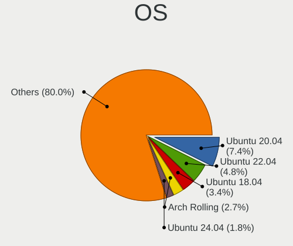

| Name                         | Notebooks | Percent |
|------------------------------|-----------|---------|
| Ubuntu 20.04                 | 145       | 7.39%   |
| Ubuntu 22.04                 | 94        | 4.79%   |
| Ubuntu 18.04                 | 66        | 3.37%   |
| Arch Rolling                 | 52        | 2.65%   |
| Ubuntu 24.04                 | 36        | 1.84%   |
| Debian 12                    | 34        | 1.73%   |
| Pop!_OS 22.04                | 32        | 1.63%   |
| BlackPanther 18.1            | 31        | 1.58%   |
| OpenMandriva 4.3             | 30        | 1.53%   |
| Fedora 39                    | 30        | 1.53%   |
| Zorin 17                     | 25        | 1.27%   |
| Manjaro                      | 25        | 1.27%   |
| openSUSE Tumbleweed-XXXXXXXX | 23        | 1.17%   |
| OpenMandriva 4.2             | 23        | 1.17%   |
| Zorin 16                     | 21        | 1.07%   |
| Fedora 42                    | 21        | 1.07%   |
| ArcoLinux Rolling            | 21        | 1.07%   |
| OpenMandriva 24.12           | 20        | 1.02%   |
| Pop!_OS 21.04                | 19        | 0.97%   |
| Debian 11                    | 19        | 0.97%   |
| Ubuntu 21.10                 | 18        | 0.92%   |
| Fedora 40                    | 18        | 0.92%   |
| OpenMandriva 23.08           | 17        | 0.87%   |
| KDE neon 20.04               | 17        | 0.87%   |
| Arch                         | 17        | 0.87%   |
| ROSA R10                     | 16        | 0.82%   |
| Linux Mint 21.2              | 16        | 0.82%   |
| Endless 3.7.8                | 16        | 0.82%   |
| Zorin 15                     | 15        | 0.76%   |
| Linux Mint 21.1              | 15        | 0.76%   |
| Endless 3.9.5                | 15        | 0.76%   |
| Endless 3.9.1                | 15        | 0.76%   |
| EndeavourOS Rolling          | 15        | 0.76%   |
| Fedora 38                    | 14        | 0.71%   |
| Pop!_OS 20.04                | 13        | 0.66%   |
| Fedora 41                    | 13        | 0.66%   |
| Ubuntu 23.04                 | 12        | 0.61%   |
| Linux Mint 22.1              | 12        | 0.61%   |
| Endless 3.8.6                | 12        | 0.61%   |
| Endless 3.8.0                | 12        | 0.61%   |

OS Family
---------

OS without a version

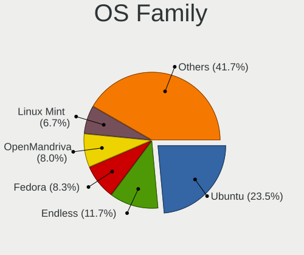

| Name         | Notebooks | Percent |
|--------------|-----------|---------|
| Ubuntu       | 429       | 23.53%  |
| Endless      | 213       | 11.68%  |
| Fedora       | 152       | 8.34%   |
| OpenMandriva | 146       | 8.01%   |
| Linux Mint   | 123       | 6.75%   |
| Pop!_OS      | 74        | 4.06%   |
| Debian       | 70        | 3.84%   |
| Zorin        | 69        | 3.78%   |
| Arch         | 67        | 3.68%   |
| Manjaro      | 48        | 2.63%   |
| BlackPanther | 44        | 2.41%   |
| ROSA         | 36        | 1.97%   |
| KDE neon     | 29        | 1.59%   |
| Kubuntu      | 28        | 1.54%   |
| openSUSE     | 27        | 1.48%   |
| ArcoLinux    | 23        | 1.26%   |
| Xubuntu      | 19        | 1.04%   |
| Kali         | 17        | 0.93%   |
| EndeavourOS  | 16        | 0.88%   |
| Elementary   | 15        | 0.82%   |
| Gentoo       | 14        | 0.77%   |
| SteamOS      | 12        | 0.66%   |
| Ubuntu Unity | 11        | 0.6%    |
| MX           | 10        | 0.55%   |
| Lubuntu      | 10        | 0.55%   |
| Garuda Linux | 10        | 0.55%   |
| Ubuntu MATE  | 9         | 0.49%   |
| Bazzite      | 9         | 0.49%   |
| NixOS        | 8         | 0.44%   |
| LMDE         | 8         | 0.44%   |
| Clear Linux  | 8         | 0.44%   |
| CachyOS      | 7         | 0.38%   |
| Nobara       | 5         | 0.27%   |
| Linux Lite   | 5         | 0.27%   |
| Void Linux   | 4         | 0.22%   |
| TUXEDO OS    | 4         | 0.22%   |
| RHEL         | 4         | 0.22%   |
| Peppermint   | 4         | 0.22%   |
| Artix        | 4         | 0.22%   |
| Xero         | 2         | 0.11%   |

Kernel
------

Version of the Linux kernel

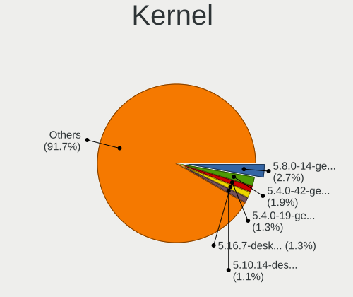

| Version                  | Notebooks | Percent |
|--------------------------|-----------|---------|
| 5.8.0-14-generic         | 56        | 2.73%   |
| 5.4.0-42-generic         | 39        | 1.9%    |
| 5.4.0-19-generic         | 26        | 1.27%   |
| 5.16.7-desktop-1omv4003  | 26        | 1.27%   |
| 5.10.14-desktop-1omv4002 | 23        | 1.12%   |
| 6.14.2-desktop-3omv2590  | 21        | 1.02%   |
| 5.3.0-28-generic         | 21        | 1.02%   |
| 4.18.16-desktop-1bP      | 21        | 1.02%   |
| 5.11.0-35-generic        | 16        | 0.78%   |
| 4.18.0-15-generic        | 14        | 0.68%   |
| 6.12.1-desktop-1omv2490  | 13        | 0.63%   |
| 5.3.0-23-generic         | 13        | 0.63%   |
| 5.0.0-25-generic         | 13        | 0.63%   |
| 6.6.32-power-1bP         | 12        | 0.58%   |
| 6.4.11-desktop-1omv2390  | 12        | 0.58%   |
| 5.0.0-20-generic         | 10        | 0.49%   |
| 4.15.0-15-generic        | 10        | 0.49%   |
| 6.8.0-51-generic         | 9         | 0.44%   |
| 6.1.1-desktop-1omv2290   | 9         | 0.44%   |
| 5.6.14-desktop-2bP       | 9         | 0.44%   |
| 6.2.6-desktop-1omv2390   | 8         | 0.39%   |
| 5.3.0-46-generic         | 8         | 0.39%   |
| 5.15.0-56-generic        | 8         | 0.39%   |
| 5.15.0-52-generic        | 8         | 0.39%   |
| 5.13.0-7614-generic      | 8         | 0.39%   |
| 5.0.0-37-generic         | 8         | 0.39%   |
| 6.9.3-76060903-generic   | 7         | 0.34%   |
| 6.8.0-52-generic         | 7         | 0.34%   |
| 5.8.0-50-generic         | 7         | 0.34%   |
| 5.4.0-56-generic         | 7         | 0.34%   |
| 5.4.0-54-generic         | 7         | 0.34%   |
| 5.4.0-40-generic         | 7         | 0.34%   |
| 5.4.0-26-generic         | 7         | 0.34%   |
| 5.3.0-51-generic         | 7         | 0.34%   |
| 5.3.0-19-generic         | 7         | 0.34%   |
| 5.3.0-12-generic         | 7         | 0.34%   |
| 5.19.0-32-generic        | 7         | 0.34%   |
| 5.15.0-71-generic        | 7         | 0.34%   |
| 5.15.0-48-generic        | 7         | 0.34%   |
| 5.11.0-7620-generic      | 7         | 0.34%   |

Kernel Family
-------------

Linux kernel without a distro release

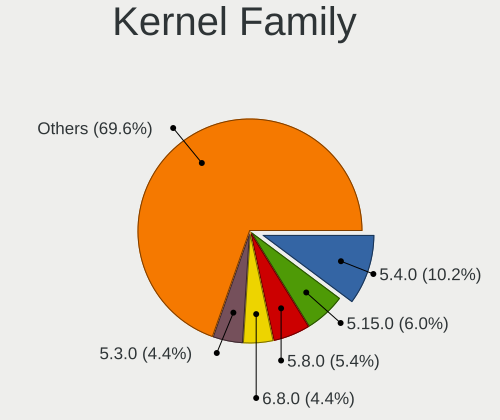

| Version | Notebooks | Percent |
|---------|-----------|---------|
| 5.4.0   | 203       | 10.21%  |
| 5.15.0  | 119       | 5.99%   |
| 5.8.0   | 108       | 5.43%   |
| 6.8.0   | 87        | 4.38%   |
| 5.3.0   | 87        | 4.38%   |
| 5.11.0  | 70        | 3.52%   |
| 5.0.0   | 63        | 3.17%   |
| 4.15.0  | 59        | 2.97%   |
| 6.5.0   | 55        | 2.77%   |
| 5.13.0  | 54        | 2.72%   |
| 6.1.0   | 42        | 2.11%   |
| 4.18.0  | 40        | 2.01%   |
| 6.2.0   | 39        | 1.96%   |
| 6.14.0  | 37        | 1.86%   |
| 5.19.0  | 33        | 1.66%   |
| 5.16.7  | 26        | 1.31%   |
| 5.10.0  | 26        | 1.31%   |
| 5.10.14 | 24        | 1.21%   |
| 6.11.0  | 23        | 1.16%   |
| 6.14.2  | 22        | 1.11%   |
| 4.18.16 | 21        | 1.06%   |
| 6.4.11  | 14        | 0.7%    |
| 6.6.32  | 13        | 0.65%   |
| 6.2.6   | 13        | 0.65%   |
| 6.12.1  | 13        | 0.65%   |
| 6.9.3   | 11        | 0.55%   |
| 6.1.1   | 11        | 0.55%   |
| 5.6.14  | 10        | 0.5%    |
| 6.6.2   | 9         | 0.45%   |
| 6.5.6   | 8         | 0.4%    |
| 6.17.7  | 8         | 0.4%    |
| 4.9.60  | 8         | 0.4%    |
| 4.9.20  | 8         | 0.4%    |
| 4.13.0  | 8         | 0.4%    |
| 6.5.5   | 7         | 0.35%   |
| 6.4.8   | 7         | 0.35%   |
| 6.16.3  | 7         | 0.35%   |
| 6.12.9  | 7         | 0.35%   |
| 6.12.6  | 7         | 0.35%   |
| 6.5.9   | 6         | 0.3%    |

Kernel Major Ver.
-----------------

Linux kernel major version

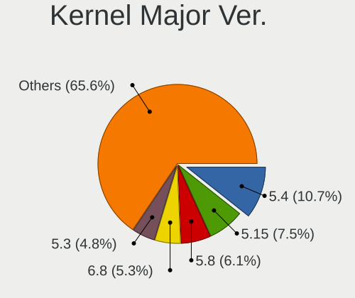

| Version | Notebooks | Percent |
|---------|-----------|---------|
| 5.4     | 210       | 10.67%  |
| 5.15    | 148       | 7.52%   |
| 5.8     | 121       | 6.15%   |
| 6.8     | 105       | 5.33%   |
| 5.3     | 94        | 4.77%   |
| 6.5     | 86        | 4.37%   |
| 6.1     | 83        | 4.22%   |
| 5.11    | 80        | 4.06%   |
| 6.14    | 65        | 3.3%    |
| 6.12    | 65        | 3.3%    |
| 5.10    | 65        | 3.3%    |
| 5.0     | 65        | 3.3%    |
| 6.2     | 63        | 3.2%    |
| 4.18    | 63        | 3.2%    |
| 4.15    | 59        | 3%      |
| 5.13    | 58        | 2.95%   |
| 6.6     | 56        | 2.84%   |
| 5.19    | 47        | 2.39%   |
| 5.16    | 44        | 2.23%   |
| 6.11    | 40        | 2.03%   |
| 6.16    | 28        | 1.42%   |
| 4.9     | 27        | 1.37%   |
| 6.9     | 26        | 1.32%   |
| 6.17    | 26        | 1.32%   |
| 6.4     | 25        | 1.27%   |
| 6.10    | 18        | 0.91%   |
| 6.0     | 18        | 0.91%   |
| 5.6     | 18        | 0.91%   |
| 5.9     | 15        | 0.76%   |
| 5.17    | 15        | 0.76%   |
| 6.7     | 14        | 0.71%   |
| 6.3     | 14        | 0.71%   |
| 6.15    | 14        | 0.71%   |
| 5.18    | 14        | 0.71%   |
| 5.14    | 13        | 0.66%   |
| 6.13    | 12        | 0.61%   |
| 5.12    | 10        | 0.51%   |
| 4.13    | 8         | 0.41%   |
| 4.19    | 7         | 0.36%   |
| 5.7     | 6         | 0.3%    |

Arch
----

OS architecture (x86_64, i586, etc.)

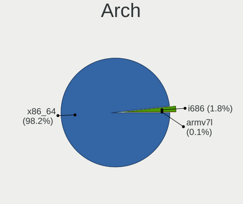

| Name   | Notebooks | Percent |
|--------|-----------|---------|
| x86_64 | 1709      | 98.16%  |
| i686   | 31        | 1.78%   |
| armv7l | 1         | 0.06%   |

DE
--

Desktop Environment

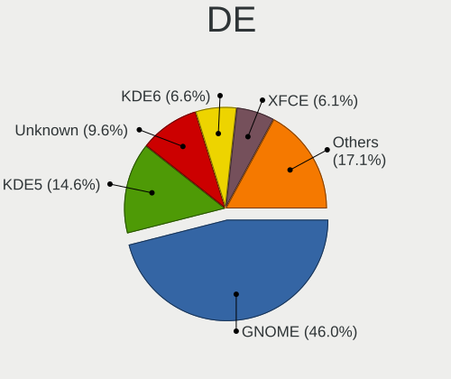

| Name            | Notebooks | Percent |
|-----------------|-----------|---------|
| GNOME           | 842       | 46.04%  |
| KDE5            | 267       | 14.6%   |
| Unknown         | 175       | 9.57%   |
| KDE6            | 120       | 6.56%   |
| XFCE            | 112       | 6.12%   |
| X-Cinnamon      | 111       | 6.07%   |
| KDE             | 33        | 1.8%    |
| MATE            | 28        | 1.53%   |
| KDE4            | 24        | 1.31%   |
| LXQt            | 21        | 1.15%   |
| Pantheon        | 14        | 0.77%   |
| Unity           | 11        | 0.6%    |
| Cinnamon        | 10        | 0.55%   |
| i3              | 9         | 0.49%   |
| LXDE            | 8         | 0.44%   |
| Hyprland        | 8         | 0.44%   |
| sway            | 5         | 0.27%   |
| Endless:GNOME   | 5         | 0.27%   |
| Budgie          | 4         | 0.22%   |
| GNOME Classic   | 3         | 0.16%   |
| xmonad          | 2         | 0.11%   |
| GNOME Flashback | 2         | 0.11%   |
| DWM             | 2         | 0.11%   |
| Deepin          | 2         | 0.11%   |
| bspwm           | 2         | 0.11%   |
| ubuntu          | 1         | 0.05%   |
| qtile           | 1         | 0.05%   |
| niri            | 1         | 0.05%   |
| LeftWM          | 1         | 0.05%   |
| jwm             | 1         | 0.05%   |
| i3-with-shmlog  | 1         | 0.05%   |
| Enlightenment   | 1         | 0.05%   |
| COSMIC          | 1         | 0.05%   |
| awesome         | 1         | 0.05%   |

Display Server
--------------

X11 or Wayland

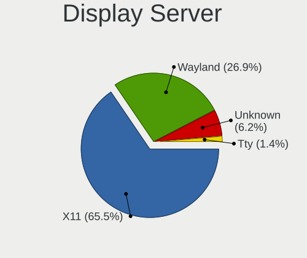

| Name    | Notebooks | Percent |
|---------|-----------|---------|
| X11     | 1180      | 65.48%  |
| Wayland | 485       | 26.91%  |
| Unknown | 112       | 6.22%   |
| Tty     | 25        | 1.39%   |

Display Manager
---------------

SDDM, LightDM, etc.

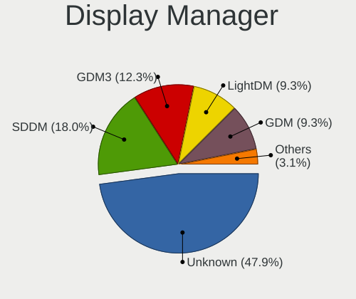

| Name                  | Notebooks | Percent |
|-----------------------|-----------|---------|
| Unknown               | 872       | 47.89%  |
| SDDM                  | 328       | 18.01%  |
| GDM3                  | 224       | 12.3%   |
| LightDM               | 170       | 9.34%   |
| GDM                   | 170       | 9.34%   |
| TDM                   | 24        | 1.32%   |
| KDM                   | 23        | 1.26%   |
| XDM                   | 4         | 0.22%   |
| SLiM                  | 3         | 0.16%   |
| GREETD                | 2         | 0.11%   |
| DISPLAY-MANAGER-START | 1         | 0.05%   |

OS Lang
-------

Language

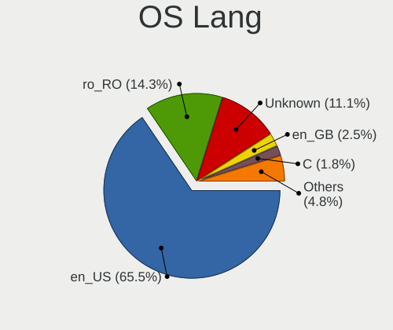

| Lang        | Notebooks | Percent |
|-------------|-----------|---------|
| en_US       | 1174      | 65.51%  |
| ro_RO       | 256       | 14.29%  |
| Unknown     | 199       | 11.1%   |
| en_GB       | 44        | 2.46%   |
| C           | 33        | 1.84%   |
| hu_HU       | 26        | 1.45%   |
| it_IT       | 11        | 0.61%   |
| es_ES       | 10        | 0.56%   |
| fr_FR       | 9         | 0.5%    |
| de_DE       | 7         | 0.39%   |
| ru_RU       | 3         | 0.17%   |
| en_IL       | 3         | 0.17%   |
| C.UTF8      | 3         | 0.17%   |
| en_IE       | 2         | 0.11%   |
| uk_UA       | 1         | 0.06%   |
| tr_TR       | 1         | 0.06%   |
| POSIX       | 1         | 0.06%   |
| fr_CH       | 1         | 0.06%   |
| en_US.UTF8  | 1         | 0.06%   |
| en_US.UTF.8 | 1         | 0.06%   |
| en_IN       | 1         | 0.06%   |
| en_DK       | 1         | 0.06%   |
| en_CA       | 1         | 0.06%   |
| en_AG       | 1         | 0.06%   |
| en_001      | 1         | 0.06%   |
| de_IT       | 1         | 0.06%   |

Boot Mode
---------

EFI or BIOS

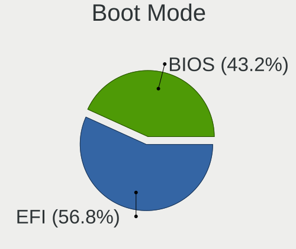

| Mode | Notebooks | Percent |
|------|-----------|---------|
| EFI  | 1015      | 56.77%  |
| BIOS | 773       | 43.23%  |

Filesystem
----------

Type of filesystem

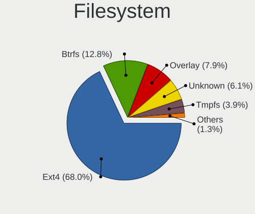

| Type     | Notebooks | Percent |
|----------|-----------|---------|
| Ext4     | 1221      | 68.02%  |
| Btrfs    | 229       | 12.76%  |
| Overlay  | 141       | 7.86%   |
| Unknown  | 110       | 6.13%   |
| Tmpfs    | 70        | 3.9%    |
| Xfs      | 11        | 0.61%   |
| Zfs      | 7         | 0.39%   |
| F2fs     | 2         | 0.11%   |
| Ext2     | 2         | 0.11%   |
| Rootfs   | 1         | 0.06%   |
| Bcachefs | 1         | 0.06%   |

Part. scheme
------------

Scheme of partitioning

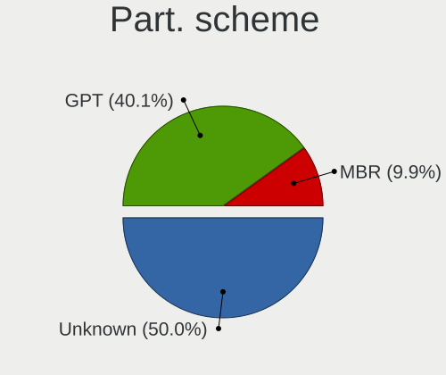

| Type    | Notebooks | Percent |
|---------|-----------|---------|
| Unknown | 891       | 50%     |
| GPT     | 714       | 40.07%  |
| MBR     | 177       | 9.93%   |

Dual Boot with Linux/BSD
------------------------

Hosting more than one Linux/BSD

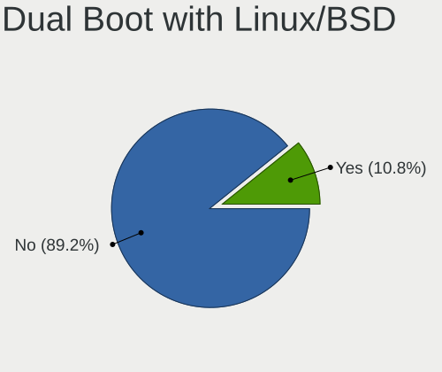

| Dual boot | Notebooks | Percent |
|-----------|-----------|---------|
| No        | 1576      | 89.24%  |
| Yes       | 190       | 10.76%  |

Dual Boot (Win)
---------------

Hosting Linux and Windows

| Dual boot | Notebooks | Percent |
|-----------|-----------|---------|
| No        | 1306      | 73.74%  |
| Yes       | 465       | 26.26%  |

Board
-----

Vendor
------

Motherboard manufacturer

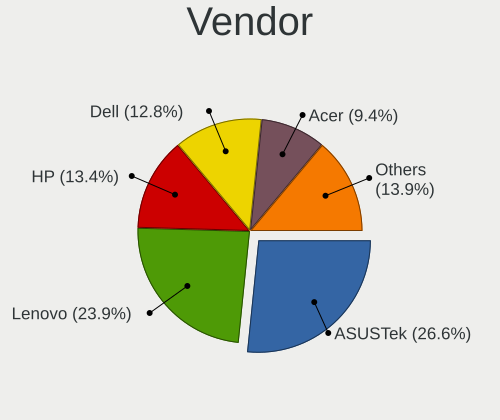

| Name                | Notebooks | Percent |
|---------------------|-----------|---------|
| ASUSTek Computer    | 463       | 26.61%  |
| Lenovo              | 415       | 23.85%  |
| Hewlett-Packard     | 234       | 13.45%  |
| Dell                | 222       | 12.76%  |
| Acer                | 164       | 9.43%   |
| Toshiba             | 33        | 1.9%    |
| MSI                 | 24        | 1.38%   |
| HUAWEI              | 17        | 0.98%   |
| Apple               | 17        | 0.98%   |
| Sony                | 14        | 0.8%    |
| Complet             | 11        | 0.63%   |
| Valve               | 10        | 0.57%   |
| Fujitsu             | 9         | 0.52%   |
| Allview             | 9         | 0.52%   |
| Samsung Electronics | 8         | 0.46%   |
| Medion              | 8         | 0.46%   |
| Fujitsu Siemens     | 8         | 0.46%   |
| Unknown             | 7         | 0.4%    |
| Google              | 6         | 0.34%   |
| Chuwi               | 6         | 0.34%   |
| TUXEDO              | 5         | 0.29%   |
| Gigabyte Technology | 4         | 0.23%   |
| Alienware           | 4         | 0.23%   |
| Packard Bell        | 3         | 0.17%   |
| Timi                | 2         | 0.11%   |
| Schenker            | 2         | 0.11%   |
| Jumper              | 2         | 0.11%   |
| Hampoo              | 2         | 0.11%   |
| WEIGO               | 1         | 0.06%   |
| Visual Fan          | 1         | 0.06%   |
| VALE                | 1         | 0.06%   |
| Thomson             | 1         | 0.06%   |
| System76            | 1         | 0.06%   |
| SLIMBOOK            | 1         | 0.06%   |
| Razer               | 1         | 0.06%   |
| Prestigio           | 1         | 0.06%   |
| Pegatron            | 1         | 0.06%   |
| PC Specialist       | 1         | 0.06%   |
| Panasonic           | 1         | 0.06%   |
| Notebook            | 1         | 0.06%   |

Model
-----

Motherboard model

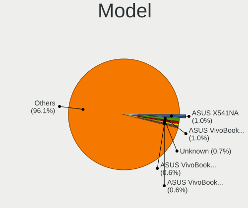

| Name                                       | Notebooks | Percent |
|--------------------------------------------|-----------|---------|
| ASUS X541NA                                | 18        | 1.03%   |
| ASUS VivoBook 15_ASUS Laptop X540MA_X543MA | 18        | 1.03%   |
| Unknown                                    | 12        | 0.69%   |
| ASUS VivoBook_ASUSLaptop X509FA_X509FA     | 10        | 0.57%   |
| ASUS VivoBook 15_ASUS Laptop X540MA_X540MA | 10        | 0.57%   |
| Valve Jupiter                              | 9         | 0.52%   |
| Dell XPS 15 9530                           | 9         | 0.52%   |
| ASUS X541UVK                               | 9         | 0.52%   |
| Lenovo Legion Y530-15ICH 81FV              | 8         | 0.46%   |
| ASUS X541UAK                               | 8         | 0.46%   |
| Complet MY8312                             | 7         | 0.4%    |
| ASUS X406UAR                               | 7         | 0.4%    |
| HP Notebook                                | 6         | 0.34%   |
| Dell Latitude E6420                        | 6         | 0.34%   |
| ASUS VivoBook_ASUSLaptop X509FB_X509FB     | 6         | 0.34%   |
| ASUS VivoBook 15_ASUS Laptop X540MA_A540MA | 6         | 0.34%   |
| Lenovo IdeaPad Gaming 3 15ARH05 82EY       | 5         | 0.29%   |
| Dell Latitude E7440                        | 5         | 0.29%   |
| Dell Latitude E6410                        | 5         | 0.29%   |
| ASUS X542UAR                               | 5         | 0.29%   |
| ASUS VivoBook_ASUSLaptop X512DA_X512DA     | 5         | 0.29%   |
| ASUS VivoBook_ASUSLaptop X509DAP_M509DA    | 5         | 0.29%   |
| ASUS VivoBook_ASUSLaptop X1504ZA_X1504ZA   | 5         | 0.29%   |
| ASUS VivoBook_ASUS Laptop X505ZA_A505ZA    | 5         | 0.29%   |
| ASUS VivoBook 15_ASUS Laptop X540UAR       | 5         | 0.29%   |
| ASUS GL552JX                               | 5         | 0.29%   |
| Allview Allbook H                          | 5         | 0.29%   |
| Acer Aspire E5-573G                        | 5         | 0.29%   |
| Acer Aspire A315-21G                       | 5         | 0.29%   |
| Lenovo V330-15IKB 81AX                     | 4         | 0.23%   |
| Lenovo Legion Y540-17IRH 81Q4              | 4         | 0.23%   |
| Lenovo IdeaPad Y700-15ISK 80NV             | 4         | 0.23%   |
| Lenovo IdeaPad Slim 5 14AHP9 83DB          | 4         | 0.23%   |
| Lenovo IdeaPad Gaming 3 15ACH6 82K2        | 4         | 0.23%   |
| Lenovo IdeaPad 5 Pro 16ACH6 82L5           | 4         | 0.23%   |
| Lenovo IdeaPad 330-15IKB 81DE              | 4         | 0.23%   |
| Lenovo IdeaPad 100-15IBD 80QQ              | 4         | 0.23%   |
| Lenovo IdeaPad 1 15AMN7 82VG               | 4         | 0.23%   |
| Lenovo G510 20238                          | 4         | 0.23%   |
| Lenovo B50-80 80EW                         | 4         | 0.23%   |

Model Family
------------

Motherboard model prefix

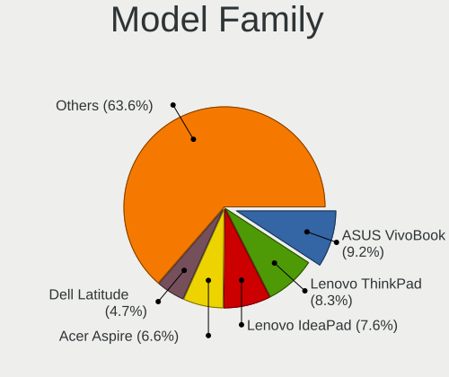

| Name              | Notebooks | Percent |
|-------------------|-----------|---------|
| ASUS VivoBook     | 160       | 9.2%    |
| Lenovo ThinkPad   | 145       | 8.33%   |
| Lenovo IdeaPad    | 133       | 7.64%   |
| Acer Aspire       | 114       | 6.55%   |
| Dell Latitude     | 81        | 4.66%   |
| Dell Inspiron     | 61        | 3.51%   |
| Lenovo Legion     | 50        | 2.87%   |
| HP EliteBook      | 49        | 2.82%   |
| ASUS ASUS         | 46        | 2.64%   |
| HP ProBook        | 38        | 2.18%   |
| HP Pavilion       | 37        | 2.13%   |
| ASUS ROG          | 33        | 1.9%    |
| Toshiba Satellite | 31        | 1.78%   |
| HP Laptop         | 24        | 1.38%   |
| Dell XPS          | 24        | 1.38%   |
| Dell Precision    | 20        | 1.15%   |
| ASUS X541NA       | 18        | 1.03%   |
| Lenovo ThinkBook  | 16        | 0.92%   |
| Dell Vostro       | 16        | 0.92%   |
| ASUS ZenBook      | 16        | 0.92%   |
| Acer Nitro        | 14        | 0.8%    |
| HP 250            | 13        | 0.75%   |
| Lenovo Yoga       | 12        | 0.69%   |
| HP ZBook          | 12        | 0.69%   |
| HP OMEN           | 12        | 0.69%   |
| Unknown           | 12        | 0.69%   |
| ASUS TUF          | 11        | 0.63%   |
| Acer Swift        | 10        | 0.57%   |
| Acer Extensa      | 10        | 0.57%   |
| Valve Jupiter     | 9         | 0.52%   |
| ASUS X541UVK      | 9         | 0.52%   |
| Allview Allbook   | 9         | 0.52%   |
| HP Compaq         | 8         | 0.46%   |
| Fujitsu LIFEBOOK  | 8         | 0.46%   |
| ASUS X541UAK      | 8         | 0.46%   |
| HP ENVY           | 7         | 0.4%    |
| Dell System       | 7         | 0.4%    |
| Complet MY8312    | 7         | 0.4%    |
| ASUS X406UAR      | 7         | 0.4%    |
| Lenovo LOQ        | 6         | 0.34%   |

MFG Year
--------

Motherboard manufacture year

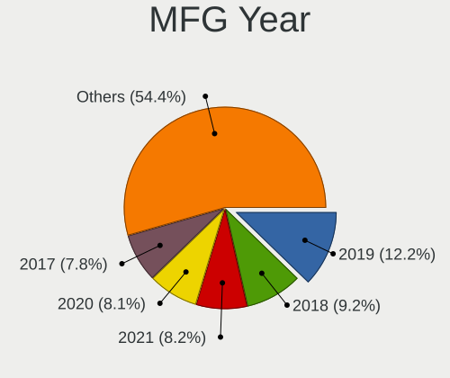

| Year    | Notebooks | Percent |
|---------|-----------|---------|
| 2019    | 213       | 12.24%  |
| 2018    | 160       | 9.2%    |
| 2021    | 143       | 8.22%   |
| 2020    | 141       | 8.1%    |
| 2017    | 136       | 7.82%   |
| 2015    | 106       | 6.09%   |
| 2013    | 98        | 5.63%   |
| 2022    | 89        | 5.11%   |
| 2011    | 89        | 5.11%   |
| 2014    | 82        | 4.71%   |
| 2012    | 81        | 4.66%   |
| 2023    | 73        | 4.2%    |
| 2016    | 69        | 3.97%   |
| 2010    | 66        | 3.79%   |
| 2024    | 54        | 3.1%    |
| 2008    | 44        | 2.53%   |
| 2009    | 36        | 2.07%   |
| 2007    | 35        | 2.01%   |
| 2006    | 15        | 0.86%   |
| 2025    | 5         | 0.29%   |
| Unknown | 3         | 0.17%   |
| 2005    | 1         | 0.06%   |
| 2004    | 1         | 0.06%   |

Form Factor
-----------

Physical design of the computer

| Name     | Notebooks | Percent |
|----------|-----------|---------|
| Notebook | 1740      | 100%    |

Secure Boot
-----------

Enabled or disabled

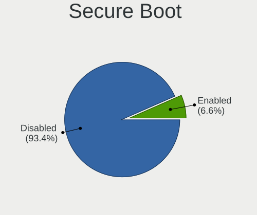

| State    | Notebooks | Percent |
|----------|-----------|---------|
| Disabled | 1637      | 93.38%  |
| Enabled  | 116       | 6.62%   |

Coreboot
--------

Have coreboot on board

| Used | Notebooks | Percent |
|------|-----------|---------|
| No   | 1734      | 99.66%  |
| Yes  | 6         | 0.34%   |

RAM Size
--------

Total RAM memory

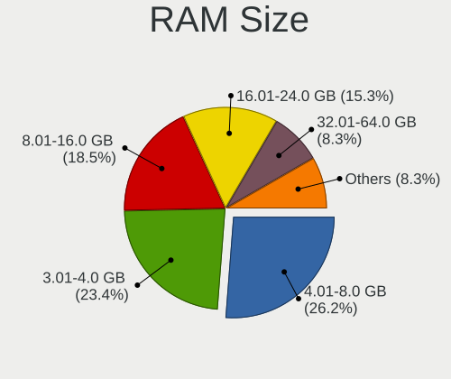

| Size in GB  | Notebooks | Percent |
|-------------|-----------|---------|
| 4.01-8.0    | 462       | 26.22%  |
| 3.01-4.0    | 413       | 23.44%  |
| 8.01-16.0   | 326       | 18.5%   |
| 16.01-24.0  | 269       | 15.27%  |
| 32.01-64.0  | 146       | 8.29%   |
| 1.01-2.0    | 61        | 3.46%   |
| 24.01-32.0  | 40        | 2.27%   |
| 64.01-256.0 | 18        | 1.02%   |
| 2.01-3.0    | 16        | 0.91%   |
| 0.51-1.0    | 11        | 0.62%   |

RAM Used
--------

Used RAM memory

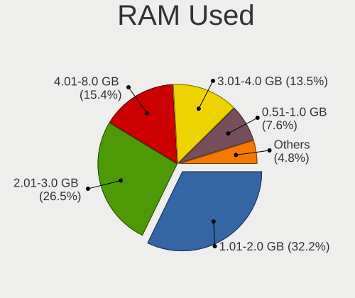

| Used GB    | Notebooks | Percent |
|------------|-----------|---------|
| 1.01-2.0   | 628       | 32.22%  |
| 2.01-3.0   | 516       | 26.48%  |
| 4.01-8.0   | 300       | 15.39%  |
| 3.01-4.0   | 263       | 13.49%  |
| 0.51-1.0   | 148       | 7.59%   |
| 8.01-16.0  | 67        | 3.44%   |
| 0.01-0.5   | 14        | 0.72%   |
| 16.01-24.0 | 8         | 0.41%   |
| 24.01-32.0 | 4         | 0.21%   |
| 32.01-64.0 | 1         | 0.05%   |

Total Drives
------------

Number of drives on board

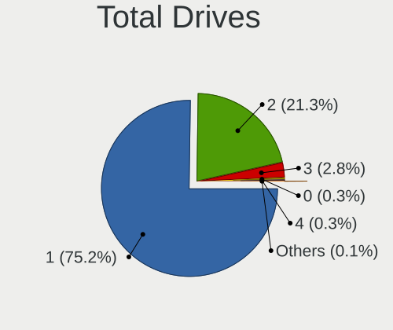

| Drives | Notebooks | Percent |
|--------|-----------|---------|
| 1      | 1330      | 75.23%  |
| 2      | 376       | 21.27%  |
| 3      | 49        | 2.77%   |
| 0      | 6         | 0.34%   |
| 4      | 5         | 0.28%   |
| 5      | 2         | 0.11%   |

Has CD-ROM
----------

Has CD-ROM on board

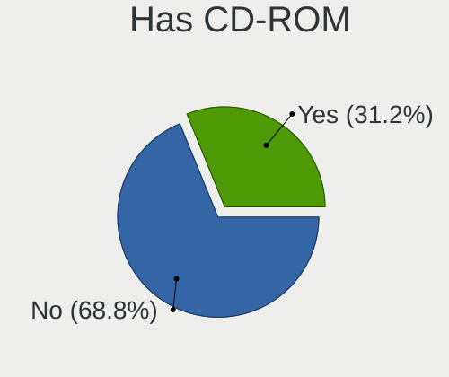

| Presented | Notebooks | Percent |
|-----------|-----------|---------|
| No        | 1204      | 68.84%  |
| Yes       | 545       | 31.16%  |

Has Ethernet
------------

Has Ethernet on board

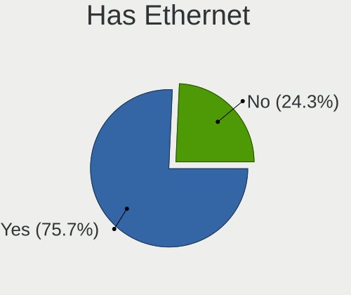

| Presented | Notebooks | Percent |
|-----------|-----------|---------|
| Yes       | 1322      | 75.72%  |
| No        | 424       | 24.28%  |

Has WiFi
--------

Has WiFi module

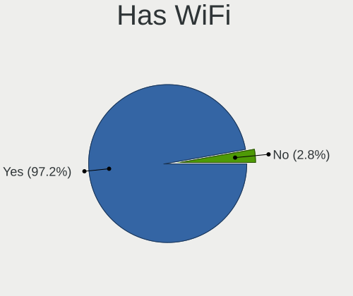

| Presented | Notebooks | Percent |
|-----------|-----------|---------|
| Yes       | 1693      | 97.19%  |
| No        | 49        | 2.81%   |

Has Bluetooth
-------------

Has Bluetooth module

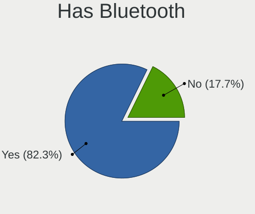

| Presented | Notebooks | Percent |
|-----------|-----------|---------|
| Yes       | 1446      | 82.25%  |
| No        | 312       | 17.75%  |

Location
--------

Country
-------

Geographic location (country)

| Country | Notebooks | Percent |
|---------|-----------|---------|
| Romania | 1740      | 100%    |

City
----

Geographic location (city)

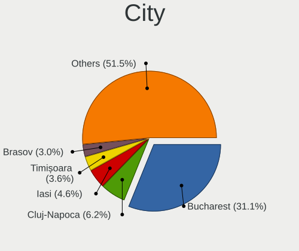

| City               | Notebooks | Percent |
|--------------------|-----------|---------|
| Bucharest          | 576       | 31.14%  |
| Cluj-Napoca        | 114       | 6.16%   |
| Iasi               | 86        | 4.65%   |
| Timișoara         | 66        | 3.57%   |
| Brasov             | 55        | 2.97%   |
| Ploieşti          | 53        | 2.86%   |
| Târgu Mureş      | 43        | 2.32%   |
| Constanța         | 40        | 2.16%   |
| Sibiu              | 32        | 1.73%   |
| Craiova            | 28        | 1.51%   |
| Arad               | 28        | 1.51%   |
| Piteşti           | 27        | 1.46%   |
| Oradea             | 26        | 1.41%   |
| Râmnicu Vâlcea   | 21        | 1.14%   |
| Popesti-Leordeni   | 19        | 1.03%   |
| Miercurea-Ciuc     | 19        | 1.03%   |
| Galati             | 18        | 0.97%   |
| Botosani           | 17        | 0.92%   |
| Baia Mare          | 16        | 0.86%   |
| Zalău             | 14        | 0.76%   |
| Voluntari          | 14        | 0.76%   |
| Bacau              | 14        | 0.76%   |
| Buzau              | 13        | 0.7%    |
| Floresti           | 12        | 0.65%   |
| Braila             | 12        | 0.65%   |
| Mediaş            | 11        | 0.59%   |
| Deva               | 11        | 0.59%   |
| Târgu Jiu         | 10        | 0.54%   |
| Targoviste         | 10        | 0.54%   |
| Roman              | 10        | 0.54%   |
| Reşiţa           | 10        | 0.54%   |
| Focşani           | 10        | 0.54%   |
| Tulcea             | 9         | 0.49%   |
| Alba Iulia         | 9         | 0.49%   |
| Suceava            | 8         | 0.43%   |
| Slatina            | 8         | 0.43%   |
| Mangalia           | 8         | 0.43%   |
| Sighetu Marmaţiei | 7         | 0.38%   |
| Piatra Neamţ      | 7         | 0.38%   |
| Satu Mare          | 6         | 0.32%   |

Drives
------

Drive Vendor
------------

Hard drive vendors

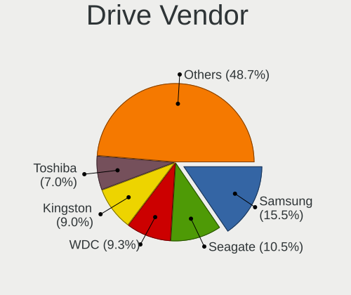

| Vendor                      | Notebooks | Drives | Percent |
|-----------------------------|-----------|--------|---------|
| Samsung Electronics         | 335       | 437    | 15.47%  |
| Seagate                     | 228       | 299    | 10.53%  |
| WDC                         | 201       | 240    | 9.28%   |
| Kingston                    | 195       | 239    | 9.01%   |
| Toshiba                     | 152       | 182    | 7.02%   |
| SanDisk                     | 144       | 167    | 6.65%   |
| SK hynix                    | 115       | 149    | 5.31%   |
| Micron Technology           | 98        | 128    | 4.53%   |
| Intel                       | 96        | 128    | 4.43%   |
| Unknown                     | 92        | 117    | 4.25%   |
| A-DATA Technology           | 77        | 95     | 3.56%   |
| HGST                        | 60        | 72     | 2.77%   |
| Hitachi                     | 48        | 51     | 2.22%   |
| Kingston Technology Company | 26        | 34     | 1.2%    |
| KIOXIA                      | 24        | 26     | 1.11%   |
| Crucial                     | 24        | 30     | 1.11%   |
| SPCC                        | 11        | 14     | 0.51%   |
| China                       | 11        | 13     | 0.51%   |
| Phison                      | 10        | 11     | 0.46%   |
| Patriot                     | 10        | 10     | 0.46%   |
| Fujitsu                     | 10        | 13     | 0.46%   |
| Apple                       | 10        | 11     | 0.46%   |
| Netac                       | 9         | 11     | 0.42%   |
| FORESEE                     | 9         | 10     | 0.42%   |
| Phison Electronics          | 8         | 8      | 0.37%   |
| Hewlett-Packard             | 8         | 8      | 0.37%   |
| ADATA Technology            | 8         | 10     | 0.37%   |
| Silicon Motion              | 7         | 8      | 0.32%   |
| LITEON                      | 6         | 6      | 0.28%   |
| Gigabyte Technology         | 6         | 6      | 0.28%   |
| Corsair                     | 6         | 7      | 0.28%   |
| Unknown                     | 6         | 6      | 0.28%   |
| Realtek Semiconductor       | 5         | 5      | 0.23%   |
| GOODRAM                     | 5         | 6      | 0.23%   |
| XPG                         | 4         | 5      | 0.18%   |
| Transcend                   | 4         | 5      | 0.18%   |
| OCZ                         | 4         | 6      | 0.18%   |
| LITEONIT                    | 4         | 4      | 0.18%   |
| Kingmax                     | 4         | 4      | 0.18%   |
| Intenso                     | 4         | 4      | 0.18%   |

Drive Model
-----------

Hard drive models

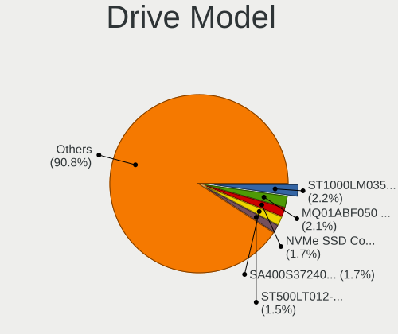

| Model                                              | Notebooks | Percent |
|----------------------------------------------------|-----------|---------|
| Seagate ST1000LM035-1RK172 1TB                     | 49        | 2.19%   |
| Toshiba MQ01ABF050 500GB                           | 48        | 2.14%   |
| Samsung NVMe SSD Controller SM981/PM981/PM983 1TB  | 38        | 1.7%    |
| Kingston SA400S37240G 240GB SSD                    | 38        | 1.7%    |
| Seagate ST500LT012-1DG142 500GB                    | 33        | 1.47%   |
| HGST HTS721010A9E630 1TB                           | 26        | 1.16%   |
| Kingston SA400S37480G 480GB SSD                    | 25        | 1.12%   |
| Toshiba MQ04ABF100 1TB                             | 23        | 1.03%   |
| Unknown MMC Card  32GB                             | 21        | 0.94%   |
| SanDisk NVMe SSD Drive 512GB                       | 19        | 0.85%   |
| Seagate ST1000LM024 HN-M101MBB 1TB                 | 18        | 0.8%    |
| Toshiba MQ01ABD100 1TB                             | 17        | 0.76%   |
| SanDisk NVMe SSD Drive 256GB                       | 17        | 0.76%   |
| Samsung NVMe SSD Drive 512GB                       | 17        | 0.76%   |
| Samsung NVMe SSD Controller PM9A1/PM9A3/980PRO 1TB | 15        | 0.67%   |
| Kingston Company SNV2S1000G 1TB                    | 13        | 0.58%   |
| Unknown MMC Card  64GB                             | 12        | 0.54%   |
| SK hynix HFS256G39TND-N210A 256GB SSD              | 12        | 0.54%   |
| Sandisk WD Blue SN550 NVMe SSD 1024GB              | 12        | 0.54%   |
| HGST HTS545050A7E680 500GB                         | 12        | 0.54%   |
| SK hynix NVMe SSD Drive 512GB                      | 11        | 0.49%   |
| SanDisk NVMe SSD Drive 1TB                         | 11        | 0.49%   |
| Kingston SV300S37A240G 240GB SSD                   | 11        | 0.49%   |
| WDC WD10SPZX-21Z10T0 1TB                           | 10        | 0.45%   |
| Samsung SSD 860 EVO 500GB                          | 10        | 0.45%   |
| Intel NVMe SSD Drive 512GB                         | 10        | 0.45%   |
| HGST HTS541010A9E680 1TB                           | 10        | 0.45%   |
| A-DATA SU630 240GB SSD                             | 10        | 0.45%   |
| SK hynix HFM001TD3JX013N 1024GB                    | 9         | 0.4%    |
| Seagate Expansion 2TB                              | 9         | 0.4%    |
| Samsung NVMe SSD Drive 256GB                       | 9         | 0.4%    |
| Kingston SV300S37A120G 120GB SSD                   | 9         | 0.4%    |
| Kingston SA400S37120G 120GB SSD                    | 9         | 0.4%    |
| Intel SSDPEKNU512GZ 512GB                          | 9         | 0.4%    |
| A-DATA SU650 240GB SSD                             | 9         | 0.4%    |
| WDC WD10JPCX-24UE4T0 1TB                           | 8         | 0.36%   |
| Unknown NVMe SSD Drive 512GB                       | 8         | 0.36%   |
| Unknown MMC Card  128GB                            | 8         | 0.36%   |
| Seagate ST1000LX015-1U7172 1TB                     | 8         | 0.36%   |
| Samsung SSD 850 EVO 250GB                          | 8         | 0.36%   |

HDD Vendor
----------

Hard disk drive vendors

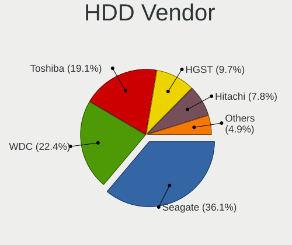

| Vendor              | Notebooks | Drives | Percent |
|---------------------|-----------|--------|---------|
| Seagate             | 223       | 293    | 36.14%  |
| WDC                 | 138       | 165    | 22.37%  |
| Toshiba             | 118       | 144    | 19.12%  |
| HGST                | 60        | 72     | 9.72%   |
| Hitachi             | 48        | 51     | 7.78%   |
| Fujitsu             | 10        | 13     | 1.62%   |
| Samsung Electronics | 5         | 7      | 0.81%   |
| Unknown             | 4         | 4      | 0.65%   |
| TO Exter            | 2         | 4      | 0.32%   |
| IBM/Hitachi         | 2         | 2      | 0.32%   |
| Apple               | 2         | 2      | 0.32%   |
| XrayDisk            | 1         | 1      | 0.16%   |
| T-FORCE             | 1         | 2      | 0.16%   |
| HGST HTS            | 1         | 1      | 0.16%   |
| External            | 1         | 1      | 0.16%   |
| ASMT                | 1         | 1      | 0.16%   |

SSD Vendor
----------

Solid state drive vendors

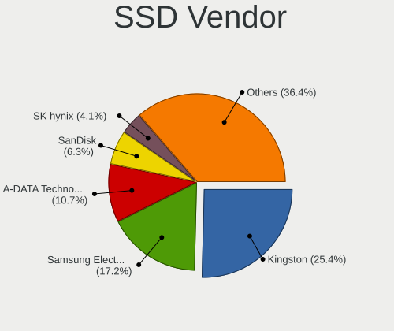

| Vendor              | Notebooks | Drives | Percent |
|---------------------|-----------|--------|---------|
| Kingston            | 162       | 202    | 25.39%  |
| Samsung Electronics | 110       | 143    | 17.24%  |
| A-DATA Technology   | 68        | 86     | 10.66%  |
| SanDisk             | 40        | 48     | 6.27%   |
| SK hynix            | 26        | 39     | 4.08%   |
| Micron Technology   | 26        | 32     | 4.08%   |
| Crucial             | 21        | 27     | 3.29%   |
| WDC                 | 20        | 20     | 3.13%   |
| Intel               | 17        | 18     | 2.66%   |
| SPCC                | 11        | 14     | 1.72%   |
| China               | 11        | 13     | 1.72%   |
| Patriot             | 9         | 9      | 1.41%   |
| Netac               | 9         | 11     | 1.41%   |
| FORESEE             | 9         | 10     | 1.41%   |
| Toshiba             | 8         | 8      | 1.25%   |
| Hewlett-Packard     | 8         | 8      | 1.25%   |
| Gigabyte Technology | 6         | 6      | 0.94%   |
| LITEON              | 5         | 5      | 0.78%   |
| GOODRAM             | 5         | 6      | 0.78%   |
| Corsair             | 5         | 6      | 0.78%   |
| OCZ                 | 4         | 6      | 0.63%   |
| LITEONIT            | 4         | 4      | 0.63%   |
| Kingmax             | 4         | 4      | 0.63%   |
| Intenso             | 4         | 4      | 0.63%   |
| Emtec               | 4         | 4      | 0.63%   |
| Transcend           | 3         | 4      | 0.47%   |
| ASMT                | 3         | 3      | 0.47%   |
| Apacer              | 3         | 5      | 0.47%   |
| Verbatim            | 2         | 2      | 0.31%   |
| Teclast             | 2         | 2      | 0.31%   |
| Team                | 2         | 2      | 0.31%   |
| Lite-On             | 2         | 2      | 0.31%   |
| KingSpec            | 2         | 2      | 0.31%   |
| Apple               | 2         | 2      | 0.31%   |
| XrayDisk            | 1         | 1      | 0.16%   |
| Wibtek              | 1         | 1      | 0.16%   |
| W800S               | 1         | 1      | 0.16%   |
| Unknown             | 1         | 1      | 0.16%   |
| sobetter            | 1         | 1      | 0.16%   |
| SABRENT             | 1         | 1      | 0.16%   |

Drive Kind
----------

HDD or SSD

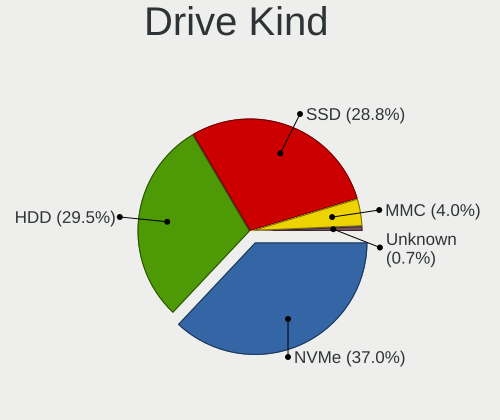

| Kind    | Notebooks | Drives | Percent |
|---------|-----------|--------|---------|
| NVMe    | 754       | 1012   | 37.02%  |
| HDD     | 601       | 763    | 29.5%   |
| SSD     | 587       | 783    | 28.82%  |
| MMC     | 81        | 105    | 3.98%   |
| Unknown | 14        | 16     | 0.69%   |

Drive Connector
---------------

SATA, SAS, NVMe, etc.

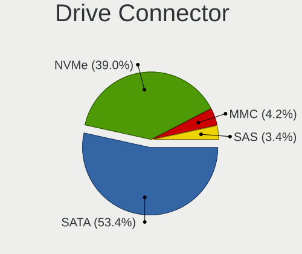

| Type | Notebooks | Drives | Percent |
|------|-----------|--------|---------|
| SATA | 1034      | 1489   | 53.44%  |
| NVMe | 754       | 1009   | 38.97%  |
| MMC  | 81        | 105    | 4.19%   |
| SAS  | 66        | 76     | 3.41%   |

Drive Size
----------

Size of hard drive

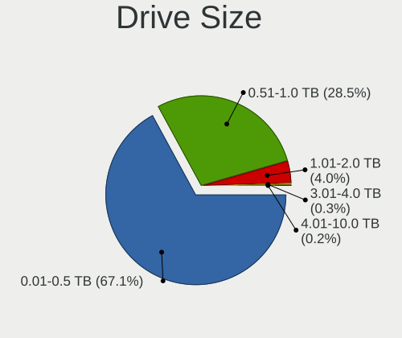

| Size in TB | Notebooks | Drives | Percent |
|------------|-----------|--------|---------|
| 0.01-0.5   | 780       | 1056   | 67.07%  |
| 0.51-1.0   | 331       | 409    | 28.46%  |
| 1.01-2.0   | 46        | 74     | 3.96%   |
| 3.01-4.0   | 4         | 5      | 0.34%   |
| 4.01-10.0  | 2         | 2      | 0.17%   |

Space Total
-----------

Amount of disk space available on the file system

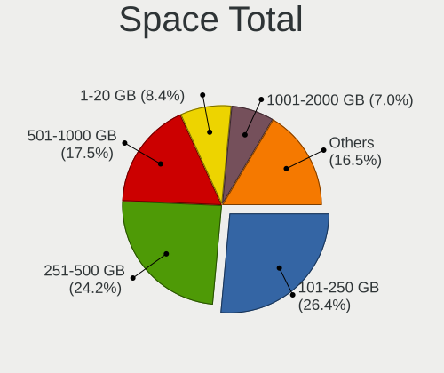

| Size in GB     | Notebooks | Percent |
|----------------|-----------|---------|
| 101-250        | 490       | 26.44%  |
| 251-500        | 449       | 24.23%  |
| 501-1000       | 324       | 17.49%  |
| 1-20           | 155       | 8.36%   |
| 1001-2000      | 130       | 7.02%   |
| 51-100         | 108       | 5.83%   |
| 21-50          | 73        | 3.94%   |
| Unknown        | 54        | 2.91%   |
| 2001-3000      | 36        | 1.94%   |
| More than 3000 | 34        | 1.83%   |

Space Used
----------

Amount of used disk space

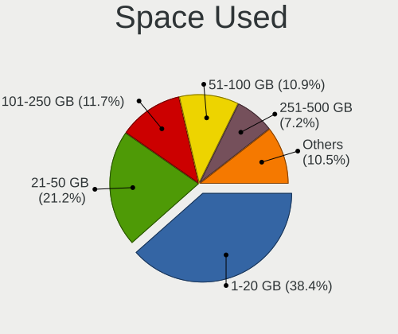

| Used GB        | Notebooks | Percent |
|----------------|-----------|---------|
| 1-20           | 737       | 38.45%  |
| 21-50          | 407       | 21.23%  |
| 101-250        | 225       | 11.74%  |
| 51-100         | 208       | 10.85%  |
| 251-500        | 138       | 7.2%    |
| 501-1000       | 101       | 5.27%   |
| Unknown        | 54        | 2.82%   |
| 1001-2000      | 37        | 1.93%   |
| 2001-3000      | 7         | 0.37%   |
| More than 3000 | 3         | 0.16%   |

Malfunc. Drives
---------------

Drive models with a malfunction

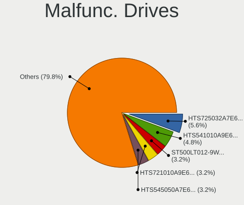

| Model                                    | Notebooks | Drives | Percent |
|------------------------------------------|-----------|--------|---------|
| Hitachi HTS725032A7E630 320GB            | 7         | 7      | 5.65%   |
| HGST HTS541010A9E680 1TB                 | 6         | 6      | 4.84%   |
| Seagate ST500LT012-9WS142 500GB          | 4         | 4      | 3.23%   |
| HGST HTS721010A9E630 1TB                 | 4         | 4      | 3.23%   |
| HGST HTS545050A7E680 500GB               | 4         | 4      | 3.23%   |
| Seagate ST9500420AS 500GB                | 3         | 3      | 2.42%   |
| WDC PC SA530 SDASN8Y-256G-1006 256GB     | 2         | 2      | 1.61%   |
| Toshiba MQ01ABF050 500GB                 | 2         | 2      | 1.61%   |
| SK hynix HFS256G39TND-N210A 256GB SSD    | 2         | 2      | 1.61%   |
| Seagate ST95005620AS 500GB               | 2         | 5      | 1.61%   |
| Seagate ST9500325AS 500GB                | 2         | 2      | 1.61%   |
| Seagate ST9160821AS 160GB                | 2         | 2      | 1.61%   |
| Seagate ST500LT012-1DG142 500GB          | 2         | 3      | 1.61%   |
| Seagate ST500LM000-1EJ162 500GB          | 2         | 3      | 1.61%   |
| Seagate ST1000LX015-1U7172 1TB           | 2         | 2      | 1.61%   |
| Kingston SV300S37A120G 120GB SSD         | 2         | 2      | 1.61%   |
| Hitachi HTS545016B9A300 160GB            | 2         | 2      | 1.61%   |
| HGST HTS725050A7E630 500GB               | 2         | 2      | 1.61%   |
| China SSD 256GB                          | 2         | 2      | 1.61%   |
| XrayDisk 240GB SSD                       | 1         | 1      | 0.81%   |
| WDC WDS480G2G0B-00EPW0 480GB SSD         | 1         | 1      | 0.81%   |
| WDC WDS240G2G0A-00JH30 240GB SSD         | 1         | 1      | 0.81%   |
| WDC WD7500BPVT-60HXZT3 752GB             | 1         | 2      | 0.81%   |
| WDC WD7500BPVT-22HXZT3 752GB             | 1         | 1      | 0.81%   |
| WDC WD6400BEVT-22A0RT0 640GB             | 1         | 1      | 0.81%   |
| WDC WD5000BPVT-00HXZT1 500GB             | 1         | 1      | 0.81%   |
| WDC WD5000BPKT-60PK4T0 500GB             | 1         | 2      | 0.81%   |
| WDC WD5000BEVT-60A0RT0 500GB             | 1         | 1      | 0.81%   |
| WDC WD3200BPVT-22JJ5T0 320GB             | 1         | 1      | 0.81%   |
| WDC WD1600BEVT-22ZCT0 160GB              | 1         | 1      | 0.81%   |
| WDC WD1600BEVS-60RST0 160GB              | 1         | 2      | 0.81%   |
| WDC WD1600BEVS-08RST2 160GB              | 1         | 2      | 0.81%   |
| WDC WD1600BEVS-07RST0 160GB              | 1         | 1      | 0.81%   |
| WDC WD10SPZX-21Z10T0 1TB                 | 1         | 1      | 0.81%   |
| WDC WD10JPVX-22JC3T0 1TB                 | 1         | 1      | 0.81%   |
| WDC WD10JPCX-24UE4T0 1TB                 | 1         | 2      | 0.81%   |
| Toshiba THNSNK256GVN8 M.2 2280 256GB SSD | 1         | 1      | 0.81%   |
| Toshiba MQ04ABF100 1TB                   | 1         | 1      | 0.81%   |
| Toshiba MQ01ABD100 1TB                   | 1         | 1      | 0.81%   |
| Toshiba MK6476GSX 640GB                  | 1         | 1      | 0.81%   |

Malfunc. Drive Vendor
---------------------

Vendors of faulty drives

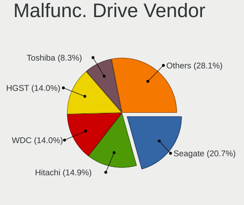

| Vendor              | Notebooks | Drives | Percent |
|---------------------|-----------|--------|---------|
| Seagate             | 25        | 30     | 20.66%  |
| Hitachi             | 18        | 20     | 14.88%  |
| WDC                 | 17        | 23     | 14.05%  |
| HGST                | 17        | 17     | 14.05%  |
| Toshiba             | 10        | 11     | 8.26%   |
| SK hynix            | 7         | 8      | 5.79%   |
| Kingston            | 5         | 5      | 4.13%   |
| Samsung Electronics | 3         | 3      | 2.48%   |
| Fujitsu             | 3         | 3      | 2.48%   |
| China               | 3         | 3      | 2.48%   |
| Intel               | 2         | 2      | 1.65%   |
| Hewlett-Packard     | 2         | 2      | 1.65%   |
| A-DATA Technology   | 2         | 2      | 1.65%   |
| XrayDisk            | 1         | 1      | 0.83%   |
| Teclast             | 1         | 1      | 0.83%   |
| SanDisk             | 1         | 1      | 0.83%   |
| Patriot             | 1         | 1      | 0.83%   |
| Micron Technology   | 1         | 1      | 0.83%   |
| LITEONIT            | 1         | 1      | 0.83%   |
| Dogfish             | 1         | 1      | 0.83%   |

Malfunc. HDD Vendor
-------------------

Vendors of faulty HDD drives

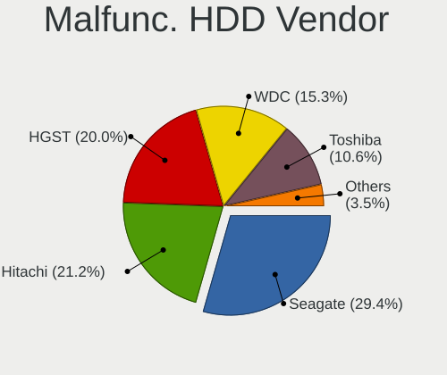

| Vendor  | Notebooks | Drives | Percent |
|---------|-----------|--------|---------|
| Seagate | 25        | 30     | 29.41%  |
| Hitachi | 18        | 20     | 21.18%  |
| HGST    | 17        | 17     | 20%     |
| WDC     | 13        | 19     | 15.29%  |
| Toshiba | 9         | 10     | 10.59%  |
| Fujitsu | 3         | 3      | 3.53%   |

Malfunc. Drive Kind
-------------------

Kinds of faulty drives

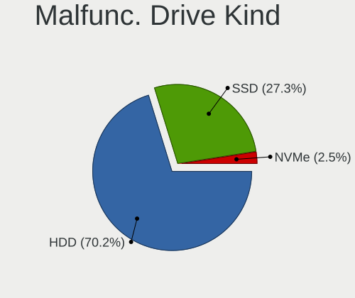

| Kind | Notebooks | Drives | Percent |
|------|-----------|--------|---------|
| HDD  | 85        | 99     | 70.25%  |
| SSD  | 33        | 34     | 27.27%  |
| NVMe | 3         | 3      | 2.48%   |

Failed Drives
-------------

Failed drive models

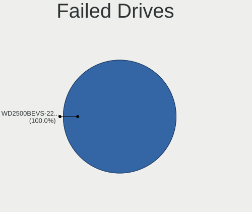

| Model                        | Notebooks | Drives | Percent |
|------------------------------|-----------|--------|---------|
| WDC WD3200BEKT-60KA9T0 320GB | 1         | 1      | 50%     |
| WDC WD2500BEVS-22UST0 250GB  | 1         | 2      | 50%     |

Failed Drive Vendor
-------------------

Failed drive vendors

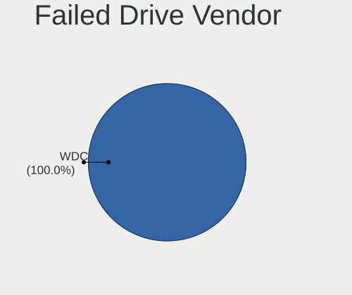

| Vendor | Notebooks | Drives | Percent |
|--------|-----------|--------|---------|
| WDC    | 2         | 3      | 100%    |

Drive Status
------------

Number of failed and malfunc. drives

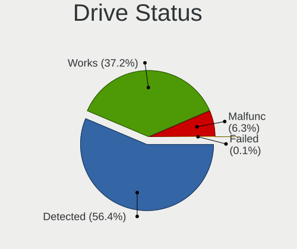

| Status   | Notebooks | Drives | Percent |
|----------|-----------|--------|---------|
| Detected | 1057      | 1568   | 56.37%  |
| Works    | 697       | 972    | 37.17%  |
| Malfunc  | 119       | 136    | 6.35%   |
| Failed   | 2         | 3      | 0.11%   |

Storage controller
------------------

Storage Vendor
--------------

Storage controller vendors

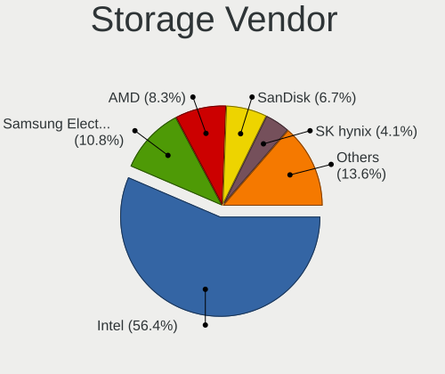

| Vendor                           | Notebooks | Percent |
|----------------------------------|-----------|---------|
| Intel                            | 1209      | 56.44%  |
| Samsung Electronics              | 232       | 10.83%  |
| AMD                              | 178       | 8.31%   |
| SanDisk                          | 143       | 6.68%   |
| SK hynix                         | 88        | 4.11%   |
| Micron Technology                | 73        | 3.41%   |
| Kingston Technology Company      | 60        | 2.8%    |
| KIOXIA                           | 27        | 1.26%   |
| Toshiba America Info Systems     | 26        | 1.21%   |
| Phison Electronics               | 17        | 0.79%   |
| ADATA Technology                 | 16        | 0.75%   |
| Realtek Semiconductor            | 10        | 0.47%   |
| Solidigm                         | 8         | 0.37%   |
| Silicon Motion                   | 8         | 0.37%   |
| Silicon Integrated Systems [SiS] | 6         | 0.28%   |
| Seagate Technology               | 5         | 0.23%   |
| Micron/Crucial Technology        | 5         | 0.23%   |
| Nvidia                           | 4         | 0.19%   |
| Apple                            | 4         | 0.19%   |
| Union Memory (Shenzhen)          | 3         | 0.14%   |
| Solid State Storage Technology   | 3         | 0.14%   |
| Shenzhen Longsys Electronics     | 3         | 0.14%   |
| Lite-On Technology               | 3         | 0.14%   |
| MAXIO Technology (Hangzhou)      | 2         | 0.09%   |
| Lenovo                           | 2         | 0.09%   |
| JMicron Technology               | 2         | 0.09%   |
| Yangtze Memory Technologies      | 1         | 0.05%   |
| VIA Technologies                 | 1         | 0.05%   |
| Transcend                        | 1         | 0.05%   |
| Silicon Image                    | 1         | 0.05%   |
| Shenzhen Techwinsemi Technology  | 1         | 0.05%   |

Storage Model
-------------

Storage controller models

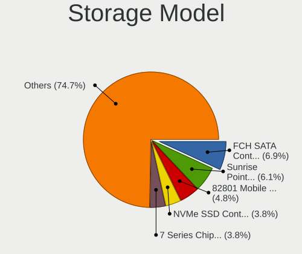

| Model                                                                            | Notebooks | Percent |
|----------------------------------------------------------------------------------|-----------|---------|
| AMD FCH SATA Controller [AHCI mode]                                              | 159       | 6.89%   |
| Intel Sunrise Point-LP SATA Controller [AHCI mode]                               | 140       | 6.06%   |
| Intel 82801 Mobile SATA Controller [RAID mode]                                   | 111       | 4.81%   |
| Samsung NVMe SSD Controller SM981/PM981/PM983                                    | 87        | 3.77%   |
| Intel 7 Series Chipset Family 6-port SATA Controller [AHCI mode]                 | 87        | 3.77%   |
| Intel Volume Management Device NVMe RAID Controller                              | 76        | 3.29%   |
| Intel 6 Series/C200 Series Chipset Family 6 port Mobile SATA AHCI Controller     | 71        | 3.07%   |
| Intel Celeron/Pentium Silver Processor SATA Controller                           | 66        | 2.86%   |
| Intel 8 Series SATA Controller 1 [AHCI mode]                                     | 66        | 2.86%   |
| Samsung NVMe SSD Controller 980 (DRAM-less)                                      | 59        | 2.56%   |
| Intel Cannon Lake Mobile PCH SATA AHCI Controller                                | 59        | 2.56%   |
| Intel 8 Series/C220 Series Chipset Family 6-port SATA Controller 1 [AHCI mode]   | 47        | 2.04%   |
| Intel Wildcat Point-LP SATA Controller [AHCI Mode]                               | 45        | 1.95%   |
| Intel HM170/QM170 Chipset SATA Controller [AHCI Mode]                            | 44        | 1.91%   |
| Intel Celeron N3350/Pentium N4200/Atom E3900 Series SATA AHCI Controller         | 40        | 1.73%   |
| Intel 82801IBM/IEM (ICH9M/ICH9M-E) 4 port SATA Controller [AHCI mode]            | 39        | 1.69%   |
| SanDisk Ultra 3D / WD PC SN530, IX SN530, Blue SN550 NVMe SSD (DRAM-less)        | 34        | 1.47%   |
| Intel Tiger Lake-LP SATA Controller                                              | 33        | 1.43%   |
| SK hynix Gold P31/BC711/PC711 NVMe Solid State Drive                             | 32        | 1.39%   |
| Samsung NVMe SSD Controller PM9A1/PM9A3/980PRO                                   | 31        | 1.34%   |
| Intel 82801HM/HEM (ICH8M/ICH8M-E) IDE Controller                                 | 28        | 1.21%   |
| Intel 5 Series/3400 Series Chipset 4 port SATA AHCI Controller                   | 28        | 1.21%   |
| Intel SSD 670p Series [Keystone Harbor]                                          | 27        | 1.17%   |
| Intel 5 Series/3400 Series Chipset 6 port SATA AHCI Controller                   | 27        | 1.17%   |
| SanDisk WD Blue SN500 / PC SN520 x2 M.2 2280 NVMe SSD                            | 25        | 1.08%   |
| Intel SSD 660P Series                                                            | 25        | 1.08%   |
| Intel 82801HM/HEM (ICH8M/ICH8M-E) SATA Controller [AHCI mode]                    | 25        | 1.08%   |
| Intel Cannon Point-LP SATA Controller [AHCI Mode]                                | 23        | 1%      |
| SanDisk WD SN560/SN740/SN770/SN5000 NVMe SSD                                     | 20        | 0.87%   |
| KIOXIA NVMe SSD Controller BG4 (DRAM-less)                                       | 20        | 0.87%   |
| Samsung NVMe SSD Controller SM961/PM961/SM963                                    | 19        | 0.82%   |
| Intel Comet Lake SATA AHCI Controller                                            | 18        | 0.78%   |
| Micron 2450 NVMe SSD [HendrixV] (DRAM-less)                                      | 17        | 0.74%   |
| Micron 2400 NVMe SSD (DRAM-less)                                                 | 16        | 0.69%   |
| Intel Atom/Celeron/Pentium Processor x5-E8000/J3xxx/N3xxx Series SATA Controller | 16        | 0.69%   |
| Intel Atom Processor E3800 Series SATA AHCI Controller                           | 15        | 0.65%   |
| Intel Alder Lake-P SATA AHCI Controller                                          | 15        | 0.65%   |
| SK hynix Platinum P41/PC801 NVMe Solid State Drive                               | 14        | 0.61%   |
| Micron 2210 NVMe SSD [Cobain]                                                    | 14        | 0.61%   |
| SK hynix BC901 NVMe Solid State Drive (DRAM-less)                                | 13        | 0.56%   |

Storage Kind
------------

Kind of storage controller (IDE, SATA, NVMe, SAS, ...)

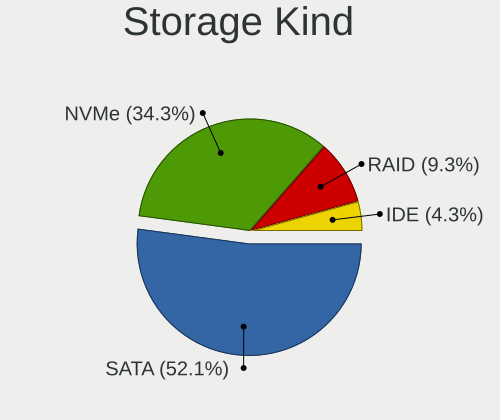

| Kind | Notebooks | Percent |
|------|-----------|---------|
| SATA | 1147      | 52.11%  |
| NVMe | 756       | 34.35%  |
| RAID | 204       | 9.27%   |
| IDE  | 94        | 4.27%   |

Processor
---------

CPU Vendor
----------

Processor vendors

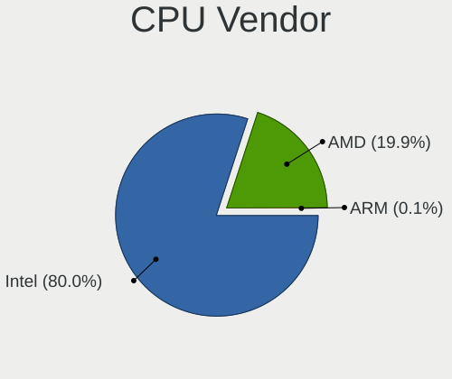

| Vendor | Notebooks | Percent |
|--------|-----------|---------|
| Intel  | 1392      | 80%     |
| AMD    | 347       | 19.94%  |
| ARM    | 1         | 0.06%   |

CPU Model
---------

Processor models

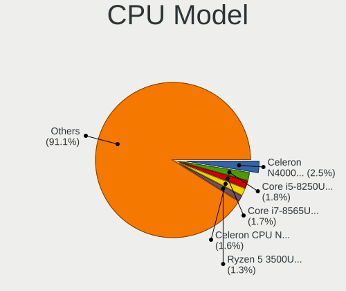

| Model                                         | Notebooks | Percent |
|-----------------------------------------------|-----------|---------|
| Intel Celeron N4000 CPU @ 1.10GHz             | 44        | 2.53%   |
| Intel Core i5-8250U CPU @ 1.60GHz             | 31        | 1.78%   |
| Intel Core i7-8565U CPU @ 1.80GHz             | 29        | 1.66%   |
| Intel Celeron CPU N3350 @ 1.10GHz             | 28        | 1.61%   |
| AMD Ryzen 5 3500U with Radeon Vega Mobile Gfx | 23        | 1.32%   |
| Intel Core i7-9750H CPU @ 2.60GHz             | 22        | 1.26%   |
| Intel Core i7-6700HQ CPU @ 2.60GHz            | 22        | 1.26%   |
| Intel Core i7-8750H CPU @ 2.20GHz             | 20        | 1.15%   |
| Intel Core i7-8550U CPU @ 1.80GHz             | 19        | 1.09%   |
| Intel Core i7-7700HQ CPU @ 2.80GHz            | 19        | 1.09%   |
| Intel Core i5-8265U CPU @ 1.60GHz             | 19        | 1.09%   |
| Intel 11th Gen Core i7-1165G7 @ 2.80GHz       | 19        | 1.09%   |
| Intel Core i5-7200U CPU @ 2.50GHz             | 18        | 1.03%   |
| Intel 11th Gen Core i3-1115G4 @ 3.00GHz       | 18        | 1.03%   |
| Intel Core i3-8145U CPU @ 2.10GHz             | 17        | 0.98%   |
| Intel 11th Gen Core i5-1135G7 @ 2.40GHz       | 17        | 0.98%   |
| Intel Core i5-5200U CPU @ 2.20GHz             | 16        | 0.92%   |
| Intel Core i3-4005U CPU @ 1.70GHz             | 16        | 0.92%   |
| Intel Core i7-4510U CPU @ 2.00GHz             | 14        | 0.8%    |
| Intel Core i3-7100U CPU @ 2.40GHz             | 14        | 0.8%    |
| Intel 12th Gen Core i5-1235U                  | 14        | 0.8%    |
| AMD Ryzen 7 4800H with Radeon Graphics        | 14        | 0.8%    |
| Intel Core i7-10750H CPU @ 2.60GHz            | 12        | 0.69%   |
| Intel Core i5-2520M CPU @ 2.50GHz             | 12        | 0.69%   |
| Intel Core i5-1035G1 CPU @ 1.00GHz            | 12        | 0.69%   |
| Intel Core i3-5005U CPU @ 2.00GHz             | 12        | 0.69%   |
| AMD Ryzen 7 5800H with Radeon Graphics        | 12        | 0.69%   |
| Intel Core i7-7500U CPU @ 2.70GHz             | 11        | 0.63%   |
| Intel Core i7-2670QM CPU @ 2.20GHz            | 11        | 0.63%   |
| Intel Core i5-6300U CPU @ 2.40GHz             | 11        | 0.63%   |
| Intel Core i5-3230M CPU @ 2.60GHz             | 11        | 0.63%   |
| AMD Ryzen 7 4700U with Radeon Graphics        | 11        | 0.63%   |
| Intel Pentium CPU N4200 @ 1.10GHz             | 10        | 0.57%   |
| Intel Core i7-3630QM CPU @ 2.40GHz            | 10        | 0.57%   |
| Intel Core i5-8350U CPU @ 1.70GHz             | 10        | 0.57%   |
| Intel Core i5-8300H CPU @ 2.30GHz             | 10        | 0.57%   |
| Intel Core i5-5300U CPU @ 2.30GHz             | 10        | 0.57%   |
| Intel Core i5-10210U CPU @ 1.60GHz            | 10        | 0.57%   |
| Intel Core i3-6006U CPU @ 2.00GHz             | 10        | 0.57%   |
| Intel 12th Gen Core i7-12700H                 | 10        | 0.57%   |

CPU Model Family
----------------

Processor model prefix

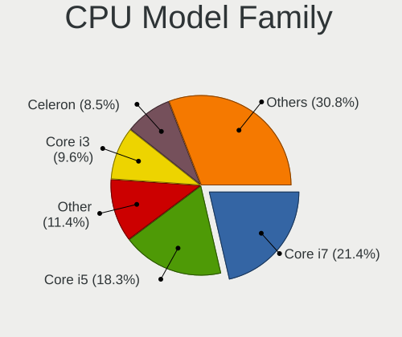

| Model                          | Notebooks | Percent |
|--------------------------------|-----------|---------|
| Intel Core i7                  | 373       | 21.41%  |
| Intel Core i5                  | 319       | 18.31%  |
| Other                          | 198       | 11.37%  |
| Intel Core i3                  | 167       | 9.59%   |
| Intel Celeron                  | 148       | 8.5%    |
| AMD Ryzen 7                    | 111       | 6.37%   |
| AMD Ryzen 5                    | 92        | 5.28%   |
| Intel Core 2 Duo               | 54        | 3.1%    |
| Intel Pentium                  | 45        | 2.58%   |
| AMD Ryzen 3                    | 25        | 1.44%   |
| Intel Atom                     | 23        | 1.32%   |
| AMD Ryzen 9                    | 20        | 1.15%   |
| Intel Core                     | 19        | 1.09%   |
| Intel Core i9                  | 13        | 0.75%   |
| Intel Pentium Dual-Core        | 11        | 0.63%   |
| AMD A4                         | 11        | 0.63%   |
| Intel Genuine                  | 10        | 0.57%   |
| AMD Ryzen 7 PRO                | 8         | 0.46%   |
| Intel Pentium Dual             | 7         | 0.4%    |
| Intel Core 2                   | 7         | 0.4%    |
| AMD E                          | 6         | 0.34%   |
| AMD A6                         | 6         | 0.34%   |
| AMD A10                        | 6         | 0.34%   |
| AMD E2                         | 5         | 0.29%   |
| Intel Pentium Silver           | 4         | 0.23%   |
| Intel Celeron M                | 4         | 0.23%   |
| AMD Ryzen 5 PRO                | 4         | 0.23%   |
| AMD E1                         | 4         | 0.23%   |
| AMD Athlon                     | 4         | 0.23%   |
| AMD A8                         | 4         | 0.23%   |
| Intel Xeon                     | 3         | 0.17%   |
| Intel Core Duo                 | 3         | 0.17%   |
| AMD Turion 64 X2 Mobile        | 3         | 0.17%   |
| Intel Core m5                  | 2         | 0.11%   |
| Intel Celeron Dual-Core        | 2         | 0.11%   |
| AMD V140                       | 2         | 0.11%   |
| AMD Turion X2 Dual-Core Mobile | 2         | 0.11%   |
| AMD FX                         | 2         | 0.11%   |
| AMD Athlon X2                  | 2         | 0.11%   |
| Intel Pentium M                | 1         | 0.06%   |

CPU Cores
---------

Number of processor cores

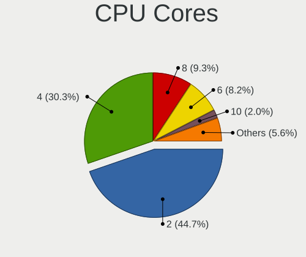

| Number | Notebooks | Percent |
|--------|-----------|---------|
| 2      | 779       | 44.72%  |
| 4      | 527       | 30.25%  |
| 8      | 162       | 9.3%    |
| 6      | 142       | 8.15%   |
| 10     | 35        | 2.01%   |
| 14     | 27        | 1.55%   |
| 1      | 26        | 1.49%   |
| 16     | 17        | 0.98%   |
| 12     | 15        | 0.86%   |
| 24     | 9         | 0.52%   |
| 20     | 3         | 0.17%   |

CPU Sockets
-----------

Number of sockets

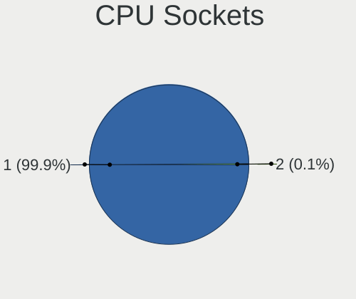

| Number | Notebooks | Percent |
|--------|-----------|---------|
| 1      | 1739      | 99.89%  |
| 2      | 2         | 0.11%   |

CPU Threads
-----------

Threads per core (Hyper-Threading)

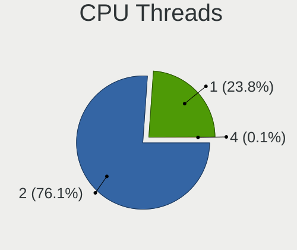

| Number | Notebooks | Percent |
|--------|-----------|---------|
| 2      | 1326      | 76.12%  |
| 1      | 415       | 23.82%  |
| 4      | 1         | 0.06%   |

CPU Op-Modes
------------

CPU Operation Modes (32-bit, 64-bit)

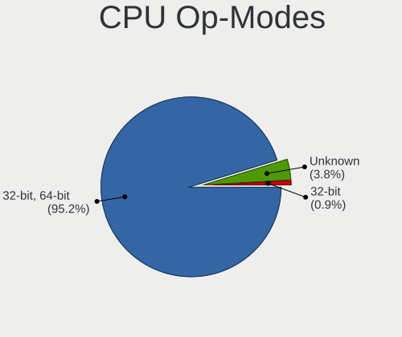

| Op mode        | Notebooks | Percent |
|----------------|-----------|---------|
| 32-bit, 64-bit | 1662      | 95.24%  |
| Unknown        | 67        | 3.84%   |
| 32-bit         | 16        | 0.92%   |

CPU Microcode
-------------

Microcode number

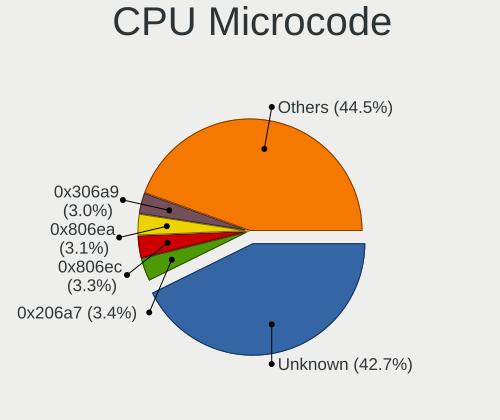

| Number     | Notebooks | Percent |
|------------|-----------|---------|
| Unknown    | 772       | 42.72%  |
| 0x206a7    | 61        | 3.38%   |
| 0x806ec    | 59        | 3.27%   |
| 0x806ea    | 56        | 3.1%    |
| 0x306a9    | 55        | 3.04%   |
| 0x706a1    | 47        | 2.6%    |
| 0x40651    | 42        | 2.32%   |
| 0x306c3    | 39        | 2.16%   |
| 0x906ea    | 35        | 1.94%   |
| 0x806c1    | 33        | 1.83%   |
| 0x806e9    | 31        | 1.72%   |
| 0x506c9    | 31        | 1.72%   |
| 0x306d4    | 30        | 1.66%   |
| 0x20655    | 28        | 1.55%   |
| 0x1067a    | 28        | 1.55%   |
| 0x406e3    | 25        | 1.38%   |
| 0x0a50000c | 23        | 1.27%   |
| 0x08108109 | 22        | 1.22%   |
| 0x806eb    | 21        | 1.16%   |
| 0x906e9    | 20        | 1.11%   |
| 0x08108102 | 19        | 1.05%   |
| 0x706e5    | 17        | 0.94%   |
| 0x08600106 | 16        | 0.89%   |
| 0x08600104 | 15        | 0.83%   |
| 0xa0652    | 14        | 0.77%   |
| 0x506e3    | 14        | 0.77%   |
| 0x6fd      | 13        | 0.72%   |
| 0x10676    | 12        | 0.66%   |
| 0x406c3    | 11        | 0.61%   |
| 0x806d1    | 10        | 0.55%   |
| 0x906ed    | 9         | 0.5%    |
| 0x906a4    | 9         | 0.5%    |
| 0x406c4    | 9         | 0.5%    |
| 0x20652    | 9         | 0.5%    |
| 0x906a3    | 8         | 0.44%   |
| 0x706a8    | 8         | 0.44%   |
| 0x06006705 | 8         | 0.44%   |
| 0x6e8      | 7         | 0.39%   |
| 0x106ca    | 7         | 0.39%   |
| 0x6ec      | 6         | 0.33%   |

CPU Microarch
-------------

Microarchitecture

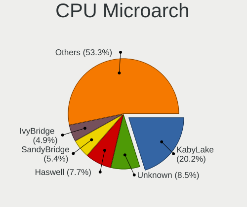

| Name               | Notebooks | Percent |
|--------------------|-----------|---------|
| KabyLake           | 352       | 20.18%  |
| Unknown            | 149       | 8.54%   |
| Haswell            | 134       | 7.68%   |
| SandyBridge        | 95        | 5.45%   |
| IvyBridge          | 85        | 4.87%   |
| Skylake            | 78        | 4.47%   |
| Goldmont plus      | 67        | 3.84%   |
| Alderlake Hybrid   | 66        | 3.78%   |
| TigerLake          | 63        | 3.61%   |
| Westmere           | 59        | 3.38%   |
| Zen+               | 57        | 3.27%   |
| Zen 3              | 54        | 3.1%    |
| Zen 2              | 52        | 2.98%   |
| Penryn             | 49        | 2.81%   |
| Broadwell          | 49        | 2.81%   |
| Silvermont         | 48        | 2.75%   |
| Core               | 42        | 2.41%   |
| Icelake            | 40        | 2.29%   |
| Goldmont           | 40        | 2.29%   |
| CometLake          | 29        | 1.66%   |
| Excavator          | 20        | 1.15%   |
| Zen                | 18        | 1.03%   |
| P6                 | 14        | 0.8%    |
| Bonnell            | 10        | 0.57%   |
| Bobcat             | 10        | 0.57%   |
| Meteorlake Hybrid  | 9         | 0.52%   |
| Tremont            | 7         | 0.4%    |
| Puma               | 7         | 0.4%    |
| K8 & K10 hybrid    | 6         | 0.34%   |
| Piledriver         | 5         | 0.29%   |
| K8 Hammer          | 5         | 0.29%   |
| Nehalem            | 4         | 0.23%   |
| Lunarlake Hybrid   | 4         | 0.23%   |
| K10                | 4         | 0.23%   |
| Jaguar             | 4         | 0.23%   |
| Steamroller        | 3         | 0.17%   |
| K10 Llano          | 3         | 0.17%   |
| NetBurst           | 1         | 0.06%   |
| Gracemont          | 1         | 0.06%   |
| ArrowLake-H Hybrid | 1         | 0.06%   |

Graphics
--------

GPU Vendor
----------

Vendors of graphics cards

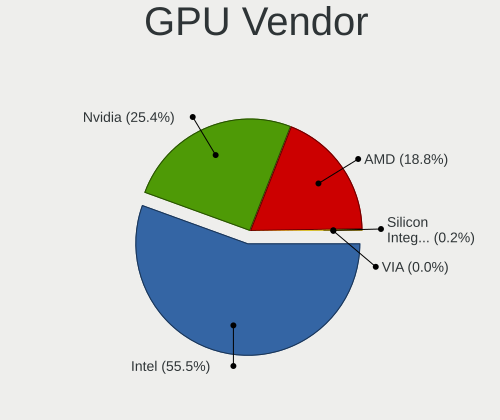

| Vendor                           | Notebooks | Percent |
|----------------------------------|-----------|---------|
| Intel                            | 1288      | 55.54%  |
| Nvidia                           | 589       | 25.4%   |
| AMD                              | 436       | 18.8%   |
| Silicon Integrated Systems [SiS] | 5         | 0.22%   |
| VIA Technologies                 | 1         | 0.04%   |

GPU Model
---------

Graphics card models

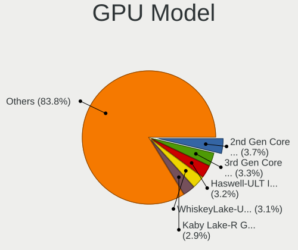

| Model                                                                                    | Notebooks | Percent |
|------------------------------------------------------------------------------------------|-----------|---------|
| Intel 2nd Generation Core Processor Family Integrated Graphics Controller                | 88        | 3.71%   |
| Intel 3rd Gen Core processor Graphics Controller                                         | 78        | 3.29%   |
| Intel Haswell-ULT Integrated Graphics Controller                                         | 75        | 3.16%   |
| Intel WhiskeyLake-U GT2 [UHD Graphics 620]                                               | 74        | 3.12%   |
| Intel Kaby Lake-R GT2 [UHD Graphics 620]                                                 | 70        | 2.95%   |
| Intel GeminiLake [UHD Graphics 600]                                                      | 65        | 2.74%   |
| Intel CoffeeLake-H GT2 [UHD Graphics 630]                                                | 63        | 2.65%   |
| AMD Picasso/Raven 2 [Radeon Vega Series / Radeon Vega Mobile Series]                     | 58        | 2.44%   |
| Intel 4th Gen Core Processor Integrated Graphics Controller                              | 55        | 2.32%   |
| Intel Kaby Lake-U GT2 [HD Graphics 620]                                                  | 53        | 2.23%   |
| AMD Renoir [Radeon Vega Series / Radeon Vega Mobile Series]                              | 47        | 1.98%   |
| Intel Broadwell-U GT2 [HD Graphics 5500]                                                 | 46        | 1.94%   |
| Intel TigerLake-LP GT2 [Iris Xe Graphics]                                                | 45        | 1.9%    |
| Intel Core Processor Integrated Graphics Controller                                      | 44        | 1.85%   |
| AMD Cezanne [Radeon Vega Series / Radeon Vega Mobile Series]                             | 37        | 1.56%   |
| Intel Skylake-U GT2 [HD Graphics 520]                                                    | 35        | 1.47%   |
| Intel Mobile 4 Series Chipset Integrated Graphics Controller                             | 32        | 1.35%   |
| Intel CometLake-U GT2 [UHD Graphics]                                                     | 31        | 1.31%   |
| Nvidia TU117M [GeForce GTX 1650 Mobile / Max-Q]                                          | 30        | 1.26%   |
| Intel Apollo Lake GT1 [HD Graphics 500]                                                  | 30        | 1.26%   |
| AMD Rembrandt [Radeon 680M]                                                              | 29        | 1.22%   |
| Intel Skylake-H GT2 [HD Graphics 530]                                                    | 28        | 1.18%   |
| Nvidia GF117M [GeForce 610M/710M/810M/820M / GT 620M/625M/630M/720M]                     | 27        | 1.14%   |
| Intel Atom/Celeron/Pentium Processor x5-E8000/J3xxx/N3xxx Integrated Graphics Controller | 27        | 1.14%   |
| Intel TigerLake-H GT1 [UHD Graphics]                                                     | 25        | 1.05%   |
| Intel Kaby Lake-H GT2 [HD Graphics 630]                                                  | 25        | 1.05%   |
| Nvidia GM107M [GeForce GTX 950M]                                                         | 22        | 0.93%   |
| Nvidia GA107M [GeForce RTX 3050 Mobile]                                                  | 22        | 0.93%   |
| Intel CometLake-H GT2 [UHD Graphics]                                                     | 22        | 0.93%   |
| Intel Atom Processor Z36xxx/Z37xxx Series Graphics & Display                             | 21        | 0.88%   |
| Intel Mobile GM965/GL960 Integrated Graphics Controller (secondary)                      | 20        | 0.84%   |
| Intel Mobile GM965/GL960 Integrated Graphics Controller (primary)                        | 20        | 0.84%   |
| Nvidia TU116M [GeForce GTX 1660 Ti Mobile]                                               | 19        | 0.8%    |
| Intel Raptor Lake-P [Iris Xe Graphics]                                                   | 19        | 0.8%    |
| Intel Alder Lake-UP3 GT2 [Iris Xe Graphics]                                              | 19        | 0.8%    |
| Nvidia GK208BM [GeForce 920M]                                                            | 18        | 0.76%   |
| Intel Tiger Lake-LP GT2 [UHD Graphics G4]                                                | 18        | 0.76%   |
| Intel Alder Lake-P GT2 [Iris Xe Graphics]                                                | 18        | 0.76%   |
| Nvidia GP107M [GeForce GTX 1050 Ti Mobile]                                               | 17        | 0.72%   |
| AMD Topaz XT [Radeon R7 M260/M265 / M340/M360 / M440/M445 / 530/535 / 620/625 Mobile]    | 17        | 0.72%   |

GPU Combo
---------

Combinations of graphics cards

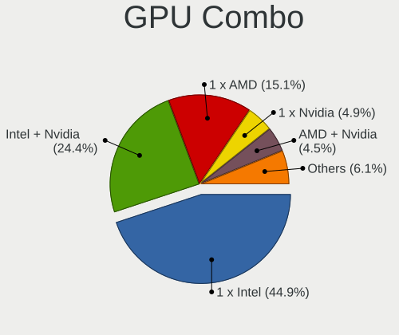

| Name           | Notebooks | Percent |
|----------------|-----------|---------|
| 1 x Intel      | 783       | 44.92%  |
| Intel + Nvidia | 426       | 24.44%  |
| 1 x AMD        | 263       | 15.09%  |
| 1 x Nvidia     | 85        | 4.88%   |
| AMD + Nvidia   | 79        | 4.53%   |
| Intel + AMD    | 72        | 4.13%   |
| 2 x AMD        | 22        | 1.26%   |
| 2 x Intel      | 5         | 0.29%   |
| 1 x SiS        | 5         | 0.29%   |
| Other          | 2         | 0.11%   |
| 1 x VIA        | 1         | 0.06%   |

GPU Driver
----------

Free vs proprietary

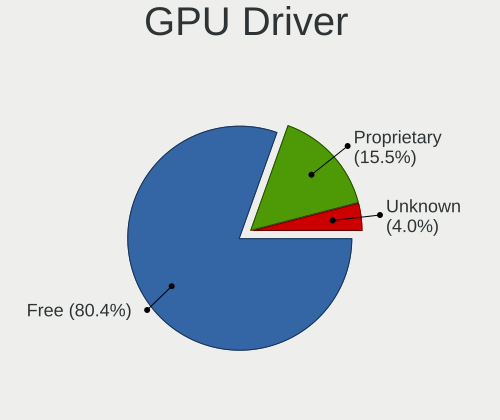

| Driver      | Notebooks | Percent |
|-------------|-----------|---------|
| Free        | 1415      | 80.44%  |
| Proprietary | 273       | 15.52%  |
| Unknown     | 71        | 4.04%   |

GPU Memory
----------

Total video memory

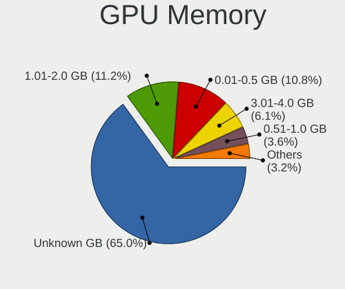

| Size in GB | Notebooks | Percent |
|------------|-----------|---------|
| Unknown    | 1163      | 65.04%  |
| 1.01-2.0   | 201       | 11.24%  |
| 0.01-0.5   | 193       | 10.79%  |
| 3.01-4.0   | 109       | 6.1%    |
| 0.51-1.0   | 65        | 3.64%   |
| 5.01-6.0   | 28        | 1.57%   |
| 7.01-8.0   | 21        | 1.17%   |
| 2.01-3.0   | 7         | 0.39%   |
| 0          | 1         | 0.06%   |

Monitor
-------

Monitor Vendor
--------------

Monitor vendors

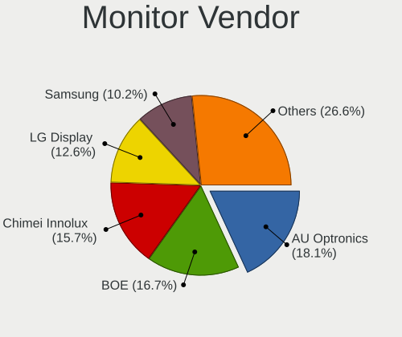

| Vendor                  | Notebooks | Percent |
|-------------------------|-----------|---------|
| AU Optronics            | 349       | 18.12%  |
| BOE                     | 322       | 16.72%  |
| Chimei Innolux          | 302       | 15.68%  |
| LG Display              | 243       | 12.62%  |
| Samsung Electronics     | 197       | 10.23%  |
| PANDA                   | 65        | 3.37%   |
| Dell                    | 64        | 3.32%   |
| Lenovo                  | 47        | 2.44%   |
| Chi Mei Optoelectronics | 42        | 2.18%   |
| Sharp                   | 39        | 2.02%   |
| Goldstar                | 29        | 1.51%   |
| LG Philips              | 17        | 0.88%   |
| Apple                   | 17        | 0.88%   |
| BenQ                    | 16        | 0.83%   |
| CSO                     | 15        | 0.78%   |
| Philips                 | 14        | 0.73%   |
| Acer                    | 14        | 0.73%   |
| Hewlett-Packard         | 12        | 0.62%   |
| AOC                     | 12        | 0.62%   |
| InfoVision              | 9         | 0.47%   |
| CPT                     | 7         | 0.36%   |
| Valve                   | 6         | 0.31%   |
| Ancor Communications    | 6         | 0.31%   |
| Sony                    | 5         | 0.26%   |
| InnoLux Display         | 5         | 0.26%   |
| CSOT                    | 5         | 0.26%   |
| TMX                     | 4         | 0.21%   |
| LGD                     | 4         | 0.21%   |
| Fujitsu Siemens         | 4         | 0.21%   |
| ASUSTek Computer        | 4         | 0.21%   |
| Analogix                | 4         | 0.21%   |
| Vestel Elektronik       | 3         | 0.16%   |
| Lenovo Group Limited    | 3         | 0.16%   |
| Iiyama                  | 3         | 0.16%   |
| ViewSonic               | 2         | 0.1%    |
| RTK                     | 2         | 0.1%    |
| Quanta Display          | 2         | 0.1%    |
| ITE                     | 2         | 0.1%    |
| HannStar                | 2         | 0.1%    |
| GreenWood               | 2         | 0.1%    |

Monitor Model
-------------

Monitor models

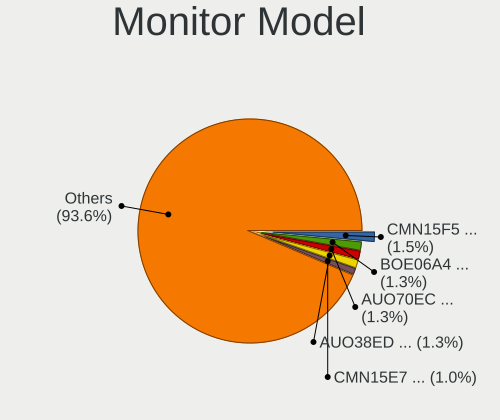

| Model                                                                    | Notebooks | Percent |
|--------------------------------------------------------------------------|-----------|---------|
| Chimei Innolux LCD Monitor CMN15F5 1920x1080 344x193mm 15.5-inch         | 29        | 1.49%   |
| BOE LCD Monitor BOE06A4 1366x768 344x194mm 15.5-inch                     | 26        | 1.34%   |
| AU Optronics LCD Monitor AUO70EC 1366x768 344x193mm 15.5-inch            | 25        | 1.28%   |
| AU Optronics LCD Monitor AUO38ED 1920x1080 344x193mm 15.5-inch           | 25        | 1.28%   |
| Chimei Innolux LCD Monitor CMN15E7 1920x1080 344x193mm 15.5-inch         | 19        | 0.98%   |
| Chimei Innolux LCD Monitor CMN14D4 1920x1080 309x173mm 13.9-inch         | 18        | 0.92%   |
| AU Optronics LCD Monitor AUO21ED 1920x1080 344x193mm 15.5-inch           | 18        | 0.92%   |
| BOE LCD Monitor BOE069C 1920x1080 344x193mm 15.5-inch                    | 17        | 0.87%   |
| Chimei Innolux LCD Monitor CMN1521 1920x1080 344x193mm 15.5-inch         | 16        | 0.82%   |
| Samsung Electronics LCD Monitor SEC5441 1280x800 331x207mm 15.4-inch     | 13        | 0.67%   |
| Chimei Innolux LCD Monitor CMN15D5 1920x1080 344x193mm 15.5-inch         | 13        | 0.67%   |
| Chimei Innolux LCD Monitor CMN15DC 1366x768 344x193mm 15.5-inch          | 12        | 0.62%   |
| Chimei Innolux LCD Monitor CMN15DB 1366x768 344x193mm 15.5-inch          | 12        | 0.62%   |
| Chimei Innolux LCD Monitor CMN15CA 1366x768 344x193mm 15.5-inch          | 12        | 0.62%   |
| AU Optronics LCD Monitor AUO403D 1920x1080 309x174mm 14.0-inch           | 12        | 0.62%   |
| PANDA LCD Monitor NCP004D 1920x1080 344x194mm 15.5-inch                  | 11        | 0.57%   |
| PANDA LCD Monitor NCP0046 1920x1080 344x194mm 15.5-inch                  | 11        | 0.57%   |
| LG Display LCD Monitor LGD033A 1366x768 344x194mm 15.5-inch              | 11        | 0.57%   |
| Chimei Innolux LCD Monitor CMN15C4 1920x1080 344x193mm 15.5-inch         | 11        | 0.57%   |
| BOE LCD Monitor BOE06A5 1366x768 344x194mm 15.5-inch                     | 11        | 0.57%   |
| LG Display LCD Monitor LGD046F 1920x1080 344x194mm 15.5-inch             | 10        | 0.51%   |
| Chimei Innolux LCD Monitor CMN15E8 1920x1080 344x193mm 15.5-inch         | 10        | 0.51%   |
| AU Optronics LCD Monitor AUO45EC 1366x768 344x193mm 15.5-inch            | 10        | 0.51%   |
| LG Display LCD Monitor LGD0563 1920x1080 344x194mm 15.5-inch             | 9         | 0.46%   |
| Chimei Innolux LCD Monitor CMN15E6 1366x768 344x193mm 15.5-inch          | 9         | 0.46%   |
| LG Display LCD Monitor LGD02DC 1366x768 344x194mm 15.5-inch              | 8         | 0.41%   |
| Dell P2417H DELA0DC 1920x1080 527x296mm 23.8-inch                        | 8         | 0.41%   |
| Chi Mei Optoelectronics LCD Monitor CMO15A7 1366x768 344x193mm 15.5-inch | 8         | 0.41%   |
| AU Optronics LCD Monitor AUO41EC 1366x768 344x193mm 15.5-inch            | 8         | 0.41%   |
| AU Optronics LCD Monitor AUO22EC 1366x768 344x193mm 15.5-inch            | 8         | 0.41%   |
| AU Optronics LCD Monitor AUO20EC 1366x768 344x193mm 15.5-inch            | 8         | 0.41%   |
| Sharp LCD Monitor SHP13F8 3200x1800 346x194mm 15.6-inch                  | 7         | 0.36%   |
| LG Display LCD Monitor LGD039F 1366x768 345x194mm 15.6-inch              | 7         | 0.36%   |
| Dell P2417H DELA0DB 1920x1080 527x296mm 23.8-inch                        | 7         | 0.36%   |
| BOE LCD Monitor BOE09CC 1920x1080 344x194mm 15.5-inch                    | 7         | 0.36%   |
| BOE LCD Monitor BOE07F1 1920x1080 344x193mm 15.5-inch                    | 7         | 0.36%   |
| BOE LCD Monitor BOE0718 1920x1080 309x173mm 13.9-inch                    | 7         | 0.36%   |
| BOE LCD Monitor BOE0615 1366x768 309x173mm 13.9-inch                     | 7         | 0.36%   |
| Samsung Electronics LCD Monitor SEC324A 1366x768 344x194mm 15.5-inch     | 6         | 0.31%   |
| Samsung Electronics LCD Monitor SDC4161 1920x1080 344x194mm 15.5-inch    | 6         | 0.31%   |

Monitor Resolution
------------------

Monitor screen resolution

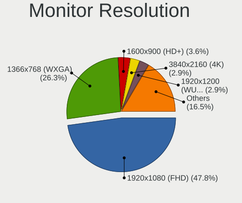

| Resolution         | Notebooks | Percent |
|--------------------|-----------|---------|
| 1920x1080 (FHD)    | 869       | 47.8%   |
| 1366x768 (WXGA)    | 479       | 26.35%  |
| 1600x900 (HD+)     | 66        | 3.63%   |
| 3840x2160 (4K)     | 52        | 2.86%   |
| 1920x1200 (WUXGA)  | 52        | 2.86%   |
| 1280x800 (WXGA)    | 48        | 2.64%   |
| 2560x1600          | 42        | 2.31%   |
| 2560x1440 (QHD)    | 33        | 1.82%   |
| 2880x1800          | 30        | 1.65%   |
| 1440x900 (WXGA+)   | 19        | 1.05%   |
| 1680x1050 (WSXGA+) | 13        | 0.72%   |
| 3200x1800 (QHD+)   | 12        | 0.66%   |
| 3200x2000          | 11        | 0.61%   |
| 2160x1440          | 10        | 0.55%   |
| 1280x1024 (SXGA)   | 10        | 0.55%   |
| 800x1280           | 9         | 0.5%    |
| 2560x1080          | 9         | 0.5%    |
| 1024x600           | 8         | 0.44%   |
| 3440x1440          | 6         | 0.33%   |
| 1360x768           | 5         | 0.28%   |
| 3840x2400          | 4         | 0.22%   |
| Unknown            | 4         | 0.22%   |
| 2880x1620          | 3         | 0.17%   |
| 1400x1050          | 3         | 0.17%   |
| 1024x768 (XGA)     | 3         | 0.17%   |
| 3456x2160          | 2         | 0.11%   |
| 2880x1920          | 2         | 0.11%   |
| 2048x1280          | 2         | 0.11%   |
| 3926x1440          | 1         | 0.06%   |
| 3840x1080          | 1         | 0.06%   |
| 3000x2000          | 1         | 0.06%   |
| 2520x1680          | 1         | 0.06%   |
| 2304x1440          | 1         | 0.06%   |
| 2240x1400          | 1         | 0.06%   |
| 2048x1152          | 1         | 0.06%   |
| 1920x540           | 1         | 0.06%   |
| 1920x1280          | 1         | 0.06%   |
| 1680x945           | 1         | 0.06%   |
| 1280x720 (HD)      | 1         | 0.06%   |
| 1080x1920          | 1         | 0.06%   |

Monitor Diagonal
----------------

Diagonal size in inches

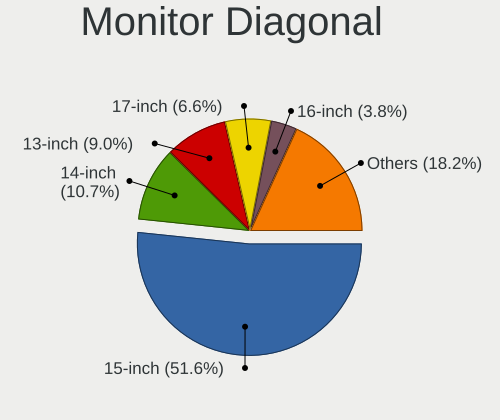

| Inches  | Notebooks | Percent |
|---------|-----------|---------|
| 15      | 990       | 51.64%  |
| 14      | 206       | 10.75%  |
| 13      | 173       | 9.02%   |
| 17      | 127       | 6.62%   |
| 16      | 72        | 3.76%   |
| 24      | 66        | 3.44%   |
| 27      | 39        | 2.03%   |
| 23      | 37        | 1.93%   |
| 21      | 32        | 1.67%   |
| 12      | 30        | 1.56%   |
| Unknown | 20        | 1.04%   |
| 34      | 15        | 0.78%   |
| 31      | 13        | 0.68%   |
| 11      | 12        | 0.63%   |
| 19      | 10        | 0.52%   |
| 10      | 10        | 0.52%   |
| 18      | 9         | 0.47%   |
| 84      | 7         | 0.37%   |
| 32      | 7         | 0.37%   |
| 22      | 6         | 0.31%   |
| 7       | 6         | 0.31%   |
| 54      | 4         | 0.21%   |
| 63      | 3         | 0.16%   |
| 20      | 3         | 0.16%   |
| 3       | 3         | 0.16%   |
| 72      | 2         | 0.1%    |
| 43      | 2         | 0.1%    |
| 42      | 2         | 0.1%    |
| 8       | 2         | 0.1%    |
| 86      | 1         | 0.05%   |
| 65      | 1         | 0.05%   |
| 58      | 1         | 0.05%   |
| 52      | 1         | 0.05%   |
| 48      | 1         | 0.05%   |
| 47      | 1         | 0.05%   |
| 46      | 1         | 0.05%   |
| 40      | 1         | 0.05%   |
| 25      | 1         | 0.05%   |

Monitor Width
-------------

Physical width

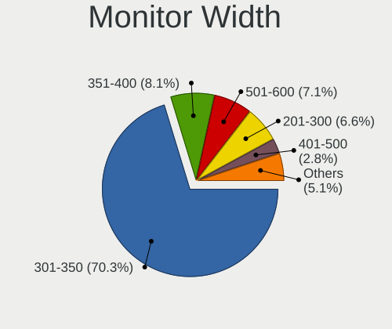

| Width in mm | Notebooks | Percent |
|-------------|-----------|---------|
| 301-350     | 1342      | 70.3%   |
| 351-400     | 155       | 8.12%   |
| 501-600     | 135       | 7.07%   |
| 201-300     | 126       | 6.6%    |
| 401-500     | 53        | 2.78%   |
| 701-800     | 22        | 1.15%   |
| Unknown     | 20        | 1.05%   |
| 601-700     | 17        | 0.89%   |
| 1001-1500   | 14        | 0.73%   |
| 1501-2000   | 9         | 0.47%   |
| 1-100       | 9         | 0.47%   |
| 901-1000    | 4         | 0.21%   |
| 101-200     | 2         | 0.1%    |
| 801-900     | 1         | 0.05%   |

Aspect Ratio
------------

Proportional relationship between the width and the height

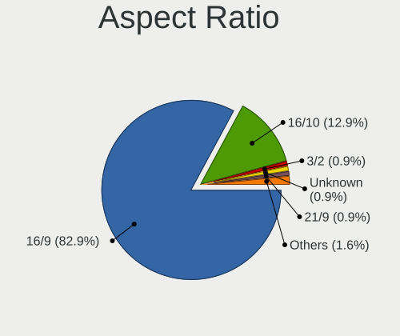

| Ratio   | Notebooks | Percent |
|---------|-----------|---------|
| 16/9    | 1450      | 82.86%  |
| 16/10   | 225       | 12.86%  |
| 3/2     | 16        | 0.91%   |
| Unknown | 16        | 0.91%   |
| 21/9    | 15        | 0.86%   |
| 5/4     | 10        | 0.57%   |
| 4/3     | 6         | 0.34%   |
| 0.67    | 5         | 0.29%   |
| 6/5     | 4         | 0.23%   |
| 0.56    | 2         | 0.11%   |
| 0.62    | 1         | 0.06%   |

Monitor Area
------------

Area in inch²

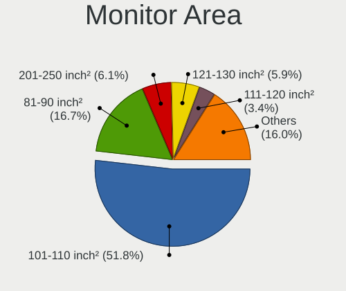

| Area in inch² | Notebooks | Percent |
|----------------|-----------|---------|
| 101-110        | 993       | 51.8%   |
| 81-90          | 321       | 16.74%  |
| 201-250        | 117       | 6.1%    |
| 121-130        | 113       | 5.89%   |
| 111-120        | 66        | 3.44%   |
| 71-80          | 53        | 2.76%   |
| 301-350        | 39        | 2.03%   |
| 351-500        | 35        | 1.83%   |
| 61-70          | 29        | 1.51%   |
| 151-200        | 22        | 1.15%   |
| More than 1000 | 21        | 1.1%    |
| Unknown        | 20        | 1.04%   |
| 251-300        | 17        | 0.89%   |
| 131-140        | 13        | 0.68%   |
| 51-60          | 12        | 0.63%   |
| 141-150        | 12        | 0.63%   |
| 1-40           | 11        | 0.57%   |
| 41-50          | 10        | 0.52%   |
| 501-1000       | 7         | 0.37%   |
| 91-100         | 6         | 0.31%   |

Pixel Density
-------------

Pixels per inch

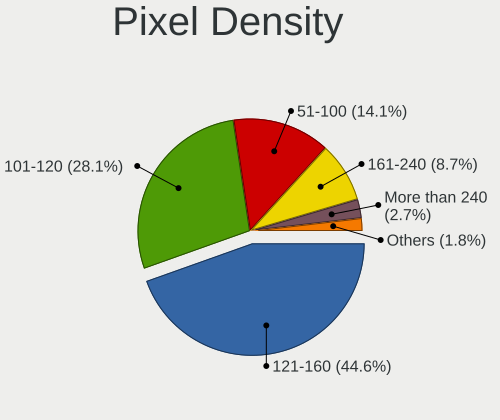

| Density       | Notebooks | Percent |
|---------------|-----------|---------|
| 121-160       | 847       | 44.56%  |
| 101-120       | 534       | 28.09%  |
| 51-100        | 268       | 14.1%   |
| 161-240       | 165       | 8.68%   |
| More than 240 | 52        | 2.74%   |
| Unknown       | 20        | 1.05%   |
| 1-50          | 15        | 0.79%   |

Multiple Monitors
-----------------

Total monitors connected

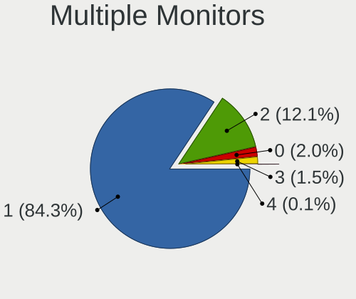

| Total | Notebooks | Percent |
|-------|-----------|---------|
| 1     | 1502      | 84.33%  |
| 2     | 216       | 12.13%  |
| 0     | 35        | 1.97%   |
| 3     | 26        | 1.46%   |
| 4     | 2         | 0.11%   |

Network
-------

Net Controller Vendor
---------------------

Controller vendors

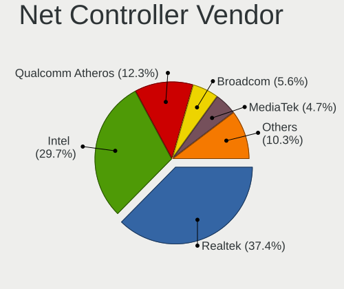

| Vendor                                 | Notebooks | Percent |
|----------------------------------------|-----------|---------|
| Realtek Semiconductor                  | 1017      | 37.39%  |
| Intel                                  | 809       | 29.74%  |
| Qualcomm Atheros                       | 334       | 12.28%  |
| Broadcom                               | 151       | 5.55%   |
| MediaTek                               | 128       | 4.71%   |
| TP-Link                                | 37        | 1.36%   |
| Broadcom Limited                       | 29        | 1.07%   |
| Ralink                                 | 19        | 0.7%    |
| Marvell Technology Group               | 19        | 0.7%    |
| ASIX Electronics                       | 16        | 0.59%   |
| Samsung Electronics                    | 15        | 0.55%   |
| Ralink Technology                      | 15        | 0.55%   |
| Shenzhen Goodix Technology             | 14        | 0.51%   |
| Xiaomi                                 | 10        | 0.37%   |
| Huawei Technologies                    | 10        | 0.37%   |
| Ericsson Business Mobile Networks      | 9         | 0.33%   |
| Sierra Wireless                        | 8         | 0.29%   |
| Hewlett-Packard                        | 8         | 0.29%   |
| ASUSTek Computer                       | 8         | 0.29%   |
| Lenovo                                 | 6         | 0.22%   |
| Silicon Integrated Systems [SiS]       | 5         | 0.18%   |
| Google                                 | 5         | 0.18%   |
| DisplayLink                            | 5         | 0.18%   |
| Qualcomm Atheros Communications        | 4         | 0.15%   |
| JMicron Technology                     | 4         | 0.15%   |
| Dell                                   | 4         | 0.15%   |
| D-Link                                 | 4         | 0.15%   |
| ZTE WCDMA Technologies MSM             | 3         | 0.11%   |
| Qualcomm                               | 2         | 0.07%   |
| Motorola PCS                           | 2         | 0.07%   |
| Fibocom                                | 2         | 0.07%   |
| Apple                                  | 2         | 0.07%   |
| VIA Technologies                       | 1         | 0.04%   |
| U-Blox                                 | 1         | 0.04%   |
| Suzhou Motorcomm Electronic Technology | 1         | 0.04%   |
| Spreadtrum Communications              | 1         | 0.04%   |
| Sony Ericsson Mobile Communications AB | 1         | 0.04%   |
| Sitecom Europe                         | 1         | 0.04%   |
| QinHeng Electronics                    | 1         | 0.04%   |
| Qcom                                   | 1         | 0.04%   |

Net Controller Model
--------------------

Controller models

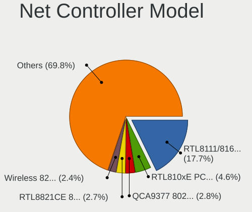

| Model                                                                  | Notebooks | Percent |
|------------------------------------------------------------------------|-----------|---------|
| Realtek RTL8111/8168/8211/8411 PCI Express Gigabit Ethernet Controller | 575       | 17.75%  |
| Realtek RTL810xE PCI Express Fast Ethernet controller                  | 150       | 4.63%   |
| Qualcomm Atheros QCA9377 802.11ac Wireless Network Adapter             | 90        | 2.78%   |
| Realtek RTL8821CE 802.11ac PCIe Wireless Network Adapter               | 86        | 2.65%   |
| Intel Wireless 8265 / 8275                                             | 77        | 2.38%   |
| Realtek RTL8822BE 802.11a/b/g/n/ac WiFi adapter                        | 63        | 1.94%   |
| Qualcomm Atheros QCA9565 / AR9565 Wireless Network Adapter             | 61        | 1.88%   |
| Intel Wi-Fi 6 AX200                                                    | 61        | 1.88%   |
| Realtek RTL8723BE PCIe Wireless Network Adapter                        | 59        | 1.82%   |
| Realtek RTL8153 Gigabit Ethernet Adapter                               | 59        | 1.82%   |
| MediaTek MT7921 802.11ax PCIe Wireless Network Adapter [Filogic 330]   | 58        | 1.79%   |
| Realtek RTL8822CE 802.11ac PCIe Wireless Network Adapter               | 55        | 1.7%    |
| Intel Cannon Lake PCH CNVi WiFi                                        | 48        | 1.48%   |
| Intel Wi-Fi 6 AX201                                                    | 46        | 1.42%   |
| Intel 82579LM Gigabit Network Connection (Lewisville)                  | 46        | 1.42%   |
| Qualcomm Atheros AR9285 Wireless Network Adapter (PCI-Express)         | 43        | 1.33%   |
| Intel Wireless 7260                                                    | 43        | 1.33%   |
| MediaTek MT7922 802.11ax PCI Express Wireless Network Adapter          | 38        | 1.17%   |
| Intel Wireless 7265                                                    | 38        | 1.17%   |
| Intel Wireless 8260                                                    | 36        | 1.11%   |
| Qualcomm Atheros AR9485 Wireless Network Adapter                       | 35        | 1.08%   |
| Intel Cannon Point-LP CNVi [Wireless-AC]                               | 34        | 1.05%   |
| Intel Centrino Advanced-N 6205 [Taylor Peak]                           | 32        | 0.99%   |
| Qualcomm Atheros QCA6174 802.11ac Wireless Network Adapter             | 26        | 0.8%    |
| Intel Wireless 3160                                                    | 25        | 0.77%   |
| Intel Dual Band Wireless-AC 3165 Plus Bluetooth                        | 25        | 0.77%   |
| Broadcom BCM43142 802.11b/g/n                                          | 25        | 0.77%   |
| Intel Wireless 3165                                                    | 24        | 0.74%   |
| Intel Comet Lake PCH-LP CNVi WiFi                                      | 24        | 0.74%   |
| Intel Alder Lake-P PCH CNVi WiFi                                       | 24        | 0.74%   |
| Intel Comet Lake PCH CNVi WiFi                                         | 23        | 0.71%   |
| Broadcom BCM4313 802.11bgn Wireless Network Adapter                    | 22        | 0.68%   |
| Realtek RTL8852BE PCIe 802.11ax Wireless Network Controller            | 21        | 0.65%   |
| MediaTek MT7902 802.11ax PCIe Wireless Network Adapter [Filogic 310]   | 21        | 0.65%   |
| Intel Ethernet Connection (4) I219-LM                                  | 21        | 0.65%   |
| Intel 82577LM Gigabit Network Connection                               | 21        | 0.65%   |
| Realtek RTL8125 2.5GbE Controller                                      | 20        | 0.62%   |
| Intel Ethernet Connection I218-LM                                      | 19        | 0.59%   |
| Intel Centrino Advanced-N 6200                                         | 18        | 0.56%   |
| Realtek RTL8723BU 802.11b/g/n WLAN Adapter                             | 17        | 0.52%   |

Wireless Vendor
---------------

Wireless vendors

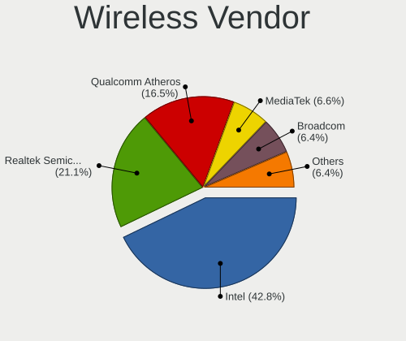

| Vendor                          | Notebooks | Percent |
|---------------------------------|-----------|---------|
| Intel                           | 764       | 42.85%  |
| Realtek Semiconductor           | 377       | 21.14%  |
| Qualcomm Atheros                | 295       | 16.55%  |
| MediaTek                        | 118       | 6.62%   |
| Broadcom                        | 114       | 6.39%   |
| TP-Link                         | 26        | 1.46%   |
| Ralink                          | 19        | 1.07%   |
| Broadcom Limited                | 19        | 1.07%   |
| Ralink Technology               | 15        | 0.84%   |
| Sierra Wireless                 | 8         | 0.45%   |
| ASUSTek Computer                | 7         | 0.39%   |
| Qualcomm Atheros Communications | 4         | 0.22%   |
| D-Link                          | 4         | 0.22%   |
| Qualcomm                        | 2         | 0.11%   |
| Fibocom                         | 2         | 0.11%   |
| Sitecom Europe                  | 1         | 0.06%   |
| Qcom                            | 1         | 0.06%   |
| Microsoft                       | 1         | 0.06%   |
| Hewlett-Packard                 | 1         | 0.06%   |
| Edimax Technology               | 1         | 0.06%   |
| Dell                            | 1         | 0.06%   |
| D-Link System                   | 1         | 0.06%   |
| Belkin                          | 1         | 0.06%   |
| Accton Technology               | 1         | 0.06%   |

Wireless Model
--------------

Wireless models

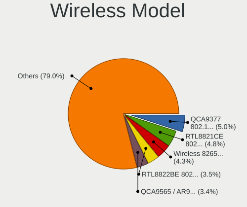

| Model                                                                   | Notebooks | Percent |
|-------------------------------------------------------------------------|-----------|---------|
| Qualcomm Atheros QCA9377 802.11ac Wireless Network Adapter              | 90        | 5.03%   |
| Realtek RTL8821CE 802.11ac PCIe Wireless Network Adapter                | 86        | 4.8%    |
| Intel Wireless 8265 / 8275                                              | 77        | 4.3%    |
| Realtek RTL8822BE 802.11a/b/g/n/ac WiFi adapter                         | 63        | 3.52%   |
| Qualcomm Atheros QCA9565 / AR9565 Wireless Network Adapter              | 61        | 3.41%   |
| Intel Wi-Fi 6 AX200                                                     | 61        | 3.41%   |
| Realtek RTL8723BE PCIe Wireless Network Adapter                         | 59        | 3.29%   |
| MediaTek MT7921 802.11ax PCIe Wireless Network Adapter [Filogic 330]    | 58        | 3.24%   |
| Realtek RTL8822CE 802.11ac PCIe Wireless Network Adapter                | 55        | 3.07%   |
| Intel Cannon Lake PCH CNVi WiFi                                         | 48        | 2.68%   |
| Intel Wi-Fi 6 AX201                                                     | 46        | 2.57%   |
| Qualcomm Atheros AR9285 Wireless Network Adapter (PCI-Express)          | 43        | 2.4%    |
| Intel Wireless 7260                                                     | 43        | 2.4%    |
| Intel Wireless 7265                                                     | 38        | 2.12%   |
| Intel Wireless 8260                                                     | 36        | 2.01%   |
| Qualcomm Atheros AR9485 Wireless Network Adapter                        | 35        | 1.95%   |
| Intel Cannon Point-LP CNVi [Wireless-AC]                                | 34        | 1.9%    |
| MediaTek MT7922 802.11ax PCI Express Wireless Network Adapter           | 33        | 1.84%   |
| Intel Centrino Advanced-N 6205 [Taylor Peak]                            | 32        | 1.79%   |
| Qualcomm Atheros QCA6174 802.11ac Wireless Network Adapter              | 26        | 1.45%   |
| Intel Wireless 3160                                                     | 25        | 1.4%    |
| Intel Dual Band Wireless-AC 3165 Plus Bluetooth                         | 25        | 1.4%    |
| Broadcom BCM43142 802.11b/g/n                                           | 25        | 1.4%    |
| Intel Wireless 3165                                                     | 24        | 1.34%   |
| Intel Comet Lake PCH-LP CNVi WiFi                                       | 24        | 1.34%   |
| Intel Comet Lake PCH CNVi WiFi                                          | 23        | 1.28%   |
| Broadcom BCM4313 802.11bgn Wireless Network Adapter                     | 22        | 1.23%   |
| Realtek RTL8852BE PCIe 802.11ax Wireless Network Controller             | 21        | 1.17%   |
| MediaTek MT7902 802.11ax PCIe Wireless Network Adapter [Filogic 310]    | 21        | 1.17%   |
| Intel Centrino Advanced-N 6200                                          | 18        | 1.01%   |
| Realtek RTL8723BU 802.11b/g/n WLAN Adapter                              | 17        | 0.95%   |
| Intel PRO/Wireless 3945ABG [Golan] Network Connection                   | 17        | 0.95%   |
| Intel Centrino Ultimate-N 6300                                          | 17        | 0.95%   |
| Intel Raptor Lake PCH CNVi WiFi                                         | 16        | 0.89%   |
| Intel Wi-Fi 5(802.11ac) Wireless-AC 9x6x [Thunder Peak]                 | 13        | 0.73%   |
| Intel Tiger Lake PCH CNVi WiFi                                          | 13        | 0.73%   |
| Intel Alder Lake-P PCH CNVi WiFi                                        | 13        | 0.73%   |
| Realtek RTL8852AE 802.11ax PCIe Wireless Network Adapter                | 12        | 0.67%   |
| Qualcomm Atheros AR242x / AR542x Wireless Network Adapter (PCI-Express) | 12        | 0.67%   |
| Intel Meteor Lake PCH CNVi WiFi                                         | 12        | 0.67%   |

Ethernet Vendor
---------------

Ethernet vendors

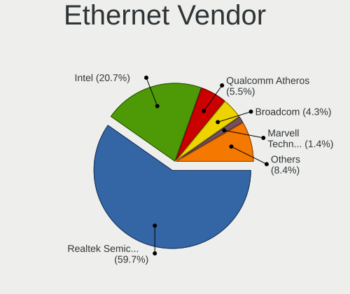

| Vendor                                 | Notebooks | Percent |
|----------------------------------------|-----------|---------|
| Realtek Semiconductor                  | 829       | 59.73%  |
| Intel                                  | 288       | 20.75%  |
| Qualcomm Atheros                       | 76        | 5.48%   |
| Broadcom                               | 60        | 4.32%   |
| Marvell Technology Group               | 19        | 1.37%   |
| ASIX Electronics                       | 16        | 1.15%   |
| Samsung Electronics                    | 15        | 1.08%   |
| TP-Link                                | 11        | 0.79%   |
| Xiaomi                                 | 10        | 0.72%   |
| MediaTek                               | 10        | 0.72%   |
| Broadcom Limited                       | 10        | 0.72%   |
| Huawei Technologies                    | 8         | 0.58%   |
| Lenovo                                 | 6         | 0.43%   |
| Silicon Integrated Systems [SiS]       | 5         | 0.36%   |
| Google                                 | 5         | 0.36%   |
| DisplayLink                            | 5         | 0.36%   |
| JMicron Technology                     | 4         | 0.29%   |
| Motorola PCS                           | 2         | 0.14%   |
| Apple                                  | 2         | 0.14%   |
| VIA Technologies                       | 1         | 0.07%   |
| Suzhou Motorcomm Electronic Technology | 1         | 0.07%   |
| Spreadtrum Communications              | 1         | 0.07%   |
| Sony Ericsson Mobile Communications AB | 1         | 0.07%   |
| Nvidia                                 | 1         | 0.07%   |
| Hewlett-Packard                        | 1         | 0.07%   |
| ASUSTek Computer                       | 1         | 0.07%   |

Ethernet Model
--------------

Ethernet models

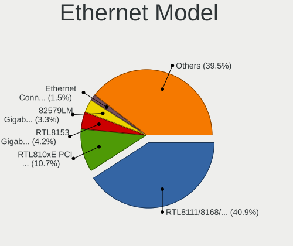

| Model                                                                  | Notebooks | Percent |
|------------------------------------------------------------------------|-----------|---------|
| Realtek RTL8111/8168/8211/8411 PCI Express Gigabit Ethernet Controller | 575       | 40.9%   |
| Realtek RTL810xE PCI Express Fast Ethernet controller                  | 150       | 10.67%  |
| Realtek RTL8153 Gigabit Ethernet Adapter                               | 59        | 4.2%    |
| Intel 82579LM Gigabit Network Connection (Lewisville)                  | 46        | 3.27%   |
| Intel Ethernet Connection (4) I219-LM                                  | 21        | 1.49%   |
| Intel 82577LM Gigabit Network Connection                               | 21        | 1.49%   |
| Realtek RTL8125 2.5GbE Controller                                      | 20        | 1.42%   |
| Intel Ethernet Connection I218-LM                                      | 19        | 1.35%   |
| Broadcom NetLink BCM57785 Gigabit Ethernet PCIe                        | 17        | 1.21%   |
| Intel Ethernet Connection (7) I219-LM                                  | 16        | 1.14%   |
| Qualcomm Atheros AR8151 v2.0 Gigabit Ethernet                          | 15        | 1.07%   |
| Intel Ethernet Connection I217-LM                                      | 15        | 1.07%   |
| Qualcomm Atheros QCA8172 Fast Ethernet                                 | 13        | 0.92%   |
| Intel Ethernet Connection I219-LM                                      | 13        | 0.92%   |
| ASIX AX88179 Gigabit Ethernet                                          | 13        | 0.92%   |
| TP-Link UE300 10/100/1000 LAN (ethernet mode) [Realtek RTL8153]        | 11        | 0.78%   |
| Intel Ethernet Connection (3) I218-LM                                  | 11        | 0.78%   |
| Intel Alder Lake-P PCH CNVi WiFi                                       | 11        | 0.78%   |
| Samsung Galaxy series, misc. (tethering mode)                          | 10        | 0.71%   |
| Realtek Killer E2600 GbE Controller                                    | 10        | 0.71%   |
| Qualcomm Atheros QCA8171 Gigabit Ethernet                              | 9         | 0.64%   |
| Qualcomm Atheros AR8161 Gigabit Ethernet                               | 9         | 0.64%   |
| Intel Ethernet Connection (6) I219-V                                   | 9         | 0.64%   |
| Xiaomi Mi/Redmi series (RNDIS)                                         | 8         | 0.57%   |
| Realtek RTL8852CE PCIe 802.11ax Wireless Network Controller            | 8         | 0.57%   |
| Intel Ethernet Connection (13) I219-V                                  | 8         | 0.57%   |
| Intel 82567LM Gigabit Network Connection                               | 8         | 0.57%   |
| Broadcom NetLink BCM5787M Gigabit Ethernet PCI Express                 | 8         | 0.57%   |
| Intel Ethernet Connection (6) I219-LM                                  | 7         | 0.5%    |
| Intel Ethernet Connection (4) I219-V                                   | 7         | 0.5%    |
| Broadcom BCM4401-B0 100Base-TX                                         | 7         | 0.5%    |
| Marvell Group 88E8040 PCI-E Fast Ethernet Controller                   | 6         | 0.43%   |
| Broadcom NetXtreme BCM57786 Gigabit Ethernet PCIe                      | 6         | 0.43%   |
| Silicon Integrated Systems [SiS] 191 Gigabit Ethernet Adapter          | 5         | 0.36%   |
| Samsung GT-I9070 (network tethering, USB debugging enabled)            | 5         | 0.36%   |
| Realtek RTL8152 Fast Ethernet Adapter                                  | 5         | 0.36%   |
| Realtek PCIe GbE Family Controller                                     | 5         | 0.36%   |
| Qualcomm Atheros AR8152 v1.1 Fast Ethernet                             | 5         | 0.36%   |
| Qualcomm Atheros AR8131 Gigabit Ethernet                               | 5         | 0.36%   |
| MediaTek MT7922 802.11ax PCI Express Wireless Network Adapter          | 5         | 0.36%   |

Net Controller Kind
-------------------

Ethernet, WiFi or modem

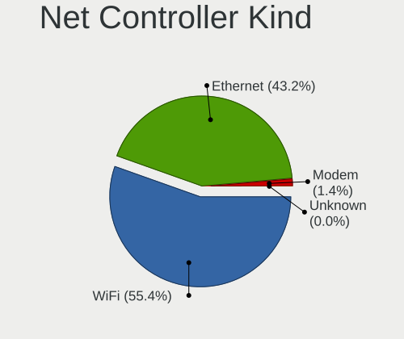

| Kind     | Notebooks | Percent |
|----------|-----------|---------|
| WiFi     | 1693      | 55.44%  |
| Ethernet | 1318      | 43.16%  |
| Modem    | 42        | 1.38%   |
| Unknown  | 1         | 0.03%   |

Used Controller
---------------

Currently used network controller

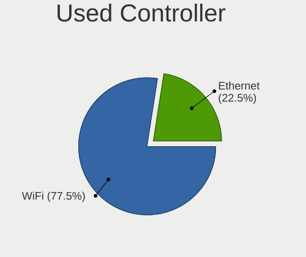

| Kind     | Notebooks | Percent |
|----------|-----------|---------|
| WiFi     | 1413      | 77.47%  |
| Ethernet | 411       | 22.53%  |

NICs
----

Total network controllers on board

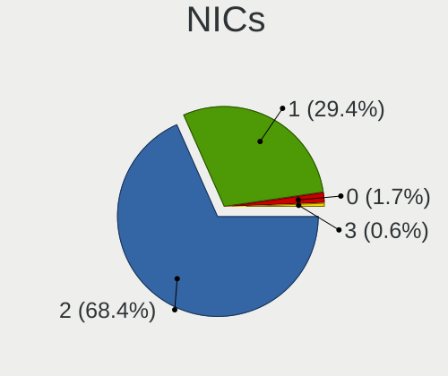

| Total | Notebooks | Percent |
|-------|-----------|---------|
| 2     | 1190      | 68.35%  |
| 1     | 511       | 29.35%  |
| 0     | 29        | 1.67%   |
| 3     | 11        | 0.63%   |

IPv6
----

IPv6 vs IPv4

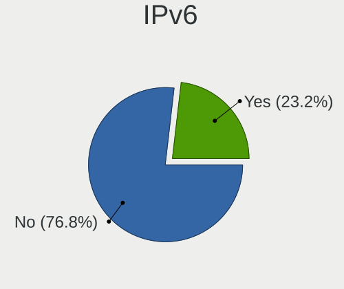

| Used | Notebooks | Percent |
|------|-----------|---------|
| No   | 1370      | 76.84%  |
| Yes  | 413       | 23.16%  |

Bluetooth
---------

Bluetooth Vendor
----------------

Controller vendors

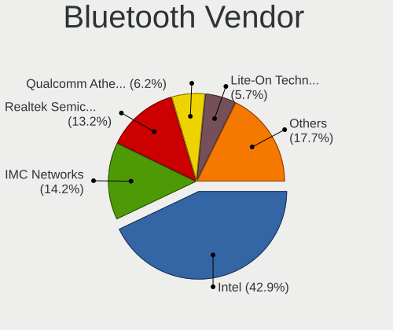

| Vendor                          | Notebooks | Percent |
|---------------------------------|-----------|---------|
| Intel                           | 624       | 42.95%  |
| IMC Networks                    | 207       | 14.25%  |
| Realtek Semiconductor           | 192       | 13.21%  |
| Qualcomm Atheros Communications | 90        | 6.19%   |
| Lite-On Technology              | 83        | 5.71%   |
| Foxconn / Hon Hai               | 80        | 5.51%   |
| Broadcom                        | 51        | 3.51%   |
| Dell                            | 26        | 1.79%   |
| Hewlett-Packard                 | 19        | 1.31%   |
| Toshiba                         | 16        | 1.1%    |
| Ralink                          | 11        | 0.76%   |
| Apple                           | 10        | 0.69%   |
| Realtek                         | 9         | 0.62%   |
| Cambridge Silicon Radio         | 7         | 0.48%   |
| ASUSTek Computer                | 7         | 0.48%   |
| MediaTek                        | 5         | 0.34%   |
| USI                             | 3         | 0.21%   |
| Alps Electric                   | 3         | 0.21%   |
| Foxconn International           | 2         | 0.14%   |
| Chicony Electronics             | 2         | 0.14%   |
| SINO WEALTH                     | 1         | 0.07%   |
| Ralink Technology               | 1         | 0.07%   |
| Opticis                         | 1         | 0.07%   |
| Micro Star International        | 1         | 0.07%   |
| Askey Computer                  | 1         | 0.07%   |
| Unknown                         | 1         | 0.07%   |

Bluetooth Model
---------------

Controller models

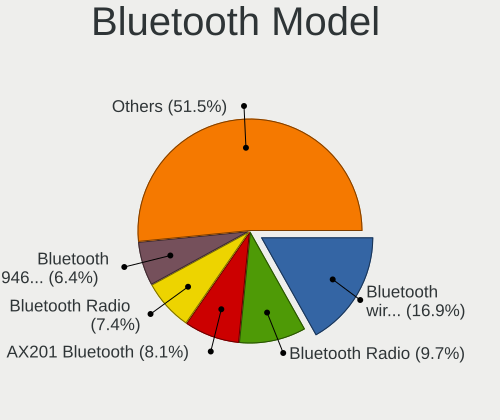

| Model                                               | Notebooks | Percent |
|-----------------------------------------------------|-----------|---------|
| Intel Bluetooth wireless interface                  | 245       | 16.86%  |
| Realtek Bluetooth Radio                             | 141       | 9.7%    |
| Intel AX201 Bluetooth                               | 117       | 8.05%   |
| IMC Networks Bluetooth Radio                        | 108       | 7.43%   |
| Intel Bluetooth 9460/9560 Jefferson Peak (JfP)      | 93        | 6.4%    |
| Intel AX200 Bluetooth                               | 60        | 4.13%   |
| Intel Bluetooth Device                              | 53        | 3.65%   |
| IMC Networks Wireless_Device                        | 53        | 3.65%   |
| Qualcomm Atheros  Bluetooth Device                  | 47        | 3.23%   |
| IMC Networks Bluetooth Device                       | 35        | 2.41%   |
| Foxconn / Hon Hai Wireless_Device                   | 33        | 2.27%   |
| Lite-On Qualcomm Atheros QCA9377 Bluetooth          | 28        | 1.93%   |
| Realtek  Bluetooth 4.2 Adapter                      | 25        | 1.72%   |
| Lite-On Atheros AR3012 Bluetooth                    | 16        | 1.1%    |
| Intel Centrino Bluetooth Wireless Transceiver       | 15        | 1.03%   |
| Foxconn / Hon Hai MediaTek Bluetooth Adapter        | 15        | 1.03%   |
| Realtek RTL8822BE Bluetooth 4.2 Adapter             | 14        | 0.96%   |
| Lite-On Bluetooth Device                            | 14        | 0.96%   |
| Intel Centrino Advanced-N 6230 Bluetooth adapter    | 14        | 0.96%   |
| Qualcomm Atheros QCA61x4 Bluetooth 4.0              | 13        | 0.89%   |
| Lite-On Wireless_Device                             | 13        | 0.89%   |
| Dell DW375 Bluetooth Module                         | 13        | 0.89%   |
| Qualcomm Atheros AR3011 Bluetooth                   | 12        | 0.83%   |
| Ralink RT3290 Bluetooth                             | 11        | 0.76%   |
| Intel Wireless-AC 9260 Bluetooth Adapter            | 11        | 0.76%   |
| HP Broadcom 2070 Bluetooth Combo                    | 11        | 0.76%   |
| Foxconn / Hon Hai Bluetooth Device                  | 11        | 0.76%   |
| Realtek Bluetooth Radio                             | 9         | 0.62%   |
| Intel AX210 Bluetooth                               | 9         | 0.62%   |
| Qualcomm Atheros AR3012 Bluetooth 4.0               | 8         | 0.55%   |
| HP Bluetooth 2.0 Interface [Broadcom BCM2045]       | 8         | 0.55%   |
| Toshiba Bluetooth Device                            | 7         | 0.48%   |
| Lite-On Broadcom BCM43142A0 Bluetooth Device        | 7         | 0.48%   |
| Cambridge Silicon Radio Bluetooth Dongle (HCI mode) | 7         | 0.48%   |
| Broadcom BCM20702 Bluetooth 4.0 [ThinkPad]          | 7         | 0.48%   |
| Broadcom BCM2045B (BDC-2.1)                         | 7         | 0.48%   |
| Broadcom BCM2045A0                                  | 7         | 0.48%   |
| Realtek RTL8723B Bluetooth                          | 6         | 0.41%   |
| Intel Wireless-AC 3168 Bluetooth                    | 6         | 0.41%   |
| Apple Bluetooth Host Controller                     | 6         | 0.41%   |

Sound
-----

Sound Vendor
------------

Sound card vendors

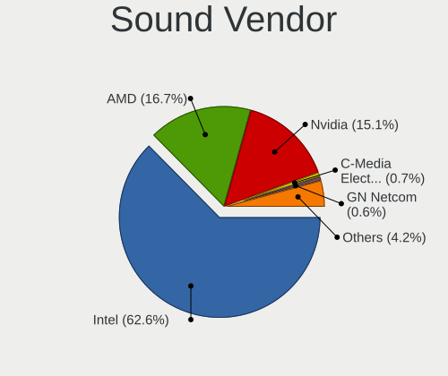

| Vendor                           | Notebooks | Percent |
|----------------------------------|-----------|---------|
| Intel                            | 1373      | 62.61%  |
| AMD                              | 366       | 16.69%  |
| Nvidia                           | 332       | 15.14%  |
| C-Media Electronics              | 15        | 0.68%   |
| GN Netcom                        | 14        | 0.64%   |
| Realtek Semiconductor            | 10        | 0.46%   |
| Logitech                         | 7         | 0.32%   |
| Lenovo                           | 7         | 0.32%   |
| ASUSTek Computer                 | 7         | 0.32%   |
| Silicon Integrated Systems [SiS] | 6         | 0.27%   |
| Plantronics                      | 6         | 0.27%   |
| Sony                             | 4         | 0.18%   |
| Kingston Technology              | 4         | 0.18%   |
| XMOS                             | 3         | 0.14%   |
| Razer USA                        | 3         | 0.14%   |
| Hewlett-Packard                  | 3         | 0.14%   |
| Creative Technology              | 3         | 0.14%   |
| VIA Technologies                 | 2         | 0.09%   |
| Samsung Electronics              | 2         | 0.09%   |
| Generalplus Technology           | 2         | 0.09%   |
| DSEA A/S                         | 2         | 0.09%   |
| Dell                             | 2         | 0.09%   |
| Apple                            | 2         | 0.09%   |
| Unknown                          | 1         | 0.05%   |
| Trust                            | 1         | 0.05%   |
| Tenx Technology                  | 1         | 0.05%   |
| SteelSeries ApS                  | 1         | 0.05%   |
| RME                              | 1         | 0.05%   |
| PreSonus Audio Electronics       | 1         | 0.05%   |
| Nordic Semiconductor ASA         | 1         | 0.05%   |
| Micro Star International         | 1         | 0.05%   |
| Mark of the Unicorn              | 1         | 0.05%   |
| Mackie Designs                   | 1         | 0.05%   |
| LG Electronics                   | 1         | 0.05%   |
| JMTek                            | 1         | 0.05%   |
| Focusrite-Novation               | 1         | 0.05%   |
| FiiO Electronics Technology      | 1         | 0.05%   |
| Corsair                          | 1         | 0.05%   |
| CMX Systems                      | 1         | 0.05%   |
| Bose                             | 1         | 0.05%   |

Sound Model
-----------

Sound card models

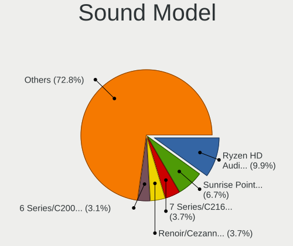

| Model                                                                                             | Notebooks | Percent |
|---------------------------------------------------------------------------------------------------|-----------|---------|
| AMD Ryzen HD Audio Controller                                                                     | 263       | 9.94%   |
| Intel Sunrise Point-LP HD Audio                                                                   | 177       | 6.69%   |
| Intel 7 Series/C216 Chipset Family High Definition Audio Controller                               | 99        | 3.74%   |
| AMD Renoir/Cezanne HDMI/DP Audio Controller                                                       | 99        | 3.74%   |
| Intel 6 Series/C200 Series Chipset Family High Definition Audio Controller                        | 81        | 3.06%   |
| Intel Cannon Point-LP High Definition Audio Controller                                            | 80        | 3.02%   |
| Intel Cannon Lake PCH cAVS                                                                        | 79        | 2.99%   |
| Intel Haswell-ULT HD Audio Controller                                                             | 75        | 2.83%   |
| Intel 8 Series HD Audio Controller                                                                | 74        | 2.8%    |
| Intel Celeron/Pentium Silver Processor High Definition Audio                                      | 67        | 2.53%   |
| AMD Raven/Raven2/Fenghuang HDMI/DP Audio Controller                                               | 65        | 2.46%   |
| AMD Radeon High Definition Audio Controller                                                       | 65        | 2.46%   |
| Intel Tiger Lake-LP Smart Sound Technology Audio Controller                                       | 63        | 2.38%   |
| Intel 5 Series/3400 Series Chipset High Definition Audio                                          | 63        | 2.38%   |
| Intel 8 Series/C220 Series Chipset High Definition Audio Controller                               | 59        | 2.23%   |
| Intel Xeon E3-1200 v3/4th Gen Core Processor HD Audio Controller                                  | 54        | 2.04%   |
| Intel Alder Lake PCH-P High Definition Audio Controller                                           | 50        | 1.89%   |
| Intel Wildcat Point-LP High Definition Audio Controller                                           | 49        | 1.85%   |
| Intel Broadwell-U Audio Controller                                                                | 49        | 1.85%   |
| Intel 82801I (ICH9 Family) HD Audio Controller                                                    | 44        | 1.66%   |
| Intel Celeron N3350/Pentium N4200/Atom E3900 Series Audio Cluster                                 | 40        | 1.51%   |
| Nvidia TU107 GeForce GTX 1650 High Definition Audio Controller                                    | 36        | 1.36%   |
| Intel Comet Lake PCH-LP cAVS                                                                      | 34        | 1.28%   |
| Intel 82801H (ICH8 Family) HD Audio Controller                                                    | 33        | 1.25%   |
| Intel 100 Series/C230 Series Chipset Family HD Audio Controller                                   | 32        | 1.21%   |
| Nvidia GA107 High Definition Audio Controller                                                     | 29        | 1.1%    |
| Intel NM10/ICH7 Family High Definition Audio Controller                                           | 28        | 1.06%   |
| Intel Comet Lake PCH cAVS                                                                         | 28        | 1.06%   |
| Intel CM238 HD Audio Controller                                                                   | 28        | 1.06%   |
| Nvidia GF108 High Definition Audio Controller                                                     | 27        | 1.02%   |
| AMD FCH Azalia Controller                                                                         | 27        | 1.02%   |
| Nvidia GP107GL High Definition Audio Controller                                                   | 26        | 0.98%   |
| Nvidia AD107 High Definition Audio Controller                                                     | 26        | 0.98%   |
| Intel Tiger Lake-H HD Audio Controller                                                            | 26        | 0.98%   |
| Intel Raptor Lake-P/U/H cAVS                                                                      | 25        | 0.94%   |
| Intel Ice Lake-LP Smart Sound Technology Audio Controller                                         | 24        | 0.91%   |
| Intel Atom/Celeron/Pentium Processor x5-E8000/J3xxx/N3xxx Series High Definition Audio Controller | 23        | 0.87%   |
| Nvidia GA104 High Definition Audio Controller                                                     | 22        | 0.83%   |
| Nvidia TU116 High Definition Audio Controller                                                     | 21        | 0.79%   |
| AMD Family 15h (Models 60h-6fh) Audio Controller                                                  | 20        | 0.76%   |

Memory
------

Memory Vendor
-------------

Memory module vendors

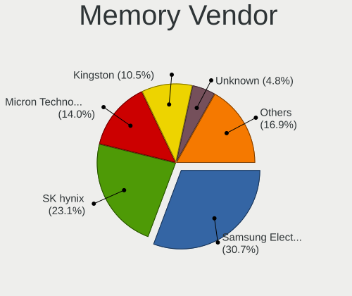

| Vendor                       | Notebooks | Percent |
|------------------------------|-----------|---------|
| Samsung Electronics          | 328       | 30.71%  |
| SK hynix                     | 247       | 23.13%  |
| Micron Technology            | 150       | 14.04%  |
| Kingston                     | 112       | 10.49%  |
| Unknown                      | 51        | 4.78%   |
| Corsair                      | 27        | 2.53%   |
| Crucial                      | 26        | 2.43%   |
| Ramaxel Technology           | 24        | 2.25%   |
| A-DATA Technology            | 22        | 2.06%   |
| Elpida                       | 20        | 1.87%   |
| Unknown (ABCD)               | 14        | 1.31%   |
| Nanya Technology             | 13        | 1.22%   |
| Unknown                      | 10        | 0.94%   |
| Kingmax                      | 5         | 0.47%   |
| Transcend                    | 2         | 0.19%   |
| Team                         | 2         | 0.19%   |
| Kingmax Semiconductor        | 2         | 0.19%   |
| Apacer                       | 2         | 0.19%   |
| Unknown (0x7FDA000000000000) | 1         | 0.09%   |
| Unknown (0B45)               | 1         | 0.09%   |
| Silicon Power                | 1         | 0.09%   |
| SHARETRONIC                  | 1         | 0.09%   |
| PNY                          | 1         | 0.09%   |
| Patriot                      | 1         | 0.09%   |
| KingFast                     | 1         | 0.09%   |
| Infineon                     | 1         | 0.09%   |
| ChangXin Memory              | 1         | 0.09%   |
| Avant                        | 1         | 0.09%   |
| ASint Technology             | 1         | 0.09%   |

Memory Model
------------

Memory module models

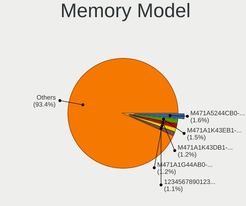

| Model                                                            | Notebooks | Percent |
|------------------------------------------------------------------|-----------|---------|
| Samsung RAM M471A5244CB0-CTD 4GB SODIMM DDR4 3266MT/s            | 18        | 1.57%   |
| Samsung RAM M471A1K43EB1-CWE 8GB SODIMM DDR4 3200MT/s            | 17        | 1.49%   |
| Samsung RAM M471A1K43DB1-CWE 8GB SODIMM DDR4 3200MT/s            | 14        | 1.22%   |
| Samsung RAM M471A1G44AB0-CWE 8GiB SODIMM DDR4 3200MT/s           | 14        | 1.22%   |
| Unknown (ABCD) RAM 123456789012345678 2GB SODIMM LPDDR4 2400MT/s | 13        | 1.14%   |
| SK hynix RAM HMT451S6BFR8A-PB 4GB SODIMM DDR3 1600MT/s           | 13        | 1.14%   |
| SK hynix RAM HMT41GS6AFR8A-PB 8GiB SODIMM DDR3 2667MT/s          | 13        | 1.14%   |
| SK hynix RAM HMAA1GS6CJR6N-XN 8GB SODIMM DDR4 3200MT/s           | 13        | 1.14%   |
| Samsung RAM M471A5244CB0-CRC 4GB SODIMM DDR4 2667MT/s            | 13        | 1.14%   |
| Samsung RAM M471A1K43DB1-CTD 8GB SODIMM DDR4 2667MT/s            | 12        | 1.05%   |
| SK hynix RAM HMT41GS6BFR8A-PB 8GB SODIMM DDR3 2667MT/s           | 11        | 0.96%   |
| Samsung RAM M471B5173QH0-YK0 4GB SODIMM DDR3 1600MT/s            | 11        | 0.96%   |
| Samsung RAM M471B5173EB0-YK0 4GB SODIMM DDR3 1600MT/s            | 11        | 0.96%   |
| Samsung RAM M471A5244CB0-CWE 4GB SODIMM DDR4 3200MT/s            | 11        | 0.96%   |
| Micron RAM 4ATF1G64HZ-3G2F1 8GB SODIMM DDR4 3200MT/s             | 10        | 0.87%   |
| Unknown                                                          | 10        | 0.87%   |
| SK hynix RAM HMA81GS6AFR8N-UH 8GB SODIMM DDR4 2667MT/s           | 9         | 0.79%   |
| Samsung RAM M471B1G73QH0-YK0 8GB SODIMM DDR3 1600MT/s            | 9         | 0.79%   |
| Samsung RAM M471B1G73EB0-YK0 8192MB SODIMM DDR3 1600MT/s         | 9         | 0.79%   |
| SK hynix RAM HMA81GS6CJR8N-VK 8GB SODIMM DDR4 2667MT/s           | 8         | 0.7%    |
| Samsung RAM M471A1K43CB1-CTD 8GB SODIMM DDR4 3200MT/s            | 8         | 0.7%    |
| Samsung RAM M471A1G44BB0-CWE 8GB SODIMM DDR4 3200MT/s            | 8         | 0.7%    |
| SK hynix RAM HMA81GS6JJR8N-VK 8GB SODIMM DDR4 2667MT/s           | 7         | 0.61%   |
| Micron RAM 4ATF51264HZ-3G2J1 4GB SODIMM DDR4 3200MT/s            | 7         | 0.61%   |
| Micron RAM 4ATF1G64HZ-3G2E1 8GB SODIMM DDR4 3200MT/s             | 7         | 0.61%   |
| SK hynix RAM HMA81GS6DJR8N-XN 8GB SODIMM DDR4 3200MT/s           | 6         | 0.52%   |
| Samsung RAM M471B5273DH0-CH9 4GB SODIMM DDR3 1600MT/s            | 6         | 0.52%   |
| Samsung RAM M471B5173DB0-YK0 4GB SODIMM DDR3 1600MT/s            | 6         | 0.52%   |
| Samsung RAM M471A1K43CB1-CRC 8GB SODIMM DDR4 8400MT/s            | 6         | 0.52%   |
| Samsung RAM M425R1GB4BB0-CQKOL 8GB SODIMM DDR5 4800MT/s          | 6         | 0.52%   |
| SK hynix RAM HMA851S6AFR6N-UH 4GB SODIMM DDR4 2400MT/s           | 5         | 0.44%   |
| SK hynix RAM HMA41GS6AFR8N-TF 8GB SODIMM DDR4 2667MT/s           | 5         | 0.44%   |
| Samsung RAM M471A5244CB0-CWE 4GB Row Of Chips DDR4 3200MT/s      | 5         | 0.44%   |
| Samsung RAM M471A2K43DB1-CWE 16GB SODIMM DDR4 3200MT/s           | 5         | 0.44%   |
| Micron RAM 8ATF1G64HZ-2G6E1 8GB SODIMM DDR4 2667MT/s             | 5         | 0.44%   |
| Micron RAM 16JSF51264HZ-1G4D1 4GB SODIMM DDR3 1334MT/s           | 5         | 0.44%   |
| Kingston RAM 99U5428-018.A00LF 8GB SODIMM DDR3 1600MT/s          | 5         | 0.44%   |
| Elpida RAM EBJ41UF8BCS0-DJ-F 4GB SODIMM DDR3 1334MT/s            | 5         | 0.44%   |
| Unknown RAM Module 2GB SODIMM DDR2                               | 4         | 0.35%   |
| SK hynix RAM HMT351S6CFR8C-PB 4GB SODIMM DDR3 1600MT/s           | 4         | 0.35%   |

Memory Kind
-----------

Memory module kinds

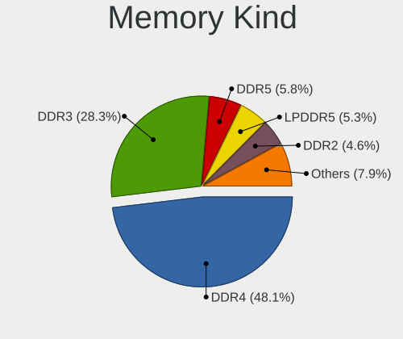

| Kind    | Notebooks | Percent |
|---------|-----------|---------|
| DDR4    | 430       | 48.1%   |
| DDR3    | 253       | 28.3%   |
| DDR5    | 52        | 5.82%   |
| LPDDR5  | 47        | 5.26%   |
| DDR2    | 41        | 4.59%   |
| LPDDR4  | 31        | 3.47%   |
| LPDDR3  | 21        | 2.35%   |
| SDRAM   | 13        | 1.45%   |
| Unknown | 3         | 0.34%   |
| DRAM    | 2         | 0.22%   |
| DDR     | 1         | 0.11%   |

Memory Form Factor
------------------

Physical design of the memory module

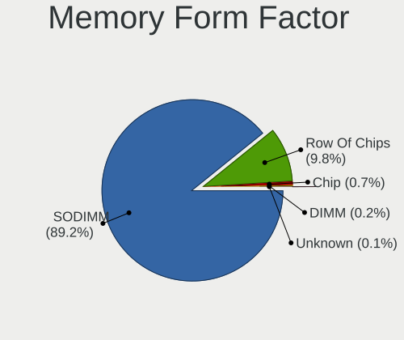

| Name         | Notebooks | Percent |
|--------------|-----------|---------|
| SODIMM       | 802       | 89.21%  |
| Row Of Chips | 88        | 9.79%   |
| Chip         | 6         | 0.67%   |
| DIMM         | 2         | 0.22%   |
| Unknown      | 1         | 0.11%   |

Memory Size
-----------

Memory module size

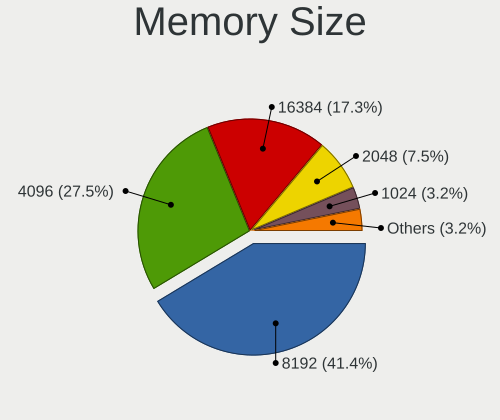

| Size  | Notebooks | Percent |
|-------|-----------|---------|
| 8192  | 402       | 41.36%  |
| 4096  | 267       | 27.47%  |
| 16384 | 168       | 17.28%  |
| 2048  | 73        | 7.51%   |
| 1024  | 31        | 3.19%   |
| 32768 | 26        | 2.67%   |
| 512   | 2         | 0.21%   |
| 12288 | 1         | 0.1%    |
| 6144  | 1         | 0.1%    |
| 3072  | 1         | 0.1%    |

Memory Speed
------------

Memory module speed

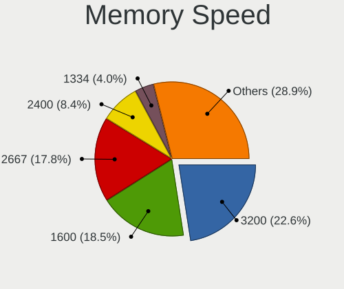

| Speed   | Notebooks | Percent |
|---------|-----------|---------|
| 3200    | 221       | 22.55%  |
| 1600    | 181       | 18.47%  |
| 2667    | 174       | 17.76%  |
| 2400    | 82        | 8.37%   |
| 1334    | 39        | 3.98%   |
| 2133    | 35        | 3.57%   |
| 4800    | 27        | 2.76%   |
| 5600    | 26        | 2.65%   |
| 1333    | 19        | 1.94%   |
| 7500    | 18        | 1.84%   |
| 3266    | 18        | 1.84%   |
| 6400    | 17        | 1.73%   |
| 667     | 16        | 1.63%   |
| Unknown | 15        | 1.53%   |
| 1067    | 12        | 1.22%   |
| 8400    | 8         | 0.82%   |
| 975     | 8         | 0.82%   |
| 800     | 8         | 0.82%   |
| 1066    | 7         | 0.71%   |
| 4199    | 6         | 0.61%   |
| 1867    | 6         | 0.61%   |
| 8533    | 5         | 0.51%   |
| 4266    | 5         | 0.51%   |
| 4267    | 4         | 0.41%   |
| 2933    | 4         | 0.41%   |
| 7467    | 3         | 0.31%   |
| 2048    | 3         | 0.31%   |
| 533     | 3         | 0.31%   |
| 5500    | 2         | 0.2%    |
| 3733    | 2         | 0.2%    |
| 1639    | 2         | 0.2%    |
| 8600    | 1         | 0.1%    |
| 2666    | 1         | 0.1%    |
| 400     | 1         | 0.1%    |
| 333     | 1         | 0.1%    |

Printers & scanners
-------------------

Printer Vendor
--------------

Printer device vendors

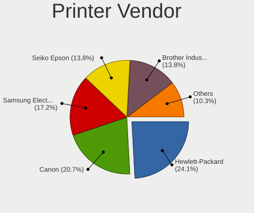

| Vendor                | Notebooks | Percent |
|-----------------------|-----------|---------|
| Hewlett-Packard       | 7         | 24.14%  |
| Canon                 | 6         | 20.69%  |
| Samsung Electronics   | 5         | 17.24%  |
| Seiko Epson           | 4         | 13.79%  |
| Brother Industries    | 4         | 13.79%  |
| Xerox                 | 1         | 3.45%   |
| Pantum                | 1         | 3.45%   |
| Lexmark International | 1         | 3.45%   |

Printer Model
-------------

Printer device models

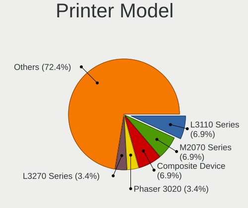

| Model                                      | Notebooks | Percent |
|--------------------------------------------|-----------|---------|
| Seiko Epson L3110 Series                   | 2         | 6.9%    |
| Samsung M2070 Series                       | 2         | 6.9%    |
| Samsung Composite Device                   | 2         | 6.9%    |
| Xerox Phaser 3020                          | 1         | 3.45%   |
| Seiko Epson L3270 Series                   | 1         | 3.45%   |
| Seiko Epson ET-2710 Series                 | 1         | 3.45%   |
| Samsung ML-1660 Series                     | 1         | 3.45%   |
| Pantum M6500NW-series                      | 1         | 3.45%   |
| Lexmark International InkJet Color Printer | 1         | 3.45%   |
| HP LaserJet 400 M401dne                    | 1         | 3.45%   |
| HP LaserJet 1022                           | 1         | 3.45%   |
| HP LaserJet 1018                           | 1         | 3.45%   |
| HP HP Laser 107w                           | 1         | 3.45%   |
| HP Deskjet F4500 series                    | 1         | 3.45%   |
| HP DeskJet 2300 series                     | 1         | 3.45%   |
| HP Deskjet 2050 J510                       | 1         | 3.45%   |
| Canon PIXMA MP250                          | 1         | 3.45%   |
| Canon MF4320-4350                          | 1         | 3.45%   |
| Canon MF3200 series                        | 1         | 3.45%   |
| Canon LiDE 300                             | 1         | 3.45%   |
| Canon LBP2900                              | 1         | 3.45%   |
| Canon iP7200 series                        | 1         | 3.45%   |
| Brother HL-5380DN series                   | 1         | 3.45%   |
| Brother HL-1110 series                     | 1         | 3.45%   |
| Brother DCP-T520W                          | 1         | 3.45%   |
| Brother DCP-T310                           | 1         | 3.45%   |

Scanner Vendor
--------------

Scanner device vendors

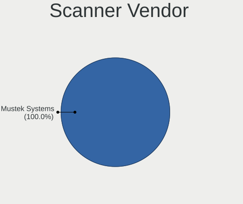

| Vendor         | Notebooks | Percent |
|----------------|-----------|---------|
| Mustek Systems | 1         | 100%    |

Scanner Model
-------------

Scanner device models

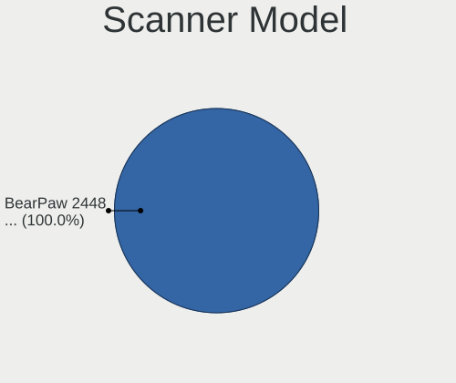

| Model                               | Notebooks | Percent |
|-------------------------------------|-----------|---------|
| Mustek Systems BearPaw 2448 TA Plus | 1         | 100%    |

Camera
------

Camera Vendor
-------------

Camera device vendors

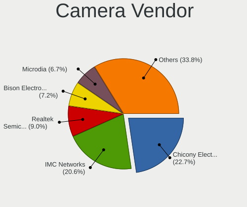

| Vendor                                 | Notebooks | Percent |
|----------------------------------------|-----------|---------|
| Chicony Electronics                    | 354       | 22.69%  |
| IMC Networks                           | 322       | 20.64%  |
| Realtek Semiconductor                  | 140       | 8.97%   |
| Bison Electronics                      | 113       | 7.24%   |
| Microdia                               | 104       | 6.67%   |
| Quanta                                 | 84        | 5.38%   |
| Sunplus Innovation Technology          | 67        | 4.29%   |
| Luxvisions Innotech Limited            | 40        | 2.56%   |
| Syntek                                 | 39        | 2.5%    |
| Sonix Technology                       | 39        | 2.5%    |
| Cheng Uei Precision Industry (Foxlink) | 38        | 2.44%   |
| Lite-On Technology                     | 36        | 2.31%   |
| Alcor Micro                            | 30        | 1.92%   |
| Suyin                                  | 28        | 1.79%   |
| ShineTech                              | 18        | 1.15%   |
| Ricoh                                  | 12        | 0.77%   |
| Apple                                  | 12        | 0.77%   |
| Silicon Motion                         | 11        | 0.71%   |
| Samsung Electronics                    | 9         | 0.58%   |
| Logitech                               | 8         | 0.51%   |
| OmniVision Technologies                | 6         | 0.38%   |
| ALi                                    | 5         | 0.32%   |
| Acer                                   | 5         | 0.32%   |
| Shine-optics                           | 4         | 0.26%   |
| Primax Electronics                     | 4         | 0.26%   |
| BillionPixels                          | 4         | 0.26%   |
| Z-Star Microelectronics                | 2         | 0.13%   |
| Y Media                                | 2         | 0.13%   |
| Trust                                  | 2         | 0.13%   |
| Sunplus Technology                     | 2         | 0.13%   |
| Microsoft                              | 2         | 0.13%   |
| Lenovo                                 | 2         | 0.13%   |
| kingcome                               | 2         | 0.13%   |
| Importek                               | 2         | 0.13%   |
| Genesys Logic                          | 2         | 0.13%   |
| webcam                                 | 1         | 0.06%   |
| Razer USA                              | 1         | 0.06%   |
| Philips (or NXP)                       | 1         | 0.06%   |
| KYE Systems (Mouse Systems)            | 1         | 0.06%   |
| Intel                                  | 1         | 0.06%   |

Camera Model
------------

Camera device models

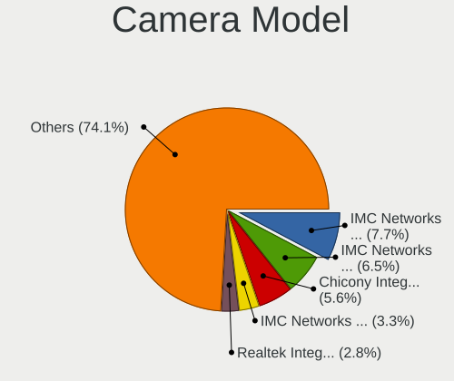

| Model                                               | Notebooks | Percent |
|-----------------------------------------------------|-----------|---------|
| IMC Networks USB2.0 VGA UVC WebCam                  | 121       | 7.75%   |
| IMC Networks USB2.0 HD UVC WebCam                   | 102       | 6.53%   |
| Chicony Integrated Camera                           | 87        | 5.57%   |
| IMC Networks Integrated Camera                      | 51        | 3.27%   |
| Realtek Integrated_Webcam_HD                        | 44        | 2.82%   |
| Microdia Integrated_Webcam_HD                       | 38        | 2.43%   |
| Bison Integrated Camera                             | 31        | 1.98%   |
| Sonix USB2.0 HD UVC WebCam                          | 30        | 1.92%   |
| Chicony HD WebCam                                   | 29        | 1.86%   |
| Syntek Integrated Camera                            | 24        | 1.54%   |
| Chicony USB2.0 VGA UVC WebCam                       | 24        | 1.54%   |
| Chicony USB2.0 HD UVC WebCam                        | 21        | 1.34%   |
| Sunplus HD WebCam                                   | 16        | 1.02%   |
| Realtek USB Camera                                  | 16        | 1.02%   |
| Lite-On Integrated Camera                           | 15        | 0.96%   |
| Bison SunplusIT Integrated Camera                   | 14        | 0.9%    |
| Bison Lenovo EasyCamera                             | 14        | 0.9%    |
| Quanta HD Webcam                                    | 13        | 0.83%   |
| Chicony TOSHIBA Web Camera - HD                     | 13        | 0.83%   |
| Quanta VGA WebCam                                   | 12        | 0.77%   |
| Luxvisions Innotech Limited Integrated RGB Camera   | 12        | 0.77%   |
| Microdia Integrated Webcam                          | 11        | 0.7%    |
| IMC Networks USB2.0 UVC HD Webcam                   | 11        | 0.7%    |
| Chicony HP HD Camera                                | 11        | 0.7%    |
| Chicony EasyCamera                                  | 11        | 0.7%    |
| Bison EasyCamera                                    | 11        | 0.7%    |
| Sunplus Integrated_Webcam_HD                        | 10        | 0.64%   |
| Realtek USB2.0 HD UVC WebCam                        | 10        | 0.64%   |
| Chicony VGA Webcam                                  | 10        | 0.64%   |
| Chicony HP Webcam                                   | 10        | 0.64%   |
| Sunplus Asus Webcam                                 | 9         | 0.58%   |
| Samsung Galaxy series, misc. (MTP mode)             | 9         | 0.58%   |
| Luxvisions Innotech Limited HP TrueVision HD Camera | 9         | 0.58%   |
| Chicony Integrated Camera (1280x720@30)             | 9         | 0.58%   |
| Bison Integrated RGB Camera                         | 9         | 0.58%   |
| Alcor Micro USB 2.0 Camera                          | 9         | 0.58%   |
| ShineTech USB2.0 HD UVC WebCam                      | 8         | 0.51%   |
| Shinetech USB2.0 FHD UVC WebCam                     | 8         | 0.51%   |
| Realtek Lenovo EasyCamera                           | 8         | 0.51%   |
| Realtek Integrated Webcam                           | 8         | 0.51%   |

Security
--------

Fingerprint Vendor
------------------

Fingerprint sensor vendors

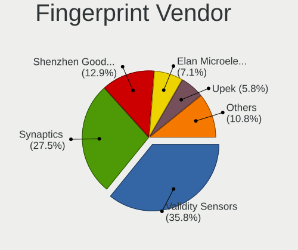

| Vendor                             | Notebooks | Percent |
|------------------------------------|-----------|---------|
| Validity Sensors                   | 86        | 35.83%  |
| Synaptics                          | 66        | 27.5%   |
| Shenzhen Goodix Technology         | 31        | 12.92%  |
| Elan Microelectronics              | 17        | 7.08%   |
| Upek                               | 14        | 5.83%   |
| AuthenTec                          | 11        | 4.58%   |
| LighTuning Technology              | 9         | 3.75%   |
| STMicroelectronics                 | 2         | 0.83%   |
| Realtek USB2.0 Finger Print Bridge | 2         | 0.83%   |
| GDMicroelectronics                 | 1         | 0.42%   |
| Focal-systems.Corp                 | 1         | 0.42%   |

Fingerprint Model
-----------------

Fingerprint sensor models

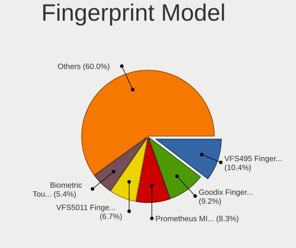

| Model                                                                      | Notebooks | Percent |
|----------------------------------------------------------------------------|-----------|---------|
| Validity Sensors VFS495 Fingerprint Reader                                 | 25        | 10.42%  |
| Shenzhen Goodix  Fingerprint Device                                        | 22        | 9.17%   |
| Synaptics Prometheus MIS Touch Fingerprint Reader                          | 20        | 8.33%   |
| Validity Sensors VFS5011 Fingerprint Reader                                | 16        | 6.67%   |
| Upek Biometric Touchchip/Touchstrip Fingerprint Sensor                     | 13        | 5.42%   |
| Synaptics Metallica MIS Touch Fingerprint Reader                           | 12        | 5%      |
| Elan ELAN:Fingerprint                                                      | 11        | 4.58%   |
| Synaptics  WBDI                                                            | 10        | 4.17%   |
| Validity Sensors VFS471 Fingerprint Reader                                 | 8         | 3.33%   |
| Validity Sensors VFS451 Fingerprint Reader                                 | 7         | 2.92%   |
| Validity Sensors VFS 5011 fingerprint sensor                               | 7         | 2.92%   |
| Validity Sensors Synaptics WBDI                                            | 7         | 2.92%   |
| Shenzhen Goodix Fingerprint Reader                                         | 7         | 2.92%   |
| Synaptics FS7604 Touch Fingerprint Sensor with PurePrint                   | 6         | 2.5%    |
| Synaptics Fingerprint reader [HP G6]                                       | 6         | 2.5%    |
| Elan ELAN:ARM-M4                                                           | 6         | 2.5%    |
| AuthenTec AES2810                                                          | 6         | 2.5%    |
| Validity Sensors Synaptics VFS7552 Touch Fingerprint Sensor with PurePrint | 5         | 2.08%   |
| Validity Sensors VFS491                                                    | 4         | 1.67%   |
| Synaptics WBDI Fingerprint Reader USB 086                                  | 3         | 1.25%   |
| Synaptics  FS7604 Touch Fingerprint Sensor with PurePrint                  | 3         | 1.25%   |
| Synaptics Metallica MOH Touch Fingerprint Reader                           | 3         | 1.25%   |
| LighTuning Fingerprint Reader                                              | 3         | 1.25%   |
| LighTuning ES603 Swipe Fingerprint Sensor                                  | 3         | 1.25%   |
| LighTuning EgisTec Touch Fingerprint Sensor                                | 3         | 1.25%   |
| Validity Sensors VFS7500 Touch Fingerprint Sensor                          | 2         | 0.83%   |
| Validity Sensors Swipe Fingerprint Sensor                                  | 2         | 0.83%   |
| Validity Sensors Fingerprint scanner                                       | 2         | 0.83%   |
| Synaptics UWP WBDI Device                                                  | 2         | 0.83%   |
| STMicroelectronics Fingerprint Reader                                      | 2         | 0.83%   |
| Shenzhen Goodix FingerPrint                                                | 2         | 0.83%   |
| Realtek USB2.0 Finger Print Bridge FocalTech Fingerprint Device            | 2         | 0.83%   |
| AuthenTec Fingerprint Sensor                                               | 2         | 0.83%   |
| AuthenTec AES2501 Fingerprint Sensor                                       | 2         | 0.83%   |
| Validity Sensors VFS7552 Touch Fingerprint Sensor                          | 1         | 0.42%   |
| Upek TCS5B Fingerprint sensor                                              | 1         | 0.42%   |
| Synaptics WBDI                                                             | 1         | 0.42%   |
| GDMicroelectronics Touch Fingerprint Sensor                                | 1         | 0.42%   |
| Focal-systems.Corp FT9201Fingerprint.                                      | 1         | 0.42%   |
| AuthenTec AES1600                                                          | 1         | 0.42%   |

Chipcard Vendor
---------------

Chipcard module vendors

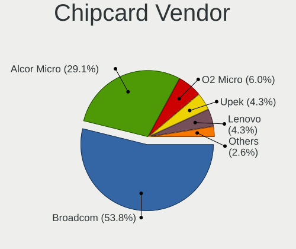

| Vendor                    | Notebooks | Percent |
|---------------------------|-----------|---------|
| Broadcom                  | 63        | 53.85%  |
| Alcor Micro               | 34        | 29.06%  |
| O2 Micro                  | 7         | 5.98%   |
| Upek                      | 5         | 4.27%   |
| Lenovo                    | 5         | 4.27%   |
| Gemalto (was Gemplus)     | 1         | 0.85%   |
| Aladdin Knowledge Systems | 1         | 0.85%   |
| Advanced Card Systems     | 1         | 0.85%   |

Chipcard Model
--------------

Chipcard module models

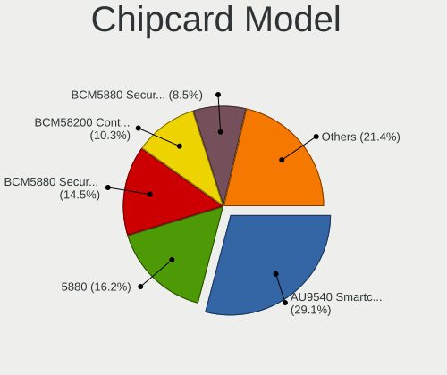

| Model                                                                        | Notebooks | Percent |
|------------------------------------------------------------------------------|-----------|---------|
| Alcor Micro AU9540 Smartcard Reader                                          | 34        | 29.06%  |
| Broadcom 5880                                                                | 19        | 16.24%  |
| Broadcom BCM5880 Secure Applications Processor                               | 17        | 14.53%  |
| Broadcom BCM58200 ControlVault 3 (FingerPrint sensor + Contacted SmartCard)  | 12        | 10.26%  |
| Broadcom BCM5880 Secure Applications Processor with fingerprint swipe sensor | 10        | 8.55%   |
| O2 Micro OZ776 CCID Smartcard Reader                                         | 7         | 5.98%   |
| Upek TouchChip Fingerprint Coprocessor (WBF advanced mode)                   | 5         | 4.27%   |
| Lenovo Integrated Smart Card Reader                                          | 5         | 4.27%   |
| Broadcom 58200                                                               | 5         | 4.27%   |
| Gemalto (was Gemplus) Compact Smart Card Reader Writer                       | 1         | 0.85%   |
| Aladdin Knowledge Systems Token JC                                           | 1         | 0.85%   |
| Advanced Card Systems ACR39U                                                 | 1         | 0.85%   |

Unsupported
-----------

Unsupported Devices
-------------------

Total unsupported devices on board

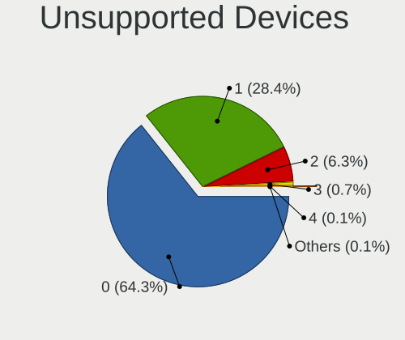

| Total | Notebooks | Percent |
|-------|-----------|---------|
| 0     | 1141      | 64.32%  |
| 1     | 504       | 28.41%  |
| 2     | 112       | 6.31%   |
| 3     | 13        | 0.73%   |
| 4     | 2         | 0.11%   |
| 10    | 1         | 0.06%   |
| 5     | 1         | 0.06%   |

Unsupported Device Types
------------------------

Types of unsupported devices

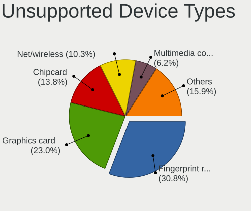

| Type                     | Notebooks | Percent |
|--------------------------|-----------|---------|
| Fingerprint reader       | 237       | 30.82%  |
| Graphics card            | 177       | 23.02%  |
| Chipcard                 | 106       | 13.78%  |
| Net/wireless             | 79        | 10.27%  |
| Multimedia controller    | 48        | 6.24%   |
| Camera                   | 29        | 3.77%   |
| Communication controller | 24        | 3.12%   |
| Storage                  | 20        | 2.6%    |
| Bluetooth                | 20        | 2.6%    |
| Card reader              | 9         | 1.17%   |
| Net/ethernet             | 5         | 0.65%   |
| Modem                    | 4         | 0.52%   |
| Sound                    | 3         | 0.39%   |
| Network                  | 2         | 0.26%   |
| Flash memory             | 2         | 0.26%   |
| Dvb card                 | 2         | 0.26%   |
| Storage/nvme             | 1         | 0.13%   |
| Firewire controller      | 1         | 0.13%   |

