Linux in Romania - Tested Hardware & Statistics (Notebooks)
-----------------------------------------------------------

A project to collect tested hardware configurations for Linux in Romania.

Anyone can contribute to this report by the [hw-probe](https://github.com/linuxhw/hw-probe) tool:

    sudo -E hw-probe -all -upload

Please contribute! Especially if your hardware is rare.

Contents
--------

* [ Test Cases ](#test-cases)

* [ System ](#system)
  - [ OS                       ](#os)
  - [ OS Family                ](#os-family)
  - [ Kernel                   ](#kernel)
  - [ Kernel Family            ](#kernel-family)
  - [ Kernel Major Ver.        ](#kernel-major-ver)
  - [ Arch                     ](#arch)
  - [ DE                       ](#de)
  - [ Display Server           ](#display-server)
  - [ Display Manager          ](#display-manager)
  - [ OS Lang                  ](#os-lang)
  - [ Boot Mode                ](#boot-mode)
  - [ Filesystem               ](#filesystem)
  - [ Part. scheme             ](#part-scheme)
  - [ Dual Boot with Linux/BSD ](#dual-boot-with-linuxbsd)
  - [ Dual Boot (Win)          ](#dual-boot-win)

* [ Board ](#board)
  - [ Vendor                   ](#vendor)
  - [ Model                    ](#model)
  - [ Model Family             ](#model-family)
  - [ MFG Year                 ](#mfg-year)
  - [ Form Factor              ](#form-factor)
  - [ Secure Boot              ](#secure-boot)
  - [ Coreboot                 ](#coreboot)
  - [ RAM Size                 ](#ram-size)
  - [ RAM Used                 ](#ram-used)
  - [ Total Drives             ](#total-drives)
  - [ Has CD-ROM               ](#has-cd-rom)
  - [ Has Ethernet             ](#has-ethernet)
  - [ Has WiFi                 ](#has-wifi)
  - [ Has Bluetooth            ](#has-bluetooth)

* [ Location ](#location)
  - [ Country                  ](#country)
  - [ City                     ](#city)

* [ Drives ](#drives)
  - [ Drive Vendor             ](#drive-vendor)
  - [ Drive Model              ](#drive-model)
  - [ HDD Vendor               ](#hdd-vendor)
  - [ SSD Vendor               ](#ssd-vendor)
  - [ Drive Kind               ](#drive-kind)
  - [ Drive Connector          ](#drive-connector)
  - [ Drive Size               ](#drive-size)
  - [ Space Total              ](#space-total)
  - [ Space Used               ](#space-used)
  - [ Malfunc. Drives          ](#malfunc-drives)
  - [ Malfunc. Drive Vendor    ](#malfunc-drive-vendor)
  - [ Malfunc. HDD Vendor      ](#malfunc-hdd-vendor)
  - [ Malfunc. Drive Kind      ](#malfunc-drive-kind)
  - [ Failed Drives            ](#failed-drives)
  - [ Failed Drive Vendor      ](#failed-drive-vendor)
  - [ Drive Status             ](#drive-status)

* [ Storage controller ](#storage-controller)
  - [ Storage Vendor           ](#storage-vendor)
  - [ Storage Model            ](#storage-model)
  - [ Storage Kind             ](#storage-kind)

* [ Processor ](#processor)
  - [ CPU Vendor               ](#cpu-vendor)
  - [ CPU Model                ](#cpu-model)
  - [ CPU Model Family         ](#cpu-model-family)
  - [ CPU Cores                ](#cpu-cores)
  - [ CPU Sockets              ](#cpu-sockets)
  - [ CPU Threads              ](#cpu-threads)
  - [ CPU Op-Modes             ](#cpu-op-modes)
  - [ CPU Microcode            ](#cpu-microcode)
  - [ CPU Microarch            ](#cpu-microarch)

* [ Graphics ](#graphics)
  - [ GPU Vendor               ](#gpu-vendor)
  - [ GPU Model                ](#gpu-model)
  - [ GPU Combo                ](#gpu-combo)
  - [ GPU Driver               ](#gpu-driver)
  - [ GPU Memory               ](#gpu-memory)

* [ Monitor ](#monitor)
  - [ Monitor Vendor           ](#monitor-vendor)
  - [ Monitor Model            ](#monitor-model)
  - [ Monitor Resolution       ](#monitor-resolution)
  - [ Monitor Diagonal         ](#monitor-diagonal)
  - [ Monitor Width            ](#monitor-width)
  - [ Aspect Ratio             ](#aspect-ratio)
  - [ Monitor Area             ](#monitor-area)
  - [ Pixel Density            ](#pixel-density)
  - [ Multiple Monitors        ](#multiple-monitors)

* [ Network ](#network)
  - [ Net Controller Vendor    ](#net-controller-vendor)
  - [ Net Controller Model     ](#net-controller-model)
  - [ Wireless Vendor          ](#wireless-vendor)
  - [ Wireless Model           ](#wireless-model)
  - [ Ethernet Vendor          ](#ethernet-vendor)
  - [ Ethernet Model           ](#ethernet-model)
  - [ Net Controller Kind      ](#net-controller-kind)
  - [ Used Controller          ](#used-controller)
  - [ NICs                     ](#nics)
  - [ IPv6                     ](#ipv6)

* [ Bluetooth ](#bluetooth)
  - [ Bluetooth Vendor         ](#bluetooth-vendor)
  - [ Bluetooth Model          ](#bluetooth-model)

* [ Sound ](#sound)
  - [ Sound Vendor             ](#sound-vendor)
  - [ Sound Model              ](#sound-model)

* [ Memory ](#memory)
  - [ Memory Vendor            ](#memory-vendor)
  - [ Memory Model             ](#memory-model)
  - [ Memory Kind              ](#memory-kind)
  - [ Memory Form Factor       ](#memory-form-factor)
  - [ Memory Size              ](#memory-size)
  - [ Memory Speed             ](#memory-speed)

* [ Printers & scanners ](#printers--scanners)
  - [ Printer Vendor           ](#printer-vendor)
  - [ Printer Model            ](#printer-model)
  - [ Scanner Vendor           ](#scanner-vendor)
  - [ Scanner Model            ](#scanner-model)

* [ Camera ](#camera)
  - [ Camera Vendor            ](#camera-vendor)
  - [ Camera Model             ](#camera-model)

* [ Security ](#security)
  - [ Fingerprint Vendor       ](#fingerprint-vendor)
  - [ Fingerprint Model        ](#fingerprint-model)
  - [ Chipcard Vendor          ](#chipcard-vendor)
  - [ Chipcard Model           ](#chipcard-model)

* [ Unsupported ](#unsupported)
  - [ Unsupported Devices      ](#unsupported-devices)
  - [ Unsupported Device Types ](#unsupported-device-types)

Test Cases
----------

Total: 1900

| Vendor        | Model                       | Probe                                                      | Date         |
|---------------|-----------------------------|------------------------------------------------------------|--------------|
| HUAWEI        | KLVL-WXX9                   | [28ad8513b4](https://linux-hardware.org/?probe=28ad8513b4) | Dec 31, 2023 |
| ASUSTek       | VivoBook_ASUSLaptop X150... | [8f3ab867ea](https://linux-hardware.org/?probe=8f3ab867ea) | Dec 30, 2023 |
| MSI           | GP75 Leopard 9SE            | [29e0740b9d](https://linux-hardware.org/?probe=29e0740b9d) | Dec 29, 2023 |
| Fujitsu       | LIFEBOOK T902               | [050f6ca09e](https://linux-hardware.org/?probe=050f6ca09e) | Dec 28, 2023 |
| ASUSTek       | VivoBook_ASUSLaptop X150... | [58080b01c8](https://linux-hardware.org/?probe=58080b01c8) | Dec 27, 2023 |
| ASUSTek       | G750JM                      | [fcda025864](https://linux-hardware.org/?probe=fcda025864) | Dec 26, 2023 |
| Acer          | Aspire A315-35              | [a3c4869087](https://linux-hardware.org/?probe=a3c4869087) | Dec 24, 2023 |
| ASUSTek       | G750JM                      | [e53cfaf52c](https://linux-hardware.org/?probe=e53cfaf52c) | Dec 24, 2023 |
| Acer          | Aspire 5742Z                | [ddf1553f4b](https://linux-hardware.org/?probe=ddf1553f4b) | Dec 24, 2023 |
| HP            | EliteBook 840 G5            | [6406b552c4](https://linux-hardware.org/?probe=6406b552c4) | Dec 23, 2023 |
| Allview       | Allbook I/1                 | [960dfde4cd](https://linux-hardware.org/?probe=960dfde4cd) | Dec 22, 2023 |
| ASUSTek       | VivoBook_ASUSLaptop X170... | [9e521ad3e9](https://linux-hardware.org/?probe=9e521ad3e9) | Dec 22, 2023 |
| Acer          | Aspire A315-35              | [52af26d8a1](https://linux-hardware.org/?probe=52af26d8a1) | Dec 21, 2023 |
| HP            | EliteBook 840 G6            | [64ec373e84](https://linux-hardware.org/?probe=64ec373e84) | Dec 20, 2023 |
| Lenovo        | Legion 5 15IMH6 82NL        | [e54630a5d8](https://linux-hardware.org/?probe=e54630a5d8) | Dec 18, 2023 |
| Dell          | Vostro 15 3515              | [baf5b47a47](https://linux-hardware.org/?probe=baf5b47a47) | Dec 18, 2023 |
| ASUSTek       | X541UVK                     | [a6ae535887](https://linux-hardware.org/?probe=a6ae535887) | Dec 18, 2023 |
| Lenovo        | ThinkPad P52 20MAS19500     | [7067fb02ed](https://linux-hardware.org/?probe=7067fb02ed) | Dec 18, 2023 |
| Lenovo        | Yoga Slim 7 13ACN5 82CY     | [8507460974](https://linux-hardware.org/?probe=8507460974) | Dec 18, 2023 |
| PC Special... | MP 17 Recoil Master         | [f199dc6e36](https://linux-hardware.org/?probe=f199dc6e36) | Dec 17, 2023 |
| Toshiba       | Satellite C50-A-1HF         | [ac7985ff69](https://linux-hardware.org/?probe=ac7985ff69) | Dec 17, 2023 |
| Dell          | Inspiron 5559               | [6920e9d7c2](https://linux-hardware.org/?probe=6920e9d7c2) | Dec 17, 2023 |
| ASUSTek       | VivoBook_ASUSLaptop M650... | [6d72d7366b](https://linux-hardware.org/?probe=6d72d7366b) | Dec 15, 2023 |
| Lenovo        | ThinkPad X1 Extreme 2nd ... | [d8a98a209a](https://linux-hardware.org/?probe=d8a98a209a) | Dec 15, 2023 |
| ASUSTek       | VivoBook_ASUSLaptop X509... | [c839de638b](https://linux-hardware.org/?probe=c839de638b) | Dec 15, 2023 |
| Acer          | Aspire A315-35              | [f7b0d4b746](https://linux-hardware.org/?probe=f7b0d4b746) | Dec 14, 2023 |
| HP            | Pavilion dv6500             | [cdde8c0b3f](https://linux-hardware.org/?probe=cdde8c0b3f) | Dec 13, 2023 |
| Lenovo        | Z710 20250                  | [0ffc45c096](https://linux-hardware.org/?probe=0ffc45c096) | Dec 13, 2023 |
| HP            | Laptop 15-fc0xxx            | [0ad101e0f2](https://linux-hardware.org/?probe=0ad101e0f2) | Dec 12, 2023 |
| HP            | Presario CQ58               | [b23d694ab4](https://linux-hardware.org/?probe=b23d694ab4) | Dec 11, 2023 |
| Dell          | Precision 5530              | [eee9114e4b](https://linux-hardware.org/?probe=eee9114e4b) | Dec 10, 2023 |
| Acer          | Aspire E5-575G              | [48fffc72b6](https://linux-hardware.org/?probe=48fffc72b6) | Dec 10, 2023 |
| ASUSTek       | X550VC                      | [e2c932c285](https://linux-hardware.org/?probe=e2c932c285) | Dec 09, 2023 |
| ASUSTek       | ZenBook UX325UA_UM325UA     | [baa82e571f](https://linux-hardware.org/?probe=baa82e571f) | Dec 09, 2023 |
| HP            | Victus by Laptop 16-e0xx... | [551b412a34](https://linux-hardware.org/?probe=551b412a34) | Dec 09, 2023 |
| ASUSTek       | VivoBook_ASUSLaptop K360... | [587ff35c26](https://linux-hardware.org/?probe=587ff35c26) | Dec 08, 2023 |
| Dell          | Vostro 15 3515              | [0257ed619f](https://linux-hardware.org/?probe=0257ed619f) | Dec 08, 2023 |
| Lenovo        | Z50-70 20354                | [ba354037ff](https://linux-hardware.org/?probe=ba354037ff) | Dec 07, 2023 |
| Acer          | TravelMate P645-S           | [e44f06b326](https://linux-hardware.org/?probe=e44f06b326) | Dec 07, 2023 |
| Lenovo        | IdeaPad Pro 5 16APH8 83A... | [46bc5ee727](https://linux-hardware.org/?probe=46bc5ee727) | Dec 06, 2023 |
| Acer          | Aspire A314-23P             | [ad97d6f3c6](https://linux-hardware.org/?probe=ad97d6f3c6) | Dec 05, 2023 |
| HP            | 550                         | [a3dc2d4062](https://linux-hardware.org/?probe=a3dc2d4062) | Dec 05, 2023 |
| ASUSTek       | VivoBook_ASUSLaptop M650... | [8463f6c28f](https://linux-hardware.org/?probe=8463f6c28f) | Dec 03, 2023 |
| ASUSTek       | VivoBook_ASUSLaptop K360... | [f8a528e1d6](https://linux-hardware.org/?probe=f8a528e1d6) | Dec 03, 2023 |
| Acer          | Aspire 8951G                | [f98b449dba](https://linux-hardware.org/?probe=f98b449dba) | Dec 03, 2023 |
| Lenovo        | Legion Y740-17IRHg 81UJ     | [20a5a6a137](https://linux-hardware.org/?probe=20a5a6a137) | Dec 03, 2023 |
| Lenovo        | IdeaPad Slim 5 14IRL8 82... | [49c0a7990e](https://linux-hardware.org/?probe=49c0a7990e) | Dec 01, 2023 |
| Acer          | Aspire ES1-523              | [10c0db94d1](https://linux-hardware.org/?probe=10c0db94d1) | Nov 29, 2023 |
| Dell          | Inspiron N5030              | [cf3da3211d](https://linux-hardware.org/?probe=cf3da3211d) | Nov 28, 2023 |
| MSI           | GP75 Leopard 9SE            | [60c7835d8c](https://linux-hardware.org/?probe=60c7835d8c) | Nov 27, 2023 |
| Lenovo        | ThinkPad T14s Gen 1 20UH... | [5fabcb33c4](https://linux-hardware.org/?probe=5fabcb33c4) | Nov 27, 2023 |
| Lenovo        | ThinkPad E14 Gen 2 20TA0... | [0ddcbc9eb9](https://linux-hardware.org/?probe=0ddcbc9eb9) | Nov 27, 2023 |
| Lenovo        | 15ARE05 81W4                | [c3763733da](https://linux-hardware.org/?probe=c3763733da) | Nov 27, 2023 |
| Lenovo        | 15ARE05 81W4                | [4fa9ab8a76](https://linux-hardware.org/?probe=4fa9ab8a76) | Nov 27, 2023 |
| Lenovo        | IdeaPad 320-15AST 80XV      | [c887e86fe4](https://linux-hardware.org/?probe=c887e86fe4) | Nov 25, 2023 |
| Dell          | Latitude 7400               | [86a9de8212](https://linux-hardware.org/?probe=86a9de8212) | Nov 24, 2023 |
| ASUSTek       | VivoBook_ASUSLaptop X509... | [7478563980](https://linux-hardware.org/?probe=7478563980) | Nov 23, 2023 |
| ASUSTek       | VivoBook_ASUSLaptop X515... | [a8b99ab7f3](https://linux-hardware.org/?probe=a8b99ab7f3) | Nov 23, 2023 |
| Acer          | Aspire A315-35              | [6115c9c76e](https://linux-hardware.org/?probe=6115c9c76e) | Nov 23, 2023 |
| Valve         | Jupiter                     | [0454a567a0](https://linux-hardware.org/?probe=0454a567a0) | Nov 21, 2023 |
| Dell          | Vostro 3525                 | [2995eb87c1](https://linux-hardware.org/?probe=2995eb87c1) | Nov 21, 2023 |
| Acer          | Aspire A315-35              | [78dac027a1](https://linux-hardware.org/?probe=78dac027a1) | Nov 19, 2023 |
| Lenovo        | IdeaPad 320-15AST 80XV      | [cc9d93b28f](https://linux-hardware.org/?probe=cc9d93b28f) | Nov 19, 2023 |
| Lenovo        | Yoga Pro 9 16IRP8 83BY      | [f5c9812962](https://linux-hardware.org/?probe=f5c9812962) | Nov 19, 2023 |
| Lenovo        | Legion S7 15ACH6 82K8       | [6e4144386d](https://linux-hardware.org/?probe=6e4144386d) | Nov 17, 2023 |
| ASUSTek       | VivoBook_ASUSLaptop M650... | [55df37c5d0](https://linux-hardware.org/?probe=55df37c5d0) | Nov 17, 2023 |
| HP            | EliteBook 735 G5            | [49ea9a3b35](https://linux-hardware.org/?probe=49ea9a3b35) | Nov 15, 2023 |
| Lenovo        | ThinkPad Z16 Gen 1 21D40... | [ffc320e32c](https://linux-hardware.org/?probe=ffc320e32c) | Nov 15, 2023 |
| Dell          | Latitude 5521               | [2cd2e72764](https://linux-hardware.org/?probe=2cd2e72764) | Nov 15, 2023 |
| Lenovo        | IdeaPad Slim 5 14IAH8 83... | [e33ce14e30](https://linux-hardware.org/?probe=e33ce14e30) | Nov 14, 2023 |
| Dell          | XPS 15 7590                 | [da50e3550f](https://linux-hardware.org/?probe=da50e3550f) | Nov 14, 2023 |
| ASUSTek       | ZenBook UX325UA_UM325UA     | [e8803a2d63](https://linux-hardware.org/?probe=e8803a2d63) | Nov 13, 2023 |
| Allview       | Allbook I/1                 | [2da284e5a6](https://linux-hardware.org/?probe=2da284e5a6) | Nov 11, 2023 |
| Jumper        | EZbook                      | [f7f10f7817](https://linux-hardware.org/?probe=f7f10f7817) | Nov 11, 2023 |
| Allview       | Allbook I/1                 | [4ea9038785](https://linux-hardware.org/?probe=4ea9038785) | Nov 10, 2023 |
| Lenovo        | IdeaPad S340-14API 81NB     | [ea4a2b9084](https://linux-hardware.org/?probe=ea4a2b9084) | Nov 07, 2023 |
| Acer          | Aspire A315-35              | [61fdbe9ec2](https://linux-hardware.org/?probe=61fdbe9ec2) | Nov 07, 2023 |
| ASUSTek       | G750JS                      | [b64eb3798d](https://linux-hardware.org/?probe=b64eb3798d) | Nov 07, 2023 |
| ASUSTek       | N552VW                      | [b8f226f7f0](https://linux-hardware.org/?probe=b8f226f7f0) | Nov 07, 2023 |
| ASUSTek       | VivoBook_ASUSLaptop K360... | [ce00056643](https://linux-hardware.org/?probe=ce00056643) | Nov 07, 2023 |
| Acer          | Aspire A314-23P             | [1e3cdf0bf2](https://linux-hardware.org/?probe=1e3cdf0bf2) | Nov 04, 2023 |
| Dell          | Vostro 3525                 | [48103e7e91](https://linux-hardware.org/?probe=48103e7e91) | Nov 03, 2023 |
| Dell          | Latitude 7370               | [b16724db59](https://linux-hardware.org/?probe=b16724db59) | Nov 01, 2023 |
| Google        | Akemi                       | [75082d5cf9](https://linux-hardware.org/?probe=75082d5cf9) | Nov 01, 2023 |
| ASUSTek       | X541UAK                     | [d4630a5c8b](https://linux-hardware.org/?probe=d4630a5c8b) | Nov 01, 2023 |
| Acer          | Aspire A315-35              | [c26ec81fab](https://linux-hardware.org/?probe=c26ec81fab) | Oct 31, 2023 |
| HP            | 255 G8 Notebook PC          | [941ca289ce](https://linux-hardware.org/?probe=941ca289ce) | Oct 30, 2023 |
| ASUSTek       | VivoBook_ASUSLaptop X515... | [9f0452aba6](https://linux-hardware.org/?probe=9f0452aba6) | Oct 29, 2023 |
| ASUSTek       | G750JM                      | [01e0620386](https://linux-hardware.org/?probe=01e0620386) | Oct 29, 2023 |
| ASUSTek       | G56JR                       | [8e871997f7](https://linux-hardware.org/?probe=8e871997f7) | Oct 29, 2023 |
| ASUSTek       | G56JR                       | [f8e77bd53a](https://linux-hardware.org/?probe=f8e77bd53a) | Oct 28, 2023 |
| Lenovo        | ThinkPad T480 20L6S5FF0S    | [4a4fe99b2d](https://linux-hardware.org/?probe=4a4fe99b2d) | Oct 23, 2023 |
| Dell          | XPS 13 9370                 | [f45a5143fc](https://linux-hardware.org/?probe=f45a5143fc) | Oct 23, 2023 |
| ASUSTek       | ZenBook UX534FTC            | [a268a7a10e](https://linux-hardware.org/?probe=a268a7a10e) | Oct 22, 2023 |
| Acer          | Aspire A315-35              | [ee15c1dbea](https://linux-hardware.org/?probe=ee15c1dbea) | Oct 22, 2023 |
| ASUSTek       | VivoBook_ASUSLaptop X515... | [77fb62615e](https://linux-hardware.org/?probe=77fb62615e) | Oct 22, 2023 |
| ASUSTek       | ASUS TUF Dash F15 FX516P... | [43f9375597](https://linux-hardware.org/?probe=43f9375597) | Oct 21, 2023 |
| ASUSTek       | G750JM                      | [0f5885bc27](https://linux-hardware.org/?probe=0f5885bc27) | Oct 17, 2023 |
| ASUSTek       | VivoBook_ASUSLaptop X515... | [9f9777f778](https://linux-hardware.org/?probe=9f9777f778) | Oct 17, 2023 |
| Lenovo        | 15ARE05 81W4                | [dcb09acd04](https://linux-hardware.org/?probe=dcb09acd04) | Oct 17, 2023 |
| ASUSTek       | X556UQK                     | [c430358d6a](https://linux-hardware.org/?probe=c430358d6a) | Oct 17, 2023 |
| Toshiba       | Satellite C660              | [b96d2e0be9](https://linux-hardware.org/?probe=b96d2e0be9) | Oct 16, 2023 |
| HP            | 2000                        | [c2669ff6cb](https://linux-hardware.org/?probe=c2669ff6cb) | Oct 16, 2023 |
| HP            | Pavilion Gaming Laptop 1... | [471a6f3119](https://linux-hardware.org/?probe=471a6f3119) | Oct 16, 2023 |
| Lenovo        | IdeaPad Y700-15ISK 80NV     | [f16973062f](https://linux-hardware.org/?probe=f16973062f) | Oct 15, 2023 |
| ASUSTek       | VivoBook_ASUSLaptop X509... | [66a5a05425](https://linux-hardware.org/?probe=66a5a05425) | Oct 15, 2023 |
| Toshiba       | Satellite CL10-C-102        | [cdaab4e230](https://linux-hardware.org/?probe=cdaab4e230) | Oct 15, 2023 |
| Acer          | Aspire A515-57              | [ca520343c8](https://linux-hardware.org/?probe=ca520343c8) | Oct 13, 2023 |
| Lenovo        | 15ARE05 81W4                | [c0066cda83](https://linux-hardware.org/?probe=c0066cda83) | Oct 13, 2023 |
| HP            | 470 17 inch G9              | [d138f8f9f3](https://linux-hardware.org/?probe=d138f8f9f3) | Oct 13, 2023 |
| ASUSTek       | VivoBook_ASUSLaptop X509... | [662b033cee](https://linux-hardware.org/?probe=662b033cee) | Oct 12, 2023 |
| Acer          | Aspire A315-35              | [3069c746fd](https://linux-hardware.org/?probe=3069c746fd) | Oct 12, 2023 |
| BESSTAR Te... | X400                        | [c955c44ef3](https://linux-hardware.org/?probe=c955c44ef3) | Oct 10, 2023 |
| Dell          | Vostro 3525                 | [cb78c82e7a](https://linux-hardware.org/?probe=cb78c82e7a) | Oct 09, 2023 |
| Lenovo        | G580 20150                  | [fa47449843](https://linux-hardware.org/?probe=fa47449843) | Oct 08, 2023 |
| Dell          | Vostro 3525                 | [cad844c720](https://linux-hardware.org/?probe=cad844c720) | Oct 07, 2023 |
| ASUSTek       | ASUS EXPERTBOOK B1500CEA... | [60d5b8f4c0](https://linux-hardware.org/?probe=60d5b8f4c0) | Oct 06, 2023 |
| ASUSTek       | ASUS EXPERTBOOK B1500CEA... | [99f8282319](https://linux-hardware.org/?probe=99f8282319) | Oct 06, 2023 |
| HP            | ProBook 6450b               | [f597cfe9d1](https://linux-hardware.org/?probe=f597cfe9d1) | Oct 05, 2023 |
| Google        | Magpie                      | [91fa583b13](https://linux-hardware.org/?probe=91fa583b13) | Oct 05, 2023 |
| HP            | OMEN by Laptop 17-an0xx     | [02ff66cc0c](https://linux-hardware.org/?probe=02ff66cc0c) | Oct 05, 2023 |
| Acer          | Aspire V5-531               | [555d578f86](https://linux-hardware.org/?probe=555d578f86) | Oct 05, 2023 |
| Dell          | Latitude E6420              | [504010f96c](https://linux-hardware.org/?probe=504010f96c) | Oct 04, 2023 |
| Acer          | Aspire V5-531               | [b6a9eaaec5](https://linux-hardware.org/?probe=b6a9eaaec5) | Oct 03, 2023 |
| Acer          | Aspire A715-51G             | [6bc4edfef5](https://linux-hardware.org/?probe=6bc4edfef5) | Oct 02, 2023 |
| Acer          | Aspire A715-51G             | [a9b3098036](https://linux-hardware.org/?probe=a9b3098036) | Oct 02, 2023 |
| Google        | Magpie                      | [32a7bba307](https://linux-hardware.org/?probe=32a7bba307) | Oct 01, 2023 |
| HP            | 470 17 inch G9              | [c6043cc6cc](https://linux-hardware.org/?probe=c6043cc6cc) | Oct 01, 2023 |
| Toshiba       | Satellite C850-D4K          | [47d93b3030](https://linux-hardware.org/?probe=47d93b3030) | Oct 01, 2023 |
| HUAWEI        | NBD-WXX9                    | [c8a525522f](https://linux-hardware.org/?probe=c8a525522f) | Sep 30, 2023 |
| ASUSTek       | VivoBook_ASUSLaptop X509... | [fb4cde69b8](https://linux-hardware.org/?probe=fb4cde69b8) | Sep 28, 2023 |
| Lenovo        | LOQ 15IRH8 82XV             | [a1e01ab80d](https://linux-hardware.org/?probe=a1e01ab80d) | Sep 25, 2023 |
| ASUSTek       | K53TK                       | [65e95a03e9](https://linux-hardware.org/?probe=65e95a03e9) | Sep 22, 2023 |
| ASUSTek       | K53TK                       | [34857762c0](https://linux-hardware.org/?probe=34857762c0) | Sep 21, 2023 |
| Lenovo        | IdeaPad 5 14ITL05 82FE      | [45f00aaf92](https://linux-hardware.org/?probe=45f00aaf92) | Sep 21, 2023 |
| Dell          | Latitude 5420               | [c40b9df526](https://linux-hardware.org/?probe=c40b9df526) | Sep 21, 2023 |
| Dell          | Latitude 5420               | [9caba9ee44](https://linux-hardware.org/?probe=9caba9ee44) | Sep 21, 2023 |
| MSI           | GP75 Leopard 9SE            | [07431109a7](https://linux-hardware.org/?probe=07431109a7) | Sep 21, 2023 |
| ASUSTek       | VivoBook_ASUSLaptop X515... | [365a5e674f](https://linux-hardware.org/?probe=365a5e674f) | Sep 15, 2023 |
| Lenovo        | Yoga Pro 9 16IRP8 83BY      | [eaa723190d](https://linux-hardware.org/?probe=eaa723190d) | Sep 15, 2023 |
| Acer          | Aspire A315-35              | [356d6d3e13](https://linux-hardware.org/?probe=356d6d3e13) | Sep 15, 2023 |
| Acer          | Aspire A315-35              | [7ae470ffa8](https://linux-hardware.org/?probe=7ae470ffa8) | Sep 14, 2023 |
| ASUSTek       | TUF Gaming FX505DT_FX505... | [d27fa5404b](https://linux-hardware.org/?probe=d27fa5404b) | Sep 14, 2023 |
| Acer          | Nitro AN515-58              | [78a9c8ba47](https://linux-hardware.org/?probe=78a9c8ba47) | Sep 12, 2023 |
| Acer          | Nitro AN515-58              | [a8f64806fe](https://linux-hardware.org/?probe=a8f64806fe) | Sep 12, 2023 |
| ASUSTek       | ASUS TUF Gaming F15 FX50... | [e1b135961f](https://linux-hardware.org/?probe=e1b135961f) | Sep 12, 2023 |
| ASUSTek       | X550VX                      | [b1b59ca70c](https://linux-hardware.org/?probe=b1b59ca70c) | Sep 10, 2023 |
| HP            | ProBook 6570b               | [f66ec50e55](https://linux-hardware.org/?probe=f66ec50e55) | Sep 05, 2023 |
| HP            | ProBook 6570b               | [9a31047350](https://linux-hardware.org/?probe=9a31047350) | Sep 05, 2023 |
| Acer          | Nitro AN515-41              | [8d55fa5be4](https://linux-hardware.org/?probe=8d55fa5be4) | Sep 03, 2023 |
| HP            | 15                          | [db9d960b39](https://linux-hardware.org/?probe=db9d960b39) | Sep 03, 2023 |
| HP            | 250 G5 Notebook PC          | [66df65e0f0](https://linux-hardware.org/?probe=66df65e0f0) | Sep 02, 2023 |
| Toshiba       | Satellite C660              | [d3c3b72e39](https://linux-hardware.org/?probe=d3c3b72e39) | Sep 01, 2023 |
| Acer          | TMP645-M                    | [17838ce9b0](https://linux-hardware.org/?probe=17838ce9b0) | Aug 30, 2023 |
| ASUSTek       | G750JM                      | [ca4dd5a11e](https://linux-hardware.org/?probe=ca4dd5a11e) | Aug 29, 2023 |
| Lenovo        | ThinkPad X1 Carbon 7th 2... | [d036282290](https://linux-hardware.org/?probe=d036282290) | Aug 29, 2023 |
| ASUSTek       | X550LD                      | [b866599fbc](https://linux-hardware.org/?probe=b866599fbc) | Aug 29, 2023 |
| MSI           | GP75 Leopard 9SE            | [a8a97f9555](https://linux-hardware.org/?probe=a8a97f9555) | Aug 27, 2023 |
| HP            | 250 G7 Notebook PC          | [c4be1d7e95](https://linux-hardware.org/?probe=c4be1d7e95) | Aug 27, 2023 |
| MSI           | GP75 Leopard 9SE            | [db9336b4db](https://linux-hardware.org/?probe=db9336b4db) | Aug 26, 2023 |
| ASUSTek       | K73SV                       | [7aca2d97c0](https://linux-hardware.org/?probe=7aca2d97c0) | Aug 25, 2023 |
| ASUSTek       | VivoBook 15_ASUS Laptop ... | [b3f1d927a1](https://linux-hardware.org/?probe=b3f1d927a1) | Aug 21, 2023 |
| ASUSTek       | VivoBook 15_ASUS Laptop ... | [d7b6d2a997](https://linux-hardware.org/?probe=d7b6d2a997) | Aug 21, 2023 |
| Acer          | Aspire A315-59              | [8946b925ea](https://linux-hardware.org/?probe=8946b925ea) | Aug 18, 2023 |
| Acer          | Aspire ES1-311              | [3fa65d407a](https://linux-hardware.org/?probe=3fa65d407a) | Aug 17, 2023 |
| HP            | Compaq 6710b (FG040EC#AB... | [a0cd8c1b40](https://linux-hardware.org/?probe=a0cd8c1b40) | Aug 16, 2023 |
| Toshiba       | Satellite C660              | [8bc67959d1](https://linux-hardware.org/?probe=8bc67959d1) | Aug 16, 2023 |
| ASUSTek       | GL552JX                     | [9594a231bd](https://linux-hardware.org/?probe=9594a231bd) | Aug 16, 2023 |
| Lenovo        | ThinkPad T560 20FJS1J200    | [f0d90b715d](https://linux-hardware.org/?probe=f0d90b715d) | Aug 15, 2023 |
| ASUSTek       | ROG Zephyrus G14 GA401II... | [18d3d9a7c1](https://linux-hardware.org/?probe=18d3d9a7c1) | Aug 14, 2023 |
| Allview       | Allbook H                   | [1a8e5e7f8f](https://linux-hardware.org/?probe=1a8e5e7f8f) | Aug 13, 2023 |
| HP            | Pavilion Notebook           | [7fd3205fde](https://linux-hardware.org/?probe=7fd3205fde) | Aug 11, 2023 |
| ASUSTek       | X541UVK                     | [77ec1f7364](https://linux-hardware.org/?probe=77ec1f7364) | Aug 09, 2023 |
| Lenovo        | ThinkPad T15 Gen 2i 20W4... | [ce593ff6c7](https://linux-hardware.org/?probe=ce593ff6c7) | Aug 07, 2023 |
| Acer          | AO756                       | [60475c9d52](https://linux-hardware.org/?probe=60475c9d52) | Aug 06, 2023 |
| WEIGO         | CDA-141AU                   | [35c705bd70](https://linux-hardware.org/?probe=35c705bd70) | Aug 05, 2023 |
| HP            | Laptop 14s-fq0xxx           | [0a7b2a3fcc](https://linux-hardware.org/?probe=0a7b2a3fcc) | Aug 03, 2023 |
| Lenovo        | IdeaPad 3 15ADA05 81W1      | [9171e8e6b9](https://linux-hardware.org/?probe=9171e8e6b9) | Aug 03, 2023 |
| Lenovo        | IdeaPad 520-15IKB 81BF      | [8de1f944a7](https://linux-hardware.org/?probe=8de1f944a7) | Jul 30, 2023 |
| ASUSTek       | ASUS TUF Gaming F17 FX70... | [d1bf55b135](https://linux-hardware.org/?probe=d1bf55b135) | Jul 29, 2023 |
| ASUSTek       | ASUS TUF Gaming F17 FX70... | [ea8a893b11](https://linux-hardware.org/?probe=ea8a893b11) | Jul 29, 2023 |
| Lenovo        | ThinkPad W541 20EFS00N00    | [c9f80b56fc](https://linux-hardware.org/?probe=c9f80b56fc) | Jul 28, 2023 |
| ASUSTek       | X540LJ                      | [798cadd754](https://linux-hardware.org/?probe=798cadd754) | Jul 25, 2023 |
| Lenovo        | Legion Y540-17IRH 81Q4      | [e9a58d14e7](https://linux-hardware.org/?probe=e9a58d14e7) | Jul 20, 2023 |
| Dell          | Latitude 5590               | [93857a3b66](https://linux-hardware.org/?probe=93857a3b66) | Jul 18, 2023 |
| Lenovo        | ThinkBook 16p Gen 2 20YM    | [dac4434339](https://linux-hardware.org/?probe=dac4434339) | Jul 18, 2023 |
| HP            | ProBook 450 G5              | [3dfd41fda9](https://linux-hardware.org/?probe=3dfd41fda9) | Jul 17, 2023 |
| HP            | ProBook 450 G5              | [c5bee4d8fe](https://linux-hardware.org/?probe=c5bee4d8fe) | Jul 17, 2023 |
| ASUSTek       | VivoBook 15_ASUS Laptop ... | [501969ed00](https://linux-hardware.org/?probe=501969ed00) | Jul 15, 2023 |
| HP            | Pavilion Gaming Laptop 1... | [052b5c1741](https://linux-hardware.org/?probe=052b5c1741) | Jul 12, 2023 |
| Lenovo        | IdeaPad S540-14API 81NH     | [9fc68063e3](https://linux-hardware.org/?probe=9fc68063e3) | Jul 11, 2023 |
| ASUSTek       | VivoBook_ASUSLaptop X740... | [f35543549c](https://linux-hardware.org/?probe=f35543549c) | Jul 11, 2023 |
| Unknown       | HP Chromebook 14            | [63b183aa51](https://linux-hardware.org/?probe=63b183aa51) | Jul 11, 2023 |
| Fujitsu       | LIFEBOOK LH532              | [3cad86057a](https://linux-hardware.org/?probe=3cad86057a) | Jul 09, 2023 |
| Lenovo        | V145-15AST 81MT             | [a29509646a](https://linux-hardware.org/?probe=a29509646a) | Jul 08, 2023 |
| Dell          | Latitude 3500               | [38a0d6b099](https://linux-hardware.org/?probe=38a0d6b099) | Jul 08, 2023 |
| Dell          | Studio 1749                 | [fe1e5d7b8f](https://linux-hardware.org/?probe=fe1e5d7b8f) | Jul 05, 2023 |
| HP            | OMEN by Laptop 17-cb1xxx    | [dbf87e0eec](https://linux-hardware.org/?probe=dbf87e0eec) | Jul 04, 2023 |
| ASUSTek       | VivoBook_ASUSLaptop X509... | [8862b2d8db](https://linux-hardware.org/?probe=8862b2d8db) | Jun 25, 2023 |
| Acer          | Aspire A517-51G             | [dc2aebbc48](https://linux-hardware.org/?probe=dc2aebbc48) | Jun 24, 2023 |
| Lenovo        | Yoga Pro 7 14IRH8 82Y7      | [a74b5c2880](https://linux-hardware.org/?probe=a74b5c2880) | Jun 24, 2023 |
| Acer          | Aspire A315-58G             | [ea2b8a58b1](https://linux-hardware.org/?probe=ea2b8a58b1) | Jun 22, 2023 |
| Acer          | Swift SF314-52G             | [4eab971a60](https://linux-hardware.org/?probe=4eab971a60) | Jun 21, 2023 |
| ASUSTek       | ROG Strix G733PZ_G733PZ     | [1c9456fd1d](https://linux-hardware.org/?probe=1c9456fd1d) | Jun 20, 2023 |
| Lenovo        | Legion Y540-17IRH 81Q4      | [530f6272c9](https://linux-hardware.org/?probe=530f6272c9) | Jun 20, 2023 |
| ASUSTek       | G750JM                      | [928b30815b](https://linux-hardware.org/?probe=928b30815b) | Jun 18, 2023 |
| Acer          | Aspire A315-33              | [c6a929a9ec](https://linux-hardware.org/?probe=c6a929a9ec) | Jun 17, 2023 |
| Acer          | Aspire A315-33              | [d72b8e616f](https://linux-hardware.org/?probe=d72b8e616f) | Jun 17, 2023 |
| Acer          | Aspire A715-71G             | [0ef00ccccc](https://linux-hardware.org/?probe=0ef00ccccc) | Jun 16, 2023 |
| Lenovo        | IdeaPad 5 Pro 16ARH7 82S... | [2346d706e3](https://linux-hardware.org/?probe=2346d706e3) | Jun 15, 2023 |
| Dell          | Inspiron 5505               | [7747deeb57](https://linux-hardware.org/?probe=7747deeb57) | Jun 15, 2023 |
| ASUSTek       | VivoBook_ASUSLaptop X415... | [e073b99b63](https://linux-hardware.org/?probe=e073b99b63) | Jun 13, 2023 |
| ASUSTek       | G750JM                      | [e722fda49e](https://linux-hardware.org/?probe=e722fda49e) | Jun 13, 2023 |
| MSI           | GP75 Leopard 9SE            | [9e763f2e63](https://linux-hardware.org/?probe=9e763f2e63) | Jun 12, 2023 |
| ASUSTek       | VivoBook_ASUSLaptop X512... | [b7ab29fbb5](https://linux-hardware.org/?probe=b7ab29fbb5) | Jun 06, 2023 |
| MSI           | GP75 Leopard 9SE            | [05530e670e](https://linux-hardware.org/?probe=05530e670e) | Jun 06, 2023 |
| Lenovo        | Legion 5 15ACH6H 82JU       | [ea07821e39](https://linux-hardware.org/?probe=ea07821e39) | Jun 05, 2023 |
| Lenovo        | Legion 5 15ARH05H 82B1      | [1285aacf1b](https://linux-hardware.org/?probe=1285aacf1b) | Jun 04, 2023 |
| ASUSTek       | Zenbook UM5401RA_RM5401R... | [763a52f3e8](https://linux-hardware.org/?probe=763a52f3e8) | Jun 03, 2023 |
| HP            | ENVY 17                     | [79fd438f05](https://linux-hardware.org/?probe=79fd438f05) | Jun 03, 2023 |
| Dell          | Vostro 1015                 | [055866f703](https://linux-hardware.org/?probe=055866f703) | Jun 02, 2023 |
| Dell          | Inspiron 5567               | [bd3a6c5bd8](https://linux-hardware.org/?probe=bd3a6c5bd8) | Jun 02, 2023 |
| Acer          | Aspire A517-51G             | [dc0e29f0bb](https://linux-hardware.org/?probe=dc0e29f0bb) | Jun 02, 2023 |
| Acer          | Aspire A517-51G             | [693005f5b4](https://linux-hardware.org/?probe=693005f5b4) | Jun 02, 2023 |
| Lenovo        | ThinkPad T430s 2352CTO      | [1f18cef2df](https://linux-hardware.org/?probe=1f18cef2df) | Jun 01, 2023 |
| Lenovo        | ThinkPad T430s 2352CTO      | [7ae3edd73e](https://linux-hardware.org/?probe=7ae3edd73e) | Jun 01, 2023 |
| Acer          | Aspire A515-45              | [f93dd394e8](https://linux-hardware.org/?probe=f93dd394e8) | May 31, 2023 |
| Dell          | Vostro 15 3515              | [6bec5a03df](https://linux-hardware.org/?probe=6bec5a03df) | May 30, 2023 |
| Dell          | Latitude E6440              | [821e3e3246](https://linux-hardware.org/?probe=821e3e3246) | May 27, 2023 |
| HP            | Laptop 17-cn0xxx            | [c8c9f63237](https://linux-hardware.org/?probe=c8c9f63237) | May 25, 2023 |
| Dell          | G15 5510                    | [325fcf6e78](https://linux-hardware.org/?probe=325fcf6e78) | May 25, 2023 |
| HP            | ProBook 6440b               | [5ed14b01a3](https://linux-hardware.org/?probe=5ed14b01a3) | May 25, 2023 |
| Lenovo        | ThinkPad P15 Gen 1 20ST0... | [61b85cdced](https://linux-hardware.org/?probe=61b85cdced) | May 24, 2023 |
| Lenovo        | ThinkPad P15 Gen 1 20ST0... | [b167237d46](https://linux-hardware.org/?probe=b167237d46) | May 24, 2023 |
| Valve         | Jupiter                     | [117db8031d](https://linux-hardware.org/?probe=117db8031d) | May 24, 2023 |
| Dell          | Precision 7540              | [65605ee5e8](https://linux-hardware.org/?probe=65605ee5e8) | May 24, 2023 |
| ASUSTek       | VivoBook_ASUS Laptop X50... | [a1e2fa6222](https://linux-hardware.org/?probe=a1e2fa6222) | May 24, 2023 |
| Lenovo        | V130-15IGM 81HL             | [504a24887e](https://linux-hardware.org/?probe=504a24887e) | May 24, 2023 |
| HP            | EliteBook 850 G8 Noteboo... | [cb3e4d2c2b](https://linux-hardware.org/?probe=cb3e4d2c2b) | May 24, 2023 |
| Allview       | Allbook H                   | [8b0c0a3436](https://linux-hardware.org/?probe=8b0c0a3436) | May 24, 2023 |
| Lenovo        | ThinkPad X1 Carbon 7th 2... | [64ceddcdd4](https://linux-hardware.org/?probe=64ceddcdd4) | May 24, 2023 |
| Dell          | G15 5510                    | [730985e467](https://linux-hardware.org/?probe=730985e467) | May 24, 2023 |
| Dell          | Inspiron 1501               | [4703a17f03](https://linux-hardware.org/?probe=4703a17f03) | May 23, 2023 |
| MSI           | Modern 14 B10MW             | [319f4883aa](https://linux-hardware.org/?probe=319f4883aa) | May 22, 2023 |
| Lenovo        | Legion 5 15ARH05 82B5       | [ceeff309eb](https://linux-hardware.org/?probe=ceeff309eb) | May 18, 2023 |
| ASUSTek       | X541UAK                     | [00685614c4](https://linux-hardware.org/?probe=00685614c4) | May 16, 2023 |
| ASUSTek       | N76VZ                       | [fc6d34934a](https://linux-hardware.org/?probe=fc6d34934a) | May 14, 2023 |
| Razer         | Blade 15 Studio Edition ... | [f1884eebc6](https://linux-hardware.org/?probe=f1884eebc6) | May 12, 2023 |
| HP            | Pavilion Gaming Laptop 1... | [729a4181de](https://linux-hardware.org/?probe=729a4181de) | May 12, 2023 |
| HP            | Pavilion Gaming Laptop 1... | [3010c8760e](https://linux-hardware.org/?probe=3010c8760e) | May 12, 2023 |
| Acer          | Extensa 5220                | [935b52f12c](https://linux-hardware.org/?probe=935b52f12c) | May 12, 2023 |
| ASUSTek       | VivoBook 15_ASUS Laptop ... | [af96be2497](https://linux-hardware.org/?probe=af96be2497) | May 11, 2023 |
| Acer          | Aspire A515-45              | [8f9a64c245](https://linux-hardware.org/?probe=8f9a64c245) | May 08, 2023 |
| Dell          | Inspiron 11-3162            | [62813124bb](https://linux-hardware.org/?probe=62813124bb) | May 08, 2023 |
| Lenovo        | ThinkBook 15 G2 ARE 20VG    | [a312f0545f](https://linux-hardware.org/?probe=a312f0545f) | May 07, 2023 |
| Acer          | Aspire 5742G                | [2a321db63e](https://linux-hardware.org/?probe=2a321db63e) | May 07, 2023 |
| ASUSTek       | VivoBook_ASUSLaptop X512... | [85648a82df](https://linux-hardware.org/?probe=85648a82df) | May 06, 2023 |
| HP            | 250 15.6 inch G9 Noteboo... | [af9c3172bc](https://linux-hardware.org/?probe=af9c3172bc) | May 05, 2023 |
| MSI           | GP75 Leopard 9SE            | [425ecbf896](https://linux-hardware.org/?probe=425ecbf896) | May 04, 2023 |
| ASUSTek       | 1001PX                      | [7a04e30859](https://linux-hardware.org/?probe=7a04e30859) | May 03, 2023 |
| HP            | Notebook                    | [c6316b5a64](https://linux-hardware.org/?probe=c6316b5a64) | May 03, 2023 |
| Lenovo        | ThinkPad T530 24297ZG       | [7c56fae21c](https://linux-hardware.org/?probe=7c56fae21c) | May 03, 2023 |
| ASUSTek       | ASUS TUF Gaming F15 FX50... | [3b04b16c3e](https://linux-hardware.org/?probe=3b04b16c3e) | May 03, 2023 |
| ASUSTek       | ASUS TUF Gaming F15 FX50... | [1234a4cf5a](https://linux-hardware.org/?probe=1234a4cf5a) | May 03, 2023 |
| Lenovo        | ThinkPad T14 Gen 1 20S00... | [5101f4e19d](https://linux-hardware.org/?probe=5101f4e19d) | May 02, 2023 |
| Lenovo        | ThinkPad T530 24297ZG       | [2a4cf994ac](https://linux-hardware.org/?probe=2a4cf994ac) | May 02, 2023 |
| ASUSTek       | VivoBook_ASUSLaptop X512... | [ed2a323b49](https://linux-hardware.org/?probe=ed2a323b49) | May 01, 2023 |
| Lenovo        | IdeaPad 1 15AMN7 82VG       | [4607549f5a](https://linux-hardware.org/?probe=4607549f5a) | May 01, 2023 |
| Lenovo        | IdeaPad 1 15AMN7 82VG       | [754b22a59c](https://linux-hardware.org/?probe=754b22a59c) | May 01, 2023 |
| ASUSTek       | ASUS TUF Gaming F15 FX50... | [d1b974c33a](https://linux-hardware.org/?probe=d1b974c33a) | May 01, 2023 |
| Acer          | Aspire 5110                 | [b43b059257](https://linux-hardware.org/?probe=b43b059257) | Apr 28, 2023 |
| Dell          | Vostro 15 3515              | [f58ab8b9c4](https://linux-hardware.org/?probe=f58ab8b9c4) | Apr 27, 2023 |
| Acer          | Aspire A515-57              | [86dad710fa](https://linux-hardware.org/?probe=86dad710fa) | Apr 26, 2023 |
| Acer          | Aspire A315-35              | [33fac6ec40](https://linux-hardware.org/?probe=33fac6ec40) | Apr 26, 2023 |
| Lenovo        | V15 G2 ALC 82KD             | [e7fb8c3e44](https://linux-hardware.org/?probe=e7fb8c3e44) | Apr 26, 2023 |
| ASUSTek       | K53SM                       | [92ac292547](https://linux-hardware.org/?probe=92ac292547) | Apr 24, 2023 |
| Acer          | Aspire V5-122P              | [baf567c71f](https://linux-hardware.org/?probe=baf567c71f) | Apr 23, 2023 |
| HP            | ProBook 450 G3              | [6e52b3ea77](https://linux-hardware.org/?probe=6e52b3ea77) | Apr 22, 2023 |
| Allview       | Allbook J                   | [96a3d7d3ef](https://linux-hardware.org/?probe=96a3d7d3ef) | Apr 22, 2023 |
| Lenovo        | ThinkPad T530 24297ZG       | [3f01c5df6e](https://linux-hardware.org/?probe=3f01c5df6e) | Apr 21, 2023 |
| Lenovo        | ThinkPad T530 24297ZG       | [a5ef39681b](https://linux-hardware.org/?probe=a5ef39681b) | Apr 21, 2023 |
| Allview       | Allbook J                   | [4ff8627338](https://linux-hardware.org/?probe=4ff8627338) | Apr 18, 2023 |
| Acer          | Aspire E5-575G              | [39afaea9e3](https://linux-hardware.org/?probe=39afaea9e3) | Apr 14, 2023 |
| Lenovo        | ThinkPad T420 4236WR1       | [0c4578a674](https://linux-hardware.org/?probe=0c4578a674) | Apr 14, 2023 |
| Dell          | Inspiron 1545               | [653a25793d](https://linux-hardware.org/?probe=653a25793d) | Apr 12, 2023 |
| Dell          | Inspiron 1545               | [dccecbecf9](https://linux-hardware.org/?probe=dccecbecf9) | Apr 12, 2023 |
| HP            | EliteBook 840 G5            | [da4c241466](https://linux-hardware.org/?probe=da4c241466) | Apr 10, 2023 |
| Lenovo        | IdeaPad Slim 1-14AST-05 ... | [5244868737](https://linux-hardware.org/?probe=5244868737) | Apr 09, 2023 |
| Lenovo        | ThinkPad T480 20L6S4G72S    | [ae8c333d72](https://linux-hardware.org/?probe=ae8c333d72) | Apr 07, 2023 |
| ASUSTek       | X55U                        | [0abf7df439](https://linux-hardware.org/?probe=0abf7df439) | Apr 06, 2023 |
| ASUSTek       | X550CL                      | [5d5862d22a](https://linux-hardware.org/?probe=5d5862d22a) | Mar 31, 2023 |
| Lenovo        | IdeaPad S145-15IWL 81MV     | [5be11a9a6e](https://linux-hardware.org/?probe=5be11a9a6e) | Mar 29, 2023 |
| Lenovo        | ThinkPad T14 Gen 1 20UD0... | [bfa850ddad](https://linux-hardware.org/?probe=bfa850ddad) | Mar 29, 2023 |
| Lenovo        | IdeaPad 5 Pro 16ACH6 82L... | [577947c9d3](https://linux-hardware.org/?probe=577947c9d3) | Mar 28, 2023 |
| Toshiba       | Satellite C55-A-1J8         | [c6ba40cd5c](https://linux-hardware.org/?probe=c6ba40cd5c) | Mar 27, 2023 |
| Lenovo        | Legion 5 15ACH6H 82JU       | [08e7388619](https://linux-hardware.org/?probe=08e7388619) | Mar 27, 2023 |
| ASUSTek       | X751SA                      | [bef27b5a10](https://linux-hardware.org/?probe=bef27b5a10) | Mar 26, 2023 |
| ASUSTek       | X751SA                      | [daac2899b2](https://linux-hardware.org/?probe=daac2899b2) | Mar 26, 2023 |
| Lenovo        | ThinkPad E14 Gen 2 20TA0... | [84af25ca8c](https://linux-hardware.org/?probe=84af25ca8c) | Mar 26, 2023 |
| Acer          | Aspire 7750G                | [f99591fe95](https://linux-hardware.org/?probe=f99591fe95) | Mar 26, 2023 |
| Acer          | V5-131                      | [f35bd55401](https://linux-hardware.org/?probe=f35bd55401) | Mar 26, 2023 |
| Acer          | TravelMate 5744             | [3ad8bf7639](https://linux-hardware.org/?probe=3ad8bf7639) | Mar 22, 2023 |
| Lenovo        | IdeaPad 3 15ARE05 81W4      | [c5b2997e80](https://linux-hardware.org/?probe=c5b2997e80) | Mar 21, 2023 |
| HP            | 250 G5 Notebook PC          | [4a4c44f0dd](https://linux-hardware.org/?probe=4a4c44f0dd) | Mar 18, 2023 |
| HP            | ZBook 15                    | [ebc4b1e01e](https://linux-hardware.org/?probe=ebc4b1e01e) | Mar 14, 2023 |
| Valve         | Jupiter                     | [d56d3939f9](https://linux-hardware.org/?probe=d56d3939f9) | Mar 14, 2023 |
| MSI           | GF63 Thin 11UC              | [7c96c962f0](https://linux-hardware.org/?probe=7c96c962f0) | Mar 13, 2023 |
| SLIMBOOK      | PROX-AMD5                   | [4492e72dd8](https://linux-hardware.org/?probe=4492e72dd8) | Mar 10, 2023 |
| HP            | Compaq nx9420 (ES446EA#A... | [b876c92a6e](https://linux-hardware.org/?probe=b876c92a6e) | Mar 09, 2023 |
| HP            | Compaq 6735b                | [8c664182a2](https://linux-hardware.org/?probe=8c664182a2) | Mar 05, 2023 |
| Lenovo        | Yoga Slim 7 13ACN5 82CY     | [4fc82abdeb](https://linux-hardware.org/?probe=4fc82abdeb) | Mar 04, 2023 |
| Dell          | Inspiron 3593               | [4e2f59d17e](https://linux-hardware.org/?probe=4e2f59d17e) | Mar 04, 2023 |
| Lenovo        | Yoga Slim 7 13ACN5 82CY     | [4c25c88937](https://linux-hardware.org/?probe=4c25c88937) | Mar 03, 2023 |
| Chuwi         | GemiBook Pro                | [1b68738664](https://linux-hardware.org/?probe=1b68738664) | Mar 02, 2023 |
| ASUSTek       | VivoBook_ASUSLaptop X509... | [2dea6717ae](https://linux-hardware.org/?probe=2dea6717ae) | Mar 02, 2023 |
| ASUSTek       | FX503VD                     | [46954919f7](https://linux-hardware.org/?probe=46954919f7) | Feb 27, 2023 |
| ASUSTek       | FX503VD                     | [60e1742e7e](https://linux-hardware.org/?probe=60e1742e7e) | Feb 27, 2023 |
| Lenovo        | Yoga Slim 7 14ARE05 82A2    | [bd2c3ecd74](https://linux-hardware.org/?probe=bd2c3ecd74) | Feb 25, 2023 |
| ASUSTek       | X541UV                      | [6765309d07](https://linux-hardware.org/?probe=6765309d07) | Feb 25, 2023 |
| HP            | Pavilion Gaming Laptop 1... | [562517eab4](https://linux-hardware.org/?probe=562517eab4) | Feb 25, 2023 |
| ASUSTek       | VivoBook_ASUSLaptop M350... | [22cf774ac0](https://linux-hardware.org/?probe=22cf774ac0) | Feb 25, 2023 |
| Timi          | Xiaomi Book Pro 14 2022     | [46aedb5579](https://linux-hardware.org/?probe=46aedb5579) | Feb 25, 2023 |
| Lenovo        | ThinkPad T14s Gen 3 21CQ... | [277834a459](https://linux-hardware.org/?probe=277834a459) | Feb 24, 2023 |
| Lenovo        | ThinkPad X230 2325CS6       | [ed9501bbcb](https://linux-hardware.org/?probe=ed9501bbcb) | Feb 23, 2023 |
| ASUSTek       | X553SA                      | [bf6718f1d0](https://linux-hardware.org/?probe=bf6718f1d0) | Feb 22, 2023 |
| Dell          | Latitude 5580               | [91567566be](https://linux-hardware.org/?probe=91567566be) | Feb 21, 2023 |
| Lenovo        | ThinkPad T14 Gen 3 21AH0... | [c205da78c9](https://linux-hardware.org/?probe=c205da78c9) | Feb 19, 2023 |
| Lenovo        | Legion 5 Pro 16ARH7H 82R... | [8942075e7b](https://linux-hardware.org/?probe=8942075e7b) | Feb 18, 2023 |
| ASUSTek       | X553SA                      | [dc294f018e](https://linux-hardware.org/?probe=dc294f018e) | Feb 17, 2023 |
| Lenovo        | IdeaPad 5 Pro 16ACH6 82L... | [e614d24613](https://linux-hardware.org/?probe=e614d24613) | Feb 17, 2023 |
| Toshiba       | Satellite L650              | [553bddf256](https://linux-hardware.org/?probe=553bddf256) | Feb 15, 2023 |
| HP            | EliteBook 850 G2            | [ed0641ce38](https://linux-hardware.org/?probe=ed0641ce38) | Feb 15, 2023 |
| Dell          | Inspiron 16 5625            | [d4951f7e68](https://linux-hardware.org/?probe=d4951f7e68) | Feb 11, 2023 |
| ASUSTek       | Zenbook UM3402YA_UM3402Y... | [6047c68386](https://linux-hardware.org/?probe=6047c68386) | Feb 11, 2023 |
| ASUSTek       | G73Sw                       | [199c8805ee](https://linux-hardware.org/?probe=199c8805ee) | Feb 10, 2023 |
| ASUSTek       | GL753VD                     | [e7b8536ad4](https://linux-hardware.org/?probe=e7b8536ad4) | Feb 09, 2023 |
| Dell          | Inspiron 15 3525            | [2f47f8d73d](https://linux-hardware.org/?probe=2f47f8d73d) | Feb 05, 2023 |
| Toshiba       | Satellite C55-A-168         | [e92c2babc4](https://linux-hardware.org/?probe=e92c2babc4) | Feb 05, 2023 |
| Dell          | Vostro 15 3515              | [c4c5c0888a](https://linux-hardware.org/?probe=c4c5c0888a) | Feb 04, 2023 |
| ASUSTek       | VivoBook_ASUS Laptop X50... | [0b1fbca173](https://linux-hardware.org/?probe=0b1fbca173) | Feb 03, 2023 |
| ASUSTek       | ASUS TUF Gaming F15 FX50... | [ab31f6153e](https://linux-hardware.org/?probe=ab31f6153e) | Feb 01, 2023 |
| Lenovo        | IdeaPad S530-13IWL 81J7     | [6ed194a014](https://linux-hardware.org/?probe=6ed194a014) | Feb 01, 2023 |
| ASUSTek       | VivoBook_ASUSLaptop X150... | [e2ad5b033f](https://linux-hardware.org/?probe=e2ad5b033f) | Jan 31, 2023 |
| ASUSTek       | X556UQK                     | [6c3dd54582](https://linux-hardware.org/?probe=6c3dd54582) | Jan 30, 2023 |
| ASUSTek       | G73Sw                       | [b8891cfc9b](https://linux-hardware.org/?probe=b8891cfc9b) | Jan 27, 2023 |
| ASUSTek       | G73Sw                       | [fb0a23c0e6](https://linux-hardware.org/?probe=fb0a23c0e6) | Jan 27, 2023 |
| ASUSTek       | G73Sw                       | [24b6a47ebb](https://linux-hardware.org/?probe=24b6a47ebb) | Jan 27, 2023 |
| Lenovo        | IdeaPad S145-14IWL 81MU     | [5d58c53672](https://linux-hardware.org/?probe=5d58c53672) | Jan 27, 2023 |
| Lenovo        | IdeaPad S145-14IWL 81MU     | [b352f0af44](https://linux-hardware.org/?probe=b352f0af44) | Jan 27, 2023 |
| ASUSTek       | X541UVK                     | [64810b20c3](https://linux-hardware.org/?probe=64810b20c3) | Jan 26, 2023 |
| HP            | 250 15.6 inch G9 Noteboo... | [e030231e2c](https://linux-hardware.org/?probe=e030231e2c) | Jan 25, 2023 |
| Lenovo        | B50-80 80EW                 | [5f584c387e](https://linux-hardware.org/?probe=5f584c387e) | Jan 25, 2023 |
| ASUSTek       | ASUS TUF Gaming A17 FA70... | [ec369b35a4](https://linux-hardware.org/?probe=ec369b35a4) | Jan 24, 2023 |
| Lenovo        | B50-80 80EW                 | [61932dd31a](https://linux-hardware.org/?probe=61932dd31a) | Jan 24, 2023 |
| ASUSTek       | VivoBook_ASUSLaptop X415... | [62ac206f7e](https://linux-hardware.org/?probe=62ac206f7e) | Jan 23, 2023 |
| Lenovo        | Legion 5 15ARH05 82B5       | [8cb10f3212](https://linux-hardware.org/?probe=8cb10f3212) | Jan 23, 2023 |
| Lenovo        | IdeaPad 320-15IKB 80XL      | [36d99ec94e](https://linux-hardware.org/?probe=36d99ec94e) | Jan 22, 2023 |
| ASUSTek       | G73Sw                       | [adbc469f95](https://linux-hardware.org/?probe=adbc469f95) | Jan 22, 2023 |
| ASUSTek       | G73Sw                       | [9249ff32b3](https://linux-hardware.org/?probe=9249ff32b3) | Jan 22, 2023 |
| ASUSTek       | ASUS TUF Gaming F15 FX50... | [523d0331a1](https://linux-hardware.org/?probe=523d0331a1) | Jan 21, 2023 |
| HP            | EliteBook 850 G2            | [a7ba34fed5](https://linux-hardware.org/?probe=a7ba34fed5) | Jan 21, 2023 |
| Lenovo        | ThinkPad T560 20FJS1J200    | [de713cedce](https://linux-hardware.org/?probe=de713cedce) | Jan 21, 2023 |
| Acer          | V5WE2                       | [021281441e](https://linux-hardware.org/?probe=021281441e) | Jan 20, 2023 |
| Fujitsu Si... | ESPRIMO Mobile V5535        | [be320f363d](https://linux-hardware.org/?probe=be320f363d) | Jan 19, 2023 |
| Dell          | Precision M6600             | [478f51f2be](https://linux-hardware.org/?probe=478f51f2be) | Jan 17, 2023 |
| Dell          | Precision M6600             | [7511681884](https://linux-hardware.org/?probe=7511681884) | Jan 16, 2023 |
| Dell          | Inspiron 15-3567            | [020e19b05d](https://linux-hardware.org/?probe=020e19b05d) | Jan 16, 2023 |
| Dell          | Inspiron 15-3567            | [5426686264](https://linux-hardware.org/?probe=5426686264) | Jan 15, 2023 |
| Valve         | Jupiter                     | [020abf67f6](https://linux-hardware.org/?probe=020abf67f6) | Jan 14, 2023 |
| ASUSTek       | ASUS EXPERTBOOK B1500CEA... | [f32463429a](https://linux-hardware.org/?probe=f32463429a) | Jan 14, 2023 |
| ASUSTek       | VivoBook_ASUSLaptop X150... | [6f39a15710](https://linux-hardware.org/?probe=6f39a15710) | Jan 13, 2023 |
| ASUSTek       | X406UAR                     | [68da6f6220](https://linux-hardware.org/?probe=68da6f6220) | Jan 13, 2023 |
| Lenovo        | IdeaPad Y700-15ISK 80NV     | [0eb36758be](https://linux-hardware.org/?probe=0eb36758be) | Jan 13, 2023 |
| ASUSTek       | X406UAR                     | [729e2e0d41](https://linux-hardware.org/?probe=729e2e0d41) | Jan 12, 2023 |
| Lenovo        | B50-80 80EW                 | [7bf9c1c7f4](https://linux-hardware.org/?probe=7bf9c1c7f4) | Jan 10, 2023 |
| Acer          | TMP645-M                    | [8e0b2f5e90](https://linux-hardware.org/?probe=8e0b2f5e90) | Jan 10, 2023 |
| VALE          | Notebook Classic C140       | [afe262fc54](https://linux-hardware.org/?probe=afe262fc54) | Jan 09, 2023 |
| ASUSTek       | K50IE                       | [4fdb15502c](https://linux-hardware.org/?probe=4fdb15502c) | Jan 09, 2023 |
| Lenovo        | ThinkPad A275 20KCS0FT02    | [fc35d7e62b](https://linux-hardware.org/?probe=fc35d7e62b) | Jan 09, 2023 |
| Lenovo        | ThinkBook 15 G2 ITL 20VE    | [69cda32447](https://linux-hardware.org/?probe=69cda32447) | Jan 08, 2023 |
| Acer          | Aspire A315-21G             | [cc98c43ea0](https://linux-hardware.org/?probe=cc98c43ea0) | Jan 07, 2023 |
| Lenovo        | IdeaPad 5 14ARE05 81YM      | [9320df061f](https://linux-hardware.org/?probe=9320df061f) | Jan 06, 2023 |
| Neousys Te... | POC-200 Series              | [7c37ff8631](https://linux-hardware.org/?probe=7c37ff8631) | Jan 04, 2023 |
| Dell          | Inspiron 15-3567            | [0042419ccb](https://linux-hardware.org/?probe=0042419ccb) | Jan 04, 2023 |
| Dell          | Inspiron 15-3567            | [82e42c0d42](https://linux-hardware.org/?probe=82e42c0d42) | Jan 04, 2023 |
| Lenovo        | Legion 5 15ACH6H 82JU       | [bb1b612416](https://linux-hardware.org/?probe=bb1b612416) | Dec 29, 2022 |
| ASUSTek       | ASUS TUF Gaming F15 FX50... | [8702939897](https://linux-hardware.org/?probe=8702939897) | Dec 29, 2022 |
| Samsung       | RV420/RV520/RV720/E3530/... | [8db34630c3](https://linux-hardware.org/?probe=8db34630c3) | Dec 29, 2022 |
| ASUSTek       | VivoBook_ASUSLaptop X509... | [1ff4c4bf09](https://linux-hardware.org/?probe=1ff4c4bf09) | Dec 28, 2022 |
| ASUSTek       | ASUS TUF Gaming F15 FX50... | [ad33bb0d6f](https://linux-hardware.org/?probe=ad33bb0d6f) | Dec 28, 2022 |
| Dell          | Latitude 7480               | [45b0f992f6](https://linux-hardware.org/?probe=45b0f992f6) | Dec 27, 2022 |
| ASUSTek       | ASUS TUF Gaming F15 FX50... | [62869e3d8c](https://linux-hardware.org/?probe=62869e3d8c) | Dec 26, 2022 |
| Lenovo        | ThinkBook 15p 20V3          | [5aa14f474e](https://linux-hardware.org/?probe=5aa14f474e) | Dec 25, 2022 |
| Lenovo        | Legion 5 15ACH6H 82JU       | [098390e03e](https://linux-hardware.org/?probe=098390e03e) | Dec 25, 2022 |
| ASUSTek       | ASUS TUF Gaming F15 FX50... | [9ea4a13b0f](https://linux-hardware.org/?probe=9ea4a13b0f) | Dec 25, 2022 |
| ASUSTek       | ASUS TUF Gaming F15 FX50... | [fa7183c982](https://linux-hardware.org/?probe=fa7183c982) | Dec 25, 2022 |
| Acer          | Aspire VX5-591G             | [7defe87998](https://linux-hardware.org/?probe=7defe87998) | Dec 23, 2022 |
| ASUSTek       | ASUS TUF Gaming F15 FX50... | [fe159bf4ca](https://linux-hardware.org/?probe=fe159bf4ca) | Dec 23, 2022 |
| Samsung       | RV420/RV520/RV720/E3530/... | [81f7e4d804](https://linux-hardware.org/?probe=81f7e4d804) | Dec 22, 2022 |
| Acer          | Nitro AN515-58              | [041cd6f9bd](https://linux-hardware.org/?probe=041cd6f9bd) | Dec 22, 2022 |
| Lenovo        | ThinkPad X201 3680AA4       | [6306be2273](https://linux-hardware.org/?probe=6306be2273) | Dec 22, 2022 |
| Lenovo        | ThinkPad X201 3680AA4       | [cf8576151f](https://linux-hardware.org/?probe=cf8576151f) | Dec 22, 2022 |
| ASUSTek       | ASUS TUF Gaming F15 FX50... | [721bc5f662](https://linux-hardware.org/?probe=721bc5f662) | Dec 21, 2022 |
| ASUSTek       | ASUS TUF Gaming F15 FX50... | [d9db7be046](https://linux-hardware.org/?probe=d9db7be046) | Dec 21, 2022 |
| ASUSTek       | N53SM                       | [9c9b1d3f5b](https://linux-hardware.org/?probe=9c9b1d3f5b) | Dec 21, 2022 |
| ASUSTek       | ASUS TUF Gaming F15 FX50... | [89b8982148](https://linux-hardware.org/?probe=89b8982148) | Dec 20, 2022 |
| ASUSTek       | ASUS TUF Gaming F15 FX50... | [082a1fb19e](https://linux-hardware.org/?probe=082a1fb19e) | Dec 20, 2022 |
| HP            | Pavilion Laptop 15-eh1xx... | [20544e55bb](https://linux-hardware.org/?probe=20544e55bb) | Dec 14, 2022 |
| TUXEDO        | Polaris Intel Gen3 (TGL)    | [7da34e4f7f](https://linux-hardware.org/?probe=7da34e4f7f) | Dec 14, 2022 |
| ASUSTek       | G75VW                       | [8d2a0ec4e4](https://linux-hardware.org/?probe=8d2a0ec4e4) | Dec 13, 2022 |
| ASUSTek       | VivoBook_ASUSLaptop E410... | [a1f1288337](https://linux-hardware.org/?probe=a1f1288337) | Dec 13, 2022 |
| ASUSTek       | GL752VW                     | [05c7382806](https://linux-hardware.org/?probe=05c7382806) | Dec 11, 2022 |
| Lenovo        | ThinkBook 15 G2 ITL 20VE    | [a7a3ccf712](https://linux-hardware.org/?probe=a7a3ccf712) | Dec 11, 2022 |
| ASUSTek       | VivoBook_ASUSLaptop X513... | [1a7d599cd5](https://linux-hardware.org/?probe=1a7d599cd5) | Dec 10, 2022 |
| Lenovo        | ThinkBook 15-IIL 20SM       | [83b02f1ffb](https://linux-hardware.org/?probe=83b02f1ffb) | Dec 10, 2022 |
| Dell          | Latitude E6520              | [ec32b72261](https://linux-hardware.org/?probe=ec32b72261) | Dec 09, 2022 |
| ASUSTek       | ASUS TUF Gaming F15 FX50... | [ea7638c0f9](https://linux-hardware.org/?probe=ea7638c0f9) | Dec 07, 2022 |
| Acer          | Aspire A515-51G             | [10f8aab734](https://linux-hardware.org/?probe=10f8aab734) | Dec 06, 2022 |
| HP            | ProBook 440 G8 Notebook ... | [a35bac4078](https://linux-hardware.org/?probe=a35bac4078) | Dec 06, 2022 |
| ASUSTek       | X556UQK                     | [2f693620e1](https://linux-hardware.org/?probe=2f693620e1) | Dec 06, 2022 |
| HP            | Pavilion Laptop 15-eh1xx... | [b387887bb6](https://linux-hardware.org/?probe=b387887bb6) | Dec 03, 2022 |
| Acer          | Nitro AN515-44              | [56a2d42adc](https://linux-hardware.org/?probe=56a2d42adc) | Dec 02, 2022 |
| HUAWEI        | BOHB-WAX9                   | [3d64de28f5](https://linux-hardware.org/?probe=3d64de28f5) | Dec 01, 2022 |
| Lenovo        | ThinkPad T530 24297ZG       | [422f84a794](https://linux-hardware.org/?probe=422f84a794) | Nov 30, 2022 |
| Lenovo        | ThinkPad T470p 20J7S1FR0... | [517347d2cf](https://linux-hardware.org/?probe=517347d2cf) | Nov 30, 2022 |
| Lenovo        | IdeaPad 5 Pro 16ACH6 82L... | [8e6e8471a7](https://linux-hardware.org/?probe=8e6e8471a7) | Nov 29, 2022 |
| ASUSTek       | ASUS TUF Dash F15 FX517Z... | [972f6f4355](https://linux-hardware.org/?probe=972f6f4355) | Nov 28, 2022 |
| HUAWEI        | BOD-WXX9                    | [5b2f9bfd5c](https://linux-hardware.org/?probe=5b2f9bfd5c) | Nov 28, 2022 |
| HP            | EliteBook 8460p             | [a39632439e](https://linux-hardware.org/?probe=a39632439e) | Nov 27, 2022 |
| Acer          | Nitro AN515-58              | [4916981641](https://linux-hardware.org/?probe=4916981641) | Nov 26, 2022 |
| HP            | ProBook 450 G7              | [52d46ed47e](https://linux-hardware.org/?probe=52d46ed47e) | Nov 23, 2022 |
| ASUSTek       | VivoBook_ASUSLaptop X515... | [0565ef1a0d](https://linux-hardware.org/?probe=0565ef1a0d) | Nov 22, 2022 |
| Dell          | Latitude E6410              | [22585074f3](https://linux-hardware.org/?probe=22585074f3) | Nov 21, 2022 |
| ASUSTek       | X541UAK                     | [75af06e026](https://linux-hardware.org/?probe=75af06e026) | Nov 20, 2022 |
| ASUSTek       | VivoBook_ASUSLaptop X415... | [c5ec7b9dcc](https://linux-hardware.org/?probe=c5ec7b9dcc) | Nov 20, 2022 |
| Lenovo        | V15 G1 IML 82NB             | [a120cac88b](https://linux-hardware.org/?probe=a120cac88b) | Nov 18, 2022 |
| Allview       | Allbook H                   | [4de72c8cba](https://linux-hardware.org/?probe=4de72c8cba) | Nov 17, 2022 |
| ASUSTek       | X550VX                      | [a1e3d4527c](https://linux-hardware.org/?probe=a1e3d4527c) | Nov 15, 2022 |
| ASUSTek       | ROG Strix G512LV_G512LV     | [fef97563a0](https://linux-hardware.org/?probe=fef97563a0) | Nov 13, 2022 |
| ASUSTek       | VivoBook 15_ASUS Laptop ... | [61bcea3891](https://linux-hardware.org/?probe=61bcea3891) | Nov 13, 2022 |
| Alienware     | Area-51m                    | [11c59a838f](https://linux-hardware.org/?probe=11c59a838f) | Nov 12, 2022 |
| Dell          | Latitude E7270              | [629a581a22](https://linux-hardware.org/?probe=629a581a22) | Nov 12, 2022 |
| Dell          | Latitude E7470              | [e80d2221f5](https://linux-hardware.org/?probe=e80d2221f5) | Nov 09, 2022 |
| ASUSTek       | ROG Zephyrus G14 GA401QH... | [0144bb5a89](https://linux-hardware.org/?probe=0144bb5a89) | Nov 08, 2022 |
| Toshiba       | Satellite C50-A-1HF         | [8384350121](https://linux-hardware.org/?probe=8384350121) | Nov 08, 2022 |
| Acer          | Aspire A314-35              | [14751e1ae3](https://linux-hardware.org/?probe=14751e1ae3) | Nov 08, 2022 |
| Lenovo        | B590 20206                  | [d454a9a1e7](https://linux-hardware.org/?probe=d454a9a1e7) | Nov 07, 2022 |
| Valve         | Jupiter                     | [5800bb0b18](https://linux-hardware.org/?probe=5800bb0b18) | Nov 06, 2022 |
| HP            | Laptop 15-da0xxx            | [f8d2bbf15a](https://linux-hardware.org/?probe=f8d2bbf15a) | Nov 06, 2022 |
| Valve         | Jupiter                     | [55293ff823](https://linux-hardware.org/?probe=55293ff823) | Nov 05, 2022 |
| Dell          | XPS 15 9530                 | [5ffd5ed23d](https://linux-hardware.org/?probe=5ffd5ed23d) | Nov 05, 2022 |
| Lenovo        | IdeaPad 3 15ARE05 81W4      | [7dc3ed5f76](https://linux-hardware.org/?probe=7dc3ed5f76) | Nov 03, 2022 |
| Lenovo        | IdeaPad 5 Pro 14ACN6 82L... | [f5060f0a8d](https://linux-hardware.org/?probe=f5060f0a8d) | Nov 01, 2022 |
| HP            | Pavilion Laptop 14-ec1xx... | [1563c60737](https://linux-hardware.org/?probe=1563c60737) | Oct 31, 2022 |
| Lenovo        | IdeaPad 720S-13IKB 81A8     | [85efda7536](https://linux-hardware.org/?probe=85efda7536) | Oct 31, 2022 |
| Lenovo        | IdeaPad C340-14API 81N6     | [d322bb2739](https://linux-hardware.org/?probe=d322bb2739) | Oct 30, 2022 |
| Dell          | XPS 15 9530                 | [fc7ef1ce9a](https://linux-hardware.org/?probe=fc7ef1ce9a) | Oct 29, 2022 |
| HP            | Pavilion Laptop 15-eh2xx... | [f9238c2035](https://linux-hardware.org/?probe=f9238c2035) | Oct 28, 2022 |
| Samsung       | 550P5C/550P7C               | [7dca4296ee](https://linux-hardware.org/?probe=7dca4296ee) | Oct 23, 2022 |
| ASUSTek       | VivoBook_ASUSLaptop X415... | [7274eca48b](https://linux-hardware.org/?probe=7274eca48b) | Oct 23, 2022 |
| Timi          | Xiaomi Book Pro 14 2022     | [18e52559a4](https://linux-hardware.org/?probe=18e52559a4) | Oct 17, 2022 |
| MSI           | GV72 7RE                    | [84941aaa84](https://linux-hardware.org/?probe=84941aaa84) | Oct 14, 2022 |
| ASUSTek       | N53Jf                       | [a6a5cdbf04](https://linux-hardware.org/?probe=a6a5cdbf04) | Oct 13, 2022 |
| Acer          | Aspire E5-573G              | [bccf0a4ebe](https://linux-hardware.org/?probe=bccf0a4ebe) | Oct 13, 2022 |
| Dell          | XPS 15 9530                 | [ad2b1ab7b8](https://linux-hardware.org/?probe=ad2b1ab7b8) | Oct 12, 2022 |
| Medion        | Akoya E6239                 | [46ce690b32](https://linux-hardware.org/?probe=46ce690b32) | Oct 10, 2022 |
| ASUSTek       | ROG Strix G513IC_G513IC     | [ef1974cfc8](https://linux-hardware.org/?probe=ef1974cfc8) | Oct 10, 2022 |
| Dell          | Latitude E6410              | [4f6730e0f2](https://linux-hardware.org/?probe=4f6730e0f2) | Oct 09, 2022 |
| HP            | Pavilion Laptop 15-eh1xx... | [3b023a0363](https://linux-hardware.org/?probe=3b023a0363) | Oct 06, 2022 |
| Valve         | Jupiter                     | [889099ff63](https://linux-hardware.org/?probe=889099ff63) | Oct 05, 2022 |
| ASUSTek       | ASUS TUF Gaming F15 FX50... | [d9474bd3b9](https://linux-hardware.org/?probe=d9474bd3b9) | Oct 03, 2022 |
| Dell          | XPS 15 9530                 | [abfab502a6](https://linux-hardware.org/?probe=abfab502a6) | Oct 02, 2022 |
| Medion        | Akoya P2214T                | [428205d2a5](https://linux-hardware.org/?probe=428205d2a5) | Oct 02, 2022 |
| HP            | Laptop 15-da0xxx            | [176695aa20](https://linux-hardware.org/?probe=176695aa20) | Sep 30, 2022 |
| HP            | 250 G5 Notebook PC          | [26961d1b30](https://linux-hardware.org/?probe=26961d1b30) | Sep 29, 2022 |
| ASUSTek       | Zenbook UM5401QAB_UM5401... | [3e92ba3812](https://linux-hardware.org/?probe=3e92ba3812) | Sep 29, 2022 |
| Lenovo        | IdeaPad S145-15AST 81N3     | [96c4c8ba02](https://linux-hardware.org/?probe=96c4c8ba02) | Sep 28, 2022 |
| Dell          | System Inspiron N7110       | [016d5e3146](https://linux-hardware.org/?probe=016d5e3146) | Sep 27, 2022 |
| Lenovo        | ThinkPad T420 4236C53       | [e0983b35fa](https://linux-hardware.org/?probe=e0983b35fa) | Sep 25, 2022 |
| Acer          | Aspire 5750Z                | [38e1cc9153](https://linux-hardware.org/?probe=38e1cc9153) | Sep 22, 2022 |
| Fusion5       | S14                         | [9b3e06c4e4](https://linux-hardware.org/?probe=9b3e06c4e4) | Sep 22, 2022 |
| Acer          | Aspire 5750Z                | [b673d5cfe9](https://linux-hardware.org/?probe=b673d5cfe9) | Sep 22, 2022 |
| Dell          | Precision 3561              | [b924a86b79](https://linux-hardware.org/?probe=b924a86b79) | Sep 21, 2022 |
| Acer          | Aspire A515-45              | [6fb7c9c27a](https://linux-hardware.org/?probe=6fb7c9c27a) | Sep 21, 2022 |
| HP            | ProBook 640 G4              | [41cb2444c5](https://linux-hardware.org/?probe=41cb2444c5) | Sep 20, 2022 |
| HP            | ProBook 640 G4              | [a93242008f](https://linux-hardware.org/?probe=a93242008f) | Sep 20, 2022 |
| Acer          | Aspire A515-45              | [5b0c60618f](https://linux-hardware.org/?probe=5b0c60618f) | Sep 20, 2022 |
| Acer          | Aspire 5349                 | [39f83f7692](https://linux-hardware.org/?probe=39f83f7692) | Sep 13, 2022 |
| Dell          | XPS 15 9530                 | [fbb3c09289](https://linux-hardware.org/?probe=fbb3c09289) | Sep 12, 2022 |
| Dell          | XPS 15 9530                 | [fccf3eb345](https://linux-hardware.org/?probe=fccf3eb345) | Sep 12, 2022 |
| Samsung       | R530/R730/R540              | [72aea277e6](https://linux-hardware.org/?probe=72aea277e6) | Sep 10, 2022 |
| HP            | Pavilion g6                 | [0774a3c97d](https://linux-hardware.org/?probe=0774a3c97d) | Sep 10, 2022 |
| Lenovo        | Legion Y7000P-1060 81LF     | [b018911117](https://linux-hardware.org/?probe=b018911117) | Sep 09, 2022 |
| HP            | EliteBook 8440p             | [3474424d64](https://linux-hardware.org/?probe=3474424d64) | Sep 04, 2022 |
| HUAWEI        | KLVL-WXXW                   | [e47c8e6967](https://linux-hardware.org/?probe=e47c8e6967) | Sep 04, 2022 |
| HUAWEI        | KLVL-WXXW                   | [3f805d59b5](https://linux-hardware.org/?probe=3f805d59b5) | Sep 04, 2022 |
| Acer          | Extensa 5635ZG              | [f79a7aaa6f](https://linux-hardware.org/?probe=f79a7aaa6f) | Sep 03, 2022 |
| ASUSTek       | ROG Strix G512LV_G512LV     | [b91c67af87](https://linux-hardware.org/?probe=b91c67af87) | Sep 02, 2022 |
| Dell          | Latitude 5521               | [dcf7869cf6](https://linux-hardware.org/?probe=dcf7869cf6) | Sep 01, 2022 |
| Valve         | Jupiter                     | [6e9790c5e7](https://linux-hardware.org/?probe=6e9790c5e7) | Sep 01, 2022 |
| Lenovo        | IdeaPad 5 Pro 14ACN6 82L... | [b4a9d1fecc](https://linux-hardware.org/?probe=b4a9d1fecc) | Aug 30, 2022 |
| Dell          | Latitude E7470              | [568c9bfd40](https://linux-hardware.org/?probe=568c9bfd40) | Aug 28, 2022 |
| Acer          | Aspire A315-23              | [4c16a58579](https://linux-hardware.org/?probe=4c16a58579) | Aug 28, 2022 |
| Lenovo        | ThinkPad L440 20ASS3A300    | [fbf3d4a87a](https://linux-hardware.org/?probe=fbf3d4a87a) | Aug 27, 2022 |
| ASUSTek       | VivoBook_ASUSLaptop X435... | [02c6bde77b](https://linux-hardware.org/?probe=02c6bde77b) | Aug 27, 2022 |
| ASUSTek       | X550CC                      | [8b85141416](https://linux-hardware.org/?probe=8b85141416) | Aug 26, 2022 |
| Complet       | MY8312                      | [4db1527bde](https://linux-hardware.org/?probe=4db1527bde) | Aug 26, 2022 |
| Lenovo        | IdeaPad 5 14ARE05 81YM      | [c8b4d18767](https://linux-hardware.org/?probe=c8b4d18767) | Aug 25, 2022 |
| Lenovo        | ThinkPad L440 20ASS3A300    | [09feb7053d](https://linux-hardware.org/?probe=09feb7053d) | Aug 25, 2022 |
| HUAWEI        | NBLB-WAX9N                  | [69281b6cc3](https://linux-hardware.org/?probe=69281b6cc3) | Aug 24, 2022 |
| Dell          | Latitude 7410               | [ae90ce90ed](https://linux-hardware.org/?probe=ae90ce90ed) | Aug 22, 2022 |
| Lenovo        | ThinkBook 15p 20V3          | [9c31fff4b2](https://linux-hardware.org/?probe=9c31fff4b2) | Aug 20, 2022 |
| Dell          | Latitude 7420               | [d599ef65fd](https://linux-hardware.org/?probe=d599ef65fd) | Aug 20, 2022 |
| Lenovo        | ThinkPad L440 20ASS3A300    | [1a0800fc4a](https://linux-hardware.org/?probe=1a0800fc4a) | Aug 19, 2022 |
| Dell          | Inspiron 5558               | [b4bc42c01c](https://linux-hardware.org/?probe=b4bc42c01c) | Aug 18, 2022 |
| Lenovo        | IdeaPad 5 Pro 14ACN6 82L... | [97fb16fc3f](https://linux-hardware.org/?probe=97fb16fc3f) | Aug 17, 2022 |
| Dell          | XPS 15 9530                 | [71f62cef7a](https://linux-hardware.org/?probe=71f62cef7a) | Aug 16, 2022 |
| Dell          | Inspiron 1501               | [11b4c83b79](https://linux-hardware.org/?probe=11b4c83b79) | Aug 15, 2022 |
| Acer          | Aspire V3-571G              | [f45a97ca40](https://linux-hardware.org/?probe=f45a97ca40) | Aug 12, 2022 |
| ASUSTek       | VivoBook_ASUS Laptop X50... | [9e77f6044a](https://linux-hardware.org/?probe=9e77f6044a) | Aug 12, 2022 |
| ASUSTek       | VivoBook_ASUS Laptop X50... | [eb79423b1d](https://linux-hardware.org/?probe=eb79423b1d) | Aug 12, 2022 |
| Lenovo        | IdeaPad 330-15IKB 81DE      | [cc51e49c51](https://linux-hardware.org/?probe=cc51e49c51) | Aug 10, 2022 |
| Lenovo        | IdeaPad 5 Pro 16ACH6 82L... | [6826a8d40d](https://linux-hardware.org/?probe=6826a8d40d) | Aug 08, 2022 |
| ASUSTek       | X550CL                      | [83626d765b](https://linux-hardware.org/?probe=83626d765b) | Aug 08, 2022 |
| Dell          | Latitude E6540              | [d47b2c5c2b](https://linux-hardware.org/?probe=d47b2c5c2b) | Aug 06, 2022 |
| Acer          | Aspire A515-45              | [ddd717c7e6](https://linux-hardware.org/?probe=ddd717c7e6) | Aug 05, 2022 |
| ASUSTek       | ASUS TUF Gaming F15 FX50... | [3025bd4ded](https://linux-hardware.org/?probe=3025bd4ded) | Aug 05, 2022 |
| ASUSTek       | ROG Strix G713RS_G713RS     | [707ab083b3](https://linux-hardware.org/?probe=707ab083b3) | Aug 04, 2022 |
| HP            | Pavilion 15                 | [e6bfde2a29](https://linux-hardware.org/?probe=e6bfde2a29) | Jul 29, 2022 |
| Dell          | System Inspiron N7110       | [d2cbf8528a](https://linux-hardware.org/?probe=d2cbf8528a) | Jul 28, 2022 |
| ASUSTek       | VivoBook 15_ASUS Laptop ... | [8b3fd99e18](https://linux-hardware.org/?probe=8b3fd99e18) | Jul 27, 2022 |
| HP            | EliteBook 8460p             | [7b2de05256](https://linux-hardware.org/?probe=7b2de05256) | Jul 27, 2022 |
| ASUSTek       | VivoBook 15_ASUS Laptop ... | [4ee4fc0689](https://linux-hardware.org/?probe=4ee4fc0689) | Jul 26, 2022 |
| Lenovo        | ThinkPad P52 20MAS1R100     | [7a01b8819c](https://linux-hardware.org/?probe=7a01b8819c) | Jul 21, 2022 |
| HP            | ZBook Power G7 Mobile Wo... | [9a5f11c4b9](https://linux-hardware.org/?probe=9a5f11c4b9) | Jul 19, 2022 |
| HP            | EliteBook 850 G1            | [383ec7a7fd](https://linux-hardware.org/?probe=383ec7a7fd) | Jul 18, 2022 |
| Acer          | Aspire SW3-016              | [c48cdf5576](https://linux-hardware.org/?probe=c48cdf5576) | Jul 17, 2022 |
| ASUSTek       | VivoBook_ASUSLaptop X712... | [55efce6cdc](https://linux-hardware.org/?probe=55efce6cdc) | Jul 13, 2022 |
| Lenovo        | ThinkBook 13s-IML 20RR      | [be909dd3b4](https://linux-hardware.org/?probe=be909dd3b4) | Jul 12, 2022 |
| HP            | 355 G2                      | [55239c5062](https://linux-hardware.org/?probe=55239c5062) | Jul 11, 2022 |
| HP            | 355 G2                      | [9b5e64b838](https://linux-hardware.org/?probe=9b5e64b838) | Jul 11, 2022 |
| ASUSTek       | ROG Zephyrus G14 GA401QM... | [e7b17323df](https://linux-hardware.org/?probe=e7b17323df) | Jul 10, 2022 |
| Lenovo        | ThinkPad T14 Gen 2a 20XK... | [8f36480ad7](https://linux-hardware.org/?probe=8f36480ad7) | Jul 10, 2022 |
| HP            | 250 G4                      | [33dcd9203d](https://linux-hardware.org/?probe=33dcd9203d) | Jul 09, 2022 |
| Acer          | Nitro AN515-45              | [a9dd7c4072](https://linux-hardware.org/?probe=a9dd7c4072) | Jul 08, 2022 |
| ASUSTek       | ZenBook UX434FLC_UX434FL    | [99172a6e6f](https://linux-hardware.org/?probe=99172a6e6f) | Jul 08, 2022 |
| Dell          | Latitude 5420               | [cb302e010e](https://linux-hardware.org/?probe=cb302e010e) | Jul 08, 2022 |
| HP            | ProBook 4310s               | [86ae79b260](https://linux-hardware.org/?probe=86ae79b260) | Jul 07, 2022 |
| Acer          | Aspire A515-51G             | [3ab547df65](https://linux-hardware.org/?probe=3ab547df65) | Jul 04, 2022 |
| Acer          | Aspire A515-51G             | [98ef915ec8](https://linux-hardware.org/?probe=98ef915ec8) | Jul 03, 2022 |
| Dell          | Latitude 5521               | [2fda374f06](https://linux-hardware.org/?probe=2fda374f06) | Jun 24, 2022 |
| Dell          | Inspiron 5567               | [2791443b0d](https://linux-hardware.org/?probe=2791443b0d) | Jun 22, 2022 |
| Lenovo        | ThinkPad E14 Gen 2 20T60... | [fc053b8a95](https://linux-hardware.org/?probe=fc053b8a95) | Jun 20, 2022 |
| ASUSTek       | VivoBook_ASUS Laptop X50... | [70d6947d54](https://linux-hardware.org/?probe=70d6947d54) | Jun 16, 2022 |
| ASUSTek       | VivoBook_ASUSLaptop X740... | [1e88796016](https://linux-hardware.org/?probe=1e88796016) | Jun 15, 2022 |
| Acer          | Aspire One 522              | [7f4af0143d](https://linux-hardware.org/?probe=7f4af0143d) | Jun 11, 2022 |
| ASUSTek       | K50IJ                       | [c8bac63870](https://linux-hardware.org/?probe=c8bac63870) | Jun 10, 2022 |
| ASUSTek       | K50IJ                       | [addb86fcb0](https://linux-hardware.org/?probe=addb86fcb0) | Jun 10, 2022 |
| Dell          | Latitude E6440              | [63238f8fe9](https://linux-hardware.org/?probe=63238f8fe9) | Jun 09, 2022 |
| HUAWEI        | KLVL-WXX9                   | [992f232db5](https://linux-hardware.org/?probe=992f232db5) | Jun 08, 2022 |
| Dell          | Latitude D520               | [285ab7b873](https://linux-hardware.org/?probe=285ab7b873) | Jun 01, 2022 |
| Prestigio     | PSB141C04CGP                | [4fa2ee47c0](https://linux-hardware.org/?probe=4fa2ee47c0) | Jun 01, 2022 |
| Acer          | Aspire A315-51              | [083e3a354a](https://linux-hardware.org/?probe=083e3a354a) | May 29, 2022 |
| ASUSTek       | N53SM                       | [83209051cb](https://linux-hardware.org/?probe=83209051cb) | May 29, 2022 |
| Lenovo        | IdeaPad 510-15IKB 80SV      | [caaf2a56b6](https://linux-hardware.org/?probe=caaf2a56b6) | May 26, 2022 |
| Lenovo        | Legion Y740-15IRHg 81UH     | [74c64ebe72](https://linux-hardware.org/?probe=74c64ebe72) | May 26, 2022 |
| ASUSTek       | ROG Zephyrus G15 GA503RS... | [940a448ea6](https://linux-hardware.org/?probe=940a448ea6) | May 24, 2022 |
| ASUSTek       | N53SM                       | [3115570400](https://linux-hardware.org/?probe=3115570400) | May 24, 2022 |
| Allview       | Allbook H                   | [9ea4897c6b](https://linux-hardware.org/?probe=9ea4897c6b) | May 24, 2022 |
| Dell          | Latitude E7470              | [b01633e1ae](https://linux-hardware.org/?probe=b01633e1ae) | May 24, 2022 |
| Dell          | Latitude E7470              | [815dbb114b](https://linux-hardware.org/?probe=815dbb114b) | May 23, 2022 |
| Dell          | Latitude E7470              | [9a6c29a243](https://linux-hardware.org/?probe=9a6c29a243) | May 21, 2022 |
| Acer          | Aspire One 522              | [0ac567a5cf](https://linux-hardware.org/?probe=0ac567a5cf) | May 21, 2022 |
| Dell          | Latitude E6410              | [739ffac681](https://linux-hardware.org/?probe=739ffac681) | May 21, 2022 |
| Dell          | Inspiron 3542               | [949f8f3e50](https://linux-hardware.org/?probe=949f8f3e50) | May 20, 2022 |
| ASUSTek       | VivoBook_ASUSLaptop M740... | [4d2d33c41c](https://linux-hardware.org/?probe=4d2d33c41c) | May 20, 2022 |
| Lenovo        | IdeaPad Creator 5 15IMH0... | [59d945a9b3](https://linux-hardware.org/?probe=59d945a9b3) | May 19, 2022 |
| Lenovo        | ThinkPad P53 20QNS01900     | [158f212b30](https://linux-hardware.org/?probe=158f212b30) | May 13, 2022 |
| Dell          | Inspiron 3542               | [550824d592](https://linux-hardware.org/?probe=550824d592) | May 12, 2022 |
| Dell          | Inspiron 3542               | [324d1abe3b](https://linux-hardware.org/?probe=324d1abe3b) | May 08, 2022 |
| HP            | ProBook 4520s               | [06e044a425](https://linux-hardware.org/?probe=06e044a425) | May 08, 2022 |
| ASUSTek       | ASUS TUF Gaming F17 FX70... | [52c2a321a4](https://linux-hardware.org/?probe=52c2a321a4) | May 07, 2022 |
| Acer          | Aspire E1-570               | [53ddeaa413](https://linux-hardware.org/?probe=53ddeaa413) | May 07, 2022 |
| HP            | Laptop 14s-dq1xxx           | [713358f855](https://linux-hardware.org/?probe=713358f855) | May 02, 2022 |
| Lenovo        | IdeaPad Gaming 3 15ARH05... | [6537fb670a](https://linux-hardware.org/?probe=6537fb670a) | May 01, 2022 |
| Toshiba       | Satellite C55-A-1J8         | [26cd3478c5](https://linux-hardware.org/?probe=26cd3478c5) | Apr 30, 2022 |
| HP            | ProBook 4520s               | [60eab2c6c5](https://linux-hardware.org/?probe=60eab2c6c5) | Apr 30, 2022 |
| Pegatron      | Spring Peak                 | [66a1692171](https://linux-hardware.org/?probe=66a1692171) | Apr 30, 2022 |
| HP            | ENVY Laptop 14-eb0xxx       | [495a74c914](https://linux-hardware.org/?probe=495a74c914) | Apr 27, 2022 |
| Acer          | Aspire E1-570               | [efcd6be006](https://linux-hardware.org/?probe=efcd6be006) | Apr 27, 2022 |
| Dell          | Latitude E4310              | [41db45879c](https://linux-hardware.org/?probe=41db45879c) | Apr 27, 2022 |
| ASUSTek       | ZenBook UX450FDX_UX450FD... | [afe44fa080](https://linux-hardware.org/?probe=afe44fa080) | Apr 27, 2022 |
| Lenovo        | IdeaPad Gaming 3 15ARH05... | [8ece944a7b](https://linux-hardware.org/?probe=8ece944a7b) | Apr 27, 2022 |
| Dell          | Latitude E6520              | [1ca407a69f](https://linux-hardware.org/?probe=1ca407a69f) | Apr 27, 2022 |
| Acer          | Aspire E1-570               | [1621e22812](https://linux-hardware.org/?probe=1621e22812) | Apr 26, 2022 |
| ASUSTek       | VivoBook 15_ASUS Laptop ... | [bcc0c7612d](https://linux-hardware.org/?probe=bcc0c7612d) | Apr 26, 2022 |
| Lenovo        | ThinkPad T440p 20AWS1EH0... | [fae5ee6551](https://linux-hardware.org/?probe=fae5ee6551) | Apr 26, 2022 |
| Dell          | XPS 17 9710                 | [c7dfc69b32](https://linux-hardware.org/?probe=c7dfc69b32) | Apr 26, 2022 |
| HP            | ProBook 4520s               | [1621eddc70](https://linux-hardware.org/?probe=1621eddc70) | Apr 25, 2022 |
| ASUSTek       | ASUS TUF Gaming F15 FX50... | [1d1c33575f](https://linux-hardware.org/?probe=1d1c33575f) | Apr 24, 2022 |
| Lenovo        | ThinkPad T540p 20BES05A0... | [41276f12db](https://linux-hardware.org/?probe=41276f12db) | Apr 23, 2022 |
| Lenovo        | ThinkPad T540p 20BES05A0... | [55733b5ae3](https://linux-hardware.org/?probe=55733b5ae3) | Apr 23, 2022 |
| ASUSTek       | VivoBook_ASUS Laptop X50... | [a551ef1ec7](https://linux-hardware.org/?probe=a551ef1ec7) | Apr 23, 2022 |
| ASUSTek       | VivoBook_ASUS Laptop X50... | [fd6718859d](https://linux-hardware.org/?probe=fd6718859d) | Apr 23, 2022 |
| ASUSTek       | X450CP                      | [2518b6daad](https://linux-hardware.org/?probe=2518b6daad) | Apr 22, 2022 |
| ASUSTek       | X450CP                      | [17d51c502f](https://linux-hardware.org/?probe=17d51c502f) | Apr 22, 2022 |
| HP            | Laptop 15-ra0xx             | [bc175803f2](https://linux-hardware.org/?probe=bc175803f2) | Apr 22, 2022 |
| Lenovo        | ThinkPad T440p 20AWS1Y90... | [de746c72d1](https://linux-hardware.org/?probe=de746c72d1) | Apr 20, 2022 |
| HP            | ENVY Laptop 14-eb0xxx       | [5d95841f54](https://linux-hardware.org/?probe=5d95841f54) | Apr 20, 2022 |
| Lenovo        | ThinkPad T560 20FJS0NT04    | [19ebdf705a](https://linux-hardware.org/?probe=19ebdf705a) | Apr 20, 2022 |
| ASUSTek       | X541UAK                     | [8b54af493a](https://linux-hardware.org/?probe=8b54af493a) | Apr 19, 2022 |
| Dell          | Latitude E6440              | [33955db41e](https://linux-hardware.org/?probe=33955db41e) | Apr 17, 2022 |
| ASUSTek       | VivoBook_ASUSLaptop X513... | [1825f45bfa](https://linux-hardware.org/?probe=1825f45bfa) | Apr 17, 2022 |
| MSI           | Modern 14 B4MW              | [5d8e6ca082](https://linux-hardware.org/?probe=5d8e6ca082) | Apr 16, 2022 |
| HP            | Pavilion 17                 | [acb0c7fd0e](https://linux-hardware.org/?probe=acb0c7fd0e) | Apr 16, 2022 |
| Lenovo        | ThinkPad T440p 20AWS1Y90... | [a572c901ca](https://linux-hardware.org/?probe=a572c901ca) | Apr 15, 2022 |
| HP            | Pavilion 17                 | [014f42ecee](https://linux-hardware.org/?probe=014f42ecee) | Apr 15, 2022 |
| Acer          | Aspire 5750G                | [73d1368d93](https://linux-hardware.org/?probe=73d1368d93) | Apr 15, 2022 |
| Dell          | System XPS L702X            | [9ed530100f](https://linux-hardware.org/?probe=9ed530100f) | Apr 13, 2022 |
| ASUSTek       | ROG Strix G733QS_G733QS     | [95ddaa1dae](https://linux-hardware.org/?probe=95ddaa1dae) | Apr 13, 2022 |
| Dell          | Inspiron 5570               | [ba6f51707b](https://linux-hardware.org/?probe=ba6f51707b) | Apr 13, 2022 |
| HP            | EliteBook 2540p             | [a06e300bfd](https://linux-hardware.org/?probe=a06e300bfd) | Apr 12, 2022 |
| ASUSTek       | X541UAK                     | [ffb5635168](https://linux-hardware.org/?probe=ffb5635168) | Apr 10, 2022 |
| Dell          | Vostro 3500                 | [5b1a24bf51](https://linux-hardware.org/?probe=5b1a24bf51) | Apr 10, 2022 |
| Dell          | Vostro 3500                 | [b2adbbe7d0](https://linux-hardware.org/?probe=b2adbbe7d0) | Apr 10, 2022 |
| Dell          | Vostro 15 3515              | [5fea9b2c3a](https://linux-hardware.org/?probe=5fea9b2c3a) | Apr 08, 2022 |
| Lenovo        | IdeaPad 330-15IGM 81D1      | [8cdcd8d130](https://linux-hardware.org/?probe=8cdcd8d130) | Apr 08, 2022 |
| ASUSTek       | VivoBook_ASUSLaptop X435... | [d49b3ef408](https://linux-hardware.org/?probe=d49b3ef408) | Apr 08, 2022 |
| ASUSTek       | ROG Strix G512LV_G512LV     | [9cbf0f3aad](https://linux-hardware.org/?probe=9cbf0f3aad) | Apr 04, 2022 |
| Lenovo        | G510 20238                  | [beeceac759](https://linux-hardware.org/?probe=beeceac759) | Apr 04, 2022 |
| Lenovo        | B590 37612LG                | [153a6c2343](https://linux-hardware.org/?probe=153a6c2343) | Apr 04, 2022 |
| Lenovo        | Yoga Slim 7 13ACN5 82CY     | [4c96d9df2f](https://linux-hardware.org/?probe=4c96d9df2f) | Apr 02, 2022 |
| HP            | 250 G4                      | [69a3535c1a](https://linux-hardware.org/?probe=69a3535c1a) | Mar 30, 2022 |
| Acer          | Aspire 5920G                | [c2d3fbb93e](https://linux-hardware.org/?probe=c2d3fbb93e) | Mar 30, 2022 |
| Acer          | Swift SF314-511             | [ffde31bd20](https://linux-hardware.org/?probe=ffde31bd20) | Mar 26, 2022 |
| Lenovo        | ThinkPad Edge E540 20C60... | [a05a647662](https://linux-hardware.org/?probe=a05a647662) | Mar 25, 2022 |
| Dell          | Inspiron 15-3567            | [2bbea411a6](https://linux-hardware.org/?probe=2bbea411a6) | Mar 24, 2022 |
| Dell          | Inspiron 15-3567            | [c55e29b1e9](https://linux-hardware.org/?probe=c55e29b1e9) | Mar 22, 2022 |
| Gigabyte      | AERO 15 YD                  | [ce6cc28ca1](https://linux-hardware.org/?probe=ce6cc28ca1) | Mar 21, 2022 |
| ASUSTek       | VivoBook_ASUSLaptop X509... | [8d1c371df2](https://linux-hardware.org/?probe=8d1c371df2) | Mar 21, 2022 |
| Gigabyte      | AERO 15 YD                  | [35da4bbe2c](https://linux-hardware.org/?probe=35da4bbe2c) | Mar 21, 2022 |
| Lenovo        | IdeaPad 3 15ARE05 81W4      | [626ee37f9b](https://linux-hardware.org/?probe=626ee37f9b) | Mar 21, 2022 |
| Acer          | Swift SF314-57              | [a93c59159d](https://linux-hardware.org/?probe=a93c59159d) | Mar 20, 2022 |
| Acer          | Swift SF514-55GT            | [ae09c5da41](https://linux-hardware.org/?probe=ae09c5da41) | Mar 20, 2022 |
| Acer          | Swift SF114-33              | [7e8098be12](https://linux-hardware.org/?probe=7e8098be12) | Mar 20, 2022 |
| Lenovo        | IdeaPad 330S-14IKB 81F4     | [b8b480e048](https://linux-hardware.org/?probe=b8b480e048) | Mar 20, 2022 |
| Dell          | Inspiron 3583               | [a3a8154156](https://linux-hardware.org/?probe=a3a8154156) | Mar 17, 2022 |
| HP            | ProBook 450 G2              | [177d9b8820](https://linux-hardware.org/?probe=177d9b8820) | Mar 16, 2022 |
| Dell          | Inspiron 15-3567            | [5da90f10f4](https://linux-hardware.org/?probe=5da90f10f4) | Mar 15, 2022 |
| ASUSTek       | X540YA                      | [0cd3840828](https://linux-hardware.org/?probe=0cd3840828) | Mar 14, 2022 |
| Lenovo        | IdeaPad 530S-14ARR 81H1     | [1b57f1f410](https://linux-hardware.org/?probe=1b57f1f410) | Mar 13, 2022 |
| Lenovo        | G510 20238                  | [c82a0d33a2](https://linux-hardware.org/?probe=c82a0d33a2) | Mar 12, 2022 |
| Dell          | Inspiron MM061              | [ad5413d163](https://linux-hardware.org/?probe=ad5413d163) | Mar 06, 2022 |
| Lenovo        | ThinkBook 14p Gen 2 20YN    | [3b3220eeee](https://linux-hardware.org/?probe=3b3220eeee) | Mar 06, 2022 |
| Lenovo        | Legion Y740-17IRHg 81UJ     | [f89153c3e1](https://linux-hardware.org/?probe=f89153c3e1) | Mar 05, 2022 |
| Acer          | Aspire A315-41              | [6d26072b9e](https://linux-hardware.org/?probe=6d26072b9e) | Mar 03, 2022 |
| Lenovo        | IdeaPad Gaming 3 15ACH6 ... | [53d74176e9](https://linux-hardware.org/?probe=53d74176e9) | Mar 03, 2022 |
| Lenovo        | ThinkPad X1 Carbon 3rd 2... | [73881ad12e](https://linux-hardware.org/?probe=73881ad12e) | Mar 03, 2022 |
| MSI           | GP75 Leopard 9SE            | [6090fb66ea](https://linux-hardware.org/?probe=6090fb66ea) | Mar 02, 2022 |
| MSI           | GP75 Leopard 9SE            | [c56a98389f](https://linux-hardware.org/?probe=c56a98389f) | Mar 01, 2022 |
| Medion        | E16402                      | [1622ca8570](https://linux-hardware.org/?probe=1622ca8570) | Feb 27, 2022 |
| Acer          | Aspire E1-571               | [c8dd47fb82](https://linux-hardware.org/?probe=c8dd47fb82) | Feb 26, 2022 |
| ASUSTek       | VivoBook_ASUSLaptop X509... | [402a27e190](https://linux-hardware.org/?probe=402a27e190) | Feb 24, 2022 |
| ASUSTek       | X55U                        | [c7c38f077d](https://linux-hardware.org/?probe=c7c38f077d) | Feb 24, 2022 |
| ASUSTek       | VivoBook_ASUSLaptop X512... | [6083eed5da](https://linux-hardware.org/?probe=6083eed5da) | Feb 21, 2022 |
| Lenovo        | ThinkPad T430 2349U15       | [38a194c33d](https://linux-hardware.org/?probe=38a194c33d) | Feb 20, 2022 |
| Dell          | Latitude E6540              | [dfc7dad0ee](https://linux-hardware.org/?probe=dfc7dad0ee) | Feb 17, 2022 |
| Lenovo        | ThinkPad P50 20ENS0FQ00     | [8d8e30fdfb](https://linux-hardware.org/?probe=8d8e30fdfb) | Feb 17, 2022 |
| ASUSTek       | VivoBook_ASUSLaptop X350... | [5d2de5cd73](https://linux-hardware.org/?probe=5d2de5cd73) | Feb 17, 2022 |
| Acer          | Aspire A315-34              | [f6383e06d7](https://linux-hardware.org/?probe=f6383e06d7) | Feb 16, 2022 |
| MSI           | EX620                       | [8eda01e2a8](https://linux-hardware.org/?probe=8eda01e2a8) | Feb 14, 2022 |
| HP            | EliteBook 8530p             | [6b45115b9e](https://linux-hardware.org/?probe=6b45115b9e) | Feb 13, 2022 |
| Lenovo        | ThinkPad T410 2522Y15       | [66a496ba4c](https://linux-hardware.org/?probe=66a496ba4c) | Feb 09, 2022 |
| Chuwi         | GemiBook Pro                | [7d600bcdc7](https://linux-hardware.org/?probe=7d600bcdc7) | Feb 08, 2022 |
| Lenovo        | ThinkPad L380 20M5003FUK    | [fe486b4de6](https://linux-hardware.org/?probe=fe486b4de6) | Feb 08, 2022 |
| Lenovo        | ThinkPad T460 20FMS3W300    | [a49c14ab70](https://linux-hardware.org/?probe=a49c14ab70) | Feb 06, 2022 |
| Allview       | Allbook H                   | [f1ba3f22c4](https://linux-hardware.org/?probe=f1ba3f22c4) | Feb 05, 2022 |
| Lenovo        | G510 20238                  | [4975c3b6b7](https://linux-hardware.org/?probe=4975c3b6b7) | Feb 05, 2022 |
| HP            | Pavilion dv6                | [63c8ab5447](https://linux-hardware.org/?probe=63c8ab5447) | Feb 03, 2022 |
| HP            | EliteBook x360 1040 G5      | [4aa3aa1f30](https://linux-hardware.org/?probe=4aa3aa1f30) | Feb 02, 2022 |
| ASUSTek       | VivoBook_ASUSLaptop X350... | [1e330f1e0e](https://linux-hardware.org/?probe=1e330f1e0e) | Feb 02, 2022 |
| HP            | Laptop 15s-fq1xxx           | [7c2762f41c](https://linux-hardware.org/?probe=7c2762f41c) | Jan 31, 2022 |
| HP            | Laptop 15s-fq1xxx           | [2aa45a8d1b](https://linux-hardware.org/?probe=2aa45a8d1b) | Jan 31, 2022 |
| Lenovo        | G510 20238                  | [b61bba90ad](https://linux-hardware.org/?probe=b61bba90ad) | Jan 30, 2022 |
| Acer          | Extensa 2510                | [1fcabc0254](https://linux-hardware.org/?probe=1fcabc0254) | Jan 26, 2022 |
| Lenovo        | V330-15IKB 81AX             | [3bcb1d5f53](https://linux-hardware.org/?probe=3bcb1d5f53) | Jan 25, 2022 |
| HP            | Pavilion TS 11              | [6d62bb9596](https://linux-hardware.org/?probe=6d62bb9596) | Jan 24, 2022 |
| Dell          | Inspiron 5567               | [0e47f03d64](https://linux-hardware.org/?probe=0e47f03d64) | Jan 24, 2022 |
| HP            | EliteBook 840 G6            | [ded9015aff](https://linux-hardware.org/?probe=ded9015aff) | Jan 23, 2022 |
| Acer          | Aspire E1-531               | [d90de3e8f7](https://linux-hardware.org/?probe=d90de3e8f7) | Jan 21, 2022 |
| HP            | Pavilion TS 11              | [d4187f35fd](https://linux-hardware.org/?probe=d4187f35fd) | Jan 19, 2022 |
| ASUSTek       | X541UAK                     | [2f55e0a142](https://linux-hardware.org/?probe=2f55e0a142) | Jan 19, 2022 |
| Dell          | MXG071                      | [cd914ee2f0](https://linux-hardware.org/?probe=cd914ee2f0) | Jan 18, 2022 |
| Lenovo        | ThinkPad X1 Carbon 7th 2... | [d786a0b993](https://linux-hardware.org/?probe=d786a0b993) | Jan 17, 2022 |
| Lenovo        | ThinkPad X1 Carbon 7th 2... | [6af6121c33](https://linux-hardware.org/?probe=6af6121c33) | Jan 17, 2022 |
| Dell          | Inspiron 5567               | [4b51693e30](https://linux-hardware.org/?probe=4b51693e30) | Jan 17, 2022 |
| Lenovo        | ThinkPad X61s 7666WCQ       | [7e1d764ca8](https://linux-hardware.org/?probe=7e1d764ca8) | Jan 16, 2022 |
| Samsung       | R580/R590                   | [be1e77de84](https://linux-hardware.org/?probe=be1e77de84) | Jan 16, 2022 |
| Acer          | Aspire E1-531               | [342f6f2beb](https://linux-hardware.org/?probe=342f6f2beb) | Jan 16, 2022 |
| Acer          | Aspire E1-531               | [34f103b8d2](https://linux-hardware.org/?probe=34f103b8d2) | Jan 16, 2022 |
| Lenovo        | IdeaPad 100-15IBY 80MJ      | [efe75d8f3f](https://linux-hardware.org/?probe=efe75d8f3f) | Jan 14, 2022 |
| Lenovo        | ThinkPad T420 4236WR1       | [15dd95fdfd](https://linux-hardware.org/?probe=15dd95fdfd) | Jan 14, 2022 |
| Lenovo        | G50-70 20351                | [615ed31a98](https://linux-hardware.org/?probe=615ed31a98) | Jan 13, 2022 |
| Dell          | Inspiron 5570               | [5f41c8e050](https://linux-hardware.org/?probe=5f41c8e050) | Jan 12, 2022 |
| HP            | ProBook 450 G2              | [7ace73b9e5](https://linux-hardware.org/?probe=7ace73b9e5) | Jan 12, 2022 |
| ASUSTek       | VivoBook_ASUSLaptop X509... | [56d6ea164b](https://linux-hardware.org/?probe=56d6ea164b) | Jan 09, 2022 |
| ASUSTek       | VivoBook_ASUSLaptop X513... | [d9bd1bab23](https://linux-hardware.org/?probe=d9bd1bab23) | Jan 09, 2022 |
| ASUSTek       | X541UAK                     | [353534e82a](https://linux-hardware.org/?probe=353534e82a) | Jan 08, 2022 |
| Lenovo        | IdeaPad 100-15IBD 80QQ      | [ba78c8aef3](https://linux-hardware.org/?probe=ba78c8aef3) | Jan 07, 2022 |
| Hungaro Fl... | Navon Loop 360              | [3e7d72e09a](https://linux-hardware.org/?probe=3e7d72e09a) | Jan 06, 2022 |
| Chuwi         | Hero Book                   | [b111f44fad](https://linux-hardware.org/?probe=b111f44fad) | Jan 05, 2022 |
| Lenovo        | Legion Y530-15ICH 81FV      | [6eab59bbbf](https://linux-hardware.org/?probe=6eab59bbbf) | Jan 05, 2022 |
| ASUSTek       | X550VL                      | [46ed51f6ef](https://linux-hardware.org/?probe=46ed51f6ef) | Jan 04, 2022 |
| MSI           | Prestige 15 A10SC           | [0132076c85](https://linux-hardware.org/?probe=0132076c85) | Jan 04, 2022 |
| ASUSTek       | X550VX                      | [d7ef034908](https://linux-hardware.org/?probe=d7ef034908) | Jan 03, 2022 |
| ASUSTek       | N53Jf                       | [3f0e64b85e](https://linux-hardware.org/?probe=3f0e64b85e) | Jan 03, 2022 |
| ASUSTek       | N53Jf                       | [6d7b0abdfa](https://linux-hardware.org/?probe=6d7b0abdfa) | Jan 03, 2022 |
| Lenovo        | ThinkPad X220 4291B78       | [76350af57f](https://linux-hardware.org/?probe=76350af57f) | Jan 03, 2022 |
| ASUSTek       | VivoBook_ASUSLaptop X515... | [a7217db810](https://linux-hardware.org/?probe=a7217db810) | Jan 02, 2022 |
| Lenovo        | IdeaPad S130-11IGM 81J1     | [286ce69daf](https://linux-hardware.org/?probe=286ce69daf) | Jan 02, 2022 |
| Lenovo        | IdeaPad S130-11IGM 81J1     | [f5eafcc9e4](https://linux-hardware.org/?probe=f5eafcc9e4) | Jan 02, 2022 |
| HP            | Laptop 15-da0xxx            | [50a5dc78eb](https://linux-hardware.org/?probe=50a5dc78eb) | Jan 02, 2022 |
| MSI           | EX705                       | [a969bd4369](https://linux-hardware.org/?probe=a969bd4369) | Dec 31, 2021 |
| Lenovo        | Legion Y740-17IRHg 81UJ     | [64743b9e56](https://linux-hardware.org/?probe=64743b9e56) | Dec 30, 2021 |
| MSI           | GP75 Leopard 9SE            | [af923f06cc](https://linux-hardware.org/?probe=af923f06cc) | Dec 29, 2021 |
| Dell          | Latitude E5420m             | [6f5af5da5c](https://linux-hardware.org/?probe=6f5af5da5c) | Dec 29, 2021 |
| MSI           | GP75 Leopard 9SE            | [a7a37c26c7](https://linux-hardware.org/?probe=a7a37c26c7) | Dec 29, 2021 |
| Dream Mach... | NH5x_NH7x_HHx_HJx_HKx       | [c3f88b03df](https://linux-hardware.org/?probe=c3f88b03df) | Dec 28, 2021 |
| HP            | EliteBook 850 G2            | [a71c970cbf](https://linux-hardware.org/?probe=a71c970cbf) | Dec 25, 2021 |
| ASUSTek       | ASUS TUF Gaming F15 FX50... | [b2b9ea9e60](https://linux-hardware.org/?probe=b2b9ea9e60) | Dec 24, 2021 |
| Lenovo        | ThinkPad X220 4291B78       | [2c8a912b3e](https://linux-hardware.org/?probe=2c8a912b3e) | Dec 24, 2021 |
| HP            | EliteBook 850 G2            | [e4dc4b8711](https://linux-hardware.org/?probe=e4dc4b8711) | Dec 23, 2021 |
| ASUSTek       | ASUS TUF Gaming A17 FA70... | [d6d85114b6](https://linux-hardware.org/?probe=d6d85114b6) | Dec 23, 2021 |
| Acer          | Aspire A315-41              | [85da21d9e9](https://linux-hardware.org/?probe=85da21d9e9) | Dec 22, 2021 |
| Lenovo        | ThinkPad E15 Gen 2 20TD0... | [6748ebc68a](https://linux-hardware.org/?probe=6748ebc68a) | Dec 20, 2021 |
| MSI           | Modern 14 B5M               | [3e8138c5b4](https://linux-hardware.org/?probe=3e8138c5b4) | Dec 18, 2021 |
| Lenovo        | IdeaPad 530S-14ARR 81H1     | [00868d9166](https://linux-hardware.org/?probe=00868d9166) | Dec 17, 2021 |
| Timi          | TM1701                      | [f063712cce](https://linux-hardware.org/?probe=f063712cce) | Dec 16, 2021 |
| ASUSTek       | VivoBook_ASUSLaptop X513... | [ac40d89d27](https://linux-hardware.org/?probe=ac40d89d27) | Dec 16, 2021 |
| ASUSTek       | VivoBook_ASUSLaptop E410... | [7da5a1020d](https://linux-hardware.org/?probe=7da5a1020d) | Dec 15, 2021 |
| Chuwi         | Hero Book                   | [27e37e5a15](https://linux-hardware.org/?probe=27e37e5a15) | Dec 14, 2021 |
| Lenovo        | IdeaPad 5 14ARE05 81YM      | [85770fb8f5](https://linux-hardware.org/?probe=85770fb8f5) | Dec 12, 2021 |
| ASUSTek       | VivoBook_ASUSLaptop X545... | [b68de5799e](https://linux-hardware.org/?probe=b68de5799e) | Dec 12, 2021 |
| MSI           | Modern 14 B4MW              | [5d06e53d08](https://linux-hardware.org/?probe=5d06e53d08) | Dec 12, 2021 |
| ASUSTek       | X550LD                      | [5be7aac3a2](https://linux-hardware.org/?probe=5be7aac3a2) | Dec 09, 2021 |
| Hungaro Fl... | Navon Loop 360              | [96b150762b](https://linux-hardware.org/?probe=96b150762b) | Dec 08, 2021 |
| Lenovo        | IdeaPad 100-15IBD 80QQ      | [98f25277f5](https://linux-hardware.org/?probe=98f25277f5) | Dec 08, 2021 |
| Lenovo        | Y520-15IKBM 80YY            | [902395fcce](https://linux-hardware.org/?probe=902395fcce) | Dec 03, 2021 |
| HP            | ZBook 15 G5                 | [b42c2359f4](https://linux-hardware.org/?probe=b42c2359f4) | Dec 03, 2021 |
| Lenovo        | G510 20238                  | [d3040ac7d5](https://linux-hardware.org/?probe=d3040ac7d5) | Nov 30, 2021 |
| Allview       | Allbook J                   | [957074dbe3](https://linux-hardware.org/?probe=957074dbe3) | Nov 30, 2021 |
| Sony          | SVE1713Y1EB                 | [317b686b33](https://linux-hardware.org/?probe=317b686b33) | Nov 29, 2021 |
| Dell          | Vostro 3500                 | [c323b490bf](https://linux-hardware.org/?probe=c323b490bf) | Nov 26, 2021 |
| ASUSTek       | K53SD                       | [b2826b96f2](https://linux-hardware.org/?probe=b2826b96f2) | Nov 24, 2021 |
| Sony          | SVE1713Y1EB                 | [755b7b85f5](https://linux-hardware.org/?probe=755b7b85f5) | Nov 24, 2021 |
| Medion        | E7218                       | [e4a790a38d](https://linux-hardware.org/?probe=e4a790a38d) | Nov 23, 2021 |
| HP            | Compaq 2510p                | [8bc24dae3e](https://linux-hardware.org/?probe=8bc24dae3e) | Nov 23, 2021 |
| Lenovo        | IdeaPad 520-15IKB 81BF      | [eb7191f8cb](https://linux-hardware.org/?probe=eb7191f8cb) | Nov 22, 2021 |
| Lenovo        | IdeaPad 520-15IKB 81BF      | [1169bef865](https://linux-hardware.org/?probe=1169bef865) | Nov 22, 2021 |
| HP            | Compaq 2510p                | [c76241a894](https://linux-hardware.org/?probe=c76241a894) | Nov 22, 2021 |
| ASUSTek       | ASUS TUF Gaming F15 FX50... | [bb48a45349](https://linux-hardware.org/?probe=bb48a45349) | Nov 22, 2021 |
| Lenovo        | Legion Y540-17IRH-PG0 81... | [898f3db0ed](https://linux-hardware.org/?probe=898f3db0ed) | Nov 22, 2021 |
| Acer          | Aspire E1-531               | [9a83e53e34](https://linux-hardware.org/?probe=9a83e53e34) | Nov 22, 2021 |
| ASUSTek       | X450CP                      | [7228a5157c](https://linux-hardware.org/?probe=7228a5157c) | Nov 20, 2021 |
| Lenovo        | IdeaPad 330S-14IKB 81F4     | [04fa536869](https://linux-hardware.org/?probe=04fa536869) | Nov 20, 2021 |
| Lenovo        | IdeaPad 330S-14IKB 81F4     | [097de81570](https://linux-hardware.org/?probe=097de81570) | Nov 20, 2021 |
| Sony          | SVE1713Y1EB                 | [4a77a751d9](https://linux-hardware.org/?probe=4a77a751d9) | Nov 20, 2021 |
| Dell          | Latitude 7410               | [226f912726](https://linux-hardware.org/?probe=226f912726) | Nov 18, 2021 |
| ASUSTek       | K53U                        | [8b542e61d9](https://linux-hardware.org/?probe=8b542e61d9) | Nov 18, 2021 |
| Dell          | Latitude E7470              | [0358863974](https://linux-hardware.org/?probe=0358863974) | Nov 16, 2021 |
| Lenovo        | IdeaPad 330-15ARR 81D2      | [6677eae4da](https://linux-hardware.org/?probe=6677eae4da) | Nov 14, 2021 |
| Lenovo        | ThinkPad X1 Carbon 7th 2... | [48f29ffe3a](https://linux-hardware.org/?probe=48f29ffe3a) | Nov 14, 2021 |
| ASUSTek       | X540SA                      | [1292ab6f15](https://linux-hardware.org/?probe=1292ab6f15) | Nov 14, 2021 |
| Dell          | Latitude E6410              | [1a31fa8433](https://linux-hardware.org/?probe=1a31fa8433) | Nov 13, 2021 |
| ASUSTek       | X540SA                      | [463e1f35a9](https://linux-hardware.org/?probe=463e1f35a9) | Nov 13, 2021 |
| Sony          | SVF14N1E2ES                 | [a04441e5cd](https://linux-hardware.org/?probe=a04441e5cd) | Nov 13, 2021 |
| Dell          | Precision 3541              | [8f6085ab9d](https://linux-hardware.org/?probe=8f6085ab9d) | Nov 12, 2021 |
| Packard Be... | EasyNote TN36               | [17ebc64721](https://linux-hardware.org/?probe=17ebc64721) | Nov 11, 2021 |
| Dell          | XPS 13 9350                 | [e70882b3fd](https://linux-hardware.org/?probe=e70882b3fd) | Nov 11, 2021 |
| Notebook      | N85_N87HCHNHZ               | [32988fae95](https://linux-hardware.org/?probe=32988fae95) | Nov 11, 2021 |
| ASUSTek       | VivoBook_ASUSLaptop X712... | [b79aef683b](https://linux-hardware.org/?probe=b79aef683b) | Nov 11, 2021 |
| HP            | EliteBook 850 G2            | [c1bd9abdd2](https://linux-hardware.org/?probe=c1bd9abdd2) | Nov 03, 2021 |
| Dell          | G3 3579                     | [f9fdeb003b](https://linux-hardware.org/?probe=f9fdeb003b) | Nov 03, 2021 |
| ASUSTek       | VivoBook_ASUSLaptop X513... | [8cdb34dbc8](https://linux-hardware.org/?probe=8cdb34dbc8) | Nov 01, 2021 |
| Lenovo        | ThinkPad T430 2349U15       | [c9d8efc9b9](https://linux-hardware.org/?probe=c9d8efc9b9) | Oct 31, 2021 |
| Lenovo        | G510 20238                  | [60fa5ff04c](https://linux-hardware.org/?probe=60fa5ff04c) | Oct 28, 2021 |
| Dell          | Latitude E5450              | [fb61a77e5c](https://linux-hardware.org/?probe=fb61a77e5c) | Oct 26, 2021 |
| Lenovo        | ThinkPad X230 2325SWF       | [64f9882936](https://linux-hardware.org/?probe=64f9882936) | Oct 25, 2021 |
| Apple         | MacBookPro14,3              | [69a5d79a58](https://linux-hardware.org/?probe=69a5d79a58) | Oct 24, 2021 |
| ASUSTek       | ROG Zephyrus G14 GA401II... | [9b3e361eb7](https://linux-hardware.org/?probe=9b3e361eb7) | Oct 24, 2021 |
| Dell          | Latitude E7470              | [69a251cc1f](https://linux-hardware.org/?probe=69a251cc1f) | Oct 22, 2021 |
| Dell          | Latitude E7470              | [96ef0ee68c](https://linux-hardware.org/?probe=96ef0ee68c) | Oct 22, 2021 |
| ASUSTek       | ZenBook UX431DA_UM431DA     | [21379aad70](https://linux-hardware.org/?probe=21379aad70) | Oct 21, 2021 |
| HP            | Pavilion Gaming Laptop 1... | [f0c049fc34](https://linux-hardware.org/?probe=f0c049fc34) | Oct 20, 2021 |
| HP            | Pavilion Gaming Laptop 1... | [d550d04ac7](https://linux-hardware.org/?probe=d550d04ac7) | Oct 20, 2021 |
| HUAWEI        | MACHD-WXX9                  | [8563f3786e](https://linux-hardware.org/?probe=8563f3786e) | Oct 19, 2021 |
| Lenovo        | ThinkPad L440 20ASS3A300    | [ac37b3fd23](https://linux-hardware.org/?probe=ac37b3fd23) | Oct 18, 2021 |
| MSI           | GE66 Raider 11UH            | [cbf3c67be2](https://linux-hardware.org/?probe=cbf3c67be2) | Oct 18, 2021 |
| Lenovo        | IdeaPad L340-17API 81LY     | [cc0290a8df](https://linux-hardware.org/?probe=cc0290a8df) | Oct 18, 2021 |
| MSI           | GE66 Raider 11UH            | [0b2123c367](https://linux-hardware.org/?probe=0b2123c367) | Oct 16, 2021 |
| Dell          | Latitude E7470              | [3bbcb85b9f](https://linux-hardware.org/?probe=3bbcb85b9f) | Oct 16, 2021 |
| HP            | 255 G7 Notebook PC          | [28930b356e](https://linux-hardware.org/?probe=28930b356e) | Oct 16, 2021 |
| Sony          | SVE1713Y1EB                 | [b59de957b3](https://linux-hardware.org/?probe=b59de957b3) | Oct 11, 2021 |
| Sony          | SVE1713Y1EB                 | [a427a26f34](https://linux-hardware.org/?probe=a427a26f34) | Oct 11, 2021 |
| ASUSTek       | VivoBook_ASUSLaptop X509... | [1965a71536](https://linux-hardware.org/?probe=1965a71536) | Oct 11, 2021 |
| ASUSTek       | VivoBook_ASUSLaptop X509... | [6166a72ec2](https://linux-hardware.org/?probe=6166a72ec2) | Oct 11, 2021 |
| ASUSTek       | VivoBook_ASUSLaptop E510... | [0acb396573](https://linux-hardware.org/?probe=0acb396573) | Oct 11, 2021 |
| Acer          | Aspire 5741G                | [ea162f9171](https://linux-hardware.org/?probe=ea162f9171) | Oct 10, 2021 |
| Acer          | Aspire A315-51              | [d79188a009](https://linux-hardware.org/?probe=d79188a009) | Oct 10, 2021 |
| Acer          | Aspire A315-51              | [aae51881da](https://linux-hardware.org/?probe=aae51881da) | Oct 10, 2021 |
| Lenovo        | IdeaPad S145-15IWL 81MV     | [efb88027ec](https://linux-hardware.org/?probe=efb88027ec) | Oct 09, 2021 |
| Lenovo        | ThinkPad T14 Gen 1 20S00... | [2236b91c55](https://linux-hardware.org/?probe=2236b91c55) | Oct 05, 2021 |
| HP            | EliteBook 8770w             | [d23574ecf1](https://linux-hardware.org/?probe=d23574ecf1) | Oct 04, 2021 |
| Lenovo        | IdeaPad 330-15IKB 81DC      | [2f89b6fcf1](https://linux-hardware.org/?probe=2f89b6fcf1) | Oct 03, 2021 |
| Lenovo        | ThinkPad T470 20HES0FA02    | [b368193a4e](https://linux-hardware.org/?probe=b368193a4e) | Oct 02, 2021 |
| Lenovo        | IdeaPad 3 15ADA05 81W1      | [3f4fe97a8a](https://linux-hardware.org/?probe=3f4fe97a8a) | Sep 30, 2021 |
| ASUSTek       | ZenBook UX431DA_UM431DA     | [032d34e75b](https://linux-hardware.org/?probe=032d34e75b) | Sep 28, 2021 |
| Acer          | Aspire A315-42              | [3cbca1757f](https://linux-hardware.org/?probe=3cbca1757f) | Sep 26, 2021 |
| Alienware     | 17 R2                       | [cbe7430492](https://linux-hardware.org/?probe=cbe7430492) | Sep 26, 2021 |
| ASUSTek       | FX503VD                     | [c91cad59c2](https://linux-hardware.org/?probe=c91cad59c2) | Sep 25, 2021 |
| Acer          | Aspire 5715Z                | [a44995aac4](https://linux-hardware.org/?probe=a44995aac4) | Sep 25, 2021 |
| HP            | Pavilion dv6                | [a97e17fc48](https://linux-hardware.org/?probe=a97e17fc48) | Sep 25, 2021 |
| HP            | EliteBook 8530p             | [8002401481](https://linux-hardware.org/?probe=8002401481) | Sep 23, 2021 |
| HP            | Pavilion dv6                | [72f179ec58](https://linux-hardware.org/?probe=72f179ec58) | Sep 22, 2021 |
| Lenovo        | ThinkPad X260 20F5S08Q00    | [f6dfc42935](https://linux-hardware.org/?probe=f6dfc42935) | Sep 22, 2021 |
| ASUSTek       | UX550VE                     | [72925fef5d](https://linux-hardware.org/?probe=72925fef5d) | Sep 21, 2021 |
| ASUSTek       | GL752VW                     | [ec4b89fd42](https://linux-hardware.org/?probe=ec4b89fd42) | Sep 20, 2021 |
| Lenovo        | Legion Y7000 2019 PG0 81... | [75c71d1f1e](https://linux-hardware.org/?probe=75c71d1f1e) | Sep 20, 2021 |
| Acer          | Aspire A515-56              | [7b95b06b4d](https://linux-hardware.org/?probe=7b95b06b4d) | Sep 20, 2021 |
| Dell          | Inspiron 1564               | [3a0a2208fb](https://linux-hardware.org/?probe=3a0a2208fb) | Sep 20, 2021 |
| ASUSTek       | X540YA                      | [c0b5da7979](https://linux-hardware.org/?probe=c0b5da7979) | Sep 19, 2021 |
| Acer          | AOA110                      | [a54c248743](https://linux-hardware.org/?probe=a54c248743) | Sep 19, 2021 |
| HP            | Pavilion dv6                | [b4d25f6f3a](https://linux-hardware.org/?probe=b4d25f6f3a) | Sep 19, 2021 |
| Sony          | VGN-CR21Z_N                 | [6fc19f4c67](https://linux-hardware.org/?probe=6fc19f4c67) | Sep 19, 2021 |
| Dell          | Inspiron 1564               | [252914c6d3](https://linux-hardware.org/?probe=252914c6d3) | Sep 16, 2021 |
| Dell          | Inspiron 7537               | [1493a2eae1](https://linux-hardware.org/?probe=1493a2eae1) | Sep 15, 2021 |
| Toshiba       | Satellite C55-C             | [8966b3a7b5](https://linux-hardware.org/?probe=8966b3a7b5) | Sep 14, 2021 |
| HP            | EliteBook 840 G4            | [8bd6acee77](https://linux-hardware.org/?probe=8bd6acee77) | Sep 13, 2021 |
| Lenovo        | IdeaPad 3 15ARE05 81W4      | [bc6963f758](https://linux-hardware.org/?probe=bc6963f758) | Sep 11, 2021 |
| Packard Be... | EasyNote MV86               | [ea018cddf2](https://linux-hardware.org/?probe=ea018cddf2) | Sep 10, 2021 |
| Dell          | Inspiron 5520               | [835f9cb8a1](https://linux-hardware.org/?probe=835f9cb8a1) | Sep 07, 2021 |
| Dell          | Latitude 7410               | [8f1a1a4798](https://linux-hardware.org/?probe=8f1a1a4798) | Sep 06, 2021 |
| Dell          | Latitude 7410               | [b03a0e0152](https://linux-hardware.org/?probe=b03a0e0152) | Sep 06, 2021 |
| Lenovo        | G50-70 20351                | [576b96b6da](https://linux-hardware.org/?probe=576b96b6da) | Sep 06, 2021 |
| Lenovo        | ThinkPad W520 4284AW3       | [6647a6a4b4](https://linux-hardware.org/?probe=6647a6a4b4) | Sep 03, 2021 |
| ASUSTek       | VivoBook_ASUSLaptop X513... | [47c2053681](https://linux-hardware.org/?probe=47c2053681) | Sep 02, 2021 |
| Fujitsu Si... | ESPRIMO Mobile V5515        | [fdb725803b](https://linux-hardware.org/?probe=fdb725803b) | Sep 01, 2021 |
| Lenovo        | IdeaPad 330-15IGM 81D1      | [4765b87a68](https://linux-hardware.org/?probe=4765b87a68) | Sep 01, 2021 |
| ASUSTek       | K52F                        | [743e5c8059](https://linux-hardware.org/?probe=743e5c8059) | Sep 01, 2021 |
| ASUSTek       | K52F                        | [54d5076bc6](https://linux-hardware.org/?probe=54d5076bc6) | Sep 01, 2021 |
| ASUSTek       | UX550VE                     | [cd80e1ebb2](https://linux-hardware.org/?probe=cd80e1ebb2) | Aug 31, 2021 |
| Lenovo        | IdeaPad 330-15IGM 81D1      | [c2b7f1ee7c](https://linux-hardware.org/?probe=c2b7f1ee7c) | Aug 30, 2021 |
| Lenovo        | IdeaPad 330-15IGM 81D1      | [301be6f800](https://linux-hardware.org/?probe=301be6f800) | Aug 30, 2021 |
| MSI           | MS-16Y1                     | [a9801b616e](https://linux-hardware.org/?probe=a9801b616e) | Aug 29, 2021 |
| Lenovo        | ThinkPad L440 20ASS3A300    | [0a9f1f10d8](https://linux-hardware.org/?probe=0a9f1f10d8) | Aug 29, 2021 |
| ASUSTek       | X450CP                      | [d646ffd8db](https://linux-hardware.org/?probe=d646ffd8db) | Aug 29, 2021 |
| Fujitsu Si... | ESPRIMO Mobile M9410        | [954900ccc6](https://linux-hardware.org/?probe=954900ccc6) | Aug 28, 2021 |
| Acer          | Aspire 5750G                | [03a89677c0](https://linux-hardware.org/?probe=03a89677c0) | Aug 26, 2021 |
| HP            | Presario CQ57               | [4b863ffc87](https://linux-hardware.org/?probe=4b863ffc87) | Aug 25, 2021 |
| ASUSTek       | ASUS TUF Dash F15 FX516P... | [f534340eab](https://linux-hardware.org/?probe=f534340eab) | Aug 22, 2021 |
| ASUSTek       | ASUS TUF Dash F15 FX516P... | [4f6bd2a75e](https://linux-hardware.org/?probe=4f6bd2a75e) | Aug 22, 2021 |
| HP            | Presario CQ57               | [a45389ec74](https://linux-hardware.org/?probe=a45389ec74) | Aug 21, 2021 |
| Dell          | Inspiron 5558               | [eb664f1a19](https://linux-hardware.org/?probe=eb664f1a19) | Aug 20, 2021 |
| ASUSTek       | N53SM                       | [cf9c1726af](https://linux-hardware.org/?probe=cf9c1726af) | Aug 19, 2021 |
| HP            | Pavilion dv6                | [40cd012d76](https://linux-hardware.org/?probe=40cd012d76) | Aug 18, 2021 |
| Lenovo        | IdeaPad 3 15ADA05 81W1      | [7465dcb16d](https://linux-hardware.org/?probe=7465dcb16d) | Aug 17, 2021 |
| HP            | Pavilion dv6                | [8bf5049adc](https://linux-hardware.org/?probe=8bf5049adc) | Aug 17, 2021 |
| HP            | Pavilion dv6                | [92e25a1c2c](https://linux-hardware.org/?probe=92e25a1c2c) | Aug 15, 2021 |
| Lenovo        | ThinkPad T495 20NJCTO1WW    | [f3506aaa1c](https://linux-hardware.org/?probe=f3506aaa1c) | Aug 14, 2021 |
| HP            | 630                         | [eda8d23dba](https://linux-hardware.org/?probe=eda8d23dba) | Aug 13, 2021 |
| ASUSTek       | TUF Gaming FX505DT_FX505... | [c8b1a45676](https://linux-hardware.org/?probe=c8b1a45676) | Aug 13, 2021 |
| ASUSTek       | VivoBook_ASUSLaptop X509... | [20a828b938](https://linux-hardware.org/?probe=20a828b938) | Aug 11, 2021 |
| ASUSTek       | X550JX                      | [da2cacc763](https://linux-hardware.org/?probe=da2cacc763) | Aug 11, 2021 |
| Dell          | Inspiron 1564               | [86ab410358](https://linux-hardware.org/?probe=86ab410358) | Aug 10, 2021 |
| Dell          | Inspiron 1564               | [d7ad85015d](https://linux-hardware.org/?probe=d7ad85015d) | Aug 10, 2021 |
| Lenovo        | ThinkPad T460 20FMS75800    | [1a1c3f469d](https://linux-hardware.org/?probe=1a1c3f469d) | Aug 07, 2021 |
| Lenovo        | ThinkPad S1 Yoga 12 20DK... | [1a6e7a1825](https://linux-hardware.org/?probe=1a6e7a1825) | Aug 04, 2021 |
| ASUSTek       | TUF Gaming FX505DU_FX505... | [586add668c](https://linux-hardware.org/?probe=586add668c) | Aug 03, 2021 |
| ASUSTek       | TUF Gaming FX505DU_FX505... | [5096c7cbb6](https://linux-hardware.org/?probe=5096c7cbb6) | Aug 03, 2021 |
| Lenovo        | IdeaPad 320-15ISK 80XH      | [462a00dded](https://linux-hardware.org/?probe=462a00dded) | Aug 02, 2021 |
| Lenovo        | IdeaPad 320-15ISK 80XH      | [5f2773a82c](https://linux-hardware.org/?probe=5f2773a82c) | Aug 02, 2021 |
| HP            | 15                          | [715128c8f0](https://linux-hardware.org/?probe=715128c8f0) | Jul 31, 2021 |
| Toshiba       | Satellite Z30-B             | [af9632e99f](https://linux-hardware.org/?probe=af9632e99f) | Jul 30, 2021 |
| Lenovo        | ThinkPad T410 2537CJ0       | [3722a27c42](https://linux-hardware.org/?probe=3722a27c42) | Jul 28, 2021 |
| HP            | Laptop 15s-eq1xxx           | [f448eea5b9](https://linux-hardware.org/?probe=f448eea5b9) | Jul 27, 2021 |
| HP            | OMEN by Laptop 15-dc0xxx    | [7fa1d5f6ab](https://linux-hardware.org/?probe=7fa1d5f6ab) | Jul 24, 2021 |
| Toshiba       | Satellite C660D             | [039468c7c5](https://linux-hardware.org/?probe=039468c7c5) | Jul 18, 2021 |
| ASUSTek       | X406UAR                     | [f50ab25a97](https://linux-hardware.org/?probe=f50ab25a97) | Jul 17, 2021 |
| ASUSTek       | X406UAR                     | [594955a00b](https://linux-hardware.org/?probe=594955a00b) | Jul 17, 2021 |
| ASUSTek       | VivoBook_ASUSLaptop X515... | [e2c9b58e23](https://linux-hardware.org/?probe=e2c9b58e23) | Jul 17, 2021 |
| Lenovo        | IdeaPad Gaming 3 15ARH05... | [14ce128e1a](https://linux-hardware.org/?probe=14ce128e1a) | Jul 16, 2021 |
| Lenovo        | IdeaPad Gaming 3 15ARH05... | [f656b6c149](https://linux-hardware.org/?probe=f656b6c149) | Jul 16, 2021 |
| Lenovo        | IdeaPad 5 15ITL05 82FG      | [d1105aa53f](https://linux-hardware.org/?probe=d1105aa53f) | Jul 16, 2021 |
| HP            | ZBook Power G7 Mobile Wo... | [14b9ddda83](https://linux-hardware.org/?probe=14b9ddda83) | Jul 14, 2021 |
| ASUSTek       | VivoBook_ASUSLaptop X513... | [876c8173d3](https://linux-hardware.org/?probe=876c8173d3) | Jul 13, 2021 |
| HP            | Pavilion Gaming Laptop 1... | [f9d7bd513c](https://linux-hardware.org/?probe=f9d7bd513c) | Jul 13, 2021 |
| ASUSTek       | VivoBook_ASUSLaptop X712... | [c9c8fdd393](https://linux-hardware.org/?probe=c9c8fdd393) | Jul 11, 2021 |
| HP            | ProBook 4330s               | [64030992e8](https://linux-hardware.org/?probe=64030992e8) | Jul 08, 2021 |
| Dell          | System XPS L502X            | [c384fff091](https://linux-hardware.org/?probe=c384fff091) | Jul 08, 2021 |
| MSI           | Bravo 17 A4DDR              | [6aa95f6599](https://linux-hardware.org/?probe=6aa95f6599) | Jul 08, 2021 |
| MSI           | Bravo 17 A4DDR              | [2a2e03aaa8](https://linux-hardware.org/?probe=2a2e03aaa8) | Jul 08, 2021 |
| HP            | EliteBook 8540p             | [d09c65051f](https://linux-hardware.org/?probe=d09c65051f) | Jul 06, 2021 |
| Lenovo        | ThinkPad T470p 20J7S1860... | [6b3e194f93](https://linux-hardware.org/?probe=6b3e194f93) | Jul 06, 2021 |
| Allview       | Allbook H                   | [ac0835f4f5](https://linux-hardware.org/?probe=ac0835f4f5) | Jul 06, 2021 |
| HP            | EliteBook 8560w             | [e609104d2c](https://linux-hardware.org/?probe=e609104d2c) | Jul 06, 2021 |
| HP            | EliteBook 8560w             | [f3ac1ba96d](https://linux-hardware.org/?probe=f3ac1ba96d) | Jul 06, 2021 |
| Lenovo        | B50-80 80EW                 | [b35369b2b3](https://linux-hardware.org/?probe=b35369b2b3) | Jul 03, 2021 |
| Dell          | XPS L501X                   | [27ed8f445a](https://linux-hardware.org/?probe=27ed8f445a) | Jul 03, 2021 |
| HP            | ProBook 450 G1              | [9b296f3c9c](https://linux-hardware.org/?probe=9b296f3c9c) | Jul 03, 2021 |
| HP            | 15                          | [b435e6f220](https://linux-hardware.org/?probe=b435e6f220) | Jul 02, 2021 |
| Toshiba       | Satellite C660D             | [fdbefe0e71](https://linux-hardware.org/?probe=fdbefe0e71) | Jul 01, 2021 |
| Lenovo        | Legion 5 15IMH05 82AU       | [cab06ed3ed](https://linux-hardware.org/?probe=cab06ed3ed) | Jul 01, 2021 |
| HUAWEI        | KLVL-WXX9                   | [a8f90b8625](https://linux-hardware.org/?probe=a8f90b8625) | Jun 30, 2021 |
| ASUSTek       | X751LJ                      | [8a67af6b70](https://linux-hardware.org/?probe=8a67af6b70) | Jun 30, 2021 |
| Lenovo        | Legion Y530-15ICH 81FV      | [21e0e9dda8](https://linux-hardware.org/?probe=21e0e9dda8) | Jun 29, 2021 |
| Lenovo        | IdeaPad Gaming 3 15IMH05... | [4a3a417531](https://linux-hardware.org/?probe=4a3a417531) | Jun 28, 2021 |
| Lenovo        | IdeaPad Gaming 3 15IMH05... | [14b760d760](https://linux-hardware.org/?probe=14b760d760) | Jun 28, 2021 |
| ASUSTek       | X751LJ                      | [d4314245a2](https://linux-hardware.org/?probe=d4314245a2) | Jun 28, 2021 |
| HP            | InsydeH2O EFI BIOS          | [83b0ff67dd](https://linux-hardware.org/?probe=83b0ff67dd) | Jun 28, 2021 |
| HP            | EliteBook 2530p             | [7a20aa2c3b](https://linux-hardware.org/?probe=7a20aa2c3b) | Jun 27, 2021 |
| Allview       | Allbook H                   | [02832b0883](https://linux-hardware.org/?probe=02832b0883) | Jun 26, 2021 |
| ASUSTek       | ASUS TUF Gaming A17 FA70... | [a6c3875064](https://linux-hardware.org/?probe=a6c3875064) | Jun 25, 2021 |
| ASUSTek       | ASUS TUF Gaming A17 FA70... | [3fabc021d6](https://linux-hardware.org/?probe=3fabc021d6) | Jun 25, 2021 |
| Lenovo        | IdeaPad 3 17ADA05 81W2      | [f19497e31d](https://linux-hardware.org/?probe=f19497e31d) | Jun 22, 2021 |
| Lenovo        | IdeaPad 3 15IML05 81WB      | [07cc916c5e](https://linux-hardware.org/?probe=07cc916c5e) | Jun 21, 2021 |
| Fujitsu Si... | ESPRIMO Mobile M9410        | [7bc2410a2a](https://linux-hardware.org/?probe=7bc2410a2a) | Jun 20, 2021 |
| Lenovo        | ThinkPad T440s 20ARS06C0... | [368b96ef78](https://linux-hardware.org/?probe=368b96ef78) | Jun 20, 2021 |
| HP            | 255 G4                      | [3a4a67761f](https://linux-hardware.org/?probe=3a4a67761f) | Jun 19, 2021 |
| Lenovo        | IdeaPad 500-15ISK 80NT      | [5ed8c507ef](https://linux-hardware.org/?probe=5ed8c507ef) | Jun 18, 2021 |
| Dell          | Precision M6600             | [3ba95fa890](https://linux-hardware.org/?probe=3ba95fa890) | Jun 18, 2021 |
| Dell          | Inspiron 3593               | [ba202e6f1e](https://linux-hardware.org/?probe=ba202e6f1e) | Jun 17, 2021 |
| ASUSTek       | ASUS TUF Gaming A17 FA70... | [01666caf41](https://linux-hardware.org/?probe=01666caf41) | Jun 16, 2021 |
| Lenovo        | IdeaPad 3 17ADA05 81W2      | [ef3ce7621e](https://linux-hardware.org/?probe=ef3ce7621e) | Jun 13, 2021 |
| Lenovo        | IdeaPad 530S-14ARR 81H1     | [86c9df0816](https://linux-hardware.org/?probe=86c9df0816) | Jun 12, 2021 |
| Dell          | XPS L501X                   | [53b5e4986f](https://linux-hardware.org/?probe=53b5e4986f) | Jun 10, 2021 |
| ASUSTek       | TUF Gaming FX506LU_FX506... | [5a8e01e79d](https://linux-hardware.org/?probe=5a8e01e79d) | Jun 05, 2021 |
| ASUSTek       | TUF Gaming FX506LU_FX506... | [98c6853a46](https://linux-hardware.org/?probe=98c6853a46) | Jun 05, 2021 |
| Lenovo        | ThinkPad T440 20B7A04RGE    | [5b0de3fa72](https://linux-hardware.org/?probe=5b0de3fa72) | Jun 04, 2021 |
| Lenovo        | ThinkPad T495 20NJCTO1WW    | [b513f2fc77](https://linux-hardware.org/?probe=b513f2fc77) | Jun 03, 2021 |
| Packard Be... | EasyNote MV86               | [c393f3c880](https://linux-hardware.org/?probe=c393f3c880) | Jun 03, 2021 |
| Lenovo        | G550 20023                  | [a962a76b58](https://linux-hardware.org/?probe=a962a76b58) | Jun 01, 2021 |
| Lenovo        | G550 20023                  | [1bbec614aa](https://linux-hardware.org/?probe=1bbec614aa) | May 31, 2021 |
| ASUSTek       | VivoBook_ASUSLaptop X712... | [6aff8771b1](https://linux-hardware.org/?probe=6aff8771b1) | May 30, 2021 |
| ASUSTek       | ASUS TUF Dash F15 FX516P... | [b63698a4af](https://linux-hardware.org/?probe=b63698a4af) | May 29, 2021 |
| Lenovo        | G510 20238                  | [7fb630f632](https://linux-hardware.org/?probe=7fb630f632) | May 26, 2021 |
| Lenovo        | ThinkPad X220 Tablet 429... | [b251de2587](https://linux-hardware.org/?probe=b251de2587) | May 26, 2021 |
| Lenovo        | ThinkPad X220 Tablet 429... | [3ff174d668](https://linux-hardware.org/?probe=3ff174d668) | May 26, 2021 |
| ASUSTek       | X555LN                      | [7baba93fdf](https://linux-hardware.org/?probe=7baba93fdf) | May 25, 2021 |
| HP            | ZBook Studio G5             | [522583da69](https://linux-hardware.org/?probe=522583da69) | May 25, 2021 |
| Dell          | Latitude D630               | [e65fcdd35a](https://linux-hardware.org/?probe=e65fcdd35a) | May 24, 2021 |
| HP            | ENVY Laptop 15-ep0xxx       | [02d50458ce](https://linux-hardware.org/?probe=02d50458ce) | May 22, 2021 |
| ASUSTek       | VivoBook_ASUSLaptop X712... | [8fe5ffb1cc](https://linux-hardware.org/?probe=8fe5ffb1cc) | May 21, 2021 |
| HP            | Laptop 15s-fq1xxx           | [1c24b50a75](https://linux-hardware.org/?probe=1c24b50a75) | May 20, 2021 |
| ASUSTek       | ROG Zephyrus G15 GA503QM... | [32546ecaa0](https://linux-hardware.org/?probe=32546ecaa0) | May 17, 2021 |
| ASUSTek       | X541NA                      | [9f12330c51](https://linux-hardware.org/?probe=9f12330c51) | May 15, 2021 |
| HP            | Laptop 15s-fq1xxx           | [86b562f999](https://linux-hardware.org/?probe=86b562f999) | May 14, 2021 |
| HP            | EliteBook 845 G7 Noteboo... | [18ca89b617](https://linux-hardware.org/?probe=18ca89b617) | May 11, 2021 |
| ASUSTek       | X541NA                      | [7a0e366273](https://linux-hardware.org/?probe=7a0e366273) | May 09, 2021 |
| ASUSTek       | TUF Gaming FX504GD_FX80G... | [1809630187](https://linux-hardware.org/?probe=1809630187) | May 09, 2021 |
| HP            | Laptop 15s-eq0xxx           | [d4cf6a320b](https://linux-hardware.org/?probe=d4cf6a320b) | May 07, 2021 |
| Dell          | Latitude E7470              | [c854d464d4](https://linux-hardware.org/?probe=c854d464d4) | May 07, 2021 |
| Toshiba       | Satellite Pro U200          | [ea94c20118](https://linux-hardware.org/?probe=ea94c20118) | May 06, 2021 |
| Acer          | Aspire E1-571               | [8770317d57](https://linux-hardware.org/?probe=8770317d57) | May 06, 2021 |
| Lenovo        | IdeaPad S540-14IML 81NF     | [6367a7db0a](https://linux-hardware.org/?probe=6367a7db0a) | May 06, 2021 |
| Toshiba       | Satellite Pro U200          | [1442c68bc8](https://linux-hardware.org/?probe=1442c68bc8) | May 05, 2021 |
| ASUSTek       | VivoBook 15_ASUS Laptop ... | [f90ca57fa0](https://linux-hardware.org/?probe=f90ca57fa0) | May 04, 2021 |
| Lenovo        | IdeaPad 100-15IBD 80QQ      | [157ae0cc83](https://linux-hardware.org/?probe=157ae0cc83) | May 02, 2021 |
| Lenovo        | ThinkPad T61 7659W1W        | [c366a3e7a2](https://linux-hardware.org/?probe=c366a3e7a2) | May 01, 2021 |
| Dell          | Latitude E7470              | [b4d85c0e7c](https://linux-hardware.org/?probe=b4d85c0e7c) | May 01, 2021 |
| Dell          | Latitude E7470              | [1e60f8c14a](https://linux-hardware.org/?probe=1e60f8c14a) | May 01, 2021 |
| Dell          | Latitude E6430              | [4ba28d9505](https://linux-hardware.org/?probe=4ba28d9505) | May 01, 2021 |
| ASUSTek       | X541UAK                     | [d0c8d6944c](https://linux-hardware.org/?probe=d0c8d6944c) | Apr 30, 2021 |
| Acer          | Aspire E5-573G              | [a72228a343](https://linux-hardware.org/?probe=a72228a343) | Apr 29, 2021 |
| ASUSTek       | ROG Strix G531GV_G531GV     | [4dfa28cef5](https://linux-hardware.org/?probe=4dfa28cef5) | Apr 25, 2021 |
| Lenovo        | IdeaPad 100-15IBD 80QQ      | [12081d4e79](https://linux-hardware.org/?probe=12081d4e79) | Apr 25, 2021 |
| ASUSTek       | X541UAK                     | [d5a5a8496d](https://linux-hardware.org/?probe=d5a5a8496d) | Apr 23, 2021 |
| HP            | G62                         | [d728a70b0b](https://linux-hardware.org/?probe=d728a70b0b) | Apr 23, 2021 |
| ASUSTek       | GL552VX                     | [294a96afbb](https://linux-hardware.org/?probe=294a96afbb) | Apr 22, 2021 |
| ASUSTek       | GL552VX                     | [534b39dba5](https://linux-hardware.org/?probe=534b39dba5) | Apr 22, 2021 |
| Lenovo        | IdeaPad 530S-14ARR 81H1     | [1c206551a3](https://linux-hardware.org/?probe=1c206551a3) | Apr 22, 2021 |
| ASUSTek       | X541UAK                     | [83c7d6b0a2](https://linux-hardware.org/?probe=83c7d6b0a2) | Apr 22, 2021 |
| Lenovo        | ThinkPad E560 20EV003AUK    | [3f10db447f](https://linux-hardware.org/?probe=3f10db447f) | Apr 22, 2021 |
| Lenovo        | IdeaPad Gaming 3 15ARH05... | [3feeb55814](https://linux-hardware.org/?probe=3feeb55814) | Apr 20, 2021 |
| Acer          | Swift SF114-33              | [b91839a518](https://linux-hardware.org/?probe=b91839a518) | Apr 19, 2021 |
| HP            | ZBook Studio G7 Mobile W... | [22d879f5ea](https://linux-hardware.org/?probe=22d879f5ea) | Apr 13, 2021 |
| ASUSTek       | VivoBook_ASUSLaptop X509... | [8b5a5a31fb](https://linux-hardware.org/?probe=8b5a5a31fb) | Apr 13, 2021 |
| ASUSTek       | VivoBook 15_ASUS Laptop ... | [d6b88752a0](https://linux-hardware.org/?probe=d6b88752a0) | Apr 12, 2021 |
| Lenovo        | ThinkPad S3-S440 20AYCTO... | [d2d3020f8b](https://linux-hardware.org/?probe=d2d3020f8b) | Apr 12, 2021 |
| Lenovo        | IdeaPad 100S-14IBR 80R9     | [082fe11ffb](https://linux-hardware.org/?probe=082fe11ffb) | Apr 12, 2021 |
| Lenovo        | IdeaPad 100S-14IBR 80R9     | [2e69cf4f5a](https://linux-hardware.org/?probe=2e69cf4f5a) | Apr 12, 2021 |
| Dell          | Latitude E6410              | [9fc394df40](https://linux-hardware.org/?probe=9fc394df40) | Apr 10, 2021 |
| ASUSTek       | X541UAK                     | [79528a1998](https://linux-hardware.org/?probe=79528a1998) | Apr 09, 2021 |
| Lenovo        | IdeaPad 530S-14ARR 81H1     | [7730367108](https://linux-hardware.org/?probe=7730367108) | Apr 08, 2021 |
| Lenovo        | Legion Y540-17IRH 81Q4      | [949f9eb773](https://linux-hardware.org/?probe=949f9eb773) | Apr 06, 2021 |
| Dell          | Vostro 3550                 | [af302c8ef5](https://linux-hardware.org/?probe=af302c8ef5) | Apr 05, 2021 |
| HP            | G62                         | [b706770f8d](https://linux-hardware.org/?probe=b706770f8d) | Apr 05, 2021 |
| Dell          | XPS 15 7590                 | [4b5d46fe3a](https://linux-hardware.org/?probe=4b5d46fe3a) | Apr 03, 2021 |
| Dell          | Latitude E6410              | [297aaeb4ac](https://linux-hardware.org/?probe=297aaeb4ac) | Apr 03, 2021 |
| HP            | EliteBook 2540p             | [f66cd74385](https://linux-hardware.org/?probe=f66cd74385) | Apr 03, 2021 |
| ASUSTek       | X541UAK                     | [11d853a6cd](https://linux-hardware.org/?probe=11d853a6cd) | Apr 03, 2021 |
| Lenovo        | G710 20252                  | [a97fe90c04](https://linux-hardware.org/?probe=a97fe90c04) | Apr 03, 2021 |

...

See full list of test cases in the file [Test_Cases.md](</Location/Romania/Notebook/Test_Cases.md>).

System
------

OS
--

Installed operating systems

| Name                         | Notebooks | Percent |
|------------------------------|-----------|---------|
| Ubuntu 20.04                 | 142       | 10.14%  |
| Ubuntu 22.04                 | 71        | 5.07%   |
| Ubuntu 18.04                 | 66        | 4.71%   |
| BlackPanther 18.1            | 30        | 2.14%   |
| OpenMandriva 4.3             | 29        | 2.07%   |
| OpenMandriva 4.2             | 23        | 1.64%   |
| Manjaro                      | 22        | 1.57%   |
| Arch Rolling                 | 22        | 1.57%   |
| Zorin 16                     | 19        | 1.36%   |
| Pop!_OS 21.04                | 19        | 1.36%   |
| Ubuntu 21.10                 | 18        | 1.28%   |
| Pop!_OS 22.04                | 17        | 1.21%   |
| KDE neon 20.04               | 17        | 1.21%   |
| Debian 11                    | 17        | 1.21%   |
| ArcoLinux Rolling            | 17        | 1.21%   |
| Arch                         | 17        | 1.21%   |
| ROSA R10                     | 16        | 1.14%   |
| Endless 3.7.8                | 16        | 1.14%   |
| Zorin 15                     | 15        | 1.07%   |
| Endless 3.9.5                | 15        | 1.07%   |
| Endless 3.9.1                | 15        | 1.07%   |
| openSUSE Tumbleweed-XXXXXXXX | 14        | 1%      |
| Fedora 38                    | 14        | 1%      |
| Linux Mint 21.1              | 13        | 0.93%   |
| Ubuntu 23.04                 | 12        | 0.86%   |
| Pop!_OS 20.04                | 12        | 0.86%   |
| Linux Mint 21.2              | 12        | 0.86%   |
| Endless 3.8.6                | 12        | 0.86%   |
| Endless 3.8.0                | 12        | 0.86%   |
| Fedora 39                    | 11        | 0.79%   |
| Fedora 35                    | 11        | 0.79%   |
| Ubuntu 20.10                 | 10        | 0.71%   |
| Ubuntu 19.10                 | 10        | 0.71%   |
| Linux Mint 20.3              | 10        | 0.71%   |
| Fedora 36                    | 10        | 0.71%   |
| Fedora 34                    | 10        | 0.71%   |
| Endless 3.9.0                | 10        | 0.71%   |
| Debian 12                    | 10        | 0.71%   |
| Ubuntu 22.10                 | 9         | 0.64%   |
| Ubuntu 21.04                 | 9         | 0.64%   |

OS Family
---------

OS without a version

| Name          | Notebooks | Percent |
|---------------|-----------|---------|
| Ubuntu        | 354       | 27.4%   |
| Endless       | 212       | 16.41%  |
| OpenMandriva  | 89        | 6.89%   |
| Fedora        | 77        | 5.96%   |
| Linux Mint    | 76        | 5.88%   |
| Pop!_OS       | 59        | 4.57%   |
| Manjaro       | 41        | 3.17%   |
| Arch          | 38        | 2.94%   |
| Debian        | 37        | 2.86%   |
| Zorin         | 35        | 2.71%   |
| ROSA          | 34        | 2.63%   |
| BlackPanther  | 31        | 2.4%    |
| KDE neon      | 22        | 1.7%    |
| ArcoLinux     | 19        | 1.47%   |
| Kubuntu       | 17        | 1.32%   |
| Xubuntu       | 16        | 1.24%   |
| openSUSE      | 16        | 1.24%   |
| Kali          | 11        | 0.85%   |
| Ubuntu Unity  | 10        | 0.77%   |
| Ubuntu MATE   | 8         | 0.62%   |
| SteamOS       | 8         | 0.62%   |
| Elementary    | 8         | 0.62%   |
| Clear Linux   | 8         | 0.62%   |
| EndeavourOS   | 7         | 0.54%   |
| MX            | 6         | 0.46%   |
| Gentoo        | 6         | 0.46%   |
| Linux Lite    | 5         | 0.39%   |
| Peppermint    | 4         | 0.31%   |
| Nobara        | 4         | 0.31%   |
| LMDE          | 4         | 0.31%   |
| Garuda Linux  | 4         | 0.31%   |
| Artix         | 4         | 0.31%   |
| Lubuntu       | 3         | 0.23%   |
| Xero          | 2         | 0.15%   |
| RHEL          | 2         | 0.15%   |
| Q4OS          | 2         | 0.15%   |
| Mageia        | 2         | 0.15%   |
| Ubuntu Budgie | 1         | 0.08%   |
| Slackware     | 1         | 0.08%   |
| Reborn OS     | 1         | 0.08%   |

Kernel
------

Version of the Linux kernel

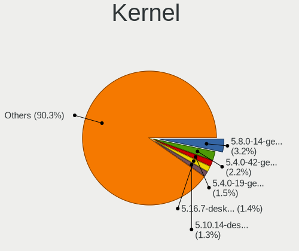

| Version                  | Notebooks | Percent |
|--------------------------|-----------|---------|
| 5.8.0-14-generic         | 56        | 3.86%   |
| 5.4.0-42-generic         | 39        | 2.69%   |
| 5.4.0-19-generic         | 26        | 1.79%   |
| 5.16.7-desktop-1omv4003  | 25        | 1.72%   |
| 5.10.14-desktop-1omv4002 | 23        | 1.58%   |
| 5.3.0-28-generic         | 21        | 1.45%   |
| 4.18.16-desktop-1bP      | 21        | 1.45%   |
| 5.11.0-35-generic        | 16        | 1.1%    |
| 4.18.0-15-generic        | 14        | 0.96%   |
| 5.3.0-23-generic         | 13        | 0.9%    |
| 5.0.0-25-generic         | 13        | 0.9%    |
| 5.0.0-20-generic         | 10        | 0.69%   |
| 4.15.0-15-generic        | 10        | 0.69%   |
| 6.1.1-desktop-1omv2290   | 9         | 0.62%   |
| 6.2.6-desktop-1omv2390   | 8         | 0.55%   |
| 5.6.14-desktop-2bP       | 8         | 0.55%   |
| 5.3.0-46-generic         | 8         | 0.55%   |
| 5.15.0-56-generic        | 8         | 0.55%   |
| 5.15.0-52-generic        | 8         | 0.55%   |
| 5.13.0-7614-generic      | 8         | 0.55%   |
| 5.0.0-37-generic         | 8         | 0.55%   |
| 5.8.0-50-generic         | 7         | 0.48%   |
| 5.4.0-56-generic         | 7         | 0.48%   |
| 5.4.0-54-generic         | 7         | 0.48%   |
| 5.4.0-40-generic         | 7         | 0.48%   |
| 5.4.0-26-generic         | 7         | 0.48%   |
| 5.3.0-51-generic         | 7         | 0.48%   |
| 5.3.0-19-generic         | 7         | 0.48%   |
| 5.3.0-12-generic         | 7         | 0.48%   |
| 5.19.0-32-generic        | 7         | 0.48%   |
| 5.15.0-71-generic        | 7         | 0.48%   |
| 5.15.0-48-generic        | 7         | 0.48%   |
| 5.11.0-7620-generic      | 7         | 0.48%   |
| 5.0.0-7-generic          | 7         | 0.48%   |
| 6.5.11-300.fc39.x86_64   | 6         | 0.41%   |
| 6.4.11-desktop-1omv2390  | 6         | 0.41%   |
| 6.2.0-36-generic         | 6         | 0.41%   |
| 6.2.0-34-generic         | 6         | 0.41%   |
| 5.4.0-37-generic         | 6         | 0.41%   |
| 5.4.0-31-generic         | 6         | 0.41%   |

Kernel Family
-------------

Linux kernel without a distro release

| Version | Notebooks | Percent |
|---------|-----------|---------|
| 5.4.0   | 201       | 14.36%  |
| 5.8.0   | 108       | 7.71%   |
| 5.15.0  | 102       | 7.29%   |
| 5.3.0   | 87        | 6.21%   |
| 5.11.0  | 69        | 4.93%   |
| 5.0.0   | 63        | 4.5%    |
| 4.15.0  | 59        | 4.21%   |
| 5.13.0  | 54        | 3.86%   |
| 4.18.0  | 40        | 2.86%   |
| 6.2.0   | 36        | 2.57%   |
| 5.19.0  | 32        | 2.29%   |
| 5.16.7  | 25        | 1.79%   |
| 5.10.14 | 24        | 1.71%   |
| 5.10.0  | 23        | 1.64%   |
| 4.18.16 | 21        | 1.5%    |
| 6.2.6   | 13        | 0.93%   |
| 6.1.0   | 13        | 0.93%   |
| 6.1.1   | 11        | 0.79%   |
| 6.5.0   | 10        | 0.71%   |
| 5.6.14  | 9         | 0.64%   |
| 6.4.11  | 8         | 0.57%   |
| 4.9.60  | 8         | 0.57%   |
| 4.9.20  | 8         | 0.57%   |
| 6.6.2   | 7         | 0.5%    |
| 6.5.5   | 7         | 0.5%    |
| 4.13.0  | 7         | 0.5%    |
| 6.5.9   | 6         | 0.43%   |
| 6.5.11  | 6         | 0.43%   |
| 6.1.12  | 6         | 0.43%   |
| 4.19.0  | 6         | 0.43%   |
| 6.4.8   | 5         | 0.36%   |
| 6.3.5   | 5         | 0.36%   |
| 5.17.0  | 5         | 0.36%   |
| 4.9.76  | 5         | 0.36%   |
| 6.5.6   | 4         | 0.29%   |
| 6.3.2   | 4         | 0.29%   |
| 6.0.6   | 4         | 0.29%   |
| 6.0.0   | 4         | 0.29%   |
| 5.9.0   | 4         | 0.29%   |
| 5.16.13 | 4         | 0.29%   |

Kernel Major Ver.
-----------------

Linux kernel major version

| Version | Notebooks | Percent |
|---------|-----------|---------|
| 5.4     | 207       | 14.88%  |
| 5.15    | 130       | 9.35%   |
| 5.8     | 121       | 8.7%    |
| 5.3     | 94        | 6.76%   |
| 5.11    | 79        | 5.68%   |
| 5.0     | 65        | 4.67%   |
| 4.18    | 63        | 4.53%   |
| 5.10    | 62        | 4.46%   |
| 6.2     | 60        | 4.31%   |
| 4.15    | 59        | 4.24%   |
| 5.13    | 58        | 4.17%   |
| 6.1     | 48        | 3.45%   |
| 5.19    | 46        | 3.31%   |
| 5.16    | 43        | 3.09%   |
| 6.5     | 38        | 2.73%   |
| 4.9     | 27        | 1.94%   |
| 6.6     | 20        | 1.44%   |
| 6.0     | 18        | 1.29%   |
| 6.4     | 17        | 1.22%   |
| 5.6     | 17        | 1.22%   |
| 5.9     | 15        | 1.08%   |
| 5.17    | 15        | 1.08%   |
| 5.18    | 14        | 1.01%   |
| 6.3     | 13        | 0.93%   |
| 5.14    | 10        | 0.72%   |
| 5.12    | 10        | 0.72%   |
| 4.19    | 7         | 0.5%    |
| 4.13    | 7         | 0.5%    |
| 5.7     | 6         | 0.43%   |
| 5.5     | 5         | 0.36%   |
| 5.1     | 3         | 0.22%   |
| 4.1     | 3         | 0.22%   |
| 6.7     | 2         | 0.14%   |
| 5.2     | 2         | 0.14%   |
| 4.12    | 2         | 0.14%   |
| 4.8     | 1         | 0.07%   |
| 4.17    | 1         | 0.07%   |
| 4.16    | 1         | 0.07%   |
| 3.10    | 1         | 0.07%   |
| Unknown | 1         | 0.07%   |

Arch
----

OS architecture (x86_64, i586, etc.)

| Name   | Notebooks | Percent |
|--------|-----------|---------|
| x86_64 | 1213      | 97.67%  |
| i686   | 28        | 2.25%   |
| armv7l | 1         | 0.08%   |

DE
--

Desktop Environment

| Name            | Notebooks | Percent |
|-----------------|-----------|---------|
| GNOME           | 640       | 49.57%  |
| KDE5            | 222       | 17.2%   |
| Unknown         | 150       | 11.62%  |
| XFCE            | 81        | 6.27%   |
| X-Cinnamon      | 59        | 4.57%   |
| KDE4            | 24        | 1.86%   |
| KDE             | 22        | 1.7%    |
| MATE            | 20        | 1.55%   |
| Unity           | 10        | 0.77%   |
| LXQt            | 9         | 0.7%    |
| LXDE            | 8         | 0.62%   |
| Cinnamon        | 8         | 0.62%   |
| Pantheon        | 7         | 0.54%   |
| i3              | 6         | 0.46%   |
| Hyprland        | 4         | 0.31%   |
| sway            | 3         | 0.23%   |
| GNOME Classic   | 3         | 0.23%   |
| xmonad          | 2         | 0.15%   |
| Endless:GNOME   | 2         | 0.15%   |
| Deepin          | 2         | 0.15%   |
| Budgie          | 2         | 0.15%   |
| ubuntu          | 1         | 0.08%   |
| qtile           | 1         | 0.08%   |
| jwm             | 1         | 0.08%   |
| GNOME Flashback | 1         | 0.08%   |
| Enlightenment   | 1         | 0.08%   |
| bspwm           | 1         | 0.08%   |
| awesome         | 1         | 0.08%   |

Display Server
--------------

X11 or Wayland

| Name    | Notebooks | Percent |
|---------|-----------|---------|
| X11     | 948       | 74.59%  |
| Wayland | 206       | 16.21%  |
| Unknown | 106       | 8.34%   |
| Tty     | 11        | 0.87%   |

Display Manager
---------------

SDDM, LightDM, etc.

| Name    | Notebooks | Percent |
|---------|-----------|---------|
| Unknown | 682       | 52.83%  |
| SDDM    | 197       | 15.26%  |
| GDM3    | 135       | 10.46%  |
| GDM     | 125       | 9.68%   |
| LightDM | 98        | 7.59%   |
| TDM     | 24        | 1.86%   |
| KDM     | 23        | 1.78%   |
| XDM     | 3         | 0.23%   |
| SLiM    | 3         | 0.23%   |
| GREETD  | 1         | 0.08%   |

OS Lang
-------

Language

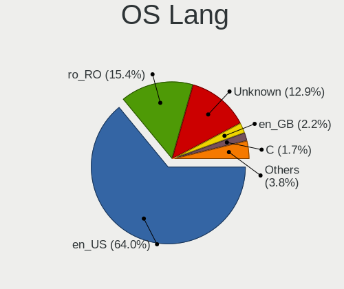

| Lang        | Notebooks | Percent |
|-------------|-----------|---------|
| en_US       | 790       | 61.72%  |
| ro_RO       | 207       | 16.17%  |
| Unknown     | 195       | 15.23%  |
| en_GB       | 25        | 1.95%   |
| C           | 19        | 1.48%   |
| hu_HU       | 11        | 0.86%   |
| it_IT       | 9         | 0.7%    |
| es_ES       | 6         | 0.47%   |
| fr_FR       | 4         | 0.31%   |
| en_IL       | 3         | 0.23%   |
| de_DE       | 2         | 0.16%   |
| uk_UA       | 1         | 0.08%   |
| ru_RU       | 1         | 0.08%   |
| fr_CH       | 1         | 0.08%   |
| en_US.UTF.8 | 1         | 0.08%   |
| en_IN       | 1         | 0.08%   |
| en_CA       | 1         | 0.08%   |
| en_AG       | 1         | 0.08%   |
| en_001      | 1         | 0.08%   |
| C.UTF8      | 1         | 0.08%   |

Boot Mode
---------

EFI or BIOS

| Mode | Notebooks | Percent |
|------|-----------|---------|
| EFI  | 727       | 57.2%   |
| BIOS | 544       | 42.8%   |

Filesystem
----------

Type of filesystem

| Type    | Notebooks | Percent |
|---------|-----------|---------|
| Ext4    | 912       | 71.47%  |
| Unknown | 110       | 8.62%   |
| Overlay | 108       | 8.46%   |
| Btrfs   | 108       | 8.46%   |
| Tmpfs   | 26        | 2.04%   |
| Xfs     | 6         | 0.47%   |
| Zfs     | 3         | 0.24%   |
| Ext2    | 2         | 0.16%   |
| F2fs    | 1         | 0.08%   |

Part. scheme
------------

Scheme of partitioning

| Type    | Notebooks | Percent |
|---------|-----------|---------|
| Unknown | 711       | 56.21%  |
| GPT     | 416       | 32.89%  |
| MBR     | 138       | 10.91%  |

Dual Boot with Linux/BSD
------------------------

Hosting more than one Linux/BSD

| Dual boot | Notebooks | Percent |
|-----------|-----------|---------|
| No        | 1119      | 89.02%  |
| Yes       | 138       | 10.98%  |

Dual Boot (Win)
---------------

Hosting Linux and Windows

| Dual boot | Notebooks | Percent |
|-----------|-----------|---------|
| No        | 938       | 74.39%  |
| Yes       | 323       | 25.61%  |

Board
-----

Vendor
------

Motherboard manufacturer

| Name                           | Notebooks | Percent |
|--------------------------------|-----------|---------|
| ASUSTek Computer               | 348       | 28.04%  |
| Lenovo                         | 268       | 21.6%   |
| Hewlett-Packard                | 168       | 13.54%  |
| Dell                           | 160       | 12.89%  |
| Acer                           | 122       | 9.83%   |
| Toshiba                        | 27        | 2.18%   |
| MSI                            | 17        | 1.37%   |
| Sony                           | 10        | 0.81%   |
| HUAWEI                         | 10        | 0.81%   |
| Complet                        | 9         | 0.73%   |
| Allview                        | 9         | 0.73%   |
| Valve                          | 8         | 0.64%   |
| Medion                         | 8         | 0.64%   |
| Fujitsu Siemens                | 8         | 0.64%   |
| Apple                          | 7         | 0.56%   |
| Samsung Electronics            | 6         | 0.48%   |
| Fujitsu                        | 6         | 0.48%   |
| Unknown                        | 6         | 0.48%   |
| Chuwi                          | 4         | 0.32%   |
| Packard Bell                   | 3         | 0.24%   |
| Alienware                      | 3         | 0.24%   |
| TUXEDO                         | 2         | 0.16%   |
| Timi                           | 2         | 0.16%   |
| Google                         | 2         | 0.16%   |
| WEIGO                          | 1         | 0.08%   |
| Visual Fan                     | 1         | 0.08%   |
| VALE                           | 1         | 0.08%   |
| Thomson                        | 1         | 0.08%   |
| SLIMBOOK                       | 1         | 0.08%   |
| Razer                          | 1         | 0.08%   |
| Prestigio                      | 1         | 0.08%   |
| Pegatron                       | 1         | 0.08%   |
| PC Specialist                  | 1         | 0.08%   |
| Panasonic                      | 1         | 0.08%   |
| Notebook                       | 1         | 0.08%   |
| nJoy Romania                   | 1         | 0.08%   |
| Neousys Technology             | 1         | 0.08%   |
| NEC Computers                  | 1         | 0.08%   |
| Mediacom                       | 1         | 0.08%   |
| Matsushita Electric Industrial | 1         | 0.08%   |

Model
-----

Motherboard model

| Name                                       | Notebooks | Percent |
|--------------------------------------------|-----------|---------|
| ASUS X541NA                                | 17        | 1.37%   |
| ASUS VivoBook 15_ASUS Laptop X540MA_X543MA | 17        | 1.37%   |
| ASUS VivoBook_ASUSLaptop X509FA_X509FA     | 10        | 0.81%   |
| ASUS VivoBook 15_ASUS Laptop X540MA_X540MA | 10        | 0.81%   |
| Unknown                                    | 9         | 0.73%   |
| Valve Jupiter                              | 8         | 0.64%   |
| Dell XPS 15 9530                           | 7         | 0.56%   |
| Complet MY8312                             | 7         | 0.56%   |
| ASUS X541UVK                               | 7         | 0.56%   |
| ASUS X541UAK                               | 7         | 0.56%   |
| ASUS X406UAR                               | 7         | 0.56%   |
| Lenovo Legion Y530-15ICH 81FV              | 6         | 0.48%   |
| ASUS VivoBook_ASUSLaptop X509FB_X509FB     | 6         | 0.48%   |
| ASUS VivoBook 15_ASUS Laptop X540MA_A540MA | 6         | 0.48%   |
| Lenovo V330-15IKB 81AX                     | 5         | 0.4%    |
| HP Notebook                                | 5         | 0.4%    |
| ASUS VivoBook_ASUSLaptop X512DA_X512DA     | 5         | 0.4%    |
| ASUS VivoBook_ASUSLaptop X509DAP_M509DA    | 5         | 0.4%    |
| ASUS VivoBook_ASUS Laptop X505ZA_A505ZA    | 5         | 0.4%    |
| ASUS VivoBook 15_ASUS Laptop X540UAR       | 5         | 0.4%    |
| ASUS GL552JX                               | 5         | 0.4%    |
| Allview Allbook H                          | 5         | 0.4%    |
| Acer Aspire A315-21G                       | 5         | 0.4%    |
| Lenovo IdeaPad 330-15IKB 81DE              | 4         | 0.32%   |
| Lenovo IdeaPad 100-15IBD 80QQ              | 4         | 0.32%   |
| Lenovo G510 20238                          | 4         | 0.32%   |
| Dell Latitude E6410                        | 4         | 0.32%   |
| Dell Inspiron 5558                         | 4         | 0.32%   |
| Dell Inspiron 1545                         | 4         | 0.32%   |
| ASUS ZenBook UX431DA_UM431DA               | 4         | 0.32%   |
| ASUS X542UAR                               | 4         | 0.32%   |
| ASUS VivoBook_ASUSLaptop X530FA_S530FA     | 4         | 0.32%   |
| ASUS VivoBook_ASUSLaptop X513EA_K513EA     | 4         | 0.32%   |
| Acer Aspire E5-573G                        | 4         | 0.32%   |
| Acer Aspire E1-531                         | 4         | 0.32%   |
| Lenovo V110-15ISK 80TL                     | 3         | 0.24%   |
| Lenovo ThinkPad E14 Gen 2 20TA002GRI       | 3         | 0.24%   |
| Lenovo Legion Y540-17IRH 81Q4              | 3         | 0.24%   |
| Lenovo Legion 5 15ARH05 82B5               | 3         | 0.24%   |
| Lenovo Legion 5 15ACH6H 82JU               | 3         | 0.24%   |

Model Family
------------

Motherboard model prefix

| Name              | Notebooks | Percent |
|-------------------|-----------|---------|
| ASUS VivoBook     | 130       | 10.48%  |
| Lenovo IdeaPad    | 91        | 7.33%   |
| Acer Aspire       | 89        | 7.17%   |
| Lenovo ThinkPad   | 88        | 7.09%   |
| Dell Latitude     | 58        | 4.67%   |
| Dell Inspiron     | 49        | 3.95%   |
| HP EliteBook      | 33        | 2.66%   |
| HP ProBook        | 31        | 2.5%    |
| Lenovo Legion     | 28        | 2.26%   |
| Toshiba Satellite | 26        | 2.1%    |
| HP Pavilion       | 22        | 1.77%   |
| Dell XPS          | 19        | 1.53%   |
| ASUS ASUS         | 19        | 1.53%   |
| HP Laptop         | 18        | 1.45%   |
| ASUS X541NA       | 17        | 1.37%   |
| ASUS ROG          | 16        | 1.29%   |
| ASUS ZenBook      | 14        | 1.13%   |
| Dell Vostro       | 12        | 0.97%   |
| Lenovo ThinkBook  | 10        | 0.81%   |
| HP 250            | 10        | 0.81%   |
| ASUS TUF          | 10        | 0.81%   |
| Allview Allbook   | 9         | 0.73%   |
| Unknown           | 9         | 0.73%   |
| Valve Jupiter     | 8         | 0.64%   |
| HP ZBook          | 7         | 0.56%   |
| HP Compaq         | 7         | 0.56%   |
| Complet MY8312    | 7         | 0.56%   |
| ASUS X541UVK      | 7         | 0.56%   |
| ASUS X541UAK      | 7         | 0.56%   |
| ASUS X406UAR      | 7         | 0.56%   |
| Acer Swift        | 7         | 0.56%   |
| Acer Nitro        | 7         | 0.56%   |
| Acer Extensa      | 7         | 0.56%   |
| Lenovo Yoga       | 6         | 0.48%   |
| Fujitsu LIFEBOOK  | 6         | 0.48%   |
| Dell System       | 6         | 0.48%   |
| Dell Precision    | 6         | 0.48%   |
| Lenovo V330-15IKB | 5         | 0.4%    |
| HP OMEN           | 5         | 0.4%    |
| HP Notebook       | 5         | 0.4%    |

MFG Year
--------

Motherboard manufacture year

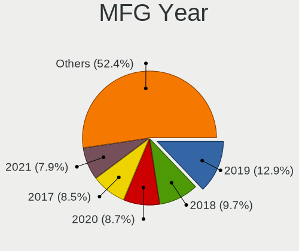

| Year    | Notebooks | Percent |
|---------|-----------|---------|
| 2019    | 173       | 13.94%  |
| 2018    | 129       | 10.39%  |
| 2020    | 114       | 9.19%   |
| 2017    | 114       | 9.19%   |
| 2021    | 97        | 7.82%   |
| 2015    | 85        | 6.85%   |
| 2013    | 69        | 5.56%   |
| 2011    | 66        | 5.32%   |
| 2012    | 62        | 5%      |
| 2014    | 60        | 4.83%   |
| 2010    | 57        | 4.59%   |
| 2016    | 48        | 3.87%   |
| 2022    | 41        | 3.3%    |
| 2008    | 34        | 2.74%   |
| 2007    | 30        | 2.42%   |
| 2009    | 26        | 2.1%    |
| 2023    | 19        | 1.53%   |
| 2006    | 13        | 1.05%   |
| Unknown | 2         | 0.16%   |
| 2005    | 1         | 0.08%   |
| 2004    | 1         | 0.08%   |

Form Factor
-----------

Physical design of the computer

| Name     | Notebooks | Percent |
|----------|-----------|---------|
| Notebook | 1241      | 100%    |

Secure Boot
-----------

Enabled or disabled

| State    | Notebooks | Percent |
|----------|-----------|---------|
| Disabled | 1167      | 93.43%  |
| Enabled  | 82        | 6.57%   |

Coreboot
--------

Have coreboot on board

| Used | Notebooks | Percent |
|------|-----------|---------|
| No   | 1239      | 99.84%  |
| Yes  | 2         | 0.16%   |

RAM Size
--------

Total RAM memory

| Size in GB  | Notebooks | Percent |
|-------------|-----------|---------|
| 3.01-4.0    | 365       | 28.97%  |
| 4.01-8.0    | 350       | 27.78%  |
| 8.01-16.0   | 204       | 16.19%  |
| 16.01-24.0  | 187       | 14.84%  |
| 32.01-64.0  | 62        | 4.92%   |
| 1.01-2.0    | 49        | 3.89%   |
| 2.01-3.0    | 14        | 1.11%   |
| 24.01-32.0  | 11        | 0.87%   |
| 0.51-1.0    | 10        | 0.79%   |
| 64.01-256.0 | 8         | 0.63%   |

RAM Used
--------

Used RAM memory

| Used GB    | Notebooks | Percent |
|------------|-----------|---------|
| 1.01-2.0   | 530       | 38.27%  |
| 2.01-3.0   | 365       | 26.35%  |
| 3.01-4.0   | 162       | 11.7%   |
| 4.01-8.0   | 141       | 10.18%  |
| 0.51-1.0   | 130       | 9.39%   |
| 8.01-16.0  | 41        | 2.96%   |
| 0.01-0.5   | 13        | 0.94%   |
| 32.01-64.0 | 1         | 0.07%   |
| 24.01-32.0 | 1         | 0.07%   |
| 16.01-24.0 | 1         | 0.07%   |

Total Drives
------------

Number of drives on board

| Drives | Notebooks | Percent |
|--------|-----------|---------|
| 1      | 956       | 75.63%  |
| 2      | 264       | 20.89%  |
| 3      | 35        | 2.77%   |
| 0      | 6         | 0.47%   |
| 4      | 2         | 0.16%   |
| 5      | 1         | 0.08%   |

Has CD-ROM
----------

Has CD-ROM on board

| Presented | Notebooks | Percent |
|-----------|-----------|---------|
| No        | 811       | 65.04%  |
| Yes       | 436       | 34.96%  |

Has Ethernet
------------

Has Ethernet on board

| Presented | Notebooks | Percent |
|-----------|-----------|---------|
| Yes       | 937       | 75.26%  |
| No        | 308       | 24.74%  |

Has WiFi
--------

Has WiFi module

| Presented | Notebooks | Percent |
|-----------|-----------|---------|
| Yes       | 1231      | 99.03%  |
| No        | 12        | 0.97%   |

Has Bluetooth
-------------

Has Bluetooth module

| Presented | Notebooks | Percent |
|-----------|-----------|---------|
| Yes       | 1017      | 80.84%  |
| No        | 241       | 19.16%  |

Location
--------

Country
-------

Geographic location (country)

| Country | Notebooks | Percent |
|---------|-----------|---------|
| Romania | 1241      | 100%    |

City
----

Geographic location (city)

| City                  | Notebooks | Percent |
|-----------------------|-----------|---------|
| Bucharest             | 405       | 30.59%  |
| Cluj-Napoca           | 87        | 6.57%   |
| Iasi                  | 62        | 4.68%   |
| Timioara            | 50        | 3.78%   |
| Trgu Mure         | 39        | 2.95%   |
| Ploieti             | 39        | 2.95%   |
| Brasov                | 37        | 2.79%   |
| Constana            | 26        | 1.96%   |
| Piteti              | 22        | 1.66%   |
| Sibiu                 | 21        | 1.59%   |
| Arad                  | 19        | 1.44%   |
| Oradea                | 18        | 1.36%   |
| Craiova               | 15        | 1.13%   |
| Popesti-Leordeni      | 14        | 1.06%   |
| Voluntari             | 13        | 0.98%   |
| Galati                | 13        | 0.98%   |
| Rmnicu Vlcea      | 12        | 0.91%   |
| Bacau                 | 12        | 0.91%   |
| Botosani              | 11        | 0.83%   |
| Baia Mare             | 11        | 0.83%   |
| Miercurea-Ciuc        | 10        | 0.76%   |
| Zalu                | 9         | 0.68%   |
| Deva                  | 9         | 0.68%   |
| Targoviste            | 8         | 0.6%    |
| Roman                 | 8         | 0.6%    |
| Reia              | 8         | 0.6%    |
| Floresti              | 8         | 0.6%    |
| Buzau                 | 8         | 0.6%    |
| Suceava               | 7         | 0.53%   |
| Focani              | 7         | 0.53%   |
| Alba Iulia            | 7         | 0.53%   |
| Tulcea                | 6         | 0.45%   |
| Trgu Jiu            | 6         | 0.45%   |
| Sighetu Marmaiei    | 6         | 0.45%   |
| Media               | 6         | 0.45%   |
| Mangalia              | 6         | 0.45%   |
| Drobeta-Turnu Severin | 6         | 0.45%   |
| Braila                | 6         | 0.45%   |
| Slatina               | 5         | 0.38%   |
| Sfantu Gheorghe       | 5         | 0.38%   |

Drives
------

Drive Vendor
------------

Hard drive vendors

| Vendor                      | Notebooks | Drives | Percent |
|-----------------------------|-----------|--------|---------|
| Samsung Electronics         | 209       | 271    | 13.62%  |
| Seagate                     | 183       | 246    | 11.93%  |
| WDC                         | 168       | 197    | 10.95%  |
| Kingston                    | 159       | 196    | 10.37%  |
| Toshiba                     | 130       | 158    | 8.47%   |
| SanDisk                     | 82        | 95     | 5.35%   |
| SK hynix                    | 75        | 101    | 4.89%   |
| Unknown                     | 69        | 91     | 4.5%    |
| Intel                       | 66        | 85     | 4.3%    |
| A-DATA Technology           | 53        | 59     | 3.46%   |
| Micron Technology           | 50        | 64     | 3.26%   |
| HGST                        | 50        | 59     | 3.26%   |
| Hitachi                     | 37        | 40     | 2.41%   |
| Crucial                     | 17        | 21     | 1.11%   |
| KIOXIA                      | 14        | 14     | 0.91%   |
| Phison                      | 10        | 11     | 0.65%   |
| Patriot                     | 10        | 10     | 0.65%   |
| Kingston Technology Company | 10        | 10     | 0.65%   |
| Netac                       | 9         | 11     | 0.59%   |
| FORESEE                     | 9         | 10     | 0.59%   |
| SPCC                        | 7         | 8      | 0.46%   |
| Hewlett-Packard             | 7         | 7      | 0.46%   |
| Fujitsu                     | 6         | 7      | 0.39%   |
| Corsair                     | 6         | 7      | 0.39%   |
| XPG                         | 4         | 5      | 0.26%   |
| Realtek Semiconductor       | 4         | 4      | 0.26%   |
| Phison Electronics          | 4         | 4      | 0.26%   |
| Gigabyte Technology         | 4         | 4      | 0.26%   |
| China                       | 4         | 4      | 0.26%   |
| ADATA Technology            | 4         | 5      | 0.26%   |
| Unknown                     | 4         | 4      | 0.26%   |
| Transcend                   | 3         | 3      | 0.2%    |
| Silicon Motion              | 3         | 3      | 0.2%    |
| OCZ                         | 3         | 5      | 0.2%    |
| LITEON                      | 3         | 3      | 0.2%    |
| ASMT                        | 3         | 3      | 0.2%    |
| Apple                       | 3         | 3      | 0.2%    |
| Verbatim                    | 2         | 2      | 0.13%   |
| UMIS                        | 2         | 3      | 0.13%   |
| TO Exter                    | 2         | 4      | 0.13%   |

Drive Model
-----------

Hard drive models

| Model                                               | Notebooks | Percent |
|-----------------------------------------------------|-----------|---------|
| Toshiba MQ01ABF050 500GB                            | 45        | 2.85%   |
| Seagate ST1000LM035-1RK172 1TB                      | 42        | 2.66%   |
| Seagate ST500LT012-1DG142 500GB                     | 30        | 1.9%    |
| Kingston SA400S37240G 240GB SSD                     | 29        | 1.84%   |
| Toshiba MQ04ABF100 1TB                              | 22        | 1.4%    |
| Kingston SA400S37480G 480GB SSD                     | 19        | 1.2%    |
| HGST HTS721010A9E630 1TB                            | 19        | 1.2%    |
| Unknown MMC Card  32GB                              | 18        | 1.14%   |
| Samsung NVMe SSD Controller SM981/PM981/PM983 512GB | 18        | 1.14%   |
| SanDisk NVMe SSD Drive 256GB                        | 17        | 1.08%   |
| Samsung NVMe SSD Drive 512GB                        | 17        | 1.08%   |
| SanDisk NVMe SSD Drive 512GB                        | 15        | 0.95%   |
| Toshiba MQ01ABD100 1TB                              | 14        | 0.89%   |
| Seagate ST1000LM024 HN-M101MBB 1TB                  | 13        | 0.82%   |
| SK hynix NVMe SSD Drive 512GB                       | 11        | 0.7%    |
| SK hynix HFS256G39TND-N210A 256GB SSD               | 11        | 0.7%    |
| Kingston SV300S37A240G 240GB SSD                    | 11        | 0.7%    |
| Intel NVMe SSD Drive 512GB                          | 10        | 0.63%   |
| HGST HTS545050A7E680 500GB                          | 10        | 0.63%   |
| WDC WD10SPZX-21Z10T0 1TB                            | 9         | 0.57%   |
| Samsung PM963 2.5" NVMe PCIe SSD 256GB              | 9         | 0.57%   |
| Samsung NVMe SSD Controller PM9A1/PM9A3/980PRO 2TB  | 9         | 0.57%   |
| HGST HTS541010A9E680 1TB                            | 9         | 0.57%   |
| SK hynix HFM001TD3JX013N 1024GB                     | 8         | 0.51%   |
| Seagate Expansion 2TB                               | 8         | 0.51%   |
| Netac SSD 256GB                                     | 8         | 0.51%   |
| Kingston SUV500MS480G 480GB SSD                     | 8         | 0.51%   |
| Kingston SA400S37120G 120GB SSD                     | 8         | 0.51%   |
| Kingston RBUSNS8180DS3256GJ 256GB SSD               | 8         | 0.51%   |
| A-DATA SU650 240GB SSD                              | 8         | 0.51%   |
| WDC WD10JPCX-24UE4T0 1TB                            | 7         | 0.44%   |
| Unknown MMC Card  128GB                             | 7         | 0.44%   |
| Seagate ST9500325AS 500GB                           | 7         | 0.44%   |
| Seagate ST2000LM007-1R8174 2TB                      | 7         | 0.44%   |
| Sandisk WD Blue SN550 NVMe SSD 1TB                  | 7         | 0.44%   |
| Samsung SSD 860 EVO 500GB                           | 7         | 0.44%   |
| Micron 1100_MTFDDAV256TBN 256GB SSD                 | 7         | 0.44%   |
| Kingston SUV400S37120G 120GB SSD                    | 7         | 0.44%   |
| Kingston RBUSC180DS37256GJ 256GB SSD                | 7         | 0.44%   |
| Intel NVMe SSD Drive 256GB                          | 7         | 0.44%   |

HDD Vendor
----------

Hard disk drive vendors

| Vendor              | Notebooks | Drives | Percent |
|---------------------|-----------|--------|---------|
| Seagate             | 182       | 245    | 35.48%  |
| WDC                 | 115       | 137    | 22.42%  |
| Toshiba             | 106       | 131    | 20.66%  |
| HGST                | 50        | 59     | 9.75%   |
| Hitachi             | 37        | 40     | 7.21%   |
| Fujitsu             | 6         | 7      | 1.17%   |
| Samsung Electronics | 4         | 4      | 0.78%   |
| Unknown             | 3         | 3      | 0.58%   |
| TO Exter            | 2         | 4      | 0.39%   |
| IBM/Hitachi         | 2         | 2      | 0.39%   |
| XrayDisk            | 1         | 1      | 0.19%   |
| SABRENT             | 1         | 1      | 0.19%   |
| HGST HTS            | 1         | 1      | 0.19%   |
| External            | 1         | 1      | 0.19%   |
| ASMT                | 1         | 1      | 0.19%   |
| Apple               | 1         | 1      | 0.19%   |

SSD Vendor
----------

Solid state drive vendors

| Vendor              | Notebooks | Drives | Percent |
|---------------------|-----------|--------|---------|
| Kingston            | 135       | 170    | 27.84%  |
| Samsung Electronics | 77        | 105    | 15.88%  |
| A-DATA Technology   | 47        | 53     | 9.69%   |
| SanDisk             | 33        | 40     | 6.8%    |
| SK hynix            | 23        | 32     | 4.74%   |
| Micron Technology   | 19        | 22     | 3.92%   |
| Crucial             | 17        | 21     | 3.51%   |
| WDC                 | 16        | 16     | 3.3%    |
| Intel               | 14        | 15     | 2.89%   |
| Patriot             | 9         | 9      | 1.86%   |
| Netac               | 9         | 11     | 1.86%   |
| FORESEE             | 9         | 10     | 1.86%   |
| Toshiba             | 7         | 7      | 1.44%   |
| SPCC                | 7         | 8      | 1.44%   |
| Hewlett-Packard     | 7         | 7      | 1.44%   |
| Corsair             | 5         | 6      | 1.03%   |
| Gigabyte Technology | 4         | 4      | 0.82%   |
| China               | 4         | 4      | 0.82%   |
| Transcend           | 3         | 3      | 0.62%   |
| OCZ                 | 3         | 5      | 0.62%   |
| LITEON              | 3         | 3      | 0.62%   |
| Verbatim            | 2         | 2      | 0.41%   |
| Teclast             | 2         | 2      | 0.41%   |
| LITEONIT            | 2         | 2      | 0.41%   |
| Lite-On             | 2         | 2      | 0.41%   |
| Intenso             | 2         | 2      | 0.41%   |
| GOODRAM             | 2         | 2      | 0.41%   |
| ASMT                | 2         | 2      | 0.41%   |
| Apacer              | 2         | 2      | 0.41%   |
| Wibtek              | 1         | 1      | 0.21%   |
| W800S               | 1         | 1      | 0.21%   |
| Unknown             | 1         | 1      | 0.21%   |
| PNY                 | 1         | 2      | 0.21%   |
| Plextor             | 1         | 1      | 0.21%   |
| MicroFrom           | 1         | 1      | 0.21%   |
| Maxtor              | 1         | 1      | 0.21%   |
| M.2 2280            | 1         | 1      | 0.21%   |
| Kingmax             | 1         | 1      | 0.21%   |
| KingFast            | 1         | 1      | 0.21%   |
| Jumper              | 1         | 1      | 0.21%   |

Drive Kind
----------

HDD or SSD

| Kind    | Notebooks | Drives | Percent |
|---------|-----------|--------|---------|
| HDD     | 499       | 638    | 34.22%  |
| SSD     | 449       | 587    | 30.8%   |
| NVMe    | 437       | 564    | 29.97%  |
| MMC     | 63        | 84     | 4.32%   |
| Unknown | 10        | 12     | 0.69%   |

Drive Connector
---------------

SATA, SAS, NVMe, etc.

| Type | Notebooks | Drives | Percent |
|------|-----------|--------|---------|
| SATA | 828       | 1184   | 60.22%  |
| NVMe | 437       | 564    | 31.78%  |
| MMC  | 63        | 84     | 4.58%   |
| SAS  | 47        | 53     | 3.42%   |

Drive Size
----------

Size of hard drive

| Size in TB | Notebooks | Drives | Percent |
|------------|-----------|--------|---------|
| 0.01-0.5   | 627       | 835    | 67.49%  |
| 0.51-1.0   | 267       | 329    | 28.74%  |
| 1.01-2.0   | 33        | 59     | 3.55%   |
| 3.01-4.0   | 1         | 1      | 0.11%   |
| 4.01-10.0  | 1         | 1      | 0.11%   |

Space Total
-----------

Amount of disk space available on the file system

| Size in GB     | Notebooks | Percent |
|----------------|-----------|---------|
| 101-250        | 385       | 29.32%  |
| 251-500        | 322       | 24.52%  |
| 501-1000       | 216       | 16.45%  |
| 1-20           | 117       | 8.91%   |
| 51-100         | 80        | 6.09%   |
| 1001-2000      | 61        | 4.65%   |
| 21-50          | 56        | 4.27%   |
| Unknown        | 38        | 2.89%   |
| 2001-3000      | 22        | 1.68%   |
| More than 3000 | 16        | 1.22%   |

Space Used
----------

Amount of used disk space

| Used GB        | Notebooks | Percent |
|----------------|-----------|---------|
| 1-20           | 542       | 39.94%  |
| 21-50          | 306       | 22.55%  |
| 101-250        | 160       | 11.79%  |
| 51-100         | 147       | 10.83%  |
| 251-500        | 79        | 5.82%   |
| 501-1000       | 55        | 4.05%   |
| Unknown        | 38        | 2.8%    |
| 1001-2000      | 25        | 1.84%   |
| More than 3000 | 3         | 0.22%   |
| 2001-3000      | 2         | 0.15%   |

Malfunc. Drives
---------------

Drive models with a malfunction

| Model                                 | Notebooks | Drives | Percent |
|---------------------------------------|-----------|--------|---------|
| Hitachi HTS725032A7E630 320GB         | 7         | 7      | 7.53%   |
| HGST HTS541010A9E680 1TB              | 5         | 5      | 5.38%   |
| Seagate ST9500420AS 500GB             | 3         | 3      | 3.23%   |
| HGST HTS545050A7E680 500GB            | 3         | 3      | 3.23%   |
| WDC PC SA530 SDASN8Y-256G-1006 256GB  | 2         | 2      | 2.15%   |
| Toshiba MQ01ABF050 500GB              | 2         | 2      | 2.15%   |
| Seagate ST95005620AS 500GB            | 2         | 5      | 2.15%   |
| Seagate ST9500325AS 500GB             | 2         | 2      | 2.15%   |
| Seagate ST9160821AS 160GB             | 2         | 2      | 2.15%   |
| Seagate ST500LT012-1DG142 500GB       | 2         | 3      | 2.15%   |
| Seagate ST1000LX015-1U7172 1TB        | 2         | 2      | 2.15%   |
| Hitachi HTS545016B9A300 160GB         | 2         | 2      | 2.15%   |
| HGST HTS725050A7E630 500GB            | 2         | 2      | 2.15%   |
| WDC WDS240G2G0A-00JH30 240GB SSD      | 1         | 1      | 1.08%   |
| WDC WD7500BPVT-60HXZT3 752GB          | 1         | 2      | 1.08%   |
| WDC WD7500BPVT-22HXZT3 752GB          | 1         | 1      | 1.08%   |
| WDC WD6400BEVT-22A0RT0 640GB          | 1         | 1      | 1.08%   |
| WDC WD5000BPKT-60PK4T0 500GB          | 1         | 2      | 1.08%   |
| WDC WD5000BEVT-60A0RT0 500GB          | 1         | 1      | 1.08%   |
| WDC WD3200BPVT-22JJ5T0 320GB          | 1         | 1      | 1.08%   |
| WDC WD1600BEVS-60RST0 160GB           | 1         | 1      | 1.08%   |
| WDC WD1600BEVS-07RST0 160GB           | 1         | 1      | 1.08%   |
| WDC WD10SPZX-21Z10T0 1TB              | 1         | 1      | 1.08%   |
| WDC WD10JPVX-22JC3T0 1TB              | 1         | 1      | 1.08%   |
| Toshiba MQ04ABF100 1TB                | 1         | 1      | 1.08%   |
| Toshiba MQ01ABD100 1TB                | 1         | 1      | 1.08%   |
| Toshiba MK6476GSX 640GB               | 1         | 1      | 1.08%   |
| Toshiba MK5076GSX 500GB               | 1         | 1      | 1.08%   |
| Toshiba MK3252GSX 320GB               | 1         | 2      | 1.08%   |
| Toshiba MK2556GSY 250GB               | 1         | 1      | 1.08%   |
| Toshiba MK2035GSS 200GB               | 1         | 1      | 1.08%   |
| Teclast 360GB A850 SSD                | 1         | 1      | 1.08%   |
| SK hynix SC210 2.5 7MM 256GB SSD      | 1         | 1      | 1.08%   |
| SK hynix HFS256G3BTND-N210A 256GB SSD | 1         | 1      | 1.08%   |
| SK hynix HFS256G39TND-N210A 256GB SSD | 1         | 1      | 1.08%   |
| SK hynix HFS256G39MND-2300A 256GB SSD | 1         | 1      | 1.08%   |
| SK hynix HFS128G39TND-N210A 128GB SSD | 1         | 1      | 1.08%   |
| SK hynix HFS128G32TND-N210A 128GB SSD | 1         | 1      | 1.08%   |
| Seagate ST9250320AS 250GB             | 1         | 1      | 1.08%   |
| Seagate ST9250315AS 250GB             | 1         | 1      | 1.08%   |

Malfunc. Drive Vendor
---------------------

Vendors of faulty drives

| Vendor              | Notebooks | Drives | Percent |
|---------------------|-----------|--------|---------|
| Seagate             | 20        | 25     | 21.98%  |
| Hitachi             | 16        | 18     | 17.58%  |
| WDC                 | 13        | 15     | 14.29%  |
| HGST                | 12        | 12     | 13.19%  |
| Toshiba             | 9         | 10     | 9.89%   |
| SK hynix            | 6         | 6      | 6.59%   |
| Kingston            | 3         | 3      | 3.3%    |
| Fujitsu             | 3         | 3      | 3.3%    |
| Hewlett-Packard     | 2         | 2      | 2.2%    |
| Teclast             | 1         | 1      | 1.1%    |
| SanDisk             | 1         | 1      | 1.1%    |
| Samsung Electronics | 1         | 1      | 1.1%    |
| Patriot             | 1         | 1      | 1.1%    |
| Micron Technology   | 1         | 1      | 1.1%    |
| LITEONIT            | 1         | 1      | 1.1%    |
| Intel               | 1         | 1      | 1.1%    |

Malfunc. HDD Vendor
-------------------

Vendors of faulty HDD drives

| Vendor  | Notebooks | Drives | Percent |
|---------|-----------|--------|---------|
| Seagate | 20        | 25     | 28.57%  |
| Hitachi | 16        | 18     | 22.86%  |
| HGST    | 12        | 12     | 17.14%  |
| WDC     | 10        | 12     | 14.29%  |
| Toshiba | 9         | 10     | 12.86%  |
| Fujitsu | 3         | 3      | 4.29%   |

Malfunc. Drive Kind
-------------------

Kinds of faulty drives

| Kind | Notebooks | Drives | Percent |
|------|-----------|--------|---------|
| HDD  | 70        | 80     | 76.92%  |
| SSD  | 21        | 21     | 23.08%  |

Failed Drives
-------------

Failed drive models

| Model                        | Notebooks | Drives | Percent |
|------------------------------|-----------|--------|---------|
| WDC WD3200BEKT-60KA9T0 320GB | 1         | 1      | 50%     |
| WDC WD2500BEVS-22UST0 250GB  | 1         | 1      | 50%     |

Failed Drive Vendor
-------------------

Failed drive vendors

| Vendor | Notebooks | Drives | Percent |
|--------|-----------|--------|---------|
| WDC    | 2         | 2      | 100%    |

Drive Status
------------

Number of failed and malfunc. drives

| Status   | Notebooks | Drives | Percent |
|----------|-----------|--------|---------|
| Detected | 801       | 1187   | 60.45%  |
| Works    | 431       | 595    | 32.53%  |
| Malfunc  | 91        | 101    | 6.87%   |
| Failed   | 2         | 2      | 0.15%   |

Storage controller
------------------

Storage Vendor
--------------

Storage controller vendors

| Vendor                           | Notebooks | Percent |
|----------------------------------|-----------|---------|
| Intel                            | 930       | 62.12%  |
| AMD                              | 140       | 9.35%   |
| Samsung Electronics              | 135       | 9.02%   |
| SanDisk                          | 84        | 5.61%   |
| SK hynix                         | 51        | 3.41%   |
| Kingston Technology Company      | 35        | 2.34%   |
| Micron Technology                | 31        | 2.07%   |
| Toshiba America Info Systems     | 17        | 1.14%   |
| KIOXIA                           | 16        | 1.07%   |
| Phison Electronics               | 13        | 0.87%   |
| ADATA Technology                 | 11        | 0.73%   |
| Realtek Semiconductor            | 9         | 0.6%    |
| Silicon Integrated Systems [SiS] | 5         | 0.33%   |
| Silicon Motion                   | 4         | 0.27%   |
| Nvidia                           | 3         | 0.2%    |
| Union Memory (Shenzhen)          | 2         | 0.13%   |
| Solidigm                         | 2         | 0.13%   |
| Solid State Storage Technology   | 2         | 0.13%   |
| Lenovo                           | 2         | 0.13%   |
| JMicron Technology               | 2         | 0.13%   |
| VIA Technologies                 | 1         | 0.07%   |
| Silicon Image                    | 1         | 0.07%   |
| Lite-On Technology               | 1         | 0.07%   |

Storage Model
-------------

Storage controller models

| Model                                                                            | Notebooks | Percent |
|----------------------------------------------------------------------------------|-----------|---------|
| AMD FCH SATA Controller [AHCI mode]                                              | 123       | 7.59%   |
| Intel Sunrise Point-LP SATA Controller [AHCI mode]                               | 112       | 6.91%   |
| Intel 82801 Mobile SATA Controller [RAID mode]                                   | 87        | 5.37%   |
| Intel 7 Series Chipset Family 6-port SATA Controller [AHCI mode]                 | 69        | 4.26%   |
| Samsung NVMe SSD Controller SM981/PM981/PM983                                    | 62        | 3.82%   |
| Intel Celeron/Pentium Silver Processor SATA Controller                           | 62        | 3.82%   |
| Intel 6 Series/C200 Series Chipset Family 6 port Mobile SATA AHCI Controller     | 51        | 3.15%   |
| Intel 8 Series SATA Controller 1 [AHCI mode]                                     | 48        | 2.96%   |
| Intel Volume Management Device NVMe RAID Controller                              | 46        | 2.84%   |
| Intel Cannon Lake Mobile PCH SATA AHCI Controller                                | 45        | 2.78%   |
| Samsung NVMe SSD Controller 980 (DRAM-less)                                      | 38        | 2.34%   |
| Intel Wildcat Point-LP SATA Controller [AHCI Mode]                               | 38        | 2.34%   |
| Intel 8 Series/C220 Series Chipset Family 6-port SATA Controller 1 [AHCI mode]   | 38        | 2.34%   |
| Intel Celeron N3350/Pentium N4200/Atom E3900 Series SATA AHCI Controller         | 36        | 2.22%   |
| Intel HM170/QM170 Chipset SATA Controller [AHCI Mode]                            | 34        | 2.1%    |
| Intel 82801IBM/IEM (ICH9M/ICH9M-E) 4 port SATA Controller [AHCI mode]            | 30        | 1.85%   |
| SK hynix Gold P31/BC711/PC711 NVMe Solid State Drive                             | 27        | 1.67%   |
| SanDisk Ultra 3D / WD Blue SN550 NVMe SSD                                        | 25        | 1.54%   |
| Intel 82801HM/HEM (ICH8M/ICH8M-E) IDE Controller                                 | 24        | 1.48%   |
| Intel 5 Series/3400 Series Chipset 4 port SATA AHCI Controller                   | 24        | 1.48%   |
| SanDisk WD Blue SN500 / PC SN520 x2 M.2 2280 NVMe SSD                            | 23        | 1.42%   |
| Intel 82801HM/HEM (ICH8M/ICH8M-E) SATA Controller [AHCI mode]                    | 23        | 1.42%   |
| Intel SSD 660P Series                                                            | 22        | 1.36%   |
| Intel Tiger Lake-LP SATA Controller                                              | 21        | 1.3%    |
| Intel 5 Series/3400 Series Chipset 6 port SATA AHCI Controller                   | 21        | 1.3%    |
| Samsung NVMe SSD Controller PM9A1/PM9A3/980PRO                                   | 18        | 1.11%   |
| Intel Comet Lake SATA AHCI Controller                                            | 17        | 1.05%   |
| Intel Cannon Point-LP SATA Controller [AHCI Mode]                                | 17        | 1.05%   |
| KIOXIA NVMe SSD Controller BG4 (DRAM-less)                                       | 15        | 0.93%   |
| Samsung NVMe SSD Controller SM961/PM961/SM963                                    | 13        | 0.8%    |
| Intel Atom/Celeron/Pentium Processor x5-E8000/J3xxx/N3xxx Series SATA Controller | 13        | 0.8%    |
| Intel SSD 670p Series [Keystone Harbor]                                          | 12        | 0.74%   |
| Micron 2210 NVMe SSD [Cobain]                                                    | 11        | 0.68%   |
| AMD SB7x0/SB8x0/SB9x0 SATA Controller [AHCI mode]                                | 11        | 0.68%   |
| Intel Atom Processor E3800 Series SATA AHCI Controller                           | 10        | 0.62%   |
| Intel 82801G (ICH7 Family) IDE Controller                                        | 10        | 0.62%   |
| SanDisk PC SN520 x2 M.2 2242 NVMe SSD                                            | 9         | 0.56%   |
| Intel 82801GBM/GHM (ICH7-M Family) SATA Controller [IDE mode]                    | 9         | 0.56%   |
| Toshiba America Info Systems XG6 NVMe SSD Controller                             | 8         | 0.49%   |
| SK hynix BC511 NVMe SSD                                                          | 8         | 0.49%   |

Storage Kind
------------

Kind of storage controller (IDE, SATA, NVMe, SAS, ...)

| Kind | Notebooks | Percent |
|------|-----------|---------|
| SATA | 904       | 57.87%  |
| NVMe | 440       | 28.17%  |
| RAID | 138       | 8.83%   |
| IDE  | 80        | 5.12%   |

Processor
---------

CPU Vendor
----------

Processor vendors

| Vendor | Notebooks | Percent |
|--------|-----------|---------|
| Intel  | 1021      | 82.27%  |
| AMD    | 219       | 17.65%  |
| ARM    | 1         | 0.08%   |

CPU Model
---------

Processor models

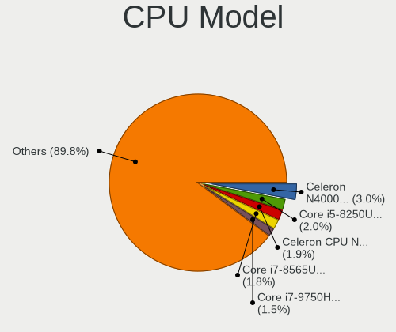

| Model                                         | Notebooks | Percent |
|-----------------------------------------------|-----------|---------|
| Intel Celeron N4000 CPU @ 1.10GHz             | 43        | 3.46%   |
| Intel Core i5-8250U CPU @ 1.60GHz             | 30        | 2.41%   |
| Intel Celeron CPU N3350 @ 1.10GHz             | 25        | 2.01%   |
| Intel Core i7-8565U CPU @ 1.80GHz             | 24        | 1.93%   |
| Intel Core i7-9750H CPU @ 2.60GHz             | 21        | 1.69%   |
| AMD Ryzen 5 3500U with Radeon Vega Mobile Gfx | 18        | 1.45%   |
| Intel Core i7-7700HQ CPU @ 2.80GHz            | 17        | 1.37%   |
| Intel Core i3-8145U CPU @ 2.10GHz             | 17        | 1.37%   |
| Intel Core i5-5200U CPU @ 2.20GHz             | 16        | 1.29%   |
| Intel Core i7-6700HQ CPU @ 2.60GHz            | 15        | 1.21%   |
| Intel 11th Gen Core i7-1165G7 @ 2.80GHz       | 15        | 1.21%   |
| Intel Core i7-8750H CPU @ 2.20GHz             | 14        | 1.13%   |
| Intel Core i7-8550U CPU @ 1.80GHz             | 14        | 1.13%   |
| Intel Core i5-7200U CPU @ 2.50GHz             | 14        | 1.13%   |
| Intel 11th Gen Core i3-1115G4 @ 3.00GHz       | 14        | 1.13%   |
| Intel Core i5-8265U CPU @ 1.60GHz             | 13        | 1.05%   |
| Intel Core i7-4510U CPU @ 2.00GHz             | 12        | 0.97%   |
| Intel Core i3-7100U CPU @ 2.40GHz             | 11        | 0.88%   |
| Intel Pentium CPU N4200 @ 1.10GHz             | 10        | 0.8%    |
| Intel Core i7-2670QM CPU @ 2.20GHz            | 10        | 0.8%    |
| Intel Core i5-1035G1 CPU @ 1.00GHz            | 10        | 0.8%    |
| Intel Core i5-10210U CPU @ 1.60GHz            | 10        | 0.8%    |
| Intel Core i3-6006U CPU @ 2.00GHz             | 10        | 0.8%    |
| Intel Core i3-5005U CPU @ 2.00GHz             | 10        | 0.8%    |
| Intel 11th Gen Core i5-1135G7 @ 2.40GHz       | 10        | 0.8%    |
| AMD Ryzen 7 4800H with Radeon Graphics        | 10        | 0.8%    |
| Intel Core i3-4005U CPU @ 1.70GHz             | 9         | 0.72%   |
| Intel Core i7-7500U CPU @ 2.70GHz             | 8         | 0.64%   |
| Intel Core i7-10510U CPU @ 1.80GHz            | 8         | 0.64%   |
| Intel Core i5-3230M CPU @ 2.60GHz             | 8         | 0.64%   |
| Intel Core i5 CPU M 560 @ 2.67GHz             | 8         | 0.64%   |
| AMD Ryzen 7 5800H with Radeon Graphics        | 8         | 0.64%   |
| AMD Ryzen 5 4600H with Radeon Graphics        | 8         | 0.64%   |
| AMD Ryzen 3 3250U with Radeon Graphics        | 8         | 0.64%   |
| AMD Custom APU 0405                           | 8         | 0.64%   |
| Intel Core i7-4720HQ CPU @ 2.60GHz            | 7         | 0.56%   |
| Intel Core i7-4712HQ CPU @ 2.30GHz            | 7         | 0.56%   |
| Intel Core i7-3630QM CPU @ 2.40GHz            | 7         | 0.56%   |
| Intel Core i7-10750H CPU @ 2.60GHz            | 7         | 0.56%   |
| Intel Core i5-8350U CPU @ 1.70GHz             | 7         | 0.56%   |

CPU Model Family
----------------

Processor model prefix

| Model                          | Notebooks | Percent |
|--------------------------------|-----------|---------|
| Intel Core i7                  | 278       | 22.37%  |
| Intel Core i5                  | 243       | 19.55%  |
| Intel Core i3                  | 133       | 10.7%   |
| Intel Celeron                  | 129       | 10.38%  |
| Other                          | 103       | 8.29%   |
| AMD Ryzen 5                    | 58        | 4.67%   |
| AMD Ryzen 7                    | 54        | 4.34%   |
| Intel Core 2 Duo               | 46        | 3.7%    |
| Intel Pentium                  | 40        | 3.22%   |
| AMD Ryzen 3                    | 18        | 1.45%   |
| Intel Atom                     | 17        | 1.37%   |
| Intel Pentium Dual-Core        | 10        | 0.8%    |
| AMD Ryzen 9                    | 10        | 0.8%    |
| AMD A4                         | 10        | 0.8%    |
| Intel Genuine                  | 7         | 0.56%   |
| Intel Core 2                   | 7         | 0.56%   |
| AMD Ryzen 7 PRO                | 7         | 0.56%   |
| AMD E                          | 6         | 0.48%   |
| AMD A6                         | 6         | 0.48%   |
| Intel Pentium Dual             | 5         | 0.4%    |
| Intel Core i9                  | 5         | 0.4%    |
| AMD E2                         | 5         | 0.4%    |
| Intel Celeron M                | 4         | 0.32%   |
| AMD Athlon                     | 4         | 0.32%   |
| Intel Pentium Silver           | 3         | 0.24%   |
| AMD Turion 64 X2 Mobile        | 3         | 0.24%   |
| AMD A8                         | 3         | 0.24%   |
| AMD A10                        | 3         | 0.24%   |
| Intel Core Duo                 | 2         | 0.16%   |
| AMD V140                       | 2         | 0.16%   |
| AMD Turion X2 Dual-Core Mobile | 2         | 0.16%   |
| AMD FX                         | 2         | 0.16%   |
| AMD E1                         | 2         | 0.16%   |
| Intel Xeon                     | 1         | 0.08%   |
| Intel Pentium M                | 1         | 0.08%   |
| Intel Mobile Pentium 4         | 1         | 0.08%   |
| Intel Core m5                  | 1         | 0.08%   |
| Intel Core 2 Extreme           | 1         | 0.08%   |
| Intel Celeron Dual-Core        | 1         | 0.08%   |
| AMD Turion 64 Mobile           | 1         | 0.08%   |

CPU Cores
---------

Number of processor cores

| Number | Notebooks | Percent |
|--------|-----------|---------|
| 2      | 628       | 50.56%  |
| 4      | 395       | 31.8%   |
| 6      | 90        | 7.25%   |
| 8      | 82        | 6.6%    |
| 1      | 24        | 1.93%   |
| 10     | 10        | 0.81%   |
| 14     | 7         | 0.56%   |
| 12     | 4         | 0.32%   |
| 24     | 1         | 0.08%   |
| 16     | 1         | 0.08%   |

CPU Sockets
-----------

Number of sockets

| Number | Notebooks | Percent |
|--------|-----------|---------|
| 1      | 1241      | 100%    |

CPU Threads
-----------

Threads per core (Hyper-Threading)

| Number | Notebooks | Percent |
|--------|-----------|---------|
| 2      | 899       | 72.38%  |
| 1      | 342       | 27.54%  |
| 4      | 1         | 0.08%   |

CPU Op-Modes
------------

CPU Operation Modes (32-bit, 64-bit)

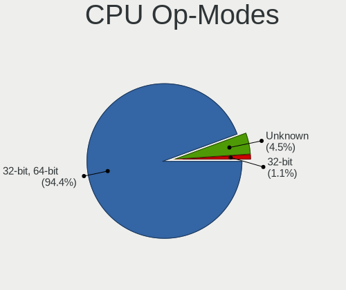

| Op mode        | Notebooks | Percent |
|----------------|-----------|---------|
| 32-bit, 64-bit | 1166      | 93.58%  |
| Unknown        | 67        | 5.38%   |
| 32-bit         | 13        | 1.04%   |

CPU Microcode
-------------

Microcode number

| Number     | Notebooks | Percent |
|------------|-----------|---------|
| Unknown    | 314       | 24.55%  |
| 0x206a7    | 57        | 4.46%   |
| 0x806ea    | 54        | 4.22%   |
| 0x806ec    | 52        | 4.07%   |
| 0x306a9    | 52        | 4.07%   |
| 0x706a1    | 47        | 3.67%   |
| 0x40651    | 38        | 2.97%   |
| 0x306c3    | 38        | 2.97%   |
| 0x906ea    | 34        | 2.66%   |
| 0x806c1    | 33        | 2.58%   |
| 0x806e9    | 31        | 2.42%   |
| 0x506c9    | 30        | 2.35%   |
| 0x306d4    | 29        | 2.27%   |
| 0x1067a    | 28        | 2.19%   |
| 0x20655    | 27        | 2.11%   |
| 0x406e3    | 23        | 1.8%    |
| 0x0a50000c | 22        | 1.72%   |
| 0x806eb    | 21        | 1.64%   |
| 0x08108109 | 21        | 1.64%   |
| 0x906e9    | 20        | 1.56%   |
| 0x08108102 | 18        | 1.41%   |
| 0x706e5    | 17        | 1.33%   |
| 0xa0652    | 13        | 1.02%   |
| 0x506e3    | 13        | 1.02%   |
| 0x08600104 | 13        | 1.02%   |
| 0x6fd      | 12        | 0.94%   |
| 0x10676    | 12        | 0.94%   |
| 0x08600106 | 12        | 0.94%   |
| 0x406c3    | 10        | 0.78%   |
| 0x906ed    | 9         | 0.7%    |
| 0x806d1    | 9         | 0.7%    |
| 0x406c4    | 9         | 0.7%    |
| 0x706a8    | 8         | 0.63%   |
| 0x20652    | 8         | 0.63%   |
| 0x106ca    | 7         | 0.55%   |
| 0x06006705 | 7         | 0.55%   |
| 0x906a3    | 6         | 0.47%   |
| 0x6e8      | 6         | 0.47%   |
| 0x0810100b | 6         | 0.47%   |
| 0x08101007 | 6         | 0.47%   |

CPU Microarch
-------------

Microarchitecture

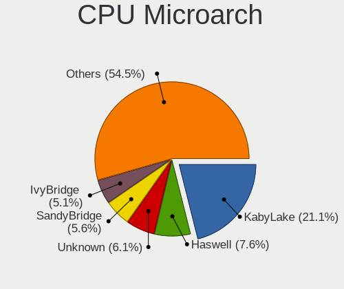

| Name             | Notebooks | Percent |
|------------------|-----------|---------|
| KabyLake         | 278       | 22.37%  |
| Haswell          | 100       | 8.05%   |
| SandyBridge      | 70        | 5.63%   |
| IvyBridge        | 64        | 5.15%   |
| Goldmont plus    | 62        | 4.99%   |
| Skylake          | 52        | 4.18%   |
| Westmere         | 48        | 3.86%   |
| Zen+             | 46        | 3.7%    |
| TigerLake        | 46        | 3.7%    |
| Unknown          | 46        | 3.7%    |
| Penryn           | 42        | 3.38%   |
| Broadwell        | 41        | 3.3%    |
| Zen 2            | 36        | 2.9%    |
| Goldmont         | 36        | 2.9%    |
| Core             | 35        | 2.82%   |
| Silvermont       | 34        | 2.74%   |
| Zen 3            | 33        | 2.65%   |
| IceLake          | 29        | 2.33%   |
| Alderlake Hybrid | 23        | 1.85%   |
| CometLake        | 22        | 1.77%   |
| Excavator        | 19        | 1.53%   |
| Zen              | 14        | 1.13%   |
| P6               | 11        | 0.88%   |
| Bonnell          | 10        | 0.8%    |
| Bobcat           | 8         | 0.64%   |
| Puma             | 7         | 0.56%   |
| K8 Hammer        | 5         | 0.4%    |
| K8 & K10 hybrid  | 4         | 0.32%   |
| K10              | 4         | 0.32%   |
| Jaguar           | 4         | 0.32%   |
| Tremont          | 3         | 0.24%   |
| Piledriver       | 3         | 0.24%   |
| Nehalem          | 3         | 0.24%   |
| K10 Llano        | 3         | 0.24%   |
| Steamroller      | 1         | 0.08%   |
| NetBurst         | 1         | 0.08%   |

Graphics
--------

GPU Vendor
----------

Vendors of graphics cards

| Vendor                           | Notebooks | Percent |
|----------------------------------|-----------|---------|
| Intel                            | 946       | 57.47%  |
| Nvidia                           | 396       | 24.06%  |
| AMD                              | 298       | 18.1%   |
| Silicon Integrated Systems [SiS] | 5         | 0.3%    |
| VIA Technologies                 | 1         | 0.06%   |

GPU Model
---------

Graphics card models

| Model                                                                                    | Notebooks | Percent |
|------------------------------------------------------------------------------------------|-----------|---------|
| Intel 2nd Generation Core Processor Family Integrated Graphics Controller                | 64        | 3.78%   |
| Intel GeminiLake [UHD Graphics 600]                                                      | 61        | 3.61%   |
| Intel UHD Graphics 620                                                                   | 59        | 3.49%   |
| Intel 3rd Gen Core processor Graphics Controller                                         | 59        | 3.49%   |
| Intel WhiskeyLake-U GT2 [UHD Graphics 620]                                               | 58        | 3.43%   |
| Intel Haswell-ULT Integrated Graphics Controller                                         | 51        | 3.01%   |
| Intel CoffeeLake-H GT2 [UHD Graphics 630]                                                | 48        | 2.84%   |
| Intel 4th Gen Core Processor Integrated Graphics Controller                              | 47        | 2.78%   |
| AMD Picasso/Raven 2 [Radeon Vega Series / Radeon Vega Mobile Series]                     | 46        | 2.72%   |
| Intel HD Graphics 620                                                                    | 42        | 2.48%   |
| Intel HD Graphics 5500                                                                   | 40        | 2.36%   |
| Intel Core Processor Integrated Graphics Controller                                      | 39        | 2.3%    |
| Intel TigerLake-LP GT2 [Iris Xe Graphics]                                                | 32        | 1.89%   |
| AMD Renoir [Radeon RX Vega 6 (Ryzen 4000/5000 Mobile Series)]                            | 32        | 1.89%   |
| Intel CometLake-U GT2 [UHD Graphics]                                                     | 27        | 1.6%    |
| AMD Cezanne [Radeon Vega Series / Radeon Vega Mobile Series]                             | 27        | 1.6%    |
| Intel HD Graphics 500                                                                    | 26        | 1.54%   |
| Intel Mobile 4 Series Chipset Integrated Graphics Controller                             | 25        | 1.48%   |
| Intel Skylake GT2 [HD Graphics 520]                                                      | 24        | 1.42%   |
| Intel HD Graphics 630                                                                    | 23        | 1.36%   |
| Intel Atom/Celeron/Pentium Processor x5-E8000/J3xxx/N3xxx Integrated Graphics Controller | 23        | 1.36%   |
| Nvidia TU117M [GeForce GTX 1650 Mobile / Max-Q]                                          | 22        | 1.3%    |
| Nvidia GF117M [GeForce 610M/710M/810M/820M / GT 620M/625M/630M/720M]                     | 20        | 1.18%   |
| Intel HD Graphics 530                                                                    | 18        | 1.06%   |
| Nvidia GM107M [GeForce GTX 950M]                                                         | 17        | 1%      |
| Intel Mobile GM965/GL960 Integrated Graphics Controller (secondary)                      | 17        | 1%      |
| Intel Mobile GM965/GL960 Integrated Graphics Controller (primary)                        | 17        | 1%      |
| Intel CometLake-H GT2 [UHD Graphics]                                                     | 17        | 1%      |
| Intel TigerLake-H GT1 [UHD Graphics]                                                     | 16        | 0.95%   |
| Nvidia GP107M [GeForce GTX 1050 Ti Mobile]                                               | 15        | 0.89%   |
| Nvidia GP107M [GeForce GTX 1050 Mobile]                                                  | 15        | 0.89%   |
| Nvidia GK208BM [GeForce 920M]                                                            | 15        | 0.89%   |
| AMD Stoney [Radeon R2/R3/R4/R5 Graphics]                                                 | 15        | 0.89%   |
| Nvidia GA106M [GeForce RTX 3060 Mobile / Max-Q]                                          | 14        | 0.83%   |
| Intel Tiger Lake-LP GT2 [UHD Graphics G4]                                                | 14        | 0.83%   |
| AMD Topaz XT [Radeon R7 M260/M265 / M340/M360 / M440/M445 / 530/535 / 620/625 Mobile]    | 14        | 0.83%   |
| AMD Raven Ridge [Radeon Vega Series / Radeon Vega Mobile Series]                         | 14        | 0.83%   |
| Nvidia TU116M [GeForce GTX 1660 Ti Mobile]                                               | 13        | 0.77%   |
| AMD Sun XT [Radeon HD 8670A/8670M/8690M / R5 M330 / M430 / Radeon 520 Mobile]            | 13        | 0.77%   |
| Nvidia GP108M [GeForce MX150]                                                            | 12        | 0.71%   |

GPU Combo
---------

Combinations of graphics cards

| Name           | Notebooks | Percent |
|----------------|-----------|---------|
| 1 x Intel      | 581       | 46.74%  |
| Intel + Nvidia | 306       | 24.62%  |
| 1 x AMD        | 182       | 14.64%  |
| Intel + AMD    | 58        | 4.67%   |
| 1 x Nvidia     | 50        | 4.02%   |
| AMD + Nvidia   | 40        | 3.22%   |
| 2 x AMD        | 18        | 1.45%   |
| 1 x SiS        | 5         | 0.4%    |
| Other          | 1         | 0.08%   |
| 2 x Intel      | 1         | 0.08%   |
| 1 x VIA        | 1         | 0.08%   |

GPU Driver
----------

Free vs proprietary

| Driver      | Notebooks | Percent |
|-------------|-----------|---------|
| Free        | 998       | 79.71%  |
| Proprietary | 232       | 18.53%  |
| Unknown     | 22        | 1.76%   |

GPU Memory
----------

Total video memory

| Size in GB | Notebooks | Percent |
|------------|-----------|---------|
| Unknown    | 776       | 60.86%  |
| 1.01-2.0   | 180       | 14.12%  |
| 0.01-0.5   | 144       | 11.29%  |
| 3.01-4.0   | 88        | 6.9%    |
| 0.51-1.0   | 51        | 4%      |
| 5.01-6.0   | 22        | 1.73%   |
| 7.01-8.0   | 8         | 0.63%   |
| 2.01-3.0   | 5         | 0.39%   |
| 0          | 1         | 0.08%   |

Monitor
-------

Monitor Vendor
--------------

Monitor vendors

| Vendor                  | Notebooks | Percent |
|-------------------------|-----------|---------|
| AU Optronics            | 240       | 17.75%  |
| Chimei Innolux          | 228       | 16.86%  |
| BOE                     | 220       | 16.27%  |
| LG Display              | 188       | 13.91%  |
| Samsung Electronics     | 130       | 9.62%   |
| PANDA                   | 51        | 3.77%   |
| Dell                    | 45        | 3.33%   |
| Chi Mei Optoelectronics | 37        | 2.74%   |
| Sharp                   | 29        | 2.14%   |
| Lenovo                  | 21        | 1.55%   |
| Goldstar                | 19        | 1.41%   |
| LG Philips              | 15        | 1.11%   |
| BenQ                    | 12        | 0.89%   |
| Philips                 | 10        | 0.74%   |
| CSO                     | 10        | 0.74%   |
| InfoVision              | 8         | 0.59%   |
| Acer                    | 8         | 0.59%   |
| Hewlett-Packard         | 7         | 0.52%   |
| Apple                   | 7         | 0.52%   |
| AOC                     | 5         | 0.37%   |
| Ancor Communications    | 5         | 0.37%   |
| Valve                   | 4         | 0.3%    |
| LGD                     | 4         | 0.3%    |
| InnoLux Display         | 4         | 0.3%    |
| Fujitsu Siemens         | 4         | 0.3%    |
| CPT                     | 4         | 0.3%    |
| Vestel Elektronik       | 3         | 0.22%   |
| Sony                    | 3         | 0.22%   |
| Lenovo Group Limited    | 3         | 0.22%   |
| ASUSTek Computer        | 3         | 0.22%   |
| Analogix                | 3         | 0.22%   |
| Quanta Display          | 2         | 0.15%   |
| HannStar                | 2         | 0.15%   |
| ViewSonic               | 1         | 0.07%   |
| Toshiba                 | 1         | 0.07%   |
| TMX                     | 1         | 0.07%   |
| Seiko/Epson             | 1         | 0.07%   |
| Panasonic               | 1         | 0.07%   |
| Nvidia                  | 1         | 0.07%   |
| NAD                     | 1         | 0.07%   |

Monitor Model
-------------

Monitor models

| Model                                                                    | Notebooks | Percent |
|--------------------------------------------------------------------------|-----------|---------|
| Chimei Innolux LCD Monitor CMN15F5 1920x1080 344x193mm 15.5-inch         | 26        | 1.91%   |
| BOE LCD Monitor BOE06A4 1366x768 344x194mm 15.5-inch                     | 26        | 1.91%   |
| AU Optronics LCD Monitor AUO70EC 1366x768 344x193mm 15.5-inch            | 22        | 1.61%   |
| AU Optronics LCD Monitor AUO38ED 1920x1080 344x193mm 15.5-inch           | 21        | 1.54%   |
| Chimei Innolux LCD Monitor CMN14D4 1920x1080 309x173mm 13.9-inch         | 17        | 1.25%   |
| BOE LCD Monitor BOE069C 1920x1080 344x193mm 15.5-inch                    | 15        | 1.1%    |
| Chimei Innolux LCD Monitor CMN15DB 1366x768 344x193mm 15.5-inch          | 12        | 0.88%   |
| Chimei Innolux LCD Monitor CMN15CA 1366x768 344x193mm 15.5-inch          | 12        | 0.88%   |
| Samsung Electronics LCD Monitor SEC5441 1366x768 344x194mm 15.5-inch     | 11        | 0.81%   |
| Chimei Innolux LCD Monitor CMN15E7 1920x1080 344x193mm 15.5-inch         | 11        | 0.81%   |
| Chimei Innolux LCD Monitor CMN15DC 1366x768 344x193mm 15.5-inch          | 11        | 0.81%   |
| Chimei Innolux LCD Monitor CMN15D5 1920x1080 344x193mm 15.5-inch         | 11        | 0.81%   |
| BOE LCD Monitor BOE06A5 1366x768 344x194mm 15.5-inch                     | 11        | 0.81%   |
| AU Optronics LCD Monitor AUO21ED 1920x1080 344x193mm 15.5-inch           | 11        | 0.81%   |
| LG Display LCD Monitor LGD033A 1366x768 344x194mm 15.5-inch              | 9         | 0.66%   |
| Chimei Innolux LCD Monitor CMN15C4 1920x1080 344x193mm 15.5-inch         | 9         | 0.66%   |
| AU Optronics LCD Monitor AUO403D 1920x1080 309x173mm 13.9-inch           | 9         | 0.66%   |
| PANDA LCD Monitor NCP004D 1920x1080 344x194mm 15.5-inch                  | 8         | 0.59%   |
| PANDA LCD Monitor NCP0046 1920x1080 344x194mm 15.5-inch                  | 8         | 0.59%   |
| Chimei Innolux LCD Monitor CMN15E8 1920x1080 344x193mm 15.5-inch         | 8         | 0.59%   |
| Chimei Innolux LCD Monitor CMN15E6 1366x768 344x193mm 15.5-inch          | 8         | 0.59%   |
| Chimei Innolux LCD Monitor CMN1521 1920x1080 344x193mm 15.5-inch         | 8         | 0.59%   |
| AU Optronics LCD Monitor AUO45EC 1366x768 344x193mm 15.5-inch            | 8         | 0.59%   |
| Sharp LCD Monitor SHP13F8 3200x1800 346x194mm 15.6-inch                  | 7         | 0.51%   |
| LG Display LCD Monitor LGD0563 1920x1080 344x194mm 15.5-inch             | 7         | 0.51%   |
| LG Display LCD Monitor LGD02DC 1366x768 344x194mm 15.5-inch              | 7         | 0.51%   |
| BOE LCD Monitor BOE0718 1920x1080 309x173mm 13.9-inch                    | 7         | 0.51%   |
| AU Optronics LCD Monitor AUO20EC 1366x768 344x193mm 15.5-inch            | 7         | 0.51%   |
| PANDA LM156LF1L03 NCP001C 1920x1080 344x194mm 15.5-inch                  | 6         | 0.44%   |
| LG Display LCD Monitor LGD046F 1920x1080 344x194mm 15.5-inch             | 6         | 0.44%   |
| Chi Mei Optoelectronics LCD Monitor CMO15A7 1366x768 344x193mm 15.5-inch | 6         | 0.44%   |
| BOE LCD Monitor BOE07F1 1920x1080 344x193mm 15.5-inch                    | 6         | 0.44%   |
| BOE LCD Monitor BOE0675 1366x768 344x194mm 15.5-inch                     | 6         | 0.44%   |
| Samsung Electronics LCD Monitor SDC4154 2880x1800 302x189mm 14.0-inch    | 5         | 0.37%   |
| PANDA LCD Monitor NCP0035 1920x1080 309x174mm 14.0-inch                  | 5         | 0.37%   |
| PANDA LC133LF2L03 NCP0015 1920x1080 294x165mm 13.3-inch                  | 5         | 0.37%   |
| LG Display LCD Monitor LGD0590 1920x1080 344x194mm 15.5-inch             | 5         | 0.37%   |
| Chimei Innolux LCD Monitor CMN1482 1600x900 309x174mm 14.0-inch          | 5         | 0.37%   |
| BOE LCD Monitor BOE07CB 1920x1080 344x193mm 15.5-inch                    | 5         | 0.37%   |
| BOE LCD Monitor BOE0615 1366x768 309x173mm 13.9-inch                     | 5         | 0.37%   |

Monitor Resolution
------------------

Monitor screen resolution

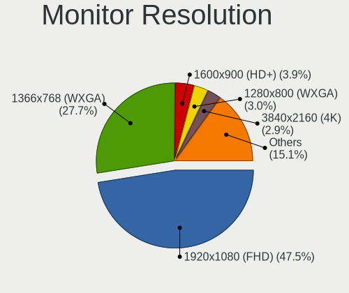

| Resolution         | Notebooks | Percent |
|--------------------|-----------|---------|
| 1920x1080 (FHD)    | 606       | 47.31%  |
| 1366x768 (WXGA)    | 386       | 30.13%  |
| 1600x900 (HD+)     | 54        | 4.22%   |
| 1280x800 (WXGA)    | 42        | 3.28%   |
| 3840x2160 (4K)     | 35        | 2.73%   |
| 2560x1440 (QHD)    | 19        | 1.48%   |
| 1920x1200 (WUXGA)  | 18        | 1.41%   |
| 1440x900 (WXGA+)   | 14        | 1.09%   |
| 2880x1800          | 12        | 0.94%   |
| 2560x1600          | 12        | 0.94%   |
| 1680x1050 (WSXGA+) | 12        | 0.94%   |
| 3200x1800 (QHD+)   | 11        | 0.86%   |
| 1024x600           | 8         | 0.62%   |
| 800x1280           | 7         | 0.55%   |
| 2160x1440          | 7         | 0.55%   |
| 1280x1024 (SXGA)   | 7         | 0.55%   |
| 2560x1080          | 6         | 0.47%   |
| 1360x768           | 4         | 0.31%   |
| 3440x1440          | 3         | 0.23%   |
| 3840x2400          | 2         | 0.16%   |
| 3200x2000          | 2         | 0.16%   |
| 1400x1050          | 2         | 0.16%   |
| 1024x768 (XGA)     | 2         | 0.16%   |
| Unknown            | 2         | 0.16%   |
| 3926x1440          | 1         | 0.08%   |
| 3840x1080          | 1         | 0.08%   |
| 3000x2000          | 1         | 0.08%   |
| 2880x1620          | 1         | 0.08%   |
| 2240x1400          | 1         | 0.08%   |
| 2048x1152          | 1         | 0.08%   |
| 1680x945           | 1         | 0.08%   |
| 1280x720 (HD)      | 1         | 0.08%   |

Monitor Diagonal
----------------

Diagonal size in inches

| Inches  | Notebooks | Percent |
|---------|-----------|---------|
| 15      | 743       | 55.28%  |
| 14      | 138       | 10.27%  |
| 13      | 128       | 9.52%   |
| 17      | 96        | 7.14%   |
| 24      | 42        | 3.13%   |
| 23      | 24        | 1.79%   |
| 27      | 22        | 1.64%   |
| 21      | 19        | 1.41%   |
| 16      | 18        | 1.34%   |
| 12      | 17        | 1.26%   |
| Unknown | 15        | 1.12%   |
| 34      | 9         | 0.67%   |
| 11      | 9         | 0.67%   |
| 19      | 8         | 0.6%    |
| 10      | 8         | 0.6%    |
| 31      | 7         | 0.52%   |
| 22      | 6         | 0.45%   |
| 84      | 5         | 0.37%   |
| 32      | 4         | 0.3%    |
| 18      | 4         | 0.3%    |
| 7       | 4         | 0.3%    |
| 54      | 3         | 0.22%   |
| 3       | 3         | 0.22%   |
| 20      | 2         | 0.15%   |
| 8       | 2         | 0.15%   |
| 86      | 1         | 0.07%   |
| 72      | 1         | 0.07%   |
| 58      | 1         | 0.07%   |
| 52      | 1         | 0.07%   |
| 48      | 1         | 0.07%   |
| 42      | 1         | 0.07%   |
| 40      | 1         | 0.07%   |
| 25      | 1         | 0.07%   |

Monitor Width
-------------

Physical width

| Width in mm | Notebooks | Percent |
|-------------|-----------|---------|
| 301-350     | 955       | 71.32%  |
| 351-400     | 118       | 8.81%   |
| 501-600     | 86        | 6.42%   |
| 201-300     | 86        | 6.42%   |
| 401-500     | 34        | 2.54%   |
| Unknown     | 15        | 1.12%   |
| 701-800     | 13        | 0.97%   |
| 601-700     | 8         | 0.6%    |
| 1001-1500   | 7         | 0.52%   |
| 1-100       | 7         | 0.52%   |
| 1501-2000   | 6         | 0.45%   |
| 101-200     | 2         | 0.15%   |
| 801-900     | 1         | 0.07%   |
| 901-1000    | 1         | 0.07%   |

Aspect Ratio
------------

Proportional relationship between the width and the height

| Ratio   | Notebooks | Percent |
|---------|-----------|---------|
| 16/9    | 1073      | 86.88%  |
| 16/10   | 110       | 8.91%   |
| Unknown | 13        | 1.05%   |
| 3/2     | 10        | 0.81%   |
| 21/9    | 9         | 0.73%   |
| 5/4     | 7         | 0.57%   |
| 6/5     | 4         | 0.32%   |
| 4/3     | 4         | 0.32%   |
| 0.67    | 4         | 0.32%   |
| 0.56    | 1         | 0.08%   |

Monitor Area
------------

Area in inch

| Area in inch | Notebooks | Percent |
|----------------|-----------|---------|
| 101-110        | 746       | 55.51%  |
| 81-90          | 225       | 16.74%  |
| 121-130        | 88        | 6.55%   |
| 201-250        | 76        | 5.65%   |
| 71-80          | 37        | 2.75%   |
| 301-350        | 22        | 1.64%   |
| 351-500        | 20        | 1.49%   |
| 61-70          | 16        | 1.19%   |
| 151-200        | 15        | 1.12%   |
| Unknown        | 15        | 1.12%   |
| More than 1000 | 13        | 0.97%   |
| 251-300        | 12        | 0.89%   |
| 111-120        | 12        | 0.89%   |
| 51-60          | 9         | 0.67%   |
| 1-40           | 9         | 0.67%   |
| 131-140        | 9         | 0.67%   |
| 41-50          | 8         | 0.6%    |
| 141-150        | 5         | 0.37%   |
| 91-100         | 5         | 0.37%   |
| 501-1000       | 2         | 0.15%   |

Pixel Density
-------------

Pixels per inch

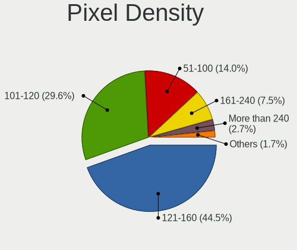

| Density       | Notebooks | Percent |
|---------------|-----------|---------|
| 121-160       | 584       | 43.88%  |
| 101-120       | 429       | 32.23%  |
| 51-100        | 184       | 13.82%  |
| 161-240       | 74        | 5.56%   |
| More than 240 | 36        | 2.7%    |
| Unknown       | 15        | 1.13%   |
| 1-50          | 9         | 0.68%   |

Multiple Monitors
-----------------

Total monitors connected

| Total | Notebooks | Percent |
|-------|-----------|---------|
| 1     | 1091      | 86.25%  |
| 2     | 136       | 10.75%  |
| 0     | 21        | 1.66%   |
| 3     | 15        | 1.19%   |
| 4     | 2         | 0.16%   |

Network
-------

Net Controller Vendor
---------------------

Controller vendors

| Vendor                                 | Notebooks | Percent |
|----------------------------------------|-----------|---------|
| Realtek Semiconductor                  | 741       | 38.59%  |
| Intel                                  | 561       | 29.22%  |
| Qualcomm Atheros                       | 276       | 14.38%  |
| Broadcom                               | 110       | 5.73%   |
| MediaTek                               | 51        | 2.66%   |
| TP-Link                                | 28        | 1.46%   |
| Broadcom Limited                       | 21        | 1.09%   |
| Marvell Technology Group               | 17        | 0.89%   |
| Ralink                                 | 16        | 0.83%   |
| Ralink Technology                      | 10        | 0.52%   |
| Huawei Technologies                    | 10        | 0.52%   |
| ASIX Electronics                       | 9         | 0.47%   |
| Xiaomi                                 | 7         | 0.36%   |
| Ericsson Business Mobile Networks      | 6         | 0.31%   |
| ASUSTek Computer                       | 6         | 0.31%   |
| Samsung Electronics                    | 5         | 0.26%   |
| Hewlett-Packard                        | 5         | 0.26%   |
| Silicon Integrated Systems [SiS]       | 4         | 0.21%   |
| Lenovo                                 | 4         | 0.21%   |
| JMicron Technology                     | 4         | 0.21%   |
| ZTE WCDMA Technologies MSM             | 3         | 0.16%   |
| Qualcomm Atheros Communications        | 3         | 0.16%   |
| Google                                 | 3         | 0.16%   |
| Sierra Wireless                        | 2         | 0.1%    |
| D-Link                                 | 2         | 0.1%    |
| VIA Technologies                       | 1         | 0.05%   |
| U-Blox                                 | 1         | 0.05%   |
| Sony Ericsson Mobile Communications AB | 1         | 0.05%   |
| Sitecom Europe                         | 1         | 0.05%   |
| Qualcomm                               | 1         | 0.05%   |
| Qcom                                   | 1         | 0.05%   |
| Nvidia                                 | 1         | 0.05%   |
| Motorola PCS                           | 1         | 0.05%   |
| Microsoft                              | 1         | 0.05%   |
| Microchip Technology                   | 1         | 0.05%   |
| Fibocom                                | 1         | 0.05%   |
| Edimax Technology                      | 1         | 0.05%   |
| DisplayLink                            | 1         | 0.05%   |
| Dell                                   | 1         | 0.05%   |
| D-Link System                          | 1         | 0.05%   |

Net Controller Model
--------------------

Controller models

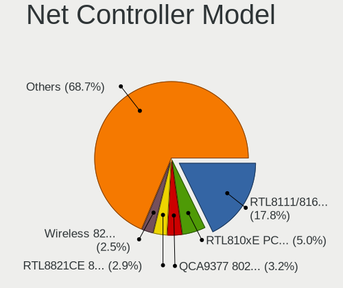

| Model                                                             | Notebooks | Percent |
|-------------------------------------------------------------------|-----------|---------|
| Realtek RTL8111/8168/8411 PCI Express Gigabit Ethernet Controller | 411       | 17.95%  |
| Realtek RTL810xE PCI Express Fast Ethernet controller             | 125       | 5.46%   |
| Qualcomm Atheros QCA9377 802.11ac Wireless Network Adapter        | 82        | 3.58%   |
| Realtek RTL8821CE 802.11ac PCIe Wireless Network Adapter          | 73        | 3.19%   |
| Intel Wireless 8265 / 8275                                        | 59        | 2.58%   |
| Realtek RTL8822BE 802.11a/b/g/n/ac WiFi adapter                   | 55        | 2.4%    |
| Realtek RTL8723BE PCIe Wireless Network Adapter                   | 52        | 2.27%   |
| Qualcomm Atheros QCA9565 / AR9565 Wireless Network Adapter        | 46        | 2.01%   |
| Intel Wi-Fi 6 AX200                                               | 44        | 1.92%   |
| Qualcomm Atheros AR9285 Wireless Network Adapter (PCI-Express)    | 40        | 1.75%   |
| Realtek RTL8822CE 802.11ac PCIe Wireless Network Adapter          | 37        | 1.62%   |
| Intel Cannon Lake PCH CNVi WiFi                                   | 37        | 1.62%   |
| Intel Wi-Fi 6 AX201                                               | 34        | 1.48%   |
| Realtek RTL8153 Gigabit Ethernet Adapter                          | 33        | 1.44%   |
| Intel 82579LM Gigabit Network Connection (Lewisville)             | 31        | 1.35%   |
| Intel Wireless 7260                                               | 30        | 1.31%   |
| Qualcomm Atheros AR9485 Wireless Network Adapter                  | 29        | 1.27%   |
| MediaTek MT7921 802.11ax PCI Express Wireless Network Adapter     | 29        | 1.27%   |
| Intel Wireless 7265                                               | 28        | 1.22%   |
| Intel Cannon Point-LP CNVi [Wireless-AC]                          | 25        | 1.09%   |
| Intel Centrino Advanced-N 6205 [Taylor Peak]                      | 23        | 1%      |
| Intel Wireless 8260                                               | 22        | 0.96%   |
| Intel Dual Band Wireless-AC 3165 Plus Bluetooth                   | 22        | 0.96%   |
| Intel Comet Lake PCH-LP CNVi WiFi                                 | 20        | 0.87%   |
| Qualcomm Atheros QCA6174 802.11ac Wireless Network Adapter        | 19        | 0.83%   |
| Intel Wireless 3160                                               | 19        | 0.83%   |
| Intel Comet Lake PCH CNVi WiFi                                    | 18        | 0.79%   |
| Broadcom BCM43142 802.11b/g/n                                     | 18        | 0.79%   |
| Broadcom BCM4313 802.11bgn Wireless Network Adapter               | 18        | 0.79%   |
| Intel Wireless 3165                                               | 17        | 0.74%   |
| Realtek RTL8723BU 802.11b/g/n WLAN Adapter                        | 16        | 0.7%    |
| Intel PRO/Wireless 3945ABG [Golan] Network Connection             | 16        | 0.7%    |
| Intel Centrino Advanced-N 6200                                    | 16        | 0.7%    |
| Intel 82577LM Gigabit Network Connection                          | 16        | 0.7%    |
| Broadcom NetLink BCM57785 Gigabit Ethernet PCIe                   | 14        | 0.61%   |
| Intel Ethernet Connection I217-LM                                 | 13        | 0.57%   |
| Intel Ethernet Connection (4) I219-LM                             | 13        | 0.57%   |
| Qualcomm Atheros QCA8172 Fast Ethernet                            | 12        | 0.52%   |
| Qualcomm Atheros AR8151 v2.0 Gigabit Ethernet                     | 11        | 0.48%   |
| Intel Centrino Ultimate-N 6300                                    | 11        | 0.48%   |

Wireless Vendor
---------------

Wireless vendors

| Vendor                            | Notebooks | Percent |
|-----------------------------------|-----------|---------|
| Intel                             | 540       | 41.8%   |
| Realtek Semiconductor             | 292       | 22.6%   |
| Qualcomm Atheros                  | 245       | 18.96%  |
| Broadcom                          | 84        | 6.5%    |
| MediaTek                          | 46        | 3.56%   |
| TP-Link                           | 21        | 1.63%   |
| Ralink                            | 16        | 1.24%   |
| Broadcom Limited                  | 13        | 1.01%   |
| Ralink Technology                 | 10        | 0.77%   |
| ASUSTek Computer                  | 6         | 0.46%   |
| Qualcomm Atheros Communications   | 3         | 0.23%   |
| Ericsson Business Mobile Networks | 3         | 0.23%   |
| Sierra Wireless                   | 2         | 0.15%   |
| D-Link                            | 2         | 0.15%   |
| Sitecom Europe                    | 1         | 0.08%   |
| Qualcomm                          | 1         | 0.08%   |
| Qcom                              | 1         | 0.08%   |
| Microsoft                         | 1         | 0.08%   |
| Fibocom                           | 1         | 0.08%   |
| Edimax Technology                 | 1         | 0.08%   |
| Dell                              | 1         | 0.08%   |
| D-Link System                     | 1         | 0.08%   |
| Belkin                            | 1         | 0.08%   |

Wireless Model
--------------

Wireless models

| Model                                                                   | Notebooks | Percent |
|-------------------------------------------------------------------------|-----------|---------|
| Qualcomm Atheros QCA9377 802.11ac Wireless Network Adapter              | 82        | 6.31%   |
| Realtek RTL8821CE 802.11ac PCIe Wireless Network Adapter                | 73        | 5.62%   |
| Intel Wireless 8265 / 8275                                              | 59        | 4.54%   |
| Realtek RTL8822BE 802.11a/b/g/n/ac WiFi adapter                         | 55        | 4.23%   |
| Realtek RTL8723BE PCIe Wireless Network Adapter                         | 52        | 4%      |
| Qualcomm Atheros QCA9565 / AR9565 Wireless Network Adapter              | 46        | 3.54%   |
| Intel Wi-Fi 6 AX200                                                     | 44        | 3.39%   |
| Qualcomm Atheros AR9285 Wireless Network Adapter (PCI-Express)          | 40        | 3.08%   |
| Realtek RTL8822CE 802.11ac PCIe Wireless Network Adapter                | 37        | 2.85%   |
| Intel Cannon Lake PCH CNVi WiFi                                         | 37        | 2.85%   |
| Intel Wi-Fi 6 AX201                                                     | 34        | 2.62%   |
| Intel Wireless 7260                                                     | 30        | 2.31%   |
| Qualcomm Atheros AR9485 Wireless Network Adapter                        | 29        | 2.23%   |
| MediaTek MT7921 802.11ax PCI Express Wireless Network Adapter           | 29        | 2.23%   |
| Intel Wireless 7265                                                     | 28        | 2.16%   |
| Intel Cannon Point-LP CNVi [Wireless-AC]                                | 25        | 1.92%   |
| Intel Centrino Advanced-N 6205 [Taylor Peak]                            | 23        | 1.77%   |
| Intel Wireless 8260                                                     | 22        | 1.69%   |
| Intel Dual Band Wireless-AC 3165 Plus Bluetooth                         | 22        | 1.69%   |
| Intel Comet Lake PCH-LP CNVi WiFi                                       | 20        | 1.54%   |
| Qualcomm Atheros QCA6174 802.11ac Wireless Network Adapter              | 19        | 1.46%   |
| Intel Wireless 3160                                                     | 19        | 1.46%   |
| Intel Comet Lake PCH CNVi WiFi                                          | 18        | 1.39%   |
| Broadcom BCM43142 802.11b/g/n                                           | 18        | 1.39%   |
| Broadcom BCM4313 802.11bgn Wireless Network Adapter                     | 18        | 1.39%   |
| Intel Wireless 3165                                                     | 17        | 1.31%   |
| Realtek RTL8723BU 802.11b/g/n WLAN Adapter                              | 16        | 1.23%   |
| Intel PRO/Wireless 3945ABG [Golan] Network Connection                   | 16        | 1.23%   |
| Intel Centrino Advanced-N 6200                                          | 16        | 1.23%   |
| Intel Centrino Ultimate-N 6300                                          | 11        | 0.85%   |
| Ralink RT3290 Wireless 802.11n 1T/1R PCIe                               | 9         | 0.69%   |
| Qualcomm Atheros AR242x / AR542x Wireless Network Adapter (PCI-Express) | 9         | 0.69%   |
| Broadcom BCM4311 802.11b/g WLAN                                         | 9         | 0.69%   |
| Realtek RTL8852BE PCIe 802.11ax Wireless Network Controller             | 8         | 0.62%   |
| Realtek RTL8723DE Wireless Network Adapter                              | 8         | 0.62%   |
| MediaTek MT7922 802.11ax PCI Express Wireless Network Adapter           | 8         | 0.62%   |
| Intel Ice Lake-LP PCH CNVi WiFi                                         | 8         | 0.62%   |
| Intel Centrino Advanced-N 6235                                          | 8         | 0.62%   |
| Intel Alder Lake-P PCH CNVi WiFi                                        | 8         | 0.62%   |
| Broadcom Limited BCM4312 802.11b/g LP-PHY                               | 8         | 0.62%   |

Ethernet Vendor
---------------

Ethernet vendors

| Vendor                                 | Notebooks | Percent |
|----------------------------------------|-----------|---------|
| Realtek Semiconductor                  | 587       | 60.45%  |
| Intel                                  | 189       | 19.46%  |
| Qualcomm Atheros                       | 64        | 6.59%   |
| Broadcom                               | 45        | 4.63%   |
| Marvell Technology Group               | 17        | 1.75%   |
| ASIX Electronics                       | 9         | 0.93%   |
| Huawei Technologies                    | 8         | 0.82%   |
| Broadcom Limited                       | 8         | 0.82%   |
| Xiaomi                                 | 7         | 0.72%   |
| TP-Link                                | 7         | 0.72%   |
| MediaTek                               | 5         | 0.51%   |
| Silicon Integrated Systems [SiS]       | 4         | 0.41%   |
| Samsung Electronics                    | 4         | 0.41%   |
| Lenovo                                 | 4         | 0.41%   |
| JMicron Technology                     | 4         | 0.41%   |
| Google                                 | 3         | 0.31%   |
| ZTE WCDMA Technologies MSM             | 1         | 0.1%    |
| VIA Technologies                       | 1         | 0.1%    |
| Sony Ericsson Mobile Communications AB | 1         | 0.1%    |
| Nvidia                                 | 1         | 0.1%    |
| Motorola PCS                           | 1         | 0.1%    |
| DisplayLink                            | 1         | 0.1%    |

Ethernet Model
--------------

Ethernet models

| Model                                                             | Notebooks | Percent |
|-------------------------------------------------------------------|-----------|---------|
| Realtek RTL8111/8168/8411 PCI Express Gigabit Ethernet Controller | 411       | 42.2%   |
| Realtek RTL810xE PCI Express Fast Ethernet controller             | 125       | 12.83%  |
| Realtek RTL8153 Gigabit Ethernet Adapter                          | 33        | 3.39%   |
| Intel 82579LM Gigabit Network Connection (Lewisville)             | 31        | 3.18%   |
| Intel 82577LM Gigabit Network Connection                          | 16        | 1.64%   |
| Broadcom NetLink BCM57785 Gigabit Ethernet PCIe                   | 14        | 1.44%   |
| Intel Ethernet Connection I217-LM                                 | 13        | 1.33%   |
| Intel Ethernet Connection (4) I219-LM                             | 13        | 1.33%   |
| Qualcomm Atheros QCA8172 Fast Ethernet                            | 12        | 1.23%   |
| Qualcomm Atheros AR8151 v2.0 Gigabit Ethernet                     | 11        | 1.13%   |
| Intel Ethernet Connection I218-LM                                 | 10        | 1.03%   |
| Intel Ethernet Connection (3) I218-LM                             | 10        | 1.03%   |
| Intel Ethernet Connection (7) I219-LM                             | 9         | 0.92%   |
| ASIX AX88179 Gigabit Ethernet                                     | 9         | 0.92%   |
| Qualcomm Atheros QCA8171 Gigabit Ethernet                         | 8         | 0.82%   |
| Qualcomm Atheros AR8161 Gigabit Ethernet                          | 8         | 0.82%   |
| Intel Ethernet Connection I219-LM                                 | 8         | 0.82%   |
| Broadcom NetLink BCM5787M Gigabit Ethernet PCI Express            | 8         | 0.82%   |
| Xiaomi Mi/Redmi series (RNDIS)                                    | 7         | 0.72%   |
| TP-Link UE300 10/100/1000 LAN (ethernet mode) [Realtek RTL8153]   | 7         | 0.72%   |
| Realtek RTL8125 2.5GbE Controller                                 | 7         | 0.72%   |
| Intel 82567LM Gigabit Network Connection                          | 7         | 0.72%   |
| Marvell Group 88E8040 PCI-E Fast Ethernet Controller              | 6         | 0.62%   |
| Intel Ethernet Connection (6) I219-V                              | 6         | 0.62%   |
| Realtek Killer E2600 Gigabit Ethernet Controller                  | 5         | 0.51%   |
| Qualcomm Atheros AR8152 v1.1 Fast Ethernet                        | 5         | 0.51%   |
| MediaTek M40Air_EEA                                               | 5         | 0.51%   |
| Intel Ethernet Connection (13) I219-V                             | 5         | 0.51%   |
| Huawei MAR-LX1M                                                   | 5         | 0.51%   |
| Broadcom BCM4401-B0 100Base-TX                                    | 5         | 0.51%   |
| Silicon Integrated Systems [SiS] 191 Gigabit Ethernet Adapter     | 4         | 0.41%   |
| Samsung Galaxy series, misc. (tethering mode)                     | 4         | 0.41%   |
| Qualcomm Atheros AR8131 Gigabit Ethernet                          | 4         | 0.41%   |
| JMicron JMC250 PCI Express Gigabit Ethernet Controller            | 4         | 0.41%   |
| Intel Ethernet Connection (7) I219-V                              | 4         | 0.41%   |
| Intel Ethernet Connection (4) I219-V                              | 4         | 0.41%   |
| Intel Ethernet Connection (14) I219-LM                            | 4         | 0.41%   |
| Intel 82577LC Gigabit Network Connection                          | 4         | 0.41%   |
| Realtek PCIe GbE Family Controller                                | 3         | 0.31%   |
| Qualcomm Atheros AR8152 v2.0 Fast Ethernet                        | 3         | 0.31%   |

Net Controller Kind
-------------------

Ethernet, WiFi or modem

| Kind     | Notebooks | Percent |
|----------|-----------|---------|
| WiFi     | 1231      | 56.39%  |
| Ethernet | 935       | 42.83%  |
| Modem    | 16        | 0.73%   |
| Unknown  | 1         | 0.05%   |

Used Controller
---------------

Currently used network controller

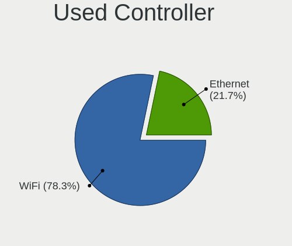

| Kind     | Notebooks | Percent |
|----------|-----------|---------|
| WiFi     | 1036      | 79.08%  |
| Ethernet | 274       | 20.92%  |

NICs
----

Total network controllers on board

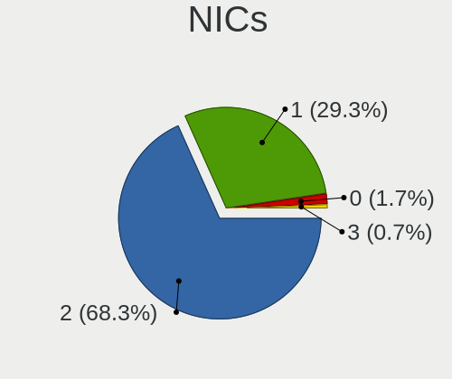

| Total | Notebooks | Percent |
|-------|-----------|---------|
| 2     | 862       | 69.4%   |
| 1     | 353       | 28.42%  |
| 0     | 19        | 1.53%   |
| 3     | 8         | 0.64%   |

IPv6
----

IPv6 vs IPv4

| Used | Notebooks | Percent |
|------|-----------|---------|
| No   | 1043      | 82.06%  |
| Yes  | 228       | 17.94%  |

Bluetooth
---------

Bluetooth Vendor
----------------

Controller vendors

| Vendor                          | Notebooks | Percent |
|---------------------------------|-----------|---------|
| Intel                           | 423       | 41.43%  |
| IMC Networks                    | 161       | 15.77%  |
| Realtek Semiconductor           | 139       | 13.61%  |
| Qualcomm Atheros Communications | 77        | 7.54%   |
| Lite-On Technology              | 62        | 6.07%   |
| Broadcom                        | 38        | 3.72%   |
| Foxconn / Hon Hai               | 31        | 3.04%   |
| Dell                            | 20        | 1.96%   |
| Hewlett-Packard                 | 16        | 1.57%   |
| Toshiba                         | 14        | 1.37%   |
| Ralink                          | 9         | 0.88%   |
| ASUSTek Computer                | 5         | 0.49%   |
| Apple                           | 5         | 0.49%   |
| Realtek                         | 4         | 0.39%   |
| Cambridge Silicon Radio         | 4         | 0.39%   |
| Alps Electric                   | 3         | 0.29%   |
| USI                             | 2         | 0.2%    |
| Chicony Electronics             | 2         | 0.2%    |
| SINO WEALTH                     | 1         | 0.1%    |
| Ralink Technology               | 1         | 0.1%    |
| Opticis                         | 1         | 0.1%    |
| MediaTek                        | 1         | 0.1%    |
| Foxconn International           | 1         | 0.1%    |
| Askey Computer                  | 1         | 0.1%    |

Bluetooth Model
---------------

Controller models

| Model                                            | Notebooks | Percent |
|--------------------------------------------------|-----------|---------|
| Intel Bluetooth wireless interface               | 181       | 17.73%  |
| Realtek Bluetooth Radio                          | 96        | 9.4%    |
| IMC Networks Bluetooth Radio                     | 89        | 8.72%   |
| Intel Bluetooth Device                           | 87        | 8.52%   |
| Intel Bluetooth 9460/9560 Jefferson Peak (JfP)   | 72        | 7.05%   |
| Intel AX200 Bluetooth                            | 44        | 4.31%   |
| Qualcomm Atheros  Bluetooth Device               | 43        | 4.21%   |
| IMC Networks Bluetooth Device                    | 31        | 3.04%   |
| Lite-On Qualcomm Atheros QCA9377 Bluetooth       | 26        | 2.55%   |
| IMC Networks Wireless_Device                     | 25        | 2.45%   |
| Realtek  Bluetooth 4.2 Adapter                   | 19        | 1.86%   |
| Realtek RTL8822BE Bluetooth 4.2 Adapter          | 12        | 1.18%   |
| Lite-On Bluetooth Device                         | 12        | 1.18%   |
| Intel Centrino Bluetooth Wireless Transceiver    | 12        | 1.18%   |
| Intel Centrino Advanced-N 6230 Bluetooth adapter | 11        | 1.08%   |
| Qualcomm Atheros AR3011 Bluetooth                | 10        | 0.98%   |
| Ralink RT3290 Bluetooth                          | 9         | 0.88%   |
| Qualcomm Atheros QCA61x4 Bluetooth 4.0           | 9         | 0.88%   |
| HP Broadcom 2070 Bluetooth Combo                 | 9         | 0.88%   |
| Dell DW375 Bluetooth Module                      | 9         | 0.88%   |
| Lite-On Atheros AR3012 Bluetooth                 | 8         | 0.78%   |
| IMC Networks 802.11ac WLAN Adapter               | 8         | 0.78%   |
| Toshiba Bluetooth Device                         | 7         | 0.69%   |
| Qualcomm Atheros AR3012 Bluetooth 4.0            | 7         | 0.69%   |
| Lite-On Wireless_Device                          | 7         | 0.69%   |
| Intel AX210 Bluetooth                            | 7         | 0.69%   |
| HP Bluetooth 2.0 Interface [Broadcom BCM2045]    | 7         | 0.69%   |
| Broadcom BCM2045A0                               | 7         | 0.69%   |
| Realtek RTL8723B Bluetooth                       | 6         | 0.59%   |
| Lite-On Broadcom BCM43142A0 Bluetooth Device     | 5         | 0.49%   |
| Intel Wireless-AC 9260 Bluetooth Adapter         | 5         | 0.49%   |
| Foxconn / Hon Hai MediaTek Bluetooth Adapter     | 5         | 0.49%   |
| Foxconn / Hon Hai Bluetooth Device               | 5         | 0.49%   |
| Dell Wireless 365 Bluetooth                      | 5         | 0.49%   |
| Broadcom BCM20702 Bluetooth 4.0 [ThinkPad]       | 5         | 0.49%   |
| Broadcom BCM2045B (BDC-2.1)                      | 5         | 0.49%   |
| Realtek RTL8821A Bluetooth                       | 4         | 0.39%   |
| Realtek Bluetooth Radio                          | 4         | 0.39%   |
| Intel Wireless-AC 3168 Bluetooth                 | 4         | 0.39%   |
| Foxconn / Hon Hai Wireless_Device                | 4         | 0.39%   |

Sound
-----

Sound Vendor
------------

Sound card vendors

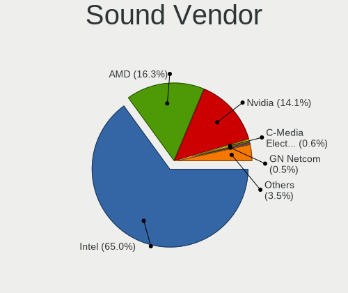

| Vendor                           | Notebooks | Percent |
|----------------------------------|-----------|---------|
| Intel                            | 1010      | 66.8%   |
| AMD                              | 239       | 15.81%  |
| Nvidia                           | 196       | 12.96%  |
| C-Media Electronics              | 9         | 0.6%    |
| GN Netcom                        | 8         | 0.53%   |
| Logitech                         | 6         | 0.4%    |
| Lenovo                           | 6         | 0.4%    |
| Silicon Integrated Systems [SiS] | 5         | 0.33%   |
| Realtek Semiconductor            | 5         | 0.33%   |
| ASUSTek Computer                 | 5         | 0.33%   |
| XMOS                             | 3         | 0.2%    |
| VIA Technologies                 | 2         | 0.13%   |
| Sennheiser Communications        | 2         | 0.13%   |
| Plantronics                      | 2         | 0.13%   |
| Kingston Technology              | 2         | 0.13%   |
| Dell                             | 2         | 0.13%   |
| Creative Technology              | 2         | 0.13%   |
| Unknown                          | 1         | 0.07%   |
| Sony                             | 1         | 0.07%   |
| Samsung Electronics              | 1         | 0.07%   |
| Razer USA                        | 1         | 0.07%   |
| Hewlett-Packard                  | 1         | 0.07%   |
| FiiO Electronics Technology      | 1         | 0.07%   |
| CMX Systems                      | 1         | 0.07%   |
| Bose                             | 1         | 0.07%   |

Sound Model
-----------

Sound card models

| Model                                                                                             | Notebooks | Percent |
|---------------------------------------------------------------------------------------------------|-----------|---------|
| AMD Family 17h/19h HD Audio Controller                                                            | 151       | 8.29%   |
| Intel Sunrise Point-LP HD Audio                                                                   | 138       | 7.57%   |
| Intel 7 Series/C216 Chipset Family High Definition Audio Controller                               | 77        | 4.23%   |
| Intel Celeron/Pentium Silver Processor High Definition Audio                                      | 62        | 3.4%    |
| Intel Cannon Point-LP High Definition Audio Controller                                            | 62        | 3.4%    |
| AMD Renoir Radeon High Definition Audio Controller                                                | 62        | 3.4%    |
| Intel Cannon Lake PCH cAVS                                                                        | 58        | 3.18%   |
| Intel 6 Series/C200 Series Chipset Family High Definition Audio Controller                        | 57        | 3.13%   |
| AMD Raven/Raven2/Fenghuang HDMI/DP Audio Controller                                               | 52        | 2.85%   |
| Intel Haswell-ULT HD Audio Controller                                                             | 51        | 2.8%    |
| Intel 5 Series/3400 Series Chipset High Definition Audio                                          | 51        | 2.8%    |
| Intel 8 Series HD Audio Controller                                                                | 50        | 2.74%   |
| Intel 8 Series/C220 Series Chipset High Definition Audio Controller                               | 49        | 2.69%   |
| Intel Xeon E3-1200 v3/4th Gen Core Processor HD Audio Controller                                  | 47        | 2.58%   |
| Intel Tiger Lake-LP Smart Sound Technology Audio Controller                                       | 46        | 2.52%   |
| Intel Wildcat Point-LP High Definition Audio Controller                                           | 41        | 2.25%   |
| Intel Broadwell-U Audio Controller                                                                | 41        | 2.25%   |
| Intel Celeron N3350/Pentium N4200/Atom E3900 Series Audio Cluster                                 | 36        | 1.98%   |
| Intel 82801I (ICH9 Family) HD Audio Controller                                                    | 35        | 1.92%   |
| Intel Comet Lake PCH-LP cAVS                                                                      | 30        | 1.65%   |
| Intel 82801H (ICH8 Family) HD Audio Controller                                                    | 29        | 1.59%   |
| Nvidia TU107 GeForce GTX 1650 High Definition Audio Controller                                    | 25        | 1.37%   |
| Intel NM10/ICH7 Family High Definition Audio Controller                                           | 25        | 1.37%   |
| Intel CM238 HD Audio Controller                                                                   | 23        | 1.26%   |
| Nvidia GF108 High Definition Audio Controller                                                     | 21        | 1.15%   |
| Intel Comet Lake PCH cAVS                                                                         | 21        | 1.15%   |
| AMD FCH Azalia Controller                                                                         | 21        | 1.15%   |
| Intel Atom/Celeron/Pentium Processor x5-E8000/J3xxx/N3xxx Series High Definition Audio Controller | 20        | 1.1%    |
| Intel 100 Series/C230 Series Chipset Family HD Audio Controller                                   | 20        | 1.1%    |
| Nvidia GP107GL High Definition Audio Controller                                                   | 19        | 1.04%   |
| Intel Alder Lake PCH-P High Definition Audio Controller                                           | 19        | 1.04%   |
| AMD Rembrandt Radeon High Definition Audio Controller                                             | 19        | 1.04%   |
| AMD Family 15h (Models 60h-6fh) Audio Controller                                                  | 19        | 1.04%   |
| Intel Ice Lake-LP Smart Sound Technology Audio Controller                                         | 18        | 0.99%   |
| Nvidia TU106 High Definition Audio Controller                                                     | 16        | 0.88%   |
| Intel Tiger Lake-H HD Audio Controller                                                            | 16        | 0.88%   |
| Nvidia TU116 High Definition Audio Controller                                                     | 15        | 0.82%   |
| Nvidia GK208 HDMI/DP Audio Controller                                                             | 15        | 0.82%   |
| AMD SBx00 Azalia (Intel HDA)                                                                      | 15        | 0.82%   |
| AMD Kabini HDMI/DP Audio                                                                          | 15        | 0.82%   |

Memory
------

Memory Vendor
-------------

Memory module vendors

| Vendor                       | Notebooks | Percent |
|------------------------------|-----------|---------|
| Samsung Electronics          | 219       | 31.47%  |
| SK hynix                     | 151       | 21.7%   |
| Micron Technology            | 88        | 12.64%  |
| Kingston                     | 75        | 10.78%  |
| Unknown                      | 34        | 4.89%   |
| Corsair                      | 22        | 3.16%   |
| Ramaxel Technology           | 17        | 2.44%   |
| A-DATA Technology            | 17        | 2.44%   |
| Elpida                       | 15        | 2.16%   |
| Crucial                      | 14        | 2.01%   |
| Nanya Technology             | 13        | 1.87%   |
| Unknown (ABCD)               | 10        | 1.44%   |
| Kingmax                      | 4         | 0.57%   |
| Transcend                    | 2         | 0.29%   |
| Kingmax Semiconductor        | 2         | 0.29%   |
| Apacer                       | 2         | 0.29%   |
| Unknown                      | 2         | 0.29%   |
| Unknown (0x7FDA000000000000) | 1         | 0.14%   |
| Unknown (0B45)               | 1         | 0.14%   |
| Silicon Power                | 1         | 0.14%   |
| SHARETRONIC                  | 1         | 0.14%   |
| Patriot                      | 1         | 0.14%   |
| KingFast                     | 1         | 0.14%   |
| Infineon                     | 1         | 0.14%   |
| Avant                        | 1         | 0.14%   |
| ASint Technology             | 1         | 0.14%   |

Memory Model
------------

Memory module models

| Model                                                            | Notebooks | Percent |
|------------------------------------------------------------------|-----------|---------|
| Samsung RAM M471A5244CB0-CTD 4GB SODIMM DDR4 3266MT/s            | 17        | 2.26%   |
| SK hynix RAM HMT41GS6BFR8A-PB 8GB SODIMM DDR3 1600MT/s           | 11        | 1.46%   |
| Samsung RAM M471A5244CB0-CRC 4096MB SODIMM DDR4 2667MT/s         | 11        | 1.46%   |
| Samsung RAM M471A1K43DB1-CWE 8GB SODIMM DDR4 3200MT/s            | 11        | 1.46%   |
| Samsung RAM M471A1G44AB0-CWE 8GB SODIMM DDR4 3200MT/s            | 11        | 1.46%   |
| SK hynix RAM HMT41GS6AFR8A-PB 8GB SODIMM DDR3 1600MT/s           | 10        | 1.33%   |
| Unknown (ABCD) RAM 123456789012345678 2GB SODIMM LPDDR4 2400MT/s | 9         | 1.2%    |
| SK hynix RAM HMT451S6BFR8A-PB 4GB SODIMM DDR3 1600MT/s           | 9         | 1.2%    |
| Samsung RAM M471A1K43EB1-CWE 8GB SODIMM DDR4 3200MT/s            | 9         | 1.2%    |
| Samsung RAM M471A1K43DB1-CTD 8GB SODIMM DDR4 2667MT/s            | 9         | 1.2%    |
| SK hynix RAM HMA81GS6AFR8N-UH 8GB SODIMM DDR4 2667MT/s           | 8         | 1.06%   |
| Samsung RAM M471B1G73QH0-YK0 8GB SODIMM DDR3 1867MT/s            | 8         | 1.06%   |
| SK hynix RAM HMAA1GS6CJR6N-XN 8GB SODIMM DDR4 3200MT/s           | 7         | 0.93%   |
| Samsung RAM M471B5173QH0-YK0 4GB SODIMM DDR3 1600MT/s            | 7         | 0.93%   |
| Samsung RAM M471B5173EB0-YK0 4GB SODIMM DDR3 1600MT/s            | 7         | 0.93%   |
| Samsung RAM M471A5244CB0-CWE 4GB SODIMM DDR4 3200MT/s            | 7         | 0.93%   |
| SK hynix RAM HMA81GS6JJR8N-VK 8GB SODIMM DDR4 2667MT/s           | 6         | 0.8%    |
| Samsung RAM M471A1K43CB1-CTD 8192MB SODIMM DDR4 2667MT/s         | 6         | 0.8%    |
| Samsung RAM M471A1K43CB1-CRC 8GB SODIMM DDR4 2667MT/s            | 6         | 0.8%    |
| Micron RAM 4ATF1G64HZ-3G2E1 8GB SODIMM DDR4 3200MT/s             | 6         | 0.8%    |
| SK hynix RAM HMT351S6CFR8C-PB 4GB SODIMM DDR3 1600MT/s           | 5         | 0.66%   |
| SK hynix RAM HMA851S6AFR6N-UH 4GB SODIMM DDR4 2400MT/s           | 5         | 0.66%   |
| SK hynix RAM HMA81GS6CJR8N-VK 8GB SODIMM DDR4 2667MT/s           | 5         | 0.66%   |
| Samsung RAM M471B5273DH0-CH9 4096MB SODIMM DDR3 1334MT/s         | 5         | 0.66%   |
| Samsung RAM M471B1G73EB0-YK0 8192MB SODIMM DDR3 1600MT/s         | 5         | 0.66%   |
| Samsung RAM M471A2K43DB1-CWE 16GB SODIMM DDR4 3200MT/s           | 5         | 0.66%   |
| Micron RAM 4ATF51264HZ-3G2J1 4GB SODIMM DDR4 3200MT/s            | 5         | 0.66%   |
| Micron RAM 16JSF51264HZ-1G4D1 4096MB SODIMM DDR3 1334MT/s        | 5         | 0.66%   |
| SK hynix RAM HMA851S6JJR6N-VK 4GB SODIMM DDR4 2667MT/s           | 4         | 0.53%   |
| SK hynix RAM HMA81GS6DJR8N-XN 8GB SODIMM DDR4 3200MT/s           | 4         | 0.53%   |
| Samsung RAM M471B5773DH0-CH9 2048MB SODIMM DDR3 1600MT/s         | 4         | 0.53%   |
| Samsung RAM M471B5173DB0-YK0 4GB SODIMM DDR3 1600MT/s            | 4         | 0.53%   |
| Samsung RAM M471B1G73DB0-YK0 8GB SODIMM DDR3 1600MT/s            | 4         | 0.53%   |
| Samsung RAM M471A2G44AM0-CWE 16GB SODIMM DDR4 3200MT/s           | 4         | 0.53%   |
| Micron RAM 8ATF1G64HZ-2G6E1 8GB SODIMM DDR4 2667MT/s             | 4         | 0.53%   |
| Micron RAM 4ATF1G64HZ-3G2E2 8GB SODIMM DDR4 3200MT/s             | 4         | 0.53%   |
| Kingston RAM 99U5428-018.A00LF 8GB SODIMM DDR3 1600MT/s          | 4         | 0.53%   |
| Elpida RAM EBJ41UF8BCS0-DJ-F 4GB SODIMM DDR3 1334MT/s            | 4         | 0.53%   |
| Corsair RAM CMSO8GX3M1C1600C11 8GB SODIMM DDR3 1600MT/s          | 4         | 0.53%   |
| Unknown RAM Module 2048MB SODIMM DDR2                            | 3         | 0.4%    |

Memory Kind
-----------

Memory module kinds

| Kind    | Notebooks | Percent |
|---------|-----------|---------|
| DDR4    | 295       | 50.77%  |
| DDR3    | 184       | 31.67%  |
| DDR2    | 34        | 5.85%   |
| LPDDR4  | 19        | 3.27%   |
| LPDDR3  | 17        | 2.93%   |
| SDRAM   | 11        | 1.89%   |
| LPDDR5  | 10        | 1.72%   |
| DDR5    | 6         | 1.03%   |
| DRAM    | 2         | 0.34%   |
| Unknown | 2         | 0.34%   |
| DDR     | 1         | 0.17%   |

Memory Form Factor
------------------

Physical design of the memory module

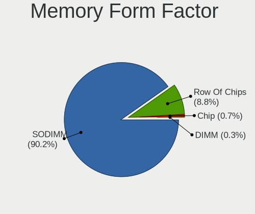

| Name         | Notebooks | Percent |
|--------------|-----------|---------|
| SODIMM       | 534       | 91.6%   |
| Row Of Chips | 44        | 7.55%   |
| Chip         | 4         | 0.69%   |
| DIMM         | 1         | 0.17%   |

Memory Size
-----------

Memory module size

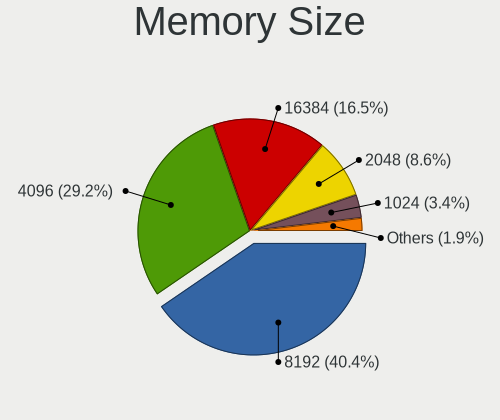

| Size  | Notebooks | Percent |
|-------|-----------|---------|
| 8192  | 253       | 39.78%  |
| 4096  | 199       | 31.29%  |
| 16384 | 87        | 13.68%  |
| 2048  | 62        | 9.75%   |
| 1024  | 25        | 3.93%   |
| 32768 | 8         | 1.26%   |
| 512   | 2         | 0.31%   |

Memory Speed
------------

Memory module speed

| Speed   | Notebooks | Percent |
|---------|-----------|---------|
| 3200    | 137       | 21.31%  |
| 1600    | 136       | 21.15%  |
| 2667    | 115       | 17.88%  |
| 2400    | 65        | 10.11%  |
| 1334    | 40        | 6.22%   |
| 2133    | 28        | 4.35%   |
| 3266    | 17        | 2.64%   |
| 667     | 14        | 2.18%   |
| 6400    | 10        | 1.56%   |
| 1333    | 10        | 1.56%   |
| Unknown | 10        | 1.56%   |
| 975     | 9         | 1.4%    |
| 1067    | 8         | 1.24%   |
| 800     | 7         | 1.09%   |
| 4800    | 5         | 0.78%   |
| 4199    | 5         | 0.78%   |
| 1867    | 5         | 0.78%   |
| 4267    | 4         | 0.62%   |
| 1066    | 4         | 0.62%   |
| 4266    | 3         | 0.47%   |
| 2048    | 3         | 0.47%   |
| 2933    | 2         | 0.31%   |
| 533     | 2         | 0.31%   |
| 5600    | 1         | 0.16%   |
| 1639    | 1         | 0.16%   |
| 400     | 1         | 0.16%   |
| 333     | 1         | 0.16%   |

Printers & scanners
-------------------

Printer Vendor
--------------

Printer device vendors

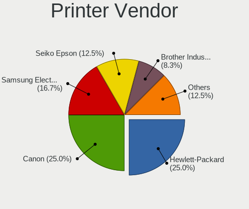

| Vendor                | Notebooks | Percent |
|-----------------------|-----------|---------|
| Hewlett-Packard       | 6         | 27.27%  |
| Canon                 | 6         | 27.27%  |
| Seiko Epson           | 3         | 13.64%  |
| Samsung Electronics   | 3         | 13.64%  |
| Brother Industries    | 2         | 9.09%   |
| Xerox                 | 1         | 4.55%   |
| Lexmark International | 1         | 4.55%   |

Printer Model
-------------

Printer device models

| Model                                      | Notebooks | Percent |
|--------------------------------------------|-----------|---------|
| Seiko Epson L3110 Series                   | 2         | 9.09%   |
| Samsung Composite Device                   | 2         | 9.09%   |
| Xerox Phaser 3020                          | 1         | 4.55%   |
| Seiko Epson L3150 Series                   | 1         | 4.55%   |
| Samsung M2070 Series                       | 1         | 4.55%   |
| Lexmark International InkJet Color Printer | 1         | 4.55%   |
| HP LaserJet 1022                           | 1         | 4.55%   |
| HP LaserJet 1018                           | 1         | 4.55%   |
| HP Laser 107a                              | 1         | 4.55%   |
| HP Deskjet F4500 series                    | 1         | 4.55%   |
| HP DeskJet 2300 series                     | 1         | 4.55%   |
| HP Deskjet 2050 J510                       | 1         | 4.55%   |
| Canon PIXMA MP250                          | 1         | 4.55%   |
| Canon MF4320-4350                          | 1         | 4.55%   |
| Canon MF3200 series                        | 1         | 4.55%   |
| Canon LBP2900                              | 1         | 4.55%   |
| Canon iP7200 series                        | 1         | 4.55%   |
| Canon CanoScan LiDE 300                    | 1         | 4.55%   |
| Brother HL-1110 series                     | 1         | 4.55%   |
| Brother DCP-T310                           | 1         | 4.55%   |

Scanner Vendor
--------------

Scanner device vendors

Zero info for selected period =(

Scanner Model
-------------

Scanner device models

Zero info for selected period =(

Camera
------

Camera Vendor
-------------

Camera device vendors

| Vendor                                 | Notebooks | Percent |
|----------------------------------------|-----------|---------|
| IMC Networks                           | 265       | 23.79%  |
| Chicony Electronics                    | 250       | 22.44%  |
| Realtek Semiconductor                  | 100       | 8.98%   |
| Microdia                               | 72        | 6.46%   |
| Bison Electronics                      | 71        | 6.37%   |
| Quanta                                 | 57        | 5.12%   |
| Sunplus Innovation Technology          | 55        | 4.94%   |
| Syntek                                 | 32        | 2.87%   |
| Cheng Uei Precision Industry (Foxlink) | 29        | 2.6%    |
| Lite-On Technology                     | 26        | 2.33%   |
| Alcor Micro                            | 26        | 2.33%   |
| Suyin                                  | 22        | 1.97%   |
| Sonix Technology                       | 20        | 1.8%    |
| Luxvisions Innotech Limited            | 12        | 1.08%   |
| Ricoh                                  | 10        | 0.9%    |
| Acer                                   | 9         | 0.81%   |
| Silicon Motion                         | 7         | 0.63%   |
| Samsung Electronics                    | 7         | 0.63%   |
| Apple                                  | 6         | 0.54%   |
| OmniVision Technologies                | 5         | 0.45%   |
| ALi                                    | 4         | 0.36%   |
| ShineTech                              | 3         | 0.27%   |
| Primax Electronics                     | 3         | 0.27%   |
| Z-Star Microelectronics                | 2         | 0.18%   |
| Sunplus Technology                     | 2         | 0.18%   |
| Microsoft                              | 2         | 0.18%   |
| Lenovo                                 | 2         | 0.18%   |
| Importek                               | 2         | 0.18%   |
| Genesys Logic                          | 2         | 0.18%   |
| Y Media                                | 1         | 0.09%   |
| Trust                                  | 1         | 0.09%   |
| Razer USA                              | 1         | 0.09%   |
| Philips (or NXP)                       | 1         | 0.09%   |
| Logitech                               | 1         | 0.09%   |
| Intel                                  | 1         | 0.09%   |
| Google                                 | 1         | 0.09%   |
| Epiphan Systems                        | 1         | 0.09%   |
| DigiTech                               | 1         | 0.09%   |
| Cubeternet                             | 1         | 0.09%   |
| BKX-210918                             | 1         | 0.09%   |

Camera Model
------------

Camera device models

| Model                                               | Notebooks | Percent |
|-----------------------------------------------------|-----------|---------|
| IMC Networks USB2.0 VGA UVC WebCam                  | 112       | 10.04%  |
| IMC Networks USB2.0 HD UVC WebCam                   | 79        | 7.08%   |
| Chicony Integrated Camera                           | 56        | 5.02%   |
| IMC Networks Integrated Camera                      | 35        | 3.14%   |
| Realtek Integrated_Webcam_HD                        | 32        | 2.87%   |
| Microdia Integrated_Webcam_HD                       | 26        | 2.33%   |
| Bison Integrated Camera                             | 22        | 1.97%   |
| Chicony HD Webcam                                   | 21        | 1.88%   |
| Chicony USB2.0 VGA UVC WebCam                       | 19        | 1.7%    |
| Realtek USB camera                                  | 18        | 1.61%   |
| Syntek Integrated Camera                            | 17        | 1.52%   |
| Chicony USB2.0 HD UVC WebCam                        | 16        | 1.43%   |
| Sonix USB2.0 HD UVC WebCam                          | 15        | 1.34%   |
| Sunplus HD WebCam                                   | 13        | 1.16%   |
| Quanta VGA WebCam                                   | 12        | 1.08%   |
| Chicony TOSHIBA Web Camera - HD                     | 11        | 0.99%   |
| Bison Lenovo EasyCamera                             | 11        | 0.99%   |
| Lite-On Integrated Camera                           | 10        | 0.9%    |
| Chicony EasyCamera                                  | 10        | 0.9%    |
| Chicony VGA Webcam                                  | 9         | 0.81%   |
| Chicony HP Webcam                                   | 9         | 0.81%   |
| Bison SunplusIT Integrated Camera                   | 9         | 0.81%   |
| Sunplus Integrated_Webcam_HD                        | 8         | 0.72%   |
| Quanta ACER HD User Facing                          | 8         | 0.72%   |
| Microdia Integrated Webcam                          | 8         | 0.72%   |
| Bison EasyCamera                                    | 8         | 0.72%   |
| Alcor Micro USB 2.0 PC Camera                       | 8         | 0.72%   |
| Alcor Micro USB 2.0 Camera                          | 8         | 0.72%   |
| Syntek Lenovo EasyCamera                            | 7         | 0.63%   |
| Syntek EasyCamera                                   | 7         | 0.63%   |
| Samsung Galaxy series, misc. (MTP mode)             | 7         | 0.63%   |
| Realtek USB2.0 VGA UVC WebCam                       | 7         | 0.63%   |
| Realtek USB2.0 HD UVC WebCam                        | 7         | 0.63%   |
| Realtek Integrated Webcam                           | 7         | 0.63%   |
| IMC Networks USB2.0 UVC HD Webcam                   | 7         | 0.63%   |
| Realtek Lenovo EasyCamera                           | 6         | 0.54%   |
| Quanta HD WebCam                                    | 6         | 0.54%   |
| Luxvisions Innotech Limited HP TrueVision HD Camera | 6         | 0.54%   |
| Lite-On HP Wide Vision HD Camera                    | 6         | 0.54%   |
| IMC Networks HD Camera                              | 6         | 0.54%   |

Security
--------

Fingerprint Vendor
------------------

Fingerprint sensor vendors

| Vendor                             | Notebooks | Percent |
|------------------------------------|-----------|---------|
| Validity Sensors                   | 57        | 33.14%  |
| Synaptics                          | 45        | 26.16%  |
| Shenzhen Goodix Technology         | 20        | 11.63%  |
| Elan Microelectronics              | 16        | 9.3%    |
| Upek                               | 11        | 6.4%    |
| AuthenTec                          | 10        | 5.81%   |
| LighTuning Technology              | 9         | 5.23%   |
| STMicroelectronics                 | 1         | 0.58%   |
| Realtek USB2.0 Finger Print Bridge | 1         | 0.58%   |
| GDMicroelectronics                 | 1         | 0.58%   |
| Focal-systems.Corp                 | 1         | 0.58%   |

Fingerprint Model
-----------------

Fingerprint sensor models

| Model                                                                      | Notebooks | Percent |
|----------------------------------------------------------------------------|-----------|---------|
| Synaptics Prometheus MIS Touch Fingerprint Reader                          | 15        | 8.72%   |
| Shenzhen Goodix  Fingerprint Device                                        | 15        | 8.72%   |
| Validity Sensors VFS495 Fingerprint Reader                                 | 14        | 8.14%   |
| Upek Biometric Touchchip/Touchstrip Fingerprint Sensor                     | 10        | 5.81%   |
| Elan ELAN:Fingerprint                                                      | 10        | 5.81%   |
| Validity Sensors VFS5011 Fingerprint Reader                                | 9         | 5.23%   |
| Synaptics  WBDI                                                            | 9         | 5.23%   |
| Validity Sensors VFS471 Fingerprint Reader                                 | 6         | 3.49%   |
| Validity Sensors VFS 5011 fingerprint sensor                               | 6         | 3.49%   |
| Synaptics Metallica MIS Touch Fingerprint Reader                           | 6         | 3.49%   |
| Elan ELAN:ARM-M4                                                           | 6         | 3.49%   |
| AuthenTec AES2810                                                          | 6         | 3.49%   |
| Validity Sensors VFS451 Fingerprint Reader                                 | 5         | 2.91%   |
| Validity Sensors Synaptics WBDI                                            | 5         | 2.91%   |
| Validity Sensors VFS491                                                    | 4         | 2.33%   |
| Synaptics Fingerprint reader [HP G6]                                       | 4         | 2.33%   |
| Shenzhen Goodix Fingerprint Reader                                         | 4         | 2.33%   |
| Validity Sensors Synaptics VFS7552 Touch Fingerprint Sensor with PurePrint | 3         | 1.74%   |
| Synaptics  FS7604 Touch Fingerprint Sensor with PurePrint                  | 3         | 1.74%   |
| Synaptics FS7604 Touch Fingerprint Sensor with PurePrint                   | 3         | 1.74%   |
| LighTuning Fingerprint Reader                                              | 3         | 1.74%   |
| LighTuning ES603 Swipe Fingerprint Sensor                                  | 3         | 1.74%   |
| LighTuning EgisTec Touch Fingerprint Sensor                                | 3         | 1.74%   |
| Validity Sensors Swipe Fingerprint Sensor                                  | 2         | 1.16%   |
| Synaptics WBDI Fingerprint Reader USB 086                                  | 2         | 1.16%   |
| Synaptics Metallica MOH Touch Fingerprint Reader                           | 2         | 1.16%   |
| AuthenTec Fingerprint Sensor                                               | 2         | 1.16%   |
| AuthenTec AES2501 Fingerprint Sensor                                       | 2         | 1.16%   |
| Validity Sensors VFS7552 Touch Fingerprint Sensor                          | 1         | 0.58%   |
| Validity Sensors VFS7500 Touch Fingerprint Sensor                          | 1         | 0.58%   |
| Validity Sensors Fingerprint scanner                                       | 1         | 0.58%   |
| Upek TCS5B Fingerprint sensor                                              | 1         | 0.58%   |
| Synaptics WBDI                                                             | 1         | 0.58%   |
| STMicroelectronics Fingerprint Reader                                      | 1         | 0.58%   |
| Shenzhen Goodix FingerPrint                                                | 1         | 0.58%   |
| Realtek USB2.0 Finger Print Bridge FocalTech Fingerprint Device            | 1         | 0.58%   |
| GDMicroelectronics Touch Fingerprint Sensor                                | 1         | 0.58%   |
| Focal-systems.Corp FT9201Fingerprint.                                      | 1         | 0.58%   |

Chipcard Vendor
---------------

Chipcard module vendors

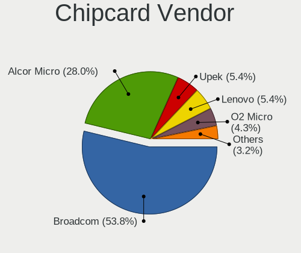

| Vendor                    | Notebooks | Percent |
|---------------------------|-----------|---------|
| Broadcom                  | 43        | 55.13%  |
| Alcor Micro               | 19        | 24.36%  |
| Upek                      | 5         | 6.41%   |
| Lenovo                    | 5         | 6.41%   |
| O2 Micro                  | 4         | 5.13%   |
| Gemalto (was Gemplus)     | 1         | 1.28%   |
| Aladdin Knowledge Systems | 1         | 1.28%   |

Chipcard Model
--------------

Chipcard module models

| Model                                                                        | Notebooks | Percent |
|------------------------------------------------------------------------------|-----------|---------|
| Alcor Micro AU9540 Smartcard Reader                                          | 19        | 24.36%  |
| Broadcom 58200                                                               | 13        | 16.67%  |
| Broadcom BCM5880 Secure Applications Processor                               | 11        | 14.1%   |
| Broadcom 5880                                                                | 11        | 14.1%   |
| Broadcom BCM5880 Secure Applications Processor with fingerprint swipe sensor | 8         | 10.26%  |
| Upek TouchChip Fingerprint Coprocessor (WBF advanced mode)                   | 5         | 6.41%   |
| Lenovo Integrated Smart Card Reader                                          | 5         | 6.41%   |
| O2 Micro OZ776 CCID Smartcard Reader                                         | 4         | 5.13%   |
| Gemalto (was Gemplus) Compact Smart Card Reader Writer                       | 1         | 1.28%   |
| Aladdin Knowledge Systems Token JC                                           | 1         | 1.28%   |

Unsupported
-----------

Unsupported Devices
-------------------

Total unsupported devices on board

| Total | Notebooks | Percent |
|-------|-----------|---------|
| 0     | 833       | 66.01%  |
| 1     | 339       | 26.86%  |
| 2     | 79        | 6.26%   |
| 3     | 9         | 0.71%   |
| 10    | 1         | 0.08%   |
| 4     | 1         | 0.08%   |

Unsupported Device Types
------------------------

Types of unsupported devices

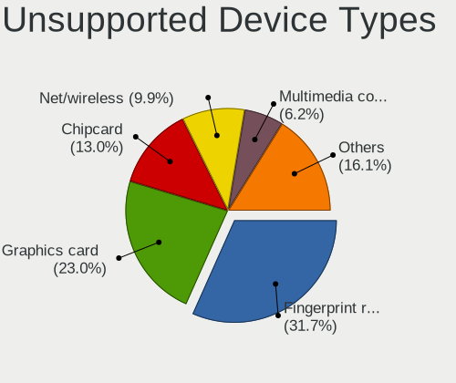

| Type                     | Notebooks | Percent |
|--------------------------|-----------|---------|
| Fingerprint reader       | 171       | 32.76%  |
| Graphics card            | 107       | 20.5%   |
| Chipcard                 | 71        | 13.6%   |
| Net/wireless             | 53        | 10.15%  |
| Multimedia controller    | 30        | 5.75%   |
| Camera                   | 21        | 4.02%   |
| Storage                  | 15        | 2.87%   |
| Bluetooth                | 15        | 2.87%   |
| Communication controller | 14        | 2.68%   |
| Card reader              | 8         | 1.53%   |
| Net/ethernet             | 4         | 0.77%   |
| Sound                    | 3         | 0.57%   |
| Modem                    | 3         | 0.57%   |
| Network                  | 2         | 0.38%   |
| Flash memory             | 2         | 0.38%   |
| Storage/nvme             | 1         | 0.19%   |
| Firewire controller      | 1         | 0.19%   |
| Dvb card                 | 1         | 0.19%   |

