Linux in Romania - Tested Hardware & Statistics (Notebooks)
-----------------------------------------------------------

A project to collect tested hardware configurations for Linux in Romania.

Anyone can contribute to this report by the [hw-probe](https://github.com/linuxhw/hw-probe) tool:

    sudo -E hw-probe -all -upload

Please contribute! Especially if your hardware is rare.

Contents
--------

* [ Test Cases ](#test-cases)

* [ System ](#system)
  - [ OS                       ](#os)
  - [ OS Family                ](#os-family)
  - [ Kernel                   ](#kernel)
  - [ Kernel Family            ](#kernel-family)
  - [ Kernel Major Ver.        ](#kernel-major-ver)
  - [ Arch                     ](#arch)
  - [ DE                       ](#de)
  - [ Display Server           ](#display-server)
  - [ Display Manager          ](#display-manager)
  - [ OS Lang                  ](#os-lang)
  - [ Boot Mode                ](#boot-mode)
  - [ Filesystem               ](#filesystem)
  - [ Part. scheme             ](#part-scheme)
  - [ Dual Boot with Linux/BSD ](#dual-boot-with-linuxbsd)
  - [ Dual Boot (Win)          ](#dual-boot-win)

* [ Board ](#board)
  - [ Vendor                   ](#vendor)
  - [ Model                    ](#model)
  - [ Model Family             ](#model-family)
  - [ MFG Year                 ](#mfg-year)
  - [ Form Factor              ](#form-factor)
  - [ Secure Boot              ](#secure-boot)
  - [ Coreboot                 ](#coreboot)
  - [ RAM Size                 ](#ram-size)
  - [ RAM Used                 ](#ram-used)
  - [ Total Drives             ](#total-drives)
  - [ Has CD-ROM               ](#has-cd-rom)
  - [ Has Ethernet             ](#has-ethernet)
  - [ Has WiFi                 ](#has-wifi)
  - [ Has Bluetooth            ](#has-bluetooth)

* [ Location ](#location)
  - [ Country                  ](#country)
  - [ City                     ](#city)

* [ Drives ](#drives)
  - [ Drive Vendor             ](#drive-vendor)
  - [ Drive Model              ](#drive-model)
  - [ HDD Vendor               ](#hdd-vendor)
  - [ SSD Vendor               ](#ssd-vendor)
  - [ Drive Kind               ](#drive-kind)
  - [ Drive Connector          ](#drive-connector)
  - [ Drive Size               ](#drive-size)
  - [ Space Total              ](#space-total)
  - [ Space Used               ](#space-used)
  - [ Malfunc. Drives          ](#malfunc-drives)
  - [ Malfunc. Drive Vendor    ](#malfunc-drive-vendor)
  - [ Malfunc. HDD Vendor      ](#malfunc-hdd-vendor)
  - [ Malfunc. Drive Kind      ](#malfunc-drive-kind)
  - [ Failed Drives            ](#failed-drives)
  - [ Failed Drive Vendor      ](#failed-drive-vendor)
  - [ Drive Status             ](#drive-status)

* [ Storage controller ](#storage-controller)
  - [ Storage Vendor           ](#storage-vendor)
  - [ Storage Model            ](#storage-model)
  - [ Storage Kind             ](#storage-kind)

* [ Processor ](#processor)
  - [ CPU Vendor               ](#cpu-vendor)
  - [ CPU Model                ](#cpu-model)
  - [ CPU Model Family         ](#cpu-model-family)
  - [ CPU Cores                ](#cpu-cores)
  - [ CPU Sockets              ](#cpu-sockets)
  - [ CPU Threads              ](#cpu-threads)
  - [ CPU Op-Modes             ](#cpu-op-modes)
  - [ CPU Microcode            ](#cpu-microcode)
  - [ CPU Microarch            ](#cpu-microarch)

* [ Graphics ](#graphics)
  - [ GPU Vendor               ](#gpu-vendor)
  - [ GPU Model                ](#gpu-model)
  - [ GPU Combo                ](#gpu-combo)
  - [ GPU Driver               ](#gpu-driver)
  - [ GPU Memory               ](#gpu-memory)

* [ Monitor ](#monitor)
  - [ Monitor Vendor           ](#monitor-vendor)
  - [ Monitor Model            ](#monitor-model)
  - [ Monitor Resolution       ](#monitor-resolution)
  - [ Monitor Diagonal         ](#monitor-diagonal)
  - [ Monitor Width            ](#monitor-width)
  - [ Aspect Ratio             ](#aspect-ratio)
  - [ Monitor Area             ](#monitor-area)
  - [ Pixel Density            ](#pixel-density)
  - [ Multiple Monitors        ](#multiple-monitors)

* [ Network ](#network)
  - [ Net Controller Vendor    ](#net-controller-vendor)
  - [ Net Controller Model     ](#net-controller-model)
  - [ Wireless Vendor          ](#wireless-vendor)
  - [ Wireless Model           ](#wireless-model)
  - [ Ethernet Vendor          ](#ethernet-vendor)
  - [ Ethernet Model           ](#ethernet-model)
  - [ Net Controller Kind      ](#net-controller-kind)
  - [ Used Controller          ](#used-controller)
  - [ NICs                     ](#nics)
  - [ IPv6                     ](#ipv6)

* [ Bluetooth ](#bluetooth)
  - [ Bluetooth Vendor         ](#bluetooth-vendor)
  - [ Bluetooth Model          ](#bluetooth-model)

* [ Sound ](#sound)
  - [ Sound Vendor             ](#sound-vendor)
  - [ Sound Model              ](#sound-model)

* [ Memory ](#memory)
  - [ Memory Vendor            ](#memory-vendor)
  - [ Memory Model             ](#memory-model)
  - [ Memory Kind              ](#memory-kind)
  - [ Memory Form Factor       ](#memory-form-factor)
  - [ Memory Size              ](#memory-size)
  - [ Memory Speed             ](#memory-speed)

* [ Printers & scanners ](#printers--scanners)
  - [ Printer Vendor           ](#printer-vendor)
  - [ Printer Model            ](#printer-model)
  - [ Scanner Vendor           ](#scanner-vendor)
  - [ Scanner Model            ](#scanner-model)

* [ Camera ](#camera)
  - [ Camera Vendor            ](#camera-vendor)
  - [ Camera Model             ](#camera-model)

* [ Security ](#security)
  - [ Fingerprint Vendor       ](#fingerprint-vendor)
  - [ Fingerprint Model        ](#fingerprint-model)
  - [ Chipcard Vendor          ](#chipcard-vendor)
  - [ Chipcard Model           ](#chipcard-model)

* [ Unsupported ](#unsupported)
  - [ Unsupported Devices      ](#unsupported-devices)
  - [ Unsupported Device Types ](#unsupported-device-types)

Test Cases
----------

Total: 1338

| Vendor        | Model                       | Probe                                                      | Date         |
|---------------|-----------------------------|------------------------------------------------------------|--------------|
| Acer          | Aspire A315-51              | [083e3a354a](https://linux-hardware.org/?probe=083e3a354a) | May 29, 2022 |
| ASUSTek       | N53SM                       | [83209051cb](https://linux-hardware.org/?probe=83209051cb) | May 29, 2022 |
| Lenovo        | IdeaPad 510-15IKB 80SV      | [caaf2a56b6](https://linux-hardware.org/?probe=caaf2a56b6) | May 26, 2022 |
| Lenovo        | Legion Y740-15IRHg 81UH     | [74c64ebe72](https://linux-hardware.org/?probe=74c64ebe72) | May 26, 2022 |
| ASUSTek       | ROG Zephyrus G15 GA503RS... | [940a448ea6](https://linux-hardware.org/?probe=940a448ea6) | May 24, 2022 |
| ASUSTek       | N53SM                       | [3115570400](https://linux-hardware.org/?probe=3115570400) | May 24, 2022 |
| Allview       | Allbook H                   | [9ea4897c6b](https://linux-hardware.org/?probe=9ea4897c6b) | May 24, 2022 |
| Dell          | Latitude E7470              | [b01633e1ae](https://linux-hardware.org/?probe=b01633e1ae) | May 24, 2022 |
| Dell          | Latitude E7470              | [815dbb114b](https://linux-hardware.org/?probe=815dbb114b) | May 23, 2022 |
| Dell          | Latitude E7470              | [9a6c29a243](https://linux-hardware.org/?probe=9a6c29a243) | May 21, 2022 |
| Acer          | Aspire One 522              | [0ac567a5cf](https://linux-hardware.org/?probe=0ac567a5cf) | May 21, 2022 |
| Dell          | Latitude E6410              | [739ffac681](https://linux-hardware.org/?probe=739ffac681) | May 21, 2022 |
| Dell          | Inspiron 3542               | [949f8f3e50](https://linux-hardware.org/?probe=949f8f3e50) | May 20, 2022 |
| ASUSTek       | VivoBook_ASUSLaptop M740... | [4d2d33c41c](https://linux-hardware.org/?probe=4d2d33c41c) | May 20, 2022 |
| Lenovo        | IdeaPad Creator 5 15IMH0... | [59d945a9b3](https://linux-hardware.org/?probe=59d945a9b3) | May 19, 2022 |
| Lenovo        | ThinkPad P53 20QNS01900     | [158f212b30](https://linux-hardware.org/?probe=158f212b30) | May 13, 2022 |
| Dell          | Inspiron 3542               | [550824d592](https://linux-hardware.org/?probe=550824d592) | May 12, 2022 |
| Dell          | Inspiron 3542               | [324d1abe3b](https://linux-hardware.org/?probe=324d1abe3b) | May 08, 2022 |
| HP            | ProBook 4520s               | [06e044a425](https://linux-hardware.org/?probe=06e044a425) | May 08, 2022 |
| ASUSTek       | ASUS TUF Gaming F17 FX70... | [52c2a321a4](https://linux-hardware.org/?probe=52c2a321a4) | May 07, 2022 |
| Acer          | Aspire E1-570               | [53ddeaa413](https://linux-hardware.org/?probe=53ddeaa413) | May 07, 2022 |
| HP            | Laptop 14s-dq1xxx           | [713358f855](https://linux-hardware.org/?probe=713358f855) | May 02, 2022 |
| Lenovo        | IdeaPad Gaming 3 15ARH05... | [6537fb670a](https://linux-hardware.org/?probe=6537fb670a) | May 01, 2022 |
| Toshiba       | Satellite C55-A-1J8         | [26cd3478c5](https://linux-hardware.org/?probe=26cd3478c5) | Apr 30, 2022 |
| HP            | ProBook 4520s               | [60eab2c6c5](https://linux-hardware.org/?probe=60eab2c6c5) | Apr 30, 2022 |
| Pegatron      | Spring Peak                 | [66a1692171](https://linux-hardware.org/?probe=66a1692171) | Apr 30, 2022 |
| HP            | ENVY Laptop 14-eb0xxx       | [495a74c914](https://linux-hardware.org/?probe=495a74c914) | Apr 27, 2022 |
| Acer          | Aspire E1-570               | [efcd6be006](https://linux-hardware.org/?probe=efcd6be006) | Apr 27, 2022 |
| Dell          | Latitude E4310              | [41db45879c](https://linux-hardware.org/?probe=41db45879c) | Apr 27, 2022 |
| ASUSTek       | ZenBook UX450FDX_UX450FD... | [afe44fa080](https://linux-hardware.org/?probe=afe44fa080) | Apr 27, 2022 |
| Lenovo        | IdeaPad Gaming 3 15ARH05... | [8ece944a7b](https://linux-hardware.org/?probe=8ece944a7b) | Apr 27, 2022 |
| Dell          | Latitude E6520              | [1ca407a69f](https://linux-hardware.org/?probe=1ca407a69f) | Apr 27, 2022 |
| Acer          | Aspire E1-570               | [1621e22812](https://linux-hardware.org/?probe=1621e22812) | Apr 26, 2022 |
| ASUSTek       | VivoBook 15_ASUS Laptop ... | [bcc0c7612d](https://linux-hardware.org/?probe=bcc0c7612d) | Apr 26, 2022 |
| Lenovo        | ThinkPad T440p 20AWS1EH0... | [fae5ee6551](https://linux-hardware.org/?probe=fae5ee6551) | Apr 26, 2022 |
| Dell          | XPS 17 9710                 | [c7dfc69b32](https://linux-hardware.org/?probe=c7dfc69b32) | Apr 26, 2022 |
| HP            | ProBook 4520s               | [1621eddc70](https://linux-hardware.org/?probe=1621eddc70) | Apr 25, 2022 |
| ASUSTek       | ASUS TUF Gaming F15 FX50... | [1d1c33575f](https://linux-hardware.org/?probe=1d1c33575f) | Apr 24, 2022 |
| Lenovo        | ThinkPad T540p 20BES05A0... | [41276f12db](https://linux-hardware.org/?probe=41276f12db) | Apr 23, 2022 |
| Lenovo        | ThinkPad T540p 20BES05A0... | [55733b5ae3](https://linux-hardware.org/?probe=55733b5ae3) | Apr 23, 2022 |
| ASUSTek       | VivoBook_ASUS Laptop X50... | [a551ef1ec7](https://linux-hardware.org/?probe=a551ef1ec7) | Apr 23, 2022 |
| ASUSTek       | VivoBook_ASUS Laptop X50... | [fd6718859d](https://linux-hardware.org/?probe=fd6718859d) | Apr 23, 2022 |
| ASUSTek       | X450CP                      | [2518b6daad](https://linux-hardware.org/?probe=2518b6daad) | Apr 22, 2022 |
| ASUSTek       | X450CP                      | [17d51c502f](https://linux-hardware.org/?probe=17d51c502f) | Apr 22, 2022 |
| HP            | Laptop 15-ra0xx             | [bc175803f2](https://linux-hardware.org/?probe=bc175803f2) | Apr 22, 2022 |
| Lenovo        | ThinkPad T440p 20AWS1Y90... | [de746c72d1](https://linux-hardware.org/?probe=de746c72d1) | Apr 20, 2022 |
| HP            | ENVY Laptop 14-eb0xxx       | [5d95841f54](https://linux-hardware.org/?probe=5d95841f54) | Apr 20, 2022 |
| Lenovo        | ThinkPad T560 20FJS0NT04    | [19ebdf705a](https://linux-hardware.org/?probe=19ebdf705a) | Apr 20, 2022 |
| ASUSTek       | X541UAK                     | [8b54af493a](https://linux-hardware.org/?probe=8b54af493a) | Apr 19, 2022 |
| Dell          | Latitude E6440              | [33955db41e](https://linux-hardware.org/?probe=33955db41e) | Apr 17, 2022 |
| ASUSTek       | VivoBook_ASUSLaptop X513... | [1825f45bfa](https://linux-hardware.org/?probe=1825f45bfa) | Apr 17, 2022 |
| MSI           | Modern 14 B4MW              | [5d8e6ca082](https://linux-hardware.org/?probe=5d8e6ca082) | Apr 16, 2022 |
| HP            | Pavilion 17                 | [acb0c7fd0e](https://linux-hardware.org/?probe=acb0c7fd0e) | Apr 16, 2022 |
| Lenovo        | ThinkPad T440p 20AWS1Y90... | [a572c901ca](https://linux-hardware.org/?probe=a572c901ca) | Apr 15, 2022 |
| HP            | Pavilion 17                 | [014f42ecee](https://linux-hardware.org/?probe=014f42ecee) | Apr 15, 2022 |
| Acer          | Aspire 5750G                | [73d1368d93](https://linux-hardware.org/?probe=73d1368d93) | Apr 15, 2022 |
| Dell          | System XPS L702X            | [9ed530100f](https://linux-hardware.org/?probe=9ed530100f) | Apr 13, 2022 |
| ASUSTek       | ROG Strix G733QS_G733QS     | [95ddaa1dae](https://linux-hardware.org/?probe=95ddaa1dae) | Apr 13, 2022 |
| Dell          | Inspiron 5570               | [ba6f51707b](https://linux-hardware.org/?probe=ba6f51707b) | Apr 13, 2022 |
| HP            | EliteBook 2540p             | [a06e300bfd](https://linux-hardware.org/?probe=a06e300bfd) | Apr 12, 2022 |
| ASUSTek       | X541UAK                     | [ffb5635168](https://linux-hardware.org/?probe=ffb5635168) | Apr 10, 2022 |
| Dell          | Vostro 3500                 | [5b1a24bf51](https://linux-hardware.org/?probe=5b1a24bf51) | Apr 10, 2022 |
| Dell          | Vostro 3500                 | [b2adbbe7d0](https://linux-hardware.org/?probe=b2adbbe7d0) | Apr 10, 2022 |
| Dell          | Vostro 15 3515              | [5fea9b2c3a](https://linux-hardware.org/?probe=5fea9b2c3a) | Apr 08, 2022 |
| Lenovo        | IdeaPad 330-15IGM 81D1      | [8cdcd8d130](https://linux-hardware.org/?probe=8cdcd8d130) | Apr 08, 2022 |
| ASUSTek       | VivoBook_ASUSLaptop X435... | [d49b3ef408](https://linux-hardware.org/?probe=d49b3ef408) | Apr 08, 2022 |
| ASUSTek       | ROG Strix G512LV_G512LV     | [9cbf0f3aad](https://linux-hardware.org/?probe=9cbf0f3aad) | Apr 04, 2022 |
| Lenovo        | G510 20238                  | [beeceac759](https://linux-hardware.org/?probe=beeceac759) | Apr 04, 2022 |
| Lenovo        | B590 37612LG                | [153a6c2343](https://linux-hardware.org/?probe=153a6c2343) | Apr 04, 2022 |
| Lenovo        | Yoga Slim 7 13ACN5 82CY     | [4c96d9df2f](https://linux-hardware.org/?probe=4c96d9df2f) | Apr 02, 2022 |
| HP            | 250 G4                      | [69a3535c1a](https://linux-hardware.org/?probe=69a3535c1a) | Mar 30, 2022 |
| Acer          | Aspire 5920G                | [c2d3fbb93e](https://linux-hardware.org/?probe=c2d3fbb93e) | Mar 30, 2022 |
| Acer          | Swift SF314-511             | [ffde31bd20](https://linux-hardware.org/?probe=ffde31bd20) | Mar 26, 2022 |
| Lenovo        | ThinkPad Edge E540 20C60... | [a05a647662](https://linux-hardware.org/?probe=a05a647662) | Mar 25, 2022 |
| Dell          | Inspiron 15-3567            | [2bbea411a6](https://linux-hardware.org/?probe=2bbea411a6) | Mar 24, 2022 |
| Dell          | Inspiron 15-3567            | [c55e29b1e9](https://linux-hardware.org/?probe=c55e29b1e9) | Mar 22, 2022 |
| Gigabyte      | AERO 15 YD                  | [ce6cc28ca1](https://linux-hardware.org/?probe=ce6cc28ca1) | Mar 21, 2022 |
| ASUSTek       | VivoBook_ASUSLaptop X509... | [8d1c371df2](https://linux-hardware.org/?probe=8d1c371df2) | Mar 21, 2022 |
| Gigabyte      | AERO 15 YD                  | [35da4bbe2c](https://linux-hardware.org/?probe=35da4bbe2c) | Mar 21, 2022 |
| Lenovo        | IdeaPad 3 15ARE05 81W4      | [626ee37f9b](https://linux-hardware.org/?probe=626ee37f9b) | Mar 21, 2022 |
| Acer          | Swift SF314-57              | [a93c59159d](https://linux-hardware.org/?probe=a93c59159d) | Mar 20, 2022 |
| Acer          | Swift SF514-55GT            | [ae09c5da41](https://linux-hardware.org/?probe=ae09c5da41) | Mar 20, 2022 |
| Acer          | Swift SF114-33              | [7e8098be12](https://linux-hardware.org/?probe=7e8098be12) | Mar 20, 2022 |
| Lenovo        | IdeaPad 330S-14IKB 81F4     | [b8b480e048](https://linux-hardware.org/?probe=b8b480e048) | Mar 20, 2022 |
| Dell          | Inspiron 3583               | [a3a8154156](https://linux-hardware.org/?probe=a3a8154156) | Mar 17, 2022 |
| HP            | ProBook 450 G2              | [177d9b8820](https://linux-hardware.org/?probe=177d9b8820) | Mar 16, 2022 |
| Dell          | Inspiron 15-3567            | [5da90f10f4](https://linux-hardware.org/?probe=5da90f10f4) | Mar 15, 2022 |
| ASUSTek       | X540YA                      | [0cd3840828](https://linux-hardware.org/?probe=0cd3840828) | Mar 14, 2022 |
| Lenovo        | IdeaPad 530S-14ARR 81H1     | [1b57f1f410](https://linux-hardware.org/?probe=1b57f1f410) | Mar 13, 2022 |
| Lenovo        | G510 20238                  | [c82a0d33a2](https://linux-hardware.org/?probe=c82a0d33a2) | Mar 12, 2022 |
| Dell          | Inspiron MM061              | [ad5413d163](https://linux-hardware.org/?probe=ad5413d163) | Mar 06, 2022 |
| Lenovo        | ThinkBook 14p Gen 2 20YN    | [3b3220eeee](https://linux-hardware.org/?probe=3b3220eeee) | Mar 06, 2022 |
| Lenovo        | Legion Y740-17IRHg 81UJ     | [f89153c3e1](https://linux-hardware.org/?probe=f89153c3e1) | Mar 05, 2022 |
| Acer          | Aspire A315-41              | [6d26072b9e](https://linux-hardware.org/?probe=6d26072b9e) | Mar 03, 2022 |
| Lenovo        | IdeaPad Gaming 3 15ACH6 ... | [53d74176e9](https://linux-hardware.org/?probe=53d74176e9) | Mar 03, 2022 |
| Lenovo        | ThinkPad X1 Carbon 3rd 2... | [73881ad12e](https://linux-hardware.org/?probe=73881ad12e) | Mar 03, 2022 |
| MSI           | GP75 Leopard 9SE            | [6090fb66ea](https://linux-hardware.org/?probe=6090fb66ea) | Mar 02, 2022 |
| MSI           | GP75 Leopard 9SE            | [c56a98389f](https://linux-hardware.org/?probe=c56a98389f) | Mar 01, 2022 |
| Medion        | E16402                      | [1622ca8570](https://linux-hardware.org/?probe=1622ca8570) | Feb 27, 2022 |
| Acer          | Aspire E1-571               | [c8dd47fb82](https://linux-hardware.org/?probe=c8dd47fb82) | Feb 26, 2022 |
| ASUSTek       | VivoBook_ASUSLaptop X509... | [402a27e190](https://linux-hardware.org/?probe=402a27e190) | Feb 24, 2022 |
| ASUSTek       | X55U                        | [c7c38f077d](https://linux-hardware.org/?probe=c7c38f077d) | Feb 24, 2022 |
| ASUSTek       | VivoBook_ASUSLaptop X512... | [6083eed5da](https://linux-hardware.org/?probe=6083eed5da) | Feb 21, 2022 |
| Lenovo        | ThinkPad T430 2349U15       | [38a194c33d](https://linux-hardware.org/?probe=38a194c33d) | Feb 20, 2022 |
| Dell          | Latitude E6540              | [dfc7dad0ee](https://linux-hardware.org/?probe=dfc7dad0ee) | Feb 17, 2022 |
| Lenovo        | ThinkPad P50 20ENS0FQ00     | [8d8e30fdfb](https://linux-hardware.org/?probe=8d8e30fdfb) | Feb 17, 2022 |
| ASUSTek       | VivoBook_ASUSLaptop X350... | [5d2de5cd73](https://linux-hardware.org/?probe=5d2de5cd73) | Feb 17, 2022 |
| Acer          | Aspire A315-34              | [f6383e06d7](https://linux-hardware.org/?probe=f6383e06d7) | Feb 16, 2022 |
| MSI           | EX620                       | [8eda01e2a8](https://linux-hardware.org/?probe=8eda01e2a8) | Feb 14, 2022 |
| HP            | EliteBook 8530p             | [6b45115b9e](https://linux-hardware.org/?probe=6b45115b9e) | Feb 13, 2022 |
| Lenovo        | ThinkPad T410 2522Y15       | [66a496ba4c](https://linux-hardware.org/?probe=66a496ba4c) | Feb 09, 2022 |
| Chuwi         | GemiBook Pro                | [7d600bcdc7](https://linux-hardware.org/?probe=7d600bcdc7) | Feb 08, 2022 |
| Lenovo        | ThinkPad L380 20M5003FUK    | [fe486b4de6](https://linux-hardware.org/?probe=fe486b4de6) | Feb 08, 2022 |
| Lenovo        | ThinkPad T460 20FMS3W300    | [a49c14ab70](https://linux-hardware.org/?probe=a49c14ab70) | Feb 06, 2022 |
| Allview       | Allbook H                   | [f1ba3f22c4](https://linux-hardware.org/?probe=f1ba3f22c4) | Feb 05, 2022 |
| Lenovo        | G510 20238                  | [4975c3b6b7](https://linux-hardware.org/?probe=4975c3b6b7) | Feb 05, 2022 |
| HP            | Pavilion dv6                | [63c8ab5447](https://linux-hardware.org/?probe=63c8ab5447) | Feb 03, 2022 |
| HP            | EliteBook x360 1040 G5      | [4aa3aa1f30](https://linux-hardware.org/?probe=4aa3aa1f30) | Feb 02, 2022 |
| ASUSTek       | VivoBook_ASUSLaptop X350... | [1e330f1e0e](https://linux-hardware.org/?probe=1e330f1e0e) | Feb 02, 2022 |
| HP            | Laptop 15s-fq1xxx           | [7c2762f41c](https://linux-hardware.org/?probe=7c2762f41c) | Jan 31, 2022 |
| HP            | Laptop 15s-fq1xxx           | [2aa45a8d1b](https://linux-hardware.org/?probe=2aa45a8d1b) | Jan 31, 2022 |
| Lenovo        | G510 20238                  | [b61bba90ad](https://linux-hardware.org/?probe=b61bba90ad) | Jan 30, 2022 |
| Acer          | Extensa 2510                | [1fcabc0254](https://linux-hardware.org/?probe=1fcabc0254) | Jan 26, 2022 |
| Lenovo        | V330-15IKB 81AX             | [3bcb1d5f53](https://linux-hardware.org/?probe=3bcb1d5f53) | Jan 25, 2022 |
| HP            | Pavilion TS 11              | [6d62bb9596](https://linux-hardware.org/?probe=6d62bb9596) | Jan 24, 2022 |
| Dell          | Inspiron 5567               | [0e47f03d64](https://linux-hardware.org/?probe=0e47f03d64) | Jan 24, 2022 |
| HP            | EliteBook 840 G6            | [ded9015aff](https://linux-hardware.org/?probe=ded9015aff) | Jan 23, 2022 |
| Acer          | Aspire E1-531               | [d90de3e8f7](https://linux-hardware.org/?probe=d90de3e8f7) | Jan 21, 2022 |
| HP            | Pavilion TS 11              | [d4187f35fd](https://linux-hardware.org/?probe=d4187f35fd) | Jan 19, 2022 |
| ASUSTek       | X541UAK                     | [2f55e0a142](https://linux-hardware.org/?probe=2f55e0a142) | Jan 19, 2022 |
| Dell          | MXG071                      | [cd914ee2f0](https://linux-hardware.org/?probe=cd914ee2f0) | Jan 18, 2022 |
| Lenovo        | ThinkPad X1 Carbon 7th 2... | [d786a0b993](https://linux-hardware.org/?probe=d786a0b993) | Jan 17, 2022 |
| Lenovo        | ThinkPad X1 Carbon 7th 2... | [6af6121c33](https://linux-hardware.org/?probe=6af6121c33) | Jan 17, 2022 |
| Dell          | Inspiron 5567               | [4b51693e30](https://linux-hardware.org/?probe=4b51693e30) | Jan 17, 2022 |
| Lenovo        | ThinkPad X61s 7666WCQ       | [7e1d764ca8](https://linux-hardware.org/?probe=7e1d764ca8) | Jan 16, 2022 |
| Samsung       | R580/R590                   | [be1e77de84](https://linux-hardware.org/?probe=be1e77de84) | Jan 16, 2022 |
| Acer          | Aspire E1-531               | [342f6f2beb](https://linux-hardware.org/?probe=342f6f2beb) | Jan 16, 2022 |
| Acer          | Aspire E1-531               | [34f103b8d2](https://linux-hardware.org/?probe=34f103b8d2) | Jan 16, 2022 |
| Lenovo        | IdeaPad 100-15IBY 80MJ      | [efe75d8f3f](https://linux-hardware.org/?probe=efe75d8f3f) | Jan 14, 2022 |
| Lenovo        | ThinkPad T420 4236WR1       | [15dd95fdfd](https://linux-hardware.org/?probe=15dd95fdfd) | Jan 14, 2022 |
| Lenovo        | G50-70 20351                | [615ed31a98](https://linux-hardware.org/?probe=615ed31a98) | Jan 13, 2022 |
| Dell          | Inspiron 5570               | [5f41c8e050](https://linux-hardware.org/?probe=5f41c8e050) | Jan 12, 2022 |
| HP            | ProBook 450 G2              | [7ace73b9e5](https://linux-hardware.org/?probe=7ace73b9e5) | Jan 12, 2022 |
| ASUSTek       | VivoBook_ASUSLaptop X509... | [56d6ea164b](https://linux-hardware.org/?probe=56d6ea164b) | Jan 09, 2022 |
| ASUSTek       | VivoBook_ASUSLaptop X513... | [d9bd1bab23](https://linux-hardware.org/?probe=d9bd1bab23) | Jan 09, 2022 |
| ASUSTek       | X541UAK                     | [353534e82a](https://linux-hardware.org/?probe=353534e82a) | Jan 08, 2022 |
| Lenovo        | IdeaPad 100-15IBD 80QQ      | [ba78c8aef3](https://linux-hardware.org/?probe=ba78c8aef3) | Jan 07, 2022 |
| Hungaro Fl... | Navon Loop 360              | [3e7d72e09a](https://linux-hardware.org/?probe=3e7d72e09a) | Jan 06, 2022 |
| Chuwi         | Hero Book                   | [b111f44fad](https://linux-hardware.org/?probe=b111f44fad) | Jan 05, 2022 |
| Lenovo        | Legion Y530-15ICH 81FV      | [6eab59bbbf](https://linux-hardware.org/?probe=6eab59bbbf) | Jan 05, 2022 |
| ASUSTek       | X550VL                      | [46ed51f6ef](https://linux-hardware.org/?probe=46ed51f6ef) | Jan 04, 2022 |
| MSI           | Prestige 15 A10SC           | [0132076c85](https://linux-hardware.org/?probe=0132076c85) | Jan 04, 2022 |
| ASUSTek       | X550VX                      | [d7ef034908](https://linux-hardware.org/?probe=d7ef034908) | Jan 03, 2022 |
| ASUSTek       | N53Jf                       | [3f0e64b85e](https://linux-hardware.org/?probe=3f0e64b85e) | Jan 03, 2022 |
| ASUSTek       | N53Jf                       | [6d7b0abdfa](https://linux-hardware.org/?probe=6d7b0abdfa) | Jan 03, 2022 |
| Lenovo        | ThinkPad X220 4291B78       | [76350af57f](https://linux-hardware.org/?probe=76350af57f) | Jan 03, 2022 |
| ASUSTek       | VivoBook_ASUSLaptop X515... | [a7217db810](https://linux-hardware.org/?probe=a7217db810) | Jan 02, 2022 |
| Lenovo        | IdeaPad S130-11IGM 81J1     | [286ce69daf](https://linux-hardware.org/?probe=286ce69daf) | Jan 02, 2022 |
| Lenovo        | IdeaPad S130-11IGM 81J1     | [f5eafcc9e4](https://linux-hardware.org/?probe=f5eafcc9e4) | Jan 02, 2022 |
| HP            | Laptop 15-da0xxx            | [50a5dc78eb](https://linux-hardware.org/?probe=50a5dc78eb) | Jan 02, 2022 |
| MSI           | EX705                       | [a969bd4369](https://linux-hardware.org/?probe=a969bd4369) | Dec 31, 2021 |
| Lenovo        | Legion Y740-17IRHg 81UJ     | [64743b9e56](https://linux-hardware.org/?probe=64743b9e56) | Dec 30, 2021 |
| MSI           | GP75 Leopard 9SE            | [af923f06cc](https://linux-hardware.org/?probe=af923f06cc) | Dec 29, 2021 |
| Dell          | Latitude E5420m             | [6f5af5da5c](https://linux-hardware.org/?probe=6f5af5da5c) | Dec 29, 2021 |
| MSI           | GP75 Leopard 9SE            | [a7a37c26c7](https://linux-hardware.org/?probe=a7a37c26c7) | Dec 29, 2021 |
| Dream Mach... | NH5x_NH7x_HHx_HJx_HKx       | [c3f88b03df](https://linux-hardware.org/?probe=c3f88b03df) | Dec 28, 2021 |
| HP            | EliteBook 850 G2            | [a71c970cbf](https://linux-hardware.org/?probe=a71c970cbf) | Dec 25, 2021 |
| ASUSTek       | ASUS TUF Gaming F15 FX50... | [b2b9ea9e60](https://linux-hardware.org/?probe=b2b9ea9e60) | Dec 24, 2021 |
| Lenovo        | ThinkPad X220 4291B78       | [2c8a912b3e](https://linux-hardware.org/?probe=2c8a912b3e) | Dec 24, 2021 |
| HP            | EliteBook 850 G2            | [e4dc4b8711](https://linux-hardware.org/?probe=e4dc4b8711) | Dec 23, 2021 |
| ASUSTek       | ASUS TUF Gaming A17 FA70... | [d6d85114b6](https://linux-hardware.org/?probe=d6d85114b6) | Dec 23, 2021 |
| Acer          | Aspire A315-41              | [85da21d9e9](https://linux-hardware.org/?probe=85da21d9e9) | Dec 22, 2021 |
| Lenovo        | ThinkPad E15 Gen 2 20TD0... | [6748ebc68a](https://linux-hardware.org/?probe=6748ebc68a) | Dec 20, 2021 |
| MSI           | Modern 14 B5M               | [3e8138c5b4](https://linux-hardware.org/?probe=3e8138c5b4) | Dec 18, 2021 |
| Lenovo        | IdeaPad 530S-14ARR 81H1     | [00868d9166](https://linux-hardware.org/?probe=00868d9166) | Dec 17, 2021 |
| Timi          | TM1701                      | [f063712cce](https://linux-hardware.org/?probe=f063712cce) | Dec 16, 2021 |
| ASUSTek       | VivoBook_ASUSLaptop X513... | [ac40d89d27](https://linux-hardware.org/?probe=ac40d89d27) | Dec 16, 2021 |
| ASUSTek       | VivoBook_ASUSLaptop E410... | [7da5a1020d](https://linux-hardware.org/?probe=7da5a1020d) | Dec 15, 2021 |
| Chuwi         | Hero Book                   | [27e37e5a15](https://linux-hardware.org/?probe=27e37e5a15) | Dec 14, 2021 |
| Lenovo        | IdeaPad 5 14ARE05 81YM      | [85770fb8f5](https://linux-hardware.org/?probe=85770fb8f5) | Dec 12, 2021 |
| ASUSTek       | VivoBook_ASUSLaptop X545... | [b68de5799e](https://linux-hardware.org/?probe=b68de5799e) | Dec 12, 2021 |
| MSI           | Modern 14 B4MW              | [5d06e53d08](https://linux-hardware.org/?probe=5d06e53d08) | Dec 12, 2021 |
| ASUSTek       | X550LD                      | [5be7aac3a2](https://linux-hardware.org/?probe=5be7aac3a2) | Dec 09, 2021 |
| Hungaro Fl... | Navon Loop 360              | [96b150762b](https://linux-hardware.org/?probe=96b150762b) | Dec 08, 2021 |
| Lenovo        | IdeaPad 100-15IBD 80QQ      | [98f25277f5](https://linux-hardware.org/?probe=98f25277f5) | Dec 08, 2021 |
| Lenovo        | Y520-15IKBM 80YY            | [902395fcce](https://linux-hardware.org/?probe=902395fcce) | Dec 03, 2021 |
| HP            | ZBook 15 G5                 | [b42c2359f4](https://linux-hardware.org/?probe=b42c2359f4) | Dec 03, 2021 |
| Lenovo        | G510 20238                  | [d3040ac7d5](https://linux-hardware.org/?probe=d3040ac7d5) | Nov 30, 2021 |
| Allview       | Allbook J                   | [957074dbe3](https://linux-hardware.org/?probe=957074dbe3) | Nov 30, 2021 |
| Sony          | SVE1713Y1EB                 | [317b686b33](https://linux-hardware.org/?probe=317b686b33) | Nov 29, 2021 |
| Dell          | Vostro 3500                 | [c323b490bf](https://linux-hardware.org/?probe=c323b490bf) | Nov 26, 2021 |
| ASUSTek       | K53SD                       | [b2826b96f2](https://linux-hardware.org/?probe=b2826b96f2) | Nov 24, 2021 |
| Sony          | SVE1713Y1EB                 | [755b7b85f5](https://linux-hardware.org/?probe=755b7b85f5) | Nov 24, 2021 |
| Medion        | E7218                       | [e4a790a38d](https://linux-hardware.org/?probe=e4a790a38d) | Nov 23, 2021 |
| HP            | Compaq 2510p                | [8bc24dae3e](https://linux-hardware.org/?probe=8bc24dae3e) | Nov 23, 2021 |
| Lenovo        | IdeaPad 520-15IKB 81BF      | [eb7191f8cb](https://linux-hardware.org/?probe=eb7191f8cb) | Nov 22, 2021 |
| Lenovo        | IdeaPad 520-15IKB 81BF      | [1169bef865](https://linux-hardware.org/?probe=1169bef865) | Nov 22, 2021 |
| HP            | Compaq 2510p                | [c76241a894](https://linux-hardware.org/?probe=c76241a894) | Nov 22, 2021 |
| ASUSTek       | ASUS TUF Gaming F15 FX50... | [bb48a45349](https://linux-hardware.org/?probe=bb48a45349) | Nov 22, 2021 |
| Lenovo        | Legion Y540-17IRH-PG0 81... | [898f3db0ed](https://linux-hardware.org/?probe=898f3db0ed) | Nov 22, 2021 |
| Acer          | Aspire E1-531               | [9a83e53e34](https://linux-hardware.org/?probe=9a83e53e34) | Nov 22, 2021 |
| ASUSTek       | X450CP                      | [7228a5157c](https://linux-hardware.org/?probe=7228a5157c) | Nov 20, 2021 |
| Lenovo        | IdeaPad 330S-14IKB 81F4     | [04fa536869](https://linux-hardware.org/?probe=04fa536869) | Nov 20, 2021 |
| Lenovo        | IdeaPad 330S-14IKB 81F4     | [097de81570](https://linux-hardware.org/?probe=097de81570) | Nov 20, 2021 |
| Sony          | SVE1713Y1EB                 | [4a77a751d9](https://linux-hardware.org/?probe=4a77a751d9) | Nov 20, 2021 |
| Dell          | Latitude 7410               | [226f912726](https://linux-hardware.org/?probe=226f912726) | Nov 18, 2021 |
| ASUSTek       | K53U                        | [8b542e61d9](https://linux-hardware.org/?probe=8b542e61d9) | Nov 18, 2021 |
| Dell          | Latitude E7470              | [0358863974](https://linux-hardware.org/?probe=0358863974) | Nov 16, 2021 |
| Lenovo        | IdeaPad 330-15ARR 81D2      | [6677eae4da](https://linux-hardware.org/?probe=6677eae4da) | Nov 14, 2021 |
| Lenovo        | ThinkPad X1 Carbon 7th 2... | [48f29ffe3a](https://linux-hardware.org/?probe=48f29ffe3a) | Nov 14, 2021 |
| ASUSTek       | X540SA                      | [1292ab6f15](https://linux-hardware.org/?probe=1292ab6f15) | Nov 14, 2021 |
| Dell          | Latitude E6410              | [1a31fa8433](https://linux-hardware.org/?probe=1a31fa8433) | Nov 13, 2021 |
| ASUSTek       | X540SA                      | [463e1f35a9](https://linux-hardware.org/?probe=463e1f35a9) | Nov 13, 2021 |
| Sony          | SVF14N1E2ES                 | [a04441e5cd](https://linux-hardware.org/?probe=a04441e5cd) | Nov 13, 2021 |
| Dell          | Precision 3541              | [8f6085ab9d](https://linux-hardware.org/?probe=8f6085ab9d) | Nov 12, 2021 |
| Packard Be... | EasyNote TN36               | [17ebc64721](https://linux-hardware.org/?probe=17ebc64721) | Nov 11, 2021 |
| Dell          | XPS 13 9350                 | [e70882b3fd](https://linux-hardware.org/?probe=e70882b3fd) | Nov 11, 2021 |
| Notebook      | N85_N87HCHNHZ               | [32988fae95](https://linux-hardware.org/?probe=32988fae95) | Nov 11, 2021 |
| ASUSTek       | VivoBook_ASUSLaptop X712... | [b79aef683b](https://linux-hardware.org/?probe=b79aef683b) | Nov 11, 2021 |
| HP            | EliteBook 850 G2            | [c1bd9abdd2](https://linux-hardware.org/?probe=c1bd9abdd2) | Nov 03, 2021 |
| Dell          | G3 3579                     | [f9fdeb003b](https://linux-hardware.org/?probe=f9fdeb003b) | Nov 03, 2021 |
| ASUSTek       | VivoBook_ASUSLaptop X513... | [8cdb34dbc8](https://linux-hardware.org/?probe=8cdb34dbc8) | Nov 01, 2021 |
| Lenovo        | ThinkPad T430 2349U15       | [c9d8efc9b9](https://linux-hardware.org/?probe=c9d8efc9b9) | Oct 31, 2021 |
| Lenovo        | G510 20238                  | [60fa5ff04c](https://linux-hardware.org/?probe=60fa5ff04c) | Oct 28, 2021 |
| Dell          | Latitude E5450              | [fb61a77e5c](https://linux-hardware.org/?probe=fb61a77e5c) | Oct 26, 2021 |
| Lenovo        | ThinkPad X230 2325SWF       | [64f9882936](https://linux-hardware.org/?probe=64f9882936) | Oct 25, 2021 |
| Apple         | MacBookPro14,3              | [69a5d79a58](https://linux-hardware.org/?probe=69a5d79a58) | Oct 24, 2021 |
| ASUSTek       | ROG Zephyrus G14 GA401II... | [9b3e361eb7](https://linux-hardware.org/?probe=9b3e361eb7) | Oct 24, 2021 |
| Dell          | Latitude E7470              | [69a251cc1f](https://linux-hardware.org/?probe=69a251cc1f) | Oct 22, 2021 |
| Dell          | Latitude E7470              | [96ef0ee68c](https://linux-hardware.org/?probe=96ef0ee68c) | Oct 22, 2021 |
| ASUSTek       | ZenBook UX431DA_UM431DA     | [21379aad70](https://linux-hardware.org/?probe=21379aad70) | Oct 21, 2021 |
| HP            | Pavilion Gaming Laptop 1... | [f0c049fc34](https://linux-hardware.org/?probe=f0c049fc34) | Oct 20, 2021 |
| HP            | Pavilion Gaming Laptop 1... | [d550d04ac7](https://linux-hardware.org/?probe=d550d04ac7) | Oct 20, 2021 |
| HUAWEI        | MACHD-WXX9                  | [8563f3786e](https://linux-hardware.org/?probe=8563f3786e) | Oct 19, 2021 |
| Lenovo        | ThinkPad L440 20ASS3A300    | [ac37b3fd23](https://linux-hardware.org/?probe=ac37b3fd23) | Oct 18, 2021 |
| MSI           | GE66 Raider 11UH            | [cbf3c67be2](https://linux-hardware.org/?probe=cbf3c67be2) | Oct 18, 2021 |
| Lenovo        | IdeaPad L340-17API 81LY     | [cc0290a8df](https://linux-hardware.org/?probe=cc0290a8df) | Oct 18, 2021 |
| MSI           | GE66 Raider 11UH            | [0b2123c367](https://linux-hardware.org/?probe=0b2123c367) | Oct 16, 2021 |
| Dell          | Latitude E7470              | [3bbcb85b9f](https://linux-hardware.org/?probe=3bbcb85b9f) | Oct 16, 2021 |
| HP            | 255 G7 Notebook PC          | [28930b356e](https://linux-hardware.org/?probe=28930b356e) | Oct 16, 2021 |
| Sony          | SVE1713Y1EB                 | [b59de957b3](https://linux-hardware.org/?probe=b59de957b3) | Oct 11, 2021 |
| Sony          | SVE1713Y1EB                 | [a427a26f34](https://linux-hardware.org/?probe=a427a26f34) | Oct 11, 2021 |
| ASUSTek       | VivoBook_ASUSLaptop X509... | [1965a71536](https://linux-hardware.org/?probe=1965a71536) | Oct 11, 2021 |
| ASUSTek       | VivoBook_ASUSLaptop X509... | [6166a72ec2](https://linux-hardware.org/?probe=6166a72ec2) | Oct 11, 2021 |
| ASUSTek       | VivoBook_ASUSLaptop E510... | [0acb396573](https://linux-hardware.org/?probe=0acb396573) | Oct 11, 2021 |
| Acer          | Aspire 5741G                | [ea162f9171](https://linux-hardware.org/?probe=ea162f9171) | Oct 10, 2021 |
| Acer          | Aspire A315-51              | [d79188a009](https://linux-hardware.org/?probe=d79188a009) | Oct 10, 2021 |
| Acer          | Aspire A315-51              | [aae51881da](https://linux-hardware.org/?probe=aae51881da) | Oct 10, 2021 |
| Lenovo        | IdeaPad S145-15IWL 81MV     | [efb88027ec](https://linux-hardware.org/?probe=efb88027ec) | Oct 09, 2021 |
| Lenovo        | ThinkPad T14 Gen 1 20S00... | [2236b91c55](https://linux-hardware.org/?probe=2236b91c55) | Oct 05, 2021 |
| HP            | EliteBook 8770w             | [d23574ecf1](https://linux-hardware.org/?probe=d23574ecf1) | Oct 04, 2021 |
| Lenovo        | IdeaPad 330-15IKB 81DC      | [2f89b6fcf1](https://linux-hardware.org/?probe=2f89b6fcf1) | Oct 03, 2021 |
| Lenovo        | ThinkPad T470 20HES0FA02    | [b368193a4e](https://linux-hardware.org/?probe=b368193a4e) | Oct 02, 2021 |
| Lenovo        | IdeaPad 3 15ADA05 81W1      | [3f4fe97a8a](https://linux-hardware.org/?probe=3f4fe97a8a) | Sep 30, 2021 |
| ASUSTek       | ZenBook UX431DA_UM431DA     | [032d34e75b](https://linux-hardware.org/?probe=032d34e75b) | Sep 28, 2021 |
| Acer          | Aspire A315-42              | [3cbca1757f](https://linux-hardware.org/?probe=3cbca1757f) | Sep 26, 2021 |
| Alienware     | 17 R2                       | [cbe7430492](https://linux-hardware.org/?probe=cbe7430492) | Sep 26, 2021 |
| ASUSTek       | FX503VD                     | [c91cad59c2](https://linux-hardware.org/?probe=c91cad59c2) | Sep 25, 2021 |
| Acer          | Aspire 5715Z                | [a44995aac4](https://linux-hardware.org/?probe=a44995aac4) | Sep 25, 2021 |
| HP            | Pavilion dv6                | [a97e17fc48](https://linux-hardware.org/?probe=a97e17fc48) | Sep 25, 2021 |
| HP            | EliteBook 8530p             | [8002401481](https://linux-hardware.org/?probe=8002401481) | Sep 23, 2021 |
| HP            | Pavilion dv6                | [72f179ec58](https://linux-hardware.org/?probe=72f179ec58) | Sep 22, 2021 |
| Lenovo        | ThinkPad X260 20F5S08Q00    | [f6dfc42935](https://linux-hardware.org/?probe=f6dfc42935) | Sep 22, 2021 |
| ASUSTek       | UX550VE                     | [72925fef5d](https://linux-hardware.org/?probe=72925fef5d) | Sep 21, 2021 |
| ASUSTek       | GL752VW                     | [ec4b89fd42](https://linux-hardware.org/?probe=ec4b89fd42) | Sep 20, 2021 |
| Lenovo        | Legion Y7000 2019 PG0 81... | [75c71d1f1e](https://linux-hardware.org/?probe=75c71d1f1e) | Sep 20, 2021 |
| Acer          | Aspire A515-56              | [7b95b06b4d](https://linux-hardware.org/?probe=7b95b06b4d) | Sep 20, 2021 |
| Dell          | Inspiron 1564               | [3a0a2208fb](https://linux-hardware.org/?probe=3a0a2208fb) | Sep 20, 2021 |
| ASUSTek       | X540YA                      | [c0b5da7979](https://linux-hardware.org/?probe=c0b5da7979) | Sep 19, 2021 |
| Acer          | AOA110                      | [a54c248743](https://linux-hardware.org/?probe=a54c248743) | Sep 19, 2021 |
| HP            | Pavilion dv6                | [b4d25f6f3a](https://linux-hardware.org/?probe=b4d25f6f3a) | Sep 19, 2021 |
| Sony          | VGN-CR21Z_N                 | [6fc19f4c67](https://linux-hardware.org/?probe=6fc19f4c67) | Sep 19, 2021 |
| Dell          | Inspiron 1564               | [252914c6d3](https://linux-hardware.org/?probe=252914c6d3) | Sep 16, 2021 |
| Dell          | Inspiron 7537               | [1493a2eae1](https://linux-hardware.org/?probe=1493a2eae1) | Sep 15, 2021 |
| Toshiba       | Satellite C55-C             | [8966b3a7b5](https://linux-hardware.org/?probe=8966b3a7b5) | Sep 14, 2021 |
| HP            | EliteBook 840 G4            | [8bd6acee77](https://linux-hardware.org/?probe=8bd6acee77) | Sep 13, 2021 |
| Lenovo        | IdeaPad 3 15ARE05 81W4      | [bc6963f758](https://linux-hardware.org/?probe=bc6963f758) | Sep 11, 2021 |
| Packard Be... | EasyNote MV86               | [ea018cddf2](https://linux-hardware.org/?probe=ea018cddf2) | Sep 10, 2021 |
| Dell          | Inspiron 5520               | [835f9cb8a1](https://linux-hardware.org/?probe=835f9cb8a1) | Sep 07, 2021 |
| Dell          | Latitude 7410               | [8f1a1a4798](https://linux-hardware.org/?probe=8f1a1a4798) | Sep 06, 2021 |
| Dell          | Latitude 7410               | [b03a0e0152](https://linux-hardware.org/?probe=b03a0e0152) | Sep 06, 2021 |
| Lenovo        | G50-70 20351                | [576b96b6da](https://linux-hardware.org/?probe=576b96b6da) | Sep 06, 2021 |
| Lenovo        | ThinkPad W520 4284AW3       | [6647a6a4b4](https://linux-hardware.org/?probe=6647a6a4b4) | Sep 03, 2021 |
| ASUSTek       | VivoBook_ASUSLaptop X513... | [47c2053681](https://linux-hardware.org/?probe=47c2053681) | Sep 02, 2021 |
| Fujitsu Si... | ESPRIMO Mobile V5515        | [fdb725803b](https://linux-hardware.org/?probe=fdb725803b) | Sep 01, 2021 |
| Lenovo        | IdeaPad 330-15IGM 81D1      | [4765b87a68](https://linux-hardware.org/?probe=4765b87a68) | Sep 01, 2021 |
| ASUSTek       | K52F                        | [743e5c8059](https://linux-hardware.org/?probe=743e5c8059) | Sep 01, 2021 |
| ASUSTek       | K52F                        | [54d5076bc6](https://linux-hardware.org/?probe=54d5076bc6) | Sep 01, 2021 |
| ASUSTek       | UX550VE                     | [cd80e1ebb2](https://linux-hardware.org/?probe=cd80e1ebb2) | Aug 31, 2021 |
| Lenovo        | IdeaPad 330-15IGM 81D1      | [c2b7f1ee7c](https://linux-hardware.org/?probe=c2b7f1ee7c) | Aug 30, 2021 |
| Lenovo        | IdeaPad 330-15IGM 81D1      | [301be6f800](https://linux-hardware.org/?probe=301be6f800) | Aug 30, 2021 |
| MSI           | MS-16Y1                     | [a9801b616e](https://linux-hardware.org/?probe=a9801b616e) | Aug 29, 2021 |
| Lenovo        | ThinkPad L440 20ASS3A300    | [0a9f1f10d8](https://linux-hardware.org/?probe=0a9f1f10d8) | Aug 29, 2021 |
| ASUSTek       | X450CP                      | [d646ffd8db](https://linux-hardware.org/?probe=d646ffd8db) | Aug 29, 2021 |
| Fujitsu Si... | ESPRIMO Mobile M9410        | [954900ccc6](https://linux-hardware.org/?probe=954900ccc6) | Aug 28, 2021 |
| Acer          | Aspire 5750G                | [03a89677c0](https://linux-hardware.org/?probe=03a89677c0) | Aug 26, 2021 |
| HP            | Presario CQ57               | [4b863ffc87](https://linux-hardware.org/?probe=4b863ffc87) | Aug 25, 2021 |
| ASUSTek       | ASUS TUF Dash F15 FX516P... | [f534340eab](https://linux-hardware.org/?probe=f534340eab) | Aug 22, 2021 |
| ASUSTek       | ASUS TUF Dash F15 FX516P... | [4f6bd2a75e](https://linux-hardware.org/?probe=4f6bd2a75e) | Aug 22, 2021 |
| HP            | Presario CQ57               | [a45389ec74](https://linux-hardware.org/?probe=a45389ec74) | Aug 21, 2021 |
| Dell          | Inspiron 5558               | [eb664f1a19](https://linux-hardware.org/?probe=eb664f1a19) | Aug 20, 2021 |
| ASUSTek       | N53SM                       | [cf9c1726af](https://linux-hardware.org/?probe=cf9c1726af) | Aug 19, 2021 |
| HP            | Pavilion dv6                | [40cd012d76](https://linux-hardware.org/?probe=40cd012d76) | Aug 18, 2021 |
| Lenovo        | IdeaPad 3 15ADA05 81W1      | [7465dcb16d](https://linux-hardware.org/?probe=7465dcb16d) | Aug 17, 2021 |
| HP            | Pavilion dv6                | [8bf5049adc](https://linux-hardware.org/?probe=8bf5049adc) | Aug 17, 2021 |
| HP            | Pavilion dv6                | [92e25a1c2c](https://linux-hardware.org/?probe=92e25a1c2c) | Aug 15, 2021 |
| Lenovo        | ThinkPad T495 20NJCTO1WW    | [f3506aaa1c](https://linux-hardware.org/?probe=f3506aaa1c) | Aug 14, 2021 |
| HP            | 630                         | [eda8d23dba](https://linux-hardware.org/?probe=eda8d23dba) | Aug 13, 2021 |
| ASUSTek       | TUF Gaming FX505DT_FX505... | [c8b1a45676](https://linux-hardware.org/?probe=c8b1a45676) | Aug 13, 2021 |
| ASUSTek       | VivoBook_ASUSLaptop X509... | [20a828b938](https://linux-hardware.org/?probe=20a828b938) | Aug 11, 2021 |
| ASUSTek       | X550JX                      | [da2cacc763](https://linux-hardware.org/?probe=da2cacc763) | Aug 11, 2021 |
| Dell          | Inspiron 1564               | [86ab410358](https://linux-hardware.org/?probe=86ab410358) | Aug 10, 2021 |
| Dell          | Inspiron 1564               | [d7ad85015d](https://linux-hardware.org/?probe=d7ad85015d) | Aug 10, 2021 |
| Lenovo        | ThinkPad T460 20FMS75800    | [1a1c3f469d](https://linux-hardware.org/?probe=1a1c3f469d) | Aug 07, 2021 |
| Lenovo        | ThinkPad S1 Yoga 12 20DK... | [1a6e7a1825](https://linux-hardware.org/?probe=1a6e7a1825) | Aug 04, 2021 |
| ASUSTek       | TUF Gaming FX505DU_FX505... | [586add668c](https://linux-hardware.org/?probe=586add668c) | Aug 03, 2021 |
| ASUSTek       | TUF Gaming FX505DU_FX505... | [5096c7cbb6](https://linux-hardware.org/?probe=5096c7cbb6) | Aug 03, 2021 |
| Lenovo        | IdeaPad 320-15ISK 80XH      | [462a00dded](https://linux-hardware.org/?probe=462a00dded) | Aug 02, 2021 |
| Lenovo        | IdeaPad 320-15ISK 80XH      | [5f2773a82c](https://linux-hardware.org/?probe=5f2773a82c) | Aug 02, 2021 |
| HP            | 15                          | [715128c8f0](https://linux-hardware.org/?probe=715128c8f0) | Jul 31, 2021 |
| Toshiba       | Satellite Z30-B             | [af9632e99f](https://linux-hardware.org/?probe=af9632e99f) | Jul 30, 2021 |
| Lenovo        | ThinkPad T410 2537CJ0       | [3722a27c42](https://linux-hardware.org/?probe=3722a27c42) | Jul 28, 2021 |
| HP            | Laptop 15s-eq1xxx           | [f448eea5b9](https://linux-hardware.org/?probe=f448eea5b9) | Jul 27, 2021 |
| HP            | OMEN by Laptop 15-dc0xxx    | [7fa1d5f6ab](https://linux-hardware.org/?probe=7fa1d5f6ab) | Jul 24, 2021 |
| Toshiba       | Satellite C660D             | [039468c7c5](https://linux-hardware.org/?probe=039468c7c5) | Jul 18, 2021 |
| ASUSTek       | X406UAR                     | [f50ab25a97](https://linux-hardware.org/?probe=f50ab25a97) | Jul 17, 2021 |
| ASUSTek       | X406UAR                     | [594955a00b](https://linux-hardware.org/?probe=594955a00b) | Jul 17, 2021 |
| ASUSTek       | VivoBook_ASUSLaptop X515... | [e2c9b58e23](https://linux-hardware.org/?probe=e2c9b58e23) | Jul 17, 2021 |
| Lenovo        | IdeaPad Gaming 3 15ARH05... | [14ce128e1a](https://linux-hardware.org/?probe=14ce128e1a) | Jul 16, 2021 |
| Lenovo        | IdeaPad Gaming 3 15ARH05... | [f656b6c149](https://linux-hardware.org/?probe=f656b6c149) | Jul 16, 2021 |
| Lenovo        | IdeaPad 5 15ITL05 82FG      | [d1105aa53f](https://linux-hardware.org/?probe=d1105aa53f) | Jul 16, 2021 |
| HP            | ZBook Power G7 Mobile Wo... | [14b9ddda83](https://linux-hardware.org/?probe=14b9ddda83) | Jul 14, 2021 |
| ASUSTek       | VivoBook_ASUSLaptop X513... | [876c8173d3](https://linux-hardware.org/?probe=876c8173d3) | Jul 13, 2021 |
| HP            | Pavilion Gaming Laptop 1... | [f9d7bd513c](https://linux-hardware.org/?probe=f9d7bd513c) | Jul 13, 2021 |
| ASUSTek       | VivoBook_ASUSLaptop X712... | [c9c8fdd393](https://linux-hardware.org/?probe=c9c8fdd393) | Jul 11, 2021 |
| HP            | ProBook 4330s               | [64030992e8](https://linux-hardware.org/?probe=64030992e8) | Jul 08, 2021 |
| Dell          | System XPS L502X            | [c384fff091](https://linux-hardware.org/?probe=c384fff091) | Jul 08, 2021 |
| MSI           | Bravo 17 A4DDR              | [6aa95f6599](https://linux-hardware.org/?probe=6aa95f6599) | Jul 08, 2021 |
| MSI           | Bravo 17 A4DDR              | [2a2e03aaa8](https://linux-hardware.org/?probe=2a2e03aaa8) | Jul 08, 2021 |
| HP            | EliteBook 8540p             | [d09c65051f](https://linux-hardware.org/?probe=d09c65051f) | Jul 06, 2021 |
| Lenovo        | ThinkPad T470p 20J7S1860... | [6b3e194f93](https://linux-hardware.org/?probe=6b3e194f93) | Jul 06, 2021 |
| Allview       | Allbook H                   | [ac0835f4f5](https://linux-hardware.org/?probe=ac0835f4f5) | Jul 06, 2021 |
| HP            | EliteBook 8560w             | [e609104d2c](https://linux-hardware.org/?probe=e609104d2c) | Jul 06, 2021 |
| HP            | EliteBook 8560w             | [f3ac1ba96d](https://linux-hardware.org/?probe=f3ac1ba96d) | Jul 06, 2021 |
| Lenovo        | B50-80 80EW                 | [b35369b2b3](https://linux-hardware.org/?probe=b35369b2b3) | Jul 03, 2021 |
| Dell          | XPS L501X                   | [27ed8f445a](https://linux-hardware.org/?probe=27ed8f445a) | Jul 03, 2021 |
| HP            | ProBook 450 G1              | [9b296f3c9c](https://linux-hardware.org/?probe=9b296f3c9c) | Jul 03, 2021 |
| HP            | 15                          | [b435e6f220](https://linux-hardware.org/?probe=b435e6f220) | Jul 02, 2021 |
| Toshiba       | Satellite C660D             | [fdbefe0e71](https://linux-hardware.org/?probe=fdbefe0e71) | Jul 01, 2021 |
| Lenovo        | Legion 5 15IMH05 82AU       | [cab06ed3ed](https://linux-hardware.org/?probe=cab06ed3ed) | Jul 01, 2021 |
| HUAWEI        | KLVL-WXX9                   | [a8f90b8625](https://linux-hardware.org/?probe=a8f90b8625) | Jun 30, 2021 |
| ASUSTek       | X751LJ                      | [8a67af6b70](https://linux-hardware.org/?probe=8a67af6b70) | Jun 30, 2021 |
| Lenovo        | Legion Y530-15ICH 81FV      | [21e0e9dda8](https://linux-hardware.org/?probe=21e0e9dda8) | Jun 29, 2021 |
| Lenovo        | IdeaPad Gaming 3 15IMH05... | [4a3a417531](https://linux-hardware.org/?probe=4a3a417531) | Jun 28, 2021 |
| Lenovo        | IdeaPad Gaming 3 15IMH05... | [14b760d760](https://linux-hardware.org/?probe=14b760d760) | Jun 28, 2021 |
| ASUSTek       | X751LJ                      | [d4314245a2](https://linux-hardware.org/?probe=d4314245a2) | Jun 28, 2021 |
| HP            | InsydeH2O EFI BIOS          | [83b0ff67dd](https://linux-hardware.org/?probe=83b0ff67dd) | Jun 28, 2021 |
| HP            | EliteBook 2530p             | [7a20aa2c3b](https://linux-hardware.org/?probe=7a20aa2c3b) | Jun 27, 2021 |
| Allview       | Allbook H                   | [02832b0883](https://linux-hardware.org/?probe=02832b0883) | Jun 26, 2021 |
| ASUSTek       | ASUS TUF Gaming A17 FA70... | [a6c3875064](https://linux-hardware.org/?probe=a6c3875064) | Jun 25, 2021 |
| ASUSTek       | ASUS TUF Gaming A17 FA70... | [3fabc021d6](https://linux-hardware.org/?probe=3fabc021d6) | Jun 25, 2021 |
| Lenovo        | IdeaPad 3 17ADA05 81W2      | [f19497e31d](https://linux-hardware.org/?probe=f19497e31d) | Jun 22, 2021 |
| Lenovo        | IdeaPad 3 15IML05 81WB      | [07cc916c5e](https://linux-hardware.org/?probe=07cc916c5e) | Jun 21, 2021 |
| Fujitsu Si... | ESPRIMO Mobile M9410        | [7bc2410a2a](https://linux-hardware.org/?probe=7bc2410a2a) | Jun 20, 2021 |
| Lenovo        | ThinkPad T440s 20ARS06C0... | [368b96ef78](https://linux-hardware.org/?probe=368b96ef78) | Jun 20, 2021 |
| HP            | 255 G4                      | [3a4a67761f](https://linux-hardware.org/?probe=3a4a67761f) | Jun 19, 2021 |
| Lenovo        | IdeaPad 500-15ISK 80NT      | [5ed8c507ef](https://linux-hardware.org/?probe=5ed8c507ef) | Jun 18, 2021 |
| Dell          | Precision M6600             | [3ba95fa890](https://linux-hardware.org/?probe=3ba95fa890) | Jun 18, 2021 |
| Dell          | Inspiron 3593               | [ba202e6f1e](https://linux-hardware.org/?probe=ba202e6f1e) | Jun 17, 2021 |
| ASUSTek       | ASUS TUF Gaming A17 FA70... | [01666caf41](https://linux-hardware.org/?probe=01666caf41) | Jun 16, 2021 |
| Lenovo        | IdeaPad 3 17ADA05 81W2      | [ef3ce7621e](https://linux-hardware.org/?probe=ef3ce7621e) | Jun 13, 2021 |
| Lenovo        | IdeaPad 530S-14ARR 81H1     | [86c9df0816](https://linux-hardware.org/?probe=86c9df0816) | Jun 12, 2021 |
| Dell          | XPS L501X                   | [53b5e4986f](https://linux-hardware.org/?probe=53b5e4986f) | Jun 10, 2021 |
| ASUSTek       | TUF Gaming FX506LU_FX506... | [5a8e01e79d](https://linux-hardware.org/?probe=5a8e01e79d) | Jun 05, 2021 |
| ASUSTek       | TUF Gaming FX506LU_FX506... | [98c6853a46](https://linux-hardware.org/?probe=98c6853a46) | Jun 05, 2021 |
| Lenovo        | ThinkPad T440 20B7A04RGE    | [5b0de3fa72](https://linux-hardware.org/?probe=5b0de3fa72) | Jun 04, 2021 |
| Lenovo        | ThinkPad T495 20NJCTO1WW    | [b513f2fc77](https://linux-hardware.org/?probe=b513f2fc77) | Jun 03, 2021 |
| Packard Be... | EasyNote MV86               | [c393f3c880](https://linux-hardware.org/?probe=c393f3c880) | Jun 03, 2021 |
| Lenovo        | G550 20023                  | [a962a76b58](https://linux-hardware.org/?probe=a962a76b58) | Jun 01, 2021 |
| Lenovo        | G550 20023                  | [1bbec614aa](https://linux-hardware.org/?probe=1bbec614aa) | May 31, 2021 |
| ASUSTek       | VivoBook_ASUSLaptop X712... | [6aff8771b1](https://linux-hardware.org/?probe=6aff8771b1) | May 30, 2021 |
| ASUSTek       | ASUS TUF Dash F15 FX516P... | [b63698a4af](https://linux-hardware.org/?probe=b63698a4af) | May 29, 2021 |
| Lenovo        | G510 20238                  | [7fb630f632](https://linux-hardware.org/?probe=7fb630f632) | May 26, 2021 |
| Lenovo        | ThinkPad X220 Tablet 429... | [b251de2587](https://linux-hardware.org/?probe=b251de2587) | May 26, 2021 |
| Lenovo        | ThinkPad X220 Tablet 429... | [3ff174d668](https://linux-hardware.org/?probe=3ff174d668) | May 26, 2021 |
| ASUSTek       | X555LN                      | [7baba93fdf](https://linux-hardware.org/?probe=7baba93fdf) | May 25, 2021 |
| HP            | ZBook Studio G5             | [522583da69](https://linux-hardware.org/?probe=522583da69) | May 25, 2021 |
| Dell          | Latitude D630               | [e65fcdd35a](https://linux-hardware.org/?probe=e65fcdd35a) | May 24, 2021 |
| HP            | ENVY Laptop 15-ep0xxx       | [02d50458ce](https://linux-hardware.org/?probe=02d50458ce) | May 22, 2021 |
| ASUSTek       | VivoBook_ASUSLaptop X712... | [8fe5ffb1cc](https://linux-hardware.org/?probe=8fe5ffb1cc) | May 21, 2021 |
| HP            | Laptop 15s-fq1xxx           | [1c24b50a75](https://linux-hardware.org/?probe=1c24b50a75) | May 20, 2021 |
| ASUSTek       | ROG Zephyrus G15 GA503QM... | [32546ecaa0](https://linux-hardware.org/?probe=32546ecaa0) | May 17, 2021 |
| ASUSTek       | X541NA                      | [9f12330c51](https://linux-hardware.org/?probe=9f12330c51) | May 15, 2021 |
| HP            | Laptop 15s-fq1xxx           | [86b562f999](https://linux-hardware.org/?probe=86b562f999) | May 14, 2021 |
| HP            | EliteBook 845 G7 Noteboo... | [18ca89b617](https://linux-hardware.org/?probe=18ca89b617) | May 11, 2021 |
| ASUSTek       | X541NA                      | [7a0e366273](https://linux-hardware.org/?probe=7a0e366273) | May 09, 2021 |
| ASUSTek       | TUF Gaming FX504GD_FX80G... | [1809630187](https://linux-hardware.org/?probe=1809630187) | May 09, 2021 |
| HP            | Laptop 15s-eq0xxx           | [d4cf6a320b](https://linux-hardware.org/?probe=d4cf6a320b) | May 07, 2021 |
| Dell          | Latitude E7470              | [c854d464d4](https://linux-hardware.org/?probe=c854d464d4) | May 07, 2021 |
| Toshiba       | Satellite Pro U200          | [ea94c20118](https://linux-hardware.org/?probe=ea94c20118) | May 06, 2021 |
| Acer          | Aspire E1-571               | [8770317d57](https://linux-hardware.org/?probe=8770317d57) | May 06, 2021 |
| Lenovo        | IdeaPad S540-14IML 81NF     | [6367a7db0a](https://linux-hardware.org/?probe=6367a7db0a) | May 06, 2021 |
| Toshiba       | Satellite Pro U200          | [1442c68bc8](https://linux-hardware.org/?probe=1442c68bc8) | May 05, 2021 |
| ASUSTek       | VivoBook 15_ASUS Laptop ... | [f90ca57fa0](https://linux-hardware.org/?probe=f90ca57fa0) | May 04, 2021 |
| Lenovo        | IdeaPad 100-15IBD 80QQ      | [157ae0cc83](https://linux-hardware.org/?probe=157ae0cc83) | May 02, 2021 |
| Lenovo        | ThinkPad T61 7659W1W        | [c366a3e7a2](https://linux-hardware.org/?probe=c366a3e7a2) | May 01, 2021 |
| Dell          | Latitude E7470              | [b4d85c0e7c](https://linux-hardware.org/?probe=b4d85c0e7c) | May 01, 2021 |
| Dell          | Latitude E7470              | [1e60f8c14a](https://linux-hardware.org/?probe=1e60f8c14a) | May 01, 2021 |
| Dell          | Latitude E6430              | [4ba28d9505](https://linux-hardware.org/?probe=4ba28d9505) | May 01, 2021 |
| ASUSTek       | X541UAK                     | [d0c8d6944c](https://linux-hardware.org/?probe=d0c8d6944c) | Apr 30, 2021 |
| Acer          | Aspire E5-573G              | [a72228a343](https://linux-hardware.org/?probe=a72228a343) | Apr 29, 2021 |
| ASUSTek       | ROG Strix G531GV_G531GV     | [4dfa28cef5](https://linux-hardware.org/?probe=4dfa28cef5) | Apr 25, 2021 |
| Lenovo        | IdeaPad 100-15IBD 80QQ      | [12081d4e79](https://linux-hardware.org/?probe=12081d4e79) | Apr 25, 2021 |
| ASUSTek       | X541UAK                     | [d5a5a8496d](https://linux-hardware.org/?probe=d5a5a8496d) | Apr 23, 2021 |
| HP            | G62                         | [d728a70b0b](https://linux-hardware.org/?probe=d728a70b0b) | Apr 23, 2021 |
| ASUSTek       | GL552VX                     | [294a96afbb](https://linux-hardware.org/?probe=294a96afbb) | Apr 22, 2021 |
| ASUSTek       | GL552VX                     | [534b39dba5](https://linux-hardware.org/?probe=534b39dba5) | Apr 22, 2021 |
| Lenovo        | IdeaPad 530S-14ARR 81H1     | [1c206551a3](https://linux-hardware.org/?probe=1c206551a3) | Apr 22, 2021 |
| ASUSTek       | X541UAK                     | [83c7d6b0a2](https://linux-hardware.org/?probe=83c7d6b0a2) | Apr 22, 2021 |
| Lenovo        | ThinkPad E560 20EV003AUK    | [3f10db447f](https://linux-hardware.org/?probe=3f10db447f) | Apr 22, 2021 |
| Lenovo        | IdeaPad Gaming 3 15ARH05... | [3feeb55814](https://linux-hardware.org/?probe=3feeb55814) | Apr 20, 2021 |
| Acer          | Swift SF114-33              | [b91839a518](https://linux-hardware.org/?probe=b91839a518) | Apr 19, 2021 |
| HP            | ZBook Studio G7 Mobile W... | [22d879f5ea](https://linux-hardware.org/?probe=22d879f5ea) | Apr 13, 2021 |
| ASUSTek       | VivoBook_ASUSLaptop X509... | [8b5a5a31fb](https://linux-hardware.org/?probe=8b5a5a31fb) | Apr 13, 2021 |
| ASUSTek       | VivoBook 15_ASUS Laptop ... | [d6b88752a0](https://linux-hardware.org/?probe=d6b88752a0) | Apr 12, 2021 |
| Lenovo        | ThinkPad S3-S440 20AYCTO... | [d2d3020f8b](https://linux-hardware.org/?probe=d2d3020f8b) | Apr 12, 2021 |
| Lenovo        | IdeaPad 100S-14IBR 80R9     | [082fe11ffb](https://linux-hardware.org/?probe=082fe11ffb) | Apr 12, 2021 |
| Lenovo        | IdeaPad 100S-14IBR 80R9     | [2e69cf4f5a](https://linux-hardware.org/?probe=2e69cf4f5a) | Apr 12, 2021 |
| Dell          | Latitude E6410              | [9fc394df40](https://linux-hardware.org/?probe=9fc394df40) | Apr 10, 2021 |
| ASUSTek       | X541UAK                     | [79528a1998](https://linux-hardware.org/?probe=79528a1998) | Apr 09, 2021 |
| Lenovo        | IdeaPad 530S-14ARR 81H1     | [7730367108](https://linux-hardware.org/?probe=7730367108) | Apr 08, 2021 |
| Lenovo        | Legion Y540-17IRH 81Q4      | [949f9eb773](https://linux-hardware.org/?probe=949f9eb773) | Apr 06, 2021 |
| Dell          | Vostro 3550                 | [af302c8ef5](https://linux-hardware.org/?probe=af302c8ef5) | Apr 05, 2021 |
| HP            | G62                         | [b706770f8d](https://linux-hardware.org/?probe=b706770f8d) | Apr 05, 2021 |
| Dell          | XPS 15 7590                 | [4b5d46fe3a](https://linux-hardware.org/?probe=4b5d46fe3a) | Apr 03, 2021 |
| Dell          | Latitude E6410              | [297aaeb4ac](https://linux-hardware.org/?probe=297aaeb4ac) | Apr 03, 2021 |
| HP            | EliteBook 2540p             | [f66cd74385](https://linux-hardware.org/?probe=f66cd74385) | Apr 03, 2021 |
| ASUSTek       | X541UAK                     | [11d853a6cd](https://linux-hardware.org/?probe=11d853a6cd) | Apr 03, 2021 |
| Lenovo        | G710 20252                  | [a97fe90c04](https://linux-hardware.org/?probe=a97fe90c04) | Apr 03, 2021 |
| Samsung       | 300V3Z/300V4Z/300V5Z/200... | [51ed7ce2e8](https://linux-hardware.org/?probe=51ed7ce2e8) | Apr 03, 2021 |
| Samsung       | 300V3Z/300V4Z/300V5Z/200... | [a3bd82613b](https://linux-hardware.org/?probe=a3bd82613b) | Apr 03, 2021 |
| Fujitsu       | LIFEBOOK NH751              | [27bf374b6e](https://linux-hardware.org/?probe=27bf374b6e) | Apr 01, 2021 |
| Fujitsu       | LIFEBOOK NH751              | [24b8bc435b](https://linux-hardware.org/?probe=24b8bc435b) | Apr 01, 2021 |
| ASUSTek       | ZenBook UX431DA_UM431DA     | [c3bc72bfce](https://linux-hardware.org/?probe=c3bc72bfce) | Mar 29, 2021 |
| Lenovo        | ThinkPad T480s 20L7001LR... | [440edfbe7e](https://linux-hardware.org/?probe=440edfbe7e) | Mar 26, 2021 |
| HP            | OMEN by Laptop 15-dh0xxx    | [3fe5519929](https://linux-hardware.org/?probe=3fe5519929) | Mar 25, 2021 |
| ASUSTek       | VivoBook_ASUSLaptop X712... | [3d13dd330c](https://linux-hardware.org/?probe=3d13dd330c) | Mar 25, 2021 |
| ASUSTek       | GL552JX                     | [af998c8996](https://linux-hardware.org/?probe=af998c8996) | Mar 22, 2021 |
| HP            | OMEN by Laptop 15-dh0xxx    | [103f41c99c](https://linux-hardware.org/?probe=103f41c99c) | Mar 21, 2021 |
| Dell          | Latitude E6440              | [6f00c6ac0b](https://linux-hardware.org/?probe=6f00c6ac0b) | Mar 21, 2021 |
| ASUSTek       | ASUS TUF Dash F15 FX516P... | [e76eac394d](https://linux-hardware.org/?probe=e76eac394d) | Mar 20, 2021 |
| ASUSTek       | ASUS TUF Dash F15 FX516P... | [a9efbe668e](https://linux-hardware.org/?probe=a9efbe668e) | Mar 20, 2021 |
| HP            | EliteBook x360 1040 G5      | [6c42757430](https://linux-hardware.org/?probe=6c42757430) | Mar 19, 2021 |
| ASUSTek       | VivoBook 15_ASUS Laptop ... | [35f9677ce6](https://linux-hardware.org/?probe=35f9677ce6) | Mar 19, 2021 |
| Dell          | Inspiron 3537               | [98d6ff8291](https://linux-hardware.org/?probe=98d6ff8291) | Mar 19, 2021 |
| MSI           | EX620                       | [92223bedbf](https://linux-hardware.org/?probe=92223bedbf) | Mar 18, 2021 |
| HP            | Laptop 17-ak0xx             | [2eee8ebb3d](https://linux-hardware.org/?probe=2eee8ebb3d) | Mar 18, 2021 |
| HP            | Laptop 17-ak0xx             | [4e9b5c0bbe](https://linux-hardware.org/?probe=4e9b5c0bbe) | Mar 18, 2021 |
| HP            | Laptop 17-ak0xx             | [f6768a311c](https://linux-hardware.org/?probe=f6768a311c) | Mar 18, 2021 |
| ASUSTek       | ASUS TUF Gaming A15 FA50... | [b1f0621720](https://linux-hardware.org/?probe=b1f0621720) | Mar 15, 2021 |
| Dell          | Inspiron 3593               | [e2f95f0c46](https://linux-hardware.org/?probe=e2f95f0c46) | Mar 10, 2021 |
| ASUSTek       | X555LJ                      | [e645327b43](https://linux-hardware.org/?probe=e645327b43) | Mar 10, 2021 |
| Toshiba       | Satellite C55-A             | [7404ca8168](https://linux-hardware.org/?probe=7404ca8168) | Mar 10, 2021 |
| Toshiba       | Satellite C55-A             | [07d0435295](https://linux-hardware.org/?probe=07d0435295) | Mar 10, 2021 |
| ASUSTek       | ZenBook UX431DA_UM431DA     | [fa166645b1](https://linux-hardware.org/?probe=fa166645b1) | Mar 09, 2021 |
| HP            | ProBook 640 G1              | [c745fe0fbf](https://linux-hardware.org/?probe=c745fe0fbf) | Mar 09, 2021 |
| ASUSTek       | VivoBook_ASUSLaptop X712... | [3eab48365a](https://linux-hardware.org/?probe=3eab48365a) | Mar 08, 2021 |
| Lenovo        | Legion Y530-15ICH 81FV      | [2b34023242](https://linux-hardware.org/?probe=2b34023242) | Mar 07, 2021 |
| ASUSTek       | TUF Gaming FX705GM_FX705... | [44428b2791](https://linux-hardware.org/?probe=44428b2791) | Mar 06, 2021 |
| Lenovo        | ThinkPad W530 24491D1       | [665f41ae68](https://linux-hardware.org/?probe=665f41ae68) | Mar 06, 2021 |
| Lenovo        | ThinkPad E14 Gen 2 20TA0... | [74af4c6f9d](https://linux-hardware.org/?probe=74af4c6f9d) | Mar 05, 2021 |
| ASUSTek       | ZenBook Pro 15 UX550GD_U... | [3123875940](https://linux-hardware.org/?probe=3123875940) | Mar 05, 2021 |
| ASUSTek       | K54LY                       | [6968932b0f](https://linux-hardware.org/?probe=6968932b0f) | Mar 04, 2021 |
| Acer          | Aspire V5-552               | [7a32a8a1c3](https://linux-hardware.org/?probe=7a32a8a1c3) | Mar 03, 2021 |
| Dell          | Inspiron 3537               | [746e41378c](https://linux-hardware.org/?probe=746e41378c) | Mar 03, 2021 |
| HP            | ProBook 470 G3              | [395ee9975c](https://linux-hardware.org/?probe=395ee9975c) | Mar 01, 2021 |
| ASUSTek       | GL753VD                     | [bdb6fc8fb3](https://linux-hardware.org/?probe=bdb6fc8fb3) | Feb 27, 2021 |
| Acer          | Aspire E5-571               | [4a0c1cf20f](https://linux-hardware.org/?probe=4a0c1cf20f) | Feb 27, 2021 |
| ASUSTek       | X550MD                      | [75d04a8384](https://linux-hardware.org/?probe=75d04a8384) | Feb 27, 2021 |
| Dell          | Latitude 7410               | [5b725b01aa](https://linux-hardware.org/?probe=5b725b01aa) | Feb 26, 2021 |
| Dell          | Latitude 7410               | [430ac9fa0c](https://linux-hardware.org/?probe=430ac9fa0c) | Feb 24, 2021 |
| Dell          | Latitude 7410               | [7aeb2cc674](https://linux-hardware.org/?probe=7aeb2cc674) | Feb 22, 2021 |
| Dell          | Latitude 7490               | [57718f7826](https://linux-hardware.org/?probe=57718f7826) | Feb 22, 2021 |
| Apple         | MacBookPro12,1              | [6a8d2a4826](https://linux-hardware.org/?probe=6a8d2a4826) | Feb 22, 2021 |
| Fujitsu Si... | AMILO Li 2735               | [ca3a6f2e30](https://linux-hardware.org/?probe=ca3a6f2e30) | Feb 21, 2021 |
| Fujitsu Si... | AMILO Li 2735               | [f873a05dc6](https://linux-hardware.org/?probe=f873a05dc6) | Feb 21, 2021 |
| Dell          | Latitude E6400              | [4285e6b02b](https://linux-hardware.org/?probe=4285e6b02b) | Feb 20, 2021 |
| ASUSTek       | VivoBook_ASUSLaptop X545... | [c1dae36682](https://linux-hardware.org/?probe=c1dae36682) | Feb 20, 2021 |
| Apple         | MacBookPro12,1              | [d8a44d0f28](https://linux-hardware.org/?probe=d8a44d0f28) | Feb 20, 2021 |
| Lenovo        | IdeaPad Y500 20193          | [f088672fd6](https://linux-hardware.org/?probe=f088672fd6) | Feb 19, 2021 |
| ASUSTek       | VivoBook_ASUSLaptop X513... | [3f321d1a28](https://linux-hardware.org/?probe=3f321d1a28) | Feb 19, 2021 |
| Lenovo        | IdeaPad 300-15ISK 80Q7      | [663573b53a](https://linux-hardware.org/?probe=663573b53a) | Feb 18, 2021 |
| Lenovo        | ThinkPad W510 431924G       | [2f320b6b8b](https://linux-hardware.org/?probe=2f320b6b8b) | Feb 18, 2021 |
| ASUSTek       | VivoBook 15_ASUS Laptop ... | [f35f504d4c](https://linux-hardware.org/?probe=f35f504d4c) | Feb 18, 2021 |
| ASUSTek       | VivoBook 15_ASUS Laptop ... | [5d1d62012e](https://linux-hardware.org/?probe=5d1d62012e) | Feb 18, 2021 |
| ASUSTek       | X540NA                      | [ffe6defb70](https://linux-hardware.org/?probe=ffe6defb70) | Feb 17, 2021 |
| ASUSTek       | VivoBook_ASUSLaptop X545... | [f9157c519d](https://linux-hardware.org/?probe=f9157c519d) | Feb 17, 2021 |
| ASUSTek       | X541UAK                     | [784536a677](https://linux-hardware.org/?probe=784536a677) | Feb 16, 2021 |
| Dell          | Latitude E5540              | [7832e1a3b7](https://linux-hardware.org/?probe=7832e1a3b7) | Feb 16, 2021 |
| ASUSTek       | VivoBook 15_ASUS Laptop ... | [152203a2ba](https://linux-hardware.org/?probe=152203a2ba) | Feb 16, 2021 |
| Toshiba       | Satellite C55-A-142         | [247d69009c](https://linux-hardware.org/?probe=247d69009c) | Feb 14, 2021 |
| Apple         | MacBookPro7,1               | [57ec5647c3](https://linux-hardware.org/?probe=57ec5647c3) | Feb 14, 2021 |
| ASUSTek       | 1015PN                      | [baf4b343fd](https://linux-hardware.org/?probe=baf4b343fd) | Feb 14, 2021 |
| Lenovo        | ThinkPad T400 6475CA6       | [73e76bab10](https://linux-hardware.org/?probe=73e76bab10) | Feb 14, 2021 |
| HP            | Laptop 17-by3xxx            | [b4b56c090a](https://linux-hardware.org/?probe=b4b56c090a) | Feb 13, 2021 |
| Acer          | Extensa 2510                | [817ace0ace](https://linux-hardware.org/?probe=817ace0ace) | Feb 13, 2021 |
| Lenovo        | IdeaPad Y500 20193          | [31543637c8](https://linux-hardware.org/?probe=31543637c8) | Feb 13, 2021 |
| ASUSTek       | ROG Strix G533QS_G533QS     | [cdb4ad1982](https://linux-hardware.org/?probe=cdb4ad1982) | Feb 13, 2021 |
| Dell          | Latitude E5540              | [5584cf7f24](https://linux-hardware.org/?probe=5584cf7f24) | Feb 13, 2021 |
| ASUSTek       | X541UAK                     | [8276f6c2bd](https://linux-hardware.org/?probe=8276f6c2bd) | Feb 11, 2021 |
| HP            | EliteBook 850 G2            | [043a4f9a2f](https://linux-hardware.org/?probe=043a4f9a2f) | Feb 10, 2021 |
| HP            | ProBook 4730s               | [5ff33d4354](https://linux-hardware.org/?probe=5ff33d4354) | Feb 09, 2021 |
| HP            | ProBook 4730s               | [93d90c3fb1](https://linux-hardware.org/?probe=93d90c3fb1) | Feb 09, 2021 |
| ASUSTek       | X550LN                      | [73d6c6f15e](https://linux-hardware.org/?probe=73d6c6f15e) | Feb 09, 2021 |
| ASUSTek       | ASUSPRO P2540FAC_P2540FA    | [abdca28e7c](https://linux-hardware.org/?probe=abdca28e7c) | Feb 09, 2021 |
| Lenovo        | IdeaPad 320-15ISK 80XH      | [f58cfe253f](https://linux-hardware.org/?probe=f58cfe253f) | Feb 07, 2021 |
| Lenovo        | Legion 5 15ARH05 82B5       | [013f6aff04](https://linux-hardware.org/?probe=013f6aff04) | Feb 07, 2021 |
| Dell          | MXP061                      | [6f7197b7ae](https://linux-hardware.org/?probe=6f7197b7ae) | Feb 06, 2021 |
| Dell          | MXP061                      | [22a06d3323](https://linux-hardware.org/?probe=22a06d3323) | Feb 06, 2021 |
| Lenovo        | ThinkPad E14 Gen 2 20TA0... | [cb770a2a4a](https://linux-hardware.org/?probe=cb770a2a4a) | Feb 05, 2021 |
| ASUSTek       | VivoBook_ASUSLaptop X712... | [2eb0c82f70](https://linux-hardware.org/?probe=2eb0c82f70) | Feb 03, 2021 |
| Sony          | VGN-FE41M                   | [c51a776cc5](https://linux-hardware.org/?probe=c51a776cc5) | Feb 02, 2021 |
| HP            | Presario CQ57               | [19a6c09c3e](https://linux-hardware.org/?probe=19a6c09c3e) | Jan 31, 2021 |
| ASUSTek       | VivoBook_ASUSLaptop X712... | [ac311333ff](https://linux-hardware.org/?probe=ac311333ff) | Jan 30, 2021 |
| ASUSTek       | VivoBook 15_ASUS Laptop ... | [d4da3e2513](https://linux-hardware.org/?probe=d4da3e2513) | Jan 29, 2021 |
| Lenovo        | ThinkPad E14 Gen 2 20TA0... | [272eade130](https://linux-hardware.org/?probe=272eade130) | Jan 29, 2021 |
| Lenovo        | IdeaPad Y700-15ISK 80NV     | [289f9ae271](https://linux-hardware.org/?probe=289f9ae271) | Jan 29, 2021 |
| ASUSTek       | UX305UA                     | [b1dc433a09](https://linux-hardware.org/?probe=b1dc433a09) | Jan 28, 2021 |
| Lenovo        | ThinkPad T540p 20BE00B8G... | [9d1461485d](https://linux-hardware.org/?probe=9d1461485d) | Jan 28, 2021 |
| HP            | Presario CQ57               | [1919dbbb75](https://linux-hardware.org/?probe=1919dbbb75) | Jan 28, 2021 |
| Lenovo        | G70-35 80Q5                 | [f3c89d149b](https://linux-hardware.org/?probe=f3c89d149b) | Jan 27, 2021 |
| Lenovo        | IdeaPad L340-17API 81LY     | [a85ceac13e](https://linux-hardware.org/?probe=a85ceac13e) | Jan 26, 2021 |
| ASUSTek       | X541UAK                     | [6a5476a3e1](https://linux-hardware.org/?probe=6a5476a3e1) | Jan 26, 2021 |
| ASUSTek       | VivoBook 15_ASUS Laptop ... | [bafe61522f](https://linux-hardware.org/?probe=bafe61522f) | Jan 25, 2021 |
| ASUSTek       | ASUS TUF Gaming A17 FA70... | [828f2b7754](https://linux-hardware.org/?probe=828f2b7754) | Jan 23, 2021 |
| ASUSTek       | N551JK                      | [a9a6946b8e](https://linux-hardware.org/?probe=a9a6946b8e) | Jan 23, 2021 |
| HP            | ProBook 650 G1              | [9021b90504](https://linux-hardware.org/?probe=9021b90504) | Jan 22, 2021 |
| ASUSTek       | ASUS TUF Gaming A17 FA70... | [43ba8acee5](https://linux-hardware.org/?probe=43ba8acee5) | Jan 22, 2021 |
| Dell          | Latitude E6510              | [bc65564608](https://linux-hardware.org/?probe=bc65564608) | Jan 22, 2021 |
| Dell          | Latitude E6510              | [19035e3a57](https://linux-hardware.org/?probe=19035e3a57) | Jan 22, 2021 |
| Lenovo        | IdeaPad 330-15IKB 81DE      | [0f10632552](https://linux-hardware.org/?probe=0f10632552) | Jan 21, 2021 |
| Dell          | Latitude 7490               | [b47d279f38](https://linux-hardware.org/?probe=b47d279f38) | Jan 19, 2021 |
| Lenovo        | Legion Y530-15ICH-1060 8... | [acf297a14f](https://linux-hardware.org/?probe=acf297a14f) | Jan 18, 2021 |
| Acer          | Aspire E5-573G              | [8b86d45cac](https://linux-hardware.org/?probe=8b86d45cac) | Jan 18, 2021 |
| HP            | 250 G7 Notebook PC          | [28100702d5](https://linux-hardware.org/?probe=28100702d5) | Jan 17, 2021 |
| HP            | 250 G7 Notebook PC          | [a2d9b3dfda](https://linux-hardware.org/?probe=a2d9b3dfda) | Jan 17, 2021 |
| Lenovo        | Legion Y530-15ICH-1060 8... | [7a5d933436](https://linux-hardware.org/?probe=7a5d933436) | Jan 17, 2021 |
| Acer          | Aspire E5-571G              | [57635b1aba](https://linux-hardware.org/?probe=57635b1aba) | Jan 17, 2021 |
| Acer          | Aspire E5-571G              | [65cde34da7](https://linux-hardware.org/?probe=65cde34da7) | Jan 17, 2021 |
| Dell          | System Vostro 3750          | [9937221a43](https://linux-hardware.org/?probe=9937221a43) | Jan 17, 2021 |
| Medion        | Akoya THE TOUCH 10          | [eceacb3f4d](https://linux-hardware.org/?probe=eceacb3f4d) | Jan 17, 2021 |
| Dell          | System Vostro 3750          | [a418e425c7](https://linux-hardware.org/?probe=a418e425c7) | Jan 17, 2021 |
| Medion        | Akoya THE TOUCH 10          | [a180a8e458](https://linux-hardware.org/?probe=a180a8e458) | Jan 17, 2021 |
| Acer          | Aspire S3                   | [7e2b356d79](https://linux-hardware.org/?probe=7e2b356d79) | Jan 16, 2021 |
| Dell          | G5 5590                     | [ba4c180ec8](https://linux-hardware.org/?probe=ba4c180ec8) | Jan 15, 2021 |
| ASUSTek       | X541UAK                     | [aa55f96c20](https://linux-hardware.org/?probe=aa55f96c20) | Jan 13, 2021 |
| Lenovo        | V14-ADA 82C6                | [0475ad6615](https://linux-hardware.org/?probe=0475ad6615) | Jan 13, 2021 |
| Lenovo        | V14-ADA 82C6                | [5b356a57ae](https://linux-hardware.org/?probe=5b356a57ae) | Jan 13, 2021 |
| Lenovo        | G50-30 80G0                 | [bb1bcd6b1e](https://linux-hardware.org/?probe=bb1bcd6b1e) | Jan 12, 2021 |
| Lenovo        | G50-30 80G0                 | [410e9671aa](https://linux-hardware.org/?probe=410e9671aa) | Jan 12, 2021 |
| ASUSTek       | VivoBook_ASUSLaptop X509... | [47079d3d35](https://linux-hardware.org/?probe=47079d3d35) | Jan 11, 2021 |
| Lenovo        | Legion Y540-15IRH 81SX      | [8f657c591d](https://linux-hardware.org/?probe=8f657c591d) | Jan 09, 2021 |
| Lenovo        | Legion Y540-15IRH 81SX      | [0fddb1fb39](https://linux-hardware.org/?probe=0fddb1fb39) | Jan 09, 2021 |
| ASUSTek       | X541NA                      | [6781408d67](https://linux-hardware.org/?probe=6781408d67) | Jan 09, 2021 |
| HP            | 620                         | [729c0df418](https://linux-hardware.org/?probe=729c0df418) | Jan 08, 2021 |
| Dell          | Latitude 3410               | [c5d394794f](https://linux-hardware.org/?probe=c5d394794f) | Jan 08, 2021 |
| ASUSTek       | VivoBook_ASUSLaptop X509... | [d0e5cef961](https://linux-hardware.org/?probe=d0e5cef961) | Jan 07, 2021 |
| ASUSTek       | VivoBook_ASUSLaptop X509... | [ae5845289c](https://linux-hardware.org/?probe=ae5845289c) | Jan 07, 2021 |
| Dell          | Latitude 5500               | [7d60998274](https://linux-hardware.org/?probe=7d60998274) | Jan 06, 2021 |
| Panasonic     | CF-C2CC-03CM                | [67c905be49](https://linux-hardware.org/?probe=67c905be49) | Jan 05, 2021 |
| ASUSTek       | VivoBook_ASUSLaptop X712... | [d1f58ffd6c](https://linux-hardware.org/?probe=d1f58ffd6c) | Jan 05, 2021 |
| Dell          | System XPS L502X            | [33310a7b7f](https://linux-hardware.org/?probe=33310a7b7f) | Jan 04, 2021 |
| Acer          | AOD255                      | [534f59ebc3](https://linux-hardware.org/?probe=534f59ebc3) | Jan 02, 2021 |
| Dell          | Inspiron 1564               | [0561beb40e](https://linux-hardware.org/?probe=0561beb40e) | Dec 30, 2020 |
| ASUSTek       | VivoBook 15_ASUS Laptop ... | [de6fb7c6e1](https://linux-hardware.org/?probe=de6fb7c6e1) | Dec 28, 2020 |
| Lenovo        | Legion Y530-15ICH 81FV      | [94e0005a31](https://linux-hardware.org/?probe=94e0005a31) | Dec 26, 2020 |
| Lenovo        | ThinkPad X240 20AL007YMD    | [0d24a583d3](https://linux-hardware.org/?probe=0d24a583d3) | Dec 25, 2020 |
| ASUSTek       | VivoBook 15_ASUS Laptop ... | [305752cb5f](https://linux-hardware.org/?probe=305752cb5f) | Dec 24, 2020 |
| ASUSTek       | VivoBook 15_ASUS Laptop ... | [0aaad8ee34](https://linux-hardware.org/?probe=0aaad8ee34) | Dec 24, 2020 |
| Lenovo        | ThinkPad T495 20NJCTO1WW    | [f6164f5e30](https://linux-hardware.org/?probe=f6164f5e30) | Dec 23, 2020 |
| ASUSTek       | VivoBook_ASUSLaptop X509... | [99b7148d04](https://linux-hardware.org/?probe=99b7148d04) | Dec 23, 2020 |
| ASUSTek       | VivoBook 15_ASUS Laptop ... | [76261098a6](https://linux-hardware.org/?probe=76261098a6) | Dec 23, 2020 |
| ASUSTek       | K52N                        | [8d2ca7de30](https://linux-hardware.org/?probe=8d2ca7de30) | Dec 21, 2020 |
| ASUSTek       | VivoBook 15_ASUS Laptop ... | [c68261476a](https://linux-hardware.org/?probe=c68261476a) | Dec 21, 2020 |
| Dell          | Inspiron 1525               | [747b27942b](https://linux-hardware.org/?probe=747b27942b) | Dec 19, 2020 |
| Lenovo        | ThinkPad X1 Carbon 7th 2... | [d0a8d6ce10](https://linux-hardware.org/?probe=d0a8d6ce10) | Dec 18, 2020 |
| Lenovo        | ThinkPad X1 Carbon 7th 2... | [77e1cb3ca1](https://linux-hardware.org/?probe=77e1cb3ca1) | Dec 18, 2020 |
| Dell          | Latitude E5530 non-vPro     | [141cb1851f](https://linux-hardware.org/?probe=141cb1851f) | Dec 18, 2020 |
| Dell          | Latitude E5530 non-vPro     | [b113008ece](https://linux-hardware.org/?probe=b113008ece) | Dec 17, 2020 |
| ASUSTek       | VivoBook_ASUS Laptop X50... | [5ad2754f9b](https://linux-hardware.org/?probe=5ad2754f9b) | Dec 17, 2020 |
| ASUSTek       | VivoBook_ASUSLaptop X509... | [7bae88cc8f](https://linux-hardware.org/?probe=7bae88cc8f) | Dec 16, 2020 |
| ASUSTek       | TUF Gaming FX505DT_FX505... | [81ac257b9e](https://linux-hardware.org/?probe=81ac257b9e) | Dec 16, 2020 |
| ASUSTek       | VivoBook_ASUSLaptop X509... | [19516bc732](https://linux-hardware.org/?probe=19516bc732) | Dec 15, 2020 |
| Lenovo        | IdeaPad S540-14IML 81NF     | [0caaf0f2b5](https://linux-hardware.org/?probe=0caaf0f2b5) | Dec 15, 2020 |
| Sony          | VPCSB11FX                   | [388e730d58](https://linux-hardware.org/?probe=388e730d58) | Dec 14, 2020 |
| ASUSTek       | X541UVK                     | [006e477f5f](https://linux-hardware.org/?probe=006e477f5f) | Dec 14, 2020 |
| ASUSTek       | VivoBook 15_ASUS Laptop ... | [cd65198133](https://linux-hardware.org/?probe=cd65198133) | Dec 13, 2020 |
| Acer          | AOD260                      | [dabc9bc556](https://linux-hardware.org/?probe=dabc9bc556) | Dec 13, 2020 |
| Lenovo        | IdeaPad 530S-14IKB 81EU     | [e34076901f](https://linux-hardware.org/?probe=e34076901f) | Dec 13, 2020 |
| ASUSTek       | X541NA                      | [3682e9a5cb](https://linux-hardware.org/?probe=3682e9a5cb) | Dec 13, 2020 |
| ASUSTek       | VivoBook_ASUSLaptop X509... | [f0b1d1dfe8](https://linux-hardware.org/?probe=f0b1d1dfe8) | Dec 13, 2020 |
| Acer          | Extensa 5220                | [3dfca3a90f](https://linux-hardware.org/?probe=3dfca3a90f) | Dec 12, 2020 |
| Acer          | Extensa 5220                | [9b67134373](https://linux-hardware.org/?probe=9b67134373) | Dec 12, 2020 |
| Lenovo        | IdeaPad S540-14IML 81NF     | [b8d0c8158d](https://linux-hardware.org/?probe=b8d0c8158d) | Dec 12, 2020 |
| Lenovo        | IdeaPad S540-14IML 81NF     | [880408fa1c](https://linux-hardware.org/?probe=880408fa1c) | Dec 11, 2020 |
| ASUSTek       | X541UAK                     | [6b32f6d525](https://linux-hardware.org/?probe=6b32f6d525) | Dec 11, 2020 |
| ASUSTek       | VivoBook_ASUSLaptop X430... | [1579cfe3a2](https://linux-hardware.org/?probe=1579cfe3a2) | Dec 11, 2020 |
| HP            | Pavilion dv6700             | [2903cb1f15](https://linux-hardware.org/?probe=2903cb1f15) | Dec 10, 2020 |
| HP            | ProBook 6450b               | [4e8bb2e458](https://linux-hardware.org/?probe=4e8bb2e458) | Dec 09, 2020 |
| Dell          | Latitude D630               | [6c6318192a](https://linux-hardware.org/?probe=6c6318192a) | Dec 07, 2020 |
| Dell          | Inspiron 1545               | [87359e53e9](https://linux-hardware.org/?probe=87359e53e9) | Dec 07, 2020 |
| Dell          | Inspiron 1545               | [ea31ff03c8](https://linux-hardware.org/?probe=ea31ff03c8) | Dec 07, 2020 |
| Acer          | AOD255E                     | [5eea1b55a3](https://linux-hardware.org/?probe=5eea1b55a3) | Dec 06, 2020 |
| ASUSTek       | X541UAK                     | [f7463ea747](https://linux-hardware.org/?probe=f7463ea747) | Dec 05, 2020 |
| Dell          | Latitude 5500               | [26de745c7b](https://linux-hardware.org/?probe=26de745c7b) | Dec 04, 2020 |
| MSI           | Creator 17 A10SE            | [35220ae516](https://linux-hardware.org/?probe=35220ae516) | Dec 04, 2020 |
| ASUSTek       | VivoBook_ASUSLaptop X509... | [d084d420e0](https://linux-hardware.org/?probe=d084d420e0) | Dec 03, 2020 |
| HP            | Compaq CQ58                 | [0e2bb3654b](https://linux-hardware.org/?probe=0e2bb3654b) | Dec 03, 2020 |
| ASUSTek       | G73Sw                       | [9b1e1d6799](https://linux-hardware.org/?probe=9b1e1d6799) | Dec 02, 2020 |
| ASUSTek       | G73Sw                       | [b01fce2bb9](https://linux-hardware.org/?probe=b01fce2bb9) | Dec 02, 2020 |
| Acer          | Aspire 7750G                | [47d2187fab](https://linux-hardware.org/?probe=47d2187fab) | Dec 01, 2020 |
| Dell          | Latitude E5530 non-vPro     | [7dcf0cebbe](https://linux-hardware.org/?probe=7dcf0cebbe) | Dec 01, 2020 |
| ASUSTek       | X550LB                      | [c56e4b8726](https://linux-hardware.org/?probe=c56e4b8726) | Nov 30, 2020 |
| ASUSTek       | VivoBook_ASUSLaptop X430... | [a5b0b03310](https://linux-hardware.org/?probe=a5b0b03310) | Nov 30, 2020 |
| ASUSTek       | VivoBook_ASUSLaptop X509... | [4f20504a63](https://linux-hardware.org/?probe=4f20504a63) | Nov 30, 2020 |
| ASUSTek       | VivoBook 15_ASUS Laptop ... | [c614d0579b](https://linux-hardware.org/?probe=c614d0579b) | Nov 29, 2020 |
| ASUSTek       | X541NA                      | [0ba1837c2d](https://linux-hardware.org/?probe=0ba1837c2d) | Nov 29, 2020 |
| HP            | EliteBook 2540p             | [acdd976c37](https://linux-hardware.org/?probe=acdd976c37) | Nov 28, 2020 |
| ASUSTek       | G73Sw                       | [410a4cad90](https://linux-hardware.org/?probe=410a4cad90) | Nov 28, 2020 |
| ASUSTek       | VivoBook_ASUSLaptop X512... | [acc99cf7d1](https://linux-hardware.org/?probe=acc99cf7d1) | Nov 28, 2020 |
| HUAWEI        | WRTB-WXX9                   | [886c0ae823](https://linux-hardware.org/?probe=886c0ae823) | Nov 27, 2020 |
| Dell          | Vostro A860                 | [beffd605b7](https://linux-hardware.org/?probe=beffd605b7) | Nov 27, 2020 |
| ASUSTek       | GL552VX                     | [f325deb3a0](https://linux-hardware.org/?probe=f325deb3a0) | Nov 26, 2020 |
| HP            | ProBook 4540s               | [0e026f8802](https://linux-hardware.org/?probe=0e026f8802) | Nov 26, 2020 |
| ASUSTek       | VivoBook_ASUSLaptop X403... | [ee6d8b5ee8](https://linux-hardware.org/?probe=ee6d8b5ee8) | Nov 26, 2020 |
| ASUSTek       | X406UAR                     | [5b12bbe50c](https://linux-hardware.org/?probe=5b12bbe50c) | Nov 26, 2020 |
| HP            | ProBook 4540s               | [5d8ebf5589](https://linux-hardware.org/?probe=5d8ebf5589) | Nov 25, 2020 |
| HP            | ProBook 4540s               | [93f48c6529](https://linux-hardware.org/?probe=93f48c6529) | Nov 24, 2020 |
| HP            | ProBook 6450b               | [6bf78ad580](https://linux-hardware.org/?probe=6bf78ad580) | Nov 24, 2020 |
| Lenovo        | IdeaPad 5 14IIL05 81YH      | [87ba3cd4ed](https://linux-hardware.org/?probe=87ba3cd4ed) | Nov 24, 2020 |
| Lenovo        | IdeaPad 5 14IIL05 81YH      | [4129c71a62](https://linux-hardware.org/?probe=4129c71a62) | Nov 23, 2020 |
| ASUSTek       | G73Sw                       | [e3f441cd1d](https://linux-hardware.org/?probe=e3f441cd1d) | Nov 23, 2020 |
| ASUSTek       | G73Sw                       | [1dfdd6d63c](https://linux-hardware.org/?probe=1dfdd6d63c) | Nov 23, 2020 |
| HP            | Laptop 15-ra0xx             | [35b6daa8bf](https://linux-hardware.org/?probe=35b6daa8bf) | Nov 23, 2020 |
| ASUSTek       | G73Sw                       | [6a01d589bc](https://linux-hardware.org/?probe=6a01d589bc) | Nov 22, 2020 |
| Sony          | VPCZ13Z9E                   | [0590fd3738](https://linux-hardware.org/?probe=0590fd3738) | Nov 22, 2020 |
| ASUSTek       | X541NA                      | [a66fe0e5c8](https://linux-hardware.org/?probe=a66fe0e5c8) | Nov 21, 2020 |
| Dell          | Latitude E7450              | [d1a21c867e](https://linux-hardware.org/?probe=d1a21c867e) | Nov 20, 2020 |
| HP            | ProBook 6570b               | [37993e4fa8](https://linux-hardware.org/?probe=37993e4fa8) | Nov 20, 2020 |
| HP            | ProBook 6570b               | [7e9fdcc355](https://linux-hardware.org/?probe=7e9fdcc355) | Nov 20, 2020 |
| HP            | EliteBook 8540p             | [d797246cd7](https://linux-hardware.org/?probe=d797246cd7) | Nov 18, 2020 |
| ASUSTek       | VivoBook 15_ASUS Laptop ... | [266411c1ec](https://linux-hardware.org/?probe=266411c1ec) | Nov 18, 2020 |
| HP            | OMEN by Laptop 15-dh1xxx    | [1174318685](https://linux-hardware.org/?probe=1174318685) | Nov 17, 2020 |
| HP            | OMEN by Laptop 15-dh1xxx    | [9ba00c3039](https://linux-hardware.org/?probe=9ba00c3039) | Nov 17, 2020 |
| ASUSTek       | K50IJ                       | [26b67890fc](https://linux-hardware.org/?probe=26b67890fc) | Nov 16, 2020 |
| Lenovo        | IdeaPad C340-14API 81N6     | [2f7deb99e7](https://linux-hardware.org/?probe=2f7deb99e7) | Nov 15, 2020 |
| Lenovo        | IdeaPad 3 15ADA05 81W1      | [889cb35866](https://linux-hardware.org/?probe=889cb35866) | Nov 13, 2020 |
| ASUSTek       | VivoBook_ASUSLaptop X509... | [eb6ede0831](https://linux-hardware.org/?probe=eb6ede0831) | Nov 12, 2020 |
| HP            | EliteBook 840 G1            | [66a2004080](https://linux-hardware.org/?probe=66a2004080) | Nov 12, 2020 |
| ASUSTek       | VivoBook_ASUSLaptop X512... | [50e185035e](https://linux-hardware.org/?probe=50e185035e) | Nov 12, 2020 |
| ASUSTek       | VivoBook_ASUSLaptop X509... | [c6a59cd43b](https://linux-hardware.org/?probe=c6a59cd43b) | Nov 11, 2020 |
| ASUSTek       | VivoBook_ASUSLaptop X712... | [8c4f3792bb](https://linux-hardware.org/?probe=8c4f3792bb) | Nov 11, 2020 |
| Dynabook      | PORTEGE X30L-G              | [0499612b59](https://linux-hardware.org/?probe=0499612b59) | Nov 10, 2020 |
| ASUSTek       | X556UV                      | [0b3a9b5950](https://linux-hardware.org/?probe=0b3a9b5950) | Nov 09, 2020 |
| Medion        | E7212                       | [8979d90ea2](https://linux-hardware.org/?probe=8979d90ea2) | Nov 09, 2020 |
| Medion        | E7212                       | [3650f725ba](https://linux-hardware.org/?probe=3650f725ba) | Nov 09, 2020 |
| ASUSTek       | VivoBook_ASUSLaptop X712... | [30f3de963b](https://linux-hardware.org/?probe=30f3de963b) | Nov 09, 2020 |
| ASUSTek       | VivoBook_ASUS Laptop X50... | [0452d01d1a](https://linux-hardware.org/?probe=0452d01d1a) | Nov 08, 2020 |
| Lenovo        | ThinkPad X1 Extreme 2nd ... | [4934aff2c8](https://linux-hardware.org/?probe=4934aff2c8) | Nov 08, 2020 |
| ASUSTek       | ZenBook UX431DA_UM431DA     | [a5306af98c](https://linux-hardware.org/?probe=a5306af98c) | Nov 07, 2020 |
| HP            | 15                          | [a322932224](https://linux-hardware.org/?probe=a322932224) | Nov 07, 2020 |
| Dell          | Inspiron 3542               | [6dd030da31](https://linux-hardware.org/?probe=6dd030da31) | Nov 05, 2020 |
| ASUSTek       | X541NA                      | [4b61f9ffaa](https://linux-hardware.org/?probe=4b61f9ffaa) | Nov 05, 2020 |
| ASUSTek       | VivoBook 15_ASUS Laptop ... | [e35da2ef25](https://linux-hardware.org/?probe=e35da2ef25) | Nov 04, 2020 |
| ASUSTek       | VivoBook_ASUSLaptop X403... | [1234862547](https://linux-hardware.org/?probe=1234862547) | Nov 04, 2020 |
| Dell          | Latitude 7400               | [69820b5628](https://linux-hardware.org/?probe=69820b5628) | Nov 02, 2020 |
| ASUSTek       | X541UAK                     | [971d72f3f2](https://linux-hardware.org/?probe=971d72f3f2) | Nov 01, 2020 |
| Lenovo        | ThinkPad S3-S440 20AYCTO... | [85ed281e0a](https://linux-hardware.org/?probe=85ed281e0a) | Nov 01, 2020 |
| ASUSTek       | X541UAK                     | [80c9e12aad](https://linux-hardware.org/?probe=80c9e12aad) | Oct 30, 2020 |
| ASUSTek       | X541UAK                     | [1235a5963f](https://linux-hardware.org/?probe=1235a5963f) | Oct 29, 2020 |
| ASUSTek       | X541UAK                     | [1a907fd694](https://linux-hardware.org/?probe=1a907fd694) | Oct 29, 2020 |
| ASUSTek       | VivoBook_ASUSLaptop X509... | [4df21abd9b](https://linux-hardware.org/?probe=4df21abd9b) | Oct 29, 2020 |
| Samsung       | 300V3Z/300V4Z/300V5Z/200... | [e9ff5b55dc](https://linux-hardware.org/?probe=e9ff5b55dc) | Oct 25, 2020 |
| Lenovo        | Legion Y530-15ICH 81FV      | [6391e167a7](https://linux-hardware.org/?probe=6391e167a7) | Oct 25, 2020 |
| Toshiba       | Satellite C855-248          | [9cb35dc352](https://linux-hardware.org/?probe=9cb35dc352) | Oct 23, 2020 |
| HP            | EliteBook x360 1040 G5      | [118974f05c](https://linux-hardware.org/?probe=118974f05c) | Oct 22, 2020 |
| ASUSTek       | X541NA                      | [632eb67e6b](https://linux-hardware.org/?probe=632eb67e6b) | Oct 21, 2020 |
| ASUSTek       | X541NA                      | [6e16a63ab1](https://linux-hardware.org/?probe=6e16a63ab1) | Oct 20, 2020 |
| Fujitsu       | LIFEBOOK S710               | [fa8314c368](https://linux-hardware.org/?probe=fa8314c368) | Oct 19, 2020 |
| Lenovo        | ThinkPad T60 1952EB4        | [62681b5680](https://linux-hardware.org/?probe=62681b5680) | Oct 19, 2020 |
| ASUSTek       | VivoBook_ASUSLaptop X509... | [70a35724ab](https://linux-hardware.org/?probe=70a35724ab) | Oct 17, 2020 |
| Dell          | Vostro 3578                 | [aca3bf63fc](https://linux-hardware.org/?probe=aca3bf63fc) | Oct 16, 2020 |
| ASUSTek       | VivoBook_ASUSLaptop X509... | [c760b0c229](https://linux-hardware.org/?probe=c760b0c229) | Oct 16, 2020 |
| Dynabook      | PORTEGE X30L-G              | [00ad2832f0](https://linux-hardware.org/?probe=00ad2832f0) | Oct 15, 2020 |
| Toshiba       | Satellite C50-A-1HF         | [c7dfec30b3](https://linux-hardware.org/?probe=c7dfec30b3) | Oct 14, 2020 |
| Dell          | Latitude 7400               | [91bdb0cd8d](https://linux-hardware.org/?probe=91bdb0cd8d) | Oct 14, 2020 |
| ASUSTek       | VivoBook_ASUSLaptop X530... | [b572236a74](https://linux-hardware.org/?probe=b572236a74) | Oct 14, 2020 |
| ASUSTek       | VivoBook 15_ASUS Laptop ... | [34500fc62e](https://linux-hardware.org/?probe=34500fc62e) | Oct 13, 2020 |
| Lenovo        | Z50-75 80EC                 | [ed6d8ada04](https://linux-hardware.org/?probe=ed6d8ada04) | Oct 10, 2020 |
| HP            | EliteBook x360 1040 G5      | [0c8712a97d](https://linux-hardware.org/?probe=0c8712a97d) | Oct 08, 2020 |
| Complet       | MY8312                      | [e9ec50e9d3](https://linux-hardware.org/?probe=e9ec50e9d3) | Oct 08, 2020 |
| Dell          | XPS 15 9570                 | [c9e22b9ded](https://linux-hardware.org/?probe=c9e22b9ded) | Oct 07, 2020 |
| Dell          | Vostro 1700                 | [9c48306437](https://linux-hardware.org/?probe=9c48306437) | Oct 07, 2020 |
| Dell          | Vostro 1700                 | [f6b7e65512](https://linux-hardware.org/?probe=f6b7e65512) | Oct 07, 2020 |
| Lenovo        | ThinkPad W510 431924G       | [3b3774f092](https://linux-hardware.org/?probe=3b3774f092) | Oct 06, 2020 |
| ASUSTek       | VivoBook 15_ASUS Laptop ... | [3a52d9b063](https://linux-hardware.org/?probe=3a52d9b063) | Oct 05, 2020 |
| Toshiba       | Satellite C55-C             | [100f1ee419](https://linux-hardware.org/?probe=100f1ee419) | Oct 05, 2020 |
| ASUSTek       | X541NA                      | [acb389920c](https://linux-hardware.org/?probe=acb389920c) | Oct 05, 2020 |
| ASUSTek       | S551LN                      | [5668b2f059](https://linux-hardware.org/?probe=5668b2f059) | Oct 04, 2020 |
| ASUSTek       | S551LN                      | [68fd29b9ee](https://linux-hardware.org/?probe=68fd29b9ee) | Oct 04, 2020 |
| HP            | ProBook 4540s               | [35d24d8dfe](https://linux-hardware.org/?probe=35d24d8dfe) | Oct 01, 2020 |
| HP            | ProBook 4540s               | [79aa030173](https://linux-hardware.org/?probe=79aa030173) | Oct 01, 2020 |
| Fujitsu Si... | AMILO Pa 1510               | [6d68ce16bd](https://linux-hardware.org/?probe=6d68ce16bd) | Oct 01, 2020 |
| Dell          | Inspiron 3583               | [4493f0ea26](https://linux-hardware.org/?probe=4493f0ea26) | Oct 01, 2020 |
| Dell          | Inspiron 3583               | [6bd973e7e1](https://linux-hardware.org/?probe=6bd973e7e1) | Oct 01, 2020 |
| Fujitsu Si... | AMILO Pa 1510               | [978510a0b5](https://linux-hardware.org/?probe=978510a0b5) | Oct 01, 2020 |
| ASUSTek       | VivoBook_ASUSLaptop X712... | [4f97d73b64](https://linux-hardware.org/?probe=4f97d73b64) | Sep 30, 2020 |
| ASUSTek       | X541NA                      | [93bdfaf3db](https://linux-hardware.org/?probe=93bdfaf3db) | Sep 29, 2020 |
| Acer          | Aspire 5710                 | [dedd73d125](https://linux-hardware.org/?probe=dedd73d125) | Sep 27, 2020 |
| ASUSTek       | X541NA                      | [653b643c7a](https://linux-hardware.org/?probe=653b643c7a) | Sep 27, 2020 |
| ASUSTek       | VivoBook_ASUSLaptop X403... | [a8cbab13ef](https://linux-hardware.org/?probe=a8cbab13ef) | Sep 25, 2020 |
| ASUSTek       | VivoBook_ASUSLaptop X403... | [9e02133de7](https://linux-hardware.org/?probe=9e02133de7) | Sep 25, 2020 |
| ASUSTek       | X541UVK                     | [ea88cc333b](https://linux-hardware.org/?probe=ea88cc333b) | Sep 25, 2020 |
| Lenovo        | ThinkPad T495 20NJCTO1WW    | [e0efe47cb6](https://linux-hardware.org/?probe=e0efe47cb6) | Sep 25, 2020 |
| Acer          | Extensa 5620                | [2cd43c8065](https://linux-hardware.org/?probe=2cd43c8065) | Sep 24, 2020 |
| ASUSTek       | VivoBook_ASUSLaptop X509... | [9e488275fb](https://linux-hardware.org/?probe=9e488275fb) | Sep 23, 2020 |
| ASUSTek       | K50AB                       | [fa66c49c14](https://linux-hardware.org/?probe=fa66c49c14) | Sep 23, 2020 |
| Dell          | Inspiron 5593               | [f3c754bb88](https://linux-hardware.org/?probe=f3c754bb88) | Sep 21, 2020 |
| HP            | ZBook 15 G6                 | [ab03e826aa](https://linux-hardware.org/?probe=ab03e826aa) | Sep 21, 2020 |
| ASUSTek       | VivoBook 15_ASUS Laptop ... | [c118f72c5e](https://linux-hardware.org/?probe=c118f72c5e) | Sep 20, 2020 |
| ASUSTek       | K55VD                       | [6428dbb6a4](https://linux-hardware.org/?probe=6428dbb6a4) | Sep 20, 2020 |
| Hungaro Fl... | Navon Loop 360              | [4f768eeeac](https://linux-hardware.org/?probe=4f768eeeac) | Sep 20, 2020 |
| ASUSTek       | VivoBook_ASUSLaptop X421... | [cbde92e63f](https://linux-hardware.org/?probe=cbde92e63f) | Sep 17, 2020 |
| ASUSTek       | VivoBook_ASUSLaptop X509... | [d33cfb7831](https://linux-hardware.org/?probe=d33cfb7831) | Sep 17, 2020 |
| Lenovo        | ThinkPad T495 20NJCTO1WW    | [1fa7cd3dc7](https://linux-hardware.org/?probe=1fa7cd3dc7) | Sep 16, 2020 |
| Lenovo        | V110-15ISK 80TL             | [1c7564950b](https://linux-hardware.org/?probe=1c7564950b) | Sep 13, 2020 |
| ASUSTek       | K50AB                       | [7a26a54f38](https://linux-hardware.org/?probe=7a26a54f38) | Sep 13, 2020 |
| ASUSTek       | VivoBook_ASUSLaptop X545... | [1697990f38](https://linux-hardware.org/?probe=1697990f38) | Sep 12, 2020 |
| ASUSTek       | X541UVK                     | [1c04612630](https://linux-hardware.org/?probe=1c04612630) | Sep 11, 2020 |
| Lenovo        | ThinkPad W510 431924G       | [8248f08a34](https://linux-hardware.org/?probe=8248f08a34) | Sep 11, 2020 |
| Lenovo        | IdeaPad S340-14API 81NB     | [652b191bb2](https://linux-hardware.org/?probe=652b191bb2) | Sep 11, 2020 |
| Lenovo        | ThinkPad S3-S440 20AYCTO... | [9b7beb4199](https://linux-hardware.org/?probe=9b7beb4199) | Sep 10, 2020 |
| Dell          | Latitude 5501               | [bceeec9520](https://linux-hardware.org/?probe=bceeec9520) | Sep 10, 2020 |
| ASUSTek       | X550JX                      | [73576f6c41](https://linux-hardware.org/?probe=73576f6c41) | Sep 09, 2020 |
| Dell          | Latitude 5501               | [0df822dc02](https://linux-hardware.org/?probe=0df822dc02) | Sep 09, 2020 |
| HP            | ENVY 15                     | [7c3a7ca004](https://linux-hardware.org/?probe=7c3a7ca004) | Sep 08, 2020 |
| HP            | ENVY 15                     | [271d977662](https://linux-hardware.org/?probe=271d977662) | Sep 08, 2020 |
| Hungaro Fl... | Navon Loop 360              | [24b55d18fb](https://linux-hardware.org/?probe=24b55d18fb) | Sep 07, 2020 |
| ASUSTek       | VivoBook_ASUSLaptop X712... | [a359d9bb3e](https://linux-hardware.org/?probe=a359d9bb3e) | Sep 07, 2020 |
| ASUSTek       | K50AB                       | [875022889d](https://linux-hardware.org/?probe=875022889d) | Sep 06, 2020 |
| Lenovo        | Legion Y530-15ICH 81FV      | [19bc56d65c](https://linux-hardware.org/?probe=19bc56d65c) | Sep 06, 2020 |
| Lenovo        | Legion Y530-15ICH 81FV      | [13c21685a6](https://linux-hardware.org/?probe=13c21685a6) | Sep 05, 2020 |
| Apple         | MacBook2,1                  | [7f1bcb2254](https://linux-hardware.org/?probe=7f1bcb2254) | Sep 05, 2020 |
| Acer          | Aspire A315-53              | [c2d5971945](https://linux-hardware.org/?probe=c2d5971945) | Sep 04, 2020 |
| Lenovo        | IdeaPad 330-15IKB 81DE      | [87fcc056b6](https://linux-hardware.org/?probe=87fcc056b6) | Sep 03, 2020 |
| Lenovo        | ThinkPad P1 20MES2PB00      | [79de72d26f](https://linux-hardware.org/?probe=79de72d26f) | Sep 03, 2020 |
| Dell          | Latitude E6420              | [2db037ae33](https://linux-hardware.org/?probe=2db037ae33) | Sep 02, 2020 |
| Dell          | Latitude E6420              | [2d61335a4c](https://linux-hardware.org/?probe=2d61335a4c) | Sep 02, 2020 |
| Acer          | Aspire VN7-592G             | [2eeaf6bdda](https://linux-hardware.org/?probe=2eeaf6bdda) | Sep 02, 2020 |
| Sony          | VGN-AW41ZF_B                | [84088f6217](https://linux-hardware.org/?probe=84088f6217) | Sep 01, 2020 |
| Lenovo        | IdeaPad 700-15ISK 80RU      | [f0392ec136](https://linux-hardware.org/?probe=f0392ec136) | Sep 01, 2020 |
| Toshiba       | Satellite C55-A-16D         | [ffb7e1e547](https://linux-hardware.org/?probe=ffb7e1e547) | Aug 31, 2020 |
| Lenovo        | V15-IWL 81YE                | [2e26a6fd67](https://linux-hardware.org/?probe=2e26a6fd67) | Aug 31, 2020 |
| Lenovo        | V15-IWL 81YE                | [6b077e7171](https://linux-hardware.org/?probe=6b077e7171) | Aug 31, 2020 |
| Lenovo        | IdeaPad 5 14IIL05 81YH      | [448b7010bd](https://linux-hardware.org/?probe=448b7010bd) | Aug 29, 2020 |
| Lenovo        | ThinkBook 15-IIL 20SM       | [0f60018033](https://linux-hardware.org/?probe=0f60018033) | Aug 28, 2020 |
| Dell          | Inspiron 15 7000 Gaming     | [6d902d850e](https://linux-hardware.org/?probe=6d902d850e) | Aug 28, 2020 |
| Dell          | G3 3579                     | [6a49371fb5](https://linux-hardware.org/?probe=6a49371fb5) | Aug 27, 2020 |
| Dell          | G3 3579                     | [0dbcb6c89c](https://linux-hardware.org/?probe=0dbcb6c89c) | Aug 27, 2020 |
| Apple         | MacBook2,1                  | [845d7083b8](https://linux-hardware.org/?probe=845d7083b8) | Aug 27, 2020 |
| HP            | Unknown                     | [d0efd61c2d](https://linux-hardware.org/?probe=d0efd61c2d) | Aug 25, 2020 |
| ASUSTek       | TUF Gaming FX505DV_FX505... | [a31f6d4a29](https://linux-hardware.org/?probe=a31f6d4a29) | Aug 25, 2020 |
| Lenovo        | G70-70 80HW                 | [fa6cb45c9b](https://linux-hardware.org/?probe=fa6cb45c9b) | Aug 24, 2020 |
| Hungaro Fl... | Navon Loop 360              | [55a00eeb5d](https://linux-hardware.org/?probe=55a00eeb5d) | Aug 23, 2020 |
| Lenovo        | ThinkPad S3-S440 20AYCTO... | [c7b50f684e](https://linux-hardware.org/?probe=c7b50f684e) | Aug 23, 2020 |
| ASUSTek       | VivoBook_ASUSLaptop X412... | [96de1e7935](https://linux-hardware.org/?probe=96de1e7935) | Aug 22, 2020 |
| ASUSTek       | VivoBook_ASUSLaptop X412... | [42a29c8ce1](https://linux-hardware.org/?probe=42a29c8ce1) | Aug 22, 2020 |
| Lenovo        | G70-70 80HW                 | [97fd3ea86f](https://linux-hardware.org/?probe=97fd3ea86f) | Aug 18, 2020 |
| Lenovo        | G70-70 80HW                 | [ae00b8f92a](https://linux-hardware.org/?probe=ae00b8f92a) | Aug 18, 2020 |
| ASUSTek       | N56VB                       | [98b35742d1](https://linux-hardware.org/?probe=98b35742d1) | Aug 16, 2020 |
| Lenovo        | G510 20238                  | [0c2aa9c100](https://linux-hardware.org/?probe=0c2aa9c100) | Aug 16, 2020 |
| Lenovo        | ThinkBook 15-IIL 20SM       | [e606d3b38d](https://linux-hardware.org/?probe=e606d3b38d) | Aug 13, 2020 |
| ASUSTek       | ASUSPRO P2540FAC_P2540FA    | [3a7aa036e3](https://linux-hardware.org/?probe=3a7aa036e3) | Aug 12, 2020 |
| Unknown       | Unknown                     | [ef5b05a658](https://linux-hardware.org/?probe=ef5b05a658) | Aug 12, 2020 |
| Acer          | Aspire A515-51G             | [045f3f0298](https://linux-hardware.org/?probe=045f3f0298) | Aug 10, 2020 |
| Toshiba       | Satellite L50-B             | [ee6cca4054](https://linux-hardware.org/?probe=ee6cca4054) | Aug 10, 2020 |
| Acer          | Extensa 5635ZG              | [e34aab5c40](https://linux-hardware.org/?probe=e34aab5c40) | Aug 10, 2020 |
| HP            | EliteBook 840 G3            | [1b5a9ac8fa](https://linux-hardware.org/?probe=1b5a9ac8fa) | Aug 09, 2020 |
| ASUSTek       | VivoBook_ASUSLaptop X412... | [bfce1a5904](https://linux-hardware.org/?probe=bfce1a5904) | Aug 09, 2020 |
| ASUSTek       | VivoBook_ASUSLaptop X430... | [966f3fe6a3](https://linux-hardware.org/?probe=966f3fe6a3) | Aug 09, 2020 |
| ASUSTek       | VivoBook_ASUSLaptop X412... | [af0796c69a](https://linux-hardware.org/?probe=af0796c69a) | Aug 08, 2020 |
| ASUSTek       | VivoBook_ASUSLaptop X512... | [1a4de1242b](https://linux-hardware.org/?probe=1a4de1242b) | Aug 06, 2020 |
| ASUSTek       | ZenBook UX431DA_UM431DA     | [18baebae93](https://linux-hardware.org/?probe=18baebae93) | Aug 06, 2020 |
| ASUSTek       | VivoBook_ASUSLaptop X412... | [1204c0beec](https://linux-hardware.org/?probe=1204c0beec) | Aug 05, 2020 |
| ASUSTek       | ZenBook UX431DA_UM431DA     | [2c3e9f51e5](https://linux-hardware.org/?probe=2c3e9f51e5) | Aug 05, 2020 |
| ASUSTek       | ASUSPRO P2540FAC_P2540FA    | [16345eadec](https://linux-hardware.org/?probe=16345eadec) | Aug 04, 2020 |
| ASUSTek       | VivoBook_ASUSLaptop X430... | [ce52dfcb6e](https://linux-hardware.org/?probe=ce52dfcb6e) | Aug 04, 2020 |
| Dell          | Inspiron 5558               | [41836e60d6](https://linux-hardware.org/?probe=41836e60d6) | Jul 31, 2020 |
| Unknown       | Unknown                     | [1046c4a095](https://linux-hardware.org/?probe=1046c4a095) | Jul 28, 2020 |
| ASUSTek       | VivoBook_ASUSLaptop X530... | [ed0bffa8e4](https://linux-hardware.org/?probe=ed0bffa8e4) | Jul 27, 2020 |
| Lenovo        | ThinkPad T470 20HDS07V00    | [3f62c519df](https://linux-hardware.org/?probe=3f62c519df) | Jul 24, 2020 |
| Acer          | Aspire E1-531               | [6104770d46](https://linux-hardware.org/?probe=6104770d46) | Jul 23, 2020 |
| Lenovo        | ThinkPad S3-S440 20AYCTO... | [fd2179a1f5](https://linux-hardware.org/?probe=fd2179a1f5) | Jul 23, 2020 |
| Dell          | Inspiron 3537               | [50a7e88fb1](https://linux-hardware.org/?probe=50a7e88fb1) | Jul 22, 2020 |
| ASUSTek       | ZenBook UX433FA_UX433FA     | [f144a6d038](https://linux-hardware.org/?probe=f144a6d038) | Jul 20, 2020 |
| Dell          | Latitude 5501               | [16c2224ca5](https://linux-hardware.org/?probe=16c2224ca5) | Jul 20, 2020 |
| Dell          | Latitude 5501               | [cc65eebb49](https://linux-hardware.org/?probe=cc65eebb49) | Jul 20, 2020 |
| ASUSTek       | VivoBook_ASUSLaptop X530... | [ac9895ec45](https://linux-hardware.org/?probe=ac9895ec45) | Jul 20, 2020 |
| HP            | Compaq nx7400 (RH387EA#A... | [dff9b522b5](https://linux-hardware.org/?probe=dff9b522b5) | Jul 19, 2020 |
| Toshiba       | Satellite P300              | [09001c1687](https://linux-hardware.org/?probe=09001c1687) | Jul 17, 2020 |
| ASUSTek       | VivoBook_ASUSLaptop X530... | [da2930279f](https://linux-hardware.org/?probe=da2930279f) | Jul 17, 2020 |
| HP            | ProBook 450 G6              | [fba6b3bdbc](https://linux-hardware.org/?probe=fba6b3bdbc) | Jul 15, 2020 |
| HP            | ProBook 450 G6              | [84ebe7a069](https://linux-hardware.org/?probe=84ebe7a069) | Jul 15, 2020 |
| ASUSTek       | VivoBook_ASUSLaptop X530... | [50932c1d96](https://linux-hardware.org/?probe=50932c1d96) | Jul 15, 2020 |
| ASUSTek       | GL552JX                     | [d34c14eba3](https://linux-hardware.org/?probe=d34c14eba3) | Jul 14, 2020 |
| ASUSTek       | GL552JX                     | [925e0dea47](https://linux-hardware.org/?probe=925e0dea47) | Jul 14, 2020 |
| ASUSTek       | X541UAK                     | [789952264e](https://linux-hardware.org/?probe=789952264e) | Jul 13, 2020 |
| Acer          | Aspire 7750G                | [901d2aad2d](https://linux-hardware.org/?probe=901d2aad2d) | Jul 12, 2020 |
| Lenovo        | IdeaPad S145-15IIL 81W8     | [a10a13d801](https://linux-hardware.org/?probe=a10a13d801) | Jul 12, 2020 |
| ASUSTek       | X541NA                      | [760dd006db](https://linux-hardware.org/?probe=760dd006db) | Jul 12, 2020 |
| HP            | ProBook 6555b               | [356a79988b](https://linux-hardware.org/?probe=356a79988b) | Jul 10, 2020 |
| HP            | ProBook 6555b               | [699cd52b2c](https://linux-hardware.org/?probe=699cd52b2c) | Jul 10, 2020 |
| HP            | EliteBook 820 G2            | [7518072c45](https://linux-hardware.org/?probe=7518072c45) | Jul 08, 2020 |
| Dell          | Latitude E6430              | [5146a82b91](https://linux-hardware.org/?probe=5146a82b91) | Jul 07, 2020 |
| Dell          | Latitude E6430              | [1324e210a0](https://linux-hardware.org/?probe=1324e210a0) | Jul 07, 2020 |
| ASUSTek       | VivoBook 15_ASUS Laptop ... | [b99b1022e0](https://linux-hardware.org/?probe=b99b1022e0) | Jul 06, 2020 |
| ASUSTek       | X555LP                      | [68f74a87ad](https://linux-hardware.org/?probe=68f74a87ad) | Jul 04, 2020 |
| ASUSTek       | X555LP                      | [3a5cca0e02](https://linux-hardware.org/?probe=3a5cca0e02) | Jul 04, 2020 |
| ASUSTek       | VivoBook 15_ASUS Laptop ... | [3477201b1a](https://linux-hardware.org/?probe=3477201b1a) | Jul 02, 2020 |
| ASUSTek       | VivoBook 15_ASUS Laptop ... | [7af261c29f](https://linux-hardware.org/?probe=7af261c29f) | Jul 01, 2020 |
| ASUSTek       | VivoBook 15_ASUS Laptop ... | [dbf2893295](https://linux-hardware.org/?probe=dbf2893295) | Jul 01, 2020 |
| ASUSTek       | VivoBook 15_ASUS Laptop ... | [e41886bb0b](https://linux-hardware.org/?probe=e41886bb0b) | Jun 29, 2020 |
| Dell          | XPS 13 9300                 | [b4d5437ca8](https://linux-hardware.org/?probe=b4d5437ca8) | Jun 25, 2020 |
| Lenovo        | ThinkPad S3-S440 20AYCTO... | [08e3d13364](https://linux-hardware.org/?probe=08e3d13364) | Jun 21, 2020 |
| Dell          | Inspiron 7520               | [7441c27fec](https://linux-hardware.org/?probe=7441c27fec) | Jun 19, 2020 |
| Lenovo        | IdeaPad 700-17ISK 80RV      | [69a8f7244f](https://linux-hardware.org/?probe=69a8f7244f) | Jun 19, 2020 |
| Dell          | Inspiron 5520               | [bc18b53449](https://linux-hardware.org/?probe=bc18b53449) | Jun 18, 2020 |
| Dell          | Inspiron 5520               | [955a7269fd](https://linux-hardware.org/?probe=955a7269fd) | Jun 17, 2020 |
| Lenovo        | ThinkPad S3-S440 20AYCTO... | [7e078e6c51](https://linux-hardware.org/?probe=7e078e6c51) | Jun 16, 2020 |
| ASUSTek       | K72F                        | [e1509b0d4d](https://linux-hardware.org/?probe=e1509b0d4d) | Jun 16, 2020 |
| HP            | Notebook                    | [27eee4d6ad](https://linux-hardware.org/?probe=27eee4d6ad) | Jun 16, 2020 |
| Lenovo        | IdeaPad 330S-15ARR 81FB     | [e46b59c4d2](https://linux-hardware.org/?probe=e46b59c4d2) | Jun 15, 2020 |
| Acer          | Aspire E5-573G              | [66d42d625f](https://linux-hardware.org/?probe=66d42d625f) | Jun 15, 2020 |
| Lenovo        | ThinkPad S3-S440 20AYCTO... | [c8a004cce7](https://linux-hardware.org/?probe=c8a004cce7) | Jun 15, 2020 |
| HP            | Compaq nx7400 (RH387EA#A... | [bcb3103fce](https://linux-hardware.org/?probe=bcb3103fce) | Jun 14, 2020 |
| HP            | Compaq nx7400 (RH387EA#A... | [5a6ccdd378](https://linux-hardware.org/?probe=5a6ccdd378) | Jun 14, 2020 |
| ASUSTek       | X541NA                      | [a005b53fbe](https://linux-hardware.org/?probe=a005b53fbe) | Jun 14, 2020 |
| ASUSTek       | VivoBook_ASUSLaptop X512... | [161c0896f8](https://linux-hardware.org/?probe=161c0896f8) | Jun 14, 2020 |
| ASUSTek       | G751JT                      | [36db240b8d](https://linux-hardware.org/?probe=36db240b8d) | Jun 14, 2020 |
| Dell          | Latitude 7490               | [f298be1905](https://linux-hardware.org/?probe=f298be1905) | Jun 13, 2020 |
| Dell          | Latitude E5530 non-vPro     | [42fb4f2d10](https://linux-hardware.org/?probe=42fb4f2d10) | Jun 11, 2020 |
| Dell          | Latitude E7470              | [8caa0aa306](https://linux-hardware.org/?probe=8caa0aa306) | Jun 09, 2020 |
| Acer          | AOD270                      | [3a0d567ba7](https://linux-hardware.org/?probe=3a0d567ba7) | Jun 09, 2020 |
| ASUSTek       | VivoBook 15_ASUS Laptop ... | [048f6e7162](https://linux-hardware.org/?probe=048f6e7162) | Jun 08, 2020 |
| Complet       | MY8312                      | [d80d0a4989](https://linux-hardware.org/?probe=d80d0a4989) | Jun 05, 2020 |
| Dell          | Inspiron 14-3452            | [95d41cc0b9](https://linux-hardware.org/?probe=95d41cc0b9) | Jun 04, 2020 |
| Dell          | Studio 1535                 | [1c0f9e7721](https://linux-hardware.org/?probe=1c0f9e7721) | Jun 04, 2020 |
| ASUSTek       | N56VB                       | [74005ed1a3](https://linux-hardware.org/?probe=74005ed1a3) | Jun 04, 2020 |
| Lenovo        | ThinkPad P1 20MD000NRI      | [2ab45bc5f7](https://linux-hardware.org/?probe=2ab45bc5f7) | Jun 03, 2020 |
| Lenovo        | IdeaPad L340-17API 81LY     | [bebe74edbc](https://linux-hardware.org/?probe=bebe74edbc) | Jun 03, 2020 |
| Lenovo        | IdeaPad L340-17API 81LY     | [7797a08e6f](https://linux-hardware.org/?probe=7797a08e6f) | Jun 03, 2020 |
| Complet       | MY8312                      | [aa5df98823](https://linux-hardware.org/?probe=aa5df98823) | Jun 03, 2020 |
| LG Electro... | E500-S.AP19B                | [da33747d00](https://linux-hardware.org/?probe=da33747d00) | Jun 03, 2020 |
| ASUSTek       | VivoBook_ASUSLaptop X712... | [e88d091d3d](https://linux-hardware.org/?probe=e88d091d3d) | Jun 03, 2020 |
| Dell          | XPS 15 9560                 | [5170565277](https://linux-hardware.org/?probe=5170565277) | Jun 02, 2020 |
| Acer          | Aspire 4750                 | [9d33619568](https://linux-hardware.org/?probe=9d33619568) | May 31, 2020 |
| Sony          | VPCEJ3B1E                   | [d626f5ad2a](https://linux-hardware.org/?probe=d626f5ad2a) | May 30, 2020 |
| ASUSTek       | GL753VD                     | [da9612a08e](https://linux-hardware.org/?probe=da9612a08e) | May 29, 2020 |
| Dell          | Inspiron 14-3452            | [cacbe46890](https://linux-hardware.org/?probe=cacbe46890) | May 28, 2020 |
| Lenovo        | Z710 20250                  | [439debfc05](https://linux-hardware.org/?probe=439debfc05) | May 27, 2020 |
| MSI           | MS-16Y1                     | [5c4c780358](https://linux-hardware.org/?probe=5c4c780358) | May 27, 2020 |
| HP            | ProBook 4330s               | [47c19065cb](https://linux-hardware.org/?probe=47c19065cb) | May 26, 2020 |
| HP            | 15                          | [c39075bd80](https://linux-hardware.org/?probe=c39075bd80) | May 25, 2020 |
| ASUSTek       | VivoBook_ASUSLaptop X403... | [4e45bc4b06](https://linux-hardware.org/?probe=4e45bc4b06) | May 25, 2020 |
| Dell          | Inspiron 1545               | [d79115e627](https://linux-hardware.org/?probe=d79115e627) | May 25, 2020 |
| Dell          | Inspiron 14-3452            | [35e786b7f1](https://linux-hardware.org/?probe=35e786b7f1) | May 24, 2020 |
| ASUSTek       | X540NA                      | [8c6665059f](https://linux-hardware.org/?probe=8c6665059f) | May 24, 2020 |
| ASUSTek       | X540NA                      | [ba122a0e9f](https://linux-hardware.org/?probe=ba122a0e9f) | May 24, 2020 |
| Lenovo        | IdeaPad 520-15IKB 81BF      | [55203c216f](https://linux-hardware.org/?probe=55203c216f) | May 23, 2020 |
| Lenovo        | IdeaPad 520-15IKB 81BF      | [d0240e3633](https://linux-hardware.org/?probe=d0240e3633) | May 23, 2020 |
| ASUSTek       | VivoBook 15_ASUS Laptop ... | [0c7e3c8693](https://linux-hardware.org/?probe=0c7e3c8693) | May 23, 2020 |
| ASUSTek       | VivoBook 15_ASUS Laptop ... | [26cca4d819](https://linux-hardware.org/?probe=26cca4d819) | May 22, 2020 |
| Acer          | AOD270                      | [e254f3b7e5](https://linux-hardware.org/?probe=e254f3b7e5) | May 22, 2020 |
| ASUSTek       | X550LN                      | [facad77ace](https://linux-hardware.org/?probe=facad77ace) | May 22, 2020 |
| ASUSTek       | 1005P                       | [a2b309ff12](https://linux-hardware.org/?probe=a2b309ff12) | May 21, 2020 |
| ASUSTek       | GL753VE                     | [bfa1dcbf68](https://linux-hardware.org/?probe=bfa1dcbf68) | May 20, 2020 |
| Lenovo        | ThinkPad T60 2008T60        | [000f332c7c](https://linux-hardware.org/?probe=000f332c7c) | May 17, 2020 |
| HP            | Laptop 17-ca0xxx            | [7bad52fabe](https://linux-hardware.org/?probe=7bad52fabe) | May 17, 2020 |
| HP            | ProBook 450 G5              | [7a1cbf25c7](https://linux-hardware.org/?probe=7a1cbf25c7) | May 17, 2020 |
| HP            | ProBook 4330s               | [94f22fbf09](https://linux-hardware.org/?probe=94f22fbf09) | May 17, 2020 |
| HP            | ProBook 4330s               | [d2ec91503e](https://linux-hardware.org/?probe=d2ec91503e) | May 16, 2020 |
| HP            | EliteBook Folio 9470m       | [f7916b70ab](https://linux-hardware.org/?probe=f7916b70ab) | May 16, 2020 |
| Dell          | XPS 15 7590                 | [1415018b19](https://linux-hardware.org/?probe=1415018b19) | May 16, 2020 |
| Dell          | XPS 15 7590                 | [b200c13a00](https://linux-hardware.org/?probe=b200c13a00) | May 16, 2020 |
| Lenovo        | V330-15IKB 81AX             | [5e7a73b865](https://linux-hardware.org/?probe=5e7a73b865) | May 15, 2020 |
| HP            | ProBook 450 G5              | [585fa6d3ca](https://linux-hardware.org/?probe=585fa6d3ca) | May 15, 2020 |
| Matsushita... | CF-52AJCBUBE                | [878c34b787](https://linux-hardware.org/?probe=878c34b787) | May 13, 2020 |
| ASUSTek       | VivoBook 15_ASUS Laptop ... | [9a1c01eced](https://linux-hardware.org/?probe=9a1c01eced) | May 13, 2020 |
| ASUSTek       | VivoBook 15_ASUS Laptop ... | [5bcbf4bf22](https://linux-hardware.org/?probe=5bcbf4bf22) | May 13, 2020 |
| ASUSTek       | K75DE                       | [2b813fc3fa](https://linux-hardware.org/?probe=2b813fc3fa) | May 12, 2020 |
| ASUSTek       | K75DE                       | [b14cbab38d](https://linux-hardware.org/?probe=b14cbab38d) | May 12, 2020 |
| Lenovo        | Y520-15IKBN 80WK            | [9ff3f83146](https://linux-hardware.org/?probe=9ff3f83146) | May 10, 2020 |
| Lenovo        | Y520-15IKBN 80WK            | [cbf0677f48](https://linux-hardware.org/?probe=cbf0677f48) | May 10, 2020 |
| ASUSTek       | VivoBook_ASUSLaptop X509... | [72d2eb8ee2](https://linux-hardware.org/?probe=72d2eb8ee2) | May 08, 2020 |
| ASUSTek       | K52F                        | [09ec33f17a](https://linux-hardware.org/?probe=09ec33f17a) | May 08, 2020 |
| ASUSTek       | K52F                        | [6903278a7f](https://linux-hardware.org/?probe=6903278a7f) | May 08, 2020 |
| Apple         | MacBook2,1                  | [cf71eca998](https://linux-hardware.org/?probe=cf71eca998) | May 08, 2020 |
| Apple         | MacBook2,1                  | [724585734c](https://linux-hardware.org/?probe=724585734c) | May 08, 2020 |
| Lenovo        | IdeaPad 330-15IKB 81DE      | [1252a466c2](https://linux-hardware.org/?probe=1252a466c2) | May 08, 2020 |
| Lenovo        | V330-15IKB 81AX             | [f5b5089570](https://linux-hardware.org/?probe=f5b5089570) | May 08, 2020 |
| AMI           | Cherry Trail CR             | [4f6eba7bd8](https://linux-hardware.org/?probe=4f6eba7bd8) | May 08, 2020 |
| AMI           | Cherry Trail CR             | [add5a4d7d9](https://linux-hardware.org/?probe=add5a4d7d9) | May 08, 2020 |
| HP            | 530                         | [0bd3d9d47f](https://linux-hardware.org/?probe=0bd3d9d47f) | May 07, 2020 |
| Sony          | VPCSB11FX                   | [3a517d6a1c](https://linux-hardware.org/?probe=3a517d6a1c) | May 07, 2020 |
| HP            | ProBook 450 G1              | [c1a8e7ee33](https://linux-hardware.org/?probe=c1a8e7ee33) | May 06, 2020 |
| ASUSTek       | X541NA                      | [241a24dc87](https://linux-hardware.org/?probe=241a24dc87) | May 06, 2020 |
| ASUSTek       | X302LA                      | [a994852110](https://linux-hardware.org/?probe=a994852110) | May 06, 2020 |
| Dell          | G3 3590                     | [745c9dc9df](https://linux-hardware.org/?probe=745c9dc9df) | May 05, 2020 |
| ASUSTek       | VivoBook_ASUSLaptop X403... | [c2af1d8149](https://linux-hardware.org/?probe=c2af1d8149) | May 05, 2020 |
| ASUSTek       | K50C                        | [f8c1ec1bcb](https://linux-hardware.org/?probe=f8c1ec1bcb) | May 05, 2020 |
| ASUSTek       | K50C                        | [0d07dc6b29](https://linux-hardware.org/?probe=0d07dc6b29) | May 05, 2020 |
| Unknown       | Unknown                     | [d48b9d22a4](https://linux-hardware.org/?probe=d48b9d22a4) | May 05, 2020 |
| Unknown       | Unknown                     | [2edd304986](https://linux-hardware.org/?probe=2edd304986) | May 05, 2020 |
| Lenovo        | G70-70 80HW                 | [b8552fcf16](https://linux-hardware.org/?probe=b8552fcf16) | May 04, 2020 |
| Unknown       | Unknown                     | [62fa7dc4fc](https://linux-hardware.org/?probe=62fa7dc4fc) | May 04, 2020 |
| Lenovo        | IdeaPad 320-15ISK 80XH      | [291a82af97](https://linux-hardware.org/?probe=291a82af97) | May 04, 2020 |
| ASUSTek       | VivoBook_ASUSLaptop X403... | [241eed4f84](https://linux-hardware.org/?probe=241eed4f84) | May 04, 2020 |
| Acer          | Swift SF114-31              | [7b7db12037](https://linux-hardware.org/?probe=7b7db12037) | May 04, 2020 |
| Apple         | MacBookPro14,3              | [1404a94a34](https://linux-hardware.org/?probe=1404a94a34) | May 03, 2020 |
| Acer          | Nitro AN515-54              | [3a83bb9980](https://linux-hardware.org/?probe=3a83bb9980) | May 03, 2020 |
| Lenovo        | IdeaPad L340-17API 81LY     | [8f609123c9](https://linux-hardware.org/?probe=8f609123c9) | May 03, 2020 |
| Lenovo        | IdeaPad L340-17API 81LY     | [6f4803dd72](https://linux-hardware.org/?probe=6f4803dd72) | May 03, 2020 |
| ASUSTek       | X541NA                      | [85b249b1c8](https://linux-hardware.org/?probe=85b249b1c8) | May 03, 2020 |
| ASUSTek       | VivoBook 15_ASUS Laptop ... | [ec0fbace1b](https://linux-hardware.org/?probe=ec0fbace1b) | May 03, 2020 |
| ASUSTek       | X541NA                      | [7b82521098](https://linux-hardware.org/?probe=7b82521098) | Apr 30, 2020 |
| ASUSTek       | TUF Gaming FX705GM_FX705... | [4378118c71](https://linux-hardware.org/?probe=4378118c71) | Apr 30, 2020 |
| ASUSTek       | VivoBook 15_ASUS Laptop ... | [0ae7c20197](https://linux-hardware.org/?probe=0ae7c20197) | Apr 29, 2020 |
| ASUSTek       | X541NA                      | [8826e140f4](https://linux-hardware.org/?probe=8826e140f4) | Apr 29, 2020 |
| ASUSTek       | VivoBook 15_ASUS Laptop ... | [bc0fa71ded](https://linux-hardware.org/?probe=bc0fa71ded) | Apr 29, 2020 |
| ASUSTek       | VivoBook 15_ASUS Laptop ... | [4abf464e13](https://linux-hardware.org/?probe=4abf464e13) | Apr 29, 2020 |
| ASUSTek       | X550LN                      | [82d3140426](https://linux-hardware.org/?probe=82d3140426) | Apr 29, 2020 |
| ASUSTek       | X550LN                      | [5249afecd9](https://linux-hardware.org/?probe=5249afecd9) | Apr 29, 2020 |
| Lenovo        | ThinkPad T440 20B7S0GW00    | [f7ae27e981](https://linux-hardware.org/?probe=f7ae27e981) | Apr 29, 2020 |
| ASUSTek       | VivoBook 15_ASUS Laptop ... | [2c9d0da604](https://linux-hardware.org/?probe=2c9d0da604) | Apr 28, 2020 |
| ASUSTek       | VivoBook 15_ASUS Laptop ... | [9c9428a01e](https://linux-hardware.org/?probe=9c9428a01e) | Apr 28, 2020 |
| Acer          | Aspire 7560G                | [31695d16a1](https://linux-hardware.org/?probe=31695d16a1) | Apr 28, 2020 |
| ASUSTek       | TUF Gaming FX505DU_FX505... | [9693753d32](https://linux-hardware.org/?probe=9693753d32) | Apr 27, 2020 |
| Lenovo        | ThinkBook 15-IML 20RW       | [e4a412fdb0](https://linux-hardware.org/?probe=e4a412fdb0) | Apr 27, 2020 |
| ASUSTek       | UX550VE                     | [82a586b6f7](https://linux-hardware.org/?probe=82a586b6f7) | Apr 26, 2020 |
| HP            | ProBook 450 G5              | [7ad7801eb3](https://linux-hardware.org/?probe=7ad7801eb3) | Apr 25, 2020 |
| HP            | ProBook 450 G5              | [fb19b5b586](https://linux-hardware.org/?probe=fb19b5b586) | Apr 25, 2020 |
| ASUSTek       | VivoBook_ASUSLaptop X403... | [e367d8e558](https://linux-hardware.org/?probe=e367d8e558) | Apr 25, 2020 |
| Acer          | Aspire 5710                 | [95f601e42d](https://linux-hardware.org/?probe=95f601e42d) | Apr 25, 2020 |
| ASUSTek       | VivoBook 15_ASUS Laptop ... | [02e0c87cf1](https://linux-hardware.org/?probe=02e0c87cf1) | Apr 24, 2020 |
| HP            | Pavilion Gaming Laptop 1... | [f08ba4be83](https://linux-hardware.org/?probe=f08ba4be83) | Apr 20, 2020 |
| MSI           | MS-16Y1                     | [0204b98d1b](https://linux-hardware.org/?probe=0204b98d1b) | Apr 19, 2020 |
| Visual Fan    | AllBook X                   | [1c911424f1](https://linux-hardware.org/?probe=1c911424f1) | Apr 19, 2020 |
| Lenovo        | IdeaPad 330-15ICH 81FK      | [acb4f0a749](https://linux-hardware.org/?probe=acb4f0a749) | Apr 18, 2020 |
| Acer          | Swift SF114-31              | [8fae699256](https://linux-hardware.org/?probe=8fae699256) | Apr 17, 2020 |
| ASUSTek       | VivoBook 15_ASUS Laptop ... | [2ddea4b58a](https://linux-hardware.org/?probe=2ddea4b58a) | Apr 17, 2020 |
| Fujitsu Si... | AMILO Li1705                | [ef7d67c86b](https://linux-hardware.org/?probe=ef7d67c86b) | Apr 16, 2020 |
| Fujitsu Si... | AMILO Li1705                | [71d4692ea0](https://linux-hardware.org/?probe=71d4692ea0) | Apr 16, 2020 |
| ASUSTek       | VivoBook 15_ASUS Laptop ... | [2c20fd40fb](https://linux-hardware.org/?probe=2c20fd40fb) | Apr 16, 2020 |
| Lenovo        | ThinkPad Edge E440 20C50... | [bc9d3d1f9c](https://linux-hardware.org/?probe=bc9d3d1f9c) | Apr 15, 2020 |
| Unknown       | Unknown                     | [1db1ae1b9f](https://linux-hardware.org/?probe=1db1ae1b9f) | Apr 15, 2020 |
| Unknown       | Unknown                     | [718f8df47b](https://linux-hardware.org/?probe=718f8df47b) | Apr 15, 2020 |
| HP            | Notebook                    | [00c46079f1](https://linux-hardware.org/?probe=00c46079f1) | Apr 14, 2020 |
| ASUSTek       | VivoBook_ASUSLaptop X509... | [2d73da3234](https://linux-hardware.org/?probe=2d73da3234) | Apr 14, 2020 |
| HP            | EliteBook 820 G2            | [b3a5d64378](https://linux-hardware.org/?probe=b3a5d64378) | Apr 12, 2020 |
| HP            | EliteBook 820 G2            | [0fcc5ffde7](https://linux-hardware.org/?probe=0fcc5ffde7) | Apr 12, 2020 |
| Dell          | Inspiron 5558               | [4b3c82b48c](https://linux-hardware.org/?probe=4b3c82b48c) | Apr 11, 2020 |
| Dell          | Inspiron 5558               | [5f14c20cc3](https://linux-hardware.org/?probe=5f14c20cc3) | Apr 11, 2020 |
| HP            | Notebook                    | [61932a45d7](https://linux-hardware.org/?probe=61932a45d7) | Apr 10, 2020 |
| Dell          | Inspiron 3576               | [78de5db868](https://linux-hardware.org/?probe=78de5db868) | Apr 08, 2020 |
| Lenovo        | G70-70 80HW                 | [9c961688e9](https://linux-hardware.org/?probe=9c961688e9) | Apr 08, 2020 |
| Unknown       | Unknown                     | [18f0232ade](https://linux-hardware.org/?probe=18f0232ade) | Apr 07, 2020 |
| Unknown       | Unknown                     | [13872ca68e](https://linux-hardware.org/?probe=13872ca68e) | Apr 07, 2020 |
| ASUSTek       | X555LN                      | [2a25010ecd](https://linux-hardware.org/?probe=2a25010ecd) | Apr 06, 2020 |
| ASUSTek       | X555LN                      | [8087d17370](https://linux-hardware.org/?probe=8087d17370) | Apr 06, 2020 |
| MSI           | GP65 Leopard 9SD            | [831c08b72a](https://linux-hardware.org/?probe=831c08b72a) | Apr 05, 2020 |
| MSI           | GP65 Leopard 9SD            | [85be5619b6](https://linux-hardware.org/?probe=85be5619b6) | Apr 05, 2020 |
| MSI           | GP65 Leopard 9SD            | [c37e1869bf](https://linux-hardware.org/?probe=c37e1869bf) | Apr 05, 2020 |
| Lenovo        | IdeaPad S205 10382JG        | [49cb85adfd](https://linux-hardware.org/?probe=49cb85adfd) | Apr 03, 2020 |
| Thomson       | NEO14A-4SL64                | [29f5507201](https://linux-hardware.org/?probe=29f5507201) | Apr 02, 2020 |
| ASUSTek       | VivoBook 15_ASUS Laptop ... | [f70354acf8](https://linux-hardware.org/?probe=f70354acf8) | Apr 02, 2020 |
| Dell          | Vostro 3490                 | [2009046e3a](https://linux-hardware.org/?probe=2009046e3a) | Apr 01, 2020 |
| HP            | EliteBook 8560p             | [30b998ab80](https://linux-hardware.org/?probe=30b998ab80) | Apr 01, 2020 |
| ASUSTek       | VivoBook 15_ASUS Laptop ... | [13d369fa1e](https://linux-hardware.org/?probe=13d369fa1e) | Mar 31, 2020 |
| Acer          | Aspire A515-41G             | [4482daf943](https://linux-hardware.org/?probe=4482daf943) | Mar 31, 2020 |
| Lenovo        | G550 20023                  | [0aceab1235](https://linux-hardware.org/?probe=0aceab1235) | Mar 31, 2020 |
| ASUSTek       | X550DP                      | [78657eb2f9](https://linux-hardware.org/?probe=78657eb2f9) | Mar 29, 2020 |
| ASUSTek       | X550DP                      | [97e9748d5a](https://linux-hardware.org/?probe=97e9748d5a) | Mar 29, 2020 |
| Dell          | Latitude E7440              | [f23dd02899](https://linux-hardware.org/?probe=f23dd02899) | Mar 27, 2020 |
| ASUSTek       | VivoBook_ASUSLaptop X509... | [0518aa245a](https://linux-hardware.org/?probe=0518aa245a) | Mar 26, 2020 |
| ASUSTek       | VivoBook_ASUSLaptop X509... | [2ff01494b1](https://linux-hardware.org/?probe=2ff01494b1) | Mar 26, 2020 |
| HP            | 635                         | [7203c4da44](https://linux-hardware.org/?probe=7203c4da44) | Mar 25, 2020 |
| Dell          | Latitude E7440              | [90895fa2a8](https://linux-hardware.org/?probe=90895fa2a8) | Mar 25, 2020 |
| ASUSTek       | X541NA                      | [44a3a4cdc6](https://linux-hardware.org/?probe=44a3a4cdc6) | Mar 25, 2020 |
| Dell          | XPS 13 9350                 | [5cd357ae19](https://linux-hardware.org/?probe=5cd357ae19) | Mar 24, 2020 |
| ASUSTek       | VivoBook_ASUSLaptop X403... | [8f21974eeb](https://linux-hardware.org/?probe=8f21974eeb) | Mar 23, 2020 |
| Lenovo        | IdeaPad 330-15IKB 81DE      | [eef3a5e272](https://linux-hardware.org/?probe=eef3a5e272) | Mar 20, 2020 |
| ASUSTek       | VivoBook_ASUSLaptop X512... | [86fcca8e90](https://linux-hardware.org/?probe=86fcca8e90) | Mar 20, 2020 |
| Dell          | Inspiron 3583               | [aae6f46d7f](https://linux-hardware.org/?probe=aae6f46d7f) | Mar 19, 2020 |
| Lenovo        | IdeaPad S340-14IWL 81N7     | [4e7194c2dd](https://linux-hardware.org/?probe=4e7194c2dd) | Mar 19, 2020 |
| Lenovo        | IdeaPad L340-17IWL 81M0     | [55eb8d252d](https://linux-hardware.org/?probe=55eb8d252d) | Mar 18, 2020 |
| Lenovo        | IdeaPad S340-14IWL 81N7     | [bcc67a9d94](https://linux-hardware.org/?probe=bcc67a9d94) | Mar 17, 2020 |
| Lenovo        | G50-70 20351                | [bb73a70e51](https://linux-hardware.org/?probe=bb73a70e51) | Mar 16, 2020 |
| Lenovo        | IdeaPad 700-15ISK 80RU      | [e5cb61ec26](https://linux-hardware.org/?probe=e5cb61ec26) | Mar 16, 2020 |
| Fujitsu Si... | ESPRIMO Mobile V5515        | [511141014d](https://linux-hardware.org/?probe=511141014d) | Mar 15, 2020 |
| Fujitsu Si... | ESPRIMO Mobile V5515        | [fee112b1c2](https://linux-hardware.org/?probe=fee112b1c2) | Mar 15, 2020 |
| ASUSTek       | VivoBook_ASUSLaptop X509... | [416733af01](https://linux-hardware.org/?probe=416733af01) | Mar 13, 2020 |
| ASUSTek       | VivoBook_ASUSLaptop X509... | [f12b8462af](https://linux-hardware.org/?probe=f12b8462af) | Mar 13, 2020 |
| Dell          | Latitude 5280               | [0eafbae3ae](https://linux-hardware.org/?probe=0eafbae3ae) | Mar 07, 2020 |
| Lenovo        | G70-70 80HW                 | [76b2915149](https://linux-hardware.org/?probe=76b2915149) | Mar 06, 2020 |
| Acer          | Aspire A315-55G             | [c7668f2b32](https://linux-hardware.org/?probe=c7668f2b32) | Mar 06, 2020 |
| HP            | EliteBook 840 G2            | [b23a6cc526](https://linux-hardware.org/?probe=b23a6cc526) | Mar 06, 2020 |
| HP            | 625                         | [4dada42290](https://linux-hardware.org/?probe=4dada42290) | Mar 02, 2020 |
| ASUSTek       | VivoBook 15_ASUS Laptop ... | [c34c510472](https://linux-hardware.org/?probe=c34c510472) | Mar 02, 2020 |
| Dell          | Latitude E7440              | [3f548117de](https://linux-hardware.org/?probe=3f548117de) | Mar 01, 2020 |
| Lenovo        | IdeaPad 320-15ISK 80XH      | [2a2c5c6d7f](https://linux-hardware.org/?probe=2a2c5c6d7f) | Feb 28, 2020 |
| Apple         | MacBookPro7,1               | [6f4cb66d1b](https://linux-hardware.org/?probe=6f4cb66d1b) | Feb 27, 2020 |
| ASUSTek       | X406UAR                     | [99c56d6f68](https://linux-hardware.org/?probe=99c56d6f68) | Feb 25, 2020 |
| Fujitsu       | LIFEBOOK S710               | [98ffe89322](https://linux-hardware.org/?probe=98ffe89322) | Feb 24, 2020 |
| HP            | ProBook 4540s               | [3e17237e42](https://linux-hardware.org/?probe=3e17237e42) | Feb 24, 2020 |
| Lenovo        | IdeaPad 100-14IBY 80MH      | [599b42c5d7](https://linux-hardware.org/?probe=599b42c5d7) | Feb 23, 2020 |
| Lenovo        | G70-70 80HW                 | [28288d0217](https://linux-hardware.org/?probe=28288d0217) | Feb 22, 2020 |
| Complet       | MY8312                      | [327dd7f3f6](https://linux-hardware.org/?probe=327dd7f3f6) | Feb 22, 2020 |
| Complet       | MY8312                      | [d5d53a2c14](https://linux-hardware.org/?probe=d5d53a2c14) | Feb 18, 2020 |
| Toshiba       | PORTEGE R700                | [7b9936c8ea](https://linux-hardware.org/?probe=7b9936c8ea) | Feb 18, 2020 |
| ASUSTek       | GL553VE                     | [a3c8b0be80](https://linux-hardware.org/?probe=a3c8b0be80) | Feb 17, 2020 |
| Alienware     | 15 R3                       | [5058a11ac6](https://linux-hardware.org/?probe=5058a11ac6) | Feb 16, 2020 |
| ASUSTek       | X580VN                      | [8c49808e5f](https://linux-hardware.org/?probe=8c49808e5f) | Feb 16, 2020 |
| Complet       | MY8312                      | [64883dadb8](https://linux-hardware.org/?probe=64883dadb8) | Feb 16, 2020 |
| Acer          | Aspire 5940                 | [57ffadb7c2](https://linux-hardware.org/?probe=57ffadb7c2) | Feb 10, 2020 |
| Toshiba       | Satellite L300              | [6c924b861c](https://linux-hardware.org/?probe=6c924b861c) | Feb 10, 2020 |
| Complet       | MY8305                      | [ab4c4b469d](https://linux-hardware.org/?probe=ab4c4b469d) | Feb 10, 2020 |
| Dell          | Inspiron 1545               | [0b534c9709](https://linux-hardware.org/?probe=0b534c9709) | Feb 10, 2020 |
| ASUSTek       | X406UAR                     | [63c393ada5](https://linux-hardware.org/?probe=63c393ada5) | Feb 09, 2020 |
| Toshiba       | Satellite L300              | [05342757e3](https://linux-hardware.org/?probe=05342757e3) | Feb 09, 2020 |
| ASUSTek       | VivoBook 15_ASUS Laptop ... | [f341b1d3ca](https://linux-hardware.org/?probe=f341b1d3ca) | Feb 09, 2020 |
| ASUSTek       | VivoBook 15_ASUS Laptop ... | [cbdadccd15](https://linux-hardware.org/?probe=cbdadccd15) | Feb 09, 2020 |
| ASUSTek       | VivoBook_ASUSLaptop X509... | [50a9bf4bc6](https://linux-hardware.org/?probe=50a9bf4bc6) | Feb 07, 2020 |
| Lenovo        | IdeaPad 320-15ISK 80XH      | [a741ecdedb](https://linux-hardware.org/?probe=a741ecdedb) | Feb 06, 2020 |
| ASUSTek       | G750JM                      | [8c3119ff6f](https://linux-hardware.org/?probe=8c3119ff6f) | Feb 05, 2020 |
| Lenovo        | IdeaPad 320-15ISK 80XH      | [b5fbaa316d](https://linux-hardware.org/?probe=b5fbaa316d) | Feb 03, 2020 |
| Dell          | System XPS L702X            | [0f11aba0bd](https://linux-hardware.org/?probe=0f11aba0bd) | Feb 01, 2020 |
| ASUSTek       | VivoBook_ASUSLaptop X509... | [208250f142](https://linux-hardware.org/?probe=208250f142) | Feb 01, 2020 |
| Lenovo        | Z50-70 20354                | [fb00f30264](https://linux-hardware.org/?probe=fb00f30264) | Feb 01, 2020 |
| Dell          | Latitude E6440              | [f3299aeb35](https://linux-hardware.org/?probe=f3299aeb35) | Jan 28, 2020 |
| HP            | Unknown                     | [b1fdf3a3c0](https://linux-hardware.org/?probe=b1fdf3a3c0) | Jan 27, 2020 |
| Dell          | G5 5587                     | [8f0d644674](https://linux-hardware.org/?probe=8f0d644674) | Jan 26, 2020 |
| Acer          | Aspire A315-42              | [f82bd4cf20](https://linux-hardware.org/?probe=f82bd4cf20) | Jan 26, 2020 |
| Dell          | Latitude E7450              | [97d838db7d](https://linux-hardware.org/?probe=97d838db7d) | Jan 26, 2020 |
| MSI           | Prestige 15 A10SC           | [8ad5bbd754](https://linux-hardware.org/?probe=8ad5bbd754) | Jan 24, 2020 |
| Medion        | P6612                       | [139eb837bf](https://linux-hardware.org/?probe=139eb837bf) | Jan 24, 2020 |
| ASUSTek       | VivoBook_ASUSLaptop X509... | [3573144998](https://linux-hardware.org/?probe=3573144998) | Jan 23, 2020 |
| nJoy Roman... | Aerial                      | [4b68309cef](https://linux-hardware.org/?probe=4b68309cef) | Jan 23, 2020 |
| ASUSTek       | VivoBook 15_ASUS Laptop ... | [407a326ac9](https://linux-hardware.org/?probe=407a326ac9) | Jan 23, 2020 |
| ASUSTek       | X541NA                      | [a6269867a6](https://linux-hardware.org/?probe=a6269867a6) | Jan 20, 2020 |
| Lenovo        | G550 20023                  | [2680336755](https://linux-hardware.org/?probe=2680336755) | Jan 20, 2020 |
| ASUSTek       | X540LJ                      | [e5d9b4abe9](https://linux-hardware.org/?probe=e5d9b4abe9) | Jan 18, 2020 |
| ASUSTek       | X406UAR                     | [728adea8c7](https://linux-hardware.org/?probe=728adea8c7) | Jan 18, 2020 |
| Dell          | Inspiron 3582               | [be4b01672f](https://linux-hardware.org/?probe=be4b01672f) | Jan 14, 2020 |
| Lenovo        | ACLU12                      | [0afe54e329](https://linux-hardware.org/?probe=0afe54e329) | Jan 12, 2020 |
| Lenovo        | IdeaPad S205 10382JG        | [b6f0826cfd](https://linux-hardware.org/?probe=b6f0826cfd) | Jan 12, 2020 |
| Acer          | Aspire 5720                 | [03357c4ad5](https://linux-hardware.org/?probe=03357c4ad5) | Jan 12, 2020 |
| Acer          | Aspire V5-531               | [55b5e79316](https://linux-hardware.org/?probe=55b5e79316) | Jan 12, 2020 |
| Acer          | Aspire V5-531               | [0166d9c989](https://linux-hardware.org/?probe=0166d9c989) | Jan 12, 2020 |
| Acer          | Aspire 5710                 | [a139b59979](https://linux-hardware.org/?probe=a139b59979) | Jan 11, 2020 |
| Lenovo        | IdeaPad 520-15IKB 80YL      | [acb4e528a4](https://linux-hardware.org/?probe=acb4e528a4) | Jan 11, 2020 |
| ASUSTek       | VivoBook_ASUSLaptop X509... | [2685fc180e](https://linux-hardware.org/?probe=2685fc180e) | Jan 10, 2020 |
| ASUSTek       | X540SA                      | [b917b69644](https://linux-hardware.org/?probe=b917b69644) | Jan 10, 2020 |
| MSI           | GS65 Stealth 9SF            | [9f88cc48ff](https://linux-hardware.org/?probe=9f88cc48ff) | Jan 09, 2020 |
| Dell          | Latitude E6430              | [589ee8c872](https://linux-hardware.org/?probe=589ee8c872) | Jan 09, 2020 |
| Lenovo        | G70-70 80HW                 | [29430f702c](https://linux-hardware.org/?probe=29430f702c) | Jan 07, 2020 |
| Packard Be... | EasyNote MH35               | [219fd394d3](https://linux-hardware.org/?probe=219fd394d3) | Jan 06, 2020 |
| Packard Be... | EasyNote MH35               | [c686755748](https://linux-hardware.org/?probe=c686755748) | Jan 06, 2020 |
| ASUSTek       | X550LD                      | [899df8f2d6](https://linux-hardware.org/?probe=899df8f2d6) | Jan 05, 2020 |
| Lenovo        | IdeaPad S205 10382JG        | [a540307c64](https://linux-hardware.org/?probe=a540307c64) | Jan 05, 2020 |
| ASUSTek       | X540SA                      | [46a32288a0](https://linux-hardware.org/?probe=46a32288a0) | Jan 03, 2020 |
| ASUSTek       | X540SA                      | [09dbfa9163](https://linux-hardware.org/?probe=09dbfa9163) | Jan 03, 2020 |
| Acer          | Nitro AN515-31              | [4b798e1010](https://linux-hardware.org/?probe=4b798e1010) | Jan 03, 2020 |
| HP            | EliteBook 8560p             | [d2d193d319](https://linux-hardware.org/?probe=d2d193d319) | Jan 03, 2020 |
| Dell          | Latitude E7440              | [2a3e90a2a9](https://linux-hardware.org/?probe=2a3e90a2a9) | Jan 02, 2020 |
| HP            | 255 G5                      | [ffc4dbb017](https://linux-hardware.org/?probe=ffc4dbb017) | Jan 01, 2020 |
| ASUSTek       | U46E                        | [a13aa38bde](https://linux-hardware.org/?probe=a13aa38bde) | Dec 31, 2019 |
| ASUSTek       | U46E                        | [1d688f55c7](https://linux-hardware.org/?probe=1d688f55c7) | Dec 31, 2019 |
| Lenovo        | IdeaPad 320-15ISK 80XH      | [f326905c01](https://linux-hardware.org/?probe=f326905c01) | Dec 28, 2019 |
| ASUSTek       | VivoBook_ASUSLaptop X705... | [9e6dfc3316](https://linux-hardware.org/?probe=9e6dfc3316) | Dec 27, 2019 |
| ASUSTek       | VivoBook_ASUSLaptop X509... | [fbb7e34a3d](https://linux-hardware.org/?probe=fbb7e34a3d) | Dec 27, 2019 |
| ASUSTek       | VivoBook_ASUSLaptop X509... | [aa84f9bd1b](https://linux-hardware.org/?probe=aa84f9bd1b) | Dec 27, 2019 |
| Dell          | Inspiron 3582               | [c60527a16f](https://linux-hardware.org/?probe=c60527a16f) | Dec 25, 2019 |
| Lenovo        | ThinkPad T400 6474B21       | [c1997e94de](https://linux-hardware.org/?probe=c1997e94de) | Dec 21, 2019 |
| Lenovo        | ThinkPad T400 6474B21       | [ca04809d83](https://linux-hardware.org/?probe=ca04809d83) | Dec 21, 2019 |
| Dell          | Inspiron 3543               | [4ab980d7c1](https://linux-hardware.org/?probe=4ab980d7c1) | Dec 20, 2019 |
| Dell          | Inspiron 3543               | [0b3bf7e369](https://linux-hardware.org/?probe=0b3bf7e369) | Dec 20, 2019 |
| Sony          | SVF1521C6EW                 | [b9133671a8](https://linux-hardware.org/?probe=b9133671a8) | Dec 17, 2019 |
| Lenovo        | ThinkPad Edge E530 3259A... | [5a786c9d29](https://linux-hardware.org/?probe=5a786c9d29) | Dec 14, 2019 |
| ASUSTek       | VivoBook 15_ASUS Laptop ... | [d7f1320909](https://linux-hardware.org/?probe=d7f1320909) | Dec 14, 2019 |
| ASUSTek       | X541NA                      | [1b6fcc3fdf](https://linux-hardware.org/?probe=1b6fcc3fdf) | Dec 14, 2019 |
| ASUSTek       | VivoBook_ASUSLaptop X509... | [baee55fb37](https://linux-hardware.org/?probe=baee55fb37) | Dec 10, 2019 |
| ASUSTek       | X551CAP                     | [e2d8066257](https://linux-hardware.org/?probe=e2d8066257) | Dec 08, 2019 |
| ASUSTek       | ROG Strix G531GW_G531GW     | [e37d2d71c3](https://linux-hardware.org/?probe=e37d2d71c3) | Dec 05, 2019 |
| HP            | EliteBook Folio 9470m       | [06738bd923](https://linux-hardware.org/?probe=06738bd923) | Dec 04, 2019 |
| ASUSTek       | VivoBook 15_ASUS Laptop ... | [a0f31934bb](https://linux-hardware.org/?probe=a0f31934bb) | Dec 03, 2019 |
| ASUSTek       | VivoBook 15_ASUS Laptop ... | [4bff4adbee](https://linux-hardware.org/?probe=4bff4adbee) | Dec 03, 2019 |
| ASUSTek       | GL552VX                     | [dcf75081ec](https://linux-hardware.org/?probe=dcf75081ec) | Dec 03, 2019 |
| Dell          | XPS 15 9570                 | [f122a42ede](https://linux-hardware.org/?probe=f122a42ede) | Dec 02, 2019 |
| Lenovo        | ThinkPad E590 20NB0065RI    | [456ba43aa7](https://linux-hardware.org/?probe=456ba43aa7) | Nov 28, 2019 |
| ASUSTek       | VivoBook_ASUSLaptop X509... | [694960c759](https://linux-hardware.org/?probe=694960c759) | Nov 26, 2019 |
| Toshiba       | Satellite P100              | [4697bd88eb](https://linux-hardware.org/?probe=4697bd88eb) | Nov 25, 2019 |
| Toshiba       | Satellite P100              | [1f368f7ed1](https://linux-hardware.org/?probe=1f368f7ed1) | Nov 25, 2019 |
| HP            | Laptop 15-db0xxx            | [81bc1fc79f](https://linux-hardware.org/?probe=81bc1fc79f) | Nov 24, 2019 |
| HP            | Laptop 15-db0xxx            | [74f5170806](https://linux-hardware.org/?probe=74f5170806) | Nov 24, 2019 |
| ASUSTek       | VivoBook_ASUSLaptop X509... | [e8fa1eb44a](https://linux-hardware.org/?probe=e8fa1eb44a) | Nov 24, 2019 |
| ASUSTek       | VivoBook_ASUSLaptop X509... | [e88a53ade3](https://linux-hardware.org/?probe=e88a53ade3) | Nov 24, 2019 |
| ASUSTek       | VivoBook_ASUSLaptop X509... | [94ec38c9e6](https://linux-hardware.org/?probe=94ec38c9e6) | Nov 23, 2019 |
| ASUSTek       | VivoBook 15_ASUS Laptop ... | [62e9a11d42](https://linux-hardware.org/?probe=62e9a11d42) | Nov 22, 2019 |
| Toshiba       | Satellite P100              | [f09e5570ed](https://linux-hardware.org/?probe=f09e5570ed) | Nov 22, 2019 |
| ASUSTek       | VivoBook 15_ASUS Laptop ... | [097c03f54e](https://linux-hardware.org/?probe=097c03f54e) | Nov 21, 2019 |
| ASUSTek       | VivoBook_ASUSLaptop X430... | [5d41ed5285](https://linux-hardware.org/?probe=5d41ed5285) | Nov 20, 2019 |
| ASUSTek       | VivoBook 15_ASUS Laptop ... | [45eb159824](https://linux-hardware.org/?probe=45eb159824) | Nov 20, 2019 |
| ASUSTek       | VivoBook_ASUSLaptop X509... | [4b9fb6714b](https://linux-hardware.org/?probe=4b9fb6714b) | Nov 20, 2019 |
| ASUSTek       | X406UAR                     | [8a1390a55e](https://linux-hardware.org/?probe=8a1390a55e) | Nov 18, 2019 |
| ASUSTek       | X406UAR                     | [3e3aa2bc55](https://linux-hardware.org/?probe=3e3aa2bc55) | Nov 18, 2019 |
| ASUSTek       | VivoBook_ASUSLaptop X509... | [450ec88d96](https://linux-hardware.org/?probe=450ec88d96) | Nov 18, 2019 |
| Lenovo        | V110-15IAP 80TG             | [0aaad336ee](https://linux-hardware.org/?probe=0aaad336ee) | Nov 15, 2019 |
| Lenovo        | IdeaPad S145-15IWL 81MV     | [592716d9fb](https://linux-hardware.org/?probe=592716d9fb) | Nov 14, 2019 |
| ASUSTek       | VivoBook 15_ASUS Laptop ... | [dae31e24f3](https://linux-hardware.org/?probe=dae31e24f3) | Nov 14, 2019 |
| ASUSTek       | VivoBook_ASUS Laptop X50... | [a6c273f42d](https://linux-hardware.org/?probe=a6c273f42d) | Nov 14, 2019 |
| ASUSTek       | VivoBook_ASUS Laptop X50... | [fce7cb41b8](https://linux-hardware.org/?probe=fce7cb41b8) | Nov 14, 2019 |
| ASUSTek       | VivoBook 15_ASUS Laptop ... | [b1ec2e6b76](https://linux-hardware.org/?probe=b1ec2e6b76) | Nov 13, 2019 |
| Toshiba       | Satellite P100              | [749e6d9f4a](https://linux-hardware.org/?probe=749e6d9f4a) | Nov 12, 2019 |
| Lenovo        | IdeaPad S145-15IWL 81MV     | [7f33124814](https://linux-hardware.org/?probe=7f33124814) | Nov 12, 2019 |
| ASUSTek       | X550CL                      | [3c131af038](https://linux-hardware.org/?probe=3c131af038) | Nov 11, 2019 |
| ASUSTek       | N552VW                      | [35d97833a7](https://linux-hardware.org/?probe=35d97833a7) | Nov 11, 2019 |
| ASUSTek       | K53SV                       | [0bf4c46499](https://linux-hardware.org/?probe=0bf4c46499) | Nov 08, 2019 |
| ASUSTek       | X551MA                      | [c7092eb5e7](https://linux-hardware.org/?probe=c7092eb5e7) | Nov 06, 2019 |
| ASUSTek       | X551MA                      | [671fcea818](https://linux-hardware.org/?probe=671fcea818) | Nov 06, 2019 |
| ASUSTek       | VivoBook 15_ASUS Laptop ... | [cc9ab9e917](https://linux-hardware.org/?probe=cc9ab9e917) | Nov 02, 2019 |
| ASUSTek       | X551MA                      | [7644efa6c8](https://linux-hardware.org/?probe=7644efa6c8) | Oct 29, 2019 |
| HP            | Notebook                    | [99a71a7260](https://linux-hardware.org/?probe=99a71a7260) | Oct 28, 2019 |
| HP            | Notebook                    | [4038260302](https://linux-hardware.org/?probe=4038260302) | Oct 27, 2019 |
| Dell          | Inspiron 1720               | [63a97b9a22](https://linux-hardware.org/?probe=63a97b9a22) | Oct 22, 2019 |
| Acer          | Aspire 5715Z                | [ede5f01079](https://linux-hardware.org/?probe=ede5f01079) | Oct 20, 2019 |
| ASUSTek       | X541UJ                      | [3668630e7f](https://linux-hardware.org/?probe=3668630e7f) | Oct 17, 2019 |
| Dell          | Inspiron N5010              | [502dda3844](https://linux-hardware.org/?probe=502dda3844) | Oct 16, 2019 |
| ASUSTek       | ZenBook UX433FA_UX433FA     | [6602ba1d08](https://linux-hardware.org/?probe=6602ba1d08) | Oct 14, 2019 |
| ASUSTek       | ZenBook UX433FA_UX433FA     | [60233c1978](https://linux-hardware.org/?probe=60233c1978) | Oct 13, 2019 |
| ASUSTek       | VivoBook_ASUS Laptop X50... | [74db2ea05e](https://linux-hardware.org/?probe=74db2ea05e) | Oct 10, 2019 |
| Mediacom      | SmartBook 14 FullHD - SB... | [d9b5c00f03](https://linux-hardware.org/?probe=d9b5c00f03) | Oct 08, 2019 |
| ASUSTek       | X541UVK                     | [8ba9abed90](https://linux-hardware.org/?probe=8ba9abed90) | Oct 07, 2019 |
| ASUSTek       | X542UN                      | [9ef759c7c6](https://linux-hardware.org/?probe=9ef759c7c6) | Oct 07, 2019 |
| Apple         | MacBook1,1                  | [2aee48e77b](https://linux-hardware.org/?probe=2aee48e77b) | Oct 06, 2019 |
| Lenovo        | ThinkPad X1 Carbon 7th 2... | [8c84df3c59](https://linux-hardware.org/?probe=8c84df3c59) | Oct 02, 2019 |
| HP            | Pavilion Notebook           | [4c67512831](https://linux-hardware.org/?probe=4c67512831) | Sep 28, 2019 |
| HP            | Pavilion Notebook           | [347b35f565](https://linux-hardware.org/?probe=347b35f565) | Sep 28, 2019 |
| Lenovo        | Legion Y7000P-1060 81LF     | [00c92fc93f](https://linux-hardware.org/?probe=00c92fc93f) | Sep 27, 2019 |
| Dell          | Inspiron 3582               | [fe537c25bc](https://linux-hardware.org/?probe=fe537c25bc) | Sep 26, 2019 |
| Dell          | Inspiron 1720               | [fc12fd231d](https://linux-hardware.org/?probe=fc12fd231d) | Sep 24, 2019 |
| ASUSTek       | X542UAR                     | [a60e502ca7](https://linux-hardware.org/?probe=a60e502ca7) | Sep 24, 2019 |
| ASUSTek       | VivoBook 15_ASUS Laptop ... | [601c1fc1d3](https://linux-hardware.org/?probe=601c1fc1d3) | Sep 21, 2019 |
| ASUSTek       | X541NA                      | [2052257a8d](https://linux-hardware.org/?probe=2052257a8d) | Sep 21, 2019 |
| ASUSTek       | X542UAR                     | [87dff9f22a](https://linux-hardware.org/?probe=87dff9f22a) | Sep 20, 2019 |
| ASUSTek       | X551MA                      | [367f0fb173](https://linux-hardware.org/?probe=367f0fb173) | Sep 20, 2019 |
| ASUSTek       | X541NA                      | [c11d4b6bf1](https://linux-hardware.org/?probe=c11d4b6bf1) | Sep 20, 2019 |
| ASUSTek       | GL552JX                     | [a79508eea9](https://linux-hardware.org/?probe=a79508eea9) | Sep 10, 2019 |
| ASUSTek       | VivoBook 15_ASUS Laptop ... | [0c7200a567](https://linux-hardware.org/?probe=0c7200a567) | Sep 06, 2019 |
| ASUSTek       | X551MA                      | [a592f615a7](https://linux-hardware.org/?probe=a592f615a7) | Sep 03, 2019 |
| ASUSTek       | N56VZ                       | [c5b21a1e4f](https://linux-hardware.org/?probe=c5b21a1e4f) | Aug 31, 2019 |
| Acer          | Aspire ES1-520              | [7531b6adc0](https://linux-hardware.org/?probe=7531b6adc0) | Aug 30, 2019 |
| Acer          | Aspire ES1-520              | [dd416b6819](https://linux-hardware.org/?probe=dd416b6819) | Aug 30, 2019 |
| Acer          | Aspire ES1-520              | [01210420d9](https://linux-hardware.org/?probe=01210420d9) | Aug 30, 2019 |
| Toshiba       | Satellite P100              | [73ddaf1962](https://linux-hardware.org/?probe=73ddaf1962) | Aug 27, 2019 |
| Toshiba       | Satellite P100              | [10b704ebfb](https://linux-hardware.org/?probe=10b704ebfb) | Aug 27, 2019 |
| Lenovo        | Legion Y7000P-1060 81LF     | [466663b86a](https://linux-hardware.org/?probe=466663b86a) | Aug 25, 2019 |
| Complet       | MY8314                      | [fee8a4971b](https://linux-hardware.org/?probe=fee8a4971b) | Aug 13, 2019 |
| ASUSTek       | X555LD                      | [c64189a887](https://linux-hardware.org/?probe=c64189a887) | Aug 13, 2019 |
| ASUSTek       | X542UAR                     | [40a39ee96d](https://linux-hardware.org/?probe=40a39ee96d) | Aug 11, 2019 |
| ASUSTek       | X542UAR                     | [045d6b00b9](https://linux-hardware.org/?probe=045d6b00b9) | Aug 11, 2019 |
| Dell          | Latitude E6540              | [c9564bf81b](https://linux-hardware.org/?probe=c9564bf81b) | Aug 10, 2019 |
| Dell          | Latitude E6540              | [8165f7312c](https://linux-hardware.org/?probe=8165f7312c) | Aug 10, 2019 |
| ASUSTek       | VivoBook 15_ASUS Laptop ... | [949f477ccc](https://linux-hardware.org/?probe=949f477ccc) | Aug 10, 2019 |
| Complet       | MY8314                      | [291e027ee4](https://linux-hardware.org/?probe=291e027ee4) | Aug 10, 2019 |
| ASUSTek       | VivoBook_ASUS Laptop X50... | [67097bb9b6](https://linux-hardware.org/?probe=67097bb9b6) | Aug 09, 2019 |
| ASUSTek       | X541NA                      | [9a2aaf657d](https://linux-hardware.org/?probe=9a2aaf657d) | Aug 08, 2019 |
| ASUSTek       | X541NA                      | [a1788691e4](https://linux-hardware.org/?probe=a1788691e4) | Aug 07, 2019 |
| HP            | 250 G1                      | [c5a465b37e](https://linux-hardware.org/?probe=c5a465b37e) | Aug 05, 2019 |
| Fujitsu       | LIFEBOOK E751               | [efbbbba405](https://linux-hardware.org/?probe=efbbbba405) | Aug 05, 2019 |
| nJoy Roman... | Aerial                      | [9c6f78e920](https://linux-hardware.org/?probe=9c6f78e920) | Aug 04, 2019 |
| ASUSTek       | VivoBook 15_ASUS Laptop ... | [a9c2d483df](https://linux-hardware.org/?probe=a9c2d483df) | Jul 31, 2019 |
| ASUSTek       | VivoBook_ASUSLaptop X530... | [547ddf3704](https://linux-hardware.org/?probe=547ddf3704) | Jul 30, 2019 |
| Lenovo        | ThinkPad T430 2349SSH       | [6d5f1234c2](https://linux-hardware.org/?probe=6d5f1234c2) | Jul 24, 2019 |
| ASUSTek       | X541NA                      | [0fad7ac4eb](https://linux-hardware.org/?probe=0fad7ac4eb) | Jul 23, 2019 |
| HP            | ProBook 470 G2              | [456a3dffe5](https://linux-hardware.org/?probe=456a3dffe5) | Jul 22, 2019 |
| HP            | ProBook 470 G3              | [a586f57112](https://linux-hardware.org/?probe=a586f57112) | Jul 19, 2019 |
| ASUSTek       | VivoBook_ASUSLaptop X530... | [702f54b654](https://linux-hardware.org/?probe=702f54b654) | Jul 12, 2019 |
| ASUSTek       | VivoBook 15_ASUS Laptop ... | [2346e2d4e4](https://linux-hardware.org/?probe=2346e2d4e4) | Jul 11, 2019 |
| ASUSTek       | VivoBook 15_ASUS Laptop ... | [7097ba8a71](https://linux-hardware.org/?probe=7097ba8a71) | Jul 11, 2019 |
| Acer          | Aspire A315-21G             | [0d71e52a34](https://linux-hardware.org/?probe=0d71e52a34) | Jul 09, 2019 |
| Lenovo        | IdeaPad 520S-14IKB 80X2     | [84a7393998](https://linux-hardware.org/?probe=84a7393998) | Jul 06, 2019 |
| Acer          | Aspire ES1-524              | [9a0d26c5fb](https://linux-hardware.org/?probe=9a0d26c5fb) | Jul 03, 2019 |
| ASUSTek       | X55VD                       | [e218134423](https://linux-hardware.org/?probe=e218134423) | Jun 30, 2019 |
| Acer          | Swift SF314-52G             | [6711f5b48f](https://linux-hardware.org/?probe=6711f5b48f) | Jun 30, 2019 |
| Dell          | XPS M1330                   | [14ac7530e2](https://linux-hardware.org/?probe=14ac7530e2) | Jun 27, 2019 |
| Dell          | Inspiron 1545               | [3a39ef0147](https://linux-hardware.org/?probe=3a39ef0147) | Jun 25, 2019 |
| ASUSTek       | X541UVK                     | [baf89919e7](https://linux-hardware.org/?probe=baf89919e7) | Jun 24, 2019 |
| ASUSTek       | VivoBook_ASUSLaptop X530... | [5af7cc8bb3](https://linux-hardware.org/?probe=5af7cc8bb3) | Jun 23, 2019 |
| Acer          | Swift SF314-52G             | [b9fa3feb25](https://linux-hardware.org/?probe=b9fa3feb25) | Jun 23, 2019 |
| Acer          | Swift SF314-52G             | [5da987aebe](https://linux-hardware.org/?probe=5da987aebe) | Jun 22, 2019 |
| Dell          | Precision M4600             | [4e1ce5dff3](https://linux-hardware.org/?probe=4e1ce5dff3) | Jun 19, 2019 |
| Dell          | Latitude E5530 non-vPro     | [85b9549cff](https://linux-hardware.org/?probe=85b9549cff) | Jun 18, 2019 |
| ASUSTek       | VivoBook 15_ASUS Laptop ... | [4f404f2696](https://linux-hardware.org/?probe=4f404f2696) | Jun 16, 2019 |
| ASUSTek       | VivoBook 15_ASUS Laptop ... | [7c78299ee2](https://linux-hardware.org/?probe=7c78299ee2) | Jun 14, 2019 |
| Dell          | Vostro 1015                 | [262f3281ce](https://linux-hardware.org/?probe=262f3281ce) | Jun 13, 2019 |
| Dell          | Vostro 1015                 | [0032f738ab](https://linux-hardware.org/?probe=0032f738ab) | Jun 13, 2019 |
| Acer          | Aspire A315-21G             | [afc3f308b5](https://linux-hardware.org/?probe=afc3f308b5) | Jun 02, 2019 |
| Fujitsu       | LIFEBOOK A557               | [4fb1fd55a3](https://linux-hardware.org/?probe=4fb1fd55a3) | Jun 02, 2019 |
| Sony          | VGN-FW11M                   | [25c759104c](https://linux-hardware.org/?probe=25c759104c) | Jun 01, 2019 |
| Sony          | VGN-FW11M                   | [62cdd2d1ef](https://linux-hardware.org/?probe=62cdd2d1ef) | Jun 01, 2019 |
| Acer          | Aspire A315-21G             | [a6c70e947c](https://linux-hardware.org/?probe=a6c70e947c) | May 31, 2019 |
| Lenovo        | G585 20137                  | [dbdecf9c14](https://linux-hardware.org/?probe=dbdecf9c14) | May 31, 2019 |
| Lenovo        | G585 20137                  | [9d49db61f7](https://linux-hardware.org/?probe=9d49db61f7) | May 31, 2019 |
| Hampoo        | B3W6_M1489 Reserved         | [2780eefc05](https://linux-hardware.org/?probe=2780eefc05) | May 26, 2019 |
| Maguay        | Myway E1504i                | [6cc6e7ee78](https://linux-hardware.org/?probe=6cc6e7ee78) | May 24, 2019 |
| Dell          | Inspiron 1545               | [cd6a8d550d](https://linux-hardware.org/?probe=cd6a8d550d) | May 24, 2019 |
| Toshiba       | Satellite L50-B             | [1856b7eb7c](https://linux-hardware.org/?probe=1856b7eb7c) | May 19, 2019 |
| IBM           | 2652J4U                     | [3ea811e273](https://linux-hardware.org/?probe=3ea811e273) | May 19, 2019 |
| IBM           | 2652J4U                     | [5c44cab3ee](https://linux-hardware.org/?probe=5c44cab3ee) | May 18, 2019 |
| HP            | ProBook 450 G5              | [15372e5dd6](https://linux-hardware.org/?probe=15372e5dd6) | May 15, 2019 |
| ASUSTek       | S400CA                      | [19ab1b4351](https://linux-hardware.org/?probe=19ab1b4351) | May 14, 2019 |
| HP            | ProBook 450 G5              | [d58efdd43b](https://linux-hardware.org/?probe=d58efdd43b) | May 13, 2019 |
| Samsung       | 550P5C/550P7C               | [62bc79673f](https://linux-hardware.org/?probe=62bc79673f) | May 12, 2019 |
| Lenovo        | V330-15IKB 81AX             | [b595bf8876](https://linux-hardware.org/?probe=b595bf8876) | May 11, 2019 |
| Toshiba       | Satellite L50-B             | [0da6fe8a0f](https://linux-hardware.org/?probe=0da6fe8a0f) | May 09, 2019 |
| Maguay        | Myway E1504i                | [7e9fd83755](https://linux-hardware.org/?probe=7e9fd83755) | May 09, 2019 |
| IBM           | 2652J4U                     | [4f283eabc9](https://linux-hardware.org/?probe=4f283eabc9) | May 08, 2019 |
| IBM           | 2652J4U                     | [28bd7bd27b](https://linux-hardware.org/?probe=28bd7bd27b) | May 08, 2019 |
| Dell          | Latitude E5450              | [b0d5e3884b](https://linux-hardware.org/?probe=b0d5e3884b) | May 08, 2019 |
| HP            | ProBook 450 G5              | [fb56ff7e4f](https://linux-hardware.org/?probe=fb56ff7e4f) | May 08, 2019 |
| Lenovo        | ThinkPad L470 20J4003SRI    | [1db1e753e3](https://linux-hardware.org/?probe=1db1e753e3) | May 08, 2019 |
| ASUSTek       | VivoBook_ASUSLaptop X530... | [fbd2210111](https://linux-hardware.org/?probe=fbd2210111) | May 07, 2019 |
| ASUSTek       | X541NA                      | [c264843625](https://linux-hardware.org/?probe=c264843625) | May 06, 2019 |
| Dell          | Latitude E6420              | [140b39acd8](https://linux-hardware.org/?probe=140b39acd8) | May 04, 2019 |
| ASUSTek       | X541NA                      | [6ea8b87176](https://linux-hardware.org/?probe=6ea8b87176) | Apr 30, 2019 |
| Lenovo        | V330-15IKB 81AX             | [d12a2c1130](https://linux-hardware.org/?probe=d12a2c1130) | Apr 29, 2019 |
| Complet       | MY8312                      | [0d52a57c5a](https://linux-hardware.org/?probe=0d52a57c5a) | Apr 28, 2019 |
| Lenovo        | V330-15IKB 81AX             | [9f3082e7bc](https://linux-hardware.org/?probe=9f3082e7bc) | Apr 28, 2019 |
| Acer          | Aspire A314-31              | [b630f8ad4a](https://linux-hardware.org/?probe=b630f8ad4a) | Apr 26, 2019 |
| ASUSTek       | X550LD                      | [163611dc70](https://linux-hardware.org/?probe=163611dc70) | Apr 26, 2019 |
| Acer          | Aspire A315-21G             | [2a57867fa4](https://linux-hardware.org/?probe=2a57867fa4) | Apr 25, 2019 |
| Acer          | Aspire A315-31              | [c917e7f751](https://linux-hardware.org/?probe=c917e7f751) | Apr 23, 2019 |
| ASUSTek       | VivoBook_ASUSLaptop X530... | [3dfd7f0c85](https://linux-hardware.org/?probe=3dfd7f0c85) | Apr 22, 2019 |
| Toshiba       | Satellite C55-A-1H1         | [7bd2e23e64](https://linux-hardware.org/?probe=7bd2e23e64) | Apr 20, 2019 |
| TUXEDO        | Unknown                     | [7ea57f303a](https://linux-hardware.org/?probe=7ea57f303a) | Apr 18, 2019 |
| ASUSTek       | K55VD                       | [e903850028](https://linux-hardware.org/?probe=e903850028) | Apr 18, 2019 |
| ASUSTek       | K55VD                       | [4145eaf0eb](https://linux-hardware.org/?probe=4145eaf0eb) | Apr 18, 2019 |
| Medion        | P8614                       | [1a9de85583](https://linux-hardware.org/?probe=1a9de85583) | Apr 15, 2019 |
| Acer          | Aspire A315-21G             | [2fc8e2ce77](https://linux-hardware.org/?probe=2fc8e2ce77) | Apr 14, 2019 |
| Acer          | Aspire E1-531               | [35c59cdcf5](https://linux-hardware.org/?probe=35c59cdcf5) | Apr 13, 2019 |
| ASUSTek       | VivoBook 15_ASUS Laptop ... | [d048ed6bc9](https://linux-hardware.org/?probe=d048ed6bc9) | Apr 11, 2019 |
| Lenovo        | V110-15ISK 80TL             | [7c0ce5c68a](https://linux-hardware.org/?probe=7c0ce5c68a) | Apr 10, 2019 |
| ASUSTek       | VivoBook_ASUS Laptop X50... | [6c77e04429](https://linux-hardware.org/?probe=6c77e04429) | Apr 07, 2019 |
| Acer          | Extensa 5220                | [aa3a2978f0](https://linux-hardware.org/?probe=aa3a2978f0) | Apr 06, 2019 |
| Acer          | Extensa 5220                | [242e805b4c](https://linux-hardware.org/?probe=242e805b4c) | Apr 06, 2019 |
| Acer          | Aspire A315-21G             | [396bd73341](https://linux-hardware.org/?probe=396bd73341) | Apr 03, 2019 |
| Lenovo        | IdeaPad 530S-14ARR 81H1     | [fc22553a70](https://linux-hardware.org/?probe=fc22553a70) | Apr 02, 2019 |
| HP            | Pavilion dv7                | [0a6baa1080](https://linux-hardware.org/?probe=0a6baa1080) | Mar 27, 2019 |
| Apple         | MacBookPro8,1               | [59fd7d7e51](https://linux-hardware.org/?probe=59fd7d7e51) | Mar 23, 2019 |
| ASUSTek       | X542UAR                     | [06d8680a97](https://linux-hardware.org/?probe=06d8680a97) | Mar 21, 2019 |
| HP            | ProBook 4510s               | [925d8364df](https://linux-hardware.org/?probe=925d8364df) | Mar 15, 2019 |
| HP            | ProBook 4510s               | [2de36a73e7](https://linux-hardware.org/?probe=2de36a73e7) | Mar 15, 2019 |
| ASUSTek       | GL552JX                     | [bef72655ab](https://linux-hardware.org/?probe=bef72655ab) | Mar 12, 2019 |
| Dell          | Vostro 3350                 | [c507579cc6](https://linux-hardware.org/?probe=c507579cc6) | Mar 03, 2019 |
| Toshiba       | Satellite C40-C             | [3a5137626a](https://linux-hardware.org/?probe=3a5137626a) | Mar 01, 2019 |
| Toshiba       | Satellite C40-C             | [581e998bdd](https://linux-hardware.org/?probe=581e998bdd) | Feb 22, 2019 |
| Toshiba       | Satellite C40-C             | [cf3664e02a](https://linux-hardware.org/?probe=cf3664e02a) | Feb 17, 2019 |
| Acer          | AOD255E                     | [5369e41c3c](https://linux-hardware.org/?probe=5369e41c3c) | Feb 17, 2019 |
| ASUSTek       | X406UAR                     | [d9635af7d3](https://linux-hardware.org/?probe=d9635af7d3) | Feb 11, 2019 |
| Acer          | Extensa 5630                | [2589b300f1](https://linux-hardware.org/?probe=2589b300f1) | Feb 05, 2019 |
| Lenovo        | ThinkPad E580 20KTS0S500    | [933038951d](https://linux-hardware.org/?probe=933038951d) | Jan 31, 2019 |
| ASUSTek       | X541NA                      | [bd0c6f2cb2](https://linux-hardware.org/?probe=bd0c6f2cb2) | Jan 27, 2019 |
| Acer          | Aspire A315-21G             | [eecfc99de0](https://linux-hardware.org/?probe=eecfc99de0) | Jan 24, 2019 |
| ASUSTek       | X541UVK                     | [c71a005d75](https://linux-hardware.org/?probe=c71a005d75) | Jan 22, 2019 |
| ASUSTek       | X541UVK                     | [fb49bb0013](https://linux-hardware.org/?probe=fb49bb0013) | Jan 22, 2019 |
| ASUSTek       | X542UAR                     | [05f9aa0400](https://linux-hardware.org/?probe=05f9aa0400) | Jan 07, 2019 |
| NEC Comput... | PC-VY21AEZ75                | [bad6851d48](https://linux-hardware.org/?probe=bad6851d48) | Dec 30, 2018 |
| NEC Comput... | PC-VY21AEZ75                | [c0d6bce257](https://linux-hardware.org/?probe=c0d6bce257) | Dec 29, 2018 |
| ASUSTek       | X406UAR                     | [de68258822](https://linux-hardware.org/?probe=de68258822) | Dec 13, 2018 |
| ASUSTek       | X406UAR                     | [b9f10538a2](https://linux-hardware.org/?probe=b9f10538a2) | Dec 13, 2018 |
| Acer          | Aspire A515-51G             | [d5b2570b21](https://linux-hardware.org/?probe=d5b2570b21) | Dec 13, 2018 |
| Acer          | Aspire A515-51G             | [e5aacac62a](https://linux-hardware.org/?probe=e5aacac62a) | Dec 13, 2018 |
| Acer          | Aspire A315-21G             | [ab77fbe997](https://linux-hardware.org/?probe=ab77fbe997) | Dec 06, 2018 |
| Acer          | Aspire A315-21G             | [0dae2ed4e4](https://linux-hardware.org/?probe=0dae2ed4e4) | Dec 06, 2018 |
| ASUSTek       | K52JK                       | [1c1606abcd](https://linux-hardware.org/?probe=1c1606abcd) | Dec 02, 2018 |
| ASUSTek       | K52JK                       | [6e10b25333](https://linux-hardware.org/?probe=6e10b25333) | Dec 02, 2018 |
| ASUSTek       | X541NA                      | [16210d4b5c](https://linux-hardware.org/?probe=16210d4b5c) | Dec 02, 2018 |
| ASUSTek       | X406UAR                     | [5b568c693a](https://linux-hardware.org/?probe=5b568c693a) | Nov 24, 2018 |
| Acer          | Aspire E1-531G              | [22a907c78c](https://linux-hardware.org/?probe=22a907c78c) | Nov 21, 2018 |
| ASUSTek       | X510UAR                     | [1792a6dd41](https://linux-hardware.org/?probe=1792a6dd41) | Nov 20, 2018 |
| ASUSTek       | X510UAR                     | [3a1e5f2286](https://linux-hardware.org/?probe=3a1e5f2286) | Nov 20, 2018 |
| ASUSTek       | X406UAR                     | [e1a6bb8d4f](https://linux-hardware.org/?probe=e1a6bb8d4f) | Nov 19, 2018 |
| Lenovo        | IdeaPad 100-15IBD 80QQ      | [a2e7d81e97](https://linux-hardware.org/?probe=a2e7d81e97) | Nov 04, 2018 |
| Acer          | Aspire V5-591G              | [3ca8e77bae](https://linux-hardware.org/?probe=3ca8e77bae) | Oct 31, 2018 |
| ASUSTek       | X541NA                      | [55360b5420](https://linux-hardware.org/?probe=55360b5420) | Oct 26, 2018 |
| Acer          | Aspire E1-531G              | [269b2bcda2](https://linux-hardware.org/?probe=269b2bcda2) | Oct 22, 2018 |
| Acer          | Aspire 5920                 | [7259a3286b](https://linux-hardware.org/?probe=7259a3286b) | Sep 21, 2018 |
| ASUSTek       | E403NA                      | [b46f2fee35](https://linux-hardware.org/?probe=b46f2fee35) | Aug 31, 2018 |
| Dell          | Latitude 5480               | [cf6d273e40](https://linux-hardware.org/?probe=cf6d273e40) | Aug 19, 2018 |
| Acer          | Aspire E5-771G              | [e9dc685fa5](https://linux-hardware.org/?probe=e9dc685fa5) | Aug 07, 2018 |
| Acer          | Aspire E5-771G              | [1262620be3](https://linux-hardware.org/?probe=1262620be3) | Jun 29, 2018 |
| Toshiba       | Satellite C55-A-1L1         | [5fcca8d1b8](https://linux-hardware.org/?probe=5fcca8d1b8) | Jun 21, 2018 |
| Acer          | Aspire 7750G                | [24e670d208](https://linux-hardware.org/?probe=24e670d208) | May 30, 2018 |
| ASUSTek       | X541NA                      | [199b4a5df1](https://linux-hardware.org/?probe=199b4a5df1) | May 30, 2018 |
| HP            | Laptop 15-ra0xx             | [a733de46ee](https://linux-hardware.org/?probe=a733de46ee) | Mar 31, 2018 |
| MSI           | MEGA BOOK M670              | [278ef4a255](https://linux-hardware.org/?probe=278ef4a255) | Mar 24, 2018 |
| Acer          | Aspire E5-571               | [aa53ac010a](https://linux-hardware.org/?probe=aa53ac010a) | Mar 13, 2018 |
| Lenovo        | V110-15ISK 80TL             | [f555a37baf](https://linux-hardware.org/?probe=f555a37baf) | Feb 28, 2018 |
| ASUSTek       | K50AB                       | [ab6fdcf57f](https://linux-hardware.org/?probe=ab6fdcf57f) | Feb 14, 2018 |
| HP            | Laptop 15-bs0xx             | [4662737536](https://linux-hardware.org/?probe=4662737536) | Feb 11, 2018 |
| HP            | Compaq 6720s                | [34e0a28d59](https://linux-hardware.org/?probe=34e0a28d59) | Feb 07, 2018 |
| HP            | G62                         | [02c599fd1d](https://linux-hardware.org/?probe=02c599fd1d) | Feb 05, 2018 |
| ASUSTek       | X541NA                      | [ec1178ddec](https://linux-hardware.org/?probe=ec1178ddec) | Dec 27, 2017 |
| Acer          | Aspire 5920                 | [57811521fb](https://linux-hardware.org/?probe=57811521fb) | Dec 13, 2017 |
| Dell          | Vostro 3350                 | [418e8d9d45](https://linux-hardware.org/?probe=418e8d9d45) | Nov 11, 2017 |
| Lenovo        | IdeaPad 100-15IBD 80QQ      | [9428769c61](https://linux-hardware.org/?probe=9428769c61) | Jul 09, 2017 |
| HP            | 650                         | [c693d206d3](https://linux-hardware.org/?probe=c693d206d3) | Jun 22, 2017 |
| ASUSTek       | 901                         | [1f9db786c1](https://linux-hardware.org/?probe=1f9db786c1) | Jun 22, 2017 |
| Toshiba       | Satellite A665              | [2d14ed8ab7](https://linux-hardware.org/?probe=2d14ed8ab7) | May 06, 2017 |
| HP            | EliteBook 6930p             | [209bfc5977](https://linux-hardware.org/?probe=209bfc5977) | May 01, 2017 |
| HP            | ProBook 4540s               | [eb90a3de81](https://linux-hardware.org/?probe=eb90a3de81) | Apr 24, 2017 |
| HP            | ProBook 4540s               | [af6625d842](https://linux-hardware.org/?probe=af6625d842) | Apr 24, 2017 |
| Toshiba       | Satellite A665              | [acafa8447c](https://linux-hardware.org/?probe=acafa8447c) | Apr 21, 2017 |
| Lenovo        | ThinkPad T430 2349G2G       | [bd91b6c661](https://linux-hardware.org/?probe=bd91b6c661) | Mar 15, 2017 |
| Lenovo        | ThinkPad T430 2349G2G       | [f0aa6c3f7d](https://linux-hardware.org/?probe=f0aa6c3f7d) | Mar 15, 2017 |
| HP            | ENVY 4                      | [76ab884964](https://linux-hardware.org/?probe=76ab884964) | Mar 15, 2017 |
| Dell          | Vostro 3350                 | [bee28da6a5](https://linux-hardware.org/?probe=bee28da6a5) | Feb 07, 2017 |
| HP            | 255 G5                      | [ef0faab3d9](https://linux-hardware.org/?probe=ef0faab3d9) | Dec 09, 2016 |

System
------

OS
--

Installed operating systems

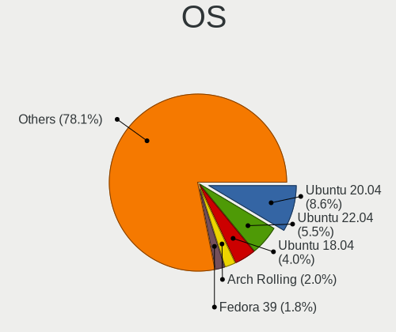

| Name                   | Notebooks | Percent |
|------------------------|-----------|---------|
| Ubuntu 20.04           | 133       | 13.84%  |
| Ubuntu 18.04           | 65        | 6.76%   |
| BlackPanther 18.1      | 27        | 2.81%   |
| OpenMandriva 4.2       | 20        | 2.08%   |
| Pop!_OS 21.04          | 19        | 1.98%   |
| Ubuntu 21.10           | 18        | 1.87%   |
| ROSA R10               | 16        | 1.66%   |
| Endless 3.7.8          | 16        | 1.66%   |
| Zorin 15               | 15        | 1.56%   |
| Endless 3.9.5          | 15        | 1.56%   |
| Endless 3.9.1          | 15        | 1.56%   |
| KDE neon 20.04         | 14        | 1.46%   |
| Pop!_OS 20.04          | 12        | 1.25%   |
| Endless 3.8.6          | 12        | 1.25%   |
| Endless 3.8.0          | 12        | 1.25%   |
| Arch                   | 12        | 1.25%   |
| Manjaro                | 11        | 1.14%   |
| Ubuntu 20.10           | 10        | 1.04%   |
| Ubuntu 19.10           | 10        | 1.04%   |
| Fedora 35              | 10        | 1.04%   |
| Fedora 34              | 10        | 1.04%   |
| Endless 3.9.0          | 10        | 1.04%   |
| Ubuntu 22.04           | 9         | 0.94%   |
| Ubuntu 21.04           | 9         | 0.94%   |
| Ubuntu 19.04           | 9         | 0.94%   |
| Endless 3.9.3          | 9         | 0.94%   |
| Endless 3.9.2          | 9         | 0.94%   |
| Endless 3.8.7          | 9         | 0.94%   |
| Endless 3.5.8          | 9         | 0.94%   |
| Zorin 16               | 8         | 0.83%   |
| Ubuntu 16.04           | 8         | 0.83%   |
| Pop!_OS 20.10          | 8         | 0.83%   |
| Debian 11              | 8         | 0.83%   |
| Xubuntu 18.04          | 7         | 0.73%   |
| ROSA R9                | 7         | 0.73%   |
| Pop!_OS 21.10          | 7         | 0.73%   |
| OpenMandriva 4.3       | 7         | 0.73%   |
| Linux Mint 20.1        | 7         | 0.73%   |
| Linux Mint 19.3        | 7         | 0.73%   |
| Fedora 33              | 7         | 0.73%   |
| Fedora 32              | 7         | 0.73%   |
| Endless 3.9.4          | 7         | 0.73%   |
| Endless 3.7.6          | 7         | 0.73%   |
| Endless 3.7.3          | 7         | 0.73%   |
| Endless 3.6.4          | 7         | 0.73%   |
| Endless 3.6.2          | 7         | 0.73%   |
| Endless 3.5.7-nexthw1  | 7         | 0.73%   |
| Debian 10              | 7         | 0.73%   |
| Linux Mint 20.2        | 6         | 0.62%   |
| Endless 3.8.3          | 6         | 0.62%   |
| Endless 3.8.1          | 6         | 0.62%   |
| Endless 3.7.4          | 6         | 0.62%   |
| ArcoLinux Rolling      | 6         | 0.62%   |
| Arch Rolling           | 6         | 0.62%   |
| ROSA R8.1              | 5         | 0.52%   |
| ROSA R11               | 5         | 0.52%   |
| Linux Mint 20.3        | 5         | 0.52%   |
| Endless 3.7.5          | 5         | 0.52%   |
| Endless 3.6.1          | 5         | 0.52%   |
| Endless 3.3.19-nexthw1 | 5         | 0.52%   |

OS Family
---------

OS without a version

| Name         | Notebooks | Percent |
|--------------|-----------|---------|
| Ubuntu       | 268       | 30.63%  |
| Endless      | 199       | 22.74%  |
| Pop!_OS      | 45        | 5.14%   |
| Fedora       | 41        | 4.69%   |
| Linux Mint   | 36        | 4.11%   |
| ROSA         | 32        | 3.66%   |
| Manjaro      | 30        | 3.43%   |
| OpenMandriva | 28        | 3.2%    |
| BlackPanther | 28        | 3.2%    |
| Zorin        | 24        | 2.74%   |
| Arch         | 18        | 2.06%   |
| Debian       | 17        | 1.94%   |
| KDE neon     | 15        | 1.71%   |
| Xubuntu      | 12        | 1.37%   |
| Kubuntu      | 11        | 1.26%   |
| Kali         | 9         | 1.03%   |
| Clear Linux  | 8         | 0.91%   |
| ArcoLinux    | 7         | 0.8%    |
| Ubuntu MATE  | 6         | 0.69%   |
| openSUSE     | 6         | 0.69%   |
| Elementary   | 5         | 0.57%   |
| Peppermint   | 3         | 0.34%   |
| LMDE         | 3         | 0.34%   |
| Linux Lite   | 3         | 0.34%   |
| Gentoo       | 3         | 0.34%   |
| Garuda Linux | 3         | 0.34%   |
| RHEL         | 2         | 0.23%   |
| Q4OS         | 2         | 0.23%   |
| Lubuntu      | 2         | 0.23%   |
| EndeavourOS  | 2         | 0.23%   |
| Oracle Linux | 1         | 0.11%   |
| NixOS        | 1         | 0.11%   |
| MX           | 1         | 0.11%   |
| Mageia       | 1         | 0.11%   |
| LinuxFX      | 1         | 0.11%   |
| CryptoDATA   | 1         | 0.11%   |
| ArchLabs     | 1         | 0.11%   |

Kernel
------

Version of the Linux kernel

| Version                         | Notebooks | Percent |
|---------------------------------|-----------|---------|
| 5.8.0-14-generic                | 55        | 5.57%   |
| 5.4.0-42-generic                | 39        | 3.95%   |
| 5.4.0-19-generic                | 26        | 2.63%   |
| 5.3.0-28-generic                | 21        | 2.13%   |
| 5.10.14-desktop-1omv4002        | 20        | 2.03%   |
| 4.18.16-desktop-1bP             | 19        | 1.93%   |
| 4.18.0-15-generic               | 14        | 1.42%   |
| 5.3.0-23-generic                | 13        | 1.32%   |
| 5.0.0-25-generic                | 13        | 1.32%   |
| 5.0.0-20-generic                | 10        | 1.01%   |
| 4.15.0-15-generic               | 10        | 1.01%   |
| 5.3.0-46-generic                | 8         | 0.81%   |
| 5.13.0-7614-generic             | 8         | 0.81%   |
| 5.0.0-37-generic                | 8         | 0.81%   |
| 5.8.0-50-generic                | 7         | 0.71%   |
| 5.6.14-desktop-2bP              | 7         | 0.71%   |
| 5.4.0-56-generic                | 7         | 0.71%   |
| 5.4.0-54-generic                | 7         | 0.71%   |
| 5.4.0-40-generic                | 7         | 0.71%   |
| 5.4.0-26-generic                | 7         | 0.71%   |
| 5.3.0-51-generic                | 7         | 0.71%   |
| 5.3.0-19-generic                | 7         | 0.71%   |
| 5.3.0-12-generic                | 7         | 0.71%   |
| 5.16.7-desktop-1omv4003         | 7         | 0.71%   |
| 5.11.0-7620-generic             | 7         | 0.71%   |
| 5.0.0-7-generic                 | 7         | 0.71%   |
| 5.4.0-37-generic                | 6         | 0.61%   |
| 5.4.0-31-generic                | 6         | 0.61%   |
| 5.4.0-29-generic                | 6         | 0.61%   |
| 5.3.0-40-generic                | 6         | 0.61%   |
| 5.11.0-43-generic               | 6         | 0.61%   |
| 5.0.0-15-generic                | 6         | 0.61%   |
| 4.9.60-nrj-desktop-1rosa-x86_64 | 6         | 0.61%   |
| 4.13.0-32-generic               | 6         | 0.61%   |
| 5.8.0-7642-generic              | 5         | 0.51%   |
| 5.8.0-59-generic                | 5         | 0.51%   |
| 5.8.0-38-generic                | 5         | 0.51%   |
| 5.4.0-7634-generic              | 5         | 0.51%   |
| 5.4.0-73-generic                | 5         | 0.51%   |
| 5.4.0-66-generic                | 5         | 0.51%   |
| 5.4.0-52-generic                | 5         | 0.51%   |
| 5.4.0-47-generic                | 5         | 0.51%   |
| 5.4.0-39-generic                | 5         | 0.51%   |
| 5.3.0-53-generic                | 5         | 0.51%   |
| 5.13.0-7620-generic             | 5         | 0.51%   |
| 5.13.0-35-generic               | 5         | 0.51%   |
| 5.13.0-28-generic               | 5         | 0.51%   |
| 5.11.0-41-generic               | 5         | 0.51%   |
| 5.11.0-35-generic               | 5         | 0.51%   |
| 5.0.0-17-generic                | 5         | 0.51%   |
| 4.9.20-nrj-desktop-1rosa-x86_64 | 5         | 0.51%   |
| 5.8.0-55-generic                | 4         | 0.41%   |
| 5.8.0-41-generic                | 4         | 0.41%   |
| 5.4.0-91-generic                | 4         | 0.41%   |
| 5.4.0-90-generic                | 4         | 0.41%   |
| 5.4.0-58-generic                | 4         | 0.41%   |
| 5.4.0-48-generic                | 4         | 0.41%   |
| 5.4.0-45-generic                | 4         | 0.41%   |
| 5.4.0-28-generic                | 4         | 0.41%   |
| 5.3.0-42-generic                | 4         | 0.41%   |

Kernel Family
-------------

Linux kernel without a distro release

| Version | Notebooks | Percent |
|---------|-----------|---------|
| 5.4.0   | 190       | 20.17%  |
| 5.8.0   | 107       | 11.36%  |
| 5.3.0   | 87        | 9.24%   |
| 5.0.0   | 63        | 6.69%   |
| 4.15.0  | 58        | 6.16%   |
| 5.11.0  | 57        | 6.05%   |
| 5.13.0  | 45        | 4.78%   |
| 4.18.0  | 40        | 4.25%   |
| 5.10.14 | 21        | 2.23%   |
| 4.18.16 | 19        | 2.02%   |
| 5.10.0  | 14        | 1.49%   |
| 5.15.0  | 9         | 0.96%   |
| 5.6.14  | 8         | 0.85%   |
| 4.9.60  | 8         | 0.85%   |
| 4.9.20  | 8         | 0.85%   |
| 5.16.7  | 7         | 0.74%   |
| 4.13.0  | 7         | 0.74%   |
| 4.19.0  | 6         | 0.64%   |
| 4.9.76  | 5         | 0.53%   |
| 5.9.0   | 4         | 0.42%   |
| 5.15.8  | 4         | 0.42%   |
| 5.9.6   | 3         | 0.32%   |
| 5.9.16  | 3         | 0.32%   |
| 5.3.18  | 3         | 0.32%   |
| 5.17.0  | 3         | 0.32%   |
| 5.16.18 | 3         | 0.32%   |
| 5.15.32 | 3         | 0.32%   |
| 5.15.10 | 3         | 0.32%   |
| 5.1.15  | 3         | 0.32%   |
| 5.8.3   | 2         | 0.21%   |
| 5.8.18  | 2         | 0.21%   |
| 5.8.13  | 2         | 0.21%   |
| 5.7.8   | 2         | 0.21%   |
| 5.7.0   | 2         | 0.21%   |
| 5.6.7   | 2         | 0.21%   |
| 5.6.0   | 2         | 0.21%   |
| 5.4.18  | 2         | 0.21%   |
| 5.17.9  | 2         | 0.21%   |
| 5.17.1  | 2         | 0.21%   |
| 5.16.19 | 2         | 0.21%   |
| 5.16.0  | 2         | 0.21%   |
| 5.15.5  | 2         | 0.21%   |
| 5.15.4  | 2         | 0.21%   |
| 5.15.15 | 2         | 0.21%   |
| 5.15.11 | 2         | 0.21%   |
| 5.12.9  | 2         | 0.21%   |
| 5.12.11 | 2         | 0.21%   |
| 5.11.17 | 2         | 0.21%   |
| 5.11.11 | 2         | 0.21%   |
| 5.11.1  | 2         | 0.21%   |
| 4.9.95  | 2         | 0.21%   |
| 4.9.9   | 2         | 0.21%   |
| 4.9.124 | 2         | 0.21%   |
| 4.1.38  | 2         | 0.21%   |
| 5.9.14  | 1         | 0.11%   |
| 5.9.12  | 1         | 0.11%   |
| 5.9.11  | 1         | 0.11%   |
| 5.9.10  | 1         | 0.11%   |
| 5.9.1   | 1         | 0.11%   |
| 5.8.9   | 1         | 0.11%   |

Kernel Major Ver.
-----------------

Linux kernel major version

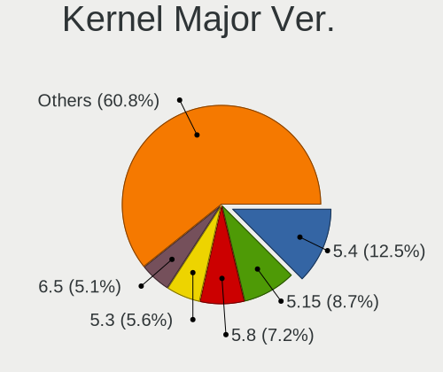

| Version | Notebooks | Percent |
|---------|-----------|---------|
| 5.4     | 196       | 20.87%  |
| 5.8     | 120       | 12.78%  |
| 5.3     | 94        | 10.01%  |
| 5.11    | 67        | 7.14%   |
| 5.0     | 65        | 6.92%   |
| 4.18    | 61        | 6.5%    |
| 4.15    | 58        | 6.18%   |
| 5.10    | 50        | 5.32%   |
| 5.13    | 49        | 5.22%   |
| 5.15    | 33        | 3.51%   |
| 4.9     | 27        | 2.88%   |
| 5.16    | 21        | 2.24%   |
| 5.6     | 16        | 1.7%    |
| 5.9     | 15        | 1.6%    |
| 5.17    | 11        | 1.17%   |
| 5.12    | 10        | 1.06%   |
| 5.14    | 7         | 0.75%   |
| 4.19    | 7         | 0.75%   |
| 4.13    | 7         | 0.75%   |
| 5.7     | 6         | 0.64%   |
| 5.5     | 5         | 0.53%   |
| 5.1     | 3         | 0.32%   |
| 4.1     | 3         | 0.32%   |
| 5.2     | 2         | 0.21%   |
| 4.12    | 2         | 0.21%   |
| 4.8     | 1         | 0.11%   |
| 4.17    | 1         | 0.11%   |
| 4.16    | 1         | 0.11%   |
| Unknown | 1         | 0.11%   |

Arch
----

OS architecture (x86_64, i586, etc.)

| Name   | Notebooks | Percent |
|--------|-----------|---------|
| x86_64 | 829       | 96.96%  |
| i686   | 26        | 3.04%   |

DE
--

Desktop Environment

| Name            | Notebooks | Percent |
|-----------------|-----------|---------|
| GNOME           | 461       | 52.39%  |
| Unknown         | 143       | 16.25%  |
| KDE5            | 110       | 12.5%   |
| XFCE            | 43        | 4.89%   |
| X-Cinnamon      | 26        | 2.95%   |
| KDE4            | 24        | 2.73%   |
| KDE             | 21        | 2.39%   |
| MATE            | 13        | 1.48%   |
| Unity           | 7         | 0.8%    |
| Cinnamon        | 6         | 0.68%   |
| LXDE            | 5         | 0.57%   |
| Pantheon        | 4         | 0.45%   |
| LXQt            | 4         | 0.45%   |
| i3              | 3         | 0.34%   |
| xmonad          | 2         | 0.23%   |
| GNOME Classic   | 2         | 0.23%   |
| sway            | 1         | 0.11%   |
| jwm             | 1         | 0.11%   |
| GNOME Flashback | 1         | 0.11%   |
| Deepin          | 1         | 0.11%   |
| Budgie          | 1         | 0.11%   |
| bspwm           | 1         | 0.11%   |

Display Server
--------------

X11 or Wayland

| Name    | Notebooks | Percent |
|---------|-----------|---------|
| X11     | 700       | 80.83%  |
| Unknown | 102       | 11.78%  |
| Wayland | 59        | 6.81%   |
| Tty     | 5         | 0.58%   |

Display Manager
---------------

SDDM, LightDM, etc.

| Name    | Notebooks | Percent |
|---------|-----------|---------|
| Unknown | 559       | 63.74%  |
| SDDM    | 102       | 11.63%  |
| GDM     | 90        | 10.26%  |
| GDM3    | 42        | 4.79%   |
| LightDM | 34        | 3.88%   |
| TDM     | 25        | 2.85%   |
| KDM     | 23        | 2.62%   |
| XDM     | 1         | 0.11%   |
| SLiM    | 1         | 0.11%   |

OS Lang
-------

Language

| Lang    | Notebooks | Percent |
|---------|-----------|---------|
| en_US   | 483       | 54.89%  |
| Unknown | 187       | 21.25%  |
| ro_RO   | 153       | 17.39%  |
| en_GB   | 16        | 1.82%   |
| C       | 13        | 1.48%   |
| it_IT   | 8         | 0.91%   |
| hu_HU   | 7         | 0.8%    |
| en_IL   | 3         | 0.34%   |
| es_ES   | 2         | 0.23%   |
| de_DE   | 2         | 0.23%   |
| fr_FR   | 1         | 0.11%   |
| fr_CH   | 1         | 0.11%   |
| en_IN   | 1         | 0.11%   |
| en_CA   | 1         | 0.11%   |
| en_001  | 1         | 0.11%   |
| C.UTF8  | 1         | 0.11%   |

Boot Mode
---------

EFI or BIOS

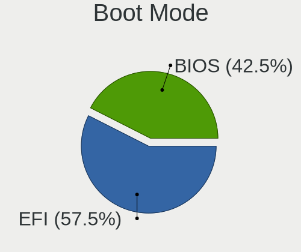

| Mode | Notebooks | Percent |
|------|-----------|---------|
| EFI  | 487       | 55.78%  |
| BIOS | 386       | 44.22%  |

Filesystem
----------

Type of filesystem

| Type    | Notebooks | Percent |
|---------|-----------|---------|
| Ext4    | 648       | 74.14%  |
| Unknown | 110       | 12.59%  |
| Overlay | 63        | 7.21%   |
| Btrfs   | 39        | 4.46%   |
| Tmpfs   | 6         | 0.69%   |
| Xfs     | 4         | 0.46%   |
| Zfs     | 2         | 0.23%   |
| Ext2    | 2         | 0.23%   |

Part. scheme
------------

Scheme of partitioning

| Type    | Notebooks | Percent |
|---------|-----------|---------|
| Unknown | 592       | 68.36%  |
| GPT     | 187       | 21.59%  |
| MBR     | 87        | 10.05%  |

Dual Boot with Linux/BSD
------------------------

Hosting more than one Linux/BSD

| Dual boot | Notebooks | Percent |
|-----------|-----------|---------|
| No        | 786       | 90.87%  |
| Yes       | 79        | 9.13%   |

Dual Boot (Win)
---------------

Hosting Linux and Windows

| Dual boot | Notebooks | Percent |
|-----------|-----------|---------|
| No        | 656       | 75.66%  |
| Yes       | 211       | 24.34%  |

Board
-----

Vendor
------

Motherboard manufacturer

| Name                           | Notebooks | Percent |
|--------------------------------|-----------|---------|
| ASUSTek Computer               | 260       | 30.44%  |
| Lenovo                         | 178       | 20.84%  |
| Dell                           | 112       | 13.11%  |
| Hewlett-Packard                | 109       | 12.76%  |
| Acer                           | 75        | 8.78%   |
| Toshiba                        | 21        | 2.46%   |
| MSI                            | 14        | 1.64%   |
| Sony                           | 10        | 1.17%   |
| Complet                        | 8         | 0.94%   |
| Fujitsu Siemens                | 7         | 0.82%   |
| Apple                          | 7         | 0.82%   |
| Medion                         | 6         | 0.7%    |
| Unknown                        | 5         | 0.59%   |
| Samsung Electronics            | 4         | 0.47%   |
| Fujitsu                        | 4         | 0.47%   |
| Packard Bell                   | 3         | 0.35%   |
| HUAWEI                         | 3         | 0.35%   |
| Chuwi                          | 3         | 0.35%   |
| Allview                        | 3         | 0.35%   |
| Alienware                      | 2         | 0.23%   |
| Visual Fan                     | 1         | 0.12%   |
| TUXEDO                         | 1         | 0.12%   |
| Timi                           | 1         | 0.12%   |
| Thomson                        | 1         | 0.12%   |
| Pegatron                       | 1         | 0.12%   |
| Panasonic                      | 1         | 0.12%   |
| Notebook                       | 1         | 0.12%   |
| nJoy Romania                   | 1         | 0.12%   |
| NEC Computers                  | 1         | 0.12%   |
| Mediacom                       | 1         | 0.12%   |
| Matsushita Electric Industrial | 1         | 0.12%   |
| Maguay                         | 1         | 0.12%   |
| LG Electronics                 | 1         | 0.12%   |
| IBM                            | 1         | 0.12%   |
| Hungaro Flotta Kft             | 1         | 0.12%   |
| Hampoo                         | 1         | 0.12%   |
| Gigabyte Technology            | 1         | 0.12%   |
| Dynabook                       | 1         | 0.12%   |
| Dream Machines                 | 1         | 0.12%   |
| AMI                            | 1         | 0.12%   |

Model
-----

Motherboard model

| Name                                       | Notebooks | Percent |
|--------------------------------------------|-----------|---------|
| ASUS X541NA                                | 17        | 1.99%   |
| ASUS VivoBook 15_ASUS Laptop X540MA_X543MA | 15        | 1.76%   |
| ASUS VivoBook 15_ASUS Laptop X540MA_X540MA | 10        | 1.17%   |
| ASUS VivoBook_ASUSLaptop X509FA_X509FA     | 9         | 1.05%   |
| Unknown                                    | 8         | 0.94%   |
| Lenovo Legion Y530-15ICH 81FV              | 6         | 0.7%    |
| Complet MY8312                             | 6         | 0.7%    |
| ASUS X406UAR                               | 6         | 0.7%    |
| ASUS VivoBook_ASUSLaptop X509FB_X509FB     | 6         | 0.7%    |
| Lenovo V330-15IKB 81AX                     | 5         | 0.59%   |
| ASUS X541UVK                               | 5         | 0.59%   |
| ASUS X541UAK                               | 5         | 0.59%   |
| ASUS VivoBook_ASUS Laptop X505ZA_A505ZA    | 5         | 0.59%   |
| ASUS VivoBook 15_ASUS Laptop X540UAR       | 5         | 0.59%   |
| ASUS VivoBook 15_ASUS Laptop X540MA_A540MA | 5         | 0.59%   |
| Lenovo IdeaPad 100-15IBD 80QQ              | 4         | 0.47%   |
| Lenovo G510 20238                          | 4         | 0.47%   |
| HP Notebook                                | 4         | 0.47%   |
| ASUS ZenBook UX431DA_UM431DA               | 4         | 0.47%   |
| ASUS X542UAR                               | 4         | 0.47%   |
| ASUS VivoBook_ASUSLaptop X530FA_S530FA     | 4         | 0.47%   |
| ASUS VivoBook_ASUSLaptop X513EA_K513EA     | 4         | 0.47%   |
| ASUS VivoBook_ASUSLaptop X512DA_X512DA     | 4         | 0.47%   |
| ASUS GL552JX                               | 4         | 0.47%   |
| Acer Aspire E1-531                         | 4         | 0.47%   |
| Acer Aspire A315-21G                       | 4         | 0.47%   |
| Lenovo V110-15ISK 80TL                     | 3         | 0.35%   |
| Lenovo ThinkPad E14 Gen 2 20TA002GRI       | 3         | 0.35%   |
| Lenovo IdeaPad L340-17API 81LY             | 3         | 0.35%   |
| Lenovo IdeaPad Gaming 3 15ARH05 82EY       | 3         | 0.35%   |
| Lenovo IdeaPad 330-15IKB 81DE              | 3         | 0.35%   |
| Lenovo IdeaPad 320-15ISK 80XH              | 3         | 0.35%   |
| Lenovo G50-70 20351                        | 3         | 0.35%   |
| HP Pavilion dv6                            | 3         | 0.35%   |
| Dell Latitude E7470                        | 3         | 0.35%   |
| Dell Latitude E6440                        | 3         | 0.35%   |
| Dell Inspiron 5558                         | 3         | 0.35%   |
| Dell Inspiron 3583                         | 3         | 0.35%   |
| Dell Inspiron 1564                         | 3         | 0.35%   |
| Dell Inspiron 1545                         | 3         | 0.35%   |
| ASUS X540SA                                | 3         | 0.35%   |
| ASUS VivoBook_ASUSLaptop X509FA_A509FA     | 3         | 0.35%   |
| ASUS VivoBook_ASUSLaptop X403FA_X403FA     | 3         | 0.35%   |
| ASUS UX550VE                               | 3         | 0.35%   |
| ASUS GL552VX                               | 3         | 0.35%   |
| ASUS ASUSPRO P2540FAC_P2540FA              | 3         | 0.35%   |
| Acer Aspire E5-573G                        | 3         | 0.35%   |
| Toshiba Satellite L50-B                    | 2         | 0.23%   |
| Toshiba Satellite C55-C                    | 2         | 0.23%   |
| Samsung 300V3Z/300V4Z/300V5Z/200A4Y/200A5Y | 2         | 0.23%   |
| MSI Modern 14 B4MW                         | 2         | 0.23%   |
| Lenovo IdeaPad S145-15IWL 81MV             | 2         | 0.23%   |
| Lenovo IdeaPad 530S-14ARR 81H1             | 2         | 0.23%   |
| Lenovo IdeaPad 520-15IKB 81BF              | 2         | 0.23%   |
| Lenovo IdeaPad 5 14IIL05 81YH              | 2         | 0.23%   |
| Lenovo IdeaPad 330S-14IKB 81F4             | 2         | 0.23%   |
| Lenovo IdeaPad 330-15IGM 81D1              | 2         | 0.23%   |
| Lenovo IdeaPad 3 15ADA05 81W1              | 2         | 0.23%   |
| Lenovo G70-70 80HW                         | 2         | 0.23%   |
| Lenovo G550 20023                          | 2         | 0.23%   |

Model Family
------------

Motherboard model prefix

| Name                    | Notebooks | Percent |
|-------------------------|-----------|---------|
| ASUS VivoBook           | 101       | 11.83%  |
| Lenovo IdeaPad          | 63        | 7.38%   |
| Lenovo ThinkPad         | 61        | 7.14%   |
| Acer Aspire             | 54        | 6.32%   |
| Dell Latitude           | 40        | 4.68%   |
| Dell Inspiron           | 36        | 4.22%   |
| HP EliteBook            | 23        | 2.69%   |
| HP ProBook              | 22        | 2.58%   |
| Toshiba Satellite       | 20        | 2.34%   |
| ASUS X541NA             | 17        | 1.99%   |
| Lenovo Legion           | 16        | 1.87%   |
| HP Laptop               | 13        | 1.52%   |
| HP Pavilion             | 11        | 1.29%   |
| Dell XPS                | 10        | 1.17%   |
| Dell Vostro             | 10        | 1.17%   |
| ASUS ASUS               | 10        | 1.17%   |
| ASUS TUF                | 9         | 1.05%   |
| ASUS ZenBook            | 8         | 0.94%   |
| ASUS ROG                | 8         | 0.94%   |
| Unknown                 | 8         | 0.94%   |
| Acer Extensa            | 7         | 0.82%   |
| Complet MY8312          | 6         | 0.7%    |
| ASUS X406UAR            | 6         | 0.7%    |
| Acer Swift              | 6         | 0.7%    |
| Lenovo V330-15IKB       | 5         | 0.59%   |
| HP ZBook                | 5         | 0.59%   |
| Dell System             | 5         | 0.59%   |
| ASUS X541UVK            | 5         | 0.59%   |
| ASUS X541UAK            | 5         | 0.59%   |
| Lenovo G510             | 4         | 0.47%   |
| HP Notebook             | 4         | 0.47%   |
| HP ENVY                 | 4         | 0.47%   |
| HP Compaq               | 4         | 0.47%   |
| Fujitsu Siemens ESPRIMO | 4         | 0.47%   |
| Fujitsu LIFEBOOK        | 4         | 0.47%   |
| ASUS X542UAR            | 4         | 0.47%   |
| ASUS GL552JX            | 4         | 0.47%   |
| Packard Bell EasyNote   | 3         | 0.35%   |
| MSI Modern              | 3         | 0.35%   |
| Lenovo V110-15ISK       | 3         | 0.35%   |
| Lenovo ThinkBook        | 3         | 0.35%   |
| Lenovo G50-70           | 3         | 0.35%   |
| HP OMEN                 | 3         | 0.35%   |
| HP 255                  | 3         | 0.35%   |
| HP 250                  | 3         | 0.35%   |
| Fujitsu Siemens AMILO   | 3         | 0.35%   |
| Dell Precision          | 3         | 0.35%   |
| Dell G3                 | 3         | 0.35%   |
| ASUS X540SA             | 3         | 0.35%   |
| ASUS UX550VE            | 3         | 0.35%   |
| ASUS GL552VX            | 3         | 0.35%   |
| ASUS ASUSPRO            | 3         | 0.35%   |
| Allview Allbook         | 3         | 0.35%   |
| Samsung 300V3Z          | 2         | 0.23%   |
| Lenovo G70-70           | 2         | 0.23%   |
| Lenovo G550             | 2         | 0.23%   |
| HP G62                  | 2         | 0.23%   |
| HP 15                   | 2         | 0.23%   |
| Dell G5                 | 2         | 0.23%   |
| Chuwi Hero              | 2         | 0.23%   |

MFG Year
--------

Motherboard manufacture year

| Year    | Notebooks | Percent |
|---------|-----------|---------|
| 2019    | 141       | 16.51%  |
| 2018    | 103       | 12.06%  |
| 2017    | 94        | 11.01%  |
| 2020    | 61        | 7.14%   |
| 2015    | 61        | 7.14%   |
| 2013    | 53        | 6.21%   |
| 2011    | 47        | 5.5%    |
| 2014    | 46        | 5.39%   |
| 2012    | 46        | 5.39%   |
| 2010    | 40        | 4.68%   |
| 2021    | 34        | 3.98%   |
| 2016    | 33        | 3.86%   |
| 2008    | 32        | 3.75%   |
| 2007    | 26        | 3.04%   |
| 2009    | 22        | 2.58%   |
| 2006    | 9         | 1.05%   |
| 2022    | 3         | 0.35%   |
| 2005    | 1         | 0.12%   |
| 2004    | 1         | 0.12%   |
| Unknown | 1         | 0.12%   |

Form Factor
-----------

Physical design of the computer

| Name     | Notebooks | Percent |
|----------|-----------|---------|
| Notebook | 854       | 100%    |

Secure Boot
-----------

Enabled or disabled

| State    | Notebooks | Percent |
|----------|-----------|---------|
| Disabled | 807       | 94.06%  |
| Enabled  | 51        | 5.94%   |

Coreboot
--------

Have coreboot on board

| Used | Notebooks | Percent |
|------|-----------|---------|
| No   | 854       | 100%    |

RAM Size
--------

Total RAM memory

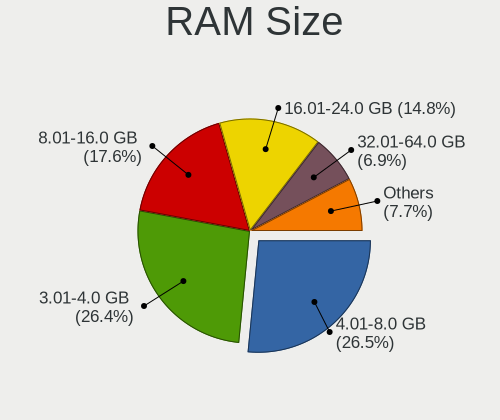

| Size in GB  | Notebooks | Percent |
|-------------|-----------|---------|
| 3.01-4.0    | 297       | 34.18%  |
| 4.01-8.0    | 238       | 27.39%  |
| 8.01-16.0   | 121       | 13.92%  |
| 16.01-24.0  | 117       | 13.46%  |
| 1.01-2.0    | 42        | 4.83%   |
| 32.01-64.0  | 27        | 3.11%   |
| 2.01-3.0    | 12        | 1.38%   |
| 0.51-1.0    | 8         | 0.92%   |
| 24.01-32.0  | 5         | 0.58%   |
| 64.01-256.0 | 2         | 0.23%   |

RAM Used
--------

Used RAM memory

| Used GB    | Notebooks | Percent |
|------------|-----------|---------|
| 1.01-2.0   | 396       | 41.47%  |
| 2.01-3.0   | 237       | 24.82%  |
| 0.51-1.0   | 108       | 11.31%  |
| 3.01-4.0   | 101       | 10.58%  |
| 4.01-8.0   | 80        | 8.38%   |
| 8.01-16.0  | 19        | 1.99%   |
| 0.01-0.5   | 13        | 1.36%   |
| 32.01-64.0 | 1         | 0.1%    |

Total Drives
------------

Number of drives on board

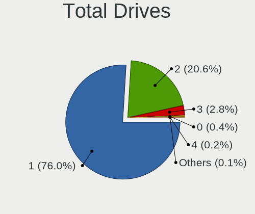

| Drives | Notebooks | Percent |
|--------|-----------|---------|
| 1      | 676       | 77.61%  |
| 2      | 170       | 19.52%  |
| 3      | 18        | 2.07%   |
| 0      | 5         | 0.57%   |
| 5      | 1         | 0.11%   |
| 4      | 1         | 0.11%   |

Has CD-ROM
----------

Has CD-ROM on board

| Presented | Notebooks | Percent |
|-----------|-----------|---------|
| No        | 510       | 59.37%  |
| Yes       | 349       | 40.63%  |

Has Ethernet
------------

Has Ethernet on board

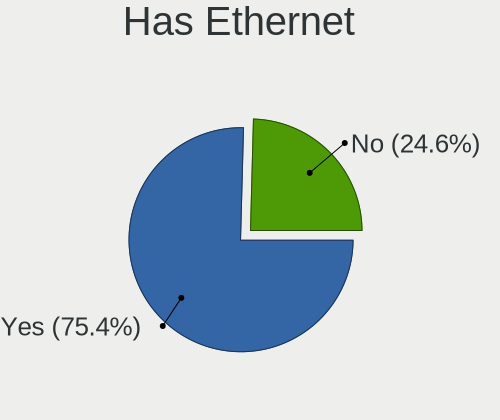

| Presented | Notebooks | Percent |
|-----------|-----------|---------|
| Yes       | 652       | 76.26%  |
| No        | 203       | 23.74%  |

Has WiFi
--------

Has WiFi module

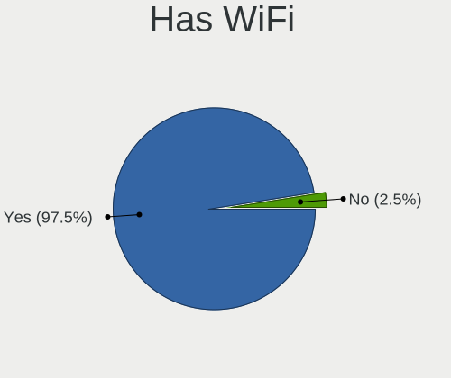

| Presented | Notebooks | Percent |
|-----------|-----------|---------|
| Yes       | 848       | 99.07%  |
| No        | 8         | 0.93%   |

Has Bluetooth
-------------

Has Bluetooth module

| Presented | Notebooks | Percent |
|-----------|-----------|---------|
| Yes       | 678       | 78.56%  |
| No        | 185       | 21.44%  |

Location
--------

Country
-------

Geographic location (country)

| Country | Notebooks | Percent |
|---------|-----------|---------|
| Romania | 854       | 100%    |

City
----

Geographic location (city)

| City                  | Notebooks | Percent |
|-----------------------|-----------|---------|
| Bucharest             | 281       | 30.74%  |
| Cluj-Napoca           | 59        | 6.46%   |
| Iasi                  | 45        | 4.92%   |
| Trgu Mure         | 30        | 3.28%   |
| Ploieti             | 28        | 3.06%   |
| Timioara            | 27        | 2.95%   |
| Brasov                | 26        | 2.84%   |
| Constana            | 18        | 1.97%   |
| Piteti              | 17        | 1.86%   |
| Sibiu                 | 12        | 1.31%   |
| Oradea                | 12        | 1.31%   |
| Popesti-Leordeni      | 11        | 1.2%    |
| Craiova               | 11        | 1.2%    |
| Voluntari             | 10        | 1.09%   |
| Arad                  | 10        | 1.09%   |
| Zalu                | 8         | 0.88%   |
| Baia Mare             | 8         | 0.88%   |
| Bacau                 | 8         | 0.88%   |
| Miercurea-Ciuc        | 7         | 0.77%   |
| Galati                | 7         | 0.77%   |
| Reia              | 6         | 0.66%   |
| Rmnicu Vlcea      | 6         | 0.66%   |
| Media               | 6         | 0.66%   |
| Deva                  | 6         | 0.66%   |
| Braila                | 6         | 0.66%   |
| Botosani              | 6         | 0.66%   |
| Tulcea                | 5         | 0.55%   |
| Targoviste            | 5         | 0.55%   |
| Iorcani               | 5         | 0.55%   |
| Focani              | 5         | 0.55%   |
| Floresti              | 5         | 0.55%   |
| Drobeta-Turnu Severin | 5         | 0.55%   |
| Alba Iulia            | 5         | 0.55%   |
| Trgu Jiu            | 4         | 0.44%   |
| Suceava               | 4         | 0.44%   |
| Slatina               | 4         | 0.44%   |
| Sfantu Gheorghe       | 4         | 0.44%   |
| Satu Mare             | 4         | 0.44%   |
| Roman                 | 4         | 0.44%   |
| Chiajna               | 4         | 0.44%   |
| Vaslui                | 3         | 0.33%   |
| Turda                 | 3         | 0.33%   |
| Tormac                | 3         | 0.33%   |
| Tecuci                | 3         | 0.33%   |
| Slobozia              | 3         | 0.33%   |
| Sighetu Marmaiei    | 3         | 0.33%   |
| Sector 1              | 3         | 0.33%   |
| Ramnicu Sarat         | 3         | 0.33%   |
| Odorheiu Secuiesc     | 3         | 0.33%   |
| Navodari              | 3         | 0.33%   |
| Caransebes            | 3         | 0.33%   |
| Buzau                 | 3         | 0.33%   |
| Bragadiru             | 3         | 0.33%   |
| Beiu                | 3         | 0.33%   |
| Zarnesti              | 2         | 0.22%   |
| Valenii de Munte      | 2         | 0.22%   |
| Valea Lupului         | 2         | 0.22%   |
| Targu Neamt           | 2         | 0.22%   |
| Stefanestii de Jos    | 2         | 0.22%   |
| Sector 6              | 2         | 0.22%   |

Drives
------

Drive Vendor
------------

Hard drive vendors

| Vendor                | Notebooks | Drives | Percent |
|-----------------------|-----------|--------|---------|
| Seagate               | 144       | 191    | 13.9%   |
| Samsung Electronics   | 124       | 150    | 11.97%  |
| WDC                   | 123       | 146    | 11.87%  |
| Toshiba               | 109       | 132    | 10.52%  |
| Kingston              | 109       | 138    | 10.52%  |
| SanDisk               | 60        | 65     | 5.79%   |
| SK Hynix              | 44        | 61     | 4.25%   |
| HGST                  | 44        | 51     | 4.25%   |
| Unknown               | 42        | 60     | 4.05%   |
| Intel                 | 41        | 54     | 3.96%   |
| A-DATA Technology     | 34        | 36     | 3.28%   |
| Micron Technology     | 28        | 32     | 2.7%    |
| Hitachi               | 24        | 27     | 2.32%   |
| Crucial               | 11        | 14     | 1.06%   |
| FORESEE               | 8         | 9      | 0.77%   |
| Phison                | 7         | 8      | 0.68%   |
| Patriot               | 7         | 7      | 0.68%   |
| Corsair               | 6         | 7      | 0.58%   |
| SPCC                  | 5         | 6      | 0.48%   |
| KIOXIA                | 5         | 5      | 0.48%   |
| Fujitsu               | 5         | 6      | 0.48%   |
| Realtek Semiconductor | 3         | 3      | 0.29%   |
| OCZ                   | 3         | 5      | 0.29%   |
| Netac                 | 3         | 5      | 0.29%   |
| LITEON                | 3         | 3      | 0.29%   |
| Gigabyte Technology   | 3         | 3      | 0.29%   |
| Apple                 | 3         | 3      | 0.29%   |
| Unknown               | 3         | 3      | 0.29%   |
| XPG                   | 2         | 3      | 0.19%   |
| Teclast               | 2         | 2      | 0.19%   |
| LITEONIT              | 2         | 2      | 0.19%   |
| Lite-On               | 2         | 2      | 0.19%   |
| Lenovo                | 2         | 2      | 0.19%   |
| KESU                  | 2         | 2      | 0.19%   |
| IBM/Hitachi           | 2         | 2      | 0.19%   |
| Hewlett-Packard       | 2         | 2      | 0.19%   |
| China                 | 2         | 2      | 0.19%   |
| W800S                 | 1         | 1      | 0.1%    |
| TO Exter              | 1         | 3      | 0.1%    |
| SSSTC                 | 1         | 1      | 0.1%    |
| sobetter              | 1         | 1      | 0.1%    |
| ShanDianZhe           | 1         | 1      | 0.1%    |
| PNY                   | 1         | 2      | 0.1%    |
| PLEXTOR               | 1         | 1      | 0.1%    |
| Mass                  | 1         | 1      | 0.1%    |
| Kingmax               | 1         | 1      | 0.1%    |
| HUAWEI                | 1         | 1      | 0.1%    |
| HGST HTS              | 1         | 1      | 0.1%    |
| GOODRAM               | 1         | 1      | 0.1%    |
| External              | 1         | 1      | 0.1%    |
| EMTEC                 | 1         | 1      | 0.1%    |
| ASUS-PHISON           | 1         | 2      | 0.1%    |
| ASMT                  | 1         | 1      | 0.1%    |
| Apacer                | 1         | 1      | 0.1%    |

Drive Model
-----------

Hard drive models

| Model                                 | Notebooks | Percent |
|---------------------------------------|-----------|---------|
| Toshiba MQ01ABF050 500GB              | 42        | 3.96%   |
| Seagate ST1000LM035-1RK172 1TB        | 37        | 3.49%   |
| Seagate ST500LT012-1DG142 500GB       | 25        | 2.36%   |
| Toshiba MQ04ABF100 1TB                | 21        | 1.98%   |
| Kingston SA400S37240G 240GB SSD       | 19        | 1.79%   |
| Sandisk NVMe SSD Drive 256GB          | 17        | 1.6%    |
| Samsung NVMe SSD Drive 512GB          | 17        | 1.6%    |
| HGST HTS721010A9E630 1TB              | 17        | 1.6%    |
| Unknown MMC Card  32GB                | 15        | 1.41%   |
| Sandisk NVMe SSD Drive 512GB          | 12        | 1.13%   |
| SK Hynix NVMe SSD Drive 512GB         | 11        | 1.04%   |
| Kingston SA400S37480G 480GB SSD       | 11        | 1.04%   |
| Intel NVMe SSD Drive 512GB            | 10        | 0.94%   |
| Seagate ST1000LM024 HN-M101MBB 1TB    | 9         | 0.85%   |
| Samsung NVMe SSD Drive 256GB          | 9         | 0.85%   |
| WDC WD10SPZX-21Z10T0 1TB              | 8         | 0.75%   |
| Kingston SV300S37A240G 240GB SSD      | 8         | 0.75%   |
| Kingston RBUSNS8180DS3256GJ 256GB SSD | 8         | 0.75%   |
| HGST HTS545050A7E680 500GB            | 8         | 0.75%   |
| WDC WD10JPCX-24UE4T0 1TB              | 7         | 0.66%   |
| Toshiba MQ01ABD100 1TB                | 7         | 0.66%   |
| Seagate ST9500325AS 500GB             | 7         | 0.66%   |
| Kingston SUV400S37120G 120GB SSD      | 7         | 0.66%   |
| Kingston RBUSC180DS37256GJ 256GB SSD  | 7         | 0.66%   |
| Intel SSDPEKKW256G7 256GB             | 7         | 0.66%   |
| HGST HTS541010A9E680 1TB              | 7         | 0.66%   |
| SK Hynix HFS256G39TND-N210A 256GB SSD | 6         | 0.57%   |
| Seagate ST2000LM007-1R8174 2TB        | 6         | 0.57%   |
| Seagate Expansion 4TB                 | 6         | 0.57%   |
| Samsung SSD 860 EVO 500GB             | 6         | 0.57%   |
| Micron 1100_MTFDDAV256TBN 256GB SSD   | 6         | 0.57%   |
| Kingston SA400S37120G 120GB SSD       | 6         | 0.57%   |
| FORESEE 256GB SSD                     | 6         | 0.57%   |
| Toshiba KBG30ZMS128G 128GB NVMe SSD   | 5         | 0.47%   |
| SK Hynix NVMe SSD Drive 256GB         | 5         | 0.47%   |
| SK Hynix HFM001TD3JX013N 1TB          | 5         | 0.47%   |
| Samsung SSD 850 EVO 250GB             | 5         | 0.47%   |
| Samsung NVMe SSD Drive 1024GB         | 5         | 0.47%   |
| A-DATA SU800 256GB SSD                | 5         | 0.47%   |
| WDC WD5000LPCX-24VHAT0 500GB          | 4         | 0.38%   |
| Unknown MMC Card  64GB                | 4         | 0.38%   |
| Unknown MMC Card  128GB               | 4         | 0.38%   |
| SPCC Solid State Disk 512GB           | 4         | 0.38%   |
| Seagate ST9750420AS 752GB             | 4         | 0.38%   |
| Seagate ST9500420AS 500GB             | 4         | 0.38%   |
| Seagate ST1000LX015-1U7172 1TB        | 4         | 0.38%   |
| Seagate ST1000LM049-2GH172 1TB        | 4         | 0.38%   |
| Samsung SSD 860 EVO 250GB             | 4         | 0.38%   |
| Samsung SSD 860 EVO 1TB               | 4         | 0.38%   |
| Samsung SSD 850 EVO 500GB             | 4         | 0.38%   |
| Samsung MZALQ512HALU-000L1 512GB      | 4         | 0.38%   |
| Patriot Burst 120GB SSD               | 4         | 0.38%   |
| Micron NVMe SSD Drive 512GB           | 4         | 0.38%   |
| Micron 2210_MTFDHBA512QFD 512GB       | 4         | 0.38%   |
| Kingston SV300S37A120G 120GB SSD      | 4         | 0.38%   |
| Kingston SUV500240G 240GB SSD         | 4         | 0.38%   |
| Hitachi HTS545050A7E380 500GB         | 4         | 0.38%   |
| Hitachi HTS543225L9A300 250GB         | 4         | 0.38%   |
| A-DATA SU630 240GB SSD                | 4         | 0.38%   |
| WDC WDS500G2B0A-00SM50 500GB SSD      | 3         | 0.28%   |

HDD Vendor
----------

Hard disk drive vendors

| Vendor              | Notebooks | Drives | Percent |
|---------------------|-----------|--------|---------|
| Seagate             | 144       | 191    | 34.87%  |
| WDC                 | 95        | 114    | 23%     |
| Toshiba             | 91        | 113    | 22.03%  |
| HGST                | 44        | 51     | 10.65%  |
| Hitachi             | 24        | 27     | 5.81%   |
| Fujitsu             | 5         | 6      | 1.21%   |
| Samsung Electronics | 3         | 3      | 0.73%   |
| Unknown             | 2         | 2      | 0.48%   |
| IBM/Hitachi         | 2         | 2      | 0.48%   |
| HGST HTS            | 1         | 1      | 0.24%   |
| ASMT                | 1         | 1      | 0.24%   |
| Apple               | 1         | 1      | 0.24%   |

SSD Vendor
----------

Solid state drive vendors

| Vendor              | Notebooks | Drives | Percent |
|---------------------|-----------|--------|---------|
| Kingston            | 92        | 120    | 27.88%  |
| Samsung Electronics | 59        | 75     | 17.88%  |
| A-DATA Technology   | 30        | 32     | 9.09%   |
| SanDisk             | 26        | 28     | 7.88%   |
| SK Hynix            | 15        | 21     | 4.55%   |
| Micron Technology   | 14        | 15     | 4.24%   |
| Intel               | 12        | 13     | 3.64%   |
| Crucial             | 11        | 14     | 3.33%   |
| WDC                 | 8         | 8      | 2.42%   |
| FORESEE             | 8         | 9      | 2.42%   |
| Toshiba             | 6         | 6      | 1.82%   |
| Patriot             | 6         | 6      | 1.82%   |
| SPCC                | 5         | 6      | 1.52%   |
| Corsair             | 5         | 6      | 1.52%   |
| OCZ                 | 3         | 5      | 0.91%   |
| Netac               | 3         | 5      | 0.91%   |
| LITEON              | 3         | 3      | 0.91%   |
| Gigabyte Technology | 3         | 3      | 0.91%   |
| Teclast             | 2         | 2      | 0.61%   |
| LITEONIT            | 2         | 2      | 0.61%   |
| Lite-On             | 2         | 2      | 0.61%   |
| Hewlett-Packard     | 2         | 2      | 0.61%   |
| China               | 2         | 2      | 0.61%   |
| W800S               | 1         | 1      | 0.3%    |
| Unknown             | 1         | 1      | 0.3%    |
| TO Exter            | 1         | 3      | 0.3%    |
| PNY                 | 1         | 2      | 0.3%    |
| Kingmax             | 1         | 1      | 0.3%    |
| GOODRAM             | 1         | 1      | 0.3%    |
| External            | 1         | 1      | 0.3%    |
| EMTEC               | 1         | 1      | 0.3%    |
| ASUS-PHISON         | 1         | 2      | 0.3%    |
| Apacer              | 1         | 1      | 0.3%    |
| Unknown             | 1         | 1      | 0.3%    |

Drive Kind
----------

HDD or SSD

| Kind    | Notebooks | Drives | Percent |
|---------|-----------|--------|---------|
| HDD     | 404       | 512    | 40.48%  |
| SSD     | 314       | 400    | 31.46%  |
| NVMe    | 234       | 292    | 23.45%  |
| MMC     | 37        | 55     | 3.71%   |
| Unknown | 9         | 11     | 0.9%    |

Drive Connector
---------------

SATA, SAS, NVMe, etc.

| Type | Notebooks | Drives | Percent |
|------|-----------|--------|---------|
| SATA | 638       | 888    | 68.02%  |
| NVMe | 234       | 292    | 24.95%  |
| MMC  | 37        | 55     | 3.94%   |
| SAS  | 29        | 35     | 3.09%   |

Drive Size
----------

Size of hard drive

| Size in TB | Notebooks | Drives | Percent |
|------------|-----------|--------|---------|
| 0.01-0.5   | 465       | 614    | 66.33%  |
| 0.51-1.0   | 211       | 256    | 30.1%   |
| 1.01-2.0   | 19        | 34     | 2.71%   |
| 3.01-4.0   | 6         | 8      | 0.86%   |

Space Total
-----------

Amount of disk space available on the file system

| Size in GB     | Notebooks | Percent |
|----------------|-----------|---------|
| 101-250        | 269       | 29.96%  |
| 251-500        | 230       | 25.61%  |
| 501-1000       | 144       | 16.04%  |
| 1-20           | 71        | 7.91%   |
| 51-100         | 58        | 6.46%   |
| 21-50          | 48        | 5.35%   |
| 1001-2000      | 33        | 3.67%   |
| Unknown        | 28        | 3.12%   |
| 2001-3000      | 12        | 1.34%   |
| More than 3000 | 5         | 0.56%   |

Space Used
----------

Amount of used disk space

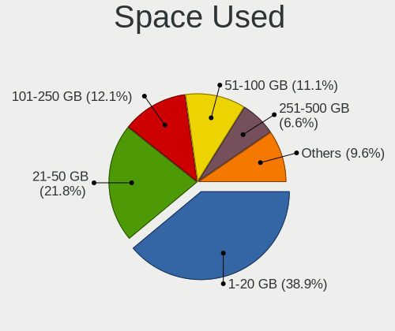

| Used GB        | Notebooks | Percent |
|----------------|-----------|---------|
| 1-20           | 373       | 40.19%  |
| 21-50          | 237       | 25.54%  |
| 101-250        | 106       | 11.42%  |
| 51-100         | 93        | 10.02%  |
| 251-500        | 46        | 4.96%   |
| 501-1000       | 29        | 3.13%   |
| Unknown        | 28        | 3.02%   |
| 1001-2000      | 15        | 1.62%   |
| More than 3000 | 1         | 0.11%   |

Malfunc. Drives
---------------

Drive models with a malfunction

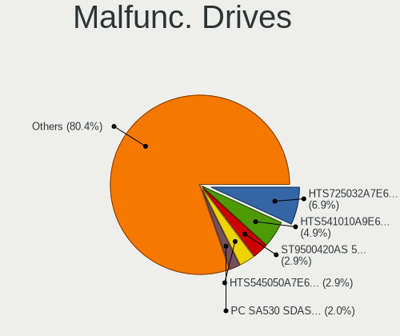

| Model                                            | Notebooks | Drives | Percent |
|--------------------------------------------------|-----------|--------|---------|
| HGST HTS541010A9E680 1TB                         | 4         | 4      | 7.02%   |
| Seagate ST9500420AS 500GB                        | 3         | 3      | 5.26%   |
| Seagate ST95005620AS 500GB                       | 2         | 5      | 3.51%   |
| Seagate ST9500325AS 500GB                        | 2         | 2      | 3.51%   |
| Seagate ST500LT012-1DG142 500GB                  | 2         | 3      | 3.51%   |
| Hitachi HTS545016B9A300 160GB                    | 2         | 2      | 3.51%   |
| HGST HTS725050A7E630 500GB                       | 2         | 2      | 3.51%   |
| WDC WD7500BPVT-60HXZT3 752GB                     | 1         | 2      | 1.75%   |
| WDC WD7500BPVT-22HXZT3 752GB                     | 1         | 1      | 1.75%   |
| WDC WD5000BPKT-60PK4T0 500GB                     | 1         | 2      | 1.75%   |
| WDC WD5000BEVT-60A0RT0 500GB                     | 1         | 1      | 1.75%   |
| WDC WD3200BPVT-22JJ5T0 320GB                     | 1         | 1      | 1.75%   |
| WDC WD1600BEVS-07RST0 160GB                      | 1         | 1      | 1.75%   |
| WDC WD10JPVX-22JC3T0 1TB                         | 1         | 1      | 1.75%   |
| Toshiba MQ04ABF100 1TB                           | 1         | 1      | 1.75%   |
| Toshiba MQ01ABF050 500GB                         | 1         | 1      | 1.75%   |
| Toshiba MQ01ABD100 1TB                           | 1         | 1      | 1.75%   |
| Toshiba MK6476GSX 640GB                          | 1         | 1      | 1.75%   |
| Toshiba MK5076GSX 500GB                          | 1         | 1      | 1.75%   |
| Toshiba MK3252GSX 320GB                          | 1         | 2      | 1.75%   |
| Toshiba MK2556GSY 250GB                          | 1         | 1      | 1.75%   |
| Toshiba MK2035GSS 200GB                          | 1         | 1      | 1.75%   |
| Teclast 360GB A850 SSD                           | 1         | 1      | 1.75%   |
| SK Hynix SC210 2.5 7MM 256GB SSD                 | 1         | 1      | 1.75%   |
| SK Hynix HFS128G39TND-N210A 128GB SSD            | 1         | 1      | 1.75%   |
| Seagate ST9250320AS 250GB                        | 1         | 1      | 1.75%   |
| Seagate ST9160821AS 160GB                        | 1         | 1      | 1.75%   |
| Seagate ST500LM000-1EJ162 500GB                  | 1         | 2      | 1.75%   |
| Seagate ST1000LX015-1U7172 1TB                   | 1         | 1      | 1.75%   |
| Seagate ST1000LM014-1EJ164 1TB                   | 1         | 1      | 1.75%   |
| SanDisk SSD PLUS 240GB                           | 1         | 1      | 1.75%   |
| Samsung Electronics MZMPA128HMFU-000H1 128GB SSD | 1         | 1      | 1.75%   |
| Patriot P200 256GB SSD                           | 1         | 1      | 1.75%   |
| Micron Technology 1100_MTFDDAV512TBN 512GB SSD   | 1         | 1      | 1.75%   |
| LITEONIT LAT-256M2S 256GB SSD                    | 1         | 1      | 1.75%   |
| Kingston SUV400S37120G 120GB SSD                 | 1         | 1      | 1.75%   |
| Hitachi HTS725025A9A364 250GB                    | 1         | 1      | 1.75%   |
| Hitachi HTS721060G9SA00 64GB                     | 1         | 1      | 1.75%   |
| Hitachi HTS547575A9E384 752GB                    | 1         | 1      | 1.75%   |
| Hitachi HTS545050A7E380 500GB                    | 1         | 1      | 1.75%   |
| Hitachi HTS545025B9A300 250GB                    | 1         | 1      | 1.75%   |
| Hitachi HTS543225L9A300 250GB                    | 1         | 1      | 1.75%   |
| HGST HTS721010A9E630 1TB                         | 1         | 1      | 1.75%   |
| HGST HTS545050A7E680 500GB                       | 1         | 1      | 1.75%   |
| HGST HTS541075A9E680 752GB                       | 1         | 1      | 1.75%   |
| Fujitsu MHZ2320BH G2 320GB                       | 1         | 1      | 1.75%   |
| Fujitsu MHY2080BH 80GB                           | 1         | 1      | 1.75%   |

Malfunc. Drive Vendor
---------------------

Vendors of faulty drives

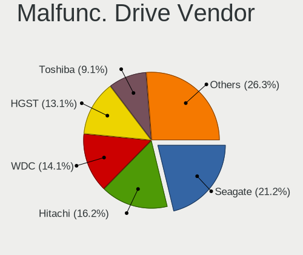

| Vendor              | Notebooks | Drives | Percent |
|---------------------|-----------|--------|---------|
| Seagate             | 14        | 19     | 25.45%  |
| HGST                | 9         | 9      | 16.36%  |
| Toshiba             | 8         | 9      | 14.55%  |
| WDC                 | 7         | 9      | 12.73%  |
| Hitachi             | 6         | 8      | 10.91%  |
| SK Hynix            | 2         | 2      | 3.64%   |
| Fujitsu             | 2         | 2      | 3.64%   |
| Teclast             | 1         | 1      | 1.82%   |
| SanDisk             | 1         | 1      | 1.82%   |
| Samsung Electronics | 1         | 1      | 1.82%   |
| Patriot             | 1         | 1      | 1.82%   |
| Micron Technology   | 1         | 1      | 1.82%   |
| LITEONIT            | 1         | 1      | 1.82%   |
| Kingston            | 1         | 1      | 1.82%   |

Malfunc. HDD Vendor
-------------------

Vendors of faulty HDD drives

| Vendor  | Notebooks | Drives | Percent |
|---------|-----------|--------|---------|
| Seagate | 14        | 19     | 30.43%  |
| HGST    | 9         | 9      | 19.57%  |
| Toshiba | 8         | 9      | 17.39%  |
| WDC     | 7         | 9      | 15.22%  |
| Hitachi | 6         | 8      | 13.04%  |
| Fujitsu | 2         | 2      | 4.35%   |

Malfunc. Drive Kind
-------------------

Kinds of faulty drives

| Kind | Notebooks | Drives | Percent |
|------|-----------|--------|---------|
| HDD  | 46        | 56     | 83.64%  |
| SSD  | 9         | 9      | 16.36%  |

Failed Drives
-------------

Failed drive models

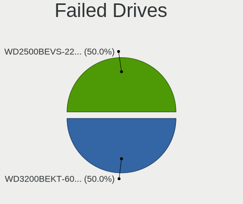

| Model                       | Notebooks | Drives | Percent |
|-----------------------------|-----------|--------|---------|
| WDC WD2500BEVS-22UST0 250GB | 1         | 1      | 100%    |

Failed Drive Vendor
-------------------

Failed drive vendors

| Vendor | Notebooks | Drives | Percent |
|--------|-----------|--------|---------|
| WDC    | 1         | 1      | 100%    |

Drive Status
------------

Number of failed and malfunc. drives

| Status   | Notebooks | Drives | Percent |
|----------|-----------|--------|---------|
| Detected | 611       | 895    | 67.89%  |
| Works    | 233       | 309    | 25.89%  |
| Malfunc  | 55        | 65     | 6.11%   |
| Failed   | 1         | 1      | 0.11%   |

Storage controller
------------------

Storage Vendor
--------------

Storage controller vendors

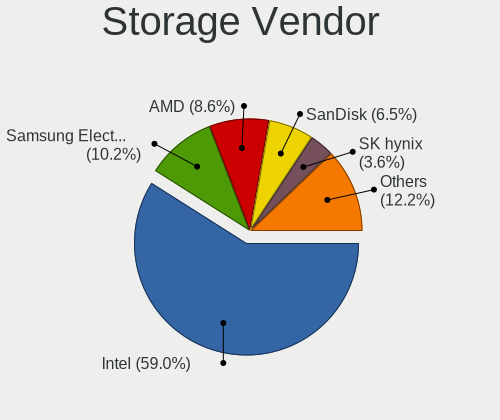

| Vendor                           | Notebooks | Percent |
|----------------------------------|-----------|---------|
| Intel                            | 692       | 68.86%  |
| AMD                              | 83        | 8.26%   |
| Samsung Electronics              | 68        | 6.77%   |
| Sandisk                          | 50        | 4.98%   |
| SK Hynix                         | 29        | 2.89%   |
| Kingston Technology Company      | 18        | 1.79%   |
| Micron Technology                | 14        | 1.39%   |
| Toshiba America Info Systems     | 10        | 1%      |
| KIOXIA                           | 9         | 0.9%    |
| Realtek Semiconductor            | 6         | 0.6%    |
| Phison Electronics               | 6         | 0.6%    |
| ADATA Technology                 | 5         | 0.5%    |
| Silicon Integrated Systems [SiS] | 4         | 0.4%    |
| Nvidia                           | 2         | 0.2%    |
| Lenovo                           | 2         | 0.2%    |
| JMicron Technology               | 2         | 0.2%    |
| VIA Technologies                 | 1         | 0.1%    |
| Solid State Storage Technology   | 1         | 0.1%    |
| Silicon Motion                   | 1         | 0.1%    |
| Silicon Image                    | 1         | 0.1%    |
| Lite-On Technology               | 1         | 0.1%    |

Storage Model
-------------

Storage controller models

| Model                                                                            | Notebooks | Percent |
|----------------------------------------------------------------------------------|-----------|---------|
| Intel Sunrise Point-LP SATA Controller [AHCI mode]                               | 86        | 7.89%   |
| Intel 82801 Mobile SATA Controller [RAID mode]                                   | 73        | 6.7%    |
| AMD FCH SATA Controller [AHCI mode]                                              | 70        | 6.42%   |
| Intel Celeron/Pentium Silver Processor SATA Controller                           | 47        | 4.31%   |
| Intel 7 Series Chipset Family 6-port SATA Controller [AHCI mode]                 | 47        | 4.31%   |
| Intel 8 Series SATA Controller 1 [AHCI mode]                                     | 42        | 3.85%   |
| Intel 6 Series/C200 Series Chipset Family 6 port Mobile SATA AHCI Controller     | 39        | 3.58%   |
| Intel Cannon Lake Mobile PCH SATA AHCI Controller                                | 38        | 3.49%   |
| Samsung NVMe SSD Controller SM981/PM981/PM983                                    | 37        | 3.39%   |
| Intel Celeron N3350/Pentium N4200/Atom E3900 Series SATA AHCI Controller         | 34        | 3.12%   |
| Intel 8 Series/C220 Series Chipset Family 6-port SATA Controller 1 [AHCI mode]   | 30        | 2.75%   |
| Intel Wildcat Point-LP SATA Controller [AHCI Mode]                               | 29        | 2.66%   |
| Intel 82801IBM/IEM (ICH9M/ICH9M-E) 4 port SATA Controller [AHCI mode]            | 27        | 2.48%   |
| Intel HM170/QM170 Chipset SATA Controller [AHCI Mode]                            | 23        | 2.11%   |
| Intel 82801HM/HEM (ICH8M/ICH8M-E) IDE Controller                                 | 22        | 2.02%   |
| Intel 82801HM/HEM (ICH8M/ICH8M-E) SATA Controller [AHCI mode]                    | 20        | 1.83%   |
| Samsung NVMe SSD Controller 980                                                  | 19        | 1.74%   |
| Intel Volume Management Device NVMe RAID Controller                              | 19        | 1.74%   |
| Sandisk WD Blue SN500 / PC SN520 NVMe SSD                                        | 17        | 1.56%   |
| Intel 5 Series/3400 Series Chipset 6 port SATA AHCI Controller                   | 16        | 1.47%   |
| Intel 5 Series/3400 Series Chipset 4 port SATA AHCI Controller                   | 16        | 1.47%   |
| Intel SSD 660P Series                                                            | 15        | 1.38%   |
| SK Hynix Gold P31 SSD                                                            | 14        | 1.28%   |
| Micron Non-Volatile memory controller                                            | 14        | 1.28%   |
| Intel Cannon Point-LP SATA Controller [AHCI Mode]                                | 14        | 1.28%   |
| Intel Tiger Lake-LP SATA Controller [AHCI mode]                                  | 12        | 1.1%    |
| AMD SB7x0/SB8x0/SB9x0 SATA Controller [AHCI mode]                                | 11        | 1.01%   |
| Intel Comet Lake SATA AHCI Controller                                            | 10        | 0.92%   |
| Sandisk WD Blue SN550 NVMe SSD                                                   | 9         | 0.83%   |
| Samsung NVMe SSD Controller SM961/PM961/SM963                                    | 9         | 0.83%   |
| KIOXIA Non-Volatile memory controller                                            | 9         | 0.83%   |
| Intel 82801G (ICH7 Family) IDE Controller                                        | 9         | 0.83%   |
| Sandisk PC SN520 NVMe SSD                                                        | 8         | 0.73%   |
| Intel Atom/Celeron/Pentium Processor x5-E8000/J3xxx/N3xxx Series SATA Controller | 8         | 0.73%   |
| Intel 82801GBM/GHM (ICH7-M Family) SATA Controller [IDE mode]                    | 8         | 0.73%   |
| SK Hynix BC501 NVMe Solid State Drive                                            | 7         | 0.64%   |
| Sandisk Non-Volatile memory controller                                           | 7         | 0.64%   |
| Intel PROSet/Wireless WiFi Software extension                                    | 7         | 0.64%   |
| Kingston Company Company Non-Volatile memory controller                          | 6         | 0.55%   |
| Kingston Company A2000 NVMe SSD                                                  | 6         | 0.55%   |
| Intel NM10/ICH7 Family SATA Controller [AHCI mode]                               | 6         | 0.55%   |
| Intel Atom Processor E3800 Series SATA AHCI Controller                           | 6         | 0.55%   |
| Intel 82801GBM/GHM (ICH7-M Family) SATA Controller [AHCI mode]                   | 6         | 0.55%   |
| Intel 400 Series Chipset Family SATA AHCI Controller                             | 6         | 0.55%   |
| Intel SSD Pro 7600p/760p/E 6100p Series                                          | 5         | 0.46%   |
| Intel Ice Lake-LP SATA Controller [AHCI mode]                                    | 5         | 0.46%   |
| Intel 82801HM/HEM (ICH8M/ICH8M-E) SATA Controller [IDE mode]                     | 5         | 0.46%   |
| ADATA XPG SX8200 Pro PCIe Gen3x4 M.2 2280 Solid State Drive                      | 5         | 0.46%   |
| Toshiba America Info Systems XG6 NVMe SSD Controller                             | 4         | 0.37%   |
| Toshiba America Info Systems BG3 NVMe SSD Controller                             | 4         | 0.37%   |
| SK Hynix BC511                                                                   | 4         | 0.37%   |
| Silicon Integrated Systems [SiS] SATA Controller / IDE mode                      | 4         | 0.37%   |
| Silicon Integrated Systems [SiS] 5513 IDE Controller                             | 4         | 0.37%   |
| Sandisk WD Black SN750 / PC SN730 NVMe SSD                                       | 4         | 0.37%   |
| Sandisk WD Black 2018/SN750 / PC SN720 NVMe SSD                                  | 4         | 0.37%   |
| Realtek RTS5763DL NVMe SSD Controller                                            | 4         | 0.37%   |
| Phison E12 NVMe Controller                                                       | 4         | 0.37%   |
| Intel Q170/Q150/B150/H170/H110/Z170/CM236 Chipset SATA Controller [AHCI Mode]    | 4         | 0.37%   |
| Intel Mobile 4 Series Chipset PT IDER Controller                                 | 4         | 0.37%   |
| Intel 7 Series Chipset Family 4-port SATA Controller [IDE mode]                  | 4         | 0.37%   |

Storage Kind
------------

Kind of storage controller (IDE, SATA, NVMe, SAS, ...)

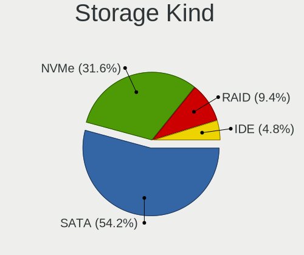

| Kind | Notebooks | Percent |
|------|-----------|---------|
| SATA | 657       | 62.33%  |
| NVMe | 237       | 22.49%  |
| RAID | 94        | 8.92%   |
| IDE  | 66        | 6.26%   |

Processor
---------

CPU Vendor
----------

Processor vendors

| Vendor | Notebooks | Percent |
|--------|-----------|---------|
| Intel  | 746       | 87.35%  |
| AMD    | 108       | 12.65%  |

CPU Model
---------

Processor models

| Model                                         | Notebooks | Percent |
|-----------------------------------------------|-----------|---------|
| Intel Celeron N4000 CPU @ 1.10GHz             | 35        | 4.09%   |
| Intel Core i5-8250U CPU @ 1.60GHz             | 24        | 2.81%   |
| Intel Celeron CPU N3350 @ 1.10GHz             | 24        | 2.81%   |
| Intel Core i7-8565U CPU @ 1.80GHz             | 21        | 2.46%   |
| Intel Core i7-9750H CPU @ 2.60GHz             | 18        | 2.11%   |
| Intel Core i3-8145U CPU @ 2.10GHz             | 17        | 1.99%   |
| AMD Ryzen 5 3500U with Radeon Vega Mobile Gfx | 15        | 1.75%   |
| Intel Core i7-8750H CPU @ 2.20GHz             | 14        | 1.64%   |
| Intel Core i7-7700HQ CPU @ 2.80GHz            | 14        | 1.64%   |
| Intel Core i7-8550U CPU @ 1.80GHz             | 12        | 1.4%    |
| Intel Core i5-8265U CPU @ 1.60GHz             | 12        | 1.4%    |
| Intel Core i5-5200U CPU @ 2.20GHz             | 12        | 1.4%    |
| Intel Core i7-4510U CPU @ 2.00GHz             | 11        | 1.29%   |
| Intel Core i7-6700HQ CPU @ 2.60GHz            | 10        | 1.17%   |
| Intel Pentium CPU N4200 @ 1.10GHz             | 9         | 1.05%   |
| Intel Core i5-1035G1 CPU @ 1.00GHz            | 9         | 1.05%   |
| Intel Core i3-7100U CPU @ 2.40GHz             | 9         | 1.05%   |
| Intel Core i3-6006U CPU @ 2.00GHz             | 9         | 1.05%   |
| Intel Core i3-4005U CPU @ 1.70GHz             | 9         | 1.05%   |
| Intel 11th Gen Core i7-1165G7 @ 2.80GHz       | 9         | 1.05%   |
| Intel Core i7-2670QM CPU @ 2.20GHz            | 8         | 0.94%   |
| Intel 11th Gen Core i3-1115G4 @ 3.00GHz       | 8         | 0.94%   |
| Intel Core i5-8300H CPU @ 2.30GHz             | 7         | 0.82%   |
| Intel Core i5-7200U CPU @ 2.50GHz             | 7         | 0.82%   |
| Intel Core i3-8130U CPU @ 2.20GHz             | 7         | 0.82%   |
| Intel Core i7-4720HQ CPU @ 2.60GHz            | 6         | 0.7%    |
| Intel Core i7-3630QM CPU @ 2.40GHz            | 6         | 0.7%    |
| Intel Core i5-5300U CPU @ 2.30GHz             | 6         | 0.7%    |
| Intel Core i5-2410M CPU @ 2.30GHz             | 6         | 0.7%    |
| Intel Core i5 CPU M 560 @ 2.67GHz             | 6         | 0.7%    |
| Intel Core i3-5005U CPU @ 2.00GHz             | 6         | 0.7%    |
| AMD Ryzen 5 2500U with Radeon Vega Mobile Gfx | 6         | 0.7%    |
| Intel Core i7-7500U CPU @ 2.70GHz             | 5         | 0.58%   |
| Intel Core i7-10510U CPU @ 1.80GHz            | 5         | 0.58%   |
| Intel Core i5-6200U CPU @ 2.30GHz             | 5         | 0.58%   |
| Intel Core i5-3230M CPU @ 2.60GHz             | 5         | 0.58%   |
| Intel Core i5-10210U CPU @ 1.60GHz            | 5         | 0.58%   |
| Intel Core i5 CPU M 430 @ 2.27GHz             | 5         | 0.58%   |
| Intel Core i3-7020U CPU @ 2.30GHz             | 5         | 0.58%   |
| Intel Core i3-4030U CPU @ 1.90GHz             | 5         | 0.58%   |
| Intel Core i3-2310M CPU @ 2.10GHz             | 5         | 0.58%   |
| Intel Celeron N4000C CPU @ 1.10GHz            | 5         | 0.58%   |
| AMD Ryzen 7 4800H with Radeon Graphics        | 5         | 0.58%   |
| AMD Ryzen 7 3700U with Radeon Vega Mobile Gfx | 5         | 0.58%   |
| AMD Ryzen 3 2200U with Radeon Vega Mobile Gfx | 5         | 0.58%   |
| Intel Pentium CPU B960 @ 2.20GHz              | 4         | 0.47%   |
| Intel Core i7-6500U CPU @ 2.50GHz             | 4         | 0.47%   |
| Intel Core i7-2630QM CPU @ 2.00GHz            | 4         | 0.47%   |
| Intel Core i7-10750H CPU @ 2.60GHz            | 4         | 0.47%   |
| Intel Core i7-1065G7 CPU @ 1.30GHz            | 4         | 0.47%   |
| Intel Core i5-6300U CPU @ 2.40GHz             | 4         | 0.47%   |
| Intel Core i5-4300U CPU @ 1.90GHz             | 4         | 0.47%   |
| Intel Core i5-4210U CPU @ 1.70GHz             | 4         | 0.47%   |
| Intel Core i5-3210M CPU @ 2.50GHz             | 4         | 0.47%   |
| Intel Core i5-2450M CPU @ 2.50GHz             | 4         | 0.47%   |
| Intel Core i5 CPU M 520 @ 2.40GHz             | 4         | 0.47%   |
| Intel Core i3-3120M CPU @ 2.50GHz             | 4         | 0.47%   |
| Intel Core 2 Duo CPU P8700 @ 2.53GHz          | 4         | 0.47%   |
| Intel Celeron CPU N3060 @ 1.60GHz             | 4         | 0.47%   |
| Intel 11th Gen Core i5-1135G7 @ 2.40GHz       | 4         | 0.47%   |

CPU Model Family
----------------

Processor model prefix

| Model                          | Notebooks | Percent |
|--------------------------------|-----------|---------|
| Intel Core i7                  | 211       | 24.68%  |
| Intel Core i5                  | 180       | 21.05%  |
| Intel Core i3                  | 108       | 12.63%  |
| Intel Celeron                  | 96        | 11.23%  |
| Intel Core 2 Duo               | 41        | 4.8%    |
| Other                          | 37        | 4.33%   |
| AMD Ryzen 5                    | 33        | 3.86%   |
| Intel Pentium                  | 30        | 3.51%   |
| AMD Ryzen 7                    | 23        | 2.69%   |
| Intel Atom                     | 14        | 1.64%   |
| Intel Pentium Dual-Core        | 7         | 0.82%   |
| Intel Core 2                   | 7         | 0.82%   |
| AMD Ryzen 3                    | 7         | 0.82%   |
| Intel Genuine                  | 5         | 0.58%   |
| AMD E                          | 5         | 0.58%   |
| Intel Pentium Dual             | 4         | 0.47%   |
| Intel Celeron M                | 4         | 0.47%   |
| AMD E2                         | 4         | 0.47%   |
| AMD Athlon                     | 4         | 0.47%   |
| AMD A4                         | 4         | 0.47%   |
| AMD A8                         | 3         | 0.35%   |
| Intel Core i9                  | 2         | 0.23%   |
| Intel Core Duo                 | 2         | 0.23%   |
| AMD V140                       | 2         | 0.23%   |
| AMD Turion X2 Dual-Core Mobile | 2         | 0.23%   |
| AMD Ryzen 9                    | 2         | 0.23%   |
| AMD Ryzen 7 PRO                | 2         | 0.23%   |
| AMD A10                        | 2         | 0.23%   |
| Intel Pentium M                | 1         | 0.12%   |
| Intel Mobile Pentium 4         | 1         | 0.12%   |
| Intel Core 2 Extreme           | 1         | 0.12%   |
| Intel Celeron Dual-Core        | 1         | 0.12%   |
| AMD Turion 64 X2 Mobile        | 1         | 0.12%   |
| AMD Turion 64 Mobile           | 1         | 0.12%   |
| AMD Phenom II                  | 1         | 0.12%   |
| AMD FX                         | 1         | 0.12%   |
| AMD E1                         | 1         | 0.12%   |
| AMD C-50                       | 1         | 0.12%   |
| AMD Athlon X2                  | 1         | 0.12%   |
| AMD Athlon II                  | 1         | 0.12%   |
| AMD A6                         | 1         | 0.12%   |
| AMD A12                        | 1         | 0.12%   |

CPU Cores
---------

Number of processor cores

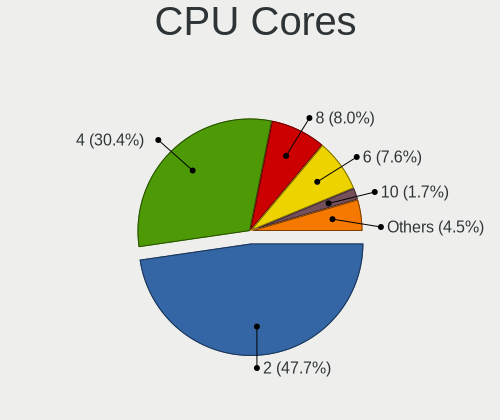

| Number | Notebooks | Percent |
|--------|-----------|---------|
| 2      | 481       | 56.32%  |
| 4      | 272       | 31.85%  |
| 6      | 53        | 6.21%   |
| 8      | 28        | 3.28%   |
| 1      | 20        | 2.34%   |

CPU Sockets
-----------

Number of sockets

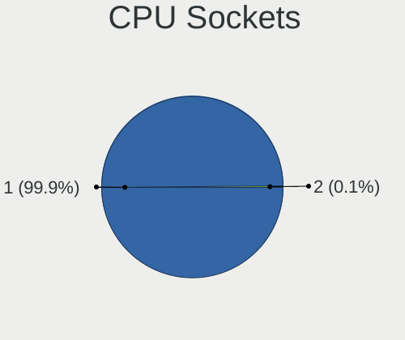

| Number | Notebooks | Percent |
|--------|-----------|---------|
| 1      | 854       | 100%    |

CPU Threads
-----------

Threads per core (Hyper-Threading)

| Number | Notebooks | Percent |
|--------|-----------|---------|
| 2      | 607       | 70.99%  |
| 1      | 248       | 29.01%  |

CPU Op-Modes
------------

CPU Operation Modes (32-bit, 64-bit)

| Op mode        | Notebooks | Percent |
|----------------|-----------|---------|
| 32-bit, 64-bit | 782       | 91.14%  |
| Unknown        | 65        | 7.58%   |
| 32-bit         | 11        | 1.28%   |

CPU Microcode
-------------

Microcode number

| Number     | Notebooks | Percent |
|------------|-----------|---------|
| Unknown    | 132       | 15.07%  |
| 0x806ec    | 46        | 5.25%   |
| 0x806ea    | 46        | 5.25%   |
| 0x206a7    | 46        | 5.25%   |
| 0x706a1    | 40        | 4.57%   |
| 0x306a9    | 40        | 4.57%   |
| 0x40651    | 35        | 4%      |
| 0x906ea    | 33        | 3.77%   |
| 0x506c9    | 29        | 3.31%   |
| 0x306c3    | 29        | 3.31%   |
| 0x806e9    | 24        | 2.74%   |
| 0x306d4    | 24        | 2.74%   |
| 0x20655    | 23        | 2.63%   |
| 0x1067a    | 23        | 2.63%   |
| 0x806c1    | 22        | 2.51%   |
| 0x406e3    | 21        | 2.4%    |
| 0x806eb    | 19        | 2.17%   |
| 0x906e9    | 17        | 1.94%   |
| 0x08108102 | 16        | 1.83%   |
| 0x706e5    | 14        | 1.6%    |
| 0x506e3    | 12        | 1.37%   |
| 0x10676    | 12        | 1.37%   |
| 0x6fd      | 11        | 1.26%   |
| 0x08108109 | 11        | 1.26%   |
| 0xa0652    | 10        | 1.14%   |
| 0x08600104 | 9         | 1.03%   |
| 0x906ed    | 8         | 0.91%   |
| 0x406c3    | 8         | 0.91%   |
| 0x406c4    | 7         | 0.8%    |
| 0x20652    | 6         | 0.68%   |
| 0x106ca    | 6         | 0.68%   |
| 0x0810100b | 6         | 0.68%   |
| 0x806d1    | 5         | 0.57%   |
| 0x6f6      | 5         | 0.57%   |
| 0x0a50000c | 5         | 0.57%   |
| 0x08101007 | 5         | 0.57%   |
| 0x06006704 | 5         | 0.57%   |
| 0x706a8    | 4         | 0.46%   |
| 0x6ec      | 4         | 0.46%   |
| 0x6e8      | 4         | 0.46%   |
| 0x30678    | 4         | 0.46%   |
| 0x08600106 | 4         | 0.46%   |
| 0x010000c8 | 4         | 0.46%   |
| 0x6fb      | 3         | 0.34%   |
| 0x6fa      | 3         | 0.34%   |
| 0x106e5    | 3         | 0.34%   |
| 0x06001119 | 3         | 0.34%   |
| 0x05000119 | 3         | 0.34%   |
| 0x106c2    | 2         | 0.23%   |
| 0x10661    | 2         | 0.23%   |
| 0x07030105 | 2         | 0.23%   |
| 0x0700010f | 2         | 0.23%   |
| 0x06006705 | 2         | 0.23%   |
| 0x05000029 | 2         | 0.23%   |
| 0xa0660    | 1         | 0.11%   |
| 0x6f2      | 1         | 0.11%   |
| 0x6d8      | 1         | 0.11%   |
| 0x30673    | 1         | 0.11%   |
| 0x30661    | 1         | 0.11%   |
| 0x0a50000b | 1         | 0.11%   |

CPU Microarch
-------------

Microarchitecture

| Name            | Notebooks | Percent |
|-----------------|-----------|---------|
| KabyLake        | 215       | 25.18%  |
| Haswell         | 78        | 9.13%   |
| SandyBridge     | 53        | 6.21%   |
| Goldmont plus   | 47        | 5.5%    |
| IvyBridge       | 45        | 5.27%   |
| Skylake         | 39        | 4.57%   |
| Penryn          | 36        | 4.22%   |
| Westmere        | 34        | 3.98%   |
| Goldmont        | 34        | 3.98%   |
| Zen+            | 33        | 3.86%   |
| Broadwell       | 32        | 3.75%   |
| Core            | 31        | 3.63%   |
| TigerLake       | 25        | 2.93%   |
| Silvermont      | 21        | 2.46%   |
| Icelake         | 20        | 2.34%   |
| Zen 2           | 16        | 1.87%   |
| Zen             | 12        | 1.41%   |
| CometLake       | 12        | 1.41%   |
| P6              | 9         | 1.05%   |
| Excavator       | 9         | 1.05%   |
| Bonnell         | 9         | 1.05%   |
| Zen 3           | 8         | 0.94%   |
| Bobcat          | 7         | 0.82%   |
| Puma            | 5         | 0.59%   |
| K10             | 4         | 0.47%   |
| Unknown         | 4         | 0.47%   |
| Piledriver      | 3         | 0.35%   |
| Nehalem         | 3         | 0.35%   |
| K8 & K10 hybrid | 3         | 0.35%   |
| K8 Hammer       | 2         | 0.23%   |
| Jaguar          | 2         | 0.23%   |
| Steamroller     | 1         | 0.12%   |
| NetBurst        | 1         | 0.12%   |
| K10 Llano       | 1         | 0.12%   |

Graphics
--------

GPU Vendor
----------

Vendors of graphics cards

| Vendor                           | Notebooks | Percent |
|----------------------------------|-----------|---------|
| Intel                            | 684       | 60.48%  |
| Nvidia                           | 261       | 23.08%  |
| AMD                              | 181       | 16%     |
| Silicon Integrated Systems [SiS] | 4         | 0.35%   |
| VIA Technologies                 | 1         | 0.09%   |

GPU Model
---------

Graphics card models

| Model                                                                                    | Notebooks | Percent |
|------------------------------------------------------------------------------------------|-----------|---------|
| Intel WhiskeyLake-U GT2 [UHD Graphics 620]                                               | 53        | 4.53%   |
| Intel 2nd Generation Core Processor Family Integrated Graphics Controller                | 48        | 4.11%   |
| Intel GeminiLake [UHD Graphics 600]                                                      | 47        | 4.02%   |
| Intel UHD Graphics 620                                                                   | 45        | 3.85%   |
| Intel Haswell-ULT Integrated Graphics Controller                                         | 45        | 3.85%   |
| Intel CoffeeLake-H GT2 [UHD Graphics 630]                                                | 42        | 3.59%   |
| Intel 3rd Gen Core processor Graphics Controller                                         | 41        | 3.51%   |
| AMD Picasso/Raven 2 [Radeon Vega Series / Radeon Vega Mobile Series]                     | 33        | 2.82%   |
| Intel 4th Gen Core Processor Integrated Graphics Controller                              | 32        | 2.74%   |
| Intel HD Graphics 5500                                                                   | 31        | 2.65%   |
| Intel Core Processor Integrated Graphics Controller                                      | 28        | 2.4%    |
| Intel HD Graphics 620                                                                    | 27        | 2.31%   |
| Intel HD Graphics 500                                                                    | 25        | 2.14%   |
| Intel Mobile 4 Series Chipset Integrated Graphics Controller                             | 20        | 1.71%   |
| Intel Skylake GT2 [HD Graphics 520]                                                      | 18        | 1.54%   |
| Intel TigerLake-LP GT2 [Iris Xe Graphics]                                                | 17        | 1.45%   |
| Intel Mobile GM965/GL960 Integrated Graphics Controller (secondary)                      | 16        | 1.37%   |
| Intel Mobile GM965/GL960 Integrated Graphics Controller (primary)                        | 16        | 1.37%   |
| Intel HD Graphics 630                                                                    | 16        | 1.37%   |
| Nvidia GF117M [GeForce 610M/710M/810M/820M / GT 620M/625M/630M/720M]                     | 15        | 1.28%   |
| Intel Atom/Celeron/Pentium Processor x5-E8000/J3xxx/N3xxx Integrated Graphics Controller | 15        | 1.28%   |
| AMD Renoir                                                                               | 15        | 1.28%   |
| Nvidia GP107M [GeForce GTX 1050 Ti Mobile]                                               | 14        | 1.2%    |
| Nvidia GM107M [GeForce GTX 950M]                                                         | 14        | 1.2%    |
| Intel CometLake-U GT2 [UHD Graphics]                                                     | 14        | 1.2%    |
| Nvidia TU117M [GeForce GTX 1650 Mobile / Max-Q]                                          | 13        | 1.11%   |
| Intel HD Graphics 530                                                                    | 13        | 1.11%   |
| Nvidia GK208BM [GeForce 920M]                                                            | 12        | 1.03%   |
| AMD Topaz XT [Radeon R7 M260/M265 / M340/M360 / M440/M445 / 530/535 / 620/625 Mobile]    | 12        | 1.03%   |
| AMD Raven Ridge [Radeon Vega Series / Radeon Vega Mobile Series]                         | 12        | 1.03%   |
| Intel Iris Plus Graphics G1 (Ice Lake)                                                   | 11        | 0.94%   |
| Nvidia GP108M [GeForce MX150]                                                            | 10        | 0.86%   |
| Nvidia GP107M [GeForce GTX 1050 Mobile]                                                  | 10        | 0.86%   |
| Nvidia GM108M [GeForce MX110]                                                            | 10        | 0.86%   |
| Intel Mobile 945GM/GMS/GME, 943/940GML Express Integrated Graphics Controller            | 10        | 0.86%   |
| AMD Jet PRO [Radeon R5 M230 / R7 M260DX / Radeon 520 Mobile]                             | 10        | 0.86%   |
| Intel CometLake-H GT2 [UHD Graphics]                                                     | 9         | 0.77%   |
| Intel Celeron N3350/Pentium N4200/Atom E3900 Series Integrated Graphics Controller       | 9         | 0.77%   |
| AMD Sun XT [Radeon HD 8670A/8670M/8690M / R5 M330 / M430 / Radeon 520 Mobile]            | 9         | 0.77%   |
| Nvidia TU106M [GeForce RTX 2060 Mobile]                                                  | 8         | 0.68%   |
| Nvidia GM108M [GeForce 840M]                                                             | 8         | 0.68%   |
| Intel Tiger Lake UHD Graphics                                                            | 8         | 0.68%   |
| AMD Stoney [Radeon R2/R3/R4/R5 Graphics]                                                 | 8         | 0.68%   |
| AMD Cezanne                                                                              | 8         | 0.68%   |
| Nvidia TU116M [GeForce GTX 1660 Ti Mobile]                                               | 7         | 0.6%    |
| Intel TigerLake-H GT1 [UHD Graphics]                                                     | 7         | 0.6%    |
| Intel Mobile 945GM/GMS, 943/940GML Express Integrated Graphics Controller                | 7         | 0.6%    |
| Nvidia TU117M [GeForce GTX 1650 Ti Mobile]                                               | 6         | 0.51%   |
| Nvidia GP106M [GeForce GTX 1060 Mobile]                                                  | 6         | 0.51%   |
| Nvidia GM108M [GeForce 920MX]                                                            | 6         | 0.51%   |
| Intel HD Graphics 520                                                                    | 6         | 0.51%   |
| Intel Atom Processor Z36xxx/Z37xxx Series Graphics & Display                             | 6         | 0.51%   |
| Nvidia GP108M [GeForce MX230]                                                            | 5         | 0.43%   |
| Nvidia GA104M [GeForce RTX 3080 Mobile / Max-Q 8GB/16GB]                                 | 5         | 0.43%   |
| Intel Atom Processor D4xx/D5xx/N4xx/N5xx Integrated Graphics Controller                  | 5         | 0.43%   |
| AMD Seymour [Radeon HD 6400M/7400M Series]                                               | 5         | 0.43%   |
| AMD RV620/M82 [Mobility Radeon HD 3450/3470]                                             | 5         | 0.43%   |
| Silicon Integrated Systems [SiS] 771/671 PCIE VGA Display Adapter                        | 4         | 0.34%   |
| Nvidia TU117M                                                                            | 4         | 0.34%   |
| Nvidia GM107M [GeForce GTX 960M]                                                         | 4         | 0.34%   |

GPU Combo
---------

Combinations of graphics cards

| Name           | Notebooks | Percent |
|----------------|-----------|---------|
| 1 x Intel      | 429       | 50.12%  |
| Intel + Nvidia | 205       | 23.95%  |
| 1 x AMD        | 98        | 11.45%  |
| Intel + AMD    | 51        | 5.96%   |
| 1 x Nvidia     | 36        | 4.21%   |
| AMD + Nvidia   | 20        | 2.34%   |
| 2 x AMD        | 12        | 1.4%    |
| 1 x SiS        | 4         | 0.47%   |
| 1 x VIA        | 1         | 0.12%   |

GPU Driver
----------

Free vs proprietary

| Driver      | Notebooks | Percent |
|-------------|-----------|---------|
| Free        | 689       | 80.3%   |
| Proprietary | 154       | 17.95%  |
| Unknown     | 15        | 1.75%   |

GPU Memory
----------

Total video memory

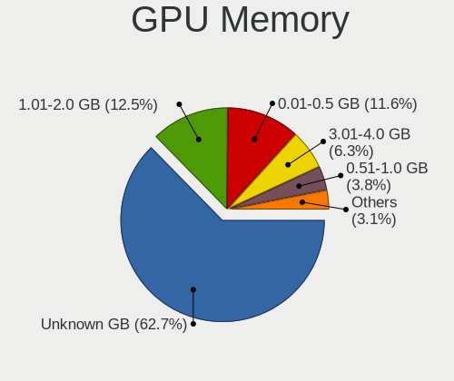

| Size in GB | Notebooks | Percent |
|------------|-----------|---------|
| Unknown    | 518       | 59.27%  |
| 1.01-2.0   | 130       | 14.87%  |
| 0.01-0.5   | 88        | 10.07%  |
| 3.01-4.0   | 76        | 8.7%    |
| 0.51-1.0   | 37        | 4.23%   |
| 5.01-6.0   | 17        | 1.95%   |
| 7.01-8.0   | 5         | 0.57%   |
| 2.01-3.0   | 3         | 0.34%   |

Monitor
-------

Monitor Vendor
--------------

Monitor vendors

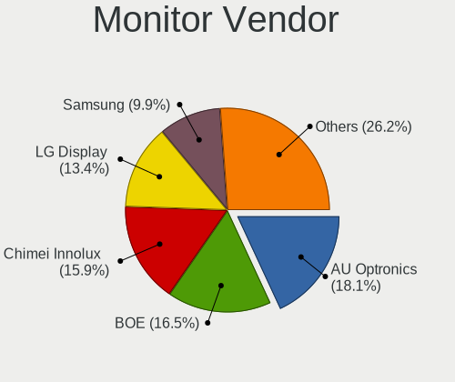

| Vendor                  | Notebooks | Percent |
|-------------------------|-----------|---------|
| AU Optronics            | 182       | 19.8%   |
| LG Display              | 149       | 16.21%  |
| Chimei Innolux          | 143       | 15.56%  |
| BOE                     | 140       | 15.23%  |
| Samsung Electronics     | 90        | 9.79%   |
| PANDA                   | 34        | 3.7%    |
| Chi Mei Optoelectronics | 29        | 3.16%   |
| Dell                    | 24        | 2.61%   |
| Sharp                   | 18        | 1.96%   |
| Lenovo                  | 16        | 1.74%   |
| LG Philips              | 10        | 1.09%   |
| Goldstar                | 9         | 0.98%   |
| Apple                   | 7         | 0.76%   |
| Acer                    | 7         | 0.76%   |
| BenQ                    | 6         | 0.65%   |
| InfoVision              | 5         | 0.54%   |
| Philips                 | 4         | 0.44%   |
| LGD                     | 4         | 0.44%   |
| Hewlett-Packard         | 4         | 0.44%   |
| Sony                    | 3         | 0.33%   |
| Lenovo Group Limited    | 3         | 0.33%   |
| Fujitsu Siemens         | 3         | 0.33%   |
| CPT                     | 3         | 0.33%   |
| AOC                     | 3         | 0.33%   |
| Vestel Elektronik       | 2         | 0.22%   |
| InnoLux Display         | 2         | 0.22%   |
| HannStar                | 2         | 0.22%   |
| ASUSTek Computer        | 2         | 0.22%   |
| Ancor Communications    | 2         | 0.22%   |
| Seiko/Epson             | 1         | 0.11%   |
| Quanta Display          | 1         | 0.11%   |
| Panasonic               | 1         | 0.11%   |
| Nvidia                  | 1         | 0.11%   |
| NAD                     | 1         | 0.11%   |
| MStar                   | 1         | 0.11%   |
| LG Electronics          | 1         | 0.11%   |
| KTC                     | 1         | 0.11%   |
| ITE                     | 1         | 0.11%   |
| Iiyama                  | 1         | 0.11%   |
| CSO                     | 1         | 0.11%   |
| CMN                     | 1         | 0.11%   |
| BOE Technology Group    | 1         | 0.11%   |

Monitor Model
-------------

Monitor models

| Model                                                                    | Notebooks | Percent |
|--------------------------------------------------------------------------|-----------|---------|
| BOE LCD Monitor BOE06A4 1366x768 344x194mm 15.5-inch                     | 25        | 2.7%    |
| AU Optronics LCD Monitor AUO70EC 1366x768 344x193mm 15.5-inch            | 21        | 2.27%   |
| AU Optronics LCD Monitor AUO38ED 1920x1080 344x193mm 15.5-inch           | 17        | 1.84%   |
| Chimei Innolux LCD Monitor CMN15F5 1920x1080 344x193mm 15.5-inch         | 16        | 1.73%   |
| AU Optronics LCD Monitor AUO61ED 1920x1080 344x194mm 15.5-inch           | 15        | 1.62%   |
| BOE LCD Monitor BOE069C 1920x1080 344x193mm 15.5-inch                    | 12        | 1.3%    |
| Chimei Innolux LCD Monitor CMN15DC 1366x768 340x190mm 15.3-inch          | 11        | 1.19%   |
| Chimei Innolux LCD Monitor CMN14D4 1920x1080 309x173mm 13.9-inch         | 10        | 1.08%   |
| LG Display LCD Monitor LGD033A 1366x768 344x194mm 15.5-inch              | 8         | 0.86%   |
| Chimei Innolux LCD Monitor CMN15CA 1366x768 344x193mm 15.5-inch          | 8         | 0.86%   |
| AU Optronics LCD Monitor AUO21ED 1920x1080 344x194mm 15.5-inch           | 8         | 0.86%   |
| Samsung Electronics LCD Monitor SEC5441 1366x768 309x174mm 14.0-inch     | 7         | 0.76%   |
| Chimei Innolux LCD Monitor CMN15DB 1366x768 344x193mm 15.5-inch          | 7         | 0.76%   |
| Chimei Innolux LCD Monitor CMN15D5 1920x1080 344x193mm 15.5-inch         | 7         | 0.76%   |
| Chimei Innolux LCD Monitor CMN15C4 1920x1080 344x193mm 15.5-inch         | 7         | 0.76%   |
| BOE LCD Monitor BOE06A5 1366x768 344x194mm 15.5-inch                     | 7         | 0.76%   |
| AU Optronics LCD Monitor AUO403D 1920x1080 309x174mm 14.0-inch           | 7         | 0.76%   |
| LG Display LCD Monitor LGD0563 1920x1080 344x194mm 15.5-inch             | 6         | 0.65%   |
| LG Display LCD Monitor LGD046F 1920x1080 344x194mm 15.5-inch             | 6         | 0.65%   |
| Chimei Innolux LCD Monitor CMN15E8 1920x1080 344x193mm 15.5-inch         | 6         | 0.65%   |
| Chimei Innolux LCD Monitor CMN15E6 1366x768 344x193mm 15.5-inch          | 6         | 0.65%   |
| BOE LCD Monitor BOE07F1 1920x1080 344x193mm 15.5-inch                    | 6         | 0.65%   |
| BOE LCD Monitor BOE0718 1920x1080 309x173mm 13.9-inch                    | 6         | 0.65%   |
| PANDA LCD Monitor NCP0035 1920x1080 309x174mm 14.0-inch                  | 5         | 0.54%   |
| LG Display LCD Monitor LGD02DC 1366x768 344x194mm 15.5-inch              | 5         | 0.54%   |
| Chimei Innolux LCD Monitor CMN15E7 1920x1080 344x193mm 15.5-inch         | 5         | 0.54%   |
| Chimei Innolux LCD Monitor CMN1482 1600x900 309x174mm 14.0-inch          | 5         | 0.54%   |
| AU Optronics LCD Monitor AUO45EC 1366x768 344x193mm 15.5-inch            | 5         | 0.54%   |
| AU Optronics LCD Monitor AUO20EC 1366x768 344x193mm 15.5-inch            | 5         | 0.54%   |
| Samsung Electronics LCD Monitor SEC324A 1366x768 344x194mm 15.5-inch     | 4         | 0.43%   |
| Samsung Electronics LCD Monitor SDC4852 1366x768 344x194mm 15.5-inch     | 4         | 0.43%   |
| PANDA LM156LF1L03 NCP001C 1920x1080 344x194mm 15.5-inch                  | 4         | 0.43%   |
| PANDA LCD Monitor NCP004D 1920x1080 344x194mm 15.5-inch                  | 4         | 0.43%   |
| PANDA LCD Monitor NCP0046 1920x1080 344x194mm 15.5-inch                  | 4         | 0.43%   |
| PANDA LCD Monitor NCP0036 1920x1080 344x194mm 15.5-inch                  | 4         | 0.43%   |
| PANDA LC133LF2L03 NCP0015 1920x1080 294x165mm 13.3-inch                  | 4         | 0.43%   |
| LG Display LCD Monitor LGD0590 1920x1080 344x194mm 15.5-inch             | 4         | 0.43%   |
| LG Display LCD Monitor LGD039F 1366x768 345x194mm 15.6-inch              | 4         | 0.43%   |
| LG Display LCD Monitor LGD038E 1366x768 344x194mm 15.5-inch              | 4         | 0.43%   |
| LG Display LCD Monitor LGD0266 1366x768 344x194mm 15.5-inch              | 4         | 0.43%   |
| Chimei Innolux LCD Monitor CMN1521 1920x1080 344x193mm 15.5-inch         | 4         | 0.43%   |
| Chi Mei Optoelectronics LCD Monitor CMO15A7 1366x768 344x193mm 15.5-inch | 4         | 0.43%   |
| Chi Mei Optoelectronics LCD Monitor CMO15A1 1366x768 344x193mm 15.5-inch | 4         | 0.43%   |
| BOE LCD Monitor BOE0700 1920x1080 344x194mm 15.5-inch                    | 4         | 0.43%   |
| BOE LCD Monitor BOE0675 1366x768 344x194mm 15.5-inch                     | 4         | 0.43%   |
| AU Optronics LCD Monitor AUO71EC 1366x768 344x193mm 15.5-inch            | 4         | 0.43%   |
| AU Optronics LCD Monitor AUO243D 1920x1080 309x173mm 13.9-inch           | 4         | 0.43%   |
| AU Optronics LCD Monitor AUO22EC 1366x768 344x193mm 15.5-inch            | 4         | 0.43%   |
| Samsung Electronics LCD Monitor SEC3945 1280x800 331x207mm 15.4-inch     | 3         | 0.32%   |
| Samsung Electronics LCD Monitor SDC4141 3840x2160 344x194mm 15.5-inch    | 3         | 0.32%   |
| LG Display LP156WH1-TLA3 LGD01C2 1366x768 344x194mm 15.5-inch            | 3         | 0.32%   |
| LG Display LCD Monitor LGD05EC 1920x1080 309x174mm 14.0-inch             | 3         | 0.32%   |
| LG Display LCD Monitor LGD05E5 1920x1080 344x194mm 15.5-inch             | 3         | 0.32%   |
| LG Display LCD Monitor LGD04E8 1920x1080 382x215mm 17.3-inch             | 3         | 0.32%   |
| LG Display LCD Monitor LGD0456 1366x768 344x194mm 15.5-inch              | 3         | 0.32%   |
| LG Display LCD Monitor LGD02EB 1366x768 309x174mm 14.0-inch              | 3         | 0.32%   |
| LG Display LCD Monitor LGD02AD 1366x768 344x194mm 15.5-inch              | 3         | 0.32%   |
| LG Display LCD Monitor LGD02AC 1366x768 344x194mm 15.5-inch              | 3         | 0.32%   |
| Dell P2417H DELA0DC 1920x1080 527x296mm 23.8-inch                        | 3         | 0.32%   |
| Chimei Innolux LCD Monitor CMN14D5 1920x1080 309x173mm 13.9-inch         | 3         | 0.32%   |

Monitor Resolution
------------------

Monitor screen resolution

| Resolution         | Notebooks | Percent |
|--------------------|-----------|---------|
| 1920x1080 (FHD)    | 402       | 45.68%  |
| 1366x768 (WXGA)    | 296       | 33.64%  |
| 1600x900 (HD+)     | 47        | 5.34%   |
| 1280x800 (WXGA)    | 33        | 3.75%   |
| 3840x2160 (4K)     | 21        | 2.39%   |
| 1680x1050 (WSXGA+) | 11        | 1.25%   |
| 1440x900 (WXGA+)   | 11        | 1.25%   |
| 2560x1440 (QHD)    | 10        | 1.14%   |
| 1920x1200 (WUXGA)  | 7         | 0.8%    |
| 1024x600           | 7         | 0.8%    |
| 1280x1024 (SXGA)   | 5         | 0.57%   |
| 3200x1800 (QHD+)   | 4         | 0.45%   |
| 2880x1800          | 3         | 0.34%   |
| 2160x1440          | 3         | 0.34%   |
| 1360x768           | 3         | 0.34%   |
| 2560x1600          | 2         | 0.23%   |
| 2560x1080          | 2         | 0.23%   |
| 1024x768 (XGA)     | 2         | 0.23%   |
| Unknown            | 2         | 0.23%   |
| 3926x1440          | 1         | 0.11%   |
| 3840x2400          | 1         | 0.11%   |
| 3840x1080          | 1         | 0.11%   |
| 3000x2000          | 1         | 0.11%   |
| 2240x1400          | 1         | 0.11%   |
| 2048x1152          | 1         | 0.11%   |
| 1680x945           | 1         | 0.11%   |
| 1400x1050          | 1         | 0.11%   |
| 1280x720 (HD)      | 1         | 0.11%   |

Monitor Diagonal
----------------

Diagonal size in inches

| Inches  | Notebooks | Percent |
|---------|-----------|---------|
| 15      | 539       | 58.91%  |
| 14      | 96        | 10.49%  |
| 13      | 80        | 8.74%   |
| 17      | 65        | 7.1%    |
| 24      | 21        | 2.3%    |
| 23      | 21        | 2.3%    |
| Unknown | 14        | 1.53%   |
| 27      | 13        | 1.42%   |
| 12      | 13        | 1.42%   |
| 21      | 9         | 0.98%   |
| 10      | 7         | 0.77%   |
| 22      | 6         | 0.66%   |
| 19      | 5         | 0.55%   |
| 84      | 4         | 0.44%   |
| 31      | 4         | 0.44%   |
| 11      | 3         | 0.33%   |
| 34      | 2         | 0.22%   |
| 20      | 2         | 0.22%   |
| 18      | 2         | 0.22%   |
| 8       | 2         | 0.22%   |
| 72      | 1         | 0.11%   |
| 54      | 1         | 0.11%   |
| 52      | 1         | 0.11%   |
| 48      | 1         | 0.11%   |
| 32      | 1         | 0.11%   |
| 25      | 1         | 0.11%   |
| 16      | 1         | 0.11%   |

Monitor Width
-------------

Physical width

| Width in mm | Notebooks | Percent |
|-------------|-----------|---------|
| 301-350     | 669       | 73.27%  |
| 351-400     | 78        | 8.54%   |
| 201-300     | 59        | 6.46%   |
| 501-600     | 54        | 5.91%   |
| 401-500     | 21        | 2.3%    |
| Unknown     | 14        | 1.53%   |
| 601-700     | 5         | 0.55%   |
| 1501-2000   | 5         | 0.55%   |
| 701-800     | 3         | 0.33%   |
| 1001-1500   | 3         | 0.33%   |
| 101-200     | 2         | 0.22%   |

Aspect Ratio
------------

Proportional relationship between the width and the height

| Ratio   | Notebooks | Percent |
|---------|-----------|---------|
| 16/9    | 755       | 89.03%  |
| 16/10   | 66        | 7.78%   |
| Unknown | 12        | 1.42%   |
| 5/4     | 5         | 0.59%   |
| 3/2     | 5         | 0.59%   |
| 4/3     | 3         | 0.35%   |
| 21/9    | 2         | 0.24%   |

Monitor Area
------------

Area in inch

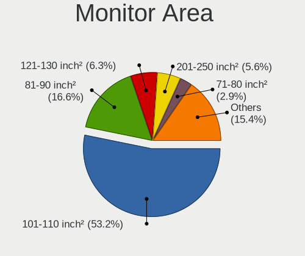

| Area in inch | Notebooks | Percent |
|----------------|-----------|---------|
| 101-110        | 540       | 59.08%  |
| 81-90          | 148       | 16.19%  |
| 121-130        | 56        | 6.13%   |
| 201-250        | 48        | 5.25%   |
| 71-80          | 25        | 2.74%   |
| Unknown        | 14        | 1.53%   |
| 301-350        | 13        | 1.42%   |
| 61-70          | 12        | 1.31%   |
| 151-200        | 10        | 1.09%   |
| More than 1000 | 8         | 0.88%   |
| 351-500        | 7         | 0.77%   |
| 41-50          | 7         | 0.77%   |
| 131-140        | 7         | 0.77%   |
| 251-300        | 6         | 0.66%   |
| 141-150        | 4         | 0.44%   |
| 91-100         | 4         | 0.44%   |
| 51-60          | 3         | 0.33%   |
| 1-40           | 2         | 0.22%   |

Pixel Density
-------------

Pixels per inch

| Density       | Notebooks | Percent |
|---------------|-----------|---------|
| 121-160       | 390       | 42.95%  |
| 101-120       | 330       | 36.34%  |
| 51-100        | 124       | 13.66%  |
| 161-240       | 27        | 2.97%   |
| More than 240 | 17        | 1.87%   |
| Unknown       | 14        | 1.54%   |
| 1-50          | 6         | 0.66%   |

Multiple Monitors
-----------------

Total monitors connected

| Total | Notebooks | Percent |
|-------|-----------|---------|
| 1     | 764       | 88.02%  |
| 2     | 83        | 9.56%   |
| 0     | 15        | 1.73%   |
| 3     | 6         | 0.69%   |

Network
-------

Net Controller Vendor
---------------------

Controller vendors

| Vendor                            | Notebooks | Percent |
|-----------------------------------|-----------|---------|
| Realtek Semiconductor             | 505       | 38.17%  |
| Intel                             | 396       | 29.93%  |
| Qualcomm Atheros                  | 203       | 15.34%  |
| Broadcom                          | 83        | 6.27%   |
| TP-Link                           | 17        | 1.28%   |
| Ralink                            | 15        | 1.13%   |
| MediaTek                          | 15        | 1.13%   |
| Marvell Technology Group          | 13        | 0.98%   |
| Broadcom Limited                  | 13        | 0.98%   |
| Ralink Technology                 | 7         | 0.53%   |
| Xiaomi                            | 5         | 0.38%   |
| Huawei Technologies               | 5         | 0.38%   |
| Ericsson Business Mobile Networks | 5         | 0.38%   |
| Samsung Electronics               | 4         | 0.3%    |
| JMicron Technology                | 4         | 0.3%    |
| Hewlett-Packard                   | 4         | 0.3%    |
| ASUSTek Computer                  | 4         | 0.3%    |
| ASIX Electronics                  | 4         | 0.3%    |
| ZTE WCDMA Technologies MSM        | 3         | 0.23%   |
| Silicon Integrated Systems [SiS]  | 3         | 0.23%   |
| Lenovo                            | 2         | 0.15%   |
| D-Link                            | 2         | 0.15%   |
| VIA Technologies                  | 1         | 0.08%   |
| U-Blox                            | 1         | 0.08%   |
| Sierra Wireless                   | 1         | 0.08%   |
| Nvidia                            | 1         | 0.08%   |
| Microsoft                         | 1         | 0.08%   |
| Microchip Technology              | 1         | 0.08%   |
| Fibocom                           | 1         | 0.08%   |
| Edimax Technology                 | 1         | 0.08%   |
| DisplayLink                       | 1         | 0.08%   |
| Dell                              | 1         | 0.08%   |
| Belkin                            | 1         | 0.08%   |

Net Controller Model
--------------------

Controller models

| Model                                                                   | Notebooks | Percent |
|-------------------------------------------------------------------------|-----------|---------|
| Realtek RTL8111/8168/8411 PCI Express Gigabit Ethernet Controller       | 289       | 18.35%  |
| Realtek RTL810xE PCI Express Fast Ethernet controller                   | 99        | 6.29%   |
| Qualcomm Atheros QCA9377 802.11ac Wireless Network Adapter              | 63        | 4%      |
| Realtek RTL8822BE 802.11a/b/g/n/ac WiFi adapter                         | 47        | 2.98%   |
| Intel Wireless 8265 / 8275                                              | 46        | 2.92%   |
| Realtek RTL8821CE 802.11ac PCIe Wireless Network Adapter                | 44        | 2.79%   |
| Realtek RTL8723BE PCIe Wireless Network Adapter                         | 41        | 2.6%    |
| Qualcomm Atheros QCA9565 / AR9565 Wireless Network Adapter              | 33        | 2.1%    |
| Intel Cannon Lake PCH CNVi WiFi                                         | 32        | 2.03%   |
| Qualcomm Atheros AR9285 Wireless Network Adapter (PCI-Express)          | 30        | 1.9%    |
| Qualcomm Atheros AR9485 Wireless Network Adapter                        | 23        | 1.46%   |
| Intel Wi-Fi 6 AX200                                                     | 22        | 1.4%    |
| Intel Cannon Point-LP CNVi [Wireless-AC]                                | 22        | 1.4%    |
| Intel Wireless 7265                                                     | 21        | 1.33%   |
| Intel Wireless 7260                                                     | 21        | 1.33%   |
| Intel Wi-Fi 6 AX201                                                     | 21        | 1.33%   |
| Intel 82579LM Gigabit Network Connection (Lewisville)                   | 21        | 1.33%   |
| Realtek RTL8822CE 802.11ac PCIe Wireless Network Adapter                | 19        | 1.21%   |
| Intel Dual Band Wireless-AC 3165 Plus Bluetooth                         | 18        | 1.14%   |
| Intel Wireless 8260                                                     | 17        | 1.08%   |
| Intel Wireless 3160                                                     | 16        | 1.02%   |
| Intel Centrino Advanced-N 6205 [Taylor Peak]                            | 16        | 1.02%   |
| Broadcom BCM43142 802.11b/g/n                                           | 16        | 1.02%   |
| Intel Centrino Advanced-N 6200                                          | 14        | 0.89%   |
| Broadcom BCM4313 802.11bgn Wireless Network Adapter                     | 14        | 0.89%   |
| Realtek RTL8723BU 802.11b/g/n WLAN Adapter                              | 13        | 0.83%   |
| Realtek RTL8153 Gigabit Ethernet Adapter                                | 12        | 0.76%   |
| Intel Wireless 3165                                                     | 12        | 0.76%   |
| Intel PRO/Wireless 3945ABG [Golan] Network Connection                   | 12        | 0.76%   |
| Intel 82577LM Gigabit Network Connection                                | 12        | 0.76%   |
| Qualcomm Atheros QCA8172 Fast Ethernet                                  | 10        | 0.63%   |
| Intel Ethernet Connection I217-LM                                       | 10        | 0.63%   |
| Intel Comet Lake PCH-LP CNVi WiFi                                       | 10        | 0.63%   |
| Broadcom NetLink BCM57785 Gigabit Ethernet PCIe                         | 10        | 0.63%   |
| Ralink RT3290 Wireless 802.11n 1T/1R PCIe                               | 9         | 0.57%   |
| Qualcomm Atheros QCA6174 802.11ac Wireless Network Adapter              | 9         | 0.57%   |
| MEDIATEK MT7921 802.11ax PCI Express Wireless Network Adapter           | 9         | 0.57%   |
| Intel Comet Lake PCH CNVi WiFi                                          | 9         | 0.57%   |
| Qualcomm Atheros AR8151 v2.0 Gigabit Ethernet                           | 8         | 0.51%   |
| Qualcomm Atheros AR242x / AR542x Wireless Network Adapter (PCI-Express) | 8         | 0.51%   |
| Intel Ethernet Connection I218-LM                                       | 8         | 0.51%   |
| Intel Ethernet Connection (3) I218-LM                                   | 8         | 0.51%   |
| Intel Centrino Ultimate-N 6300                                          | 8         | 0.51%   |
| Qualcomm Atheros AR8161 Gigabit Ethernet                                | 7         | 0.44%   |
| Intel Ice Lake-LP PCH CNVi WiFi                                         | 7         | 0.44%   |
| Intel 82567LM Gigabit Network Connection                                | 7         | 0.44%   |
| Broadcom NetLink BCM5787M Gigabit Ethernet PCI Express                  | 7         | 0.44%   |
| Broadcom Limited BCM4312 802.11b/g LP-PHY                               | 7         | 0.44%   |
| Broadcom BCM4312 802.11b/g LP-PHY                                       | 7         | 0.44%   |
| Intel Ethernet Connection I219-LM                                       | 6         | 0.38%   |
| Intel Centrino Wireless-N 1030 [Rainbow Peak]                           | 6         | 0.38%   |
| Intel Centrino Advanced-N 6235                                          | 6         | 0.38%   |
| Broadcom BCM4311 802.11b/g WLAN                                         | 6         | 0.38%   |
| Xiaomi Mi/Redmi series (RNDIS)                                          | 5         | 0.32%   |
| Realtek RTL8821AE 802.11ac PCIe Wireless Network Adapter                | 5         | 0.32%   |
| Realtek RTL8723DE Wireless Network Adapter                              | 5         | 0.32%   |
| Intel WiFi Link 5100                                                    | 5         | 0.32%   |
| Intel Ethernet Connection (7) I219-LM                                   | 5         | 0.32%   |
| Intel Ethernet Connection (6) I219-V                                    | 5         | 0.32%   |
| Intel Ethernet Connection (4) I219-LM                                   | 5         | 0.32%   |

Wireless Vendor
---------------

Wireless vendors

| Vendor                | Notebooks | Percent |
|-----------------------|-----------|---------|
| Intel                 | 378       | 42.91%  |
| Realtek Semiconductor | 192       | 21.79%  |
| Qualcomm Atheros      | 180       | 20.43%  |
| Broadcom              | 61        | 6.92%   |
| TP-Link               | 15        | 1.7%    |
| Ralink                | 15        | 1.7%    |
| MEDIATEK              | 12        | 1.36%   |
| Broadcom Limited      | 10        | 1.14%   |
| Ralink Technology     | 7         | 0.79%   |
| ASUSTek Computer      | 4         | 0.45%   |
| D-Link                | 2         | 0.23%   |
| Sierra Wireless       | 1         | 0.11%   |
| Microsoft             | 1         | 0.11%   |
| Fibocom               | 1         | 0.11%   |
| Edimax Technology     | 1         | 0.11%   |
| Belkin                | 1         | 0.11%   |

Wireless Model
--------------

Wireless models

| Model                                                                         | Notebooks | Percent |
|-------------------------------------------------------------------------------|-----------|---------|
| Qualcomm Atheros QCA9377 802.11ac Wireless Network Adapter                    | 63        | 7.12%   |
| Realtek RTL8822BE 802.11a/b/g/n/ac WiFi adapter                               | 47        | 5.31%   |
| Intel Wireless 8265 / 8275                                                    | 46        | 5.2%    |
| Realtek RTL8821CE 802.11ac PCIe Wireless Network Adapter                      | 44        | 4.97%   |
| Realtek RTL8723BE PCIe Wireless Network Adapter                               | 41        | 4.63%   |
| Qualcomm Atheros QCA9565 / AR9565 Wireless Network Adapter                    | 33        | 3.73%   |
| Intel Cannon Lake PCH CNVi WiFi                                               | 32        | 3.62%   |
| Qualcomm Atheros AR9285 Wireless Network Adapter (PCI-Express)                | 30        | 3.39%   |
| Qualcomm Atheros AR9485 Wireless Network Adapter                              | 23        | 2.6%    |
| Intel Wi-Fi 6 AX200                                                           | 22        | 2.49%   |
| Intel Cannon Point-LP CNVi [Wireless-AC]                                      | 22        | 2.49%   |
| Intel Wireless 7265                                                           | 21        | 2.37%   |
| Intel Wireless 7260                                                           | 21        | 2.37%   |
| Intel Wi-Fi 6 AX201                                                           | 21        | 2.37%   |
| Realtek RTL8822CE 802.11ac PCIe Wireless Network Adapter                      | 19        | 2.15%   |
| Intel Dual Band Wireless-AC 3165 Plus Bluetooth                               | 18        | 2.03%   |
| Intel Wireless 8260                                                           | 17        | 1.92%   |
| Intel Wireless 3160                                                           | 16        | 1.81%   |
| Intel Centrino Advanced-N 6205 [Taylor Peak]                                  | 16        | 1.81%   |
| Broadcom BCM43142 802.11b/g/n                                                 | 16        | 1.81%   |
| Intel Centrino Advanced-N 6200                                                | 14        | 1.58%   |
| Broadcom BCM4313 802.11bgn Wireless Network Adapter                           | 14        | 1.58%   |
| Realtek RTL8723BU 802.11b/g/n WLAN Adapter                                    | 13        | 1.47%   |
| Intel Wireless 3165                                                           | 12        | 1.36%   |
| Intel PRO/Wireless 3945ABG [Golan] Network Connection                         | 12        | 1.36%   |
| Intel Comet Lake PCH-LP CNVi WiFi                                             | 10        | 1.13%   |
| Ralink RT3290 Wireless 802.11n 1T/1R PCIe                                     | 9         | 1.02%   |
| Qualcomm Atheros QCA6174 802.11ac Wireless Network Adapter                    | 9         | 1.02%   |
| MEDIATEK MT7921 802.11ax PCI Express Wireless Network Adapter                 | 9         | 1.02%   |
| Intel Comet Lake PCH CNVi WiFi                                                | 9         | 1.02%   |
| Qualcomm Atheros AR242x / AR542x Wireless Network Adapter (PCI-Express)       | 8         | 0.9%    |
| Intel Centrino Ultimate-N 6300                                                | 8         | 0.9%    |
| Intel Ice Lake-LP PCH CNVi WiFi                                               | 7         | 0.79%   |
| Broadcom Limited BCM4312 802.11b/g LP-PHY                                     | 7         | 0.79%   |
| Broadcom BCM4312 802.11b/g LP-PHY                                             | 7         | 0.79%   |
| Intel Centrino Wireless-N 1030 [Rainbow Peak]                                 | 6         | 0.68%   |
| Intel Centrino Advanced-N 6235                                                | 6         | 0.68%   |
| Broadcom BCM4311 802.11b/g WLAN                                               | 6         | 0.68%   |
| Realtek RTL8821AE 802.11ac PCIe Wireless Network Adapter                      | 5         | 0.56%   |
| Realtek RTL8723DE Wireless Network Adapter                                    | 5         | 0.56%   |
| Intel WiFi Link 5100                                                          | 5         | 0.56%   |
| TP-Link TL-WN823N v2/v3 [Realtek RTL8192EU]                                   | 4         | 0.45%   |
| Ralink MT7601U Wireless Adapter                                               | 4         | 0.45%   |
| Intel Ultimate N WiFi Link 5300                                               | 4         | 0.45%   |
| Intel Centrino Wireless-N 2230                                                | 4         | 0.45%   |
| Broadcom BCM43227 802.11b/g/n                                                 | 4         | 0.45%   |
| TP-Link Archer T3U [Realtek RTL8812BU]                                        | 3         | 0.34%   |
| Realtek RTL8188EUS 802.11n Wireless Network Adapter                           | 3         | 0.34%   |
| Ralink RT3090 Wireless 802.11n 1T/1R PCIe                                     | 3         | 0.34%   |
| Qualcomm Atheros AR9462 Wireless Network Adapter                              | 3         | 0.34%   |
| Qualcomm Atheros AR928X Wireless Network Adapter (PCI-Express)                | 3         | 0.34%   |
| Qualcomm Atheros AR2413/AR2414 Wireless Network Adapter [AR5005G(S) 802.11bg] | 3         | 0.34%   |
| Intel Wireless-AC 9260                                                        | 3         | 0.34%   |
| Intel Tiger Lake PCH CNVi WiFi                                                | 3         | 0.34%   |
| Intel PRO/Wireless 5100 AGN [Shiloh] Network Connection                       | 3         | 0.34%   |
| Intel PRO/Wireless 4965 AG or AGN [Kedron] Network Connection                 | 3         | 0.34%   |
| Intel Dual Band Wireless-AC 3168NGW [Stone Peak]                              | 3         | 0.34%   |
| Intel Centrino Wireless-N 130                                                 | 3         | 0.34%   |
| Broadcom BCM43602 802.11ac Wireless LAN SoC                                   | 3         | 0.34%   |
| Broadcom BCM4322 802.11a/b/g/n Wireless LAN Controller                        | 3         | 0.34%   |

Ethernet Vendor
---------------

Ethernet vendors

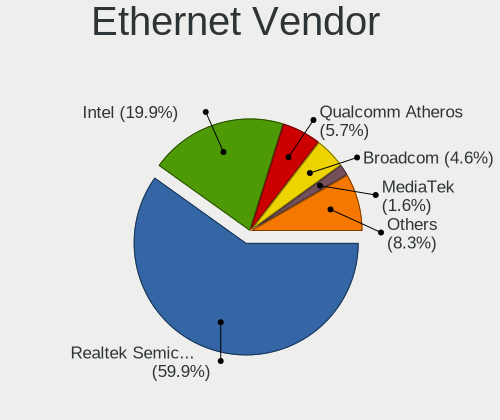

| Vendor                           | Notebooks | Percent |
|----------------------------------|-----------|---------|
| Realtek Semiconductor            | 407       | 60.57%  |
| Intel                            | 130       | 19.35%  |
| Qualcomm Atheros                 | 48        | 7.14%   |
| Broadcom                         | 36        | 5.36%   |
| Marvell Technology Group         | 13        | 1.93%   |
| Xiaomi                           | 5         | 0.74%   |
| Samsung Electronics              | 4         | 0.6%    |
| JMicron Technology               | 4         | 0.6%    |
| Huawei Technologies              | 4         | 0.6%    |
| ASIX Electronics                 | 4         | 0.6%    |
| Silicon Integrated Systems [SiS] | 3         | 0.45%   |
| MediaTek                         | 3         | 0.45%   |
| Broadcom Limited                 | 3         | 0.45%   |
| TP-Link                          | 2         | 0.3%    |
| Lenovo                           | 2         | 0.3%    |
| ZTE WCDMA Technologies MSM       | 1         | 0.15%   |
| VIA Technologies                 | 1         | 0.15%   |
| Nvidia                           | 1         | 0.15%   |
| DisplayLink                      | 1         | 0.15%   |

Ethernet Model
--------------

Ethernet models

| Model                                                                          | Notebooks | Percent |
|--------------------------------------------------------------------------------|-----------|---------|
| Realtek RTL8111/8168/8411 PCI Express Gigabit Ethernet Controller              | 289       | 42.94%  |
| Realtek RTL810xE PCI Express Fast Ethernet controller                          | 99        | 14.71%  |
| Intel 82579LM Gigabit Network Connection (Lewisville)                          | 21        | 3.12%   |
| Realtek RTL8153 Gigabit Ethernet Adapter                                       | 12        | 1.78%   |
| Intel 82577LM Gigabit Network Connection                                       | 12        | 1.78%   |
| Qualcomm Atheros QCA8172 Fast Ethernet                                         | 10        | 1.49%   |
| Intel Ethernet Connection I217-LM                                              | 10        | 1.49%   |
| Broadcom NetLink BCM57785 Gigabit Ethernet PCIe                                | 10        | 1.49%   |
| Qualcomm Atheros AR8151 v2.0 Gigabit Ethernet                                  | 8         | 1.19%   |
| Intel Ethernet Connection I218-LM                                              | 8         | 1.19%   |
| Intel Ethernet Connection (3) I218-LM                                          | 8         | 1.19%   |
| Qualcomm Atheros AR8161 Gigabit Ethernet                                       | 7         | 1.04%   |
| Intel 82567LM Gigabit Network Connection                                       | 7         | 1.04%   |
| Broadcom NetLink BCM5787M Gigabit Ethernet PCI Express                         | 7         | 1.04%   |
| Intel Ethernet Connection I219-LM                                              | 6         | 0.89%   |
| Xiaomi Mi/Redmi series (RNDIS)                                                 | 5         | 0.74%   |
| Intel Ethernet Connection (7) I219-LM                                          | 5         | 0.74%   |
| Intel Ethernet Connection (6) I219-V                                           | 5         | 0.74%   |
| Intel Ethernet Connection (4) I219-LM                                          | 5         | 0.74%   |
| Qualcomm Atheros QCA8171 Gigabit Ethernet                                      | 4         | 0.59%   |
| Qualcomm Atheros AR8152 v1.1 Fast Ethernet                                     | 4         | 0.59%   |
| Marvell Group 88E8040 PCI-E Fast Ethernet Controller                           | 4         | 0.59%   |
| JMicron JMC250 PCI Express Gigabit Ethernet Controller                         | 4         | 0.59%   |
| Intel Ethernet Connection (7) I219-V                                           | 4         | 0.59%   |
| Intel Ethernet Connection (4) I219-V                                           | 4         | 0.59%   |
| Huawei MAR-LX1A                                                                | 4         | 0.59%   |
| ASIX AX88179 Gigabit Ethernet                                                  | 4         | 0.59%   |
| Silicon Integrated Systems [SiS] 191 Gigabit Ethernet Adapter                  | 3         | 0.45%   |
| Samsung Galaxy series, misc. (tethering mode)                                  | 3         | 0.45%   |
| Qualcomm Atheros AR8131 Gigabit Ethernet                                       | 3         | 0.45%   |
| Qualcomm Atheros AR8121/AR8113/AR8114 Gigabit or Fast Ethernet                 | 3         | 0.45%   |
| MediaTek Vodafone Smart N10                                                    | 3         | 0.45%   |
| Intel PRO/100 VE Network Connection                                            | 3         | 0.45%   |
| Intel Ethernet Connection I219-V                                               | 3         | 0.45%   |
| Intel 82577LC Gigabit Network Connection                                       | 3         | 0.45%   |
| Intel 82566MM Gigabit Network Connection                                       | 3         | 0.45%   |
| Broadcom NetXtreme BCM5761 Gigabit Ethernet PCIe                               | 3         | 0.45%   |
| Broadcom NetLink BCM5906M Fast Ethernet PCI Express                            | 3         | 0.45%   |
| TP-Link USB 10/100/1000 LAN                                                    | 2         | 0.3%    |
| Realtek RTL8125 2.5GbE Controller                                              | 2         | 0.3%    |
| Realtek RTL-8100/8101L/8139 PCI Fast Ethernet Adapter                          | 2         | 0.3%    |
| Qualcomm Atheros Killer E2500 Gigabit Ethernet Controller                      | 2         | 0.3%    |
| Qualcomm Atheros Killer E2400 Gigabit Ethernet Controller                      | 2         | 0.3%    |
| Qualcomm Atheros AR8132 Fast Ethernet                                          | 2         | 0.3%    |
| Marvell Group Yukon Optima 88E8059 [PCIe Gigabit Ethernet Controller with AVB] | 2         | 0.3%    |
| Marvell Group 88E8057 PCI-E Gigabit Ethernet Controller                        | 2         | 0.3%    |
| Marvell Group 88E8053 PCI-E Gigabit Ethernet Controller                        | 2         | 0.3%    |
| Lenovo ThinkPad TBT 3 Dock                                                     | 2         | 0.3%    |
| Intel Ethernet Connection I217-V                                               | 2         | 0.3%    |
| Intel Ethernet Connection (10) I219-V                                          | 2         | 0.3%    |
| Intel 82579V Gigabit Network Connection                                        | 2         | 0.3%    |
| Intel 82573L Gigabit Ethernet Controller                                       | 2         | 0.3%    |
| Intel 82567LF Gigabit Network Connection                                       | 2         | 0.3%    |
| Broadcom NetXtreme BCM5764M Gigabit Ethernet PCIe                              | 2         | 0.3%    |
| Broadcom NetLink BCM57780 Gigabit Ethernet PCIe                                | 2         | 0.3%    |
| Broadcom BCM4401-B0 100Base-TX                                                 | 2         | 0.3%    |
| ZTE WCDMA MSM ZTE MSM                                                          | 1         | 0.15%   |
| VIA VT6102/VT6103 [Rhine-II]                                                   | 1         | 0.15%   |
| Samsung GT-I9070 (network tethering, USB debugging enabled)                    | 1         | 0.15%   |
| Realtek RTL8152 Fast Ethernet Adapter                                          | 1         | 0.15%   |

Net Controller Kind
-------------------

Ethernet, WiFi or modem

| Kind     | Notebooks | Percent |
|----------|-----------|---------|
| WiFi     | 848       | 55.97%  |
| Ethernet | 650       | 42.9%   |
| Modem    | 16        | 1.06%   |
| Unknown  | 1         | 0.07%   |

Used Controller
---------------

Currently used network controller

| Kind     | Notebooks | Percent |
|----------|-----------|---------|
| WiFi     | 721       | 80.11%  |
| Ethernet | 179       | 19.89%  |

NICs
----

Total network controllers on board

| Total | Notebooks | Percent |
|-------|-----------|---------|
| 2     | 615       | 71.93%  |
| 1     | 222       | 25.96%  |
| 0     | 14        | 1.64%   |
| 3     | 4         | 0.47%   |

IPv6
----

IPv6 vs IPv4

| Used | Notebooks | Percent |
|------|-----------|---------|
| No   | 770       | 88.61%  |
| Yes  | 99        | 11.39%  |

Bluetooth
---------

Bluetooth Vendor
----------------

Controller vendors

| Vendor                          | Notebooks | Percent |
|---------------------------------|-----------|---------|
| Intel                           | 286       | 42.06%  |
| IMC Networks                    | 106       | 15.59%  |
| Realtek Semiconductor           | 85        | 12.5%   |
| Qualcomm Atheros Communications | 59        | 8.68%   |
| Lite-On Technology              | 38        | 5.59%   |
| Broadcom                        | 26        | 3.82%   |
| Dell                            | 15        | 2.21%   |
| Foxconn / Hon Hai               | 13        | 1.91%   |
| Toshiba                         | 10        | 1.47%   |
| Hewlett-Packard                 | 10        | 1.47%   |
| Ralink                          | 9         | 1.32%   |
| Apple                           | 5         | 0.74%   |
| Cambridge Silicon Radio         | 4         | 0.59%   |
| ASUSTek Computer                | 4         | 0.59%   |
| Alps Electric                   | 3         | 0.44%   |
| Chicony Electronics             | 2         | 0.29%   |
| Realtek                         | 1         | 0.15%   |
| Ralink Technology               | 1         | 0.15%   |
| MediaTek                        | 1         | 0.15%   |
| Foxconn International           | 1         | 0.15%   |
| Askey Computer                  | 1         | 0.15%   |

Bluetooth Model
---------------

Controller models

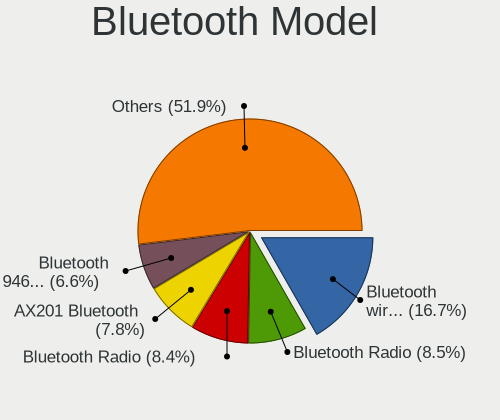

| Model                                               | Notebooks | Percent |
|-----------------------------------------------------|-----------|---------|
| Intel Bluetooth wireless interface                  | 139       | 20.44%  |
| IMC Networks Bluetooth Radio                        | 70        | 10.29%  |
| Realtek Bluetooth Radio                             | 58        | 8.53%   |
| Intel Bluetooth 9460/9560 Jefferson Peak (JfP)      | 58        | 8.53%   |
| Intel AX201 Bluetooth                               | 42        | 6.18%   |
| Qualcomm Atheros  Bluetooth Device                  | 39        | 5.74%   |
| Intel AX200 Bluetooth                               | 22        | 3.24%   |
| IMC Networks Bluetooth Device                       | 22        | 3.24%   |
| Lite-On Qualcomm Atheros QCA9377 Bluetooth          | 19        | 2.79%   |
| Realtek  Bluetooth 4.2 Adapter                      | 14        | 2.06%   |
| Intel Centrino Advanced-N 6230 Bluetooth adapter    | 10        | 1.47%   |
| Ralink RT3290 Bluetooth                             | 9         | 1.32%   |
| IMC Networks Wireless_Device                        | 9         | 1.32%   |
| Realtek RTL8822BE Bluetooth 4.2 Adapter             | 8         | 1.18%   |
| Lite-On Bluetooth Device                            | 8         | 1.18%   |
| Intel Centrino Bluetooth Wireless Transceiver       | 8         | 1.18%   |
| Qualcomm Atheros AR3011 Bluetooth                   | 7         | 1.03%   |
| Qualcomm Atheros AR3012 Bluetooth 4.0               | 6         | 0.88%   |
| Dell DW375 Bluetooth Module                         | 6         | 0.88%   |
| Lite-On Broadcom BCM43142A0 Bluetooth Device        | 5         | 0.74%   |
| HP Broadcom 2070 Bluetooth Combo                    | 5         | 0.74%   |
| HP Bluetooth 2.0 Interface [Broadcom BCM2045]       | 5         | 0.74%   |
| Broadcom BCM2045B (BDC-2.1)                         | 5         | 0.74%   |
| Toshiba Bluetooth Device                            | 4         | 0.59%   |
| Realtek RTL8723B Bluetooth                          | 4         | 0.59%   |
| Cambridge Silicon Radio Bluetooth Dongle (HCI mode) | 4         | 0.59%   |
| Qualcomm Atheros QCA61x4 Bluetooth 4.0              | 3         | 0.44%   |
| Lite-On Atheros AR3012 Bluetooth                    | 3         | 0.44%   |
| Intel Wireless-AC 9260 Bluetooth Adapter            | 3         | 0.44%   |
| Foxconn / Hon Hai Acer Bluetooth module             | 3         | 0.44%   |
| Dell Wireless 365 Bluetooth                         | 3         | 0.44%   |
| Dell BCM20702A0 Bluetooth Module                    | 3         | 0.44%   |
| Apple Bluetooth Host Controller                     | 3         | 0.44%   |
| Toshiba Integrated Bluetooth HCI                    | 2         | 0.29%   |
| Toshiba BCM43142A0                                  | 2         | 0.29%   |
| Qualcomm Atheros AR3012 Bluetooth                   | 2         | 0.29%   |
| Lite-On BCM43142A0                                  | 2         | 0.29%   |
| Intel Wireless-AC 3168 Bluetooth                    | 2         | 0.29%   |
| Intel AX210 Bluetooth                               | 2         | 0.29%   |
| IMC Networks Broadcom Bluetooth 2.1                 | 2         | 0.29%   |
| Foxconn / Hon Hai Bluetooth Device                  | 2         | 0.29%   |
| Foxconn / Hon Hai BCM43142A0                        | 2         | 0.29%   |
| Foxconn / Hon Hai BCM20702A0                        | 2         | 0.29%   |
| Chicony Bluetooth Radio                             | 2         | 0.29%   |
| Broadcom HP Portable Valentine                      | 2         | 0.29%   |
| Broadcom HP Portable SoftSailing                    | 2         | 0.29%   |
| Broadcom BCM43142 Bluetooth 4.0                     | 2         | 0.29%   |
| Broadcom BCM20702 Bluetooth 4.0 [ThinkPad]          | 2         | 0.29%   |
| Broadcom BCM2070 Bluetooth 2.1 + EDR                | 2         | 0.29%   |
| Broadcom BCM2046 Bluetooth Device                   | 2         | 0.29%   |
| Broadcom BCM2045B (BDC-2) [Bluetooth Controller]    | 2         | 0.29%   |
| Apple Bluetooth HCI                                 | 2         | 0.29%   |
| Alps Electric Bluetooth Controller (ALPS/UGPZ6)     | 2         | 0.29%   |
| Toshiba RT Bluetooth Radio                          | 1         | 0.15%   |
| Toshiba BRCM Bluetooth Controller BCM2070           | 1         | 0.15%   |
| Realtek 802.11ac WLAN Adapter                       | 1         | 0.15%   |
| Realtek Bluetooth Radio                             | 1         | 0.15%   |
| Ralink Motorola BC4 Bluetooth 3.0+HS Adapter        | 1         | 0.15%   |
| Qualcomm Atheros Bluetooth USB Host Controller      | 1         | 0.15%   |
| Qualcomm Atheros Bluetooth                          | 1         | 0.15%   |

Sound
-----

Sound Vendor
------------

Sound card vendors

| Vendor                           | Notebooks | Percent |
|----------------------------------|-----------|---------|
| Intel                            | 738       | 72%     |
| AMD                              | 127       | 12.39%  |
| Nvidia                           | 124       | 12.1%   |
| GN Netcom                        | 6         | 0.59%   |
| C-Media Electronics              | 5         | 0.49%   |
| Silicon Integrated Systems [SiS] | 4         | 0.39%   |
| Logitech                         | 4         | 0.39%   |
| XMOS                             | 2         | 0.2%    |
| VIA Technologies                 | 2         | 0.2%    |
| Realtek Semiconductor            | 2         | 0.2%    |
| Lenovo                           | 2         | 0.2%    |
| Creative Technology              | 2         | 0.2%    |
| Unknown                          | 1         | 0.1%    |
| Sony                             | 1         | 0.1%    |
| Sennheiser Communications        | 1         | 0.1%    |
| Plantronics                      | 1         | 0.1%    |
| Kingston Technology              | 1         | 0.1%    |
| Dell                             | 1         | 0.1%    |
| CMX Systems                      | 1         | 0.1%    |

Sound Model
-----------

Sound card models

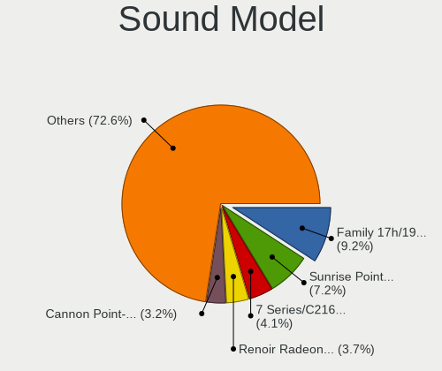

| Model                                                                                             | Notebooks | Percent |
|---------------------------------------------------------------------------------------------------|-----------|---------|
| Intel Sunrise Point-LP HD Audio                                                                   | 103       | 8.42%   |
| AMD Family 17h/19h HD Audio Controller                                                            | 71        | 5.8%    |
| Intel Cannon Point-LP High Definition Audio Controller                                            | 56        | 4.58%   |
| Intel 7 Series/C216 Chipset Family High Definition Audio Controller                               | 55        | 4.49%   |
| Intel Cannon Lake PCH cAVS                                                                        | 48        | 3.92%   |
| Intel Celeron/Pentium Silver Processor High Definition Audio                                      | 47        | 3.84%   |
| Intel Haswell-ULT HD Audio Controller                                                             | 45        | 3.68%   |
| Intel 8 Series HD Audio Controller                                                                | 44        | 3.59%   |
| Intel 6 Series/C200 Series Chipset Family High Definition Audio Controller                        | 43        | 3.51%   |
| AMD Raven/Raven2/Fenghuang HDMI/DP Audio Controller                                               | 39        | 3.19%   |
| Intel 5 Series/3400 Series Chipset High Definition Audio                                          | 37        | 3.02%   |
| Intel Celeron N3350/Pentium N4200/Atom E3900 Series Audio Cluster                                 | 34        | 2.78%   |
| Intel 8 Series/C220 Series Chipset High Definition Audio Controller                               | 33        | 2.7%    |
| Intel Xeon E3-1200 v3/4th Gen Core Processor HD Audio Controller                                  | 32        | 2.61%   |
| Intel Wildcat Point-LP High Definition Audio Controller                                           | 32        | 2.61%   |
| Intel Broadwell-U Audio Controller                                                                | 32        | 2.61%   |
| Intel 82801I (ICH9 Family) HD Audio Controller                                                    | 30        | 2.45%   |
| Intel 82801H (ICH8 Family) HD Audio Controller                                                    | 26        | 2.12%   |
| Intel Tiger Lake-LP Smart Sound Technology Audio Controller                                       | 25        | 2.04%   |
| Intel NM10/ICH7 Family High Definition Audio Controller                                           | 22        | 1.8%    |
| AMD Renoir Radeon High Definition Audio Controller                                                | 20        | 1.63%   |
| Nvidia TU107 GeForce GTX 1650 High Definition Audio Controller                                    | 19        | 1.55%   |
| Nvidia GP107GL High Definition Audio Controller                                                   | 17        | 1.39%   |
| Intel Comet Lake PCH-LP cAVS                                                                      | 17        | 1.39%   |
| Intel CM238 HD Audio Controller                                                                   | 16        | 1.31%   |
| Intel Ice Lake-LP Smart Sound Technology Audio Controller                                         | 15        | 1.23%   |
| Intel 100 Series/C230 Series Chipset Family HD Audio Controller                                   | 15        | 1.23%   |
| AMD FCH Azalia Controller                                                                         | 14        | 1.14%   |
| Intel Atom/Celeron/Pentium Processor x5-E8000/J3xxx/N3xxx Series High Definition Audio Controller | 13        | 1.06%   |
| Nvidia TU106 High Definition Audio Controller                                                     | 12        | 0.98%   |
| Nvidia GK208 HDMI/DP Audio Controller                                                             | 12        | 0.98%   |
| AMD SBx00 Azalia (Intel HDA)                                                                      | 12        | 0.98%   |
| Nvidia GF108 High Definition Audio Controller                                                     | 11        | 0.9%    |
| Intel Comet Lake PCH cAVS                                                                         | 11        | 0.9%    |
| AMD Family 15h (Models 60h-6fh) Audio Controller                                                  | 9         | 0.74%   |
| Nvidia TU116 High Definition Audio Controller                                                     | 8         | 0.65%   |
| AMD Kabini HDMI/DP Audio                                                                          | 8         | 0.65%   |
| AMD High Definition Audio Controller                                                              | 8         | 0.65%   |
| Nvidia GP106 High Definition Audio Controller                                                     | 7         | 0.57%   |
| Nvidia GA104 High Definition Audio Controller                                                     | 7         | 0.57%   |
| Intel Tiger Lake-H HD Audio Controller                                                            | 7         | 0.57%   |
| Intel Atom Processor Z36xxx/Z37xxx Series High Definition Audio Controller                        | 6         | 0.49%   |
| Nvidia GT216 HDMI Audio Controller                                                                | 5         | 0.41%   |
| Nvidia GK107 HDMI Audio Controller                                                                | 5         | 0.41%   |
| Nvidia Audio device                                                                               | 5         | 0.41%   |
| AMD Wrestler HDMI Audio                                                                           | 5         | 0.41%   |
| AMD RV710/730 HDMI Audio [Radeon HD 4000 series]                                                  | 5         | 0.41%   |
| AMD RV620 HDMI Audio [Radeon HD 3450/3470/3550/3570]                                              | 5         | 0.41%   |
| Silicon Integrated Systems [SiS] Azalia Audio Controller                                          | 4         | 0.33%   |
| C-Media Electronics SADES Luna                                                                    | 4         | 0.33%   |
| Nvidia High Definition Audio Controller                                                           | 3         | 0.25%   |
| AMD Trinity HDMI Audio Controller                                                                 | 3         | 0.25%   |
| AMD RS880 HDMI Audio [Radeon HD 4200 Series]                                                      | 3         | 0.25%   |
| XMOS iFi (by AMR) HD USB Audio                                                                    | 2         | 0.16%   |
| Realtek Semiconductor USB Audio                                                                   | 2         | 0.16%   |
| Nvidia GM107 High Definition Audio Controller [GeForce 940MX]                                     | 2         | 0.16%   |
| Nvidia GF119 HDMI Audio Controller                                                                | 2         | 0.16%   |
| Nvidia GF106 High Definition Audio Controller                                                     | 2         | 0.16%   |
| Logitech Headset H340                                                                             | 2         | 0.16%   |
| Logitech G430 Surround Sound Gaming Headset                                                       | 2         | 0.16%   |

Memory
------

Memory Vendor
-------------

Memory module vendors

| Vendor                       | Notebooks | Percent |
|------------------------------|-----------|---------|
| Samsung Electronics          | 115       | 28.68%  |
| SK Hynix                     | 90        | 22.44%  |
| Kingston                     | 49        | 12.22%  |
| Micron Technology            | 42        | 10.47%  |
| Unknown                      | 23        | 5.74%   |
| Ramaxel Technology           | 16        | 3.99%   |
| A-DATA Technology            | 12        | 2.99%   |
| Corsair                      | 11        | 2.74%   |
| Nanya Technology             | 9         | 2.24%   |
| Elpida                       | 9         | 2.24%   |
| Crucial                      | 9         | 2.24%   |
| Unknown (ABCD)               | 5         | 1.25%   |
| Kingmax                      | 2         | 0.5%    |
| Unknown (0x7FDA000000000000) | 1         | 0.25%   |
| Unknown (0B45)               | 1         | 0.25%   |
| Transcend                    | 1         | 0.25%   |
| Silicon Power                | 1         | 0.25%   |
| Kingmax Semiconductor        | 1         | 0.25%   |
| Avant                        | 1         | 0.25%   |
| ASint Technology             | 1         | 0.25%   |
| Apacer                       | 1         | 0.25%   |
| Unknown                      | 1         | 0.25%   |

Memory Model
------------

Memory module models

| Model                                                           | Notebooks | Percent |
|-----------------------------------------------------------------|-----------|---------|
| Samsung RAM M471A1K43DB1-CTD 8GB SODIMM DDR4 2667MT/s           | 9         | 2.1%    |
| Samsung RAM M471A5244CB0-CRC 4GB SODIMM DDR4 2667MT/s           | 7         | 1.63%   |
| SK Hynix RAM HMA81GS6AFR8N-UH 8GB SODIMM DDR4 2667MT/s          | 6         | 1.4%    |
| Samsung RAM M471A5244CB0-CTD 4GB SODIMM DDR4 3266MT/s           | 6         | 1.4%    |
| Samsung RAM M471A1K43DB1-CWE 8GB SODIMM DDR4 3200MT/s           | 6         | 1.4%    |
| Samsung RAM M471A1K43CB1-CTD 8GB SODIMM DDR4 2667MT/s           | 6         | 1.4%    |
| SK Hynix RAM HMT451S6BFR8A-PB 4GB SODIMM DDR3 1600MT/s          | 5         | 1.17%   |
| SK Hynix RAM HMA81GS6JJR8N-VK 8GB SODIMM DDR4 2667MT/s          | 5         | 1.17%   |
| Samsung RAM M471B1G73QH0-YK0 8192MB SODIMM DDR3 1600MT/s        | 5         | 1.17%   |
| Samsung RAM M471A1G44AB0-CWE 8GB SODIMM DDR4 3200MT/s           | 5         | 1.17%   |
| Unknown (ABCD) RAM 123456789012345678 2GB SODIMM DDR4 2400MT/s  | 4         | 0.93%   |
| SK Hynix RAM HMT41GS6BFR8A-PB 8GB SODIMM DDR3 1600MT/s          | 4         | 0.93%   |
| SK Hynix RAM HMT351S6CFR8C-PB 4GB SODIMM DDR3 1600MT/s          | 4         | 0.93%   |
| SK Hynix RAM HMA851S6AFR6N-UH 4GB SODIMM DDR4 2400MT/s          | 4         | 0.93%   |
| SK Hynix RAM HMA81GS6CJR8N-VK 8192MB SODIMM DDR4 2667MT/s       | 4         | 0.93%   |
| Samsung RAM M471B5173EB0-YK0 4GB SODIMM DDR3 1600MT/s           | 4         | 0.93%   |
| Samsung RAM M471B1G73EB0-YK0 8192MB SODIMM DDR3 1600MT/s        | 4         | 0.93%   |
| Corsair RAM CMSO8GX3M1C1600C11 8192MB SODIMM DDR3 1600MT/s      | 4         | 0.93%   |
| SK Hynix RAM HYMP125S64CP8-S6 2GB SODIMM DDR 975MT/s            | 3         | 0.7%    |
| SK Hynix RAM HYMP125S64CP8-S6 2048MB SODIMM DDR2 800MT/s        | 3         | 0.7%    |
| SK Hynix RAM HMA82GS6CJR8N-VK 16GB SODIMM DDR4 2667MT/s         | 3         | 0.7%    |
| SK Hynix RAM HMA41GS6AFR8N-TF 8GB SODIMM DDR4 2667MT/s          | 3         | 0.7%    |
| Samsung RAM Module 8GB Row Of Chips LPDDR3 2133MT/s             | 3         | 0.7%    |
| Samsung RAM M471B5773DH0-CH9 2GB SODIMM DDR3 1600MT/s           | 3         | 0.7%    |
| Samsung RAM M471B5273DH0-CH9 4GB SODIMM DDR3 1334MT/s           | 3         | 0.7%    |
| Samsung RAM M471B5273CH0-CH9 4GB SODIMM DDR3 1334MT/s           | 3         | 0.7%    |
| Samsung RAM M471B5173QH0-YK0 4GB SODIMM DDR3 1600MT/s           | 3         | 0.7%    |
| Samsung RAM M471A2K43DB1-CWE 16GB SODIMM DDR4 3200MT/s          | 3         | 0.7%    |
| Samsung RAM M471A1K44BM0-CRC 8192MB SODIMM DDR4 2400MT/s        | 3         | 0.7%    |
| Samsung RAM M471A1K43BB1-CRC 8GB SODIMM DDR4 2667MT/s           | 3         | 0.7%    |
| Ramaxel RAM RMT3170ME68F9F1600 4GB SODIMM DDR3 1600MT/s         | 3         | 0.7%    |
| Ramaxel RAM RMSA3270MB86H9F2400 4GB SODIMM DDR4 2400MT/s        | 3         | 0.7%    |
| Micron RAM 8ATF1G64HZ-2G6E1 8GB SODIMM DDR4 2667MT/s            | 3         | 0.7%    |
| Micron RAM 4ATF51264HZ-3G2J1 4GB SODIMM DDR4 3200MT/s           | 3         | 0.7%    |
| Micron RAM 4ATF1G64HZ-3G2E1 8GB SODIMM DDR4 3200MT/s            | 3         | 0.7%    |
| Micron RAM 16JSF51264HZ-1G4D1 4GB SODIMM DDR3 1334MT/s          | 3         | 0.7%    |
| Kingston RAM LV32D4S2S8HD-8 8GB SODIMM DDR4 3200MT/s            | 3         | 0.7%    |
| Kingston RAM KHX2666C15S4/16G 16GB SODIMM DDR4 2667MT/s         | 3         | 0.7%    |
| Kingston RAM KHX2400C14S4/8G 8GB SODIMM DDR4 2400MT/s           | 3         | 0.7%    |
| Kingston RAM 99U5469-045.A00LF 4GB SODIMM DDR3 1600MT/s         | 3         | 0.7%    |
| Kingston RAM 99U5428-018.A00LF 8GB SODIMM DDR3 1600MT/s         | 3         | 0.7%    |
| Elpida RAM EBJ41UF8BCS0-DJ-F 4GB SODIMM DDR3 1334MT/s           | 3         | 0.7%    |
| ELPIDA RAM EBJ21UE8BDS0-DJ-F 2048MB SODIMM DDR3 1334MT/s        | 3         | 0.7%    |
| Unknown RAM Module 4GB SODIMM DDR3 1333MT/s                     | 2         | 0.47%   |
| Unknown RAM Module 4096MB SODIMM DDR3 1600MT/s                  | 2         | 0.47%   |
| Unknown RAM Module 2GB SODIMM DDR3 1066MT/s                     | 2         | 0.47%   |
| Unknown RAM Module 2048MB SODIMM DDR2                           | 2         | 0.47%   |
| Unknown RAM Module 1GB SODIMM DDR2 667MT/s                      | 2         | 0.47%   |
| Unknown RAM Module 1024MB SODIMM DDR2                           | 2         | 0.47%   |
| SK Hynix RAM HMT351S6EFR8C-PB 4GB SODIMM DDR3 1600MT/s          | 2         | 0.47%   |
| SK Hynix RAM HMAA1GS6CMR8N-VK 8192MB Row Of Chips DDR4 2667MT/s | 2         | 0.47%   |
| SK Hynix RAM HMAA1GS6CJR6N-XN 8GB SODIMM DDR4 3200MT/s          | 2         | 0.47%   |
| SK Hynix RAM HMA851S6JJR6N-VK 4096MB SODIMM DDR4 2667MT/s       | 2         | 0.47%   |
| SK Hynix RAM HMA851S6CJR6N-VK 4GB SODIMM DDR4 2667MT/s          | 2         | 0.47%   |
| SK Hynix RAM HMA82GS6JJR8N-VK 16GB SODIMM DDR4 2667MT/s         | 2         | 0.47%   |
| Samsung RAM M471B5673FH0-CF8 2048MB SODIMM DDR3 1067MT/s        | 2         | 0.47%   |
| Samsung RAM M471B5673EH1-CF8 2GB SODIMM DDR3 4199MT/s           | 2         | 0.47%   |
| Samsung RAM M471B5173DB0-YK0 4GB SODIMM DDR3 1600MT/s           | 2         | 0.47%   |
| Samsung RAM M471B1G73DB0-YK0 8192MB SODIMM DDR3 1600MT/s        | 2         | 0.47%   |
| Samsung RAM M471A5244CB0-CWE 4GB SODIMM DDR4 3200MT/s           | 2         | 0.47%   |

Memory Kind
-----------

Memory module kinds

| Kind    | Notebooks | Percent |
|---------|-----------|---------|
| DDR4    | 156       | 46.85%  |
| DDR3    | 121       | 36.34%  |
| DDR2    | 26        | 7.81%   |
| LPDDR4  | 10        | 3%      |
| LPDDR3  | 10        | 3%      |
| SDRAM   | 7         | 2.1%    |
| Unknown | 3         | 0.9%    |

Memory Form Factor
------------------

Physical design of the memory module

| Name         | Notebooks | Percent |
|--------------|-----------|---------|
| SODIMM       | 310       | 93.94%  |
| Row Of Chips | 16        | 4.85%   |
| Chip         | 3         | 0.91%   |
| DIMM         | 1         | 0.3%    |

Memory Size
-----------

Memory module size

| Size  | Notebooks | Percent |
|-------|-----------|---------|
| 8192  | 130       | 35.71%  |
| 4096  | 126       | 34.62%  |
| 2048  | 49        | 13.46%  |
| 16384 | 38        | 10.44%  |
| 1024  | 18        | 4.95%   |
| 32768 | 2         | 0.55%   |
| 512   | 1         | 0.27%   |

Memory Speed
------------

Memory module speed

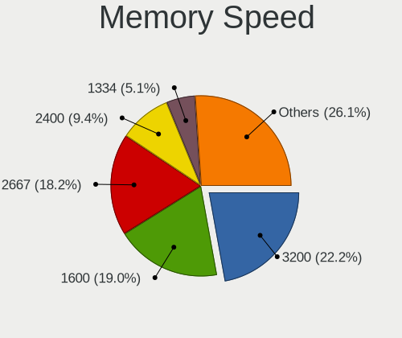

| Speed   | Notebooks | Percent |
|---------|-----------|---------|
| 1600    | 90        | 24%     |
| 2667    | 83        | 22.13%  |
| 3200    | 49        | 13.07%  |
| 2400    | 41        | 10.93%  |
| 1334    | 29        | 7.73%   |
| 2133    | 16        | 4.27%   |
| 667     | 9         | 2.4%    |
| 1333    | 8         | 2.13%   |
| 975     | 8         | 2.13%   |
| 800     | 7         | 1.87%   |
| 3266    | 6         | 1.6%    |
| Unknown | 6         | 1.6%    |
| 1067    | 5         | 1.33%   |
| 4267    | 3         | 0.8%    |
| 1066    | 3         | 0.8%    |
| 4199    | 2         | 0.53%   |
| 2048    | 2         | 0.53%   |
| 1867    | 2         | 0.53%   |
| 4800    | 1         | 0.27%   |
| 4266    | 1         | 0.27%   |
| 1639    | 1         | 0.27%   |
| 533     | 1         | 0.27%   |
| 400     | 1         | 0.27%   |
| 333     | 1         | 0.27%   |

Printers & scanners
-------------------

Printer Vendor
--------------

Printer device vendors

| Vendor                | Notebooks | Percent |
|-----------------------|-----------|---------|
| Hewlett-Packard       | 5         | 25%     |
| Canon                 | 5         | 25%     |
| Seiko Epson           | 3         | 15%     |
| Samsung Electronics   | 3         | 15%     |
| Brother Industries    | 2         | 10%     |
| Xerox                 | 1         | 5%      |
| Lexmark International | 1         | 5%      |

Printer Model
-------------

Printer device models

| Model                                      | Notebooks | Percent |
|--------------------------------------------|-----------|---------|
| Seiko Epson L3110 Series                   | 2         | 10%     |
| Samsung Composite Device                   | 2         | 10%     |
| Xerox Phaser 3020                          | 1         | 5%      |
| Seiko Epson ET-2710 Series                 | 1         | 5%      |
| Samsung M2070 Series                       | 1         | 5%      |
| Lexmark International InkJet Color Printer | 1         | 5%      |
| HP LaserJet 1022                           | 1         | 5%      |
| HP LaserJet 1018                           | 1         | 5%      |
| HP Laser 107a                              | 1         | 5%      |
| HP Deskjet F4500 series                    | 1         | 5%      |
| HP Deskjet 2050 J510                       | 1         | 5%      |
| Canon PIXMA MP250                          | 1         | 5%      |
| Canon MF4320-4350                          | 1         | 5%      |
| Canon MF3200 series                        | 1         | 5%      |
| Canon LiDE 300                             | 1         | 5%      |
| Canon iP7200 series                        | 1         | 5%      |
| Brother HL-1110 series                     | 1         | 5%      |
| Brother DCP-T310                           | 1         | 5%      |

Scanner Vendor
--------------

Scanner device vendors

Zero info for selected period =(

Scanner Model
-------------

Scanner device models

Zero info for selected period =(

Camera
------

Camera Vendor
-------------

Camera device vendors

| Vendor                                 | Notebooks | Percent |
|----------------------------------------|-----------|---------|
| IMC Networks                           | 199       | 25.68%  |
| Chicony Electronics                    | 161       | 20.77%  |
| Realtek Semiconductor                  | 69        | 8.9%    |
| Acer                                   | 58        | 7.48%   |
| Microdia                               | 56        | 7.23%   |
| Sunplus Innovation Technology          | 38        | 4.9%    |
| Quanta                                 | 35        | 4.52%   |
| Syntek                                 | 22        | 2.84%   |
| Lite-On Technology                     | 20        | 2.58%   |
| Alcor Micro                            | 20        | 2.58%   |
| Cheng Uei Precision Industry (Foxlink) | 19        | 2.45%   |
| Suyin                                  | 16        | 2.06%   |
| Ricoh                                  | 8         | 1.03%   |
| Sonix Technology                       | 7         | 0.9%    |
| Samsung Electronics                    | 6         | 0.77%   |
| Apple                                  | 6         | 0.77%   |
| Silicon Motion                         | 5         | 0.65%   |
| OmniVision Technologies                | 5         | 0.65%   |
| Luxvisions Innotech Limited            | 4         | 0.52%   |
| ALi                                    | 3         | 0.39%   |
| Z-Star Microelectronics                | 2         | 0.26%   |
| Sunplus Technology                     | 2         | 0.26%   |
| Primax Electronics                     | 2         | 0.26%   |
| Lenovo                                 | 2         | 0.26%   |
| Importek                               | 2         | 0.26%   |
| Genesys Logic                          | 2         | 0.26%   |
| Trust                                  | 1         | 0.13%   |
| Philips (or NXP)                       | 1         | 0.13%   |
| Microsoft                              | 1         | 0.13%   |
| Logitech                               | 1         | 0.13%   |
| Epiphan Systems                        | 1         | 0.13%   |
| Cubeternet                             | 1         | 0.13%   |

Camera Model
------------

Camera device models

| Model                                            | Notebooks | Percent |
|--------------------------------------------------|-----------|---------|
| IMC Networks USB2.0 VGA UVC WebCam               | 96        | 12.39%  |
| IMC Networks USB2.0 HD UVC WebCam                | 59        | 7.61%   |
| Chicony Integrated Camera                        | 29        | 3.74%   |
| Realtek Integrated_Webcam_HD                     | 20        | 2.58%   |
| IMC Networks Integrated Camera                   | 19        | 2.45%   |
| Microdia Integrated_Webcam_HD                    | 17        | 2.19%   |
| Acer Integrated Camera                           | 16        | 2.06%   |
| Chicony USB2.0 VGA UVC WebCam                    | 15        | 1.94%   |
| Chicony HD WebCam                                | 14        | 1.81%   |
| Syntek Integrated Camera                         | 10        | 1.29%   |
| Realtek USB Camera                               | 10        | 1.29%   |
| Acer Lenovo EasyCamera                           | 10        | 1.29%   |
| Sunplus HD WebCam                                | 9         | 1.16%   |
| Chicony USB2.0 HD UVC WebCam                     | 9         | 1.16%   |
| Chicony TOSHIBA Web Camera - HD                  | 9         | 1.16%   |
| Quanta VGA WebCam                                | 8         | 1.03%   |
| Lite-On Integrated Camera                        | 8         | 1.03%   |
| Sunplus Integrated_Webcam_HD                     | 7         | 0.9%    |
| Microdia Integrated Webcam                       | 7         | 0.9%    |
| Chicony EasyCamera                               | 7         | 0.9%    |
| Acer SunplusIT Integrated Camera                 | 7         | 0.9%    |
| Syntek EasyCamera                                | 6         | 0.77%   |
| Samsung Galaxy A5 (MTP)                          | 6         | 0.77%   |
| Realtek USB2.0 HD UVC WebCam                     | 6         | 0.77%   |
| Realtek Lenovo EasyCamera                        | 6         | 0.77%   |
| IMC Networks USB2.0 UVC HD Webcam                | 6         | 0.77%   |
| Chicony VGA WebCam                               | 6         | 0.77%   |
| Chicony HP HD Webcam                             | 6         | 0.77%   |
| Cheng Uei Precision Industry (Foxlink) Webcam    | 6         | 0.77%   |
| Alcor Micro USB2.0 Camera                        | 6         | 0.77%   |
| Acer EasyCamera                                  | 6         | 0.77%   |
| Syntek Lenovo EasyCamera                         | 5         | 0.65%   |
| Sunplus ASUS Webcam                              | 5         | 0.65%   |
| Sonix USB2.0 HD UVC WebCam                       | 5         | 0.65%   |
| Realtek USB2.0 VGA UVC WebCam                    | 5         | 0.65%   |
| Realtek Integrated Webcam                        | 5         | 0.65%   |
| Quanta HD Webcam                                 | 5         | 0.65%   |
| OmniVision OV2640 Webcam                         | 5         | 0.65%   |
| Lite-On HP Wide Vision HD Camera                 | 5         | 0.65%   |
| Alcor Micro SHUNCCM2MP                           | 5         | 0.65%   |
| Acer HD Webcam                                   | 5         | 0.65%   |
| Sunplus Laptop_Integrated_Webcam_FHD             | 4         | 0.52%   |
| Sunplus HP HD Webcam [Fixed]                     | 4         | 0.52%   |
| Quanta USB2.0 VGA UVC WebCam                     | 4         | 0.52%   |
| Quanta Laptop_Integrated_Webcam_2HDM             | 4         | 0.52%   |
| Microdia 1.3 MPixel Integrated Webcam            | 4         | 0.52%   |
| Chicony USB2.0 Camera                            | 4         | 0.52%   |
| Chicony Integrated Camera (1280x720@30)          | 4         | 0.52%   |
| Chicony HP Webcam [2 MP Macro]                   | 4         | 0.52%   |
| Chicony HP Webcam                                | 4         | 0.52%   |
| Chicony 2.0M UVC Webcam / CNF7129                | 4         | 0.52%   |
| Cheng Uei Precision Industry (Foxlink) HP Webcam | 4         | 0.52%   |
| Suyin HP Truevision HD                           | 3         | 0.39%   |
| Suyin Acer CrystalEye Webcam                     | 3         | 0.39%   |
| Realtek MTD camera                               | 3         | 0.39%   |
| Realtek Integrated Camera                        | 3         | 0.39%   |
| Quanta HP Webcam                                 | 3         | 0.39%   |
| Quanta HD User Facing                            | 3         | 0.39%   |
| Microdia Laptop_Integrated_Webcam_HD             | 3         | 0.39%   |
| Microdia HP Webcam-101                           | 3         | 0.39%   |

Security
--------

Fingerprint Vendor
------------------

Fingerprint sensor vendors

| Vendor                     | Notebooks | Percent |
|----------------------------|-----------|---------|
| Validity Sensors           | 47        | 39.83%  |
| Synaptics                  | 29        | 24.58%  |
| Upek                       | 10        | 8.47%   |
| Shenzhen Goodix Technology | 10        | 8.47%   |
| Elan Microelectronics      | 9         | 7.63%   |
| AuthenTec                  | 6         | 5.08%   |
| LighTuning Technology      | 5         | 4.24%   |
| STMicroelectronics         | 1         | 0.85%   |
| Focal-systems.Corp         | 1         | 0.85%   |

Fingerprint Model
-----------------

Fingerprint sensor models

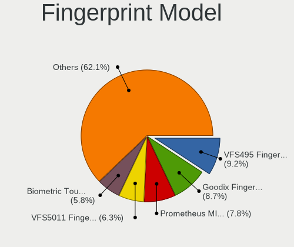

| Model                                                                      | Notebooks | Percent |
|----------------------------------------------------------------------------|-----------|---------|
| Validity Sensors VFS495 Fingerprint Reader                                 | 10        | 8.47%   |
| Upek Biometric Touchchip/Touchstrip Fingerprint Sensor                     | 9         | 7.63%   |
| Elan ELAN:Fingerprint                                                      | 9         | 7.63%   |
| Validity Sensors VFS5011 Fingerprint Reader                                | 8         | 6.78%   |
| Synaptics  WBDI                                                            | 8         | 6.78%   |
| Synaptics Prometheus MIS Touch Fingerprint Reader                          | 7         | 5.93%   |
| Shenzhen Goodix  FingerPrint Device                                        | 7         | 5.93%   |
| Validity Sensors VFS 5011 fingerprint sensor                               | 6         | 5.08%   |
| Validity Sensors VFS471 Fingerprint Reader                                 | 5         | 4.24%   |
| Validity Sensors VFS491                                                    | 4         | 3.39%   |
| Validity Sensors VFS451 Fingerprint Reader                                 | 4         | 3.39%   |
| AuthenTec AES2810                                                          | 4         | 3.39%   |
| Unknown                                                                    | 4         | 3.39%   |
| Validity Sensors Synaptics WBDI                                            | 3         | 2.54%   |
| Validity Sensors Synaptics VFS7552 Touch Fingerprint Sensor with PurePrint | 3         | 2.54%   |
| Synaptics  VFS7552 Touch Fingerprint Sensor with PurePrint                 | 3         | 2.54%   |
| Synaptics Metallica MIS Touch Fingerprint Reader                           | 3         | 2.54%   |
| Synaptics  FS7604 Touch Fingerprint Sensor with PurePrint                  | 2         | 1.69%   |
| Synaptics Metallica MOH Touch Fingerprint Reader                           | 2         | 1.69%   |
| Shenzhen Goodix Fingerprint Reader                                         | 2         | 1.69%   |
| LighTuning Fingerprint Reader                                              | 2         | 1.69%   |
| LighTuning EgisTec Touch Fingerprint Sensor                                | 2         | 1.69%   |
| Validity Sensors VFS7552 Touch Fingerprint Sensor                          | 1         | 0.85%   |
| Validity Sensors VFS7500 Touch Fingerprint Sensor                          | 1         | 0.85%   |
| Validity Sensors Swipe Fingerprint Sensor                                  | 1         | 0.85%   |
| Validity Sensors Fingerprint scanner                                       | 1         | 0.85%   |
| Upek TCS5B Fingerprint sensor                                              | 1         | 0.85%   |
| STMicroelectronics Fingerprint Reader                                      | 1         | 0.85%   |
| Shenzhen Goodix FingerPrint                                                | 1         | 0.85%   |
| LighTuning ES603 Swipe Fingerprint Sensor                                  | 1         | 0.85%   |
| Focal-systems.Corp FT9201Fingerprint.                                      | 1         | 0.85%   |
| AuthenTec Fingerprint Sensor                                               | 1         | 0.85%   |
| AuthenTec AES2501 Fingerprint Sensor                                       | 1         | 0.85%   |

Chipcard Vendor
---------------

Chipcard module vendors

| Vendor                | Notebooks | Percent |
|-----------------------|-----------|---------|
| Broadcom              | 29        | 60.42%  |
| Alcor Micro           | 11        | 22.92%  |
| O2 Micro              | 3         | 6.25%   |
| Lenovo                | 3         | 6.25%   |
| Upek                  | 1         | 2.08%   |
| Gemalto (was Gemplus) | 1         | 2.08%   |

Chipcard Model
--------------

Chipcard module models

| Model                                                                        | Notebooks | Percent |
|------------------------------------------------------------------------------|-----------|---------|
| Alcor Micro AU9540 Smartcard Reader                                          | 11        | 22.92%  |
| Broadcom BCM5880 Secure Applications Processor                               | 8         | 16.67%  |
| Broadcom BCM5880 Secure Applications Processor with fingerprint swipe sensor | 7         | 14.58%  |
| Broadcom 5880                                                                | 7         | 14.58%  |
| Broadcom 58200                                                               | 7         | 14.58%  |
| O2 Micro OZ776 CCID Smartcard Reader                                         | 3         | 6.25%   |
| Lenovo Integrated Smart Card Reader                                          | 3         | 6.25%   |
| Upek TouchChip Fingerprint Coprocessor (WBF advanced mode)                   | 1         | 2.08%   |
| Gemalto (was Gemplus) Compact Smart Card Reader Writer                       | 1         | 2.08%   |

Unsupported
-----------

Unsupported Devices
-------------------

Total unsupported devices on board

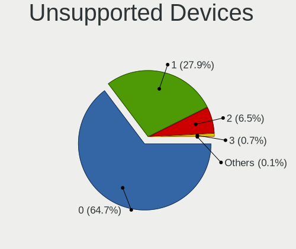

| Total | Notebooks | Percent |
|-------|-----------|---------|
| 0     | 589       | 67.86%  |
| 1     | 224       | 25.81%  |
| 2     | 50        | 5.76%   |
| 3     | 3         | 0.35%   |
| 10    | 1         | 0.12%   |
| 4     | 1         | 0.12%   |

Unsupported Device Types
------------------------

Types of unsupported devices

| Type                     | Notebooks | Percent |
|--------------------------|-----------|---------|
| Fingerprint reader       | 117       | 34.82%  |
| Graphics card            | 60        | 17.86%  |
| Chipcard                 | 47        | 13.99%  |
| Net/wireless             | 38        | 11.31%  |
| Multimedia controller    | 21        | 6.25%   |
| Bluetooth                | 13        | 3.87%   |
| Storage                  | 12        | 3.57%   |
| Communication controller | 11        | 3.27%   |
| Camera                   | 6         | 1.79%   |
| Sound                    | 2         | 0.6%    |
| Card reader              | 2         | 0.6%    |
| Storage/nvme             | 1         | 0.3%    |
| Network                  | 1         | 0.3%    |
| Net/ethernet             | 1         | 0.3%    |
| Modem                    | 1         | 0.3%    |
| Flash memory             | 1         | 0.3%    |
| Firewire controller      | 1         | 0.3%    |
| Dvb card                 | 1         | 0.3%    |

