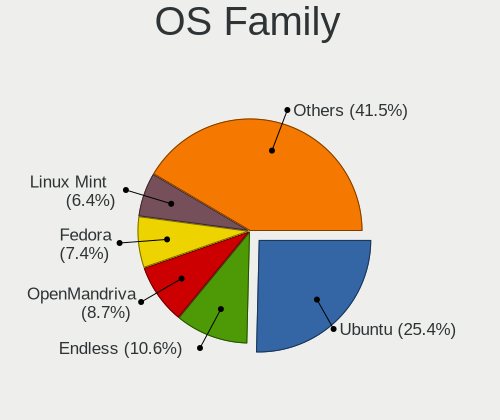
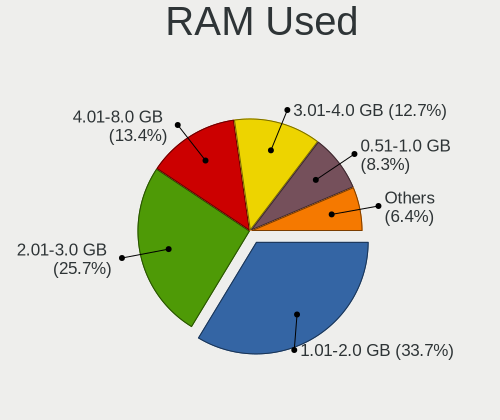
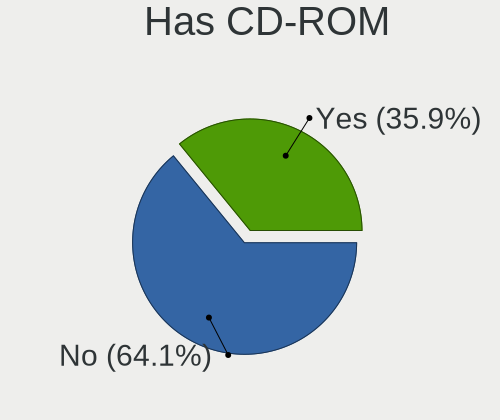
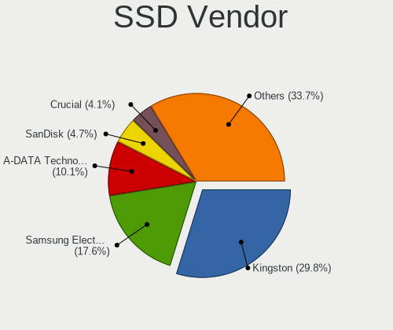
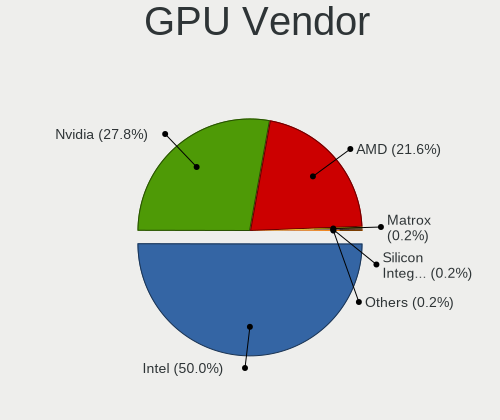
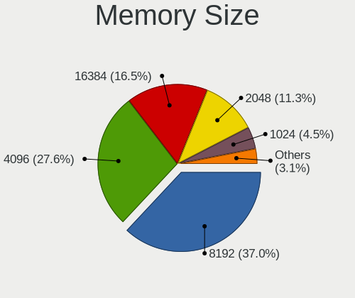
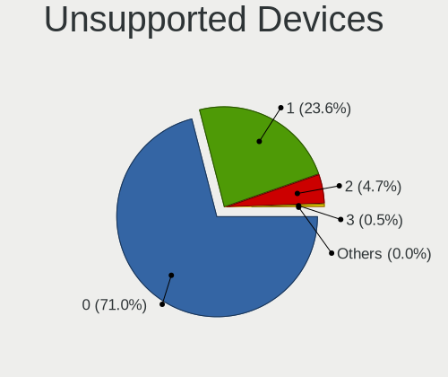

Linux in Romania - Tested Hardware & Statistics
-----------------------------------------------

A project to collect tested hardware configurations for Linux in Romania.

Anyone can contribute to this report by the [hw-probe](https://github.com/linuxhw/hw-probe) tool:

    sudo -E hw-probe -all -upload

Please contribute! Especially if your hardware is rare.

This is a report for all computer types. See also reports for [desktops](/Location/Romania/Desktop/README.md) and [notebooks](/Location/Romania/Notebook/README.md).

Contents
--------

* [ Test Cases ](#test-cases)

* [ System ](#system)
  - [ OS                       ](#os)
  - [ OS Family                ](#os-family)
  - [ Kernel                   ](#kernel)
  - [ Kernel Family            ](#kernel-family)
  - [ Kernel Major Ver.        ](#kernel-major-ver)
  - [ Arch                     ](#arch)
  - [ DE                       ](#de)
  - [ Display Server           ](#display-server)
  - [ Display Manager          ](#display-manager)
  - [ OS Lang                  ](#os-lang)
  - [ Boot Mode                ](#boot-mode)
  - [ Filesystem               ](#filesystem)
  - [ Part. scheme             ](#part-scheme)
  - [ Dual Boot with Linux/BSD ](#dual-boot-with-linuxbsd)
  - [ Dual Boot (Win)          ](#dual-boot-win)

* [ Board ](#board)
  - [ Vendor                   ](#vendor)
  - [ Model                    ](#model)
  - [ Model Family             ](#model-family)
  - [ MFG Year                 ](#mfg-year)
  - [ Form Factor              ](#form-factor)
  - [ Secure Boot              ](#secure-boot)
  - [ Coreboot                 ](#coreboot)
  - [ RAM Size                 ](#ram-size)
  - [ RAM Used                 ](#ram-used)
  - [ Total Drives             ](#total-drives)
  - [ Has CD-ROM               ](#has-cd-rom)
  - [ Has Ethernet             ](#has-ethernet)
  - [ Has WiFi                 ](#has-wifi)
  - [ Has Bluetooth            ](#has-bluetooth)

* [ Location ](#location)
  - [ Country                  ](#country)
  - [ City                     ](#city)

* [ Drives ](#drives)
  - [ Drive Vendor             ](#drive-vendor)
  - [ Drive Model              ](#drive-model)
  - [ HDD Vendor               ](#hdd-vendor)
  - [ SSD Vendor               ](#ssd-vendor)
  - [ Drive Kind               ](#drive-kind)
  - [ Drive Connector          ](#drive-connector)
  - [ Drive Size               ](#drive-size)
  - [ Space Total              ](#space-total)
  - [ Space Used               ](#space-used)
  - [ Malfunc. Drives          ](#malfunc-drives)
  - [ Malfunc. Drive Vendor    ](#malfunc-drive-vendor)
  - [ Malfunc. HDD Vendor      ](#malfunc-hdd-vendor)
  - [ Malfunc. Drive Kind      ](#malfunc-drive-kind)
  - [ Failed Drives            ](#failed-drives)
  - [ Failed Drive Vendor      ](#failed-drive-vendor)
  - [ Drive Status             ](#drive-status)

* [ Storage controller ](#storage-controller)
  - [ Storage Vendor           ](#storage-vendor)
  - [ Storage Model            ](#storage-model)
  - [ Storage Kind             ](#storage-kind)

* [ Processor ](#processor)
  - [ CPU Vendor               ](#cpu-vendor)
  - [ CPU Model                ](#cpu-model)
  - [ CPU Model Family         ](#cpu-model-family)
  - [ CPU Cores                ](#cpu-cores)
  - [ CPU Sockets              ](#cpu-sockets)
  - [ CPU Threads              ](#cpu-threads)
  - [ CPU Op-Modes             ](#cpu-op-modes)
  - [ CPU Microcode            ](#cpu-microcode)
  - [ CPU Microarch            ](#cpu-microarch)

* [ Graphics ](#graphics)
  - [ GPU Vendor               ](#gpu-vendor)
  - [ GPU Model                ](#gpu-model)
  - [ GPU Combo                ](#gpu-combo)
  - [ GPU Driver               ](#gpu-driver)
  - [ GPU Memory               ](#gpu-memory)

* [ Monitor ](#monitor)
  - [ Monitor Vendor           ](#monitor-vendor)
  - [ Monitor Model            ](#monitor-model)
  - [ Monitor Resolution       ](#monitor-resolution)
  - [ Monitor Diagonal         ](#monitor-diagonal)
  - [ Monitor Width            ](#monitor-width)
  - [ Aspect Ratio             ](#aspect-ratio)
  - [ Monitor Area             ](#monitor-area)
  - [ Pixel Density            ](#pixel-density)
  - [ Multiple Monitors        ](#multiple-monitors)

* [ Network ](#network)
  - [ Net Controller Vendor    ](#net-controller-vendor)
  - [ Net Controller Model     ](#net-controller-model)
  - [ Wireless Vendor          ](#wireless-vendor)
  - [ Wireless Model           ](#wireless-model)
  - [ Ethernet Vendor          ](#ethernet-vendor)
  - [ Ethernet Model           ](#ethernet-model)
  - [ Net Controller Kind      ](#net-controller-kind)
  - [ Used Controller          ](#used-controller)
  - [ NICs                     ](#nics)
  - [ IPv6                     ](#ipv6)

* [ Bluetooth ](#bluetooth)
  - [ Bluetooth Vendor         ](#bluetooth-vendor)
  - [ Bluetooth Model          ](#bluetooth-model)

* [ Sound ](#sound)
  - [ Sound Vendor             ](#sound-vendor)
  - [ Sound Model              ](#sound-model)

* [ Memory ](#memory)
  - [ Memory Vendor            ](#memory-vendor)
  - [ Memory Model             ](#memory-model)
  - [ Memory Kind              ](#memory-kind)
  - [ Memory Form Factor       ](#memory-form-factor)
  - [ Memory Size              ](#memory-size)
  - [ Memory Speed             ](#memory-speed)

* [ Printers & scanners ](#printers--scanners)
  - [ Printer Vendor           ](#printer-vendor)
  - [ Printer Model            ](#printer-model)
  - [ Scanner Vendor           ](#scanner-vendor)
  - [ Scanner Model            ](#scanner-model)

* [ Camera ](#camera)
  - [ Camera Vendor            ](#camera-vendor)
  - [ Camera Model             ](#camera-model)

* [ Security ](#security)
  - [ Fingerprint Vendor       ](#fingerprint-vendor)
  - [ Fingerprint Model        ](#fingerprint-model)
  - [ Chipcard Vendor          ](#chipcard-vendor)
  - [ Chipcard Model           ](#chipcard-model)

* [ Unsupported ](#unsupported)
  - [ Unsupported Devices      ](#unsupported-devices)
  - [ Unsupported Device Types ](#unsupported-device-types)

Test Cases
----------

Total: 3484

| Vendor        | Model                       | Form-Factor | Probe                                                      | Date         |
|---------------|-----------------------------|-------------|------------------------------------------------------------|--------------|
| Sony          | VGN-NR21E_S                 | Notebook    | [0ed147c4fb](https://linux-hardware.org/?probe=0ed147c4fb) | Jan 05, 2025 |
| ASUSTek       | VivoBook_ASUSLaptop X150... | Notebook    | [0f5c50a01c](https://linux-hardware.org/?probe=0f5c50a01c) | Jan 05, 2025 |
| ASUSTek       | ROG Strix G713RC_G713RC     | Notebook    | [721dbc3f65](https://linux-hardware.org/?probe=721dbc3f65) | Jan 04, 2025 |
| ASUSTek       | ROG Strix G713RC_G713RC     | Notebook    | [e6b0e5183e](https://linux-hardware.org/?probe=e6b0e5183e) | Jan 04, 2025 |
| ASUSTek       | Pro B560M-C                 | Desktop     | [00895d3b67](https://linux-hardware.org/?probe=00895d3b67) | Jan 03, 2025 |
| Toshiba       | Satellite C660              | Notebook    | [0767070a44](https://linux-hardware.org/?probe=0767070a44) | Jan 03, 2025 |
| Acer          | Aspire A315-24P             | Notebook    | [40320094a6](https://linux-hardware.org/?probe=40320094a6) | Jan 02, 2025 |
| ASUSTek       | VivoBook_ASUSLaptop X150... | Notebook    | [110b5ee190](https://linux-hardware.org/?probe=110b5ee190) | Jan 02, 2025 |
| MSI           | Vector GP76HX 12UGS         | Notebook    | [3873360b8b](https://linux-hardware.org/?probe=3873360b8b) | Jan 02, 2025 |
| ASUSTek       | ROG STRIX B650E-E GAMING... | Desktop     | [501ef7e401](https://linux-hardware.org/?probe=501ef7e401) | Dec 31, 2024 |
| Lenovo        | ThinkPad E550 20DF007YRI    | Notebook    | [8ad38acc8a](https://linux-hardware.org/?probe=8ad38acc8a) | Dec 31, 2024 |
| ASUSTek       | Pro B560M-C                 | Desktop     | [0d9d36f397](https://linux-hardware.org/?probe=0d9d36f397) | Dec 30, 2024 |
| Lenovo        | IdeaPad 330-15ARR 81D2      | Notebook    | [7a8e2cd7ed](https://linux-hardware.org/?probe=7a8e2cd7ed) | Dec 30, 2024 |
| Lenovo        | IdeaPad 330-15ARR 81D2      | Notebook    | [104b0f2168](https://linux-hardware.org/?probe=104b0f2168) | Dec 30, 2024 |
| ASUSTek       | X541UVK                     | Notebook    | [84cde5a12c](https://linux-hardware.org/?probe=84cde5a12c) | Dec 30, 2024 |
| HP            | Laptop 17-by3xxx            | Notebook    | [798564ee8d](https://linux-hardware.org/?probe=798564ee8d) | Dec 28, 2024 |
| ASUSTek       | X550VL                      | Notebook    | [f39f501a7f](https://linux-hardware.org/?probe=f39f501a7f) | Dec 28, 2024 |
| Acer          | Aspire E1-571G              | Notebook    | [6da76de24e](https://linux-hardware.org/?probe=6da76de24e) | Dec 27, 2024 |
| Gigabyte      | A520M K                     | Desktop     | [669dc7155c](https://linux-hardware.org/?probe=669dc7155c) | Dec 27, 2024 |
| MSI           | H110M PRO-D                 | Desktop     | [9ecfd504b7](https://linux-hardware.org/?probe=9ecfd504b7) | Dec 26, 2024 |
| ASUSTek       | X541UVK                     | Notebook    | [e84d6fc1f1](https://linux-hardware.org/?probe=e84d6fc1f1) | Dec 26, 2024 |
| Gigabyte      | B650I AX                    | Desktop     | [65f34ef743](https://linux-hardware.org/?probe=65f34ef743) | Dec 26, 2024 |
| HP            | EliteBook 8460p             | Notebook    | [0916dd5986](https://linux-hardware.org/?probe=0916dd5986) | Dec 25, 2024 |
| ASRock        | J4105-ITX                   | Desktop     | [760c59fa66](https://linux-hardware.org/?probe=760c59fa66) | Dec 25, 2024 |
| HP            | EliteBook 840 G3            | Notebook    | [bae2eb1cb6](https://linux-hardware.org/?probe=bae2eb1cb6) | Dec 25, 2024 |
| Acer          | Aspire A517-51G             | Notebook    | [4c16c27b7b](https://linux-hardware.org/?probe=4c16c27b7b) | Dec 25, 2024 |
| ASUSTek       | PRIME A320M-K               | Desktop     | [52d87cf435](https://linux-hardware.org/?probe=52d87cf435) | Dec 25, 2024 |
| Apple         | Mac-F227BEC8 PVT            | All in one  | [1d1daf9285](https://linux-hardware.org/?probe=1d1daf9285) | Dec 24, 2024 |
| ASRock        | B250M-HDV                   | Desktop     | [3b8f677d39](https://linux-hardware.org/?probe=3b8f677d39) | Dec 24, 2024 |
| HP            | ZBook FuRY 16 G10 Mobile    | Notebook    | [3914f42ba9](https://linux-hardware.org/?probe=3914f42ba9) | Dec 23, 2024 |
| Lenovo        | V330-15IKB 81AX             | Notebook    | [1b1e58284a](https://linux-hardware.org/?probe=1b1e58284a) | Dec 23, 2024 |
| HP            | EliteBook 8460p             | Notebook    | [963d7abc23](https://linux-hardware.org/?probe=963d7abc23) | Dec 21, 2024 |
| Gigabyte      | B550M DS3H                  | Desktop     | [8387032a00](https://linux-hardware.org/?probe=8387032a00) | Dec 21, 2024 |
| HP            | EliteBook 850 G5            | Notebook    | [e54906d193](https://linux-hardware.org/?probe=e54906d193) | Dec 21, 2024 |
| ASUSTek       | PRIME H510M-A               | Desktop     | [2e9c14e21d](https://linux-hardware.org/?probe=2e9c14e21d) | Dec 21, 2024 |
| ASUSTek       | ASUS Vivobook S 14 M5406... | Notebook    | [5245e69e47](https://linux-hardware.org/?probe=5245e69e47) | Dec 20, 2024 |
| Hampoo        | P02BD6_HI-122LP             | Tablet      | [160f76dd46](https://linux-hardware.org/?probe=160f76dd46) | Dec 18, 2024 |
| Lenovo        | ThinkBook 16 G7 IML 21MS    | Notebook    | [79b9b179ef](https://linux-hardware.org/?probe=79b9b179ef) | Dec 18, 2024 |
| ASRock        | B550M-HVS SE                | Desktop     | [c7507cc0e0](https://linux-hardware.org/?probe=c7507cc0e0) | Dec 16, 2024 |
| HP            | OMEN by Laptop 17-ck1xxx    | Notebook    | [a39d299b50](https://linux-hardware.org/?probe=a39d299b50) | Dec 15, 2024 |
| MSI           | A320M-A PRO MAX             | Desktop     | [9c3b938ad7](https://linux-hardware.org/?probe=9c3b938ad7) | Dec 15, 2024 |
| Dell          | 0PC5F7 A02                  | Desktop     | [300b0dac16](https://linux-hardware.org/?probe=300b0dac16) | Dec 15, 2024 |
| ASUSTek       | X541UAK                     | Notebook    | [3b5b163084](https://linux-hardware.org/?probe=3b5b163084) | Dec 14, 2024 |
| Lenovo        | Legion S7 15IMH5 82BC       | Notebook    | [4a38241f5d](https://linux-hardware.org/?probe=4a38241f5d) | Dec 13, 2024 |
| Acer          | Nitro AN515-58              | Notebook    | [444ca7d70a](https://linux-hardware.org/?probe=444ca7d70a) | Dec 12, 2024 |
| HP            | 83E9                        | Desktop     | [bb43ae5b62](https://linux-hardware.org/?probe=bb43ae5b62) | Dec 12, 2024 |
| Acer          | Nitro AN515-58              | Notebook    | [b18d1c210a](https://linux-hardware.org/?probe=b18d1c210a) | Dec 12, 2024 |
| ASUSTek       | VivoBook_ASUSLaptop X150... | Notebook    | [c22f3c5d77](https://linux-hardware.org/?probe=c22f3c5d77) | Dec 12, 2024 |
| ASUSTek       | X541UAK                     | Notebook    | [b0c9088b05](https://linux-hardware.org/?probe=b0c9088b05) | Dec 10, 2024 |
| Dell          | 0F6X5P A00                  | Desktop     | [680aead333](https://linux-hardware.org/?probe=680aead333) | Dec 10, 2024 |
| HP            | OMEN by Laptop 17-cb1xxx    | Notebook    | [4c1f450872](https://linux-hardware.org/?probe=4c1f450872) | Dec 08, 2024 |
| Dell          | Precision 7530              | Notebook    | [0548741152](https://linux-hardware.org/?probe=0548741152) | Dec 07, 2024 |
| Acer          | Aspire 7530                 | Notebook    | [d3ba125ebf](https://linux-hardware.org/?probe=d3ba125ebf) | Dec 07, 2024 |
| MSI           | A320M PRO-E                 | Desktop     | [bae9cfba05](https://linux-hardware.org/?probe=bae9cfba05) | Dec 07, 2024 |
| Unknown       | Unknown                     | Desktop     | [d58ff3bf72](https://linux-hardware.org/?probe=d58ff3bf72) | Dec 07, 2024 |
| Unknown       | Unknown                     | Desktop     | [722fa16afd](https://linux-hardware.org/?probe=722fa16afd) | Dec 07, 2024 |
| ASUSTek       | ASUS Vivobook S 16 M5606... | Notebook    | [a3dad268d2](https://linux-hardware.org/?probe=a3dad268d2) | Dec 06, 2024 |
| Unknown       | Unknown                     | Desktop     | [ed080e6dcc](https://linux-hardware.org/?probe=ed080e6dcc) | Dec 06, 2024 |
| ASUSTek       | ASUS Vivobook S 16 M5606... | Notebook    | [8ab8ddf97e](https://linux-hardware.org/?probe=8ab8ddf97e) | Dec 06, 2024 |
| Lenovo        | ThinkPad T440p 20AWS0WP0... | Notebook    | [1b667db1d3](https://linux-hardware.org/?probe=1b667db1d3) | Dec 04, 2024 |
| Lenovo        | ThinkPad T440p 20AWS0WP0... | Notebook    | [4b2d509faa](https://linux-hardware.org/?probe=4b2d509faa) | Dec 04, 2024 |
| Unknown       | Unknown                     | Desktop     | [c832be89c4](https://linux-hardware.org/?probe=c832be89c4) | Dec 03, 2024 |
| ASUSTek       | ProArt B550-CREATOR         | Desktop     | [074e91d7d5](https://linux-hardware.org/?probe=074e91d7d5) | Dec 03, 2024 |
| Dell          | Vostro 15 3515              | Notebook    | [c220d225cc](https://linux-hardware.org/?probe=c220d225cc) | Dec 03, 2024 |
| Lenovo        | IdeaPad Slim 5 14AHP9 83... | Notebook    | [3a866971df](https://linux-hardware.org/?probe=3a866971df) | Dec 02, 2024 |
| Lenovo        | ThinkPad T60 2007YQY        | Notebook    | [8d792cc626](https://linux-hardware.org/?probe=8d792cc626) | Dec 02, 2024 |
| Gigabyte      | Z590 AORUS ULTRA            | Desktop     | [ba4ef6acce](https://linux-hardware.org/?probe=ba4ef6acce) | Dec 02, 2024 |
| ASUSTek       | ASUS TUF Gaming F15 FX50... | Notebook    | [eec68584ed](https://linux-hardware.org/?probe=eec68584ed) | Dec 01, 2024 |
| Gigabyte      | X670 GAMING X AX            | Desktop     | [35ae0deb67](https://linux-hardware.org/?probe=35ae0deb67) | Dec 01, 2024 |
| ASRock        | B250M-HDV                   | Desktop     | [e9df8950aa](https://linux-hardware.org/?probe=e9df8950aa) | Nov 30, 2024 |
| Apple         | MacBookPro8,1               | Notebook    | [82c25b95f2](https://linux-hardware.org/?probe=82c25b95f2) | Nov 30, 2024 |
| Acer          | Predator PT316-51s          | Notebook    | [59b81c6d72](https://linux-hardware.org/?probe=59b81c6d72) | Nov 29, 2024 |
| Gigabyte      | H410M S2H V2                | Desktop     | [d7b1ed88f7](https://linux-hardware.org/?probe=d7b1ed88f7) | Nov 29, 2024 |
| Gigabyte      | H410M S2H V2                | Desktop     | [d7e219e8d0](https://linux-hardware.org/?probe=d7e219e8d0) | Nov 29, 2024 |
| ASUSTek       | H81M-R                      | Desktop     | [48fb51cf34](https://linux-hardware.org/?probe=48fb51cf34) | Nov 27, 2024 |
| HP            | 158A                        | Desktop     | [82590de33d](https://linux-hardware.org/?probe=82590de33d) | Nov 27, 2024 |
| ASUSTek       | PRIME H310M-R R2.0          | Desktop     | [7b8612d136](https://linux-hardware.org/?probe=7b8612d136) | Nov 27, 2024 |
| HP            | EliteBook 840 G6            | Notebook    | [942a83432e](https://linux-hardware.org/?probe=942a83432e) | Nov 26, 2024 |
| Lenovo        | ThinkPad E550 20DF007YRI    | Notebook    | [8be5fd8c72](https://linux-hardware.org/?probe=8be5fd8c72) | Nov 25, 2024 |
| ASUSTek       | Pro B560M-C                 | Desktop     | [84dd81dd0b](https://linux-hardware.org/?probe=84dd81dd0b) | Nov 25, 2024 |
| MSI           | MS-7367                     | Desktop     | [74a01dfd89](https://linux-hardware.org/?probe=74a01dfd89) | Nov 24, 2024 |
| ASUSTek       | ROG Strix G713PU_G713PU     | Notebook    | [9743c11187](https://linux-hardware.org/?probe=9743c11187) | Nov 24, 2024 |
| Lenovo        | IdeaPad Gaming 3 15ARH7 ... | Notebook    | [9456b52471](https://linux-hardware.org/?probe=9456b52471) | Nov 23, 2024 |
| Apple         | Mac-27ADBB7B4CEE8E61 iMa... | All in one  | [4ae0ff6bb2](https://linux-hardware.org/?probe=4ae0ff6bb2) | Nov 23, 2024 |
| Lenovo        | ThinkPad E550 20DF007YRI    | Notebook    | [f652a62a8c](https://linux-hardware.org/?probe=f652a62a8c) | Nov 23, 2024 |
| HP            | Pavilion g7                 | Notebook    | [059e972b96](https://linux-hardware.org/?probe=059e972b96) | Nov 23, 2024 |
| ASUSTek       | TUF Gaming B450-PLUS II     | Desktop     | [777759441c](https://linux-hardware.org/?probe=777759441c) | Nov 20, 2024 |
| ASUSTek       | Pro B560M-C                 | Desktop     | [e5c007a68f](https://linux-hardware.org/?probe=e5c007a68f) | Nov 19, 2024 |
| Chuwi         | GemiBook Pro                | Notebook    | [d9d23cdc2c](https://linux-hardware.org/?probe=d9d23cdc2c) | Nov 18, 2024 |
| Chuwi         | GemiBook Pro                | Notebook    | [1a57440afe](https://linux-hardware.org/?probe=1a57440afe) | Nov 18, 2024 |
| ASUSTek       | ASUS TUF Gaming F17 FX70... | Notebook    | [840bd96126](https://linux-hardware.org/?probe=840bd96126) | Nov 18, 2024 |
| Lenovo        | Legion 7 16IRX9 83FD        | Notebook    | [d3c3b4b1a7](https://linux-hardware.org/?probe=d3c3b4b1a7) | Nov 17, 2024 |
| Lenovo        | Legion 7 16IRX9 83FD        | Notebook    | [840968c712](https://linux-hardware.org/?probe=840968c712) | Nov 17, 2024 |
| HP            | 1905                        | Desktop     | [603e331581](https://linux-hardware.org/?probe=603e331581) | Nov 17, 2024 |
| HC Technol... | HCAR6000-MI2                | Desktop     | [bc6c7d0dc9](https://linux-hardware.org/?probe=bc6c7d0dc9) | Nov 17, 2024 |
| HP            | Pavilion dv6500             | Notebook    | [a875301ed0](https://linux-hardware.org/?probe=a875301ed0) | Nov 15, 2024 |
| Dell          | Precision 5690              | Notebook    | [d1160c82f8](https://linux-hardware.org/?probe=d1160c82f8) | Nov 14, 2024 |
| Lenovo        | IdeaPad Slim 5 14ABR8 82... | Notebook    | [3272a7f74d](https://linux-hardware.org/?probe=3272a7f74d) | Nov 14, 2024 |
| ASUSTek       | Z87-K                       | Desktop     | [fc4eed155d](https://linux-hardware.org/?probe=fc4eed155d) | Nov 14, 2024 |
| HP            | 1589                        | Desktop     | [5e5b4b317f](https://linux-hardware.org/?probe=5e5b4b317f) | Nov 13, 2024 |
| Gigabyte      | Z77P-D3                     | Desktop     | [4246bccdbe](https://linux-hardware.org/?probe=4246bccdbe) | Nov 12, 2024 |
| Apple         | MacBookPro16,2              | Notebook    | [1a7115becf](https://linux-hardware.org/?probe=1a7115becf) | Nov 12, 2024 |
| Apple         | MacBookPro16,2              | Notebook    | [612dc6bdf9](https://linux-hardware.org/?probe=612dc6bdf9) | Nov 12, 2024 |
| ASRock        | FM2A68M-DG3+                | Desktop     | [50988a1e09](https://linux-hardware.org/?probe=50988a1e09) | Nov 09, 2024 |
| Toshiba       | Satellite C660              | Notebook    | [efca38e06f](https://linux-hardware.org/?probe=efca38e06f) | Nov 08, 2024 |
| Dell          | 0HY9JP A00                  | Desktop     | [ba793c9a96](https://linux-hardware.org/?probe=ba793c9a96) | Nov 07, 2024 |
| ASUSTek       | P8H67-M                     | Desktop     | [d7ef318b8e](https://linux-hardware.org/?probe=d7ef318b8e) | Nov 06, 2024 |
| ASUSTek       | Pro B560M-C                 | Desktop     | [670dcfd347](https://linux-hardware.org/?probe=670dcfd347) | Nov 05, 2024 |
| Acer          | Aspire A515-45              | Notebook    | [56fa1eb0ff](https://linux-hardware.org/?probe=56fa1eb0ff) | Nov 04, 2024 |
| Gigabyte      | P55A-UD3                    | Desktop     | [3492a588b9](https://linux-hardware.org/?probe=3492a588b9) | Nov 04, 2024 |
| Dell          | Precision 5530              | Notebook    | [82a3124495](https://linux-hardware.org/?probe=82a3124495) | Nov 03, 2024 |
| Lenovo        | Legion 5 15ARH7H 82RD       | Notebook    | [27e080a699](https://linux-hardware.org/?probe=27e080a699) | Nov 02, 2024 |
| Lenovo        | IdeaPad Pro 5 14AHP9 83D... | Notebook    | [e82e4d82e0](https://linux-hardware.org/?probe=e82e4d82e0) | Nov 01, 2024 |
| Dell          | 0KH290                      | Desktop     | [1a0ac895ae](https://linux-hardware.org/?probe=1a0ac895ae) | Oct 31, 2024 |
| HP            | 250 15.6 inch G9 Noteboo... | Notebook    | [6c33a69b77](https://linux-hardware.org/?probe=6c33a69b77) | Oct 29, 2024 |
| Lenovo        | ThinkPad X220 42902P3       | Notebook    | [5224137903](https://linux-hardware.org/?probe=5224137903) | Oct 29, 2024 |
| ASUSTek       | X541UVK                     | Notebook    | [1bec944a0f](https://linux-hardware.org/?probe=1bec944a0f) | Oct 29, 2024 |
| ASUSTek       | X541UVK                     | Notebook    | [308efea806](https://linux-hardware.org/?probe=308efea806) | Oct 29, 2024 |
| Lenovo        | ThinkPad X220 42902P3       | Notebook    | [c4a87fec75](https://linux-hardware.org/?probe=c4a87fec75) | Oct 28, 2024 |
| HP            | 18E4                        | Desktop     | [0936cdf872](https://linux-hardware.org/?probe=0936cdf872) | Oct 28, 2024 |
| Lenovo        | ThinkPad Edge E320 1298A... | Notebook    | [db967cf215](https://linux-hardware.org/?probe=db967cf215) | Oct 27, 2024 |
| Lenovo        | 15ARE05 81W4                | Notebook    | [049414e1fb](https://linux-hardware.org/?probe=049414e1fb) | Oct 27, 2024 |
| Toshiba       | Satellite C850D-119         | Notebook    | [e3773c1a70](https://linux-hardware.org/?probe=e3773c1a70) | Oct 27, 2024 |
| Gigabyte      | Z170X-Gaming 3              | Desktop     | [090cd0be16](https://linux-hardware.org/?probe=090cd0be16) | Oct 26, 2024 |
| Gigabyte      | Z170X-Gaming 3              | Desktop     | [17bfc7765c](https://linux-hardware.org/?probe=17bfc7765c) | Oct 26, 2024 |
| HP            | 250 15.6 inch G9 Noteboo... | Notebook    | [80e86c27ad](https://linux-hardware.org/?probe=80e86c27ad) | Oct 23, 2024 |
| ASRock        | X99 Extreme4                | Desktop     | [168d757821](https://linux-hardware.org/?probe=168d757821) | Oct 21, 2024 |
| Lenovo        | B50-70 20384                | Notebook    | [09f5eef685](https://linux-hardware.org/?probe=09f5eef685) | Oct 21, 2024 |
| Lenovo        | ThinkPad E14 Gen 6 21M70... | Notebook    | [3be6a2a535](https://linux-hardware.org/?probe=3be6a2a535) | Oct 21, 2024 |
| Acer          | Aspire V3-571G              | Notebook    | [58cd9eafa2](https://linux-hardware.org/?probe=58cd9eafa2) | Oct 19, 2024 |
| Lenovo        | Legion 5 15IMH6 82NL        | Notebook    | [7f08763473](https://linux-hardware.org/?probe=7f08763473) | Oct 19, 2024 |
| Lenovo        | Legion 5 15IMH6 82NL        | Notebook    | [f3ed5c74a3](https://linux-hardware.org/?probe=f3ed5c74a3) | Oct 19, 2024 |
| Dell          | 0VFD52 A01                  | Desktop     | [389583bab9](https://linux-hardware.org/?probe=389583bab9) | Oct 18, 2024 |
| ASUSTek       | ASUS TUF Gaming F15 FX50... | Notebook    | [b55e37a8aa](https://linux-hardware.org/?probe=b55e37a8aa) | Oct 18, 2024 |
| ASRock        | A320M Pro4-F                | Desktop     | [b1b3e21e4a](https://linux-hardware.org/?probe=b1b3e21e4a) | Oct 17, 2024 |
| System76      | Darter Pro                  | Notebook    | [a3b432217e](https://linux-hardware.org/?probe=a3b432217e) | Oct 17, 2024 |
| Acer          | Nitro ANV15-51              | Notebook    | [17d1356bba](https://linux-hardware.org/?probe=17d1356bba) | Oct 17, 2024 |
| Acer          | Nitro ANV15-51              | Notebook    | [65b2fb14db](https://linux-hardware.org/?probe=65b2fb14db) | Oct 17, 2024 |
| Lenovo        | IdeaPad 320-15AST 80XV      | Notebook    | [facae97aa8](https://linux-hardware.org/?probe=facae97aa8) | Oct 16, 2024 |
| Acer          | Aspire A315-44P             | Notebook    | [2571a863c2](https://linux-hardware.org/?probe=2571a863c2) | Oct 15, 2024 |
| Lenovo        | ThinkPad X390 20Q0S1FS00    | Notebook    | [a8debb3ea7](https://linux-hardware.org/?probe=a8debb3ea7) | Oct 14, 2024 |
| ASUSTek       | VivoBook_ASUSLaptop X571... | Notebook    | [7ce127030d](https://linux-hardware.org/?probe=7ce127030d) | Oct 13, 2024 |
| Lenovo        | G550 20023                  | Notebook    | [2fc18b7f13](https://linux-hardware.org/?probe=2fc18b7f13) | Oct 13, 2024 |
| ASUSTek       | ASUS TUF Gaming F15 FX50... | Notebook    | [08db2a684b](https://linux-hardware.org/?probe=08db2a684b) | Oct 13, 2024 |
| Dell          | Inspiron 3580               | Notebook    | [f9d97279aa](https://linux-hardware.org/?probe=f9d97279aa) | Oct 13, 2024 |
| Dell          | Inspiron 3580               | Notebook    | [0900d30a08](https://linux-hardware.org/?probe=0900d30a08) | Oct 13, 2024 |
| Gigabyte      | B550M AORUS ELITE           | Desktop     | [54ee3d9efe](https://linux-hardware.org/?probe=54ee3d9efe) | Oct 12, 2024 |
| HP            | OMEN X by Laptop 15-dg0x... | Notebook    | [f0f16c0be5](https://linux-hardware.org/?probe=f0f16c0be5) | Oct 12, 2024 |
| ASUSTek       | ROG Zephyrus G14 GA401IU... | Notebook    | [48cb304978](https://linux-hardware.org/?probe=48cb304978) | Oct 11, 2024 |
| Biostar       | G41D3C                      | Desktop     | [3301adecfb](https://linux-hardware.org/?probe=3301adecfb) | Oct 11, 2024 |
| ASUSTek       | VivoBook_ASUSLaptop X150... | Notebook    | [4d3bf0cfba](https://linux-hardware.org/?probe=4d3bf0cfba) | Oct 11, 2024 |
| ASUSTek       | ASUS Zenbook 14 UX3405MA... | Notebook    | [ff68925fa4](https://linux-hardware.org/?probe=ff68925fa4) | Oct 10, 2024 |
| ASUSTek       | X556UQK                     | Notebook    | [b5e78247a7](https://linux-hardware.org/?probe=b5e78247a7) | Oct 09, 2024 |
| ASUSTek       | PRIME H410M-R               | Desktop     | [f1e93910c5](https://linux-hardware.org/?probe=f1e93910c5) | Oct 09, 2024 |
| ASUSTek       | TUF Gaming B760M-PLUS D4    | Desktop     | [a90624a194](https://linux-hardware.org/?probe=a90624a194) | Oct 07, 2024 |
| HP            | EliteBook 2570p             | Notebook    | [4167d934bb](https://linux-hardware.org/?probe=4167d934bb) | Oct 07, 2024 |
| ASUSTek       | X541UVK                     | Notebook    | [b5ad97117b](https://linux-hardware.org/?probe=b5ad97117b) | Oct 07, 2024 |
| Gigabyte      | Z270X-Gaming 5              | Desktop     | [d4ebea1e11](https://linux-hardware.org/?probe=d4ebea1e11) | Oct 04, 2024 |
| Lenovo        | Yoga 7 14ARP8 82YM          | Convertible | [1c4d33ad9a](https://linux-hardware.org/?probe=1c4d33ad9a) | Oct 04, 2024 |
| Fujitsu       | D3224-A1 S26361-D3224-A1    | Desktop     | [b852c4d06d](https://linux-hardware.org/?probe=b852c4d06d) | Oct 04, 2024 |
| ASUSTek       | H81M-K                      | Desktop     | [5abbd584c8](https://linux-hardware.org/?probe=5abbd584c8) | Oct 03, 2024 |
| ASUSTek       | ASUS Vivobook Pro 15 N65... | Notebook    | [4b1fe1b108](https://linux-hardware.org/?probe=4b1fe1b108) | Oct 01, 2024 |
| ASRock        | N68-GE3 UCC                 | Desktop     | [99ebcd11b4](https://linux-hardware.org/?probe=99ebcd11b4) | Oct 01, 2024 |
| HP            | EliteBook 860 16 inch G1... | Notebook    | [ce12c2ab86](https://linux-hardware.org/?probe=ce12c2ab86) | Sep 30, 2024 |
| Acer          | EQ45LM                      | Desktop     | [daa80c4356](https://linux-hardware.org/?probe=daa80c4356) | Sep 30, 2024 |
| Lenovo        | Legion 5 Pro 16ACH6H 82J... | Notebook    | [645c999c2b](https://linux-hardware.org/?probe=645c999c2b) | Sep 28, 2024 |
| HP            | ZBook 15 G5                 | Notebook    | [d62ce9aa5a](https://linux-hardware.org/?probe=d62ce9aa5a) | Sep 25, 2024 |
| Apple         | MacBookPro11,2              | Notebook    | [f82874c7bf](https://linux-hardware.org/?probe=f82874c7bf) | Sep 23, 2024 |
| ASRock        | X670E Taichi                | Desktop     | [5482e0ffdf](https://linux-hardware.org/?probe=5482e0ffdf) | Sep 23, 2024 |
| Lenovo        | Legion 5 Pro 16ACH6H 82J... | Notebook    | [5354d8dedb](https://linux-hardware.org/?probe=5354d8dedb) | Sep 23, 2024 |
| ASUSTek       | X550JX                      | Notebook    | [ed8b9a0c40](https://linux-hardware.org/?probe=ed8b9a0c40) | Sep 23, 2024 |
| ASUSTek       | ROG Strix G513IE_G513IE     | Notebook    | [6cdf2f1f7f](https://linux-hardware.org/?probe=6cdf2f1f7f) | Sep 22, 2024 |
| HP            | EliteBook 840 G6            | Notebook    | [3051525bf1](https://linux-hardware.org/?probe=3051525bf1) | Sep 22, 2024 |
| Acer          | Aspire E5-575               | Notebook    | [c29c98e6a0](https://linux-hardware.org/?probe=c29c98e6a0) | Sep 22, 2024 |
| Lenovo        | ThinkPad E16 Gen 2 21MA0... | Notebook    | [b5245f6826](https://linux-hardware.org/?probe=b5245f6826) | Sep 21, 2024 |
| Raspberry ... | Raspberry Pi                | Soc         | [78febce1fa](https://linux-hardware.org/?probe=78febce1fa) | Sep 21, 2024 |
| ASUSTek       | ProArt P16 H7606WI_H7606... | Notebook    | [e0fc023be7](https://linux-hardware.org/?probe=e0fc023be7) | Sep 19, 2024 |
| Gigabyte      | X48-DS5                     | Desktop     | [331284f7e5](https://linux-hardware.org/?probe=331284f7e5) | Sep 19, 2024 |
| Acer          | Nitro AN515-58              | Notebook    | [82685285ce](https://linux-hardware.org/?probe=82685285ce) | Sep 18, 2024 |
| ASUSTek       | TUF Gaming B450-PLUS II     | Desktop     | [d167dbf12f](https://linux-hardware.org/?probe=d167dbf12f) | Sep 18, 2024 |
| ASUSTek       | VC65                        | Desktop     | [f7469cf003](https://linux-hardware.org/?probe=f7469cf003) | Sep 18, 2024 |
| HP            | 1587h                       | Desktop     | [a99b0dda68](https://linux-hardware.org/?probe=a99b0dda68) | Sep 18, 2024 |
| ASUSTek       | ASUS EXPERTBOOK B1500CEA... | Notebook    | [325da6b558](https://linux-hardware.org/?probe=325da6b558) | Sep 16, 2024 |
| ASRock        | N68-GE3 UCC                 | Desktop     | [a040bbb78e](https://linux-hardware.org/?probe=a040bbb78e) | Sep 16, 2024 |
| ASUSTek       | TUF Gaming B760M-PLUS D4    | Desktop     | [c51172004a](https://linux-hardware.org/?probe=c51172004a) | Sep 16, 2024 |
| Lenovo        | Legion Y540-17IRH 81Q4      | Notebook    | [5ad05846db](https://linux-hardware.org/?probe=5ad05846db) | Sep 15, 2024 |
| Dell          | 0DR845                      | Desktop     | [99a6870586](https://linux-hardware.org/?probe=99a6870586) | Sep 14, 2024 |
| Dell          | 0DR845                      | Desktop     | [4f3086d8f3](https://linux-hardware.org/?probe=4f3086d8f3) | Sep 14, 2024 |
| ASUSTek       | VivoBook 15_ASUS Laptop ... | Notebook    | [8da5010b73](https://linux-hardware.org/?probe=8da5010b73) | Sep 12, 2024 |
| Lenovo        | ThinkPad T430 2347FF9       | Notebook    | [0e9f60231f](https://linux-hardware.org/?probe=0e9f60231f) | Sep 11, 2024 |
| Lenovo        | IdeaPad Slim 5 14ABR8 82... | Notebook    | [9333a17b1f](https://linux-hardware.org/?probe=9333a17b1f) | Sep 11, 2024 |
| Lenovo        | IdeaPad Slim 5 14ABR8 82... | Notebook    | [630b6c1179](https://linux-hardware.org/?probe=630b6c1179) | Sep 11, 2024 |
| ASUSTek       | PRIME H610M-K D4            | Desktop     | [7df5552411](https://linux-hardware.org/?probe=7df5552411) | Sep 11, 2024 |
| Samsung       | 300E4Z/300E5Z/300E7Z        | Notebook    | [6f92c6744a](https://linux-hardware.org/?probe=6f92c6744a) | Sep 10, 2024 |
| Lenovo        | V310-15ISK 80SY             | Notebook    | [be693955cd](https://linux-hardware.org/?probe=be693955cd) | Sep 09, 2024 |
| Complet       | MY8305                      | Notebook    | [fdab3231de](https://linux-hardware.org/?probe=fdab3231de) | Sep 07, 2024 |
| Acer          | Aspire A315-21G             | Notebook    | [1bd863c2c2](https://linux-hardware.org/?probe=1bd863c2c2) | Sep 05, 2024 |
| HP            | Laptop 17-cn3xxx            | Notebook    | [fe37e84853](https://linux-hardware.org/?probe=fe37e84853) | Sep 05, 2024 |
| Acer          | Aspire A515-45              | Notebook    | [fbffd2655c](https://linux-hardware.org/?probe=fbffd2655c) | Sep 05, 2024 |
| Schenker      | XMG PRO (E23)               | Notebook    | [a1b8f9dca6](https://linux-hardware.org/?probe=a1b8f9dca6) | Sep 03, 2024 |
| ASUSTek       | X550DP                      | Notebook    | [c3f9c0f31c](https://linux-hardware.org/?probe=c3f9c0f31c) | Sep 03, 2024 |
| ASUSTek       | X550DP                      | Notebook    | [e1a17da1b6](https://linux-hardware.org/?probe=e1a17da1b6) | Sep 03, 2024 |
| Lenovo        | ThinkCentre Edge71 1607R... | Desktop     | [29cdb0e2f5](https://linux-hardware.org/?probe=29cdb0e2f5) | Sep 02, 2024 |
| MSI           | B450 TOMAHAWK MAX           | Desktop     | [589217f8f1](https://linux-hardware.org/?probe=589217f8f1) | Sep 02, 2024 |
| ASUSTek       | ROG STRIX B450-F GAMING ... | Desktop     | [0f3d3fd727](https://linux-hardware.org/?probe=0f3d3fd727) | Sep 01, 2024 |
| ASUSTek       | VivoBook_ASUSLaptop X430... | Notebook    | [ab4ea0dcac](https://linux-hardware.org/?probe=ab4ea0dcac) | Sep 01, 2024 |
| Gigabyte      | B650M AORUS ELITE AX        | Desktop     | [3e5f800134](https://linux-hardware.org/?probe=3e5f800134) | Sep 01, 2024 |
| ASUSTek       | X550JX                      | Notebook    | [3e6e47761d](https://linux-hardware.org/?probe=3e6e47761d) | Sep 01, 2024 |
| Lenovo        | ThinkPad E15 Gen 2 20T80... | Notebook    | [1e6412c54a](https://linux-hardware.org/?probe=1e6412c54a) | Aug 31, 2024 |
| ASUSTek       | VivoBook_ASUSLaptop X515... | Notebook    | [74da2d9a21](https://linux-hardware.org/?probe=74da2d9a21) | Aug 30, 2024 |
| HP            | OMEN Laptop 15-en0xxx       | Notebook    | [1e19fc2c83](https://linux-hardware.org/?probe=1e19fc2c83) | Aug 30, 2024 |
| MSI           | Z97I GAMING ACK             | Desktop     | [0e21542635](https://linux-hardware.org/?probe=0e21542635) | Aug 28, 2024 |
| Lenovo        | IdeaPad 110-15IBR 80T7      | Notebook    | [b54b92bc81](https://linux-hardware.org/?probe=b54b92bc81) | Aug 28, 2024 |
| ASUSTek       | ASUS TUF Gaming A15 FA50... | Notebook    | [0670a48314](https://linux-hardware.org/?probe=0670a48314) | Aug 28, 2024 |
| HP            | 250 G8 Notebook PC          | Notebook    | [7ac05b5327](https://linux-hardware.org/?probe=7ac05b5327) | Aug 27, 2024 |
| Valve         | Galileo                     | Notebook    | [8f13ce096b](https://linux-hardware.org/?probe=8f13ce096b) | Aug 27, 2024 |
| ASUSTek       | PRIME X670-P                | Desktop     | [84186c6be7](https://linux-hardware.org/?probe=84186c6be7) | Aug 25, 2024 |
| MSI           | X370 SLI PLUS               | Desktop     | [051554e0fd](https://linux-hardware.org/?probe=051554e0fd) | Aug 24, 2024 |
| Acer          | Aspire A515-47              | Notebook    | [f39eb3b2f9](https://linux-hardware.org/?probe=f39eb3b2f9) | Aug 23, 2024 |
| ASUSTek       | ROG Strix G513QY_G513QY     | Notebook    | [d9fd7042a5](https://linux-hardware.org/?probe=d9fd7042a5) | Aug 23, 2024 |
| ASUSTek       | ProArt B550-CREATOR         | Desktop     | [98155d66f7](https://linux-hardware.org/?probe=98155d66f7) | Aug 20, 2024 |
| MSI           | Z97I GAMING ACK             | Desktop     | [a251ae1d39](https://linux-hardware.org/?probe=a251ae1d39) | Aug 19, 2024 |
| ASUSTek       | M5A99X EVO                  | Desktop     | [09a6bd933a](https://linux-hardware.org/?probe=09a6bd933a) | Aug 19, 2024 |
| ASUSTek       | ASUS Vivobook S 14 M5406... | Notebook    | [c4fef6d124](https://linux-hardware.org/?probe=c4fef6d124) | Aug 16, 2024 |
| HP            | ProBook 450 15.6 inch G9... | Notebook    | [b53667784c](https://linux-hardware.org/?probe=b53667784c) | Aug 14, 2024 |
| ASRock        | B85M-DGS                    | Desktop     | [70fd24795c](https://linux-hardware.org/?probe=70fd24795c) | Aug 14, 2024 |
| HP            | Pavilion Notebook           | Notebook    | [d3a5544148](https://linux-hardware.org/?probe=d3a5544148) | Aug 14, 2024 |
| HP            | Laptop 14s-dq1xxx           | Notebook    | [1476999c39](https://linux-hardware.org/?probe=1476999c39) | Aug 13, 2024 |
| ASRock        | N68C-S UCC                  | Desktop     | [b3529de081](https://linux-hardware.org/?probe=b3529de081) | Aug 11, 2024 |
| ASUSTek       | G750JM                      | Notebook    | [f7169a12d4](https://linux-hardware.org/?probe=f7169a12d4) | Aug 11, 2024 |
| Dell          | Vostro 15 3515              | Notebook    | [1a4a792879](https://linux-hardware.org/?probe=1a4a792879) | Aug 11, 2024 |
| ASUSTek       | TUF Gaming B460-PLUS        | Desktop     | [9848d09011](https://linux-hardware.org/?probe=9848d09011) | Aug 07, 2024 |
| Lenovo        | ThinkPad L420 78294XG       | Notebook    | [3378ef7e66](https://linux-hardware.org/?probe=3378ef7e66) | Aug 07, 2024 |
| Gigabyte      | B760M DS3H DDR4             | Desktop     | [d057308b0e](https://linux-hardware.org/?probe=d057308b0e) | Aug 05, 2024 |
| Lenovo        | Legion Y530-15ICH 81FV      | Notebook    | [471cbd54ba](https://linux-hardware.org/?probe=471cbd54ba) | Aug 05, 2024 |
| Sony          | VPCEH1L0E                   | Notebook    | [b6126492d1](https://linux-hardware.org/?probe=b6126492d1) | Aug 05, 2024 |
| Lenovo        | IdeaPad 5 Pro 16ACH6 82L... | Notebook    | [dbaab84f85](https://linux-hardware.org/?probe=dbaab84f85) | Aug 05, 2024 |
| Gigabyte      | B650M DS3H                  | Desktop     | [603b2e2a98](https://linux-hardware.org/?probe=603b2e2a98) | Aug 05, 2024 |
| Lenovo        | LOQ 16APH8 82XU             | Notebook    | [022fce9e22](https://linux-hardware.org/?probe=022fce9e22) | Aug 05, 2024 |
| Lenovo        | Legion 5 15ITH6H 82JH       | Notebook    | [ca1e6f7786](https://linux-hardware.org/?probe=ca1e6f7786) | Aug 04, 2024 |
| Lenovo        | 30BC SDK0J40697 WIN 3305... | Desktop     | [6cabf822ae](https://linux-hardware.org/?probe=6cabf822ae) | Aug 03, 2024 |
| Lenovo        | ThinkPad T530 2429B69       | Notebook    | [cfe8e9461f](https://linux-hardware.org/?probe=cfe8e9461f) | Aug 02, 2024 |
| Lenovo        | ThinkPad X200 7459LK9       | Notebook    | [4d3053ad8f](https://linux-hardware.org/?probe=4d3053ad8f) | Aug 01, 2024 |
| Lenovo        | Legion 5 Pro 16ACH6H 82J... | Notebook    | [8bbe8fd188](https://linux-hardware.org/?probe=8bbe8fd188) | Jul 29, 2024 |
| MSI           | B450M MORTAR MAX            | Desktop     | [8adadff9e1](https://linux-hardware.org/?probe=8adadff9e1) | Jul 28, 2024 |
| Toshiba       | Satellite C50-A-1HF         | Notebook    | [429d9c2dee](https://linux-hardware.org/?probe=429d9c2dee) | Jul 28, 2024 |
| Acer          | Eagle2B                     | Desktop     | [8172d0782d](https://linux-hardware.org/?probe=8172d0782d) | Jul 28, 2024 |
| AIO           | H81H3-TI2                   | Desktop     | [2924888cac](https://linux-hardware.org/?probe=2924888cac) | Jul 28, 2024 |
| HP            | ElitePad 1000 G2            | Notebook    | [d7969e8d4a](https://linux-hardware.org/?probe=d7969e8d4a) | Jul 28, 2024 |
| Intel         | STCK1A32WFC H67490-303      | Notebook    | [b12d74f728](https://linux-hardware.org/?probe=b12d74f728) | Jul 27, 2024 |
| HP            | 83E9                        | Desktop     | [c1d112f379](https://linux-hardware.org/?probe=c1d112f379) | Jul 27, 2024 |
| Lenovo        | SHARKBAY SDK0E50510 WIN     | Desktop     | [2d1bd9d543](https://linux-hardware.org/?probe=2d1bd9d543) | Jul 25, 2024 |
| MSI           | B350M GAMING PRO            | Desktop     | [2de872ecab](https://linux-hardware.org/?probe=2de872ecab) | Jul 24, 2024 |
| Gigabyte      | B550M AORUS ELITE           | Desktop     | [a6a2f141e1](https://linux-hardware.org/?probe=a6a2f141e1) | Jul 24, 2024 |
| Lenovo        | Legion Slim 5 16APH8 82Y... | Notebook    | [b505ebec8c](https://linux-hardware.org/?probe=b505ebec8c) | Jul 24, 2024 |
| Lenovo        | ThinkPad Edge E531 68856... | Notebook    | [37fc2e067d](https://linux-hardware.org/?probe=37fc2e067d) | Jul 23, 2024 |
| Gigabyte      | B650I AX                    | Desktop     | [37196d5c35](https://linux-hardware.org/?probe=37196d5c35) | Jul 23, 2024 |
| Lenovo        | IdeaPad Pro 5 16APH8 83A... | Notebook    | [6255653f2a](https://linux-hardware.org/?probe=6255653f2a) | Jul 22, 2024 |
| Dell          | 0773VG A00                  | Desktop     | [73c3f015d8](https://linux-hardware.org/?probe=73c3f015d8) | Jul 22, 2024 |
| HP            | ProBook 455 G2              | Notebook    | [6e9b0d9256](https://linux-hardware.org/?probe=6e9b0d9256) | Jul 22, 2024 |
| HP            | 339A                        | Desktop     | [6fbdecb6eb](https://linux-hardware.org/?probe=6fbdecb6eb) | Jul 21, 2024 |
| Apple         | MacBookPro11,1              | Notebook    | [fa917601f3](https://linux-hardware.org/?probe=fa917601f3) | Jul 19, 2024 |
| Intel         | DZ77RE-75K AAG39010-302     | Desktop     | [61dcfcacf4](https://linux-hardware.org/?probe=61dcfcacf4) | Jul 19, 2024 |
| HP            | 255 G8 Notebook PC          | Notebook    | [0d8bf26d80](https://linux-hardware.org/?probe=0d8bf26d80) | Jul 19, 2024 |
| HP            | EliteBook 840 14 inch G1... | Notebook    | [90031d618e](https://linux-hardware.org/?probe=90031d618e) | Jul 18, 2024 |
| Acer          | Aspire A515-57              | Notebook    | [f357c7735c](https://linux-hardware.org/?probe=f357c7735c) | Jul 16, 2024 |
| Dell          | Latitude 7480               | Notebook    | [c5b3a19dc6](https://linux-hardware.org/?probe=c5b3a19dc6) | Jul 16, 2024 |
| MSI           | Creator M16 HX C14VFG       | Notebook    | [148abc94cc](https://linux-hardware.org/?probe=148abc94cc) | Jul 15, 2024 |
| Intel         | NUC5i5RYB H40999-504        | Mini pc     | [b75277d22d](https://linux-hardware.org/?probe=b75277d22d) | Jul 13, 2024 |
| ASUSTek       | Pro B560M-C                 | Desktop     | [083a63cd0d](https://linux-hardware.org/?probe=083a63cd0d) | Jul 12, 2024 |
| ASUSTek       | Pro B560M-C                 | Desktop     | [c38fb1f3d0](https://linux-hardware.org/?probe=c38fb1f3d0) | Jul 12, 2024 |
| Lenovo        | IdeaPad 1 15AMN7 82VG       | Notebook    | [a91087d3fa](https://linux-hardware.org/?probe=a91087d3fa) | Jul 09, 2024 |
| Dell          | Inspiron 5567               | Notebook    | [03d2cff74e](https://linux-hardware.org/?probe=03d2cff74e) | Jul 09, 2024 |
| HUAWEI        | CREF-XX                     | Notebook    | [eba6610b80](https://linux-hardware.org/?probe=eba6610b80) | Jul 08, 2024 |
| Valve         | Jupiter                     | Notebook    | [eed14819ad](https://linux-hardware.org/?probe=eed14819ad) | Jul 08, 2024 |
| Valve         | Jupiter                     | Notebook    | [e840ba5076](https://linux-hardware.org/?probe=e840ba5076) | Jul 08, 2024 |
| Lenovo        | Legion Y540-17IRH-PG0 81... | Notebook    | [1f090e0caf](https://linux-hardware.org/?probe=1f090e0caf) | Jul 07, 2024 |
| Lenovo        | LOQ 15APH8 82XT             | Notebook    | [f08dd79a79](https://linux-hardware.org/?probe=f08dd79a79) | Jul 06, 2024 |
| Lenovo        | ThinkPad T490s 20NYS9VG0... | Notebook    | [8db6b837aa](https://linux-hardware.org/?probe=8db6b837aa) | Jul 06, 2024 |
| Lenovo        | 376A NOK                    | Desktop     | [600d2ffa34](https://linux-hardware.org/?probe=600d2ffa34) | Jul 04, 2024 |
| HP            | EliteBook 820 G1            | Notebook    | [ed985ce59b](https://linux-hardware.org/?probe=ed985ce59b) | Jul 04, 2024 |
| Dell          | 0KH290                      | Desktop     | [5bb79e98fc](https://linux-hardware.org/?probe=5bb79e98fc) | Jul 04, 2024 |
| Lenovo        | V310-15ISK 80SY             | Notebook    | [94b7066ac3](https://linux-hardware.org/?probe=94b7066ac3) | Jul 03, 2024 |
| ASRock        | H61M-S                      | Desktop     | [6631fc5760](https://linux-hardware.org/?probe=6631fc5760) | Jul 02, 2024 |
| Lenovo        | IdeaPad 5 2-in-1 16AHP9 ... | Convertible | [8d31118b31](https://linux-hardware.org/?probe=8d31118b31) | Jul 02, 2024 |
| Lenovo        | ThinkPad T14 Gen 3 21AJS... | Notebook    | [eb34572d85](https://linux-hardware.org/?probe=eb34572d85) | Jul 02, 2024 |
| HP            | 1850                        | Desktop     | [fa7254331e](https://linux-hardware.org/?probe=fa7254331e) | Jul 01, 2024 |
| Microsoft     | Surface Laptop Go 2         | Tablet      | [c534f413e2](https://linux-hardware.org/?probe=c534f413e2) | Jul 01, 2024 |
| ASUSTek       | P5P43TD/USB3                | Desktop     | [89f6fd984f](https://linux-hardware.org/?probe=89f6fd984f) | Jul 01, 2024 |
| Dell          | 0KH290                      | Desktop     | [22c6478289](https://linux-hardware.org/?probe=22c6478289) | Jun 30, 2024 |
| ASUSTek       | Pro B560M-C                 | Desktop     | [5789311cdd](https://linux-hardware.org/?probe=5789311cdd) | Jun 29, 2024 |
| Toshiba       | Satellite C50-A-1HF         | Notebook    | [464c82e7d2](https://linux-hardware.org/?probe=464c82e7d2) | Jun 29, 2024 |
| MSI           | B85-G43                     | Desktop     | [f1f1a9a1e4](https://linux-hardware.org/?probe=f1f1a9a1e4) | Jun 28, 2024 |
| ASUSTek       | PRIME B450M-A II            | Desktop     | [8138b9714a](https://linux-hardware.org/?probe=8138b9714a) | Jun 28, 2024 |
| Lenovo        | ThinkPad T470p 20J6003DG... | Notebook    | [ab192cfff2](https://linux-hardware.org/?probe=ab192cfff2) | Jun 27, 2024 |
| Dell          | Precision 5570              | Notebook    | [46d5773924](https://linux-hardware.org/?probe=46d5773924) | Jun 26, 2024 |
| Gigabyte      | A320M-S2H-CF                | Desktop     | [a2804074c3](https://linux-hardware.org/?probe=a2804074c3) | Jun 26, 2024 |
| Gigabyte      | GA-78LMT-USB3 R2            | Desktop     | [0a596b3a15](https://linux-hardware.org/?probe=0a596b3a15) | Jun 25, 2024 |
| Gigabyte      | GA-78LMT-USB3 R2            | Desktop     | [541dd376fe](https://linux-hardware.org/?probe=541dd376fe) | Jun 25, 2024 |
| ASUSTek       | H87-PRO                     | Desktop     | [1b3638e77c](https://linux-hardware.org/?probe=1b3638e77c) | Jun 25, 2024 |
| ASUSTek       | Pro B560M-C                 | Desktop     | [d8034a724b](https://linux-hardware.org/?probe=d8034a724b) | Jun 20, 2024 |
| Gigabyte      | B550 AORUS ELITE V2         | Desktop     | [6900714a99](https://linux-hardware.org/?probe=6900714a99) | Jun 20, 2024 |
| ASUSTek       | ROG Strix G713RS_G713RS     | Notebook    | [f33e866e3a](https://linux-hardware.org/?probe=f33e866e3a) | Jun 19, 2024 |
| ASUSTek       | UX370UAR                    | Convertible | [57b92c7739](https://linux-hardware.org/?probe=57b92c7739) | Jun 19, 2024 |
| ASUSTek       | T100TA                      | Notebook    | [2c7298ac53](https://linux-hardware.org/?probe=2c7298ac53) | Jun 17, 2024 |
| Apple         | Mac-942B59F58194171B iMa... | All in one  | [6ded61e3ab](https://linux-hardware.org/?probe=6ded61e3ab) | Jun 16, 2024 |
| Shenzhen M... | F7BSC                       | Mini pc     | [406d42cf10](https://linux-hardware.org/?probe=406d42cf10) | Jun 16, 2024 |
| ASUSTek       | ZenBook UX425IA_UM425IA     | Notebook    | [f50752193a](https://linux-hardware.org/?probe=f50752193a) | Jun 15, 2024 |
| Toshiba       | Satellite A500              | Notebook    | [8c0070e9ab](https://linux-hardware.org/?probe=8c0070e9ab) | Jun 14, 2024 |
| Lenovo        | IdeaPad 3-15 ADA6 82KR      | Notebook    | [9a6d39356c](https://linux-hardware.org/?probe=9a6d39356c) | Jun 14, 2024 |
| HP            | Pavilion Gaming Laptop 1... | Notebook    | [16d0d1bbdd](https://linux-hardware.org/?probe=16d0d1bbdd) | Jun 14, 2024 |
| Acer          | Aspire E5-571               | Notebook    | [961bd5bde2](https://linux-hardware.org/?probe=961bd5bde2) | Jun 14, 2024 |
| Dell          | System XPS L502X            | Notebook    | [c47c404a95](https://linux-hardware.org/?probe=c47c404a95) | Jun 13, 2024 |
| Dell          | Latitude 7480               | Notebook    | [c9ce520244](https://linux-hardware.org/?probe=c9ce520244) | Jun 13, 2024 |
| Myway         | U1306i                      | Notebook    | [a029a374de](https://linux-hardware.org/?probe=a029a374de) | Jun 12, 2024 |
| ASUSTek       | P7P55D                      | Desktop     | [1fa64e272c](https://linux-hardware.org/?probe=1fa64e272c) | Jun 12, 2024 |
| Lenovo        | Legion 5 Pro 16ACH6H 82J... | Notebook    | [10d3a7713d](https://linux-hardware.org/?probe=10d3a7713d) | Jun 12, 2024 |
| Gigabyte      | X570 UD                     | Desktop     | [5be50e6828](https://linux-hardware.org/?probe=5be50e6828) | Jun 11, 2024 |
| Dell          | XPS 15 9530                 | Notebook    | [1e145ec645](https://linux-hardware.org/?probe=1e145ec645) | Jun 11, 2024 |
| ASUSTek       | VivoBook_ASUSLaptop X513... | Notebook    | [5d2466c564](https://linux-hardware.org/?probe=5d2466c564) | Jun 10, 2024 |
| HP            | 250 G7 Notebook PC          | Notebook    | [218c416abf](https://linux-hardware.org/?probe=218c416abf) | Jun 09, 2024 |
| ASUSTek       | ASUS TUF Gaming F15 FX50... | Notebook    | [021499aed9](https://linux-hardware.org/?probe=021499aed9) | Jun 08, 2024 |
| ASUSTek       | ASUS TUF Gaming F15 FX50... | Notebook    | [146cef5d74](https://linux-hardware.org/?probe=146cef5d74) | Jun 08, 2024 |
| HUAWEI        | BOM-WXX9                    | Notebook    | [e7e349c28e](https://linux-hardware.org/?probe=e7e349c28e) | Jun 07, 2024 |
| ASUSTek       | VivoBook_ASUSLaptop K350... | Notebook    | [72995e700f](https://linux-hardware.org/?probe=72995e700f) | Jun 07, 2024 |
| HUAWEI        | BOM-WXX9                    | Notebook    | [3c0ef8ae3f](https://linux-hardware.org/?probe=3c0ef8ae3f) | Jun 07, 2024 |
| Lenovo        | IdeaPad Pro 5 14IMH9 83D... | Notebook    | [6e7e3934c1](https://linux-hardware.org/?probe=6e7e3934c1) | Jun 05, 2024 |
| Dell          | Precision M4500             | Notebook    | [b04b051024](https://linux-hardware.org/?probe=b04b051024) | Jun 04, 2024 |
| Dell          | Inspiron 15-3567            | Notebook    | [1529cb39d6](https://linux-hardware.org/?probe=1529cb39d6) | Jun 04, 2024 |
| ASUSTek       | Pro B560M-C                 | Desktop     | [203b0ef877](https://linux-hardware.org/?probe=203b0ef877) | Jun 02, 2024 |
| Dell          | XPS 15 9500                 | Notebook    | [5e54d8d839](https://linux-hardware.org/?probe=5e54d8d839) | Jun 02, 2024 |
| ASUSTek       | TUF Gaming FX505DD_FX505... | Notebook    | [187d6649ae](https://linux-hardware.org/?probe=187d6649ae) | Jun 02, 2024 |
| Lenovo        | ThinkPad T460 20FMS43Q00    | Notebook    | [91cbb57aa7](https://linux-hardware.org/?probe=91cbb57aa7) | May 31, 2024 |
| Dell          | Latitude E6320              | Notebook    | [356970f66c](https://linux-hardware.org/?probe=356970f66c) | May 30, 2024 |
| HP            | ZBook 15u G4                | Notebook    | [a8ce115639](https://linux-hardware.org/?probe=a8ce115639) | May 30, 2024 |
| Lenovo        | ThinkPad R60 9459WJF        | Notebook    | [075b8e4949](https://linux-hardware.org/?probe=075b8e4949) | May 30, 2024 |
| ASUSTek       | Pro B560M-C                 | Desktop     | [8518c2d799](https://linux-hardware.org/?probe=8518c2d799) | May 29, 2024 |
| HP            | ProBook 6550b               | Notebook    | [c2fd6d6d71](https://linux-hardware.org/?probe=c2fd6d6d71) | May 27, 2024 |
| HP            | ProBook 6550b               | Notebook    | [05682fe802](https://linux-hardware.org/?probe=05682fe802) | May 26, 2024 |
| ASUSTek       | GL552VX                     | Notebook    | [9f2697991a](https://linux-hardware.org/?probe=9f2697991a) | May 26, 2024 |
| ASUSTek       | VivoBook_ASUSLaptop X403... | Notebook    | [8b30e5083a](https://linux-hardware.org/?probe=8b30e5083a) | May 26, 2024 |
| Lenovo        | MIIX 310-10ICR 80SG         | Tablet      | [2b886fa5c1](https://linux-hardware.org/?probe=2b886fa5c1) | May 24, 2024 |
| HUAWEI        | HN-WX9X                     | Notebook    | [8a72dd7e1b](https://linux-hardware.org/?probe=8a72dd7e1b) | May 24, 2024 |
| Lenovo        | IdeaPad 720S-13IKB 81BV     | Notebook    | [58f66f7832](https://linux-hardware.org/?probe=58f66f7832) | May 23, 2024 |
| Acer          | Predator PHN16-72           | Notebook    | [288c4ba67a](https://linux-hardware.org/?probe=288c4ba67a) | May 23, 2024 |
| Jumper        | EZbook                      | Notebook    | [4e42f86a8c](https://linux-hardware.org/?probe=4e42f86a8c) | May 22, 2024 |
| Gigabyte      | P41-ES3G                    | Desktop     | [169e3458d5](https://linux-hardware.org/?probe=169e3458d5) | May 18, 2024 |
| ASUSTek       | UX310UQ                     | Notebook    | [766c6ca45c](https://linux-hardware.org/?probe=766c6ca45c) | May 18, 2024 |
| Toshiba       | Satellite L50-B             | Notebook    | [4179b24509](https://linux-hardware.org/?probe=4179b24509) | May 17, 2024 |
| ASUSTek       | Pro B560M-C                 | Desktop     | [b4452760a1](https://linux-hardware.org/?probe=b4452760a1) | May 16, 2024 |
| Lenovo        | ThinkPad T470p 20J6003DG... | Notebook    | [789796e1a0](https://linux-hardware.org/?probe=789796e1a0) | May 16, 2024 |
| Dell          | Vostro 3525                 | Notebook    | [a9f23cadfb](https://linux-hardware.org/?probe=a9f23cadfb) | May 15, 2024 |
| Dell          | Precision 5540              | Notebook    | [1ac194f562](https://linux-hardware.org/?probe=1ac194f562) | May 14, 2024 |
| Huanan        | X79 V6.11                   | Desktop     | [4fb63a4f27](https://linux-hardware.org/?probe=4fb63a4f27) | May 13, 2024 |
| Lenovo        | ThinkPad T495 20NKS3YE22    | Notebook    | [2e301f8c1a](https://linux-hardware.org/?probe=2e301f8c1a) | May 13, 2024 |
| Dell          | Precision M4700             | Notebook    | [3025a7f21e](https://linux-hardware.org/?probe=3025a7f21e) | May 13, 2024 |
| Gigabyte      | B650 AORUS PRO AX           | Desktop     | [08e7a4f7f3](https://linux-hardware.org/?probe=08e7a4f7f3) | May 12, 2024 |
| Gigabyte      | B650 AORUS PRO AX           | Desktop     | [a98b2dac0c](https://linux-hardware.org/?probe=a98b2dac0c) | May 12, 2024 |
| Lenovo        | Legion 5 15ITH6H 82JH       | Notebook    | [983dacb4cb](https://linux-hardware.org/?probe=983dacb4cb) | May 12, 2024 |
| ASUSTek       | PRIME B360M-A               | Desktop     | [e08c31b9e2](https://linux-hardware.org/?probe=e08c31b9e2) | May 11, 2024 |
| Dell          | Latitude E6320              | Notebook    | [3d34ee9056](https://linux-hardware.org/?probe=3d34ee9056) | May 10, 2024 |
| ECS           | MCP61M-M3                   | Desktop     | [444cf4c365](https://linux-hardware.org/?probe=444cf4c365) | May 10, 2024 |
| ECS           | MCP61M-M3                   | Desktop     | [890042b3bc](https://linux-hardware.org/?probe=890042b3bc) | May 09, 2024 |
| ECS           | MCP61M-M3                   | Desktop     | [4a66244a0d](https://linux-hardware.org/?probe=4a66244a0d) | May 08, 2024 |
| Acer          | Aspire A515-57              | Notebook    | [c7471afead](https://linux-hardware.org/?probe=c7471afead) | May 07, 2024 |
| HP            | EliteBook 840 G6            | Notebook    | [504b36774f](https://linux-hardware.org/?probe=504b36774f) | May 07, 2024 |
| ASUSTek       | ROG STRIX Z690-G GAMING ... | Desktop     | [a923d8607b](https://linux-hardware.org/?probe=a923d8607b) | May 06, 2024 |
| HP            | 1850                        | Desktop     | [5bab4e9f9b](https://linux-hardware.org/?probe=5bab4e9f9b) | May 05, 2024 |
| Lenovo        | Yoga Slim 7 14ARE05 82A2    | Notebook    | [afb966db9e](https://linux-hardware.org/?probe=afb966db9e) | May 04, 2024 |
| ASUSTek       | ROG Strix G513RC_G513RC     | Notebook    | [c41b2ac54b](https://linux-hardware.org/?probe=c41b2ac54b) | May 04, 2024 |
| Acer          | EQ45LM                      | Desktop     | [52563cbf82](https://linux-hardware.org/?probe=52563cbf82) | May 04, 2024 |
| ASUSTek       | ASUS EXPERTBOOK B1500CEA... | Notebook    | [ea3a8f97a7](https://linux-hardware.org/?probe=ea3a8f97a7) | May 04, 2024 |
| ASUSTek       | VivoBook_ASUSLaptop M150... | Notebook    | [ad6d7c5f93](https://linux-hardware.org/?probe=ad6d7c5f93) | May 03, 2024 |
| ASUSTek       | X553MA                      | Notebook    | [1aaeefe305](https://linux-hardware.org/?probe=1aaeefe305) | May 02, 2024 |
| Lenovo        | IdeaPad Gaming 3 15ACH6 ... | Notebook    | [c23a3238c0](https://linux-hardware.org/?probe=c23a3238c0) | May 02, 2024 |
| ASUSTek       | PRIME H410M-K               | Desktop     | [9c6f64ecd9](https://linux-hardware.org/?probe=9c6f64ecd9) | Apr 29, 2024 |
| BESSTAR Te... | HM80                        | Desktop     | [7e9ff18aba](https://linux-hardware.org/?probe=7e9ff18aba) | Apr 29, 2024 |
| HP            | 83E9                        | Desktop     | [f5850d107f](https://linux-hardware.org/?probe=f5850d107f) | Apr 29, 2024 |
| Gigabyte      | B660M DS3H DDR4             | Desktop     | [a365316494](https://linux-hardware.org/?probe=a365316494) | Apr 28, 2024 |
| Gigabyte      | B660M DS3H DDR4             | Desktop     | [5a9d78e148](https://linux-hardware.org/?probe=5a9d78e148) | Apr 28, 2024 |
| Dell          | Inspiron 5567               | Notebook    | [caf8879e78](https://linux-hardware.org/?probe=caf8879e78) | Apr 27, 2024 |
| Toshiba       | Satellite C660              | Notebook    | [c2513f220d](https://linux-hardware.org/?probe=c2513f220d) | Apr 27, 2024 |
| Google        | Laser14                     | Notebook    | [5addd4566a](https://linux-hardware.org/?probe=5addd4566a) | Apr 27, 2024 |
| HP            | 829E                        | Mini pc     | [a349228c43](https://linux-hardware.org/?probe=a349228c43) | Apr 26, 2024 |
| Lenovo        | ThinkPad L15 Gen 1 20U70... | Notebook    | [86305e383e](https://linux-hardware.org/?probe=86305e383e) | Apr 25, 2024 |
| Lenovo        | ThinkPad L15 Gen 1 20U70... | Notebook    | [113c93d444](https://linux-hardware.org/?probe=113c93d444) | Apr 25, 2024 |
| Jetway        | 1.0                         | Desktop     | [5410155063](https://linux-hardware.org/?probe=5410155063) | Apr 25, 2024 |
| ASUSTek       | ROG STRIX Z690-G GAMING ... | Desktop     | [0c9119abc9](https://linux-hardware.org/?probe=0c9119abc9) | Apr 25, 2024 |
| Lenovo        | IdeaPad 5 14IIL05 81YH      | Notebook    | [f537e8aab2](https://linux-hardware.org/?probe=f537e8aab2) | Apr 24, 2024 |
| Lenovo        | ThinkPad T480 20L6S0DH0V    | Notebook    | [28d54c7e4d](https://linux-hardware.org/?probe=28d54c7e4d) | Apr 22, 2024 |
| Lenovo        | Legion Y540-17IRH-PG0 81... | Notebook    | [a206f7f2d5](https://linux-hardware.org/?probe=a206f7f2d5) | Apr 21, 2024 |
| TUXEDO        | Stellaris/Polaris AMD Ge... | Notebook    | [bb18adad6a](https://linux-hardware.org/?probe=bb18adad6a) | Apr 19, 2024 |
| Gigabyte      | Z790 UD                     | Desktop     | [098435751f](https://linux-hardware.org/?probe=098435751f) | Apr 18, 2024 |
| Gigabyte      | Z790 UD                     | Desktop     | [ab7e23fe7d](https://linux-hardware.org/?probe=ab7e23fe7d) | Apr 18, 2024 |
| Lenovo        | 3102 SDK0J40697 WIN 3305... | Desktop     | [2bb2f2f042](https://linux-hardware.org/?probe=2bb2f2f042) | Apr 13, 2024 |
| HP            | Pavilion Notebook           | Notebook    | [cee4508310](https://linux-hardware.org/?probe=cee4508310) | Apr 13, 2024 |
| ASUSTek       | VivoBook_ASUSLaptop X415... | Notebook    | [983a566cbf](https://linux-hardware.org/?probe=983a566cbf) | Apr 13, 2024 |
| BESSTAR Te... | X400                        | Notebook    | [0701fdbfed](https://linux-hardware.org/?probe=0701fdbfed) | Apr 12, 2024 |
| HP            | 3397                        | Desktop     | [31cfb1bfb0](https://linux-hardware.org/?probe=31cfb1bfb0) | Apr 12, 2024 |
| Lenovo        | ThinkPad E15 20RD005VRI     | Notebook    | [d7f5702701](https://linux-hardware.org/?probe=d7f5702701) | Apr 12, 2024 |
| HP            | Pavilion Notebook           | Notebook    | [07ccfe7f99](https://linux-hardware.org/?probe=07ccfe7f99) | Apr 11, 2024 |
| ASUSTek       | Pro B560M-C                 | Desktop     | [e7a4618bc4](https://linux-hardware.org/?probe=e7a4618bc4) | Apr 11, 2024 |
| Lenovo        | Yoga Pro 7 14APH8 82Y8      | Notebook    | [85d3c8baf5](https://linux-hardware.org/?probe=85d3c8baf5) | Apr 10, 2024 |
| Gigabyte      | B650M DS3H                  | Desktop     | [2c7e501a12](https://linux-hardware.org/?probe=2c7e501a12) | Apr 09, 2024 |
| Gigabyte      | AB350-Gaming 3-CF           | Desktop     | [334edc82aa](https://linux-hardware.org/?probe=334edc82aa) | Apr 07, 2024 |
| ASUSTek       | ROG Strix G531GU_G531GU     | Notebook    | [b264255cbe](https://linux-hardware.org/?probe=b264255cbe) | Apr 07, 2024 |
| ASUSTek       | ROG Strix G531GU_G531GU     | Notebook    | [65f080ba2d](https://linux-hardware.org/?probe=65f080ba2d) | Apr 06, 2024 |
| Gigabyte      | B360 AORUS GAMING 3 WIFI... | Desktop     | [2146bb4952](https://linux-hardware.org/?probe=2146bb4952) | Apr 06, 2024 |
| ASUSTek       | TUF Gaming Z690-PLUS WIF... | Desktop     | [798958312f](https://linux-hardware.org/?probe=798958312f) | Apr 06, 2024 |
| Apple         | Mac-00BE6ED71E35EB86 iMa... | All in one  | [b06fe332d7](https://linux-hardware.org/?probe=b06fe332d7) | Apr 05, 2024 |
| Google        | Landrid                     | Notebook    | [d4b1948b6a](https://linux-hardware.org/?probe=d4b1948b6a) | Apr 04, 2024 |
| ASUSTek       | ROG Zephyrus G16 GU605MI... | Notebook    | [4581288732](https://linux-hardware.org/?probe=4581288732) | Apr 04, 2024 |
| Acer          | Aspire E1-572G              | Notebook    | [7a19eed833](https://linux-hardware.org/?probe=7a19eed833) | Apr 03, 2024 |
| Lenovo        | IdeaPad Pro 5 16APH8 83A... | Notebook    | [054b7415b5](https://linux-hardware.org/?probe=054b7415b5) | Apr 01, 2024 |
| Lenovo        | ThinkBook 15-IIL 20SM       | Notebook    | [0f82bff1ce](https://linux-hardware.org/?probe=0f82bff1ce) | Apr 01, 2024 |
| Gigabyte      | B550M DS3H                  | Desktop     | [2ec08fd0c4](https://linux-hardware.org/?probe=2ec08fd0c4) | Mar 31, 2024 |
| ASUSTek       | SABERTOOTH 990FX R2.0       | Desktop     | [e988ec8d61](https://linux-hardware.org/?probe=e988ec8d61) | Mar 30, 2024 |
| Dell          | Inspiron 5570               | Notebook    | [57667ea730](https://linux-hardware.org/?probe=57667ea730) | Mar 29, 2024 |
| Dell          | Inspiron 1520               | Notebook    | [1a4ee5c6ab](https://linux-hardware.org/?probe=1a4ee5c6ab) | Mar 27, 2024 |
| ASUSTek       | UX550VE                     | Notebook    | [25985cf7e8](https://linux-hardware.org/?probe=25985cf7e8) | Mar 27, 2024 |
| ASUSTek       | UX550VE                     | Notebook    | [433914ac7c](https://linux-hardware.org/?probe=433914ac7c) | Mar 27, 2024 |
| Acer          | Swift SF514-56T             | Notebook    | [37cec8bd6a](https://linux-hardware.org/?probe=37cec8bd6a) | Mar 24, 2024 |
| Lenovo        | G550 2958                   | Notebook    | [91d2b11e4d](https://linux-hardware.org/?probe=91d2b11e4d) | Mar 24, 2024 |
| Dell          | Inspiron 14-3452            | Notebook    | [1d762c03e9](https://linux-hardware.org/?probe=1d762c03e9) | Mar 21, 2024 |
| Dell          | Inspiron 14-3452            | Notebook    | [2951df6391](https://linux-hardware.org/?probe=2951df6391) | Mar 21, 2024 |
| Dell          | G7 7790                     | Notebook    | [6488d5dbe5](https://linux-hardware.org/?probe=6488d5dbe5) | Mar 21, 2024 |
| ASUSTek       | SABERTOOTH 990FX R2.0       | Desktop     | [b3bd8d15bb](https://linux-hardware.org/?probe=b3bd8d15bb) | Mar 20, 2024 |
| ASUSTek       | TUF Gaming B550M-ZAKU       | Desktop     | [aef062b601](https://linux-hardware.org/?probe=aef062b601) | Mar 20, 2024 |
| ASUSTek       | PRIME B450-PLUS             | Desktop     | [a5aa554570](https://linux-hardware.org/?probe=a5aa554570) | Mar 19, 2024 |
| Dell          | G7 7790                     | Notebook    | [58718acc5f](https://linux-hardware.org/?probe=58718acc5f) | Mar 19, 2024 |
| Lenovo        | ThinkPad T480 20L6S4G72S    | Notebook    | [301d6aad48](https://linux-hardware.org/?probe=301d6aad48) | Mar 19, 2024 |
| ASUSTek       | P5KC                        | Desktop     | [4b54f8d3f2](https://linux-hardware.org/?probe=4b54f8d3f2) | Mar 18, 2024 |
| ASUSTek       | ROG STRIX B650E-E GAMING... | Desktop     | [0c33dcb635](https://linux-hardware.org/?probe=0c33dcb635) | Mar 18, 2024 |
| HP            | ProBook 430 G5              | Notebook    | [cbe9e1dc0f](https://linux-hardware.org/?probe=cbe9e1dc0f) | Mar 16, 2024 |
| Dell          | Vostro 3525                 | Notebook    | [25cd61c444](https://linux-hardware.org/?probe=25cd61c444) | Mar 16, 2024 |
| ASUSTek       | ROG Strix G713PU_G713PU     | Notebook    | [307decbb24](https://linux-hardware.org/?probe=307decbb24) | Mar 16, 2024 |
| Intel         | NUC11TNBv7 K87766-403       | Mini pc     | [21f8ceab77](https://linux-hardware.org/?probe=21f8ceab77) | Mar 14, 2024 |
| ASUSTek       | ROG Zephyrus G14 GA401IH... | Notebook    | [18da3a8d78](https://linux-hardware.org/?probe=18da3a8d78) | Mar 13, 2024 |
| ASUSTek       | VivoBook_ASUSLaptop X150... | Notebook    | [850ae02029](https://linux-hardware.org/?probe=850ae02029) | Mar 13, 2024 |
| Acer          | Aspire A315-59              | Notebook    | [f1c498121d](https://linux-hardware.org/?probe=f1c498121d) | Mar 13, 2024 |
| Lenovo        | ThinkPad L14 Gen 4 21H6S... | Notebook    | [de4a81edcc](https://linux-hardware.org/?probe=de4a81edcc) | Mar 12, 2024 |
| Lenovo        | ThinkPad E14 Gen 2 20T60... | Notebook    | [879e485252](https://linux-hardware.org/?probe=879e485252) | Mar 11, 2024 |
| ASUSTek       | P5KC                        | Desktop     | [31ffdb4543](https://linux-hardware.org/?probe=31ffdb4543) | Mar 11, 2024 |
| Alienware     | m15 R7 AMD                  | Notebook    | [e6f85671a4](https://linux-hardware.org/?probe=e6f85671a4) | Mar 10, 2024 |
| ASUSTek       | X550JX                      | Notebook    | [5b8d7edfa8](https://linux-hardware.org/?probe=5b8d7edfa8) | Mar 10, 2024 |
| Dell          | 0V8WGR A01                  | Desktop     | [addd0c2871](https://linux-hardware.org/?probe=addd0c2871) | Mar 09, 2024 |
| ASUSTek       | X550JX                      | Notebook    | [0fd5f29628](https://linux-hardware.org/?probe=0fd5f29628) | Mar 09, 2024 |
| ASUSTek       | X205TAW                     | Notebook    | [6ed323ca5c](https://linux-hardware.org/?probe=6ed323ca5c) | Mar 07, 2024 |
| ASUSTek       | X205TAW                     | Notebook    | [2dd874e62c](https://linux-hardware.org/?probe=2dd874e62c) | Mar 07, 2024 |
| Unknown       | Unknown                     | Desktop     | [c7284d6ccf](https://linux-hardware.org/?probe=c7284d6ccf) | Mar 07, 2024 |
| Unknown       | Unknown                     | Desktop     | [dea5e59413](https://linux-hardware.org/?probe=dea5e59413) | Mar 07, 2024 |
| HP            | 1589                        | Desktop     | [624b940448](https://linux-hardware.org/?probe=624b940448) | Mar 07, 2024 |
| HP            | ProBook 450 G5              | Notebook    | [7e89a95523](https://linux-hardware.org/?probe=7e89a95523) | Mar 06, 2024 |
| ASUSTek       | TUF Gaming FX505DT_FX505... | Notebook    | [23a8bcc014](https://linux-hardware.org/?probe=23a8bcc014) | Mar 06, 2024 |
| Lenovo        | V15 G3 ABA 82TV             | Notebook    | [e25dd52aab](https://linux-hardware.org/?probe=e25dd52aab) | Mar 06, 2024 |
| HP            | Pavilion dv6000 (GH906EA... | Notebook    | [be0ca4a00c](https://linux-hardware.org/?probe=be0ca4a00c) | Mar 06, 2024 |
| HP            | 3048h                       | Desktop     | [ea6c0c96cf](https://linux-hardware.org/?probe=ea6c0c96cf) | Mar 05, 2024 |
| Acer          | EQ45LM                      | Desktop     | [876c209627](https://linux-hardware.org/?probe=876c209627) | Mar 04, 2024 |
| ASUSTek       | PRIME B550M-A               | Desktop     | [a01de15f57](https://linux-hardware.org/?probe=a01de15f57) | Mar 04, 2024 |
| Dell          | 0V8WGR A01                  | Desktop     | [7365a2624f](https://linux-hardware.org/?probe=7365a2624f) | Mar 03, 2024 |
| Gigabyte      | GA-78LMT-USB3 R2            | Desktop     | [7f0877ee14](https://linux-hardware.org/?probe=7f0877ee14) | Mar 03, 2024 |
| Gigabyte      | PH67-UD3-B3                 | Desktop     | [b3fe2a1c07](https://linux-hardware.org/?probe=b3fe2a1c07) | Mar 02, 2024 |
| Lenovo        | IdeaPad Gaming 3 15ARH05... | Notebook    | [831ff2cb1b](https://linux-hardware.org/?probe=831ff2cb1b) | Mar 02, 2024 |
| Dell          | Latitude E6420              | Notebook    | [bfa7f2e249](https://linux-hardware.org/?probe=bfa7f2e249) | Feb 29, 2024 |
| Lenovo        | ThinkBook 15 G4 IAP 21DJ    | Notebook    | [b5cd8e1e86](https://linux-hardware.org/?probe=b5cd8e1e86) | Feb 28, 2024 |
| Toshiba       | Satellite C660              | Notebook    | [8a559e94c0](https://linux-hardware.org/?probe=8a559e94c0) | Feb 27, 2024 |
| HP            | OMEN by Laptop 15-dc0xxx    | Notebook    | [ce35471f83](https://linux-hardware.org/?probe=ce35471f83) | Feb 27, 2024 |
| Dell          | 0PC5F7 A02                  | Desktop     | [e79e62f136](https://linux-hardware.org/?probe=e79e62f136) | Feb 26, 2024 |
| Dell          | Precision M4500             | Notebook    | [9eb2dd262d](https://linux-hardware.org/?probe=9eb2dd262d) | Feb 26, 2024 |
| Acer          | TravelMate P256-MG          | Notebook    | [abcfd5362f](https://linux-hardware.org/?probe=abcfd5362f) | Feb 25, 2024 |
| Gigabyte      | GA-78LMT-USB3 R2            | Desktop     | [7019e3f6f8](https://linux-hardware.org/?probe=7019e3f6f8) | Feb 25, 2024 |
| Toshiba       | Satellite A500              | Notebook    | [ff10d941c4](https://linux-hardware.org/?probe=ff10d941c4) | Feb 25, 2024 |
| Dell          | Latitude E6510              | Notebook    | [a8457cc11f](https://linux-hardware.org/?probe=a8457cc11f) | Feb 25, 2024 |
| Unknown       | 1.0                         | Desktop     | [735e204dc7](https://linux-hardware.org/?probe=735e204dc7) | Feb 25, 2024 |
| Lenovo        | ThinkPad T420 4236C92       | Notebook    | [57a7f3d065](https://linux-hardware.org/?probe=57a7f3d065) | Feb 25, 2024 |
| Dell          | Precision M4500             | Notebook    | [f6cefd913d](https://linux-hardware.org/?probe=f6cefd913d) | Feb 24, 2024 |
| Dell          | XPS 13 9370                 | Notebook    | [e94228e06b](https://linux-hardware.org/?probe=e94228e06b) | Feb 22, 2024 |
| Lenovo        | ThinkBook 15 G2 ITL 20VE    | Notebook    | [416de2c634](https://linux-hardware.org/?probe=416de2c634) | Feb 21, 2024 |
| Lenovo        | Legion Slim 7 16APH8 82Y... | Notebook    | [b8151c46bb](https://linux-hardware.org/?probe=b8151c46bb) | Feb 20, 2024 |
| Gigabyte      | EP35-DS3                    | Desktop     | [083ed26b97](https://linux-hardware.org/?probe=083ed26b97) | Feb 20, 2024 |
| Dell          | 0VRWRC A00                  | Desktop     | [6b3b3a204b](https://linux-hardware.org/?probe=6b3b3a204b) | Feb 19, 2024 |
| Dell          | 0VRWRC A00                  | Desktop     | [b19dc32aca](https://linux-hardware.org/?probe=b19dc32aca) | Feb 19, 2024 |
| Acer          | EQ45LM                      | Desktop     | [295ed7c12d](https://linux-hardware.org/?probe=295ed7c12d) | Feb 19, 2024 |
| Lenovo        | Legion Pro 5 16IRX8 82WK    | Notebook    | [3260a2265c](https://linux-hardware.org/?probe=3260a2265c) | Feb 18, 2024 |
| Lenovo        | SHARKBAY 0B98401 WIN        | Desktop     | [dc26b7c9b2](https://linux-hardware.org/?probe=dc26b7c9b2) | Feb 18, 2024 |
| Lenovo        | SHARKBAY 0B98401 WIN        | Desktop     | [11e04cb0a5](https://linux-hardware.org/?probe=11e04cb0a5) | Feb 18, 2024 |
| Intel         | NUC5i5RYB H40999-502        | Mini pc     | [31846b9548](https://linux-hardware.org/?probe=31846b9548) | Feb 18, 2024 |
| Gigabyte      | Z690 AORUS ELITE AX         | Desktop     | [309c178513](https://linux-hardware.org/?probe=309c178513) | Feb 16, 2024 |
| HP            | EliteBook 850 G2            | Notebook    | [a398d0bc5e](https://linux-hardware.org/?probe=a398d0bc5e) | Feb 16, 2024 |
| Google        | Berknip                     | Notebook    | [cab3f6a686](https://linux-hardware.org/?probe=cab3f6a686) | Feb 13, 2024 |
| Dell          | XPS 13 9370                 | Notebook    | [11b5a42b88](https://linux-hardware.org/?probe=11b5a42b88) | Feb 11, 2024 |
| Google        | Berknip                     | Notebook    | [b39f5eec0b](https://linux-hardware.org/?probe=b39f5eec0b) | Feb 11, 2024 |
| HP            | ENVY Laptop 16-h1xxx        | Notebook    | [5690cf9537](https://linux-hardware.org/?probe=5690cf9537) | Feb 10, 2024 |
| ASUSTek       | G750JM                      | Notebook    | [91c1ae83cb](https://linux-hardware.org/?probe=91c1ae83cb) | Feb 10, 2024 |
| Acer          | EQ45LM                      | Desktop     | [0f040d7ea3](https://linux-hardware.org/?probe=0f040d7ea3) | Feb 09, 2024 |
| HP            | ZBook Studio G5             | Notebook    | [ac8738f9d5](https://linux-hardware.org/?probe=ac8738f9d5) | Feb 09, 2024 |
| ASUSTek       | Zenbook UM3402YAR_UM3402... | Notebook    | [6700a2fd4d](https://linux-hardware.org/?probe=6700a2fd4d) | Feb 09, 2024 |
| ASUSTek       | Zenbook UM3402YAR_UM3402... | Notebook    | [238b0e7660](https://linux-hardware.org/?probe=238b0e7660) | Feb 09, 2024 |
| ASUSTek       | K54C                        | Notebook    | [56b8a644da](https://linux-hardware.org/?probe=56b8a644da) | Feb 08, 2024 |
| ASUSTek       | X550VC                      | Notebook    | [424775f910](https://linux-hardware.org/?probe=424775f910) | Feb 07, 2024 |
| Dell          | G15 5520                    | Notebook    | [1e1e027895](https://linux-hardware.org/?probe=1e1e027895) | Feb 07, 2024 |
| ASRock        | Z790 Nova WiFi              | Desktop     | [370e5e9a1d](https://linux-hardware.org/?probe=370e5e9a1d) | Feb 07, 2024 |
| HP            | Laptop 14s-fq0xxx           | Notebook    | [6ae9e4d70e](https://linux-hardware.org/?probe=6ae9e4d70e) | Feb 06, 2024 |
| Dell          | Vostro 3525                 | Notebook    | [655a24d376](https://linux-hardware.org/?probe=655a24d376) | Feb 06, 2024 |
| Dell          | Vostro 3525                 | Notebook    | [7c0c3cb665](https://linux-hardware.org/?probe=7c0c3cb665) | Feb 06, 2024 |
| Dell          | Latitude E5430 non-vPro     | Notebook    | [3d2ef5ec7e](https://linux-hardware.org/?probe=3d2ef5ec7e) | Feb 05, 2024 |
| ASUSTek       | VivoBook 15_ASUS Laptop ... | Notebook    | [b663434440](https://linux-hardware.org/?probe=b663434440) | Feb 04, 2024 |
| ASUSTek       | X550VC                      | Notebook    | [274a4704a0](https://linux-hardware.org/?probe=274a4704a0) | Feb 02, 2024 |
| ASUSTek       | ROG Strix G634JZ_G634JZ     | Notebook    | [4b8399084a](https://linux-hardware.org/?probe=4b8399084a) | Feb 01, 2024 |
| Gigabyte      | X670 AORUS ELITE AX         | Desktop     | [f0bd42b414](https://linux-hardware.org/?probe=f0bd42b414) | Feb 01, 2024 |
| Acer          | Nitro AN515-58              | Notebook    | [84c37d0192](https://linux-hardware.org/?probe=84c37d0192) | Feb 01, 2024 |
| HP            | Elite x2 1012 G1            | Notebook    | [44bbb3b748](https://linux-hardware.org/?probe=44bbb3b748) | Jan 31, 2024 |
| ASUSTek       | B85M-K                      | Desktop     | [3058093889](https://linux-hardware.org/?probe=3058093889) | Jan 31, 2024 |
| Lenovo        | IdeaPad S145-15IWL 81MV     | Notebook    | [16922386a7](https://linux-hardware.org/?probe=16922386a7) | Jan 31, 2024 |
| HP            | 1495                        | Desktop     | [a2017adb28](https://linux-hardware.org/?probe=a2017adb28) | Jan 30, 2024 |
| ASUSTek       | VivoBook_ASUSLaptop X150... | Notebook    | [028ce3b254](https://linux-hardware.org/?probe=028ce3b254) | Jan 29, 2024 |
| Lenovo        | ThinkPad E14 Gen 2 20TA0... | Notebook    | [91fddd3173](https://linux-hardware.org/?probe=91fddd3173) | Jan 28, 2024 |
| Lenovo        | ThinkPad E14 Gen 2 20TA0... | Notebook    | [f05cba633f](https://linux-hardware.org/?probe=f05cba633f) | Jan 28, 2024 |
| Gateway       | DS10G                       | Desktop     | [869339de12](https://linux-hardware.org/?probe=869339de12) | Jan 28, 2024 |
| ASUSTek       | PRIME B550M-A               | Desktop     | [0937d9ebea](https://linux-hardware.org/?probe=0937d9ebea) | Jan 27, 2024 |
| ASUSTek       | N551JX                      | Notebook    | [6a0be842aa](https://linux-hardware.org/?probe=6a0be842aa) | Jan 27, 2024 |
| Dell          | Inspiron N5040              | Notebook    | [7cd09c7dde](https://linux-hardware.org/?probe=7cd09c7dde) | Jan 25, 2024 |
| ASUSTek       | VivoBook_ASUSLaptop X150... | Notebook    | [81338699ce](https://linux-hardware.org/?probe=81338699ce) | Jan 25, 2024 |
| ASUSTek       | VivoBook_ASUSLaptop X150... | Notebook    | [9f021a2102](https://linux-hardware.org/?probe=9f021a2102) | Jan 25, 2024 |
| Acer          | Aspire E1-572G              | Notebook    | [d94fb0b47b](https://linux-hardware.org/?probe=d94fb0b47b) | Jan 24, 2024 |
| ASUSTek       | ROG Strix G513IC_G513IC     | Notebook    | [4b9301ae7f](https://linux-hardware.org/?probe=4b9301ae7f) | Jan 24, 2024 |
| Acer          | Aspire A315-35              | Notebook    | [40bb0f1f4d](https://linux-hardware.org/?probe=40bb0f1f4d) | Jan 24, 2024 |
| Alienware     | 07W25T A01                  | Desktop     | [538d2e2b5f](https://linux-hardware.org/?probe=538d2e2b5f) | Jan 24, 2024 |
| ASUSTek       | ROG Rampage VI EXTREME E... | Desktop     | [299dd0311b](https://linux-hardware.org/?probe=299dd0311b) | Jan 24, 2024 |
| Dell          | Inspiron N5040              | Notebook    | [79bca2224b](https://linux-hardware.org/?probe=79bca2224b) | Jan 24, 2024 |
| ASUSTek       | ASUS TUF Gaming F17 FX70... | Notebook    | [318e16ffb6](https://linux-hardware.org/?probe=318e16ffb6) | Jan 22, 2024 |
| Alienware     | 07W25T A01                  | Desktop     | [2a7a6fd405](https://linux-hardware.org/?probe=2a7a6fd405) | Jan 22, 2024 |
| AZW           | GTR V21                     | Desktop     | [dbc8e08754](https://linux-hardware.org/?probe=dbc8e08754) | Jan 21, 2024 |
| Acer          | Aspire SW3-016              | Notebook    | [01ee7724e0](https://linux-hardware.org/?probe=01ee7724e0) | Jan 21, 2024 |
| Gigabyte      | 945GZM-S2                   | Desktop     | [41c285445b](https://linux-hardware.org/?probe=41c285445b) | Jan 21, 2024 |
| Acer          | Aspire A315-35              | Notebook    | [baff1b7c03](https://linux-hardware.org/?probe=baff1b7c03) | Jan 20, 2024 |
| ASUSTek       | ProArt B550-CREATOR         | Desktop     | [97f56eac35](https://linux-hardware.org/?probe=97f56eac35) | Jan 19, 2024 |
| Acer          | Aspire A315-35              | Notebook    | [dafaf99dd0](https://linux-hardware.org/?probe=dafaf99dd0) | Jan 19, 2024 |
| Dell          | Latitude E6230              | Notebook    | [421a0c04cf](https://linux-hardware.org/?probe=421a0c04cf) | Jan 19, 2024 |
| Dell          | Latitude E6230              | Notebook    | [c5602b88c7](https://linux-hardware.org/?probe=c5602b88c7) | Jan 18, 2024 |
| Lenovo        | SHARKBAY 0B98401 PRO        | Desktop     | [f830d5e5f7](https://linux-hardware.org/?probe=f830d5e5f7) | Jan 18, 2024 |
| Lenovo        | Yoga Slim 7 13ACN5 82CY     | Notebook    | [ca16a763c8](https://linux-hardware.org/?probe=ca16a763c8) | Jan 17, 2024 |
| ASUSTek       | VivoBook_ASUSLaptop M650... | Notebook    | [5ea527f9cc](https://linux-hardware.org/?probe=5ea527f9cc) | Jan 16, 2024 |
| ASUSTek       | VivoBook_ASUSLaptop M650... | Notebook    | [3c8a40dcc2](https://linux-hardware.org/?probe=3c8a40dcc2) | Jan 16, 2024 |
| ASUSTek       | VivoBook_ASUSLaptop K360... | Notebook    | [4a57c65ec3](https://linux-hardware.org/?probe=4a57c65ec3) | Jan 15, 2024 |
| ASRock        | X470 Taichi                 | Desktop     | [85ada6019c](https://linux-hardware.org/?probe=85ada6019c) | Jan 15, 2024 |
| ASUSTek       | Pro WS X570-ACE             | Desktop     | [268e37f04e](https://linux-hardware.org/?probe=268e37f04e) | Jan 14, 2024 |
| Lenovo        | SHARKBAY NOK                | Desktop     | [1ece67bdd1](https://linux-hardware.org/?probe=1ece67bdd1) | Jan 12, 2024 |
| Lenovo        | ThinkPad T440 20B7S1WJ00    | Notebook    | [215c45abef](https://linux-hardware.org/?probe=215c45abef) | Jan 11, 2024 |
| HP            | Pavilion x360 Convertibl... | Convertible | [a8ddb87bfe](https://linux-hardware.org/?probe=a8ddb87bfe) | Jan 11, 2024 |
| HP            | Laptop 15s-fq1xxx           | Notebook    | [9960b657ec](https://linux-hardware.org/?probe=9960b657ec) | Jan 11, 2024 |
| HP            | Laptop 15s-fq1xxx           | Notebook    | [d1041fde50](https://linux-hardware.org/?probe=d1041fde50) | Jan 11, 2024 |
| ASUSTek       | ASUS TUF Gaming F17 FX70... | Notebook    | [a4897703b1](https://linux-hardware.org/?probe=a4897703b1) | Jan 10, 2024 |
| Dell          | 072T6D A05                  | Server      | [081a7baae9](https://linux-hardware.org/?probe=081a7baae9) | Jan 10, 2024 |
| ASUSTek       | G10DK                       | Desktop     | [7339bf1ed8](https://linux-hardware.org/?probe=7339bf1ed8) | Jan 09, 2024 |
| Gigabyte      | 945GZM-S2                   | Desktop     | [931f2e4a0e](https://linux-hardware.org/?probe=931f2e4a0e) | Jan 08, 2024 |
| Complet       | MY8315XX                    | Notebook    | [cb08af3409](https://linux-hardware.org/?probe=cb08af3409) | Jan 07, 2024 |
| HP            | Pavilion Laptop 15-eg3xx... | Notebook    | [61066d4150](https://linux-hardware.org/?probe=61066d4150) | Jan 07, 2024 |
| Lenovo        | ThinkPad T480s 20L8S0R30... | Notebook    | [9cfe296019](https://linux-hardware.org/?probe=9cfe296019) | Jan 07, 2024 |
| ASUSTek       | TUF B450M-PLUS GAMING       | Desktop     | [1db7814b85](https://linux-hardware.org/?probe=1db7814b85) | Jan 07, 2024 |
| HP            | 250 G7 Notebook PC          | Notebook    | [7f25d85205](https://linux-hardware.org/?probe=7f25d85205) | Jan 07, 2024 |
| Sony          | SVF1521H1EW                 | Notebook    | [1939183179](https://linux-hardware.org/?probe=1939183179) | Jan 07, 2024 |
| Sony          | SVF1521H1EW                 | Notebook    | [f73763fd0c](https://linux-hardware.org/?probe=f73763fd0c) | Jan 06, 2024 |
| Lenovo        | ThinkPad T410 2518FMG       | Notebook    | [d2e50fca98](https://linux-hardware.org/?probe=d2e50fca98) | Jan 03, 2024 |
| Lenovo        | ThinkPad T410 2518FMG       | Notebook    | [e1d4b75f1c](https://linux-hardware.org/?probe=e1d4b75f1c) | Jan 03, 2024 |
| Gigabyte      | GA-78LMT-USB3 R2            | Desktop     | [d99098989d](https://linux-hardware.org/?probe=d99098989d) | Jan 03, 2024 |
| Gigabyte      | MH610AT-SI                  | Desktop     | [1b75d28eb3](https://linux-hardware.org/?probe=1b75d28eb3) | Jan 03, 2024 |
| Fujitsu       | D3501-A1 S26361-D3501-A1    | Desktop     | [9711c69823](https://linux-hardware.org/?probe=9711c69823) | Jan 02, 2024 |
| ASUSTek       | Z87-DELUXE                  | Desktop     | [018238aa79](https://linux-hardware.org/?probe=018238aa79) | Jan 01, 2024 |
| HUAWEI        | KLVL-WXX9                   | Notebook    | [28ad8513b4](https://linux-hardware.org/?probe=28ad8513b4) | Dec 31, 2023 |
| ASUSTek       | VivoBook_ASUSLaptop X150... | Notebook    | [8f3ab867ea](https://linux-hardware.org/?probe=8f3ab867ea) | Dec 30, 2023 |
| MSI           | GP75 Leopard 9SE            | Notebook    | [29e0740b9d](https://linux-hardware.org/?probe=29e0740b9d) | Dec 29, 2023 |
| ASUSTek       | PRIME A320M-K               | Desktop     | [e260b20e5d](https://linux-hardware.org/?probe=e260b20e5d) | Dec 28, 2023 |
| Fujitsu       | LIFEBOOK T902               | Notebook    | [050f6ca09e](https://linux-hardware.org/?probe=050f6ca09e) | Dec 28, 2023 |
| Lenovo        | No DPK                      | All in one  | [e47b692f60](https://linux-hardware.org/?probe=e47b692f60) | Dec 28, 2023 |
| Lenovo        | No DPK                      | All in one  | [961bd36b3d](https://linux-hardware.org/?probe=961bd36b3d) | Dec 27, 2023 |
| ASUSTek       | VivoBook_ASUSLaptop X150... | Notebook    | [58080b01c8](https://linux-hardware.org/?probe=58080b01c8) | Dec 27, 2023 |
| ASUSTek       | G750JM                      | Notebook    | [fcda025864](https://linux-hardware.org/?probe=fcda025864) | Dec 26, 2023 |
| Acer          | Aspire A315-35              | Notebook    | [a3c4869087](https://linux-hardware.org/?probe=a3c4869087) | Dec 24, 2023 |
| ASUSTek       | G750JM                      | Notebook    | [e53cfaf52c](https://linux-hardware.org/?probe=e53cfaf52c) | Dec 24, 2023 |
| Acer          | Aspire 5742Z                | Notebook    | [ddf1553f4b](https://linux-hardware.org/?probe=ddf1553f4b) | Dec 24, 2023 |
| HP            | EliteBook 840 G5            | Notebook    | [6406b552c4](https://linux-hardware.org/?probe=6406b552c4) | Dec 23, 2023 |
| Allview       | Allbook I/1                 | Notebook    | [960dfde4cd](https://linux-hardware.org/?probe=960dfde4cd) | Dec 22, 2023 |
| ASUSTek       | VivoBook_ASUSLaptop X170... | Notebook    | [9e521ad3e9](https://linux-hardware.org/?probe=9e521ad3e9) | Dec 22, 2023 |
| Acer          | Aspire A315-35              | Notebook    | [52af26d8a1](https://linux-hardware.org/?probe=52af26d8a1) | Dec 21, 2023 |
| HP            | EliteBook 840 G6            | Notebook    | [64ec373e84](https://linux-hardware.org/?probe=64ec373e84) | Dec 20, 2023 |
| ASUSTek       | Pro WS WRX80E-SAGE SE WI... | Desktop     | [aa11af3235](https://linux-hardware.org/?probe=aa11af3235) | Dec 20, 2023 |
| MSI           | B85-G43                     | Desktop     | [2c855d2376](https://linux-hardware.org/?probe=2c855d2376) | Dec 19, 2023 |
| Lenovo        | Legion 5 15IMH6 82NL        | Notebook    | [e54630a5d8](https://linux-hardware.org/?probe=e54630a5d8) | Dec 18, 2023 |
| Dell          | Vostro 15 3515              | Notebook    | [baf5b47a47](https://linux-hardware.org/?probe=baf5b47a47) | Dec 18, 2023 |
| MSI           | MAG B550M MORTAR            | Desktop     | [6d81343411](https://linux-hardware.org/?probe=6d81343411) | Dec 18, 2023 |
| Fujitsu       | D3233-A1 S26361-D3233-A1    | Desktop     | [f93e198dd4](https://linux-hardware.org/?probe=f93e198dd4) | Dec 18, 2023 |
| ASUSTek       | X541UVK                     | Notebook    | [a6ae535887](https://linux-hardware.org/?probe=a6ae535887) | Dec 18, 2023 |
| Lenovo        | ThinkPad P52 20MAS19500     | Notebook    | [7067fb02ed](https://linux-hardware.org/?probe=7067fb02ed) | Dec 18, 2023 |
| Lenovo        | Yoga Slim 7 13ACN5 82CY     | Notebook    | [8507460974](https://linux-hardware.org/?probe=8507460974) | Dec 18, 2023 |
| PC Special... | MP 17 Recoil Master         | Notebook    | [f199dc6e36](https://linux-hardware.org/?probe=f199dc6e36) | Dec 17, 2023 |
| Toshiba       | Satellite C50-A-1HF         | Notebook    | [ac7985ff69](https://linux-hardware.org/?probe=ac7985ff69) | Dec 17, 2023 |
| Fujitsu       | D3501-A1 S26361-D3501-A1    | Desktop     | [47747d42ef](https://linux-hardware.org/?probe=47747d42ef) | Dec 17, 2023 |
| Dell          | Inspiron 5559               | Notebook    | [6920e9d7c2](https://linux-hardware.org/?probe=6920e9d7c2) | Dec 17, 2023 |
| ASUSTek       | Z170-A                      | Desktop     | [9c68457da9](https://linux-hardware.org/?probe=9c68457da9) | Dec 16, 2023 |
| ASUSTek       | VivoBook_ASUSLaptop M650... | Notebook    | [6d72d7366b](https://linux-hardware.org/?probe=6d72d7366b) | Dec 15, 2023 |
| Lenovo        | ThinkPad X1 Extreme 2nd ... | Notebook    | [d8a98a209a](https://linux-hardware.org/?probe=d8a98a209a) | Dec 15, 2023 |
| ASUSTek       | VivoBook_ASUSLaptop X509... | Notebook    | [c839de638b](https://linux-hardware.org/?probe=c839de638b) | Dec 15, 2023 |
| Acer          | Aspire A315-35              | Notebook    | [f7b0d4b746](https://linux-hardware.org/?probe=f7b0d4b746) | Dec 14, 2023 |
| HP            | Pavilion dv6500             | Notebook    | [cdde8c0b3f](https://linux-hardware.org/?probe=cdde8c0b3f) | Dec 13, 2023 |
| Lenovo        | Z710 20250                  | Notebook    | [0ffc45c096](https://linux-hardware.org/?probe=0ffc45c096) | Dec 13, 2023 |
| ASUSTek       | Pro WS WRX80E-SAGE SE WI... | Desktop     | [230f41f6b5](https://linux-hardware.org/?probe=230f41f6b5) | Dec 12, 2023 |
| HP            | Laptop 15-fc0xxx            | Notebook    | [0ad101e0f2](https://linux-hardware.org/?probe=0ad101e0f2) | Dec 12, 2023 |
| HP            | Presario CQ58               | Notebook    | [b23d694ab4](https://linux-hardware.org/?probe=b23d694ab4) | Dec 11, 2023 |
| Dell          | Precision 5530              | Notebook    | [eee9114e4b](https://linux-hardware.org/?probe=eee9114e4b) | Dec 10, 2023 |
| Acer          | Aspire E5-575G              | Notebook    | [48fffc72b6](https://linux-hardware.org/?probe=48fffc72b6) | Dec 10, 2023 |
| Gigabyte      | P55-UD3                     | Desktop     | [4c20f6a826](https://linux-hardware.org/?probe=4c20f6a826) | Dec 10, 2023 |
| ASUSTek       | X550VC                      | Notebook    | [e2c932c285](https://linux-hardware.org/?probe=e2c932c285) | Dec 09, 2023 |
| ASUSTek       | ZenBook UX325UA_UM325UA     | Notebook    | [baa82e571f](https://linux-hardware.org/?probe=baa82e571f) | Dec 09, 2023 |
| HP            | Victus by Laptop 16-e0xx... | Notebook    | [551b412a34](https://linux-hardware.org/?probe=551b412a34) | Dec 09, 2023 |
| ASUSTek       | VivoBook_ASUSLaptop K360... | Notebook    | [587ff35c26](https://linux-hardware.org/?probe=587ff35c26) | Dec 08, 2023 |
| Dell          | Vostro 15 3515              | Notebook    | [0257ed619f](https://linux-hardware.org/?probe=0257ed619f) | Dec 08, 2023 |
| ASUSTek       | ROG Flow Z13 GZ301ZE_GZ3... | Tablet      | [5775bf1613](https://linux-hardware.org/?probe=5775bf1613) | Dec 08, 2023 |
| Dell          | 0GM819                      | Desktop     | [5c9ffb0977](https://linux-hardware.org/?probe=5c9ffb0977) | Dec 07, 2023 |
| ASUSTek       | CROSSHAIR V FORMULA-Z       | Desktop     | [5f96473345](https://linux-hardware.org/?probe=5f96473345) | Dec 07, 2023 |
| Lenovo        | Z50-70 20354                | Notebook    | [ba354037ff](https://linux-hardware.org/?probe=ba354037ff) | Dec 07, 2023 |
| Acer          | TravelMate P645-S           | Notebook    | [e44f06b326](https://linux-hardware.org/?probe=e44f06b326) | Dec 07, 2023 |
| Lenovo        | IdeaPad Pro 5 16APH8 83A... | Notebook    | [46bc5ee727](https://linux-hardware.org/?probe=46bc5ee727) | Dec 06, 2023 |
| Acer          | Aspire A314-23P             | Notebook    | [ad97d6f3c6](https://linux-hardware.org/?probe=ad97d6f3c6) | Dec 05, 2023 |
| HP            | 550                         | Notebook    | [a3dc2d4062](https://linux-hardware.org/?probe=a3dc2d4062) | Dec 05, 2023 |
| ASUSTek       | Pro WS WRX80E-SAGE SE WI... | Desktop     | [93675534e1](https://linux-hardware.org/?probe=93675534e1) | Dec 05, 2023 |
| ASUSTek       | VivoBook_ASUSLaptop M650... | Notebook    | [8463f6c28f](https://linux-hardware.org/?probe=8463f6c28f) | Dec 03, 2023 |
| ASUSTek       | VivoBook_ASUSLaptop K360... | Notebook    | [f8a528e1d6](https://linux-hardware.org/?probe=f8a528e1d6) | Dec 03, 2023 |
| Acer          | Aspire 8951G                | Notebook    | [f98b449dba](https://linux-hardware.org/?probe=f98b449dba) | Dec 03, 2023 |
| Lenovo        | Legion Y740-17IRHg 81UJ     | Notebook    | [20a5a6a137](https://linux-hardware.org/?probe=20a5a6a137) | Dec 03, 2023 |
| HP            | 8299                        | Desktop     | [fb5b226159](https://linux-hardware.org/?probe=fb5b226159) | Dec 02, 2023 |
| Lenovo        | IdeaPad Slim 5 14IRL8 82... | Notebook    | [49c0a7990e](https://linux-hardware.org/?probe=49c0a7990e) | Dec 01, 2023 |
| HP            | 843B                        | Desktop     | [5a69492f49](https://linux-hardware.org/?probe=5a69492f49) | Nov 30, 2023 |
| Acer          | Aspire ES1-523              | Notebook    | [10c0db94d1](https://linux-hardware.org/?probe=10c0db94d1) | Nov 29, 2023 |
| Dell          | Inspiron N5030              | Notebook    | [cf3da3211d](https://linux-hardware.org/?probe=cf3da3211d) | Nov 28, 2023 |
| MSI           | GP75 Leopard 9SE            | Notebook    | [60c7835d8c](https://linux-hardware.org/?probe=60c7835d8c) | Nov 27, 2023 |
| Lenovo        | ThinkPad T14s Gen 1 20UH... | Notebook    | [5fabcb33c4](https://linux-hardware.org/?probe=5fabcb33c4) | Nov 27, 2023 |
| Lenovo        | ThinkPad E14 Gen 2 20TA0... | Notebook    | [0ddcbc9eb9](https://linux-hardware.org/?probe=0ddcbc9eb9) | Nov 27, 2023 |
| Lenovo        | 15ARE05 81W4                | Notebook    | [c3763733da](https://linux-hardware.org/?probe=c3763733da) | Nov 27, 2023 |
| Lenovo        | 15ARE05 81W4                | Notebook    | [4fa9ab8a76](https://linux-hardware.org/?probe=4fa9ab8a76) | Nov 27, 2023 |
| Dell          | 0YP806 A01                  | Desktop     | [078d014e70](https://linux-hardware.org/?probe=078d014e70) | Nov 26, 2023 |
| ASUSTek       | PRIME Z490-P                | Desktop     | [6dcba67a12](https://linux-hardware.org/?probe=6dcba67a12) | Nov 26, 2023 |
| Lenovo        | IdeaPad 320-15AST 80XV      | Notebook    | [c887e86fe4](https://linux-hardware.org/?probe=c887e86fe4) | Nov 25, 2023 |
| Dell          | Latitude 7400               | Notebook    | [86a9de8212](https://linux-hardware.org/?probe=86a9de8212) | Nov 24, 2023 |
| ASUSTek       | VivoBook_ASUSLaptop X509... | Notebook    | [7478563980](https://linux-hardware.org/?probe=7478563980) | Nov 23, 2023 |
| ASUSTek       | VivoBook_ASUSLaptop X515... | Notebook    | [a8b99ab7f3](https://linux-hardware.org/?probe=a8b99ab7f3) | Nov 23, 2023 |
| Acer          | Aspire A315-35              | Notebook    | [6115c9c76e](https://linux-hardware.org/?probe=6115c9c76e) | Nov 23, 2023 |
| Gigabyte      | X99-UD4-CF                  | Desktop     | [d71110004d](https://linux-hardware.org/?probe=d71110004d) | Nov 23, 2023 |
| Valve         | Jupiter                     | Notebook    | [0454a567a0](https://linux-hardware.org/?probe=0454a567a0) | Nov 21, 2023 |
| Dell          | Vostro 3525                 | Notebook    | [2995eb87c1](https://linux-hardware.org/?probe=2995eb87c1) | Nov 21, 2023 |
| Acer          | Aspire A315-35              | Notebook    | [78dac027a1](https://linux-hardware.org/?probe=78dac027a1) | Nov 19, 2023 |
| Lenovo        | IdeaPad 320-15AST 80XV      | Notebook    | [cc9d93b28f](https://linux-hardware.org/?probe=cc9d93b28f) | Nov 19, 2023 |
| Lenovo        | Yoga Pro 9 16IRP8 83BY      | Notebook    | [f5c9812962](https://linux-hardware.org/?probe=f5c9812962) | Nov 19, 2023 |
| Lenovo        | Legion S7 15ACH6 82K8       | Notebook    | [6e4144386d](https://linux-hardware.org/?probe=6e4144386d) | Nov 17, 2023 |
| ASUSTek       | VivoBook_ASUSLaptop M650... | Notebook    | [55df37c5d0](https://linux-hardware.org/?probe=55df37c5d0) | Nov 17, 2023 |
| MSI           | X370 XPOWER GAMING TITAN... | Desktop     | [4cb5f6eae9](https://linux-hardware.org/?probe=4cb5f6eae9) | Nov 17, 2023 |
| MSI           | B550M-A PRO                 | Desktop     | [753bf22a5f](https://linux-hardware.org/?probe=753bf22a5f) | Nov 17, 2023 |
| Gigabyte      | X570 AORUS ELITE            | Desktop     | [391e71ffae](https://linux-hardware.org/?probe=391e71ffae) | Nov 17, 2023 |
| HP            | EliteBook 735 G5            | Notebook    | [49ea9a3b35](https://linux-hardware.org/?probe=49ea9a3b35) | Nov 15, 2023 |
| Lenovo        | ThinkPad Z16 Gen 1 21D40... | Notebook    | [ffc320e32c](https://linux-hardware.org/?probe=ffc320e32c) | Nov 15, 2023 |
| Dell          | Latitude 5521               | Notebook    | [2cd2e72764](https://linux-hardware.org/?probe=2cd2e72764) | Nov 15, 2023 |
| ASUSTek       | ROG STRIX B450-F GAMING     | Desktop     | [adaf0ff475](https://linux-hardware.org/?probe=adaf0ff475) | Nov 15, 2023 |
| Lenovo        | IdeaPad Slim 5 14IAH8 83... | Notebook    | [e33ce14e30](https://linux-hardware.org/?probe=e33ce14e30) | Nov 14, 2023 |
| Dell          | XPS 15 7590                 | Notebook    | [da50e3550f](https://linux-hardware.org/?probe=da50e3550f) | Nov 14, 2023 |
| ASUSTek       | ZenBook UX325UA_UM325UA     | Notebook    | [e8803a2d63](https://linux-hardware.org/?probe=e8803a2d63) | Nov 13, 2023 |
| ASUSTek       | ROG STRIX Z690-G GAMING ... | Desktop     | [b7788fefa0](https://linux-hardware.org/?probe=b7788fefa0) | Nov 13, 2023 |
| ASUSTek       | ROG STRIX Z690-G GAMING ... | Desktop     | [de08a9140e](https://linux-hardware.org/?probe=de08a9140e) | Nov 12, 2023 |
| Allview       | Allbook I/1                 | Notebook    | [2da284e5a6](https://linux-hardware.org/?probe=2da284e5a6) | Nov 11, 2023 |
| Jumper        | EZbook                      | Notebook    | [f7f10f7817](https://linux-hardware.org/?probe=f7f10f7817) | Nov 11, 2023 |
| Allview       | Allbook I/1                 | Notebook    | [4ea9038785](https://linux-hardware.org/?probe=4ea9038785) | Nov 10, 2023 |
| ASUSTek       | PRIME Q270M-C               | Desktop     | [0fcd993247](https://linux-hardware.org/?probe=0fcd993247) | Nov 10, 2023 |
| MSI           | X299 RAIDER                 | Desktop     | [3f714787ff](https://linux-hardware.org/?probe=3f714787ff) | Nov 09, 2023 |
| Lenovo        | IdeaPad S340-14API 81NB     | Notebook    | [ea4a2b9084](https://linux-hardware.org/?probe=ea4a2b9084) | Nov 07, 2023 |
| Gigabyte      | GA-78LMT-USB3 R2            | Desktop     | [0d04acd22d](https://linux-hardware.org/?probe=0d04acd22d) | Nov 07, 2023 |
| Acer          | Aspire A315-35              | Notebook    | [61fdbe9ec2](https://linux-hardware.org/?probe=61fdbe9ec2) | Nov 07, 2023 |
| ASUSTek       | G750JS                      | Notebook    | [b64eb3798d](https://linux-hardware.org/?probe=b64eb3798d) | Nov 07, 2023 |
| Gigabyte      | GA-78LMT-USB3 R2            | Desktop     | [982bf3ea4c](https://linux-hardware.org/?probe=982bf3ea4c) | Nov 07, 2023 |
| ASUSTek       | N552VW                      | Notebook    | [b8f226f7f0](https://linux-hardware.org/?probe=b8f226f7f0) | Nov 07, 2023 |
| ASUSTek       | VivoBook_ASUSLaptop K360... | Notebook    | [ce00056643](https://linux-hardware.org/?probe=ce00056643) | Nov 07, 2023 |
| ASUSTek       | P30AD                       | Desktop     | [63322c386f](https://linux-hardware.org/?probe=63322c386f) | Nov 05, 2023 |
| ASUSTek       | PRIME Z490-P                | Desktop     | [f8a30d78d3](https://linux-hardware.org/?probe=f8a30d78d3) | Nov 04, 2023 |
| Acer          | Aspire A314-23P             | Notebook    | [1e3cdf0bf2](https://linux-hardware.org/?probe=1e3cdf0bf2) | Nov 04, 2023 |
| Dell          | Vostro 3525                 | Notebook    | [48103e7e91](https://linux-hardware.org/?probe=48103e7e91) | Nov 03, 2023 |
| ASUSTek       | Z97M-PLUS                   | Desktop     | [b0d77e36b1](https://linux-hardware.org/?probe=b0d77e36b1) | Nov 03, 2023 |
| Gigabyte      | GA-78LMT-USB3 R2            | Desktop     | [0af35bd53b](https://linux-hardware.org/?probe=0af35bd53b) | Nov 02, 2023 |
| Gigabyte      | GA-78LMT-USB3 R2            | Desktop     | [32a001fb07](https://linux-hardware.org/?probe=32a001fb07) | Nov 02, 2023 |
| Dell          | Latitude 7370               | Notebook    | [b16724db59](https://linux-hardware.org/?probe=b16724db59) | Nov 01, 2023 |
| Google        | Akemi                       | Notebook    | [75082d5cf9](https://linux-hardware.org/?probe=75082d5cf9) | Nov 01, 2023 |
| ASUSTek       | X541UAK                     | Notebook    | [d4630a5c8b](https://linux-hardware.org/?probe=d4630a5c8b) | Nov 01, 2023 |
| ASUSTek       | P8H67-M EVO                 | Desktop     | [64a6524677](https://linux-hardware.org/?probe=64a6524677) | Oct 31, 2023 |
| Acer          | Aspire A315-35              | Notebook    | [c26ec81fab](https://linux-hardware.org/?probe=c26ec81fab) | Oct 31, 2023 |
| Intel         | X99                         | Desktop     | [426c412f62](https://linux-hardware.org/?probe=426c412f62) | Oct 30, 2023 |
| HP            | 255 G8 Notebook PC          | Notebook    | [941ca289ce](https://linux-hardware.org/?probe=941ca289ce) | Oct 30, 2023 |
| Fujitsu       | D3062-A1 S26361-D3062-A1    | Desktop     | [4d9e5a7157](https://linux-hardware.org/?probe=4d9e5a7157) | Oct 30, 2023 |
| ASUSTek       | VivoBook_ASUSLaptop X515... | Notebook    | [9f0452aba6](https://linux-hardware.org/?probe=9f0452aba6) | Oct 29, 2023 |
| ASUSTek       | G750JM                      | Notebook    | [01e0620386](https://linux-hardware.org/?probe=01e0620386) | Oct 29, 2023 |
| ASUSTek       | G56JR                       | Notebook    | [8e871997f7](https://linux-hardware.org/?probe=8e871997f7) | Oct 29, 2023 |
| ASUSTek       | G56JR                       | Notebook    | [f8e77bd53a](https://linux-hardware.org/?probe=f8e77bd53a) | Oct 28, 2023 |
| ASUSTek       | P8H67-M EVO                 | Desktop     | [a4bed1729d](https://linux-hardware.org/?probe=a4bed1729d) | Oct 28, 2023 |
| ASUSTek       | V241FA                      | All in one  | [92f8ffc191](https://linux-hardware.org/?probe=92f8ffc191) | Oct 27, 2023 |
| Intel         | DX79TO AAG28805-401         | Desktop     | [75e8f73b6a](https://linux-hardware.org/?probe=75e8f73b6a) | Oct 25, 2023 |
| Lenovo        | SHARKBAY SDK0E50510 WIN     | Desktop     | [e622e81e16](https://linux-hardware.org/?probe=e622e81e16) | Oct 24, 2023 |
| Lenovo        | ThinkPad T480 20L6S5FF0S    | Notebook    | [4a4fe99b2d](https://linux-hardware.org/?probe=4a4fe99b2d) | Oct 23, 2023 |
| Dell          | XPS 13 9370                 | Notebook    | [f45a5143fc](https://linux-hardware.org/?probe=f45a5143fc) | Oct 23, 2023 |
| ASUSTek       | M5A78L-M PLUS/USB3          | Desktop     | [a7a49e3d3f](https://linux-hardware.org/?probe=a7a49e3d3f) | Oct 23, 2023 |
| ASUSTek       | ZenBook UX534FTC            | Notebook    | [a268a7a10e](https://linux-hardware.org/?probe=a268a7a10e) | Oct 22, 2023 |
| Acer          | Aspire A315-35              | Notebook    | [ee15c1dbea](https://linux-hardware.org/?probe=ee15c1dbea) | Oct 22, 2023 |
| ASUSTek       | VivoBook_ASUSLaptop X515... | Notebook    | [77fb62615e](https://linux-hardware.org/?probe=77fb62615e) | Oct 22, 2023 |
| ASUSTek       | ASUS TUF Dash F15 FX516P... | Notebook    | [43f9375597](https://linux-hardware.org/?probe=43f9375597) | Oct 21, 2023 |
| Intel         | NUC7i3DNB J57625-512        | Mini pc     | [75f2f0b411](https://linux-hardware.org/?probe=75f2f0b411) | Oct 21, 2023 |
| HP            | 3397                        | Desktop     | [d826d02943](https://linux-hardware.org/?probe=d826d02943) | Oct 20, 2023 |
| ASUSTek       | Pro WS WRX80E-SAGE SE WI... | Desktop     | [de8a8232ba](https://linux-hardware.org/?probe=de8a8232ba) | Oct 19, 2023 |
| ASUSTek       | G750JM                      | Notebook    | [0f5885bc27](https://linux-hardware.org/?probe=0f5885bc27) | Oct 17, 2023 |
| ASUSTek       | VivoBook_ASUSLaptop X515... | Notebook    | [9f9777f778](https://linux-hardware.org/?probe=9f9777f778) | Oct 17, 2023 |
| Lenovo        | 15ARE05 81W4                | Notebook    | [dcb09acd04](https://linux-hardware.org/?probe=dcb09acd04) | Oct 17, 2023 |
| ASUSTek       | X556UQK                     | Notebook    | [c430358d6a](https://linux-hardware.org/?probe=c430358d6a) | Oct 17, 2023 |
| Toshiba       | Satellite C660              | Notebook    | [b96d2e0be9](https://linux-hardware.org/?probe=b96d2e0be9) | Oct 16, 2023 |
| HP            | 2000                        | Notebook    | [c2669ff6cb](https://linux-hardware.org/?probe=c2669ff6cb) | Oct 16, 2023 |
| HP            | Pavilion Gaming Laptop 1... | Notebook    | [471a6f3119](https://linux-hardware.org/?probe=471a6f3119) | Oct 16, 2023 |
| Lenovo        | IdeaPad Y700-15ISK 80NV     | Notebook    | [f16973062f](https://linux-hardware.org/?probe=f16973062f) | Oct 15, 2023 |
| Dell          | 0V52N7 A00                  | Server      | [757c40f561](https://linux-hardware.org/?probe=757c40f561) | Oct 15, 2023 |
| Dell          | 0V52N7 A00                  | Server      | [8b00ca5242](https://linux-hardware.org/?probe=8b00ca5242) | Oct 15, 2023 |
| ASUSTek       | VivoBook_ASUSLaptop X509... | Notebook    | [66a5a05425](https://linux-hardware.org/?probe=66a5a05425) | Oct 15, 2023 |
| Toshiba       | Satellite CL10-C-102        | Notebook    | [cdaab4e230](https://linux-hardware.org/?probe=cdaab4e230) | Oct 15, 2023 |
| ASRock        | X670E PG Lightning          | Desktop     | [d2e0e9fc07](https://linux-hardware.org/?probe=d2e0e9fc07) | Oct 14, 2023 |
| Gigabyte      | B650 GAMING X AX            | Desktop     | [551ff39482](https://linux-hardware.org/?probe=551ff39482) | Oct 14, 2023 |
| Lenovo        | 3112 SDK0J40697 WIN 3305... | All in one  | [dec3f47001](https://linux-hardware.org/?probe=dec3f47001) | Oct 14, 2023 |
| Acer          | Aspire A515-57              | Notebook    | [ca520343c8](https://linux-hardware.org/?probe=ca520343c8) | Oct 13, 2023 |
| Lenovo        | 15ARE05 81W4                | Notebook    | [c0066cda83](https://linux-hardware.org/?probe=c0066cda83) | Oct 13, 2023 |
| HP            | 470 17 inch G9              | Notebook    | [d138f8f9f3](https://linux-hardware.org/?probe=d138f8f9f3) | Oct 13, 2023 |
| ASUSTek       | VivoBook_ASUSLaptop X509... | Notebook    | [662b033cee](https://linux-hardware.org/?probe=662b033cee) | Oct 12, 2023 |
| Acer          | Aspire A315-35              | Notebook    | [3069c746fd](https://linux-hardware.org/?probe=3069c746fd) | Oct 12, 2023 |
| HP            | 8437                        | Desktop     | [ac8d6773a3](https://linux-hardware.org/?probe=ac8d6773a3) | Oct 11, 2023 |
| libre-comp... | aml-s905x-cc                | Soc         | [13dd011d9b](https://linux-hardware.org/?probe=13dd011d9b) | Oct 10, 2023 |
| BESSTAR Te... | X400                        | Notebook    | [c955c44ef3](https://linux-hardware.org/?probe=c955c44ef3) | Oct 10, 2023 |
| Dell          | Vostro 3525                 | Notebook    | [cb78c82e7a](https://linux-hardware.org/?probe=cb78c82e7a) | Oct 09, 2023 |
| Lenovo        | G580 20150                  | Notebook    | [fa47449843](https://linux-hardware.org/?probe=fa47449843) | Oct 08, 2023 |
| HP            | 0A58h                       | Desktop     | [f55b84ff65](https://linux-hardware.org/?probe=f55b84ff65) | Oct 07, 2023 |
| ASUSTek       | PRIME B550M-A               | Desktop     | [5324f47bcf](https://linux-hardware.org/?probe=5324f47bcf) | Oct 07, 2023 |
| Dell          | Vostro 3525                 | Notebook    | [cad844c720](https://linux-hardware.org/?probe=cad844c720) | Oct 07, 2023 |
| ASUSTek       | ASUS EXPERTBOOK B1500CEA... | Notebook    | [60d5b8f4c0](https://linux-hardware.org/?probe=60d5b8f4c0) | Oct 06, 2023 |
| ASUSTek       | ASUS EXPERTBOOK B1500CEA... | Notebook    | [99f8282319](https://linux-hardware.org/?probe=99f8282319) | Oct 06, 2023 |
| HP            | ProBook 6450b               | Notebook    | [f597cfe9d1](https://linux-hardware.org/?probe=f597cfe9d1) | Oct 05, 2023 |
| Google        | Magpie                      | Notebook    | [91fa583b13](https://linux-hardware.org/?probe=91fa583b13) | Oct 05, 2023 |
| HP            | OMEN by Laptop 17-an0xx     | Notebook    | [02ff66cc0c](https://linux-hardware.org/?probe=02ff66cc0c) | Oct 05, 2023 |
| Acer          | Aspire V5-531               | Notebook    | [555d578f86](https://linux-hardware.org/?probe=555d578f86) | Oct 05, 2023 |
| Dell          | Latitude E6420              | Notebook    | [504010f96c](https://linux-hardware.org/?probe=504010f96c) | Oct 04, 2023 |
| Gigabyte      | B550M AORUS PRO-P           | Desktop     | [96c62ad87e](https://linux-hardware.org/?probe=96c62ad87e) | Oct 03, 2023 |
| Acer          | Aspire V5-531               | Notebook    | [b6a9eaaec5](https://linux-hardware.org/?probe=b6a9eaaec5) | Oct 03, 2023 |
| Acer          | Aspire A715-51G             | Notebook    | [6bc4edfef5](https://linux-hardware.org/?probe=6bc4edfef5) | Oct 02, 2023 |
| Acer          | Aspire A715-51G             | Notebook    | [a9b3098036](https://linux-hardware.org/?probe=a9b3098036) | Oct 02, 2023 |
| Google        | Magpie                      | Notebook    | [32a7bba307](https://linux-hardware.org/?probe=32a7bba307) | Oct 01, 2023 |
| HP            | 470 17 inch G9              | Notebook    | [c6043cc6cc](https://linux-hardware.org/?probe=c6043cc6cc) | Oct 01, 2023 |
| Toshiba       | Satellite C850-D4K          | Notebook    | [47d93b3030](https://linux-hardware.org/?probe=47d93b3030) | Oct 01, 2023 |
| HUAWEI        | NBD-WXX9                    | Notebook    | [c8a525522f](https://linux-hardware.org/?probe=c8a525522f) | Sep 30, 2023 |
| HP            | Spectre x360 2-in-1 Lapt... | Convertible | [eab41d0848](https://linux-hardware.org/?probe=eab41d0848) | Sep 30, 2023 |
| Gigabyte      | Z790 AORUS ELITE AX         | Desktop     | [9a749a1c41](https://linux-hardware.org/?probe=9a749a1c41) | Sep 30, 2023 |
| Gigabyte      | Z790 AORUS ELITE AX         | Desktop     | [452cd2622a](https://linux-hardware.org/?probe=452cd2622a) | Sep 30, 2023 |
| WesternDig... | BBC 0001                    | Desktop     | [b31e10d01b](https://linux-hardware.org/?probe=b31e10d01b) | Sep 29, 2023 |
| WesternDig... | BBC 0001                    | Desktop     | [ba340393f7](https://linux-hardware.org/?probe=ba340393f7) | Sep 29, 2023 |
| HP            | 1496                        | Desktop     | [3867e7af58](https://linux-hardware.org/?probe=3867e7af58) | Sep 28, 2023 |
| ASUSTek       | VivoBook_ASUSLaptop X509... | Notebook    | [fb4cde69b8](https://linux-hardware.org/?probe=fb4cde69b8) | Sep 28, 2023 |
| ASUSTek       | Pro WS WRX80E-SAGE SE WI... | Desktop     | [7ab6fc6901](https://linux-hardware.org/?probe=7ab6fc6901) | Sep 27, 2023 |
| Apple         | Mac-F60DEB81FF30ACF6 Mac... | Desktop     | [d59518d612](https://linux-hardware.org/?probe=d59518d612) | Sep 25, 2023 |
| Lenovo        | LOQ 15IRH8 82XV             | Notebook    | [a1e01ab80d](https://linux-hardware.org/?probe=a1e01ab80d) | Sep 25, 2023 |
| AZW           | GTR V01                     | Mini pc     | [9ea546d36c](https://linux-hardware.org/?probe=9ea546d36c) | Sep 22, 2023 |
| ASUSTek       | K53TK                       | Notebook    | [65e95a03e9](https://linux-hardware.org/?probe=65e95a03e9) | Sep 22, 2023 |
| ASUSTek       | K53TK                       | Notebook    | [34857762c0](https://linux-hardware.org/?probe=34857762c0) | Sep 21, 2023 |
| Lenovo        | IdeaPad 5 14ITL05 82FE      | Notebook    | [45f00aaf92](https://linux-hardware.org/?probe=45f00aaf92) | Sep 21, 2023 |
| Dell          | Latitude 5420               | Notebook    | [c40b9df526](https://linux-hardware.org/?probe=c40b9df526) | Sep 21, 2023 |
| Dell          | Latitude 5420               | Notebook    | [9caba9ee44](https://linux-hardware.org/?probe=9caba9ee44) | Sep 21, 2023 |
| MSI           | GP75 Leopard 9SE            | Notebook    | [07431109a7](https://linux-hardware.org/?probe=07431109a7) | Sep 21, 2023 |
| ASUSTek       | B150M-C D3                  | Desktop     | [179a66ec43](https://linux-hardware.org/?probe=179a66ec43) | Sep 19, 2023 |
| ASUSTek       | H81M-R                      | Desktop     | [6ed76f72d7](https://linux-hardware.org/?probe=6ed76f72d7) | Sep 19, 2023 |
| HP            | 158B                        | Desktop     | [f8385c7d22](https://linux-hardware.org/?probe=f8385c7d22) | Sep 18, 2023 |
| ASRock        | B550 Phantom Gaming 4       | Desktop     | [afbaf99497](https://linux-hardware.org/?probe=afbaf99497) | Sep 16, 2023 |
| Fujitsu       | D3220-A1 S26361-D3220-A1    | Desktop     | [effa0104c0](https://linux-hardware.org/?probe=effa0104c0) | Sep 16, 2023 |
| Fujitsu       | D3220-A1 S26361-D3220-A1    | Desktop     | [72ec01815f](https://linux-hardware.org/?probe=72ec01815f) | Sep 16, 2023 |
| ASUSTek       | VivoBook_ASUSLaptop X515... | Notebook    | [365a5e674f](https://linux-hardware.org/?probe=365a5e674f) | Sep 15, 2023 |
| HP            | 158B                        | Desktop     | [986f0c6ba1](https://linux-hardware.org/?probe=986f0c6ba1) | Sep 15, 2023 |
| Lenovo        | Yoga Pro 9 16IRP8 83BY      | Notebook    | [eaa723190d](https://linux-hardware.org/?probe=eaa723190d) | Sep 15, 2023 |
| Acer          | Aspire A315-35              | Notebook    | [356d6d3e13](https://linux-hardware.org/?probe=356d6d3e13) | Sep 15, 2023 |
| Acer          | Aspire A315-35              | Notebook    | [7ae470ffa8](https://linux-hardware.org/?probe=7ae470ffa8) | Sep 14, 2023 |
| ASUSTek       | TUF Gaming FX505DT_FX505... | Notebook    | [d27fa5404b](https://linux-hardware.org/?probe=d27fa5404b) | Sep 14, 2023 |
| HP            | 339A                        | Desktop     | [1b8a467d98](https://linux-hardware.org/?probe=1b8a467d98) | Sep 13, 2023 |
| Lenovo        | 3717 NO DPK                 | Desktop     | [13870a17b4](https://linux-hardware.org/?probe=13870a17b4) | Sep 13, 2023 |
| ASUSTek       | H110M-K                     | Desktop     | [ba05e7b3a7](https://linux-hardware.org/?probe=ba05e7b3a7) | Sep 12, 2023 |
| Acer          | Nitro AN515-58              | Notebook    | [78a9c8ba47](https://linux-hardware.org/?probe=78a9c8ba47) | Sep 12, 2023 |
| Acer          | Nitro AN515-58              | Notebook    | [a8f64806fe](https://linux-hardware.org/?probe=a8f64806fe) | Sep 12, 2023 |
| ASUSTek       | ASUS TUF Gaming F15 FX50... | Notebook    | [e1b135961f](https://linux-hardware.org/?probe=e1b135961f) | Sep 12, 2023 |
| ASUSTek       | X550VX                      | Notebook    | [b1b59ca70c](https://linux-hardware.org/?probe=b1b59ca70c) | Sep 10, 2023 |
| ASUSTek       | PRIME A320M-K               | Desktop     | [1275709f08](https://linux-hardware.org/?probe=1275709f08) | Sep 09, 2023 |
| Acer          | EQ45LM                      | Desktop     | [015ea66c32](https://linux-hardware.org/?probe=015ea66c32) | Sep 09, 2023 |
| Acer          | EQ45LM                      | Desktop     | [22af76a0b6](https://linux-hardware.org/?probe=22af76a0b6) | Sep 06, 2023 |
| ASUSTek       | PRIME A320M-K               | Desktop     | [7263435dde](https://linux-hardware.org/?probe=7263435dde) | Sep 05, 2023 |
| HP            | ProBook 6570b               | Notebook    | [f66ec50e55](https://linux-hardware.org/?probe=f66ec50e55) | Sep 05, 2023 |
| HP            | ProBook 6570b               | Notebook    | [9a31047350](https://linux-hardware.org/?probe=9a31047350) | Sep 05, 2023 |
| Acer          | Nitro AN515-41              | Notebook    | [8d55fa5be4](https://linux-hardware.org/?probe=8d55fa5be4) | Sep 03, 2023 |
| HP            | 15                          | Notebook    | [db9d960b39](https://linux-hardware.org/?probe=db9d960b39) | Sep 03, 2023 |
| HP            | 250 G5 Notebook PC          | Notebook    | [66df65e0f0](https://linux-hardware.org/?probe=66df65e0f0) | Sep 02, 2023 |
| Toshiba       | Satellite C660              | Notebook    | [d3c3b72e39](https://linux-hardware.org/?probe=d3c3b72e39) | Sep 01, 2023 |
| Acer          | TMP645-M                    | Notebook    | [17838ce9b0](https://linux-hardware.org/?probe=17838ce9b0) | Aug 30, 2023 |
| ASUSTek       | G750JM                      | Notebook    | [ca4dd5a11e](https://linux-hardware.org/?probe=ca4dd5a11e) | Aug 29, 2023 |
| Lenovo        | ThinkPad X1 Carbon 7th 2... | Notebook    | [d036282290](https://linux-hardware.org/?probe=d036282290) | Aug 29, 2023 |
| ASUSTek       | X550LD                      | Notebook    | [b866599fbc](https://linux-hardware.org/?probe=b866599fbc) | Aug 29, 2023 |
| Gigabyte      | B550M DS3H                  | Desktop     | [90b8d2cb66](https://linux-hardware.org/?probe=90b8d2cb66) | Aug 28, 2023 |
| MSI           | GP75 Leopard 9SE            | Notebook    | [a8a97f9555](https://linux-hardware.org/?probe=a8a97f9555) | Aug 27, 2023 |
| ASUSTek       | M5A78L-M PLUS/USB3          | Desktop     | [8169effdbe](https://linux-hardware.org/?probe=8169effdbe) | Aug 27, 2023 |
| HP            | 250 G7 Notebook PC          | Notebook    | [c4be1d7e95](https://linux-hardware.org/?probe=c4be1d7e95) | Aug 27, 2023 |
| MSI           | MPG X570 GAMING EDGE WIF... | Desktop     | [dd4626de1b](https://linux-hardware.org/?probe=dd4626de1b) | Aug 27, 2023 |
| ASUSTek       | M5A78L-M PLUS/USB3          | Desktop     | [78a62eeefe](https://linux-hardware.org/?probe=78a62eeefe) | Aug 26, 2023 |
| MSI           | GP75 Leopard 9SE            | Notebook    | [db9336b4db](https://linux-hardware.org/?probe=db9336b4db) | Aug 26, 2023 |
| ASUSTek       | K73SV                       | Notebook    | [7aca2d97c0](https://linux-hardware.org/?probe=7aca2d97c0) | Aug 25, 2023 |
| Acer          | EQ45LM                      | Desktop     | [aa8ea529f7](https://linux-hardware.org/?probe=aa8ea529f7) | Aug 24, 2023 |
| ASUSTek       | PRIME H270-PRO              | Desktop     | [05eae6c877](https://linux-hardware.org/?probe=05eae6c877) | Aug 22, 2023 |
| ASRock        | 890GX Pro3                  | Desktop     | [c36b43c52a](https://linux-hardware.org/?probe=c36b43c52a) | Aug 21, 2023 |
| ASUSTek       | VivoBook 15_ASUS Laptop ... | Notebook    | [b3f1d927a1](https://linux-hardware.org/?probe=b3f1d927a1) | Aug 21, 2023 |
| ASUSTek       | VivoBook 15_ASUS Laptop ... | Notebook    | [d7b6d2a997](https://linux-hardware.org/?probe=d7b6d2a997) | Aug 21, 2023 |
| ASRock        | B250M-HDV                   | Desktop     | [d7805c8232](https://linux-hardware.org/?probe=d7805c8232) | Aug 19, 2023 |
| Acer          | Aspire A315-59              | Notebook    | [8946b925ea](https://linux-hardware.org/?probe=8946b925ea) | Aug 18, 2023 |
| Gigabyte      | Z390 AORUS PRO-CF           | Desktop     | [8478931432](https://linux-hardware.org/?probe=8478931432) | Aug 17, 2023 |
| Acer          | Aspire ES1-311              | Notebook    | [3fa65d407a](https://linux-hardware.org/?probe=3fa65d407a) | Aug 17, 2023 |
| HP            | Compaq 6710b (FG040EC#AB... | Notebook    | [a0cd8c1b40](https://linux-hardware.org/?probe=a0cd8c1b40) | Aug 16, 2023 |
| Toshiba       | Satellite C660              | Notebook    | [8bc67959d1](https://linux-hardware.org/?probe=8bc67959d1) | Aug 16, 2023 |
| ASUSTek       | GL552JX                     | Notebook    | [9594a231bd](https://linux-hardware.org/?probe=9594a231bd) | Aug 16, 2023 |
| Lenovo        | ThinkPad T560 20FJS1J200    | Notebook    | [f0d90b715d](https://linux-hardware.org/?probe=f0d90b715d) | Aug 15, 2023 |
| Gigabyte      | Z270M-D3H-CF                | Desktop     | [74d96ec17a](https://linux-hardware.org/?probe=74d96ec17a) | Aug 15, 2023 |
| Gigabyte      | Z270M-D3H-CF                | Desktop     | [8e4f3bf14e](https://linux-hardware.org/?probe=8e4f3bf14e) | Aug 15, 2023 |
| ASUSTek       | ROG Zephyrus G14 GA401II... | Notebook    | [18d3d9a7c1](https://linux-hardware.org/?probe=18d3d9a7c1) | Aug 14, 2023 |
| Gigabyte      | X670E AORUS MASTER          | Desktop     | [f0f6b13bf3](https://linux-hardware.org/?probe=f0f6b13bf3) | Aug 13, 2023 |
| Allview       | Allbook H                   | Notebook    | [1a8e5e7f8f](https://linux-hardware.org/?probe=1a8e5e7f8f) | Aug 13, 2023 |
| Intel         | NUC7i5BNB J31144-303        | Mini pc     | [144f77980e](https://linux-hardware.org/?probe=144f77980e) | Aug 11, 2023 |
| HP            | Pavilion Notebook           | Notebook    | [7fd3205fde](https://linux-hardware.org/?probe=7fd3205fde) | Aug 11, 2023 |
| ASUSTek       | X541UVK                     | Notebook    | [77ec1f7364](https://linux-hardware.org/?probe=77ec1f7364) | Aug 09, 2023 |
| Lenovo        | ThinkPad T15 Gen 2i 20W4... | Notebook    | [ce593ff6c7](https://linux-hardware.org/?probe=ce593ff6c7) | Aug 07, 2023 |
| Acer          | AO756                       | Notebook    | [60475c9d52](https://linux-hardware.org/?probe=60475c9d52) | Aug 06, 2023 |
| Lenovo        | 30D2 SDK0J40697 WIN 3305... | Desktop     | [3b5e9f52a2](https://linux-hardware.org/?probe=3b5e9f52a2) | Aug 05, 2023 |
| WEIGO         | CDA-141AU                   | Notebook    | [35c705bd70](https://linux-hardware.org/?probe=35c705bd70) | Aug 05, 2023 |
| Gigabyte      | X470 AORUS ULTRA GAMING-... | Desktop     | [66d6565a06](https://linux-hardware.org/?probe=66d6565a06) | Aug 05, 2023 |
| Gigabyte      | X470 AORUS ULTRA GAMING-... | Desktop     | [70aa79986f](https://linux-hardware.org/?probe=70aa79986f) | Aug 05, 2023 |
| Acer          | EQ45LM                      | Desktop     | [b9be16315e](https://linux-hardware.org/?probe=b9be16315e) | Aug 05, 2023 |
| ASUSTek       | TUF Z390-PLUS GAMING        | Desktop     | [cc0ea700cc](https://linux-hardware.org/?probe=cc0ea700cc) | Aug 04, 2023 |
| HP            | Laptop 14s-fq0xxx           | Notebook    | [0a7b2a3fcc](https://linux-hardware.org/?probe=0a7b2a3fcc) | Aug 03, 2023 |
| Lenovo        | IdeaPad 3 15ADA05 81W1      | Notebook    | [9171e8e6b9](https://linux-hardware.org/?probe=9171e8e6b9) | Aug 03, 2023 |
| ASUSTek       | Zenbook UP5401EA_UP5401E... | Convertible | [c279d0ba16](https://linux-hardware.org/?probe=c279d0ba16) | Aug 02, 2023 |
| Lenovo        | IdeaPad 520-15IKB 81BF      | Notebook    | [8de1f944a7](https://linux-hardware.org/?probe=8de1f944a7) | Jul 30, 2023 |
| MSI           | Z270 TOMAHAWK OPT BOOST     | Desktop     | [9cc0db1a3d](https://linux-hardware.org/?probe=9cc0db1a3d) | Jul 29, 2023 |
| ASUSTek       | ASUS TUF Gaming F17 FX70... | Notebook    | [d1bf55b135](https://linux-hardware.org/?probe=d1bf55b135) | Jul 29, 2023 |
| ASUSTek       | ASUS TUF Gaming F17 FX70... | Notebook    | [ea8a893b11](https://linux-hardware.org/?probe=ea8a893b11) | Jul 29, 2023 |
| Lenovo        | ThinkPad W541 20EFS00N00    | Notebook    | [c9f80b56fc](https://linux-hardware.org/?probe=c9f80b56fc) | Jul 28, 2023 |
| Unknown       | Unknown                     | Desktop     | [9f04167710](https://linux-hardware.org/?probe=9f04167710) | Jul 27, 2023 |
| Acer          | EQ45LM                      | Desktop     | [29e2f587cd](https://linux-hardware.org/?probe=29e2f587cd) | Jul 26, 2023 |
| Acer          | EQ45LM                      | Desktop     | [37f6c76c11](https://linux-hardware.org/?probe=37f6c76c11) | Jul 25, 2023 |
| ASUSTek       | X540LJ                      | Notebook    | [798cadd754](https://linux-hardware.org/?probe=798cadd754) | Jul 25, 2023 |
| MSI           | Z270 TOMAHAWK OPT BOOST     | Desktop     | [6417b2e0e3](https://linux-hardware.org/?probe=6417b2e0e3) | Jul 24, 2023 |
| Lenovo        | Legion Y540-17IRH 81Q4      | Notebook    | [e9a58d14e7](https://linux-hardware.org/?probe=e9a58d14e7) | Jul 20, 2023 |
| Dell          | Latitude 5590               | Notebook    | [93857a3b66](https://linux-hardware.org/?probe=93857a3b66) | Jul 18, 2023 |
| Lenovo        | ThinkBook 16p Gen 2 20YM    | Notebook    | [dac4434339](https://linux-hardware.org/?probe=dac4434339) | Jul 18, 2023 |
| HP            | ProBook 450 G5              | Notebook    | [3dfd41fda9](https://linux-hardware.org/?probe=3dfd41fda9) | Jul 17, 2023 |
| HP            | ProBook 450 G5              | Notebook    | [c5bee4d8fe](https://linux-hardware.org/?probe=c5bee4d8fe) | Jul 17, 2023 |
| HP            | Pavilion x360 Convertibl... | Convertible | [3057a60e0f](https://linux-hardware.org/?probe=3057a60e0f) | Jul 17, 2023 |
| ASUSTek       | PRIME A320M-K               | Desktop     | [d64ea4b9cd](https://linux-hardware.org/?probe=d64ea4b9cd) | Jul 15, 2023 |
| ASUSTek       | VivoBook 15_ASUS Laptop ... | Notebook    | [501969ed00](https://linux-hardware.org/?probe=501969ed00) | Jul 15, 2023 |
| ASRock        | B250M-HDV                   | Desktop     | [85d4919b9c](https://linux-hardware.org/?probe=85d4919b9c) | Jul 12, 2023 |
| HP            | Pavilion Gaming Laptop 1... | Notebook    | [052b5c1741](https://linux-hardware.org/?probe=052b5c1741) | Jul 12, 2023 |
| Lenovo        | IdeaPad S540-14API 81NH     | Notebook    | [9fc68063e3](https://linux-hardware.org/?probe=9fc68063e3) | Jul 11, 2023 |
| ASUSTek       | VivoBook_ASUSLaptop X740... | Notebook    | [f35543549c](https://linux-hardware.org/?probe=f35543549c) | Jul 11, 2023 |
| Unknown       | HP Chromebook 14            | Notebook    | [63b183aa51](https://linux-hardware.org/?probe=63b183aa51) | Jul 11, 2023 |
| Fujitsu       | D3220-A1 S26361-D3220-A1    | Desktop     | [0ae95a7985](https://linux-hardware.org/?probe=0ae95a7985) | Jul 10, 2023 |
| Fujitsu       | LIFEBOOK LH532              | Notebook    | [3cad86057a](https://linux-hardware.org/?probe=3cad86057a) | Jul 09, 2023 |
| Acer          | EQ45LM                      | Desktop     | [3cafc83ffb](https://linux-hardware.org/?probe=3cafc83ffb) | Jul 08, 2023 |
| Lenovo        | V145-15AST 81MT             | Notebook    | [a29509646a](https://linux-hardware.org/?probe=a29509646a) | Jul 08, 2023 |
| ASUSTek       | P5KC                        | Desktop     | [952e97925b](https://linux-hardware.org/?probe=952e97925b) | Jul 08, 2023 |
| Dell          | Latitude 3500               | Notebook    | [38a0d6b099](https://linux-hardware.org/?probe=38a0d6b099) | Jul 08, 2023 |
| Dell          | Studio 1749                 | Notebook    | [fe1e5d7b8f](https://linux-hardware.org/?probe=fe1e5d7b8f) | Jul 05, 2023 |
| HP            | OMEN by Laptop 17-cb1xxx    | Notebook    | [dbf87e0eec](https://linux-hardware.org/?probe=dbf87e0eec) | Jul 04, 2023 |
| ASUSTek       | V-P7H55E                    | Desktop     | [79d631563a](https://linux-hardware.org/?probe=79d631563a) | Jul 01, 2023 |
| Acer          | EQ45LM                      | Desktop     | [30781f8f1b](https://linux-hardware.org/?probe=30781f8f1b) | Jun 25, 2023 |
| ASUSTek       | VivoBook_ASUSLaptop X509... | Notebook    | [8862b2d8db](https://linux-hardware.org/?probe=8862b2d8db) | Jun 25, 2023 |
| Acer          | Aspire A517-51G             | Notebook    | [dc2aebbc48](https://linux-hardware.org/?probe=dc2aebbc48) | Jun 24, 2023 |
| Lenovo        | Yoga Pro 7 14IRH8 82Y7      | Notebook    | [a74b5c2880](https://linux-hardware.org/?probe=a74b5c2880) | Jun 24, 2023 |
| ASUSTek       | Q87M-E                      | Desktop     | [f0ab10725e](https://linux-hardware.org/?probe=f0ab10725e) | Jun 23, 2023 |
| Acer          | Aspire A315-58G             | Notebook    | [ea2b8a58b1](https://linux-hardware.org/?probe=ea2b8a58b1) | Jun 22, 2023 |
| Acer          | Swift SF314-52G             | Notebook    | [4eab971a60](https://linux-hardware.org/?probe=4eab971a60) | Jun 21, 2023 |
| ASUSTek       | ROG Strix G733PZ_G733PZ     | Notebook    | [1c9456fd1d](https://linux-hardware.org/?probe=1c9456fd1d) | Jun 20, 2023 |
| Lenovo        | Legion Y540-17IRH 81Q4      | Notebook    | [530f6272c9](https://linux-hardware.org/?probe=530f6272c9) | Jun 20, 2023 |
| ASUSTek       | G750JM                      | Notebook    | [928b30815b](https://linux-hardware.org/?probe=928b30815b) | Jun 18, 2023 |
| Fujitsu       | D3233-A1 S26361-D3233-A1    | Desktop     | [4622902df7](https://linux-hardware.org/?probe=4622902df7) | Jun 17, 2023 |
| Acer          | Aspire A315-33              | Notebook    | [c6a929a9ec](https://linux-hardware.org/?probe=c6a929a9ec) | Jun 17, 2023 |
| Acer          | Aspire A315-33              | Notebook    | [d72b8e616f](https://linux-hardware.org/?probe=d72b8e616f) | Jun 17, 2023 |
| Acer          | Aspire A715-71G             | Notebook    | [0ef00ccccc](https://linux-hardware.org/?probe=0ef00ccccc) | Jun 16, 2023 |
| Acer          | Veriton N4640G              | Desktop     | [f1f16d8add](https://linux-hardware.org/?probe=f1f16d8add) | Jun 16, 2023 |
| Lenovo        | IdeaPad 5 Pro 16ARH7 82S... | Notebook    | [2346d706e3](https://linux-hardware.org/?probe=2346d706e3) | Jun 15, 2023 |
| Dell          | Inspiron 5505               | Notebook    | [7747deeb57](https://linux-hardware.org/?probe=7747deeb57) | Jun 15, 2023 |
| HP            | 81B3                        | Desktop     | [9ba98d3c27](https://linux-hardware.org/?probe=9ba98d3c27) | Jun 14, 2023 |
| Gigabyte      | 970A-D3                     | Desktop     | [1c62ecb77d](https://linux-hardware.org/?probe=1c62ecb77d) | Jun 14, 2023 |
| ASUSTek       | VivoBook_ASUSLaptop X415... | Notebook    | [e073b99b63](https://linux-hardware.org/?probe=e073b99b63) | Jun 13, 2023 |
| ASUSTek       | G750JM                      | Notebook    | [e722fda49e](https://linux-hardware.org/?probe=e722fda49e) | Jun 13, 2023 |
| Gigabyte      | A520M DS3H                  | Desktop     | [0f5b161a60](https://linux-hardware.org/?probe=0f5b161a60) | Jun 13, 2023 |
| MSI           | GP75 Leopard 9SE            | Notebook    | [9e763f2e63](https://linux-hardware.org/?probe=9e763f2e63) | Jun 12, 2023 |
| Dell          | 0XCR8D A02                  | Desktop     | [d567ae409c](https://linux-hardware.org/?probe=d567ae409c) | Jun 12, 2023 |
| ASUSTek       | CROSSHAIR V FORMULA-Z       | Desktop     | [b6a626c812](https://linux-hardware.org/?probe=b6a626c812) | Jun 10, 2023 |
| AZW           | SER V1.0                    | Mini pc     | [b9eb9677f5](https://linux-hardware.org/?probe=b9eb9677f5) | Jun 10, 2023 |
| Gigabyte      | B560M H                     | Desktop     | [fadb7a6aa8](https://linux-hardware.org/?probe=fadb7a6aa8) | Jun 10, 2023 |
| ASUSTek       | VivoBook_ASUSLaptop X512... | Notebook    | [b7ab29fbb5](https://linux-hardware.org/?probe=b7ab29fbb5) | Jun 06, 2023 |
| MSI           | GP75 Leopard 9SE            | Notebook    | [05530e670e](https://linux-hardware.org/?probe=05530e670e) | Jun 06, 2023 |
| Acer          | EQ45LM                      | Desktop     | [73f7a3078f](https://linux-hardware.org/?probe=73f7a3078f) | Jun 06, 2023 |
| Lenovo        | Legion 5 15ACH6H 82JU       | Notebook    | [ea07821e39](https://linux-hardware.org/?probe=ea07821e39) | Jun 05, 2023 |
| Lenovo        | Legion 5 15ARH05H 82B1      | Notebook    | [1285aacf1b](https://linux-hardware.org/?probe=1285aacf1b) | Jun 04, 2023 |
| ASRock        | X670E PG Lightning          | Desktop     | [7cd25ddbda](https://linux-hardware.org/?probe=7cd25ddbda) | Jun 04, 2023 |
| ASUSTek       | Zenbook UM5401RA_RM5401R... | Notebook    | [763a52f3e8](https://linux-hardware.org/?probe=763a52f3e8) | Jun 03, 2023 |
| HP            | ENVY 17                     | Notebook    | [79fd438f05](https://linux-hardware.org/?probe=79fd438f05) | Jun 03, 2023 |
| Dell          | Vostro 1015                 | Notebook    | [055866f703](https://linux-hardware.org/?probe=055866f703) | Jun 02, 2023 |
| Dell          | Inspiron 5567               | Notebook    | [bd3a6c5bd8](https://linux-hardware.org/?probe=bd3a6c5bd8) | Jun 02, 2023 |
| Acer          | Aspire A517-51G             | Notebook    | [dc0e29f0bb](https://linux-hardware.org/?probe=dc0e29f0bb) | Jun 02, 2023 |
| Acer          | Aspire A517-51G             | Notebook    | [693005f5b4](https://linux-hardware.org/?probe=693005f5b4) | Jun 02, 2023 |
| Lenovo        | ThinkPad T430s 2352CTO      | Notebook    | [1f18cef2df](https://linux-hardware.org/?probe=1f18cef2df) | Jun 01, 2023 |
| Lenovo        | ThinkPad T430s 2352CTO      | Notebook    | [7ae3edd73e](https://linux-hardware.org/?probe=7ae3edd73e) | Jun 01, 2023 |
| Acer          | Aspire A515-45              | Notebook    | [f93dd394e8](https://linux-hardware.org/?probe=f93dd394e8) | May 31, 2023 |
| Dell          | Vostro 15 3515              | Notebook    | [6bec5a03df](https://linux-hardware.org/?probe=6bec5a03df) | May 30, 2023 |
| MSI           | X370 XPOWER GAMING TITAN... | Desktop     | [3ecf79af69](https://linux-hardware.org/?probe=3ecf79af69) | May 29, 2023 |
| Dell          | Latitude E6440              | Notebook    | [821e3e3246](https://linux-hardware.org/?probe=821e3e3246) | May 27, 2023 |
| MSI           | B450 GAMING PLUS MAX        | Desktop     | [acee298918](https://linux-hardware.org/?probe=acee298918) | May 26, 2023 |
| Acer          | EQ45LM                      | Desktop     | [a49c4c8438](https://linux-hardware.org/?probe=a49c4c8438) | May 26, 2023 |
| HP            | Laptop 17-cn0xxx            | Notebook    | [c8c9f63237](https://linux-hardware.org/?probe=c8c9f63237) | May 25, 2023 |
| Dell          | G15 5510                    | Notebook    | [325fcf6e78](https://linux-hardware.org/?probe=325fcf6e78) | May 25, 2023 |
| HP            | ProBook 6440b               | Notebook    | [5ed14b01a3](https://linux-hardware.org/?probe=5ed14b01a3) | May 25, 2023 |
| HP            | ProLiant DL380p Gen8        | Server      | [7a892801c0](https://linux-hardware.org/?probe=7a892801c0) | May 24, 2023 |
| Lenovo        | ThinkPad P15 Gen 1 20ST0... | Notebook    | [61b85cdced](https://linux-hardware.org/?probe=61b85cdced) | May 24, 2023 |
| Lenovo        | ThinkPad P15 Gen 1 20ST0... | Notebook    | [b167237d46](https://linux-hardware.org/?probe=b167237d46) | May 24, 2023 |
| Valve         | Jupiter                     | Notebook    | [117db8031d](https://linux-hardware.org/?probe=117db8031d) | May 24, 2023 |
| Dell          | Precision 7540              | Notebook    | [65605ee5e8](https://linux-hardware.org/?probe=65605ee5e8) | May 24, 2023 |
| ASUSTek       | VivoBook_ASUS Laptop X50... | Notebook    | [a1e2fa6222](https://linux-hardware.org/?probe=a1e2fa6222) | May 24, 2023 |
| Lenovo        | V130-15IGM 81HL             | Notebook    | [504a24887e](https://linux-hardware.org/?probe=504a24887e) | May 24, 2023 |
| HP            | EliteBook 850 G8 Noteboo... | Notebook    | [cb3e4d2c2b](https://linux-hardware.org/?probe=cb3e4d2c2b) | May 24, 2023 |
| Allview       | Allbook H                   | Notebook    | [8b0c0a3436](https://linux-hardware.org/?probe=8b0c0a3436) | May 24, 2023 |
| Lenovo        | ThinkPad X1 Carbon 7th 2... | Notebook    | [64ceddcdd4](https://linux-hardware.org/?probe=64ceddcdd4) | May 24, 2023 |
| Dell          | G15 5510                    | Notebook    | [730985e467](https://linux-hardware.org/?probe=730985e467) | May 24, 2023 |
| Dell          | Inspiron 1501               | Notebook    | [4703a17f03](https://linux-hardware.org/?probe=4703a17f03) | May 23, 2023 |
| MSI           | Modern 14 B10MW             | Notebook    | [319f4883aa](https://linux-hardware.org/?probe=319f4883aa) | May 22, 2023 |
| HP            | 805D                        | Desktop     | [2ac4992bcd](https://linux-hardware.org/?probe=2ac4992bcd) | May 22, 2023 |
| Gigabyte      | B450M S2H                   | Desktop     | [5309c41b94](https://linux-hardware.org/?probe=5309c41b94) | May 21, 2023 |
| Gigabyte      | B550I AORUS PRO AX          | Desktop     | [b8ed6a8b77](https://linux-hardware.org/?probe=b8ed6a8b77) | May 18, 2023 |
| Lenovo        | Legion 5 15ARH05 82B5       | Notebook    | [ceeff309eb](https://linux-hardware.org/?probe=ceeff309eb) | May 18, 2023 |
| ASUSTek       | X541UAK                     | Notebook    | [00685614c4](https://linux-hardware.org/?probe=00685614c4) | May 16, 2023 |
| ASUSTek       | N76VZ                       | Notebook    | [fc6d34934a](https://linux-hardware.org/?probe=fc6d34934a) | May 14, 2023 |
| Dell          | 09KPNV A01                  | Desktop     | [cbd408a1a6](https://linux-hardware.org/?probe=cbd408a1a6) | May 13, 2023 |
| Razer         | Blade 15 Studio Edition ... | Notebook    | [f1884eebc6](https://linux-hardware.org/?probe=f1884eebc6) | May 12, 2023 |
| HP            | Pavilion Gaming Laptop 1... | Notebook    | [729a4181de](https://linux-hardware.org/?probe=729a4181de) | May 12, 2023 |
| HP            | Pavilion Gaming Laptop 1... | Notebook    | [3010c8760e](https://linux-hardware.org/?probe=3010c8760e) | May 12, 2023 |
| Acer          | Extensa 5220                | Notebook    | [935b52f12c](https://linux-hardware.org/?probe=935b52f12c) | May 12, 2023 |
| ASUSTek       | VivoBook 15_ASUS Laptop ... | Notebook    | [af96be2497](https://linux-hardware.org/?probe=af96be2497) | May 11, 2023 |
| Gigabyte      | Z97X-SLI-CF                 | Desktop     | [5921d78ceb](https://linux-hardware.org/?probe=5921d78ceb) | May 10, 2023 |
| HP            | Pavilion x360 Convertibl... | Convertible | [5f4146c326](https://linux-hardware.org/?probe=5f4146c326) | May 10, 2023 |
| Acer          | Aspire A515-45              | Notebook    | [8f9a64c245](https://linux-hardware.org/?probe=8f9a64c245) | May 08, 2023 |
| Dell          | Inspiron 11-3162            | Notebook    | [62813124bb](https://linux-hardware.org/?probe=62813124bb) | May 08, 2023 |
| Lenovo        | ThinkBook 15 G2 ARE 20VG    | Notebook    | [a312f0545f](https://linux-hardware.org/?probe=a312f0545f) | May 07, 2023 |
| Acer          | Aspire 5742G                | Notebook    | [2a321db63e](https://linux-hardware.org/?probe=2a321db63e) | May 07, 2023 |
| Dell          | 0YXT71 A03                  | Desktop     | [b8281f77a3](https://linux-hardware.org/?probe=b8281f77a3) | May 07, 2023 |
| Gigabyte      | Z97-D3H-CF                  | Desktop     | [f86e67c005](https://linux-hardware.org/?probe=f86e67c005) | May 07, 2023 |
| ASUSTek       | VivoBook_ASUSLaptop X512... | Notebook    | [85648a82df](https://linux-hardware.org/?probe=85648a82df) | May 06, 2023 |
| ASRock        | B250M-HDV                   | Desktop     | [d905babc43](https://linux-hardware.org/?probe=d905babc43) | May 06, 2023 |
| ASRock        | B250M-HDV                   | Desktop     | [bb7835495e](https://linux-hardware.org/?probe=bb7835495e) | May 06, 2023 |
| HP            | 250 15.6 inch G9 Noteboo... | Notebook    | [af9c3172bc](https://linux-hardware.org/?probe=af9c3172bc) | May 05, 2023 |
| ASUSTek       | M5A78L-M PLUS/USB3          | Desktop     | [862ef64565](https://linux-hardware.org/?probe=862ef64565) | May 05, 2023 |
| MSI           | GP75 Leopard 9SE            | Notebook    | [425ecbf896](https://linux-hardware.org/?probe=425ecbf896) | May 04, 2023 |
| ASUSTek       | 1001PX                      | Notebook    | [7a04e30859](https://linux-hardware.org/?probe=7a04e30859) | May 03, 2023 |
| HP            | Notebook                    | Notebook    | [c6316b5a64](https://linux-hardware.org/?probe=c6316b5a64) | May 03, 2023 |
| Lenovo        | ThinkPad T530 24297ZG       | Notebook    | [7c56fae21c](https://linux-hardware.org/?probe=7c56fae21c) | May 03, 2023 |
| ASUSTek       | ASUS TUF Gaming F15 FX50... | Notebook    | [3b04b16c3e](https://linux-hardware.org/?probe=3b04b16c3e) | May 03, 2023 |
| ASUSTek       | ASUS TUF Gaming F15 FX50... | Notebook    | [1234a4cf5a](https://linux-hardware.org/?probe=1234a4cf5a) | May 03, 2023 |
| ASUSTek       | ROG CROSSHAIR VIII HERO     | Desktop     | [e055c16455](https://linux-hardware.org/?probe=e055c16455) | May 03, 2023 |
| Lenovo        | ThinkPad T14 Gen 1 20S00... | Notebook    | [5101f4e19d](https://linux-hardware.org/?probe=5101f4e19d) | May 02, 2023 |
| Lenovo        | ThinkPad T530 24297ZG       | Notebook    | [2a4cf994ac](https://linux-hardware.org/?probe=2a4cf994ac) | May 02, 2023 |
| ASUSTek       | VivoBook_ASUSLaptop X512... | Notebook    | [ed2a323b49](https://linux-hardware.org/?probe=ed2a323b49) | May 01, 2023 |
| Lenovo        | IdeaPad 1 15AMN7 82VG       | Notebook    | [4607549f5a](https://linux-hardware.org/?probe=4607549f5a) | May 01, 2023 |
| Lenovo        | IdeaPad 1 15AMN7 82VG       | Notebook    | [754b22a59c](https://linux-hardware.org/?probe=754b22a59c) | May 01, 2023 |
| ASUSTek       | ASUS TUF Gaming F15 FX50... | Notebook    | [d1b974c33a](https://linux-hardware.org/?probe=d1b974c33a) | May 01, 2023 |
| Lenovo        | 36DB No DPK                 | All in one  | [01458c55a9](https://linux-hardware.org/?probe=01458c55a9) | Apr 28, 2023 |
| Lenovo        | 36DB No DPK                 | All in one  | [df53e54c69](https://linux-hardware.org/?probe=df53e54c69) | Apr 28, 2023 |
| Acer          | Aspire 5110                 | Notebook    | [b43b059257](https://linux-hardware.org/?probe=b43b059257) | Apr 28, 2023 |
| ASUSTek       | TUF Gaming Z690-PLUS WIF... | Desktop     | [2beb48be05](https://linux-hardware.org/?probe=2beb48be05) | Apr 27, 2023 |
| Dell          | Vostro 15 3515              | Notebook    | [f58ab8b9c4](https://linux-hardware.org/?probe=f58ab8b9c4) | Apr 27, 2023 |
| Acer          | Aspire A515-57              | Notebook    | [86dad710fa](https://linux-hardware.org/?probe=86dad710fa) | Apr 26, 2023 |
| Acer          | Aspire A315-35              | Notebook    | [33fac6ec40](https://linux-hardware.org/?probe=33fac6ec40) | Apr 26, 2023 |
| Lenovo        | V15 G2 ALC 82KD             | Notebook    | [e7fb8c3e44](https://linux-hardware.org/?probe=e7fb8c3e44) | Apr 26, 2023 |
| ASUSTek       | K53SM                       | Notebook    | [92ac292547](https://linux-hardware.org/?probe=92ac292547) | Apr 24, 2023 |
| Acer          | Aspire V5-122P              | Notebook    | [baf567c71f](https://linux-hardware.org/?probe=baf567c71f) | Apr 23, 2023 |
| Samsung       | 730QDA                      | Convertible | [a6fef02901](https://linux-hardware.org/?probe=a6fef02901) | Apr 23, 2023 |
| ASUSTek       | M5A78L-M PLUS/USB3          | Desktop     | [481c5a9169](https://linux-hardware.org/?probe=481c5a9169) | Apr 23, 2023 |
| HP            | ProBook 450 G3              | Notebook    | [6e52b3ea77](https://linux-hardware.org/?probe=6e52b3ea77) | Apr 22, 2023 |
| Allview       | Allbook J                   | Notebook    | [96a3d7d3ef](https://linux-hardware.org/?probe=96a3d7d3ef) | Apr 22, 2023 |
| ASUSTek       | M5A78L-M PLUS/USB3          | Desktop     | [1127dfa79c](https://linux-hardware.org/?probe=1127dfa79c) | Apr 21, 2023 |
| Lenovo        | ThinkPad T530 24297ZG       | Notebook    | [3f01c5df6e](https://linux-hardware.org/?probe=3f01c5df6e) | Apr 21, 2023 |
| Lenovo        | ThinkPad T530 24297ZG       | Notebook    | [a5ef39681b](https://linux-hardware.org/?probe=a5ef39681b) | Apr 21, 2023 |
| Allview       | Allbook J                   | Notebook    | [4ff8627338](https://linux-hardware.org/?probe=4ff8627338) | Apr 18, 2023 |
| Acer          | Aspire E5-575G              | Notebook    | [39afaea9e3](https://linux-hardware.org/?probe=39afaea9e3) | Apr 14, 2023 |
| ASUSTek       | TUF Gaming B550M-PLUS       | Desktop     | [c7ca0e9fd1](https://linux-hardware.org/?probe=c7ca0e9fd1) | Apr 14, 2023 |
| Lenovo        | ThinkPad T420 4236WR1       | Notebook    | [0c4578a674](https://linux-hardware.org/?probe=0c4578a674) | Apr 14, 2023 |
| Lenovo        | 3141 SDK0J40700 WIN 3258... | Desktop     | [356ff49c7c](https://linux-hardware.org/?probe=356ff49c7c) | Apr 13, 2023 |
| HP            | 1495                        | Desktop     | [569a6f28f4](https://linux-hardware.org/?probe=569a6f28f4) | Apr 12, 2023 |

...

See full list of test cases in the file [Test_Cases.md](</Location/Romania/All/Test_Cases.md>).

System
------

OS
--

Installed operating systems

| Name                         | Computers | Percent |
|------------------------------|-----------|---------|
| Ubuntu 20.04                 | 213       | 8.24%   |
| Ubuntu 22.04                 | 144       | 5.57%   |
| Ubuntu 18.04                 | 107       | 4.14%   |
| BlackPanther 18.1            | 63        | 2.44%   |
| Arch Rolling                 | 57        | 2.21%   |
| OpenMandriva 4.3             | 51        | 1.97%   |
| OpenMandriva 4.2             | 45        | 1.74%   |
| Debian 12                    | 45        | 1.74%   |
| Manjaro                      | 39        | 1.51%   |
| Fedora 39                    | 39        | 1.51%   |
| Pop!_OS 22.04                | 34        | 1.32%   |
| Zorin 16                     | 32        | 1.24%   |
| Debian 11                    | 32        | 1.24%   |
| ArcoLinux Rolling            | 31        | 1.2%    |
| openSUSE Tumbleweed-XXXXXXXX | 30        | 1.16%   |
| Fedora 40                    | 30        | 1.16%   |
| Ubuntu 24.04                 | 28        | 1.08%   |
| Arch                         | 28        | 1.08%   |
| ROSA R10                     | 27        | 1.04%   |
| OpenMandriva 23.08           | 26        | 1.01%   |
| Zorin 17                     | 24        | 0.93%   |
| KDE neon 20.04               | 24        | 0.93%   |
| Pop!_OS 21.04                | 23        | 0.89%   |
| Linux Mint 21.1              | 23        | 0.89%   |
| Pop!_OS 20.04                | 21        | 0.81%   |
| Linux Mint 21.2              | 21        | 0.81%   |
| Ubuntu 21.10                 | 20        | 0.77%   |
| Endless 3.7.8                | 20        | 0.77%   |
| Zorin 15                     | 19        | 0.74%   |
| Fedora 35                    | 19        | 0.74%   |
| Ubuntu 23.04                 | 18        | 0.7%    |
| Ubuntu 20.10                 | 18        | 0.7%    |
| Fedora 38                    | 18        | 0.7%    |
| Endless 3.9.5                | 18        | 0.7%    |
| Endless 3.9.1                | 18        | 0.7%    |
| Ubuntu 19.10                 | 17        | 0.66%   |
| OpenMandriva 23.01           | 17        | 0.66%   |
| Linux Mint 20.3              | 17        | 0.66%   |
| Ubuntu 21.04                 | 16        | 0.62%   |
| Ubuntu 19.04                 | 15        | 0.58%   |

OS Family
---------

OS without a version

| Name          | Computers | Percent |
|---------------|-----------|---------|
| Ubuntu        | 609       | 25.39%  |
| Endless       | 254       | 10.59%  |
| OpenMandriva  | 209       | 8.71%   |
| Fedora        | 178       | 7.42%   |
| Linux Mint    | 153       | 6.38%   |
| Pop!_OS       | 101       | 4.21%   |
| Debian        | 97        | 4.04%   |
| Arch          | 84        | 3.5%    |
| Zorin         | 79        | 3.29%   |
| Manjaro       | 70        | 2.92%   |
| ROSA          | 69        | 2.88%   |
| BlackPanther  | 66        | 2.75%   |
| KDE neon      | 40        | 1.67%   |
| openSUSE      | 38        | 1.58%   |
| Kubuntu       | 36        | 1.5%    |
| ArcoLinux     | 34        | 1.42%   |
| Xubuntu       | 27        | 1.13%   |
| Ubuntu Unity  | 16        | 0.67%   |
| Kali          | 16        | 0.67%   |
| EndeavourOS   | 15        | 0.63%   |
| Elementary    | 15        | 0.63%   |
| Gentoo        | 14        | 0.58%   |
| Clear Linux   | 14        | 0.58%   |
| Lubuntu       | 12        | 0.5%    |
| SteamOS       | 11        | 0.46%   |
| Ubuntu MATE   | 10        | 0.42%   |
| MX            | 10        | 0.42%   |
| Garuda Linux  | 10        | 0.42%   |
| NixOS         | 9         | 0.38%   |
| LMDE          | 9         | 0.38%   |
| Nobara        | 8         | 0.33%   |
| Peppermint    | 7         | 0.29%   |
| Linux Lite    | 6         | 0.25%   |
| Ubuntu Budgie | 5         | 0.21%   |
| CentOS        | 5         | 0.21%   |
| Xero          | 4         | 0.17%   |
| RHEL          | 4         | 0.17%   |
| Raspbian      | 4         | 0.17%   |
| Artix         | 4         | 0.17%   |
| TUXEDO OS     | 3         | 0.13%   |

Kernel
------

Version of the Linux kernel

| Version                         | Computers | Percent |
|---------------------------------|-----------|---------|
| 5.8.0-14-generic                | 70        | 2.56%   |
| 5.4.0-42-generic                | 50        | 1.83%   |
| 4.18.16-desktop-1bP             | 48        | 1.75%   |
| 5.10.14-desktop-1omv4002        | 44        | 1.61%   |
| 5.16.7-desktop-1omv4003         | 43        | 1.57%   |
| 5.4.0-19-generic                | 32        | 1.17%   |
| 5.3.0-28-generic                | 26        | 0.95%   |
| 6.4.11-desktop-1omv2390         | 20        | 0.73%   |
| 5.11.0-35-generic               | 19        | 0.69%   |
| 5.3.0-23-generic                | 18        | 0.66%   |
| 6.1.1-desktop-1omv2290          | 17        | 0.62%   |
| 4.18.0-15-generic               | 17        | 0.62%   |
| 6.6.2-desktop-1omv2390          | 16        | 0.58%   |
| 4.9.60-nrj-desktop-1rosa-x86_64 | 16        | 0.58%   |
| 5.6.14-desktop-2bP              | 15        | 0.55%   |
| 5.0.0-25-generic                | 15        | 0.55%   |
| 6.2.6-desktop-1omv2390          | 14        | 0.51%   |
| 5.4.0-40-generic                | 14        | 0.51%   |
| 5.15.0-58-generic               | 14        | 0.51%   |
| 5.3.0-46-generic                | 13        | 0.48%   |
| 5.0.0-20-generic                | 12        | 0.44%   |
| 6.2.0-36-generic                | 11        | 0.4%    |
| 5.4.0-52-generic                | 11        | 0.4%    |
| 5.4.0-29-generic                | 11        | 0.4%    |
| 5.4.0-26-generic                | 11        | 0.4%    |
| 5.3.0-19-generic                | 11        | 0.4%    |
| 5.15.0-52-generic               | 11        | 0.4%    |
| 6.5.0-21-generic                | 10        | 0.37%   |
| 6.5.0-14-generic                | 10        | 0.37%   |
| 6.10.0-desktop-1omv2490         | 10        | 0.37%   |
| 5.4.0-56-generic                | 10        | 0.37%   |
| 5.4.0-54-generic                | 10        | 0.37%   |
| 5.15.0-56-generic               | 10        | 0.37%   |
| 5.13.0-28-generic               | 10        | 0.37%   |
| 5.11.0-7620-generic             | 10        | 0.37%   |
| 5.11.0-43-generic               | 10        | 0.37%   |
| 5.0.0-37-generic                | 10        | 0.37%   |
| 4.15.0-15-generic               | 10        | 0.37%   |
| 6.8.0-49-generic                | 9         | 0.33%   |
| 6.8.0-45-generic                | 9         | 0.33%   |

Kernel Family
-------------

Linux kernel without a distro release

| Version | Computers | Percent |
|---------|-----------|---------|
| 5.4.0   | 312       | 11.85%  |
| 5.15.0  | 173       | 6.57%   |
| 5.8.0   | 151       | 5.74%   |
| 5.3.0   | 117       | 4.45%   |
| 5.11.0  | 102       | 3.88%   |
| 4.15.0  | 99        | 3.76%   |
| 6.5.0   | 80        | 3.04%   |
| 5.0.0   | 80        | 3.04%   |
| 6.8.0   | 76        | 2.89%   |
| 5.13.0  | 68        | 2.58%   |
| 6.2.0   | 58        | 2.2%    |
| 6.1.0   | 57        | 2.17%   |
| 4.18.0  | 54        | 2.05%   |
| 5.19.0  | 51        | 1.94%   |
| 4.18.16 | 48        | 1.82%   |
| 5.10.14 | 45        | 1.71%   |
| 5.16.7  | 43        | 1.63%   |
| 5.10.0  | 42        | 1.6%    |
| 6.4.11  | 23        | 0.87%   |
| 6.1.1   | 20        | 0.76%   |
| 6.6.2   | 19        | 0.72%   |
| 6.2.6   | 19        | 0.72%   |
| 4.9.60  | 18        | 0.68%   |
| 5.6.14  | 16        | 0.61%   |
| 4.9.20  | 15        | 0.57%   |
| 6.9.3   | 12        | 0.46%   |
| 6.5.6   | 12        | 0.46%   |
| 6.5.5   | 12        | 0.46%   |
| 6.3.5   | 11        | 0.42%   |
| 6.10.0  | 11        | 0.42%   |
| 4.19.0  | 11        | 0.42%   |
| 4.13.0  | 11        | 0.42%   |
| 6.11.0  | 10        | 0.38%   |
| 6.1.12  | 10        | 0.38%   |
| 5.14.0  | 10        | 0.38%   |
| 5.16.13 | 9         | 0.34%   |
| 6.5.9   | 8         | 0.3%    |
| 6.4.8   | 8         | 0.3%    |
| 4.9.76  | 8         | 0.3%    |
| 6.5.11  | 7         | 0.27%   |

Kernel Major Ver.
-----------------

Linux kernel major version

| Version | Computers | Percent |
|---------|-----------|---------|
| 5.4     | 334       | 12.85%  |
| 5.15    | 221       | 8.5%    |
| 5.8     | 178       | 6.85%   |
| 6.5     | 127       | 4.88%   |
| 5.3     | 127       | 4.88%   |
| 6.1     | 120       | 4.62%   |
| 5.11    | 116       | 4.46%   |
| 5.10    | 111       | 4.27%   |
| 4.18    | 104       | 4%      |
| 6.8     | 101       | 3.88%   |
| 4.15    | 100       | 3.85%   |
| 6.2     | 92        | 3.54%   |
| 5.0     | 85        | 3.27%   |
| 5.16    | 76        | 2.92%   |
| 5.13    | 75        | 2.88%   |
| 5.19    | 70        | 2.69%   |
| 6.6     | 62        | 2.38%   |
| 4.9     | 50        | 1.92%   |
| 6.4     | 42        | 1.62%   |
| 6.0     | 36        | 1.38%   |
| 6.9     | 35        | 1.35%   |
| 6.10    | 34        | 1.31%   |
| 6.11    | 32        | 1.23%   |
| 5.6     | 30        | 1.15%   |
| 5.18    | 26        | 1%      |
| 5.14    | 25        | 0.96%   |
| 6.3     | 24        | 0.92%   |
| 5.9     | 22        | 0.85%   |
| 5.17    | 22        | 0.85%   |
| 6.7     | 18        | 0.69%   |
| 6.12    | 18        | 0.69%   |
| 5.12    | 18        | 0.69%   |
| 4.19    | 14        | 0.54%   |
| 4.13    | 11        | 0.42%   |
| 5.7     | 10        | 0.38%   |
| 4.1     | 8         | 0.31%   |
| 5.5     | 7         | 0.27%   |
| 5.2     | 5         | 0.19%   |
| 5.1     | 4         | 0.15%   |
| 4.8     | 3         | 0.12%   |

Arch
----

OS architecture (x86_64, i586, etc.)

| Name    | Computers | Percent |
|---------|-----------|---------|
| x86_64  | 2246      | 97.82%  |
| i686    | 39        | 1.7%    |
| aarch64 | 6         | 0.26%   |
| armv7l  | 5         | 0.22%   |

DE
--

Desktop Environment

| Name             | Computers | Percent |
|------------------|-----------|---------|
| GNOME            | 1105      | 45.93%  |
| KDE5             | 453       | 18.83%  |
| Unknown          | 267       | 11.1%   |
| XFCE             | 141       | 5.86%   |
| X-Cinnamon       | 128       | 5.32%   |
| KDE4             | 44        | 1.83%   |
| KDE              | 41        | 1.7%    |
| KDE6             | 37        | 1.54%   |
| MATE             | 33        | 1.37%   |
| LXQt             | 31        | 1.29%   |
| Cinnamon         | 17        | 0.71%   |
| Unity            | 16        | 0.67%   |
| LXDE             | 15        | 0.62%   |
| Pantheon         | 13        | 0.54%   |
| i3               | 12        | 0.5%    |
| Budgie           | 7         | 0.29%   |
| sway             | 6         | 0.25%   |
| Hyprland         | 6         | 0.25%   |
| Openbox          | 4         | 0.17%   |
| Endless:GNOME    | 4         | 0.17%   |
| GNOME Classic    | 3         | 0.12%   |
| Deepin           | 3         | 0.12%   |
| xmonad           | 2         | 0.08%   |
| GNOME Flashback  | 2         | 0.08%   |
| DWM              | 2         | 0.08%   |
| awesome          | 2         | 0.08%   |
| ubuntu           | 1         | 0.04%   |
| sussy_bspwm      | 1         | 0.04%   |
| qtile            | 1         | 0.04%   |
| lightdm-xsession | 1         | 0.04%   |
| jwm              | 1         | 0.04%   |
| i3-with-shmlog   | 1         | 0.04%   |
| GNUstep          | 1         | 0.04%   |
| GNOME-Flashback  | 1         | 0.04%   |
| Enlightenment    | 1         | 0.04%   |
| dusk             | 1         | 0.04%   |
| COSMIC           | 1         | 0.04%   |
| bspwm            | 1         | 0.04%   |

Display Server
--------------

X11 or Wayland

| Name        | Computers | Percent |
|-------------|-----------|---------|
| X11         | 1655      | 69.89%  |
| Wayland     | 512       | 21.62%  |
| Unknown     | 159       | 6.71%   |
| Tty         | 40        | 1.69%   |
| Web         | 1         | 0.04%   |
| Unspecified | 1         | 0.04%   |

Display Manager
---------------

SDDM, LightDM, etc.

| Name    | Computers | Percent |
|---------|-----------|---------|
| Unknown | 1158      | 48.17%  |
| SDDM    | 445       | 18.51%  |
| GDM3    | 274       | 11.4%   |
| GDM     | 225       | 9.36%   |
| LightDM | 206       | 8.57%   |
| KDM     | 44        | 1.83%   |
| TDM     | 41        | 1.71%   |
| XDM     | 5         | 0.21%   |
| SLiM    | 3         | 0.12%   |
| Ly      | 1         | 0.04%   |
| LXDM    | 1         | 0.04%   |
| GREETD  | 1         | 0.04%   |

OS Lang
-------

Language

| Lang        | Computers | Percent |
|-------------|-----------|---------|
| en_US       | 1500      | 63.51%  |
| ro_RO       | 371       | 15.71%  |
| Unknown     | 318       | 13.46%  |
| en_GB       | 49        | 2.07%   |
| C           | 41        | 1.74%   |
| hu_HU       | 19        | 0.8%    |
| fr_FR       | 12        | 0.51%   |
| it_IT       | 11        | 0.47%   |
| es_ES       | 8         | 0.34%   |
| de_DE       | 6         | 0.25%   |
| en_IL       | 4         | 0.17%   |
| ru_RU       | 2         | 0.08%   |
| en_IN       | 2         | 0.08%   |
| en_CA       | 2         | 0.08%   |
| en_AG       | 2         | 0.08%   |
| C.UTF8      | 2         | 0.08%   |
| uk_UA       | 1         | 0.04%   |
| POSIX       | 1         | 0.04%   |
| nl_NL       | 1         | 0.04%   |
| fr_CH       | 1         | 0.04%   |
| es_MX       | 1         | 0.04%   |
| en_US.UTF8  | 1         | 0.04%   |
| en_US.UTF.8 | 1         | 0.04%   |
| en_US.utf-8 | 1         | 0.04%   |
| en_IE       | 1         | 0.04%   |
| en_DK       | 1         | 0.04%   |
| en_DE       | 1         | 0.04%   |
| en_001      | 1         | 0.04%   |
| de_IT       | 1         | 0.04%   |

Boot Mode
---------

EFI or BIOS

| Mode | Computers | Percent |
|------|-----------|---------|
| EFI  | 1220      | 51.94%  |
| BIOS | 1129      | 48.06%  |

Filesystem
----------

Type of filesystem

| Type     | Computers | Percent |
|----------|-----------|---------|
| Ext4     | 1600      | 67.57%  |
| Btrfs    | 242       | 10.22%  |
| Overlay  | 223       | 9.42%   |
| Unknown  | 156       | 6.59%   |
| Tmpfs    | 98        | 4.14%   |
| Xfs      | 26        | 1.1%    |
| Zfs      | 12        | 0.51%   |
| F2fs     | 5         | 0.21%   |
| Ext2     | 3         | 0.13%   |
| Jfs      | 1         | 0.04%   |
| Ext3     | 1         | 0.04%   |
| Bcachefs | 1         | 0.04%   |

Part. scheme
------------

Scheme of partitioning

| Type    | Computers | Percent |
|---------|-----------|---------|
| Unknown | 1171      | 49.77%  |
| GPT     | 882       | 37.48%  |
| MBR     | 300       | 12.75%  |

Dual Boot with Linux/BSD
------------------------

Hosting more than one Linux/BSD

| Dual boot | Computers | Percent |
|-----------|-----------|---------|
| No        | 2032      | 86.84%  |
| Yes       | 308       | 13.16%  |

Dual Boot (Win)
---------------

Hosting Linux and Windows

| Dual boot | Computers | Percent |
|-----------|-----------|---------|
| No        | 1688      | 72.17%  |
| Yes       | 651       | 27.83%  |

Board
-----

Vendor
------

Motherboard manufacturer

| Name                    | Computers | Percent |
|-------------------------|-----------|---------|
| ASUSTek Computer        | 585       | 25.5%   |
| Lenovo                  | 387       | 16.87%  |
| Hewlett-Packard         | 280       | 12.21%  |
| Dell                    | 252       | 10.99%  |
| Acer                    | 168       | 7.32%   |
| Gigabyte Technology     | 162       | 7.06%   |
| MSI                     | 93        | 4.05%   |
| ASRock                  | 59        | 2.57%   |
| Toshiba                 | 32        | 1.39%   |
| Intel                   | 23        | 1%      |
| Apple                   | 22        | 0.96%   |
| Unknown                 | 16        | 0.7%    |
| Fujitsu                 | 15        | 0.65%   |
| Fujitsu Siemens         | 14        | 0.61%   |
| Complet                 | 14        | 0.61%   |
| Sony                    | 13        | 0.57%   |
| HUAWEI                  | 13        | 0.57%   |
| Valve                   | 10        | 0.44%   |
| Raspberry Pi Foundation | 9         | 0.39%   |
| Medion                  | 9         | 0.39%   |
| Allview                 | 9         | 0.39%   |
| Samsung Electronics     | 8         | 0.35%   |
| Pegatron                | 6         | 0.26%   |
| Foxconn                 | 6         | 0.26%   |
| Chuwi                   | 6         | 0.26%   |
| Google                  | 5         | 0.22%   |
| Alienware               | 5         | 0.22%   |
| Packard Bell            | 4         | 0.17%   |
| TUXEDO                  | 3         | 0.13%   |
| BESSTAR Tech            | 3         | 0.13%   |
| AZW                     | 3         | 0.13%   |
| WesternDigital          | 2         | 0.09%   |
| Timi                    | 2         | 0.09%   |
| Supermicro              | 2         | 0.09%   |
| Jumper                  | 2         | 0.09%   |
| IBM                     | 2         | 0.09%   |
| Huanan                  | 2         | 0.09%   |
| Hampoo                  | 2         | 0.09%   |
| ECS                     | 2         | 0.09%   |
| Biostar                 | 2         | 0.09%   |

Model
-----

Motherboard model

| Name                                       | Computers | Percent |
|--------------------------------------------|-----------|---------|
| ASUS All Series                            | 21        | 0.92%   |
| Unknown                                    | 19        | 0.83%   |
| ASUS VivoBook 15_ASUS Laptop X540MA_X543MA | 18        | 0.78%   |
| ASUS X541NA                                | 17        | 0.74%   |
| Acer Veriton L670G                         | 15        | 0.65%   |
| ASUS VivoBook_ASUSLaptop X509FA_X509FA     | 10        | 0.44%   |
| ASUS VivoBook 15_ASUS Laptop X540MA_X540MA | 10        | 0.44%   |
| Valve Jupiter                              | 9         | 0.39%   |
| Dell XPS 15 9530                           | 8         | 0.35%   |
| ASUS X541UVK                               | 8         | 0.35%   |
| Lenovo Legion Y530-15ICH 81FV              | 7         | 0.31%   |
| Gigabyte B450M DS3H                        | 7         | 0.31%   |
| Complet MY8312                             | 7         | 0.31%   |
| ASUS X541UAK                               | 7         | 0.31%   |
| ASUS X406UAR                               | 7         | 0.31%   |
| ASUS PRIME A320M-K                         | 7         | 0.31%   |
| Dell OptiPlex 7010                         | 6         | 0.26%   |
| ASUS VivoBook_ASUSLaptop X509FB_X509FB     | 6         | 0.26%   |
| ASUS VivoBook 15_ASUS Laptop X540MA_A540MA | 6         | 0.26%   |
| MSI MS-7996                                | 5         | 0.22%   |
| Lenovo V330-15IKB 81AX                     | 5         | 0.22%   |
| HP Notebook                                | 5         | 0.22%   |
| ASUS VivoBook_ASUSLaptop X512DA_X512DA     | 5         | 0.22%   |
| ASUS VivoBook_ASUSLaptop X509DAP_M509DA    | 5         | 0.22%   |
| ASUS VivoBook_ASUS Laptop X505ZA_A505ZA    | 5         | 0.22%   |
| ASUS VivoBook 15_ASUS Laptop X540UAR       | 5         | 0.22%   |
| ASUS GL552JX                               | 5         | 0.22%   |
| Allview Allbook H                          | 5         | 0.22%   |
| Acer Aspire A315-21G                       | 5         | 0.22%   |
| RPi Raspberry Pi                           | 4         | 0.17%   |
| MSI MS-7721                                | 4         | 0.17%   |
| Lenovo IdeaPad Gaming 3 15ARH05 82EY       | 4         | 0.17%   |
| Lenovo IdeaPad 5 Pro 16ACH6 82L5           | 4         | 0.17%   |
| Lenovo IdeaPad 330-15IKB 81DE              | 4         | 0.17%   |
| Lenovo IdeaPad 100-15IBD 80QQ              | 4         | 0.17%   |
| Lenovo G510 20238                          | 4         | 0.17%   |
| HP ProBook 450 G5                          | 4         | 0.17%   |
| HP Pavilion Notebook                       | 4         | 0.17%   |
| HP EliteBook 840 G6                        | 4         | 0.17%   |
| Gigabyte X470 AORUS ULTRA GAMING           | 4         | 0.17%   |

Model Family
------------

Motherboard model prefix

| Name                    | Computers | Percent |
|-------------------------|-----------|---------|
| ASUS VivoBook           | 147       | 6.41%   |
| Lenovo ThinkPad         | 119       | 5.19%   |
| Lenovo IdeaPad          | 108       | 4.71%   |
| Acer Aspire             | 104       | 4.53%   |
| Dell Latitude           | 65        | 2.83%   |
| Dell Inspiron           | 60        | 2.62%   |
| ASUS ROG                | 49        | 2.14%   |
| ASUS PRIME              | 45        | 1.96%   |
| HP Compaq               | 43        | 1.87%   |
| HP EliteBook            | 42        | 1.83%   |
| Dell OptiPlex           | 41        | 1.79%   |
| Lenovo Legion           | 40        | 1.74%   |
| HP ProBook              | 36        | 1.57%   |
| ASUS ASUS               | 34        | 1.48%   |
| Toshiba Satellite       | 31        | 1.35%   |
| HP Pavilion             | 31        | 1.35%   |
| Lenovo ThinkCentre      | 26        | 1.13%   |
| Dell XPS                | 24        | 1.05%   |
| ASUS TUF                | 23        | 1%      |
| ASUS All                | 21        | 0.92%   |
| HP Laptop               | 20        | 0.87%   |
| Dell Precision          | 20        | 0.87%   |
| Acer Veriton            | 20        | 0.87%   |
| Unknown                 | 19        | 0.83%   |
| ASUS Zenbook            | 17        | 0.74%   |
| ASUS X541NA             | 17        | 0.74%   |
| Dell Vostro             | 15        | 0.65%   |
| Lenovo Yoga             | 14        | 0.61%   |
| Lenovo ThinkBook        | 13        | 0.57%   |
| HP 250                  | 13        | 0.57%   |
| HP ZBook                | 11        | 0.48%   |
| HP OMEN                 | 11        | 0.48%   |
| Acer Nitro              | 10        | 0.44%   |
| Valve Jupiter           | 9         | 0.39%   |
| RPi Raspberry           | 9         | 0.39%   |
| HP EliteDesk            | 9         | 0.39%   |
| Gigabyte B450M          | 9         | 0.39%   |
| Fujitsu Siemens ESPRIMO | 9         | 0.39%   |
| Allview Allbook         | 9         | 0.39%   |
| Gigabyte X570           | 8         | 0.35%   |

MFG Year
--------

Motherboard manufacture year

| Year    | Computers | Percent |
|---------|-----------|---------|
| 2019    | 257       | 11.2%   |
| 2018    | 230       | 10.03%  |
| 2020    | 189       | 8.24%   |
| 2017    | 176       | 7.67%   |
| 2021    | 160       | 6.97%   |
| 2013    | 143       | 6.23%   |
| 2015    | 136       | 5.93%   |
| 2012    | 127       | 5.54%   |
| 2011    | 125       | 5.45%   |
| 2014    | 115       | 5.01%   |
| 2022    | 102       | 4.45%   |
| 2010    | 96        | 4.18%   |
| 2016    | 87        | 3.79%   |
| 2008    | 87        | 3.79%   |
| 2009    | 67        | 2.92%   |
| 2007    | 66        | 2.88%   |
| 2023    | 65        | 2.83%   |
| 2024    | 24        | 1.05%   |
| 2006    | 23        | 1%      |
| Unknown | 12        | 0.52%   |
| 2005    | 5         | 0.22%   |
| 2004    | 2         | 0.09%   |

Form Factor
-----------

Physical design of the computer

| Name           | Computers | Percent |
|----------------|-----------|---------|
| Notebook       | 1476      | 64.34%  |
| Desktop        | 712       | 31.04%  |
| All in one     | 29        | 1.26%   |
| Mini pc        | 23        | 1%      |
| Convertible    | 21        | 0.92%   |
| Tablet         | 13        | 0.57%   |
| System on chip | 10        | 0.44%   |
| Server         | 10        | 0.44%   |

Secure Boot
-----------

Enabled or disabled

| State    | Computers | Percent |
|----------|-----------|---------|
| Disabled | 2190      | 94.81%  |
| Enabled  | 120       | 5.19%   |

Coreboot
--------

Have coreboot on board

| Used | Computers | Percent |
|------|-----------|---------|
| No   | 2289      | 99.78%  |
| Yes  | 5         | 0.22%   |

RAM Size
--------

Total RAM memory

| Size in GB      | Computers | Percent |
|-----------------|-----------|---------|
| 3.01-4.0        | 547       | 23.4%   |
| 4.01-8.0        | 524       | 22.41%  |
| 8.01-16.0       | 428       | 18.31%  |
| 16.01-24.0      | 385       | 16.47%  |
| 32.01-64.0      | 221       | 9.45%   |
| 1.01-2.0        | 83        | 3.55%   |
| 64.01-256.0     | 65        | 2.78%   |
| 24.01-32.0      | 46        | 1.97%   |
| 2.01-3.0        | 21        | 0.9%    |
| 0.51-1.0        | 16        | 0.68%   |
| More than 256.0 | 2         | 0.09%   |

RAM Used
--------

Used RAM memory

| Used GB     | Computers | Percent |
|-------------|-----------|---------|
| 1.01-2.0    | 865       | 33.67%  |
| 2.01-3.0    | 660       | 25.69%  |
| 4.01-8.0    | 343       | 13.35%  |
| 3.01-4.0    | 325       | 12.65%  |
| 0.51-1.0    | 212       | 8.25%   |
| 8.01-16.0   | 98        | 3.81%   |
| 0.01-0.5    | 47        | 1.83%   |
| 16.01-24.0  | 9         | 0.35%   |
| 24.01-32.0  | 5         | 0.19%   |
| 32.01-64.0  | 3         | 0.12%   |
| 64.01-256.0 | 2         | 0.08%   |

Total Drives
------------

Number of drives on board

| Drives | Computers | Percent |
|--------|-----------|---------|
| 1      | 1518      | 64.19%  |
| 2      | 539       | 22.79%  |
| 3      | 157       | 6.64%   |
| 4      | 67        | 2.83%   |
| 5      | 35        | 1.48%   |
| 0      | 19        | 0.8%    |
| 6      | 11        | 0.47%   |
| 7      | 5         | 0.21%   |
| 9      | 4         | 0.17%   |
| 8      | 4         | 0.17%   |
| 10     | 2         | 0.08%   |
| 24     | 1         | 0.04%   |
| 15     | 1         | 0.04%   |
| 14     | 1         | 0.04%   |
| 11     | 1         | 0.04%   |

Has CD-ROM
----------

Has CD-ROM on board

| Presented | Computers | Percent |
|-----------|-----------|---------|
| No        | 1482      | 64.1%   |
| Yes       | 830       | 35.9%   |

Has Ethernet
------------

Has Ethernet on board

| Presented | Computers | Percent |
|-----------|-----------|---------|
| Yes       | 1904      | 82.82%  |
| No        | 395       | 17.18%  |

Has WiFi
--------

Has WiFi module

| Presented | Computers | Percent |
|-----------|-----------|---------|
| Yes       | 1755      | 76.04%  |
| No        | 553       | 23.96%  |

Has Bluetooth
-------------

Has Bluetooth module

| Presented | Computers | Percent |
|-----------|-----------|---------|
| Yes       | 1468      | 63.25%  |
| No        | 853       | 36.75%  |

Location
--------

Country
-------

Geographic location (country)

| Country | Computers | Percent |
|---------|-----------|---------|
| Romania | 2294      | 100%    |

City
----

Geographic location (city)

| City                  | Computers | Percent |
|-----------------------|-----------|---------|
| Bucharest             | 741       | 30.41%  |
| Cluj-Napoca           | 155       | 6.36%   |
| Iasi                  | 110       | 4.51%   |
| Timioara            | 93        | 3.82%   |
| Brasov                | 77        | 3.16%   |
| Trgu Mure         | 69        | 2.83%   |
| Ploieti             | 55        | 2.26%   |
| Constana            | 51        | 2.09%   |
| Sibiu                 | 48        | 1.97%   |
| Oradea                | 40        | 1.64%   |
| Piteti              | 37        | 1.52%   |
| Arad                  | 37        | 1.52%   |
| Craiova               | 31        | 1.27%   |
| Baia Mare             | 30        | 1.23%   |
| Galati                | 28        | 1.15%   |
| Popesti-Leordeni      | 24        | 0.98%   |
| Zalu                | 22        | 0.9%    |
| Voluntari             | 22        | 0.9%    |
| Rmnicu Vlcea      | 21        | 0.86%   |
| Miercurea-Ciuc        | 19        | 0.78%   |
| Bacau                 | 18        | 0.74%   |
| Floresti              | 17        | 0.7%    |
| Botosani              | 17        | 0.7%    |
| Targoviste            | 16        | 0.66%   |
| Satu Mare             | 16        | 0.66%   |
| Tulcea                | 15        | 0.62%   |
| Piatra Neam         | 15        | 0.62%   |
| Drobeta-Turnu Severin | 15        | 0.62%   |
| Reia              | 14        | 0.57%   |
| Buzau                 | 14        | 0.57%   |
| Media               | 13        | 0.53%   |
| Braila                | 13        | 0.53%   |
| Focani              | 12        | 0.49%   |
| Alba Iulia            | 12        | 0.49%   |
| Trgu Jiu            | 11        | 0.45%   |
| Suceava               | 11        | 0.45%   |
| Deva                  | 11        | 0.45%   |
| Bistria             | 10        | 0.41%   |
| Sfantu Gheorghe       | 9         | 0.37%   |
| Roman                 | 9         | 0.37%   |

Drives
------

Drive Vendor
------------

Hard drive vendors

| Vendor                      | Computers | Drives | Percent |
|-----------------------------|-----------|--------|---------|
| Samsung Electronics         | 467       | 661    | 14.2%   |
| WDC                         | 454       | 668    | 13.8%   |
| Seagate                     | 443       | 685    | 13.47%  |
| Kingston                    | 365       | 504    | 11.1%   |
| Toshiba                     | 198       | 248    | 6.02%   |
| SanDisk                     | 150       | 183    | 4.56%   |
| Unknown                     | 121       | 153    | 3.68%   |
| A-DATA Technology           | 118       | 158    | 3.59%   |
| Intel                       | 113       | 142    | 3.44%   |
| SK hynix                    | 101       | 134    | 3.07%   |
| Micron Technology           | 78        | 105    | 2.37%   |
| Hitachi                     | 76        | 96     | 2.31%   |
| HGST                        | 69        | 90     | 2.1%    |
| Crucial                     | 49        | 67     | 1.49%   |
| Kingston Technology Company | 41        | 46     | 1.25%   |
| SPCC                        | 23        | 31     | 0.7%    |
| KIOXIA                      | 23        | 24     | 0.7%    |
| Patriot                     | 22        | 26     | 0.67%   |
| Maxtor                      | 21        | 30     | 0.64%   |
| Hewlett-Packard             | 21        | 27     | 0.64%   |
| Phison Electronics          | 17        | 21     | 0.52%   |
| ADATA Technology            | 17        | 18     | 0.52%   |
| Phison                      | 16        | 19     | 0.49%   |
| OCZ                         | 12        | 22     | 0.36%   |
| XPG                         | 11        | 15     | 0.33%   |
| Silicon Motion              | 11        | 14     | 0.33%   |
| Gigabyte Technology         | 11        | 16     | 0.33%   |
| Fujitsu                     | 11        | 13     | 0.33%   |
| Transcend                   | 10        | 13     | 0.3%    |
| Realtek Semiconductor       | 10        | 11     | 0.3%    |
| Netac                       | 10        | 12     | 0.3%    |
| Corsair                     | 10        | 20     | 0.3%    |
| China                       | 10        | 10     | 0.3%    |
| Apple                       | 10        | 13     | 0.3%    |
| Kingmax                     | 9         | 10     | 0.27%   |
| FORESEE                     | 9         | 10     | 0.27%   |
| Micron/Crucial Technology   | 8         | 9      | 0.24%   |
| GOODRAM                     | 8         | 8      | 0.24%   |
| Team                        | 7         | 7      | 0.21%   |
| ASMT                        | 7         | 7      | 0.21%   |

Drive Model
-----------

Hard drive models

| Model                                                | Computers | Percent |
|------------------------------------------------------|-----------|---------|
| Kingston SA400S37240G 240GB SSD                      | 79        | 2.22%   |
| Seagate ST1000LM035-1RK172 1TB                       | 50        | 1.41%   |
| Toshiba MQ01ABF050 500GB                             | 48        | 1.35%   |
| Kingston SA400S37480G 480GB SSD                      | 46        | 1.29%   |
| Samsung NVMe SSD Controller SM981/PM981/PM983 512GB  | 42        | 1.18%   |
| Kingston SA400S37120G 120GB SSD                      | 36        | 1.01%   |
| Seagate ST500LT012-1DG142 500GB                      | 35        | 0.98%   |
| Kingston SV300S37A120G 120GB SSD                     | 33        | 0.93%   |
| Seagate ST1000DM010-2EP102 1TB                       | 31        | 0.87%   |
| Samsung SSD 860 EVO 500GB                            | 26        | 0.73%   |
| Samsung SSD 850 EVO 250GB                            | 26        | 0.73%   |
| Unknown MMC Card  32GB                               | 25        | 0.7%    |
| Samsung NVMe SSD Controller PM9A1/PM9A3/980PRO 512GB | 24        | 0.68%   |
| HGST HTS721010A9E630 1TB                             | 24        | 0.68%   |
| Toshiba MQ04ABF100 1TB                               | 23        | 0.65%   |
| WDC WD10EZEX-08WN4A0 1TB                             | 21        | 0.59%   |
| SanDisk NVMe SSD Drive 512GB                         | 21        | 0.59%   |
| Samsung NVMe SSD Drive 512GB                         | 21        | 0.59%   |
| Toshiba MQ01ABD100 1TB                               | 19        | 0.53%   |
| A-DATA SU650 240GB SSD                               | 19        | 0.53%   |
| SanDisk NVMe SSD Drive 256GB                         | 18        | 0.51%   |
| Kingston Company SNV2S1000G 1TB                      | 18        | 0.51%   |
| Seagate ST1000LM024 HN-M101MBB 1TB                   | 17        | 0.48%   |
| Seagate ST500DM002-1BD142 500GB                      | 16        | 0.45%   |
| Kingston SV300S37A240G 240GB SSD                     | 15        | 0.42%   |
| Kingston SUV400S37120G 120GB SSD                     | 15        | 0.42%   |
| Unknown MMC Card  64GB                               | 14        | 0.39%   |
| Seagate Expansion 1TB                                | 14        | 0.39%   |
| Kingston SA400S37960G 960GB SSD                      | 14        | 0.39%   |
| Samsung SSD 980 1TB                                  | 13        | 0.37%   |
| WDC WD1600AAJS-22L7A0 160GB                          | 12        | 0.34%   |
| Toshiba DT01ACA050 500GB                             | 12        | 0.34%   |
| SK hynix NVMe SSD Drive 512GB                        | 12        | 0.34%   |
| Seagate ST2000DM008-2FR102 2TB                       | 12        | 0.34%   |
| Samsung SSD 870 EVO 1TB                              | 12        | 0.34%   |
| Samsung SSD 860 EVO 250GB                            | 12        | 0.34%   |
| Patriot Burst 120GB SSD                              | 12        | 0.34%   |
| Intel NVMe SSD Drive 512GB                           | 12        | 0.34%   |
| HGST HTS545050A7E680 500GB                           | 12        | 0.34%   |
| Unknown NVMe SSD Drive 512GB                         | 11        | 0.31%   |

HDD Vendor
----------

Hard disk drive vendors

| Vendor              | Computers | Drives | Percent |
|---------------------|-----------|--------|---------|
| Seagate             | 434       | 672    | 35.11%  |
| WDC                 | 380       | 572    | 30.74%  |
| Toshiba             | 167       | 209    | 13.51%  |
| Hitachi             | 76        | 96     | 6.15%   |
| HGST                | 69        | 90     | 5.58%   |
| Samsung Electronics | 39        | 48     | 3.16%   |
| Maxtor              | 19        | 28     | 1.54%   |
| Fujitsu             | 11        | 13     | 0.89%   |
| Unknown             | 10        | 11     | 0.81%   |
| ASMT                | 6         | 6      | 0.49%   |
| TO Exter            | 4         | 7      | 0.32%   |
| Hewlett-Packard     | 4         | 8      | 0.32%   |
| Apple               | 4         | 5      | 0.32%   |
| LaCie               | 2         | 8      | 0.16%   |
| IBM/Hitachi         | 2         | 2      | 0.16%   |
| XrayDisk            | 1         | 1      | 0.08%   |
| SABRENT             | 1         | 1      | 0.08%   |
| MARVELL             | 1         | 1      | 0.08%   |
| JMicron Technology  | 1         | 1      | 0.08%   |
| Intenso             | 1         | 1      | 0.08%   |
| HGST HTS            | 1         | 1      | 0.08%   |
| External            | 1         | 1      | 0.08%   |
| ExcelStor           | 1         | 1      | 0.08%   |
| ASMT109x            | 1         | 1      | 0.08%   |

SSD Vendor
----------

Solid state drive vendors

| Vendor              | Computers | Drives | Percent |
|---------------------|-----------|--------|---------|
| Kingston            | 314       | 422    | 29.79%  |
| Samsung Electronics | 186       | 258    | 17.65%  |
| A-DATA Technology   | 106       | 145    | 10.06%  |
| SanDisk             | 50        | 66     | 4.74%   |
| Crucial             | 43        | 61     | 4.08%   |
| Intel               | 37        | 41     | 3.51%   |
| WDC                 | 32        | 36     | 3.04%   |
| SK hynix            | 29        | 42     | 2.75%   |
| Micron Technology   | 26        | 32     | 2.47%   |
| SPCC                | 22        | 30     | 2.09%   |
| Patriot             | 21        | 25     | 1.99%   |
| Hewlett-Packard     | 13        | 14     | 1.23%   |
| OCZ                 | 12        | 22     | 1.14%   |
| Toshiba             | 10        | 11     | 0.95%   |
| Netac               | 10        | 12     | 0.95%   |
| Gigabyte Technology | 10        | 15     | 0.95%   |
| China               | 10        | 10     | 0.95%   |
| Transcend           | 9         | 12     | 0.85%   |
| Kingmax             | 9         | 10     | 0.85%   |
| FORESEE             | 9         | 10     | 0.85%   |
| GOODRAM             | 8         | 8      | 0.76%   |
| Corsair             | 8         | 17     | 0.76%   |
| Team                | 7         | 7      | 0.66%   |
| Verbatim            | 6         | 8      | 0.57%   |
| LITEON              | 6         | 6      | 0.57%   |
| Emtec               | 5         | 5      | 0.47%   |
| Apacer              | 5         | 7      | 0.47%   |
| PNY                 | 3         | 4      | 0.28%   |
| LITEONIT            | 3         | 3      | 0.28%   |
| Intenso             | 3         | 3      | 0.28%   |
| Apple               | 3         | 4      | 0.28%   |
| Teclast             | 2         | 2      | 0.19%   |
| Seagate             | 2         | 2      | 0.19%   |
| MicroFrom           | 2         | 2      | 0.19%   |
| Maxtor              | 2         | 2      | 0.19%   |
| Lite-On             | 2         | 2      | 0.19%   |
| ADATA SU            | 2         | 2      | 0.19%   |
| XrayDisk            | 1         | 1      | 0.09%   |
| Wibtek              | 1         | 1      | 0.09%   |
| W800S               | 1         | 1      | 0.09%   |

Drive Kind
----------

HDD or SSD

| Kind    | Computers | Drives | Percent |
|---------|-----------|--------|---------|
| HDD     | 1066      | 1784   | 36.38%  |
| SSD     | 922       | 1392   | 31.47%  |
| NVMe    | 819       | 1174   | 27.95%  |
| MMC     | 103       | 130    | 3.52%   |
| Unknown | 20        | 26     | 0.68%   |

Drive Connector
---------------

SATA, SAS, NVMe, etc.

| Type | Computers | Drives | Percent |
|------|-----------|--------|---------|
| SATA | 1600      | 3052   | 60.98%  |
| NVMe | 818       | 1172   | 31.17%  |
| SAS  | 103       | 152    | 3.93%   |
| MMC  | 103       | 130    | 3.93%   |

Drive Size
----------

Size of hard drive

| Size in TB | Computers | Drives | Percent |
|------------|-----------|--------|---------|
| 0.01-0.5   | 1240      | 1995   | 62%     |
| 0.51-1.0   | 568       | 816    | 28.4%   |
| 1.01-2.0   | 110       | 169    | 5.5%    |
| 3.01-4.0   | 31        | 60     | 1.55%   |
| 4.01-10.0  | 23        | 67     | 1.15%   |
| 2.01-3.0   | 21        | 59     | 1.05%   |
| 10.01-20.0 | 7         | 10     | 0.35%   |

Space Total
-----------

Amount of disk space available on the file system

| Size in GB     | Computers | Percent |
|----------------|-----------|---------|
| 101-250        | 647       | 26.29%  |
| 251-500        | 517       | 21.01%  |
| 501-1000       | 411       | 16.7%   |
| 1-20           | 225       | 9.14%   |
| 1001-2000      | 171       | 6.95%   |
| 51-100         | 161       | 6.54%   |
| 21-50          | 96        | 3.9%    |
| Unknown        | 87        | 3.54%   |
| More than 3000 | 83        | 3.37%   |
| 2001-3000      | 63        | 2.56%   |

Space Used
----------

Amount of used disk space

| Used GB        | Computers | Percent |
|----------------|-----------|---------|
| 1-20           | 978       | 38.56%  |
| 21-50          | 491       | 19.36%  |
| 101-250        | 285       | 11.24%  |
| 51-100         | 271       | 10.69%  |
| 251-500        | 167       | 6.59%   |
| 501-1000       | 142       | 5.6%    |
| Unknown        | 87        | 3.43%   |
| 1001-2000      | 71        | 2.8%    |
| More than 3000 | 23        | 0.91%   |
| 2001-3000      | 20        | 0.79%   |
| 0              | 1         | 0.04%   |

Malfunc. Drives
---------------

Drive models with a malfunction

| Model                                    | Computers | Drives | Percent |
|------------------------------------------|-----------|--------|---------|
| Hitachi HTS725032A7E630 320GB            | 7         | 7      | 2.68%   |
| HGST HTS541010A9E680 1TB                 | 5         | 5      | 1.92%   |
| Seagate ST9500420AS 500GB                | 4         | 4      | 1.53%   |
| HGST HTS725050A7E630 500GB               | 4         | 5      | 1.53%   |
| HGST HTS545050A7E680 500GB               | 4         | 4      | 1.53%   |
| WDC WD5000AAKX-001CA0 500GB              | 3         | 3      | 1.15%   |
| WDC WD3200AAJS-60Z0A0 320GB              | 3         | 6      | 1.15%   |
| Seagate ST500DM002-1BD142 500GB          | 3         | 4      | 1.15%   |
| Seagate ST3500312CS 500GB                | 3         | 3      | 1.15%   |
| Samsung Electronics SSD 870 EVO 1TB      | 3         | 3      | 1.15%   |
| Maxtor STM3250310AS 250GB                | 3         | 4      | 1.15%   |
| Kingston SV300S37A120G 120GB SSD         | 3         | 3      | 1.15%   |
| WDC WD5000AADS-00S9B0 500GB              | 2         | 2      | 0.77%   |
| WDC WD10EZEX-21WN4A0 1TB                 | 2         | 2      | 0.77%   |
| WDC WD1002FAEX-00Z3A0 1TB                | 2         | 2      | 0.77%   |
| WDC PC SA530 SDASN8Y-256G-1006 256GB SSD | 2         | 2      | 0.77%   |
| Toshiba MQ01ABF050 500GB                 | 2         | 2      | 0.77%   |
| Seagate STM3250318AS 250GB               | 2         | 3      | 0.77%   |
| Seagate ST95005620AS 500GB               | 2         | 5      | 0.77%   |
| Seagate ST9500325AS 500GB                | 2         | 2      | 0.77%   |
| Seagate ST9160821AS 160GB                | 2         | 2      | 0.77%   |
| Seagate ST500LT012-1DG142 500GB          | 2         | 3      | 0.77%   |
| Seagate ST500LM021-1KJ152 500GB          | 2         | 2      | 0.77%   |
| Seagate ST500LM000-1EJ162 500GB          | 2         | 3      | 0.77%   |
| Seagate ST3500413AS 500GB                | 2         | 2      | 0.77%   |
| Seagate ST3500320AS 500GB                | 2         | 3      | 0.77%   |
| Seagate ST3250318AS 250GB                | 2         | 3      | 0.77%   |
| Seagate ST1000LX015-1U7172 1TB           | 2         | 2      | 0.77%   |
| Seagate ST1000DM010-2EP102 1TB           | 2         | 2      | 0.77%   |
| Seagate ST1000DM003-1SB102 1TB           | 2         | 3      | 0.77%   |
| Samsung Electronics HD502HJ 500GB        | 2         | 2      | 0.77%   |
| OCZ ARC100 240GB SSD                     | 2         | 2      | 0.77%   |
| Kingston SA400S37480G 480GB SSD          | 2         | 4      | 0.77%   |
| Hitachi HTS725032A9A364 320GB            | 2         | 3      | 0.77%   |
| Hitachi HTS545050A7E380 500GB            | 2         | 2      | 0.77%   |
| Hitachi HTS545016B9A300 160GB            | 2         | 2      | 0.77%   |
| Hitachi HTS543232L9A300 320GB            | 2         | 2      | 0.77%   |
| Hitachi HDS721616PLA380 160GB            | 2         | 2      | 0.77%   |
| HGST HTS721010A9E630 1TB                 | 2         | 2      | 0.77%   |
| Apacer 16GB SATA Flash Drive SSD         | 2         | 3      | 0.77%   |

Malfunc. Drive Vendor
---------------------

Vendors of faulty drives

| Vendor              | Computers | Drives | Percent |
|---------------------|-----------|--------|---------|
| Seagate             | 60        | 76     | 23.9%   |
| WDC                 | 59        | 90     | 23.51%  |
| Hitachi             | 27        | 31     | 10.76%  |
| Samsung Electronics | 21        | 23     | 8.37%   |
| HGST                | 17        | 18     | 6.77%   |
| Toshiba             | 12        | 13     | 4.78%   |
| Kingston            | 10        | 12     | 3.98%   |
| SK hynix            | 7         | 8      | 2.79%   |
| Maxtor              | 7         | 9      | 2.79%   |
| Intel               | 7         | 8      | 2.79%   |
| Hewlett-Packard     | 3         | 3      | 1.2%    |
| Fujitsu             | 3         | 3      | 1.2%    |
| A-DATA Technology   | 3         | 3      | 1.2%    |
| Patriot             | 2         | 2      | 0.8%    |
| OCZ                 | 2         | 2      | 0.8%    |
| Apacer              | 2         | 3      | 0.8%    |
| XrayDisk            | 1         | 1      | 0.4%    |
| Teclast             | 1         | 1      | 0.4%    |
| SanDisk             | 1         | 1      | 0.4%    |
| Plextor             | 1         | 1      | 0.4%    |
| Micron Technology   | 1         | 1      | 0.4%    |
| LITEONIT            | 1         | 1      | 0.4%    |
| Dogfish             | 1         | 1      | 0.4%    |
| Crucial             | 1         | 1      | 0.4%    |
| Corsair             | 1         | 7      | 0.4%    |

Malfunc. HDD Vendor
-------------------

Vendors of faulty HDD drives

| Vendor              | Computers | Drives | Percent |
|---------------------|-----------|--------|---------|
| Seagate             | 60        | 76     | 30.93%  |
| WDC                 | 55        | 86     | 28.35%  |
| Hitachi             | 27        | 31     | 13.92%  |
| HGST                | 17        | 18     | 8.76%   |
| Samsung Electronics | 13        | 15     | 6.7%    |
| Toshiba             | 12        | 13     | 6.19%   |
| Maxtor              | 7         | 9      | 3.61%   |
| Fujitsu             | 3         | 3      | 1.55%   |

Malfunc. Drive Kind
-------------------

Kinds of faulty drives

| Kind | Computers | Drives | Percent |
|------|-----------|--------|---------|
| HDD  | 179       | 251    | 75.85%  |
| SSD  | 53        | 64     | 22.46%  |
| NVMe | 4         | 4      | 1.69%   |

Failed Drives
-------------

Failed drive models

| Model                                               | Computers | Drives | Percent |
|-----------------------------------------------------|-----------|--------|---------|
| WDC WD3200BEKT-60KA9T0 320GB                        | 1         | 1      | 20%     |
| WDC WD2500BEVS-22UST0 250GB                         | 1         | 1      | 20%     |
| Toshiba HDWD130 3TB                                 | 1         | 1      | 20%     |
| Seagate ST3160215A 160GB                            | 1         | 1      | 20%     |
| Micron Technology MTFDDAV256TBN-1AR15ABHA 256GB SSD | 1         | 1      | 20%     |

Failed Drive Vendor
-------------------

Failed drive vendors

| Vendor            | Computers | Drives | Percent |
|-------------------|-----------|--------|---------|
| WDC               | 2         | 2      | 40%     |
| Toshiba           | 1         | 1      | 20%     |
| Seagate           | 1         | 1      | 20%     |
| Micron Technology | 1         | 1      | 20%     |

Drive Status
------------

Number of failed and malfunc. drives

| Status   | Computers | Drives | Percent |
|----------|-----------|--------|---------|
| Detected | 1396      | 2583   | 55.11%  |
| Works    | 908       | 1599   | 35.85%  |
| Malfunc  | 224       | 319    | 8.84%   |
| Failed   | 5         | 5      | 0.2%    |

Storage controller
------------------

Storage Vendor
--------------

Storage controller vendors

| Vendor                           | Computers | Percent |
|----------------------------------|-----------|---------|
| Intel                            | 1601      | 54.57%  |
| AMD                              | 373       | 12.71%  |
| Samsung Electronics              | 273       | 9.3%    |
| SanDisk                          | 143       | 4.87%   |
| Kingston Technology Company      | 98        | 3.34%   |
| SK hynix                         | 71        | 2.42%   |
| Micron Technology                | 53        | 1.81%   |
| ADATA Technology                 | 36        | 1.23%   |
| ASMedia Technology               | 34        | 1.16%   |
| Phison Electronics               | 33        | 1.12%   |
| KIOXIA                           | 25        | 0.85%   |
| JMicron Technology               | 23        | 0.78%   |
| Toshiba America Info Systems     | 22        | 0.75%   |
| Nvidia                           | 20        | 0.68%   |
| Marvell Technology Group         | 20        | 0.68%   |
| Realtek Semiconductor            | 17        | 0.58%   |
| Silicon Motion                   | 16        | 0.55%   |
| Micron/Crucial Technology        | 12        | 0.41%   |
| Solidigm                         | 7         | 0.24%   |
| VIA Technologies                 | 6         | 0.2%    |
| Lite-On Technology               | 6         | 0.2%    |
| Broadcom / LSI                   | 6         | 0.2%    |
| Silicon Integrated Systems [SiS] | 5         | 0.17%   |
| Silicon Image                    | 5         | 0.17%   |
| Seagate Technology               | 5         | 0.17%   |
| LSI Logic / Symbios Logic        | 4         | 0.14%   |
| MAXIO Technology (Hangzhou)      | 3         | 0.1%    |
| Union Memory (Shenzhen)          | 2         | 0.07%   |
| Solid State Storage Technology   | 2         | 0.07%   |
| Shenzhen Longsys Electronics     | 2         | 0.07%   |
| Lenovo                           | 2         | 0.07%   |
| Integrated Technology Express    | 2         | 0.07%   |
| Hewlett-Packard                  | 2         | 0.07%   |
| Biwin Storage Technology         | 2         | 0.07%   |
| Apple                            | 2         | 0.07%   |
| Yangtze Memory Technologies      | 1         | 0.03%   |

Storage Model
-------------

Storage controller models

| Model                                                                          | Computers | Percent |
|--------------------------------------------------------------------------------|-----------|---------|
| AMD FCH SATA Controller [AHCI mode]                                            | 256       | 7.64%   |
| Intel Sunrise Point-LP SATA Controller [AHCI mode]                             | 133       | 3.97%   |
| Samsung NVMe SSD Controller SM981/PM981/PM983                                  | 112       | 3.34%   |
| Intel 8 Series/C220 Series Chipset Family 6-port SATA Controller 1 [AHCI mode] | 108       | 3.22%   |
| Intel 82801 Mobile SATA Controller [RAID mode]                                 | 105       | 3.14%   |
| Intel 7 Series Chipset Family 6-port SATA Controller [AHCI mode]               | 78        | 2.33%   |
| Intel Celeron/Pentium Silver Processor SATA Controller                         | 76        | 2.27%   |
| Intel Volume Management Device NVMe RAID Controller                            | 73        | 2.18%   |
| Samsung NVMe SSD Controller 980 (DRAM-less)                                    | 65        | 1.94%   |
| Intel 6 Series/C200 Series Chipset Family 6 port Mobile SATA AHCI Controller   | 61        | 1.82%   |
| Intel 8 Series SATA Controller 1 [AHCI mode]                                   | 57        | 1.7%    |
| Intel Cannon Lake Mobile PCH SATA AHCI Controller                              | 53        | 1.58%   |
| Samsung NVMe SSD Controller PM9A1/PM9A3/980PRO                                 | 48        | 1.43%   |
| Intel Celeron N3350/Pentium N4200/Atom E3900 Series SATA AHCI Controller       | 44        | 1.31%   |
| AMD 400 Series Chipset SATA Controller                                         | 44        | 1.31%   |
| Intel Q170/Q150/B150/H170/H110/Z170/CM236 Chipset SATA Controller [AHCI Mode]  | 43        | 1.28%   |
| Intel 200 Series PCH SATA controller [AHCI mode]                               | 41        | 1.22%   |
| Intel Wildcat Point-LP SATA Controller [AHCI Mode]                             | 40        | 1.19%   |
| Intel HM170/QM170 Chipset SATA Controller [AHCI Mode]                          | 37        | 1.1%    |
| Intel NM10/ICH7 Family SATA Controller [IDE mode]                              | 34        | 1.02%   |
| Intel 82801G (ICH7 Family) IDE Controller                                      | 34        | 1.02%   |
| SanDisk Ultra 3D / WD PC SN530, IX SN530, Blue SN550 NVMe SSD (DRAM-less)      | 33        | 0.99%   |
| Intel 82801IBM/IEM (ICH9M/ICH9M-E) 4 port SATA Controller [AHCI mode]          | 33        | 0.99%   |
| Intel 5 Series/3400 Series Chipset 6 port SATA AHCI Controller                 | 33        | 0.99%   |
| SK hynix Gold P31/BC711/PC711 NVMe Solid State Drive                           | 32        | 0.96%   |
| Intel 6 Series/C200 Series Chipset Family 6 port Desktop SATA AHCI Controller  | 32        | 0.96%   |
| Intel SSD 660P Series                                                          | 31        | 0.93%   |
| ASMedia ASM1061/ASM1062 Serial ATA Controller                                  | 31        | 0.93%   |
| AMD SB7x0/SB8x0/SB9x0 IDE Controller                                           | 30        | 0.9%    |
| Samsung NVMe SSD Controller SM961/PM961/SM963                                  | 29        | 0.87%   |
| Kingston Company A2000 NVMe SSD [SM2263EN]                                     | 29        | 0.87%   |
| Intel Tiger Lake-LP SATA Controller                                            | 28        | 0.84%   |
| AMD SB7x0/SB8x0/SB9x0 SATA Controller [AHCI mode]                              | 28        | 0.84%   |
| SanDisk WD Blue SN500 / PC SN520 x2 M.2 2280 NVMe SSD                          | 27        | 0.81%   |
| Intel SATA Controller [RAID mode]                                              | 27        | 0.81%   |
| Intel 82801HM/HEM (ICH8M/ICH8M-E) IDE Controller                               | 27        | 0.81%   |
| Intel Cannon Point-LP SATA Controller [AHCI Mode]                              | 26        | 0.78%   |
| Intel 5 Series/3400 Series Chipset 4 port SATA AHCI Controller                 | 26        | 0.78%   |
| AMD 500 Series Chipset SATA Controller                                         | 26        | 0.78%   |
| Intel 82801HM/HEM (ICH8M/ICH8M-E) SATA Controller [AHCI mode]                  | 25        | 0.75%   |

Storage Kind
------------

Kind of storage controller (IDE, SATA, NVMe, SAS, ...)

| Kind | Computers | Percent |
|------|-----------|---------|
| SATA | 1628      | 54.59%  |
| NVMe | 826       | 27.7%   |
| IDE  | 276       | 9.26%   |
| RAID | 241       | 8.08%   |
| SAS  | 11        | 0.37%   |

Processor
---------

CPU Vendor
----------

Processor vendors

| Vendor | Computers | Percent |
|--------|-----------|---------|
| Intel  | 1760      | 76.72%  |
| AMD    | 523       | 22.8%   |
| ARM    | 11        | 0.48%   |

CPU Model
---------

Processor models

| Model                                         | Computers | Percent |
|-----------------------------------------------|-----------|---------|
| Intel Celeron N4000 CPU @ 1.10GHz             | 44        | 1.91%   |
| Intel Core i7-8565U CPU @ 1.80GHz             | 31        | 1.35%   |
| Intel Core i5-8250U CPU @ 1.60GHz             | 30        | 1.3%    |
| Intel Celeron CPU N3350 @ 1.10GHz             | 28        | 1.22%   |
| Intel Core i7-9750H CPU @ 2.60GHz             | 23        | 1%      |
| Intel Core i7-8550U CPU @ 1.80GHz             | 21        | 0.91%   |
| Intel Core i5-7200U CPU @ 2.50GHz             | 20        | 0.87%   |
| Intel 11th Gen Core i7-1165G7 @ 2.80GHz       | 20        | 0.87%   |
| AMD Ryzen 5 3500U with Radeon Vega Mobile Gfx | 20        | 0.87%   |
| Intel Core i3-8145U CPU @ 2.10GHz             | 19        | 0.83%   |
| Intel Core i7-7700HQ CPU @ 2.80GHz            | 17        | 0.74%   |
| Intel Core i7-6700HQ CPU @ 2.60GHz            | 17        | 0.74%   |
| Intel Core i5-8265U CPU @ 1.60GHz             | 17        | 0.74%   |
| Intel Core 2 Duo CPU E7400 @ 2.80GHz          | 17        | 0.74%   |
| Intel Core i7-8750H CPU @ 2.20GHz             | 16        | 0.7%    |
| Intel Core i5-5200U CPU @ 2.20GHz             | 16        | 0.7%    |
| Intel 11th Gen Core i3-1115G4 @ 3.00GHz       | 16        | 0.7%    |
| Intel Core i7-4510U CPU @ 2.00GHz             | 14        | 0.61%   |
| Intel Core i5-2400 CPU @ 3.10GHz              | 13        | 0.57%   |
| Intel Core i5-1035G1 CPU @ 1.00GHz            | 13        | 0.57%   |
| Intel Core i3-7100U CPU @ 2.40GHz             | 13        | 0.57%   |
| Intel 11th Gen Core i5-1135G7 @ 2.40GHz       | 13        | 0.57%   |
| AMD Ryzen 7 4800H with Radeon Graphics        | 13        | 0.57%   |
| Intel Core i3-4005U CPU @ 1.70GHz             | 12        | 0.52%   |
| Intel Core 2 Duo CPU E8400 @ 3.00GHz          | 12        | 0.52%   |
| Intel 12th Gen Core i5-1235U                  | 12        | 0.52%   |
| Intel Core i5-3470 CPU @ 3.20GHz              | 11        | 0.48%   |
| Intel Core i3-6006U CPU @ 2.00GHz             | 11        | 0.48%   |
| AMD Ryzen 7 5800H with Radeon Graphics        | 11        | 0.48%   |
| AMD Ryzen 7 3700X 8-Core Processor            | 11        | 0.48%   |
| AMD Ryzen 5 3600 6-Core Processor             | 11        | 0.48%   |
| Intel Pentium CPU N4200 @ 1.10GHz             | 10        | 0.43%   |
| Intel Core i7-4770 CPU @ 3.40GHz              | 10        | 0.43%   |
| Intel Core i7-3630QM CPU @ 2.40GHz            | 10        | 0.43%   |
| Intel Core i7-2670QM CPU @ 2.20GHz            | 10        | 0.43%   |
| Intel Core i7-1065G7 CPU @ 1.30GHz            | 10        | 0.43%   |
| Intel Core i5-3230M CPU @ 2.60GHz             | 10        | 0.43%   |
| Intel Core i5-2520M CPU @ 2.50GHz             | 10        | 0.43%   |
| Intel Core i5-10210U CPU @ 1.60GHz            | 10        | 0.43%   |
| Intel Core i3-5005U CPU @ 2.00GHz             | 10        | 0.43%   |

CPU Model Family
----------------

Processor model prefix

| Model                   | Computers | Percent |
|-------------------------|-----------|---------|
| Intel Core i7           | 419       | 18.25%  |
| Intel Core i5           | 418       | 18.21%  |
| Intel Core i3           | 215       | 9.36%   |
| Other                   | 190       | 8.28%   |
| Intel Celeron           | 170       | 7.4%    |
| AMD Ryzen 7             | 130       | 5.66%   |
| AMD Ryzen 5             | 127       | 5.53%   |
| Intel Core 2 Duo        | 105       | 4.57%   |
| Intel Pentium           | 63        | 2.74%   |
| AMD Ryzen 9             | 44        | 1.92%   |
| Intel Xeon              | 38        | 1.66%   |
| AMD Ryzen 3             | 38        | 1.66%   |
| Intel Atom              | 34        | 1.48%   |
| Intel Pentium Dual-Core | 24        | 1.05%   |
| Intel Core i9           | 21        | 0.91%   |
| Intel Core 2 Quad       | 19        | 0.83%   |
| AMD A4                  | 19        | 0.83%   |
| AMD FX                  | 17        | 0.74%   |
| AMD A8                  | 16        | 0.7%    |
| Intel Core 2            | 14        | 0.61%   |
| Intel Genuine           | 13        | 0.57%   |
| Intel Pentium Dual      | 10        | 0.44%   |
| AMD Ryzen 7 PRO         | 9         | 0.39%   |
| Intel Core              | 8         | 0.35%   |
| AMD Ryzen 5 PRO         | 8         | 0.35%   |
| AMD Phenom II X4        | 8         | 0.35%   |
| AMD E                   | 7         | 0.3%    |
| Intel Pentium Silver    | 6         | 0.26%   |
| AMD Ryzen Threadripper  | 6         | 0.26%   |
| AMD Athlon              | 6         | 0.26%   |
| AMD A6                  | 6         | 0.26%   |
| AMD A10                 | 6         | 0.26%   |
| AMD E2                  | 5         | 0.22%   |
| Intel Celeron M         | 4         | 0.17%   |
| ARM BCM                 | 4         | 0.17%   |
| AMD Sempron             | 4         | 0.17%   |
| AMD Athlon II X4        | 4         | 0.17%   |
| AMD Athlon II X3        | 4         | 0.17%   |
| Intel Pentium D         | 3         | 0.13%   |
| Intel Core Duo          | 3         | 0.13%   |

CPU Cores
---------

Number of processor cores

| Number  | Computers | Percent |
|---------|-----------|---------|
| 2       | 926       | 40.33%  |
| 4       | 782       | 34.06%  |
| 8       | 200       | 8.71%   |
| 6       | 194       | 8.45%   |
| 1       | 43        | 1.87%   |
| 12      | 36        | 1.57%   |
| 10      | 33        | 1.44%   |
| 16      | 27        | 1.18%   |
| 14      | 21        | 0.91%   |
| 3       | 11        | 0.48%   |
| 24      | 9         | 0.39%   |
| 32      | 4         | 0.17%   |
| 20      | 4         | 0.17%   |
| Unknown | 2         | 0.09%   |
| 64      | 1         | 0.04%   |
| 36      | 1         | 0.04%   |
| 28      | 1         | 0.04%   |
| 18      | 1         | 0.04%   |

CPU Sockets
-----------

Number of sockets

| Number  | Computers | Percent |
|---------|-----------|---------|
| 1       | 2274      | 99.08%  |
| 2       | 19        | 0.83%   |
| Unknown | 2         | 0.09%   |

CPU Threads
-----------

Threads per core (Hyper-Threading)

| Number  | Computers | Percent |
|---------|-----------|---------|
| 2       | 1533      | 66.71%  |
| 1       | 761       | 33.12%  |
| 4       | 2         | 0.09%   |
| Unknown | 2         | 0.09%   |

CPU Op-Modes
------------

CPU Operation Modes (32-bit, 64-bit)

| Op mode        | Computers | Percent |
|----------------|-----------|---------|
| 32-bit, 64-bit | 2193      | 95.31%  |
| Unknown        | 90        | 3.91%   |
| 32-bit         | 18        | 0.78%   |

CPU Microcode
-------------

Microcode number

| Number     | Computers | Percent |
|------------|-----------|---------|
| Unknown    | 811       | 34.02%  |
| 0x206a7    | 92        | 3.86%   |
| 0x306c3    | 91        | 3.82%   |
| 0x306a9    | 86        | 3.61%   |
| 0x1067a    | 63        | 2.64%   |
| 0x806ea    | 62        | 2.6%    |
| 0x806ec    | 60        | 2.52%   |
| 0x906ea    | 58        | 2.43%   |
| 0x706a1    | 51        | 2.14%   |
| 0x906e9    | 45        | 1.89%   |
| 0x40651    | 41        | 1.72%   |
| 0x806c1    | 35        | 1.47%   |
| 0x506e3    | 35        | 1.47%   |
| 0x506c9    | 35        | 1.47%   |
| 0x806e9    | 33        | 1.38%   |
| 0x20655    | 33        | 1.38%   |
| 0x306d4    | 30        | 1.26%   |
| 0x0a50000c | 27        | 1.13%   |
| 0x406e3    | 26        | 1.09%   |
| 0x10676    | 26        | 1.09%   |
| 0x806eb    | 24        | 1.01%   |
| 0x08108109 | 24        | 1.01%   |
| 0x08600106 | 21        | 0.88%   |
| 0x010000c8 | 21        | 0.88%   |
| 0x6fd      | 20        | 0.84%   |
| 0x706e5    | 19        | 0.8%    |
| 0x406c4    | 19        | 0.8%    |
| 0x08108102 | 19        | 0.8%    |
| 0x08701021 | 15        | 0.63%   |
| 0xa0652    | 14        | 0.59%   |
| 0x08600104 | 14        | 0.59%   |
| 0x0810100b | 13        | 0.55%   |
| 0x06001119 | 13        | 0.55%   |
| 0x906ed    | 12        | 0.5%    |
| 0x6fb      | 12        | 0.5%    |
| 0x406c3    | 12        | 0.5%    |
| 0x706a8    | 11        | 0.46%   |
| 0x0800820d | 11        | 0.46%   |
| 0x906a4    | 10        | 0.42%   |
| 0x806d1    | 10        | 0.42%   |

CPU Microarch
-------------

Microarchitecture

| Name              | Computers | Percent |
|-------------------|-----------|---------|
| KabyLake          | 410       | 17.82%  |
| Haswell           | 203       | 8.82%   |
| SandyBridge       | 135       | 5.87%   |
| Unknown           | 135       | 5.87%   |
| IvyBridge         | 124       | 5.39%   |
| Penryn            | 123       | 5.35%   |
| Skylake           | 97        | 4.22%   |
| Zen 2             | 96        | 4.17%   |
| Zen 3             | 77        | 3.35%   |
| Goldmont plus     | 77        | 3.35%   |
| Zen+              | 74        | 3.22%   |
| Core              | 67        | 2.91%   |
| Westmere          | 64        | 2.78%   |
| Silvermont        | 63        | 2.74%   |
| Alderlake Hybrid  | 63        | 2.74%   |
| TigerLake         | 57        | 2.48%   |
| Zen               | 51        | 2.22%   |
| Broadwell         | 49        | 2.13%   |
| CometLake         | 45        | 1.96%   |
| IceLake           | 44        | 1.91%   |
| Goldmont          | 44        | 1.91%   |
| Piledriver        | 34        | 1.48%   |
| K10               | 33        | 1.43%   |
| Excavator         | 21        | 0.91%   |
| P6                | 16        | 0.7%    |
| Nehalem           | 14        | 0.61%   |
| K8 Hammer         | 14        | 0.61%   |
| Bonnell           | 11        | 0.48%   |
| Bobcat            | 10        | 0.43%   |
| Puma              | 8         | 0.35%   |
| Tremont           | 7         | 0.3%    |
| NetBurst          | 7         | 0.3%    |
| Meteorlake Hybrid | 7         | 0.3%    |
| Steamroller       | 5         | 0.22%   |
| K8 & K10 hybrid   | 5         | 0.22%   |
| K10 Llano         | 5         | 0.22%   |
| Jaguar            | 4         | 0.17%   |
| Gracemont         | 1         | 0.04%   |
| Bulldozer         | 1         | 0.04%   |

Graphics
--------

GPU Vendor
----------

Vendors of graphics cards

| Vendor                           | Computers | Percent |
|----------------------------------|-----------|---------|
| Intel                            | 1416      | 50.04%  |
| Nvidia                           | 787       | 27.81%  |
| AMD                              | 610       | 21.55%  |
| Matrox Electronics Systems       | 7         | 0.25%   |
| Silicon Integrated Systems [SiS] | 5         | 0.18%   |
| ASPEED Technology                | 4         | 0.14%   |
| VIA Technologies                 | 1         | 0.04%   |

GPU Model
---------

Graphics card models

| Model                                                                                    | Computers | Percent |
|------------------------------------------------------------------------------------------|-----------|---------|
| Intel 2nd Generation Core Processor Family Integrated Graphics Controller                | 100       | 3.45%   |
| Intel WhiskeyLake-U GT2 [UHD Graphics 620]                                               | 74        | 2.55%   |
| Intel GeminiLake [UHD Graphics 600]                                                      | 73        | 2.52%   |
| Intel 3rd Gen Core processor Graphics Controller                                         | 70        | 2.41%   |
| Intel UHD Graphics 620                                                                   | 69        | 2.38%   |
| Intel Haswell-ULT Integrated Graphics Controller                                         | 61        | 2.1%    |
| Intel CoffeeLake-H GT2 [UHD Graphics 630]                                                | 57        | 1.96%   |
| AMD Picasso/Raven 2 [Radeon Vega Series / Radeon Vega Mobile Series]                     | 54        | 1.86%   |
| Intel HD Graphics 620                                                                    | 53        | 1.83%   |
| Intel 4th Gen Core Processor Integrated Graphics Controller                              | 50        | 1.72%   |
| AMD Renoir [Radeon Vega Series / Radeon Vega Mobile Series]                              | 50        | 1.72%   |
| Intel Core Processor Integrated Graphics Controller                                      | 45        | 1.55%   |
| Intel HD Graphics 630                                                                    | 44        | 1.52%   |
| Intel TigerLake-LP GT2 [Iris Xe Graphics]                                                | 41        | 1.41%   |
| AMD Cezanne [Radeon Vega Series / Radeon Vega Mobile Series]                             | 41        | 1.41%   |
| Intel HD Graphics 5500                                                                   | 40        | 1.38%   |
| Intel HD Graphics 530                                                                    | 40        | 1.38%   |
| AMD Ellesmere [Radeon RX 470/480/570/570X/580/580X/590]                                  | 40        | 1.38%   |
| Intel Xeon E3-1200 v3/4th Gen Core Processor Integrated Graphics Controller              | 39        | 1.34%   |
| Intel Atom/Celeron/Pentium Processor x5-E8000/J3xxx/N3xxx Integrated Graphics Controller | 39        | 1.34%   |
| Intel HD Graphics 500                                                                    | 33        | 1.14%   |
| Intel 4 Series Chipset Integrated Graphics Controller                                    | 32        | 1.1%    |
| Intel Skylake GT2 [HD Graphics 520]                                                      | 30        | 1.03%   |
| AMD Raven Ridge [Radeon Vega Series / Radeon Vega Mobile Series]                         | 29        | 1%      |
| Intel Mobile 4 Series Chipset Integrated Graphics Controller                             | 28        | 0.97%   |
| Intel CometLake-U GT2 [UHD Graphics]                                                     | 28        | 0.97%   |
| Nvidia TU117M [GeForce GTX 1650 Mobile / Max-Q]                                          | 24        | 0.83%   |
| Intel Atom Processor Z36xxx/Z37xxx Series Graphics & Display                             | 24        | 0.83%   |
| Nvidia GK208B [GeForce GT 710]                                                           | 23        | 0.79%   |
| Nvidia GF117M [GeForce 610M/710M/810M/820M / GT 620M/625M/630M/720M]                     | 23        | 0.79%   |
| Intel TigerLake-H GT1 [UHD Graphics]                                                     | 22        | 0.76%   |
| Nvidia GM107M [GeForce GTX 950M]                                                         | 20        | 0.69%   |
| Intel CometLake-H GT2 [UHD Graphics]                                                     | 20        | 0.69%   |
| AMD Rembrandt [Radeon 680M]                                                              | 19        | 0.65%   |
| Intel Mobile GM965/GL960 Integrated Graphics Controller (secondary)                      | 18        | 0.62%   |
| Intel Mobile GM965/GL960 Integrated Graphics Controller (primary)                        | 18        | 0.62%   |
| AMD Topaz XT [Radeon R7 M260/M265 / M340/M360 / M440/M445 / 530/535 / 620/625 Mobile]    | 17        | 0.59%   |
| Nvidia TU116M [GeForce GTX 1660 Ti Mobile]                                               | 16        | 0.55%   |
| Nvidia GP108M [GeForce MX150]                                                            | 16        | 0.55%   |
| Nvidia GP107M [GeForce GTX 1050 Ti Mobile]                                               | 16        | 0.55%   |

GPU Combo
---------

Combinations of graphics cards

| Name           | Computers | Percent |
|----------------|-----------|---------|
| 1 x Intel      | 932       | 40.45%  |
| 1 x AMD        | 435       | 18.88%  |
| Intel + Nvidia | 381       | 16.54%  |
| 1 x Nvidia     | 332       | 14.41%  |
| AMD + Nvidia   | 74        | 3.21%   |
| Intel + AMD    | 68        | 2.95%   |
| 2 x AMD        | 32        | 1.39%   |
| 2 x Intel      | 19        | 0.82%   |
| Other          | 12        | 0.52%   |
| 1 x Matrox     | 7         | 0.3%    |
| 1 x SiS        | 5         | 0.22%   |
| 1 x ASPEED     | 3         | 0.13%   |
| 2 x Nvidia     | 2         | 0.09%   |
| 1 x VIA        | 1         | 0.04%   |
| AMD + ASPEED   | 1         | 0.04%   |

GPU Driver
----------

Free vs proprietary

| Driver      | Computers | Percent |
|-------------|-----------|---------|
| Free        | 1806      | 77.61%  |
| Proprietary | 441       | 18.95%  |
| Unknown     | 80        | 3.44%   |

GPU Memory
----------

Total video memory

| Size in GB | Computers | Percent |
|------------|-----------|---------|
| Unknown    | 1375      | 58.09%  |
| 1.01-2.0   | 278       | 11.74%  |
| 0.01-0.5   | 249       | 10.52%  |
| 3.01-4.0   | 155       | 6.55%   |
| 0.51-1.0   | 139       | 5.87%   |
| 7.01-8.0   | 77        | 3.25%   |
| 5.01-6.0   | 51        | 2.15%   |
| 8.01-16.0  | 21        | 0.89%   |
| 2.01-3.0   | 13        | 0.55%   |
| 16.01-24.0 | 8         | 0.34%   |
| 0          | 1         | 0.04%   |

Monitor
-------

Monitor Vendor
--------------

Monitor vendors

| Vendor                  | Computers | Percent |
|-------------------------|-----------|---------|
| AU Optronics            | 304       | 12.36%  |
| Samsung Electronics     | 301       | 12.24%  |
| BOE                     | 272       | 11.06%  |
| Chimei Innolux          | 258       | 10.49%  |
| LG Display              | 220       | 8.95%   |
| Dell                    | 184       | 7.48%   |
| Goldstar                | 130       | 5.29%   |
| Philips                 | 81        | 3.29%   |
| PANDA                   | 59        | 2.4%    |
| Lenovo                  | 57        | 2.32%   |
| BenQ                    | 52        | 2.11%   |
| Hewlett-Packard         | 47        | 1.91%   |
| AOC                     | 43        | 1.75%   |
| Sharp                   | 40        | 1.63%   |
| Chi Mei Optoelectronics | 40        | 1.63%   |
| Acer                    | 40        | 1.63%   |
| Ancor Communications    | 39        | 1.59%   |
| Fujitsu Siemens         | 21        | 0.85%   |
| ASUSTek Computer        | 19        | 0.77%   |
| LG Philips              | 17        | 0.69%   |
| Apple                   | 17        | 0.69%   |
| CSO                     | 15        | 0.61%   |
| Unknown                 | 13        | 0.53%   |
| Sony                    | 12        | 0.49%   |
| LG Electronics          | 12        | 0.49%   |
| Eizo                    | 12        | 0.49%   |
| InfoVision              | 9         | 0.37%   |
| Vestel Elektronik       | 8         | 0.33%   |
| ViewSonic               | 7         | 0.28%   |
| Panasonic               | 7         | 0.28%   |
| KTC                     | 7         | 0.28%   |
| Valve                   | 6         | 0.24%   |
| Lenovo Group Limited    | 6         | 0.24%   |
| Iiyama                  | 6         | 0.24%   |
| Toshiba                 | 5         | 0.2%    |
| LGD                     | 4         | 0.16%   |
| InnoLux Display         | 4         | 0.16%   |
| HannStar                | 4         | 0.16%   |
| CPT                     | 4         | 0.16%   |
| Analogix                | 4         | 0.16%   |

Monitor Model
-------------

Monitor models

| Model                                                                    | Computers | Percent |
|--------------------------------------------------------------------------|-----------|---------|
| Chimei Innolux LCD Monitor CMN15F5 1920x1080 344x193mm 15.5-inch         | 28        | 1.11%   |
| BOE LCD Monitor BOE06A4 1366x768 344x194mm 15.5-inch                     | 26        | 1.03%   |
| AU Optronics LCD Monitor AUO70EC 1366x768 344x193mm 15.5-inch            | 24        | 0.95%   |
| AU Optronics LCD Monitor AUO38ED 1920x1080 344x193mm 15.5-inch           | 22        | 0.87%   |
| Chimei Innolux LCD Monitor CMN14D4 1920x1080 309x173mm 13.9-inch         | 17        | 0.67%   |
| BOE LCD Monitor BOE069C 1920x1080 344x193mm 15.5-inch                    | 16        | 0.63%   |
| Goldstar E2250 GSM578D 1920x1080 477x268mm 21.5-inch                     | 15        | 0.59%   |
| Chimei Innolux LCD Monitor CMN15E7 1920x1080 344x193mm 15.5-inch         | 14        | 0.55%   |
| AU Optronics LCD Monitor AUO21ED 1920x1080 344x193mm 15.5-inch           | 14        | 0.55%   |
| Goldstar ULTRAWIDE GSM59F1 2560x1080 677x290mm 29.0-inch                 | 12        | 0.48%   |
| Chimei Innolux LCD Monitor CMN15DB 1366x768 344x193mm 15.5-inch          | 12        | 0.48%   |
| Chimei Innolux LCD Monitor CMN15CA 1366x768 344x193mm 15.5-inch          | 12        | 0.48%   |
| AU Optronics LCD Monitor AUO403D 1920x1080 309x174mm 14.0-inch           | 12        | 0.48%   |
| Samsung Electronics LCD Monitor SEC5441 1280x800 286x179mm 13.3-inch     | 11        | 0.44%   |
| Chimei Innolux LCD Monitor CMN15DC 1366x768 344x193mm 15.5-inch          | 11        | 0.44%   |
| Chimei Innolux LCD Monitor CMN15D5 1920x1080 344x193mm 15.5-inch         | 11        | 0.44%   |
| Chimei Innolux LCD Monitor CMN15C4 1920x1080 344x193mm 15.5-inch         | 11        | 0.44%   |
| BOE LCD Monitor BOE06A5 1366x768 344x194mm 15.5-inch                     | 11        | 0.44%   |
| Samsung Electronics C24F390 SAM0D2C 1920x1080 521x293mm 23.5-inch        | 10        | 0.4%    |
| PANDA LCD Monitor NCP0046 1920x1080 344x194mm 15.5-inch                  | 10        | 0.4%    |
| LG Display LCD Monitor LGD033A 1366x768 340x190mm 15.3-inch              | 10        | 0.4%    |
| Goldstar IPS FULLHD GSM5AB8 1920x1080 480x270mm 21.7-inch                | 10        | 0.4%    |
| Chimei Innolux LCD Monitor CMN1521 1920x1080 344x193mm 15.5-inch         | 10        | 0.4%    |
| Philips PHL 223V5 PHLC0CF 1920x1080 480x270mm 21.7-inch                  | 9         | 0.36%   |
| PANDA LCD Monitor NCP004D 1920x1080 344x194mm 15.5-inch                  | 9         | 0.36%   |
| Chimei Innolux LCD Monitor CMN15E6 1366x768 344x193mm 15.5-inch          | 9         | 0.36%   |
| AU Optronics LCD Monitor AUO45EC 1366x768 344x193mm 15.5-inch            | 9         | 0.36%   |
| Vestel Elektronik 49FHD_LCD_TV VES3700 1920x1080 1280x720mm 57.8-inch    | 8         | 0.32%   |
| LG Display LCD Monitor LGD0563 1920x1080 344x194mm 15.5-inch             | 8         | 0.32%   |
| LG Display LCD Monitor LGD046F 1920x1080 344x194mm 15.5-inch             | 8         | 0.32%   |
| LG Display LCD Monitor LGD02DC 1366x768 344x194mm 15.5-inch              | 8         | 0.32%   |
| Chimei Innolux LCD Monitor CMN15E8 1920x1080 344x193mm 15.5-inch         | 8         | 0.32%   |
| Sharp LCD Monitor SHP13F8 3200x1800 346x194mm 15.6-inch                  | 7         | 0.28%   |
| Chi Mei Optoelectronics LCD Monitor CMO15A7 1366x768 344x193mm 15.5-inch | 7         | 0.28%   |
| BOE LCD Monitor BOE0718 1920x1080 309x173mm 13.9-inch                    | 7         | 0.28%   |
| AU Optronics LCD Monitor AUO22EC 1366x768 344x193mm 15.5-inch            | 7         | 0.28%   |
| AU Optronics LCD Monitor AUO20EC 1366x768 344x193mm 15.5-inch            | 7         | 0.28%   |
| Samsung Electronics LCD Monitor SEC324A 1366x768 344x194mm 15.5-inch     | 6         | 0.24%   |
| Samsung Electronics LCD Monitor SDC4161 1920x1080 344x194mm 15.5-inch    | 6         | 0.24%   |
| Samsung Electronics LCD Monitor SDC4154 2880x1800 302x189mm 14.0-inch    | 6         | 0.24%   |

Monitor Resolution
------------------

Monitor screen resolution

| Resolution         | Computers | Percent |
|--------------------|-----------|---------|
| 1920x1080 (FHD)    | 1100      | 46.71%  |
| 1366x768 (WXGA)    | 451       | 19.15%  |
| 3840x2160 (4K)     | 113       | 4.8%    |
| 2560x1440 (QHD)    | 98        | 4.16%   |
| 1280x1024 (SXGA)   | 82        | 3.48%   |
| 1600x900 (HD+)     | 67        | 2.85%   |
| 1920x1200 (WUXGA)  | 65        | 2.76%   |
| 1680x1050 (WSXGA+) | 55        | 2.34%   |
| 1280x800 (WXGA)    | 46        | 1.95%   |
| 1440x900 (WXGA+)   | 33        | 1.4%    |
| 2560x1600          | 27        | 1.15%   |
| 2880x1800          | 24        | 1.02%   |
| Unknown            | 23        | 0.98%   |
| 2560x1080          | 22        | 0.93%   |
| 3440x1440          | 19        | 0.81%   |
| 1360x768           | 16        | 0.68%   |
| 3200x1800 (QHD+)   | 12        | 0.51%   |
| 800x1280           | 9         | 0.38%   |
| 3840x1080          | 9         | 0.38%   |
| 2160x1440          | 9         | 0.38%   |
| 1024x768 (XGA)     | 8         | 0.34%   |
| 1024x600           | 8         | 0.34%   |
| 3200x2000          | 6         | 0.25%   |
| 3840x2400          | 4         | 0.17%   |
| 2288x1287          | 4         | 0.17%   |
| 2880x1620          | 3         | 0.13%   |
| 1920x540           | 3         | 0.13%   |
| 1600x1200          | 3         | 0.13%   |
| 1400x1050          | 3         | 0.13%   |
| 5760x2160          | 2         | 0.08%   |
| 5120x1440          | 2         | 0.08%   |
| 3840x1600          | 2         | 0.08%   |
| 1280x720 (HD)      | 2         | 0.08%   |
| 800x600            | 1         | 0.04%   |
| 7680x2160          | 1         | 0.04%   |
| 7680x1440          | 1         | 0.04%   |
| 6400x1440          | 1         | 0.04%   |
| 6000x1440          | 1         | 0.04%   |
| 4960x1080          | 1         | 0.04%   |
| 3926x1440          | 1         | 0.04%   |

Monitor Diagonal
----------------

Diagonal size in inches

| Inches  | Computers | Percent |
|---------|-----------|---------|
| 15      | 873       | 35.78%  |
| 24      | 179       | 7.34%   |
| 14      | 177       | 7.25%   |
| 13      | 157       | 6.43%   |
| 17      | 139       | 5.7%    |
| 27      | 138       | 5.66%   |
| 21      | 134       | 5.49%   |
| 23      | 117       | 4.8%    |
| Unknown | 84        | 3.44%   |
| 19      | 63        | 2.58%   |
| 16      | 48        | 1.97%   |
| 31      | 42        | 1.72%   |
| 34      | 40        | 1.64%   |
| 22      | 40        | 1.64%   |
| 18      | 31        | 1.27%   |
| 12      | 23        | 0.94%   |
| 84      | 22        | 0.9%    |
| 54      | 13        | 0.53%   |
| 20      | 13        | 0.53%   |
| 32      | 12        | 0.49%   |
| 11      | 11        | 0.45%   |
| 10      | 11        | 0.45%   |
| 65      | 7         | 0.29%   |
| 72      | 6         | 0.25%   |
| 40      | 6         | 0.25%   |
| 26      | 6         | 0.25%   |
| 7       | 6         | 0.25%   |
| 142     | 4         | 0.16%   |
| 48      | 4         | 0.16%   |
| 46      | 4         | 0.16%   |
| 42      | 4         | 0.16%   |
| 25      | 4         | 0.16%   |
| 28      | 3         | 0.12%   |
| 3       | 3         | 0.12%   |
| 52      | 2         | 0.08%   |
| 43      | 2         | 0.08%   |
| 37      | 2         | 0.08%   |
| 29      | 2         | 0.08%   |
| 8       | 2         | 0.08%   |
| 86      | 1         | 0.04%   |

Monitor Width
-------------

Physical width

| Width in mm    | Computers | Percent |
|----------------|-----------|---------|
| 301-350        | 1184      | 48.99%  |
| 501-600        | 411       | 17%     |
| 401-500        | 234       | 9.68%   |
| 351-400        | 181       | 7.49%   |
| 201-300        | 120       | 4.96%   |
| Unknown        | 84        | 3.48%   |
| 601-700        | 58        | 2.4%    |
| 701-800        | 53        | 2.19%   |
| 1001-1500      | 34        | 1.41%   |
| 1501-2000      | 28        | 1.16%   |
| 1-100          | 9         | 0.37%   |
| 801-900        | 8         | 0.33%   |
| 901-1000       | 7         | 0.29%   |
| More than 2000 | 4         | 0.17%   |
| 101-200        | 2         | 0.08%   |

Aspect Ratio
------------

Proportional relationship between the width and the height

| Ratio   | Computers | Percent |
|---------|-----------|---------|
| 16/9    | 1745      | 77.42%  |
| 16/10   | 262       | 11.62%  |
| 5/4     | 73        | 3.24%   |
| Unknown | 71        | 3.15%   |
| 21/9    | 43        | 1.91%   |
| 4/3     | 18        | 0.8%    |
| 3/2     | 18        | 0.8%    |
| 6/5     | 8         | 0.35%   |
| 0.67    | 5         | 0.22%   |
| 32/9    | 4         | 0.18%   |
| 1.00    | 4         | 0.18%   |
| 0.56    | 2         | 0.09%   |
| 0.62    | 1         | 0.04%   |

Monitor Area
------------

Area in inch

| Area in inch | Computers | Percent |
|----------------|-----------|---------|
| 101-110        | 873       | 35.91%  |
| 201-250        | 377       | 15.51%  |
| 81-90          | 272       | 11.19%  |
| 301-350        | 142       | 5.84%   |
| 151-200        | 108       | 4.44%   |
| 121-130        | 103       | 4.24%   |
| 351-500        | 97        | 3.99%   |
| Unknown        | 84        | 3.46%   |
| 251-300        | 69        | 2.84%   |
| More than 1000 | 58        | 2.39%   |
| 71-80          | 57        | 2.34%   |
| 141-150        | 51        | 2.1%    |
| 111-120        | 45        | 1.85%   |
| 501-1000       | 23        | 0.95%   |
| 61-70          | 21        | 0.86%   |
| 131-140        | 12        | 0.49%   |
| 51-60          | 11        | 0.45%   |
| 41-50          | 11        | 0.45%   |
| 1-40           | 11        | 0.45%   |
| 91-100         | 6         | 0.25%   |

Pixel Density
-------------

Pixels per inch

| Density       | Computers | Percent |
|---------------|-----------|---------|
| 121-160       | 741       | 30.97%  |
| 51-100        | 681       | 28.46%  |
| 101-120       | 647       | 27.04%  |
| 161-240       | 142       | 5.93%   |
| Unknown       | 84        | 3.51%   |
| More than 240 | 53        | 2.21%   |
| 1-50          | 45        | 1.88%   |

Multiple Monitors
-----------------

Total monitors connected

| Total | Computers | Percent |
|-------|-----------|---------|
| 1     | 1948      | 83%     |
| 2     | 284       | 12.1%   |
| 0     | 84        | 3.58%   |
| 3     | 29        | 1.24%   |
| 4     | 2         | 0.09%   |

Network
-------

Net Controller Vendor
---------------------

Controller vendors

| Vendor                            | Computers | Percent |
|-----------------------------------|-----------|---------|
| Realtek Semiconductor             | 1310      | 38.69%  |
| Intel                             | 1018      | 30.06%  |
| Qualcomm Atheros                  | 359       | 10.6%   |
| Broadcom                          | 172       | 5.08%   |
| MediaTek                          | 115       | 3.4%    |
| TP-Link                           | 77        | 2.27%   |
| Broadcom Limited                  | 40        | 1.18%   |
| Ralink Technology                 | 29        | 0.86%   |
| Ralink                            | 26        | 0.77%   |
| Marvell Technology Group          | 25        | 0.74%   |
| Samsung Electronics               | 16        | 0.47%   |
| Nvidia                            | 15        | 0.44%   |
| ASUSTek Computer                  | 15        | 0.44%   |
| Huawei Technologies               | 13        | 0.38%   |
| ASIX Electronics                  | 13        | 0.38%   |
| Xiaomi                            | 11        | 0.32%   |
| Ericsson Business Mobile Networks | 10        | 0.3%    |
| D-Link                            | 10        | 0.3%    |
| Qualcomm Atheros Communications   | 7         | 0.21%   |
| Hewlett-Packard                   | 7         | 0.21%   |
| Aquantia                          | 7         | 0.21%   |
| Microsoft                         | 6         | 0.18%   |
| ZTE WCDMA Technologies MSM        | 5         | 0.15%   |
| Sierra Wireless                   | 5         | 0.15%   |
| Google                            | 5         | 0.15%   |
| Silicon Integrated Systems [SiS]  | 4         | 0.12%   |
| Lenovo                            | 4         | 0.12%   |
| JMicron Technology                | 4         | 0.12%   |
| Edimax Technology                 | 4         | 0.12%   |
| Dell                              | 4         | 0.12%   |
| VIA Technologies                  | 3         | 0.09%   |
| Qualcomm                          | 3         | 0.09%   |
| Microchip Technology              | 3         | 0.09%   |
| DisplayLink                       | 3         | 0.09%   |
| Tenda                             | 2         | 0.06%   |
| QinHeng Electronics               | 2         | 0.06%   |
| IMC Networks                      | 2         | 0.06%   |
| Giga-Byte Technology              | 2         | 0.06%   |
| Fibocom                           | 2         | 0.06%   |
| D-Link System                     | 2         | 0.06%   |

Net Controller Model
--------------------

Controller models

| Model                                                                  | Computers | Percent |
|------------------------------------------------------------------------|-----------|---------|
| Realtek RTL8111/8168/8211/8411 PCI Express Gigabit Ethernet Controller | 840       | 21.26%  |
| Realtek RTL810xE PCI Express Fast Ethernet controller                  | 146       | 3.7%    |
| Qualcomm Atheros QCA9377 802.11ac Wireless Network Adapter             | 92        | 2.33%   |
| Realtek RTL8821CE 802.11ac PCIe Wireless Network Adapter               | 86        | 2.18%   |
| Intel 82579LM Gigabit Network Connection (Lewisville)                  | 85        | 2.15%   |
| Intel Wi-Fi 6 AX200                                                    | 83        | 2.1%    |
| Intel Wireless 8265 / 8275                                             | 74        | 1.87%   |
| Realtek RTL8822BE 802.11a/b/g/n/ac WiFi adapter                        | 60        | 1.52%   |
| Realtek RTL8125 2.5GbE Controller                                      | 59        | 1.49%   |
| Realtek RTL8723BE PCIe Wireless Network Adapter                        | 58        | 1.47%   |
| Qualcomm Atheros QCA9565 / AR9565 Wireless Network Adapter             | 54        | 1.37%   |
| Realtek RTL8822CE 802.11ac PCIe Wireless Network Adapter               | 52        | 1.32%   |
| Realtek RTL8153 Gigabit Ethernet Adapter                               | 50        | 1.27%   |
| MediaTek MT7921 802.11ax PCI Express Wireless Network Adapter          | 47        | 1.19%   |
| Intel Cannon Lake PCH CNVi WiFi                                        | 46        | 1.16%   |
| Qualcomm Atheros AR9285 Wireless Network Adapter (PCI-Express)         | 43        | 1.09%   |
| Intel Wi-Fi 6 AX201                                                    | 41        | 1.04%   |
| Intel Cannon Point-LP CNVi [Wireless-AC]                               | 41        | 1.04%   |
| MediaTek MT7922 802.11ax PCI Express Wireless Network Adapter          | 38        | 0.96%   |
| Intel Ethernet Connection I217-LM                                      | 38        | 0.96%   |
| Intel Wireless 7265                                                    | 37        | 0.94%   |
| Intel I211 Gigabit Network Connection                                  | 35        | 0.89%   |
| Intel Wireless 7260                                                    | 34        | 0.86%   |
| Qualcomm Atheros AR9485 Wireless Network Adapter                       | 33        | 0.84%   |
| Intel Centrino Advanced-N 6205 [Taylor Peak]                           | 29        | 0.73%   |
| Intel 82567LM-3 Gigabit Network Connection                             | 29        | 0.73%   |
| Intel Wireless 8260                                                    | 28        | 0.71%   |
| Intel Wireless 3165                                                    | 27        | 0.68%   |
| Intel Ethernet Connection (2) I219-V                                   | 25        | 0.63%   |
| Qualcomm Atheros QCA6174 802.11ac Wireless Network Adapter             | 24        | 0.61%   |
| Intel Dual Band Wireless-AC 3165 Plus Bluetooth                        | 24        | 0.61%   |
| Intel Comet Lake PCH CNVi WiFi                                         | 24        | 0.61%   |
| Qualcomm Atheros AR8151 v2.0 Gigabit Ethernet                          | 21        | 0.53%   |
| Intel Wireless 3160                                                    | 21        | 0.53%   |
| Intel Comet Lake PCH-LP CNVi WiFi                                      | 21        | 0.53%   |
| Broadcom BCM43142 802.11b/g/n                                          | 21        | 0.53%   |
| Broadcom BCM4313 802.11bgn Wireless Network Adapter                    | 21        | 0.53%   |
| Intel Alder Lake-P PCH CNVi WiFi                                       | 19        | 0.48%   |
| Intel 82577LM Gigabit Network Connection                               | 19        | 0.48%   |
| Intel Centrino Advanced-N 6200                                         | 18        | 0.46%   |

Wireless Vendor
---------------

Wireless vendors

| Vendor                          | Computers | Percent |
|---------------------------------|-----------|---------|
| Intel                           | 753       | 40.9%   |
| Realtek Semiconductor           | 389       | 21.13%  |
| Qualcomm Atheros                | 292       | 15.86%  |
| Broadcom                        | 111       | 6.03%   |
| MediaTek                        | 88        | 4.78%   |
| TP-Link                         | 64        | 3.48%   |
| Ralink Technology               | 29        | 1.58%   |
| Ralink                          | 26        | 1.41%   |
| Broadcom Limited                | 21        | 1.14%   |
| ASUSTek Computer                | 14        | 0.76%   |
| D-Link                          | 10        | 0.54%   |
| Qualcomm Atheros Communications | 7         | 0.38%   |
| Microsoft                       | 6         | 0.33%   |
| Sierra Wireless                 | 5         | 0.27%   |
| Edimax Technology               | 4         | 0.22%   |
| Tenda                           | 2         | 0.11%   |
| Qualcomm                        | 2         | 0.11%   |
| IMC Networks                    | 2         | 0.11%   |
| Fibocom                         | 2         | 0.11%   |
| Belkin Components               | 2         | 0.11%   |
| Accton Technology               | 2         | 0.11%   |
| Wacom                           | 1         | 0.05%   |
| Sitecom Europe                  | 1         | 0.05%   |
| Qcom                            | 1         | 0.05%   |
| NetGear                         | 1         | 0.05%   |
| Micro Star International        | 1         | 0.05%   |
| Mercucys                        | 1         | 0.05%   |
| Linksys                         | 1         | 0.05%   |
| Hewlett-Packard                 | 1         | 0.05%   |
| D-Link System                   | 1         | 0.05%   |
| Belkin                          | 1         | 0.05%   |

Wireless Model
--------------

Wireless models

| Model                                                                   | Computers | Percent |
|-------------------------------------------------------------------------|-----------|---------|
| Qualcomm Atheros QCA9377 802.11ac Wireless Network Adapter              | 92        | 4.97%   |
| Realtek RTL8821CE 802.11ac PCIe Wireless Network Adapter                | 86        | 4.65%   |
| Intel Wi-Fi 6 AX200                                                     | 83        | 4.49%   |
| Intel Wireless 8265 / 8275                                              | 74        | 4%      |
| Realtek RTL8822BE 802.11a/b/g/n/ac WiFi adapter                         | 60        | 3.24%   |
| Realtek RTL8723BE PCIe Wireless Network Adapter                         | 58        | 3.14%   |
| Qualcomm Atheros QCA9565 / AR9565 Wireless Network Adapter              | 54        | 2.92%   |
| Realtek RTL8822CE 802.11ac PCIe Wireless Network Adapter                | 52        | 2.81%   |
| MediaTek MT7921 802.11ax PCI Express Wireless Network Adapter           | 47        | 2.54%   |
| Intel Cannon Lake PCH CNVi WiFi                                         | 46        | 2.49%   |
| Qualcomm Atheros AR9285 Wireless Network Adapter (PCI-Express)          | 43        | 2.32%   |
| Intel Wi-Fi 6 AX201                                                     | 41        | 2.22%   |
| Intel Cannon Point-LP CNVi [Wireless-AC]                                | 41        | 2.22%   |
| Intel Wireless 7265                                                     | 37        | 2%      |
| Intel Wireless 7260                                                     | 34        | 1.84%   |
| Qualcomm Atheros AR9485 Wireless Network Adapter                        | 33        | 1.78%   |
| Intel Centrino Advanced-N 6205 [Taylor Peak]                            | 29        | 1.57%   |
| Intel Wireless 8260                                                     | 28        | 1.51%   |
| Intel Wireless 3165                                                     | 27        | 1.46%   |
| Qualcomm Atheros QCA6174 802.11ac Wireless Network Adapter              | 24        | 1.3%    |
| Intel Dual Band Wireless-AC 3165 Plus Bluetooth                         | 24        | 1.3%    |
| Intel Comet Lake PCH CNVi WiFi                                          | 24        | 1.3%    |
| Intel Wireless 3160                                                     | 21        | 1.14%   |
| Intel Comet Lake PCH-LP CNVi WiFi                                       | 21        | 1.14%   |
| Broadcom BCM43142 802.11b/g/n                                           | 21        | 1.14%   |
| Broadcom BCM4313 802.11bgn Wireless Network Adapter                     | 21        | 1.14%   |
| MediaTek MT7922 802.11ax PCI Express Wireless Network Adapter           | 19        | 1.03%   |
| Intel Alder Lake-P PCH CNVi WiFi                                        | 19        | 1.03%   |
| Intel Centrino Advanced-N 6200                                          | 18        | 0.97%   |
| Realtek RTL8723BU 802.11b/g/n WLAN Adapter                              | 17        | 0.92%   |
| Intel PRO/Wireless 3945ABG [Golan] Network Connection                   | 17        | 0.92%   |
| Realtek RTL8188EUS 802.11n Wireless Network Adapter                     | 15        | 0.81%   |
| Realtek RTL8852BE PCIe 802.11ax Wireless Network Controller             | 14        | 0.76%   |
| Ralink MT7601U Wireless Adapter                                         | 14        | 0.76%   |
| Intel Centrino Ultimate-N 6300                                          | 14        | 0.76%   |
| TP-Link Archer T2U PLUS [RTL8821AU]                                     | 13        | 0.7%    |
| MediaTek Wi-Fi 6E MT7902 Wireless Network Adapter                       | 13        | 0.7%    |
| Intel Wi-Fi 5(802.11ac) Wireless-AC 9x6x [Thunder Peak]                 | 13        | 0.7%    |
| Qualcomm Atheros AR242x / AR542x Wireless Network Adapter (PCI-Express) | 12        | 0.65%   |
| Intel Wi-Fi 6E(802.11ax) AX210/AX1675* 2x2 [Typhoon Peak]               | 12        | 0.65%   |

Ethernet Vendor
---------------

Ethernet vendors

| Vendor                                 | Computers | Percent |
|----------------------------------------|-----------|---------|
| Realtek Semiconductor                  | 1121      | 55.69%  |
| Intel                                  | 508       | 25.24%  |
| Qualcomm Atheros                       | 102       | 5.07%   |
| Broadcom                               | 89        | 4.42%   |
| MediaTek                               | 26        | 1.29%   |
| Marvell Technology Group               | 25        | 1.24%   |
| Broadcom Limited                       | 19        | 0.94%   |
| Nvidia                                 | 15        | 0.75%   |
| TP-Link                                | 13        | 0.65%   |
| ASIX Electronics                       | 13        | 0.65%   |
| Samsung Electronics                    | 12        | 0.6%    |
| Xiaomi                                 | 11        | 0.55%   |
| Huawei Technologies                    | 10        | 0.5%    |
| Aquantia                               | 7         | 0.35%   |
| Silicon Integrated Systems [SiS]       | 4         | 0.2%    |
| Lenovo                                 | 4         | 0.2%    |
| JMicron Technology                     | 4         | 0.2%    |
| Google                                 | 4         | 0.2%    |
| VIA Technologies                       | 3         | 0.15%   |
| DisplayLink                            | 3         | 0.15%   |
| Microchip Technology                   | 2         | 0.1%    |
| Giga-Byte Technology                   | 2         | 0.1%    |
| TP-Link Corporation Limited.           | 1         | 0.05%   |
| Sony Ericsson Mobile Communications AB | 1         | 0.05%   |
| Raspberry Pi                           | 1         | 0.05%   |
| Qualcomm                               | 1         | 0.05%   |
| QNAP System                            | 1         | 0.05%   |
| QLogic                                 | 1         | 0.05%   |
| QinHeng Electronics                    | 1         | 0.05%   |
| OPPO Electronics                       | 1         | 0.05%   |
| Motorola PCS                           | 1         | 0.05%   |
| HMD Global                             | 1         | 0.05%   |
| Hewlett-Packard                        | 1         | 0.05%   |
| Dell                                   | 1         | 0.05%   |
| D-Link System                          | 1         | 0.05%   |
| ASUSTek Computer                       | 1         | 0.05%   |
| Apple                                  | 1         | 0.05%   |
| 3Com                                   | 1         | 0.05%   |

Ethernet Model
--------------

Ethernet models

| Model                                                                  | Computers | Percent |
|------------------------------------------------------------------------|-----------|---------|
| Realtek RTL8111/8168/8211/8411 PCI Express Gigabit Ethernet Controller | 840       | 40.8%   |
| Realtek RTL810xE PCI Express Fast Ethernet controller                  | 146       | 7.09%   |
| Intel 82579LM Gigabit Network Connection (Lewisville)                  | 85        | 4.13%   |
| Realtek RTL8125 2.5GbE Controller                                      | 59        | 2.87%   |
| Realtek RTL8153 Gigabit Ethernet Adapter                               | 50        | 2.43%   |
| Intel Ethernet Connection I217-LM                                      | 38        | 1.85%   |
| Intel I211 Gigabit Network Connection                                  | 35        | 1.7%    |
| Intel 82567LM-3 Gigabit Network Connection                             | 29        | 1.41%   |
| Intel Ethernet Connection (2) I219-V                                   | 25        | 1.21%   |
| Qualcomm Atheros AR8151 v2.0 Gigabit Ethernet                          | 21        | 1.02%   |
| MediaTek MT7922 802.11ax PCI Express Wireless Network Adapter          | 19        | 0.92%   |
| Intel 82577LM Gigabit Network Connection                               | 19        | 0.92%   |
| Intel Ethernet Controller I225-V                                       | 17        | 0.83%   |
| Intel Ethernet Connection (4) I219-LM                                  | 16        | 0.78%   |
| Broadcom NetLink BCM57785 Gigabit Ethernet PCIe                        | 16        | 0.78%   |
| Intel Ethernet Connection I217-V                                       | 14        | 0.68%   |
| Intel Ethernet Connection (7) I219-V                                   | 14        | 0.68%   |
| TP-Link UE300 10/100/1000 LAN (ethernet mode) [Realtek RTL8153]        | 13        | 0.63%   |
| Intel Ethernet Connection (7) I219-LM                                  | 13        | 0.63%   |
| ASIX AX88179 Gigabit Ethernet                                          | 13        | 0.63%   |
| Samsung Galaxy series, misc. (tethering mode)                          | 12        | 0.58%   |
| Qualcomm Atheros QCA8172 Fast Ethernet                                 | 12        | 0.58%   |
| Intel Ethernet Connection I218-LM                                      | 12        | 0.58%   |
| Intel Ethernet Connection I219-LM                                      | 11        | 0.53%   |
| Intel Ethernet Connection (6) I219-V                                   | 11        | 0.53%   |
| Xiaomi Mi/Redmi series (RNDIS)                                         | 10        | 0.49%   |
| Realtek RTL-8100/8101L/8139 PCI Fast Ethernet Adapter                  | 10        | 0.49%   |
| Qualcomm Atheros AR8152 v2.0 Fast Ethernet                             | 10        | 0.49%   |
| Intel Ethernet Connection (3) I218-LM                                  | 10        | 0.49%   |
| Intel 82579V Gigabit Network Connection                                | 10        | 0.49%   |
| Intel 82566DM-2 Gigabit Network Connection                             | 10        | 0.49%   |
| Qualcomm Atheros QCA8171 Gigabit Ethernet                              | 9         | 0.44%   |
| Qualcomm Atheros AR8161 Gigabit Ethernet                               | 9         | 0.44%   |
| Intel Ethernet Connection (5) I219-LM                                  | 9         | 0.44%   |
| Intel 82574L Gigabit Network Connection                                | 9         | 0.44%   |
| Broadcom NetXtreme BCM5761 Gigabit Ethernet PCIe                       | 9         | 0.44%   |
| Qualcomm Atheros Killer E220x Gigabit Ethernet Controller              | 8         | 0.39%   |
| Nvidia MCP61 Ethernet                                                  | 8         | 0.39%   |
| Intel I210 Gigabit Network Connection                                  | 8         | 0.39%   |
| Intel Ethernet Connection (2) I219-LM                                  | 8         | 0.39%   |

Net Controller Kind
-------------------

Ethernet, WiFi or modem

| Kind     | Computers | Percent |
|----------|-----------|---------|
| Ethernet | 1902      | 51.46%  |
| WiFi     | 1752      | 47.4%   |
| Modem    | 37        | 1%      |
| Unknown  | 5         | 0.14%   |

Used Controller
---------------

Currently used network controller

| Kind     | Computers | Percent |
|----------|-----------|---------|
| WiFi     | 1382      | 58.24%  |
| Ethernet | 990       | 41.72%  |
| Unknown  | 1         | 0.04%   |

NICs
----

Total network controllers on board

| Total | Computers | Percent |
|-------|-----------|---------|
| 2     | 1223      | 53.2%   |
| 1     | 974       | 42.37%  |
| 0     | 48        | 2.09%   |
| 3     | 42        | 1.83%   |
| 4     | 9         | 0.39%   |
| 8     | 1         | 0.04%   |
| 6     | 1         | 0.04%   |
| 5     | 1         | 0.04%   |

IPv6
----

IPv6 vs IPv4

| Used | Computers | Percent |
|------|-----------|---------|
| No   | 1877      | 80.01%  |
| Yes  | 469       | 19.99%  |

Bluetooth
---------

Bluetooth Vendor
----------------

Controller vendors

| Vendor                          | Computers | Percent |
|---------------------------------|-----------|---------|
| Intel                           | 610       | 41.27%  |
| IMC Networks                    | 195       | 13.19%  |
| Realtek Semiconductor           | 181       | 12.25%  |
| Qualcomm Atheros Communications | 92        | 6.22%   |
| Lite-On Technology              | 73        | 4.94%   |
| Foxconn / Hon Hai               | 62        | 4.19%   |
| Broadcom                        | 52        | 3.52%   |
| Cambridge Silicon Radio         | 45        | 3.04%   |
| ASUSTek Computer                | 40        | 2.71%   |
| Dell                            | 23        | 1.56%   |
| Apple                           | 19        | 1.29%   |
| Hewlett-Packard                 | 17        | 1.15%   |
| Toshiba                         | 16        | 1.08%   |
| MediaTek                        | 12        | 0.81%   |
| Ralink                          | 11        | 0.74%   |
| Realtek                         | 6         | 0.41%   |
| Integrated System Solution      | 3         | 0.2%    |
| Alps Electric                   | 3         | 0.2%    |
| USI                             | 2         | 0.14%   |
| TP-Link                         | 2         | 0.14%   |
| SINO WEALTH                     | 2         | 0.14%   |
| Chicony Electronics             | 2         | 0.14%   |
| Ralink Technology               | 1         | 0.07%   |
| Opticis                         | 1         | 0.07%   |
| Micro Star International        | 1         | 0.07%   |
| Foxconn International           | 1         | 0.07%   |
| Edimax Technology               | 1         | 0.07%   |
| Conwise Technology              | 1         | 0.07%   |
| Belkin Components               | 1         | 0.07%   |
| Askey Computer                  | 1         | 0.07%   |
| Accel Semiconductor             | 1         | 0.07%   |
| Unknown                         | 1         | 0.07%   |

Bluetooth Model
---------------

Controller models

| Model                                               | Computers | Percent |
|-----------------------------------------------------|-----------|---------|
| Intel Bluetooth wireless interface                  | 224       | 15.16%  |
| Realtek Bluetooth Radio                             | 117       | 7.92%   |
| Intel AX201 Bluetooth                               | 108       | 7.31%   |
| IMC Networks Bluetooth Radio                        | 106       | 7.17%   |
| Intel Bluetooth 9460/9560 Jefferson Peak (JfP)      | 102       | 6.9%    |
| Intel AX200 Bluetooth                               | 83        | 5.62%   |
| Qualcomm Atheros  Bluetooth Device                  | 50        | 3.38%   |
| IMC Networks Wireless_Device                        | 46        | 3.11%   |
| Cambridge Silicon Radio Bluetooth Dongle (HCI mode) | 45        | 3.04%   |
| IMC Networks Bluetooth Device                       | 35        | 2.37%   |
| Intel AX211 Bluetooth                               | 33        | 2.23%   |
| Lite-On Qualcomm Atheros QCA9377 Bluetooth          | 27        | 1.83%   |
| Foxconn / Hon Hai Wireless_Device                   | 27        | 1.83%   |
| Realtek  Bluetooth 4.2 Adapter                      | 25        | 1.69%   |
| ASUS Broadcom BCM20702A0 Bluetooth                  | 23        | 1.56%   |
| Realtek RTL8822BE Bluetooth 4.2 Adapter             | 14        | 0.95%   |
| Lite-On Bluetooth Device                            | 14        | 0.95%   |
| ASUS ASUS USB-BT500                                 | 13        | 0.88%   |
| Realtek 802.11ac WLAN Adapter                       | 12        | 0.81%   |
| Qualcomm Atheros QCA61x4 Bluetooth 4.0              | 12        | 0.81%   |
| Qualcomm Atheros AR3011 Bluetooth                   | 12        | 0.81%   |
| MediaTek Wireless_Device                            | 12        | 0.81%   |
| Intel Centrino Bluetooth Wireless Transceiver       | 12        | 0.81%   |
| Intel Centrino Advanced-N 6230 Bluetooth adapter    | 12        | 0.81%   |
| Intel AX210 Bluetooth                               | 12        | 0.81%   |
| Ralink RT3290 Bluetooth                             | 11        | 0.74%   |
| Lite-On Wireless_Device                             | 11        | 0.74%   |
| Intel Wireless-AC 9260 Bluetooth Adapter            | 11        | 0.74%   |
| Intel Wireless-AC 3168 Bluetooth                    | 11        | 0.74%   |
| Dell DW375 Bluetooth Module                         | 11        | 0.74%   |
| Qualcomm Atheros AR3012 Bluetooth 4.0               | 10        | 0.68%   |
| Lite-On Atheros AR3012 Bluetooth                    | 10        | 0.68%   |
| HP Broadcom 2070 Bluetooth Combo                    | 10        | 0.68%   |
| Apple Bluetooth Host Controller                     | 10        | 0.68%   |
| Foxconn / Hon Hai MediaTek Bluetooth Adapter        | 9         | 0.61%   |
| Foxconn / Hon Hai Bluetooth Device                  | 8         | 0.54%   |
| Toshiba Bluetooth Device                            | 7         | 0.47%   |
| Realtek RTL8723B Bluetooth                          | 7         | 0.47%   |
| HP Bluetooth 2.0 Interface [Broadcom BCM2045]       | 7         | 0.47%   |
| Broadcom BCM20702 Bluetooth 4.0 [ThinkPad]          | 7         | 0.47%   |

Sound
-----

Sound Vendor
------------

Sound card vendors

| Vendor                                       | Computers | Percent |
|----------------------------------------------|-----------|---------|
| Intel                                        | 1702      | 55.06%  |
| AMD                                          | 593       | 19.18%  |
| Nvidia                                       | 526       | 17.02%  |
| C-Media Electronics                          | 46        | 1.49%   |
| Creative Labs                                | 27        | 0.87%   |
| Logitech                                     | 15        | 0.49%   |
| GN Netcom                                    | 14        | 0.45%   |
| ASUSTek Computer                             | 12        | 0.39%   |
| Creative Technology                          | 11        | 0.36%   |
| Kingston Technology                          | 9         | 0.29%   |
| Trust                                        | 8         | 0.26%   |
| Texas Instruments                            | 8         | 0.26%   |
| Realtek Semiconductor                        | 7         | 0.23%   |
| Razer USA                                    | 7         | 0.23%   |
| Lenovo                                       | 6         | 0.19%   |
| Giga-Byte Technology                         | 6         | 0.19%   |
| DSEA A/S                                     | 6         | 0.19%   |
| Silicon Integrated Systems [SiS]             | 5         | 0.16%   |
| XMOS                                         | 4         | 0.13%   |
| Tenx Technology                              | 4         | 0.13%   |
| Plantronics                                  | 4         | 0.13%   |
| JMTek                                        | 4         | 0.13%   |
| Hewlett-Packard                              | 4         | 0.13%   |
| Generalplus Technology                       | 4         | 0.13%   |
| VIA Technologies                             | 3         | 0.1%    |
| Focusrite-Novation                           | 3         | 0.1%    |
| Dell                                         | 3         | 0.1%    |
| Thesycon Systemsoftware & Consulting         | 2         | 0.06%   |
| Samsung Electronics                          | 2         | 0.06%   |
| Microsoft                                    | 2         | 0.06%   |
| KTMicro                                      | 2         | 0.06%   |
| Jieli Technology                             | 2         | 0.06%   |
| GYROCOM C&C                                  | 2         | 0.06%   |
| Edifier Technology                           | 2         | 0.06%   |
| Corsair                                      | 2         | 0.06%   |
| BEHRINGER International                      | 2         | 0.06%   |
| Audio-Technica                               | 2         | 0.06%   |
| Apple                                        | 2         | 0.06%   |
| Zoran Co. Personal Media Division (Nogatech) | 1         | 0.03%   |
| Unknown                                      | 1         | 0.03%   |

Sound Model
-----------

Sound card models

| Model                                                                      | Computers | Percent |
|----------------------------------------------------------------------------|-----------|---------|
| AMD Family 17h/19h/1ah HD Audio Controller                                 | 264       | 7.17%   |
| Intel Sunrise Point-LP HD Audio                                            | 168       | 4.57%   |
| Intel 6 Series/C200 Series Chipset Family High Definition Audio Controller | 125       | 3.4%    |
| Intel 8 Series/C220 Series Chipset High Definition Audio Controller        | 122       | 3.32%   |
| Intel 7 Series/C216 Chipset Family High Definition Audio Controller        | 118       | 3.21%   |
| AMD Renoir Radeon High Definition Audio Controller                         | 103       | 2.8%    |
| Intel Xeon E3-1200 v3/4th Gen Core Processor HD Audio Controller           | 93        | 2.53%   |
| Intel Cannon Lake PCH cAVS                                                 | 93        | 2.53%   |
| Intel Cannon Point-LP High Definition Audio Controller                     | 82        | 2.23%   |
| Intel Celeron/Pentium Silver Processor High Definition Audio               | 76        | 2.07%   |
| AMD Raven/Raven2/Fenghuang HDMI/DP Audio Controller                        | 74        | 2.01%   |
| Intel 5 Series/3400 Series Chipset High Definition Audio                   | 69        | 1.88%   |
| Intel 82801I (ICH9 Family) HD Audio Controller                             | 63        | 1.71%   |
| Intel 100 Series/C230 Series Chipset Family HD Audio Controller            | 63        | 1.71%   |
| Intel NM10/ICH7 Family High Definition Audio Controller                    | 61        | 1.66%   |
| Intel Haswell-ULT HD Audio Controller                                      | 61        | 1.66%   |
| Intel 8 Series HD Audio Controller                                         | 60        | 1.63%   |
| AMD Rembrandt Radeon High Definition Audio Controller                      | 58        | 1.58%   |
| Intel Tiger Lake-LP Smart Sound Technology Audio Controller                | 57        | 1.55%   |
| AMD Starship/Matisse HD Audio Controller                                   | 57        | 1.55%   |
| AMD SBx00 Azalia (Intel HDA)                                               | 52        | 1.41%   |
| AMD FCH Azalia Controller                                                  | 47        | 1.28%   |
| Nvidia GK208 HDMI/DP Audio Controller                                      | 44        | 1.2%    |
| Intel Wildcat Point-LP High Definition Audio Controller                    | 44        | 1.2%    |
| Intel Celeron N3350/Pentium N4200/Atom E3900 Series Audio Cluster          | 44        | 1.2%    |
| Intel Broadwell-U Audio Controller                                         | 44        | 1.2%    |
| AMD Ellesmere HDMI Audio [Radeon RX 470/480 / 570/580/590]                 | 42        | 1.14%   |
| Intel Alder Lake PCH-P High Definition Audio Controller                    | 41        | 1.11%   |
| Intel 200 Series PCH HD Audio                                              | 41        | 1.11%   |
| Nvidia GF108 High Definition Audio Controller                              | 40        | 1.09%   |
| Intel 82801H (ICH8 Family) HD Audio Controller                             | 39        | 1.06%   |
| Nvidia TU107 GeForce GTX 1650 High Definition Audio Controller             | 36        | 0.98%   |
| Nvidia GP107GL High Definition Audio Controller                            | 36        | 0.98%   |
| AMD Family 17h (Models 00h-0fh) HD Audio Controller                        | 36        | 0.98%   |
| Intel Comet Lake PCH-LP cAVS                                               | 31        | 0.84%   |
| Intel Comet Lake PCH cAVS                                                  | 31        | 0.84%   |
| Nvidia TU116 High Definition Audio Controller                              | 30        | 0.82%   |
| Intel 82801JD/DO (ICH10 Family) HD Audio Controller                        | 28        | 0.76%   |
| Nvidia High Definition Audio Controller                                    | 27        | 0.73%   |
| Nvidia TU106 High Definition Audio Controller                              | 26        | 0.71%   |

Memory
------

Memory Vendor
-------------

Memory module vendors

| Vendor                       | Computers | Percent |
|------------------------------|-----------|---------|
| Samsung Electronics          | 345       | 24.57%  |
| SK hynix                     | 252       | 17.95%  |
| Kingston                     | 198       | 14.1%   |
| Micron Technology            | 143       | 10.19%  |
| Unknown                      | 106       | 7.55%   |
| Corsair                      | 97        | 6.91%   |
| Crucial                      | 44        | 3.13%   |
| A-DATA Technology            | 35        | 2.49%   |
| Ramaxel Technology           | 31        | 2.21%   |
| Nanya Technology             | 23        | 1.64%   |
| Elpida                       | 23        | 1.64%   |
| G.Skill                      | 21        | 1.5%    |
| Unknown (ABCD)               | 15        | 1.07%   |
| Kingmax                      | 13        | 0.93%   |
| Unknown                      | 10        | 0.71%   |
| Patriot                      | 5         | 0.36%   |
| GOODRAM                      | 4         | 0.28%   |
| Apacer                       | 4         | 0.28%   |
| Transcend                    | 3         | 0.21%   |
| Qimonda                      | 3         | 0.21%   |
| Kingmax Semiconductor        | 3         | 0.21%   |
| Silicon Power                | 2         | 0.14%   |
| S                            | 2         | 0.14%   |
| H                            | 2         | 0.14%   |
| Golden Empire                | 2         | 0.14%   |
| Avant                        | 2         | 0.14%   |
| Unknown (7F7F7F94FFFFFFFF)   | 1         | 0.07%   |
| Unknown (0x9801)             | 1         | 0.07%   |
| Unknown (0x7FDA000000000000) | 1         | 0.07%   |
| Unknown (0B45)               | 1         | 0.07%   |
| Toshiba                      | 1         | 0.07%   |
| Team                         | 1         | 0.07%   |
| TakeMS                       | 1         | 0.07%   |
| SK_Hynix                     | 1         | 0.07%   |
| SHARETRONIC                  | 1         | 0.07%   |
| PNY                          | 1         | 0.07%   |
| KingFast                     | 1         | 0.07%   |
| Infineon                     | 1         | 0.07%   |
| Exceleram                    | 1         | 0.07%   |
| Atermiter                    | 1         | 0.07%   |

Memory Model
------------

Memory module models

| Model                                                            | Computers | Percent |
|------------------------------------------------------------------|-----------|---------|
| Samsung RAM M471A5244CB0-CTD 4GB SODIMM DDR4 3266MT/s            | 18        | 1.18%   |
| Samsung RAM M471A1K43EB1-CWE 8GB SODIMM DDR4 3200MT/s            | 15        | 0.98%   |
| Samsung RAM M4 70T5663RZ3-CE6 2GB SODIMM DDR 667MT/s             | 15        | 0.98%   |
| Samsung RAM M471A1K43DB1-CWE 8GB SODIMM DDR4 3200MT/s            | 13        | 0.85%   |
| Samsung RAM M471A1G44AB0-CWE 8GB SODIMM DDR4 3200MT/s            | 13        | 0.85%   |
| Unknown (ABCD) RAM 123456789012345678 2GB SODIMM LPDDR3 2400MT/s | 12        | 0.79%   |
| SK hynix RAM HMT41GS6BFR8A-PB 8GB SODIMM DDR3 1600MT/s           | 12        | 0.79%   |
| Samsung RAM M471A5244CB0-CRC 4GB SODIMM DDR4 2667MT/s            | 12        | 0.79%   |
| SK hynix RAM HMT41GS6AFR8A-PB 8GB SODIMM DDR3 2667MT/s           | 11        | 0.72%   |
| Samsung RAM M471A1K43DB1-CTD 8GB SODIMM DDR4 2667MT/s            | 11        | 0.72%   |
| Samsung RAM M471B5173QH0-YK0 4GB SODIMM DDR3 1600MT/s            | 10        | 0.66%   |
| Kingston RAM KHX1600C9D3/4GX 4GB DIMM DDR3 1800MT/s              | 10        | 0.66%   |
| Unknown                                                          | 10        | 0.66%   |
| SK hynix RAM HMAA1GS6CJR6N-XN 8GB SODIMM DDR4 3200MT/s           | 9         | 0.59%   |
| SK hynix RAM HMA81GS6AFR8N-UH 8GB SODIMM DDR4 2667MT/s           | 9         | 0.59%   |
| Samsung RAM M471A5244CB0-CWE 4096MB SODIMM DDR4 3200MT/s         | 9         | 0.59%   |
| SK hynix RAM HMT451S6BFR8A-PB 4096MB SODIMM DDR3 1600MT/s        | 8         | 0.52%   |
| SK hynix RAM HMA81GS6JJR8N-VK 8GB SODIMM DDR4 2667MT/s           | 8         | 0.52%   |
| Samsung RAM M471B1G73QH0-YK0 8GB SODIMM DDR3 1600MT/s            | 8         | 0.52%   |
| Samsung RAM M471B5173EB0-YK0 4GB SODIMM DDR3 1600MT/s            | 7         | 0.46%   |
| Samsung RAM M471B1G73EB0-YK0 8GB SODIMM DDR3 1600MT/s            | 7         | 0.46%   |
| Samsung RAM M471B1G73DB0-YK0 8GB SODIMM DDR3 1600MT/s            | 7         | 0.46%   |
| Unknown RAM Module 2048MB DIMM 800MT/s                           | 6         | 0.39%   |
| SK hynix RAM HMT451S6BFR8A-PB 4GB SODIMM DDR3 1600MT/s           | 6         | 0.39%   |
| SK hynix RAM HMA81GS6CJR8N-VK 8GB SODIMM DDR4 2667MT/s           | 6         | 0.39%   |
| Samsung RAM M471A1K43CB1-CTD 8GB SODIMM DDR4 2667MT/s            | 6         | 0.39%   |
| Samsung RAM M471A1K43CB1-CRC 8GB SODIMM DDR4 2667MT/s            | 6         | 0.39%   |
| Micron RAM 4ATF1G64HZ-3G2F1 8GB SODIMM DDR4 3200MT/s             | 6         | 0.39%   |
| Micron RAM 4ATF1G64HZ-3G2E1 8GB SODIMM DDR4 3200MT/s             | 6         | 0.39%   |
| Kingston RAM KHX2133C14/8G 8GB DIMM DDR4 2666MT/s                | 6         | 0.39%   |
| Unknown RAM Module 2048MB DIMM SDRAM                             | 5         | 0.33%   |
| SK hynix RAM HMT351S6CFR8C-PB 4GB SODIMM DDR3 1600MT/s           | 5         | 0.33%   |
| SK hynix RAM HMA851S6AFR6N-UH 4GB SODIMM DDR4 2400MT/s           | 5         | 0.33%   |
| SK hynix RAM HMA81GS6DJR8N-XN 8GB SODIMM DDR4 3200MT/s           | 5         | 0.33%   |
| Samsung RAM M471B5273DH0-CH9 4GB SODIMM DDR3 1334MT/s            | 5         | 0.33%   |
| Samsung RAM M471B5173DB0-YK0 4GB SODIMM DDR3 1600MT/s            | 5         | 0.33%   |
| Samsung RAM M471A2K43DB1-CWE 16GB SODIMM DDR4 3200MT/s           | 5         | 0.33%   |
| Samsung RAM M471A1K43BB1-CRC 8GB SODIMM DDR4 2667MT/s            | 5         | 0.33%   |
| Samsung RAM M471A1G44BB0-CWE 8GB SODIMM DDR4 3200MT/s            | 5         | 0.33%   |
| Samsung RAM M378B5173QH0-CK0 4GB DIMM DDR3 1600MT/s              | 5         | 0.33%   |

Memory Kind
-----------

Memory module kinds

| Kind    | Computers | Percent |
|---------|-----------|---------|
| DDR4    | 552       | 46.31%  |
| DDR3    | 367       | 30.79%  |
| DDR2    | 79        | 6.63%   |
| DDR5    | 50        | 4.19%   |
| SDRAM   | 33        | 2.77%   |
| LPDDR4  | 32        | 2.68%   |
| LPDDR5  | 26        | 2.18%   |
| Unknown | 26        | 2.18%   |
| LPDDR3  | 20        | 1.68%   |
| DDR     | 4         | 0.34%   |
| DRAM    | 3         | 0.25%   |

Memory Form Factor
------------------

Physical design of the memory module

| Name         | Computers | Percent |
|--------------|-----------|---------|
| SODIMM       | 735       | 62.18%  |
| DIMM         | 366       | 30.96%  |
| Row Of Chips | 74        | 6.26%   |
| Chip         | 5         | 0.42%   |
| RIMM         | 1         | 0.08%   |
| FB-DIMM      | 1         | 0.08%   |

Memory Size
-----------

Memory module size

| Size  | Computers | Percent |
|-------|-----------|---------|
| 8192  | 479       | 36.96%  |
| 4096  | 358       | 27.62%  |
| 16384 | 214       | 16.51%  |
| 2048  | 147       | 11.34%  |
| 1024  | 58        | 4.48%   |
| 32768 | 34        | 2.62%   |
| 512   | 6         | 0.46%   |

Memory Speed
------------

Memory module speed

| Speed   | Computers | Percent |
|---------|-----------|---------|
| 1600    | 235       | 17.67%  |
| 3200    | 210       | 15.79%  |
| 2667    | 183       | 13.76%  |
| 2400    | 114       | 8.57%   |
| 1333    | 75        | 5.64%   |
| 2133    | 47        | 3.53%   |
| 667     | 47        | 3.53%   |
| 1334    | 44        | 3.31%   |
| 800     | 34        | 2.56%   |
| 3600    | 25        | 1.88%   |
| Unknown | 24        | 1.8%    |
| 4800    | 21        | 1.58%   |
| 3266    | 19        | 1.43%   |
| 5600    | 18        | 1.35%   |
| 6400    | 14        | 1.05%   |
| 1867    | 14        | 1.05%   |
| 1067    | 14        | 1.05%   |
| 3000    | 12        | 0.9%    |
| 1066    | 11        | 0.83%   |
| 2666    | 10        | 0.75%   |
| 3733    | 9         | 0.68%   |
| 975     | 9         | 0.68%   |
| 7500    | 8         | 0.6%    |
| 4267    | 8         | 0.6%    |
| 3800    | 8         | 0.6%    |
| 3400    | 8         | 0.6%    |
| 2933    | 8         | 0.6%    |
| 1866    | 8         | 0.6%    |
| 533     | 8         | 0.6%    |
| 6000    | 6         | 0.45%   |
| 4266    | 6         | 0.45%   |
| 4199    | 5         | 0.38%   |
| 2048    | 5         | 0.38%   |
| 1800    | 5         | 0.38%   |
| 4000    | 4         | 0.3%    |
| 400     | 4         | 0.3%    |
| 7467    | 3         | 0.23%   |
| 3534    | 3         | 0.23%   |
| 3500    | 3         | 0.23%   |
| 3466    | 3         | 0.23%   |

Printers & scanners
-------------------

Printer Vendor
--------------

Printer device vendors

| Vendor                | Computers | Percent |
|-----------------------|-----------|---------|
| Hewlett-Packard       | 13        | 23.21%  |
| Samsung Electronics   | 10        | 17.86%  |
| Canon                 | 10        | 17.86%  |
| Brother Industries    | 8         | 14.29%  |
| Seiko Epson           | 7         | 12.5%   |
| Xerox                 | 2         | 3.57%   |
| Lexmark International | 2         | 3.57%   |
| Zebra                 | 1         | 1.79%   |
| QinHeng Electronics   | 1         | 1.79%   |
| Pantum                | 1         | 1.79%   |
| ATEN International    | 1         | 1.79%   |

Printer Model
-------------

Printer device models

| Model                                         | Computers | Percent |
|-----------------------------------------------|-----------|---------|
| Samsung M2070 Series                          | 3         | 5.36%   |
| Seiko Epson L3150 Series                      | 2         | 3.57%   |
| Seiko Epson L3110 Series                      | 2         | 3.57%   |
| Samsung Composite Device                      | 2         | 3.57%   |
| Lexmark International InkJet Color Printer    | 2         | 3.57%   |
| HP DeskJet 2130 series                        | 2         | 3.57%   |
| Canon MF4010 series                           | 2         | 3.57%   |
| Brother HL-1110 series                        | 2         | 3.57%   |
| Zebra GK420t Label Printer                    | 1         | 1.79%   |
| Xerox Phaser 6130N                            | 1         | 1.79%   |
| Xerox Phaser 3020                             | 1         | 1.79%   |
| Seiko Epson ME 340 Series/Stylus NX130 Series | 1         | 1.79%   |
| Seiko Epson ET-3750 Series                    | 1         | 1.79%   |
| Seiko Epson ET-2600 Series                    | 1         | 1.79%   |
| Samsung ML-216x Series Laser Printer          | 1         | 1.79%   |
| Samsung ML-1660 Series                        | 1         | 1.79%   |
| Samsung M267x 287x Series                     | 1         | 1.79%   |
| Samsung M2020 Series                          | 1         | 1.79%   |
| Samsung CLP-310 Color Laser Printer           | 1         | 1.79%   |
| QinHeng CH340S                                | 1         | 1.79%   |
| Pantum M6500NW-series                         | 1         | 1.79%   |
| HP LaserJet 3050                              | 1         | 1.79%   |
| HP LaserJet 1022                              | 1         | 1.79%   |
| HP LaserJet 1018                              | 1         | 1.79%   |
| HP HP LaserJet M14-M17                        | 1         | 1.79%   |
| HP HP Laser 107w                              | 1         | 1.79%   |
| HP Deskjet F4500 series                       | 1         | 1.79%   |
| HP DeskJet F2492 All-in-One                   | 1         | 1.79%   |
| HP Deskjet 3050A                              | 1         | 1.79%   |
| HP DeskJet 2700 series                        | 1         | 1.79%   |
| HP DeskJet 2300 series                        | 1         | 1.79%   |
| HP Deskjet 2050 J510                          | 1         | 1.79%   |
| Canon PIXMA MP280                             | 1         | 1.79%   |
| Canon PIXMA MP250                             | 1         | 1.79%   |
| Canon MF4320-4350                             | 1         | 1.79%   |
| Canon MF3200 series                           | 1         | 1.79%   |
| Canon MF3110                                  | 1         | 1.79%   |
| Canon LBP2900                                 | 1         | 1.79%   |
| Canon iP7200 series                           | 1         | 1.79%   |
| Canon CanoScan LiDE 300                       | 1         | 1.79%   |

Scanner Vendor
--------------

Scanner device vendors

| Vendor         | Computers | Percent |
|----------------|-----------|---------|
| Mustek Systems | 1         | 50%     |
| Canon          | 1         | 50%     |

Scanner Model
-------------

Scanner device models

| Model                               | Computers | Percent |
|-------------------------------------|-----------|---------|
| Mustek Systems BearPaw 2448 TA Plus | 1         | 50%     |
| Canon CanoScan LiDE 100             | 1         | 50%     |

Camera
------

Camera Vendor
-------------

Camera device vendors

| Vendor                                 | Computers | Percent |
|----------------------------------------|-----------|---------|
| IMC Networks                           | 302       | 20.5%   |
| Chicony Electronics                    | 300       | 20.37%  |
| Realtek Semiconductor                  | 121       | 8.21%   |
| Microdia                               | 107       | 7.26%   |
| Bison Electronics                      | 83        | 5.63%   |
| Quanta                                 | 76        | 5.16%   |
| Sunplus Innovation Technology          | 70        | 4.75%   |
| Syntek                                 | 38        | 2.58%   |
| Cheng Uei Precision Industry (Foxlink) | 35        | 2.38%   |
| Sonix Technology                       | 32        | 2.17%   |
| Luxvisions Innotech Limited            | 31        | 2.1%    |
| Logitech                               | 31        | 2.1%    |
| Alcor Micro                            | 30        | 2.04%   |
| Lite-On Technology                     | 29        | 1.97%   |
| Suyin                                  | 24        | 1.63%   |
| Apple                                  | 19        | 1.29%   |
| Acer                                   | 18        | 1.22%   |
| ShineTech                              | 13        | 0.88%   |
| Samsung Electronics                    | 13        | 0.88%   |
| Ricoh                                  | 12        | 0.81%   |
| Microsoft                              | 12        | 0.81%   |
| Silicon Motion                         | 9         | 0.61%   |
| Z-Star Microelectronics                | 8         | 0.54%   |
| OmniVision Technologies                | 6         | 0.41%   |
| Lenovo                                 | 4         | 0.27%   |
| ALi                                    | 4         | 0.27%   |
| Primax Electronics                     | 3         | 0.2%    |
| GEMBIRD                                | 3         | 0.2%    |
| Cubeternet                             | 3         | 0.2%    |
| Y Media                                | 2         | 0.14%   |
| Sunplus Technology                     | 2         | 0.14%   |
| Jieli Technology                       | 2         | 0.14%   |
| Importek                               | 2         | 0.14%   |
| Genesys Logic                          | 2         | 0.14%   |
| Aveo Technology                        | 2         | 0.14%   |
| Arkmicro Technologies                  | 2         | 0.14%   |
| WaveRider Communications               | 1         | 0.07%   |
| Unknown                                | 1         | 0.07%   |
| Trust                                  | 1         | 0.07%   |
| Shine-optics                           | 1         | 0.07%   |

Camera Model
------------

Camera device models

| Model                                               | Computers | Percent |
|-----------------------------------------------------|-----------|---------|
| IMC Networks USB2.0 VGA UVC WebCam                  | 115       | 7.79%   |
| IMC Networks USB2.0 HD UVC WebCam                   | 99        | 6.71%   |
| Chicony Integrated Camera                           | 70        | 4.74%   |
| IMC Networks Integrated Camera                      | 44        | 2.98%   |
| Realtek Integrated_Webcam_HD                        | 39        | 2.64%   |
| Microdia Integrated_Webcam_HD                       | 33        | 2.24%   |
| Sonix USB2.0 HD UVC WebCam                          | 24        | 1.63%   |
| Syntek Integrated Camera                            | 23        | 1.56%   |
| Chicony USB2.0 VGA UVC WebCam                       | 21        | 1.42%   |
| Chicony HD Webcam                                   | 21        | 1.42%   |
| Chicony USB2.0 HD UVC WebCam                        | 19        | 1.29%   |
| Bison Integrated Camera                             | 19        | 1.29%   |
| Sunplus HD WebCam                                   | 15        | 1.02%   |
| Realtek USB Camera                                  | 15        | 1.02%   |
| Samsung Galaxy series, misc. (MTP mode)             | 13        | 0.88%   |
| Chicony TOSHIBA Web Camera - HD                     | 13        | 0.88%   |
| Quanta VGA WebCam                                   | 12        | 0.81%   |
| Bison Lenovo EasyCamera                             | 12        | 0.81%   |
| Quanta ACER HD User Facing                          | 11        | 0.75%   |
| Lite-On Integrated Camera                           | 11        | 0.75%   |
| Chicony EasyCamera                                  | 11        | 0.75%   |
| Bison SunplusIT Integrated Camera                   | 11        | 0.75%   |
| Sunplus Integrated_Webcam_HD                        | 10        | 0.68%   |
| Chicony HP HD Camera                                | 10        | 0.68%   |
| Bison EasyCamera                                    | 10        | 0.68%   |
| Realtek USB2.0 HD UVC WebCam                        | 9         | 0.61%   |
| Microdia Integrated Webcam                          | 9         | 0.61%   |
| Microdia Camera                                     | 9         | 0.61%   |
| Chicony VGA Webcam                                  | 9         | 0.61%   |
| Chicony HP Webcam                                   | 9         | 0.61%   |
| Alcor Micro USB 2.0 PC Camera                       | 9         | 0.61%   |
| Alcor Micro USB 2.0 Camera                          | 9         | 0.61%   |
| Realtek Integrated Webcam                           | 8         | 0.54%   |
| Microsoft LifeCam HD-3000                           | 8         | 0.54%   |
| Luxvisions Innotech Limited Integrated RGB Camera   | 8         | 0.54%   |
| Luxvisions Innotech Limited HP TrueVision HD Camera | 8         | 0.54%   |
| IMC Networks USB2.0 UVC HD Webcam                   | 8         | 0.54%   |
| IMC Networks HD Camera                              | 8         | 0.54%   |
| Cheng Uei Precision Industry (Foxlink) Webcam       | 8         | 0.54%   |
| Acer Integrated Camera                              | 8         | 0.54%   |

Security
--------

Fingerprint Vendor
------------------

Fingerprint sensor vendors

| Vendor                             | Computers | Percent |
|------------------------------------|-----------|---------|
| Validity Sensors                   | 74        | 33.33%  |
| Synaptics                          | 58        | 26.13%  |
| Shenzhen Goodix Technology         | 30        | 13.51%  |
| Elan Microelectronics              | 16        | 7.21%   |
| Upek                               | 13        | 5.86%   |
| LighTuning Technology              | 11        | 4.95%   |
| AuthenTec                          | 11        | 4.95%   |
| STMicroelectronics                 | 3         | 1.35%   |
| Focal-systems.Corp                 | 2         | 0.9%    |
| Samsung Electronics                | 1         | 0.45%   |
| Realtek USB2.0 Finger Print Bridge | 1         | 0.45%   |
| GDMicroelectronics                 | 1         | 0.45%   |
| Dell                               | 1         | 0.45%   |

Fingerprint Model
-----------------

Fingerprint sensor models

| Model                                                                      | Computers | Percent |
|----------------------------------------------------------------------------|-----------|---------|
| Validity Sensors VFS495 Fingerprint Reader                                 | 19        | 8.56%   |
| Shenzhen Goodix  FingerPrint Device                                        | 18        | 8.11%   |
| Synaptics Prometheus MIS Touch Fingerprint Reader                          | 16        | 7.21%   |
| Validity Sensors VFS5011 Fingerprint Reader                                | 13        | 5.86%   |
| Upek Biometric Touchchip/Touchstrip Fingerprint Sensor                     | 12        | 5.41%   |
| Synaptics  WBDI                                                            | 12        | 5.41%   |
| Shenzhen Goodix Fingerprint Reader                                         | 10        | 4.5%    |
| Elan ELAN:Fingerprint                                                      | 9         | 4.05%   |
| Validity Sensors Synaptics WBDI                                            | 8         | 3.6%    |
| Synaptics Metallica MIS Touch Fingerprint Reader                           | 8         | 3.6%    |
| Validity Sensors VFS471 Fingerprint Reader                                 | 7         | 3.15%   |
| Validity Sensors VFS 5011 fingerprint sensor                               | 7         | 3.15%   |
| AuthenTec AES2810                                                          | 7         | 3.15%   |
| Validity Sensors VFS451 Fingerprint Reader                                 | 6         | 2.7%    |
| Synaptics Fingerprint reader [HP G6]                                       | 6         | 2.7%    |
| Elan ELAN:ARM-M4                                                           | 6         | 2.7%    |
| Validity Sensors Synaptics VFS7552 Touch Fingerprint Sensor with PurePrint | 5         | 2.25%   |
| Synaptics FS7604 Touch Fingerprint Sensor with PurePrint                   | 5         | 2.25%   |
| Validity Sensors VFS491                                                    | 4         | 1.8%    |
| Synaptics WBDI                                                             | 3         | 1.35%   |
| Synaptics  FS7604 Touch Fingerprint Sensor with PurePrint                  | 3         | 1.35%   |
| STMicroelectronics Fingerprint Reader                                      | 3         | 1.35%   |
| LighTuning Fingerprint Reader                                              | 3         | 1.35%   |
| LighTuning ES603 Swipe Fingerprint Sensor                                  | 3         | 1.35%   |
| LighTuning EgisTec Touch Fingerprint Sensor                                | 3         | 1.35%   |
| Validity Sensors Swipe Fingerprint Sensor                                  | 2         | 0.9%    |
| Synaptics WBDI Fingerprint Reader USB 086                                  | 2         | 0.9%    |
| Synaptics Metallica MOH Touch Fingerprint Reader                           | 2         | 0.9%    |
| Shenzhen Goodix FingerPrint                                                | 2         | 0.9%    |
| LighTuning Fingerprint Sensor                                              | 2         | 0.9%    |
| Focal-systems.Corp FT9201Fingerprint.                                  | 2         | 0.9%    |
| AuthenTec Fingerprint Sensor                                               | 2         | 0.9%    |
| AuthenTec AES2501 Fingerprint Sensor                                       | 2         | 0.9%    |
| Validity Sensors VFS7552 Touch Fingerprint Sensor                          | 1         | 0.45%   |
| Validity Sensors VFS7500 Touch Fingerprint Sensor                          | 1         | 0.45%   |
| Validity Sensors Fingerprint scanner                                       | 1         | 0.45%   |
| Upek TCS5B Fingerprint sensor                                              | 1         | 0.45%   |
| Synaptics UWP WBDI                                                         | 1         | 0.45%   |
| Samsung Fingerprint Sensor Device - 730B                                   | 1         | 0.45%   |
| Realtek USB2.0 Finger Print Bridge FocalTech Fingerprint Device            | 1         | 0.45%   |

Chipcard Vendor
---------------

Chipcard module vendors

| Vendor                    | Computers | Percent |
|---------------------------|-----------|---------|
| Broadcom                  | 51        | 52.58%  |
| Alcor Micro               | 26        | 26.8%   |
| Upek                      | 5         | 5.15%   |
| Lenovo                    | 5         | 5.15%   |
| O2 Micro                  | 4         | 4.12%   |
| Aladdin Knowledge Systems | 2         | 2.06%   |
| Gemalto (was Gemplus)     | 1         | 1.03%   |
| Fujitsu Siemens Computers | 1         | 1.03%   |
| Chicony Electronics       | 1         | 1.03%   |
| Advanced Card Systems     | 1         | 1.03%   |

Chipcard Model
--------------

Chipcard module models

| Model                                                                        | Computers | Percent |
|------------------------------------------------------------------------------|-----------|---------|
| Alcor Micro AU9540 Smartcard Reader                                          | 26        | 26.8%   |
| Broadcom 58200                                                               | 15        | 15.46%  |
| Broadcom BCM5880 Secure Applications Processor                               | 14        | 14.43%  |
| Broadcom 5880                                                                | 13        | 13.4%   |
| Broadcom BCM5880 Secure Applications Processor with fingerprint swipe sensor | 9         | 9.28%   |
| Upek TouchChip Fingerprint Coprocessor (WBF advanced mode)                   | 5         | 5.15%   |
| Lenovo Integrated Smart Card Reader                                          | 5         | 5.15%   |
| O2 Micro OZ776 CCID Smartcard Reader                                         | 4         | 4.12%   |
| Aladdin Knowledge Systems Token JC                                           | 2         | 2.06%   |
| Gemalto (was Gemplus) Compact Smart Card Reader Writer                       | 1         | 1.03%   |
| Fujitsu Siemens Computers SmartCard Reader 2A                                | 1         | 1.03%   |
| Chicony Electronics HP Skylab USB Smartcard Keyboard                         | 1         | 1.03%   |
| Advanced Card Systems ACR39U                                                 | 1         | 1.03%   |

Unsupported
-----------

Unsupported Devices
-------------------

Total unsupported devices on board

| Total | Computers | Percent |
|-------|-----------|---------|
| 0     | 1661      | 71.01%  |
| 1     | 553       | 23.64%  |
| 2     | 111       | 4.75%   |
| 3     | 12        | 0.51%   |
| 10    | 1         | 0.04%   |
| 4     | 1         | 0.04%   |

Unsupported Device Types
------------------------

Types of unsupported devices

| Type                     | Computers | Percent |
|--------------------------|-----------|---------|
| Fingerprint reader       | 219       | 27.31%  |
| Graphics card            | 210       | 26.18%  |
| Net/wireless             | 96        | 11.97%  |
| Chipcard                 | 86        | 10.72%  |
| Multimedia controller    | 50        | 6.23%   |
| Camera                   | 31        | 3.87%   |
| Communication controller | 24        | 2.99%   |
| Bluetooth                | 20        | 2.49%   |
| Storage                  | 17        | 2.12%   |
| Card reader              | 9         | 1.12%   |
| Unassigned class         | 8         | 1%      |
| Sound                    | 8         | 1%      |
| Net/ethernet             | 6         | 0.75%   |
| Modem                    | 4         | 0.5%    |
| Network                  | 3         | 0.37%   |
| Storage/raid             | 2         | 0.25%   |
| Storage/ide              | 2         | 0.25%   |
| Flash memory             | 2         | 0.25%   |
| Dvb card                 | 2         | 0.25%   |
| Unclassified device      | 1         | 0.12%   |
| Storage/nvme             | 1         | 0.12%   |
| Firewire controller      | 1         | 0.12%   |

