Linux in Romania - Tested Hardware & Statistics
-----------------------------------------------

A project to collect tested hardware configurations for Linux in Romania.

Anyone can contribute to this report by the [hw-probe](https://github.com/linuxhw/hw-probe) tool:

    sudo -E hw-probe -all -upload

Please contribute! Especially if your hardware is rare.

This is a report for all computer types. See also reports for [desktops](/Location/Romania/Desktop/README.md) and [notebooks](/Location/Romania/Notebook/README.md).

Contents
--------

* [ Test Cases ](#test-cases)

* [ System ](#system)
  - [ OS                       ](#os)
  - [ OS Family                ](#os-family)
  - [ Kernel                   ](#kernel)
  - [ Kernel Family            ](#kernel-family)
  - [ Kernel Major Ver.        ](#kernel-major-ver)
  - [ Arch                     ](#arch)
  - [ DE                       ](#de)
  - [ Display Server           ](#display-server)
  - [ Display Manager          ](#display-manager)
  - [ OS Lang                  ](#os-lang)
  - [ Boot Mode                ](#boot-mode)
  - [ Filesystem               ](#filesystem)
  - [ Part. scheme             ](#part-scheme)
  - [ Dual Boot with Linux/BSD ](#dual-boot-with-linuxbsd)
  - [ Dual Boot (Win)          ](#dual-boot-win)

* [ Board ](#board)
  - [ Vendor                   ](#vendor)
  - [ Model                    ](#model)
  - [ Model Family             ](#model-family)
  - [ MFG Year                 ](#mfg-year)
  - [ Form Factor              ](#form-factor)
  - [ Secure Boot              ](#secure-boot)
  - [ Coreboot                 ](#coreboot)
  - [ RAM Size                 ](#ram-size)
  - [ RAM Used                 ](#ram-used)
  - [ Total Drives             ](#total-drives)
  - [ Has CD-ROM               ](#has-cd-rom)
  - [ Has Ethernet             ](#has-ethernet)
  - [ Has WiFi                 ](#has-wifi)
  - [ Has Bluetooth            ](#has-bluetooth)

* [ Location ](#location)
  - [ Country                  ](#country)
  - [ City                     ](#city)

* [ Drives ](#drives)
  - [ Drive Vendor             ](#drive-vendor)
  - [ Drive Model              ](#drive-model)
  - [ HDD Vendor               ](#hdd-vendor)
  - [ SSD Vendor               ](#ssd-vendor)
  - [ Drive Kind               ](#drive-kind)
  - [ Drive Connector          ](#drive-connector)
  - [ Drive Size               ](#drive-size)
  - [ Space Total              ](#space-total)
  - [ Space Used               ](#space-used)
  - [ Malfunc. Drives          ](#malfunc-drives)
  - [ Malfunc. Drive Vendor    ](#malfunc-drive-vendor)
  - [ Malfunc. HDD Vendor      ](#malfunc-hdd-vendor)
  - [ Malfunc. Drive Kind      ](#malfunc-drive-kind)
  - [ Failed Drives            ](#failed-drives)
  - [ Failed Drive Vendor      ](#failed-drive-vendor)
  - [ Drive Status             ](#drive-status)

* [ Storage controller ](#storage-controller)
  - [ Storage Vendor           ](#storage-vendor)
  - [ Storage Model            ](#storage-model)
  - [ Storage Kind             ](#storage-kind)

* [ Processor ](#processor)
  - [ CPU Vendor               ](#cpu-vendor)
  - [ CPU Model                ](#cpu-model)
  - [ CPU Model Family         ](#cpu-model-family)
  - [ CPU Cores                ](#cpu-cores)
  - [ CPU Sockets              ](#cpu-sockets)
  - [ CPU Threads              ](#cpu-threads)
  - [ CPU Op-Modes             ](#cpu-op-modes)
  - [ CPU Microcode            ](#cpu-microcode)
  - [ CPU Microarch            ](#cpu-microarch)

* [ Graphics ](#graphics)
  - [ GPU Vendor               ](#gpu-vendor)
  - [ GPU Model                ](#gpu-model)
  - [ GPU Combo                ](#gpu-combo)
  - [ GPU Driver               ](#gpu-driver)
  - [ GPU Memory               ](#gpu-memory)

* [ Monitor ](#monitor)
  - [ Monitor Vendor           ](#monitor-vendor)
  - [ Monitor Model            ](#monitor-model)
  - [ Monitor Resolution       ](#monitor-resolution)
  - [ Monitor Diagonal         ](#monitor-diagonal)
  - [ Monitor Width            ](#monitor-width)
  - [ Aspect Ratio             ](#aspect-ratio)
  - [ Monitor Area             ](#monitor-area)
  - [ Pixel Density            ](#pixel-density)
  - [ Multiple Monitors        ](#multiple-monitors)

* [ Network ](#network)
  - [ Net Controller Vendor    ](#net-controller-vendor)
  - [ Net Controller Model     ](#net-controller-model)
  - [ Wireless Vendor          ](#wireless-vendor)
  - [ Wireless Model           ](#wireless-model)
  - [ Ethernet Vendor          ](#ethernet-vendor)
  - [ Ethernet Model           ](#ethernet-model)
  - [ Net Controller Kind      ](#net-controller-kind)
  - [ Used Controller          ](#used-controller)
  - [ NICs                     ](#nics)
  - [ IPv6                     ](#ipv6)

* [ Bluetooth ](#bluetooth)
  - [ Bluetooth Vendor         ](#bluetooth-vendor)
  - [ Bluetooth Model          ](#bluetooth-model)

* [ Sound ](#sound)
  - [ Sound Vendor             ](#sound-vendor)
  - [ Sound Model              ](#sound-model)

* [ Memory ](#memory)
  - [ Memory Vendor            ](#memory-vendor)
  - [ Memory Model             ](#memory-model)
  - [ Memory Kind              ](#memory-kind)
  - [ Memory Form Factor       ](#memory-form-factor)
  - [ Memory Size              ](#memory-size)
  - [ Memory Speed             ](#memory-speed)

* [ Printers & scanners ](#printers--scanners)
  - [ Printer Vendor           ](#printer-vendor)
  - [ Printer Model            ](#printer-model)
  - [ Scanner Vendor           ](#scanner-vendor)
  - [ Scanner Model            ](#scanner-model)

* [ Camera ](#camera)
  - [ Camera Vendor            ](#camera-vendor)
  - [ Camera Model             ](#camera-model)

* [ Security ](#security)
  - [ Fingerprint Vendor       ](#fingerprint-vendor)
  - [ Fingerprint Model        ](#fingerprint-model)
  - [ Chipcard Vendor          ](#chipcard-vendor)
  - [ Chipcard Model           ](#chipcard-model)

* [ Unsupported ](#unsupported)
  - [ Unsupported Devices      ](#unsupported-devices)
  - [ Unsupported Device Types ](#unsupported-device-types)

Test Cases
----------

Total: 3121

| Vendor        | Model                       | Form-Factor | Probe                                                      | Date         |
|---------------|-----------------------------|-------------|------------------------------------------------------------|--------------|
| ECS           | MCP61M-M3                   | Desktop     | [4a66244a0d](https://linux-hardware.org/?probe=4a66244a0d) | May 08, 2024 |
| Acer          | Aspire A515-57              | Notebook    | [c7471afead](https://linux-hardware.org/?probe=c7471afead) | May 07, 2024 |
| HP            | EliteBook 840 G6            | Notebook    | [504b36774f](https://linux-hardware.org/?probe=504b36774f) | May 07, 2024 |
| ASUSTek       | ROG STRIX Z690-G GAMING ... | Desktop     | [a923d8607b](https://linux-hardware.org/?probe=a923d8607b) | May 06, 2024 |
| HP            | 1850                        | Desktop     | [5bab4e9f9b](https://linux-hardware.org/?probe=5bab4e9f9b) | May 05, 2024 |
| Lenovo        | Yoga Slim 7 14ARE05 82A2    | Notebook    | [afb966db9e](https://linux-hardware.org/?probe=afb966db9e) | May 04, 2024 |
| ASUSTek       | ROG Strix G513RC_G513RC     | Notebook    | [c41b2ac54b](https://linux-hardware.org/?probe=c41b2ac54b) | May 04, 2024 |
| Acer          | EQ45LM                      | Desktop     | [52563cbf82](https://linux-hardware.org/?probe=52563cbf82) | May 04, 2024 |
| ASUSTek       | ASUS EXPERTBOOK B1500CEA... | Notebook    | [ea3a8f97a7](https://linux-hardware.org/?probe=ea3a8f97a7) | May 04, 2024 |
| ASUSTek       | VivoBook_ASUSLaptop M150... | Notebook    | [ad6d7c5f93](https://linux-hardware.org/?probe=ad6d7c5f93) | May 03, 2024 |
| ASUSTek       | X553MA                      | Notebook    | [1aaeefe305](https://linux-hardware.org/?probe=1aaeefe305) | May 02, 2024 |
| Lenovo        | IdeaPad Gaming 3 15ACH6 ... | Notebook    | [c23a3238c0](https://linux-hardware.org/?probe=c23a3238c0) | May 02, 2024 |
| ASUSTek       | PRIME H410M-K               | Desktop     | [9c6f64ecd9](https://linux-hardware.org/?probe=9c6f64ecd9) | Apr 29, 2024 |
| BESSTAR Te... | HM80                        | Desktop     | [7e9ff18aba](https://linux-hardware.org/?probe=7e9ff18aba) | Apr 29, 2024 |
| HP            | 83E9                        | Desktop     | [f5850d107f](https://linux-hardware.org/?probe=f5850d107f) | Apr 29, 2024 |
| Gigabyte      | B660M DS3H DDR4             | Desktop     | [a365316494](https://linux-hardware.org/?probe=a365316494) | Apr 28, 2024 |
| Gigabyte      | B660M DS3H DDR4             | Desktop     | [5a9d78e148](https://linux-hardware.org/?probe=5a9d78e148) | Apr 28, 2024 |
| Dell          | Inspiron 5567               | Notebook    | [caf8879e78](https://linux-hardware.org/?probe=caf8879e78) | Apr 27, 2024 |
| Toshiba       | Satellite C660              | Notebook    | [c2513f220d](https://linux-hardware.org/?probe=c2513f220d) | Apr 27, 2024 |
| Google        | Laser14                     | Notebook    | [5addd4566a](https://linux-hardware.org/?probe=5addd4566a) | Apr 27, 2024 |
| HP            | 829E                        | Mini pc     | [a349228c43](https://linux-hardware.org/?probe=a349228c43) | Apr 26, 2024 |
| Lenovo        | ThinkPad L15 Gen 1 20U70... | Notebook    | [86305e383e](https://linux-hardware.org/?probe=86305e383e) | Apr 25, 2024 |
| Lenovo        | ThinkPad L15 Gen 1 20U70... | Notebook    | [113c93d444](https://linux-hardware.org/?probe=113c93d444) | Apr 25, 2024 |
| Jetway        | 1.0                         | Desktop     | [5410155063](https://linux-hardware.org/?probe=5410155063) | Apr 25, 2024 |
| ASUSTek       | ROG STRIX Z690-G GAMING ... | Desktop     | [0c9119abc9](https://linux-hardware.org/?probe=0c9119abc9) | Apr 25, 2024 |
| Lenovo        | IdeaPad 5 14IIL05 81YH      | Notebook    | [f537e8aab2](https://linux-hardware.org/?probe=f537e8aab2) | Apr 24, 2024 |
| Lenovo        | ThinkPad T480 20L6S0DH0V    | Notebook    | [28d54c7e4d](https://linux-hardware.org/?probe=28d54c7e4d) | Apr 22, 2024 |
| Lenovo        | Legion Y540-17IRH-PG0 81... | Notebook    | [a206f7f2d5](https://linux-hardware.org/?probe=a206f7f2d5) | Apr 21, 2024 |
| TUXEDO        | Stellaris/Polaris AMD Ge... | Notebook    | [bb18adad6a](https://linux-hardware.org/?probe=bb18adad6a) | Apr 19, 2024 |
| Gigabyte      | Z790 UD                     | Desktop     | [098435751f](https://linux-hardware.org/?probe=098435751f) | Apr 18, 2024 |
| Gigabyte      | Z790 UD                     | Desktop     | [ab7e23fe7d](https://linux-hardware.org/?probe=ab7e23fe7d) | Apr 18, 2024 |
| Lenovo        | 3102 SDK0J40697 WIN 3305... | Desktop     | [2bb2f2f042](https://linux-hardware.org/?probe=2bb2f2f042) | Apr 13, 2024 |
| HP            | Pavilion Notebook           | Notebook    | [cee4508310](https://linux-hardware.org/?probe=cee4508310) | Apr 13, 2024 |
| ASUSTek       | VivoBook_ASUSLaptop X415... | Notebook    | [983a566cbf](https://linux-hardware.org/?probe=983a566cbf) | Apr 13, 2024 |
| BESSTAR Te... | X400                        | Notebook    | [0701fdbfed](https://linux-hardware.org/?probe=0701fdbfed) | Apr 12, 2024 |
| HP            | 3397                        | Desktop     | [31cfb1bfb0](https://linux-hardware.org/?probe=31cfb1bfb0) | Apr 12, 2024 |
| Lenovo        | ThinkPad E15 20RD005VRI     | Notebook    | [d7f5702701](https://linux-hardware.org/?probe=d7f5702701) | Apr 12, 2024 |
| HP            | Pavilion Notebook           | Notebook    | [07ccfe7f99](https://linux-hardware.org/?probe=07ccfe7f99) | Apr 11, 2024 |
| ASUSTek       | Pro B560M-C                 | Desktop     | [e7a4618bc4](https://linux-hardware.org/?probe=e7a4618bc4) | Apr 11, 2024 |
| Lenovo        | Yoga Pro 7 14APH8 82Y8      | Notebook    | [85d3c8baf5](https://linux-hardware.org/?probe=85d3c8baf5) | Apr 10, 2024 |
| Gigabyte      | B650M DS3H                  | Desktop     | [2c7e501a12](https://linux-hardware.org/?probe=2c7e501a12) | Apr 09, 2024 |
| Gigabyte      | AB350-Gaming 3-CF           | Desktop     | [334edc82aa](https://linux-hardware.org/?probe=334edc82aa) | Apr 07, 2024 |
| ASUSTek       | ROG Strix G531GU_G531GU     | Notebook    | [b264255cbe](https://linux-hardware.org/?probe=b264255cbe) | Apr 07, 2024 |
| ASUSTek       | ROG Strix G531GU_G531GU     | Notebook    | [65f080ba2d](https://linux-hardware.org/?probe=65f080ba2d) | Apr 06, 2024 |
| Gigabyte      | B360 AORUS GAMING 3 WIFI... | Desktop     | [2146bb4952](https://linux-hardware.org/?probe=2146bb4952) | Apr 06, 2024 |
| ASUSTek       | TUF Gaming Z690-PLUS WIF... | Desktop     | [798958312f](https://linux-hardware.org/?probe=798958312f) | Apr 06, 2024 |
| Apple         | Mac-00BE6ED71E35EB86 iMa... | All in one  | [b06fe332d7](https://linux-hardware.org/?probe=b06fe332d7) | Apr 05, 2024 |
| Google        | Landrid                     | Notebook    | [d4b1948b6a](https://linux-hardware.org/?probe=d4b1948b6a) | Apr 04, 2024 |
| ASUSTek       | ROG Zephyrus G16 GU605MI... | Notebook    | [4581288732](https://linux-hardware.org/?probe=4581288732) | Apr 04, 2024 |
| Acer          | Aspire E1-572G              | Notebook    | [7a19eed833](https://linux-hardware.org/?probe=7a19eed833) | Apr 03, 2024 |
| Lenovo        | IdeaPad Pro 5 16APH8 83A... | Notebook    | [054b7415b5](https://linux-hardware.org/?probe=054b7415b5) | Apr 01, 2024 |
| Lenovo        | ThinkBook 15-IIL 20SM       | Notebook    | [0f82bff1ce](https://linux-hardware.org/?probe=0f82bff1ce) | Apr 01, 2024 |
| Gigabyte      | B550M DS3H                  | Desktop     | [2ec08fd0c4](https://linux-hardware.org/?probe=2ec08fd0c4) | Mar 31, 2024 |
| ASUSTek       | SABERTOOTH 990FX R2.0       | Desktop     | [e988ec8d61](https://linux-hardware.org/?probe=e988ec8d61) | Mar 30, 2024 |
| Dell          | Inspiron 5570               | Notebook    | [57667ea730](https://linux-hardware.org/?probe=57667ea730) | Mar 29, 2024 |
| Dell          | Inspiron 1520               | Notebook    | [1a4ee5c6ab](https://linux-hardware.org/?probe=1a4ee5c6ab) | Mar 27, 2024 |
| ASUSTek       | UX550VE                     | Notebook    | [25985cf7e8](https://linux-hardware.org/?probe=25985cf7e8) | Mar 27, 2024 |
| ASUSTek       | UX550VE                     | Notebook    | [433914ac7c](https://linux-hardware.org/?probe=433914ac7c) | Mar 27, 2024 |
| Acer          | Swift SF514-56T             | Notebook    | [37cec8bd6a](https://linux-hardware.org/?probe=37cec8bd6a) | Mar 24, 2024 |
| Lenovo        | G550 2958                   | Notebook    | [91d2b11e4d](https://linux-hardware.org/?probe=91d2b11e4d) | Mar 24, 2024 |
| Dell          | Inspiron 14-3452            | Notebook    | [1d762c03e9](https://linux-hardware.org/?probe=1d762c03e9) | Mar 21, 2024 |
| Dell          | Inspiron 14-3452            | Notebook    | [2951df6391](https://linux-hardware.org/?probe=2951df6391) | Mar 21, 2024 |
| Dell          | G7 7790                     | Notebook    | [6488d5dbe5](https://linux-hardware.org/?probe=6488d5dbe5) | Mar 21, 2024 |
| ASUSTek       | SABERTOOTH 990FX R2.0       | Desktop     | [b3bd8d15bb](https://linux-hardware.org/?probe=b3bd8d15bb) | Mar 20, 2024 |
| ASUSTek       | TUF Gaming B550M-ZAKU       | Desktop     | [aef062b601](https://linux-hardware.org/?probe=aef062b601) | Mar 20, 2024 |
| ASUSTek       | PRIME B450-PLUS             | Desktop     | [a5aa554570](https://linux-hardware.org/?probe=a5aa554570) | Mar 19, 2024 |
| Dell          | G7 7790                     | Notebook    | [58718acc5f](https://linux-hardware.org/?probe=58718acc5f) | Mar 19, 2024 |
| Lenovo        | ThinkPad T480 20L6S4G72S    | Notebook    | [301d6aad48](https://linux-hardware.org/?probe=301d6aad48) | Mar 19, 2024 |
| ASUSTek       | P5KC                        | Desktop     | [4b54f8d3f2](https://linux-hardware.org/?probe=4b54f8d3f2) | Mar 18, 2024 |
| ASUSTek       | ROG STRIX B650E-E GAMING... | Desktop     | [0c33dcb635](https://linux-hardware.org/?probe=0c33dcb635) | Mar 18, 2024 |
| HP            | ProBook 430 G5              | Notebook    | [cbe9e1dc0f](https://linux-hardware.org/?probe=cbe9e1dc0f) | Mar 16, 2024 |
| Dell          | Vostro 3525                 | Notebook    | [25cd61c444](https://linux-hardware.org/?probe=25cd61c444) | Mar 16, 2024 |
| ASUSTek       | ROG Strix G713PU_G713PU     | Notebook    | [307decbb24](https://linux-hardware.org/?probe=307decbb24) | Mar 16, 2024 |
| Intel         | NUC11TNBv7 K87766-403       | Mini pc     | [21f8ceab77](https://linux-hardware.org/?probe=21f8ceab77) | Mar 14, 2024 |
| ASUSTek       | ROG Zephyrus G14 GA401IH... | Notebook    | [18da3a8d78](https://linux-hardware.org/?probe=18da3a8d78) | Mar 13, 2024 |
| ASUSTek       | VivoBook_ASUSLaptop X150... | Notebook    | [850ae02029](https://linux-hardware.org/?probe=850ae02029) | Mar 13, 2024 |
| Acer          | Aspire A315-59              | Notebook    | [f1c498121d](https://linux-hardware.org/?probe=f1c498121d) | Mar 13, 2024 |
| Lenovo        | ThinkPad L14 Gen 4 21H6S... | Notebook    | [de4a81edcc](https://linux-hardware.org/?probe=de4a81edcc) | Mar 12, 2024 |
| Lenovo        | ThinkPad E14 Gen 2 20T60... | Notebook    | [879e485252](https://linux-hardware.org/?probe=879e485252) | Mar 11, 2024 |
| ASUSTek       | P5KC                        | Desktop     | [31ffdb4543](https://linux-hardware.org/?probe=31ffdb4543) | Mar 11, 2024 |
| Alienware     | m15 R7 AMD                  | Notebook    | [e6f85671a4](https://linux-hardware.org/?probe=e6f85671a4) | Mar 10, 2024 |
| ASUSTek       | X550JX                      | Notebook    | [5b8d7edfa8](https://linux-hardware.org/?probe=5b8d7edfa8) | Mar 10, 2024 |
| Dell          | 0V8WGR A01                  | Desktop     | [addd0c2871](https://linux-hardware.org/?probe=addd0c2871) | Mar 09, 2024 |
| ASUSTek       | X550JX                      | Notebook    | [0fd5f29628](https://linux-hardware.org/?probe=0fd5f29628) | Mar 09, 2024 |
| ASUSTek       | X205TAW                     | Notebook    | [6ed323ca5c](https://linux-hardware.org/?probe=6ed323ca5c) | Mar 07, 2024 |
| ASUSTek       | X205TAW                     | Notebook    | [2dd874e62c](https://linux-hardware.org/?probe=2dd874e62c) | Mar 07, 2024 |
| Unknown       | Unknown                     | Desktop     | [c7284d6ccf](https://linux-hardware.org/?probe=c7284d6ccf) | Mar 07, 2024 |
| Unknown       | Unknown                     | Desktop     | [dea5e59413](https://linux-hardware.org/?probe=dea5e59413) | Mar 07, 2024 |
| HP            | 1589                        | Desktop     | [624b940448](https://linux-hardware.org/?probe=624b940448) | Mar 07, 2024 |
| HP            | ProBook 450 G5              | Notebook    | [7e89a95523](https://linux-hardware.org/?probe=7e89a95523) | Mar 06, 2024 |
| ASUSTek       | TUF Gaming FX505DT_FX505... | Notebook    | [23a8bcc014](https://linux-hardware.org/?probe=23a8bcc014) | Mar 06, 2024 |
| Lenovo        | V15 G3 ABA 82TV             | Notebook    | [e25dd52aab](https://linux-hardware.org/?probe=e25dd52aab) | Mar 06, 2024 |
| HP            | Pavilion dv6000 (GH906EA... | Notebook    | [be0ca4a00c](https://linux-hardware.org/?probe=be0ca4a00c) | Mar 06, 2024 |
| HP            | 3048h                       | Desktop     | [ea6c0c96cf](https://linux-hardware.org/?probe=ea6c0c96cf) | Mar 05, 2024 |
| Acer          | EQ45LM                      | Desktop     | [876c209627](https://linux-hardware.org/?probe=876c209627) | Mar 04, 2024 |
| ASUSTek       | PRIME B550M-A               | Desktop     | [a01de15f57](https://linux-hardware.org/?probe=a01de15f57) | Mar 04, 2024 |
| Dell          | 0V8WGR A01                  | Desktop     | [7365a2624f](https://linux-hardware.org/?probe=7365a2624f) | Mar 03, 2024 |
| Gigabyte      | GA-78LMT-USB3 R2            | Desktop     | [7f0877ee14](https://linux-hardware.org/?probe=7f0877ee14) | Mar 03, 2024 |
| Gigabyte      | PH67-UD3-B3                 | Desktop     | [b3fe2a1c07](https://linux-hardware.org/?probe=b3fe2a1c07) | Mar 02, 2024 |
| Lenovo        | IdeaPad Gaming 3 15ARH05... | Notebook    | [831ff2cb1b](https://linux-hardware.org/?probe=831ff2cb1b) | Mar 02, 2024 |
| Dell          | Latitude E6420              | Notebook    | [bfa7f2e249](https://linux-hardware.org/?probe=bfa7f2e249) | Feb 29, 2024 |
| Lenovo        | ThinkBook 15 G4 IAP 21DJ    | Notebook    | [b5cd8e1e86](https://linux-hardware.org/?probe=b5cd8e1e86) | Feb 28, 2024 |
| Toshiba       | Satellite C660              | Notebook    | [8a559e94c0](https://linux-hardware.org/?probe=8a559e94c0) | Feb 27, 2024 |
| HP            | OMEN by Laptop 15-dc0xxx    | Notebook    | [ce35471f83](https://linux-hardware.org/?probe=ce35471f83) | Feb 27, 2024 |
| Dell          | 0PC5F7 A02                  | Desktop     | [e79e62f136](https://linux-hardware.org/?probe=e79e62f136) | Feb 26, 2024 |
| Dell          | Precision M4500             | Notebook    | [9eb2dd262d](https://linux-hardware.org/?probe=9eb2dd262d) | Feb 26, 2024 |
| Acer          | TravelMate P256-MG          | Notebook    | [abcfd5362f](https://linux-hardware.org/?probe=abcfd5362f) | Feb 25, 2024 |
| Gigabyte      | GA-78LMT-USB3 R2            | Desktop     | [7019e3f6f8](https://linux-hardware.org/?probe=7019e3f6f8) | Feb 25, 2024 |
| Toshiba       | Satellite A500              | Notebook    | [ff10d941c4](https://linux-hardware.org/?probe=ff10d941c4) | Feb 25, 2024 |
| Dell          | Latitude E6510              | Notebook    | [a8457cc11f](https://linux-hardware.org/?probe=a8457cc11f) | Feb 25, 2024 |
| Unknown       | 1.0                         | Desktop     | [735e204dc7](https://linux-hardware.org/?probe=735e204dc7) | Feb 25, 2024 |
| Lenovo        | ThinkPad T420 4236C92       | Notebook    | [57a7f3d065](https://linux-hardware.org/?probe=57a7f3d065) | Feb 25, 2024 |
| Dell          | Precision M4500             | Notebook    | [f6cefd913d](https://linux-hardware.org/?probe=f6cefd913d) | Feb 24, 2024 |
| Dell          | XPS 13 9370                 | Notebook    | [e94228e06b](https://linux-hardware.org/?probe=e94228e06b) | Feb 22, 2024 |
| Lenovo        | ThinkBook 15 G2 ITL 20VE    | Notebook    | [416de2c634](https://linux-hardware.org/?probe=416de2c634) | Feb 21, 2024 |
| Lenovo        | Legion Slim 7 16APH8 82Y... | Notebook    | [b8151c46bb](https://linux-hardware.org/?probe=b8151c46bb) | Feb 20, 2024 |
| Gigabyte      | EP35-DS3                    | Desktop     | [083ed26b97](https://linux-hardware.org/?probe=083ed26b97) | Feb 20, 2024 |
| Dell          | 0VRWRC A00                  | Desktop     | [6b3b3a204b](https://linux-hardware.org/?probe=6b3b3a204b) | Feb 19, 2024 |
| Dell          | 0VRWRC A00                  | Desktop     | [b19dc32aca](https://linux-hardware.org/?probe=b19dc32aca) | Feb 19, 2024 |
| Acer          | EQ45LM                      | Desktop     | [295ed7c12d](https://linux-hardware.org/?probe=295ed7c12d) | Feb 19, 2024 |
| Lenovo        | Legion Pro 5 16IRX8 82WK    | Notebook    | [3260a2265c](https://linux-hardware.org/?probe=3260a2265c) | Feb 18, 2024 |
| Lenovo        | SHARKBAY 0B98401 WIN        | Desktop     | [dc26b7c9b2](https://linux-hardware.org/?probe=dc26b7c9b2) | Feb 18, 2024 |
| Lenovo        | SHARKBAY 0B98401 WIN        | Desktop     | [11e04cb0a5](https://linux-hardware.org/?probe=11e04cb0a5) | Feb 18, 2024 |
| Intel         | NUC5i5RYB H40999-502        | Mini pc     | [31846b9548](https://linux-hardware.org/?probe=31846b9548) | Feb 18, 2024 |
| Gigabyte      | Z690 AORUS ELITE AX         | Desktop     | [309c178513](https://linux-hardware.org/?probe=309c178513) | Feb 16, 2024 |
| HP            | EliteBook 850 G2            | Notebook    | [a398d0bc5e](https://linux-hardware.org/?probe=a398d0bc5e) | Feb 16, 2024 |
| Google        | Berknip                     | Notebook    | [cab3f6a686](https://linux-hardware.org/?probe=cab3f6a686) | Feb 13, 2024 |
| Dell          | XPS 13 9370                 | Notebook    | [11b5a42b88](https://linux-hardware.org/?probe=11b5a42b88) | Feb 11, 2024 |
| Google        | Berknip                     | Notebook    | [b39f5eec0b](https://linux-hardware.org/?probe=b39f5eec0b) | Feb 11, 2024 |
| HP            | ENVY Laptop 16-h1xxx        | Notebook    | [5690cf9537](https://linux-hardware.org/?probe=5690cf9537) | Feb 10, 2024 |
| ASUSTek       | G750JM                      | Notebook    | [91c1ae83cb](https://linux-hardware.org/?probe=91c1ae83cb) | Feb 10, 2024 |
| Acer          | EQ45LM                      | Desktop     | [0f040d7ea3](https://linux-hardware.org/?probe=0f040d7ea3) | Feb 09, 2024 |
| HP            | ZBook Studio G5             | Notebook    | [ac8738f9d5](https://linux-hardware.org/?probe=ac8738f9d5) | Feb 09, 2024 |
| ASUSTek       | Zenbook UM3402YAR_UM3402... | Notebook    | [6700a2fd4d](https://linux-hardware.org/?probe=6700a2fd4d) | Feb 09, 2024 |
| ASUSTek       | Zenbook UM3402YAR_UM3402... | Notebook    | [238b0e7660](https://linux-hardware.org/?probe=238b0e7660) | Feb 09, 2024 |
| ASUSTek       | K54C                        | Notebook    | [56b8a644da](https://linux-hardware.org/?probe=56b8a644da) | Feb 08, 2024 |
| ASUSTek       | X550VC                      | Notebook    | [424775f910](https://linux-hardware.org/?probe=424775f910) | Feb 07, 2024 |
| Dell          | G15 5520                    | Notebook    | [1e1e027895](https://linux-hardware.org/?probe=1e1e027895) | Feb 07, 2024 |
| ASRock        | Z790 Nova WiFi              | Desktop     | [370e5e9a1d](https://linux-hardware.org/?probe=370e5e9a1d) | Feb 07, 2024 |
| HP            | Laptop 14s-fq0xxx           | Notebook    | [6ae9e4d70e](https://linux-hardware.org/?probe=6ae9e4d70e) | Feb 06, 2024 |
| Dell          | Vostro 3525                 | Notebook    | [655a24d376](https://linux-hardware.org/?probe=655a24d376) | Feb 06, 2024 |
| Dell          | Vostro 3525                 | Notebook    | [7c0c3cb665](https://linux-hardware.org/?probe=7c0c3cb665) | Feb 06, 2024 |
| Dell          | Latitude E5430 non-vPro     | Notebook    | [3d2ef5ec7e](https://linux-hardware.org/?probe=3d2ef5ec7e) | Feb 05, 2024 |
| ASUSTek       | VivoBook 15_ASUS Laptop ... | Notebook    | [b663434440](https://linux-hardware.org/?probe=b663434440) | Feb 04, 2024 |
| ASUSTek       | X550VC                      | Notebook    | [274a4704a0](https://linux-hardware.org/?probe=274a4704a0) | Feb 02, 2024 |
| ASUSTek       | ROG Strix G634JZ_G634JZ     | Notebook    | [4b8399084a](https://linux-hardware.org/?probe=4b8399084a) | Feb 01, 2024 |
| Gigabyte      | X670 AORUS ELITE AX         | Desktop     | [f0bd42b414](https://linux-hardware.org/?probe=f0bd42b414) | Feb 01, 2024 |
| Acer          | Nitro AN515-58              | Notebook    | [84c37d0192](https://linux-hardware.org/?probe=84c37d0192) | Feb 01, 2024 |
| HP            | Elite x2 1012 G1            | Notebook    | [44bbb3b748](https://linux-hardware.org/?probe=44bbb3b748) | Jan 31, 2024 |
| ASUSTek       | B85M-K                      | Desktop     | [3058093889](https://linux-hardware.org/?probe=3058093889) | Jan 31, 2024 |
| Lenovo        | IdeaPad S145-15IWL 81MV     | Notebook    | [16922386a7](https://linux-hardware.org/?probe=16922386a7) | Jan 31, 2024 |
| HP            | 1495                        | Desktop     | [a2017adb28](https://linux-hardware.org/?probe=a2017adb28) | Jan 30, 2024 |
| ASUSTek       | VivoBook_ASUSLaptop X150... | Notebook    | [028ce3b254](https://linux-hardware.org/?probe=028ce3b254) | Jan 29, 2024 |
| Lenovo        | ThinkPad E14 Gen 2 20TA0... | Notebook    | [91fddd3173](https://linux-hardware.org/?probe=91fddd3173) | Jan 28, 2024 |
| Lenovo        | ThinkPad E14 Gen 2 20TA0... | Notebook    | [f05cba633f](https://linux-hardware.org/?probe=f05cba633f) | Jan 28, 2024 |
| Gateway       | DS10G                       | Desktop     | [869339de12](https://linux-hardware.org/?probe=869339de12) | Jan 28, 2024 |
| ASUSTek       | PRIME B550M-A               | Desktop     | [0937d9ebea](https://linux-hardware.org/?probe=0937d9ebea) | Jan 27, 2024 |
| ASUSTek       | N551JX                      | Notebook    | [6a0be842aa](https://linux-hardware.org/?probe=6a0be842aa) | Jan 27, 2024 |
| Dell          | Inspiron N5040              | Notebook    | [7cd09c7dde](https://linux-hardware.org/?probe=7cd09c7dde) | Jan 25, 2024 |
| ASUSTek       | VivoBook_ASUSLaptop X150... | Notebook    | [81338699ce](https://linux-hardware.org/?probe=81338699ce) | Jan 25, 2024 |
| ASUSTek       | VivoBook_ASUSLaptop X150... | Notebook    | [9f021a2102](https://linux-hardware.org/?probe=9f021a2102) | Jan 25, 2024 |
| Acer          | Aspire E1-572G              | Notebook    | [d94fb0b47b](https://linux-hardware.org/?probe=d94fb0b47b) | Jan 24, 2024 |
| ASUSTek       | ROG Strix G513IC_G513IC     | Notebook    | [4b9301ae7f](https://linux-hardware.org/?probe=4b9301ae7f) | Jan 24, 2024 |
| Acer          | Aspire A315-35              | Notebook    | [40bb0f1f4d](https://linux-hardware.org/?probe=40bb0f1f4d) | Jan 24, 2024 |
| Alienware     | 07W25T A01                  | Desktop     | [538d2e2b5f](https://linux-hardware.org/?probe=538d2e2b5f) | Jan 24, 2024 |
| ASUSTek       | ROG Rampage VI EXTREME E... | Desktop     | [299dd0311b](https://linux-hardware.org/?probe=299dd0311b) | Jan 24, 2024 |
| Dell          | Inspiron N5040              | Notebook    | [79bca2224b](https://linux-hardware.org/?probe=79bca2224b) | Jan 24, 2024 |
| ASUSTek       | ASUS TUF Gaming F17 FX70... | Notebook    | [318e16ffb6](https://linux-hardware.org/?probe=318e16ffb6) | Jan 22, 2024 |
| Alienware     | 07W25T A01                  | Desktop     | [2a7a6fd405](https://linux-hardware.org/?probe=2a7a6fd405) | Jan 22, 2024 |
| AZW           | GTR V21                     | Desktop     | [dbc8e08754](https://linux-hardware.org/?probe=dbc8e08754) | Jan 21, 2024 |
| Acer          | Aspire SW3-016              | Notebook    | [01ee7724e0](https://linux-hardware.org/?probe=01ee7724e0) | Jan 21, 2024 |
| Gigabyte      | 945GZM-S2                   | Desktop     | [41c285445b](https://linux-hardware.org/?probe=41c285445b) | Jan 21, 2024 |
| Acer          | Aspire A315-35              | Notebook    | [baff1b7c03](https://linux-hardware.org/?probe=baff1b7c03) | Jan 20, 2024 |
| ASUSTek       | ProArt B550-CREATOR         | Desktop     | [97f56eac35](https://linux-hardware.org/?probe=97f56eac35) | Jan 19, 2024 |
| Acer          | Aspire A315-35              | Notebook    | [dafaf99dd0](https://linux-hardware.org/?probe=dafaf99dd0) | Jan 19, 2024 |
| Dell          | Latitude E6230              | Notebook    | [421a0c04cf](https://linux-hardware.org/?probe=421a0c04cf) | Jan 19, 2024 |
| Dell          | Latitude E6230              | Notebook    | [c5602b88c7](https://linux-hardware.org/?probe=c5602b88c7) | Jan 18, 2024 |
| Lenovo        | SHARKBAY 0B98401 PRO        | Desktop     | [f830d5e5f7](https://linux-hardware.org/?probe=f830d5e5f7) | Jan 18, 2024 |
| Lenovo        | Yoga Slim 7 13ACN5 82CY     | Notebook    | [ca16a763c8](https://linux-hardware.org/?probe=ca16a763c8) | Jan 17, 2024 |
| ASUSTek       | VivoBook_ASUSLaptop M650... | Notebook    | [5ea527f9cc](https://linux-hardware.org/?probe=5ea527f9cc) | Jan 16, 2024 |
| ASUSTek       | VivoBook_ASUSLaptop M650... | Notebook    | [3c8a40dcc2](https://linux-hardware.org/?probe=3c8a40dcc2) | Jan 16, 2024 |
| ASUSTek       | VivoBook_ASUSLaptop K360... | Notebook    | [4a57c65ec3](https://linux-hardware.org/?probe=4a57c65ec3) | Jan 15, 2024 |
| ASRock        | X470 Taichi                 | Desktop     | [85ada6019c](https://linux-hardware.org/?probe=85ada6019c) | Jan 15, 2024 |
| ASUSTek       | Pro WS X570-ACE             | Desktop     | [268e37f04e](https://linux-hardware.org/?probe=268e37f04e) | Jan 14, 2024 |
| Lenovo        | SHARKBAY NOK                | Desktop     | [1ece67bdd1](https://linux-hardware.org/?probe=1ece67bdd1) | Jan 12, 2024 |
| Lenovo        | ThinkPad T440 20B7S1WJ00    | Notebook    | [215c45abef](https://linux-hardware.org/?probe=215c45abef) | Jan 11, 2024 |
| HP            | Pavilion x360 Convertibl... | Convertible | [a8ddb87bfe](https://linux-hardware.org/?probe=a8ddb87bfe) | Jan 11, 2024 |
| HP            | Laptop 15s-fq1xxx           | Notebook    | [9960b657ec](https://linux-hardware.org/?probe=9960b657ec) | Jan 11, 2024 |
| HP            | Laptop 15s-fq1xxx           | Notebook    | [d1041fde50](https://linux-hardware.org/?probe=d1041fde50) | Jan 11, 2024 |
| ASUSTek       | ASUS TUF Gaming F17 FX70... | Notebook    | [a4897703b1](https://linux-hardware.org/?probe=a4897703b1) | Jan 10, 2024 |
| Dell          | 072T6D A05                  | Server      | [081a7baae9](https://linux-hardware.org/?probe=081a7baae9) | Jan 10, 2024 |
| ASUSTek       | G10DK                       | Desktop     | [7339bf1ed8](https://linux-hardware.org/?probe=7339bf1ed8) | Jan 09, 2024 |
| Gigabyte      | 945GZM-S2                   | Desktop     | [931f2e4a0e](https://linux-hardware.org/?probe=931f2e4a0e) | Jan 08, 2024 |
| Complet       | MY8315XX                    | Notebook    | [cb08af3409](https://linux-hardware.org/?probe=cb08af3409) | Jan 07, 2024 |
| HP            | Pavilion Laptop 15-eg3xx... | Notebook    | [61066d4150](https://linux-hardware.org/?probe=61066d4150) | Jan 07, 2024 |
| Lenovo        | ThinkPad T480s 20L8S0R30... | Notebook    | [9cfe296019](https://linux-hardware.org/?probe=9cfe296019) | Jan 07, 2024 |
| ASUSTek       | TUF B450M-PLUS GAMING       | Desktop     | [1db7814b85](https://linux-hardware.org/?probe=1db7814b85) | Jan 07, 2024 |
| HP            | 250 G7 Notebook PC          | Notebook    | [7f25d85205](https://linux-hardware.org/?probe=7f25d85205) | Jan 07, 2024 |
| Sony          | SVF1521H1EW                 | Notebook    | [1939183179](https://linux-hardware.org/?probe=1939183179) | Jan 07, 2024 |
| Sony          | SVF1521H1EW                 | Notebook    | [f73763fd0c](https://linux-hardware.org/?probe=f73763fd0c) | Jan 06, 2024 |
| Lenovo        | ThinkPad T410 2518FMG       | Notebook    | [d2e50fca98](https://linux-hardware.org/?probe=d2e50fca98) | Jan 03, 2024 |
| Lenovo        | ThinkPad T410 2518FMG       | Notebook    | [e1d4b75f1c](https://linux-hardware.org/?probe=e1d4b75f1c) | Jan 03, 2024 |
| Gigabyte      | GA-78LMT-USB3 R2            | Desktop     | [d99098989d](https://linux-hardware.org/?probe=d99098989d) | Jan 03, 2024 |
| Gigabyte      | MH610AT-SI                  | Desktop     | [1b75d28eb3](https://linux-hardware.org/?probe=1b75d28eb3) | Jan 03, 2024 |
| Fujitsu       | D3501-A1 S26361-D3501-A1    | Desktop     | [9711c69823](https://linux-hardware.org/?probe=9711c69823) | Jan 02, 2024 |
| ASUSTek       | Z87-DELUXE                  | Desktop     | [018238aa79](https://linux-hardware.org/?probe=018238aa79) | Jan 01, 2024 |
| HUAWEI        | KLVL-WXX9                   | Notebook    | [28ad8513b4](https://linux-hardware.org/?probe=28ad8513b4) | Dec 31, 2023 |
| ASUSTek       | VivoBook_ASUSLaptop X150... | Notebook    | [8f3ab867ea](https://linux-hardware.org/?probe=8f3ab867ea) | Dec 30, 2023 |
| MSI           | GP75 Leopard 9SE            | Notebook    | [29e0740b9d](https://linux-hardware.org/?probe=29e0740b9d) | Dec 29, 2023 |
| ASUSTek       | PRIME A320M-K               | Desktop     | [e260b20e5d](https://linux-hardware.org/?probe=e260b20e5d) | Dec 28, 2023 |
| Fujitsu       | LIFEBOOK T902               | Notebook    | [050f6ca09e](https://linux-hardware.org/?probe=050f6ca09e) | Dec 28, 2023 |
| Lenovo        | No DPK                      | All in one  | [e47b692f60](https://linux-hardware.org/?probe=e47b692f60) | Dec 28, 2023 |
| Lenovo        | No DPK                      | All in one  | [961bd36b3d](https://linux-hardware.org/?probe=961bd36b3d) | Dec 27, 2023 |
| ASUSTek       | VivoBook_ASUSLaptop X150... | Notebook    | [58080b01c8](https://linux-hardware.org/?probe=58080b01c8) | Dec 27, 2023 |
| ASUSTek       | G750JM                      | Notebook    | [fcda025864](https://linux-hardware.org/?probe=fcda025864) | Dec 26, 2023 |
| Acer          | Aspire A315-35              | Notebook    | [a3c4869087](https://linux-hardware.org/?probe=a3c4869087) | Dec 24, 2023 |
| ASUSTek       | G750JM                      | Notebook    | [e53cfaf52c](https://linux-hardware.org/?probe=e53cfaf52c) | Dec 24, 2023 |
| Acer          | Aspire 5742Z                | Notebook    | [ddf1553f4b](https://linux-hardware.org/?probe=ddf1553f4b) | Dec 24, 2023 |
| HP            | EliteBook 840 G5            | Notebook    | [6406b552c4](https://linux-hardware.org/?probe=6406b552c4) | Dec 23, 2023 |
| Allview       | Allbook I/1                 | Notebook    | [960dfde4cd](https://linux-hardware.org/?probe=960dfde4cd) | Dec 22, 2023 |
| ASUSTek       | VivoBook_ASUSLaptop X170... | Notebook    | [9e521ad3e9](https://linux-hardware.org/?probe=9e521ad3e9) | Dec 22, 2023 |
| Acer          | Aspire A315-35              | Notebook    | [52af26d8a1](https://linux-hardware.org/?probe=52af26d8a1) | Dec 21, 2023 |
| HP            | EliteBook 840 G6            | Notebook    | [64ec373e84](https://linux-hardware.org/?probe=64ec373e84) | Dec 20, 2023 |
| ASUSTek       | Pro WS WRX80E-SAGE SE WI... | Desktop     | [aa11af3235](https://linux-hardware.org/?probe=aa11af3235) | Dec 20, 2023 |
| MSI           | B85-G43                     | Desktop     | [2c855d2376](https://linux-hardware.org/?probe=2c855d2376) | Dec 19, 2023 |
| Lenovo        | Legion 5 15IMH6 82NL        | Notebook    | [e54630a5d8](https://linux-hardware.org/?probe=e54630a5d8) | Dec 18, 2023 |
| Dell          | Vostro 15 3515              | Notebook    | [baf5b47a47](https://linux-hardware.org/?probe=baf5b47a47) | Dec 18, 2023 |
| MSI           | MAG B550M MORTAR            | Desktop     | [6d81343411](https://linux-hardware.org/?probe=6d81343411) | Dec 18, 2023 |
| Fujitsu       | D3233-A1 S26361-D3233-A1    | Desktop     | [f93e198dd4](https://linux-hardware.org/?probe=f93e198dd4) | Dec 18, 2023 |
| ASUSTek       | X541UVK                     | Notebook    | [a6ae535887](https://linux-hardware.org/?probe=a6ae535887) | Dec 18, 2023 |
| Lenovo        | ThinkPad P52 20MAS19500     | Notebook    | [7067fb02ed](https://linux-hardware.org/?probe=7067fb02ed) | Dec 18, 2023 |
| Lenovo        | Yoga Slim 7 13ACN5 82CY     | Notebook    | [8507460974](https://linux-hardware.org/?probe=8507460974) | Dec 18, 2023 |
| PC Special... | MP 17 Recoil Master         | Notebook    | [f199dc6e36](https://linux-hardware.org/?probe=f199dc6e36) | Dec 17, 2023 |
| Toshiba       | Satellite C50-A-1HF         | Notebook    | [ac7985ff69](https://linux-hardware.org/?probe=ac7985ff69) | Dec 17, 2023 |
| Fujitsu       | D3501-A1 S26361-D3501-A1    | Desktop     | [47747d42ef](https://linux-hardware.org/?probe=47747d42ef) | Dec 17, 2023 |
| Dell          | Inspiron 5559               | Notebook    | [6920e9d7c2](https://linux-hardware.org/?probe=6920e9d7c2) | Dec 17, 2023 |
| ASUSTek       | Z170-A                      | Desktop     | [9c68457da9](https://linux-hardware.org/?probe=9c68457da9) | Dec 16, 2023 |
| ASUSTek       | VivoBook_ASUSLaptop M650... | Notebook    | [6d72d7366b](https://linux-hardware.org/?probe=6d72d7366b) | Dec 15, 2023 |
| Lenovo        | ThinkPad X1 Extreme 2nd ... | Notebook    | [d8a98a209a](https://linux-hardware.org/?probe=d8a98a209a) | Dec 15, 2023 |
| ASUSTek       | VivoBook_ASUSLaptop X509... | Notebook    | [c839de638b](https://linux-hardware.org/?probe=c839de638b) | Dec 15, 2023 |
| Acer          | Aspire A315-35              | Notebook    | [f7b0d4b746](https://linux-hardware.org/?probe=f7b0d4b746) | Dec 14, 2023 |
| HP            | Pavilion dv6500             | Notebook    | [cdde8c0b3f](https://linux-hardware.org/?probe=cdde8c0b3f) | Dec 13, 2023 |
| Lenovo        | Z710 20250                  | Notebook    | [0ffc45c096](https://linux-hardware.org/?probe=0ffc45c096) | Dec 13, 2023 |
| ASUSTek       | Pro WS WRX80E-SAGE SE WI... | Desktop     | [230f41f6b5](https://linux-hardware.org/?probe=230f41f6b5) | Dec 12, 2023 |
| HP            | Laptop 15-fc0xxx            | Notebook    | [0ad101e0f2](https://linux-hardware.org/?probe=0ad101e0f2) | Dec 12, 2023 |
| HP            | Presario CQ58               | Notebook    | [b23d694ab4](https://linux-hardware.org/?probe=b23d694ab4) | Dec 11, 2023 |
| Dell          | Precision 5530              | Notebook    | [eee9114e4b](https://linux-hardware.org/?probe=eee9114e4b) | Dec 10, 2023 |
| Acer          | Aspire E5-575G              | Notebook    | [48fffc72b6](https://linux-hardware.org/?probe=48fffc72b6) | Dec 10, 2023 |
| Gigabyte      | P55-UD3                     | Desktop     | [4c20f6a826](https://linux-hardware.org/?probe=4c20f6a826) | Dec 10, 2023 |
| ASUSTek       | X550VC                      | Notebook    | [e2c932c285](https://linux-hardware.org/?probe=e2c932c285) | Dec 09, 2023 |
| ASUSTek       | ZenBook UX325UA_UM325UA     | Notebook    | [baa82e571f](https://linux-hardware.org/?probe=baa82e571f) | Dec 09, 2023 |
| HP            | Victus by Laptop 16-e0xx... | Notebook    | [551b412a34](https://linux-hardware.org/?probe=551b412a34) | Dec 09, 2023 |
| ASUSTek       | VivoBook_ASUSLaptop K360... | Notebook    | [587ff35c26](https://linux-hardware.org/?probe=587ff35c26) | Dec 08, 2023 |
| Dell          | Vostro 15 3515              | Notebook    | [0257ed619f](https://linux-hardware.org/?probe=0257ed619f) | Dec 08, 2023 |
| ASUSTek       | ROG Flow Z13 GZ301ZE_GZ3... | Tablet      | [5775bf1613](https://linux-hardware.org/?probe=5775bf1613) | Dec 08, 2023 |
| Dell          | 0GM819                      | Desktop     | [5c9ffb0977](https://linux-hardware.org/?probe=5c9ffb0977) | Dec 07, 2023 |
| ASUSTek       | CROSSHAIR V FORMULA-Z       | Desktop     | [5f96473345](https://linux-hardware.org/?probe=5f96473345) | Dec 07, 2023 |
| Lenovo        | Z50-70 20354                | Notebook    | [ba354037ff](https://linux-hardware.org/?probe=ba354037ff) | Dec 07, 2023 |
| Acer          | TravelMate P645-S           | Notebook    | [e44f06b326](https://linux-hardware.org/?probe=e44f06b326) | Dec 07, 2023 |
| Lenovo        | IdeaPad Pro 5 16APH8 83A... | Notebook    | [46bc5ee727](https://linux-hardware.org/?probe=46bc5ee727) | Dec 06, 2023 |
| Acer          | Aspire A314-23P             | Notebook    | [ad97d6f3c6](https://linux-hardware.org/?probe=ad97d6f3c6) | Dec 05, 2023 |
| HP            | 550                         | Notebook    | [a3dc2d4062](https://linux-hardware.org/?probe=a3dc2d4062) | Dec 05, 2023 |
| ASUSTek       | Pro WS WRX80E-SAGE SE WI... | Desktop     | [93675534e1](https://linux-hardware.org/?probe=93675534e1) | Dec 05, 2023 |
| ASUSTek       | VivoBook_ASUSLaptop M650... | Notebook    | [8463f6c28f](https://linux-hardware.org/?probe=8463f6c28f) | Dec 03, 2023 |
| ASUSTek       | VivoBook_ASUSLaptop K360... | Notebook    | [f8a528e1d6](https://linux-hardware.org/?probe=f8a528e1d6) | Dec 03, 2023 |
| Acer          | Aspire 8951G                | Notebook    | [f98b449dba](https://linux-hardware.org/?probe=f98b449dba) | Dec 03, 2023 |
| Lenovo        | Legion Y740-17IRHg 81UJ     | Notebook    | [20a5a6a137](https://linux-hardware.org/?probe=20a5a6a137) | Dec 03, 2023 |
| HP            | 8299                        | Desktop     | [fb5b226159](https://linux-hardware.org/?probe=fb5b226159) | Dec 02, 2023 |
| Lenovo        | IdeaPad Slim 5 14IRL8 82... | Notebook    | [49c0a7990e](https://linux-hardware.org/?probe=49c0a7990e) | Dec 01, 2023 |
| HP            | 843B                        | Desktop     | [5a69492f49](https://linux-hardware.org/?probe=5a69492f49) | Nov 30, 2023 |
| Acer          | Aspire ES1-523              | Notebook    | [10c0db94d1](https://linux-hardware.org/?probe=10c0db94d1) | Nov 29, 2023 |
| Dell          | Inspiron N5030              | Notebook    | [cf3da3211d](https://linux-hardware.org/?probe=cf3da3211d) | Nov 28, 2023 |
| MSI           | GP75 Leopard 9SE            | Notebook    | [60c7835d8c](https://linux-hardware.org/?probe=60c7835d8c) | Nov 27, 2023 |
| Lenovo        | ThinkPad T14s Gen 1 20UH... | Notebook    | [5fabcb33c4](https://linux-hardware.org/?probe=5fabcb33c4) | Nov 27, 2023 |
| Lenovo        | ThinkPad E14 Gen 2 20TA0... | Notebook    | [0ddcbc9eb9](https://linux-hardware.org/?probe=0ddcbc9eb9) | Nov 27, 2023 |
| Lenovo        | 15ARE05 81W4                | Notebook    | [c3763733da](https://linux-hardware.org/?probe=c3763733da) | Nov 27, 2023 |
| Lenovo        | 15ARE05 81W4                | Notebook    | [4fa9ab8a76](https://linux-hardware.org/?probe=4fa9ab8a76) | Nov 27, 2023 |
| Dell          | 0YP806 A01                  | Desktop     | [078d014e70](https://linux-hardware.org/?probe=078d014e70) | Nov 26, 2023 |
| ASUSTek       | PRIME Z490-P                | Desktop     | [6dcba67a12](https://linux-hardware.org/?probe=6dcba67a12) | Nov 26, 2023 |
| Lenovo        | IdeaPad 320-15AST 80XV      | Notebook    | [c887e86fe4](https://linux-hardware.org/?probe=c887e86fe4) | Nov 25, 2023 |
| Dell          | Latitude 7400               | Notebook    | [86a9de8212](https://linux-hardware.org/?probe=86a9de8212) | Nov 24, 2023 |
| ASUSTek       | VivoBook_ASUSLaptop X509... | Notebook    | [7478563980](https://linux-hardware.org/?probe=7478563980) | Nov 23, 2023 |
| ASUSTek       | VivoBook_ASUSLaptop X515... | Notebook    | [a8b99ab7f3](https://linux-hardware.org/?probe=a8b99ab7f3) | Nov 23, 2023 |
| Acer          | Aspire A315-35              | Notebook    | [6115c9c76e](https://linux-hardware.org/?probe=6115c9c76e) | Nov 23, 2023 |
| Gigabyte      | X99-UD4-CF                  | Desktop     | [d71110004d](https://linux-hardware.org/?probe=d71110004d) | Nov 23, 2023 |
| Valve         | Jupiter                     | Notebook    | [0454a567a0](https://linux-hardware.org/?probe=0454a567a0) | Nov 21, 2023 |
| Dell          | Vostro 3525                 | Notebook    | [2995eb87c1](https://linux-hardware.org/?probe=2995eb87c1) | Nov 21, 2023 |
| Acer          | Aspire A315-35              | Notebook    | [78dac027a1](https://linux-hardware.org/?probe=78dac027a1) | Nov 19, 2023 |
| Lenovo        | IdeaPad 320-15AST 80XV      | Notebook    | [cc9d93b28f](https://linux-hardware.org/?probe=cc9d93b28f) | Nov 19, 2023 |
| Lenovo        | Yoga Pro 9 16IRP8 83BY      | Notebook    | [f5c9812962](https://linux-hardware.org/?probe=f5c9812962) | Nov 19, 2023 |
| Lenovo        | Legion S7 15ACH6 82K8       | Notebook    | [6e4144386d](https://linux-hardware.org/?probe=6e4144386d) | Nov 17, 2023 |
| ASUSTek       | VivoBook_ASUSLaptop M650... | Notebook    | [55df37c5d0](https://linux-hardware.org/?probe=55df37c5d0) | Nov 17, 2023 |
| MSI           | X370 XPOWER GAMING TITAN... | Desktop     | [4cb5f6eae9](https://linux-hardware.org/?probe=4cb5f6eae9) | Nov 17, 2023 |
| MSI           | B550M-A PRO                 | Desktop     | [753bf22a5f](https://linux-hardware.org/?probe=753bf22a5f) | Nov 17, 2023 |
| Gigabyte      | X570 AORUS ELITE            | Desktop     | [391e71ffae](https://linux-hardware.org/?probe=391e71ffae) | Nov 17, 2023 |
| HP            | EliteBook 735 G5            | Notebook    | [49ea9a3b35](https://linux-hardware.org/?probe=49ea9a3b35) | Nov 15, 2023 |
| Lenovo        | ThinkPad Z16 Gen 1 21D40... | Notebook    | [ffc320e32c](https://linux-hardware.org/?probe=ffc320e32c) | Nov 15, 2023 |
| Dell          | Latitude 5521               | Notebook    | [2cd2e72764](https://linux-hardware.org/?probe=2cd2e72764) | Nov 15, 2023 |
| ASUSTek       | ROG STRIX B450-F GAMING     | Desktop     | [adaf0ff475](https://linux-hardware.org/?probe=adaf0ff475) | Nov 15, 2023 |
| Lenovo        | IdeaPad Slim 5 14IAH8 83... | Notebook    | [e33ce14e30](https://linux-hardware.org/?probe=e33ce14e30) | Nov 14, 2023 |
| Dell          | XPS 15 7590                 | Notebook    | [da50e3550f](https://linux-hardware.org/?probe=da50e3550f) | Nov 14, 2023 |
| ASUSTek       | ZenBook UX325UA_UM325UA     | Notebook    | [e8803a2d63](https://linux-hardware.org/?probe=e8803a2d63) | Nov 13, 2023 |
| ASUSTek       | ROG STRIX Z690-G GAMING ... | Desktop     | [b7788fefa0](https://linux-hardware.org/?probe=b7788fefa0) | Nov 13, 2023 |
| ASUSTek       | ROG STRIX Z690-G GAMING ... | Desktop     | [de08a9140e](https://linux-hardware.org/?probe=de08a9140e) | Nov 12, 2023 |
| Allview       | Allbook I/1                 | Notebook    | [2da284e5a6](https://linux-hardware.org/?probe=2da284e5a6) | Nov 11, 2023 |
| Jumper        | EZbook                      | Notebook    | [f7f10f7817](https://linux-hardware.org/?probe=f7f10f7817) | Nov 11, 2023 |
| Allview       | Allbook I/1                 | Notebook    | [4ea9038785](https://linux-hardware.org/?probe=4ea9038785) | Nov 10, 2023 |
| ASUSTek       | PRIME Q270M-C               | Desktop     | [0fcd993247](https://linux-hardware.org/?probe=0fcd993247) | Nov 10, 2023 |
| MSI           | X299 RAIDER                 | Desktop     | [3f714787ff](https://linux-hardware.org/?probe=3f714787ff) | Nov 09, 2023 |
| Lenovo        | IdeaPad S340-14API 81NB     | Notebook    | [ea4a2b9084](https://linux-hardware.org/?probe=ea4a2b9084) | Nov 07, 2023 |
| Gigabyte      | GA-78LMT-USB3 R2            | Desktop     | [0d04acd22d](https://linux-hardware.org/?probe=0d04acd22d) | Nov 07, 2023 |
| Acer          | Aspire A315-35              | Notebook    | [61fdbe9ec2](https://linux-hardware.org/?probe=61fdbe9ec2) | Nov 07, 2023 |
| ASUSTek       | G750JS                      | Notebook    | [b64eb3798d](https://linux-hardware.org/?probe=b64eb3798d) | Nov 07, 2023 |
| Gigabyte      | GA-78LMT-USB3 R2            | Desktop     | [982bf3ea4c](https://linux-hardware.org/?probe=982bf3ea4c) | Nov 07, 2023 |
| ASUSTek       | N552VW                      | Notebook    | [b8f226f7f0](https://linux-hardware.org/?probe=b8f226f7f0) | Nov 07, 2023 |
| ASUSTek       | VivoBook_ASUSLaptop K360... | Notebook    | [ce00056643](https://linux-hardware.org/?probe=ce00056643) | Nov 07, 2023 |
| ASUSTek       | P30AD                       | Desktop     | [63322c386f](https://linux-hardware.org/?probe=63322c386f) | Nov 05, 2023 |
| ASUSTek       | PRIME Z490-P                | Desktop     | [f8a30d78d3](https://linux-hardware.org/?probe=f8a30d78d3) | Nov 04, 2023 |
| Acer          | Aspire A314-23P             | Notebook    | [1e3cdf0bf2](https://linux-hardware.org/?probe=1e3cdf0bf2) | Nov 04, 2023 |
| Dell          | Vostro 3525                 | Notebook    | [48103e7e91](https://linux-hardware.org/?probe=48103e7e91) | Nov 03, 2023 |
| ASUSTek       | Z97M-PLUS                   | Desktop     | [b0d77e36b1](https://linux-hardware.org/?probe=b0d77e36b1) | Nov 03, 2023 |
| Gigabyte      | GA-78LMT-USB3 R2            | Desktop     | [0af35bd53b](https://linux-hardware.org/?probe=0af35bd53b) | Nov 02, 2023 |
| Gigabyte      | GA-78LMT-USB3 R2            | Desktop     | [32a001fb07](https://linux-hardware.org/?probe=32a001fb07) | Nov 02, 2023 |
| Dell          | Latitude 7370               | Notebook    | [b16724db59](https://linux-hardware.org/?probe=b16724db59) | Nov 01, 2023 |
| Google        | Akemi                       | Notebook    | [75082d5cf9](https://linux-hardware.org/?probe=75082d5cf9) | Nov 01, 2023 |
| ASUSTek       | X541UAK                     | Notebook    | [d4630a5c8b](https://linux-hardware.org/?probe=d4630a5c8b) | Nov 01, 2023 |
| ASUSTek       | P8H67-M EVO                 | Desktop     | [64a6524677](https://linux-hardware.org/?probe=64a6524677) | Oct 31, 2023 |
| Acer          | Aspire A315-35              | Notebook    | [c26ec81fab](https://linux-hardware.org/?probe=c26ec81fab) | Oct 31, 2023 |
| Intel         | X99                         | Desktop     | [426c412f62](https://linux-hardware.org/?probe=426c412f62) | Oct 30, 2023 |
| HP            | 255 G8 Notebook PC          | Notebook    | [941ca289ce](https://linux-hardware.org/?probe=941ca289ce) | Oct 30, 2023 |
| Fujitsu       | D3062-A1 S26361-D3062-A1    | Desktop     | [4d9e5a7157](https://linux-hardware.org/?probe=4d9e5a7157) | Oct 30, 2023 |
| ASUSTek       | VivoBook_ASUSLaptop X515... | Notebook    | [9f0452aba6](https://linux-hardware.org/?probe=9f0452aba6) | Oct 29, 2023 |
| ASUSTek       | G750JM                      | Notebook    | [01e0620386](https://linux-hardware.org/?probe=01e0620386) | Oct 29, 2023 |
| ASUSTek       | G56JR                       | Notebook    | [8e871997f7](https://linux-hardware.org/?probe=8e871997f7) | Oct 29, 2023 |
| ASUSTek       | G56JR                       | Notebook    | [f8e77bd53a](https://linux-hardware.org/?probe=f8e77bd53a) | Oct 28, 2023 |
| ASUSTek       | P8H67-M EVO                 | Desktop     | [a4bed1729d](https://linux-hardware.org/?probe=a4bed1729d) | Oct 28, 2023 |
| ASUSTek       | V241FA                      | All in one  | [92f8ffc191](https://linux-hardware.org/?probe=92f8ffc191) | Oct 27, 2023 |
| Intel         | DX79TO AAG28805-401         | Desktop     | [75e8f73b6a](https://linux-hardware.org/?probe=75e8f73b6a) | Oct 25, 2023 |
| Lenovo        | SHARKBAY SDK0E50510 WIN     | Desktop     | [e622e81e16](https://linux-hardware.org/?probe=e622e81e16) | Oct 24, 2023 |
| Lenovo        | ThinkPad T480 20L6S5FF0S    | Notebook    | [4a4fe99b2d](https://linux-hardware.org/?probe=4a4fe99b2d) | Oct 23, 2023 |
| Dell          | XPS 13 9370                 | Notebook    | [f45a5143fc](https://linux-hardware.org/?probe=f45a5143fc) | Oct 23, 2023 |
| ASUSTek       | M5A78L-M PLUS/USB3          | Desktop     | [a7a49e3d3f](https://linux-hardware.org/?probe=a7a49e3d3f) | Oct 23, 2023 |
| ASUSTek       | ZenBook UX534FTC            | Notebook    | [a268a7a10e](https://linux-hardware.org/?probe=a268a7a10e) | Oct 22, 2023 |
| Acer          | Aspire A315-35              | Notebook    | [ee15c1dbea](https://linux-hardware.org/?probe=ee15c1dbea) | Oct 22, 2023 |
| ASUSTek       | VivoBook_ASUSLaptop X515... | Notebook    | [77fb62615e](https://linux-hardware.org/?probe=77fb62615e) | Oct 22, 2023 |
| ASUSTek       | ASUS TUF Dash F15 FX516P... | Notebook    | [43f9375597](https://linux-hardware.org/?probe=43f9375597) | Oct 21, 2023 |
| Intel         | NUC7i3DNB J57625-512        | Mini pc     | [75f2f0b411](https://linux-hardware.org/?probe=75f2f0b411) | Oct 21, 2023 |
| HP            | 3397                        | Desktop     | [d826d02943](https://linux-hardware.org/?probe=d826d02943) | Oct 20, 2023 |
| ASUSTek       | Pro WS WRX80E-SAGE SE WI... | Desktop     | [de8a8232ba](https://linux-hardware.org/?probe=de8a8232ba) | Oct 19, 2023 |
| ASUSTek       | G750JM                      | Notebook    | [0f5885bc27](https://linux-hardware.org/?probe=0f5885bc27) | Oct 17, 2023 |
| ASUSTek       | VivoBook_ASUSLaptop X515... | Notebook    | [9f9777f778](https://linux-hardware.org/?probe=9f9777f778) | Oct 17, 2023 |
| Lenovo        | 15ARE05 81W4                | Notebook    | [dcb09acd04](https://linux-hardware.org/?probe=dcb09acd04) | Oct 17, 2023 |
| ASUSTek       | X556UQK                     | Notebook    | [c430358d6a](https://linux-hardware.org/?probe=c430358d6a) | Oct 17, 2023 |
| Toshiba       | Satellite C660              | Notebook    | [b96d2e0be9](https://linux-hardware.org/?probe=b96d2e0be9) | Oct 16, 2023 |
| HP            | 2000                        | Notebook    | [c2669ff6cb](https://linux-hardware.org/?probe=c2669ff6cb) | Oct 16, 2023 |
| HP            | Pavilion Gaming Laptop 1... | Notebook    | [471a6f3119](https://linux-hardware.org/?probe=471a6f3119) | Oct 16, 2023 |
| Lenovo        | IdeaPad Y700-15ISK 80NV     | Notebook    | [f16973062f](https://linux-hardware.org/?probe=f16973062f) | Oct 15, 2023 |
| Dell          | 0V52N7 A00                  | Server      | [757c40f561](https://linux-hardware.org/?probe=757c40f561) | Oct 15, 2023 |
| Dell          | 0V52N7 A00                  | Server      | [8b00ca5242](https://linux-hardware.org/?probe=8b00ca5242) | Oct 15, 2023 |
| ASUSTek       | VivoBook_ASUSLaptop X509... | Notebook    | [66a5a05425](https://linux-hardware.org/?probe=66a5a05425) | Oct 15, 2023 |
| Toshiba       | Satellite CL10-C-102        | Notebook    | [cdaab4e230](https://linux-hardware.org/?probe=cdaab4e230) | Oct 15, 2023 |
| ASRock        | X670E PG Lightning          | Desktop     | [d2e0e9fc07](https://linux-hardware.org/?probe=d2e0e9fc07) | Oct 14, 2023 |
| Gigabyte      | B650 GAMING X AX            | Desktop     | [551ff39482](https://linux-hardware.org/?probe=551ff39482) | Oct 14, 2023 |
| Lenovo        | 3112 SDK0J40697 WIN 3305... | All in one  | [dec3f47001](https://linux-hardware.org/?probe=dec3f47001) | Oct 14, 2023 |
| Acer          | Aspire A515-57              | Notebook    | [ca520343c8](https://linux-hardware.org/?probe=ca520343c8) | Oct 13, 2023 |
| Lenovo        | 15ARE05 81W4                | Notebook    | [c0066cda83](https://linux-hardware.org/?probe=c0066cda83) | Oct 13, 2023 |
| HP            | 470 17 inch G9              | Notebook    | [d138f8f9f3](https://linux-hardware.org/?probe=d138f8f9f3) | Oct 13, 2023 |
| ASUSTek       | VivoBook_ASUSLaptop X509... | Notebook    | [662b033cee](https://linux-hardware.org/?probe=662b033cee) | Oct 12, 2023 |
| Acer          | Aspire A315-35              | Notebook    | [3069c746fd](https://linux-hardware.org/?probe=3069c746fd) | Oct 12, 2023 |
| HP            | 8437                        | Desktop     | [ac8d6773a3](https://linux-hardware.org/?probe=ac8d6773a3) | Oct 11, 2023 |
| libre-comp... | aml-s905x-cc                | Soc         | [13dd011d9b](https://linux-hardware.org/?probe=13dd011d9b) | Oct 10, 2023 |
| BESSTAR Te... | X400                        | Notebook    | [c955c44ef3](https://linux-hardware.org/?probe=c955c44ef3) | Oct 10, 2023 |
| Dell          | Vostro 3525                 | Notebook    | [cb78c82e7a](https://linux-hardware.org/?probe=cb78c82e7a) | Oct 09, 2023 |
| Lenovo        | G580 20150                  | Notebook    | [fa47449843](https://linux-hardware.org/?probe=fa47449843) | Oct 08, 2023 |
| HP            | 0A58h                       | Desktop     | [f55b84ff65](https://linux-hardware.org/?probe=f55b84ff65) | Oct 07, 2023 |
| ASUSTek       | PRIME B550M-A               | Desktop     | [5324f47bcf](https://linux-hardware.org/?probe=5324f47bcf) | Oct 07, 2023 |
| Dell          | Vostro 3525                 | Notebook    | [cad844c720](https://linux-hardware.org/?probe=cad844c720) | Oct 07, 2023 |
| ASUSTek       | ASUS EXPERTBOOK B1500CEA... | Notebook    | [60d5b8f4c0](https://linux-hardware.org/?probe=60d5b8f4c0) | Oct 06, 2023 |
| ASUSTek       | ASUS EXPERTBOOK B1500CEA... | Notebook    | [99f8282319](https://linux-hardware.org/?probe=99f8282319) | Oct 06, 2023 |
| HP            | ProBook 6450b               | Notebook    | [f597cfe9d1](https://linux-hardware.org/?probe=f597cfe9d1) | Oct 05, 2023 |
| Google        | Magpie                      | Notebook    | [91fa583b13](https://linux-hardware.org/?probe=91fa583b13) | Oct 05, 2023 |
| HP            | OMEN by Laptop 17-an0xx     | Notebook    | [02ff66cc0c](https://linux-hardware.org/?probe=02ff66cc0c) | Oct 05, 2023 |
| Acer          | Aspire V5-531               | Notebook    | [555d578f86](https://linux-hardware.org/?probe=555d578f86) | Oct 05, 2023 |
| Dell          | Latitude E6420              | Notebook    | [504010f96c](https://linux-hardware.org/?probe=504010f96c) | Oct 04, 2023 |
| Gigabyte      | B550M AORUS PRO-P           | Desktop     | [96c62ad87e](https://linux-hardware.org/?probe=96c62ad87e) | Oct 03, 2023 |
| Acer          | Aspire V5-531               | Notebook    | [b6a9eaaec5](https://linux-hardware.org/?probe=b6a9eaaec5) | Oct 03, 2023 |
| Acer          | Aspire A715-51G             | Notebook    | [6bc4edfef5](https://linux-hardware.org/?probe=6bc4edfef5) | Oct 02, 2023 |
| Acer          | Aspire A715-51G             | Notebook    | [a9b3098036](https://linux-hardware.org/?probe=a9b3098036) | Oct 02, 2023 |
| Google        | Magpie                      | Notebook    | [32a7bba307](https://linux-hardware.org/?probe=32a7bba307) | Oct 01, 2023 |
| HP            | 470 17 inch G9              | Notebook    | [c6043cc6cc](https://linux-hardware.org/?probe=c6043cc6cc) | Oct 01, 2023 |
| Toshiba       | Satellite C850-D4K          | Notebook    | [47d93b3030](https://linux-hardware.org/?probe=47d93b3030) | Oct 01, 2023 |
| HUAWEI        | NBD-WXX9                    | Notebook    | [c8a525522f](https://linux-hardware.org/?probe=c8a525522f) | Sep 30, 2023 |
| HP            | Spectre x360 2-in-1 Lapt... | Convertible | [eab41d0848](https://linux-hardware.org/?probe=eab41d0848) | Sep 30, 2023 |
| Gigabyte      | Z790 AORUS ELITE AX         | Desktop     | [9a749a1c41](https://linux-hardware.org/?probe=9a749a1c41) | Sep 30, 2023 |
| Gigabyte      | Z790 AORUS ELITE AX         | Desktop     | [452cd2622a](https://linux-hardware.org/?probe=452cd2622a) | Sep 30, 2023 |
| WesternDig... | BBC 0001                    | Desktop     | [b31e10d01b](https://linux-hardware.org/?probe=b31e10d01b) | Sep 29, 2023 |
| WesternDig... | BBC 0001                    | Desktop     | [ba340393f7](https://linux-hardware.org/?probe=ba340393f7) | Sep 29, 2023 |
| HP            | 1496                        | Desktop     | [3867e7af58](https://linux-hardware.org/?probe=3867e7af58) | Sep 28, 2023 |
| ASUSTek       | VivoBook_ASUSLaptop X509... | Notebook    | [fb4cde69b8](https://linux-hardware.org/?probe=fb4cde69b8) | Sep 28, 2023 |
| ASUSTek       | Pro WS WRX80E-SAGE SE WI... | Desktop     | [7ab6fc6901](https://linux-hardware.org/?probe=7ab6fc6901) | Sep 27, 2023 |
| Apple         | Mac-F60DEB81FF30ACF6 Mac... | Desktop     | [d59518d612](https://linux-hardware.org/?probe=d59518d612) | Sep 25, 2023 |
| Lenovo        | LOQ 15IRH8 82XV             | Notebook    | [a1e01ab80d](https://linux-hardware.org/?probe=a1e01ab80d) | Sep 25, 2023 |
| AZW           | GTR V01                     | Mini pc     | [9ea546d36c](https://linux-hardware.org/?probe=9ea546d36c) | Sep 22, 2023 |
| ASUSTek       | K53TK                       | Notebook    | [65e95a03e9](https://linux-hardware.org/?probe=65e95a03e9) | Sep 22, 2023 |
| ASUSTek       | K53TK                       | Notebook    | [34857762c0](https://linux-hardware.org/?probe=34857762c0) | Sep 21, 2023 |
| Lenovo        | IdeaPad 5 14ITL05 82FE      | Notebook    | [45f00aaf92](https://linux-hardware.org/?probe=45f00aaf92) | Sep 21, 2023 |
| Dell          | Latitude 5420               | Notebook    | [c40b9df526](https://linux-hardware.org/?probe=c40b9df526) | Sep 21, 2023 |
| Dell          | Latitude 5420               | Notebook    | [9caba9ee44](https://linux-hardware.org/?probe=9caba9ee44) | Sep 21, 2023 |
| MSI           | GP75 Leopard 9SE            | Notebook    | [07431109a7](https://linux-hardware.org/?probe=07431109a7) | Sep 21, 2023 |
| ASUSTek       | B150M-C D3                  | Desktop     | [179a66ec43](https://linux-hardware.org/?probe=179a66ec43) | Sep 19, 2023 |
| ASUSTek       | H81M-R                      | Desktop     | [6ed76f72d7](https://linux-hardware.org/?probe=6ed76f72d7) | Sep 19, 2023 |
| HP            | 158B                        | Desktop     | [f8385c7d22](https://linux-hardware.org/?probe=f8385c7d22) | Sep 18, 2023 |
| ASRock        | B550 Phantom Gaming 4       | Desktop     | [afbaf99497](https://linux-hardware.org/?probe=afbaf99497) | Sep 16, 2023 |
| Fujitsu       | D3220-A1 S26361-D3220-A1    | Desktop     | [effa0104c0](https://linux-hardware.org/?probe=effa0104c0) | Sep 16, 2023 |
| Fujitsu       | D3220-A1 S26361-D3220-A1    | Desktop     | [72ec01815f](https://linux-hardware.org/?probe=72ec01815f) | Sep 16, 2023 |
| ASUSTek       | VivoBook_ASUSLaptop X515... | Notebook    | [365a5e674f](https://linux-hardware.org/?probe=365a5e674f) | Sep 15, 2023 |
| HP            | 158B                        | Desktop     | [986f0c6ba1](https://linux-hardware.org/?probe=986f0c6ba1) | Sep 15, 2023 |
| Lenovo        | Yoga Pro 9 16IRP8 83BY      | Notebook    | [eaa723190d](https://linux-hardware.org/?probe=eaa723190d) | Sep 15, 2023 |
| Acer          | Aspire A315-35              | Notebook    | [356d6d3e13](https://linux-hardware.org/?probe=356d6d3e13) | Sep 15, 2023 |
| Acer          | Aspire A315-35              | Notebook    | [7ae470ffa8](https://linux-hardware.org/?probe=7ae470ffa8) | Sep 14, 2023 |
| ASUSTek       | TUF Gaming FX505DT_FX505... | Notebook    | [d27fa5404b](https://linux-hardware.org/?probe=d27fa5404b) | Sep 14, 2023 |
| HP            | 339A                        | Desktop     | [1b8a467d98](https://linux-hardware.org/?probe=1b8a467d98) | Sep 13, 2023 |
| Lenovo        | 3717 NO DPK                 | Desktop     | [13870a17b4](https://linux-hardware.org/?probe=13870a17b4) | Sep 13, 2023 |
| ASUSTek       | H110M-K                     | Desktop     | [ba05e7b3a7](https://linux-hardware.org/?probe=ba05e7b3a7) | Sep 12, 2023 |
| Acer          | Nitro AN515-58              | Notebook    | [78a9c8ba47](https://linux-hardware.org/?probe=78a9c8ba47) | Sep 12, 2023 |
| Acer          | Nitro AN515-58              | Notebook    | [a8f64806fe](https://linux-hardware.org/?probe=a8f64806fe) | Sep 12, 2023 |
| ASUSTek       | ASUS TUF Gaming F15 FX50... | Notebook    | [e1b135961f](https://linux-hardware.org/?probe=e1b135961f) | Sep 12, 2023 |
| ASUSTek       | X550VX                      | Notebook    | [b1b59ca70c](https://linux-hardware.org/?probe=b1b59ca70c) | Sep 10, 2023 |
| ASUSTek       | PRIME A320M-K               | Desktop     | [1275709f08](https://linux-hardware.org/?probe=1275709f08) | Sep 09, 2023 |
| Acer          | EQ45LM                      | Desktop     | [015ea66c32](https://linux-hardware.org/?probe=015ea66c32) | Sep 09, 2023 |
| Acer          | EQ45LM                      | Desktop     | [22af76a0b6](https://linux-hardware.org/?probe=22af76a0b6) | Sep 06, 2023 |
| ASUSTek       | PRIME A320M-K               | Desktop     | [7263435dde](https://linux-hardware.org/?probe=7263435dde) | Sep 05, 2023 |
| HP            | ProBook 6570b               | Notebook    | [f66ec50e55](https://linux-hardware.org/?probe=f66ec50e55) | Sep 05, 2023 |
| HP            | ProBook 6570b               | Notebook    | [9a31047350](https://linux-hardware.org/?probe=9a31047350) | Sep 05, 2023 |
| Acer          | Nitro AN515-41              | Notebook    | [8d55fa5be4](https://linux-hardware.org/?probe=8d55fa5be4) | Sep 03, 2023 |
| HP            | 15                          | Notebook    | [db9d960b39](https://linux-hardware.org/?probe=db9d960b39) | Sep 03, 2023 |
| HP            | 250 G5 Notebook PC          | Notebook    | [66df65e0f0](https://linux-hardware.org/?probe=66df65e0f0) | Sep 02, 2023 |
| Toshiba       | Satellite C660              | Notebook    | [d3c3b72e39](https://linux-hardware.org/?probe=d3c3b72e39) | Sep 01, 2023 |
| Acer          | TMP645-M                    | Notebook    | [17838ce9b0](https://linux-hardware.org/?probe=17838ce9b0) | Aug 30, 2023 |
| ASUSTek       | G750JM                      | Notebook    | [ca4dd5a11e](https://linux-hardware.org/?probe=ca4dd5a11e) | Aug 29, 2023 |
| Lenovo        | ThinkPad X1 Carbon 7th 2... | Notebook    | [d036282290](https://linux-hardware.org/?probe=d036282290) | Aug 29, 2023 |
| ASUSTek       | X550LD                      | Notebook    | [b866599fbc](https://linux-hardware.org/?probe=b866599fbc) | Aug 29, 2023 |
| Gigabyte      | B550M DS3H                  | Desktop     | [90b8d2cb66](https://linux-hardware.org/?probe=90b8d2cb66) | Aug 28, 2023 |
| MSI           | GP75 Leopard 9SE            | Notebook    | [a8a97f9555](https://linux-hardware.org/?probe=a8a97f9555) | Aug 27, 2023 |
| ASUSTek       | M5A78L-M PLUS/USB3          | Desktop     | [8169effdbe](https://linux-hardware.org/?probe=8169effdbe) | Aug 27, 2023 |
| HP            | 250 G7 Notebook PC          | Notebook    | [c4be1d7e95](https://linux-hardware.org/?probe=c4be1d7e95) | Aug 27, 2023 |
| MSI           | MPG X570 GAMING EDGE WIF... | Desktop     | [dd4626de1b](https://linux-hardware.org/?probe=dd4626de1b) | Aug 27, 2023 |
| ASUSTek       | M5A78L-M PLUS/USB3          | Desktop     | [78a62eeefe](https://linux-hardware.org/?probe=78a62eeefe) | Aug 26, 2023 |
| MSI           | GP75 Leopard 9SE            | Notebook    | [db9336b4db](https://linux-hardware.org/?probe=db9336b4db) | Aug 26, 2023 |
| ASUSTek       | K73SV                       | Notebook    | [7aca2d97c0](https://linux-hardware.org/?probe=7aca2d97c0) | Aug 25, 2023 |
| Acer          | EQ45LM                      | Desktop     | [aa8ea529f7](https://linux-hardware.org/?probe=aa8ea529f7) | Aug 24, 2023 |
| ASUSTek       | PRIME H270-PRO              | Desktop     | [05eae6c877](https://linux-hardware.org/?probe=05eae6c877) | Aug 22, 2023 |
| ASRock        | 890GX Pro3                  | Desktop     | [c36b43c52a](https://linux-hardware.org/?probe=c36b43c52a) | Aug 21, 2023 |
| ASUSTek       | VivoBook 15_ASUS Laptop ... | Notebook    | [b3f1d927a1](https://linux-hardware.org/?probe=b3f1d927a1) | Aug 21, 2023 |
| ASUSTek       | VivoBook 15_ASUS Laptop ... | Notebook    | [d7b6d2a997](https://linux-hardware.org/?probe=d7b6d2a997) | Aug 21, 2023 |
| ASRock        | B250M-HDV                   | Desktop     | [d7805c8232](https://linux-hardware.org/?probe=d7805c8232) | Aug 19, 2023 |
| Acer          | Aspire A315-59              | Notebook    | [8946b925ea](https://linux-hardware.org/?probe=8946b925ea) | Aug 18, 2023 |
| Gigabyte      | Z390 AORUS PRO-CF           | Desktop     | [8478931432](https://linux-hardware.org/?probe=8478931432) | Aug 17, 2023 |
| Acer          | Aspire ES1-311              | Notebook    | [3fa65d407a](https://linux-hardware.org/?probe=3fa65d407a) | Aug 17, 2023 |
| HP            | Compaq 6710b (FG040EC#AB... | Notebook    | [a0cd8c1b40](https://linux-hardware.org/?probe=a0cd8c1b40) | Aug 16, 2023 |
| Toshiba       | Satellite C660              | Notebook    | [8bc67959d1](https://linux-hardware.org/?probe=8bc67959d1) | Aug 16, 2023 |
| ASUSTek       | GL552JX                     | Notebook    | [9594a231bd](https://linux-hardware.org/?probe=9594a231bd) | Aug 16, 2023 |
| Lenovo        | ThinkPad T560 20FJS1J200    | Notebook    | [f0d90b715d](https://linux-hardware.org/?probe=f0d90b715d) | Aug 15, 2023 |
| Gigabyte      | Z270M-D3H-CF                | Desktop     | [74d96ec17a](https://linux-hardware.org/?probe=74d96ec17a) | Aug 15, 2023 |
| Gigabyte      | Z270M-D3H-CF                | Desktop     | [8e4f3bf14e](https://linux-hardware.org/?probe=8e4f3bf14e) | Aug 15, 2023 |
| ASUSTek       | ROG Zephyrus G14 GA401II... | Notebook    | [18d3d9a7c1](https://linux-hardware.org/?probe=18d3d9a7c1) | Aug 14, 2023 |
| Gigabyte      | X670E AORUS MASTER          | Desktop     | [f0f6b13bf3](https://linux-hardware.org/?probe=f0f6b13bf3) | Aug 13, 2023 |
| Allview       | Allbook H                   | Notebook    | [1a8e5e7f8f](https://linux-hardware.org/?probe=1a8e5e7f8f) | Aug 13, 2023 |
| Intel         | NUC7i5BNB J31144-303        | Mini pc     | [144f77980e](https://linux-hardware.org/?probe=144f77980e) | Aug 11, 2023 |
| HP            | Pavilion Notebook           | Notebook    | [7fd3205fde](https://linux-hardware.org/?probe=7fd3205fde) | Aug 11, 2023 |
| ASUSTek       | X541UVK                     | Notebook    | [77ec1f7364](https://linux-hardware.org/?probe=77ec1f7364) | Aug 09, 2023 |
| Lenovo        | ThinkPad T15 Gen 2i 20W4... | Notebook    | [ce593ff6c7](https://linux-hardware.org/?probe=ce593ff6c7) | Aug 07, 2023 |
| Acer          | AO756                       | Notebook    | [60475c9d52](https://linux-hardware.org/?probe=60475c9d52) | Aug 06, 2023 |
| Lenovo        | 30D2 SDK0J40697 WIN 3305... | Desktop     | [3b5e9f52a2](https://linux-hardware.org/?probe=3b5e9f52a2) | Aug 05, 2023 |
| WEIGO         | CDA-141AU                   | Notebook    | [35c705bd70](https://linux-hardware.org/?probe=35c705bd70) | Aug 05, 2023 |
| Gigabyte      | X470 AORUS ULTRA GAMING-... | Desktop     | [66d6565a06](https://linux-hardware.org/?probe=66d6565a06) | Aug 05, 2023 |
| Gigabyte      | X470 AORUS ULTRA GAMING-... | Desktop     | [70aa79986f](https://linux-hardware.org/?probe=70aa79986f) | Aug 05, 2023 |
| Acer          | EQ45LM                      | Desktop     | [b9be16315e](https://linux-hardware.org/?probe=b9be16315e) | Aug 05, 2023 |
| ASUSTek       | TUF Z390-PLUS GAMING        | Desktop     | [cc0ea700cc](https://linux-hardware.org/?probe=cc0ea700cc) | Aug 04, 2023 |
| HP            | Laptop 14s-fq0xxx           | Notebook    | [0a7b2a3fcc](https://linux-hardware.org/?probe=0a7b2a3fcc) | Aug 03, 2023 |
| Lenovo        | IdeaPad 3 15ADA05 81W1      | Notebook    | [9171e8e6b9](https://linux-hardware.org/?probe=9171e8e6b9) | Aug 03, 2023 |
| ASUSTek       | Zenbook UP5401EA_UP5401E... | Convertible | [c279d0ba16](https://linux-hardware.org/?probe=c279d0ba16) | Aug 02, 2023 |
| Lenovo        | IdeaPad 520-15IKB 81BF      | Notebook    | [8de1f944a7](https://linux-hardware.org/?probe=8de1f944a7) | Jul 30, 2023 |
| MSI           | Z270 TOMAHAWK OPT BOOST     | Desktop     | [9cc0db1a3d](https://linux-hardware.org/?probe=9cc0db1a3d) | Jul 29, 2023 |
| ASUSTek       | ASUS TUF Gaming F17 FX70... | Notebook    | [d1bf55b135](https://linux-hardware.org/?probe=d1bf55b135) | Jul 29, 2023 |
| ASUSTek       | ASUS TUF Gaming F17 FX70... | Notebook    | [ea8a893b11](https://linux-hardware.org/?probe=ea8a893b11) | Jul 29, 2023 |
| Lenovo        | ThinkPad W541 20EFS00N00    | Notebook    | [c9f80b56fc](https://linux-hardware.org/?probe=c9f80b56fc) | Jul 28, 2023 |
| Unknown       | Unknown                     | Desktop     | [9f04167710](https://linux-hardware.org/?probe=9f04167710) | Jul 27, 2023 |
| Acer          | EQ45LM                      | Desktop     | [29e2f587cd](https://linux-hardware.org/?probe=29e2f587cd) | Jul 26, 2023 |
| Acer          | EQ45LM                      | Desktop     | [37f6c76c11](https://linux-hardware.org/?probe=37f6c76c11) | Jul 25, 2023 |
| ASUSTek       | X540LJ                      | Notebook    | [798cadd754](https://linux-hardware.org/?probe=798cadd754) | Jul 25, 2023 |
| MSI           | Z270 TOMAHAWK OPT BOOST     | Desktop     | [6417b2e0e3](https://linux-hardware.org/?probe=6417b2e0e3) | Jul 24, 2023 |
| Lenovo        | Legion Y540-17IRH 81Q4      | Notebook    | [e9a58d14e7](https://linux-hardware.org/?probe=e9a58d14e7) | Jul 20, 2023 |
| Dell          | Latitude 5590               | Notebook    | [93857a3b66](https://linux-hardware.org/?probe=93857a3b66) | Jul 18, 2023 |
| Lenovo        | ThinkBook 16p Gen 2 20YM    | Notebook    | [dac4434339](https://linux-hardware.org/?probe=dac4434339) | Jul 18, 2023 |
| HP            | ProBook 450 G5              | Notebook    | [3dfd41fda9](https://linux-hardware.org/?probe=3dfd41fda9) | Jul 17, 2023 |
| HP            | ProBook 450 G5              | Notebook    | [c5bee4d8fe](https://linux-hardware.org/?probe=c5bee4d8fe) | Jul 17, 2023 |
| HP            | Pavilion x360 Convertibl... | Convertible | [3057a60e0f](https://linux-hardware.org/?probe=3057a60e0f) | Jul 17, 2023 |
| ASUSTek       | PRIME A320M-K               | Desktop     | [d64ea4b9cd](https://linux-hardware.org/?probe=d64ea4b9cd) | Jul 15, 2023 |
| ASUSTek       | VivoBook 15_ASUS Laptop ... | Notebook    | [501969ed00](https://linux-hardware.org/?probe=501969ed00) | Jul 15, 2023 |
| ASRock        | B250M-HDV                   | Desktop     | [85d4919b9c](https://linux-hardware.org/?probe=85d4919b9c) | Jul 12, 2023 |
| HP            | Pavilion Gaming Laptop 1... | Notebook    | [052b5c1741](https://linux-hardware.org/?probe=052b5c1741) | Jul 12, 2023 |
| Lenovo        | IdeaPad S540-14API 81NH     | Notebook    | [9fc68063e3](https://linux-hardware.org/?probe=9fc68063e3) | Jul 11, 2023 |
| ASUSTek       | VivoBook_ASUSLaptop X740... | Notebook    | [f35543549c](https://linux-hardware.org/?probe=f35543549c) | Jul 11, 2023 |
| Unknown       | HP Chromebook 14            | Notebook    | [63b183aa51](https://linux-hardware.org/?probe=63b183aa51) | Jul 11, 2023 |
| Fujitsu       | D3220-A1 S26361-D3220-A1    | Desktop     | [0ae95a7985](https://linux-hardware.org/?probe=0ae95a7985) | Jul 10, 2023 |
| Fujitsu       | LIFEBOOK LH532              | Notebook    | [3cad86057a](https://linux-hardware.org/?probe=3cad86057a) | Jul 09, 2023 |
| Acer          | EQ45LM                      | Desktop     | [3cafc83ffb](https://linux-hardware.org/?probe=3cafc83ffb) | Jul 08, 2023 |
| Lenovo        | V145-15AST 81MT             | Notebook    | [a29509646a](https://linux-hardware.org/?probe=a29509646a) | Jul 08, 2023 |
| ASUSTek       | P5KC                        | Desktop     | [952e97925b](https://linux-hardware.org/?probe=952e97925b) | Jul 08, 2023 |
| Dell          | Latitude 3500               | Notebook    | [38a0d6b099](https://linux-hardware.org/?probe=38a0d6b099) | Jul 08, 2023 |
| Dell          | Studio 1749                 | Notebook    | [fe1e5d7b8f](https://linux-hardware.org/?probe=fe1e5d7b8f) | Jul 05, 2023 |
| HP            | OMEN by Laptop 17-cb1xxx    | Notebook    | [dbf87e0eec](https://linux-hardware.org/?probe=dbf87e0eec) | Jul 04, 2023 |
| ASUSTek       | V-P7H55E                    | Desktop     | [79d631563a](https://linux-hardware.org/?probe=79d631563a) | Jul 01, 2023 |
| Acer          | EQ45LM                      | Desktop     | [30781f8f1b](https://linux-hardware.org/?probe=30781f8f1b) | Jun 25, 2023 |
| ASUSTek       | VivoBook_ASUSLaptop X509... | Notebook    | [8862b2d8db](https://linux-hardware.org/?probe=8862b2d8db) | Jun 25, 2023 |
| Acer          | Aspire A517-51G             | Notebook    | [dc2aebbc48](https://linux-hardware.org/?probe=dc2aebbc48) | Jun 24, 2023 |
| Lenovo        | Yoga Pro 7 14IRH8 82Y7      | Notebook    | [a74b5c2880](https://linux-hardware.org/?probe=a74b5c2880) | Jun 24, 2023 |
| ASUSTek       | Q87M-E                      | Desktop     | [f0ab10725e](https://linux-hardware.org/?probe=f0ab10725e) | Jun 23, 2023 |
| Acer          | Aspire A315-58G             | Notebook    | [ea2b8a58b1](https://linux-hardware.org/?probe=ea2b8a58b1) | Jun 22, 2023 |
| Acer          | Swift SF314-52G             | Notebook    | [4eab971a60](https://linux-hardware.org/?probe=4eab971a60) | Jun 21, 2023 |
| ASUSTek       | ROG Strix G733PZ_G733PZ     | Notebook    | [1c9456fd1d](https://linux-hardware.org/?probe=1c9456fd1d) | Jun 20, 2023 |
| Lenovo        | Legion Y540-17IRH 81Q4      | Notebook    | [530f6272c9](https://linux-hardware.org/?probe=530f6272c9) | Jun 20, 2023 |
| ASUSTek       | G750JM                      | Notebook    | [928b30815b](https://linux-hardware.org/?probe=928b30815b) | Jun 18, 2023 |
| Fujitsu       | D3233-A1 S26361-D3233-A1    | Desktop     | [4622902df7](https://linux-hardware.org/?probe=4622902df7) | Jun 17, 2023 |
| Acer          | Aspire A315-33              | Notebook    | [c6a929a9ec](https://linux-hardware.org/?probe=c6a929a9ec) | Jun 17, 2023 |
| Acer          | Aspire A315-33              | Notebook    | [d72b8e616f](https://linux-hardware.org/?probe=d72b8e616f) | Jun 17, 2023 |
| Acer          | Aspire A715-71G             | Notebook    | [0ef00ccccc](https://linux-hardware.org/?probe=0ef00ccccc) | Jun 16, 2023 |
| Acer          | Veriton N4640G              | Desktop     | [f1f16d8add](https://linux-hardware.org/?probe=f1f16d8add) | Jun 16, 2023 |
| Lenovo        | IdeaPad 5 Pro 16ARH7 82S... | Notebook    | [2346d706e3](https://linux-hardware.org/?probe=2346d706e3) | Jun 15, 2023 |
| Dell          | Inspiron 5505               | Notebook    | [7747deeb57](https://linux-hardware.org/?probe=7747deeb57) | Jun 15, 2023 |
| HP            | 81B3                        | Desktop     | [9ba98d3c27](https://linux-hardware.org/?probe=9ba98d3c27) | Jun 14, 2023 |
| Gigabyte      | 970A-D3                     | Desktop     | [1c62ecb77d](https://linux-hardware.org/?probe=1c62ecb77d) | Jun 14, 2023 |
| ASUSTek       | VivoBook_ASUSLaptop X415... | Notebook    | [e073b99b63](https://linux-hardware.org/?probe=e073b99b63) | Jun 13, 2023 |
| ASUSTek       | G750JM                      | Notebook    | [e722fda49e](https://linux-hardware.org/?probe=e722fda49e) | Jun 13, 2023 |
| Gigabyte      | A520M DS3H                  | Desktop     | [0f5b161a60](https://linux-hardware.org/?probe=0f5b161a60) | Jun 13, 2023 |
| MSI           | GP75 Leopard 9SE            | Notebook    | [9e763f2e63](https://linux-hardware.org/?probe=9e763f2e63) | Jun 12, 2023 |
| Dell          | 0XCR8D A02                  | Desktop     | [d567ae409c](https://linux-hardware.org/?probe=d567ae409c) | Jun 12, 2023 |
| ASUSTek       | CROSSHAIR V FORMULA-Z       | Desktop     | [b6a626c812](https://linux-hardware.org/?probe=b6a626c812) | Jun 10, 2023 |
| AZW           | SER V1.0                    | Mini pc     | [b9eb9677f5](https://linux-hardware.org/?probe=b9eb9677f5) | Jun 10, 2023 |
| Gigabyte      | B560M H                     | Desktop     | [fadb7a6aa8](https://linux-hardware.org/?probe=fadb7a6aa8) | Jun 10, 2023 |
| ASUSTek       | VivoBook_ASUSLaptop X512... | Notebook    | [b7ab29fbb5](https://linux-hardware.org/?probe=b7ab29fbb5) | Jun 06, 2023 |
| MSI           | GP75 Leopard 9SE            | Notebook    | [05530e670e](https://linux-hardware.org/?probe=05530e670e) | Jun 06, 2023 |
| Acer          | EQ45LM                      | Desktop     | [73f7a3078f](https://linux-hardware.org/?probe=73f7a3078f) | Jun 06, 2023 |
| Lenovo        | Legion 5 15ACH6H 82JU       | Notebook    | [ea07821e39](https://linux-hardware.org/?probe=ea07821e39) | Jun 05, 2023 |
| Lenovo        | Legion 5 15ARH05H 82B1      | Notebook    | [1285aacf1b](https://linux-hardware.org/?probe=1285aacf1b) | Jun 04, 2023 |
| ASRock        | X670E PG Lightning          | Desktop     | [7cd25ddbda](https://linux-hardware.org/?probe=7cd25ddbda) | Jun 04, 2023 |
| ASUSTek       | Zenbook UM5401RA_RM5401R... | Notebook    | [763a52f3e8](https://linux-hardware.org/?probe=763a52f3e8) | Jun 03, 2023 |
| HP            | ENVY 17                     | Notebook    | [79fd438f05](https://linux-hardware.org/?probe=79fd438f05) | Jun 03, 2023 |
| Dell          | Vostro 1015                 | Notebook    | [055866f703](https://linux-hardware.org/?probe=055866f703) | Jun 02, 2023 |
| Dell          | Inspiron 5567               | Notebook    | [bd3a6c5bd8](https://linux-hardware.org/?probe=bd3a6c5bd8) | Jun 02, 2023 |
| Acer          | Aspire A517-51G             | Notebook    | [dc0e29f0bb](https://linux-hardware.org/?probe=dc0e29f0bb) | Jun 02, 2023 |
| Acer          | Aspire A517-51G             | Notebook    | [693005f5b4](https://linux-hardware.org/?probe=693005f5b4) | Jun 02, 2023 |
| Lenovo        | ThinkPad T430s 2352CTO      | Notebook    | [1f18cef2df](https://linux-hardware.org/?probe=1f18cef2df) | Jun 01, 2023 |
| Lenovo        | ThinkPad T430s 2352CTO      | Notebook    | [7ae3edd73e](https://linux-hardware.org/?probe=7ae3edd73e) | Jun 01, 2023 |
| Acer          | Aspire A515-45              | Notebook    | [f93dd394e8](https://linux-hardware.org/?probe=f93dd394e8) | May 31, 2023 |
| Dell          | Vostro 15 3515              | Notebook    | [6bec5a03df](https://linux-hardware.org/?probe=6bec5a03df) | May 30, 2023 |
| MSI           | X370 XPOWER GAMING TITAN... | Desktop     | [3ecf79af69](https://linux-hardware.org/?probe=3ecf79af69) | May 29, 2023 |
| Dell          | Latitude E6440              | Notebook    | [821e3e3246](https://linux-hardware.org/?probe=821e3e3246) | May 27, 2023 |
| MSI           | B450 GAMING PLUS MAX        | Desktop     | [acee298918](https://linux-hardware.org/?probe=acee298918) | May 26, 2023 |
| Acer          | EQ45LM                      | Desktop     | [a49c4c8438](https://linux-hardware.org/?probe=a49c4c8438) | May 26, 2023 |
| HP            | Laptop 17-cn0xxx            | Notebook    | [c8c9f63237](https://linux-hardware.org/?probe=c8c9f63237) | May 25, 2023 |
| Dell          | G15 5510                    | Notebook    | [325fcf6e78](https://linux-hardware.org/?probe=325fcf6e78) | May 25, 2023 |
| HP            | ProBook 6440b               | Notebook    | [5ed14b01a3](https://linux-hardware.org/?probe=5ed14b01a3) | May 25, 2023 |
| HP            | ProLiant DL380p Gen8        | Server      | [7a892801c0](https://linux-hardware.org/?probe=7a892801c0) | May 24, 2023 |
| Lenovo        | ThinkPad P15 Gen 1 20ST0... | Notebook    | [61b85cdced](https://linux-hardware.org/?probe=61b85cdced) | May 24, 2023 |
| Lenovo        | ThinkPad P15 Gen 1 20ST0... | Notebook    | [b167237d46](https://linux-hardware.org/?probe=b167237d46) | May 24, 2023 |
| Valve         | Jupiter                     | Notebook    | [117db8031d](https://linux-hardware.org/?probe=117db8031d) | May 24, 2023 |
| Dell          | Precision 7540              | Notebook    | [65605ee5e8](https://linux-hardware.org/?probe=65605ee5e8) | May 24, 2023 |
| ASUSTek       | VivoBook_ASUS Laptop X50... | Notebook    | [a1e2fa6222](https://linux-hardware.org/?probe=a1e2fa6222) | May 24, 2023 |
| Lenovo        | V130-15IGM 81HL             | Notebook    | [504a24887e](https://linux-hardware.org/?probe=504a24887e) | May 24, 2023 |
| HP            | EliteBook 850 G8 Noteboo... | Notebook    | [cb3e4d2c2b](https://linux-hardware.org/?probe=cb3e4d2c2b) | May 24, 2023 |
| Allview       | Allbook H                   | Notebook    | [8b0c0a3436](https://linux-hardware.org/?probe=8b0c0a3436) | May 24, 2023 |
| Lenovo        | ThinkPad X1 Carbon 7th 2... | Notebook    | [64ceddcdd4](https://linux-hardware.org/?probe=64ceddcdd4) | May 24, 2023 |
| Dell          | G15 5510                    | Notebook    | [730985e467](https://linux-hardware.org/?probe=730985e467) | May 24, 2023 |
| Dell          | Inspiron 1501               | Notebook    | [4703a17f03](https://linux-hardware.org/?probe=4703a17f03) | May 23, 2023 |
| MSI           | Modern 14 B10MW             | Notebook    | [319f4883aa](https://linux-hardware.org/?probe=319f4883aa) | May 22, 2023 |
| HP            | 805D                        | Desktop     | [2ac4992bcd](https://linux-hardware.org/?probe=2ac4992bcd) | May 22, 2023 |
| Gigabyte      | B450M S2H                   | Desktop     | [5309c41b94](https://linux-hardware.org/?probe=5309c41b94) | May 21, 2023 |
| Gigabyte      | B550I AORUS PRO AX          | Desktop     | [b8ed6a8b77](https://linux-hardware.org/?probe=b8ed6a8b77) | May 18, 2023 |
| Lenovo        | Legion 5 15ARH05 82B5       | Notebook    | [ceeff309eb](https://linux-hardware.org/?probe=ceeff309eb) | May 18, 2023 |
| ASUSTek       | X541UAK                     | Notebook    | [00685614c4](https://linux-hardware.org/?probe=00685614c4) | May 16, 2023 |
| ASUSTek       | N76VZ                       | Notebook    | [fc6d34934a](https://linux-hardware.org/?probe=fc6d34934a) | May 14, 2023 |
| Dell          | 09KPNV A01                  | Desktop     | [cbd408a1a6](https://linux-hardware.org/?probe=cbd408a1a6) | May 13, 2023 |
| Razer         | Blade 15 Studio Edition ... | Notebook    | [f1884eebc6](https://linux-hardware.org/?probe=f1884eebc6) | May 12, 2023 |
| HP            | Pavilion Gaming Laptop 1... | Notebook    | [729a4181de](https://linux-hardware.org/?probe=729a4181de) | May 12, 2023 |
| HP            | Pavilion Gaming Laptop 1... | Notebook    | [3010c8760e](https://linux-hardware.org/?probe=3010c8760e) | May 12, 2023 |
| Acer          | Extensa 5220                | Notebook    | [935b52f12c](https://linux-hardware.org/?probe=935b52f12c) | May 12, 2023 |
| ASUSTek       | VivoBook 15_ASUS Laptop ... | Notebook    | [af96be2497](https://linux-hardware.org/?probe=af96be2497) | May 11, 2023 |
| Gigabyte      | Z97X-SLI-CF                 | Desktop     | [5921d78ceb](https://linux-hardware.org/?probe=5921d78ceb) | May 10, 2023 |
| HP            | Pavilion x360 Convertibl... | Convertible | [5f4146c326](https://linux-hardware.org/?probe=5f4146c326) | May 10, 2023 |
| Acer          | Aspire A515-45              | Notebook    | [8f9a64c245](https://linux-hardware.org/?probe=8f9a64c245) | May 08, 2023 |
| Dell          | Inspiron 11-3162            | Notebook    | [62813124bb](https://linux-hardware.org/?probe=62813124bb) | May 08, 2023 |
| Lenovo        | ThinkBook 15 G2 ARE 20VG    | Notebook    | [a312f0545f](https://linux-hardware.org/?probe=a312f0545f) | May 07, 2023 |
| Acer          | Aspire 5742G                | Notebook    | [2a321db63e](https://linux-hardware.org/?probe=2a321db63e) | May 07, 2023 |
| Dell          | 0YXT71 A03                  | Desktop     | [b8281f77a3](https://linux-hardware.org/?probe=b8281f77a3) | May 07, 2023 |
| Gigabyte      | Z97-D3H-CF                  | Desktop     | [f86e67c005](https://linux-hardware.org/?probe=f86e67c005) | May 07, 2023 |
| ASUSTek       | VivoBook_ASUSLaptop X512... | Notebook    | [85648a82df](https://linux-hardware.org/?probe=85648a82df) | May 06, 2023 |
| ASRock        | B250M-HDV                   | Desktop     | [d905babc43](https://linux-hardware.org/?probe=d905babc43) | May 06, 2023 |
| ASRock        | B250M-HDV                   | Desktop     | [bb7835495e](https://linux-hardware.org/?probe=bb7835495e) | May 06, 2023 |
| HP            | 250 15.6 inch G9 Noteboo... | Notebook    | [af9c3172bc](https://linux-hardware.org/?probe=af9c3172bc) | May 05, 2023 |
| ASUSTek       | M5A78L-M PLUS/USB3          | Desktop     | [862ef64565](https://linux-hardware.org/?probe=862ef64565) | May 05, 2023 |
| MSI           | GP75 Leopard 9SE            | Notebook    | [425ecbf896](https://linux-hardware.org/?probe=425ecbf896) | May 04, 2023 |
| ASUSTek       | 1001PX                      | Notebook    | [7a04e30859](https://linux-hardware.org/?probe=7a04e30859) | May 03, 2023 |
| HP            | Notebook                    | Notebook    | [c6316b5a64](https://linux-hardware.org/?probe=c6316b5a64) | May 03, 2023 |
| Lenovo        | ThinkPad T530 24297ZG       | Notebook    | [7c56fae21c](https://linux-hardware.org/?probe=7c56fae21c) | May 03, 2023 |
| ASUSTek       | ASUS TUF Gaming F15 FX50... | Notebook    | [3b04b16c3e](https://linux-hardware.org/?probe=3b04b16c3e) | May 03, 2023 |
| ASUSTek       | ASUS TUF Gaming F15 FX50... | Notebook    | [1234a4cf5a](https://linux-hardware.org/?probe=1234a4cf5a) | May 03, 2023 |
| ASUSTek       | ROG CROSSHAIR VIII HERO     | Desktop     | [e055c16455](https://linux-hardware.org/?probe=e055c16455) | May 03, 2023 |
| Lenovo        | ThinkPad T14 Gen 1 20S00... | Notebook    | [5101f4e19d](https://linux-hardware.org/?probe=5101f4e19d) | May 02, 2023 |
| Lenovo        | ThinkPad T530 24297ZG       | Notebook    | [2a4cf994ac](https://linux-hardware.org/?probe=2a4cf994ac) | May 02, 2023 |
| ASUSTek       | VivoBook_ASUSLaptop X512... | Notebook    | [ed2a323b49](https://linux-hardware.org/?probe=ed2a323b49) | May 01, 2023 |
| Lenovo        | IdeaPad 1 15AMN7 82VG       | Notebook    | [4607549f5a](https://linux-hardware.org/?probe=4607549f5a) | May 01, 2023 |
| Lenovo        | IdeaPad 1 15AMN7 82VG       | Notebook    | [754b22a59c](https://linux-hardware.org/?probe=754b22a59c) | May 01, 2023 |
| ASUSTek       | ASUS TUF Gaming F15 FX50... | Notebook    | [d1b974c33a](https://linux-hardware.org/?probe=d1b974c33a) | May 01, 2023 |
| Lenovo        | 36DB No DPK                 | All in one  | [01458c55a9](https://linux-hardware.org/?probe=01458c55a9) | Apr 28, 2023 |
| Lenovo        | 36DB No DPK                 | All in one  | [df53e54c69](https://linux-hardware.org/?probe=df53e54c69) | Apr 28, 2023 |
| Acer          | Aspire 5110                 | Notebook    | [b43b059257](https://linux-hardware.org/?probe=b43b059257) | Apr 28, 2023 |
| ASUSTek       | TUF Gaming Z690-PLUS WIF... | Desktop     | [2beb48be05](https://linux-hardware.org/?probe=2beb48be05) | Apr 27, 2023 |
| Dell          | Vostro 15 3515              | Notebook    | [f58ab8b9c4](https://linux-hardware.org/?probe=f58ab8b9c4) | Apr 27, 2023 |
| Acer          | Aspire A515-57              | Notebook    | [86dad710fa](https://linux-hardware.org/?probe=86dad710fa) | Apr 26, 2023 |
| Acer          | Aspire A315-35              | Notebook    | [33fac6ec40](https://linux-hardware.org/?probe=33fac6ec40) | Apr 26, 2023 |
| Lenovo        | V15 G2 ALC 82KD             | Notebook    | [e7fb8c3e44](https://linux-hardware.org/?probe=e7fb8c3e44) | Apr 26, 2023 |
| ASUSTek       | K53SM                       | Notebook    | [92ac292547](https://linux-hardware.org/?probe=92ac292547) | Apr 24, 2023 |
| Acer          | Aspire V5-122P              | Notebook    | [baf567c71f](https://linux-hardware.org/?probe=baf567c71f) | Apr 23, 2023 |
| Samsung       | 730QDA                      | Convertible | [a6fef02901](https://linux-hardware.org/?probe=a6fef02901) | Apr 23, 2023 |
| ASUSTek       | M5A78L-M PLUS/USB3          | Desktop     | [481c5a9169](https://linux-hardware.org/?probe=481c5a9169) | Apr 23, 2023 |
| HP            | ProBook 450 G3              | Notebook    | [6e52b3ea77](https://linux-hardware.org/?probe=6e52b3ea77) | Apr 22, 2023 |
| Allview       | Allbook J                   | Notebook    | [96a3d7d3ef](https://linux-hardware.org/?probe=96a3d7d3ef) | Apr 22, 2023 |
| ASUSTek       | M5A78L-M PLUS/USB3          | Desktop     | [1127dfa79c](https://linux-hardware.org/?probe=1127dfa79c) | Apr 21, 2023 |
| Lenovo        | ThinkPad T530 24297ZG       | Notebook    | [3f01c5df6e](https://linux-hardware.org/?probe=3f01c5df6e) | Apr 21, 2023 |
| Lenovo        | ThinkPad T530 24297ZG       | Notebook    | [a5ef39681b](https://linux-hardware.org/?probe=a5ef39681b) | Apr 21, 2023 |
| Allview       | Allbook J                   | Notebook    | [4ff8627338](https://linux-hardware.org/?probe=4ff8627338) | Apr 18, 2023 |
| Acer          | Aspire E5-575G              | Notebook    | [39afaea9e3](https://linux-hardware.org/?probe=39afaea9e3) | Apr 14, 2023 |
| ASUSTek       | TUF Gaming B550M-PLUS       | Desktop     | [c7ca0e9fd1](https://linux-hardware.org/?probe=c7ca0e9fd1) | Apr 14, 2023 |
| Lenovo        | ThinkPad T420 4236WR1       | Notebook    | [0c4578a674](https://linux-hardware.org/?probe=0c4578a674) | Apr 14, 2023 |
| Lenovo        | 3141 SDK0J40700 WIN 3258... | Desktop     | [356ff49c7c](https://linux-hardware.org/?probe=356ff49c7c) | Apr 13, 2023 |
| HP            | 1495                        | Desktop     | [569a6f28f4](https://linux-hardware.org/?probe=569a6f28f4) | Apr 12, 2023 |
| Dell          | Inspiron 1545               | Notebook    | [653a25793d](https://linux-hardware.org/?probe=653a25793d) | Apr 12, 2023 |
| Dell          | Inspiron 1545               | Notebook    | [dccecbecf9](https://linux-hardware.org/?probe=dccecbecf9) | Apr 12, 2023 |
| HP            | EliteBook 840 G5            | Notebook    | [da4c241466](https://linux-hardware.org/?probe=da4c241466) | Apr 10, 2023 |
| Lenovo        | IdeaPad Slim 1-14AST-05 ... | Notebook    | [5244868737](https://linux-hardware.org/?probe=5244868737) | Apr 09, 2023 |
| Lenovo        | ThinkPad T480 20L6S4G72S    | Notebook    | [ae8c333d72](https://linux-hardware.org/?probe=ae8c333d72) | Apr 07, 2023 |
| ASUSTek       | X55U                        | Notebook    | [0abf7df439](https://linux-hardware.org/?probe=0abf7df439) | Apr 06, 2023 |
| Fujitsu       | D3220-A1 S26361-D3220-A1    | Desktop     | [6b554016fe](https://linux-hardware.org/?probe=6b554016fe) | Apr 03, 2023 |
| ASUSTek       | J1900I-C                    | Desktop     | [0fbd47b12e](https://linux-hardware.org/?probe=0fbd47b12e) | Apr 02, 2023 |
| Gigabyte      | GA-880GM-UD2H               | Desktop     | [90796fbad9](https://linux-hardware.org/?probe=90796fbad9) | Mar 31, 2023 |
| ASUSTek       | X550CL                      | Notebook    | [5d5862d22a](https://linux-hardware.org/?probe=5d5862d22a) | Mar 31, 2023 |
| Lenovo        | IdeaPad S145-15IWL 81MV     | Notebook    | [5be11a9a6e](https://linux-hardware.org/?probe=5be11a9a6e) | Mar 29, 2023 |
| Lenovo        | ThinkPad T14 Gen 1 20UD0... | Notebook    | [bfa850ddad](https://linux-hardware.org/?probe=bfa850ddad) | Mar 29, 2023 |
| HP            | 3047h                       | Desktop     | [c4f4f0c51d](https://linux-hardware.org/?probe=c4f4f0c51d) | Mar 28, 2023 |
| Lenovo        | IdeaPad 5 Pro 16ACH6 82L... | Notebook    | [577947c9d3](https://linux-hardware.org/?probe=577947c9d3) | Mar 28, 2023 |
| Toshiba       | Satellite C55-A-1J8         | Notebook    | [c6ba40cd5c](https://linux-hardware.org/?probe=c6ba40cd5c) | Mar 27, 2023 |
| Lenovo        | Legion 5 15ACH6H 82JU       | Notebook    | [08e7388619](https://linux-hardware.org/?probe=08e7388619) | Mar 27, 2023 |
| ASUSTek       | X751SA                      | Notebook    | [bef27b5a10](https://linux-hardware.org/?probe=bef27b5a10) | Mar 26, 2023 |
| ASUSTek       | X751SA                      | Notebook    | [daac2899b2](https://linux-hardware.org/?probe=daac2899b2) | Mar 26, 2023 |
| Lenovo        | ThinkPad E14 Gen 2 20TA0... | Notebook    | [84af25ca8c](https://linux-hardware.org/?probe=84af25ca8c) | Mar 26, 2023 |
| Acer          | Aspire 7750G                | Notebook    | [f99591fe95](https://linux-hardware.org/?probe=f99591fe95) | Mar 26, 2023 |
| Acer          | V5-131                      | Notebook    | [f35bd55401](https://linux-hardware.org/?probe=f35bd55401) | Mar 26, 2023 |
| Acer          | TravelMate 5744             | Notebook    | [3ad8bf7639](https://linux-hardware.org/?probe=3ad8bf7639) | Mar 22, 2023 |
| Lenovo        | IdeaPad 3 15ARE05 81W4      | Notebook    | [c5b2997e80](https://linux-hardware.org/?probe=c5b2997e80) | Mar 21, 2023 |
| HP            | 250 G5 Notebook PC          | Notebook    | [4a4c44f0dd](https://linux-hardware.org/?probe=4a4c44f0dd) | Mar 18, 2023 |
| Gigabyte      | A320M-S2H-CF                | Desktop     | [ceb794a09f](https://linux-hardware.org/?probe=ceb794a09f) | Mar 17, 2023 |
| ASUSTek       | P9X79 WS                    | Desktop     | [29e03bb7ce](https://linux-hardware.org/?probe=29e03bb7ce) | Mar 17, 2023 |
| ASUSTek       | PRIME H510M-D               | Desktop     | [d1edfbc4b3](https://linux-hardware.org/?probe=d1edfbc4b3) | Mar 16, 2023 |
| HP            | ZBook 15                    | Notebook    | [ebc4b1e01e](https://linux-hardware.org/?probe=ebc4b1e01e) | Mar 14, 2023 |
| Dell          | 042P49 A00                  | Desktop     | [8912f590e3](https://linux-hardware.org/?probe=8912f590e3) | Mar 14, 2023 |
| Valve         | Jupiter                     | Notebook    | [d56d3939f9](https://linux-hardware.org/?probe=d56d3939f9) | Mar 14, 2023 |
| MSI           | GF63 Thin 11UC              | Notebook    | [7c96c962f0](https://linux-hardware.org/?probe=7c96c962f0) | Mar 13, 2023 |
| MSI           | X370 XPOWER GAMING TITAN... | Desktop     | [abebd8a5c2](https://linux-hardware.org/?probe=abebd8a5c2) | Mar 11, 2023 |
| SLIMBOOK      | PROX-AMD5                   | Notebook    | [4492e72dd8](https://linux-hardware.org/?probe=4492e72dd8) | Mar 10, 2023 |
| HP            | Compaq nx9420 (ES446EA#A... | Notebook    | [b876c92a6e](https://linux-hardware.org/?probe=b876c92a6e) | Mar 09, 2023 |
| Gigabyte      | B85M-D3H                    | Desktop     | [a3a158ccf2](https://linux-hardware.org/?probe=a3a158ccf2) | Mar 08, 2023 |
| ASUSTek       | P5KC                        | Desktop     | [72d0284bdd](https://linux-hardware.org/?probe=72d0284bdd) | Mar 05, 2023 |
| HP            | Compaq 6735b                | Notebook    | [8c664182a2](https://linux-hardware.org/?probe=8c664182a2) | Mar 05, 2023 |
| ASUSTek       | PRIME Z390-P                | Desktop     | [ab48c17484](https://linux-hardware.org/?probe=ab48c17484) | Mar 04, 2023 |
| Lenovo        | Yoga Slim 7 13ACN5 82CY     | Notebook    | [4fc82abdeb](https://linux-hardware.org/?probe=4fc82abdeb) | Mar 04, 2023 |
| Dell          | Inspiron 3593               | Notebook    | [4e2f59d17e](https://linux-hardware.org/?probe=4e2f59d17e) | Mar 04, 2023 |
| Lenovo        | SHARKBAY NOK                | Desktop     | [9fba7bceb7](https://linux-hardware.org/?probe=9fba7bceb7) | Mar 03, 2023 |
| Lenovo        | Yoga Slim 7 13ACN5 82CY     | Notebook    | [4c25c88937](https://linux-hardware.org/?probe=4c25c88937) | Mar 03, 2023 |
| Chuwi         | GemiBook Pro                | Notebook    | [1b68738664](https://linux-hardware.org/?probe=1b68738664) | Mar 02, 2023 |
| ASUSTek       | VivoBook_ASUSLaptop X509... | Notebook    | [2dea6717ae](https://linux-hardware.org/?probe=2dea6717ae) | Mar 02, 2023 |
| ASUSTek       | P5KC                        | Desktop     | [45f781ee3a](https://linux-hardware.org/?probe=45f781ee3a) | Feb 28, 2023 |
| ASUSTek       | FX503VD                     | Notebook    | [46954919f7](https://linux-hardware.org/?probe=46954919f7) | Feb 27, 2023 |
| ASUSTek       | FX503VD                     | Notebook    | [60e1742e7e](https://linux-hardware.org/?probe=60e1742e7e) | Feb 27, 2023 |
| Gigabyte      | H87-D3H-CF                  | Desktop     | [ea8bb4c0e4](https://linux-hardware.org/?probe=ea8bb4c0e4) | Feb 27, 2023 |
| ASUSTek       | PRIME Q270M-C               | Desktop     | [edf748dbbb](https://linux-hardware.org/?probe=edf748dbbb) | Feb 26, 2023 |
| Lenovo        | Yoga Slim 7 14ARE05 82A2    | Notebook    | [bd2c3ecd74](https://linux-hardware.org/?probe=bd2c3ecd74) | Feb 25, 2023 |
| ASUSTek       | X541UV                      | Notebook    | [6765309d07](https://linux-hardware.org/?probe=6765309d07) | Feb 25, 2023 |
| HP            | Pavilion Gaming Laptop 1... | Notebook    | [562517eab4](https://linux-hardware.org/?probe=562517eab4) | Feb 25, 2023 |
| ASUSTek       | VivoBook_ASUSLaptop M350... | Notebook    | [22cf774ac0](https://linux-hardware.org/?probe=22cf774ac0) | Feb 25, 2023 |
| ASUSTek       | ROG STRIX X570-E GAMING     | Desktop     | [fad109dc98](https://linux-hardware.org/?probe=fad109dc98) | Feb 25, 2023 |
| Timi          | Xiaomi Book Pro 14 2022     | Notebook    | [46aedb5579](https://linux-hardware.org/?probe=46aedb5579) | Feb 25, 2023 |
| Lenovo        | ThinkPad T14s Gen 3 21CQ... | Notebook    | [277834a459](https://linux-hardware.org/?probe=277834a459) | Feb 24, 2023 |
| Lenovo        | ThinkPad X230 2325CS6       | Notebook    | [ed9501bbcb](https://linux-hardware.org/?probe=ed9501bbcb) | Feb 23, 2023 |
| Lenovo        | Yoga 7 14ARB7 82QF          | Convertible | [0f251d6bbf](https://linux-hardware.org/?probe=0f251d6bbf) | Feb 23, 2023 |
| ASUSTek       | X553SA                      | Notebook    | [bf6718f1d0](https://linux-hardware.org/?probe=bf6718f1d0) | Feb 22, 2023 |
| Dell          | Latitude 5580               | Notebook    | [91567566be](https://linux-hardware.org/?probe=91567566be) | Feb 21, 2023 |
| ASRock        | B460 Steel Legend           | Desktop     | [e8963c4e59](https://linux-hardware.org/?probe=e8963c4e59) | Feb 21, 2023 |
| Lenovo        | ThinkPad T14 Gen 3 21AH0... | Notebook    | [c205da78c9](https://linux-hardware.org/?probe=c205da78c9) | Feb 19, 2023 |
| Lenovo        | Legion 5 Pro 16ARH7H 82R... | Notebook    | [8942075e7b](https://linux-hardware.org/?probe=8942075e7b) | Feb 18, 2023 |
| ASUSTek       | X553SA                      | Notebook    | [dc294f018e](https://linux-hardware.org/?probe=dc294f018e) | Feb 17, 2023 |
| Lenovo        | IdeaPad 5 Pro 16ACH6 82L... | Notebook    | [e614d24613](https://linux-hardware.org/?probe=e614d24613) | Feb 17, 2023 |
| ASRock        | B250M-HDV                   | Desktop     | [f36e84dcaf](https://linux-hardware.org/?probe=f36e84dcaf) | Feb 16, 2023 |
| Gigabyte      | B450M DS3H-CF               | Desktop     | [684445aeab](https://linux-hardware.org/?probe=684445aeab) | Feb 16, 2023 |
| Toshiba       | Satellite L650              | Notebook    | [553bddf256](https://linux-hardware.org/?probe=553bddf256) | Feb 15, 2023 |
| HP            | EliteBook 850 G2            | Notebook    | [ed0641ce38](https://linux-hardware.org/?probe=ed0641ce38) | Feb 15, 2023 |
| HP            | 0AA8h                       | Desktop     | [e7bbc5903b](https://linux-hardware.org/?probe=e7bbc5903b) | Feb 15, 2023 |
| ASUSTek       | PRIME H410M-K               | Desktop     | [7cc71e6021](https://linux-hardware.org/?probe=7cc71e6021) | Feb 12, 2023 |
| Dell          | Inspiron 16 5625            | Notebook    | [d4951f7e68](https://linux-hardware.org/?probe=d4951f7e68) | Feb 11, 2023 |
| ASUSTek       | Zenbook UM3402YA_UM3402Y... | Notebook    | [6047c68386](https://linux-hardware.org/?probe=6047c68386) | Feb 11, 2023 |
| ASUSTek       | G73Sw                       | Notebook    | [199c8805ee](https://linux-hardware.org/?probe=199c8805ee) | Feb 10, 2023 |
| Gigabyte      | H410M H V3                  | Desktop     | [1360d3227f](https://linux-hardware.org/?probe=1360d3227f) | Feb 10, 2023 |
| Acer          | Veriton N4630G              | Desktop     | [262d8ec347](https://linux-hardware.org/?probe=262d8ec347) | Feb 09, 2023 |
| ASUSTek       | TUF B360M-PLUS GAMING       | Desktop     | [fa2a1dba2d](https://linux-hardware.org/?probe=fa2a1dba2d) | Feb 09, 2023 |
| ASUSTek       | GL753VD                     | Notebook    | [e7b8536ad4](https://linux-hardware.org/?probe=e7b8536ad4) | Feb 09, 2023 |
| Lenovo        | MAHOBAY NOK                 | Desktop     | [a2729c9880](https://linux-hardware.org/?probe=a2729c9880) | Feb 08, 2023 |
| Gigabyte      | B660M DS3H DDR4             | Desktop     | [6161d6b31d](https://linux-hardware.org/?probe=6161d6b31d) | Feb 08, 2023 |
| HP            | 1494                        | Desktop     | [ba7c61bf23](https://linux-hardware.org/?probe=ba7c61bf23) | Feb 07, 2023 |
| HP            | 1494                        | Desktop     | [a582a0d6c7](https://linux-hardware.org/?probe=a582a0d6c7) | Feb 07, 2023 |
| HP            | Pavilion x360 Convertibl... | Convertible | [0c14eb04ce](https://linux-hardware.org/?probe=0c14eb04ce) | Feb 06, 2023 |
| Dell          | Inspiron 15 3525            | Notebook    | [2f47f8d73d](https://linux-hardware.org/?probe=2f47f8d73d) | Feb 05, 2023 |
| Toshiba       | Satellite C55-A-168         | Notebook    | [e92c2babc4](https://linux-hardware.org/?probe=e92c2babc4) | Feb 05, 2023 |
| Dell          | Vostro 15 3515              | Notebook    | [c4c5c0888a](https://linux-hardware.org/?probe=c4c5c0888a) | Feb 04, 2023 |
| ASRock        | 4X4-4000 Series             | Desktop     | [4ed27fe851](https://linux-hardware.org/?probe=4ed27fe851) | Feb 04, 2023 |
| ASUSTek       | VivoBook_ASUS Laptop X50... | Notebook    | [0b1fbca173](https://linux-hardware.org/?probe=0b1fbca173) | Feb 03, 2023 |
| ASRock        | B250M-HDV                   | Desktop     | [a2ff80e7dd](https://linux-hardware.org/?probe=a2ff80e7dd) | Feb 01, 2023 |
| ASUSTek       | ASUS TUF Gaming F15 FX50... | Notebook    | [ab31f6153e](https://linux-hardware.org/?probe=ab31f6153e) | Feb 01, 2023 |
| Lenovo        | IdeaPad S530-13IWL 81J7     | Notebook    | [6ed194a014](https://linux-hardware.org/?probe=6ed194a014) | Feb 01, 2023 |
| Dell          | 042P49 A01                  | Desktop     | [2791787281](https://linux-hardware.org/?probe=2791787281) | Jan 31, 2023 |
| ASUSTek       | VivoBook_ASUSLaptop X150... | Notebook    | [e2ad5b033f](https://linux-hardware.org/?probe=e2ad5b033f) | Jan 31, 2023 |
| ASUSTek       | X556UQK                     | Notebook    | [6c3dd54582](https://linux-hardware.org/?probe=6c3dd54582) | Jan 30, 2023 |
| MSI           | H81M-P33                    | Desktop     | [63402c414d](https://linux-hardware.org/?probe=63402c414d) | Jan 30, 2023 |
| ASRock        | J4125M                      | Desktop     | [535c1b6821](https://linux-hardware.org/?probe=535c1b6821) | Jan 30, 2023 |
| ASUSTek       | PRIME Z690-P WIFI           | Desktop     | [da2056876e](https://linux-hardware.org/?probe=da2056876e) | Jan 29, 2023 |
| ASUSTek       | PRIME H310M-K R2.0          | Desktop     | [b7377ee894](https://linux-hardware.org/?probe=b7377ee894) | Jan 27, 2023 |
| ASUSTek       | G73Sw                       | Notebook    | [b8891cfc9b](https://linux-hardware.org/?probe=b8891cfc9b) | Jan 27, 2023 |
| ASUSTek       | G73Sw                       | Notebook    | [fb0a23c0e6](https://linux-hardware.org/?probe=fb0a23c0e6) | Jan 27, 2023 |
| ASUSTek       | G73Sw                       | Notebook    | [24b6a47ebb](https://linux-hardware.org/?probe=24b6a47ebb) | Jan 27, 2023 |
| Lenovo        | IdeaPad S145-14IWL 81MU     | Notebook    | [5d58c53672](https://linux-hardware.org/?probe=5d58c53672) | Jan 27, 2023 |
| Lenovo        | IdeaPad S145-14IWL 81MU     | Notebook    | [b352f0af44](https://linux-hardware.org/?probe=b352f0af44) | Jan 27, 2023 |
| Gigabyte      | B450 AORUS M                | Desktop     | [3e65f42529](https://linux-hardware.org/?probe=3e65f42529) | Jan 26, 2023 |
| Gigabyte      | X470 AORUS ULTRA GAMING-... | Desktop     | [5269e78083](https://linux-hardware.org/?probe=5269e78083) | Jan 26, 2023 |
| ASUSTek       | X541UVK                     | Notebook    | [64810b20c3](https://linux-hardware.org/?probe=64810b20c3) | Jan 26, 2023 |
| HP            | 250 15.6 inch G9 Noteboo... | Notebook    | [e030231e2c](https://linux-hardware.org/?probe=e030231e2c) | Jan 25, 2023 |
| Lenovo        | B50-80 80EW                 | Notebook    | [5f584c387e](https://linux-hardware.org/?probe=5f584c387e) | Jan 25, 2023 |
| ASUSTek       | ASUS TUF Gaming A17 FA70... | Notebook    | [ec369b35a4](https://linux-hardware.org/?probe=ec369b35a4) | Jan 24, 2023 |
| ASRock        | B250M-HDV                   | Desktop     | [5b2fd24ed7](https://linux-hardware.org/?probe=5b2fd24ed7) | Jan 24, 2023 |
| Lenovo        | B50-80 80EW                 | Notebook    | [61932dd31a](https://linux-hardware.org/?probe=61932dd31a) | Jan 24, 2023 |
| Gigabyte      | X470 AORUS ULTRA GAMING-... | Desktop     | [7f1bb5c3c3](https://linux-hardware.org/?probe=7f1bb5c3c3) | Jan 23, 2023 |
| Gigabyte      | X470 AORUS ULTRA GAMING-... | Desktop     | [f74d2ca84b](https://linux-hardware.org/?probe=f74d2ca84b) | Jan 23, 2023 |
| ASUSTek       | VivoBook_ASUSLaptop X415... | Notebook    | [62ac206f7e](https://linux-hardware.org/?probe=62ac206f7e) | Jan 23, 2023 |
| Lenovo        | Legion 5 15ARH05 82B5       | Notebook    | [8cb10f3212](https://linux-hardware.org/?probe=8cb10f3212) | Jan 23, 2023 |
| ASUSTek       | PRIME H270-PRO              | Desktop     | [ac4fa9fd5f](https://linux-hardware.org/?probe=ac4fa9fd5f) | Jan 23, 2023 |
| Lenovo        | IdeaPad 320-15IKB 80XL      | Notebook    | [36d99ec94e](https://linux-hardware.org/?probe=36d99ec94e) | Jan 22, 2023 |
| ASRock        | N68-GE3 UCC                 | Desktop     | [cd23d81f65](https://linux-hardware.org/?probe=cd23d81f65) | Jan 22, 2023 |
| ASUSTek       | G73Sw                       | Notebook    | [adbc469f95](https://linux-hardware.org/?probe=adbc469f95) | Jan 22, 2023 |
| ASUSTek       | G73Sw                       | Notebook    | [9249ff32b3](https://linux-hardware.org/?probe=9249ff32b3) | Jan 22, 2023 |
| ASUSTek       | ASUS TUF Gaming F15 FX50... | Notebook    | [523d0331a1](https://linux-hardware.org/?probe=523d0331a1) | Jan 21, 2023 |
| HP            | EliteBook 850 G2            | Notebook    | [a7ba34fed5](https://linux-hardware.org/?probe=a7ba34fed5) | Jan 21, 2023 |
| Lenovo        | ThinkPad T560 20FJS1J200    | Notebook    | [de713cedce](https://linux-hardware.org/?probe=de713cedce) | Jan 21, 2023 |
| Acer          | V5WE2                       | Notebook    | [021281441e](https://linux-hardware.org/?probe=021281441e) | Jan 20, 2023 |
| Fujitsu Si... | ESPRIMO Mobile V5535        | Notebook    | [be320f363d](https://linux-hardware.org/?probe=be320f363d) | Jan 19, 2023 |
| ASUSTek       | ROG STRIX B650-A GAMING ... | Desktop     | [e3d0558aee](https://linux-hardware.org/?probe=e3d0558aee) | Jan 19, 2023 |
| Dell          | Precision M6600             | Notebook    | [478f51f2be](https://linux-hardware.org/?probe=478f51f2be) | Jan 17, 2023 |
| MSI           | 970A-G43                    | Desktop     | [086e04b65f](https://linux-hardware.org/?probe=086e04b65f) | Jan 17, 2023 |
| Dell          | Precision M6600             | Notebook    | [7511681884](https://linux-hardware.org/?probe=7511681884) | Jan 16, 2023 |
| Dell          | Inspiron 15-3567            | Notebook    | [020e19b05d](https://linux-hardware.org/?probe=020e19b05d) | Jan 16, 2023 |
| Dell          | 06D7TR A00                  | Desktop     | [bf8115e391](https://linux-hardware.org/?probe=bf8115e391) | Jan 15, 2023 |
| Dell          | Inspiron 15-3567            | Notebook    | [5426686264](https://linux-hardware.org/?probe=5426686264) | Jan 15, 2023 |
| Gigabyte      | B450M DS3H-CF               | Desktop     | [25cf332260](https://linux-hardware.org/?probe=25cf332260) | Jan 15, 2023 |
| Gigabyte      | B450M DS3H-CF               | Desktop     | [3f12fad87c](https://linux-hardware.org/?probe=3f12fad87c) | Jan 15, 2023 |
| Gigabyte      | A320M-S2H-CF                | Desktop     | [6584beb723](https://linux-hardware.org/?probe=6584beb723) | Jan 15, 2023 |
| Gigabyte      | H67M-D2-B3                  | Desktop     | [6a4e71bb84](https://linux-hardware.org/?probe=6a4e71bb84) | Jan 14, 2023 |
| Valve         | Jupiter                     | Notebook    | [020abf67f6](https://linux-hardware.org/?probe=020abf67f6) | Jan 14, 2023 |
| ASUSTek       | ASUS EXPERTBOOK B1500CEA... | Notebook    | [f32463429a](https://linux-hardware.org/?probe=f32463429a) | Jan 14, 2023 |
| ASUSTek       | VivoBook_ASUSLaptop X150... | Notebook    | [6f39a15710](https://linux-hardware.org/?probe=6f39a15710) | Jan 13, 2023 |
| ASUSTek       | X406UAR                     | Notebook    | [68da6f6220](https://linux-hardware.org/?probe=68da6f6220) | Jan 13, 2023 |
| ASUSTek       | J1900I-C                    | Desktop     | [f12439ce42](https://linux-hardware.org/?probe=f12439ce42) | Jan 13, 2023 |
| Lenovo        | IdeaPad Y700-15ISK 80NV     | Notebook    | [0eb36758be](https://linux-hardware.org/?probe=0eb36758be) | Jan 13, 2023 |
| HP            | 21F5                        | Desktop     | [141aa3faa6](https://linux-hardware.org/?probe=141aa3faa6) | Jan 12, 2023 |
| ASUSTek       | X406UAR                     | Notebook    | [729e2e0d41](https://linux-hardware.org/?probe=729e2e0d41) | Jan 12, 2023 |
| ASUSTek       | P5G41T-M LE                 | Desktop     | [de94c3e313](https://linux-hardware.org/?probe=de94c3e313) | Jan 12, 2023 |
| ASUSTek       | PN50                        | Mini pc     | [564c992a69](https://linux-hardware.org/?probe=564c992a69) | Jan 11, 2023 |
| HP            | ProLiant DL360p Gen8        | Server      | [9a698e2879](https://linux-hardware.org/?probe=9a698e2879) | Jan 11, 2023 |
| Lenovo        | B50-80 80EW                 | Notebook    | [7bf9c1c7f4](https://linux-hardware.org/?probe=7bf9c1c7f4) | Jan 10, 2023 |
| Acer          | TMP645-M                    | Notebook    | [8e0b2f5e90](https://linux-hardware.org/?probe=8e0b2f5e90) | Jan 10, 2023 |
| VALE          | Notebook Classic C140       | Notebook    | [afe262fc54](https://linux-hardware.org/?probe=afe262fc54) | Jan 09, 2023 |
| ASUSTek       | K50IE                       | Notebook    | [4fdb15502c](https://linux-hardware.org/?probe=4fdb15502c) | Jan 09, 2023 |
| Lenovo        | ThinkPad A275 20KCS0FT02    | Notebook    | [fc35d7e62b](https://linux-hardware.org/?probe=fc35d7e62b) | Jan 09, 2023 |
| Lenovo        | ThinkBook 15 G2 ITL 20VE    | Notebook    | [69cda32447](https://linux-hardware.org/?probe=69cda32447) | Jan 08, 2023 |
| ASUSTek       | TUF Gaming B550M-PLUS       | Desktop     | [34259527c2](https://linux-hardware.org/?probe=34259527c2) | Jan 07, 2023 |
| ASUSTek       | TUF Gaming B550M-E WIFI     | Desktop     | [c4ae03416f](https://linux-hardware.org/?probe=c4ae03416f) | Jan 07, 2023 |
| Acer          | Aspire A315-21G             | Notebook    | [cc98c43ea0](https://linux-hardware.org/?probe=cc98c43ea0) | Jan 07, 2023 |
| Lenovo        | IdeaPad 5 14ARE05 81YM      | Notebook    | [9320df061f](https://linux-hardware.org/?probe=9320df061f) | Jan 06, 2023 |
| ASUSTek       | H81M-E                      | Desktop     | [165bb4a9ab](https://linux-hardware.org/?probe=165bb4a9ab) | Jan 06, 2023 |
| Neousys Te... | POC-200 Series              | Notebook    | [7c37ff8631](https://linux-hardware.org/?probe=7c37ff8631) | Jan 04, 2023 |
| Dell          | Inspiron 15-3567            | Notebook    | [0042419ccb](https://linux-hardware.org/?probe=0042419ccb) | Jan 04, 2023 |
| ASRock        | FM2A88M-HD+ R3.0            | Desktop     | [acbd8114d2](https://linux-hardware.org/?probe=acbd8114d2) | Jan 04, 2023 |
| Dell          | Inspiron 15-3567            | Notebook    | [82e42c0d42](https://linux-hardware.org/?probe=82e42c0d42) | Jan 04, 2023 |
| ASRock        | FM2A88X Extreme4+           | Desktop     | [3fb1b015e3](https://linux-hardware.org/?probe=3fb1b015e3) | Jan 02, 2023 |
| Gigabyte      | B550M AORUS PRO-P           | Desktop     | [cdb2bf4725](https://linux-hardware.org/?probe=cdb2bf4725) | Jan 02, 2023 |
| MSI           | PRO B660M-E DDR4            | Desktop     | [6ae9b30e34](https://linux-hardware.org/?probe=6ae9b30e34) | Jan 02, 2023 |
| Lenovo        | Legion 5 15ACH6H 82JU       | Notebook    | [bb1b612416](https://linux-hardware.org/?probe=bb1b612416) | Dec 29, 2022 |
| ASUSTek       | ASUS TUF Gaming F15 FX50... | Notebook    | [8702939897](https://linux-hardware.org/?probe=8702939897) | Dec 29, 2022 |
| Samsung       | RV420/RV520/RV720/E3530/... | Notebook    | [8db34630c3](https://linux-hardware.org/?probe=8db34630c3) | Dec 29, 2022 |
| ASUSTek       | VivoBook_ASUSLaptop X509... | Notebook    | [1ff4c4bf09](https://linux-hardware.org/?probe=1ff4c4bf09) | Dec 28, 2022 |
| Lenovo        | No DPK                      | Desktop     | [944f84567a](https://linux-hardware.org/?probe=944f84567a) | Dec 28, 2022 |
| ASUSTek       | ASUS TUF Gaming F15 FX50... | Notebook    | [ad33bb0d6f](https://linux-hardware.org/?probe=ad33bb0d6f) | Dec 28, 2022 |
| ASRock        | N68-GE3 UCC                 | Desktop     | [57a42cabf6](https://linux-hardware.org/?probe=57a42cabf6) | Dec 27, 2022 |
| Dell          | Latitude 7480               | Notebook    | [45b0f992f6](https://linux-hardware.org/?probe=45b0f992f6) | Dec 27, 2022 |
| ASUSTek       | ASUS TUF Gaming F15 FX50... | Notebook    | [62869e3d8c](https://linux-hardware.org/?probe=62869e3d8c) | Dec 26, 2022 |
| Lenovo        | ThinkBook 15p 20V3          | Notebook    | [5aa14f474e](https://linux-hardware.org/?probe=5aa14f474e) | Dec 25, 2022 |
| Lenovo        | Legion 5 15ACH6H 82JU       | Notebook    | [098390e03e](https://linux-hardware.org/?probe=098390e03e) | Dec 25, 2022 |
| ASUSTek       | ASUS TUF Gaming F15 FX50... | Notebook    | [9ea4a13b0f](https://linux-hardware.org/?probe=9ea4a13b0f) | Dec 25, 2022 |
| ASUSTek       | ASUS TUF Gaming F15 FX50... | Notebook    | [fa7183c982](https://linux-hardware.org/?probe=fa7183c982) | Dec 25, 2022 |
| ASUSTek       | PRIME B450M-K II            | Desktop     | [9a6b000b23](https://linux-hardware.org/?probe=9a6b000b23) | Dec 23, 2022 |
| Acer          | Aspire VX5-591G             | Notebook    | [7defe87998](https://linux-hardware.org/?probe=7defe87998) | Dec 23, 2022 |
| ASUSTek       | ASUS TUF Gaming F15 FX50... | Notebook    | [fe159bf4ca](https://linux-hardware.org/?probe=fe159bf4ca) | Dec 23, 2022 |
| ASRock        | N68-GE3 UCC                 | Desktop     | [2892951c9c](https://linux-hardware.org/?probe=2892951c9c) | Dec 23, 2022 |
| Samsung       | RV420/RV520/RV720/E3530/... | Notebook    | [81f7e4d804](https://linux-hardware.org/?probe=81f7e4d804) | Dec 22, 2022 |
| Acer          | Nitro AN515-58              | Notebook    | [041cd6f9bd](https://linux-hardware.org/?probe=041cd6f9bd) | Dec 22, 2022 |
| ASRock        | N68-GE3 UCC                 | Desktop     | [ddc35a5b0d](https://linux-hardware.org/?probe=ddc35a5b0d) | Dec 22, 2022 |
| Lenovo        | ThinkPad X201 3680AA4       | Notebook    | [6306be2273](https://linux-hardware.org/?probe=6306be2273) | Dec 22, 2022 |
| Lenovo        | ThinkPad X201 3680AA4       | Notebook    | [cf8576151f](https://linux-hardware.org/?probe=cf8576151f) | Dec 22, 2022 |
| ASUSTek       | ASUS TUF Gaming F15 FX50... | Notebook    | [721bc5f662](https://linux-hardware.org/?probe=721bc5f662) | Dec 21, 2022 |
| HP            | 89E8 0100                   | All in one  | [0e9567b0a5](https://linux-hardware.org/?probe=0e9567b0a5) | Dec 21, 2022 |
| ASUSTek       | ASUS TUF Gaming F15 FX50... | Notebook    | [d9db7be046](https://linux-hardware.org/?probe=d9db7be046) | Dec 21, 2022 |
| ASUSTek       | N53SM                       | Notebook    | [9c9b1d3f5b](https://linux-hardware.org/?probe=9c9b1d3f5b) | Dec 21, 2022 |
| ASUSTek       | M2N-E                       | Desktop     | [d27a2a4e0f](https://linux-hardware.org/?probe=d27a2a4e0f) | Dec 20, 2022 |
| Dell          | 0VHWTR A01                  | Desktop     | [a5070ec279](https://linux-hardware.org/?probe=a5070ec279) | Dec 20, 2022 |
| ASUSTek       | ASUS TUF Gaming F15 FX50... | Notebook    | [89b8982148](https://linux-hardware.org/?probe=89b8982148) | Dec 20, 2022 |
| ASUSTek       | ASUS TUF Gaming F15 FX50... | Notebook    | [082a1fb19e](https://linux-hardware.org/?probe=082a1fb19e) | Dec 20, 2022 |
| MSI           | A320M-A PRO MAX             | Desktop     | [30aec905c0](https://linux-hardware.org/?probe=30aec905c0) | Dec 19, 2022 |
| ASRock        | X670E Steel Legend          | Desktop     | [fec86201de](https://linux-hardware.org/?probe=fec86201de) | Dec 15, 2022 |
| HP            | Pavilion Laptop 15-eh1xx... | Notebook    | [20544e55bb](https://linux-hardware.org/?probe=20544e55bb) | Dec 14, 2022 |
| TUXEDO        | Polaris Intel Gen3 (TGL)    | Notebook    | [7da34e4f7f](https://linux-hardware.org/?probe=7da34e4f7f) | Dec 14, 2022 |
| MSI           | B450 TOMAHAWK MAX           | Desktop     | [d087536cbf](https://linux-hardware.org/?probe=d087536cbf) | Dec 14, 2022 |
| ASRock        | B250M-HDV                   | Desktop     | [20c4b98c2c](https://linux-hardware.org/?probe=20c4b98c2c) | Dec 14, 2022 |
| ASUSTek       | G75VW                       | Notebook    | [8d2a0ec4e4](https://linux-hardware.org/?probe=8d2a0ec4e4) | Dec 13, 2022 |
| MSI           | MS-B1591                    | Desktop     | [33cb107fb9](https://linux-hardware.org/?probe=33cb107fb9) | Dec 13, 2022 |
| ASUSTek       | VivoBook_ASUSLaptop E410... | Notebook    | [a1f1288337](https://linux-hardware.org/?probe=a1f1288337) | Dec 13, 2022 |
| ASUSTek       | CM6330_CM6630_CM6730_CM6... | Desktop     | [d1b0bc1c03](https://linux-hardware.org/?probe=d1b0bc1c03) | Dec 12, 2022 |
| ASUSTek       | GL752VW                     | Notebook    | [05c7382806](https://linux-hardware.org/?probe=05c7382806) | Dec 11, 2022 |
| ASRock        | X300M-STX                   | Desktop     | [97691e3dca](https://linux-hardware.org/?probe=97691e3dca) | Dec 11, 2022 |
| Lenovo        | ThinkBook 15 G2 ITL 20VE    | Notebook    | [a7a3ccf712](https://linux-hardware.org/?probe=a7a3ccf712) | Dec 11, 2022 |
| ASUSTek       | CM6330_CM6630_CM6730_CM6... | Desktop     | [32e7431c24](https://linux-hardware.org/?probe=32e7431c24) | Dec 11, 2022 |
| ASUSTek       | VivoBook_ASUSLaptop X513... | Notebook    | [1a7d599cd5](https://linux-hardware.org/?probe=1a7d599cd5) | Dec 10, 2022 |
| Lenovo        | ThinkBook 15-IIL 20SM       | Notebook    | [83b02f1ffb](https://linux-hardware.org/?probe=83b02f1ffb) | Dec 10, 2022 |
| ASUSTek       | PRIME X670E-PRO WIFI        | Desktop     | [a9351a042f](https://linux-hardware.org/?probe=a9351a042f) | Dec 10, 2022 |
| Dell          | Latitude E6520              | Notebook    | [ec32b72261](https://linux-hardware.org/?probe=ec32b72261) | Dec 09, 2022 |
| MSI           | X370 XPOWER GAMING TITAN... | Desktop     | [cb246bfc71](https://linux-hardware.org/?probe=cb246bfc71) | Dec 08, 2022 |
| MSI           | X370 XPOWER GAMING TITAN... | Desktop     | [1b0ddaccb8](https://linux-hardware.org/?probe=1b0ddaccb8) | Dec 08, 2022 |
| ASRock        | B250M-HDV                   | Desktop     | [e7495f12e4](https://linux-hardware.org/?probe=e7495f12e4) | Dec 08, 2022 |
| Gigabyte      | EP45-DS3P                   | Desktop     | [6844d4578b](https://linux-hardware.org/?probe=6844d4578b) | Dec 07, 2022 |
| ASUSTek       | ASUS TUF Gaming F15 FX50... | Notebook    | [ea7638c0f9](https://linux-hardware.org/?probe=ea7638c0f9) | Dec 07, 2022 |
| ASRock        | N68-GE3 UCC                 | Desktop     | [fd65cfedda](https://linux-hardware.org/?probe=fd65cfedda) | Dec 07, 2022 |
| Acer          | Aspire A515-51G             | Notebook    | [10f8aab734](https://linux-hardware.org/?probe=10f8aab734) | Dec 06, 2022 |
| HP            | ProBook 440 G8 Notebook ... | Notebook    | [a35bac4078](https://linux-hardware.org/?probe=a35bac4078) | Dec 06, 2022 |
| ASUSTek       | X556UQK                     | Notebook    | [2f693620e1](https://linux-hardware.org/?probe=2f693620e1) | Dec 06, 2022 |
| IP3 Tech      | GB3                         | Mini pc     | [586b9fe0a6](https://linux-hardware.org/?probe=586b9fe0a6) | Dec 05, 2022 |
| HP            | Pavilion Laptop 15-eh1xx... | Notebook    | [b387887bb6](https://linux-hardware.org/?probe=b387887bb6) | Dec 03, 2022 |
| ASUSTek       | TUF Z390-PLUS GAMING        | Desktop     | [d5ada57985](https://linux-hardware.org/?probe=d5ada57985) | Dec 03, 2022 |
| Acer          | Nitro AN515-44              | Notebook    | [56a2d42adc](https://linux-hardware.org/?probe=56a2d42adc) | Dec 02, 2022 |
| HUAWEI        | BOHB-WAX9                   | Notebook    | [3d64de28f5](https://linux-hardware.org/?probe=3d64de28f5) | Dec 01, 2022 |
| MSI           | G41M-S03                    | Desktop     | [763decb5d5](https://linux-hardware.org/?probe=763decb5d5) | Dec 01, 2022 |
| Lenovo        | ThinkPad T530 24297ZG       | Notebook    | [422f84a794](https://linux-hardware.org/?probe=422f84a794) | Nov 30, 2022 |
| Lenovo        | ThinkPad T470p 20J7S1FR0... | Notebook    | [517347d2cf](https://linux-hardware.org/?probe=517347d2cf) | Nov 30, 2022 |
| Apple         | Mac-27ADBB7B4CEE8E61 iMa... | All in one  | [b7a1fc62d1](https://linux-hardware.org/?probe=b7a1fc62d1) | Nov 29, 2022 |
| Lenovo        | IdeaPad 5 Pro 16ACH6 82L... | Notebook    | [8e6e8471a7](https://linux-hardware.org/?probe=8e6e8471a7) | Nov 29, 2022 |
| ASUSTek       | ASUS TUF Dash F15 FX517Z... | Notebook    | [972f6f4355](https://linux-hardware.org/?probe=972f6f4355) | Nov 28, 2022 |
| ASUSTek       | Pro WS WRX80E-SAGE SE WI... | Desktop     | [40c84f5af9](https://linux-hardware.org/?probe=40c84f5af9) | Nov 28, 2022 |
| HUAWEI        | BOD-WXX9                    | Notebook    | [5b2f9bfd5c](https://linux-hardware.org/?probe=5b2f9bfd5c) | Nov 28, 2022 |
| HP            | EliteBook 8460p             | Notebook    | [a39632439e](https://linux-hardware.org/?probe=a39632439e) | Nov 27, 2022 |
| Dell          | 0D24M8 A00                  | Desktop     | [c58c83e367](https://linux-hardware.org/?probe=c58c83e367) | Nov 26, 2022 |
| Dell          | 0D24M8 A00                  | Desktop     | [85b508d6d3](https://linux-hardware.org/?probe=85b508d6d3) | Nov 26, 2022 |
| Gigabyte      | EP45-DS3P                   | Desktop     | [20015fb913](https://linux-hardware.org/?probe=20015fb913) | Nov 26, 2022 |
| Gigabyte      | TRX40 AORUS MASTER          | Desktop     | [0e35d31780](https://linux-hardware.org/?probe=0e35d31780) | Nov 26, 2022 |
| Dell          | Inspiron 7586               | Convertible | [16679f50e3](https://linux-hardware.org/?probe=16679f50e3) | Nov 26, 2022 |
| Dell          | Inspiron 7586               | Convertible | [a178e673c3](https://linux-hardware.org/?probe=a178e673c3) | Nov 26, 2022 |
| Apple         | Mac-27ADBB7B4CEE8E61 iMa... | All in one  | [c1d5a26691](https://linux-hardware.org/?probe=c1d5a26691) | Nov 26, 2022 |
| Acer          | Nitro AN515-58              | Notebook    | [4916981641](https://linux-hardware.org/?probe=4916981641) | Nov 26, 2022 |
| Dell          | Inspiron 7586               | Convertible | [a41bb9177a](https://linux-hardware.org/?probe=a41bb9177a) | Nov 23, 2022 |
| HP            | ProBook 450 G7              | Notebook    | [52d46ed47e](https://linux-hardware.org/?probe=52d46ed47e) | Nov 23, 2022 |
| ASUSTek       | PRIME B450-PLUS             | Desktop     | [6c797b4554](https://linux-hardware.org/?probe=6c797b4554) | Nov 23, 2022 |
| Unknown       | Unknown                     | Desktop     | [029cddbcd6](https://linux-hardware.org/?probe=029cddbcd6) | Nov 23, 2022 |
| Gigabyte      | B360 AORUS GAMING 3 WIFI... | Desktop     | [b8379d261b](https://linux-hardware.org/?probe=b8379d261b) | Nov 22, 2022 |
| ASUSTek       | VivoBook_ASUSLaptop X515... | Notebook    | [0565ef1a0d](https://linux-hardware.org/?probe=0565ef1a0d) | Nov 22, 2022 |
| Dell          | Latitude E6410              | Notebook    | [22585074f3](https://linux-hardware.org/?probe=22585074f3) | Nov 21, 2022 |
| ASUSTek       | X541UAK                     | Notebook    | [75af06e026](https://linux-hardware.org/?probe=75af06e026) | Nov 20, 2022 |
| ASUSTek       | VivoBook_ASUSLaptop X415... | Notebook    | [c5ec7b9dcc](https://linux-hardware.org/?probe=c5ec7b9dcc) | Nov 20, 2022 |
| Lenovo        | V15 G1 IML 82NB             | Notebook    | [a120cac88b](https://linux-hardware.org/?probe=a120cac88b) | Nov 18, 2022 |
| Gigabyte      | B360 AORUS GAMING 3 WIFI... | Desktop     | [2089ec3efb](https://linux-hardware.org/?probe=2089ec3efb) | Nov 18, 2022 |
| Fujitsu Si... | D2364-A3 S26361-D2364-A3    | Desktop     | [62ce7f9a0b](https://linux-hardware.org/?probe=62ce7f9a0b) | Nov 18, 2022 |
| Allview       | Allbook H                   | Notebook    | [4de72c8cba](https://linux-hardware.org/?probe=4de72c8cba) | Nov 17, 2022 |
| ASUSTek       | PRIME H510M-D               | Desktop     | [3491c5eef1](https://linux-hardware.org/?probe=3491c5eef1) | Nov 17, 2022 |
| HP            | 843B                        | Desktop     | [373e5cc61d](https://linux-hardware.org/?probe=373e5cc61d) | Nov 16, 2022 |
| ASRock        | B250M-HDV                   | Desktop     | [30916d8420](https://linux-hardware.org/?probe=30916d8420) | Nov 16, 2022 |
| ASUSTek       | X550VX                      | Notebook    | [a1e3d4527c](https://linux-hardware.org/?probe=a1e3d4527c) | Nov 15, 2022 |
| ASUSTek       | ROG Strix G512LV_G512LV     | Notebook    | [fef97563a0](https://linux-hardware.org/?probe=fef97563a0) | Nov 13, 2022 |
| ASUSTek       | PRIME X470-PRO              | Desktop     | [370fb87faa](https://linux-hardware.org/?probe=370fb87faa) | Nov 13, 2022 |
| ASUSTek       | VivoBook 15_ASUS Laptop ... | Notebook    | [61bcea3891](https://linux-hardware.org/?probe=61bcea3891) | Nov 13, 2022 |
| Alienware     | Area-51m                    | Notebook    | [11c59a838f](https://linux-hardware.org/?probe=11c59a838f) | Nov 12, 2022 |
| Dell          | Latitude E7270              | Notebook    | [629a581a22](https://linux-hardware.org/?probe=629a581a22) | Nov 12, 2022 |
| Dell          | Latitude E7470              | Notebook    | [e80d2221f5](https://linux-hardware.org/?probe=e80d2221f5) | Nov 09, 2022 |
| ASUSTek       | ROG Zephyrus G14 GA401QH... | Notebook    | [0144bb5a89](https://linux-hardware.org/?probe=0144bb5a89) | Nov 08, 2022 |
| Toshiba       | Satellite C50-A-1HF         | Notebook    | [8384350121](https://linux-hardware.org/?probe=8384350121) | Nov 08, 2022 |
| Acer          | Aspire A314-35              | Notebook    | [14751e1ae3](https://linux-hardware.org/?probe=14751e1ae3) | Nov 08, 2022 |
| MSI           | H81M-P33                    | Desktop     | [2ef23ed4ac](https://linux-hardware.org/?probe=2ef23ed4ac) | Nov 07, 2022 |
| Lenovo        | B590 20206                  | Notebook    | [d454a9a1e7](https://linux-hardware.org/?probe=d454a9a1e7) | Nov 07, 2022 |
| Valve         | Jupiter                     | Notebook    | [5800bb0b18](https://linux-hardware.org/?probe=5800bb0b18) | Nov 06, 2022 |
| HP            | Laptop 15-da0xxx            | Notebook    | [f8d2bbf15a](https://linux-hardware.org/?probe=f8d2bbf15a) | Nov 06, 2022 |
| Gigabyte      | B450M GAMING                | Desktop     | [12c49f9e36](https://linux-hardware.org/?probe=12c49f9e36) | Nov 05, 2022 |
| Gigabyte      | GA-MA770-DS3                | Desktop     | [f435ef302a](https://linux-hardware.org/?probe=f435ef302a) | Nov 05, 2022 |
| Valve         | Jupiter                     | Notebook    | [55293ff823](https://linux-hardware.org/?probe=55293ff823) | Nov 05, 2022 |
| Dell          | XPS 15 9530                 | Notebook    | [5ffd5ed23d](https://linux-hardware.org/?probe=5ffd5ed23d) | Nov 05, 2022 |
| Lenovo        | IdeaPad 3 15ARE05 81W4      | Notebook    | [7dc3ed5f76](https://linux-hardware.org/?probe=7dc3ed5f76) | Nov 03, 2022 |
| Lenovo        | IdeaPad 5 Pro 14ACN6 82L... | Notebook    | [f5060f0a8d](https://linux-hardware.org/?probe=f5060f0a8d) | Nov 01, 2022 |
| HP            | Pavilion Laptop 14-ec1xx... | Notebook    | [1563c60737](https://linux-hardware.org/?probe=1563c60737) | Oct 31, 2022 |
| Lenovo        | IdeaPad 720S-13IKB 81A8     | Notebook    | [85efda7536](https://linux-hardware.org/?probe=85efda7536) | Oct 31, 2022 |
| Lenovo        | IdeaPad C340-14API 81N6     | Notebook    | [d322bb2739](https://linux-hardware.org/?probe=d322bb2739) | Oct 30, 2022 |
| Dell          | XPS 15 9530                 | Notebook    | [fc7ef1ce9a](https://linux-hardware.org/?probe=fc7ef1ce9a) | Oct 29, 2022 |
| HP            | Pavilion Laptop 15-eh2xx... | Notebook    | [f9238c2035](https://linux-hardware.org/?probe=f9238c2035) | Oct 28, 2022 |
| Gigabyte      | H410M S2H V3                | Desktop     | [9e8ec19352](https://linux-hardware.org/?probe=9e8ec19352) | Oct 26, 2022 |
| Samsung       | 550P5C/550P7C               | Notebook    | [7dca4296ee](https://linux-hardware.org/?probe=7dca4296ee) | Oct 23, 2022 |
| ASUSTek       | VivoBook_ASUSLaptop X415... | Notebook    | [7274eca48b](https://linux-hardware.org/?probe=7274eca48b) | Oct 23, 2022 |
| ASUSTek       | ROG STRIX B360-G GAMING     | Desktop     | [eaad7f0757](https://linux-hardware.org/?probe=eaad7f0757) | Oct 20, 2022 |
| Timi          | Xiaomi Book Pro 14 2022     | Notebook    | [18e52559a4](https://linux-hardware.org/?probe=18e52559a4) | Oct 17, 2022 |
| MSI           | GV72 7RE                    | Notebook    | [84941aaa84](https://linux-hardware.org/?probe=84941aaa84) | Oct 14, 2022 |
| ASUSTek       | N53Jf                       | Notebook    | [a6a5cdbf04](https://linux-hardware.org/?probe=a6a5cdbf04) | Oct 13, 2022 |
| ASRock        | B250M-HDV                   | Desktop     | [478ba58d34](https://linux-hardware.org/?probe=478ba58d34) | Oct 13, 2022 |
| Acer          | Aspire E5-573G              | Notebook    | [bccf0a4ebe](https://linux-hardware.org/?probe=bccf0a4ebe) | Oct 13, 2022 |
| Dell          | XPS 15 9530                 | Notebook    | [ad2b1ab7b8](https://linux-hardware.org/?probe=ad2b1ab7b8) | Oct 12, 2022 |
| ASUSTek       | V222GAR                     | All in one  | [e7e07dca5c](https://linux-hardware.org/?probe=e7e07dca5c) | Oct 12, 2022 |
| Intel         | D54250WYK H13922-303        | Desktop     | [79236a7a89](https://linux-hardware.org/?probe=79236a7a89) | Oct 11, 2022 |
| Medion        | Akoya E6239                 | Notebook    | [46ce690b32](https://linux-hardware.org/?probe=46ce690b32) | Oct 10, 2022 |
| ASUSTek       | ROG Strix G513IC_G513IC     | Notebook    | [ef1974cfc8](https://linux-hardware.org/?probe=ef1974cfc8) | Oct 10, 2022 |
| Intel         | D54250WYK H13922-303        | Desktop     | [abc991002e](https://linux-hardware.org/?probe=abc991002e) | Oct 10, 2022 |
| ASUSTek       | TUF Gaming B550M-PLUS       | Desktop     | [8694ed82a6](https://linux-hardware.org/?probe=8694ed82a6) | Oct 09, 2022 |
| Dell          | Latitude E6410              | Notebook    | [4f6730e0f2](https://linux-hardware.org/?probe=4f6730e0f2) | Oct 09, 2022 |
| HP            | Pavilion Laptop 15-eh1xx... | Notebook    | [3b023a0363](https://linux-hardware.org/?probe=3b023a0363) | Oct 06, 2022 |
| Valve         | Jupiter                     | Notebook    | [889099ff63](https://linux-hardware.org/?probe=889099ff63) | Oct 05, 2022 |
| HP            | 2AED                        | All in one  | [9092720ed6](https://linux-hardware.org/?probe=9092720ed6) | Oct 03, 2022 |
| ASUSTek       | ASUS TUF Gaming F15 FX50... | Notebook    | [d9474bd3b9](https://linux-hardware.org/?probe=d9474bd3b9) | Oct 03, 2022 |
| Dell          | XPS 15 9530                 | Notebook    | [abfab502a6](https://linux-hardware.org/?probe=abfab502a6) | Oct 02, 2022 |
| ASUSTek       | PN52                        | Mini pc     | [cf4537f9cb](https://linux-hardware.org/?probe=cf4537f9cb) | Oct 02, 2022 |
| Medion        | Akoya P2214T                | Notebook    | [428205d2a5](https://linux-hardware.org/?probe=428205d2a5) | Oct 02, 2022 |
| ASUSTek       | ROG STRIX X570-F GAMING     | Desktop     | [d4f76a4236](https://linux-hardware.org/?probe=d4f76a4236) | Oct 01, 2022 |
| HP            | Laptop 15-da0xxx            | Notebook    | [176695aa20](https://linux-hardware.org/?probe=176695aa20) | Sep 30, 2022 |
| ASRock        | B450M Pro4                  | Desktop     | [ed76eeb703](https://linux-hardware.org/?probe=ed76eeb703) | Sep 30, 2022 |
| HP            | 250 G5 Notebook PC          | Notebook    | [26961d1b30](https://linux-hardware.org/?probe=26961d1b30) | Sep 29, 2022 |
| ASUSTek       | Zenbook UM5401QAB_UM5401... | Notebook    | [3e92ba3812](https://linux-hardware.org/?probe=3e92ba3812) | Sep 29, 2022 |
| Lenovo        | IdeaPad S145-15AST 81N3     | Notebook    | [96c4c8ba02](https://linux-hardware.org/?probe=96c4c8ba02) | Sep 28, 2022 |
| Intel         | DQ67SW AAG12527-310         | Desktop     | [235930defb](https://linux-hardware.org/?probe=235930defb) | Sep 28, 2022 |
| ASUSTek       | PN52                        | Mini pc     | [11f99758e6](https://linux-hardware.org/?probe=11f99758e6) | Sep 28, 2022 |
| Dell          | System Inspiron N7110       | Notebook    | [016d5e3146](https://linux-hardware.org/?probe=016d5e3146) | Sep 27, 2022 |
| Lenovo        | ThinkPad T420 4236C53       | Notebook    | [e0983b35fa](https://linux-hardware.org/?probe=e0983b35fa) | Sep 25, 2022 |
| ASUSTek       | PN52                        | Mini pc     | [deed57ec88](https://linux-hardware.org/?probe=deed57ec88) | Sep 23, 2022 |
| Acer          | Aspire 5750Z                | Notebook    | [38e1cc9153](https://linux-hardware.org/?probe=38e1cc9153) | Sep 22, 2022 |
| Fusion5       | S14                         | Notebook    | [9b3e06c4e4](https://linux-hardware.org/?probe=9b3e06c4e4) | Sep 22, 2022 |
| Acer          | Aspire 5750Z                | Notebook    | [b673d5cfe9](https://linux-hardware.org/?probe=b673d5cfe9) | Sep 22, 2022 |
| Dell          | Precision 3561              | Notebook    | [b924a86b79](https://linux-hardware.org/?probe=b924a86b79) | Sep 21, 2022 |
| Acer          | Aspire A515-45              | Notebook    | [6fb7c9c27a](https://linux-hardware.org/?probe=6fb7c9c27a) | Sep 21, 2022 |
| HP            | ProBook 640 G4              | Notebook    | [41cb2444c5](https://linux-hardware.org/?probe=41cb2444c5) | Sep 20, 2022 |
| HP            | ProBook 640 G4              | Notebook    | [a93242008f](https://linux-hardware.org/?probe=a93242008f) | Sep 20, 2022 |
| Acer          | Aspire A515-45              | Notebook    | [5b0c60618f](https://linux-hardware.org/?probe=5b0c60618f) | Sep 20, 2022 |
| BESSTAR Te... | UM250 V1.0                  | Desktop     | [aba8915769](https://linux-hardware.org/?probe=aba8915769) | Sep 19, 2022 |
| Chuwi         | Hi10 X                      | Tablet      | [d52ac897f4](https://linux-hardware.org/?probe=d52ac897f4) | Sep 15, 2022 |
| Acer          | Aspire 5349                 | Notebook    | [39f83f7692](https://linux-hardware.org/?probe=39f83f7692) | Sep 13, 2022 |
| ASUSTek       | PRIME B450M-A               | Desktop     | [2af6edb7a0](https://linux-hardware.org/?probe=2af6edb7a0) | Sep 12, 2022 |
| Dell          | XPS 15 9530                 | Notebook    | [fbb3c09289](https://linux-hardware.org/?probe=fbb3c09289) | Sep 12, 2022 |
| Dell          | XPS 15 9530                 | Notebook    | [fccf3eb345](https://linux-hardware.org/?probe=fccf3eb345) | Sep 12, 2022 |
| Dell          | 03NVJ6 A00                  | Desktop     | [ef8c1a9dee](https://linux-hardware.org/?probe=ef8c1a9dee) | Sep 10, 2022 |
| Samsung       | R530/R730/R540              | Notebook    | [72aea277e6](https://linux-hardware.org/?probe=72aea277e6) | Sep 10, 2022 |
| HP            | Pavilion g6                 | Notebook    | [0774a3c97d](https://linux-hardware.org/?probe=0774a3c97d) | Sep 10, 2022 |
| Lenovo        | Legion Y7000P-1060 81LF     | Notebook    | [b018911117](https://linux-hardware.org/?probe=b018911117) | Sep 09, 2022 |
| MSI           | B450 TOMAHAWK MAX           | Desktop     | [43311add57](https://linux-hardware.org/?probe=43311add57) | Sep 09, 2022 |
| MSI           | B450 TOMAHAWK MAX           | Desktop     | [c13cd2c2ac](https://linux-hardware.org/?probe=c13cd2c2ac) | Sep 09, 2022 |
| HP            | EliteBook 8440p             | Notebook    | [3474424d64](https://linux-hardware.org/?probe=3474424d64) | Sep 04, 2022 |
| Dell          | 09KPNV A01                  | Desktop     | [b5cc00787f](https://linux-hardware.org/?probe=b5cc00787f) | Sep 04, 2022 |
| Gigabyte      | B450 AORUS M                | Desktop     | [3ac55201b6](https://linux-hardware.org/?probe=3ac55201b6) | Sep 04, 2022 |
| Gigabyte      | TRX40 DESIGNARE             | Desktop     | [a2962588fa](https://linux-hardware.org/?probe=a2962588fa) | Sep 04, 2022 |
| HUAWEI        | KLVL-WXXW                   | Notebook    | [e47c8e6967](https://linux-hardware.org/?probe=e47c8e6967) | Sep 04, 2022 |
| HUAWEI        | KLVL-WXXW                   | Notebook    | [3f805d59b5](https://linux-hardware.org/?probe=3f805d59b5) | Sep 04, 2022 |
| Acer          | Extensa 5635ZG              | Notebook    | [f79a7aaa6f](https://linux-hardware.org/?probe=f79a7aaa6f) | Sep 03, 2022 |
| ASUSTek       | ROG Strix G512LV_G512LV     | Notebook    | [b91c67af87](https://linux-hardware.org/?probe=b91c67af87) | Sep 02, 2022 |
| Dell          | Latitude 5521               | Notebook    | [dcf7869cf6](https://linux-hardware.org/?probe=dcf7869cf6) | Sep 01, 2022 |
| Valve         | Jupiter                     | Notebook    | [6e9790c5e7](https://linux-hardware.org/?probe=6e9790c5e7) | Sep 01, 2022 |
| MSI           | Z97 GAMING 7                | Desktop     | [c9ebe69583](https://linux-hardware.org/?probe=c9ebe69583) | Aug 30, 2022 |
| Lenovo        | IdeaPad 5 Pro 14ACN6 82L... | Notebook    | [b4a9d1fecc](https://linux-hardware.org/?probe=b4a9d1fecc) | Aug 30, 2022 |
| Lenovo        | 36F4 SDK0J40697 WIN 3305... | All in one  | [c129f7c9b1](https://linux-hardware.org/?probe=c129f7c9b1) | Aug 29, 2022 |
| Dell          | Latitude E7470              | Notebook    | [568c9bfd40](https://linux-hardware.org/?probe=568c9bfd40) | Aug 28, 2022 |
| Acer          | Aspire A315-23              | Notebook    | [4c16a58579](https://linux-hardware.org/?probe=4c16a58579) | Aug 28, 2022 |
| Lenovo        | ThinkPad L440 20ASS3A300    | Notebook    | [fbf3d4a87a](https://linux-hardware.org/?probe=fbf3d4a87a) | Aug 27, 2022 |
| ASUSTek       | VivoBook_ASUSLaptop X435... | Notebook    | [02c6bde77b](https://linux-hardware.org/?probe=02c6bde77b) | Aug 27, 2022 |
| ASUSTek       | X550CC                      | Notebook    | [8b85141416](https://linux-hardware.org/?probe=8b85141416) | Aug 26, 2022 |
| Complet       | MY8312                      | Notebook    | [4db1527bde](https://linux-hardware.org/?probe=4db1527bde) | Aug 26, 2022 |
| Lenovo        | IdeaPad 5 14ARE05 81YM      | Notebook    | [c8b4d18767](https://linux-hardware.org/?probe=c8b4d18767) | Aug 25, 2022 |
| Lenovo        | ThinkPad L440 20ASS3A300    | Notebook    | [09feb7053d](https://linux-hardware.org/?probe=09feb7053d) | Aug 25, 2022 |
| HUAWEI        | NBLB-WAX9N                  | Notebook    | [69281b6cc3](https://linux-hardware.org/?probe=69281b6cc3) | Aug 24, 2022 |
| Gigabyte      | EP45-DS3P                   | Desktop     | [2af48f00ac](https://linux-hardware.org/?probe=2af48f00ac) | Aug 22, 2022 |

...

See full list of test cases in the file [Test_Cases.md](</Location/Romania/All/Test_Cases.md>).

System
------

OS
--

Installed operating systems

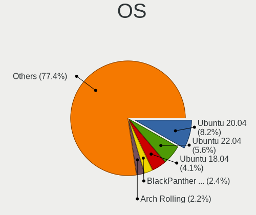

| Name                         | Computers | Percent |
|------------------------------|-----------|---------|
| Ubuntu 20.04                 | 212       | 9.21%   |
| Ubuntu 22.04                 | 131       | 5.69%   |
| Ubuntu 18.04                 | 107       | 4.65%   |
| BlackPanther 18.1            | 62        | 2.69%   |
| OpenMandriva 4.3             | 51        | 2.22%   |
| OpenMandriva 4.2             | 45        | 1.96%   |
| Arch Rolling                 | 44        | 1.91%   |
| Manjaro                      | 38        | 1.65%   |
| Fedora 39                    | 34        | 1.48%   |
| Zorin 16                     | 32        | 1.39%   |
| Debian 12                    | 30        | 1.3%    |
| Debian 11                    | 30        | 1.3%    |
| ArcoLinux Rolling            | 29        | 1.26%   |
| Arch                         | 28        | 1.22%   |
| ROSA R10                     | 27        | 1.17%   |
| Pop!_OS 22.04                | 26        | 1.13%   |
| openSUSE Tumbleweed-XXXXXXXX | 25        | 1.09%   |
| KDE neon 20.04               | 24        | 1.04%   |
| Pop!_OS 21.04                | 23        | 1%      |
| Linux Mint 21.1              | 23        | 1%      |
| Ubuntu 21.10                 | 20        | 0.87%   |
| Pop!_OS 20.04                | 20        | 0.87%   |
| Endless 3.7.8                | 20        | 0.87%   |
| Zorin 15                     | 19        | 0.83%   |
| OpenMandriva 23.08           | 19        | 0.83%   |
| Fedora 35                    | 19        | 0.83%   |
| Ubuntu 23.04                 | 18        | 0.78%   |
| Ubuntu 20.10                 | 18        | 0.78%   |
| Linux Mint 21.2              | 18        | 0.78%   |
| Fedora 38                    | 18        | 0.78%   |
| Endless 3.9.5                | 18        | 0.78%   |
| Endless 3.9.1                | 18        | 0.78%   |
| Ubuntu 19.10                 | 17        | 0.74%   |
| OpenMandriva 23.01           | 17        | 0.74%   |
| Linux Mint 20.3              | 17        | 0.74%   |
| Ubuntu 21.04                 | 16        | 0.7%    |
| Ubuntu 19.04                 | 15        | 0.65%   |
| Pop!_OS 20.10                | 15        | 0.65%   |
| Linux Mint 20.2              | 15        | 0.65%   |
| Fedora 34                    | 15        | 0.65%   |

OS Family
---------

OS without a version

| Name          | Computers | Percent |
|---------------|-----------|---------|
| Ubuntu        | 572       | 26.82%  |
| Endless       | 253       | 11.86%  |
| OpenMandriva  | 178       | 8.35%   |
| Fedora        | 143       | 6.7%    |
| Linux Mint    | 131       | 6.14%   |
| Pop!_OS       | 92        | 4.31%   |
| Debian        | 78        | 3.66%   |
| Arch          | 71        | 3.33%   |
| ROSA          | 68        | 3.19%   |
| Manjaro       | 68        | 3.19%   |
| BlackPanther  | 64        | 3%      |
| Zorin         | 62        | 2.91%   |
| KDE neon      | 33        | 1.55%   |
| ArcoLinux     | 32        | 1.5%    |
| openSUSE      | 30        | 1.41%   |
| Kubuntu       | 27        | 1.27%   |
| Xubuntu       | 26        | 1.22%   |
| Kali          | 16        | 0.75%   |
| Ubuntu Unity  | 15        | 0.7%    |
| Clear Linux   | 14        | 0.66%   |
| Elementary    | 12        | 0.56%   |
| Gentoo        | 11        | 0.52%   |
| Ubuntu MATE   | 10        | 0.47%   |
| EndeavourOS   | 10        | 0.47%   |
| SteamOS       | 9         | 0.42%   |
| MX            | 8         | 0.38%   |
| Peppermint    | 7         | 0.33%   |
| Lubuntu       | 7         | 0.33%   |
| Garuda Linux  | 7         | 0.33%   |
| Nobara        | 6         | 0.28%   |
| LMDE          | 6         | 0.28%   |
| Linux Lite    | 6         | 0.28%   |
| NixOS         | 5         | 0.23%   |
| Xero          | 4         | 0.19%   |
| Ubuntu Budgie | 4         | 0.19%   |
| Raspbian      | 4         | 0.19%   |
| CentOS        | 4         | 0.19%   |
| Artix         | 4         | 0.19%   |
| Solus         | 3         | 0.14%   |
| RHEL          | 3         | 0.14%   |

Kernel
------

Version of the Linux kernel

| Version                         | Computers | Percent |
|---------------------------------|-----------|---------|
| 5.8.0-14-generic                | 70        | 2.88%   |
| 5.4.0-42-generic                | 50        | 2.06%   |
| 4.18.16-desktop-1bP             | 47        | 1.93%   |
| 5.10.14-desktop-1omv4002        | 44        | 1.81%   |
| 5.16.7-desktop-1omv4003         | 43        | 1.77%   |
| 5.4.0-19-generic                | 32        | 1.32%   |
| 5.3.0-28-generic                | 26        | 1.07%   |
| 5.11.0-35-generic               | 19        | 0.78%   |
| 5.3.0-23-generic                | 18        | 0.74%   |
| 6.1.1-desktop-1omv2290          | 17        | 0.7%    |
| 4.18.0-15-generic               | 17        | 0.7%    |
| 4.9.60-nrj-desktop-1rosa-x86_64 | 16        | 0.66%   |
| 6.4.11-desktop-1omv2390         | 15        | 0.62%   |
| 5.6.14-desktop-2bP              | 15        | 0.62%   |
| 5.0.0-25-generic                | 15        | 0.62%   |
| 6.6.2-desktop-1omv2390          | 14        | 0.58%   |
| 6.2.6-desktop-1omv2390          | 14        | 0.58%   |
| 5.4.0-40-generic                | 14        | 0.58%   |
| 5.15.0-58-generic               | 14        | 0.58%   |
| 5.3.0-46-generic                | 13        | 0.53%   |
| 5.0.0-20-generic                | 12        | 0.49%   |
| 6.2.0-36-generic                | 11        | 0.45%   |
| 5.4.0-52-generic                | 11        | 0.45%   |
| 5.4.0-29-generic                | 11        | 0.45%   |
| 5.4.0-26-generic                | 11        | 0.45%   |
| 5.3.0-19-generic                | 11        | 0.45%   |
| 5.15.0-52-generic               | 11        | 0.45%   |
| 6.5.0-21-generic                | 10        | 0.41%   |
| 6.5.0-14-generic                | 10        | 0.41%   |
| 5.4.0-56-generic                | 10        | 0.41%   |
| 5.4.0-54-generic                | 10        | 0.41%   |
| 5.15.0-56-generic               | 10        | 0.41%   |
| 5.13.0-28-generic               | 10        | 0.41%   |
| 5.11.0-7620-generic             | 10        | 0.41%   |
| 5.11.0-43-generic               | 10        | 0.41%   |
| 5.0.0-37-generic                | 10        | 0.41%   |
| 4.15.0-15-generic               | 10        | 0.41%   |
| 5.8.0-50-generic                | 9         | 0.37%   |
| 5.4.0-7634-generic              | 9         | 0.37%   |
| 5.4.0-74-generic                | 9         | 0.37%   |

Kernel Family
-------------

Linux kernel without a distro release

| Version | Computers | Percent |
|---------|-----------|---------|
| 5.4.0   | 310       | 13.27%  |
| 5.15.0  | 162       | 6.93%   |
| 5.8.0   | 151       | 6.46%   |
| 5.3.0   | 117       | 5.01%   |
| 5.11.0  | 102       | 4.37%   |
| 4.15.0  | 98        | 4.2%    |
| 5.0.0   | 80        | 3.42%   |
| 5.13.0  | 68        | 2.91%   |
| 6.5.0   | 62        | 2.65%   |
| 6.2.0   | 57        | 2.44%   |
| 4.18.0  | 54        | 2.31%   |
| 5.19.0  | 51        | 2.18%   |
| 4.18.16 | 47        | 2.01%   |
| 5.10.14 | 45        | 1.93%   |
| 5.16.7  | 43        | 1.84%   |
| 5.10.0  | 39        | 1.67%   |
| 6.1.0   | 38        | 1.63%   |
| 6.1.1   | 20        | 0.86%   |
| 6.2.6   | 19        | 0.81%   |
| 6.4.11  | 18        | 0.77%   |
| 4.9.60  | 18        | 0.77%   |
| 6.6.2   | 17        | 0.73%   |
| 5.6.14  | 16        | 0.68%   |
| 4.9.20  | 15        | 0.64%   |
| 6.5.6   | 11        | 0.47%   |
| 6.5.5   | 11        | 0.47%   |
| 6.3.5   | 11        | 0.47%   |
| 4.19.0  | 11        | 0.47%   |
| 6.1.12  | 10        | 0.43%   |
| 4.13.0  | 10        | 0.43%   |
| 5.16.13 | 9         | 0.39%   |
| 6.5.9   | 8         | 0.34%   |
| 4.9.76  | 8         | 0.34%   |
| 6.5.11  | 7         | 0.3%    |
| 6.0.11  | 7         | 0.3%    |
| 5.8.18  | 7         | 0.3%    |
| 6.4.8   | 6         | 0.26%   |
| 6.0.0   | 6         | 0.26%   |
| 5.18.10 | 6         | 0.26%   |
| 5.17.0  | 6         | 0.26%   |

Kernel Major Ver.
-----------------

Linux kernel major version

| Version | Computers | Percent |
|---------|-----------|---------|
| 5.4     | 332       | 14.38%  |
| 5.15    | 210       | 9.1%    |
| 5.8     | 178       | 7.71%   |
| 5.3     | 127       | 5.5%    |
| 5.11    | 116       | 5.03%   |
| 6.5     | 107       | 4.64%   |
| 5.10    | 107       | 4.64%   |
| 4.18    | 103       | 4.46%   |
| 4.15    | 99        | 4.29%   |
| 6.1     | 96        | 4.16%   |
| 6.2     | 91        | 3.94%   |
| 5.0     | 85        | 3.68%   |
| 5.16    | 76        | 3.29%   |
| 5.13    | 75        | 3.25%   |
| 5.19    | 70        | 3.03%   |
| 6.6     | 52        | 2.25%   |
| 4.9     | 50        | 2.17%   |
| 6.0     | 36        | 1.56%   |
| 6.4     | 34        | 1.47%   |
| 5.6     | 30        | 1.3%    |
| 5.18    | 26        | 1.13%   |
| 6.3     | 23        | 1%      |
| 5.9     | 22        | 0.95%   |
| 5.17    | 22        | 0.95%   |
| 5.14    | 21        | 0.91%   |
| 5.12    | 18        | 0.78%   |
| 6.7     | 17        | 0.74%   |
| 6.8     | 16        | 0.69%   |
| 4.19    | 14        | 0.61%   |
| 5.7     | 10        | 0.43%   |
| 4.13    | 10        | 0.43%   |
| 4.1     | 8         | 0.35%   |
| 5.5     | 7         | 0.3%    |
| 5.2     | 5         | 0.22%   |
| 5.1     | 4         | 0.17%   |
| 4.8     | 3         | 0.13%   |
| 4.12    | 2         | 0.09%   |
| 6.9     | 1         | 0.04%   |
| 4.4     | 1         | 0.04%   |
| 4.17    | 1         | 0.04%   |

Arch
----

OS architecture (x86_64, i586, etc.)

| Name    | Computers | Percent |
|---------|-----------|---------|
| x86_64  | 1998      | 97.75%  |
| i686    | 36        | 1.76%   |
| armv7l  | 5         | 0.24%   |
| aarch64 | 5         | 0.24%   |

DE
--

Desktop Environment

| Name             | Computers | Percent |
|------------------|-----------|---------|
| GNOME            | 994       | 46.56%  |
| KDE5             | 425       | 19.91%  |
| Unknown          | 237       | 11.1%   |
| XFCE             | 128       | 6%      |
| X-Cinnamon       | 100       | 4.68%   |
| KDE4             | 44        | 2.06%   |
| KDE              | 39        | 1.83%   |
| MATE             | 32        | 1.5%    |
| LXQt             | 23        | 1.08%   |
| Cinnamon         | 16        | 0.75%   |
| Unity            | 15        | 0.7%    |
| LXDE             | 14        | 0.66%   |
| Pantheon         | 10        | 0.47%   |
| i3               | 10        | 0.47%   |
| sway             | 5         | 0.23%   |
| Hyprland         | 5         | 0.23%   |
| Budgie           | 5         | 0.23%   |
| KDE6             | 4         | 0.19%   |
| Openbox          | 3         | 0.14%   |
| GNOME Classic    | 3         | 0.14%   |
| Endless:GNOME    | 3         | 0.14%   |
| Deepin           | 3         | 0.14%   |
| xmonad           | 2         | 0.09%   |
| GNOME Flashback  | 2         | 0.09%   |
| awesome          | 2         | 0.09%   |
| ubuntu           | 1         | 0.05%   |
| sussy_bspwm      | 1         | 0.05%   |
| qtile            | 1         | 0.05%   |
| lightdm-xsession | 1         | 0.05%   |
| jwm              | 1         | 0.05%   |
| GNUstep          | 1         | 0.05%   |
| GNOME-Flashback  | 1         | 0.05%   |
| Enlightenment    | 1         | 0.05%   |
| DWM              | 1         | 0.05%   |
| dusk             | 1         | 0.05%   |
| bspwm            | 1         | 0.05%   |

Display Server
--------------

X11 or Wayland

| Name        | Computers | Percent |
|-------------|-----------|---------|
| X11         | 1530      | 72.86%  |
| Wayland     | 381       | 18.14%  |
| Unknown     | 152       | 7.24%   |
| Tty         | 36        | 1.71%   |
| Unspecified | 1         | 0.05%   |

Display Manager
---------------

SDDM, LightDM, etc.

| Name    | Computers | Percent |
|---------|-----------|---------|
| Unknown | 1075      | 50.35%  |
| SDDM    | 381       | 17.85%  |
| GDM3    | 227       | 10.63%  |
| GDM     | 197       | 9.23%   |
| LightDM | 159       | 7.45%   |
| KDM     | 44        | 2.06%   |
| TDM     | 41        | 1.92%   |
| XDM     | 5         | 0.23%   |
| SLiM    | 3         | 0.14%   |
| Ly      | 1         | 0.05%   |
| LXDM    | 1         | 0.05%   |
| GREETD  | 1         | 0.05%   |

OS Lang
-------

Language

| Lang        | Computers | Percent |
|-------------|-----------|---------|
| en_US       | 1290      | 61.37%  |
| ro_RO       | 347       | 16.51%  |
| Unknown     | 314       | 14.94%  |
| en_GB       | 44        | 2.09%   |
| C           | 35        | 1.67%   |
| hu_HU       | 17        | 0.81%   |
| it_IT       | 11        | 0.52%   |
| fr_FR       | 9         | 0.43%   |
| es_ES       | 7         | 0.33%   |
| de_DE       | 5         | 0.24%   |
| en_IL       | 3         | 0.14%   |
| ru_RU       | 2         | 0.1%    |
| en_IN       | 2         | 0.1%    |
| en_AG       | 2         | 0.1%    |
| uk_UA       | 1         | 0.05%   |
| nl_NL       | 1         | 0.05%   |
| fr_CH       | 1         | 0.05%   |
| es_MX       | 1         | 0.05%   |
| en_US.UTF8  | 1         | 0.05%   |
| en_US.UTF.8 | 1         | 0.05%   |
| en_US.utf-8 | 1         | 0.05%   |
| en_IE       | 1         | 0.05%   |
| en_DK       | 1         | 0.05%   |
| en_DE       | 1         | 0.05%   |
| en_CA       | 1         | 0.05%   |
| en_001      | 1         | 0.05%   |
| de_IT       | 1         | 0.05%   |
| C.UTF8      | 1         | 0.05%   |

Boot Mode
---------

EFI or BIOS

| Mode | Computers | Percent |
|------|-----------|---------|
| EFI  | 1079      | 51.63%  |
| BIOS | 1011      | 48.37%  |

Filesystem
----------

Type of filesystem

| Type    | Computers | Percent |
|---------|-----------|---------|
| Ext4    | 1458      | 69.33%  |
| Overlay | 200       | 9.51%   |
| Btrfs   | 184       | 8.75%   |
| Unknown | 155       | 7.37%   |
| Tmpfs   | 66        | 3.14%   |
| Xfs     | 21        | 1%      |
| Zfs     | 10        | 0.48%   |
| F2fs    | 4         | 0.19%   |
| Ext2    | 3         | 0.14%   |
| Jfs     | 1         | 0.05%   |
| Ext3    | 1         | 0.05%   |

Part. scheme
------------

Scheme of partitioning

| Type    | Computers | Percent |
|---------|-----------|---------|
| Unknown | 1097      | 52.54%  |
| GPT     | 718       | 34.39%  |
| MBR     | 273       | 13.07%  |

Dual Boot with Linux/BSD
------------------------

Hosting more than one Linux/BSD

| Dual boot | Computers | Percent |
|-----------|-----------|---------|
| No        | 1801      | 86.46%  |
| Yes       | 282       | 13.54%  |

Dual Boot (Win)
---------------

Hosting Linux and Windows

| Dual boot | Computers | Percent |
|-----------|-----------|---------|
| No        | 1513      | 72.64%  |
| Yes       | 570       | 27.36%  |

Board
-----

Vendor
------

Motherboard manufacturer

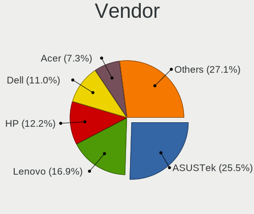

| Name                    | Computers | Percent |
|-------------------------|-----------|---------|
| ASUSTek Computer        | 528       | 25.86%  |
| Lenovo                  | 334       | 16.36%  |
| Hewlett-Packard         | 247       | 12.1%   |
| Dell                    | 231       | 11.31%  |
| Acer                    | 153       | 7.49%   |
| Gigabyte Technology     | 146       | 7.15%   |
| MSI                     | 84        | 4.11%   |
| ASRock                  | 50        | 2.45%   |
| Toshiba                 | 29        | 1.42%   |
| Intel                   | 20        | 0.98%   |
| Apple                   | 15        | 0.73%   |
| Fujitsu Siemens         | 14        | 0.69%   |
| Fujitsu                 | 14        | 0.69%   |
| Complet                 | 13        | 0.64%   |
| Unknown                 | 13        | 0.64%   |
| Sony                    | 11        | 0.54%   |
| HUAWEI                  | 10        | 0.49%   |
| Medion                  | 9         | 0.44%   |
| Allview                 | 9         | 0.44%   |
| Valve                   | 8         | 0.39%   |
| Raspberry Pi Foundation | 8         | 0.39%   |
| Samsung Electronics     | 7         | 0.34%   |
| Pegatron                | 6         | 0.29%   |
| Foxconn                 | 6         | 0.29%   |
| Google                  | 5         | 0.24%   |
| Chuwi                   | 5         | 0.24%   |
| Alienware               | 5         | 0.24%   |
| Packard Bell            | 4         | 0.2%    |
| TUXEDO                  | 3         | 0.15%   |
| BESSTAR Tech            | 3         | 0.15%   |
| AZW                     | 3         | 0.15%   |
| WesternDigital          | 2         | 0.1%    |
| Timi                    | 2         | 0.1%    |
| Supermicro              | 2         | 0.1%    |
| IBM                     | 2         | 0.1%    |
| ECS                     | 2         | 0.1%    |
| AMI                     | 2         | 0.1%    |
| ZOTAC                   | 1         | 0.05%   |
| WEIGO                   | 1         | 0.05%   |
| Visual Fan              | 1         | 0.05%   |

Model
-----

Motherboard model

| Name                                       | Computers | Percent |
|--------------------------------------------|-----------|---------|
| ASUS VivoBook 15_ASUS Laptop X540MA_X543MA | 18        | 0.88%   |
| ASUS X541NA                                | 17        | 0.83%   |
| ASUS All Series                            | 17        | 0.83%   |
| Unknown                                    | 16        | 0.78%   |
| Acer Veriton L670G                         | 14        | 0.69%   |
| ASUS VivoBook_ASUSLaptop X509FA_X509FA     | 10        | 0.49%   |
| ASUS VivoBook 15_ASUS Laptop X540MA_X540MA | 10        | 0.49%   |
| Valve Jupiter                              | 8         | 0.39%   |
| Gigabyte B450M DS3H                        | 7         | 0.34%   |
| Dell XPS 15 9530                           | 7         | 0.34%   |
| Complet MY8312                             | 7         | 0.34%   |
| ASUS X541UVK                               | 7         | 0.34%   |
| ASUS X541UAK                               | 7         | 0.34%   |
| ASUS X406UAR                               | 7         | 0.34%   |
| Lenovo Legion Y530-15ICH 81FV              | 6         | 0.29%   |
| ASUS VivoBook_ASUSLaptop X509FB_X509FB     | 6         | 0.29%   |
| ASUS VivoBook 15_ASUS Laptop X540MA_A540MA | 6         | 0.29%   |
| ASUS PRIME A320M-K                         | 6         | 0.29%   |
| Lenovo V330-15IKB 81AX                     | 5         | 0.24%   |
| HP Notebook                                | 5         | 0.24%   |
| Dell OptiPlex 7010                         | 5         | 0.24%   |
| ASUS VivoBook_ASUSLaptop X512DA_X512DA     | 5         | 0.24%   |
| ASUS VivoBook_ASUSLaptop X509DAP_M509DA    | 5         | 0.24%   |
| ASUS VivoBook_ASUS Laptop X505ZA_A505ZA    | 5         | 0.24%   |
| ASUS VivoBook 15_ASUS Laptop X540UAR       | 5         | 0.24%   |
| ASUS GL552JX                               | 5         | 0.24%   |
| Allview Allbook H                          | 5         | 0.24%   |
| Acer Aspire A315-21G                       | 5         | 0.24%   |
| MSI MS-7996                                | 4         | 0.2%    |
| MSI MS-7721                                | 4         | 0.2%    |
| Lenovo IdeaPad Gaming 3 15ARH05 82EY       | 4         | 0.2%    |
| Lenovo IdeaPad 330-15IKB 81DE              | 4         | 0.2%    |
| Lenovo IdeaPad 100-15IBD 80QQ              | 4         | 0.2%    |
| Lenovo G510 20238                          | 4         | 0.2%    |
| HP ProBook 450 G5                          | 4         | 0.2%    |
| Gigabyte X470 AORUS ULTRA GAMING           | 4         | 0.2%    |
| Dell Latitude E6420                        | 4         | 0.2%    |
| Dell Latitude E6410                        | 4         | 0.2%    |
| Dell Inspiron 5558                         | 4         | 0.2%    |
| Dell Inspiron 1545                         | 4         | 0.2%    |

Model Family
------------

Motherboard model prefix

| Name                    | Computers | Percent |
|-------------------------|-----------|---------|
| ASUS VivoBook           | 137       | 6.71%   |
| Lenovo ThinkPad         | 98        | 4.8%    |
| Lenovo IdeaPad          | 96        | 4.7%    |
| Acer Aspire             | 94        | 4.6%    |
| Dell Latitude           | 63        | 3.09%   |
| Dell Inspiron           | 57        | 2.79%   |
| HP Compaq               | 42        | 2.06%   |
| ASUS ROG                | 42        | 2.06%   |
| ASUS PRIME              | 37        | 1.81%   |
| Dell OptiPlex           | 35        | 1.71%   |
| HP EliteBook            | 34        | 1.67%   |
| HP ProBook              | 33        | 1.62%   |
| Lenovo Legion           | 31        | 1.52%   |
| Toshiba Satellite       | 28        | 1.37%   |
| HP Pavilion             | 28        | 1.37%   |
| ASUS ASUS               | 24        | 1.18%   |
| Lenovo ThinkCentre      | 23        | 1.13%   |
| Dell XPS                | 22        | 1.08%   |
| HP Laptop               | 19        | 0.93%   |
| ASUS TUF                | 19        | 0.93%   |
| Acer Veriton            | 19        | 0.93%   |
| ASUS X541NA             | 17        | 0.83%   |
| ASUS All                | 17        | 0.83%   |
| ASUS ZenBook            | 16        | 0.78%   |
| Unknown                 | 16        | 0.78%   |
| Dell Vostro             | 14        | 0.69%   |
| Dell Precision          | 14        | 0.69%   |
| Lenovo Yoga             | 13        | 0.64%   |
| Lenovo ThinkBook        | 12        | 0.59%   |
| HP 250                  | 11        | 0.54%   |
| Gigabyte B450M          | 9         | 0.44%   |
| Fujitsu Siemens ESPRIMO | 9         | 0.44%   |
| Allview Allbook         | 9         | 0.44%   |
| Acer Nitro              | 9         | 0.44%   |
| Valve Jupiter           | 8         | 0.39%   |
| RPi Raspberry           | 8         | 0.39%   |
| HP ZBook                | 8         | 0.39%   |
| Dell PowerEdge          | 8         | 0.39%   |
| Acer Swift              | 8         | 0.39%   |
| HP ProDesk              | 7         | 0.34%   |

MFG Year
--------

Motherboard manufacture year

| Year    | Computers | Percent |
|---------|-----------|---------|
| 2019    | 239       | 11.7%   |
| 2018    | 218       | 10.68%  |
| 2020    | 173       | 8.47%   |
| 2017    | 164       | 8.03%   |
| 2021    | 142       | 6.95%   |
| 2015    | 130       | 6.37%   |
| 2013    | 125       | 6.12%   |
| 2012    | 112       | 5.48%   |
| 2011    | 108       | 5.29%   |
| 2014    | 104       | 5.09%   |
| 2010    | 89        | 4.36%   |
| 2008    | 84        | 4.11%   |
| 2016    | 77        | 3.77%   |
| 2022    | 75        | 3.67%   |
| 2009    | 63        | 3.09%   |
| 2007    | 63        | 3.09%   |
| 2023    | 38        | 1.86%   |
| 2006    | 19        | 0.93%   |
| Unknown | 10        | 0.49%   |
| 2005    | 5         | 0.24%   |
| 2024    | 2         | 0.1%    |
| 2004    | 2         | 0.1%    |

Form Factor
-----------

Physical design of the computer

| Name           | Computers | Percent |
|----------------|-----------|---------|
| Notebook       | 1320      | 64.64%  |
| Desktop        | 628       | 30.75%  |
| All in one     | 26        | 1.27%   |
| Mini pc        | 21        | 1.03%   |
| Convertible    | 18        | 0.88%   |
| Tablet         | 10        | 0.49%   |
| Server         | 10        | 0.49%   |
| System on chip | 9         | 0.44%   |

Secure Boot
-----------

Enabled or disabled

| State    | Computers | Percent |
|----------|-----------|---------|
| Disabled | 1952      | 94.94%  |
| Enabled  | 104       | 5.06%   |

Coreboot
--------

Have coreboot on board

| Used | Computers | Percent |
|------|-----------|---------|
| No   | 2037      | 99.76%  |
| Yes  | 5         | 0.24%   |

RAM Size
--------

Total RAM memory

| Size in GB      | Computers | Percent |
|-----------------|-----------|---------|
| 3.01-4.0        | 519       | 24.92%  |
| 4.01-8.0        | 488       | 23.43%  |
| 8.01-16.0       | 371       | 17.81%  |
| 16.01-24.0      | 338       | 16.23%  |
| 32.01-64.0      | 168       | 8.07%   |
| 1.01-2.0        | 80        | 3.84%   |
| 64.01-256.0     | 52        | 2.5%    |
| 24.01-32.0      | 31        | 1.49%   |
| 2.01-3.0        | 19        | 0.91%   |
| 0.51-1.0        | 15        | 0.72%   |
| More than 256.0 | 2         | 0.1%    |

RAM Used
--------

Used RAM memory

| Used GB     | Computers | Percent |
|-------------|-----------|---------|
| 1.01-2.0    | 815       | 35.68%  |
| 2.01-3.0    | 586       | 25.66%  |
| 3.01-4.0    | 276       | 12.08%  |
| 4.01-8.0    | 257       | 11.25%  |
| 0.51-1.0    | 206       | 9.02%   |
| 8.01-16.0   | 85        | 3.72%   |
| 0.01-0.5    | 44        | 1.93%   |
| 16.01-24.0  | 6         | 0.26%   |
| 24.01-32.0  | 4         | 0.18%   |
| 32.01-64.0  | 3         | 0.13%   |
| 64.01-256.0 | 2         | 0.09%   |

Total Drives
------------

Number of drives on board

| Drives | Computers | Percent |
|--------|-----------|---------|
| 1      | 1359      | 64.59%  |
| 2      | 479       | 22.77%  |
| 3      | 140       | 6.65%   |
| 4      | 56        | 2.66%   |
| 5      | 29        | 1.38%   |
| 0      | 16        | 0.76%   |
| 6      | 8         | 0.38%   |
| 9      | 4         | 0.19%   |
| 7      | 4         | 0.19%   |
| 8      | 3         | 0.14%   |
| 10     | 2         | 0.1%    |
| 24     | 1         | 0.05%   |
| 15     | 1         | 0.05%   |
| 14     | 1         | 0.05%   |
| 11     | 1         | 0.05%   |

Has CD-ROM
----------

Has CD-ROM on board

| Presented | Computers | Percent |
|-----------|-----------|---------|
| No        | 1297      | 63.02%  |
| Yes       | 761       | 36.98%  |

Has Ethernet
------------

Has Ethernet on board

| Presented | Computers | Percent |
|-----------|-----------|---------|
| Yes       | 1689      | 82.51%  |
| No        | 358       | 17.49%  |

Has WiFi
--------

Has WiFi module

| Presented | Computers | Percent |
|-----------|-----------|---------|
| Yes       | 1582      | 76.98%  |
| No        | 473       | 23.02%  |

Has Bluetooth
-------------

Has Bluetooth module

| Presented | Computers | Percent |
|-----------|-----------|---------|
| Yes       | 1298      | 62.74%  |
| No        | 771       | 37.26%  |

Location
--------

Country
-------

Geographic location (country)

| Country | Computers | Percent |
|---------|-----------|---------|
| Romania | 2042      | 100%    |

City
----

Geographic location (city)

| City                  | Computers | Percent |
|-----------------------|-----------|---------|
| Bucharest             | 655       | 30.23%  |
| Cluj-Napoca           | 138       | 6.37%   |
| Iasi                  | 98        | 4.52%   |
| Timioara            | 82        | 3.78%   |
| Trgu Mure         | 65        | 3%      |
| Brasov                | 65        | 3%      |
| Ploieti             | 51        | 2.35%   |
| Sibiu                 | 45        | 2.08%   |
| Constana            | 43        | 1.98%   |
| Oradea                | 36        | 1.66%   |
| Piteti              | 33        | 1.52%   |
| Arad                  | 33        | 1.52%   |
| Craiova               | 29        | 1.34%   |
| Baia Mare             | 27        | 1.25%   |
| Galati                | 24        | 1.11%   |
| Popesti-Leordeni      | 22        | 1.02%   |
| Zalu                | 19        | 0.88%   |
| Voluntari             | 19        | 0.88%   |
| Rmnicu Vlcea      | 19        | 0.88%   |
| Bacau                 | 18        | 0.83%   |
| Miercurea-Ciuc        | 17        | 0.78%   |
| Targoviste            | 16        | 0.74%   |
| Botosani              | 16        | 0.74%   |
| Satu Mare             | 15        | 0.69%   |
| Piatra Neam         | 14        | 0.65%   |
| Tulcea                | 13        | 0.6%    |
| Floresti              | 13        | 0.6%    |
| Reia              | 12        | 0.55%   |
| Focani              | 12        | 0.55%   |
| Drobeta-Turnu Severin | 12        | 0.55%   |
| Braila                | 12        | 0.55%   |
| Alba Iulia            | 12        | 0.55%   |
| Media               | 11        | 0.51%   |
| Deva                  | 11        | 0.51%   |
| Buzau                 | 11        | 0.51%   |
| Trgu Jiu            | 9         | 0.42%   |
| Suceava               | 9         | 0.42%   |
| Sfantu Gheorghe       | 9         | 0.42%   |
| Alexandria            | 9         | 0.42%   |
| Roman                 | 8         | 0.37%   |

Drives
------

Drive Vendor
------------

Hard drive vendors

| Vendor                      | Computers | Drives | Percent |
|-----------------------------|-----------|--------|---------|
| WDC                         | 417       | 611    | 14.35%  |
| Seagate                     | 407       | 635    | 14.01%  |
| Samsung Electronics         | 399       | 560    | 13.73%  |
| Kingston                    | 332       | 453    | 11.42%  |
| Toshiba                     | 183       | 232    | 6.3%    |
| SanDisk                     | 120       | 151    | 4.13%   |
| Unknown                     | 110       | 140    | 3.79%   |
| A-DATA Technology           | 108       | 134    | 3.72%   |
| Intel                       | 101       | 128    | 3.48%   |
| SK hynix                    | 86        | 114    | 2.96%   |
| Hitachi                     | 69        | 89     | 2.37%   |
| HGST                        | 65        | 85     | 2.24%   |
| Micron Technology           | 60        | 80     | 2.06%   |
| Crucial                     | 42        | 56     | 1.45%   |
| Kingston Technology Company | 24        | 29     | 0.83%   |
| Patriot                     | 22        | 26     | 0.76%   |
| Hewlett-Packard             | 20        | 26     | 0.69%   |
| SPCC                        | 18        | 22     | 0.62%   |
| Maxtor                      | 18        | 25     | 0.62%   |
| KIOXIA                      | 18        | 18     | 0.62%   |
| Phison                      | 16        | 19     | 0.55%   |
| Phison Electronics          | 12        | 14     | 0.41%   |
| OCZ                         | 12        | 22     | 0.41%   |
| XPG                         | 11        | 15     | 0.38%   |
| ADATA Technology            | 11        | 12     | 0.38%   |
| Transcend                   | 10        | 13     | 0.34%   |
| Gigabyte Technology         | 10        | 15     | 0.34%   |
| Fujitsu                     | 10        | 11     | 0.34%   |
| Corsair                     | 10        | 18     | 0.34%   |
| Silicon Motion              | 9         | 11     | 0.31%   |
| Realtek Semiconductor       | 9         | 10     | 0.31%   |
| Netac                       | 9         | 11     | 0.31%   |
| FORESEE                     | 9         | 10     | 0.31%   |
| Kingmax                     | 8         | 9      | 0.28%   |
| China                       | 8         | 8      | 0.28%   |
| GOODRAM                     | 7         | 7      | 0.24%   |
| Apple                       | 7         | 10     | 0.24%   |
| Team                        | 6         | 6      | 0.21%   |
| Plextor                     | 6         | 8      | 0.21%   |
| Micron/Crucial Technology   | 6         | 7      | 0.21%   |

Drive Model
-----------

Hard drive models

| Model                                              | Computers | Percent |
|----------------------------------------------------|-----------|---------|
| Kingston SA400S37240G 240GB SSD                    | 77        | 2.46%   |
| Toshiba MQ01ABF050 500GB                           | 47        | 1.5%    |
| Seagate ST1000LM035-1RK172 1TB                     | 47        | 1.5%    |
| Kingston SA400S37480G 480GB SSD                    | 41        | 1.31%   |
| Seagate ST500LT012-1DG142 500GB                    | 33        | 1.05%   |
| Kingston SA400S37120G 120GB SSD                    | 33        | 1.05%   |
| Samsung NVMe SSD Controller SM981/PM981/PM983 1TB  | 31        | 0.99%   |
| Seagate ST1000DM010-2EP102 1TB                     | 27        | 0.86%   |
| Kingston SV300S37A120G 120GB SSD                   | 26        | 0.83%   |
| Unknown MMC Card  32GB                             | 25        | 0.8%    |
| Toshiba MQ04ABF100 1TB                             | 22        | 0.7%    |
| Samsung SSD 860 EVO 500GB                          | 22        | 0.7%    |
| HGST HTS721010A9E630 1TB                           | 22        | 0.7%    |
| Samsung NVMe SSD Drive 512GB                       | 21        | 0.67%   |
| Samsung SSD 850 EVO 250GB                          | 20        | 0.64%   |
| SanDisk NVMe SSD Drive 512GB                       | 19        | 0.61%   |
| Samsung NVMe SSD Controller PM9A1/PM9A3/980PRO 1TB | 19        | 0.61%   |
| WDC WD10EZEX-08WN4A0 1TB                           | 18        | 0.57%   |
| SanDisk NVMe SSD Drive 256GB                       | 18        | 0.57%   |
| A-DATA SU650 240GB SSD                             | 18        | 0.57%   |
| Toshiba MQ01ABD100 1TB                             | 16        | 0.51%   |
| Seagate ST500DM002-1BD142 500GB                    | 16        | 0.51%   |
| Seagate ST1000LM024 HN-M101MBB 1TB                 | 16        | 0.51%   |
| Kingston SV300S37A240G 240GB SSD                   | 15        | 0.48%   |
| Seagate Expansion 2TB                              | 14        | 0.45%   |
| Kingston SUV400S37120G 120GB SSD                   | 13        | 0.41%   |
| WDC WD1600AAJS-22L7A0 160GB                        | 12        | 0.38%   |
| SK hynix NVMe SSD Drive 512GB                      | 12        | 0.38%   |
| Samsung SSD 860 EVO 250GB                          | 12        | 0.38%   |
| Patriot Burst 120GB SSD                            | 12        | 0.38%   |
| Intel NVMe SSD Drive 512GB                         | 12        | 0.38%   |
| HGST HTS545050A7E680 500GB                         | 12        | 0.38%   |
| Unknown MMC Card  64GB                             | 11        | 0.35%   |
| Toshiba DT01ACA050 500GB                           | 11        | 0.35%   |
| SK hynix HFS256G39TND-N210A 256GB SSD              | 11        | 0.35%   |
| Samsung SSD 980 1TB                                | 11        | 0.35%   |
| Samsung PM963 2.5" NVMe PCIe SSD 256GB             | 11        | 0.35%   |
| A-DATA SU630 240GB SSD                             | 11        | 0.35%   |
| Unknown MMC Card  128GB                            | 10        | 0.32%   |
| Seagate ST2000DM008-2FR102 2TB                     | 10        | 0.32%   |

HDD Vendor
----------

Hard disk drive vendors

| Vendor              | Computers | Drives | Percent |
|---------------------|-----------|--------|---------|
| Seagate             | 400       | 624    | 35.34%  |
| WDC                 | 347       | 523    | 30.65%  |
| Toshiba             | 155       | 196    | 13.69%  |
| Hitachi             | 69        | 89     | 6.1%    |
| HGST                | 65        | 85     | 5.74%   |
| Samsung Electronics | 37        | 46     | 3.27%   |
| Maxtor              | 17        | 24     | 1.5%    |
| Fujitsu             | 10        | 11     | 0.88%   |
| Unknown             | 9         | 10     | 0.8%    |
| Hewlett-Packard     | 4         | 8      | 0.35%   |
| TO Exter            | 3         | 6      | 0.27%   |
| Apple               | 3         | 4      | 0.27%   |
| LaCie               | 2         | 8      | 0.18%   |
| IBM/Hitachi         | 2         | 2      | 0.18%   |
| ASMT                | 2         | 2      | 0.18%   |
| XrayDisk            | 1         | 1      | 0.09%   |
| SABRENT             | 1         | 1      | 0.09%   |
| MARVELL             | 1         | 1      | 0.09%   |
| Intenso             | 1         | 1      | 0.09%   |
| HGST HTS            | 1         | 1      | 0.09%   |
| ExcelStor           | 1         | 1      | 0.09%   |
| ASMT109x            | 1         | 1      | 0.09%   |

SSD Vendor
----------

Solid state drive vendors

| Vendor              | Computers | Drives | Percent |
|---------------------|-----------|--------|---------|
| Kingston            | 289       | 384    | 30.61%  |
| Samsung Electronics | 158       | 222    | 16.74%  |
| A-DATA Technology   | 98        | 124    | 10.38%  |
| SanDisk             | 44        | 59     | 4.66%   |
| Crucial             | 37        | 51     | 3.92%   |
| Intel               | 31        | 34     | 3.28%   |
| WDC                 | 29        | 33     | 3.07%   |
| SK hynix            | 26        | 36     | 2.75%   |
| Micron Technology   | 23        | 28     | 2.44%   |
| Patriot             | 21        | 25     | 2.22%   |
| SPCC                | 18        | 22     | 1.91%   |
| OCZ                 | 12        | 22     | 1.27%   |
| Hewlett-Packard     | 12        | 13     | 1.27%   |
| Toshiba             | 10        | 11     | 1.06%   |
| Transcend           | 9         | 12     | 0.95%   |
| Netac               | 9         | 11     | 0.95%   |
| Gigabyte Technology | 9         | 14     | 0.95%   |
| FORESEE             | 9         | 10     | 0.95%   |
| Kingmax             | 8         | 9      | 0.85%   |
| Corsair             | 8         | 15     | 0.85%   |
| China               | 8         | 8      | 0.85%   |
| GOODRAM             | 7         | 7      | 0.74%   |
| Team                | 6         | 6      | 0.64%   |
| Verbatim            | 4         | 6      | 0.42%   |
| LITEON              | 4         | 4      | 0.42%   |
| Emtec               | 4         | 4      | 0.42%   |
| ASMT                | 4         | 4      | 0.42%   |
| Apacer              | 4         | 5      | 0.42%   |
| PNY                 | 3         | 4      | 0.32%   |
| Teclast             | 2         | 2      | 0.21%   |
| Seagate             | 2         | 2      | 0.21%   |
| MicroFrom           | 2         | 2      | 0.21%   |
| LITEONIT            | 2         | 2      | 0.21%   |
| Lite-On             | 2         | 2      | 0.21%   |
| Intenso             | 2         | 2      | 0.21%   |
| Apple               | 2         | 3      | 0.21%   |
| XrayDisk            | 1         | 1      | 0.11%   |
| Wibtek              | 1         | 1      | 0.11%   |
| W800S               | 1         | 1      | 0.11%   |
| Unknown             | 1         | 1      | 0.11%   |

Drive Kind
----------

HDD or SSD

| Kind    | Computers | Drives | Percent |
|---------|-----------|--------|---------|
| HDD     | 982       | 1645   | 37.62%  |
| SSD     | 838       | 1230   | 32.11%  |
| NVMe    | 677       | 965    | 25.94%  |
| MMC     | 94        | 120    | 3.6%    |
| Unknown | 19        | 24     | 0.73%   |

Drive Connector
---------------

SATA, SAS, NVMe, etc.

| Type | Computers | Drives | Percent |
|------|-----------|--------|---------|
| SATA | 1469      | 2761   | 62.99%  |
| NVMe | 676       | 963    | 28.99%  |
| MMC  | 94        | 120    | 4.03%   |
| SAS  | 93        | 140    | 3.99%   |

Drive Size
----------

Size of hard drive

| Size in TB | Computers | Drives | Percent |
|------------|-----------|--------|---------|
| 0.01-0.5   | 1147      | 1829   | 63.02%  |
| 0.51-1.0   | 499       | 708    | 27.42%  |
| 1.01-2.0   | 103       | 156    | 5.66%   |
| 3.01-4.0   | 28        | 55     | 1.54%   |
| 4.01-10.0  | 19        | 62     | 1.04%   |
| 2.01-3.0   | 17        | 55     | 0.93%   |
| 10.01-20.0 | 7         | 10     | 0.38%   |

Space Total
-----------

Amount of disk space available on the file system

| Size in GB     | Computers | Percent |
|----------------|-----------|---------|
| 101-250        | 603       | 27.6%   |
| 251-500        | 466       | 21.33%  |
| 501-1000       | 353       | 16.16%  |
| 1-20           | 200       | 9.15%   |
| 51-100         | 145       | 6.64%   |
| 1001-2000      | 135       | 6.18%   |
| 21-50          | 89        | 4.07%   |
| Unknown        | 81        | 3.71%   |
| More than 3000 | 59        | 2.7%    |
| 2001-3000      | 54        | 2.47%   |

Space Used
----------

Amount of used disk space

| Used GB        | Computers | Percent |
|----------------|-----------|---------|
| 1-20           | 876       | 38.88%  |
| 21-50          | 455       | 20.2%   |
| 101-250        | 252       | 11.19%  |
| 51-100         | 237       | 10.52%  |
| 251-500        | 142       | 6.3%    |
| 501-1000       | 118       | 5.24%   |
| Unknown        | 81        | 3.6%    |
| 1001-2000      | 59        | 2.62%   |
| More than 3000 | 21        | 0.93%   |
| 2001-3000      | 12        | 0.53%   |

Malfunc. Drives
---------------

Drive models with a malfunction

| Model                                    | Computers | Drives | Percent |
|------------------------------------------|-----------|--------|---------|
| Hitachi HTS725032A7E630 320GB            | 7         | 7      | 3.03%   |
| HGST HTS541010A9E680 1TB                 | 5         | 5      | 2.16%   |
| HGST HTS545050A7E680 500GB               | 4         | 4      | 1.73%   |
| WDC WD5000AAKX-001CA0 500GB              | 3         | 3      | 1.3%    |
| WDC WD3200AAJS-60Z0A0 320GB              | 3         | 6      | 1.3%    |
| Seagate ST9500420AS 500GB                | 3         | 3      | 1.3%    |
| Seagate ST500DM002-1BD142 500GB          | 3         | 4      | 1.3%    |
| Seagate ST3500312CS 500GB                | 3         | 3      | 1.3%    |
| Maxtor STM3250310AS 250GB                | 3         | 4      | 1.3%    |
| HGST HTS725050A7E630 500GB               | 3         | 4      | 1.3%    |
| WDC WD5000AADS-00S9B0 500GB              | 2         | 2      | 0.87%   |
| WDC WD10EZEX-21WN4A0 1TB                 | 2         | 2      | 0.87%   |
| WDC WD1002FAEX-00Z3A0 1TB                | 2         | 2      | 0.87%   |
| WDC PC SA530 SDASN8Y-256G-1006 256GB SSD | 2         | 2      | 0.87%   |
| Toshiba MQ01ABF050 500GB                 | 2         | 2      | 0.87%   |
| Seagate STM3250318AS 250GB               | 2         | 3      | 0.87%   |
| Seagate ST95005620AS 500GB               | 2         | 5      | 0.87%   |
| Seagate ST9500325AS 500GB                | 2         | 2      | 0.87%   |
| Seagate ST9160821AS 160GB                | 2         | 2      | 0.87%   |
| Seagate ST500LT012-1DG142 500GB          | 2         | 3      | 0.87%   |
| Seagate ST500LM021-1KJ152 500GB          | 2         | 2      | 0.87%   |
| Seagate ST500LM000-1EJ162 500GB          | 2         | 3      | 0.87%   |
| Seagate ST3500320AS 500GB                | 2         | 3      | 0.87%   |
| Seagate ST3250318AS 250GB                | 2         | 3      | 0.87%   |
| Seagate ST1000LX015-1U7172 1TB           | 2         | 2      | 0.87%   |
| Seagate ST1000DM010-2EP102 1TB           | 2         | 2      | 0.87%   |
| Seagate ST1000DM003-1SB102 1TB           | 2         | 3      | 0.87%   |
| Samsung Electronics SSD 870 EVO 1TB      | 2         | 2      | 0.87%   |
| OCZ ARC100 240GB SSD                     | 2         | 2      | 0.87%   |
| Kingston SV300S37A120G 120GB SSD         | 2         | 2      | 0.87%   |
| Hitachi HTS725032A9A364 320GB            | 2         | 3      | 0.87%   |
| Hitachi HTS545016B9A300 160GB            | 2         | 2      | 0.87%   |
| Hitachi HDS721616PLA380 160GB            | 2         | 2      | 0.87%   |
| Apacer 16GB SATA Flash Drive SSD         | 2         | 3      | 0.87%   |
| XrayDisk 240GB SSD                       | 1         | 1      | 0.43%   |
| WDC WDS240G2G0A-00JH30 240GB SSD         | 1         | 1      | 0.43%   |
| WDC WDS120G2G0A-00JH30 120GB SSD         | 1         | 1      | 0.43%   |
| WDC WD7500BPVT-60HXZT3 752GB             | 1         | 2      | 0.43%   |
| WDC WD7500BPVT-22HXZT3 752GB             | 1         | 1      | 0.43%   |
| WDC WD6400BEVT-22A0RT0 640GB             | 1         | 1      | 0.43%   |

Malfunc. Drive Vendor
---------------------

Vendors of faulty drives

| Vendor              | Computers | Drives | Percent |
|---------------------|-----------|--------|---------|
| Seagate             | 55        | 71     | 24.77%  |
| WDC                 | 52        | 79     | 23.42%  |
| Hitachi             | 24        | 28     | 10.81%  |
| Samsung Electronics | 18        | 20     | 8.11%   |
| HGST                | 15        | 16     | 6.76%   |
| Toshiba             | 11        | 12     | 4.95%   |
| Maxtor              | 7         | 9      | 3.15%   |
| Kingston            | 7         | 9      | 3.15%   |
| SK hynix            | 6         | 6      | 2.7%    |
| Intel               | 5         | 5      | 2.25%   |
| Hewlett-Packard     | 3         | 3      | 1.35%   |
| Fujitsu             | 3         | 3      | 1.35%   |
| Patriot             | 2         | 2      | 0.9%    |
| OCZ                 | 2         | 2      | 0.9%    |
| Apacer              | 2         | 3      | 0.9%    |
| A-DATA Technology   | 2         | 2      | 0.9%    |
| XrayDisk            | 1         | 1      | 0.45%   |
| Teclast             | 1         | 1      | 0.45%   |
| SanDisk             | 1         | 1      | 0.45%   |
| Plextor             | 1         | 1      | 0.45%   |
| Micron Technology   | 1         | 1      | 0.45%   |
| LITEONIT            | 1         | 1      | 0.45%   |
| Crucial             | 1         | 1      | 0.45%   |
| Corsair             | 1         | 7      | 0.45%   |

Malfunc. HDD Vendor
-------------------

Vendors of faulty HDD drives

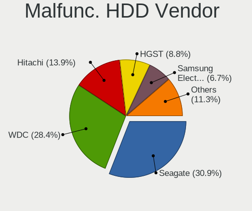

| Vendor              | Computers | Drives | Percent |
|---------------------|-----------|--------|---------|
| Seagate             | 55        | 71     | 31.43%  |
| WDC                 | 48        | 75     | 27.43%  |
| Hitachi             | 24        | 28     | 13.71%  |
| HGST                | 15        | 16     | 8.57%   |
| Samsung Electronics | 12        | 14     | 6.86%   |
| Toshiba             | 11        | 12     | 6.29%   |
| Maxtor              | 7         | 9      | 4%      |
| Fujitsu             | 3         | 3      | 1.71%   |

Malfunc. Drive Kind
-------------------

Kinds of faulty drives

| Kind | Computers | Drives | Percent |
|------|-----------|--------|---------|
| HDD  | 163       | 228    | 77.62%  |
| SSD  | 44        | 53     | 20.95%  |
| NVMe | 3         | 3      | 1.43%   |

Failed Drives
-------------

Failed drive models

| Model                        | Computers | Drives | Percent |
|------------------------------|-----------|--------|---------|
| WDC WD3200BEKT-60KA9T0 320GB | 1         | 1      | 33.33%  |
| WDC WD2500BEVS-22UST0 250GB  | 1         | 1      | 33.33%  |
| Seagate ST3160215A 160GB     | 1         | 1      | 33.33%  |

Failed Drive Vendor
-------------------

Failed drive vendors

| Vendor  | Computers | Drives | Percent |
|---------|-----------|--------|---------|
| WDC     | 2         | 2      | 66.67%  |
| Seagate | 1         | 1      | 33.33%  |

Drive Status
------------

Number of failed and malfunc. drives

| Status   | Computers | Drives | Percent |
|----------|-----------|--------|---------|
| Detected | 1271      | 2344   | 56.67%  |
| Works    | 768       | 1353   | 34.24%  |
| Malfunc  | 201       | 284    | 8.96%   |
| Failed   | 3         | 3      | 0.13%   |

Storage controller
------------------

Storage Vendor
--------------

Storage controller vendors

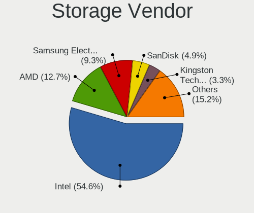

| Vendor                           | Computers | Percent |
|----------------------------------|-----------|---------|
| Intel                            | 1460      | 56.63%  |
| AMD                              | 332       | 12.88%  |
| Samsung Electronics              | 230       | 8.92%   |
| Sandisk                          | 119       | 4.62%   |
| Kingston Technology Company      | 73        | 2.83%   |
| SK hynix                         | 59        | 2.29%   |
| Micron Technology                | 37        | 1.44%   |
| ASMedia Technology               | 30        | 1.16%   |
| ADATA Technology                 | 30        | 1.16%   |
| Phison Electronics               | 28        | 1.09%   |
| KIOXIA                           | 20        | 0.78%   |
| Toshiba America Info Systems     | 19        | 0.74%   |
| Nvidia                           | 18        | 0.7%    |
| Marvell Technology Group         | 18        | 0.7%    |
| JMicron Technology               | 17        | 0.66%   |
| Realtek Semiconductor            | 15        | 0.58%   |
| Silicon Motion                   | 14        | 0.54%   |
| Micron/Crucial Technology        | 9         | 0.35%   |
| Lite-On Technology               | 6         | 0.23%   |
| Broadcom / LSI                   | 6         | 0.23%   |
| VIA Technologies                 | 5         | 0.19%   |
| Silicon Integrated Systems [SiS] | 5         | 0.19%   |
| Solidigm                         | 4         | 0.16%   |
| Silicon Image                    | 4         | 0.16%   |
| LSI Logic / Symbios Logic        | 4         | 0.16%   |
| Seagate Technology               | 3         | 0.12%   |
| Union Memory (Shenzhen)          | 2         | 0.08%   |
| Solid State Storage Technology   | 2         | 0.08%   |
| Lenovo                           | 2         | 0.08%   |
| Hewlett-Packard                  | 2         | 0.08%   |
| Biwin Storage Technology         | 2         | 0.08%   |
| MAXIO Technology (Hangzhou)      | 1         | 0.04%   |
| Integrated Technology Express    | 1         | 0.04%   |
| Apple                            | 1         | 0.04%   |

Storage Model
-------------

Storage controller models

| Model                                                                          | Computers | Percent |
|--------------------------------------------------------------------------------|-----------|---------|
| AMD FCH SATA Controller [AHCI mode]                                            | 232       | 7.87%   |
| Intel Sunrise Point-LP SATA Controller [AHCI mode]                             | 123       | 4.17%   |
| Intel 82801 Mobile SATA Controller [RAID mode]                                 | 98        | 3.32%   |
| Samsung NVMe SSD Controller SM981/PM981/PM983                                  | 96        | 3.26%   |
| Intel 8 Series/C220 Series Chipset Family 6-port SATA Controller 1 [AHCI mode] | 95        | 3.22%   |
| Intel Celeron/Pentium Silver Processor SATA Controller                         | 74        | 2.51%   |
| Intel 7 Series Chipset Family 6-port SATA Controller [AHCI mode]               | 71        | 2.41%   |
| Intel Volume Management Device NVMe RAID Controller                            | 61        | 2.07%   |
| Samsung NVMe SSD Controller 980 (DRAM-less)                                    | 57        | 1.93%   |
| Intel 6 Series/C200 Series Chipset Family 6 port Mobile SATA AHCI Controller   | 54        | 1.83%   |
| Intel 8 Series SATA Controller 1 [AHCI mode]                                   | 52        | 1.76%   |
| Intel Cannon Lake Mobile PCH SATA AHCI Controller                              | 48        | 1.63%   |
| Intel Celeron N3350/Pentium N4200/Atom E3900 Series SATA AHCI Controller       | 42        | 1.42%   |
| Samsung NVMe SSD Controller PM9A1/PM9A3/980PRO                                 | 41        | 1.39%   |
| Intel 200 Series PCH SATA controller [AHCI mode]                               | 40        | 1.36%   |
| AMD 400 Series Chipset SATA Controller                                         | 40        | 1.36%   |
| Intel Wildcat Point-LP SATA Controller [AHCI Mode]                             | 39        | 1.32%   |
| Intel Q170/Q150/B150/H170/H110/Z170/CM236 Chipset SATA Controller [AHCI Mode]  | 39        | 1.32%   |
| Intel HM170/QM170 Chipset SATA Controller [AHCI Mode]                          | 35        | 1.19%   |
| Intel NM10/ICH7 Family SATA Controller [IDE mode]                              | 31        | 1.05%   |
| Intel 82801IBM/IEM (ICH9M/ICH9M-E) 4 port SATA Controller [AHCI mode]          | 31        | 1.05%   |
| Intel 5 Series/3400 Series Chipset 6 port SATA AHCI Controller                 | 31        | 1.05%   |
| SK hynix Gold P31/BC711/PC711 NVMe Solid State Drive                           | 30        | 1.02%   |
| SanDisk Ultra 3D / WD Blue SN550 NVMe SSD                                      | 30        | 1.02%   |
| AMD SB7x0/SB8x0/SB9x0 IDE Controller                                           | 30        | 1.02%   |
| Samsung NVMe SSD Controller SM961/PM961/SM963                                  | 29        | 0.98%   |
| Intel SSD 660P Series                                                          | 29        | 0.98%   |
| Intel 82801G (ICH7 Family) IDE Controller                                      | 29        | 0.98%   |
| Intel 6 Series/C200 Series Chipset Family 6 port Desktop SATA AHCI Controller  | 29        | 0.98%   |
| Kingston Company A2000 NVMe SSD SM2263EN                                       | 28        | 0.95%   |
| ASMedia ASM1061/ASM1062 Serial ATA Controller                                  | 28        | 0.95%   |
| AMD SB7x0/SB8x0/SB9x0 SATA Controller [AHCI mode]                              | 27        | 0.92%   |
| SanDisk WD Blue SN500 / PC SN520 x2 M.2 2280 NVMe SSD                          | 26        | 0.88%   |
| Intel 5 Series/3400 Series Chipset 4 port SATA AHCI Controller                 | 26        | 0.88%   |
| Intel 82801HM/HEM (ICH8M/ICH8M-E) IDE Controller                               | 25        | 0.85%   |
| Intel Tiger Lake-LP SATA Controller                                            | 24        | 0.81%   |
| Intel Cannon Point-LP SATA Controller [AHCI Mode]                              | 24        | 0.81%   |
| Intel Cannon Lake PCH SATA AHCI Controller                                     | 24        | 0.81%   |
| Intel Comet Lake SATA AHCI Controller                                          | 23        | 0.78%   |
| Intel 82801JD/DO (ICH10 Family) SATA AHCI Controller                           | 23        | 0.78%   |

Storage Kind
------------

Kind of storage controller (IDE, SATA, NVMe, SAS, ...)

| Kind | Computers | Percent |
|------|-----------|---------|
| SATA | 1482      | 56.18%  |
| NVMe | 685       | 25.97%  |
| IDE  | 254       | 9.63%   |
| RAID | 208       | 7.88%   |
| SAS  | 9         | 0.34%   |

Processor
---------

CPU Vendor
----------

Processor vendors

| Vendor | Computers | Percent |
|--------|-----------|---------|
| Intel  | 1583      | 77.52%  |
| AMD    | 449       | 21.99%  |
| ARM    | 10        | 0.49%   |

CPU Model
---------

Processor models

| Model                                         | Computers | Percent |
|-----------------------------------------------|-----------|---------|
| Intel Celeron N4000 CPU @ 1.10GHz             | 44        | 2.15%   |
| Intel Core i5-8250U CPU @ 1.60GHz             | 30        | 1.47%   |
| Intel Core i7-8565U CPU @ 1.80GHz             | 28        | 1.37%   |
| Intel Celeron CPU N3350 @ 1.10GHz             | 26        | 1.27%   |
| Intel Core i7-9750H CPU @ 2.60GHz             | 23        | 1.12%   |
| Intel Core i7-8550U CPU @ 1.80GHz             | 19        | 0.93%   |
| Intel Core i3-8145U CPU @ 2.10GHz             | 19        | 0.93%   |
| Intel 11th Gen Core i7-1165G7 @ 2.80GHz       | 19        | 0.93%   |
| AMD Ryzen 5 3500U with Radeon Vega Mobile Gfx | 18        | 0.88%   |
| Intel Core i7-7700HQ CPU @ 2.80GHz            | 17        | 0.83%   |
| Intel Core i7-8750H CPU @ 2.20GHz             | 16        | 0.78%   |
| Intel Core i5-7200U CPU @ 2.50GHz             | 16        | 0.78%   |
| Intel Core i5-5200U CPU @ 2.20GHz             | 16        | 0.78%   |
| Intel Core 2 Duo CPU E7400 @ 2.80GHz          | 16        | 0.78%   |
| Intel Core i7-6700HQ CPU @ 2.60GHz            | 15        | 0.73%   |
| Intel 11th Gen Core i3-1115G4 @ 3.00GHz       | 15        | 0.73%   |
| Intel Core i5-8265U CPU @ 1.60GHz             | 14        | 0.68%   |
| Intel Core i7-4510U CPU @ 2.00GHz             | 13        | 0.64%   |
| Intel Core i5-1035G1 CPU @ 1.00GHz            | 13        | 0.64%   |
| Intel Core i3-7100U CPU @ 2.40GHz             | 13        | 0.64%   |
| Intel Core i5-2400 CPU @ 3.10GHz              | 12        | 0.59%   |
| Intel Core 2 Duo CPU E8400 @ 3.00GHz          | 12        | 0.59%   |
| Intel Core i5-3470 CPU @ 3.20GHz              | 11        | 0.54%   |
| Intel Core i3-6006U CPU @ 2.00GHz             | 11        | 0.54%   |
| AMD Ryzen 7 4800H with Radeon Graphics        | 11        | 0.54%   |
| Intel Pentium CPU N4200 @ 1.10GHz             | 10        | 0.49%   |
| Intel Core i7-2670QM CPU @ 2.20GHz            | 10        | 0.49%   |
| Intel Core i7-1065G7 CPU @ 1.30GHz            | 10        | 0.49%   |
| Intel Core i5-10210U CPU @ 1.60GHz            | 10        | 0.49%   |
| Intel Core i3-5005U CPU @ 2.00GHz             | 10        | 0.49%   |
| Intel 11th Gen Core i5-1135G7 @ 2.40GHz       | 10        | 0.49%   |
| AMD Ryzen 7 5800H with Radeon Graphics        | 10        | 0.49%   |
| AMD Ryzen 5 3600 6-Core Processor             | 10        | 0.49%   |
| Intel Core i7-4720HQ CPU @ 2.60GHz            | 9         | 0.44%   |
| Intel Core i7-10510U CPU @ 1.80GHz            | 9         | 0.44%   |
| Intel Core i3-8130U CPU @ 2.20GHz             | 9         | 0.44%   |
| Intel Core i3-4005U CPU @ 1.70GHz             | 9         | 0.44%   |
| AMD Ryzen 7 4700U with Radeon Graphics        | 9         | 0.44%   |
| AMD Ryzen 7 3700X 8-Core Processor            | 9         | 0.44%   |
| Intel Core i7-7500U CPU @ 2.70GHz             | 8         | 0.39%   |

CPU Model Family
----------------

Processor model prefix

| Model                   | Computers | Percent |
|-------------------------|-----------|---------|
| Intel Core i5           | 377       | 18.44%  |
| Intel Core i7           | 376       | 18.4%   |
| Intel Core i3           | 203       | 9.93%   |
| Intel Celeron           | 163       | 7.97%   |
| Other                   | 146       | 7.14%   |
| AMD Ryzen 7             | 106       | 5.19%   |
| AMD Ryzen 5             | 106       | 5.19%   |
| Intel Core 2 Duo        | 101       | 4.94%   |
| Intel Pentium           | 62        | 3.03%   |
| AMD Ryzen 3             | 35        | 1.71%   |
| AMD Ryzen 9             | 34        | 1.66%   |
| Intel Xeon              | 31        | 1.52%   |
| Intel Atom              | 29        | 1.42%   |
| Intel Pentium Dual-Core | 23        | 1.13%   |
| Intel Core 2 Quad       | 18        | 0.88%   |
| AMD A4                  | 18        | 0.88%   |
| Intel Core i9           | 17        | 0.83%   |
| AMD FX                  | 17        | 0.83%   |
| Intel Core 2            | 14        | 0.68%   |
| AMD A8                  | 14        | 0.68%   |
| Intel Genuine           | 12        | 0.59%   |
| Intel Pentium Dual      | 9         | 0.44%   |
| AMD Ryzen 7 PRO         | 9         | 0.44%   |
| AMD Phenom II X4        | 8         | 0.39%   |
| AMD E                   | 7         | 0.34%   |
| AMD Ryzen Threadripper  | 6         | 0.29%   |
| AMD Athlon              | 6         | 0.29%   |
| AMD A6                  | 6         | 0.29%   |
| Intel Pentium Silver    | 5         | 0.24%   |
| AMD Ryzen 5 PRO         | 5         | 0.24%   |
| AMD E2                  | 5         | 0.24%   |
| Intel Celeron M         | 4         | 0.2%    |
| ARM BCM                 | 4         | 0.2%    |
| AMD Sempron             | 4         | 0.2%    |
| AMD Athlon II X4        | 4         | 0.2%    |
| AMD Athlon II X3        | 4         | 0.2%    |
| AMD A10                 | 4         | 0.2%    |
| AMD Turion 64 X2 Mobile | 3         | 0.15%   |
| AMD Athlon 64 X2        | 3         | 0.15%   |
| Intel Pentium Gold      | 2         | 0.1%    |

CPU Cores
---------

Number of processor cores

| Number  | Computers | Percent |
|---------|-----------|---------|
| 2       | 868       | 42.47%  |
| 4       | 698       | 34.15%  |
| 6       | 168       | 8.22%   |
| 8       | 165       | 8.07%   |
| 1       | 42        | 2.05%   |
| 12      | 29        | 1.42%   |
| 10      | 21        | 1.03%   |
| 16      | 13        | 0.64%   |
| 14      | 13        | 0.64%   |
| 3       | 11        | 0.54%   |
| 24      | 6         | 0.29%   |
| 32      | 4         | 0.2%    |
| 64      | 1         | 0.05%   |
| 36      | 1         | 0.05%   |
| 28      | 1         | 0.05%   |
| 20      | 1         | 0.05%   |
| 18      | 1         | 0.05%   |
| Unknown | 1         | 0.05%   |

CPU Sockets
-----------

Number of sockets

| Number  | Computers | Percent |
|---------|-----------|---------|
| 1       | 2025      | 99.17%  |
| 2       | 16        | 0.78%   |
| Unknown | 1         | 0.05%   |

CPU Threads
-----------

Threads per core (Hyper-Threading)

| Number  | Computers | Percent |
|---------|-----------|---------|
| 2       | 1336      | 65.33%  |
| 1       | 706       | 34.52%  |
| 4       | 2         | 0.1%    |
| Unknown | 1         | 0.05%   |

CPU Op-Modes
------------

CPU Operation Modes (32-bit, 64-bit)

| Op mode        | Computers | Percent |
|----------------|-----------|---------|
| 32-bit, 64-bit | 1945      | 94.92%  |
| Unknown        | 89        | 4.34%   |
| 32-bit         | 15        | 0.73%   |

CPU Microcode
-------------

Microcode number

| Number     | Computers | Percent |
|------------|-----------|---------|
| Unknown    | 593       | 27.96%  |
| 0x306c3    | 90        | 4.24%   |
| 0x206a7    | 90        | 4.24%   |
| 0x306a9    | 83        | 3.91%   |
| 0x1067a    | 63        | 2.97%   |
| 0x806ea    | 62        | 2.92%   |
| 0x906ea    | 57        | 2.69%   |
| 0x806ec    | 57        | 2.69%   |
| 0x706a1    | 51        | 2.4%    |
| 0x906e9    | 45        | 2.12%   |
| 0x40651    | 39        | 1.84%   |
| 0x806c1    | 35        | 1.65%   |
| 0x506e3    | 35        | 1.65%   |
| 0x506c9    | 34        | 1.6%    |
| 0x806e9    | 33        | 1.56%   |
| 0x20655    | 32        | 1.51%   |
| 0x306d4    | 30        | 1.41%   |
| 0x0a50000c | 26        | 1.23%   |
| 0x10676    | 25        | 1.18%   |
| 0x806eb    | 24        | 1.13%   |
| 0x406e3    | 24        | 1.13%   |
| 0x08108109 | 23        | 1.08%   |
| 0x08600106 | 21        | 0.99%   |
| 0x6fd      | 20        | 0.94%   |
| 0x010000c8 | 20        | 0.94%   |
| 0x706e5    | 19        | 0.9%    |
| 0x406c4    | 19        | 0.9%    |
| 0x08108102 | 18        | 0.85%   |
| 0x08701021 | 14        | 0.66%   |
| 0xa0652    | 13        | 0.61%   |
| 0x08600104 | 13        | 0.61%   |
| 0x0810100b | 13        | 0.61%   |
| 0x06001119 | 13        | 0.61%   |
| 0x906ed    | 12        | 0.57%   |
| 0x6fb      | 12        | 0.57%   |
| 0x406c3    | 12        | 0.57%   |
| 0x706a8    | 11        | 0.52%   |
| 0x806d1    | 10        | 0.47%   |
| 0x30678    | 10        | 0.47%   |
| 0x08701013 | 10        | 0.47%   |

CPU Microarch
-------------

Microarchitecture

| Name              | Computers | Percent |
|-------------------|-----------|---------|
| KabyLake          | 383       | 18.69%  |
| Haswell           | 182       | 8.88%   |
| SandyBridge       | 118       | 5.76%   |
| Penryn            | 116       | 5.66%   |
| IvyBridge         | 110       | 5.37%   |
| Unknown           | 89        | 4.34%   |
| Zen 2             | 86        | 4.2%    |
| Skylake           | 86        | 4.2%    |
| Goldmont plus     | 75        | 3.66%   |
| Zen+              | 67        | 3.27%   |
| Zen 3             | 67        | 3.27%   |
| Core              | 65        | 3.17%   |
| Westmere          | 63        | 3.07%   |
| Silvermont        | 57        | 2.78%   |
| TigerLake         | 52        | 2.54%   |
| Broadwell         | 47        | 2.29%   |
| Zen               | 45        | 2.2%    |
| Goldmont          | 42        | 2.05%   |
| Alderlake Hybrid  | 42        | 2.05%   |
| IceLake           | 40        | 1.95%   |
| CometLake         | 37        | 1.81%   |
| Piledriver        | 31        | 1.51%   |
| K10               | 31        | 1.51%   |
| Excavator         | 21        | 1.02%   |
| K8 Hammer         | 14        | 0.68%   |
| P6                | 13        | 0.63%   |
| Nehalem           | 12        | 0.59%   |
| Bonnell           | 11        | 0.54%   |
| Bobcat            | 9         | 0.44%   |
| Puma              | 8         | 0.39%   |
| Tremont           | 6         | 0.29%   |
| NetBurst          | 6         | 0.29%   |
| K10 Llano         | 5         | 0.24%   |
| K8 & K10 hybrid   | 4         | 0.2%    |
| Jaguar            | 4         | 0.2%    |
| Steamroller       | 3         | 0.15%   |
| Meteorlake Hybrid | 1         | 0.05%   |
| Bulldozer         | 1         | 0.05%   |

Graphics
--------

GPU Vendor
----------

Vendors of graphics cards

| Vendor                           | Computers | Percent |
|----------------------------------|-----------|---------|
| Intel                            | 1278      | 50.86%  |
| Nvidia                           | 689       | 27.42%  |
| AMD                              | 529       | 21.05%  |
| Matrox Electronics Systems       | 7         | 0.28%   |
| Silicon Integrated Systems [SiS] | 5         | 0.2%    |
| ASPEED Technology                | 4         | 0.16%   |
| VIA Technologies                 | 1         | 0.04%   |

GPU Model
---------

Graphics card models

| Model                                                                                    | Computers | Percent |
|------------------------------------------------------------------------------------------|-----------|---------|
| Intel 2nd Generation Core Processor Family Integrated Graphics Controller                | 89        | 3.45%   |
| Intel GeminiLake [UHD Graphics 600]                                                      | 72        | 2.79%   |
| Intel WhiskeyLake-U GT2 [UHD Graphics 620]                                               | 67        | 2.6%    |
| Intel UHD Graphics 620                                                                   | 66        | 2.56%   |
| Intel 3rd Gen Core processor Graphics Controller                                         | 63        | 2.44%   |
| Intel Haswell-ULT Integrated Graphics Controller                                         | 55        | 2.13%   |
| Intel CoffeeLake-H GT2 [UHD Graphics 630]                                                | 53        | 2.06%   |
| AMD Picasso/Raven 2 [Radeon Vega Series / Radeon Vega Mobile Series]                     | 50        | 1.94%   |
| Intel 4th Gen Core Processor Integrated Graphics Controller                              | 49        | 1.9%    |
| Intel HD Graphics 620                                                                    | 47        | 1.82%   |
| AMD Renoir [Radeon RX Vega 6 (Ryzen 4000/5000 Mobile Series)]                            | 45        | 1.75%   |
| Intel Core Processor Integrated Graphics Controller                                      | 44        | 1.71%   |
| Intel HD Graphics 630                                                                    | 40        | 1.55%   |
| Intel HD Graphics 5500                                                                   | 40        | 1.55%   |
| AMD Cezanne [Radeon Vega Series / Radeon Vega Mobile Series]                             | 39        | 1.51%   |
| Intel TigerLake-LP GT2 [Iris Xe Graphics]                                                | 37        | 1.44%   |
| AMD Ellesmere [Radeon RX 470/480/570/570X/580/580X/590]                                  | 37        | 1.44%   |
| Intel HD Graphics 530                                                                    | 36        | 1.4%    |
| Intel Atom/Celeron/Pentium Processor x5-E8000/J3xxx/N3xxx Integrated Graphics Controller | 36        | 1.4%    |
| Intel Xeon E3-1200 v3/4th Gen Core Processor Integrated Graphics Controller              | 32        | 1.24%   |
| Intel HD Graphics 500                                                                    | 31        | 1.2%    |
| Intel 4 Series Chipset Integrated Graphics Controller                                    | 30        | 1.16%   |
| Intel CometLake-U GT2 [UHD Graphics]                                                     | 28        | 1.09%   |
| Intel Mobile 4 Series Chipset Integrated Graphics Controller                             | 26        | 1.01%   |
| Intel Skylake GT2 [HD Graphics 520]                                                      | 25        | 0.97%   |
| AMD Raven Ridge [Radeon Vega Series / Radeon Vega Mobile Series]                         | 25        | 0.97%   |
| Nvidia TU117M [GeForce GTX 1650 Mobile / Max-Q]                                          | 24        | 0.93%   |
| Nvidia GK208B [GeForce GT 710]                                                           | 22        | 0.85%   |
| Nvidia GF117M [GeForce 610M/710M/810M/820M / GT 620M/625M/630M/720M]                     | 22        | 0.85%   |
| Intel Atom Processor Z36xxx/Z37xxx Series Graphics & Display                             | 21        | 0.81%   |
| Nvidia GM107M [GeForce GTX 950M]                                                         | 19        | 0.74%   |
| Intel TigerLake-H GT1 [UHD Graphics]                                                     | 18        | 0.7%    |
| Intel Mobile GM965/GL960 Integrated Graphics Controller (secondary)                      | 17        | 0.66%   |
| Intel Mobile GM965/GL960 Integrated Graphics Controller (primary)                        | 17        | 0.66%   |
| Intel CometLake-H GT2 [UHD Graphics]                                                     | 17        | 0.66%   |
| AMD Topaz XT [Radeon R7 M260/M265 / M340/M360 / M440/M445 / 530/535 / 620/625 Mobile]    | 16        | 0.62%   |
| Nvidia GP108M [GeForce MX150]                                                            | 15        | 0.58%   |
| Nvidia GP107M [GeForce GTX 1050 Ti Mobile]                                               | 15        | 0.58%   |
| Nvidia GP107M [GeForce GTX 1050 Mobile]                                                  | 15        | 0.58%   |
| Nvidia GK208BM [GeForce 920M]                                                            | 15        | 0.58%   |

GPU Combo
---------

Combinations of graphics cards

| Name           | Computers | Percent |
|----------------|-----------|---------|
| 1 x Intel      | 846       | 41.25%  |
| 1 x AMD        | 380       | 18.53%  |
| Intel + Nvidia | 341       | 16.63%  |
| 1 x Nvidia     | 289       | 14.09%  |
| Intel + AMD    | 62        | 3.02%   |
| AMD + Nvidia   | 58        | 2.83%   |
| 2 x AMD        | 28        | 1.37%   |
| 2 x Intel      | 17        | 0.83%   |
| Other          | 11        | 0.54%   |
| 1 x Matrox     | 7         | 0.34%   |
| 1 x SiS        | 5         | 0.24%   |
| 1 x ASPEED     | 3         | 0.15%   |
| 2 x Nvidia     | 2         | 0.1%    |
| 1 x VIA        | 1         | 0.05%   |
| AMD + ASPEED   | 1         | 0.05%   |

GPU Driver
----------

Free vs proprietary

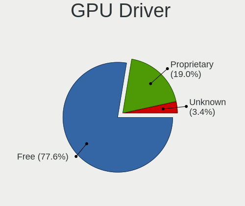

| Driver      | Computers | Percent |
|-------------|-----------|---------|
| Free        | 1619      | 78.17%  |
| Proprietary | 393       | 18.98%  |
| Unknown     | 59        | 2.85%   |

GPU Memory
----------

Total video memory

| Size in GB | Computers | Percent |
|------------|-----------|---------|
| Unknown    | 1207      | 57.18%  |
| 1.01-2.0   | 266       | 12.6%   |
| 0.01-0.5   | 224       | 10.61%  |
| 3.01-4.0   | 141       | 6.68%   |
| 0.51-1.0   | 127       | 6.02%   |
| 7.01-8.0   | 66        | 3.13%   |
| 5.01-6.0   | 44        | 2.08%   |
| 8.01-16.0  | 17        | 0.81%   |
| 2.01-3.0   | 12        | 0.57%   |
| 16.01-24.0 | 6         | 0.28%   |
| 0          | 1         | 0.05%   |

Monitor
-------

Monitor Vendor
--------------

Monitor vendors

| Vendor                  | Computers | Percent |
|-------------------------|-----------|---------|
| AU Optronics            | 272       | 12.54%  |
| Samsung Electronics     | 260       | 11.99%  |
| BOE                     | 240       | 11.07%  |
| Chimei Innolux          | 236       | 10.88%  |
| LG Display              | 201       | 9.27%   |
| Dell                    | 157       | 7.24%   |
| Goldstar                | 117       | 5.39%   |
| Philips                 | 78        | 3.6%    |
| PANDA                   | 55        | 2.54%   |
| BenQ                    | 47        | 2.17%   |
| Lenovo                  | 44        | 2.03%   |
| Hewlett-Packard         | 40        | 1.84%   |
| Chi Mei Optoelectronics | 39        | 1.8%    |
| AOC                     | 38        | 1.75%   |
| Acer                    | 37        | 1.71%   |
| Sharp                   | 34        | 1.57%   |
| Ancor Communications    | 32        | 1.48%   |
| Fujitsu Siemens         | 21        | 0.97%   |
| ASUSTek Computer        | 18        | 0.83%   |
| LG Philips              | 16        | 0.74%   |
| LG Electronics          | 12        | 0.55%   |
| Sony                    | 11        | 0.51%   |
| Eizo                    | 11        | 0.51%   |
| CSO                     | 11        | 0.51%   |
| Unknown                 | 10        | 0.46%   |
| Apple                   | 10        | 0.46%   |
| InfoVision              | 8         | 0.37%   |
| Vestel Elektronik       | 7         | 0.32%   |
| KTC                     | 7         | 0.32%   |
| Panasonic               | 6         | 0.28%   |
| Lenovo Group Limited    | 6         | 0.28%   |
| ViewSonic               | 5         | 0.23%   |
| Toshiba                 | 5         | 0.23%   |
| Valve                   | 4         | 0.18%   |
| LGD                     | 4         | 0.18%   |
| InnoLux Display         | 4         | 0.18%   |
| Iiyama                  | 4         | 0.18%   |
| HannStar                | 4         | 0.18%   |
| CPT                     | 4         | 0.18%   |
| MSI                     | 3         | 0.14%   |

Monitor Model
-------------

Monitor models

| Model                                                                    | Computers | Percent |
|--------------------------------------------------------------------------|-----------|---------|
| Chimei Innolux LCD Monitor CMN15F5 1920x1080 344x193mm 15.5-inch         | 27        | 1.21%   |
| BOE LCD Monitor BOE06A4 1366x768 344x194mm 15.5-inch                     | 26        | 1.17%   |
| AU Optronics LCD Monitor AUO70EC 1366x768 344x193mm 15.5-inch            | 23        | 1.03%   |
| AU Optronics LCD Monitor AUO38ED 1920x1080 344x193mm 15.5-inch           | 21        | 0.94%   |
| Chimei Innolux LCD Monitor CMN14D4 1920x1080 309x173mm 13.9-inch         | 17        | 0.76%   |
| BOE LCD Monitor BOE069C 1920x1080 344x193mm 15.5-inch                    | 15        | 0.67%   |
| Goldstar E2250 GSM578D 1920x1080 477x268mm 21.5-inch                     | 14        | 0.63%   |
| Chimei Innolux LCD Monitor CMN15DB 1366x768 344x193mm 15.5-inch          | 12        | 0.54%   |
| Chimei Innolux LCD Monitor CMN15CA 1366x768 344x193mm 15.5-inch          | 12        | 0.54%   |
| AU Optronics LCD Monitor AUO21ED 1920x1080 344x193mm 15.5-inch           | 12        | 0.54%   |
| Samsung Electronics LCD Monitor SEC5441 1366x768 344x194mm 15.5-inch     | 11        | 0.49%   |
| Chimei Innolux LCD Monitor CMN15E7 1920x1080 344x193mm 15.5-inch         | 11        | 0.49%   |
| Chimei Innolux LCD Monitor CMN15DC 1366x768 344x193mm 15.5-inch          | 11        | 0.49%   |
| Chimei Innolux LCD Monitor CMN15D5 1920x1080 344x193mm 15.5-inch         | 11        | 0.49%   |
| BOE LCD Monitor BOE06A5 1366x768 344x194mm 15.5-inch                     | 11        | 0.49%   |
| AU Optronics LCD Monitor AUO403D 1920x1080 309x174mm 14.0-inch           | 11        | 0.49%   |
| Samsung Electronics C24F390 SAM0D2C 1920x1080 521x293mm 23.5-inch        | 10        | 0.45%   |
| Goldstar IPS FULLHD GSM5AB8 1920x1080 480x270mm 21.7-inch                | 10        | 0.45%   |
| Chimei Innolux LCD Monitor CMN15C4 1920x1080 344x193mm 15.5-inch         | 10        | 0.45%   |
| PANDA LCD Monitor NCP004D 1920x1080 344x194mm 15.5-inch                  | 9         | 0.4%    |
| PANDA LCD Monitor NCP0046 1920x1080 344x194mm 15.5-inch                  | 9         | 0.4%    |
| LG Display LCD Monitor LGD033A 1366x768 344x194mm 15.5-inch              | 9         | 0.4%    |
| Chimei Innolux LCD Monitor CMN15E6 1366x768 344x193mm 15.5-inch          | 9         | 0.4%    |
| AU Optronics LCD Monitor AUO45EC 1366x768 344x193mm 15.5-inch            | 9         | 0.4%    |
| Philips PHL 223V5 PHLC0CF 1920x1080 477x268mm 21.5-inch                  | 8         | 0.36%   |
| Goldstar ULTRAWIDE GSM59F1 2560x1080 673x284mm 28.8-inch                 | 8         | 0.36%   |
| Chimei Innolux LCD Monitor CMN15E8 1920x1080 344x193mm 15.5-inch         | 8         | 0.36%   |
| Chimei Innolux LCD Monitor CMN1521 1920x1080 344x193mm 15.5-inch         | 8         | 0.36%   |
| Vestel Elektronik 22W_LCD_TV VES3700 1920x540                            | 7         | 0.31%   |
| Sharp LCD Monitor SHP13F8 3200x1800 346x194mm 15.6-inch                  | 7         | 0.31%   |
| LG Display LCD Monitor LGD0563 1920x1080 344x194mm 15.5-inch             | 7         | 0.31%   |
| LG Display LCD Monitor LGD02DC 1366x768 344x194mm 15.5-inch              | 7         | 0.31%   |
| BOE LCD Monitor BOE0718 1920x1080 309x173mm 13.9-inch                    | 7         | 0.31%   |
| AU Optronics LCD Monitor AUO20EC 1366x768 344x193mm 15.5-inch            | 7         | 0.31%   |
| Samsung Electronics LCD Monitor SDC4154 2880x1800 302x189mm 14.0-inch    | 6         | 0.27%   |
| PANDA LM156LF1L03 NCP001C 1920x1080 344x194mm 15.5-inch                  | 6         | 0.27%   |
| LG Display LCD Monitor LGD046F 1920x1080 340x190mm 15.3-inch             | 6         | 0.27%   |
| Dell U2412M DELA07A 1920x1200 518x324mm 24.1-inch                        | 6         | 0.27%   |
| Chi Mei Optoelectronics LCD Monitor CMO15A7 1366x768 344x193mm 15.5-inch | 6         | 0.27%   |
| BOE LCD Monitor BOE07F1 1920x1080 344x193mm 15.5-inch                    | 6         | 0.27%   |

Monitor Resolution
------------------

Monitor screen resolution

| Resolution         | Computers | Percent |
|--------------------|-----------|---------|
| 1920x1080 (FHD)    | 977       | 46.95%  |
| 1366x768 (WXGA)    | 425       | 20.42%  |
| 3840x2160 (4K)     | 95        | 4.57%   |
| 1280x1024 (SXGA)   | 79        | 3.8%    |
| 2560x1440 (QHD)    | 76        | 3.65%   |
| 1600x900 (HD+)     | 62        | 2.98%   |
| 1680x1050 (WSXGA+) | 51        | 2.45%   |
| 1920x1200 (WUXGA)  | 44        | 2.11%   |
| 1280x800 (WXGA)    | 43        | 2.07%   |
| 1440x900 (WXGA+)   | 29        | 1.39%   |
| Unknown            | 23        | 1.11%   |
| 2560x1600          | 21        | 1.01%   |
| 2560x1080          | 18        | 0.86%   |
| 2880x1800          | 16        | 0.77%   |
| 1360x768           | 16        | 0.77%   |
| 3440x1440          | 15        | 0.72%   |
| 3200x1800 (QHD+)   | 11        | 0.53%   |
| 1024x600           | 8         | 0.38%   |
| 800x1280           | 7         | 0.34%   |
| 3840x1080          | 7         | 0.34%   |
| 2160x1440          | 7         | 0.34%   |
| 1024x768 (XGA)     | 7         | 0.34%   |
| 3840x2400          | 3         | 0.14%   |
| 3200x2000          | 3         | 0.14%   |
| 1600x1200          | 3         | 0.14%   |
| 5760x2160          | 2         | 0.1%    |
| 5120x1440          | 2         | 0.1%    |
| 3840x1600          | 2         | 0.1%    |
| 1920x540           | 2         | 0.1%    |
| 1400x1050          | 2         | 0.1%    |
| 1280x720 (HD)      | 2         | 0.1%    |
| 800x600            | 1         | 0.05%   |
| 7680x2160          | 1         | 0.05%   |
| 7680x1440          | 1         | 0.05%   |
| 6400x1440          | 1         | 0.05%   |
| 6000x1440          | 1         | 0.05%   |
| 4960x1080          | 1         | 0.05%   |
| 3926x1440          | 1         | 0.05%   |
| 3840x2524          | 1         | 0.05%   |
| 3600x1200          | 1         | 0.05%   |

Monitor Diagonal
----------------

Diagonal size in inches

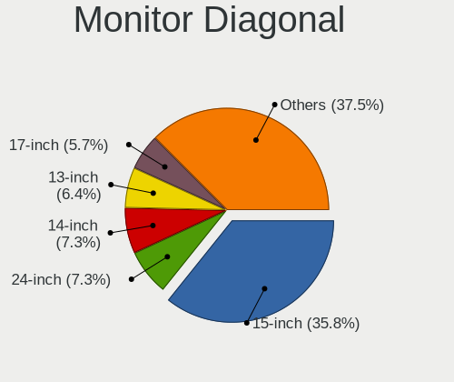

| Inches  | Computers | Percent |
|---------|-----------|---------|
| 15      | 795       | 36.98%  |
| 14      | 153       | 7.12%   |
| 24      | 145       | 6.74%   |
| 13      | 142       | 6.6%    |
| 17      | 127       | 5.91%   |
| 21      | 126       | 5.86%   |
| 27      | 115       | 5.35%   |
| 23      | 108       | 5.02%   |
| Unknown | 80        | 3.72%   |
| 19      | 56        | 2.6%    |
| 22      | 36        | 1.67%   |
| 34      | 30        | 1.4%    |
| 31      | 30        | 1.4%    |
| 18      | 29        | 1.35%   |
| 16      | 28        | 1.3%    |
| 12      | 20        | 0.93%   |
| 84      | 19        | 0.88%   |
| 20      | 13        | 0.6%    |
| 54      | 11        | 0.51%   |
| 11      | 11        | 0.51%   |
| 10      | 9         | 0.42%   |
| 40      | 8         | 0.37%   |
| 32      | 8         | 0.37%   |
| 72      | 6         | 0.28%   |
| 65      | 6         | 0.28%   |
| 26      | 5         | 0.23%   |
| 7       | 4         | 0.19%   |
| 28      | 3         | 0.14%   |
| 25      | 3         | 0.14%   |
| 3       | 3         | 0.14%   |
| 52      | 2         | 0.09%   |
| 46      | 2         | 0.09%   |
| 43      | 2         | 0.09%   |
| 42      | 2         | 0.09%   |
| 37      | 2         | 0.09%   |
| 29      | 2         | 0.09%   |
| 8       | 2         | 0.09%   |
| 142     | 1         | 0.05%   |
| 86      | 1         | 0.05%   |
| 58      | 1         | 0.05%   |

Monitor Width
-------------

Physical width

| Width in mm    | Computers | Percent |
|----------------|-----------|---------|
| 301-350        | 1061      | 49.84%  |
| 501-600        | 347       | 16.3%   |
| 401-500        | 215       | 10.1%   |
| 351-400        | 167       | 7.84%   |
| 201-300        | 101       | 4.74%   |
| Unknown        | 80        | 3.76%   |
| 601-700        | 44        | 2.07%   |
| 701-800        | 39        | 1.83%   |
| 1001-1500      | 26        | 1.22%   |
| 1501-2000      | 25        | 1.17%   |
| 801-900        | 10        | 0.47%   |
| 1-100          | 7         | 0.33%   |
| 901-1000       | 4         | 0.19%   |
| 101-200        | 2         | 0.09%   |
| More than 2000 | 1         | 0.05%   |

Aspect Ratio
------------

Proportional relationship between the width and the height

| Ratio   | Computers | Percent |
|---------|-----------|---------|
| 16/9    | 1564      | 78.67%  |
| 16/10   | 208       | 10.46%  |
| 5/4     | 70        | 3.52%   |
| Unknown | 69        | 3.47%   |
| 21/9    | 33        | 1.66%   |
| 4/3     | 15        | 0.75%   |
| 3/2     | 14        | 0.7%    |
| 6/5     | 8         | 0.4%    |
| 0.67    | 4         | 0.2%    |
| 32/9    | 1         | 0.05%   |
| 1.00    | 1         | 0.05%   |
| 0.56    | 1         | 0.05%   |

Monitor Area
------------

Area in inch

| Area in inch | Computers | Percent |
|----------------|-----------|---------|
| 101-110        | 796       | 37.2%   |
| 201-250        | 337       | 15.75%  |
| 81-90          | 244       | 11.4%   |
| 301-350        | 119       | 5.56%   |
| 151-200        | 99        | 4.63%   |
| 121-130        | 94        | 4.39%   |
| Unknown        | 80        | 3.74%   |
| 351-500        | 71        | 3.32%   |
| 251-300        | 53        | 2.48%   |
| More than 1000 | 48        | 2.24%   |
| 141-150        | 48        | 2.24%   |
| 71-80          | 47        | 2.2%    |
| 111-120        | 23        | 1.07%   |
| 61-70          | 18        | 0.84%   |
| 501-1000       | 18        | 0.84%   |
| 51-60          | 11        | 0.51%   |
| 131-140        | 10        | 0.47%   |
| 41-50          | 9         | 0.42%   |
| 1-40           | 9         | 0.42%   |
| 91-100         | 6         | 0.28%   |

Pixel Density
-------------

Pixels per inch

| Density       | Computers | Percent |
|---------------|-----------|---------|
| 121-160       | 651       | 30.84%  |
| 101-120       | 600       | 28.42%  |
| 51-100        | 593       | 28.09%  |
| 161-240       | 106       | 5.02%   |
| Unknown       | 80        | 3.79%   |
| More than 240 | 44        | 2.08%   |
| 1-50          | 37        | 1.75%   |

Multiple Monitors
-----------------

Total monitors connected

| Total | Computers | Percent |
|-------|-----------|---------|
| 1     | 1739      | 83.41%  |
| 2     | 241       | 11.56%  |
| 0     | 76        | 3.65%   |
| 3     | 27        | 1.29%   |
| 4     | 2         | 0.1%    |

Network
-------

Net Controller Vendor
---------------------

Controller vendors

| Vendor                            | Computers | Percent |
|-----------------------------------|-----------|---------|
| Realtek Semiconductor             | 1171      | 38.85%  |
| Intel                             | 905       | 30.03%  |
| Qualcomm Atheros                  | 337       | 11.18%  |
| Broadcom                          | 156       | 5.18%   |
| MediaTek                          | 86        | 2.85%   |
| TP-Link                           | 64        | 2.12%   |
| Broadcom Limited                  | 33        | 1.09%   |
| Ralink Technology                 | 25        | 0.83%   |
| Ralink                            | 24        | 0.8%    |
| Marvell Technology Group          | 23        | 0.76%   |
| Nvidia                            | 14        | 0.46%   |
| ASUSTek Computer                  | 14        | 0.46%   |
| Huawei Technologies               | 13        | 0.43%   |
| Samsung Electronics               | 12        | 0.4%    |
| ASIX Electronics                  | 12        | 0.4%    |
| D-Link                            | 10        | 0.33%   |
| Xiaomi                            | 9         | 0.3%    |
| Ericsson Business Mobile Networks | 8         | 0.27%   |
| Aquantia                          | 7         | 0.23%   |
| Qualcomm Atheros Communications   | 6         | 0.2%    |
| Hewlett-Packard                   | 6         | 0.2%    |
| ZTE WCDMA Technologies MSM        | 5         | 0.17%   |
| Microsoft                         | 5         | 0.17%   |
| Silicon Integrated Systems [SiS]  | 4         | 0.13%   |
| Lenovo                            | 4         | 0.13%   |
| JMicron Technology                | 4         | 0.13%   |
| Google                            | 4         | 0.13%   |
| Edimax Technology                 | 4         | 0.13%   |
| VIA Technologies                  | 3         | 0.1%    |
| Sierra Wireless                   | 3         | 0.1%    |
| Dell                              | 3         | 0.1%    |
| Tenda                             | 2         | 0.07%   |
| Standard Microsystems             | 2         | 0.07%   |
| Qualcomm                          | 2         | 0.07%   |
| IMC Networks                      | 2         | 0.07%   |
| Giga-Byte Technology              | 2         | 0.07%   |
| FIBOCOM                           | 2         | 0.07%   |
| DisplayLink                       | 2         | 0.07%   |
| D-Link System                     | 2         | 0.07%   |
| Belkin Components                 | 2         | 0.07%   |

Net Controller Model
--------------------

Controller models

| Model                                                                  | Computers | Percent |
|------------------------------------------------------------------------|-----------|---------|
| Realtek RTL8111/8168/8211/8411 PCI Express Gigabit Ethernet Controller | 747       | 21.26%  |
| Realtek RTL810xE PCI Express Fast Ethernet controller                  | 138       | 3.93%   |
| Qualcomm Atheros QCA9377 802.11ac Wireless Network Adapter             | 89        | 2.53%   |
| Realtek RTL8821CE 802.11ac PCIe Wireless Network Adapter               | 83        | 2.36%   |
| Intel Wi-Fi 6 AX200                                                    | 74        | 2.11%   |
| Intel 82579LM Gigabit Network Connection (Lewisville)                  | 73        | 2.08%   |
| Intel Wireless 8265 / 8275                                             | 69        | 1.96%   |
| Realtek RTL8822BE 802.11a/b/g/n/ac WiFi adapter                        | 58        | 1.65%   |
| Realtek RTL8723BE PCIe Wireless Network Adapter                        | 56        | 1.59%   |
| Qualcomm Atheros QCA9565 / AR9565 Wireless Network Adapter             | 51        | 1.45%   |
| Realtek RTL8153 Gigabit Ethernet Adapter                               | 45        | 1.28%   |
| Realtek RTL8125 2.5GbE Controller                                      | 45        | 1.28%   |
| Realtek RTL8822CE 802.11ac PCIe Wireless Network Adapter               | 44        | 1.25%   |
| Intel Cannon Lake PCH CNVi WiFi                                        | 44        | 1.25%   |
| Qualcomm Atheros AR9285 Wireless Network Adapter (PCI-Express)         | 41        | 1.17%   |
| Intel Wi-Fi 6 AX201                                                    | 38        | 1.08%   |
| MediaTek MT7921 802.11ax PCI Express Wireless Network Adapter          | 37        | 1.05%   |
| Intel Cannon Point-LP CNVi [Wireless-AC]                               | 37        | 1.05%   |
| Intel I211 Gigabit Network Connection                                  | 34        | 0.97%   |
| Intel Ethernet Connection I217-LM                                      | 33        | 0.94%   |
| Intel Wireless 7260                                                    | 32        | 0.91%   |
| Intel Wireless 7265                                                    | 31        | 0.88%   |
| Qualcomm Atheros AR9485 Wireless Network Adapter                       | 30        | 0.85%   |
| Intel 82567LM-3 Gigabit Network Connection                             | 28        | 0.8%    |
| Intel Ethernet Connection (2) I219-V                                   | 25        | 0.71%   |
| Intel Wireless 8260                                                    | 24        | 0.68%   |
| Intel Centrino Advanced-N 6205 [Taylor Peak]                           | 24        | 0.68%   |
| MediaTek MT7922 802.11ax PCI Express Wireless Network Adapter          | 23        | 0.65%   |
| Intel Wireless 3165                                                    | 23        | 0.65%   |
| Intel Dual Band Wireless-AC 3165 Plus Bluetooth                        | 23        | 0.65%   |
| Qualcomm Atheros QCA6174 802.11ac Wireless Network Adapter             | 22        | 0.63%   |
| Intel Comet Lake PCH-LP CNVi WiFi                                      | 21        | 0.6%    |
| Intel Comet Lake PCH CNVi WiFi                                         | 21        | 0.6%    |
| Qualcomm Atheros AR8151 v2.0 Gigabit Ethernet                          | 20        | 0.57%   |
| Intel Wireless 3160                                                    | 20        | 0.57%   |
| Broadcom BCM43142 802.11b/g/n                                          | 20        | 0.57%   |
| Broadcom BCM4313 802.11bgn Wireless Network Adapter                    | 20        | 0.57%   |
| Intel 82577LM Gigabit Network Connection                               | 19        | 0.54%   |
| Realtek RTL8723BU 802.11b/g/n WLAN Adapter                             | 17        | 0.48%   |
| Intel Centrino Advanced-N 6200                                         | 17        | 0.48%   |

Wireless Vendor
---------------

Wireless vendors

| Vendor                          | Computers | Percent |
|---------------------------------|-----------|---------|
| Intel                           | 666       | 40.19%  |
| Realtek Semiconductor           | 356       | 21.48%  |
| Qualcomm Atheros                | 274       | 16.54%  |
| Broadcom                        | 101       | 6.1%    |
| MediaTek                        | 78        | 4.71%   |
| TP-Link                         | 54        | 3.26%   |
| Ralink Technology               | 25        | 1.51%   |
| Ralink                          | 24        | 1.45%   |
| Broadcom Limited                | 17        | 1.03%   |
| ASUSTek Computer                | 14        | 0.84%   |
| D-Link                          | 10        | 0.6%    |
| Qualcomm Atheros Communications | 6         | 0.36%   |
| Microsoft                       | 5         | 0.3%    |
| Edimax Technology               | 4         | 0.24%   |
| Sierra Wireless                 | 3         | 0.18%   |
| Tenda                           | 2         | 0.12%   |
| IMC Networks                    | 2         | 0.12%   |
| FIBOCOM                         | 2         | 0.12%   |
| Belkin Components               | 2         | 0.12%   |
| Accton Technology               | 2         | 0.12%   |
| Wacom                           | 1         | 0.06%   |
| Sitecom Europe                  | 1         | 0.06%   |
| Qualcomm                        | 1         | 0.06%   |
| Qcom                            | 1         | 0.06%   |
| NetGear                         | 1         | 0.06%   |
| Micro Star International        | 1         | 0.06%   |
| Mercucys                        | 1         | 0.06%   |
| Linksys                         | 1         | 0.06%   |
| D-Link System                   | 1         | 0.06%   |
| Belkin                          | 1         | 0.06%   |

Wireless Model
--------------

Wireless models

| Model                                                                   | Computers | Percent |
|-------------------------------------------------------------------------|-----------|---------|
| Qualcomm Atheros QCA9377 802.11ac Wireless Network Adapter              | 89        | 5.35%   |
| Realtek RTL8821CE 802.11ac PCIe Wireless Network Adapter                | 83        | 4.98%   |
| Intel Wi-Fi 6 AX200                                                     | 74        | 4.44%   |
| Intel Wireless 8265 / 8275                                              | 69        | 4.14%   |
| Realtek RTL8822BE 802.11a/b/g/n/ac WiFi adapter                         | 58        | 3.48%   |
| Realtek RTL8723BE PCIe Wireless Network Adapter                         | 56        | 3.36%   |
| Qualcomm Atheros QCA9565 / AR9565 Wireless Network Adapter              | 51        | 3.06%   |
| Realtek RTL8822CE 802.11ac PCIe Wireless Network Adapter                | 44        | 2.64%   |
| Intel Cannon Lake PCH CNVi WiFi                                         | 44        | 2.64%   |
| Qualcomm Atheros AR9285 Wireless Network Adapter (PCI-Express)          | 41        | 2.46%   |
| Intel Wi-Fi 6 AX201                                                     | 38        | 2.28%   |
| MediaTek MT7921 802.11ax PCI Express Wireless Network Adapter           | 37        | 2.22%   |
| Intel Cannon Point-LP CNVi [Wireless-AC]                                | 37        | 2.22%   |
| Intel Wireless 7260                                                     | 32        | 1.92%   |
| Intel Wireless 7265                                                     | 31        | 1.86%   |
| Qualcomm Atheros AR9485 Wireless Network Adapter                        | 30        | 1.8%    |
| Intel Wireless 8260                                                     | 24        | 1.44%   |
| Intel Centrino Advanced-N 6205 [Taylor Peak]                            | 24        | 1.44%   |
| MediaTek MT7922 802.11ax PCI Express Wireless Network Adapter           | 23        | 1.38%   |
| Intel Wireless 3165                                                     | 23        | 1.38%   |
| Intel Dual Band Wireless-AC 3165 Plus Bluetooth                         | 23        | 1.38%   |
| Qualcomm Atheros QCA6174 802.11ac Wireless Network Adapter              | 22        | 1.32%   |
| Intel Comet Lake PCH-LP CNVi WiFi                                       | 21        | 1.26%   |
| Intel Comet Lake PCH CNVi WiFi                                          | 21        | 1.26%   |
| Intel Wireless 3160                                                     | 20        | 1.2%    |
| Broadcom BCM43142 802.11b/g/n                                           | 20        | 1.2%    |
| Broadcom BCM4313 802.11bgn Wireless Network Adapter                     | 20        | 1.2%    |
| Realtek RTL8723BU 802.11b/g/n WLAN Adapter                              | 17        | 1.02%   |
| Intel Centrino Advanced-N 6200                                          | 17        | 1.02%   |
| Intel PRO/Wireless 3945ABG [Golan] Network Connection                   | 16        | 0.96%   |
| Realtek RTL8188EUS 802.11n Wireless Network Adapter                     | 14        | 0.84%   |
| Intel Centrino Ultimate-N 6300                                          | 13        | 0.78%   |
| Ralink MT7601U Wireless Adapter                                         | 12        | 0.72%   |
| Intel Ice Lake-LP PCH CNVi WiFi                                         | 12        | 0.72%   |
| Intel Alder Lake-P PCH CNVi WiFi                                        | 12        | 0.72%   |
| Broadcom BCM4311 802.11b/g WLAN                                         | 11        | 0.66%   |
| TP-Link TL-WN823N v2/v3 [Realtek RTL8192EU]                             | 10        | 0.6%    |
| TP-Link Archer T2U PLUS [RTL8821AU]                                     | 10        | 0.6%    |
| Realtek RTL8852BE PCIe 802.11ax Wireless Network Controller             | 10        | 0.6%    |
| Qualcomm Atheros AR242x / AR542x Wireless Network Adapter (PCI-Express) | 10        | 0.6%    |

Ethernet Vendor
---------------

Ethernet vendors

| Vendor                                 | Computers | Percent |
|----------------------------------------|-----------|---------|
| Realtek Semiconductor                  | 995       | 55.87%  |
| Intel                                  | 452       | 25.38%  |
| Qualcomm Atheros                       | 97        | 5.45%   |
| Broadcom                               | 81        | 4.55%   |
| Marvell Technology Group               | 23        | 1.29%   |
| Broadcom Limited                       | 16        | 0.9%    |
| Nvidia                                 | 14        | 0.79%   |
| Samsung Electronics                    | 12        | 0.67%   |
| ASIX Electronics                       | 12        | 0.67%   |
| TP-Link                                | 10        | 0.56%   |
| Huawei Technologies                    | 10        | 0.56%   |
| Xiaomi                                 | 9         | 0.51%   |
| MediaTek                               | 7         | 0.39%   |
| Aquantia                               | 7         | 0.39%   |
| Silicon Integrated Systems [SiS]       | 4         | 0.22%   |
| Lenovo                                 | 4         | 0.22%   |
| JMicron Technology                     | 4         | 0.22%   |
| Google                                 | 4         | 0.22%   |
| VIA Technologies                       | 3         | 0.17%   |
| Standard Microsystems                  | 2         | 0.11%   |
| Giga-Byte Technology                   | 2         | 0.11%   |
| DisplayLink                            | 2         | 0.11%   |
| ZTE WCDMA Technologies MSM             | 1         | 0.06%   |
| Sony Ericsson Mobile Communications AB | 1         | 0.06%   |
| Qualcomm                               | 1         | 0.06%   |
| QNAP System                            | 1         | 0.06%   |
| QLogic                                 | 1         | 0.06%   |
| Motorola PCS                           | 1         | 0.06%   |
| HMD Global                             | 1         | 0.06%   |
| Hewlett-Packard                        | 1         | 0.06%   |
| Dell                                   | 1         | 0.06%   |
| D-Link System                          | 1         | 0.06%   |
| 3Com                                   | 1         | 0.06%   |

Ethernet Model
--------------

Ethernet models

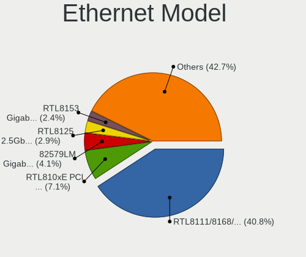

| Model                                                                  | Computers | Percent |
|------------------------------------------------------------------------|-----------|---------|
| Realtek RTL8111/8168/8211/8411 PCI Express Gigabit Ethernet Controller | 747       | 41.13%  |
| Realtek RTL810xE PCI Express Fast Ethernet controller                  | 138       | 7.6%    |
| Intel 82579LM Gigabit Network Connection (Lewisville)                  | 73        | 4.02%   |
| Realtek RTL8153 Gigabit Ethernet Adapter                               | 45        | 2.48%   |
| Realtek RTL8125 2.5GbE Controller                                      | 45        | 2.48%   |
| Intel I211 Gigabit Network Connection                                  | 34        | 1.87%   |
| Intel Ethernet Connection I217-LM                                      | 33        | 1.82%   |
| Intel 82567LM-3 Gigabit Network Connection                             | 28        | 1.54%   |
| Intel Ethernet Connection (2) I219-V                                   | 25        | 1.38%   |
| Qualcomm Atheros AR8151 v2.0 Gigabit Ethernet                          | 20        | 1.1%    |
| Intel 82577LM Gigabit Network Connection                               | 19        | 1.05%   |
| Intel Ethernet Controller I225-V                                       | 14        | 0.77%   |
| Intel Ethernet Connection (7) I219-V                                   | 14        | 0.77%   |
| Intel Ethernet Connection (4) I219-LM                                  | 14        | 0.77%   |
| Broadcom NetLink BCM57785 Gigabit Ethernet PCIe                        | 14        | 0.77%   |
| Intel Ethernet Connection I217-V                                       | 13        | 0.72%   |
| Qualcomm Atheros QCA8172 Fast Ethernet                                 | 12        | 0.66%   |
| ASIX AX88179 Gigabit Ethernet                                          | 12        | 0.66%   |
| Intel Ethernet Connection I218-LM                                      | 11        | 0.61%   |
| Intel Ethernet Connection (7) I219-LM                                  | 11        | 0.61%   |
| Realtek RTL-8100/8101L/8139 PCI Fast Ethernet Adapter                  | 10        | 0.55%   |
| Intel Ethernet Connection (3) I218-LM                                  | 10        | 0.55%   |
| TP-Link UE300 10/100/1000 LAN (ethernet mode) [Realtek RTL8153]        | 9         | 0.5%    |
| Samsung Galaxy series, misc. (tethering mode)                          | 9         | 0.5%    |
| Qualcomm Atheros QCA8171 Gigabit Ethernet                              | 9         | 0.5%    |
| Qualcomm Atheros AR8161 Gigabit Ethernet                               | 9         | 0.5%    |
| Intel Ethernet Connection I219-LM                                      | 9         | 0.5%    |
| Intel Ethernet Connection (6) I219-V                                   | 9         | 0.5%    |
| Intel 82579V Gigabit Network Connection                                | 9         | 0.5%    |
| Intel 82566DM-2 Gigabit Network Connection                             | 9         | 0.5%    |
| Broadcom NetXtreme BCM5761 Gigabit Ethernet PCIe                       | 9         | 0.5%    |
| Xiaomi Mi/Redmi series (RNDIS)                                         | 8         | 0.44%   |
| Qualcomm Atheros AR8152 v2.0 Fast Ethernet                             | 8         | 0.44%   |
| Broadcom NetLink BCM5787M Gigabit Ethernet PCI Express                 | 8         | 0.44%   |
| Nvidia MCP61 Ethernet                                                  | 7         | 0.39%   |
| MediaTek RMX3085                                                       | 7         | 0.39%   |
| Intel I210 Gigabit Network Connection                                  | 7         | 0.39%   |
| Intel Ethernet Connection (5) I219-LM                                  | 7         | 0.39%   |
| Intel Ethernet Connection (2) I219-LM                                  | 7         | 0.39%   |
| Intel 82574L Gigabit Network Connection                                | 7         | 0.39%   |

Net Controller Kind
-------------------

Ethernet, WiFi or modem

| Kind     | Computers | Percent |
|----------|-----------|---------|
| Ethernet | 1688      | 51.15%  |
| WiFi     | 1579      | 47.85%  |
| Modem    | 28        | 0.85%   |
| Unknown  | 5         | 0.15%   |

Used Controller
---------------

Currently used network controller

| Kind     | Computers | Percent |
|----------|-----------|---------|
| WiFi     | 1252      | 58.95%  |
| Ethernet | 871       | 41.01%  |
| Unknown  | 1         | 0.05%   |

NICs
----

Total network controllers on board

| Total | Computers | Percent |
|-------|-----------|---------|
| 2     | 1095      | 53.49%  |
| 1     | 863       | 42.16%  |
| 0     | 42        | 2.05%   |
| 3     | 37        | 1.81%   |
| 4     | 7         | 0.34%   |
| 8     | 1         | 0.05%   |
| 6     | 1         | 0.05%   |
| 5     | 1         | 0.05%   |

IPv6
----

IPv6 vs IPv4

| Used | Computers | Percent |
|------|-----------|---------|
| No   | 1701      | 81.62%  |
| Yes  | 383       | 18.38%  |

Bluetooth
---------

Bluetooth Vendor
----------------

Controller vendors

| Vendor                          | Computers | Percent |
|---------------------------------|-----------|---------|
| Intel                           | 538       | 41.16%  |
| IMC Networks                    | 183       | 14%     |
| Realtek Semiconductor           | 161       | 12.32%  |
| Qualcomm Atheros Communications | 84        | 6.43%   |
| Lite-On Technology              | 68        | 5.2%    |
| Foxconn / Hon Hai               | 43        | 3.29%   |
| Broadcom                        | 43        | 3.29%   |
| Cambridge Silicon Radio         | 41        | 3.14%   |
| ASUSTek Computer                | 33        | 2.52%   |
| Dell                            | 23        | 1.76%   |
| Hewlett-Packard                 | 16        | 1.22%   |
| Toshiba                         | 15        | 1.15%   |
| Apple                           | 13        | 0.99%   |
| MediaTek                        | 10        | 0.77%   |
| Ralink                          | 9         | 0.69%   |
| Realtek                         | 4         | 0.31%   |
| Alps Electric                   | 3         | 0.23%   |
| USI                             | 2         | 0.15%   |
| TP-Link                         | 2         | 0.15%   |
| SINO WEALTH                     | 2         | 0.15%   |
| Integrated System Solution      | 2         | 0.15%   |
| Chicony Electronics             | 2         | 0.15%   |
| Ralink Technology               | 1         | 0.08%   |
| Opticis                         | 1         | 0.08%   |
| Micro Star International        | 1         | 0.08%   |
| Foxconn International           | 1         | 0.08%   |
| Edimax Technology               | 1         | 0.08%   |
| Conwise Technology              | 1         | 0.08%   |
| Belkin Components               | 1         | 0.08%   |
| Askey Computer                  | 1         | 0.08%   |
| Accel Semiconductor             | 1         | 0.08%   |
| Unknown                         | 1         | 0.08%   |

Bluetooth Model
---------------

Controller models

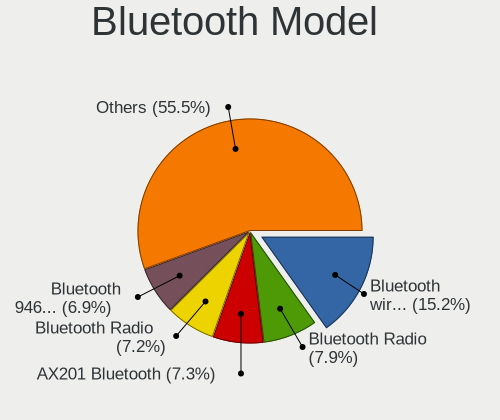

| Model                                               | Computers | Percent |
|-----------------------------------------------------|-----------|---------|
| Intel Bluetooth wireless interface                  | 120       | 9.18%   |
| Realtek Bluetooth Radio                             | 104       | 7.96%   |
| IMC Networks Bluetooth Radio                        | 101       | 7.73%   |
| Intel Bluetooth 9460/9560 Jefferson Peak (JfP)      | 97        | 7.42%   |
| Intel AX201 Bluetooth                               | 97        | 7.42%   |
| Intel Bluetooth Device                              | 84        | 6.43%   |
| Intel AX200 Bluetooth                               | 74        | 5.66%   |
| Qualcomm Atheros  Bluetooth Device                  | 47        | 3.6%    |
| Cambridge Silicon Radio Bluetooth Dongle (HCI mode) | 41        | 3.14%   |
| IMC Networks Wireless_Device                        | 39        | 2.98%   |
| IMC Networks Bluetooth Device                       | 35        | 2.68%   |
| Lite-On Qualcomm Atheros QCA9377 Bluetooth          | 27        | 2.07%   |
| Realtek  Bluetooth 4.2 Adapter                      | 23        | 1.76%   |
| ASUS Broadcom BCM20702A0 Bluetooth                  | 21        | 1.61%   |
| Intel AX211 Bluetooth                               | 15        | 1.15%   |
| Foxconn / Hon Hai Wireless_Device                   | 14        | 1.07%   |
| Realtek RTL8822BE Bluetooth 4.2 Adapter             | 13        | 0.99%   |
| Lite-On Bluetooth Device                            | 13        | 0.99%   |
| Intel Centrino Bluetooth Wireless Transceiver       | 12        | 0.92%   |
| Qualcomm Atheros QCA61x4 Bluetooth 4.0              | 11        | 0.84%   |
| Intel Centrino Advanced-N 6230 Bluetooth adapter    | 11        | 0.84%   |
| Dell DW375 Bluetooth Module                         | 11        | 0.84%   |
| Qualcomm Atheros AR3011 Bluetooth                   | 10        | 0.77%   |
| MediaTek Wireless_Device                            | 10        | 0.77%   |
| Lite-On Atheros AR3012 Bluetooth                    | 10        | 0.77%   |
| Intel AX210 Bluetooth                               | 10        | 0.77%   |
| Realtek 802.11ac WLAN Adapter                       | 9         | 0.69%   |
| Ralink RT3290 Bluetooth                             | 9         | 0.69%   |
| Intel Wireless-AC 9260 Bluetooth Adapter            | 9         | 0.69%   |
| Intel Wireless-AC 3168 Bluetooth                    | 9         | 0.69%   |
| HP Broadcom 2070 Bluetooth Combo                    | 9         | 0.69%   |
| Qualcomm Atheros AR3012 Bluetooth 4.0               | 8         | 0.61%   |
| ASUS ASUS USB-BT500                                 | 8         | 0.61%   |
| Toshiba Bluetooth Device                            | 7         | 0.54%   |
| Realtek RTL8723B Bluetooth                          | 7         | 0.54%   |
| Lite-On Wireless_Device                             | 7         | 0.54%   |
| HP Bluetooth 2.0 Interface [Broadcom BCM2045]       | 7         | 0.54%   |
| Broadcom BCM2045A0                                  | 7         | 0.54%   |
| Lite-On Broadcom BCM43142A0 Bluetooth Device        | 6         | 0.46%   |
| Foxconn / Hon Hai MediaTek Bluetooth Adapter        | 6         | 0.46%   |

Sound
-----

Sound Vendor
------------

Sound card vendors

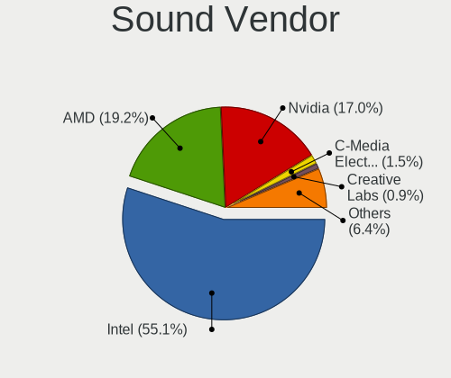

| Vendor                                       | Computers | Percent |
|----------------------------------------------|-----------|---------|
| Intel                                        | 1530      | 56.25%  |
| AMD                                          | 510       | 18.75%  |
| Nvidia                                       | 445       | 16.36%  |
| C-Media Electronics                          | 43        | 1.58%   |
| Creative Labs                                | 25        | 0.92%   |
| Logitech                                     | 15        | 0.55%   |
| GN Netcom                                    | 13        | 0.48%   |
| ASUSTek Computer                             | 11        | 0.4%    |
| Creative Technology                          | 9         | 0.33%   |
| Trust                                        | 8         | 0.29%   |
| Texas Instruments                            | 7         | 0.26%   |
| Realtek Semiconductor                        | 7         | 0.26%   |
| Kingston Technology                          | 7         | 0.26%   |
| Lenovo                                       | 6         | 0.22%   |
| Silicon Integrated Systems [SiS]             | 5         | 0.18%   |
| Giga-Byte Technology                         | 5         | 0.18%   |
| DSEA A/S                                     | 5         | 0.18%   |
| XMOS                                         | 4         | 0.15%   |
| Razer USA                                    | 4         | 0.15%   |
| Plantronics                                  | 4         | 0.15%   |
| Generalplus Technology                       | 4         | 0.15%   |
| VIA Technologies                             | 3         | 0.11%   |
| Tenx Technology                              | 3         | 0.11%   |
| Focusrite-Novation                           | 3         | 0.11%   |
| Dell                                         | 3         | 0.11%   |
| Sennheiser Communications                    | 2         | 0.07%   |
| JMTek                                        | 2         | 0.07%   |
| GYROCOM C&C                                  | 2         | 0.07%   |
| Edifier Technology                           | 2         | 0.07%   |
| DCMT Technology                              | 2         | 0.07%   |
| Corsair                                      | 2         | 0.07%   |
| Audio-Technica                               | 2         | 0.07%   |
| Zoran Co. Personal Media Division (Nogatech) | 1         | 0.04%   |
| Unknown                                      | 1         | 0.04%   |
| Thesycon Systemsoftware & Consulting         | 1         | 0.04%   |
| TEAC                                         | 1         | 0.04%   |
| Studiologic                                  | 1         | 0.04%   |
| Sony                                         | 1         | 0.04%   |
| Samsung Electronics                          | 1         | 0.04%   |
| Samson Technologies                          | 1         | 0.04%   |

Sound Model
-----------

Sound card models

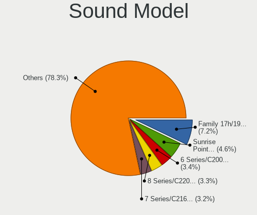

| Model                                                                      | Computers | Percent |
|----------------------------------------------------------------------------|-----------|---------|
| AMD Family 17h/19h HD Audio Controller                                     | 216       | 6.67%   |
| Intel Sunrise Point-LP HD Audio                                            | 154       | 4.76%   |
| Intel 8 Series/C220 Series Chipset High Definition Audio Controller        | 108       | 3.34%   |
| Intel 6 Series/C200 Series Chipset Family High Definition Audio Controller | 108       | 3.34%   |
| Intel 7 Series/C216 Chipset Family High Definition Audio Controller        | 107       | 3.3%    |
| AMD Renoir Radeon High Definition Audio Controller                         | 90        | 2.78%   |
| Intel Xeon E3-1200 v3/4th Gen Core Processor HD Audio Controller           | 86        | 2.66%   |
| Intel Cannon Lake PCH cAVS                                                 | 86        | 2.66%   |
| Intel Cannon Point-LP High Definition Audio Controller                     | 75        | 2.32%   |
| Intel Celeron/Pentium Silver Processor High Definition Audio               | 74        | 2.29%   |
| AMD Raven/Raven2/Fenghuang HDMI/DP Audio Controller                        | 67        | 2.07%   |
| Intel 5 Series/3400 Series Chipset High Definition Audio                   | 66        | 2.04%   |
| Intel 82801I (ICH9 Family) HD Audio Controller                             | 60        | 1.85%   |
| Intel NM10/ICH7 Family High Definition Audio Controller                    | 57        | 1.76%   |
| Intel 100 Series/C230 Series Chipset Family HD Audio Controller            | 56        | 1.73%   |
| Intel Haswell-ULT HD Audio Controller                                      | 55        | 1.7%    |
| Intel 8 Series HD Audio Controller                                         | 54        | 1.67%   |
| Intel Tiger Lake-LP Smart Sound Technology Audio Controller                | 52        | 1.61%   |
| AMD SBx00 Azalia (Intel HDA)                                               | 51        | 1.58%   |
| AMD Starship/Matisse HD Audio Controller                                   | 50        | 1.54%   |
| Nvidia GK208 HDMI/DP Audio Controller                                      | 43        | 1.33%   |
| Intel Wildcat Point-LP High Definition Audio Controller                    | 43        | 1.33%   |
| Intel Broadwell-U Audio Controller                                         | 43        | 1.33%   |
| Intel Celeron N3350/Pentium N4200/Atom E3900 Series Audio Cluster          | 42        | 1.3%    |
| AMD FCH Azalia Controller                                                  | 41        | 1.27%   |
| Intel 200 Series PCH HD Audio                                              | 40        | 1.24%   |
| AMD Ellesmere HDMI Audio [Radeon RX 470/480 / 570/580/590]                 | 38        | 1.17%   |
| Intel 82801H (ICH8 Family) HD Audio Controller                             | 37        | 1.14%   |
| Nvidia GF108 High Definition Audio Controller                              | 36        | 1.11%   |
| Nvidia TU107 GeForce GTX 1650 High Definition Audio Controller             | 35        | 1.08%   |
| AMD Rembrandt Radeon High Definition Audio Controller                      | 34        | 1.05%   |
| AMD Family 17h (Models 00h-0fh) HD Audio Controller                        | 32        | 0.99%   |
| Intel Comet Lake PCH-LP cAVS                                               | 31        | 0.96%   |
| Nvidia GP107GL High Definition Audio Controller                            | 30        | 0.93%   |
| Intel Alder Lake PCH-P High Definition Audio Controller                    | 29        | 0.9%    |
| Intel 82801JD/DO (ICH10 Family) HD Audio Controller                        | 27        | 0.83%   |
| Nvidia High Definition Audio Controller                                    | 26        | 0.8%    |
| Nvidia Audio device                                                        | 26        | 0.8%    |
| Intel Comet Lake PCH cAVS                                                  | 26        | 0.8%    |
| Intel Ice Lake-LP Smart Sound Technology Audio Controller                  | 25        | 0.77%   |

Memory
------

Memory Vendor
-------------

Memory module vendors

| Vendor                       | Computers | Percent |
|------------------------------|-----------|---------|
| Samsung Electronics          | 300       | 24.92%  |
| SK hynix                     | 205       | 17.03%  |
| Kingston                     | 179       | 14.87%  |
| Micron Technology            | 117       | 9.72%   |
| Unknown                      | 92        | 7.64%   |
| Corsair                      | 83        | 6.89%   |
| Crucial                      | 36        | 2.99%   |
| Ramaxel Technology           | 30        | 2.49%   |
| A-DATA Technology            | 30        | 2.49%   |
| Nanya Technology             | 22        | 1.83%   |
| Elpida                       | 21        | 1.74%   |
| G.Skill                      | 17        | 1.41%   |
| Unknown (ABCD)               | 13        | 1.08%   |
| Kingmax                      | 12        | 1%      |
| Unknown                      | 6         | 0.5%    |
| Patriot                      | 4         | 0.33%   |
| Apacer                       | 4         | 0.33%   |
| Qimonda                      | 3         | 0.25%   |
| GOODRAM                      | 3         | 0.25%   |
| Transcend                    | 2         | 0.17%   |
| Silicon Power                | 2         | 0.17%   |
| S                            | 2         | 0.17%   |
| Kingmax Semiconductor        | 2         | 0.17%   |
| H                            | 2         | 0.17%   |
| Golden Empire                | 2         | 0.17%   |
| Unknown (7F7F7F94FFFFFFFF)   | 1         | 0.08%   |
| Unknown (0x9801)             | 1         | 0.08%   |
| Unknown (0x7FDA000000000000) | 1         | 0.08%   |
| Unknown (0B45)               | 1         | 0.08%   |
| Team                         | 1         | 0.08%   |
| TakeMS                       | 1         | 0.08%   |
| SK_Hynix                     | 1         | 0.08%   |
| SHARETRONIC                  | 1         | 0.08%   |
| KingFast                     | 1         | 0.08%   |
| Infineon                     | 1         | 0.08%   |
| Exceleram                    | 1         | 0.08%   |
| Avant                        | 1         | 0.08%   |
| Atermiter                    | 1         | 0.08%   |
| ASint Technology             | 1         | 0.08%   |
| AMD                          | 1         | 0.08%   |

Memory Model
------------

Memory module models

| Model                                                            | Computers | Percent |
|------------------------------------------------------------------|-----------|---------|
| Samsung RAM M471A5244CB0-CTD 4GB SODIMM DDR4 3266MT/s            | 17        | 1.29%   |
| Samsung RAM M4 70T5663RZ3-CE6 2GB SODIMM DDR2 667MT/s            | 14        | 1.06%   |
| SK hynix RAM HMT451S6BFR8A-PB 4GB SODIMM DDR3 1600MT/s           | 12        | 0.91%   |
| Samsung RAM M471A1K43EB1-CWE 8GB SODIMM DDR4 3200MT/s            | 12        | 0.91%   |
| Samsung RAM M471A1G44AB0-CWE 8192MB SODIMM DDR4 3200MT/s         | 12        | 0.91%   |
| SK hynix RAM HMT41GS6BFR8A-PB 8GB SODIMM DDR3 1600MT/s           | 11        | 0.84%   |
| Samsung RAM M471A5244CB0-CRC 4GB SODIMM DDR4 2667MT/s            | 11        | 0.84%   |
| Samsung RAM M471A1K43DB1-CWE 8GB SODIMM DDR4 3200MT/s            | 11        | 0.84%   |
| Samsung RAM M471A1K43DB1-CTD 8GB SODIMM DDR4 2667MT/s            | 11        | 0.84%   |
| Unknown (ABCD) RAM 123456789012345678 2GB SODIMM LPDDR4 2400MT/s | 10        | 0.76%   |
| SK hynix RAM HMT41GS6AFR8A-PB 8GB SODIMM DDR3 1600MT/s           | 10        | 0.76%   |
| SK hynix RAM HMA81GS6AFR8N-UH 8GB SODIMM DDR4 2667MT/s           | 9         | 0.68%   |
| Samsung RAM M471B5173QH0-YK0 4GB SODIMM DDR3 1600MT/s            | 8         | 0.61%   |
| Samsung RAM M471B1G73QH0-YK0 8GB SODIMM DDR3 1600MT/s            | 8         | 0.61%   |
| Kingston RAM KHX1600C9D3/4GX 4GB DIMM DDR3 1600MT/s              | 8         | 0.61%   |
| SK hynix RAM HMAA1GS6CJR6N-XN 8GB SODIMM DDR4 3200MT/s           | 7         | 0.53%   |
| SK hynix RAM HMA81GS6JJR8N-VK 8GB SODIMM DDR4 2667MT/s           | 7         | 0.53%   |
| Samsung RAM M471B5173EB0-YK0 4GB SODIMM DDR3 1600MT/s            | 7         | 0.53%   |
| Samsung RAM M471A5244CB0-CWE 4GB SODIMM DDR4 3200MT/s            | 7         | 0.53%   |
| Unknown RAM Module 2048MB DIMM 800MT/s                           | 6         | 0.46%   |
| SK hynix RAM HMA81GS6CJR8N-VK 8GB SODIMM DDR4 2667MT/s           | 6         | 0.46%   |
| Samsung RAM M471B1G73EB0-YK0 8GB SODIMM DDR3 1600MT/s            | 6         | 0.46%   |
| Samsung RAM M471B1G73DB0-YK0 8GB SODIMM DDR3 1600MT/s            | 6         | 0.46%   |
| Samsung RAM M471A1K43CB1-CTD 8GB SODIMM DDR4 2667MT/s            | 6         | 0.46%   |
| Samsung RAM M471A1K43CB1-CRC 8GB SODIMM DDR4 2667MT/s            | 6         | 0.46%   |
| Micron RAM 4ATF1G64HZ-3G2E1 8GB SODIMM DDR4 3200MT/s             | 6         | 0.46%   |
| Kingston RAM KHX2133C14/8G 8GB DIMM DDR4 2666MT/s                | 6         | 0.46%   |
| Unknown                                                          | 6         | 0.46%   |
| Unknown RAM Module 2048MB DIMM SDRAM                             | 5         | 0.38%   |
| SK hynix RAM HMT351S6CFR8C-PB 4GB SODIMM DDR3 1600MT/s           | 5         | 0.38%   |
| SK hynix RAM HMA851S6AFR6N-UH 4GB SODIMM DDR4 2400MT/s           | 5         | 0.38%   |
| Samsung RAM M471B5273DH0-CH9 4GB SODIMM DDR3 1334MT/s            | 5         | 0.38%   |
| Samsung RAM M471A2K43DB1-CWE 16GB SODIMM DDR4 3200MT/s           | 5         | 0.38%   |
| Samsung RAM M471A1G44BB0-CWE 8GB SODIMM DDR4 3200MT/s            | 5         | 0.38%   |
| Samsung RAM M378B5173QH0-CK0 4GB DIMM DDR3 1600MT/s              | 5         | 0.38%   |
| Micron RAM 4ATF51264HZ-3G2J1 4GB SODIMM DDR4 3200MT/s            | 5         | 0.38%   |
| Micron RAM 16JSF51264HZ-1G4D1 4GB SODIMM DDR3 1334MT/s           | 5         | 0.38%   |
| SK hynix RAM HMT451U6AFR8C-PB 4GB DIMM DDR3 1600MT/s             | 4         | 0.3%    |
| SK hynix RAM HMAA1GS6CJR6N-XN 8GB Row Of Chips DDR4 3200MT/s     | 4         | 0.3%    |
| SK hynix RAM HMA851S6JJR6N-VK 4GB SODIMM DDR4 2667MT/s           | 4         | 0.3%    |

Memory Kind
-----------

Memory module kinds

| Kind    | Computers | Percent |
|---------|-----------|---------|
| DDR4    | 477       | 46.63%  |
| DDR3    | 324       | 31.67%  |
| DDR2    | 73        | 7.14%   |
| SDRAM   | 32        | 3.13%   |
| LPDDR4  | 28        | 2.74%   |
| DDR5    | 25        | 2.44%   |
| Unknown | 24        | 2.35%   |
| LPDDR3  | 18        | 1.76%   |
| LPDDR5  | 15        | 1.47%   |
| DDR     | 4         | 0.39%   |
| DRAM    | 3         | 0.29%   |

Memory Form Factor
------------------

Physical design of the memory module

| Name         | Computers | Percent |
|--------------|-----------|---------|
| SODIMM       | 628       | 61.99%  |
| DIMM         | 318       | 31.39%  |
| Row Of Chips | 60        | 5.92%   |
| Chip         | 5         | 0.49%   |
| RIMM         | 1         | 0.1%    |
| FB-DIMM      | 1         | 0.1%    |

Memory Size
-----------

Memory module size

| Size  | Computers | Percent |
|-------|-----------|---------|
| 8192  | 406       | 36.51%  |
| 4096  | 311       | 27.97%  |
| 16384 | 170       | 15.29%  |
| 2048  | 139       | 12.5%   |
| 1024  | 54        | 4.86%   |
| 32768 | 26        | 2.34%   |
| 512   | 6         | 0.54%   |

Memory Speed
------------

Memory module speed

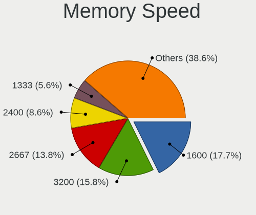

| Speed   | Computers | Percent |
|---------|-----------|---------|
| 1600    | 210       | 18.5%   |
| 3200    | 180       | 15.86%  |
| 2667    | 155       | 13.66%  |
| 2400    | 96        | 8.46%   |
| 1333    | 66        | 5.81%   |
| 2133    | 45        | 3.96%   |
| 667     | 44        | 3.88%   |
| 1334    | 42        | 3.7%    |
| 800     | 33        | 2.91%   |
| 3600    | 21        | 1.85%   |
| Unknown | 20        | 1.76%   |
| 3266    | 18        | 1.59%   |
| 6400    | 14        | 1.23%   |
| 1067    | 12        | 1.06%   |
| 4800    | 11        | 0.97%   |
| 2666    | 11        | 0.97%   |
| 1867    | 11        | 0.97%   |
| 3000    | 10        | 0.88%   |
| 975     | 9         | 0.79%   |
| 4267    | 8         | 0.7%    |
| 3733    | 8         | 0.7%    |
| 2933    | 7         | 0.62%   |
| 1866    | 7         | 0.62%   |
| 1066    | 7         | 0.62%   |
| 533     | 7         | 0.62%   |
| 6000    | 6         | 0.53%   |
| 3400    | 6         | 0.53%   |
| 4266    | 5         | 0.44%   |
| 4199    | 5         | 0.44%   |
| 2048    | 5         | 0.44%   |
| 5600    | 4         | 0.35%   |
| 3800    | 4         | 0.35%   |
| 1800    | 4         | 0.35%   |
| 3866    | 3         | 0.26%   |
| 3500    | 3         | 0.26%   |
| 2800    | 3         | 0.26%   |
| 400     | 3         | 0.26%   |
| 3466    | 2         | 0.18%   |
| 3333    | 2         | 0.18%   |
| 3066    | 2         | 0.18%   |

Printers & scanners
-------------------

Printer Vendor
--------------

Printer device vendors

| Vendor                | Computers | Percent |
|-----------------------|-----------|---------|
| Hewlett-Packard       | 13        | 24.07%  |
| Canon                 | 10        | 18.52%  |
| Samsung Electronics   | 9         | 16.67%  |
| Brother Industries    | 8         | 14.81%  |
| Seiko Epson           | 7         | 12.96%  |
| Xerox                 | 2         | 3.7%    |
| Lexmark International | 2         | 3.7%    |
| Zebra                 | 1         | 1.85%   |
| QinHeng Electronics   | 1         | 1.85%   |
| ATEN International    | 1         | 1.85%   |

Printer Model
-------------

Printer device models

| Model                                         | Computers | Percent |
|-----------------------------------------------|-----------|---------|
| Samsung M2070 Series                          | 3         | 5.56%   |
| Seiko Epson L3110 Series                      | 2         | 3.7%    |
| Seiko Epson ET-2710 Series                    | 2         | 3.7%    |
| Samsung Composite Device                      | 2         | 3.7%    |
| Lexmark International InkJet Color Printer    | 2         | 3.7%    |
| HP DeskJet 2130 series                        | 2         | 3.7%    |
| Canon MF4010 series                           | 2         | 3.7%    |
| Brother HL-1110 series                        | 2         | 3.7%    |
| Zebra GK420t Label Printer                    | 1         | 1.85%   |
| Xerox Phaser 6130N                            | 1         | 1.85%   |
| Xerox Phaser 3020                             | 1         | 1.85%   |
| Seiko Epson ME 340 Series/Stylus NX130 Series | 1         | 1.85%   |
| Seiko Epson L6160 Series                      | 1         | 1.85%   |
| Seiko Epson L395 Series                       | 1         | 1.85%   |
| Samsung ML-216x Series Laser Printer          | 1         | 1.85%   |
| Samsung M267x 287x Series                     | 1         | 1.85%   |
| Samsung M2020 Series                          | 1         | 1.85%   |
| Samsung CLP-310 Color Laser Printer           | 1         | 1.85%   |
| QinHeng CH340S                                | 1         | 1.85%   |
| HP LaserJet 3050                              | 1         | 1.85%   |
| HP LaserJet 1022                              | 1         | 1.85%   |
| HP LaserJet 1018                              | 1         | 1.85%   |
| HP Laser 107w                                 | 1         | 1.85%   |
| HP HP LaserJet M14-M17                        | 1         | 1.85%   |
| HP Deskjet F4500 series                       | 1         | 1.85%   |
| HP DeskJet F2492 All-in-One                   | 1         | 1.85%   |
| HP Deskjet 3050A                              | 1         | 1.85%   |
| HP DeskJet 2700 series                        | 1         | 1.85%   |
| HP DeskJet 2300 series                        | 1         | 1.85%   |
| HP Deskjet 2050 J510                          | 1         | 1.85%   |
| Canon PIXMA MP280                             | 1         | 1.85%   |
| Canon PIXMA MP250                             | 1         | 1.85%   |
| Canon MF4320-4350                             | 1         | 1.85%   |
| Canon MF3200 series                           | 1         | 1.85%   |
| Canon MF3110                                  | 1         | 1.85%   |
| Canon LiDE 300                                | 1         | 1.85%   |
| Canon LBP2900                                 | 1         | 1.85%   |
| Canon iP7200 series                           | 1         | 1.85%   |
| Brother MFC-7420                              | 1         | 1.85%   |
| Brother HL-5380DN series                      | 1         | 1.85%   |

Scanner Vendor
--------------

Scanner device vendors

| Vendor | Computers | Percent |
|--------|-----------|---------|
| Canon  | 1         | 100%    |

Scanner Model
-------------

Scanner device models

| Model                   | Computers | Percent |
|-------------------------|-----------|---------|
| Canon CanoScan LiDE 100 | 1         | 100%    |

Camera
------

Camera Vendor
-------------

Camera device vendors

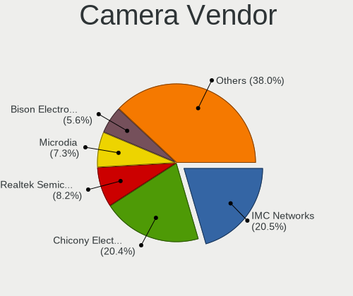

| Vendor                                 | Computers | Percent |
|----------------------------------------|-----------|---------|
| IMC Networks                           | 286       | 21.65%  |
| Chicony Electronics                    | 268       | 20.29%  |
| Realtek Semiconductor                  | 110       | 8.33%   |
| Microdia                               | 97        | 7.34%   |
| Sunplus Innovation Technology          | 66        | 5%      |
| Quanta                                 | 65        | 4.92%   |
| Bison Electronics                      | 58        | 4.39%   |
| Syntek                                 | 35        | 2.65%   |
| Cheng Uei Precision Industry (Foxlink) | 34        | 2.57%   |
| Alcor Micro                            | 29        | 2.2%    |
| Acer                                   | 29        | 2.2%    |
| Lite-On Technology                     | 27        | 2.04%   |
| Logitech                               | 26        | 1.97%   |
| Sonix Technology                       | 25        | 1.89%   |
| Suyin                                  | 23        | 1.74%   |
| Luxvisions Innotech Limited            | 18        | 1.36%   |
| Apple                                  | 14        | 1.06%   |
| Ricoh                                  | 12        | 0.91%   |
| Microsoft                              | 12        | 0.91%   |
| Samsung Electronics                    | 11        | 0.83%   |
| Silicon Motion                         | 8         | 0.61%   |
| Z-Star Microelectronics                | 7         | 0.53%   |
| ShineTech                              | 7         | 0.53%   |
| OmniVision Technologies                | 6         | 0.45%   |
| ALi                                    | 4         | 0.3%    |
| Primax Electronics                     | 3         | 0.23%   |
| Lenovo                                 | 3         | 0.23%   |
| GEMBIRD                                | 3         | 0.23%   |
| Cubeternet                             | 3         | 0.23%   |
| Sunplus Technology                     | 2         | 0.15%   |
| Jieli Technology                       | 2         | 0.15%   |
| Importek                               | 2         | 0.15%   |
| Genesys Logic                          | 2         | 0.15%   |
| Aveo Technology                        | 2         | 0.15%   |
| Arkmicro Technologies                  | 2         | 0.15%   |
| Y Media                                | 1         | 0.08%   |
| WaveRider Communications               | 1         | 0.08%   |
| Unknown                                | 1         | 0.08%   |
| Trust                                  | 1         | 0.08%   |
| Shenzhen Kingcome Optoelectronic       | 1         | 0.08%   |

Camera Model
------------

Camera device models

| Model                                               | Computers | Percent |
|-----------------------------------------------------|-----------|---------|
| IMC Networks USB2.0 VGA UVC WebCam                  | 112       | 8.46%   |
| IMC Networks USB2.0 HD UVC WebCam                   | 92        | 6.95%   |
| Chicony Integrated Camera                           | 61        | 4.61%   |
| IMC Networks Integrated Camera                      | 41        | 3.1%    |
| Realtek Integrated_Webcam_HD                        | 36        | 2.72%   |
| Microdia Integrated_Webcam_HD                       | 29        | 2.19%   |
| Chicony HD WebCam                                   | 22        | 1.66%   |
| Realtek USB Camera                                  | 21        | 1.59%   |
| Chicony USB2.0 VGA UVC WebCam                       | 21        | 1.59%   |
| Syntek Integrated Camera                            | 20        | 1.51%   |
| Sonix USB2.0 HD UVC WebCam                          | 19        | 1.44%   |
| Chicony USB2.0 HD UVC WebCam                        | 17        | 1.28%   |
| Bison Integrated Camera                             | 15        | 1.13%   |
| Sunplus HD WebCam                                   | 14        | 1.06%   |
| Quanta VGA WebCam                                   | 14        | 1.06%   |
| Acer Integrated Camera                              | 12        | 0.91%   |
| Samsung Galaxy series, misc. (MTP mode)             | 11        | 0.83%   |
| Chicony TOSHIBA Web Camera - HD                     | 11        | 0.83%   |
| Bison SunplusIT Integrated Camera                   | 11        | 0.83%   |
| Lite-On Integrated Camera                           | 10        | 0.76%   |
| Chicony EasyCamera                                  | 10        | 0.76%   |
| Sunplus Integrated_Webcam_HD                        | 9         | 0.68%   |
| Microdia Integrated Webcam                          | 9         | 0.68%   |
| Chicony VGA Webcam                                  | 9         | 0.68%   |
| Chicony HP Webcam                                   | 9         | 0.68%   |
| Bison EasyCamera                                    | 9         | 0.68%   |
| Alcor Micro USB 2.0 PC Camera                       | 9         | 0.68%   |
| Alcor Micro USB 2.0 PC cam                          | 9         | 0.68%   |
| Realtek USB2.0 HD UVC WebCam                        | 8         | 0.6%    |
| Quanta ACER HD User Facing                          | 8         | 0.6%    |
| Microsoft LifeCam HD-3000                           | 8         | 0.6%    |
| Microdia USB 2.0 Camera                             | 8         | 0.6%    |
| Microdia Camera                                     | 8         | 0.6%    |
| Syntek Lenovo EasyCamera                            | 7         | 0.53%   |
| Syntek EasyCamera                                   | 7         | 0.53%   |
| Realtek USB2.0 VGA UVC WebCam                       | 7         | 0.53%   |
| Realtek Integrated Webcam                           | 7         | 0.53%   |
| IMC Networks USB2.0 UVC HD Webcam                   | 7         | 0.53%   |
| Cheng Uei Precision Industry (Foxlink) HP HD Camera | 7         | 0.53%   |
| Acer Lenovo EasyCamera                              | 7         | 0.53%   |

Security
--------

Fingerprint Vendor
------------------

Fingerprint sensor vendors

| Vendor                             | Computers | Percent |
|------------------------------------|-----------|---------|
| Validity Sensors                   | 62        | 31.31%  |
| Synaptics                          | 53        | 26.77%  |
| Shenzhen Goodix Technology         | 26        | 13.13%  |
| Elan Microelectronics              | 16        | 8.08%   |
| Upek                               | 12        | 6.06%   |
| LighTuning Technology              | 11        | 5.56%   |
| AuthenTec                          | 11        | 5.56%   |
| Focal-systems.Corp                 | 2         | 1.01%   |
| STMicroelectronics                 | 1         | 0.51%   |
| Samsung Electronics                | 1         | 0.51%   |
| Realtek USB2.0 Finger Print Bridge | 1         | 0.51%   |
| GDMicroelectronics                 | 1         | 0.51%   |
| Dell                               | 1         | 0.51%   |

Fingerprint Model
-----------------

Fingerprint sensor models

| Model                                                                      | Computers | Percent |
|----------------------------------------------------------------------------|-----------|---------|
| Validity Sensors VFS495 Fingerprint Reader                                 | 17        | 8.59%   |
| Shenzhen Goodix  FingerPrint Device                                        | 16        | 8.08%   |
| Synaptics Prometheus MIS Touch Fingerprint Reader                          | 15        | 7.58%   |
| Upek Biometric Touchchip/Touchstrip Fingerprint Sensor                     | 11        | 5.56%   |
| Synaptics  WBDI                                                            | 11        | 5.56%   |
| Elan ELAN:Fingerprint                                                      | 10        | 5.05%   |
| Validity Sensors VFS5011 Fingerprint Reader                                | 9         | 4.55%   |
| Shenzhen Goodix Fingerprint Reader                                         | 9         | 4.55%   |
| Synaptics Metallica MIS Touch Fingerprint Reader                           | 8         | 4.04%   |
| AuthenTec AES2810                                                          | 7         | 3.54%   |
| Validity Sensors VFS471 Fingerprint Reader                                 | 6         | 3.03%   |
| Validity Sensors VFS 5011 fingerprint sensor                               | 6         | 3.03%   |
| Validity Sensors Synaptics WBDI                                            | 6         | 3.03%   |
| Elan ELAN:ARM-M4                                                           | 6         | 3.03%   |
| Validity Sensors VFS451 Fingerprint Reader                                 | 5         | 2.53%   |
| Synaptics Fingerprint reader [HP G6]                                       | 5         | 2.53%   |
| Validity Sensors VFS491                                                    | 4         | 2.02%   |
| Validity Sensors Synaptics VFS7552 Touch Fingerprint Sensor with PurePrint | 4         | 2.02%   |
| Synaptics WBDI                                                             | 3         | 1.52%   |
| Synaptics  FS7604 Touch Fingerprint Sensor with PurePrint                  | 3         | 1.52%   |
| Synaptics FS7604 Touch Fingerprint Sensor with PurePrint                   | 3         | 1.52%   |
| LighTuning Fingerprint Reader                                              | 3         | 1.52%   |
| LighTuning ES603 Swipe Fingerprint Sensor                                  | 3         | 1.52%   |
| LighTuning EgisTec Touch Fingerprint Sensor                                | 3         | 1.52%   |
| Validity Sensors Swipe Fingerprint Sensor                                  | 2         | 1.01%   |
| Synaptics WBDI Fingerprint Reader USB 086                                  | 2         | 1.01%   |
| Synaptics Metallica MOH Touch Fingerprint Reader                           | 2         | 1.01%   |
| LighTuning Fingerprint Sensor                                              | 2         | 1.01%   |
| Focal-systems.Corp FT9201Fingerprint.                                      | 2         | 1.01%   |
| AuthenTec Fingerprint Sensor                                               | 2         | 1.01%   |
| AuthenTec AES2501 Fingerprint Sensor                                       | 2         | 1.01%   |
| Validity Sensors VFS7552 Touch Fingerprint Sensor                          | 1         | 0.51%   |
| Validity Sensors VFS7500 Touch Fingerprint Sensor                          | 1         | 0.51%   |
| Validity Sensors Fingerprint scanner                                       | 1         | 0.51%   |
| Upek TCS5B Fingerprint sensor                                              | 1         | 0.51%   |
| Synaptics UWP WBDI                                                         | 1         | 0.51%   |
| STMicroelectronics Fingerprint Reader                                      | 1         | 0.51%   |
| Shenzhen Goodix FingerPrint                                                | 1         | 0.51%   |
| Samsung Fingerprint Sensor Device - 730B                                   | 1         | 0.51%   |
| Realtek USB2.0 Finger Print Bridge FocalTech Fingerprint Device            | 1         | 0.51%   |

Chipcard Vendor
---------------

Chipcard module vendors

| Vendor                    | Computers | Percent |
|---------------------------|-----------|---------|
| Broadcom                  | 47        | 55.29%  |
| Alcor Micro               | 20        | 23.53%  |
| Upek                      | 5         | 5.88%   |
| Lenovo                    | 5         | 5.88%   |
| O2 Micro                  | 4         | 4.71%   |
| Gemalto (was Gemplus)     | 1         | 1.18%   |
| Fujitsu Siemens Computers | 1         | 1.18%   |
| Chicony Electronics       | 1         | 1.18%   |
| Aladdin Knowledge Systems | 1         | 1.18%   |

Chipcard Model
--------------

Chipcard module models

| Model                                                                        | Computers | Percent |
|------------------------------------------------------------------------------|-----------|---------|
| Alcor Micro AU9540 Smartcard Reader                                          | 20        | 23.53%  |
| Broadcom 58200                                                               | 14        | 16.47%  |
| Broadcom BCM5880 Secure Applications Processor                               | 13        | 15.29%  |
| Broadcom 5880                                                                | 11        | 12.94%  |
| Broadcom BCM5880 Secure Applications Processor with fingerprint swipe sensor | 9         | 10.59%  |
| Upek TouchChip Fingerprint Coprocessor (WBF advanced mode)                   | 5         | 5.88%   |
| Lenovo Integrated Smart Card Reader                                          | 5         | 5.88%   |
| O2 Micro OZ776 CCID Smartcard Reader                                         | 4         | 4.71%   |
| Gemalto (was Gemplus) Compact Smart Card Reader Writer                       | 1         | 1.18%   |
| Fujitsu Siemens Computers SmartCard Reader 2A                                | 1         | 1.18%   |
| Chicony Electronics HP Skylab USB Smartcard Keyboard                         | 1         | 1.18%   |
| Aladdin Knowledge Systems Token JC                                           | 1         | 1.18%   |

Unsupported
-----------

Unsupported Devices
-------------------

Total unsupported devices on board

| Total | Computers | Percent |
|-------|-----------|---------|
| 0     | 1490      | 71.53%  |
| 1     | 486       | 23.33%  |
| 2     | 95        | 4.56%   |
| 3     | 10        | 0.48%   |
| 10    | 1         | 0.05%   |
| 4     | 1         | 0.05%   |

Unsupported Device Types
------------------------

Types of unsupported devices

| Type                     | Computers | Percent |
|--------------------------|-----------|---------|
| Fingerprint reader       | 195       | 27.94%  |
| Graphics card            | 164       | 23.5%   |
| Net/wireless             | 89        | 12.75%  |
| Chipcard                 | 77        | 11.03%  |
| Multimedia controller    | 45        | 6.45%   |
| Camera                   | 26        | 3.72%   |
| Communication controller | 23        | 3.3%    |
| Bluetooth                | 18        | 2.58%   |
| Storage                  | 17        | 2.44%   |
| Card reader              | 9         | 1.29%   |
| Sound                    | 8         | 1.15%   |
| Unassigned class         | 7         | 1%      |
| Net/ethernet             | 5         | 0.72%   |
| Network                  | 3         | 0.43%   |
| Modem                    | 3         | 0.43%   |
| Storage/ide              | 2         | 0.29%   |
| Flash memory             | 2         | 0.29%   |
| Unclassified device      | 1         | 0.14%   |
| Storage/raid             | 1         | 0.14%   |
| Storage/nvme             | 1         | 0.14%   |
| Firewire controller      | 1         | 0.14%   |
| Dvb card                 | 1         | 0.14%   |

