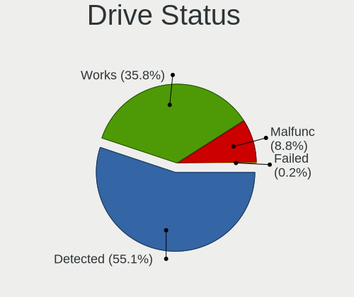
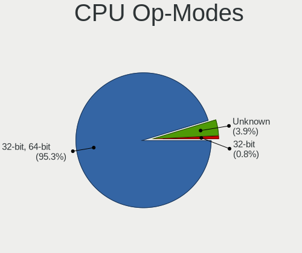
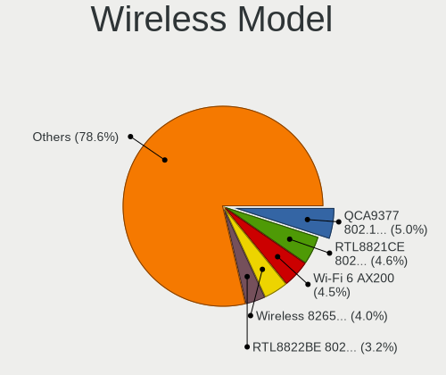
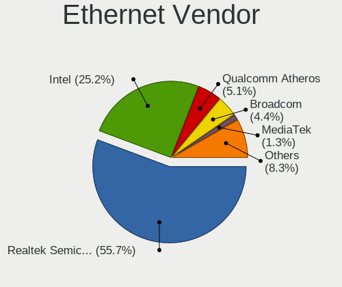
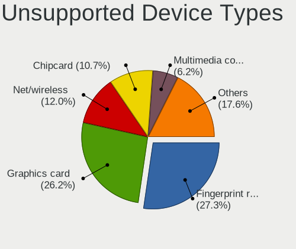

Linux in Romania - Tested Hardware & Statistics
-----------------------------------------------

A project to collect tested hardware configurations for Linux in Romania.

Anyone can contribute to this report by the [hw-probe](https://github.com/linuxhw/hw-probe) tool:

    sudo -E hw-probe -all -upload

Please contribute! Especially if your hardware is rare.

This is a report for all computer types. See also reports for [desktops](/Location/Romania/Desktop/README.md) and [notebooks](/Location/Romania/Notebook/README.md).

Contents
--------

* [ Test Cases ](#test-cases)

* [ System ](#system)
  - [ OS                       ](#os)
  - [ OS Family                ](#os-family)
  - [ Kernel                   ](#kernel)
  - [ Kernel Family            ](#kernel-family)
  - [ Kernel Major Ver.        ](#kernel-major-ver)
  - [ Arch                     ](#arch)
  - [ DE                       ](#de)
  - [ Display Server           ](#display-server)
  - [ Display Manager          ](#display-manager)
  - [ OS Lang                  ](#os-lang)
  - [ Boot Mode                ](#boot-mode)
  - [ Filesystem               ](#filesystem)
  - [ Part. scheme             ](#part-scheme)
  - [ Dual Boot with Linux/BSD ](#dual-boot-with-linuxbsd)
  - [ Dual Boot (Win)          ](#dual-boot-win)

* [ Board ](#board)
  - [ Vendor                   ](#vendor)
  - [ Model                    ](#model)
  - [ Model Family             ](#model-family)
  - [ MFG Year                 ](#mfg-year)
  - [ Form Factor              ](#form-factor)
  - [ Secure Boot              ](#secure-boot)
  - [ Coreboot                 ](#coreboot)
  - [ RAM Size                 ](#ram-size)
  - [ RAM Used                 ](#ram-used)
  - [ Total Drives             ](#total-drives)
  - [ Has CD-ROM               ](#has-cd-rom)
  - [ Has Ethernet             ](#has-ethernet)
  - [ Has WiFi                 ](#has-wifi)
  - [ Has Bluetooth            ](#has-bluetooth)

* [ Location ](#location)
  - [ Country                  ](#country)
  - [ City                     ](#city)

* [ Drives ](#drives)
  - [ Drive Vendor             ](#drive-vendor)
  - [ Drive Model              ](#drive-model)
  - [ HDD Vendor               ](#hdd-vendor)
  - [ SSD Vendor               ](#ssd-vendor)
  - [ Drive Kind               ](#drive-kind)
  - [ Drive Connector          ](#drive-connector)
  - [ Drive Size               ](#drive-size)
  - [ Space Total              ](#space-total)
  - [ Space Used               ](#space-used)
  - [ Malfunc. Drives          ](#malfunc-drives)
  - [ Malfunc. Drive Vendor    ](#malfunc-drive-vendor)
  - [ Malfunc. HDD Vendor      ](#malfunc-hdd-vendor)
  - [ Malfunc. Drive Kind      ](#malfunc-drive-kind)
  - [ Failed Drives            ](#failed-drives)
  - [ Failed Drive Vendor      ](#failed-drive-vendor)
  - [ Drive Status             ](#drive-status)

* [ Storage controller ](#storage-controller)
  - [ Storage Vendor           ](#storage-vendor)
  - [ Storage Model            ](#storage-model)
  - [ Storage Kind             ](#storage-kind)

* [ Processor ](#processor)
  - [ CPU Vendor               ](#cpu-vendor)
  - [ CPU Model                ](#cpu-model)
  - [ CPU Model Family         ](#cpu-model-family)
  - [ CPU Cores                ](#cpu-cores)
  - [ CPU Sockets              ](#cpu-sockets)
  - [ CPU Threads              ](#cpu-threads)
  - [ CPU Op-Modes             ](#cpu-op-modes)
  - [ CPU Microcode            ](#cpu-microcode)
  - [ CPU Microarch            ](#cpu-microarch)

* [ Graphics ](#graphics)
  - [ GPU Vendor               ](#gpu-vendor)
  - [ GPU Model                ](#gpu-model)
  - [ GPU Combo                ](#gpu-combo)
  - [ GPU Driver               ](#gpu-driver)
  - [ GPU Memory               ](#gpu-memory)

* [ Monitor ](#monitor)
  - [ Monitor Vendor           ](#monitor-vendor)
  - [ Monitor Model            ](#monitor-model)
  - [ Monitor Resolution       ](#monitor-resolution)
  - [ Monitor Diagonal         ](#monitor-diagonal)
  - [ Monitor Width            ](#monitor-width)
  - [ Aspect Ratio             ](#aspect-ratio)
  - [ Monitor Area             ](#monitor-area)
  - [ Pixel Density            ](#pixel-density)
  - [ Multiple Monitors        ](#multiple-monitors)

* [ Network ](#network)
  - [ Net Controller Vendor    ](#net-controller-vendor)
  - [ Net Controller Model     ](#net-controller-model)
  - [ Wireless Vendor          ](#wireless-vendor)
  - [ Wireless Model           ](#wireless-model)
  - [ Ethernet Vendor          ](#ethernet-vendor)
  - [ Ethernet Model           ](#ethernet-model)
  - [ Net Controller Kind      ](#net-controller-kind)
  - [ Used Controller          ](#used-controller)
  - [ NICs                     ](#nics)
  - [ IPv6                     ](#ipv6)

* [ Bluetooth ](#bluetooth)
  - [ Bluetooth Vendor         ](#bluetooth-vendor)
  - [ Bluetooth Model          ](#bluetooth-model)

* [ Sound ](#sound)
  - [ Sound Vendor             ](#sound-vendor)
  - [ Sound Model              ](#sound-model)

* [ Memory ](#memory)
  - [ Memory Vendor            ](#memory-vendor)
  - [ Memory Model             ](#memory-model)
  - [ Memory Kind              ](#memory-kind)
  - [ Memory Form Factor       ](#memory-form-factor)
  - [ Memory Size              ](#memory-size)
  - [ Memory Speed             ](#memory-speed)

* [ Printers & scanners ](#printers--scanners)
  - [ Printer Vendor           ](#printer-vendor)
  - [ Printer Model            ](#printer-model)
  - [ Scanner Vendor           ](#scanner-vendor)
  - [ Scanner Model            ](#scanner-model)

* [ Camera ](#camera)
  - [ Camera Vendor            ](#camera-vendor)
  - [ Camera Model             ](#camera-model)

* [ Security ](#security)
  - [ Fingerprint Vendor       ](#fingerprint-vendor)
  - [ Fingerprint Model        ](#fingerprint-model)
  - [ Chipcard Vendor          ](#chipcard-vendor)
  - [ Chipcard Model           ](#chipcard-model)

* [ Unsupported ](#unsupported)
  - [ Unsupported Devices      ](#unsupported-devices)
  - [ Unsupported Device Types ](#unsupported-device-types)

Test Cases
----------

Total: 2582

| Vendor        | Model                       | Form-Factor | Probe                                                      | Date         |
|---------------|-----------------------------|-------------|------------------------------------------------------------|--------------|
| AZW           | SER V1.0                    | Mini pc     | [b9eb9677f5](https://linux-hardware.org/?probe=b9eb9677f5) | Jun 10, 2023 |
| Gigabyte      | B560M H                     | Desktop     | [fadb7a6aa8](https://linux-hardware.org/?probe=fadb7a6aa8) | Jun 10, 2023 |
| ASUSTek       | VivoBook_ASUSLaptop X512... | Notebook    | [b7ab29fbb5](https://linux-hardware.org/?probe=b7ab29fbb5) | Jun 06, 2023 |
| MSI           | GP75 Leopard 9SE            | Notebook    | [05530e670e](https://linux-hardware.org/?probe=05530e670e) | Jun 06, 2023 |
| Acer          | EQ45LM                      | Desktop     | [73f7a3078f](https://linux-hardware.org/?probe=73f7a3078f) | Jun 06, 2023 |
| Lenovo        | Legion 5 15ACH6H 82JU       | Notebook    | [ea07821e39](https://linux-hardware.org/?probe=ea07821e39) | Jun 05, 2023 |
| Lenovo        | Legion 5 15ARH05H 82B1      | Notebook    | [1285aacf1b](https://linux-hardware.org/?probe=1285aacf1b) | Jun 04, 2023 |
| ASRock        | X670E PG Lightning          | Desktop     | [7cd25ddbda](https://linux-hardware.org/?probe=7cd25ddbda) | Jun 04, 2023 |
| ASUSTek       | Zenbook UM5401RA_RM5401R... | Notebook    | [763a52f3e8](https://linux-hardware.org/?probe=763a52f3e8) | Jun 03, 2023 |
| HP            | ENVY 17                     | Notebook    | [79fd438f05](https://linux-hardware.org/?probe=79fd438f05) | Jun 03, 2023 |
| Dell          | Vostro 1015                 | Notebook    | [055866f703](https://linux-hardware.org/?probe=055866f703) | Jun 02, 2023 |
| Dell          | Inspiron 5567               | Notebook    | [bd3a6c5bd8](https://linux-hardware.org/?probe=bd3a6c5bd8) | Jun 02, 2023 |
| Acer          | Aspire A517-51G             | Notebook    | [dc0e29f0bb](https://linux-hardware.org/?probe=dc0e29f0bb) | Jun 02, 2023 |
| Acer          | Aspire A517-51G             | Notebook    | [693005f5b4](https://linux-hardware.org/?probe=693005f5b4) | Jun 02, 2023 |
| Lenovo        | ThinkPad T430s 2352CTO      | Notebook    | [1f18cef2df](https://linux-hardware.org/?probe=1f18cef2df) | Jun 01, 2023 |
| Lenovo        | ThinkPad T430s 2352CTO      | Notebook    | [7ae3edd73e](https://linux-hardware.org/?probe=7ae3edd73e) | Jun 01, 2023 |
| Acer          | Aspire A515-45              | Notebook    | [f93dd394e8](https://linux-hardware.org/?probe=f93dd394e8) | May 31, 2023 |
| Dell          | Vostro 15 3515              | Notebook    | [6bec5a03df](https://linux-hardware.org/?probe=6bec5a03df) | May 30, 2023 |
| MSI           | X370 XPOWER GAMING TITAN... | Desktop     | [3ecf79af69](https://linux-hardware.org/?probe=3ecf79af69) | May 29, 2023 |
| Dell          | Latitude E6440              | Notebook    | [821e3e3246](https://linux-hardware.org/?probe=821e3e3246) | May 27, 2023 |
| MSI           | B450 GAMING PLUS MAX        | Desktop     | [acee298918](https://linux-hardware.org/?probe=acee298918) | May 26, 2023 |
| Acer          | EQ45LM                      | Desktop     | [a49c4c8438](https://linux-hardware.org/?probe=a49c4c8438) | May 26, 2023 |
| HP            | Laptop 17-cn0xxx            | Notebook    | [c8c9f63237](https://linux-hardware.org/?probe=c8c9f63237) | May 25, 2023 |
| Dell          | G15 5510                    | Notebook    | [325fcf6e78](https://linux-hardware.org/?probe=325fcf6e78) | May 25, 2023 |
| HP            | ProBook 6440b               | Notebook    | [5ed14b01a3](https://linux-hardware.org/?probe=5ed14b01a3) | May 25, 2023 |
| HP            | ProLiant DL380p Gen8        | Server      | [7a892801c0](https://linux-hardware.org/?probe=7a892801c0) | May 24, 2023 |
| Lenovo        | ThinkPad P15 Gen 1 20ST0... | Notebook    | [61b85cdced](https://linux-hardware.org/?probe=61b85cdced) | May 24, 2023 |
| Lenovo        | ThinkPad P15 Gen 1 20ST0... | Notebook    | [b167237d46](https://linux-hardware.org/?probe=b167237d46) | May 24, 2023 |
| Valve         | Jupiter                     | Notebook    | [117db8031d](https://linux-hardware.org/?probe=117db8031d) | May 24, 2023 |
| Dell          | Precision 7540              | Notebook    | [65605ee5e8](https://linux-hardware.org/?probe=65605ee5e8) | May 24, 2023 |
| ASUSTek       | VivoBook_ASUS Laptop X50... | Notebook    | [a1e2fa6222](https://linux-hardware.org/?probe=a1e2fa6222) | May 24, 2023 |
| Lenovo        | V130-15IGM 81HL             | Notebook    | [504a24887e](https://linux-hardware.org/?probe=504a24887e) | May 24, 2023 |
| HP            | EliteBook 850 G8 Noteboo... | Notebook    | [cb3e4d2c2b](https://linux-hardware.org/?probe=cb3e4d2c2b) | May 24, 2023 |
| Allview       | Allbook H                   | Notebook    | [8b0c0a3436](https://linux-hardware.org/?probe=8b0c0a3436) | May 24, 2023 |
| Lenovo        | ThinkPad X1 Carbon 7th 2... | Notebook    | [64ceddcdd4](https://linux-hardware.org/?probe=64ceddcdd4) | May 24, 2023 |
| Dell          | G15 5510                    | Notebook    | [730985e467](https://linux-hardware.org/?probe=730985e467) | May 24, 2023 |
| Dell          | Inspiron 1501               | Notebook    | [4703a17f03](https://linux-hardware.org/?probe=4703a17f03) | May 23, 2023 |
| MSI           | Modern 14 B10MW             | Notebook    | [319f4883aa](https://linux-hardware.org/?probe=319f4883aa) | May 22, 2023 |
| HP            | 805D                        | Desktop     | [2ac4992bcd](https://linux-hardware.org/?probe=2ac4992bcd) | May 22, 2023 |
| Gigabyte      | B450M S2H                   | Desktop     | [5309c41b94](https://linux-hardware.org/?probe=5309c41b94) | May 21, 2023 |
| Gigabyte      | B550I AORUS PRO AX          | Desktop     | [b8ed6a8b77](https://linux-hardware.org/?probe=b8ed6a8b77) | May 18, 2023 |
| Lenovo        | Legion 5 15ARH05 82B5       | Notebook    | [ceeff309eb](https://linux-hardware.org/?probe=ceeff309eb) | May 18, 2023 |
| ASUSTek       | X541UAK                     | Notebook    | [00685614c4](https://linux-hardware.org/?probe=00685614c4) | May 16, 2023 |
| ASUSTek       | N76VZ                       | Notebook    | [fc6d34934a](https://linux-hardware.org/?probe=fc6d34934a) | May 14, 2023 |
| Dell          | 09KPNV A01                  | Desktop     | [cbd408a1a6](https://linux-hardware.org/?probe=cbd408a1a6) | May 13, 2023 |
| Razer         | Blade 15 Studio Edition ... | Notebook    | [f1884eebc6](https://linux-hardware.org/?probe=f1884eebc6) | May 12, 2023 |
| HP            | Pavilion Gaming Laptop 1... | Notebook    | [729a4181de](https://linux-hardware.org/?probe=729a4181de) | May 12, 2023 |
| HP            | Pavilion Gaming Laptop 1... | Notebook    | [3010c8760e](https://linux-hardware.org/?probe=3010c8760e) | May 12, 2023 |
| Acer          | Extensa 5220                | Notebook    | [935b52f12c](https://linux-hardware.org/?probe=935b52f12c) | May 12, 2023 |
| ASUSTek       | VivoBook 15_ASUS Laptop ... | Notebook    | [af96be2497](https://linux-hardware.org/?probe=af96be2497) | May 11, 2023 |
| Gigabyte      | Z97X-SLI-CF                 | Desktop     | [5921d78ceb](https://linux-hardware.org/?probe=5921d78ceb) | May 10, 2023 |
| HP            | Pavilion x360 Convertibl... | Convertible | [5f4146c326](https://linux-hardware.org/?probe=5f4146c326) | May 10, 2023 |
| Acer          | Aspire A515-45              | Notebook    | [8f9a64c245](https://linux-hardware.org/?probe=8f9a64c245) | May 08, 2023 |
| Dell          | Inspiron 11-3162            | Notebook    | [62813124bb](https://linux-hardware.org/?probe=62813124bb) | May 08, 2023 |
| Lenovo        | ThinkBook 15 G2 ARE 20VG    | Notebook    | [a312f0545f](https://linux-hardware.org/?probe=a312f0545f) | May 07, 2023 |
| Acer          | Aspire 5742G                | Notebook    | [2a321db63e](https://linux-hardware.org/?probe=2a321db63e) | May 07, 2023 |
| Dell          | 0YXT71 A03                  | Desktop     | [b8281f77a3](https://linux-hardware.org/?probe=b8281f77a3) | May 07, 2023 |
| Gigabyte      | Z97-D3H-CF                  | Desktop     | [f86e67c005](https://linux-hardware.org/?probe=f86e67c005) | May 07, 2023 |
| ASUSTek       | VivoBook_ASUSLaptop X512... | Notebook    | [85648a82df](https://linux-hardware.org/?probe=85648a82df) | May 06, 2023 |
| ASRock        | B250M-HDV                   | Desktop     | [d905babc43](https://linux-hardware.org/?probe=d905babc43) | May 06, 2023 |
| ASRock        | B250M-HDV                   | Desktop     | [bb7835495e](https://linux-hardware.org/?probe=bb7835495e) | May 06, 2023 |
| HP            | 250 15.6 inch G9 Noteboo... | Notebook    | [af9c3172bc](https://linux-hardware.org/?probe=af9c3172bc) | May 05, 2023 |
| ASUSTek       | M5A78L-M PLUS/USB3          | Desktop     | [862ef64565](https://linux-hardware.org/?probe=862ef64565) | May 05, 2023 |
| MSI           | GP75 Leopard 9SE            | Notebook    | [425ecbf896](https://linux-hardware.org/?probe=425ecbf896) | May 04, 2023 |
| ASUSTek       | 1001PX                      | Notebook    | [7a04e30859](https://linux-hardware.org/?probe=7a04e30859) | May 03, 2023 |
| HP            | Notebook                    | Notebook    | [c6316b5a64](https://linux-hardware.org/?probe=c6316b5a64) | May 03, 2023 |
| Lenovo        | ThinkPad T530 24297ZG       | Notebook    | [7c56fae21c](https://linux-hardware.org/?probe=7c56fae21c) | May 03, 2023 |
| ASUSTek       | ASUS TUF Gaming F15 FX50... | Notebook    | [3b04b16c3e](https://linux-hardware.org/?probe=3b04b16c3e) | May 03, 2023 |
| ASUSTek       | ASUS TUF Gaming F15 FX50... | Notebook    | [1234a4cf5a](https://linux-hardware.org/?probe=1234a4cf5a) | May 03, 2023 |
| ASUSTek       | ROG CROSSHAIR VIII HERO     | Desktop     | [e055c16455](https://linux-hardware.org/?probe=e055c16455) | May 03, 2023 |
| Lenovo        | ThinkPad T14 Gen 1 20S00... | Notebook    | [5101f4e19d](https://linux-hardware.org/?probe=5101f4e19d) | May 02, 2023 |
| Lenovo        | ThinkPad T530 24297ZG       | Notebook    | [2a4cf994ac](https://linux-hardware.org/?probe=2a4cf994ac) | May 02, 2023 |
| ASUSTek       | VivoBook_ASUSLaptop X512... | Notebook    | [ed2a323b49](https://linux-hardware.org/?probe=ed2a323b49) | May 01, 2023 |
| Lenovo        | IdeaPad 1 15AMN7 82VG       | Notebook    | [4607549f5a](https://linux-hardware.org/?probe=4607549f5a) | May 01, 2023 |
| Lenovo        | IdeaPad 1 15AMN7 82VG       | Notebook    | [754b22a59c](https://linux-hardware.org/?probe=754b22a59c) | May 01, 2023 |
| ASUSTek       | ASUS TUF Gaming F15 FX50... | Notebook    | [d1b974c33a](https://linux-hardware.org/?probe=d1b974c33a) | May 01, 2023 |
| Lenovo        | 36DB No DPK                 | All in one  | [01458c55a9](https://linux-hardware.org/?probe=01458c55a9) | Apr 28, 2023 |
| Lenovo        | 36DB No DPK                 | All in one  | [df53e54c69](https://linux-hardware.org/?probe=df53e54c69) | Apr 28, 2023 |
| Acer          | Aspire 5110                 | Notebook    | [b43b059257](https://linux-hardware.org/?probe=b43b059257) | Apr 28, 2023 |
| ASUSTek       | TUF Gaming Z690-PLUS WIF... | Desktop     | [2beb48be05](https://linux-hardware.org/?probe=2beb48be05) | Apr 27, 2023 |
| Dell          | Vostro 15 3515              | Notebook    | [f58ab8b9c4](https://linux-hardware.org/?probe=f58ab8b9c4) | Apr 27, 2023 |
| Acer          | Aspire A515-57              | Notebook    | [86dad710fa](https://linux-hardware.org/?probe=86dad710fa) | Apr 26, 2023 |
| Acer          | Aspire A315-35              | Notebook    | [33fac6ec40](https://linux-hardware.org/?probe=33fac6ec40) | Apr 26, 2023 |
| Lenovo        | V15 G2 ALC 82KD             | Notebook    | [e7fb8c3e44](https://linux-hardware.org/?probe=e7fb8c3e44) | Apr 26, 2023 |
| ASUSTek       | K53SM                       | Notebook    | [92ac292547](https://linux-hardware.org/?probe=92ac292547) | Apr 24, 2023 |
| Acer          | Aspire V5-122P              | Notebook    | [baf567c71f](https://linux-hardware.org/?probe=baf567c71f) | Apr 23, 2023 |
| Samsung       | 730QDA                      | Convertible | [a6fef02901](https://linux-hardware.org/?probe=a6fef02901) | Apr 23, 2023 |
| ASUSTek       | M5A78L-M PLUS/USB3          | Desktop     | [481c5a9169](https://linux-hardware.org/?probe=481c5a9169) | Apr 23, 2023 |
| HP            | ProBook 450 G3              | Notebook    | [6e52b3ea77](https://linux-hardware.org/?probe=6e52b3ea77) | Apr 22, 2023 |
| Allview       | Allbook J                   | Notebook    | [96a3d7d3ef](https://linux-hardware.org/?probe=96a3d7d3ef) | Apr 22, 2023 |
| ASUSTek       | M5A78L-M PLUS/USB3          | Desktop     | [1127dfa79c](https://linux-hardware.org/?probe=1127dfa79c) | Apr 21, 2023 |
| Lenovo        | ThinkPad T530 24297ZG       | Notebook    | [3f01c5df6e](https://linux-hardware.org/?probe=3f01c5df6e) | Apr 21, 2023 |
| Lenovo        | ThinkPad T530 24297ZG       | Notebook    | [a5ef39681b](https://linux-hardware.org/?probe=a5ef39681b) | Apr 21, 2023 |
| Allview       | Allbook J                   | Notebook    | [4ff8627338](https://linux-hardware.org/?probe=4ff8627338) | Apr 18, 2023 |
| Acer          | Aspire E5-575G              | Notebook    | [39afaea9e3](https://linux-hardware.org/?probe=39afaea9e3) | Apr 14, 2023 |
| ASUSTek       | TUF Gaming B550M-PLUS       | Desktop     | [c7ca0e9fd1](https://linux-hardware.org/?probe=c7ca0e9fd1) | Apr 14, 2023 |
| Lenovo        | ThinkPad T420 4236WR1       | Notebook    | [0c4578a674](https://linux-hardware.org/?probe=0c4578a674) | Apr 14, 2023 |
| Lenovo        | 3141 SDK0J40700 WIN 3258... | Desktop     | [356ff49c7c](https://linux-hardware.org/?probe=356ff49c7c) | Apr 13, 2023 |
| HP            | 1495                        | Desktop     | [569a6f28f4](https://linux-hardware.org/?probe=569a6f28f4) | Apr 12, 2023 |
| Dell          | Inspiron 1545               | Notebook    | [653a25793d](https://linux-hardware.org/?probe=653a25793d) | Apr 12, 2023 |
| Dell          | Inspiron 1545               | Notebook    | [dccecbecf9](https://linux-hardware.org/?probe=dccecbecf9) | Apr 12, 2023 |
| HP            | EliteBook 840 G5            | Notebook    | [da4c241466](https://linux-hardware.org/?probe=da4c241466) | Apr 10, 2023 |
| Lenovo        | IdeaPad Slim 1-14AST-05 ... | Notebook    | [5244868737](https://linux-hardware.org/?probe=5244868737) | Apr 09, 2023 |
| Lenovo        | ThinkPad T480 20L6S4G72S    | Notebook    | [ae8c333d72](https://linux-hardware.org/?probe=ae8c333d72) | Apr 07, 2023 |
| ASUSTek       | X55U                        | Notebook    | [0abf7df439](https://linux-hardware.org/?probe=0abf7df439) | Apr 06, 2023 |
| Fujitsu       | D3220-A1 S26361-D3220-A1    | Desktop     | [6b554016fe](https://linux-hardware.org/?probe=6b554016fe) | Apr 03, 2023 |
| ASUSTek       | J1900I-C                    | Desktop     | [0fbd47b12e](https://linux-hardware.org/?probe=0fbd47b12e) | Apr 02, 2023 |
| Gigabyte      | GA-880GM-UD2H               | Desktop     | [90796fbad9](https://linux-hardware.org/?probe=90796fbad9) | Mar 31, 2023 |
| ASUSTek       | X550CL                      | Notebook    | [5d5862d22a](https://linux-hardware.org/?probe=5d5862d22a) | Mar 31, 2023 |
| Lenovo        | IdeaPad S145-15IWL 81MV     | Notebook    | [5be11a9a6e](https://linux-hardware.org/?probe=5be11a9a6e) | Mar 29, 2023 |
| Lenovo        | ThinkPad T14 Gen 1 20UD0... | Notebook    | [bfa850ddad](https://linux-hardware.org/?probe=bfa850ddad) | Mar 29, 2023 |
| HP            | 3047h                       | Desktop     | [c4f4f0c51d](https://linux-hardware.org/?probe=c4f4f0c51d) | Mar 28, 2023 |
| Lenovo        | IdeaPad 5 Pro 16ACH6 82L... | Notebook    | [577947c9d3](https://linux-hardware.org/?probe=577947c9d3) | Mar 28, 2023 |
| Toshiba       | Satellite C55-A-1J8         | Notebook    | [c6ba40cd5c](https://linux-hardware.org/?probe=c6ba40cd5c) | Mar 27, 2023 |
| Lenovo        | Legion 5 15ACH6H 82JU       | Notebook    | [08e7388619](https://linux-hardware.org/?probe=08e7388619) | Mar 27, 2023 |
| ASUSTek       | X751SA                      | Notebook    | [bef27b5a10](https://linux-hardware.org/?probe=bef27b5a10) | Mar 26, 2023 |
| ASUSTek       | X751SA                      | Notebook    | [daac2899b2](https://linux-hardware.org/?probe=daac2899b2) | Mar 26, 2023 |
| Lenovo        | ThinkPad E14 Gen 2 20TA0... | Notebook    | [84af25ca8c](https://linux-hardware.org/?probe=84af25ca8c) | Mar 26, 2023 |
| Acer          | Aspire 7750G                | Notebook    | [f99591fe95](https://linux-hardware.org/?probe=f99591fe95) | Mar 26, 2023 |
| Acer          | V5-131                      | Notebook    | [f35bd55401](https://linux-hardware.org/?probe=f35bd55401) | Mar 26, 2023 |
| Acer          | TravelMate 5744             | Notebook    | [3ad8bf7639](https://linux-hardware.org/?probe=3ad8bf7639) | Mar 22, 2023 |
| Lenovo        | IdeaPad 3 15ARE05 81W4      | Notebook    | [c5b2997e80](https://linux-hardware.org/?probe=c5b2997e80) | Mar 21, 2023 |
| HP            | 250 G5 Notebook PC          | Notebook    | [4a4c44f0dd](https://linux-hardware.org/?probe=4a4c44f0dd) | Mar 18, 2023 |
| Gigabyte      | A320M-S2H-CF                | Desktop     | [ceb794a09f](https://linux-hardware.org/?probe=ceb794a09f) | Mar 17, 2023 |
| ASUSTek       | P9X79 WS                    | Desktop     | [29e03bb7ce](https://linux-hardware.org/?probe=29e03bb7ce) | Mar 17, 2023 |
| ASUSTek       | PRIME H510M-D               | Desktop     | [d1edfbc4b3](https://linux-hardware.org/?probe=d1edfbc4b3) | Mar 16, 2023 |
| HP            | ZBook 15                    | Notebook    | [ebc4b1e01e](https://linux-hardware.org/?probe=ebc4b1e01e) | Mar 14, 2023 |
| Dell          | 042P49 A00                  | Desktop     | [8912f590e3](https://linux-hardware.org/?probe=8912f590e3) | Mar 14, 2023 |
| Valve         | Jupiter                     | Notebook    | [d56d3939f9](https://linux-hardware.org/?probe=d56d3939f9) | Mar 14, 2023 |
| MSI           | GF63 Thin 11UC              | Notebook    | [7c96c962f0](https://linux-hardware.org/?probe=7c96c962f0) | Mar 13, 2023 |
| MSI           | X370 XPOWER GAMING TITAN... | Desktop     | [abebd8a5c2](https://linux-hardware.org/?probe=abebd8a5c2) | Mar 11, 2023 |
| SLIMBOOK      | PROX-AMD5                   | Notebook    | [4492e72dd8](https://linux-hardware.org/?probe=4492e72dd8) | Mar 10, 2023 |
| HP            | Compaq nx9420 (ES446EA#A... | Notebook    | [b876c92a6e](https://linux-hardware.org/?probe=b876c92a6e) | Mar 09, 2023 |
| Gigabyte      | B85M-D3H                    | Desktop     | [a3a158ccf2](https://linux-hardware.org/?probe=a3a158ccf2) | Mar 08, 2023 |
| ASUSTek       | P5KC                        | Desktop     | [72d0284bdd](https://linux-hardware.org/?probe=72d0284bdd) | Mar 05, 2023 |
| HP            | Compaq 6735b                | Notebook    | [8c664182a2](https://linux-hardware.org/?probe=8c664182a2) | Mar 05, 2023 |
| ASUSTek       | PRIME Z390-P                | Desktop     | [ab48c17484](https://linux-hardware.org/?probe=ab48c17484) | Mar 04, 2023 |
| Lenovo        | Yoga Slim 7 13ACN5 82CY     | Notebook    | [4fc82abdeb](https://linux-hardware.org/?probe=4fc82abdeb) | Mar 04, 2023 |
| Dell          | Inspiron 3593               | Notebook    | [4e2f59d17e](https://linux-hardware.org/?probe=4e2f59d17e) | Mar 04, 2023 |
| Lenovo        | SHARKBAY NOK                | Desktop     | [9fba7bceb7](https://linux-hardware.org/?probe=9fba7bceb7) | Mar 03, 2023 |
| Lenovo        | Yoga Slim 7 13ACN5 82CY     | Notebook    | [4c25c88937](https://linux-hardware.org/?probe=4c25c88937) | Mar 03, 2023 |
| Chuwi         | GemiBook Pro                | Notebook    | [1b68738664](https://linux-hardware.org/?probe=1b68738664) | Mar 02, 2023 |
| ASUSTek       | VivoBook_ASUSLaptop X509... | Notebook    | [2dea6717ae](https://linux-hardware.org/?probe=2dea6717ae) | Mar 02, 2023 |
| ASUSTek       | P5KC                        | Desktop     | [45f781ee3a](https://linux-hardware.org/?probe=45f781ee3a) | Feb 28, 2023 |
| ASUSTek       | FX503VD                     | Notebook    | [46954919f7](https://linux-hardware.org/?probe=46954919f7) | Feb 27, 2023 |
| ASUSTek       | FX503VD                     | Notebook    | [60e1742e7e](https://linux-hardware.org/?probe=60e1742e7e) | Feb 27, 2023 |
| Gigabyte      | H87-D3H-CF                  | Desktop     | [ea8bb4c0e4](https://linux-hardware.org/?probe=ea8bb4c0e4) | Feb 27, 2023 |
| ASUSTek       | PRIME Q270M-C               | Desktop     | [edf748dbbb](https://linux-hardware.org/?probe=edf748dbbb) | Feb 26, 2023 |
| Lenovo        | Yoga Slim 7 14ARE05 82A2    | Notebook    | [bd2c3ecd74](https://linux-hardware.org/?probe=bd2c3ecd74) | Feb 25, 2023 |
| ASUSTek       | X541UV                      | Notebook    | [6765309d07](https://linux-hardware.org/?probe=6765309d07) | Feb 25, 2023 |
| HP            | Pavilion Gaming Laptop 1... | Notebook    | [562517eab4](https://linux-hardware.org/?probe=562517eab4) | Feb 25, 2023 |
| ASUSTek       | VivoBook_ASUSLaptop M350... | Notebook    | [22cf774ac0](https://linux-hardware.org/?probe=22cf774ac0) | Feb 25, 2023 |
| ASUSTek       | ROG STRIX X570-E GAMING     | Desktop     | [fad109dc98](https://linux-hardware.org/?probe=fad109dc98) | Feb 25, 2023 |
| Timi          | Xiaomi Book Pro 14 2022     | Notebook    | [46aedb5579](https://linux-hardware.org/?probe=46aedb5579) | Feb 25, 2023 |
| Lenovo        | ThinkPad T14s Gen 3 21CQ... | Notebook    | [277834a459](https://linux-hardware.org/?probe=277834a459) | Feb 24, 2023 |
| Lenovo        | ThinkPad X230 2325CS6       | Notebook    | [ed9501bbcb](https://linux-hardware.org/?probe=ed9501bbcb) | Feb 23, 2023 |
| Lenovo        | Yoga 7 14ARB7 82QF          | Convertible | [0f251d6bbf](https://linux-hardware.org/?probe=0f251d6bbf) | Feb 23, 2023 |
| ASUSTek       | X553SA                      | Notebook    | [bf6718f1d0](https://linux-hardware.org/?probe=bf6718f1d0) | Feb 22, 2023 |
| Dell          | Latitude 5580               | Notebook    | [91567566be](https://linux-hardware.org/?probe=91567566be) | Feb 21, 2023 |
| ASRock        | B460 Steel Legend           | Desktop     | [e8963c4e59](https://linux-hardware.org/?probe=e8963c4e59) | Feb 21, 2023 |
| Lenovo        | ThinkPad T14 Gen 3 21AH0... | Notebook    | [c205da78c9](https://linux-hardware.org/?probe=c205da78c9) | Feb 19, 2023 |
| Lenovo        | Legion 5 Pro 16ARH7H 82R... | Notebook    | [8942075e7b](https://linux-hardware.org/?probe=8942075e7b) | Feb 18, 2023 |
| ASUSTek       | X553SA                      | Notebook    | [dc294f018e](https://linux-hardware.org/?probe=dc294f018e) | Feb 17, 2023 |
| Lenovo        | IdeaPad 5 Pro 16ACH6 82L... | Notebook    | [e614d24613](https://linux-hardware.org/?probe=e614d24613) | Feb 17, 2023 |
| ASRock        | B250M-HDV                   | Desktop     | [f36e84dcaf](https://linux-hardware.org/?probe=f36e84dcaf) | Feb 16, 2023 |
| Gigabyte      | B450M DS3H-CF               | Desktop     | [684445aeab](https://linux-hardware.org/?probe=684445aeab) | Feb 16, 2023 |
| Toshiba       | Satellite L650              | Notebook    | [553bddf256](https://linux-hardware.org/?probe=553bddf256) | Feb 15, 2023 |
| HP            | EliteBook 850 G2            | Notebook    | [ed0641ce38](https://linux-hardware.org/?probe=ed0641ce38) | Feb 15, 2023 |
| HP            | 0AA8h                       | Desktop     | [e7bbc5903b](https://linux-hardware.org/?probe=e7bbc5903b) | Feb 15, 2023 |
| ASUSTek       | PRIME H410M-K               | Desktop     | [7cc71e6021](https://linux-hardware.org/?probe=7cc71e6021) | Feb 12, 2023 |
| Dell          | Inspiron 16 5625            | Notebook    | [d4951f7e68](https://linux-hardware.org/?probe=d4951f7e68) | Feb 11, 2023 |
| ASUSTek       | Zenbook UM3402YA_UM3402Y... | Notebook    | [6047c68386](https://linux-hardware.org/?probe=6047c68386) | Feb 11, 2023 |
| ASUSTek       | G73Sw                       | Notebook    | [199c8805ee](https://linux-hardware.org/?probe=199c8805ee) | Feb 10, 2023 |
| Gigabyte      | H410M H V3                  | Desktop     | [1360d3227f](https://linux-hardware.org/?probe=1360d3227f) | Feb 10, 2023 |
| Acer          | Veriton N4630G              | Desktop     | [262d8ec347](https://linux-hardware.org/?probe=262d8ec347) | Feb 09, 2023 |
| ASUSTek       | TUF B360M-PLUS GAMING       | Desktop     | [fa2a1dba2d](https://linux-hardware.org/?probe=fa2a1dba2d) | Feb 09, 2023 |
| ASUSTek       | GL753VD                     | Notebook    | [e7b8536ad4](https://linux-hardware.org/?probe=e7b8536ad4) | Feb 09, 2023 |
| Lenovo        | MAHOBAY NOK                 | Desktop     | [a2729c9880](https://linux-hardware.org/?probe=a2729c9880) | Feb 08, 2023 |
| Gigabyte      | B660M DS3H DDR4             | Desktop     | [6161d6b31d](https://linux-hardware.org/?probe=6161d6b31d) | Feb 08, 2023 |
| HP            | 1494                        | Desktop     | [ba7c61bf23](https://linux-hardware.org/?probe=ba7c61bf23) | Feb 07, 2023 |
| HP            | 1494                        | Desktop     | [a582a0d6c7](https://linux-hardware.org/?probe=a582a0d6c7) | Feb 07, 2023 |
| HP            | Pavilion x360 Convertibl... | Convertible | [0c14eb04ce](https://linux-hardware.org/?probe=0c14eb04ce) | Feb 06, 2023 |
| Dell          | Inspiron 15 3525            | Notebook    | [2f47f8d73d](https://linux-hardware.org/?probe=2f47f8d73d) | Feb 05, 2023 |
| Toshiba       | Satellite C55-A-168         | Notebook    | [e92c2babc4](https://linux-hardware.org/?probe=e92c2babc4) | Feb 05, 2023 |
| Dell          | Vostro 15 3515              | Notebook    | [c4c5c0888a](https://linux-hardware.org/?probe=c4c5c0888a) | Feb 04, 2023 |
| ASRock        | 4X4-4000 Series             | Desktop     | [4ed27fe851](https://linux-hardware.org/?probe=4ed27fe851) | Feb 04, 2023 |
| ASUSTek       | VivoBook_ASUS Laptop X50... | Notebook    | [0b1fbca173](https://linux-hardware.org/?probe=0b1fbca173) | Feb 03, 2023 |
| ASRock        | B250M-HDV                   | Desktop     | [a2ff80e7dd](https://linux-hardware.org/?probe=a2ff80e7dd) | Feb 01, 2023 |
| ASUSTek       | ASUS TUF Gaming F15 FX50... | Notebook    | [ab31f6153e](https://linux-hardware.org/?probe=ab31f6153e) | Feb 01, 2023 |
| Lenovo        | IdeaPad S530-13IWL 81J7     | Notebook    | [6ed194a014](https://linux-hardware.org/?probe=6ed194a014) | Feb 01, 2023 |
| Dell          | 042P49 A01                  | Desktop     | [2791787281](https://linux-hardware.org/?probe=2791787281) | Jan 31, 2023 |
| ASUSTek       | VivoBook_ASUSLaptop X150... | Notebook    | [e2ad5b033f](https://linux-hardware.org/?probe=e2ad5b033f) | Jan 31, 2023 |
| ASUSTek       | X556UQK                     | Notebook    | [6c3dd54582](https://linux-hardware.org/?probe=6c3dd54582) | Jan 30, 2023 |
| MSI           | H81M-P33                    | Desktop     | [63402c414d](https://linux-hardware.org/?probe=63402c414d) | Jan 30, 2023 |
| ASRock        | J4125M                      | Desktop     | [535c1b6821](https://linux-hardware.org/?probe=535c1b6821) | Jan 30, 2023 |
| ASUSTek       | PRIME Z690-P WIFI           | Desktop     | [da2056876e](https://linux-hardware.org/?probe=da2056876e) | Jan 29, 2023 |
| ASUSTek       | PRIME H310M-K R2.0          | Desktop     | [b7377ee894](https://linux-hardware.org/?probe=b7377ee894) | Jan 27, 2023 |
| ASUSTek       | G73Sw                       | Notebook    | [b8891cfc9b](https://linux-hardware.org/?probe=b8891cfc9b) | Jan 27, 2023 |
| ASUSTek       | G73Sw                       | Notebook    | [fb0a23c0e6](https://linux-hardware.org/?probe=fb0a23c0e6) | Jan 27, 2023 |
| ASUSTek       | G73Sw                       | Notebook    | [24b6a47ebb](https://linux-hardware.org/?probe=24b6a47ebb) | Jan 27, 2023 |
| Lenovo        | IdeaPad S145-14IWL 81MU     | Notebook    | [5d58c53672](https://linux-hardware.org/?probe=5d58c53672) | Jan 27, 2023 |
| Lenovo        | IdeaPad S145-14IWL 81MU     | Notebook    | [b352f0af44](https://linux-hardware.org/?probe=b352f0af44) | Jan 27, 2023 |
| Gigabyte      | B450 AORUS M                | Desktop     | [3e65f42529](https://linux-hardware.org/?probe=3e65f42529) | Jan 26, 2023 |
| Gigabyte      | X470 AORUS ULTRA GAMING-... | Desktop     | [5269e78083](https://linux-hardware.org/?probe=5269e78083) | Jan 26, 2023 |
| ASUSTek       | X541UVK                     | Notebook    | [64810b20c3](https://linux-hardware.org/?probe=64810b20c3) | Jan 26, 2023 |
| HP            | 250 15.6 inch G9 Noteboo... | Notebook    | [e030231e2c](https://linux-hardware.org/?probe=e030231e2c) | Jan 25, 2023 |
| Lenovo        | B50-80 80EW                 | Notebook    | [5f584c387e](https://linux-hardware.org/?probe=5f584c387e) | Jan 25, 2023 |
| ASUSTek       | ASUS TUF Gaming A17 FA70... | Notebook    | [ec369b35a4](https://linux-hardware.org/?probe=ec369b35a4) | Jan 24, 2023 |
| ASRock        | B250M-HDV                   | Desktop     | [5b2fd24ed7](https://linux-hardware.org/?probe=5b2fd24ed7) | Jan 24, 2023 |
| Lenovo        | B50-80 80EW                 | Notebook    | [61932dd31a](https://linux-hardware.org/?probe=61932dd31a) | Jan 24, 2023 |
| Gigabyte      | X470 AORUS ULTRA GAMING-... | Desktop     | [7f1bb5c3c3](https://linux-hardware.org/?probe=7f1bb5c3c3) | Jan 23, 2023 |
| Gigabyte      | X470 AORUS ULTRA GAMING-... | Desktop     | [f74d2ca84b](https://linux-hardware.org/?probe=f74d2ca84b) | Jan 23, 2023 |
| ASUSTek       | VivoBook_ASUSLaptop X415... | Notebook    | [62ac206f7e](https://linux-hardware.org/?probe=62ac206f7e) | Jan 23, 2023 |
| Lenovo        | Legion 5 15ARH05 82B5       | Notebook    | [8cb10f3212](https://linux-hardware.org/?probe=8cb10f3212) | Jan 23, 2023 |
| ASUSTek       | PRIME H270-PRO              | Desktop     | [ac4fa9fd5f](https://linux-hardware.org/?probe=ac4fa9fd5f) | Jan 23, 2023 |
| Lenovo        | IdeaPad 320-15IKB 80XL      | Notebook    | [36d99ec94e](https://linux-hardware.org/?probe=36d99ec94e) | Jan 22, 2023 |
| ASRock        | N68-GE3 UCC                 | Desktop     | [cd23d81f65](https://linux-hardware.org/?probe=cd23d81f65) | Jan 22, 2023 |
| ASUSTek       | G73Sw                       | Notebook    | [adbc469f95](https://linux-hardware.org/?probe=adbc469f95) | Jan 22, 2023 |
| ASUSTek       | G73Sw                       | Notebook    | [9249ff32b3](https://linux-hardware.org/?probe=9249ff32b3) | Jan 22, 2023 |
| ASUSTek       | ASUS TUF Gaming F15 FX50... | Notebook    | [523d0331a1](https://linux-hardware.org/?probe=523d0331a1) | Jan 21, 2023 |
| HP            | EliteBook 850 G2            | Notebook    | [a7ba34fed5](https://linux-hardware.org/?probe=a7ba34fed5) | Jan 21, 2023 |
| Lenovo        | ThinkPad T560 20FJS1J200    | Notebook    | [de713cedce](https://linux-hardware.org/?probe=de713cedce) | Jan 21, 2023 |
| Acer          | V5WE2                       | Notebook    | [021281441e](https://linux-hardware.org/?probe=021281441e) | Jan 20, 2023 |
| Fujitsu Si... | ESPRIMO Mobile V5535        | Notebook    | [be320f363d](https://linux-hardware.org/?probe=be320f363d) | Jan 19, 2023 |
| ASUSTek       | ROG STRIX B650-A GAMING ... | Desktop     | [e3d0558aee](https://linux-hardware.org/?probe=e3d0558aee) | Jan 19, 2023 |
| Dell          | Precision M6600             | Notebook    | [478f51f2be](https://linux-hardware.org/?probe=478f51f2be) | Jan 17, 2023 |
| MSI           | 970A-G43                    | Desktop     | [086e04b65f](https://linux-hardware.org/?probe=086e04b65f) | Jan 17, 2023 |
| Dell          | Precision M6600             | Notebook    | [7511681884](https://linux-hardware.org/?probe=7511681884) | Jan 16, 2023 |
| Dell          | Inspiron 15-3567            | Notebook    | [020e19b05d](https://linux-hardware.org/?probe=020e19b05d) | Jan 16, 2023 |
| Dell          | 06D7TR A00                  | Desktop     | [bf8115e391](https://linux-hardware.org/?probe=bf8115e391) | Jan 15, 2023 |
| Dell          | Inspiron 15-3567            | Notebook    | [5426686264](https://linux-hardware.org/?probe=5426686264) | Jan 15, 2023 |
| Gigabyte      | B450M DS3H-CF               | Desktop     | [25cf332260](https://linux-hardware.org/?probe=25cf332260) | Jan 15, 2023 |
| Gigabyte      | B450M DS3H-CF               | Desktop     | [3f12fad87c](https://linux-hardware.org/?probe=3f12fad87c) | Jan 15, 2023 |
| Gigabyte      | A320M-S2H-CF                | Desktop     | [6584beb723](https://linux-hardware.org/?probe=6584beb723) | Jan 15, 2023 |
| Gigabyte      | H67M-D2-B3                  | Desktop     | [6a4e71bb84](https://linux-hardware.org/?probe=6a4e71bb84) | Jan 14, 2023 |
| Valve         | Jupiter                     | Notebook    | [020abf67f6](https://linux-hardware.org/?probe=020abf67f6) | Jan 14, 2023 |
| ASUSTek       | ASUS EXPERTBOOK B1500CEA... | Notebook    | [f32463429a](https://linux-hardware.org/?probe=f32463429a) | Jan 14, 2023 |
| ASUSTek       | VivoBook_ASUSLaptop X150... | Notebook    | [6f39a15710](https://linux-hardware.org/?probe=6f39a15710) | Jan 13, 2023 |
| ASUSTek       | X406UAR                     | Notebook    | [68da6f6220](https://linux-hardware.org/?probe=68da6f6220) | Jan 13, 2023 |
| ASUSTek       | J1900I-C                    | Desktop     | [f12439ce42](https://linux-hardware.org/?probe=f12439ce42) | Jan 13, 2023 |
| Lenovo        | IdeaPad Y700-15ISK 80NV     | Notebook    | [0eb36758be](https://linux-hardware.org/?probe=0eb36758be) | Jan 13, 2023 |
| HP            | 21F5                        | Desktop     | [141aa3faa6](https://linux-hardware.org/?probe=141aa3faa6) | Jan 12, 2023 |
| ASUSTek       | X406UAR                     | Notebook    | [729e2e0d41](https://linux-hardware.org/?probe=729e2e0d41) | Jan 12, 2023 |
| ASUSTek       | P5G41T-M LE                 | Desktop     | [de94c3e313](https://linux-hardware.org/?probe=de94c3e313) | Jan 12, 2023 |
| ASUSTek       | PN50                        | Mini pc     | [564c992a69](https://linux-hardware.org/?probe=564c992a69) | Jan 11, 2023 |
| HP            | ProLiant DL360p Gen8        | Server      | [9a698e2879](https://linux-hardware.org/?probe=9a698e2879) | Jan 11, 2023 |
| Lenovo        | B50-80 80EW                 | Notebook    | [7bf9c1c7f4](https://linux-hardware.org/?probe=7bf9c1c7f4) | Jan 10, 2023 |
| Acer          | TMP645-M                    | Notebook    | [8e0b2f5e90](https://linux-hardware.org/?probe=8e0b2f5e90) | Jan 10, 2023 |
| VALE          | Notebook Classic C140       | Notebook    | [afe262fc54](https://linux-hardware.org/?probe=afe262fc54) | Jan 09, 2023 |
| ASUSTek       | K50IE                       | Notebook    | [4fdb15502c](https://linux-hardware.org/?probe=4fdb15502c) | Jan 09, 2023 |
| Lenovo        | ThinkPad A275 20KCS0FT02    | Notebook    | [fc35d7e62b](https://linux-hardware.org/?probe=fc35d7e62b) | Jan 09, 2023 |
| Lenovo        | ThinkBook 15 G2 ITL 20VE    | Notebook    | [69cda32447](https://linux-hardware.org/?probe=69cda32447) | Jan 08, 2023 |
| ASUSTek       | TUF Gaming B550M-PLUS       | Desktop     | [34259527c2](https://linux-hardware.org/?probe=34259527c2) | Jan 07, 2023 |
| ASUSTek       | TUF Gaming B550M-E WIFI     | Desktop     | [c4ae03416f](https://linux-hardware.org/?probe=c4ae03416f) | Jan 07, 2023 |
| Acer          | Aspire A315-21G             | Notebook    | [cc98c43ea0](https://linux-hardware.org/?probe=cc98c43ea0) | Jan 07, 2023 |
| Lenovo        | IdeaPad 5 14ARE05 81YM      | Notebook    | [9320df061f](https://linux-hardware.org/?probe=9320df061f) | Jan 06, 2023 |
| ASUSTek       | H81M-E                      | Desktop     | [165bb4a9ab](https://linux-hardware.org/?probe=165bb4a9ab) | Jan 06, 2023 |
| Neousys Te... | POC-200 Series              | Notebook    | [7c37ff8631](https://linux-hardware.org/?probe=7c37ff8631) | Jan 04, 2023 |
| Dell          | Inspiron 15-3567            | Notebook    | [0042419ccb](https://linux-hardware.org/?probe=0042419ccb) | Jan 04, 2023 |
| ASRock        | FM2A88M-HD+ R3.0            | Desktop     | [acbd8114d2](https://linux-hardware.org/?probe=acbd8114d2) | Jan 04, 2023 |
| Dell          | Inspiron 15-3567            | Notebook    | [82e42c0d42](https://linux-hardware.org/?probe=82e42c0d42) | Jan 04, 2023 |
| ASRock        | FM2A88X Extreme4+           | Desktop     | [3fb1b015e3](https://linux-hardware.org/?probe=3fb1b015e3) | Jan 02, 2023 |
| Gigabyte      | B550M AORUS PRO-P           | Desktop     | [cdb2bf4725](https://linux-hardware.org/?probe=cdb2bf4725) | Jan 02, 2023 |
| MSI           | PRO B660M-E DDR4            | Desktop     | [6ae9b30e34](https://linux-hardware.org/?probe=6ae9b30e34) | Jan 02, 2023 |
| Lenovo        | Legion 5 15ACH6H 82JU       | Notebook    | [bb1b612416](https://linux-hardware.org/?probe=bb1b612416) | Dec 29, 2022 |
| ASUSTek       | ASUS TUF Gaming F15 FX50... | Notebook    | [8702939897](https://linux-hardware.org/?probe=8702939897) | Dec 29, 2022 |
| Samsung       | RV420/RV520/RV720/E3530/... | Notebook    | [8db34630c3](https://linux-hardware.org/?probe=8db34630c3) | Dec 29, 2022 |
| ASUSTek       | VivoBook_ASUSLaptop X509... | Notebook    | [1ff4c4bf09](https://linux-hardware.org/?probe=1ff4c4bf09) | Dec 28, 2022 |
| Lenovo        | No DPK                      | Desktop     | [944f84567a](https://linux-hardware.org/?probe=944f84567a) | Dec 28, 2022 |
| ASUSTek       | ASUS TUF Gaming F15 FX50... | Notebook    | [ad33bb0d6f](https://linux-hardware.org/?probe=ad33bb0d6f) | Dec 28, 2022 |
| ASRock        | N68-GE3 UCC                 | Desktop     | [57a42cabf6](https://linux-hardware.org/?probe=57a42cabf6) | Dec 27, 2022 |
| Dell          | Latitude 7480               | Notebook    | [45b0f992f6](https://linux-hardware.org/?probe=45b0f992f6) | Dec 27, 2022 |
| ASUSTek       | ASUS TUF Gaming F15 FX50... | Notebook    | [62869e3d8c](https://linux-hardware.org/?probe=62869e3d8c) | Dec 26, 2022 |
| Lenovo        | ThinkBook 15p 20V3          | Notebook    | [5aa14f474e](https://linux-hardware.org/?probe=5aa14f474e) | Dec 25, 2022 |
| Lenovo        | Legion 5 15ACH6H 82JU       | Notebook    | [098390e03e](https://linux-hardware.org/?probe=098390e03e) | Dec 25, 2022 |
| ASUSTek       | ASUS TUF Gaming F15 FX50... | Notebook    | [9ea4a13b0f](https://linux-hardware.org/?probe=9ea4a13b0f) | Dec 25, 2022 |
| ASUSTek       | ASUS TUF Gaming F15 FX50... | Notebook    | [fa7183c982](https://linux-hardware.org/?probe=fa7183c982) | Dec 25, 2022 |
| ASUSTek       | PRIME B450M-K II            | Desktop     | [9a6b000b23](https://linux-hardware.org/?probe=9a6b000b23) | Dec 23, 2022 |
| Acer          | Aspire VX5-591G             | Notebook    | [7defe87998](https://linux-hardware.org/?probe=7defe87998) | Dec 23, 2022 |
| ASUSTek       | ASUS TUF Gaming F15 FX50... | Notebook    | [fe159bf4ca](https://linux-hardware.org/?probe=fe159bf4ca) | Dec 23, 2022 |
| ASRock        | N68-GE3 UCC                 | Desktop     | [2892951c9c](https://linux-hardware.org/?probe=2892951c9c) | Dec 23, 2022 |
| Samsung       | RV420/RV520/RV720/E3530/... | Notebook    | [81f7e4d804](https://linux-hardware.org/?probe=81f7e4d804) | Dec 22, 2022 |
| Acer          | Nitro AN515-58              | Notebook    | [041cd6f9bd](https://linux-hardware.org/?probe=041cd6f9bd) | Dec 22, 2022 |
| ASRock        | N68-GE3 UCC                 | Desktop     | [ddc35a5b0d](https://linux-hardware.org/?probe=ddc35a5b0d) | Dec 22, 2022 |
| Lenovo        | ThinkPad X201 3680AA4       | Notebook    | [6306be2273](https://linux-hardware.org/?probe=6306be2273) | Dec 22, 2022 |
| Lenovo        | ThinkPad X201 3680AA4       | Notebook    | [cf8576151f](https://linux-hardware.org/?probe=cf8576151f) | Dec 22, 2022 |
| ASUSTek       | ASUS TUF Gaming F15 FX50... | Notebook    | [721bc5f662](https://linux-hardware.org/?probe=721bc5f662) | Dec 21, 2022 |
| HP            | 89E8 0100                   | All in one  | [0e9567b0a5](https://linux-hardware.org/?probe=0e9567b0a5) | Dec 21, 2022 |
| ASUSTek       | ASUS TUF Gaming F15 FX50... | Notebook    | [d9db7be046](https://linux-hardware.org/?probe=d9db7be046) | Dec 21, 2022 |
| ASUSTek       | N53SM                       | Notebook    | [9c9b1d3f5b](https://linux-hardware.org/?probe=9c9b1d3f5b) | Dec 21, 2022 |
| ASUSTek       | M2N-E                       | Desktop     | [d27a2a4e0f](https://linux-hardware.org/?probe=d27a2a4e0f) | Dec 20, 2022 |
| Dell          | 0VHWTR A01                  | Desktop     | [a5070ec279](https://linux-hardware.org/?probe=a5070ec279) | Dec 20, 2022 |
| ASUSTek       | ASUS TUF Gaming F15 FX50... | Notebook    | [89b8982148](https://linux-hardware.org/?probe=89b8982148) | Dec 20, 2022 |
| ASUSTek       | ASUS TUF Gaming F15 FX50... | Notebook    | [082a1fb19e](https://linux-hardware.org/?probe=082a1fb19e) | Dec 20, 2022 |
| MSI           | A320M-A PRO MAX             | Desktop     | [30aec905c0](https://linux-hardware.org/?probe=30aec905c0) | Dec 19, 2022 |
| ASRock        | X670E Steel Legend          | Desktop     | [fec86201de](https://linux-hardware.org/?probe=fec86201de) | Dec 15, 2022 |
| HP            | Pavilion Laptop 15-eh1xx... | Notebook    | [20544e55bb](https://linux-hardware.org/?probe=20544e55bb) | Dec 14, 2022 |
| TUXEDO        | Polaris Intel Gen3 (TGL)    | Notebook    | [7da34e4f7f](https://linux-hardware.org/?probe=7da34e4f7f) | Dec 14, 2022 |
| MSI           | B450 TOMAHAWK MAX           | Desktop     | [d087536cbf](https://linux-hardware.org/?probe=d087536cbf) | Dec 14, 2022 |
| ASRock        | B250M-HDV                   | Desktop     | [20c4b98c2c](https://linux-hardware.org/?probe=20c4b98c2c) | Dec 14, 2022 |
| ASUSTek       | G75VW                       | Notebook    | [8d2a0ec4e4](https://linux-hardware.org/?probe=8d2a0ec4e4) | Dec 13, 2022 |
| MSI           | MS-B1591                    | Desktop     | [33cb107fb9](https://linux-hardware.org/?probe=33cb107fb9) | Dec 13, 2022 |
| ASUSTek       | VivoBook_ASUSLaptop E410... | Notebook    | [a1f1288337](https://linux-hardware.org/?probe=a1f1288337) | Dec 13, 2022 |
| ASUSTek       | CM6330_CM6630_CM6730_CM6... | Desktop     | [d1b0bc1c03](https://linux-hardware.org/?probe=d1b0bc1c03) | Dec 12, 2022 |
| ASUSTek       | GL752VW                     | Notebook    | [05c7382806](https://linux-hardware.org/?probe=05c7382806) | Dec 11, 2022 |
| ASRock        | X300M-STX                   | Desktop     | [97691e3dca](https://linux-hardware.org/?probe=97691e3dca) | Dec 11, 2022 |
| Lenovo        | ThinkBook 15 G2 ITL 20VE    | Notebook    | [a7a3ccf712](https://linux-hardware.org/?probe=a7a3ccf712) | Dec 11, 2022 |
| ASUSTek       | CM6330_CM6630_CM6730_CM6... | Desktop     | [32e7431c24](https://linux-hardware.org/?probe=32e7431c24) | Dec 11, 2022 |
| ASUSTek       | VivoBook_ASUSLaptop X513... | Notebook    | [1a7d599cd5](https://linux-hardware.org/?probe=1a7d599cd5) | Dec 10, 2022 |
| Lenovo        | ThinkBook 15-IIL 20SM       | Notebook    | [83b02f1ffb](https://linux-hardware.org/?probe=83b02f1ffb) | Dec 10, 2022 |
| ASUSTek       | PRIME X670E-PRO WIFI        | Desktop     | [a9351a042f](https://linux-hardware.org/?probe=a9351a042f) | Dec 10, 2022 |
| Dell          | Latitude E6520              | Notebook    | [ec32b72261](https://linux-hardware.org/?probe=ec32b72261) | Dec 09, 2022 |
| MSI           | X370 XPOWER GAMING TITAN... | Desktop     | [cb246bfc71](https://linux-hardware.org/?probe=cb246bfc71) | Dec 08, 2022 |
| MSI           | X370 XPOWER GAMING TITAN... | Desktop     | [1b0ddaccb8](https://linux-hardware.org/?probe=1b0ddaccb8) | Dec 08, 2022 |
| ASRock        | B250M-HDV                   | Desktop     | [e7495f12e4](https://linux-hardware.org/?probe=e7495f12e4) | Dec 08, 2022 |
| Gigabyte      | EP45-DS3P                   | Desktop     | [6844d4578b](https://linux-hardware.org/?probe=6844d4578b) | Dec 07, 2022 |
| ASUSTek       | ASUS TUF Gaming F15 FX50... | Notebook    | [ea7638c0f9](https://linux-hardware.org/?probe=ea7638c0f9) | Dec 07, 2022 |
| ASRock        | N68-GE3 UCC                 | Desktop     | [fd65cfedda](https://linux-hardware.org/?probe=fd65cfedda) | Dec 07, 2022 |
| Acer          | Aspire A515-51G             | Notebook    | [10f8aab734](https://linux-hardware.org/?probe=10f8aab734) | Dec 06, 2022 |
| HP            | ProBook 440 G8 Notebook ... | Notebook    | [a35bac4078](https://linux-hardware.org/?probe=a35bac4078) | Dec 06, 2022 |
| ASUSTek       | X556UQK                     | Notebook    | [2f693620e1](https://linux-hardware.org/?probe=2f693620e1) | Dec 06, 2022 |
| IP3 Tech      | GB3                         | Mini pc     | [586b9fe0a6](https://linux-hardware.org/?probe=586b9fe0a6) | Dec 05, 2022 |
| HP            | Pavilion Laptop 15-eh1xx... | Notebook    | [b387887bb6](https://linux-hardware.org/?probe=b387887bb6) | Dec 03, 2022 |
| ASUSTek       | TUF Z390-PLUS GAMING        | Desktop     | [d5ada57985](https://linux-hardware.org/?probe=d5ada57985) | Dec 03, 2022 |
| Acer          | Nitro AN515-44              | Notebook    | [56a2d42adc](https://linux-hardware.org/?probe=56a2d42adc) | Dec 02, 2022 |
| HUAWEI        | BOHB-WAX9                   | Notebook    | [3d64de28f5](https://linux-hardware.org/?probe=3d64de28f5) | Dec 01, 2022 |
| MSI           | G41M-S03                    | Desktop     | [763decb5d5](https://linux-hardware.org/?probe=763decb5d5) | Dec 01, 2022 |
| Lenovo        | ThinkPad T530 24297ZG       | Notebook    | [422f84a794](https://linux-hardware.org/?probe=422f84a794) | Nov 30, 2022 |
| Lenovo        | ThinkPad T470p 20J7S1FR0... | Notebook    | [517347d2cf](https://linux-hardware.org/?probe=517347d2cf) | Nov 30, 2022 |
| Apple         | Mac-27ADBB7B4CEE8E61 iMa... | All in one  | [b7a1fc62d1](https://linux-hardware.org/?probe=b7a1fc62d1) | Nov 29, 2022 |
| Lenovo        | IdeaPad 5 Pro 16ACH6 82L... | Notebook    | [8e6e8471a7](https://linux-hardware.org/?probe=8e6e8471a7) | Nov 29, 2022 |
| ASUSTek       | ASUS TUF Dash F15 FX517Z... | Notebook    | [972f6f4355](https://linux-hardware.org/?probe=972f6f4355) | Nov 28, 2022 |
| ASUSTek       | Pro WS WRX80E-SAGE SE WI... | Desktop     | [40c84f5af9](https://linux-hardware.org/?probe=40c84f5af9) | Nov 28, 2022 |
| HUAWEI        | BOD-WXX9                    | Notebook    | [5b2f9bfd5c](https://linux-hardware.org/?probe=5b2f9bfd5c) | Nov 28, 2022 |
| HP            | EliteBook 8460p             | Notebook    | [a39632439e](https://linux-hardware.org/?probe=a39632439e) | Nov 27, 2022 |
| Dell          | 0D24M8 A00                  | Desktop     | [c58c83e367](https://linux-hardware.org/?probe=c58c83e367) | Nov 26, 2022 |
| Dell          | 0D24M8 A00                  | Desktop     | [85b508d6d3](https://linux-hardware.org/?probe=85b508d6d3) | Nov 26, 2022 |
| Gigabyte      | EP45-DS3P                   | Desktop     | [20015fb913](https://linux-hardware.org/?probe=20015fb913) | Nov 26, 2022 |
| Gigabyte      | TRX40 AORUS MASTER          | Desktop     | [0e35d31780](https://linux-hardware.org/?probe=0e35d31780) | Nov 26, 2022 |
| Dell          | Inspiron 7586               | Convertible | [16679f50e3](https://linux-hardware.org/?probe=16679f50e3) | Nov 26, 2022 |
| Dell          | Inspiron 7586               | Convertible | [a178e673c3](https://linux-hardware.org/?probe=a178e673c3) | Nov 26, 2022 |
| Apple         | Mac-27ADBB7B4CEE8E61 iMa... | All in one  | [c1d5a26691](https://linux-hardware.org/?probe=c1d5a26691) | Nov 26, 2022 |
| Acer          | Nitro AN515-58              | Notebook    | [4916981641](https://linux-hardware.org/?probe=4916981641) | Nov 26, 2022 |
| Dell          | Inspiron 7586               | Convertible | [a41bb9177a](https://linux-hardware.org/?probe=a41bb9177a) | Nov 23, 2022 |
| HP            | ProBook 450 G7              | Notebook    | [52d46ed47e](https://linux-hardware.org/?probe=52d46ed47e) | Nov 23, 2022 |
| ASUSTek       | PRIME B450-PLUS             | Desktop     | [6c797b4554](https://linux-hardware.org/?probe=6c797b4554) | Nov 23, 2022 |
| Unknown       | Unknown                     | Desktop     | [029cddbcd6](https://linux-hardware.org/?probe=029cddbcd6) | Nov 23, 2022 |
| Gigabyte      | B360 AORUS GAMING 3 WIFI... | Desktop     | [b8379d261b](https://linux-hardware.org/?probe=b8379d261b) | Nov 22, 2022 |
| ASUSTek       | VivoBook_ASUSLaptop X515... | Notebook    | [0565ef1a0d](https://linux-hardware.org/?probe=0565ef1a0d) | Nov 22, 2022 |
| Dell          | Latitude E6410              | Notebook    | [22585074f3](https://linux-hardware.org/?probe=22585074f3) | Nov 21, 2022 |
| ASUSTek       | X541UAK                     | Notebook    | [75af06e026](https://linux-hardware.org/?probe=75af06e026) | Nov 20, 2022 |
| ASUSTek       | VivoBook_ASUSLaptop X415... | Notebook    | [c5ec7b9dcc](https://linux-hardware.org/?probe=c5ec7b9dcc) | Nov 20, 2022 |
| Lenovo        | V15 G1 IML 82NB             | Notebook    | [a120cac88b](https://linux-hardware.org/?probe=a120cac88b) | Nov 18, 2022 |
| Gigabyte      | B360 AORUS GAMING 3 WIFI... | Desktop     | [2089ec3efb](https://linux-hardware.org/?probe=2089ec3efb) | Nov 18, 2022 |
| Fujitsu Si... | D2364-A3 S26361-D2364-A3    | Desktop     | [62ce7f9a0b](https://linux-hardware.org/?probe=62ce7f9a0b) | Nov 18, 2022 |
| Allview       | Allbook H                   | Notebook    | [4de72c8cba](https://linux-hardware.org/?probe=4de72c8cba) | Nov 17, 2022 |
| ASUSTek       | PRIME H510M-D               | Desktop     | [3491c5eef1](https://linux-hardware.org/?probe=3491c5eef1) | Nov 17, 2022 |
| HP            | 843B                        | Desktop     | [373e5cc61d](https://linux-hardware.org/?probe=373e5cc61d) | Nov 16, 2022 |
| ASRock        | B250M-HDV                   | Desktop     | [30916d8420](https://linux-hardware.org/?probe=30916d8420) | Nov 16, 2022 |
| ASUSTek       | X550VX                      | Notebook    | [a1e3d4527c](https://linux-hardware.org/?probe=a1e3d4527c) | Nov 15, 2022 |
| ASUSTek       | ROG Strix G512LV_G512LV     | Notebook    | [fef97563a0](https://linux-hardware.org/?probe=fef97563a0) | Nov 13, 2022 |
| ASUSTek       | PRIME X470-PRO              | Desktop     | [370fb87faa](https://linux-hardware.org/?probe=370fb87faa) | Nov 13, 2022 |
| ASUSTek       | VivoBook 15_ASUS Laptop ... | Notebook    | [61bcea3891](https://linux-hardware.org/?probe=61bcea3891) | Nov 13, 2022 |
| Alienware     | Area-51m                    | Notebook    | [11c59a838f](https://linux-hardware.org/?probe=11c59a838f) | Nov 12, 2022 |
| Dell          | Latitude E7270              | Notebook    | [629a581a22](https://linux-hardware.org/?probe=629a581a22) | Nov 12, 2022 |
| Dell          | Latitude E7470              | Notebook    | [e80d2221f5](https://linux-hardware.org/?probe=e80d2221f5) | Nov 09, 2022 |
| ASUSTek       | ROG Zephyrus G14 GA401QH... | Notebook    | [0144bb5a89](https://linux-hardware.org/?probe=0144bb5a89) | Nov 08, 2022 |
| Toshiba       | Satellite C50-A-1HF         | Notebook    | [8384350121](https://linux-hardware.org/?probe=8384350121) | Nov 08, 2022 |
| Acer          | Aspire A314-35              | Notebook    | [14751e1ae3](https://linux-hardware.org/?probe=14751e1ae3) | Nov 08, 2022 |
| MSI           | H81M-P33                    | Desktop     | [2ef23ed4ac](https://linux-hardware.org/?probe=2ef23ed4ac) | Nov 07, 2022 |
| Lenovo        | B590 20206                  | Notebook    | [d454a9a1e7](https://linux-hardware.org/?probe=d454a9a1e7) | Nov 07, 2022 |
| Valve         | Jupiter                     | Notebook    | [5800bb0b18](https://linux-hardware.org/?probe=5800bb0b18) | Nov 06, 2022 |
| HP            | Laptop 15-da0xxx            | Notebook    | [f8d2bbf15a](https://linux-hardware.org/?probe=f8d2bbf15a) | Nov 06, 2022 |
| Gigabyte      | B450M GAMING                | Desktop     | [12c49f9e36](https://linux-hardware.org/?probe=12c49f9e36) | Nov 05, 2022 |
| Gigabyte      | GA-MA770-DS3                | Desktop     | [f435ef302a](https://linux-hardware.org/?probe=f435ef302a) | Nov 05, 2022 |
| Valve         | Jupiter                     | Notebook    | [55293ff823](https://linux-hardware.org/?probe=55293ff823) | Nov 05, 2022 |
| Dell          | XPS 15 9530                 | Notebook    | [5ffd5ed23d](https://linux-hardware.org/?probe=5ffd5ed23d) | Nov 05, 2022 |
| Lenovo        | IdeaPad 3 15ARE05 81W4      | Notebook    | [7dc3ed5f76](https://linux-hardware.org/?probe=7dc3ed5f76) | Nov 03, 2022 |
| Lenovo        | IdeaPad 5 Pro 14ACN6 82L... | Notebook    | [f5060f0a8d](https://linux-hardware.org/?probe=f5060f0a8d) | Nov 01, 2022 |
| HP            | Pavilion Laptop 14-ec1xx... | Notebook    | [1563c60737](https://linux-hardware.org/?probe=1563c60737) | Oct 31, 2022 |
| Lenovo        | IdeaPad 720S-13IKB 81A8     | Notebook    | [85efda7536](https://linux-hardware.org/?probe=85efda7536) | Oct 31, 2022 |
| Lenovo        | IdeaPad C340-14API 81N6     | Notebook    | [d322bb2739](https://linux-hardware.org/?probe=d322bb2739) | Oct 30, 2022 |
| Dell          | XPS 15 9530                 | Notebook    | [fc7ef1ce9a](https://linux-hardware.org/?probe=fc7ef1ce9a) | Oct 29, 2022 |
| HP            | Pavilion Laptop 15-eh2xx... | Notebook    | [f9238c2035](https://linux-hardware.org/?probe=f9238c2035) | Oct 28, 2022 |
| Gigabyte      | H410M S2H V3                | Desktop     | [9e8ec19352](https://linux-hardware.org/?probe=9e8ec19352) | Oct 26, 2022 |
| Samsung       | 550P5C/550P7C               | Notebook    | [7dca4296ee](https://linux-hardware.org/?probe=7dca4296ee) | Oct 23, 2022 |
| ASUSTek       | VivoBook_ASUSLaptop X415... | Notebook    | [7274eca48b](https://linux-hardware.org/?probe=7274eca48b) | Oct 23, 2022 |
| ASUSTek       | ROG STRIX B360-G GAMING     | Desktop     | [eaad7f0757](https://linux-hardware.org/?probe=eaad7f0757) | Oct 20, 2022 |
| Timi          | Xiaomi Book Pro 14 2022     | Notebook    | [18e52559a4](https://linux-hardware.org/?probe=18e52559a4) | Oct 17, 2022 |
| MSI           | GV72 7RE                    | Notebook    | [84941aaa84](https://linux-hardware.org/?probe=84941aaa84) | Oct 14, 2022 |
| ASUSTek       | N53Jf                       | Notebook    | [a6a5cdbf04](https://linux-hardware.org/?probe=a6a5cdbf04) | Oct 13, 2022 |
| ASRock        | B250M-HDV                   | Desktop     | [478ba58d34](https://linux-hardware.org/?probe=478ba58d34) | Oct 13, 2022 |
| Acer          | Aspire E5-573G              | Notebook    | [bccf0a4ebe](https://linux-hardware.org/?probe=bccf0a4ebe) | Oct 13, 2022 |
| Dell          | XPS 15 9530                 | Notebook    | [ad2b1ab7b8](https://linux-hardware.org/?probe=ad2b1ab7b8) | Oct 12, 2022 |
| ASUSTek       | V222GAR                     | All in one  | [e7e07dca5c](https://linux-hardware.org/?probe=e7e07dca5c) | Oct 12, 2022 |
| Intel         | D54250WYK H13922-303        | Desktop     | [79236a7a89](https://linux-hardware.org/?probe=79236a7a89) | Oct 11, 2022 |
| Medion        | Akoya E6239                 | Notebook    | [46ce690b32](https://linux-hardware.org/?probe=46ce690b32) | Oct 10, 2022 |
| ASUSTek       | ROG Strix G513IC_G513IC     | Notebook    | [ef1974cfc8](https://linux-hardware.org/?probe=ef1974cfc8) | Oct 10, 2022 |
| Intel         | D54250WYK H13922-303        | Desktop     | [abc991002e](https://linux-hardware.org/?probe=abc991002e) | Oct 10, 2022 |
| ASUSTek       | TUF Gaming B550M-PLUS       | Desktop     | [8694ed82a6](https://linux-hardware.org/?probe=8694ed82a6) | Oct 09, 2022 |
| Dell          | Latitude E6410              | Notebook    | [4f6730e0f2](https://linux-hardware.org/?probe=4f6730e0f2) | Oct 09, 2022 |
| HP            | Pavilion Laptop 15-eh1xx... | Notebook    | [3b023a0363](https://linux-hardware.org/?probe=3b023a0363) | Oct 06, 2022 |
| Valve         | Jupiter                     | Notebook    | [889099ff63](https://linux-hardware.org/?probe=889099ff63) | Oct 05, 2022 |
| HP            | 2AED                        | All in one  | [9092720ed6](https://linux-hardware.org/?probe=9092720ed6) | Oct 03, 2022 |
| ASUSTek       | ASUS TUF Gaming F15 FX50... | Notebook    | [d9474bd3b9](https://linux-hardware.org/?probe=d9474bd3b9) | Oct 03, 2022 |
| Dell          | XPS 15 9530                 | Notebook    | [abfab502a6](https://linux-hardware.org/?probe=abfab502a6) | Oct 02, 2022 |
| ASUSTek       | PN52                        | Mini pc     | [cf4537f9cb](https://linux-hardware.org/?probe=cf4537f9cb) | Oct 02, 2022 |
| Medion        | Akoya P2214T                | Notebook    | [428205d2a5](https://linux-hardware.org/?probe=428205d2a5) | Oct 02, 2022 |
| ASUSTek       | ROG STRIX X570-F GAMING     | Desktop     | [d4f76a4236](https://linux-hardware.org/?probe=d4f76a4236) | Oct 01, 2022 |
| HP            | Laptop 15-da0xxx            | Notebook    | [176695aa20](https://linux-hardware.org/?probe=176695aa20) | Sep 30, 2022 |
| ASRock        | B450M Pro4                  | Desktop     | [ed76eeb703](https://linux-hardware.org/?probe=ed76eeb703) | Sep 30, 2022 |
| HP            | 250 G5 Notebook PC          | Notebook    | [26961d1b30](https://linux-hardware.org/?probe=26961d1b30) | Sep 29, 2022 |
| ASUSTek       | Zenbook UM5401QAB_UM5401... | Notebook    | [3e92ba3812](https://linux-hardware.org/?probe=3e92ba3812) | Sep 29, 2022 |
| Lenovo        | IdeaPad S145-15AST 81N3     | Notebook    | [96c4c8ba02](https://linux-hardware.org/?probe=96c4c8ba02) | Sep 28, 2022 |
| Intel         | DQ67SW AAG12527-310         | Desktop     | [235930defb](https://linux-hardware.org/?probe=235930defb) | Sep 28, 2022 |
| ASUSTek       | PN52                        | Mini pc     | [11f99758e6](https://linux-hardware.org/?probe=11f99758e6) | Sep 28, 2022 |
| Dell          | System Inspiron N7110       | Notebook    | [016d5e3146](https://linux-hardware.org/?probe=016d5e3146) | Sep 27, 2022 |
| Lenovo        | ThinkPad T420 4236C53       | Notebook    | [e0983b35fa](https://linux-hardware.org/?probe=e0983b35fa) | Sep 25, 2022 |
| ASUSTek       | PN52                        | Mini pc     | [deed57ec88](https://linux-hardware.org/?probe=deed57ec88) | Sep 23, 2022 |
| Acer          | Aspire 5750Z                | Notebook    | [38e1cc9153](https://linux-hardware.org/?probe=38e1cc9153) | Sep 22, 2022 |
| Fusion5       | S14                         | Notebook    | [9b3e06c4e4](https://linux-hardware.org/?probe=9b3e06c4e4) | Sep 22, 2022 |
| Acer          | Aspire 5750Z                | Notebook    | [b673d5cfe9](https://linux-hardware.org/?probe=b673d5cfe9) | Sep 22, 2022 |
| Dell          | Precision 3561              | Notebook    | [b924a86b79](https://linux-hardware.org/?probe=b924a86b79) | Sep 21, 2022 |
| Acer          | Aspire A515-45              | Notebook    | [6fb7c9c27a](https://linux-hardware.org/?probe=6fb7c9c27a) | Sep 21, 2022 |
| HP            | ProBook 640 G4              | Notebook    | [41cb2444c5](https://linux-hardware.org/?probe=41cb2444c5) | Sep 20, 2022 |
| HP            | ProBook 640 G4              | Notebook    | [a93242008f](https://linux-hardware.org/?probe=a93242008f) | Sep 20, 2022 |
| Acer          | Aspire A515-45              | Notebook    | [5b0c60618f](https://linux-hardware.org/?probe=5b0c60618f) | Sep 20, 2022 |
| BESSTAR Te... | UM250 V1.0                  | Desktop     | [aba8915769](https://linux-hardware.org/?probe=aba8915769) | Sep 19, 2022 |
| Chuwi         | Hi10 X                      | Tablet      | [d52ac897f4](https://linux-hardware.org/?probe=d52ac897f4) | Sep 15, 2022 |
| Acer          | Aspire 5349                 | Notebook    | [39f83f7692](https://linux-hardware.org/?probe=39f83f7692) | Sep 13, 2022 |
| ASUSTek       | PRIME B450M-A               | Desktop     | [2af6edb7a0](https://linux-hardware.org/?probe=2af6edb7a0) | Sep 12, 2022 |
| Dell          | XPS 15 9530                 | Notebook    | [fbb3c09289](https://linux-hardware.org/?probe=fbb3c09289) | Sep 12, 2022 |
| Dell          | XPS 15 9530                 | Notebook    | [fccf3eb345](https://linux-hardware.org/?probe=fccf3eb345) | Sep 12, 2022 |
| Dell          | 03NVJ6 A00                  | Desktop     | [ef8c1a9dee](https://linux-hardware.org/?probe=ef8c1a9dee) | Sep 10, 2022 |
| Samsung       | R530/R730/R540              | Notebook    | [72aea277e6](https://linux-hardware.org/?probe=72aea277e6) | Sep 10, 2022 |
| HP            | Pavilion g6                 | Notebook    | [0774a3c97d](https://linux-hardware.org/?probe=0774a3c97d) | Sep 10, 2022 |
| Lenovo        | Legion Y7000P-1060 81LF     | Notebook    | [b018911117](https://linux-hardware.org/?probe=b018911117) | Sep 09, 2022 |
| MSI           | B450 TOMAHAWK MAX           | Desktop     | [43311add57](https://linux-hardware.org/?probe=43311add57) | Sep 09, 2022 |
| MSI           | B450 TOMAHAWK MAX           | Desktop     | [c13cd2c2ac](https://linux-hardware.org/?probe=c13cd2c2ac) | Sep 09, 2022 |
| HP            | EliteBook 8440p             | Notebook    | [3474424d64](https://linux-hardware.org/?probe=3474424d64) | Sep 04, 2022 |
| Dell          | 09KPNV A01                  | Desktop     | [b5cc00787f](https://linux-hardware.org/?probe=b5cc00787f) | Sep 04, 2022 |
| Gigabyte      | B450 AORUS M                | Desktop     | [3ac55201b6](https://linux-hardware.org/?probe=3ac55201b6) | Sep 04, 2022 |
| Gigabyte      | TRX40 DESIGNARE             | Desktop     | [a2962588fa](https://linux-hardware.org/?probe=a2962588fa) | Sep 04, 2022 |
| HUAWEI        | KLVL-WXXW                   | Notebook    | [e47c8e6967](https://linux-hardware.org/?probe=e47c8e6967) | Sep 04, 2022 |
| HUAWEI        | KLVL-WXXW                   | Notebook    | [3f805d59b5](https://linux-hardware.org/?probe=3f805d59b5) | Sep 04, 2022 |
| Acer          | Extensa 5635ZG              | Notebook    | [f79a7aaa6f](https://linux-hardware.org/?probe=f79a7aaa6f) | Sep 03, 2022 |
| ASUSTek       | ROG Strix G512LV_G512LV     | Notebook    | [b91c67af87](https://linux-hardware.org/?probe=b91c67af87) | Sep 02, 2022 |
| Dell          | Latitude 5521               | Notebook    | [dcf7869cf6](https://linux-hardware.org/?probe=dcf7869cf6) | Sep 01, 2022 |
| Valve         | Jupiter                     | Notebook    | [6e9790c5e7](https://linux-hardware.org/?probe=6e9790c5e7) | Sep 01, 2022 |
| MSI           | Z97 GAMING 7                | Desktop     | [c9ebe69583](https://linux-hardware.org/?probe=c9ebe69583) | Aug 30, 2022 |
| Lenovo        | IdeaPad 5 Pro 14ACN6 82L... | Notebook    | [b4a9d1fecc](https://linux-hardware.org/?probe=b4a9d1fecc) | Aug 30, 2022 |
| Lenovo        | 36F4 SDK0J40697 WIN 3305... | All in one  | [c129f7c9b1](https://linux-hardware.org/?probe=c129f7c9b1) | Aug 29, 2022 |
| Dell          | Latitude E7470              | Notebook    | [568c9bfd40](https://linux-hardware.org/?probe=568c9bfd40) | Aug 28, 2022 |
| Acer          | Aspire A315-23              | Notebook    | [4c16a58579](https://linux-hardware.org/?probe=4c16a58579) | Aug 28, 2022 |
| Lenovo        | ThinkPad L440 20ASS3A300    | Notebook    | [fbf3d4a87a](https://linux-hardware.org/?probe=fbf3d4a87a) | Aug 27, 2022 |
| ASUSTek       | VivoBook_ASUSLaptop X435... | Notebook    | [02c6bde77b](https://linux-hardware.org/?probe=02c6bde77b) | Aug 27, 2022 |
| ASUSTek       | X550CC                      | Notebook    | [8b85141416](https://linux-hardware.org/?probe=8b85141416) | Aug 26, 2022 |
| Complet       | MY8312                      | Notebook    | [4db1527bde](https://linux-hardware.org/?probe=4db1527bde) | Aug 26, 2022 |
| Lenovo        | IdeaPad 5 14ARE05 81YM      | Notebook    | [c8b4d18767](https://linux-hardware.org/?probe=c8b4d18767) | Aug 25, 2022 |
| Lenovo        | ThinkPad L440 20ASS3A300    | Notebook    | [09feb7053d](https://linux-hardware.org/?probe=09feb7053d) | Aug 25, 2022 |
| HUAWEI        | NBLB-WAX9N                  | Notebook    | [69281b6cc3](https://linux-hardware.org/?probe=69281b6cc3) | Aug 24, 2022 |
| Gigabyte      | EP45-DS3P                   | Desktop     | [2af48f00ac](https://linux-hardware.org/?probe=2af48f00ac) | Aug 22, 2022 |
| Gigabyte      | EP45-DS3P                   | Desktop     | [0910ca3887](https://linux-hardware.org/?probe=0910ca3887) | Aug 22, 2022 |
| Fujitsu       | D3220-A1 S26361-D3220-A1    | Desktop     | [5cf178d7ac](https://linux-hardware.org/?probe=5cf178d7ac) | Aug 22, 2022 |
| Dell          | Latitude 7410               | Notebook    | [ae90ce90ed](https://linux-hardware.org/?probe=ae90ce90ed) | Aug 22, 2022 |
| Lenovo        | ThinkBook 15p 20V3          | Notebook    | [9c31fff4b2](https://linux-hardware.org/?probe=9c31fff4b2) | Aug 20, 2022 |
| Dell          | Latitude 7420               | Notebook    | [d599ef65fd](https://linux-hardware.org/?probe=d599ef65fd) | Aug 20, 2022 |
| Lenovo        | 36F4 SDK0J40697 WIN 3305... | All in one  | [5cbe471be8](https://linux-hardware.org/?probe=5cbe471be8) | Aug 19, 2022 |
| Lenovo        | ThinkPad L440 20ASS3A300    | Notebook    | [1a0800fc4a](https://linux-hardware.org/?probe=1a0800fc4a) | Aug 19, 2022 |
| Dell          | Inspiron 5558               | Notebook    | [b4bc42c01c](https://linux-hardware.org/?probe=b4bc42c01c) | Aug 18, 2022 |
| Lenovo        | 36F4 SDK0J40697 WIN 3305... | All in one  | [4b585d8c34](https://linux-hardware.org/?probe=4b585d8c34) | Aug 18, 2022 |
| Lenovo        | IdeaPad 5 Pro 14ACN6 82L... | Notebook    | [97fb16fc3f](https://linux-hardware.org/?probe=97fb16fc3f) | Aug 17, 2022 |
| Dell          | XPS 15 9530                 | Notebook    | [71f62cef7a](https://linux-hardware.org/?probe=71f62cef7a) | Aug 16, 2022 |
| Dell          | Inspiron 1501               | Notebook    | [11b4c83b79](https://linux-hardware.org/?probe=11b4c83b79) | Aug 15, 2022 |
| Gigabyte      | Z77X-UD5H                   | Desktop     | [5262ee60e8](https://linux-hardware.org/?probe=5262ee60e8) | Aug 14, 2022 |
| Acer          | Aspire V3-571G              | Notebook    | [f45a97ca40](https://linux-hardware.org/?probe=f45a97ca40) | Aug 12, 2022 |
| ASUSTek       | VivoBook_ASUS Laptop X50... | Notebook    | [9e77f6044a](https://linux-hardware.org/?probe=9e77f6044a) | Aug 12, 2022 |
| Intel         | DQ67SW AAG12527-309         | Desktop     | [ca6a3b3fba](https://linux-hardware.org/?probe=ca6a3b3fba) | Aug 12, 2022 |
| MSI           | A320M-A PRO MAX             | Desktop     | [cdee8ca864](https://linux-hardware.org/?probe=cdee8ca864) | Aug 12, 2022 |
| ASUSTek       | VivoBook_ASUS Laptop X50... | Notebook    | [eb79423b1d](https://linux-hardware.org/?probe=eb79423b1d) | Aug 12, 2022 |
| Inventec      | Dell Wyse Thin Client De... | Mini pc     | [86523f9a5f](https://linux-hardware.org/?probe=86523f9a5f) | Aug 11, 2022 |
| ASUSTek       | M5A78L-M/USB3               | Desktop     | [aebe04abda](https://linux-hardware.org/?probe=aebe04abda) | Aug 11, 2022 |
| Lenovo        | IdeaPad 330-15IKB 81DE      | Notebook    | [cc51e49c51](https://linux-hardware.org/?probe=cc51e49c51) | Aug 10, 2022 |
| Lenovo        | IdeaPad 5 Pro 16ACH6 82L... | Notebook    | [6826a8d40d](https://linux-hardware.org/?probe=6826a8d40d) | Aug 08, 2022 |
| ASUSTek       | X550CL                      | Notebook    | [83626d765b](https://linux-hardware.org/?probe=83626d765b) | Aug 08, 2022 |
| ASUSTek       | Z170 PRO GAMING             | Desktop     | [20a93d57e6](https://linux-hardware.org/?probe=20a93d57e6) | Aug 08, 2022 |
| MSI           | B550-A PRO                  | Desktop     | [94d50a1c56](https://linux-hardware.org/?probe=94d50a1c56) | Aug 08, 2022 |
| Fujitsu       | D3041-A1 S26361-D3041-A1    | Desktop     | [1fe8a14d3b](https://linux-hardware.org/?probe=1fe8a14d3b) | Aug 06, 2022 |
| Dell          | Latitude E6540              | Notebook    | [d47b2c5c2b](https://linux-hardware.org/?probe=d47b2c5c2b) | Aug 06, 2022 |
| Unknown       | 1.0                         | Desktop     | [4394243123](https://linux-hardware.org/?probe=4394243123) | Aug 05, 2022 |
| Acer          | Aspire A515-45              | Notebook    | [ddd717c7e6](https://linux-hardware.org/?probe=ddd717c7e6) | Aug 05, 2022 |
| ASUSTek       | ASUS TUF Gaming F15 FX50... | Notebook    | [3025bd4ded](https://linux-hardware.org/?probe=3025bd4ded) | Aug 05, 2022 |
| ASUSTek       | ROG Strix G713RS_G713RS     | Notebook    | [707ab083b3](https://linux-hardware.org/?probe=707ab083b3) | Aug 04, 2022 |
| Unknown       | 1.0                         | Desktop     | [545d9cf73c](https://linux-hardware.org/?probe=545d9cf73c) | Aug 04, 2022 |
| Apple         | Mac-7BA5B2DFE22DDD8C Mac... | Mini pc     | [fbe4f4d2ce](https://linux-hardware.org/?probe=fbe4f4d2ce) | Aug 02, 2022 |
| Apple         | Mac-7BA5B2DFE22DDD8C Mac... | Mini pc     | [eeccdc2b7f](https://linux-hardware.org/?probe=eeccdc2b7f) | Aug 02, 2022 |
| HP            | Pavilion 15                 | Notebook    | [e6bfde2a29](https://linux-hardware.org/?probe=e6bfde2a29) | Jul 29, 2022 |
| Dell          | System Inspiron N7110       | Notebook    | [d2cbf8528a](https://linux-hardware.org/?probe=d2cbf8528a) | Jul 28, 2022 |
| ASUSTek       | VivoBook 15_ASUS Laptop ... | Notebook    | [8b3fd99e18](https://linux-hardware.org/?probe=8b3fd99e18) | Jul 27, 2022 |
| HP            | EliteBook 8460p             | Notebook    | [7b2de05256](https://linux-hardware.org/?probe=7b2de05256) | Jul 27, 2022 |
| ASUSTek       | VivoBook 15_ASUS Laptop ... | Notebook    | [4ee4fc0689](https://linux-hardware.org/?probe=4ee4fc0689) | Jul 26, 2022 |
| HP            | 8704                        | Desktop     | [eaa4bc0059](https://linux-hardware.org/?probe=eaa4bc0059) | Jul 21, 2022 |
| Lenovo        | ThinkPad P52 20MAS1R100     | Notebook    | [7a01b8819c](https://linux-hardware.org/?probe=7a01b8819c) | Jul 21, 2022 |
| Lenovo        | 312A SDK0J40697 WIN 3305... | Desktop     | [892229b650](https://linux-hardware.org/?probe=892229b650) | Jul 21, 2022 |
| HP            | ZBook Power G7 Mobile Wo... | Notebook    | [9a5f11c4b9](https://linux-hardware.org/?probe=9a5f11c4b9) | Jul 19, 2022 |
| HP            | EliteBook 850 G1            | Notebook    | [383ec7a7fd](https://linux-hardware.org/?probe=383ec7a7fd) | Jul 18, 2022 |
| Acer          | Aspire SW3-016              | Notebook    | [c48cdf5576](https://linux-hardware.org/?probe=c48cdf5576) | Jul 17, 2022 |
| Intel         | NUC8BEB J72692-310          | Mini pc     | [84cd652e24](https://linux-hardware.org/?probe=84cd652e24) | Jul 16, 2022 |
| ASUSTek       | M4A79XTD EVO                | Desktop     | [b12edadc03](https://linux-hardware.org/?probe=b12edadc03) | Jul 13, 2022 |
| ASUSTek       | VivoBook_ASUSLaptop X712... | Notebook    | [55efce6cdc](https://linux-hardware.org/?probe=55efce6cdc) | Jul 13, 2022 |
| Lenovo        | ThinkBook 13s-IML 20RR      | Notebook    | [be909dd3b4](https://linux-hardware.org/?probe=be909dd3b4) | Jul 12, 2022 |
| HP            | 355 G2                      | Notebook    | [55239c5062](https://linux-hardware.org/?probe=55239c5062) | Jul 11, 2022 |
| HP            | 355 G2                      | Notebook    | [9b5e64b838](https://linux-hardware.org/?probe=9b5e64b838) | Jul 11, 2022 |
| ASUSTek       | ROG Zephyrus G14 GA401QM... | Notebook    | [e7b17323df](https://linux-hardware.org/?probe=e7b17323df) | Jul 10, 2022 |
| Gigabyte      | B450 AORUS M                | Desktop     | [6d15b85193](https://linux-hardware.org/?probe=6d15b85193) | Jul 10, 2022 |
| Lenovo        | ThinkPad T14 Gen 2a 20XK... | Notebook    | [8f36480ad7](https://linux-hardware.org/?probe=8f36480ad7) | Jul 10, 2022 |
| HP            | 250 G4                      | Notebook    | [33dcd9203d](https://linux-hardware.org/?probe=33dcd9203d) | Jul 09, 2022 |
| Acer          | Nitro AN515-45              | Notebook    | [a9dd7c4072](https://linux-hardware.org/?probe=a9dd7c4072) | Jul 08, 2022 |
| ASUSTek       | ZenBook UX434FLC_UX434FL    | Notebook    | [99172a6e6f](https://linux-hardware.org/?probe=99172a6e6f) | Jul 08, 2022 |
| ASUSTek       | P5KC                        | Desktop     | [0ce9dd5cee](https://linux-hardware.org/?probe=0ce9dd5cee) | Jul 08, 2022 |
| Dell          | Latitude 5420               | Notebook    | [cb302e010e](https://linux-hardware.org/?probe=cb302e010e) | Jul 08, 2022 |
| ASUSTek       | Pro H510M-C                 | Desktop     | [f991c1fba8](https://linux-hardware.org/?probe=f991c1fba8) | Jul 07, 2022 |
| ASUSTek       | Pro H510M-C                 | Desktop     | [a5f338ae1a](https://linux-hardware.org/?probe=a5f338ae1a) | Jul 07, 2022 |
| HP            | ProBook 4310s               | Notebook    | [86ae79b260](https://linux-hardware.org/?probe=86ae79b260) | Jul 07, 2022 |
| Dell          | 0VHWTR A02                  | Desktop     | [32463f298d](https://linux-hardware.org/?probe=32463f298d) | Jul 05, 2022 |
| Acer          | Aspire A515-51G             | Notebook    | [3ab547df65](https://linux-hardware.org/?probe=3ab547df65) | Jul 04, 2022 |
| ASUSTek       | ROG STRIX X570-E GAMING     | Desktop     | [92fe4c2ff3](https://linux-hardware.org/?probe=92fe4c2ff3) | Jul 03, 2022 |
| Acer          | Aspire A515-51G             | Notebook    | [98ef915ec8](https://linux-hardware.org/?probe=98ef915ec8) | Jul 03, 2022 |
| ASUSTek       | ROG Flow X13 GV301RE_GV3... | Convertible | [457aa90e64](https://linux-hardware.org/?probe=457aa90e64) | Jul 02, 2022 |
| Dell          | Latitude 5521               | Notebook    | [2fda374f06](https://linux-hardware.org/?probe=2fda374f06) | Jun 24, 2022 |
| Gigabyte      | Z690I AORUS ULTRA           | Desktop     | [eeac425783](https://linux-hardware.org/?probe=eeac425783) | Jun 23, 2022 |
| Dell          | Inspiron 5567               | Notebook    | [2791443b0d](https://linux-hardware.org/?probe=2791443b0d) | Jun 22, 2022 |
| Lenovo        | ThinkPad E14 Gen 2 20T60... | Notebook    | [fc053b8a95](https://linux-hardware.org/?probe=fc053b8a95) | Jun 20, 2022 |
| ASUSTek       | VivoBook_ASUS Laptop X50... | Notebook    | [70d6947d54](https://linux-hardware.org/?probe=70d6947d54) | Jun 16, 2022 |
| HP            | 1790                        | Desktop     | [341a6c4c70](https://linux-hardware.org/?probe=341a6c4c70) | Jun 15, 2022 |
| ASUSTek       | VivoBook_ASUSLaptop X740... | Notebook    | [1e88796016](https://linux-hardware.org/?probe=1e88796016) | Jun 15, 2022 |
| Lenovo        | SHARKBAY NOK                | Desktop     | [4b2037715f](https://linux-hardware.org/?probe=4b2037715f) | Jun 15, 2022 |
| Acer          | Aspire One 522              | Notebook    | [7f4af0143d](https://linux-hardware.org/?probe=7f4af0143d) | Jun 11, 2022 |
| ASUSTek       | K50IJ                       | Notebook    | [c8bac63870](https://linux-hardware.org/?probe=c8bac63870) | Jun 10, 2022 |
| ASUSTek       | K50IJ                       | Notebook    | [addb86fcb0](https://linux-hardware.org/?probe=addb86fcb0) | Jun 10, 2022 |
| Dell          | Latitude E6440              | Notebook    | [63238f8fe9](https://linux-hardware.org/?probe=63238f8fe9) | Jun 09, 2022 |
| ASUSTek       | PRIME B450M-A               | Desktop     | [a144e0b75e](https://linux-hardware.org/?probe=a144e0b75e) | Jun 08, 2022 |
| HUAWEI        | KLVL-WXX9                   | Notebook    | [992f232db5](https://linux-hardware.org/?probe=992f232db5) | Jun 08, 2022 |
| ASRock        | B365M Pro4                  | Desktop     | [ef5b8100ce](https://linux-hardware.org/?probe=ef5b8100ce) | Jun 07, 2022 |
| Dell          | Latitude D520               | Notebook    | [285ab7b873](https://linux-hardware.org/?probe=285ab7b873) | Jun 01, 2022 |
| Prestigio     | PSB141C04CGP                | Notebook    | [4fa2ee47c0](https://linux-hardware.org/?probe=4fa2ee47c0) | Jun 01, 2022 |
| Dell          | 07WP95 A02                  | Desktop     | [65ae31976a](https://linux-hardware.org/?probe=65ae31976a) | May 31, 2022 |
| Acer          | Aspire A315-51              | Notebook    | [083e3a354a](https://linux-hardware.org/?probe=083e3a354a) | May 29, 2022 |
| ASUSTek       | N53SM                       | Notebook    | [83209051cb](https://linux-hardware.org/?probe=83209051cb) | May 29, 2022 |
| Lenovo        | IdeaPad 510-15IKB 80SV      | Notebook    | [caaf2a56b6](https://linux-hardware.org/?probe=caaf2a56b6) | May 26, 2022 |
| Lenovo        | Legion Y740-15IRHg 81UH     | Notebook    | [74c64ebe72](https://linux-hardware.org/?probe=74c64ebe72) | May 26, 2022 |
| ASUSTek       | ROG Zephyrus G15 GA503RS... | Notebook    | [940a448ea6](https://linux-hardware.org/?probe=940a448ea6) | May 24, 2022 |
| Dell          | 096JG8 A01                  | Desktop     | [51aaf4adcd](https://linux-hardware.org/?probe=51aaf4adcd) | May 24, 2022 |
| ASUSTek       | N53SM                       | Notebook    | [3115570400](https://linux-hardware.org/?probe=3115570400) | May 24, 2022 |
| Allview       | Allbook H                   | Notebook    | [9ea4897c6b](https://linux-hardware.org/?probe=9ea4897c6b) | May 24, 2022 |
| Dell          | Latitude E7470              | Notebook    | [b01633e1ae](https://linux-hardware.org/?probe=b01633e1ae) | May 24, 2022 |
| Dell          | Latitude E7470              | Notebook    | [815dbb114b](https://linux-hardware.org/?probe=815dbb114b) | May 23, 2022 |
| Unknown       | Unknown                     | Desktop     | [aa6db2ed41](https://linux-hardware.org/?probe=aa6db2ed41) | May 23, 2022 |
| Dell          | Latitude E7470              | Notebook    | [9a6c29a243](https://linux-hardware.org/?probe=9a6c29a243) | May 21, 2022 |
| Acer          | Aspire One 522              | Notebook    | [0ac567a5cf](https://linux-hardware.org/?probe=0ac567a5cf) | May 21, 2022 |
| Dell          | Latitude E6410              | Notebook    | [739ffac681](https://linux-hardware.org/?probe=739ffac681) | May 21, 2022 |
| Dell          | Inspiron 3542               | Notebook    | [949f8f3e50](https://linux-hardware.org/?probe=949f8f3e50) | May 20, 2022 |
| ASUSTek       | VivoBook_ASUSLaptop M740... | Notebook    | [4d2d33c41c](https://linux-hardware.org/?probe=4d2d33c41c) | May 20, 2022 |
| Lenovo        | IdeaPad Creator 5 15IMH0... | Notebook    | [59d945a9b3](https://linux-hardware.org/?probe=59d945a9b3) | May 19, 2022 |
| Foxconn       | 2ADA                        | Desktop     | [60579b7d68](https://linux-hardware.org/?probe=60579b7d68) | May 18, 2022 |
| Lenovo        | ThinkPad P53 20QNS01900     | Notebook    | [158f212b30](https://linux-hardware.org/?probe=158f212b30) | May 13, 2022 |
| ASUSTek       | P5KC                        | Desktop     | [bf7fdb19c8](https://linux-hardware.org/?probe=bf7fdb19c8) | May 12, 2022 |
| Dell          | Inspiron 3542               | Notebook    | [550824d592](https://linux-hardware.org/?probe=550824d592) | May 12, 2022 |
| HP            | 0AA8h                       | Desktop     | [7d29587a1a](https://linux-hardware.org/?probe=7d29587a1a) | May 11, 2022 |
| Dell          | Inspiron 3542               | Notebook    | [324d1abe3b](https://linux-hardware.org/?probe=324d1abe3b) | May 08, 2022 |
| HP            | ProBook 4520s               | Notebook    | [06e044a425](https://linux-hardware.org/?probe=06e044a425) | May 08, 2022 |
| ASUSTek       | ASUS TUF Gaming F17 FX70... | Notebook    | [52c2a321a4](https://linux-hardware.org/?probe=52c2a321a4) | May 07, 2022 |
| Acer          | Aspire E1-570               | Notebook    | [53ddeaa413](https://linux-hardware.org/?probe=53ddeaa413) | May 07, 2022 |
| Dell          | 0D6H9T A00                  | Desktop     | [9fe037820e](https://linux-hardware.org/?probe=9fe037820e) | May 05, 2022 |
| Dell          | 0YNVJG A01                  | Desktop     | [7a6aa0c236](https://linux-hardware.org/?probe=7a6aa0c236) | May 03, 2022 |
| HP            | Laptop 14s-dq1xxx           | Notebook    | [713358f855](https://linux-hardware.org/?probe=713358f855) | May 02, 2022 |
| ASRock        | B450 Pro4                   | Desktop     | [a8e967a378](https://linux-hardware.org/?probe=a8e967a378) | May 01, 2022 |
| Lenovo        | IdeaPad Gaming 3 15ARH05... | Notebook    | [6537fb670a](https://linux-hardware.org/?probe=6537fb670a) | May 01, 2022 |
| Toshiba       | Satellite C55-A-1J8         | Notebook    | [26cd3478c5](https://linux-hardware.org/?probe=26cd3478c5) | Apr 30, 2022 |
| HP            | ProBook 4520s               | Notebook    | [60eab2c6c5](https://linux-hardware.org/?probe=60eab2c6c5) | Apr 30, 2022 |
| Pegatron      | Spring Peak                 | Notebook    | [66a1692171](https://linux-hardware.org/?probe=66a1692171) | Apr 30, 2022 |
| Dell          | 07WP95 A02                  | Desktop     | [8dd4d42608](https://linux-hardware.org/?probe=8dd4d42608) | Apr 29, 2022 |
| HP            | ENVY Laptop 14-eb0xxx       | Notebook    | [495a74c914](https://linux-hardware.org/?probe=495a74c914) | Apr 27, 2022 |
| Acer          | Aspire E1-570               | Notebook    | [efcd6be006](https://linux-hardware.org/?probe=efcd6be006) | Apr 27, 2022 |
| Dell          | Latitude E4310              | Notebook    | [41db45879c](https://linux-hardware.org/?probe=41db45879c) | Apr 27, 2022 |
| ASUSTek       | ZenBook UX450FDX_UX450FD... | Notebook    | [afe44fa080](https://linux-hardware.org/?probe=afe44fa080) | Apr 27, 2022 |
| Lenovo        | IdeaPad Gaming 3 15ARH05... | Notebook    | [8ece944a7b](https://linux-hardware.org/?probe=8ece944a7b) | Apr 27, 2022 |
| Dell          | Latitude E6520              | Notebook    | [1ca407a69f](https://linux-hardware.org/?probe=1ca407a69f) | Apr 27, 2022 |
| Acer          | Aspire E1-570               | Notebook    | [1621e22812](https://linux-hardware.org/?probe=1621e22812) | Apr 26, 2022 |
| ASUSTek       | VivoBook 15_ASUS Laptop ... | Notebook    | [bcc0c7612d](https://linux-hardware.org/?probe=bcc0c7612d) | Apr 26, 2022 |
| Lenovo        | ThinkPad T440p 20AWS1EH0... | Notebook    | [fae5ee6551](https://linux-hardware.org/?probe=fae5ee6551) | Apr 26, 2022 |
| Dell          | XPS 17 9710                 | Notebook    | [c7dfc69b32](https://linux-hardware.org/?probe=c7dfc69b32) | Apr 26, 2022 |
| HP            | ProBook 4520s               | Notebook    | [1621eddc70](https://linux-hardware.org/?probe=1621eddc70) | Apr 25, 2022 |
| ASUSTek       | ASUS TUF Gaming F15 FX50... | Notebook    | [1d1c33575f](https://linux-hardware.org/?probe=1d1c33575f) | Apr 24, 2022 |
| Lenovo        | ThinkPad T540p 20BES05A0... | Notebook    | [41276f12db](https://linux-hardware.org/?probe=41276f12db) | Apr 23, 2022 |
| Lenovo        | ThinkPad T540p 20BES05A0... | Notebook    | [55733b5ae3](https://linux-hardware.org/?probe=55733b5ae3) | Apr 23, 2022 |
| ASUSTek       | VivoBook_ASUS Laptop X50... | Notebook    | [a551ef1ec7](https://linux-hardware.org/?probe=a551ef1ec7) | Apr 23, 2022 |
| ASUSTek       | VivoBook_ASUS Laptop X50... | Notebook    | [fd6718859d](https://linux-hardware.org/?probe=fd6718859d) | Apr 23, 2022 |
| ASUSTek       | X450CP                      | Notebook    | [2518b6daad](https://linux-hardware.org/?probe=2518b6daad) | Apr 22, 2022 |
| ASUSTek       | X450CP                      | Notebook    | [17d51c502f](https://linux-hardware.org/?probe=17d51c502f) | Apr 22, 2022 |
| HP            | Laptop 15-ra0xx             | Notebook    | [bc175803f2](https://linux-hardware.org/?probe=bc175803f2) | Apr 22, 2022 |
| ASUSTek       | PRIME B450M-A               | Desktop     | [a3a204ed56](https://linux-hardware.org/?probe=a3a204ed56) | Apr 21, 2022 |
| Gigabyte      | B550M AORUS ELITE           | Desktop     | [4521315d14](https://linux-hardware.org/?probe=4521315d14) | Apr 21, 2022 |
| Gigabyte      | B550M AORUS ELITE           | Desktop     | [fff2447e5a](https://linux-hardware.org/?probe=fff2447e5a) | Apr 21, 2022 |
| Lenovo        | ThinkPad T440p 20AWS1Y90... | Notebook    | [de746c72d1](https://linux-hardware.org/?probe=de746c72d1) | Apr 20, 2022 |
| HP            | ENVY Laptop 14-eb0xxx       | Notebook    | [5d95841f54](https://linux-hardware.org/?probe=5d95841f54) | Apr 20, 2022 |
| Lenovo        | ThinkPad T560 20FJS0NT04    | Notebook    | [19ebdf705a](https://linux-hardware.org/?probe=19ebdf705a) | Apr 20, 2022 |
| ASUSTek       | X541UAK                     | Notebook    | [8b54af493a](https://linux-hardware.org/?probe=8b54af493a) | Apr 19, 2022 |
| Dell          | Latitude E6440              | Notebook    | [33955db41e](https://linux-hardware.org/?probe=33955db41e) | Apr 17, 2022 |
| ASUSTek       | VivoBook_ASUSLaptop X513... | Notebook    | [1825f45bfa](https://linux-hardware.org/?probe=1825f45bfa) | Apr 17, 2022 |
| MSI           | Modern 14 B4MW              | Notebook    | [5d8e6ca082](https://linux-hardware.org/?probe=5d8e6ca082) | Apr 16, 2022 |
| HP            | Pavilion 17                 | Notebook    | [acb0c7fd0e](https://linux-hardware.org/?probe=acb0c7fd0e) | Apr 16, 2022 |
| Lenovo        | ThinkPad T440p 20AWS1Y90... | Notebook    | [a572c901ca](https://linux-hardware.org/?probe=a572c901ca) | Apr 15, 2022 |
| HP            | Pavilion 17                 | Notebook    | [014f42ecee](https://linux-hardware.org/?probe=014f42ecee) | Apr 15, 2022 |
| Gigabyte      | H61M-D2H-USB3               | Desktop     | [016243a675](https://linux-hardware.org/?probe=016243a675) | Apr 15, 2022 |
| Acer          | Aspire 5750G                | Notebook    | [73d1368d93](https://linux-hardware.org/?probe=73d1368d93) | Apr 15, 2022 |
| Unknown       | Unknown                     | Desktop     | [9709ffeb9a](https://linux-hardware.org/?probe=9709ffeb9a) | Apr 14, 2022 |
| Dell          | System XPS L702X            | Notebook    | [9ed530100f](https://linux-hardware.org/?probe=9ed530100f) | Apr 13, 2022 |
| ASUSTek       | ROG Strix G733QS_G733QS     | Notebook    | [95ddaa1dae](https://linux-hardware.org/?probe=95ddaa1dae) | Apr 13, 2022 |
| Dell          | Inspiron 5570               | Notebook    | [ba6f51707b](https://linux-hardware.org/?probe=ba6f51707b) | Apr 13, 2022 |
| HP            | EliteBook 2540p             | Notebook    | [a06e300bfd](https://linux-hardware.org/?probe=a06e300bfd) | Apr 12, 2022 |
| ASUSTek       | X541UAK                     | Notebook    | [ffb5635168](https://linux-hardware.org/?probe=ffb5635168) | Apr 10, 2022 |
| Dell          | Vostro 3500                 | Notebook    | [5b1a24bf51](https://linux-hardware.org/?probe=5b1a24bf51) | Apr 10, 2022 |
| Dell          | Vostro 3500                 | Notebook    | [b2adbbe7d0](https://linux-hardware.org/?probe=b2adbbe7d0) | Apr 10, 2022 |
| Gigabyte      | B550 AORUS ELITE AX V2      | Desktop     | [59b9f6ab96](https://linux-hardware.org/?probe=59b9f6ab96) | Apr 09, 2022 |
| Gigabyte      | B550 AORUS ELITE AX V2      | Desktop     | [27e9b2e124](https://linux-hardware.org/?probe=27e9b2e124) | Apr 09, 2022 |
| Dell          | Vostro 15 3515              | Notebook    | [5fea9b2c3a](https://linux-hardware.org/?probe=5fea9b2c3a) | Apr 08, 2022 |
| Lenovo        | IdeaPad 330-15IGM 81D1      | Notebook    | [8cdcd8d130](https://linux-hardware.org/?probe=8cdcd8d130) | Apr 08, 2022 |
| ASUSTek       | VivoBook_ASUSLaptop X435... | Notebook    | [d49b3ef408](https://linux-hardware.org/?probe=d49b3ef408) | Apr 08, 2022 |
| Lenovo        | MAHOBAY NO DPK              | Desktop     | [dd2c447b48](https://linux-hardware.org/?probe=dd2c447b48) | Apr 07, 2022 |
| HP            | 0AA8h                       | Desktop     | [0de7915496](https://linux-hardware.org/?probe=0de7915496) | Apr 06, 2022 |
| ASUSTek       | ROG Strix G512LV_G512LV     | Notebook    | [9cbf0f3aad](https://linux-hardware.org/?probe=9cbf0f3aad) | Apr 04, 2022 |
| Lenovo        | G510 20238                  | Notebook    | [beeceac759](https://linux-hardware.org/?probe=beeceac759) | Apr 04, 2022 |
| Lenovo        | B590 37612LG                | Notebook    | [153a6c2343](https://linux-hardware.org/?probe=153a6c2343) | Apr 04, 2022 |
| Gigabyte      | Z690 UD AX                  | Desktop     | [a052a5e936](https://linux-hardware.org/?probe=a052a5e936) | Apr 03, 2022 |
| HP            | 1790                        | Desktop     | [9b8f0779ab](https://linux-hardware.org/?probe=9b8f0779ab) | Apr 03, 2022 |
| ASUSTek       | ROG STRIX X570-E GAMING     | Desktop     | [13aa7656f3](https://linux-hardware.org/?probe=13aa7656f3) | Apr 03, 2022 |
| Unknown       | Unknown                     | Desktop     | [4de543bc53](https://linux-hardware.org/?probe=4de543bc53) | Apr 03, 2022 |
| Unknown       | Unknown                     | Desktop     | [ec51dcaf0a](https://linux-hardware.org/?probe=ec51dcaf0a) | Apr 03, 2022 |
| Lenovo        | Yoga Slim 7 13ACN5 82CY     | Notebook    | [4c96d9df2f](https://linux-hardware.org/?probe=4c96d9df2f) | Apr 02, 2022 |
| Gigabyte      | Z690 UD AX                  | Desktop     | [62982f1e80](https://linux-hardware.org/?probe=62982f1e80) | Apr 02, 2022 |
| Medion        | H81H3-EM2                   | Desktop     | [4c887e357d](https://linux-hardware.org/?probe=4c887e357d) | Mar 31, 2022 |
| HP            | 250 G4                      | Notebook    | [69a3535c1a](https://linux-hardware.org/?probe=69a3535c1a) | Mar 30, 2022 |
| Acer          | Aspire 5920G                | Notebook    | [c2d3fbb93e](https://linux-hardware.org/?probe=c2d3fbb93e) | Mar 30, 2022 |
| Acer          | Swift SF314-511             | Notebook    | [ffde31bd20](https://linux-hardware.org/?probe=ffde31bd20) | Mar 26, 2022 |
| Gigabyte      | B550M AORUS ELITE           | Desktop     | [c1e113a82d](https://linux-hardware.org/?probe=c1e113a82d) | Mar 26, 2022 |
| Lenovo        | ThinkPad Edge E540 20C60... | Notebook    | [a05a647662](https://linux-hardware.org/?probe=a05a647662) | Mar 25, 2022 |
| Dell          | Inspiron 15-3567            | Notebook    | [2bbea411a6](https://linux-hardware.org/?probe=2bbea411a6) | Mar 24, 2022 |
| Dell          | 0C522T A03                  | Desktop     | [3dc84dc8ff](https://linux-hardware.org/?probe=3dc84dc8ff) | Mar 24, 2022 |
| Dell          | Inspiron 15-3567            | Notebook    | [c55e29b1e9](https://linux-hardware.org/?probe=c55e29b1e9) | Mar 22, 2022 |
| Gigabyte      | AERO 15 YD                  | Notebook    | [ce6cc28ca1](https://linux-hardware.org/?probe=ce6cc28ca1) | Mar 21, 2022 |
| ASUSTek       | VivoBook_ASUSLaptop X509... | Notebook    | [8d1c371df2](https://linux-hardware.org/?probe=8d1c371df2) | Mar 21, 2022 |
| Gigabyte      | AERO 15 YD                  | Notebook    | [35da4bbe2c](https://linux-hardware.org/?probe=35da4bbe2c) | Mar 21, 2022 |
| Lenovo        | IdeaPad 3 15ARE05 81W4      | Notebook    | [626ee37f9b](https://linux-hardware.org/?probe=626ee37f9b) | Mar 21, 2022 |
| Acer          | Swift SF314-57              | Notebook    | [a93c59159d](https://linux-hardware.org/?probe=a93c59159d) | Mar 20, 2022 |
| Acer          | Swift SF514-55GT            | Notebook    | [ae09c5da41](https://linux-hardware.org/?probe=ae09c5da41) | Mar 20, 2022 |
| Acer          | Swift SF114-33              | Notebook    | [7e8098be12](https://linux-hardware.org/?probe=7e8098be12) | Mar 20, 2022 |
| Lenovo        | IdeaPad 330S-14IKB 81F4     | Notebook    | [b8b480e048](https://linux-hardware.org/?probe=b8b480e048) | Mar 20, 2022 |
| Dell          | Inspiron 3583               | Notebook    | [a3a8154156](https://linux-hardware.org/?probe=a3a8154156) | Mar 17, 2022 |
| HP            | ProBook 450 G2              | Notebook    | [177d9b8820](https://linux-hardware.org/?probe=177d9b8820) | Mar 16, 2022 |
| Dell          | 05R2TK A01                  | All in one  | [d678cbb1cc](https://linux-hardware.org/?probe=d678cbb1cc) | Mar 15, 2022 |
| Dell          | Inspiron 15-3567            | Notebook    | [5da90f10f4](https://linux-hardware.org/?probe=5da90f10f4) | Mar 15, 2022 |
| ASUSTek       | PRIME H410M-R               | Desktop     | [4bc060dc9d](https://linux-hardware.org/?probe=4bc060dc9d) | Mar 14, 2022 |
| ASUSTek       | X540YA                      | Notebook    | [0cd3840828](https://linux-hardware.org/?probe=0cd3840828) | Mar 14, 2022 |
| Gigabyte      | B450 AORUS ELITE            | Desktop     | [28303b98cc](https://linux-hardware.org/?probe=28303b98cc) | Mar 14, 2022 |
| Gigabyte      | B450 AORUS ELITE            | Desktop     | [a339fe7a39](https://linux-hardware.org/?probe=a339fe7a39) | Mar 13, 2022 |
| Intel         | DG31PR AAD97573-300         | Desktop     | [509c41b106](https://linux-hardware.org/?probe=509c41b106) | Mar 13, 2022 |
| Lenovo        | IdeaPad 530S-14ARR 81H1     | Notebook    | [1b57f1f410](https://linux-hardware.org/?probe=1b57f1f410) | Mar 13, 2022 |
| Lenovo        | G510 20238                  | Notebook    | [c82a0d33a2](https://linux-hardware.org/?probe=c82a0d33a2) | Mar 12, 2022 |
| Gigabyte      | X470 AORUS ULTRA GAMING-... | Desktop     | [e8c3922bb3](https://linux-hardware.org/?probe=e8c3922bb3) | Mar 12, 2022 |
| MSI           | B75MA-P45                   | Desktop     | [6034a2269a](https://linux-hardware.org/?probe=6034a2269a) | Mar 09, 2022 |
| ASUSTek       | TUF B450M-PLUS GAMING       | Desktop     | [385d1914ee](https://linux-hardware.org/?probe=385d1914ee) | Mar 07, 2022 |
| Dell          | Inspiron MM061              | Notebook    | [ad5413d163](https://linux-hardware.org/?probe=ad5413d163) | Mar 06, 2022 |
| Lenovo        | ThinkBook 14p Gen 2 20YN    | Notebook    | [3b3220eeee](https://linux-hardware.org/?probe=3b3220eeee) | Mar 06, 2022 |
| Dell          | 0YXT71 A03                  | Desktop     | [b1ac4ae8e7](https://linux-hardware.org/?probe=b1ac4ae8e7) | Mar 05, 2022 |
| Lenovo        | Legion Y740-17IRHg 81UJ     | Notebook    | [f89153c3e1](https://linux-hardware.org/?probe=f89153c3e1) | Mar 05, 2022 |
| Acer          | Aspire A315-41              | Notebook    | [6d26072b9e](https://linux-hardware.org/?probe=6d26072b9e) | Mar 03, 2022 |
| Lenovo        | IdeaPad Gaming 3 15ACH6 ... | Notebook    | [53d74176e9](https://linux-hardware.org/?probe=53d74176e9) | Mar 03, 2022 |
| Lenovo        | ThinkPad X1 Carbon 3rd 2... | Notebook    | [73881ad12e](https://linux-hardware.org/?probe=73881ad12e) | Mar 03, 2022 |
| Daewoo Luc... | Solo Top                    | Desktop     | [7f7b20688f](https://linux-hardware.org/?probe=7f7b20688f) | Mar 03, 2022 |
| Dell          | 0XHGV1 A02                  | Desktop     | [768657efd5](https://linux-hardware.org/?probe=768657efd5) | Mar 03, 2022 |
| MSI           | GP75 Leopard 9SE            | Notebook    | [6090fb66ea](https://linux-hardware.org/?probe=6090fb66ea) | Mar 02, 2022 |
| MSI           | GP75 Leopard 9SE            | Notebook    | [c56a98389f](https://linux-hardware.org/?probe=c56a98389f) | Mar 01, 2022 |
| Gigabyte      | GA-790XTA-UD4               | Desktop     | [f455a7b7a5](https://linux-hardware.org/?probe=f455a7b7a5) | Feb 28, 2022 |
| Medion        | E16402                      | Notebook    | [1622ca8570](https://linux-hardware.org/?probe=1622ca8570) | Feb 27, 2022 |
| Gigabyte      | GA-790XTA-UD4               | Desktop     | [74461b0659](https://linux-hardware.org/?probe=74461b0659) | Feb 27, 2022 |
| HP            | Pavilion x360 Convertibl... | Convertible | [c57b3c9081](https://linux-hardware.org/?probe=c57b3c9081) | Feb 26, 2022 |
| Lenovo        | ThinkPad 10 20C3S0P900      | Tablet      | [a7034fd62e](https://linux-hardware.org/?probe=a7034fd62e) | Feb 26, 2022 |
| Lenovo        | ThinkPad 10 20C3S0P900      | Tablet      | [61c4a46887](https://linux-hardware.org/?probe=61c4a46887) | Feb 26, 2022 |
| Acer          | Aspire E1-571               | Notebook    | [c8dd47fb82](https://linux-hardware.org/?probe=c8dd47fb82) | Feb 26, 2022 |
| Lenovo        | IdeaPadFlex 5 15ALC05 82... | Convertible | [800ecfe818](https://linux-hardware.org/?probe=800ecfe818) | Feb 24, 2022 |
| ASUSTek       | VivoBook_ASUSLaptop X509... | Notebook    | [402a27e190](https://linux-hardware.org/?probe=402a27e190) | Feb 24, 2022 |
| ASUSTek       | X55U                        | Notebook    | [c7c38f077d](https://linux-hardware.org/?probe=c7c38f077d) | Feb 24, 2022 |
| HP            | 84DE                        | All in one  | [43184fd6bf](https://linux-hardware.org/?probe=43184fd6bf) | Feb 23, 2022 |
| ASUSTek       | VivoBook_ASUSLaptop X512... | Notebook    | [6083eed5da](https://linux-hardware.org/?probe=6083eed5da) | Feb 21, 2022 |
| Lenovo        | ThinkPad T430 2349U15       | Notebook    | [38a194c33d](https://linux-hardware.org/?probe=38a194c33d) | Feb 20, 2022 |
| MSI           | MS-7392                     | Desktop     | [c64a5b4adf](https://linux-hardware.org/?probe=c64a5b4adf) | Feb 20, 2022 |
| MSI           | MS-7392                     | Desktop     | [308ed6c0c6](https://linux-hardware.org/?probe=308ed6c0c6) | Feb 20, 2022 |
| Gigabyte      | H77-DS3H                    | Desktop     | [417a759484](https://linux-hardware.org/?probe=417a759484) | Feb 18, 2022 |
| Dell          | Latitude E6540              | Notebook    | [dfc7dad0ee](https://linux-hardware.org/?probe=dfc7dad0ee) | Feb 17, 2022 |
| Lenovo        | ThinkPad P50 20ENS0FQ00     | Notebook    | [8d8e30fdfb](https://linux-hardware.org/?probe=8d8e30fdfb) | Feb 17, 2022 |
| ASUSTek       | VivoBook_ASUSLaptop X350... | Notebook    | [5d2de5cd73](https://linux-hardware.org/?probe=5d2de5cd73) | Feb 17, 2022 |
| Apple         | Mac-77F17D7DA9285301 iMa... | All in one  | [be010e2d04](https://linux-hardware.org/?probe=be010e2d04) | Feb 17, 2022 |
| Gigabyte      | B365M H                     | Desktop     | [fec0662c03](https://linux-hardware.org/?probe=fec0662c03) | Feb 16, 2022 |
| Acer          | Aspire A315-34              | Notebook    | [f6383e06d7](https://linux-hardware.org/?probe=f6383e06d7) | Feb 16, 2022 |
| Gigabyte      | GA-790XTA-UD4               | Desktop     | [b06467c5df](https://linux-hardware.org/?probe=b06467c5df) | Feb 16, 2022 |
| Gigabyte      | H81M-HD3                    | Desktop     | [13989d56ec](https://linux-hardware.org/?probe=13989d56ec) | Feb 14, 2022 |
| MSI           | EX620                       | Notebook    | [8eda01e2a8](https://linux-hardware.org/?probe=8eda01e2a8) | Feb 14, 2022 |
| Gigabyte      | B450M DS3H-CF               | Desktop     | [e48e07387e](https://linux-hardware.org/?probe=e48e07387e) | Feb 13, 2022 |
| Lenovo        | MIIX 320-10ICR 80XF         | Tablet      | [be994742e1](https://linux-hardware.org/?probe=be994742e1) | Feb 13, 2022 |
| HP            | 09F8h                       | Desktop     | [d887fef9ff](https://linux-hardware.org/?probe=d887fef9ff) | Feb 13, 2022 |
| HP            | EliteBook 8530p             | Notebook    | [6b45115b9e](https://linux-hardware.org/?probe=6b45115b9e) | Feb 13, 2022 |
| Lenovo        | MIIX 320-10ICR 80XF         | Tablet      | [eeeac91ae4](https://linux-hardware.org/?probe=eeeac91ae4) | Feb 13, 2022 |
| ASUSTek       | P8H61-M LX                  | Desktop     | [a016adec7d](https://linux-hardware.org/?probe=a016adec7d) | Feb 12, 2022 |
| HP            | 339A                        | Desktop     | [a4eac4d7b8](https://linux-hardware.org/?probe=a4eac4d7b8) | Feb 11, 2022 |
| Lenovo        | NOK                         | Desktop     | [f860aaeaf3](https://linux-hardware.org/?probe=f860aaeaf3) | Feb 11, 2022 |
| HP            | 0AA8h                       | Desktop     | [a78b5c3460](https://linux-hardware.org/?probe=a78b5c3460) | Feb 10, 2022 |
| MSI           | MAG B550M MORTAR            | Desktop     | [5e071a1807](https://linux-hardware.org/?probe=5e071a1807) | Feb 09, 2022 |
| Lenovo        | ThinkPad T410 2522Y15       | Notebook    | [66a496ba4c](https://linux-hardware.org/?probe=66a496ba4c) | Feb 09, 2022 |
| Chuwi         | GemiBook Pro                | Notebook    | [7d600bcdc7](https://linux-hardware.org/?probe=7d600bcdc7) | Feb 08, 2022 |
| Lenovo        | ThinkPad L380 20M5003FUK    | Notebook    | [fe486b4de6](https://linux-hardware.org/?probe=fe486b4de6) | Feb 08, 2022 |
| Lenovo        | ThinkPad T460 20FMS3W300    | Notebook    | [a49c14ab70](https://linux-hardware.org/?probe=a49c14ab70) | Feb 06, 2022 |
| Apple         | Mac-27ADBB7B4CEE8E61 iMa... | All in one  | [275d33a826](https://linux-hardware.org/?probe=275d33a826) | Feb 06, 2022 |
| Lenovo        | 3140 SDK0J40697 WIN 3305... | Desktop     | [23b715cc77](https://linux-hardware.org/?probe=23b715cc77) | Feb 05, 2022 |
| Allview       | Allbook H                   | Notebook    | [f1ba3f22c4](https://linux-hardware.org/?probe=f1ba3f22c4) | Feb 05, 2022 |
| Gigabyte      | P35-DS3R                    | Desktop     | [3164a5ed5b](https://linux-hardware.org/?probe=3164a5ed5b) | Feb 05, 2022 |
| Lenovo        | G510 20238                  | Notebook    | [4975c3b6b7](https://linux-hardware.org/?probe=4975c3b6b7) | Feb 05, 2022 |
| ASUSTek       | H81M-PLUS                   | Desktop     | [5eaea69c49](https://linux-hardware.org/?probe=5eaea69c49) | Feb 04, 2022 |
| Gigabyte      | H81M-HD3                    | Desktop     | [d554447e6b](https://linux-hardware.org/?probe=d554447e6b) | Feb 04, 2022 |
| HP            | Pavilion dv6                | Notebook    | [63c8ab5447](https://linux-hardware.org/?probe=63c8ab5447) | Feb 03, 2022 |
| HP            | EliteBook x360 1040 G5      | Notebook    | [4aa3aa1f30](https://linux-hardware.org/?probe=4aa3aa1f30) | Feb 02, 2022 |
| ASUSTek       | VivoBook_ASUSLaptop X350... | Notebook    | [1e330f1e0e](https://linux-hardware.org/?probe=1e330f1e0e) | Feb 02, 2022 |
| MSI           | A320M PRO-VD/S              | Desktop     | [5d9bab6a00](https://linux-hardware.org/?probe=5d9bab6a00) | Feb 02, 2022 |
| ASUSTek       | PRIME H510M-D               | Desktop     | [94fefac9e1](https://linux-hardware.org/?probe=94fefac9e1) | Feb 01, 2022 |
| ASUSTek       | P8H61-M LX3                 | Desktop     | [b80429c5fe](https://linux-hardware.org/?probe=b80429c5fe) | Jan 31, 2022 |
| HP            | Laptop 15s-fq1xxx           | Notebook    | [7c2762f41c](https://linux-hardware.org/?probe=7c2762f41c) | Jan 31, 2022 |
| HP            | Laptop 15s-fq1xxx           | Notebook    | [2aa45a8d1b](https://linux-hardware.org/?probe=2aa45a8d1b) | Jan 31, 2022 |
| Acer          | RS880M05                    | Desktop     | [43b14c0f42](https://linux-hardware.org/?probe=43b14c0f42) | Jan 31, 2022 |
| Lenovo        | G510 20238                  | Notebook    | [b61bba90ad](https://linux-hardware.org/?probe=b61bba90ad) | Jan 30, 2022 |
| Gigabyte      | B85-HD3                     | Desktop     | [ad70601774](https://linux-hardware.org/?probe=ad70601774) | Jan 26, 2022 |
| Acer          | Extensa 2510                | Notebook    | [1fcabc0254](https://linux-hardware.org/?probe=1fcabc0254) | Jan 26, 2022 |
| Lenovo        | V330-15IKB 81AX             | Notebook    | [3bcb1d5f53](https://linux-hardware.org/?probe=3bcb1d5f53) | Jan 25, 2022 |
| HP            | Pavilion TS 11              | Notebook    | [6d62bb9596](https://linux-hardware.org/?probe=6d62bb9596) | Jan 24, 2022 |
| Dell          | Inspiron 5567               | Notebook    | [0e47f03d64](https://linux-hardware.org/?probe=0e47f03d64) | Jan 24, 2022 |
| HP            | EliteBook 840 G6            | Notebook    | [ded9015aff](https://linux-hardware.org/?probe=ded9015aff) | Jan 23, 2022 |
| Gigabyte      | Z690 UD AX                  | Desktop     | [6ab6d3c8b2](https://linux-hardware.org/?probe=6ab6d3c8b2) | Jan 23, 2022 |
| Acer          | Aspire E1-531               | Notebook    | [d90de3e8f7](https://linux-hardware.org/?probe=d90de3e8f7) | Jan 21, 2022 |
| Dell          | 0YXT71 A03                  | Desktop     | [3609f04919](https://linux-hardware.org/?probe=3609f04919) | Jan 19, 2022 |
| MSI           | B365M PRO-VH                | Desktop     | [8e66dbbe5c](https://linux-hardware.org/?probe=8e66dbbe5c) | Jan 19, 2022 |
| HP            | Pavilion TS 11              | Notebook    | [d4187f35fd](https://linux-hardware.org/?probe=d4187f35fd) | Jan 19, 2022 |
| ASUSTek       | X541UAK                     | Notebook    | [2f55e0a142](https://linux-hardware.org/?probe=2f55e0a142) | Jan 19, 2022 |
| Dell          | MXG071                      | Notebook    | [cd914ee2f0](https://linux-hardware.org/?probe=cd914ee2f0) | Jan 18, 2022 |
| ASUSTek       | Maximus IV GENE-Z           | Desktop     | [e4489c39b8](https://linux-hardware.org/?probe=e4489c39b8) | Jan 18, 2022 |
| Lenovo        | ThinkPad X1 Carbon 7th 2... | Notebook    | [d786a0b993](https://linux-hardware.org/?probe=d786a0b993) | Jan 17, 2022 |
| Lenovo        | ThinkPad X1 Carbon 7th 2... | Notebook    | [6af6121c33](https://linux-hardware.org/?probe=6af6121c33) | Jan 17, 2022 |
| Dell          | Inspiron 5567               | Notebook    | [4b51693e30](https://linux-hardware.org/?probe=4b51693e30) | Jan 17, 2022 |
| Lenovo        | ThinkPad X61s 7666WCQ       | Notebook    | [7e1d764ca8](https://linux-hardware.org/?probe=7e1d764ca8) | Jan 16, 2022 |
| Samsung       | R580/R590                   | Notebook    | [be1e77de84](https://linux-hardware.org/?probe=be1e77de84) | Jan 16, 2022 |
| Acer          | Aspire E1-531               | Notebook    | [342f6f2beb](https://linux-hardware.org/?probe=342f6f2beb) | Jan 16, 2022 |
| Acer          | Aspire E1-531               | Notebook    | [34f103b8d2](https://linux-hardware.org/?probe=34f103b8d2) | Jan 16, 2022 |
| Supermicro    | X10SDV-4C-TLN2F             | Server      | [12db3650f6](https://linux-hardware.org/?probe=12db3650f6) | Jan 14, 2022 |
| MSI           | 2A9C                        | Desktop     | [09004ce71d](https://linux-hardware.org/?probe=09004ce71d) | Jan 14, 2022 |
| Lenovo        | IdeaPad 100-15IBY 80MJ      | Notebook    | [efe75d8f3f](https://linux-hardware.org/?probe=efe75d8f3f) | Jan 14, 2022 |
| Lenovo        | 3141 SDK0J40700 WIN 3258... | Desktop     | [6976b6ebbd](https://linux-hardware.org/?probe=6976b6ebbd) | Jan 14, 2022 |
| Lenovo        | ThinkPad T420 4236WR1       | Notebook    | [15dd95fdfd](https://linux-hardware.org/?probe=15dd95fdfd) | Jan 14, 2022 |
| Lenovo        | G50-70 20351                | Notebook    | [615ed31a98](https://linux-hardware.org/?probe=615ed31a98) | Jan 13, 2022 |
| Acer          | Aspire T3-710 V:1.1         | Desktop     | [088a0a9608](https://linux-hardware.org/?probe=088a0a9608) | Jan 12, 2022 |
| Dell          | Inspiron 5570               | Notebook    | [5f41c8e050](https://linux-hardware.org/?probe=5f41c8e050) | Jan 12, 2022 |
| HP            | ProBook 450 G2              | Notebook    | [7ace73b9e5](https://linux-hardware.org/?probe=7ace73b9e5) | Jan 12, 2022 |
| Unknown       | Unknown                     | Desktop     | [a80be6a29f](https://linux-hardware.org/?probe=a80be6a29f) | Jan 12, 2022 |
| ASUSTek       | VivoBook_ASUSLaptop X509... | Notebook    | [56d6ea164b](https://linux-hardware.org/?probe=56d6ea164b) | Jan 09, 2022 |
| ASUSTek       | VivoBook_ASUSLaptop X513... | Notebook    | [d9bd1bab23](https://linux-hardware.org/?probe=d9bd1bab23) | Jan 09, 2022 |
| ASUSTek       | X541UAK                     | Notebook    | [353534e82a](https://linux-hardware.org/?probe=353534e82a) | Jan 08, 2022 |
| Lenovo        | IdeaPad 100-15IBD 80QQ      | Notebook    | [ba78c8aef3](https://linux-hardware.org/?probe=ba78c8aef3) | Jan 07, 2022 |
| HP            | 843B                        | Desktop     | [24e5dae02e](https://linux-hardware.org/?probe=24e5dae02e) | Jan 07, 2022 |
| Raspberry ... | Raspberry Pi 400 Rev 1.0    | Soc         | [1630e680bc](https://linux-hardware.org/?probe=1630e680bc) | Jan 06, 2022 |
| Hungaro Fl... | Navon Loop 360              | Notebook    | [3e7d72e09a](https://linux-hardware.org/?probe=3e7d72e09a) | Jan 06, 2022 |
| Chuwi         | Hero Book                   | Notebook    | [b111f44fad](https://linux-hardware.org/?probe=b111f44fad) | Jan 05, 2022 |
| Lenovo        | Legion Y530-15ICH 81FV      | Notebook    | [6eab59bbbf](https://linux-hardware.org/?probe=6eab59bbbf) | Jan 05, 2022 |
| Dell          | Inspiron 7586               | Convertible | [9a480f9de9](https://linux-hardware.org/?probe=9a480f9de9) | Jan 04, 2022 |
| ASUSTek       | X550VL                      | Notebook    | [46ed51f6ef](https://linux-hardware.org/?probe=46ed51f6ef) | Jan 04, 2022 |
| MSI           | Prestige 15 A10SC           | Notebook    | [0132076c85](https://linux-hardware.org/?probe=0132076c85) | Jan 04, 2022 |
| ASUSTek       | X550VX                      | Notebook    | [d7ef034908](https://linux-hardware.org/?probe=d7ef034908) | Jan 03, 2022 |
| ASUSTek       | N53Jf                       | Notebook    | [3f0e64b85e](https://linux-hardware.org/?probe=3f0e64b85e) | Jan 03, 2022 |
| ASUSTek       | N53Jf                       | Notebook    | [6d7b0abdfa](https://linux-hardware.org/?probe=6d7b0abdfa) | Jan 03, 2022 |
| Lenovo        | ThinkPad X220 4291B78       | Notebook    | [76350af57f](https://linux-hardware.org/?probe=76350af57f) | Jan 03, 2022 |
| ASUSTek       | VivoBook_ASUSLaptop X515... | Notebook    | [a7217db810](https://linux-hardware.org/?probe=a7217db810) | Jan 02, 2022 |
| Lenovo        | IdeaPad S130-11IGM 81J1     | Notebook    | [286ce69daf](https://linux-hardware.org/?probe=286ce69daf) | Jan 02, 2022 |
| HP            | 1497                        | Desktop     | [540458f943](https://linux-hardware.org/?probe=540458f943) | Jan 02, 2022 |
| Lenovo        | IdeaPad S130-11IGM 81J1     | Notebook    | [f5eafcc9e4](https://linux-hardware.org/?probe=f5eafcc9e4) | Jan 02, 2022 |
| HP            | Laptop 15-da0xxx            | Notebook    | [50a5dc78eb](https://linux-hardware.org/?probe=50a5dc78eb) | Jan 02, 2022 |
| MSI           | EX705                       | Notebook    | [a969bd4369](https://linux-hardware.org/?probe=a969bd4369) | Dec 31, 2021 |
| Lenovo        | Legion Y740-17IRHg 81UJ     | Notebook    | [64743b9e56](https://linux-hardware.org/?probe=64743b9e56) | Dec 30, 2021 |
| ASUSTek       | P8H61-M LE/USB3             | Desktop     | [a8b3cc88b1](https://linux-hardware.org/?probe=a8b3cc88b1) | Dec 29, 2021 |
| MSI           | GP75 Leopard 9SE            | Notebook    | [af923f06cc](https://linux-hardware.org/?probe=af923f06cc) | Dec 29, 2021 |
| Dell          | Latitude E5420m             | Notebook    | [6f5af5da5c](https://linux-hardware.org/?probe=6f5af5da5c) | Dec 29, 2021 |
| MSI           | GP75 Leopard 9SE            | Notebook    | [a7a37c26c7](https://linux-hardware.org/?probe=a7a37c26c7) | Dec 29, 2021 |
| Dream Mach... | NH5x_NH7x_HHx_HJx_HKx       | Notebook    | [c3f88b03df](https://linux-hardware.org/?probe=c3f88b03df) | Dec 28, 2021 |
| Lenovo        | ThinkStation E20 4220RF8    | Desktop     | [e525340bef](https://linux-hardware.org/?probe=e525340bef) | Dec 28, 2021 |
| Intel         | NUC8BEB J72692-310          | Mini pc     | [82a0c6cd43](https://linux-hardware.org/?probe=82a0c6cd43) | Dec 28, 2021 |
| HP            | EliteBook 850 G2            | Notebook    | [a71c970cbf](https://linux-hardware.org/?probe=a71c970cbf) | Dec 25, 2021 |
| ASUSTek       | ASUS TUF Gaming F15 FX50... | Notebook    | [b2b9ea9e60](https://linux-hardware.org/?probe=b2b9ea9e60) | Dec 24, 2021 |
| Lenovo        | ThinkPad X220 4291B78       | Notebook    | [2c8a912b3e](https://linux-hardware.org/?probe=2c8a912b3e) | Dec 24, 2021 |
| HP            | EliteBook 850 G2            | Notebook    | [e4dc4b8711](https://linux-hardware.org/?probe=e4dc4b8711) | Dec 23, 2021 |
| ASUSTek       | ASUS TUF Gaming A17 FA70... | Notebook    | [d6d85114b6](https://linux-hardware.org/?probe=d6d85114b6) | Dec 23, 2021 |
| Gigabyte      | B450M DS3H-CF               | Desktop     | [1f334f4c1c](https://linux-hardware.org/?probe=1f334f4c1c) | Dec 22, 2021 |
| Acer          | Aspire A315-41              | Notebook    | [85da21d9e9](https://linux-hardware.org/?probe=85da21d9e9) | Dec 22, 2021 |
| HP            | 18E7                        | Desktop     | [b233eb9f3e](https://linux-hardware.org/?probe=b233eb9f3e) | Dec 20, 2021 |
| Lenovo        | ThinkPad E15 Gen 2 20TD0... | Notebook    | [6748ebc68a](https://linux-hardware.org/?probe=6748ebc68a) | Dec 20, 2021 |
| Dell          | 0YXT71 A03                  | Desktop     | [0a48d9579b](https://linux-hardware.org/?probe=0a48d9579b) | Dec 19, 2021 |
| MSI           | Modern 14 B5M               | Notebook    | [3e8138c5b4](https://linux-hardware.org/?probe=3e8138c5b4) | Dec 18, 2021 |
| Lenovo        | IdeaPad 530S-14ARR 81H1     | Notebook    | [00868d9166](https://linux-hardware.org/?probe=00868d9166) | Dec 17, 2021 |
| HP            | 1998                        | Desktop     | [9bfa0ed638](https://linux-hardware.org/?probe=9bfa0ed638) | Dec 17, 2021 |
| Timi          | TM1701                      | Notebook    | [f063712cce](https://linux-hardware.org/?probe=f063712cce) | Dec 16, 2021 |
| ASUSTek       | VivoBook_ASUSLaptop X513... | Notebook    | [ac40d89d27](https://linux-hardware.org/?probe=ac40d89d27) | Dec 16, 2021 |
| ASUSTek       | VivoBook_ASUSLaptop E410... | Notebook    | [7da5a1020d](https://linux-hardware.org/?probe=7da5a1020d) | Dec 15, 2021 |
| Gigabyte      | TRX40 AORUS MASTER          | Desktop     | [5915e986de](https://linux-hardware.org/?probe=5915e986de) | Dec 15, 2021 |
| Chuwi         | Hero Book                   | Notebook    | [27e37e5a15](https://linux-hardware.org/?probe=27e37e5a15) | Dec 14, 2021 |
| Lenovo        | SHARKBAY NOK                | Desktop     | [2acaeac0de](https://linux-hardware.org/?probe=2acaeac0de) | Dec 14, 2021 |
| Lenovo        | SHARKBAY NOK                | Desktop     | [2c39bc3721](https://linux-hardware.org/?probe=2c39bc3721) | Dec 14, 2021 |
| Gigabyte      | GA-MA78LMT-US2H             | Desktop     | [45a5dc5b06](https://linux-hardware.org/?probe=45a5dc5b06) | Dec 13, 2021 |
| Lenovo        | IdeaPad 5 14ARE05 81YM      | Notebook    | [85770fb8f5](https://linux-hardware.org/?probe=85770fb8f5) | Dec 12, 2021 |
| ASUSTek       | VivoBook_ASUSLaptop X545... | Notebook    | [b68de5799e](https://linux-hardware.org/?probe=b68de5799e) | Dec 12, 2021 |
| MSI           | Modern 14 B4MW              | Notebook    | [5d06e53d08](https://linux-hardware.org/?probe=5d06e53d08) | Dec 12, 2021 |
| ASUSTek       | TUF B450M-PLUS GAMING       | Desktop     | [ed065155fb](https://linux-hardware.org/?probe=ed065155fb) | Dec 11, 2021 |
| ASUSTek       | TUF B450M-PLUS GAMING       | Desktop     | [7fe98389c6](https://linux-hardware.org/?probe=7fe98389c6) | Dec 11, 2021 |
| ASUSTek       | X550LD                      | Notebook    | [5be7aac3a2](https://linux-hardware.org/?probe=5be7aac3a2) | Dec 09, 2021 |
| ASUSTek       | V241FA                      | All in one  | [60c6c7ea7c](https://linux-hardware.org/?probe=60c6c7ea7c) | Dec 08, 2021 |
| Hungaro Fl... | Navon Loop 360              | Notebook    | [96b150762b](https://linux-hardware.org/?probe=96b150762b) | Dec 08, 2021 |
| Dell          | 0J3C2F A02                  | Desktop     | [a1cc2ad6fd](https://linux-hardware.org/?probe=a1cc2ad6fd) | Dec 08, 2021 |
| Lenovo        | IdeaPad 100-15IBD 80QQ      | Notebook    | [98f25277f5](https://linux-hardware.org/?probe=98f25277f5) | Dec 08, 2021 |
| ASRockRack    | E3C232D4U-V1L               | Desktop     | [139a75e689](https://linux-hardware.org/?probe=139a75e689) | Dec 07, 2021 |
| Dell          | Inspiron 7586               | Convertible | [53604c12d1](https://linux-hardware.org/?probe=53604c12d1) | Dec 05, 2021 |
| INET          | Z12B                        | Mini pc     | [95470b9d91](https://linux-hardware.org/?probe=95470b9d91) | Dec 04, 2021 |
| Unknown       | Unknown                     | Desktop     | [1c6db4a61b](https://linux-hardware.org/?probe=1c6db4a61b) | Dec 03, 2021 |
| Lenovo        | Y520-15IKBM 80YY            | Notebook    | [902395fcce](https://linux-hardware.org/?probe=902395fcce) | Dec 03, 2021 |
| Gigabyte      | H110M-S2V-CF                | Desktop     | [ad91050095](https://linux-hardware.org/?probe=ad91050095) | Dec 03, 2021 |
| HP            | ZBook 15 G5                 | Notebook    | [b42c2359f4](https://linux-hardware.org/?probe=b42c2359f4) | Dec 03, 2021 |
| MSI           | X370 XPOWER GAMING TITAN... | Desktop     | [56bd9b515c](https://linux-hardware.org/?probe=56bd9b515c) | Dec 02, 2021 |
| Unknown       | Unknown                     | Desktop     | [e73cda5c1e](https://linux-hardware.org/?probe=e73cda5c1e) | Dec 02, 2021 |
| Lenovo        | G510 20238                  | Notebook    | [d3040ac7d5](https://linux-hardware.org/?probe=d3040ac7d5) | Nov 30, 2021 |
| Allview       | Allbook J                   | Notebook    | [957074dbe3](https://linux-hardware.org/?probe=957074dbe3) | Nov 30, 2021 |
| Sony          | SVE1713Y1EB                 | Notebook    | [317b686b33](https://linux-hardware.org/?probe=317b686b33) | Nov 29, 2021 |
| Dell          | Vostro 3500                 | Notebook    | [c323b490bf](https://linux-hardware.org/?probe=c323b490bf) | Nov 26, 2021 |
| ASUSTek       | Maximus IV GENE-Z           | Desktop     | [89729fef47](https://linux-hardware.org/?probe=89729fef47) | Nov 25, 2021 |
| ASUSTek       | K53SD                       | Notebook    | [b2826b96f2](https://linux-hardware.org/?probe=b2826b96f2) | Nov 24, 2021 |
| Sony          | SVE1713Y1EB                 | Notebook    | [755b7b85f5](https://linux-hardware.org/?probe=755b7b85f5) | Nov 24, 2021 |
| Medion        | E7218                       | Notebook    | [e4a790a38d](https://linux-hardware.org/?probe=e4a790a38d) | Nov 23, 2021 |
| ASUSTek       | Maximus IV GENE-Z           | Desktop     | [dab6e17223](https://linux-hardware.org/?probe=dab6e17223) | Nov 23, 2021 |
| ASUSTek       | PRIME H310M-K R2.0          | Desktop     | [dba80843bc](https://linux-hardware.org/?probe=dba80843bc) | Nov 23, 2021 |
| HP            | Compaq 2510p                | Notebook    | [8bc24dae3e](https://linux-hardware.org/?probe=8bc24dae3e) | Nov 23, 2021 |
| Lenovo        | IdeaPad 520-15IKB 81BF      | Notebook    | [eb7191f8cb](https://linux-hardware.org/?probe=eb7191f8cb) | Nov 22, 2021 |
| Lenovo        | IdeaPad 520-15IKB 81BF      | Notebook    | [1169bef865](https://linux-hardware.org/?probe=1169bef865) | Nov 22, 2021 |
| HP            | Compaq 2510p                | Notebook    | [c76241a894](https://linux-hardware.org/?probe=c76241a894) | Nov 22, 2021 |
| ASUSTek       | ASUS TUF Gaming F15 FX50... | Notebook    | [bb48a45349](https://linux-hardware.org/?probe=bb48a45349) | Nov 22, 2021 |
| Lenovo        | Legion Y540-17IRH-PG0 81... | Notebook    | [898f3db0ed](https://linux-hardware.org/?probe=898f3db0ed) | Nov 22, 2021 |
| Acer          | Aspire E1-531               | Notebook    | [9a83e53e34](https://linux-hardware.org/?probe=9a83e53e34) | Nov 22, 2021 |
| ASUSTek       | X450CP                      | Notebook    | [7228a5157c](https://linux-hardware.org/?probe=7228a5157c) | Nov 20, 2021 |
| Lenovo        | IdeaPad 330S-14IKB 81F4     | Notebook    | [04fa536869](https://linux-hardware.org/?probe=04fa536869) | Nov 20, 2021 |
| Lenovo        | IdeaPad 330S-14IKB 81F4     | Notebook    | [097de81570](https://linux-hardware.org/?probe=097de81570) | Nov 20, 2021 |
| Sony          | SVE1713Y1EB                 | Notebook    | [4a77a751d9](https://linux-hardware.org/?probe=4a77a751d9) | Nov 20, 2021 |
| Dell          | 0YNVJG A01                  | Desktop     | [00f5cc73fe](https://linux-hardware.org/?probe=00f5cc73fe) | Nov 19, 2021 |
| Dell          | Latitude 7410               | Notebook    | [226f912726](https://linux-hardware.org/?probe=226f912726) | Nov 18, 2021 |
| ASUSTek       | K53U                        | Notebook    | [8b542e61d9](https://linux-hardware.org/?probe=8b542e61d9) | Nov 18, 2021 |
| Dell          | Latitude E7470              | Notebook    | [0358863974](https://linux-hardware.org/?probe=0358863974) | Nov 16, 2021 |
| Lenovo        | SHARKBAY NOK                | Desktop     | [2e7ed34d33](https://linux-hardware.org/?probe=2e7ed34d33) | Nov 16, 2021 |
| Lenovo        | IdeaPad 330-15ARR 81D2      | Notebook    | [6677eae4da](https://linux-hardware.org/?probe=6677eae4da) | Nov 14, 2021 |
| Lenovo        | ThinkPad X1 Carbon 7th 2... | Notebook    | [48f29ffe3a](https://linux-hardware.org/?probe=48f29ffe3a) | Nov 14, 2021 |
| ASUSTek       | X540SA                      | Notebook    | [1292ab6f15](https://linux-hardware.org/?probe=1292ab6f15) | Nov 14, 2021 |
| Dell          | Latitude E6410              | Notebook    | [1a31fa8433](https://linux-hardware.org/?probe=1a31fa8433) | Nov 13, 2021 |
| ASUSTek       | X540SA                      | Notebook    | [463e1f35a9](https://linux-hardware.org/?probe=463e1f35a9) | Nov 13, 2021 |
| Sony          | SVF14N1E2ES                 | Notebook    | [a04441e5cd](https://linux-hardware.org/?probe=a04441e5cd) | Nov 13, 2021 |
| Dell          | Precision 3541              | Notebook    | [8f6085ab9d](https://linux-hardware.org/?probe=8f6085ab9d) | Nov 12, 2021 |
| Packard Be... | EasyNote TN36               | Notebook    | [17ebc64721](https://linux-hardware.org/?probe=17ebc64721) | Nov 11, 2021 |
| Dell          | XPS 13 9350                 | Notebook    | [e70882b3fd](https://linux-hardware.org/?probe=e70882b3fd) | Nov 11, 2021 |
| Notebook      | N85_N87HCHNHZ               | Notebook    | [32988fae95](https://linux-hardware.org/?probe=32988fae95) | Nov 11, 2021 |
| ASUSTek       | VivoBook_ASUSLaptop X712... | Notebook    | [b79aef683b](https://linux-hardware.org/?probe=b79aef683b) | Nov 11, 2021 |
| Gigabyte      | Z270X-Gaming 5              | Desktop     | [c32869e5a8](https://linux-hardware.org/?probe=c32869e5a8) | Nov 08, 2021 |
| ASUSTek       | A58M-K                      | Desktop     | [0dbc01db57](https://linux-hardware.org/?probe=0dbc01db57) | Nov 08, 2021 |
| Gigabyte      | P31-DS3L                    | Desktop     | [c0ef5646a8](https://linux-hardware.org/?probe=c0ef5646a8) | Nov 07, 2021 |
| Lenovo        | Yoga C940-15IRH 81TE        | Convertible | [6dd5b7f191](https://linux-hardware.org/?probe=6dd5b7f191) | Nov 06, 2021 |
| HP            | EliteBook 850 G2            | Notebook    | [c1bd9abdd2](https://linux-hardware.org/?probe=c1bd9abdd2) | Nov 03, 2021 |
| HP            | 18E4                        | Desktop     | [1c3ea795a0](https://linux-hardware.org/?probe=1c3ea795a0) | Nov 03, 2021 |
| HP            | 18E4                        | Desktop     | [4994f5c700](https://linux-hardware.org/?probe=4994f5c700) | Nov 03, 2021 |
| Dell          | 0YNVJG A01                  | Desktop     | [0243b19a08](https://linux-hardware.org/?probe=0243b19a08) | Nov 03, 2021 |
| Dell          | 0YNVJG A01                  | Desktop     | [f7d58b572d](https://linux-hardware.org/?probe=f7d58b572d) | Nov 03, 2021 |
| Dell          | G3 3579                     | Notebook    | [f9fdeb003b](https://linux-hardware.org/?probe=f9fdeb003b) | Nov 03, 2021 |
| ASUSTek       | VivoBook_ASUSLaptop X513... | Notebook    | [8cdb34dbc8](https://linux-hardware.org/?probe=8cdb34dbc8) | Nov 01, 2021 |
| Lenovo        | ThinkPad T430 2349U15       | Notebook    | [c9d8efc9b9](https://linux-hardware.org/?probe=c9d8efc9b9) | Oct 31, 2021 |
| ASUSTek       | H61M-K                      | Desktop     | [f31e6e3dd0](https://linux-hardware.org/?probe=f31e6e3dd0) | Oct 29, 2021 |
| ASUSTek       | V241EA                      | All in one  | [243713e97a](https://linux-hardware.org/?probe=243713e97a) | Oct 28, 2021 |
| Lenovo        | G510 20238                  | Notebook    | [60fa5ff04c](https://linux-hardware.org/?probe=60fa5ff04c) | Oct 28, 2021 |
| Dell          | 07T4MC A11                  | Desktop     | [219a3a234f](https://linux-hardware.org/?probe=219a3a234f) | Oct 27, 2021 |
| Dell          | 07T4MC A11                  | Desktop     | [870145802c](https://linux-hardware.org/?probe=870145802c) | Oct 27, 2021 |
| Dell          | Latitude E5450              | Notebook    | [fb61a77e5c](https://linux-hardware.org/?probe=fb61a77e5c) | Oct 26, 2021 |
| IBM           | 82121QG                     | Desktop     | [765d524e7f](https://linux-hardware.org/?probe=765d524e7f) | Oct 26, 2021 |
| ASUSTek       | P5KC                        | Desktop     | [109cb750a6](https://linux-hardware.org/?probe=109cb750a6) | Oct 25, 2021 |
| Lenovo        | ThinkPad X230 2325SWF       | Notebook    | [64f9882936](https://linux-hardware.org/?probe=64f9882936) | Oct 25, 2021 |
| Apple         | MacBookPro14,3              | Notebook    | [69a5d79a58](https://linux-hardware.org/?probe=69a5d79a58) | Oct 24, 2021 |
| ASUSTek       | ROG Zephyrus G14 GA401II... | Notebook    | [9b3e361eb7](https://linux-hardware.org/?probe=9b3e361eb7) | Oct 24, 2021 |
| Dell          | Latitude E7470              | Notebook    | [69a251cc1f](https://linux-hardware.org/?probe=69a251cc1f) | Oct 22, 2021 |
| Dell          | Latitude E7470              | Notebook    | [96ef0ee68c](https://linux-hardware.org/?probe=96ef0ee68c) | Oct 22, 2021 |
| ASUSTek       | ZenBook UX431DA_UM431DA     | Notebook    | [21379aad70](https://linux-hardware.org/?probe=21379aad70) | Oct 21, 2021 |
| HP            | Pavilion Gaming Laptop 1... | Notebook    | [f0c049fc34](https://linux-hardware.org/?probe=f0c049fc34) | Oct 20, 2021 |
| HP            | Pavilion Gaming Laptop 1... | Notebook    | [d550d04ac7](https://linux-hardware.org/?probe=d550d04ac7) | Oct 20, 2021 |
| HUAWEI        | MACHD-WXX9                  | Notebook    | [8563f3786e](https://linux-hardware.org/?probe=8563f3786e) | Oct 19, 2021 |
| Lenovo        | ThinkPad L440 20ASS3A300    | Notebook    | [ac37b3fd23](https://linux-hardware.org/?probe=ac37b3fd23) | Oct 18, 2021 |
| MSI           | GE66 Raider 11UH            | Notebook    | [cbf3c67be2](https://linux-hardware.org/?probe=cbf3c67be2) | Oct 18, 2021 |
| Lenovo        | IdeaPad L340-17API 81LY     | Notebook    | [cc0290a8df](https://linux-hardware.org/?probe=cc0290a8df) | Oct 18, 2021 |
| MSI           | GE66 Raider 11UH            | Notebook    | [0b2123c367](https://linux-hardware.org/?probe=0b2123c367) | Oct 16, 2021 |
| Dell          | Latitude E7470              | Notebook    | [3bbcb85b9f](https://linux-hardware.org/?probe=3bbcb85b9f) | Oct 16, 2021 |
| HP            | 255 G7 Notebook PC          | Notebook    | [28930b356e](https://linux-hardware.org/?probe=28930b356e) | Oct 16, 2021 |
| ASRock        | A75 Extreme6                | Desktop     | [5735bac676](https://linux-hardware.org/?probe=5735bac676) | Oct 16, 2021 |
| ASRock        | 4X4-4000 Series             | Desktop     | [fd95402aa1](https://linux-hardware.org/?probe=fd95402aa1) | Oct 14, 2021 |
| ASRock        | 4X4-4000 Series             | Desktop     | [538c0f7723](https://linux-hardware.org/?probe=538c0f7723) | Oct 14, 2021 |
| Sony          | SVE1713Y1EB                 | Notebook    | [b59de957b3](https://linux-hardware.org/?probe=b59de957b3) | Oct 11, 2021 |
| Sony          | SVE1713Y1EB                 | Notebook    | [a427a26f34](https://linux-hardware.org/?probe=a427a26f34) | Oct 11, 2021 |
| ASUSTek       | VivoBook_ASUSLaptop X509... | Notebook    | [1965a71536](https://linux-hardware.org/?probe=1965a71536) | Oct 11, 2021 |
| ASUSTek       | VivoBook_ASUSLaptop X509... | Notebook    | [6166a72ec2](https://linux-hardware.org/?probe=6166a72ec2) | Oct 11, 2021 |
| ASUSTek       | VivoBook_ASUSLaptop E510... | Notebook    | [0acb396573](https://linux-hardware.org/?probe=0acb396573) | Oct 11, 2021 |
| Acer          | Aspire 5741G                | Notebook    | [ea162f9171](https://linux-hardware.org/?probe=ea162f9171) | Oct 10, 2021 |
| HP            | 3031h                       | Desktop     | [eb48a6bfe5](https://linux-hardware.org/?probe=eb48a6bfe5) | Oct 10, 2021 |
| Acer          | Aspire A315-51              | Notebook    | [d79188a009](https://linux-hardware.org/?probe=d79188a009) | Oct 10, 2021 |
| Acer          | Aspire A315-51              | Notebook    | [aae51881da](https://linux-hardware.org/?probe=aae51881da) | Oct 10, 2021 |
| Lenovo        | IdeaPad S145-15IWL 81MV     | Notebook    | [efb88027ec](https://linux-hardware.org/?probe=efb88027ec) | Oct 09, 2021 |
| MSI           | H110M PRO-VD                | Desktop     | [ec7609239e](https://linux-hardware.org/?probe=ec7609239e) | Oct 06, 2021 |
| MSI           | B450 TOMAHAWK MAX           | Desktop     | [1f29f9efba](https://linux-hardware.org/?probe=1f29f9efba) | Oct 06, 2021 |
| Lenovo        | ThinkPad T14 Gen 1 20S00... | Notebook    | [2236b91c55](https://linux-hardware.org/?probe=2236b91c55) | Oct 05, 2021 |
| HP            | EliteBook 8770w             | Notebook    | [d23574ecf1](https://linux-hardware.org/?probe=d23574ecf1) | Oct 04, 2021 |
| Dell          | 0T10XW A02                  | Desktop     | [97333f9cab](https://linux-hardware.org/?probe=97333f9cab) | Oct 04, 2021 |
| Lenovo        | IdeaPad 330-15IKB 81DC      | Notebook    | [2f89b6fcf1](https://linux-hardware.org/?probe=2f89b6fcf1) | Oct 03, 2021 |
| ASUSTek       | H81M-K                      | Desktop     | [06d254591f](https://linux-hardware.org/?probe=06d254591f) | Oct 02, 2021 |
| Lenovo        | ThinkPad T470 20HES0FA02    | Notebook    | [b368193a4e](https://linux-hardware.org/?probe=b368193a4e) | Oct 02, 2021 |
| Lenovo        | IdeaPad 3 15ADA05 81W1      | Notebook    | [3f4fe97a8a](https://linux-hardware.org/?probe=3f4fe97a8a) | Sep 30, 2021 |
| ASUSTek       | P5QL PRO                    | Desktop     | [02d6cacb04](https://linux-hardware.org/?probe=02d6cacb04) | Sep 30, 2021 |
| Gigabyte      | J4005ND2P-CF                | Desktop     | [699985f9e6](https://linux-hardware.org/?probe=699985f9e6) | Sep 28, 2021 |
| Gigabyte      | J4005ND2P-CF                | Desktop     | [d82bdfcf17](https://linux-hardware.org/?probe=d82bdfcf17) | Sep 28, 2021 |
| ASUSTek       | ZenBook UX431DA_UM431DA     | Notebook    | [032d34e75b](https://linux-hardware.org/?probe=032d34e75b) | Sep 28, 2021 |
| MSI           | H110M PRO-VD                | Desktop     | [68a76785a0](https://linux-hardware.org/?probe=68a76785a0) | Sep 27, 2021 |
| Acer          | Aspire A315-42              | Notebook    | [3cbca1757f](https://linux-hardware.org/?probe=3cbca1757f) | Sep 26, 2021 |
| ASRock        | 970 Extreme4                | Desktop     | [7baf276ca0](https://linux-hardware.org/?probe=7baf276ca0) | Sep 26, 2021 |
| Alienware     | 17 R2                       | Notebook    | [cbe7430492](https://linux-hardware.org/?probe=cbe7430492) | Sep 26, 2021 |
| ASUSTek       | FX503VD                     | Notebook    | [c91cad59c2](https://linux-hardware.org/?probe=c91cad59c2) | Sep 25, 2021 |
| Acer          | Aspire 5715Z                | Notebook    | [a44995aac4](https://linux-hardware.org/?probe=a44995aac4) | Sep 25, 2021 |
| HP            | Pavilion dv6                | Notebook    | [a97e17fc48](https://linux-hardware.org/?probe=a97e17fc48) | Sep 25, 2021 |
| HP            | EliteBook 8530p             | Notebook    | [8002401481](https://linux-hardware.org/?probe=8002401481) | Sep 23, 2021 |
| Dell          | 0GM819                      | Desktop     | [708ca8f58a](https://linux-hardware.org/?probe=708ca8f58a) | Sep 22, 2021 |
| Dell          | 0GM819                      | Desktop     | [37f5afac35](https://linux-hardware.org/?probe=37f5afac35) | Sep 22, 2021 |
| HP            | Pavilion dv6                | Notebook    | [72f179ec58](https://linux-hardware.org/?probe=72f179ec58) | Sep 22, 2021 |
| Lenovo        | ThinkPad X260 20F5S08Q00    | Notebook    | [f6dfc42935](https://linux-hardware.org/?probe=f6dfc42935) | Sep 22, 2021 |
| MSI           | A55M-E33                    | Desktop     | [695bc5477d](https://linux-hardware.org/?probe=695bc5477d) | Sep 22, 2021 |
| ASUSTek       | UX550VE                     | Notebook    | [72925fef5d](https://linux-hardware.org/?probe=72925fef5d) | Sep 21, 2021 |
| ASUSTek       | GL752VW                     | Notebook    | [ec4b89fd42](https://linux-hardware.org/?probe=ec4b89fd42) | Sep 20, 2021 |
| Lenovo        | Legion Y7000 2019 PG0 81... | Notebook    | [75c71d1f1e](https://linux-hardware.org/?probe=75c71d1f1e) | Sep 20, 2021 |
| Acer          | Aspire A515-56              | Notebook    | [7b95b06b4d](https://linux-hardware.org/?probe=7b95b06b4d) | Sep 20, 2021 |
| Dell          | Inspiron 1564               | Notebook    | [3a0a2208fb](https://linux-hardware.org/?probe=3a0a2208fb) | Sep 20, 2021 |
| ASRock        | Z68 Pro3-M                  | Desktop     | [c7e3f44f44](https://linux-hardware.org/?probe=c7e3f44f44) | Sep 19, 2021 |
| ASUSTek       | X540YA                      | Notebook    | [c0b5da7979](https://linux-hardware.org/?probe=c0b5da7979) | Sep 19, 2021 |
| Acer          | AOA110                      | Notebook    | [a54c248743](https://linux-hardware.org/?probe=a54c248743) | Sep 19, 2021 |
| HP            | Pavilion dv6                | Notebook    | [b4d25f6f3a](https://linux-hardware.org/?probe=b4d25f6f3a) | Sep 19, 2021 |
| Sony          | VGN-CR21Z_N                 | Notebook    | [6fc19f4c67](https://linux-hardware.org/?probe=6fc19f4c67) | Sep 19, 2021 |
| HP            | 3397                        | Desktop     | [13d358c48e](https://linux-hardware.org/?probe=13d358c48e) | Sep 18, 2021 |
| Dell          | Inspiron 1564               | Notebook    | [252914c6d3](https://linux-hardware.org/?probe=252914c6d3) | Sep 16, 2021 |
| Supermicro    | X11SSL-CF                   | Server      | [50169a0ffb](https://linux-hardware.org/?probe=50169a0ffb) | Sep 15, 2021 |
| Fujitsu Si... | D2608-A1 S26361-D2608-A1    | Desktop     | [d47952ec42](https://linux-hardware.org/?probe=d47952ec42) | Sep 15, 2021 |
| Fujitsu Si... | D2608-A1 S26361-D2608-A1    | Desktop     | [9c310e15bd](https://linux-hardware.org/?probe=9c310e15bd) | Sep 15, 2021 |
| Dell          | Inspiron 7537               | Notebook    | [1493a2eae1](https://linux-hardware.org/?probe=1493a2eae1) | Sep 15, 2021 |
| ASUSTek       | PRIME B450M-K               | Desktop     | [b8b49f201f](https://linux-hardware.org/?probe=b8b49f201f) | Sep 14, 2021 |
| Toshiba       | Satellite C55-C             | Notebook    | [8966b3a7b5](https://linux-hardware.org/?probe=8966b3a7b5) | Sep 14, 2021 |
| HP            | EliteBook 840 G4            | Notebook    | [8bd6acee77](https://linux-hardware.org/?probe=8bd6acee77) | Sep 13, 2021 |
| ASUSTek       | ROG STRIX Z390-E GAMING     | Desktop     | [da1dd9bb01](https://linux-hardware.org/?probe=da1dd9bb01) | Sep 13, 2021 |
| Lenovo        | IdeaPad 3 15ARE05 81W4      | Notebook    | [bc6963f758](https://linux-hardware.org/?probe=bc6963f758) | Sep 11, 2021 |
| Packard Be... | EasyNote MV86               | Notebook    | [ea018cddf2](https://linux-hardware.org/?probe=ea018cddf2) | Sep 10, 2021 |
| Dell          | 0YXT71 A03                  | Desktop     | [151a3381f0](https://linux-hardware.org/?probe=151a3381f0) | Sep 09, 2021 |
| Dell          | Inspiron 5520               | Notebook    | [835f9cb8a1](https://linux-hardware.org/?probe=835f9cb8a1) | Sep 07, 2021 |
| Dell          | Latitude 7410               | Notebook    | [8f1a1a4798](https://linux-hardware.org/?probe=8f1a1a4798) | Sep 06, 2021 |
| Dell          | Latitude 7410               | Notebook    | [b03a0e0152](https://linux-hardware.org/?probe=b03a0e0152) | Sep 06, 2021 |
| Lenovo        | G50-70 20351                | Notebook    | [576b96b6da](https://linux-hardware.org/?probe=576b96b6da) | Sep 06, 2021 |
| MSI           | B350 TOMAHAWK               | Desktop     | [638993c7b0](https://linux-hardware.org/?probe=638993c7b0) | Sep 06, 2021 |
| Dell          | 0YXT71 A03                  | Desktop     | [bb0ef0735f](https://linux-hardware.org/?probe=bb0ef0735f) | Sep 05, 2021 |
| Lenovo        | ThinkPad W520 4284AW3       | Notebook    | [6647a6a4b4](https://linux-hardware.org/?probe=6647a6a4b4) | Sep 03, 2021 |
| ASUSTek       | D340MC-C                    | Desktop     | [cf81a7ddc2](https://linux-hardware.org/?probe=cf81a7ddc2) | Sep 02, 2021 |
| ASUSTek       | VivoBook_ASUSLaptop X513... | Notebook    | [47c2053681](https://linux-hardware.org/?probe=47c2053681) | Sep 02, 2021 |
| Fujitsu Si... | ESPRIMO Mobile V5515        | Notebook    | [fdb725803b](https://linux-hardware.org/?probe=fdb725803b) | Sep 01, 2021 |
| HP            | 18E9                        | Desktop     | [22f86af485](https://linux-hardware.org/?probe=22f86af485) | Sep 01, 2021 |
| Lenovo        | IdeaPad 330-15IGM 81D1      | Notebook    | [4765b87a68](https://linux-hardware.org/?probe=4765b87a68) | Sep 01, 2021 |
| MSI           | A88XM-E35                   | Desktop     | [66070c788f](https://linux-hardware.org/?probe=66070c788f) | Sep 01, 2021 |
| HP            | 3032h                       | Desktop     | [7d94cc3baa](https://linux-hardware.org/?probe=7d94cc3baa) | Sep 01, 2021 |
| ASUSTek       | K52F                        | Notebook    | [743e5c8059](https://linux-hardware.org/?probe=743e5c8059) | Sep 01, 2021 |
| ASUSTek       | K52F                        | Notebook    | [54d5076bc6](https://linux-hardware.org/?probe=54d5076bc6) | Sep 01, 2021 |
| ASUSTek       | UX550VE                     | Notebook    | [cd80e1ebb2](https://linux-hardware.org/?probe=cd80e1ebb2) | Aug 31, 2021 |
| Lenovo        | IdeaPad 330-15IGM 81D1      | Notebook    | [c2b7f1ee7c](https://linux-hardware.org/?probe=c2b7f1ee7c) | Aug 30, 2021 |
| Lenovo        | IdeaPad 330-15IGM 81D1      | Notebook    | [301be6f800](https://linux-hardware.org/?probe=301be6f800) | Aug 30, 2021 |
| MSI           | MS-16Y1                     | Notebook    | [a9801b616e](https://linux-hardware.org/?probe=a9801b616e) | Aug 29, 2021 |
| HP            | 18E9                        | Desktop     | [539f181954](https://linux-hardware.org/?probe=539f181954) | Aug 29, 2021 |
| Lenovo        | ThinkPad L440 20ASS3A300    | Notebook    | [0a9f1f10d8](https://linux-hardware.org/?probe=0a9f1f10d8) | Aug 29, 2021 |
| Gigabyte      | H61M-DS2                    | Desktop     | [fd9d91270d](https://linux-hardware.org/?probe=fd9d91270d) | Aug 29, 2021 |
| ASUSTek       | X450CP                      | Notebook    | [d646ffd8db](https://linux-hardware.org/?probe=d646ffd8db) | Aug 29, 2021 |
| Gigabyte      | H110M-S2-CF                 | Desktop     | [30d745e8d3](https://linux-hardware.org/?probe=30d745e8d3) | Aug 28, 2021 |
| Fujitsu Si... | ESPRIMO Mobile M9410        | Notebook    | [954900ccc6](https://linux-hardware.org/?probe=954900ccc6) | Aug 28, 2021 |
| Acer          | Aspire 5750G                | Notebook    | [03a89677c0](https://linux-hardware.org/?probe=03a89677c0) | Aug 26, 2021 |

...

See full list of test cases in the file [Test_Cases.md](</Location/Romania/All/Test_Cases.md>).

System
------

OS
--

Installed operating systems

| Name                         | Computers | Percent |
|------------------------------|-----------|---------|
| Ubuntu 20.04                 | 209       | 11.03%  |
| Ubuntu 18.04                 | 106       | 5.59%   |
| Ubuntu 22.04                 | 70        | 3.69%   |
| BlackPanther 18.1            | 61        | 3.22%   |
| OpenMandriva 4.2             | 45        | 2.37%   |
| OpenMandriva 4.3             | 44        | 2.32%   |
| Debian 11                    | 30        | 1.58%   |
| Manjaro                      | 29        | 1.53%   |
| Arch                         | 28        | 1.48%   |
| ROSA R10                     | 27        | 1.42%   |
| Zorin 16                     | 26        | 1.37%   |
| Arch Rolling                 | 25        | 1.32%   |
| KDE neon 20.04               | 24        | 1.27%   |
| Pop!_OS 21.04                | 23        | 1.21%   |
| Ubuntu 21.10                 | 20        | 1.06%   |
| Pop!_OS 20.04                | 20        | 1.06%   |
| Endless 3.7.8                | 20        | 1.06%   |
| Zorin 15                     | 19        | 1%      |
| Pop!_OS 22.04                | 19        | 1%      |
| Fedora 35                    | 19        | 1%      |
| Ubuntu 20.10                 | 18        | 0.95%   |
| Endless 3.9.5                | 18        | 0.95%   |
| Endless 3.9.1                | 18        | 0.95%   |
| ArcoLinux Rolling            | 18        | 0.95%   |
| Ubuntu 19.10                 | 17        | 0.9%    |
| OpenMandriva 23.01           | 17        | 0.9%    |
| Linux Mint 21.1              | 17        | 0.9%    |
| Ubuntu 21.04                 | 16        | 0.84%   |
| Ubuntu 19.04                 | 15        | 0.79%   |
| Pop!_OS 20.10                | 15        | 0.79%   |
| Linux Mint 20.3              | 15        | 0.79%   |
| Linux Mint 20.2              | 15        | 0.79%   |
| Fedora 34                    | 15        | 0.79%   |
| Endless 3.8.6                | 15        | 0.79%   |
| Endless 3.8.0                | 15        | 0.79%   |
| openSUSE Tumbleweed-XXXXXXXX | 14        | 0.74%   |
| Linux Mint 20.1              | 14        | 0.74%   |
| Fedora 36                    | 14        | 0.74%   |
| Ubuntu 22.10                 | 13        | 0.69%   |
| ROSA R9                      | 13        | 0.69%   |

OS Family
---------

OS without a version

| Name          | Computers | Percent |
|---------------|-----------|---------|
| Ubuntu        | 486       | 27.74%  |
| Endless       | 249       | 14.21%  |
| OpenMandriva  | 127       | 7.25%   |
| Linux Mint    | 99        | 5.65%   |
| Fedora        | 94        | 5.37%   |
| Pop!_OS       | 85        | 4.85%   |
| ROSA          | 65        | 3.71%   |
| BlackPanther  | 63        | 3.6%    |
| Manjaro       | 59        | 3.37%   |
| Arch          | 52        | 2.97%   |
| Debian        | 51        | 2.91%   |
| Zorin         | 48        | 2.74%   |
| KDE neon      | 32        | 1.83%   |
| Xubuntu       | 22        | 1.26%   |
| Kubuntu       | 21        | 1.2%    |
| ArcoLinux     | 20        | 1.14%   |
| openSUSE      | 18        | 1.03%   |
| Clear Linux   | 14        | 0.8%    |
| Ubuntu Unity  | 13        | 0.74%   |
| Kali          | 10        | 0.57%   |
| Gentoo        | 10        | 0.57%   |
| Elementary    | 10        | 0.57%   |
| Ubuntu MATE   | 9         | 0.51%   |
| SteamOS       | 8         | 0.46%   |
| EndeavourOS   | 8         | 0.46%   |
| Peppermint    | 7         | 0.4%    |
| Garuda Linux  | 7         | 0.4%    |
| MX            | 6         | 0.34%   |
| Linux Lite    | 6         | 0.34%   |
| Lubuntu       | 5         | 0.29%   |
| LMDE          | 5         | 0.29%   |
| Raspbian      | 4         | 0.23%   |
| Nobara        | 4         | 0.23%   |
| CentOS        | 4         | 0.23%   |
| Ubuntu Budgie | 3         | 0.17%   |
| Solus         | 3         | 0.17%   |
| Artix         | 3         | 0.17%   |
| Ubuntu Studio | 2         | 0.11%   |
| RHEL          | 2         | 0.11%   |
| Q4OS          | 2         | 0.11%   |

Kernel
------

Version of the Linux kernel

| Version                         | Computers | Percent |
|---------------------------------|-----------|---------|
| 5.8.0-14-generic                | 70        | 3.5%    |
| 5.4.0-42-generic                | 50        | 2.5%    |
| 4.18.16-desktop-1bP             | 47        | 2.35%   |
| 5.10.14-desktop-1omv4002        | 44        | 2.2%    |
| 5.16.7-desktop-1omv4003         | 37        | 1.85%   |
| 5.4.0-19-generic                | 32        | 1.6%    |
| 5.3.0-28-generic                | 26        | 1.3%    |
| 5.3.0-23-generic                | 18        | 0.9%    |
| 6.1.1-desktop-1omv2290          | 17        | 0.85%   |
| 5.11.0-35-generic               | 17        | 0.85%   |
| 4.18.0-15-generic               | 17        | 0.85%   |
| 4.9.60-nrj-desktop-1rosa-x86_64 | 16        | 0.8%    |
| 5.0.0-25-generic                | 15        | 0.75%   |
| 5.6.14-desktop-2bP              | 14        | 0.7%    |
| 5.4.0-40-generic                | 14        | 0.7%    |
| 5.3.0-46-generic                | 13        | 0.65%   |
| 5.15.0-58-generic               | 13        | 0.65%   |
| 5.0.0-20-generic                | 12        | 0.6%    |
| 6.2.6-desktop-1omv2390          | 11        | 0.55%   |
| 5.4.0-52-generic                | 11        | 0.55%   |
| 5.4.0-29-generic                | 11        | 0.55%   |
| 5.4.0-26-generic                | 11        | 0.55%   |
| 5.3.0-19-generic                | 11        | 0.55%   |
| 5.15.0-52-generic               | 11        | 0.55%   |
| 5.4.0-56-generic                | 10        | 0.5%    |
| 5.4.0-54-generic                | 10        | 0.5%    |
| 5.15.0-56-generic               | 10        | 0.5%    |
| 5.13.0-28-generic               | 10        | 0.5%    |
| 5.11.0-7620-generic             | 10        | 0.5%    |
| 5.11.0-43-generic               | 10        | 0.5%    |
| 5.0.0-37-generic                | 10        | 0.5%    |
| 4.15.0-15-generic               | 10        | 0.5%    |
| 5.8.0-50-generic                | 9         | 0.45%   |
| 5.4.0-7634-generic              | 9         | 0.45%   |
| 5.4.0-74-generic                | 9         | 0.45%   |
| 5.4.0-66-generic                | 9         | 0.45%   |
| 5.4.0-47-generic                | 9         | 0.45%   |
| 5.4.0-37-generic                | 9         | 0.45%   |
| 5.4.0-31-generic                | 9         | 0.45%   |
| 5.3.0-51-generic                | 9         | 0.45%   |

Kernel Family
-------------

Linux kernel without a distro release

| Version | Computers | Percent |
|---------|-----------|---------|
| 5.4.0   | 305       | 15.95%  |
| 5.8.0   | 151       | 7.9%    |
| 5.15.0  | 121       | 6.33%   |
| 5.3.0   | 117       | 6.12%   |
| 5.11.0  | 100       | 5.23%   |
| 4.15.0  | 97        | 5.07%   |
| 5.0.0   | 80        | 4.18%   |
| 5.13.0  | 68        | 3.56%   |
| 4.18.0  | 52        | 2.72%   |
| 4.18.16 | 47        | 2.46%   |
| 5.10.14 | 45        | 2.35%   |
| 5.19.0  | 40        | 2.09%   |
| 5.10.0  | 39        | 2.04%   |
| 5.16.7  | 37        | 1.94%   |
| 6.1.1   | 20        | 1.05%   |
| 4.9.60  | 18        | 0.94%   |
| 5.6.14  | 15        | 0.78%   |
| 4.9.20  | 15        | 0.78%   |
| 6.2.6   | 13        | 0.68%   |
| 4.19.0  | 11        | 0.58%   |
| 6.1.12  | 10        | 0.52%   |
| 4.13.0  | 10        | 0.52%   |
| 6.2.0   | 8         | 0.42%   |
| 5.16.13 | 8         | 0.42%   |
| 4.9.76  | 8         | 0.42%   |
| 6.0.11  | 7         | 0.37%   |
| 5.8.18  | 7         | 0.37%   |
| 6.0.0   | 6         | 0.31%   |
| 5.18.10 | 6         | 0.31%   |
| 5.17.0  | 6         | 0.31%   |
| 6.3.5   | 5         | 0.26%   |
| 6.0.6   | 5         | 0.26%   |
| 6.0.12  | 5         | 0.26%   |
| 5.9.16  | 5         | 0.26%   |
| 5.9.0   | 5         | 0.26%   |
| 5.18.12 | 5         | 0.26%   |
| 5.18.0  | 5         | 0.26%   |
| 5.15.8  | 5         | 0.26%   |
| 5.15.12 | 5         | 0.26%   |
| 5.14.0  | 5         | 0.26%   |

Kernel Major Ver.
-----------------

Linux kernel major version

| Version | Computers | Percent |
|---------|-----------|---------|
| 5.4     | 327       | 17.3%   |
| 5.8     | 178       | 9.42%   |
| 5.15    | 167       | 8.84%   |
| 5.3     | 127       | 6.72%   |
| 5.11    | 114       | 6.03%   |
| 5.10    | 107       | 5.66%   |
| 4.18    | 101       | 5.34%   |
| 4.15    | 97        | 5.13%   |
| 5.0     | 85        | 4.5%    |
| 5.13    | 75        | 3.97%   |
| 5.16    | 69        | 3.65%   |
| 5.19    | 59        | 3.12%   |
| 4.9     | 50        | 2.65%   |
| 6.1     | 47        | 2.49%   |
| 6.0     | 35        | 1.85%   |
| 6.2     | 34        | 1.8%    |
| 5.6     | 29        | 1.53%   |
| 5.18    | 26        | 1.38%   |
| 5.9     | 22        | 1.16%   |
| 5.17    | 22        | 1.16%   |
| 5.14    | 19        | 1.01%   |
| 5.12    | 18        | 0.95%   |
| 4.19    | 14        | 0.74%   |
| 6.3     | 13        | 0.69%   |
| 5.7     | 10        | 0.53%   |
| 4.13    | 10        | 0.53%   |
| 4.1     | 8         | 0.42%   |
| 5.5     | 7         | 0.37%   |
| 5.2     | 5         | 0.26%   |
| 5.1     | 4         | 0.21%   |
| 4.8     | 3         | 0.16%   |
| 4.12    | 2         | 0.11%   |
| 4.4     | 1         | 0.05%   |
| 4.17    | 1         | 0.05%   |
| 4.16    | 1         | 0.05%   |
| 4.14    | 1         | 0.05%   |
| 3.10    | 1         | 0.05%   |
| Unknown | 1         | 0.05%   |

Arch
----

OS architecture (x86_64, i586, etc.)

| Name    | Computers | Percent |
|---------|-----------|---------|
| x86_64  | 1644      | 97.51%  |
| i686    | 34        | 2.02%   |
| armv7l  | 4         | 0.24%   |
| aarch64 | 4         | 0.24%   |

DE
--

Desktop Environment

| Name             | Computers | Percent |
|------------------|-----------|---------|
| GNOME            | 829       | 47.13%  |
| KDE5             | 329       | 18.7%   |
| Unknown          | 225       | 12.79%  |
| XFCE             | 98        | 5.57%   |
| X-Cinnamon       | 71        | 4.04%   |
| KDE4             | 44        | 2.5%    |
| KDE              | 39        | 2.22%   |
| MATE             | 27        | 1.53%   |
| Unity            | 13        | 0.74%   |
| LXQt             | 13        | 0.74%   |
| Cinnamon         | 13        | 0.74%   |
| LXDE             | 12        | 0.68%   |
| Pantheon         | 8         | 0.45%   |
| i3               | 7         | 0.4%    |
| Budgie           | 4         | 0.23%   |
| sway             | 3         | 0.17%   |
| Openbox          | 3         | 0.17%   |
| GNOME Classic    | 3         | 0.17%   |
| Deepin           | 3         | 0.17%   |
| xmonad           | 2         | 0.11%   |
| Hyprland         | 2         | 0.11%   |
| GNOME Flashback  | 2         | 0.11%   |
| awesome          | 2         | 0.11%   |
| sussy_bspwm      | 1         | 0.06%   |
| lightdm-xsession | 1         | 0.06%   |
| jwm              | 1         | 0.06%   |
| GNUstep          | 1         | 0.06%   |
| GNOME-Flashback  | 1         | 0.06%   |
| dusk             | 1         | 0.06%   |
| bspwm            | 1         | 0.06%   |

Display Server
--------------

X11 or Wayland

| Name        | Computers | Percent |
|-------------|-----------|---------|
| X11         | 1353      | 78.34%  |
| Wayland     | 202       | 11.7%   |
| Unknown     | 148       | 8.57%   |
| Tty         | 23        | 1.33%   |
| Unspecified | 1         | 0.06%   |

Display Manager
---------------

SDDM, LightDM, etc.

| Name    | Computers | Percent |
|---------|-----------|---------|
| Unknown | 956       | 54.41%  |
| SDDM    | 289       | 16.45%  |
| GDM     | 172       | 9.79%   |
| GDM3    | 136       | 7.74%   |
| LightDM | 110       | 6.26%   |
| KDM     | 44        | 2.5%    |
| TDM     | 41        | 2.33%   |
| XDM     | 3         | 0.17%   |
| SLiM    | 3         | 0.17%   |
| Ly      | 1         | 0.06%   |
| LXDM    | 1         | 0.06%   |
| GREETD  | 1         | 0.06%   |

OS Lang
-------

Language

| Lang        | Computers | Percent |
|-------------|-----------|---------|
| en_US       | 1012      | 58.23%  |
| Unknown     | 312       | 17.95%  |
| ro_RO       | 299       | 17.2%   |
| en_GB       | 35        | 2.01%   |
| C           | 25        | 1.44%   |
| hu_HU       | 14        | 0.81%   |
| it_IT       | 10        | 0.58%   |
| es_ES       | 6         | 0.35%   |
| de_DE       | 4         | 0.23%   |
| fr_FR       | 3         | 0.17%   |
| en_IL       | 3         | 0.17%   |
| ru_RU       | 2         | 0.12%   |
| en_IN       | 2         | 0.12%   |
| en_AG       | 2         | 0.12%   |
| nl_NL       | 1         | 0.06%   |
| fr_CH       | 1         | 0.06%   |
| es_MX       | 1         | 0.06%   |
| en_US.UTF8  | 1         | 0.06%   |
| en_US.utf-8 | 1         | 0.06%   |
| en_DE       | 1         | 0.06%   |
| en_CA       | 1         | 0.06%   |
| en_001      | 1         | 0.06%   |
| C.UTF8      | 1         | 0.06%   |

Boot Mode
---------

EFI or BIOS

| Mode | Computers | Percent |
|------|-----------|---------|
| EFI  | 868       | 50.49%  |
| BIOS | 851       | 49.51%  |

Filesystem
----------

Type of filesystem

| Type    | Computers | Percent |
|---------|-----------|---------|
| Ext4    | 1247      | 71.91%  |
| Overlay | 175       | 10.09%  |
| Unknown | 154       | 8.88%   |
| Btrfs   | 116       | 6.69%   |
| Xfs     | 17        | 0.98%   |
| Tmpfs   | 11        | 0.63%   |
| Zfs     | 6         | 0.35%   |
| F2fs    | 3         | 0.17%   |
| Ext2    | 3         | 0.17%   |
| Jfs     | 1         | 0.06%   |
| Ext3    | 1         | 0.06%   |

Part. scheme
------------

Scheme of partitioning

| Type    | Computers | Percent |
|---------|-----------|---------|
| Unknown | 987       | 57.38%  |
| GPT     | 500       | 29.07%  |
| MBR     | 233       | 13.55%  |

Dual Boot with Linux/BSD
------------------------

Hosting more than one Linux/BSD

| Dual boot | Computers | Percent |
|-----------|-----------|---------|
| No        | 1485      | 86.44%  |
| Yes       | 233       | 13.56%  |

Dual Boot (Win)
---------------

Hosting Linux and Windows

| Dual boot | Computers | Percent |
|-----------|-----------|---------|
| No        | 1247      | 72.5%   |
| Yes       | 473       | 27.5%   |

Board
-----

Vendor
------

Motherboard manufacturer

| Name                    | Computers | Percent |
|-------------------------|-----------|---------|
| ASUSTek Computer        | 437       | 25.95%  |
| Lenovo                  | 269       | 15.97%  |
| Hewlett-Packard         | 198       | 11.76%  |
| Dell                    | 198       | 11.76%  |
| Gigabyte Technology     | 124       | 7.36%   |
| Acer                    | 117       | 6.95%   |
| MSI                     | 78        | 4.63%   |
| ASRock                  | 46        | 2.73%   |
| Toshiba                 | 24        | 1.43%   |
| Intel                   | 14        | 0.83%   |
| Fujitsu Siemens         | 14        | 0.83%   |
| Apple                   | 13        | 0.77%   |
| Complet                 | 12        | 0.71%   |
| Sony                    | 10        | 0.59%   |
| Medion                  | 9         | 0.53%   |
| Unknown                 | 9         | 0.53%   |
| Raspberry Pi Foundation | 8         | 0.48%   |
| HUAWEI                  | 8         | 0.48%   |
| Fujitsu                 | 8         | 0.48%   |
| Valve                   | 7         | 0.42%   |
| Samsung Electronics     | 7         | 0.42%   |
| Pegatron                | 6         | 0.36%   |
| Foxconn                 | 6         | 0.36%   |
| Allview                 | 6         | 0.36%   |
| Chuwi                   | 5         | 0.3%    |
| Packard Bell            | 4         | 0.24%   |
| Alienware               | 3         | 0.18%   |
| TUXEDO                  | 2         | 0.12%   |
| Timi                    | 2         | 0.12%   |
| Supermicro              | 2         | 0.12%   |
| IBM                     | 2         | 0.12%   |
| AMI                     | 2         | 0.12%   |
| ZOTAC                   | 1         | 0.06%   |
| Visual Fan              | 1         | 0.06%   |
| VALE                    | 1         | 0.06%   |
| Thomson                 | 1         | 0.06%   |
| SLIMBOOK                | 1         | 0.06%   |
| Razer                   | 1         | 0.06%   |
| Prestigio               | 1         | 0.06%   |
| Panasonic               | 1         | 0.06%   |

Model
-----

Motherboard model

| Name                                       | Computers | Percent |
|--------------------------------------------|-----------|---------|
| ASUS X541NA                                | 17        | 1.01%   |
| ASUS VivoBook 15_ASUS Laptop X540MA_X543MA | 16        | 0.95%   |
| ASUS All Series                            | 13        | 0.77%   |
| Unknown                                    | 12        | 0.71%   |
| ASUS VivoBook 15_ASUS Laptop X540MA_X540MA | 10        | 0.59%   |
| ASUS VivoBook_ASUSLaptop X509FA_X509FA     | 9         | 0.53%   |
| Valve Jupiter                              | 7         | 0.42%   |
| Gigabyte B450M DS3H                        | 7         | 0.42%   |
| Dell XPS 15 9530                           | 7         | 0.42%   |
| Complet MY8312                             | 7         | 0.42%   |
| ASUS X406UAR                               | 7         | 0.42%   |
| Lenovo Legion Y530-15ICH 81FV              | 6         | 0.36%   |
| ASUS X541UVK                               | 6         | 0.36%   |
| ASUS X541UAK                               | 6         | 0.36%   |
| ASUS VivoBook_ASUSLaptop X509FB_X509FB     | 6         | 0.36%   |
| ASUS VivoBook 15_ASUS Laptop X540MA_A540MA | 6         | 0.36%   |
| Lenovo V330-15IKB 81AX                     | 5         | 0.3%    |
| HP Notebook                                | 5         | 0.3%    |
| ASUS VivoBook_ASUSLaptop X512DA_X512DA     | 5         | 0.3%    |
| ASUS VivoBook_ASUS Laptop X505ZA_A505ZA    | 5         | 0.3%    |
| ASUS VivoBook 15_ASUS Laptop X540UAR       | 5         | 0.3%    |
| Acer Aspire A315-21G                       | 5         | 0.3%    |
| MSI MS-7996                                | 4         | 0.24%   |
| MSI MS-7721                                | 4         | 0.24%   |
| Lenovo IdeaPad 330-15IKB 81DE              | 4         | 0.24%   |
| Lenovo IdeaPad 100-15IBD 80QQ              | 4         | 0.24%   |
| Lenovo G510 20238                          | 4         | 0.24%   |
| Gigabyte X470 AORUS ULTRA GAMING           | 4         | 0.24%   |
| Dell OptiPlex 7010                         | 4         | 0.24%   |
| Dell Latitude E6410                        | 4         | 0.24%   |
| Dell Inspiron 5558                         | 4         | 0.24%   |
| Dell Inspiron 1545                         | 4         | 0.24%   |
| ASUS ZenBook UX431DA_UM431DA               | 4         | 0.24%   |
| ASUS X542UAR                               | 4         | 0.24%   |
| ASUS VivoBook_ASUSLaptop X530FA_S530FA     | 4         | 0.24%   |
| ASUS VivoBook_ASUSLaptop X513EA_K513EA     | 4         | 0.24%   |
| ASUS GL552JX                               | 4         | 0.24%   |
| Allview Allbook H                          | 4         | 0.24%   |
| Acer Aspire E5-573G                        | 4         | 0.24%   |
| Acer Aspire E1-531                         | 4         | 0.24%   |

Model Family
------------

Motherboard model prefix

| Name                    | Computers | Percent |
|-------------------------|-----------|---------|
| ASUS VivoBook           | 116       | 6.89%   |
| Lenovo ThinkPad         | 82        | 4.87%   |
| Lenovo IdeaPad          | 80        | 4.75%   |
| Acer Aspire             | 77        | 4.57%   |
| Dell Latitude           | 53        | 3.15%   |
| Dell Inspiron           | 51        | 3.03%   |
| HP Compaq               | 34        | 2.02%   |
| HP EliteBook            | 30        | 1.78%   |
| ASUS PRIME              | 30        | 1.78%   |
| Dell OptiPlex           | 29        | 1.72%   |
| HP ProBook              | 28        | 1.66%   |
| ASUS ROG                | 28        | 1.66%   |
| Toshiba Satellite       | 23        | 1.37%   |
| Lenovo Legion           | 23        | 1.37%   |
| HP Pavilion             | 22        | 1.31%   |
| Dell XPS                | 19        | 1.13%   |
| ASUS ASUS               | 18        | 1.07%   |
| ASUS X541NA             | 17        | 1.01%   |
| ASUS TUF                | 17        | 1.01%   |
| Lenovo ThinkCentre      | 16        | 0.95%   |
| HP Laptop               | 16        | 0.95%   |
| Dell Vostro             | 13        | 0.77%   |
| ASUS All                | 13        | 0.77%   |
| Dell Precision          | 12        | 0.71%   |
| ASUS ZenBook            | 12        | 0.71%   |
| Unknown                 | 12        | 0.71%   |
| Lenovo ThinkBook        | 9         | 0.53%   |
| Gigabyte B450M          | 9         | 0.53%   |
| Fujitsu Siemens ESPRIMO | 9         | 0.53%   |
| RPi Raspberry           | 8         | 0.48%   |
| HP 250                  | 8         | 0.48%   |
| Acer Nitro              | 8         | 0.48%   |
| Valve Jupiter           | 7         | 0.42%   |
| Lenovo Yoga             | 7         | 0.42%   |
| HP ZBook                | 7         | 0.42%   |
| Complet MY8312          | 7         | 0.42%   |
| ASUS X406UAR            | 7         | 0.42%   |
| Acer Extensa            | 7         | 0.42%   |
| HP ProDesk              | 6         | 0.36%   |
| Gigabyte X570           | 6         | 0.36%   |

MFG Year
--------

Motherboard manufacture year

| Year    | Computers | Percent |
|---------|-----------|---------|
| 2019    | 211       | 12.53%  |
| 2018    | 196       | 11.64%  |
| 2020    | 141       | 8.37%   |
| 2017    | 137       | 8.14%   |
| 2013    | 111       | 6.59%   |
| 2015    | 109       | 6.47%   |
| 2021    | 105       | 6.24%   |
| 2011    | 93        | 5.52%   |
| 2012    | 92        | 5.46%   |
| 2014    | 86        | 5.11%   |
| 2010    | 78        | 4.63%   |
| 2016    | 72        | 4.28%   |
| 2008    | 68        | 4.04%   |
| 2009    | 56        | 3.33%   |
| 2007    | 56        | 3.33%   |
| 2022    | 39        | 2.32%   |
| 2006    | 18        | 1.07%   |
| Unknown | 8         | 0.48%   |
| 2005    | 5         | 0.3%    |
| 2004    | 2         | 0.12%   |
| 2023    | 1         | 0.06%   |

Form Factor
-----------

Physical design of the computer

| Name           | Computers | Percent |
|----------------|-----------|---------|
| Notebook       | 1098      | 65.2%   |
| Desktop        | 508       | 30.17%  |
| All in one     | 22        | 1.31%   |
| Convertible    | 16        | 0.95%   |
| Mini pc        | 15        | 0.89%   |
| Tablet         | 9         | 0.53%   |
| System on chip | 8         | 0.48%   |
| Server         | 8         | 0.48%   |

Secure Boot
-----------

Enabled or disabled

| State    | Computers | Percent |
|----------|-----------|---------|
| Disabled | 1608      | 94.81%  |
| Enabled  | 88        | 5.19%   |

Coreboot
--------

Have coreboot on board

| Used | Computers | Percent |
|------|-----------|---------|
| No   | 1684      | 100%    |

RAM Size
--------

Total RAM memory

| Size in GB      | Computers | Percent |
|-----------------|-----------|---------|
| 3.01-4.0        | 462       | 26.92%  |
| 4.01-8.0        | 404       | 23.54%  |
| 8.01-16.0       | 309       | 18.01%  |
| 16.01-24.0      | 272       | 15.85%  |
| 32.01-64.0      | 112       | 6.53%   |
| 1.01-2.0        | 73        | 4.25%   |
| 64.01-256.0     | 34        | 1.98%   |
| 24.01-32.0      | 17        | 0.99%   |
| 2.01-3.0        | 17        | 0.99%   |
| 0.51-1.0        | 15        | 0.87%   |
| More than 256.0 | 1         | 0.06%   |

RAM Used
--------

Used RAM memory

| Used GB     | Computers | Percent |
|-------------|-----------|---------|
| 1.01-2.0    | 712       | 37.75%  |
| 2.01-3.0    | 467       | 24.76%  |
| 3.01-4.0    | 215       | 11.4%   |
| 4.01-8.0    | 189       | 10.02%  |
| 0.51-1.0    | 188       | 9.97%   |
| 8.01-16.0   | 63        | 3.34%   |
| 0.01-0.5    | 41        | 2.17%   |
| 16.01-24.0  | 5         | 0.27%   |
| 32.01-64.0  | 2         | 0.11%   |
| 24.01-32.0  | 2         | 0.11%   |
| 64.01-256.0 | 2         | 0.11%   |

Total Drives
------------

Number of drives on board

| Drives | Computers | Percent |
|--------|-----------|---------|
| 1      | 1138      | 65.55%  |
| 2      | 388       | 22.35%  |
| 3      | 110       | 6.34%   |
| 4      | 44        | 2.53%   |
| 5      | 22        | 1.27%   |
| 0      | 14        | 0.81%   |
| 6      | 6         | 0.35%   |
| 9      | 4         | 0.23%   |
| 7      | 3         | 0.17%   |
| 8      | 2         | 0.12%   |
| 24     | 1         | 0.06%   |
| 15     | 1         | 0.06%   |
| 14     | 1         | 0.06%   |
| 11     | 1         | 0.06%   |
| 10     | 1         | 0.06%   |

Has CD-ROM
----------

Has CD-ROM on board

| Presented | Computers | Percent |
|-----------|-----------|---------|
| No        | 1038      | 61.17%  |
| Yes       | 659       | 38.83%  |

Has Ethernet
------------

Has Ethernet on board

| Presented | Computers | Percent |
|-----------|-----------|---------|
| Yes       | 1390      | 82.49%  |
| No        | 295       | 17.51%  |

Has WiFi
--------

Has WiFi module

| Presented | Computers | Percent |
|-----------|-----------|---------|
| Yes       | 1298      | 76.58%  |
| No        | 397       | 23.42%  |

Has Bluetooth
-------------

Has Bluetooth module

| Presented | Computers | Percent |
|-----------|-----------|---------|
| Yes       | 1049      | 61.49%  |
| No        | 657       | 38.51%  |

Location
--------

Country
-------

Geographic location (country)

| Country | Computers | Percent |
|---------|-----------|---------|
| Romania | 1684      | 100%    |

City
----

Geographic location (city)

| City                  | Computers | Percent |
|-----------------------|-----------|---------|
| Bucharest             | 543       | 30.3%   |
| Cluj-Napoca           | 126       | 7.03%   |
| Iasi                  | 87        | 4.85%   |
| Timioara            | 66        | 3.68%   |
| Brasov                | 50        | 2.79%   |
| Trgu Mure         | 48        | 2.68%   |
| Ploieti             | 40        | 2.23%   |
| Constana            | 36        | 2.01%   |
| Sibiu                 | 33        | 1.84%   |
| Oradea                | 31        | 1.73%   |
| Piteti              | 29        | 1.62%   |
| Arad                  | 28        | 1.56%   |
| Craiova               | 23        | 1.28%   |
| Popesti-Leordeni      | 21        | 1.17%   |
| Galati                | 19        | 1.06%   |
| Baia Mare             | 19        | 1.06%   |
| Zalu                | 17        | 0.95%   |
| Voluntari             | 17        | 0.95%   |
| Bacau                 | 16        | 0.89%   |
| Rmnicu Vlcea      | 14        | 0.78%   |
| Miercurea-Ciuc        | 14        | 0.78%   |
| Targoviste            | 13        | 0.73%   |
| Satu Mare             | 13        | 0.73%   |
| Piatra Neam         | 13        | 0.73%   |
| Botosani              | 12        | 0.67%   |
| Reia              | 11        | 0.61%   |
| Focani              | 11        | 0.61%   |
| Floresti              | 11        | 0.61%   |
| Braila                | 11        | 0.61%   |
| Drobeta-Turnu Severin | 10        | 0.56%   |
| Alba Iulia            | 10        | 0.56%   |
| Media               | 9         | 0.5%    |
| Tulcea                | 8         | 0.45%   |
| Trgu Jiu            | 8         | 0.45%   |
| Sfantu Gheorghe       | 8         | 0.45%   |
| Beiu                | 8         | 0.45%   |
| Deva                  | 7         | 0.39%   |
| Alexandria            | 7         | 0.39%   |
| Sighetu Marmaiei    | 6         | 0.33%   |
| Iorcani               | 6         | 0.33%   |

Drives
------

Drive Vendor
------------

Hard drive vendors

| Vendor                      | Computers | Drives | Percent |
|-----------------------------|-----------|--------|---------|
| WDC                         | 356       | 518    | 15.01%  |
| Seagate                     | 352       | 549    | 14.84%  |
| Samsung Electronics         | 311       | 424    | 13.11%  |
| Kingston                    | 283       | 384    | 11.93%  |
| Toshiba                     | 167       | 208    | 7.04%   |
| SanDisk                     | 91        | 110    | 3.84%   |
| Unknown                     | 86        | 114    | 3.63%   |
| A-DATA Technology           | 84        | 104    | 3.54%   |
| Intel                       | 79        | 98     | 3.33%   |
| SK hynix                    | 67        | 90     | 2.82%   |
| Hitachi                     | 62        | 80     | 2.61%   |
| HGST                        | 60        | 76     | 2.53%   |
| Micron Technology           | 40        | 49     | 1.69%   |
| Crucial                     | 33        | 41     | 1.39%   |
| Patriot                     | 22        | 26     | 0.93%   |
| Phison                      | 16        | 19     | 0.67%   |
| Maxtor                      | 16        | 23     | 0.67%   |
| Kingston Technology Company | 13        | 14     | 0.55%   |
| Hewlett-Packard             | 13        | 15     | 0.55%   |
| SPCC                        | 12        | 15     | 0.51%   |
| KIOXIA                      | 11        | 11     | 0.46%   |
| XPG                         | 9         | 13     | 0.38%   |
| OCZ                         | 9         | 18     | 0.38%   |
| FORESEE                     | 9         | 10     | 0.38%   |
| Corsair                     | 9         | 15     | 0.38%   |
| Transcend                   | 7         | 9      | 0.3%    |
| Realtek Semiconductor       | 7         | 8      | 0.3%    |
| Phison Electronics          | 7         | 7      | 0.3%    |
| Gigabyte Technology         | 7         | 8      | 0.3%    |
| Fujitsu                     | 7         | 8      | 0.3%    |
| Netac                       | 6         | 8      | 0.25%   |
| Kingmax                     | 6         | 7      | 0.25%   |
| China                       | 6         | 6      | 0.25%   |
| Apple                       | 6         | 9      | 0.25%   |
| Team                        | 5         | 5      | 0.21%   |
| Silicon Motion              | 5         | 5      | 0.21%   |
| Plextor                     | 5         | 5      | 0.21%   |
| GOODRAM                     | 5         | 5      | 0.21%   |
| ASMT                        | 5         | 5      | 0.21%   |
| Verbatim                    | 4         | 6      | 0.17%   |

Drive Model
-----------

Hard drive models

| Model                                               | Computers | Percent |
|-----------------------------------------------------|-----------|---------|
| Kingston SA400S37240G 240GB SSD                     | 67        | 2.63%   |
| Toshiba MQ01ABF050 500GB                            | 45        | 1.77%   |
| Seagate ST1000LM035-1RK172 1TB                      | 45        | 1.77%   |
| Kingston SA400S37480G 480GB SSD                     | 31        | 1.22%   |
| Seagate ST500LT012-1DG142 500GB                     | 30        | 1.18%   |
| Kingston SA400S37120G 120GB SSD                     | 29        | 1.14%   |
| Seagate ST1000DM010-2EP102 1TB                      | 25        | 0.98%   |
| Kingston SV300S37A120G 120GB SSD                    | 23        | 0.9%    |
| Unknown MMC Card  32GB                              | 21        | 0.82%   |
| Toshiba MQ04ABF100 1TB                              | 21        | 0.82%   |
| Samsung NVMe SSD Drive 512GB                        | 21        | 0.82%   |
| HGST HTS721010A9E630 1TB                            | 20        | 0.78%   |
| SanDisk NVMe SSD Drive 256GB                        | 18        | 0.71%   |
| Samsung SSD 860 EVO 500GB                           | 18        | 0.71%   |
| Samsung SSD 850 EVO 250GB                           | 18        | 0.71%   |
| WDC WD10EZEX-08WN4A0 1TB                            | 17        | 0.67%   |
| SanDisk NVMe SSD Drive 512GB                        | 17        | 0.67%   |
| Kingston SV300S37A240G 240GB SSD                    | 15        | 0.59%   |
| Seagate ST500DM002-1BD142 500GB                     | 14        | 0.55%   |
| Seagate ST1000LM024 HN-M101MBB 1TB                  | 14        | 0.55%   |
| Samsung NVMe SSD Controller SM981/PM981/PM983 256GB | 14        | 0.55%   |
| Toshiba MQ01ABD100 1TB                              | 13        | 0.51%   |
| A-DATA SU650 240GB SSD                              | 13        | 0.51%   |
| SK hynix NVMe SSD Drive 512GB                       | 12        | 0.47%   |
| Seagate Expansion 1TB                               | 12        | 0.47%   |
| Patriot Burst 120GB SSD                             | 12        | 0.47%   |
| Kingston SUV400S37120G 120GB SSD                    | 12        | 0.47%   |
| Intel NVMe SSD Drive 512GB                          | 12        | 0.47%   |
| Toshiba DT01ACA050 500GB                            | 11        | 0.43%   |
| Samsung SSD 860 EVO 250GB                           | 11        | 0.43%   |
| Samsung NVMe SSD Drive 256GB                        | 11        | 0.43%   |
| HGST HTS545050A7E680 500GB                          | 11        | 0.43%   |
| Unknown MMC Card  64GB                              | 10        | 0.39%   |
| SK hynix HFS256G39TND-N210A 256GB SSD               | 9         | 0.35%   |
| Kingston RBUSNS8180DS3256GJ 256GB SSD               | 9         | 0.35%   |
| Kingston RBUSC180DS37256GJ 256GB SSD                | 9         | 0.35%   |
| HGST HTS541010A9E680 1TB                            | 9         | 0.35%   |
| WDC WD10SPZX-21Z10T0 1TB                            | 8         | 0.31%   |
| Samsung SSD 980 1TB                                 | 8         | 0.31%   |
| Samsung SSD 860 QVO 1TB                             | 8         | 0.31%   |

HDD Vendor
----------

Hard disk drive vendors

| Vendor              | Computers | Drives | Percent |
|---------------------|-----------|--------|---------|
| Seagate             | 348       | 541    | 35.26%  |
| WDC                 | 298       | 445    | 30.19%  |
| Toshiba             | 143       | 177    | 14.49%  |
| Hitachi             | 62        | 80     | 6.28%   |
| HGST                | 60        | 76     | 6.08%   |
| Samsung Electronics | 33        | 40     | 3.34%   |
| Maxtor              | 15        | 22     | 1.52%   |
| Unknown             | 7         | 8      | 0.71%   |
| Fujitsu             | 7         | 8      | 0.71%   |
| Apple               | 3         | 4      | 0.3%    |
| IBM/Hitachi         | 2         | 2      | 0.2%    |
| Hewlett-Packard     | 2         | 3      | 0.2%    |
| LaCie               | 1         | 6      | 0.1%    |
| Intenso             | 1         | 1      | 0.1%    |
| HGST HTS            | 1         | 1      | 0.1%    |
| External            | 1         | 1      | 0.1%    |
| ExcelStor           | 1         | 1      | 0.1%    |
| ASMT109x            | 1         | 1      | 0.1%    |
| ASMT                | 1         | 1      | 0.1%    |

SSD Vendor
----------

Solid state drive vendors

| Vendor              | Computers | Drives | Percent |
|---------------------|-----------|--------|---------|
| Kingston            | 246       | 328    | 31.42%  |
| Samsung Electronics | 132       | 182    | 16.86%  |
| A-DATA Technology   | 78        | 98     | 9.96%   |
| SanDisk             | 40        | 53     | 5.11%   |
| Crucial             | 29        | 37     | 3.7%    |
| Intel               | 27        | 30     | 3.45%   |
| WDC                 | 25        | 29     | 3.19%   |
| SK hynix            | 22        | 30     | 2.81%   |
| Patriot             | 21        | 25     | 2.68%   |
| Micron Technology   | 16        | 17     | 2.04%   |
| SPCC                | 12        | 15     | 1.53%   |
| Toshiba             | 10        | 11     | 1.28%   |
| OCZ                 | 9         | 18     | 1.15%   |
| Hewlett-Packard     | 9         | 9      | 1.15%   |
| FORESEE             | 9         | 10     | 1.15%   |
| Corsair             | 7         | 12     | 0.89%   |
| Transcend           | 6         | 8      | 0.77%   |
| Netac               | 6         | 8      | 0.77%   |
| Kingmax             | 6         | 7      | 0.77%   |
| Gigabyte Technology | 6         | 7      | 0.77%   |
| China               | 6         | 6      | 0.77%   |
| Team                | 5         | 5      | 0.64%   |
| GOODRAM             | 5         | 5      | 0.64%   |
| Verbatim            | 4         | 6      | 0.51%   |
| Emtec               | 4         | 4      | 0.51%   |
| ASMT                | 4         | 4      | 0.51%   |
| Apacer              | 4         | 5      | 0.51%   |
| TO Exter            | 3         | 5      | 0.38%   |
| PNY                 | 3         | 4      | 0.38%   |
| LITEON              | 3         | 3      | 0.38%   |
| Teclast             | 2         | 2      | 0.26%   |
| LITEONIT            | 2         | 2      | 0.26%   |
| Lite-On             | 2         | 2      | 0.26%   |
| Intenso             | 2         | 2      | 0.26%   |
| Wibtek              | 1         | 1      | 0.13%   |
| W800S               | 1         | 1      | 0.13%   |
| Unknown             | 1         | 1      | 0.13%   |
| Seagate             | 1         | 1      | 0.13%   |
| OCZ-VERTEX3         | 1         | 1      | 0.13%   |
| MicroFrom           | 1         | 1      | 0.13%   |

Drive Kind
----------

HDD or SSD

| Kind    | Computers | Drives | Percent |
|---------|-----------|--------|---------|
| HDD     | 857       | 1418   | 40.03%  |
| SSD     | 703       | 1013   | 32.84%  |
| NVMe    | 489       | 662    | 22.84%  |
| MMC     | 75        | 99     | 3.5%    |
| Unknown | 17        | 22     | 0.79%   |

Drive Connector
---------------

SATA, SAS, NVMe, etc.

| Type | Computers | Drives | Percent |
|------|-----------|--------|---------|
| SATA | 1266      | 2347   | 66.63%  |
| NVMe | 489       | 662    | 25.74%  |
| MMC  | 75        | 99     | 3.95%   |
| SAS  | 70        | 106    | 3.68%   |

Drive Size
----------

Size of hard drive

| Size in TB | Computers | Drives | Percent |
|------------|-----------|--------|---------|
| 0.01-0.5   | 986       | 1562   | 63.61%  |
| 0.51-1.0   | 431       | 594    | 27.81%  |
| 1.01-2.0   | 76        | 124    | 4.9%    |
| 3.01-4.0   | 25        | 50     | 1.61%   |
| 2.01-3.0   | 15        | 48     | 0.97%   |
| 4.01-10.0  | 14        | 48     | 0.9%    |
| 10.01-20.0 | 3         | 5      | 0.19%   |

Space Total
-----------

Amount of disk space available on the file system

| Size in GB     | Computers | Percent |
|----------------|-----------|---------|
| 101-250        | 495       | 27.47%  |
| 251-500        | 399       | 22.14%  |
| 501-1000       | 281       | 15.59%  |
| 1-20           | 169       | 9.38%   |
| 51-100         | 123       | 6.83%   |
| 1001-2000      | 98        | 5.44%   |
| 21-50          | 79        | 4.38%   |
| Unknown        | 76        | 4.22%   |
| More than 3000 | 45        | 2.5%    |
| 2001-3000      | 37        | 2.05%   |

Space Used
----------

Amount of used disk space

| Used GB        | Computers | Percent |
|----------------|-----------|---------|
| 1-20           | 741       | 39.97%  |
| 21-50          | 365       | 19.69%  |
| 101-250        | 203       | 10.95%  |
| 51-100         | 196       | 10.57%  |
| 251-500        | 111       | 5.99%   |
| 501-1000       | 88        | 4.75%   |
| Unknown        | 76        | 4.1%    |
| 1001-2000      | 48        | 2.59%   |
| More than 3000 | 18        | 0.97%   |
| 2001-3000      | 8         | 0.43%   |

Malfunc. Drives
---------------

Drive models with a malfunction

| Model                                | Computers | Drives | Percent |
|--------------------------------------|-----------|--------|---------|
| Hitachi HTS725032A7E630 320GB        | 7         | 7      | 3.45%   |
| HGST HTS545050A7E680 500GB           | 4         | 4      | 1.97%   |
| HGST HTS541010A9E680 1TB             | 4         | 4      | 1.97%   |
| WDC WD5000AAKX-001CA0 500GB          | 3         | 3      | 1.48%   |
| WDC WD3200AAJS-60Z0A0 320GB          | 3         | 6      | 1.48%   |
| Seagate ST9500420AS 500GB            | 3         | 3      | 1.48%   |
| Seagate ST3500312CS 500GB            | 3         | 3      | 1.48%   |
| HGST HTS725050A7E630 500GB           | 3         | 3      | 1.48%   |
| WDC WD5000AADS-00S9B0 500GB          | 2         | 2      | 0.99%   |
| WDC WD1002FAEX-00Z3A0 1TB            | 2         | 2      | 0.99%   |
| WDC PC SA530 SDASN8Y-256G-1006 256GB | 2         | 2      | 0.99%   |
| Toshiba MQ01ABF050 500GB             | 2         | 2      | 0.99%   |
| Seagate STM3250318AS 250GB           | 2         | 3      | 0.99%   |
| Seagate ST95005620AS 500GB           | 2         | 5      | 0.99%   |
| Seagate ST9500325AS 500GB            | 2         | 2      | 0.99%   |
| Seagate ST9160821AS 160GB            | 2         | 2      | 0.99%   |
| Seagate ST500LT012-1DG142 500GB      | 2         | 3      | 0.99%   |
| Seagate ST500DM002-1BD142 500GB      | 2         | 2      | 0.99%   |
| Seagate ST3500320AS 500GB            | 2         | 3      | 0.99%   |
| Seagate ST3250318AS 250GB            | 2         | 3      | 0.99%   |
| Seagate ST1000LX015-1U7172 1TB       | 2         | 2      | 0.99%   |
| Seagate ST1000DM010-2EP102 1TB       | 2         | 2      | 0.99%   |
| Seagate ST1000DM003-1SB102 1TB       | 2         | 3      | 0.99%   |
| OCZ ARC100 240GB SSD                 | 2         | 2      | 0.99%   |
| Maxtor STM3250310AS 250GB            | 2         | 3      | 0.99%   |
| Kingston SV300S37A120G 120GB SSD     | 2         | 2      | 0.99%   |
| Hitachi HTS725032A9A364 320GB        | 2         | 2      | 0.99%   |
| Hitachi HTS545016B9A300 160GB        | 2         | 2      | 0.99%   |
| Apacer 16GB SATA Flash Drive SSD     | 2         | 3      | 0.99%   |
| WDC WDS120G2G0A-00JH30 120GB SSD     | 1         | 1      | 0.49%   |
| WDC WD7500BPVT-60HXZT3 752GB         | 1         | 2      | 0.49%   |
| WDC WD7500BPVT-22HXZT3 752GB         | 1         | 1      | 0.49%   |
| WDC WD6400BEVT-22A0RT0 640GB         | 1         | 1      | 0.49%   |
| WDC WD5000BPKT-60PK4T0 500GB         | 1         | 2      | 0.49%   |
| WDC WD5000BEVT-60A0RT0 500GB         | 1         | 1      | 0.49%   |
| WDC WD5000AAKX-22ERMA0 500GB         | 1         | 1      | 0.49%   |
| WDC WD5000AACS-00G8B1 500GB          | 1         | 5      | 0.49%   |
| WDC WD400EB-00CPF0 40GB              | 1         | 1      | 0.49%   |
| WDC WD400BD-08JMC0 40GB              | 1         | 1      | 0.49%   |
| WDC WD3200BPVT-22JJ5T0 320GB         | 1         | 1      | 0.49%   |

Malfunc. Drive Vendor
---------------------

Vendors of faulty drives

| Vendor              | Computers | Drives | Percent |
|---------------------|-----------|--------|---------|
| Seagate             | 49        | 64     | 25.26%  |
| WDC                 | 45        | 69     | 23.2%   |
| Hitachi             | 22        | 25     | 11.34%  |
| Samsung Electronics | 15        | 17     | 7.73%   |
| HGST                | 14        | 14     | 7.22%   |
| Toshiba             | 11        | 12     | 5.67%   |
| Maxtor              | 6         | 8      | 3.09%   |
| Kingston            | 6         | 6      | 3.09%   |
| SK hynix            | 5         | 5      | 2.58%   |
| Patriot             | 2         | 2      | 1.03%   |
| OCZ                 | 2         | 2      | 1.03%   |
| Intel               | 2         | 2      | 1.03%   |
| Hewlett-Packard     | 2         | 2      | 1.03%   |
| Fujitsu             | 2         | 2      | 1.03%   |
| Apacer              | 2         | 3      | 1.03%   |
| A-DATA Technology   | 2         | 2      | 1.03%   |
| Teclast             | 1         | 1      | 0.52%   |
| SanDisk             | 1         | 1      | 0.52%   |
| Plextor             | 1         | 1      | 0.52%   |
| Micron Technology   | 1         | 1      | 0.52%   |
| LITEONIT            | 1         | 1      | 0.52%   |
| Crucial             | 1         | 1      | 0.52%   |
| Corsair             | 1         | 5      | 0.52%   |

Malfunc. HDD Vendor
-------------------

Vendors of faulty HDD drives

| Vendor              | Computers | Drives | Percent |
|---------------------|-----------|--------|---------|
| Seagate             | 49        | 64     | 31.01%  |
| WDC                 | 42        | 66     | 26.58%  |
| Hitachi             | 22        | 25     | 13.92%  |
| HGST                | 14        | 14     | 8.86%   |
| Samsung Electronics | 12        | 14     | 7.59%   |
| Toshiba             | 11        | 12     | 6.96%   |
| Maxtor              | 6         | 8      | 3.8%    |
| Fujitsu             | 2         | 2      | 1.27%   |

Malfunc. Drive Kind
-------------------

Kinds of faulty drives

| Kind | Computers | Drives | Percent |
|------|-----------|--------|---------|
| HDD  | 146       | 205    | 80.22%  |
| SSD  | 35        | 40     | 19.23%  |
| NVMe | 1         | 1      | 0.55%   |

Failed Drives
-------------

Failed drive models

| Model                        | Computers | Drives | Percent |
|------------------------------|-----------|--------|---------|
| WDC WD3200BEKT-60KA9T0 320GB | 1         | 1      | 33.33%  |
| WDC WD2500BEVS-22UST0 250GB  | 1         | 1      | 33.33%  |
| Seagate ST3160215A 160GB     | 1         | 1      | 33.33%  |

Failed Drive Vendor
-------------------

Failed drive vendors

| Vendor  | Computers | Drives | Percent |
|---------|-----------|--------|---------|
| WDC     | 2         | 2      | 66.67%  |
| Seagate | 1         | 1      | 33.33%  |

Drive Status
------------

Number of failed and malfunc. drives

| Status   | Computers | Drives | Percent |
|----------|-----------|--------|---------|
| Detected | 1077      | 1937   | 58.44%  |
| Works    | 590       | 1028   | 32.01%  |
| Malfunc  | 173       | 246    | 9.39%   |
| Failed   | 3         | 3      | 0.16%   |

Storage controller
------------------

Storage Vendor
--------------

Storage controller vendors

| Vendor                           | Computers | Percent |
|----------------------------------|-----------|---------|
| Intel                            | 1232      | 59.15%  |
| AMD                              | 275       | 13.2%   |
| Samsung Electronics              | 166       | 7.97%   |
| SanDisk                          | 85        | 4.08%   |
| Kingston Technology Company      | 56        | 2.69%   |
| SK hynix                         | 44        | 2.11%   |
| Micron Technology                | 24        | 1.15%   |
| Phison Electronics               | 23        | 1.1%    |
| ASMedia Technology               | 19        | 0.91%   |
| ADATA Technology                 | 18        | 0.86%   |
| Nvidia                           | 16        | 0.77%   |
| Marvell Technology Group         | 16        | 0.77%   |
| Toshiba America Info Systems     | 15        | 0.72%   |
| JMicron Technology               | 15        | 0.72%   |
| KIOXIA                           | 13        | 0.62%   |
| Realtek Semiconductor            | 12        | 0.58%   |
| Silicon Motion                   | 10        | 0.48%   |
| Lite-On Technology               | 6         | 0.29%   |
| Silicon Integrated Systems [SiS] | 5         | 0.24%   |
| Micron/Crucial Technology        | 5         | 0.24%   |
| VIA Technologies                 | 4         | 0.19%   |
| Silicon Image                    | 4         | 0.19%   |
| LSI Logic / Symbios Logic        | 4         | 0.19%   |
| Broadcom / LSI                   | 4         | 0.19%   |
| Union Memory (Shenzhen)          | 2         | 0.1%    |
| Solid State Storage Technology   | 2         | 0.1%    |
| Seagate Technology               | 2         | 0.1%    |
| Lenovo                           | 2         | 0.1%    |
| Hewlett-Packard                  | 2         | 0.1%    |
| Integrated Technology Express    | 1         | 0.05%   |
| Apple                            | 1         | 0.05%   |

Storage Model
-------------

Storage controller models

| Model                                                                          | Computers | Percent |
|--------------------------------------------------------------------------------|-----------|---------|
| AMD FCH SATA Controller [AHCI mode]                                            | 202       | 8.42%   |
| Intel Sunrise Point-LP SATA Controller [AHCI mode]                             | 110       | 4.59%   |
| Intel 82801 Mobile SATA Controller [RAID mode]                                 | 91        | 3.79%   |
| Samsung NVMe SSD Controller SM981/PM981/PM983                                  | 75        | 3.13%   |
| Intel 8 Series/C220 Series Chipset Family 6-port SATA Controller 1 [AHCI mode] | 73        | 3.04%   |
| Intel Celeron/Pentium Silver Processor SATA Controller                         | 69        | 2.88%   |
| Intel 7 Series Chipset Family 6-port SATA Controller [AHCI mode]               | 60        | 2.5%    |
| Intel 6 Series/C200 Series Chipset Family 6 port Mobile SATA AHCI Controller   | 48        | 2%      |
| Intel 8 Series SATA Controller 1 [AHCI mode]                                   | 47        | 1.96%   |
| Samsung NVMe SSD Controller 980                                                | 44        | 1.83%   |
| Intel Cannon Lake Mobile PCH SATA AHCI Controller                              | 40        | 1.67%   |
| Intel Celeron N3350/Pentium N4200/Atom E3900 Series SATA AHCI Controller       | 39        | 1.63%   |
| Intel Volume Management Device NVMe RAID Controller                            | 38        | 1.58%   |
| AMD 400 Series Chipset SATA Controller                                         | 38        | 1.58%   |
| Intel Wildcat Point-LP SATA Controller [AHCI Mode]                             | 35        | 1.46%   |
| Intel Q170/Q150/B150/H170/H110/Z170/CM236 Chipset SATA Controller [AHCI Mode]  | 34        | 1.42%   |
| Intel HM170/QM170 Chipset SATA Controller [AHCI Mode]                          | 31        | 1.29%   |
| Intel 200 Series PCH SATA controller [AHCI mode]                               | 31        | 1.29%   |
| Intel NM10/ICH7 Family SATA Controller [IDE mode]                              | 30        | 1.25%   |
| Intel 82801IBM/IEM (ICH9M/ICH9M-E) 4 port SATA Controller [AHCI mode]          | 29        | 1.21%   |
| Intel 82801G (ICH7 Family) IDE Controller                                      | 29        | 1.21%   |
| Kingston Company A2000 NVMe SSD                                                | 27        | 1.13%   |
| Intel 6 Series/C200 Series Chipset Family 6 port Desktop SATA AHCI Controller  | 27        | 1.13%   |
| Intel 5 Series/3400 Series Chipset 6 port SATA AHCI Controller                 | 27        | 1.13%   |
| AMD SB7x0/SB8x0/SB9x0 IDE Controller                                           | 26        | 1.08%   |
| AMD SB7x0/SB8x0/SB9x0 SATA Controller [AHCI mode]                              | 25        | 1.04%   |
| Samsung NVMe SSD Controller SM961/PM961/SM963                                  | 24        | 1%      |
| Micron NVMe Storage Controller                                                 | 24        | 1%      |
| Intel SSD 660P Series                                                          | 24        | 1%      |
| SanDisk WD Blue SN550 NVMe SSD                                                 | 23        | 0.96%   |
| Intel Cannon Lake PCH SATA AHCI Controller                                     | 23        | 0.96%   |
| SK hynix Gold P31/PC711 NVMe Solid State Drive                                 | 22        | 0.92%   |
| Intel 82801HM/HEM (ICH8M/ICH8M-E) IDE Controller                               | 22        | 0.92%   |
| SanDisk WD Blue SN500 / PC SN520 NVMe SSD                                      | 21        | 0.88%   |
| Intel Cannon Point-LP SATA Controller [AHCI Mode]                              | 21        | 0.88%   |
| Intel 82801HM/HEM (ICH8M/ICH8M-E) SATA Controller [AHCI mode]                  | 21        | 0.88%   |
| Intel 5 Series/3400 Series Chipset 4 port SATA AHCI Controller                 | 21        | 0.88%   |
| AMD SB7x0/SB8x0/SB9x0 SATA Controller [IDE mode]                               | 20        | 0.83%   |
| Samsung NVMe SSD Controller PM9A1/PM9A3/980PRO                                 | 18        | 0.75%   |
| Intel Tiger Lake-LP SATA Controller                                            | 18        | 0.75%   |

Storage Kind
------------

Kind of storage controller (IDE, SATA, NVMe, SAS, ...)

| Kind | Computers | Percent |
|------|-----------|---------|
| SATA | 1250      | 58.22%  |
| NVMe | 498       | 23.2%   |
| IDE  | 227       | 10.57%  |
| RAID | 165       | 7.69%   |
| SAS  | 7         | 0.33%   |

Processor
---------

CPU Vendor
----------

Processor vendors

| Vendor | Computers | Percent |
|--------|-----------|---------|
| Intel  | 1324      | 78.62%  |
| AMD    | 352       | 20.9%   |
| ARM    | 8         | 0.48%   |

CPU Model
---------

Processor models

| Model                                         | Computers | Percent |
|-----------------------------------------------|-----------|---------|
| Intel Celeron N4000 CPU @ 1.10GHz             | 41        | 2.43%   |
| Intel Core i5-8250U CPU @ 1.60GHz             | 28        | 1.66%   |
| Intel Core i7-8565U CPU @ 1.80GHz             | 27        | 1.6%    |
| Intel Celeron CPU N3350 @ 1.10GHz             | 24        | 1.42%   |
| Intel Core i7-9750H CPU @ 2.60GHz             | 19        | 1.12%   |
| Intel Core i3-8145U CPU @ 2.10GHz             | 18        | 1.07%   |
| AMD Ryzen 5 3500U with Radeon Vega Mobile Gfx | 17        | 1.01%   |
| Intel Core i7-7700HQ CPU @ 2.80GHz            | 16        | 0.95%   |
| Intel Core i5-7200U CPU @ 2.50GHz             | 15        | 0.89%   |
| Intel Core i5-5200U CPU @ 2.20GHz             | 15        | 0.89%   |
| Intel Core i7-8750H CPU @ 2.20GHz             | 14        | 0.83%   |
| Intel Core i7-8550U CPU @ 1.80GHz             | 14        | 0.83%   |
| Intel 11th Gen Core i7-1165G7 @ 2.80GHz       | 14        | 0.83%   |
| Intel Core i7-6700HQ CPU @ 2.60GHz            | 13        | 0.77%   |
| Intel Core i5-8265U CPU @ 1.60GHz             | 13        | 0.77%   |
| Intel Core i7-4510U CPU @ 2.00GHz             | 11        | 0.65%   |
| Intel Core i5-1035G1 CPU @ 1.00GHz            | 11        | 0.65%   |
| Intel Core i3-6006U CPU @ 2.00GHz             | 11        | 0.65%   |
| Intel 11th Gen Core i3-1115G4 @ 3.00GHz       | 11        | 0.65%   |
| Intel Pentium CPU N4200 @ 1.10GHz             | 10        | 0.59%   |
| Intel Core i7-2670QM CPU @ 2.20GHz            | 10        | 0.59%   |
| Intel Core i5-3470 CPU @ 3.20GHz              | 10        | 0.59%   |
| Intel Core i3-7100U CPU @ 2.40GHz             | 10        | 0.59%   |
| Intel Core i5-2400 CPU @ 3.10GHz              | 9         | 0.53%   |
| Intel Core i3-8130U CPU @ 2.20GHz             | 9         | 0.53%   |
| Intel Core i3-4005U CPU @ 1.70GHz             | 9         | 0.53%   |
| Intel Core 2 Duo CPU E8400 @ 3.00GHz          | 9         | 0.53%   |
| Intel 11th Gen Core i5-1135G7 @ 2.40GHz       | 9         | 0.53%   |
| AMD Ryzen 7 4800H with Radeon Graphics        | 9         | 0.53%   |
| Intel Core i7-1065G7 CPU @ 1.30GHz            | 8         | 0.47%   |
| Intel Core i7-10510U CPU @ 1.80GHz            | 8         | 0.47%   |
| Intel Core i5-10210U CPU @ 1.60GHz            | 8         | 0.47%   |
| Intel Core i5 CPU M 560 @ 2.67GHz             | 8         | 0.47%   |
| Intel Core i3-5005U CPU @ 2.00GHz             | 8         | 0.47%   |
| Intel Atom x5-Z8350 CPU @ 1.44GHz             | 8         | 0.47%   |
| AMD Ryzen 7 5800H with Radeon Graphics        | 8         | 0.47%   |
| AMD Ryzen 7 3700X 8-Core Processor            | 8         | 0.47%   |
| AMD Ryzen 5 3600 6-Core Processor             | 8         | 0.47%   |
| Intel Core i7-7500U CPU @ 2.70GHz             | 7         | 0.41%   |
| Intel Core i7-4712HQ CPU @ 2.30GHz            | 7         | 0.41%   |

CPU Model Family
----------------

Processor model prefix

| Model                   | Computers | Percent |
|-------------------------|-----------|---------|
| Intel Core i7           | 324       | 19.22%  |
| Intel Core i5           | 320       | 18.98%  |
| Intel Core i3           | 178       | 10.56%  |
| Intel Celeron           | 143       | 8.48%   |
| Other                   | 90        | 5.34%   |
| AMD Ryzen 5             | 85        | 5.04%   |
| Intel Core 2 Duo        | 82        | 4.86%   |
| AMD Ryzen 7             | 78        | 4.63%   |
| Intel Pentium           | 53        | 3.14%   |
| Intel Atom              | 28        | 1.66%   |
| AMD Ryzen 3             | 27        | 1.6%    |
| Intel Xeon              | 23        | 1.36%   |
| Intel Pentium Dual-Core | 21        | 1.25%   |
| AMD Ryzen 9             | 21        | 1.25%   |
| Intel Core 2 Quad       | 17        | 1.01%   |
| AMD A4                  | 17        | 1.01%   |
| Intel Core 2            | 13        | 0.77%   |
| AMD FX                  | 13        | 0.77%   |
| Intel Core i9           | 12        | 0.71%   |
| AMD A8                  | 12        | 0.71%   |
| Intel Genuine           | 10        | 0.59%   |
| Intel Pentium Dual      | 9         | 0.53%   |
| AMD Phenom II X4        | 7         | 0.42%   |
| AMD Ryzen 7 PRO         | 6         | 0.36%   |
| AMD E                   | 6         | 0.36%   |
| AMD Athlon              | 6         | 0.36%   |
| AMD Ryzen Threadripper  | 5         | 0.3%    |
| AMD E2                  | 5         | 0.3%    |
| Intel Pentium Silver    | 4         | 0.24%   |
| Intel Celeron M         | 4         | 0.24%   |
| ARM BCM                 | 4         | 0.24%   |
| AMD Sempron             | 4         | 0.24%   |
| AMD Athlon II X4        | 4         | 0.24%   |
| AMD A6                  | 4         | 0.24%   |
| AMD Turion 64 X2 Mobile | 3         | 0.18%   |
| AMD Athlon II X3        | 3         | 0.18%   |
| AMD Athlon 64 X2        | 3         | 0.18%   |
| AMD A10                 | 3         | 0.18%   |
| Intel Pentium Gold      | 2         | 0.12%   |
| Intel Pentium D         | 2         | 0.12%   |

CPU Cores
---------

Number of processor cores

| Number | Computers | Percent |
|--------|-----------|---------|
| 2      | 747       | 44.33%  |
| 4      | 591       | 35.07%  |
| 6      | 130       | 7.72%   |
| 8      | 119       | 7.06%   |
| 1      | 41        | 2.43%   |
| 12     | 22        | 1.31%   |
| 3      | 10        | 0.59%   |
| 10     | 8         | 0.47%   |
| 16     | 6         | 0.36%   |
| 14     | 4         | 0.24%   |
| 32     | 3         | 0.18%   |
| 24     | 2         | 0.12%   |
| 64     | 1         | 0.06%   |
| 20     | 1         | 0.06%   |

CPU Sockets
-----------

Number of sockets

| Number | Computers | Percent |
|--------|-----------|---------|
| 1      | 1671      | 99.23%  |
| 2      | 13        | 0.77%   |

CPU Threads
-----------

Threads per core (Hyper-Threading)

| Number | Computers | Percent |
|--------|-----------|---------|
| 2      | 1080      | 64.09%  |
| 1      | 603       | 35.79%  |
| 4      | 2         | 0.12%   |

CPU Op-Modes
------------

CPU Operation Modes (32-bit, 64-bit)

| Op mode        | Computers | Percent |
|----------------|-----------|---------|
| 32-bit, 64-bit | 1589      | 93.97%  |
| Unknown        | 88        | 5.2%    |
| 32-bit         | 14        | 0.83%   |

CPU Microcode
-------------

Microcode number

| Number     | Computers | Percent |
|------------|-----------|---------|
| Unknown    | 351       | 20.16%  |
| 0x206a7    | 86        | 4.94%   |
| 0x306c3    | 83        | 4.77%   |
| 0x306a9    | 79        | 4.54%   |
| 0x1067a    | 62        | 3.56%   |
| 0x806ea    | 58        | 3.33%   |
| 0x906ea    | 56        | 3.22%   |
| 0x806ec    | 54        | 3.1%    |
| 0x706a1    | 49        | 2.81%   |
| 0x906e9    | 43        | 2.47%   |
| 0x40651    | 38        | 2.18%   |
| 0x506c9    | 34        | 1.95%   |
| 0x806e9    | 33        | 1.9%    |
| 0x506e3    | 33        | 1.9%    |
| 0x20655    | 31        | 1.78%   |
| 0x806c1    | 30        | 1.72%   |
| 0x306d4    | 28        | 1.61%   |
| 0x10676    | 25        | 1.44%   |
| 0x806eb    | 24        | 1.38%   |
| 0x406e3    | 23        | 1.32%   |
| 0x0a50000c | 22        | 1.26%   |
| 0x6fd      | 20        | 1.15%   |
| 0x706e5    | 19        | 1.09%   |
| 0x08108109 | 18        | 1.03%   |
| 0x010000c8 | 18        | 1.03%   |
| 0x406c4    | 16        | 0.92%   |
| 0x08108102 | 16        | 0.92%   |
| 0xa0652    | 13        | 0.75%   |
| 0x906ed    | 12        | 0.69%   |
| 0x6fb      | 12        | 0.69%   |
| 0x08701021 | 12        | 0.69%   |
| 0x08600104 | 12        | 0.69%   |
| 0x0810100b | 12        | 0.69%   |
| 0x06001119 | 12        | 0.69%   |
| 0x706a8    | 11        | 0.63%   |
| 0x406c3    | 11        | 0.63%   |
| 0x08701013 | 10        | 0.57%   |
| 0x08600106 | 10        | 0.57%   |
| 0x0800820d | 10        | 0.57%   |
| 0x30678    | 9         | 0.52%   |

CPU Microarch
-------------

Microarchitecture

| Name             | Computers | Percent |
|------------------|-----------|---------|
| KabyLake         | 335       | 19.83%  |
| Haswell          | 151       | 8.94%   |
| SandyBridge      | 101       | 5.98%   |
| Penryn           | 96        | 5.68%   |
| IvyBridge        | 95        | 5.62%   |
| Skylake          | 72        | 4.26%   |
| Goldmont plus    | 69        | 4.09%   |
| Zen 2            | 64        | 3.79%   |
| Zen+             | 60        | 3.55%   |
| Core             | 59        | 3.49%   |
| Westmere         | 52        | 3.08%   |
| Unknown          | 49        | 2.9%    |
| Zen 3            | 47        | 2.78%   |
| Silvermont       | 47        | 2.78%   |
| TigerLake        | 40        | 2.37%   |
| Broadwell        | 40        | 2.37%   |
| Zen              | 39        | 2.31%   |
| Goldmont         | 39        | 2.31%   |
| CometLake        | 33        | 1.95%   |
| IceLake          | 31        | 1.84%   |
| K10              | 28        | 1.66%   |
| Piledriver       | 27        | 1.6%    |
| Excavator        | 17        | 1.01%   |
| Alderlake Hybrid | 14        | 0.83%   |
| K8 Hammer        | 13        | 0.77%   |
| P6               | 12        | 0.71%   |
| Bonnell          | 11        | 0.65%   |
| Nehalem          | 10        | 0.59%   |
| Bobcat           | 8         | 0.47%   |
| Puma             | 6         | 0.36%   |
| NetBurst         | 6         | 0.36%   |
| K8 & K10 hybrid  | 4         | 0.24%   |
| K10 Llano        | 4         | 0.24%   |
| Jaguar           | 4         | 0.24%   |
| Steamroller      | 3         | 0.18%   |
| Tremont          | 2         | 0.12%   |
| Bulldozer        | 1         | 0.06%   |

Graphics
--------

GPU Vendor
----------

Vendors of graphics cards

| Vendor                           | Computers | Percent |
|----------------------------------|-----------|---------|
| Intel                            | 1071      | 51.64%  |
| Nvidia                           | 561       | 27.05%  |
| AMD                              | 427       | 20.59%  |
| Silicon Integrated Systems [SiS] | 5         | 0.24%   |
| Matrox Electronics Systems       | 5         | 0.24%   |
| ASPEED Technology                | 4         | 0.19%   |
| VIA Technologies                 | 1         | 0.05%   |

GPU Model
---------

Graphics card models

| Model                                                                                    | Computers | Percent |
|------------------------------------------------------------------------------------------|-----------|---------|
| Intel 2nd Generation Core Processor Family Integrated Graphics Controller                | 76        | 3.57%   |
| Intel GeminiLake [UHD Graphics 600]                                                      | 66        | 3.1%    |
| Intel WhiskeyLake-U GT2 [UHD Graphics 620]                                               | 62        | 2.91%   |
| Intel UHD Graphics 620                                                                   | 56        | 2.63%   |
| Intel 3rd Gen Core processor Graphics Controller                                         | 53        | 2.49%   |
| Intel Haswell-ULT Integrated Graphics Controller                                         | 50        | 2.35%   |
| Intel CoffeeLake-H GT2 [UHD Graphics 630]                                                | 45        | 2.11%   |
| AMD Picasso/Raven 2 [Radeon Vega Series / Radeon Vega Mobile Series]                     | 42        | 1.97%   |
| Intel HD Graphics 620                                                                    | 41        | 1.93%   |
| Intel 4th Gen Core Processor Integrated Graphics Controller                              | 41        | 1.93%   |
| Intel Core Processor Integrated Graphics Controller                                      | 39        | 1.83%   |
| Intel HD Graphics 5500                                                                   | 37        | 1.74%   |
| Intel HD Graphics 630                                                                    | 36        | 1.69%   |
| AMD Ellesmere [Radeon RX 470/480/570/570X/580/580X/590]                                  | 36        | 1.69%   |
| Intel Atom/Celeron/Pentium Processor x5-E8000/J3xxx/N3xxx Integrated Graphics Controller | 31        | 1.46%   |
| AMD Renoir                                                                               | 30        | 1.41%   |
| AMD Cezanne [Radeon Vega Series / Radeon Vega Mobile Series]                             | 30        | 1.41%   |
| Intel TigerLake-LP GT2 [Iris Xe Graphics]                                                | 29        | 1.36%   |
| Intel HD Graphics 530                                                                    | 29        | 1.36%   |
| Intel HD Graphics 500                                                                    | 28        | 1.32%   |
| Intel Mobile 4 Series Chipset Integrated Graphics Controller                             | 24        | 1.13%   |
| Intel Xeon E3-1200 v3/4th Gen Core Processor Integrated Graphics Controller              | 23        | 1.08%   |
| Intel Skylake GT2 [HD Graphics 520]                                                      | 23        | 1.08%   |
| Intel CometLake-U GT2 [UHD Graphics]                                                     | 23        | 1.08%   |
| AMD Raven Ridge [Radeon Vega Series / Radeon Vega Mobile Series]                         | 22        | 1.03%   |
| Nvidia GK208B [GeForce GT 710]                                                           | 21        | 0.99%   |
| Nvidia GF117M [GeForce 610M/710M/810M/820M / GT 620M/625M/630M/720M]                     | 18        | 0.85%   |
| Intel 4 Series Chipset Integrated Graphics Controller                                    | 17        | 0.8%    |
| Intel Mobile GM965/GL960 Integrated Graphics Controller (secondary)                      | 16        | 0.75%   |
| Intel Mobile GM965/GL960 Integrated Graphics Controller (primary)                        | 16        | 0.75%   |
| Intel CometLake-H GT2 [UHD Graphics]                                                     | 16        | 0.75%   |
| Intel Atom Processor Z36xxx/Z37xxx Series Graphics & Display                             | 16        | 0.75%   |
| Nvidia TU117M [GeForce GTX 1650 Mobile / Max-Q]                                          | 15        | 0.7%    |
| Nvidia GP107M [GeForce GTX 1050 Ti Mobile]                                               | 15        | 0.7%    |
| Nvidia GM107M [GeForce GTX 950M]                                                         | 15        | 0.7%    |
| AMD Topaz XT [Radeon R7 M260/M265 / M340/M360 / M440/M445 / 530/535 / 620/625 Mobile]    | 15        | 0.7%    |
| Nvidia GP108M [GeForce MX150]                                                            | 14        | 0.66%   |
| Nvidia GK208BM [GeForce 920M]                                                            | 14        | 0.66%   |
| Intel Xeon E3-1200 v2/3rd Gen Core processor Graphics Controller                         | 14        | 0.66%   |
| Intel CoffeeLake-S GT2 [UHD Graphics 630]                                                | 14        | 0.66%   |

GPU Combo
---------

Combinations of graphics cards

| Name           | Computers | Percent |
|----------------|-----------|---------|
| 1 x Intel      | 717       | 42.43%  |
| 1 x AMD        | 307       | 18.17%  |
| Intel + Nvidia | 282       | 16.69%  |
| 1 x Nvidia     | 238       | 14.08%  |
| Intel + AMD    | 59        | 3.49%   |
| AMD + Nvidia   | 40        | 2.37%   |
| 2 x AMD        | 20        | 1.18%   |
| Other          | 8         | 0.47%   |
| 1 x SiS        | 5         | 0.3%    |
| 1 x Matrox     | 5         | 0.3%    |
| 1 x ASPEED     | 3         | 0.18%   |
| 2 x Nvidia     | 2         | 0.12%   |
| 2 x Intel      | 2         | 0.12%   |
| 1 x VIA        | 1         | 0.06%   |
| AMD + ASPEED   | 1         | 0.06%   |

GPU Driver
----------

Free vs proprietary

| Driver      | Computers | Percent |
|-------------|-----------|---------|
| Free        | 1335      | 78.39%  |
| Proprietary | 319       | 18.73%  |
| Unknown     | 49        | 2.88%   |

GPU Memory
----------

Total video memory

| Size in GB | Computers | Percent |
|------------|-----------|---------|
| Unknown    | 960       | 55.17%  |
| 1.01-2.0   | 240       | 13.79%  |
| 0.01-0.5   | 185       | 10.63%  |
| 3.01-4.0   | 126       | 7.24%   |
| 0.51-1.0   | 114       | 6.55%   |
| 7.01-8.0   | 57        | 3.28%   |
| 5.01-6.0   | 36        | 2.07%   |
| 2.01-3.0   | 10        | 0.57%   |
| 8.01-16.0  | 10        | 0.57%   |
| 16.01-24.0 | 2         | 0.11%   |

Monitor
-------

Monitor Vendor
--------------

Monitor vendors

| Vendor                  | Computers | Percent |
|-------------------------|-----------|---------|
| AU Optronics            | 227       | 12.72%  |
| Samsung Electronics     | 220       | 12.33%  |
| Chimei Innolux          | 193       | 10.82%  |
| BOE                     | 189       | 10.59%  |
| LG Display              | 178       | 9.98%   |
| Dell                    | 120       | 6.73%   |
| Goldstar                | 88        | 4.93%   |
| Philips                 | 66        | 3.7%    |
| PANDA                   | 44        | 2.47%   |
| BenQ                    | 42        | 2.35%   |
| Lenovo                  | 36        | 2.02%   |
| Chi Mei Optoelectronics | 34        | 1.91%   |
| Hewlett-Packard         | 31        | 1.74%   |
| AOC                     | 28        | 1.57%   |
| Acer                    | 28        | 1.57%   |
| Sharp                   | 27        | 1.51%   |
| Ancor Communications    | 26        | 1.46%   |
| Fujitsu Siemens         | 19        | 1.07%   |
| ASUSTek Computer        | 15        | 0.84%   |
| LG Philips              | 13        | 0.73%   |
| LG Electronics          | 12        | 0.67%   |
| Unknown                 | 10        | 0.56%   |
| Apple                   | 10        | 0.56%   |
| Sony                    | 7         | 0.39%   |
| KTC                     | 7         | 0.39%   |
| CSO                     | 7         | 0.39%   |
| Vestel Elektronik       | 6         | 0.34%   |
| Lenovo Group Limited    | 6         | 0.34%   |
| InfoVision              | 6         | 0.34%   |
| Eizo                    | 6         | 0.34%   |
| ViewSonic               | 5         | 0.28%   |
| Toshiba                 | 5         | 0.28%   |
| Panasonic               | 5         | 0.28%   |
| LGD                     | 4         | 0.22%   |
| Iiyama                  | 4         | 0.22%   |
| HannStar                | 4         | 0.22%   |
| CPT                     | 4         | 0.22%   |
| Valve                   | 3         | 0.17%   |
| InnoLux Display         | 3         | 0.17%   |
| Belinea                 | 3         | 0.17%   |

Monitor Model
-------------

Monitor models

| Model                                                                    | Computers | Percent |
|--------------------------------------------------------------------------|-----------|---------|
| BOE LCD Monitor BOE06A4 1366x768 344x194mm 15.5-inch                     | 26        | 1.42%   |
| AU Optronics LCD Monitor AUO70EC 1366x768 344x193mm 15.5-inch            | 22        | 1.2%    |
| Chimei Innolux LCD Monitor CMN15F5 1920x1080 344x193mm 15.5-inch         | 21        | 1.15%   |
| AU Optronics LCD Monitor AUO38ED 1920x1080 344x193mm 15.5-inch           | 21        | 1.15%   |
| Chimei Innolux LCD Monitor CMN14D4 1920x1080 309x173mm 13.9-inch         | 13        | 0.71%   |
| BOE LCD Monitor BOE069C 1920x1080 344x193mm 15.5-inch                    | 13        | 0.71%   |
| Samsung Electronics LCD Monitor SEC5441 1280x800 331x207mm 15.4-inch     | 11        | 0.6%    |
| Chimei Innolux LCD Monitor CMN15DC 1366x768 344x193mm 15.5-inch          | 11        | 0.6%    |
| Chimei Innolux LCD Monitor CMN15CA 1366x768 344x193mm 15.5-inch          | 11        | 0.6%    |
| Samsung Electronics C24F390 SAM0D2C 1920x1080 521x293mm 23.5-inch        | 10        | 0.55%   |
| Chimei Innolux LCD Monitor CMN15D5 1920x1080 344x193mm 15.5-inch         | 10        | 0.55%   |
| BOE LCD Monitor BOE06A5 1366x768 344x194mm 15.5-inch                     | 10        | 0.55%   |
| AU Optronics LCD Monitor AUO21ED 1920x1080 344x194mm 15.5-inch           | 10        | 0.55%   |
| LG Display LCD Monitor LGD033A 1366x768 344x194mm 15.5-inch              | 9         | 0.49%   |
| Goldstar IPS FULLHD GSM5AB8 1920x1080 480x270mm 21.7-inch                | 9         | 0.49%   |
| Chimei Innolux LCD Monitor CMN15DB 1366x768 344x193mm 15.5-inch          | 9         | 0.49%   |
| AU Optronics LCD Monitor AUO403D 1920x1080 309x173mm 13.9-inch           | 9         | 0.49%   |
| Philips PHL 223V5 PHLC0CF 1920x1080 477x268mm 21.5-inch                  | 8         | 0.44%   |
| Chimei Innolux LCD Monitor CMN15E6 1366x768 344x193mm 15.5-inch          | 8         | 0.44%   |
| Chimei Innolux LCD Monitor CMN15C4 1920x1080 344x193mm 15.5-inch         | 8         | 0.44%   |
| Chimei Innolux LCD Monitor CMN1521 1920x1080 344x193mm 15.5-inch         | 8         | 0.44%   |
| Sharp LCD Monitor SHP13F8 3200x1800 346x194mm 15.6-inch                  | 7         | 0.38%   |
| LG Display LCD Monitor LGD0563 1920x1080 344x194mm 15.5-inch             | 7         | 0.38%   |
| LG Display LCD Monitor LGD02DC 1366x768 344x194mm 15.5-inch              | 7         | 0.38%   |
| Chimei Innolux LCD Monitor CMN15E7 1920x1080 344x193mm 15.5-inch         | 7         | 0.38%   |
| BOE LCD Monitor BOE0718 1920x1080 309x173mm 13.9-inch                    | 7         | 0.38%   |
| Vestel Elektronik 43UHD_LCD_TV VES3700 3840x2160 950x540mm 43.0-inch     | 6         | 0.33%   |
| PANDA LCD Monitor NCP0046 1920x1080 344x194mm 15.5-inch                  | 6         | 0.33%   |
| LG Display LCD Monitor LGD046F 1920x1080 345x194mm 15.6-inch             | 6         | 0.33%   |
| Goldstar ULTRAWIDE GSM59F1 2560x1080 673x284mm 28.8-inch                 | 6         | 0.33%   |
| Dell U2412M DELA07A 1920x1200 518x324mm 24.1-inch                        | 6         | 0.33%   |
| Chimei Innolux LCD Monitor CMN15E8 1920x1080 344x193mm 15.5-inch         | 6         | 0.33%   |
| Chi Mei Optoelectronics LCD Monitor CMO15A7 1366x768 344x193mm 15.5-inch | 6         | 0.33%   |
| BOE LCD Monitor BOE07F1 1920x1080 344x193mm 15.5-inch                    | 6         | 0.33%   |
| AU Optronics LCD Monitor AUO45EC 1366x768 344x193mm 15.5-inch            | 6         | 0.33%   |
| PANDA LM156LF1L03 NCP001C 1920x1080 340x190mm 15.3-inch                  | 5         | 0.27%   |
| PANDA LCD Monitor NCP004D 1920x1080 344x194mm 15.5-inch                  | 5         | 0.27%   |
| PANDA LCD Monitor NCP0035 1920x1080 309x174mm 14.0-inch                  | 5         | 0.27%   |
| PANDA LC133LF2L03 NCP0015 1920x1080 294x165mm 13.3-inch                  | 5         | 0.27%   |
| Goldstar MP59G GSM5B34 1920x1080 480x270mm 21.7-inch                     | 5         | 0.27%   |

Monitor Resolution
------------------

Monitor screen resolution

| Resolution         | Computers | Percent |
|--------------------|-----------|---------|
| 1920x1080 (FHD)    | 781       | 45.54%  |
| 1366x768 (WXGA)    | 376       | 21.92%  |
| 3840x2160 (4K)     | 73        | 4.26%   |
| 1280x1024 (SXGA)   | 73        | 4.26%   |
| 1600x900 (HD+)     | 57        | 3.32%   |
| 2560x1440 (QHD)    | 55        | 3.21%   |
| 1680x1050 (WSXGA+) | 47        | 2.74%   |
| 1280x800 (WXGA)    | 39        | 2.27%   |
| 1920x1200 (WUXGA)  | 31        | 1.81%   |
| 1440x900 (WXGA+)   | 28        | 1.63%   |
| Unknown            | 19        | 1.11%   |
| 1360x768           | 14        | 0.82%   |
| 2560x1080          | 13        | 0.76%   |
| 2880x1800          | 12        | 0.7%    |
| 3440x1440          | 11        | 0.64%   |
| 3200x1800 (QHD+)   | 11        | 0.64%   |
| 2560x1600          | 8         | 0.47%   |
| 1024x600           | 8         | 0.47%   |
| 3840x1080          | 7         | 0.41%   |
| 1024x768 (XGA)     | 7         | 0.41%   |
| 800x1280           | 6         | 0.35%   |
| 2160x1440          | 6         | 0.35%   |
| 5120x1440          | 2         | 0.12%   |
| 3840x2400          | 2         | 0.12%   |
| 3840x1600          | 2         | 0.12%   |
| 1920x540           | 2         | 0.12%   |
| 1600x1200          | 2         | 0.12%   |
| 1400x1050          | 2         | 0.12%   |
| 1280x720 (HD)      | 2         | 0.12%   |
| 800x600            | 1         | 0.06%   |
| 7680x1440          | 1         | 0.06%   |
| 6400x1440          | 1         | 0.06%   |
| 6000x1440          | 1         | 0.06%   |
| 5760x2160          | 1         | 0.06%   |
| 4960x1080          | 1         | 0.06%   |
| 3926x1440          | 1         | 0.06%   |
| 3600x1200          | 1         | 0.06%   |
| 3360x1080          | 1         | 0.06%   |
| 3286x1080          | 1         | 0.06%   |
| 3000x2000          | 1         | 0.06%   |

Monitor Diagonal
----------------

Diagonal size in inches

| Inches  | Computers | Percent |
|---------|-----------|---------|
| 15      | 680       | 38.48%  |
| 14      | 126       | 7.13%   |
| 13      | 113       | 6.4%    |
| 24      | 112       | 6.34%   |
| 17      | 107       | 6.06%   |
| 21      | 98        | 5.55%   |
| 23      | 94        | 5.32%   |
| 27      | 81        | 4.58%   |
| Unknown | 73        | 4.13%   |
| 19      | 50        | 2.83%   |
| 22      | 32        | 1.81%   |
| 18      | 27        | 1.53%   |
| 34      | 22        | 1.25%   |
| 31      | 22        | 1.25%   |
| 12      | 18        | 1.02%   |
| 84      | 15        | 0.85%   |
| 20      | 11        | 0.62%   |
| 16      | 9         | 0.51%   |
| 10      | 9         | 0.51%   |
| 54      | 8         | 0.45%   |
| 11      | 8         | 0.45%   |
| 72      | 6         | 0.34%   |
| 32      | 6         | 0.34%   |
| 65      | 5         | 0.28%   |
| 40      | 4         | 0.23%   |
| 28      | 3         | 0.17%   |
| 26      | 3         | 0.17%   |
| 7       | 3         | 0.17%   |
| 3       | 3         | 0.17%   |
| 52      | 2         | 0.11%   |
| 42      | 2         | 0.11%   |
| 37      | 2         | 0.11%   |
| 29      | 2         | 0.11%   |
| 25      | 2         | 0.11%   |
| 8       | 2         | 0.11%   |
| 142     | 1         | 0.06%   |
| 58      | 1         | 0.06%   |
| 49      | 1         | 0.06%   |
| 48      | 1         | 0.06%   |
| 47      | 1         | 0.06%   |

Monitor Width
-------------

Physical width

| Width in mm    | Computers | Percent |
|----------------|-----------|---------|
| 301-350        | 885       | 50.63%  |
| 501-600        | 269       | 15.39%  |
| 401-500        | 178       | 10.18%  |
| 351-400        | 139       | 7.95%   |
| 201-300        | 84        | 4.81%   |
| Unknown        | 73        | 4.18%   |
| 601-700        | 33        | 1.89%   |
| 701-800        | 28        | 1.6%    |
| 1501-2000      | 21        | 1.2%    |
| 1001-1500      | 20        | 1.14%   |
| 801-900        | 6         | 0.34%   |
| 1-100          | 6         | 0.34%   |
| 901-1000       | 3         | 0.17%   |
| 101-200        | 2         | 0.11%   |
| More than 2000 | 1         | 0.06%   |

Aspect Ratio
------------

Proportional relationship between the width and the height

| Ratio   | Computers | Percent |
|---------|-----------|---------|
| 16/9    | 1288      | 78.39%  |
| 16/10   | 163       | 9.92%   |
| 5/4     | 64        | 3.9%    |
| Unknown | 64        | 3.9%    |
| 21/9    | 25        | 1.52%   |
| 4/3     | 14        | 0.85%   |
| 3/2     | 12        | 0.73%   |
| 6/5     | 8         | 0.49%   |
| 0.67    | 3         | 0.18%   |
| 32/9    | 1         | 0.06%   |
| 1.00    | 1         | 0.06%   |

Monitor Area
------------

Area in inch

| Area in inch | Computers | Percent |
|----------------|-----------|---------|
| 101-110        | 681       | 38.76%  |
| 201-250        | 273       | 15.54%  |
| 81-90          | 200       | 11.38%  |
| 151-200        | 90        | 5.12%   |
| 301-350        | 84        | 4.78%   |
| Unknown        | 73        | 4.15%   |
| 121-130        | 72        | 4.1%    |
| 351-500        | 52        | 2.96%   |
| 141-150        | 46        | 2.62%   |
| More than 1000 | 39        | 2.22%   |
| 71-80          | 37        | 2.11%   |
| 251-300        | 37        | 2.11%   |
| 61-70          | 16        | 0.91%   |
| 501-1000       | 12        | 0.68%   |
| 131-140        | 10        | 0.57%   |
| 41-50          | 9         | 0.51%   |
| 51-60          | 8         | 0.46%   |
| 1-40           | 8         | 0.46%   |
| 111-120        | 6         | 0.34%   |
| 91-100         | 4         | 0.23%   |

Pixel Density
-------------

Pixels per inch

| Density       | Computers | Percent |
|---------------|-----------|---------|
| 121-160       | 518       | 29.91%  |
| 101-120       | 514       | 29.68%  |
| 51-100        | 492       | 28.41%  |
| Unknown       | 73        | 4.21%   |
| 161-240       | 69        | 3.98%   |
| More than 240 | 37        | 2.14%   |
| 1-50          | 29        | 1.67%   |

Multiple Monitors
-----------------

Total monitors connected

| Total | Computers | Percent |
|-------|-----------|---------|
| 1     | 1446      | 84.27%  |
| 2     | 187       | 10.9%   |
| 0     | 57        | 3.32%   |
| 3     | 25        | 1.46%   |
| 4     | 1         | 0.06%   |

Network
-------

Net Controller Vendor
---------------------

Controller vendors

| Vendor                            | Computers | Percent |
|-----------------------------------|-----------|---------|
| Realtek Semiconductor             | 965       | 39.12%  |
| Intel                             | 734       | 29.75%  |
| Qualcomm Atheros                  | 295       | 11.96%  |
| Broadcom                          | 133       | 5.39%   |
| TP-Link                           | 53        | 2.15%   |
| MediaTek                          | 46        | 1.86%   |
| Broadcom Limited                  | 25        | 1.01%   |
| Ralink                            | 23        | 0.93%   |
| Marvell Technology Group          | 23        | 0.93%   |
| Ralink Technology                 | 22        | 0.89%   |
| Nvidia                            | 14        | 0.57%   |
| ASUSTek Computer                  | 13        | 0.53%   |
| Huawei Technologies               | 9         | 0.36%   |
| Samsung Electronics               | 8         | 0.32%   |
| D-Link                            | 8         | 0.32%   |
| Ericsson Business Mobile Networks | 7         | 0.28%   |
| ASIX Electronics                  | 7         | 0.28%   |
| Xiaomi                            | 6         | 0.24%   |
| Qualcomm Atheros Communications   | 6         | 0.24%   |
| ZTE WCDMA Technologies MSM        | 5         | 0.2%    |
| Microsoft                         | 5         | 0.2%    |
| Hewlett-Packard                   | 5         | 0.2%    |
| Aquantia                          | 5         | 0.2%    |
| Silicon Integrated Systems [SiS]  | 4         | 0.16%   |
| Lenovo                            | 4         | 0.16%   |
| JMicron Technology                | 4         | 0.16%   |
| VIA Technologies                  | 3         | 0.12%   |
| Standard Microsystems             | 2         | 0.08%   |
| IMC Networks                      | 2         | 0.08%   |
| Google                            | 2         | 0.08%   |
| Giga-Byte Technology              | 2         | 0.08%   |
| Fibocom                           | 2         | 0.08%   |
| Edimax Technology                 | 2         | 0.08%   |
| Dell                              | 2         | 0.08%   |
| D-Link System                     | 2         | 0.08%   |
| Belkin Components                 | 2         | 0.08%   |
| U-Blox                            | 1         | 0.04%   |
| Texas Instruments                 | 1         | 0.04%   |
| Sierra Wireless                   | 1         | 0.04%   |
| Realtek                           | 1         | 0.04%   |

Net Controller Model
--------------------

Controller models

| Model                                                             | Computers | Percent |
|-------------------------------------------------------------------|-----------|---------|
| Realtek RTL8111/8168/8411 PCI Express Gigabit Ethernet Controller | 633       | 21.94%  |
| Realtek RTL810xE PCI Express Fast Ethernet controller             | 123       | 4.26%   |
| Qualcomm Atheros QCA9377 802.11ac Wireless Network Adapter        | 80        | 2.77%   |
| Realtek RTL8821CE 802.11ac PCIe Wireless Network Adapter          | 62        | 2.15%   |
| Intel 82579LM Gigabit Network Connection (Lewisville)             | 59        | 2.05%   |
| Intel Wireless 8265 / 8275                                        | 58        | 2.01%   |
| Realtek RTL8822BE 802.11a/b/g/n/ac WiFi adapter                   | 53        | 1.84%   |
| Intel Wi-Fi 6 AX200                                               | 53        | 1.84%   |
| Realtek RTL8723BE PCIe Wireless Network Adapter                   | 50        | 1.73%   |
| Qualcomm Atheros QCA9565 / AR9565 Wireless Network Adapter        | 43        | 1.49%   |
| Qualcomm Atheros AR9285 Wireless Network Adapter (PCI-Express)    | 39        | 1.35%   |
| Realtek RTL8822CE 802.11ac PCIe Wireless Network Adapter          | 38        | 1.32%   |
| Intel Cannon Lake PCH CNVi WiFi                                   | 38        | 1.32%   |
| Intel Cannon Point-LP CNVi [Wireless-AC]                          | 34        | 1.18%   |
| Intel Wi-Fi 6 AX201                                               | 32        | 1.11%   |
| Intel I211 Gigabit Network Connection                             | 30        | 1.04%   |
| Realtek RTL8153 Gigabit Ethernet Adapter                          | 27        | 0.94%   |
| Qualcomm Atheros AR9485 Wireless Network Adapter                  | 27        | 0.94%   |
| Intel Wireless 7260                                               | 27        | 0.94%   |
| Realtek RTL8125 2.5GbE Controller                                 | 26        | 0.9%    |
| MediaTek MT7921 802.11ax PCI Express Wireless Network Adapter     | 25        | 0.87%   |
| Intel Wireless 7265                                               | 25        | 0.87%   |
| Intel Ethernet Connection I217-LM                                 | 24        | 0.83%   |
| Intel Dual Band Wireless-AC 3165 Plus Bluetooth                   | 23        | 0.8%    |
| Intel Wireless 8260                                               | 22        | 0.76%   |
| Intel Wireless 3165                                               | 20        | 0.69%   |
| Intel Centrino Advanced-N 6205 [Taylor Peak]                      | 20        | 0.69%   |
| Intel Wireless 3160                                               | 19        | 0.66%   |
| Intel Ethernet Connection (2) I219-V                              | 19        | 0.66%   |
| Intel Comet Lake PCH CNVi WiFi                                    | 19        | 0.66%   |
| Intel Comet Lake PCH-LP CNVi WiFi                                 | 18        | 0.62%   |
| Broadcom BCM43142 802.11b/g/n                                     | 18        | 0.62%   |
| Qualcomm Atheros AR8151 v2.0 Gigabit Ethernet                     | 17        | 0.59%   |
| Realtek RTL8723BU 802.11b/g/n WLAN Adapter                        | 16        | 0.55%   |
| Intel Centrino Advanced-N 6200                                    | 16        | 0.55%   |
| Intel 82577LM Gigabit Network Connection                          | 16        | 0.55%   |
| Broadcom BCM4313 802.11bgn Wireless Network Adapter               | 16        | 0.55%   |
| Qualcomm Atheros QCA6174 802.11ac Wireless Network Adapter        | 15        | 0.52%   |
| Intel 82567LM-3 Gigabit Network Connection                        | 15        | 0.52%   |
| Intel PRO/Wireless 3945ABG [Golan] Network Connection             | 14        | 0.49%   |

Wireless Vendor
---------------

Wireless vendors

| Vendor                          | Computers | Percent |
|---------------------------------|-----------|---------|
| Intel                           | 557       | 41.11%  |
| Realtek Semiconductor           | 289       | 21.33%  |
| Qualcomm Atheros                | 240       | 17.71%  |
| Broadcom                        | 85        | 6.27%   |
| MediaTek                        | 40        | 2.95%   |
| TP-Link                         | 38        | 2.8%    |
| Ralink                          | 23        | 1.7%    |
| Ralink Technology               | 22        | 1.62%   |
| ASUSTek Computer                | 13        | 0.96%   |
| Broadcom Limited                | 12        | 0.89%   |
| D-Link                          | 8         | 0.59%   |
| Qualcomm Atheros Communications | 6         | 0.44%   |
| Microsoft                       | 5         | 0.37%   |
| IMC Networks                    | 2         | 0.15%   |
| Fibocom                         | 2         | 0.15%   |
| Edimax Technology               | 2         | 0.15%   |
| Belkin Components               | 2         | 0.15%   |
| Sierra Wireless                 | 1         | 0.07%   |
| Realtek                         | 1         | 0.07%   |
| Qualcomm                        | 1         | 0.07%   |
| Qcom                            | 1         | 0.07%   |
| NetGear                         | 1         | 0.07%   |
| Micro Star International        | 1         | 0.07%   |
| Mercucys                        | 1         | 0.07%   |
| D-Link System                   | 1         | 0.07%   |
| Belkin                          | 1         | 0.07%   |

Wireless Model
--------------

Wireless models

| Model                                                                   | Computers | Percent |
|-------------------------------------------------------------------------|-----------|---------|
| Qualcomm Atheros QCA9377 802.11ac Wireless Network Adapter              | 80        | 5.87%   |
| Realtek RTL8821CE 802.11ac PCIe Wireless Network Adapter                | 62        | 4.55%   |
| Intel Wireless 8265 / 8275                                              | 58        | 4.26%   |
| Realtek RTL8822BE 802.11a/b/g/n/ac WiFi adapter                         | 53        | 3.89%   |
| Intel Wi-Fi 6 AX200                                                     | 53        | 3.89%   |
| Realtek RTL8723BE PCIe Wireless Network Adapter                         | 50        | 3.67%   |
| Qualcomm Atheros QCA9565 / AR9565 Wireless Network Adapter              | 43        | 3.16%   |
| Qualcomm Atheros AR9285 Wireless Network Adapter (PCI-Express)          | 39        | 2.86%   |
| Realtek RTL8822CE 802.11ac PCIe Wireless Network Adapter                | 38        | 2.79%   |
| Intel Cannon Lake PCH CNVi WiFi                                         | 38        | 2.79%   |
| Intel Cannon Point-LP CNVi [Wireless-AC]                                | 34        | 2.5%    |
| Intel Wi-Fi 6 AX201                                                     | 32        | 2.35%   |
| Qualcomm Atheros AR9485 Wireless Network Adapter                        | 27        | 1.98%   |
| Intel Wireless 7260                                                     | 27        | 1.98%   |
| MediaTek MT7921 802.11ax PCI Express Wireless Network Adapter           | 25        | 1.84%   |
| Intel Wireless 7265                                                     | 25        | 1.84%   |
| Intel Dual Band Wireless-AC 3165 Plus Bluetooth                         | 23        | 1.69%   |
| Intel Wireless 8260                                                     | 22        | 1.62%   |
| Intel Wireless 3165                                                     | 20        | 1.47%   |
| Intel Centrino Advanced-N 6205 [Taylor Peak]                            | 20        | 1.47%   |
| Intel Wireless 3160                                                     | 19        | 1.4%    |
| Intel Comet Lake PCH CNVi WiFi                                          | 19        | 1.4%    |
| Intel Comet Lake PCH-LP CNVi WiFi                                       | 18        | 1.32%   |
| Broadcom BCM43142 802.11b/g/n                                           | 18        | 1.32%   |
| Realtek RTL8723BU 802.11b/g/n WLAN Adapter                              | 16        | 1.17%   |
| Intel Centrino Advanced-N 6200                                          | 16        | 1.17%   |
| Broadcom BCM4313 802.11bgn Wireless Network Adapter                     | 16        | 1.17%   |
| Qualcomm Atheros QCA6174 802.11ac Wireless Network Adapter              | 15        | 1.1%    |
| Intel PRO/Wireless 3945ABG [Golan] Network Connection                   | 14        | 1.03%   |
| Realtek RTL8188EUS 802.11n Wireless Network Adapter                     | 11        | 0.81%   |
| Ralink MT7601U Wireless Adapter                                         | 11        | 0.81%   |
| Intel Centrino Ultimate-N 6300                                          | 11        | 0.81%   |
| Qualcomm Atheros AR242x / AR542x Wireless Network Adapter (PCI-Express) | 10        | 0.73%   |
| MediaTek MT7922 802.11ax PCI Express Wireless Network Adapter           | 10        | 0.73%   |
| Intel Ice Lake-LP PCH CNVi WiFi                                         | 10        | 0.73%   |
| TP-Link TL-WN823N v2/v3 [Realtek RTL8192EU]                             | 9         | 0.66%   |
| Ralink RT3290 Wireless 802.11n 1T/1R PCIe                               | 9         | 0.66%   |
| Intel Dual Band Wireless-AC 3168NGW [Stone Peak]                        | 9         | 0.66%   |
| Intel Centrino Advanced-N 6235                                          | 8         | 0.59%   |
| Broadcom BCM4311 802.11b/g WLAN                                         | 8         | 0.59%   |

Ethernet Vendor
---------------

Ethernet vendors

| Vendor                           | Computers | Percent |
|----------------------------------|-----------|---------|
| Realtek Semiconductor            | 821       | 55.93%  |
| Intel                            | 359       | 24.46%  |
| Qualcomm Atheros                 | 88        | 5.99%   |
| Broadcom                         | 70        | 4.77%   |
| Marvell Technology Group         | 23        | 1.57%   |
| TP-Link                          | 15        | 1.02%   |
| Nvidia                           | 14        | 0.95%   |
| Broadcom Limited                 | 13        | 0.89%   |
| Huawei Technologies              | 7         | 0.48%   |
| ASIX Electronics                 | 7         | 0.48%   |
| Xiaomi                           | 6         | 0.41%   |
| Samsung Electronics              | 6         | 0.41%   |
| MediaTek                         | 6         | 0.41%   |
| Aquantia                         | 5         | 0.34%   |
| Silicon Integrated Systems [SiS] | 4         | 0.27%   |
| Lenovo                           | 4         | 0.27%   |
| JMicron Technology               | 4         | 0.27%   |
| VIA Technologies                 | 3         | 0.2%    |
| Standard Microsystems            | 2         | 0.14%   |
| Google                           | 2         | 0.14%   |
| Giga-Byte Technology             | 2         | 0.14%   |
| ZTE WCDMA Technologies MSM       | 1         | 0.07%   |
| QLogic                           | 1         | 0.07%   |
| HMD Global                       | 1         | 0.07%   |
| DisplayLink                      | 1         | 0.07%   |
| Dell                             | 1         | 0.07%   |
| D-Link System                    | 1         | 0.07%   |
| 3Com                             | 1         | 0.07%   |

Ethernet Model
--------------

Ethernet models

| Model                                                             | Computers | Percent |
|-------------------------------------------------------------------|-----------|---------|
| Realtek RTL8111/8168/8411 PCI Express Gigabit Ethernet Controller | 633       | 42.4%   |
| Realtek RTL810xE PCI Express Fast Ethernet controller             | 123       | 8.24%   |
| Intel 82579LM Gigabit Network Connection (Lewisville)             | 59        | 3.95%   |
| Intel I211 Gigabit Network Connection                             | 30        | 2.01%   |
| Realtek RTL8153 Gigabit Ethernet Adapter                          | 27        | 1.81%   |
| Realtek RTL8125 2.5GbE Controller                                 | 26        | 1.74%   |
| Intel Ethernet Connection I217-LM                                 | 24        | 1.61%   |
| Intel Ethernet Connection (2) I219-V                              | 19        | 1.27%   |
| Qualcomm Atheros AR8151 v2.0 Gigabit Ethernet                     | 17        | 1.14%   |
| Intel 82577LM Gigabit Network Connection                          | 16        | 1.07%   |
| Intel 82567LM-3 Gigabit Network Connection                        | 15        | 1%      |
| Intel Ethernet Connection (7) I219-V                              | 13        | 0.87%   |
| Broadcom NetLink BCM57785 Gigabit Ethernet PCIe                   | 13        | 0.87%   |
| Qualcomm Atheros QCA8172 Fast Ethernet                            | 12        | 0.8%    |
| Intel Ethernet Connection I217-V                                  | 11        | 0.74%   |
| Intel Ethernet Connection I218-LM                                 | 10        | 0.67%   |
| Intel Ethernet Connection (4) I219-LM                             | 10        | 0.67%   |
| Qualcomm Atheros AR8161 Gigabit Ethernet                          | 9         | 0.6%    |
| Intel Ethernet Connection (7) I219-LM                             | 9         | 0.6%    |
| Intel Ethernet Connection (6) I219-V                              | 9         | 0.6%    |
| Intel Ethernet Connection (3) I218-LM                             | 9         | 0.6%    |
| Realtek RTL-8100/8101L/8139 PCI Fast Ethernet Adapter             | 8         | 0.54%   |
| Intel Ethernet Controller I225-V                                  | 8         | 0.54%   |
| Intel Ethernet Connection I219-LM                                 | 8         | 0.54%   |
| Intel 82579V Gigabit Network Connection                           | 8         | 0.54%   |
| Intel 82566DM-2 Gigabit Network Connection                        | 8         | 0.54%   |
| Broadcom NetXtreme BCM5761 Gigabit Ethernet PCIe                  | 8         | 0.54%   |
| Broadcom NetLink BCM5787M Gigabit Ethernet PCI Express            | 8         | 0.54%   |
| TP-Link UE300 10/100/1000 LAN (ethernet mode) [Realtek RTL8153]   | 7         | 0.47%   |
| TP-Link Archer T2U PLUS [RTL8821AU]                               | 7         | 0.47%   |
| Qualcomm Atheros AR8152 v2.0 Fast Ethernet                        | 7         | 0.47%   |
| Nvidia MCP61 Ethernet                                             | 7         | 0.47%   |
| Intel I210 Gigabit Network Connection                             | 7         | 0.47%   |
| Intel Ethernet Connection (2) I219-LM                             | 7         | 0.47%   |
| Intel 82567LM Gigabit Network Connection                          | 7         | 0.47%   |
| ASIX AX88179 Gigabit Ethernet                                     | 7         | 0.47%   |
| Xiaomi Mi/Redmi series (RNDIS)                                    | 6         | 0.4%    |
| Samsung Galaxy series, misc. (tethering mode)                     | 6         | 0.4%    |
| Realtek RTL8169 PCI Gigabit Ethernet Controller                   | 6         | 0.4%    |
| Qualcomm Atheros QCA8171 Gigabit Ethernet                         | 6         | 0.4%    |

Net Controller Kind
-------------------

Ethernet, WiFi or modem

| Kind     | Computers | Percent |
|----------|-----------|---------|
| Ethernet | 1388      | 51.14%  |
| WiFi     | 1296      | 47.75%  |
| Modem    | 25        | 0.92%   |
| Unknown  | 5         | 0.18%   |

Used Controller
---------------

Currently used network controller

| Kind     | Computers | Percent |
|----------|-----------|---------|
| WiFi     | 1044      | 59.49%  |
| Ethernet | 710       | 40.46%  |
| Unknown  | 1         | 0.06%   |

NICs
----

Total network controllers on board

| Total | Computers | Percent |
|-------|-----------|---------|
| 2     | 917       | 54.39%  |
| 1     | 701       | 41.58%  |
| 0     | 33        | 1.96%   |
| 3     | 29        | 1.72%   |
| 4     | 4         | 0.24%   |
| 8     | 1         | 0.06%   |
| 6     | 1         | 0.06%   |

IPv6
----

IPv6 vs IPv4

| Used | Computers | Percent |
|------|-----------|---------|
| No   | 1448      | 84.19%  |
| Yes  | 272       | 15.81%  |

Bluetooth
---------

Bluetooth Vendor
----------------

Controller vendors

| Vendor                          | Computers | Percent |
|---------------------------------|-----------|---------|
| Intel                           | 441       | 41.76%  |
| IMC Networks                    | 144       | 13.64%  |
| Realtek Semiconductor           | 128       | 12.12%  |
| Qualcomm Atheros Communications | 73        | 6.91%   |
| Lite-On Technology              | 54        | 5.11%   |
| Broadcom                        | 41        | 3.88%   |
| Cambridge Silicon Radio         | 32        | 3.03%   |
| ASUSTek Computer                | 27        | 2.56%   |
| Foxconn / Hon Hai               | 24        | 2.27%   |
| Dell                            | 18        | 1.7%    |
| Hewlett-Packard                 | 14        | 1.33%   |
| Toshiba                         | 12        | 1.14%   |
| Apple                           | 10        | 0.95%   |
| Ralink                          | 9         | 0.85%   |
| MediaTek                        | 6         | 0.57%   |
| Realtek                         | 3         | 0.28%   |
| Alps Electric                   | 3         | 0.28%   |
| SINO WEALTH                     | 2         | 0.19%   |
| Integrated System Solution      | 2         | 0.19%   |
| Chicony Electronics             | 2         | 0.19%   |
| USI                             | 1         | 0.09%   |
| TP-Link                         | 1         | 0.09%   |
| Ralink Technology               | 1         | 0.09%   |
| Opticis                         | 1         | 0.09%   |
| Micro Star International        | 1         | 0.09%   |
| Foxconn International           | 1         | 0.09%   |
| Edimax Technology               | 1         | 0.09%   |
| Conwise Technology              | 1         | 0.09%   |
| Belkin Components               | 1         | 0.09%   |
| Askey Computer                  | 1         | 0.09%   |
| Accel Semiconductor             | 1         | 0.09%   |

Bluetooth Model
---------------

Controller models

| Model                                               | Computers | Percent |
|-----------------------------------------------------|-----------|---------|
| Intel Bluetooth wireless interface                  | 178       | 16.86%  |
| IMC Networks Bluetooth Radio                        | 89        | 8.43%   |
| Realtek Bluetooth Radio                             | 88        | 8.33%   |
| Intel Bluetooth 9460/9560 Jefferson Peak (JfP)      | 87        | 8.24%   |
| Intel AX201 Bluetooth                               | 81        | 7.67%   |
| Intel AX200 Bluetooth                               | 52        | 4.92%   |
| Qualcomm Atheros  Bluetooth Device                  | 41        | 3.88%   |
| Cambridge Silicon Radio Bluetooth Dongle (HCI mode) | 32        | 3.03%   |
| IMC Networks Bluetooth Device                       | 31        | 2.94%   |
| Lite-On Qualcomm Atheros QCA9377 Bluetooth          | 25        | 2.37%   |
| Realtek  Bluetooth 4.2 Adapter                      | 18        | 1.7%    |
| IMC Networks Wireless_Device                        | 18        | 1.7%    |
| ASUS Broadcom BCM20702A0 Bluetooth                  | 18        | 1.7%    |
| Realtek RTL8822BE Bluetooth 4.2 Adapter             | 12        | 1.14%   |
| Intel Centrino Bluetooth Wireless Transceiver       | 12        | 1.14%   |
| Intel Bluetooth Device                              | 12        | 1.14%   |
| Lite-On Bluetooth Device                            | 10        | 0.95%   |
| Ralink RT3290 Bluetooth                             | 9         | 0.85%   |
| Qualcomm Atheros AR3011 Bluetooth                   | 9         | 0.85%   |
| Dell DW375 Bluetooth Module                         | 9         | 0.85%   |
| Qualcomm Atheros QCA61x4 Bluetooth 4.0              | 8         | 0.76%   |
| Qualcomm Atheros AR3012 Bluetooth 4.0               | 8         | 0.76%   |
| Intel Wireless-AC 3168 Bluetooth                    | 8         | 0.76%   |
| HP Broadcom 2070 Bluetooth Combo                    | 8         | 0.76%   |
| Lite-On Atheros AR3012 Bluetooth                    | 7         | 0.66%   |
| Foxconn / Hon Hai Wireless_Device                   | 7         | 0.66%   |
| Broadcom BCM2045A0                                  | 7         | 0.66%   |
| Toshiba Bluetooth Device                            | 6         | 0.57%   |
| MediaTek Wireless_Device                            | 6         | 0.57%   |
| Intel Wireless-AC 9260 Bluetooth Adapter            | 6         | 0.57%   |
| HP Bluetooth 2.0 Interface [Broadcom BCM2045]       | 6         | 0.57%   |
| ASUS ASUS USB-BT500                                 | 6         | 0.57%   |
| Realtek RTL8723B Bluetooth                          | 5         | 0.47%   |
| Lite-On Broadcom BCM43142A0 Bluetooth Device        | 5         | 0.47%   |
| Intel AX210 Bluetooth                               | 5         | 0.47%   |
| Broadcom BCM20702 Bluetooth 4.0 [ThinkPad]          | 5         | 0.47%   |
| Broadcom BCM2045B (BDC-2.1)                         | 5         | 0.47%   |
| Realtek RTL8821A Bluetooth                          | 4         | 0.38%   |
| Lite-On Wireless_Device                             | 4         | 0.38%   |
| Foxconn / Hon Hai MediaTek Bluetooth Adapter        | 4         | 0.38%   |

Sound
-----

Sound Vendor
------------

Sound card vendors

| Vendor                                       | Computers | Percent |
|----------------------------------------------|-----------|---------|
| Intel                                        | 1277      | 57.5%   |
| AMD                                          | 401       | 18.05%  |
| Nvidia                                       | 356       | 16.03%  |
| C-Media Electronics                          | 33        | 1.49%   |
| Creative Labs                                | 22        | 0.99%   |
| Logitech                                     | 12        | 0.54%   |
| GN Netcom                                    | 9         | 0.41%   |
| Creative Technology                          | 9         | 0.41%   |
| Trust                                        | 6         | 0.27%   |
| Texas Instruments                            | 6         | 0.27%   |
| ASUSTek Computer                             | 6         | 0.27%   |
| Silicon Integrated Systems [SiS]             | 5         | 0.23%   |
| Lenovo                                       | 5         | 0.23%   |
| Kingston Technology                          | 5         | 0.23%   |
| Giga-Byte Technology                         | 5         | 0.23%   |
| Realtek Semiconductor                        | 4         | 0.18%   |
| Plantronics                                  | 4         | 0.18%   |
| VIA Technologies                             | 3         | 0.14%   |
| Tenx Technology                              | 3         | 0.14%   |
| Razer USA                                    | 3         | 0.14%   |
| Generalplus Technology                       | 3         | 0.14%   |
| DSEA A/S                                     | 3         | 0.14%   |
| Dell                                         | 3         | 0.14%   |
| XMOS                                         | 2         | 0.09%   |
| Sennheiser Communications                    | 2         | 0.09%   |
| JMTek                                        | 2         | 0.09%   |
| GYROCOM C&C                                  | 2         | 0.09%   |
| Focusrite-Novation                           | 2         | 0.09%   |
| Corsair                                      | 2         | 0.09%   |
| Audio-Technica                               | 2         | 0.09%   |
| Zoran Co. Personal Media Division (Nogatech) | 1         | 0.05%   |
| Unknown                                      | 1         | 0.05%   |
| Thesycon Systemsoftware & Consulting         | 1         | 0.05%   |
| TEAC                                         | 1         | 0.05%   |
| Studiologic                                  | 1         | 0.05%   |
| Sony                                         | 1         | 0.05%   |
| Samson Technologies                          | 1         | 0.05%   |
| OnePlus Technology (Shenzhen)                | 1         | 0.05%   |
| Nam Tai E&E Products                         | 1         | 0.05%   |
| Microsoft                                    | 1         | 0.05%   |

Sound Model
-----------

Sound card models

| Model                                                                                             | Computers | Percent |
|---------------------------------------------------------------------------------------------------|-----------|---------|
| AMD Family 17h/19h HD Audio Controller                                                            | 154       | 5.84%   |
| Intel Sunrise Point-LP HD Audio                                                                   | 133       | 5.04%   |
| Intel 6 Series/C200 Series Chipset Family High Definition Audio Controller                        | 97        | 3.68%   |
| Intel 7 Series/C216 Chipset Family High Definition Audio Controller                               | 90        | 3.41%   |
| Intel 8 Series/C220 Series Chipset High Definition Audio Controller                               | 86        | 3.26%   |
| Intel Cannon Lake PCH cAVS                                                                        | 75        | 2.84%   |
| Intel Cannon Point-LP High Definition Audio Controller                                            | 69        | 2.62%   |
| Intel Xeon E3-1200 v3/4th Gen Core Processor HD Audio Controller                                  | 68        | 2.58%   |
| Intel Celeron/Pentium Silver Processor High Definition Audio                                      | 68        | 2.58%   |
| AMD Renoir Radeon High Definition Audio Controller                                                | 64        | 2.43%   |
| AMD Raven/Raven2/Fenghuang HDMI/DP Audio Controller                                               | 57        | 2.16%   |
| Intel NM10/ICH7 Family High Definition Audio Controller                                           | 55        | 2.08%   |
| Intel 82801I (ICH9 Family) HD Audio Controller                                                    | 55        | 2.08%   |
| Intel 5 Series/3400 Series Chipset High Definition Audio                                          | 54        | 2.05%   |
| Intel Haswell-ULT HD Audio Controller                                                             | 50        | 1.9%    |
| Intel 8 Series HD Audio Controller                                                                | 49        | 1.86%   |
| Intel 100 Series/C230 Series Chipset Family HD Audio Controller                                   | 49        | 1.86%   |
| AMD SBx00 Azalia (Intel HDA)                                                                      | 46        | 1.74%   |
| Nvidia GK208 HDMI/DP Audio Controller                                                             | 40        | 1.52%   |
| Intel Tiger Lake-LP Smart Sound Technology Audio Controller                                       | 40        | 1.52%   |
| AMD Starship/Matisse HD Audio Controller                                                          | 40        | 1.52%   |
| Intel Celeron N3350/Pentium N4200/Atom E3900 Series Audio Cluster                                 | 39        | 1.48%   |
| Intel Wildcat Point-LP High Definition Audio Controller                                           | 38        | 1.44%   |
| Intel Broadwell-U Audio Controller                                                                | 38        | 1.44%   |
| AMD Ellesmere HDMI Audio [Radeon RX 470/480 / 570/580/590]                                        | 36        | 1.36%   |
| AMD FCH Azalia Controller                                                                         | 35        | 1.33%   |
| Nvidia GF108 High Definition Audio Controller                                                     | 33        | 1.25%   |
| Intel 82801H (ICH8 Family) HD Audio Controller                                                    | 32        | 1.21%   |
| Nvidia TU107 GeForce GTX 1650 High Definition Audio Controller                                    | 31        | 1.18%   |
| Intel 200 Series PCH HD Audio                                                                     | 31        | 1.18%   |
| AMD Family 17h (Models 00h-0fh) HD Audio Controller                                               | 31        | 1.18%   |
| Intel Comet Lake PCH-LP cAVS                                                                      | 26        | 0.99%   |
| Nvidia GP107GL High Definition Audio Controller                                                   | 24        | 0.91%   |
| Intel Comet Lake PCH cAVS                                                                         | 23        | 0.87%   |
| Nvidia TU106 High Definition Audio Controller                                                     | 21        | 0.8%    |
| Intel Ice Lake-LP Smart Sound Technology Audio Controller                                         | 21        | 0.8%    |
| Intel CM238 HD Audio Controller                                                                   | 21        | 0.8%    |
| Nvidia High Definition Audio Controller                                                           | 20        | 0.76%   |
| Intel Atom/Celeron/Pentium Processor x5-E8000/J3xxx/N3xxx Series High Definition Audio Controller | 20        | 0.76%   |
| Nvidia GP104 High Definition Audio Controller                                                     | 18        | 0.68%   |

Memory
------

Memory Vendor
-------------

Memory module vendors

| Vendor                       | Computers | Percent |
|------------------------------|-----------|---------|
| Samsung Electronics          | 216       | 22.93%  |
| SK hynix                     | 164       | 17.41%  |
| Kingston                     | 141       | 14.97%  |
| Micron Technology            | 90        | 9.55%   |
| Unknown                      | 79        | 8.39%   |
| Corsair                      | 69        | 7.32%   |
| Crucial                      | 27        | 2.87%   |
| Ramaxel Technology           | 26        | 2.76%   |
| A-DATA Technology            | 24        | 2.55%   |
| Nanya Technology             | 20        | 2.12%   |
| Elpida                       | 19        | 2.02%   |
| G.Skill                      | 15        | 1.59%   |
| Unknown (ABCD)               | 9         | 0.96%   |
| Kingmax                      | 8         | 0.85%   |
| Unknown                      | 5         | 0.53%   |
| Patriot                      | 4         | 0.42%   |
| Apacer                       | 4         | 0.42%   |
| GOODRAM                      | 3         | 0.32%   |
| Transcend                    | 2         | 0.21%   |
| Silicon Power                | 2         | 0.21%   |
| Qimonda                      | 2         | 0.21%   |
| Unknown (0x7FDA000000000000) | 1         | 0.11%   |
| Unknown (0B45)               | 1         | 0.11%   |
| Team                         | 1         | 0.11%   |
| TakeMS                       | 1         | 0.11%   |
| SK_Hynix                     | 1         | 0.11%   |
| SHARETRONIC                  | 1         | 0.11%   |
| S                            | 1         | 0.11%   |
| Kingmax Semiconductor        | 1         | 0.11%   |
| Infineon                     | 1         | 0.11%   |
| H                            | 1         | 0.11%   |
| Exceleram                    | 1         | 0.11%   |
| Avant                        | 1         | 0.11%   |
| ASint Technology             | 1         | 0.11%   |

Memory Model
------------

Memory module models

| Model                                                            | Computers | Percent |
|------------------------------------------------------------------|-----------|---------|
| Samsung RAM M471A5244CB0-CTD 4GB SODIMM DDR4 3266MT/s            | 12        | 1.16%   |
| SK hynix RAM HMT41GS6BFR8A-PB 8GB SODIMM DDR3 1600MT/s           | 11        | 1.06%   |
| Samsung RAM M471A1K43DB1-CWE 8GB SODIMM DDR4 3200MT/s            | 11        | 1.06%   |
| Samsung RAM M471A5244CB0-CRC 4GB SODIMM DDR4 2667MT/s            | 10        | 0.97%   |
| Samsung RAM M471A1K43DB1-CTD 8GB SODIMM DDR4 2667MT/s            | 10        | 0.97%   |
| Samsung RAM M471A1G44AB0-CWE 8GB SODIMM DDR4 3200MT/s            | 10        | 0.97%   |
| SK hynix RAM HMT451S6BFR8A-PB 4GB SODIMM DDR3 1600MT/s           | 9         | 0.87%   |
| SK hynix RAM HMT41GS6AFR8A-PB 8GB SODIMM DDR3 1600MT/s           | 8         | 0.77%   |
| SK hynix RAM HMA81GS6AFR8N-UH 8GB SODIMM DDR4 2667MT/s           | 8         | 0.77%   |
| Kingston RAM KHX1600C9D3/4GX 4GB DIMM DDR3 1600MT/s              | 8         | 0.77%   |
| Unknown (ABCD) RAM 123456789012345678 2GB SODIMM LPDDR4 2400MT/s | 7         | 0.68%   |
| Samsung RAM M471B5173EB0-YK0 4GB SODIMM DDR3 1600MT/s            | 7         | 0.68%   |
| Unknown RAM Module 2048MB DIMM 800MT/s                           | 6         | 0.58%   |
| SK hynix RAM HYMP125S64CP8-S6 2GB SODIMM DDR2 800MT/s            | 6         | 0.58%   |
| SK hynix RAM HMA81GS6JJR8N-VK 8GB SODIMM DDR4 2667MT/s           | 6         | 0.58%   |
| SK hynix RAM HMA81GS6CJR8N-VK 8GB SODIMM DDR4 2667MT/s           | 6         | 0.58%   |
| Samsung RAM M471B5173QH0-YK0 4GB SODIMM DDR3 1600MT/s            | 6         | 0.58%   |
| Samsung RAM M471B1G73QH0-YK0 8GB SODIMM DDR3 1867MT/s            | 6         | 0.58%   |
| Samsung RAM M471A5244CB0-CWE 4GB SODIMM DDR4 3200MT/s            | 6         | 0.58%   |
| Samsung RAM M471A1K43CB1-CTD 8GB SODIMM DDR4 2667MT/s            | 6         | 0.58%   |
| Micron RAM 4ATF1G64HZ-3G2E1 8GB SODIMM DDR4 3200MT/s             | 6         | 0.58%   |
| Unknown RAM Module 2048MB DIMM SDRAM                             | 5         | 0.48%   |
| SK hynix RAM HMA851S6AFR6N-UH 4GB SODIMM DDR4 2400MT/s           | 5         | 0.48%   |
| Samsung RAM M471B5273DH0-CH9 4GB SODIMM DDR3 1334MT/s            | 5         | 0.48%   |
| Samsung RAM M471A2K43DB1-CWE 16GB SODIMM DDR4 3200MT/s           | 5         | 0.48%   |
| Micron RAM 4ATF51264HZ-3G2J1 4GB SODIMM DDR4 3200MT/s            | 5         | 0.48%   |
| Kingston RAM KHX2133C14/8G 8GB DIMM DDR4 2400MT/s                | 5         | 0.48%   |
| Unknown                                                          | 5         | 0.48%   |
| SK hynix RAM HMT351S6CFR8C-PB 4GB SODIMM DDR3 1600MT/s           | 4         | 0.39%   |
| SK hynix RAM HMA81GS6DJR8N-XN 8GB SODIMM DDR4 3200MT/s           | 4         | 0.39%   |
| Samsung RAM M471B5773DH0-CH9 2GB SODIMM DDR3 1600MT/s            | 4         | 0.39%   |
| Samsung RAM M471B1G73EB0-YK0 8GB SODIMM DDR3 1600MT/s            | 4         | 0.39%   |
| Samsung RAM M471B1G73DB0-YK0 8GB SODIMM DDR3 1600MT/s            | 4         | 0.39%   |
| Samsung RAM M471A1K43EB1-CWE 8GB SODIMM DDR4 3200MT/s            | 4         | 0.39%   |
| Samsung RAM M471A1K43BB1-CRC 8GB SODIMM DDR4 2667MT/s            | 4         | 0.39%   |
| Samsung RAM M378B5173QH0-CK0 4GB DIMM DDR3 1600MT/s              | 4         | 0.39%   |
| Micron RAM 16JSF51264HZ-1G4D1 4096MB SODIMM DDR3 1334MT/s        | 4         | 0.39%   |
| Kingston RAM KHX2400C15/8G 8192MB DIMM DDR4 3400MT/s             | 4         | 0.39%   |
| Kingston RAM KHX2133C14D4/4G 4GB DIMM DDR4 2933MT/s              | 4         | 0.39%   |
| Kingston RAM 99U5428-018.A00LF 8GB SODIMM DDR3 1600MT/s          | 4         | 0.39%   |

Memory Kind
-----------

Memory module kinds

| Kind    | Computers | Percent |
|---------|-----------|---------|
| DDR4    | 381       | 47.39%  |
| DDR3    | 269       | 33.46%  |
| DDR2    | 54        | 6.72%   |
| SDRAM   | 29        | 3.61%   |
| Unknown | 21        | 2.61%   |
| LPDDR4  | 19        | 2.36%   |
| LPDDR3  | 13        | 1.62%   |
| DDR5    | 8         | 1%      |
| LPDDR5  | 4         | 0.5%    |
| DDR     | 4         | 0.5%    |
| DRAM    | 2         | 0.25%   |

Memory Form Factor
------------------

Physical design of the memory module

| Name         | Computers | Percent |
|--------------|-----------|---------|
| SODIMM       | 489       | 61.74%  |
| DIMM         | 263       | 33.21%  |
| Row Of Chips | 34        | 4.29%   |
| Chip         | 4         | 0.51%   |
| RIMM         | 1         | 0.13%   |
| FB-DIMM      | 1         | 0.13%   |

Memory Size
-----------

Memory module size

| Size  | Computers | Percent |
|-------|-----------|---------|
| 8192  | 314       | 36.01%  |
| 4096  | 261       | 29.93%  |
| 16384 | 115       | 13.19%  |
| 2048  | 109       | 12.5%   |
| 1024  | 50        | 5.73%   |
| 32768 | 18        | 2.06%   |
| 512   | 5         | 0.57%   |

Memory Speed
------------

Memory module speed

| Speed   | Computers | Percent |
|---------|-----------|---------|
| 1600    | 174       | 19.44%  |
| 2667    | 133       | 14.86%  |
| 3200    | 124       | 13.85%  |
| 2400    | 88        | 9.83%   |
| 1333    | 57        | 6.37%   |
| 1334    | 38        | 4.25%   |
| 2133    | 35        | 3.91%   |
| 667     | 29        | 3.24%   |
| 800     | 28        | 3.13%   |
| 3600    | 21        | 2.35%   |
| Unknown | 18        | 2.01%   |
| 3266    | 14        | 1.56%   |
| 1067    | 10        | 1.12%   |
| 3400    | 8         | 0.89%   |
| 1867    | 8         | 0.89%   |
| 975     | 8         | 0.89%   |
| 4267    | 7         | 0.78%   |
| 3000    | 7         | 0.78%   |
| 1866    | 6         | 0.67%   |
| 533     | 6         | 0.67%   |
| 4800    | 5         | 0.56%   |
| 2933    | 5         | 0.56%   |
| 1066    | 5         | 0.56%   |
| 6400    | 4         | 0.45%   |
| 4199    | 4         | 0.45%   |
| 2800    | 4         | 0.45%   |
| 2666    | 4         | 0.45%   |
| 2048    | 4         | 0.45%   |
| 4266    | 3         | 0.34%   |
| 3866    | 3         | 0.34%   |
| 3733    | 3         | 0.34%   |
| 3500    | 3         | 0.34%   |
| 1800    | 3         | 0.34%   |
| 400     | 3         | 0.34%   |
| 3466    | 2         | 0.22%   |
| 1648    | 2         | 0.22%   |
| 1639    | 2         | 0.22%   |
| 49926   | 1         | 0.11%   |
| 8192    | 1         | 0.11%   |
| 6000    | 1         | 0.11%   |

Printers & scanners
-------------------

Printer Vendor
--------------

Printer device vendors

| Vendor                | Computers | Percent |
|-----------------------|-----------|---------|
| Hewlett-Packard       | 13        | 25%     |
| Canon                 | 9         | 17.31%  |
| Samsung Electronics   | 8         | 15.38%  |
| Brother Industries    | 8         | 15.38%  |
| Seiko Epson           | 7         | 13.46%  |
| Xerox                 | 2         | 3.85%   |
| Lexmark International | 2         | 3.85%   |
| Zebra                 | 1         | 1.92%   |
| QinHeng Electronics   | 1         | 1.92%   |
| ATEN International    | 1         | 1.92%   |

Printer Model
-------------

Printer device models

| Model                                         | Computers | Percent |
|-----------------------------------------------|-----------|---------|
| Seiko Epson L3110 Series                      | 2         | 3.85%   |
| Seiko Epson ET-2710 Series                    | 2         | 3.85%   |
| Samsung M2070 Series                          | 2         | 3.85%   |
| Samsung Composite Device                      | 2         | 3.85%   |
| Lexmark International InkJet Color Printer    | 2         | 3.85%   |
| HP DeskJet 2130 series                        | 2         | 3.85%   |
| Canon MF4010 series                           | 2         | 3.85%   |
| Brother HL-1110 series                        | 2         | 3.85%   |
| Zebra GK420t Label Printer                    | 1         | 1.92%   |
| Xerox Phaser 6130N                            | 1         | 1.92%   |
| Xerox Phaser 3020                             | 1         | 1.92%   |
| Seiko Epson ME 340 Series/Stylus NX130 Series | 1         | 1.92%   |
| Seiko Epson L6160 Series                      | 1         | 1.92%   |
| Seiko Epson L396 Series                       | 1         | 1.92%   |
| Samsung ML-216x Series Laser Printer          | 1         | 1.92%   |
| Samsung M267x 287x Series                     | 1         | 1.92%   |
| Samsung M2020 Series                          | 1         | 1.92%   |
| Samsung CLP-310 Color Laser Printer           | 1         | 1.92%   |
| QinHeng CH340S                                | 1         | 1.92%   |
| HP LaserJet M14-M17                           | 1         | 1.92%   |
| HP LaserJet 3050                              | 1         | 1.92%   |
| HP LaserJet 1022                              | 1         | 1.92%   |
| HP LaserJet 1018                              | 1         | 1.92%   |
| HP Laser 107a                                 | 1         | 1.92%   |
| HP Deskjet F4500 series                       | 1         | 1.92%   |
| HP DeskJet F2492 All-in-One                   | 1         | 1.92%   |
| HP Deskjet 3050A                              | 1         | 1.92%   |
| HP DeskJet 2700 series                        | 1         | 1.92%   |
| HP DeskJet 2300 series                        | 1         | 1.92%   |
| HP Deskjet 2050 J510                          | 1         | 1.92%   |
| Canon PIXMA MP280                             | 1         | 1.92%   |
| Canon PIXMA MP250                             | 1         | 1.92%   |
| Canon MF4320-4350                             | 1         | 1.92%   |
| Canon MF3200 series                           | 1         | 1.92%   |
| Canon MF3110                                  | 1         | 1.92%   |
| Canon LiDE 300                                | 1         | 1.92%   |
| Canon iP7200 series                           | 1         | 1.92%   |
| Brother MFC-7420                              | 1         | 1.92%   |
| Brother HL-5380DN series                      | 1         | 1.92%   |
| Brother HL-5250DN Printer                     | 1         | 1.92%   |

Scanner Vendor
--------------

Scanner device vendors

| Vendor | Computers | Percent |
|--------|-----------|---------|
| Canon  | 1         | 100%    |

Scanner Model
-------------

Scanner device models

| Model                   | Computers | Percent |
|-------------------------|-----------|---------|
| Canon CanoScan LiDE 100 | 1         | 100%    |

Camera
------

Camera Vendor
-------------

Camera device vendors

| Vendor                                 | Computers | Percent |
|----------------------------------------|-----------|---------|
| IMC Networks                           | 250       | 22.73%  |
| Chicony Electronics                    | 219       | 19.91%  |
| Realtek Semiconductor                  | 95        | 8.64%   |
| Microdia                               | 81        | 7.36%   |
| Sunplus Innovation Technology          | 61        | 5.55%   |
| Bison Electronics                      | 50        | 4.55%   |
| Quanta                                 | 48        | 4.36%   |
| Syntek                                 | 28        | 2.55%   |
| Cheng Uei Precision Industry (Foxlink) | 28        | 2.55%   |
| Acer                                   | 27        | 2.45%   |
| Alcor Micro                            | 25        | 2.27%   |
| Lite-On Technology                     | 23        | 2.09%   |
| Logitech                               | 22        | 2%      |
| Suyin                                  | 20        | 1.82%   |
| Sonix Technology                       | 14        | 1.27%   |
| Apple                                  | 12        | 1.09%   |
| Samsung Electronics                    | 11        | 1%      |
| Ricoh                                  | 9         | 0.82%   |
| Microsoft                              | 9         | 0.82%   |
| Luxvisions Innotech Limited            | 8         | 0.73%   |
| Silicon Motion                         | 7         | 0.64%   |
| Z-Star Microelectronics                | 6         | 0.55%   |
| OmniVision Technologies                | 5         | 0.45%   |
| ALi                                    | 4         | 0.36%   |
| Lenovo                                 | 3         | 0.27%   |
| GEMBIRD                                | 3         | 0.27%   |
| Cubeternet                             | 3         | 0.27%   |
| Sunplus Technology                     | 2         | 0.18%   |
| Primax Electronics                     | 2         | 0.18%   |
| Jieli Technology                       | 2         | 0.18%   |
| Importek                               | 2         | 0.18%   |
| Genesys Logic                          | 2         | 0.18%   |
| Aveo Technology                        | 2         | 0.18%   |
| WaveRider Communications               | 1         | 0.09%   |
| Unknown                                | 1         | 0.09%   |
| Trust                                  | 1         | 0.09%   |
| Shenzhen Kingcome Optoelectronic       | 1         | 0.09%   |
| Philips (or NXP)                       | 1         | 0.09%   |
| Novatek Microelectronics               | 1         | 0.09%   |
| Nikon                                  | 1         | 0.09%   |

Camera Model
------------

Camera device models

| Model                                         | Computers | Percent |
|-----------------------------------------------|-----------|---------|
| IMC Networks USB2.0 VGA UVC WebCam            | 105       | 9.53%   |
| IMC Networks USB2.0 HD UVC WebCam             | 78        | 7.08%   |
| Chicony Integrated Camera                     | 47        | 4.26%   |
| Realtek Integrated_Webcam_HD                  | 30        | 2.72%   |
| IMC Networks Integrated Camera                | 30        | 2.72%   |
| Microdia Integrated_Webcam_HD                 | 23        | 2.09%   |
| Chicony USB2.0 VGA UVC WebCam                 | 18        | 1.63%   |
| Syntek Integrated Camera                      | 16        | 1.45%   |
| Realtek USB Camera                            | 15        | 1.36%   |
| Chicony HD Webcam                             | 15        | 1.36%   |
| Sunplus HD WebCam                             | 13        | 1.18%   |
| Chicony USB2.0 HD UVC WebCam                  | 13        | 1.18%   |
| Bison Integrated Camera                       | 13        | 1.18%   |
| Quanta VGA WebCam                             | 12        | 1.09%   |
| Samsung Galaxy series, misc. (MTP mode)       | 11        | 1%      |
| Chicony TOSHIBA Web Camera - HD               | 11        | 1%      |
| Sonix USB2.0 HD UVC WebCam                    | 10        | 0.91%   |
| Chicony HP Webcam                             | 9         | 0.82%   |
| Chicony EasyCamera                            | 9         | 0.82%   |
| Bison SunplusIT Integrated Camera             | 9         | 0.82%   |
| Bison Lenovo EasyCamera                       | 9         | 0.82%   |
| Acer Integrated Camera                        | 9         | 0.82%   |
| Microdia Integrated Webcam                    | 8         | 0.73%   |
| Lite-On Integrated Camera                     | 8         | 0.73%   |
| Alcor Micro USB 2.0 PC Camera                 | 8         | 0.73%   |
| Alcor Micro USB 2.0 Camera                    | 8         | 0.73%   |
| Sunplus Integrated_Webcam_HD                  | 7         | 0.64%   |
| Realtek USB2.0 VGA UVC WebCam                 | 7         | 0.64%   |
| Realtek USB2.0 HD UVC WebCam                  | 7         | 0.64%   |
| Realtek Integrated Webcam                     | 7         | 0.64%   |
| Microsoft LifeCam HD-3000                     | 7         | 0.64%   |
| Microdia Camera                               | 7         | 0.64%   |
| IMC Networks USB2.0 UVC HD Webcam             | 7         | 0.64%   |
| Chicony VGA WebCam                            | 7         | 0.64%   |
| Syntek EasyCamera                             | 6         | 0.54%   |
| Sunplus ASUS Webcam                           | 6         | 0.54%   |
| Realtek Lenovo EasyCamera                     | 6         | 0.54%   |
| Chicony HP HD Webcam                          | 6         | 0.54%   |
| Chicony 2.0M UVC Webcam / CNF7129             | 6         | 0.54%   |
| Cheng Uei Precision Industry (Foxlink) Webcam | 6         | 0.54%   |

Security
--------

Fingerprint Vendor
------------------

Fingerprint sensor vendors

| Vendor                     | Computers | Percent |
|----------------------------|-----------|---------|
| Validity Sensors           | 57        | 34.97%  |
| Synaptics                  | 43        | 26.38%  |
| Shenzhen Goodix Technology | 20        | 12.27%  |
| Elan Microelectronics      | 13        | 7.98%   |
| Upek                       | 11        | 6.75%   |
| AuthenTec                  | 8         | 4.91%   |
| LighTuning Technology      | 6         | 3.68%   |
| Focal-systems.Corp         | 2         | 1.23%   |
| STMicroelectronics         | 1         | 0.61%   |
| Samsung Electronics        | 1         | 0.61%   |
| GDMicroelectronics         | 1         | 0.61%   |

Fingerprint Model
-----------------

Fingerprint sensor models

| Model                                                                      | Computers | Percent |
|----------------------------------------------------------------------------|-----------|---------|
| Validity Sensors VFS495 Fingerprint Reader                                 | 13        | 7.98%   |
| Shenzhen Goodix  FingerPrint Device                                        | 13        | 7.98%   |
| Synaptics  WBDI                                                            | 11        | 6.75%   |
| Synaptics Prometheus MIS Touch Fingerprint Reader                          | 11        | 6.75%   |
| Upek Biometric Touchchip/Touchstrip Fingerprint Sensor                     | 10        | 6.13%   |
| Validity Sensors VFS5011 Fingerprint Reader                                | 9         | 5.52%   |
| Elan ELAN:Fingerprint                                                      | 9         | 5.52%   |
| Validity Sensors VFS471 Fingerprint Reader                                 | 6         | 3.68%   |
| Validity Sensors VFS 5011 fingerprint sensor                               | 6         | 3.68%   |
| Validity Sensors Synaptics WBDI                                            | 6         | 3.68%   |
| Shenzhen Goodix Fingerprint Reader                                         | 6         | 3.68%   |
| AuthenTec AES2810                                                          | 6         | 3.68%   |
| Validity Sensors VFS451 Fingerprint Reader                                 | 5         | 3.07%   |
| Validity Sensors VFS491                                                    | 4         | 2.45%   |
| Synaptics Metallica MIS Touch Fingerprint Reader                           | 4         | 2.45%   |
| Elan ELAN:ARM-M4                                                           | 4         | 2.45%   |
| Validity Sensors Synaptics VFS7552 Touch Fingerprint Sensor with PurePrint | 3         | 1.84%   |
| Synaptics WBDI                                                             | 3         | 1.84%   |
| Synaptics  VFS7552 Touch Fingerprint Sensor with PurePrint                 | 3         | 1.84%   |
| Synaptics  FS7604 Touch Fingerprint Sensor with PurePrint                  | 3         | 1.84%   |
| Synaptics FS7604 Touch Fingerprint Sensor with PurePrint                   | 3         | 1.84%   |
| Validity Sensors Swipe Fingerprint Sensor                                  | 2         | 1.23%   |
| Synaptics WBDI Fingerprint Reader USB 086                                  | 2         | 1.23%   |
| Synaptics Metallica MOH Touch Fingerprint Reader                           | 2         | 1.23%   |
| LighTuning Fingerprint Reader                                              | 2         | 1.23%   |
| LighTuning ES603 Swipe Fingerprint Sensor                                  | 2         | 1.23%   |
| LighTuning EgisTec Touch Fingerprint Sensor                                | 2         | 1.23%   |
| Focal-systems.Corp FT9201Fingerprint.                                      | 2         | 1.23%   |
| Validity Sensors VFS7552 Touch Fingerprint Sensor                          | 1         | 0.61%   |
| Validity Sensors VFS7500 Touch Fingerprint Sensor                          | 1         | 0.61%   |
| Validity Sensors Fingerprint scanner                                       | 1         | 0.61%   |
| Upek TCS5B Fingerprint sensor                                              | 1         | 0.61%   |
| Synaptics UWP WBDI                                                         | 1         | 0.61%   |
| STMicroelectronics Fingerprint Reader                                      | 1         | 0.61%   |
| Shenzhen Goodix FingerPrint                                                | 1         | 0.61%   |
| Samsung Fingerprint Sensor Device - 730B                                   | 1         | 0.61%   |
| GDMicroelectronics Touch Fingerprint Sensor                                | 1         | 0.61%   |
| AuthenTec Fingerprint Sensor                                               | 1         | 0.61%   |
| AuthenTec AES2501 Fingerprint Sensor                                       | 1         | 0.61%   |

Chipcard Vendor
---------------

Chipcard module vendors

| Vendor                    | Computers | Percent |
|---------------------------|-----------|---------|
| Broadcom                  | 40        | 54.05%  |
| Alcor Micro               | 17        | 22.97%  |
| Upek                      | 5         | 6.76%   |
| Lenovo                    | 5         | 6.76%   |
| O2 Micro                  | 3         | 4.05%   |
| Gemalto (was Gemplus)     | 1         | 1.35%   |
| Fujitsu Siemens Computers | 1         | 1.35%   |
| Chicony Electronics       | 1         | 1.35%   |
| Aladdin Knowledge Systems | 1         | 1.35%   |

Chipcard Model
--------------

Chipcard module models

| Model                                                                        | Computers | Percent |
|------------------------------------------------------------------------------|-----------|---------|
| Alcor Micro AU9540 Smartcard Reader                                          | 17        | 22.97%  |
| Broadcom 58200                                                               | 13        | 17.57%  |
| Broadcom BCM5880 Secure Applications Processor                               | 10        | 13.51%  |
| Broadcom 5880                                                                | 9         | 12.16%  |
| Broadcom BCM5880 Secure Applications Processor with fingerprint swipe sensor | 8         | 10.81%  |
| Upek TouchChip Fingerprint Coprocessor (WBF advanced mode)                   | 5         | 6.76%   |
| Lenovo Integrated Smart Card Reader                                          | 5         | 6.76%   |
| O2 Micro OZ776 CCID Smartcard Reader                                         | 3         | 4.05%   |
| Gemalto (was Gemplus) Compact Smart Card Reader Writer                       | 1         | 1.35%   |
| Fujitsu Siemens Computers SmartCard Reader 2A                                | 1         | 1.35%   |
| Chicony Electronics HP Skylab USB Smartcard Keyboard                         | 1         | 1.35%   |
| Aladdin Knowledge Systems Token JC                                           | 1         | 1.35%   |

Unsupported
-----------

Unsupported Devices
-------------------

Total unsupported devices on board

| Total | Computers | Percent |
|-------|-----------|---------|
| 0     | 1243      | 72.61%  |
| 1     | 381       | 22.25%  |
| 2     | 78        | 4.56%   |
| 3     | 8         | 0.47%   |
| 10    | 1         | 0.06%   |
| 4     | 1         | 0.06%   |

Unsupported Device Types
------------------------

Types of unsupported devices

| Type                     | Computers | Percent |
|--------------------------|-----------|---------|
| Fingerprint reader       | 162       | 29.03%  |
| Graphics card            | 123       | 22.04%  |
| Net/wireless             | 67        | 12.01%  |
| Chipcard                 | 67        | 12.01%  |
| Multimedia controller    | 35        | 6.27%   |
| Communication controller | 21        | 3.76%   |
| Camera                   | 18        | 3.23%   |
| Bluetooth                | 16        | 2.87%   |
| Storage                  | 14        | 2.51%   |
| Card reader              | 8         | 1.43%   |
| Sound                    | 7         | 1.25%   |
| Unassigned class         | 4         | 0.72%   |
| Network                  | 3         | 0.54%   |
| Net/ethernet             | 3         | 0.54%   |
| Storage/ide              | 2         | 0.36%   |
| Flash memory             | 2         | 0.36%   |
| Unclassified device      | 1         | 0.18%   |
| Storage/raid             | 1         | 0.18%   |
| Storage/nvme             | 1         | 0.18%   |
| Modem                    | 1         | 0.18%   |
| Firewire controller      | 1         | 0.18%   |
| Dvb card                 | 1         | 0.18%   |

