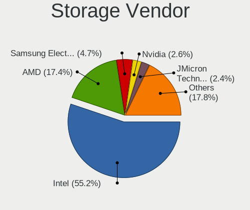
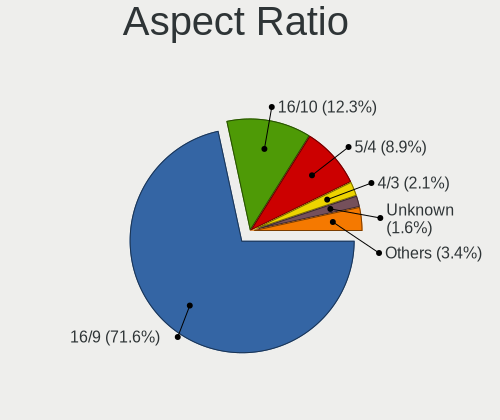
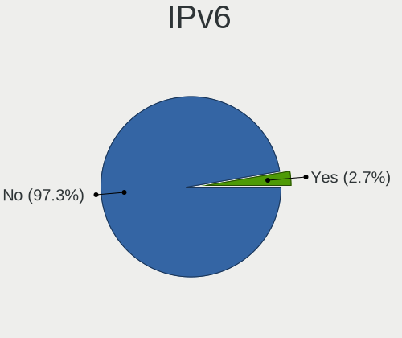

Linux in Russia - Tested Hardware & Statistics
----------------------------------------------

A project to collect tested hardware configurations for Linux in Russia.

Anyone can contribute to this report by the [hw-probe](https://github.com/linuxhw/hw-probe) tool:

    sudo -E hw-probe -all -upload

Please contribute! Especially if your hardware is rare.

This is a report for all computer types. See also reports for [desktops](/Location/Russia/Desktop/README.md) and [notebooks](/Location/Russia/Notebook/README.md).

Contents
--------

* [ Test Cases ](#test-cases)

* [ System ](#system)
  - [ OS                       ](#os)
  - [ OS Family                ](#os-family)
  - [ Kernel                   ](#kernel)
  - [ Kernel Family            ](#kernel-family)
  - [ Kernel Major Ver.        ](#kernel-major-ver)
  - [ Arch                     ](#arch)
  - [ DE                       ](#de)
  - [ Display Server           ](#display-server)
  - [ Display Manager          ](#display-manager)
  - [ OS Lang                  ](#os-lang)
  - [ Boot Mode                ](#boot-mode)
  - [ Filesystem               ](#filesystem)
  - [ Part. scheme             ](#part-scheme)
  - [ Dual Boot with Linux/BSD ](#dual-boot-with-linuxbsd)
  - [ Dual Boot (Win)          ](#dual-boot-win)

* [ Board ](#board)
  - [ Vendor                   ](#vendor)
  - [ Model                    ](#model)
  - [ Model Family             ](#model-family)
  - [ MFG Year                 ](#mfg-year)
  - [ Form Factor              ](#form-factor)
  - [ Secure Boot              ](#secure-boot)
  - [ Coreboot                 ](#coreboot)
  - [ RAM Size                 ](#ram-size)
  - [ RAM Used                 ](#ram-used)
  - [ Total Drives             ](#total-drives)
  - [ Has CD-ROM               ](#has-cd-rom)
  - [ Has Ethernet             ](#has-ethernet)
  - [ Has WiFi                 ](#has-wifi)
  - [ Has Bluetooth            ](#has-bluetooth)

* [ Location ](#location)
  - [ Country                  ](#country)
  - [ City                     ](#city)

* [ Drives ](#drives)
  - [ Drive Vendor             ](#drive-vendor)
  - [ Drive Model              ](#drive-model)
  - [ HDD Vendor               ](#hdd-vendor)
  - [ SSD Vendor               ](#ssd-vendor)
  - [ Drive Kind               ](#drive-kind)
  - [ Drive Connector          ](#drive-connector)
  - [ Drive Size               ](#drive-size)
  - [ Space Total              ](#space-total)
  - [ Space Used               ](#space-used)
  - [ Malfunc. Drives          ](#malfunc-drives)
  - [ Malfunc. Drive Vendor    ](#malfunc-drive-vendor)
  - [ Malfunc. HDD Vendor      ](#malfunc-hdd-vendor)
  - [ Malfunc. Drive Kind      ](#malfunc-drive-kind)
  - [ Failed Drives            ](#failed-drives)
  - [ Failed Drive Vendor      ](#failed-drive-vendor)
  - [ Drive Status             ](#drive-status)

* [ Storage controller ](#storage-controller)
  - [ Storage Vendor           ](#storage-vendor)
  - [ Storage Model            ](#storage-model)
  - [ Storage Kind             ](#storage-kind)

* [ Processor ](#processor)
  - [ CPU Vendor               ](#cpu-vendor)
  - [ CPU Model                ](#cpu-model)
  - [ CPU Model Family         ](#cpu-model-family)
  - [ CPU Cores                ](#cpu-cores)
  - [ CPU Sockets              ](#cpu-sockets)
  - [ CPU Threads              ](#cpu-threads)
  - [ CPU Op-Modes             ](#cpu-op-modes)
  - [ CPU Microcode            ](#cpu-microcode)
  - [ CPU Microarch            ](#cpu-microarch)

* [ Graphics ](#graphics)
  - [ GPU Vendor               ](#gpu-vendor)
  - [ GPU Model                ](#gpu-model)
  - [ GPU Combo                ](#gpu-combo)
  - [ GPU Driver               ](#gpu-driver)
  - [ GPU Memory               ](#gpu-memory)

* [ Monitor ](#monitor)
  - [ Monitor Vendor           ](#monitor-vendor)
  - [ Monitor Model            ](#monitor-model)
  - [ Monitor Resolution       ](#monitor-resolution)
  - [ Monitor Diagonal         ](#monitor-diagonal)
  - [ Monitor Width            ](#monitor-width)
  - [ Aspect Ratio             ](#aspect-ratio)
  - [ Monitor Area             ](#monitor-area)
  - [ Pixel Density            ](#pixel-density)
  - [ Multiple Monitors        ](#multiple-monitors)

* [ Network ](#network)
  - [ Net Controller Vendor    ](#net-controller-vendor)
  - [ Net Controller Model     ](#net-controller-model)
  - [ Wireless Vendor          ](#wireless-vendor)
  - [ Wireless Model           ](#wireless-model)
  - [ Ethernet Vendor          ](#ethernet-vendor)
  - [ Ethernet Model           ](#ethernet-model)
  - [ Net Controller Kind      ](#net-controller-kind)
  - [ Used Controller          ](#used-controller)
  - [ NICs                     ](#nics)
  - [ IPv6                     ](#ipv6)

* [ Bluetooth ](#bluetooth)
  - [ Bluetooth Vendor         ](#bluetooth-vendor)
  - [ Bluetooth Model          ](#bluetooth-model)

* [ Sound ](#sound)
  - [ Sound Vendor             ](#sound-vendor)
  - [ Sound Model              ](#sound-model)

* [ Memory ](#memory)
  - [ Memory Vendor            ](#memory-vendor)
  - [ Memory Model             ](#memory-model)
  - [ Memory Kind              ](#memory-kind)
  - [ Memory Form Factor       ](#memory-form-factor)
  - [ Memory Size              ](#memory-size)
  - [ Memory Speed             ](#memory-speed)

* [ Printers & scanners ](#printers--scanners)
  - [ Printer Vendor           ](#printer-vendor)
  - [ Printer Model            ](#printer-model)
  - [ Scanner Vendor           ](#scanner-vendor)
  - [ Scanner Model            ](#scanner-model)

* [ Camera ](#camera)
  - [ Camera Vendor            ](#camera-vendor)
  - [ Camera Model             ](#camera-model)

* [ Security ](#security)
  - [ Fingerprint Vendor       ](#fingerprint-vendor)
  - [ Fingerprint Model        ](#fingerprint-model)
  - [ Chipcard Vendor          ](#chipcard-vendor)
  - [ Chipcard Model           ](#chipcard-model)

* [ Unsupported ](#unsupported)
  - [ Unsupported Devices      ](#unsupported-devices)
  - [ Unsupported Device Types ](#unsupported-device-types)

Test Cases
----------

Total: 50877

| Vendor        | Model                       | Form-Factor | Probe                                                      | Date         |
|---------------|-----------------------------|-------------|------------------------------------------------------------|--------------|
| Intel Clie... | LAPBC710                    | Notebook    | [27e1a6b6c4](https://linux-hardware.org/?probe=27e1a6b6c4) | Jan 06, 2025 |
| eMachines     | E625                        | Notebook    | [e4674eed04](https://linux-hardware.org/?probe=e4674eed04) | Jan 06, 2025 |
| Samsung       | RV409/RV509/RV709           | Notebook    | [0c7619aac5](https://linux-hardware.org/?probe=0c7619aac5) | Jan 06, 2025 |
| ASUSTek       | X51RL                       | Notebook    | [526c93f776](https://linux-hardware.org/?probe=526c93f776) | Jan 06, 2025 |
| MSI           | 760GM-P21                   | Desktop     | [93d5fbc0a8](https://linux-hardware.org/?probe=93d5fbc0a8) | Jan 06, 2025 |
| MSI           | Katana 17 B12UCR            | Notebook    | [9a04090ded](https://linux-hardware.org/?probe=9a04090ded) | Jan 06, 2025 |
| HP            | Compaq nw8440 (RN043AW#A... | Notebook    | [1a3426f4b6](https://linux-hardware.org/?probe=1a3426f4b6) | Jan 06, 2025 |
| MSI           | B75IA-E33                   | Desktop     | [f12ded84f2](https://linux-hardware.org/?probe=f12ded84f2) | Jan 06, 2025 |
| ASUSTek       | PRIME B450-PLUS             | Desktop     | [4233786e9f](https://linux-hardware.org/?probe=4233786e9f) | Jan 06, 2025 |
| Lenovo        | ThinkPad T14 Gen 3 21AH0... | Notebook    | [d195e02226](https://linux-hardware.org/?probe=d195e02226) | Jan 06, 2025 |
| Lenovo        | Legion 5 15ARH05 82B5       | Notebook    | [572f922d7c](https://linux-hardware.org/?probe=572f922d7c) | Jan 06, 2025 |
| Lenovo        | ThinkPad T14 Gen 3 21AH0... | Notebook    | [58b338f268](https://linux-hardware.org/?probe=58b338f268) | Jan 06, 2025 |
| ASUSTek       | VivoBook_ASUSLaptop M370... | Notebook    | [3a6262bc2c](https://linux-hardware.org/?probe=3a6262bc2c) | Jan 05, 2025 |
| Lenovo        | ThinkPad X13 Gen 3 21BQA... | Notebook    | [ec40ca9885](https://linux-hardware.org/?probe=ec40ca9885) | Jan 05, 2025 |
| Lenovo        | ThinkPad X220 4290RV1       | Notebook    | [8873dfc3ac](https://linux-hardware.org/?probe=8873dfc3ac) | Jan 05, 2025 |
| Digma Pro     | Minimax U1 DPP5-8CXN01      | Mini pc     | [c6d2f011fa](https://linux-hardware.org/?probe=c6d2f011fa) | Jan 05, 2025 |
| Unknown       | Unknown                     | Desktop     | [bfe6d86060](https://linux-hardware.org/?probe=bfe6d86060) | Jan 05, 2025 |
| Unknown       | Unknown                     | Desktop     | [bafe044b60](https://linux-hardware.org/?probe=bafe044b60) | Jan 05, 2025 |
| Supermicro    | X9SRE/X9SRE-3F/X9SRi/X9S... | Server      | [f3d2f362e8](https://linux-hardware.org/?probe=f3d2f362e8) | Jan 05, 2025 |
| Lenovo        | ThinkPad T14 Gen 3 21AH0... | Notebook    | [8e4aafe314](https://linux-hardware.org/?probe=8e4aafe314) | Jan 05, 2025 |
| Infinix       | YL51A5                      | Notebook    | [17846f874a](https://linux-hardware.org/?probe=17846f874a) | Jan 05, 2025 |
| Lenovo        | G505 20240                  | Notebook    | [b6181c89ff](https://linux-hardware.org/?probe=b6181c89ff) | Jan 05, 2025 |
| Acer          | Aspire XC-830               | Desktop     | [1a9f6c2b88](https://linux-hardware.org/?probe=1a9f6c2b88) | Jan 05, 2025 |
| Gigabyte      | B450 AORUS M                | Desktop     | [65b4884505](https://linux-hardware.org/?probe=65b4884505) | Jan 04, 2025 |
| Gigabyte      | 965GM-S2                    | Desktop     | [7d033b5974](https://linux-hardware.org/?probe=7d033b5974) | Jan 04, 2025 |
| Biostar       | H61MHV3                     | Desktop     | [d5f3c84801](https://linux-hardware.org/?probe=d5f3c84801) | Jan 04, 2025 |
| Apple         | MacBookPro16,1              | Notebook    | [ba278c0390](https://linux-hardware.org/?probe=ba278c0390) | Jan 04, 2025 |
| ASUSTek       | Vivobook Go E1504FA_E150... | Notebook    | [832d6f219e](https://linux-hardware.org/?probe=832d6f219e) | Jan 04, 2025 |
| Gigabyte      | B460M D3H                   | Desktop     | [644e6e2e4e](https://linux-hardware.org/?probe=644e6e2e4e) | Jan 04, 2025 |
| MSI           | MAG Z390 TOMAHAWK           | Desktop     | [7e8f8f5c09](https://linux-hardware.org/?probe=7e8f8f5c09) | Jan 04, 2025 |
| Intel         | D510MO AAE76523-401         | Desktop     | [70f66209d4](https://linux-hardware.org/?probe=70f66209d4) | Jan 04, 2025 |
| Apple         | MacBookPro16,1              | Notebook    | [d49932671f](https://linux-hardware.org/?probe=d49932671f) | Jan 04, 2025 |
| Lenovo        | IdeaPad S145-15IIL 81W8     | Notebook    | [96316f7cee](https://linux-hardware.org/?probe=96316f7cee) | Jan 04, 2025 |
| Unknown       | Unknown                     | Soc         | [c5274f59f2](https://linux-hardware.org/?probe=c5274f59f2) | Jan 04, 2025 |
| Gigabyte      | B550M DS3H                  | Desktop     | [a917c66504](https://linux-hardware.org/?probe=a917c66504) | Jan 04, 2025 |
| AZW           | MINI S                      | Desktop     | [0f7bb17346](https://linux-hardware.org/?probe=0f7bb17346) | Jan 04, 2025 |
| ASUSTek       | K53TA                       | Notebook    | [26c9d957fc](https://linux-hardware.org/?probe=26c9d957fc) | Jan 04, 2025 |
| ASUSTek       | K50IJ                       | Notebook    | [9c75aa0285](https://linux-hardware.org/?probe=9c75aa0285) | Jan 04, 2025 |
| MSI           | 970A-G43                    | Desktop     | [4da1f27374](https://linux-hardware.org/?probe=4da1f27374) | Jan 03, 2025 |
| HUAWEI        | CREFG-XX                    | Notebook    | [c781ee9905](https://linux-hardware.org/?probe=c781ee9905) | Jan 03, 2025 |
| Chuwi         | MiniBook X                  | Notebook    | [77278dd73d](https://linux-hardware.org/?probe=77278dd73d) | Jan 03, 2025 |
| Chuwi         | Hi10 Max                    | Tablet      | [2af3e8f0c5](https://linux-hardware.org/?probe=2af3e8f0c5) | Jan 03, 2025 |
| Gigabyte      | B450 GAMING X               | Desktop     | [faa23f32b2](https://linux-hardware.org/?probe=faa23f32b2) | Jan 03, 2025 |
| MSI           | PRO B760M-E DDR4            | Desktop     | [4768eb71cc](https://linux-hardware.org/?probe=4768eb71cc) | Jan 03, 2025 |
| Lenovo        | ThinkBook 14 G4+ IAP 21C... | Notebook    | [0d48464f98](https://linux-hardware.org/?probe=0d48464f98) | Jan 03, 2025 |
| ASUSTek       | VivoBook_ASUSLaptop X509... | Notebook    | [08c2c8d3a6](https://linux-hardware.org/?probe=08c2c8d3a6) | Jan 03, 2025 |
| MSI           | P41T-C31                    | Desktop     | [c6bfdbb4ac](https://linux-hardware.org/?probe=c6bfdbb4ac) | Jan 03, 2025 |
| MSI           | MAG Z390 TOMAHAWK           | Desktop     | [de008cdc23](https://linux-hardware.org/?probe=de008cdc23) | Jan 03, 2025 |
| Gigabyte      | GA-78LMT-S2                 | Desktop     | [cf902d875a](https://linux-hardware.org/?probe=cf902d875a) | Jan 03, 2025 |
| Acer          | WMCP78M                     | Desktop     | [194dd31946](https://linux-hardware.org/?probe=194dd31946) | Jan 03, 2025 |
| Huanan        | X99-QD4 V1.0                | Desktop     | [6f4fe3e17b](https://linux-hardware.org/?probe=6f4fe3e17b) | Jan 02, 2025 |
| Gigabyte      | F2A88XM-D3H                 | Desktop     | [0af9e3885f](https://linux-hardware.org/?probe=0af9e3885f) | Jan 02, 2025 |
| Toshiba       | NB100                       | Notebook    | [df34e9793f](https://linux-hardware.org/?probe=df34e9793f) | Jan 02, 2025 |
| MSI           | Katana 17 B12VFK            | Notebook    | [5bffc2a657](https://linux-hardware.org/?probe=5bffc2a657) | Jan 02, 2025 |
| Lenovo        | ThinkBook 16 G6 IRL 21KH    | Notebook    | [77722af02e](https://linux-hardware.org/?probe=77722af02e) | Jan 02, 2025 |
| HP            | 255 G8 Notebook PC          | Notebook    | [c48045073f](https://linux-hardware.org/?probe=c48045073f) | Jan 02, 2025 |
| Unknown       | Unknown                     | Notebook    | [267152ac45](https://linux-hardware.org/?probe=267152ac45) | Jan 02, 2025 |
| ICL           | H410SB                      | Desktop     | [a75155cf86](https://linux-hardware.org/?probe=a75155cf86) | Jan 02, 2025 |
| HUAWEI        | BOD-WXX9                    | Notebook    | [305f6e1f4d](https://linux-hardware.org/?probe=305f6e1f4d) | Jan 02, 2025 |
| ASUSTek       | P5B-E Plus                  | Desktop     | [1026f82971](https://linux-hardware.org/?probe=1026f82971) | Jan 02, 2025 |
| Lenovo        | No DPK                      | All in one  | [f2ad5b1c81](https://linux-hardware.org/?probe=f2ad5b1c81) | Jan 02, 2025 |
| Valve         | Jupiter                     | Notebook    | [699dafa117](https://linux-hardware.org/?probe=699dafa117) | Jan 02, 2025 |
| MSI           | PRO H610M-G DDR4            | Desktop     | [da076eeaf3](https://linux-hardware.org/?probe=da076eeaf3) | Jan 02, 2025 |
| ASRock        | H55M-LE                     | Desktop     | [341c5d1d0a](https://linux-hardware.org/?probe=341c5d1d0a) | Jan 02, 2025 |
| Lenovo        | IdeaPad 100-15IBY 80MJ      | Notebook    | [eaa8dd18d4](https://linux-hardware.org/?probe=eaa8dd18d4) | Jan 02, 2025 |
| Infinix       | YL51A5                      | Notebook    | [431b98dee0](https://linux-hardware.org/?probe=431b98dee0) | Jan 01, 2025 |
| Acer          | Swift SF314-52G             | Notebook    | [77f207d738](https://linux-hardware.org/?probe=77f207d738) | Jan 01, 2025 |
| Acer          | Aspire 3610                 | Notebook    | [eff3c1a864](https://linux-hardware.org/?probe=eff3c1a864) | Jan 01, 2025 |
| MSI           | PRO B760-P WIFI DDR4        | Desktop     | [5b2124b8e7](https://linux-hardware.org/?probe=5b2124b8e7) | Jan 01, 2025 |
| HUAWEI        | RLEF-XX                     | Notebook    | [51f8d1b6dc](https://linux-hardware.org/?probe=51f8d1b6dc) | Jan 01, 2025 |
| Lenovo        | ThinkBook 14 G7+ ASP 21Q... | Notebook    | [20a618d664](https://linux-hardware.org/?probe=20a618d664) | Jan 01, 2025 |
| HUAWEI        | BOD-WXX9                    | Notebook    | [e28bd300ec](https://linux-hardware.org/?probe=e28bd300ec) | Jan 01, 2025 |
| Unknown       | Unknown                     | Desktop     | [209186df09](https://linux-hardware.org/?probe=209186df09) | Jan 01, 2025 |
| ASUSTek       | A68HM-K                     | Desktop     | [800e2716b1](https://linux-hardware.org/?probe=800e2716b1) | Jan 01, 2025 |
| ASUSTek       | P8Z77-V LX                  | Desktop     | [69679c9a35](https://linux-hardware.org/?probe=69679c9a35) | Dec 31, 2024 |
| AZW           | MINI S                      | Desktop     | [e05536561b](https://linux-hardware.org/?probe=e05536561b) | Dec 31, 2024 |
| HUAWEI        | BoDE-WXX9                   | Notebook    | [b88f684622](https://linux-hardware.org/?probe=b88f684622) | Dec 31, 2024 |
| Gigabyte      | GA-MA770-DS3                | Desktop     | [d18eb4cf0d](https://linux-hardware.org/?probe=d18eb4cf0d) | Dec 31, 2024 |
| DNS           | W510LU                      | Notebook    | [24e7ee2939](https://linux-hardware.org/?probe=24e7ee2939) | Dec 31, 2024 |
| Acer          | Acadia V1.34                | Notebook    | [10f43a8f8c](https://linux-hardware.org/?probe=10f43a8f8c) | Dec 31, 2024 |
| Huanan        | X99-F8 GAMING V5.0          | Desktop     | [b1dbf7b873](https://linux-hardware.org/?probe=b1dbf7b873) | Dec 31, 2024 |
| ASUSTek       | PRIME Z490-A                | Desktop     | [f1762af529](https://linux-hardware.org/?probe=f1762af529) | Dec 31, 2024 |
| Valve         | Galileo                     | Notebook    | [e1cfe6798d](https://linux-hardware.org/?probe=e1cfe6798d) | Dec 31, 2024 |
| Fujitsu Si... | LIFEBOOK S7020              | Notebook    | [7d29f5fd35](https://linux-hardware.org/?probe=7d29f5fd35) | Dec 30, 2024 |
| Maibenben     | Perfectum Series            | Notebook    | [db84ebbd71](https://linux-hardware.org/?probe=db84ebbd71) | Dec 30, 2024 |
| Clevo         | W240BL_W250BZ_W270BZQ       | Notebook    | [7da1abb74d](https://linux-hardware.org/?probe=7da1abb74d) | Dec 30, 2024 |
| HP            | ENVY dv6                    | Notebook    | [592cab3725](https://linux-hardware.org/?probe=592cab3725) | Dec 30, 2024 |
| eMachines     | eM355                       | Notebook    | [cd8623ca62](https://linux-hardware.org/?probe=cd8623ca62) | Dec 30, 2024 |
| Lenovo        | MAHOBAY NOK                 | Desktop     | [00c630c63a](https://linux-hardware.org/?probe=00c630c63a) | Dec 30, 2024 |
| XIAOMI        | Redmi Book Pro 15 2023      | Notebook    | [cc175b8319](https://linux-hardware.org/?probe=cc175b8319) | Dec 30, 2024 |
| MSI           | MAG Z390 TOMAHAWK           | Desktop     | [f457b3f670](https://linux-hardware.org/?probe=f457b3f670) | Dec 30, 2024 |
| MSI           | MAG Z390 TOMAHAWK           | Desktop     | [c51b4b60fd](https://linux-hardware.org/?probe=c51b4b60fd) | Dec 30, 2024 |
| MSI           | A68HM-E33                   | Desktop     | [8054416839](https://linux-hardware.org/?probe=8054416839) | Dec 30, 2024 |
| Intel         | E5-A99 V1.0                 | Desktop     | [08bc3d7b5d](https://linux-hardware.org/?probe=08bc3d7b5d) | Dec 30, 2024 |
| Lenovo        | IdeaPad L340-15IWL 81LG     | Notebook    | [5baef27a2a](https://linux-hardware.org/?probe=5baef27a2a) | Dec 30, 2024 |
| DEXP          | C14-ICW300                  | Notebook    | [f711f4ff49](https://linux-hardware.org/?probe=f711f4ff49) | Dec 30, 2024 |
| DEXP          | C14-ICW300                  | Notebook    | [4a1b8628e0](https://linux-hardware.org/?probe=4a1b8628e0) | Dec 30, 2024 |
| MSI           | PRO B660-A DDR4             | Desktop     | [1760e67766](https://linux-hardware.org/?probe=1760e67766) | Dec 30, 2024 |
| Fujitsu Si... | LIFEBOOK S7020              | Notebook    | [127407fc25](https://linux-hardware.org/?probe=127407fc25) | Dec 30, 2024 |
| Infinix       | Y3 Plus                     | Notebook    | [a5d0c097a5](https://linux-hardware.org/?probe=a5d0c097a5) | Dec 30, 2024 |
| Acer          | Aspire 5742G                | Notebook    | [79525e56eb](https://linux-hardware.org/?probe=79525e56eb) | Dec 30, 2024 |
| HP            | 339A                        | Desktop     | [ad1a9035e9](https://linux-hardware.org/?probe=ad1a9035e9) | Dec 30, 2024 |
| ASUSTek       | PRIME H510M-K               | Desktop     | [884ad79ee5](https://linux-hardware.org/?probe=884ad79ee5) | Dec 29, 2024 |
| Acer          | Aspire E1-531G              | Notebook    | [222752a541](https://linux-hardware.org/?probe=222752a541) | Dec 29, 2024 |
| Jumper        | EZpad                       | Tablet      | [29bf0cb907](https://linux-hardware.org/?probe=29bf0cb907) | Dec 29, 2024 |
| Valve         | Jupiter                     | Notebook    | [4eb06472bd](https://linux-hardware.org/?probe=4eb06472bd) | Dec 29, 2024 |
| Valve         | Jupiter                     | Notebook    | [0f665464e0](https://linux-hardware.org/?probe=0f665464e0) | Dec 29, 2024 |
| ASUSTek       | VivoBook_ASUSLaptop M160... | Notebook    | [dc70a933c3](https://linux-hardware.org/?probe=dc70a933c3) | Dec 29, 2024 |
| ASUSTek       | VivoBook_ASUSLaptop X160... | Notebook    | [8343da96e4](https://linux-hardware.org/?probe=8343da96e4) | Dec 29, 2024 |
| ASUSTek       | ROG STRIX B550-E GAMING     | Desktop     | [8c5acc63ea](https://linux-hardware.org/?probe=8c5acc63ea) | Dec 29, 2024 |
| Unknown       | Unknown                     | Server      | [122b21a8e4](https://linux-hardware.org/?probe=122b21a8e4) | Dec 29, 2024 |
| ICP / iEi     | SA16 V1.00                  | Desktop     | [6c89b49dd8](https://linux-hardware.org/?probe=6c89b49dd8) | Dec 29, 2024 |
| ASUSTek       | SABERTOOTH 990FX            | Desktop     | [3beafb5cad](https://linux-hardware.org/?probe=3beafb5cad) | Dec 29, 2024 |
| Fujitsu Si... | AMILO Pro Edition V3405     | Notebook    | [d4622b1451](https://linux-hardware.org/?probe=d4622b1451) | Dec 29, 2024 |
| Lenovo        | ThinkBook 16 G6+ IMH 21L... | Notebook    | [c80dde07d0](https://linux-hardware.org/?probe=c80dde07d0) | Dec 29, 2024 |
| MSI           | A320M-A PRO MAX             | Desktop     | [97b1ee7487](https://linux-hardware.org/?probe=97b1ee7487) | Dec 29, 2024 |
| Maibenben     | Typhoon Series              | Notebook    | [6b1a0a45d2](https://linux-hardware.org/?probe=6b1a0a45d2) | Dec 29, 2024 |
| Lenovo        | S20-30 20421                | Notebook    | [7e1a5a670a](https://linux-hardware.org/?probe=7e1a5a670a) | Dec 29, 2024 |
| Lenovo        | ThinkPad L412 0585AY7       | Notebook    | [5b7ad96e97](https://linux-hardware.org/?probe=5b7ad96e97) | Dec 29, 2024 |
| Foxconn       | 2ABF                        | Desktop     | [e4568577bd](https://linux-hardware.org/?probe=e4568577bd) | Dec 29, 2024 |
| MSI           | B450M MORTAR MAX            | Desktop     | [f5c01dc687](https://linux-hardware.org/?probe=f5c01dc687) | Dec 28, 2024 |
| ASUSTek       | P8Z77-V LX                  | Desktop     | [a4c88acd7f](https://linux-hardware.org/?probe=a4c88acd7f) | Dec 28, 2024 |
| MSI           | B450M MORTAR MAX            | Desktop     | [fbaccf3c9e](https://linux-hardware.org/?probe=fbaccf3c9e) | Dec 28, 2024 |
| Unknown       | Unknown                     | Desktop     | [09a3128900](https://linux-hardware.org/?probe=09a3128900) | Dec 28, 2024 |
| HUAWEI        | VGHH-XX                     | Notebook    | [7ef14dba16](https://linux-hardware.org/?probe=7ef14dba16) | Dec 28, 2024 |
| Supermicro    | X8DTU                       | Server      | [6918605d42](https://linux-hardware.org/?probe=6918605d42) | Dec 28, 2024 |
| ASUSTek       | TUF Gaming B450M-PRO II     | Desktop     | [8012f9a21d](https://linux-hardware.org/?probe=8012f9a21d) | Dec 28, 2024 |
| Lenovo        | MAHOBAY NOK                 | Desktop     | [9fd12e619e](https://linux-hardware.org/?probe=9fd12e619e) | Dec 28, 2024 |
| Lenovo        | G500 20236                  | Notebook    | [44c24fa0ee](https://linux-hardware.org/?probe=44c24fa0ee) | Dec 28, 2024 |
| GMKtec        | M5 PLUS                     | Mini pc     | [8628716cf4](https://linux-hardware.org/?probe=8628716cf4) | Dec 28, 2024 |
| Acer          | Unknown                     | Notebook    | [fa5b28121c](https://linux-hardware.org/?probe=fa5b28121c) | Dec 28, 2024 |
| Foxconn       | H61MXE/-S/-V/-K             | Desktop     | [7297c64739](https://linux-hardware.org/?probe=7297c64739) | Dec 28, 2024 |
| Dell          | Vostro 1014                 | Notebook    | [89dcde03d0](https://linux-hardware.org/?probe=89dcde03d0) | Dec 28, 2024 |
| Acer          | Aspire 5742Z                | Notebook    | [0cda57368f](https://linux-hardware.org/?probe=0cda57368f) | Dec 28, 2024 |
| ASUSTek       | VivoBook_ASUSLaptop X160... | Notebook    | [ed184eaff9](https://linux-hardware.org/?probe=ed184eaff9) | Dec 28, 2024 |
| Intel         | S5000VSA                    | Server      | [ec199dc348](https://linux-hardware.org/?probe=ec199dc348) | Dec 27, 2024 |
| Sony          | VPCSB3V9R                   | Notebook    | [c0950c9d66](https://linux-hardware.org/?probe=c0950c9d66) | Dec 27, 2024 |
| Lenovo        | IdeaPad Y460                | Notebook    | [3c6931e293](https://linux-hardware.org/?probe=3c6931e293) | Dec 27, 2024 |
| Maibenben     | PC34 V1.0                   | Desktop     | [1994f8536a](https://linux-hardware.org/?probe=1994f8536a) | Dec 27, 2024 |
| Colorful T... | CVN B650M GAMING FROZEN ... | Desktop     | [f4259d10b6](https://linux-hardware.org/?probe=f4259d10b6) | Dec 27, 2024 |
| HUAWEI        | KLVF-XX                     | Notebook    | [647fb3b2cf](https://linux-hardware.org/?probe=647fb3b2cf) | Dec 27, 2024 |
| Insyde        | Purley                      | Server      | [943c34d6fe](https://linux-hardware.org/?probe=943c34d6fe) | Dec 27, 2024 |
| Intel         | S5520UR E22554-751          | Server      | [e32d8048dd](https://linux-hardware.org/?probe=e32d8048dd) | Dec 27, 2024 |
| Insyde        | Purley                      | Server      | [0a1ed074fe](https://linux-hardware.org/?probe=0a1ed074fe) | Dec 27, 2024 |
| IBM           | 94Y7718 SIT                 | Server      | [133f7bc9a5](https://linux-hardware.org/?probe=133f7bc9a5) | Dec 27, 2024 |
| IBM           | 69Y1006 SIT                 | Server      | [31413f8015](https://linux-hardware.org/?probe=31413f8015) | Dec 27, 2024 |
| Unknown       | X79                         | Desktop     | [d721436769](https://linux-hardware.org/?probe=d721436769) | Dec 27, 2024 |
| Gigabyte      | 970A-DS3P                   | Desktop     | [127d67d58a](https://linux-hardware.org/?probe=127d67d58a) | Dec 27, 2024 |
| ASUSTek       | PRIME B760-PLUS D4          | Desktop     | [aea60b12c3](https://linux-hardware.org/?probe=aea60b12c3) | Dec 27, 2024 |
| Acer          | Aspire A315-34              | Notebook    | [c8bcfc6c53](https://linux-hardware.org/?probe=c8bcfc6c53) | Dec 27, 2024 |
| ASUSTek       | TUF B450-PRO GAMING         | Desktop     | [9978434d74](https://linux-hardware.org/?probe=9978434d74) | Dec 27, 2024 |
| ASUSTek       | X502CA                      | Notebook    | [6b816ff7ef](https://linux-hardware.org/?probe=6b816ff7ef) | Dec 27, 2024 |
| CBR           | A320M.2-VH Challenger       | Desktop     | [1f5e2840d1](https://linux-hardware.org/?probe=1f5e2840d1) | Dec 27, 2024 |
| Acer          | Extensa 215-23              | Notebook    | [97337ddb76](https://linux-hardware.org/?probe=97337ddb76) | Dec 26, 2024 |
| eMachines     | eME732                      | Notebook    | [7f36d968e4](https://linux-hardware.org/?probe=7f36d968e4) | Dec 26, 2024 |
| ASRock        | H510M-HDV                   | Desktop     | [3b9f735c39](https://linux-hardware.org/?probe=3b9f735c39) | Dec 26, 2024 |
| Acer          | Aspire 5349                 | Notebook    | [4538d32a3d](https://linux-hardware.org/?probe=4538d32a3d) | Dec 26, 2024 |
| Pegatron      | A15                         | Notebook    | [2649401416](https://linux-hardware.org/?probe=2649401416) | Dec 26, 2024 |
| sunxi         | Repka-Pi4-Optimal           | Soc         | [e92e8e414d](https://linux-hardware.org/?probe=e92e8e414d) | Dec 26, 2024 |
| ASUSTek       | P8H67-M PRO                 | Desktop     | [9fe5377380](https://linux-hardware.org/?probe=9fe5377380) | Dec 26, 2024 |
| Lenovo        | G500 20236                  | Notebook    | [8dbe192f7f](https://linux-hardware.org/?probe=8dbe192f7f) | Dec 26, 2024 |
| Lenovo        | G500 20236                  | Notebook    | [717bada61c](https://linux-hardware.org/?probe=717bada61c) | Dec 26, 2024 |
| ASUSTek       | P8H67-M PRO                 | Desktop     | [a9a7e396c0](https://linux-hardware.org/?probe=a9a7e396c0) | Dec 26, 2024 |
| Gigabyte      | 970A-DS3P                   | Desktop     | [5178ebb1f5](https://linux-hardware.org/?probe=5178ebb1f5) | Dec 26, 2024 |
| Lenovo        | ThinkBook 14 G6 ABP 21KJ    | Notebook    | [7657538670](https://linux-hardware.org/?probe=7657538670) | Dec 26, 2024 |
| Lenovo        | B590 20206                  | Notebook    | [c118a5bc12](https://linux-hardware.org/?probe=c118a5bc12) | Dec 26, 2024 |
| Graviton      | DMB-Q670-TMI01              | Desktop     | [c609b9c45c](https://linux-hardware.org/?probe=c609b9c45c) | Dec 26, 2024 |
| Lenovo        | B590 20206                  | Notebook    | [04580fdd68](https://linux-hardware.org/?probe=04580fdd68) | Dec 26, 2024 |
| Graviton      | DMB-Q670-TMI01              | Desktop     | [425c41687c](https://linux-hardware.org/?probe=425c41687c) | Dec 26, 2024 |
| ASRock        | G31M-GS                     | Desktop     | [655a9a77aa](https://linux-hardware.org/?probe=655a9a77aa) | Dec 26, 2024 |
| MSI           | GL62M 7RDX                  | Notebook    | [83b16ab268](https://linux-hardware.org/?probe=83b16ab268) | Dec 26, 2024 |
| Lenovo        | V580c 20160                 | Notebook    | [0cdb0ca83b](https://linux-hardware.org/?probe=0cdb0ca83b) | Dec 26, 2024 |
| ASRock        | Z390 Phantom Gaming 4S      | Notebook    | [d134a178b2](https://linux-hardware.org/?probe=d134a178b2) | Dec 26, 2024 |
| Biostar       | A780LB                      | Desktop     | [50a42b0b06](https://linux-hardware.org/?probe=50a42b0b06) | Dec 25, 2024 |
| MSI           | G41TM-E43                   | Desktop     | [0d099148c3](https://linux-hardware.org/?probe=0d099148c3) | Dec 25, 2024 |
| HP            | EtiteBook 840 G5            | Notebook    | [5ed7fbc42d](https://linux-hardware.org/?probe=5ed7fbc42d) | Dec 25, 2024 |
| MSI           | PRO B650-P WIFI             | Desktop     | [0a8d8bc701](https://linux-hardware.org/?probe=0a8d8bc701) | Dec 25, 2024 |
| Huanan        | B75 G376-V6.0               | Desktop     | [fcecd9dab0](https://linux-hardware.org/?probe=fcecd9dab0) | Dec 25, 2024 |
| TECNO Mobi... | MEGABOOK K16SDA             | Notebook    | [99d3b277a9](https://linux-hardware.org/?probe=99d3b277a9) | Dec 25, 2024 |
| Lenovo        | ThinkBook 14 G6 IRL 21KG    | Notebook    | [bc6c76d79b](https://linux-hardware.org/?probe=bc6c76d79b) | Dec 25, 2024 |
| HUAWEI        | BOM-WXX9                    | Notebook    | [030b263131](https://linux-hardware.org/?probe=030b263131) | Dec 25, 2024 |
| ASUSTek       | P8Z77-V LE PLUS             | Desktop     | [6d145d17f1](https://linux-hardware.org/?probe=6d145d17f1) | Dec 25, 2024 |
| Gigabyte      | B550M S2H                   | Desktop     | [84d7a6faa5](https://linux-hardware.org/?probe=84d7a6faa5) | Dec 25, 2024 |
| Dell          | 0GM819                      | Desktop     | [bb31438b8d](https://linux-hardware.org/?probe=bb31438b8d) | Dec 25, 2024 |
| Infinix       | YL51A5                      | Notebook    | [661efe13d8](https://linux-hardware.org/?probe=661efe13d8) | Dec 25, 2024 |
| Elpitech      | ET151-2                     | Soc         | [817e35c7cf](https://linux-hardware.org/?probe=817e35c7cf) | Dec 25, 2024 |
| Acer          | Aspire A317-52              | Notebook    | [3d85a6b6d7](https://linux-hardware.org/?probe=3d85a6b6d7) | Dec 25, 2024 |
| MSI           | 760G-P43                    | Desktop     | [faf4279015](https://linux-hardware.org/?probe=faf4279015) | Dec 25, 2024 |
| MSI           | Stealth GS66 12UHS          | Notebook    | [4634dcf259](https://linux-hardware.org/?probe=4634dcf259) | Dec 25, 2024 |
| Acer          | Aspire XC-830               | Desktop     | [35a7b3f08c](https://linux-hardware.org/?probe=35a7b3f08c) | Dec 25, 2024 |
| Valve         | Jupiter                     | Notebook    | [fb4323604f](https://linux-hardware.org/?probe=fb4323604f) | Dec 25, 2024 |
| Lenovo        | ThinkPad X250 20CM003CRT    | Notebook    | [8131530228](https://linux-hardware.org/?probe=8131530228) | Dec 24, 2024 |
| HUAWEI        | BC82AMDDA V200R002C00       | Server      | [29bde967fc](https://linux-hardware.org/?probe=29bde967fc) | Dec 24, 2024 |
| Biostar       | H61MGC                      | Desktop     | [41e894b300](https://linux-hardware.org/?probe=41e894b300) | Dec 24, 2024 |
| MSI           | A68HM-E33                   | Desktop     | [3744f7d334](https://linux-hardware.org/?probe=3744f7d334) | Dec 24, 2024 |
| Gigabyte      | B360M DS3H                  | Desktop     | [d606dfb509](https://linux-hardware.org/?probe=d606dfb509) | Dec 24, 2024 |
| Lenovo        | IdeaPad Gaming 3 16ARH7 ... | Notebook    | [8a07ac474c](https://linux-hardware.org/?probe=8a07ac474c) | Dec 24, 2024 |
| Gigabyte      | GA-MA770-DS3                | Desktop     | [d3c2067fd5](https://linux-hardware.org/?probe=d3c2067fd5) | Dec 24, 2024 |
| ICL           | H510SB-TM v2.0              | All in one  | [f969d9fb85](https://linux-hardware.org/?probe=f969d9fb85) | Dec 24, 2024 |
| Apple         | MacBookAir8,1               | Notebook    | [70ac7767c5](https://linux-hardware.org/?probe=70ac7767c5) | Dec 24, 2024 |
| Lenovo        | ThinkPad E460 20ETS00900    | Notebook    | [b4c09901bb](https://linux-hardware.org/?probe=b4c09901bb) | Dec 24, 2024 |
| Acer          | Aspire E1-531               | Notebook    | [2d5eef0754](https://linux-hardware.org/?probe=2d5eef0754) | Dec 24, 2024 |
| Lenovo        | IdeaPad L340-15API 81LW     | Notebook    | [d2b53b04f1](https://linux-hardware.org/?probe=d2b53b04f1) | Dec 24, 2024 |
| Intel         | AvenueCityM                 | Desktop     | [18f894cdc8](https://linux-hardware.org/?probe=18f894cdc8) | Dec 24, 2024 |
| ASUSTek       | PRIME A320M-K               | Desktop     | [cc7b12fc35](https://linux-hardware.org/?probe=cc7b12fc35) | Dec 24, 2024 |
| Acer          | Aspire A515-57              | Notebook    | [7ca1bf2b15](https://linux-hardware.org/?probe=7ca1bf2b15) | Dec 24, 2024 |
| HONOR         | FRI-FXX                     | Notebook    | [36c0ad82b3](https://linux-hardware.org/?probe=36c0ad82b3) | Dec 24, 2024 |
| Lenovo        | ThinkPad E14 Gen 5 21JSS... | Notebook    | [5308ff08f7](https://linux-hardware.org/?probe=5308ff08f7) | Dec 24, 2024 |
| ASUSTek       | 1225B                       | Notebook    | [20e4fd20fa](https://linux-hardware.org/?probe=20e4fd20fa) | Dec 23, 2024 |
| ASUSTek       | M3A78-CM                    | Desktop     | [2d4194f76b](https://linux-hardware.org/?probe=2d4194f76b) | Dec 23, 2024 |
| ASRock        | B450 Gaming K4              | Desktop     | [6e86ec71a9](https://linux-hardware.org/?probe=6e86ec71a9) | Dec 23, 2024 |
| Intel         | HM87                        | Notebook    | [06e9957440](https://linux-hardware.org/?probe=06e9957440) | Dec 23, 2024 |
| Alder lake    | Intel RVP                   | Desktop     | [c7e725fe89](https://linux-hardware.org/?probe=c7e725fe89) | Dec 23, 2024 |
| Alder lake    | Intel RVP                   | Desktop     | [e0b0a8851c](https://linux-hardware.org/?probe=e0b0a8851c) | Dec 23, 2024 |
| Infinix       | YL51A5                      | Notebook    | [f57db5b2dd](https://linux-hardware.org/?probe=f57db5b2dd) | Dec 23, 2024 |
| Acer          | Swift SF314-58              | Notebook    | [35ca0e4138](https://linux-hardware.org/?probe=35ca0e4138) | Dec 23, 2024 |
| Gigabyte      | 970A-DS3P                   | Desktop     | [82a3f44796](https://linux-hardware.org/?probe=82a3f44796) | Dec 23, 2024 |
| ASUSTek       | K55DR                       | Notebook    | [52c3ba1b47](https://linux-hardware.org/?probe=52c3ba1b47) | Dec 23, 2024 |
| Dell          | Vostro 1014                 | Notebook    | [3a0229ef1c](https://linux-hardware.org/?probe=3a0229ef1c) | Dec 23, 2024 |
| Gigabyte      | H410M H V3                  | Desktop     | [38db6d3960](https://linux-hardware.org/?probe=38db6d3960) | Dec 23, 2024 |
| ASUSTek       | TUF Gaming B450-PLUS II     | Desktop     | [7cc80d8aba](https://linux-hardware.org/?probe=7cc80d8aba) | Dec 23, 2024 |
| Apple         | MacBookPro14,1              | Notebook    | [62ce6ad6d0](https://linux-hardware.org/?probe=62ce6ad6d0) | Dec 23, 2024 |
| Lenovo        | ThinkPad T460s 20FAS09L0... | Notebook    | [e7eac1f625](https://linux-hardware.org/?probe=e7eac1f625) | Dec 23, 2024 |
| ASUSTek       | ROG STRIX B650E-E GAMING... | Desktop     | [33885a73d2](https://linux-hardware.org/?probe=33885a73d2) | Dec 23, 2024 |
| Gigabyte      | Z390 AORUS PRO WIFI-CF      | Desktop     | [8ccb1a5d52](https://linux-hardware.org/?probe=8ccb1a5d52) | Dec 23, 2024 |
| Gigabyte      | A620M DS3H                  | Desktop     | [2993fdb631](https://linux-hardware.org/?probe=2993fdb631) | Dec 23, 2024 |
| ASRock        | A320D4-P1                   | Desktop     | [9fd8b4c5ab](https://linux-hardware.org/?probe=9fd8b4c5ab) | Dec 23, 2024 |
| Dell          | 0PJPW3 A04                  | Server      | [e80578896e](https://linux-hardware.org/?probe=e80578896e) | Dec 23, 2024 |
| ASUSTek       | X55VD                       | Notebook    | [eb1866b0f2](https://linux-hardware.org/?probe=eb1866b0f2) | Dec 23, 2024 |
| ASUSTek       | PRIME H610M-R D4            | Desktop     | [2a762556a1](https://linux-hardware.org/?probe=2a762556a1) | Dec 23, 2024 |
| ASUSTek       | PRIME H270-PLUS             | Desktop     | [1ca103ad2a](https://linux-hardware.org/?probe=1ca103ad2a) | Dec 23, 2024 |
| ASUSTek       | ASUSLaptop_Q530VJ           | Notebook    | [701d015fd1](https://linux-hardware.org/?probe=701d015fd1) | Dec 22, 2024 |
| ASUSTek       | B85M-K                      | Desktop     | [0978d9437e](https://linux-hardware.org/?probe=0978d9437e) | Dec 22, 2024 |
| HONOR         | BRI-XX                      | Notebook    | [ae2d835788](https://linux-hardware.org/?probe=ae2d835788) | Dec 22, 2024 |
| ASUSTek       | PN40                        | Mini pc     | [3605503634](https://linux-hardware.org/?probe=3605503634) | Dec 22, 2024 |
| ASRock        | H110M-HDV R3.0              | Desktop     | [43e003f874](https://linux-hardware.org/?probe=43e003f874) | Dec 22, 2024 |
| ASUSTek       | P5LD2-VM                    | Desktop     | [03bb592c4a](https://linux-hardware.org/?probe=03bb592c4a) | Dec 22, 2024 |
| Gigabyte      | B650M AORUS ELITE AX ICE    | Desktop     | [2cfcbe46ea](https://linux-hardware.org/?probe=2cfcbe46ea) | Dec 22, 2024 |
| HP            | Pavilion dv6                | Notebook    | [2ebb2925a2](https://linux-hardware.org/?probe=2ebb2925a2) | Dec 22, 2024 |
| Acer          | AO531h                      | Notebook    | [ae863646cd](https://linux-hardware.org/?probe=ae863646cd) | Dec 22, 2024 |
| Lunnen        | LL5FAW                      | Notebook    | [7b0a53a2fe](https://linux-hardware.org/?probe=7b0a53a2fe) | Dec 22, 2024 |
| MSI           | PRO B650-A WIFI             | Desktop     | [4c3d8d6732](https://linux-hardware.org/?probe=4c3d8d6732) | Dec 21, 2024 |
| Lenovo        | ThinkBook 14 G6 ABP 21KJ    | Notebook    | [fc617a056e](https://linux-hardware.org/?probe=fc617a056e) | Dec 21, 2024 |
| ASUSTek       | Z170 PRO GAMING             | Desktop     | [7e6e91ee61](https://linux-hardware.org/?probe=7e6e91ee61) | Dec 21, 2024 |
| HP            | Pavilion g6                 | Notebook    | [32463a80cb](https://linux-hardware.org/?probe=32463a80cb) | Dec 21, 2024 |
| Lenovo        | ThinkPad P17 Gen 1 20SN0... | Notebook    | [472acf3ec6](https://linux-hardware.org/?probe=472acf3ec6) | Dec 21, 2024 |
| Infinix       | INBOOK Y4H Max              | Notebook    | [e5a91667f9](https://linux-hardware.org/?probe=e5a91667f9) | Dec 21, 2024 |
| Lenovo        | ThinkPad P17 Gen 1 20SN0... | Notebook    | [71553abdd8](https://linux-hardware.org/?probe=71553abdd8) | Dec 21, 2024 |
| MSI           | Modern 14 B5M               | Notebook    | [3cd6bb8b87](https://linux-hardware.org/?probe=3cd6bb8b87) | Dec 21, 2024 |
| Lenovo        | G565 20071                  | Notebook    | [693717f620](https://linux-hardware.org/?probe=693717f620) | Dec 21, 2024 |
| ASUSTek       | VivoBook_ASUSLaptop M650... | Notebook    | [5d90b386a8](https://linux-hardware.org/?probe=5d90b386a8) | Dec 21, 2024 |
| Maibenben     | MaiBook M                   | Notebook    | [5cb09d638e](https://linux-hardware.org/?probe=5cb09d638e) | Dec 21, 2024 |
| Gigabyte      | B650M AORUS ELITE           | Desktop     | [35a7c56bfe](https://linux-hardware.org/?probe=35a7c56bfe) | Dec 21, 2024 |
| ASUSTek       | X555QA                      | Notebook    | [44b32a3f7b](https://linux-hardware.org/?probe=44b32a3f7b) | Dec 21, 2024 |
| Valve         | Galileo                     | Notebook    | [ec69f4be51](https://linux-hardware.org/?probe=ec69f4be51) | Dec 21, 2024 |
| Unknown       | Unknown                     | Desktop     | [97ee68a841](https://linux-hardware.org/?probe=97ee68a841) | Dec 21, 2024 |
| Apple         | MacBookPro12,1              | Notebook    | [4d62c515e1](https://linux-hardware.org/?probe=4d62c515e1) | Dec 21, 2024 |
| Apple         | MacBookPro12,1              | Notebook    | [5c583a4baf](https://linux-hardware.org/?probe=5c583a4baf) | Dec 21, 2024 |
| ASUSTek       | P5G41T-M LX2/GB             | Desktop     | [3ba1da1476](https://linux-hardware.org/?probe=3ba1da1476) | Dec 20, 2024 |
| Dell          | G5 5590                     | Notebook    | [798f7076ab](https://linux-hardware.org/?probe=798f7076ab) | Dec 20, 2024 |
| ASRock        | B450M-HDV R4.0              | Desktop     | [0f8384fde3](https://linux-hardware.org/?probe=0f8384fde3) | Dec 20, 2024 |
| MSI           | Modern 14 C5M               | Notebook    | [e986a9bd5b](https://linux-hardware.org/?probe=e986a9bd5b) | Dec 20, 2024 |
| ASUSTek       | STRIX Z270H GAMING          | Desktop     | [b38a7837c5](https://linux-hardware.org/?probe=b38a7837c5) | Dec 20, 2024 |
| LTD Delovo... | 15CLG2                      | Notebook    | [39a5c39de0](https://linux-hardware.org/?probe=39a5c39de0) | Dec 20, 2024 |
| HP            | ProLiant DL380 Gen9         | Server      | [7afc8353d7](https://linux-hardware.org/?probe=7afc8353d7) | Dec 20, 2024 |
| Lenovo        | ThinkPad T14 Gen 1 20S1S... | Notebook    | [540a0a503c](https://linux-hardware.org/?probe=540a0a503c) | Dec 20, 2024 |
| Lenovo        | ThinkPad P43s 20RHS00100    | Notebook    | [2b6e5dda32](https://linux-hardware.org/?probe=2b6e5dda32) | Dec 20, 2024 |
| HP            | ProLiant DL380 Gen9         | Server      | [fddb4fa4a6](https://linux-hardware.org/?probe=fddb4fa4a6) | Dec 20, 2024 |
| Lenovo        | ThinkPad T14 Gen 3 21AH0... | Notebook    | [8145f1c8c7](https://linux-hardware.org/?probe=8145f1c8c7) | Dec 20, 2024 |
| MSI           | B450-A PRO MAX              | Desktop     | [697b67cc2a](https://linux-hardware.org/?probe=697b67cc2a) | Dec 20, 2024 |
| Notebook      | W65_67SH                    | Notebook    | [a04f4e7b2a](https://linux-hardware.org/?probe=a04f4e7b2a) | Dec 20, 2024 |
| ASRock        | H670M Pro RS                | Desktop     | [becb70cb39](https://linux-hardware.org/?probe=becb70cb39) | Dec 20, 2024 |
| Chuwi         | MiniBook X                  | Notebook    | [3d7be23d49](https://linux-hardware.org/?probe=3d7be23d49) | Dec 19, 2024 |
| ASUSTek       | Z97-K                       | Desktop     | [05b8112082](https://linux-hardware.org/?probe=05b8112082) | Dec 19, 2024 |
| Valve         | Jupiter                     | Notebook    | [9b99dd7185](https://linux-hardware.org/?probe=9b99dd7185) | Dec 19, 2024 |
| Digma         | EVE 15 P418 NCN154BXW01     | Notebook    | [1f788db073](https://linux-hardware.org/?probe=1f788db073) | Dec 19, 2024 |
| ASUSTek       | H110M-K                     | Desktop     | [a20b5ae9f0](https://linux-hardware.org/?probe=a20b5ae9f0) | Dec 19, 2024 |
| ASUSTek       | ASUS EXPERTBOOK B1402CBA... | Notebook    | [fff8bed544](https://linux-hardware.org/?probe=fff8bed544) | Dec 19, 2024 |
| ASUSTek       | ASUS EXPERTBOOK B1402CBA... | Notebook    | [02f1237767](https://linux-hardware.org/?probe=02f1237767) | Dec 19, 2024 |
| MSI           | H110M PRO-VD                | Desktop     | [0b9173adf1](https://linux-hardware.org/?probe=0b9173adf1) | Dec 19, 2024 |
| ICL           | H510SB-TM v2.0              | All in one  | [c570b60c5c](https://linux-hardware.org/?probe=c570b60c5c) | Dec 19, 2024 |
| HP            | EliteBook 840 G8 Noteboo... | Notebook    | [9f0fc66e58](https://linux-hardware.org/?probe=9f0fc66e58) | Dec 19, 2024 |
| Acer          | Aspire A315-53              | Notebook    | [f25c3e31af](https://linux-hardware.org/?probe=f25c3e31af) | Dec 19, 2024 |
| KVADRA        | NAU LE14U                   | Notebook    | [bca4537cc8](https://linux-hardware.org/?probe=bca4537cc8) | Dec 19, 2024 |
| ASUSTek       | ROG STRIX B650E-I GAMING... | Desktop     | [059108072c](https://linux-hardware.org/?probe=059108072c) | Dec 19, 2024 |
| Gigabyte      | Z590 GAMING X               | Desktop     | [254ce873f6](https://linux-hardware.org/?probe=254ce873f6) | Dec 19, 2024 |
| HP            | Pavilion dv6                | Notebook    | [d532497c6d](https://linux-hardware.org/?probe=d532497c6d) | Dec 19, 2024 |
| HP            | 8158 A01                    | Mini pc     | [27469d63a1](https://linux-hardware.org/?probe=27469d63a1) | Dec 19, 2024 |
| HUAWEI        | NBD-WXX9                    | Notebook    | [0d321b083c](https://linux-hardware.org/?probe=0d321b083c) | Dec 19, 2024 |
| Gigabyte      | H110M-S2H-CF                | Desktop     | [89c03187e1](https://linux-hardware.org/?probe=89c03187e1) | Dec 19, 2024 |
| Lenovo        | ThinkPad T14 Gen 3 21AH0... | Notebook    | [c10492aedf](https://linux-hardware.org/?probe=c10492aedf) | Dec 19, 2024 |
| Gigabyte      | A620M H                     | Desktop     | [bef78fc714](https://linux-hardware.org/?probe=bef78fc714) | Dec 19, 2024 |
| MSI           | Z77A-GD65                   | Desktop     | [b928d00615](https://linux-hardware.org/?probe=b928d00615) | Dec 19, 2024 |
| MACHINIST     | E5-K9 V1.0                  | Desktop     | [0454705976](https://linux-hardware.org/?probe=0454705976) | Dec 19, 2024 |
| ASRock        | H81M-HDS R2.0               | Desktop     | [7b753c30c2](https://linux-hardware.org/?probe=7b753c30c2) | Dec 18, 2024 |
| AZW           | MINI S                      | Desktop     | [bb9a63ad1b](https://linux-hardware.org/?probe=bb9a63ad1b) | Dec 18, 2024 |
| Clevo         | W240EL/W250ELQ/W270ELQ      | Notebook    | [ff394d758b](https://linux-hardware.org/?probe=ff394d758b) | Dec 18, 2024 |
| MSI           | PRO B760M-A WIFI DDR4       | Desktop     | [bf182b776d](https://linux-hardware.org/?probe=bf182b776d) | Dec 18, 2024 |
| Biostar       | N68S3B                      | Desktop     | [9b0517b1c6](https://linux-hardware.org/?probe=9b0517b1c6) | Dec 18, 2024 |
| LTD Delovo... | 15TLI                       | Notebook    | [b0481ea420](https://linux-hardware.org/?probe=b0481ea420) | Dec 18, 2024 |
| ASUSTek       | ROG Zephyrus G16 GA605WI... | Notebook    | [0b5149cbce](https://linux-hardware.org/?probe=0b5149cbce) | Dec 18, 2024 |
| MSI           | G31TM-P21                   | Desktop     | [f8e605fd2a](https://linux-hardware.org/?probe=f8e605fd2a) | Dec 18, 2024 |
| Biostar       | Hi-Fi H77S                  | Desktop     | [920915dc5e](https://linux-hardware.org/?probe=920915dc5e) | Dec 18, 2024 |
| ASUSTek       | Z9PE-D16-10G Series         | Server      | [e805be0aac](https://linux-hardware.org/?probe=e805be0aac) | Dec 18, 2024 |
| ASUSTek       | PRIME H510M-K               | Desktop     | [7cf5f17079](https://linux-hardware.org/?probe=7cf5f17079) | Dec 18, 2024 |
| Acer          | Extensa 215-23              | Notebook    | [9ed4841427](https://linux-hardware.org/?probe=9ed4841427) | Dec 18, 2024 |
| HP            | ProBook 4540s               | Notebook    | [4f31cb1609](https://linux-hardware.org/?probe=4f31cb1609) | Dec 18, 2024 |
| ASRock        | H510M-HDV                   | Desktop     | [5b34b8b9bd](https://linux-hardware.org/?probe=5b34b8b9bd) | Dec 18, 2024 |
| Gigabyte      | H310M S2H                   | Desktop     | [2fe012a888](https://linux-hardware.org/?probe=2fe012a888) | Dec 18, 2024 |
| HP            | 8446                        | All in one  | [c5b5b31a25](https://linux-hardware.org/?probe=c5b5b31a25) | Dec 18, 2024 |
| Gigabyte      | A620M H                     | Desktop     | [a48a1efcc8](https://linux-hardware.org/?probe=a48a1efcc8) | Dec 18, 2024 |
| Intel         | DH61BF AAG81311-101         | Desktop     | [4d21569356](https://linux-hardware.org/?probe=4d21569356) | Dec 18, 2024 |
| HUAWEI        | BoDE-WXX9                   | Notebook    | [e172af52db](https://linux-hardware.org/?probe=e172af52db) | Dec 18, 2024 |
| HP            | Laptop 15-dw3xxx            | Notebook    | [0fb8125031](https://linux-hardware.org/?probe=0fb8125031) | Dec 18, 2024 |
| Chuwi         | HeroBox                     | Mini pc     | [52b9ee705b](https://linux-hardware.org/?probe=52b9ee705b) | Dec 18, 2024 |
| Lenovo        | G500 20236                  | Notebook    | [e99102e968](https://linux-hardware.org/?probe=e99102e968) | Dec 17, 2024 |
| Unknown       | Unknown                     | Desktop     | [0653c463df](https://linux-hardware.org/?probe=0653c463df) | Dec 17, 2024 |
| ASUSTek       | PRIME H310M-E R2.0          | Desktop     | [7b274f7500](https://linux-hardware.org/?probe=7b274f7500) | Dec 17, 2024 |
| HP            | OMEN by Laptop              | Notebook    | [1990440c77](https://linux-hardware.org/?probe=1990440c77) | Dec 17, 2024 |
| ASUSTek       | M4A88TD-V EVO/USB3          | Desktop     | [6f3a9094fe](https://linux-hardware.org/?probe=6f3a9094fe) | Dec 17, 2024 |
| Intel         | AvenueCityM                 | Desktop     | [03c9379895](https://linux-hardware.org/?probe=03c9379895) | Dec 17, 2024 |
| MSI           | B365M PRO-VDH               | Desktop     | [f9eeaab8b3](https://linux-hardware.org/?probe=f9eeaab8b3) | Dec 17, 2024 |
| HUAWEI        | BOM-WXX9                    | Notebook    | [bdfe4e0a02](https://linux-hardware.org/?probe=bdfe4e0a02) | Dec 17, 2024 |
| Apple         | MacBookPro8,2               | Notebook    | [e2f957298c](https://linux-hardware.org/?probe=e2f957298c) | Dec 17, 2024 |
| Apple         | MacBookPro8,2               | Notebook    | [504b00b57d](https://linux-hardware.org/?probe=504b00b57d) | Dec 17, 2024 |
| Graviton      | VALDAY                      | Server      | [481d7f644b](https://linux-hardware.org/?probe=481d7f644b) | Dec 17, 2024 |
| Unknown       | Unknown                     | Desktop     | [57ac1cff4f](https://linux-hardware.org/?probe=57ac1cff4f) | Dec 17, 2024 |
| Unknown       | Unknown                     | Desktop     | [ca877e7bea](https://linux-hardware.org/?probe=ca877e7bea) | Dec 17, 2024 |
| MSI           | B760M BOMBER                | Desktop     | [0b6ed644f3](https://linux-hardware.org/?probe=0b6ed644f3) | Dec 17, 2024 |
| MSI           | B760M BOMBER                | Desktop     | [c181449dfb](https://linux-hardware.org/?probe=c181449dfb) | Dec 17, 2024 |
| HP            | Laptop 17-by3xxx            | Notebook    | [cb8341eaca](https://linux-hardware.org/?probe=cb8341eaca) | Dec 17, 2024 |
| HP            | Pavilion Gaming Laptop 1... | Notebook    | [d3c1363556](https://linux-hardware.org/?probe=d3c1363556) | Dec 17, 2024 |
| HUAWEI        | NBM-WXX9                    | Notebook    | [bc96f08cc4](https://linux-hardware.org/?probe=bc96f08cc4) | Dec 16, 2024 |
| ASUSTek       | 1225B                       | Notebook    | [282c903413](https://linux-hardware.org/?probe=282c903413) | Dec 16, 2024 |
| Gigabyte      | H610M H DDR4                | Desktop     | [6f57b82832](https://linux-hardware.org/?probe=6f57b82832) | Dec 16, 2024 |
| Pegatron      | A15                         | Notebook    | [266dd27eba](https://linux-hardware.org/?probe=266dd27eba) | Dec 16, 2024 |
| HP            | Laptop 14-cf0xxx            | Notebook    | [4aadd987b3](https://linux-hardware.org/?probe=4aadd987b3) | Dec 16, 2024 |
| Gigabyte      | Z170X-Ultra Gaming-CF       | Desktop     | [7e6a2bb396](https://linux-hardware.org/?probe=7e6a2bb396) | Dec 16, 2024 |
| HP            | OMEN by Laptop              | Notebook    | [655aeac73d](https://linux-hardware.org/?probe=655aeac73d) | Dec 16, 2024 |
| ASUSTek       | X401A1                      | Notebook    | [c8daab5ddd](https://linux-hardware.org/?probe=c8daab5ddd) | Dec 16, 2024 |
| ASUSTek       | TUF Gaming B760M-PLUS       | Desktop     | [2735aaa5fb](https://linux-hardware.org/?probe=2735aaa5fb) | Dec 16, 2024 |
| ASUSTek       | X401A1                      | Notebook    | [68dca00960](https://linux-hardware.org/?probe=68dca00960) | Dec 16, 2024 |
| Dell          | Inspiron N5010              | Notebook    | [2642d419b6](https://linux-hardware.org/?probe=2642d419b6) | Dec 16, 2024 |
| Apple         | MacBookPro11,1              | Notebook    | [a1a1361aa6](https://linux-hardware.org/?probe=a1a1361aa6) | Dec 16, 2024 |
| ASUSTek       | PRIME H510M-K R2.0          | Desktop     | [6c43b12a79](https://linux-hardware.org/?probe=6c43b12a79) | Dec 16, 2024 |
| MSI           | MS-AF011                    | All in one  | [552a70ee5c](https://linux-hardware.org/?probe=552a70ee5c) | Dec 16, 2024 |
| MSI           | MS-AF011                    | All in one  | [c57d1c2859](https://linux-hardware.org/?probe=c57d1c2859) | Dec 16, 2024 |
| ASUSTek       | ASUS TUF Gaming A15 FA50... | Notebook    | [a1a92c896a](https://linux-hardware.org/?probe=a1a92c896a) | Dec 16, 2024 |
| Samsung       | 305V4A/305V5A               | Notebook    | [579117e933](https://linux-hardware.org/?probe=579117e933) | Dec 16, 2024 |
| Lenovo        | Yoga Slim 7 Carbon 14ACN... | Notebook    | [74d0e3347f](https://linux-hardware.org/?probe=74d0e3347f) | Dec 16, 2024 |
| HP            | ProLiant DL360 Gen9         | Server      | [283d8081eb](https://linux-hardware.org/?probe=283d8081eb) | Dec 16, 2024 |
| ASUSTek       | Rampage II GENE             | Desktop     | [92edcfef77](https://linux-hardware.org/?probe=92edcfef77) | Dec 16, 2024 |
| ASUSTek       | PRIME B760-PLUS D4          | Desktop     | [379d336bc2](https://linux-hardware.org/?probe=379d336bc2) | Dec 16, 2024 |
| Unknown       | Unknown                     | Desktop     | [d64bb975dd](https://linux-hardware.org/?probe=d64bb975dd) | Dec 16, 2024 |
| Acer          | Aspire S32-1856             | All in one  | [3460649da4](https://linux-hardware.org/?probe=3460649da4) | Dec 16, 2024 |
| Unknown       | Unknown                     | Desktop     | [add57541c1](https://linux-hardware.org/?probe=add57541c1) | Dec 16, 2024 |
| ASUSTek       | P5G41T-M LX2/GB             | Desktop     | [3e5a1f7df2](https://linux-hardware.org/?probe=3e5a1f7df2) | Dec 16, 2024 |
| ASUSTek       | P8Z77-V LX                  | Desktop     | [40c4cef0ef](https://linux-hardware.org/?probe=40c4cef0ef) | Dec 16, 2024 |
| Acer          | Nitro AN517-51              | Notebook    | [cfc1632018](https://linux-hardware.org/?probe=cfc1632018) | Dec 15, 2024 |
| Gigabyte      | B450M DS3H V2               | Desktop     | [0d17c2a875](https://linux-hardware.org/?probe=0d17c2a875) | Dec 15, 2024 |
| ASUSTek       | M4A785D-M PRO               | Desktop     | [ce740f709b](https://linux-hardware.org/?probe=ce740f709b) | Dec 15, 2024 |
| MSI           | IONA                        | Desktop     | [75d9a648eb](https://linux-hardware.org/?probe=75d9a648eb) | Dec 15, 2024 |
| Lenovo        | ThinkPad L412 0585AY7       | Notebook    | [57d97282aa](https://linux-hardware.org/?probe=57d97282aa) | Dec 15, 2024 |
| MSI           | IONA                        | Desktop     | [573484d141](https://linux-hardware.org/?probe=573484d141) | Dec 15, 2024 |
| HONOR         | HGE-WX6                     | Notebook    | [3db59feef3](https://linux-hardware.org/?probe=3db59feef3) | Dec 15, 2024 |
| ASUSTek       | ROG STRIX B650E-E GAMING... | Desktop     | [be06a1068f](https://linux-hardware.org/?probe=be06a1068f) | Dec 15, 2024 |
| HP            | Presario V3700              | Notebook    | [d66d7edcc9](https://linux-hardware.org/?probe=d66d7edcc9) | Dec 15, 2024 |
| ASUSTek       | X550VB                      | Notebook    | [b739f6848e](https://linux-hardware.org/?probe=b739f6848e) | Dec 15, 2024 |
| ASRock        | Z97 Pro4                    | Desktop     | [1aa9e4d9eb](https://linux-hardware.org/?probe=1aa9e4d9eb) | Dec 15, 2024 |
| Unknown       | Unknown                     | Desktop     | [e066e43d11](https://linux-hardware.org/?probe=e066e43d11) | Dec 15, 2024 |
| Dell          | Inspiron N5040              | Notebook    | [505ab582ed](https://linux-hardware.org/?probe=505ab582ed) | Dec 15, 2024 |
| Gigabyte      | H510M H                     | Desktop     | [a49d561fb0](https://linux-hardware.org/?probe=a49d561fb0) | Dec 15, 2024 |
| Unknown       | Unknown                     | Notebook    | [67fdb1458c](https://linux-hardware.org/?probe=67fdb1458c) | Dec 15, 2024 |
| ASRock        | B550 PG Riptide             | Desktop     | [100f0afa3e](https://linux-hardware.org/?probe=100f0afa3e) | Dec 15, 2024 |
| Dell          | Inspiron N5040              | Notebook    | [1095593128](https://linux-hardware.org/?probe=1095593128) | Dec 14, 2024 |
| Gigabyte      | M720-US3                    | Desktop     | [20f9b09742](https://linux-hardware.org/?probe=20f9b09742) | Dec 14, 2024 |
| HP            | 2B29                        | Desktop     | [9216921849](https://linux-hardware.org/?probe=9216921849) | Dec 14, 2024 |
| ASUSTek       | P8Z77-V LX                  | Desktop     | [e1c4faae76](https://linux-hardware.org/?probe=e1c4faae76) | Dec 14, 2024 |
| ASUSTek       | K52F                        | Notebook    | [d91478f3d5](https://linux-hardware.org/?probe=d91478f3d5) | Dec 14, 2024 |
| Maibenben     | Perfectum Series            | Notebook    | [560f2b3cf0](https://linux-hardware.org/?probe=560f2b3cf0) | Dec 14, 2024 |
| Lenovo        | RD450X                      | Server      | [142ea5aaab](https://linux-hardware.org/?probe=142ea5aaab) | Dec 14, 2024 |
| Lenovo        | Tiger Hill                  | Desktop     | [82f654c54b](https://linux-hardware.org/?probe=82f654c54b) | Dec 14, 2024 |
| Intel         | X99                         | Desktop     | [fca6609fa5](https://linux-hardware.org/?probe=fca6609fa5) | Dec 14, 2024 |
| MSI           | Creator Z17 A12UGST         | Notebook    | [c6a09edf29](https://linux-hardware.org/?probe=c6a09edf29) | Dec 14, 2024 |
| ASRock        | H510M-HVS R2.0              | Desktop     | [2a3e145431](https://linux-hardware.org/?probe=2a3e145431) | Dec 14, 2024 |
| ASUSTek       | TUF B450-PRO GAMING         | Desktop     | [5f5311c4b3](https://linux-hardware.org/?probe=5f5311c4b3) | Dec 14, 2024 |
| Gigabyte      | 8PEMT4                      | Desktop     | [0d17183be5](https://linux-hardware.org/?probe=0d17183be5) | Dec 14, 2024 |
| MSI           | Creator Z17 A12UGST         | Notebook    | [ca137f5639](https://linux-hardware.org/?probe=ca137f5639) | Dec 14, 2024 |
| ASUSTek       | P8Z77-V LE PLUS             | Desktop     | [d410612c72](https://linux-hardware.org/?probe=d410612c72) | Dec 14, 2024 |
| Acer          | FIH57                       | Desktop     | [0e1335494a](https://linux-hardware.org/?probe=0e1335494a) | Dec 14, 2024 |
| HP            | Pavilion dv7                | Notebook    | [72e503e392](https://linux-hardware.org/?probe=72e503e392) | Dec 14, 2024 |
| Lenovo        | IdeaPad 100-15IBY 80MJ      | Notebook    | [628c040ec8](https://linux-hardware.org/?probe=628c040ec8) | Dec 14, 2024 |
| Acer          | Predator PH317-52           | Notebook    | [dbfb480a1a](https://linux-hardware.org/?probe=dbfb480a1a) | Dec 13, 2024 |
| HUAWEI        | KLVF-XX                     | Notebook    | [9ff1a2c47a](https://linux-hardware.org/?probe=9ff1a2c47a) | Dec 13, 2024 |
| Gigabyte      | AB350M-DS3H-CF              | Desktop     | [2c834ce7a7](https://linux-hardware.org/?probe=2c834ce7a7) | Dec 13, 2024 |
| w 9k          | Unknown                     | Server      | [1423c51cdb](https://linux-hardware.org/?probe=1423c51cdb) | Dec 13, 2024 |
| OEM           | X79G                        | Desktop     | [54ea7ee329](https://linux-hardware.org/?probe=54ea7ee329) | Dec 13, 2024 |
| Aquarius      | NS685U R11                  | Notebook    | [8a02adbd30](https://linux-hardware.org/?probe=8a02adbd30) | Dec 13, 2024 |
| Lenovo        | Legion 5 17ACH6 82K0        | Notebook    | [2c776f0fbc](https://linux-hardware.org/?probe=2c776f0fbc) | Dec 13, 2024 |
| XIAOMI        | Redmi Book Pro 15 2023      | Notebook    | [36fa9187cd](https://linux-hardware.org/?probe=36fa9187cd) | Dec 13, 2024 |
| DEPO Compu... | DPH110S                     | Desktop     | [bf9bb46070](https://linux-hardware.org/?probe=bf9bb46070) | Dec 13, 2024 |
| BESHTAU       | Q670D5RU002 V1.0            | Desktop     | [59e2adb673](https://linux-hardware.org/?probe=59e2adb673) | Dec 13, 2024 |
| Gigabyte      | A520M S2H                   | Desktop     | [5fc4416068](https://linux-hardware.org/?probe=5fc4416068) | Dec 13, 2024 |
| MSI           | A520M-A PRO                 | Desktop     | [4035532469](https://linux-hardware.org/?probe=4035532469) | Dec 13, 2024 |
| MSI           | A520M-A PRO                 | Desktop     | [b35d0ef2a9](https://linux-hardware.org/?probe=b35d0ef2a9) | Dec 13, 2024 |
| Acer          | Aspire S32-1856             | All in one  | [9783266149](https://linux-hardware.org/?probe=9783266149) | Dec 13, 2024 |
| ASUSTek       | Z9PA-D8 Series              | Server      | [3321bc6abd](https://linux-hardware.org/?probe=3321bc6abd) | Dec 13, 2024 |
| HUAWEI        | HVY-WXX9                    | Notebook    | [5b9314f900](https://linux-hardware.org/?probe=5b9314f900) | Dec 12, 2024 |
| Haier         | A1400EM                     | Notebook    | [6a70bab189](https://linux-hardware.org/?probe=6a70bab189) | Dec 12, 2024 |
| Notebook      | W250EGQ / W270EGQ           | Notebook    | [0f794c4db7](https://linux-hardware.org/?probe=0f794c4db7) | Dec 12, 2024 |
| Sony          | SVS1313V9RB                 | Notebook    | [52421e92ce](https://linux-hardware.org/?probe=52421e92ce) | Dec 12, 2024 |
| Unknown       | Unknown                     | Tablet      | [026269e60b](https://linux-hardware.org/?probe=026269e60b) | Dec 12, 2024 |
| LTD Delovo... | 14TLH                       | Notebook    | [8c4728d52e](https://linux-hardware.org/?probe=8c4728d52e) | Dec 12, 2024 |
| Sony          | SVS1313V9RB                 | Notebook    | [53c77f8751](https://linux-hardware.org/?probe=53c77f8751) | Dec 12, 2024 |
| HUAWEI        | NBM-WXX9                    | Notebook    | [06ed8ceba0](https://linux-hardware.org/?probe=06ed8ceba0) | Dec 12, 2024 |
| ASUSTek       | VivoBook 15_ASUS Laptop ... | Notebook    | [5ddceb0bc0](https://linux-hardware.org/?probe=5ddceb0bc0) | Dec 12, 2024 |
| ASRock        | G31M-GS                     | Desktop     | [ba92b331f9](https://linux-hardware.org/?probe=ba92b331f9) | Dec 12, 2024 |
| Dell          | XPS 15 9570                 | Notebook    | [f038e32b08](https://linux-hardware.org/?probe=f038e32b08) | Dec 12, 2024 |
| Haier         | A1400EM                     | Notebook    | [ec694f3d2b](https://linux-hardware.org/?probe=ec694f3d2b) | Dec 12, 2024 |
| HP            | 81BB                        | All in one  | [a802d08306](https://linux-hardware.org/?probe=a802d08306) | Dec 12, 2024 |
| HUAWEI        | BC11HGSB0 V100R003          | Server      | [30659aa37a](https://linux-hardware.org/?probe=30659aa37a) | Dec 12, 2024 |
| Gigabyte      | EP31-DS3L                   | Desktop     | [a2d6582306](https://linux-hardware.org/?probe=a2d6582306) | Dec 12, 2024 |
| Intel         | DH61CR AAG14064-203         | Desktop     | [2acdad4c78](https://linux-hardware.org/?probe=2acdad4c78) | Dec 12, 2024 |
| Dell          | Latitude E5520              | Notebook    | [ae424c49a4](https://linux-hardware.org/?probe=ae424c49a4) | Dec 12, 2024 |
| Gigabyte      | H410M H V3                  | Desktop     | [37d81caea8](https://linux-hardware.org/?probe=37d81caea8) | Dec 12, 2024 |
| ASUSTek       | X99-DELUXE                  | Desktop     | [d27995c12e](https://linux-hardware.org/?probe=d27995c12e) | Dec 12, 2024 |
| ASUSTek       | H87M-E                      | Desktop     | [b2f1a524d5](https://linux-hardware.org/?probe=b2f1a524d5) | Dec 11, 2024 |
| ASRock        | H310CM-HDV                  | Desktop     | [6415ed92bc](https://linux-hardware.org/?probe=6415ed92bc) | Dec 11, 2024 |
| Acer          | Aspire E5-573               | Notebook    | [202745daec](https://linux-hardware.org/?probe=202745daec) | Dec 11, 2024 |
| ASUSTek       | Z9PA-D8 Series              | Server      | [3902c5e09f](https://linux-hardware.org/?probe=3902c5e09f) | Dec 11, 2024 |
| Acer          | Aspire 5742G                | Notebook    | [68197dc5f1](https://linux-hardware.org/?probe=68197dc5f1) | Dec 11, 2024 |
| Gigabyte      | H77N-WIFI                   | Desktop     | [b1ff81f4b0](https://linux-hardware.org/?probe=b1ff81f4b0) | Dec 11, 2024 |
| Lenovo        | ThinkPad X260 VB6R77903H    | Notebook    | [90c5c9954f](https://linux-hardware.org/?probe=90c5c9954f) | Dec 11, 2024 |
| GRT           | H90                         | Mini pc     | [6f862e4d32](https://linux-hardware.org/?probe=6f862e4d32) | Dec 11, 2024 |
| MSI           | VR610                       | Notebook    | [2cb0f5cee5](https://linux-hardware.org/?probe=2cb0f5cee5) | Dec 11, 2024 |
| Aquarius      | CMP NS685U_4                | Notebook    | [1625c80cdc](https://linux-hardware.org/?probe=1625c80cdc) | Dec 11, 2024 |
| ASUSTek       | X556UA                      | Notebook    | [12e9edd8a6](https://linux-hardware.org/?probe=12e9edd8a6) | Dec 11, 2024 |
| HP            | EliteBook 840 G4            | Notebook    | [43588f84f7](https://linux-hardware.org/?probe=43588f84f7) | Dec 11, 2024 |
| Lenovo        | G700 20251                  | Notebook    | [8c886cba43](https://linux-hardware.org/?probe=8c886cba43) | Dec 11, 2024 |
| HUAWEI        | BC82AMDDA V200R002C00       | Server      | [ba11fdb7bd](https://linux-hardware.org/?probe=ba11fdb7bd) | Dec 11, 2024 |
| Intel         | X99H                        | Desktop     | [5e8c6d50b0](https://linux-hardware.org/?probe=5e8c6d50b0) | Dec 11, 2024 |
| Graviton      | DMB-H510-MCA01              | Desktop     | [b4a81ce6eb](https://linux-hardware.org/?probe=b4a81ce6eb) | Dec 11, 2024 |
| ASUSTek       | TUF Z390M-PRO GAMING        | Desktop     | [f55cefc4aa](https://linux-hardware.org/?probe=f55cefc4aa) | Dec 11, 2024 |
| HP            | ProBook 440 G4              | Notebook    | [cc572d1c5d](https://linux-hardware.org/?probe=cc572d1c5d) | Dec 11, 2024 |
| Dell          | Precision M4700             | Notebook    | [291ffb667e](https://linux-hardware.org/?probe=291ffb667e) | Dec 11, 2024 |
| DEPO Compu... | DPH410S                     | Desktop     | [a986fc28d0](https://linux-hardware.org/?probe=a986fc28d0) | Dec 11, 2024 |
| Acer          | Aspire F5-573G              | Notebook    | [7c74b0fcc3](https://linux-hardware.org/?probe=7c74b0fcc3) | Dec 11, 2024 |
| Gigabyte      | B550 AORUS PRO AC           | Desktop     | [9d331af926](https://linux-hardware.org/?probe=9d331af926) | Dec 11, 2024 |
| HP            | Laptop 15-gw0xxx            | Notebook    | [cbf590d898](https://linux-hardware.org/?probe=cbf590d898) | Dec 11, 2024 |
| HP            | Laptop 15-gw0xxx            | Notebook    | [fc18ca43fa](https://linux-hardware.org/?probe=fc18ca43fa) | Dec 11, 2024 |
| ASRock        | H310CM-HDV                  | Desktop     | [af2d33d4ec](https://linux-hardware.org/?probe=af2d33d4ec) | Dec 10, 2024 |
| Google        | Terra                       | Notebook    | [35133a4a83](https://linux-hardware.org/?probe=35133a4a83) | Dec 10, 2024 |
| HONOR         | FRI-HXX                     | Notebook    | [c1ace97f1b](https://linux-hardware.org/?probe=c1ace97f1b) | Dec 10, 2024 |
| Gigabyte      | H470 HD3                    | Desktop     | [d6ad9179a1](https://linux-hardware.org/?probe=d6ad9179a1) | Dec 10, 2024 |
| ASUSTek       | X205TA                      | Notebook    | [5bd8e61a56](https://linux-hardware.org/?probe=5bd8e61a56) | Dec 10, 2024 |
| Acer          | Aspire One 721              | Notebook    | [2bcae04153](https://linux-hardware.org/?probe=2bcae04153) | Dec 10, 2024 |
| Acer          | Aspire 5720                 | Notebook    | [7673fe735d](https://linux-hardware.org/?probe=7673fe735d) | Dec 10, 2024 |
| ASUSTek       | VivoBook_ASUSLaptop X160... | Notebook    | [5f0ca4ab5c](https://linux-hardware.org/?probe=5f0ca4ab5c) | Dec 10, 2024 |
| Unknown       | Unknown                     | Soc         | [5adcbf3330](https://linux-hardware.org/?probe=5adcbf3330) | Dec 10, 2024 |
| HP            | EliteBook 855 G8 Noteboo... | Notebook    | [bcfc822291](https://linux-hardware.org/?probe=bcfc822291) | Dec 10, 2024 |
| HP            | Laptop 15s-eq1xxx           | Notebook    | [a07076b780](https://linux-hardware.org/?probe=a07076b780) | Dec 10, 2024 |
| ASUSTek       | PRIME B360M-C               | Desktop     | [5110e95caf](https://linux-hardware.org/?probe=5110e95caf) | Dec 10, 2024 |
| ASUSTek       | PRIME B360M-C               | Desktop     | [b08f5fe789](https://linux-hardware.org/?probe=b08f5fe789) | Dec 10, 2024 |
| Acer          | Aspire E1-570G              | Notebook    | [4789e987c9](https://linux-hardware.org/?probe=4789e987c9) | Dec 10, 2024 |
| Digma Pro     | Minimax U1 DPP5-8CXN01      | Mini pc     | [3aa6662717](https://linux-hardware.org/?probe=3aa6662717) | Dec 09, 2024 |
| Acer          | Aspire E5-573G              | Notebook    | [90ff703a16](https://linux-hardware.org/?probe=90ff703a16) | Dec 09, 2024 |
| Supermicro    | X10DRU-i+                   | Desktop     | [cdfc73f6f1](https://linux-hardware.org/?probe=cdfc73f6f1) | Dec 09, 2024 |
| HONOR         | MRA-XXX                     | Notebook    | [2003a8387f](https://linux-hardware.org/?probe=2003a8387f) | Dec 09, 2024 |
| MSI           | MAG X670E TOMAHAWK WIFI     | Desktop     | [19b5724bcf](https://linux-hardware.org/?probe=19b5724bcf) | Dec 09, 2024 |
| Gigabyte      | H77N-WIFI                   | Desktop     | [e0e8469dce](https://linux-hardware.org/?probe=e0e8469dce) | Dec 09, 2024 |
| Acer          | Aspire A315-24P             | Notebook    | [a632326872](https://linux-hardware.org/?probe=a632326872) | Dec 09, 2024 |
| Acer          | Nitro AN517-51              | Notebook    | [bcd4ba760b](https://linux-hardware.org/?probe=bcd4ba760b) | Dec 09, 2024 |
| Infinix       | INBOOK X3 Plus              | Notebook    | [bcb0b23532](https://linux-hardware.org/?probe=bcb0b23532) | Dec 09, 2024 |
| Unknown       | Unknown                     | Desktop     | [1d6a060c4b](https://linux-hardware.org/?probe=1d6a060c4b) | Dec 09, 2024 |
| MSI           | MS-7250                     | Desktop     | [2b89ec0eee](https://linux-hardware.org/?probe=2b89ec0eee) | Dec 09, 2024 |
| Unknown       | Unknown                     | Desktop     | [4260dec262](https://linux-hardware.org/?probe=4260dec262) | Dec 09, 2024 |
| Intel         | DH61CR AAG14064-203         | Desktop     | [c4751390a8](https://linux-hardware.org/?probe=c4751390a8) | Dec 09, 2024 |
| ASUSTek       | ASUS Zenbook 14 UX3405MA... | Notebook    | [39eb234a0f](https://linux-hardware.org/?probe=39eb234a0f) | Dec 09, 2024 |
| Gigabyte      | B75-D3V                     | Desktop     | [01d3d78d8c](https://linux-hardware.org/?probe=01d3d78d8c) | Dec 09, 2024 |
| Gigabyte      | B760M DS3H DDR4             | Desktop     | [c21fd522d6](https://linux-hardware.org/?probe=c21fd522d6) | Dec 09, 2024 |
| Unknown       | Unknown                     | Desktop     | [47b0853442](https://linux-hardware.org/?probe=47b0853442) | Dec 09, 2024 |
| Supermicro    | X10DRU-i+                   | Desktop     | [63381979ef](https://linux-hardware.org/?probe=63381979ef) | Dec 09, 2024 |
| Supermicro    | X10DRU-i+                   | Desktop     | [5fc1009aa8](https://linux-hardware.org/?probe=5fc1009aa8) | Dec 09, 2024 |
| Supermicro    | X10DRU-i+                   | Desktop     | [2809cf44de](https://linux-hardware.org/?probe=2809cf44de) | Dec 09, 2024 |
| Gigabyte      | AB350M-DS3H V2-CF           | Desktop     | [53d86bd60f](https://linux-hardware.org/?probe=53d86bd60f) | Dec 09, 2024 |
| Samsung       | 355V4C/355V4X/355V5C/355... | Notebook    | [5b43ecc284](https://linux-hardware.org/?probe=5b43ecc284) | Dec 08, 2024 |
| Lenovo        | ThinkPad T480 20L5000ART    | Notebook    | [e1c0b393c6](https://linux-hardware.org/?probe=e1c0b393c6) | Dec 08, 2024 |
| Unknown       | Unknown                     | Desktop     | [3ca90936ec](https://linux-hardware.org/?probe=3ca90936ec) | Dec 08, 2024 |
| ASUSTek       | TUF Gaming B450M-PRO II     | Desktop     | [1c11421588](https://linux-hardware.org/?probe=1c11421588) | Dec 08, 2024 |
| Intel         | DP35DP AAD81073-206         | Desktop     | [495382b328](https://linux-hardware.org/?probe=495382b328) | Dec 08, 2024 |
| ASUSTek       | H81M-K                      | Desktop     | [4c7c8cc298](https://linux-hardware.org/?probe=4c7c8cc298) | Dec 08, 2024 |
| MSI           | Katana GF66 12UE            | Notebook    | [f4e70930ed](https://linux-hardware.org/?probe=f4e70930ed) | Dec 08, 2024 |
| Samsung       | R530/R730                   | Notebook    | [76e645e1f5](https://linux-hardware.org/?probe=76e645e1f5) | Dec 08, 2024 |
| ASRock        | G31M-GS                     | Desktop     | [94e1ac3253](https://linux-hardware.org/?probe=94e1ac3253) | Dec 08, 2024 |
| HUAWEI        | HKF-WXX                     | Notebook    | [59cd028fb6](https://linux-hardware.org/?probe=59cd028fb6) | Dec 08, 2024 |
| HP            | ProBook 440 G5              | Notebook    | [af0c5e2ba8](https://linux-hardware.org/?probe=af0c5e2ba8) | Dec 08, 2024 |
| HP            | ProBook 440 G5              | Notebook    | [bd256920c1](https://linux-hardware.org/?probe=bd256920c1) | Dec 08, 2024 |
| ASUSTek       | Zenbook UX5401ZA_UX5401Z... | Notebook    | [54fbaf65c6](https://linux-hardware.org/?probe=54fbaf65c6) | Dec 08, 2024 |
| Lenovo        | C200                        | All in one  | [124088a101](https://linux-hardware.org/?probe=124088a101) | Dec 08, 2024 |
| MACHINIST     | X99-RS9 V3.1                | Desktop     | [fe7be85a71](https://linux-hardware.org/?probe=fe7be85a71) | Dec 08, 2024 |
| Toshiba       | Satellite U300              | Notebook    | [44bfb599a1](https://linux-hardware.org/?probe=44bfb599a1) | Dec 07, 2024 |
| MSI           | Z97-G43 GAMING              | Desktop     | [cc56df5570](https://linux-hardware.org/?probe=cc56df5570) | Dec 07, 2024 |
| ASUSTek       | M2N-X Plus                  | Desktop     | [ee0520cc79](https://linux-hardware.org/?probe=ee0520cc79) | Dec 07, 2024 |
| Gigabyte      | 970A-UD3P                   | Desktop     | [80b281101e](https://linux-hardware.org/?probe=80b281101e) | Dec 07, 2024 |
| ASUSTek       | X751MD                      | Notebook    | [5d526a41a5](https://linux-hardware.org/?probe=5d526a41a5) | Dec 07, 2024 |
| Gigabyte      | GA-MA770T-UD3               | Desktop     | [0645b251b4](https://linux-hardware.org/?probe=0645b251b4) | Dec 07, 2024 |
| Lenovo        | G500 20236                  | Notebook    | [c5df9aa471](https://linux-hardware.org/?probe=c5df9aa471) | Dec 07, 2024 |
| ICL           | P1711 G1                    | Notebook    | [779d7fc292](https://linux-hardware.org/?probe=779d7fc292) | Dec 07, 2024 |
| Haier         | A1400SD                     | Notebook    | [6c163e8082](https://linux-hardware.org/?probe=6c163e8082) | Dec 07, 2024 |
| Lenovo        | IdeaPad Z500 20202          | Notebook    | [263eac9279](https://linux-hardware.org/?probe=263eac9279) | Dec 07, 2024 |
| Lenovo        | Bantry CRB SDK0J40697 WI... | Desktop     | [8b5005227c](https://linux-hardware.org/?probe=8b5005227c) | Dec 07, 2024 |
| Notebook      | W250EGQ / W270EGQ           | Notebook    | [34572ad8d6](https://linux-hardware.org/?probe=34572ad8d6) | Dec 07, 2024 |
| Lenovo        | 3111 NOK                    | Desktop     | [be49e79017](https://linux-hardware.org/?probe=be49e79017) | Dec 07, 2024 |
| HP            | ProBook 430 G5              | Notebook    | [d6fbd54c05](https://linux-hardware.org/?probe=d6fbd54c05) | Dec 07, 2024 |
| ASUSTek       | K42Jc                       | Notebook    | [b7afb0a6f2](https://linux-hardware.org/?probe=b7afb0a6f2) | Dec 07, 2024 |
| Foxconn       | G43M01                      | Desktop     | [05764150cd](https://linux-hardware.org/?probe=05764150cd) | Dec 07, 2024 |
| Samsung       | R510/P510                   | Notebook    | [5f6596d687](https://linux-hardware.org/?probe=5f6596d687) | Dec 07, 2024 |
| ASUSTek       | TUF Gaming Z490-PLUS        | Desktop     | [781388db83](https://linux-hardware.org/?probe=781388db83) | Dec 06, 2024 |
| Gigabyte      | 970A-UD3P                   | Desktop     | [5bc1e6a705](https://linux-hardware.org/?probe=5bc1e6a705) | Dec 06, 2024 |
| DEPO Compu... | DPA520S                     | Desktop     | [5231e4d20b](https://linux-hardware.org/?probe=5231e4d20b) | Dec 06, 2024 |
| HP            | Pavilion 17                 | Notebook    | [755fd13cd8](https://linux-hardware.org/?probe=755fd13cd8) | Dec 06, 2024 |
| ASUSTek       | Vivobook Go E1504FA_E150... | Notebook    | [56c3ba74f7](https://linux-hardware.org/?probe=56c3ba74f7) | Dec 06, 2024 |
| HP            | Pavilion dv6500             | Notebook    | [b5885a14db](https://linux-hardware.org/?probe=b5885a14db) | Dec 06, 2024 |
| Intel         | X99                         | Desktop     | [1a747b74f7](https://linux-hardware.org/?probe=1a747b74f7) | Dec 06, 2024 |
| MSI           | A320M-A PRO MAX             | Desktop     | [c578d9f1c3](https://linux-hardware.org/?probe=c578d9f1c3) | Dec 06, 2024 |
| ECS           | H81H3-M4                    | Desktop     | [bc47715809](https://linux-hardware.org/?probe=bc47715809) | Dec 06, 2024 |
| Lenovo        | ThinkBook 16 G6 ABP 21KK    | Notebook    | [5a22a76102](https://linux-hardware.org/?probe=5a22a76102) | Dec 06, 2024 |
| ASRock        | B650 Pro RS                 | Desktop     | [bd0c55951c](https://linux-hardware.org/?probe=bd0c55951c) | Dec 06, 2024 |
| ICL           | NLx0MU                      | Notebook    | [6c372ca44a](https://linux-hardware.org/?probe=6c372ca44a) | Dec 06, 2024 |
| Gigabyte      | B560 HD3                    | Desktop     | [b22f963519](https://linux-hardware.org/?probe=b22f963519) | Dec 06, 2024 |
| HP            | 625                         | Notebook    | [a5d254f381](https://linux-hardware.org/?probe=a5d254f381) | Dec 06, 2024 |
| ASUSTek       | M4A78-VM                    | Desktop     | [6b8d8c80f7](https://linux-hardware.org/?probe=6b8d8c80f7) | Dec 06, 2024 |
| ASUSTek       | M5A78L LE                   | Desktop     | [a38ce39707](https://linux-hardware.org/?probe=a38ce39707) | Dec 06, 2024 |
| Gigabyte      | A320M-H-CF                  | Desktop     | [3ebaecad1b](https://linux-hardware.org/?probe=3ebaecad1b) | Dec 05, 2024 |
| ASUSTek       | TUF Z390M-PRO GAMING        | Desktop     | [1a76c2d721](https://linux-hardware.org/?probe=1a76c2d721) | Dec 05, 2024 |
| ASUSTek       | K52F                        | Notebook    | [80a163229c](https://linux-hardware.org/?probe=80a163229c) | Dec 05, 2024 |
| Supermicro    | X10DRU-i+                   | Server      | [d24d2612fe](https://linux-hardware.org/?probe=d24d2612fe) | Dec 05, 2024 |
| Lenovo        | G500 20236                  | Notebook    | [4fad953dd2](https://linux-hardware.org/?probe=4fad953dd2) | Dec 05, 2024 |
| Dell          | 0WCJNT A08                  | Server      | [72a4f63713](https://linux-hardware.org/?probe=72a4f63713) | Dec 05, 2024 |
| Dell          | 072T6D A07                  | Server      | [cc38cc4a1c](https://linux-hardware.org/?probe=cc38cc4a1c) | Dec 05, 2024 |
| Dell          | 072T6D A01                  | Server      | [1fc14e8d95](https://linux-hardware.org/?probe=1fc14e8d95) | Dec 05, 2024 |
| Fujitsu       | D3062-A1 S26361-D3062-A1    | Desktop     | [fcb75ca2c4](https://linux-hardware.org/?probe=fcb75ca2c4) | Dec 05, 2024 |
| HP            | ProBook 455R G6             | Notebook    | [49edf98bbc](https://linux-hardware.org/?probe=49edf98bbc) | Dec 05, 2024 |
| Packard Be... | EasyNote TE11HC             | Notebook    | [323d54f24b](https://linux-hardware.org/?probe=323d54f24b) | Dec 05, 2024 |
| XIAOMI        | Redmi Book Pro 15 2023      | Notebook    | [064554e6d5](https://linux-hardware.org/?probe=064554e6d5) | Dec 05, 2024 |
| KVADRA        | NAU LE14U                   | Notebook    | [46457138df](https://linux-hardware.org/?probe=46457138df) | Dec 05, 2024 |
| Intel         | B75A                        | Desktop     | [974983efed](https://linux-hardware.org/?probe=974983efed) | Dec 05, 2024 |
| Intel         | B75A                        | Desktop     | [bb9185a4b6](https://linux-hardware.org/?probe=bb9185a4b6) | Dec 04, 2024 |
| Acer          | Nitro AN515-52              | Notebook    | [9fd3688418](https://linux-hardware.org/?probe=9fd3688418) | Dec 04, 2024 |
| Acer          | Nitro AN515-52              | Notebook    | [35f03ceef6](https://linux-hardware.org/?probe=35f03ceef6) | Dec 04, 2024 |
| Gigabyte      | H67M-D2                     | Desktop     | [5dae972ce2](https://linux-hardware.org/?probe=5dae972ce2) | Dec 04, 2024 |
| MSI           | B350M PRO-VDH               | Desktop     | [c287832149](https://linux-hardware.org/?probe=c287832149) | Dec 04, 2024 |
| Lenovo        | G580 20157                  | Notebook    | [d5c6a524fe](https://linux-hardware.org/?probe=d5c6a524fe) | Dec 04, 2024 |
| ASUSTek       | PRIME H510M-R               | Desktop     | [3dd5eb18d7](https://linux-hardware.org/?probe=3dd5eb18d7) | Dec 04, 2024 |
| Intel         | DQ67SW AAG12527-310         | Desktop     | [acb85c645e](https://linux-hardware.org/?probe=acb85c645e) | Dec 04, 2024 |
| Gigabyte      | B75M-HD3                    | Desktop     | [8e3012cc10](https://linux-hardware.org/?probe=8e3012cc10) | Dec 04, 2024 |
| Dell          | Inspiron 3521               | Notebook    | [6f38eaee0a](https://linux-hardware.org/?probe=6f38eaee0a) | Dec 04, 2024 |
| INFERIT       | IFMBH510MKPR G10a           | Desktop     | [48fdaa7cd0](https://linux-hardware.org/?probe=48fdaa7cd0) | Dec 04, 2024 |
| iRU           | 17TLI                       | Notebook    | [5cde8d1248](https://linux-hardware.org/?probe=5cde8d1248) | Dec 04, 2024 |
| Lenovo        | ThinkPad X1 Carbon 2nd 2... | Notebook    | [e494fd0d75](https://linux-hardware.org/?probe=e494fd0d75) | Dec 04, 2024 |
| Lenovo        | B590 20208                  | Notebook    | [493ce963ab](https://linux-hardware.org/?probe=493ce963ab) | Dec 04, 2024 |
| Aquarius      | AQH310CM                    | Desktop     | [48fdb906d0](https://linux-hardware.org/?probe=48fdb906d0) | Dec 04, 2024 |
| Kraftway      | KWH510                      | Desktop     | [1f385fb7ae](https://linux-hardware.org/?probe=1f385fb7ae) | Dec 04, 2024 |
| ASUSTek       | ROG Zephyrus G16 GU605MY... | Notebook    | [7de0648074](https://linux-hardware.org/?probe=7de0648074) | Dec 04, 2024 |
| ICL           | H510SB-TM v2.0              | All in one  | [97ed41737d](https://linux-hardware.org/?probe=97ed41737d) | Dec 04, 2024 |
| Gigabyte      | H410M H V3                  | Desktop     | [5ed6ba9b9c](https://linux-hardware.org/?probe=5ed6ba9b9c) | Dec 04, 2024 |
| Dell          | Inspiron 3521               | Notebook    | [6bdcd2c2fc](https://linux-hardware.org/?probe=6bdcd2c2fc) | Dec 04, 2024 |
| ASUSTek       | VivoBook_ASUSLaptop X409... | Notebook    | [42a684379c](https://linux-hardware.org/?probe=42a684379c) | Dec 04, 2024 |
| Acer          | Extensa 215-23              | Notebook    | [63d7bb319f](https://linux-hardware.org/?probe=63d7bb319f) | Dec 04, 2024 |
| ASUSTek       | Vivobook Go E1404FA_E140... | Notebook    | [d3a555be19](https://linux-hardware.org/?probe=d3a555be19) | Dec 04, 2024 |
| Lenovo        | G700 20251                  | Notebook    | [beacb57450](https://linux-hardware.org/?probe=beacb57450) | Dec 04, 2024 |
| ASUSTek       | T200TA                      | Notebook    | [d3f1856296](https://linux-hardware.org/?probe=d3f1856296) | Dec 03, 2024 |
| Unknown       | Unknown                     | Desktop     | [0af040879a](https://linux-hardware.org/?probe=0af040879a) | Dec 03, 2024 |
| ASUSTek       | A68HM-K                     | Desktop     | [89d399cdc0](https://linux-hardware.org/?probe=89d399cdc0) | Dec 03, 2024 |
| Gigabyte      | B550M AORUS PRO-P           | Desktop     | [3baa420a3f](https://linux-hardware.org/?probe=3baa420a3f) | Dec 03, 2024 |
| Intel         | B75 V1.1                    | Desktop     | [d6aad9d651](https://linux-hardware.org/?probe=d6aad9d651) | Dec 03, 2024 |
| Dell          | Latitude 5421               | Notebook    | [7b0e864d00](https://linux-hardware.org/?probe=7b0e864d00) | Dec 03, 2024 |
| MSI           | Modern 14 C5M               | Notebook    | [029d800852](https://linux-hardware.org/?probe=029d800852) | Dec 03, 2024 |
| MSI           | B450M MORTAR MAX            | Desktop     | [5ff5a0db06](https://linux-hardware.org/?probe=5ff5a0db06) | Dec 03, 2024 |
| Gigabyte      | GA-MA770T-UD3               | Desktop     | [01e4659eed](https://linux-hardware.org/?probe=01e4659eed) | Dec 03, 2024 |
| Apple         | Mac-942B59F58194171B iMa... | All in one  | [bf40c2ce0f](https://linux-hardware.org/?probe=bf40c2ce0f) | Dec 03, 2024 |
| Apple         | Mac-942B59F58194171B iMa... | All in one  | [c6a8355dec](https://linux-hardware.org/?probe=c6a8355dec) | Dec 03, 2024 |
| ASRock        | B450 Gaming K4              | Desktop     | [ce617f14e9](https://linux-hardware.org/?probe=ce617f14e9) | Dec 03, 2024 |
| MSI           | PRO H610M-E DDR4            | Desktop     | [009d15e28b](https://linux-hardware.org/?probe=009d15e28b) | Dec 03, 2024 |
| Supermicro    | X8DTU                       | Server      | [b66e4c113a](https://linux-hardware.org/?probe=b66e4c113a) | Dec 03, 2024 |
| AZW           | SER V1                      | Mini pc     | [4fa9a8b591](https://linux-hardware.org/?probe=4fa9a8b591) | Dec 03, 2024 |
| AZW           | SER                         | Mini pc     | [2fff4fb280](https://linux-hardware.org/?probe=2fff4fb280) | Dec 03, 2024 |
| TECNO Mobi... | MEGABOOK T16RA              | Notebook    | [82bfe65a07](https://linux-hardware.org/?probe=82bfe65a07) | Dec 03, 2024 |
| HP            | EliteBook 840 G4            | Notebook    | [c7eb4e7297](https://linux-hardware.org/?probe=c7eb4e7297) | Dec 03, 2024 |
| HP            | EliteBook 835 13 inch G9... | Notebook    | [bb0d4e7b0e](https://linux-hardware.org/?probe=bb0d4e7b0e) | Dec 03, 2024 |
| Lenovo        | ThinkBook 14-IIL 20SL       | Notebook    | [c6443bd0c5](https://linux-hardware.org/?probe=c6443bd0c5) | Dec 03, 2024 |
| MSI           | Katana 17 B13UCX            | Notebook    | [8a44e2bbba](https://linux-hardware.org/?probe=8a44e2bbba) | Dec 02, 2024 |
| MSI           | Katana GF66 11UE            | Notebook    | [7c65d6d109](https://linux-hardware.org/?probe=7c65d6d109) | Dec 02, 2024 |
| Gigabyte      | B550M K                     | Desktop     | [6483d852ee](https://linux-hardware.org/?probe=6483d852ee) | Dec 02, 2024 |
| Dell          | 072T6D A07                  | Server      | [6ffabb84cd](https://linux-hardware.org/?probe=6ffabb84cd) | Dec 02, 2024 |
| Dell          | 0WCJNT A08                  | Server      | [38cd5a4372](https://linux-hardware.org/?probe=38cd5a4372) | Dec 02, 2024 |
| ASUSTek       | PRIME B360M-D               | Desktop     | [5bdb93a154](https://linux-hardware.org/?probe=5bdb93a154) | Dec 02, 2024 |
| Supermicro    | X8DTU                       | Server      | [4c1f4d0312](https://linux-hardware.org/?probe=4c1f4d0312) | Dec 02, 2024 |
| Intel         | X99-P4 V5.11                | Desktop     | [b5079a1a8d](https://linux-hardware.org/?probe=b5079a1a8d) | Dec 02, 2024 |
| Lenovo        | K14 Gen 1 21CSS16E00        | Notebook    | [7b6b2e8b6c](https://linux-hardware.org/?probe=7b6b2e8b6c) | Dec 02, 2024 |
| Unknown       | Unknown                     | Desktop     | [c6604dc6a1](https://linux-hardware.org/?probe=c6604dc6a1) | Dec 02, 2024 |
| HONOR         | FRI-FXX                     | Notebook    | [d5c89a650a](https://linux-hardware.org/?probe=d5c89a650a) | Dec 02, 2024 |
| Lenovo        | ThinkPad X230 23252EG       | Notebook    | [25092e7391](https://linux-hardware.org/?probe=25092e7391) | Dec 02, 2024 |
| Gigabyte      | G5 MD                       | Notebook    | [2e918500f4](https://linux-hardware.org/?probe=2e918500f4) | Dec 01, 2024 |
| Unknown       | Unknown                     | Desktop     | [3405878ab6](https://linux-hardware.org/?probe=3405878ab6) | Dec 01, 2024 |
| MSI           | MAG B650M MORTAR WIFI       | Desktop     | [dfd3710904](https://linux-hardware.org/?probe=dfd3710904) | Dec 01, 2024 |
| Valve         | Galileo                     | Notebook    | [93e70f8f51](https://linux-hardware.org/?probe=93e70f8f51) | Dec 01, 2024 |
| ASUSTek       | K53Z                        | Notebook    | [a562977b03](https://linux-hardware.org/?probe=a562977b03) | Dec 01, 2024 |
| ASUSTek       | X55A                        | Notebook    | [991edf32b4](https://linux-hardware.org/?probe=991edf32b4) | Dec 01, 2024 |
| ICL           | H510SB-TM v2.0              | All in one  | [291c421944](https://linux-hardware.org/?probe=291c421944) | Dec 01, 2024 |
| Dell          | Inspiron 15-3552            | Notebook    | [efc49c880e](https://linux-hardware.org/?probe=efc49c880e) | Dec 01, 2024 |
| ASUSTek       | N56VV                       | Notebook    | [16936315ba](https://linux-hardware.org/?probe=16936315ba) | Dec 01, 2024 |
| Bochs         | Unknown                     | Desktop     | [79ec6f96e4](https://linux-hardware.org/?probe=79ec6f96e4) | Dec 01, 2024 |
| ASUSTek       | X751MD                      | Notebook    | [c659c9a57c](https://linux-hardware.org/?probe=c659c9a57c) | Dec 01, 2024 |
| Supermicro    | H11SSL-NC                   | Server      | [3b1b28cfc7](https://linux-hardware.org/?probe=3b1b28cfc7) | Dec 01, 2024 |
| Clevo         | W24/250CU                   | Notebook    | [e4e103fbcb](https://linux-hardware.org/?probe=e4e103fbcb) | Dec 01, 2024 |
| ASUSTek       | VivoBook 15_ASUS Laptop ... | Notebook    | [7d876055af](https://linux-hardware.org/?probe=7d876055af) | Dec 01, 2024 |
| Intel         | B75                         | Desktop     | [a8fc962dbe](https://linux-hardware.org/?probe=a8fc962dbe) | Dec 01, 2024 |
| AZW           | MINI S                      | Desktop     | [6b1e7b76ae](https://linux-hardware.org/?probe=6b1e7b76ae) | Dec 01, 2024 |
| Lenovo        | B590 20208                  | Notebook    | [9d055886e1](https://linux-hardware.org/?probe=9d055886e1) | Dec 01, 2024 |
| Acer          | Veriton N4660G              | Desktop     | [2c0d5d89b6](https://linux-hardware.org/?probe=2c0d5d89b6) | Dec 01, 2024 |
| Gigabyte      | AB350M-DS3H V2-CF           | Desktop     | [08860bb0e8](https://linux-hardware.org/?probe=08860bb0e8) | Dec 01, 2024 |
| ASUSTek       | K42F                        | Notebook    | [1f69b601e7](https://linux-hardware.org/?probe=1f69b601e7) | Dec 01, 2024 |
| Maibenben     | Perfectum Series            | Notebook    | [778e90ae95](https://linux-hardware.org/?probe=778e90ae95) | Dec 01, 2024 |
| Acer          | Aspire XC-830               | Desktop     | [3129a0d3da](https://linux-hardware.org/?probe=3129a0d3da) | Dec 01, 2024 |
| HUAWEI        | VGHH-XX                     | Notebook    | [3bee5be2fa](https://linux-hardware.org/?probe=3bee5be2fa) | Dec 01, 2024 |
| HP            | EliteBook 8470p             | Notebook    | [4f59dc1883](https://linux-hardware.org/?probe=4f59dc1883) | Nov 30, 2024 |
| ASRock        | A520M Pro4                  | Desktop     | [9b40494a18](https://linux-hardware.org/?probe=9b40494a18) | Nov 30, 2024 |
| Lenovo        | ThinkPad W530 2447L96       | Notebook    | [1259802e27](https://linux-hardware.org/?probe=1259802e27) | Nov 30, 2024 |
| ASRock        | B450M Pro4                  | Desktop     | [c865d51386](https://linux-hardware.org/?probe=c865d51386) | Nov 30, 2024 |
| ASUSTek       | TUF Gaming B550M-PLUS WI... | Desktop     | [b3a7fc5d30](https://linux-hardware.org/?probe=b3a7fc5d30) | Nov 30, 2024 |
| Acer          | AOD270                      | Notebook    | [99379deccc](https://linux-hardware.org/?probe=99379deccc) | Nov 30, 2024 |
| Gigabyte      | A520M H                     | Desktop     | [e31c869571](https://linux-hardware.org/?probe=e31c869571) | Nov 30, 2024 |
| HP            | Pavilion Power Laptop 15... | Notebook    | [48bf512469](https://linux-hardware.org/?probe=48bf512469) | Nov 30, 2024 |
| Samsung       | R518                        | Notebook    | [e72c627236](https://linux-hardware.org/?probe=e72c627236) | Nov 30, 2024 |
| ASUSTek       | ROG Zephyrus G15 GA503RM... | Notebook    | [48e6078d2d](https://linux-hardware.org/?probe=48e6078d2d) | Nov 30, 2024 |
| Lenovo        | IdeaPad 110-15ACL 80TJ      | Notebook    | [0bd82aa6e6](https://linux-hardware.org/?probe=0bd82aa6e6) | Nov 30, 2024 |
| MSI           | Modern 14 B11MOU            | Notebook    | [2a16433223](https://linux-hardware.org/?probe=2a16433223) | Nov 30, 2024 |
| Lenovo        | 3000 G770 PIWG1             | Notebook    | [85efb0763d](https://linux-hardware.org/?probe=85efb0763d) | Nov 29, 2024 |
| MSI           | MPG Z490 GAMING EDGE WIF... | Desktop     | [a9d455e4cb](https://linux-hardware.org/?probe=a9d455e4cb) | Nov 29, 2024 |
| ASUSTek       | K50IJ                       | Notebook    | [707b1552b4](https://linux-hardware.org/?probe=707b1552b4) | Nov 29, 2024 |
| Lenovo        | ThinkBook 14 G7 IML 21MR    | Notebook    | [301419675c](https://linux-hardware.org/?probe=301419675c) | Nov 29, 2024 |
| ASRock        | H510M-HDV R2.0              | Desktop     | [947d8af601](https://linux-hardware.org/?probe=947d8af601) | Nov 29, 2024 |
| Supermicro    | X8DTU                       | Server      | [b79574c0c8](https://linux-hardware.org/?probe=b79574c0c8) | Nov 29, 2024 |
| Supermicro    | X8DTU                       | Server      | [f00e41f4f7](https://linux-hardware.org/?probe=f00e41f4f7) | Nov 29, 2024 |
| Lenovo        | ThinkPad E14 Gen 4 21E4S... | Notebook    | [de1eb3e60f](https://linux-hardware.org/?probe=de1eb3e60f) | Nov 29, 2024 |
| Lenovo        | B50-10 80QR                 | Notebook    | [e594c20739](https://linux-hardware.org/?probe=e594c20739) | Nov 29, 2024 |
| Inspur        | X10DRT-PS                   | Desktop     | [e33d406712](https://linux-hardware.org/?probe=e33d406712) | Nov 29, 2024 |
| Inspur        | X10DRT-PS                   | Desktop     | [db389cfbf7](https://linux-hardware.org/?probe=db389cfbf7) | Nov 29, 2024 |
| GRT           | H90                         | Mini pc     | [074a205d8a](https://linux-hardware.org/?probe=074a205d8a) | Nov 29, 2024 |
| Maibenben     | Perfectum Series            | Notebook    | [02a7c3fca7](https://linux-hardware.org/?probe=02a7c3fca7) | Nov 29, 2024 |
| INTECH PRO    | H510-M2 v5.0                | Desktop     | [63013e9984](https://linux-hardware.org/?probe=63013e9984) | Nov 29, 2024 |
| Dell          | Inspiron 5520               | Notebook    | [08941d1cfb](https://linux-hardware.org/?probe=08941d1cfb) | Nov 29, 2024 |
| Unknown       | QADL03                      | Desktop     | [c2aaa4505e](https://linux-hardware.org/?probe=c2aaa4505e) | Nov 29, 2024 |
| MSI           | MPG Z490 GAMING EDGE WIF... | Desktop     | [c602a79e72](https://linux-hardware.org/?probe=c602a79e72) | Nov 29, 2024 |
| Supermicro    | H12SSW-NT                   | Server      | [4235f71014](https://linux-hardware.org/?probe=4235f71014) | Nov 29, 2024 |
| HP            | EliteBook x360 1030 G8 N... | Convertible | [003d0cc183](https://linux-hardware.org/?probe=003d0cc183) | Nov 29, 2024 |
| MSI           | A68HM-E33 V2                | Desktop     | [ce52274660](https://linux-hardware.org/?probe=ce52274660) | Nov 29, 2024 |
| HP            | ProBook 645 G1              | Notebook    | [111e54d3ef](https://linux-hardware.org/?probe=111e54d3ef) | Nov 28, 2024 |
| ASUSTek       | H110M-K                     | Desktop     | [c7e128e7ec](https://linux-hardware.org/?probe=c7e128e7ec) | Nov 28, 2024 |
| HIPER         | SLIM                        | Notebook    | [e66244cce7](https://linux-hardware.org/?probe=e66244cce7) | Nov 28, 2024 |
| ASUSTek       | M5A78L-M LX3                | Desktop     | [0acc2613ad](https://linux-hardware.org/?probe=0acc2613ad) | Nov 28, 2024 |
| HP            | Compaq 515                  | Notebook    | [898c82b9d2](https://linux-hardware.org/?probe=898c82b9d2) | Nov 28, 2024 |
| MSI           | MPG B550 GAMING PLUS        | Desktop     | [7e2cca4ada](https://linux-hardware.org/?probe=7e2cca4ada) | Nov 28, 2024 |
| Gigabyte      | B550M AORUS ELITE           | Desktop     | [1c69901961](https://linux-hardware.org/?probe=1c69901961) | Nov 28, 2024 |
| MSI           | B450M MORTAR MAX            | Desktop     | [ae63e42996](https://linux-hardware.org/?probe=ae63e42996) | Nov 28, 2024 |
| HP            | Pavilion dv7                | Notebook    | [64426589ec](https://linux-hardware.org/?probe=64426589ec) | Nov 28, 2024 |
| MSI           | B450M MORTAR MAX            | Desktop     | [72317f91a8](https://linux-hardware.org/?probe=72317f91a8) | Nov 28, 2024 |
| Acer          | AO531h                      | Notebook    | [31f919c235](https://linux-hardware.org/?probe=31f919c235) | Nov 28, 2024 |
| Maibenben     | Perfectum Series            | Notebook    | [eb0de561cc](https://linux-hardware.org/?probe=eb0de561cc) | Nov 28, 2024 |
| Gigabyte      | A520M S2H                   | Desktop     | [1f167af92b](https://linux-hardware.org/?probe=1f167af92b) | Nov 28, 2024 |
| Gigabyte      | A520M S2H                   | Desktop     | [08a50a8073](https://linux-hardware.org/?probe=08a50a8073) | Nov 28, 2024 |
| Gigabyte      | Z690 UD AX                  | Desktop     | [880222f8da](https://linux-hardware.org/?probe=880222f8da) | Nov 28, 2024 |
| Supermicro    | X8DTN+-F                    | Server      | [673665af55](https://linux-hardware.org/?probe=673665af55) | Nov 28, 2024 |
| Gigabyte      | Z690 UD DDR4                | Desktop     | [367385929b](https://linux-hardware.org/?probe=367385929b) | Nov 28, 2024 |
| HUAWEI        | NBLL-WXX9                   | Notebook    | [591fe94a4e](https://linux-hardware.org/?probe=591fe94a4e) | Nov 28, 2024 |
| HUAWEI        | BOM-WXX9                    | Notebook    | [8c2e6b9292](https://linux-hardware.org/?probe=8c2e6b9292) | Nov 28, 2024 |
| KVADRA        | NAU LE14U                   | Notebook    | [ca3a711a9a](https://linux-hardware.org/?probe=ca3a711a9a) | Nov 28, 2024 |
| MSI           | B250M PRO-VDH               | Desktop     | [95c02414bb](https://linux-hardware.org/?probe=95c02414bb) | Nov 27, 2024 |
| Lenovo        | Legion Y9000P IAH7H 82RF    | Notebook    | [b356b66672](https://linux-hardware.org/?probe=b356b66672) | Nov 27, 2024 |
| ASUSTek       | ROG STRIX B650E-I GAMING... | Desktop     | [107f6ec159](https://linux-hardware.org/?probe=107f6ec159) | Nov 27, 2024 |
| ASUSTek       | N56DY                       | Notebook    | [7476c72b70](https://linux-hardware.org/?probe=7476c72b70) | Nov 27, 2024 |
| HONOR         | HYM-WXX                     | Notebook    | [85994b8096](https://linux-hardware.org/?probe=85994b8096) | Nov 27, 2024 |
| Gigabyte      | H110M-S2-CF                 | Desktop     | [61e673309f](https://linux-hardware.org/?probe=61e673309f) | Nov 27, 2024 |
| Acer          | Aspire E5-571G              | Notebook    | [798f487b15](https://linux-hardware.org/?probe=798f487b15) | Nov 27, 2024 |
| MSI           | B450M PRO-VDH MAX           | Desktop     | [eebf56fc6a](https://linux-hardware.org/?probe=eebf56fc6a) | Nov 27, 2024 |
| Gigabyte      | H110M-S2-CF                 | Desktop     | [0d40b44d15](https://linux-hardware.org/?probe=0d40b44d15) | Nov 27, 2024 |
| HUAWEI        | VGHH-XX                     | Notebook    | [8e99440e77](https://linux-hardware.org/?probe=8e99440e77) | Nov 27, 2024 |
| Supermicro    | X8DTU                       | Server      | [09c71f9faa](https://linux-hardware.org/?probe=09c71f9faa) | Nov 27, 2024 |
| Supermicro    | X8DTU                       | Server      | [3557a56dfa](https://linux-hardware.org/?probe=3557a56dfa) | Nov 27, 2024 |
| GTZS          | Unknown                     | Notebook    | [4d0aa1fbf2](https://linux-hardware.org/?probe=4d0aa1fbf2) | Nov 27, 2024 |
| MSI           | B75A-G43                    | Desktop     | [a9332beaaa](https://linux-hardware.org/?probe=a9332beaaa) | Nov 27, 2024 |
| Intel         | NUC7i3BNB J22859-303        | Mini pc     | [1810962eef](https://linux-hardware.org/?probe=1810962eef) | Nov 27, 2024 |
| HP            | ProLiant DL360 Gen9         | Server      | [34e5b43715](https://linux-hardware.org/?probe=34e5b43715) | Nov 27, 2024 |
| Intel         | SKYBAY                      | Desktop     | [063640fbc9](https://linux-hardware.org/?probe=063640fbc9) | Nov 27, 2024 |
| HP            | ProLiant DL360 Gen9         | Server      | [dc8278f9ce](https://linux-hardware.org/?probe=dc8278f9ce) | Nov 27, 2024 |
| Gigabyte      | B450 AORUS M                | Desktop     | [58f017f1d5](https://linux-hardware.org/?probe=58f017f1d5) | Nov 27, 2024 |
| HP            | ProLiant DL360 Gen9         | Server      | [57848f3184](https://linux-hardware.org/?probe=57848f3184) | Nov 27, 2024 |
| HP            | ProLiant DL360 Gen9         | Server      | [d3cfde26ac](https://linux-hardware.org/?probe=d3cfde26ac) | Nov 27, 2024 |
| Lenovo        | ThinkPad neo 14 21DN0009... | Notebook    | [63a0ee38c2](https://linux-hardware.org/?probe=63a0ee38c2) | Nov 27, 2024 |
| MSI           | B450M PRO-VDH MAX           | Desktop     | [4a7b0a2801](https://linux-hardware.org/?probe=4a7b0a2801) | Nov 27, 2024 |
| Intel         | DH77EB AAG39073-304         | Desktop     | [b5be392211](https://linux-hardware.org/?probe=b5be392211) | Nov 27, 2024 |
| Acer          | Aspire A315-24P             | Notebook    | [8903ffb3fa](https://linux-hardware.org/?probe=8903ffb3fa) | Nov 27, 2024 |
| GTZS          | Unknown                     | Notebook    | [149906ed64](https://linux-hardware.org/?probe=149906ed64) | Nov 27, 2024 |
| HP            | ProLiant DL360 Gen9         | Server      | [6343c9c18f](https://linux-hardware.org/?probe=6343c9c18f) | Nov 27, 2024 |
| ICL           | H510SB-TM v2.0              | All in one  | [df3459e273](https://linux-hardware.org/?probe=df3459e273) | Nov 27, 2024 |
| HP            | 250 G8 Notebook PC          | Notebook    | [f97ac5efbf](https://linux-hardware.org/?probe=f97ac5efbf) | Nov 27, 2024 |
| Dell          | Precision M4700             | Notebook    | [554f31582e](https://linux-hardware.org/?probe=554f31582e) | Nov 27, 2024 |
| Echips Imp... | NX140A-S                    | Notebook    | [b06fe2686e](https://linux-hardware.org/?probe=b06fe2686e) | Nov 27, 2024 |
| ASUSTek       | H110M-K                     | Desktop     | [e5b975c393](https://linux-hardware.org/?probe=e5b975c393) | Nov 27, 2024 |
| Acer          | Aspire A315-24P             | Notebook    | [451a22cd9c](https://linux-hardware.org/?probe=451a22cd9c) | Nov 27, 2024 |
| ASUSTek       | K50IJ                       | Notebook    | [7122caeb44](https://linux-hardware.org/?probe=7122caeb44) | Nov 27, 2024 |
| Gigabyte      | H55M-USB3                   | Desktop     | [9edb44801f](https://linux-hardware.org/?probe=9edb44801f) | Nov 27, 2024 |
| MSI           | MS-1738                     | Notebook    | [c78d18847a](https://linux-hardware.org/?probe=c78d18847a) | Nov 26, 2024 |
| Dell          | G15 5510                    | Notebook    | [afb04ad337](https://linux-hardware.org/?probe=afb04ad337) | Nov 26, 2024 |
| ASUSTek       | VivoBook 15_ASUS Laptop ... | Notebook    | [ead7164820](https://linux-hardware.org/?probe=ead7164820) | Nov 26, 2024 |
| Lenovo        | ThinkPad T480 20L5000UUS    | Notebook    | [e0cf37ba04](https://linux-hardware.org/?probe=e0cf37ba04) | Nov 26, 2024 |
| HONOR         | BRI-XX                      | Notebook    | [2c9acc0634](https://linux-hardware.org/?probe=2c9acc0634) | Nov 26, 2024 |
| ASUSTek       | Vivobook Go E1504FA_E150... | Notebook    | [305862420b](https://linux-hardware.org/?probe=305862420b) | Nov 26, 2024 |
| HP            | 18E4                        | Desktop     | [839d381895](https://linux-hardware.org/?probe=839d381895) | Nov 26, 2024 |
| Acer          | Aspire A515-57              | Notebook    | [188c6dd437](https://linux-hardware.org/?probe=188c6dd437) | Nov 26, 2024 |
| Valve         | Galileo                     | Notebook    | [1d7f88265d](https://linux-hardware.org/?probe=1d7f88265d) | Nov 26, 2024 |
| Dell          | 0VNM11 A01                  | Desktop     | [40eccd6be6](https://linux-hardware.org/?probe=40eccd6be6) | Nov 26, 2024 |
| HUAWEI        | BC11SPSCC0 V100R005         | Server      | [22855916de](https://linux-hardware.org/?probe=22855916de) | Nov 26, 2024 |
| HP            | ProLiant DL380 Gen9         | Server      | [0095e45c6d](https://linux-hardware.org/?probe=0095e45c6d) | Nov 26, 2024 |
| Supermicro    | X8ST3                       | Desktop     | [4aaef2841b](https://linux-hardware.org/?probe=4aaef2841b) | Nov 26, 2024 |
| Supermicro    | X8ST3                       | Desktop     | [7de9f2f802](https://linux-hardware.org/?probe=7de9f2f802) | Nov 26, 2024 |
| HP            | ProLiant DL360 Gen9         | Server      | [76cbf0c542](https://linux-hardware.org/?probe=76cbf0c542) | Nov 26, 2024 |
| Supermicro    | X8DTU                       | Server      | [2cf634b551](https://linux-hardware.org/?probe=2cf634b551) | Nov 26, 2024 |
| HP            | ProLiant DL360p Gen8        | Server      | [573a17f12b](https://linux-hardware.org/?probe=573a17f12b) | Nov 26, 2024 |
| HP            | ProLiant DL360p Gen8        | Server      | [837f42129f](https://linux-hardware.org/?probe=837f42129f) | Nov 26, 2024 |
| Lenovo        | G500 20236                  | Notebook    | [f1b004483c](https://linux-hardware.org/?probe=f1b004483c) | Nov 26, 2024 |
| Lenovo        | G570 20079                  | Notebook    | [46c212744a](https://linux-hardware.org/?probe=46c212744a) | Nov 26, 2024 |
| Gigabyte      | A320M-S2H V2-CF             | Desktop     | [5050024ce1](https://linux-hardware.org/?probe=5050024ce1) | Nov 26, 2024 |
| MSI           | Modern 14 B11MOU            | Notebook    | [7eb7ffe050](https://linux-hardware.org/?probe=7eb7ffe050) | Nov 26, 2024 |
| Dell          | Inspiron 3521               | Notebook    | [07eabca4a3](https://linux-hardware.org/?probe=07eabca4a3) | Nov 26, 2024 |
| ASUSTek       | VivoBook_ASUSLaptop X409... | Notebook    | [befa325038](https://linux-hardware.org/?probe=befa325038) | Nov 26, 2024 |
| ASUSTek       | TUF Gaming FX505GE          | Notebook    | [738098b090](https://linux-hardware.org/?probe=738098b090) | Nov 26, 2024 |
| Acer          | Extensa 215-23              | Notebook    | [6a678ffd29](https://linux-hardware.org/?probe=6a678ffd29) | Nov 26, 2024 |
| HP            | ProLiant DL360 Gen9         | Server      | [7ffea032a6](https://linux-hardware.org/?probe=7ffea032a6) | Nov 26, 2024 |
| Intel         | SKYBAY                      | Desktop     | [06db9f0788](https://linux-hardware.org/?probe=06db9f0788) | Nov 26, 2024 |
| Dell          | XPS 9320                    | Notebook    | [1b38c8ce81](https://linux-hardware.org/?probe=1b38c8ce81) | Nov 26, 2024 |
| OEM           | X79G                        | Desktop     | [a95d8577a5](https://linux-hardware.org/?probe=a95d8577a5) | Nov 26, 2024 |
| HP            | ProLiant DL360 Gen9         | Server      | [44dfcd441f](https://linux-hardware.org/?probe=44dfcd441f) | Nov 26, 2024 |
| Acer          | Extensa 215-23              | Notebook    | [4a667997c4](https://linux-hardware.org/?probe=4a667997c4) | Nov 26, 2024 |
| Intel         | S5520HC E26045-407          | Server      | [bd871b1c6f](https://linux-hardware.org/?probe=bd871b1c6f) | Nov 26, 2024 |
| HP            | ProBook 450 G2              | Notebook    | [46bffb65f4](https://linux-hardware.org/?probe=46bffb65f4) | Nov 26, 2024 |
| HP            | ProLiant BL460c G7          | Server      | [04ce60ad90](https://linux-hardware.org/?probe=04ce60ad90) | Nov 26, 2024 |
| ASUSTek       | ASUS TUF Gaming A15 FA50... | Notebook    | [ca20ac12d1](https://linux-hardware.org/?probe=ca20ac12d1) | Nov 26, 2024 |
| MSI           | MPG B550 GAMING PLUS        | Desktop     | [9f23908f61](https://linux-hardware.org/?probe=9f23908f61) | Nov 26, 2024 |
| MSI           | MPG B550 GAMING PLUS        | Desktop     | [140d3172c1](https://linux-hardware.org/?probe=140d3172c1) | Nov 26, 2024 |
| Valve         | Galileo                     | Notebook    | [d91eb8bcf7](https://linux-hardware.org/?probe=d91eb8bcf7) | Nov 26, 2024 |
| MSI           | PRO H610M-E DDR4            | Desktop     | [e429c117e8](https://linux-hardware.org/?probe=e429c117e8) | Nov 26, 2024 |
| ASRock        | Z390 Phantom Gaming 4S      | Notebook    | [628f4e5d70](https://linux-hardware.org/?probe=628f4e5d70) | Nov 26, 2024 |
| Gigabyte      | GA-MA790X-UD3P              | Desktop     | [b8e87faae4](https://linux-hardware.org/?probe=b8e87faae4) | Nov 25, 2024 |
| Chuwi         | MiniBook X                  | Notebook    | [7e04b3761f](https://linux-hardware.org/?probe=7e04b3761f) | Nov 25, 2024 |
| HP            | ProLiant DL360 Gen9         | Server      | [3b17b10dae](https://linux-hardware.org/?probe=3b17b10dae) | Nov 25, 2024 |
| HP            | ProLiant DL360 Gen9         | Server      | [039a6ab5d1](https://linux-hardware.org/?probe=039a6ab5d1) | Nov 25, 2024 |
| Supermicro    | X8DTU                       | Server      | [df35a421df](https://linux-hardware.org/?probe=df35a421df) | Nov 25, 2024 |
| Dell          | 0WWR83 A05                  | Server      | [b6e4ea8841](https://linux-hardware.org/?probe=b6e4ea8841) | Nov 25, 2024 |
| Supermicro    | X8DTU                       | Server      | [f3b0ee8022](https://linux-hardware.org/?probe=f3b0ee8022) | Nov 25, 2024 |
| Supermicro    | X8DTU                       | Server      | [1128e2a9fa](https://linux-hardware.org/?probe=1128e2a9fa) | Nov 25, 2024 |
| Supermicro    | X8DTU                       | Server      | [af6838d02e](https://linux-hardware.org/?probe=af6838d02e) | Nov 25, 2024 |
| Supermicro    | X8DTU                       | Server      | [e46ba12671](https://linux-hardware.org/?probe=e46ba12671) | Nov 25, 2024 |
| Supermicro    | X8DTU                       | Server      | [83f62a1222](https://linux-hardware.org/?probe=83f62a1222) | Nov 25, 2024 |
| Supermicro    | X8DTT                       | Server      | [8c5797ed25](https://linux-hardware.org/?probe=8c5797ed25) | Nov 25, 2024 |
| Supermicro    | X8DTU                       | Server      | [4920828126](https://linux-hardware.org/?probe=4920828126) | Nov 25, 2024 |
| Supermicro    | X8DTT                       | Server      | [3a09f1ab51](https://linux-hardware.org/?probe=3a09f1ab51) | Nov 25, 2024 |
| Supermicro    | X11SPM-F                    | Server      | [a121b2a2e1](https://linux-hardware.org/?probe=a121b2a2e1) | Nov 25, 2024 |
| BESHTAU       | B560M-D V51                 | Desktop     | [80976d2cf4](https://linux-hardware.org/?probe=80976d2cf4) | Nov 25, 2024 |
| Samsung       | R528/R728                   | Notebook    | [2124c15032](https://linux-hardware.org/?probe=2124c15032) | Nov 25, 2024 |
| Unknown       | Unknown                     | Notebook    | [24682654f1](https://linux-hardware.org/?probe=24682654f1) | Nov 25, 2024 |
| MSI           | Modern 15 A5M               | Notebook    | [2b759dd76e](https://linux-hardware.org/?probe=2b759dd76e) | Nov 25, 2024 |
| Samsung       | R530/R730                   | Notebook    | [8d57e47bb7](https://linux-hardware.org/?probe=8d57e47bb7) | Nov 25, 2024 |
| Gigabyte      | GA-78LMT-USB3 R2 sex        | Desktop     | [472dab88cd](https://linux-hardware.org/?probe=472dab88cd) | Nov 25, 2024 |
| Acer          | Swift SFG14-41              | Notebook    | [60a881fd19](https://linux-hardware.org/?probe=60a881fd19) | Nov 25, 2024 |
| Samsung       | R530/R730                   | Notebook    | [924a6a8572](https://linux-hardware.org/?probe=924a6a8572) | Nov 25, 2024 |
| ICL           | H510SB-TM v2.0              | All in one  | [c213360d5d](https://linux-hardware.org/?probe=c213360d5d) | Nov 25, 2024 |
| Gigabyte      | H410M H V3                  | Desktop     | [adf7334713](https://linux-hardware.org/?probe=adf7334713) | Nov 25, 2024 |
| Elpitech      | ET101-1.1                   | Soc         | [3a00156f80](https://linux-hardware.org/?probe=3a00156f80) | Nov 25, 2024 |
| Acer          | Aspire TC-895 V:1.0         | Desktop     | [2db4d4ac5e](https://linux-hardware.org/?probe=2db4d4ac5e) | Nov 25, 2024 |
| Elpitech      | ET101-1.1                   | Soc         | [d76bff8c1d](https://linux-hardware.org/?probe=d76bff8c1d) | Nov 25, 2024 |
| ARDOR GAMI... | V15x_V17xRNx                | Notebook    | [274ac9f483](https://linux-hardware.org/?probe=274ac9f483) | Nov 25, 2024 |
| HUAWEI        | BC11HGSB0 V100R003          | Server      | [99868e4e7e](https://linux-hardware.org/?probe=99868e4e7e) | Nov 25, 2024 |
| Lenovo        | ThinkPad T440p 20AWA0N5R... | Notebook    | [af6d253f42](https://linux-hardware.org/?probe=af6d253f42) | Nov 25, 2024 |
| ASRock        | N68-GS4 FX                  | Desktop     | [34007a1ee6](https://linux-hardware.org/?probe=34007a1ee6) | Nov 25, 2024 |
| Supermicro    | X10DRiB                     | Desktop     | [b00821a487](https://linux-hardware.org/?probe=b00821a487) | Nov 25, 2024 |
| HP            | ProBook 450 G2              | Notebook    | [0e1b332ae9](https://linux-hardware.org/?probe=0e1b332ae9) | Nov 25, 2024 |
| Lenovo        | C200                        | All in one  | [b09084791c](https://linux-hardware.org/?probe=b09084791c) | Nov 25, 2024 |
| Apple         | MacBookPro5,5               | Notebook    | [152f3f6d04](https://linux-hardware.org/?probe=152f3f6d04) | Nov 25, 2024 |
| Apple         | MacBookPro9,2               | Notebook    | [5b7f540652](https://linux-hardware.org/?probe=5b7f540652) | Nov 24, 2024 |
| ASUSTek       | N61Vg                       | Notebook    | [b89a288757](https://linux-hardware.org/?probe=b89a288757) | Nov 24, 2024 |
| ASUSTek       | X550EP                      | Notebook    | [9dca4e280c](https://linux-hardware.org/?probe=9dca4e280c) | Nov 24, 2024 |
| Gigabyte      | GA-MA785GT-UD3H             | Desktop     | [351d6d8f7e](https://linux-hardware.org/?probe=351d6d8f7e) | Nov 24, 2024 |
| ASRock        | B550M-HDV/AR                | Desktop     | [bea5bb0acc](https://linux-hardware.org/?probe=bea5bb0acc) | Nov 24, 2024 |
| Samsung       | 355V4C/355V4X/355V5C/355... | Notebook    | [ab329aa759](https://linux-hardware.org/?probe=ab329aa759) | Nov 24, 2024 |
| ASUSTek       | X550VB                      | Notebook    | [df0a5d71b3](https://linux-hardware.org/?probe=df0a5d71b3) | Nov 24, 2024 |
| ASUSTek       | A88XM-A                     | Desktop     | [80653601c3](https://linux-hardware.org/?probe=80653601c3) | Nov 24, 2024 |
| MSI           | PRO H610M-E DDR4            | Desktop     | [a1fb499d45](https://linux-hardware.org/?probe=a1fb499d45) | Nov 24, 2024 |
| Gigabyte      | 970A-UD3P                   | Desktop     | [0d7994849a](https://linux-hardware.org/?probe=0d7994849a) | Nov 24, 2024 |
| Valve         | Jupiter                     | Notebook    | [202fad7ad9](https://linux-hardware.org/?probe=202fad7ad9) | Nov 24, 2024 |
| ASRock        | H55M-LE                     | Desktop     | [d6661a1b7e](https://linux-hardware.org/?probe=d6661a1b7e) | Nov 24, 2024 |
| HONOR         | NMH-WDX9                    | Notebook    | [28cfd23293](https://linux-hardware.org/?probe=28cfd23293) | Nov 24, 2024 |
| Acer          | Aspire 7551                 | Notebook    | [f3fcee96ea](https://linux-hardware.org/?probe=f3fcee96ea) | Nov 23, 2024 |
| ASUSTek       | PRIME A520M-K               | Desktop     | [db71db68e5](https://linux-hardware.org/?probe=db71db68e5) | Nov 23, 2024 |
| Apple         | Mac-031AEE4D24BFF0B1 Mac... | Mini pc     | [a883b65a14](https://linux-hardware.org/?probe=a883b65a14) | Nov 23, 2024 |
| ASUSTek       | H81M-K                      | Desktop     | [78abfebb85](https://linux-hardware.org/?probe=78abfebb85) | Nov 23, 2024 |
| Lenovo        | IdeaPad S400 20195          | Notebook    | [fd711a4501](https://linux-hardware.org/?probe=fd711a4501) | Nov 23, 2024 |
| Gigabyte      | H510M H V2                  | Desktop     | [a9d59f6f5f](https://linux-hardware.org/?probe=a9d59f6f5f) | Nov 23, 2024 |
| ASUSTek       | H110M-R                     | Desktop     | [852cf08f03](https://linux-hardware.org/?probe=852cf08f03) | Nov 23, 2024 |
| Dell          | Inspiron 3721               | Notebook    | [49752c3003](https://linux-hardware.org/?probe=49752c3003) | Nov 23, 2024 |
| ASUSTek       | N53Jf                       | Notebook    | [63665775e0](https://linux-hardware.org/?probe=63665775e0) | Nov 23, 2024 |
| HUAWEI        | MDF-XX                      | Notebook    | [5345ae504f](https://linux-hardware.org/?probe=5345ae504f) | Nov 23, 2024 |
| Chuwi         | Hi10 Max                    | Tablet      | [3dc0114c70](https://linux-hardware.org/?probe=3dc0114c70) | Nov 23, 2024 |
| ASRock        | X470 Taichi                 | Desktop     | [260ec842ae](https://linux-hardware.org/?probe=260ec842ae) | Nov 23, 2024 |
| HP            | Laptop 15-dw1xxx            | Notebook    | [ece4a1b062](https://linux-hardware.org/?probe=ece4a1b062) | Nov 23, 2024 |
| Gigabyte      | F2A85X-UP4                  | Desktop     | [4869ab5bf7](https://linux-hardware.org/?probe=4869ab5bf7) | Nov 23, 2024 |
| Gigabyte      | F2A85X-UP4                  | Desktop     | [ecbe62cdcf](https://linux-hardware.org/?probe=ecbe62cdcf) | Nov 23, 2024 |
| Biostar       | Hi-Fi A70U3P                | Desktop     | [4a275d3651](https://linux-hardware.org/?probe=4a275d3651) | Nov 23, 2024 |
| Biostar       | Hi-Fi A70U3P                | Desktop     | [05ea90a550](https://linux-hardware.org/?probe=05ea90a550) | Nov 23, 2024 |
| AZW           | MINI S 10                   | Desktop     | [fb35de03e8](https://linux-hardware.org/?probe=fb35de03e8) | Nov 23, 2024 |
| ASUSTek       | M50SA                       | Notebook    | [132bb63eb4](https://linux-hardware.org/?probe=132bb63eb4) | Nov 23, 2024 |
| ASUSTek       | X75VC                       | Notebook    | [806fb829db](https://linux-hardware.org/?probe=806fb829db) | Nov 23, 2024 |
| Clevo         | W240EL/W250ELQ/W270ELQ      | Notebook    | [d6a2cc4e3b](https://linux-hardware.org/?probe=d6a2cc4e3b) | Nov 23, 2024 |
| ASUSTek       | E502SA                      | Notebook    | [f47f531c1d](https://linux-hardware.org/?probe=f47f531c1d) | Nov 23, 2024 |
| Digma         | Pro Magnus M DN16R9-ADXW... | Notebook    | [4084fffbdf](https://linux-hardware.org/?probe=4084fffbdf) | Nov 23, 2024 |
| eMachines     | E525                        | Notebook    | [73978a2a81](https://linux-hardware.org/?probe=73978a2a81) | Nov 22, 2024 |
| HP            | Pavilion Gaming Laptop 1... | Notebook    | [e8943b173d](https://linux-hardware.org/?probe=e8943b173d) | Nov 22, 2024 |
| Gigabyte      | B550M AORUS PRO-P           | Desktop     | [b8fc63e921](https://linux-hardware.org/?probe=b8fc63e921) | Nov 22, 2024 |
| MSI           | Katana 17 B13VFK            | Notebook    | [c4122d3c4b](https://linux-hardware.org/?probe=c4122d3c4b) | Nov 22, 2024 |
| Timi          | RedmiBook Pro 15            | Notebook    | [eaa61f5f22](https://linux-hardware.org/?probe=eaa61f5f22) | Nov 22, 2024 |
| MSI           | MAG B550 TOMAHAWK MAX WI... | Desktop     | [7da7291a21](https://linux-hardware.org/?probe=7da7291a21) | Nov 22, 2024 |
| PLEXHD        | X79 Turbo                   | Desktop     | [e1891a209b](https://linux-hardware.org/?probe=e1891a209b) | Nov 22, 2024 |
| MSI           | B450M PRO-VDH MAX           | Desktop     | [451e240ca8](https://linux-hardware.org/?probe=451e240ca8) | Nov 22, 2024 |
| Graviton      | N17i-T                      | Notebook    | [2ffcc5a831](https://linux-hardware.org/?probe=2ffcc5a831) | Nov 22, 2024 |
| LTD Delovo... | 15CLG2                      | Notebook    | [e0e1247871](https://linux-hardware.org/?probe=e0e1247871) | Nov 22, 2024 |
| MSI           | B450M PRO-VDH MAX           | Desktop     | [2daa1c603a](https://linux-hardware.org/?probe=2daa1c603a) | Nov 22, 2024 |
| Chuwi         | MiniBook X                  | Notebook    | [519e83ec7f](https://linux-hardware.org/?probe=519e83ec7f) | Nov 22, 2024 |
| AZW           | MINI S                      | Desktop     | [0fc266941c](https://linux-hardware.org/?probe=0fc266941c) | Nov 22, 2024 |
| Huanan        | X99-F8                      | Desktop     | [8c601c199e](https://linux-hardware.org/?probe=8c601c199e) | Nov 22, 2024 |
| Chuwi         | LarkBox X                   | Mini pc     | [258743a20a](https://linux-hardware.org/?probe=258743a20a) | Nov 22, 2024 |
| ASUSTek       | T200TAC                     | Notebook    | [7956252db7](https://linux-hardware.org/?probe=7956252db7) | Nov 22, 2024 |
| Supermicro    | X9DRW                       | Server      | [86b4e152ad](https://linux-hardware.org/?probe=86b4e152ad) | Nov 22, 2024 |
| Lenovo        | IdeaPad Slim 3 16IAH8 83... | Notebook    | [cd715e15f9](https://linux-hardware.org/?probe=cd715e15f9) | Nov 22, 2024 |
| Clevo         | W251EFQ/W270EFQ             | Notebook    | [14cef10c67](https://linux-hardware.org/?probe=14cef10c67) | Nov 22, 2024 |
| HP            | ProBook 450 G2              | Notebook    | [db7205adc1](https://linux-hardware.org/?probe=db7205adc1) | Nov 22, 2024 |
| HP            | Laptop 15s-fq2xxx           | Notebook    | [106d224431](https://linux-hardware.org/?probe=106d224431) | Nov 21, 2024 |
| HP            | 8184 X4                     | Desktop     | [519d419a64](https://linux-hardware.org/?probe=519d419a64) | Nov 21, 2024 |
| Supermicro    | H11SSL-C                    | Server      | [ac82baedee](https://linux-hardware.org/?probe=ac82baedee) | Nov 21, 2024 |
| Shenzhen M... | AHWSA                       | Desktop     | [c245718761](https://linux-hardware.org/?probe=c245718761) | Nov 21, 2024 |
| ASUSTek       | X541SA                      | Notebook    | [7e938516bd](https://linux-hardware.org/?probe=7e938516bd) | Nov 21, 2024 |
| Lenovo        | ThinkBook 15 G3 ACL 21A4    | Notebook    | [f62f0c9233](https://linux-hardware.org/?probe=f62f0c9233) | Nov 21, 2024 |
| Gigabyte      | GA-770TA-UD3                | Desktop     | [07af7e1835](https://linux-hardware.org/?probe=07af7e1835) | Nov 21, 2024 |
| Lenovo        | ThinkPad T590 20N5S0ST00    | Notebook    | [3198465e3d](https://linux-hardware.org/?probe=3198465e3d) | Nov 21, 2024 |
| Digma         | Pro Fortis M DN15R3-8CXN... | Notebook    | [625f092cc0](https://linux-hardware.org/?probe=625f092cc0) | Nov 21, 2024 |
| Pegatron      | IPPPV-D3G                   | Desktop     | [a36f9a6cde](https://linux-hardware.org/?probe=a36f9a6cde) | Nov 21, 2024 |
| Digma         | Pro Fortis M DN15R3-8CXN... | Notebook    | [e117a49e2d](https://linux-hardware.org/?probe=e117a49e2d) | Nov 21, 2024 |
| HP            | Pavilion Sleekbook 15 PC    | Notebook    | [c785c1f7dd](https://linux-hardware.org/?probe=c785c1f7dd) | Nov 21, 2024 |
| Graviton      | N17i-T                      | Notebook    | [a84d0abae6](https://linux-hardware.org/?probe=a84d0abae6) | Nov 21, 2024 |
| ASUSTek       | X205TA                      | Notebook    | [6d88dc8bcf](https://linux-hardware.org/?probe=6d88dc8bcf) | Nov 21, 2024 |
| Lenovo        | ThinkPad T14 Gen 1 20UD0... | Notebook    | [09a5bcfa76](https://linux-hardware.org/?probe=09a5bcfa76) | Nov 21, 2024 |
| Lenovo        | Legion R9000P ARX8 82WM     | Notebook    | [1a57d5d8e3](https://linux-hardware.org/?probe=1a57d5d8e3) | Nov 21, 2024 |
| Unknown       | A23H66                      | All in one  | [5afca2aea2](https://linux-hardware.org/?probe=5afca2aea2) | Nov 21, 2024 |
| MSI           | MAG B550 TOMAHAWK MAX WI... | Desktop     | [b3c2dde2d2](https://linux-hardware.org/?probe=b3c2dde2d2) | Nov 21, 2024 |
| Samsung       | RV413/RV513                 | Notebook    | [fc599fadf9](https://linux-hardware.org/?probe=fc599fadf9) | Nov 21, 2024 |
| Samsung       | RV413/RV513                 | Notebook    | [5df100f2d2](https://linux-hardware.org/?probe=5df100f2d2) | Nov 21, 2024 |
| Toshiba       | Satellite L850D-C6W         | Notebook    | [4324798f7b](https://linux-hardware.org/?probe=4324798f7b) | Nov 21, 2024 |
| Inspur        | X10DRT-PS                   | Desktop     | [55ed1c5998](https://linux-hardware.org/?probe=55ed1c5998) | Nov 20, 2024 |
| Inspur        | X10DRT-PS                   | Desktop     | [66fb0d5e95](https://linux-hardware.org/?probe=66fb0d5e95) | Nov 20, 2024 |
| Inspur        | X10DRT-PS                   | Desktop     | [c3803ea131](https://linux-hardware.org/?probe=c3803ea131) | Nov 20, 2024 |
| Inspur        | X10DRT-PS                   | Desktop     | [210d8cddac](https://linux-hardware.org/?probe=210d8cddac) | Nov 20, 2024 |
| Inspur        | X10DRT-PS                   | Desktop     | [46d3e305a4](https://linux-hardware.org/?probe=46d3e305a4) | Nov 20, 2024 |
| Lenovo        | ThinkBook 14 G7+ ASP 21Q... | Notebook    | [8d8f8b47bc](https://linux-hardware.org/?probe=8d8f8b47bc) | Nov 20, 2024 |
| Inspur        | X10DRT-PS                   | Desktop     | [ab7fd49023](https://linux-hardware.org/?probe=ab7fd49023) | Nov 20, 2024 |
| Inspur        | X10DRT-PS                   | Desktop     | [61b12a729b](https://linux-hardware.org/?probe=61b12a729b) | Nov 20, 2024 |
| Inspur        | X10DRT-PS                   | Desktop     | [784f81364f](https://linux-hardware.org/?probe=784f81364f) | Nov 20, 2024 |
| Inspur        | X10DRT-PS                   | Desktop     | [af71788184](https://linux-hardware.org/?probe=af71788184) | Nov 20, 2024 |
| Inspur        | X10DRT-PS                   | Desktop     | [1aeacccc05](https://linux-hardware.org/?probe=1aeacccc05) | Nov 20, 2024 |
| Inspur        | X10DRT-PS                   | Desktop     | [b034ca3835](https://linux-hardware.org/?probe=b034ca3835) | Nov 20, 2024 |
| Inspur        | X10DRT-PS                   | Desktop     | [d8f173ccb4](https://linux-hardware.org/?probe=d8f173ccb4) | Nov 20, 2024 |
| Supermicro    | H11SSL-C                    | Server      | [b7c2ebcbef](https://linux-hardware.org/?probe=b7c2ebcbef) | Nov 20, 2024 |
| HP            | ProBook 650 G8 Notebook ... | Notebook    | [43cc1e95be](https://linux-hardware.org/?probe=43cc1e95be) | Nov 20, 2024 |
| Elpitech      | ET101-1.1                   | Soc         | [e6bfb86209](https://linux-hardware.org/?probe=e6bfb86209) | Nov 20, 2024 |
| Dell          | Inspiron N5110              | Notebook    | [5b6ce07363](https://linux-hardware.org/?probe=5b6ce07363) | Nov 20, 2024 |
| Acer          | AO521                       | Notebook    | [78dc6670e6](https://linux-hardware.org/?probe=78dc6670e6) | Nov 20, 2024 |
| ASRock        | B550 Pro4                   | Desktop     | [7cd54fba60](https://linux-hardware.org/?probe=7cd54fba60) | Nov 20, 2024 |
| ASRock        | B550 Pro4                   | Desktop     | [af8b3db309](https://linux-hardware.org/?probe=af8b3db309) | Nov 20, 2024 |
| Samsung       | 350V5C/351V5C/3540VC/344... | Notebook    | [a92c419547](https://linux-hardware.org/?probe=a92c419547) | Nov 20, 2024 |
| Dell          | Inspiron 3521               | Notebook    | [8ca685357f](https://linux-hardware.org/?probe=8ca685357f) | Nov 20, 2024 |
| ASUSTek       | VivoBook_ASUSLaptop X409... | Notebook    | [b1c0dfd069](https://linux-hardware.org/?probe=b1c0dfd069) | Nov 20, 2024 |
| Acer          | Extensa 215-23              | Notebook    | [48a24854ff](https://linux-hardware.org/?probe=48a24854ff) | Nov 20, 2024 |
| Acer          | AO531h                      | Notebook    | [9a19727fc7](https://linux-hardware.org/?probe=9a19727fc7) | Nov 20, 2024 |
| Dell          | Inspiron 3781               | Notebook    | [12afe0b84d](https://linux-hardware.org/?probe=12afe0b84d) | Nov 20, 2024 |
| Acer          | Aspire ES1-731              | Notebook    | [1679b3abd5](https://linux-hardware.org/?probe=1679b3abd5) | Nov 20, 2024 |
| Lenovo        | ThinkPad Z61m 94529JG       | Notebook    | [2b158c1a28](https://linux-hardware.org/?probe=2b158c1a28) | Nov 19, 2024 |
| HUAWEI        | VGHH-XX                     | Notebook    | [88776c640e](https://linux-hardware.org/?probe=88776c640e) | Nov 19, 2024 |
| Dell          | 0T0WRN A09                  | Server      | [1b541d804c](https://linux-hardware.org/?probe=1b541d804c) | Nov 19, 2024 |
| Gigabyte      | AORUS 15G XC                | Notebook    | [8c74e5e5a5](https://linux-hardware.org/?probe=8c74e5e5a5) | Nov 19, 2024 |
| Gigabyte      | B550M AORUS PRO-P           | Desktop     | [66053712ff](https://linux-hardware.org/?probe=66053712ff) | Nov 19, 2024 |
| Lenovo        | ThinkPad X61 7675CTO        | Notebook    | [772ab308c2](https://linux-hardware.org/?probe=772ab308c2) | Nov 19, 2024 |
| Acer          | TravelMate P253             | Notebook    | [ccb266e3dc](https://linux-hardware.org/?probe=ccb266e3dc) | Nov 19, 2024 |
| Unknown       | Intel X79                   | Desktop     | [b2b00e0a3d](https://linux-hardware.org/?probe=b2b00e0a3d) | Nov 19, 2024 |
| Chuwi         | LarkBox X                   | Mini pc     | [ba4c18ed2a](https://linux-hardware.org/?probe=ba4c18ed2a) | Nov 19, 2024 |
| Acer          | Aspire A315-44P             | Notebook    | [062a1972b9](https://linux-hardware.org/?probe=062a1972b9) | Nov 19, 2024 |
| Apple         | Mac-942B59F58194171B iMa... | All in one  | [25c6b06605](https://linux-hardware.org/?probe=25c6b06605) | Nov 19, 2024 |
| Lenovo        | SHARKBAY 0B98401 PRO        | Desktop     | [b41f2a3d7d](https://linux-hardware.org/?probe=b41f2a3d7d) | Nov 19, 2024 |
| Intel         | X99H                        | Desktop     | [b11643d70a](https://linux-hardware.org/?probe=b11643d70a) | Nov 19, 2024 |
| Chuwi         | LarkBox X                   | Mini pc     | [abfcb5c827](https://linux-hardware.org/?probe=abfcb5c827) | Nov 19, 2024 |
| MAINBRD       | OPS72A-SHA                  | Desktop     | [e504d80c3f](https://linux-hardware.org/?probe=e504d80c3f) | Nov 19, 2024 |
| ASUSTek       | VivoBook_ASUSLaptop M370... | Notebook    | [2d554f87d0](https://linux-hardware.org/?probe=2d554f87d0) | Nov 19, 2024 |
| ASRock        | ALiveXFire-eSATA2           | Desktop     | [22476669aa](https://linux-hardware.org/?probe=22476669aa) | Nov 19, 2024 |
| AMI           | Intel                       | Desktop     | [c3bded7d6e](https://linux-hardware.org/?probe=c3bded7d6e) | Nov 19, 2024 |
| Unknown       | Unknown                     | Notebook    | [1e716f4059](https://linux-hardware.org/?probe=1e716f4059) | Nov 19, 2024 |
| Gigabyte      | EG41MFT-US2H                | Desktop     | [b4c078505a](https://linux-hardware.org/?probe=b4c078505a) | Nov 18, 2024 |
| HP            | EliteBook 840 G5            | Notebook    | [2f1b1349c9](https://linux-hardware.org/?probe=2f1b1349c9) | Nov 18, 2024 |
| HUAWEI        | BoDE-WXX9                   | Notebook    | [245b79e2e3](https://linux-hardware.org/?probe=245b79e2e3) | Nov 18, 2024 |
| Acer          | Swift SF114-34              | Notebook    | [55147661fe](https://linux-hardware.org/?probe=55147661fe) | Nov 18, 2024 |
| Samsung       | Q310                        | Notebook    | [8147199cf5](https://linux-hardware.org/?probe=8147199cf5) | Nov 18, 2024 |
| HP            | ProBook 430 G5              | Notebook    | [1dd8b2a540](https://linux-hardware.org/?probe=1dd8b2a540) | Nov 18, 2024 |
| ASUSTek       | P8B75-M LE                  | Desktop     | [9843d05d79](https://linux-hardware.org/?probe=9843d05d79) | Nov 18, 2024 |
| Gigabyte      | Z97-D3H-CF                  | Desktop     | [da3c0f73b4](https://linux-hardware.org/?probe=da3c0f73b4) | Nov 18, 2024 |
| ASUSTek       | M5A97 R2.0                  | Desktop     | [29fe62e310](https://linux-hardware.org/?probe=29fe62e310) | Nov 18, 2024 |
| Lenovo        | ThinkPad T400 2765N6G       | Notebook    | [af8ac8f95f](https://linux-hardware.org/?probe=af8ac8f95f) | Nov 18, 2024 |
| Unknown       | Unknown                     | Soc         | [20470e2dea](https://linux-hardware.org/?probe=20470e2dea) | Nov 18, 2024 |
| ASUSTek       | PRIME B450M-K               | Desktop     | [578f7f03df](https://linux-hardware.org/?probe=578f7f03df) | Nov 18, 2024 |
| ASUSTek       | Z97-PRO                     | Desktop     | [a10a6eb890](https://linux-hardware.org/?probe=a10a6eb890) | Nov 18, 2024 |
| Lenovo        | ThinkBook X IMH 21NW        | Notebook    | [29f59dbb9e](https://linux-hardware.org/?probe=29f59dbb9e) | Nov 18, 2024 |
| Lenovo        | G700 20251                  | Notebook    | [334bde37bf](https://linux-hardware.org/?probe=334bde37bf) | Nov 17, 2024 |
| Acer          | Aspire A515-57              | Notebook    | [4d419f2834](https://linux-hardware.org/?probe=4d419f2834) | Nov 17, 2024 |
| HP            | ProBook 440 G4              | Notebook    | [d025358c3c](https://linux-hardware.org/?probe=d025358c3c) | Nov 17, 2024 |
| Gigabyte      | X870E AORUS ELITE WIFI7     | Desktop     | [791be084eb](https://linux-hardware.org/?probe=791be084eb) | Nov 17, 2024 |
| Lenovo        | 36D9 SDK0J40679 WIN 3273... | Desktop     | [6bd48ece04](https://linux-hardware.org/?probe=6bd48ece04) | Nov 17, 2024 |
| ASUSTek       | P7P55D-E LX                 | Desktop     | [efc0963dc9](https://linux-hardware.org/?probe=efc0963dc9) | Nov 17, 2024 |
| MSI           | VR610                       | Notebook    | [8aacbdbd5b](https://linux-hardware.org/?probe=8aacbdbd5b) | Nov 17, 2024 |
| ASUSTek       | Zenbook 15 UM3504DA_UM35... | Notebook    | [b4d02d8867](https://linux-hardware.org/?probe=b4d02d8867) | Nov 17, 2024 |
| ASUSTek       | Zenbook 15 UM3504DA_UM35... | Notebook    | [0dc3f104a4](https://linux-hardware.org/?probe=0dc3f104a4) | Nov 17, 2024 |
| HP            | ProBook 450 G7              | Notebook    | [94c1de07dd](https://linux-hardware.org/?probe=94c1de07dd) | Nov 17, 2024 |
| HONOR         | NBR-WAX9                    | Notebook    | [3eaa1ba85e](https://linux-hardware.org/?probe=3eaa1ba85e) | Nov 17, 2024 |
| ASUSTek       | PRIME Z270-K                | Desktop     | [5812ed00f3](https://linux-hardware.org/?probe=5812ed00f3) | Nov 17, 2024 |
| HONOR         | NBR-WAX9                    | Notebook    | [c5de0040eb](https://linux-hardware.org/?probe=c5de0040eb) | Nov 17, 2024 |
| Unknown       | X133                        | Notebook    | [46d4bd33d2](https://linux-hardware.org/?probe=46d4bd33d2) | Nov 17, 2024 |
| MSI           | PRO H610M-E DDR4            | Desktop     | [71bc94afe4](https://linux-hardware.org/?probe=71bc94afe4) | Nov 17, 2024 |
| Dell          | Inspiron N5030              | Notebook    | [acf692231b](https://linux-hardware.org/?probe=acf692231b) | Nov 17, 2024 |
| ASUSTek       | VivoBook_ASUSLaptop X160... | Notebook    | [8859e2ff8e](https://linux-hardware.org/?probe=8859e2ff8e) | Nov 17, 2024 |
| ASUSTek       | A88XM-PLUS                  | Desktop     | [089f454020](https://linux-hardware.org/?probe=089f454020) | Nov 16, 2024 |
| ASUSTek       | P8Z77-V LX2                 | Desktop     | [5d4b0318a0](https://linux-hardware.org/?probe=5d4b0318a0) | Nov 16, 2024 |
| Unknown       | Unknown                     | Notebook    | [276273e5a4](https://linux-hardware.org/?probe=276273e5a4) | Nov 16, 2024 |
| HP            | Pavilion dv6                | Notebook    | [a2e1659988](https://linux-hardware.org/?probe=a2e1659988) | Nov 16, 2024 |
| ASUSTek       | PRIME H610M-R               | Desktop     | [7e2fc2ccdd](https://linux-hardware.org/?probe=7e2fc2ccdd) | Nov 16, 2024 |
| Gigabyte      | B360M D3H-CF                | Desktop     | [c281cec2c4](https://linux-hardware.org/?probe=c281cec2c4) | Nov 16, 2024 |
| Acer          | Aspire ES1-111              | Notebook    | [875da983e7](https://linux-hardware.org/?probe=875da983e7) | Nov 16, 2024 |
| Acer          | Aspire C22-820              | All in one  | [31f323613d](https://linux-hardware.org/?probe=31f323613d) | Nov 16, 2024 |
| MSI           | GE70 2OC\2OD\2OE            | Notebook    | [c97af8048e](https://linux-hardware.org/?probe=c97af8048e) | Nov 16, 2024 |
| Gigabyte      | B75M-D3V                    | Desktop     | [9497c69481](https://linux-hardware.org/?probe=9497c69481) | Nov 16, 2024 |
| Acer          | Aspire 3820                 | Notebook    | [166c3be5a7](https://linux-hardware.org/?probe=166c3be5a7) | Nov 16, 2024 |
| Lenovo        | B590 20208                  | Notebook    | [e910b01809](https://linux-hardware.org/?probe=e910b01809) | Nov 16, 2024 |
| ASUSTek       | PRIME X470-PRO              | Desktop     | [747ee0e632](https://linux-hardware.org/?probe=747ee0e632) | Nov 16, 2024 |
| Apple         | Mac-942B59F58194171B iMa... | All in one  | [b270434bda](https://linux-hardware.org/?probe=b270434bda) | Nov 16, 2024 |
| Lenovo        | ThinkPad L420 7854RP1       | Notebook    | [8465986e87](https://linux-hardware.org/?probe=8465986e87) | Nov 15, 2024 |
| Prestigio     | PNT10131DEDB                | Convertible | [b14be197dc](https://linux-hardware.org/?probe=b14be197dc) | Nov 15, 2024 |
| Prestigio     | PNT10131DEDB                | Convertible | [1290a9afa6](https://linux-hardware.org/?probe=1290a9afa6) | Nov 15, 2024 |
| HONOR         | BRN-HXX                     | Notebook    | [076d979f1f](https://linux-hardware.org/?probe=076d979f1f) | Nov 15, 2024 |
| ASUSTek       | P8H61-MX USB3               | Desktop     | [7b361ec797](https://linux-hardware.org/?probe=7b361ec797) | Nov 15, 2024 |
| Apple         | MacBookPro8,2               | Notebook    | [0259216292](https://linux-hardware.org/?probe=0259216292) | Nov 15, 2024 |
| MSI           | U-100 Ver.001               | Notebook    | [24522fda07](https://linux-hardware.org/?probe=24522fda07) | Nov 15, 2024 |
| Gigabyte      | Z97-D3H-CF                  | Desktop     | [508795271f](https://linux-hardware.org/?probe=508795271f) | Nov 15, 2024 |
| HP            | Pavilion Laptop 14-ec0xx... | Notebook    | [ee7c0927af](https://linux-hardware.org/?probe=ee7c0927af) | Nov 15, 2024 |
| Gigabyte      | H170-HD3 DDR3-CF            | Desktop     | [135575ce87](https://linux-hardware.org/?probe=135575ce87) | Nov 15, 2024 |
| Gigabyte      | B560M H                     | Desktop     | [78f07f91db](https://linux-hardware.org/?probe=78f07f91db) | Nov 15, 2024 |
| HP            | ProBook 440 G5              | Notebook    | [14d900eecc](https://linux-hardware.org/?probe=14d900eecc) | Nov 15, 2024 |
| HP            | Laptop 15s-eq1xxx           | Notebook    | [220e4c1b48](https://linux-hardware.org/?probe=220e4c1b48) | Nov 15, 2024 |
| ASUSTek       | H87M-PRO                    | Desktop     | [4cfc3ae5e0](https://linux-hardware.org/?probe=4cfc3ae5e0) | Nov 15, 2024 |
| ASUSTek       | TUF Gaming FX505DY_FX505... | Notebook    | [c20991c55f](https://linux-hardware.org/?probe=c20991c55f) | Nov 15, 2024 |
| MSI           | MAG X570S TOMAHAWK MAX W... | Desktop     | [fb4fe07675](https://linux-hardware.org/?probe=fb4fe07675) | Nov 15, 2024 |
| Unknown       | Unknown                     | Desktop     | [77682b9a37](https://linux-hardware.org/?probe=77682b9a37) | Nov 15, 2024 |
| Lenovo        | ThinkPad T400 2765N6G       | Notebook    | [8fc7882931](https://linux-hardware.org/?probe=8fc7882931) | Nov 14, 2024 |
| Inspur        | X10DRT-PS                   | Desktop     | [22bfd62e89](https://linux-hardware.org/?probe=22bfd62e89) | Nov 14, 2024 |
| Inspur        | X10DRT-PS                   | Desktop     | [164cdf52b1](https://linux-hardware.org/?probe=164cdf52b1) | Nov 14, 2024 |
| Inspur        | X10DRT-PS                   | Desktop     | [283ef0a4bf](https://linux-hardware.org/?probe=283ef0a4bf) | Nov 14, 2024 |
| Inspur        | X10DRT-PS                   | Desktop     | [9f0b0f1484](https://linux-hardware.org/?probe=9f0b0f1484) | Nov 14, 2024 |
| ASUSTek       | X550WA                      | Notebook    | [efafa3fd50](https://linux-hardware.org/?probe=efafa3fd50) | Nov 14, 2024 |
| ASUSTek       | ASUS Zenbook S 16 UM5606... | Notebook    | [f860e8b036](https://linux-hardware.org/?probe=f860e8b036) | Nov 14, 2024 |
| ETegro Tec... | ETRS125G4 31S2MMB0040       | Server      | [7e09ccda22](https://linux-hardware.org/?probe=7e09ccda22) | Nov 14, 2024 |
| Dell          | Latitude 5421               | Notebook    | [6f00606d22](https://linux-hardware.org/?probe=6f00606d22) | Nov 14, 2024 |
| ASRock        | AB350 Pro4                  | Desktop     | [1785564eb0](https://linux-hardware.org/?probe=1785564eb0) | Nov 14, 2024 |
| Inspur        | X10DRT-PS                   | Desktop     | [0e6f53aa8d](https://linux-hardware.org/?probe=0e6f53aa8d) | Nov 14, 2024 |
| Inspur        | X10DRT-PS                   | Desktop     | [496fd27313](https://linux-hardware.org/?probe=496fd27313) | Nov 14, 2024 |
| Inspur        | X10DRT-PS                   | Desktop     | [470a6803e8](https://linux-hardware.org/?probe=470a6803e8) | Nov 14, 2024 |
| Inspur        | X10DRT-PS                   | Desktop     | [8c33a02767](https://linux-hardware.org/?probe=8c33a02767) | Nov 14, 2024 |
| Lenovo        | K14 Gen 1 21CSS16E00        | Notebook    | [ed31cd2641](https://linux-hardware.org/?probe=ed31cd2641) | Nov 14, 2024 |
| Lenovo        | ThinkPad E14 Gen 4 21E4S... | Notebook    | [6ebe0c5bf2](https://linux-hardware.org/?probe=6ebe0c5bf2) | Nov 14, 2024 |
| XIAOMI        | Redmi Book 14 2024          | Notebook    | [2d40f1d4b0](https://linux-hardware.org/?probe=2d40f1d4b0) | Nov 14, 2024 |
| Acer          | Veriton M4610G              | Desktop     | [a0fbf72095](https://linux-hardware.org/?probe=a0fbf72095) | Nov 14, 2024 |
| Supermicro    | X11DDW-L                    | Server      | [3e9e4831a0](https://linux-hardware.org/?probe=3e9e4831a0) | Nov 14, 2024 |
| ASRock        | B550M-HDV                   | Desktop     | [91cb099862](https://linux-hardware.org/?probe=91cb099862) | Nov 14, 2024 |
| Apple         | MacBookPro8,1               | Notebook    | [c1d5fd5253](https://linux-hardware.org/?probe=c1d5fd5253) | Nov 14, 2024 |
| Inspur        | X10DRT-PS                   | Desktop     | [d9ecf6c301](https://linux-hardware.org/?probe=d9ecf6c301) | Nov 14, 2024 |
| Inspur        | X10DRT-PS                   | Desktop     | [a6cf1ac288](https://linux-hardware.org/?probe=a6cf1ac288) | Nov 14, 2024 |
| Inspur        | X10DRT-PS                   | Desktop     | [bd0af372d3](https://linux-hardware.org/?probe=bd0af372d3) | Nov 14, 2024 |
| Inspur        | X10DRT-PS                   | Desktop     | [8bd87cd004](https://linux-hardware.org/?probe=8bd87cd004) | Nov 14, 2024 |
| Inspur        | X10DRT-PS                   | Desktop     | [a64d99385c](https://linux-hardware.org/?probe=a64d99385c) | Nov 14, 2024 |

...

See full list of test cases in the file [Test_Cases.md](</Location/Russia/All/Test_Cases.md>).

System
------

OS
--

Installed operating systems

| Name               | Computers | Percent |
|--------------------|-----------|---------|
| ROSA R11           | 3131      | 8.44%   |
| ROSA R10           | 3120      | 8.41%   |
| ROSA R8.1          | 2220      | 5.98%   |
| ROSA R8            | 1991      | 5.37%   |
| ROSA R9            | 1818      | 4.9%    |
| ROSA R11.1         | 1785      | 4.81%   |
| ROSA 12.2          | 1776      | 4.79%   |
| ROSA 12.4          | 1384      | 3.73%   |
| Debian 11          | 1064      | 2.87%   |
| Ubuntu 20.04       | 942       | 2.54%   |
| Ubuntu 22.04       | 908       | 2.45%   |
| ROSA 12.3          | 853       | 2.3%    |
| ROSA 12.5.1        | 844       | 2.27%   |
| Debian 12          | 766       | 2.06%   |
| Arch Rolling       | 538       | 1.45%   |
| Ubuntu 18.04       | 488       | 1.32%   |
| ROSA 12            | 437       | 1.18%   |
| OpenMandriva 4.2   | 416       | 1.12%   |
| OpenMandriva 4.3   | 309       | 0.83%   |
| ROSA 12.1          | 291       | 0.78%   |
| Red OS 7.3         | 278       | 0.75%   |
| ROSA 12.5          | 258       | 0.7%    |
| Manjaro            | 247       | 0.67%   |
| Ubuntu 24.04       | 219       | 0.59%   |
| Fedora 39          | 210       | 0.57%   |
| Fedora 40          | 201       | 0.54%   |
| KDE neon 20.04     | 199       | 0.54%   |
| Debian 10          | 177       | 0.48%   |
| Arch               | 175       | 0.47%   |
| Fedora 38          | 173       | 0.47%   |
| Kometa P10         | 165       | 0.44%   |
| Fedora 36          | 155       | 0.42%   |
| Fedora 37          | 151       | 0.41%   |
| OpenMandriva 23.08 | 149       | 0.4%    |
| Linux Mint 20.3    | 147       | 0.4%    |
| Xubuntu 20.04      | 145       | 0.39%   |
| Linux Mint 19.3    | 137       | 0.37%   |
| ALT Linux 10.1     | 137       | 0.37%   |
| OpenMandriva 5.0   | 131       | 0.35%   |
| OpenMandriva 23.03 | 131       | 0.35%   |

OS Family
---------

OS without a version

| Name         | Computers | Percent |
|--------------|-----------|---------|
| ROSA         | 17013     | 51.81%  |
| Ubuntu       | 3105      | 9.46%   |
| Debian       | 1994      | 6.07%   |
| OpenMandriva | 1422      | 4.33%   |
| Linux Mint   | 1342      | 4.09%   |
| Fedora       | 1261      | 3.84%   |
| ALT Linux    | 812       | 2.47%   |
| Manjaro      | 750       | 2.28%   |
| Arch         | 693       | 2.11%   |
| Red OS       | 543       | 1.65%   |
| Kubuntu      | 377       | 1.15%   |
| KDE neon     | 321       | 0.98%   |
| Xubuntu      | 303       | 0.92%   |
| Endless      | 289       | 0.88%   |
| Pop!_OS      | 216       | 0.66%   |
| RED          | 170       | 0.52%   |
| Gentoo       | 170       | 0.52%   |
| openSUSE     | 155       | 0.47%   |
| Elementary   | 133       | 0.41%   |
| Kali         | 116       | 0.35%   |
| SteamOS      | 105       | 0.32%   |
| ArcoLinux    | 101       | 0.31%   |
| Zorin        | 90        | 0.27%   |
| Ubuntu MATE  | 84        | 0.26%   |
| Lubuntu      | 82        | 0.25%   |
| LMDE         | 80        | 0.24%   |
| Cyber Infra  | 77        | 0.23%   |
| Clear Linux  | 73        | 0.22%   |
| CentOS       | 71        | 0.22%   |
| EndeavourOS  | 69        | 0.21%   |
| Astra Linux  | 59        | 0.18%   |
| Ubuntu Unity | 55        | 0.17%   |
| Nobara       | 49        | 0.15%   |
| RELS         | 47        | 0.14%   |
| NixOS        | 44        | 0.13%   |
| MX           | 43        | 0.13%   |
| Artix        | 29        | 0.09%   |
| Void Linux   | 25        | 0.08%   |
| Devuan       | 23        | 0.07%   |
| Parrot       | 21        | 0.06%   |

Kernel
------

Version of the Linux kernel

| Version                             | Computers | Percent |
|-------------------------------------|-----------|---------|
| 5.10.74-generic-2rosa2021.1-x86_64  | 1541      | 3.84%   |
| 4.15.0-desktop-45.1rosa-x86_64      | 1362      | 3.39%   |
| 4.9.60-nrj-desktop-1rosa-x86_64     | 1330      | 3.31%   |
| 4.9.20-nrj-desktop-1rosa-x86_64     | 1275      | 3.18%   |
| 4.1.34-nrj-desktop-2rosa-x86_64     | 765       | 1.91%   |
| 6.1.20-generic-2rosa2021.1-x86_64   | 659       | 1.64%   |
| 4.9.124-nrj-desktop-1rosa-x86_64    | 635       | 1.58%   |
| 5.10.0-7-amd64                      | 585       | 1.46%   |
| 4.1.25-nrj-desktop-1rosa-x86_64     | 546       | 1.36%   |
| 4.9.9-nrj-desktop-1rosa-x86_64      | 533       | 1.33%   |
| 6.6.27-generic-3rosa2021.1-x86_64   | 511       | 1.27%   |
| 4.1.38-nrj-desktop-2rosa-x86_64     | 474       | 1.18%   |
| 6.1.58-generic-1rosa2021.1-x86_64   | 407       | 1.01%   |
| 5.10.14-desktop-1omv4002            | 401       | 1%      |
| 4.9.76-nrj-desktop-1rosa-x86_64     | 397       | 0.99%   |
| 4.9.60-nrj-desktop-1rosa-i586       | 395       | 0.98%   |
| 4.9.41-nrj-desktop-1rosa-x86_64     | 386       | 0.96%   |
| 4.15.0-desktop-68.5rosa-x86_64      | 369       | 0.92%   |
| 4.9.155-nrj-desktop-1rosa-x86_64    | 362       | 0.9%    |
| 6.1.0-4-amd64                       | 361       | 0.9%    |
| 4.9.20-nrj-desktop-1rosa-i586       | 361       | 0.9%    |
| 4.15.0-desktop-45.1rosa-i586        | 354       | 0.88%   |
| 4.15.0-desktop-122.124.1rosa-x86_64 | 346       | 0.86%   |
| 5.10.118-generic-2rosa2021.1-x86_64 | 327       | 0.81%   |
| 5.4.32-generic-2rosa-x86_64         | 325       | 0.81%   |
| 6.6.47-generic-1rosa2021.1-x86_64   | 321       | 0.8%    |
| 5.4.83-generic-2rosa-x86_64         | 311       | 0.77%   |
| 4.15.0-desktop-47.2rosa-x86_64      | 307       | 0.76%   |
| 5.15.75-generic-1rosa2021.1-x86_64  | 296       | 0.74%   |
| 4.1.34-nrj-desktop-2rosa-i586       | 294       | 0.73%   |
| 5.16.7-desktop-1omv4003             | 283       | 0.71%   |
| 4.15.0-desktop-94.1rosa-x86_64      | 251       | 0.63%   |
| 4.9.9-nrj-desktop-1rosa-i586        | 245       | 0.61%   |
| 5.15.79-generic-1rosa2021.1-x86_64  | 242       | 0.6%    |
| 4.1.38-nrj-desktop-2rosa-i586       | 220       | 0.55%   |
| 4.1.25-nrj-desktop-1rosa-i586       | 203       | 0.51%   |
| 4.9.95-nrj-desktop-2rosa-x86_64     | 202       | 0.5%    |
| 4.15.0-desktop-60.7rosa-x86_64      | 167       | 0.42%   |
| 6.1.46-generic-2rosa2021.1-x86_64   | 158       | 0.39%   |
| 6.1.38-generic-1rosa2021.1-x86_64   | 158       | 0.39%   |

Kernel Family
-------------

Linux kernel without a distro release

| Version  | Computers | Percent |
|----------|-----------|---------|
| 4.15.0   | 4040      | 10.39%  |
| 4.9.60   | 1722      | 4.43%   |
| 4.9.20   | 1634      | 4.2%    |
| 5.10.74  | 1591      | 4.09%   |
| 5.4.0    | 1389      | 3.57%   |
| 5.15.0   | 1158      | 2.98%   |
| 5.10.0   | 1090      | 2.8%    |
| 4.1.34   | 1058      | 2.72%   |
| 4.1.38   | 844       | 2.17%   |
| 4.9.124  | 781       | 2.01%   |
| 4.9.9    | 775       | 1.99%   |
| 4.1.25   | 750       | 1.93%   |
| 6.1.0    | 735       | 1.89%   |
| 6.1.20   | 686       | 1.76%   |
| 6.6.27   | 531       | 1.37%   |
| 4.9.41   | 505       | 1.3%    |
| 4.9.76   | 500       | 1.29%   |
| 4.9.155  | 491       | 1.26%   |
| 5.4.32   | 451       | 1.16%   |
| 6.1.58   | 421       | 1.08%   |
| 6.8.0    | 420       | 1.08%   |
| 5.4.83   | 410       | 1.05%   |
| 5.10.14  | 405       | 1.04%   |
| 5.3.0    | 399       | 1.03%   |
| 5.19.0   | 393       | 1.01%   |
| 6.5.0    | 381       | 0.98%   |
| 5.8.0    | 378       | 0.97%   |
| 5.11.0   | 360       | 0.93%   |
| 5.15.75  | 343       | 0.88%   |
| 5.10.118 | 340       | 0.87%   |
| 6.6.47   | 330       | 0.85%   |
| 5.13.0   | 330       | 0.85%   |
| 6.2.0    | 306       | 0.79%   |
| 5.0.0    | 297       | 0.76%   |
| 5.16.7   | 286       | 0.74%   |
| 4.9.95   | 265       | 0.68%   |
| 5.15.79  | 247       | 0.64%   |
| 4.18.0   | 197       | 0.51%   |
| 4.9.111  | 192       | 0.49%   |
| 6.1.38   | 183       | 0.47%   |

Kernel Major Ver.
-----------------

Linux kernel major version

| Version | Computers | Percent |
|---------|-----------|---------|
| 4.9     | 6247      | 17.1%   |
| 5.10    | 4263      | 11.67%  |
| 4.15    | 4080      | 11.17%  |
| 6.1     | 2898      | 7.93%   |
| 5.15    | 2729      | 7.47%   |
| 5.4     | 2607      | 7.14%   |
| 4.1     | 2593      | 7.1%    |
| 6.6     | 1518      | 4.16%   |
| 6.8     | 703       | 1.92%   |
| 6.2     | 650       | 1.78%   |
| 6.5     | 630       | 1.72%   |
| 5.11    | 520       | 1.42%   |
| 5.19    | 506       | 1.39%   |
| 5.8     | 501       | 1.37%   |
| 5.3     | 495       | 1.35%   |
| 5.16    | 442       | 1.21%   |
| 5.13    | 431       | 1.18%   |
| 5.0     | 326       | 0.89%   |
| 6.4     | 320       | 0.88%   |
| 6.0     | 278       | 0.76%   |
| 5.18    | 257       | 0.7%    |
| 4.19    | 251       | 0.69%   |
| 6.10    | 247       | 0.68%   |
| 5.17    | 238       | 0.65%   |
| 4.18    | 223       | 0.61%   |
| 5.14    | 208       | 0.57%   |
| 6.11    | 194       | 0.53%   |
| 6.9     | 190       | 0.52%   |
| 6.7     | 180       | 0.49%   |
| 4.13    | 175       | 0.48%   |
| 3.10    | 174       | 0.48%   |
| 5.6     | 158       | 0.43%   |
| 6.3     | 137       | 0.38%   |
| 5.9     | 137       | 0.38%   |
| 4.4     | 116       | 0.32%   |
| 6.12    | 100       | 0.27%   |
| 5.12    | 100       | 0.27%   |
| 5.7     | 93        | 0.25%   |
| 4.16    | 78        | 0.21%   |
| 4.8     | 77        | 0.21%   |

Arch
----

OS architecture (x86_64, i586, etc.)

| Name        | Computers | Percent |
|-------------|-----------|---------|
| x86_64      | 28399     | 88.6%   |
| i686        | 3498      | 10.91%  |
| aarch64     | 108       | 0.34%   |
| armv7l      | 21        | 0.07%   |
| e2k         | 7         | 0.02%   |
| armv6l      | 5         | 0.02%   |
| riscv64     | 4         | 0.01%   |
| mips        | 3         | 0.01%   |
| armv8l      | 3         | 0.01%   |
| ppc64       | 1         | 0.003%  |
| ppc         | 1         | 0.003%  |
| loongarch64 | 1         | 0.003%  |
| i586        | 1         | 0.003%  |

DE
--

Desktop Environment

| Name              | Computers | Percent |
|-------------------|-----------|---------|
| KDE5              | 9361      | 27.5%   |
| KDE4              | 9113      | 26.77%  |
| GNOME             | 6453      | 18.96%  |
| Unknown           | 3042      | 8.94%   |
| XFCE              | 1284      | 3.77%   |
| LXQt              | 1151      | 3.38%   |
| MATE              | 1136      | 3.34%   |
| X-Cinnamon        | 749       | 2.2%    |
| Cinnamon          | 504       | 1.48%   |
| KDE               | 336       | 0.99%   |
| KDE6              | 239       | 0.7%    |
| Pantheon          | 128       | 0.38%   |
| i3                | 85        | 0.25%   |
| LXDE              | 74        | 0.22%   |
| Unity             | 56        | 0.16%   |
| Budgie            | 47        | 0.14%   |
| Hyprland          | 44        | 0.13%   |
| fly               | 35        | 0.1%    |
| GNOME Flashback   | 33        | 0.1%    |
| sway              | 29        | 0.09%   |
| Deepin            | 19        | 0.06%   |
| GNOME Classic     | 18        | 0.05%   |
| openbox           | 12        | 0.04%   |
| bspwm             | 12        | 0.04%   |
| awesome           | 12        | 0.04%   |
| icewm             | 10        | 0.03%   |
| DWM               | 10        | 0.03%   |
| lightdm-xsession  | 7         | 0.02%   |
| Trinity           | 6         | 0.02%   |
| xmonad            | 4         | 0.01%   |
| fluxbox           | 4         | 0.01%   |
| Phosh:GNOME       | 2         | 0.01%   |
| DDE               | 2         | 0.01%   |
| xinitrc           | 1         | 0.003%  |
| x-session-manager | 1         | 0.003%  |
| X-Generic         | 1         | 0.003%  |
| wlroots           | 1         | 0.003%  |
| ubuntu            | 1         | 0.003%  |
| steamos           | 1         | 0.003%  |
| qtile             | 1         | 0.003%  |

Display Server
--------------

X11 or Wayland

| Name        | Computers | Percent |
|-------------|-----------|---------|
| X11         | 23249     | 70.61%  |
| Wayland     | 7194      | 21.85%  |
| Unknown     | 1898      | 5.76%   |
| Tty         | 581       | 1.76%   |
| Web         | 1         | 0.003%  |
| Unspecified | 1         | 0.003%  |

Display Manager
---------------

SDDM, LightDM, etc.

| Name    | Computers | Percent |
|---------|-----------|---------|
| SDDM    | 9531      | 28.12%  |
| KDM     | 9167      | 27.04%  |
| Unknown | 6440      | 19%     |
| GDM     | 4382      | 12.93%  |
| LightDM | 2009      | 5.93%   |
| GDM3    | 1389      | 4.1%    |
| TDM     | 800       | 2.36%   |
| MDM     | 44        | 0.13%   |
| XDM     | 30        | 0.09%   |
| FLY-DM  | 27        | 0.08%   |
| SLiM    | 24        | 0.07%   |
| LXDM    | 16        | 0.05%   |
| GREETD  | 13        | 0.04%   |
| LY-DM   | 8         | 0.02%   |
| Ly      | 8         | 0.02%   |
| NODM    | 4         | 0.01%   |
| SLIMSKI | 2         | 0.01%   |
| LDM     | 2         | 0.01%   |
| WDM     | 1         | 0.003%  |
| CAPSH   | 1         | 0.003%  |

OS Lang
-------

Language

| Lang        | Computers | Percent |
|-------------|-----------|---------|
| ru_RU       | 15921     | 48.22%  |
| Unknown     | 12482     | 37.8%   |
| en_US       | 3833      | 11.61%  |
| C           | 467       | 1.41%   |
| en_GB       | 119       | 0.36%   |
| ru_RU.UTF_8 | 30        | 0.09%   |
| ru_UA       | 24        | 0.07%   |
| POSIX       | 23        | 0.07%   |
| C.UTF8      | 18        | 0.05%   |
| ru_RU.UTF8  | 12        | 0.04%   |
| zh_CN       | 8         | 0.02%   |
| en_DK       | 7         | 0.02%   |
| de_DE       | 7         | 0.02%   |
| cv_RU       | 7         | 0.02%   |
| en_AG       | 6         | 0.02%   |
| ru          | 5         | 0.02%   |
| ba_RU       | 5         | 0.02%   |
| it_IT       | 4         | 0.01%   |
| fr_FR       | 4         | 0.01%   |
| es_ES       | 4         | 0.01%   |
| en_CA       | 4         | 0.01%   |
| uk_UA       | 3         | 0.01%   |
| tt_RU       | 3         | 0.01%   |
| tr_TR       | 2         | 0.01%   |
| pt_BR       | 2         | 0.01%   |
| myv_RU      | 2         | 0.01%   |
| en_IE       | 2         | 0.01%   |
| en_AU       | 2         | 0.01%   |
| Default     | 2         | 0.01%   |
| ru_RU.utf-8 | 1         | 0.003%  |
| ru_RU-UTF8  | 1         | 0.003%  |
| ja_JP       | 1         | 0.003%  |
| es_US       | 1         | 0.003%  |
| eo          | 1         | 0.003%  |
| en_US.UTF8  | 1         | 0.003%  |
| en_RU       | 1         | 0.003%  |
| en_NZ       | 1         | 0.003%  |
| en_IL       | 1         | 0.003%  |
| en_GB.utf-8 | 1         | 0.003%  |
| en-US       | 1         | 0.003%  |

Boot Mode
---------

EFI or BIOS

| Mode | Computers | Percent |
|------|-----------|---------|
| BIOS | 19303     | 59.35%  |
| EFI  | 13219     | 40.65%  |

Filesystem
----------

Type of filesystem

| Type     | Computers | Percent |
|----------|-----------|---------|
| Ext4     | 19713     | 58.76%  |
| Unknown  | 7560      | 22.53%  |
| Btrfs    | 2650      | 7.9%    |
| Overlay  | 2548      | 7.6%    |
| Tmpfs    | 411       | 1.23%   |
| Xfs      | 284       | 0.85%   |
| Zfs      | 129       | 0.38%   |
| Ext3     | 77        | 0.23%   |
| F2fs     | 66        | 0.2%    |
| Ext2     | 45        | 0.13%   |
| Aufs     | 26        | 0.08%   |
| Reiserfs | 11        | 0.03%   |
| Rootfs   | 6         | 0.02%   |
| XXXXXXX  | 5         | 0.01%   |
| Jfs      | 5         | 0.01%   |
| XXXXX    | 4         | 0.01%   |
| SAMSUNG  | 4         | 0.01%   |
| Ufs      | 1         | 0.003%  |
| Udf      | 1         | 0.003%  |
| Exfat    | 1         | 0.003%  |
| Bcachefs | 1         | 0.003%  |

Part. scheme
------------

Scheme of partitioning

| Type    | Computers | Percent |
|---------|-----------|---------|
| GPT     | 13075     | 39.06%  |
| MBR     | 12242     | 36.58%  |
| Unknown | 8153      | 24.36%  |

Dual Boot with Linux/BSD
------------------------

Hosting more than one Linux/BSD

| Dual boot | Computers | Percent |
|-----------|-----------|---------|
| No        | 27981     | 84.77%  |
| Yes       | 5027      | 15.23%  |

Dual Boot (Win)
---------------

Hosting Linux and Windows

| Dual boot | Computers | Percent |
|-----------|-----------|---------|
| No        | 22245     | 67.2%   |
| Yes       | 10856     | 32.8%   |

Board
-----

Vendor
------

Motherboard manufacturer

| Name                | Computers | Percent |
|---------------------|-----------|---------|
| ASUSTek Computer    | 7685      | 24.21%  |
| Gigabyte Technology | 3656      | 11.52%  |
| Lenovo              | 3093      | 9.74%   |
| Hewlett-Packard     | 2527      | 7.96%   |
| Acer                | 2204      | 6.94%   |
| MSI                 | 2097      | 6.61%   |
| ASRock              | 1561      | 4.92%   |
| Dell                | 1184      | 3.73%   |
| Samsung Electronics | 740       | 2.33%   |
| Intel               | 635       | 2%      |
| Unknown             | 522       | 1.64%   |
| HUAWEI              | 474       | 1.49%   |
| Supermicro          | 337       | 1.06%   |
| Toshiba             | 330       | 1.04%   |
| Sony                | 318       | 1%      |
| ECS                 | 297       | 0.94%   |
| Apple               | 242       | 0.76%   |
| Packard Bell        | 199       | 0.63%   |
| Biostar             | 169       | 0.53%   |
| Pegatron            | 166       | 0.52%   |
| eMachines           | 145       | 0.46%   |
| Clevo               | 145       | 0.46%   |
| Foxconn             | 144       | 0.45%   |
| Timi                | 142       | 0.45%   |
| Aquarius            | 127       | 0.4%    |
| Huanan              | 125       | 0.39%   |
| HONOR               | 111       | 0.35%   |
| ICL                 | 103       | 0.32%   |
| Valve               | 95        | 0.3%    |
| Notebook            | 85        | 0.27%   |
| Maibenben           | 82        | 0.26%   |
| Digma               | 82        | 0.26%   |
| Fujitsu Siemens     | 69        | 0.22%   |
| Fujitsu             | 67        | 0.21%   |
| Chuwi               | 65        | 0.2%    |
| Irbis               | 62        | 0.2%    |
| AZW                 | 62        | 0.2%    |
| DEPO Computers      | 53        | 0.17%   |
| DEXP                | 48        | 0.15%   |
| 3Logic Group        | 48        | 0.15%   |

Model
-----

Motherboard model

| Name                             | Computers | Percent |
|----------------------------------|-----------|---------|
| Unknown                          | 637       | 2.01%   |
| ASUS All Series                  | 450       | 1.42%   |
| HP Pavilion g6                   | 133       | 0.42%   |
| HP Pavilion dv6                  | 94        | 0.3%    |
| HP Notebook                      | 91        | 0.29%   |
| HP Laptop 15-bw0xx               | 86        | 0.27%   |
| MSI MS-7996                      | 82        | 0.26%   |
| Gigabyte 970A-DS3P               | 78        | 0.25%   |
| Valve Jupiter                    | 77        | 0.24%   |
| MSI MS-7817                      | 74        | 0.23%   |
| ASUS H110M-R                     | 73        | 0.23%   |
| Intel SKYBAY                     | 71        | 0.22%   |
| ASUS M5A78L-M LX3                | 71        | 0.22%   |
| Supermicro Super Server          | 68        | 0.21%   |
| ASUS P8H61-M LX3 R2.0            | 68        | 0.21%   |
| Acer Aspire V3-571G              | 67        | 0.21%   |
| Clevo NL41MU2                    | 66        | 0.21%   |
| HUAWEI BOM-WXX9                  | 63        | 0.2%    |
| Lenovo G570 20079                | 60        | 0.19%   |
| ASUS S20 K29                     | 55        | 0.17%   |
| ASUS P5K                         | 54        | 0.17%   |
| ASUS M5A97 R2.0                  | 54        | 0.17%   |
| Gigabyte H61M-S1                 | 52        | 0.16%   |
| Lenovo B590 20206                | 51        | 0.16%   |
| MSI MS-7529                      | 50        | 0.16%   |
| ASUS PRIME A320M-K               | 50        | 0.16%   |
| Aquarius NS585                   | 50        | 0.16%   |
| Lenovo B570e HuronRiver Platform | 49        | 0.15%   |
| HP ProLiant DL360 Gen9           | 49        | 0.15%   |
| Gigabyte H61M-S2PV               | 48        | 0.15%   |
| HP Pavilion 15                   | 47        | 0.15%   |
| Gigabyte G31M-ES2L               | 47        | 0.15%   |
| ASUS P5G41T-M LX2/GB             | 47        | 0.15%   |
| ASRock G31M-S                    | 47        | 0.15%   |
| MSI MS-7592                      | 46        | 0.14%   |
| ICL RAY Si105.Mi                 | 46        | 0.14%   |
| Supermicro X8DTU                 | 45        | 0.14%   |
| Lenovo G500 20236                | 45        | 0.14%   |
| Intel X99                        | 45        | 0.14%   |
| ASUS P5KPL-AM                    | 45        | 0.14%   |

Model Family
------------

Motherboard model prefix

| Name                  | Computers | Percent |
|-----------------------|-----------|---------|
| Acer Aspire           | 1480      | 4.66%   |
| Lenovo IdeaPad        | 785       | 2.47%   |
| Lenovo ThinkPad       | 663       | 2.09%   |
| Unknown               | 637       | 2.01%   |
| HP Pavilion           | 608       | 1.92%   |
| ASUS PRIME            | 574       | 1.81%   |
| Dell Inspiron         | 501       | 1.58%   |
| ASUS VivoBook         | 482       | 1.52%   |
| ASUS All              | 450       | 1.42%   |
| HP Laptop             | 364       | 1.15%   |
| HP ProBook            | 342       | 1.08%   |
| Toshiba Satellite     | 304       | 0.96%   |
| ASUS P8H61-M          | 222       | 0.7%    |
| Dell Latitude         | 210       | 0.66%   |
| ASUS M5A78L-M         | 191       | 0.6%    |
| HP Compaq             | 189       | 0.6%    |
| ASUS TUF              | 187       | 0.59%   |
| ASUS ROG              | 186       | 0.59%   |
| Acer Extensa          | 179       | 0.56%   |
| Packard Bell EasyNote | 168       | 0.53%   |
| Dell Vostro           | 159       | 0.5%    |
| ASUS P5KPL-AM         | 134       | 0.42%   |
| HP EliteBook          | 130       | 0.41%   |
| Lenovo ThinkCentre    | 128       | 0.4%    |
| ASUS M5A97            | 124       | 0.39%   |
| ASUS P5G41T-M         | 118       | 0.37%   |
| Lenovo ThinkBook      | 116       | 0.37%   |
| ASUS P5K              | 112       | 0.35%   |
| Gigabyte B450M        | 110       | 0.35%   |
| ASUS P8Z77-V          | 105       | 0.33%   |
| Acer TravelMate       | 102       | 0.32%   |
| ASUS ASUS             | 100       | 0.31%   |
| HP ProLiant           | 94        | 0.3%    |
| Lenovo B590           | 93        | 0.29%   |
| HP Notebook           | 92        | 0.29%   |
| Dell OptiPlex         | 91        | 0.29%   |
| Acer Nitro            | 88        | 0.28%   |
| Lenovo G580           | 84        | 0.26%   |
| ASUS P5Q              | 83        | 0.26%   |
| MSI MS-7996           | 82        | 0.26%   |

MFG Year
--------

Motherboard manufacture year

| Year    | Computers | Percent |
|---------|-----------|---------|
| 2012    | 3532      | 11.13%  |
| 2011    | 2977      | 9.38%   |
| 2010    | 2260      | 7.12%   |
| 2018    | 2061      | 6.49%   |
| 2013    | 2061      | 6.49%   |
| 2009    | 1938      | 6.1%    |
| 2019    | 1757      | 5.53%   |
| 2020    | 1713      | 5.4%    |
| 2021    | 1712      | 5.39%   |
| 2008    | 1572      | 4.95%   |
| 2017    | 1456      | 4.59%   |
| 2014    | 1350      | 4.25%   |
| 2007    | 1325      | 4.17%   |
| 2022    | 1323      | 4.17%   |
| 2016    | 1252      | 3.94%   |
| 2015    | 1222      | 3.85%   |
| 2023    | 763       | 2.4%    |
| 2006    | 744       | 2.34%   |
| 2005    | 261       | 0.82%   |
| 2024    | 182       | 0.57%   |
| Unknown | 142       | 0.45%   |
| 2004    | 82        | 0.26%   |
| 2003    | 48        | 0.15%   |
| 2002    | 8         | 0.03%   |
| 2001    | 5         | 0.02%   |
| 2000    | 1         | 0.003%  |

Form Factor
-----------

Physical design of the computer

| Name           | Computers | Percent |
|----------------|-----------|---------|
| Notebook       | 15200     | 47.88%  |
| Desktop        | 14741     | 46.43%  |
| Server         | 577       | 1.82%   |
| All in one     | 516       | 1.63%   |
| Mini pc        | 285       | 0.9%    |
| Convertible    | 164       | 0.52%   |
| Tablet         | 142       | 0.45%   |
| System on chip | 110       | 0.35%   |
| Phone          | 8         | 0.03%   |
| Stick pc       | 2         | 0.01%   |
| Other          | 1         | 0.003%  |
| Firewall       | 1         | 0.003%  |

Secure Boot
-----------

Enabled or disabled

| State    | Computers | Percent |
|----------|-----------|---------|
| Disabled | 30873     | 96.9%   |
| Enabled  | 988       | 3.1%    |

Coreboot
--------

Have coreboot on board

| Used | Computers | Percent |
|------|-----------|---------|
| No   | 31718     | 99.91%  |
| Yes  | 29        | 0.09%   |

RAM Size
--------

Total RAM memory

| Size in GB      | Computers | Percent |
|-----------------|-----------|---------|
| 3.01-4.0        | 7697      | 23.36%  |
| 4.01-8.0        | 7137      | 21.66%  |
| 8.01-16.0       | 5851      | 17.76%  |
| 16.01-24.0      | 4407      | 13.38%  |
| 1.01-2.0        | 2808      | 8.52%   |
| 32.01-64.0      | 1795      | 5.45%   |
| 2.01-3.0        | 1570      | 4.77%   |
| 64.01-256.0     | 658       | 2%      |
| 0.51-1.0        | 465       | 1.41%   |
| 24.01-32.0      | 373       | 1.13%   |
| More than 256.0 | 135       | 0.41%   |
| 0.01-0.5        | 43        | 0.13%   |
| Unknown         | 8         | 0.02%   |
| 0               | 1         | 0.003%  |

RAM Used
--------

Used RAM memory

| Used GB         | Computers | Percent |
|-----------------|-----------|---------|
| 1.01-2.0        | 13323     | 36.87%  |
| 0.51-1.0        | 9545      | 26.41%  |
| 2.01-3.0        | 5688      | 15.74%  |
| 4.01-8.0        | 2988      | 8.27%   |
| 3.01-4.0        | 2669      | 7.39%   |
| 8.01-16.0       | 830       | 2.3%    |
| 0.01-0.5        | 725       | 2.01%   |
| 16.01-24.0      | 150       | 0.42%   |
| 24.01-32.0      | 70        | 0.19%   |
| 32.01-64.0      | 59        | 0.16%   |
| 64.01-256.0     | 46        | 0.13%   |
| Unknown         | 38        | 0.11%   |
| More than 256.0 | 6         | 0.02%   |
| 0               | 1         | 0.003%  |

Total Drives
------------

Number of drives on board

| Drives  | Computers | Percent |
|---------|-----------|---------|
| 1       | 20581     | 61.75%  |
| 2       | 7817      | 23.45%  |
| 3       | 2636      | 7.91%   |
| 4       | 1086      | 3.26%   |
| 5       | 467       | 1.4%    |
| 0       | 257       | 0.77%   |
| 6       | 167       | 0.5%    |
| 7       | 77        | 0.23%   |
| 8       | 60        | 0.18%   |
| 10      | 45        | 0.14%   |
| 11      | 27        | 0.08%   |
| 9       | 27        | 0.08%   |
| 14      | 13        | 0.04%   |
| 18      | 8         | 0.02%   |
| 13      | 8         | 0.02%   |
| Unknown | 8         | 0.02%   |
| 17      | 5         | 0.02%   |
| 12      | 4         | 0.01%   |
| 28      | 3         | 0.01%   |
| 20      | 3         | 0.01%   |
| 19      | 3         | 0.01%   |
| 16      | 3         | 0.01%   |
| 25      | 2         | 0.01%   |
| 15      | 2         | 0.01%   |
| 209     | 1         | 0.003%  |
| 193     | 1         | 0.003%  |
| 91      | 1         | 0.003%  |
| 70      | 1         | 0.003%  |
| 55      | 1         | 0.003%  |
| 44      | 1         | 0.003%  |
| 42      | 1         | 0.003%  |
| 41      | 1         | 0.003%  |
| 40      | 1         | 0.003%  |
| 39      | 1         | 0.003%  |
| 38      | 1         | 0.003%  |
| 37      | 1         | 0.003%  |
| 36      | 1         | 0.003%  |
| 35      | 1         | 0.003%  |
| 34      | 1         | 0.003%  |
| 30      | 1         | 0.003%  |

Has CD-ROM
----------

Has CD-ROM on board

| Presented | Computers | Percent |
|-----------|-----------|---------|
| No        | 19203     | 59.44%  |
| Yes       | 13102     | 40.56%  |

Has Ethernet
------------

Has Ethernet on board

| Presented | Computers | Percent |
|-----------|-----------|---------|
| Yes       | 28629     | 90.05%  |
| No        | 3163      | 9.95%   |

Has WiFi
--------

Has WiFi module

| Presented | Computers | Percent |
|-----------|-----------|---------|
| Yes       | 19671     | 61.38%  |
| No        | 12379     | 38.62%  |

Has Bluetooth
-------------

Has Bluetooth module

| Presented | Computers | Percent |
|-----------|-----------|---------|
| No        | 17595     | 54.6%   |
| Yes       | 14631     | 45.4%   |

Location
--------

Country
-------

Geographic location (country)

| Country | Computers | Percent |
|---------|-----------|---------|
| Russia  | 31747     | 100%    |

City
----

Geographic location (city)

| City             | Computers | Percent |
|------------------|-----------|---------|
| Moscow           | 7224      | 21.25%  |
| St Petersburg    | 2830      | 8.32%   |
| Voronezh         | 1452      | 4.27%   |
| Novosibirsk      | 983       | 2.89%   |
| Krasnodar        | 855       | 2.51%   |
| Yekaterinburg    | 850       | 2.5%    |
| Pecherskoye      | 753       | 2.21%   |
| Nizhniy Novgorod | 602       | 1.77%   |
| Samara           | 594       | 1.75%   |
| Rostov-on-Don    | 555       | 1.63%   |
| Perm             | 553       | 1.63%   |
| Chelyabinsk      | 523       | 1.54%   |
| Krasnoyarsk      | 394       | 1.16%   |
| Kazan         | 371       | 1.09%   |
| Ufa              | 337       | 0.99%   |
| Saratov          | 337       | 0.99%   |
| Omsk             | 306       | 0.9%    |
| Volgograd        | 289       | 0.85%   |
| Vladivostok      | 266       | 0.78%   |
| Tyumen           | 263       | 0.77%   |
| Barnaul          | 260       | 0.76%   |
| Khabarovsk       | 255       | 0.75%   |
| Irkutsk          | 254       | 0.75%   |
| Stavropol        | 237       | 0.7%    |
| Ulyanovsk        | 207       | 0.61%   |
| Yaroslavl        | 200       | 0.59%   |
| Kaliningrad      | 189       | 0.56%   |
| Tomsk            | 188       | 0.55%   |
| Tula             | 185       | 0.54%   |
| Belgorod         | 178       | 0.52%   |
| Kemerovo         | 173       | 0.51%   |
| Orenburg         | 165       | 0.49%   |
| Kirov            | 165       | 0.49%   |
| Surgut           | 164       | 0.48%   |
| Ryazan           | 159       | 0.47%   |
| Bryansk          | 156       | 0.46%   |
| Smolensk         | 155       | 0.46%   |
| Lipetsk          | 150       | 0.44%   |
| Izhevsk          | 147       | 0.43%   |
| Penza            | 146       | 0.43%   |

Drives
------

Drive Vendor
------------

Hard drive vendors

| Vendor                      | Computers | Drives | Percent |
|-----------------------------|-----------|--------|---------|
| WDC                         | 8904      | 14988  | 19.18%  |
| Seagate                     | 8382      | 13511  | 18.06%  |
| Samsung Electronics         | 4380      | 6938   | 9.44%   |
| Toshiba                     | 3383      | 5103   | 7.29%   |
| Kingston                    | 2427      | 3310   | 5.23%   |
| Hitachi                     | 2293      | 3326   | 4.94%   |
| Unknown                     | 1137      | 1520   | 2.45%   |
| Sandisk                     | 1073      | 1464   | 2.31%   |
| A-DATA Technology           | 989       | 1406   | 2.13%   |
| Intel                       | 978       | 1740   | 2.11%   |
| HGST                        | 915       | 1489   | 1.97%   |
| China                       | 805       | 1100   | 1.73%   |
| SK hynix                    | 625       | 826    | 1.35%   |
| Crucial                     | 609       | 833    | 1.31%   |
| SPCC                        | 532       | 722    | 1.15%   |
| Apacer                      | 528       | 685    | 1.14%   |
| Micron Technology           | 423       | 628    | 0.91%   |
| OCZ                         | 379       | 478    | 0.82%   |
| Silicon Motion              | 322       | 419    | 0.69%   |
| Plextor                     | 320       | 475    | 0.69%   |
| Maxtor                      | 310       | 395    | 0.67%   |
| Fujitsu                     | 299       | 774    | 0.64%   |
| Netac                       | 285       | 465    | 0.61%   |
| Patriot                     | 276       | 361    | 0.59%   |
| Smartbuy                    | 275       | 357    | 0.59%   |
| AMD                         | 275       | 339    | 0.59%   |
| KingSpec                    | 264       | 339    | 0.57%   |
| Transcend                   | 237       | 307    | 0.51%   |
| KIOXIA                      | 237       | 295    | 0.51%   |
| Unknown                     | 199       | 230    | 0.43%   |
| Phison                      | 194       | 229    | 0.42%   |
| Phison Electronics          | 177       | 221    | 0.38%   |
| HUAWEI                      | 168       | 206    | 0.36%   |
| GOODRAM                     | 153       | 205    | 0.33%   |
| Gigabyte Technology         | 138       | 178    | 0.3%    |
| Hewlett-Packard             | 136       | 446    | 0.29%   |
| Corsair                     | 132       | 184    | 0.28%   |
| JMicron Technology          | 129       | 141    | 0.28%   |
| MAXIO Technology (Hangzhou) | 120       | 140    | 0.26%   |
| Apple                       | 118       | 159    | 0.25%   |

Drive Model
-----------

Hard drive models

| Model                                               | Computers | Percent |
|-----------------------------------------------------|-----------|---------|
| Seagate ST500DM002-1BD142 500GB                     | 483       | 0.95%   |
| Kingston SA400S37240G 240GB SSD                     | 380       | 0.75%   |
| Seagate ST1000DM010-2EP102 1TB                      | 359       | 0.71%   |
| Toshiba DT01ACA050 500GB                            | 347       | 0.68%   |
| Seagate ST1000LM024 HN-M101MBB 1TB                  | 341       | 0.67%   |
| Toshiba MQ01ABF050 500GB                            | 334       | 0.66%   |
| Seagate ST500LT012-1DG142 500GB                     | 331       | 0.65%   |
| Toshiba HDWD110 1TB                                 | 323       | 0.63%   |
| Kingston SA400S37120G 120GB SSD                     | 308       | 0.61%   |
| Seagate ST3500418AS 500GB                           | 284       | 0.56%   |
| WDC WD10EZEX-08WN4A0 1TB                            | 282       | 0.55%   |
| WDC WDS240G2G0A-00JH30 240GB SSD                    | 261       | 0.51%   |
| Seagate ST9500325AS 500GB                           | 255       | 0.5%    |
| Samsung SSD 860 EVO 250GB                           | 254       | 0.5%    |
| Seagate ST1000LM035-1RK172 1TB                      | 248       | 0.49%   |
| Seagate ST1000DM003-1CH162 1TB                      | 241       | 0.47%   |
| Toshiba DT01ACA100 1TB                              | 239       | 0.47%   |
| Kingston SV300S37A120G 120GB SSD                    | 234       | 0.46%   |
| Seagate ST9320325AS 320GB                           | 201       | 0.39%   |
| Kingston SA400S37480G 480GB SSD                     | 199       | 0.39%   |
| Unknown                                             | 199       | 0.39%   |
| WDC WDS120G2G0A-00JH30 120GB SSD                    | 197       | 0.39%   |
| HGST HTS545050A7E680 500GB                          | 191       | 0.38%   |
| Samsung NVMe SSD Controller SM981/PM981/PM983 512GB | 176       | 0.35%   |
| Toshiba MQ01ABD100 1TB                              | 170       | 0.33%   |
| Samsung SSD 860 EVO 500GB                           | 162       | 0.32%   |
| WDC WD5000AAKX-001CA0 500GB                         | 159       | 0.31%   |
| A-DATA SU650 240GB SSD                              | 155       | 0.3%    |
| Toshiba MQ04ABF100 1TB                              | 152       | 0.3%    |
| Seagate ST3250410AS 250GB                           | 151       | 0.3%    |
| Seagate ST1000DM003-1ER162 1TB                      | 148       | 0.29%   |
| Crucial CT240BX500SSD1 240GB                        | 148       | 0.29%   |
| Seagate ST380815AS 80GB                             | 146       | 0.29%   |
| Seagate ST31000524AS 1TB                            | 143       | 0.28%   |
| Hitachi HTS543232A7A384 320GB                       | 140       | 0.28%   |
| Seagate ST380011A 80GB                              | 138       | 0.27%   |
| HGST HTS721010A9E630 1TB                            | 138       | 0.27%   |
| Seagate ST31000528AS 1TB                            | 136       | 0.27%   |
| Seagate ST500LT012-9WS142 500GB                     | 135       | 0.27%   |
| Seagate ST3160815AS 160GB                           | 135       | 0.27%   |

HDD Vendor
----------

Hard disk drive vendors

| Vendor              | Computers | Drives | Percent |
|---------------------|-----------|--------|---------|
| Seagate             | 8340      | 13416  | 33.84%  |
| WDC                 | 7870      | 12999  | 31.93%  |
| Toshiba             | 3104      | 4691   | 12.59%  |
| Hitachi             | 2291      | 3324   | 9.3%    |
| Samsung Electronics | 1089      | 1514   | 4.42%   |
| HGST                | 915       | 1489   | 3.71%   |
| Maxtor              | 306       | 391    | 1.24%   |
| Fujitsu             | 297       | 772    | 1.21%   |
| JMicron Technology  | 96        | 101    | 0.39%   |
| Unknown             | 72        | 107    | 0.29%   |
| Hewlett-Packard     | 53        | 256    | 0.22%   |
| Apple               | 31        | 42     | 0.13%   |
| TO Exter            | 28        | 34     | 0.11%   |
| External            | 25        | 32     | 0.1%    |
| IBM/Hitachi         | 18        | 21     | 0.07%   |
| USB                 | 13        | 14     | 0.05%   |
| ASMT                | 8         | 20     | 0.03%   |
| Unknown             | 7         | 7      | 0.03%   |
| HGST HTS            | 6         | 6      | 0.02%   |
| StoreJet            | 5         | 5      | 0.02%   |
| Lenovo              | 5         | 51     | 0.02%   |
| IBM                 | 5         | 5      | 0.02%   |
| HPE                 | 4         | 20     | 0.02%   |
| WD MediaMax         | 3         | 4      | 0.01%   |
| Quantum             | 3         | 3      | 0.01%   |
| KESU                | 3         | 3      | 0.01%   |
| ExcelStor           | 3         | 3      | 0.01%   |
| CLOVER              | 3         | 3      | 0.01%   |
| XrayDisk            | 2         | 4      | 0.01%   |
| VSTORAGE            | 2         | 171    | 0.01%   |
| Synology            | 2         | 3      | 0.01%   |
| Shenzhen            | 2         | 3      | 0.01%   |
| SCST_BIO            | 2         | 6      | 0.01%   |
| SAGE                | 2         | 2      | 0.01%   |
| QNAP                | 2         | 6      | 0.01%   |
| MARSHAL             | 2         | 2      | 0.01%   |
| LIO-ORG             | 2         | 2      | 0.01%   |
| IET                 | 2         | 3      | 0.01%   |
| IBM-ESXS            | 2         | 3      | 0.01%   |
| ASMT106x            | 2         | 3      | 0.01%   |

SSD Vendor
----------

Solid state drive vendors

| Vendor              | Computers | Drives | Percent |
|---------------------|-----------|--------|---------|
| Kingston            | 1988      | 2708   | 14.77%  |
| Samsung Electronics | 1725      | 2852   | 12.81%  |
| WDC                 | 958       | 1279   | 7.12%   |
| China               | 801       | 1096   | 5.95%   |
| A-DATA Technology   | 783       | 1125   | 5.82%   |
| Crucial             | 579       | 780    | 4.3%    |
| SanDisk             | 537       | 785    | 3.99%   |
| Intel               | 504       | 1006   | 3.74%   |
| SPCC                | 494       | 672    | 3.67%   |
| Apacer              | 439       | 570    | 3.26%   |
| OCZ                 | 378       | 477    | 2.81%   |
| Plextor             | 299       | 428    | 2.22%   |
| KingSpec            | 261       | 336    | 1.94%   |
| Smartbuy            | 260       | 337    | 1.93%   |
| AMD                 | 254       | 303    | 1.89%   |
| Patriot             | 251       | 334    | 1.86%   |
| Transcend           | 217       | 272    | 1.61%   |
| Netac               | 210       | 361    | 1.56%   |
| Toshiba             | 172       | 234    | 1.28%   |
| GOODRAM             | 147       | 199    | 1.09%   |
| Micron Technology   | 138       | 252    | 1.03%   |
| Corsair             | 121       | 168    | 0.9%    |
| SK hynix            | 114       | 143    | 0.85%   |
| Unknown             | 101       | 118    | 0.75%   |
| Gigabyte Technology | 94        | 113    | 0.7%    |
| XrayDisk            | 90        | 130    | 0.67%   |
| KingDian            | 85        | 131    | 0.63%   |
| Apple               | 64        | 75     | 0.48%   |
| Hewlett-Packard     | 56        | 140    | 0.42%   |
| Kingmax             | 53        | 95     | 0.39%   |
| DEXP                | 53        | 64     | 0.39%   |
| Foxline             | 51        | 63     | 0.38%   |
| Team                | 47        | 60     | 0.35%   |
| Qumo                | 45        | 59     | 0.33%   |
| LITEON              | 43        | 52     | 0.32%   |
| Digma               | 35        | 41     | 0.26%   |
| LITEONIT            | 34        | 59     | 0.25%   |
| KingFast            | 33        | 39     | 0.25%   |
| AXIOMTEK            | 33        | 35     | 0.25%   |
| Londisk             | 29        | 34     | 0.22%   |

Drive Kind
----------

HDD or SSD

| Kind    | Computers | Drives | Percent |
|---------|-----------|--------|---------|
| HDD     | 20702     | 39571  | 50.88%  |
| SSD     | 11703     | 19225  | 28.76%  |
| NVMe    | 6677      | 9805   | 16.41%  |
| MMC     | 1067      | 1449   | 2.62%   |
| Unknown | 540       | 849    | 1.33%   |

Drive Connector
---------------

SATA, SAS, NVMe, etc.

| Type | Computers | Drives | Percent |
|------|-----------|--------|---------|
| SATA | 26409     | 57269  | 74.63%  |
| NVMe | 6670      | 9768   | 18.85%  |
| SAS  | 1241      | 2413   | 3.51%   |
| MMC  | 1067      | 1449   | 3.02%   |

Drive Size
----------

Size of hard drive

| Size in TB      | Computers | Drives | Percent |
|-----------------|-----------|--------|---------|
| 0.01-0.5        | 22043     | 38958  | 67.18%  |
| 0.51-1.0        | 8129      | 14224  | 24.77%  |
| 1.01-2.0        | 1662      | 3245   | 5.07%   |
| 3.01-4.0        | 385       | 912    | 1.17%   |
| 2.01-3.0        | 331       | 647    | 1.01%   |
| 4.01-10.0       | 196       | 575    | 0.6%    |
| 10.01-20.0      | 59        | 224    | 0.18%   |
| 20.01-50.0      | 3         | 7      | 0.01%   |
| 0               | 3         | 3      | 0.01%   |
| More than 100.0 | 1         | 1      | 0.003%  |

Space Total
-----------

Amount of disk space available on the file system

| Size in GB     | Computers | Percent |
|----------------|-----------|---------|
| 101-250        | 9340      | 26.52%  |
| 251-500        | 7640      | 21.69%  |
| 501-1000       | 4251      | 12.07%  |
| 1-20           | 3553      | 10.09%  |
| 51-100         | 3108      | 8.82%   |
| 1001-2000      | 2144      | 6.09%   |
| 21-50          | 2070      | 5.88%   |
| Unknown        | 1656      | 4.7%    |
| More than 3000 | 773       | 2.19%   |
| 2001-3000      | 684       | 1.94%   |
| 0              | 1         | 0.003%  |

Space Used
----------

Amount of used disk space

| Used GB        | Computers | Percent |
|----------------|-----------|---------|
| 1-20           | 18314     | 51.2%   |
| 21-50          | 4703      | 13.15%  |
| 101-250        | 3279      | 9.17%   |
| 51-100         | 2957      | 8.27%   |
| 251-500        | 2167      | 6.06%   |
| Unknown        | 1656      | 4.63%   |
| 501-1000       | 1446      | 4.04%   |
| 1001-2000      | 733       | 2.05%   |
| More than 3000 | 285       | 0.8%    |
| 2001-3000      | 217       | 0.61%   |
| 0              | 16        | 0.04%   |

Malfunc. Drives
---------------

Drive models with a malfunction

| Model                              | Computers | Drives | Percent |
|------------------------------------|-----------|--------|---------|
| Seagate ST500DM002-1BD142 500GB    | 185       | 234    | 1.83%   |
| Seagate ST9500325AS 500GB          | 172       | 229    | 1.7%    |
| Seagate ST500LT012-9WS142 500GB    | 121       | 143    | 1.2%    |
| Seagate ST3500418AS 500GB          | 121       | 156    | 1.2%    |
| Seagate ST9320325AS 320GB          | 108       | 135    | 1.07%   |
| Seagate ST3250410AS 250GB          | 101       | 127    | 1%      |
| Seagate ST1000LM024 HN-M101MBB 1TB | 97        | 121    | 0.96%   |
| Seagate ST9250315AS 250GB          | 91        | 122    | 0.9%    |
| Seagate ST500LT012-1DG142 500GB    | 89        | 108    | 0.88%   |
| HGST HTS545050A7E680 500GB         | 84        | 123    | 0.83%   |
| WDC WD5000AAKX-001CA0 500GB        | 76        | 97     | 0.75%   |
| Seagate ST320LT020-9YG142 320GB    | 75        | 104    | 0.74%   |
| Seagate ST3250310AS 250GB          | 71        | 116    | 0.7%    |
| Seagate ST3320613AS 320GB          | 65        | 89     | 0.64%   |
| Seagate ST1000DM003-1CH162 1TB     | 62        | 93     | 0.61%   |
| Seagate ST1000DM003-9YN162 1TB     | 60        | 70     | 0.59%   |
| Seagate ST31000528AS 1TB           | 59        | 70     | 0.58%   |
| HGST HTS545050A7E380 500GB         | 59        | 97     | 0.58%   |
| Hitachi HDS721050CLA362 500GB      | 56        | 66     | 0.55%   |
| WDC WD3200AAJS-00L7A0 320GB        | 54        | 63     | 0.53%   |
| Hitachi HTS543232A7A384 320GB      | 54        | 61     | 0.53%   |
| WDC WD5000AADS-00S9B0 500GB        | 51        | 58     | 0.5%    |
| Hitachi HTS545025B9A300 250GB      | 51        | 62     | 0.5%    |
| Toshiba MQ01ABF050 500GB           | 49        | 74     | 0.48%   |
| Seagate ST3160815AS 160GB          | 49        | 60     | 0.48%   |
| Seagate ST31000524AS 1TB           | 49        | 65     | 0.48%   |
| Seagate ST320LT012-9WS14C 320GB    | 48        | 64     | 0.48%   |
| Seagate ST250DM000-1BD141 250GB    | 48        | 64     | 0.48%   |
| Seagate ST380011A 80GB             | 46        | 49     | 0.46%   |
| Seagate ST3250318AS 250GB          | 46        | 59     | 0.46%   |
| WDC WD5000AAKX-60U6AA0 500GB       | 45        | 67     | 0.45%   |
| Kingston SV300S37A120G 120GB SSD   | 45        | 47     | 0.45%   |
| Hitachi HTS547550A9E384 500GB      | 45        | 61     | 0.45%   |
| WDC WDS240G2G0A-00JH30 240GB SSD   | 44        | 55     | 0.44%   |
| WDC WD10EARS-00Y5B1 1TB            | 43        | 72     | 0.43%   |
| Hitachi HDS721616PLA380 160GB      | 43        | 58     | 0.43%   |
| Seagate ST380815AS 80GB            | 42        | 54     | 0.42%   |
| Hitachi HTS541612J9SA00 120GB      | 42        | 55     | 0.42%   |
| Hitachi HDS721010CLA332 1TB        | 42        | 50     | 0.42%   |
| Toshiba MQ01ABD050 500GB           | 41        | 49     | 0.41%   |

Malfunc. Drive Vendor
---------------------

Vendors of faulty drives

| Vendor              | Computers | Drives | Percent |
|---------------------|-----------|--------|---------|
| Seagate             | 3199      | 4442   | 33.12%  |
| WDC                 | 2422      | 3469   | 25.08%  |
| Hitachi             | 1110      | 1451   | 11.49%  |
| Toshiba             | 701       | 951    | 7.26%   |
| Samsung Electronics | 600       | 814    | 6.21%   |
| HGST                | 253       | 378    | 2.62%   |
| Kingston            | 193       | 230    | 2%      |
| Maxtor              | 176       | 213    | 1.82%   |
| Intel               | 100       | 190    | 1.04%   |
| OCZ                 | 78        | 98     | 0.81%   |
| A-DATA Technology   | 72        | 96     | 0.75%   |
| SanDisk             | 71        | 87     | 0.74%   |
| Fujitsu             | 62        | 94     | 0.64%   |
| SPCC                | 56        | 64     | 0.58%   |
| China               | 50        | 63     | 0.52%   |
| Corsair             | 40        | 56     | 0.41%   |
| SK hynix            | 39        | 52     | 0.4%    |
| KingSpec            | 33        | 38     | 0.34%   |
| Kingmax             | 29        | 53     | 0.3%    |
| AMD                 | 27        | 32     | 0.28%   |
| Plextor             | 24        | 43     | 0.25%   |
| Crucial             | 24        | 38     | 0.25%   |
| Netac               | 23        | 29     | 0.24%   |
| LITEON              | 17        | 19     | 0.18%   |
| Micron Technology   | 16        | 31     | 0.17%   |
| IBM/Hitachi         | 16        | 19     | 0.17%   |
| Apacer              | 13        | 14     | 0.13%   |
| Unknown             | 12        | 14     | 0.12%   |
| LITEONIT            | 11        | 17     | 0.11%   |
| Transcend           | 10        | 10     | 0.1%    |
| Neo                 | 10        | 27     | 0.1%    |
| Patriot             | 8         | 8      | 0.08%   |
| OCZ-VERTEX3         | 8         | 13     | 0.08%   |
| Apple               | 8         | 9      | 0.08%   |
| KingDian            | 7         | 11     | 0.07%   |
| XrayDisk            | 6         | 8      | 0.06%   |
| Smartbuy            | 6         | 7      | 0.06%   |
| XPG                 | 5         | 10     | 0.05%   |
| SSSTC               | 5         | 9      | 0.05%   |
| Team                | 4         | 5      | 0.04%   |

Malfunc. HDD Vendor
-------------------

Vendors of faulty HDD drives

| Vendor              | Computers | Drives | Percent |
|---------------------|-----------|--------|---------|
| Seagate             | 3198      | 4439   | 38.17%  |
| WDC                 | 2329      | 3341   | 27.8%   |
| Hitachi             | 1110      | 1451   | 13.25%  |
| Toshiba             | 693       | 943    | 8.27%   |
| Samsung Electronics | 516       | 706    | 6.16%   |
| HGST                | 253       | 378    | 3.02%   |
| Maxtor              | 176       | 213    | 2.1%    |
| Fujitsu             | 62        | 94     | 0.74%   |
| IBM/Hitachi         | 16        | 19     | 0.19%   |
| Apple               | 4         | 5      | 0.05%   |
| IBM                 | 3         | 3      | 0.04%   |
| Hewlett-Packard     | 3         | 4      | 0.04%   |
| StoreJet            | 2         | 2      | 0.02%   |
| Quantum             | 2         | 2      | 0.02%   |
| MARSHAL             | 2         | 2      | 0.02%   |
| HGST HTS            | 2         | 2      | 0.02%   |
| ExcelStor           | 2         | 2      | 0.02%   |
| ASMT                | 2         | 4      | 0.02%   |
| Unknown             | 2         | 2      | 0.02%   |
| WD MediaMax         | 1         | 1      | 0.01%   |
| External            | 1         | 1      | 0.01%   |

Malfunc. Drive Kind
-------------------

Kinds of faulty drives

| Kind    | Computers | Drives | Percent |
|---------|-----------|--------|---------|
| HDD     | 7688      | 11614  | 85.88%  |
| SSD     | 1167      | 1609   | 13.04%  |
| NVMe    | 96        | 130    | 1.07%   |
| Unknown | 1         | 1      | 0.01%   |

Failed Drives
-------------

Failed drive models

| Model                              | Computers | Drives | Percent |
|------------------------------------|-----------|--------|---------|
| Seagate ST31000528AS 1TB           | 10        | 15     | 3.19%   |
| Seagate ST31000524AS 1TB           | 7         | 9      | 2.24%   |
| Seagate ST3500418AS 500GB          | 6         | 7      | 1.92%   |
| Samsung Electronics HM321HI 320GB  | 6         | 11     | 1.92%   |
| Hitachi HDS721010DLE630 1TB        | 6         | 7      | 1.92%   |
| Seagate ST9500325AS 500GB          | 5         | 5      | 1.6%    |
| Seagate ST3500412AS 500GB          | 5         | 6      | 1.6%    |
| WDC WD1600BEVT-22ZCT0 160GB        | 4         | 5      | 1.28%   |
| Toshiba MK3265GSX 320GB            | 4         | 4      | 1.28%   |
| Seagate ST9320325AS 320GB          | 4         | 5      | 1.28%   |
| Seagate ST3320613AS 320GB          | 4         | 5      | 1.28%   |
| HGST HTS721010A9E630 1TB           | 4         | 5      | 1.28%   |
| HGST HTS545050A7E680 500GB         | 4         | 4      | 1.28%   |
| HGST HTS545050A7E380 500GB         | 4         | 4      | 1.28%   |
| WDC WD1600BEVS-22RST0 160GB        | 3         | 4      | 0.96%   |
| Toshiba MQ01ABD050 500GB           | 3         | 3      | 0.96%   |
| Toshiba MK6465GSX 640GB            | 3         | 3      | 0.96%   |
| Seagate ST31000333AS 1TB           | 3         | 3      | 0.96%   |
| Seagate ST1000LM024 HN-M101MBB 1TB | 3         | 3      | 0.96%   |
| Samsung Electronics SP0411N 40GB   | 3         | 4      | 0.96%   |
| Maxtor 6Y080L0 82GB                | 3         | 3      | 0.96%   |
| Hitachi HTS547550A9E384 500GB      | 3         | 3      | 0.96%   |
| Hitachi HDS721010CLA332 1TB        | 3         | 3      | 0.96%   |
| HGST HTS541010A9E680 1TB           | 3         | 4      | 0.96%   |
| Fujitsu MBE2147RC 147GB            | 3         | 8      | 0.96%   |
| WDC WD5000BEVT-00ZAT0 500GB        | 2         | 3      | 0.64%   |
| WDC WD5000AAKS-00V1A0 500GB        | 2         | 2      | 0.64%   |
| WDC WD3200BEVT-22ZCT0 320GB        | 2         | 2      | 0.64%   |
| WDC WD3200AAJS-00L7A0 320GB        | 2         | 2      | 0.64%   |
| WDC WD3200AAJS-00B4A0 320GB        | 2         | 2      | 0.64%   |
| WDC WD20EARS-00MVWB0 2TB           | 2         | 2      | 0.64%   |
| WDC WD15EARS-00MVWB0 1TB           | 2         | 4      | 0.64%   |
| Toshiba MK3259GSXP 320GB           | 2         | 2      | 0.64%   |
| Seagate STM3500418AS 500GB         | 2         | 2      | 0.64%   |
| Seagate ST500LT012-1DG142 500GB    | 2         | 2      | 0.64%   |
| Seagate ST500DM005 HD502HJ 500GB   | 2         | 3      | 0.64%   |
| Seagate ST500DM002-1BD142 500GB    | 2         | 2      | 0.64%   |
| Seagate ST500DM002-1BC142 500GB    | 2         | 2      | 0.64%   |
| Seagate ST3750528AS 752GB          | 2         | 2      | 0.64%   |
| Seagate ST3600057SS 600GB          | 2         | 21     | 0.64%   |

Failed Drive Vendor
-------------------

Failed drive vendors

| Vendor              | Computers | Drives | Percent |
|---------------------|-----------|--------|---------|
| Seagate             | 96        | 135    | 30.87%  |
| WDC                 | 82        | 107    | 26.37%  |
| Samsung Electronics | 37        | 44     | 11.9%   |
| Hitachi             | 27        | 30     | 8.68%   |
| Toshiba             | 26        | 28     | 8.36%   |
| HGST                | 17        | 20     | 5.47%   |
| Maxtor              | 7         | 7      | 2.25%   |
| Fujitsu             | 4         | 9      | 1.29%   |
| Intel               | 2         | 5      | 0.64%   |
| Hewlett-Packard     | 2         | 2      | 0.64%   |
| A-DATA Technology   | 2         | 2      | 0.64%   |
| Transcend           | 1         | 1      | 0.32%   |
| Phison Electronics  | 1         | 1      | 0.32%   |
| OCZ                 | 1         | 1      | 0.32%   |
| IBM-ESXS            | 1         | 2      | 0.32%   |
| GOODRAM             | 1         | 1      | 0.32%   |
| DEXP                | 1         | 1      | 0.32%   |
| Crucial             | 1         | 1      | 0.32%   |
| Corsair             | 1         | 1      | 0.32%   |
| Apple               | 1         | 2      | 0.32%   |

Drive Status
------------

Number of failed and malfunc. drives

| Status   | Computers | Drives | Percent |
|----------|-----------|--------|---------|
| Works    | 20839     | 42986  | 55.98%  |
| Malfunc  | 8681      | 13354  | 23.32%  |
| Detected | 7402      | 14157  | 19.88%  |
| Failed   | 305       | 400    | 0.82%   |
| Limited  | 2         | 2      | 0.01%   |

Storage controller
------------------

Storage Vendor
--------------

Storage controller vendors

| Vendor                                  | Computers | Percent |
|-----------------------------------------|-----------|---------|
| Intel                                   | 21318     | 55.16%  |
| AMD                                     | 6716      | 17.38%  |
| Samsung Electronics                     | 1805      | 4.67%   |
| Nvidia                                  | 986       | 2.55%   |
| JMicron Technology                      | 945       | 2.45%   |
| SanDisk                                 | 809       | 2.09%   |
| Phison Electronics                      | 563       | 1.46%   |
| Kingston Technology Company             | 552       | 1.43%   |
| ASMedia Technology                      | 522       | 1.35%   |
| Marvell Technology Group                | 513       | 1.33%   |
| SK hynix                                | 487       | 1.26%   |
| Silicon Motion                          | 470       | 1.22%   |
| Micron Technology                       | 296       | 0.77%   |
| ADATA Technology                        | 282       | 0.73%   |
| KIOXIA                                  | 250       | 0.65%   |
| VIA Technologies                        | 245       | 0.63%   |
| MAXIO Technology (Hangzhou)             | 203       | 0.53%   |
| Realtek Semiconductor                   | 174       | 0.45%   |
| LSI Logic / Symbios Logic               | 149       | 0.39%   |
| Toshiba America Info Systems            | 144       | 0.37%   |
| Silicon Integrated Systems [SiS]        | 124       | 0.32%   |
| Broadcom / LSI                          | 101       | 0.26%   |
| Shenzhen Longsys Electronics            | 99        | 0.26%   |
| Hewlett-Packard                         | 88        | 0.23%   |
| INNOGRIT                                | 84        | 0.22%   |
| Union Memory (Shenzhen)                 | 79        | 0.2%    |
| Solid State Storage Technology          | 74        | 0.19%   |
| Netac Technology                        | 70        | 0.18%   |
| Adaptec                                 | 66        | 0.17%   |
| Micron/Crucial Technology               | 52        | 0.13%   |
| Yangtze Memory Technologies             | 51        | 0.13%   |
| Lite-On Technology                      | 47        | 0.12%   |
| Silicon Image                           | 43        | 0.11%   |
| Integrated Technology Express           | 33        | 0.09%   |
| Shenzhen Shichuangyi Electronics        | 21        | 0.05%   |
| Apple                                   | 19        | 0.05%   |
| O2 Micro                                | 17        | 0.04%   |
| Unknown                                 | 17        | 0.04%   |
| Shenzhen Unionmemory Information System | 16        | 0.04%   |
| Hosin Global Electronics                | 14        | 0.04%   |

Storage Model
-------------

Storage controller models

| Model                                                                                   | Computers | Percent |
|-----------------------------------------------------------------------------------------|-----------|---------|
| AMD FCH SATA Controller [AHCI mode]                                                     | 3529      | 7.39%   |
| Intel 7 Series Chipset Family 6-port SATA Controller [AHCI mode]                        | 1634      | 3.42%   |
| Intel NM10/ICH7 Family SATA Controller [IDE mode]                                       | 1598      | 3.35%   |
| AMD SB7x0/SB8x0/SB9x0 IDE Controller                                                    | 1312      | 2.75%   |
| Intel 82801G (ICH7 Family) IDE Controller                                               | 1294      | 2.71%   |
| Intel 8 Series/C220 Series Chipset Family 6-port SATA Controller 1 [AHCI mode]          | 1198      | 2.51%   |
| AMD SB7x0/SB8x0/SB9x0 SATA Controller [AHCI mode]                                       | 1198      | 2.51%   |
| Intel 6 Series/C200 Series Chipset Family 6 port Mobile SATA AHCI Controller            | 1110      | 2.32%   |
| AMD SB7x0/SB8x0/SB9x0 SATA Controller [IDE mode]                                        | 894       | 1.87%   |
| Intel Sunrise Point-LP SATA Controller [AHCI mode]                                      | 866       | 1.81%   |
| Intel Q170/Q150/B150/H170/H110/Z170/CM236 Chipset SATA Controller [AHCI Mode]           | 796       | 1.67%   |
| Intel 6 Series/C200 Series Chipset Family 6 port Desktop SATA AHCI Controller           | 780       | 1.63%   |
| Samsung NVMe SSD Controller SM981/PM981/PM983                                           | 769       | 1.61%   |
| Intel 6 Series/C200 Series Chipset Family Desktop SATA Controller (IDE mode, ports 4-5) | 700       | 1.47%   |
| Intel 6 Series/C200 Series Chipset Family Desktop SATA Controller (IDE mode, ports 0-3) | 698       | 1.46%   |
| AMD 400 Series Chipset SATA Controller                                                  | 642       | 1.34%   |
| Intel 82801IBM/IEM (ICH9M/ICH9M-E) 4 port SATA Controller [AHCI mode]                   | 599       | 1.25%   |
| Intel 5 Series/3400 Series Chipset 4 port SATA AHCI Controller                          | 598       | 1.25%   |
| Intel 200 Series PCH SATA controller [AHCI mode]                                        | 588       | 1.23%   |
| Intel 7 Series/C210 Series Chipset Family 6-port SATA Controller [AHCI mode]            | 571       | 1.2%    |
| Intel NM10/ICH7 Family SATA Controller [AHCI mode]                                      | 518       | 1.08%   |
| ASMedia ASM1061/ASM1062 Serial ATA Controller                                           | 491       | 1.03%   |
| Samsung NVMe SSD Controller 980 (DRAM-less)                                             | 488       | 1.02%   |
| Intel 82801HM/HEM (ICH8M/ICH8M-E) IDE Controller                                        | 447       | 0.94%   |
| JMicron JMB363 SATA/IDE Controller                                                      | 443       | 0.93%   |
| Nvidia MCP61 SATA Controller                                                            | 429       | 0.9%    |
| Intel 500 Series Chipset Family SATA AHCI Controller                                    | 413       | 0.86%   |
| Intel 82801 Mobile SATA Controller [RAID mode]                                          | 405       | 0.85%   |
| Nvidia MCP61 IDE                                                                        | 400       | 0.84%   |
| Intel 8 Series SATA Controller 1 [AHCI mode]                                            | 399       | 0.84%   |
| Intel Cannon Lake PCH SATA AHCI Controller                                              | 386       | 0.81%   |
| AMD 500 Series Chipset SATA Controller                                                  | 381       | 0.8%    |
| Intel Atom Processor E3800 Series SATA AHCI Controller                                  | 368       | 0.77%   |
| Intel 82801JI (ICH10 Family) 4 port SATA IDE Controller #1                              | 364       | 0.76%   |
| Intel Celeron/Pentium Silver Processor SATA Controller                                  | 362       | 0.76%   |
| Intel 82801JI (ICH10 Family) 2 port SATA IDE Controller #2                              | 362       | 0.76%   |
| Intel 82801HM/HEM (ICH8M/ICH8M-E) SATA Controller [AHCI mode]                           | 359       | 0.75%   |
| JMicron JMB368 IDE controller                                                           | 352       | 0.74%   |
| Intel Comet Lake SATA AHCI Controller                                                   | 342       | 0.72%   |
| Silicon Motion SM2263EN/SM2263XT (DRAM-less) NVMe SSD Controllers                       | 341       | 0.71%   |

Storage Kind
------------

Kind of storage controller (IDE, SATA, NVMe, SAS, ...)

| Kind | Computers | Percent |
|------|-----------|---------|
| SATA | 22797     | 57.79%  |
| IDE  | 8382      | 21.25%  |
| NVMe | 6699      | 16.98%  |
| RAID | 1363      | 3.46%   |
| SAS  | 165       | 0.42%   |
| SCSI | 41        | 0.1%    |

Processor
---------

CPU Vendor
----------

Processor vendors

| Vendor        | Computers | Percent |
|---------------|-----------|---------|
| Intel         | 22968     | 72.33%  |
| AMD           | 8616      | 27.13%  |
| ARM           | 115       | 0.36%   |
| Unknown       | 12        | 0.04%   |
| QUALCOMM      | 11        | 0.03%   |
| CentaurHauls  | 10        | 0.03%   |
| HiSilicon     | 4         | 0.01%   |
| sifive,u74-mc | 3         | 0.01%   |
| MIPS          | 3         | 0.01%   |
| Elbrus-MCST   | 2         | 0.01%   |
| Vortex86 SoC  | 1         | 0.003%  |
| PowerMac7,2   | 1         | 0.003%  |
| PowerBook5,6  | 1         | 0.003%  |
| MBE8C-PC      | 1         | 0.003%  |
| Loongson      | 1         | 0.003%  |
| EL2S4         | 1         | 0.003%  |
| E8C/EATX      | 1         | 0.003%  |
| E8C-SWTX      | 1         | 0.003%  |
| E8C-mITX      | 1         | 0.003%  |

CPU Model
---------

Processor models

| Model                                         | Computers | Percent |
|-----------------------------------------------|-----------|---------|
| Intel 11th Gen Core i5-1135G7 @ 2.40GHz       | 267       | 0.83%   |
| Intel Core i5-3210M CPU @ 2.50GHz             | 192       | 0.6%    |
| AMD Ryzen 5 5500U with Radeon Graphics        | 191       | 0.6%    |
| AMD Ryzen 5 3500U with Radeon Vega Mobile Gfx | 187       | 0.58%   |
| Intel Core 2 Duo CPU E8400 @ 3.00GHz          | 180       | 0.56%   |
| Intel Core i5-8250U CPU @ 1.60GHz             | 178       | 0.56%   |
| Intel Core i5-8265U CPU @ 1.60GHz             | 169       | 0.53%   |
| Intel Core i5-3230M CPU @ 2.60GHz             | 167       | 0.52%   |
| Intel Core i5-10210U CPU @ 1.60GHz            | 165       | 0.51%   |
| AMD Ryzen 5 3600 6-Core Processor             | 158       | 0.49%   |
| Intel Core i5-10400 CPU @ 2.90GHz             | 153       | 0.48%   |
| Intel Core i3-2120 CPU @ 3.30GHz              | 145       | 0.45%   |
| Intel Core i5-2410M CPU @ 2.30GHz             | 144       | 0.45%   |
| Intel Pentium CPU B960 @ 2.20GHz              | 138       | 0.43%   |
| Intel Core i5-9400 CPU @ 2.90GHz              | 134       | 0.42%   |
| Intel Core i5-2450M CPU @ 2.50GHz             | 132       | 0.41%   |
| Intel Core i5-7200U CPU @ 2.50GHz             | 130       | 0.41%   |
| Intel Core i5-3470 CPU @ 3.20GHz              | 129       | 0.4%    |
| Intel Core i3-2100 CPU @ 3.10GHz              | 129       | 0.4%    |
| Intel Celeron CPU N3350 @ 1.10GHz             | 129       | 0.4%    |
| Intel Atom x5-Z8350 CPU @ 1.44GHz             | 128       | 0.4%    |
| Intel Core i3-2350M CPU @ 2.30GHz             | 126       | 0.39%   |
| Intel Atom CPU N450 @ 1.66GHz                 | 125       | 0.39%   |
| Intel Core 2 Duo CPU E7500 @ 2.93GHz          | 123       | 0.38%   |
| Intel Core i3-3220 CPU @ 3.30GHz              | 122       | 0.38%   |
| Intel Core i3-2310M CPU @ 2.10GHz             | 119       | 0.37%   |
| AMD FX-6300 Six-Core Processor                | 119       | 0.37%   |
| Intel Core i5-2430M CPU @ 2.40GHz             | 117       | 0.37%   |
| Intel Celeron CPU N2840 @ 2.16GHz             | 116       | 0.36%   |
| AMD Ryzen 5 2600 Six-Core Processor           | 114       | 0.36%   |
| Intel Pentium 4 CPU 3.00GHz                   | 113       | 0.35%   |
| Intel Core i3-6006U CPU @ 2.00GHz             | 113       | 0.35%   |
| Intel Core i3 CPU M 370 @ 2.40GHz             | 113       | 0.35%   |
| AMD Athlon II X2 250 Processor                | 108       | 0.34%   |
| Intel Core i3-3110M CPU @ 2.40GHz             | 107       | 0.33%   |
| Intel 11th Gen Core i3-1115G4 @ 3.00GHz       | 104       | 0.32%   |
| AMD FX-8350 Eight-Core Processor              | 104       | 0.32%   |
| Intel Pentium CPU G4400 @ 3.30GHz             | 101       | 0.32%   |
| Intel Core i5-2400 CPU @ 3.10GHz              | 101       | 0.32%   |
| AMD E-450 APU with Radeon HD Graphics         | 101       | 0.32%   |

CPU Model Family
----------------

Processor model prefix

| Model                   | Computers | Percent |
|-------------------------|-----------|---------|
| Intel Core i5           | 5068      | 15.87%  |
| Intel Core i3           | 3432      | 10.75%  |
| Intel Core i7           | 2312      | 7.24%   |
| Intel Celeron           | 2064      | 6.46%   |
| Other                   | 1909      | 5.98%   |
| Intel Pentium           | 1820      | 5.7%    |
| AMD Ryzen 5             | 1687      | 5.28%   |
| Intel Core 2 Duo        | 1579      | 4.95%   |
| Intel Xeon              | 1224      | 3.83%   |
| Intel Atom              | 1039      | 3.25%   |
| AMD Ryzen 7             | 925       | 2.9%    |
| AMD FX                  | 714       | 2.24%   |
| Intel Pentium Dual-Core | 663       | 2.08%   |
| AMD Athlon 64 X2        | 460       | 1.44%   |
| AMD Ryzen 3             | 426       | 1.33%   |
| Intel Core 2 Quad       | 407       | 1.27%   |
| AMD A6                  | 381       | 1.19%   |
| AMD Athlon II X2        | 356       | 1.12%   |
| AMD A8                  | 308       | 0.96%   |
| AMD A10                 | 299       | 0.94%   |
| AMD A4                  | 296       | 0.93%   |
| Intel Pentium 4         | 266       | 0.83%   |
| Intel Pentium Dual      | 261       | 0.82%   |
| Intel Core 2            | 259       | 0.81%   |
| AMD Phenom II X4        | 229       | 0.72%   |
| AMD Ryzen 9             | 206       | 0.65%   |
| AMD E                   | 193       | 0.6%    |
| AMD Athlon II X4        | 168       | 0.53%   |
| Intel Genuine           | 163       | 0.51%   |
| AMD Athlon              | 148       | 0.46%   |
| AMD E1                  | 144       | 0.45%   |
| AMD E2                  | 143       | 0.45%   |
| Intel Pentium Gold      | 137       | 0.43%   |
| AMD Athlon II X3        | 125       | 0.39%   |
| Intel Pentium Silver    | 123       | 0.39%   |
| Intel Pentium D         | 113       | 0.35%   |
| AMD Phenom              | 105       | 0.33%   |
| AMD Athlon 64           | 96        | 0.3%    |
| AMD Phenom II X6        | 94        | 0.29%   |
| Intel Celeron M         | 85        | 0.27%   |

CPU Cores
---------

Number of processor cores

| Number  | Computers | Percent |
|---------|-----------|---------|
| 2       | 14563     | 45.15%  |
| 4       | 9006      | 27.92%  |
| 6       | 2691      | 8.34%   |
| 8       | 1581      | 4.9%    |
| 1       | 1500      | 4.65%   |
| Unknown | 1123      | 3.48%   |
| 12      | 464       | 1.44%   |
| 3       | 369       | 1.14%   |
| 16      | 230       | 0.71%   |
| 10      | 224       | 0.69%   |
| 14      | 137       | 0.42%   |
| 28      | 92        | 0.29%   |
| 24      | 89        | 0.28%   |
| 20      | 86        | 0.27%   |
| 32      | 31        | 0.1%    |
| 18      | 14        | 0.04%   |
| 40      | 8         | 0.02%   |
| 48      | 7         | 0.02%   |
| 44      | 7         | 0.02%   |
| 64      | 5         | 0.02%   |
| 56      | 5         | 0.02%   |
| 36      | 5         | 0.02%   |
| 96      | 4         | 0.01%   |
| 128     | 3         | 0.01%   |
| 52      | 3         | 0.01%   |
| 22      | 3         | 0.01%   |
| 192     | 1         | 0.003%  |
| 115     | 1         | 0.003%  |
| 80      | 1         | 0.003%  |
| 72      | 1         | 0.003%  |
| 50      | 1         | 0.003%  |
| 26      | 1         | 0.003%  |
| 15      | 1         | 0.003%  |

CPU Sockets
-----------

Number of sockets

| Number  | Computers | Percent |
|---------|-----------|---------|
| 1       | 31090     | 97.86%  |
| 2       | 595       | 1.87%   |
| Unknown | 66        | 0.21%   |
| 4       | 9         | 0.03%   |
| 3       | 6         | 0.02%   |
| 8       | 1         | 0.003%  |
| 6       | 1         | 0.003%  |
| 0       | 1         | 0.003%  |

CPU Threads
-----------

Threads per core (Hyper-Threading)

| Number  | Computers | Percent |
|---------|-----------|---------|
| 2       | 16785     | 52.17%  |
| 1       | 14261     | 44.32%  |
| Unknown | 1122      | 3.49%   |
| 8       | 3         | 0.01%   |
| 6       | 2         | 0.01%   |
| 4       | 2         | 0.01%   |
| 12      | 1         | 0.003%  |

CPU Op-Modes
------------

CPU Operation Modes (32-bit, 64-bit)

| Op mode        | Computers | Percent |
|----------------|-----------|---------|
| 32-bit, 64-bit | 30896     | 97.2%   |
| 32-bit         | 607       | 1.91%   |
| Unknown        | 260       | 0.82%   |
| 64-bit         | 23        | 0.07%   |

CPU Microcode
-------------

Microcode number

| Number     | Computers | Percent |
|------------|-----------|---------|
| Unknown    | 6582      | 19.97%  |
| 0x206a7    | 2467      | 7.49%   |
| 0x306a9    | 2081      | 6.31%   |
| 0x1067a    | 1660      | 5.04%   |
| 0x306c3    | 1208      | 3.67%   |
| 0x010000c8 | 677       | 2.05%   |
| 0x6fd      | 656       | 1.99%   |
| 0x20655    | 614       | 1.86%   |
| 0x906ea    | 591       | 1.79%   |
| 0x506e3    | 533       | 1.62%   |
| 0x10676    | 459       | 1.39%   |
| 0x906e9    | 452       | 1.37%   |
| 0x06001119 | 429       | 1.3%    |
| 0x106ca    | 406       | 1.23%   |
| 0x806ec    | 380       | 1.15%   |
| 0x30678    | 366       | 1.11%   |
| 0x806c1    | 360       | 1.09%   |
| 0x08108109 | 356       | 1.08%   |
| 0x806ea    | 346       | 1.05%   |
| 0x40651    | 343       | 1.04%   |
| 0xa0653    | 311       | 0.94%   |
| 0x6fb      | 303       | 0.92%   |
| 0x406c4    | 274       | 0.83%   |
| 0x406e3    | 271       | 0.82%   |
| 0x806e9    | 270       | 0.82%   |
| 0x20652    | 243       | 0.74%   |
| 0x06000852 | 241       | 0.73%   |
| 0x0a50000c | 234       | 0.71%   |
| 0x03000027 | 226       | 0.69%   |
| 0x0800820d | 214       | 0.65%   |
| 0x306d4    | 213       | 0.65%   |
| 0x08701021 | 208       | 0.63%   |
| 0x05000119 | 195       | 0.59%   |
| 0x906eb    | 183       | 0.56%   |
| 0x506c9    | 179       | 0.54%   |
| 0x6f6      | 178       | 0.54%   |
| 0x08600106 | 178       | 0.54%   |
| 0x07030105 | 175       | 0.53%   |
| 0x06006705 | 175       | 0.53%   |
| 0x08608103 | 173       | 0.52%   |

CPU Microarch
-------------

Microarchitecture

| Name              | Computers | Percent |
|-------------------|-----------|---------|
| KabyLake          | 3060      | 9.57%   |
| SandyBridge       | 2909      | 9.1%    |
| IvyBridge         | 2591      | 8.11%   |
| Penryn            | 2278      | 7.13%   |
| Haswell           | 1995      | 6.24%   |
| Core              | 1582      | 4.95%   |
| Unknown           | 1409      | 4.41%   |
| K10               | 1361      | 4.26%   |
| Skylake           | 1086      | 3.4%    |
| Westmere          | 1081      | 3.38%   |
| Piledriver        | 1044      | 3.27%   |
| Silvermont        | 966       | 3.02%   |
| Zen+              | 850       | 2.66%   |
| Zen 3             | 781       | 2.44%   |
| Zen 2             | 776       | 2.43%   |
| Bonnell           | 726       | 2.27%   |
| K8 Hammer         | 711       | 2.22%   |
| CometLake         | 686       | 2.15%   |
| TigerLake         | 624       | 1.95%   |
| Alderlake Hybrid  | 560       | 1.75%   |
| Zen               | 506       | 1.58%   |
| NetBurst          | 499       | 1.56%   |
| Broadwell         | 479       | 1.5%    |
| Excavator         | 422       | 1.32%   |
| Goldmont plus     | 366       | 1.15%   |
| IceLake           | 326       | 1.02%   |
| Bobcat            | 325       | 1.02%   |
| K10 Llano         | 273       | 0.85%   |
| Nehalem           | 267       | 0.84%   |
| Goldmont          | 254       | 0.79%   |
| Puma              | 236       | 0.74%   |
| P6                | 215       | 0.67%   |
| Bulldozer         | 165       | 0.52%   |
| Steamroller       | 160       | 0.5%    |
| Jaguar            | 140       | 0.44%   |
| Tremont           | 83        | 0.26%   |
| K8 & K10 hybrid   | 77        | 0.24%   |
| Gracemont         | 42        | 0.13%   |
| Meteorlake Hybrid | 34        | 0.11%   |
| K6                | 11        | 0.03%   |

Graphics
--------

GPU Vendor
----------

Vendors of graphics cards

| Vendor                                       | Computers | Percent |
|----------------------------------------------|-----------|---------|
| Intel                                        | 15086     | 40.89%  |
| Nvidia                                       | 11622     | 31.5%   |
| AMD                                          | 9441      | 25.59%  |
| ASPEED Technology                            | 318       | 0.86%   |
| Matrox Electronics Systems                   | 309       | 0.84%   |
| Silicon Integrated Systems [SiS]             | 38        | 0.1%    |
| VIA Technologies                             | 27        | 0.07%   |
| Huawei Technologies                          | 24        | 0.07%   |
| ATI Technologies                             | 14        | 0.04%   |
| Silicon Motion                               | 5         | 0.01%   |
| Zhaoxin                                      | 4         | 0.01%   |
| S3 Graphics                                  | 4         | 0.01%   |
| XGI Technology (eXtreme Graphics Innovation) | 3         | 0.01%   |
| Red Hat                                      | 2         | 0.01%   |
| Loongson Technology                          | 1         | 0.003%  |

GPU Model
---------

Graphics card models

| Model                                                                                    | Computers | Percent |
|------------------------------------------------------------------------------------------|-----------|---------|
| Intel 2nd Generation Core Processor Family Integrated Graphics Controller                | 1928      | 4.96%   |
| Intel 3rd Gen Core processor Graphics Controller                                         | 1323      | 3.41%   |
| AMD Picasso/Raven 2 [Radeon Vega Series / Radeon Vega Mobile Series]                     | 564       | 1.45%   |
| Intel Atom/Celeron/Pentium Processor x5-E8000/J3xxx/N3xxx Integrated Graphics Controller | 484       | 1.25%   |
| Intel Core Processor Integrated Graphics Controller                                      | 482       | 1.24%   |
| Intel Atom Processor Z36xxx/Z37xxx Series Graphics & Display                             | 477       | 1.23%   |
| Intel TigerLake-LP GT2 [Iris Xe Graphics]                                                | 476       | 1.23%   |
| Intel Xeon E3-1200 v3/4th Gen Core Processor Integrated Graphics Controller              | 474       | 1.22%   |
| Intel Haswell-ULT Integrated Graphics Controller                                         | 422       | 1.09%   |
| AMD Cezanne [Radeon Vega Series / Radeon Vega Mobile Series]                             | 417       | 1.07%   |
| Nvidia GF117M [GeForce 610M/710M/810M/820M / GT 620M/625M/630M/720M]                     | 412       | 1.06%   |
| Intel Atom Processor D4xx/D5xx/N4xx/N5xx Integrated Graphics Controller                  | 400       | 1.03%   |
| Intel CoffeeLake-S GT2 [UHD Graphics 630]                                                | 398       | 1.02%   |
| AMD Ellesmere [Radeon RX 470/480/570/570X/580/580X/590]                                  | 397       | 1.02%   |
| Nvidia GP107 [GeForce GTX 1050 Ti]                                                       | 390       | 1%      |
| AMD Renoir [Radeon Vega Series / Radeon Vega Mobile Series]                              | 386       | 0.99%   |
| Intel Mobile 4 Series Chipset Integrated Graphics Controller                             | 377       | 0.97%   |
| Intel Xeon E3-1200 v2/3rd Gen Core processor Graphics Controller                         | 336       | 0.87%   |
| Nvidia GK208B [GeForce GT 710]                                                           | 333       | 0.86%   |
| AMD Lucienne                                                                             | 331       | 0.85%   |
| Intel UHD Graphics 620                                                                   | 325       | 0.84%   |
| ASPEED Technology ASPEED Graphics Family                                                 | 318       | 0.82%   |
| Intel HD Graphics 620                                                                    | 317       | 0.82%   |
| Intel HD Graphics 630                                                                    | 305       | 0.79%   |
| Intel CometLake-S GT2 [UHD Graphics 630]                                                 | 304       | 0.78%   |
| Intel 4th Gen Core Processor Integrated Graphics Controller                              | 297       | 0.76%   |
| Intel CometLake-U GT2 [UHD Graphics]                                                     | 295       | 0.76%   |
| Nvidia GT218 [GeForce 210]                                                               | 292       | 0.75%   |
| Intel Skylake GT2 [HD Graphics 520]                                                      | 284       | 0.73%   |
| AMD Stoney [Radeon R2/R3/R4/R5 Graphics]                                                 | 284       | 0.73%   |
| Intel Mobile GM965/GL960 Integrated Graphics Controller (secondary)                      | 274       | 0.71%   |
| Intel Mobile GM965/GL960 Integrated Graphics Controller (primary)                        | 274       | 0.71%   |
| Intel HD Graphics 530                                                                    | 274       | 0.71%   |
| Intel WhiskeyLake-U GT2 [UHD Graphics 620]                                               | 273       | 0.7%    |
| Intel CoffeeLake-H GT2 [UHD Graphics 630]                                                | 272       | 0.7%    |
| Intel GeminiLake [UHD Graphics 600]                                                      | 264       | 0.68%   |
| Intel 4 Series Chipset Integrated Graphics Controller                                    | 261       | 0.67%   |
| Intel 82G33/G31 Express Integrated Graphics Controller                                   | 244       | 0.63%   |
| AMD Raven Ridge [Radeon Vega Series / Radeon Vega Mobile Series]                         | 241       | 0.62%   |
| Intel Mobile 945GM/GMS/GME, 943/940GML Express Integrated Graphics Controller            | 240       | 0.62%   |

GPU Combo
---------

Combinations of graphics cards

| Name                          | Computers | Percent |
|-------------------------------|-----------|---------|
| 1 x Intel                     | 10539     | 32.77%  |
| 1 x Nvidia                    | 7633      | 23.74%  |
| 1 x AMD                       | 7288      | 22.66%  |
| Intel + Nvidia                | 3520      | 10.95%  |
| 2 x AMD                       | 1033      | 3.21%   |
| Intel + AMD                   | 736       | 2.29%   |
| AMD + Nvidia                  | 397       | 1.23%   |
| 1 x Matrox                    | 296       | 0.92%   |
| 1 x ASPEED                    | 288       | 0.9%    |
| Other                         | 164       | 0.51%   |
| 2 x Intel                     | 45        | 0.14%   |
| 2 x Nvidia                    | 43        | 0.13%   |
| 1 x SiS                       | 38        | 0.12%   |
| 1 x VIA                       | 27        | 0.08%   |
| 1 x Huawei Technologies       | 24        | 0.07%   |
| Nvidia + ASPEED               | 21        | 0.07%   |
| Nvidia + Matrox               | 13        | 0.04%   |
| AMD + ASPEED                  | 11        | 0.03%   |
| 1 x Silicon Motion            | 5         | 0.02%   |
| 3 x AMD                       | 4         | 0.01%   |
| 3 x Nvidia                    | 3         | 0.01%   |
| 1 x Zhaoxin                   | 3         | 0.01%   |
| 1 x XGI                       | 3         | 0.01%   |
| Intel + 2 x Nvidia            | 3         | 0.01%   |
| Intel + 2 x AMD               | 3         | 0.01%   |
| 2 x Nvidia + 1 x ASPEED       | 2         | 0.01%   |
| 1 x S3 Graphics               | 2         | 0.01%   |
| 1 x Red Hat                   | 2         | 0.01%   |
| Intel + AMD + 1 x Nvidia      | 2         | 0.01%   |
| 3 x Nvidia + 1 x ASPEED       | 1         | 0.003%  |
| 2 x Intel + 1 x Nvidia        | 1         | 0.003%  |
| 2 x AMD + 1 x Nvidia          | 1         | 0.003%  |
| Nvidia + Zhaoxin              | 1         | 0.003%  |
| 1 x Loongson Technology       | 1         | 0.003%  |
| 1 x Intel + 3 x Nvidia        | 1         | 0.003%  |
| Intel + SiS + 1 x S3 Graphics | 1         | 0.003%  |
| Intel + S3 Graphics           | 1         | 0.003%  |
| Intel + ASPEED                | 1         | 0.003%  |
| Intel + AMD + 4 x Nvidia      | 1         | 0.003%  |
| AMD + 2 x Nvidia              | 1         | 0.003%  |

GPU Driver
----------

Free vs proprietary

| Driver      | Computers | Percent |
|-------------|-----------|---------|
| Free        | 25466     | 77.54%  |
| Proprietary | 4399      | 13.39%  |
| Unknown     | 2977      | 9.06%   |

GPU Memory
----------

Total video memory

| Size in GB | Computers | Percent |
|------------|-----------|---------|
| Unknown    | 12893     | 38.65%  |
| 1.01-2.0   | 6570      | 19.7%   |
| 0.01-0.5   | 6319      | 18.94%  |
| 0.51-1.0   | 3861      | 11.58%  |
| 3.01-4.0   | 2054      | 6.16%   |
| 7.01-8.0   | 733       | 2.2%    |
| 5.01-6.0   | 418       | 1.25%   |
| 8.01-16.0  | 249       | 0.75%   |
| 2.01-3.0   | 218       | 0.65%   |
| 16.01-24.0 | 31        | 0.09%   |
| 4.01-5.0   | 8         | 0.02%   |
| 24.01-32.0 | 1         | 0.003%  |

Monitor
-------

Monitor Vendor
--------------

Monitor vendors

| Vendor                  | Computers | Percent |
|-------------------------|-----------|---------|
| Samsung Electronics     | 5304      | 17.1%   |
| AU Optronics            | 3123      | 10.07%  |
| BOE                     | 2294      | 7.4%    |
| LG Display              | 2204      | 7.11%   |
| Goldstar                | 2069      | 6.67%   |
| Chimei Innolux          | 1941      | 6.26%   |
| Acer                    | 1675      | 5.4%    |
| BenQ                    | 1287      | 4.15%   |
| Philips                 | 1131      | 3.65%   |
| Chi Mei Optoelectronics | 916       | 2.95%   |
| Dell                    | 841       | 2.71%   |
| AOC                     | 839       | 2.71%   |
| ViewSonic               | 720       | 2.32%   |
| Hewlett-Packard         | 548       | 1.77%   |
| Ancor Communications    | 509       | 1.64%   |
| Lenovo                  | 410       | 1.32%   |
| NEC Computers           | 347       | 1.12%   |
| LG Philips              | 254       | 0.82%   |
| PANDA                   | 253       | 0.82%   |
| Iiyama                  | 241       | 0.78%   |
| HannStar                | 219       | 0.71%   |
| Apple                   | 219       | 0.71%   |
| Sony                    | 212       | 0.68%   |
| Sharp                   | 164       | 0.53%   |
| ASUSTek Computer        | 164       | 0.53%   |
| InfoVision              | 146       | 0.47%   |
| Unknown                 | 144       | 0.46%   |
| CPT                     | 130       | 0.42%   |
| Mi                      | 113       | 0.36%   |
| MSI                     | 109       | 0.35%   |
| CSO                     | 106       | 0.34%   |
| Valve                   | 90        | 0.29%   |
| HUAWEI                  | 83        | 0.27%   |
| CHR                     | 82        | 0.26%   |
| TMX                     | 81        | 0.26%   |
| LG Electronics          | 78        | 0.25%   |
| Envision Peripherals    | 71        | 0.23%   |
| HHT                     | 69        | 0.22%   |
| Plain Tree Systems      | 67        | 0.22%   |
| Toshiba                 | 66        | 0.21%   |

Monitor Model
-------------

Monitor models

| Model                                                                    | Computers | Percent |
|--------------------------------------------------------------------------|-----------|---------|
| LG Display LCD Monitor LGD02DC 1366x768 344x194mm 15.5-inch              | 255       | 0.8%    |
| AU Optronics LCD Monitor AUO22EC 1366x768 344x193mm 15.5-inch            | 233       | 0.73%   |
| Chi Mei Optoelectronics LCD Monitor CMO15A7 1366x768 344x193mm 15.5-inch | 195       | 0.61%   |
| AU Optronics LCD Monitor AUO26EC 1366x768 344x193mm 15.5-inch            | 182       | 0.57%   |
| AU Optronics LCD Monitor AUO38ED 1920x1080 344x193mm 15.5-inch           | 169       | 0.53%   |
| BOE LCD Monitor BOE0872 1920x1080 344x194mm 15.5-inch                    | 140       | 0.44%   |
| Chimei Innolux LCD Monitor CMN15DB 1366x768 344x193mm 15.5-inch          | 127       | 0.4%    |
| AU Optronics LCD Monitor AUO21ED 1920x1080 344x193mm 15.5-inch           | 125       | 0.39%   |
| Chimei Innolux LCD Monitor CMN14D4 1920x1080 309x173mm 13.9-inch         | 121       | 0.38%   |
| Samsung Electronics LCD Monitor SEC3245 1366x768 344x194mm 15.5-inch     | 116       | 0.37%   |
| AU Optronics LCD Monitor AUO21EC 1366x768 344x193mm 15.5-inch            | 108       | 0.34%   |
| LG Display LCD Monitor LGD033A 1366x768 340x190mm 15.3-inch              | 107       | 0.34%   |
| BOE LCD Monitor BOE06A5 1366x768 344x194mm 15.5-inch                     | 107       | 0.34%   |
| BOE LCD Monitor BOE0877 1920x1080 309x173mm 13.9-inch                    | 98        | 0.31%   |
| Samsung Electronics SyncMaster SAM01E1 1280x1024 376x301mm 19.0-inch     | 97        | 0.31%   |
| Samsung Electronics LCD Monitor SEC5441 1280x800 286x179mm 13.3-inch     | 97        | 0.31%   |
| Philips PHL 243V7 PHLC155 1920x1080 527x296mm 23.8-inch                  | 96        | 0.3%    |
| Samsung Electronics SyncMaster SAM011E 1280x1024 338x270mm 17.0-inch     | 87        | 0.27%   |
| Samsung Electronics LCD Monitor SEC324A 1366x768 344x194mm 15.5-inch     | 84        | 0.26%   |
| AU Optronics LCD Monitor AUO20EC 1366x768 344x193mm 15.5-inch            | 84        | 0.26%   |
| Goldstar FULL HD GSM5B55 1920x1080 480x270mm 21.7-inch                   | 82        | 0.26%   |
| Chi Mei Optoelectronics LCD Monitor CMO1592 1366x768 350x190mm 15.7-inch | 82        | 0.26%   |
| AU Optronics LCD Monitor AUO61D2 1024x600 222x125mm 10.0-inch            | 82        | 0.26%   |
| HannStar LCD Monitor HSD03E9 1024x600 220x129mm 10.0-inch                | 81        | 0.26%   |
| Chimei Innolux LCD Monitor CMN15D5 1920x1080 344x193mm 15.5-inch         | 81        | 0.26%   |
| CHR CH7511B CHR7511 1920x1080 519x324mm 24.1-inch                        | 78        | 0.25%   |
| Chimei Innolux LCD Monitor CMN15F5 1920x1080 344x193mm 15.5-inch         | 78        | 0.25%   |
| Chimei Innolux LCD Monitor CMN15E7 1920x1080 344x193mm 15.5-inch         | 76        | 0.24%   |
| Acer AL1716A ACRAD46 1280x1024 338x270mm 17.0-inch                       | 76        | 0.24%   |
| Samsung Electronics SyncMaster SAM036E 1280x1024 376x301mm 19.0-inch     | 75        | 0.24%   |
| AOC 24G2W1G5 AOC2402 1920x1080 527x296mm 23.8-inch                       | 74        | 0.23%   |
| Philips PHL 223V5 PHLC0CF 1920x1080 480x270mm 21.7-inch                  | 73        | 0.23%   |
| LG Display LCD Monitor LGD038E 1366x768 344x194mm 15.5-inch              | 73        | 0.23%   |
| AU Optronics LCD Monitor AUO45EC 1366x768 344x193mm 15.5-inch            | 73        | 0.23%   |
| Valve ANX7530 U VLV3001 800x1280 100x150mm 7.1-inch                      | 72        | 0.23%   |
| Lenovo LCD Monitor LEN40B0 1366x768 345x194mm 15.6-inch                  | 72        | 0.23%   |
| Samsung Electronics SyncMaster SAM01B7 1280x1024 338x270mm 17.0-inch     | 71        | 0.22%   |
| Chi Mei Optoelectronics LCD Monitor CMO15A3 1366x768 344x193mm 15.5-inch | 71        | 0.22%   |
| Unknown LCD Monitor FFFF 2288x1287 2550x2550mm 142.0-inch                | 69        | 0.22%   |
| BOE LCD Monitor BOE0687 1920x1080 344x193mm 15.5-inch                    | 69        | 0.22%   |

Monitor Resolution
------------------

Monitor screen resolution

| Resolution         | Computers | Percent |
|--------------------|-----------|---------|
| 1920x1080 (FHD)    | 12054     | 39.87%  |
| 1366x768 (WXGA)    | 6236      | 20.63%  |
| 1280x1024 (SXGA)   | 2744      | 9.08%   |
| 1600x900 (HD+)     | 1386      | 4.58%   |
| 3840x2160 (4K)     | 991       | 3.28%   |
| 2560x1440 (QHD)    | 953       | 3.15%   |
| 1280x800 (WXGA)    | 888       | 2.94%   |
| 1440x900 (WXGA+)   | 847       | 2.8%    |
| 1680x1050 (WSXGA+) | 836       | 2.77%   |
| 1920x1200 (WUXGA)  | 604       | 2%      |
| 1024x600           | 423       | 1.4%    |
| 1360x768           | 244       | 0.81%   |
| 1024x768 (XGA)     | 231       | 0.76%   |
| 2560x1080          | 191       | 0.63%   |
| 2560x1600          | 188       | 0.62%   |
| Unknown            | 134       | 0.44%   |
| 3440x1440          | 133       | 0.44%   |
| 1600x1200          | 122       | 0.4%    |
| 2160x1440          | 112       | 0.37%   |
| 800x1280           | 96        | 0.32%   |
| 2880x1800          | 89        | 0.29%   |
| 2288x1287          | 81        | 0.27%   |
| 1280x720 (HD)      | 62        | 0.21%   |
| 1920x540           | 51        | 0.17%   |
| 3200x2000          | 45        | 0.15%   |
| 1400x1050          | 40        | 0.13%   |
| 3840x1080          | 37        | 0.12%   |
| 2520x1680          | 30        | 0.1%    |
| 2880x1620          | 23        | 0.08%   |
| 3000x2000          | 21        | 0.07%   |
| 1280x960           | 19        | 0.06%   |
| 3840x2400          | 18        | 0.06%   |
| 1680x945           | 17        | 0.06%   |
| 2240x1400          | 16        | 0.05%   |
| 2048x1152          | 16        | 0.05%   |
| 1152x864           | 16        | 0.05%   |
| 2048x1536          | 14        | 0.05%   |
| 4480x1440          | 13        | 0.04%   |
| 3456x2160          | 12        | 0.04%   |
| 3072x1920          | 12        | 0.04%   |

Monitor Diagonal
----------------

Diagonal size in inches

| Inches  | Computers | Percent |
|---------|-----------|---------|
| 15      | 8837      | 28.46%  |
| 17      | 2575      | 8.29%   |
| 21      | 2437      | 7.85%   |
| 23      | 2232      | 7.19%   |
| 24      | 2171      | 6.99%   |
| 19      | 1970      | 6.34%   |
| 27      | 1525      | 4.91%   |
| 14      | 1469      | 4.73%   |
| 13      | 1432      | 4.61%   |
| 18      | 827       | 2.66%   |
| Unknown | 690       | 2.22%   |
| 20      | 673       | 2.17%   |
| 22      | 502       | 1.62%   |
| 31      | 452       | 1.46%   |
| 10      | 439       | 1.41%   |
| 16      | 393       | 1.27%   |
| 11      | 336       | 1.08%   |
| 12      | 301       | 0.97%   |
| 34      | 294       | 0.95%   |
| 40      | 189       | 0.61%   |
| 32      | 149       | 0.48%   |
| 54      | 143       | 0.46%   |
| 72      | 121       | 0.39%   |
| 52      | 90        | 0.29%   |
| 7       | 90        | 0.29%   |
| 26      | 82        | 0.26%   |
| 142     | 69        | 0.22%   |
| 84      | 62        | 0.2%    |
| 25      | 60        | 0.19%   |
| 46      | 52        | 0.17%   |
| 28      | 45        | 0.14%   |
| 42      | 41        | 0.13%   |
| 48      | 39        | 0.13%   |
| 8       | 26        | 0.08%   |
| 43      | 24        | 0.08%   |
| 29      | 23        | 0.07%   |
| 65      | 22        | 0.07%   |
| 49      | 17        | 0.05%   |
| 33      | 15        | 0.05%   |
| 37      | 14        | 0.05%   |

Monitor Width
-------------

Physical width

| Width in mm    | Computers | Percent |
|----------------|-----------|---------|
| 301-350        | 12303     | 40.1%   |
| 501-600        | 5693      | 18.56%  |
| 401-500        | 5038      | 16.42%  |
| 351-400        | 2879      | 9.38%   |
| 201-300        | 1903      | 6.2%    |
| Unknown        | 690       | 2.25%   |
| 601-700        | 599       | 1.95%   |
| 701-800        | 465       | 1.52%   |
| 1001-1500      | 425       | 1.39%   |
| 1501-2000      | 197       | 0.64%   |
| 801-900        | 152       | 0.5%    |
| 901-1000       | 139       | 0.45%   |
| 1-100          | 95        | 0.31%   |
| More than 2000 | 75        | 0.24%   |
| 101-200        | 26        | 0.08%   |

Aspect Ratio
------------

Proportional relationship between the width and the height

| Ratio   | Computers | Percent |
|---------|-----------|---------|
| 16/9    | 20986     | 71.62%  |
| 16/10   | 3598      | 12.28%  |
| 5/4     | 2606      | 8.89%   |
| 4/3     | 618       | 2.11%   |
| Unknown | 483       | 1.65%   |
| 21/9    | 386       | 1.32%   |
| 3/2     | 341       | 1.16%   |
| 0.67    | 72        | 0.25%   |
| 1.00    | 69        | 0.24%   |
| 6/5     | 57        | 0.19%   |
| 32/9    | 32        | 0.11%   |
| 0.62    | 22        | 0.08%   |
| 0.56    | 16        | 0.05%   |
| 0.45    | 4         | 0.01%   |
| 2.00    | 3         | 0.01%   |
| 3.73    | 2         | 0.01%   |
| 3.40    | 2         | 0.01%   |
| 3.33    | 1         | 0.003%  |
| 1.96    | 1         | 0.003%  |
| 0.80    | 1         | 0.003%  |

Monitor Area
------------

Area in inch

| Area in inch | Computers | Percent |
|----------------|-----------|---------|
| 101-110        | 8754      | 28.38%  |
| 201-250        | 6018      | 19.51%  |
| 151-200        | 3292      | 10.67%  |
| 81-90          | 2263      | 7.34%   |
| 141-150        | 1964      | 6.37%   |
| 301-350        | 1603      | 5.2%    |
| 121-130        | 1047      | 3.39%   |
| 351-500        | 947       | 3.07%   |
| 251-300        | 737       | 2.39%   |
| Unknown        | 690       | 2.24%   |
| More than 1000 | 618       | 2%      |
| 71-80          | 612       | 1.98%   |
| 41-50          | 442       | 1.43%   |
| 501-1000       | 377       | 1.22%   |
| 111-120        | 373       | 1.21%   |
| 51-60          | 338       | 1.1%    |
| 131-140        | 267       | 0.87%   |
| 61-70          | 251       | 0.81%   |
| 91-100         | 131       | 0.42%   |
| 1-40           | 121       | 0.39%   |

Pixel Density
-------------

Pixels per inch

| Density       | Computers | Percent |
|---------------|-----------|---------|
| 51-100        | 12627     | 41.92%  |
| 101-120       | 9084      | 30.15%  |
| 121-160       | 5669      | 18.82%  |
| 161-240       | 1113      | 3.69%   |
| Unknown       | 691       | 2.29%   |
| 1-50          | 675       | 2.24%   |
| More than 240 | 266       | 0.88%   |

Multiple Monitors
-----------------

Total monitors connected

| Total | Computers | Percent |
|-------|-----------|---------|
| 1     | 26855     | 82.76%  |
| 2     | 2792      | 8.6%    |
| 0     | 2607      | 8.03%   |
| 3     | 185       | 0.57%   |
| 4     | 9         | 0.03%   |
| 6     | 1         | 0.003%  |

Network
-------

Net Controller Vendor
---------------------

Controller vendors

| Vendor                            | Computers | Percent |
|-----------------------------------|-----------|---------|
| Realtek Semiconductor             | 20198     | 43.3%   |
| Intel                             | 8519      | 18.26%  |
| Qualcomm Atheros                  | 7199      | 15.43%  |
| Broadcom                          | 2537      | 5.44%   |
| Marvell Technology Group          | 810       | 1.74%   |
| Nvidia                            | 803       | 1.72%   |
| MediaTek                          | 662       | 1.42%   |
| Broadcom Limited                  | 642       | 1.38%   |
| Ralink                            | 636       | 1.36%   |
| Ralink Technology                 | 587       | 1.26%   |
| Huawei Technologies               | 533       | 1.14%   |
| TP-Link                           | 424       | 0.91%   |
| Xiaomi                            | 233       | 0.5%    |
| VIA Technologies                  | 210       | 0.45%   |
| D-Link                            | 177       | 0.38%   |
| D-Link System                     | 174       | 0.37%   |
| ASUSTek Computer                  | 162       | 0.35%   |
| Qualcomm                          | 142       | 0.3%    |
| Qualcomm Atheros Communications   | 141       | 0.3%    |
| JMicron Technology                | 138       | 0.3%    |
| Samsung Electronics               | 130       | 0.28%   |
| Attansic Technology               | 120       | 0.26%   |
| ZTE WCDMA Technologies MSM        | 116       | 0.25%   |
| ASIX Electronics                  | 102       | 0.22%   |
| Silicon Integrated Systems [SiS]  | 86        | 0.18%   |
| Mellanox Technologies             | 82        | 0.18%   |
| OPPO Electronics                  | 42        | 0.09%   |
| Microsoft                         | 40        | 0.09%   |
| Sundance Technology Inc / IC Plus | 39        | 0.08%   |
| Mercucys                          | 38        | 0.08%   |
| Sierra Wireless                   | 36        | 0.08%   |
| Gemtek                            | 35        | 0.08%   |
| 3Com                              | 35        | 0.08%   |
| Hewlett-Packard                   | 33        | 0.07%   |
| Lenovo                            | 29        | 0.06%   |
| IBM                               | 29        | 0.06%   |
| U-Blox                            | 27        | 0.06%   |
| NetGear                           | 27        | 0.06%   |
| Ericsson Business Mobile Networks | 27        | 0.06%   |
| Vimtron Electronics               | 26        | 0.06%   |

Net Controller Model
--------------------

Controller models

| Model                                                                   | Computers | Percent |
|-------------------------------------------------------------------------|-----------|---------|
| Realtek RTL8111/8168/8211/8411 PCI Express Gigabit Ethernet Controller  | 14657     | 27.92%  |
| Realtek RTL810xE PCI Express Fast Ethernet controller                   | 2412      | 4.6%    |
| Qualcomm Atheros AR9285 Wireless Network Adapter (PCI-Express)          | 1638      | 3.12%   |
| Qualcomm Atheros AR9485 Wireless Network Adapter                        | 999       | 1.9%    |
| Qualcomm Atheros QCA9565 / AR9565 Wireless Network Adapter              | 728       | 1.39%   |
| Broadcom BCM4313 802.11bgn Wireless Network Adapter                     | 650       | 1.24%   |
| Qualcomm Atheros QCA9377 802.11ac Wireless Network Adapter              | 642       | 1.22%   |
| Realtek RTL8821CE 802.11ac PCIe Wireless Network Adapter                | 622       | 1.19%   |
| Realtek RTL8822CE 802.11ac PCIe Wireless Network Adapter                | 591       | 1.13%   |
| Realtek RTL-8100/8101L/8139 PCI Fast Ethernet Adapter                   | 581       | 1.11%   |
| Qualcomm Atheros AR8151 v2.0 Gigabit Ethernet                           | 532       | 1.01%   |
| Realtek RTL8723BE PCIe Wireless Network Adapter                         | 503       | 0.96%   |
| Realtek RTL8125 2.5GbE Controller                                       | 488       | 0.93%   |
| Intel Wi-Fi 6 AX201                                                     | 484       | 0.92%   |
| Intel Wi-Fi 6 AX200                                                     | 459       | 0.87%   |
| Qualcomm Atheros AR242x / AR542x Wireless Network Adapter (PCI-Express) | 394       | 0.75%   |
| Nvidia MCP61 Ethernet                                                   | 382       | 0.73%   |
| Ralink MT7601U Wireless Adapter                                         | 381       | 0.73%   |
| Broadcom BCM43142 802.11b/g/n                                           | 366       | 0.7%    |
| Intel Wireless 7265                                                     | 362       | 0.69%   |
| Intel Wireless 8265 / 8275                                              | 334       | 0.64%   |
| Intel Wireless 3165                                                     | 321       | 0.61%   |
| Intel PRO/Wireless 3945ABG [Golan] Network Connection                   | 308       | 0.59%   |
| Intel Ethernet Connection (2) I219-V                                    | 297       | 0.57%   |
| Qualcomm Atheros AR8131 Gigabit Ethernet                                | 286       | 0.54%   |
| Qualcomm Atheros AR9462 Wireless Network Adapter                        | 282       | 0.54%   |
| Qualcomm Atheros AR8161 Gigabit Ethernet                                | 278       | 0.53%   |
| Intel 82579LM Gigabit Network Connection (Lewisville)                   | 278       | 0.53%   |
| Intel Alder Lake-P PCH CNVi WiFi                                        | 277       | 0.53%   |
| Broadcom NetLink BCM57785 Gigabit Ethernet PCIe                         | 269       | 0.51%   |
| Realtek RTL8188EUS 802.11n Wireless Network Adapter                     | 266       | 0.51%   |
| Qualcomm Atheros AR8121/AR8113/AR8114 Gigabit or Fast Ethernet          | 253       | 0.48%   |
| Intel Dual Band Wireless-AC 3168NGW [Stone Peak]                        | 253       | 0.48%   |
| Intel I211 Gigabit Network Connection                                   | 252       | 0.48%   |
| Intel Cannon Lake PCH CNVi WiFi                                         | 249       | 0.47%   |
| Huawei Modem/Networkcard                                                | 246       | 0.47%   |
| Intel Comet Lake PCH-LP CNVi WiFi                                       | 245       | 0.47%   |
| Qualcomm Atheros AR8152 v2.0 Fast Ethernet                              | 234       | 0.45%   |
| Ralink RT3290 Wireless 802.11n 1T/1R PCIe                               | 225       | 0.43%   |
| Realtek RTL8188CE 802.11b/g/n WiFi Adapter                              | 220       | 0.42%   |

Wireless Vendor
---------------

Wireless vendors

| Vendor                          | Computers | Percent |
|---------------------------------|-----------|---------|
| Intel                           | 6008      | 29.49%  |
| Qualcomm Atheros                | 5276      | 25.89%  |
| Realtek Semiconductor           | 4031      | 19.78%  |
| Broadcom                        | 1710      | 8.39%   |
| Ralink                          | 636       | 3.12%   |
| Ralink Technology               | 587       | 2.88%   |
| MediaTek                        | 495       | 2.43%   |
| TP-Link                         | 379       | 1.86%   |
| Broadcom Limited                | 342       | 1.68%   |
| D-Link                          | 154       | 0.76%   |
| ASUSTek Computer                | 150       | 0.74%   |
| Qualcomm Atheros Communications | 141       | 0.69%   |
| Qualcomm                        | 83        | 0.41%   |
| D-Link System                   | 76        | 0.37%   |
| Microsoft                       | 40        | 0.2%    |
| Mercucys                        | 38        | 0.19%   |
| Sierra Wireless                 | 36        | 0.18%   |
| NetGear                         | 26        | 0.13%   |
| IMC Networks                    | 18        | 0.09%   |
| ZyXEL Communications            | 16        | 0.08%   |
| Fibocom                         | 16        | 0.08%   |
| Tenda                           | 13        | 0.06%   |
| Dell                            | 13        | 0.06%   |
| Xiaomi                          | 12        | 0.06%   |
| Micro Star International        | 11        | 0.05%   |
| Edimax Technology               | 8         | 0.04%   |
| Hewlett-Packard                 | 7         | 0.03%   |
| ZTopInc                         | 6         | 0.03%   |
| Marvell Technology Group        | 6         | 0.03%   |
| ZyDAS                           | 4         | 0.02%   |
| VIA Technologies                | 4         | 0.02%   |
| Quectel Wireless Solutions      | 4         | 0.02%   |
| Texas Instruments               | 3         | 0.01%   |
| Linksys                         | 3         | 0.01%   |
| Wilocity                        | 2         | 0.01%   |
| Wacom                           | 2         | 0.01%   |
| TRENDnet                        | 2         | 0.01%   |
| Qualcomm Technologies           | 2         | 0.01%   |
| Fujitsu Siemens Computers       | 2         | 0.01%   |
| ASUSTek Computer (wrong ID)     | 2         | 0.01%   |

Wireless Model
--------------

Wireless models

| Model                                                                   | Computers | Percent |
|-------------------------------------------------------------------------|-----------|---------|
| Qualcomm Atheros AR9285 Wireless Network Adapter (PCI-Express)          | 1638      | 8%      |
| Qualcomm Atheros AR9485 Wireless Network Adapter                        | 999       | 4.88%   |
| Qualcomm Atheros QCA9565 / AR9565 Wireless Network Adapter              | 728       | 3.55%   |
| Broadcom BCM4313 802.11bgn Wireless Network Adapter                     | 650       | 3.17%   |
| Qualcomm Atheros QCA9377 802.11ac Wireless Network Adapter              | 642       | 3.13%   |
| Realtek RTL8821CE 802.11ac PCIe Wireless Network Adapter                | 622       | 3.04%   |
| Realtek RTL8822CE 802.11ac PCIe Wireless Network Adapter                | 591       | 2.89%   |
| Realtek RTL8723BE PCIe Wireless Network Adapter                         | 503       | 2.46%   |
| Intel Wi-Fi 6 AX201                                                     | 484       | 2.36%   |
| Intel Wi-Fi 6 AX200                                                     | 459       | 2.24%   |
| Qualcomm Atheros AR242x / AR542x Wireless Network Adapter (PCI-Express) | 394       | 1.92%   |
| Ralink MT7601U Wireless Adapter                                         | 381       | 1.86%   |
| Broadcom BCM43142 802.11b/g/n                                           | 366       | 1.79%   |
| Intel Wireless 7265                                                     | 362       | 1.77%   |
| Intel Wireless 8265 / 8275                                              | 334       | 1.63%   |
| Intel Wireless 3165                                                     | 321       | 1.57%   |
| Intel PRO/Wireless 3945ABG [Golan] Network Connection                   | 308       | 1.5%    |
| Qualcomm Atheros AR9462 Wireless Network Adapter                        | 282       | 1.38%   |
| Intel Alder Lake-P PCH CNVi WiFi                                        | 277       | 1.35%   |
| Realtek RTL8188EUS 802.11n Wireless Network Adapter                     | 266       | 1.3%    |
| Intel Dual Band Wireless-AC 3168NGW [Stone Peak]                        | 253       | 1.24%   |
| Intel Cannon Lake PCH CNVi WiFi                                         | 249       | 1.22%   |
| Intel Comet Lake PCH-LP CNVi WiFi                                       | 245       | 1.2%    |
| Ralink RT3290 Wireless 802.11n 1T/1R PCIe                               | 225       | 1.1%    |
| Realtek RTL8188CE 802.11b/g/n WiFi Adapter                              | 220       | 1.07%   |
| MediaTek MT7921 802.11ax PCI Express Wireless Network Adapter           | 217       | 1.06%   |
| Realtek RTL8723DE Wireless Network Adapter                              | 212       | 1.04%   |
| Intel Wireless 7260                                                     | 186       | 0.91%   |
| Intel Wi-Fi 6E(802.11ax) AX210/AX1675* 2x2 [Typhoon Peak]               | 185       | 0.9%    |
| Intel Cannon Point-LP CNVi [Wireless-AC]                                | 185       | 0.9%    |
| Broadcom BCM4312 802.11b/g LP-PHY                                       | 166       | 0.81%   |
| Intel WiFi Link 5100                                                    | 165       | 0.81%   |
| Qualcomm Atheros QCA6174 802.11ac Wireless Network Adapter              | 156       | 0.76%   |
| Realtek RTL8723AE PCIe Wireless Network Adapter                         | 154       | 0.75%   |
| Realtek 802.11ac NIC                                                    | 154       | 0.75%   |
| Realtek RTL8188EE Wireless Network Adapter                              | 148       | 0.72%   |
| Intel Centrino Wireless-N 130                                           | 140       | 0.68%   |
| Qualcomm Atheros AR9287 Wireless Network Adapter (PCI-Express)          | 137       | 0.67%   |
| Realtek RTL8192CU 802.11n WLAN Adapter                                  | 133       | 0.65%   |
| Ralink RT3090 Wireless 802.11n 1T/1R PCIe                               | 133       | 0.65%   |

Ethernet Vendor
---------------

Ethernet vendors

| Vendor                                 | Computers | Percent |
|----------------------------------------|-----------|---------|
| Realtek Semiconductor                  | 18576     | 60.76%  |
| Intel                                  | 3952      | 12.93%  |
| Qualcomm Atheros                       | 2810      | 9.19%   |
| Broadcom                               | 1071      | 3.5%    |
| Marvell Technology Group               | 804       | 2.63%   |
| Nvidia                                 | 802       | 2.62%   |
| Broadcom Limited                       | 310       | 1.01%   |
| Xiaomi                                 | 221       | 0.72%   |
| VIA Technologies                       | 204       | 0.67%   |
| Huawei Technologies                    | 192       | 0.63%   |
| MediaTek                               | 163       | 0.53%   |
| JMicron Technology                     | 138       | 0.45%   |
| Attansic Technology                    | 120       | 0.39%   |
| Samsung Electronics                    | 106       | 0.35%   |
| ASIX Electronics                       | 102       | 0.33%   |
| D-Link System                          | 99        | 0.32%   |
| Silicon Integrated Systems [SiS]       | 85        | 0.28%   |
| Mellanox Technologies                  | 66        | 0.22%   |
| Qualcomm                               | 59        | 0.19%   |
| TP-Link                                | 46        | 0.15%   |
| OPPO Electronics                       | 42        | 0.14%   |
| Sundance Technology Inc / IC Plus      | 39        | 0.13%   |
| 3Com                                   | 35        | 0.11%   |
| Gemtek                                 | 34        | 0.11%   |
| IBM                                    | 29        | 0.09%   |
| Lenovo                                 | 27        | 0.09%   |
| Vimtron Electronics                    | 26        | 0.09%   |
| American Megatrends                    | 24        | 0.08%   |
| HTC (High Tech Computer)               | 23        | 0.08%   |
| D-Link                                 | 23        | 0.08%   |
| Aquantia                               | 23        | 0.08%   |
| ZTE WCDMA Technologies MSM             | 21        | 0.07%   |
| Spreadtrum Communications              | 20        | 0.07%   |
| Sony Ericsson Mobile Communications AB | 18        | 0.06%   |
| ICS Advent                             | 16        | 0.05%   |
| Microchip Technology                   | 15        | 0.05%   |
| HMD Global                             | 15        | 0.05%   |
| T & A Mobile Phones                    | 14        | 0.05%   |
| Apple                                  | 14        | 0.05%   |
| Hewlett-Packard                        | 13        | 0.04%   |

Ethernet Model
--------------

Ethernet models

| Model                                                                  | Computers | Percent |
|------------------------------------------------------------------------|-----------|---------|
| Realtek RTL8111/8168/8211/8411 PCI Express Gigabit Ethernet Controller | 14657     | 46.9%   |
| Realtek RTL810xE PCI Express Fast Ethernet controller                  | 2412      | 7.72%   |
| Realtek RTL-8100/8101L/8139 PCI Fast Ethernet Adapter                  | 581       | 1.86%   |
| Qualcomm Atheros AR8151 v2.0 Gigabit Ethernet                          | 532       | 1.7%    |
| Realtek RTL8125 2.5GbE Controller                                      | 488       | 1.56%   |
| Nvidia MCP61 Ethernet                                                  | 382       | 1.22%   |
| Intel Ethernet Connection (2) I219-V                                   | 297       | 0.95%   |
| Qualcomm Atheros AR8131 Gigabit Ethernet                               | 286       | 0.92%   |
| Qualcomm Atheros AR8161 Gigabit Ethernet                               | 278       | 0.89%   |
| Intel 82579LM Gigabit Network Connection (Lewisville)                  | 278       | 0.89%   |
| Broadcom NetLink BCM57785 Gigabit Ethernet PCIe                        | 269       | 0.86%   |
| Qualcomm Atheros AR8121/AR8113/AR8114 Gigabit or Fast Ethernet         | 253       | 0.81%   |
| Intel I211 Gigabit Network Connection                                  | 252       | 0.81%   |
| Qualcomm Atheros AR8152 v2.0 Fast Ethernet                             | 234       | 0.75%   |
| Realtek RTL8153 Gigabit Ethernet Adapter                               | 220       | 0.7%    |
| Intel 82579V Gigabit Network Connection                                | 218       | 0.7%    |
| Qualcomm Atheros Attansic L1 Gigabit Ethernet                          | 217       | 0.69%   |
| Marvell Group 88E8040 PCI-E Fast Ethernet Controller                   | 216       | 0.69%   |
| Realtek RTL8152 Fast Ethernet Adapter                                  | 195       | 0.62%   |
| Qualcomm Atheros AR8132 Fast Ethernet                                  | 194       | 0.62%   |
| Intel I350 Gigabit Network Connection                                  | 177       | 0.57%   |
| Xiaomi Mi/Redmi series (RNDIS)                                         | 174       | 0.56%   |
| Intel Ethernet Controller I225-V                                       | 164       | 0.52%   |
| Qualcomm Atheros QCA8171 Gigabit Ethernet                              | 152       | 0.49%   |
| Qualcomm Atheros QCA8172 Fast Ethernet                                 | 146       | 0.47%   |
| VIA VT6105/VT6106S [Rhine-III]                                         | 143       | 0.46%   |
| Qualcomm Atheros AR8162 Fast Ethernet                                  | 130       | 0.42%   |
| Intel I210 Gigabit Network Connection                                  | 127       | 0.41%   |
| Intel Ethernet Connection (14) I219-V                                  | 127       | 0.41%   |
| Intel Ethernet Connection (13) I219-V                                  | 125       | 0.4%    |
| Marvell Group 88E8056 PCI-E Gigabit Ethernet Controller                | 123       | 0.39%   |
| Broadcom NetLink BCM57780 Gigabit Ethernet PCIe                        | 123       | 0.39%   |
| Intel 82574L Gigabit Network Connection                                | 120       | 0.38%   |
| Attansic AR8152 v2.0 Fast Ethernet                                     | 120       | 0.38%   |
| Intel Ethernet Connection (7) I219-V                                   | 117       | 0.37%   |
| JMicron JMC250 PCI Express Gigabit Ethernet Controller                 | 113       | 0.36%   |
| Intel WiMAX Connection 2400m                                           | 112       | 0.36%   |
| Samsung Galaxy series, misc. (tethering mode)                          | 106       | 0.34%   |
| Realtek RTL-8110SC/8169SC Gigabit Ethernet                             | 104       | 0.33%   |
| Marvell Group 88E8055 PCI-E Gigabit Ethernet Controller                | 104       | 0.33%   |

Net Controller Kind
-------------------

Ethernet, WiFi or modem

| Kind     | Computers | Percent |
|----------|-----------|---------|
| Ethernet | 28577     | 58.34%  |
| WiFi     | 19661     | 40.14%  |
| Modem    | 694       | 1.42%   |
| Unknown  | 55        | 0.11%   |

Used Controller
---------------

Currently used network controller

| Kind     | Computers | Percent |
|----------|-----------|---------|
| Ethernet | 16750     | 52.37%  |
| WiFi     | 15184     | 47.47%  |
| Modem    | 50        | 0.16%   |
| Unknown  | 3         | 0.01%   |

NICs
----

Total network controllers on board

| Total | Computers | Percent |
|-------|-----------|---------|
| 2     | 15547     | 48.73%  |
| 1     | 15042     | 47.14%  |
| 0     | 661       | 2.07%   |
| 3     | 318       | 1%      |
| 4     | 191       | 0.6%    |
| 6     | 69        | 0.22%   |
| 8     | 37        | 0.12%   |
| 5     | 17        | 0.05%   |
| 10    | 7         | 0.02%   |
| 7     | 6         | 0.02%   |
| 12    | 4         | 0.01%   |
| 11    | 2         | 0.01%   |
| 9     | 2         | 0.01%   |
| 33    | 1         | 0.003%  |
| 20    | 1         | 0.003%  |
| 13    | 1         | 0.003%  |

IPv6
----

IPv6 vs IPv4

| Used | Computers | Percent |
|------|-----------|---------|
| No   | 31080     | 97.33%  |
| Yes  | 851       | 2.67%   |

Bluetooth
---------

Bluetooth Vendor
----------------

Controller vendors

| Vendor                          | Computers | Percent |
|---------------------------------|-----------|---------|
| Intel                           | 4667      | 31.49%  |
| Realtek Semiconductor           | 1790      | 12.08%  |
| Qualcomm Atheros Communications | 1487      | 10.03%  |
| Cambridge Silicon Radio         | 1098      | 7.41%   |
| IMC Networks                    | 1094      | 7.38%   |
| Broadcom                        | 835       | 5.63%   |
| Lite-On Technology              | 785       | 5.3%    |
| Foxconn / Hon Hai               | 747       | 5.04%   |
| ASUSTek Computer                | 410       | 2.77%   |
| Apple                           | 235       | 1.59%   |
| Realtek                         | 234       | 1.58%   |
| Ralink                          | 225       | 1.52%   |
| Foxconn International           | 178       | 1.2%    |
| MediaTek                        | 173       | 1.17%   |
| Toshiba                         | 166       | 1.12%   |
| Hewlett-Packard                 | 153       | 1.03%   |
| Dell                            | 124       | 0.84%   |
| Alps Electric                   | 71        | 0.48%   |
| TP-Link                         | 61        | 0.41%   |
| Opticis                         | 44        | 0.3%    |
| Ralink Technology               | 42        | 0.28%   |
| Integrated System Solution      | 34        | 0.23%   |
| Chicony Electronics             | 27        | 0.18%   |
| Actions                         | 22        | 0.15%   |
| Micro Star International        | 18        | 0.12%   |
| USI                             | 16        | 0.11%   |
| Unknown                         | 12        | 0.08%   |
| SiW                             | 10        | 0.07%   |
| Conwise Technology              | 10        | 0.07%   |
| Askey Computer                  | 8         | 0.05%   |
| Taiyo Yuden                     | 6         | 0.04%   |
| Roper                           | 5         | 0.03%   |
| Qcom                            | 5         | 0.03%   |
| HTC (High Tech Computer)        | 5         | 0.03%   |
| Marvell Semiconductor           | 4         | 0.03%   |
| Logitech                        | 4         | 0.03%   |
| D-Link System                   | 4         | 0.03%   |
| Fujitsu                         | 3         | 0.02%   |
| Edimax Technology               | 3         | 0.02%   |
| Samsung Electronics             | 2         | 0.01%   |

Bluetooth Model
---------------

Controller models

| Model                                               | Computers | Percent |
|-----------------------------------------------------|-----------|---------|
| Intel Bluetooth wireless interface                  | 1396      | 9.41%   |
| Cambridge Silicon Radio Bluetooth Dongle (HCI mode) | 1098      | 7.4%    |
| Realtek Bluetooth Radio                             | 1050      | 7.08%   |
| Intel AX201 Bluetooth                               | 972       | 6.55%   |
| Intel Bluetooth 9460/9560 Jefferson Peak (JfP)      | 761       | 5.13%   |
| Qualcomm Atheros  Bluetooth Device                  | 458       | 3.09%   |
| Qualcomm Atheros AR3011 Bluetooth                   | 458       | 3.09%   |
| Intel AX200 Bluetooth                               | 453       | 3.05%   |
| IMC Networks Bluetooth Radio                        | 377       | 2.54%   |
| Realtek  Bluetooth 4.2 Adapter                      | 375       | 2.53%   |
| Qualcomm Atheros AR3012 Bluetooth 4.0               | 295       | 1.99%   |
| Foxconn / Hon Hai Bluetooth Device                  | 247       | 1.67%   |
| Intel Wireless-AC 3168 Bluetooth                    | 242       | 1.63%   |
| Intel AX211 Bluetooth                               | 237       | 1.6%    |
| Realtek Bluetooth Radio                             | 234       | 1.58%   |
| Ralink RT3290 Bluetooth                             | 225       | 1.52%   |
| IMC Networks Bluetooth Device                       | 220       | 1.48%   |
| Lite-On Qualcomm Atheros QCA9377 Bluetooth          | 197       | 1.33%   |
| Lite-On Atheros AR3012 Bluetooth                    | 184       | 1.24%   |
| Lite-On Bluetooth Device                            | 183       | 1.23%   |
| IMC Networks Wireless_Device                        | 180       | 1.21%   |
| Intel Centrino Bluetooth Wireless Transceiver       | 179       | 1.21%   |
| Foxconn International BCM43142A0 Bluetooth module   | 175       | 1.18%   |
| Intel AX210 Bluetooth                               | 172       | 1.16%   |
| Intel Centrino Advanced-N 6230 Bluetooth adapter    | 167       | 1.13%   |
| IMC Networks Atheros AR3012 Bluetooth 4.0 Adapter   | 158       | 1.07%   |
| MediaTek Wireless_Device                            | 157       | 1.06%   |
| Realtek RTL8723B Bluetooth                          | 119       | 0.8%    |
| Broadcom BCM2070 Bluetooth Device                   | 119       | 0.8%    |
| Broadcom BCM2070 Bluetooth 2.1 + EDR                | 118       | 0.8%    |
| Apple Bluetooth Host Controller                     | 117       | 0.79%   |
| Broadcom BCM2045 Bluetooth                          | 108       | 0.73%   |
| Intel Wireless-AC 9260 Bluetooth Adapter            | 92        | 0.62%   |
| Realtek 802.11ac WLAN Adapter                       | 88        | 0.59%   |
| ASUS Broadcom BCM20702A0 Bluetooth                  | 80        | 0.54%   |
| Foxconn / Hon Hai Broadcom Bluetooth 2.1 Device     | 79        | 0.53%   |
| Qualcomm Atheros Bluetooth                          | 78        | 0.53%   |
| Lite-On Broadcom BCM43142A0 Bluetooth Device        | 74        | 0.5%    |
| HP Bluetooth 2.0 Interface [Broadcom BCM2045]       | 73        | 0.49%   |
| Foxconn / Hon Hai Wireless_Device                   | 73        | 0.49%   |

Sound
-----

Sound Vendor
------------

Sound card vendors

| Vendor                                       | Computers | Percent |
|----------------------------------------------|-----------|---------|
| Intel                                        | 21406     | 50.13%  |
| AMD                                          | 9963      | 23.33%  |
| Nvidia                                       | 7979      | 18.69%  |
| C-Media Electronics                          | 780       | 1.83%   |
| Creative Labs                                | 383       | 0.9%    |
| JMTek                                        | 155       | 0.36%   |
| Creative Technology                          | 143       | 0.33%   |
| VIA Technologies                             | 142       | 0.33%   |
| Logitech                                     | 138       | 0.32%   |
| Silicon Integrated Systems [SiS]             | 122       | 0.29%   |
| Generalplus Technology                       | 121       | 0.28%   |
| Texas Instruments                            | 102       | 0.24%   |
| ASUSTek Computer                             | 66        | 0.15%   |
| Realtek Semiconductor                        | 47        | 0.11%   |
| Lenovo                                       | 44        | 0.1%    |
| Razer USA                                    | 42        | 0.1%    |
| Micro Star International                     | 42        | 0.1%    |
| Plantronics                                  | 38        | 0.09%   |
| Kingston Technology                          | 38        | 0.09%   |
| GN Netcom                                    | 35        | 0.08%   |
| KTMicro                                      | 34        | 0.08%   |
| Zoran Co. Personal Media Division (Nogatech) | 32        | 0.07%   |
| Focusrite-Novation                           | 31        | 0.07%   |
| Unknown                                      | 29        | 0.07%   |
| Sony                                         | 28        | 0.07%   |
| fifine Microphones                           | 25        | 0.06%   |
| Yamaha                                       | 24        | 0.06%   |
| SteelSeries ApS                              | 23        | 0.05%   |
| Samson Technologies                          | 19        | 0.04%   |
| A4Tech                                       | 19        | 0.04%   |
| M-Audio                                      | 18        | 0.04%   |
| Jieli Technology                             | 18        | 0.04%   |
| DSEA A/S                                     | 17        | 0.04%   |
| XMOS                                         | 16        | 0.04%   |
| BEHRINGER International                      | 16        | 0.04%   |
| Nordic Semiconductor ASA                     | 15        | 0.04%   |
| Hewlett-Packard                              | 14        | 0.03%   |
| Thesycon Systemsoftware & Consulting         | 13        | 0.03%   |
| Pixart Imaging                               | 13        | 0.03%   |
| Huawei Technologies                          | 12        | 0.03%   |

Sound Model
-----------

Sound card models

| Model                                                                      | Computers | Percent |
|----------------------------------------------------------------------------|-----------|---------|
| Intel 6 Series/C200 Series Chipset Family High Definition Audio Controller | 2607      | 5.21%   |
| Intel 7 Series/C216 Chipset Family High Definition Audio Controller        | 2544      | 5.09%   |
| Intel NM10/ICH7 Family High Definition Audio Controller                    | 2378      | 4.76%   |
| AMD Family 17h/19h/1ah HD Audio Controller                                 | 2282      | 4.56%   |
| AMD SBx00 Azalia (Intel HDA)                                               | 2244      | 4.49%   |
| AMD FCH Azalia Controller                                                  | 1374      | 2.75%   |
| Intel 8 Series/C220 Series Chipset High Definition Audio Controller        | 1265      | 2.53%   |
| AMD Renoir Radeon High Definition Audio Controller                         | 1166      | 2.33%   |
| Intel 5 Series/3400 Series Chipset High Definition Audio                   | 1108      | 2.22%   |
| Intel Sunrise Point-LP HD Audio                                            | 1085      | 2.17%   |
| Intel 82801I (ICH9 Family) HD Audio Controller                             | 1020      | 2.04%   |
| Nvidia GF108 High Definition Audio Controller                              | 923       | 1.85%   |
| Intel 100 Series/C230 Series Chipset Family HD Audio Controller            | 798       | 1.6%    |
| Intel Xeon E3-1200 v3/4th Gen Core Processor HD Audio Controller           | 780       | 1.56%   |
| AMD Raven/Raven2/Fenghuang HDMI/DP Audio Controller                        | 756       | 1.51%   |
| Intel Cannon Lake PCH cAVS                                                 | 677       | 1.35%   |
| Nvidia High Definition Audio Controller                                    | 665       | 1.33%   |
| Intel 82801H (ICH8 Family) HD Audio Controller                             | 654       | 1.31%   |
| Nvidia GP107GL High Definition Audio Controller                            | 651       | 1.3%    |
| Intel Tiger Lake-LP Smart Sound Technology Audio Controller                | 624       | 1.25%   |
| Intel 200 Series PCH HD Audio                                              | 607       | 1.21%   |
| Nvidia GK208 HDMI/DP Audio Controller                                      | 585       | 1.17%   |
| AMD Starship/Matisse HD Audio Controller                                   | 559       | 1.12%   |
| AMD Oland/Hainan/Cape Verde/Pitcairn HDMI Audio [Radeon HD 7000 Series]    | 526       | 1.05%   |
| AMD Kabini HDMI/DP Audio                                                   | 492       | 0.98%   |
| Intel 82801JI (ICH10 Family) HD Audio Controller                           | 484       | 0.97%   |
| AMD Family 17h (Models 00h-0fh) HD Audio Controller                        | 473       | 0.95%   |
| AMD Ellesmere HDMI Audio [Radeon RX 470/480 / 570/580/590]                 | 441       | 0.88%   |
| Intel 8 Series HD Audio Controller                                         | 424       | 0.85%   |
| Intel Haswell-ULT HD Audio Controller                                      | 423       | 0.85%   |
| AMD Family 15h (Models 60h-6fh) Audio Controller                           | 415       | 0.83%   |
| Nvidia MCP61 High Definition Audio                                         | 414       | 0.83%   |
| Nvidia GK107 HDMI Audio Controller                                         | 402       | 0.8%    |
| Intel Atom Processor Z36xxx/Z37xxx Series High Definition Audio Controller | 386       | 0.77%   |
| Intel Celeron/Pentium Silver Processor High Definition Audio               | 366       | 0.73%   |
| Intel Cannon Point-LP High Definition Audio Controller                     | 360       | 0.72%   |
| AMD Rembrandt Radeon High Definition Audio Controller                      | 358       | 0.72%   |
| AMD Trinity HDMI Audio Controller                                          | 349       | 0.7%    |
| Intel Alder Lake PCH-P High Definition Audio Controller                    | 335       | 0.67%   |
| Intel Comet Lake PCH-LP cAVS                                               | 326       | 0.65%   |

Memory
------

Memory Vendor
-------------

Memory module vendors

| Vendor                       | Computers | Percent |
|------------------------------|-----------|---------|
| Unknown                      | 7036      | 22.55%  |
| Samsung Electronics          | 5024      | 16.1%   |
| Kingston                     | 4649      | 14.9%   |
| SK hynix                     | 3681      | 11.8%   |
| Micron Technology            | 1851      | 5.93%   |
| Crucial                      | 1655      | 5.3%    |
| A-DATA Technology            | 675       | 2.16%   |
| Corsair                      | 653       | 2.09%   |
| AMD                          | 639       | 2.05%   |
| Elpida                       | 594       | 1.9%    |
| Patriot                      | 559       | 1.79%   |
| Nanya Technology             | 533       | 1.71%   |
| Ramaxel Technology           | 484       | 1.55%   |
| Unknown                      | 321       | 1.03%   |
| Unknown (ABCD)               | 217       | 0.7%    |
| Apacer                       | 183       | 0.59%   |
| GOODRAM                      | 169       | 0.54%   |
| G.Skill                      | 163       | 0.52%   |
| Goldkey                      | 146       | 0.47%   |
| Foxline                      | 145       | 0.46%   |
| ASint Technology             | 145       | 0.46%   |
| Transcend                    | 98        | 0.31%   |
| 48spaces                     | 91        | 0.29%   |
| Qumo                         | 89        | 0.29%   |
| Kingmax                      | 88        | 0.28%   |
| Kllisre                      | 84        | 0.27%   |
| Silicon Power                | 75        | 0.24%   |
| ACPI Digital                 | 71        | 0.23%   |
| SHARETRONIC                  | 62        | 0.2%    |
| Unifosa                      | 59        | 0.19%   |
| Hewlett-Packard              | 59        | 0.19%   |
| Atermiter                    | 55        | 0.18%   |
| Qimonda                      | 47        | 0.15%   |
| ChangXin Memory              | 39        | 0.13%   |
| GeIL                         | 37        | 0.12%   |
| Patriot Memory (PDP Systems) | 35        | 0.11%   |
| Hikvision                    | 32        | 0.1%    |
| KETECH                       | 31        | 0.1%    |
| Team                         | 30        | 0.1%    |
| Toshiba                      | 22        | 0.07%   |

Memory Model
------------

Memory module models

| Model                                                            | Computers | Percent |
|------------------------------------------------------------------|-----------|---------|
| Unknown                                                          | 321       | 0.92%   |
| Unknown RAM Module 2048MB DIMM DDR2 800MT/s                      | 293       | 0.84%   |
| Unknown RAM Module 2048MB DIMM SDRAM                             | 273       | 0.78%   |
| Unknown RAM Module 2048MB DIMM 800MT/s                           | 265       | 0.76%   |
| Samsung RAM M471B5273DH0-CH9 4GB SODIMM DDR3 1334MT/s            | 259       | 0.74%   |
| Unknown RAM Module 1024MB DIMM SDRAM                             | 225       | 0.64%   |
| Unknown RAM Module 2048MB DIMM 1333MT/s                          | 214       | 0.61%   |
| Unknown RAM Module 4096MB DIMM 1333MT/s                          | 209       | 0.6%    |
| Samsung RAM M471A5244CB0-CTD 4GB SODIMM DDR4 3266MT/s            | 204       | 0.58%   |
| Unknown RAM Module 1024MB DIMM DDR2 800MT/s                      | 189       | 0.54%   |
| SK hynix RAM HMT351S6CFR8C-PB 4GB SODIMM DDR3 1600MT/s           | 186       | 0.53%   |
| Unknown (ABCD) RAM 123456789012345678 2GB SODIMM LPDDR3 2400MT/s | 167       | 0.48%   |
| Samsung RAM M471B5773CHS-CH9 2GB SODIMM DDR3 4199MT/s            | 164       | 0.47%   |
| Samsung RAM M471B5273CH0-CH9 4GB SODIMM DDR3 1334MT/s            | 157       | 0.45%   |
| Samsung RAM M471B5173DB0-YK0 4GB SODIMM DDR3 1600MT/s            | 152       | 0.44%   |
| Samsung RAM M471B5773DH0-CH9 2GB SODIMM DDR3 1600MT/s            | 149       | 0.43%   |
| Samsung RAM M471B5273DH0-CK0 4GB SODIMM DDR3 2400MT/s            | 147       | 0.42%   |
| Unknown RAM Module 1024MB DIMM 800MT/s                           | 143       | 0.41%   |
| Unknown RAM Module 1024MB DIMM DDR2 667MT/s                      | 139       | 0.4%    |
| Unknown RAM Module 2GB DIMM SDRAM                                | 138       | 0.4%    |
| Samsung RAM M471B5173EB0-YK0 4GB SODIMM DDR3 1600MT/s            | 130       | 0.37%   |
| Samsung RAM M471B5173QH0-YK0 4GB SODIMM DDR3 1600MT/s            | 129       | 0.37%   |
| Unknown RAM Module 2GB DIMM DDR2 800MT/s                         | 125       | 0.36%   |
| Unknown RAM Module 2048MB DIMM DDR2 667MT/s                      | 124       | 0.36%   |
| Unknown RAM Module 2048MB SODIMM DDR2 667MT/s                    | 123       | 0.35%   |
| Samsung RAM M471A5244CB0-CRC 4GB SODIMM DDR4 2667MT/s            | 120       | 0.34%   |
| Samsung RAM M471A1K43EB1-CWE 8GB SODIMM DDR4 3200MT/s            | 120       | 0.34%   |
| Unknown RAM Module 2048MB SODIMM DDR2                            | 117       | 0.34%   |
| SK hynix RAM HMT451S6AFR8A-PB 4GB SODIMM DDR3 1600MT/s           | 109       | 0.31%   |
| Kingston RAM KHX1600C9D3/4GX 4GB DIMM DDR3 1800MT/s              | 108       | 0.31%   |
| Elpida RAM EBJ41UF8BCS0-DJ-F 4GB SODIMM DDR3 1334MT/s            | 107       | 0.31%   |
| Unknown RAM Module 4GB DIMM 1333MT/s                             | 101       | 0.29%   |
| Unknown RAM Module 1024MB SODIMM DDR2                            | 98        | 0.28%   |
| Unknown RAM Module 4096MB DIMM DDR3 1333MT/s                     | 97        | 0.28%   |
| Unknown RAM Module 2048MB DIMM 667MT/s                           | 95        | 0.27%   |
| Unknown RAM Module 2GB DIMM 800MT/s                              | 94        | 0.27%   |
| Samsung RAM M471B5673FH0-CH9 2GB SODIMM DDR3 1334MT/s            | 93        | 0.27%   |
| Unknown RAM Module 1024MB SODIMM DDR2 667MT/s                    | 92        | 0.26%   |
| SK hynix RAM HMA81GS6AFR8N-UH 8GB SODIMM DDR4 2667MT/s           | 91        | 0.26%   |
| Unknown RAM Module 4096MB DIMM 1600MT/s                          | 88        | 0.25%   |

Memory Kind
-----------

Memory module kinds

| Kind         | Computers | Percent |
|--------------|-----------|---------|
| DDR3         | 10577     | 38.69%  |
| DDR4         | 8136      | 29.76%  |
| DDR2         | 2671      | 9.77%   |
| Unknown      | 2349      | 8.59%   |
| SDRAM        | 1642      | 6.01%   |
| LPDDR4       | 635       | 2.32%   |
| DDR          | 466       | 1.7%    |
| DDR5         | 307       | 1.12%   |
| DRAM         | 215       | 0.79%   |
| LPDDR5       | 207       | 0.76%   |
| LPDDR3       | 125       | 0.46%   |
| RAM          | 2         | 0.01%   |
| EPROM        | 2         | 0.01%   |
| DDR2 FB-DIMM | 2         | 0.01%   |
| SRAM         | 1         | 0.004%  |
| EEPROM       | 1         | 0.004%  |

Memory Form Factor
------------------

Physical design of the memory module

| Name         | Computers | Percent |
|--------------|-----------|---------|
| DIMM         | 13126     | 48.88%  |
| SODIMM       | 12704     | 47.31%  |
| Row Of Chips | 955       | 3.56%   |
| Chip         | 33        | 0.12%   |
| FB-DIMM      | 18        | 0.07%   |
| Unknown      | 14        | 0.05%   |
| RIMM         | 2         | 0.01%   |

Memory Size
-----------

Memory module size

| Size    | Computers | Percent |
|---------|-----------|---------|
| 4096    | 9337      | 30%     |
| 8192    | 7798      | 25.06%  |
| 2048    | 7278      | 23.39%  |
| 1024    | 2994      | 9.62%   |
| 16384   | 2274      | 7.31%   |
| 32768   | 636       | 2.04%   |
| 512     | 578       | 1.86%   |
| 256     | 105       | 0.34%   |
| 65536   | 62        | 0.2%    |
| 1536    | 13        | 0.04%   |
| 3072    | 8         | 0.03%   |
| 12288   | 7         | 0.02%   |
| Unknown | 6         | 0.02%   |
| 49152   | 5         | 0.02%   |
| 32      | 5         | 0.02%   |
| 131072  | 2         | 0.01%   |
| 24576   | 2         | 0.01%   |
| 128     | 2         | 0.01%   |
| 16      | 2         | 0.01%   |
| 258496  | 1         | 0.003%  |
| 129408  | 1         | 0.003%  |
| 12536   | 1         | 0.003%  |
| 11825   | 1         | 0.003%  |
| 1       | 1         | 0.003%  |

Memory Speed
------------

Memory module speed

| Speed   | Computers | Percent |
|---------|-----------|---------|
| 1600    | 6120      | 20.41%  |
| 1333    | 3234      | 10.78%  |
| 3200    | 2722      | 9.08%   |
| 2667    | 2489      | 8.3%    |
| Unknown | 1787      | 5.96%   |
| 2400    | 1777      | 5.92%   |
| 800     | 1701      | 5.67%   |
| 1334    | 1542      | 5.14%   |
| 667     | 1538      | 5.13%   |
| 2133    | 852       | 2.84%   |
| 1066    | 388       | 1.29%   |
| 1867    | 373       | 1.24%   |
| 1067    | 360       | 1.2%    |
| 3600    | 352       | 1.17%   |
| 400     | 326       | 1.09%   |
| 533     | 324       | 1.08%   |
| 4199    | 318       | 1.06%   |
| 1866    | 306       | 1.02%   |
| 3266    | 251       | 0.84%   |
| 2933    | 205       | 0.68%   |
| 2666    | 193       | 0.64%   |
| 333     | 193       | 0.64%   |
| 3400    | 192       | 0.64%   |
| 4800    | 163       | 0.54%   |
| 4267    | 163       | 0.54%   |
| 3733    | 161       | 0.54%   |
| 6400    | 153       | 0.51%   |
| 2048    | 137       | 0.46%   |
| 3000    | 122       | 0.41%   |
| 1800    | 116       | 0.39%   |
| 3466    | 87        | 0.29%   |
| 5600    | 78        | 0.26%   |
| 975     | 74        | 0.25%   |
| 266     | 64        | 0.21%   |
| 2800    | 59        | 0.2%    |
| 3333    | 56        | 0.19%   |
| 2866    | 47        | 0.16%   |
| 3800    | 46        | 0.15%   |
| 4266    | 45        | 0.15%   |
| 1639    | 44        | 0.15%   |

Printers & scanners
-------------------

Printer Vendor
--------------

Printer device vendors

| Vendor                          | Computers | Percent |
|---------------------------------|-----------|---------|
| Hewlett-Packard                 | 426       | 28.76%  |
| Canon                           | 302       | 20.39%  |
| Samsung Electronics             | 237       | 16%     |
| Seiko Epson                     | 125       | 8.44%   |
| Brother Industries              | 103       | 6.95%   |
| Pantum                          | 65        | 4.39%   |
| Xerox                           | 56        | 3.78%   |
| Panasonic (Matsushita)          | 39        | 2.63%   |
| Kyocera                         | 30        | 2.03%   |
| Ricoh                           | 25        | 1.69%   |
| QinHeng Electronics             | 15        | 1.01%   |
| Prolific Technology             | 9         | 0.61%   |
| Lexmark International           | 6         | 0.41%   |
| Xiaomi                          | 5         | 0.34%   |
| STMicroelectronics              | 4         | 0.27%   |
| NXP Semiconductors              | 4         | 0.27%   |
| Custom Engineering SPA          | 3         | 0.2%    |
| Zebra                           | 2         | 0.14%   |
| TSC Auto ID Technology          | 2         | 0.14%   |
| Samsung Info. Systems America   | 2         | 0.14%   |
| Oki Data                        | 2         | 0.14%   |
| Konica Minolta                  | 2         | 0.14%   |
| HIPER                           | 2         | 0.14%   |
| Datamax-O'Neil                  | 2         | 0.14%   |
| cab Produkttechnik GmbH & Co KG | 2         | 0.14%   |
| Apple                           | 2         | 0.14%   |
| Sharp                           | 1         | 0.07%   |
| NCR                             | 1         | 0.07%   |
| MiiiW                           | 1         | 0.07%   |
| KODAK                           | 1         | 0.07%   |
| Index Braille AB                | 1         | 0.07%   |
| iDPRT                           | 1         | 0.07%   |
| GODEX INTERNATIONAL             | 1         | 0.07%   |
| Fuji Xerox                      | 1         | 0.07%   |
| CACTUS                          | 1         | 0.07%   |

Printer Model
-------------

Printer device models

| Model                                                        | Computers | Percent |
|--------------------------------------------------------------|-----------|---------|
| HP LaserJet 1020                                             | 43        | 2.89%   |
| Samsung SCX-4200 series                                      | 39        | 2.62%   |
| HP LaserJet P1102                                            | 37        | 2.48%   |
| HP LaserJet 1018                                             | 34        | 2.28%   |
| Canon LBP2900                                                | 31        | 2.08%   |
| Samsung SCX-3400 Series                                      | 24        | 1.61%   |
| Panasonic (Matsushita) KX-MB1500RU                           | 24        | 1.61%   |
| HP LaserJet 1010                                             | 23        | 1.54%   |
| HP LaserJet P1005                                            | 21        | 1.41%   |
| Canon MF4010 series                                          | 21        | 1.41%   |
| Samsung M2070 Series                                         | 20        | 1.34%   |
| Samsung SCX-3200 Series                                      | 19        | 1.28%   |
| Pantum P2200 series                                          | 19        | 1.28%   |
| Seiko Epson Printer                                          | 18        | 1.21%   |
| HP LaserJet 1320                                             | 18        | 1.21%   |
| Canon MF3010                                                 | 17        | 1.14%   |
| HP LaserJet 1200                                             | 16        | 1.07%   |
| HP DeskJet 2130 series                                       | 16        | 1.07%   |
| Canon MF4410                                                 | 16        | 1.07%   |
| QinHeng CH340S                                               | 15        | 1.01%   |
| Seiko Epson USB2.0 Printer                                   | 14        | 0.94%   |
| Canon LBP3010/LBP3018/LBP3050                                | 14        | 0.94%   |
| Brother HL-1110 series                                       | 14        | 0.94%   |
| Seiko Epson L210 Series                                      | 13        | 0.87%   |
| Samsung ML-1640 Series Laser Printer                         | 13        | 0.87%   |
| Samsung M2020 Series                                         | 13        | 0.87%   |
| Pantum M6500 series                                          | 13        | 0.87%   |
| Canon PIXMA MG2500 Series                                    | 13        | 0.87%   |
| Samsung ML-2010P Mono Laser Printer                          | 12        | 0.81%   |
| Samsung ML-1210 Printer                                      | 12        | 0.81%   |
| HP LaserJet 1022                                             | 12        | 0.81%   |
| Canon LBP810                                                 | 12        | 0.81%   |
| Canon LBP6000                                                | 12        | 0.81%   |
| Canon CAPT USB Device                                        | 11        | 0.74%   |
| Panasonic (Matsushita) KX-MB2030 Multifunction Laser Printer | 10        | 0.67%   |
| HP LaserJet 1300                                             | 10        | 0.67%   |
| Canon LaserShot LBP-1120 Printer                             | 10        | 0.67%   |
| Brother HL-2030 Laser Printer                                | 10        | 0.67%   |
| Xerox Phaser 3020                                            | 9         | 0.6%    |
| Samsung SCX-4100 Scanner                                     | 9         | 0.6%    |

Scanner Vendor
--------------

Scanner device vendors

| Vendor                      | Computers | Percent |
|-----------------------------|-----------|---------|
| Canon                       | 134       | 35.64%  |
| Seiko Epson                 | 102       | 27.13%  |
| Hewlett-Packard             | 65        | 17.29%  |
| Mustek Systems              | 38        | 10.11%  |
| Ultima Electronics          | 14        | 3.72%   |
| Acer Peripherals (now BenQ) | 14        | 3.72%   |
| KYE Systems (Mouse Systems) | 5         | 1.33%   |
| Avision                     | 2         | 0.53%   |
| Plustek                     | 1         | 0.27%   |
| Canon Electronics           | 1         | 0.27%   |

Scanner Model
-------------

Scanner device models

| Model                                                                                 | Computers | Percent |
|---------------------------------------------------------------------------------------|-----------|---------|
| Canon CanoScan LIDE 25                                                                | 25        | 6.63%   |
| Canon CanoScan LiDE 110                                                               | 22        | 5.84%   |
| HP ScanJet 2400c                                                                      | 21        | 5.57%   |
| Canon CanoScan LiDE 120                                                               | 19        | 5.04%   |
| Seiko Epson GT-F650 [GT-S600/Perfection V10/V100]                                     | 15        | 3.98%   |
| Ultima Artec Ultima 2000 (GT6801 based)/Lifetec LT9385/ScanMagic 1200 UB Plus Scanner | 13        | 3.45%   |
| Seiko Epson GT-F730 [GT-S630/Perfection V33/V330 Photo]                               | 12        | 3.18%   |
| Seiko Epson GT-7400U [Perfection 1270]                                                | 12        | 3.18%   |
| Mustek Systems BearPaw 1200 CU Plus                                                   | 12        | 3.18%   |
| Canon CanoScan LiDE 210                                                               | 12        | 3.18%   |
| Seiko Epson GT-F500/GT-F550 [Perfection 2480/2580 PHOTO]                              | 10        | 2.65%   |
| Canon CanoScan N670U/N676U/LiDE 20                                                    | 10        | 2.65%   |
| Canon CanoScan LiDE 60                                                                | 9         | 2.39%   |
| Seiko Epson GT-F520/GT-F570 [Perfection 3590 PHOTO]                                   | 8         | 2.12%   |
| Mustek Systems SNAPSCAN e22                                                           | 8         | 2.12%   |
| Seiko Epson GT-F670 [Perfection V200 Photo]                                           | 7         | 1.86%   |
| Canon CanoScan LiDE 100                                                               | 7         | 1.86%   |
| Mustek Systems BearPaw 2400 CU Plus                                                   | 6         | 1.59%   |
| Canon CanoScan LiDE 220                                                               | 6         | 1.59%   |
| Acer Peripherals (now BenQ) Benq 5560                                                 | 5         | 1.33%   |
| Seiko Epson Perfection V37/V370                                                       | 4         | 1.06%   |
| Seiko Epson GT-8400UF [Perfection 1670/1670 PHOTO]                                    | 4         | 1.06%   |
| HP Scanjet G2710                                                                      | 4         | 1.06%   |
| HP ScanJet 3800c                                                                      | 4         | 1.06%   |
| HP Scanjet 300                                                                        | 4         | 1.06%   |
| HP Scanjet 200                                                                        | 4         | 1.06%   |
| Canon CanoScan LiDE 70                                                                | 4         | 1.06%   |
| Seiko Epson Perfection 660                                                            | 3         | 0.8%    |
| Seiko Epson GT-X770 [Perfection V500]                                                 | 3         | 0.8%    |
| Seiko Epson GT-9300UF [Perfection 2400 PHOTO]                                         | 3         | 0.8%    |
| Mustek Systems BearPaw 2448 TA Plus                                                   | 3         | 0.8%    |
| HP ScanJet 3970c                                                                      | 3         | 0.8%    |
| HP ScanJet 3770                                                                       | 3         | 0.8%    |
| Canon CanoScan N1240U/LiDE 30                                                         | 3         | 0.8%    |
| Canon CanoScan LiDE 50/LiDE 35/LiDE 40                                                | 3         | 0.8%    |
| Canon CanoScan LiDE 200                                                               | 3         | 0.8%    |
| Acer Peripherals (now BenQ) Benq 5000                                                 | 3         | 0.8%    |
| Seiko Epson GT-X800 [Perfection 4990 PHOTO]                                           | 2         | 0.53%   |
| Seiko Epson GT-X750 [Perfection 4490 Photo]                                           | 2         | 0.53%   |
| Seiko Epson GT-F720 [GT-S620/Perfection V30/V300 Photo]                               | 2         | 0.53%   |

Camera
------

Camera Vendor
-------------

Camera device vendors

| Vendor                                 | Computers | Percent |
|----------------------------------------|-----------|---------|
| Chicony Electronics                    | 3392      | 19.96%  |
| IMC Networks                           | 1701      | 10.01%  |
| Bison Electronics                      | 1067      | 6.28%   |
| Realtek Semiconductor                  | 1058      | 6.23%   |
| Logitech                               | 1001      | 5.89%   |
| Microdia                               | 905       | 5.33%   |
| Sunplus Innovation Technology          | 754       | 4.44%   |
| Quanta                                 | 742       | 4.37%   |
| Suyin                                  | 733       | 4.31%   |
| Z-Star Microelectronics                | 631       | 3.71%   |
| Cheng Uei Precision Industry (Foxlink) | 488       | 2.87%   |
| Silicon Motion                         | 481       | 2.83%   |
| Syntek                                 | 448       | 2.64%   |
| Alcor Micro                            | 444       | 2.61%   |
| Acer                                   | 268       | 1.58%   |
| Apple                                  | 248       | 1.46%   |
| Luxvisions Innotech Limited            | 193       | 1.14%   |
| Lite-On Technology                     | 164       | 0.97%   |
| Microsoft                              | 148       | 0.87%   |
| Ricoh                                  | 144       | 0.85%   |
| SunplusIT                              | 134       | 0.79%   |
| Sonix Technology                       | 126       | 0.74%   |
| ALi                                    | 117       | 0.69%   |
| KYE Systems (Mouse Systems)            | 116       | 0.68%   |
| GEMBIRD                                | 91        | 0.54%   |
| DigiTech                               | 91        | 0.54%   |
| Arkmicro Technologies                  | 83        | 0.49%   |
| Samsung Electronics                    | 74        | 0.44%   |
| Aveo Technology                        | 70        | 0.41%   |
| icSpring                               | 67        | 0.39%   |
| Cubeternet                             | 64        | 0.38%   |
| Pixart Imaging                         | 62        | 0.36%   |
| Creative Technology                    | 56        | 0.33%   |
| Lenovo                                 | 48        | 0.28%   |
| ShineTech                              | 47        | 0.28%   |
| Primax Electronics                     | 41        | 0.24%   |
| A4Tech                                 | 37        | 0.22%   |
| Genesys Logic                          | 30        | 0.18%   |
| Importek                               | 29        | 0.17%   |
| Y Media                                | 28        | 0.16%   |

Camera Model
------------

Camera device models

| Model                              | Computers | Percent |
|------------------------------------|-----------|---------|
| Logitech Webcam C270               | 361       | 2.12%   |
| Chicony Integrated Camera          | 356       | 2.09%   |
| Chicony HD WebCam                  | 329       | 1.93%   |
| IMC Networks USB2.0 HD UVC WebCam  | 316       | 1.85%   |
| IMC Networks USB2.0 VGA UVC WebCam | 291       | 1.71%   |
| Chicony Lenovo EasyCamera          | 244       | 1.43%   |
| Bison Lenovo Integrated Webcam     | 216       | 1.27%   |
| Sunplus HD WebCam                  | 212       | 1.24%   |
| IMC Networks Integrated Camera     | 207       | 1.21%   |
| Microdia Integrated_Webcam_HD      | 198       | 1.16%   |
| Z-Star Venus USB2.0 Camera         | 194       | 1.14%   |
| Syntek Integrated Camera           | 178       | 1.04%   |
| Realtek USB Camera                 | 170       | 1%      |
| IMC Networks UVC VGA Webcam        | 168       | 0.99%   |
| Chicony USB2.0 HD UVC WebCam       | 163       | 0.96%   |
| IMC Networks HD Camera             | 158       | 0.93%   |
| Realtek Integrated_Webcam_HD       | 148       | 0.87%   |
| Chicony USB 2.0 Camera             | 144       | 0.85%   |
| Bison BisonCam, NB Pro             | 142       | 0.83%   |
| Bison Lenovo EasyCamera            | 141       | 0.83%   |
| Quanta ov9734_techfront_camera     | 134       | 0.79%   |
| Bison Integrated Camera            | 134       | 0.79%   |
| Microdia Camera                    | 133       | 0.78%   |
| Chicony VGA WebCam                 | 131       | 0.77%   |
| Chicony HP Webcam                  | 125       | 0.73%   |
| Alcor Micro USB 2.0 Camera         | 125       | 0.73%   |
| Z-Star A4 TECH USB2.0 PC Camera J  | 123       | 0.72%   |
| Realtek Lenovo EasyCamera          | 116       | 0.68%   |
| Quanta VGA WebCam                  | 114       | 0.67%   |
| Chicony USB2.0 VGA UVC WebCam      | 107       | 0.63%   |
| Microdia USB 2.0 Camera            | 104       | 0.61%   |
| Apple iPhone 5/5C/5S/6/SE/7/8/X/XR | 104       | 0.61%   |
| Alcor Micro Asus Integrated Webcam | 99        | 0.58%   |
| Sunplus Integrated_Webcam_HD       | 98        | 0.58%   |
| Silicon Motion WebCam SC-0311139N  | 97        | 0.57%   |
| Bison HD Webcam                    | 95        | 0.56%   |
| Syntek Lenovo EasyCamera           | 89        | 0.52%   |
| Z-Star Vimicro USB Camera (Altair) | 87        | 0.51%   |
| Chicony HP Truevision HD           | 87        | 0.51%   |
| Chicony 2.0M UVC Webcam / CNF7129  | 87        | 0.51%   |

Security
--------

Fingerprint Vendor
------------------

Fingerprint sensor vendors

| Vendor                             | Computers | Percent |
|------------------------------------|-----------|---------|
| Validity Sensors                   | 540       | 26.96%  |
| Shenzhen Goodix Technology         | 478       | 23.86%  |
| Synaptics                          | 311       | 15.53%  |
| AuthenTec                          | 152       | 7.59%   |
| Elan Microelectronics              | 144       | 7.19%   |
| Upek                               | 132       | 6.59%   |
| LighTuning Technology              | 113       | 5.64%   |
| STMicroelectronics                 | 41        | 2.05%   |
| Realtek USB2.0 Finger Print Bridge | 27        | 1.35%   |
| FocalTech                          | 27        | 1.35%   |
| Focal-systems.Corp                 | 27        | 1.35%   |
| GDMicroelectronics                 | 7         | 0.35%   |
| Microsoft                          | 2         | 0.1%    |
| Samsung Electronics                | 1         | 0.05%   |
| Next Biometrics                    | 1         | 0.05%   |

Fingerprint Model
-----------------

Fingerprint sensor models

| Model                                                                      | Computers | Percent |
|----------------------------------------------------------------------------|-----------|---------|
| Shenzhen Goodix  Fingerprint Device                                        | 413       | 20.62%  |
| Upek Biometric Touchchip/Touchstrip Fingerprint Sensor                     | 112       | 5.59%   |
| Validity Sensors Fingerprint scanner                                       | 111       | 5.54%   |
| Validity Sensors VFS5011 Fingerprint Reader                                | 101       | 5.04%   |
| Validity Sensors VFS495 Fingerprint Reader                                 | 93        | 4.64%   |
| Synaptics Prometheus MIS Touch Fingerprint Reader                          | 89        | 4.44%   |
| Elan ELAN:Fingerprint                                                      | 83        | 4.14%   |
| Shenzhen Goodix Fingerprint Reader                                         | 55        | 2.75%   |
| LighTuning Fingerprint Reader                                              | 50        | 2.5%    |
| AuthenTec AES1600                                                          | 47        | 2.35%   |
| STMicroelectronics Fingerprint Reader                                      | 41        | 2.05%   |
| Elan ELAN:ARM-M4                                                           | 40        | 2%      |
| Synaptics Metallica MOH Touch Fingerprint Reader                           | 38        | 1.9%    |
| LighTuning EgisTec Touch Fingerprint Sensor                                | 38        | 1.9%    |
| AuthenTec AES2501 Fingerprint Sensor                                       | 38        | 1.9%    |
| Validity Sensors VFS491                                                    | 35        | 1.75%   |
| Validity Sensors VFS 5011 fingerprint sensor                               | 35        | 1.75%   |
| Validity Sensors VFS451 Fingerprint Reader                                 | 33        | 1.65%   |
| Validity Sensors VFS471 Fingerprint Reader                                 | 29        | 1.45%   |
| AuthenTec AES2810                                                          | 29        | 1.45%   |
| Synaptics Metallica MIS Touch Fingerprint Reader                           | 28        | 1.4%    |
| Realtek USB2.0 Finger Print Bridge FocalTech Fingerprint Device            | 27        | 1.35%   |
| FocalTech FocalTech Fingerprint Device                                     | 27        | 1.35%   |
| Focal-systems.Corp FT9201Fingerprint.                                  | 27        | 1.35%   |
| Synaptics  WBDI                                                            | 25        | 1.25%   |
| Synaptics FS7604 Touch Fingerprint Sensor with PurePrint                   | 25        | 1.25%   |
| Synaptics  FS7604 Touch Fingerprint Sensor with PurePrint                  | 23        | 1.15%   |
| AuthenTec AES1660 Fingerprint Sensor                                       | 23        | 1.15%   |
| Validity Sensors VFS301 Fingerprint Reader                                 | 22        | 1.1%    |
| Synaptics Fingerprint reader [HP G6]                                       | 21        | 1.05%   |
| Upek TCS5B Fingerprint sensor                                              | 20        | 1%      |
| LighTuning ES603 Swipe Fingerprint Sensor                                  | 20        | 1%      |
| Validity Sensors Synaptics WBDI                                            | 19        | 0.95%   |
| Validity Sensors Synaptics VFS7552 Touch Fingerprint Sensor with PurePrint | 17        | 0.85%   |
| Synaptics WBDI Fingerprint Reader USB 086                                  | 17        | 0.85%   |
| Synaptics UWP WBDI Device                                                  | 15        | 0.75%   |
| Elan WBF Fingerprint Sensor                                                | 15        | 0.75%   |
| Validity Sensors VFS101 Fingerprint Reader                                 | 13        | 0.65%   |
| Validity Sensors VFS7500 Touch Fingerprint Sensor                          | 12        | 0.6%    |
| Synaptics UWP WBDI                                                         | 11        | 0.55%   |

Chipcard Vendor
---------------

Chipcard module vendors

| Vendor                     | Computers | Percent |
|----------------------------|-----------|---------|
| Alcor Micro                | 128       | 30.12%  |
| Broadcom                   | 105       | 24.71%  |
| Aktiv                      | 40        | 9.41%   |
| Upek                       | 36        | 8.47%   |
| O2 Micro                   | 23        | 5.41%   |
| Aladdin Knowledge Systems  | 23        | 5.41%   |
| Lenovo                     | 17        | 4%      |
| Aladdin R.D.               | 15        | 3.53%   |
| Yubico.com                 | 12        | 2.82%   |
| Gemalto (was Gemplus)      | 7         | 1.65%   |
| Advanced Card Systems      | 7         | 1.65%   |
| Athena Smartcard Solutions | 4         | 0.94%   |
| NXP Semiconductors         | 2         | 0.47%   |
| Realtek Semiconductor      | 1         | 0.24%   |
| OmniKey                    | 1         | 0.24%   |
| OKB SAPR                   | 1         | 0.24%   |
| Microchip Technology       | 1         | 0.24%   |
| Feitian Technologies       | 1         | 0.24%   |
| Castles Technology         | 1         | 0.24%   |

Chipcard Model
--------------

Chipcard module models

| Model                                                                        | Computers | Percent |
|------------------------------------------------------------------------------|-----------|---------|
| Alcor Micro AU9540 Smartcard Reader                                          | 123       | 28.94%  |
| Aktiv Rutoken lite                                                           | 39        | 9.18%   |
| Upek TouchChip Fingerprint Coprocessor (WBF advanced mode)                   | 36        | 8.47%   |
| Broadcom BCM5880 Secure Applications Processor                               | 36        | 8.47%   |
| Broadcom 5880                                                                | 27        | 6.35%   |
| Broadcom 58200                                                               | 24        | 5.65%   |
| Aladdin Knowledge Systems Token JC                                           | 23        | 5.41%   |
| O2 Micro OZ776 CCID Smartcard Reader                                         | 19        | 4.47%   |
| Broadcom BCM5880 Secure Applications Processor with fingerprint swipe sensor | 18        | 4.24%   |
| Lenovo Integrated Smart Card Reader                                          | 17        | 4%      |
| Aladdin R.D. JaCarta                                                         | 12        | 2.82%   |
| Yubico.com Yubikey 4/5 U2F+CCID                                              | 11        | 2.59%   |
| O2 Micro Oz776 SmartCard Reader                                              | 4         | 0.94%   |
| Gemalto (was Gemplus) Compact Smart Card Reader Writer                       | 4         | 0.94%   |
| Athena Smartcard Solutions ASEDrive V3C                                      | 4         | 0.94%   |
| Alcor Micro Watchdata W 1981                                                 | 4         | 0.94%   |
| Gemalto (was Gemplus) GemPC Key SmartCard Reader                             | 2         | 0.47%   |
| Aladdin R.D. JaCarta LT                                                      | 2         | 0.47%   |
| Advanced Card Systems ACR38 SmartCard Reader                                 | 2         | 0.47%   |
| Advanced Card Systems ACR1281 1S Dual Reader                                 | 2         | 0.47%   |
| Yubico.com Yubikey 4/5 CCID                                                  | 1         | 0.24%   |
| Realtek Semiconductor Smart Card Reader Interface                            | 1         | 0.24%   |
| OmniKey Smart Card Reader USB                                                | 1         | 0.24%   |
| OKB SAPR Accord AMDZ GXM2 v.P                                                | 1         | 0.24%   |
| NXP Semiconductors PR533                                                     | 1         | 0.24%   |
| NXP Semiconductors PN7462au CCID                                             | 1         | 0.24%   |
| Microchip Technology SMSC USX101x Reader                                     | 1         | 0.24%   |
| Gemalto (was Gemplus) GemPC433-Swap                                          | 1         | 0.24%   |
| Feitian Technologies SCR301                                                  | 1         | 0.24%   |
| Castles Technology EZCCID Smart Card Reader                                  | 1         | 0.24%   |
| Alcor Micro EMV Smartcard Reader                                             | 1         | 0.24%   |
| Aladdin R.D. Smart card reader JCR721                                        | 1         | 0.24%   |
| Aktiv Reader                                                                 | 1         | 0.24%   |
| Advanced Card Systems Token USB 64K                                          | 1         | 0.24%   |
| Advanced Card Systems ACR39U                                                 | 1         | 0.24%   |
| Advanced Card Systems ACR3901U                                               | 1         | 0.24%   |

Unsupported
-----------

Unsupported Devices
-------------------

Total unsupported devices on board

| Total | Computers | Percent |
|-------|-----------|---------|
| 0     | 23753     | 72.52%  |
| 1     | 7174      | 21.9%   |
| 2     | 1273      | 3.89%   |
| 3     | 314       | 0.96%   |
| 4     | 179       | 0.55%   |
| 5     | 30        | 0.09%   |
| 6     | 24        | 0.07%   |
| 7     | 3         | 0.01%   |
| 10    | 1         | 0.003%  |
| 9     | 1         | 0.003%  |
| 8     | 1         | 0.003%  |

Unsupported Device Types
------------------------

Types of unsupported devices

| Type                     | Computers | Percent |
|--------------------------|-----------|---------|
| Graphics card            | 4556      | 43.18%  |
| Fingerprint reader       | 1996      | 18.92%  |
| Net/wireless             | 917       | 8.69%   |
| Communication controller | 634       | 6.01%   |
| Multimedia controller    | 496       | 4.7%    |
| Unassigned class         | 471       | 4.46%   |
| Bluetooth                | 344       | 3.26%   |
| Chipcard                 | 337       | 3.19%   |
| Camera                   | 233       | 2.21%   |
| Sound                    | 133       | 1.26%   |
| Storage                  | 81        | 0.77%   |
| Net/ethernet             | 75        | 0.71%   |
| Flash memory             | 71        | 0.67%   |
| Network                  | 39        | 0.37%   |
| Card reader              | 38        | 0.36%   |
| Modem                    | 32        | 0.3%    |
| Storage/raid             | 28        | 0.27%   |
| Dvb card                 | 23        | 0.22%   |
| Firewire controller      | 13        | 0.12%   |
| Storage/ide              | 11        | 0.1%    |
| Storage/ata              | 9         | 0.09%   |
| Tv card                  | 8         | 0.08%   |
| Unclassified device      | 2         | 0.02%   |
| Wireless                 | 1         | 0.01%   |
| Video                    | 1         | 0.01%   |
| Storage/nvme             | 1         | 0.01%   |

