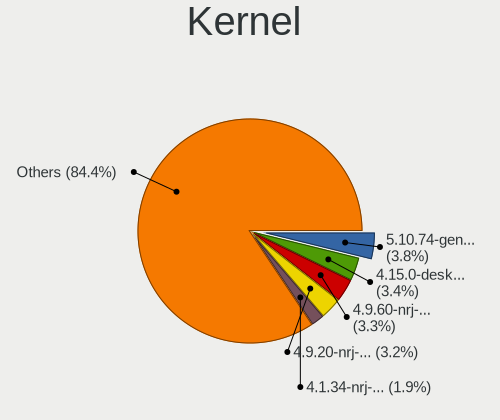
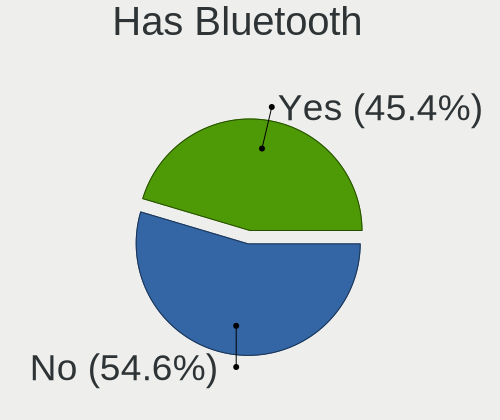
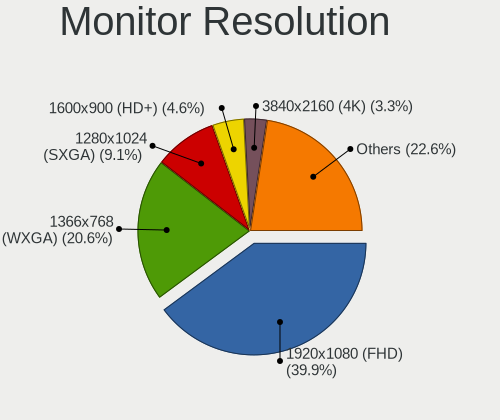
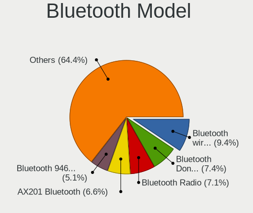
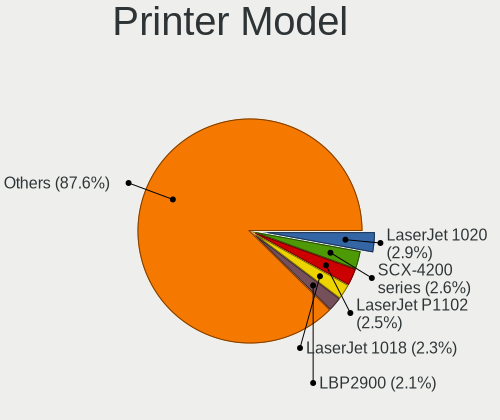

Linux in Russia - Tested Hardware & Statistics
----------------------------------------------

A project to collect tested hardware configurations for Linux in Russia.

Anyone can contribute to this report by the [hw-probe](https://github.com/linuxhw/hw-probe) tool:

    sudo -E hw-probe -all -upload

Please contribute! Especially if your hardware is rare.

This is a report for all computer types. See also reports for [desktops](/Location/Russia/Desktop/README.md) and [notebooks](/Location/Russia/Notebook/README.md).

Contents
--------

* [ Test Cases ](#test-cases)

* [ System ](#system)
  - [ OS                       ](#os)
  - [ OS Family                ](#os-family)
  - [ Kernel                   ](#kernel)
  - [ Kernel Family            ](#kernel-family)
  - [ Kernel Major Ver.        ](#kernel-major-ver)
  - [ Arch                     ](#arch)
  - [ DE                       ](#de)
  - [ Display Server           ](#display-server)
  - [ Display Manager          ](#display-manager)
  - [ OS Lang                  ](#os-lang)
  - [ Boot Mode                ](#boot-mode)
  - [ Filesystem               ](#filesystem)
  - [ Part. scheme             ](#part-scheme)
  - [ Dual Boot with Linux/BSD ](#dual-boot-with-linuxbsd)
  - [ Dual Boot (Win)          ](#dual-boot-win)

* [ Board ](#board)
  - [ Vendor                   ](#vendor)
  - [ Model                    ](#model)
  - [ Model Family             ](#model-family)
  - [ MFG Year                 ](#mfg-year)
  - [ Form Factor              ](#form-factor)
  - [ Secure Boot              ](#secure-boot)
  - [ Coreboot                 ](#coreboot)
  - [ RAM Size                 ](#ram-size)
  - [ RAM Used                 ](#ram-used)
  - [ Total Drives             ](#total-drives)
  - [ Has CD-ROM               ](#has-cd-rom)
  - [ Has Ethernet             ](#has-ethernet)
  - [ Has WiFi                 ](#has-wifi)
  - [ Has Bluetooth            ](#has-bluetooth)

* [ Location ](#location)
  - [ Country                  ](#country)
  - [ City                     ](#city)

* [ Drives ](#drives)
  - [ Drive Vendor             ](#drive-vendor)
  - [ Drive Model              ](#drive-model)
  - [ HDD Vendor               ](#hdd-vendor)
  - [ SSD Vendor               ](#ssd-vendor)
  - [ Drive Kind               ](#drive-kind)
  - [ Drive Connector          ](#drive-connector)
  - [ Drive Size               ](#drive-size)
  - [ Space Total              ](#space-total)
  - [ Space Used               ](#space-used)
  - [ Malfunc. Drives          ](#malfunc-drives)
  - [ Malfunc. Drive Vendor    ](#malfunc-drive-vendor)
  - [ Malfunc. HDD Vendor      ](#malfunc-hdd-vendor)
  - [ Malfunc. Drive Kind      ](#malfunc-drive-kind)
  - [ Failed Drives            ](#failed-drives)
  - [ Failed Drive Vendor      ](#failed-drive-vendor)
  - [ Drive Status             ](#drive-status)

* [ Storage controller ](#storage-controller)
  - [ Storage Vendor           ](#storage-vendor)
  - [ Storage Model            ](#storage-model)
  - [ Storage Kind             ](#storage-kind)

* [ Processor ](#processor)
  - [ CPU Vendor               ](#cpu-vendor)
  - [ CPU Model                ](#cpu-model)
  - [ CPU Model Family         ](#cpu-model-family)
  - [ CPU Cores                ](#cpu-cores)
  - [ CPU Sockets              ](#cpu-sockets)
  - [ CPU Threads              ](#cpu-threads)
  - [ CPU Op-Modes             ](#cpu-op-modes)
  - [ CPU Microcode            ](#cpu-microcode)
  - [ CPU Microarch            ](#cpu-microarch)

* [ Graphics ](#graphics)
  - [ GPU Vendor               ](#gpu-vendor)
  - [ GPU Model                ](#gpu-model)
  - [ GPU Combo                ](#gpu-combo)
  - [ GPU Driver               ](#gpu-driver)
  - [ GPU Memory               ](#gpu-memory)

* [ Monitor ](#monitor)
  - [ Monitor Vendor           ](#monitor-vendor)
  - [ Monitor Model            ](#monitor-model)
  - [ Monitor Resolution       ](#monitor-resolution)
  - [ Monitor Diagonal         ](#monitor-diagonal)
  - [ Monitor Width            ](#monitor-width)
  - [ Aspect Ratio             ](#aspect-ratio)
  - [ Monitor Area             ](#monitor-area)
  - [ Pixel Density            ](#pixel-density)
  - [ Multiple Monitors        ](#multiple-monitors)

* [ Network ](#network)
  - [ Net Controller Vendor    ](#net-controller-vendor)
  - [ Net Controller Model     ](#net-controller-model)
  - [ Wireless Vendor          ](#wireless-vendor)
  - [ Wireless Model           ](#wireless-model)
  - [ Ethernet Vendor          ](#ethernet-vendor)
  - [ Ethernet Model           ](#ethernet-model)
  - [ Net Controller Kind      ](#net-controller-kind)
  - [ Used Controller          ](#used-controller)
  - [ NICs                     ](#nics)
  - [ IPv6                     ](#ipv6)

* [ Bluetooth ](#bluetooth)
  - [ Bluetooth Vendor         ](#bluetooth-vendor)
  - [ Bluetooth Model          ](#bluetooth-model)

* [ Sound ](#sound)
  - [ Sound Vendor             ](#sound-vendor)
  - [ Sound Model              ](#sound-model)

* [ Memory ](#memory)
  - [ Memory Vendor            ](#memory-vendor)
  - [ Memory Model             ](#memory-model)
  - [ Memory Kind              ](#memory-kind)
  - [ Memory Form Factor       ](#memory-form-factor)
  - [ Memory Size              ](#memory-size)
  - [ Memory Speed             ](#memory-speed)

* [ Printers & scanners ](#printers--scanners)
  - [ Printer Vendor           ](#printer-vendor)
  - [ Printer Model            ](#printer-model)
  - [ Scanner Vendor           ](#scanner-vendor)
  - [ Scanner Model            ](#scanner-model)

* [ Camera ](#camera)
  - [ Camera Vendor            ](#camera-vendor)
  - [ Camera Model             ](#camera-model)

* [ Security ](#security)
  - [ Fingerprint Vendor       ](#fingerprint-vendor)
  - [ Fingerprint Model        ](#fingerprint-model)
  - [ Chipcard Vendor          ](#chipcard-vendor)
  - [ Chipcard Model           ](#chipcard-model)

* [ Unsupported ](#unsupported)
  - [ Unsupported Devices      ](#unsupported-devices)
  - [ Unsupported Device Types ](#unsupported-device-types)

Test Cases
----------

Total: 32978

| Vendor        | Model                       | Form-Factor | Probe                                                      | Date         |
|---------------|-----------------------------|-------------|------------------------------------------------------------|--------------|
| ASUSTek       | TUF Gaming Z490-PLUS        | Desktop     | [3a8803f198](https://linux-hardware.org/?probe=3a8803f198) | Sep 01, 2022 |
| ASRock        | 990FX Extreme3              | Desktop     | [1e75cefa31](https://linux-hardware.org/?probe=1e75cefa31) | Sep 01, 2022 |
| Packard Be... | DOT S                       | Notebook    | [b5b03f1cf7](https://linux-hardware.org/?probe=b5b03f1cf7) | Sep 01, 2022 |
| Acer          | Aspire 5742G                | Notebook    | [1ed15181cb](https://linux-hardware.org/?probe=1ed15181cb) | Sep 01, 2022 |
| Lenovo        | B570e HuronRiver Platfor... | Notebook    | [23e052db95](https://linux-hardware.org/?probe=23e052db95) | Sep 01, 2022 |
| ASUSTek       | P8Z77-V LE PLUS             | Desktop     | [0f7d76d65c](https://linux-hardware.org/?probe=0f7d76d65c) | Sep 01, 2022 |
| HP            | Pavilion dv6                | Notebook    | [25e9e892e7](https://linux-hardware.org/?probe=25e9e892e7) | Sep 01, 2022 |
| Gigabyte      | P55-US3L                    | Desktop     | [93e1829d36](https://linux-hardware.org/?probe=93e1829d36) | Sep 01, 2022 |
| ASUSTek       | PRIME H310M-R R2.0          | Desktop     | [b226dd8bc2](https://linux-hardware.org/?probe=b226dd8bc2) | Sep 01, 2022 |
| ASRock        | N68-VS3 FX                  | Desktop     | [b4c043c208](https://linux-hardware.org/?probe=b4c043c208) | Sep 01, 2022 |
| Gigabyte      | GA-E6010N                   | Desktop     | [8daf2205a5](https://linux-hardware.org/?probe=8daf2205a5) | Sep 01, 2022 |
| ASUSTek       | PRIME B350M-K               | Desktop     | [ae0450c52a](https://linux-hardware.org/?probe=ae0450c52a) | Sep 01, 2022 |
| Notebook      | W65_67SB                    | Notebook    | [38393a5559](https://linux-hardware.org/?probe=38393a5559) | Sep 01, 2022 |
| Lenovo        | IdeaPadFlex 3 11ADA05 82... | Convertible | [b99f4a264b](https://linux-hardware.org/?probe=b99f4a264b) | Sep 01, 2022 |
| ASUSTek       | PRIME H310M-R R2.0          | Desktop     | [c1ba9218de](https://linux-hardware.org/?probe=c1ba9218de) | Sep 01, 2022 |
| Gigabyte      | 970A-DS3P                   | Desktop     | [1bc16dc2be](https://linux-hardware.org/?probe=1bc16dc2be) | Sep 01, 2022 |
| ASRock        | A320M-DVS R4.0              | Desktop     | [c3ca58ba40](https://linux-hardware.org/?probe=c3ca58ba40) | Sep 01, 2022 |
| Lenovo        | IdeaPad 330-15AST 81D6      | Notebook    | [972c4cb608](https://linux-hardware.org/?probe=972c4cb608) | Sep 01, 2022 |
| ASUSTek       | VivoBook 15_ASUS Laptop ... | Notebook    | [57d535de2e](https://linux-hardware.org/?probe=57d535de2e) | Sep 01, 2022 |
| Lenovo        | IdeaPad 320-15IAP 80XR      | Notebook    | [6aba706c0c](https://linux-hardware.org/?probe=6aba706c0c) | Aug 31, 2022 |
| Lenovo        | G710 20252                  | Notebook    | [37b1f6e81c](https://linux-hardware.org/?probe=37b1f6e81c) | Aug 31, 2022 |
| ASUSTek       | P8H61-MX                    | Desktop     | [52e7588080](https://linux-hardware.org/?probe=52e7588080) | Aug 31, 2022 |
| ASUSTek       | K46CM                       | Notebook    | [742d7047ea](https://linux-hardware.org/?probe=742d7047ea) | Aug 31, 2022 |
| ASUSTek       | Zenbook UX535QE_UM535QE     | Notebook    | [0c62d097f0](https://linux-hardware.org/?probe=0c62d097f0) | Aug 31, 2022 |
| Intel         | X99                         | Desktop     | [8f4cdd5290](https://linux-hardware.org/?probe=8f4cdd5290) | Aug 31, 2022 |
| ASUSTek       | Zenbook UX535QE_UM535QE     | Notebook    | [7931f65300](https://linux-hardware.org/?probe=7931f65300) | Aug 31, 2022 |
| Gigabyte      | H55M-UD2H                   | Desktop     | [1a72b89675](https://linux-hardware.org/?probe=1a72b89675) | Aug 31, 2022 |
| Gigabyte      | B75M-D3H                    | Desktop     | [0146e0f5c8](https://linux-hardware.org/?probe=0146e0f5c8) | Aug 31, 2022 |
| Gigabyte      | M68MT-S2                    | Desktop     | [29b9669488](https://linux-hardware.org/?probe=29b9669488) | Aug 31, 2022 |
| ASUSTek       | M2A-VM HDMI                 | Desktop     | [9d9462f5a9](https://linux-hardware.org/?probe=9d9462f5a9) | Aug 31, 2022 |
| MSI           | H510M-A PRO                 | Desktop     | [120400698e](https://linux-hardware.org/?probe=120400698e) | Aug 31, 2022 |
| ASUSTek       | VivoBook_ASUS Laptop E51... | Notebook    | [b895a2ae7c](https://linux-hardware.org/?probe=b895a2ae7c) | Aug 31, 2022 |
| Lenovo        | ThinkPad X1 Carbon Gen 8... | Notebook    | [646afc5f72](https://linux-hardware.org/?probe=646afc5f72) | Aug 31, 2022 |
| Lenovo        | IdeaPad 330-15AST 81D6      | Notebook    | [f3877acbd2](https://linux-hardware.org/?probe=f3877acbd2) | Aug 31, 2022 |
| ASUSTek       | VivoBook_ASUSLaptop X512... | Notebook    | [3d7c0ee13d](https://linux-hardware.org/?probe=3d7c0ee13d) | Aug 30, 2022 |
| ASUSTek       | VivoBook 15_ASUS Laptop ... | Notebook    | [9da97f5dea](https://linux-hardware.org/?probe=9da97f5dea) | Aug 30, 2022 |
| Lenovo        | ThinkPad Helix 2nd 20CHS... | Tablet      | [d2d55164f0](https://linux-hardware.org/?probe=d2d55164f0) | Aug 30, 2022 |
| ASUSTek       | TUF Gaming X570-PLUS        | Desktop     | [858b04d480](https://linux-hardware.org/?probe=858b04d480) | Aug 30, 2022 |
| ASRock        | B550M-HDV                   | Desktop     | [61f310f2a2](https://linux-hardware.org/?probe=61f310f2a2) | Aug 30, 2022 |
| iRU           | J231                        | All in one  | [7a81465010](https://linux-hardware.org/?probe=7a81465010) | Aug 30, 2022 |
| Lenovo        | Y520-15IKBN 80WK            | Notebook    | [8036c3df64](https://linux-hardware.org/?probe=8036c3df64) | Aug 30, 2022 |
| Gigabyte      | M68MT-S2                    | Desktop     | [16b07a7497](https://linux-hardware.org/?probe=16b07a7497) | Aug 30, 2022 |
| Gigabyte      | B550M S2H                   | Desktop     | [73a8574652](https://linux-hardware.org/?probe=73a8574652) | Aug 30, 2022 |
| ASUSTek       | P5G41-M LX                  | Desktop     | [ecf64e8d47](https://linux-hardware.org/?probe=ecf64e8d47) | Aug 30, 2022 |
| Supermicro    | X11SSL-F                    | Server      | [2de30f0154](https://linux-hardware.org/?probe=2de30f0154) | Aug 30, 2022 |
| ASUSTek       | P5G41-M LX                  | Desktop     | [b7e2198026](https://linux-hardware.org/?probe=b7e2198026) | Aug 30, 2022 |
| Supermicro    | X11SSL-F                    | Server      | [252e3549cd](https://linux-hardware.org/?probe=252e3549cd) | Aug 30, 2022 |
| Supermicro    | X11SSL-F                    | Server      | [b10d7755ee](https://linux-hardware.org/?probe=b10d7755ee) | Aug 30, 2022 |
| Supermicro    | X11SSL-F                    | Server      | [3f8bec5c1b](https://linux-hardware.org/?probe=3f8bec5c1b) | Aug 30, 2022 |
| HP            | Laptop 17-cp0xxx            | Notebook    | [62c06b8d9c](https://linux-hardware.org/?probe=62c06b8d9c) | Aug 30, 2022 |
| Raspberry ... | Raspberry Pi Compute Mod... | Soc         | [475f3981cd](https://linux-hardware.org/?probe=475f3981cd) | Aug 30, 2022 |
| ASUSTek       | PRIME H310M-R R2.0          | Desktop     | [9d3e935355](https://linux-hardware.org/?probe=9d3e935355) | Aug 30, 2022 |
| Dell          | G3 3579                     | Notebook    | [fd78a1cf65](https://linux-hardware.org/?probe=fd78a1cf65) | Aug 30, 2022 |
| Supermicro    | X11SSM-F                    | Server      | [f715802815](https://linux-hardware.org/?probe=f715802815) | Aug 30, 2022 |
| Supermicro    | X11SSM-F                    | Server      | [a43842b263](https://linux-hardware.org/?probe=a43842b263) | Aug 30, 2022 |
| ASUSTek       | PRIME H310M-R R2.0          | Desktop     | [28f3abde34](https://linux-hardware.org/?probe=28f3abde34) | Aug 30, 2022 |
| Packard Be... | EasyNote LM85               | Notebook    | [4294f9bdaf](https://linux-hardware.org/?probe=4294f9bdaf) | Aug 30, 2022 |
| Gigabyte      | M68MT-S2                    | Desktop     | [cfd6369e5a](https://linux-hardware.org/?probe=cfd6369e5a) | Aug 30, 2022 |
| MACHINIST     | X99-RS9 V2.0                | Desktop     | [d972083fa3](https://linux-hardware.org/?probe=d972083fa3) | Aug 30, 2022 |
| Unknown       | Unknown                     | Desktop     | [3f51be2653](https://linux-hardware.org/?probe=3f51be2653) | Aug 30, 2022 |
| HUAWEI        | NBD-WXX9                    | Notebook    | [899d0fc360](https://linux-hardware.org/?probe=899d0fc360) | Aug 30, 2022 |
| ASUSTek       | Zenbook UX535QE_UM535QE     | Notebook    | [ca01260ab8](https://linux-hardware.org/?probe=ca01260ab8) | Aug 30, 2022 |
| ASUSTek       | VivoBook_ASUS Laptop E51... | Notebook    | [a2940c76f5](https://linux-hardware.org/?probe=a2940c76f5) | Aug 30, 2022 |
| Lenovo        | IdeaPad 330-15IKB 81DE      | Notebook    | [339b12ba13](https://linux-hardware.org/?probe=339b12ba13) | Aug 30, 2022 |
| HP            | 250 G7 Notebook PC          | Notebook    | [96a56c7cb9](https://linux-hardware.org/?probe=96a56c7cb9) | Aug 30, 2022 |
| Lenovo        | IdeaPad 330-15AST 81D6      | Notebook    | [3236ef3b00](https://linux-hardware.org/?probe=3236ef3b00) | Aug 30, 2022 |
| Acer          | Aspire V3-731               | Notebook    | [19d7285e0f](https://linux-hardware.org/?probe=19d7285e0f) | Aug 30, 2022 |
| Google        | Rammus                      | Notebook    | [cd31fc11aa](https://linux-hardware.org/?probe=cd31fc11aa) | Aug 29, 2022 |
| Raspberry ... | Raspberry Pi Compute Mod... | Soc         | [8665be15ec](https://linux-hardware.org/?probe=8665be15ec) | Aug 29, 2022 |
| Intel         | D525MWV AAE93081-401        | Desktop     | [985d906899](https://linux-hardware.org/?probe=985d906899) | Aug 29, 2022 |
| Sony          | VPCSB1V9R                   | Notebook    | [b54e74887f](https://linux-hardware.org/?probe=b54e74887f) | Aug 29, 2022 |
| HP            | Pavilion g6                 | Notebook    | [d127560ff3](https://linux-hardware.org/?probe=d127560ff3) | Aug 29, 2022 |
| ASUSTek       | Zenbook UX535QE_UM535QE     | Notebook    | [ddc175428b](https://linux-hardware.org/?probe=ddc175428b) | Aug 29, 2022 |
| Gigabyte      | B450 AORUS ELITE            | Desktop     | [a37d7cae28](https://linux-hardware.org/?probe=a37d7cae28) | Aug 29, 2022 |
| Gigabyte      | B550M S2H                   | Desktop     | [ac1d1ffdba](https://linux-hardware.org/?probe=ac1d1ffdba) | Aug 29, 2022 |
| Dell          | Latitude E5440              | Notebook    | [b0d92d186f](https://linux-hardware.org/?probe=b0d92d186f) | Aug 29, 2022 |
| ASUSTek       | X550LC                      | Notebook    | [3507f6f2ba](https://linux-hardware.org/?probe=3507f6f2ba) | Aug 29, 2022 |
| ASRock        | A320M-DVS R4.0              | Desktop     | [5140e742a9](https://linux-hardware.org/?probe=5140e742a9) | Aug 29, 2022 |
| Dell          | Vostro 1014                 | Notebook    | [bf43d87a11](https://linux-hardware.org/?probe=bf43d87a11) | Aug 29, 2022 |
| MSI           | B560M-A PRO                 | Desktop     | [a550031b1d](https://linux-hardware.org/?probe=a550031b1d) | Aug 28, 2022 |
| Gigabyte      | GA-870A-UD3                 | Desktop     | [809a84e36c](https://linux-hardware.org/?probe=809a84e36c) | Aug 28, 2022 |
| Gigabyte      | Z170-HD3P-CF                | Desktop     | [3ca98fc058](https://linux-hardware.org/?probe=3ca98fc058) | Aug 28, 2022 |
| Gigabyte      | GA-870A-UD3                 | Desktop     | [d037b5e961](https://linux-hardware.org/?probe=d037b5e961) | Aug 28, 2022 |
| ASRock        | 990FX Extreme3              | Desktop     | [ec517dabad](https://linux-hardware.org/?probe=ec517dabad) | Aug 28, 2022 |
| ASUSTek       | X542UA                      | Notebook    | [0bf776cdc1](https://linux-hardware.org/?probe=0bf776cdc1) | Aug 28, 2022 |
| Samsung       | R580/R590                   | Notebook    | [cb30537ee4](https://linux-hardware.org/?probe=cb30537ee4) | Aug 28, 2022 |
| Acer          | Nitro AN515-42              | Notebook    | [a82d7c03b0](https://linux-hardware.org/?probe=a82d7c03b0) | Aug 28, 2022 |
| Lenovo        | Legion 5 Pro 16ACH6H 82J... | Notebook    | [6cd83991d9](https://linux-hardware.org/?probe=6cd83991d9) | Aug 28, 2022 |
| MSI           | B360M PRO-VD                | Desktop     | [b5c030133e](https://linux-hardware.org/?probe=b5c030133e) | Aug 28, 2022 |
| ASUSTek       | P7P55D                      | Desktop     | [4476755d78](https://linux-hardware.org/?probe=4476755d78) | Aug 28, 2022 |
| HP            | Pavilion g6                 | Notebook    | [709d3e19e8](https://linux-hardware.org/?probe=709d3e19e8) | Aug 28, 2022 |
| HP            | Pavilion Laptop 14-ec0xx... | Notebook    | [04aec7a28a](https://linux-hardware.org/?probe=04aec7a28a) | Aug 28, 2022 |
| KupiDesheg... | Intel X79 lga 2011          | Desktop     | [92f097526f](https://linux-hardware.org/?probe=92f097526f) | Aug 28, 2022 |
| Acer          | Aspire E5-573G              | Notebook    | [70ea653c9c](https://linux-hardware.org/?probe=70ea653c9c) | Aug 28, 2022 |
| Lenovo        | ThinkBook 13s-IWL 20R9      | Notebook    | [98bb5817f6](https://linux-hardware.org/?probe=98bb5817f6) | Aug 27, 2022 |
| HP            | Laptop 15-bw0xx             | Notebook    | [90fa9c15ec](https://linux-hardware.org/?probe=90fa9c15ec) | Aug 27, 2022 |
| Lenovo        | V14-ADA 82C6                | Notebook    | [1d3dfbba56](https://linux-hardware.org/?probe=1d3dfbba56) | Aug 27, 2022 |
| ASRock        | B550M Pro4                  | Desktop     | [8c6b85a46c](https://linux-hardware.org/?probe=8c6b85a46c) | Aug 27, 2022 |
| Dell          | 0RY007                      | Desktop     | [8ff65ac056](https://linux-hardware.org/?probe=8ff65ac056) | Aug 27, 2022 |
| ASUSTek       | PRIME A320M-A               | Desktop     | [517c813c17](https://linux-hardware.org/?probe=517c813c17) | Aug 27, 2022 |
| Gigabyte      | GA-MA78LMT-S2               | Desktop     | [a18db0fafd](https://linux-hardware.org/?probe=a18db0fafd) | Aug 27, 2022 |
| Gigabyte      | GA-E6010N                   | Desktop     | [5a180519a2](https://linux-hardware.org/?probe=5a180519a2) | Aug 27, 2022 |
| Acer          | Aspire V3-571G              | Notebook    | [e584bee2db](https://linux-hardware.org/?probe=e584bee2db) | Aug 27, 2022 |
| Lenovo        | V14-ADA 82C6                | Notebook    | [46741f4613](https://linux-hardware.org/?probe=46741f4613) | Aug 27, 2022 |
| Lenovo        | IdeaPad 330-15IGM 81D1      | Notebook    | [029246a642](https://linux-hardware.org/?probe=029246a642) | Aug 27, 2022 |
| ASRock        | B560 Steel Legend           | Desktop     | [c64907de8d](https://linux-hardware.org/?probe=c64907de8d) | Aug 27, 2022 |
| ASRock        | A320M-HDV R4.0              | Desktop     | [67712f11d9](https://linux-hardware.org/?probe=67712f11d9) | Aug 27, 2022 |
| Gigabyte      | H77N-WIFI                   | Desktop     | [458442867e](https://linux-hardware.org/?probe=458442867e) | Aug 27, 2022 |
| Lenovo        | G50-45 80E3                 | Notebook    | [be9921e0e0](https://linux-hardware.org/?probe=be9921e0e0) | Aug 27, 2022 |
| ASUSTek       | Z170 PRO GAMING             | Desktop     | [e0fedafd62](https://linux-hardware.org/?probe=e0fedafd62) | Aug 27, 2022 |
| ASUSTek       | M5A97 EVO R2.0              | Desktop     | [0d6eddc581](https://linux-hardware.org/?probe=0d6eddc581) | Aug 27, 2022 |
| ASRock        | N68-GS4 FX                  | Desktop     | [cec8fd2c2a](https://linux-hardware.org/?probe=cec8fd2c2a) | Aug 27, 2022 |
| ASUSTek       | M5A78L-M PLUS/USB3          | Desktop     | [d745245f37](https://linux-hardware.org/?probe=d745245f37) | Aug 27, 2022 |
| Acer          | Nitro AN515-42              | Notebook    | [063eca4290](https://linux-hardware.org/?probe=063eca4290) | Aug 26, 2022 |
| Intel         | X99                         | Desktop     | [4acddafcc3](https://linux-hardware.org/?probe=4acddafcc3) | Aug 26, 2022 |
| MSI           | G31TM-P21                   | Desktop     | [cf0bc232f5](https://linux-hardware.org/?probe=cf0bc232f5) | Aug 26, 2022 |
| ASUSTek       | P5KPL-AM IN/ROEM/SI         | Desktop     | [8ca59c4893](https://linux-hardware.org/?probe=8ca59c4893) | Aug 26, 2022 |
| ASRock        | B560 Steel Legend           | Desktop     | [55ebdff357](https://linux-hardware.org/?probe=55ebdff357) | Aug 26, 2022 |
| Acer          | Nitro AN517-52              | Notebook    | [8732c0caef](https://linux-hardware.org/?probe=8732c0caef) | Aug 26, 2022 |
| DEPO Compu... | DPC156                      | Notebook    | [7c97a519fe](https://linux-hardware.org/?probe=7c97a519fe) | Aug 26, 2022 |
| MSI           | 760GM-P21                   | Desktop     | [7e45cde899](https://linux-hardware.org/?probe=7e45cde899) | Aug 26, 2022 |
| ASUSTek       | K52Dr                       | Notebook    | [aa74e72258](https://linux-hardware.org/?probe=aa74e72258) | Aug 26, 2022 |
| Gigabyte      | B250M-DS3H-CF               | Desktop     | [5d4e41a441](https://linux-hardware.org/?probe=5d4e41a441) | Aug 26, 2022 |
| Dell          | Latitude 5175               | Tablet      | [c751321ab1](https://linux-hardware.org/?probe=c751321ab1) | Aug 26, 2022 |
| ASUSTek       | P5QL-E                      | Desktop     | [f1c16cf6e7](https://linux-hardware.org/?probe=f1c16cf6e7) | Aug 26, 2022 |
| ASUSTek       | P5QL-E                      | Desktop     | [e69218ea58](https://linux-hardware.org/?probe=e69218ea58) | Aug 26, 2022 |
| Gigabyte      | B450 AORUS ELITE            | Desktop     | [bb51a9a03b](https://linux-hardware.org/?probe=bb51a9a03b) | Aug 26, 2022 |
| Lenovo        | IdeaPad 330-15IKB 81DE      | Notebook    | [619be9ede9](https://linux-hardware.org/?probe=619be9ede9) | Aug 26, 2022 |
| HP            | ENVY m7                     | Notebook    | [cf21038fd7](https://linux-hardware.org/?probe=cf21038fd7) | Aug 26, 2022 |
| ASUSTek       | X540LJ                      | Notebook    | [edac754e93](https://linux-hardware.org/?probe=edac754e93) | Aug 25, 2022 |
| Dell          | 0D4MD1 A02                  | Desktop     | [7a06622253](https://linux-hardware.org/?probe=7a06622253) | Aug 25, 2022 |
| Google        | Kip                         | Notebook    | [1283f3d283](https://linux-hardware.org/?probe=1283f3d283) | Aug 25, 2022 |
| HUAWEI        | BOM-WXX9                    | Notebook    | [06ba6b75b4](https://linux-hardware.org/?probe=06ba6b75b4) | Aug 25, 2022 |
| ASUSTek       | P8H67-M LE                  | Desktop     | [7bf3626764](https://linux-hardware.org/?probe=7bf3626764) | Aug 25, 2022 |
| Gigabyte      | Z170X-Gaming 3              | Desktop     | [d1ca2bc878](https://linux-hardware.org/?probe=d1ca2bc878) | Aug 25, 2022 |
| Unknown       | Unknown                     | Notebook    | [b9616ab32f](https://linux-hardware.org/?probe=b9616ab32f) | Aug 25, 2022 |
| Raspberry ... | Raspberry Pi Compute Mod... | Soc         | [a6aaf03cfe](https://linux-hardware.org/?probe=a6aaf03cfe) | Aug 25, 2022 |
| Dell          | 0RY007                      | Desktop     | [8dece84856](https://linux-hardware.org/?probe=8dece84856) | Aug 25, 2022 |
| Unknown       | Unknown                     | Notebook    | [3c18cd9208](https://linux-hardware.org/?probe=3c18cd9208) | Aug 25, 2022 |
| Lenovo        | G460 20041                  | Notebook    | [ac9bf296d8](https://linux-hardware.org/?probe=ac9bf296d8) | Aug 25, 2022 |
| Acer          | AO533                       | Notebook    | [5150a8b326](https://linux-hardware.org/?probe=5150a8b326) | Aug 25, 2022 |
| HP            | Victus by Laptop 16-e0xx... | Notebook    | [2b52864870](https://linux-hardware.org/?probe=2b52864870) | Aug 25, 2022 |
| HP            | Pavilion 17                 | Notebook    | [e252f6b16e](https://linux-hardware.org/?probe=e252f6b16e) | Aug 25, 2022 |
| Gigabyte      | Z170X-Gaming 3              | Desktop     | [8cb82a76c6](https://linux-hardware.org/?probe=8cb82a76c6) | Aug 25, 2022 |
| Gigabyte      | Z170X-Gaming 3              | Desktop     | [faf428d3aa](https://linux-hardware.org/?probe=faf428d3aa) | Aug 25, 2022 |
| HP            | Pavilion dv6                | Notebook    | [7fd7791035](https://linux-hardware.org/?probe=7fd7791035) | Aug 24, 2022 |
| ASRock        | Z87 Extreme4                | Desktop     | [c1c23ef82f](https://linux-hardware.org/?probe=c1c23ef82f) | Aug 24, 2022 |
| ASUSTek       | ROG Strix G513QY_G513QY     | Notebook    | [9e3b6f2140](https://linux-hardware.org/?probe=9e3b6f2140) | Aug 24, 2022 |
| ASUSTek       | ROG Strix G513QY_G513QY     | Notebook    | [15960dc164](https://linux-hardware.org/?probe=15960dc164) | Aug 24, 2022 |
| 3Logic Gro... | APM Graviton                | Notebook    | [03fd96a27c](https://linux-hardware.org/?probe=03fd96a27c) | Aug 24, 2022 |
| HP            | Pavilion g6                 | Notebook    | [4c027aa104](https://linux-hardware.org/?probe=4c027aa104) | Aug 24, 2022 |
| Raspberry ... | Raspberry Pi Compute Mod... | Soc         | [6f1c64ae10](https://linux-hardware.org/?probe=6f1c64ae10) | Aug 24, 2022 |
| ASUSTek       | ROG Flow X13 GV301QE_GV3... | Notebook    | [b008775e13](https://linux-hardware.org/?probe=b008775e13) | Aug 24, 2022 |
| ASUSTek       | PRIME H310M-E R2.0          | Desktop     | [bc06f151fa](https://linux-hardware.org/?probe=bc06f151fa) | Aug 24, 2022 |
| IP3 Tech      | TGLUP3                      | Notebook    | [a4f803f8a1](https://linux-hardware.org/?probe=a4f803f8a1) | Aug 24, 2022 |
| Samsung       | NC210/NC110                 | Notebook    | [8063d3ecff](https://linux-hardware.org/?probe=8063d3ecff) | Aug 24, 2022 |
| Lenovo        | IdeaPad Gaming 3 15IMH05... | Notebook    | [37c239f9d1](https://linux-hardware.org/?probe=37c239f9d1) | Aug 24, 2022 |
| HUAWEI        | BOD-WXX9                    | Notebook    | [fd6ff49314](https://linux-hardware.org/?probe=fd6ff49314) | Aug 24, 2022 |
| HP            | Laptop 15s-eq1xxx           | Notebook    | [a37633e1e2](https://linux-hardware.org/?probe=a37633e1e2) | Aug 24, 2022 |
| HP            | Pavilion g6                 | Notebook    | [96672b6762](https://linux-hardware.org/?probe=96672b6762) | Aug 24, 2022 |
| HP            | Laptop 15s-fq2xxx           | Notebook    | [3c37e04cf3](https://linux-hardware.org/?probe=3c37e04cf3) | Aug 24, 2022 |
| HUAWEI        | KLVD-WXX9                   | Notebook    | [b5dea99797](https://linux-hardware.org/?probe=b5dea99797) | Aug 24, 2022 |
| HP            | Laptop 15s-fq2xxx           | Notebook    | [f8213e35a4](https://linux-hardware.org/?probe=f8213e35a4) | Aug 24, 2022 |
| Dell          | 0D4MD1 A02                  | Desktop     | [b634bcdfa9](https://linux-hardware.org/?probe=b634bcdfa9) | Aug 24, 2022 |
| Lenovo        | IdeaPad 5 Pro 14ACN6 82L... | Notebook    | [eed44ba087](https://linux-hardware.org/?probe=eed44ba087) | Aug 24, 2022 |
| ASUSTek       | X751LD                      | Notebook    | [7ce95dab0a](https://linux-hardware.org/?probe=7ce95dab0a) | Aug 24, 2022 |
| ASUSTek       | TUF B450-PRO GAMING         | Desktop     | [e3d3a359b5](https://linux-hardware.org/?probe=e3d3a359b5) | Aug 24, 2022 |
| Huanan        | X99-F8D V2.4                | Desktop     | [11cfa7a502](https://linux-hardware.org/?probe=11cfa7a502) | Aug 24, 2022 |
| Gigabyte      | GA-MA770T-UD3               | Desktop     | [4ed5107048](https://linux-hardware.org/?probe=4ed5107048) | Aug 24, 2022 |
| ASUSTek       | Z170-A                      | Desktop     | [d3c0ea0334](https://linux-hardware.org/?probe=d3c0ea0334) | Aug 23, 2022 |
| ASUSTek       | Z170-A                      | Desktop     | [257425efde](https://linux-hardware.org/?probe=257425efde) | Aug 23, 2022 |
| ASUSTek       | P8B75-M LX PLUS             | Desktop     | [9f66ff50d5](https://linux-hardware.org/?probe=9f66ff50d5) | Aug 23, 2022 |
| ASUSTek       | TUF Gaming B550M-PLUS       | Desktop     | [a8eb4233e8](https://linux-hardware.org/?probe=a8eb4233e8) | Aug 23, 2022 |
| MSI           | Z390-A PRO                  | Desktop     | [f48d5a0a1c](https://linux-hardware.org/?probe=f48d5a0a1c) | Aug 23, 2022 |
| Gigabyte      | B550M S2H                   | Desktop     | [8b5fe2494e](https://linux-hardware.org/?probe=8b5fe2494e) | Aug 23, 2022 |
| Dell          | 0T1D10 A01                  | Desktop     | [c67ce079c7](https://linux-hardware.org/?probe=c67ce079c7) | Aug 23, 2022 |
| Aquarius      | AQH310CM                    | Desktop     | [5e7e2820f4](https://linux-hardware.org/?probe=5e7e2820f4) | Aug 23, 2022 |
| Lenovo        | IdeaPad L340-15API 81LW     | Notebook    | [17761aa8e3](https://linux-hardware.org/?probe=17761aa8e3) | Aug 23, 2022 |
| ASUSTek       | TUF X470-PLUS GAMING        | Desktop     | [ef940d86f4](https://linux-hardware.org/?probe=ef940d86f4) | Aug 23, 2022 |
| Gigabyte      | Z170-HD3P-CF                | Desktop     | [5a6911f8d2](https://linux-hardware.org/?probe=5a6911f8d2) | Aug 23, 2022 |
| Soyo          | SY-Classic B660M            | Desktop     | [7a2731c6bb](https://linux-hardware.org/?probe=7a2731c6bb) | Aug 23, 2022 |
| Soyo          | SY-Classic B660M            | Desktop     | [dcb41473bd](https://linux-hardware.org/?probe=dcb41473bd) | Aug 23, 2022 |
| ASUSTek       | P5QPL-AM                    | Desktop     | [1fdb1ad301](https://linux-hardware.org/?probe=1fdb1ad301) | Aug 23, 2022 |
| Lenovo        | B570e HuronRiver Platfor... | Notebook    | [0c5ed030a3](https://linux-hardware.org/?probe=0c5ed030a3) | Aug 23, 2022 |
| Gigabyte      | AB350M-DS3H-CF              | Desktop     | [f1947c5f8a](https://linux-hardware.org/?probe=f1947c5f8a) | Aug 23, 2022 |
| ASRock        | N68-GS4 FX                  | Desktop     | [026abd6a11](https://linux-hardware.org/?probe=026abd6a11) | Aug 23, 2022 |
| Gigabyte      | A320M-H-CF                  | Desktop     | [70d138aa2e](https://linux-hardware.org/?probe=70d138aa2e) | Aug 23, 2022 |
| HP            | EliteBook 820 G3            | Notebook    | [5cb6011138](https://linux-hardware.org/?probe=5cb6011138) | Aug 23, 2022 |
| Gigabyte      | F2A88XM-DS2                 | Desktop     | [6c91036286](https://linux-hardware.org/?probe=6c91036286) | Aug 22, 2022 |
| ASUSTek       | P9X79                       | Desktop     | [e279591136](https://linux-hardware.org/?probe=e279591136) | Aug 22, 2022 |
| HUAWEI        | BOHK-WAX9X                  | Notebook    | [c2f58df994](https://linux-hardware.org/?probe=c2f58df994) | Aug 22, 2022 |
| ASUSTek       | PRIME H310M-E R2.0          | Desktop     | [37af41aa76](https://linux-hardware.org/?probe=37af41aa76) | Aug 22, 2022 |
| Dell          | Latitude 7390               | Notebook    | [0d626db6e1](https://linux-hardware.org/?probe=0d626db6e1) | Aug 22, 2022 |
| Gigabyte      | 970A-DS3                    | Desktop     | [ae71518dcf](https://linux-hardware.org/?probe=ae71518dcf) | Aug 22, 2022 |
| MSI           | H110M PRO-VD                | Desktop     | [7652f87b3a](https://linux-hardware.org/?probe=7652f87b3a) | Aug 22, 2022 |
| MSI           | P41T-C31                    | Desktop     | [f8487b4fdb](https://linux-hardware.org/?probe=f8487b4fdb) | Aug 22, 2022 |
| Unknown       | Unknown                     | Notebook    | [40c763302e](https://linux-hardware.org/?probe=40c763302e) | Aug 22, 2022 |
| ASRock        | B365M Pro4-F                | Desktop     | [3b519201e2](https://linux-hardware.org/?probe=3b519201e2) | Aug 22, 2022 |
| ASUSTek       | VivoBook_ASUSLaptop X760... | Notebook    | [f1fa32b507](https://linux-hardware.org/?probe=f1fa32b507) | Aug 22, 2022 |
| Aquarius      | Cmp NS765                   | Notebook    | [991487a61b](https://linux-hardware.org/?probe=991487a61b) | Aug 22, 2022 |
| HP            | Laptop 17-ca0xxx            | Notebook    | [c956ba84ed](https://linux-hardware.org/?probe=c956ba84ed) | Aug 22, 2022 |
| Acer          | Aspire 5742G                | Notebook    | [546164ada0](https://linux-hardware.org/?probe=546164ada0) | Aug 22, 2022 |
| MSI           | MAG B550M MORTAR            | Desktop     | [441eb14634](https://linux-hardware.org/?probe=441eb14634) | Aug 21, 2022 |
| ASUSTek       | K55DR                       | Notebook    | [3620d3d416](https://linux-hardware.org/?probe=3620d3d416) | Aug 21, 2022 |
| Huanan        | X99 F8D V2.2                | Desktop     | [d12525038d](https://linux-hardware.org/?probe=d12525038d) | Aug 21, 2022 |
| Lenovo        | IdeaPad Gaming 3 15IMH05... | Notebook    | [0d73b91195](https://linux-hardware.org/?probe=0d73b91195) | Aug 21, 2022 |
| Lenovo        | IdeaPad 5 14ARE05 81YM      | Notebook    | [ada7663387](https://linux-hardware.org/?probe=ada7663387) | Aug 21, 2022 |
| Gigabyte      | G41MT-S2P                   | Desktop     | [6d96e92f0d](https://linux-hardware.org/?probe=6d96e92f0d) | Aug 21, 2022 |
| Gigabyte      | G41MT-S2P                   | Desktop     | [e47aa0a7b1](https://linux-hardware.org/?probe=e47aa0a7b1) | Aug 21, 2022 |
| HP            | Pavilion g6                 | Notebook    | [7e345d980f](https://linux-hardware.org/?probe=7e345d980f) | Aug 21, 2022 |
| Foxconn       | G31MX Series                | Desktop     | [a68130c719](https://linux-hardware.org/?probe=a68130c719) | Aug 21, 2022 |
| Acer          | Aspire E1-572G              | Notebook    | [d3d75b83d2](https://linux-hardware.org/?probe=d3d75b83d2) | Aug 21, 2022 |
| Unknown       | Unknown                     | Notebook    | [57d5700736](https://linux-hardware.org/?probe=57d5700736) | Aug 21, 2022 |
| HP            | Pavilion m6                 | Notebook    | [54fcf9b1b4](https://linux-hardware.org/?probe=54fcf9b1b4) | Aug 21, 2022 |
| HUAWEI        | HLY-WX9XX                   | Notebook    | [287788013b](https://linux-hardware.org/?probe=287788013b) | Aug 21, 2022 |
| Dell          | G5 5587                     | Notebook    | [327f035c11](https://linux-hardware.org/?probe=327f035c11) | Aug 21, 2022 |
| ASUSTek       | PRIME H510M-K               | Desktop     | [d52c203fc9](https://linux-hardware.org/?probe=d52c203fc9) | Aug 21, 2022 |
| ECS           | B75H2-M3                    | Desktop     | [c42410be8b](https://linux-hardware.org/?probe=c42410be8b) | Aug 21, 2022 |
| Lenovo        | IdeaPad 320-15IKB 80XL      | Notebook    | [8ab10bdcff](https://linux-hardware.org/?probe=8ab10bdcff) | Aug 21, 2022 |
| ASUSTek       | VM45                        | Desktop     | [7d7b99c7f4](https://linux-hardware.org/?probe=7d7b99c7f4) | Aug 21, 2022 |
| Lenovo        | Legion Y540-15IRH 81SX      | Notebook    | [08d6e2e6e8](https://linux-hardware.org/?probe=08d6e2e6e8) | Aug 21, 2022 |
| HUAWEI        | BOM-WXX9                    | Notebook    | [53f5ad0f1e](https://linux-hardware.org/?probe=53f5ad0f1e) | Aug 20, 2022 |
| ASUSTek       | VivoBook_ASUSLaptop X415... | Notebook    | [342bd47a5a](https://linux-hardware.org/?probe=342bd47a5a) | Aug 20, 2022 |
| HONOR         | NBD-WXX9                    | Notebook    | [1fdf41de8b](https://linux-hardware.org/?probe=1fdf41de8b) | Aug 20, 2022 |
| Acer          | Aspire A315-23              | Notebook    | [cedbeec8c7](https://linux-hardware.org/?probe=cedbeec8c7) | Aug 20, 2022 |
| HP            | ProBook 445 G7              | Notebook    | [898a635cdd](https://linux-hardware.org/?probe=898a635cdd) | Aug 20, 2022 |
| ASUSTek       | A88XM-A                     | Desktop     | [f8900d8840](https://linux-hardware.org/?probe=f8900d8840) | Aug 20, 2022 |
| Gigabyte      | B550M DS3H                  | Desktop     | [fd0604d0fb](https://linux-hardware.org/?probe=fd0604d0fb) | Aug 20, 2022 |
| Gigabyte      | H61M-S1                     | Desktop     | [a558a229d2](https://linux-hardware.org/?probe=a558a229d2) | Aug 20, 2022 |
| HP            | Pavilion g6                 | Notebook    | [8d5375bd39](https://linux-hardware.org/?probe=8d5375bd39) | Aug 20, 2022 |
| HP            | ProBook 445 G7              | Notebook    | [28e67ea5a7](https://linux-hardware.org/?probe=28e67ea5a7) | Aug 20, 2022 |
| Samsung       | 300E4A/300E5A/300E7A        | Notebook    | [c460e1207e](https://linux-hardware.org/?probe=c460e1207e) | Aug 20, 2022 |
| MSI           | Z590-A PRO                  | Desktop     | [8445aa0041](https://linux-hardware.org/?probe=8445aa0041) | Aug 20, 2022 |
| Acer          | Aspire A517-51              | Notebook    | [0cff943f6b](https://linux-hardware.org/?probe=0cff943f6b) | Aug 20, 2022 |
| MSI           | MPG X570 GAMING PRO CARB... | Desktop     | [8b871bcdc8](https://linux-hardware.org/?probe=8b871bcdc8) | Aug 20, 2022 |
| Gigabyte      | Z170-D3H-CF                 | Desktop     | [8b3ca4e7d1](https://linux-hardware.org/?probe=8b3ca4e7d1) | Aug 19, 2022 |
| Lenovo        | IdeaPad Gaming 3 15IMH05... | Notebook    | [0008792e11](https://linux-hardware.org/?probe=0008792e11) | Aug 19, 2022 |
| MSI           | Z390-A PRO                  | Desktop     | [4bb68951b6](https://linux-hardware.org/?probe=4bb68951b6) | Aug 19, 2022 |
| MSI           | B85I                        | Desktop     | [454972a062](https://linux-hardware.org/?probe=454972a062) | Aug 19, 2022 |
| Haier         | GG1560XT                    | Notebook    | [6498de51c5](https://linux-hardware.org/?probe=6498de51c5) | Aug 19, 2022 |
| HP            | 8184 X4                     | Desktop     | [2dcf653d17](https://linux-hardware.org/?probe=2dcf653d17) | Aug 19, 2022 |
| HP            | 8184 X4                     | Desktop     | [080aadafd7](https://linux-hardware.org/?probe=080aadafd7) | Aug 19, 2022 |
| Haier         | GG1560XT                    | Notebook    | [1918cb9aa0](https://linux-hardware.org/?probe=1918cb9aa0) | Aug 19, 2022 |
| ASRock        | B450M-HDV R4.0              | Desktop     | [2f99e182f6](https://linux-hardware.org/?probe=2f99e182f6) | Aug 19, 2022 |
| ASUSTek       | GL703VD                     | Notebook    | [54f9d46a7d](https://linux-hardware.org/?probe=54f9d46a7d) | Aug 19, 2022 |
| Gigabyte      | Z590 UD AC                  | Desktop     | [2709dfd2c3](https://linux-hardware.org/?probe=2709dfd2c3) | Aug 19, 2022 |
| ICL           | N7x0WU                      | Notebook    | [7b9c4ad6b1](https://linux-hardware.org/?probe=7b9c4ad6b1) | Aug 19, 2022 |
| ASUSTek       | P8H67-M LE                  | Desktop     | [ce8c93b28f](https://linux-hardware.org/?probe=ce8c93b28f) | Aug 19, 2022 |
| ASUSTek       | VivoBook_ASUSLaptop M350... | Notebook    | [8fd948229f](https://linux-hardware.org/?probe=8fd948229f) | Aug 19, 2022 |
| Fujitsu       | LIFEBOOK UH552              | Notebook    | [ad8ec93f74](https://linux-hardware.org/?probe=ad8ec93f74) | Aug 19, 2022 |
| ASUSTek       | P5KPL-VM                    | Desktop     | [803031cd3b](https://linux-hardware.org/?probe=803031cd3b) | Aug 19, 2022 |
| Gigabyte      | X58-USB3                    | Desktop     | [5119bcb630](https://linux-hardware.org/?probe=5119bcb630) | Aug 19, 2022 |
| Gigabyte      | B450 GAMING X               | Desktop     | [699e2fb2ee](https://linux-hardware.org/?probe=699e2fb2ee) | Aug 19, 2022 |
| Acer          | Nitro AN517-52              | Notebook    | [8a1b401faa](https://linux-hardware.org/?probe=8a1b401faa) | Aug 19, 2022 |
| ASUSTek       | M4A77TD PRO                 | Desktop     | [a93d70f67b](https://linux-hardware.org/?probe=a93d70f67b) | Aug 19, 2022 |
| Chuwi         | UBook X                     | Tablet      | [088a315adf](https://linux-hardware.org/?probe=088a315adf) | Aug 19, 2022 |
| Samsung       | RV411/RV511/E3511/S3511/... | Notebook    | [b1602685e4](https://linux-hardware.org/?probe=b1602685e4) | Aug 19, 2022 |
| MSI           | GF75 Thin 10SCXR            | Notebook    | [b75c38c8a5](https://linux-hardware.org/?probe=b75c38c8a5) | Aug 19, 2022 |
| eMachines     | E525                        | Notebook    | [90d5ce71fa](https://linux-hardware.org/?probe=90d5ce71fa) | Aug 19, 2022 |
| Lenovo        | ThinkPad E14 Gen 3 20Y70... | Notebook    | [81be616c6b](https://linux-hardware.org/?probe=81be616c6b) | Aug 19, 2022 |
| Acer          | TravelMate B118-M           | Notebook    | [e35887bbe0](https://linux-hardware.org/?probe=e35887bbe0) | Aug 18, 2022 |
| Gigabyte      | A320M-S2H V2-CF             | Desktop     | [38eed67854](https://linux-hardware.org/?probe=38eed67854) | Aug 18, 2022 |
| Gigabyte      | H310M H x.x                 | Desktop     | [67f253af6e](https://linux-hardware.org/?probe=67f253af6e) | Aug 18, 2022 |
| ASUSTek       | SABERTOOTH 990FX R2.0       | Desktop     | [334844dd8c](https://linux-hardware.org/?probe=334844dd8c) | Aug 18, 2022 |
| Prestigio     | PSB141C01BFH                | Notebook    | [37e5052027](https://linux-hardware.org/?probe=37e5052027) | Aug 18, 2022 |
| IP3 Techno... | ACN30                       | Notebook    | [e25ed534c0](https://linux-hardware.org/?probe=e25ed534c0) | Aug 18, 2022 |
| Lenovo        | ACLUAB                      | Notebook    | [3dcd5fa41c](https://linux-hardware.org/?probe=3dcd5fa41c) | Aug 18, 2022 |
| ASUSTek       | X551MA                      | Notebook    | [7baf2d8841](https://linux-hardware.org/?probe=7baf2d8841) | Aug 18, 2022 |
| Dell          | Latitude 7390               | Notebook    | [d726450b55](https://linux-hardware.org/?probe=d726450b55) | Aug 18, 2022 |
| 3Logic Gro... | Graviton N15i               | Notebook    | [cfa6cef53d](https://linux-hardware.org/?probe=cfa6cef53d) | Aug 18, 2022 |
| HUAWEI        | MACHC-WAX9                  | Notebook    | [95a5dd6af3](https://linux-hardware.org/?probe=95a5dd6af3) | Aug 18, 2022 |
| HUAWEI        | MACHC-WAX9                  | Notebook    | [0a9d130f45](https://linux-hardware.org/?probe=0a9d130f45) | Aug 18, 2022 |
| ECS           | H61H2-M13                   | Desktop     | [fb83ed3720](https://linux-hardware.org/?probe=fb83ed3720) | Aug 18, 2022 |
| 3Logic Gro... | Graviton N15i               | Notebook    | [840fa733f4](https://linux-hardware.org/?probe=840fa733f4) | Aug 18, 2022 |
| ECS           | G31T-M9                     | Desktop     | [d5b3edd559](https://linux-hardware.org/?probe=d5b3edd559) | Aug 18, 2022 |
| Gigabyte      | G5 GD                       | Notebook    | [ddea7f9305](https://linux-hardware.org/?probe=ddea7f9305) | Aug 18, 2022 |
| Lenovo        | G570 20079                  | Notebook    | [1dda2df118](https://linux-hardware.org/?probe=1dda2df118) | Aug 18, 2022 |
| Lenovo        | G570 20079                  | Notebook    | [59e3f96082](https://linux-hardware.org/?probe=59e3f96082) | Aug 18, 2022 |
| ASUSTek       | M5A88-V EVO                 | Desktop     | [e8b519c4de](https://linux-hardware.org/?probe=e8b519c4de) | Aug 18, 2022 |
| MSI           | MS-AA721 100                | All in one  | [97971415be](https://linux-hardware.org/?probe=97971415be) | Aug 18, 2022 |
| MSI           | MS-AA721 100                | All in one  | [596afef47d](https://linux-hardware.org/?probe=596afef47d) | Aug 18, 2022 |
| Lenovo        | B590 20206                  | Notebook    | [d2d8a01f80](https://linux-hardware.org/?probe=d2d8a01f80) | Aug 18, 2022 |
| HP            | ProBook 440 G4              | Notebook    | [7bdaf1eeed](https://linux-hardware.org/?probe=7bdaf1eeed) | Aug 18, 2022 |
| HUAWEI        | NBD-WXX9                    | Notebook    | [fa32705b39](https://linux-hardware.org/?probe=fa32705b39) | Aug 18, 2022 |
| Lenovo        | ThinkPad X240 20ALA0AHRT    | Notebook    | [cfc3d5853c](https://linux-hardware.org/?probe=cfc3d5853c) | Aug 17, 2022 |
| ASRock        | 960GM-GS3 FX                | Desktop     | [ea73b0ba84](https://linux-hardware.org/?probe=ea73b0ba84) | Aug 17, 2022 |
| Lenovo        | IdeaPad 320-15IAP 80XR      | Notebook    | [7e5604ed7a](https://linux-hardware.org/?probe=7e5604ed7a) | Aug 17, 2022 |
| ASRock        | B550M Pro4                  | Desktop     | [41b271c4e7](https://linux-hardware.org/?probe=41b271c4e7) | Aug 17, 2022 |
| ASUSTek       | PRIME B250-PRO              | Desktop     | [870d7102f5](https://linux-hardware.org/?probe=870d7102f5) | Aug 17, 2022 |
| ASUSTek       | UX32A                       | Notebook    | [99bb55bc78](https://linux-hardware.org/?probe=99bb55bc78) | Aug 17, 2022 |
| Acer          | Aspire TC-705               | Desktop     | [22d9229d27](https://linux-hardware.org/?probe=22d9229d27) | Aug 17, 2022 |
| Lenovo        | ThinkPad T440p 20AWS0VB0... | Notebook    | [0c8e0377e6](https://linux-hardware.org/?probe=0c8e0377e6) | Aug 17, 2022 |
| Acer          | Nitro AN515-31              | Notebook    | [471659ffff](https://linux-hardware.org/?probe=471659ffff) | Aug 17, 2022 |
| ASUSTek       | P8H77-V LE                  | Desktop     | [7f6138d8ce](https://linux-hardware.org/?probe=7f6138d8ce) | Aug 17, 2022 |
| Apple         | MacBookAir7,2               | Notebook    | [1bbad39284](https://linux-hardware.org/?probe=1bbad39284) | Aug 17, 2022 |
| Lenovo        | G505 20240                  | Notebook    | [fa8889478b](https://linux-hardware.org/?probe=fa8889478b) | Aug 17, 2022 |
| Gigabyte      | H61M-DS2                    | Desktop     | [d066e1bcdf](https://linux-hardware.org/?probe=d066e1bcdf) | Aug 17, 2022 |
| ASUSTek       | STRIX X99 GAMING            | Desktop     | [49872997f2](https://linux-hardware.org/?probe=49872997f2) | Aug 17, 2022 |
| ECS           | G31T-M9                     | Desktop     | [6192258c32](https://linux-hardware.org/?probe=6192258c32) | Aug 17, 2022 |
| ASRock        | FM2A75M-DGS R2.0            | Desktop     | [f6ff5fc2bf](https://linux-hardware.org/?probe=f6ff5fc2bf) | Aug 17, 2022 |
| Aquarius      | NS585                       | Notebook    | [db9cbd5688](https://linux-hardware.org/?probe=db9cbd5688) | Aug 17, 2022 |
| ASUSTek       | Z170-P                      | Desktop     | [e6503a6655](https://linux-hardware.org/?probe=e6503a6655) | Aug 17, 2022 |
| ASUSTek       | F2A85-V                     | Desktop     | [a6a798ce96](https://linux-hardware.org/?probe=a6a798ce96) | Aug 16, 2022 |
| ASUSTek       | X550ZE                      | Notebook    | [3a9d682c2f](https://linux-hardware.org/?probe=3a9d682c2f) | Aug 16, 2022 |
| ASRock        | B660M-HDV                   | Desktop     | [937e7be38d](https://linux-hardware.org/?probe=937e7be38d) | Aug 16, 2022 |
| Lenovo        | Legion 5 15IMH05H 81Y6      | Notebook    | [5ddc6fd9fe](https://linux-hardware.org/?probe=5ddc6fd9fe) | Aug 16, 2022 |
| Gigabyte      | B550M AORUS PRO             | Desktop     | [ea53a9b42b](https://linux-hardware.org/?probe=ea53a9b42b) | Aug 16, 2022 |
| Gigabyte      | B450 I AORUS PRO WIFI-CF    | Desktop     | [315c1df30c](https://linux-hardware.org/?probe=315c1df30c) | Aug 16, 2022 |
| MSI           | 870-G45                     | Desktop     | [37a9139281](https://linux-hardware.org/?probe=37a9139281) | Aug 16, 2022 |
| Gigabyte      | 990XA-UD3                   | Desktop     | [6c1d243576](https://linux-hardware.org/?probe=6c1d243576) | Aug 16, 2022 |
| HP            | 255 G5 Notebook PC          | Notebook    | [fdeea5b020](https://linux-hardware.org/?probe=fdeea5b020) | Aug 16, 2022 |
| Acer          | AOD260                      | Notebook    | [f9256627d2](https://linux-hardware.org/?probe=f9256627d2) | Aug 16, 2022 |
| ASUSTek       | VivoBook_ASUSLaptop M350... | Notebook    | [8057f74fa1](https://linux-hardware.org/?probe=8057f74fa1) | Aug 16, 2022 |
| Lenovo        | 7X06CTO1WW                  | Server      | [c97eb83b9c](https://linux-hardware.org/?probe=c97eb83b9c) | Aug 16, 2022 |
| Lenovo        | 7X06CTO1WW                  | Server      | [1de43750ce](https://linux-hardware.org/?probe=1de43750ce) | Aug 16, 2022 |
| Pegatron      | A17                         | Notebook    | [18101d1b69](https://linux-hardware.org/?probe=18101d1b69) | Aug 16, 2022 |
| HP            | ProBook 440 G5              | Notebook    | [8a20434f89](https://linux-hardware.org/?probe=8a20434f89) | Aug 16, 2022 |
| HP            | ProBook 440 G5              | Notebook    | [35e10df469](https://linux-hardware.org/?probe=35e10df469) | Aug 16, 2022 |
| Acer          | Aspire R5-471T              | Notebook    | [6c43959b06](https://linux-hardware.org/?probe=6c43959b06) | Aug 16, 2022 |
| Acer          | Aspire R5-471T              | Notebook    | [0132f947db](https://linux-hardware.org/?probe=0132f947db) | Aug 16, 2022 |
| MSI           | Z170-A PRO                  | Desktop     | [c4a4ad3997](https://linux-hardware.org/?probe=c4a4ad3997) | Aug 16, 2022 |
| Pegatron      | A17                         | Notebook    | [a845e63b56](https://linux-hardware.org/?probe=a845e63b56) | Aug 16, 2022 |
| Intel         | DG33BU AAD79951-408         | Desktop     | [1880ca91f1](https://linux-hardware.org/?probe=1880ca91f1) | Aug 16, 2022 |
| Acer          | Aspire A715-42G             | Notebook    | [fbeff3bff5](https://linux-hardware.org/?probe=fbeff3bff5) | Aug 16, 2022 |
| ASUSTek       | VivoBook_ASUSLaptop X415... | Notebook    | [b9e32d8f94](https://linux-hardware.org/?probe=b9e32d8f94) | Aug 16, 2022 |
| Huanan        | X79 INTEL (INTEL Xeon E5... | Desktop     | [9e3fd854a1](https://linux-hardware.org/?probe=9e3fd854a1) | Aug 16, 2022 |
| Huanan        | X79 INTEL (INTEL Xeon E5... | Desktop     | [8f472765f9](https://linux-hardware.org/?probe=8f472765f9) | Aug 16, 2022 |
| Sony          | VPCSB1V9R                   | Notebook    | [6c72559c96](https://linux-hardware.org/?probe=6c72559c96) | Aug 16, 2022 |
| Lenovo        | B570e HuronRiver Platfor... | Notebook    | [51cb006bb3](https://linux-hardware.org/?probe=51cb006bb3) | Aug 16, 2022 |
| ASRock        | 970 Pro3 R2.0               | Desktop     | [ca6f08767b](https://linux-hardware.org/?probe=ca6f08767b) | Aug 16, 2022 |
| Sony          | VPCSB1V9R                   | Notebook    | [6aee1e8e96](https://linux-hardware.org/?probe=6aee1e8e96) | Aug 15, 2022 |
| Acer          | AOD260                      | Notebook    | [ba32775bba](https://linux-hardware.org/?probe=ba32775bba) | Aug 15, 2022 |
| Acer          | Celadon-RN                  | Notebook    | [043b0c9fd7](https://linux-hardware.org/?probe=043b0c9fd7) | Aug 15, 2022 |
| Gigabyte      | 965P-S3                     | Desktop     | [46a181ec76](https://linux-hardware.org/?probe=46a181ec76) | Aug 15, 2022 |
| Lenovo        | IdeaPad 320-15IKB 80XL      | Notebook    | [44af3a6839](https://linux-hardware.org/?probe=44af3a6839) | Aug 15, 2022 |
| Supermicro    | X10DRL-i                    | Server      | [5281defed3](https://linux-hardware.org/?probe=5281defed3) | Aug 15, 2022 |
| ASUSTek       | M3A76-CM                    | Desktop     | [710f116ee9](https://linux-hardware.org/?probe=710f116ee9) | Aug 15, 2022 |
| ASUSTek       | ROG Zephyrus G14 GA401II... | Notebook    | [6c757dee54](https://linux-hardware.org/?probe=6c757dee54) | Aug 15, 2022 |
| Lenovo        | ThinkPad X220 4291B66       | Notebook    | [4e32cfa8bb](https://linux-hardware.org/?probe=4e32cfa8bb) | Aug 15, 2022 |
| ASUSTek       | P6T WS PRO                  | Desktop     | [155ba78790](https://linux-hardware.org/?probe=155ba78790) | Aug 15, 2022 |
| MSI           | B450 TOMAHAWK MAX II        | Desktop     | [0b0efd02ad](https://linux-hardware.org/?probe=0b0efd02ad) | Aug 15, 2022 |
| MACHINIST     | X99-K9 V2.0                 | Desktop     | [9193936bdf](https://linux-hardware.org/?probe=9193936bdf) | Aug 15, 2022 |
| ASUSTek       | Z87-C                       | Desktop     | [e4ee5f823e](https://linux-hardware.org/?probe=e4ee5f823e) | Aug 15, 2022 |
| HP            | Pavilion Laptop 15-eh1xx... | Notebook    | [4b1440875b](https://linux-hardware.org/?probe=4b1440875b) | Aug 14, 2022 |
| Lenovo        | Legion 5 17IMH05H 81Y8      | Notebook    | [f2e01b5017](https://linux-hardware.org/?probe=f2e01b5017) | Aug 14, 2022 |
| Lenovo        | 3130 NOK                    | Mini pc     | [99e6ee2dec](https://linux-hardware.org/?probe=99e6ee2dec) | Aug 14, 2022 |
| HP            | 84DE                        | All in one  | [c4484ce98b](https://linux-hardware.org/?probe=c4484ce98b) | Aug 14, 2022 |
| Timi          | TM1701                      | Notebook    | [f54a2ca3bc](https://linux-hardware.org/?probe=f54a2ca3bc) | Aug 14, 2022 |
| HP            | 550                         | Notebook    | [620939b295](https://linux-hardware.org/?probe=620939b295) | Aug 14, 2022 |
| Dell          | Inspiron 3537               | Notebook    | [bcd6162709](https://linux-hardware.org/?probe=bcd6162709) | Aug 14, 2022 |
| Acer          | Aspire 5680                 | Notebook    | [20c2c97a69](https://linux-hardware.org/?probe=20c2c97a69) | Aug 14, 2022 |
| ASUSTek       | PRIME B550M-A               | Desktop     | [bd04485397](https://linux-hardware.org/?probe=bd04485397) | Aug 14, 2022 |
| ASUSTek       | STRIX X99 GAMING            | Desktop     | [b326bf9edc](https://linux-hardware.org/?probe=b326bf9edc) | Aug 14, 2022 |
| ASUSTek       | 1215N                       | Notebook    | [40d99f3703](https://linux-hardware.org/?probe=40d99f3703) | Aug 14, 2022 |
| Lenovo        | ThinkBook 15 G2 ITL 20VE    | Notebook    | [852395ae7a](https://linux-hardware.org/?probe=852395ae7a) | Aug 14, 2022 |
| ASUSTek       | P8H77-V                     | Desktop     | [83abda5bc9](https://linux-hardware.org/?probe=83abda5bc9) | Aug 14, 2022 |
| Unknown       | 1.0                         | Desktop     | [35d076bae0](https://linux-hardware.org/?probe=35d076bae0) | Aug 14, 2022 |
| HP            | Laptop 14s-dq2xxx           | Notebook    | [0260df8c36](https://linux-hardware.org/?probe=0260df8c36) | Aug 14, 2022 |
| Samsung       | 355V4C/355V4X/355V5C/355... | Notebook    | [03089b1469](https://linux-hardware.org/?probe=03089b1469) | Aug 13, 2022 |
| Gigabyte      | H87-D3H-CF                  | Desktop     | [a37d2f3c90](https://linux-hardware.org/?probe=a37d2f3c90) | Aug 13, 2022 |
| Dell          | Inspiron 5520               | Notebook    | [6b03bfc62e](https://linux-hardware.org/?probe=6b03bfc62e) | Aug 13, 2022 |
| HUAWEI        | BOHK-WAX9X                  | Notebook    | [e7783dda18](https://linux-hardware.org/?probe=e7783dda18) | Aug 13, 2022 |
| ASRock        | H110M-DGS R3.0              | Desktop     | [5ae618501c](https://linux-hardware.org/?probe=5ae618501c) | Aug 13, 2022 |
| Lenovo        | No DPK                      | All in one  | [35c8c75884](https://linux-hardware.org/?probe=35c8c75884) | Aug 13, 2022 |
| MSI           | B450M GAMING PLUS           | Desktop     | [ac47b6f330](https://linux-hardware.org/?probe=ac47b6f330) | Aug 13, 2022 |
| Dell          | Vostro 15 3515              | Notebook    | [442f64dba9](https://linux-hardware.org/?probe=442f64dba9) | Aug 13, 2022 |
| Lenovo        | IdeaPad Gaming 3 15ARH05... | Notebook    | [4602665059](https://linux-hardware.org/?probe=4602665059) | Aug 13, 2022 |
| ASUSTek       | SABERTOOTH 990FX R2.0       | Desktop     | [c00d2d23cb](https://linux-hardware.org/?probe=c00d2d23cb) | Aug 13, 2022 |
| Gigabyte      | X470 AORUS ULTRA GAMING-... | Desktop     | [f542f6836c](https://linux-hardware.org/?probe=f542f6836c) | Aug 13, 2022 |
| ASRock        | J5040-ITX                   | Desktop     | [acb79396fd](https://linux-hardware.org/?probe=acb79396fd) | Aug 13, 2022 |
| Dell          | Inspiron 7720               | Notebook    | [0435e973e0](https://linux-hardware.org/?probe=0435e973e0) | Aug 13, 2022 |
| Dell          | Precision M6600             | Notebook    | [7fcd14ca35](https://linux-hardware.org/?probe=7fcd14ca35) | Aug 13, 2022 |
| MSI           | B350M PRO-VD PLUS           | Desktop     | [ba65d9b67e](https://linux-hardware.org/?probe=ba65d9b67e) | Aug 13, 2022 |
| Alienware     | 15 R4                       | Notebook    | [cebfa66ddf](https://linux-hardware.org/?probe=cebfa66ddf) | Aug 13, 2022 |
| ASUSTek       | ASUSPRO P1440FAC_P1440FA    | Notebook    | [9351f31042](https://linux-hardware.org/?probe=9351f31042) | Aug 13, 2022 |
| HUAWEI        | HVY-WXX9                    | Notebook    | [1caa3886f8](https://linux-hardware.org/?probe=1caa3886f8) | Aug 12, 2022 |
| Dell          | Precision M6600             | Notebook    | [9c860085a8](https://linux-hardware.org/?probe=9c860085a8) | Aug 12, 2022 |
| ASRock        | H61M-HVS                    | Desktop     | [12ad08259b](https://linux-hardware.org/?probe=12ad08259b) | Aug 12, 2022 |
| Unknown       | Unknown                     | Notebook    | [84771d9750](https://linux-hardware.org/?probe=84771d9750) | Aug 12, 2022 |
| Acer          | Extensa 215-32              | Notebook    | [1a14e5a16b](https://linux-hardware.org/?probe=1a14e5a16b) | Aug 12, 2022 |
| ASUSTek       | PRIME Z370-P                | Desktop     | [7afaba2067](https://linux-hardware.org/?probe=7afaba2067) | Aug 12, 2022 |
| Lenovo        | ThinkPad SL500 2746AA3      | Notebook    | [c4535a80a1](https://linux-hardware.org/?probe=c4535a80a1) | Aug 12, 2022 |
| MSI           | H110M PRO-VD                | Desktop     | [57be8a8829](https://linux-hardware.org/?probe=57be8a8829) | Aug 12, 2022 |
| ASUSTek       | P12R-M Series 60SB0AU0-S... | Server      | [0c1465ad47](https://linux-hardware.org/?probe=0c1465ad47) | Aug 12, 2022 |
| ASUSTek       | K52Dr                       | Notebook    | [df4d29153d](https://linux-hardware.org/?probe=df4d29153d) | Aug 12, 2022 |
| ASUSTek       | P8Z77-V LK                  | Desktop     | [913f2b20a8](https://linux-hardware.org/?probe=913f2b20a8) | Aug 12, 2022 |
| HP            | 240 G8 Notebook PC          | Notebook    | [65080f426a](https://linux-hardware.org/?probe=65080f426a) | Aug 12, 2022 |
| Apple         | MacBookAir7,2               | Notebook    | [c38e80ade4](https://linux-hardware.org/?probe=c38e80ade4) | Aug 11, 2022 |
| HUAWEI        | CREM-WXX9                   | Notebook    | [dbdcafa667](https://linux-hardware.org/?probe=dbdcafa667) | Aug 11, 2022 |
| Acer          | Aspire 3820                 | Notebook    | [3b01398aeb](https://linux-hardware.org/?probe=3b01398aeb) | Aug 11, 2022 |
| Lenovo        | IdeaPad S340-14API 81NB     | Notebook    | [27e9575d4e](https://linux-hardware.org/?probe=27e9575d4e) | Aug 11, 2022 |
| ASRock        | H110M-DGS R3.0              | Desktop     | [934583e785](https://linux-hardware.org/?probe=934583e785) | Aug 11, 2022 |
| Lenovo        | IdeaPad S340-14API 81NB     | Notebook    | [95349038bf](https://linux-hardware.org/?probe=95349038bf) | Aug 11, 2022 |
| ASUSTek       | F5N                         | Notebook    | [27348ad31d](https://linux-hardware.org/?probe=27348ad31d) | Aug 11, 2022 |
| ASUSTek       | P12R-M Series 60SB0AU0-S... | Server      | [617bc80674](https://linux-hardware.org/?probe=617bc80674) | Aug 11, 2022 |
| Aquarius      | AQH310CM                    | Desktop     | [4084737708](https://linux-hardware.org/?probe=4084737708) | Aug 11, 2022 |
| MSI           | H110M PRO-VD                | Desktop     | [830489f44c](https://linux-hardware.org/?probe=830489f44c) | Aug 11, 2022 |
| Gigabyte      | P35-DS3L                    | Desktop     | [c765f5b81c](https://linux-hardware.org/?probe=c765f5b81c) | Aug 11, 2022 |
| Acer          | Unknown                     | Notebook    | [da56362a7e](https://linux-hardware.org/?probe=da56362a7e) | Aug 11, 2022 |
| Gigabyte      | H87M-HD3                    | Desktop     | [f0b52d55d6](https://linux-hardware.org/?probe=f0b52d55d6) | Aug 11, 2022 |
| Gigabyte      | B360M HD3                   | Desktop     | [d8432224a8](https://linux-hardware.org/?probe=d8432224a8) | Aug 11, 2022 |
| MSI           | FX610                       | Notebook    | [60d49d467b](https://linux-hardware.org/?probe=60d49d467b) | Aug 11, 2022 |
| Gigabyte      | B360M HD3                   | Desktop     | [1325d40c4e](https://linux-hardware.org/?probe=1325d40c4e) | Aug 11, 2022 |
| Dell          | Latitude 5511               | Notebook    | [69ebaebf95](https://linux-hardware.org/?probe=69ebaebf95) | Aug 11, 2022 |
| ASUSTek       | VivoBook_ASUSLaptop X421... | Notebook    | [d61320f9c5](https://linux-hardware.org/?probe=d61320f9c5) | Aug 11, 2022 |
| ASUSTek       | P7P55 LX                    | Desktop     | [8211ccc6cc](https://linux-hardware.org/?probe=8211ccc6cc) | Aug 11, 2022 |
| HP            | 87D6 SMVB                   | Desktop     | [8c0df7e19f](https://linux-hardware.org/?probe=8c0df7e19f) | Aug 11, 2022 |
| Irbis         | TW103                       | Tablet      | [6b3969253f](https://linux-hardware.org/?probe=6b3969253f) | Aug 11, 2022 |
| eMachines     | eME728                      | Notebook    | [951d4614b6](https://linux-hardware.org/?probe=951d4614b6) | Aug 11, 2022 |
| Irbis         | TW103                       | Tablet      | [8f340ccfd4](https://linux-hardware.org/?probe=8f340ccfd4) | Aug 11, 2022 |
| HP            | 87D6 SMVB                   | Desktop     | [948aa1d638](https://linux-hardware.org/?probe=948aa1d638) | Aug 11, 2022 |
| Acer          | Aspire 5730                 | Notebook    | [34e252c0e0](https://linux-hardware.org/?probe=34e252c0e0) | Aug 11, 2022 |
| ASUSTek       | H81-PLUS                    | Desktop     | [fd9673005a](https://linux-hardware.org/?probe=fd9673005a) | Aug 10, 2022 |
| Lenovo        | ThinkPad X240 20AL00BNRT    | Notebook    | [72139648d3](https://linux-hardware.org/?probe=72139648d3) | Aug 10, 2022 |
| ASRock        | G31M-S                      | Desktop     | [335a6f8616](https://linux-hardware.org/?probe=335a6f8616) | Aug 10, 2022 |
| Acer          | AOHAPPY2                    | Notebook    | [dbed059d31](https://linux-hardware.org/?probe=dbed059d31) | Aug 10, 2022 |
| MSI           | H81M-P33                    | Desktop     | [fd910dc3ca](https://linux-hardware.org/?probe=fd910dc3ca) | Aug 10, 2022 |
| MSI           | G41M-P28                    | Desktop     | [c20d54489d](https://linux-hardware.org/?probe=c20d54489d) | Aug 10, 2022 |
| Toshiba       | Satellite L300              | Notebook    | [b5eb0f557d](https://linux-hardware.org/?probe=b5eb0f557d) | Aug 10, 2022 |
| Acer          | Extensa 2519                | Notebook    | [674500aced](https://linux-hardware.org/?probe=674500aced) | Aug 10, 2022 |
| Lenovo        | IdeaPad Gaming 3 15ACH6 ... | Notebook    | [4f4d3ac481](https://linux-hardware.org/?probe=4f4d3ac481) | Aug 10, 2022 |
| HUAWEI        | BDZ-WXX9                    | Notebook    | [d3d3023a41](https://linux-hardware.org/?probe=d3d3023a41) | Aug 10, 2022 |
| Gigabyte      | H55M-USB3                   | Desktop     | [505a83fd9d](https://linux-hardware.org/?probe=505a83fd9d) | Aug 10, 2022 |
| win elemen... | M1K A00                     | Desktop     | [b8fbdf223f](https://linux-hardware.org/?probe=b8fbdf223f) | Aug 10, 2022 |
| MSI           | H81M-P33                    | Desktop     | [243392c01f](https://linux-hardware.org/?probe=243392c01f) | Aug 10, 2022 |
| ASUSTek       | H81M-K                      | Desktop     | [79d09da66f](https://linux-hardware.org/?probe=79d09da66f) | Aug 10, 2022 |
| Fujitsu       | LIFEBOOK UH552              | Notebook    | [cbcfa4fc6e](https://linux-hardware.org/?probe=cbcfa4fc6e) | Aug 10, 2022 |
| Lenovo        | IdeaPad 5 Pro 14ITL6 82L... | Notebook    | [f8c3a3a610](https://linux-hardware.org/?probe=f8c3a3a610) | Aug 10, 2022 |
| win elemen... | M1K A00                     | Desktop     | [06eeaf2405](https://linux-hardware.org/?probe=06eeaf2405) | Aug 10, 2022 |
| MSI           | X470 GAMING M7 AC           | Desktop     | [58947090d5](https://linux-hardware.org/?probe=58947090d5) | Aug 09, 2022 |
| ASUSTek       | M5A78L LE                   | Desktop     | [e4cf778f69](https://linux-hardware.org/?probe=e4cf778f69) | Aug 09, 2022 |
| Dell          | 0Y5DDC A00                  | Desktop     | [d9058af5e6](https://linux-hardware.org/?probe=d9058af5e6) | Aug 09, 2022 |
| HP            | 3048h                       | Desktop     | [9055fb67c5](https://linux-hardware.org/?probe=9055fb67c5) | Aug 09, 2022 |
| MSI           | Creator 15 A11UE            | Notebook    | [9685c95f42](https://linux-hardware.org/?probe=9685c95f42) | Aug 09, 2022 |
| Haier         | GG1560XT                    | Notebook    | [5b42159441](https://linux-hardware.org/?probe=5b42159441) | Aug 09, 2022 |
| HP            | 84DE                        | All in one  | [23d13f146f](https://linux-hardware.org/?probe=23d13f146f) | Aug 09, 2022 |
| ASUSTek       | P8H61-M LX3                 | Desktop     | [19346d16de](https://linux-hardware.org/?probe=19346d16de) | Aug 09, 2022 |
| ASUSTek       | ASUS TUF Gaming A15 FA50... | Notebook    | [d37a512899](https://linux-hardware.org/?probe=d37a512899) | Aug 09, 2022 |
| ICL           | RAYbook Si1512              | Notebook    | [a42c4dc65a](https://linux-hardware.org/?probe=a42c4dc65a) | Aug 09, 2022 |
| ASUSTek       | PRIME B660M-K D4            | Desktop     | [be80ebda16](https://linux-hardware.org/?probe=be80ebda16) | Aug 09, 2022 |
| Lenovo        | ThinkPad X220 4291B66       | Notebook    | [e3362a3a9f](https://linux-hardware.org/?probe=e3362a3a9f) | Aug 09, 2022 |
| MSI           | B250M PRO-VD                | Desktop     | [1cc3a005fc](https://linux-hardware.org/?probe=1cc3a005fc) | Aug 09, 2022 |
| Lenovo        | IdeaPad S340-14API 81NB     | Notebook    | [8a7ce6e755](https://linux-hardware.org/?probe=8a7ce6e755) | Aug 09, 2022 |
| ASUSTek       | Z87-C                       | Desktop     | [7427172180](https://linux-hardware.org/?probe=7427172180) | Aug 09, 2022 |
| Acer          | Aspire ES1-522              | Notebook    | [bcde4c3494](https://linux-hardware.org/?probe=bcde4c3494) | Aug 08, 2022 |
| MSI           | Creator 15 A11UE            | Notebook    | [45702835fc](https://linux-hardware.org/?probe=45702835fc) | Aug 08, 2022 |
| Gigabyte      | H110M-S2V-CF                | Desktop     | [df0b3c4e19](https://linux-hardware.org/?probe=df0b3c4e19) | Aug 08, 2022 |
| Gigabyte      | B450 GAMING X               | Desktop     | [cb35907248](https://linux-hardware.org/?probe=cb35907248) | Aug 08, 2022 |
| Unknown       | MT6737 (DT)                 | Soc         | [eca75207bf](https://linux-hardware.org/?probe=eca75207bf) | Aug 08, 2022 |
| Foxconn       | G41MXP/G41MXP-V             | Desktop     | [91fb10e9c6](https://linux-hardware.org/?probe=91fb10e9c6) | Aug 08, 2022 |
| HP            | Pavilion g7                 | Notebook    | [93adb73648](https://linux-hardware.org/?probe=93adb73648) | Aug 08, 2022 |
| ASUSTek       | AT3IONT-I DELUXE            | Desktop     | [642e31466d](https://linux-hardware.org/?probe=642e31466d) | Aug 08, 2022 |
| Lenovo        | ThinkPad 13 2nd Gen 20J1... | Notebook    | [06d7313a34](https://linux-hardware.org/?probe=06d7313a34) | Aug 08, 2022 |
| Intel         | X99                         | Desktop     | [7004914e87](https://linux-hardware.org/?probe=7004914e87) | Aug 08, 2022 |
| MSI           | B85-G43                     | Desktop     | [d35fcb0c87](https://linux-hardware.org/?probe=d35fcb0c87) | Aug 08, 2022 |
| HP            | 250 G8 Notebook PC          | Notebook    | [c4a93d7701](https://linux-hardware.org/?probe=c4a93d7701) | Aug 08, 2022 |
| Acer          | Nitro AN515-31              | Notebook    | [0dbab56588](https://linux-hardware.org/?probe=0dbab56588) | Aug 08, 2022 |
| Pegatron      | IPX41-D3                    | Desktop     | [2b76b11954](https://linux-hardware.org/?probe=2b76b11954) | Aug 08, 2022 |
| ASUSTek       | ROG STRIX B660-F GAMING ... | Desktop     | [b421a8c6c4](https://linux-hardware.org/?probe=b421a8c6c4) | Aug 08, 2022 |
| HP            | 84DE                        | All in one  | [396bcfb565](https://linux-hardware.org/?probe=396bcfb565) | Aug 08, 2022 |
| ECS           | G31T-M9                     | Desktop     | [6d24097613](https://linux-hardware.org/?probe=6d24097613) | Aug 08, 2022 |
| ASUSTek       | P8H67-M LE                  | Desktop     | [07c89bcbc6](https://linux-hardware.org/?probe=07c89bcbc6) | Aug 08, 2022 |
| Gigabyte      | X58-USB3                    | Desktop     | [c4b360063d](https://linux-hardware.org/?probe=c4b360063d) | Aug 08, 2022 |
| MSI           | MAG B550M MORTAR            | Desktop     | [7cf010b820](https://linux-hardware.org/?probe=7cf010b820) | Aug 08, 2022 |
| ASUSTek       | B85M-G                      | Desktop     | [82c2bcc60f](https://linux-hardware.org/?probe=82c2bcc60f) | Aug 07, 2022 |
| ASUSTek       | X101CH                      | Notebook    | [07505fcd44](https://linux-hardware.org/?probe=07505fcd44) | Aug 07, 2022 |
| HP            | ProBook 440 G8 Notebook ... | Notebook    | [dff2dcd497](https://linux-hardware.org/?probe=dff2dcd497) | Aug 07, 2022 |
| ASRock        | 960GM-VGS3 FX               | Desktop     | [c5c5963283](https://linux-hardware.org/?probe=c5c5963283) | Aug 07, 2022 |
| Gigabyte      | MZGLKAP-00                  | Desktop     | [5a349b05d2](https://linux-hardware.org/?probe=5a349b05d2) | Aug 07, 2022 |
| Lenovo        | ThinkBook 14 G3 ACL 21A2    | Notebook    | [0aada24b1e](https://linux-hardware.org/?probe=0aada24b1e) | Aug 07, 2022 |
| ASUSTek       | H110M-R                     | Desktop     | [5c19c69b07](https://linux-hardware.org/?probe=5c19c69b07) | Aug 07, 2022 |
| HUAWEI        | CREM-WXX9                   | Notebook    | [409cc97b53](https://linux-hardware.org/?probe=409cc97b53) | Aug 07, 2022 |
| MSI           | Vector GP66 12UH            | Notebook    | [561191fa0e](https://linux-hardware.org/?probe=561191fa0e) | Aug 07, 2022 |
| ASUSTek       | ROG STRIX X570-F GAMING     | Desktop     | [02fcf42041](https://linux-hardware.org/?probe=02fcf42041) | Aug 07, 2022 |
| Lenovo        | B570e HuronRiver Platfor... | Notebook    | [091037a7fb](https://linux-hardware.org/?probe=091037a7fb) | Aug 07, 2022 |
| Timi          | RedmiBook Pro 15S           | Notebook    | [4e36acba35](https://linux-hardware.org/?probe=4e36acba35) | Aug 07, 2022 |
| ASUSTek       | PRIME Z370-P                | Desktop     | [6c9131c742](https://linux-hardware.org/?probe=6c9131c742) | Aug 07, 2022 |
| Acer          | Swift SF114-34              | Notebook    | [12de778ffd](https://linux-hardware.org/?probe=12de778ffd) | Aug 07, 2022 |
| AZW           | U59                         | Desktop     | [33aea75ff4](https://linux-hardware.org/?probe=33aea75ff4) | Aug 07, 2022 |
| Unknown       | Unknown                     | Notebook    | [fd8393bd6d](https://linux-hardware.org/?probe=fd8393bd6d) | Aug 07, 2022 |
| ASRock        | N68C-GS UCC                 | Desktop     | [c426402288](https://linux-hardware.org/?probe=c426402288) | Aug 06, 2022 |
| eMachines     | eM350                       | Notebook    | [a5e028917e](https://linux-hardware.org/?probe=a5e028917e) | Aug 06, 2022 |
| ASUSTek       | F5N                         | Notebook    | [82b1172101](https://linux-hardware.org/?probe=82b1172101) | Aug 06, 2022 |
| Dell          | Inspiron 7577               | Notebook    | [5e097e67b3](https://linux-hardware.org/?probe=5e097e67b3) | Aug 06, 2022 |
| eMachines     | eME728                      | Notebook    | [4000a32585](https://linux-hardware.org/?probe=4000a32585) | Aug 06, 2022 |
| ASRock        | 970 Pro3 R2.0               | Desktop     | [3bdcd4ebd0](https://linux-hardware.org/?probe=3bdcd4ebd0) | Aug 06, 2022 |
| Unknown       | Unknown                     | Notebook    | [904bd1db44](https://linux-hardware.org/?probe=904bd1db44) | Aug 06, 2022 |
| Lenovo        | IdeaPad Y580 20132          | Notebook    | [f801b501ae](https://linux-hardware.org/?probe=f801b501ae) | Aug 06, 2022 |
| HP            | ProBook 440 G8 Notebook ... | Notebook    | [9c77d1a0d5](https://linux-hardware.org/?probe=9c77d1a0d5) | Aug 06, 2022 |
| HP            | ProBook 440 G8 Notebook ... | Notebook    | [ea189dab70](https://linux-hardware.org/?probe=ea189dab70) | Aug 06, 2022 |
| ASUSTek       | TUF Gaming FX505DY_FX505... | Notebook    | [2eb53b5701](https://linux-hardware.org/?probe=2eb53b5701) | Aug 06, 2022 |
| Gigabyte      | H110M-M2-CF                 | Desktop     | [23e85738fb](https://linux-hardware.org/?probe=23e85738fb) | Aug 06, 2022 |
| Lenovo        | ThinkPad T61 6457VE6        | Notebook    | [a6a1de13e4](https://linux-hardware.org/?probe=a6a1de13e4) | Aug 05, 2022 |
| Lenovo        | ThinkBook 15 G3 ACL 21A4    | Notebook    | [a449c3a1b5](https://linux-hardware.org/?probe=a449c3a1b5) | Aug 05, 2022 |
| Lenovo        | IdeaPad S145-15API 81UT     | Notebook    | [36d7a0a9bd](https://linux-hardware.org/?probe=36d7a0a9bd) | Aug 05, 2022 |
| MSI           | Creator 15 A10SET           | Notebook    | [45d9d06fb8](https://linux-hardware.org/?probe=45d9d06fb8) | Aug 05, 2022 |
| Supermicro    | X8DTL                       | Server      | [efb288164c](https://linux-hardware.org/?probe=efb288164c) | Aug 05, 2022 |
| Dell          | Latitude E5550              | Notebook    | [cecf472493](https://linux-hardware.org/?probe=cecf472493) | Aug 05, 2022 |
| MSI           | B550-A PRO                  | Desktop     | [a3aa8d0879](https://linux-hardware.org/?probe=a3aa8d0879) | Aug 05, 2022 |
| ASUSTek       | VivoBook_ASUSLaptop X415... | Notebook    | [d5786b75a3](https://linux-hardware.org/?probe=d5786b75a3) | Aug 05, 2022 |
| HP            | Victus by Laptop 16-e0xx... | Notebook    | [bc55b54b44](https://linux-hardware.org/?probe=bc55b54b44) | Aug 05, 2022 |
| Lenovo        | ThinkBook 15 G3 ACL 21A4    | Notebook    | [e6c4370f10](https://linux-hardware.org/?probe=e6c4370f10) | Aug 05, 2022 |
| ECS           | G31T-M9                     | Desktop     | [8cdebd57de](https://linux-hardware.org/?probe=8cdebd57de) | Aug 05, 2022 |
| Valve         | Jupiter                     | Notebook    | [d15c62e29a](https://linux-hardware.org/?probe=d15c62e29a) | Aug 05, 2022 |
| Gigabyte      | H81M-S2V                    | Desktop     | [696740d407](https://linux-hardware.org/?probe=696740d407) | Aug 05, 2022 |
| Lenovo        | IdeaPad 310-15IKB 80TV      | Notebook    | [d12e654f35](https://linux-hardware.org/?probe=d12e654f35) | Aug 05, 2022 |
| ASUSTek       | P8Z77-V LX                  | Desktop     | [62ec3bce07](https://linux-hardware.org/?probe=62ec3bce07) | Aug 05, 2022 |
| Acer          | Extensa 2509                | Notebook    | [5093176e6c](https://linux-hardware.org/?probe=5093176e6c) | Aug 05, 2022 |
| HP            | EliteBook 845 G7 Noteboo... | Notebook    | [32172c2866](https://linux-hardware.org/?probe=32172c2866) | Aug 05, 2022 |
| Acer          | Extensa 5220                | Notebook    | [d9bdf6e628](https://linux-hardware.org/?probe=d9bdf6e628) | Aug 05, 2022 |
| ASUSTek       | X550CC                      | Notebook    | [9d032c38b4](https://linux-hardware.org/?probe=9d032c38b4) | Aug 05, 2022 |
| Gigabyte      | P35-DS3L                    | Desktop     | [8479ed8742](https://linux-hardware.org/?probe=8479ed8742) | Aug 05, 2022 |
| ASUSTek       | X550CC                      | Notebook    | [433126127b](https://linux-hardware.org/?probe=433126127b) | Aug 05, 2022 |
| Lenovo        | 3111 SDK0J40697 WIN 3305... | Mini pc     | [cff355ec5f](https://linux-hardware.org/?probe=cff355ec5f) | Aug 05, 2022 |
| HUAWEI        | HVY-WXX9                    | Notebook    | [019849a487](https://linux-hardware.org/?probe=019849a487) | Aug 04, 2022 |
| Dell          | Studio 1558                 | Notebook    | [edbc28c477](https://linux-hardware.org/?probe=edbc28c477) | Aug 04, 2022 |
| Lenovo        | IdeaPad S20-30              | Notebook    | [f845cb2e0e](https://linux-hardware.org/?probe=f845cb2e0e) | Aug 04, 2022 |
| Supermicro    | X10DRL-i                    | Server      | [88a4a3d13f](https://linux-hardware.org/?probe=88a4a3d13f) | Aug 04, 2022 |
| ASUSTek       | A68HM-K                     | Desktop     | [d5d981cf7b](https://linux-hardware.org/?probe=d5d981cf7b) | Aug 04, 2022 |
| ASUSTek       | ROG STRIX B550-E GAMING     | Desktop     | [c6e5356615](https://linux-hardware.org/?probe=c6e5356615) | Aug 04, 2022 |
| ASUSTek       | P8H61-MX R2.0               | Desktop     | [37bbf9a538](https://linux-hardware.org/?probe=37bbf9a538) | Aug 04, 2022 |
| Samsung       | R528/R728                   | Notebook    | [8681847134](https://linux-hardware.org/?probe=8681847134) | Aug 04, 2022 |
| Pegatron      | A17                         | Notebook    | [15db0a3ade](https://linux-hardware.org/?probe=15db0a3ade) | Aug 04, 2022 |
| ASRock        | X299 Professional Gaming... | Desktop     | [759afd2f9a](https://linux-hardware.org/?probe=759afd2f9a) | Aug 04, 2022 |
| Acer          | AO532h                      | Notebook    | [9a35f25fba](https://linux-hardware.org/?probe=9a35f25fba) | Aug 04, 2022 |
| HP            | 8430 1000                   | All in one  | [f2d422d956](https://linux-hardware.org/?probe=f2d422d956) | Aug 04, 2022 |
| MSI           | MEG B550 UNIFY-X            | Desktop     | [7e2cdd3016](https://linux-hardware.org/?probe=7e2cdd3016) | Aug 04, 2022 |
| MSI           | MEG B550 UNIFY-X            | Desktop     | [ced1fc4e4a](https://linux-hardware.org/?probe=ced1fc4e4a) | Aug 04, 2022 |
| Acer          | Aspire V3-551G              | Notebook    | [8b0237ee5e](https://linux-hardware.org/?probe=8b0237ee5e) | Aug 03, 2022 |
| Unknown       | Unknown                     | Soc         | [6574d40a4f](https://linux-hardware.org/?probe=6574d40a4f) | Aug 03, 2022 |
| Lenovo        | B550 20053                  | Notebook    | [e42ac0b420](https://linux-hardware.org/?probe=e42ac0b420) | Aug 03, 2022 |
| Biostar       | TB85                        | Desktop     | [8d00176a54](https://linux-hardware.org/?probe=8d00176a54) | Aug 03, 2022 |
| ASUSTek       | Zenbook UM3402YA_UM3402Y... | Notebook    | [277b793b7c](https://linux-hardware.org/?probe=277b793b7c) | Aug 03, 2022 |
| Acer          | Aspire 3820                 | Notebook    | [5c3cec3fb9](https://linux-hardware.org/?probe=5c3cec3fb9) | Aug 03, 2022 |
| Gigabyte      | 970A-DS3P                   | Desktop     | [7f6ef3b14a](https://linux-hardware.org/?probe=7f6ef3b14a) | Aug 03, 2022 |
| eMachines     | E725                        | Notebook    | [12668c1e21](https://linux-hardware.org/?probe=12668c1e21) | Aug 03, 2022 |
| Acer          | Aspire 3820                 | Notebook    | [07f925d91c](https://linux-hardware.org/?probe=07f925d91c) | Aug 03, 2022 |
| ASUSTek       | N56VV                       | Notebook    | [cc6eac0001](https://linux-hardware.org/?probe=cc6eac0001) | Aug 03, 2022 |
| eMachines     | E725                        | Notebook    | [3d751e0afa](https://linux-hardware.org/?probe=3d751e0afa) | Aug 03, 2022 |
| Dell          | 0RY007                      | Desktop     | [2ae37df942](https://linux-hardware.org/?probe=2ae37df942) | Aug 03, 2022 |
| ASUSTek       | Q504UAK                     | Convertible | [5f2025770d](https://linux-hardware.org/?probe=5f2025770d) | Aug 03, 2022 |
| Koloe         | X58                         | Desktop     | [19c2318b39](https://linux-hardware.org/?probe=19c2318b39) | Aug 03, 2022 |
| Koloe         | X58                         | Desktop     | [a98013f216](https://linux-hardware.org/?probe=a98013f216) | Aug 03, 2022 |
| Huanan        | X79 PLUS V6.11              | Desktop     | [a4109a7ce6](https://linux-hardware.org/?probe=a4109a7ce6) | Aug 03, 2022 |
| Supermicro    | X10DRL-i                    | Server      | [9b4576c901](https://linux-hardware.org/?probe=9b4576c901) | Aug 03, 2022 |
| ASUSTek       | P8H61-M LX3                 | Desktop     | [3d945110f8](https://linux-hardware.org/?probe=3d945110f8) | Aug 03, 2022 |
| Gigabyte      | Z77P-D3                     | Desktop     | [216f67b619](https://linux-hardware.org/?probe=216f67b619) | Aug 03, 2022 |
| HP            | 83EB                        | All in one  | [beb4a8d108](https://linux-hardware.org/?probe=beb4a8d108) | Aug 03, 2022 |
| Acer          | Aspire V3-551G              | Notebook    | [4b8ed45c90](https://linux-hardware.org/?probe=4b8ed45c90) | Aug 03, 2022 |
| ASRock        | AB350M-HDV                  | Desktop     | [4678a0f755](https://linux-hardware.org/?probe=4678a0f755) | Aug 03, 2022 |
| Dell          | Latitude 7490               | Notebook    | [0df5a838bf](https://linux-hardware.org/?probe=0df5a838bf) | Aug 03, 2022 |
| ASUSTek       | A88XM-A                     | Desktop     | [633c971916](https://linux-hardware.org/?probe=633c971916) | Aug 02, 2022 |
| HUAWEI        | KLVD-WXX9                   | Notebook    | [ff755cd9fd](https://linux-hardware.org/?probe=ff755cd9fd) | Aug 02, 2022 |
| HP            | Pavilion Laptop 14-dv0xx... | Notebook    | [8aa899fe67](https://linux-hardware.org/?probe=8aa899fe67) | Aug 02, 2022 |
| Lenovo        | ThinkPad X220 4290KJ6       | Notebook    | [ef5ee2a01e](https://linux-hardware.org/?probe=ef5ee2a01e) | Aug 02, 2022 |
| ASUSTek       | PRIME B350-PLUS             | Desktop     | [ff0e034cfa](https://linux-hardware.org/?probe=ff0e034cfa) | Aug 02, 2022 |
| HP            | Pavilion dv7                | Notebook    | [895d651847](https://linux-hardware.org/?probe=895d651847) | Aug 02, 2022 |
| ASUSTek       | X550LC                      | Notebook    | [e430c69fbc](https://linux-hardware.org/?probe=e430c69fbc) | Aug 02, 2022 |
| ASUSTek       | P8H61-M LX2                 | Desktop     | [e1918e04fc](https://linux-hardware.org/?probe=e1918e04fc) | Aug 02, 2022 |
| Lenovo        | ThinkPad Edge E545 20B2A... | Notebook    | [51fe5d6f47](https://linux-hardware.org/?probe=51fe5d6f47) | Aug 02, 2022 |
| MSI           | H510M-A PRO                 | Desktop     | [b570321ffa](https://linux-hardware.org/?probe=b570321ffa) | Aug 02, 2022 |
| BBEN          | MN9                         | Notebook    | [d6ce556349](https://linux-hardware.org/?probe=d6ce556349) | Aug 02, 2022 |
| ASRock        | X370 Pro4                   | Desktop     | [674f15b7f7](https://linux-hardware.org/?probe=674f15b7f7) | Aug 02, 2022 |
| ASRock        | X370 Pro4                   | Desktop     | [3f9dca3a33](https://linux-hardware.org/?probe=3f9dca3a33) | Aug 02, 2022 |
| ASRock        | X370 Pro4                   | Desktop     | [d907eedbad](https://linux-hardware.org/?probe=d907eedbad) | Aug 02, 2022 |
| HP            | Pavilion dv6                | Notebook    | [28cf5336ab](https://linux-hardware.org/?probe=28cf5336ab) | Aug 02, 2022 |
| ASUSTek       | P5G41T-M LE                 | Desktop     | [80c0577159](https://linux-hardware.org/?probe=80c0577159) | Aug 02, 2022 |
| HP            | ProBook 4540s               | Notebook    | [c96c493e64](https://linux-hardware.org/?probe=c96c493e64) | Aug 02, 2022 |
| Dell          | Latitude 3490               | Notebook    | [3cd8f6d390](https://linux-hardware.org/?probe=3cd8f6d390) | Aug 02, 2022 |
| ASRock        | B75M-GL R2.0                | Desktop     | [eed9f05678](https://linux-hardware.org/?probe=eed9f05678) | Aug 01, 2022 |
| ASUSTek       | TUF B450M-PRO GAMING        | Desktop     | [afdfe95192](https://linux-hardware.org/?probe=afdfe95192) | Aug 01, 2022 |
| Lenovo        | B560                        | Notebook    | [010fb7ada1](https://linux-hardware.org/?probe=010fb7ada1) | Aug 01, 2022 |
| Dell          | 0W0CHX A00                  | Desktop     | [7d9b8e0f96](https://linux-hardware.org/?probe=7d9b8e0f96) | Aug 01, 2022 |
| Shenzhen B... | XN1A                        | Notebook    | [6b1dd20a55](https://linux-hardware.org/?probe=6b1dd20a55) | Aug 01, 2022 |
| Intel         | Unknown                     | Notebook    | [9fce3597b9](https://linux-hardware.org/?probe=9fce3597b9) | Aug 01, 2022 |
| Samsung       | R530/R730/R540              | Notebook    | [73f8fb9528](https://linux-hardware.org/?probe=73f8fb9528) | Aug 01, 2022 |
| ASUSTek       | 1011PX                      | Notebook    | [c95aa572a4](https://linux-hardware.org/?probe=c95aa572a4) | Aug 01, 2022 |
| ASRock        | G41M-VS3                    | Desktop     | [db7419f5a9](https://linux-hardware.org/?probe=db7419f5a9) | Aug 01, 2022 |
| ASRock        | H110M-DVS R2.0              | Desktop     | [c02a953cda](https://linux-hardware.org/?probe=c02a953cda) | Aug 01, 2022 |
| Gigabyte      | B365M DS3H                  | Desktop     | [14f73b6a3a](https://linux-hardware.org/?probe=14f73b6a3a) | Aug 01, 2022 |
| Gigabyte      | H110M-S2V-CF                | Desktop     | [c82958696b](https://linux-hardware.org/?probe=c82958696b) | Aug 01, 2022 |
| Digma         | EVE 15 C407 ES5054EW        | Notebook    | [7b597ebcc8](https://linux-hardware.org/?probe=7b597ebcc8) | Aug 01, 2022 |
| ASRock        | H470M-HVS                   | Desktop     | [5282e92d2c](https://linux-hardware.org/?probe=5282e92d2c) | Aug 01, 2022 |
| Acer          | Aspire 5830TG               | Notebook    | [7eb001e6b4](https://linux-hardware.org/?probe=7eb001e6b4) | Jul 31, 2022 |
| Gigabyte      | Z370M D3H-CF                | Desktop     | [73f940e59b](https://linux-hardware.org/?probe=73f940e59b) | Jul 31, 2022 |
| Intel         | X99                         | Desktop     | [db7e6016bd](https://linux-hardware.org/?probe=db7e6016bd) | Jul 31, 2022 |
| Acer          | TravelMate B118-M           | Notebook    | [490edd75cf](https://linux-hardware.org/?probe=490edd75cf) | Jul 31, 2022 |
| ASRock        | B450M Pro4                  | Desktop     | [33185c0a98](https://linux-hardware.org/?probe=33185c0a98) | Jul 31, 2022 |
| Intel         | X99                         | Desktop     | [c78ab21f9d](https://linux-hardware.org/?probe=c78ab21f9d) | Jul 31, 2022 |
| Gigabyte      | GA-M56S-S3                  | Desktop     | [cb93c45a3a](https://linux-hardware.org/?probe=cb93c45a3a) | Jul 31, 2022 |
| Aquarius      | Pro, Std, Elt Series        | Notebook    | [3f08a29e9a](https://linux-hardware.org/?probe=3f08a29e9a) | Jul 31, 2022 |
| Timi          | Mi Laptop Pro 15 2020       | Notebook    | [d27e88a924](https://linux-hardware.org/?probe=d27e88a924) | Jul 31, 2022 |
| ASUSTek       | X550LC                      | Notebook    | [841508c072](https://linux-hardware.org/?probe=841508c072) | Jul 31, 2022 |
| ASUSTek       | P8B75-M LE                  | Desktop     | [2433e8dc49](https://linux-hardware.org/?probe=2433e8dc49) | Jul 31, 2022 |
| ASUSTek       | P8B-E Series                | Server      | [2e3f302546](https://linux-hardware.org/?probe=2e3f302546) | Jul 31, 2022 |
| MSI           | A68HM-P33 V2                | Desktop     | [35aafbb9db](https://linux-hardware.org/?probe=35aafbb9db) | Jul 31, 2022 |
| Lenovo        | G580 20157                  | Notebook    | [a2270894c7](https://linux-hardware.org/?probe=a2270894c7) | Jul 31, 2022 |
| Gigabyte      | H61MS                       | Desktop     | [45fe0a0e86](https://linux-hardware.org/?probe=45fe0a0e86) | Jul 31, 2022 |
| ASRock        | J5040-ITX                   | Desktop     | [4a45cd058d](https://linux-hardware.org/?probe=4a45cd058d) | Jul 31, 2022 |
| ASUSTek       | P8B75-M LE                  | Desktop     | [d24e7e66b7](https://linux-hardware.org/?probe=d24e7e66b7) | Jul 31, 2022 |
| MSI           | GL65 Leopard 10SCSR         | Notebook    | [2cbf6d3aae](https://linux-hardware.org/?probe=2cbf6d3aae) | Jul 31, 2022 |
| Dell          | G3 3579                     | Notebook    | [75dd5203c6](https://linux-hardware.org/?probe=75dd5203c6) | Jul 31, 2022 |
| Gigabyte      | B450M DS3H-CF               | Desktop     | [addad8d630](https://linux-hardware.org/?probe=addad8d630) | Jul 31, 2022 |
| Gigabyte      | X570 GAMING X               | Desktop     | [b9feec66d2](https://linux-hardware.org/?probe=b9feec66d2) | Jul 31, 2022 |
| Acer          | Aspire 3610                 | Notebook    | [d56c48ade2](https://linux-hardware.org/?probe=d56c48ade2) | Jul 31, 2022 |
| Gigabyte      | H110M-S2V-CF                | Desktop     | [492fb06d3e](https://linux-hardware.org/?probe=492fb06d3e) | Jul 31, 2022 |
| Acer          | Unknown                     | Notebook    | [99992e8b67](https://linux-hardware.org/?probe=99992e8b67) | Jul 30, 2022 |
| Sony          | VPCEH2E1R                   | Notebook    | [24d621e667](https://linux-hardware.org/?probe=24d621e667) | Jul 30, 2022 |
| ASUSTek       | P8H61-M LE/USB3             | Desktop     | [baa47b4cd4](https://linux-hardware.org/?probe=baa47b4cd4) | Jul 30, 2022 |
| HP            | Laptop 15-db1xxx            | Notebook    | [dcbb6ec79b](https://linux-hardware.org/?probe=dcbb6ec79b) | Jul 30, 2022 |
| Lenovo        | IdeaPad 5 14ALC05 82LM      | Notebook    | [0359549c36](https://linux-hardware.org/?probe=0359549c36) | Jul 30, 2022 |
| Gigabyte      | A320M-H-CF                  | Desktop     | [5facb7723f](https://linux-hardware.org/?probe=5facb7723f) | Jul 30, 2022 |
| ASUSTek       | B85M-G                      | Desktop     | [ef873d3e58](https://linux-hardware.org/?probe=ef873d3e58) | Jul 30, 2022 |
| HP            | OMEN by Laptop 16-c0xxx     | Notebook    | [8ad22205d4](https://linux-hardware.org/?probe=8ad22205d4) | Jul 30, 2022 |
| ASRock        | J5040-ITX                   | Desktop     | [714707a291](https://linux-hardware.org/?probe=714707a291) | Jul 30, 2022 |
| ECS           | GF8100VM-M5                 | Desktop     | [ddefa755d1](https://linux-hardware.org/?probe=ddefa755d1) | Jul 30, 2022 |
| Gigabyte      | H55M-UD2H                   | Desktop     | [82b5528a51](https://linux-hardware.org/?probe=82b5528a51) | Jul 30, 2022 |
| ASUSTek       | ROG STRIX Z690-F GAMING ... | Desktop     | [9ff7c179fc](https://linux-hardware.org/?probe=9ff7c179fc) | Jul 30, 2022 |
| ASRock        | B365M Pro4                  | Desktop     | [ecc6f6025c](https://linux-hardware.org/?probe=ecc6f6025c) | Jul 30, 2022 |
| ASUSTek       | P8H61-M LX3                 | Desktop     | [0cdabe4b69](https://linux-hardware.org/?probe=0cdabe4b69) | Jul 30, 2022 |
| Acer          | Nitro AN515-55              | Notebook    | [b279b1558f](https://linux-hardware.org/?probe=b279b1558f) | Jul 30, 2022 |
| Gigabyte      | PH67A-D3-B3                 | Desktop     | [0c9e0bd6d5](https://linux-hardware.org/?probe=0c9e0bd6d5) | Jul 30, 2022 |
| ASUSTek       | M4A77TD                     | Desktop     | [f10ef09086](https://linux-hardware.org/?probe=f10ef09086) | Jul 30, 2022 |
| MSI           | MAG B550 TOMAHAWK           | Desktop     | [630db8885b](https://linux-hardware.org/?probe=630db8885b) | Jul 30, 2022 |
| Acer          | Predator G3100              | Desktop     | [f730533a75](https://linux-hardware.org/?probe=f730533a75) | Jul 30, 2022 |
| Lenovo        | ThinkPad T14 Gen 2i 20W0... | Notebook    | [a2f1dbe3f7](https://linux-hardware.org/?probe=a2f1dbe3f7) | Jul 30, 2022 |
| ASRock        | J5040-ITX                   | Desktop     | [2cc4fd5d75](https://linux-hardware.org/?probe=2cc4fd5d75) | Jul 30, 2022 |
| Lenovo        | ThinkPad E480 20KN001QRT    | Notebook    | [e0e0792a71](https://linux-hardware.org/?probe=e0e0792a71) | Jul 30, 2022 |
| Lenovo        | G570 20079                  | Notebook    | [982a6e3241](https://linux-hardware.org/?probe=982a6e3241) | Jul 30, 2022 |
| Gigabyte      | Z170X-Gaming 3              | Desktop     | [d01440215a](https://linux-hardware.org/?probe=d01440215a) | Jul 29, 2022 |
| ASUSTek       | PRIME B550-PLUS             | Desktop     | [692f1e17ec](https://linux-hardware.org/?probe=692f1e17ec) | Jul 29, 2022 |
| ASUSTek       | K50ID                       | Notebook    | [2c1dddeaea](https://linux-hardware.org/?probe=2c1dddeaea) | Jul 29, 2022 |
| HP            | Pavilion g6                 | Notebook    | [ea628a71ee](https://linux-hardware.org/?probe=ea628a71ee) | Jul 29, 2022 |
| Acer          | Swift SF314-52              | Notebook    | [e9f0b2fcb7](https://linux-hardware.org/?probe=e9f0b2fcb7) | Jul 29, 2022 |
| ASUSTek       | P8H67                       | Desktop     | [b1b842e547](https://linux-hardware.org/?probe=b1b842e547) | Jul 29, 2022 |
| HP            | ProBook 6570b               | Notebook    | [231ebd2edc](https://linux-hardware.org/?probe=231ebd2edc) | Jul 29, 2022 |
| MSI           | H110M PRO-VD                | Desktop     | [675b1fa2ff](https://linux-hardware.org/?probe=675b1fa2ff) | Jul 29, 2022 |
| ASUSTek       | P50IJ                       | Notebook    | [b11ce03a3b](https://linux-hardware.org/?probe=b11ce03a3b) | Jul 29, 2022 |
| Kraftway      | ACCORD                      | Notebook    | [1d694d32ba](https://linux-hardware.org/?probe=1d694d32ba) | Jul 29, 2022 |
| Lenovo        | ThinkPad X270 W10DG 20K5... | Notebook    | [8abcb43cb6](https://linux-hardware.org/?probe=8abcb43cb6) | Jul 29, 2022 |
| ZOTAC         | ZBOX-ECM73070C/53060C       | Mini pc     | [e4dfdaf9a0](https://linux-hardware.org/?probe=e4dfdaf9a0) | Jul 29, 2022 |
| MSI           | FX610                       | Notebook    | [9e545d6a24](https://linux-hardware.org/?probe=9e545d6a24) | Jul 29, 2022 |
| ASUSTek       | PRIME B450M-K               | Desktop     | [25d688e258](https://linux-hardware.org/?probe=25d688e258) | Jul 29, 2022 |
| Packard Be... | EasyNote LJ75               | Notebook    | [a883180728](https://linux-hardware.org/?probe=a883180728) | Jul 29, 2022 |
| ASUSTek       | PRIME B450M-K               | Desktop     | [93caf82d7a](https://linux-hardware.org/?probe=93caf82d7a) | Jul 29, 2022 |
| ZOTAC         | ZBOX-ECM73070C/53060C       | Mini pc     | [87d143ab3d](https://linux-hardware.org/?probe=87d143ab3d) | Jul 29, 2022 |
| Gigabyte      | GB-BSi7A-6500               | Notebook    | [048b38a923](https://linux-hardware.org/?probe=048b38a923) | Jul 29, 2022 |
| ASUSTek       | P5QL PRO                    | Desktop     | [d105090c63](https://linux-hardware.org/?probe=d105090c63) | Jul 29, 2022 |
| HP            | Pavilion dv7                | Notebook    | [b22a2df288](https://linux-hardware.org/?probe=b22a2df288) | Jul 29, 2022 |
| HP            | Pavilion dv7                | Notebook    | [f7daa0e3e3](https://linux-hardware.org/?probe=f7daa0e3e3) | Jul 29, 2022 |
| Acer          | Aspire A315-21              | Notebook    | [a9dc2d17eb](https://linux-hardware.org/?probe=a9dc2d17eb) | Jul 29, 2022 |
| ASUSTek       | Z87M-PLUS                   | Desktop     | [1b47c32e5d](https://linux-hardware.org/?probe=1b47c32e5d) | Jul 29, 2022 |
| Gigabyte      | A320M-H-CF                  | Desktop     | [4abf7b2771](https://linux-hardware.org/?probe=4abf7b2771) | Jul 29, 2022 |
| Lenovo        | G50-45 80E3                 | Notebook    | [61a6277614](https://linux-hardware.org/?probe=61a6277614) | Jul 28, 2022 |
| ASUSTek       | PRIME B250M-A               | Desktop     | [14b9dbb179](https://linux-hardware.org/?probe=14b9dbb179) | Jul 28, 2022 |
| AZW           | MINI S                      | Desktop     | [53ba28d9c3](https://linux-hardware.org/?probe=53ba28d9c3) | Jul 28, 2022 |
| ASUSTek       | M2N-E                       | Desktop     | [79286bb1fe](https://linux-hardware.org/?probe=79286bb1fe) | Jul 28, 2022 |
| AZW           | MINI S                      | Desktop     | [46216b2db1](https://linux-hardware.org/?probe=46216b2db1) | Jul 28, 2022 |
| Pegatron      | NARRA3                      | Desktop     | [5fd0fd95f8](https://linux-hardware.org/?probe=5fd0fd95f8) | Jul 28, 2022 |
| MSI           | H110M PRO-D                 | Desktop     | [9d4c1e01db](https://linux-hardware.org/?probe=9d4c1e01db) | Jul 28, 2022 |
| MSI           | PRO Z690-A DDR4             | Desktop     | [b5b5f049d0](https://linux-hardware.org/?probe=b5b5f049d0) | Jul 28, 2022 |
| ASUSTek       | PRIME B250M-K               | Desktop     | [311e74ba31](https://linux-hardware.org/?probe=311e74ba31) | Jul 28, 2022 |
| Gigabyte      | H77M-D3H                    | Desktop     | [8e2b057fa6](https://linux-hardware.org/?probe=8e2b057fa6) | Jul 28, 2022 |
| HP            | Laptop 15-bw0xx             | Notebook    | [1c661d6eea](https://linux-hardware.org/?probe=1c661d6eea) | Jul 28, 2022 |
| HP            | Pavilion dv7                | Notebook    | [649a117385](https://linux-hardware.org/?probe=649a117385) | Jul 28, 2022 |
| Lenovo        | V14-IIL 82C4                | Notebook    | [9be688b59e](https://linux-hardware.org/?probe=9be688b59e) | Jul 28, 2022 |
| MSI           | H110M PRO-VD                | Desktop     | [33961c087b](https://linux-hardware.org/?probe=33961c087b) | Jul 28, 2022 |
| Gigabyte      | AB350-Gaming 3-CF           | Desktop     | [f666b16fde](https://linux-hardware.org/?probe=f666b16fde) | Jul 28, 2022 |
| Gigabyte      | G41M-ES2L                   | Desktop     | [036e802b2a](https://linux-hardware.org/?probe=036e802b2a) | Jul 28, 2022 |
| Gigabyte      | GA-970A-UD3                 | Desktop     | [62b86d61af](https://linux-hardware.org/?probe=62b86d61af) | Jul 28, 2022 |
| ASUSTek       | P8H67-M LE                  | Desktop     | [08af503a5a](https://linux-hardware.org/?probe=08af503a5a) | Jul 28, 2022 |
| ASRock        | A320M-HDV                   | Desktop     | [cc72c3c914](https://linux-hardware.org/?probe=cc72c3c914) | Jul 28, 2022 |
| Dell          | XPS 15 9570                 | Notebook    | [3b312ebf00](https://linux-hardware.org/?probe=3b312ebf00) | Jul 28, 2022 |
| Lenovo        | Tiger Hill                  | Desktop     | [66597a565e](https://linux-hardware.org/?probe=66597a565e) | Jul 28, 2022 |
| ASUSTek       | VivoBook 15_ASUS Laptop ... | Notebook    | [4947baccf9](https://linux-hardware.org/?probe=4947baccf9) | Jul 28, 2022 |
| Sony          | VGN-TT31MR_N                | Notebook    | [b1a4f2a68c](https://linux-hardware.org/?probe=b1a4f2a68c) | Jul 27, 2022 |
| Alienware     | 17                          | Notebook    | [6a4212d19d](https://linux-hardware.org/?probe=6a4212d19d) | Jul 27, 2022 |
| ASRock        | B450M Pro4-F                | Desktop     | [af4d396115](https://linux-hardware.org/?probe=af4d396115) | Jul 27, 2022 |
| Lenovo        | IdeaPad 5 14ARE05 81YM      | Notebook    | [c68abe4e1a](https://linux-hardware.org/?probe=c68abe4e1a) | Jul 27, 2022 |
| ASRock        | J4005M                      | Desktop     | [8a55aa249a](https://linux-hardware.org/?probe=8a55aa249a) | Jul 27, 2022 |
| Gigabyte      | B660M GAMING DDR4           | Desktop     | [661a4a67d4](https://linux-hardware.org/?probe=661a4a67d4) | Jul 27, 2022 |
| Lenovo        | IdeaPad S145-15API 81UT     | Notebook    | [17f64584bb](https://linux-hardware.org/?probe=17f64584bb) | Jul 27, 2022 |
| Acer          | Aspire 5741G                | Notebook    | [bb63a4917e](https://linux-hardware.org/?probe=bb63a4917e) | Jul 27, 2022 |
| Dell          | 03CDJK A01                  | All in one  | [a059134b9b](https://linux-hardware.org/?probe=a059134b9b) | Jul 27, 2022 |
| Digma         | EVE 15 P417 ES5063EW        | Notebook    | [a584c678b5](https://linux-hardware.org/?probe=a584c678b5) | Jul 27, 2022 |
| Lenovo        | IdeaPad Gaming 3 15ARH05... | Notebook    | [7d9d58c2da](https://linux-hardware.org/?probe=7d9d58c2da) | Jul 27, 2022 |
| Digma         | EVE 15 C407 ES5054EW        | Notebook    | [4fd01756b2](https://linux-hardware.org/?probe=4fd01756b2) | Jul 27, 2022 |
| ECS           | G31T-M9                     | Desktop     | [5537dcbed3](https://linux-hardware.org/?probe=5537dcbed3) | Jul 27, 2022 |
| MSI           | A68HM-P33 V2                | Desktop     | [4231780b0b](https://linux-hardware.org/?probe=4231780b0b) | Jul 27, 2022 |
| ASUSTek       | P5KPL-AM                    | Desktop     | [4a59fcf1b0](https://linux-hardware.org/?probe=4a59fcf1b0) | Jul 27, 2022 |
| ASUSTek       | PN41                        | Mini pc     | [1aebc1980f](https://linux-hardware.org/?probe=1aebc1980f) | Jul 27, 2022 |
| Gigabyte      | X470 AORUS ULTRA GAMING-... | Desktop     | [b69c800641](https://linux-hardware.org/?probe=b69c800641) | Jul 27, 2022 |
| Gigabyte      | H55M-S2H                    | Desktop     | [a9a6ab85ac](https://linux-hardware.org/?probe=a9a6ab85ac) | Jul 27, 2022 |
| MSI           | H97M-G43                    | Desktop     | [e220da0122](https://linux-hardware.org/?probe=e220da0122) | Jul 27, 2022 |
| Gigabyte      | H410M S2 V3                 | Desktop     | [29d5401a6b](https://linux-hardware.org/?probe=29d5401a6b) | Jul 27, 2022 |
| ASUSTek       | TUF Gaming B550M-PLUS WI... | Desktop     | [bc6041d3f7](https://linux-hardware.org/?probe=bc6041d3f7) | Jul 26, 2022 |
| ASUSTek       | P8H61-M PRO                 | Desktop     | [ffb7529fba](https://linux-hardware.org/?probe=ffb7529fba) | Jul 26, 2022 |
| Samsung       | N150/N210/N220              | Notebook    | [7307c1d2f7](https://linux-hardware.org/?probe=7307c1d2f7) | Jul 26, 2022 |
| ASUSTek       | PRIME H310M-K               | Desktop     | [ba71ad5870](https://linux-hardware.org/?probe=ba71ad5870) | Jul 26, 2022 |
| Gigabyte      | A320M-S2H V2-CF             | Desktop     | [62975df2af](https://linux-hardware.org/?probe=62975df2af) | Jul 26, 2022 |
| ASRock        | G41M-VS3                    | Desktop     | [583b5285ac](https://linux-hardware.org/?probe=583b5285ac) | Jul 26, 2022 |
| Lenovo        | V15-IIL 82C5                | Notebook    | [9b8834dba0](https://linux-hardware.org/?probe=9b8834dba0) | Jul 26, 2022 |
| Acer          | Aspire 5742G                | Notebook    | [5f287317e6](https://linux-hardware.org/?probe=5f287317e6) | Jul 26, 2022 |
| Gigabyte      | H61M-S1                     | Desktop     | [5e8e9fbd71](https://linux-hardware.org/?probe=5e8e9fbd71) | Jul 26, 2022 |
| HONOR         | BBR-WAX9                    | Notebook    | [afe7a4d56a](https://linux-hardware.org/?probe=afe7a4d56a) | Jul 26, 2022 |
| Gigabyte      | X570 AORUS ELITE            | Desktop     | [76199852e8](https://linux-hardware.org/?probe=76199852e8) | Jul 26, 2022 |
| ASUSTek       | X55A                        | Notebook    | [61d57c4e59](https://linux-hardware.org/?probe=61d57c4e59) | Jul 26, 2022 |
| Lenovo        | G570 20079                  | Notebook    | [50bab54f21](https://linux-hardware.org/?probe=50bab54f21) | Jul 26, 2022 |
| ASUSTek       | X550LC                      | Notebook    | [e38c3e6cb5](https://linux-hardware.org/?probe=e38c3e6cb5) | Jul 26, 2022 |
| Gigabyte      | 990XA-UD3                   | Desktop     | [803bd277e7](https://linux-hardware.org/?probe=803bd277e7) | Jul 26, 2022 |
| ASRock        | Z690 PG Riptide             | Desktop     | [87c499b088](https://linux-hardware.org/?probe=87c499b088) | Jul 26, 2022 |
| Acer          | Aspire 4720Z                | Notebook    | [0233e1c451](https://linux-hardware.org/?probe=0233e1c451) | Jul 26, 2022 |
| ASUSTek       | H110M-A D3                  | Desktop     | [fba82ed085](https://linux-hardware.org/?probe=fba82ed085) | Jul 26, 2022 |
| AZW           | GK mini                     | Desktop     | [56356fc0eb](https://linux-hardware.org/?probe=56356fc0eb) | Jul 26, 2022 |
| Digma         | EVE 15 C407 ES5054EW        | Notebook    | [008b02cc92](https://linux-hardware.org/?probe=008b02cc92) | Jul 26, 2022 |
| MSI           | B150M PRO-VD                | Desktop     | [8194e1dc19](https://linux-hardware.org/?probe=8194e1dc19) | Jul 26, 2022 |
| HP            | ENVY dv6                    | Notebook    | [7f8e688cc4](https://linux-hardware.org/?probe=7f8e688cc4) | Jul 26, 2022 |
| ASUSTek       | P5P43TD                     | Desktop     | [638bc6215a](https://linux-hardware.org/?probe=638bc6215a) | Jul 26, 2022 |
| Gigabyte      | Z590 D                      | Desktop     | [fe718899cb](https://linux-hardware.org/?probe=fe718899cb) | Jul 26, 2022 |
| MB            | A320-SF110                  | Desktop     | [936406dfb2](https://linux-hardware.org/?probe=936406dfb2) | Jul 26, 2022 |
| Lenovo        | ThinkPad P1 Gen 4i 20Y30... | Notebook    | [75c2236b06](https://linux-hardware.org/?probe=75c2236b06) | Jul 26, 2022 |
| Lenovo        | ThinkPad P1 Gen 4i 20Y30... | Notebook    | [6577d30f3e](https://linux-hardware.org/?probe=6577d30f3e) | Jul 26, 2022 |
| Dell          | 040DDP A00                  | Desktop     | [5375c9c059](https://linux-hardware.org/?probe=5375c9c059) | Jul 26, 2022 |
| ASUSTek       | P8H61-M LX3 R2.0            | Desktop     | [03991d3f80](https://linux-hardware.org/?probe=03991d3f80) | Jul 25, 2022 |
| HUAWEI        | HLYL-WXX9                   | Notebook    | [338fa23f66](https://linux-hardware.org/?probe=338fa23f66) | Jul 25, 2022 |
| ASRock        | AQB560M                     | Desktop     | [2cf4291e7c](https://linux-hardware.org/?probe=2cf4291e7c) | Jul 25, 2022 |
| Lenovo        | LegionY540-17IRH-PG0 81T... | Notebook    | [22ded313b5](https://linux-hardware.org/?probe=22ded313b5) | Jul 25, 2022 |
| ASRock        | 970M Pro3                   | Desktop     | [940bce56b9](https://linux-hardware.org/?probe=940bce56b9) | Jul 25, 2022 |
| Gigabyte      | AB350M-DS3H V2-CF           | Desktop     | [4a573758de](https://linux-hardware.org/?probe=4a573758de) | Jul 25, 2022 |
| HP            | ENVY dv6                    | Notebook    | [97d752c934](https://linux-hardware.org/?probe=97d752c934) | Jul 25, 2022 |
| ASUSTek       | P8H67-M LE                  | Desktop     | [a27a0707b8](https://linux-hardware.org/?probe=a27a0707b8) | Jul 25, 2022 |
| Lenovo        | IdeaPad 5 Pro 14ACN6 82L... | Notebook    | [413949a727](https://linux-hardware.org/?probe=413949a727) | Jul 25, 2022 |
| HP            | EliteBook 855 G8 Noteboo... | Notebook    | [d93f50bcf7](https://linux-hardware.org/?probe=d93f50bcf7) | Jul 25, 2022 |
| Acer          | Aspire A315-51              | Notebook    | [b9d14045a3](https://linux-hardware.org/?probe=b9d14045a3) | Jul 25, 2022 |
| HP            | OMEN by Laptop 16-c0xxx     | Notebook    | [8f46b7dcca](https://linux-hardware.org/?probe=8f46b7dcca) | Jul 25, 2022 |
| Gigabyte      | GA-78LMT-S2 R2              | Desktop     | [29c648d305](https://linux-hardware.org/?probe=29c648d305) | Jul 25, 2022 |
| HP            | Notebook                    | Notebook    | [fdc7478b06](https://linux-hardware.org/?probe=fdc7478b06) | Jul 25, 2022 |
| ICL           | NLx0MU                      | Notebook    | [af0922946a](https://linux-hardware.org/?probe=af0922946a) | Jul 25, 2022 |
| Fujitsu Si... | AMILO Pi 3540               | Notebook    | [3a17370c3f](https://linux-hardware.org/?probe=3a17370c3f) | Jul 25, 2022 |
| Acer          | Aspire E5-573G              | Notebook    | [7fbe649805](https://linux-hardware.org/?probe=7fbe649805) | Jul 25, 2022 |
| MSI           | B450 TOMAHAWK MAX           | Desktop     | [bd776e5a09](https://linux-hardware.org/?probe=bd776e5a09) | Jul 25, 2022 |
| MSI           | MPG B460I GAMING EDGE WI... | Desktop     | [3baa91e586](https://linux-hardware.org/?probe=3baa91e586) | Jul 25, 2022 |
| Acer          | Aspire E5-551G              | Notebook    | [8c94f9bae3](https://linux-hardware.org/?probe=8c94f9bae3) | Jul 25, 2022 |
| ASUSTek       | H81M-K                      | Desktop     | [a3eeaecb07](https://linux-hardware.org/?probe=a3eeaecb07) | Jul 25, 2022 |
| Lenovo        | ThinkBook 15 G2 ITL 20VE    | Notebook    | [2db0d89beb](https://linux-hardware.org/?probe=2db0d89beb) | Jul 25, 2022 |
| HP            | EliteBook 855 G8 Noteboo... | Notebook    | [600f37786e](https://linux-hardware.org/?probe=600f37786e) | Jul 25, 2022 |
| Lenovo        | Y520-15IKBN 80WK            | Notebook    | [80334990e7](https://linux-hardware.org/?probe=80334990e7) | Jul 25, 2022 |
| Biostar       | TB85                        | Desktop     | [17b8f1263b](https://linux-hardware.org/?probe=17b8f1263b) | Jul 24, 2022 |
| Biostar       | TB85                        | Desktop     | [6f1bbe8f3a](https://linux-hardware.org/?probe=6f1bbe8f3a) | Jul 24, 2022 |
| ASUSTek       | T200TAC                     | Notebook    | [a8314ae281](https://linux-hardware.org/?probe=a8314ae281) | Jul 24, 2022 |
| ASUSTek       | P5KPL-AM                    | Desktop     | [3428dd60cf](https://linux-hardware.org/?probe=3428dd60cf) | Jul 24, 2022 |
| Aquarius      | Cmp NS765                   | Notebook    | [9c9200701e](https://linux-hardware.org/?probe=9c9200701e) | Jul 24, 2022 |
| HP            | Pavilion dv6                | Notebook    | [0a3ef4b5dd](https://linux-hardware.org/?probe=0a3ef4b5dd) | Jul 24, 2022 |
| ASUSTek       | ROG Zephyrus G15 GA503QM... | Notebook    | [e902922ed5](https://linux-hardware.org/?probe=e902922ed5) | Jul 24, 2022 |
| ASUSTek       | H110M-R                     | Desktop     | [ec3bb5d501](https://linux-hardware.org/?probe=ec3bb5d501) | Jul 24, 2022 |
| ASUSTek       | S300CA                      | Notebook    | [08b3fe2c70](https://linux-hardware.org/?probe=08b3fe2c70) | Jul 24, 2022 |
| ASUSTek       | Z170-P                      | Desktop     | [85e3fee140](https://linux-hardware.org/?probe=85e3fee140) | Jul 24, 2022 |
| ASUSTek       | PRIME Z490-P                | Desktop     | [373007ed4b](https://linux-hardware.org/?probe=373007ed4b) | Jul 24, 2022 |
| ASUSTek       | K53SJ                       | Notebook    | [d8eb4baf45](https://linux-hardware.org/?probe=d8eb4baf45) | Jul 24, 2022 |
| Intel         | X99                         | Desktop     | [046538e5fc](https://linux-hardware.org/?probe=046538e5fc) | Jul 24, 2022 |
| Gigabyte      | GA-78LMT-S2P                | Desktop     | [49edf80315](https://linux-hardware.org/?probe=49edf80315) | Jul 24, 2022 |
| MSI           | H61I-E35 V2/W8              | Desktop     | [2fe8a156ac](https://linux-hardware.org/?probe=2fe8a156ac) | Jul 24, 2022 |
| ASUSTek       | K53SJ                       | Notebook    | [5d5189c2d1](https://linux-hardware.org/?probe=5d5189c2d1) | Jul 24, 2022 |
| Gigabyte      | X470 AORUS ULTRA GAMING-... | Desktop     | [278cc97533](https://linux-hardware.org/?probe=278cc97533) | Jul 24, 2022 |
| Gigabyte      | A320M-S2H-CF                | Desktop     | [ac9e055be0](https://linux-hardware.org/?probe=ac9e055be0) | Jul 24, 2022 |
| ASUSTek       | P8H61-MX                    | Desktop     | [6614f30e6a](https://linux-hardware.org/?probe=6614f30e6a) | Jul 24, 2022 |
| Acer          | Aspire V3-551G              | Notebook    | [970f226406](https://linux-hardware.org/?probe=970f226406) | Jul 24, 2022 |
| Timi          | RedmiBook 14 II             | Notebook    | [cd8d5a1ee6](https://linux-hardware.org/?probe=cd8d5a1ee6) | Jul 24, 2022 |
| Lenovo        | B590 20208                  | Notebook    | [35decc70d1](https://linux-hardware.org/?probe=35decc70d1) | Jul 23, 2022 |
| Lenovo        | Yoga 730-15IKB 81CU         | Convertible | [c260cca889](https://linux-hardware.org/?probe=c260cca889) | Jul 23, 2022 |
| ASUSTek       | P5E3 PRO                    | Desktop     | [357b10a053](https://linux-hardware.org/?probe=357b10a053) | Jul 23, 2022 |
| MSI           | G31TM-P21                   | Desktop     | [abc0948b06](https://linux-hardware.org/?probe=abc0948b06) | Jul 23, 2022 |
| Acer          | Aspire E5-573G              | Notebook    | [2e10f53e9d](https://linux-hardware.org/?probe=2e10f53e9d) | Jul 23, 2022 |
| Gigabyte      | G31M-ES2L                   | Desktop     | [2ce8318d14](https://linux-hardware.org/?probe=2ce8318d14) | Jul 23, 2022 |
| ASUSTek       | P8P67 PRO                   | Desktop     | [99558bf48f](https://linux-hardware.org/?probe=99558bf48f) | Jul 23, 2022 |
| ASUSTek       | P8P67 PRO                   | Desktop     | [cc41561533](https://linux-hardware.org/?probe=cc41561533) | Jul 23, 2022 |
| ASUSTek       | PRIME A320M-K               | Desktop     | [e334207c19](https://linux-hardware.org/?probe=e334207c19) | Jul 23, 2022 |
| MSI           | B250M PRO-VD                | Desktop     | [386ad212fa](https://linux-hardware.org/?probe=386ad212fa) | Jul 23, 2022 |
| Timi          | Redmi Book Pro 15 2022      | Notebook    | [147556bf0a](https://linux-hardware.org/?probe=147556bf0a) | Jul 23, 2022 |
| Gigabyte      | H61MS                       | Desktop     | [0f5ed14a04](https://linux-hardware.org/?probe=0f5ed14a04) | Jul 23, 2022 |
| ASUSTek       | M5A78L-M/USB3               | Desktop     | [4b3a55fc55](https://linux-hardware.org/?probe=4b3a55fc55) | Jul 23, 2022 |
| ASUSTek       | Z97-A                       | Desktop     | [3fe5c6dded](https://linux-hardware.org/?probe=3fe5c6dded) | Jul 23, 2022 |
| ASUSTek       | PRIME B550-PLUS             | Desktop     | [4277e38f9c](https://linux-hardware.org/?probe=4277e38f9c) | Jul 23, 2022 |
| Timi          | TM1701                      | Notebook    | [387e7a36d8](https://linux-hardware.org/?probe=387e7a36d8) | Jul 23, 2022 |
| ASUSTek       | M4A88TD-V EVO/USB3          | Desktop     | [50fb96b70d](https://linux-hardware.org/?probe=50fb96b70d) | Jul 23, 2022 |
| Lenovo        | IdeaPad 3 15IML05 81WB      | Notebook    | [3181f43aef](https://linux-hardware.org/?probe=3181f43aef) | Jul 23, 2022 |
| Intel         | X79 (INTEL Xeon E5/Corei... | Desktop     | [94a1c47910](https://linux-hardware.org/?probe=94a1c47910) | Jul 23, 2022 |
| Huanan        | X99-BD4 V1.1, NALEX         | Desktop     | [321c8cd47c](https://linux-hardware.org/?probe=321c8cd47c) | Jul 23, 2022 |
| Biostar       | J1800NH3                    | Desktop     | [68dcd9c23c](https://linux-hardware.org/?probe=68dcd9c23c) | Jul 23, 2022 |
| ASUSTek       | P7H55-M/USB3                | Desktop     | [7e7606e64d](https://linux-hardware.org/?probe=7e7606e64d) | Jul 23, 2022 |
| ASUSTek       | P4B-M                       | Desktop     | [a193b562fa](https://linux-hardware.org/?probe=a193b562fa) | Jul 22, 2022 |
| Biostar       | J1800NH3                    | Desktop     | [18aed7d90f](https://linux-hardware.org/?probe=18aed7d90f) | Jul 22, 2022 |
| ASUSTek       | P8H61-M LX3 PLUS            | Desktop     | [3c5c67efc0](https://linux-hardware.org/?probe=3c5c67efc0) | Jul 22, 2022 |
| ASRock        | A320M-DVS R4.0              | Desktop     | [55d3f800e3](https://linux-hardware.org/?probe=55d3f800e3) | Jul 22, 2022 |
| HP            | ProBook 4540s               | Notebook    | [d70dbfeecb](https://linux-hardware.org/?probe=d70dbfeecb) | Jul 22, 2022 |
| ASUSTek       | PRIME B550-PLUS             | Desktop     | [6bcdafc2d6](https://linux-hardware.org/?probe=6bcdafc2d6) | Jul 22, 2022 |
| ASUSTek       | 1215N                       | Notebook    | [5ef0576222](https://linux-hardware.org/?probe=5ef0576222) | Jul 22, 2022 |
| ASUSTek       | ROG Zephyrus M16 GU603HE... | Notebook    | [dd0034072b](https://linux-hardware.org/?probe=dd0034072b) | Jul 22, 2022 |
| ASUSTek       | P4B-M                       | Desktop     | [5128fcd55d](https://linux-hardware.org/?probe=5128fcd55d) | Jul 22, 2022 |
| ECS           | G31T-M9                     | Desktop     | [f7489c3b16](https://linux-hardware.org/?probe=f7489c3b16) | Jul 22, 2022 |
| MSI           | H110M PRO-VD                | Desktop     | [ffd65c627e](https://linux-hardware.org/?probe=ffd65c627e) | Jul 22, 2022 |
| ASUSTek       | M4A77TD                     | Desktop     | [80a1ec4ca0](https://linux-hardware.org/?probe=80a1ec4ca0) | Jul 22, 2022 |
| ECS           | H110M4-C2H                  | Desktop     | [17dee7ab46](https://linux-hardware.org/?probe=17dee7ab46) | Jul 22, 2022 |
| Lenovo        | IdeaPad L340-15API 81LW     | Notebook    | [2ea5a4f753](https://linux-hardware.org/?probe=2ea5a4f753) | Jul 22, 2022 |
| Gigabyte      | H170-Gaming 3               | Desktop     | [237d2d1e66](https://linux-hardware.org/?probe=237d2d1e66) | Jul 22, 2022 |
| Gigabyte      | X470 AORUS GAMING 7 WIFI... | Desktop     | [540a660447](https://linux-hardware.org/?probe=540a660447) | Jul 22, 2022 |
| MACHINIST     | B75 PRO V1.0                | Desktop     | [fddf3dc875](https://linux-hardware.org/?probe=fddf3dc875) | Jul 22, 2022 |
| ASUSTek       | P8Z77-V                     | Desktop     | [9643e881e0](https://linux-hardware.org/?probe=9643e881e0) | Jul 22, 2022 |
| ASUSTek       | F5N                         | Notebook    | [5dc4f489d9](https://linux-hardware.org/?probe=5dc4f489d9) | Jul 22, 2022 |
| Gigabyte      | X570S UD                    | Desktop     | [72ae03a2ab](https://linux-hardware.org/?probe=72ae03a2ab) | Jul 22, 2022 |
| Gigabyte      | GA-870A-UD3                 | Desktop     | [4f3b1e063a](https://linux-hardware.org/?probe=4f3b1e063a) | Jul 22, 2022 |
| Lenovo        | V15-IWL 81YE                | Notebook    | [3bfcedd5c8](https://linux-hardware.org/?probe=3bfcedd5c8) | Jul 22, 2022 |
| Lenovo        | V15-IWL 81YE                | Notebook    | [c49282206c](https://linux-hardware.org/?probe=c49282206c) | Jul 22, 2022 |
| Lenovo        | V15-IWL 81YE                | Notebook    | [d598c4587d](https://linux-hardware.org/?probe=d598c4587d) | Jul 22, 2022 |
| DEPO Compu... | DPH310T                     | Desktop     | [7cc031e93b](https://linux-hardware.org/?probe=7cc031e93b) | Jul 22, 2022 |
| DEPO Compu... | DPH310T                     | Desktop     | [946610c122](https://linux-hardware.org/?probe=946610c122) | Jul 22, 2022 |
| Lenovo        | V15-IWL 81YE                | Notebook    | [5b1e962751](https://linux-hardware.org/?probe=5b1e962751) | Jul 22, 2022 |
| Lenovo        | V15-IWL 81YE                | Notebook    | [4e120b3b63](https://linux-hardware.org/?probe=4e120b3b63) | Jul 22, 2022 |
| DEPO Compu... | DPH310T                     | Desktop     | [fbff39be7e](https://linux-hardware.org/?probe=fbff39be7e) | Jul 22, 2022 |
| Lenovo        | V15-IWL 81YE                | Notebook    | [2d5bedf224](https://linux-hardware.org/?probe=2d5bedf224) | Jul 22, 2022 |
| Lenovo        | V15-IWL 81YE                | Notebook    | [297ce5144e](https://linux-hardware.org/?probe=297ce5144e) | Jul 22, 2022 |
| Lenovo        | V15-IWL 81YE                | Notebook    | [84b7cd1115](https://linux-hardware.org/?probe=84b7cd1115) | Jul 22, 2022 |
| Lenovo        | V15-IWL 81YE                | Notebook    | [a92b6c5d73](https://linux-hardware.org/?probe=a92b6c5d73) | Jul 22, 2022 |
| Lenovo        | V15-IWL 81YE                | Notebook    | [51ebd271c8](https://linux-hardware.org/?probe=51ebd271c8) | Jul 22, 2022 |
| DEPO Compu... | DPH310T                     | Desktop     | [0076bf5efc](https://linux-hardware.org/?probe=0076bf5efc) | Jul 22, 2022 |
| Lenovo        | V15-IWL 81YE                | Notebook    | [44ad7f7d47](https://linux-hardware.org/?probe=44ad7f7d47) | Jul 22, 2022 |
| Lenovo        | V15-IWL 81YE                | Notebook    | [49068a26b5](https://linux-hardware.org/?probe=49068a26b5) | Jul 22, 2022 |
| Lenovo        | V15-IWL 81YE                | Notebook    | [62ce596bf3](https://linux-hardware.org/?probe=62ce596bf3) | Jul 22, 2022 |
| Lenovo        | V15-IWL 81YE                | Notebook    | [812db8ad6f](https://linux-hardware.org/?probe=812db8ad6f) | Jul 22, 2022 |
| Lenovo        | V15-IWL 81YE                | Notebook    | [d4c2b5ffad](https://linux-hardware.org/?probe=d4c2b5ffad) | Jul 22, 2022 |
| Lenovo        | V15-IWL 81YE                | Notebook    | [4c0179b60e](https://linux-hardware.org/?probe=4c0179b60e) | Jul 22, 2022 |
| Lenovo        | IdeaPad L340-15API 81LW     | Notebook    | [8601888983](https://linux-hardware.org/?probe=8601888983) | Jul 22, 2022 |
| Lenovo        | V15-IWL 81YE                | Notebook    | [1d505390d6](https://linux-hardware.org/?probe=1d505390d6) | Jul 22, 2022 |
| Unknown       | Unknown                     | Notebook    | [fdd0edb248](https://linux-hardware.org/?probe=fdd0edb248) | Jul 22, 2022 |
| ASUSTek       | 1005HA                      | Notebook    | [5fca7b8752](https://linux-hardware.org/?probe=5fca7b8752) | Jul 21, 2022 |
| Lenovo        | IdeaPad Yoga 13 20175       | Notebook    | [b7d05f361c](https://linux-hardware.org/?probe=b7d05f361c) | Jul 21, 2022 |
| Lenovo        | IdeaPad 320-15ISK 80XH      | Notebook    | [33f5176a6c](https://linux-hardware.org/?probe=33f5176a6c) | Jul 21, 2022 |
| Lenovo        | IdeaPad L340-15API 81LW     | Notebook    | [d481776a74](https://linux-hardware.org/?probe=d481776a74) | Jul 21, 2022 |
| HP            | Pavilion dv7                | Notebook    | [8975495225](https://linux-hardware.org/?probe=8975495225) | Jul 21, 2022 |
| Gigabyte      | H61M-S2PH                   | Desktop     | [88ba417ebb](https://linux-hardware.org/?probe=88ba417ebb) | Jul 21, 2022 |
| ASUSTek       | X541UVK                     | Notebook    | [fb1513d31e](https://linux-hardware.org/?probe=fb1513d31e) | Jul 21, 2022 |
| Dell          | XPS 13 9360                 | Notebook    | [f870753f2f](https://linux-hardware.org/?probe=f870753f2f) | Jul 21, 2022 |
| MSI           | H110M PRO-VD                | Desktop     | [ffcc0670ba](https://linux-hardware.org/?probe=ffcc0670ba) | Jul 21, 2022 |
| Lenovo        | IdeaPad S340-15IML 81NA     | Notebook    | [bff95aa218](https://linux-hardware.org/?probe=bff95aa218) | Jul 21, 2022 |
| Gigabyte      | M68MT-S2                    | Desktop     | [e505d3e2da](https://linux-hardware.org/?probe=e505d3e2da) | Jul 21, 2022 |
| Lenovo        | ThinkPad L15 Gen 2 20X30... | Notebook    | [5a6d4e8ba4](https://linux-hardware.org/?probe=5a6d4e8ba4) | Jul 21, 2022 |
| HP            | Laptop 17-cp0xxx            | Notebook    | [30229a5c84](https://linux-hardware.org/?probe=30229a5c84) | Jul 21, 2022 |
| MSI           | G31TM-P21                   | Desktop     | [34b4e0a6ea](https://linux-hardware.org/?probe=34b4e0a6ea) | Jul 21, 2022 |
| Gigabyte      | M68MT-S2                    | Desktop     | [de41a6c75f](https://linux-hardware.org/?probe=de41a6c75f) | Jul 21, 2022 |
| ASUSTek       | M5A97 R2.0                  | Desktop     | [0401a46931](https://linux-hardware.org/?probe=0401a46931) | Jul 21, 2022 |
| Dell          | Vostro 15 3515              | Notebook    | [722f543885](https://linux-hardware.org/?probe=722f543885) | Jul 21, 2022 |
| Intel         | DH67BL AAG10189-209         | Desktop     | [8b924d9018](https://linux-hardware.org/?probe=8b924d9018) | Jul 21, 2022 |
| Samsung       | 350V5C/351V5C/3540VC/344... | Notebook    | [81020ca308](https://linux-hardware.org/?probe=81020ca308) | Jul 21, 2022 |
| ASUSTek       | ASUSPRO P1440FAC_P1440FA    | Notebook    | [914c4b3782](https://linux-hardware.org/?probe=914c4b3782) | Jul 21, 2022 |
| ASUSTek       | X75VC                       | Notebook    | [b15ee89a5a](https://linux-hardware.org/?probe=b15ee89a5a) | Jul 21, 2022 |
| Lenovo        | ThinkPad T470 20HES0MV00    | Notebook    | [15d59d77ec](https://linux-hardware.org/?probe=15d59d77ec) | Jul 21, 2022 |
| ASUSTek       | M5A78L-M PLUS/USB3          | Desktop     | [6de28040de](https://linux-hardware.org/?probe=6de28040de) | Jul 21, 2022 |
| ASUSTek       | X541UVK                     | Notebook    | [a34ee52169](https://linux-hardware.org/?probe=a34ee52169) | Jul 21, 2022 |
| Dell          | Inspiron N5110              | Notebook    | [30a3da64bf](https://linux-hardware.org/?probe=30a3da64bf) | Jul 20, 2022 |
| MSI           | Z270-A PRO                  | Desktop     | [d76061a5b9](https://linux-hardware.org/?probe=d76061a5b9) | Jul 20, 2022 |
| Intel         | DH67BL AAG10189-209         | Desktop     | [d9ce312767](https://linux-hardware.org/?probe=d9ce312767) | Jul 20, 2022 |
| Intel         | DH67BL AAG10189-209         | Desktop     | [7bb5f0bd56](https://linux-hardware.org/?probe=7bb5f0bd56) | Jul 20, 2022 |
| ASUSTek       | Z97-A                       | Desktop     | [c7ad7491bc](https://linux-hardware.org/?probe=c7ad7491bc) | Jul 20, 2022 |
| MSI           | MS-7236                     | Desktop     | [e824199021](https://linux-hardware.org/?probe=e824199021) | Jul 20, 2022 |
| ASUSTek       | PRIME X470-PRO              | Desktop     | [c763e49e7e](https://linux-hardware.org/?probe=c763e49e7e) | Jul 20, 2022 |
| Lenovo        | IdeaPad L340-15API 81LW     | Notebook    | [ef738973d3](https://linux-hardware.org/?probe=ef738973d3) | Jul 20, 2022 |
| ASUSTek       | H81M-D                      | Desktop     | [fdc23ee163](https://linux-hardware.org/?probe=fdc23ee163) | Jul 20, 2022 |
| ASUSTek       | H97-PLUS                    | Desktop     | [e19704214a](https://linux-hardware.org/?probe=e19704214a) | Jul 20, 2022 |
| Dell          | Latitude 3500               | Notebook    | [9f3c591e61](https://linux-hardware.org/?probe=9f3c591e61) | Jul 20, 2022 |
| Acer          | Acadia V1.45                | Notebook    | [73f544e6cb](https://linux-hardware.org/?probe=73f544e6cb) | Jul 20, 2022 |
| HUAWEI        | KLVL-WXXW                   | Notebook    | [42a2639fcf](https://linux-hardware.org/?probe=42a2639fcf) | Jul 20, 2022 |
| ASUSTek       | 1011PX                      | Notebook    | [fd9099b538](https://linux-hardware.org/?probe=fd9099b538) | Jul 20, 2022 |
| Gigabyte      | B550M AORUS ELITE           | Desktop     | [053851058e](https://linux-hardware.org/?probe=053851058e) | Jul 20, 2022 |
| HONOR         | NBR-WAX9                    | Notebook    | [5b3340311a](https://linux-hardware.org/?probe=5b3340311a) | Jul 20, 2022 |
| Acer          | Aspire V3-551G              | Notebook    | [f5675c45dc](https://linux-hardware.org/?probe=f5675c45dc) | Jul 20, 2022 |
| Lenovo        | V570 HuronRiver Platform    | Notebook    | [7e317412e0](https://linux-hardware.org/?probe=7e317412e0) | Jul 20, 2022 |
| Machinist/... | X99Z GAMING Beta            | Desktop     | [4f26d9126f](https://linux-hardware.org/?probe=4f26d9126f) | Jul 20, 2022 |
| Gigabyte      | AERO 15 XD                  | Notebook    | [771779a0fb](https://linux-hardware.org/?probe=771779a0fb) | Jul 20, 2022 |
| Lenovo        | IdeaPad S145-15IWL 81MV     | Notebook    | [1c9f2b1e0e](https://linux-hardware.org/?probe=1c9f2b1e0e) | Jul 20, 2022 |
| Lenovo        | ThinkBook 15 G3 ACL 21A4    | Notebook    | [1c39715e4d](https://linux-hardware.org/?probe=1c39715e4d) | Jul 20, 2022 |
| Lenovo        | ThinkBook 15 G3 ACL 21A4    | Notebook    | [a85dfe6cdd](https://linux-hardware.org/?probe=a85dfe6cdd) | Jul 20, 2022 |
| Lenovo        | IdeaPad S540-14API 81NH     | Notebook    | [810b379dac](https://linux-hardware.org/?probe=810b379dac) | Jul 19, 2022 |
| HP            | Pavilion 17                 | Notebook    | [95a312c2f8](https://linux-hardware.org/?probe=95a312c2f8) | Jul 19, 2022 |
| Acer          | Aspire 5742G                | Notebook    | [832c41d36c](https://linux-hardware.org/?probe=832c41d36c) | Jul 19, 2022 |
| Intel         | DH67BL AAG10189-209         | Desktop     | [ff8bfdfce1](https://linux-hardware.org/?probe=ff8bfdfce1) | Jul 19, 2022 |
| Fujitsu Si... | AMILO Pi 3540               | Notebook    | [47c0c1f4eb](https://linux-hardware.org/?probe=47c0c1f4eb) | Jul 19, 2022 |
| ASUSTek       | TUF Gaming FX504GE_FX80G... | Notebook    | [4e1321f550](https://linux-hardware.org/?probe=4e1321f550) | Jul 19, 2022 |
| HUAWEI        | HVY-WXX9                    | Notebook    | [b3073d8188](https://linux-hardware.org/?probe=b3073d8188) | Jul 19, 2022 |
| MSI           | H110M PRO-VD                | Desktop     | [ecf613ee2c](https://linux-hardware.org/?probe=ecf613ee2c) | Jul 19, 2022 |
| ASRock        | H470M-HVS                   | Desktop     | [2ccd5ab488](https://linux-hardware.org/?probe=2ccd5ab488) | Jul 19, 2022 |
| Lenovo        | IdeaPad L340-15API 81LW     | Notebook    | [154c254eac](https://linux-hardware.org/?probe=154c254eac) | Jul 19, 2022 |
| MSI           | H110M PRO-VD                | Desktop     | [069d79d670](https://linux-hardware.org/?probe=069d79d670) | Jul 19, 2022 |
| Supermicro    | C7Q67 V1.01                 | Desktop     | [9f8446c364](https://linux-hardware.org/?probe=9f8446c364) | Jul 19, 2022 |
| Gigabyte      | G5 GD                       | Notebook    | [60921a7ff6](https://linux-hardware.org/?probe=60921a7ff6) | Jul 19, 2022 |
| HUAWEI        | HLYL-WXX9                   | Notebook    | [3831dd717e](https://linux-hardware.org/?probe=3831dd717e) | Jul 19, 2022 |
| Fujitsu Si... | AMILO Pi 3540               | Notebook    | [4efd4113d7](https://linux-hardware.org/?probe=4efd4113d7) | Jul 19, 2022 |
| MSI           | B450-A PRO MAX              | Desktop     | [2e74bdb9aa](https://linux-hardware.org/?probe=2e74bdb9aa) | Jul 19, 2022 |
| Lenovo        | IdeaPad S145-15IGM 81MX     | Notebook    | [6dbaa4c42a](https://linux-hardware.org/?probe=6dbaa4c42a) | Jul 19, 2022 |
| Digma         | EVE 14 C411                 | Notebook    | [73153be7cd](https://linux-hardware.org/?probe=73153be7cd) | Jul 19, 2022 |
| ASUSTek       | PRIME B550-PLUS             | Desktop     | [b8d9c889eb](https://linux-hardware.org/?probe=b8d9c889eb) | Jul 19, 2022 |
| ASUSTek       | ROG STRIX B550-F GAMING     | Desktop     | [190936df71](https://linux-hardware.org/?probe=190936df71) | Jul 19, 2022 |
| Lenovo        | B560                        | Notebook    | [c21d90f29d](https://linux-hardware.org/?probe=c21d90f29d) | Jul 19, 2022 |
| Gigabyte      | G5 GD                       | Notebook    | [c24f8b4ba6](https://linux-hardware.org/?probe=c24f8b4ba6) | Jul 19, 2022 |
| Acer          | Aspire 5730                 | Notebook    | [27c09757d3](https://linux-hardware.org/?probe=27c09757d3) | Jul 19, 2022 |
| ASUSTek       | PRIME Z370-P II             | Desktop     | [7006cb0938](https://linux-hardware.org/?probe=7006cb0938) | Jul 19, 2022 |
| Huanan        | X79 VAA1                    | Desktop     | [9069c6e2ad](https://linux-hardware.org/?probe=9069c6e2ad) | Jul 19, 2022 |
| Lenovo        | 312D NOK                    | Mini pc     | [4f1a1bfb2d](https://linux-hardware.org/?probe=4f1a1bfb2d) | Jul 19, 2022 |
| ASRock        | H510M-HDV R2.0              | Desktop     | [96716b3d26](https://linux-hardware.org/?probe=96716b3d26) | Jul 19, 2022 |
| Gigabyte      | B450M H                     | Desktop     | [1fccd3aedc](https://linux-hardware.org/?probe=1fccd3aedc) | Jul 19, 2022 |
| Gigabyte      | AX370-Gaming K3             | Desktop     | [753e334d99](https://linux-hardware.org/?probe=753e334d99) | Jul 18, 2022 |
| ASUSTek       | P8H77-V LE                  | Desktop     | [6fce019adb](https://linux-hardware.org/?probe=6fce019adb) | Jul 18, 2022 |
| Lenovo        | B590 20206                  | Notebook    | [bdd7a06914](https://linux-hardware.org/?probe=bdd7a06914) | Jul 18, 2022 |
| Acer          | Aspire XC-895 V:1.0         | Desktop     | [febfc57e99](https://linux-hardware.org/?probe=febfc57e99) | Jul 18, 2022 |
| Packard Be... | EasyNote TJ71               | Notebook    | [9a533d59ac](https://linux-hardware.org/?probe=9a533d59ac) | Jul 18, 2022 |
| ASUSTek       | H81M-C                      | Desktop     | [a647799d18](https://linux-hardware.org/?probe=a647799d18) | Jul 18, 2022 |
| HUAWEI        | KLVL-WXXW                   | Notebook    | [337e6e0efa](https://linux-hardware.org/?probe=337e6e0efa) | Jul 18, 2022 |
| ASUSTek       | M5A78L-M LX V2              | Desktop     | [4dd271969d](https://linux-hardware.org/?probe=4dd271969d) | Jul 18, 2022 |
| Ugoos         | AM6 Plus                    | Soc         | [ec9eb5536d](https://linux-hardware.org/?probe=ec9eb5536d) | Jul 18, 2022 |
| MSI           | H110M PRO-VD                | Desktop     | [b9799fcb96](https://linux-hardware.org/?probe=b9799fcb96) | Jul 18, 2022 |
| Gigabyte      | B550M AORUS PRO-P           | Desktop     | [f75e0f6ba1](https://linux-hardware.org/?probe=f75e0f6ba1) | Jul 18, 2022 |
| ASUSTek       | P5K SE/EPU                  | Desktop     | [b2b12a6837](https://linux-hardware.org/?probe=b2b12a6837) | Jul 18, 2022 |
| Acer          | Revo RN86                   | Desktop     | [f68b3df3f5](https://linux-hardware.org/?probe=f68b3df3f5) | Jul 18, 2022 |
| ASUSTek       | Leonite2                    | Desktop     | [9097aa6d1c](https://linux-hardware.org/?probe=9097aa6d1c) | Jul 18, 2022 |
| HP            | Notebook                    | Notebook    | [d917f9c8a4](https://linux-hardware.org/?probe=d917f9c8a4) | Jul 18, 2022 |
| ASUSTek       | P5K                         | Desktop     | [f3c730853e](https://linux-hardware.org/?probe=f3c730853e) | Jul 18, 2022 |
| ASUSTek       | P5K                         | Desktop     | [581ed01922](https://linux-hardware.org/?probe=581ed01922) | Jul 18, 2022 |
| Dell          | Vostro 3500                 | Notebook    | [a0599c411c](https://linux-hardware.org/?probe=a0599c411c) | Jul 18, 2022 |
| Acer          | Aspire V3-551G              | Notebook    | [2baa51bbc9](https://linux-hardware.org/?probe=2baa51bbc9) | Jul 18, 2022 |
| Intel         | X99                         | Desktop     | [211d5f94be](https://linux-hardware.org/?probe=211d5f94be) | Jul 18, 2022 |
| ASRock        | G31M-GS                     | Desktop     | [67b94e9781](https://linux-hardware.org/?probe=67b94e9781) | Jul 18, 2022 |
| ASUSTek       | ASUS TUF Dash F15 FX516P... | Notebook    | [ce5ca74472](https://linux-hardware.org/?probe=ce5ca74472) | Jul 17, 2022 |
| Gigabyte      | 970A-D3                     | Desktop     | [f2ae77cc0c](https://linux-hardware.org/?probe=f2ae77cc0c) | Jul 17, 2022 |
| Dell          | 0Y5DDC A00                  | Desktop     | [a251d3536a](https://linux-hardware.org/?probe=a251d3536a) | Jul 17, 2022 |
| ASUSTek       | PRIME B550-PLUS             | Desktop     | [ec0b4cc4e3](https://linux-hardware.org/?probe=ec0b4cc4e3) | Jul 17, 2022 |
| Fujitsu       | LIFEBOOK A512               | Notebook    | [10d55703f6](https://linux-hardware.org/?probe=10d55703f6) | Jul 17, 2022 |
| Dell          | Latitude 7490               | Notebook    | [bed5644964](https://linux-hardware.org/?probe=bed5644964) | Jul 17, 2022 |
| Acer          | Aspire 5715Z                | Notebook    | [ee2710b5c5](https://linux-hardware.org/?probe=ee2710b5c5) | Jul 17, 2022 |
| Irbis         | NB660                       | Notebook    | [ca5b5a40a8](https://linux-hardware.org/?probe=ca5b5a40a8) | Jul 17, 2022 |
| HUAWEI        | HVY-WXX9                    | Notebook    | [5bf07dadc2](https://linux-hardware.org/?probe=5bf07dadc2) | Jul 17, 2022 |
| Lenovo        | ThinkPad P51s 20HB000URT    | Notebook    | [7f9c1a586d](https://linux-hardware.org/?probe=7f9c1a586d) | Jul 17, 2022 |
| HP            | Laptop 15-bw0xx             | Notebook    | [9acefdf3c8](https://linux-hardware.org/?probe=9acefdf3c8) | Jul 17, 2022 |
| Lenovo        | Bantry CRB NOK              | Desktop     | [0fdca53da8](https://linux-hardware.org/?probe=0fdca53da8) | Jul 17, 2022 |
| Lenovo        | ThinkBook 15-IIL 20SM       | Notebook    | [662b422bcd](https://linux-hardware.org/?probe=662b422bcd) | Jul 17, 2022 |
| ASUSTek       | VivoBook_ASUSLaptop X540... | Notebook    | [14d23344e2](https://linux-hardware.org/?probe=14d23344e2) | Jul 17, 2022 |
| ASUSTek       | X55VD                       | Notebook    | [7748a75672](https://linux-hardware.org/?probe=7748a75672) | Jul 17, 2022 |
| Lenovo        | G580 20157                  | Notebook    | [20e895d9f0](https://linux-hardware.org/?probe=20e895d9f0) | Jul 17, 2022 |
| ASUSTek       | N751JK                      | Notebook    | [4a614fcc98](https://linux-hardware.org/?probe=4a614fcc98) | Jul 17, 2022 |
| Acer          | Aspire 5100                 | Notebook    | [9c493e29aa](https://linux-hardware.org/?probe=9c493e29aa) | Jul 17, 2022 |
| Acer          | Aspire 5100                 | Notebook    | [b84af59235](https://linux-hardware.org/?probe=b84af59235) | Jul 17, 2022 |
| Lenovo        | B590 20206                  | Notebook    | [e072d299e3](https://linux-hardware.org/?probe=e072d299e3) | Jul 16, 2022 |
| Gigabyte      | B85-HD3                     | Desktop     | [97f8c4636f](https://linux-hardware.org/?probe=97f8c4636f) | Jul 16, 2022 |
| HP            | 250 G5                      | Notebook    | [979d1aea6f](https://linux-hardware.org/?probe=979d1aea6f) | Jul 16, 2022 |
| MSI           | Z370 TOMAHAWK               | Desktop     | [0d8471735a](https://linux-hardware.org/?probe=0d8471735a) | Jul 16, 2022 |
| HUAWEI        | CREM-WXX9                   | Notebook    | [01c6a390fe](https://linux-hardware.org/?probe=01c6a390fe) | Jul 16, 2022 |
| ASUSTek       | T305CA                      | Tablet      | [b945137346](https://linux-hardware.org/?probe=b945137346) | Jul 16, 2022 |
| Gigabyte      | G1.Sniper A88X-CF           | Desktop     | [478e424482](https://linux-hardware.org/?probe=478e424482) | Jul 16, 2022 |
| ASUSTek       | T305CA                      | Tablet      | [72a76c5416](https://linux-hardware.org/?probe=72a76c5416) | Jul 16, 2022 |
| Gigabyte      | B450M GAMING                | Desktop     | [ecdd88304f](https://linux-hardware.org/?probe=ecdd88304f) | Jul 16, 2022 |
| 3Logic Gro... | APM Graviton A15i-K2        | Notebook    | [01bb777843](https://linux-hardware.org/?probe=01bb777843) | Jul 16, 2022 |
| eMachines     | E525                        | Notebook    | [da97665159](https://linux-hardware.org/?probe=da97665159) | Jul 16, 2022 |
| ASUSTek       | M5A78L-M LX3                | Desktop     | [20ca5341d9](https://linux-hardware.org/?probe=20ca5341d9) | Jul 16, 2022 |
| ASUSTek       | TUF B450M-PRO GAMING        | Desktop     | [53fd2c87d2](https://linux-hardware.org/?probe=53fd2c87d2) | Jul 16, 2022 |
| ASUSTek       | M5A78L-M LX V2              | Desktop     | [6a76cd2ddb](https://linux-hardware.org/?probe=6a76cd2ddb) | Jul 16, 2022 |
| ASUSTek       | X75VC                       | Notebook    | [6c3d8483e1](https://linux-hardware.org/?probe=6c3d8483e1) | Jul 16, 2022 |
| ASUSTek       | X555LN                      | Notebook    | [0d6d6728ba](https://linux-hardware.org/?probe=0d6d6728ba) | Jul 15, 2022 |
| HP            | Pavilion g6                 | Notebook    | [3549fb92f1](https://linux-hardware.org/?probe=3549fb92f1) | Jul 15, 2022 |
| Pegatron      | IPPPV-D3G                   | Desktop     | [979b4ac5cb](https://linux-hardware.org/?probe=979b4ac5cb) | Jul 15, 2022 |
| HP            | ZBook Power 15.6 inch G8... | Notebook    | [e442e954fb](https://linux-hardware.org/?probe=e442e954fb) | Jul 15, 2022 |
| ASUSTek       | X550LC                      | Notebook    | [5ff99910a2](https://linux-hardware.org/?probe=5ff99910a2) | Jul 15, 2022 |
| Gigabyte      | F2A68HM-DS2                 | Desktop     | [76f19b26c3](https://linux-hardware.org/?probe=76f19b26c3) | Jul 15, 2022 |
| ASUSTek       | P5E3 PRO                    | Desktop     | [b4c3e4eeb0](https://linux-hardware.org/?probe=b4c3e4eeb0) | Jul 15, 2022 |
| ASUSTek       | A9T                         | Notebook    | [402b5e43d1](https://linux-hardware.org/?probe=402b5e43d1) | Jul 15, 2022 |
| Acer          | Aspire A315-51              | Notebook    | [0ececc803e](https://linux-hardware.org/?probe=0ececc803e) | Jul 15, 2022 |
| Gigabyte      | B660M GAMING X AX           | Desktop     | [9c3731dc13](https://linux-hardware.org/?probe=9c3731dc13) | Jul 15, 2022 |
| HP            | ProBook 430 G5              | Notebook    | [cf3b0313ea](https://linux-hardware.org/?probe=cf3b0313ea) | Jul 15, 2022 |
| Gigabyte      | B660M GAMING X AX           | Desktop     | [8649d7a30c](https://linux-hardware.org/?probe=8649d7a30c) | Jul 15, 2022 |
| Acer          | Aspire ES1-524              | Notebook    | [686edf54b2](https://linux-hardware.org/?probe=686edf54b2) | Jul 15, 2022 |
| ASUSTek       | M5A78L-M LX3                | Desktop     | [cc88f91e8d](https://linux-hardware.org/?probe=cc88f91e8d) | Jul 15, 2022 |
| Dell          | 0HX555                      | Desktop     | [8e7e5d3902](https://linux-hardware.org/?probe=8e7e5d3902) | Jul 15, 2022 |
| Packard Be... | EasyNote TJ71               | Notebook    | [b8e077b663](https://linux-hardware.org/?probe=b8e077b663) | Jul 15, 2022 |
| Gigabyte      | B450M S2H                   | Desktop     | [2fcccdc54a](https://linux-hardware.org/?probe=2fcccdc54a) | Jul 15, 2022 |
| Lenovo        | IdeaPad L340-15API 81LW     | Notebook    | [a9d9f33f2b](https://linux-hardware.org/?probe=a9d9f33f2b) | Jul 15, 2022 |
| Lenovo        | IdeaPad L340-15API 81LW     | Notebook    | [b9246d8189](https://linux-hardware.org/?probe=b9246d8189) | Jul 15, 2022 |
| Gigabyte      | AB350M-DS3H-CF              | Desktop     | [83a48fffb4](https://linux-hardware.org/?probe=83a48fffb4) | Jul 15, 2022 |
| MSI           | H110M PRO-VD PLUS           | Desktop     | [03eaa344c6](https://linux-hardware.org/?probe=03eaa344c6) | Jul 15, 2022 |
| Unknown       | Unknown                     | Notebook    | [a7de2e1421](https://linux-hardware.org/?probe=a7de2e1421) | Jul 14, 2022 |
| Acer          | Aspire A315-55KG            | Notebook    | [3587f30c4a](https://linux-hardware.org/?probe=3587f30c4a) | Jul 14, 2022 |
| Dell          | 500                         | Notebook    | [9c1b1d5349](https://linux-hardware.org/?probe=9c1b1d5349) | Jul 14, 2022 |
| Gigabyte      | H55M-USB3                   | Desktop     | [b0deeb66d6](https://linux-hardware.org/?probe=b0deeb66d6) | Jul 14, 2022 |
| Acer          | Aspire 7741                 | Notebook    | [c243e256b8](https://linux-hardware.org/?probe=c243e256b8) | Jul 14, 2022 |
| Gigabyte      | B250M-DS3H-CF               | Desktop     | [85f6b3a720](https://linux-hardware.org/?probe=85f6b3a720) | Jul 14, 2022 |
| Gigabyte      | H55M-USB3                   | Desktop     | [dc4170aeed](https://linux-hardware.org/?probe=dc4170aeed) | Jul 14, 2022 |
| Acer          | Aspire 7741                 | Notebook    | [0578837b28](https://linux-hardware.org/?probe=0578837b28) | Jul 14, 2022 |
| OEM           | KX-18 V1.0                  | Desktop     | [a68e653aa9](https://linux-hardware.org/?probe=a68e653aa9) | Jul 14, 2022 |
| Intel         | V14                         | Notebook    | [ae556446b0](https://linux-hardware.org/?probe=ae556446b0) | Jul 14, 2022 |
| ASUSTek       | K43SJ                       | Notebook    | [41d331904e](https://linux-hardware.org/?probe=41d331904e) | Jul 14, 2022 |
| Gigabyte      | AB350M-DS3H-CF              | Desktop     | [cc25170369](https://linux-hardware.org/?probe=cc25170369) | Jul 14, 2022 |
| Intel         | DH67BL AAG10189-209         | Desktop     | [15c0aec8fc](https://linux-hardware.org/?probe=15c0aec8fc) | Jul 14, 2022 |
| Intel         | D425KT AAE93083-301         | Mini pc     | [1905189a80](https://linux-hardware.org/?probe=1905189a80) | Jul 14, 2022 |
| ASRock        | B550M Pro4                  | Desktop     | [dcdc04db9f](https://linux-hardware.org/?probe=dcdc04db9f) | Jul 14, 2022 |
| ASUSTek       | A9T                         | Notebook    | [5132e70756](https://linux-hardware.org/?probe=5132e70756) | Jul 14, 2022 |
| ASRock        | B550M Pro4                  | Desktop     | [d77acde39a](https://linux-hardware.org/?probe=d77acde39a) | Jul 14, 2022 |
| Gigabyte      | H61M-DS2                    | Desktop     | [d0f1a65579](https://linux-hardware.org/?probe=d0f1a65579) | Jul 14, 2022 |
| ASRock        | B550M Pro4                  | Desktop     | [a48a330460](https://linux-hardware.org/?probe=a48a330460) | Jul 14, 2022 |
| ASRock        | A320M-DVS R4.0              | Desktop     | [14395a121e](https://linux-hardware.org/?probe=14395a121e) | Jul 14, 2022 |
| ASUSTek       | P8H61-M LX3 R2.0            | Desktop     | [2e7dfda4f6](https://linux-hardware.org/?probe=2e7dfda4f6) | Jul 13, 2022 |
| ASUSTek       | M3N78-VM                    | Desktop     | [cc00e74a6d](https://linux-hardware.org/?probe=cc00e74a6d) | Jul 13, 2022 |
| Foxconn       | 945 7MD Series              | Desktop     | [30585b93f0](https://linux-hardware.org/?probe=30585b93f0) | Jul 13, 2022 |
| ASUSTek       | M3N78-VM                    | Desktop     | [e78fb477b9](https://linux-hardware.org/?probe=e78fb477b9) | Jul 13, 2022 |
| ASUSTek       | H110M-R                     | Desktop     | [5af2c9a59e](https://linux-hardware.org/?probe=5af2c9a59e) | Jul 13, 2022 |
| ASUSTek       | PRIME A320M-K               | Desktop     | [65cc11dd3e](https://linux-hardware.org/?probe=65cc11dd3e) | Jul 13, 2022 |
| Gigabyte      | B550M S2H                   | Desktop     | [983c7f423d](https://linux-hardware.org/?probe=983c7f423d) | Jul 13, 2022 |
| Huanan        | X99 F8D V2.2                | Desktop     | [775fef826e](https://linux-hardware.org/?probe=775fef826e) | Jul 13, 2022 |
| Gigabyte      | H370M DS3H-CF               | Desktop     | [1ff67f7042](https://linux-hardware.org/?probe=1ff67f7042) | Jul 13, 2022 |
| Gigabyte      | H61M-DS2                    | Desktop     | [d581679f95](https://linux-hardware.org/?probe=d581679f95) | Jul 13, 2022 |
| Lenovo        | IdeaPad 330S-14IKB 81F4     | Notebook    | [cf23beb6c1](https://linux-hardware.org/?probe=cf23beb6c1) | Jul 13, 2022 |
| 3Logic Gro... | Graviton N15i               | Notebook    | [5df194f626](https://linux-hardware.org/?probe=5df194f626) | Jul 13, 2022 |
| ASUSTek       | X550LC                      | Notebook    | [059c605792](https://linux-hardware.org/?probe=059c605792) | Jul 13, 2022 |
| Lenovo        | Legion Y540-17IRH 81UJ      | Notebook    | [b70dfefc75](https://linux-hardware.org/?probe=b70dfefc75) | Jul 13, 2022 |
| Lenovo        | Legion Y540-17IRH 81UJ      | Notebook    | [eb06d804a9](https://linux-hardware.org/?probe=eb06d804a9) | Jul 13, 2022 |
| Dell          | Latitude 5310               | Notebook    | [bc161b95e9](https://linux-hardware.org/?probe=bc161b95e9) | Jul 13, 2022 |
| Gigabyte      | Z77MX-D3H                   | Desktop     | [c8051cd18e](https://linux-hardware.org/?probe=c8051cd18e) | Jul 13, 2022 |
| ASUSTek       | H110M-R                     | Desktop     | [b1ec1ae2ba](https://linux-hardware.org/?probe=b1ec1ae2ba) | Jul 13, 2022 |
| HUAWEI        | CREM-WXX9                   | Notebook    | [f764827707](https://linux-hardware.org/?probe=f764827707) | Jul 13, 2022 |
| ASRock        | H470M-HVS                   | Desktop     | [8f07cb2956](https://linux-hardware.org/?probe=8f07cb2956) | Jul 13, 2022 |
| ASUSTek       | P8H61-M LX3 R2.0            | Desktop     | [a8ac58a241](https://linux-hardware.org/?probe=a8ac58a241) | Jul 13, 2022 |
| MSI           | MEG B550 UNIFY-X            | Desktop     | [bb5cce0952](https://linux-hardware.org/?probe=bb5cce0952) | Jul 12, 2022 |
| ASUSTek       | PRIME X470-PRO              | Desktop     | [41274c8964](https://linux-hardware.org/?probe=41274c8964) | Jul 12, 2022 |
| HUAWEI        | KLVL-WXXW                   | Notebook    | [ded0cc5604](https://linux-hardware.org/?probe=ded0cc5604) | Jul 12, 2022 |
| ASUSTek       | K43SJ                       | Notebook    | [26529ab8e3](https://linux-hardware.org/?probe=26529ab8e3) | Jul 12, 2022 |
| Supermicro    | X9DRW                       | Server      | [d6aab037e2](https://linux-hardware.org/?probe=d6aab037e2) | Jul 12, 2022 |
| Gigabyte      | B560M H                     | Desktop     | [9a929d58ed](https://linux-hardware.org/?probe=9a929d58ed) | Jul 12, 2022 |
| Gigabyte      | A320M-S2H-CF                | Desktop     | [4f48cb70b8](https://linux-hardware.org/?probe=4f48cb70b8) | Jul 12, 2022 |
| Lenovo        | B570e HuronRiver Platfor... | Notebook    | [1b0aa246aa](https://linux-hardware.org/?probe=1b0aa246aa) | Jul 12, 2022 |
| Unknown       | X79                         | Desktop     | [023bd2382f](https://linux-hardware.org/?probe=023bd2382f) | Jul 12, 2022 |
| Gigabyte      | H61M-S1                     | Desktop     | [12c6a843df](https://linux-hardware.org/?probe=12c6a843df) | Jul 12, 2022 |
| MSI           | 870-G45                     | Desktop     | [59f1589337](https://linux-hardware.org/?probe=59f1589337) | Jul 12, 2022 |
| HP            | 8768 A                      | Desktop     | [f4afb80e18](https://linux-hardware.org/?probe=f4afb80e18) | Jul 12, 2022 |
| Lenovo        | IdeaPad 3 15ADA6 82KR       | Notebook    | [8604a047fc](https://linux-hardware.org/?probe=8604a047fc) | Jul 12, 2022 |
| Dell          | Vostro 14 5410              | Notebook    | [2faa8bf726](https://linux-hardware.org/?probe=2faa8bf726) | Jul 12, 2022 |
| Dell          | Latitude 5501               | Notebook    | [176fdb0767](https://linux-hardware.org/?probe=176fdb0767) | Jul 12, 2022 |
| ASUSTek       | P5P43TD PRO                 | Desktop     | [b29e109f61](https://linux-hardware.org/?probe=b29e109f61) | Jul 11, 2022 |
| ASUSTek       | P8Q77-M                     | Desktop     | [8ae6499adf](https://linux-hardware.org/?probe=8ae6499adf) | Jul 11, 2022 |
| ASUSTek       | P5E3 PRO                    | Desktop     | [4703d86794](https://linux-hardware.org/?probe=4703d86794) | Jul 11, 2022 |
| Lenovo        | Legion 5 15IMH05H 81Y6      | Notebook    | [7af17249cf](https://linux-hardware.org/?probe=7af17249cf) | Jul 11, 2022 |
| Lenovo        | 3749 WIN SDK0J40688 3424... | All in one  | [29d7b6b4f3](https://linux-hardware.org/?probe=29d7b6b4f3) | Jul 11, 2022 |
| ECS           | G31T-M9                     | Desktop     | [3465370e70](https://linux-hardware.org/?probe=3465370e70) | Jul 11, 2022 |
| Gigabyte      | H310M S2H x.x               | Desktop     | [8dbe4d55a5](https://linux-hardware.org/?probe=8dbe4d55a5) | Jul 11, 2022 |
| Gigabyte      | P31-ES3G                    | Desktop     | [f66b3a5de5](https://linux-hardware.org/?probe=f66b3a5de5) | Jul 11, 2022 |
| Lenovo        | 3000 G430 4153/200          | Notebook    | [b262119cef](https://linux-hardware.org/?probe=b262119cef) | Jul 11, 2022 |
| MSI           | H110M PRO-VD                | Desktop     | [4fd6d22bdc](https://linux-hardware.org/?probe=4fd6d22bdc) | Jul 11, 2022 |
| Gigabyte      | A320M-S2H V2-CF             | Desktop     | [618141855c](https://linux-hardware.org/?probe=618141855c) | Jul 11, 2022 |
| Unknown       | Unknown                     | Notebook    | [1b418731e4](https://linux-hardware.org/?probe=1b418731e4) | Jul 11, 2022 |
| ASRock        | H470M-HVS                   | Desktop     | [d670acc906](https://linux-hardware.org/?probe=d670acc906) | Jul 11, 2022 |
| ASUSTek       | TUF B450M-PRO GAMING        | Desktop     | [33c06e2d9c](https://linux-hardware.org/?probe=33c06e2d9c) | Jul 11, 2022 |
| ASUSTek       | PRIME B360M-A               | Desktop     | [692ed35cd1](https://linux-hardware.org/?probe=692ed35cd1) | Jul 11, 2022 |
| Unknown       | Unknown                     | Notebook    | [40a3dfbb11](https://linux-hardware.org/?probe=40a3dfbb11) | Jul 11, 2022 |
| HP            | Laptop 15-db1xxx            | Notebook    | [5c94e19aab](https://linux-hardware.org/?probe=5c94e19aab) | Jul 11, 2022 |
| MSI           | H110M PRO-VD                | Desktop     | [56a2a5762d](https://linux-hardware.org/?probe=56a2a5762d) | Jul 11, 2022 |
| HP            | Laptop 15-db1xxx            | Notebook    | [f843bd9b84](https://linux-hardware.org/?probe=f843bd9b84) | Jul 11, 2022 |
| ECS           | GF8100VM-M5                 | Desktop     | [428124c0e7](https://linux-hardware.org/?probe=428124c0e7) | Jul 11, 2022 |
| Irbis         | NB20                        | Notebook    | [8dc53febc0](https://linux-hardware.org/?probe=8dc53febc0) | Jul 11, 2022 |
| ASRock        | B450 Steel Legend           | Desktop     | [1ba8cb2781](https://linux-hardware.org/?probe=1ba8cb2781) | Jul 11, 2022 |
| Gigabyte      | 946GMX-S2                   | Desktop     | [2b071ab326](https://linux-hardware.org/?probe=2b071ab326) | Jul 10, 2022 |
| ASUSTek       | X51RL                       | Notebook    | [3da6910e57](https://linux-hardware.org/?probe=3da6910e57) | Jul 10, 2022 |
| Supermicro    | X9DRW                       | Server      | [fb9b03532c](https://linux-hardware.org/?probe=fb9b03532c) | Jul 10, 2022 |
| ASUSTek       | P5G41T-M LX                 | Desktop     | [c813a37eae](https://linux-hardware.org/?probe=c813a37eae) | Jul 10, 2022 |
| Lenovo        | ThinkPad L13 Gen 2 20VH0... | Notebook    | [b0f6891a0b](https://linux-hardware.org/?probe=b0f6891a0b) | Jul 10, 2022 |
| Supermicro    | X9DRW                       | Server      | [460b89e61f](https://linux-hardware.org/?probe=460b89e61f) | Jul 10, 2022 |
| Lenovo        | ThinkPad L13 Gen 2 20VH0... | Notebook    | [5d31b181fd](https://linux-hardware.org/?probe=5d31b181fd) | Jul 10, 2022 |
| ASUSTek       | T305CA                      | Tablet      | [cc36ff820f](https://linux-hardware.org/?probe=cc36ff820f) | Jul 10, 2022 |
| ASUSTek       | N750JK                      | Notebook    | [efede6fbcd](https://linux-hardware.org/?probe=efede6fbcd) | Jul 10, 2022 |
| ASUSTek       | ROG Maximus XI CODE         | Desktop     | [4c5776af5a](https://linux-hardware.org/?probe=4c5776af5a) | Jul 10, 2022 |
| ASUSTek       | M2A-MX                      | Desktop     | [0f3fa9a51b](https://linux-hardware.org/?probe=0f3fa9a51b) | Jul 10, 2022 |
| Lenovo        | ThinkPad L390 20NR0013RK    | Notebook    | [57447f37e2](https://linux-hardware.org/?probe=57447f37e2) | Jul 10, 2022 |
| Dell          | Precision M4800             | Notebook    | [d28fa75d0e](https://linux-hardware.org/?probe=d28fa75d0e) | Jul 10, 2022 |
| Timi          | TM1701                      | Notebook    | [8786fe1e91](https://linux-hardware.org/?probe=8786fe1e91) | Jul 10, 2022 |
| ASUSTek       | VivoBook_ASUSLaptop X513... | Notebook    | [ab7a7b0d04](https://linux-hardware.org/?probe=ab7a7b0d04) | Jul 10, 2022 |
| ASUSTek       | PRIME B450M-K               | Desktop     | [8caa3e9871](https://linux-hardware.org/?probe=8caa3e9871) | Jul 10, 2022 |
| ASUSTek       | PRIME H510M-A WIFI          | Desktop     | [7b4eeea730](https://linux-hardware.org/?probe=7b4eeea730) | Jul 10, 2022 |
| HP            | Pavilion g6                 | Notebook    | [19081f813f](https://linux-hardware.org/?probe=19081f813f) | Jul 10, 2022 |
| Gigabyte      | Z77-D3H                     | Desktop     | [14e18ec6af](https://linux-hardware.org/?probe=14e18ec6af) | Jul 10, 2022 |
| Gigabyte      | B450M S2H                   | Desktop     | [144a2f33ee](https://linux-hardware.org/?probe=144a2f33ee) | Jul 10, 2022 |
| ASRock        | G41M-VS2                    | Desktop     | [6eacb3b109](https://linux-hardware.org/?probe=6eacb3b109) | Jul 10, 2022 |
| Dell          | G15 5511                    | Notebook    | [78d96f0cd9](https://linux-hardware.org/?probe=78d96f0cd9) | Jul 10, 2022 |
| Lenovo        | E31-70 80KX                 | Notebook    | [ba73d295c1](https://linux-hardware.org/?probe=ba73d295c1) | Jul 10, 2022 |
| Intel         | D33217GKE G76540-203        | Desktop     | [57d950e617](https://linux-hardware.org/?probe=57d950e617) | Jul 10, 2022 |
| ABIT          | IP35-E                      | Desktop     | [797026a126](https://linux-hardware.org/?probe=797026a126) | Jul 09, 2022 |
| ABIT          | IP35-E                      | Desktop     | [e217f62c10](https://linux-hardware.org/?probe=e217f62c10) | Jul 09, 2022 |
| Acer          | Extensa 2509                | Notebook    | [b6374137c9](https://linux-hardware.org/?probe=b6374137c9) | Jul 09, 2022 |
| HP            | ProBook 4710s               | Notebook    | [4fe41da4e8](https://linux-hardware.org/?probe=4fe41da4e8) | Jul 09, 2022 |
| HP            | ProBook 4710s               | Notebook    | [932822fdc7](https://linux-hardware.org/?probe=932822fdc7) | Jul 09, 2022 |
| Acer          | Swift SF114-34              | Notebook    | [cf0d8e217c](https://linux-hardware.org/?probe=cf0d8e217c) | Jul 09, 2022 |
| Gigabyte      | 945PL-S3                    | Desktop     | [72ffb35881](https://linux-hardware.org/?probe=72ffb35881) | Jul 09, 2022 |
| Dell          | Inspiron N5110              | Notebook    | [8c9cb805af](https://linux-hardware.org/?probe=8c9cb805af) | Jul 09, 2022 |
| Samsung       | QX310/QX410/QX510/SF310/... | Notebook    | [318bcea56d](https://linux-hardware.org/?probe=318bcea56d) | Jul 09, 2022 |
| ASUSTek       | P5E3 PRO                    | Desktop     | [0bc17db2de](https://linux-hardware.org/?probe=0bc17db2de) | Jul 09, 2022 |
| ASRock        | AMCP7A-ION                  | Desktop     | [5852afeb48](https://linux-hardware.org/?probe=5852afeb48) | Jul 09, 2022 |
| Sony          | VGN-FS515BR                 | Notebook    | [d8f67da4b1](https://linux-hardware.org/?probe=d8f67da4b1) | Jul 09, 2022 |
| Toshiba       | Satellite A300              | Notebook    | [0cdf2eabc3](https://linux-hardware.org/?probe=0cdf2eabc3) | Jul 09, 2022 |
| MSI           | B450-A PRO MAX              | Desktop     | [86165b2c7a](https://linux-hardware.org/?probe=86165b2c7a) | Jul 09, 2022 |
| Packard Be... | EasyNote TE11HC             | Notebook    | [5b42305918](https://linux-hardware.org/?probe=5b42305918) | Jul 09, 2022 |
| ASRock        | FM2A88M Pro3+               | Desktop     | [58dad8074b](https://linux-hardware.org/?probe=58dad8074b) | Jul 09, 2022 |
| Dell          | Inspiron N5110              | Notebook    | [efd3d0395b](https://linux-hardware.org/?probe=efd3d0395b) | Jul 09, 2022 |
| ASUSTek       | PRIME H270-PRO              | Desktop     | [05d4c3d3bb](https://linux-hardware.org/?probe=05d4c3d3bb) | Jul 09, 2022 |
| Toshiba       | TECRA R850                  | Notebook    | [b72495f75b](https://linux-hardware.org/?probe=b72495f75b) | Jul 09, 2022 |
| Lenovo        | ThinkBook 14-IIL 20SL       | Notebook    | [54187f60f4](https://linux-hardware.org/?probe=54187f60f4) | Jul 09, 2022 |
| THD           | PX1 01                      | Notebook    | [5da95870c5](https://linux-hardware.org/?probe=5da95870c5) | Jul 09, 2022 |
| Acer          | Swift SF114-34              | Notebook    | [469f6147b8](https://linux-hardware.org/?probe=469f6147b8) | Jul 08, 2022 |
| ASUSTek       | ASUS TUF Gaming A15 FA50... | Notebook    | [499be72aa8](https://linux-hardware.org/?probe=499be72aa8) | Jul 08, 2022 |
| ASUSTek       | PRIME Z370-P II             | Desktop     | [0119a0878a](https://linux-hardware.org/?probe=0119a0878a) | Jul 08, 2022 |
| Lenovo        | ThinkBook 15 G2 ARE 20VG    | Notebook    | [8a96de43eb](https://linux-hardware.org/?probe=8a96de43eb) | Jul 08, 2022 |
| ASUSTek       | N56VZ                       | Notebook    | [be74c56d76](https://linux-hardware.org/?probe=be74c56d76) | Jul 08, 2022 |
| ASRock        | H470M-HVS                   | Desktop     | [ec73826821](https://linux-hardware.org/?probe=ec73826821) | Jul 08, 2022 |
| ASRock        | H470M-HVS                   | Desktop     | [ef38616f11](https://linux-hardware.org/?probe=ef38616f11) | Jul 08, 2022 |
| ASRock        | H470M-HVS                   | Desktop     | [d6274d6dbb](https://linux-hardware.org/?probe=d6274d6dbb) | Jul 08, 2022 |
| ASRock        | H470M-HVS                   | Desktop     | [d3f3acf23a](https://linux-hardware.org/?probe=d3f3acf23a) | Jul 08, 2022 |
| ASRock        | H470M-HVS                   | Desktop     | [0d57ba971f](https://linux-hardware.org/?probe=0d57ba971f) | Jul 08, 2022 |
| ASRock        | H470M-HVS                   | Desktop     | [1d775a2c62](https://linux-hardware.org/?probe=1d775a2c62) | Jul 08, 2022 |
| ASRock        | H470M-HVS                   | Desktop     | [74b436de8d](https://linux-hardware.org/?probe=74b436de8d) | Jul 08, 2022 |
| ASRock        | H470M-HVS                   | Desktop     | [8a7a7fc746](https://linux-hardware.org/?probe=8a7a7fc746) | Jul 08, 2022 |
| ASRock        | H470M-HVS                   | Desktop     | [cfbc35dc7d](https://linux-hardware.org/?probe=cfbc35dc7d) | Jul 08, 2022 |
| Acer          | Aspire A315-51              | Notebook    | [6e44a5f157](https://linux-hardware.org/?probe=6e44a5f157) | Jul 08, 2022 |
| Intel         | S3210SH FRU Ver             | Server      | [40fc7cd8aa](https://linux-hardware.org/?probe=40fc7cd8aa) | Jul 08, 2022 |
| HONOR         | NBR-WAX9                    | Notebook    | [fe971bb8c3](https://linux-hardware.org/?probe=fe971bb8c3) | Jul 08, 2022 |
| ASRock        | H470M-HVS                   | Desktop     | [6e1e9f1321](https://linux-hardware.org/?probe=6e1e9f1321) | Jul 08, 2022 |
| ASRock        | M3A UCC                     | Desktop     | [a7ffeac935](https://linux-hardware.org/?probe=a7ffeac935) | Jul 08, 2022 |
| Lenovo        | 3190 NOK                    | Mini pc     | [5182cea02a](https://linux-hardware.org/?probe=5182cea02a) | Jul 08, 2022 |
| HP            | Pavilion g6                 | Notebook    | [30085f92b1](https://linux-hardware.org/?probe=30085f92b1) | Jul 08, 2022 |
| ASUSTek       | M5A78L-M LX3                | Desktop     | [b6d0798e99](https://linux-hardware.org/?probe=b6d0798e99) | Jul 08, 2022 |
| ASUSTek       | P5K                         | Desktop     | [31df9a51bc](https://linux-hardware.org/?probe=31df9a51bc) | Jul 08, 2022 |
| ASUSTek       | P5Q SE2                     | Desktop     | [0921d27377](https://linux-hardware.org/?probe=0921d27377) | Jul 08, 2022 |
| Aquarius      | NS685U R11                  | Notebook    | [ad52e2f253](https://linux-hardware.org/?probe=ad52e2f253) | Jul 08, 2022 |
| ASRock        | 960GM-GS3 FX                | Desktop     | [f2a2bd39fe](https://linux-hardware.org/?probe=f2a2bd39fe) | Jul 08, 2022 |
| ASUSTek       | VivoBook 15_ASUS Laptop ... | Notebook    | [a5c61fc1cf](https://linux-hardware.org/?probe=a5c61fc1cf) | Jul 08, 2022 |
| ASUSTek       | VivoBook 15_ASUS Laptop ... | Notebook    | [41840a0102](https://linux-hardware.org/?probe=41840a0102) | Jul 08, 2022 |
| ASUSTek       | GL702VSK                    | Notebook    | [4fe32d25e5](https://linux-hardware.org/?probe=4fe32d25e5) | Jul 08, 2022 |
| Sony          | SVE1512H1RW                 | Notebook    | [6aa6a13a40](https://linux-hardware.org/?probe=6aa6a13a40) | Jul 07, 2022 |
| Chuwi         | GemiBook Pro                | Notebook    | [f2151c1737](https://linux-hardware.org/?probe=f2151c1737) | Jul 07, 2022 |
| MSI           | MAG B460 TOMAHAWK           | Desktop     | [61c557efad](https://linux-hardware.org/?probe=61c557efad) | Jul 07, 2022 |
| MSI           | MAG B460 TOMAHAWK           | Desktop     | [6b4fa112f7](https://linux-hardware.org/?probe=6b4fa112f7) | Jul 07, 2022 |
| ASRock        | Z590 Phantom Gaming 4       | Desktop     | [25a3de7484](https://linux-hardware.org/?probe=25a3de7484) | Jul 07, 2022 |
| Notebook      | W250EGQ / W270EGQ           | Notebook    | [189e78b17c](https://linux-hardware.org/?probe=189e78b17c) | Jul 07, 2022 |
| ASUSTek       | P5B                         | Desktop     | [0c722e5ec0](https://linux-hardware.org/?probe=0c722e5ec0) | Jul 07, 2022 |
| MSI           | B75MA-E33                   | Desktop     | [b98db7e4b2](https://linux-hardware.org/?probe=b98db7e4b2) | Jul 07, 2022 |
| HP            | 158B                        | Desktop     | [1f3ebf7ecf](https://linux-hardware.org/?probe=1f3ebf7ecf) | Jul 07, 2022 |
| DEPO Compu... | DPC621-LA DACN.469555.01... | Server      | [4fa144a66c](https://linux-hardware.org/?probe=4fa144a66c) | Jul 07, 2022 |
| ASUSTek       | X550LC                      | Notebook    | [d9ce56c2f6](https://linux-hardware.org/?probe=d9ce56c2f6) | Jul 07, 2022 |
| ASUSTek       | S551LN                      | Notebook    | [019c2b1194](https://linux-hardware.org/?probe=019c2b1194) | Jul 07, 2022 |
| Gigabyte      | H61M-DS2                    | Desktop     | [429afcad43](https://linux-hardware.org/?probe=429afcad43) | Jul 07, 2022 |
| ASUSTek       | P8H61-M LX3 R2.0            | Desktop     | [28a59cd061](https://linux-hardware.org/?probe=28a59cd061) | Jul 07, 2022 |
| Acer          | Aspire E5-573G              | Notebook    | [cda7a71bd9](https://linux-hardware.org/?probe=cda7a71bd9) | Jul 07, 2022 |
| Intel         | DQ35MP AAD82086-801         | Desktop     | [1f861ad92a](https://linux-hardware.org/?probe=1f861ad92a) | Jul 07, 2022 |
| Lenovo        | IdeaPad 3 15ITL05 81X8      | Notebook    | [2835672840](https://linux-hardware.org/?probe=2835672840) | Jul 07, 2022 |
| Lenovo        | IdeaPad 3 15ITL05 81X8      | Notebook    | [74ed9232f8](https://linux-hardware.org/?probe=74ed9232f8) | Jul 07, 2022 |
| Dell          | 0NK5PH A00                  | Desktop     | [6e17948aa5](https://linux-hardware.org/?probe=6e17948aa5) | Jul 07, 2022 |
| MSI           | H410M-A PRO                 | Desktop     | [90656c66bf](https://linux-hardware.org/?probe=90656c66bf) | Jul 07, 2022 |
| Supermicro    | X9SCL/X9SCM                 | Desktop     | [b806c8fc09](https://linux-hardware.org/?probe=b806c8fc09) | Jul 07, 2022 |
| Biostar       | A58MD                       | Desktop     | [03b59fe9ff](https://linux-hardware.org/?probe=03b59fe9ff) | Jul 07, 2022 |
| Gigabyte      | H61MA-D3V                   | Desktop     | [f07968d013](https://linux-hardware.org/?probe=f07968d013) | Jul 07, 2022 |
| Dell          | 0NK5PH A00                  | Desktop     | [56b772ade4](https://linux-hardware.org/?probe=56b772ade4) | Jul 07, 2022 |
| Samsung       | Q430/Q530                   | Notebook    | [a3b8c95131](https://linux-hardware.org/?probe=a3b8c95131) | Jul 07, 2022 |
| ASRock        | 960GM-GS3 FX                | Desktop     | [55c73d32ea](https://linux-hardware.org/?probe=55c73d32ea) | Jul 07, 2022 |
| Gigabyte      | B365M DS3H                  | Desktop     | [ef4a747ba3](https://linux-hardware.org/?probe=ef4a747ba3) | Jul 07, 2022 |
| Acer          | Aspire A315-51              | Notebook    | [4fbcdebde9](https://linux-hardware.org/?probe=4fbcdebde9) | Jul 07, 2022 |
| Supermicro    | X10SRW-FB                   | Desktop     | [17c2ecc642](https://linux-hardware.org/?probe=17c2ecc642) | Jul 07, 2022 |
| Gigabyte      | H61M-S1                     | Desktop     | [9648c0aba6](https://linux-hardware.org/?probe=9648c0aba6) | Jul 07, 2022 |
| Gigabyte      | GA-MA790XT-UD4P             | Desktop     | [6a41cd85d1](https://linux-hardware.org/?probe=6a41cd85d1) | Jul 07, 2022 |
| HP            | Laptop 15-bw0xx             | Notebook    | [c5cc2b52bb](https://linux-hardware.org/?probe=c5cc2b52bb) | Jul 07, 2022 |
| HUAWEI        | KLVL-WXXW                   | Notebook    | [5d2d940ec2](https://linux-hardware.org/?probe=5d2d940ec2) | Jul 07, 2022 |
| Samsung       | 350V5C/351V5C/3540VC/344... | Notebook    | [e5bf9b72d0](https://linux-hardware.org/?probe=e5bf9b72d0) | Jul 07, 2022 |
| Insyde        | CherryTrail                 | Notebook    | [6e2e30eb92](https://linux-hardware.org/?probe=6e2e30eb92) | Jul 07, 2022 |
| Gigabyte      | AB350M-DS3H V2-CF           | Desktop     | [dc2bfcfb73](https://linux-hardware.org/?probe=dc2bfcfb73) | Jul 06, 2022 |
| Dell          | Vostro 15 3515              | Notebook    | [f23b893f56](https://linux-hardware.org/?probe=f23b893f56) | Jul 06, 2022 |
| Insyde        | CherryTrail                 | Notebook    | [4e8ddb465a](https://linux-hardware.org/?probe=4e8ddb465a) | Jul 06, 2022 |
| Dell          | Vostro 15 3515              | Notebook    | [b88a240504](https://linux-hardware.org/?probe=b88a240504) | Jul 06, 2022 |
| ASRock        | K10N78D                     | Desktop     | [86b8ddf9fc](https://linux-hardware.org/?probe=86b8ddf9fc) | Jul 06, 2022 |
| ASUSTek       | S551LN                      | Notebook    | [1f47ada680](https://linux-hardware.org/?probe=1f47ada680) | Jul 06, 2022 |
| ASUSTek       | ROG Maximus XI CODE         | Desktop     | [748907aeb9](https://linux-hardware.org/?probe=748907aeb9) | Jul 06, 2022 |
| Acer          | Aspire V5-571G              | Notebook    | [8476e2e1c3](https://linux-hardware.org/?probe=8476e2e1c3) | Jul 06, 2022 |
| HP            | ProBook 450 G2              | Notebook    | [aeb16eb1eb](https://linux-hardware.org/?probe=aeb16eb1eb) | Jul 06, 2022 |
| Lenovo        | IdeaPad 5 15ARE05 81YQ      | Notebook    | [6b007e333a](https://linux-hardware.org/?probe=6b007e333a) | Jul 06, 2022 |
| Lenovo        | IdeaPad 5 15ARE05 81YQ      | Notebook    | [f09a1deecc](https://linux-hardware.org/?probe=f09a1deecc) | Jul 06, 2022 |
| ASUSTek       | PRIME Z270-A                | Desktop     | [66599eb01c](https://linux-hardware.org/?probe=66599eb01c) | Jul 06, 2022 |
| HUAWEI        | NBLK-WAX9X                  | Notebook    | [c983c66fca](https://linux-hardware.org/?probe=c983c66fca) | Jul 06, 2022 |
| ASUSTek       | PRIME B450M-K               | Desktop     | [2ef60dfefe](https://linux-hardware.org/?probe=2ef60dfefe) | Jul 06, 2022 |
| ASUSTek       | M4A785T-M                   | Desktop     | [c45fe99d74](https://linux-hardware.org/?probe=c45fe99d74) | Jul 06, 2022 |
| Toshiba       | Satellite A100              | Notebook    | [460363ac20](https://linux-hardware.org/?probe=460363ac20) | Jul 06, 2022 |
| ECS           | G31T-M9                     | Desktop     | [f075057e96](https://linux-hardware.org/?probe=f075057e96) | Jul 06, 2022 |
| Lenovo        | B50-45 20388                | Notebook    | [0012892dd7](https://linux-hardware.org/?probe=0012892dd7) | Jul 06, 2022 |
| MSI           | Z270-A PRO                  | Desktop     | [5946d280af](https://linux-hardware.org/?probe=5946d280af) | Jul 06, 2022 |
| Intel         | X79Turbo V1.x               | Desktop     | [497c3810d8](https://linux-hardware.org/?probe=497c3810d8) | Jul 06, 2022 |
| MSI           | G31TM-P21                   | Desktop     | [8c15268c47](https://linux-hardware.org/?probe=8c15268c47) | Jul 06, 2022 |
| MSI           | G31TM-P21                   | Desktop     | [a0a2cd9568](https://linux-hardware.org/?probe=a0a2cd9568) | Jul 06, 2022 |
| HP            | Laptop 15-bw0xx             | Notebook    | [8639a1e63e](https://linux-hardware.org/?probe=8639a1e63e) | Jul 06, 2022 |
| ASUSTek       | P5QL-CM                     | Desktop     | [0402b4f4c9](https://linux-hardware.org/?probe=0402b4f4c9) | Jul 06, 2022 |
| Intel         | DQ35MP AAD82086-702         | Desktop     | [a0cae9f6a9](https://linux-hardware.org/?probe=a0cae9f6a9) | Jul 06, 2022 |
| Gigabyte      | B450M S2H V2                | Desktop     | [5da0f57567](https://linux-hardware.org/?probe=5da0f57567) | Jul 06, 2022 |
| Lenovo        | ACLUAB                      | Notebook    | [2ce2997754](https://linux-hardware.org/?probe=2ce2997754) | Jul 06, 2022 |
| Intel         | HM87                        | Desktop     | [f86bb0ddd0](https://linux-hardware.org/?probe=f86bb0ddd0) | Jul 06, 2022 |
| Biostar       | A320MH                      | Desktop     | [1f7673bcc5](https://linux-hardware.org/?probe=1f7673bcc5) | Jul 06, 2022 |
| Samsung       | 300E4C/300E5C/300E7C        | Notebook    | [0050f243df](https://linux-hardware.org/?probe=0050f243df) | Jul 06, 2022 |
| Acer          | Aspire E5-573G              | Notebook    | [15a8d7d8f1](https://linux-hardware.org/?probe=15a8d7d8f1) | Jul 06, 2022 |
| Gigabyte      | 970A-DS3P                   | Desktop     | [54f8e71da0](https://linux-hardware.org/?probe=54f8e71da0) | Jul 06, 2022 |
| ASUSTek       | ROG STRIX B660-F GAMING ... | Desktop     | [0954f0b44c](https://linux-hardware.org/?probe=0954f0b44c) | Jul 06, 2022 |
| ASUSTek       | N56VZ                       | Notebook    | [2251ef0947](https://linux-hardware.org/?probe=2251ef0947) | Jul 05, 2022 |
| ASRock        | B460 Phantom Gaming 4       | Desktop     | [0dc125da55](https://linux-hardware.org/?probe=0dc125da55) | Jul 05, 2022 |
| ASUSTek       | M2N68-AM SE2                | Desktop     | [602e9ed838](https://linux-hardware.org/?probe=602e9ed838) | Jul 05, 2022 |
| Acer          | Aspire V5-571G              | Notebook    | [add34d1f6a](https://linux-hardware.org/?probe=add34d1f6a) | Jul 05, 2022 |
| HP            | Pavilion Aero Laptop 13-... | Notebook    | [9ad51a3a2c](https://linux-hardware.org/?probe=9ad51a3a2c) | Jul 05, 2022 |
| MSI           | PRO H610M-G DDR4            | Desktop     | [7a95d588c4](https://linux-hardware.org/?probe=7a95d588c4) | Jul 05, 2022 |
| Acer          | Aspire E5-771G              | Notebook    | [b6ed168d04](https://linux-hardware.org/?probe=b6ed168d04) | Jul 05, 2022 |
| Acer          | Aspire E5-771G              | Notebook    | [22bcdc67e5](https://linux-hardware.org/?probe=22bcdc67e5) | Jul 05, 2022 |
| Toshiba       | Satellite A100              | Notebook    | [2b25713a3d](https://linux-hardware.org/?probe=2b25713a3d) | Jul 05, 2022 |
| Toshiba       | Satellite A300              | Notebook    | [dd80f74e85](https://linux-hardware.org/?probe=dd80f74e85) | Jul 05, 2022 |
| Biostar       | H310MHC2                    | Desktop     | [9fc3974ab1](https://linux-hardware.org/?probe=9fc3974ab1) | Jul 05, 2022 |
| Toshiba       | Satellite A300              | Notebook    | [69e4341e99](https://linux-hardware.org/?probe=69e4341e99) | Jul 05, 2022 |
| HP            | Notebook                    | Notebook    | [926fa01485](https://linux-hardware.org/?probe=926fa01485) | Jul 05, 2022 |
| Lenovo        | B50-45 20388                | Notebook    | [94bf23b60a](https://linux-hardware.org/?probe=94bf23b60a) | Jul 05, 2022 |
| Acer          | Extensa 215-22              | Notebook    | [4a13395136](https://linux-hardware.org/?probe=4a13395136) | Jul 05, 2022 |
| MSI           | H110M PRO-VD                | Desktop     | [cf4ef3e43e](https://linux-hardware.org/?probe=cf4ef3e43e) | Jul 05, 2022 |
| HUAWEI        | NBLB-WAX9N                  | Notebook    | [a8888a6627](https://linux-hardware.org/?probe=a8888a6627) | Jul 05, 2022 |
| HUAWEI        | NBLB-WAX9N                  | Notebook    | [b3da1e4cdb](https://linux-hardware.org/?probe=b3da1e4cdb) | Jul 05, 2022 |
| Samsung       | 350V5C/351V5C/3540VC/344... | Notebook    | [cb45b5021c](https://linux-hardware.org/?probe=cb45b5021c) | Jul 05, 2022 |
| ASUSTek       | X550LC                      | Notebook    | [e8a4f0a550](https://linux-hardware.org/?probe=e8a4f0a550) | Jul 05, 2022 |
| MSI           | GP66 Leopard 11UG           | Notebook    | [bc37067029](https://linux-hardware.org/?probe=bc37067029) | Jul 05, 2022 |
| Gigabyte      | Z390 UD                     | Desktop     | [90f1c1255e](https://linux-hardware.org/?probe=90f1c1255e) | Jul 05, 2022 |
| ASUSTek       | SABERTOOTH 990FX R3.0       | Desktop     | [18145a20be](https://linux-hardware.org/?probe=18145a20be) | Jul 05, 2022 |
| Acer          | Aspire C24-320              | All in one  | [f45aa531f3](https://linux-hardware.org/?probe=f45aa531f3) | Jul 05, 2022 |
| Lenovo        | ThinkBook 14-IIL 20SL       | Notebook    | [ff169d8f9d](https://linux-hardware.org/?probe=ff169d8f9d) | Jul 05, 2022 |
| ASRock        | H61M-VS                     | Desktop     | [c68e40b7eb](https://linux-hardware.org/?probe=c68e40b7eb) | Jul 05, 2022 |
| Supermicro    | X11DPU-LC019                | Server      | [90f9906d76](https://linux-hardware.org/?probe=90f9906d76) | Jul 04, 2022 |
| Acer          | Aspire E5-576G              | Notebook    | [74f6e010da](https://linux-hardware.org/?probe=74f6e010da) | Jul 04, 2022 |
| Gigabyte      | X58-USB3                    | Desktop     | [f62be90460](https://linux-hardware.org/?probe=f62be90460) | Jul 04, 2022 |
| Acer          | Aspire E1-571G              | Notebook    | [ecdd15dca9](https://linux-hardware.org/?probe=ecdd15dca9) | Jul 04, 2022 |
| MSI           | MEG X570 UNIFY              | Desktop     | [f1de99a0da](https://linux-hardware.org/?probe=f1de99a0da) | Jul 04, 2022 |
| ASRock        | B550M Pro4                  | Desktop     | [39803eaf94](https://linux-hardware.org/?probe=39803eaf94) | Jul 04, 2022 |
| Sony          | VPCEL3S1R                   | Notebook    | [e1b8e390a3](https://linux-hardware.org/?probe=e1b8e390a3) | Jul 04, 2022 |
| ASUSTek       | ASUS TUF Gaming A17 FA70... | Notebook    | [7d1eafc534](https://linux-hardware.org/?probe=7d1eafc534) | Jul 04, 2022 |
| ASRock        | B550M Pro4                  | Desktop     | [747051c1fc](https://linux-hardware.org/?probe=747051c1fc) | Jul 04, 2022 |
| ASUSTek       | M5A97 R2.0                  | Desktop     | [11107017de](https://linux-hardware.org/?probe=11107017de) | Jul 04, 2022 |
| Gigabyte      | EP41-UD3L                   | Desktop     | [11c91773f2](https://linux-hardware.org/?probe=11c91773f2) | Jul 04, 2022 |
| ASUSTek       | VivoBook_ASUSLaptop X415... | Notebook    | [5e89bab635](https://linux-hardware.org/?probe=5e89bab635) | Jul 04, 2022 |
| MSI           | B250M PRO-VDH               | Desktop     | [fb76db49bd](https://linux-hardware.org/?probe=fb76db49bd) | Jul 04, 2022 |
| ASUSTek       | ASUS TUF Gaming A17 FA70... | Notebook    | [341512bec5](https://linux-hardware.org/?probe=341512bec5) | Jul 04, 2022 |
| HUAWEI        | KLVL-WXXW                   | Notebook    | [59a1c1c8b1](https://linux-hardware.org/?probe=59a1c1c8b1) | Jul 04, 2022 |
| ASRock        | B250M Pro4                  | Desktop     | [15a6e579fe](https://linux-hardware.org/?probe=15a6e579fe) | Jul 04, 2022 |
| HUAWEI        | HLY-WX9XX                   | Notebook    | [d9d2579ae7](https://linux-hardware.org/?probe=d9d2579ae7) | Jul 04, 2022 |
| ASUSTek       | M5A78L LE                   | Desktop     | [3e6ad05443](https://linux-hardware.org/?probe=3e6ad05443) | Jul 04, 2022 |
| HUAWEI        | HLY-WX9XX                   | Notebook    | [c23629d8d9](https://linux-hardware.org/?probe=c23629d8d9) | Jul 04, 2022 |
| Chuwi         | CoreBook X                  | Notebook    | [a23d0fe53d](https://linux-hardware.org/?probe=a23d0fe53d) | Jul 04, 2022 |
| Lenovo        | B50-10 80QR                 | Notebook    | [6f7fded495](https://linux-hardware.org/?probe=6f7fded495) | Jul 04, 2022 |
| Acer          | Aspire E1-572G              | Notebook    | [6f24a453bf](https://linux-hardware.org/?probe=6f24a453bf) | Jul 04, 2022 |
| Intel         | X79M-S                      | Desktop     | [06f54dbe3b](https://linux-hardware.org/?probe=06f54dbe3b) | Jul 04, 2022 |
| ASUSTek       | TUF Gaming FX505DT_FX505... | Notebook    | [dde637ca4d](https://linux-hardware.org/?probe=dde637ca4d) | Jul 03, 2022 |
| Toshiba       | Satellite A200              | Notebook    | [e3faf1f7af](https://linux-hardware.org/?probe=e3faf1f7af) | Jul 03, 2022 |
| Gigabyte      | N3160TN                     | Desktop     | [b92830b100](https://linux-hardware.org/?probe=b92830b100) | Jul 03, 2022 |
| Intel         | NUC5PPYB H76558-109         | Mini pc     | [7dab51b02a](https://linux-hardware.org/?probe=7dab51b02a) | Jul 03, 2022 |
| ASUSTek       | TUF Gaming FX505DT_FX505... | Notebook    | [c952fb4747](https://linux-hardware.org/?probe=c952fb4747) | Jul 03, 2022 |
| ASUSTek       | P5E3 PRO                    | Desktop     | [aed74cd5a2](https://linux-hardware.org/?probe=aed74cd5a2) | Jul 03, 2022 |
| HP            | 2AA6 PVT                    | Desktop     | [965700558a](https://linux-hardware.org/?probe=965700558a) | Jul 03, 2022 |
| Acer          | RS780HVF                    | Desktop     | [8bae7e5a7e](https://linux-hardware.org/?probe=8bae7e5a7e) | Jul 03, 2022 |
| ASUSTek       | M4A87TD/USB3                | Desktop     | [537a056c32](https://linux-hardware.org/?probe=537a056c32) | Jul 03, 2022 |
| Chuwi         | CoreBook X                  | Notebook    | [a8d8dfc814](https://linux-hardware.org/?probe=a8d8dfc814) | Jul 03, 2022 |
| ASUSTek       | K43SJ                       | Notebook    | [5ce2543cfd](https://linux-hardware.org/?probe=5ce2543cfd) | Jul 03, 2022 |
| Gigabyte      | X38-DS5                     | Desktop     | [3e0cd40392](https://linux-hardware.org/?probe=3e0cd40392) | Jul 03, 2022 |
| Maibenben     | ZiMai Z5                    | Notebook    | [5ce306f1ef](https://linux-hardware.org/?probe=5ce306f1ef) | Jul 03, 2022 |
| Lenovo        | IdeaPad Gaming 3 15ARH05... | Notebook    | [d0e94cff94](https://linux-hardware.org/?probe=d0e94cff94) | Jul 03, 2022 |
| MSI           | B450 TOMAHAWK MAX           | Desktop     | [81c0f5f40c](https://linux-hardware.org/?probe=81c0f5f40c) | Jul 03, 2022 |
| ASRock        | B75M-DGS                    | Desktop     | [3675718365](https://linux-hardware.org/?probe=3675718365) | Jul 03, 2022 |
| MSI           | MS-7142                     | Desktop     | [6d9191e9ff](https://linux-hardware.org/?probe=6d9191e9ff) | Jul 03, 2022 |
| ASUSTek       | P6T WS PRO                  | Desktop     | [4160bc427a](https://linux-hardware.org/?probe=4160bc427a) | Jul 03, 2022 |
| ASUSTek       | H87-PLUS                    | Desktop     | [0a169988e9](https://linux-hardware.org/?probe=0a169988e9) | Jul 03, 2022 |
| ASRock        | A320M-HDV R4.0              | Desktop     | [d04c4404a6](https://linux-hardware.org/?probe=d04c4404a6) | Jul 03, 2022 |
| Gigabyte      | Z690 AORUS MASTER           | Desktop     | [cf8784ac23](https://linux-hardware.org/?probe=cf8784ac23) | Jul 03, 2022 |
| ASUSTek       | M5A78L-M LX3                | Desktop     | [2ed81eecda](https://linux-hardware.org/?probe=2ed81eecda) | Jul 03, 2022 |
| ASUSTek       | X99-E WS/USB                | Desktop     | [9027c6428d](https://linux-hardware.org/?probe=9027c6428d) | Jul 03, 2022 |
| Insyde        | CherryTrail                 | Notebook    | [d44a4a4b3e](https://linux-hardware.org/?probe=d44a4a4b3e) | Jul 02, 2022 |
| ASUSTek       | P8H77-V LE                  | Desktop     | [25d916f403](https://linux-hardware.org/?probe=25d916f403) | Jul 02, 2022 |
| AMI           | T3 MRD                      | Notebook    | [bf634565fd](https://linux-hardware.org/?probe=bf634565fd) | Jul 02, 2022 |
| American M... | E5 Ver:3.2S                 | Desktop     | [b32bdd8a5e](https://linux-hardware.org/?probe=b32bdd8a5e) | Jul 02, 2022 |
| Pegatron      | NARRA3                      | Desktop     | [08eda77022](https://linux-hardware.org/?probe=08eda77022) | Jul 02, 2022 |
| Huanan        | X99-F8 GAMING V2.0          | Desktop     | [b6b37e157c](https://linux-hardware.org/?probe=b6b37e157c) | Jul 02, 2022 |
| Lenovo        | IdeaPad Gaming 3 15ARH05... | Notebook    | [3a5a525bd9](https://linux-hardware.org/?probe=3a5a525bd9) | Jul 02, 2022 |
| ASRock        | B550 Steel Legend           | Desktop     | [70e0a9a17c](https://linux-hardware.org/?probe=70e0a9a17c) | Jul 02, 2022 |
| ASUSTek       | N56VB                       | Notebook    | [88d34c06f3](https://linux-hardware.org/?probe=88d34c06f3) | Jul 02, 2022 |
| ASUSTek       | VivoBook_ASUSLaptop X509... | Notebook    | [f627896a13](https://linux-hardware.org/?probe=f627896a13) | Jul 02, 2022 |
| Samsung       | R530/R730/R540              | Notebook    | [b72926eed2](https://linux-hardware.org/?probe=b72926eed2) | Jul 02, 2022 |
| Acer          | Aspire ES1-731              | Notebook    | [47f63a551b](https://linux-hardware.org/?probe=47f63a551b) | Jul 02, 2022 |
| HP            | Pavilion Notebook           | Notebook    | [d20698dfea](https://linux-hardware.org/?probe=d20698dfea) | Jul 02, 2022 |
| Sony          | SVE1511B1RW                 | Notebook    | [28f74e1ad4](https://linux-hardware.org/?probe=28f74e1ad4) | Jul 02, 2022 |
| ASUSTek       | H81M-C                      | Desktop     | [4c166046a9](https://linux-hardware.org/?probe=4c166046a9) | Jul 02, 2022 |
| ASUSTek       | X550CL                      | Notebook    | [e1d90279b4](https://linux-hardware.org/?probe=e1d90279b4) | Jul 02, 2022 |
| HP            | Laptop 14s-fq1xxx           | Notebook    | [fb867b18e2](https://linux-hardware.org/?probe=fb867b18e2) | Jul 02, 2022 |
| Gigabyte      | F2A68HM-HD2                 | Desktop     | [b9bb349f68](https://linux-hardware.org/?probe=b9bb349f68) | Jul 02, 2022 |
| ASUSTek       | PRIME X470-PRO              | Desktop     | [cac54bd273](https://linux-hardware.org/?probe=cac54bd273) | Jul 02, 2022 |
| Sony          | SVE1512G1RW                 | Notebook    | [cf5ff8285e](https://linux-hardware.org/?probe=cf5ff8285e) | Jul 02, 2022 |
| Acer          | RS780HVF                    | Desktop     | [6c76b26692](https://linux-hardware.org/?probe=6c76b26692) | Jul 02, 2022 |
| Dell          | 0U649C                      | Desktop     | [3d43c77453](https://linux-hardware.org/?probe=3d43c77453) | Jul 02, 2022 |
| Lenovo        | IdeaPad Gaming 3 15ARH05... | Notebook    | [665117ea47](https://linux-hardware.org/?probe=665117ea47) | Jul 01, 2022 |
| Gigabyte      | X470 AORUS GAMING 7 WIFI... | Desktop     | [47f8ea8d1d](https://linux-hardware.org/?probe=47f8ea8d1d) | Jul 01, 2022 |
| Intel         | X99 V3.0                    | Desktop     | [278a8cf70a](https://linux-hardware.org/?probe=278a8cf70a) | Jul 01, 2022 |
| Gigabyte      | B450 GAMING X               | Desktop     | [b381e9b1fe](https://linux-hardware.org/?probe=b381e9b1fe) | Jul 01, 2022 |
| Intel         | X99 V3.0                    | Desktop     | [c697bf23dd](https://linux-hardware.org/?probe=c697bf23dd) | Jul 01, 2022 |
| ASUSTek       | P5G41T-M LX2/GB             | Desktop     | [faf850bb00](https://linux-hardware.org/?probe=faf850bb00) | Jul 01, 2022 |
| ASUSTek       | M5A78L LE                   | Desktop     | [19dbe00e60](https://linux-hardware.org/?probe=19dbe00e60) | Jul 01, 2022 |
| Acer          | Aspire A315-51              | Notebook    | [8febe62da6](https://linux-hardware.org/?probe=8febe62da6) | Jul 01, 2022 |
| Intel         | H510SB-TM v2.0              | All in one  | [a1f664db17](https://linux-hardware.org/?probe=a1f664db17) | Jul 01, 2022 |
| Acer          | Aspire 5536                 | Notebook    | [67bb645804](https://linux-hardware.org/?probe=67bb645804) | Jul 01, 2022 |
| Gigabyte      | H81M-DS2V                   | Desktop     | [5f35ee7109](https://linux-hardware.org/?probe=5f35ee7109) | Jul 01, 2022 |
| ASUSTek       | STRIX Z270H GAMING          | Desktop     | [48ff25c4d2](https://linux-hardware.org/?probe=48ff25c4d2) | Jul 01, 2022 |
| HP            | ProBook 4545s               | Notebook    | [d743bf83fe](https://linux-hardware.org/?probe=d743bf83fe) | Jul 01, 2022 |
| ZOTAC         | ZBOX-ECM73070C/53060C       | Mini pc     | [77c632ea8e](https://linux-hardware.org/?probe=77c632ea8e) | Jul 01, 2022 |
| Gigabyte      | AB350-Gaming-CF             | Desktop     | [6b1b522b7e](https://linux-hardware.org/?probe=6b1b522b7e) | Jul 01, 2022 |
| Dell          | Latitude 3420               | Notebook    | [1e31a0ce68](https://linux-hardware.org/?probe=1e31a0ce68) | Jul 01, 2022 |
| ASUSTek       | PRIME H310M-R R2.0          | Desktop     | [d7d9387e6d](https://linux-hardware.org/?probe=d7d9387e6d) | Jul 01, 2022 |
| Gigabyte      | B550M DS3H                  | Desktop     | [36ea7e26d0](https://linux-hardware.org/?probe=36ea7e26d0) | Jul 01, 2022 |
| Gigabyte      | B85M-D3H                    | Desktop     | [d0d9e7b5c7](https://linux-hardware.org/?probe=d0d9e7b5c7) | Jul 01, 2022 |
| ASRock        | H270 Pro4                   | Desktop     | [729a9705aa](https://linux-hardware.org/?probe=729a9705aa) | Jul 01, 2022 |
| Intel         | MAHOBAY                     | Desktop     | [7df5adcb79](https://linux-hardware.org/?probe=7df5adcb79) | Jul 01, 2022 |
| Aquarius      | NS685U R11                  | Notebook    | [1b9ecf0aba](https://linux-hardware.org/?probe=1b9ecf0aba) | Jul 01, 2022 |
| HP            | ProBook 450 G5              | Notebook    | [5a27519612](https://linux-hardware.org/?probe=5a27519612) | Jul 01, 2022 |
| Gigabyte      | GA-MA770T-UD3P              | Desktop     | [50ef3e22eb](https://linux-hardware.org/?probe=50ef3e22eb) | Jul 01, 2022 |
| Gigabyte      | A320M-S2H V2-CF             | Desktop     | [a045d05273](https://linux-hardware.org/?probe=a045d05273) | Jul 01, 2022 |
| Gigabyte      | H110M-S2-CF                 | Desktop     | [8146084972](https://linux-hardware.org/?probe=8146084972) | Jul 01, 2022 |
| ASUSTek       | VivoBook_ASUSLaptop X512... | Notebook    | [c9d0d64896](https://linux-hardware.org/?probe=c9d0d64896) | Jul 01, 2022 |
| Aquarius      | NS685U R11                  | Notebook    | [3ec207409f](https://linux-hardware.org/?probe=3ec207409f) | Jul 01, 2022 |
| Gigabyte      | X58-USB3                    | Desktop     | [d8289501d0](https://linux-hardware.org/?probe=d8289501d0) | Jul 01, 2022 |
| Lenovo        | IdeaPad 3 15IML05 81WB      | Notebook    | [93d3e2daba](https://linux-hardware.org/?probe=93d3e2daba) | Jul 01, 2022 |
| Dell          | 500                         | Notebook    | [040e3cb12c](https://linux-hardware.org/?probe=040e3cb12c) | Jun 30, 2022 |
| HONOR         | BOHK-WAX9X                  | Notebook    | [1647402099](https://linux-hardware.org/?probe=1647402099) | Jun 30, 2022 |
| ASRock        | P67 Pro3 SE                 | Desktop     | [4243c2b021](https://linux-hardware.org/?probe=4243c2b021) | Jun 30, 2022 |
| ASUSTek       | VivoBook E14 E402WA         | Notebook    | [1ba6fe4840](https://linux-hardware.org/?probe=1ba6fe4840) | Jun 30, 2022 |
| Unknown       | ARM5                        | Mini pc     | [fba4faa579](https://linux-hardware.org/?probe=fba4faa579) | Jun 30, 2022 |
| ASUSTek       | PRIME Z590-A                | Desktop     | [c119afc3de](https://linux-hardware.org/?probe=c119afc3de) | Jun 30, 2022 |
| ASUSTek       | M5A78L-M LX3                | Desktop     | [9b58b7a4a5](https://linux-hardware.org/?probe=9b58b7a4a5) | Jun 30, 2022 |
| Unknown       | ARM5                        | Mini pc     | [ae4a9b6b4d](https://linux-hardware.org/?probe=ae4a9b6b4d) | Jun 30, 2022 |
| Lenovo        | V14-IIL 82C4                | Notebook    | [3bfb8980e3](https://linux-hardware.org/?probe=3bfb8980e3) | Jun 30, 2022 |
| Toshiba       | Satellite R630              | Notebook    | [1caa1a1d65](https://linux-hardware.org/?probe=1caa1a1d65) | Jun 30, 2022 |
| Apple         | MacBookPro8,1               | Notebook    | [88e0a63fab](https://linux-hardware.org/?probe=88e0a63fab) | Jun 30, 2022 |
| Intel         | H510SB-TM v2.0              | All in one  | [8598f1f5ee](https://linux-hardware.org/?probe=8598f1f5ee) | Jun 30, 2022 |
| ASUSTek       | P5G41T-M LX2/GB             | Desktop     | [3bbee83307](https://linux-hardware.org/?probe=3bbee83307) | Jun 30, 2022 |
| ASUSTek       | P5G41T-M LX2/GB             | Desktop     | [0b299bea1b](https://linux-hardware.org/?probe=0b299bea1b) | Jun 30, 2022 |
| Acer          | Aspire V3-571G              | Notebook    | [e5283c0142](https://linux-hardware.org/?probe=e5283c0142) | Jun 30, 2022 |
| Acer          | Aspire V3-571G              | Notebook    | [5e795f7aa1](https://linux-hardware.org/?probe=5e795f7aa1) | Jun 30, 2022 |
| ASUSTek       | M3A78                       | Desktop     | [e478c0f488](https://linux-hardware.org/?probe=e478c0f488) | Jun 30, 2022 |
| ASUSTek       | P5KPL-E                     | Desktop     | [c969c7cce8](https://linux-hardware.org/?probe=c969c7cce8) | Jun 30, 2022 |
| Lenovo        | ThinkBook 15 G2 ARE 20VG    | Notebook    | [18646c06d9](https://linux-hardware.org/?probe=18646c06d9) | Jun 30, 2022 |
| Aquarius      | NS685U R11                  | Notebook    | [339dc3db60](https://linux-hardware.org/?probe=339dc3db60) | Jun 30, 2022 |
| ASRock        | H270 Pro4                   | Desktop     | [06005e844d](https://linux-hardware.org/?probe=06005e844d) | Jun 30, 2022 |
| ASRock        | H270 Pro4                   | Desktop     | [c45e976ae1](https://linux-hardware.org/?probe=c45e976ae1) | Jun 30, 2022 |
| Jumper        | EZpad                       | Notebook    | [5d5f3980e1](https://linux-hardware.org/?probe=5d5f3980e1) | Jun 30, 2022 |
| Jumper        | EZpad                       | Notebook    | [66b40738ff](https://linux-hardware.org/?probe=66b40738ff) | Jun 30, 2022 |
| Fujitsu       | LIFEBOOK S760               | Notebook    | [f17241857a](https://linux-hardware.org/?probe=f17241857a) | Jun 30, 2022 |
| ASRock        | ALiveXFire-eSATA2           | Desktop     | [f8d5c0bcd3](https://linux-hardware.org/?probe=f8d5c0bcd3) | Jun 30, 2022 |
| Timi          | RedmiBook 13                | Notebook    | [fb3b3f37d5](https://linux-hardware.org/?probe=fb3b3f37d5) | Jun 30, 2022 |
| Acer          | Swift SF314-43              | Notebook    | [14f9c7d4c5](https://linux-hardware.org/?probe=14f9c7d4c5) | Jun 29, 2022 |
| Gigabyte      | B560M DS3H V2               | Desktop     | [85b8793585](https://linux-hardware.org/?probe=85b8793585) | Jun 29, 2022 |
| Gigabyte      | H110M-S2V-CF                | Desktop     | [a12936e2d1](https://linux-hardware.org/?probe=a12936e2d1) | Jun 29, 2022 |
| ASUSTek       | P8H61-M LX3 PLUS R2.0       | Desktop     | [fcd0308b18](https://linux-hardware.org/?probe=fcd0308b18) | Jun 29, 2022 |
| Jumper        | EZpad                       | Notebook    | [3ea5b3080d](https://linux-hardware.org/?probe=3ea5b3080d) | Jun 29, 2022 |
| Acer          | Swift SF314-43              | Notebook    | [de32150701](https://linux-hardware.org/?probe=de32150701) | Jun 29, 2022 |
| Gigabyte      | GA-880GMA-USB3              | Desktop     | [4f8c462b4b](https://linux-hardware.org/?probe=4f8c462b4b) | Jun 29, 2022 |
| ASUSTek       | P5LD2-SE                    | Desktop     | [883ce9ac34](https://linux-hardware.org/?probe=883ce9ac34) | Jun 29, 2022 |
| Lenovo        | B590 20208                  | Notebook    | [9ca2d03c70](https://linux-hardware.org/?probe=9ca2d03c70) | Jun 29, 2022 |
| HP            | OMEN Laptop 15-en0xxx       | Notebook    | [53842b1b7d](https://linux-hardware.org/?probe=53842b1b7d) | Jun 29, 2022 |
| Gigabyte      | H110M-S2V-CF                | Desktop     | [92a81791a4](https://linux-hardware.org/?probe=92a81791a4) | Jun 29, 2022 |
| Dell          | Vostro 3500                 | Notebook    | [3cc5f6458d](https://linux-hardware.org/?probe=3cc5f6458d) | Jun 29, 2022 |
| ASUSTek       | VivoBook_ASUSLaptop X509... | Notebook    | [dbc366f6a0](https://linux-hardware.org/?probe=dbc366f6a0) | Jun 29, 2022 |
| Acer          | Aspire 5750G                | Notebook    | [da7d8da0cd](https://linux-hardware.org/?probe=da7d8da0cd) | Jun 28, 2022 |
| Lenovo        | MAHOBAY No DPK              | All in one  | [76fb0765bf](https://linux-hardware.org/?probe=76fb0765bf) | Jun 28, 2022 |
| Lenovo        | IdeaPad S145-15IWL 81MV     | Notebook    | [c8b32a6fb0](https://linux-hardware.org/?probe=c8b32a6fb0) | Jun 28, 2022 |
| ASUSTek       | P5KPL-AM SE                 | Desktop     | [3ee15448fc](https://linux-hardware.org/?probe=3ee15448fc) | Jun 28, 2022 |
| ASUSTek       | M4A785T-M                   | Desktop     | [aa1cb0ee66](https://linux-hardware.org/?probe=aa1cb0ee66) | Jun 28, 2022 |
| Gigabyte      | X58A-UD3R                   | Desktop     | [c414829bec](https://linux-hardware.org/?probe=c414829bec) | Jun 28, 2022 |
| Samsung       | N150P/N210P/N220P           | Notebook    | [5174eabd5a](https://linux-hardware.org/?probe=5174eabd5a) | Jun 28, 2022 |
| Dell          | 0KWVT8 A03                  | Desktop     | [36ff1ef4b8](https://linux-hardware.org/?probe=36ff1ef4b8) | Jun 28, 2022 |
| Lenovo        | Y720-15IKB 80VR             | Notebook    | [ccc6ab3c14](https://linux-hardware.org/?probe=ccc6ab3c14) | Jun 28, 2022 |
| Unknown       | Intel X79                   | Desktop     | [926d1b6b4e](https://linux-hardware.org/?probe=926d1b6b4e) | Jun 28, 2022 |
| Lenovo        | IdeaPad S340-14API 81NB     | Notebook    | [2e863ded46](https://linux-hardware.org/?probe=2e863ded46) | Jun 28, 2022 |
| Acer          | Aspire V3-551G              | Notebook    | [ab6075e45b](https://linux-hardware.org/?probe=ab6075e45b) | Jun 28, 2022 |
| Haier         | A1420EM                     | Notebook    | [3690a94424](https://linux-hardware.org/?probe=3690a94424) | Jun 28, 2022 |
| Dell          | 0Y3R3K A01                  | Desktop     | [d6465d0684](https://linux-hardware.org/?probe=d6465d0684) | Jun 28, 2022 |
| Intel         | D945PLRN AAD32731-404       | Desktop     | [d9519690b8](https://linux-hardware.org/?probe=d9519690b8) | Jun 28, 2022 |
| Aquarius      | NS685U R11                  | Notebook    | [c8318bcb67](https://linux-hardware.org/?probe=c8318bcb67) | Jun 28, 2022 |
| ASUSTek       | M3A78-VM                    | Desktop     | [7f5cd79da9](https://linux-hardware.org/?probe=7f5cd79da9) | Jun 28, 2022 |
| Aquarius      | NS685U R11                  | Notebook    | [43b69d89b7](https://linux-hardware.org/?probe=43b69d89b7) | Jun 28, 2022 |
| Acer          | TravelMate P214-52          | Notebook    | [54b175aa82](https://linux-hardware.org/?probe=54b175aa82) | Jun 28, 2022 |
| Acer          | Aspire A315-42G             | Notebook    | [c45842ef33](https://linux-hardware.org/?probe=c45842ef33) | Jun 28, 2022 |
| HP            | 650                         | Notebook    | [589a719075](https://linux-hardware.org/?probe=589a719075) | Jun 28, 2022 |
| Huanan        | X99 F8D V2.2                | Desktop     | [e6a457b28f](https://linux-hardware.org/?probe=e6a457b28f) | Jun 28, 2022 |
| Gigabyte      | H55M-USB3                   | Desktop     | [3dbf4d1f1b](https://linux-hardware.org/?probe=3dbf4d1f1b) | Jun 28, 2022 |
| ASUSTek       | H110M-R                     | Desktop     | [06f09abf11](https://linux-hardware.org/?probe=06f09abf11) | Jun 28, 2022 |
| Gigabyte      | H410M H V3                  | Desktop     | [aa87f3d3d5](https://linux-hardware.org/?probe=aa87f3d3d5) | Jun 28, 2022 |
| HP            | Laptop 14s-fq0xxx           | Notebook    | [c442dd3af1](https://linux-hardware.org/?probe=c442dd3af1) | Jun 28, 2022 |
| Samsung       | R519/R719                   | Notebook    | [bc5bf3743f](https://linux-hardware.org/?probe=bc5bf3743f) | Jun 27, 2022 |
| Lenovo        | IdeaPad 510S-13IKB 80V0     | Notebook    | [38cab35ece](https://linux-hardware.org/?probe=38cab35ece) | Jun 27, 2022 |
| Lenovo        | B50-30 20382                | Notebook    | [dad63dd3da](https://linux-hardware.org/?probe=dad63dd3da) | Jun 27, 2022 |
| ASUSTek       | X551MA                      | Notebook    | [9800cbde2d](https://linux-hardware.org/?probe=9800cbde2d) | Jun 27, 2022 |
| Unknown       | Intel X79                   | Desktop     | [62c601ed0c](https://linux-hardware.org/?probe=62c601ed0c) | Jun 27, 2022 |
| Notebook      | W35xSS_370SS                | Notebook    | [eede186ef3](https://linux-hardware.org/?probe=eede186ef3) | Jun 27, 2022 |
| Supermicro    | X11SSH-F                    | Server      | [2d43f6d7eb](https://linux-hardware.org/?probe=2d43f6d7eb) | Jun 27, 2022 |
| Lenovo        | IdeaPad 3 14ITL05 81X7      | Notebook    | [326fe14258](https://linux-hardware.org/?probe=326fe14258) | Jun 27, 2022 |
| ASUSTek       | M3A78-VM                    | Desktop     | [ac7220ad8a](https://linux-hardware.org/?probe=ac7220ad8a) | Jun 27, 2022 |
| ASUSTek       | TUF B450M-PLUS GAMING       | Desktop     | [b882a17100](https://linux-hardware.org/?probe=b882a17100) | Jun 27, 2022 |
| HP            | EliteBook 840 G4            | Notebook    | [e5a87b27d0](https://linux-hardware.org/?probe=e5a87b27d0) | Jun 27, 2022 |
| Fujitsu       | LIFEBOOK A512               | Notebook    | [8fb8607282](https://linux-hardware.org/?probe=8fb8607282) | Jun 27, 2022 |
| Gigabyte      | H370M DS3H-CF               | Desktop     | [862d58f1a4](https://linux-hardware.org/?probe=862d58f1a4) | Jun 27, 2022 |
| ASUSTek       | B85M-G                      | Desktop     | [642e677d05](https://linux-hardware.org/?probe=642e677d05) | Jun 27, 2022 |
| ASUSTek       | VivoBook_ASUSLaptop X415... | Notebook    | [409bdabffc](https://linux-hardware.org/?probe=409bdabffc) | Jun 27, 2022 |
| Gigabyte      | Z77-D3H                     | Desktop     | [b254ec4f3b](https://linux-hardware.org/?probe=b254ec4f3b) | Jun 27, 2022 |
| Samsung       | 350V5C/351V5C/3540VC/344... | Notebook    | [fefda691b3](https://linux-hardware.org/?probe=fefda691b3) | Jun 27, 2022 |
| ASRock        | 970 Pro3 R2.0               | Desktop     | [ba2f829e73](https://linux-hardware.org/?probe=ba2f829e73) | Jun 27, 2022 |
| Aquarius      | NS585                       | Notebook    | [fd6aad4d1b](https://linux-hardware.org/?probe=fd6aad4d1b) | Jun 27, 2022 |
| Aquarius      | NS585                       | Notebook    | [107a5ae472](https://linux-hardware.org/?probe=107a5ae472) | Jun 27, 2022 |
| Acer          | Aspire V3-571G              | Notebook    | [c1db22f033](https://linux-hardware.org/?probe=c1db22f033) | Jun 27, 2022 |
| ASUSTek       | ZenBook UX431DA_UM431DA     | Notebook    | [e7f9c90280](https://linux-hardware.org/?probe=e7f9c90280) | Jun 27, 2022 |
| MSI           | MPG Z490 GAMING PLUS        | Desktop     | [6273ae596d](https://linux-hardware.org/?probe=6273ae596d) | Jun 27, 2022 |
| ASUSTek       | PRIME B450M-A               | Desktop     | [60810eb934](https://linux-hardware.org/?probe=60810eb934) | Jun 27, 2022 |
| Aquarius      | NS685U R11                  | Notebook    | [723c063c03](https://linux-hardware.org/?probe=723c063c03) | Jun 27, 2022 |
| ASUSTek       | PRIME B450M-A               | Desktop     | [6ab12fa31e](https://linux-hardware.org/?probe=6ab12fa31e) | Jun 27, 2022 |
| Kraftway      | ACCORD                      | Notebook    | [24e49bc011](https://linux-hardware.org/?probe=24e49bc011) | Jun 27, 2022 |
| Kraftway      | ACCORD                      | Notebook    | [39e3c55e89](https://linux-hardware.org/?probe=39e3c55e89) | Jun 27, 2022 |
| Samsung       | R710                        | Notebook    | [621908f2d7](https://linux-hardware.org/?probe=621908f2d7) | Jun 27, 2022 |
| Gigabyte      | A320M-S2H-CF                | Desktop     | [29f3baba59](https://linux-hardware.org/?probe=29f3baba59) | Jun 27, 2022 |
| ASRock        | A320M-HDV R4.0              | Desktop     | [0e8993f232](https://linux-hardware.org/?probe=0e8993f232) | Jun 27, 2022 |
| ASRock        | B550M Pro4                  | Desktop     | [92d424a6b5](https://linux-hardware.org/?probe=92d424a6b5) | Jun 26, 2022 |
| Unknown       | ARM5                        | Mini pc     | [5ef510ec55](https://linux-hardware.org/?probe=5ef510ec55) | Jun 26, 2022 |
| Gigabyte      | H97-HD3                     | Desktop     | [139fcd002b](https://linux-hardware.org/?probe=139fcd002b) | Jun 26, 2022 |
| ASUSTek       | X551MA                      | Notebook    | [29e4ae4b60](https://linux-hardware.org/?probe=29e4ae4b60) | Jun 26, 2022 |
| Intel         | X99 V102                    | Desktop     | [558af313dc](https://linux-hardware.org/?probe=558af313dc) | Jun 26, 2022 |
| Intel         | X79M-S                      | Desktop     | [63e6dc6bdf](https://linux-hardware.org/?probe=63e6dc6bdf) | Jun 26, 2022 |
| MSI           | Z590-A PRO                  | Desktop     | [1adcde94c5](https://linux-hardware.org/?probe=1adcde94c5) | Jun 26, 2022 |
| Gigabyte      | G41M-Combo                  | Desktop     | [fa52090141](https://linux-hardware.org/?probe=fa52090141) | Jun 26, 2022 |
| Gigabyte      | MMLP5AP-SI                  | Mini pc     | [3be80da7d8](https://linux-hardware.org/?probe=3be80da7d8) | Jun 26, 2022 |
| MSI           | Z590-A PRO                  | Desktop     | [18d6fda695](https://linux-hardware.org/?probe=18d6fda695) | Jun 26, 2022 |
| Intel         | NUC5i3RYB H41000-502        | Mini pc     | [c1ad674856](https://linux-hardware.org/?probe=c1ad674856) | Jun 26, 2022 |
| Dell          | Inspiron 5370               | Notebook    | [e848f3258c](https://linux-hardware.org/?probe=e848f3258c) | Jun 26, 2022 |
| ASUSTek       | P8P67 LE                    | Desktop     | [7b29a5b83e](https://linux-hardware.org/?probe=7b29a5b83e) | Jun 26, 2022 |
| Unknown       | Unknown                     | Notebook    | [a8b7e4a9fe](https://linux-hardware.org/?probe=a8b7e4a9fe) | Jun 26, 2022 |
| Timi          | A35S                        | Notebook    | [606e376264](https://linux-hardware.org/?probe=606e376264) | Jun 26, 2022 |
| ASUSTek       | P8Z77-V PRO                 | Desktop     | [838a928e6a](https://linux-hardware.org/?probe=838a928e6a) | Jun 26, 2022 |
| ASRock        | 960GM-GS3 FX                | Desktop     | [9b4fb7cef1](https://linux-hardware.org/?probe=9b4fb7cef1) | Jun 26, 2022 |
| Samsung       | R530/R730/R540              | Notebook    | [d0f7e87445](https://linux-hardware.org/?probe=d0f7e87445) | Jun 26, 2022 |
| MSI           | Alpha 15 B5EEK              | Notebook    | [c1115c4710](https://linux-hardware.org/?probe=c1115c4710) | Jun 26, 2022 |
| Acer          | TDPS05                      | Desktop     | [8b52d664dc](https://linux-hardware.org/?probe=8b52d664dc) | Jun 26, 2022 |
| ASRock        | X300TM-ITX                  | Desktop     | [f66ec5082b](https://linux-hardware.org/?probe=f66ec5082b) | Jun 25, 2022 |
| ASUSTek       | H87-PLUS                    | Desktop     | [debe353a61](https://linux-hardware.org/?probe=debe353a61) | Jun 25, 2022 |
| HP            | Compaq 6830s                | Notebook    | [7a323c5f1e](https://linux-hardware.org/?probe=7a323c5f1e) | Jun 25, 2022 |
| ASUSTek       | P8H67                       | Desktop     | [b194dad4cf](https://linux-hardware.org/?probe=b194dad4cf) | Jun 25, 2022 |
| HP            | Compaq CQ58                 | Notebook    | [5948b56a82](https://linux-hardware.org/?probe=5948b56a82) | Jun 25, 2022 |
| Acer          | Aspire V5-471PG             | Notebook    | [c256b0463a](https://linux-hardware.org/?probe=c256b0463a) | Jun 25, 2022 |
| ASUSTek       | M5A97 R2.0                  | Desktop     | [1748712ed7](https://linux-hardware.org/?probe=1748712ed7) | Jun 25, 2022 |
| MSI           | H110M GAMING                | Desktop     | [457fcb5bc2](https://linux-hardware.org/?probe=457fcb5bc2) | Jun 25, 2022 |
| ASRock        | 960GM-GS3 FX                | Desktop     | [8aa941a2f2](https://linux-hardware.org/?probe=8aa941a2f2) | Jun 25, 2022 |
| ASUSTek       | P7H55-M                     | Desktop     | [86bf06f080](https://linux-hardware.org/?probe=86bf06f080) | Jun 25, 2022 |
| MSI           | B450M BAZOOKA V2            | Desktop     | [3e6272b0d3](https://linux-hardware.org/?probe=3e6272b0d3) | Jun 25, 2022 |
| HP            | 87D6 SMVB                   | Desktop     | [2a0ab0d9c7](https://linux-hardware.org/?probe=2a0ab0d9c7) | Jun 25, 2022 |
| MSI           | A68HM-P33 V2                | Desktop     | [a30e2e5ef8](https://linux-hardware.org/?probe=a30e2e5ef8) | Jun 25, 2022 |
| MSI           | B450M BAZOOKA V2            | Desktop     | [c9cd26e7d8](https://linux-hardware.org/?probe=c9cd26e7d8) | Jun 25, 2022 |
| ASUSTek       | H110M-R                     | Desktop     | [b40661fa72](https://linux-hardware.org/?probe=b40661fa72) | Jun 25, 2022 |
| MSI           | PH67S-C43                   | Desktop     | [5b02982c0d](https://linux-hardware.org/?probe=5b02982c0d) | Jun 25, 2022 |
| Gigabyte      | X470 AORUS ULTRA GAMING-... | Desktop     | [5a6c3b93e5](https://linux-hardware.org/?probe=5a6c3b93e5) | Jun 25, 2022 |
| ASRock        | G41M-S                      | Desktop     | [5dffa4e729](https://linux-hardware.org/?probe=5dffa4e729) | Jun 25, 2022 |
| eMachines     | E525                        | Notebook    | [a0e6d57ea8](https://linux-hardware.org/?probe=a0e6d57ea8) | Jun 25, 2022 |
| Acer          | Aspire 5349                 | Notebook    | [91d7b9ccba](https://linux-hardware.org/?probe=91d7b9ccba) | Jun 25, 2022 |
| Acer          | Aspire 5349                 | Notebook    | [004766f468](https://linux-hardware.org/?probe=004766f468) | Jun 25, 2022 |
| HP            | 87D6 SMVB                   | Desktop     | [7920a7f8c3](https://linux-hardware.org/?probe=7920a7f8c3) | Jun 25, 2022 |
| Acer          | Aspire M1470                | Desktop     | [c36091e1c4](https://linux-hardware.org/?probe=c36091e1c4) | Jun 24, 2022 |
| ASUSTek       | TUF B450M-PRO GAMING        | Desktop     | [9070302331](https://linux-hardware.org/?probe=9070302331) | Jun 24, 2022 |
| Gigabyte      | M52LT-D3                    | Desktop     | [6c650dabf3](https://linux-hardware.org/?probe=6c650dabf3) | Jun 24, 2022 |
| eMachines     | E525                        | Notebook    | [b98232f6f3](https://linux-hardware.org/?probe=b98232f6f3) | Jun 24, 2022 |
| Gigabyte      | P41T-D3P                    | Desktop     | [91ce49ee9f](https://linux-hardware.org/?probe=91ce49ee9f) | Jun 24, 2022 |
| Haier         | A1410ED                     | Notebook    | [20d950b152](https://linux-hardware.org/?probe=20d950b152) | Jun 24, 2022 |
| Gigabyte      | Z590 GAMING X               | Desktop     | [be3aa4b61a](https://linux-hardware.org/?probe=be3aa4b61a) | Jun 24, 2022 |
| Samsung       | RV411/RV511/E3511/S3511/... | Notebook    | [4e82139350](https://linux-hardware.org/?probe=4e82139350) | Jun 24, 2022 |
| ASRock        | B560 Steel Legend           | Desktop     | [3813dc8fc9](https://linux-hardware.org/?probe=3813dc8fc9) | Jun 24, 2022 |
| Acer          | Aspire 5734Z                | Notebook    | [e038e7c37a](https://linux-hardware.org/?probe=e038e7c37a) | Jun 24, 2022 |
| HP            | Elite Dragonfly G2 Noteb... | Convertible | [7c532e5712](https://linux-hardware.org/?probe=7c532e5712) | Jun 24, 2022 |
| Dell          | 0HN7XN A00                  | Desktop     | [4562c09862](https://linux-hardware.org/?probe=4562c09862) | Jun 24, 2022 |
| Gigabyte      | 946GMX-S2                   | Desktop     | [e0f9811057](https://linux-hardware.org/?probe=e0f9811057) | Jun 24, 2022 |
| Intel         | X79G V2.x                   | Desktop     | [67b2e27895](https://linux-hardware.org/?probe=67b2e27895) | Jun 24, 2022 |
| MSI           | Z77A-G45                    | Desktop     | [0209024ac5](https://linux-hardware.org/?probe=0209024ac5) | Jun 24, 2022 |
| Lenovo        | IdeaPad 5 14ARE05 81YM      | Notebook    | [2c0b9c6402](https://linux-hardware.org/?probe=2c0b9c6402) | Jun 24, 2022 |
| Intel         | D2550MUD2 AAG73892-600      | Desktop     | [3902def32a](https://linux-hardware.org/?probe=3902def32a) | Jun 24, 2022 |
| Gigabyte      | H410M H V3                  | Desktop     | [fb85ee8196](https://linux-hardware.org/?probe=fb85ee8196) | Jun 24, 2022 |
| ASRock        | H310CM-HDV                  | Desktop     | [4a4dfe4bcc](https://linux-hardware.org/?probe=4a4dfe4bcc) | Jun 24, 2022 |
| Dell          | Inspiron 1520               | Notebook    | [91f73d22d2](https://linux-hardware.org/?probe=91f73d22d2) | Jun 24, 2022 |
| Gigabyte      | H410M S2H V3                | Desktop     | [4546010140](https://linux-hardware.org/?probe=4546010140) | Jun 24, 2022 |
| Gigabyte      | 946GMX-S2                   | Desktop     | [0477f0b546](https://linux-hardware.org/?probe=0477f0b546) | Jun 24, 2022 |
| HP            | 250 G2                      | Notebook    | [ed31c94ab8](https://linux-hardware.org/?probe=ed31c94ab8) | Jun 24, 2022 |
| MSI           | B450M PRO-VDH               | Desktop     | [99f9ec9bce](https://linux-hardware.org/?probe=99f9ec9bce) | Jun 23, 2022 |
| Samsung       | 530U3C/530U4C               | Notebook    | [700079e455](https://linux-hardware.org/?probe=700079e455) | Jun 23, 2022 |
| Lenovo        | B590 20206                  | Notebook    | [81212258ee](https://linux-hardware.org/?probe=81212258ee) | Jun 23, 2022 |
| Dell          | Inspiron 5575               | Notebook    | [100eb0939f](https://linux-hardware.org/?probe=100eb0939f) | Jun 23, 2022 |
| Lenovo        | B590 20206                  | Notebook    | [209f6078dd](https://linux-hardware.org/?probe=209f6078dd) | Jun 23, 2022 |
| MSI           | Z270-A PRO                  | Desktop     | [12ec14ff5d](https://linux-hardware.org/?probe=12ec14ff5d) | Jun 23, 2022 |
| Acer          | Aspire 5920G                | Notebook    | [fd11e393df](https://linux-hardware.org/?probe=fd11e393df) | Jun 23, 2022 |
| Acer          | AOHAPPY2                    | Notebook    | [e88637c901](https://linux-hardware.org/?probe=e88637c901) | Jun 23, 2022 |
| ASUSTek       | P8H61-M LX3 R2.0            | Desktop     | [f586dd4875](https://linux-hardware.org/?probe=f586dd4875) | Jun 23, 2022 |
| ECS           | G31T-M9                     | Desktop     | [79e0e345f0](https://linux-hardware.org/?probe=79e0e345f0) | Jun 23, 2022 |
| Lenovo        | V580 20147                  | Notebook    | [7d0c9814e9](https://linux-hardware.org/?probe=7d0c9814e9) | Jun 23, 2022 |
| Samsung       | 305V4A/305V5A/3415VA        | Notebook    | [9d37021c42](https://linux-hardware.org/?probe=9d37021c42) | Jun 23, 2022 |
| ASUSTek       | X200MA                      | Notebook    | [129875660c](https://linux-hardware.org/?probe=129875660c) | Jun 23, 2022 |
| Yadro         | YadroB560                   | Desktop     | [efadaa270a](https://linux-hardware.org/?probe=efadaa270a) | Jun 23, 2022 |
| HP            | ENVY m6                     | Notebook    | [f81957bc82](https://linux-hardware.org/?probe=f81957bc82) | Jun 23, 2022 |
| Acer          | Aspire 5920G                | Notebook    | [6a7ca052b8](https://linux-hardware.org/?probe=6a7ca052b8) | Jun 23, 2022 |
| ASUSTek       | PRIME A320M-K               | Desktop     | [04ef9c01b3](https://linux-hardware.org/?probe=04ef9c01b3) | Jun 23, 2022 |
| Gigabyte      | H410M S2H V3                | Desktop     | [90636e552f](https://linux-hardware.org/?probe=90636e552f) | Jun 23, 2022 |
| Aquarius      | NS585                       | Notebook    | [1e0b20db82](https://linux-hardware.org/?probe=1e0b20db82) | Jun 23, 2022 |
| Acer          | Aspire E1-571G              | Notebook    | [852f6ab490](https://linux-hardware.org/?probe=852f6ab490) | Jun 23, 2022 |
| HP            | 250 G7 Notebook PC          | Notebook    | [6ec1b55ac0](https://linux-hardware.org/?probe=6ec1b55ac0) | Jun 23, 2022 |
| 3Logic Gro... | Graviton N15i-K2            | Notebook    | [7d2a3c0a5c](https://linux-hardware.org/?probe=7d2a3c0a5c) | Jun 23, 2022 |
| Acer          | Aspire E1-571G              | Notebook    | [26145bf603](https://linux-hardware.org/?probe=26145bf603) | Jun 23, 2022 |
| Gigabyte      | GA-A75M-D2H                 | Desktop     | [7411d7a561](https://linux-hardware.org/?probe=7411d7a561) | Jun 23, 2022 |
| ASUSTek       | M5A97 R2.0                  | Desktop     | [ff4273d578](https://linux-hardware.org/?probe=ff4273d578) | Jun 23, 2022 |
| Dell          | 0Y5DDC A00                  | Desktop     | [52102c6b9f](https://linux-hardware.org/?probe=52102c6b9f) | Jun 23, 2022 |
| HP            | 255 G7 Notebook PC          | Notebook    | [30ef749cae](https://linux-hardware.org/?probe=30ef749cae) | Jun 23, 2022 |
| Acer          | Aspire XC-885 V:1.1         | Desktop     | [340110a4d2](https://linux-hardware.org/?probe=340110a4d2) | Jun 23, 2022 |
| Lenovo        | Y720-15IKB 80VR             | Notebook    | [2a4f688e8f](https://linux-hardware.org/?probe=2a4f688e8f) | Jun 23, 2022 |
| Supermicro    | X11DDW-NT                   | Server      | [de3332b83c](https://linux-hardware.org/?probe=de3332b83c) | Jun 22, 2022 |
| Supermicro    | X11DDW-NT                   | Server      | [2908ba99d7](https://linux-hardware.org/?probe=2908ba99d7) | Jun 22, 2022 |
| Supermicro    | X11DDW-NT                   | Server      | [6310429bf0](https://linux-hardware.org/?probe=6310429bf0) | Jun 22, 2022 |
| Supermicro    | X11DDW-NT                   | Server      | [38462e398b](https://linux-hardware.org/?probe=38462e398b) | Jun 22, 2022 |
| Apple         | Mac-F2208EC8                | Mini pc     | [2ca2a822ed](https://linux-hardware.org/?probe=2ca2a822ed) | Jun 22, 2022 |
| Gigabyte      | F2A68HM-S1                  | Desktop     | [3c8fa6df0d](https://linux-hardware.org/?probe=3c8fa6df0d) | Jun 22, 2022 |
| MSI           | H81M-E33                    | Desktop     | [0685f37e2c](https://linux-hardware.org/?probe=0685f37e2c) | Jun 22, 2022 |
| Gigabyte      | B660M GAMING X DDR4         | Desktop     | [d2d5590419](https://linux-hardware.org/?probe=d2d5590419) | Jun 22, 2022 |
| Gigabyte      | GA-870A-UD3                 | Desktop     | [32c7077904](https://linux-hardware.org/?probe=32c7077904) | Jun 22, 2022 |
| Dell          | Inspiron N5050              | Notebook    | [64750b947a](https://linux-hardware.org/?probe=64750b947a) | Jun 22, 2022 |
| MSI           | H110M PRO-VD                | Desktop     | [a46ae32016](https://linux-hardware.org/?probe=a46ae32016) | Jun 22, 2022 |
| ASUSTek       | P6T WS PRO                  | Desktop     | [9899337065](https://linux-hardware.org/?probe=9899337065) | Jun 22, 2022 |
| Gigabyte      | GA-78LMT-S2P                | Desktop     | [831bf3c892](https://linux-hardware.org/?probe=831bf3c892) | Jun 22, 2022 |
| Kraftway      | KWH310-TI                   | Desktop     | [f44bb09a90](https://linux-hardware.org/?probe=f44bb09a90) | Jun 22, 2022 |
| Gigabyte      | GA-MA78GM-S2H               | Desktop     | [ca1f97100c](https://linux-hardware.org/?probe=ca1f97100c) | Jun 22, 2022 |
| Edelweiss     | TF307-MB-S-D                | Soc         | [1ff18a82b8](https://linux-hardware.org/?probe=1ff18a82b8) | Jun 22, 2022 |
| Gigabyte      | A320M-S2H V2-CF             | Desktop     | [2727a44bcd](https://linux-hardware.org/?probe=2727a44bcd) | Jun 22, 2022 |
| Gigabyte      | H110M-S2V-CF                | Desktop     | [535c0e756b](https://linux-hardware.org/?probe=535c0e756b) | Jun 22, 2022 |
| Gigabyte      | GA-MA790FXT-UD5P            | Desktop     | [e4116b95a2](https://linux-hardware.org/?probe=e4116b95a2) | Jun 22, 2022 |
| Intel         | X79M-S                      | Desktop     | [fbfc5ee5eb](https://linux-hardware.org/?probe=fbfc5ee5eb) | Jun 22, 2022 |
| Microsoft     | Surface Pro 3               | Tablet      | [bbfd4f7b68](https://linux-hardware.org/?probe=bbfd4f7b68) | Jun 22, 2022 |
| Acer          | Aspire V3-571G              | Notebook    | [67a57849ee](https://linux-hardware.org/?probe=67a57849ee) | Jun 22, 2022 |
| Dell          | Vostro 15 3515              | Notebook    | [f8a037663f](https://linux-hardware.org/?probe=f8a037663f) | Jun 22, 2022 |
| Gigabyte      | P35-S3G                     | Desktop     | [2b40eb9a40](https://linux-hardware.org/?probe=2b40eb9a40) | Jun 21, 2022 |
| Dell          | Vostro 3400                 | Notebook    | [c3d590bd27](https://linux-hardware.org/?probe=c3d590bd27) | Jun 21, 2022 |
| Gigabyte      | B550M AORUS ELITE           | Desktop     | [20cd8be0b7](https://linux-hardware.org/?probe=20cd8be0b7) | Jun 21, 2022 |
| ASUSTek       | H110M-R                     | Desktop     | [49fca67e16](https://linux-hardware.org/?probe=49fca67e16) | Jun 21, 2022 |
| ASUSTek       | P5KPL-AM SE                 | Desktop     | [fd01dae061](https://linux-hardware.org/?probe=fd01dae061) | Jun 21, 2022 |
| HP            | ENVY dv7                    | Notebook    | [7a80e9049e](https://linux-hardware.org/?probe=7a80e9049e) | Jun 21, 2022 |
| ASUSTek       | ROG Strix G513IE_G513IE     | Notebook    | [6249fe17fd](https://linux-hardware.org/?probe=6249fe17fd) | Jun 21, 2022 |
| Lenovo        | 3141 SDK0J40679 WIN 3273... | Desktop     | [7ebf46f8dc](https://linux-hardware.org/?probe=7ebf46f8dc) | Jun 21, 2022 |
| ASRock        | M3N78D                      | Desktop     | [8ae000afb6](https://linux-hardware.org/?probe=8ae000afb6) | Jun 21, 2022 |
| 3Logic Gro... | Graviton N15i-K2            | Notebook    | [3a07a4c8db](https://linux-hardware.org/?probe=3a07a4c8db) | Jun 21, 2022 |
| Acer          | Aspire E1-531               | Notebook    | [204d8fb3ca](https://linux-hardware.org/?probe=204d8fb3ca) | Jun 21, 2022 |
| Gigabyte      | B360M H                     | Desktop     | [3b3898bab6](https://linux-hardware.org/?probe=3b3898bab6) | Jun 21, 2022 |
| Gigabyte      | B360M H                     | Desktop     | [9302b49143](https://linux-hardware.org/?probe=9302b49143) | Jun 21, 2022 |
| Gigabyte      | Z77-D3H                     | Desktop     | [544005b983](https://linux-hardware.org/?probe=544005b983) | Jun 21, 2022 |
| ASUSTek       | P5G41T-M LE                 | Desktop     | [2ff86ed754](https://linux-hardware.org/?probe=2ff86ed754) | Jun 21, 2022 |
| Acer          | Aspire A315-51              | Notebook    | [b5723d34ff](https://linux-hardware.org/?probe=b5723d34ff) | Jun 21, 2022 |
| HUAWEI        | KLVL-WXXW                   | Notebook    | [4539c26ede](https://linux-hardware.org/?probe=4539c26ede) | Jun 21, 2022 |
| HUAWEI        | KLVL-WXXW                   | Notebook    | [cf80e45435](https://linux-hardware.org/?probe=cf80e45435) | Jun 21, 2022 |
| Toshiba       | Satellite L850-B5K          | Notebook    | [05fac5d561](https://linux-hardware.org/?probe=05fac5d561) | Jun 20, 2022 |
| ASRock        | B550M Pro4                  | Desktop     | [ab46a92e42](https://linux-hardware.org/?probe=ab46a92e42) | Jun 20, 2022 |
| Lenovo        | ThinkPad X260 VB6R77903H    | Notebook    | [bd4de35624](https://linux-hardware.org/?probe=bd4de35624) | Jun 20, 2022 |
| MSI           | Z77A-G43                    | Desktop     | [2724c1558a](https://linux-hardware.org/?probe=2724c1558a) | Jun 20, 2022 |
| Lenovo        | ThinkPad X260 VB6R77903H    | Notebook    | [9dd9dbdaa4](https://linux-hardware.org/?probe=9dd9dbdaa4) | Jun 20, 2022 |
| Unknown       | ARM5                        | Mini pc     | [d46a0c6dc8](https://linux-hardware.org/?probe=d46a0c6dc8) | Jun 20, 2022 |
| Lenovo        | ThinkPad X260 VB6R77903H    | Notebook    | [0483d0dd9e](https://linux-hardware.org/?probe=0483d0dd9e) | Jun 20, 2022 |
| Lenovo        | MAHOBAY No DPK              | All in one  | [bf9807904f](https://linux-hardware.org/?probe=bf9807904f) | Jun 20, 2022 |
| ASRock        | G31M-S                      | Desktop     | [315b922402](https://linux-hardware.org/?probe=315b922402) | Jun 20, 2022 |
| HUAWEI        | HVY-WXX9                    | Notebook    | [171b0a5437](https://linux-hardware.org/?probe=171b0a5437) | Jun 20, 2022 |
| ASUSTek       | P5G41T-M LX2/GB             | Desktop     | [d10101ec7b](https://linux-hardware.org/?probe=d10101ec7b) | Jun 20, 2022 |
| ASRock        | K10N750SLI-110dB            | Desktop     | [dbadca367d](https://linux-hardware.org/?probe=dbadca367d) | Jun 20, 2022 |
| ASUSTek       | G1Sn                        | Notebook    | [284239158a](https://linux-hardware.org/?probe=284239158a) | Jun 20, 2022 |
| HONOR         | HYM-WXX                     | Notebook    | [9eb7129a46](https://linux-hardware.org/?probe=9eb7129a46) | Jun 20, 2022 |
| Gigabyte      | P31-S3G                     | Desktop     | [00823b7eda](https://linux-hardware.org/?probe=00823b7eda) | Jun 20, 2022 |
| Gigabyte      | AB350-Gaming-CF             | Desktop     | [17fb59a98d](https://linux-hardware.org/?probe=17fb59a98d) | Jun 20, 2022 |
| ASRock        | X570 Steel Legend           | Desktop     | [8e8fcfc4bf](https://linux-hardware.org/?probe=8e8fcfc4bf) | Jun 20, 2022 |
| Intel         | S5000XVN                    | Server      | [da50147a63](https://linux-hardware.org/?probe=da50147a63) | Jun 20, 2022 |
| Acer          | Extensa 5635ZG              | Notebook    | [d1c48399ae](https://linux-hardware.org/?probe=d1c48399ae) | Jun 20, 2022 |
| ASUSTek       | P5G41T-M LX2/GB             | Desktop     | [a62f39293b](https://linux-hardware.org/?probe=a62f39293b) | Jun 20, 2022 |
| ASUSTek       | M2N68-AM Plus               | Desktop     | [d85cded80a](https://linux-hardware.org/?probe=d85cded80a) | Jun 20, 2022 |
| ASUSTek       | P5GC-MX/1333                | Desktop     | [e7527331d5](https://linux-hardware.org/?probe=e7527331d5) | Jun 20, 2022 |
| Aquarius      | NS585                       | Notebook    | [b08de59180](https://linux-hardware.org/?probe=b08de59180) | Jun 20, 2022 |
| Aquarius      | NS585                       | Notebook    | [28e0ced692](https://linux-hardware.org/?probe=28e0ced692) | Jun 20, 2022 |
| Aquarius      | NS585                       | Notebook    | [446cb710dc](https://linux-hardware.org/?probe=446cb710dc) | Jun 20, 2022 |
| Foxconn       | G33M03                      | Desktop     | [e66dc33431](https://linux-hardware.org/?probe=e66dc33431) | Jun 20, 2022 |
| Lenovo        | IdeaPad 120S-14IAP 81A5     | Notebook    | [9f6660d3fc](https://linux-hardware.org/?probe=9f6660d3fc) | Jun 20, 2022 |
| ASUSTek       | PRIME H310M-R R2.0          | Desktop     | [e6bd544051](https://linux-hardware.org/?probe=e6bd544051) | Jun 20, 2022 |
| Huanan        | H97-ZD3 V2.0                | Desktop     | [11b099b1f5](https://linux-hardware.org/?probe=11b099b1f5) | Jun 20, 2022 |
| MSI           | U180                        | Notebook    | [7aa374e07e](https://linux-hardware.org/?probe=7aa374e07e) | Jun 20, 2022 |
| ASUSTek       | P8P67 LE                    | Desktop     | [8e1bc37281](https://linux-hardware.org/?probe=8e1bc37281) | Jun 19, 2022 |
| ASRock        | N68C-S UCC                  | Desktop     | [cc4d2fff62](https://linux-hardware.org/?probe=cc4d2fff62) | Jun 19, 2022 |
| MSI           | 760GM-P23                   | Desktop     | [52f937a3b7](https://linux-hardware.org/?probe=52f937a3b7) | Jun 19, 2022 |
| HP            | 625                         | Notebook    | [11b46ad2b3](https://linux-hardware.org/?probe=11b46ad2b3) | Jun 19, 2022 |
| Lenovo        | E31-70 80KX                 | Notebook    | [bb7a3db2e4](https://linux-hardware.org/?probe=bb7a3db2e4) | Jun 19, 2022 |
| PLEXHD        | X79 Turbo                   | Desktop     | [b93749f5e0](https://linux-hardware.org/?probe=b93749f5e0) | Jun 19, 2022 |
| Gigabyte      | B450M S2H                   | Desktop     | [deae1c7af7](https://linux-hardware.org/?probe=deae1c7af7) | Jun 19, 2022 |
| ASUSTek       | ROG Strix G513IE_G513IE     | Notebook    | [06331aceb5](https://linux-hardware.org/?probe=06331aceb5) | Jun 19, 2022 |
| Chuwi         | LarkBook                    | Notebook    | [881773273b](https://linux-hardware.org/?probe=881773273b) | Jun 19, 2022 |
| HP            | Pavilion dv6                | Notebook    | [8c7537ccea](https://linux-hardware.org/?probe=8c7537ccea) | Jun 19, 2022 |
| ASUSTek       | PRIME B450M-K               | Desktop     | [90012988e8](https://linux-hardware.org/?probe=90012988e8) | Jun 19, 2022 |
| Lenovo        | B590 20208                  | Notebook    | [dbcc6b988f](https://linux-hardware.org/?probe=dbcc6b988f) | Jun 19, 2022 |
| HP            | EliteBook 855 G8 Noteboo... | Notebook    | [3633097ca7](https://linux-hardware.org/?probe=3633097ca7) | Jun 19, 2022 |
| HP            | Pavilion dv6                | Notebook    | [1a2d23f03e](https://linux-hardware.org/?probe=1a2d23f03e) | Jun 18, 2022 |
| Samsung       | R59P/R60P/R61P              | Notebook    | [2cb85fc1c3](https://linux-hardware.org/?probe=2cb85fc1c3) | Jun 18, 2022 |
| Gigabyte      | GA-MA770-UD3                | Desktop     | [ff4a97aa9c](https://linux-hardware.org/?probe=ff4a97aa9c) | Jun 18, 2022 |
| HUAWEI        | CREM-WXX9                   | Notebook    | [da5eba7c85](https://linux-hardware.org/?probe=da5eba7c85) | Jun 18, 2022 |
| ASRock        | B450 Pro4                   | Desktop     | [9d03e8cba7](https://linux-hardware.org/?probe=9d03e8cba7) | Jun 18, 2022 |
| ECS           | G31T-M7                     | Desktop     | [eabde27eeb](https://linux-hardware.org/?probe=eabde27eeb) | Jun 18, 2022 |
| Gigabyte      | B450 GAMING X               | Desktop     | [780990a9b4](https://linux-hardware.org/?probe=780990a9b4) | Jun 18, 2022 |
| Lenovo        | C200                        | All in one  | [f5e3b18b7b](https://linux-hardware.org/?probe=f5e3b18b7b) | Jun 18, 2022 |
| ASUSTek       | H61M-K                      | Desktop     | [0112d58d4e](https://linux-hardware.org/?probe=0112d58d4e) | Jun 18, 2022 |
| ASUSTek       | M5A78L-M/USB3               | Desktop     | [515b063f08](https://linux-hardware.org/?probe=515b063f08) | Jun 18, 2022 |
| HP            | EliteBook 855 G8 Noteboo... | Notebook    | [18ab49a0b4](https://linux-hardware.org/?probe=18ab49a0b4) | Jun 18, 2022 |
| Gigabyte      | G41MT-S2PT                  | Desktop     | [4f6d7afd3f](https://linux-hardware.org/?probe=4f6d7afd3f) | Jun 18, 2022 |
| Gigabyte      | H61M-DS2                    | Desktop     | [866ee7a33b](https://linux-hardware.org/?probe=866ee7a33b) | Jun 18, 2022 |
| MSI           | 870-G45                     | Desktop     | [f116a1cf99](https://linux-hardware.org/?probe=f116a1cf99) | Jun 18, 2022 |
| Acer          | TravelMate P259-MG          | Notebook    | [1609af3673](https://linux-hardware.org/?probe=1609af3673) | Jun 18, 2022 |
| Samsung       | R710                        | Notebook    | [27a4304395](https://linux-hardware.org/?probe=27a4304395) | Jun 18, 2022 |
| ASUSTek       | VivoBook_ASUSLaptop X415... | Notebook    | [ed83fdd673](https://linux-hardware.org/?probe=ed83fdd673) | Jun 18, 2022 |
| Acer          | Swift SF314-43              | Notebook    | [a6116d2e8c](https://linux-hardware.org/?probe=a6116d2e8c) | Jun 18, 2022 |
| HP            | ProBook 430 G5              | Notebook    | [1689773788](https://linux-hardware.org/?probe=1689773788) | Jun 18, 2022 |
| Gigabyte      | B450 AORUS M                | Desktop     | [8b1fb7056f](https://linux-hardware.org/?probe=8b1fb7056f) | Jun 17, 2022 |
| Gigabyte      | B450 AORUS M                | Desktop     | [277df992e4](https://linux-hardware.org/?probe=277df992e4) | Jun 17, 2022 |
| HP            | ProBook 4540s               | Notebook    | [ef091179ce](https://linux-hardware.org/?probe=ef091179ce) | Jun 17, 2022 |
| MSI           | Z390-A PRO                  | Desktop     | [71ce08eac1](https://linux-hardware.org/?probe=71ce08eac1) | Jun 17, 2022 |
| Gigabyte      | B450 AORUS PRO-CF           | Desktop     | [7449ef9056](https://linux-hardware.org/?probe=7449ef9056) | Jun 17, 2022 |
| ASUSTek       | VivoBook_ASUSLaptop X340... | Notebook    | [5fb74a78d8](https://linux-hardware.org/?probe=5fb74a78d8) | Jun 17, 2022 |
| Acer          | Swift SF314-43              | Notebook    | [674addd96b](https://linux-hardware.org/?probe=674addd96b) | Jun 17, 2022 |
| ASUSTek       | H110M-R                     | Desktop     | [575d907137](https://linux-hardware.org/?probe=575d907137) | Jun 17, 2022 |
| Dell          | Latitude E7440              | Notebook    | [4faafe71fa](https://linux-hardware.org/?probe=4faafe71fa) | Jun 17, 2022 |
| ASUSTek       | P5G41T-M LE                 | Desktop     | [9f392efe48](https://linux-hardware.org/?probe=9f392efe48) | Jun 17, 2022 |
| MSI           | GE70 2OC\2OD\2OE            | Notebook    | [bfa60b33dc](https://linux-hardware.org/?probe=bfa60b33dc) | Jun 17, 2022 |
| ASUSTek       | P8H67-M LE                  | Desktop     | [f340c1d172](https://linux-hardware.org/?probe=f340c1d172) | Jun 17, 2022 |
| ASRock        | AB350M-HDV                  | Desktop     | [65478d1857](https://linux-hardware.org/?probe=65478d1857) | Jun 17, 2022 |
| ASUSTek       | P8H67-M LE                  | Desktop     | [baea5f4827](https://linux-hardware.org/?probe=baea5f4827) | Jun 17, 2022 |
| ASUSTek       | P8H67-M LE                  | Desktop     | [02fe348971](https://linux-hardware.org/?probe=02fe348971) | Jun 17, 2022 |
| ASUSTek       | P8H67-M LE                  | Desktop     | [d52a1b8eea](https://linux-hardware.org/?probe=d52a1b8eea) | Jun 17, 2022 |
| Samsung       | R430/P430/R480              | Notebook    | [8156495900](https://linux-hardware.org/?probe=8156495900) | Jun 17, 2022 |
| HUAWEI        | CREM-WXX9                   | Notebook    | [e1bada171a](https://linux-hardware.org/?probe=e1bada171a) | Jun 17, 2022 |
| HP            | 8184 X4                     | Desktop     | [e2f24b580b](https://linux-hardware.org/?probe=e2f24b580b) | Jun 17, 2022 |
| MSI           | C847MS-E33                  | Desktop     | [aa48fba380](https://linux-hardware.org/?probe=aa48fba380) | Jun 17, 2022 |
| MSI           | C847MS-E33                  | Desktop     | [ff32814ae1](https://linux-hardware.org/?probe=ff32814ae1) | Jun 17, 2022 |
| ASUSTek       | A68HM-K                     | Desktop     | [b4214420f8](https://linux-hardware.org/?probe=b4214420f8) | Jun 17, 2022 |
| ASUSTek       | P8H67-M LE                  | Desktop     | [7205fff536](https://linux-hardware.org/?probe=7205fff536) | Jun 17, 2022 |
| Fujitsu       | D3221-A1 S26361-D3221-A1    | Desktop     | [eb011c0886](https://linux-hardware.org/?probe=eb011c0886) | Jun 17, 2022 |
| Lenovo        | G560 20042                  | Notebook    | [47e1bd42d7](https://linux-hardware.org/?probe=47e1bd42d7) | Jun 17, 2022 |
| Huanan        | X99 F8D V2.2                | Desktop     | [810a24a7bb](https://linux-hardware.org/?probe=810a24a7bb) | Jun 17, 2022 |
| Unknown       | X79                         | Desktop     | [e8f620c43b](https://linux-hardware.org/?probe=e8f620c43b) | Jun 17, 2022 |
| HP            | 8184 X4                     | Desktop     | [668438d39e](https://linux-hardware.org/?probe=668438d39e) | Jun 17, 2022 |
| HUAWEI        | CREM-WXX9                   | Notebook    | [14e28bc7f9](https://linux-hardware.org/?probe=14e28bc7f9) | Jun 17, 2022 |
| ASUSTek       | P5KPL-AM IN/ROEM/SI         | Desktop     | [5370a90d33](https://linux-hardware.org/?probe=5370a90d33) | Jun 17, 2022 |
| Gigabyte      | B450 AORUS PRO-CF           | Desktop     | [defce7d898](https://linux-hardware.org/?probe=defce7d898) | Jun 16, 2022 |
| Sony          | VPCF12Z1R                   | Notebook    | [9a9acd5415](https://linux-hardware.org/?probe=9a9acd5415) | Jun 16, 2022 |
| Lenovo        | ThinkBook 15 G3 ACL 21A4    | Notebook    | [7331d28044](https://linux-hardware.org/?probe=7331d28044) | Jun 16, 2022 |
| HONOR         | BMH-WCX9                    | Notebook    | [0ddbf275c2](https://linux-hardware.org/?probe=0ddbf275c2) | Jun 16, 2022 |
| Jumper        | EZpad                       | Notebook    | [b1a0e53c08](https://linux-hardware.org/?probe=b1a0e53c08) | Jun 16, 2022 |
| ASUSTek       | P8H61-M LX3 R2.0            | Desktop     | [90f6e1ea11](https://linux-hardware.org/?probe=90f6e1ea11) | Jun 16, 2022 |
| ASUSTek       | P7H55                       | Desktop     | [eda50025d7](https://linux-hardware.org/?probe=eda50025d7) | Jun 16, 2022 |
| Gigabyte      | B75-D3V                     | Desktop     | [3de9ecfb70](https://linux-hardware.org/?probe=3de9ecfb70) | Jun 16, 2022 |
| Aquarius      | NS585                       | Notebook    | [e569242ae1](https://linux-hardware.org/?probe=e569242ae1) | Jun 16, 2022 |
| MSI           | GP66 Leopard 11UG           | Notebook    | [ffcca1ccac](https://linux-hardware.org/?probe=ffcca1ccac) | Jun 16, 2022 |
| Aquarius      | NS585                       | Notebook    | [955b8f0fb2](https://linux-hardware.org/?probe=955b8f0fb2) | Jun 16, 2022 |
| Aquarius      | NS585                       | Notebook    | [815d2fd86a](https://linux-hardware.org/?probe=815d2fd86a) | Jun 16, 2022 |
| Aquarius      | NS585                       | Notebook    | [95b4800d70](https://linux-hardware.org/?probe=95b4800d70) | Jun 16, 2022 |
| Aquarius      | NS585                       | Notebook    | [944dcbf099](https://linux-hardware.org/?probe=944dcbf099) | Jun 16, 2022 |
| Google        | Kled                        | Notebook    | [5f47e6d3e3](https://linux-hardware.org/?probe=5f47e6d3e3) | Jun 16, 2022 |
| Google        | Kled                        | Notebook    | [6a566134c4](https://linux-hardware.org/?probe=6a566134c4) | Jun 16, 2022 |
| MSI           | X570-A PRO                  | Desktop     | [721350acb3](https://linux-hardware.org/?probe=721350acb3) | Jun 16, 2022 |
| ASRock        | B450M Pro4                  | Desktop     | [aaca81f8aa](https://linux-hardware.org/?probe=aaca81f8aa) | Jun 15, 2022 |
| Dell          | Vostro 3400                 | Notebook    | [4e86c697fe](https://linux-hardware.org/?probe=4e86c697fe) | Jun 15, 2022 |
| Acer          | Aspire C24-320              | All in one  | [4f70014b65](https://linux-hardware.org/?probe=4f70014b65) | Jun 15, 2022 |
| ASUSTek       | P5QPL-AM                    | Desktop     | [f67a5f860e](https://linux-hardware.org/?probe=f67a5f860e) | Jun 15, 2022 |
| ASUSTek       | VivoBook_ASUSLaptop M350... | Notebook    | [0e5041320e](https://linux-hardware.org/?probe=0e5041320e) | Jun 15, 2022 |
| Timi          | RedmiBook 14 II             | Notebook    | [a4b535cdee](https://linux-hardware.org/?probe=a4b535cdee) | Jun 15, 2022 |
| MSI           | B360M PRO-VD                | Desktop     | [fa86b2da10](https://linux-hardware.org/?probe=fa86b2da10) | Jun 15, 2022 |
| ASUSTek       | VivoBook 15_ASUS Laptop ... | Notebook    | [388285efe8](https://linux-hardware.org/?probe=388285efe8) | Jun 15, 2022 |
| ASUSTek       | VivoBook_ASUSLaptop X580... | Notebook    | [4ed102b3fa](https://linux-hardware.org/?probe=4ed102b3fa) | Jun 15, 2022 |
| Gigabyte      | H81M-S2V                    | Desktop     | [de482da93c](https://linux-hardware.org/?probe=de482da93c) | Jun 15, 2022 |
| Gigabyte      | H81M-S2V                    | Desktop     | [2af43ca43d](https://linux-hardware.org/?probe=2af43ca43d) | Jun 15, 2022 |
| AMI           | PCHK-Z83 Poslab_ECO         | Desktop     | [cfdb13aaed](https://linux-hardware.org/?probe=cfdb13aaed) | Jun 15, 2022 |
| mtech         | MTL1578                     | Notebook    | [7a3f2f0890](https://linux-hardware.org/?probe=7a3f2f0890) | Jun 15, 2022 |
| Aquarius      | NS585                       | Notebook    | [bf740af11c](https://linux-hardware.org/?probe=bf740af11c) | Jun 15, 2022 |
| Aquarius      | NS585                       | Notebook    | [e2906f745c](https://linux-hardware.org/?probe=e2906f745c) | Jun 15, 2022 |
| Gigabyte      | B365M DS3H                  | Desktop     | [dffc8d229a](https://linux-hardware.org/?probe=dffc8d229a) | Jun 15, 2022 |
| Aquarius      | NS585                       | Notebook    | [ced17caa07](https://linux-hardware.org/?probe=ced17caa07) | Jun 15, 2022 |
| Aquarius      | NS585                       | Notebook    | [08614740a5](https://linux-hardware.org/?probe=08614740a5) | Jun 15, 2022 |
| Aquarius      | NS585                       | Notebook    | [ba7a3660fb](https://linux-hardware.org/?probe=ba7a3660fb) | Jun 15, 2022 |
| Aquarius      | NS585                       | Notebook    | [a2cfae14e3](https://linux-hardware.org/?probe=a2cfae14e3) | Jun 15, 2022 |
| Aquarius      | NS585                       | Notebook    | [ea1cdaa121](https://linux-hardware.org/?probe=ea1cdaa121) | Jun 15, 2022 |
| Aquarius      | NS585                       | Notebook    | [358e315ac6](https://linux-hardware.org/?probe=358e315ac6) | Jun 15, 2022 |
| Aquarius      | NS585                       | Notebook    | [906c1b911b](https://linux-hardware.org/?probe=906c1b911b) | Jun 15, 2022 |
| ASUSTek       | UX310UQK                    | Notebook    | [2dd7f9c906](https://linux-hardware.org/?probe=2dd7f9c906) | Jun 15, 2022 |
| ASUSTek       | VivoBook_ASUSLaptop X340... | Notebook    | [32adc7acf9](https://linux-hardware.org/?probe=32adc7acf9) | Jun 15, 2022 |
| ASRock        | B460 Phantom Gaming 4       | Desktop     | [3c8af14670](https://linux-hardware.org/?probe=3c8af14670) | Jun 15, 2022 |
| HP            | Laptop 17-cp0xxx            | Notebook    | [6b73227c17](https://linux-hardware.org/?probe=6b73227c17) | Jun 15, 2022 |
| ASUSTek       | 1011PX                      | Notebook    | [0d6fcb60fc](https://linux-hardware.org/?probe=0d6fcb60fc) | Jun 15, 2022 |
| HP            | Laptop 17-cp0xxx            | Notebook    | [6f25a1e394](https://linux-hardware.org/?probe=6f25a1e394) | Jun 15, 2022 |
| ASRock        | B550M Pro4                  | Desktop     | [4dc0746a65](https://linux-hardware.org/?probe=4dc0746a65) | Jun 15, 2022 |
| MSI           | H110M PRO-VD                | Desktop     | [9ac46f589f](https://linux-hardware.org/?probe=9ac46f589f) | Jun 14, 2022 |
| ASUSTek       | PRIME H310M-R R2.0          | Desktop     | [0c8ec2807f](https://linux-hardware.org/?probe=0c8ec2807f) | Jun 14, 2022 |
| Packard Be... | EasyNote MH36               | Notebook    | [4e44e76243](https://linux-hardware.org/?probe=4e44e76243) | Jun 14, 2022 |
| ASUSTek       | P9X79 PRO                   | Desktop     | [6643e636b5](https://linux-hardware.org/?probe=6643e636b5) | Jun 14, 2022 |
| ASUSTek       | H81T                        | Desktop     | [6687cc21f3](https://linux-hardware.org/?probe=6687cc21f3) | Jun 14, 2022 |
| ASUSTek       | VivoBook_ASUSLaptop M350... | Notebook    | [2b2eaf5172](https://linux-hardware.org/?probe=2b2eaf5172) | Jun 14, 2022 |
| HP            | EliteBook 855 G8 Noteboo... | Notebook    | [059eac5ffb](https://linux-hardware.org/?probe=059eac5ffb) | Jun 14, 2022 |
| ASUSTek       | PRIME H310M-R R2.0          | Desktop     | [54800ad012](https://linux-hardware.org/?probe=54800ad012) | Jun 14, 2022 |
| Acer          | Aspire V3-571G              | Notebook    | [ec8fb6ad13](https://linux-hardware.org/?probe=ec8fb6ad13) | Jun 14, 2022 |
| ASUSTek       | PRIME B550M-A               | Desktop     | [82bc90d0ff](https://linux-hardware.org/?probe=82bc90d0ff) | Jun 14, 2022 |
| MSI           | H81M-E33                    | Desktop     | [d6180859a8](https://linux-hardware.org/?probe=d6180859a8) | Jun 14, 2022 |
| Acer          | Aspire 5680                 | Notebook    | [4bd016b9f7](https://linux-hardware.org/?probe=4bd016b9f7) | Jun 14, 2022 |
| Lenovo        | G500 20236                  | Notebook    | [e4c2728653](https://linux-hardware.org/?probe=e4c2728653) | Jun 14, 2022 |
| ASUSTek       | PRIME X470-PRO              | Desktop     | [1ca18bd07c](https://linux-hardware.org/?probe=1ca18bd07c) | Jun 14, 2022 |
| Sony          | VPCSB1V9R                   | Notebook    | [c1490b2a1c](https://linux-hardware.org/?probe=c1490b2a1c) | Jun 14, 2022 |
| Lenovo        | IdeaPad 330-15IKB 81DE      | Notebook    | [9fb99a6e14](https://linux-hardware.org/?probe=9fb99a6e14) | Jun 14, 2022 |
| Gigabyte      | H77-DS3H                    | Desktop     | [ab224c8bd2](https://linux-hardware.org/?probe=ab224c8bd2) | Jun 13, 2022 |
| ASRock        | B550M Pro4                  | Desktop     | [5c9ca9542b](https://linux-hardware.org/?probe=5c9ca9542b) | Jun 13, 2022 |
| HONOR         | HYM-WXX                     | Notebook    | [0f745d7bc7](https://linux-hardware.org/?probe=0f745d7bc7) | Jun 13, 2022 |
| HP            | 87D6 SMVB                   | Desktop     | [2cce781654](https://linux-hardware.org/?probe=2cce781654) | Jun 13, 2022 |
| HP            | 87D6 SMVB                   | Desktop     | [b9d9581f23](https://linux-hardware.org/?probe=b9d9581f23) | Jun 13, 2022 |
| Gigabyte      | B560M DS3H V2               | Desktop     | [61d456c166](https://linux-hardware.org/?probe=61d456c166) | Jun 13, 2022 |
| HP            | Pavilion g6                 | Notebook    | [20bd05081e](https://linux-hardware.org/?probe=20bd05081e) | Jun 13, 2022 |
| HP            | Pavilion g6                 | Notebook    | [d147676849](https://linux-hardware.org/?probe=d147676849) | Jun 13, 2022 |
| Dell          | Inspiron 1501               | Notebook    | [9e919b7385](https://linux-hardware.org/?probe=9e919b7385) | Jun 13, 2022 |
| ASUSTek       | P5GC-MX                     | Desktop     | [42602061fe](https://linux-hardware.org/?probe=42602061fe) | Jun 13, 2022 |
| MSI           | Z77A-G45                    | Desktop     | [a9e8adf221](https://linux-hardware.org/?probe=a9e8adf221) | Jun 13, 2022 |
| ASRock        | B550M Pro4                  | Desktop     | [275c522503](https://linux-hardware.org/?probe=275c522503) | Jun 13, 2022 |
| ASUSTek       | N53SV                       | Notebook    | [fa9f250b51](https://linux-hardware.org/?probe=fa9f250b51) | Jun 13, 2022 |
| Biostar       | A320MH                      | Desktop     | [5559fb859c](https://linux-hardware.org/?probe=5559fb859c) | Jun 13, 2022 |
| Raspberry ... | Raspberry Pi Model B Rev... | Soc         | [df5be32e2f](https://linux-hardware.org/?probe=df5be32e2f) | Jun 13, 2022 |
| ASUSTek       | P5Q-E                       | Desktop     | [5ad081e335](https://linux-hardware.org/?probe=5ad081e335) | Jun 13, 2022 |
| ASRock        | A520M Pro4                  | Desktop     | [bc4694c0ff](https://linux-hardware.org/?probe=bc4694c0ff) | Jun 13, 2022 |
| ASUSTek       | P5Q-E                       | Desktop     | [73f3d67b14](https://linux-hardware.org/?probe=73f3d67b14) | Jun 13, 2022 |
| ASUSTek       | H87-PLUS                    | Desktop     | [1c5488bdf7](https://linux-hardware.org/?probe=1c5488bdf7) | Jun 13, 2022 |
| ASUSTek       | H87-PLUS                    | Desktop     | [fd8af28ed5](https://linux-hardware.org/?probe=fd8af28ed5) | Jun 13, 2022 |
| Jumper        | EZpad                       | Notebook    | [3a5e6bc998](https://linux-hardware.org/?probe=3a5e6bc998) | Jun 13, 2022 |
| ECS           | IC55H-A                     | Desktop     | [6056b39f07](https://linux-hardware.org/?probe=6056b39f07) | Jun 13, 2022 |
| Acer          | Swift SF315-52G             | Notebook    | [f21482cb7c](https://linux-hardware.org/?probe=f21482cb7c) | Jun 13, 2022 |
| Acer          | Swift SF315-52G             | Notebook    | [3505bfdb60](https://linux-hardware.org/?probe=3505bfdb60) | Jun 13, 2022 |
| HP            | OMEN Notebook PC 15         | Notebook    | [63e26e87be](https://linux-hardware.org/?probe=63e26e87be) | Jun 13, 2022 |
| ASRock        | Z590M Pro4                  | Desktop     | [fc2d03e4a2](https://linux-hardware.org/?probe=fc2d03e4a2) | Jun 13, 2022 |
| Huanan        | X99-TF V2.0                 | Desktop     | [cf8091c979](https://linux-hardware.org/?probe=cf8091c979) | Jun 13, 2022 |
| ASRock        | 970 Pro3 R2.0               | Desktop     | [3f14fb0ee8](https://linux-hardware.org/?probe=3f14fb0ee8) | Jun 12, 2022 |
| Intel         | X99 V1.0                    | Desktop     | [09570959b3](https://linux-hardware.org/?probe=09570959b3) | Jun 12, 2022 |
| ASUSTek       | ASUS TUF Gaming A15 FA50... | Notebook    | [17d6efccfa](https://linux-hardware.org/?probe=17d6efccfa) | Jun 12, 2022 |
| MSI           | B450-A PRO MAX              | Desktop     | [71aeea3747](https://linux-hardware.org/?probe=71aeea3747) | Jun 12, 2022 |
| ASUSTek       | K501LX                      | Notebook    | [7d93bbc1da](https://linux-hardware.org/?probe=7d93bbc1da) | Jun 12, 2022 |
| Unknown       | Unknown                     | Desktop     | [1c0896a9ef](https://linux-hardware.org/?probe=1c0896a9ef) | Jun 12, 2022 |
| ASUSTek       | M5A99X EVO R2.0             | Desktop     | [0ad8a12713](https://linux-hardware.org/?probe=0ad8a12713) | Jun 12, 2022 |
| Huanan        | X99 F8D V2.2                | Desktop     | [971d811ae2](https://linux-hardware.org/?probe=971d811ae2) | Jun 12, 2022 |
| Lenovo        | B570e HuronRiver Platfor... | Notebook    | [36d14e049c](https://linux-hardware.org/?probe=36d14e049c) | Jun 12, 2022 |
| HP            | Laptop 17-ca0xxx            | Notebook    | [a1069bbb9d](https://linux-hardware.org/?probe=a1069bbb9d) | Jun 12, 2022 |
| Toshiba       | Satellite A300              | Notebook    | [3bfbcd1181](https://linux-hardware.org/?probe=3bfbcd1181) | Jun 12, 2022 |
| Gigabyte      | B450M DS3H V2               | Desktop     | [5690c0a01b](https://linux-hardware.org/?probe=5690c0a01b) | Jun 12, 2022 |
| Acer          | Acadia V1.45                | Notebook    | [6e6fbafec9](https://linux-hardware.org/?probe=6e6fbafec9) | Jun 12, 2022 |
| HP            | Pavilion g6                 | Notebook    | [bd8a6d4061](https://linux-hardware.org/?probe=bd8a6d4061) | Jun 12, 2022 |
| Gigabyte      | H110M-S2V-CF                | Desktop     | [3e33aeeff6](https://linux-hardware.org/?probe=3e33aeeff6) | Jun 11, 2022 |
| HP            | Pavilion dv6                | Notebook    | [032ec21bdc](https://linux-hardware.org/?probe=032ec21bdc) | Jun 11, 2022 |
| HP            | Pavilion g6                 | Notebook    | [6b908f6a76](https://linux-hardware.org/?probe=6b908f6a76) | Jun 11, 2022 |
| MSI           | MAG B550 TOMAHAWK           | Desktop     | [8b6be95d65](https://linux-hardware.org/?probe=8b6be95d65) | Jun 11, 2022 |
| Acer          | Aspire 7220                 | Notebook    | [96d9953572](https://linux-hardware.org/?probe=96d9953572) | Jun 11, 2022 |
| Unknown       | X79                         | Desktop     | [684b5a9d22](https://linux-hardware.org/?probe=684b5a9d22) | Jun 11, 2022 |
| ASRock        | P43ME                       | Desktop     | [d14ef5c703](https://linux-hardware.org/?probe=d14ef5c703) | Jun 11, 2022 |
| HP            | ProBook 650 G1              | Notebook    | [8f468e1fc9](https://linux-hardware.org/?probe=8f468e1fc9) | Jun 11, 2022 |
| Unknown       | Unknown                     | Desktop     | [f8072bfd45](https://linux-hardware.org/?probe=f8072bfd45) | Jun 11, 2022 |
| HP            | 250 G1                      | Notebook    | [9d2c5546d4](https://linux-hardware.org/?probe=9d2c5546d4) | Jun 11, 2022 |
| ASUSTek       | PRIME H310M-R R2.0          | Desktop     | [b15a9cd9ec](https://linux-hardware.org/?probe=b15a9cd9ec) | Jun 11, 2022 |
| ASUSTek       | PRIME H310M-R R2.0          | Desktop     | [530d14088b](https://linux-hardware.org/?probe=530d14088b) | Jun 11, 2022 |
| Lenovo        | G505 20240                  | Notebook    | [7bea2eae2b](https://linux-hardware.org/?probe=7bea2eae2b) | Jun 11, 2022 |
| Dell          | Inspiron 15-3567            | Notebook    | [fbb6c8fdcf](https://linux-hardware.org/?probe=fbb6c8fdcf) | Jun 11, 2022 |
| ASUSTek       | PRIME B350-PLUS             | Desktop     | [55be0755f9](https://linux-hardware.org/?probe=55be0755f9) | Jun 11, 2022 |
| ASUSTek       | PRIME H310M-R R2.0          | Desktop     | [288ab3a8ad](https://linux-hardware.org/?probe=288ab3a8ad) | Jun 11, 2022 |
| ASUSTek       | PRIME H310M-R R2.0          | Desktop     | [e7931e1d59](https://linux-hardware.org/?probe=e7931e1d59) | Jun 11, 2022 |
| ASUSTek       | PRIME H310M-R R2.0          | Desktop     | [4624e51d0d](https://linux-hardware.org/?probe=4624e51d0d) | Jun 11, 2022 |
| ASUSTek       | PRIME H310M-R R2.0          | Desktop     | [4d5e823219](https://linux-hardware.org/?probe=4d5e823219) | Jun 11, 2022 |
| ASUSTek       | PRIME H310M-R R2.0          | Desktop     | [d185e26655](https://linux-hardware.org/?probe=d185e26655) | Jun 11, 2022 |
| ASUSTek       | PRIME H310M-R R2.0          | Desktop     | [c184039865](https://linux-hardware.org/?probe=c184039865) | Jun 11, 2022 |
| ASUSTek       | PRIME H310M-R R2.0          | Desktop     | [96026aee3c](https://linux-hardware.org/?probe=96026aee3c) | Jun 11, 2022 |
| ASUSTek       | PRIME H310M-R R2.0          | Desktop     | [a7feb8b173](https://linux-hardware.org/?probe=a7feb8b173) | Jun 11, 2022 |
| ASUSTek       | PRIME H310M-R R2.0          | Desktop     | [8cf2ab21a1](https://linux-hardware.org/?probe=8cf2ab21a1) | Jun 11, 2022 |
| ASUSTek       | PRIME H310M-R R2.0          | Desktop     | [361ad1fd01](https://linux-hardware.org/?probe=361ad1fd01) | Jun 11, 2022 |
| ASUSTek       | PRIME H310M-R R2.0          | Desktop     | [2f0948a486](https://linux-hardware.org/?probe=2f0948a486) | Jun 11, 2022 |
| ASUSTek       | PRIME H310M-R R2.0          | Desktop     | [cbe79f811b](https://linux-hardware.org/?probe=cbe79f811b) | Jun 11, 2022 |
| ASUSTek       | PRIME H310M-R R2.0          | Desktop     | [128a4f95b3](https://linux-hardware.org/?probe=128a4f95b3) | Jun 11, 2022 |
| ASUSTek       | PRIME H310M-R R2.0          | Desktop     | [62c847aae6](https://linux-hardware.org/?probe=62c847aae6) | Jun 11, 2022 |
| ASUSTek       | PRIME H310M-R R2.0          | Desktop     | [0cdb0bc0ec](https://linux-hardware.org/?probe=0cdb0bc0ec) | Jun 11, 2022 |
| ASUSTek       | PRIME H310M-R R2.0          | Desktop     | [c6ea351f57](https://linux-hardware.org/?probe=c6ea351f57) | Jun 11, 2022 |
| ASUSTek       | PRIME H310M-R R2.0          | Desktop     | [a9a0fd0187](https://linux-hardware.org/?probe=a9a0fd0187) | Jun 11, 2022 |
| ASUSTek       | PRIME H310M-R R2.0          | Desktop     | [e0610fc3ee](https://linux-hardware.org/?probe=e0610fc3ee) | Jun 11, 2022 |
| ASUSTek       | PRIME H310M-R R2.0          | Desktop     | [17e9ad5909](https://linux-hardware.org/?probe=17e9ad5909) | Jun 11, 2022 |
| ASUSTek       | PRIME H310M-R R2.0          | Desktop     | [3ddd67d79c](https://linux-hardware.org/?probe=3ddd67d79c) | Jun 11, 2022 |
| ASUSTek       | PRIME H310M-R R2.0          | Desktop     | [52b1a2ddcc](https://linux-hardware.org/?probe=52b1a2ddcc) | Jun 11, 2022 |
| ASUSTek       | PRIME H310M-R R2.0          | Desktop     | [855eccf466](https://linux-hardware.org/?probe=855eccf466) | Jun 11, 2022 |
| ASUSTek       | PRIME H310M-R R2.0          | Desktop     | [8e97ffd0ce](https://linux-hardware.org/?probe=8e97ffd0ce) | Jun 11, 2022 |
| ASUSTek       | PRIME H310M-R R2.0          | Desktop     | [4c0f195f39](https://linux-hardware.org/?probe=4c0f195f39) | Jun 11, 2022 |
| ASUSTek       | PRIME H310M-R R2.0          | Desktop     | [e525f8832b](https://linux-hardware.org/?probe=e525f8832b) | Jun 11, 2022 |
| ASUSTek       | PRIME H310M-R R2.0          | Desktop     | [8511f3e652](https://linux-hardware.org/?probe=8511f3e652) | Jun 11, 2022 |
| ASUSTek       | PRIME H310M-R R2.0          | Desktop     | [44e4fe183c](https://linux-hardware.org/?probe=44e4fe183c) | Jun 11, 2022 |
| ASUSTek       | PRIME H310M-R R2.0          | Desktop     | [f8f771b95b](https://linux-hardware.org/?probe=f8f771b95b) | Jun 11, 2022 |
| ASUSTek       | PRIME H310M-R R2.0          | Desktop     | [3c70a63df1](https://linux-hardware.org/?probe=3c70a63df1) | Jun 11, 2022 |
| ASUSTek       | PRIME H310M-R R2.0          | Desktop     | [ea7ec909e0](https://linux-hardware.org/?probe=ea7ec909e0) | Jun 11, 2022 |
| ASUSTek       | H87-PLUS                    | Desktop     | [078c8bf9c7](https://linux-hardware.org/?probe=078c8bf9c7) | Jun 11, 2022 |
| Lenovo        | ThinkBook 16p Gen 2 20YM    | Notebook    | [3c8959c8dc](https://linux-hardware.org/?probe=3c8959c8dc) | Jun 11, 2022 |
| ASUSTek       | ROG Zephyrus G14 GA401IH... | Notebook    | [0ec841e188](https://linux-hardware.org/?probe=0ec841e188) | Jun 11, 2022 |
| ASUSTek       | ROG Zephyrus G14 GA401IH... | Notebook    | [5768dfe23f](https://linux-hardware.org/?probe=5768dfe23f) | Jun 11, 2022 |
| Acer          | Aspire 5740                 | Notebook    | [bb074dc5f2](https://linux-hardware.org/?probe=bb074dc5f2) | Jun 10, 2022 |
| Unknown       | Unknown                     | Desktop     | [19d1362c66](https://linux-hardware.org/?probe=19d1362c66) | Jun 10, 2022 |
| ASUSTek       | N550JK                      | Notebook    | [2c4116c1eb](https://linux-hardware.org/?probe=2c4116c1eb) | Jun 10, 2022 |
| ASRock        | G31M-VS2                    | Desktop     | [8da76dfd88](https://linux-hardware.org/?probe=8da76dfd88) | Jun 10, 2022 |
| Acer          | Swift SF314-43              | Notebook    | [56258106c4](https://linux-hardware.org/?probe=56258106c4) | Jun 10, 2022 |
| Unknown       | G41                         | Desktop     | [04e03cb3d5](https://linux-hardware.org/?probe=04e03cb3d5) | Jun 10, 2022 |
| ASRock        | ALiveXFire-eSATA2           | Desktop     | [ea869ce702](https://linux-hardware.org/?probe=ea869ce702) | Jun 10, 2022 |
| ASUSTek       | PRIME A320M-K               | Desktop     | [9fd04054b2](https://linux-hardware.org/?probe=9fd04054b2) | Jun 10, 2022 |
| Supermicro    | X11DDW-NT                   | Server      | [329401df8f](https://linux-hardware.org/?probe=329401df8f) | Jun 10, 2022 |
| Gigabyte      | H81M-DS2                    | Desktop     | [8f6316f63d](https://linux-hardware.org/?probe=8f6316f63d) | Jun 10, 2022 |
| ASUSTek       | PRIME B450M-A               | Desktop     | [a70d89a8b9](https://linux-hardware.org/?probe=a70d89a8b9) | Jun 10, 2022 |
| Supermicro    | X10SRH-CFA                  | Server      | [302a7eee03](https://linux-hardware.org/?probe=302a7eee03) | Jun 10, 2022 |
| Supermicro    | X10SRH-CLN4FA               | Desktop     | [4e889caa2a](https://linux-hardware.org/?probe=4e889caa2a) | Jun 10, 2022 |
| Supermicro    | X10SRH-CFA                  | Server      | [387d038503](https://linux-hardware.org/?probe=387d038503) | Jun 10, 2022 |
| ASUSTek       | PRIME H310M-R R2.0          | Desktop     | [25b0162512](https://linux-hardware.org/?probe=25b0162512) | Jun 10, 2022 |
| ASUSTek       | PRIME H310M-R R2.0          | Desktop     | [dec67b7ea7](https://linux-hardware.org/?probe=dec67b7ea7) | Jun 10, 2022 |
| ASUSTek       | PRIME H310M-R R2.0          | Desktop     | [a1af74a271](https://linux-hardware.org/?probe=a1af74a271) | Jun 10, 2022 |
| ASUSTek       | PRIME H310M-R R2.0          | Desktop     | [5863863487](https://linux-hardware.org/?probe=5863863487) | Jun 10, 2022 |
| ASUSTek       | PRIME H310M-R R2.0          | Desktop     | [4dd447cf4a](https://linux-hardware.org/?probe=4dd447cf4a) | Jun 10, 2022 |
| ASUSTek       | PRIME H310M-R R2.0          | Desktop     | [b248c80824](https://linux-hardware.org/?probe=b248c80824) | Jun 10, 2022 |
| ASUSTek       | PRIME H310M-R R2.0          | Desktop     | [ec484ac5f1](https://linux-hardware.org/?probe=ec484ac5f1) | Jun 10, 2022 |
| ASUSTek       | PRIME H310M-R R2.0          | Desktop     | [fbfb5f5567](https://linux-hardware.org/?probe=fbfb5f5567) | Jun 10, 2022 |
| ASUSTek       | PRIME H310M-R R2.0          | Desktop     | [69177b9dd1](https://linux-hardware.org/?probe=69177b9dd1) | Jun 10, 2022 |
| ASUSTek       | PRIME H310M-R R2.0          | Desktop     | [7b37f934d9](https://linux-hardware.org/?probe=7b37f934d9) | Jun 10, 2022 |
| ASUSTek       | PRIME H310M-R R2.0          | Desktop     | [f81bbaa809](https://linux-hardware.org/?probe=f81bbaa809) | Jun 10, 2022 |
| ASUSTek       | PRIME H310M-R R2.0          | Desktop     | [53cde78383](https://linux-hardware.org/?probe=53cde78383) | Jun 10, 2022 |
| MAINBRD       | OPS62A-SHA                  | Desktop     | [8fe4a74fa3](https://linux-hardware.org/?probe=8fe4a74fa3) | Jun 10, 2022 |
| ASRock        | B460 Phantom Gaming 4       | Desktop     | [a4054a2ac8](https://linux-hardware.org/?probe=a4054a2ac8) | Jun 10, 2022 |
| Aquarius      | NS585                       | Notebook    | [bec14fe850](https://linux-hardware.org/?probe=bec14fe850) | Jun 10, 2022 |
| HP            | EliteBook 855 G8 Noteboo... | Notebook    | [2a86d37b59](https://linux-hardware.org/?probe=2a86d37b59) | Jun 10, 2022 |
| Gigabyte      | H410M S2H                   | Desktop     | [958add1814](https://linux-hardware.org/?probe=958add1814) | Jun 10, 2022 |
| Gigabyte      | H410M S2H                   | Desktop     | [0045fbc083](https://linux-hardware.org/?probe=0045fbc083) | Jun 10, 2022 |
| Gigabyte      | H410M S2H                   | Desktop     | [4e319d922b](https://linux-hardware.org/?probe=4e319d922b) | Jun 10, 2022 |
| Gigabyte      | H410M S2H                   | Desktop     | [6d0ab85ca8](https://linux-hardware.org/?probe=6d0ab85ca8) | Jun 10, 2022 |
| Gigabyte      | H410M S2H                   | Desktop     | [057d965770](https://linux-hardware.org/?probe=057d965770) | Jun 10, 2022 |
| Gigabyte      | H410M S2H                   | Desktop     | [47adb91a17](https://linux-hardware.org/?probe=47adb91a17) | Jun 10, 2022 |
| Gigabyte      | H410M S2H                   | Desktop     | [e6c10e7c75](https://linux-hardware.org/?probe=e6c10e7c75) | Jun 10, 2022 |
| Gigabyte      | H410M S2H                   | Desktop     | [aa239405c6](https://linux-hardware.org/?probe=aa239405c6) | Jun 10, 2022 |
| Gigabyte      | H410M S2H                   | Desktop     | [c581adfc75](https://linux-hardware.org/?probe=c581adfc75) | Jun 10, 2022 |
| Gigabyte      | H410M S2H                   | Desktop     | [36a127b30b](https://linux-hardware.org/?probe=36a127b30b) | Jun 10, 2022 |
| Gigabyte      | H410M S2H                   | Desktop     | [c265928721](https://linux-hardware.org/?probe=c265928721) | Jun 10, 2022 |
| Gigabyte      | H410M S2H                   | Desktop     | [bc6f4accca](https://linux-hardware.org/?probe=bc6f4accca) | Jun 10, 2022 |
| Gigabyte      | H410M S2H                   | Desktop     | [495a331678](https://linux-hardware.org/?probe=495a331678) | Jun 10, 2022 |
| Gigabyte      | H410M S2H                   | Desktop     | [50d4873224](https://linux-hardware.org/?probe=50d4873224) | Jun 10, 2022 |
| Gigabyte      | H410M S2H                   | Desktop     | [e90c802b8a](https://linux-hardware.org/?probe=e90c802b8a) | Jun 10, 2022 |
| ASRock        | ALiveXFire-eSATA2           | Desktop     | [5c7d129205](https://linux-hardware.org/?probe=5c7d129205) | Jun 10, 2022 |
| HP            | EliteBook 855 G8 Noteboo... | Notebook    | [828711b260](https://linux-hardware.org/?probe=828711b260) | Jun 10, 2022 |
| Lenovo        | G700 20251                  | Notebook    | [6ea834ef43](https://linux-hardware.org/?probe=6ea834ef43) | Jun 10, 2022 |
| Dell          | 0X75JG A01                  | Desktop     | [04a5e20d9e](https://linux-hardware.org/?probe=04a5e20d9e) | Jun 10, 2022 |
| Unknown       | SKYBAY                      | Desktop     | [ca3c55b50a](https://linux-hardware.org/?probe=ca3c55b50a) | Jun 10, 2022 |
| Gigabyte      | H55M-S2                     | Desktop     | [86b61f1ef6](https://linux-hardware.org/?probe=86b61f1ef6) | Jun 10, 2022 |
| Gigabyte      | H61M-DS2                    | Desktop     | [e202a8662f](https://linux-hardware.org/?probe=e202a8662f) | Jun 10, 2022 |
| Lenovo        | G505s 20255                 | Notebook    | [b9128cc049](https://linux-hardware.org/?probe=b9128cc049) | Jun 10, 2022 |
| Acer          | Aspire A715-72G             | Notebook    | [e1b95e1466](https://linux-hardware.org/?probe=e1b95e1466) | Jun 09, 2022 |
| Acer          | Aspire C24-320              | All in one  | [51c6f8d71f](https://linux-hardware.org/?probe=51c6f8d71f) | Jun 09, 2022 |
| Acer          | TPDS05 R3700                | Desktop     | [0203dde7bd](https://linux-hardware.org/?probe=0203dde7bd) | Jun 09, 2022 |
| HP            | OMEN Notebook PC 15         | Notebook    | [52c72a47d9](https://linux-hardware.org/?probe=52c72a47d9) | Jun 09, 2022 |
| HP            | 470 G8 Notebook PC          | Notebook    | [95e9e13957](https://linux-hardware.org/?probe=95e9e13957) | Jun 09, 2022 |
| HP            | Pavilion dv6                | Notebook    | [88a92966a3](https://linux-hardware.org/?probe=88a92966a3) | Jun 09, 2022 |
| ASUSTek       | M5A97 LE R2.0               | Desktop     | [009ea9b40a](https://linux-hardware.org/?probe=009ea9b40a) | Jun 09, 2022 |
| Acer          | Aspire E5-511               | Notebook    | [5d777eeb71](https://linux-hardware.org/?probe=5d777eeb71) | Jun 09, 2022 |
| Unknown       | Unknown                     | Notebook    | [1168cffe7b](https://linux-hardware.org/?probe=1168cffe7b) | Jun 09, 2022 |
| ASUSTek       | A68HM-K                     | Desktop     | [93096f9e98](https://linux-hardware.org/?probe=93096f9e98) | Jun 09, 2022 |
| Gigabyte      | B450 GAMING X               | Desktop     | [a6018483b5](https://linux-hardware.org/?probe=a6018483b5) | Jun 09, 2022 |
| Gigabyte      | B360M H                     | Desktop     | [94843ffed7](https://linux-hardware.org/?probe=94843ffed7) | Jun 09, 2022 |
| Aquarius      | NS585                       | Notebook    | [43bdbb4f7c](https://linux-hardware.org/?probe=43bdbb4f7c) | Jun 09, 2022 |
| ASUSTek       | ROG Zephyrus M16 GU603HE... | Notebook    | [80be12d19f](https://linux-hardware.org/?probe=80be12d19f) | Jun 09, 2022 |
| Gigabyte      | 965P-S3                     | Desktop     | [d65ac78f7e](https://linux-hardware.org/?probe=d65ac78f7e) | Jun 09, 2022 |
| Intel         | X79 V2.4E                   | Desktop     | [12a530acde](https://linux-hardware.org/?probe=12a530acde) | Jun 09, 2022 |
| MSI           | H110M PRO-VD                | Desktop     | [d731f8ac03](https://linux-hardware.org/?probe=d731f8ac03) | Jun 09, 2022 |
| ASUSTek       | Z170-A                      | Desktop     | [87fa4e032d](https://linux-hardware.org/?probe=87fa4e032d) | Jun 09, 2022 |
| ASUSTek       | Z170-A                      | Desktop     | [3531488e43](https://linux-hardware.org/?probe=3531488e43) | Jun 09, 2022 |
| ASUSTek       | H61M-K                      | Desktop     | [f6cd37577f](https://linux-hardware.org/?probe=f6cd37577f) | Jun 09, 2022 |
| ASRock        | H310CM-HDV                  | Desktop     | [f67072c62a](https://linux-hardware.org/?probe=f67072c62a) | Jun 09, 2022 |
| HP            | Laptop 15-bw0xx             | Notebook    | [61f440fc00](https://linux-hardware.org/?probe=61f440fc00) | Jun 08, 2022 |
| MSI           | H110M PRO-VD                | Desktop     | [aac1519759](https://linux-hardware.org/?probe=aac1519759) | Jun 08, 2022 |
| HP            | 8460p                       | Notebook    | [618d6e6780](https://linux-hardware.org/?probe=618d6e6780) | Jun 08, 2022 |
| ASUSTek       | VivoBook_ASUSLaptop M350... | Notebook    | [942439b935](https://linux-hardware.org/?probe=942439b935) | Jun 08, 2022 |
| HP            | Pavilion dv6                | Notebook    | [ad1d8befb8](https://linux-hardware.org/?probe=ad1d8befb8) | Jun 08, 2022 |
| HP            | EliteBook 8560p             | Notebook    | [9bfdb902ce](https://linux-hardware.org/?probe=9bfdb902ce) | Jun 08, 2022 |
| Gigabyte      | B450 GAMING X               | Desktop     | [3ea3302fcc](https://linux-hardware.org/?probe=3ea3302fcc) | Jun 08, 2022 |
| Gigabyte      | H55M-S2H                    | Desktop     | [ee621d7569](https://linux-hardware.org/?probe=ee621d7569) | Jun 08, 2022 |
| MSI           | Z77A-G45                    | Desktop     | [280a410a24](https://linux-hardware.org/?probe=280a410a24) | Jun 08, 2022 |
| ASRock        | H470M-HVS                   | Desktop     | [0de4237fba](https://linux-hardware.org/?probe=0de4237fba) | Jun 08, 2022 |
| Aquarius      | NS585                       | Notebook    | [5b578cce47](https://linux-hardware.org/?probe=5b578cce47) | Jun 08, 2022 |
| Aquarius      | NS585                       | Notebook    | [c621cccd03](https://linux-hardware.org/?probe=c621cccd03) | Jun 08, 2022 |
| Aquarius      | NS585                       | Notebook    | [901fd6aaa4](https://linux-hardware.org/?probe=901fd6aaa4) | Jun 08, 2022 |
| HP            | EliteBook 850 G1            | Notebook    | [7a86a2071b](https://linux-hardware.org/?probe=7a86a2071b) | Jun 08, 2022 |
| HP            | Pavilion 15                 | Notebook    | [08a042a74a](https://linux-hardware.org/?probe=08a042a74a) | Jun 08, 2022 |
| HP            | EliteBook 850 G1            | Notebook    | [04ba105e6a](https://linux-hardware.org/?probe=04ba105e6a) | Jun 08, 2022 |
| MSI           | H110M PRO-VD                | Desktop     | [0f1129c5f3](https://linux-hardware.org/?probe=0f1129c5f3) | Jun 08, 2022 |
| Aquarius      | NS685U                      | Notebook    | [ecedc7cbb6](https://linux-hardware.org/?probe=ecedc7cbb6) | Jun 08, 2022 |
| Foxconn       | H55MXV-LE                   | Desktop     | [b1c70f54f5](https://linux-hardware.org/?probe=b1c70f54f5) | Jun 08, 2022 |
| ASUSTek       | TUF B450M-PRO GAMING        | Desktop     | [e61e60d1e5](https://linux-hardware.org/?probe=e61e60d1e5) | Jun 08, 2022 |
| Lenovo        | Legion 5 15ACH6 82JW        | Notebook    | [5c2fedfca8](https://linux-hardware.org/?probe=5c2fedfca8) | Jun 08, 2022 |
| Gigabyte      | F2A55M-HD2                  | Desktop     | [19e1ff0736](https://linux-hardware.org/?probe=19e1ff0736) | Jun 08, 2022 |
| Gigabyte      | P55-UD3R                    | Desktop     | [83d6bee9d2](https://linux-hardware.org/?probe=83d6bee9d2) | Jun 08, 2022 |
| ASUSTek       | H110M-R                     | Desktop     | [75c023ebe1](https://linux-hardware.org/?probe=75c023ebe1) | Jun 08, 2022 |
| ASUSTek       | X550LC                      | Notebook    | [159be6208f](https://linux-hardware.org/?probe=159be6208f) | Jun 07, 2022 |
| JGINYUE       | B85I PLUS V2.1              | Desktop     | [209b270579](https://linux-hardware.org/?probe=209b270579) | Jun 07, 2022 |
| ASUSTek       | ASUS EXPERTBOOK B9400CEA... | Notebook    | [73823d7212](https://linux-hardware.org/?probe=73823d7212) | Jun 07, 2022 |
| ASRock        | B550M Pro4                  | Desktop     | [10fbde5027](https://linux-hardware.org/?probe=10fbde5027) | Jun 07, 2022 |
| HP            | 250 G7 Notebook PC          | Notebook    | [c45207e9ed](https://linux-hardware.org/?probe=c45207e9ed) | Jun 07, 2022 |
| Acer          | Aspire C24-320              | All in one  | [03800d1471](https://linux-hardware.org/?probe=03800d1471) | Jun 07, 2022 |
| Gigabyte      | Z390 M GAMING-CF            | Desktop     | [c443fc775b](https://linux-hardware.org/?probe=c443fc775b) | Jun 07, 2022 |
| ASUSTek       | PRIME H510T2/CSM            | Desktop     | [28e8a1e19c](https://linux-hardware.org/?probe=28e8a1e19c) | Jun 07, 2022 |
| ASUSTek       | H81M-K                      | Desktop     | [df5b1991e1](https://linux-hardware.org/?probe=df5b1991e1) | Jun 07, 2022 |
| MSI           | H110M PRO-VD                | Desktop     | [dbea5c81f2](https://linux-hardware.org/?probe=dbea5c81f2) | Jun 07, 2022 |
| Acer          | Aspire A315-53              | Notebook    | [5e073fcdf7](https://linux-hardware.org/?probe=5e073fcdf7) | Jun 07, 2022 |
| Unknown       | Intel X79                   | Desktop     | [21cbd8251a](https://linux-hardware.org/?probe=21cbd8251a) | Jun 07, 2022 |
| Acer          | Aspire A315-53              | Notebook    | [0940f4a80e](https://linux-hardware.org/?probe=0940f4a80e) | Jun 07, 2022 |
| HP            | 250 G7 Notebook PC          | Notebook    | [fa7cd44609](https://linux-hardware.org/?probe=fa7cd44609) | Jun 07, 2022 |
| ICL           | Unknown                     | Notebook    | [4dc89fc689](https://linux-hardware.org/?probe=4dc89fc689) | Jun 07, 2022 |
| Gigabyte      | Z170X-Gaming 3              | Desktop     | [f89849cd70](https://linux-hardware.org/?probe=f89849cd70) | Jun 07, 2022 |
| ASUSTek       | B85M-G                      | Desktop     | [67662acc02](https://linux-hardware.org/?probe=67662acc02) | Jun 07, 2022 |
| MSI           | H81M-E33                    | Desktop     | [b2ce1d66a3](https://linux-hardware.org/?probe=b2ce1d66a3) | Jun 07, 2022 |
| ASRock        | B85M Pro3                   | Desktop     | [929408f1cd](https://linux-hardware.org/?probe=929408f1cd) | Jun 07, 2022 |
| Acer          | Veriton Z4630G              | All in one  | [0b0d526e89](https://linux-hardware.org/?probe=0b0d526e89) | Jun 07, 2022 |
| HP            | 0B4Ch D                     | Desktop     | [8ea7efbf2e](https://linux-hardware.org/?probe=8ea7efbf2e) | Jun 07, 2022 |
| Lenovo        | Z50-70 20354                | Notebook    | [c397479885](https://linux-hardware.org/?probe=c397479885) | Jun 07, 2022 |
| ASRockRack    | ROMED8-2T                   | Desktop     | [3ee16e0227](https://linux-hardware.org/?probe=3ee16e0227) | Jun 07, 2022 |
| Lenovo        | ThinkBook 15 G3 ACL 21A4    | Notebook    | [3160d1890a](https://linux-hardware.org/?probe=3160d1890a) | Jun 07, 2022 |
| Lenovo        | ThinkPad E14 20RA0011RT     | Notebook    | [3a26a66b9b](https://linux-hardware.org/?probe=3a26a66b9b) | Jun 07, 2022 |
| Unknown       | Unknown                     | Notebook    | [6c562bbebb](https://linux-hardware.org/?probe=6c562bbebb) | Jun 06, 2022 |
| Lenovo        | IdeaPad 330-17IKB 81DM      | Notebook    | [5f55cd1869](https://linux-hardware.org/?probe=5f55cd1869) | Jun 06, 2022 |
| ASUSTek       | VivoBook_ASUSLaptop X403... | Notebook    | [9d15b74c5c](https://linux-hardware.org/?probe=9d15b74c5c) | Jun 06, 2022 |
| ASUSTek       | P5KPL-AM SE                 | Desktop     | [179f1f6c84](https://linux-hardware.org/?probe=179f1f6c84) | Jun 06, 2022 |
| Gigabyte      | G41MT-S2                    | Desktop     | [f1c3ae3db4](https://linux-hardware.org/?probe=f1c3ae3db4) | Jun 06, 2022 |
| MSI           | MPG X570 GAMING PRO CARB... | Desktop     | [7d11ebf752](https://linux-hardware.org/?probe=7d11ebf752) | Jun 06, 2022 |
| Gigabyte      | M68M-S2P                    | Desktop     | [9578cbf860](https://linux-hardware.org/?probe=9578cbf860) | Jun 06, 2022 |
| ASUSTek       | P8H67-M LE                  | Desktop     | [d1409ca910](https://linux-hardware.org/?probe=d1409ca910) | Jun 06, 2022 |
| Digma         | EVE 15 C413 ES5059EW        | Notebook    | [26eb7d39e1](https://linux-hardware.org/?probe=26eb7d39e1) | Jun 06, 2022 |
| ASUSTek       | P8H61-MX                    | Desktop     | [a1b3220a4e](https://linux-hardware.org/?probe=a1b3220a4e) | Jun 06, 2022 |
| Huanan        | X79-ZD3                     | Desktop     | [e1a7cd65ab](https://linux-hardware.org/?probe=e1a7cd65ab) | Jun 06, 2022 |
| Samsung       | QX310/QX410/QX510/SF310/... | Notebook    | [ef9bba37b4](https://linux-hardware.org/?probe=ef9bba37b4) | Jun 06, 2022 |
| Acer          | Aspire V3-571G              | Notebook    | [0378d12eb6](https://linux-hardware.org/?probe=0378d12eb6) | Jun 06, 2022 |
| DNS           | MB50II1                     | Notebook    | [b4882bff99](https://linux-hardware.org/?probe=b4882bff99) | Jun 06, 2022 |
| ASRock        | H310CM-DVS                  | Desktop     | [2c46c3adb2](https://linux-hardware.org/?probe=2c46c3adb2) | Jun 06, 2022 |
| HP            | 250 G5                      | Notebook    | [1cbf1a1c53](https://linux-hardware.org/?probe=1cbf1a1c53) | Jun 06, 2022 |
| Gigabyte      | M61PME-S2P                  | Desktop     | [670e13360c](https://linux-hardware.org/?probe=670e13360c) | Jun 06, 2022 |
| ASUSTek       | VivoBook_ASUSLaptop M350... | Notebook    | [7451ec17f4](https://linux-hardware.org/?probe=7451ec17f4) | Jun 06, 2022 |
| ASUSTek       | X550LC                      | Notebook    | [a0bbe7d854](https://linux-hardware.org/?probe=a0bbe7d854) | Jun 06, 2022 |
| ASUSTek       | ROG STRIX H370-I GAMING     | Desktop     | [814967f881](https://linux-hardware.org/?probe=814967f881) | Jun 06, 2022 |
| 3Logic Gro... | DMB-H510-MCA01              | Desktop     | [31ab5150ea](https://linux-hardware.org/?probe=31ab5150ea) | Jun 06, 2022 |
| Gigabyte      | M61PME-S2P                  | Desktop     | [eb30d4c40b](https://linux-hardware.org/?probe=eb30d4c40b) | Jun 06, 2022 |
| Aquarius      | NS585                       | Notebook    | [7325c6d9c0](https://linux-hardware.org/?probe=7325c6d9c0) | Jun 06, 2022 |
| ASUSTek       | VivoBook_ASUSLaptop X512... | Notebook    | [bb45ea0490](https://linux-hardware.org/?probe=bb45ea0490) | Jun 06, 2022 |
| Gigabyte      | M61PME-S2P                  | Desktop     | [df74ef3654](https://linux-hardware.org/?probe=df74ef3654) | Jun 06, 2022 |
| Gigabyte      | B450 GAMING X               | Desktop     | [0df170aab3](https://linux-hardware.org/?probe=0df170aab3) | Jun 06, 2022 |
| Aquarius      | NS585                       | Notebook    | [b2905bee15](https://linux-hardware.org/?probe=b2905bee15) | Jun 06, 2022 |
| HP            | 250 G5                      | Notebook    | [7cbd2a6796](https://linux-hardware.org/?probe=7cbd2a6796) | Jun 06, 2022 |
| HP            | 250 G5                      | Notebook    | [6668b9ad94](https://linux-hardware.org/?probe=6668b9ad94) | Jun 06, 2022 |
| ASUSTek       | PRIME Z390-A                | Desktop     | [4fa81ba66a](https://linux-hardware.org/?probe=4fa81ba66a) | Jun 06, 2022 |
| ASUSTek       | X550LC                      | Notebook    | [21ef2421ba](https://linux-hardware.org/?probe=21ef2421ba) | Jun 06, 2022 |
| MSI           | A68HM-E33                   | Desktop     | [0c4686ca42](https://linux-hardware.org/?probe=0c4686ca42) | Jun 06, 2022 |
| ASRock        | H55M-GE                     | Desktop     | [7284c6acc2](https://linux-hardware.org/?probe=7284c6acc2) | Jun 06, 2022 |
| ASUSTek       | X550LC                      | Notebook    | [2a030df2db](https://linux-hardware.org/?probe=2a030df2db) | Jun 05, 2022 |
| Lenovo        | Z50-70 20354                | Notebook    | [63e15ced1e](https://linux-hardware.org/?probe=63e15ced1e) | Jun 05, 2022 |
| Unknown       | Unknown                     | Notebook    | [a6ac5e74e9](https://linux-hardware.org/?probe=a6ac5e74e9) | Jun 05, 2022 |
| Gigabyte      | H110M-M2-CF                 | Desktop     | [c65eb1f673](https://linux-hardware.org/?probe=c65eb1f673) | Jun 05, 2022 |
| HUAWEI        | NBLK-WAX9X                  | Notebook    | [8ed2e0756c](https://linux-hardware.org/?probe=8ed2e0756c) | Jun 05, 2022 |
| ASUSTek       | VivoBook_ASUSLaptop X512... | Notebook    | [7084316e82](https://linux-hardware.org/?probe=7084316e82) | Jun 05, 2022 |
| Pegatron      | A15W8                       | Notebook    | [251e5009f4](https://linux-hardware.org/?probe=251e5009f4) | Jun 05, 2022 |
| Gigabyte      | Z690 AORUS ELITE AX         | Desktop     | [4760e98a1c](https://linux-hardware.org/?probe=4760e98a1c) | Jun 05, 2022 |
| ASRock        | Z77 Extreme4                | Desktop     | [589c6c05f0](https://linux-hardware.org/?probe=589c6c05f0) | Jun 05, 2022 |
| Gigabyte      | Z77-D3H                     | Desktop     | [59b4c8dbd9](https://linux-hardware.org/?probe=59b4c8dbd9) | Jun 05, 2022 |
| ASRock        | B450 Gaming K4              | Desktop     | [cfc53ced7b](https://linux-hardware.org/?probe=cfc53ced7b) | Jun 05, 2022 |
| ASUSTek       | K53TK                       | Notebook    | [3d9406cb79](https://linux-hardware.org/?probe=3d9406cb79) | Jun 05, 2022 |
| ASRock        | B450 Gaming K4              | Desktop     | [3dbea7fee1](https://linux-hardware.org/?probe=3dbea7fee1) | Jun 05, 2022 |
| ASUSTek       | P5B                         | Desktop     | [9a41359a26](https://linux-hardware.org/?probe=9a41359a26) | Jun 05, 2022 |
| Packard Be... | EasyNote TE11HC             | Notebook    | [e05de3ca90](https://linux-hardware.org/?probe=e05de3ca90) | Jun 05, 2022 |
| Intel         | Unknown                     | Notebook    | [59c013da2a](https://linux-hardware.org/?probe=59c013da2a) | Jun 04, 2022 |
| HP            | Pavilion dv7                | Notebook    | [19be007666](https://linux-hardware.org/?probe=19be007666) | Jun 04, 2022 |
| HP            | 250 G7 Notebook PC          | Notebook    | [ab5f939022](https://linux-hardware.org/?probe=ab5f939022) | Jun 04, 2022 |
| HP            | 250 G7 Notebook PC          | Notebook    | [f2ad368041](https://linux-hardware.org/?probe=f2ad368041) | Jun 04, 2022 |
| HP            | 250 G7 Notebook PC          | Notebook    | [1053e6f6d2](https://linux-hardware.org/?probe=1053e6f6d2) | Jun 04, 2022 |
| ASUSTek       | B85M-G                      | Desktop     | [e7ec53f29a](https://linux-hardware.org/?probe=e7ec53f29a) | Jun 04, 2022 |
| HP            | OMEN by Laptop 15-dh0xxx    | Notebook    | [843bf80512](https://linux-hardware.org/?probe=843bf80512) | Jun 04, 2022 |
| ASUSTek       | M5A99X EVO R2.0             | Desktop     | [11c13be5ab](https://linux-hardware.org/?probe=11c13be5ab) | Jun 04, 2022 |
| ASUSTek       | P5QC                        | Desktop     | [23554c353a](https://linux-hardware.org/?probe=23554c353a) | Jun 04, 2022 |
| Lenovo        | G505s 20255                 | Notebook    | [bb717ce01e](https://linux-hardware.org/?probe=bb717ce01e) | Jun 04, 2022 |
| HP            | ProBook 650 G1              | Notebook    | [be6fcc008b](https://linux-hardware.org/?probe=be6fcc008b) | Jun 04, 2022 |
| ASRock        | N68C-S UCC                  | Desktop     | [44419ee16a](https://linux-hardware.org/?probe=44419ee16a) | Jun 04, 2022 |
| ASUSTek       | P5KR                        | Desktop     | [793310120c](https://linux-hardware.org/?probe=793310120c) | Jun 04, 2022 |
| ASUSTek       | ROG Maximus Z690 HERO       | Desktop     | [70f49afd95](https://linux-hardware.org/?probe=70f49afd95) | Jun 04, 2022 |
| Gigabyte      | B550M AORUS ELITE           | Desktop     | [96f8c08754](https://linux-hardware.org/?probe=96f8c08754) | Jun 04, 2022 |
| ASUSTek       | ROG STRIX B550-A GAMING     | Desktop     | [0a3e4e91a0](https://linux-hardware.org/?probe=0a3e4e91a0) | Jun 04, 2022 |
| Acer          | Aspire V3-731               | Notebook    | [42533f3a73](https://linux-hardware.org/?probe=42533f3a73) | Jun 04, 2022 |
| Dell          | Precision M4800             | Notebook    | [23f6c97301](https://linux-hardware.org/?probe=23f6c97301) | Jun 04, 2022 |
| Acer          | Aspire V3-731               | Notebook    | [fbbcc29b05](https://linux-hardware.org/?probe=fbbcc29b05) | Jun 04, 2022 |
| ASUSTek       | PRIME A320M-K               | Desktop     | [5d311a66dc](https://linux-hardware.org/?probe=5d311a66dc) | Jun 04, 2022 |
| Gigabyte      | Z77-D3H                     | Desktop     | [1568169ef4](https://linux-hardware.org/?probe=1568169ef4) | Jun 04, 2022 |
| Lenovo        | IdeaPad Z500 20202          | Notebook    | [a6b13cfb1d](https://linux-hardware.org/?probe=a6b13cfb1d) | Jun 04, 2022 |
| MSI           | GE70 2OC\2OD\2OE            | Notebook    | [742e021a09](https://linux-hardware.org/?probe=742e021a09) | Jun 04, 2022 |
| eMachines     | E525                        | Notebook    | [29ad47d982](https://linux-hardware.org/?probe=29ad47d982) | Jun 04, 2022 |
| ECS           | H61H2-MV                    | Desktop     | [917bca9152](https://linux-hardware.org/?probe=917bca9152) | Jun 04, 2022 |
| Unknown       | Intel X79                   | Desktop     | [32aad1ae25](https://linux-hardware.org/?probe=32aad1ae25) | Jun 04, 2022 |
| ASUSTek       | CROSSHAIR                   | Desktop     | [11834759e2](https://linux-hardware.org/?probe=11834759e2) | Jun 04, 2022 |
| Biostar       | X470GTA                     | Desktop     | [e3a1995eb2](https://linux-hardware.org/?probe=e3a1995eb2) | Jun 04, 2022 |
| HP            | Pavilion Laptop 15-eh1xx... | Notebook    | [11ec221a7e](https://linux-hardware.org/?probe=11ec221a7e) | Jun 04, 2022 |
| ASUSTek       | M5A78L-M LE/USB3            | Desktop     | [95173b9d90](https://linux-hardware.org/?probe=95173b9d90) | Jun 04, 2022 |
| Acer          | AO756                       | Notebook    | [cdb1685f46](https://linux-hardware.org/?probe=cdb1685f46) | Jun 04, 2022 |
| Huanan        | X99-F8 Gaming 2021, NALE... | Desktop     | [3f5769ccf9](https://linux-hardware.org/?probe=3f5769ccf9) | Jun 04, 2022 |
| MSI           | B450M PRO-VDH MAX           | Desktop     | [2e9cc784ac](https://linux-hardware.org/?probe=2e9cc784ac) | Jun 03, 2022 |
| Dell          | Vostro 1000                 | Notebook    | [6f9968b80c](https://linux-hardware.org/?probe=6f9968b80c) | Jun 03, 2022 |
| Lenovo        | ThinkBook 15 G3 ACL 21A4    | Notebook    | [6cfad6bf9b](https://linux-hardware.org/?probe=6cfad6bf9b) | Jun 03, 2022 |
| HP            | ENVY m6                     | Notebook    | [bb514b64c2](https://linux-hardware.org/?probe=bb514b64c2) | Jun 03, 2022 |
| Gigabyte      | B360M H                     | Desktop     | [8f5cd5eef5](https://linux-hardware.org/?probe=8f5cd5eef5) | Jun 03, 2022 |
| Gigabyte      | Z77X-UD5H                   | Desktop     | [43a0009cad](https://linux-hardware.org/?probe=43a0009cad) | Jun 03, 2022 |
| ASUSTek       | VivoBook_ASUSLaptop M350... | Notebook    | [cb0b4fcb93](https://linux-hardware.org/?probe=cb0b4fcb93) | Jun 03, 2022 |
| 3Logic Gro... | DMB-H510-MCA01              | Desktop     | [fb935ea1d0](https://linux-hardware.org/?probe=fb935ea1d0) | Jun 03, 2022 |
| ASRock        | P43DE3                      | Desktop     | [385af31593](https://linux-hardware.org/?probe=385af31593) | Jun 03, 2022 |
| ASUSTek       | P5B-VM                      | Desktop     | [0ee6de9e23](https://linux-hardware.org/?probe=0ee6de9e23) | Jun 03, 2022 |
| ASUSTek       | M2N-MX                      | Desktop     | [8d81b428d3](https://linux-hardware.org/?probe=8d81b428d3) | Jun 03, 2022 |
| Gigabyte      | B360M H                     | Desktop     | [3cd0f35827](https://linux-hardware.org/?probe=3cd0f35827) | Jun 03, 2022 |
| ASUSTek       | P8B75-M LE                  | Desktop     | [72008ba457](https://linux-hardware.org/?probe=72008ba457) | Jun 03, 2022 |
| ASUSTek       | ROG CROSSHAIR VII HERO      | Desktop     | [fab0ffc01e](https://linux-hardware.org/?probe=fab0ffc01e) | Jun 03, 2022 |
| ICL           | RAYbook Si1514              | Notebook    | [55e1a899eb](https://linux-hardware.org/?probe=55e1a899eb) | Jun 03, 2022 |
| MSI           | A68HM-P33                   | Desktop     | [9dbbf2c6ec](https://linux-hardware.org/?probe=9dbbf2c6ec) | Jun 03, 2022 |
| Gigabyte      | M61PME-S2P                  | Desktop     | [a56a39a60e](https://linux-hardware.org/?probe=a56a39a60e) | Jun 03, 2022 |
| Jumper        | EZpad                       | Notebook    | [60f1126e6b](https://linux-hardware.org/?probe=60f1126e6b) | Jun 03, 2022 |
| MSI           | H81M-P33                    | Desktop     | [c7974d4e6d](https://linux-hardware.org/?probe=c7974d4e6d) | Jun 03, 2022 |
| Acer          | Nitro AN517-52              | Notebook    | [fff36b3fae](https://linux-hardware.org/?probe=fff36b3fae) | Jun 03, 2022 |
| MSI           | B75MA-E33                   | Desktop     | [cba34d6021](https://linux-hardware.org/?probe=cba34d6021) | Jun 03, 2022 |
| Acer          | Aspire A315-51              | Notebook    | [b0af67de88](https://linux-hardware.org/?probe=b0af67de88) | Jun 03, 2022 |
| ASUSTek       | M4A78-EM                    | Desktop     | [7bfddcecee](https://linux-hardware.org/?probe=7bfddcecee) | Jun 03, 2022 |
| ASUSTek       | PRIME H310M-R R2.0          | Desktop     | [b20f8a904c](https://linux-hardware.org/?probe=b20f8a904c) | Jun 03, 2022 |
| ASUSTek       | PRIME H310M-R R2.0          | Desktop     | [deaecc76bb](https://linux-hardware.org/?probe=deaecc76bb) | Jun 03, 2022 |
| ASUSTek       | PRIME H310M-R R2.0          | Desktop     | [65725a95b9](https://linux-hardware.org/?probe=65725a95b9) | Jun 03, 2022 |
| ASUSTek       | PRIME H310M-R R2.0          | Desktop     | [a4622d1f55](https://linux-hardware.org/?probe=a4622d1f55) | Jun 03, 2022 |
| ASUSTek       | PRIME H310M-R R2.0          | Desktop     | [e8019b4f83](https://linux-hardware.org/?probe=e8019b4f83) | Jun 03, 2022 |
| ASUSTek       | PRIME H310M-R R2.0          | Desktop     | [afba735e60](https://linux-hardware.org/?probe=afba735e60) | Jun 03, 2022 |
| ASUSTek       | PRIME H310M-R R2.0          | Desktop     | [7f34664fe0](https://linux-hardware.org/?probe=7f34664fe0) | Jun 03, 2022 |
| ASUSTek       | PRIME H310M-R R2.0          | Desktop     | [feaafa4cfa](https://linux-hardware.org/?probe=feaafa4cfa) | Jun 03, 2022 |
| MSI           | A68HM-P33                   | Desktop     | [0590463974](https://linux-hardware.org/?probe=0590463974) | Jun 03, 2022 |
| ASUSTek       | PRIME H310M-R R2.0          | Desktop     | [61260328d6](https://linux-hardware.org/?probe=61260328d6) | Jun 03, 2022 |
| ASUSTek       | PRIME H310M-R R2.0          | Desktop     | [5dcef6967d](https://linux-hardware.org/?probe=5dcef6967d) | Jun 03, 2022 |
| ASUSTek       | PRIME H310M-R R2.0          | Desktop     | [3a2e3ed469](https://linux-hardware.org/?probe=3a2e3ed469) | Jun 03, 2022 |
| MSI           | A68HM-P33 V2                | Desktop     | [ff55b171ff](https://linux-hardware.org/?probe=ff55b171ff) | Jun 03, 2022 |
| ASRock        | B450M Pro4-F                | Desktop     | [1ae763c246](https://linux-hardware.org/?probe=1ae763c246) | Jun 03, 2022 |
| ASUSTek       | B85M-G                      | Desktop     | [68e585cb49](https://linux-hardware.org/?probe=68e585cb49) | Jun 03, 2022 |
| HP            | 250 G7 Notebook PC          | Notebook    | [e6fc1445a0](https://linux-hardware.org/?probe=e6fc1445a0) | Jun 03, 2022 |
| Aquarius      | NS585                       | Notebook    | [1747344540](https://linux-hardware.org/?probe=1747344540) | Jun 03, 2022 |
| Aquarius      | NS585                       | Notebook    | [1cf86cb83b](https://linux-hardware.org/?probe=1cf86cb83b) | Jun 03, 2022 |
| Aquarius      | NS585                       | Notebook    | [27744ecba9](https://linux-hardware.org/?probe=27744ecba9) | Jun 03, 2022 |
| ASRock        | B460 Phantom Gaming 4       | Desktop     | [3806254bc2](https://linux-hardware.org/?probe=3806254bc2) | Jun 03, 2022 |
| Huanan        | X79-8D VAA31                | Desktop     | [eefff24cc2](https://linux-hardware.org/?probe=eefff24cc2) | Jun 03, 2022 |
| Gigabyte      | H57M-USB3                   | Desktop     | [ad3c50375c](https://linux-hardware.org/?probe=ad3c50375c) | Jun 03, 2022 |
| Gigabyte      | X470 AORUS ULTRA GAMING-... | Desktop     | [c14c89cd69](https://linux-hardware.org/?probe=c14c89cd69) | Jun 03, 2022 |
| Lenovo        | B50-70 20384                | Notebook    | [6cc14ea394](https://linux-hardware.org/?probe=6cc14ea394) | Jun 03, 2022 |
| ASUSTek       | F2A55-M LK                  | Desktop     | [b4570d9df1](https://linux-hardware.org/?probe=b4570d9df1) | Jun 02, 2022 |
| Samsung       | R40/R41                     | Notebook    | [f9140ae1d5](https://linux-hardware.org/?probe=f9140ae1d5) | Jun 02, 2022 |
| ASUSTek       | STRIX B250F GAMING          | Desktop     | [7cb777a285](https://linux-hardware.org/?probe=7cb777a285) | Jun 02, 2022 |
| MSI           | X570-A PRO                  | Desktop     | [102ed915c5](https://linux-hardware.org/?probe=102ed915c5) | Jun 02, 2022 |
| ASUSTek       | B85M-G                      | Desktop     | [c0273d93b6](https://linux-hardware.org/?probe=c0273d93b6) | Jun 02, 2022 |
| ASUSTek       | H110M-K                     | Desktop     | [e85b6e752d](https://linux-hardware.org/?probe=e85b6e752d) | Jun 02, 2022 |
| Lenovo        | 3190 NOK                    | Mini pc     | [e73f335406](https://linux-hardware.org/?probe=e73f335406) | Jun 02, 2022 |
| ASRock        | B460 Phantom Gaming 4       | Desktop     | [0353933c85](https://linux-hardware.org/?probe=0353933c85) | Jun 02, 2022 |
| ASUSTek       | H81M-K                      | Desktop     | [3fc80d0ef1](https://linux-hardware.org/?probe=3fc80d0ef1) | Jun 02, 2022 |
| ASUSTek       | PRIME H310M-R R2.0          | Desktop     | [7725e74369](https://linux-hardware.org/?probe=7725e74369) | Jun 02, 2022 |
| MSI           | A68HM-P33                   | Desktop     | [a47c89c432](https://linux-hardware.org/?probe=a47c89c432) | Jun 02, 2022 |
| Gigabyte      | X99-Gaming 5                | Desktop     | [40238d42f6](https://linux-hardware.org/?probe=40238d42f6) | Jun 02, 2022 |
| MSI           | A68HM-P33                   | Desktop     | [6cb525598b](https://linux-hardware.org/?probe=6cb525598b) | Jun 02, 2022 |
| iRU           | v1.0                        | Mini pc     | [845212ce42](https://linux-hardware.org/?probe=845212ce42) | Jun 02, 2022 |
| MSI           | G31TM-P35                   | Desktop     | [eab7818a4f](https://linux-hardware.org/?probe=eab7818a4f) | Jun 02, 2022 |
| iRU           | v1.0                        | Mini pc     | [dab83a5e53](https://linux-hardware.org/?probe=dab83a5e53) | Jun 02, 2022 |
| MSI           | Z390-A PRO                  | Desktop     | [1818f6fb72](https://linux-hardware.org/?probe=1818f6fb72) | Jun 02, 2022 |
| Lenovo        | IdeaPad 5 15ITL05 82FG      | Notebook    | [8ae3d27771](https://linux-hardware.org/?probe=8ae3d27771) | Jun 02, 2022 |
| MSI           | H110M PRO-VD                | Desktop     | [cd124df84c](https://linux-hardware.org/?probe=cd124df84c) | Jun 02, 2022 |
| Gigabyte      | M68MT-S2                    | Desktop     | [c71933a046](https://linux-hardware.org/?probe=c71933a046) | Jun 02, 2022 |
| ASUSTek       | N82JV                       | Notebook    | [623436f0c3](https://linux-hardware.org/?probe=623436f0c3) | Jun 02, 2022 |
| Gigabyte      | Z87X-UD3H-CF                | Desktop     | [238f6ecead](https://linux-hardware.org/?probe=238f6ecead) | Jun 02, 2022 |
| ASUSTek       | TUF Z270 MARK 2             | Desktop     | [c8c6c6ca29](https://linux-hardware.org/?probe=c8c6c6ca29) | Jun 02, 2022 |
| Toshiba       | Satellite L755D             | Notebook    | [f8a7342871](https://linux-hardware.org/?probe=f8a7342871) | Jun 02, 2022 |
| ZOTAC         | ZBOX-ECM73070C/53060C       | Mini pc     | [e9721391d2](https://linux-hardware.org/?probe=e9721391d2) | Jun 01, 2022 |
| MSI           | GP72 2QE                    | Notebook    | [0584648cad](https://linux-hardware.org/?probe=0584648cad) | Jun 01, 2022 |
| ASRock        | B550M Pro4                  | Desktop     | [9ac2f5ba04](https://linux-hardware.org/?probe=9ac2f5ba04) | Jun 01, 2022 |
| ASUSTek       | VivoBook 15_ASUS Laptop ... | Notebook    | [77997723a4](https://linux-hardware.org/?probe=77997723a4) | Jun 01, 2022 |
| Gigabyte      | 970A-DS3P                   | Desktop     | [272322b54a](https://linux-hardware.org/?probe=272322b54a) | Jun 01, 2022 |
| Gigabyte      | 965P-S3                     | Desktop     | [4cb61e4d85](https://linux-hardware.org/?probe=4cb61e4d85) | Jun 01, 2022 |
| Samsung       | 355V4C/356V4C/3445VC/354... | Notebook    | [ed4b2cf0c3](https://linux-hardware.org/?probe=ed4b2cf0c3) | Jun 01, 2022 |
| HP            | Laptop 14s-fq0xxx           | Notebook    | [ab444cb5f3](https://linux-hardware.org/?probe=ab444cb5f3) | Jun 01, 2022 |
| Lenovo        | ThinkPad X200T 7449G6G      | Notebook    | [fd7f5dd506](https://linux-hardware.org/?probe=fd7f5dd506) | Jun 01, 2022 |
| MSI           | B75MA-E33                   | Desktop     | [7deedcc941](https://linux-hardware.org/?probe=7deedcc941) | Jun 01, 2022 |
| ASUSTek       | P7H55-M/USB3                | Desktop     | [d54cb7b6a7](https://linux-hardware.org/?probe=d54cb7b6a7) | Jun 01, 2022 |
| Lenovo        | 3190 NOK                    | Mini pc     | [af5da0b946](https://linux-hardware.org/?probe=af5da0b946) | Jun 01, 2022 |
| ASRock        | A320M-HDV R3.0              | Desktop     | [1b402ad8a4](https://linux-hardware.org/?probe=1b402ad8a4) | Jun 01, 2022 |
| MSI           | Z77A-G41                    | Desktop     | [8a43bd2e75](https://linux-hardware.org/?probe=8a43bd2e75) | Jun 01, 2022 |
| ZOTAC         | ZBOX-ECM73070C/53060C       | Mini pc     | [01a41f9d99](https://linux-hardware.org/?probe=01a41f9d99) | Jun 01, 2022 |
| Gigabyte      | F2A55M-HD2                  | Desktop     | [cb731e1ef2](https://linux-hardware.org/?probe=cb731e1ef2) | Jun 01, 2022 |
| ASRock        | A320M-HDV R4.0              | Desktop     | [341e488a1f](https://linux-hardware.org/?probe=341e488a1f) | Jun 01, 2022 |
| MSI           | A68HM-E33                   | Desktop     | [c784c88156](https://linux-hardware.org/?probe=c784c88156) | Jun 01, 2022 |
| Gigabyte      | M68MT-S2                    | Desktop     | [24ef5903aa](https://linux-hardware.org/?probe=24ef5903aa) | Jun 01, 2022 |
| MSI           | A68HM-P33                   | Desktop     | [cf1188fed4](https://linux-hardware.org/?probe=cf1188fed4) | Jun 01, 2022 |
| Gigabyte      | B150M-D2V DDR3-CF           | Desktop     | [915fbaa0ea](https://linux-hardware.org/?probe=915fbaa0ea) | Jun 01, 2022 |
| ASUSTek       | Z170-P                      | Desktop     | [4684599a3a](https://linux-hardware.org/?probe=4684599a3a) | Jun 01, 2022 |
| ASUSTek       | ROG Zephyrus M16 GU603HE... | Notebook    | [7ea50ffaa9](https://linux-hardware.org/?probe=7ea50ffaa9) | Jun 01, 2022 |
| ASRock        | H81M-DG4                    | Desktop     | [45dbfa155f](https://linux-hardware.org/?probe=45dbfa155f) | Jun 01, 2022 |
| ASUSTek       | ROG Zephyrus M16 GU603HE... | Notebook    | [91aa5f8d3a](https://linux-hardware.org/?probe=91aa5f8d3a) | Jun 01, 2022 |
| Gigabyte      | B250M-D3H-CF                | Desktop     | [3c61171710](https://linux-hardware.org/?probe=3c61171710) | Jun 01, 2022 |
| Lenovo        | FFFF SDK0J40697 WIN 3305... | All in one  | [b5dbe70538](https://linux-hardware.org/?probe=b5dbe70538) | Jun 01, 2022 |
| ASRock        | B450 Pro4                   | Desktop     | [fe32e36256](https://linux-hardware.org/?probe=fe32e36256) | Jun 01, 2022 |
| Gigabyte      | X58A-UD3R                   | Desktop     | [4436cf8db6](https://linux-hardware.org/?probe=4436cf8db6) | Jun 01, 2022 |
| ASUSTek       | PRIME Z370-P II             | Desktop     | [3729d094dc](https://linux-hardware.org/?probe=3729d094dc) | Jun 01, 2022 |
| Intel         | D2700DC AAG32420-602        | Desktop     | [a55bb5f425](https://linux-hardware.org/?probe=a55bb5f425) | Jun 01, 2022 |
| ASRock        | B365M Pro4-F                | Desktop     | [3a12e41029](https://linux-hardware.org/?probe=3a12e41029) | Jun 01, 2022 |
| Lenovo        | 3190 NOK                    | Mini pc     | [5f6f023f22](https://linux-hardware.org/?probe=5f6f023f22) | Jun 01, 2022 |
| Acer          | Aspire ES1-522              | Notebook    | [60eba56233](https://linux-hardware.org/?probe=60eba56233) | Jun 01, 2022 |
| Acer          | AO756                       | Notebook    | [dd33104b58](https://linux-hardware.org/?probe=dd33104b58) | May 31, 2022 |
| Gigabyte      | N3160TN                     | Desktop     | [e2f44a8274](https://linux-hardware.org/?probe=e2f44a8274) | May 31, 2022 |
| Maibenben     | XiaoMai5                    | Notebook    | [db343bc7eb](https://linux-hardware.org/?probe=db343bc7eb) | May 31, 2022 |
| Gigabyte      | P31-S3L                     | Desktop     | [329c96c5af](https://linux-hardware.org/?probe=329c96c5af) | May 31, 2022 |
| ASUSTek       | P8Z68-V GEN3                | Desktop     | [139f0688be](https://linux-hardware.org/?probe=139f0688be) | May 31, 2022 |
| Acer          | TravelMate 5760             | Notebook    | [6d4b89571e](https://linux-hardware.org/?probe=6d4b89571e) | May 31, 2022 |
| ASUSTek       | PRIME H310M-R R2.0          | Desktop     | [4dad4a323a](https://linux-hardware.org/?probe=4dad4a323a) | May 31, 2022 |
| 3Logic Gro... | DMB-H510-MCA01              | Desktop     | [acc0a6ae9c](https://linux-hardware.org/?probe=acc0a6ae9c) | May 31, 2022 |
| Foxconn       | 2ABF                        | Desktop     | [8188c1e0a8](https://linux-hardware.org/?probe=8188c1e0a8) | May 31, 2022 |
| Lenovo        | Z50-75 80EC                 | Notebook    | [11f3206539](https://linux-hardware.org/?probe=11f3206539) | May 31, 2022 |
| Dell          | Inspiron 3180               | Notebook    | [ee18866cf0](https://linux-hardware.org/?probe=ee18866cf0) | May 31, 2022 |
| Aquarius      | NS585                       | Notebook    | [44bd30c95d](https://linux-hardware.org/?probe=44bd30c95d) | May 31, 2022 |
| Aquarius      | NS585                       | Notebook    | [2a7545f0f9](https://linux-hardware.org/?probe=2a7545f0f9) | May 31, 2022 |
| Aquarius      | NS585                       | Notebook    | [12e45f7665](https://linux-hardware.org/?probe=12e45f7665) | May 31, 2022 |
| Intel         | MAHOBAY                     | Desktop     | [2d6ef8ef23](https://linux-hardware.org/?probe=2d6ef8ef23) | May 31, 2022 |
| ASUSTek       | VivoBook_ASUSLaptop M350... | Notebook    | [ec1c8e7378](https://linux-hardware.org/?probe=ec1c8e7378) | May 31, 2022 |
| Aquarius      | NS585                       | Notebook    | [c420e4cafb](https://linux-hardware.org/?probe=c420e4cafb) | May 31, 2022 |
| Aquarius      | NS585                       | Notebook    | [e562931a35](https://linux-hardware.org/?probe=e562931a35) | May 31, 2022 |
| Aquarius      | NS585                       | Notebook    | [26a3362040](https://linux-hardware.org/?probe=26a3362040) | May 31, 2022 |
| Aquarius      | NS585                       | Notebook    | [51595712dd](https://linux-hardware.org/?probe=51595712dd) | May 31, 2022 |
| ASUSTek       | PRIME H310M-R R2.0          | Desktop     | [c60a969370](https://linux-hardware.org/?probe=c60a969370) | May 31, 2022 |
| Acer          | Aspire 5738                 | Notebook    | [ce5695fd2a](https://linux-hardware.org/?probe=ce5695fd2a) | May 31, 2022 |
| Aquarius      | NS585                       | Notebook    | [0d31fa737e](https://linux-hardware.org/?probe=0d31fa737e) | May 31, 2022 |
| Aquarius      | NS585                       | Notebook    | [6e5a613444](https://linux-hardware.org/?probe=6e5a613444) | May 31, 2022 |
| Aquarius      | NS585                       | Notebook    | [7744e6a785](https://linux-hardware.org/?probe=7744e6a785) | May 31, 2022 |
| Aquarius      | NS585                       | Notebook    | [828c791c7c](https://linux-hardware.org/?probe=828c791c7c) | May 31, 2022 |
| Kraftway      | ACCORD                      | Notebook    | [bc4e085e40](https://linux-hardware.org/?probe=bc4e085e40) | May 31, 2022 |
| Aquarius      | NS585                       | Notebook    | [ff8ca3e68b](https://linux-hardware.org/?probe=ff8ca3e68b) | May 31, 2022 |
| Aquarius      | NS585                       | Notebook    | [dbbe2e1b71](https://linux-hardware.org/?probe=dbbe2e1b71) | May 31, 2022 |
| Aquarius      | NS585                       | Notebook    | [099918e5b2](https://linux-hardware.org/?probe=099918e5b2) | May 31, 2022 |
| Aquarius      | NS585                       | Notebook    | [bdcf61dc44](https://linux-hardware.org/?probe=bdcf61dc44) | May 31, 2022 |
| 3Logic Gro... | DMB-H510-MCA01              | Desktop     | [4ad9ca01bd](https://linux-hardware.org/?probe=4ad9ca01bd) | May 31, 2022 |
| Aquarius      | NS585                       | Notebook    | [3693e77fee](https://linux-hardware.org/?probe=3693e77fee) | May 31, 2022 |
| ASUSTek       | P8H61-M LX3 R2.0            | Desktop     | [7bd2b1490a](https://linux-hardware.org/?probe=7bd2b1490a) | May 31, 2022 |
| Aquarius      | NS585                       | Notebook    | [e41a23ba31](https://linux-hardware.org/?probe=e41a23ba31) | May 31, 2022 |
| Aquarius      | NS585                       | Notebook    | [a8aa698844](https://linux-hardware.org/?probe=a8aa698844) | May 31, 2022 |
| Aquarius      | NS585                       | Notebook    | [f0c6dbeb87](https://linux-hardware.org/?probe=f0c6dbeb87) | May 31, 2022 |
| Aquarius      | NS585                       | Notebook    | [ff453a32b6](https://linux-hardware.org/?probe=ff453a32b6) | May 31, 2022 |
| ASUSTek       | P7H55-M SI                  | Desktop     | [bd7e895652](https://linux-hardware.org/?probe=bd7e895652) | May 31, 2022 |
| Aquarius      | NS585                       | Notebook    | [1ed72b7951](https://linux-hardware.org/?probe=1ed72b7951) | May 31, 2022 |
| iRU           | v1.0                        | Mini pc     | [15b125fb9e](https://linux-hardware.org/?probe=15b125fb9e) | May 31, 2022 |
| iRU           | v1.0                        | Mini pc     | [991e061d78](https://linux-hardware.org/?probe=991e061d78) | May 31, 2022 |
| MSI           | G31TM-P21                   | Desktop     | [3ddbd38a08](https://linux-hardware.org/?probe=3ddbd38a08) | May 31, 2022 |
| ASUSTek       | B85M-G                      | Desktop     | [451572720e](https://linux-hardware.org/?probe=451572720e) | May 31, 2022 |
| Acer          | Aspire AV15-51              | Notebook    | [a9183103ee](https://linux-hardware.org/?probe=a9183103ee) | May 31, 2022 |
| Gigabyte      | M61PME-S2P                  | Desktop     | [6960eaa85b](https://linux-hardware.org/?probe=6960eaa85b) | May 31, 2022 |
| Aquarius      | NS585                       | Notebook    | [222ff0011e](https://linux-hardware.org/?probe=222ff0011e) | May 31, 2022 |
| MSI           | B250M PRO-VDH               | Desktop     | [eede963720](https://linux-hardware.org/?probe=eede963720) | May 31, 2022 |
| MSI           | B250M PRO-VDH               | Desktop     | [e2dd690b16](https://linux-hardware.org/?probe=e2dd690b16) | May 31, 2022 |
| ASUSTek       | P5L-VM 1394                 | Desktop     | [5f44d47258](https://linux-hardware.org/?probe=5f44d47258) | May 31, 2022 |
| Gigabyte      | B450 AORUS M                | Desktop     | [eec83e91f0](https://linux-hardware.org/?probe=eec83e91f0) | May 31, 2022 |
| MSI           | B450M PRO-VDH MAX           | Desktop     | [ece9950c65](https://linux-hardware.org/?probe=ece9950c65) | May 31, 2022 |
| ASUSTek       | P8Z77-V LX                  | Desktop     | [0368b3543a](https://linux-hardware.org/?probe=0368b3543a) | May 31, 2022 |
| ASRock        | B460 Phantom Gaming 4       | Desktop     | [b450673fc0](https://linux-hardware.org/?probe=b450673fc0) | May 31, 2022 |
| Acer          | Aspire V5-571G              | Notebook    | [b1c8a97e57](https://linux-hardware.org/?probe=b1c8a97e57) | May 31, 2022 |
| MSI           | MPG Z390 GAMING PRO CARB... | Desktop     | [6f8785bd56](https://linux-hardware.org/?probe=6f8785bd56) | May 30, 2022 |
| Gigabyte      | X570 AORUS PRO              | Desktop     | [c39f904361](https://linux-hardware.org/?probe=c39f904361) | May 30, 2022 |
| Supermicro    | X10SRH-CFA                  | Server      | [775d543d9c](https://linux-hardware.org/?probe=775d543d9c) | May 30, 2022 |
| Gigabyte      | H77-DS3H                    | Desktop     | [d593c93e62](https://linux-hardware.org/?probe=d593c93e62) | May 30, 2022 |
| ASUSTek       | M5A78L LE                   | Desktop     | [8eda28a8d4](https://linux-hardware.org/?probe=8eda28a8d4) | May 30, 2022 |
| ASUSTek       | TUF Gaming Z690-PLUS WIF... | Desktop     | [2c33cbbbe2](https://linux-hardware.org/?probe=2c33cbbbe2) | May 30, 2022 |
| Gigabyte      | H61M-S2-B3                  | Desktop     | [3de5695c62](https://linux-hardware.org/?probe=3de5695c62) | May 30, 2022 |
| Gigabyte      | H61M-S2PV                   | Desktop     | [b002ab0fe8](https://linux-hardware.org/?probe=b002ab0fe8) | May 30, 2022 |
| Lenovo        | ThinkBook 15p 20V3          | Notebook    | [e63df7d890](https://linux-hardware.org/?probe=e63df7d890) | May 30, 2022 |
| Lenovo        | Legion Y540-15IRH 81SX      | Notebook    | [ed0b412ea1](https://linux-hardware.org/?probe=ed0b412ea1) | May 30, 2022 |
| Dell          | 0Y5DDC A00                  | Desktop     | [1a67c11533](https://linux-hardware.org/?probe=1a67c11533) | May 30, 2022 |
| ASRock        | B550M Pro4                  | Desktop     | [a5eee874a5](https://linux-hardware.org/?probe=a5eee874a5) | May 30, 2022 |
| Huanan        | X99-TF                      | Desktop     | [cb08cd42a9](https://linux-hardware.org/?probe=cb08cd42a9) | May 30, 2022 |
| Intel         | MAHOBAY                     | Desktop     | [90c386e917](https://linux-hardware.org/?probe=90c386e917) | May 30, 2022 |
| Gigabyte      | M52L-S3                     | Desktop     | [1add8e904e](https://linux-hardware.org/?probe=1add8e904e) | May 30, 2022 |
| ASUSTek       | VivoBook_ASUSLaptop M350... | Notebook    | [217b497fa9](https://linux-hardware.org/?probe=217b497fa9) | May 30, 2022 |
| Acer          | Aspire A315-51              | Notebook    | [6a48092da4](https://linux-hardware.org/?probe=6a48092da4) | May 30, 2022 |
| ASUSTek       | VM40B                       | Desktop     | [7ca55e50b4](https://linux-hardware.org/?probe=7ca55e50b4) | May 30, 2022 |
| Intel         | DH55TC AAE70932-204         | Desktop     | [774da6cf18](https://linux-hardware.org/?probe=774da6cf18) | May 30, 2022 |
| Apple         | Mac-F22C86C8                | Mini pc     | [28bb098deb](https://linux-hardware.org/?probe=28bb098deb) | May 30, 2022 |
| Samsung       | 300E4A/300E5A/300E7A/343... | Notebook    | [cc7ddb2cbc](https://linux-hardware.org/?probe=cc7ddb2cbc) | May 30, 2022 |
| Lenovo        | IdeaPad 330-15IKB 81DE      | Notebook    | [7b22d97da7](https://linux-hardware.org/?probe=7b22d97da7) | May 30, 2022 |
| Gigabyte      | H61M-S2PV                   | Desktop     | [990a8757b8](https://linux-hardware.org/?probe=990a8757b8) | May 30, 2022 |
| Gigabyte      | M52L-S3                     | Desktop     | [e49b2962df](https://linux-hardware.org/?probe=e49b2962df) | May 30, 2022 |
| Toshiba       | Satellite U400              | Notebook    | [cbcfeeeb48](https://linux-hardware.org/?probe=cbcfeeeb48) | May 30, 2022 |
| ASUSTek       | PN41                        | Mini pc     | [6dd26d47b1](https://linux-hardware.org/?probe=6dd26d47b1) | May 30, 2022 |
| ASRock        | H470M-HVS                   | Desktop     | [b7404d28e0](https://linux-hardware.org/?probe=b7404d28e0) | May 30, 2022 |
| HP            | Laptop 15-ra0xx             | Notebook    | [dab3ef3dee](https://linux-hardware.org/?probe=dab3ef3dee) | May 30, 2022 |
| ASUSTek       | M5A78L LE                   | Desktop     | [44e2ec7714](https://linux-hardware.org/?probe=44e2ec7714) | May 30, 2022 |
| ASUSTek       | AT4NM10T-I                  | Desktop     | [c70d152830](https://linux-hardware.org/?probe=c70d152830) | May 29, 2022 |
| Lenovo        | 3129 SDK0J40679 WIN 3273... | Desktop     | [0314182c7f](https://linux-hardware.org/?probe=0314182c7f) | May 29, 2022 |
| Dell          | Vostro 5468                 | Notebook    | [551400dba1](https://linux-hardware.org/?probe=551400dba1) | May 29, 2022 |
| ASUSTek       | PRIME H310M-K R2.0          | Desktop     | [1a8dbccc21](https://linux-hardware.org/?probe=1a8dbccc21) | May 29, 2022 |
| ASUSTek       | UX51VZA                     | Notebook    | [c7c6e27cae](https://linux-hardware.org/?probe=c7c6e27cae) | May 29, 2022 |
| HP            | 250 G6 Notebook PC          | Notebook    | [5d2f3565ff](https://linux-hardware.org/?probe=5d2f3565ff) | May 29, 2022 |
| HP            | Laptop 15-da2xxx            | Notebook    | [b261adaa93](https://linux-hardware.org/?probe=b261adaa93) | May 29, 2022 |
| Gigabyte      | G31M-S2C                    | Desktop     | [458bf7fd6d](https://linux-hardware.org/?probe=458bf7fd6d) | May 29, 2022 |
| Chuwi         | LarkBook                    | Notebook    | [46e805f477](https://linux-hardware.org/?probe=46e805f477) | May 29, 2022 |
| HUAWEI        | HLYL-WXX9                   | Notebook    | [b1670ac481](https://linux-hardware.org/?probe=b1670ac481) | May 29, 2022 |
| HUAWEI        | HLYL-WXX9                   | Notebook    | [4fec6454b4](https://linux-hardware.org/?probe=4fec6454b4) | May 29, 2022 |
| ASUSTek       | PRIME A320M-R               | Desktop     | [70e20c1143](https://linux-hardware.org/?probe=70e20c1143) | May 29, 2022 |
| Gigabyte      | B250-HD3-CF                 | Desktop     | [75d42068ac](https://linux-hardware.org/?probe=75d42068ac) | May 29, 2022 |
| Gigabyte      | B250-HD3-CF                 | Desktop     | [f4a35d313c](https://linux-hardware.org/?probe=f4a35d313c) | May 29, 2022 |
| HP            | Pavilion g6                 | Notebook    | [49471ad092](https://linux-hardware.org/?probe=49471ad092) | May 29, 2022 |
| Gigabyte      | GA-MA770-UD3                | Desktop     | [d1c4685112](https://linux-hardware.org/?probe=d1c4685112) | May 29, 2022 |
| Kllisre       | X99-B5 V1.1                 | Desktop     | [a4e80143d1](https://linux-hardware.org/?probe=a4e80143d1) | May 29, 2022 |
| Acer          | Acadia V1.45                | Notebook    | [3734fbcb7d](https://linux-hardware.org/?probe=3734fbcb7d) | May 29, 2022 |
| ASRock        | B550M Pro4                  | Desktop     | [4e2d37a90d](https://linux-hardware.org/?probe=4e2d37a90d) | May 29, 2022 |
| ASUSTek       | P5KPL-AM IN/ROEM/SI         | Desktop     | [4647f374ee](https://linux-hardware.org/?probe=4647f374ee) | May 28, 2022 |
| HP            | ProBook 4540s               | Notebook    | [bb0ac4bfa9](https://linux-hardware.org/?probe=bb0ac4bfa9) | May 28, 2022 |
| Notebook      | W65_67SF                    | Notebook    | [c8ba646143](https://linux-hardware.org/?probe=c8ba646143) | May 28, 2022 |
| Acer          | Swift SF314-43              | Notebook    | [44b220163b](https://linux-hardware.org/?probe=44b220163b) | May 28, 2022 |
| Dell          | Vostro 5468                 | Notebook    | [2784f8c927](https://linux-hardware.org/?probe=2784f8c927) | May 28, 2022 |
| ASUSTek       | TUF B450M-PRO GAMING        | Desktop     | [7e68528d56](https://linux-hardware.org/?probe=7e68528d56) | May 28, 2022 |
| Gigabyte      | 965P-S3                     | Desktop     | [2058a25c1e](https://linux-hardware.org/?probe=2058a25c1e) | May 28, 2022 |
| ASRock        | B550M Pro4                  | Desktop     | [b861a73ade](https://linux-hardware.org/?probe=b861a73ade) | May 28, 2022 |
| Intel         | X79 V2.72B                  | Desktop     | [15d19c724b](https://linux-hardware.org/?probe=15d19c724b) | May 28, 2022 |
| Gigabyte      | AB350M-DS3H V2-CF           | Desktop     | [c7eceb86c2](https://linux-hardware.org/?probe=c7eceb86c2) | May 28, 2022 |
| MSI           | MAG B550 TOMAHAWK           | Desktop     | [b78390767c](https://linux-hardware.org/?probe=b78390767c) | May 28, 2022 |
| Gigabyte      | B450M DS3H-CF               | Desktop     | [c3d1916e14](https://linux-hardware.org/?probe=c3d1916e14) | May 28, 2022 |
| ASUSTek       | K56CB                       | Notebook    | [b42b75bb92](https://linux-hardware.org/?probe=b42b75bb92) | May 28, 2022 |
| ASRock        | H87 Pro4                    | Desktop     | [c2bbd20120](https://linux-hardware.org/?probe=c2bbd20120) | May 28, 2022 |
| MACHINIST     | X99-K9 V2.0                 | Desktop     | [6c8e83728c](https://linux-hardware.org/?probe=6c8e83728c) | May 28, 2022 |
| ASUSTek       | P7H55-M LE                  | Desktop     | [4f55b87c44](https://linux-hardware.org/?probe=4f55b87c44) | May 28, 2022 |
| MACHINIST     | X99-K9 V2.0                 | Desktop     | [11bdd69dc0](https://linux-hardware.org/?probe=11bdd69dc0) | May 28, 2022 |
| Lenovo        | 3000 G410                   | Notebook    | [e745b05a55](https://linux-hardware.org/?probe=e745b05a55) | May 28, 2022 |
| ASUSTek       | X541UVK                     | Notebook    | [af4a83b898](https://linux-hardware.org/?probe=af4a83b898) | May 28, 2022 |
| ASUSTek       | P8H61                       | Desktop     | [45ec66aa68](https://linux-hardware.org/?probe=45ec66aa68) | May 28, 2022 |
| Intel         | X79 V2.72B                  | Desktop     | [a1a4ad8594](https://linux-hardware.org/?probe=a1a4ad8594) | May 28, 2022 |
| MSI           | B450-A PRO                  | Desktop     | [a634794de3](https://linux-hardware.org/?probe=a634794de3) | May 28, 2022 |
| Lenovo        | IdeaPad 530S-14IKB 81EU     | Notebook    | [df2d7a274d](https://linux-hardware.org/?probe=df2d7a274d) | May 28, 2022 |
| ASUSTek       | 1001PX                      | Notebook    | [f276d6c00a](https://linux-hardware.org/?probe=f276d6c00a) | May 28, 2022 |
| ASRock        | B450M Pro4-F                | Desktop     | [f67fdd8166](https://linux-hardware.org/?probe=f67fdd8166) | May 28, 2022 |
| Acer          | Aspire A715-75G             | Notebook    | [30fc2ddbf0](https://linux-hardware.org/?probe=30fc2ddbf0) | May 28, 2022 |
| Toshiba       | Satellite U300              | Notebook    | [1635f05f8d](https://linux-hardware.org/?probe=1635f05f8d) | May 28, 2022 |
| Gigabyte      | GA-870A-USB3                | Desktop     | [f61c44c7b4](https://linux-hardware.org/?probe=f61c44c7b4) | May 28, 2022 |
| Acer          | Nitro AN515-42              | Notebook    | [a2f2dc2eee](https://linux-hardware.org/?probe=a2f2dc2eee) | May 27, 2022 |
| Gigabyte      | MCMLUCB-00                  | Desktop     | [90c886e471](https://linux-hardware.org/?probe=90c886e471) | May 27, 2022 |
| Acer          | Veriton X2665G              | Desktop     | [b07be0c2aa](https://linux-hardware.org/?probe=b07be0c2aa) | May 27, 2022 |
| ASUSTek       | PRIME A320M-R               | Desktop     | [93de227774](https://linux-hardware.org/?probe=93de227774) | May 27, 2022 |
| ASUSTek       | 1001PX                      | Notebook    | [8cdbd043a4](https://linux-hardware.org/?probe=8cdbd043a4) | May 27, 2022 |
| AMI           | PCHK-Z83 Poslab_ECO         | Desktop     | [a3d73b70b2](https://linux-hardware.org/?probe=a3d73b70b2) | May 27, 2022 |
| MSI           | H110M PRO-VD                | Desktop     | [6c505927be](https://linux-hardware.org/?probe=6c505927be) | May 27, 2022 |
| Dell          | 0Y5DDC A00                  | Desktop     | [e5dd5ddffe](https://linux-hardware.org/?probe=e5dd5ddffe) | May 27, 2022 |
| Gigabyte      | B85M-D3H                    | Desktop     | [dc5f3161bd](https://linux-hardware.org/?probe=dc5f3161bd) | May 27, 2022 |
| ASRock        | 970M Pro3                   | Desktop     | [7c13c36e57](https://linux-hardware.org/?probe=7c13c36e57) | May 27, 2022 |
| Lenovo        | ThinkPad L460 20FVS14V00    | Notebook    | [63b7b8022c](https://linux-hardware.org/?probe=63b7b8022c) | May 27, 2022 |
| Panasonic     | CF-20-1                     | Notebook    | [a0a97f2bd1](https://linux-hardware.org/?probe=a0a97f2bd1) | May 27, 2022 |
| ECS           | H61H2-M13                   | Desktop     | [6c5eea6e0a](https://linux-hardware.org/?probe=6c5eea6e0a) | May 27, 2022 |
| ASRock        | FM2A75M-DGS                 | Desktop     | [73260214ee](https://linux-hardware.org/?probe=73260214ee) | May 27, 2022 |
| Lenovo        | G575 20081                  | Notebook    | [14e84df65f](https://linux-hardware.org/?probe=14e84df65f) | May 27, 2022 |
| ASUSTek       | PRIME H310M-R R2.0          | Desktop     | [e28ecda6a9](https://linux-hardware.org/?probe=e28ecda6a9) | May 27, 2022 |
| ASUSTek       | PRIME H310M-R R2.0          | Desktop     | [5b4a1a0b2d](https://linux-hardware.org/?probe=5b4a1a0b2d) | May 27, 2022 |
| ASUSTek       | PRIME H310M-R R2.0          | Desktop     | [8a9debf1da](https://linux-hardware.org/?probe=8a9debf1da) | May 27, 2022 |
| ASUSTek       | PRIME H310M-R R2.0          | Desktop     | [c34cf96051](https://linux-hardware.org/?probe=c34cf96051) | May 27, 2022 |
| Intel         | DX58SO AAE29331-501         | Desktop     | [c574de14a5](https://linux-hardware.org/?probe=c574de14a5) | May 27, 2022 |
| Intel         | DX58SO AAE29331-501         | Desktop     | [7bbcdf39b4](https://linux-hardware.org/?probe=7bbcdf39b4) | May 27, 2022 |
| Acer          | Aspire A315-55G             | Notebook    | [c6088aecb4](https://linux-hardware.org/?probe=c6088aecb4) | May 27, 2022 |
| Lenovo        | IdeaPad 330-15IKB 81DE      | Notebook    | [4728993173](https://linux-hardware.org/?probe=4728993173) | May 27, 2022 |
| ONDA          | OBOOK 20 PLUS               | Notebook    | [c0152b04cb](https://linux-hardware.org/?probe=c0152b04cb) | May 27, 2022 |
| MSI           | MPG X570 GAMING PRO CARB... | Desktop     | [2cca2a7979](https://linux-hardware.org/?probe=2cca2a7979) | May 27, 2022 |
| HUAWEI        | NBM-WXX9                    | Notebook    | [d7adff5a41](https://linux-hardware.org/?probe=d7adff5a41) | May 27, 2022 |
| ASUSTek       | UX51VZA                     | Notebook    | [5507c9109e](https://linux-hardware.org/?probe=5507c9109e) | May 27, 2022 |
| HP            | Pavilion g6                 | Notebook    | [0e98027e39](https://linux-hardware.org/?probe=0e98027e39) | May 26, 2022 |
| HP            | EliteBook x360 830 G6       | Convertible | [f9df0f4196](https://linux-hardware.org/?probe=f9df0f4196) | May 26, 2022 |
| HP            | 0B54h D                     | Desktop     | [d36988a09b](https://linux-hardware.org/?probe=d36988a09b) | May 26, 2022 |
| ASUSTek       | K43E                        | Notebook    | [968007a0a9](https://linux-hardware.org/?probe=968007a0a9) | May 26, 2022 |
| Gigabyte      | H110M-S2H-CF                | Desktop     | [305a4aa2be](https://linux-hardware.org/?probe=305a4aa2be) | May 26, 2022 |
| Acer          | AOD257                      | Notebook    | [149baf3a7b](https://linux-hardware.org/?probe=149baf3a7b) | May 26, 2022 |
| Lenovo        | 3000 G410                   | Notebook    | [3ebbe29445](https://linux-hardware.org/?probe=3ebbe29445) | May 26, 2022 |
| Samsung       | 300V3A/300V4A/300V5A/200... | Notebook    | [36d7baa56d](https://linux-hardware.org/?probe=36d7baa56d) | May 26, 2022 |
| ASRock        | B85M Pro3                   | Desktop     | [661f30003c](https://linux-hardware.org/?probe=661f30003c) | May 26, 2022 |
| Dell          | Latitude E6430              | Notebook    | [5a914a9c89](https://linux-hardware.org/?probe=5a914a9c89) | May 26, 2022 |
| ASRock        | B460 Phantom Gaming 4       | Desktop     | [e692b2a091](https://linux-hardware.org/?probe=e692b2a091) | May 26, 2022 |
| Intel         | DH55TC AAE70932-204         | Desktop     | [63c6e6a359](https://linux-hardware.org/?probe=63c6e6a359) | May 26, 2022 |
| HUAWEI        | BOHK-WAX9X                  | Notebook    | [3a8329a411](https://linux-hardware.org/?probe=3a8329a411) | May 26, 2022 |
| MSI           | A520M PRO                   | Desktop     | [3eb8006c14](https://linux-hardware.org/?probe=3eb8006c14) | May 26, 2022 |
| MSI           | H110M PRO-VD                | Desktop     | [f50e4f5314](https://linux-hardware.org/?probe=f50e4f5314) | May 26, 2022 |
| ASRock        | H470M-HVS                   | Desktop     | [134bd88895](https://linux-hardware.org/?probe=134bd88895) | May 26, 2022 |
| ASUSTek       | H81M-K                      | Desktop     | [3fc005308d](https://linux-hardware.org/?probe=3fc005308d) | May 26, 2022 |
| ASUSTek       | H87-PLUS                    | Desktop     | [b3abdcf25f](https://linux-hardware.org/?probe=b3abdcf25f) | May 26, 2022 |
| Gigabyte      | P61A-D3                     | Desktop     | [2ec61142d0](https://linux-hardware.org/?probe=2ec61142d0) | May 26, 2022 |
| ASUSTek       | P5KPL/1600                  | Desktop     | [4198598e6f](https://linux-hardware.org/?probe=4198598e6f) | May 26, 2022 |
| ASRock        | B550M Pro4                  | Desktop     | [d5df82a4ce](https://linux-hardware.org/?probe=d5df82a4ce) | May 25, 2022 |
| Dell          | Inspiron 5770               | Notebook    | [8bacf91a6b](https://linux-hardware.org/?probe=8bacf91a6b) | May 25, 2022 |
| ASUSTek       | P8H77-M                     | Desktop     | [a34b43d64c](https://linux-hardware.org/?probe=a34b43d64c) | May 25, 2022 |
| Acer          | Extensa 5630                | Notebook    | [9728bad307](https://linux-hardware.org/?probe=9728bad307) | May 25, 2022 |
| Gigabyte      | Z590 AORUS ULTRA            | Desktop     | [544888143f](https://linux-hardware.org/?probe=544888143f) | May 25, 2022 |
| ECS           | G31T-M9                     | Desktop     | [cbc52e0724](https://linux-hardware.org/?probe=cbc52e0724) | May 25, 2022 |
| HP            | Pavilion Gaming Laptop 1... | Notebook    | [74796bddc6](https://linux-hardware.org/?probe=74796bddc6) | May 25, 2022 |
| Gigabyte      | H67M-UD2H-B3                | Desktop     | [e355a95cfd](https://linux-hardware.org/?probe=e355a95cfd) | May 25, 2022 |
| Foxconn       | H61MXL/H61MXL-K             | Desktop     | [c44b877046](https://linux-hardware.org/?probe=c44b877046) | May 25, 2022 |
| IP3 Techno... | APN23                       | Notebook    | [4395a91f24](https://linux-hardware.org/?probe=4395a91f24) | May 25, 2022 |
| ASUSTek       | VivoBook_ASUSLaptop M350... | Notebook    | [30207c3cdc](https://linux-hardware.org/?probe=30207c3cdc) | May 25, 2022 |
| IP3 Techno... | APN23                       | Notebook    | [281f1263dc](https://linux-hardware.org/?probe=281f1263dc) | May 25, 2022 |
| HONOR         | NMH-WCX9                    | Notebook    | [afdda4edc0](https://linux-hardware.org/?probe=afdda4edc0) | May 25, 2022 |
| HONOR         | NMH-WCX9                    | Notebook    | [222e1d3dd4](https://linux-hardware.org/?probe=222e1d3dd4) | May 25, 2022 |
| ZoomSmart     | A8006                       | Tablet      | [c5ae648f10](https://linux-hardware.org/?probe=c5ae648f10) | May 25, 2022 |
| HP            | Notebook                    | Notebook    | [05e785c8c2](https://linux-hardware.org/?probe=05e785c8c2) | May 25, 2022 |
| ASUSTek       | PRO H410T                   | Desktop     | [7d7a4c7536](https://linux-hardware.org/?probe=7d7a4c7536) | May 25, 2022 |
| HP            | Notebook                    | Notebook    | [17ca21b3a4](https://linux-hardware.org/?probe=17ca21b3a4) | May 25, 2022 |
| Gigabyte      | P75-D3                      | Desktop     | [becf8cce19](https://linux-hardware.org/?probe=becf8cce19) | May 25, 2022 |
| MSI           | A520M PRO                   | Desktop     | [9766bbe4c0](https://linux-hardware.org/?probe=9766bbe4c0) | May 25, 2022 |
| Acer          | Aspire A315-23              | Notebook    | [dd46d19f05](https://linux-hardware.org/?probe=dd46d19f05) | May 25, 2022 |
| Lenovo        | IdeaPad 5 15ARE05 81YQ      | Notebook    | [dcbaf5defc](https://linux-hardware.org/?probe=dcbaf5defc) | May 25, 2022 |
| Gigabyte      | GA-MA78GM-S2H               | Desktop     | [93d4bd3b14](https://linux-hardware.org/?probe=93d4bd3b14) | May 25, 2022 |
| Samsung       | 530U3C/530U4C               | Notebook    | [a52fc8f40a](https://linux-hardware.org/?probe=a52fc8f40a) | May 25, 2022 |
| Unknown       | Unknown                     | Desktop     | [dd0ffbf45b](https://linux-hardware.org/?probe=dd0ffbf45b) | May 25, 2022 |
| ASUSTek       | M4A78-EM                    | Desktop     | [37a8e41d00](https://linux-hardware.org/?probe=37a8e41d00) | May 25, 2022 |
| Unknown       | Unknown                     | Desktop     | [213e81318d](https://linux-hardware.org/?probe=213e81318d) | May 25, 2022 |
| ASRock        | G41M-GS3                    | Desktop     | [85e26d9b09](https://linux-hardware.org/?probe=85e26d9b09) | May 25, 2022 |
| HUAWEI        | CREM-WXX9                   | Notebook    | [5410acf8ab](https://linux-hardware.org/?probe=5410acf8ab) | May 25, 2022 |
| HP            | ENVY Sleekbook 6 PC         | Notebook    | [28b7e84c50](https://linux-hardware.org/?probe=28b7e84c50) | May 24, 2022 |
| HP            | ENVY Sleekbook 6 PC         | Notebook    | [5d78835d90](https://linux-hardware.org/?probe=5d78835d90) | May 24, 2022 |
| Lenovo        | ThinkPad E15 Gen 3 20YG0... | Notebook    | [c8051b3bfc](https://linux-hardware.org/?probe=c8051b3bfc) | May 24, 2022 |
| ASUSTek       | H97-PLUS                    | Desktop     | [cab2025064](https://linux-hardware.org/?probe=cab2025064) | May 24, 2022 |
| OrangePi      | 3                           | Soc         | [657a314985](https://linux-hardware.org/?probe=657a314985) | May 24, 2022 |
| ASRock        | B550M Pro4                  | Desktop     | [35ba2b5a7a](https://linux-hardware.org/?probe=35ba2b5a7a) | May 24, 2022 |
| Foxconn       | G31MXP FAB:1.1              | Desktop     | [64552194de](https://linux-hardware.org/?probe=64552194de) | May 24, 2022 |
| Gigabyte      | H510M H                     | Desktop     | [4bf981574e](https://linux-hardware.org/?probe=4bf981574e) | May 24, 2022 |
| HP            | Pavilion Gaming Laptop 1... | Notebook    | [692cdfaf7e](https://linux-hardware.org/?probe=692cdfaf7e) | May 24, 2022 |
| Acer          | Aspire TC-705               | Desktop     | [57bd3c5501](https://linux-hardware.org/?probe=57bd3c5501) | May 24, 2022 |
| ASUSTek       | ROG STRIX B550-I GAMING     | Desktop     | [f680d813d7](https://linux-hardware.org/?probe=f680d813d7) | May 24, 2022 |
| Gigabyte      | EP45-UD3LR                  | Desktop     | [ea7f269697](https://linux-hardware.org/?probe=ea7f269697) | May 24, 2022 |
| Lenovo        | IdeaPad 330S-14IKB 81F4     | Notebook    | [7e4dbd239c](https://linux-hardware.org/?probe=7e4dbd239c) | May 24, 2022 |
| MSI           | H110M PRO-VD                | Desktop     | [5f3d17f133](https://linux-hardware.org/?probe=5f3d17f133) | May 24, 2022 |
| HPE           | ProLiant DL160 Gen10        | Server      | [dc086873ea](https://linux-hardware.org/?probe=dc086873ea) | May 24, 2022 |
| ICL           | Unknown                     | Notebook    | [07ff87175d](https://linux-hardware.org/?probe=07ff87175d) | May 24, 2022 |
| Intel         | D2500HN AAG81480-500        | Desktop     | [bc39db0484](https://linux-hardware.org/?probe=bc39db0484) | May 24, 2022 |
| Acer          | Acadia V1.45                | Notebook    | [f99b47321c](https://linux-hardware.org/?probe=f99b47321c) | May 24, 2022 |
| Acer          | Aspire A715-42G             | Notebook    | [2979dfecb7](https://linux-hardware.org/?probe=2979dfecb7) | May 24, 2022 |
| ASRock        | N68-S3 UCC                  | Desktop     | [068b759d6e](https://linux-hardware.org/?probe=068b759d6e) | May 24, 2022 |
| ASUSTek       | P8H61                       | Desktop     | [5514e95c95](https://linux-hardware.org/?probe=5514e95c95) | May 24, 2022 |
| HP            | 0B54h D                     | Desktop     | [9dc982847a](https://linux-hardware.org/?probe=9dc982847a) | May 24, 2022 |
| Lenovo        | IdeaPad 5 Pro 16IHU6 82L... | Notebook    | [322f05198a](https://linux-hardware.org/?probe=322f05198a) | May 24, 2022 |
| ASUSTek       | P8H61                       | Desktop     | [873dd31f8e](https://linux-hardware.org/?probe=873dd31f8e) | May 23, 2022 |
| Acer          | Aspire C24-865              | All in one  | [e61762236d](https://linux-hardware.org/?probe=e61762236d) | May 23, 2022 |
| Gigabyte      | H61M-DS2                    | Desktop     | [1613ab8b42](https://linux-hardware.org/?probe=1613ab8b42) | May 23, 2022 |
| ASRock        | H470M-HVS                   | Desktop     | [0e8f0ed773](https://linux-hardware.org/?probe=0e8f0ed773) | May 23, 2022 |
| Gigabyte      | A320M-H-CF                  | Desktop     | [13c83f5c47](https://linux-hardware.org/?probe=13c83f5c47) | May 23, 2022 |
| HP            | 8523 A01                    | Mini pc     | [d3affbbdf4](https://linux-hardware.org/?probe=d3affbbdf4) | May 23, 2022 |
| ASUSTek       | C60M1-I                     | Desktop     | [169d96b73b](https://linux-hardware.org/?probe=169d96b73b) | May 23, 2022 |
| HP            | Notebook                    | Notebook    | [3e5ee0fcbb](https://linux-hardware.org/?probe=3e5ee0fcbb) | May 23, 2022 |
| Dell          | Vostro 5490                 | Notebook    | [413a708e81](https://linux-hardware.org/?probe=413a708e81) | May 23, 2022 |
| ASRock        | H470M-HVS                   | Desktop     | [193d7daf36](https://linux-hardware.org/?probe=193d7daf36) | May 23, 2022 |
| ASRock        | H470M-HVS                   | Desktop     | [0d1907cc6f](https://linux-hardware.org/?probe=0d1907cc6f) | May 23, 2022 |
| ASRock        | H470M-HVS                   | Desktop     | [ea8294c786](https://linux-hardware.org/?probe=ea8294c786) | May 23, 2022 |
| ASRock        | H470M-HVS                   | Desktop     | [a888bc633f](https://linux-hardware.org/?probe=a888bc633f) | May 23, 2022 |
| ASRock        | H470M-HVS                   | Desktop     | [4277ebe7e7](https://linux-hardware.org/?probe=4277ebe7e7) | May 23, 2022 |
| ASRock        | H470M-HVS                   | Desktop     | [6bfc4ef24f](https://linux-hardware.org/?probe=6bfc4ef24f) | May 23, 2022 |
| ASRock        | H470M-HVS                   | Desktop     | [3629d7c796](https://linux-hardware.org/?probe=3629d7c796) | May 23, 2022 |
| ASRock        | H470M-HVS                   | Desktop     | [9938056162](https://linux-hardware.org/?probe=9938056162) | May 23, 2022 |
| ASRock        | H470M-HVS                   | Desktop     | [02393f8ed7](https://linux-hardware.org/?probe=02393f8ed7) | May 23, 2022 |
| ASRock        | H470M-HVS                   | Desktop     | [f8257427c6](https://linux-hardware.org/?probe=f8257427c6) | May 23, 2022 |
| ASRock        | H470M-HVS                   | Desktop     | [3c545f2940](https://linux-hardware.org/?probe=3c545f2940) | May 23, 2022 |
| MAINBRD       | OPS62A-SHA                  | Desktop     | [9450237ae3](https://linux-hardware.org/?probe=9450237ae3) | May 23, 2022 |
| Lenovo        | Legion 5 15ACH6H 82JU       | Notebook    | [5c74b9f6e4](https://linux-hardware.org/?probe=5c74b9f6e4) | May 23, 2022 |
| ASRock        | B365M Pro4-F                | Desktop     | [b3b2ee08af](https://linux-hardware.org/?probe=b3b2ee08af) | May 23, 2022 |
| ASUSTek       | PRIME B460M-K               | Desktop     | [765d22e752](https://linux-hardware.org/?probe=765d22e752) | May 23, 2022 |
| ASUSTek       | Z87-A                       | Desktop     | [861da6e999](https://linux-hardware.org/?probe=861da6e999) | May 23, 2022 |
| ASUSTek       | VivoBook_ASUSLaptop X509... | Notebook    | [68b7552bfa](https://linux-hardware.org/?probe=68b7552bfa) | May 23, 2022 |
| Samsung       | SR70S/SR71S                 | Notebook    | [53642077bd](https://linux-hardware.org/?probe=53642077bd) | May 23, 2022 |
| ASUSTek       | VivoBook_ASUSLaptop X415... | Notebook    | [be23737ca8](https://linux-hardware.org/?probe=be23737ca8) | May 22, 2022 |
| Dell          | Vostro 3400                 | Notebook    | [bee7a3bfc6](https://linux-hardware.org/?probe=bee7a3bfc6) | May 22, 2022 |
| Lenovo        | ThinkBook 15 G2 ITL 20VE    | Notebook    | [5ab3662d65](https://linux-hardware.org/?probe=5ab3662d65) | May 22, 2022 |
| Acer          | TravelMate P2510-G2-MG      | Notebook    | [d736bb9da8](https://linux-hardware.org/?probe=d736bb9da8) | May 22, 2022 |
| Gigabyte      | H55M-USB3                   | Desktop     | [08e7d1f0d2](https://linux-hardware.org/?probe=08e7d1f0d2) | May 22, 2022 |
| ASUSTek       | M4A88TD-V EVO/USB3          | Desktop     | [ed2bf9256c](https://linux-hardware.org/?probe=ed2bf9256c) | May 22, 2022 |
| Sony          | VPCSA2Z9R                   | Notebook    | [5697622de7](https://linux-hardware.org/?probe=5697622de7) | May 22, 2022 |
| Apple         | MacBookPro8,1               | Notebook    | [1af89e5ffb](https://linux-hardware.org/?probe=1af89e5ffb) | May 22, 2022 |
| Intel         | X79                         | Desktop     | [904bf5297c](https://linux-hardware.org/?probe=904bf5297c) | May 22, 2022 |
| ASRock        | B460 Phantom Gaming 4       | Desktop     | [2a6ba92f67](https://linux-hardware.org/?probe=2a6ba92f67) | May 22, 2022 |
| Unknown       | Intel X79                   | Desktop     | [52d19fdb12](https://linux-hardware.org/?probe=52d19fdb12) | May 22, 2022 |
| ASUSTek       | P8P67-M                     | Desktop     | [83917315b7](https://linux-hardware.org/?probe=83917315b7) | May 22, 2022 |
| ASUSTek       | VivoBook_ASUSLaptop X513... | Notebook    | [c986b274be](https://linux-hardware.org/?probe=c986b274be) | May 22, 2022 |
| HP            | 15-dc1018ur                 | Notebook    | [aceb1a1011](https://linux-hardware.org/?probe=aceb1a1011) | May 22, 2022 |
| ASUSTek       | N53Jq                       | Notebook    | [f8e79d7221](https://linux-hardware.org/?probe=f8e79d7221) | May 22, 2022 |
| ASRock        | B550M-HDV                   | Desktop     | [b64b85418b](https://linux-hardware.org/?probe=b64b85418b) | May 22, 2022 |
| Acer          | Aspire 5734Z                | Notebook    | [6c47938031](https://linux-hardware.org/?probe=6c47938031) | May 22, 2022 |
| Gigabyte      | GA-MA770-UD3                | Desktop     | [58dcd147b7](https://linux-hardware.org/?probe=58dcd147b7) | May 22, 2022 |
| Gigabyte      | GA-MA770-UD3                | Desktop     | [aeb22efb30](https://linux-hardware.org/?probe=aeb22efb30) | May 22, 2022 |
| ASUSTek       | N61Da                       | Notebook    | [e96feda0f9](https://linux-hardware.org/?probe=e96feda0f9) | May 22, 2022 |
| Gigabyte      | B365M DS3H                  | Desktop     | [092f8be315](https://linux-hardware.org/?probe=092f8be315) | May 22, 2022 |
| ASUSTek       | PN41                        | Mini pc     | [1993c161fd](https://linux-hardware.org/?probe=1993c161fd) | May 22, 2022 |
| Samsung       | 530U3C/530U4C               | Notebook    | [cd12ece868](https://linux-hardware.org/?probe=cd12ece868) | May 22, 2022 |
| ASUSTek       | N61Da                       | Notebook    | [406255b638](https://linux-hardware.org/?probe=406255b638) | May 22, 2022 |
| Intel         | Unknown                     | Notebook    | [9f704ad203](https://linux-hardware.org/?probe=9f704ad203) | May 22, 2022 |
| ASUSTek       | P5KPL-AM IN/ROEM/SI         | Desktop     | [0e14154fc0](https://linux-hardware.org/?probe=0e14154fc0) | May 22, 2022 |
| Dell          | Vostro 3400                 | Notebook    | [27be8e7d2f](https://linux-hardware.org/?probe=27be8e7d2f) | May 21, 2022 |
| ASUSTek       | P5KPL-AM IN/ROEM/SI         | Desktop     | [a94464dc7e](https://linux-hardware.org/?probe=a94464dc7e) | May 21, 2022 |
| Lenovo        | IdeaPad 5 Pro 14ITL6 82L... | Notebook    | [aaf4857517](https://linux-hardware.org/?probe=aaf4857517) | May 21, 2022 |
| ASRock        | B550M Pro4                  | Desktop     | [85974104c5](https://linux-hardware.org/?probe=85974104c5) | May 21, 2022 |
| Clevo         | W251EFQ/W270EFQ             | Notebook    | [bd3a571c95](https://linux-hardware.org/?probe=bd3a571c95) | May 21, 2022 |
| ASRock        | B460 Phantom Gaming 4       | Desktop     | [f697c39b33](https://linux-hardware.org/?probe=f697c39b33) | May 21, 2022 |
| Lenovo        | IdeaPad 100-14IBY 80MH      | Notebook    | [1c63e5e513](https://linux-hardware.org/?probe=1c63e5e513) | May 21, 2022 |
| Lenovo        | B590 20206                  | Notebook    | [77ba979b27](https://linux-hardware.org/?probe=77ba979b27) | May 21, 2022 |
| ASUSTek       | N53Jq                       | Notebook    | [a0d24cad99](https://linux-hardware.org/?probe=a0d24cad99) | May 21, 2022 |
| Lenovo        | Z710 20250                  | Notebook    | [ce719211e5](https://linux-hardware.org/?probe=ce719211e5) | May 21, 2022 |
| Samsung       | R59P/R60P/R61P              | Notebook    | [12aa7cac29](https://linux-hardware.org/?probe=12aa7cac29) | May 21, 2022 |
| Gigabyte      | H61M-S2PV                   | Desktop     | [4dce3bdb3a](https://linux-hardware.org/?probe=4dce3bdb3a) | May 21, 2022 |
| MSI           | 970 GAMING                  | Desktop     | [082a1ac531](https://linux-hardware.org/?probe=082a1ac531) | May 21, 2022 |
| Lenovo        | V130-15IKB 81HN             | Notebook    | [9fbbff1973](https://linux-hardware.org/?probe=9fbbff1973) | May 21, 2022 |
| ASRock        | B460 Phantom Gaming 4       | Desktop     | [280302cc7b](https://linux-hardware.org/?probe=280302cc7b) | May 20, 2022 |
| Gigabyte      | G41MT-S2                    | Desktop     | [0245a34484](https://linux-hardware.org/?probe=0245a34484) | May 20, 2022 |
| ASUSTek       | H81M-R                      | Desktop     | [d29d7ee0ad](https://linux-hardware.org/?probe=d29d7ee0ad) | May 20, 2022 |
| ASRock        | B460 Phantom Gaming 4       | Desktop     | [6e8eed720d](https://linux-hardware.org/?probe=6e8eed720d) | May 20, 2022 |
| HP            | Pavilion Power Laptop 15... | Notebook    | [91fe66d159](https://linux-hardware.org/?probe=91fe66d159) | May 20, 2022 |
| Gigabyte      | B560M H                     | Desktop     | [193e7d05a0](https://linux-hardware.org/?probe=193e7d05a0) | May 20, 2022 |
| Dell          | Inspiron 15-3567            | Notebook    | [327da044de](https://linux-hardware.org/?probe=327da044de) | May 20, 2022 |
| Acer          | Aspire 8940G                | Notebook    | [f6f8622b30](https://linux-hardware.org/?probe=f6f8622b30) | May 20, 2022 |
| Chatreey      | AC1-DP                      | Desktop     | [aefe90ce82](https://linux-hardware.org/?probe=aefe90ce82) | May 20, 2022 |
| HP            | Laptop 15-bs1xx             | Notebook    | [e2a3654000](https://linux-hardware.org/?probe=e2a3654000) | May 20, 2022 |
| Apple         | Mac-F4208DC8 PVT            | Desktop     | [9330599ada](https://linux-hardware.org/?probe=9330599ada) | May 20, 2022 |
| Apple         | Mac-4BC72D62AD45599E Mac... | Mini pc     | [4ae1475168](https://linux-hardware.org/?probe=4ae1475168) | May 20, 2022 |
| MSI           | H110M PRO-VD                | Desktop     | [a9d54e08c9](https://linux-hardware.org/?probe=a9d54e08c9) | May 20, 2022 |
| MAINBRD       | OPS62A-SHA                  | Desktop     | [ad85836549](https://linux-hardware.org/?probe=ad85836549) | May 20, 2022 |
| ASRock        | A320M-HDV R4.0              | Desktop     | [71797f9336](https://linux-hardware.org/?probe=71797f9336) | May 20, 2022 |
| Apple         | MacBook7,1                  | Notebook    | [de4e9f2e03](https://linux-hardware.org/?probe=de4e9f2e03) | May 20, 2022 |
| ASUSTek       | H110M-K                     | Desktop     | [25cf1b1ec9](https://linux-hardware.org/?probe=25cf1b1ec9) | May 20, 2022 |
| Gigabyte      | GA-MA770-UD3                | Desktop     | [afce6e6cee](https://linux-hardware.org/?probe=afce6e6cee) | May 20, 2022 |
| ASUSTek       | P8H67-M PRO                 | Desktop     | [da744c49fd](https://linux-hardware.org/?probe=da744c49fd) | May 20, 2022 |
| Gigabyte      | X570S AORUS MASTER          | Desktop     | [d26b453c29](https://linux-hardware.org/?probe=d26b453c29) | May 20, 2022 |
| Acer          | Unknown                     | Notebook    | [c8e97c31be](https://linux-hardware.org/?probe=c8e97c31be) | May 20, 2022 |
| ASUSTek       | M5A97 LE R2.0               | Desktop     | [696932f291](https://linux-hardware.org/?probe=696932f291) | May 20, 2022 |
| ASUSTek       | M5A97 LE R2.0               | Desktop     | [be0659ce93](https://linux-hardware.org/?probe=be0659ce93) | May 20, 2022 |
| Lenovo        | Legion 5 17IMH05H 81Y8      | Notebook    | [88882c2c94](https://linux-hardware.org/?probe=88882c2c94) | May 19, 2022 |
| Lenovo        | Legion 5 17IMH05H 81Y8      | Notebook    | [08638290ff](https://linux-hardware.org/?probe=08638290ff) | May 19, 2022 |
| HP            | Pavilion dv6                | Notebook    | [b83a85cdbb](https://linux-hardware.org/?probe=b83a85cdbb) | May 19, 2022 |
| Dell          | Inspiron 5770               | Notebook    | [f87ba7a410](https://linux-hardware.org/?probe=f87ba7a410) | May 19, 2022 |
| Lenovo        | Yoga 7 14ITL5 82BH          | Convertible | [ee3726a591](https://linux-hardware.org/?probe=ee3726a591) | May 19, 2022 |
| ASUSTek       | ZenBook UX333FA_UX333FA     | Notebook    | [9f4f14ebd1](https://linux-hardware.org/?probe=9f4f14ebd1) | May 19, 2022 |
| Lenovo        | B590 20208                  | Notebook    | [04c26fdb1b](https://linux-hardware.org/?probe=04c26fdb1b) | May 19, 2022 |
| Lenovo        | G570 20079                  | Notebook    | [db9d229530](https://linux-hardware.org/?probe=db9d229530) | May 19, 2022 |
| HP            | ProBook 430 G5              | Notebook    | [be383d0db4](https://linux-hardware.org/?probe=be383d0db4) | May 19, 2022 |
| Lenovo        | G585 20137                  | Notebook    | [5eae6b5a34](https://linux-hardware.org/?probe=5eae6b5a34) | May 19, 2022 |
| ASUSTek       | F5RL                        | Notebook    | [30e7f880d5](https://linux-hardware.org/?probe=30e7f880d5) | May 19, 2022 |
| HP            | Pavilion dv6                | Notebook    | [50fc292dd2](https://linux-hardware.org/?probe=50fc292dd2) | May 19, 2022 |
| ASUSTek       | VivoBook_ASUSLaptop M350... | Notebook    | [d61129ec0f](https://linux-hardware.org/?probe=d61129ec0f) | May 19, 2022 |
| Sony          | SVE1512H1RB                 | Notebook    | [3894ca4fe2](https://linux-hardware.org/?probe=3894ca4fe2) | May 19, 2022 |
| Lenovo        | ThinkPad X1 Carbon 5th 2... | Notebook    | [0e0fc0905a](https://linux-hardware.org/?probe=0e0fc0905a) | May 19, 2022 |
| MSI           | H510TI-S01                  | Desktop     | [efe42ef07a](https://linux-hardware.org/?probe=efe42ef07a) | May 19, 2022 |
| ASRock        | H470M-HVS                   | Desktop     | [b78055bf57](https://linux-hardware.org/?probe=b78055bf57) | May 19, 2022 |
| Apple         | MacBookPro8,1               | Notebook    | [94d2bd3233](https://linux-hardware.org/?probe=94d2bd3233) | May 19, 2022 |
| iRU           | LPGR.469559.012             | Desktop     | [9163b267bc](https://linux-hardware.org/?probe=9163b267bc) | May 19, 2022 |
| ZoomSmart     | A8006                       | Tablet      | [2db4f5f5ff](https://linux-hardware.org/?probe=2db4f5f5ff) | May 19, 2022 |
| ASUSTek       | P6T WS PRO                  | Desktop     | [1064f07721](https://linux-hardware.org/?probe=1064f07721) | May 19, 2022 |
| ASUSTek       | V241IC-R                    | All in one  | [48add8dc01](https://linux-hardware.org/?probe=48add8dc01) | May 19, 2022 |
| Lenovo        | B590 20206                  | Notebook    | [d5649e5a3a](https://linux-hardware.org/?probe=d5649e5a3a) | May 19, 2022 |
| ASUSTek       | N53Jq                       | Notebook    | [b8c3bdc3de](https://linux-hardware.org/?probe=b8c3bdc3de) | May 19, 2022 |
| Apple         | MacBookPro8,1               | Notebook    | [7a6f957def](https://linux-hardware.org/?probe=7a6f957def) | May 18, 2022 |
| Gigabyte      | B365 HD3                    | Desktop     | [82bd3dbfe9](https://linux-hardware.org/?probe=82bd3dbfe9) | May 18, 2022 |
| HP            | 2820h                       | Desktop     | [af311c3a41](https://linux-hardware.org/?probe=af311c3a41) | May 18, 2022 |
| Gigabyte      | H55-UD3H                    | Desktop     | [e766ad4581](https://linux-hardware.org/?probe=e766ad4581) | May 18, 2022 |
| Gigabyte      | B75-D3V                     | Desktop     | [81bd72f465](https://linux-hardware.org/?probe=81bd72f465) | May 18, 2022 |
| Intel         | NUC8i7HVB J68196-502        | Mini pc     | [23879a78d3](https://linux-hardware.org/?probe=23879a78d3) | May 18, 2022 |
| ASUSTek       | P5E                         | Desktop     | [4038be4f49](https://linux-hardware.org/?probe=4038be4f49) | May 18, 2022 |
| Gigabyte      | AB350M-DS3H-CF              | Desktop     | [cc38925ca1](https://linux-hardware.org/?probe=cc38925ca1) | May 18, 2022 |
| Lenovo        | ThinkPad L520 5017BK4       | Notebook    | [087884b808](https://linux-hardware.org/?probe=087884b808) | May 18, 2022 |
| ICL           | H310SB-TM                   | All in one  | [72c2889a81](https://linux-hardware.org/?probe=72c2889a81) | May 18, 2022 |
| Gigabyte      | E350N WIN8                  | Desktop     | [31923a075f](https://linux-hardware.org/?probe=31923a075f) | May 18, 2022 |
| Gigabyte      | P61A-D3                     | Desktop     | [dd4b8bf4e7](https://linux-hardware.org/?probe=dd4b8bf4e7) | May 18, 2022 |
| Gigabyte      | H61M-DS2                    | Desktop     | [01dc038814](https://linux-hardware.org/?probe=01dc038814) | May 18, 2022 |
| Lenovo        | G780 20138                  | Notebook    | [ee6e90c751](https://linux-hardware.org/?probe=ee6e90c751) | May 17, 2022 |
| ASRock        | N68-S3 UCC                  | Desktop     | [5f2fb2e8bd](https://linux-hardware.org/?probe=5f2fb2e8bd) | May 17, 2022 |
| ASUSTek       | X550CC                      | Notebook    | [1f15f778fd](https://linux-hardware.org/?probe=1f15f778fd) | May 17, 2022 |
| ASUSTek       | Z97M-PLUS                   | Desktop     | [a54f021132](https://linux-hardware.org/?probe=a54f021132) | May 17, 2022 |
| ASUSTek       | GL703VD                     | Notebook    | [4e6962ed18](https://linux-hardware.org/?probe=4e6962ed18) | May 17, 2022 |
| ASUSTek       | Z97M-PLUS                   | Desktop     | [5feb18b37b](https://linux-hardware.org/?probe=5feb18b37b) | May 17, 2022 |
| HP            | Pavilion g6                 | Notebook    | [9a7ac94310](https://linux-hardware.org/?probe=9a7ac94310) | May 17, 2022 |
| EPoX Compu... | nForce3 DDR: 8KDA3I Seri... | Desktop     | [4b38991c7a](https://linux-hardware.org/?probe=4b38991c7a) | May 17, 2022 |
| Gigabyte      | B75M-D2V                    | Desktop     | [6eba5e9bf2](https://linux-hardware.org/?probe=6eba5e9bf2) | May 17, 2022 |
| HP            | ProBook 450 G7              | Notebook    | [0d1a3da50a](https://linux-hardware.org/?probe=0d1a3da50a) | May 17, 2022 |
| ICL           | NJ50_70CU                   | Notebook    | [c16ccbe95b](https://linux-hardware.org/?probe=c16ccbe95b) | May 17, 2022 |
| Foxconn       | 945 7MD Series              | Desktop     | [523af6afbd](https://linux-hardware.org/?probe=523af6afbd) | May 17, 2022 |
| ASUSTek       | P8H67-M LE                  | Desktop     | [ef70fd2699](https://linux-hardware.org/?probe=ef70fd2699) | May 17, 2022 |
| MSI           | H310M PRO-VDH PLUS          | Desktop     | [7fe3dc4301](https://linux-hardware.org/?probe=7fe3dc4301) | May 17, 2022 |
| HP            | ProLiant MicroServer        | Desktop     | [eb3f9d541e](https://linux-hardware.org/?probe=eb3f9d541e) | May 17, 2022 |
| HP            | ProLiant MicroServer Gen... | Desktop     | [2a8a53c628](https://linux-hardware.org/?probe=2a8a53c628) | May 17, 2022 |
| Lenovo        | IdeaPad Gaming 3 15IMH05... | Notebook    | [153dab147a](https://linux-hardware.org/?probe=153dab147a) | May 17, 2022 |
| Fujitsu       | LIFEBOOK S760               | Notebook    | [63fd31813f](https://linux-hardware.org/?probe=63fd31813f) | May 17, 2022 |
| ASRock        | H470M-HVS                   | Desktop     | [d71e59e4ef](https://linux-hardware.org/?probe=d71e59e4ef) | May 17, 2022 |
| ASUSTek       | A68HM-K                     | Desktop     | [a3b4c84c89](https://linux-hardware.org/?probe=a3b4c84c89) | May 17, 2022 |
| ASUSTek       | P5L-VM 1394                 | Desktop     | [1589892eec](https://linux-hardware.org/?probe=1589892eec) | May 17, 2022 |
| ASUSTek       | A68HM-K                     | Desktop     | [a38bac0479](https://linux-hardware.org/?probe=a38bac0479) | May 17, 2022 |
| Gigabyte      | G31M-ES2L                   | Desktop     | [1ab7586d5f](https://linux-hardware.org/?probe=1ab7586d5f) | May 17, 2022 |
| Lenovo        | IdeaPad C340-14IML 81TK     | Convertible | [c024e69cf4](https://linux-hardware.org/?probe=c024e69cf4) | May 17, 2022 |
| Gigabyte      | H67N-USB3-B3                | Desktop     | [8feeed71b7](https://linux-hardware.org/?probe=8feeed71b7) | May 17, 2022 |
| Packard Be... | EasyNote TV44HC             | Notebook    | [5186d57b24](https://linux-hardware.org/?probe=5186d57b24) | May 17, 2022 |
| ASUSTek       | P5L-VM 1394                 | Desktop     | [aee504bd13](https://linux-hardware.org/?probe=aee504bd13) | May 17, 2022 |
| Gigabyte      | P61A-D3                     | Desktop     | [d495e3aa63](https://linux-hardware.org/?probe=d495e3aa63) | May 17, 2022 |
| ASUSTek       | M4A78-EM                    | Desktop     | [ac65146c38](https://linux-hardware.org/?probe=ac65146c38) | May 17, 2022 |
| ASRock        | B550M Pro4                  | Desktop     | [acd5c94fc8](https://linux-hardware.org/?probe=acd5c94fc8) | May 16, 2022 |
| ASUSTek       | VivoBook_ASUS Laptop E41... | Notebook    | [909b5d9be4](https://linux-hardware.org/?probe=909b5d9be4) | May 16, 2022 |
| ASUSTek       | VivoBook_ASUSLaptop X521... | Notebook    | [4487dba8aa](https://linux-hardware.org/?probe=4487dba8aa) | May 16, 2022 |
| MSI           | GL62M 7REX                  | Notebook    | [767733bb1e](https://linux-hardware.org/?probe=767733bb1e) | May 16, 2022 |
| Lenovo        | V145-15AST 81MT             | Notebook    | [486b786e45](https://linux-hardware.org/?probe=486b786e45) | May 16, 2022 |
| Gigabyte      | B75M-D2V                    | Desktop     | [86de85c736](https://linux-hardware.org/?probe=86de85c736) | May 16, 2022 |
| Sony          | VPCSB1V9R                   | Notebook    | [e3b15e462d](https://linux-hardware.org/?probe=e3b15e462d) | May 16, 2022 |
| Sony          | VPCSB1V9R                   | Notebook    | [9dfafea956](https://linux-hardware.org/?probe=9dfafea956) | May 16, 2022 |
| HUAWEI        | HVY-WXX9                    | Notebook    | [0de514cd0b](https://linux-hardware.org/?probe=0de514cd0b) | May 16, 2022 |
| ASUSTek       | ROG Strix G713QM_G713QM     | Notebook    | [cad77c8a2c](https://linux-hardware.org/?probe=cad77c8a2c) | May 16, 2022 |
| HP            | 86F1 10100                  | All in one  | [6790e43c6e](https://linux-hardware.org/?probe=6790e43c6e) | May 16, 2022 |
| HP            | x2 Detachable 10-p0XX       | Tablet      | [bcc80f9edc](https://linux-hardware.org/?probe=bcc80f9edc) | May 16, 2022 |
| Acer          | Aspire TC-705               | Desktop     | [b0873a64d2](https://linux-hardware.org/?probe=b0873a64d2) | May 16, 2022 |
| Acer          | Extensa 2519                | Notebook    | [e07a5704a8](https://linux-hardware.org/?probe=e07a5704a8) | May 16, 2022 |
| Gigabyte      | H81M-S2V                    | Desktop     | [9646d7027f](https://linux-hardware.org/?probe=9646d7027f) | May 16, 2022 |
| ASUSTek       | 1011PX                      | Notebook    | [fb414ad293](https://linux-hardware.org/?probe=fb414ad293) | May 16, 2022 |
| ASUSTek       | VivoBook_ASUSLaptop M350... | Notebook    | [633d4d525b](https://linux-hardware.org/?probe=633d4d525b) | May 16, 2022 |
| Lenovo        | IdeaPad 330S-14IKB 81F4     | Notebook    | [e99a8117ba](https://linux-hardware.org/?probe=e99a8117ba) | May 16, 2022 |
| ASUSTek       | PRO H410T                   | Desktop     | [8ededa12ef](https://linux-hardware.org/?probe=8ededa12ef) | May 16, 2022 |
| ASUSTek       | M5A78L LE                   | Desktop     | [697a89162e](https://linux-hardware.org/?probe=697a89162e) | May 16, 2022 |
| ASUSTek       | K52JT                       | Notebook    | [66067f39a0](https://linux-hardware.org/?probe=66067f39a0) | May 16, 2022 |
| Gigabyte      | H81M-S2V                    | Desktop     | [f5817a11ec](https://linux-hardware.org/?probe=f5817a11ec) | May 16, 2022 |
| ASUSTek       | K52JT                       | Notebook    | [68862e338e](https://linux-hardware.org/?probe=68862e338e) | May 16, 2022 |
| Sony          | SVE1512H1RW                 | Notebook    | [0a75cef1f7](https://linux-hardware.org/?probe=0a75cef1f7) | May 16, 2022 |
| Apple         | MacBookAir7,1               | Notebook    | [fb9fa22053](https://linux-hardware.org/?probe=fb9fa22053) | May 16, 2022 |
| Gigabyte      | MCMLUCB-00                  | Desktop     | [1ad57be6ad](https://linux-hardware.org/?probe=1ad57be6ad) | May 16, 2022 |
| HUAWEI        | NBLK-WAX9X                  | Notebook    | [f64f274146](https://linux-hardware.org/?probe=f64f274146) | May 16, 2022 |
| MSI           | GL62M 7REX                  | Notebook    | [79f61f478d](https://linux-hardware.org/?probe=79f61f478d) | May 16, 2022 |
| HP            | EliteBook 830 G5            | Notebook    | [1cabcd1318](https://linux-hardware.org/?probe=1cabcd1318) | May 16, 2022 |
| Gigabyte      | X570S AORUS MASTER          | Desktop     | [e12a8b383f](https://linux-hardware.org/?probe=e12a8b383f) | May 16, 2022 |
| HP            | ZBook 17 G5                 | Notebook    | [6767fef6cf](https://linux-hardware.org/?probe=6767fef6cf) | May 16, 2022 |
| HP            | ZBook 17 G5                 | Notebook    | [28c62dd04c](https://linux-hardware.org/?probe=28c62dd04c) | May 16, 2022 |
| HP            | ZBook 17 G5                 | Notebook    | [f37b79c82d](https://linux-hardware.org/?probe=f37b79c82d) | May 16, 2022 |
| HP            | ZBook 17 G5                 | Notebook    | [086e18d971](https://linux-hardware.org/?probe=086e18d971) | May 16, 2022 |
| HP            | ZBook 17 G5                 | Notebook    | [75dc798956](https://linux-hardware.org/?probe=75dc798956) | May 16, 2022 |
| HP            | ZBook 17 G5                 | Notebook    | [6881a4923e](https://linux-hardware.org/?probe=6881a4923e) | May 16, 2022 |
| ASUSTek       | VivoBook_ASUSLaptop X521... | Notebook    | [040dc0a951](https://linux-hardware.org/?probe=040dc0a951) | May 16, 2022 |
| Sony          | SVE1512H1RB                 | Notebook    | [60dba4994d](https://linux-hardware.org/?probe=60dba4994d) | May 16, 2022 |
| Gigabyte      | B450M S2H                   | Desktop     | [44da55727f](https://linux-hardware.org/?probe=44da55727f) | May 16, 2022 |
| Acer          | Aspire V3-571G              | Notebook    | [91700e1cb8](https://linux-hardware.org/?probe=91700e1cb8) | May 16, 2022 |
| HP            | ProBook 6470b               | Notebook    | [9cdf33bcc1](https://linux-hardware.org/?probe=9cdf33bcc1) | May 16, 2022 |
| Acer          | Aspire A715-75G             | Notebook    | [ea483c055f](https://linux-hardware.org/?probe=ea483c055f) | May 16, 2022 |
| ASUSTek       | ROG Zephyrus G14 GA401IH... | Notebook    | [a15788c695](https://linux-hardware.org/?probe=a15788c695) | May 15, 2022 |
| HP            | Compaq 6830s                | Notebook    | [edca070359](https://linux-hardware.org/?probe=edca070359) | May 15, 2022 |
| Supermicro    | B11SPE-CPU-TF               | Server      | [60ec07883b](https://linux-hardware.org/?probe=60ec07883b) | May 15, 2022 |
| Supermicro    | B11SPE-CPU-TF               | Server      | [912e712657](https://linux-hardware.org/?probe=912e712657) | May 15, 2022 |
| Supermicro    | B11SPE-CPU-TF               | Server      | [3229b1f14c](https://linux-hardware.org/?probe=3229b1f14c) | May 15, 2022 |
| ASUSTek       | P8H61-MX R2.0               | Desktop     | [45da577bc5](https://linux-hardware.org/?probe=45da577bc5) | May 15, 2022 |
| Supermicro    | B11SPE-CPU-TF               | Server      | [ad5b15b222](https://linux-hardware.org/?probe=ad5b15b222) | May 15, 2022 |
| ECS           | BSWI-D2                     | Desktop     | [f5ad79fb60](https://linux-hardware.org/?probe=f5ad79fb60) | May 15, 2022 |
| Packard Be... | EasyNote TS11HR             | Notebook    | [a777a043ac](https://linux-hardware.org/?probe=a777a043ac) | May 15, 2022 |
| ASRock        | 880GMH/U3S3                 | Desktop     | [57c85dd37a](https://linux-hardware.org/?probe=57c85dd37a) | May 15, 2022 |
| MSI           | B450-A PRO                  | Desktop     | [e5121153f7](https://linux-hardware.org/?probe=e5121153f7) | May 15, 2022 |
| Acer          | Acadia V1.45                | Notebook    | [778c730721](https://linux-hardware.org/?probe=778c730721) | May 15, 2022 |
| MSI           | J1900I                      | Desktop     | [86f37a71f5](https://linux-hardware.org/?probe=86f37a71f5) | May 15, 2022 |
| Supermicro    | B11SPE-CPU-TF               | Server      | [6539922005](https://linux-hardware.org/?probe=6539922005) | May 15, 2022 |
| MSI           | J1900I                      | Desktop     | [5a48d83596](https://linux-hardware.org/?probe=5a48d83596) | May 15, 2022 |
| Supermicro    | B11SPE-CPU-TF               | Server      | [0c77bbd30d](https://linux-hardware.org/?probe=0c77bbd30d) | May 15, 2022 |
| Samsung       | SQ45S70S                    | Notebook    | [fd62971ba0](https://linux-hardware.org/?probe=fd62971ba0) | May 15, 2022 |
| MSI           | X570-A PRO                  | Desktop     | [28b47bc364](https://linux-hardware.org/?probe=28b47bc364) | May 15, 2022 |
| HP            | 250 G5 Notebook PC          | Notebook    | [0e5792fc9f](https://linux-hardware.org/?probe=0e5792fc9f) | May 15, 2022 |
| ASUSTek       | TUF Gaming X570-PLUS        | Desktop     | [021f95ce24](https://linux-hardware.org/?probe=021f95ce24) | May 15, 2022 |
| ASUSTek       | TUF Gaming X570-PLUS        | Desktop     | [9ce2f8b28b](https://linux-hardware.org/?probe=9ce2f8b28b) | May 15, 2022 |
| ASUSTek       | M4A78-EM                    | Desktop     | [bedc08df5b](https://linux-hardware.org/?probe=bedc08df5b) | May 15, 2022 |
| ASUSTek       | M5A97 PRO                   | Desktop     | [18cf20e9a2](https://linux-hardware.org/?probe=18cf20e9a2) | May 15, 2022 |
| ASUSTek       | ASUS TUF Gaming A17 FA70... | Notebook    | [ce128aaf56](https://linux-hardware.org/?probe=ce128aaf56) | May 15, 2022 |
| ASUSTek       | M5A97 PRO                   | Desktop     | [15d32c7578](https://linux-hardware.org/?probe=15d32c7578) | May 15, 2022 |
| ASUSTek       | PRIME H310-PLUS             | Desktop     | [770fbfefd3](https://linux-hardware.org/?probe=770fbfefd3) | May 15, 2022 |
| Acer          | AO532h                      | Notebook    | [6055013560](https://linux-hardware.org/?probe=6055013560) | May 15, 2022 |
| Gigabyte      | Z370M D3H-CF                | Desktop     | [eab1bcc17e](https://linux-hardware.org/?probe=eab1bcc17e) | May 15, 2022 |
| ASUSTek       | X550CC                      | Notebook    | [59b99933d2](https://linux-hardware.org/?probe=59b99933d2) | May 14, 2022 |
| ASUSTek       | PRIME H310-PLUS             | Desktop     | [8baee6f2e6](https://linux-hardware.org/?probe=8baee6f2e6) | May 14, 2022 |
| ASRock        | B550M Pro4                  | Desktop     | [289c04b1dd](https://linux-hardware.org/?probe=289c04b1dd) | May 14, 2022 |
| ECS           | P43T-A2                     | Desktop     | [d3be091ef5](https://linux-hardware.org/?probe=d3be091ef5) | May 14, 2022 |
| ECS           | P43T-A2                     | Desktop     | [412be434c0](https://linux-hardware.org/?probe=412be434c0) | May 14, 2022 |
| Unknown       | GB01                        | Stick pc    | [8bbc53c60c](https://linux-hardware.org/?probe=8bbc53c60c) | May 14, 2022 |
| HP            | Pavilion g6                 | Notebook    | [6106cdb29d](https://linux-hardware.org/?probe=6106cdb29d) | May 14, 2022 |
| ASUSTek       | PRIME Z370-P                | Desktop     | [5fb1304e59](https://linux-hardware.org/?probe=5fb1304e59) | May 14, 2022 |
| ASUSTek       | X550CL                      | Notebook    | [b202236bb9](https://linux-hardware.org/?probe=b202236bb9) | May 14, 2022 |
| Lenovo        | IdeaPad L340-15API 81LW     | Notebook    | [5a53456915](https://linux-hardware.org/?probe=5a53456915) | May 14, 2022 |
| Unknown       | Unknown                     | Notebook    | [2cb841c94e](https://linux-hardware.org/?probe=2cb841c94e) | May 14, 2022 |
| ASUSTek       | N53SV                       | Notebook    | [1e48c58c4d](https://linux-hardware.org/?probe=1e48c58c4d) | May 14, 2022 |
| ASUSTek       | N73SV                       | Notebook    | [062b80185f](https://linux-hardware.org/?probe=062b80185f) | May 14, 2022 |
| ASUSTek       | N53SM                       | Notebook    | [7781811703](https://linux-hardware.org/?probe=7781811703) | May 14, 2022 |
| Gigabyte      | P61A-D3                     | Desktop     | [5abe5033c6](https://linux-hardware.org/?probe=5abe5033c6) | May 14, 2022 |
| Acer          | Aspire 5349                 | Notebook    | [17c18c2202](https://linux-hardware.org/?probe=17c18c2202) | May 14, 2022 |
| ASUSTek       | N53SM                       | Notebook    | [6846e2d548](https://linux-hardware.org/?probe=6846e2d548) | May 14, 2022 |
| Samsung       | RC530/RC730                 | Notebook    | [c4a3491741](https://linux-hardware.org/?probe=c4a3491741) | May 14, 2022 |
| ASRock        | G41M-VS2                    | Desktop     | [9cf93ac497](https://linux-hardware.org/?probe=9cf93ac497) | May 14, 2022 |
| Samsung       | RC530/RC730                 | Notebook    | [abbad40394](https://linux-hardware.org/?probe=abbad40394) | May 14, 2022 |
| Lenovo        | Z50-70 20354                | Notebook    | [9fece02922](https://linux-hardware.org/?probe=9fece02922) | May 14, 2022 |
| Supermicro    | B11SPE-CPU-TF               | Server      | [85a5b4c02f](https://linux-hardware.org/?probe=85a5b4c02f) | May 14, 2022 |
| ASUSTek       | M2A-VM                      | Desktop     | [7708e385fb](https://linux-hardware.org/?probe=7708e385fb) | May 14, 2022 |
| ASRock        | B75M-DGS R2.0               | Desktop     | [1d61892cb0](https://linux-hardware.org/?probe=1d61892cb0) | May 14, 2022 |
| HUAWEI        | KLVL-WXXW                   | Notebook    | [607d5b3c79](https://linux-hardware.org/?probe=607d5b3c79) | May 14, 2022 |
| MSI           | B350M PRO-VDH               | Desktop     | [a8033573ef](https://linux-hardware.org/?probe=a8033573ef) | May 14, 2022 |
| Supermicro    | B11SPE-CPU-TF               | Server      | [d9f3fb8d37](https://linux-hardware.org/?probe=d9f3fb8d37) | May 14, 2022 |
| Supermicro    | B11SPE-CPU-TF               | Server      | [fdf91b6130](https://linux-hardware.org/?probe=fdf91b6130) | May 13, 2022 |
| Supermicro    | B11SPE-CPU-TF               | Server      | [9c97cfa2bc](https://linux-hardware.org/?probe=9c97cfa2bc) | May 13, 2022 |
| Supermicro    | B11SPE-CPU-TF               | Server      | [6f63fd533c](https://linux-hardware.org/?probe=6f63fd533c) | May 13, 2022 |
| Toshiba       | Satellite C850-D1W          | Notebook    | [7d7d976bad](https://linux-hardware.org/?probe=7d7d976bad) | May 13, 2022 |
| Lenovo        | ThinkPad X200 7455FPG       | Notebook    | [9c403ef686](https://linux-hardware.org/?probe=9c403ef686) | May 13, 2022 |
| Unknown       | GB01                        | Stick pc    | [68de5db99f](https://linux-hardware.org/?probe=68de5db99f) | May 13, 2022 |
| Intel         | S5000VSA                    | Server      | [0f7afc638d](https://linux-hardware.org/?probe=0f7afc638d) | May 13, 2022 |
| Pegatron      | H36ST                       | Notebook    | [7795d9059b](https://linux-hardware.org/?probe=7795d9059b) | May 13, 2022 |
| T-Platform... | TF307-MB-S-C                | Soc         | [9c8a709fe8](https://linux-hardware.org/?probe=9c8a709fe8) | May 13, 2022 |
| Gigabyte      | AB350-Gaming-CF             | Desktop     | [30085d6f41](https://linux-hardware.org/?probe=30085d6f41) | May 13, 2022 |
| Dell          | Inspiron 3521               | Notebook    | [4aeb51ba34](https://linux-hardware.org/?probe=4aeb51ba34) | May 13, 2022 |
| Acer          | Aspire ES1-511              | Notebook    | [0b5faf442b](https://linux-hardware.org/?probe=0b5faf442b) | May 13, 2022 |
| eMachines     | eME732ZG                    | Notebook    | [459bdc2a9c](https://linux-hardware.org/?probe=459bdc2a9c) | May 13, 2022 |
| ASUSTek       | ASUS TUF Gaming F15 FX50... | Notebook    | [5ea934bd19](https://linux-hardware.org/?probe=5ea934bd19) | May 12, 2022 |
| ASRock        | B550M Pro4                  | Desktop     | [9f9e071e39](https://linux-hardware.org/?probe=9f9e071e39) | May 12, 2022 |
| Gigabyte      | X470 AORUS GAMING 7 WIFI... | Desktop     | [531749d46b](https://linux-hardware.org/?probe=531749d46b) | May 12, 2022 |
| Apple         | MacBookPro16,2              | Notebook    | [b1ef2f3b4f](https://linux-hardware.org/?probe=b1ef2f3b4f) | May 12, 2022 |
| ASRock        | B550M Pro4                  | Desktop     | [fad48ff5dd](https://linux-hardware.org/?probe=fad48ff5dd) | May 12, 2022 |
| eMachines     | eME732ZG                    | Notebook    | [6304ba86ef](https://linux-hardware.org/?probe=6304ba86ef) | May 12, 2022 |
| MSI           | 870S-C45                    | Desktop     | [eefd6f4979](https://linux-hardware.org/?probe=eefd6f4979) | May 12, 2022 |
| ASUSTek       | P8P67 DELUXE                | Desktop     | [4293bc4b1c](https://linux-hardware.org/?probe=4293bc4b1c) | May 12, 2022 |
| ASUSTek       | X550LC                      | Notebook    | [e50b53ba02](https://linux-hardware.org/?probe=e50b53ba02) | May 12, 2022 |
| Gigabyte      | F2A68HM-S1                  | Desktop     | [5674fc5620](https://linux-hardware.org/?probe=5674fc5620) | May 12, 2022 |
| ASRock        | 970 Pro3 R2.0               | Desktop     | [0b80003bf8](https://linux-hardware.org/?probe=0b80003bf8) | May 12, 2022 |
| ASUSTek       | H110-PLUS                   | Desktop     | [56b6d0f154](https://linux-hardware.org/?probe=56b6d0f154) | May 12, 2022 |
| ASRock        | H310CM-HDV                  | Desktop     | [319f70da4e](https://linux-hardware.org/?probe=319f70da4e) | May 12, 2022 |
| ASUSTek       | H110-PLUS                   | Desktop     | [cf7ae5c07b](https://linux-hardware.org/?probe=cf7ae5c07b) | May 12, 2022 |
| Gigabyte      | B550M S2H                   | Desktop     | [41c7fd7bcc](https://linux-hardware.org/?probe=41c7fd7bcc) | May 12, 2022 |
| ASUSTek       | ASUS TUF Gaming A17 FA70... | Notebook    | [53aed63d64](https://linux-hardware.org/?probe=53aed63d64) | May 12, 2022 |
| ICL           | Unknown                     | Notebook    | [cfb2a7c82f](https://linux-hardware.org/?probe=cfb2a7c82f) | May 12, 2022 |
| ICL           | Unknown                     | Notebook    | [858558d9fe](https://linux-hardware.org/?probe=858558d9fe) | May 12, 2022 |
| ASUSTek       | GL503VD                     | Notebook    | [c0b6c60fb0](https://linux-hardware.org/?probe=c0b6c60fb0) | May 12, 2022 |
| HUAWEI        | KLVL-WXXW                   | Notebook    | [367b6b7bcb](https://linux-hardware.org/?probe=367b6b7bcb) | May 12, 2022 |
| HUAWEI        | NBLB-WAX9N                  | Notebook    | [9baa4a9f57](https://linux-hardware.org/?probe=9baa4a9f57) | May 12, 2022 |
| Samsung       | 355V4C/356V4C/3445VC/354... | Notebook    | [4cd5815707](https://linux-hardware.org/?probe=4cd5815707) | May 12, 2022 |
| ASUSTek       | PRIME B250M-PLUS            | Desktop     | [a4f4e7c199](https://linux-hardware.org/?probe=a4f4e7c199) | May 12, 2022 |
| ASUSTek       | H110M-R                     | Desktop     | [e4107f3e84](https://linux-hardware.org/?probe=e4107f3e84) | May 12, 2022 |
| ASRock        | Z370 Professional Gaming... | Desktop     | [658347ec76](https://linux-hardware.org/?probe=658347ec76) | May 12, 2022 |
| ASUSTek       | M5A78L-M LE/USB3            | Desktop     | [3494019436](https://linux-hardware.org/?probe=3494019436) | May 11, 2022 |
| MSI           | B450 TOMAHAWK               | Desktop     | [d14b68d592](https://linux-hardware.org/?probe=d14b68d592) | May 11, 2022 |
| HP            | 2AA6 PVT                    | Desktop     | [18fb552bc2](https://linux-hardware.org/?probe=18fb552bc2) | May 11, 2022 |
| Dell          | G3 3590                     | Notebook    | [4dbfe959b2](https://linux-hardware.org/?probe=4dbfe959b2) | May 11, 2022 |
| ASUSTek       | VivoBook_ASUSLaptop X321... | Notebook    | [7360a98fae](https://linux-hardware.org/?probe=7360a98fae) | May 11, 2022 |
| Acer          | Nitro AN515-52              | Notebook    | [c37decd47b](https://linux-hardware.org/?probe=c37decd47b) | May 11, 2022 |
| Unknown       | Unknown                     | Notebook    | [c01cff4387](https://linux-hardware.org/?probe=c01cff4387) | May 11, 2022 |
| ASUSTek       | K54LY                       | Notebook    | [9e60c12b38](https://linux-hardware.org/?probe=9e60c12b38) | May 11, 2022 |
| Gigabyte      | B365M H                     | Desktop     | [e405d209d4](https://linux-hardware.org/?probe=e405d209d4) | May 11, 2022 |
| 3Logic Gro... | AMUR DMB-H310-MCA01         | Desktop     | [cfb12880a5](https://linux-hardware.org/?probe=cfb12880a5) | May 11, 2022 |
| ASRock        | B450 Gaming K4              | Desktop     | [a6873c7d7b](https://linux-hardware.org/?probe=a6873c7d7b) | May 11, 2022 |
| ASUSTek       | B75M-A                      | Desktop     | [70ef1387b3](https://linux-hardware.org/?probe=70ef1387b3) | May 11, 2022 |
| ASUSTek       | GL503VD                     | Notebook    | [819ca99934](https://linux-hardware.org/?probe=819ca99934) | May 11, 2022 |
| mtech         | MTL1578                     | Notebook    | [bf25c26ea0](https://linux-hardware.org/?probe=bf25c26ea0) | May 11, 2022 |
| ASUSTek       | H81M-K                      | Desktop     | [66bb3248d5](https://linux-hardware.org/?probe=66bb3248d5) | May 11, 2022 |
| ASUSTek       | X540SAA                     | Notebook    | [610c48d5c2](https://linux-hardware.org/?probe=610c48d5c2) | May 11, 2022 |
| Acer          | Aspire A315-51              | Notebook    | [67db373009](https://linux-hardware.org/?probe=67db373009) | May 11, 2022 |
| ASRock        | H570M-ITX/ac                | Desktop     | [74f198b961](https://linux-hardware.org/?probe=74f198b961) | May 11, 2022 |
| ASUSTek       | UX310UQK                    | Notebook    | [1af1efeb46](https://linux-hardware.org/?probe=1af1efeb46) | May 11, 2022 |
| ASRock        | FM2A68M-DG3+                | Desktop     | [4060102b0d](https://linux-hardware.org/?probe=4060102b0d) | May 11, 2022 |
| ASRock        | B365M-HDV                   | Desktop     | [06a97b74c2](https://linux-hardware.org/?probe=06a97b74c2) | May 11, 2022 |
| ASRock        | B365M-HDV                   | Desktop     | [e118437b55](https://linux-hardware.org/?probe=e118437b55) | May 11, 2022 |
| ASRock        | N68-S3 UCC                  | Desktop     | [083ee33b93](https://linux-hardware.org/?probe=083ee33b93) | May 11, 2022 |
| Samsung       | R519/R719                   | Notebook    | [8deee99c2d](https://linux-hardware.org/?probe=8deee99c2d) | May 11, 2022 |
| ASUSTek       | ASUS TUF Gaming F15 FX50... | Notebook    | [04df39ea84](https://linux-hardware.org/?probe=04df39ea84) | May 11, 2022 |
| HUAWEI        | CREM-WXX9                   | Notebook    | [dba988f81d](https://linux-hardware.org/?probe=dba988f81d) | May 10, 2022 |
| ASUSTek       | A68HM-K                     | Desktop     | [657c27be04](https://linux-hardware.org/?probe=657c27be04) | May 10, 2022 |
| HP            | ENVY dv6                    | Notebook    | [81f03e297f](https://linux-hardware.org/?probe=81f03e297f) | May 10, 2022 |
| Huanan        | X99 F8D V2.2                | Desktop     | [af98aacde1](https://linux-hardware.org/?probe=af98aacde1) | May 10, 2022 |
| MSI           | Z370 TOMAHAWK               | Desktop     | [89222d6d5a](https://linux-hardware.org/?probe=89222d6d5a) | May 10, 2022 |
| ASRock        | 880GMH/U3S3                 | Desktop     | [73e6cb3b6b](https://linux-hardware.org/?probe=73e6cb3b6b) | May 10, 2022 |
| HP            | ProBook 440 G4              | Notebook    | [0b131ecdc3](https://linux-hardware.org/?probe=0b131ecdc3) | May 10, 2022 |
| Lenovo        | IdeaPad 5 15ARE05 81YQ      | Notebook    | [03fc6852e2](https://linux-hardware.org/?probe=03fc6852e2) | May 10, 2022 |
| ASRock        | B550 Steel Legend           | Desktop     | [a940d31b37](https://linux-hardware.org/?probe=a940d31b37) | May 10, 2022 |
| Lenovo        | ThinkBook 15-IIL 20SM       | Notebook    | [4932c3cd73](https://linux-hardware.org/?probe=4932c3cd73) | May 10, 2022 |
| Acer          | Nitro AN515-56              | Notebook    | [897ae85fd2](https://linux-hardware.org/?probe=897ae85fd2) | May 10, 2022 |
| HP            | Pavilion g6                 | Notebook    | [7b42128ef0](https://linux-hardware.org/?probe=7b42128ef0) | May 10, 2022 |
| ASUSTek       | M4A88TD-V EVO/USB3          | Desktop     | [38838b0da0](https://linux-hardware.org/?probe=38838b0da0) | May 10, 2022 |
| Supermicro    | X8DTU                       | Server      | [a421259aa2](https://linux-hardware.org/?probe=a421259aa2) | May 10, 2022 |
| ASUSTek       | P5L-VM 1394                 | Desktop     | [b0a089f59e](https://linux-hardware.org/?probe=b0a089f59e) | May 10, 2022 |
| Lenovo        | ThinkBook 14-IIL 20SL       | Notebook    | [81cd3de099](https://linux-hardware.org/?probe=81cd3de099) | May 09, 2022 |
| Supermicro    | X8DTU                       | Server      | [1aa81c04d0](https://linux-hardware.org/?probe=1aa81c04d0) | May 09, 2022 |
| Supermicro    | X8DTU                       | Server      | [730652a210](https://linux-hardware.org/?probe=730652a210) | May 09, 2022 |
| Lenovo        | ThinkBook 14-IIL 20SL       | Notebook    | [a5deca63d5](https://linux-hardware.org/?probe=a5deca63d5) | May 09, 2022 |
| ASUSTek       | M5A78L-M LE/USB3            | Desktop     | [21b06f22da](https://linux-hardware.org/?probe=21b06f22da) | May 09, 2022 |
| Lenovo        | Kabini CRB 31900059 STD ... | Desktop     | [a862dd454d](https://linux-hardware.org/?probe=a862dd454d) | May 09, 2022 |
| Chuwi         | Hi10 X                      | Tablet      | [876ec3c7c3](https://linux-hardware.org/?probe=876ec3c7c3) | May 09, 2022 |
| ASUSTek       | M2N-VM HDMI                 | Desktop     | [28ef8fe01d](https://linux-hardware.org/?probe=28ef8fe01d) | May 09, 2022 |
| ASRock        | 960GM-GS3 FX                | Desktop     | [36fe76c490](https://linux-hardware.org/?probe=36fe76c490) | May 09, 2022 |
| Lenovo        | IdeaPad 5 14ALC05 82LM      | Notebook    | [0d64940271](https://linux-hardware.org/?probe=0d64940271) | May 09, 2022 |
| ASUSTek       | ASUS TUF Dash F15 FX516P... | Notebook    | [86acc529d3](https://linux-hardware.org/?probe=86acc529d3) | May 09, 2022 |
| HP            | Pavilion Gaming Laptop 1... | Notebook    | [c3da40525e](https://linux-hardware.org/?probe=c3da40525e) | May 09, 2022 |
| HP            | Laptop 14s-fq0xxx           | Notebook    | [5fbac11232](https://linux-hardware.org/?probe=5fbac11232) | May 09, 2022 |
| ASRock        | H81M-ITX                    | Desktop     | [7da59c1f4c](https://linux-hardware.org/?probe=7da59c1f4c) | May 09, 2022 |
| Dell          | Inspiron 3521               | Notebook    | [48a7e74662](https://linux-hardware.org/?probe=48a7e74662) | May 09, 2022 |
| Dell          | Latitude 7400               | Notebook    | [a0600c38f3](https://linux-hardware.org/?probe=a0600c38f3) | May 09, 2022 |
| Timi          | TM1607                      | Notebook    | [3cdd16d975](https://linux-hardware.org/?probe=3cdd16d975) | May 09, 2022 |
| ASUSTek       | ASUS TUF Dash F15 FX516P... | Notebook    | [11cb46c902](https://linux-hardware.org/?probe=11cb46c902) | May 08, 2022 |
| Gigabyte      | P31-S3G                     | Desktop     | [98c00acfd0](https://linux-hardware.org/?probe=98c00acfd0) | May 08, 2022 |
| Unknown       | Unknown                     | Notebook    | [ff7a5266e3](https://linux-hardware.org/?probe=ff7a5266e3) | May 08, 2022 |
| Lenovo        | IdeaPad S340-14IWL 81N7     | Notebook    | [98439b17f3](https://linux-hardware.org/?probe=98439b17f3) | May 08, 2022 |
| HP            | Notebook                    | Notebook    | [3e346da5bf](https://linux-hardware.org/?probe=3e346da5bf) | May 08, 2022 |
| ASRock        | B560M Pro4                  | Desktop     | [c7e61a8776](https://linux-hardware.org/?probe=c7e61a8776) | May 08, 2022 |
| ASRock        | B560M Pro4                  | Desktop     | [b532438c73](https://linux-hardware.org/?probe=b532438c73) | May 08, 2022 |
| Kllisre       | X79 V2.72S                  | Desktop     | [24c5f93b26](https://linux-hardware.org/?probe=24c5f93b26) | May 08, 2022 |
| Lenovo        | G580 20150                  | Notebook    | [05b35ee0cc](https://linux-hardware.org/?probe=05b35ee0cc) | May 08, 2022 |
| ASRock        | 960GM-GS3 FX                | Desktop     | [ee12f03755](https://linux-hardware.org/?probe=ee12f03755) | May 08, 2022 |
| Dell          | Inspiron N5050              | Notebook    | [61776a02d4](https://linux-hardware.org/?probe=61776a02d4) | May 07, 2022 |
| K-Systems     | Crestline+ICH8M             | Notebook    | [e94aa3f1ff](https://linux-hardware.org/?probe=e94aa3f1ff) | May 07, 2022 |
| Lenovo        | Legion 5 15ACH6A 82NW       | Notebook    | [2effde38b7](https://linux-hardware.org/?probe=2effde38b7) | May 07, 2022 |
| MSI           | 970A-G43                    | Desktop     | [3338da03cc](https://linux-hardware.org/?probe=3338da03cc) | May 07, 2022 |
| Gigabyte      | H77-DS3H                    | Desktop     | [7a595e57da](https://linux-hardware.org/?probe=7a595e57da) | May 07, 2022 |
| ASUSTek       | P8B75-M                     | Desktop     | [6371d77b5d](https://linux-hardware.org/?probe=6371d77b5d) | May 07, 2022 |
| Lenovo        | G565 20071                  | Notebook    | [ef5983ea64](https://linux-hardware.org/?probe=ef5983ea64) | May 07, 2022 |
| MSI           | MAG Z690 TOMAHAWK WIFI D... | Desktop     | [38c0346cf7](https://linux-hardware.org/?probe=38c0346cf7) | May 07, 2022 |
| ASUSTek       | F1A55-M LX                  | Desktop     | [b8505af5d6](https://linux-hardware.org/?probe=b8505af5d6) | May 07, 2022 |
| Gigabyte      | EP45-UD3LR                  | Desktop     | [1f6748931c](https://linux-hardware.org/?probe=1f6748931c) | May 07, 2022 |
| ASUSTek       | H110M-R                     | Desktop     | [720be5218f](https://linux-hardware.org/?probe=720be5218f) | May 07, 2022 |
| MSI           | Modern 14 B10MW             | Notebook    | [0f0a3c0728](https://linux-hardware.org/?probe=0f0a3c0728) | May 07, 2022 |
| Lenovo        | G510 20238                  | Notebook    | [7f0c87b783](https://linux-hardware.org/?probe=7f0c87b783) | May 07, 2022 |
| ASUSTek       | P5QL-E                      | Desktop     | [7847a3091b](https://linux-hardware.org/?probe=7847a3091b) | May 07, 2022 |
| ASUSTek       | VivoBook_ASUSLaptop X515... | Notebook    | [835b5af3c7](https://linux-hardware.org/?probe=835b5af3c7) | May 07, 2022 |
| Lenovo        | G510 20238                  | Notebook    | [c1143872e6](https://linux-hardware.org/?probe=c1143872e6) | May 07, 2022 |
| Acer          | Aspire TC-391               | Desktop     | [ec090fb244](https://linux-hardware.org/?probe=ec090fb244) | May 07, 2022 |
| Notebook      | NLx0MU                      | Notebook    | [addef0004e](https://linux-hardware.org/?probe=addef0004e) | May 06, 2022 |
| Lenovo        | 3000 G410                   | Notebook    | [1865fb9b1c](https://linux-hardware.org/?probe=1865fb9b1c) | May 06, 2022 |
| HUAWEI        | BOHK-WAX9X                  | Notebook    | [ec38b16f17](https://linux-hardware.org/?probe=ec38b16f17) | May 06, 2022 |
| Acer          | Extensa 2519                | Notebook    | [86f643f1bb](https://linux-hardware.org/?probe=86f643f1bb) | May 06, 2022 |
| Notebook      | NLx0MU                      | Notebook    | [eb70f159f4](https://linux-hardware.org/?probe=eb70f159f4) | May 06, 2022 |
| Lenovo        | MAHOBAY NO DPK              | Desktop     | [d58aad0813](https://linux-hardware.org/?probe=d58aad0813) | May 06, 2022 |
| ASUSTek       | Strix GL504GM_GL504GM       | Notebook    | [cf1b0002d6](https://linux-hardware.org/?probe=cf1b0002d6) | May 06, 2022 |
| Google        | Peppy                       | Notebook    | [03dc670128](https://linux-hardware.org/?probe=03dc670128) | May 06, 2022 |
| MSI           | GF63 Thin 10SCSR            | Notebook    | [ad8ee15b6d](https://linux-hardware.org/?probe=ad8ee15b6d) | May 06, 2022 |
| ASUSTek       | VivoBook S15 X530UF         | Notebook    | [3d6fe0b407](https://linux-hardware.org/?probe=3d6fe0b407) | May 06, 2022 |
| Acer          | Aspire C27-1655             | All in one  | [96e5d68181](https://linux-hardware.org/?probe=96e5d68181) | May 06, 2022 |
| Kllisre       | X79 V2.72S                  | Desktop     | [4f3f76f020](https://linux-hardware.org/?probe=4f3f76f020) | May 06, 2022 |
| Kllisre       | X79 V2.72S                  | Desktop     | [73d339904d](https://linux-hardware.org/?probe=73d339904d) | May 06, 2022 |
| Huanan        | X99-BD4 V1.1, NALEX         | Desktop     | [e69b3ef962](https://linux-hardware.org/?probe=e69b3ef962) | May 06, 2022 |
| Lenovo        | B50-70 20384                | Notebook    | [a395b8eda0](https://linux-hardware.org/?probe=a395b8eda0) | May 06, 2022 |
| Acer          | Aspire A715-75G             | Notebook    | [d0e53387f7](https://linux-hardware.org/?probe=d0e53387f7) | May 05, 2022 |
| ASRock        | H61M-GE                     | Desktop     | [fefe67c0d4](https://linux-hardware.org/?probe=fefe67c0d4) | May 05, 2022 |
| Gigabyte      | GA-M55PLUS-S3G              | Desktop     | [ff948aad6c](https://linux-hardware.org/?probe=ff948aad6c) | May 05, 2022 |
| ICL           | H310SB-TM                   | All in one  | [8aca897292](https://linux-hardware.org/?probe=8aca897292) | May 05, 2022 |
| Lenovo        | IdeaPad L340-17IRH Gamin... | Notebook    | [24e9a90d68](https://linux-hardware.org/?probe=24e9a90d68) | May 05, 2022 |
| ASUSTek       | X551MA                      | Notebook    | [4a12d6b5d9](https://linux-hardware.org/?probe=4a12d6b5d9) | May 05, 2022 |
| Gigabyte      | B450 I AORUS PRO WIFI-CF    | Desktop     | [8f15e66f2d](https://linux-hardware.org/?probe=8f15e66f2d) | May 05, 2022 |
| Huanan        | X99-F8                      | Desktop     | [f9699aaa3e](https://linux-hardware.org/?probe=f9699aaa3e) | May 05, 2022 |
| MSI           | H410I PRO WIFI              | Desktop     | [bc1d89fabc](https://linux-hardware.org/?probe=bc1d89fabc) | May 05, 2022 |
| Acer          | Swift SF314-57              | Notebook    | [e533455f48](https://linux-hardware.org/?probe=e533455f48) | May 05, 2022 |
| Lenovo        | IdeaPad 100-15IBY 80MJ      | Notebook    | [0bbc6c64c2](https://linux-hardware.org/?probe=0bbc6c64c2) | May 05, 2022 |
| HP            | Pavilion Laptop 14-ce1xx... | Notebook    | [5c730dc365](https://linux-hardware.org/?probe=5c730dc365) | May 05, 2022 |
| MSI           | A520M-A PRO                 | Desktop     | [ab6c74c421](https://linux-hardware.org/?probe=ab6c74c421) | May 05, 2022 |
| ASUSTek       | 1005P                       | Notebook    | [ef0e05c7aa](https://linux-hardware.org/?probe=ef0e05c7aa) | May 05, 2022 |
| HP            | Pavilion Laptop 14-ce1xx... | Notebook    | [cc78e4f439](https://linux-hardware.org/?probe=cc78e4f439) | May 05, 2022 |
| ASUSTek       | X550LC                      | Notebook    | [61c02ee0e9](https://linux-hardware.org/?probe=61c02ee0e9) | May 04, 2022 |
| MSI           | 970A-G43                    | Desktop     | [8b6588eada](https://linux-hardware.org/?probe=8b6588eada) | May 04, 2022 |
| MSI           | B360M PRO-VDH               | Desktop     | [23b80ec93e](https://linux-hardware.org/?probe=23b80ec93e) | May 04, 2022 |
| Pegatron      | IPPPV-D3G                   | Desktop     | [bf56539e57](https://linux-hardware.org/?probe=bf56539e57) | May 04, 2022 |
| HP            | ProBook 430 G1              | Notebook    | [280a764142](https://linux-hardware.org/?probe=280a764142) | May 04, 2022 |
| Panasonic     | CF-19THRAXF9                | Notebook    | [3e2d64f517](https://linux-hardware.org/?probe=3e2d64f517) | May 04, 2022 |
| Digma         | CITI 10 C402T CS1044EW      | Tablet      | [eefe92e281](https://linux-hardware.org/?probe=eefe92e281) | May 04, 2022 |
| ASUSTek       | P8H67-M LE                  | Desktop     | [302e27b974](https://linux-hardware.org/?probe=302e27b974) | May 04, 2022 |
| ASUSTek       | P8H67-M LE                  | Desktop     | [a9cf3bc268](https://linux-hardware.org/?probe=a9cf3bc268) | May 04, 2022 |
| Intel         | SKYBAY                      | Desktop     | [4891bdbd5c](https://linux-hardware.org/?probe=4891bdbd5c) | May 04, 2022 |
| Gigabyte      | G41MT-S2P                   | Desktop     | [c3ae8f35f9](https://linux-hardware.org/?probe=c3ae8f35f9) | May 04, 2022 |
| HP            | Laptop 17-ca0xxx            | Notebook    | [899a0e8999](https://linux-hardware.org/?probe=899a0e8999) | May 04, 2022 |
| Gigabyte      | P67A-D3-B3                  | Desktop     | [506ffac23c](https://linux-hardware.org/?probe=506ffac23c) | May 04, 2022 |
| ICL           | H310SB-TM                   | All in one  | [5e24e4a45d](https://linux-hardware.org/?probe=5e24e4a45d) | May 04, 2022 |
| Lenovo        | 3130 NOK                    | Mini pc     | [6e3858143b](https://linux-hardware.org/?probe=6e3858143b) | May 04, 2022 |
| Gigabyte      | H110M-DS2-CF                | Desktop     | [374070d210](https://linux-hardware.org/?probe=374070d210) | May 04, 2022 |
| Lenovo        | 3130 NOK                    | Mini pc     | [d1fb23854f](https://linux-hardware.org/?probe=d1fb23854f) | May 04, 2022 |
| ASUSTek       | X75A1                       | Notebook    | [78e4325ae6](https://linux-hardware.org/?probe=78e4325ae6) | May 04, 2022 |
| Gigabyte      | B550M AORUS PRO             | Desktop     | [dd95306834](https://linux-hardware.org/?probe=dd95306834) | May 04, 2022 |
| ASUSTek       | H81M-K                      | Desktop     | [c25a0f8526](https://linux-hardware.org/?probe=c25a0f8526) | May 04, 2022 |
| ASUSTek       | P8P67                       | Desktop     | [653adf4036](https://linux-hardware.org/?probe=653adf4036) | May 04, 2022 |
| Acer          | Aspire E1-532               | Notebook    | [c89b45b9ad](https://linux-hardware.org/?probe=c89b45b9ad) | May 04, 2022 |
| Lenovo        | ThinkCentre M55 8795B1G     | Desktop     | [295fe2b588](https://linux-hardware.org/?probe=295fe2b588) | May 04, 2022 |
| Lenovo        | ThinkCentre M55 8795B1G     | Desktop     | [b88ff00133](https://linux-hardware.org/?probe=b88ff00133) | May 04, 2022 |
| Unknown       | RS690-SB600                 | Desktop     | [a5a63d87df](https://linux-hardware.org/?probe=a5a63d87df) | May 04, 2022 |
| MSI           | B450M MORTAR MAX            | Desktop     | [5e1f408239](https://linux-hardware.org/?probe=5e1f408239) | May 04, 2022 |
| ASUSTek       | M5A97 EVO R2.0              | Desktop     | [256b7b7658](https://linux-hardware.org/?probe=256b7b7658) | May 03, 2022 |
| Lenovo        | ThinkPad T480 20L5000ART    | Notebook    | [f4cd0ce06c](https://linux-hardware.org/?probe=f4cd0ce06c) | May 03, 2022 |
| Lenovo        | ThinkPad T480 20L5000ART    | Notebook    | [4360d63d4a](https://linux-hardware.org/?probe=4360d63d4a) | May 03, 2022 |
| Acer          | Aspire V5-552G              | Notebook    | [caa6467c0e](https://linux-hardware.org/?probe=caa6467c0e) | May 03, 2022 |
| Acer          | Aspire V5-552G              | Notebook    | [c3255ca484](https://linux-hardware.org/?probe=c3255ca484) | May 03, 2022 |
| Unknown       | RS690-SB600                 | Desktop     | [cdda671470](https://linux-hardware.org/?probe=cdda671470) | May 03, 2022 |
| Irbis         | TW39                        | Notebook    | [38844a7f5e](https://linux-hardware.org/?probe=38844a7f5e) | May 03, 2022 |
| Lenovo        | G500 20236                  | Notebook    | [ee0d654e52](https://linux-hardware.org/?probe=ee0d654e52) | May 03, 2022 |
| Gigabyte      | X570 I AORUS PRO WIFI       | Desktop     | [9fa64d179d](https://linux-hardware.org/?probe=9fa64d179d) | May 03, 2022 |
| Gigabyte      | X570 I AORUS PRO WIFI       | Desktop     | [a134998640](https://linux-hardware.org/?probe=a134998640) | May 03, 2022 |
| ASRock        | B450 Gaming K4              | Desktop     | [2010f5f8cc](https://linux-hardware.org/?probe=2010f5f8cc) | May 03, 2022 |
| Gigabyte      | B550M AORUS PRO             | Desktop     | [6649f5164e](https://linux-hardware.org/?probe=6649f5164e) | May 03, 2022 |
| Unknown       | Unknown                     | Desktop     | [755bcaa97c](https://linux-hardware.org/?probe=755bcaa97c) | May 03, 2022 |
| ABIT          | F-I90HD                     | Desktop     | [a76a1e15a0](https://linux-hardware.org/?probe=a76a1e15a0) | May 03, 2022 |
| Gigabyte      | H110M-S2V-CF                | Desktop     | [73358636b6](https://linux-hardware.org/?probe=73358636b6) | May 03, 2022 |
| MSI           | Katana GF66 11UE            | Notebook    | [ca68b014a7](https://linux-hardware.org/?probe=ca68b014a7) | May 03, 2022 |
| MSI           | B550-A PRO                  | Desktop     | [6b961e699a](https://linux-hardware.org/?probe=6b961e699a) | May 03, 2022 |
| Acer          | Aspire A517-51G             | Notebook    | [1dc71986aa](https://linux-hardware.org/?probe=1dc71986aa) | May 03, 2022 |
| Acer          | Aspire A517-51G             | Notebook    | [d0ad1ff2fe](https://linux-hardware.org/?probe=d0ad1ff2fe) | May 03, 2022 |
| Lenovo        | Yoga C930-13IKB 81C4        | Convertible | [6a9e757624](https://linux-hardware.org/?probe=6a9e757624) | May 02, 2022 |
| MSI           | Z87-G43                     | Desktop     | [d5612db7ca](https://linux-hardware.org/?probe=d5612db7ca) | May 02, 2022 |
| ASUSTek       | B150-PRO D3                 | Desktop     | [1620040802](https://linux-hardware.org/?probe=1620040802) | May 02, 2022 |
| Gigabyte      | 970A-DS3P                   | Desktop     | [68a966265b](https://linux-hardware.org/?probe=68a966265b) | May 02, 2022 |
| ASUSTek       | VivoBook_ASUSLaptop X512... | Notebook    | [58ff4a1984](https://linux-hardware.org/?probe=58ff4a1984) | May 02, 2022 |
| ASUSTek       | P8H67-M PRO                 | Desktop     | [d874b5668c](https://linux-hardware.org/?probe=d874b5668c) | May 02, 2022 |
| ASUSTek       | X551CAP                     | Notebook    | [c4f8ae2abf](https://linux-hardware.org/?probe=c4f8ae2abf) | May 02, 2022 |
| MSI           | NF520T-C35                  | Desktop     | [626f45376a](https://linux-hardware.org/?probe=626f45376a) | May 02, 2022 |
| HUAWEI        | CREM-WXX9                   | Notebook    | [4e6ed2eaa3](https://linux-hardware.org/?probe=4e6ed2eaa3) | May 02, 2022 |
| ASUSTek       | TUF Gaming FX504GE_FX80G... | Notebook    | [ab4b021f1b](https://linux-hardware.org/?probe=ab4b021f1b) | May 02, 2022 |
| Samsung       | 300E4C/300E5C/300E7C        | Notebook    | [d9878767eb](https://linux-hardware.org/?probe=d9878767eb) | May 02, 2022 |
| Dell          | Vostro A860                 | Notebook    | [c314c4b269](https://linux-hardware.org/?probe=c314c4b269) | May 02, 2022 |
| Huanan        | X79 INTEL (INTEL Xeon E5... | Desktop     | [f776c43073](https://linux-hardware.org/?probe=f776c43073) | May 02, 2022 |
| Gigabyte      | GA-78LMT-S2P                | Desktop     | [e0983f2b8c](https://linux-hardware.org/?probe=e0983f2b8c) | May 02, 2022 |
| ASRock        | B450M-HDV                   | Desktop     | [1e0e1acbd3](https://linux-hardware.org/?probe=1e0e1acbd3) | May 02, 2022 |
| Gigabyte      | H77N-WIFI                   | Desktop     | [fa46d0866b](https://linux-hardware.org/?probe=fa46d0866b) | May 02, 2022 |
| Acer          | Aspire E5-573G              | Notebook    | [ccabd73c80](https://linux-hardware.org/?probe=ccabd73c80) | May 02, 2022 |
| Lenovo        | B71-80 80RJ                 | Notebook    | [e6a2ee3ec5](https://linux-hardware.org/?probe=e6a2ee3ec5) | May 02, 2022 |
| Gigabyte      | B560M D3H                   | Desktop     | [4a93a15de8](https://linux-hardware.org/?probe=4a93a15de8) | May 02, 2022 |
| MSI           | Z390-A PRO                  | Desktop     | [f77de23642](https://linux-hardware.org/?probe=f77de23642) | May 02, 2022 |
| Lenovo        | ThinkPad T480 20L50000RT    | Notebook    | [b636694d0c](https://linux-hardware.org/?probe=b636694d0c) | May 02, 2022 |
| Lenovo        | ThinkPad T480 20L50000RT    | Notebook    | [142fb350da](https://linux-hardware.org/?probe=142fb350da) | May 02, 2022 |
| Gigabyte      | B550M AORUS PRO-P           | Desktop     | [d13bc7aee3](https://linux-hardware.org/?probe=d13bc7aee3) | May 02, 2022 |
| Gigabyte      | A320M-S2H V2-CF             | Desktop     | [c19f2858f0](https://linux-hardware.org/?probe=c19f2858f0) | May 01, 2022 |
| ASUSTek       | K53SM                       | Notebook    | [69ea783c88](https://linux-hardware.org/?probe=69ea783c88) | May 01, 2022 |
| Lenovo        | IdeaPad 5 14ARE05 81YM      | Notebook    | [59e65b422b](https://linux-hardware.org/?probe=59e65b422b) | May 01, 2022 |
| ASUSTek       | SABERTOOTH 990FX R2.0       | Desktop     | [8532d4b88f](https://linux-hardware.org/?probe=8532d4b88f) | May 01, 2022 |
| ASRock        | Z270 Gaming K4              | Desktop     | [c497e3c5a9](https://linux-hardware.org/?probe=c497e3c5a9) | May 01, 2022 |
| Intel         | Unknown                     | Notebook    | [8353c6d487](https://linux-hardware.org/?probe=8353c6d487) | May 01, 2022 |
| ASUSTek       | M5A78L-M LE/USB3            | Desktop     | [57d77dbfdd](https://linux-hardware.org/?probe=57d77dbfdd) | May 01, 2022 |
| ASUSTek       | TUF Gaming FX504GE_FX80G... | Notebook    | [67404fab24](https://linux-hardware.org/?probe=67404fab24) | May 01, 2022 |
| ECS           | H61H2-M13                   | Desktop     | [c7ac6032f5](https://linux-hardware.org/?probe=c7ac6032f5) | May 01, 2022 |
| Acer          | Aspire TC-705               | Desktop     | [0e4b8cfff4](https://linux-hardware.org/?probe=0e4b8cfff4) | May 01, 2022 |
| Supermicro    | X11SSE-F                    | Mini pc     | [01c5f4fe66](https://linux-hardware.org/?probe=01c5f4fe66) | May 01, 2022 |
| Lenovo        | H420                        | Desktop     | [2f22f32e19](https://linux-hardware.org/?probe=2f22f32e19) | May 01, 2022 |
| HP            | Pavilion Gaming Laptop 1... | Notebook    | [467c181d49](https://linux-hardware.org/?probe=467c181d49) | May 01, 2022 |
| MSI           | 760GM-P23                   | Desktop     | [95d109769d](https://linux-hardware.org/?probe=95d109769d) | May 01, 2022 |
| ASUSTek       | P8H61-M LX3 R2.0            | Desktop     | [8538f5cbeb](https://linux-hardware.org/?probe=8538f5cbeb) | May 01, 2022 |
| Dell          | Vostro 3400                 | Notebook    | [da9df39f8c](https://linux-hardware.org/?probe=da9df39f8c) | Apr 30, 2022 |
| Dell          | Vostro 3400                 | Notebook    | [72ea7f5155](https://linux-hardware.org/?probe=72ea7f5155) | Apr 30, 2022 |
| Gigabyte      | F2A68HM-S1                  | Desktop     | [23a77acbe8](https://linux-hardware.org/?probe=23a77acbe8) | Apr 30, 2022 |
| HP            | ProBook 440 G8 Notebook ... | Notebook    | [a4adaba544](https://linux-hardware.org/?probe=a4adaba544) | Apr 30, 2022 |
| ASRock        | B560 Pro4                   | Desktop     | [a788b08450](https://linux-hardware.org/?probe=a788b08450) | Apr 30, 2022 |
| Dell          | Vostro 5581                 | Notebook    | [cdcb310766](https://linux-hardware.org/?probe=cdcb310766) | Apr 30, 2022 |
| Lenovo        | Z50-70 20354                | Notebook    | [f253fe8221](https://linux-hardware.org/?probe=f253fe8221) | Apr 30, 2022 |
| Dell          | G7 7700                     | Notebook    | [462862ed56](https://linux-hardware.org/?probe=462862ed56) | Apr 30, 2022 |
| ASRock        | 880GM-LE FX                 | Desktop     | [f695420d7e](https://linux-hardware.org/?probe=f695420d7e) | Apr 30, 2022 |
| SLIMBOOK      | PROX15-AMD                  | Notebook    | [c934f2e590](https://linux-hardware.org/?probe=c934f2e590) | Apr 30, 2022 |
| MSI           | GP65 Leopard 10SFK          | Notebook    | [4523d433d4](https://linux-hardware.org/?probe=4523d433d4) | Apr 30, 2022 |
| MSI           | GP65 Leopard 10SFK          | Notebook    | [a30f4b3e9f](https://linux-hardware.org/?probe=a30f4b3e9f) | Apr 30, 2022 |
| ASUSTek       | PRIME Z490-P                | Desktop     | [b6658c2ada](https://linux-hardware.org/?probe=b6658c2ada) | Apr 30, 2022 |
| ASUSTek       | M5A78L LE                   | Desktop     | [9328531b5a](https://linux-hardware.org/?probe=9328531b5a) | Apr 30, 2022 |
| Acer          | Aspire A517-51G             | Notebook    | [a7e637b1af](https://linux-hardware.org/?probe=a7e637b1af) | Apr 30, 2022 |
| ASUSTek       | P5QL                        | Desktop     | [121da21f08](https://linux-hardware.org/?probe=121da21f08) | Apr 30, 2022 |
| MSI           | PS63 Modern 8M              | Notebook    | [06f3f7a100](https://linux-hardware.org/?probe=06f3f7a100) | Apr 30, 2022 |
| Acer          | Aspire A315-53              | Notebook    | [24faa6d3b2](https://linux-hardware.org/?probe=24faa6d3b2) | Apr 30, 2022 |
| ASRock        | B75M-ITX                    | Desktop     | [dbc851e0d3](https://linux-hardware.org/?probe=dbc851e0d3) | Apr 30, 2022 |
| ASUSTek       | CROSSHAIR VI HERO           | Desktop     | [5220d21e84](https://linux-hardware.org/?probe=5220d21e84) | Apr 30, 2022 |
| Timi          | TM1701                      | Notebook    | [f81bb7efbe](https://linux-hardware.org/?probe=f81bb7efbe) | Apr 30, 2022 |
| ASUSTek       | H81M-K                      | Desktop     | [d5d92c2890](https://linux-hardware.org/?probe=d5d92c2890) | Apr 30, 2022 |
| HP            | ProBook 440 G7              | Notebook    | [6bba4f2274](https://linux-hardware.org/?probe=6bba4f2274) | Apr 30, 2022 |
| ASUSTek       | PRIME B450M-A               | Desktop     | [a53000596e](https://linux-hardware.org/?probe=a53000596e) | Apr 30, 2022 |
| ASUSTek       | X553MA                      | Notebook    | [3d56136487](https://linux-hardware.org/?probe=3d56136487) | Apr 30, 2022 |
| Lenovo        | ThinkPad L15 Gen 1 20U4S... | Notebook    | [55e76f131d](https://linux-hardware.org/?probe=55e76f131d) | Apr 30, 2022 |
| Gigabyte      | H610I DDR4                  | Desktop     | [b9ee954651](https://linux-hardware.org/?probe=b9ee954651) | Apr 30, 2022 |
| Gigabyte      | H610I DDR4                  | Desktop     | [ead878ad96](https://linux-hardware.org/?probe=ead878ad96) | Apr 29, 2022 |
| Acer          | Aspire A315-42G             | Notebook    | [56fabb8cec](https://linux-hardware.org/?probe=56fabb8cec) | Apr 29, 2022 |
| Acer          | Aspire A715-71G             | Notebook    | [ec6c90818c](https://linux-hardware.org/?probe=ec6c90818c) | Apr 29, 2022 |
| HP            | Laptop 15-db1xxx            | Notebook    | [442670a18f](https://linux-hardware.org/?probe=442670a18f) | Apr 29, 2022 |
| ASUSTek       | K52N                        | Notebook    | [29f3f98ad0](https://linux-hardware.org/?probe=29f3f98ad0) | Apr 29, 2022 |
| ASUSTek       | X553MA                      | Notebook    | [2c284d0f8c](https://linux-hardware.org/?probe=2c284d0f8c) | Apr 29, 2022 |
| HP            | Pavilion Gaming Laptop 1... | Notebook    | [f842336794](https://linux-hardware.org/?probe=f842336794) | Apr 29, 2022 |
| MSI           | H110M PRO-VD                | Desktop     | [e750916955](https://linux-hardware.org/?probe=e750916955) | Apr 29, 2022 |
| ASUSTek       | M4N68T                      | Desktop     | [8113a96dff](https://linux-hardware.org/?probe=8113a96dff) | Apr 29, 2022 |
| HP            | ENVY dv7                    | Notebook    | [dbd8feaee0](https://linux-hardware.org/?probe=dbd8feaee0) | Apr 29, 2022 |
| Lenovo        | IdeaPad L340-15API 81LW     | Notebook    | [2614591cf9](https://linux-hardware.org/?probe=2614591cf9) | Apr 29, 2022 |
| MSI           | Katana GF76 11SC            | Notebook    | [15dcec28fc](https://linux-hardware.org/?probe=15dcec28fc) | Apr 29, 2022 |
| ASRock        | A300M-STX                   | Desktop     | [48af028244](https://linux-hardware.org/?probe=48af028244) | Apr 29, 2022 |
| ASUSTek       | TUF Gaming FX504GE_FX80G... | Notebook    | [d5828a8f9f](https://linux-hardware.org/?probe=d5828a8f9f) | Apr 29, 2022 |
| Dell          | Latitude 3420               | Notebook    | [d1239521b9](https://linux-hardware.org/?probe=d1239521b9) | Apr 29, 2022 |
| Acer          | Aspire ES1-311              | Notebook    | [aa4612575b](https://linux-hardware.org/?probe=aa4612575b) | Apr 29, 2022 |
| MSI           | GE66 Raider 11UH            | Notebook    | [9bdf866ebc](https://linux-hardware.org/?probe=9bdf866ebc) | Apr 29, 2022 |
| Toshiba       | Satellite P200              | Notebook    | [9b29aa0e0e](https://linux-hardware.org/?probe=9b29aa0e0e) | Apr 29, 2022 |
| Lite-On       | 08FCh E01                   | Desktop     | [876d70350c](https://linux-hardware.org/?probe=876d70350c) | Apr 29, 2022 |
| Gigabyte      | B550 AORUS PRO              | Desktop     | [9686556653](https://linux-hardware.org/?probe=9686556653) | Apr 29, 2022 |
| Gigabyte      | H55M-UD2H                   | Desktop     | [12e326fab8](https://linux-hardware.org/?probe=12e326fab8) | Apr 28, 2022 |
| ASUSTek       | CROSSHAIR VI HERO           | Desktop     | [c4fc81307d](https://linux-hardware.org/?probe=c4fc81307d) | Apr 28, 2022 |
| Acer          | Aspire A315-42G             | Notebook    | [03c0f64a6e](https://linux-hardware.org/?probe=03c0f64a6e) | Apr 28, 2022 |
| Gigabyte      | A320M-S2H V2-CF             | Desktop     | [02b4a9bd72](https://linux-hardware.org/?probe=02b4a9bd72) | Apr 28, 2022 |
| ASUSTek       | X550LC                      | Notebook    | [22369d04ff](https://linux-hardware.org/?probe=22369d04ff) | Apr 28, 2022 |
| Lenovo        | IdeaPad 330-15AST 81D6      | Notebook    | [f98b9b686e](https://linux-hardware.org/?probe=f98b9b686e) | Apr 28, 2022 |
| Lenovo        | IdeaPad 330-15AST 81D6      | Notebook    | [674c8c1bf3](https://linux-hardware.org/?probe=674c8c1bf3) | Apr 28, 2022 |
| ASUSTek       | P5KPL-AM                    | Desktop     | [7669e97557](https://linux-hardware.org/?probe=7669e97557) | Apr 28, 2022 |
| Lenovo        | NOK                         | Desktop     | [4ea735896c](https://linux-hardware.org/?probe=4ea735896c) | Apr 28, 2022 |
| ASUSTek       | M5A78L LE                   | Desktop     | [96739891ab](https://linux-hardware.org/?probe=96739891ab) | Apr 28, 2022 |
| Acer          | Veriton X2640G V:1.0        | Desktop     | [c75ef7f42d](https://linux-hardware.org/?probe=c75ef7f42d) | Apr 28, 2022 |
| Acer          | Veriton X2640G V:1.0        | Desktop     | [af1b36d1f6](https://linux-hardware.org/?probe=af1b36d1f6) | Apr 28, 2022 |
| Lenovo        | G570 20079                  | Notebook    | [9bf9254f54](https://linux-hardware.org/?probe=9bf9254f54) | Apr 28, 2022 |
| HP            | Laptop 15-db1xxx            | Notebook    | [7050d2a05f](https://linux-hardware.org/?probe=7050d2a05f) | Apr 28, 2022 |
| Gigabyte      | B450M DS3H V2               | Desktop     | [94a47b7e85](https://linux-hardware.org/?probe=94a47b7e85) | Apr 28, 2022 |
| Sony          | VPCEH3F1R                   | Notebook    | [2d78f4b2b5](https://linux-hardware.org/?probe=2d78f4b2b5) | Apr 28, 2022 |
| ECS           | A780LM-M2                   | Desktop     | [ae8fabafb3](https://linux-hardware.org/?probe=ae8fabafb3) | Apr 28, 2022 |
| ASRock        | B550M Pro4                  | Desktop     | [31f358fdd0](https://linux-hardware.org/?probe=31f358fdd0) | Apr 28, 2022 |
| ECS           | GeForce7050M-M              | Desktop     | [7b99513a4a](https://linux-hardware.org/?probe=7b99513a4a) | Apr 27, 2022 |
| ECS           | GeForce7050M-M              | Desktop     | [d957db1716](https://linux-hardware.org/?probe=d957db1716) | Apr 27, 2022 |
| Dell          | Latitude 5310               | Notebook    | [1bfa3e6f27](https://linux-hardware.org/?probe=1bfa3e6f27) | Apr 27, 2022 |
| Lenovo        | G700 20251                  | Notebook    | [4dd8fa1d2f](https://linux-hardware.org/?probe=4dd8fa1d2f) | Apr 27, 2022 |
| ASUSTek       | X550LC                      | Notebook    | [c5f3191403](https://linux-hardware.org/?probe=c5f3191403) | Apr 27, 2022 |
| Acer          | Aspire 6930G                | Notebook    | [f0c8ad777d](https://linux-hardware.org/?probe=f0c8ad777d) | Apr 27, 2022 |
| Gigabyte      | B450 GAMING X               | Desktop     | [155297b5da](https://linux-hardware.org/?probe=155297b5da) | Apr 27, 2022 |
| ASUSTek       | PRIME H570-PLUS             | Desktop     | [217e24d827](https://linux-hardware.org/?probe=217e24d827) | Apr 27, 2022 |
| HP            | Laptop 15-da0xxx            | Notebook    | [8332dfca0b](https://linux-hardware.org/?probe=8332dfca0b) | Apr 27, 2022 |
| Lenovo        | SHARKBAY 31900059 STD       | All in one  | [910be59af9](https://linux-hardware.org/?probe=910be59af9) | Apr 27, 2022 |
| Acer          | Aspire 5625G                | Notebook    | [654e51fb7c](https://linux-hardware.org/?probe=654e51fb7c) | Apr 27, 2022 |
| Gigabyte      | F2A68HM-S1                  | Desktop     | [e1f76d9f38](https://linux-hardware.org/?probe=e1f76d9f38) | Apr 27, 2022 |
| HP            | 2000                        | Notebook    | [65891d90cc](https://linux-hardware.org/?probe=65891d90cc) | Apr 27, 2022 |
| ASUSTek       | K50IE                       | Notebook    | [5d8cdec08c](https://linux-hardware.org/?probe=5d8cdec08c) | Apr 27, 2022 |
| MSI           | B85M-P33                    | Desktop     | [b18d0beead](https://linux-hardware.org/?probe=b18d0beead) | Apr 27, 2022 |
| Lenovo        | G570 20079                  | Notebook    | [8bca69a0a8](https://linux-hardware.org/?probe=8bca69a0a8) | Apr 27, 2022 |
| Gigabyte      | H110M-S2H-CF                | Desktop     | [e612a2bab1](https://linux-hardware.org/?probe=e612a2bab1) | Apr 27, 2022 |
| HP            | ProBook 470 G0              | Notebook    | [d0c294728b](https://linux-hardware.org/?probe=d0c294728b) | Apr 27, 2022 |
| IBM           | 94Y7718 SIT                 | Server      | [074e80349e](https://linux-hardware.org/?probe=074e80349e) | Apr 27, 2022 |
| Lenovo        | NOK                         | Desktop     | [6d17068770](https://linux-hardware.org/?probe=6d17068770) | Apr 27, 2022 |
| Gigabyte      | H61M-S1                     | Desktop     | [32fd06793f](https://linux-hardware.org/?probe=32fd06793f) | Apr 27, 2022 |
| HP            | ZBook 17 G5                 | Notebook    | [6c1227313d](https://linux-hardware.org/?probe=6c1227313d) | Apr 27, 2022 |
| HP            | ZBook 17 G5                 | Notebook    | [4f49f3d6c2](https://linux-hardware.org/?probe=4f49f3d6c2) | Apr 27, 2022 |
| ASUSTek       | X505BA                      | Notebook    | [30972759d1](https://linux-hardware.org/?probe=30972759d1) | Apr 27, 2022 |
| Biostar       | H410MH S2                   | Desktop     | [2670b60f3c](https://linux-hardware.org/?probe=2670b60f3c) | Apr 27, 2022 |
| Biostar       | H410MH S2                   | Desktop     | [21763ed6a1](https://linux-hardware.org/?probe=21763ed6a1) | Apr 27, 2022 |
| ASUSTek       | PRIME H510M-K               | Desktop     | [31217e01e3](https://linux-hardware.org/?probe=31217e01e3) | Apr 27, 2022 |
| ASUSTek       | PRIME H510M-K               | Desktop     | [67c03df307](https://linux-hardware.org/?probe=67c03df307) | Apr 27, 2022 |
| MSI           | H510M-A PRO                 | Desktop     | [7630e097d9](https://linux-hardware.org/?probe=7630e097d9) | Apr 27, 2022 |
| ASRock        | B550M Pro4                  | Desktop     | [003eab04ae](https://linux-hardware.org/?probe=003eab04ae) | Apr 26, 2022 |
| Acer          | Aspire 5625G                | Notebook    | [6dfe24b002](https://linux-hardware.org/?probe=6dfe24b002) | Apr 26, 2022 |
| Acer          | Aspire V3-571               | Notebook    | [65d778f931](https://linux-hardware.org/?probe=65d778f931) | Apr 26, 2022 |
| Lenovo        | G700 20251                  | Notebook    | [fc283a78af](https://linux-hardware.org/?probe=fc283a78af) | Apr 26, 2022 |
| ASUSTek       | M5A78L-M LX3                | Desktop     | [9fc1163ba6](https://linux-hardware.org/?probe=9fc1163ba6) | Apr 26, 2022 |
| Lenovo        | B450 1S16800336100RT        | Notebook    | [ddaca02cbd](https://linux-hardware.org/?probe=ddaca02cbd) | Apr 26, 2022 |
| Lenovo        | G700 20251                  | Notebook    | [bbb54a4f60](https://linux-hardware.org/?probe=bbb54a4f60) | Apr 26, 2022 |
| Acer          | Aspire 7736                 | Notebook    | [a0b8522191](https://linux-hardware.org/?probe=a0b8522191) | Apr 26, 2022 |
| ASUSTek       | PRIME B450M-K               | Desktop     | [458eb421b9](https://linux-hardware.org/?probe=458eb421b9) | Apr 26, 2022 |
| ZoomSmart     | A8006                       | Tablet      | [988bb3eda7](https://linux-hardware.org/?probe=988bb3eda7) | Apr 26, 2022 |
| ASUSTek       | ZenBook UX434FQ_UX434FQ     | Notebook    | [9f8c80ed7d](https://linux-hardware.org/?probe=9f8c80ed7d) | Apr 26, 2022 |
| Apple         | Mac-FC02E91DDD3FA6A4 iMa... | All in one  | [26a7e61215](https://linux-hardware.org/?probe=26a7e61215) | Apr 26, 2022 |
| ZoomSmart     | A8006                       | Tablet      | [fcc5f522b3](https://linux-hardware.org/?probe=fcc5f522b3) | Apr 26, 2022 |
| HP            | Notebook                    | Notebook    | [975bc190a2](https://linux-hardware.org/?probe=975bc190a2) | Apr 26, 2022 |
| ASUSTek       | B85M-G                      | Desktop     | [a8934b94b8](https://linux-hardware.org/?probe=a8934b94b8) | Apr 26, 2022 |
| ASUSTek       | K50ID                       | Notebook    | [7d7776358b](https://linux-hardware.org/?probe=7d7776358b) | Apr 26, 2022 |
| MSI           | H510M-A PRO                 | Desktop     | [6dcece8c55](https://linux-hardware.org/?probe=6dcece8c55) | Apr 26, 2022 |
| Acer          | Aspire E5-575G              | Notebook    | [b48dc21646](https://linux-hardware.org/?probe=b48dc21646) | Apr 26, 2022 |
| ASUSTek       | ROG Strix G733QR_G733QR     | Notebook    | [e4c1fa069d](https://linux-hardware.org/?probe=e4c1fa069d) | Apr 26, 2022 |
| ASUSTek       | PRIME H510M-K               | Desktop     | [7e8c222029](https://linux-hardware.org/?probe=7e8c222029) | Apr 26, 2022 |
| Gigabyte      | B85M-D2V                    | Desktop     | [ca876d7b83](https://linux-hardware.org/?probe=ca876d7b83) | Apr 26, 2022 |
| ASRock        | B550M Pro4                  | Desktop     | [feea6c0d76](https://linux-hardware.org/?probe=feea6c0d76) | Apr 25, 2022 |
| Lenovo        | 3132 SDK0J40697 WIN 3305... | Desktop     | [c26bb7d11c](https://linux-hardware.org/?probe=c26bb7d11c) | Apr 25, 2022 |
| Gigabyte      | X570S AORUS MASTER          | Desktop     | [5ac12e226f](https://linux-hardware.org/?probe=5ac12e226f) | Apr 25, 2022 |
| Sony          | SVE1712V1RB                 | Notebook    | [e63891da73](https://linux-hardware.org/?probe=e63891da73) | Apr 25, 2022 |
| ASUSTek       | M5A78L-M LX3                | Desktop     | [5991a49238](https://linux-hardware.org/?probe=5991a49238) | Apr 25, 2022 |
| ASRock        | G31M-VS2                    | Desktop     | [912aa8341f](https://linux-hardware.org/?probe=912aa8341f) | Apr 25, 2022 |
| iRU           | LPGR.469559.001             | Notebook    | [3758808bc5](https://linux-hardware.org/?probe=3758808bc5) | Apr 25, 2022 |
| ASUSTek       | M2N-MX SE Plus              | Desktop     | [7c068a38f3](https://linux-hardware.org/?probe=7c068a38f3) | Apr 25, 2022 |
| ICL           | H310SB-TM                   | All in one  | [11db07be56](https://linux-hardware.org/?probe=11db07be56) | Apr 25, 2022 |
| ASUSTek       | UX303LN                     | Notebook    | [13a99f1912](https://linux-hardware.org/?probe=13a99f1912) | Apr 25, 2022 |
| ASUSTek       | H81M-C                      | Desktop     | [643eb9c031](https://linux-hardware.org/?probe=643eb9c031) | Apr 25, 2022 |
| HP            | EliteBook 840 G4            | Notebook    | [a1b9c91836](https://linux-hardware.org/?probe=a1b9c91836) | Apr 25, 2022 |
| ASUSTek       | P7P55 LX                    | Desktop     | [82c13f2b01](https://linux-hardware.org/?probe=82c13f2b01) | Apr 25, 2022 |
| HP            | EliteBook 845 G7 Noteboo... | Notebook    | [1b1bf8dddf](https://linux-hardware.org/?probe=1b1bf8dddf) | Apr 25, 2022 |
| Toshiba       | Satellite U300              | Notebook    | [1fa01f4156](https://linux-hardware.org/?probe=1fa01f4156) | Apr 25, 2022 |
| Acer          | Veriton X2640G V:1.0        | Desktop     | [f1e5d5715f](https://linux-hardware.org/?probe=f1e5d5715f) | Apr 25, 2022 |
| Acer          | Veriton X2640G V:1.0        | Desktop     | [a0e3085b4c](https://linux-hardware.org/?probe=a0e3085b4c) | Apr 25, 2022 |
| Acer          | Veriton X2640G V:1.0        | Desktop     | [9819b3fc78](https://linux-hardware.org/?probe=9819b3fc78) | Apr 25, 2022 |
| Acer          | Veriton X2640G V:1.0        | Desktop     | [d27d03b7e4](https://linux-hardware.org/?probe=d27d03b7e4) | Apr 25, 2022 |
| Acer          | Veriton X2640G V:1.0        | Desktop     | [a8784c861a](https://linux-hardware.org/?probe=a8784c861a) | Apr 25, 2022 |
| Acer          | Veriton X2640G V:1.0        | Desktop     | [b970feef75](https://linux-hardware.org/?probe=b970feef75) | Apr 25, 2022 |
| Acer          | Veriton X2640G V:1.0        | Desktop     | [6bfffcf96a](https://linux-hardware.org/?probe=6bfffcf96a) | Apr 25, 2022 |
| Dell          | G15 5510                    | Notebook    | [8cf81514fa](https://linux-hardware.org/?probe=8cf81514fa) | Apr 25, 2022 |
| Lenovo        | IdeaPad 100-15IBY 80MJ      | Notebook    | [bd286b124a](https://linux-hardware.org/?probe=bd286b124a) | Apr 25, 2022 |
| ASUSTek       | H81M-PLUS                   | Desktop     | [4479bed84f](https://linux-hardware.org/?probe=4479bed84f) | Apr 25, 2022 |
| ASUSTek       | H81M-PLUS                   | Desktop     | [4fd4202535](https://linux-hardware.org/?probe=4fd4202535) | Apr 25, 2022 |
| Gigabyte      | A320M-S2H V2-CF             | Desktop     | [4b41ff5fb9](https://linux-hardware.org/?probe=4b41ff5fb9) | Apr 24, 2022 |
| HP            | Pavilion dv6000             | Notebook    | [f41a09331b](https://linux-hardware.org/?probe=f41a09331b) | Apr 24, 2022 |
| ASUSTek       | PRIME H570-PLUS             | Desktop     | [deb39edb0a](https://linux-hardware.org/?probe=deb39edb0a) | Apr 24, 2022 |
| ASUSTek       | S400CA                      | Notebook    | [b9b3e314e5](https://linux-hardware.org/?probe=b9b3e314e5) | Apr 24, 2022 |
| Notebook      | W65_67SF                    | Notebook    | [37712c1d2b](https://linux-hardware.org/?probe=37712c1d2b) | Apr 24, 2022 |
| ASUSTek       | P8H61-M LE                  | Desktop     | [9d244bbdcc](https://linux-hardware.org/?probe=9d244bbdcc) | Apr 24, 2022 |
| Lenovo        | ThinkPad W520 4284BL9       | Notebook    | [a7dd5a566e](https://linux-hardware.org/?probe=a7dd5a566e) | Apr 24, 2022 |
| MSI           | G31TM-P35                   | Desktop     | [711f26a820](https://linux-hardware.org/?probe=711f26a820) | Apr 24, 2022 |
| ASUSTek       | VivoBook_ASUSLaptop M350... | Notebook    | [de4fb8782a](https://linux-hardware.org/?probe=de4fb8782a) | Apr 24, 2022 |
| HP            | Pavilion dv6000 (RE386EA... | Notebook    | [9d00048a2d](https://linux-hardware.org/?probe=9d00048a2d) | Apr 24, 2022 |
| ASUSTek       | UX32A                       | Notebook    | [0cbf3a6f80](https://linux-hardware.org/?probe=0cbf3a6f80) | Apr 24, 2022 |
| Toshiba       | Satellite L655              | Notebook    | [a4c9b28b0f](https://linux-hardware.org/?probe=a4c9b28b0f) | Apr 24, 2022 |
| Acer          | Aspire V3-571G              | Notebook    | [6dad6af75e](https://linux-hardware.org/?probe=6dad6af75e) | Apr 24, 2022 |
| MSI           | G31M3 V2                    | Desktop     | [4c1d75729a](https://linux-hardware.org/?probe=4c1d75729a) | Apr 24, 2022 |
| MSI           | G31TM-P35                   | Desktop     | [2c1b91769f](https://linux-hardware.org/?probe=2c1b91769f) | Apr 24, 2022 |
| HUAWEI        | MACHC-WAX9                  | Notebook    | [9cda67e701](https://linux-hardware.org/?probe=9cda67e701) | Apr 24, 2022 |
| ASRock        | B550 Taichi                 | Desktop     | [12060212f8](https://linux-hardware.org/?probe=12060212f8) | Apr 24, 2022 |
| Gigabyte      | X570S AORUS MASTER          | Desktop     | [fee9fe1263](https://linux-hardware.org/?probe=fee9fe1263) | Apr 24, 2022 |
| HP            | ProBook 430 G1              | Notebook    | [52259207bb](https://linux-hardware.org/?probe=52259207bb) | Apr 24, 2022 |
| ASUSTek       | SABERTOOTH 990FX            | Desktop     | [f82141025b](https://linux-hardware.org/?probe=f82141025b) | Apr 24, 2022 |
| ASRock        | B560 Pro4                   | Desktop     | [734fbc9db6](https://linux-hardware.org/?probe=734fbc9db6) | Apr 24, 2022 |
| Dell          | Latitude 7280               | Notebook    | [7ad22b030d](https://linux-hardware.org/?probe=7ad22b030d) | Apr 24, 2022 |
| Apple         | MacBookAir6,1               | Notebook    | [6c717bc636](https://linux-hardware.org/?probe=6c717bc636) | Apr 24, 2022 |
| MSI           | GF63 Thin 9SC               | Notebook    | [c3e874826b](https://linux-hardware.org/?probe=c3e874826b) | Apr 24, 2022 |
| Acer          | Aspire ES1-521              | Notebook    | [0d1857219f](https://linux-hardware.org/?probe=0d1857219f) | Apr 24, 2022 |
| Acer          | Aspire TC-390               | Desktop     | [69a7263b5a](https://linux-hardware.org/?probe=69a7263b5a) | Apr 24, 2022 |
| ASUSTek       | SABERTOOTH 990FX            | Desktop     | [6d624aee80](https://linux-hardware.org/?probe=6d624aee80) | Apr 24, 2022 |
| ASRock        | X300M-STX                   | Desktop     | [096a0bc434](https://linux-hardware.org/?probe=096a0bc434) | Apr 24, 2022 |

...

See full list of test cases in the file [Test_Cases.md](</Location/Russia/All/Test_Cases.md>).

System
------

OS
--

Installed operating systems

| Name                         | Computers | Percent |
|------------------------------|-----------|---------|
| ROSA R10                     | 3115      | 12.74%  |
| ROSA R11                     | 3107      | 12.71%  |
| ROSA R8.1                    | 2217      | 9.07%   |
| ROSA R8                      | 1995      | 8.16%   |
| ROSA R9                      | 1813      | 7.41%   |
| ROSA R11.1                   | 1607      | 6.57%   |
| ROSA 12.2                    | 1380      | 5.64%   |
| Ubuntu 20.04                 | 838       | 3.43%   |
| Debian 11                    | 767       | 3.14%   |
| Ubuntu 18.04                 | 482       | 1.97%   |
| OpenMandriva 4.2             | 385       | 1.57%   |
| ROSA 12.1                    | 244       | 1%      |
| KDE neon 20.04               | 193       | 0.79%   |
| OpenMandriva 4.3             | 172       | 0.7%    |
| Arch                         | 168       | 0.69%   |
| Debian 10                    | 167       | 0.68%   |
| Kometa P10                   | 165       | 0.67%   |
| Arch Rolling                 | 150       | 0.61%   |
| ROSA 12                      | 133       | 0.54%   |
| Linux Mint 19.3              | 129       | 0.53%   |
| Manjaro                      | 116       | 0.47%   |
| Ubuntu 22.04                 | 115       | 0.47%   |
| Kubuntu 20.04                | 112       | 0.46%   |
| Linux Mint 20.3              | 111       | 0.45%   |
| Linux Mint 18.3              | 111       | 0.45%   |
| Fedora 35                    | 109       | 0.45%   |
| Linux Mint 20.1              | 106       | 0.43%   |
| Linux Mint 19.1              | 105       | 0.43%   |
| Fedora 36                    | 99        | 0.4%    |
| Linux Mint 20                | 92        | 0.38%   |
| Linux Mint 19.2              | 87        | 0.36%   |
| RED X3                       | 86        | 0.35%   |
| Fedora 34                    | 85        | 0.35%   |
| Linux Mint 20.2              | 83        | 0.34%   |
| Xubuntu 18.04                | 81        | 0.33%   |
| Ubuntu 19.10                 | 80        | 0.33%   |
| Xubuntu 20.04                | 79        | 0.32%   |
| Linux Mint 19                | 76        | 0.31%   |
| Ubuntu 21.10                 | 73        | 0.3%    |
| Ubuntu 20.10                 | 70        | 0.29%   |
| ROSA R7                      | 70        | 0.29%   |
| RED X4                       | 69        | 0.28%   |
| Fedora 33                    | 69        | 0.28%   |
| Fedora 32                    | 69        | 0.28%   |
| Ubuntu 21.04                 | 68        | 0.28%   |
| ALT Linux 9.1                | 64        | 0.26%   |
| ROSA R12                     | 62        | 0.25%   |
| Ubuntu 16.04                 | 61        | 0.25%   |
| Ubuntu 19.04                 | 56        | 0.23%   |
| Red OS 7.3.1                 | 55        | 0.22%   |
| Gentoo 2.7                   | 52        | 0.21%   |
| Manjaro 20.2.1               | 44        | 0.18%   |
| Manjaro 20.0                 | 43        | 0.18%   |
| Debian 9                     | 43        | 0.18%   |
| openSUSE Tumbleweed-XXXXXXXX | 42        | 0.17%   |
| OpenMandriva 4.50            | 42        | 0.17%   |
| ALT Linux 10.0               | 41        | 0.17%   |
| CentOS 7                     | 40        | 0.16%   |
| Red OS 7.3                   | 39        | 0.16%   |
| Fedora 31                    | 38        | 0.16%   |

OS Family
---------

OS without a version

| Name          | Computers | Percent |
|---------------|-----------|---------|
| ROSA          | 13592     | 62.28%  |
| Ubuntu        | 1824      | 8.36%   |
| Debian        | 1021      | 4.68%   |
| Linux Mint    | 892       | 4.09%   |
| OpenMandriva  | 615       | 2.82%   |
| Manjaro       | 507       | 2.32%   |
| Fedora        | 468       | 2.14%   |
| ALT Linux     | 364       | 1.67%   |
| Arch          | 310       | 1.42%   |
| Endless       | 277       | 1.27%   |
| KDE neon      | 222       | 1.02%   |
| Kubuntu       | 216       | 0.99%   |
| Xubuntu       | 189       | 0.87%   |
| RED           | 164       | 0.75%   |
| Pop!_OS       | 119       | 0.55%   |
| Gentoo        | 100       | 0.46%   |
| Red OS        | 94        | 0.43%   |
| openSUSE      | 70        | 0.32%   |
| Elementary    | 59        | 0.27%   |
| Clear Linux   | 56        | 0.26%   |
| Ubuntu MATE   | 55        | 0.25%   |
| CentOS        | 55        | 0.25%   |
| Lubuntu       | 51        | 0.23%   |
| Kali          | 50        | 0.23%   |
| Zorin         | 44        | 0.2%    |
| RELS          | 41        | 0.19%   |
| LMDE          | 36        | 0.16%   |
| ArcoLinux     | 27        | 0.12%   |
| Astra Linux   | 19        | 0.09%   |
| Cyber Infra   | 15        | 0.07%   |
| Artix         | 15        | 0.07%   |
| Ubuntu Budgie | 13        | 0.06%   |
| MX            | 13        | 0.06%   |
| Calculate     | 13        | 0.06%   |
| EndeavourOS   | 12        | 0.05%   |
| PCS           | 11        | 0.05%   |
| Parrot        | 11        | 0.05%   |
| ACI           | 10        | 0.05%   |
| Void Linux    | 9         | 0.04%   |
| Raspbian      | 9         | 0.04%   |
| Devuan        | 9         | 0.04%   |
| BlackPanther  | 9         | 0.04%   |
| Alpine        | 9         | 0.04%   |
| Virtuozzo     | 8         | 0.04%   |
| Solus         | 7         | 0.03%   |
| Reborn OS     | 6         | 0.03%   |
| Peppermint    | 6         | 0.03%   |
| NixOS         | 6         | 0.03%   |
| Garuda Linux  | 6         | 0.03%   |
| antergos      | 6         | 0.03%   |
| Deepin        | 5         | 0.02%   |
| antiX         | 5         | 0.02%   |
| Slackware     | 4         | 0.02%   |
| RHEL          | 4         | 0.02%   |
| Ubuntu Studio | 3         | 0.01%   |
| Rocky Linux   | 3         | 0.01%   |
| PostmarketOS  | 3         | 0.01%   |
| Parabola      | 3         | 0.01%   |
| Mageia        | 3         | 0.01%   |
| Linux Lite    | 3         | 0.01%   |

Kernel
------

Version of the Linux kernel

| Version                             | Computers | Percent |
|-------------------------------------|-----------|---------|
| 4.9.60-nrj-desktop-1rosa-x86_64     | 1357      | 5.16%   |
| 4.15.0-desktop-45.1rosa-x86_64      | 1344      | 5.11%   |
| 4.9.20-nrj-desktop-1rosa-x86_64     | 1279      | 4.86%   |
| 5.10.74-generic-2rosa2021.1-x86_64  | 1275      | 4.85%   |
| 4.1.34-nrj-desktop-2rosa-x86_64     | 761       | 2.89%   |
| 4.9.124-nrj-desktop-1rosa-x86_64    | 619       | 2.35%   |
| 4.1.25-nrj-desktop-1rosa-x86_64     | 558       | 2.12%   |
| 4.9.9-nrj-desktop-1rosa-x86_64      | 545       | 2.07%   |
| 5.10.0-7-amd64                      | 518       | 1.97%   |
| 4.1.38-nrj-desktop-2rosa-x86_64     | 476       | 1.81%   |
| 4.9.60-nrj-desktop-1rosa-i586       | 395       | 1.5%    |
| 4.9.76-nrj-desktop-1rosa-x86_64     | 391       | 1.49%   |
| 4.9.41-nrj-desktop-1rosa-x86_64     | 377       | 1.43%   |
| 5.10.14-desktop-1omv4002            | 370       | 1.41%   |
| 4.15.0-desktop-68.5rosa-x86_64      | 369       | 1.4%    |
| 4.9.20-nrj-desktop-1rosa-i586       | 363       | 1.38%   |
| 4.9.155-nrj-desktop-1rosa-x86_64    | 347       | 1.32%   |
| 4.15.0-desktop-45.1rosa-i586        | 343       | 1.3%    |
| 4.15.0-desktop-47.2rosa-x86_64      | 307       | 1.17%   |
| 4.15.0-desktop-122.124.1rosa-x86_64 | 307       | 1.17%   |
| 5.4.32-generic-2rosa-x86_64         | 300       | 1.14%   |
| 4.1.34-nrj-desktop-2rosa-i586       | 297       | 1.13%   |
| 5.4.83-generic-2rosa-x86_64         | 273       | 1.04%   |
| 4.9.9-nrj-desktop-1rosa-i586        | 251       | 0.95%   |
| 4.15.0-desktop-94.1rosa-x86_64      | 251       | 0.95%   |
| 4.1.38-nrj-desktop-2rosa-i586       | 220       | 0.84%   |
| 4.1.25-nrj-desktop-1rosa-i586       | 204       | 0.78%   |
| 4.9.95-nrj-desktop-2rosa-x86_64     | 192       | 0.73%   |
| 5.10.118-generic-2rosa2021.1-x86_64 | 180       | 0.68%   |
| 4.15.0-desktop-60.7rosa-x86_64      | 167       | 0.63%   |
| 5.16.7-desktop-1omv4003             | 164       | 0.62%   |
| 4.9.124-nrj-desktop-1rosa-i586      | 143       | 0.54%   |
| 4.9.111-nrj-desktop-2rosa-x86_64    | 143       | 0.54%   |
| 5.10.71-generic-1rosa2021.1-x86_64  | 128       | 0.49%   |
| 5.4.0-42-generic                    | 126       | 0.48%   |
| 4.1.38-nrj-desktop-1rosa-x86_64     | 124       | 0.47%   |
| 4.9.155-nrj-desktop-1rosa-i586      | 118       | 0.45%   |
| 4.9.41-nrj-desktop-1rosa-i586       | 116       | 0.44%   |
| 4.9.87-nrj-desktop-2rosa-x86_64     | 109       | 0.41%   |
| 5.4.32-generic-2rosa-i586           | 108       | 0.41%   |
| 4.9.76-nrj-desktop-1rosa-i586       | 101       | 0.38%   |
| 5.10.0-2-amd64                      | 96        | 0.36%   |
| 4.15.0-desktop-51.4rosa-x86_64      | 89        | 0.34%   |
| 5.10.109-std-def-alt1               | 85        | 0.32%   |
| 4.15.0-desktop-54.1rosa-x86_64      | 84        | 0.32%   |
| 4.15.0-desktop-68.5rosa-i586        | 82        | 0.31%   |
| 5.10.102-std-def-alt1               | 77        | 0.29%   |
| 4.15.0-desktop-47.2rosa-i586        | 74        | 0.28%   |
| 5.3.0-28-generic                    | 72        | 0.27%   |
| 5.4.83-generic-2rosa-i586           | 71        | 0.27%   |
| 5.4.0-52-generic                    | 70        | 0.27%   |
| 5.4.0-58-generic                    | 69        | 0.26%   |
| 4.15.0-desktop-122.124.1rosa-i586   | 66        | 0.25%   |
| 4.9.14-nrj-desktop-2rosa-x86_64     | 65        | 0.25%   |
| 5.4.40-generic-1rosa-x86_64         | 57        | 0.22%   |
| 5.4.0-48-generic                    | 57        | 0.22%   |
| 4.9.95-nrj-desktop-2rosa-i586       | 57        | 0.22%   |
| 4.15.0-desktop-54.3rosa-x86_64      | 53        | 0.2%    |
| 4.15.0-desktop-94.1rosa-i586        | 52        | 0.2%    |
| 5.4.0-65-generic                    | 51        | 0.19%   |

Kernel Family
-------------

Linux kernel without a distro release

| Version  | Computers | Percent |
|----------|-----------|---------|
| 4.15.0   | 3957      | 15.55%  |
| 4.9.60   | 1750      | 6.88%   |
| 4.9.20   | 1641      | 6.45%   |
| 5.10.74  | 1313      | 5.16%   |
| 5.4.0    | 1243      | 4.88%   |
| 4.1.34   | 1057      | 4.15%   |
| 4.1.38   | 841       | 3.31%   |
| 5.10.0   | 801       | 3.15%   |
| 4.9.9    | 792       | 3.11%   |
| 4.9.124  | 765       | 3.01%   |
| 4.1.25   | 763       | 3%      |
| 4.9.76   | 494       | 1.94%   |
| 4.9.41   | 493       | 1.94%   |
| 4.9.155  | 471       | 1.85%   |
| 5.4.32   | 407       | 1.6%    |
| 5.3.0    | 400       | 1.57%   |
| 5.10.14  | 374       | 1.47%   |
| 5.8.0    | 372       | 1.46%   |
| 5.4.83   | 348       | 1.37%   |
| 5.11.0   | 340       | 1.34%   |
| 5.0.0    | 295       | 1.16%   |
| 5.13.0   | 279       | 1.1%    |
| 4.9.95   | 251       | 0.99%   |
| 5.15.0   | 228       | 0.9%    |
| 4.18.0   | 190       | 0.75%   |
| 5.10.118 | 187       | 0.73%   |
| 4.9.111  | 187       | 0.73%   |
| 5.16.7   | 167       | 0.66%   |
| 4.19.0   | 150       | 0.59%   |
| 4.13.0   | 145       | 0.57%   |
| 4.9.87   | 142       | 0.56%   |
| 5.10.71  | 129       | 0.51%   |
| 3.10.0   | 95        | 0.37%   |
| 4.9.14   | 93        | 0.37%   |
| 5.10.109 | 86        | 0.34%   |
| 5.10.102 | 77        | 0.3%    |
| 5.4.40   | 71        | 0.28%   |
| 5.15.32  | 69        | 0.27%   |
| 4.9.34   | 67        | 0.26%   |
| 4.1.15   | 66        | 0.26%   |
| 4.4.0    | 53        | 0.21%   |
| 4.10.0   | 47        | 0.18%   |
| 5.15.10  | 41        | 0.16%   |
| 5.17.11  | 38        | 0.15%   |
| 4.9.0    | 37        | 0.15%   |
| 3.14.44  | 37        | 0.15%   |
| 5.14.0   | 32        | 0.13%   |
| 5.11.6   | 32        | 0.13%   |
| 5.15.43  | 30        | 0.12%   |
| 5.9.16   | 29        | 0.11%   |
| 4.16.18  | 29        | 0.11%   |
| 5.15.35  | 28        | 0.11%   |
| 5.12.4   | 28        | 0.11%   |
| 5.11.12  | 26        | 0.1%    |
| 4.16.0   | 26        | 0.1%    |
| 5.4.72   | 25        | 0.1%    |
| 5.17.5   | 25        | 0.1%    |
| 5.6.0    | 24        | 0.09%   |
| 5.10.29  | 24        | 0.09%   |
| 5.9.0    | 23        | 0.09%   |

Kernel Major Ver.
-----------------

Linux kernel major version

| Version | Computers | Percent |
|---------|-----------|---------|
| 4.9     | 6221      | 26.06%  |
| 4.15    | 3994      | 16.73%  |
| 5.10    | 3196      | 13.39%  |
| 4.1     | 2601      | 10.9%   |
| 5.4     | 2335      | 9.78%   |
| 5.15    | 599       | 2.51%   |
| 5.8     | 495       | 2.07%   |
| 5.3     | 495       | 2.07%   |
| 5.11    | 495       | 2.07%   |
| 5.13    | 377       | 1.58%   |
| 5.0     | 324       | 1.36%   |
| 5.16    | 298       | 1.25%   |
| 4.19    | 234       | 0.98%   |
| 4.18    | 216       | 0.9%    |
| 5.18    | 213       | 0.89%   |
| 4.13    | 175       | 0.73%   |
| 5.6     | 156       | 0.65%   |
| 5.17    | 152       | 0.64%   |
| 5.14    | 146       | 0.61%   |
| 5.9     | 137       | 0.57%   |
| 4.4     | 102       | 0.43%   |
| 5.12    | 99        | 0.41%   |
| 3.10    | 98        | 0.41%   |
| 5.7     | 91        | 0.38%   |
| 4.8     | 76        | 0.32%   |
| 4.16    | 76        | 0.32%   |
| 5.5     | 68        | 0.28%   |
| 4.10    | 59        | 0.25%   |
| 4.14    | 49        | 0.21%   |
| 3.14    | 43        | 0.18%   |
| 5.2     | 40        | 0.17%   |
| 4.12    | 30        | 0.13%   |
| 4.17    | 27        | 0.11%   |
| 4.11    | 24        | 0.1%    |
| 5.19    | 22        | 0.09%   |
| 5.1     | 18        | 0.08%   |
| 4.7     | 17        | 0.07%   |
| 4.20    | 16        | 0.07%   |
| 2.6     | 14        | 0.06%   |
| 3.16    | 11        | 0.05%   |
| 4.5     | 8         | 0.03%   |
| 4.6     | 5         | 0.02%   |
| 3.13    | 5         | 0.02%   |
| 4.3     | 3         | 0.01%   |
| 3.2     | 3         | 0.01%   |
| 3.18    | 3         | 0.01%   |
| 3.17    | 2         | 0.01%   |
| 6.0     | 1         | 0.004%  |
| 4.2     | 1         | 0.004%  |
| 3.19    | 1         | 0.004%  |
| 3.0     | 1         | 0.004%  |

Arch
----

OS architecture (x86_64, i586, etc.)

| Name    | Computers | Percent |
|---------|-----------|---------|
| x86_64  | 18264     | 84.68%  |
| i686    | 3245      | 15.05%  |
| aarch64 | 36        | 0.17%   |
| armv7l  | 11        | 0.05%   |
| armv6l  | 5         | 0.02%   |
| e2k     | 3         | 0.01%   |
| ppc64   | 1         | 0.005%  |
| mips    | 1         | 0.005%  |
| armv8l  | 1         | 0.005%  |

DE
--

Desktop Environment

| Name               | Computers | Percent |
|--------------------|-----------|---------|
| KDE4               | 8985      | 39.51%  |
| KDE5               | 5560      | 24.45%  |
| GNOME              | 3161      | 13.9%   |
| Unknown            | 1778      | 7.82%   |
| XFCE               | 731       | 3.21%   |
| LXQt               | 597       | 2.63%   |
| MATE               | 552       | 2.43%   |
| Cinnamon           | 426       | 1.87%   |
| X-Cinnamon         | 321       | 1.41%   |
| KDE                | 310       | 1.36%   |
| Pantheon           | 54        | 0.24%   |
| LXDE               | 48        | 0.21%   |
| Unity              | 44        | 0.19%   |
| i3                 | 37        | 0.16%   |
| Budgie             | 31        | 0.14%   |
| GNOME Flashback    | 21        | 0.09%   |
| sway               | 12        | 0.05%   |
| fly                | 12        | 0.05%   |
| Deepin             | 12        | 0.05%   |
| Openbox            | 9         | 0.04%   |
| GNOME Classic      | 8         | 0.04%   |
| awesome            | 8         | 0.04%   |
| icewm              | 4         | 0.02%   |
| xmonad             | 3         | 0.01%   |
| lightdm-xsession   | 3         | 0.01%   |
| DWM                | 3         | 0.01%   |
| bspwm              | 2         | 0.01%   |
| Trinity            | 1         | 0.004%  |
| pantheon-non-gnome | 1         | 0.004%  |
| none+i3            | 1         | 0.004%  |
| Lumina             | 1         | 0.004%  |
| Lubuntu            | 1         | 0.004%  |
| fvwm2              | 1         | 0.004%  |
| fluxbox            | 1         | 0.004%  |
| Enlightenment      | 1         | 0.004%  |

Display Server
--------------

X11 or Wayland

| Name    | Computers | Percent |
|---------|-----------|---------|
| X11     | 18283     | 84.04%  |
| Wayland | 2153      | 9.9%    |
| Unknown | 1122      | 5.16%   |
| Tty     | 197       | 0.91%   |
| Web     | 1         | 0.005%  |

Display Manager
---------------

SDDM, LightDM, etc.

| Name    | Computers | Percent |
|---------|-----------|---------|
| KDM     | 9047      | 39.98%  |
| SDDM    | 5819      | 25.71%  |
| Unknown | 3719      | 16.43%  |
| GDM     | 2132      | 9.42%   |
| TDM     | 798       | 3.53%   |
| LightDM | 702       | 3.1%    |
| GDM3    | 309       | 1.37%   |
| MDM     | 43        | 0.19%   |
| XDM     | 24        | 0.11%   |
| SLiM    | 15        | 0.07%   |
| LXDM    | 6         | 0.03%   |
| FLY-DM  | 6         | 0.03%   |
| Ly      | 5         | 0.02%   |
| NODM    | 3         | 0.01%   |
| LDM     | 1         | 0.004%  |
| GREETD  | 1         | 0.004%  |

OS Lang
-------

Language

| Lang        | Computers | Percent |
|-------------|-----------|---------|
| Unknown     | 12266     | 55.29%  |
| ru_RU       | 7934      | 35.77%  |
| en_US       | 1707      | 7.7%    |
| C           | 99        | 0.45%   |
| en_GB       | 63        | 0.28%   |
| ru_RU.UTF_8 | 28        | 0.13%   |
| ru_UA       | 15        | 0.07%   |
| C.UTF8      | 10        | 0.05%   |
| ru_RU.UTF8  | 8         | 0.04%   |
| POSIX       | 8         | 0.04%   |
| cv_RU       | 6         | 0.03%   |
| zh_CN       | 5         | 0.02%   |
| de_DE       | 5         | 0.02%   |
| en_CA       | 4         | 0.02%   |
| tt_RU       | 3         | 0.01%   |
| ba_RU       | 3         | 0.01%   |
| uk_UA       | 2         | 0.01%   |
| tr_TR       | 2         | 0.01%   |
| myv_RU      | 2         | 0.01%   |
| fr_FR       | 2         | 0.01%   |
| en_DK       | 2         | 0.01%   |
| en_AG       | 2         | 0.01%   |
| pt_BR       | 1         | 0.005%  |
| ja_JP       | 1         | 0.005%  |
| es_ES       | 1         | 0.005%  |
| en_NZ       | 1         | 0.005%  |
| en_GB.utf-8 | 1         | 0.005%  |
| en_AU       | 1         | 0.005%  |
| en-US       | 1         | 0.005%  |

Boot Mode
---------

EFI or BIOS

| Mode | Computers | Percent |
|------|-----------|---------|
| BIOS | 14466     | 66.47%  |
| EFI  | 7296      | 33.53%  |

Filesystem
----------

Type of filesystem

| Type     | Computers | Percent |
|----------|-----------|---------|
| Ext4     | 12413     | 54.97%  |
| Unknown  | 7576      | 33.55%  |
| Overlay  | 1306      | 5.78%   |
| Btrfs    | 887       | 3.93%   |
| Xfs      | 156       | 0.69%   |
| Zfs      | 61        | 0.27%   |
| Ext3     | 61        | 0.27%   |
| Ext2     | 38        | 0.17%   |
| F2fs     | 31        | 0.14%   |
| Aufs     | 21        | 0.09%   |
| Tmpfs    | 5         | 0.02%   |
| Rootfs   | 5         | 0.02%   |
| Reiserfs | 5         | 0.02%   |
| XXXXXXX  | 4         | 0.02%   |
| Jfs      | 4         | 0.02%   |
| SAMSUNG  | 3         | 0.01%   |
| XXXXX    | 2         | 0.01%   |
| Ufs      | 1         | 0.004%  |
| Exfat    | 1         | 0.004%  |

Part. scheme
------------

Scheme of partitioning

| Type    | Computers | Percent |
|---------|-----------|---------|
| MBR     | 9768      | 43.23%  |
| GPT     | 6523      | 28.87%  |
| Unknown | 6302      | 27.89%  |

Dual Boot with Linux/BSD
------------------------

Hosting more than one Linux/BSD

| Dual boot | Computers | Percent |
|-----------|-----------|---------|
| No        | 19124     | 87.04%  |
| Yes       | 2847      | 12.96%  |

Dual Boot (Win)
---------------

Hosting Linux and Windows

| Dual boot | Computers | Percent |
|-----------|-----------|---------|
| No        | 15346     | 69.08%  |
| Yes       | 6869      | 30.92%  |

Board
-----

Vendor
------

Motherboard manufacturer

| Name                    | Computers | Percent |
|-------------------------|-----------|---------|
| ASUSTek Computer        | 5646      | 26.51%  |
| Gigabyte Technology     | 2535      | 11.9%   |
| Lenovo                  | 2081      | 9.77%   |
| Hewlett-Packard         | 1750      | 8.22%   |
| Acer                    | 1635      | 7.68%   |
| MSI                     | 1342      | 6.3%    |
| ASRock                  | 1151      | 5.4%    |
| Dell                    | 861       | 4.04%   |
| Samsung Electronics     | 609       | 2.86%   |
| Intel                   | 408       | 1.92%   |
| Toshiba                 | 267       | 1.25%   |
| Sony                    | 247       | 1.16%   |
| ECS                     | 236       | 1.11%   |
| Unknown                 | 229       | 1.08%   |
| Packard Bell            | 176       | 0.83%   |
| Pegatron                | 136       | 0.64%   |
| HUAWEI                  | 124       | 0.58%   |
| Apple                   | 117       | 0.55%   |
| Supermicro              | 115       | 0.54%   |
| Foxconn                 | 112       | 0.53%   |
| eMachines               | 111       | 0.52%   |
| Biostar                 | 107       | 0.5%    |
| Aquarius                | 70        | 0.33%   |
| Notebook                | 68        | 0.32%   |
| Clevo                   | 63        | 0.3%    |
| Timi                    | 58        | 0.27%   |
| Huanan                  | 57        | 0.27%   |
| Fujitsu Siemens         | 53        | 0.25%   |
| Fujitsu                 | 50        | 0.23%   |
| Digma                   | 47        | 0.22%   |
| DNS                     | 38        | 0.18%   |
| Irbis                   | 35        | 0.16%   |
| Quanta                  | 34        | 0.16%   |
| AMI                     | 32        | 0.15%   |
| Prestigio               | 31        | 0.15%   |
| 3Logic Group            | 29        | 0.14%   |
| DEXP                    | 28        | 0.13%   |
| DEPO Computers          | 27        | 0.13%   |
| ICL                     | 22        | 0.1%    |
| EPoX Computer           | 21        | 0.1%    |
| WinFast                 | 20        | 0.09%   |
| Chuwi                   | 19        | 0.09%   |
| Raspberry Pi Foundation | 18        | 0.08%   |
| IBM                     | 17        | 0.08%   |
| HONOR                   | 17        | 0.08%   |
| Nvidia                  | 13        | 0.06%   |
| Maibenben               | 13        | 0.06%   |
| Insyde                  | 12        | 0.06%   |
| Hampoo                  | 12        | 0.06%   |
| Kraftway                | 11        | 0.05%   |
| iRU                     | 10        | 0.05%   |
| Infomash                | 10        | 0.05%   |
| AMD                     | 10        | 0.05%   |
| ZOTAC                   | 9         | 0.04%   |
| Panasonic               | 9         | 0.04%   |
| LG Electronics          | 9         | 0.04%   |
| JW Technology           | 8         | 0.04%   |
| Haier                   | 8         | 0.04%   |
| Compal                  | 8         | 0.04%   |
| SiS Technology          | 7         | 0.03%   |

Model
-----

Motherboard model

| Name                                       | Computers | Percent |
|--------------------------------------------|-----------|---------|
| ASUS All Series                            | 327       | 1.54%   |
| Unknown                                    | 312       | 1.46%   |
| HP Pavilion g6                             | 118       | 0.55%   |
| HP Pavilion dv6                            | 73        | 0.34%   |
| HP Notebook                                | 73        | 0.34%   |
| HP Laptop 15-bw0xx                         | 70        | 0.33%   |
| Gigabyte 970A-DS3P                         | 67        | 0.31%   |
| MSI MS-7996                                | 65        | 0.31%   |
| ASUS M5A78L-M LX3                          | 65        | 0.31%   |
| MSI MS-7817                                | 62        | 0.29%   |
| ASUS P8H61-M LX3 R2.0                      | 56        | 0.26%   |
| Acer Aspire V3-571G                        | 56        | 0.26%   |
| ASUS S20 K29                               | 54        | 0.25%   |
| ASUS H110M-R                               | 54        | 0.25%   |
| Lenovo G570 20079                          | 52        | 0.24%   |
| Intel SKYBAY                               | 46        | 0.22%   |
| ASRock G31M-S                              | 45        | 0.21%   |
| Aquarius NS585                             | 44        | 0.21%   |
| MSI MS-7529                                | 42        | 0.2%    |
| Gigabyte H61M-S1                           | 42        | 0.2%    |
| ASUS M5A97 R2.0                            | 42        | 0.2%    |
| Lenovo B570e HuronRiver Platform           | 41        | 0.19%   |
| Gigabyte G31M-ES2L                         | 40        | 0.19%   |
| ASUS P5KPL-AM                              | 40        | 0.19%   |
| ASUS P5K                                   | 40        | 0.19%   |
| ASUS P5G41T-M LX2/GB                       | 39        | 0.18%   |
| Packard Bell EasyNote TE11HC               | 38        | 0.18%   |
| ASUS M5A78L-M/USB3                         | 38        | 0.18%   |
| ASRock N68C-S UCC                          | 38        | 0.18%   |
| MSI MS-7592                                | 37        | 0.17%   |
| HP Pavilion dv7                            | 37        | 0.17%   |
| Lenovo G50-45 80E3                         | 36        | 0.17%   |
| Lenovo B590 20206                          | 36        | 0.17%   |
| HP Pavilion 15                             | 36        | 0.17%   |
| ASUS M5A97 LE R2.0                         | 36        | 0.17%   |
| Gigabyte H61M-S2PV                         | 35        | 0.16%   |
| Supermicro Super Server                    | 32        | 0.15%   |
| Lenovo G500 20236                          | 32        | 0.15%   |
| Lenovo B590 20208                          | 32        | 0.15%   |
| HUAWEI NBLK-WAX9X                          | 32        | 0.15%   |
| Gigabyte Z77-DS3H                          | 32        | 0.15%   |
| ASUS P5B                                   | 32        | 0.15%   |
| HP Pavilion g7                             | 31        | 0.15%   |
| ASUS VivoBook 15_ASUS Laptop X540BA        | 31        | 0.15%   |
| ASUS PRIME A320M-K                         | 31        | 0.15%   |
| ASUS P5KPL-AM IN/ROEM/SI                   | 31        | 0.15%   |
| ASUS A68HM-K                               | 31        | 0.15%   |
| Samsung 300V3A/300V4A/300V5A/200A4B/200A5B | 30        | 0.14%   |
| MSI MS-7721                                | 30        | 0.14%   |
| Lenovo G50-30 80G0                         | 30        | 0.14%   |
| ASUS P8Z77-V LX                            | 30        | 0.14%   |
| ASUS P5Q SE2                               | 30        | 0.14%   |
| ASRock G41M-VS3                            | 30        | 0.14%   |
| MSI MS-7693                                | 29        | 0.14%   |
| Gigabyte GA-78LMT-S2P                      | 29        | 0.14%   |
| Acer Aspire 5750G                          | 29        | 0.14%   |
| Toshiba Satellite C660                     | 28        | 0.13%   |
| Lenovo G580 20150                          | 28        | 0.13%   |
| Lenovo B560                                | 28        | 0.13%   |
| Dell Inspiron N5110                        | 28        | 0.13%   |

Model Family
------------

Motherboard model prefix

| Name                  | Computers | Percent |
|-----------------------|-----------|---------|
| Acer Aspire           | 1110      | 5.21%   |
| Lenovo IdeaPad        | 542       | 2.54%   |
| HP Pavilion           | 474       | 2.23%   |
| Lenovo ThinkPad       | 388       | 1.82%   |
| Dell Inspiron         | 386       | 1.81%   |
| ASUS All              | 327       | 1.54%   |
| ASUS PRIME            | 323       | 1.52%   |
| Unknown               | 312       | 1.46%   |
| ASUS VivoBook         | 255       | 1.2%    |
| HP Laptop             | 251       | 1.18%   |
| Toshiba Satellite     | 247       | 1.16%   |
| HP ProBook            | 220       | 1.03%   |
| ASUS P8H61-M          | 175       | 0.82%   |
| ASUS M5A78L-M         | 168       | 0.79%   |
| Dell Latitude         | 153       | 0.72%   |
| HP Compaq             | 152       | 0.71%   |
| Packard Bell EasyNote | 148       | 0.69%   |
| Acer Extensa          | 140       | 0.66%   |
| ASUS P5KPL-AM         | 118       | 0.55%   |
| Dell Vostro           | 112       | 0.53%   |
| ASUS M5A97            | 103       | 0.48%   |
| ASUS P5G41T-M         | 98        | 0.46%   |
| ASUS ROG              | 89        | 0.42%   |
| ASUS P5K              | 88        | 0.41%   |
| ASUS P8Z77-V          | 83        | 0.39%   |
| ASUS TUF              | 82        | 0.38%   |
| Acer TravelMate       | 81        | 0.38%   |
| Lenovo G580           | 74        | 0.35%   |
| HP Notebook           | 74        | 0.35%   |
| HP EliteBook          | 74        | 0.35%   |
| ASUS P5Q              | 70        | 0.33%   |
| Lenovo B590           | 68        | 0.32%   |
| Gigabyte 970A-DS3P    | 68        | 0.32%   |
| Dell OptiPlex         | 66        | 0.31%   |
| MSI MS-7996           | 65        | 0.31%   |
| MSI MS-7817           | 62        | 0.29%   |
| HP ENVY               | 59        | 0.28%   |
| Lenovo ThinkCentre    | 57        | 0.27%   |
| ASUS S20              | 54        | 0.25%   |
| ASUS H110M-R          | 54        | 0.25%   |
| Lenovo G570           | 53        | 0.25%   |
| HP 250                | 51        | 0.24%   |
| Gigabyte B450M        | 51        | 0.24%   |
| ASUS P8H67-M          | 50        | 0.23%   |
| Lenovo ThinkBook      | 48        | 0.23%   |
| Intel SKYBAY          | 46        | 0.22%   |
| Acer Swift            | 46        | 0.22%   |
| ASUS SABERTOOTH       | 45        | 0.21%   |
| ASRock G31M-S         | 45        | 0.21%   |
| Acer Veriton          | 45        | 0.21%   |
| Gigabyte B450         | 44        | 0.21%   |
| Aquarius NS585        | 44        | 0.21%   |
| Dell XPS              | 43        | 0.2%    |
| ASUS P8H77-V          | 43        | 0.2%    |
| MSI MS-7529           | 42        | 0.2%    |
| Gigabyte H61M-S1      | 42        | 0.2%    |
| Lenovo IdeaCentre     | 41        | 0.19%   |
| Lenovo B570e          | 41        | 0.19%   |
| ASUS P8B75-M          | 41        | 0.19%   |
| Samsung 355V4C        | 40        | 0.19%   |

MFG Year
--------

Motherboard manufacture year

| Year    | Computers | Percent |
|---------|-----------|---------|
| 2012    | 2771      | 13.01%  |
| 2011    | 2340      | 10.99%  |
| 2010    | 1785      | 8.38%   |
| 2013    | 1576      | 7.4%    |
| 2009    | 1509      | 7.08%   |
| 2018    | 1392      | 6.54%   |
| 2008    | 1280      | 6.01%   |
| 2007    | 1119      | 5.25%   |
| 2019    | 1109      | 5.21%   |
| 2017    | 1049      | 4.93%   |
| 2016    | 988       | 4.64%   |
| 2014    | 959       | 4.5%    |
| 2020    | 893       | 4.19%   |
| 2015    | 840       | 3.94%   |
| 2006    | 623       | 2.93%   |
| 2021    | 579       | 2.72%   |
| 2005    | 238       | 1.12%   |
| 2004    | 74        | 0.35%   |
| Unknown | 63        | 0.3%    |
| 2022    | 59        | 0.28%   |
| 2003    | 41        | 0.19%   |
| 2002    | 7         | 0.03%   |
| 2001    | 5         | 0.02%   |

Form Factor
-----------

Physical design of the computer

| Name           | Computers | Percent |
|----------------|-----------|---------|
| Desktop        | 10367     | 48.67%  |
| Notebook       | 10133     | 47.58%  |
| All in one     | 261       | 1.23%   |
| Server         | 172       | 0.81%   |
| Mini pc        | 153       | 0.72%   |
| Convertible    | 86        | 0.4%    |
| Tablet         | 79        | 0.37%   |
| System on chip | 42        | 0.2%    |
| Phone          | 3         | 0.01%   |
| Stick pc       | 2         | 0.01%   |
| Firewall       | 1         | 0.005%  |

Secure Boot
-----------

Enabled or disabled

| State    | Computers | Percent |
|----------|-----------|---------|
| Disabled | 20859     | 97.68%  |
| Enabled  | 496       | 2.32%   |

Coreboot
--------

Have coreboot on board

| Used | Computers | Percent |
|------|-----------|---------|
| No   | 21282     | 99.92%  |
| Yes  | 17        | 0.08%   |

RAM Size
--------

Total RAM memory

| Size in GB      | Computers | Percent |
|-----------------|-----------|---------|
| 3.01-4.0        | 6199      | 28.15%  |
| 4.01-8.0        | 4571      | 20.75%  |
| 8.01-16.0       | 3882      | 17.63%  |
| 1.01-2.0        | 2375      | 10.78%  |
| 16.01-24.0      | 2172      | 9.86%   |
| 2.01-3.0        | 1373      | 6.23%   |
| 32.01-64.0      | 645       | 2.93%   |
| 0.51-1.0        | 402       | 1.83%   |
| 64.01-256.0     | 193       | 0.88%   |
| 24.01-32.0      | 153       | 0.69%   |
| 0.01-0.5        | 29        | 0.13%   |
| More than 256.0 | 23        | 0.1%    |
| Unknown         | 7         | 0.03%   |

RAM Used
--------

Used RAM memory

| Used GB         | Computers | Percent |
|-----------------|-----------|---------|
| 1.01-2.0        | 9258      | 38.56%  |
| 0.51-1.0        | 8170      | 34.03%  |
| 2.01-3.0        | 2991      | 12.46%  |
| 4.01-8.0        | 1302      | 5.42%   |
| 3.01-4.0        | 1249      | 5.2%    |
| 0.01-0.5        | 561       | 2.34%   |
| 8.01-16.0       | 331       | 1.38%   |
| 16.01-24.0      | 60        | 0.25%   |
| Unknown         | 33        | 0.14%   |
| 32.01-64.0      | 21        | 0.09%   |
| 24.01-32.0      | 20        | 0.08%   |
| 64.01-256.0     | 10        | 0.04%   |
| More than 256.0 | 4         | 0.02%   |

Total Drives
------------

Number of drives on board

| Drives  | Computers | Percent |
|---------|-----------|---------|
| 1       | 14115     | 63.53%  |
| 2       | 5176      | 23.3%   |
| 3       | 1684      | 7.58%   |
| 4       | 645       | 2.9%    |
| 5       | 260       | 1.17%   |
| 0       | 161       | 0.72%   |
| 6       | 82        | 0.37%   |
| 7       | 34        | 0.15%   |
| 8       | 29        | 0.13%   |
| 9       | 9         | 0.04%   |
| Unknown | 9         | 0.04%   |
| 11      | 3         | 0.01%   |
| 10      | 3         | 0.01%   |
| 17      | 2         | 0.01%   |
| 209     | 1         | 0.005%  |
| 18      | 1         | 0.005%  |
| 16      | 1         | 0.005%  |
| 15      | 1         | 0.005%  |
| 13      | 1         | 0.005%  |
| 12      | 1         | 0.005%  |

Has CD-ROM
----------

Has CD-ROM on board

| Presented | Computers | Percent |
|-----------|-----------|---------|
| No        | 10926     | 50.38%  |
| Yes       | 10762     | 49.62%  |

Has Ethernet
------------

Has Ethernet on board

| Presented | Computers | Percent |
|-----------|-----------|---------|
| Yes       | 19831     | 93.03%  |
| No        | 1486      | 6.97%   |

Has WiFi
--------

Has WiFi module

| Presented | Computers | Percent |
|-----------|-----------|---------|
| Yes       | 12828     | 59.72%  |
| No        | 8654      | 40.28%  |

Has Bluetooth
-------------

Has Bluetooth module

| Presented | Computers | Percent |
|-----------|-----------|---------|
| No        | 12866     | 59.61%  |
| Yes       | 8716      | 40.39%  |

Location
--------

Country
-------

Geographic location (country)

| Country | Computers | Percent |
|---------|-----------|---------|
| Russia  | 21299     | 100%    |

City
----

Geographic location (city)

| City             | Computers | Percent |
|------------------|-----------|---------|
| Moscow           | 4155      | 18.25%  |
| St Petersburg    | 1777      | 7.8%    |
| Voronezh         | 939       | 4.12%   |
| Pecherskoye      | 765       | 3.36%   |
| Novosibirsk      | 684       | 3%      |
| Yekaterinburg    | 590       | 2.59%   |
| Krasnodar        | 578       | 2.54%   |
| Nizhniy Novgorod | 439       | 1.93%   |
| Samara           | 436       | 1.91%   |
| Rostov-on-Don    | 385       | 1.69%   |
| Perm             | 378       | 1.66%   |
| Chelyabinsk      | 364       | 1.6%    |
| Krasnoyarsk      | 276       | 1.21%   |
| Saratov          | 252       | 1.11%   |
| Kazan         | 251       | 1.1%    |
| Omsk             | 232       | 1.02%   |
| Ufa              | 220       | 0.97%   |
| Volgograd        | 194       | 0.85%   |
| Tyumen           | 191       | 0.84%   |
| Barnaul          | 190       | 0.83%   |
| Khabarovsk       | 189       | 0.83%   |
| Vladivostok      | 179       | 0.79%   |
| Irkutsk          | 173       | 0.76%   |
| Stavropol        | 168       | 0.74%   |
| Yaroslavl        | 140       | 0.61%   |
| Kaliningrad      | 139       | 0.61%   |
| Kemerovo         | 133       | 0.58%   |
| Belgorod         | 133       | 0.58%   |
| Ulyanovsk        | 132       | 0.58%   |
| Tula             | 130       | 0.57%   |
| Tomsk            | 129       | 0.57%   |
| Orenburg         | 120       | 0.53%   |
| Ryazan           | 119       | 0.52%   |
| Kirov            | 119       | 0.52%   |
| Bryansk          | 117       | 0.51%   |
| Novokuznetsk     | 112       | 0.49%   |
| Izhevsk          | 112       | 0.49%   |
| Surgut           | 111       | 0.49%   |
| Penza            | 106       | 0.47%   |
| Tolyatti         | 105       | 0.46%   |
| Ivanovo          | 102       | 0.45%   |
| Lipetsk          | 101       | 0.44%   |
| Astrakhan        | 101       | 0.44%   |
| Cheboksary       | 98        | 0.43%   |
| Smolensk         | 97        | 0.43%   |
| Murmansk         | 96        | 0.42%   |
| Tver             | 92        | 0.4%    |
| Kaluga           | 86        | 0.38%   |
| Vladimir         | 81        | 0.36%   |
| Kurgan           | 77        | 0.34%   |
| Abakan           | 76        | 0.33%   |
| Pskov            | 75        | 0.33%   |
| Oryol            | 75        | 0.33%   |
| Arkhangelsk      | 74        | 0.32%   |
| Petrozavodsk     | 73        | 0.32%   |
| Sochi            | 70        | 0.31%   |
| Kostroma         | 69        | 0.3%    |
| Chita            | 67        | 0.29%   |
| Yoshkar-Ola      | 63        | 0.28%   |
| Kursk            | 63        | 0.28%   |

Drives
------

Drive Vendor
------------

Hard drive vendors

| Vendor                | Computers | Drives  | Percent |
|-----------------------|-----------|---------|---------|
| WDC                   | 6686      | 10741   | 22.15%  |
| Seagate               | 6515      | 9886    | 21.58%  |
| Samsung Electronics   | 2655      | 3785    | 8.8%    |
| Toshiba               | 2490      | 3453    | 8.25%   |
| Hitachi               | 1860      | 2454    | 6.16%   |
| Kingston              | 1477      | 1922    | 4.89%   |
| HGST                  | 712       | 1041    | 2.36%   |
| Unknown               | 688       | 907     | 2.28%   |
| SanDisk               | 604       | 788     | 2%      |
| Intel                 | 509       | 767     | 1.69%   |
| A-DATA Technology     | 480       | 673     | 1.59%   |
| China                 | 430       | 584     | 1.42%   |
| SPCC                  | 368       | 466     | 1.22%   |
| Crucial               | 347       | 458     | 1.15%   |
| SK hynix              | 331       | 408     | 1.1%    |
| OCZ                   | 305       | 390     | 1.01%   |
| Maxtor                | 265       | 336     | 0.88%   |
| Plextor               | 252       | 367     | 0.83%   |
| Apacer                | 211       | 272     | 0.7%    |
| Smartbuy              | 188       | 232     | 0.62%   |
| Fujitsu               | 165       | 197     | 0.55%   |
| HUAWEI                | 157       | 192     | 0.52%   |
| Micron Technology     | 151       | 204     | 0.5%    |
| Transcend             | 146       | 187     | 0.48%   |
| KingSpec              | 130       | 164     | 0.43%   |
| Patriot               | 114       | 146     | 0.38%   |
| AMD                   | 114       | 134     | 0.38%   |
| GOODRAM               | 103       | 132     | 0.34%   |
| Corsair               | 103       | 143     | 0.34%   |
| Phison                | 83        | 93      | 0.27%   |
| Silicon Motion        | 82        | 102     | 0.27%   |
| Netac                 | 75        | 135     | 0.25%   |
| KingDian              | 72        | 106     | 0.24%   |
| Gigabyte Technology   | 64        | 73      | 0.21%   |
| KIOXIA                | 63        | 72      | 0.21%   |
| Apple                 | 56        | 72      | 0.19%   |
| XPG                   | 47        | 58      | 0.16%   |
| JMicron Technology    | 47        | 48      | 0.16%   |
| Kingmax               | 46        | 80      | 0.15%   |
| Foxline               | 42        | 46      | 0.14%   |
| TF CARD               | 40        | 55      | 0.13%   |
| LITEON                | 35        | 42      | 0.12%   |
| Mass                  | 30        | Unknown | 0.1%    |
| ZTE                   | 29        | 33      | 0.1%    |
| XrayDisk              | 29        | 39      | 0.1%    |
| Unknown               | 28        | 31      | 0.09%   |
| Hewlett-Packard       | 27        | 43      | 0.09%   |
| KingFast              | 26        | 33      | 0.09%   |
| AXIOMTEK              | 26        | 26      | 0.09%   |
| Londisk               | 25        | 29      | 0.08%   |
| LITEONIT              | 24        | 42      | 0.08%   |
| Realtek Semiconductor | 20        | 21      | 0.07%   |
| UMIS                  | 18        | 23      | 0.06%   |
| TO Exter              | 18        | 18      | 0.06%   |
| Zheino                | 17        | 22      | 0.06%   |
| IBM/Hitachi           | 17        | 20      | 0.06%   |
| SSSTC                 | 14        | 15      | 0.05%   |
| Qumo                  | 14        | 18      | 0.05%   |
| FORESEE               | 14        | 16      | 0.05%   |
| Union Memory          | 13        | 15      | 0.04%   |

Drive Model
-----------

Hard drive models

| Model                               | Computers | Percent |
|-------------------------------------|-----------|---------|
| Seagate ST500DM002-1BD142 500GB     | 365       | 1.1%    |
| Seagate ST1000LM024 HN-M101MBB 1TB  | 275       | 0.83%   |
| Seagate ST500LT012-1DG142 500GB     | 268       | 0.81%   |
| Toshiba MQ01ABF050 500GB            | 255       | 0.77%   |
| Toshiba DT01ACA050 500GB            | 244       | 0.74%   |
| Seagate ST3500418AS 500GB           | 231       | 0.7%    |
| Kingston SA400S37120G 120GB SSD     | 221       | 0.67%   |
| Seagate ST9500325AS 500GB           | 217       | 0.66%   |
| Seagate ST1000DM010-2EP102 1TB      | 215       | 0.65%   |
| Kingston SV300S37A120G 120GB SSD    | 206       | 0.62%   |
| Toshiba HDWD110 1TB                 | 205       | 0.62%   |
| WDC WD10EZEX-08WN4A0 1TB            | 200       | 0.6%    |
| Kingston SA400S37240G 240GB SSD     | 197       | 0.6%    |
| Seagate ST1000DM003-1CH162 1TB      | 186       | 0.56%   |
| Toshiba DT01ACA100 1TB              | 182       | 0.55%   |
| Seagate ST1000LM035-1RK172 1TB      | 176       | 0.53%   |
| WDC WDS240G2G0A-00JH30 240GB SSD    | 171       | 0.52%   |
| Samsung SSD 860 EVO 250GB           | 168       | 0.51%   |
| HGST HTS545050A7E680 500GB          | 168       | 0.51%   |
| Seagate ST9320325AS 320GB           | 163       | 0.49%   |
| Toshiba MQ01ABD100 1TB              | 136       | 0.41%   |
| WDC WDS120G2G0A-00JH30 120GB SSD    | 135       | 0.41%   |
| WDC WD5000AAKX-001CA0 500GB         | 134       | 0.4%    |
| Seagate ST380011A 80GB              | 126       | 0.38%   |
| Seagate ST3250410AS 250GB           | 124       | 0.37%   |
| Seagate ST380815AS 80GB             | 119       | 0.36%   |
| Hitachi HTS543232A7A384 320GB       | 117       | 0.35%   |
| Seagate ST31000528AS 1TB            | 116       | 0.35%   |
| Seagate ST31000524AS 1TB            | 116       | 0.35%   |
| SPCC Solid State Disk 120GB         | 112       | 0.34%   |
| Seagate ST3160815AS 160GB           | 111       | 0.34%   |
| Seagate ST9250315AS 250GB           | 109       | 0.33%   |
| Seagate ST500LT012-9WS142 500GB     | 109       | 0.33%   |
| HGST HTS545050A7E380 500GB          | 107       | 0.32%   |
| WDC WD5000LPVX-22V0TT0 500GB        | 105       | 0.32%   |
| Seagate ST3250310AS 250GB           | 105       | 0.32%   |
| Seagate ST1000DM003-1ER162 1TB      | 105       | 0.32%   |
| Toshiba MQ04ABF100 1TB              | 104       | 0.31%   |
| Hitachi HDS721050CLA362 500GB       | 104       | 0.31%   |
| HGST HTS721010A9E630 1TB            | 104       | 0.31%   |
| Samsung SSD 860 EVO 500GB           | 103       | 0.31%   |
| Seagate ST500LM012 HN-M500MBB 500GB | 98        | 0.3%    |
| Seagate ST1000DM003-9YN162 1TB      | 97        | 0.29%   |
| Seagate ST320LT020-9YG142 320GB     | 96        | 0.29%   |
| HGST HTS541010A9E680 1TB            | 92        | 0.28%   |
| Toshiba HDWD105 500GB               | 91        | 0.28%   |
| Samsung SSD 850 EVO 250GB           | 90        | 0.27%   |
| Seagate ST3500413AS 500GB           | 88        | 0.27%   |
| Hitachi HTS547550A9E384 500GB       | 88        | 0.27%   |
| Hitachi HTS545025B9A300 250GB       | 88        | 0.27%   |
| WDC WD3200BPVT-22JJ5T0 320GB        | 83        | 0.25%   |
| Seagate ST3250318AS 250GB           | 83        | 0.25%   |
| Seagate ST250DM000-1BD141 250GB     | 83        | 0.25%   |
| Crucial CT480BX500SSD1 480GB        | 83        | 0.25%   |
| SPCC Solid State Disk 64GB          | 81        | 0.24%   |
| Smartbuy SSD 120GB                  | 81        | 0.24%   |
| HUAWEI TF CARD Storage 16GB         | 81        | 0.24%   |
| Seagate ST2000DM001-1CH164 2TB      | 77        | 0.23%   |
| Hitachi HTS547575A9E384 752GB       | 77        | 0.23%   |
| Crucial CT240BX500SSD1 240GB        | 77        | 0.23%   |

HDD Vendor
----------

Hard disk drive vendors

| Vendor              | Computers | Drives | Percent |
|---------------------|-----------|--------|---------|
| Seagate             | 6488      | 9830   | 34.27%  |
| WDC                 | 6073      | 9528   | 32.08%  |
| Toshiba             | 2291      | 3157   | 12.1%   |
| Hitachi             | 1860      | 2454   | 9.82%   |
| Samsung Electronics | 929       | 1293   | 4.91%   |
| HGST                | 712       | 1041   | 3.76%   |
| Maxtor              | 264       | 335    | 1.39%   |
| Fujitsu             | 163       | 195    | 0.86%   |
| Unknown             | 45        | 60     | 0.24%   |
| Apple               | 20        | 25     | 0.11%   |
| IBM/Hitachi         | 17        | 20     | 0.09%   |
| Hewlett-Packard     | 9         | 13     | 0.05%   |
| IBM                 | 5         | 5      | 0.03%   |
| PHD 3.0             | 4         | 4      | 0.02%   |
| ASMedia             | 4         | 5      | 0.02%   |
| WD MediaMax         | 3         | 4      | 0.02%   |
| USB3.0              | 3         | 3      | 0.02%   |
| Quantum             | 3         | 3      | 0.02%   |
| KESU                | 3         | 3      | 0.02%   |
| CLOVER              | 3         | 3      | 0.02%   |
| ASMT                | 3         | 8      | 0.02%   |
| Synology            | 2         | 3      | 0.01%   |
| SCST_BIO            | 2         | 6      | 0.01%   |
| Lenovo              | 2         | 9      | 0.01%   |
| HPE                 | 2         | 2      | 0.01%   |
| HGST HTS            | 2         | 2      | 0.01%   |
| ExcelStor           | 2         | 2      | 0.01%   |
| ASMT106x            | 2         | 3      | 0.01%   |
| ZALMAN              | 1         | 1      | 0.01%   |
| USB 3.0             | 1         | 1      | 0.01%   |
| USB                 | 1         | 1      | 0.01%   |
| SILICONMOTION       | 1         | 1      | 0.01%   |
| Silicon             | 1         | 1      | 0.01%   |
| SATAFIRM            | 1         | 1      | 0.01%   |
| SAGE                | 1         | 1      | 0.01%   |
| QNAP                | 1         | 2      | 0.01%   |
| OEM                 | 1         | 2      | 0.01%   |
| MSCC                | 1         | 1      | 0.01%   |
| MR2020              | 1         | 1      | 0.01%   |
| MARVELL             | 1         | 1      | 0.01%   |
| MARSHAL             | 1         | 1      | 0.01%   |
| LIO-ORG             | 1         | 1      | 0.01%   |
| JMicron Technology  | 1         | 1      | 0.01%   |
| IET                 | 1         | 2      | 0.01%   |
| Unknown             | 1         | 1      | 0.01%   |

SSD Vendor
----------

Solid state drive vendors

| Vendor              | Computers | Drives | Percent |
|---------------------|-----------|--------|---------|
| Kingston            | 1292      | 1683   | 16.25%  |
| Samsung Electronics | 1061      | 1484   | 13.34%  |
| WDC                 | 603       | 763    | 7.58%   |
| China               | 428       | 582    | 5.38%   |
| SanDisk             | 419       | 568    | 5.27%   |
| A-DATA Technology   | 408       | 563    | 5.13%   |
| SPCC                | 352       | 446    | 4.43%   |
| Crucial             | 338       | 444    | 4.25%   |
| OCZ                 | 304       | 389    | 3.82%   |
| Intel               | 287       | 465    | 3.61%   |
| Plextor             | 237       | 332    | 2.98%   |
| Smartbuy            | 181       | 223    | 2.28%   |
| Apacer              | 176       | 234    | 2.21%   |
| Toshiba             | 140       | 189    | 1.76%   |
| Transcend           | 139       | 177    | 1.75%   |
| KingSpec            | 130       | 164    | 1.63%   |
| Patriot             | 110       | 141    | 1.38%   |
| AMD                 | 105       | 122    | 1.32%   |
| GOODRAM             | 98        | 127    | 1.23%   |
| Corsair             | 98        | 135    | 1.23%   |
| Micron Technology   | 80        | 121    | 1.01%   |
| SK hynix            | 79        | 97     | 0.99%   |
| KingDian            | 71        | 105    | 0.89%   |
| Netac               | 69        | 128    | 0.87%   |
| Kingmax             | 46        | 80     | 0.58%   |
| Gigabyte Technology | 41        | 46     | 0.52%   |
| Foxline             | 32        | 36     | 0.4%    |
| JMicron Technology  | 30        | 31     | 0.38%   |
| Apple               | 30        | 37     | 0.38%   |
| LITEON              | 29        | 36     | 0.36%   |
| AXIOMTEK            | 26        | 26     | 0.33%   |
| Londisk             | 25        | 29     | 0.31%   |
| LITEONIT            | 24        | 42     | 0.3%    |
| XrayDisk            | 20        | 29     | 0.25%   |
| KingFast            | 20        | 25     | 0.25%   |
| TO Exter            | 18        | 18     | 0.23%   |
| Zheino              | 17        | 22     | 0.21%   |
| Seagate             | 17        | 29     | 0.21%   |
| Hewlett-Packard     | 15        | 24     | 0.19%   |
| Qumo                | 14        | 18     | 0.18%   |
| Palit               | 13        | 16     | 0.16%   |
| Unknown             | 13        | 14     | 0.16%   |
| FORESEE             | 12        | 14     | 0.15%   |
| Team                | 11        | 13     | 0.14%   |
| PNY                 | 11        | 12     | 0.14%   |
| Unknown             | 10        | 14     | 0.13%   |
| OCZ-VERTEX3         | 10        | 14     | 0.13%   |
| e2e4                | 9         | 15     | 0.11%   |
| Teclast             | 6         | 7      | 0.08%   |
| Lenovo              | 6         | 8      | 0.08%   |
| Kingrich            | 6         | 8      | 0.08%   |
| Faspeed             | 6         | 6      | 0.08%   |
| Verbatim            | 5         | 5      | 0.06%   |
| Pioneer             | 5         | 5      | 0.06%   |
| NGFF                | 5         | 5      | 0.06%   |
| GLOWAY              | 5         | 5      | 0.06%   |
| Dell                | 5         | 7      | 0.06%   |
| ASUS-PHISON         | 5         | 12     | 0.06%   |
| Xinhaike            | 4         | 6      | 0.05%   |
| walram              | 4         | 4      | 0.05%   |

Drive Kind
----------

HDD or SSD

| Kind    | Computers | Drives | Percent |
|---------|-----------|--------|---------|
| HDD     | 15995     | 28036  | 60.32%  |
| SSD     | 7064      | 10658  | 26.64%  |
| NVMe    | 2417      | 3268   | 9.12%   |
| MMC     | 665       | 894    | 2.51%   |
| Unknown | 374       | 627    | 1.41%   |

Drive Connector
---------------

SATA, SAS, NVMe, etc.

| Type | Computers | Drives | Percent |
|------|-----------|--------|---------|
| SATA | 19272     | 38290  | 83.76%  |
| NVMe | 2410      | 3253   | 10.47%  |
| MMC  | 665       | 894    | 2.89%   |
| SAS  | 662       | 1046   | 2.88%   |

Drive Size
----------

Size of hard drive

| Size in TB      | Computers | Drives | Percent |
|-----------------|-----------|--------|---------|
| 0.01-0.5        | 16197     | 27143  | 69.44%  |
| 0.51-1.0        | 5641      | 8993   | 24.18%  |
| 1.01-2.0        | 988       | 1635   | 4.24%   |
| 2.01-3.0        | 219       | 364    | 0.94%   |
| 3.01-4.0        | 176       | 292    | 0.75%   |
| 4.01-10.0       | 86        | 221    | 0.37%   |
| 10.01-20.0      | 15        | 43     | 0.06%   |
| More than 100.0 | 1         | 1      | 0.004%  |
| 20.01-50.0      | 1         | 1      | 0.004%  |
| 0               | 1         | 1      | 0.004%  |

Space Total
-----------

Amount of disk space available on the file system

| Size in GB     | Computers | Percent |
|----------------|-----------|---------|
| 101-250        | 6359      | 27.01%  |
| 251-500        | 5054      | 21.46%  |
| 501-1000       | 2713      | 11.52%  |
| 1-20           | 2588      | 10.99%  |
| 51-100         | 2338      | 9.93%   |
| 21-50          | 1644      | 6.98%   |
| 1001-2000      | 1252      | 5.32%   |
| Unknown        | 855       | 3.63%   |
| 2001-3000      | 397       | 1.69%   |
| More than 3000 | 347       | 1.47%   |

Space Used
----------

Amount of used disk space

| Used GB        | Computers | Percent |
|----------------|-----------|---------|
| 1-20           | 13394     | 56.17%  |
| 21-50          | 2744      | 11.51%  |
| 101-250        | 2036      | 8.54%   |
| 51-100         | 1816      | 7.62%   |
| 251-500        | 1392      | 5.84%   |
| 501-1000       | 900       | 3.77%   |
| Unknown        | 855       | 3.59%   |
| 1001-2000      | 439       | 1.84%   |
| More than 3000 | 146       | 0.61%   |
| 2001-3000      | 123       | 0.52%   |
| 0              | 2         | 0.01%   |

Malfunc. Drives
---------------

Drive models with a malfunction

| Model                               | Computers | Drives | Percent |
|-------------------------------------|-----------|--------|---------|
| Seagate ST9500325AS 500GB           | 146       | 197    | 1.85%   |
| Seagate ST500DM002-1BD142 500GB     | 133       | 169    | 1.69%   |
| Seagate ST500LT012-9WS142 500GB     | 100       | 120    | 1.27%   |
| Seagate ST3500418AS 500GB           | 100       | 128    | 1.27%   |
| Seagate ST9320325AS 320GB           | 93        | 117    | 1.18%   |
| Seagate ST3250410AS 250GB           | 82        | 104    | 1.04%   |
| Seagate ST1000LM024 HN-M101MBB 1TB  | 79        | 96     | 1%      |
| Seagate ST9250315AS 250GB           | 77        | 96     | 0.98%   |
| HGST HTS545050A7E680 500GB          | 74        | 108    | 0.94%   |
| Seagate ST500LT012-1DG142 500GB     | 73        | 88     | 0.93%   |
| WDC WD5000AAKX-001CA0 500GB         | 63        | 81     | 0.8%    |
| Seagate ST3250310AS 250GB           | 60        | 97     | 0.76%   |
| Seagate ST320LT020-9YG142 320GB     | 58        | 84     | 0.74%   |
| Seagate ST3320613AS 320GB           | 55        | 73     | 0.7%    |
| Seagate ST31000528AS 1TB            | 53        | 63     | 0.67%   |
| HGST HTS545050A7E380 500GB          | 52        | 81     | 0.66%   |
| Seagate ST1000DM003-9YN162 1TB      | 50        | 60     | 0.63%   |
| Seagate ST1000DM003-1CH162 1TB      | 50        | 77     | 0.63%   |
| WDC WD5000AADS-00S9B0 500GB         | 44        | 51     | 0.56%   |
| Seagate ST380011A 80GB              | 44        | 47     | 0.56%   |
| Hitachi HTS545025B9A300 250GB       | 44        | 54     | 0.56%   |
| Hitachi HTS543232A7A384 320GB       | 44        | 50     | 0.56%   |
| Seagate ST31000524AS 1TB            | 42        | 55     | 0.53%   |
| Hitachi HDS721050CLA362 500GB       | 42        | 48     | 0.53%   |
| Seagate ST320LT012-9WS14C 320GB     | 41        | 51     | 0.52%   |
| Seagate ST3160815AS 160GB           | 41        | 52     | 0.52%   |
| Seagate ST250DM000-1BD141 250GB     | 41        | 53     | 0.52%   |
| Hitachi HTS547550A9E384 500GB       | 37        | 49     | 0.47%   |
| Kingston SV300S37A120G 120GB SSD    | 36        | 37     | 0.46%   |
| WDC WD10EARS-00Y5B1 1TB             | 35        | 59     | 0.44%   |
| Seagate ST380815AS 80GB             | 35        | 47     | 0.44%   |
| Seagate ST3250318AS 250GB           | 35        | 42     | 0.44%   |
| Hitachi HDS721010CLA332 1TB         | 35        | 42     | 0.44%   |
| WDC WD3200AAJS-00L7A0 320GB         | 34        | 39     | 0.43%   |
| Seagate ST3160811AS 160GB           | 34        | 49     | 0.43%   |
| Hitachi HTS547575A9E384 752GB       | 34        | 49     | 0.43%   |
| Hitachi HTS541612J9SA00 120GB       | 34        | 44     | 0.43%   |
| Samsung Electronics HD160JJ 160GB   | 33        | 53     | 0.42%   |
| Hitachi HDS721616PLA380 160GB       | 33        | 46     | 0.42%   |
| Toshiba MQ01ABD050 500GB            | 32        | 39     | 0.41%   |
| Samsung Electronics HD080HJ 80GB    | 32        | 42     | 0.41%   |
| WDC WD5000AAKX-60U6AA0 500GB        | 31        | 38     | 0.39%   |
| Kingston SHFS37A120G 120GB SSD      | 31        | 39     | 0.39%   |
| Toshiba MQ01ABF050 500GB            | 30        | 35     | 0.38%   |
| Maxtor STM3250310AS 250GB           | 30        | 39     | 0.38%   |
| Seagate ST3500413AS 500GB           | 28        | 31     | 0.36%   |
| Seagate ST31500341AS 1TB            | 28        | 36     | 0.36%   |
| WDC WD5000AAKX-00ERMA0 500GB        | 27        | 36     | 0.34%   |
| Samsung Electronics HM160HI 160GB   | 27        | 30     | 0.34%   |
| Hitachi HTS542512K9SA00 120GB       | 26        | 31     | 0.33%   |
| Hitachi HTS541680J9SA00 80GB        | 26        | 32     | 0.33%   |
| Toshiba MK3265GSX 320GB             | 25        | 31     | 0.32%   |
| Seagate ST9500420AS 500GB           | 25        | 41     | 0.32%   |
| Hitachi HDP725050GLA360 500GB       | 25        | 37     | 0.32%   |
| WDC WD3200BPVT-22ZEST0 320GB        | 24        | 34     | 0.3%    |
| Seagate ST500LM012 HN-M500MBB 500GB | 24        | 30     | 0.3%    |
| Samsung Electronics HD161HJ 160GB   | 24        | 30     | 0.3%    |
| Hitachi HTS545050B9A300 500GB       | 24        | 30     | 0.3%    |
| Hitachi HTS545032B9A300 320GB       | 24        | 31     | 0.3%    |
| HGST HTS541010A9E680 1TB            | 24        | 37     | 0.3%    |

Malfunc. Drive Vendor
---------------------

Vendors of faulty drives

| Vendor              | Computers | Drives | Percent |
|---------------------|-----------|--------|---------|
| Seagate             | 2616      | 3607   | 34.8%   |
| WDC                 | 1855      | 2565   | 24.67%  |
| Hitachi             | 918       | 1188   | 12.21%  |
| Toshiba             | 538       | 703    | 7.16%   |
| Samsung Electronics | 486       | 659    | 6.46%   |
| HGST                | 205       | 301    | 2.73%   |
| Maxtor              | 153       | 183    | 2.04%   |
| Kingston            | 128       | 149    | 1.7%    |
| OCZ                 | 63        | 80     | 0.84%   |
| SanDisk             | 59        | 72     | 0.78%   |
| Fujitsu             | 48        | 63     | 0.64%   |
| Intel               | 46        | 65     | 0.61%   |
| SPCC                | 45        | 53     | 0.6%    |
| A-DATA Technology   | 45        | 63     | 0.6%    |
| Corsair             | 34        | 45     | 0.45%   |
| Kingmax             | 27        | 45     | 0.36%   |
| SK hynix            | 21        | 28     | 0.28%   |
| KingSpec            | 21        | 21     | 0.28%   |
| China               | 21        | 26     | 0.28%   |
| Crucial             | 20        | 32     | 0.27%   |
| Plextor             | 17        | 29     | 0.23%   |
| IBM/Hitachi         | 16        | 19     | 0.21%   |
| Micron Technology   | 11        | 17     | 0.15%   |
| LITEON              | 10        | 12     | 0.13%   |
| AMD                 | 10        | 14     | 0.13%   |
| LITEONIT            | 8         | 13     | 0.11%   |
| KingDian            | 6         | 10     | 0.08%   |
| Transcend           | 5         | 5      | 0.07%   |
| Smartbuy            | 5         | 5      | 0.07%   |
| OCZ-VERTEX3         | 5         | 9      | 0.07%   |
| Apple               | 5         | 6      | 0.07%   |
| SSSTC               | 3         | 4      | 0.04%   |
| Qumo                | 3         | 4      | 0.04%   |
| Netac               | 3         | 4      | 0.04%   |
| IBM                 | 3         | 3      | 0.04%   |
| Zheino              | 2         | 2      | 0.03%   |
| Verbatim            | 2         | 2      | 0.03%   |
| Unknown             | 2         | 2      | 0.03%   |
| Team                | 2         | 2      | 0.03%   |
| Silicon Motion      | 2         | 3      | 0.03%   |
| Quantum             | 2         | 2      | 0.03%   |
| Patriot             | 2         | 2      | 0.03%   |
| Mushkin             | 2         | 2      | 0.03%   |
| Intenso             | 2         | 8      | 0.03%   |
| Hewlett-Packard     | 2         | 3      | 0.03%   |
| Espada              | 2         | 3      | 0.03%   |
| ASMT                | 2         | 4      | 0.03%   |
| Apacer              | 2         | 2      | 0.03%   |
| Unknown             | 2         | 3      | 0.03%   |
| XPG                 | 1         | 1      | 0.01%   |
| WD MediaMax         | 1         | 1      | 0.01%   |
| walram              | 1         | 1      | 0.01%   |
| TopSunligt          | 1         | 1      | 0.01%   |
| SuperTalent         | 1         | 1      | 0.01%   |
| SemsoTai            | 1         | 1      | 0.01%   |
| SandForce           | 1         | 1      | 0.01%   |
| s60                 | 1         | 1      | 0.01%   |
| Reeioon             | 1         | 1      | 0.01%   |
| Neo                 | 1         | 1      | 0.01%   |
| MD300               | 1         | 1      | 0.01%   |

Malfunc. HDD Vendor
-------------------

Vendors of faulty HDD drives

| Vendor              | Computers | Drives | Percent |
|---------------------|-----------|--------|---------|
| Seagate             | 2615      | 3604   | 38.58%  |
| WDC                 | 1821      | 2513   | 26.87%  |
| Hitachi             | 918       | 1188   | 13.54%  |
| Toshiba             | 533       | 698    | 7.86%   |
| Samsung Electronics | 453       | 624    | 6.68%   |
| HGST                | 205       | 301    | 3.02%   |
| Maxtor              | 153       | 183    | 2.26%   |
| Fujitsu             | 48        | 63     | 0.71%   |
| IBM/Hitachi         | 16        | 19     | 0.24%   |
| IBM                 | 3         | 3      | 0.04%   |
| Quantum             | 2         | 2      | 0.03%   |
| Hewlett-Packard     | 2         | 3      | 0.03%   |
| ASMT                | 2         | 4      | 0.03%   |
| Apple               | 2         | 3      | 0.03%   |
| WD MediaMax         | 1         | 1      | 0.01%   |
| MARSHAL             | 1         | 1      | 0.01%   |
| HGST HTS            | 1         | 1      | 0.01%   |
| ExcelStor           | 1         | 1      | 0.01%   |
| ASMedia             | 1         | 1      | 0.01%   |

Malfunc. Drive Kind
-------------------

Kinds of faulty drives

| Kind | Computers | Drives | Percent |
|------|-----------|--------|---------|
| HDD  | 6229      | 9213   | 89.43%  |
| SSD  | 710       | 925    | 10.19%  |
| NVMe | 26        | 37     | 0.37%   |

Failed Drives
-------------

Failed drive models

| Model                              | Computers | Drives | Percent |
|------------------------------------|-----------|--------|---------|
| Seagate ST31000528AS 1TB           | 7         | 9      | 2.69%   |
| Seagate ST31000524AS 1TB           | 7         | 9      | 2.69%   |
| Seagate ST9500325AS 500GB          | 5         | 5      | 1.92%   |
| Seagate ST3500418AS 500GB          | 5         | 6      | 1.92%   |
| Seagate ST3500412AS 500GB          | 5         | 6      | 1.92%   |
| Samsung Electronics HM321HI 320GB  | 5         | 7      | 1.92%   |
| Hitachi HDS721010DLE630 1TB        | 5         | 6      | 1.92%   |
| WDC WD1600BEVT-22ZCT0 160GB        | 4         | 5      | 1.54%   |
| Seagate ST9320325AS 320GB          | 4         | 5      | 1.54%   |
| HGST HTS721010A9E630 1TB           | 4         | 5      | 1.54%   |
| HGST HTS545050A7E680 500GB         | 4         | 4      | 1.54%   |
| WDC WD1600BEVS-22RST0 160GB        | 3         | 4      | 1.15%   |
| Toshiba MQ01ABD050 500GB           | 3         | 3      | 1.15%   |
| Toshiba MK6465GSX 640GB            | 3         | 3      | 1.15%   |
| Toshiba MK3265GSX 320GB            | 3         | 3      | 1.15%   |
| Seagate ST31000333AS 1TB           | 3         | 3      | 1.15%   |
| Seagate ST1000LM024 HN-M101MBB 1TB | 3         | 3      | 1.15%   |
| Samsung Electronics SP0411N 40GB   | 3         | 4      | 1.15%   |
| Maxtor 6Y080L0 82GB                | 3         | 3      | 1.15%   |
| Hitachi HDS721010CLA332 1TB        | 3         | 3      | 1.15%   |
| HGST HTS545050A7E380 500GB         | 3         | 3      | 1.15%   |
| WDC WD5000AAKS-00V1A0 500GB        | 2         | 2      | 0.77%   |
| WDC WD3200BEVT-22ZCT0 320GB        | 2         | 2      | 0.77%   |
| WDC WD3200AAJS-00L7A0 320GB        | 2         | 2      | 0.77%   |
| WDC WD20EARS-00MVWB0 2TB           | 2         | 2      | 0.77%   |
| WDC WD15EARS-00MVWB0 1TB           | 2         | 4      | 0.77%   |
| Toshiba MK3259GSXP 320GB           | 2         | 2      | 0.77%   |
| Seagate STM3500418AS 499GB         | 2         | 2      | 0.77%   |
| Seagate ST500LT012-1DG142 500GB    | 2         | 2      | 0.77%   |
| Seagate ST500DM005 HD502HJ 500GB   | 2         | 3      | 0.77%   |
| Seagate ST500DM002-1BD142 500GB    | 2         | 2      | 0.77%   |
| Seagate ST500DM002-1BC142 500GB    | 2         | 2      | 0.77%   |
| Seagate ST3750528AS 752GB          | 2         | 2      | 0.77%   |
| Seagate ST3320613AS 320GB          | 2         | 3      | 0.77%   |
| Seagate ST3250318AS 250GB          | 2         | 2      | 0.77%   |
| Seagate ST32000542AS 2TB           | 2         | 4      | 0.77%   |
| Seagate ST3160318AS 160GB          | 2         | 2      | 0.77%   |
| Samsung Electronics HM160HI 160GB  | 2         | 2      | 0.77%   |
| Samsung Electronics HD204UI 2TB    | 2         | 2      | 0.77%   |
| Samsung Electronics HD105SI 1TB    | 2         | 2      | 0.77%   |
| Hitachi HTS547550A9E384 500GB      | 2         | 2      | 0.77%   |
| Hitachi HTS543225A7A384 250GB      | 2         | 3      | 0.77%   |
| Hitachi HDT721032SLA380 320GB      | 2         | 2      | 0.77%   |
| Hitachi HDS721025CLA382 165GB      | 2         | 2      | 0.77%   |
| HGST HTS725050A7E630 500GB         | 2         | 3      | 0.77%   |
| HGST HTS541010A9E680 1TB           | 2         | 2      | 0.77%   |
| WDC WD800JD-22LSA0 80GB            | 1         | 1      | 0.38%   |
| WDC WD800BEVS-22RST0 80GB          | 1         | 1      | 0.38%   |
| WDC WD800BB-55JKC0 80GB            | 1         | 2      | 0.38%   |
| WDC WD800BB-00JKC0 80GB            | 1         | 2      | 0.38%   |
| WDC WD800BB-00JHC0 80GB            | 1         | 1      | 0.38%   |
| WDC WD7500BPVT-22HXZT3 752GB       | 1         | 1      | 0.38%   |
| WDC WD7500BPVT-22HXZT1 752GB       | 1         | 1      | 0.38%   |
| WDC WD6400AACS-00G8B0 640GB        | 1         | 1      | 0.38%   |
| WDC WD5001AALS-00E3A0 500GB        | 1         | 1      | 0.38%   |
| WDC WD5000M22K-24Z1LT0-SSHD-16GB   | 1         | 1      | 0.38%   |
| WDC WD5000LPCX-24VHAT0 500GB       | 1         | 1      | 0.38%   |
| WDC WD5000BPVT-80HXZT1 500GB       | 1         | 1      | 0.38%   |
| WDC WD5000BPVT-24HXZT3 500GB       | 1         | 1      | 0.38%   |
| WDC WD5000BPVT-00HXZT1 500GB       | 1         | 1      | 0.38%   |

Failed Drive Vendor
-------------------

Failed drive vendors

| Vendor              | Computers | Drives | Percent |
|---------------------|-----------|--------|---------|
| Seagate             | 81        | 98     | 31.27%  |
| WDC                 | 70        | 84     | 27.03%  |
| Samsung Electronics | 32        | 35     | 12.36%  |
| Hitachi             | 23        | 25     | 8.88%   |
| Toshiba             | 22        | 23     | 8.49%   |
| HGST                | 15        | 17     | 5.79%   |
| Maxtor              | 7         | 7      | 2.7%    |
| Transcend           | 1         | 1      | 0.39%   |
| OCZ                 | 1         | 1      | 0.39%   |
| Hewlett-Packard     | 1         | 1      | 0.39%   |
| Goodram             | 1         | 1      | 0.39%   |
| Fujitsu             | 1         | 1      | 0.39%   |
| Crucial             | 1         | 1      | 0.39%   |
| Corsair             | 1         | 1      | 0.39%   |
| Apple               | 1         | 2      | 0.39%   |
| A-DATA Technology   | 1         | 1      | 0.39%   |

Drive Status
------------

Number of failed and malfunc. drives

| Status   | Computers | Drives | Percent |
|----------|-----------|--------|---------|
| Works    | 13680     | 25381  | 54.71%  |
| Malfunc  | 6786      | 10175  | 27.14%  |
| Detected | 4282      | 7627   | 17.12%  |
| Failed   | 256       | 299    | 1.02%   |
| Limited  | 1         | 1      | 0.004%  |

Storage controller
------------------

Storage Vendor
--------------

Storage controller vendors

| Vendor                           | Computers | Percent |
|----------------------------------|-----------|---------|
| Intel                            | 14809     | 60.13%  |
| AMD                              | 4626      | 18.78%  |
| Nvidia                           | 840       | 3.41%   |
| Samsung Electronics              | 778       | 3.16%   |
| JMicron Technology               | 748       | 3.04%   |
| Marvell Technology Group         | 404       | 1.64%   |
| ASMedia Technology               | 339       | 1.38%   |
| SanDisk                          | 300       | 1.22%   |
| SK hynix                         | 237       | 0.96%   |
| VIA Technologies                 | 211       | 0.86%   |
| Kingston Technology Company      | 196       | 0.8%    |
| Phison Electronics               | 169       | 0.69%   |
| Silicon Motion                   | 136       | 0.55%   |
| Silicon Integrated Systems [SiS] | 111       | 0.45%   |
| Toshiba America Info Systems     | 91        | 0.37%   |
| Micron Technology                | 76        | 0.31%   |
| KIOXIA                           | 76        | 0.31%   |
| ADATA Technology                 | 71        | 0.29%   |
| Realtek Semiconductor            | 64        | 0.26%   |
| Union Memory (Shenzhen)          | 56        | 0.23%   |
| Broadcom / LSI                   | 36        | 0.15%   |
| Silicon Image                    | 35        | 0.14%   |
| Lite-On Technology               | 33        | 0.13%   |
| Integrated Technology Express    | 28        | 0.11%   |
| LSI Logic / Symbios Logic        | 24        | 0.1%    |
| Solid State Storage Technology   | 23        | 0.09%   |
| Micron/Crucial Technology        | 18        | 0.07%   |
| Adaptec                          | 16        | 0.06%   |
| Hewlett-Packard                  | 12        | 0.05%   |
| Shenzhen Longsys Electronics     | 7         | 0.03%   |
| Apple                            | 6         | 0.02%   |
| ULi Electronics                  | 5         | 0.02%   |
| Lite-On IT Corp. / Plextor       | 5         | 0.02%   |
| Lenovo                           | 5         | 0.02%   |
| Yangtze Memory Technologies      | 4         | 0.02%   |
| Promise Technology               | 4         | 0.02%   |
| Huawei Technologies              | 4         | 0.02%   |
| OCZ Technology Group             | 3         | 0.01%   |
| MCST                             | 3         | 0.01%   |
| MAXIO Technology (Hangzhou)      | 3         | 0.01%   |
| 3ware                            | 3         | 0.01%   |
| Unknown                          | 2         | 0.01%   |
| Seagate Technology               | 2         | 0.01%   |
| Broadcom                         | 2         | 0.01%   |
| Biwin Storage Technology         | 2         | 0.01%   |
| Zhaoxin                          | 1         | 0.004%  |
| Western Digital                  | 1         | 0.004%  |
| ATI Technologies                 | 1         | 0.004%  |
| Artop Electronic                 | 1         | 0.004%  |

Storage Model
-------------

Storage controller models

| Model                                                                                   | Computers | Percent |
|-----------------------------------------------------------------------------------------|-----------|---------|
| AMD FCH SATA Controller [AHCI mode]                                                     | 2349      | 7.45%   |
| Intel NM10/ICH7 Family SATA Controller [IDE mode]                                       | 1371      | 4.35%   |
| Intel 7 Series Chipset Family 6-port SATA Controller [AHCI mode]                        | 1275      | 4.04%   |
| Intel 82801G (ICH7 Family) IDE Controller                                               | 1102      | 3.5%    |
| AMD SB7x0/SB8x0/SB9x0 IDE Controller                                                    | 1090      | 3.46%   |
| AMD SB7x0/SB8x0/SB9x0 SATA Controller [AHCI mode]                                       | 974       | 3.09%   |
| Intel 8 Series/C220 Series Chipset Family 6-port SATA Controller 1 [AHCI mode]          | 858       | 2.72%   |
| Intel 6 Series/C200 Series Chipset Family 6 port Mobile SATA AHCI Controller            | 855       | 2.71%   |
| AMD SB7x0/SB8x0/SB9x0 SATA Controller [IDE mode]                                        | 762       | 2.42%   |
| Intel Sunrise Point-LP SATA Controller [AHCI mode]                                      | 663       | 2.1%    |
| Intel Q170/Q150/B150/H170/H110/Z170/CM236 Chipset SATA Controller [AHCI Mode]           | 586       | 1.86%   |
| Intel 6 Series/C200 Series Chipset Family Desktop SATA Controller (IDE mode, ports 4-5) | 557       | 1.77%   |
| Intel 6 Series/C200 Series Chipset Family 6 port Desktop SATA AHCI Controller           | 557       | 1.77%   |
| Intel 6 Series/C200 Series Chipset Family Desktop SATA Controller (IDE mode, ports 0-3) | 556       | 1.76%   |
| Intel 82801IBM/IEM (ICH9M/ICH9M-E) 4 port SATA Controller [AHCI mode]                   | 484       | 1.54%   |
| Intel 5 Series/3400 Series Chipset 4 port SATA AHCI Controller                          | 470       | 1.49%   |
| Intel 7 Series/C210 Series Chipset Family 6-port SATA Controller [AHCI mode]            | 428       | 1.36%   |
| Intel NM10/ICH7 Family SATA Controller [AHCI mode]                                      | 426       | 1.35%   |
| Samsung NVMe SSD Controller SM981/PM981/PM983                                           | 423       | 1.34%   |
| Intel 200 Series PCH SATA controller [AHCI mode]                                        | 401       | 1.27%   |
| Nvidia MCP61 SATA Controller                                                            | 377       | 1.2%    |
| JMicron JMB363 SATA/IDE Controller                                                      | 354       | 1.12%   |
| Nvidia MCP61 IDE                                                                        | 353       | 1.12%   |
| AMD 400 Series Chipset SATA Controller                                                  | 349       | 1.11%   |
| Intel 82801HM/HEM (ICH8M/ICH8M-E) IDE Controller                                        | 346       | 1.1%    |
| ASMedia ASM1062 Serial ATA Controller                                                   | 325       | 1.03%   |
| Intel 8 Series SATA Controller 1 [AHCI mode]                                            | 294       | 0.93%   |
| Intel 82801 Mobile SATA Controller [RAID mode]                                          | 293       | 0.93%   |
| Intel Atom Processor E3800 Series SATA AHCI Controller                                  | 285       | 0.9%    |
| Intel 82801HM/HEM (ICH8M/ICH8M-E) SATA Controller [AHCI mode]                           | 276       | 0.88%   |
| JMicron JMB368 IDE controller                                                           | 275       | 0.87%   |
| Intel 82801JI (ICH10 Family) 4 port SATA IDE Controller #1                              | 266       | 0.84%   |
| Intel 82801JI (ICH10 Family) 2 port SATA IDE Controller #2                              | 265       | 0.84%   |
| Intel 82801I (ICH9 Family) 2 port SATA Controller [IDE mode]                            | 244       | 0.77%   |
| Intel Atom/Celeron/Pentium Processor x5-E8000/J3xxx/N3xxx Series SATA Controller        | 243       | 0.77%   |
| Intel Cannon Lake PCH SATA AHCI Controller                                              | 218       | 0.69%   |
| Intel 5 Series/3400 Series Chipset 6 port SATA AHCI Controller                          | 209       | 0.66%   |
| Intel 5 Series/3400 Series Chipset 4 port SATA IDE Controller                           | 207       | 0.66%   |
| Intel 5 Series/3400 Series Chipset 2 port SATA IDE Controller                           | 205       | 0.65%   |
| AMD SB600 Non-Raid-5 SATA                                                               | 199       | 0.63%   |
| AMD FCH IDE Controller                                                                  | 197       | 0.62%   |
| AMD SB600 IDE                                                                           | 196       | 0.62%   |
| Samsung NVMe SSD Controller 980                                                         | 193       | 0.61%   |
| Intel Celeron/Pentium Silver Processor SATA Controller                                  | 185       | 0.59%   |
| Intel 7 Series/C210 Series Chipset Family 4-port SATA Controller [IDE mode]             | 168       | 0.53%   |
| Intel 7 Series/C210 Series Chipset Family 2-port SATA Controller [IDE mode]             | 168       | 0.53%   |
| Intel Wildcat Point-LP SATA Controller [AHCI Mode]                                      | 165       | 0.52%   |
| Intel 82801GBM/GHM (ICH7-M Family) SATA Controller [IDE mode]                           | 162       | 0.51%   |
| AMD FCH SATA Controller D                                                               | 158       | 0.5%    |
| Intel Cannon Lake Mobile PCH SATA AHCI Controller                                       | 154       | 0.49%   |
| Intel 82801IB (ICH9) 2 port SATA Controller [IDE mode]                                  | 153       | 0.49%   |
| Intel Celeron N3350/Pentium N4200/Atom E3900 Series SATA AHCI Controller                | 151       | 0.48%   |
| AMD FCH SATA Controller [IDE mode]                                                      | 150       | 0.48%   |
| Intel 82801JI (ICH10 Family) SATA AHCI Controller                                       | 143       | 0.45%   |
| Intel Comet Lake SATA AHCI Controller                                                   | 140       | 0.44%   |
| Intel Cannon Point-LP SATA Controller [AHCI Mode]                                       | 138       | 0.44%   |
| Intel 500 Series Chipset Family SATA AHCI Controller                                    | 125       | 0.4%    |
| AMD 300 Series Chipset SATA Controller                                                  | 123       | 0.39%   |
| Silicon Motion SM2263EN/SM2263XT SSD Controller                                         | 118       | 0.37%   |
| Intel 82801HM/HEM (ICH8M/ICH8M-E) SATA Controller [IDE mode]                            | 116       | 0.37%   |

Storage Kind
------------

Kind of storage controller (IDE, SATA, NVMe, SAS, ...)

| Kind | Computers | Percent |
|------|-----------|---------|
| SATA | 15333     | 60.18%  |
| IDE  | 6952      | 27.28%  |
| NVMe | 2443      | 9.59%   |
| RAID | 700       | 2.75%   |
| SAS  | 40        | 0.16%   |
| SCSI | 12        | 0.05%   |

Processor
---------

CPU Vendor
----------

Processor vendors

| Vendor       | Computers | Percent |
|--------------|-----------|---------|
| Intel        | 15637     | 73.41%  |
| AMD          | 5599      | 26.29%  |
| ARM          | 44        | 0.21%   |
| CentaurHauls | 7         | 0.03%   |
| Hisilicon    | 4         | 0.02%   |
| Unknown      | 3         | 0.01%   |
| QUALCOMM     | 2         | 0.01%   |
| PowerMac7,2  | 1         | 0.005%  |
| MIPS         | 1         | 0.005%  |
| MBE8C-PC     | 1         | 0.005%  |
| E8C/EATX     | 1         | 0.005%  |
| E8C-SWTX     | 1         | 0.005%  |

CPU Model
---------

Processor models

| Model                                         | Computers | Percent |
|-----------------------------------------------|-----------|---------|
| Intel Core 2 Duo CPU E8400 @ 3.00GHz          | 157       | 0.73%   |
| Intel Core i5-3210M CPU @ 2.50GHz             | 148       | 0.69%   |
| Intel Core i5-3230M CPU @ 2.60GHz             | 133       | 0.62%   |
| Intel Core i5-8250U CPU @ 1.60GHz             | 131       | 0.61%   |
| Intel Core i5-8265U CPU @ 1.60GHz             | 130       | 0.61%   |
| AMD Ryzen 5 3500U with Radeon Vega Mobile Gfx | 129       | 0.6%    |
| Intel Pentium CPU B960 @ 2.20GHz              | 115       | 0.54%   |
| Intel Core i5-2410M CPU @ 2.30GHz             | 113       | 0.53%   |
| Intel Pentium 4 CPU 3.00GHz                   | 112       | 0.52%   |
| Intel Core i5-9400 CPU @ 2.90GHz              | 109       | 0.51%   |
| Intel Core i3-2120 CPU @ 3.30GHz              | 107       | 0.5%    |
| Intel Core i3-2100 CPU @ 3.10GHz              | 107       | 0.5%    |
| Intel Atom CPU N450 @ 1.66GHz                 | 107       | 0.5%    |
| Intel Core i5-7200U CPU @ 2.50GHz             | 105       | 0.49%   |
| Intel Atom x5-Z8350 CPU @ 1.44GHz             | 103       | 0.48%   |
| Intel Core i5-2450M CPU @ 2.50GHz             | 102       | 0.48%   |
| Intel Core i3-2350M CPU @ 2.30GHz             | 102       | 0.48%   |
| Intel Celeron CPU N2840 @ 2.16GHz             | 101       | 0.47%   |
| Intel Core 2 Duo CPU E7500 @ 2.93GHz          | 99        | 0.46%   |
| Intel Core i3-6006U CPU @ 2.00GHz             | 98        | 0.46%   |
| Intel Core i3-3220 CPU @ 3.30GHz              | 97        | 0.45%   |
| AMD FX-6300 Six-Core Processor                | 97        | 0.45%   |
| Intel Core i5-3470 CPU @ 3.20GHz              | 92        | 0.43%   |
| Intel Core i3 CPU M 370 @ 2.40GHz             | 92        | 0.43%   |
| Intel Core i3-2310M CPU @ 2.10GHz             | 91        | 0.42%   |
| Intel Core i5-2430M CPU @ 2.40GHz             | 89        | 0.41%   |
| AMD FX-8350 Eight-Core Processor              | 88        | 0.41%   |
| AMD Athlon II X2 250 Processor                | 88        | 0.41%   |
| Intel Core i3-3110M CPU @ 2.40GHz             | 87        | 0.41%   |
| Intel Atom CPU N270 @ 1.60GHz                 | 83        | 0.39%   |
| AMD E-450 APU with Radeon HD Graphics         | 83        | 0.39%   |
| Intel Core i3 CPU M 380 @ 2.53GHz             | 80        | 0.37%   |
| AMD Ryzen 5 3600 6-Core Processor             | 80        | 0.37%   |
| Intel Pentium CPU G4400 @ 3.30GHz             | 79        | 0.37%   |
| Intel Core 2 Quad CPU Q6600 @ 2.40GHz         | 79        | 0.37%   |
| Intel Core i5-10210U CPU @ 1.60GHz            | 78        | 0.36%   |
| Intel Core i3-6100 CPU @ 3.70GHz              | 78        | 0.36%   |
| Intel Atom CPU N455 @ 1.66GHz                 | 78        | 0.36%   |
| Intel Atom CPU N2600 @ 1.60GHz                | 77        | 0.36%   |
| Intel Core i3-5005U CPU @ 2.00GHz             | 74        | 0.34%   |
| Intel Core i7-3630QM CPU @ 2.40GHz            | 73        | 0.34%   |
| AMD Ryzen 5 1600 Six-Core Processor           | 72        | 0.34%   |
| Intel Core i5-4210U CPU @ 1.70GHz             | 71        | 0.33%   |
| AMD FX-4300 Quad-Core Processor               | 71        | 0.33%   |
| Intel Pentium CPU 2020M @ 2.40GHz             | 70        | 0.33%   |
| Intel Pentium Dual-Core CPU E5300 @ 2.60GHz   | 69        | 0.32%   |
| Intel Celeron CPU N3350 @ 1.10GHz             | 69        | 0.32%   |
| Intel Core i3-3120M CPU @ 2.50GHz             | 68        | 0.32%   |
| Intel Core i5-4460 CPU @ 3.20GHz              | 66        | 0.31%   |
| Intel Core i5-2400 CPU @ 3.10GHz              | 66        | 0.31%   |
| Intel Celeron CPU N3060 @ 1.60GHz             | 66        | 0.31%   |
| Intel Celeron CPU N3050 @ 1.60GHz             | 64        | 0.3%    |
| Intel 11th Gen Core i5-1135G7 @ 2.40GHz       | 64        | 0.3%    |
| AMD A10-4600M APU with Radeon HD Graphics     | 64        | 0.3%    |
| Intel Core 2 Duo CPU E6550 @ 2.33GHz          | 63        | 0.29%   |
| AMD FX-8320 Eight-Core Processor              | 63        | 0.29%   |
| Intel Pentium Dual-Core CPU E5700 @ 3.00GHz   | 62        | 0.29%   |
| Intel Core i7-8550U CPU @ 1.80GHz             | 62        | 0.29%   |
| AMD Ryzen 5 2600 Six-Core Processor           | 60        | 0.28%   |
| Intel Core i7-2670QM CPU @ 2.20GHz            | 59        | 0.28%   |

CPU Model Family
----------------

Processor model prefix

| Model                          | Computers | Percent |
|--------------------------------|-----------|---------|
| Intel Core i5                  | 3463      | 16.17%  |
| Intel Core i3                  | 2486      | 11.61%  |
| Intel Core i7                  | 1618      | 7.55%   |
| Intel Celeron                  | 1491      | 6.96%   |
| Intel Pentium                  | 1430      | 6.68%   |
| Intel Core 2 Duo               | 1285      | 6%      |
| Intel Atom                     | 841       | 3.93%   |
| AMD Ryzen 5                    | 750       | 3.5%    |
| AMD FX                         | 584       | 2.73%   |
| Intel Xeon                     | 539       | 2.52%   |
| Intel Pentium Dual-Core        | 539       | 2.52%   |
| AMD Athlon 64 X2               | 410       | 1.91%   |
| Other                          | 356       | 1.66%   |
| Intel Core 2 Quad              | 326       | 1.52%   |
| AMD Athlon II X2               | 307       | 1.43%   |
| AMD A6                         | 304       | 1.42%   |
| AMD Ryzen 7                    | 302       | 1.41%   |
| AMD A8                         | 254       | 1.19%   |
| Intel Pentium 4                | 253       | 1.18%   |
| AMD A4                         | 246       | 1.15%   |
| AMD Ryzen 3                    | 240       | 1.12%   |
| AMD A10                        | 232       | 1.08%   |
| Intel Pentium Dual             | 230       | 1.07%   |
| Intel Core 2                   | 218       | 1.02%   |
| AMD Phenom II X4               | 186       | 0.87%   |
| AMD E                          | 154       | 0.72%   |
| AMD Athlon II X4               | 142       | 0.66%   |
| Intel Genuine                  | 131       | 0.61%   |
| AMD E1                         | 118       | 0.55%   |
| AMD Athlon II X3               | 109       | 0.51%   |
| AMD E2                         | 106       | 0.49%   |
| Intel Pentium D                | 104       | 0.49%   |
| AMD Athlon                     | 99        | 0.46%   |
| AMD Phenom                     | 93        | 0.43%   |
| AMD Athlon 64                  | 86        | 0.4%    |
| Intel Pentium Gold             | 80        | 0.37%   |
| Intel Pentium Silver           | 77        | 0.36%   |
| Intel Celeron M                | 71        | 0.33%   |
| AMD Phenom II X6               | 71        | 0.33%   |
| AMD Athlon X4                  | 69        | 0.32%   |
| AMD Phenom II                  | 68        | 0.32%   |
| AMD Turion 64 X2 Mobile        | 67        | 0.31%   |
| Intel Celeron Dual-Core        | 65        | 0.3%    |
| AMD Sempron                    | 50        | 0.23%   |
| AMD Ryzen 9                    | 50        | 0.23%   |
| Intel Pentium M                | 49        | 0.23%   |
| AMD C-60                       | 37        | 0.17%   |
| AMD Athlon X2                  | 36        | 0.17%   |
| Intel Core i9                  | 33        | 0.15%   |
| AMD Phenom II X2               | 32        | 0.15%   |
| AMD Athlon II                  | 32        | 0.15%   |
| AMD Ryzen 7 PRO                | 31        | 0.14%   |
| Intel Celeron D                | 28        | 0.13%   |
| Intel Xeon Silver              | 27        | 0.13%   |
| AMD Ryzen 5 PRO                | 25        | 0.12%   |
| AMD C-50                       | 25        | 0.12%   |
| AMD Turion II Dual-Core        | 24        | 0.11%   |
| Intel Core m3                  | 21        | 0.1%    |
| AMD Turion X2 Dual-Core Mobile | 21        | 0.1%    |
| AMD Phenom II X3               | 20        | 0.09%   |

CPU Cores
---------

Number of processor cores

| Number  | Computers | Percent |
|---------|-----------|---------|
| 2       | 11164     | 51.48%  |
| 4       | 5848      | 26.97%  |
| 1       | 1259      | 5.81%   |
| 6       | 1230      | 5.67%   |
| Unknown | 1100      | 5.07%   |
| 8       | 560       | 2.58%   |
| 3       | 303       | 1.4%    |
| 12      | 85        | 0.39%   |
| 16      | 44        | 0.2%    |
| 10      | 29        | 0.13%   |
| 24      | 18        | 0.08%   |
| 32      | 14        | 0.06%   |
| 20      | 12        | 0.06%   |
| 96      | 4         | 0.02%   |
| 40      | 3         | 0.01%   |
| 18      | 3         | 0.01%   |
| 14      | 3         | 0.01%   |
| 28      | 2         | 0.01%   |
| 192     | 1         | 0.005%  |
| 72      | 1         | 0.005%  |
| 22      | 1         | 0.005%  |
| 15      | 1         | 0.005%  |
| 5       | 1         | 0.005%  |

CPU Sockets
-----------

Number of sockets

| Number  | Computers | Percent |
|---------|-----------|---------|
| 1       | 21113     | 99.05%  |
| 2       | 161       | 0.76%   |
| Unknown | 32        | 0.15%   |
| 4       | 6         | 0.03%   |
| 8       | 1         | 0.005%  |
| 3       | 1         | 0.005%  |
| 0       | 1         | 0.005%  |

CPU Threads
-----------

Threads per core (Hyper-Threading)

| Number  | Computers | Percent |
|---------|-----------|---------|
| 1       | 10830     | 49.97%  |
| 2       | 9744      | 44.96%  |
| Unknown | 1100      | 5.07%   |
| 6       | 1         | 0.005%  |

CPU Op-Modes
------------

CPU Operation Modes (32-bit, 64-bit)

| Op mode        | Computers | Percent |
|----------------|-----------|---------|
| 32-bit, 64-bit | 20563     | 96.4%   |
| 32-bit         | 531       | 2.49%   |
| Unknown        | 226       | 1.06%   |
| 64-bit         | 11        | 0.05%   |

CPU Microcode
-------------

Microcode number

| Number     | Computers | Percent |
|------------|-----------|---------|
| 0x206a7    | 2085      | 9.57%   |
| Unknown    | 1976      | 9.07%   |
| 0x306a9    | 1757      | 8.07%   |
| 0x1067a    | 1383      | 6.35%   |
| 0x306c3    | 967       | 4.44%   |
| 0x010000c8 | 604       | 2.77%   |
| 0x6fd      | 582       | 2.67%   |
| 0x20655    | 524       | 2.41%   |
| 0x906ea    | 447       | 2.05%   |
| 0x506e3    | 423       | 1.94%   |
| 0x10676    | 404       | 1.85%   |
| 0x06001119 | 377       | 1.73%   |
| 0x906e9    | 359       | 1.65%   |
| 0x106ca    | 347       | 1.59%   |
| 0x30678    | 324       | 1.49%   |
| 0x40651    | 287       | 1.32%   |
| 0x806ec    | 263       | 1.21%   |
| 0x806ea    | 262       | 1.2%    |
| 0x6fb      | 260       | 1.19%   |
| 0x806e9    | 239       | 1.1%    |
| 0x406c4    | 237       | 1.09%   |
| 0x406e3    | 234       | 1.07%   |
| 0x06000852 | 226       | 1.04%   |
| 0x08108109 | 225       | 1.03%   |
| 0x03000027 | 203       | 0.93%   |
| 0x20652    | 195       | 0.9%    |
| 0x05000119 | 183       | 0.84%   |
| 0x0600084f | 171       | 0.78%   |
| 0x306d4    | 166       | 0.76%   |
| 0x6f6      | 152       | 0.7%    |
| 0x07030105 | 148       | 0.68%   |
| 0x010000db | 143       | 0.66%   |
| 0x30661    | 141       | 0.65%   |
| 0x106e5    | 139       | 0.64%   |
| 0x806c1    | 138       | 0.63%   |
| 0x0800820d | 136       | 0.62%   |
| 0x06006705 | 136       | 0.62%   |
| 0x106c2    | 135       | 0.62%   |
| 0x10661    | 135       | 0.62%   |
| 0x406c3    | 132       | 0.61%   |
| 0xa0653    | 131       | 0.6%    |
| 0x506c9    | 131       | 0.6%    |
| 0x08701021 | 130       | 0.6%    |
| 0x906eb    | 124       | 0.57%   |
| 0x706a1    | 121       | 0.56%   |
| 0x08108102 | 118       | 0.54%   |
| 0x06003106 | 106       | 0.49%   |
| 0x6f2      | 97        | 0.45%   |
| 0x08600106 | 96        | 0.44%   |
| 0x0810100b | 93        | 0.43%   |
| 0x0700010f | 86        | 0.39%   |
| 0xf49      | 82        | 0.38%   |
| 0x206d7    | 78        | 0.36%   |
| 0x08001138 | 77        | 0.35%   |
| 0x010000c7 | 77        | 0.35%   |
| 0x906ed    | 76        | 0.35%   |
| 0x6e8      | 75        | 0.34%   |
| 0x706e5    | 74        | 0.34%   |
| 0xf41      | 72        | 0.33%   |
| 0x0a50000c | 71        | 0.33%   |

CPU Microarch
-------------

Microarchitecture

| Name             | Computers | Percent |
|------------------|-----------|---------|
| SandyBridge      | 2240      | 10.46%  |
| KabyLake         | 2016      | 9.41%   |
| IvyBridge        | 1900      | 8.87%   |
| Penryn           | 1818      | 8.49%   |
| Haswell          | 1396      | 6.52%   |
| Core             | 1357      | 6.34%   |
| K10              | 1144      | 5.34%   |
| Piledriver       | 854       | 3.99%   |
| Westmere         | 788       | 3.68%   |
| Skylake          | 771       | 3.6%    |
| Silvermont       | 764       | 3.57%   |
| K8 Hammer        | 620       | 2.9%    |
| Bonnell          | 590       | 2.75%   |
| Zen+             | 530       | 2.47%   |
| NetBurst         | 468       | 2.19%   |
| Zen 2            | 407       | 1.9%    |
| Unknown          | 387       | 1.81%   |
| Zen              | 342       | 1.6%    |
| Excavator        | 307       | 1.43%   |
| Bobcat           | 269       | 1.26%   |
| CometLake        | 257       | 1.2%    |
| K10 Llano        | 224       | 1.05%   |
| Broadwell        | 211       | 0.99%   |
| Puma             | 192       | 0.9%    |
| Nehalem          | 188       | 0.88%   |
| Goldmont plus    | 188       | 0.88%   |
| P6               | 171       | 0.8%    |
| TigerLake        | 157       | 0.73%   |
| Goldmont         | 152       | 0.71%   |
| Bulldozer        | 135       | 0.63%   |
| Zen 3            | 128       | 0.6%    |
| Steamroller      | 118       | 0.55%   |
| IceLake          | 117       | 0.55%   |
| Jaguar           | 110       | 0.51%   |
| K8 & K10 hybrid  | 64        | 0.3%    |
| Tremont          | 13        | 0.06%   |
| Alderlake Hybrid | 12        | 0.06%   |
| K6               | 11        | 0.05%   |

Graphics
--------

GPU Vendor
----------

Vendors of graphics cards

| Vendor                                       | Computers | Percent |
|----------------------------------------------|-----------|---------|
| Intel                                        | 10007     | 40.29%  |
| Nvidia                                       | 8361      | 33.66%  |
| AMD                                          | 6210      | 25%     |
| ASPEED Technology                            | 91        | 0.37%   |
| Matrox Electronics Systems                   | 83        | 0.33%   |
| Silicon Integrated Systems [SiS]             | 35        | 0.14%   |
| VIA Technologies                             | 26        | 0.1%    |
| ATI Technologies                             | 10        | 0.04%   |
| Huawei Technologies                          | 6         | 0.02%   |
| S3 Graphics                                  | 3         | 0.01%   |
| Silicon Motion                               | 2         | 0.01%   |
| Zhaoxin                                      | 1         | 0.004%  |
| XGI Technology (eXtreme Graphics Innovation) | 1         | 0.004%  |

GPU Model
---------

Graphics card models

| Model                                                                                    | Computers | Percent |
|------------------------------------------------------------------------------------------|-----------|---------|
| Intel 2nd Generation Core Processor Family Integrated Graphics Controller                | 1485      | 5.65%   |
| Intel 3rd Gen Core processor Graphics Controller                                         | 1033      | 3.93%   |
| Intel Atom/Celeron/Pentium Processor x5-E8000/J3xxx/N3xxx Integrated Graphics Controller | 391       | 1.49%   |
| Intel Atom Processor Z36xxx/Z37xxx Series Graphics & Display                             | 370       | 1.41%   |
| Intel Core Processor Integrated Graphics Controller                                      | 355       | 1.35%   |
| AMD Picasso/Raven 2 [Radeon Vega Series / Radeon Vega Mobile Series]                     | 354       | 1.35%   |
| Intel Xeon E3-1200 v3/4th Gen Core Processor Integrated Graphics Controller              | 340       | 1.29%   |
| Intel Atom Processor D4xx/D5xx/N4xx/N5xx Integrated Graphics Controller                  | 330       | 1.26%   |
| Nvidia GF117M [GeForce 610M/710M/810M/820M / GT 620M/625M/630M/720M]                     | 320       | 1.22%   |
| Intel Haswell-ULT Integrated Graphics Controller                                         | 305       | 1.16%   |
| Intel Mobile 4 Series Chipset Integrated Graphics Controller                             | 302       | 1.15%   |
| Intel CoffeeLake-S GT2 [UHD Graphics 630]                                                | 268       | 1.02%   |
| Nvidia GP107 [GeForce GTX 1050 Ti]                                                       | 262       | 1%      |
| Nvidia GK208B [GeForce GT 710]                                                           | 246       | 0.94%   |
| Nvidia GT218 [GeForce 210]                                                               | 239       | 0.91%   |
| Intel UHD Graphics 620                                                                   | 235       | 0.89%   |
| Intel 4th Gen Core Processor Integrated Graphics Controller                              | 232       | 0.88%   |
| AMD Ellesmere [Radeon RX 470/480/570/570X/580/580X/590]                                  | 228       | 0.87%   |
| Intel HD Graphics 620                                                                    | 227       | 0.86%   |
| Intel Xeon E3-1200 v2/3rd Gen Core processor Graphics Controller                         | 226       | 0.86%   |
| Intel Mobile GM965/GL960 Integrated Graphics Controller (secondary)                      | 216       | 0.82%   |
| Intel Mobile GM965/GL960 Integrated Graphics Controller (primary)                        | 216       | 0.82%   |
| Intel Skylake GT2 [HD Graphics 520]                                                      | 212       | 0.81%   |
| AMD Stoney [Radeon R2/R3/R4/R5 Graphics]                                                 | 211       | 0.8%    |
| Intel HD Graphics 630                                                                    | 210       | 0.8%    |
| Intel WhiskeyLake-U GT2 [UHD Graphics 620]                                               | 200       | 0.76%   |
| Intel Mobile 945GM/GMS/GME, 943/940GML Express Integrated Graphics Controller            | 199       | 0.76%   |
| AMD Renoir                                                                               | 197       | 0.75%   |
| Intel 4 Series Chipset Integrated Graphics Controller                                    | 196       | 0.75%   |
| Intel 82G33/G31 Express Integrated Graphics Controller                                   | 195       | 0.74%   |
| AMD Seymour [Radeon HD 6400M/7400M Series]                                               | 193       | 0.73%   |
| Intel HD Graphics 530                                                                    | 187       | 0.71%   |
| Intel CoffeeLake-H GT2 [UHD Graphics 630]                                                | 186       | 0.71%   |
| AMD Thames [Radeon HD 7500M/7600M Series]                                                | 180       | 0.69%   |
| Nvidia GK107 [GeForce GTX 650]                                                           | 166       | 0.63%   |
| Nvidia GF108 [GeForce GT 630]                                                            | 166       | 0.63%   |
| Nvidia G94 [GeForce 9600 GT]                                                             | 159       | 0.61%   |
| AMD Raven Ridge [Radeon Vega Series / Radeon Vega Mobile Series]                         | 157       | 0.6%    |
| Intel HD Graphics 5500                                                                   | 146       | 0.56%   |
| AMD Park [Mobility Radeon HD 5430/5450/5470]                                             | 144       | 0.55%   |
| Intel CometLake-U GT2 [UHD Graphics]                                                     | 141       | 0.54%   |
| AMD Sun XT [Radeon HD 8670A/8670M/8690M / R5 M330 / M430 / Radeon 520 Mobile]            | 141       | 0.54%   |
| Nvidia GF119 [GeForce GT 610]                                                            | 140       | 0.53%   |
| Nvidia GF116 [GeForce GTX 550 Ti]                                                        | 139       | 0.53%   |
| Nvidia GM107 [GeForce GTX 750 Ti]                                                        | 137       | 0.52%   |
| Intel Atom Processor D2xxx/N2xxx Integrated Graphics Controller                          | 133       | 0.51%   |
| AMD Topaz XT [Radeon R7 M260/M265 / M340/M360 / M440/M445 / 530/535 / 620/625 Mobile]    | 129       | 0.49%   |
| Intel TigerLake-LP GT2 [Iris Xe Graphics]                                                | 124       | 0.47%   |
| Intel GeminiLake [UHD Graphics 600]                                                      | 119       | 0.45%   |
| Nvidia GF108M [GeForce GT 540M]                                                          | 118       | 0.45%   |
| Intel HD Graphics 500                                                                    | 114       | 0.43%   |
| Nvidia GP106 [GeForce GTX 1060 6GB]                                                      | 111       | 0.42%   |
| Nvidia GF108 [GeForce GT 430]                                                            | 111       | 0.42%   |
| Nvidia GF108 [GeForce GT 440]                                                            | 110       | 0.42%   |
| Nvidia G92 [GeForce GTS 250]                                                             | 110       | 0.42%   |
| AMD RS780L [Radeon 3000]                                                                 | 110       | 0.42%   |
| Intel Mobile 945GM/GMS, 943/940GML Express Integrated Graphics Controller                | 109       | 0.41%   |
| Nvidia GK208B [GeForce GT 730]                                                           | 107       | 0.41%   |
| Intel CometLake-S GT2 [UHD Graphics 630]                                                 | 107       | 0.41%   |
| Intel 82945G/GZ Integrated Graphics Controller                                           | 107       | 0.41%   |

GPU Combo
---------

Combinations of graphics cards

| Name                          | Computers | Percent |
|-------------------------------|-----------|---------|
| 1 x Intel                     | 6812      | 31.59%  |
| 1 x Nvidia                    | 5703      | 26.45%  |
| 1 x AMD                       | 4723      | 21.91%  |
| Intel + Nvidia                | 2472      | 11.47%  |
| 2 x AMD                       | 789       | 3.66%   |
| Intel + AMD                   | 561       | 2.6%    |
| AMD + Nvidia                  | 150       | 0.7%    |
| 1 x Matrox                    | 79        | 0.37%   |
| 1 x ASPEED                    | 79        | 0.37%   |
| Other                         | 62        | 0.29%   |
| 1 x SiS                       | 35        | 0.16%   |
| 2 x Nvidia                    | 31        | 0.14%   |
| 1 x VIA                       | 26        | 0.12%   |
| Nvidia + ASPEED               | 7         | 0.03%   |
| 1 x Huawei Technologies       | 6         | 0.03%   |
| AMD + ASPEED                  | 5         | 0.02%   |
| Nvidia + Matrox               | 4         | 0.02%   |
| 3 x Nvidia                    | 3         | 0.01%   |
| 3 x AMD                       | 2         | 0.01%   |
| 1 x Silicon Motion            | 2         | 0.01%   |
| 1 x S3 Graphics               | 2         | 0.01%   |
| 2 x AMD + 1 x Nvidia          | 1         | 0.005%  |
| 1 x XGI                       | 1         | 0.005%  |
| Nvidia + Zhaoxin              | 1         | 0.005%  |
| Intel + 2 x Nvidia            | 1         | 0.005%  |
| Intel + 2 x AMD               | 1         | 0.005%  |
| Intel + SiS + 1 x S3 Graphics | 1         | 0.005%  |
| Intel + AMD + 4 x Nvidia      | 1         | 0.005%  |
| AMD + 2 x Nvidia              | 1         | 0.005%  |

GPU Driver
----------

Free vs proprietary

| Driver      | Computers | Percent |
|-------------|-----------|---------|
| Free        | 17226     | 78.03%  |
| Proprietary | 3068      | 13.9%   |
| Unknown     | 1781      | 8.07%   |

GPU Memory
----------

Total video memory

| Size in GB | Computers | Percent |
|------------|-----------|---------|
| Unknown    | 6509      | 29.13%  |
| 1.01-2.0   | 5593      | 25.03%  |
| 0.01-0.5   | 4897      | 21.91%  |
| 0.51-1.0   | 3073      | 13.75%  |
| 3.01-4.0   | 1509      | 6.75%   |
| 7.01-8.0   | 328       | 1.47%   |
| 5.01-6.0   | 228       | 1.02%   |
| 2.01-3.0   | 153       | 0.68%   |
| 8.01-16.0  | 46        | 0.21%   |
| 4.01-5.0   | 5         | 0.02%   |
| 16.01-24.0 | 5         | 0.02%   |

Monitor
-------

Monitor Vendor
--------------

Monitor vendors

| Vendor                  | Computers | Percent |
|-------------------------|-----------|---------|
| Samsung Electronics     | 3960      | 19.07%  |
| AU Optronics            | 2301      | 11.08%  |
| LG Display              | 1651      | 7.95%   |
| Goldstar                | 1564      | 7.53%   |
| Acer                    | 1220      | 5.87%   |
| Chimei Innolux          | 1182      | 5.69%   |
| BOE                     | 1113      | 5.36%   |
| BenQ                    | 981       | 4.72%   |
| Chi Mei Optoelectronics | 748       | 3.6%    |
| Philips                 | 725       | 3.49%   |
| Dell                    | 543       | 2.61%   |
| ViewSonic               | 542       | 2.61%   |
| AOC                     | 498       | 2.4%    |
| Ancor Communications    | 371       | 1.79%   |
| Hewlett-Packard         | 320       | 1.54%   |
| Lenovo                  | 282       | 1.36%   |
| NEC Computers           | 262       | 1.26%   |
| LG Philips              | 210       | 1.01%   |
| HannStar                | 182       | 0.88%   |
| Iiyama                  | 162       | 0.78%   |
| Sony                    | 152       | 0.73%   |
| PANDA                   | 113       | 0.54%   |
| CPT                     | 112       | 0.54%   |
| InfoVision              | 110       | 0.53%   |
| Apple                   | 104       | 0.5%    |
| Sharp                   | 95        | 0.46%   |
| Unknown                 | 79        | 0.38%   |
| ASUSTek Computer        | 58        | 0.28%   |
| Plain Tree Systems      | 56        | 0.27%   |
| Envision Peripherals    | 56        | 0.27%   |
| LG Electronics          | 51        | 0.25%   |
| HHT                     | 44        | 0.21%   |
| Toshiba                 | 43        | 0.21%   |
| Packard Bell            | 39        | 0.19%   |
| ___                     | 33        | 0.16%   |
| InnoLux Display         | 30        | 0.14%   |
| Quanta Display          | 26        | 0.13%   |
| MiTAC                   | 26        | 0.13%   |
| Panasonic               | 23        | 0.11%   |
| Fujitsu Siemens         | 23        | 0.11%   |
| ECS                     | 23        | 0.11%   |
| CHR                     | 21        | 0.1%    |
| MStar                   | 19        | 0.09%   |
| KTC                     | 19        | 0.09%   |
| Mi                      | 18        | 0.09%   |
| VIE                     | 17        | 0.08%   |
| JRY                     | 17        | 0.08%   |
| MSI                     | 16        | 0.08%   |
| HKC                     | 15        | 0.07%   |
| S2-Tek                  | 14        | 0.07%   |
| RTK                     | 14        | 0.07%   |
| Nvidia                  | 14        | 0.07%   |
| Hitachi                 | 14        | 0.07%   |
| Haier                   | 14        | 0.07%   |
| AGO                     | 14        | 0.07%   |
| CSO                     | 13        | 0.06%   |
| BBK                     | 12        | 0.06%   |
| CVT                     | 11        | 0.05%   |
| GDH                     | 10        | 0.05%   |
| CTV                     | 10        | 0.05%   |

Monitor Model
-------------

Monitor models

| Model                                                                     | Computers | Percent |
|---------------------------------------------------------------------------|-----------|---------|
| LG Display LCD Monitor LGD02DC 1366x768 344x194mm 15.5-inch               | 220       | 1.04%   |
| AU Optronics LCD Monitor AUO22EC 1366x768 344x193mm 15.5-inch             | 184       | 0.87%   |
| Chi Mei Optoelectronics LCD Monitor CMO15A7 1366x768 344x193mm 15.5-inch  | 158       | 0.74%   |
| AU Optronics LCD Monitor AUO26EC 1366x768 344x193mm 15.5-inch             | 148       | 0.7%    |
| AU Optronics LCD Monitor AUO38ED 1920x1080 344x193mm 15.5-inch            | 141       | 0.66%   |
| Chimei Innolux LCD Monitor CMN15DB 1366x768 344x193mm 15.5-inch           | 98        | 0.46%   |
| Samsung Electronics LCD Monitor SEC3245 1366x768 344x194mm 15.5-inch      | 90        | 0.42%   |
| AU Optronics LCD Monitor AUO21EC 1366x768 340x190mm 15.3-inch             | 88        | 0.41%   |
| AU Optronics LCD Monitor AUO21ED 1920x1080 344x193mm 15.5-inch            | 86        | 0.41%   |
| LG Display LCD Monitor LGD033A 1366x768 344x194mm 15.5-inch               | 83        | 0.39%   |
| BOE LCD Monitor BOE06A5 1366x768 344x194mm 15.5-inch                      | 83        | 0.39%   |
| Samsung Electronics SyncMaster SAM01E1 1280x1024 376x301mm 19.0-inch      | 81        | 0.38%   |
| Samsung Electronics LCD Monitor SEC5441 1366x768 344x194mm 15.5-inch      | 80        | 0.38%   |
| HannStar LCD Monitor HSD03E9 1024x600 220x129mm 10.0-inch                 | 73        | 0.34%   |
| Samsung Electronics SyncMaster SAM011E 1280x1024 338x270mm 17.0-inch      | 72        | 0.34%   |
| Chi Mei Optoelectronics LCD Monitor CMO1592 1366x768 350x190mm 15.7-inch  | 68        | 0.32%   |
| AU Optronics LCD Monitor AUO61D2 1024x600 222x125mm 10.0-inch             | 67        | 0.32%   |
| AU Optronics LCD Monitor AUO20EC 1366x768 344x193mm 15.5-inch             | 67        | 0.32%   |
| Acer AL1716 ACRAD46 1280x1024 338x270mm 17.0-inch                         | 67        | 0.32%   |
| LG Display LCD Monitor LGD038E 1366x768 344x194mm 15.5-inch               | 65        | 0.31%   |
| Chimei Innolux LCD Monitor CMN14D4 1920x1080 309x173mm 13.9-inch          | 64        | 0.3%    |
| Samsung Electronics LCD Monitor SEC324A 1366x768 344x194mm 15.5-inch      | 63        | 0.3%    |
| Samsung Electronics SyncMaster SAM036E 1280x1024 376x301mm 19.0-inch      | 61        | 0.29%   |
| AU Optronics LCD Monitor AUO61ED 1920x1080 344x193mm 15.5-inch            | 61        | 0.29%   |
| AU Optronics LCD Monitor AUO45EC 1366x768 344x193mm 15.5-inch             | 61        | 0.29%   |
| Lenovo LCD Monitor LEN40B0 1366x768 344x193mm 15.5-inch                   | 60        | 0.28%   |
| Chimei Innolux LCD Monitor CMN15D5 1920x1080 344x193mm 15.5-inch          | 60        | 0.28%   |
| Goldstar W1943 GSM4BAD 1360x768 406x229mm 18.4-inch                       | 56        | 0.26%   |
| AU Optronics LCD Monitor AUO71EC 1366x768 344x193mm 15.5-inch             | 56        | 0.26%   |
| Samsung Electronics SyncMaster SAM01B7 1280x1024 338x270mm 17.0-inch      | 54        | 0.25%   |
| Goldstar FULL HD GSM5B55 1920x1080 480x270mm 21.7-inch                    | 53        | 0.25%   |
| BOE LCD Monitor BOE0687 1920x1080 344x193mm 15.5-inch                     | 53        | 0.25%   |
| BOE LCD Monitor BOE069C 1920x1080 344x193mm 15.5-inch                     | 51        | 0.24%   |
| Chimei Innolux LCD Monitor CMN15F5 1920x1080 344x193mm 15.5-inch          | 48        | 0.23%   |
| AU Optronics LCD Monitor AUO8174 1280x800 331x207mm 15.4-inch             | 48        | 0.23%   |
| Philips PHL 243V7 PHLC155 1920x1080 527x296mm 23.8-inch                   | 47        | 0.22%   |
| Chimei Innolux LCD Monitor CMN1728 1600x900 382x215mm 17.3-inch           | 47        | 0.22%   |
| Chi Mei Optoelectronics LCD Monitor CMO15A3 1366x768 344x193mm 15.5-inch  | 47        | 0.22%   |
| AU Optronics LCD Monitor AUO46EC 1366x768 344x193mm 15.5-inch             | 47        | 0.22%   |
| Philips PHL 223V5 PHLC0CF 1920x1080 477x268mm 21.5-inch                   | 46        | 0.22%   |
| LG Display LCD Monitor LGD02F2 1366x768 344x194mm 15.5-inch               | 46        | 0.22%   |
| InfoVision LCD Monitor IVO03F4 1024x600 223x125mm 10.1-inch               | 46        | 0.22%   |
| Chimei Innolux LCD Monitor CMN15C9 1366x768 344x193mm 15.5-inch           | 46        | 0.22%   |
| BenQ GL2460 BNQ78CE 1920x1080 531x299mm 24.0-inch                         | 45        | 0.21%   |
| Samsung Electronics SyncMaster SAM02AD 1440x900 410x257mm 19.1-inch       | 43        | 0.2%    |
| HHT ActviPanel V5 HHT0030 3840x2160 944x398mm 40.3-inch                   | 43        | 0.2%    |
| Goldstar ULTRAWIDE GSM59F1 2560x1080 673x284mm 28.8-inch                  | 43        | 0.2%    |
| Chi Mei Optoelectronics LCD Monitor CMO1720 1920x1080 382x215mm 17.3-inch | 42        | 0.2%    |
| Samsung Electronics SME1920NR SAM06A4 1280x1024 376x301mm 19.0-inch       | 41        | 0.19%   |
| Goldstar W1942 GSM4B6F 1440x900 408x255mm 18.9-inch                       | 41        | 0.19%   |
| LG Display LCD Monitor LGD039F 1366x768 345x194mm 15.6-inch               | 40        | 0.19%   |
| LG Display LCD Monitor LGD01E8 1366x768 344x194mm 15.5-inch               | 40        | 0.19%   |
| BOE LCD Monitor BOE0812 1920x1080 344x194mm 15.5-inch                     | 40        | 0.19%   |
| Chi Mei Optoelectronics LCD Monitor CMO1526 1280x800 331x207mm 15.4-inch  | 39        | 0.18%   |
| AU Optronics LCD Monitor AUO139E 1600x900 382x214mm 17.2-inch             | 39        | 0.18%   |
| Samsung Electronics LCD Monitor SEC4252 1366x768 344x194mm 15.5-inch      | 38        | 0.18%   |
| Chi Mei Optoelectronics LCD Monitor CMO15A2 1366x768 344x193mm 15.5-inch  | 37        | 0.17%   |
| Samsung Electronics S24D300 SAM0B43 1920x1080 531x299mm 24.0-inch         | 35        | 0.16%   |
| Chimei Innolux LCD Monitor CMN15C4 1920x1080 344x193mm 15.5-inch          | 35        | 0.16%   |
| Samsung Electronics LCD Monitor SEC4542 1366x768 309x174mm 14.0-inch      | 34        | 0.16%   |

Monitor Resolution
------------------

Monitor screen resolution

| Resolution         | Computers | Percent |
|--------------------|-----------|---------|
| 1920x1080 (FHD)    | 7387      | 36.27%  |
| 1366x768 (WXGA)    | 4875      | 23.94%  |
| 1280x1024 (SXGA)   | 2248      | 11.04%  |
| 1600x900 (HD+)     | 1078      | 5.29%   |
| 1280x800 (WXGA)    | 724       | 3.56%   |
| 1440x900 (WXGA+)   | 688       | 3.38%   |
| 1680x1050 (WSXGA+) | 670       | 3.29%   |
| 3840x2160 (4K)     | 465       | 2.28%   |
| 2560x1440 (QHD)    | 400       | 1.96%   |
| 1024x600           | 363       | 1.78%   |
| 1920x1200 (WUXGA)  | 292       | 1.43%   |
| 1360x768           | 194       | 0.95%   |
| 1024x768 (XGA)     | 190       | 0.93%   |
| 2560x1080          | 113       | 0.55%   |
| 1600x1200          | 92        | 0.45%   |
| Unknown            | 85        | 0.42%   |
| 1280x720 (HD)      | 49        | 0.24%   |
| 3440x1440          | 47        | 0.23%   |
| 2160x1440          | 36        | 0.18%   |
| 1920x540           | 34        | 0.17%   |
| 1400x1050          | 33        | 0.16%   |
| 2288x1287          | 27        | 0.13%   |
| 2560x1600          | 23        | 0.11%   |
| 3840x1080          | 22        | 0.11%   |
| 2880x1800          | 19        | 0.09%   |
| 2048x1536          | 14        | 0.07%   |
| 1680x945           | 14        | 0.07%   |
| 1152x864           | 14        | 0.07%   |
| 1280x960           | 12        | 0.06%   |
| 2048x1152          | 10        | 0.05%   |
| 4480x1440          | 8         | 0.04%   |
| 3000x2000          | 8         | 0.04%   |
| 1920x1440          | 8         | 0.04%   |
| 3840x2400          | 7         | 0.03%   |
| 3200x1800 (QHD+)   | 7         | 0.03%   |
| 2520x1680          | 6         | 0.03%   |
| 3200x2000          | 5         | 0.02%   |
| 3200x1080          | 5         | 0.02%   |
| 2880x1920          | 5         | 0.02%   |
| 2736x1824          | 5         | 0.02%   |
| 5760x1080          | 4         | 0.02%   |
| 3600x1080          | 4         | 0.02%   |
| 3456x2160          | 4         | 0.02%   |
| 2256x1504          | 4         | 0.02%   |
| 2240x1400          | 4         | 0.02%   |
| 2160x1200          | 4         | 0.02%   |
| 1280x768           | 4         | 0.02%   |
| 1024x576           | 4         | 0.02%   |
| 7680x2160          | 3         | 0.01%   |
| 5760x2160          | 3         | 0.01%   |
| 3840x1600          | 3         | 0.01%   |
| 800x1280           | 2         | 0.01%   |
| 4000x1440          | 2         | 0.01%   |
| 3840x1200          | 2         | 0.01%   |
| 3286x1080          | 2         | 0.01%   |
| 3200x900           | 2         | 0.01%   |
| 2960x1050          | 2         | 0.01%   |
| 2560x1024          | 2         | 0.01%   |
| 1920x1280          | 2         | 0.01%   |
| 8704x2160          | 1         | 0.005%  |

Monitor Diagonal
----------------

Diagonal size in inches

| Inches  | Computers | Percent |
|---------|-----------|---------|
| 15      | 6274      | 30.16%  |
| 17      | 2018      | 9.7%    |
| 21      | 1796      | 8.63%   |
| 19      | 1583      | 7.61%   |
| 23      | 1512      | 7.27%   |
| 24      | 1168      | 5.61%   |
| 13      | 860       | 4.13%   |
| 14      | 779       | 3.74%   |
| 27      | 762       | 3.66%   |
| 18      | 650       | 3.12%   |
| 20      | 533       | 2.56%   |
| Unknown | 439       | 2.11%   |
| 22      | 394       | 1.89%   |
| 10      | 376       | 1.81%   |
| 11      | 234       | 1.12%   |
| 12      | 210       | 1.01%   |
| 31      | 176       | 0.85%   |
| 34      | 133       | 0.64%   |
| 16      | 102       | 0.49%   |
| 54      | 97        | 0.47%   |
| 40      | 95        | 0.46%   |
| 72      | 92        | 0.44%   |
| 32      | 81        | 0.39%   |
| 26      | 56        | 0.27%   |
| 52      | 55        | 0.26%   |
| 84      | 38        | 0.18%   |
| 25      | 38        | 0.18%   |
| 48      | 30        | 0.14%   |
| 46      | 29        | 0.14%   |
| 42      | 25        | 0.12%   |
| 8       | 22        | 0.11%   |
| 43      | 18        | 0.09%   |
| 142     | 16        | 0.08%   |
| 28      | 14        | 0.07%   |
| 37      | 10        | 0.05%   |
| 33      | 10        | 0.05%   |
| 65      | 8         | 0.04%   |
| 55      | 8         | 0.04%   |
| 29      | 8         | 0.04%   |
| 50      | 7         | 0.03%   |
| 47      | 7         | 0.03%   |
| 39      | 7         | 0.03%   |
| 99      | 4         | 0.02%   |
| 60      | 4         | 0.02%   |
| 49      | 3         | 0.01%   |
| 36      | 3         | 0.01%   |
| 9       | 3         | 0.01%   |
| 74      | 2         | 0.01%   |
| 64      | 2         | 0.01%   |
| 57      | 2         | 0.01%   |
| 44      | 2         | 0.01%   |
| 41      | 2         | 0.01%   |
| 115     | 1         | 0.005%  |
| 85      | 1         | 0.005%  |
| 75      | 1         | 0.005%  |
| 66      | 1         | 0.005%  |
| 59      | 1         | 0.005%  |
| 35      | 1         | 0.005%  |
| 3       | 1         | 0.005%  |

Monitor Width
-------------

Physical width

| Width in mm    | Computers | Percent |
|----------------|-----------|---------|
| 301-350        | 8390      | 40.73%  |
| 401-500        | 3851      | 18.7%   |
| 501-600        | 3349      | 16.26%  |
| 351-400        | 2202      | 10.69%  |
| 201-300        | 1317      | 6.39%   |
| Unknown        | 439       | 2.13%   |
| 1001-1500      | 251       | 1.22%   |
| 601-700        | 235       | 1.14%   |
| 701-800        | 224       | 1.09%   |
| 1501-2000      | 134       | 0.65%   |
| 901-1000       | 89        | 0.43%   |
| 801-900        | 72        | 0.35%   |
| 101-200        | 22        | 0.11%   |
| More than 2000 | 21        | 0.1%    |
| 1-100          | 1         | 0.005%  |

Aspect Ratio
------------

Proportional relationship between the width and the height

| Ratio   | Computers | Percent |
|---------|-----------|---------|
| 16/9    | 14093     | 71.1%   |
| 16/10   | 2367      | 11.94%  |
| 5/4     | 2119      | 10.69%  |
| 4/3     | 500       | 2.52%   |
| Unknown | 309       | 1.56%   |
| 21/9    | 183       | 0.92%   |
| 3/2     | 179       | 0.9%    |
| 6/5     | 42        | 0.21%   |
| 1.00    | 16        | 0.08%   |
| 32/9    | 8         | 0.04%   |
| 0.62    | 2         | 0.01%   |
| 2.00    | 1         | 0.01%   |
| 1.96    | 1         | 0.01%   |
| 0.80    | 1         | 0.01%   |
| 0.45    | 1         | 0.01%   |

Monitor Area
------------

Area in inch

| Area in inch | Computers | Percent |
|----------------|-----------|---------|
| 101-110        | 6157      | 29.77%  |
| 201-250        | 4138      | 20.01%  |
| 151-200        | 2617      | 12.65%  |
| 141-150        | 1590      | 7.69%   |
| 81-90          | 1213      | 5.86%   |
| 301-350        | 813       | 3.93%   |
| 121-130        | 759       | 3.67%   |
| Unknown        | 439       | 2.12%   |
| 71-80          | 421       | 2.04%   |
| 351-500        | 407       | 1.97%   |
| 41-50          | 379       | 1.83%   |
| More than 1000 | 364       | 1.76%   |
| 251-300        | 322       | 1.56%   |
| 51-60          | 234       | 1.13%   |
| 501-1000       | 206       | 1%      |
| 131-140        | 195       | 0.94%   |
| 61-70          | 176       | 0.85%   |
| 111-120        | 144       | 0.7%    |
| 91-100         | 86        | 0.42%   |
| 1-40           | 23        | 0.11%   |

Pixel Density
-------------

Pixels per inch

| Density       | Computers | Percent |
|---------------|-----------|---------|
| 51-100        | 8879      | 43.91%  |
| 101-120       | 6839      | 33.82%  |
| 121-160       | 3116      | 15.41%  |
| Unknown       | 439       | 2.17%   |
| 1-50          | 432       | 2.14%   |
| 161-240       | 406       | 2.01%   |
| More than 240 | 109       | 0.54%   |

Multiple Monitors
-----------------

Total monitors connected

| Total | Computers | Percent |
|-------|-----------|---------|
| 1     | 18652     | 85.99%  |
| 2     | 1631      | 7.52%   |
| 0     | 1314      | 6.06%   |
| 3     | 91        | 0.42%   |
| 4     | 3         | 0.01%   |

Network
-------

Net Controller Vendor
---------------------

Controller vendors

| Vendor                                 | Computers | Percent |
|----------------------------------------|-----------|---------|
| Realtek Semiconductor                  | 13666     | 43.23%  |
| Qualcomm Atheros                       | 5724      | 18.11%  |
| Intel                                  | 4675      | 14.79%  |
| Broadcom                               | 1856      | 5.87%   |
| Nvidia                                 | 694       | 2.2%    |
| Marvell Technology Group               | 653       | 2.07%   |
| Ralink                                 | 519       | 1.64%   |
| Broadcom Limited                       | 492       | 1.56%   |
| Huawei Technologies                    | 464       | 1.47%   |
| Ralink Technology                      | 411       | 1.3%    |
| TP-Link                                | 224       | 0.71%   |
| VIA Technologies                       | 180       | 0.57%   |
| MediaTek                               | 163       | 0.52%   |
| D-Link                                 | 158       | 0.5%    |
| D-Link System                          | 144       | 0.46%   |
| ASUSTek Computer                       | 127       | 0.4%    |
| Xiaomi                                 | 122       | 0.39%   |
| Qualcomm Atheros Communications        | 112       | 0.35%   |
| JMicron Technology                     | 111       | 0.35%   |
| Attansic Technology                    | 103       | 0.33%   |
| ZTE WCDMA Technologies MSM             | 99        | 0.31%   |
| Silicon Integrated Systems [SiS]       | 76        | 0.24%   |
| Samsung Electronics                    | 75        | 0.24%   |
| Sundance Technology Inc / IC Plus      | 37        | 0.12%   |
| Gemtek                                 | 34        | 0.11%   |
| 3Com                                   | 32        | 0.1%    |
| Qualcomm                               | 31        | 0.1%    |
| ASIX Electronics                       | 31        | 0.1%    |
| Ericsson Business Mobile Networks      | 24        | 0.08%   |
| Microsoft                              | 23        | 0.07%   |
| HTC (High Tech Computer)               | 23        | 0.07%   |
| Hewlett-Packard                        | 23        | 0.07%   |
| Sierra Wireless                        | 22        | 0.07%   |
| Mellanox Technologies                  | 21        | 0.07%   |
| IBM                                    | 20        | 0.06%   |
| NetGear                                | 19        | 0.06%   |
| Vimtron Electronics                    | 18        | 0.06%   |
| Lenovo                                 | 17        | 0.05%   |
| Realtek                                | 16        | 0.05%   |
| Mercucys                               | 16        | 0.05%   |
| Dell                                   | 16        | 0.05%   |
| Sony Ericsson Mobile Communications AB | 15        | 0.05%   |
| ZyXEL Communications                   | 14        | 0.04%   |
| Spreadtrum Communications              | 14        | 0.04%   |
| IMC Networks                           | 14        | 0.04%   |
| HMD Global                             | 14        | 0.04%   |
| T & A Mobile Phones                    | 13        | 0.04%   |
| Microchip Technology                   | 13        | 0.04%   |
| U-Blox                                 | 12        | 0.04%   |
| GCT Semiconductor                      | 12        | 0.04%   |
| Fibocom                                | 12        | 0.04%   |
| LSI                                    | 10        | 0.03%   |
| Aquantia                               | 9         | 0.03%   |
| NTmore                                 | 8         | 0.03%   |
| ICS Advent                             | 8         | 0.03%   |
| Xilinx                                 | 7         | 0.02%   |
| Apple                                  | 7         | 0.02%   |
| Android                                | 7         | 0.02%   |
| American Megatrends                    | 7         | 0.02%   |
| STMicroelectronics                     | 6         | 0.02%   |

Net Controller Model
--------------------

Controller models

| Model                                                                   | Computers | Percent |
|-------------------------------------------------------------------------|-----------|---------|
| Realtek RTL8111/8168/8411 PCI Express Gigabit Ethernet Controller       | 10065     | 28.47%  |
| Realtek RTL810xE PCI Express Fast Ethernet controller                   | 1957      | 5.53%   |
| Qualcomm Atheros AR9285 Wireless Network Adapter (PCI-Express)          | 1332      | 3.77%   |
| Qualcomm Atheros AR9485 Wireless Network Adapter                        | 815       | 2.3%    |
| Qualcomm Atheros QCA9565 / AR9565 Wireless Network Adapter              | 563       | 1.59%   |
| Broadcom BCM4313 802.11bgn Wireless Network Adapter                     | 529       | 1.5%    |
| Realtek RTL-8100/8101L/8139 PCI Fast Ethernet Adapter                   | 506       | 1.43%   |
| Qualcomm Atheros QCA9377 802.11ac Wireless Network Adapter              | 455       | 1.29%   |
| Qualcomm Atheros AR8151 v2.0 Gigabit Ethernet                           | 425       | 1.2%    |
| Realtek RTL8723BE PCIe Wireless Network Adapter                         | 398       | 1.13%   |
| Nvidia MCP61 Ethernet                                                   | 335       | 0.95%   |
| Qualcomm Atheros AR242x / AR542x Wireless Network Adapter (PCI-Express) | 330       | 0.93%   |
| Realtek RTL8821CE 802.11ac PCIe Wireless Network Adapter                | 329       | 0.93%   |
| Broadcom BCM43142 802.11b/g/n                                           | 282       | 0.8%    |
| Intel PRO/Wireless 3945ABG [Golan] Network Connection                   | 254       | 0.72%   |
| Ralink MT7601U Wireless Adapter                                         | 249       | 0.7%    |
| Intel Wi-Fi 6 AX200                                                     | 240       | 0.68%   |
| Huawei Modem/Networkcard                                                | 236       | 0.67%   |
| Qualcomm Atheros AR8131 Gigabit Ethernet                                | 230       | 0.65%   |
| Realtek RTL8822CE 802.11ac PCIe Wireless Network Adapter                | 228       | 0.64%   |
| Broadcom NetLink BCM57785 Gigabit Ethernet PCIe                         | 226       | 0.64%   |
| Qualcomm Atheros AR8161 Gigabit Ethernet                                | 225       | 0.64%   |
| Qualcomm Atheros AR9462 Wireless Network Adapter                        | 215       | 0.61%   |
| Intel Wireless 8265 / 8275                                              | 210       | 0.59%   |
| Qualcomm Atheros AR8121/AR8113/AR8114 Gigabit or Fast Ethernet          | 206       | 0.58%   |
| Qualcomm Atheros AR8152 v2.0 Fast Ethernet                              | 196       | 0.55%   |
| Intel Ethernet Connection (2) I219-V                                    | 195       | 0.55%   |
| Realtek RTL8188EUS 802.11n Wireless Network Adapter                     | 185       | 0.52%   |
| Qualcomm Atheros Attansic L1 Gigabit Ethernet                           | 183       | 0.52%   |
| Ralink RT3290 Wireless 802.11n 1T/1R PCIe                               | 182       | 0.51%   |
| Marvell Group 88E8040 PCI-E Fast Ethernet Controller                    | 180       | 0.51%   |
| Intel Cannon Lake PCH CNVi WiFi                                         | 176       | 0.5%    |
| Intel 82579V Gigabit Network Connection                                 | 176       | 0.5%    |
| Intel 82579LM Gigabit Network Connection (Lewisville)                   | 175       | 0.49%   |
| Realtek RTL8723DE Wireless Network Adapter                              | 172       | 0.49%   |
| Intel Wireless 7265                                                     | 171       | 0.48%   |
| Intel Wireless 3165                                                     | 171       | 0.48%   |
| Realtek RTL8188CE 802.11b/g/n WiFi Adapter                              | 169       | 0.48%   |
| Qualcomm Atheros AR8132 Fast Ethernet                                   | 167       | 0.47%   |
| Intel I211 Gigabit Network Connection                                   | 166       | 0.47%   |
| Intel Dual Band Wireless-AC 3168NGW [Stone Peak]                        | 151       | 0.43%   |
| Intel WiFi Link 5100                                                    | 140       | 0.4%    |
| Realtek RTL8723AE PCIe Wireless Network Adapter                         | 132       | 0.37%   |
| Broadcom BCM4312 802.11b/g LP-PHY                                       | 131       | 0.37%   |
| Intel Cannon Point-LP CNVi [Wireless-AC]                                | 127       | 0.36%   |
| Intel Comet Lake PCH-LP CNVi WiFi                                       | 126       | 0.36%   |
| Intel Wi-Fi 6 AX201                                                     | 120       | 0.34%   |
| Intel Centrino Wireless-N 130                                           | 117       | 0.33%   |
| VIA VT6105/VT6106S [Rhine-III]                                          | 116       | 0.33%   |
| Qualcomm Atheros QCA8171 Gigabit Ethernet                               | 116       | 0.33%   |
| Intel Wireless 7260                                                     | 115       | 0.33%   |
| Qualcomm Atheros QCA8172 Fast Ethernet                                  | 114       | 0.32%   |
| Qualcomm Atheros AR9287 Wireless Network Adapter (PCI-Express)          | 113       | 0.32%   |
| Ralink RT3090 Wireless 802.11n 1T/1R PCIe                               | 112       | 0.32%   |
| Realtek RTL8188EE Wireless Network Adapter                              | 111       | 0.31%   |
| Qualcomm Atheros AR8162 Fast Ethernet                                   | 108       | 0.31%   |
| Attansic AR8152 v2.0 Fast Ethernet                                      | 103       | 0.29%   |
| Realtek RTL8192CU 802.11n WLAN Adapter                                  | 100       | 0.28%   |
| Broadcom NetLink BCM57780 Gigabit Ethernet PCIe                         | 100       | 0.28%   |
| Realtek RTL8152 Fast Ethernet Adapter                                   | 97        | 0.27%   |

Wireless Vendor
---------------

Wireless vendors

| Vendor                            | Computers | Percent |
|-----------------------------------|-----------|---------|
| Qualcomm Atheros                  | 4157      | 31.35%  |
| Intel                             | 3272      | 24.68%  |
| Realtek Semiconductor             | 2440      | 18.4%   |
| Broadcom                          | 1302      | 9.82%   |
| Ralink                            | 519       | 3.91%   |
| Ralink Technology                 | 411       | 3.1%    |
| Broadcom Limited                  | 242       | 1.83%   |
| TP-Link                           | 194       | 1.46%   |
| D-Link                            | 138       | 1.04%   |
| ASUSTek Computer                  | 116       | 0.87%   |
| Qualcomm Atheros Communications   | 112       | 0.84%   |
| MediaTek                          | 89        | 0.67%   |
| D-Link System                     | 64        | 0.48%   |
| Microsoft                         | 23        | 0.17%   |
| Sierra Wireless                   | 21        | 0.16%   |
| NetGear                           | 18        | 0.14%   |
| Realtek                           | 16        | 0.12%   |
| Mercucys                          | 16        | 0.12%   |
| IMC Networks                      | 14        | 0.11%   |
| ZyXEL Communications              | 12        | 0.09%   |
| Fibocom                           | 12        | 0.09%   |
| Xiaomi                            | 10        | 0.08%   |
| Dell                              | 10        | 0.08%   |
| Micro Star International          | 6         | 0.05%   |
| Marvell Technology Group          | 5         | 0.04%   |
| Edimax Technology                 | 5         | 0.04%   |
| Ericsson Business Mobile Networks | 4         | 0.03%   |
| ZyDAS                             | 3         | 0.02%   |
| VIA Technologies                  | 3         | 0.02%   |
| Texas Instruments                 | 3         | 0.02%   |
| Hewlett-Packard                   | 3         | 0.02%   |
| TRENDnet                          | 2         | 0.02%   |
| Qualcomm                          | 2         | 0.02%   |
| Linksys                           | 2         | 0.02%   |
| Fujitsu Siemens Computers         | 2         | 0.02%   |
| ASUSTek Computer (wrong ID)       | 2         | 0.02%   |
| Z-Com                             | 1         | 0.01%   |
| Wilocity                          | 1         | 0.01%   |
| Wacom                             | 1         | 0.01%   |
| Qcom                              | 1         | 0.01%   |
| Chu Yuen Enterprise               | 1         | 0.01%   |
| BUFFALO                           | 1         | 0.01%   |
| Belkin Components                 | 1         | 0.01%   |
| Askey Computer                    | 1         | 0.01%   |
| Accton Technology                 | 1         | 0.01%   |
| AboCom Systems                    | 1         | 0.01%   |

Wireless Model
--------------

Wireless models

| Model                                                                   | Computers | Percent |
|-------------------------------------------------------------------------|-----------|---------|
| Qualcomm Atheros AR9285 Wireless Network Adapter (PCI-Express)          | 1332      | 10%     |
| Qualcomm Atheros AR9485 Wireless Network Adapter                        | 815       | 6.12%   |
| Qualcomm Atheros QCA9565 / AR9565 Wireless Network Adapter              | 563       | 4.23%   |
| Broadcom BCM4313 802.11bgn Wireless Network Adapter                     | 529       | 3.97%   |
| Qualcomm Atheros QCA9377 802.11ac Wireless Network Adapter              | 455       | 3.41%   |
| Realtek RTL8723BE PCIe Wireless Network Adapter                         | 398       | 2.99%   |
| Qualcomm Atheros AR242x / AR542x Wireless Network Adapter (PCI-Express) | 330       | 2.48%   |
| Realtek RTL8821CE 802.11ac PCIe Wireless Network Adapter                | 329       | 2.47%   |
| Broadcom BCM43142 802.11b/g/n                                           | 282       | 2.12%   |
| Intel PRO/Wireless 3945ABG [Golan] Network Connection                   | 254       | 1.91%   |
| Ralink MT7601U Wireless Adapter                                         | 249       | 1.87%   |
| Intel Wi-Fi 6 AX200                                                     | 240       | 1.8%    |
| Realtek RTL8822CE 802.11ac PCIe Wireless Network Adapter                | 228       | 1.71%   |
| Qualcomm Atheros AR9462 Wireless Network Adapter                        | 215       | 1.61%   |
| Intel Wireless 8265 / 8275                                              | 210       | 1.58%   |
| Realtek RTL8188EUS 802.11n Wireless Network Adapter                     | 185       | 1.39%   |
| Ralink RT3290 Wireless 802.11n 1T/1R PCIe                               | 182       | 1.37%   |
| Intel Cannon Lake PCH CNVi WiFi                                         | 176       | 1.32%   |
| Realtek RTL8723DE Wireless Network Adapter                              | 172       | 1.29%   |
| Intel Wireless 7265                                                     | 171       | 1.28%   |
| Intel Wireless 3165                                                     | 171       | 1.28%   |
| Realtek RTL8188CE 802.11b/g/n WiFi Adapter                              | 169       | 1.27%   |
| Intel Dual Band Wireless-AC 3168NGW [Stone Peak]                        | 151       | 1.13%   |
| Intel WiFi Link 5100                                                    | 140       | 1.05%   |
| Realtek RTL8723AE PCIe Wireless Network Adapter                         | 132       | 0.99%   |
| Broadcom BCM4312 802.11b/g LP-PHY                                       | 131       | 0.98%   |
| Intel Cannon Point-LP CNVi [Wireless-AC]                                | 127       | 0.95%   |
| Intel Comet Lake PCH-LP CNVi WiFi                                       | 126       | 0.95%   |
| Intel Wi-Fi 6 AX201                                                     | 120       | 0.9%    |
| Intel Centrino Wireless-N 130                                           | 117       | 0.88%   |
| Intel Wireless 7260                                                     | 115       | 0.86%   |
| Qualcomm Atheros AR9287 Wireless Network Adapter (PCI-Express)          | 113       | 0.85%   |
| Ralink RT3090 Wireless 802.11n 1T/1R PCIe                               | 112       | 0.84%   |
| Realtek RTL8188EE Wireless Network Adapter                              | 111       | 0.83%   |
| Realtek RTL8192CU 802.11n WLAN Adapter                                  | 100       | 0.75%   |
| Realtek RTL8822BE 802.11a/b/g/n/ac WiFi adapter                         | 96        | 0.72%   |
| Qualcomm Atheros QCA6174 802.11ac Wireless Network Adapter              | 96        | 0.72%   |
| Qualcomm Atheros AR9271 802.11n                                         | 91        | 0.68%   |
| Intel Centrino Wireless-N 2230                                          | 88        | 0.66%   |
| Intel Centrino Advanced-N 6205 [Taylor Peak]                            | 88        | 0.66%   |
| Intel Dual Band Wireless-AC 3165 Plus Bluetooth                         | 82        | 0.62%   |
| Intel PRO/Wireless 4965 AG or AGN [Kedron] Network Connection           | 80        | 0.6%    |
| Intel Wireless 8260                                                     | 76        | 0.57%   |
| Intel WiMAX/WiFi Link 5150                                              | 76        | 0.57%   |
| Broadcom Limited BCM4312 802.11b/g LP-PHY                               | 73        | 0.55%   |
| Ralink RT5370 Wireless Adapter                                          | 72        | 0.54%   |
| Broadcom BCM4311 802.11b/g WLAN                                         | 72        | 0.54%   |
| Intel Wireless-AC 9260                                                  | 65        | 0.49%   |
| Qualcomm Atheros AR9227 Wireless Network Adapter                        | 62        | 0.47%   |
| Intel Centrino Wireless-N 100                                           | 60        | 0.45%   |
| Broadcom BCM43228 802.11a/b/g/n                                         | 60        | 0.45%   |
| Intel Centrino Advanced-N 6235                                          | 59        | 0.44%   |
| Ralink RT5390 Wireless 802.11n 1T/1R PCIe                               | 56        | 0.42%   |
| Intel Comet Lake PCH CNVi WiFi                                          | 56        | 0.42%   |
| Realtek RTL8188CUS 802.11n WLAN Adapter                                 | 55        | 0.41%   |
| Broadcom Limited BCM4313 802.11bgn Wireless Network Adapter             | 54        | 0.41%   |
| Realtek RTL8723BU 802.11b/g/n WLAN Adapter                              | 52        | 0.39%   |
| Realtek 802.11ac NIC                                                    | 51        | 0.38%   |
| Ralink RT2870/RT3070 Wireless Adapter                                   | 49        | 0.37%   |
| MediaTek MT7921 802.11ax PCI Express Wireless Network Adapter           | 48        | 0.36%   |

Ethernet Vendor
---------------

Ethernet vendors

| Vendor                                 | Computers | Percent |
|----------------------------------------|-----------|---------|
| Realtek Semiconductor                  | 12813     | 60.77%  |
| Qualcomm Atheros                       | 2281      | 10.82%  |
| Intel                                  | 2193      | 10.4%   |
| Broadcom                               | 729       | 3.46%   |
| Nvidia                                 | 693       | 3.29%   |
| Marvell Technology Group               | 648       | 3.07%   |
| Broadcom Limited                       | 259       | 1.23%   |
| VIA Technologies                       | 175       | 0.83%   |
| Huawei Technologies                    | 139       | 0.66%   |
| Xiaomi                                 | 112       | 0.53%   |
| JMicron Technology                     | 111       | 0.53%   |
| Attansic Technology                    | 103       | 0.49%   |
| D-Link System                          | 81        | 0.38%   |
| Silicon Integrated Systems [SiS]       | 75        | 0.36%   |
| Samsung Electronics                    | 75        | 0.36%   |
| MediaTek                               | 72        | 0.34%   |
| Sundance Technology Inc / IC Plus      | 37        | 0.18%   |
| Gemtek                                 | 34        | 0.16%   |
| 3Com                                   | 32        | 0.15%   |
| ASIX Electronics                       | 31        | 0.15%   |
| TP-Link                                | 30        | 0.14%   |
| Qualcomm                               | 29        | 0.14%   |
| HTC (High Tech Computer)               | 21        | 0.1%    |
| IBM                                    | 20        | 0.09%   |
| D-Link                                 | 20        | 0.09%   |
| Vimtron Electronics                    | 18        | 0.09%   |
| Lenovo                                 | 17        | 0.08%   |
| ZTE WCDMA Technologies MSM             | 15        | 0.07%   |
| Sony Ericsson Mobile Communications AB | 15        | 0.07%   |
| Mellanox Technologies                  | 15        | 0.07%   |
| Spreadtrum Communications              | 14        | 0.07%   |
| HMD Global                             | 14        | 0.07%   |
| GCT Semiconductor                      | 12        | 0.06%   |
| ASUSTek Computer                       | 12        | 0.06%   |
| T & A Mobile Phones                    | 11        | 0.05%   |
| Aquantia                               | 9         | 0.04%   |
| NTmore                                 | 8         | 0.04%   |
| Microchip Technology                   | 8         | 0.04%   |
| ICS Advent                             | 8         | 0.04%   |
| Hewlett-Packard                        | 7         | 0.03%   |
| Apple                                  | 7         | 0.03%   |
| Android                                | 7         | 0.03%   |
| American Megatrends                    | 7         | 0.03%   |
| LG Electronics                         | 6         | 0.03%   |
| Emulex                                 | 5         | 0.02%   |
| ULi Electronics                        | 4         | 0.02%   |
| OPPO Electronics                       | 4         | 0.02%   |
| DisplayLink                            | 4         | 0.02%   |
| OnePlus Technology (Shenzhen)          | 3         | 0.01%   |
| Motorola PCS                           | 3         | 0.01%   |
| MCST                                   | 3         | 0.01%   |
| Google                                 | 3         | 0.01%   |
| Digitech Systems                       | 3         | 0.01%   |
| Davicom Semiconductor                  | 3         | 0.01%   |
| ZyXEL Communications                   | 2         | 0.01%   |
| NetXen Incorporated                    | 2         | 0.01%   |
| National Semiconductor                 | 2         | 0.01%   |
| FS406                                  | 2         | 0.01%   |
| Yulong                                 | 1         | 0.005%  |
| vivo                                   | 1         | 0.005%  |

Ethernet Model
--------------

Ethernet models

| Model                                                                          | Computers | Percent |
|--------------------------------------------------------------------------------|-----------|---------|
| Realtek RTL8111/8168/8411 PCI Express Gigabit Ethernet Controller              | 10065     | 46.96%  |
| Realtek RTL810xE PCI Express Fast Ethernet controller                          | 1957      | 9.13%   |
| Realtek RTL-8100/8101L/8139 PCI Fast Ethernet Adapter                          | 506       | 2.36%   |
| Qualcomm Atheros AR8151 v2.0 Gigabit Ethernet                                  | 425       | 1.98%   |
| Nvidia MCP61 Ethernet                                                          | 335       | 1.56%   |
| Qualcomm Atheros AR8131 Gigabit Ethernet                                       | 230       | 1.07%   |
| Broadcom NetLink BCM57785 Gigabit Ethernet PCIe                                | 226       | 1.05%   |
| Qualcomm Atheros AR8161 Gigabit Ethernet                                       | 225       | 1.05%   |
| Qualcomm Atheros AR8121/AR8113/AR8114 Gigabit or Fast Ethernet                 | 206       | 0.96%   |
| Qualcomm Atheros AR8152 v2.0 Fast Ethernet                                     | 196       | 0.91%   |
| Intel Ethernet Connection (2) I219-V                                           | 195       | 0.91%   |
| Qualcomm Atheros Attansic L1 Gigabit Ethernet                                  | 183       | 0.85%   |
| Marvell Group 88E8040 PCI-E Fast Ethernet Controller                           | 180       | 0.84%   |
| Intel 82579V Gigabit Network Connection                                        | 176       | 0.82%   |
| Intel 82579LM Gigabit Network Connection (Lewisville)                          | 175       | 0.82%   |
| Qualcomm Atheros AR8132 Fast Ethernet                                          | 167       | 0.78%   |
| Intel I211 Gigabit Network Connection                                          | 166       | 0.77%   |
| VIA VT6105/VT6106S [Rhine-III]                                                 | 116       | 0.54%   |
| Qualcomm Atheros QCA8171 Gigabit Ethernet                                      | 116       | 0.54%   |
| Qualcomm Atheros QCA8172 Fast Ethernet                                         | 114       | 0.53%   |
| Qualcomm Atheros AR8162 Fast Ethernet                                          | 108       | 0.5%    |
| Attansic AR8152 v2.0 Fast Ethernet                                             | 103       | 0.48%   |
| Broadcom NetLink BCM57780 Gigabit Ethernet PCIe                                | 100       | 0.47%   |
| Realtek RTL8152 Fast Ethernet Adapter                                          | 97        | 0.45%   |
| Marvell Group 88E8056 PCI-E Gigabit Ethernet Controller                        | 96        | 0.45%   |
| JMicron JMC250 PCI Express Gigabit Ethernet Controller                         | 92        | 0.43%   |
| Realtek RTL8153 Gigabit Ethernet Adapter                                       | 89        | 0.42%   |
| Intel WiMAX Connection 2400m                                                   | 88        | 0.41%   |
| Realtek RTL8125 2.5GbE Controller                                              | 86        | 0.4%    |
| Xiaomi Mi/Redmi series (RNDIS)                                                 | 83        | 0.39%   |
| Realtek RTL-8110SC/8169SC Gigabit Ethernet                                     | 81        | 0.38%   |
| Marvell Group 88E8055 PCI-E Gigabit Ethernet Controller                        | 79        | 0.37%   |
| Marvell Group 88E8001 Gigabit Ethernet Controller                              | 78        | 0.36%   |
| Realtek RTL8169 PCI Gigabit Ethernet Controller                                | 77        | 0.36%   |
| Qualcomm Atheros Killer E220x Gigabit Ethernet Controller                      | 77        | 0.36%   |
| Qualcomm Atheros Attansic L2 Fast Ethernet                                     | 74        | 0.35%   |
| Intel Ethernet Connection I217-V                                               | 74        | 0.35%   |
| Nvidia MCP77 Ethernet                                                          | 73        | 0.34%   |
| Intel 82574L Gigabit Network Connection                                        | 72        | 0.34%   |
| Huawei JNY-LX1                                                                 | 72        | 0.34%   |
| Broadcom NetLink BCM5787M Gigabit Ethernet PCI Express                         | 69        | 0.32%   |
| Intel I210 Gigabit Network Connection                                          | 66        | 0.31%   |
| Broadcom Limited NetLink BCM57780 Gigabit Ethernet PCIe                        | 65        | 0.3%    |
| Nvidia CK804 Ethernet Controller                                               | 62        | 0.29%   |
| Samsung Galaxy series, misc. (tethering mode)                                  | 61        | 0.28%   |
| Qualcomm Atheros AR8151 v1.0 Gigabit Ethernet                                  | 59        | 0.28%   |
| Intel Ethernet Connection I219-LM                                              | 59        | 0.28%   |
| VIA VT6102/VT6103 [Rhine-II]                                                   | 58        | 0.27%   |
| Broadcom BCM4401-B0 100Base-TX                                                 | 58        | 0.27%   |
| Huawei E353/E3131                                                              | 57        | 0.27%   |
| MediaTek moto e6s                                                              | 56        | 0.26%   |
| Intel Ethernet Connection (7) I219-V                                           | 56        | 0.26%   |
| Intel Ethernet Connection (14) I219-V                                          | 54        | 0.25%   |
| Intel Ethernet Connection (2) I218-V                                           | 53        | 0.25%   |
| Broadcom NetLink BCM5906M Fast Ethernet PCI Express                            | 53        | 0.25%   |
| Nvidia MCP55 Ethernet                                                          | 50        | 0.23%   |
| D-Link System DGE-528T Gigabit Ethernet Adapter                                | 50        | 0.23%   |
| Marvell Group Yukon Optima 88E8059 [PCIe Gigabit Ethernet Controller with AVB] | 49        | 0.23%   |
| Intel Ethernet Connection (6) I219-V                                           | 49        | 0.23%   |
| Nvidia MCP51 Ethernet Controller                                               | 48        | 0.22%   |

Net Controller Kind
-------------------

Ethernet, WiFi or modem

| Kind     | Computers | Percent |
|----------|-----------|---------|
| Ethernet | 19793     | 59.6%   |
| WiFi     | 12824     | 38.61%  |
| Modem    | 560       | 1.69%   |
| Unknown  | 34        | 0.1%    |

Used Controller
---------------

Currently used network controller

| Kind     | Computers | Percent |
|----------|-----------|---------|
| Ethernet | 11380     | 53.05%  |
| WiFi     | 10025     | 46.73%  |
| Modem    | 45        | 0.21%   |
| Unknown  | 2         | 0.01%   |

NICs
----

Total network controllers on board

| Total | Computers | Percent |
|-------|-----------|---------|
| 2     | 10732     | 50.16%  |
| 1     | 10017     | 46.82%  |
| 0     | 393       | 1.84%   |
| 3     | 164       | 0.77%   |
| 4     | 45        | 0.21%   |
| 6     | 23        | 0.11%   |
| 8     | 9         | 0.04%   |
| 5     | 4         | 0.02%   |
| 12    | 3         | 0.01%   |
| 33    | 1         | 0.005%  |
| 20    | 1         | 0.005%  |
| 14    | 1         | 0.005%  |
| 13    | 1         | 0.005%  |
| 11    | 1         | 0.005%  |
| 7     | 1         | 0.005%  |

IPv6
----

IPv6 vs IPv4

| Used | Computers | Percent |
|------|-----------|---------|
| No   | 21102     | 98.77%  |
| Yes  | 263       | 1.23%   |

Bluetooth
---------

Bluetooth Vendor
----------------

Controller vendors

| Vendor                          | Computers | Percent |
|---------------------------------|-----------|---------|
| Intel                           | 2221      | 25.18%  |
| Qualcomm Atheros Communications | 1132      | 12.83%  |
| Realtek Semiconductor           | 1055      | 11.96%  |
| Cambridge Silicon Radio         | 723       | 8.2%    |
| Broadcom                        | 650       | 7.37%   |
| IMC Networks                    | 610       | 6.91%   |
| Lite-On Technology              | 553       | 6.27%   |
| Foxconn / Hon Hai               | 458       | 5.19%   |
| ASUSTek Computer                | 301       | 3.41%   |
| Ralink                          | 182       | 2.06%   |
| Foxconn International           | 139       | 1.58%   |
| Toshiba                         | 134       | 1.52%   |
| Apple                           | 114       | 1.29%   |
| Hewlett-Packard                 | 110       | 1.25%   |
| Dell                            | 106       | 1.2%    |
| Realtek                         | 98        | 1.11%   |
| Alps Electric                   | 59        | 0.67%   |
| Ralink Technology               | 36        | 0.41%   |
| Integrated System Solution      | 29        | 0.33%   |
| Chicony Electronics             | 22        | 0.25%   |
| MediaTek                        | 16        | 0.18%   |
| Micro Star International        | 13        | 0.15%   |
| USI                             | 8         | 0.09%   |
| Conwise Technology              | 8         | 0.09%   |
| Askey Computer                  | 7         | 0.08%   |
| Roper                           | 5         | 0.06%   |
| Qcom                            | 5         | 0.06%   |
| Taiyo Yuden                     | 4         | 0.05%   |
| Logitech                        | 4         | 0.05%   |
| HTC (High Tech Computer)        | 4         | 0.05%   |
| TP-Link                         | 3         | 0.03%   |
| D-Link System                   | 3         | 0.03%   |
| Samsung Electronics             | 2         | 0.02%   |
| Opticis                         | 2         | 0.02%   |
| Marvell Semiconductor           | 2         | 0.02%   |
| TRENDnet                        | 1         | 0.01%   |
| Syntek                          | 1         | 0.01%   |
| Fujitsu                         | 1         | 0.01%   |
| Edimax Technology               | 1         | 0.01%   |

Bluetooth Model
---------------

Controller models

| Model                                                                               | Computers | Percent |
|-------------------------------------------------------------------------------------|-----------|---------|
| Intel Bluetooth wireless interface                                                  | 804       | 9.11%   |
| Cambridge Silicon Radio Bluetooth Dongle (HCI mode)                                 | 723       | 8.19%   |
| Realtek Bluetooth Radio                                                             | 566       | 6.41%   |
| Intel Bluetooth 9460/9560 Jefferson Peak (JfP)                                      | 412       | 4.67%   |
| Qualcomm Atheros AR3011 Bluetooth                                                   | 359       | 4.07%   |
| Qualcomm Atheros  Bluetooth Device                                                  | 328       | 3.72%   |
| Realtek  Bluetooth 4.2 Adapter                                                      | 276       | 3.13%   |
| Intel AX201 Bluetooth                                                               | 256       | 2.9%    |
| Intel AX200 Bluetooth                                                               | 237       | 2.68%   |
| Qualcomm Atheros AR3012 Bluetooth 4.0                                               | 236       | 2.67%   |
| Ralink RT3290 Bluetooth                                                             | 182       | 2.06%   |
| IMC Networks Bluetooth Radio                                                        | 174       | 1.97%   |
| IMC Networks Bluetooth Device                                                       | 160       | 1.81%   |
| Foxconn / Hon Hai Bluetooth Device                                                  | 153       | 1.73%   |
| Lite-On Atheros AR3012 Bluetooth                                                    | 146       | 1.65%   |
| Intel Wireless-AC 3168 Bluetooth                                                    | 145       | 1.64%   |
| Intel Centrino Bluetooth Wireless Transceiver                                       | 144       | 1.63%   |
| Lite-On Qualcomm Atheros QCA9377 Bluetooth                                          | 141       | 1.6%    |
| Intel Centrino Advanced-N 6230 Bluetooth adapter                                    | 138       | 1.56%   |
| Foxconn International BCM43142A0 Bluetooth module                                   | 137       | 1.55%   |
| Lite-On Bluetooth Device                                                            | 135       | 1.53%   |
| IMC Networks Atheros AR3012 Bluetooth 4.0 Adapter                                   | 120       | 1.36%   |
| Realtek RTL8723B Bluetooth                                                          | 101       | 1.14%   |
| Broadcom BCM2070 Bluetooth Device                                                   | 99        | 1.12%   |
| Realtek Bluetooth Radio                                                             | 98        | 1.11%   |
| Broadcom BCM2070 Bluetooth 2.1 + EDR                                                | 94        | 1.06%   |
| Broadcom BCM2045 Bluetooth                                                          | 88        | 1%      |
| Qualcomm Atheros Bluetooth                                                          | 69        | 0.78%   |
| ASUS Broadcom BCM20702A0 Bluetooth                                                  | 63        | 0.71%   |
| Foxconn / Hon Hai Broadcom Bluetooth 2.1 Device                                     | 62        | 0.7%    |
| HP Bluetooth 2.0 Interface [Broadcom BCM2045]                                       | 61        | 0.69%   |
| Broadcom HP Portable Valentine                                                      | 59        | 0.67%   |
| Intel Wireless-AC 9260 Bluetooth Adapter                                            | 57        | 0.65%   |
| ASUS BT-183 Bluetooth 2.0+EDR adapter                                               | 56        | 0.63%   |
| Foxconn / Hon Hai Foxconn T77H114 BCM2070 [Single-Chip Bluetooth 2.1 + EDR Adapter] | 54        | 0.61%   |
| Lite-On Broadcom BCM43142A0 Bluetooth Device                                        | 51        | 0.58%   |
| ASUS BT-253 Bluetooth Adapter                                                       | 51        | 0.58%   |
| Broadcom BCM2045B (BDC-2.1)                                                         | 50        | 0.57%   |
| Toshiba Integrated Bluetooth HCI                                                    | 49        | 0.56%   |
| Foxconn / Hon Hai Bluetooth USB Host Controller                                     | 49        | 0.56%   |
| ASUS BT-270 Bluetooth Adapter                                                       | 48        | 0.54%   |
| Realtek RTL8723A Bluetooth                                                          | 47        | 0.53%   |
| Apple Bluetooth USB Host Controller                                                 | 47        | 0.53%   |
| IMC Networks Bluetooth module                                                       | 46        | 0.52%   |
| Apple Bluetooth Host Controller                                                     | 43        | 0.49%   |
| HP Broadcom 2070 Bluetooth Combo                                                    | 42        | 0.48%   |
| Qualcomm Atheros QCA61x4 Bluetooth 4.0                                              | 40        | 0.45%   |
| Realtek RTL8821A Bluetooth                                                          | 39        | 0.44%   |
| Qualcomm Atheros AR9462 Bluetooth                                                   | 37        | 0.42%   |
| IMC Networks Bluetooth                                                              | 33        | 0.37%   |
| Broadcom BCM43142A0 Bluetooth 4.0                                                   | 31        | 0.35%   |
| Foxconn / Hon Hai BCM20702A0                                                        | 29        | 0.33%   |
| Toshiba RT Bluetooth Radio                                                          | 28        | 0.32%   |
| Intel AX210 Bluetooth                                                               | 28        | 0.32%   |
| IMC Networks Bluetooth USB Host Controller                                          | 27        | 0.31%   |
| Dell Wireless 355 Bluetooth                                                         | 27        | 0.31%   |
| Ralink Motorola BC4 Bluetooth 3.0+HS Adapter                                        | 26        | 0.29%   |
| Qualcomm Atheros Bluetooth (AR3011)                                                 | 26        | 0.29%   |
| Foxconn / Hon Hai Broadcom BCM20702 Bluetooth                                       | 26        | 0.29%   |
| Dell Wireless 360 Bluetooth                                                         | 26        | 0.29%   |

Sound
-----

Sound Vendor
------------

Sound card vendors

| Vendor                                          | Computers | Percent |
|-------------------------------------------------|-----------|---------|
| Intel                                           | 14706     | 51.6%   |
| AMD                                             | 6488      | 22.76%  |
| Nvidia                                          | 5447      | 19.11%  |
| C-Media Electronics                             | 482       | 1.69%   |
| Creative Labs                                   | 284       | 1%      |
| VIA Technologies                                | 126       | 0.44%   |
| Silicon Integrated Systems [SiS]                | 109       | 0.38%   |
| Creative Technology                             | 83        | 0.29%   |
| Logitech                                        | 79        | 0.28%   |
| JMTek                                           | 66        | 0.23%   |
| Texas Instruments                               | 43        | 0.15%   |
| Generalplus Technology                          | 37        | 0.13%   |
| Plantronics                                     | 27        | 0.09%   |
| ASUSTek Computer                                | 23        | 0.08%   |
| Realtek Semiconductor                           | 22        | 0.08%   |
| Kingston Technology                             | 18        | 0.06%   |
| Yamaha                                          | 17        | 0.06%   |
| A4Tech                                          | 16        | 0.06%   |
| SteelSeries ApS                                 | 14        | 0.05%   |
| Razer USA                                       | 14        | 0.05%   |
| Samson Technologies                             | 13        | 0.05%   |
| GN Netcom                                       | 13        | 0.05%   |
| Focusrite-Novation                              | 13        | 0.05%   |
| Lenovo                                          | 12        | 0.04%   |
| Pixart Imaging                                  | 11        | 0.04%   |
| Sony                                            | 10        | 0.04%   |
| M-Audio                                         | 10        | 0.04%   |
| Ensoniq                                         | 10        | 0.04%   |
| Conexant Systems                                | 9         | 0.03%   |
| XMOS                                            | 8         | 0.03%   |
| Thesycon Systemsoftware & Consulting            | 8         | 0.03%   |
| Sennheiser Communications                       | 7         | 0.02%   |
| SAVITECH                                        | 7         | 0.02%   |
| Microsoft                                       | 7         | 0.02%   |
| ESS Technology                                  | 7         | 0.02%   |
| Elite Silicon                                   | 7         | 0.02%   |
| BEHRINGER International                         | 7         | 0.02%   |
| ATI Technologies                                | 7         | 0.02%   |
| Shenzhen Rapoo Technology                       | 6         | 0.02%   |
| DigiTech                                        | 6         | 0.02%   |
| Aureal Semiconductor                            | 6         | 0.02%   |
| ULi Electronics                                 | 5         | 0.02%   |
| Tenx Technology                                 | 5         | 0.02%   |
| Nordic Semiconductor ASA                        | 5         | 0.02%   |
| Licensed by Sony Computer Entertainment America | 5         | 0.02%   |
| GYROCOM C&C                                     | 5         | 0.02%   |
| Cambridge Silicon Radio                         | 5         | 0.02%   |
| Apple                                           | 5         | 0.02%   |
| Unknown                                         | 4         | 0.01%   |
| Shenzhen Riitek Technology                      | 4         | 0.01%   |
| Samsung Electronics                             | 4         | 0.01%   |
| Philips (or NXP)                                | 4         | 0.01%   |
| KORG                                            | 4         | 0.01%   |
| Fortemedia                                      | 4         | 0.01%   |
| ESI Audiotechnik                                | 4         | 0.01%   |
| EGO SYStems                                     | 4         | 0.01%   |
| Corsair                                         | 4         | 0.01%   |
| BY EDIFIER                                      | 4         | 0.01%   |
| Blue Microphones                                | 4         | 0.01%   |
| Yealink Network Technology                      | 3         | 0.01%   |

Sound Model
-----------

Sound card models

| Model                                                                                             | Computers | Percent |
|---------------------------------------------------------------------------------------------------|-----------|---------|
| Intel NM10/ICH7 Family High Definition Audio Controller                                           | 2011      | 6.08%   |
| Intel 6 Series/C200 Series Chipset Family High Definition Audio Controller                        | 1988      | 6.01%   |
| Intel 7 Series/C216 Chipset Family High Definition Audio Controller                               | 1967      | 5.94%   |
| AMD SBx00 Azalia (Intel HDA)                                                                      | 1859      | 5.62%   |
| AMD FCH Azalia Controller                                                                         | 1120      | 3.38%   |
| Intel 8 Series/C220 Series Chipset High Definition Audio Controller                               | 904       | 2.73%   |
| AMD Family 17h/19h HD Audio Controller                                                            | 897       | 2.71%   |
| Intel 5 Series/3400 Series Chipset High Definition Audio                                          | 863       | 2.61%   |
| Intel 82801I (ICH9 Family) HD Audio Controller                                                    | 835       | 2.52%   |
| Intel Sunrise Point-LP HD Audio                                                                   | 810       | 2.45%   |
| Nvidia GF108 High Definition Audio Controller                                                     | 695       | 2.1%    |
| Intel 100 Series/C230 Series Chipset Family HD Audio Controller                                   | 583       | 1.76%   |
| Intel Xeon E3-1200 v3/4th Gen Core Processor HD Audio Controller                                  | 578       | 1.75%   |
| Nvidia High Definition Audio Controller                                                           | 531       | 1.6%    |
| Intel 82801H (ICH8 Family) HD Audio Controller                                                    | 526       | 1.59%   |
| AMD Raven/Raven2/Fenghuang HDMI/DP Audio Controller                                               | 489       | 1.48%   |
| Nvidia GP107GL High Definition Audio Controller                                                   | 440       | 1.33%   |
| Nvidia GK208 HDMI/DP Audio Controller                                                             | 420       | 1.27%   |
| AMD Oland/Hainan/Cape Verde/Pitcairn HDMI Audio [Radeon HD 7000 Series]                           | 420       | 1.27%   |
| Intel 200 Series PCH HD Audio                                                                     | 414       | 1.25%   |
| Intel Cannon Lake PCH cAVS                                                                        | 411       | 1.24%   |
| AMD Kabini HDMI/DP Audio                                                                          | 386       | 1.17%   |
| Intel 82801JI (ICH10 Family) HD Audio Controller                                                  | 365       | 1.1%    |
| Nvidia MCP61 High Definition Audio                                                                | 364       | 1.1%    |
| AMD Renoir Radeon High Definition Audio Controller                                                | 327       | 0.99%   |
| Nvidia GK107 HDMI Audio Controller                                                                | 322       | 0.97%   |
| AMD Family 17h (Models 00h-0fh) HD Audio Controller                                               | 311       | 0.94%   |
| Intel Haswell-ULT HD Audio Controller                                                             | 307       | 0.93%   |
| Intel 8 Series HD Audio Controller                                                                | 307       | 0.93%   |
| AMD Family 15h (Models 60h-6fh) Audio Controller                                                  | 302       | 0.91%   |
| Intel Atom Processor Z36xxx/Z37xxx Series High Definition Audio Controller                        | 300       | 0.91%   |
| AMD Trinity HDMI Audio Controller                                                                 | 281       | 0.85%   |
| Intel Atom/Celeron/Pentium Processor x5-E8000/J3xxx/N3xxx Series High Definition Audio Controller | 262       | 0.79%   |
| Nvidia GF119 HDMI Audio Controller                                                                | 246       | 0.74%   |
| Intel Cannon Point-LP High Definition Audio Controller                                            | 239       | 0.72%   |
| Nvidia GM107 High Definition Audio Controller [GeForce 940MX]                                     | 237       | 0.72%   |
| AMD Cedar HDMI Audio [Radeon HD 5400/6300/7300 Series]                                            | 234       | 0.71%   |
| AMD RV710/730 HDMI Audio [Radeon HD 4000 series]                                                  | 231       | 0.7%    |
| AMD Ellesmere HDMI Audio [Radeon RX 470/480 / 570/580/590]                                        | 231       | 0.7%    |
| AMD Wrestler HDMI Audio                                                                           | 229       | 0.69%   |
| AMD Starship/Matisse HD Audio Controller                                                          | 226       | 0.68%   |
| Nvidia GK106 HDMI Audio Controller                                                                | 211       | 0.64%   |
| AMD High Definition Audio Controller                                                              | 211       | 0.64%   |
| Nvidia GP106 High Definition Audio Controller                                                     | 205       | 0.62%   |
| AMD Turks HDMI Audio [Radeon HD 6500/6600 / 6700M Series]                                         | 197       | 0.6%    |
| Nvidia GF116 High Definition Audio Controller                                                     | 192       | 0.58%   |
| Intel Celeron/Pentium Silver Processor High Definition Audio                                      | 187       | 0.56%   |
| Intel Broadwell-U Audio Controller                                                                | 180       | 0.54%   |
| Intel Wildcat Point-LP High Definition Audio Controller                                           | 177       | 0.53%   |
| AMD BeaverCreek HDMI Audio [Radeon HD 6500D and 6400G-6600G series]                               | 175       | 0.53%   |
| AMD Baffin HDMI/DP Audio [Radeon RX 550 640SP / RX 560/560X]                                      | 174       | 0.53%   |
| AMD Redwood HDMI Audio [Radeon HD 5000 Series]                                                    | 163       | 0.49%   |
| Intel Comet Lake PCH-LP cAVS                                                                      | 162       | 0.49%   |
| Nvidia GK104 HDMI Audio Controller                                                                | 159       | 0.48%   |
| Intel Tiger Lake-LP Smart Sound Technology Audio Controller                                       | 157       | 0.47%   |
| Intel Celeron N3350/Pentium N4200/Atom E3900 Series Audio Cluster                                 | 149       | 0.45%   |
| AMD Caicos HDMI Audio [Radeon HD 6450 / 7450/8450/8490 OEM / R5 230/235/235X OEM]                 | 147       | 0.44%   |
| AMD Juniper HDMI Audio [Radeon HD 5700 Series]                                                    | 134       | 0.4%    |
| C-Media Electronics CMI8738/CMI8768 PCI Audio                                                     | 133       | 0.4%    |
| Nvidia GT216 HDMI Audio Controller                                                                | 130       | 0.39%   |

Memory
------

Memory Vendor
-------------

Memory module vendors

| Vendor                       | Computers | Percent |
|------------------------------|-----------|---------|
| Unknown                      | 5744      | 27.15%  |
| Kingston                     | 3170      | 14.99%  |
| Samsung Electronics          | 3164      | 14.96%  |
| SK hynix                     | 2550      | 12.05%  |
| Crucial                      | 1133      | 5.36%   |
| Micron Technology            | 1031      | 4.87%   |
| Corsair                      | 517       | 2.44%   |
| Elpida                       | 462       | 2.18%   |
| Nanya Technology             | 436       | 2.06%   |
| Ramaxel Technology           | 363       | 1.72%   |
| A-DATA Technology            | 362       | 1.71%   |
| Patriot                      | 326       | 1.54%   |
| AMD                          | 325       | 1.54%   |
| Goldkey                      | 121       | 0.57%   |
| ASint Technology             | 121       | 0.57%   |
| Goodram                      | 106       | 0.5%    |
| Unknown (ABCD)               | 80        | 0.38%   |
| 48spaces                     | 77        | 0.36%   |
| Apacer                       | 75        | 0.35%   |
| Qumo                         | 71        | 0.34%   |
| Transcend                    | 70        | 0.33%   |
| Kingmax                      | 66        | 0.31%   |
| G.Skill                      | 65        | 0.31%   |
| Foxline                      | 64        | 0.3%    |
| Silicon Power                | 56        | 0.26%   |
| Kllisre                      | 56        | 0.26%   |
| SHARETRONIC                  | 50        | 0.24%   |
| Unifosa                      | 49        | 0.23%   |
| Unknown                      | 42        | 0.2%    |
| Qimonda                      | 38        | 0.18%   |
| KETECH                       | 28        | 0.13%   |
| GeIL                         | 27        | 0.13%   |
| Hikvision                    | 21        | 0.1%    |
| Team                         | 19        | 0.09%   |
| Toshiba                      | 18        | 0.09%   |
| Atermiter                    | 16        | 0.08%   |
| Ramos Technology             | 14        | 0.07%   |
| Kingmax Semiconductor        | 12        | 0.06%   |
| TakeMS                       | 9         | 0.04%   |
| Neo Forza                    | 9         | 0.04%   |
| Hexon                        | 9         | 0.04%   |
| OCZ                          | 7         | 0.03%   |
| PLEXHD                       | 5         | 0.02%   |
| Patriot Memory (PDP Systems) | 5         | 0.02%   |
| MLLSE                        | 5         | 0.02%   |
| Hewlett-Packard              | 5         | 0.02%   |
| Wilk Elektronik              | 4         | 0.02%   |
| Veineda                      | 4         | 0.02%   |
| Unknown (094A)               | 4         | 0.02%   |
| SGS/Thomson                  | 4         | 0.02%   |
| Exceleram                    | 4         | 0.02%   |
| Unknown (08AE)               | 3         | 0.01%   |
| Teikon                       | 3         | 0.01%   |
| Reboto                       | 3         | 0.01%   |
| Patriot Memory               | 3         | 0.01%   |
| KingTiger                    | 3         | 0.01%   |
| Kembona                      | 3         | 0.01%   |
| Juhor                        | 3         | 0.01%   |
| Infineon                     | 3         | 0.01%   |
| Hyundai lnc                  | 3         | 0.01%   |

Memory Model
------------

Memory module models

| Model                                                                        | Computers | Percent |
|------------------------------------------------------------------------------|-----------|---------|
| Unknown RAM Module 2048MB DIMM DDR2 800MT/s                                  | 287       | 1.21%   |
| Unknown RAM Module 2048MB DIMM SDRAM                                         | 271       | 1.14%   |
| Unknown RAM Module 2048MB DIMM 800MT/s                                       | 264       | 1.11%   |
| Unknown RAM Module 1024MB DIMM SDRAM                                         | 222       | 0.93%   |
| Samsung RAM M471B5273DH0-CH9 4096MB SODIMM DDR3 1334MT/s                     | 213       | 0.89%   |
| Unknown RAM Module 2048MB DIMM 1333MT/s                                      | 211       | 0.89%   |
| Unknown RAM Module 4096MB DIMM 1333MT/s                                      | 203       | 0.85%   |
| Unknown RAM Module 1024MB DIMM DDR2 800MT/s                                  | 182       | 0.76%   |
| SK hynix RAM HMT351S6CFR8C-PB 4GB SODIMM DDR3 1600MT/s                       | 149       | 0.63%   |
| Unknown RAM Module 1024MB DIMM 800MT/s                                       | 140       | 0.59%   |
| Unknown RAM Module 1024MB DIMM DDR2 667MT/s                                  | 137       | 0.58%   |
| Samsung RAM M471B5773CHS-CH9 2GB SODIMM DDR3 4199MT/s                        | 136       | 0.57%   |
| Samsung RAM M471A5244CB0-CTD 4096MB SODIMM DDR4 3266MT/s                     | 135       | 0.57%   |
| Samsung RAM M471B5773DH0-CH9 2048MB SODIMM DDR3 1600MT/s                     | 127       | 0.53%   |
| Unknown RAM Module 2048MB DIMM DDR2 667MT/s                                  | 122       | 0.51%   |
| Samsung RAM M471B5173DB0-YK0 4096MB SODIMM DDR3 1600MT/s                     | 120       | 0.5%    |
| Samsung RAM M471B5273CH0-CH9 4096MB SODIMM DDR3 1334MT/s                     | 119       | 0.5%    |
| Unknown RAM Module 2048MB SODIMM DDR2 667MT/s                                | 118       | 0.5%    |
| Samsung RAM M471B5273DH0-CK0 4GB SODIMM DDR3 1600MT/s                        | 118       | 0.5%    |
| Unknown RAM Module 2048MB SODIMM DDR2                                        | 112       | 0.47%   |
| Samsung RAM M471B5173QH0-YK0 4GB SODIMM DDR3 1600MT/s                        | 106       | 0.45%   |
| SK hynix RAM HMT451S6BFR8A-PB 4GB SODIMM DDR3 1600MT/s                       | 103       | 0.43%   |
| Unknown RAM Module 4096MB DIMM DDR3 1333MT/s                                 | 96        | 0.4%    |
| Unknown RAM Module 1024MB SODIMM DDR2                                        | 95        | 0.4%    |
| Samsung RAM M471B5173EB0-YK0 4GB SODIMM DDR3 1600MT/s                        | 95        | 0.4%    |
| Unknown RAM Module 2048MB DIMM 667MT/s                                       | 92        | 0.39%   |
| SK hynix RAM HMT451S6AFR8A-PB 4096MB SODIMM DDR3 1600MT/s                    | 89        | 0.37%   |
| Samsung RAM M471A5244CB0-CRC 4GB SODIMM DDR4 2667MT/s                        | 89        | 0.37%   |
| Unknown RAM Module 1024MB SODIMM DDR2 667MT/s                                | 87        | 0.37%   |
| SK hynix RAM HMT325S6CFR8C-PB 2GB SODIMM DDR3 1600MT/s                       | 86        | 0.36%   |
| Unknown RAM Module 2048MB DIMM DDR3 1333MT/s                                 | 85        | 0.36%   |
| Unknown RAM Module 1024MB DIMM 667MT/s                                       | 85        | 0.36%   |
| Elpida RAM EBJ41UF8BCS0-DJ-F 4GB SODIMM DDR3 1334MT/s                        | 85        | 0.36%   |
| Unknown RAM Module 4096MB DIMM 1600MT/s                                      | 84        | 0.35%   |
| Kingston RAM KHX1600C9D3/4GX 4GB DIMM DDR3 2400MT/s                          | 84        | 0.35%   |
| Unknown RAM Module 2048MB DIMM 400MT/s                                       | 83        | 0.35%   |
| Unknown RAM Module 512MB DIMM SDRAM                                          | 78        | 0.33%   |
| Unknown RAM Module 4096MB SODIMM DDR3                                        | 77        | 0.32%   |
| Samsung RAM M471B5673FH0-CH9 2GB SODIMM DDR3 1334MT/s                        | 76        | 0.32%   |
| A-DATA RAM AD73I1C1674EV 4GB SODIMM DDR3 1334MT/s                            | 76        | 0.32%   |
| 48spaces RAM 012345678901234567890123456789012345 2048MB SODIMM DDR2 667MT/s | 72        | 0.3%    |
| Unknown RAM Module 1024MB DIMM                                               | 71        | 0.3%    |
| Unknown RAM Module 2048MB SODIMM DDR2 800MT/s                                | 70        | 0.29%   |
| SK hynix RAM HMA81GS6AFR8N-UH 8GB SODIMM DDR4 2667MT/s                       | 70        | 0.29%   |
| Unknown RAM Module 2GB DIMM SDRAM                                            | 65        | 0.27%   |
| Nanya RAM NT2GC64B88B0NS-CG 2GB SODIMM DDR3 1334MT/s                         | 64        | 0.27%   |
| Unknown RAM Module 4096MB DIMM 400MT/s                                       | 63        | 0.26%   |
| Unknown RAM Module 2048MB DIMM DDR 1333MT/s                                  | 63        | 0.26%   |
| Unknown RAM Module 1024MB DIMM DDR2 333MT/s                                  | 63        | 0.26%   |
| Unknown RAM Module 4096MB DIMM DDR3 1600MT/s                                 | 62        | 0.26%   |
| Unknown (ABCD) RAM 123456789012345678 2048MB SODIMM LPDDR4 2400MT/s          | 62        | 0.26%   |
| SK hynix RAM HMA851S6AFR6N-UH 4GB SODIMM DDR4 2667MT/s                       | 61        | 0.26%   |
| Samsung RAM M471B5773DH0-CK0 2GB SODIMM DDR3 1600MT/s                        | 59        | 0.25%   |
| Samsung RAM M471A1K43DB1-CTD 8GB SODIMM DDR4 2667MT/s                        | 58        | 0.24%   |
| Kingston RAM 99U5584-005.A00LF 4GB DIMM DDR3 1600MT/s                        | 56        | 0.24%   |
| SK hynix RAM HMT451S6MFR8C-PB 4GB SODIMM DDR3 1600MT/s                       | 54        | 0.23%   |
| Unknown RAM Module 2048MB SODIMM SDRAM                                       | 53        | 0.22%   |
| Kingston RAM 99U5471-012.A00LF 4GB DIMM DDR3 1600MT/s                        | 53        | 0.22%   |
| Micron RAM 4ATF51264HZ-2G6E1 4GB SODIMM DDR4 2667MT/s                        | 52        | 0.22%   |
| Samsung RAM M471B2873FHS-CH9 1GB SODIMM DDR3 1334MT/s                        | 51        | 0.21%   |

Memory Kind
-----------

Memory module kinds

| Kind    | Computers | Percent |
|---------|-----------|---------|
| DDR3    | 8262      | 44.51%  |
| DDR4    | 4010      | 21.6%   |
| DDR2    | 2211      | 11.91%  |
| Unknown | 1934      | 10.42%  |
| SDRAM   | 1355      | 7.3%    |
| DDR     | 383       | 2.06%   |
| LPDDR4  | 202       | 1.09%   |
| DRAM    | 107       | 0.58%   |
| LPDDR3  | 94        | 0.51%   |
| SRAM    | 1         | 0.01%   |
| LPDDR5  | 1         | 0.01%   |
| EEPROM  | 1         | 0.01%   |
| DDR5    | 1         | 0.01%   |

Memory Form Factor
------------------

Physical design of the memory module

| Name         | Computers | Percent |
|--------------|-----------|---------|
| DIMM         | 9255      | 50.64%  |
| SODIMM       | 8700      | 47.61%  |
| Row Of Chips | 278       | 1.52%   |
| Chip         | 21        | 0.11%   |
| FB-DIMM      | 13        | 0.07%   |
| Unknown      | 8         | 0.04%   |

Memory Size
-----------

Memory module size

| Size    | Computers | Percent |
|---------|-----------|---------|
| 4096    | 7450      | 35.05%  |
| 2048    | 5955      | 28.01%  |
| 8192    | 3840      | 18.06%  |
| 1024    | 2526      | 11.88%  |
| 16384   | 720       | 3.39%   |
| 512     | 508       | 2.39%   |
| 32768   | 126       | 0.59%   |
| 256     | 98        | 0.46%   |
| 65536   | 11        | 0.05%   |
| 1536    | 7         | 0.03%   |
| 32      | 5         | 0.02%   |
| Unknown | 5         | 0.02%   |
| 128     | 2         | 0.01%   |
| 16      | 2         | 0.01%   |
| 258496  | 1         | 0.005%  |
| 129408  | 1         | 0.005%  |
| 1       | 1         | 0.005%  |

Memory Speed
------------

Memory module speed

| Speed   | Computers | Percent |
|---------|-----------|---------|
| 1600    | 4797      | 23.57%  |
| 1333    | 2510      | 12.33%  |
| Unknown | 1519      | 7.46%   |
| 2667    | 1461      | 7.18%   |
| 800     | 1402      | 6.89%   |
| 667     | 1282      | 6.3%    |
| 1334    | 1280      | 6.29%   |
| 2400    | 1010      | 4.96%   |
| 3200    | 825       | 4.05%   |
| 2133    | 631       | 3.1%    |
| 1067    | 305       | 1.5%    |
| 1066    | 291       | 1.43%   |
| 400     | 289       | 1.42%   |
| 1867    | 275       | 1.35%   |
| 533     | 259       | 1.27%   |
| 4199    | 238       | 1.17%   |
| 1866    | 197       | 0.97%   |
| 333     | 166       | 0.82%   |
| 2933    | 137       | 0.67%   |
| 3266    | 135       | 0.66%   |
| 3600    | 133       | 0.65%   |
| 2666    | 110       | 0.54%   |
| 2048    | 106       | 0.52%   |
| 1800    | 67        | 0.33%   |
| 3466    | 66        | 0.32%   |
| 3400    | 60        | 0.29%   |
| 266     | 60        | 0.29%   |
| 975     | 59        | 0.29%   |
| 3000    | 50        | 0.25%   |
| 2866    | 50        | 0.25%   |
| 2800    | 38        | 0.19%   |
| 66      | 33        | 0.16%   |
| 3066    | 32        | 0.16%   |
| 1639    | 31        | 0.15%   |
| 2134    | 30        | 0.15%   |
| 2000    | 27        | 0.13%   |
| 3733    | 25        | 0.12%   |
| 1400    | 25        | 0.12%   |
| 3334    | 21        | 0.1%    |
| 200     | 21        | 0.1%    |
| 4267    | 19        | 0.09%   |
| 8400    | 17        | 0.08%   |
| 2187    | 15        | 0.07%   |
| 3333    | 14        | 0.07%   |
| 2733    | 14        | 0.07%   |
| 2934    | 13        | 0.06%   |
| 3151    | 12        | 0.06%   |
| 4266    | 11        | 0.05%   |
| 3500    | 11        | 0.05%   |
| 1648    | 11        | 0.05%   |
| 4333    | 10        | 0.05%   |
| 49926   | 9         | 0.04%   |
| 2200    | 8         | 0.04%   |
| 65535   | 7         | 0.03%   |
| 50410   | 6         | 0.03%   |
| 5354    | 6         | 0.03%   |
| 3800    | 6         | 0.03%   |
| 2747    | 6         | 0.03%   |
| 4800    | 5         | 0.02%   |
| 3467    | 5         | 0.02%   |

Printers & scanners
-------------------

Printer Vendor
--------------

Printer device vendors

| Vendor                          | Computers | Percent |
|---------------------------------|-----------|---------|
| Hewlett-Packard                 | 313       | 28.56%  |
| Canon                           | 230       | 20.99%  |
| Samsung Electronics             | 192       | 17.52%  |
| Seiko Epson                     | 103       | 9.4%    |
| Brother Industries              | 79        | 7.21%   |
| Xerox                           | 40        | 3.65%   |
| Panasonic (Matsushita)          | 35        | 3.19%   |
| Pantum                          | 26        | 2.37%   |
| Kyocera                         | 20        | 1.82%   |
| Ricoh                           | 18        | 1.64%   |
| QinHeng Electronics             | 12        | 1.09%   |
| Prolific Technology             | 7         | 0.64%   |
| Lexmark International           | 3         | 0.27%   |
| TSC Auto ID Technology          | 2         | 0.18%   |
| NXP Semiconductors              | 2         | 0.18%   |
| Konica Minolta                  | 2         | 0.18%   |
| Datamax-O'Neil                  | 2         | 0.18%   |
| cab Produkttechnik GmbH & Co KG | 2         | 0.18%   |
| Xiaomi                          | 1         | 0.09%   |
| STMicroelectronics              | 1         | 0.09%   |
| Sharp                           | 1         | 0.09%   |
| Samsung Info. Systems America   | 1         | 0.09%   |
| KODAK                           | 1         | 0.09%   |
| GODEX INTERNATIONAL             | 1         | 0.09%   |
| Fuji Xerox                      | 1         | 0.09%   |
| Apple                           | 1         | 0.09%   |

Printer Model
-------------

Printer device models

| Model                                                        | Computers | Percent |
|--------------------------------------------------------------|-----------|---------|
| HP LaserJet 1020                                             | 36        | 3.26%   |
| Samsung SCX-4200 series                                      | 33        | 2.99%   |
| HP LaserJet P1102                                            | 29        | 2.63%   |
| Canon LBP2900                                                | 29        | 2.63%   |
| HP LaserJet 1018                                             | 26        | 2.36%   |
| Panasonic (Matsushita) KX-MB1500UC                           | 23        | 2.08%   |
| Samsung SCX-3400 Series                                      | 19        | 1.72%   |
| HP LaserJet 1010                                             | 19        | 1.72%   |
| Seiko Epson Printer                                          | 17        | 1.54%   |
| Samsung SCX-3200 Series                                      | 16        | 1.45%   |
| Seiko Epson USB2.0 Printer (Hi-speed)                        | 14        | 1.27%   |
| HP LaserJet P1005                                            | 14        | 1.27%   |
| HP LaserJet 1200                                             | 13        | 1.18%   |
| Canon MF3010                                                 | 13        | 1.18%   |
| Brother HL-1110 series                                       | 13        | 1.18%   |
| Samsung ML-1210 Printer                                      | 12        | 1.09%   |
| QinHeng CH340S                                               | 12        | 1.09%   |
| HP LaserJet 1320                                             | 12        | 1.09%   |
| Canon MF4010 series                                          | 12        | 1.09%   |
| Canon LBP3010/LBP3018/LBP3050                                | 12        | 1.09%   |
| Samsung M2070 Series                                         | 11        | 1%      |
| Pantum P2200 series                                          | 11        | 1%      |
| Canon PIXMA MG2500 Series                                    | 11        | 1%      |
| Canon MF4410                                                 | 11        | 1%      |
| Seiko Epson L210 Series                                      | 10        | 0.91%   |
| Samsung ML-2010P Mono Laser Printer                          | 10        | 0.91%   |
| Samsung ML-1640 Series Laser Printer                         | 10        | 0.91%   |
| Samsung M2020 Series                                         | 10        | 0.91%   |
| HP LaserJet 1300                                             | 10        | 0.91%   |
| HP DeskJet 2130 series                                       | 10        | 0.91%   |
| Canon LBP6000                                                | 10        | 0.91%   |
| Samsung SCX-4100 Scanner                                     | 9         | 0.82%   |
| Pantum M6500 series                                          | 9         | 0.82%   |
| HP LaserJet 1022                                             | 9         | 0.82%   |
| Canon LBP810                                                 | 9         | 0.82%   |
| Canon LaserShot LBP-1120 Printer                             | 9         | 0.82%   |
| Brother HL-2030 Laser Printer                                | 9         | 0.82%   |
| Xerox WorkCentre 3119 Series                                 | 8         | 0.72%   |
| Panasonic (Matsushita) KX-MB2030 Multifunction Laser Printer | 8         | 0.72%   |
| Canon MG2400 series                                          | 8         | 0.72%   |
| Xerox Phaser 3140 and 3155                                   | 7         | 0.63%   |
| Xerox Phaser 3020                                            | 7         | 0.63%   |
| Xerox B205                                                   | 7         | 0.63%   |
| Samsung ML-216x Series Laser Printer                         | 7         | 0.63%   |
| Samsung ML-1865                                              | 7         | 0.63%   |
| Prolific PL2305 Parallel Port                                | 7         | 0.63%   |
| HP LaserJet 1000                                             | 7         | 0.63%   |
| Canon iP7200 series                                          | 7         | 0.63%   |
| Seiko Epson ME 340 Series/Stylus NX130 Series                | 6         | 0.54%   |
| Seiko Epson L110 Series                                      | 6         | 0.54%   |
| Samsung ML-1610 Mono Laser Printer                           | 6         | 0.54%   |
| HP LaserJet P1006                                            | 6         | 0.54%   |
| Canon LBP7010C/7018C                                         | 6         | 0.54%   |
| Canon LBP6020                                                | 6         | 0.54%   |
| Brother DCP-7057 scanner/printer                             | 6         | 0.54%   |
| Brother DCP-7010                                             | 6         | 0.54%   |
| Seiko Epson L805 Series                                      | 5         | 0.45%   |
| Seiko Epson L312 Series                                      | 5         | 0.45%   |
| HP Deskjet 2050 J510                                         | 5         | 0.45%   |
| Canon MF3200 series                                          | 5         | 0.45%   |

Scanner Vendor
--------------

Scanner device vendors

| Vendor                      | Computers | Percent |
|-----------------------------|-----------|---------|
| Canon                       | 110       | 36.42%  |
| Seiko Epson                 | 78        | 25.83%  |
| Hewlett-Packard             | 51        | 16.89%  |
| Mustek Systems              | 32        | 10.6%   |
| Ultima Electronics          | 12        | 3.97%   |
| Acer Peripherals (now BenQ) | 11        | 3.64%   |
| KYE Systems (Mouse Systems) | 5         | 1.66%   |
| Avision                     | 2         | 0.66%   |
| Canon Electronics           | 1         | 0.33%   |

Scanner Model
-------------

Scanner device models

| Model                                                                                 | Computers | Percent |
|---------------------------------------------------------------------------------------|-----------|---------|
| Canon CanoScan LIDE 25                                                                | 20        | 6.6%    |
| HP ScanJet 2400c                                                                      | 18        | 5.94%   |
| Canon CanoScan LiDE 120                                                               | 17        | 5.61%   |
| Canon CanoScan LiDE 110                                                               | 17        | 5.61%   |
| Ultima Artec Ultima 2000 (GT6801 based)/Lifetec LT9385/ScanMagic 1200 UB Plus Scanner | 11        | 3.63%   |
| Seiko Epson GT-F650 [GT-S600/Perfection V10/V100]                                     | 11        | 3.63%   |
| Mustek Systems BearPaw 1200 CU Plus                                                   | 11        | 3.63%   |
| Seiko Epson GT-F730 [GT-S630/Perfection V33/V330 Photo]                               | 10        | 3.3%    |
| Seiko Epson GT-7400U [Perfection 1270]                                                | 10        | 3.3%    |
| Canon CanoScan LiDE 210                                                               | 10        | 3.3%    |
| Canon CanoScan N670U/N676U/LiDE 20                                                    | 9         | 2.97%   |
| Seiko Epson GT-F500/GT-F550 [Perfection 2480/2580 PHOTO]                              | 8         | 2.64%   |
| Seiko Epson GT-F670 [Perfection V200 Photo]                                           | 7         | 2.31%   |
| Seiko Epson GT-F520/GT-F570 [Perfection 3590 PHOTO]                                   | 6         | 1.98%   |
| Mustek Systems SNAPSCAN e22                                                           | 6         | 1.98%   |
| Mustek Systems BearPaw 2400 CU Plus                                                   | 6         | 1.98%   |
| Canon CanoScan LiDE 60                                                                | 6         | 1.98%   |
| Canon CanoScan LiDE 220                                                               | 6         | 1.98%   |
| Canon CanoScan LiDE 100                                                               | 6         | 1.98%   |
| Seiko Epson GT-8400UF [Perfection 1670/1670 PHOTO]                                    | 4         | 1.32%   |
| HP ScanJet 3800c                                                                      | 4         | 1.32%   |
| Canon CanoScan LiDE 70                                                                | 4         | 1.32%   |
| Seiko Epson Perfection 660                                                            | 3         | 0.99%   |
| Seiko Epson GT-X770 [Perfection V500]                                                 | 3         | 0.99%   |
| HP ScanJet 3970c                                                                      | 3         | 0.99%   |
| HP ScanJet 3770                                                                       | 3         | 0.99%   |
| HP Scanjet 200                                                                        | 3         | 0.99%   |
| Canon CanoScan LiDE 50/LiDE 35/LiDE 40                                                | 3         | 0.99%   |
| Acer Peripherals (now BenQ) Benq 5560                                                 | 3         | 0.99%   |
| Seiko Epson GT-X800 [Perfection 4990 PHOTO]                                           | 2         | 0.66%   |
| Seiko Epson GT-X750 [Perfection 4490 Photo]                                           | 2         | 0.66%   |
| Seiko Epson GT-F720 [GT-S620/Perfection V30/V300 Photo]                               | 2         | 0.66%   |
| Seiko Epson GT-9300UF [Perfection 2400 PHOTO]                                         | 2         | 0.66%   |
| Mustek Systems BearPaw 2448 TA Plus                                                   | 2         | 0.66%   |
| Mustek Systems BearPaw 2448 CU Pro                                                    | 2         | 0.66%   |
| Mustek Systems BearPaw 2400 TA Plus                                                   | 2         | 0.66%   |
| Mustek Systems BearPaw 1200 TA/CS                                                     | 2         | 0.66%   |
| KYE Systems (Mouse Systems) ColorPage-Vivid4                                          | 2         | 0.66%   |
| HP ScanJet G4050                                                                      | 2         | 0.66%   |
| HP ScanJet G3010                                                                      | 2         | 0.66%   |
| HP ScanJet 4300c                                                                      | 2         | 0.66%   |
| HP ScanJet 2300c                                                                      | 2         | 0.66%   |
| Canon CanoScan N1240U/LiDE 30                                                         | 2         | 0.66%   |
| Canon CanoScan LiDE 700F                                                              | 2         | 0.66%   |
| Canon CanoScan                                                                        | 2         | 0.66%   |
| Avision iVina FB1600/UMAX Astra 4500                                                  | 2         | 0.66%   |
| Acer Peripherals (now BenQ) Color FlatbedScanner39                                    | 2         | 0.66%   |
| Acer Peripherals (now BenQ) Benq 5150/5250                                            | 2         | 0.66%   |
| Acer Peripherals (now BenQ) Benq 5000                                                 | 2         | 0.66%   |
| Ultima Umax Astraslim                                                                 | 1         | 0.33%   |
| Seiko Epson Stylus Photo RX500/510                                                    | 1         | 0.33%   |
| Seiko Epson Scanner                                                                   | 1         | 0.33%   |
| Seiko Epson GT-F700 [Perfection V350]                                                 | 1         | 0.33%   |
| Seiko Epson GT-9800F [Perfection 3200]                                                | 1         | 0.33%   |
| Seiko Epson GT-8300UF [Perfection 1660 PHOTO]                                         | 1         | 0.33%   |
| Seiko Epson GT-7300U [Perfection 1260/1260 PHOTO]                                     | 1         | 0.33%   |
| Seiko Epson GT-7200U [Perfection 1250/1250 PHOTO]                                     | 1         | 0.33%   |
| Seiko Epson ES-8500 [Expression 1640 XL]                                              | 1         | 0.33%   |
| Mustek Systems ScanExpress 1200 USB Plus                                              | 1         | 0.33%   |
| Mustek Systems BearPaw 2448 TA Pro                                                    | 1         | 0.33%   |

Camera
------

Camera Vendor
-------------

Camera device vendors

| Vendor                                 | Computers | Percent |
|----------------------------------------|-----------|---------|
| Chicony Electronics                    | 2442      | 21.44%  |
| IMC Networks                           | 1084      | 9.52%   |
| Acer                                   | 866       | 7.6%    |
| Logitech                               | 755       | 6.63%   |
| Realtek Semiconductor                  | 703       | 6.17%   |
| Microdia                               | 635       | 5.58%   |
| Suyin                                  | 594       | 5.22%   |
| Z-Star Microelectronics                | 539       | 4.73%   |
| Sunplus Innovation Technology          | 427       | 3.75%   |
| Silicon Motion                         | 386       | 3.39%   |
| Cheng Uei Precision Industry (Foxlink) | 356       | 3.13%   |
| Alcor Micro                            | 342       | 3%      |
| Quanta                                 | 325       | 2.85%   |
| Syntek                                 | 305       | 2.68%   |
| Apple                                  | 136       | 1.19%   |
| Microsoft                              | 114       | 1%      |
| Ricoh                                  | 113       | 0.99%   |
| Lite-On Technology                     | 110       | 0.97%   |
| ALi                                    | 96        | 0.84%   |
| KYE Systems (Mouse Systems)            | 89        | 0.78%   |
| DigiTech                               | 79        | 0.69%   |
| GEMBIRD                                | 74        | 0.65%   |
| Arkmicro Technologies                  | 72        | 0.63%   |
| Aveo Technology                        | 61        | 0.54%   |
| Luxvisions Innotech Limited            | 60        | 0.53%   |
| Pixart Imaging                         | 55        | 0.48%   |
| Samsung Electronics                    | 53        | 0.47%   |
| Cubeternet                             | 49        | 0.43%   |
| Creative Technology                    | 41        | 0.36%   |
| Lenovo                                 | 38        | 0.33%   |
| Primax Electronics                     | 31        | 0.27%   |
| Genesys Logic                          | 26        | 0.23%   |
| Importek                               | 21        | 0.18%   |
| Sunplus Technology                     | 19        | 0.17%   |
| Sonix Technology                       | 18        | 0.16%   |
| OmniVision Technologies                | 16        | 0.14%   |
| A4Tech                                 | 15        | 0.13%   |
| Unknown                                | 14        | 0.12%   |
| Guillemot                              | 13        | 0.11%   |
| lihappe8                               | 12        | 0.11%   |
| SunplusIT                              | 11        | 0.1%    |
| Hewlett-Packard                        | 11        | 0.1%    |
| Philips (or NXP)                       | 10        | 0.09%   |
| Nokia Mobile Phones                    | 9         | 0.08%   |
| Generalplus Technology                 | 9         | 0.08%   |
| SiGma Micro                            | 8         | 0.07%   |
| Image Processor                        | 8         | 0.07%   |
| MacroSilicon                           | 7         | 0.06%   |
| icSpring                               | 7         | 0.06%   |
| Unknown                                | 7         | 0.06%   |
| Nebraska Furniture Mart                | 6         | 0.05%   |
| Denron                                 | 6         | 0.05%   |
| AVerMedia Technologies                 | 6         | 0.05%   |
| Y Media                                | 5         | 0.04%   |
| USB Camera CS                          | 5         | 0.04%   |
| Trust                                  | 5         | 0.04%   |
| Xiaomi                                 | 4         | 0.04%   |
| Foxconn / Hon Hai                      | 4         | 0.04%   |
| YJX                                    | 3         | 0.03%   |
| Vimicro                                | 3         | 0.03%   |

Camera Model
------------

Camera device models

| Model                                            | Computers | Percent |
|--------------------------------------------------|-----------|---------|
| Logitech Webcam C270                             | 270       | 2.37%   |
| Chicony HD WebCam                                | 261       | 2.29%   |
| IMC Networks USB2.0 VGA UVC WebCam               | 221       | 1.94%   |
| Chicony Integrated Camera                        | 208       | 1.82%   |
| Chicony Lenovo EasyCamera                        | 207       | 1.81%   |
| Acer Lenovo Integrated Webcam                    | 185       | 1.62%   |
| Z-Star Venus USB2.0 Camera                       | 165       | 1.45%   |
| Acer BisonCam, NB Pro                            | 153       | 1.34%   |
| IMC Networks USB2.0 HD UVC WebCam                | 149       | 1.31%   |
| Microdia Integrated_Webcam_HD                    | 141       | 1.24%   |
| Sunplus HD WebCam                                | 140       | 1.23%   |
| IMC Networks UVC VGA Webcam                      | 133       | 1.17%   |
| Acer Lenovo EasyCamera                           | 133       | 1.17%   |
| IMC Networks Integrated Camera                   | 118       | 1.03%   |
| Chicony USB2.0 HD UVC WebCam                     | 118       | 1.03%   |
| Chicony USB 2.0 Camera                           | 115       | 1.01%   |
| Z-Star A4 TECH USB2.0 PC Camera J                | 110       | 0.96%   |
| Realtek Integrated_Webcam_HD                     | 107       | 0.94%   |
| Microdia Camera                                  | 104       | 0.91%   |
| Chicony HP Webcam                                | 103       | 0.9%    |
| Realtek USB Camera                               | 101       | 0.88%   |
| Acer Integrated Camera                           | 97        | 0.85%   |
| Realtek Lenovo EasyCamera                        | 91        | 0.8%    |
| Chicony VGA Webcam                               | 91        | 0.8%    |
| Alcor Micro USB 2.0 Camera                       | 89        | 0.78%   |
| Syntek Integrated Camera                         | 88        | 0.77%   |
| Chicony USB2.0 VGA UVC WebCam                    | 81        | 0.71%   |
| Silicon Motion WebCam SC-0311139N                | 80        | 0.7%    |
| Quanta VGA WebCam                                | 79        | 0.69%   |
| Z-Star A4 TECH USB2.0 PC Camera E                | 77        | 0.67%   |
| Alcor Micro Asus Integrated Webcam               | 76        | 0.67%   |
| IMC Networks Integrated Webcam                   | 74        | 0.65%   |
| Syntek Lenovo EasyCamera                         | 73        | 0.64%   |
| Suyin Acer/HP Integrated Webcam [CN0314]         | 73        | 0.64%   |
| Chicony 2.0M UVC Webcam / CNF7129                | 72        | 0.63%   |
| DigiTech USB 2.0 PC Camera                       | 71        | 0.62%   |
| Chicony HP Truevision HD                         | 69        | 0.6%    |
| ALi Gateway Webcam                               | 67        | 0.59%   |
| Arkmicro USB2.0 PC CAMERA                        | 66        | 0.58%   |
| Logitech Webcam C170                             | 63        | 0.55%   |
| Apple iPhone 5/5C/5S/6/SE                        | 63        | 0.55%   |
| Sunplus Integrated_Webcam_HD                     | 62        | 0.54%   |
| Microdia Sonix USB 2.0 Camera                    | 61        | 0.53%   |
| Cheng Uei Precision Industry (Foxlink) HP Webcam | 61        | 0.53%   |
| Suyin 1.3M HD WebCam                             | 60        | 0.53%   |
| Logitech HD Webcam C525                          | 58        | 0.51%   |
| Alcor Micro USB 2.0 PC Camera                    | 58        | 0.51%   |
| Logitech Webcam C310                             | 57        | 0.5%    |
| Acer EasyCamera                                  | 57        | 0.5%    |
| Silicon Motion WebCam SCB-1100N                  | 56        | 0.49%   |
| Realtek Acer 640 x 480 laptop camera             | 56        | 0.49%   |
| IMC Networks HD Camera                           | 56        | 0.49%   |
| Chicony EasyCamera                               | 56        | 0.49%   |
| Suyin HP TrueVision HD                           | 53        | 0.46%   |
| Chicony USB2.0 0.3M UVC WebCam                   | 53        | 0.46%   |
| Chicony 1.3M Webcam                              | 53        | 0.46%   |
| Microdia USB 2.0 Camera                          | 52        | 0.46%   |
| IMC Networks USB 2.0 UVC VGA WebCam              | 52        | 0.46%   |
| Samsung Galaxy series, misc. (MTP mode)          | 51        | 0.45%   |
| Quanta HP Webcam                                 | 51        | 0.45%   |

Security
--------

Fingerprint Vendor
------------------

Fingerprint sensor vendors

| Vendor                     | Computers | Percent |
|----------------------------|-----------|---------|
| Validity Sensors           | 389       | 34.24%  |
| Synaptics                  | 165       | 14.52%  |
| Shenzhen Goodix Technology | 161       | 14.17%  |
| AuthenTec                  | 124       | 10.92%  |
| Upek                       | 100       | 8.8%    |
| LighTuning Technology      | 83        | 7.31%   |
| Elan Microelectronics      | 73        | 6.43%   |
| STMicroelectronics         | 34        | 2.99%   |
| Focal-systems.Corp         | 6         | 0.53%   |
| Samsung Electronics        | 1         | 0.09%   |

Fingerprint Model
-----------------

Fingerprint sensor models

| Model                                                                      | Computers | Percent |
|----------------------------------------------------------------------------|-----------|---------|
| Shenzhen Goodix  Fingerprint Device                                        | 121       | 10.65%  |
| Validity Sensors Fingerprint scanner                                       | 92        | 8.1%    |
| Upek Biometric Touchchip/Touchstrip Fingerprint Sensor                     | 85        | 7.48%   |
| Validity Sensors VFS5011 Fingerprint Reader                                | 82        | 7.22%   |
| Validity Sensors VFS495 Fingerprint Reader                                 | 66        | 5.81%   |
| Elan ELAN:Fingerprint                                                      | 51        | 4.49%   |
| Synaptics Prometheus MIS Touch Fingerprint Reader                          | 49        | 4.31%   |
| AuthenTec AES1600                                                          | 38        | 3.35%   |
| LighTuning Fingerprint Reader                                              | 36        | 3.17%   |
| Shenzhen Goodix Fingerprint Reader                                         | 35        | 3.08%   |
| STMicroelectronics Fingerprint Reader                                      | 34        | 2.99%   |
| AuthenTec AES2501 Fingerprint Sensor                                       | 31        | 2.73%   |
| LighTuning EgisTec Touch Fingerprint Sensor                                | 29        | 2.55%   |
| Synaptics Metallica MOH Touch Fingerprint Reader                           | 27        | 2.38%   |
| AuthenTec AES2810                                                          | 26        | 2.29%   |
| Unknown                                                                    | 26        | 2.29%   |
| Validity Sensors VFS491                                                    | 25        | 2.2%    |
| Validity Sensors VFS471 Fingerprint Reader                                 | 19        | 1.67%   |
| Elan ELAN:ARM-M4                                                           | 19        | 1.67%   |
| Validity Sensors VFS451 Fingerprint Reader                                 | 18        | 1.58%   |
| Validity Sensors VFS 5011 fingerprint sensor                               | 18        | 1.58%   |
| LighTuning ES603 Swipe Fingerprint Sensor                                  | 18        | 1.58%   |
| Validity Sensors VFS301 Fingerprint Reader                                 | 17        | 1.5%    |
| AuthenTec AES1660 Fingerprint Sensor                                       | 17        | 1.5%    |
| Synaptics  WBDI                                                            | 16        | 1.41%   |
| Synaptics  FS7604 Touch Fingerprint Sensor with PurePrint                  | 16        | 1.41%   |
| Synaptics Metallica MIS Touch Fingerprint Reader                           | 16        | 1.41%   |
| Upek TCS5B Fingerprint sensor                                              | 15        | 1.32%   |
| Synaptics  VFS7552 Touch Fingerprint Sensor with PurePrint                 | 15        | 1.32%   |
| Validity Sensors Synaptics WBDI                                            | 13        | 1.14%   |
| Validity Sensors VFS101 Fingerprint Reader                                 | 12        | 1.06%   |
| Validity Sensors Synaptics VFS7552 Touch Fingerprint Sensor with PurePrint | 8         | 0.7%    |
| Validity Sensors VFS7500 Touch Fingerprint Sensor                          | 7         | 0.62%   |
| AuthenTec AES2550 Fingerprint Sensor                                       | 7         | 0.62%   |
| Validity Sensors Swipe Fingerprint Sensor                                  | 6         | 0.53%   |
| Focal-systems.Corp FT9201Fingerprint.                                      | 6         | 0.53%   |
| Shenzhen Goodix FingerPrint                                                | 5         | 0.44%   |
| AuthenTec Fingerprint Sensor                                               | 5         | 0.44%   |
| Validity Sensors VFS300 Fingerprint Reader                                 | 3         | 0.26%   |
| Validity Sensors VFS Fingerprint sensor                                    | 3         | 0.26%   |
| Elan fingerprint sensor [FeinTech FPS00200]                                | 3         | 0.26%   |
| Samsung Fingerprint Sensor Device - 730B                                   | 1         | 0.09%   |

Chipcard Vendor
---------------

Chipcard module vendors

| Vendor                     | Computers | Percent |
|----------------------------|-----------|---------|
| Alcor Micro                | 84        | 31.34%  |
| Broadcom                   | 74        | 27.61%  |
| Upek                       | 21        | 7.84%   |
| O2 Micro                   | 21        | 7.84%   |
| Lenovo                     | 14        | 5.22%   |
| Aladdin Knowledge Systems  | 13        | 4.85%   |
| Aktiv                      | 11        | 4.1%    |
| Aladdin R.D.               | 7         | 2.61%   |
| Advanced Card Systems      | 6         | 2.24%   |
| Yubico.com                 | 5         | 1.87%   |
| Gemalto (was Gemplus)      | 5         | 1.87%   |
| Athena Smartcard Solutions | 4         | 1.49%   |
| OmniKey                    | 1         | 0.37%   |
| Microchip Technology       | 1         | 0.37%   |
| Castles Technology         | 1         | 0.37%   |

Chipcard Model
--------------

Chipcard module models

| Model                                                                        | Computers | Percent |
|------------------------------------------------------------------------------|-----------|---------|
| Alcor Micro AU9540 Smartcard Reader                                          | 80        | 29.85%  |
| Broadcom BCM5880 Secure Applications Processor                               | 33        | 12.31%  |
| Upek TouchChip Fingerprint Coprocessor (WBF advanced mode)                   | 21        | 7.84%   |
| O2 Micro OZ776 CCID Smartcard Reader                                         | 18        | 6.72%   |
| Broadcom 5880                                                                | 17        | 6.34%   |
| Lenovo Integrated Smart Card Reader                                          | 14        | 5.22%   |
| Broadcom BCM5880 Secure Applications Processor with fingerprint swipe sensor | 13        | 4.85%   |
| Aladdin Knowledge Systems Token JC                                           | 13        | 4.85%   |
| Broadcom 58200                                                               | 11        | 4.1%    |
| Aktiv Rutoken lite                                                           | 11        | 4.1%    |
| Aladdin R.D. JaCarta                                                         | 7         | 2.61%   |
| Yubico.com Yubikey 4 U2F+CCID                                                | 5         | 1.87%   |
| Athena Smartcard Solutions ASEDrive CCID                                     | 4         | 1.49%   |
| Alcor Micro Watchdata W 1981                                                 | 4         | 1.49%   |
| O2 Micro Oz776 SmartCard Reader                                              | 3         | 1.12%   |
| Gemalto (was Gemplus) Compact Smart Card Reader Writer                       | 3         | 1.12%   |
| Gemalto (was Gemplus) GemPC Key SmartCard Reader                             | 2         | 0.75%   |
| Advanced Card Systems ACR38 SmartCard Reader                                 | 2         | 0.75%   |
| OmniKey Smart Card Reader USB                                                | 1         | 0.37%   |
| Microchip Technology SMSC USX101x Reader                                     | 1         | 0.37%   |
| Castles Technology EZCCID Smart Card Reader                                  | 1         | 0.37%   |
| Advanced Card Systems Token USB 64K                                          | 1         | 0.37%   |
| Advanced Card Systems ACR39U                                                 | 1         | 0.37%   |
| Advanced Card Systems ACR3901U                                               | 1         | 0.37%   |
| Advanced Card Systems ACR1281 1S Dual Reader                                 | 1         | 0.37%   |

Unsupported
-----------

Unsupported Devices
-------------------

Total unsupported devices on board

| Total | Computers | Percent |
|-------|-----------|---------|
| 0     | 16490     | 75.02%  |
| 1     | 4506      | 20.5%   |
| 2     | 770       | 3.5%    |
| 3     | 138       | 0.63%   |
| 4     | 56        | 0.25%   |
| 5     | 11        | 0.05%   |
| 6     | 8         | 0.04%   |
| 7     | 2         | 0.01%   |
| 9     | 1         | 0.005%  |

Unsupported Device Types
------------------------

Types of unsupported devices

| Type                     | Computers | Percent |
|--------------------------|-----------|---------|
| Graphics card            | 2785      | 44.72%  |
| Fingerprint reader       | 1131      | 18.16%  |
| Net/wireless             | 601       | 9.65%   |
| Multimedia controller    | 295       | 4.74%   |
| Communication controller | 295       | 4.74%   |
| Bluetooth                | 246       | 3.95%   |
| Chipcard                 | 240       | 3.85%   |
| Unassigned class         | 145       | 2.33%   |
| Camera                   | 124       | 1.99%   |
| Sound                    | 70        | 1.12%   |
| Storage                  | 64        | 1.03%   |
| Flash memory             | 58        | 0.93%   |
| Net/ethernet             | 36        | 0.58%   |
| Modem                    | 28        | 0.45%   |
| Card reader              | 27        | 0.43%   |
| Network                  | 25        | 0.4%    |
| Dvb card                 | 18        | 0.29%   |
| Storage/raid             | 12        | 0.19%   |
| Firewire controller      | 8         | 0.13%   |
| Storage/ide              | 7         | 0.11%   |
| Storage/ata              | 5         | 0.08%   |
| Tv card                  | 3         | 0.05%   |
| Unclassified device      | 2         | 0.03%   |
| Wireless                 | 1         | 0.02%   |
| Video                    | 1         | 0.02%   |

