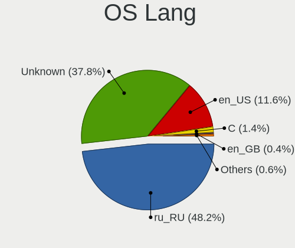
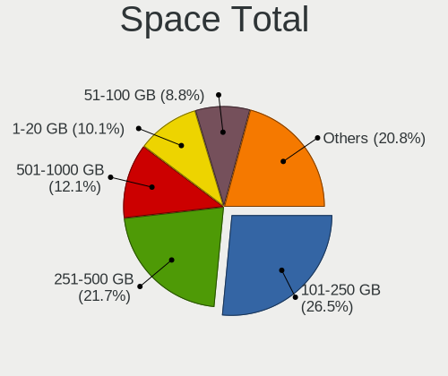
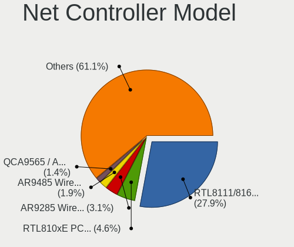
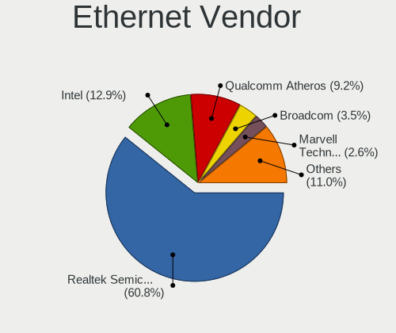
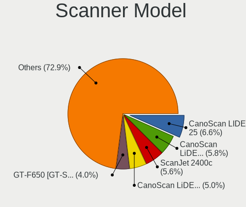

Linux in Russia - Tested Hardware & Statistics
----------------------------------------------

A project to collect tested hardware configurations for Linux in Russia.

Anyone can contribute to this report by the [hw-probe](https://github.com/linuxhw/hw-probe) tool:

    sudo -E hw-probe -all -upload

Please contribute! Especially if your hardware is rare.

This is a report for all computer types. See also reports for [desktops](/Location/Russia/Desktop/README.md) and [notebooks](/Location/Russia/Notebook/README.md).

Contents
--------

* [ Test Cases ](#test-cases)

* [ System ](#system)
  - [ OS                       ](#os)
  - [ OS Family                ](#os-family)
  - [ Kernel                   ](#kernel)
  - [ Kernel Family            ](#kernel-family)
  - [ Kernel Major Ver.        ](#kernel-major-ver)
  - [ Arch                     ](#arch)
  - [ DE                       ](#de)
  - [ Display Server           ](#display-server)
  - [ Display Manager          ](#display-manager)
  - [ OS Lang                  ](#os-lang)
  - [ Boot Mode                ](#boot-mode)
  - [ Filesystem               ](#filesystem)
  - [ Part. scheme             ](#part-scheme)
  - [ Dual Boot with Linux/BSD ](#dual-boot-with-linuxbsd)
  - [ Dual Boot (Win)          ](#dual-boot-win)

* [ Board ](#board)
  - [ Vendor                   ](#vendor)
  - [ Model                    ](#model)
  - [ Model Family             ](#model-family)
  - [ MFG Year                 ](#mfg-year)
  - [ Form Factor              ](#form-factor)
  - [ Secure Boot              ](#secure-boot)
  - [ Coreboot                 ](#coreboot)
  - [ RAM Size                 ](#ram-size)
  - [ RAM Used                 ](#ram-used)
  - [ Total Drives             ](#total-drives)
  - [ Has CD-ROM               ](#has-cd-rom)
  - [ Has Ethernet             ](#has-ethernet)
  - [ Has WiFi                 ](#has-wifi)
  - [ Has Bluetooth            ](#has-bluetooth)

* [ Location ](#location)
  - [ Country                  ](#country)
  - [ City                     ](#city)

* [ Drives ](#drives)
  - [ Drive Vendor             ](#drive-vendor)
  - [ Drive Model              ](#drive-model)
  - [ HDD Vendor               ](#hdd-vendor)
  - [ SSD Vendor               ](#ssd-vendor)
  - [ Drive Kind               ](#drive-kind)
  - [ Drive Connector          ](#drive-connector)
  - [ Drive Size               ](#drive-size)
  - [ Space Total              ](#space-total)
  - [ Space Used               ](#space-used)
  - [ Malfunc. Drives          ](#malfunc-drives)
  - [ Malfunc. Drive Vendor    ](#malfunc-drive-vendor)
  - [ Malfunc. HDD Vendor      ](#malfunc-hdd-vendor)
  - [ Malfunc. Drive Kind      ](#malfunc-drive-kind)
  - [ Failed Drives            ](#failed-drives)
  - [ Failed Drive Vendor      ](#failed-drive-vendor)
  - [ Drive Status             ](#drive-status)

* [ Storage controller ](#storage-controller)
  - [ Storage Vendor           ](#storage-vendor)
  - [ Storage Model            ](#storage-model)
  - [ Storage Kind             ](#storage-kind)

* [ Processor ](#processor)
  - [ CPU Vendor               ](#cpu-vendor)
  - [ CPU Model                ](#cpu-model)
  - [ CPU Model Family         ](#cpu-model-family)
  - [ CPU Cores                ](#cpu-cores)
  - [ CPU Sockets              ](#cpu-sockets)
  - [ CPU Threads              ](#cpu-threads)
  - [ CPU Op-Modes             ](#cpu-op-modes)
  - [ CPU Microcode            ](#cpu-microcode)
  - [ CPU Microarch            ](#cpu-microarch)

* [ Graphics ](#graphics)
  - [ GPU Vendor               ](#gpu-vendor)
  - [ GPU Model                ](#gpu-model)
  - [ GPU Combo                ](#gpu-combo)
  - [ GPU Driver               ](#gpu-driver)
  - [ GPU Memory               ](#gpu-memory)

* [ Monitor ](#monitor)
  - [ Monitor Vendor           ](#monitor-vendor)
  - [ Monitor Model            ](#monitor-model)
  - [ Monitor Resolution       ](#monitor-resolution)
  - [ Monitor Diagonal         ](#monitor-diagonal)
  - [ Monitor Width            ](#monitor-width)
  - [ Aspect Ratio             ](#aspect-ratio)
  - [ Monitor Area             ](#monitor-area)
  - [ Pixel Density            ](#pixel-density)
  - [ Multiple Monitors        ](#multiple-monitors)

* [ Network ](#network)
  - [ Net Controller Vendor    ](#net-controller-vendor)
  - [ Net Controller Model     ](#net-controller-model)
  - [ Wireless Vendor          ](#wireless-vendor)
  - [ Wireless Model           ](#wireless-model)
  - [ Ethernet Vendor          ](#ethernet-vendor)
  - [ Ethernet Model           ](#ethernet-model)
  - [ Net Controller Kind      ](#net-controller-kind)
  - [ Used Controller          ](#used-controller)
  - [ NICs                     ](#nics)
  - [ IPv6                     ](#ipv6)

* [ Bluetooth ](#bluetooth)
  - [ Bluetooth Vendor         ](#bluetooth-vendor)
  - [ Bluetooth Model          ](#bluetooth-model)

* [ Sound ](#sound)
  - [ Sound Vendor             ](#sound-vendor)
  - [ Sound Model              ](#sound-model)

* [ Memory ](#memory)
  - [ Memory Vendor            ](#memory-vendor)
  - [ Memory Model             ](#memory-model)
  - [ Memory Kind              ](#memory-kind)
  - [ Memory Form Factor       ](#memory-form-factor)
  - [ Memory Size              ](#memory-size)
  - [ Memory Speed             ](#memory-speed)

* [ Printers & scanners ](#printers--scanners)
  - [ Printer Vendor           ](#printer-vendor)
  - [ Printer Model            ](#printer-model)
  - [ Scanner Vendor           ](#scanner-vendor)
  - [ Scanner Model            ](#scanner-model)

* [ Camera ](#camera)
  - [ Camera Vendor            ](#camera-vendor)
  - [ Camera Model             ](#camera-model)

* [ Security ](#security)
  - [ Fingerprint Vendor       ](#fingerprint-vendor)
  - [ Fingerprint Model        ](#fingerprint-model)
  - [ Chipcard Vendor          ](#chipcard-vendor)
  - [ Chipcard Model           ](#chipcard-model)

* [ Unsupported ](#unsupported)
  - [ Unsupported Devices      ](#unsupported-devices)
  - [ Unsupported Device Types ](#unsupported-device-types)

Test Cases
----------

Total: 36379

| Vendor        | Model                       | Form-Factor | Probe                                                      | Date         |
|---------------|-----------------------------|-------------|------------------------------------------------------------|--------------|
| MSI           | MS-N0E1 Ver                 | Notebook    | [9c4dcef9c6](https://linux-hardware.org/?probe=9c4dcef9c6) | Feb 01, 2023 |
| Lenovo        | ThinkPad T490 20N2000LRT    | Notebook    | [aaaf227faf](https://linux-hardware.org/?probe=aaaf227faf) | Feb 01, 2023 |
| Lenovo        | IdeaPad 3 17ITL6 82H9       | Notebook    | [eaaf15f3f6](https://linux-hardware.org/?probe=eaaf15f3f6) | Feb 01, 2023 |
| ASUSTek       | Zenbook UX535QE_UM535QE     | Notebook    | [ee219f2f82](https://linux-hardware.org/?probe=ee219f2f82) | Feb 01, 2023 |
| ASUSTek       | Zenbook UX535QE_UM535QE     | Notebook    | [af2f6edc6f](https://linux-hardware.org/?probe=af2f6edc6f) | Feb 01, 2023 |
| ASUSTek       | N552VW                      | Notebook    | [1ebeeec517](https://linux-hardware.org/?probe=1ebeeec517) | Feb 01, 2023 |
| Dell          | Inspiron 5748               | Notebook    | [7ee6505f8d](https://linux-hardware.org/?probe=7ee6505f8d) | Feb 01, 2023 |
| Acer          | Nitro AN515-52              | Notebook    | [86156a3b50](https://linux-hardware.org/?probe=86156a3b50) | Jan 31, 2023 |
| Acer          | Aspire E1-522               | Notebook    | [af61a3d9c8](https://linux-hardware.org/?probe=af61a3d9c8) | Jan 31, 2023 |
| Dell          | Inspiron 5748               | Notebook    | [ecbd4ac8b6](https://linux-hardware.org/?probe=ecbd4ac8b6) | Jan 31, 2023 |
| HP            | 255 15.6 inch G9 Noteboo... | Notebook    | [7758d7c535](https://linux-hardware.org/?probe=7758d7c535) | Jan 31, 2023 |
| ASUSTek       | ROG STRIX B660-I GAMING ... | Desktop     | [19d65de9b6](https://linux-hardware.org/?probe=19d65de9b6) | Jan 31, 2023 |
| Unknown       | ARM5                        | Mini pc     | [aad3a07e37](https://linux-hardware.org/?probe=aad3a07e37) | Jan 31, 2023 |
| Gigabyte      | B560M H                     | Desktop     | [65f58e4e39](https://linux-hardware.org/?probe=65f58e4e39) | Jan 31, 2023 |
| Aquarius      | Cmp NS685U                  | Notebook    | [b067e76e64](https://linux-hardware.org/?probe=b067e76e64) | Jan 31, 2023 |
| Gigabyte      | P85-D3                      | Desktop     | [7e25d19fae](https://linux-hardware.org/?probe=7e25d19fae) | Jan 31, 2023 |
| Gigabyte      | B450 AORUS ELITE            | Desktop     | [a2c87504d6](https://linux-hardware.org/?probe=a2c87504d6) | Jan 31, 2023 |
| Clevo         | NL41MU2                     | Notebook    | [95dac05397](https://linux-hardware.org/?probe=95dac05397) | Jan 31, 2023 |
| Lenovo        | IdeaPad 5 15ARE05 81YQ      | Notebook    | [396877a008](https://linux-hardware.org/?probe=396877a008) | Jan 31, 2023 |
| MSI           | G41M-P28                    | Desktop     | [7f37c4b40e](https://linux-hardware.org/?probe=7f37c4b40e) | Jan 31, 2023 |
| Timi          | Xiaomi Book Air 13 2022     | Convertible | [e5695a72a0](https://linux-hardware.org/?probe=e5695a72a0) | Jan 31, 2023 |
| Lenovo        | ThinkPad T410 2518BPG       | Notebook    | [011f53deaa](https://linux-hardware.org/?probe=011f53deaa) | Jan 31, 2023 |
| ASUSTek       | N53Ta                       | Notebook    | [30131c7409](https://linux-hardware.org/?probe=30131c7409) | Jan 31, 2023 |
| HP            | Pavilion Gaming Laptop 1... | Notebook    | [9fd1916420](https://linux-hardware.org/?probe=9fd1916420) | Jan 31, 2023 |
| ASUSTek       | 1011PX                      | Notebook    | [204706229b](https://linux-hardware.org/?probe=204706229b) | Jan 31, 2023 |
| HP            | Pavilion Gaming Laptop 1... | Notebook    | [318f007db6](https://linux-hardware.org/?probe=318f007db6) | Jan 31, 2023 |
| ASRock        | G31M-VS2                    | Desktop     | [e12dd528ea](https://linux-hardware.org/?probe=e12dd528ea) | Jan 31, 2023 |
| MSI           | H81M-E34                    | Desktop     | [19b8f90522](https://linux-hardware.org/?probe=19b8f90522) | Jan 31, 2023 |
| Gigabyte      | A320M-H-CF                  | Desktop     | [f5379a55ea](https://linux-hardware.org/?probe=f5379a55ea) | Jan 31, 2023 |
| ASUSTek       | B85M-G                      | Desktop     | [44c2ca8150](https://linux-hardware.org/?probe=44c2ca8150) | Jan 31, 2023 |
| Acer          | Aspire A517-51              | Notebook    | [cb65ba4ce5](https://linux-hardware.org/?probe=cb65ba4ce5) | Jan 31, 2023 |
| HP            | 8599                        | Desktop     | [3ffedfbc62](https://linux-hardware.org/?probe=3ffedfbc62) | Jan 31, 2023 |
| Lenovo        | 316E NOK                    | Mini pc     | [c53133f306](https://linux-hardware.org/?probe=c53133f306) | Jan 31, 2023 |
| Lenovo        | 316E NOK                    | Mini pc     | [9721d24c04](https://linux-hardware.org/?probe=9721d24c04) | Jan 31, 2023 |
| HP            | 8599                        | Desktop     | [759d3a0829](https://linux-hardware.org/?probe=759d3a0829) | Jan 31, 2023 |
| ASUSTek       | H110-PLUS                   | Desktop     | [c20a43e3e5](https://linux-hardware.org/?probe=c20a43e3e5) | Jan 31, 2023 |
| ASRock        | B650M PG Riptide            | Desktop     | [260d257a0c](https://linux-hardware.org/?probe=260d257a0c) | Jan 30, 2023 |
| HP            | 255 15.6 inch G9 Noteboo... | Notebook    | [5201a076f6](https://linux-hardware.org/?probe=5201a076f6) | Jan 30, 2023 |
| ASUSTek       | P8H61-MX                    | Desktop     | [4830eacf5e](https://linux-hardware.org/?probe=4830eacf5e) | Jan 30, 2023 |
| ASUSTek       | P8H61-MX                    | Desktop     | [0b59b68d55](https://linux-hardware.org/?probe=0b59b68d55) | Jan 30, 2023 |
| MACHENIKE     | MACHCREATOR-16              | Notebook    | [c44c077d1e](https://linux-hardware.org/?probe=c44c077d1e) | Jan 30, 2023 |
| ASUSTek       | X55VD                       | Notebook    | [4120c1019c](https://linux-hardware.org/?probe=4120c1019c) | Jan 30, 2023 |
| MSI           | GL75 Leopard 10SCSR         | Notebook    | [8e30762127](https://linux-hardware.org/?probe=8e30762127) | Jan 30, 2023 |
| ASUSTek       | M4A89GTD-PRO/USB3           | Desktop     | [10c275723f](https://linux-hardware.org/?probe=10c275723f) | Jan 30, 2023 |
| HP            | ProBook 4720s               | Notebook    | [b6edbaeae1](https://linux-hardware.org/?probe=b6edbaeae1) | Jan 30, 2023 |
| Timi          | Xiaomi Book Air 13 2022     | Convertible | [5d5761529f](https://linux-hardware.org/?probe=5d5761529f) | Jan 30, 2023 |
| HP            | Pavilion x360 Convertibl... | Convertible | [14b0a73713](https://linux-hardware.org/?probe=14b0a73713) | Jan 30, 2023 |
| HP            | ProBook x360 11 G5 EE       | Convertible | [8f41c8cf5c](https://linux-hardware.org/?probe=8f41c8cf5c) | Jan 30, 2023 |
| Intel         | S2600WFT H48104-854         | Server      | [68791b3635](https://linux-hardware.org/?probe=68791b3635) | Jan 30, 2023 |
| Gigabyte      | B365M H                     | Desktop     | [89d336f0b7](https://linux-hardware.org/?probe=89d336f0b7) | Jan 30, 2023 |
| HP            | Pavilion x360 Convertibl... | Convertible | [8fd86a447c](https://linux-hardware.org/?probe=8fd86a447c) | Jan 30, 2023 |
| Infinix       | INBOOK X2 GEN11             | Notebook    | [d826805d37](https://linux-hardware.org/?probe=d826805d37) | Jan 30, 2023 |
| MSI           | H81M-P33                    | Desktop     | [32149d3b64](https://linux-hardware.org/?probe=32149d3b64) | Jan 30, 2023 |
| Lenovo        | Z50-70 20354                | Notebook    | [54f6c27c09](https://linux-hardware.org/?probe=54f6c27c09) | Jan 30, 2023 |
| ASUSTek       | P8H61-MX                    | Desktop     | [f13f4da766](https://linux-hardware.org/?probe=f13f4da766) | Jan 30, 2023 |
| ZoomSmart     | A1002                       | Tablet      | [f8733ffc4d](https://linux-hardware.org/?probe=f8733ffc4d) | Jan 30, 2023 |
| HP            | Pavilion g6                 | Notebook    | [d25ed40cf3](https://linux-hardware.org/?probe=d25ed40cf3) | Jan 30, 2023 |
| HP            | 8526 MVB, A                 | Desktop     | [eaa1bf595f](https://linux-hardware.org/?probe=eaa1bf595f) | Jan 30, 2023 |
| ASUSTek       | VivoBook_ASUSLaptop M150... | Notebook    | [8a324e4189](https://linux-hardware.org/?probe=8a324e4189) | Jan 30, 2023 |
| MSI           | B450M-A PRO MAX             | Desktop     | [a7232f4811](https://linux-hardware.org/?probe=a7232f4811) | Jan 30, 2023 |
| HP            | Pavilion dv6                | Notebook    | [0966ae419c](https://linux-hardware.org/?probe=0966ae419c) | Jan 30, 2023 |
| ASUSTek       | ASUS TUF Gaming F15 FX50... | Notebook    | [d800b8a4b9](https://linux-hardware.org/?probe=d800b8a4b9) | Jan 30, 2023 |
| ASUSTek       | 1011PX                      | Notebook    | [7359bcfbfb](https://linux-hardware.org/?probe=7359bcfbfb) | Jan 29, 2023 |
| Sony          | PCG-Z1VA(UC)                | Notebook    | [db4f48132e](https://linux-hardware.org/?probe=db4f48132e) | Jan 29, 2023 |
| Acer          | Nitro AN515-52              | Notebook    | [c8c73a9f67](https://linux-hardware.org/?probe=c8c73a9f67) | Jan 29, 2023 |
| MACHENIKE     | MACHCREATOR-16              | Notebook    | [e3d7c03a2e](https://linux-hardware.org/?probe=e3d7c03a2e) | Jan 29, 2023 |
| ASUSTek       | P8Q77-M                     | Desktop     | [be0ebca5cc](https://linux-hardware.org/?probe=be0ebca5cc) | Jan 29, 2023 |
| HP            | ProBook x360 11 G5 EE       | Convertible | [183bb56595](https://linux-hardware.org/?probe=183bb56595) | Jan 29, 2023 |
| Sony          | VPCSB11FX                   | Notebook    | [7659c1ba93](https://linux-hardware.org/?probe=7659c1ba93) | Jan 29, 2023 |
| HC            | HCAR357-MI V1.0             | Desktop     | [986dd858ba](https://linux-hardware.org/?probe=986dd858ba) | Jan 29, 2023 |
| Gigabyte      | B550 GAMING X V2            | Desktop     | [868269808a](https://linux-hardware.org/?probe=868269808a) | Jan 29, 2023 |
| ASRock        | P45DE3                      | Desktop     | [e4c2e737f7](https://linux-hardware.org/?probe=e4c2e737f7) | Jan 29, 2023 |
| EVGA          | E689 $                      | Desktop     | [9d4b1aeaa9](https://linux-hardware.org/?probe=9d4b1aeaa9) | Jan 29, 2023 |
| Unknown       | Unknown                     | Notebook    | [23d04579d4](https://linux-hardware.org/?probe=23d04579d4) | Jan 29, 2023 |
| ASRock        | Z77M                        | Desktop     | [83a27ed2b5](https://linux-hardware.org/?probe=83a27ed2b5) | Jan 29, 2023 |
| Gigabyte      | X570 AORUS PRO              | Desktop     | [ab13127567](https://linux-hardware.org/?probe=ab13127567) | Jan 29, 2023 |
| Gigabyte      | 8IPE1000-G/L                | Desktop     | [6f83e8b57d](https://linux-hardware.org/?probe=6f83e8b57d) | Jan 29, 2023 |
| ASRock        | G41M-S3                     | Desktop     | [2196343afa](https://linux-hardware.org/?probe=2196343afa) | Jan 29, 2023 |
| ASUSTek       | P7P55D LE                   | Desktop     | [943a02b7e9](https://linux-hardware.org/?probe=943a02b7e9) | Jan 29, 2023 |
| ASUSTek       | P6T SE                      | Desktop     | [c52b5b3357](https://linux-hardware.org/?probe=c52b5b3357) | Jan 29, 2023 |
| ASRock        | B450 Gaming K4              | Desktop     | [e768563b42](https://linux-hardware.org/?probe=e768563b42) | Jan 29, 2023 |
| TECNO         | MEGABOOK T1                 | Notebook    | [db0e6c89b4](https://linux-hardware.org/?probe=db0e6c89b4) | Jan 29, 2023 |
| ASUSTek       | TUF Gaming X570-PLUS        | Desktop     | [97aa61aba5](https://linux-hardware.org/?probe=97aa61aba5) | Jan 29, 2023 |
| Samsung       | RV420/RV520/RV720/E3530/... | Notebook    | [93e0f40842](https://linux-hardware.org/?probe=93e0f40842) | Jan 29, 2023 |
| Acer          | Aspire 3810T                | Notebook    | [a7b93a7119](https://linux-hardware.org/?probe=a7b93a7119) | Jan 29, 2023 |
| ASUSTek       | TUF Gaming FX505DT_FX505... | Notebook    | [87502e1eb2](https://linux-hardware.org/?probe=87502e1eb2) | Jan 29, 2023 |
| ASRock        | B450 Gaming K4              | Desktop     | [000203af81](https://linux-hardware.org/?probe=000203af81) | Jan 29, 2023 |
| MSI           | B450M MORTAR MAX            | Desktop     | [017467452c](https://linux-hardware.org/?probe=017467452c) | Jan 29, 2023 |
| HP            | ENVY x360 Convertible 15... | Convertible | [c0a36a0b02](https://linux-hardware.org/?probe=c0a36a0b02) | Jan 29, 2023 |
| Acer          | Nitro AN515-52              | Notebook    | [2fb747792d](https://linux-hardware.org/?probe=2fb747792d) | Jan 29, 2023 |
| HP            | Notebook                    | Notebook    | [d38e078368](https://linux-hardware.org/?probe=d38e078368) | Jan 28, 2023 |
| Intel         | X79G V2.x                   | Desktop     | [40bc764c73](https://linux-hardware.org/?probe=40bc764c73) | Jan 28, 2023 |
| EVGA          | E689 $                      | Desktop     | [be99ae882b](https://linux-hardware.org/?probe=be99ae882b) | Jan 28, 2023 |
| ASRock        | X570 Taichi                 | Desktop     | [3b1c5df727](https://linux-hardware.org/?probe=3b1c5df727) | Jan 28, 2023 |
| ASUSTek       | X550MJ                      | Notebook    | [51fd1f6c24](https://linux-hardware.org/?probe=51fd1f6c24) | Jan 28, 2023 |
| Timi          | Redmi Book Pro 15 2022      | Notebook    | [7e6cf30d81](https://linux-hardware.org/?probe=7e6cf30d81) | Jan 28, 2023 |
| AZW           | Gemini M                    | Desktop     | [5534667621](https://linux-hardware.org/?probe=5534667621) | Jan 28, 2023 |
| AZW           | GTR V02                     | Desktop     | [b1b34f10a2](https://linux-hardware.org/?probe=b1b34f10a2) | Jan 28, 2023 |
| Unknown       | X79                         | Desktop     | [164508bcb4](https://linux-hardware.org/?probe=164508bcb4) | Jan 28, 2023 |
| Gigabyte      | AB350M-DS3H V2-CF           | Desktop     | [8492e549e2](https://linux-hardware.org/?probe=8492e549e2) | Jan 28, 2023 |
| Lenovo        | ThinkPad T14 Gen 2a 20XK... | Notebook    | [85e23fef85](https://linux-hardware.org/?probe=85e23fef85) | Jan 28, 2023 |
| Gigabyte      | GA-MA770-UD3                | Desktop     | [554aa8592c](https://linux-hardware.org/?probe=554aa8592c) | Jan 28, 2023 |
| ASUSTek       | ET2321I                     | Notebook    | [dbb162975e](https://linux-hardware.org/?probe=dbb162975e) | Jan 28, 2023 |
| ASUSTek       | ROG STRIX B460-G GAMING     | Desktop     | [836e9a9809](https://linux-hardware.org/?probe=836e9a9809) | Jan 28, 2023 |
| DEPO Compu... | DPH410S                     | Desktop     | [d380c83ebf](https://linux-hardware.org/?probe=d380c83ebf) | Jan 28, 2023 |
| ASUSTek       | P8Z77-M                     | Desktop     | [22d53e86e0](https://linux-hardware.org/?probe=22d53e86e0) | Jan 28, 2023 |
| Lenovo        | ThinkPad T450s 20BWS23W0... | Notebook    | [41c82dbadb](https://linux-hardware.org/?probe=41c82dbadb) | Jan 27, 2023 |
| Acer          | Aspire TC-705               | Desktop     | [be48644835](https://linux-hardware.org/?probe=be48644835) | Jan 27, 2023 |
| ASUSTek       | M2N-MX                      | Desktop     | [0920c10a0e](https://linux-hardware.org/?probe=0920c10a0e) | Jan 27, 2023 |
| Unknown       | Unknown                     | Notebook    | [b4270378b4](https://linux-hardware.org/?probe=b4270378b4) | Jan 27, 2023 |
| Gigabyte      | B85M-D3H-A                  | Desktop     | [8289da39ca](https://linux-hardware.org/?probe=8289da39ca) | Jan 27, 2023 |
| Lenovo        | B570e HuronRiver Platfor... | Notebook    | [376c580dcb](https://linux-hardware.org/?probe=376c580dcb) | Jan 27, 2023 |
| Gigabyte      | 970A-DS3P                   | Desktop     | [547e171057](https://linux-hardware.org/?probe=547e171057) | Jan 27, 2023 |
| ASUSTek       | N56VJ                       | Notebook    | [6ad6470149](https://linux-hardware.org/?probe=6ad6470149) | Jan 27, 2023 |
| HONOR         | BMH-WCX9                    | Notebook    | [882bb3b505](https://linux-hardware.org/?probe=882bb3b505) | Jan 27, 2023 |
| ASUSTek       | B85M-G                      | Desktop     | [4a83dc2dc2](https://linux-hardware.org/?probe=4a83dc2dc2) | Jan 27, 2023 |
| MSI           | Prestige 14Evo A12M         | Notebook    | [17f4098b36](https://linux-hardware.org/?probe=17f4098b36) | Jan 27, 2023 |
| ASUSTek       | H81M-K                      | Desktop     | [13f23afb38](https://linux-hardware.org/?probe=13f23afb38) | Jan 27, 2023 |
| HP            | ProBook 445 G7              | Notebook    | [d0b5bf560a](https://linux-hardware.org/?probe=d0b5bf560a) | Jan 27, 2023 |
| ASRock        | B450 Gaming K4              | Desktop     | [7ce2ff0443](https://linux-hardware.org/?probe=7ce2ff0443) | Jan 27, 2023 |
| Gigabyte      | G41MT-S2                    | Desktop     | [774f8eb27f](https://linux-hardware.org/?probe=774f8eb27f) | Jan 27, 2023 |
| ASUSTek       | VivoBook_ASUSLaptop X515... | Notebook    | [acbaa4516c](https://linux-hardware.org/?probe=acbaa4516c) | Jan 27, 2023 |
| Unknown       | ARM5                        | Mini pc     | [1b3ea4360c](https://linux-hardware.org/?probe=1b3ea4360c) | Jan 27, 2023 |
| Acer          | Aspire 3810T                | Notebook    | [c77f7df143](https://linux-hardware.org/?probe=c77f7df143) | Jan 27, 2023 |
| Aquarius      | AQB560M                     | Desktop     | [1187e4d240](https://linux-hardware.org/?probe=1187e4d240) | Jan 27, 2023 |
| Clevo         | M770SUA                     | Notebook    | [3a19bae169](https://linux-hardware.org/?probe=3a19bae169) | Jan 27, 2023 |
| Lenovo        | IdeaPad 3 14ITL05 81X7      | Notebook    | [ff67a5eb33](https://linux-hardware.org/?probe=ff67a5eb33) | Jan 27, 2023 |
| Clevo         | NL41MU2                     | Notebook    | [86e493728f](https://linux-hardware.org/?probe=86e493728f) | Jan 27, 2023 |
| MSI           | Prestige 14Evo A12M         | Notebook    | [3638a1774c](https://linux-hardware.org/?probe=3638a1774c) | Jan 27, 2023 |
| Lenovo        | IdeaPad 320-15IAP 80XR      | Notebook    | [ecd1e46811](https://linux-hardware.org/?probe=ecd1e46811) | Jan 27, 2023 |
| Intel         | X99                         | Desktop     | [1fbd6cf5bd](https://linux-hardware.org/?probe=1fbd6cf5bd) | Jan 27, 2023 |
| Lenovo        | G480 20156                  | Notebook    | [9e09139dbc](https://linux-hardware.org/?probe=9e09139dbc) | Jan 26, 2023 |
| Loongson      | LS3A5000-7A2000-1w-EVB-V... | Desktop     | [2fea9476f5](https://linux-hardware.org/?probe=2fea9476f5) | Jan 26, 2023 |
| ASUSTek       | 1201N                       | Notebook    | [ddc52a086f](https://linux-hardware.org/?probe=ddc52a086f) | Jan 26, 2023 |
| MSI           | 770-C45                     | Desktop     | [3da3ee46c2](https://linux-hardware.org/?probe=3da3ee46c2) | Jan 26, 2023 |
| Acer          | Nitro AN515-52              | Notebook    | [02dffce8d7](https://linux-hardware.org/?probe=02dffce8d7) | Jan 26, 2023 |
| Gigabyte      | G41MT-S2                    | Desktop     | [06cd0f5943](https://linux-hardware.org/?probe=06cd0f5943) | Jan 26, 2023 |
| ASUSTek       | P6T SE                      | Desktop     | [1033fae7e9](https://linux-hardware.org/?probe=1033fae7e9) | Jan 26, 2023 |
| ASUSTek       | VivoBook 15_ASUS Laptop ... | Notebook    | [6290f61a46](https://linux-hardware.org/?probe=6290f61a46) | Jan 26, 2023 |
| ASRock        | B650M PG Riptide            | Desktop     | [e9f4894d6d](https://linux-hardware.org/?probe=e9f4894d6d) | Jan 26, 2023 |
| HONOR         | HLYL-WXX9                   | Notebook    | [00c90b28ca](https://linux-hardware.org/?probe=00c90b28ca) | Jan 26, 2023 |
| Unknown       | Unknown                     | Notebook    | [6ac74fad2b](https://linux-hardware.org/?probe=6ac74fad2b) | Jan 26, 2023 |
| ASUSTek       | P8B75-V                     | Desktop     | [1f8bd6b38e](https://linux-hardware.org/?probe=1f8bd6b38e) | Jan 26, 2023 |
| ASRock        | H610M-HDV/M.2               | Desktop     | [2936bb8fec](https://linux-hardware.org/?probe=2936bb8fec) | Jan 26, 2023 |
| ASUSTek       | ROG STRIX B650E-E GAMING... | Desktop     | [4ad0b3594f](https://linux-hardware.org/?probe=4ad0b3594f) | Jan 26, 2023 |
| ASUSTek       | P7H55-M                     | Desktop     | [34c55ab8ae](https://linux-hardware.org/?probe=34c55ab8ae) | Jan 26, 2023 |
| ASUSTek       | Zenbook UX535QE_UM535QE     | Notebook    | [4a3c63f3f0](https://linux-hardware.org/?probe=4a3c63f3f0) | Jan 26, 2023 |
| iRU           | v1.0                        | Desktop     | [5dfa804f74](https://linux-hardware.org/?probe=5dfa804f74) | Jan 26, 2023 |
| ASUSTek       | P5E-VM SE                   | Desktop     | [0b25483160](https://linux-hardware.org/?probe=0b25483160) | Jan 26, 2023 |
| Apple         | Mac-F2208EC8                | Mini pc     | [873ee647b0](https://linux-hardware.org/?probe=873ee647b0) | Jan 26, 2023 |
| Infinix       | INBOOK X2 GEN11             | Notebook    | [ee7b9f5fd0](https://linux-hardware.org/?probe=ee7b9f5fd0) | Jan 26, 2023 |
| Intel         | X99 V1.0                    | Desktop     | [560cc09a5a](https://linux-hardware.org/?probe=560cc09a5a) | Jan 26, 2023 |
| Gigabyte      | AB350M-DS3H V2-CF           | Desktop     | [883b4a1c39](https://linux-hardware.org/?probe=883b4a1c39) | Jan 26, 2023 |
| Intel         | H61M-DS2V                   | Desktop     | [0591a32a07](https://linux-hardware.org/?probe=0591a32a07) | Jan 25, 2023 |
| ASUSTek       | P8H61-M LX2                 | Desktop     | [dee0143024](https://linux-hardware.org/?probe=dee0143024) | Jan 25, 2023 |
| Clevo         | M815P                       | Notebook    | [cfc5f6689f](https://linux-hardware.org/?probe=cfc5f6689f) | Jan 25, 2023 |
| MSI           | 770-C45                     | Desktop     | [42ffd24c35](https://linux-hardware.org/?probe=42ffd24c35) | Jan 25, 2023 |
| HP            | EliteBook 840 G4            | Notebook    | [ee6e7a2924](https://linux-hardware.org/?probe=ee6e7a2924) | Jan 25, 2023 |
| Timi          | Redmi Book Pro 15 2022      | Notebook    | [b89ee82de7](https://linux-hardware.org/?probe=b89ee82de7) | Jan 25, 2023 |
| ASUSTek       | VivoBook_ASUSLaptop X540... | Notebook    | [ef947d32a1](https://linux-hardware.org/?probe=ef947d32a1) | Jan 25, 2023 |
| ASUSTek       | VivoBook_ASUSLaptop X540... | Notebook    | [d0a3780add](https://linux-hardware.org/?probe=d0a3780add) | Jan 25, 2023 |
| Lenovo        | V310-15IKB 80T3             | Notebook    | [fe11977488](https://linux-hardware.org/?probe=fe11977488) | Jan 25, 2023 |
| ASUSTek       | Zenbook UX535QE_UM535QE     | Notebook    | [702b3c77fc](https://linux-hardware.org/?probe=702b3c77fc) | Jan 25, 2023 |
| Lenovo        | ThinkCentre M70e 0851RZ3    | Desktop     | [23b8d711f4](https://linux-hardware.org/?probe=23b8d711f4) | Jan 25, 2023 |
| Graviton      | DMB-H610-TMI01              | All in one  | [87c61b6748](https://linux-hardware.org/?probe=87c61b6748) | Jan 25, 2023 |
| HP            | Laptop 15-bw0xx             | Notebook    | [c2867457c2](https://linux-hardware.org/?probe=c2867457c2) | Jan 25, 2023 |
| MSI           | 770-C45                     | Desktop     | [1991e96ff2](https://linux-hardware.org/?probe=1991e96ff2) | Jan 25, 2023 |
| Gigabyte      | B450M DS3H V2               | Desktop     | [90d383c54e](https://linux-hardware.org/?probe=90d383c54e) | Jan 25, 2023 |
| MSI           | GL63 8RC                    | Notebook    | [138e8de541](https://linux-hardware.org/?probe=138e8de541) | Jan 25, 2023 |
| Lenovo        | V310-15IKB 80T3             | Notebook    | [d56d0b1732](https://linux-hardware.org/?probe=d56d0b1732) | Jan 25, 2023 |
| Acer          | Aspire A315-59              | Notebook    | [33292253d0](https://linux-hardware.org/?probe=33292253d0) | Jan 25, 2023 |
| ASUSTek       | H110M-R                     | Desktop     | [e4b50b33a2](https://linux-hardware.org/?probe=e4b50b33a2) | Jan 25, 2023 |
| Acer          | Extensa 2540                | Notebook    | [af5b1ea485](https://linux-hardware.org/?probe=af5b1ea485) | Jan 25, 2023 |
| Gigabyte      | B365 M AORUS ELITE-CF       | Desktop     | [28effc69e6](https://linux-hardware.org/?probe=28effc69e6) | Jan 25, 2023 |
| ASRock        | H110 Pro BTC+               | Desktop     | [4fab0cb4c4](https://linux-hardware.org/?probe=4fab0cb4c4) | Jan 25, 2023 |
| MSI           | PRO H610M-E DDR4            | Desktop     | [8a06b2350d](https://linux-hardware.org/?probe=8a06b2350d) | Jan 25, 2023 |
| MSI           | H110M PRO-VD                | Desktop     | [e0eefbde94](https://linux-hardware.org/?probe=e0eefbde94) | Jan 25, 2023 |
| Clevo         | NL41MU2                     | Notebook    | [82e558cf16](https://linux-hardware.org/?probe=82e558cf16) | Jan 25, 2023 |
| Gigabyte      | H61M-DS2                    | Desktop     | [347446f16f](https://linux-hardware.org/?probe=347446f16f) | Jan 25, 2023 |
| Gigabyte      | B560M AORUS PRO             | Desktop     | [a145217706](https://linux-hardware.org/?probe=a145217706) | Jan 25, 2023 |
| ASRock        | H310CM-DVS                  | Desktop     | [41b1ad4545](https://linux-hardware.org/?probe=41b1ad4545) | Jan 25, 2023 |
| Gigabyte      | B550 GAMING X V2            | Desktop     | [8a7a7f6b72](https://linux-hardware.org/?probe=8a7a7f6b72) | Jan 25, 2023 |
| Acer          | Aspire 5742G                | Notebook    | [e7afbd79e9](https://linux-hardware.org/?probe=e7afbd79e9) | Jan 24, 2023 |
| ASRock        | X99 Professional Gaming ... | Desktop     | [74054f4cb8](https://linux-hardware.org/?probe=74054f4cb8) | Jan 24, 2023 |
| ASRock        | X99 Professional Gaming ... | Desktop     | [2a89d751e1](https://linux-hardware.org/?probe=2a89d751e1) | Jan 24, 2023 |
| realme        | CloudProXXXX                | Notebook    | [520d929687](https://linux-hardware.org/?probe=520d929687) | Jan 24, 2023 |
| ZoomSmart     | A1002                       | Tablet      | [9bfc68ab23](https://linux-hardware.org/?probe=9bfc68ab23) | Jan 24, 2023 |
| Lenovo        | IdeaPad L340-15API 81LW     | Notebook    | [186aef8e0c](https://linux-hardware.org/?probe=186aef8e0c) | Jan 24, 2023 |
| Clevo         | NL41MU2                     | Notebook    | [831e02a268](https://linux-hardware.org/?probe=831e02a268) | Jan 24, 2023 |
| ASUSTek       | A9T                         | Notebook    | [3e313bb71a](https://linux-hardware.org/?probe=3e313bb71a) | Jan 24, 2023 |
| HIPER Tech... | HIPER WORKBOOK              | Notebook    | [3b1ce8fc77](https://linux-hardware.org/?probe=3b1ce8fc77) | Jan 24, 2023 |
| ASUSTek       | A9T                         | Notebook    | [8ed103fd24](https://linux-hardware.org/?probe=8ed103fd24) | Jan 24, 2023 |
| MSI           | G41M-P28                    | Desktop     | [465a715dc7](https://linux-hardware.org/?probe=465a715dc7) | Jan 24, 2023 |
| Gigabyte      | B450M S2H V2                | Desktop     | [e8e7a44a2a](https://linux-hardware.org/?probe=e8e7a44a2a) | Jan 24, 2023 |
| MSI           | B560M PRO-VDH               | Desktop     | [8cb2b45267](https://linux-hardware.org/?probe=8cb2b45267) | Jan 24, 2023 |
| Biostar       | G41-M7                      | Desktop     | [3f66a61637](https://linux-hardware.org/?probe=3f66a61637) | Jan 24, 2023 |
| Lenovo        | ThinkPad E15 20RD0011RT     | Notebook    | [3fb25133ec](https://linux-hardware.org/?probe=3fb25133ec) | Jan 24, 2023 |
| Unknown       | OnePlus 6                   | Soc         | [ef1fc2bde0](https://linux-hardware.org/?probe=ef1fc2bde0) | Jan 24, 2023 |
| Pegatron      | IPPPV-D3G                   | Desktop     | [770e25fefd](https://linux-hardware.org/?probe=770e25fefd) | Jan 24, 2023 |
| ASRock        | H110 Pro BTC+               | Desktop     | [f4a90a48ec](https://linux-hardware.org/?probe=f4a90a48ec) | Jan 24, 2023 |
| Lenovo        | IdeaPad 5 Pro 16ACH6 82L... | Notebook    | [56a9b7ad32](https://linux-hardware.org/?probe=56a9b7ad32) | Jan 24, 2023 |
| ECS           | G31T-M9                     | Desktop     | [59747c81ca](https://linux-hardware.org/?probe=59747c81ca) | Jan 24, 2023 |
| HUAWEI        | BDZ-WXX9                    | Notebook    | [21f0949826](https://linux-hardware.org/?probe=21f0949826) | Jan 24, 2023 |
| ASUSTek       | M5A97 R2.0                  | Desktop     | [e2d597c046](https://linux-hardware.org/?probe=e2d597c046) | Jan 24, 2023 |
| Lenovo        | B560                        | Notebook    | [b474faa82b](https://linux-hardware.org/?probe=b474faa82b) | Jan 23, 2023 |
| ASUSTek       | X51L                        | Notebook    | [b482dc649b](https://linux-hardware.org/?probe=b482dc649b) | Jan 23, 2023 |
| Gigabyte      | B650 AORUS ELITE AX         | Desktop     | [416a11089a](https://linux-hardware.org/?probe=416a11089a) | Jan 23, 2023 |
| ASRock        | B450 Gaming K4              | Desktop     | [0a7ef9990f](https://linux-hardware.org/?probe=0a7ef9990f) | Jan 23, 2023 |
| Notebook      | W65_67SH                    | Notebook    | [f80b7fddba](https://linux-hardware.org/?probe=f80b7fddba) | Jan 23, 2023 |
| ASUSTek       | P8Z77-M                     | Desktop     | [06d41872a9](https://linux-hardware.org/?probe=06d41872a9) | Jan 23, 2023 |
| Rockchip E... | RK3588                      | Soc         | [87b2165adf](https://linux-hardware.org/?probe=87b2165adf) | Jan 23, 2023 |
| Lenovo        | ThinkPad X121e 3055A18      | Notebook    | [97ef868fa0](https://linux-hardware.org/?probe=97ef868fa0) | Jan 23, 2023 |
| Lenovo        | ThinkPad X121e 3055A18      | Notebook    | [780e3b2071](https://linux-hardware.org/?probe=780e3b2071) | Jan 23, 2023 |
| ASUSTek       | P8Z77-M                     | Desktop     | [f965d9b5b1](https://linux-hardware.org/?probe=f965d9b5b1) | Jan 23, 2023 |
| ASUSTek       | P5KPL-AM SE                 | Desktop     | [257f3b320c](https://linux-hardware.org/?probe=257f3b320c) | Jan 23, 2023 |
| Intel         | NUC8BEB J72688-308          | Mini pc     | [94bc34b452](https://linux-hardware.org/?probe=94bc34b452) | Jan 23, 2023 |
| Gigabyte      | H81M-S1                     | Desktop     | [ab746d7557](https://linux-hardware.org/?probe=ab746d7557) | Jan 23, 2023 |
| realme        | CloudProXXXX                | Notebook    | [e5cbb75254](https://linux-hardware.org/?probe=e5cbb75254) | Jan 23, 2023 |
| Intel         | SKYBAY                      | Desktop     | [0d2187e1bd](https://linux-hardware.org/?probe=0d2187e1bd) | Jan 23, 2023 |
| Intel         | SKYBAY                      | Desktop     | [1781c6451f](https://linux-hardware.org/?probe=1781c6451f) | Jan 23, 2023 |
| Gigabyte      | A320M-S2H V2-CF             | Desktop     | [10fa3eeed2](https://linux-hardware.org/?probe=10fa3eeed2) | Jan 23, 2023 |
| HP            | ProBook 6470b               | Notebook    | [3319221b9c](https://linux-hardware.org/?probe=3319221b9c) | Jan 23, 2023 |
| ASUSTek       | P5K SE                      | Desktop     | [6d55940af7](https://linux-hardware.org/?probe=6d55940af7) | Jan 23, 2023 |
| MACHENIKE     | MACHCREATOR-16              | Notebook    | [7b3107564a](https://linux-hardware.org/?probe=7b3107564a) | Jan 23, 2023 |
| ASUSTek       | H81M-K                      | Desktop     | [3c25197bac](https://linux-hardware.org/?probe=3c25197bac) | Jan 23, 2023 |
| MACHENIKE     | MACHCREATOR-16              | Notebook    | [6b370a283e](https://linux-hardware.org/?probe=6b370a283e) | Jan 23, 2023 |
| ASRock        | X300M-STX                   | Desktop     | [13ce0469f3](https://linux-hardware.org/?probe=13ce0469f3) | Jan 23, 2023 |
| Lenovo        | IdeaPad S510p 20298         | Notebook    | [18fdd7a490](https://linux-hardware.org/?probe=18fdd7a490) | Jan 23, 2023 |
| Dell          | 0JP3NX A01                  | Desktop     | [f75ac14e70](https://linux-hardware.org/?probe=f75ac14e70) | Jan 23, 2023 |
| Samsung       | 300E4C/300E5C/300E7C        | Notebook    | [5648fbf4a0](https://linux-hardware.org/?probe=5648fbf4a0) | Jan 23, 2023 |
| Gigabyte      | B75M-HD3                    | Desktop     | [77d58eb890](https://linux-hardware.org/?probe=77d58eb890) | Jan 23, 2023 |
| ASUSTek       | P5Q SE2                     | Desktop     | [8618810acb](https://linux-hardware.org/?probe=8618810acb) | Jan 23, 2023 |
| Gigabyte      | P85-D3                      | Desktop     | [69164f2a61](https://linux-hardware.org/?probe=69164f2a61) | Jan 23, 2023 |
| ASUSTek       | A88X-PRO                    | Desktop     | [659f4bf9b1](https://linux-hardware.org/?probe=659f4bf9b1) | Jan 23, 2023 |
| Biostar       | H510MHP                     | Desktop     | [be134c4160](https://linux-hardware.org/?probe=be134c4160) | Jan 23, 2023 |
| ASUSTek       | Z97-C                       | Desktop     | [3a89f39a8f](https://linux-hardware.org/?probe=3a89f39a8f) | Jan 23, 2023 |
| Biostar       | H510MHP                     | Desktop     | [2df96ea9cf](https://linux-hardware.org/?probe=2df96ea9cf) | Jan 23, 2023 |
| MSI           | PRO H610M-E DDR4            | Desktop     | [d5c4129361](https://linux-hardware.org/?probe=d5c4129361) | Jan 23, 2023 |
| ASRock        | X99 Professional Gaming ... | Desktop     | [04f06d8d99](https://linux-hardware.org/?probe=04f06d8d99) | Jan 23, 2023 |
| Valve         | Jupiter                     | Notebook    | [f1553073f5](https://linux-hardware.org/?probe=f1553073f5) | Jan 23, 2023 |
| ASUSTek       | J1800I-C                    | Desktop     | [ec7d450cb0](https://linux-hardware.org/?probe=ec7d450cb0) | Jan 23, 2023 |
| ASUSTek       | J1800I-C                    | Desktop     | [d55b2b9507](https://linux-hardware.org/?probe=d55b2b9507) | Jan 23, 2023 |
| ASUSTek       | J1800I-C                    | Desktop     | [8716ca07da](https://linux-hardware.org/?probe=8716ca07da) | Jan 23, 2023 |
| ASUSTek       | J1800I-C                    | Desktop     | [21e1d557cc](https://linux-hardware.org/?probe=21e1d557cc) | Jan 23, 2023 |
| ASUSTek       | J1800I-C                    | Desktop     | [33c845f3a4](https://linux-hardware.org/?probe=33c845f3a4) | Jan 23, 2023 |
| ASUSTek       | J1800I-C                    | Desktop     | [24d2721a00](https://linux-hardware.org/?probe=24d2721a00) | Jan 23, 2023 |
| ASUSTek       | J1800I-C                    | Desktop     | [1e1066bd8b](https://linux-hardware.org/?probe=1e1066bd8b) | Jan 23, 2023 |
| ASUSTek       | J1800I-C                    | Desktop     | [7e636906b9](https://linux-hardware.org/?probe=7e636906b9) | Jan 23, 2023 |
| ASUSTek       | J1800I-C                    | Desktop     | [5aa076d0a5](https://linux-hardware.org/?probe=5aa076d0a5) | Jan 23, 2023 |
| MSI           | MS-AEC21                    | All in one  | [e541cd3043](https://linux-hardware.org/?probe=e541cd3043) | Jan 23, 2023 |
| ASUSTek       | H81M-E                      | Desktop     | [2a20dabdd7](https://linux-hardware.org/?probe=2a20dabdd7) | Jan 23, 2023 |
| Biostar       | N61PB-M2S                   | Desktop     | [bce8692808](https://linux-hardware.org/?probe=bce8692808) | Jan 22, 2023 |
| Samsung       | NC10                        | Notebook    | [6bd13301d9](https://linux-hardware.org/?probe=6bd13301d9) | Jan 22, 2023 |
| Supermicro    | X9DRD-iF                    | Server      | [c088868f62](https://linux-hardware.org/?probe=c088868f62) | Jan 22, 2023 |
| ASUSTek       | PRIME B450M-K               | Desktop     | [8a68388e16](https://linux-hardware.org/?probe=8a68388e16) | Jan 22, 2023 |
| HONOR         | NBR-WAX9                    | Notebook    | [cee0f1ccd5](https://linux-hardware.org/?probe=cee0f1ccd5) | Jan 22, 2023 |
| HP            | ProBook 5330m               | Notebook    | [989327864b](https://linux-hardware.org/?probe=989327864b) | Jan 22, 2023 |
| HUAWEI        | HVY-WXX9                    | Notebook    | [e0b75953b9](https://linux-hardware.org/?probe=e0b75953b9) | Jan 22, 2023 |
| ASUSTek       | N56VJ                       | Notebook    | [167dae47d7](https://linux-hardware.org/?probe=167dae47d7) | Jan 22, 2023 |
| ASUSTek       | P5Q                         | Desktop     | [9e3b6b7075](https://linux-hardware.org/?probe=9e3b6b7075) | Jan 22, 2023 |
| Gigabyte      | F2A55M-DS2                  | Desktop     | [0e1605a304](https://linux-hardware.org/?probe=0e1605a304) | Jan 22, 2023 |
| Acer          | Aspire E1-530G              | Notebook    | [b4f6567b3f](https://linux-hardware.org/?probe=b4f6567b3f) | Jan 22, 2023 |
| Lenovo        | ThinkPad E15 20RD0019RT     | Notebook    | [282161cc92](https://linux-hardware.org/?probe=282161cc92) | Jan 22, 2023 |
| Lenovo        | ThinkPad E15 20RD0019RT     | Notebook    | [8d235b1b8d](https://linux-hardware.org/?probe=8d235b1b8d) | Jan 22, 2023 |
| ASUSTek       | PRIME A320M-K               | Desktop     | [4c4a17a3cf](https://linux-hardware.org/?probe=4c4a17a3cf) | Jan 22, 2023 |
| Gigabyte      | H310M H                     | Desktop     | [bd85a7e96e](https://linux-hardware.org/?probe=bd85a7e96e) | Jan 22, 2023 |
| MSI           | B350 TOMAHAWK               | Desktop     | [91ef58d8a0](https://linux-hardware.org/?probe=91ef58d8a0) | Jan 22, 2023 |
| Huanan        | X99-F8 GAMING V5.0          | Desktop     | [ecfd1795a0](https://linux-hardware.org/?probe=ecfd1795a0) | Jan 22, 2023 |
| Timi          | TM1701                      | Notebook    | [bec2d3a691](https://linux-hardware.org/?probe=bec2d3a691) | Jan 22, 2023 |
| ASRock        | B75M-GL R2.0                | Desktop     | [19b61442fe](https://linux-hardware.org/?probe=19b61442fe) | Jan 22, 2023 |
| ASRock        | B360 Pro4                   | Desktop     | [9cd508a59c](https://linux-hardware.org/?probe=9cd508a59c) | Jan 22, 2023 |
| ASUSTek       | P5E-VM SE                   | Desktop     | [a0b3d87534](https://linux-hardware.org/?probe=a0b3d87534) | Jan 22, 2023 |
| Dell          | 0JP3NX A01                  | Desktop     | [7189416b97](https://linux-hardware.org/?probe=7189416b97) | Jan 22, 2023 |
| Lenovo        | ThinkPad L430 2466DS2       | Notebook    | [8be9a889b7](https://linux-hardware.org/?probe=8be9a889b7) | Jan 22, 2023 |
| Huanan        | H97-ZD3 V2.0                | Desktop     | [afb82fa3cf](https://linux-hardware.org/?probe=afb82fa3cf) | Jan 22, 2023 |
| MSI           | H97 GAMING 3                | Desktop     | [c861b7e450](https://linux-hardware.org/?probe=c861b7e450) | Jan 22, 2023 |
| Loongson      | LS3A5000-7A2000-1w-EVB-V... | Desktop     | [e967d42f1b](https://linux-hardware.org/?probe=e967d42f1b) | Jan 22, 2023 |
| HP            | Pavilion Gaming Laptop 1... | Notebook    | [15b2f3fc5e](https://linux-hardware.org/?probe=15b2f3fc5e) | Jan 22, 2023 |
| ASUSTek       | TUF X470-PLUS GAMING        | Desktop     | [77a744c052](https://linux-hardware.org/?probe=77a744c052) | Jan 22, 2023 |
| ASUSTek       | VivoBook 15_ASUS Laptop ... | Notebook    | [7d63d494c6](https://linux-hardware.org/?probe=7d63d494c6) | Jan 21, 2023 |
| Samsung       | RV408/RV508                 | Notebook    | [0d5c4881c1](https://linux-hardware.org/?probe=0d5c4881c1) | Jan 21, 2023 |
| ASUSTek       | P5KPL-AM SE                 | Desktop     | [9672c4222a](https://linux-hardware.org/?probe=9672c4222a) | Jan 21, 2023 |
| ASUSTek       | P7H55-M                     | Desktop     | [18efa12cb2](https://linux-hardware.org/?probe=18efa12cb2) | Jan 21, 2023 |
| Biostar       | H310MHP                     | Desktop     | [21de314a44](https://linux-hardware.org/?probe=21de314a44) | Jan 21, 2023 |
| MSI           | B75MA-E33                   | Desktop     | [df4c3bb4d2](https://linux-hardware.org/?probe=df4c3bb4d2) | Jan 21, 2023 |
| ASUSTek       | Z87M-PLUS                   | Desktop     | [3a1d7fb570](https://linux-hardware.org/?probe=3a1d7fb570) | Jan 21, 2023 |
| ASUSTek       | P7H55-USB3                  | Desktop     | [3f270588f4](https://linux-hardware.org/?probe=3f270588f4) | Jan 21, 2023 |
| HP            | OMEN Laptop 15-en1xxx       | Notebook    | [adeb24c41e](https://linux-hardware.org/?probe=adeb24c41e) | Jan 21, 2023 |
| Acer          | Aspire A515-45G             | Notebook    | [df633f4583](https://linux-hardware.org/?probe=df633f4583) | Jan 21, 2023 |
| Valve         | Jupiter                     | Notebook    | [c464fc36a9](https://linux-hardware.org/?probe=c464fc36a9) | Jan 21, 2023 |
| ASRock        | 880GMH/U3S3                 | Desktop     | [f2dff18301](https://linux-hardware.org/?probe=f2dff18301) | Jan 21, 2023 |
| ASRock        | X99 Professional Gaming ... | Desktop     | [d203633f83](https://linux-hardware.org/?probe=d203633f83) | Jan 21, 2023 |
| ASRock        | X99 Professional Gaming ... | Desktop     | [e47d5b2419](https://linux-hardware.org/?probe=e47d5b2419) | Jan 21, 2023 |
| Dell          | 00TD00 A00                  | All in one  | [8d09088848](https://linux-hardware.org/?probe=8d09088848) | Jan 21, 2023 |
| Toshiba       | Satellite P200              | Notebook    | [cdc37dfe5e](https://linux-hardware.org/?probe=cdc37dfe5e) | Jan 20, 2023 |
| ASUSTek       | PRIME A320M-K               | Desktop     | [b6b4b01344](https://linux-hardware.org/?probe=b6b4b01344) | Jan 20, 2023 |
| Intel         | S1200BTL E98681-306         | Server      | [290cacacc1](https://linux-hardware.org/?probe=290cacacc1) | Jan 20, 2023 |
| Gigabyte      | H410M H V2                  | Desktop     | [5767b63675](https://linux-hardware.org/?probe=5767b63675) | Jan 20, 2023 |
| Supermicro    | X9DR6-LN4+                  | Desktop     | [23fe7b0642](https://linux-hardware.org/?probe=23fe7b0642) | Jan 20, 2023 |
| Supermicro    | X9DR6-LN4+                  | Desktop     | [4e099f57d5](https://linux-hardware.org/?probe=4e099f57d5) | Jan 20, 2023 |
| Lenovo        | G505 20240                  | Notebook    | [c591d80181](https://linux-hardware.org/?probe=c591d80181) | Jan 20, 2023 |
| Digma         | CITI 1804 CS1069EW          | Tablet      | [0443e57eca](https://linux-hardware.org/?probe=0443e57eca) | Jan 20, 2023 |
| Gigabyte      | A520M H                     | Desktop     | [db3b391bd0](https://linux-hardware.org/?probe=db3b391bd0) | Jan 20, 2023 |
| Sony          | VGN-FJ3SR_B                 | Notebook    | [4dc8b8d09d](https://linux-hardware.org/?probe=4dc8b8d09d) | Jan 20, 2023 |
| MSI           | Z490-A PRO                  | Desktop     | [712d12e3e9](https://linux-hardware.org/?probe=712d12e3e9) | Jan 20, 2023 |
| Gigabyte      | P85-D3                      | Desktop     | [28e6aeb27a](https://linux-hardware.org/?probe=28e6aeb27a) | Jan 20, 2023 |
| Gigabyte      | P85-D3                      | Desktop     | [beec5d3864](https://linux-hardware.org/?probe=beec5d3864) | Jan 20, 2023 |
| Gigabyte      | P85-D3                      | Desktop     | [6ff84d12be](https://linux-hardware.org/?probe=6ff84d12be) | Jan 20, 2023 |
| ASUSTek       | P5E-VM SE                   | Desktop     | [b3df4a1dfa](https://linux-hardware.org/?probe=b3df4a1dfa) | Jan 20, 2023 |
| Lenovo        | B450                        | Notebook    | [96b87672bf](https://linux-hardware.org/?probe=96b87672bf) | Jan 20, 2023 |
| MSI           | H510M PRO-E                 | Desktop     | [c81f6adb11](https://linux-hardware.org/?probe=c81f6adb11) | Jan 20, 2023 |
| HP            | 3047h                       | Desktop     | [4bbcb58967](https://linux-hardware.org/?probe=4bbcb58967) | Jan 20, 2023 |
| MSI           | PH61-SP35                   | Desktop     | [3bdfad797c](https://linux-hardware.org/?probe=3bdfad797c) | Jan 20, 2023 |
| Acer          | Aspire A315-42G             | Notebook    | [ed4c536efa](https://linux-hardware.org/?probe=ed4c536efa) | Jan 20, 2023 |
| ASUSTek       | M5A78L-M LE                 | Desktop     | [af00f739f8](https://linux-hardware.org/?probe=af00f739f8) | Jan 20, 2023 |
| Gigabyte      | P85-D3                      | Desktop     | [002a38370c](https://linux-hardware.org/?probe=002a38370c) | Jan 20, 2023 |
| Gigabyte      | P85-D3                      | Desktop     | [bbfb85788c](https://linux-hardware.org/?probe=bbfb85788c) | Jan 20, 2023 |
| Gigabyte      | P85-D3                      | Desktop     | [9d6c73b1c1](https://linux-hardware.org/?probe=9d6c73b1c1) | Jan 20, 2023 |
| ASRock        | B450M Pro4-F                | Desktop     | [031b7e3b0a](https://linux-hardware.org/?probe=031b7e3b0a) | Jan 20, 2023 |
| ASUSTek       | VivoBook 15_ASUS Laptop ... | Notebook    | [459b2e28d0](https://linux-hardware.org/?probe=459b2e28d0) | Jan 20, 2023 |
| Lenovo        | 3111 SDK0J40697 WIN 3305... | Desktop     | [4ebd222ef1](https://linux-hardware.org/?probe=4ebd222ef1) | Jan 20, 2023 |
| HP            | 18E4                        | Desktop     | [9a62a59c37](https://linux-hardware.org/?probe=9a62a59c37) | Jan 20, 2023 |
| ASUSTek       | PRIME B460M-K               | Desktop     | [86d4a0e87c](https://linux-hardware.org/?probe=86d4a0e87c) | Jan 20, 2023 |
| Lenovo        | V130-15IKB 81HN             | Notebook    | [a74a5b3b7b](https://linux-hardware.org/?probe=a74a5b3b7b) | Jan 20, 2023 |
| ASUSTek       | V241FA                      | All in one  | [24ed481783](https://linux-hardware.org/?probe=24ed481783) | Jan 20, 2023 |
| Lenovo        | IdeaPad L340-15API 81LW     | Notebook    | [8472d89767](https://linux-hardware.org/?probe=8472d89767) | Jan 20, 2023 |
| ASUSTek       | P5KPL-CM                    | Desktop     | [b9f1f115ba](https://linux-hardware.org/?probe=b9f1f115ba) | Jan 20, 2023 |
| Acer          | Nitro AN515-52              | Notebook    | [9abd51692e](https://linux-hardware.org/?probe=9abd51692e) | Jan 20, 2023 |
| Gigabyte      | B360HD3                     | Desktop     | [cbd81c917f](https://linux-hardware.org/?probe=cbd81c917f) | Jan 20, 2023 |
| Gigabyte      | H510M H                     | Desktop     | [f44f319e21](https://linux-hardware.org/?probe=f44f319e21) | Jan 20, 2023 |
| ASRock        | X99 Professional Gaming ... | Desktop     | [266b8bc492](https://linux-hardware.org/?probe=266b8bc492) | Jan 20, 2023 |
| Irbis         | TW100                       | Tablet      | [eb1b68e059](https://linux-hardware.org/?probe=eb1b68e059) | Jan 20, 2023 |
| ASUSTek       | VivoBook_ASUSLaptop X740... | Notebook    | [e04a896c6a](https://linux-hardware.org/?probe=e04a896c6a) | Jan 20, 2023 |
| TI            | OMAP3 BeagleBoard xM        | Soc         | [c081cbef0c](https://linux-hardware.org/?probe=c081cbef0c) | Jan 20, 2023 |
| Gigabyte      | B560M DS3H V2               | Desktop     | [d53ffd975c](https://linux-hardware.org/?probe=d53ffd975c) | Jan 19, 2023 |
| Blackview     | AceBook 1                   | Notebook    | [ea4db42aa8](https://linux-hardware.org/?probe=ea4db42aa8) | Jan 19, 2023 |
| ASRock        | Z87 Extreme4                | Desktop     | [b795f7c940](https://linux-hardware.org/?probe=b795f7c940) | Jan 19, 2023 |
| Huanan        | X99-F8D V2.4                | Desktop     | [26bc61b381](https://linux-hardware.org/?probe=26bc61b381) | Jan 19, 2023 |
| ASRock        | X99 Professional Gaming ... | Desktop     | [0fbcb3df67](https://linux-hardware.org/?probe=0fbcb3df67) | Jan 19, 2023 |
| ASUSTek       | PRIME B450M-K               | Desktop     | [cbad1c4df4](https://linux-hardware.org/?probe=cbad1c4df4) | Jan 19, 2023 |
| AZW           | U59                         | Desktop     | [6621409d8c](https://linux-hardware.org/?probe=6621409d8c) | Jan 19, 2023 |
| Gigabyte      | H81M-S2V                    | Desktop     | [76be7bde5d](https://linux-hardware.org/?probe=76be7bde5d) | Jan 19, 2023 |
| Biostar       | A780LB                      | Desktop     | [ffce251f42](https://linux-hardware.org/?probe=ffce251f42) | Jan 19, 2023 |
| ASRock        | H110 Pro BTC+               | Desktop     | [f888822c0d](https://linux-hardware.org/?probe=f888822c0d) | Jan 19, 2023 |
| Lenovo        | IdeaPad L340-15API 81LW     | Notebook    | [7d95709d81](https://linux-hardware.org/?probe=7d95709d81) | Jan 19, 2023 |
| Gigabyte      | B85M-D3V                    | Desktop     | [285dc35475](https://linux-hardware.org/?probe=285dc35475) | Jan 19, 2023 |
| Gigabyte      | B660 GAMING X DDR4          | Desktop     | [348a5d1848](https://linux-hardware.org/?probe=348a5d1848) | Jan 19, 2023 |
| HP            | ProLiant DL360 Gen9         | Server      | [a31a2a807f](https://linux-hardware.org/?probe=a31a2a807f) | Jan 19, 2023 |
| HP            | ProLiant DL360 Gen9         | Server      | [939a9eda4b](https://linux-hardware.org/?probe=939a9eda4b) | Jan 19, 2023 |
| HP            | ProLiant DL360 Gen9         | Server      | [813a6ccc78](https://linux-hardware.org/?probe=813a6ccc78) | Jan 19, 2023 |
| HP            | ProLiant DL360 Gen9         | Server      | [b888427355](https://linux-hardware.org/?probe=b888427355) | Jan 19, 2023 |
| HP            | ProLiant DL360 Gen9         | Server      | [b1ca5d65b8](https://linux-hardware.org/?probe=b1ca5d65b8) | Jan 19, 2023 |
| HP            | ProLiant DL360 Gen9         | Server      | [644e9cb5a7](https://linux-hardware.org/?probe=644e9cb5a7) | Jan 19, 2023 |
| Lenovo        | IdeaPad 320-15ABR 80XS      | Notebook    | [20749dc72f](https://linux-hardware.org/?probe=20749dc72f) | Jan 19, 2023 |
| ASUSTek       | PRIME B450M-K               | Desktop     | [3ff2eaf5ed](https://linux-hardware.org/?probe=3ff2eaf5ed) | Jan 19, 2023 |
| ASUSTek       | M5A97 R2.0                  | Desktop     | [19eabab270](https://linux-hardware.org/?probe=19eabab270) | Jan 19, 2023 |
| Samsung       | DP300A2A-B01RU SEC_SW_RE... | All in one  | [18d76fe11f](https://linux-hardware.org/?probe=18d76fe11f) | Jan 19, 2023 |
| Gigabyte      | H610M S2H DDR4              | Desktop     | [4e77673e60](https://linux-hardware.org/?probe=4e77673e60) | Jan 19, 2023 |
| Acer          | Aspire E5-573G              | Notebook    | [cfe663eeb9](https://linux-hardware.org/?probe=cfe663eeb9) | Jan 19, 2023 |
| HP            | 894F                        | Mini pc     | [a671f44480](https://linux-hardware.org/?probe=a671f44480) | Jan 19, 2023 |
| ASUSTek       | P8H61-M                     | Desktop     | [1ffe9344ff](https://linux-hardware.org/?probe=1ffe9344ff) | Jan 18, 2023 |
| ASUSTek       | P4P800                      | Desktop     | [f37bee349c](https://linux-hardware.org/?probe=f37bee349c) | Jan 18, 2023 |
| Notebook      | W65_67SJ                    | Notebook    | [8628d6f752](https://linux-hardware.org/?probe=8628d6f752) | Jan 18, 2023 |
| MSI           | PRO H610M-E DDR4            | Desktop     | [3f185b85f5](https://linux-hardware.org/?probe=3f185b85f5) | Jan 18, 2023 |
| AIC           | URSA DG-000000006_A01       | Server      | [d3c122f1a0](https://linux-hardware.org/?probe=d3c122f1a0) | Jan 18, 2023 |
| ASUSTek       | H81M-K                      | Desktop     | [1e6f35ceff](https://linux-hardware.org/?probe=1e6f35ceff) | Jan 18, 2023 |
| HP            | ProBook 440 G4              | Notebook    | [43b8eec1e2](https://linux-hardware.org/?probe=43b8eec1e2) | Jan 18, 2023 |
| Chuwi         | HeroBook Pro                | Notebook    | [42bf8b9a0d](https://linux-hardware.org/?probe=42bf8b9a0d) | Jan 18, 2023 |
| Lenovo        | IdeaPad 330-15IKB 81DE      | Notebook    | [82eea2cc7b](https://linux-hardware.org/?probe=82eea2cc7b) | Jan 18, 2023 |
| HP            | ProBook 640 G5              | Notebook    | [095355c9fc](https://linux-hardware.org/?probe=095355c9fc) | Jan 18, 2023 |
| Lenovo        | ThinkPad E15 20RD0011RT     | Notebook    | [d27ca45841](https://linux-hardware.org/?probe=d27ca45841) | Jan 18, 2023 |
| Toshiba       | Satellite Pro C660          | Notebook    | [02a6db2951](https://linux-hardware.org/?probe=02a6db2951) | Jan 18, 2023 |
| Eii           | P612F                       | All in one  | [29acda8f67](https://linux-hardware.org/?probe=29acda8f67) | Jan 18, 2023 |
| MSI           | MAG B550M MORTAR WIFI       | Desktop     | [bb4c5c0f73](https://linux-hardware.org/?probe=bb4c5c0f73) | Jan 18, 2023 |
| Gigabyte      | B360HD3                     | Desktop     | [3fb3939014](https://linux-hardware.org/?probe=3fb3939014) | Jan 18, 2023 |
| Samsung       | DP300A2A-B01RU SEC_SW_RE... | All in one  | [03c97b653e](https://linux-hardware.org/?probe=03c97b653e) | Jan 18, 2023 |
| NCI           | PC BLICK101                 | Soc         | [018eb0b0bb](https://linux-hardware.org/?probe=018eb0b0bb) | Jan 18, 2023 |
| Toshiba       | Satellite Pro C660          | Notebook    | [a9de8742d5](https://linux-hardware.org/?probe=a9de8742d5) | Jan 17, 2023 |
| ASUSTek       | P5G41T-M LX3                | Desktop     | [67dc4c315a](https://linux-hardware.org/?probe=67dc4c315a) | Jan 17, 2023 |
| ASUSTek       | P8Q77-M                     | Desktop     | [f883cb7c7b](https://linux-hardware.org/?probe=f883cb7c7b) | Jan 17, 2023 |
| ASUSTek       | Z97-K                       | Desktop     | [ac58bc440d](https://linux-hardware.org/?probe=ac58bc440d) | Jan 17, 2023 |
| ASUSTek       | Z97-K                       | Desktop     | [8e21ef4b91](https://linux-hardware.org/?probe=8e21ef4b91) | Jan 17, 2023 |
| ASRock        | H110 Pro BTC+               | Desktop     | [0b515319d8](https://linux-hardware.org/?probe=0b515319d8) | Jan 17, 2023 |
| Clevo         | NL41MU2                     | Notebook    | [c1c0617217](https://linux-hardware.org/?probe=c1c0617217) | Jan 17, 2023 |
| Acer          | Aspire A315-59              | Notebook    | [469c40ec75](https://linux-hardware.org/?probe=469c40ec75) | Jan 17, 2023 |
| ASRock        | H410M-HVS                   | Desktop     | [2024f1ae76](https://linux-hardware.org/?probe=2024f1ae76) | Jan 17, 2023 |
| Gigabyte      | 970A-DS3P                   | Desktop     | [b01089cba7](https://linux-hardware.org/?probe=b01089cba7) | Jan 17, 2023 |
| ASUSTek       | J1800I-C                    | Desktop     | [c32c7f2d35](https://linux-hardware.org/?probe=c32c7f2d35) | Jan 17, 2023 |
| Biostar       | A780LB                      | Desktop     | [fe4d79e9f8](https://linux-hardware.org/?probe=fe4d79e9f8) | Jan 17, 2023 |
| Gigabyte      | 970A-DS3P                   | Desktop     | [bffcece8fb](https://linux-hardware.org/?probe=bffcece8fb) | Jan 17, 2023 |
| HP            | Laptop 15s-eq1xxx           | Notebook    | [62fc20fe3e](https://linux-hardware.org/?probe=62fc20fe3e) | Jan 17, 2023 |
| HP            | Notebook                    | Notebook    | [a998060574](https://linux-hardware.org/?probe=a998060574) | Jan 17, 2023 |
| Lenovo        | Flex 2-14 20404             | Notebook    | [bdfe91e3c9](https://linux-hardware.org/?probe=bdfe91e3c9) | Jan 17, 2023 |
| Gigabyte      | B360HD3                     | Desktop     | [8b992a1d50](https://linux-hardware.org/?probe=8b992a1d50) | Jan 17, 2023 |
| Acer          | Nitro AN515-52              | Notebook    | [4507d2f32d](https://linux-hardware.org/?probe=4507d2f32d) | Jan 17, 2023 |
| ASUSTek       | H81M-K                      | Desktop     | [a4ee55fea9](https://linux-hardware.org/?probe=a4ee55fea9) | Jan 17, 2023 |
| Samsung       | DP300A2A-B01RU SEC_SW_RE... | All in one  | [35cae36101](https://linux-hardware.org/?probe=35cae36101) | Jan 17, 2023 |
| Acer          | Aspire V3-571G              | Notebook    | [84bce1ebbb](https://linux-hardware.org/?probe=84bce1ebbb) | Jan 17, 2023 |
| ASUSTek       | Zenbook UX535QE_UM535QE     | Notebook    | [a5ddfa16b9](https://linux-hardware.org/?probe=a5ddfa16b9) | Jan 17, 2023 |
| ASUSTek       | PRIME H510M-K               | Desktop     | [f9f926e910](https://linux-hardware.org/?probe=f9f926e910) | Jan 17, 2023 |
| MSI           | H81M-E34                    | Desktop     | [db4a6791a0](https://linux-hardware.org/?probe=db4a6791a0) | Jan 17, 2023 |
| ASUSTek       | P5G41T-M LE                 | Desktop     | [31b369770d](https://linux-hardware.org/?probe=31b369770d) | Jan 17, 2023 |
| ASUSTek       | P12R-E Series 60SB0A90-S... | Server      | [f4bf235ea8](https://linux-hardware.org/?probe=f4bf235ea8) | Jan 17, 2023 |
| Acer          | Aspire A315-58              | Notebook    | [7a697f398d](https://linux-hardware.org/?probe=7a697f398d) | Jan 17, 2023 |
| Gigabyte      | B450M H                     | Desktop     | [e3638a2110](https://linux-hardware.org/?probe=e3638a2110) | Jan 17, 2023 |
| ASRock        | H61M-HVGS                   | Desktop     | [2256e1c087](https://linux-hardware.org/?probe=2256e1c087) | Jan 17, 2023 |
| Gigabyte      | B560M DS3H V2               | Desktop     | [e29ceaa96c](https://linux-hardware.org/?probe=e29ceaa96c) | Jan 17, 2023 |
| Gigabyte      | H310M H                     | Desktop     | [faa3746295](https://linux-hardware.org/?probe=faa3746295) | Jan 17, 2023 |
| ASUSTek       | M2N68-AM SE2                | Desktop     | [72e3ebc3b8](https://linux-hardware.org/?probe=72e3ebc3b8) | Jan 17, 2023 |
| HP            | Laptop 15s-eq1xxx           | Notebook    | [9e3506397c](https://linux-hardware.org/?probe=9e3506397c) | Jan 17, 2023 |
| ASUSTek       | H81-PLUS                    | Desktop     | [e95534600a](https://linux-hardware.org/?probe=e95534600a) | Jan 16, 2023 |
| Supermicro    | B11SPE-CPU-TF               | Server      | [bdfa203c78](https://linux-hardware.org/?probe=bdfa203c78) | Jan 16, 2023 |
| Samsung       | 300E4A/300E5A/300E7A        | Notebook    | [13962de59b](https://linux-hardware.org/?probe=13962de59b) | Jan 16, 2023 |
| Samsung       | 300E4A/300E5A/300E7A        | Notebook    | [4db3b47f5a](https://linux-hardware.org/?probe=4db3b47f5a) | Jan 16, 2023 |
| Gigabyte      | A320M-S2H-CF                | Desktop     | [df0f33ee66](https://linux-hardware.org/?probe=df0f33ee66) | Jan 16, 2023 |
| Intel         | X99                         | Desktop     | [f966e7aa92](https://linux-hardware.org/?probe=f966e7aa92) | Jan 16, 2023 |
| Lenovo        | G500 20236                  | Notebook    | [37891c1ea9](https://linux-hardware.org/?probe=37891c1ea9) | Jan 16, 2023 |
| Huanan        | H97-ZD3 V2.0                | Desktop     | [aececc6971](https://linux-hardware.org/?probe=aececc6971) | Jan 16, 2023 |
| Aquarius      | AQNS685V4                   | Notebook    | [1f0cd980d8](https://linux-hardware.org/?probe=1f0cd980d8) | Jan 16, 2023 |
| ASUSTek       | P43E                        | Notebook    | [2685c35f77](https://linux-hardware.org/?probe=2685c35f77) | Jan 16, 2023 |
| HP            | Laptop 15-db0xxx            | Notebook    | [363f8daa52](https://linux-hardware.org/?probe=363f8daa52) | Jan 16, 2023 |
| MSI           | 970A-G43                    | Desktop     | [f15370df26](https://linux-hardware.org/?probe=f15370df26) | Jan 16, 2023 |
| Intel         | DH67BL AAG10189-206         | Desktop     | [23e07704eb](https://linux-hardware.org/?probe=23e07704eb) | Jan 16, 2023 |
| Lenovo        | IdeaPad 3 14ADA05 81W0      | Notebook    | [e1aa5d3186](https://linux-hardware.org/?probe=e1aa5d3186) | Jan 16, 2023 |
| Unknown       | T310D11                     | Desktop     | [acce0e1df1](https://linux-hardware.org/?probe=acce0e1df1) | Jan 16, 2023 |
| Graviton      | DMB-H610-TMI01              | All in one  | [aea58aa72f](https://linux-hardware.org/?probe=aea58aa72f) | Jan 16, 2023 |
| Biostar       | H310MHC2                    | Desktop     | [2ebeb3fa1a](https://linux-hardware.org/?probe=2ebeb3fa1a) | Jan 16, 2023 |
| Acer          | Aspire 5625G                | Notebook    | [244d8473fc](https://linux-hardware.org/?probe=244d8473fc) | Jan 16, 2023 |
| ASRock        | J3455-ITX                   | Desktop     | [6746dfae39](https://linux-hardware.org/?probe=6746dfae39) | Jan 16, 2023 |
| Acer          | Aspire V3-571G              | Notebook    | [3715650f46](https://linux-hardware.org/?probe=3715650f46) | Jan 16, 2023 |
| Intel         | X99                         | Desktop     | [9c0ea1f762](https://linux-hardware.org/?probe=9c0ea1f762) | Jan 16, 2023 |
| Unknown       | Unknown                     | Notebook    | [84f591bd6b](https://linux-hardware.org/?probe=84f591bd6b) | Jan 16, 2023 |
| Gigabyte      | B450 GAMING X               | Desktop     | [c07c86ed27](https://linux-hardware.org/?probe=c07c86ed27) | Jan 16, 2023 |
| Gigabyte      | B450 GAMING X               | Desktop     | [f06080b088](https://linux-hardware.org/?probe=f06080b088) | Jan 16, 2023 |
| ASUSTek       | P8H77-V                     | Desktop     | [d136e01384](https://linux-hardware.org/?probe=d136e01384) | Jan 16, 2023 |
| HP            | Notebook                    | Notebook    | [219540f0f7](https://linux-hardware.org/?probe=219540f0f7) | Jan 16, 2023 |
| Gigabyte      | MZBSWMP-00                  | Desktop     | [c1660ab5a4](https://linux-hardware.org/?probe=c1660ab5a4) | Jan 16, 2023 |
| Biostar       | H310MHC2                    | Desktop     | [939ab29431](https://linux-hardware.org/?probe=939ab29431) | Jan 16, 2023 |
| ASRock        | J3455-ITX                   | Desktop     | [457c7ea5a4](https://linux-hardware.org/?probe=457c7ea5a4) | Jan 16, 2023 |
| ASRock        | Z77 Pro4-M                  | Desktop     | [4c8f01cfd7](https://linux-hardware.org/?probe=4c8f01cfd7) | Jan 15, 2023 |
| ASUSTek       | VivoBook 15_ASUS Laptop ... | Notebook    | [2ec1685227](https://linux-hardware.org/?probe=2ec1685227) | Jan 15, 2023 |
| ASUSTek       | VivoBook 12_ASUS Laptop ... | Notebook    | [21c91371cc](https://linux-hardware.org/?probe=21c91371cc) | Jan 15, 2023 |
| MSI           | 970A-G43                    | Desktop     | [669512ff6c](https://linux-hardware.org/?probe=669512ff6c) | Jan 15, 2023 |
| Acer          | Aspire V3-772G              | Notebook    | [832efe11f1](https://linux-hardware.org/?probe=832efe11f1) | Jan 15, 2023 |
| eMachines     | eME442                      | Notebook    | [9de636b72e](https://linux-hardware.org/?probe=9de636b72e) | Jan 15, 2023 |
| ASUSTek       | P7H55-USB3                  | Desktop     | [d412197c51](https://linux-hardware.org/?probe=d412197c51) | Jan 15, 2023 |
| Gigabyte      | B450 AORUS M                | Desktop     | [ac596694bd](https://linux-hardware.org/?probe=ac596694bd) | Jan 15, 2023 |
| Lenovo        | ThinkBook 15-IIL 20SM       | Notebook    | [63449ba8a3](https://linux-hardware.org/?probe=63449ba8a3) | Jan 15, 2023 |
| HUAWEI        | BOHK-WAX9X                  | Notebook    | [847fab84ee](https://linux-hardware.org/?probe=847fab84ee) | Jan 15, 2023 |
| ASUSTek       | VivoBook 15_ASUS Laptop ... | Notebook    | [bf4ea0ba42](https://linux-hardware.org/?probe=bf4ea0ba42) | Jan 15, 2023 |
| Kraftway      | ACCORD                      | Notebook    | [63039ae17f](https://linux-hardware.org/?probe=63039ae17f) | Jan 15, 2023 |
| Acer          | Aspire A515-43              | Notebook    | [cefbe7ee6e](https://linux-hardware.org/?probe=cefbe7ee6e) | Jan 15, 2023 |
| ASUSTek       | P5KPL-AM SE                 | Desktop     | [fe4b311f78](https://linux-hardware.org/?probe=fe4b311f78) | Jan 15, 2023 |
| Gigabyte      | B450 AORUS ELITE            | Desktop     | [a65831f165](https://linux-hardware.org/?probe=a65831f165) | Jan 15, 2023 |
| ASUSTek       | P5E-VM SE                   | Desktop     | [af5169b24d](https://linux-hardware.org/?probe=af5169b24d) | Jan 15, 2023 |
| PLEXHD        | X79T rev. V1.0              | Desktop     | [9c8c729f1c](https://linux-hardware.org/?probe=9c8c729f1c) | Jan 15, 2023 |
| Gigabyte      | B450 AORUS M                | Desktop     | [89a3800060](https://linux-hardware.org/?probe=89a3800060) | Jan 15, 2023 |
| HP            | ProBook 455 G1              | Notebook    | [8fbd7eb667](https://linux-hardware.org/?probe=8fbd7eb667) | Jan 15, 2023 |
| HP            | 15                          | Notebook    | [6df03629da](https://linux-hardware.org/?probe=6df03629da) | Jan 15, 2023 |
| Toshiba       | Satellite L300              | Notebook    | [282e0e478f](https://linux-hardware.org/?probe=282e0e478f) | Jan 15, 2023 |
| Intel         | X99 V1.0                    | Desktop     | [c531fbad47](https://linux-hardware.org/?probe=c531fbad47) | Jan 14, 2023 |
| ASUSTek       | M5A99X EVO R2.0             | Desktop     | [c59c9570d6](https://linux-hardware.org/?probe=c59c9570d6) | Jan 14, 2023 |
| HP            | Pavilion dv6                | Notebook    | [60f339781c](https://linux-hardware.org/?probe=60f339781c) | Jan 14, 2023 |
| HP            | Laptop 15s-eq2xxx           | Notebook    | [52b5182480](https://linux-hardware.org/?probe=52b5182480) | Jan 14, 2023 |
| Acer          | Aspire XC-830               | Desktop     | [1d9206b1f1](https://linux-hardware.org/?probe=1d9206b1f1) | Jan 14, 2023 |
| MSI           | B450M MORTAR MAX            | Desktop     | [1e42d818dd](https://linux-hardware.org/?probe=1e42d818dd) | Jan 14, 2023 |
| Lenovo        | ThinkPad W520 4284W2U       | Notebook    | [576a509224](https://linux-hardware.org/?probe=576a509224) | Jan 14, 2023 |
| MECHREVO      | Jiaolong Series GM5ZG0O     | Notebook    | [17487f7b28](https://linux-hardware.org/?probe=17487f7b28) | Jan 14, 2023 |
| Dell          | 00TD00 A00                  | All in one  | [d63c9ca908](https://linux-hardware.org/?probe=d63c9ca908) | Jan 14, 2023 |
| MSI           | GE62 6QF                    | Notebook    | [5ac082fab9](https://linux-hardware.org/?probe=5ac082fab9) | Jan 14, 2023 |
| Dell          | 00TD00 A00                  | All in one  | [80db2b0301](https://linux-hardware.org/?probe=80db2b0301) | Jan 14, 2023 |
| Clevo         | W240EL/W250ELQ/W270ELQ      | Notebook    | [fd3560384c](https://linux-hardware.org/?probe=fd3560384c) | Jan 14, 2023 |
| ASUSTek       | ASUS TUF Gaming A15 FA50... | Notebook    | [efffe2d61b](https://linux-hardware.org/?probe=efffe2d61b) | Jan 14, 2023 |
| HP            | Mini 110-3700               | Notebook    | [564cb84405](https://linux-hardware.org/?probe=564cb84405) | Jan 14, 2023 |
| HP            | Pavilion Laptop 14-ec0xx... | Notebook    | [23f6f87501](https://linux-hardware.org/?probe=23f6f87501) | Jan 14, 2023 |
| ASRock        | AB350 Pro4                  | Desktop     | [77adbc7487](https://linux-hardware.org/?probe=77adbc7487) | Jan 14, 2023 |
| MECHREVO      | Jiaolong Series GM5ZG0O     | Notebook    | [a02f812ef3](https://linux-hardware.org/?probe=a02f812ef3) | Jan 14, 2023 |
| ASRock        | AB350 Pro4                  | Desktop     | [e430030b47](https://linux-hardware.org/?probe=e430030b47) | Jan 14, 2023 |
| Gigabyte      | B250M-DS3H-CF               | Desktop     | [69819d1ce1](https://linux-hardware.org/?probe=69819d1ce1) | Jan 14, 2023 |
| Dell          | Inspiron ME051              | Notebook    | [853b489238](https://linux-hardware.org/?probe=853b489238) | Jan 14, 2023 |
| Dell          | Inspiron ME051              | Notebook    | [e806b368b7](https://linux-hardware.org/?probe=e806b368b7) | Jan 14, 2023 |
| ASRock        | N68C-S UCC                  | Desktop     | [7c5f173e5c](https://linux-hardware.org/?probe=7c5f173e5c) | Jan 13, 2023 |
| ASRock        | A320M-HDV R4.0              | Desktop     | [aa35c556bc](https://linux-hardware.org/?probe=aa35c556bc) | Jan 13, 2023 |
| Gigabyte      | GA-MA770T-UD3P              | Desktop     | [7cde78238f](https://linux-hardware.org/?probe=7cde78238f) | Jan 13, 2023 |
| ASUSTek       | P8H77-V LE                  | Desktop     | [ae418043f3](https://linux-hardware.org/?probe=ae418043f3) | Jan 13, 2023 |
| Timi          | Redmi Book Pro 14S          | Notebook    | [911075716c](https://linux-hardware.org/?probe=911075716c) | Jan 13, 2023 |
| ASUSTek       | ASUS TUF Gaming A15 FA50... | Notebook    | [810b2daeef](https://linux-hardware.org/?probe=810b2daeef) | Jan 13, 2023 |
| Unknown       | Unknown                     | Notebook    | [ce69bfd81b](https://linux-hardware.org/?probe=ce69bfd81b) | Jan 13, 2023 |
| ASRock        | B450M Pro4                  | Desktop     | [fdf24274c5](https://linux-hardware.org/?probe=fdf24274c5) | Jan 13, 2023 |
| Lenovo        | B560                        | Notebook    | [e5a272b9c1](https://linux-hardware.org/?probe=e5a272b9c1) | Jan 13, 2023 |
| MSI           | H310M PRO-VD PLUS           | Desktop     | [e33042f453](https://linux-hardware.org/?probe=e33042f453) | Jan 13, 2023 |
| MSI           | B450M MORTAR MAX            | Desktop     | [e840ab1f61](https://linux-hardware.org/?probe=e840ab1f61) | Jan 13, 2023 |
| MACHENIKE     | MACHCREATOR-16              | Notebook    | [fbb327effe](https://linux-hardware.org/?probe=fbb327effe) | Jan 12, 2023 |
| Valve         | Jupiter                     | Notebook    | [599dc8d4af](https://linux-hardware.org/?probe=599dc8d4af) | Jan 12, 2023 |
| HP            | Laptop 14s-dq3xxx           | Notebook    | [19be6bae3d](https://linux-hardware.org/?probe=19be6bae3d) | Jan 12, 2023 |
| Dell          | Inspiron 3521               | Notebook    | [694d5be301](https://linux-hardware.org/?probe=694d5be301) | Jan 12, 2023 |
| Lenovo        | IdeaPad Z570 HuronRiver ... | Notebook    | [2316d5dc8b](https://linux-hardware.org/?probe=2316d5dc8b) | Jan 12, 2023 |
| Lenovo        | IdeaPad Gaming 3 15ACH6 ... | Notebook    | [c551a35ec7](https://linux-hardware.org/?probe=c551a35ec7) | Jan 12, 2023 |
| LTD Delovo... | IRU 316                     | Other       | [f05767492a](https://linux-hardware.org/?probe=f05767492a) | Jan 12, 2023 |
| DEPO Compu... | DPC156                      | Notebook    | [1cf9823b87](https://linux-hardware.org/?probe=1cf9823b87) | Jan 12, 2023 |
| Acer          | Aspire A315-41G             | Notebook    | [2bfe8a0134](https://linux-hardware.org/?probe=2bfe8a0134) | Jan 12, 2023 |
| Lenovo        | ThinkPad T440p 20AW005BG... | Notebook    | [4e5eb618a2](https://linux-hardware.org/?probe=4e5eb618a2) | Jan 12, 2023 |
| Gigabyte      | G41MT-S2                    | Desktop     | [25b6ab4c75](https://linux-hardware.org/?probe=25b6ab4c75) | Jan 12, 2023 |
| ASUSTek       | H81M-K                      | Desktop     | [8c3dc4bac3](https://linux-hardware.org/?probe=8c3dc4bac3) | Jan 12, 2023 |
| ASUSTek       | P5E-VM SE                   | Desktop     | [feee0755d0](https://linux-hardware.org/?probe=feee0755d0) | Jan 12, 2023 |
| ASUSTek       | H81M-K                      | Desktop     | [14ed7f9591](https://linux-hardware.org/?probe=14ed7f9591) | Jan 12, 2023 |
| HP            | Pavilion Laptop 14-dv0xx... | Notebook    | [e607ba7fc4](https://linux-hardware.org/?probe=e607ba7fc4) | Jan 12, 2023 |
| Lenovo        | IdeaPad 5 Pro 14ITL6 82L... | Notebook    | [f4d63c1053](https://linux-hardware.org/?probe=f4d63c1053) | Jan 12, 2023 |
| Unknown       | X79                         | Desktop     | [62bf02da9d](https://linux-hardware.org/?probe=62bf02da9d) | Jan 12, 2023 |
| Unknown       | X79                         | Desktop     | [aed457b56c](https://linux-hardware.org/?probe=aed457b56c) | Jan 12, 2023 |
| Unknown       | Unknown                     | Notebook    | [5f6b66b79b](https://linux-hardware.org/?probe=5f6b66b79b) | Jan 12, 2023 |
| Gigabyte      | X570S UD                    | Desktop     | [e3458505fd](https://linux-hardware.org/?probe=e3458505fd) | Jan 12, 2023 |
| Lenovo        | ThinkPad X220 4291LF6       | Notebook    | [fa0060843c](https://linux-hardware.org/?probe=fa0060843c) | Jan 11, 2023 |
| Lenovo        | ThinkPad X220 4291LF6       | Notebook    | [2a4a915d05](https://linux-hardware.org/?probe=2a4a915d05) | Jan 11, 2023 |
| HUAWEI        | KLVL-WXXW                   | Notebook    | [1270cfda4e](https://linux-hardware.org/?probe=1270cfda4e) | Jan 11, 2023 |
| Valve         | Jupiter                     | Notebook    | [7e8a3b18b7](https://linux-hardware.org/?probe=7e8a3b18b7) | Jan 11, 2023 |
| Lenovo        | Legion 5 15ACH6H 82JU       | Notebook    | [03b88e9443](https://linux-hardware.org/?probe=03b88e9443) | Jan 11, 2023 |
| Gigabyte      | H510M H                     | Desktop     | [69d2cb7e14](https://linux-hardware.org/?probe=69d2cb7e14) | Jan 11, 2023 |
| Intel         | X79G V2.x                   | Desktop     | [8228b94c50](https://linux-hardware.org/?probe=8228b94c50) | Jan 11, 2023 |
| ASUSTek       | TP401CA                     | Convertible | [781a6d0157](https://linux-hardware.org/?probe=781a6d0157) | Jan 11, 2023 |
| Yadro         | YadroB560                   | Desktop     | [9d45ee1c8c](https://linux-hardware.org/?probe=9d45ee1c8c) | Jan 11, 2023 |
| ASRock        | B450M Pro4                  | Desktop     | [5b24178097](https://linux-hardware.org/?probe=5b24178097) | Jan 11, 2023 |
| Valve         | Jupiter                     | Notebook    | [8955775398](https://linux-hardware.org/?probe=8955775398) | Jan 11, 2023 |
| ASUSTek       | P7H55-USB3                  | Desktop     | [ae85db39c6](https://linux-hardware.org/?probe=ae85db39c6) | Jan 11, 2023 |
| Gigabyte      | A320M-S2H V2-CF             | Desktop     | [b8df2d6479](https://linux-hardware.org/?probe=b8df2d6479) | Jan 11, 2023 |
| Acer          | Aspire A315-59              | Notebook    | [a436e3e89f](https://linux-hardware.org/?probe=a436e3e89f) | Jan 11, 2023 |
| ASUSTek       | P8Z77-V PREMIUM             | Desktop     | [49863a504f](https://linux-hardware.org/?probe=49863a504f) | Jan 11, 2023 |
| Unknown       | Unknown                     | Notebook    | [45ea0a8983](https://linux-hardware.org/?probe=45ea0a8983) | Jan 11, 2023 |
| ASUSTek       | T200TAC                     | Notebook    | [5f39b8c967](https://linux-hardware.org/?probe=5f39b8c967) | Jan 11, 2023 |
| Intel         | Jasper Lake Client Platf... | Notebook    | [3000408196](https://linux-hardware.org/?probe=3000408196) | Jan 11, 2023 |
| Gigabyte      | A320M-S2H V2-CF             | Desktop     | [4074262fd3](https://linux-hardware.org/?probe=4074262fd3) | Jan 11, 2023 |
| ASUSTek       | ROG STRIX B650E-E GAMING... | Desktop     | [a1e541c1b3](https://linux-hardware.org/?probe=a1e541c1b3) | Jan 11, 2023 |
| Lenovo        | IdeaPad 3 17ADA05 81W2      | Notebook    | [5c4331e8b9](https://linux-hardware.org/?probe=5c4331e8b9) | Jan 11, 2023 |
| Lenovo        | ThinkPad Edge E330 33544... | Notebook    | [d6464d2317](https://linux-hardware.org/?probe=d6464d2317) | Jan 11, 2023 |
| Intel         | SKYBAY                      | Desktop     | [b6402cdd5e](https://linux-hardware.org/?probe=b6402cdd5e) | Jan 11, 2023 |
| Gigabyte      | B360HD3                     | Desktop     | [6c3f234091](https://linux-hardware.org/?probe=6c3f234091) | Jan 11, 2023 |
| Intel         | SKYBAY                      | Desktop     | [c896f4d5ee](https://linux-hardware.org/?probe=c896f4d5ee) | Jan 11, 2023 |
| ASUSTek       | A8N32-SLI-Deluxe            | Desktop     | [e9a8dfc18e](https://linux-hardware.org/?probe=e9a8dfc18e) | Jan 11, 2023 |
| HONOR         | NMH-WCX9                    | Notebook    | [a67f1ee7b0](https://linux-hardware.org/?probe=a67f1ee7b0) | Jan 11, 2023 |
| Lenovo        | IdeaPad L340-15IRH Gamin... | Notebook    | [a5ea710efd](https://linux-hardware.org/?probe=a5ea710efd) | Jan 11, 2023 |
| Acer          | Aspire ES1-512              | Notebook    | [9d614553aa](https://linux-hardware.org/?probe=9d614553aa) | Jan 11, 2023 |
| ASUSTek       | H81M-K                      | Desktop     | [2e985853be](https://linux-hardware.org/?probe=2e985853be) | Jan 11, 2023 |
| Timi          | RedmiBook Pro 15S           | Notebook    | [4eaa490031](https://linux-hardware.org/?probe=4eaa490031) | Jan 11, 2023 |
| ASUSTek       | PRIME H610M-K D4            | Desktop     | [31ecdfb704](https://linux-hardware.org/?probe=31ecdfb704) | Jan 11, 2023 |
| MSI           | GP60 2OD                    | Notebook    | [dbd191a73b](https://linux-hardware.org/?probe=dbd191a73b) | Jan 11, 2023 |
| ASUSTek       | ROG CROSSHAIR VIII DARK ... | Desktop     | [4cb06b24fd](https://linux-hardware.org/?probe=4cb06b24fd) | Jan 11, 2023 |
| ASUSTek       | ROG STRIX B650E-E GAMING... | Desktop     | [a57b3e3df6](https://linux-hardware.org/?probe=a57b3e3df6) | Jan 11, 2023 |
| ASUSTek       | ROG STRIX B650E-E GAMING... | Desktop     | [694c5c31f9](https://linux-hardware.org/?probe=694c5c31f9) | Jan 10, 2023 |
| Infinix       | INBOOK X2                   | Notebook    | [11aac46bdc](https://linux-hardware.org/?probe=11aac46bdc) | Jan 10, 2023 |
| Gigabyte      | H61M-S2PV                   | Desktop     | [8248661973](https://linux-hardware.org/?probe=8248661973) | Jan 10, 2023 |
| Aquarius      | NS585                       | Notebook    | [6fbcdf4d2f](https://linux-hardware.org/?probe=6fbcdf4d2f) | Jan 10, 2023 |
| Lenovo        | ThinkBook 16 G4+ ARA 21D... | Notebook    | [8d567b585a](https://linux-hardware.org/?probe=8d567b585a) | Jan 10, 2023 |
| Lenovo        | ThinkBook 16 G4+ ARA 21D... | Notebook    | [c4de77365a](https://linux-hardware.org/?probe=c4de77365a) | Jan 10, 2023 |
| Gigabyte      | H510M H                     | Desktop     | [81a8002b99](https://linux-hardware.org/?probe=81a8002b99) | Jan 10, 2023 |
| MSI           | GE70 2PL                    | Notebook    | [57907f4005](https://linux-hardware.org/?probe=57907f4005) | Jan 10, 2023 |
| Gigabyte      | H61M-DS2                    | Desktop     | [69ceed18f7](https://linux-hardware.org/?probe=69ceed18f7) | Jan 10, 2023 |
| Aquarius      | NS585                       | Notebook    | [2d37eb6524](https://linux-hardware.org/?probe=2d37eb6524) | Jan 10, 2023 |
| Gigabyte      | Z690M DS3H DDR4             | Desktop     | [3b99403f0f](https://linux-hardware.org/?probe=3b99403f0f) | Jan 10, 2023 |
| Lenovo        | ThinkPad E14 20RA0011RT     | Notebook    | [2f2e1a45df](https://linux-hardware.org/?probe=2f2e1a45df) | Jan 10, 2023 |
| Gigabyte      | H510M H                     | Desktop     | [286d590fda](https://linux-hardware.org/?probe=286d590fda) | Jan 10, 2023 |
| ICL           | RAYbook Si1512              | Notebook    | [df6c349ed9](https://linux-hardware.org/?probe=df6c349ed9) | Jan 10, 2023 |
| HUAWEI        | HVY-WXX9                    | Notebook    | [8c86504bdd](https://linux-hardware.org/?probe=8c86504bdd) | Jan 10, 2023 |
| HUAWEI        | HVY-WXX9                    | Notebook    | [ea97a4c5bd](https://linux-hardware.org/?probe=ea97a4c5bd) | Jan 10, 2023 |
| HUAWEI        | KLVD-WXX9                   | Notebook    | [c457f69728](https://linux-hardware.org/?probe=c457f69728) | Jan 10, 2023 |
| ECS           | BSWI-D2                     | Desktop     | [74f6bf3564](https://linux-hardware.org/?probe=74f6bf3564) | Jan 10, 2023 |
| ASRock        | H110 Pro BTC+               | Desktop     | [685765625e](https://linux-hardware.org/?probe=685765625e) | Jan 10, 2023 |
| HP            | Unknown                     | Notebook    | [63d24f2719](https://linux-hardware.org/?probe=63d24f2719) | Jan 10, 2023 |
| ASUSTek       | PRIME B460-PLUS             | Desktop     | [88840b68e3](https://linux-hardware.org/?probe=88840b68e3) | Jan 10, 2023 |
| Lenovo        | Yoga Slim 7 Pro 16ACH6 8... | Notebook    | [acab6ec02e](https://linux-hardware.org/?probe=acab6ec02e) | Jan 10, 2023 |
| ASUSTek       | P7H55-M                     | Desktop     | [808e7e41c5](https://linux-hardware.org/?probe=808e7e41c5) | Jan 10, 2023 |
| Acer          | Aspire V3-331               | Notebook    | [b1f637177e](https://linux-hardware.org/?probe=b1f637177e) | Jan 10, 2023 |
| Acer          | Aspire 5733Z                | Notebook    | [87c8f3902d](https://linux-hardware.org/?probe=87c8f3902d) | Jan 10, 2023 |
| ASUSTek       | FX503VD                     | Notebook    | [c3a958527e](https://linux-hardware.org/?probe=c3a958527e) | Jan 10, 2023 |
| Acer          | Aspire TC-605               | Desktop     | [77ecead5ed](https://linux-hardware.org/?probe=77ecead5ed) | Jan 09, 2023 |
| HP            | ProBook 4520s               | Notebook    | [8e1eba4ad4](https://linux-hardware.org/?probe=8e1eba4ad4) | Jan 09, 2023 |
| ASUSTek       | P5E-VM SE                   | Desktop     | [d9f3023575](https://linux-hardware.org/?probe=d9f3023575) | Jan 09, 2023 |
| Lenovo        | S10-3                       | Notebook    | [ea711c1ded](https://linux-hardware.org/?probe=ea711c1ded) | Jan 09, 2023 |
| Samsung       | RV420/RV520/RV720           | Notebook    | [c0697ead47](https://linux-hardware.org/?probe=c0697ead47) | Jan 09, 2023 |
| Intel         | DP43BF AAE78171-302         | Desktop     | [ef4b23a73d](https://linux-hardware.org/?probe=ef4b23a73d) | Jan 09, 2023 |
| Samsung       | 305E4A/305E5A/305E7A        | Notebook    | [930ac46758](https://linux-hardware.org/?probe=930ac46758) | Jan 09, 2023 |
| HP            | 18E6                        | Desktop     | [61070949ee](https://linux-hardware.org/?probe=61070949ee) | Jan 09, 2023 |
| Unknown       | Unknown                     | Phone       | [e71477e2d3](https://linux-hardware.org/?probe=e71477e2d3) | Jan 09, 2023 |
| ASUSTek       | TUF Gaming FX505DT_FX505... | Notebook    | [b994b522e6](https://linux-hardware.org/?probe=b994b522e6) | Jan 09, 2023 |
| Gigabyte      | GA-870A-UD3                 | Desktop     | [49beabba6b](https://linux-hardware.org/?probe=49beabba6b) | Jan 09, 2023 |
| Acer          | Veriton N4660G              | Desktop     | [8f27f893b1](https://linux-hardware.org/?probe=8f27f893b1) | Jan 09, 2023 |
| Acer          | Aspire 5755G                | Notebook    | [f6ecd5ed6e](https://linux-hardware.org/?probe=f6ecd5ed6e) | Jan 09, 2023 |
| ASUSTek       | K54L                        | Notebook    | [88b71478e6](https://linux-hardware.org/?probe=88b71478e6) | Jan 09, 2023 |
| Intel         | DP43BF AAE78171-302         | Desktop     | [2a22078fe1](https://linux-hardware.org/?probe=2a22078fe1) | Jan 09, 2023 |
| Gigabyte      | 965P-DS3                    | Desktop     | [1b27c7404f](https://linux-hardware.org/?probe=1b27c7404f) | Jan 09, 2023 |
| ASUSTek       | K61IC                       | Notebook    | [c593968311](https://linux-hardware.org/?probe=c593968311) | Jan 09, 2023 |
| Lenovo        | ThinkPad X1 Extreme Gen ... | Notebook    | [1829eed17a](https://linux-hardware.org/?probe=1829eed17a) | Jan 09, 2023 |
| MSI           | GV72 8RD                    | Notebook    | [5fa5d4ef58](https://linux-hardware.org/?probe=5fa5d4ef58) | Jan 09, 2023 |
| ASUSTek       | P8H61-MX R2.0               | Desktop     | [d5c81ffaec](https://linux-hardware.org/?probe=d5c81ffaec) | Jan 09, 2023 |
| ASRock        | AB350 Pro4                  | Desktop     | [66805743c5](https://linux-hardware.org/?probe=66805743c5) | Jan 09, 2023 |
| MSI           | Modern 14 B11MOU            | Notebook    | [0db2c1a27c](https://linux-hardware.org/?probe=0db2c1a27c) | Jan 09, 2023 |
| ASUSTek       | PRIME B560M-A               | Desktop     | [3447d8086d](https://linux-hardware.org/?probe=3447d8086d) | Jan 09, 2023 |
| Acer          | TravelMate P278-M           | Notebook    | [6b2be0a8cc](https://linux-hardware.org/?probe=6b2be0a8cc) | Jan 09, 2023 |
| Lenovo        | ThinkPad X1 Carbon 6th 2... | Notebook    | [e85e91a7f2](https://linux-hardware.org/?probe=e85e91a7f2) | Jan 09, 2023 |
| ASUSTek       | K95VB                       | Notebook    | [f42992ef2a](https://linux-hardware.org/?probe=f42992ef2a) | Jan 09, 2023 |
| Samsung       | 350V5C/351V5C/3540VC/344... | Notebook    | [71bd754745](https://linux-hardware.org/?probe=71bd754745) | Jan 09, 2023 |
| Gigabyte      | B450M DS3H-CF               | Desktop     | [4dd5ee2fa8](https://linux-hardware.org/?probe=4dd5ee2fa8) | Jan 09, 2023 |
| MSI           | MPG Z390 GAMING EDGE AC     | Desktop     | [50032f13ef](https://linux-hardware.org/?probe=50032f13ef) | Jan 09, 2023 |
| ASUSTek       | VivoBook_ASUSLaptop X540... | Notebook    | [364cc4a06d](https://linux-hardware.org/?probe=364cc4a06d) | Jan 09, 2023 |
| Lenovo        | IdeaPad 320-15AST 80XV      | Notebook    | [4e7429ebbf](https://linux-hardware.org/?probe=4e7429ebbf) | Jan 08, 2023 |
| ASUSTek       | TUF Gaming B550M-PLUS WI... | Desktop     | [8ddf09108e](https://linux-hardware.org/?probe=8ddf09108e) | Jan 08, 2023 |
| ASUSTek       | Z170-K                      | Desktop     | [896e860da1](https://linux-hardware.org/?probe=896e860da1) | Jan 08, 2023 |
| ASUSTek       | PRIME A320M-K               | Desktop     | [61f4028846](https://linux-hardware.org/?probe=61f4028846) | Jan 08, 2023 |
| ASUSTek       | M3400WUA                    | All in one  | [25ba18f752](https://linux-hardware.org/?probe=25ba18f752) | Jan 08, 2023 |
| Lenovo        | ThinkBook 15 G2 ITL 20VE    | Notebook    | [b6e56e8d87](https://linux-hardware.org/?probe=b6e56e8d87) | Jan 08, 2023 |
| ASUSTek       | P5B                         | Desktop     | [9fd56e9b73](https://linux-hardware.org/?probe=9fd56e9b73) | Jan 08, 2023 |
| ASRock        | Z77 Extreme3                | Desktop     | [51f731b0f4](https://linux-hardware.org/?probe=51f731b0f4) | Jan 08, 2023 |
| Gigabyte      | GA-MA770T-UD3               | Desktop     | [8ef8c9baa7](https://linux-hardware.org/?probe=8ef8c9baa7) | Jan 08, 2023 |
| Acer          | Aspire ES1-311              | Notebook    | [6f857b7e85](https://linux-hardware.org/?probe=6f857b7e85) | Jan 08, 2023 |
| Infinix       | INBOOK X2 GEN11             | Notebook    | [a899026279](https://linux-hardware.org/?probe=a899026279) | Jan 08, 2023 |
| ASRock        | 960GM-VGS3 FX               | Desktop     | [5b64e74a17](https://linux-hardware.org/?probe=5b64e74a17) | Jan 08, 2023 |
| Jumper        | EZpad                       | Notebook    | [b42f4266ff](https://linux-hardware.org/?probe=b42f4266ff) | Jan 08, 2023 |
| ASUSTek       | PRIME A320M-K               | Desktop     | [49f4c2fbc8](https://linux-hardware.org/?probe=49f4c2fbc8) | Jan 08, 2023 |
| Notebook      | W65_67SH                    | Notebook    | [09761dd51c](https://linux-hardware.org/?probe=09761dd51c) | Jan 08, 2023 |
| ASUSTek       | X541UVK                     | Notebook    | [50e9caee7f](https://linux-hardware.org/?probe=50e9caee7f) | Jan 08, 2023 |
| ASUSTek       | P5QL PRO                    | Desktop     | [e5d4ce1aa7](https://linux-hardware.org/?probe=e5d4ce1aa7) | Jan 08, 2023 |
| ASUSTek       | ROG STRIX Z390-I GAMING     | Desktop     | [afd852d260](https://linux-hardware.org/?probe=afd852d260) | Jan 08, 2023 |
| ASUSTek       | Zenbook UX535QE_UM535QE     | Notebook    | [66ba6bf6d3](https://linux-hardware.org/?probe=66ba6bf6d3) | Jan 08, 2023 |
| ASUSTek       | ROG STRIX Z390-I GAMING     | Desktop     | [5f3e927024](https://linux-hardware.org/?probe=5f3e927024) | Jan 08, 2023 |
| Dell          | Inspiron 3793               | Notebook    | [67be2bc16f](https://linux-hardware.org/?probe=67be2bc16f) | Jan 08, 2023 |
| ASUSTek       | Zenbook UX535QE_UM535QE     | Notebook    | [7a02a3b48b](https://linux-hardware.org/?probe=7a02a3b48b) | Jan 08, 2023 |
| Dell          | Latitude 5490               | Notebook    | [8fd07b1457](https://linux-hardware.org/?probe=8fd07b1457) | Jan 08, 2023 |
| HUAWEI        | BOM-WXX9                    | Notebook    | [21fcd391f1](https://linux-hardware.org/?probe=21fcd391f1) | Jan 08, 2023 |
| ASUSTek       | P8H77-V                     | Desktop     | [85e7e56c1d](https://linux-hardware.org/?probe=85e7e56c1d) | Jan 08, 2023 |
| ASUSTek       | VivoBook_ASUSLaptop X540... | Notebook    | [d32518b04e](https://linux-hardware.org/?probe=d32518b04e) | Jan 08, 2023 |
| ASUSTek       | P6X58D-E                    | Desktop     | [0fdf612101](https://linux-hardware.org/?probe=0fdf612101) | Jan 08, 2023 |
| ASUSTek       | VivoBook_ASUSLaptop X540... | Notebook    | [5936a203cc](https://linux-hardware.org/?probe=5936a203cc) | Jan 08, 2023 |
| ASUSTek       | PRIME B365M-A               | Desktop     | [4f9477b846](https://linux-hardware.org/?probe=4f9477b846) | Jan 08, 2023 |
| ASUSTek       | ASUS TUF Gaming F15 FX50... | Notebook    | [d7b3bed98d](https://linux-hardware.org/?probe=d7b3bed98d) | Jan 08, 2023 |
| Gigabyte      | Z490 AORUS PRO AX           | Desktop     | [914e3f30cc](https://linux-hardware.org/?probe=914e3f30cc) | Jan 08, 2023 |
| Foxconn       | H55MXV Series               | Desktop     | [8722a85ee1](https://linux-hardware.org/?probe=8722a85ee1) | Jan 08, 2023 |
| ASUSTek       | 1003HAG                     | Notebook    | [0b411dbd38](https://linux-hardware.org/?probe=0b411dbd38) | Jan 08, 2023 |
| Digma         | Pro Fortis M DN15P3-8CXN... | Notebook    | [077fd44029](https://linux-hardware.org/?probe=077fd44029) | Jan 08, 2023 |
| Lenovo        | B590 20208                  | Notebook    | [e082e7aece](https://linux-hardware.org/?probe=e082e7aece) | Jan 07, 2023 |
| Sony          | VAIO                        | All in one  | [1f521568e1](https://linux-hardware.org/?probe=1f521568e1) | Jan 07, 2023 |
| Acer          | Aspire ES1-572              | Notebook    | [dbbd130a08](https://linux-hardware.org/?probe=dbbd130a08) | Jan 07, 2023 |
| MSI           | B450M MORTAR MAX            | Desktop     | [93957e7a70](https://linux-hardware.org/?probe=93957e7a70) | Jan 07, 2023 |
| Gigabyte      | GA-MA770-UD3                | Desktop     | [b4bf97514d](https://linux-hardware.org/?probe=b4bf97514d) | Jan 07, 2023 |
| ASUSTek       | P5G41T-M LX2/GB             | Desktop     | [f811d71835](https://linux-hardware.org/?probe=f811d71835) | Jan 07, 2023 |
| Gigabyte      | Z690 GAMING X DDR4          | Desktop     | [c1c8654cde](https://linux-hardware.org/?probe=c1c8654cde) | Jan 07, 2023 |
| ASUSTek       | PRIME B450M-A               | Desktop     | [829138fad9](https://linux-hardware.org/?probe=829138fad9) | Jan 07, 2023 |
| Intel         | Jasper Lake Client Platf... | Notebook    | [24fef9e401](https://linux-hardware.org/?probe=24fef9e401) | Jan 07, 2023 |
| Acer          | Aspire V3-551G              | Notebook    | [adfe7169cc](https://linux-hardware.org/?probe=adfe7169cc) | Jan 07, 2023 |
| Supermicro    | H12SSL-i                    | Server      | [9f84e9b911](https://linux-hardware.org/?probe=9f84e9b911) | Jan 07, 2023 |
| ASUSTek       | P8H61-M LX2                 | Desktop     | [9193043004](https://linux-hardware.org/?probe=9193043004) | Jan 07, 2023 |
| ASUSTek       | P8H61-M LX2                 | Desktop     | [a6d1d6523b](https://linux-hardware.org/?probe=a6d1d6523b) | Jan 07, 2023 |
| Acer          | Nitro AN515-54              | Notebook    | [0336238a86](https://linux-hardware.org/?probe=0336238a86) | Jan 07, 2023 |
| Gigabyte      | GA-MA770T-UD3               | Desktop     | [af95c3e61e](https://linux-hardware.org/?probe=af95c3e61e) | Jan 07, 2023 |
| Supermicro    | H12SSL-i                    | Server      | [153f5dbeb5](https://linux-hardware.org/?probe=153f5dbeb5) | Jan 07, 2023 |
| Lenovo        | 0x36C4                      | All in one  | [cb6d0ac822](https://linux-hardware.org/?probe=cb6d0ac822) | Jan 07, 2023 |
| ASUSTek       | 1003HAG                     | Notebook    | [eb8e81a088](https://linux-hardware.org/?probe=eb8e81a088) | Jan 07, 2023 |
| ASUSTek       | P8H61-M LE R2.0             | Desktop     | [4f26146dd8](https://linux-hardware.org/?probe=4f26146dd8) | Jan 07, 2023 |
| Lenovo        | G580 20157                  | Notebook    | [57ec88a87b](https://linux-hardware.org/?probe=57ec88a87b) | Jan 07, 2023 |
| Gigabyte      | H610M H DDR4                | Desktop     | [f139bfc805](https://linux-hardware.org/?probe=f139bfc805) | Jan 07, 2023 |
| ASRock        | X300M-STX                   | Desktop     | [55db2decf3](https://linux-hardware.org/?probe=55db2decf3) | Jan 07, 2023 |
| MB            | A320-SF110                  | Desktop     | [d23ec63d82](https://linux-hardware.org/?probe=d23ec63d82) | Jan 07, 2023 |
| ASUSTek       | PRIME B460M-A               | Desktop     | [b5dd8ee9f3](https://linux-hardware.org/?probe=b5dd8ee9f3) | Jan 07, 2023 |
| ASUSTek       | M5A97 R2.0                  | Desktop     | [6893b29920](https://linux-hardware.org/?probe=6893b29920) | Jan 07, 2023 |
| Gigabyte      | F2A68HM-DS2                 | Desktop     | [a9288e85f6](https://linux-hardware.org/?probe=a9288e85f6) | Jan 06, 2023 |
| Lenovo        | ThinkPad E590 20NB001BGE    | Notebook    | [44d45b8178](https://linux-hardware.org/?probe=44d45b8178) | Jan 06, 2023 |
| ASRock        | 960GM-VGS3 FX               | Desktop     | [633f31b57e](https://linux-hardware.org/?probe=633f31b57e) | Jan 06, 2023 |
| ASUSTek       | PRIME B450M-A II            | Desktop     | [30bf1793c5](https://linux-hardware.org/?probe=30bf1793c5) | Jan 06, 2023 |
| Sony          | SVS1512U1RW                 | Notebook    | [c5de402a7c](https://linux-hardware.org/?probe=c5de402a7c) | Jan 06, 2023 |
| ASUSTek       | ROG CROSSHAIR VII HERO      | Desktop     | [68e299de33](https://linux-hardware.org/?probe=68e299de33) | Jan 06, 2023 |
| Gigabyte      | GA-A75M-DS2                 | Desktop     | [843dbca31d](https://linux-hardware.org/?probe=843dbca31d) | Jan 06, 2023 |
| ASUSTek       | P8H77-V LE                  | Desktop     | [bed374999d](https://linux-hardware.org/?probe=bed374999d) | Jan 06, 2023 |
| MB            | A320-SF110                  | Desktop     | [5b690cf226](https://linux-hardware.org/?probe=5b690cf226) | Jan 06, 2023 |
| Lenovo        | ThinkPad L13 Gen 3 21BAA... | Notebook    | [7892dbaa3d](https://linux-hardware.org/?probe=7892dbaa3d) | Jan 06, 2023 |
| HP            | OMEN by Laptop 17-ck0xxx    | Notebook    | [9655429e71](https://linux-hardware.org/?probe=9655429e71) | Jan 06, 2023 |
| ASRock        | A320D4-P1                   | Desktop     | [b6a61f9d2d](https://linux-hardware.org/?probe=b6a61f9d2d) | Jan 06, 2023 |
| ASUSTek       | PRIME B450M-A               | Desktop     | [61b7c0cda0](https://linux-hardware.org/?probe=61b7c0cda0) | Jan 06, 2023 |
| Gigabyte      | H61M-S1                     | Desktop     | [7b61bf12d0](https://linux-hardware.org/?probe=7b61bf12d0) | Jan 06, 2023 |
| ASRock        | D1800M                      | Desktop     | [f70a4786d7](https://linux-hardware.org/?probe=f70a4786d7) | Jan 06, 2023 |
| ASUSTek       | P7H55-USB3                  | Desktop     | [e94f2584b0](https://linux-hardware.org/?probe=e94f2584b0) | Jan 06, 2023 |
| ASUSTek       | M5A97 R2.0                  | Desktop     | [6cd2288696](https://linux-hardware.org/?probe=6cd2288696) | Jan 06, 2023 |
| HP            | Compaq 515                  | Notebook    | [6cc60c3d13](https://linux-hardware.org/?probe=6cc60c3d13) | Jan 06, 2023 |
| Gigabyte      | H77M-D3H                    | Desktop     | [8a0c5b7924](https://linux-hardware.org/?probe=8a0c5b7924) | Jan 06, 2023 |
| Gigabyte      | GA-A75M-DS2                 | Desktop     | [0f4c3a7053](https://linux-hardware.org/?probe=0f4c3a7053) | Jan 06, 2023 |
| HP            | ENVY x360 Convertible 15... | Convertible | [8c219aafe4](https://linux-hardware.org/?probe=8c219aafe4) | Jan 05, 2023 |
| Samsung       | 350V5C/350V5X/350V4C/350... | Notebook    | [daca90b2bb](https://linux-hardware.org/?probe=daca90b2bb) | Jan 05, 2023 |
| Samsung       | 350V5C/350V5X/350V4C/350... | Notebook    | [74bacb92f5](https://linux-hardware.org/?probe=74bacb92f5) | Jan 05, 2023 |
| Acer          | Nitro AN515-44              | Notebook    | [1b36fc58ae](https://linux-hardware.org/?probe=1b36fc58ae) | Jan 05, 2023 |
| ASRock        | A320M-HDV R4.0              | Desktop     | [78ab02a131](https://linux-hardware.org/?probe=78ab02a131) | Jan 05, 2023 |
| Chuwi         | CoreBook X                  | Notebook    | [bf8c10bdca](https://linux-hardware.org/?probe=bf8c10bdca) | Jan 05, 2023 |
| Dell          | G7 7790                     | Notebook    | [ffaafd92cf](https://linux-hardware.org/?probe=ffaafd92cf) | Jan 05, 2023 |
| MSI           | H61M-P20                    | Desktop     | [f48c04fe8f](https://linux-hardware.org/?probe=f48c04fe8f) | Jan 05, 2023 |
| Gigabyte      | B450M S2H                   | Desktop     | [a559464349](https://linux-hardware.org/?probe=a559464349) | Jan 05, 2023 |
| ASUSTek       | F8SG                        | Notebook    | [d70636ce7e](https://linux-hardware.org/?probe=d70636ce7e) | Jan 05, 2023 |
| ASUSTek       | VivoBook_ASUSLaptop M150... | Notebook    | [2cb5d2f306](https://linux-hardware.org/?probe=2cb5d2f306) | Jan 05, 2023 |
| Maibenben     | MaiBook M                   | Notebook    | [6b475a50fc](https://linux-hardware.org/?probe=6b475a50fc) | Jan 05, 2023 |
| Gigabyte      | B550M DS3H                  | Desktop     | [24d21ee9f1](https://linux-hardware.org/?probe=24d21ee9f1) | Jan 05, 2023 |
| ASRock        | M3A770DE                    | Desktop     | [952caf04f8](https://linux-hardware.org/?probe=952caf04f8) | Jan 05, 2023 |
| ASUSTek       | M2N68 Plus                  | Desktop     | [12309f8c91](https://linux-hardware.org/?probe=12309f8c91) | Jan 05, 2023 |
| ASRock        | Z77M                        | Desktop     | [fe6f6a7b05](https://linux-hardware.org/?probe=fe6f6a7b05) | Jan 05, 2023 |
| Acer          | Extensa 2540                | Notebook    | [4442f2c14a](https://linux-hardware.org/?probe=4442f2c14a) | Jan 05, 2023 |
| Samsung       | 350V5C/351V5C/3540VC/344... | Notebook    | [729add189b](https://linux-hardware.org/?probe=729add189b) | Jan 05, 2023 |
| Lenovo        | IdeaPad S145-15AST 81N3     | Notebook    | [c2df57a53f](https://linux-hardware.org/?probe=c2df57a53f) | Jan 05, 2023 |
| ASRock        | X570 Steel Legend           | Desktop     | [584234b202](https://linux-hardware.org/?probe=584234b202) | Jan 05, 2023 |
| Lenovo        | B570e HuronRiver Platfor... | Notebook    | [5be962cfea](https://linux-hardware.org/?probe=5be962cfea) | Jan 05, 2023 |
| Gigabyte      | H61M-S1                     | Desktop     | [e1b3de18e9](https://linux-hardware.org/?probe=e1b3de18e9) | Jan 05, 2023 |
| HP            | ProBook 640 G1              | Notebook    | [e3fd4121a2](https://linux-hardware.org/?probe=e3fd4121a2) | Jan 04, 2023 |
| HP            | EliteBook 840 G5 NOTEBOO... | Notebook    | [343d0f4c48](https://linux-hardware.org/?probe=343d0f4c48) | Jan 04, 2023 |
| ASUSTek       | A55BM-PLUS                  | Desktop     | [8601b7f2e9](https://linux-hardware.org/?probe=8601b7f2e9) | Jan 04, 2023 |
| Acer          | Extensa 2540                | Notebook    | [ec8b49d7b0](https://linux-hardware.org/?probe=ec8b49d7b0) | Jan 04, 2023 |
| HUAWEI        | BOM-WXX9                    | Notebook    | [f4631a1285](https://linux-hardware.org/?probe=f4631a1285) | Jan 04, 2023 |
| Samsung       | 355V4C/355V4X/355V5C/355... | Notebook    | [e06b51ae0a](https://linux-hardware.org/?probe=e06b51ae0a) | Jan 04, 2023 |
| Acer          | Aspire A515-51G             | Notebook    | [628e5fab6a](https://linux-hardware.org/?probe=628e5fab6a) | Jan 04, 2023 |
| ASRock        | H510M-HVS                   | Desktop     | [738739788a](https://linux-hardware.org/?probe=738739788a) | Jan 04, 2023 |
| Maibenben     | PC34 V1.0                   | Desktop     | [0ed25644b7](https://linux-hardware.org/?probe=0ed25644b7) | Jan 04, 2023 |
| Gigabyte      | P35-DS3L                    | Desktop     | [c07ba0a973](https://linux-hardware.org/?probe=c07ba0a973) | Jan 04, 2023 |
| Chuwi         | GemiBook Pro                | Notebook    | [272d23ec5d](https://linux-hardware.org/?probe=272d23ec5d) | Jan 04, 2023 |
| Acer          | Swift SF114-32              | Notebook    | [50315135d2](https://linux-hardware.org/?probe=50315135d2) | Jan 04, 2023 |
| ECS           | G41T-M2                     | Desktop     | [8df8f82fb8](https://linux-hardware.org/?probe=8df8f82fb8) | Jan 04, 2023 |
| Acer          | Aspire A315-59              | Notebook    | [c166af4a6a](https://linux-hardware.org/?probe=c166af4a6a) | Jan 04, 2023 |
| Infinix       | INBOOK X2 GEN11             | Notebook    | [0cef66e1f2](https://linux-hardware.org/?probe=0cef66e1f2) | Jan 04, 2023 |
| ASRock        | FM2A85X Extreme4            | Desktop     | [67f24d7bfa](https://linux-hardware.org/?probe=67f24d7bfa) | Jan 04, 2023 |
| Acer          | Aspire A315-59              | Notebook    | [427a19e69c](https://linux-hardware.org/?probe=427a19e69c) | Jan 04, 2023 |
| Gigabyte      | B450M S2H                   | Desktop     | [6d6e710ac3](https://linux-hardware.org/?probe=6d6e710ac3) | Jan 04, 2023 |
| Chuwi         | GemiBook Pro                | Notebook    | [ed8c1ab25e](https://linux-hardware.org/?probe=ed8c1ab25e) | Jan 04, 2023 |
| HP            | Pavilion 15                 | Notebook    | [9cf74b665b](https://linux-hardware.org/?probe=9cf74b665b) | Jan 04, 2023 |
| HP            | Pavilion 15                 | Notebook    | [c33e367298](https://linux-hardware.org/?probe=c33e367298) | Jan 04, 2023 |
| MSI           | A320M GRENADE               | Desktop     | [5e6f9a181c](https://linux-hardware.org/?probe=5e6f9a181c) | Jan 04, 2023 |
| MSI           | MS-B0A41                    | Desktop     | [f57c26d714](https://linux-hardware.org/?probe=f57c26d714) | Jan 04, 2023 |
| MSI           | B550-A PRO                  | Desktop     | [36c23fdfd7](https://linux-hardware.org/?probe=36c23fdfd7) | Jan 04, 2023 |
| Lenovo        | H420                        | Desktop     | [0765ceb3e8](https://linux-hardware.org/?probe=0765ceb3e8) | Jan 04, 2023 |
| Dell          | Inspiron 1525               | Notebook    | [c3c074f183](https://linux-hardware.org/?probe=c3c074f183) | Jan 03, 2023 |
| ASUSTek       | X510UNR                     | Notebook    | [5ac1da09ba](https://linux-hardware.org/?probe=5ac1da09ba) | Jan 03, 2023 |
| Acer          | Aspire 5738                 | Notebook    | [aa99474aec](https://linux-hardware.org/?probe=aa99474aec) | Jan 03, 2023 |
| ASUSTek       | PRIME B450M-A               | Desktop     | [89868317cd](https://linux-hardware.org/?probe=89868317cd) | Jan 03, 2023 |
| HP            | EliteBook 855 G8 Noteboo... | Notebook    | [ac3df6f289](https://linux-hardware.org/?probe=ac3df6f289) | Jan 03, 2023 |
| Dell          | Inspiron 7577               | Notebook    | [437194cbc0](https://linux-hardware.org/?probe=437194cbc0) | Jan 03, 2023 |
| Unknown       | Unknown                     | Notebook    | [dba4431951](https://linux-hardware.org/?probe=dba4431951) | Jan 03, 2023 |
| Clevo         | M815P                       | Notebook    | [7f1503c5e6](https://linux-hardware.org/?probe=7f1503c5e6) | Jan 03, 2023 |
| MSI           | Katana GF66 11SC            | Notebook    | [d788f444ff](https://linux-hardware.org/?probe=d788f444ff) | Jan 03, 2023 |
| Gigabyte      | G5 KD                       | Notebook    | [b86543e8cf](https://linux-hardware.org/?probe=b86543e8cf) | Jan 03, 2023 |
| Acer          | Aspire 5349                 | Notebook    | [b482fc96ea](https://linux-hardware.org/?probe=b482fc96ea) | Jan 03, 2023 |
| Lenovo        | ThinkPad T570 W10DG 20JX... | Notebook    | [63a14c970b](https://linux-hardware.org/?probe=63a14c970b) | Jan 03, 2023 |
| HUAWEI        | BOD-WXX9                    | Notebook    | [34ce85079c](https://linux-hardware.org/?probe=34ce85079c) | Jan 03, 2023 |
| HUAWEI        | BOD-WXX9                    | Notebook    | [69dd532d74](https://linux-hardware.org/?probe=69dd532d74) | Jan 03, 2023 |
| Lenovo        | IdeaPad Gaming 3 15ARH05... | Notebook    | [8eef31a350](https://linux-hardware.org/?probe=8eef31a350) | Jan 03, 2023 |
| Dell          | Latitude 7410               | Notebook    | [3dadd543f1](https://linux-hardware.org/?probe=3dadd543f1) | Jan 03, 2023 |
| Gigabyte      | B550M DS3H                  | Desktop     | [c8618e40a6](https://linux-hardware.org/?probe=c8618e40a6) | Jan 03, 2023 |
| ASUSTek       | PRIME B550M-K               | Desktop     | [395606c638](https://linux-hardware.org/?probe=395606c638) | Jan 03, 2023 |
| ASRock        | N68-GS4 FX                  | Desktop     | [f55d8b7bc9](https://linux-hardware.org/?probe=f55d8b7bc9) | Jan 03, 2023 |
| MSI           | Raider GE76 12UGS           | Notebook    | [8552e25872](https://linux-hardware.org/?probe=8552e25872) | Jan 03, 2023 |
| Gigabyte      | H470M DS3H                  | Desktop     | [07e46fc5f7](https://linux-hardware.org/?probe=07e46fc5f7) | Jan 03, 2023 |
| Lenovo        | ThinkPad L13 Gen 3 21BAA... | Notebook    | [3f6f3dd3fe](https://linux-hardware.org/?probe=3f6f3dd3fe) | Jan 03, 2023 |
| Gigabyte      | H61M-S1                     | Desktop     | [5ea753453b](https://linux-hardware.org/?probe=5ea753453b) | Jan 03, 2023 |
| Gigabyte      | J1800N-D2H                  | Desktop     | [f809473b20](https://linux-hardware.org/?probe=f809473b20) | Jan 03, 2023 |
| Gigabyte      | B550M DS3H                  | Desktop     | [677feeeca9](https://linux-hardware.org/?probe=677feeeca9) | Jan 03, 2023 |
| ASUSTek       | VivoBook 15_ASUS Laptop ... | Notebook    | [4842e4b3e5](https://linux-hardware.org/?probe=4842e4b3e5) | Jan 03, 2023 |
| ASUSTek       | VivoBook_ASUSLaptop X740... | Notebook    | [70c50fe035](https://linux-hardware.org/?probe=70c50fe035) | Jan 02, 2023 |
| Clevo         | M815P                       | Notebook    | [034cecc238](https://linux-hardware.org/?probe=034cecc238) | Jan 02, 2023 |
| ASUSTek       | VivoBook 15_ASUS Laptop ... | Notebook    | [a959b07b66](https://linux-hardware.org/?probe=a959b07b66) | Jan 02, 2023 |
| ASUSTek       | VivoBook_ASUSLaptop X740... | Notebook    | [8d4934bc09](https://linux-hardware.org/?probe=8d4934bc09) | Jan 02, 2023 |
| Lenovo        | ThinkBook 13s G2 ITL 20V... | Notebook    | [daeb060f32](https://linux-hardware.org/?probe=daeb060f32) | Jan 02, 2023 |
| Gigabyte      | H61M-S2PV                   | Desktop     | [85ad98c994](https://linux-hardware.org/?probe=85ad98c994) | Jan 02, 2023 |
| ASUSTek       | P8Z68-M PRO                 | Desktop     | [33b212da3e](https://linux-hardware.org/?probe=33b212da3e) | Jan 02, 2023 |
| AZW           | MINI S                      | Desktop     | [ad7c4329eb](https://linux-hardware.org/?probe=ad7c4329eb) | Jan 02, 2023 |
| Unknown       | Unknown                     | Notebook    | [e4608bbed6](https://linux-hardware.org/?probe=e4608bbed6) | Jan 02, 2023 |
| Gigabyte      | Z590 UD AC                  | Desktop     | [9346b2e1bc](https://linux-hardware.org/?probe=9346b2e1bc) | Jan 01, 2023 |
| OEM           | Intel H81                   | Desktop     | [1700a7a4c7](https://linux-hardware.org/?probe=1700a7a4c7) | Jan 01, 2023 |
| HP            | ENVY x360 Convertible 15... | Convertible | [c753f769b4](https://linux-hardware.org/?probe=c753f769b4) | Jan 01, 2023 |
| Acer          | Aspire A315-59              | Notebook    | [f84116ec07](https://linux-hardware.org/?probe=f84116ec07) | Jan 01, 2023 |
| HP            | EliteBook 855 G8 Noteboo... | Notebook    | [fbf89f7693](https://linux-hardware.org/?probe=fbf89f7693) | Jan 01, 2023 |
| Gigabyte      | H55M-USB3                   | Desktop     | [2952e11cdb](https://linux-hardware.org/?probe=2952e11cdb) | Jan 01, 2023 |
| Unknown       | V00                         | Mini pc     | [63981fc733](https://linux-hardware.org/?probe=63981fc733) | Jan 01, 2023 |
| Intel         | DG41TY AAE47335-300         | Desktop     | [11f3804cb6](https://linux-hardware.org/?probe=11f3804cb6) | Jan 01, 2023 |
| Gigabyte      | EP45-DS3L                   | Desktop     | [e818c3c6ed](https://linux-hardware.org/?probe=e818c3c6ed) | Jan 01, 2023 |
| MSI           | B450M-A PRO MAX             | Desktop     | [8726e38f02](https://linux-hardware.org/?probe=8726e38f02) | Jan 01, 2023 |
| Lenovo        | ThinkPad T14 Gen 2i 20W0... | Notebook    | [5a95ae3186](https://linux-hardware.org/?probe=5a95ae3186) | Jan 01, 2023 |
| Fujitsu       | LIFEBOOK U749               | Notebook    | [c09072c09f](https://linux-hardware.org/?probe=c09072c09f) | Jan 01, 2023 |
| Huanan        | X99 F8D V2.2                | Desktop     | [c1818201ce](https://linux-hardware.org/?probe=c1818201ce) | Jan 01, 2023 |
| ASUSTek       | P8H67                       | Desktop     | [33bf029e5f](https://linux-hardware.org/?probe=33bf029e5f) | Jan 01, 2023 |
| ZOTAC         | Unknown                     | Desktop     | [c3d5155637](https://linux-hardware.org/?probe=c3d5155637) | Jan 01, 2023 |
| MSI           | MS-B0A41                    | Desktop     | [c69ab6fbe8](https://linux-hardware.org/?probe=c69ab6fbe8) | Jan 01, 2023 |
| Dell          | 0TWFTR A02                  | All in one  | [5f63c2fd15](https://linux-hardware.org/?probe=5f63c2fd15) | Dec 31, 2022 |
| HP            | ProLiant DL360 Gen9         | Server      | [54425f89cc](https://linux-hardware.org/?probe=54425f89cc) | Dec 31, 2022 |
| ASUSTek       | M5A78L-M/USB3               | Desktop     | [e18f6635d3](https://linux-hardware.org/?probe=e18f6635d3) | Dec 31, 2022 |
| Lenovo        | ThinkPad T14 Gen 3 21AH0... | Notebook    | [322cf5484d](https://linux-hardware.org/?probe=322cf5484d) | Dec 31, 2022 |
| ASUSTek       | X540YA                      | Notebook    | [37ef421251](https://linux-hardware.org/?probe=37ef421251) | Dec 31, 2022 |
| Lenovo        | G780 20138                  | Notebook    | [896aeb4e20](https://linux-hardware.org/?probe=896aeb4e20) | Dec 31, 2022 |
| Phoenix       | 945GM                       | Desktop     | [d391eaf6e2](https://linux-hardware.org/?probe=d391eaf6e2) | Dec 31, 2022 |
| Raspberry ... | Raspberry Pi                | Soc         | [a5030d74d4](https://linux-hardware.org/?probe=a5030d74d4) | Dec 31, 2022 |
| Gigabyte      | F2A68HM-DS2                 | Desktop     | [7b10613c1e](https://linux-hardware.org/?probe=7b10613c1e) | Dec 31, 2022 |
| HP            | ProLiant DL360p Gen8        | Server      | [9b6998f35c](https://linux-hardware.org/?probe=9b6998f35c) | Dec 31, 2022 |
| MSI           | B550M PRO-VDH WIFI          | Desktop     | [92920d8ac2](https://linux-hardware.org/?probe=92920d8ac2) | Dec 31, 2022 |
| Dell          | Inspiron 15-3552            | Notebook    | [e8b804ddd5](https://linux-hardware.org/?probe=e8b804ddd5) | Dec 31, 2022 |
| Valve         | Jupiter                     | Notebook    | [61cb7375d1](https://linux-hardware.org/?probe=61cb7375d1) | Dec 31, 2022 |
| Samsung       | 300V3A/300V4A/300V5A        | Notebook    | [14b589709d](https://linux-hardware.org/?probe=14b589709d) | Dec 31, 2022 |
| MSI           | H510M-A PRO                 | Desktop     | [4dba3b7c55](https://linux-hardware.org/?probe=4dba3b7c55) | Dec 30, 2022 |
| Gigabyte      | H55M-USB3                   | Desktop     | [729e1569a8](https://linux-hardware.org/?probe=729e1569a8) | Dec 30, 2022 |
| Gigabyte      | H61M-DS2                    | Desktop     | [dff8a56537](https://linux-hardware.org/?probe=dff8a56537) | Dec 30, 2022 |
| Gigabyte      | H55M-USB3                   | Desktop     | [8fdced7ae8](https://linux-hardware.org/?probe=8fdced7ae8) | Dec 30, 2022 |
| MSI           | B360M GAMING PLUS           | Desktop     | [9d4f6afc25](https://linux-hardware.org/?probe=9d4f6afc25) | Dec 30, 2022 |
| MACHENIKE     | MACHCREATOR-16              | Notebook    | [f7ed4a6609](https://linux-hardware.org/?probe=f7ed4a6609) | Dec 30, 2022 |
| Timi          | A35S                        | Notebook    | [c62c9ae956](https://linux-hardware.org/?probe=c62c9ae956) | Dec 30, 2022 |
| HP            | Pavilion g6                 | Notebook    | [6f29ccd86e](https://linux-hardware.org/?probe=6f29ccd86e) | Dec 30, 2022 |
| ASUSTek       | P8Z77-V                     | Desktop     | [b0a607e8d8](https://linux-hardware.org/?probe=b0a607e8d8) | Dec 30, 2022 |
| Lenovo        | IdeaPad L340-15API 81LW     | Notebook    | [5b5e0e4535](https://linux-hardware.org/?probe=5b5e0e4535) | Dec 30, 2022 |
| ASRock        | J3455-ITX                   | Desktop     | [4f45d532ac](https://linux-hardware.org/?probe=4f45d532ac) | Dec 30, 2022 |
| ASUSTek       | VivoBook 15_ASUS Laptop ... | Notebook    | [5710b93654](https://linux-hardware.org/?probe=5710b93654) | Dec 30, 2022 |
| Gigabyte      | H61M-DS2                    | Desktop     | [4ea88219d8](https://linux-hardware.org/?probe=4ea88219d8) | Dec 30, 2022 |
| Dell          | Inspiron 5490               | Notebook    | [c8a80649d2](https://linux-hardware.org/?probe=c8a80649d2) | Dec 30, 2022 |
| AZW           | U59                         | Desktop     | [290e34b89a](https://linux-hardware.org/?probe=290e34b89a) | Dec 30, 2022 |
| ASRock        | N68-GS4 FX                  | Desktop     | [379552e4d2](https://linux-hardware.org/?probe=379552e4d2) | Dec 30, 2022 |
| Lenovo        | IdeaPad 330-15IKB 81DE      | Notebook    | [2d63537d23](https://linux-hardware.org/?probe=2d63537d23) | Dec 30, 2022 |
| ASUSTek       | PRIME B560M-A               | Desktop     | [ee7c086eb6](https://linux-hardware.org/?probe=ee7c086eb6) | Dec 30, 2022 |
| ASUSTek       | UN65U                       | Desktop     | [b7f1365865](https://linux-hardware.org/?probe=b7f1365865) | Dec 30, 2022 |
| ASUSTek       | ROG STRIX B360-F GAMING     | Desktop     | [aa6b264eb4](https://linux-hardware.org/?probe=aa6b264eb4) | Dec 30, 2022 |
| ASUSTek       | VivoBook_ASUS Laptop E21... | Notebook    | [41da11b027](https://linux-hardware.org/?probe=41da11b027) | Dec 30, 2022 |
| Gigabyte      | H55M-USB3                   | Desktop     | [6621ba66ac](https://linux-hardware.org/?probe=6621ba66ac) | Dec 30, 2022 |
| HP            | 82DC 1000                   | All in one  | [12c8c204ff](https://linux-hardware.org/?probe=12c8c204ff) | Dec 30, 2022 |
| Lenovo        | IdeaPad 330-15IKB 81DE      | Notebook    | [954fdfcd25](https://linux-hardware.org/?probe=954fdfcd25) | Dec 30, 2022 |
| Unknown       | Unknown                     | Notebook    | [b74128543f](https://linux-hardware.org/?probe=b74128543f) | Dec 29, 2022 |
| HP            | ProBook 430 G8 Notebook ... | Notebook    | [3f4178001d](https://linux-hardware.org/?probe=3f4178001d) | Dec 29, 2022 |
| Lenovo        | IdeaPad 5 Pro 14ITL6 82L... | Notebook    | [6c836dde26](https://linux-hardware.org/?probe=6c836dde26) | Dec 29, 2022 |
| MACHCREATO... | AB                          | Notebook    | [52a6beb872](https://linux-hardware.org/?probe=52a6beb872) | Dec 29, 2022 |
| Timi          | RedmiBook Pro 15S           | Notebook    | [42640b7b6e](https://linux-hardware.org/?probe=42640b7b6e) | Dec 29, 2022 |
| Timi          | RedmiBook Pro 15S           | Notebook    | [16c240a462](https://linux-hardware.org/?probe=16c240a462) | Dec 29, 2022 |
| Prestigio     | PSB141C04CGH                | Notebook    | [591f91b689](https://linux-hardware.org/?probe=591f91b689) | Dec 29, 2022 |
| MACHENIKE     | MACHCREATOR-16              | Notebook    | [3c627bc707](https://linux-hardware.org/?probe=3c627bc707) | Dec 29, 2022 |
| Gigabyte      | B550 GAMING X               | Desktop     | [6e92b3e37b](https://linux-hardware.org/?probe=6e92b3e37b) | Dec 29, 2022 |
| MACHENIKE     | MACHCREATOR-16              | Notebook    | [b246257695](https://linux-hardware.org/?probe=b246257695) | Dec 29, 2022 |
| HUAWEI        | BOM-WXX9                    | Notebook    | [fb1d454bc2](https://linux-hardware.org/?probe=fb1d454bc2) | Dec 29, 2022 |
| Lenovo        | IdeaPad L340-17IRH Gamin... | Notebook    | [83acd419e0](https://linux-hardware.org/?probe=83acd419e0) | Dec 29, 2022 |
| ASUSTek       | H97-PRO                     | Desktop     | [b96b861fd7](https://linux-hardware.org/?probe=b96b861fd7) | Dec 29, 2022 |
| HUAWEI        | BOM-WXX9                    | Notebook    | [62010fe267](https://linux-hardware.org/?probe=62010fe267) | Dec 29, 2022 |
| ASUSTek       | N551JM                      | Notebook    | [932615a484](https://linux-hardware.org/?probe=932615a484) | Dec 29, 2022 |
| ASUSTek       | K40IN                       | Notebook    | [1b4a2d0604](https://linux-hardware.org/?probe=1b4a2d0604) | Dec 29, 2022 |
| ASRock        | B550 Taichi                 | Desktop     | [469f9d71e2](https://linux-hardware.org/?probe=469f9d71e2) | Dec 29, 2022 |
| ASUSTek       | PRIME A320M-A               | Desktop     | [2cdb821b42](https://linux-hardware.org/?probe=2cdb821b42) | Dec 29, 2022 |
| Lenovo        | IdeaPad L340-15API 81LW     | Notebook    | [a05251fd39](https://linux-hardware.org/?probe=a05251fd39) | Dec 29, 2022 |
| HP            | EliteBook Folio 1040 G3     | Notebook    | [6aad572cd5](https://linux-hardware.org/?probe=6aad572cd5) | Dec 29, 2022 |
| 3Logic Gro... | Graviton N15i-K2            | Notebook    | [fe79eba13b](https://linux-hardware.org/?probe=fe79eba13b) | Dec 29, 2022 |
| Gigabyte      | M61SME-S2L                  | Desktop     | [660194090d](https://linux-hardware.org/?probe=660194090d) | Dec 29, 2022 |
| Gigabyte      | M61SME-S2L                  | Desktop     | [7ba365cac3](https://linux-hardware.org/?probe=7ba365cac3) | Dec 29, 2022 |
| Gigabyte      | H61M-S2V-B3                 | Desktop     | [b3970a8e5a](https://linux-hardware.org/?probe=b3970a8e5a) | Dec 29, 2022 |
| Gigabyte      | B360M HD3                   | Desktop     | [556bc61c51](https://linux-hardware.org/?probe=556bc61c51) | Dec 29, 2022 |
| Gigabyte      | B360M HD3                   | Desktop     | [f0ab6f0649](https://linux-hardware.org/?probe=f0ab6f0649) | Dec 29, 2022 |
| Aquarius      | NS685U R11                  | Notebook    | [d99ae12a0c](https://linux-hardware.org/?probe=d99ae12a0c) | Dec 29, 2022 |
| Lenovo        | V560                        | Notebook    | [f937de4c61](https://linux-hardware.org/?probe=f937de4c61) | Dec 28, 2022 |
| Dell          | Inspiron 5490               | Notebook    | [457c2ae4ae](https://linux-hardware.org/?probe=457c2ae4ae) | Dec 28, 2022 |
| Lenovo        | V14-IIL 82C4                | Notebook    | [221e9b9fd6](https://linux-hardware.org/?probe=221e9b9fd6) | Dec 28, 2022 |
| Dell          | Inspiron 5490               | Notebook    | [fdfd0f21c7](https://linux-hardware.org/?probe=fdfd0f21c7) | Dec 28, 2022 |
| HP            | ENVY x360 Convertible 15... | Convertible | [599c42b4e6](https://linux-hardware.org/?probe=599c42b4e6) | Dec 28, 2022 |
| Clevo         | NL41MU2                     | Notebook    | [6aaaf2e570](https://linux-hardware.org/?probe=6aaaf2e570) | Dec 28, 2022 |
| Lenovo        | IdeaPad L3 15ITL6 82HL      | Notebook    | [0852995abb](https://linux-hardware.org/?probe=0852995abb) | Dec 28, 2022 |
| ASRock        | B450 Gaming K4              | Desktop     | [1afc5015f1](https://linux-hardware.org/?probe=1afc5015f1) | Dec 28, 2022 |
| ASUSTek       | PRIME B450M-A               | Desktop     | [422238387a](https://linux-hardware.org/?probe=422238387a) | Dec 28, 2022 |
| DEPO Compu... | DPC156                      | Notebook    | [b49fe3beb3](https://linux-hardware.org/?probe=b49fe3beb3) | Dec 28, 2022 |
| HUAWEI        | HLYL-WXX9                   | Notebook    | [790b3dcdde](https://linux-hardware.org/?probe=790b3dcdde) | Dec 28, 2022 |
| HP            | ENVY x360 Convertible 15... | Convertible | [c42c0afa9b](https://linux-hardware.org/?probe=c42c0afa9b) | Dec 28, 2022 |
| MSI           | Z97 GAMING 3                | Desktop     | [519607ec55](https://linux-hardware.org/?probe=519607ec55) | Dec 28, 2022 |
| ASUSTek       | M4A79XTD EVO                | Desktop     | [91c217e497](https://linux-hardware.org/?probe=91c217e497) | Dec 28, 2022 |
| Lenovo        | ThinkPad T430 23448AG       | Notebook    | [00ba06cfd1](https://linux-hardware.org/?probe=00ba06cfd1) | Dec 28, 2022 |
| ASUSTek       | VivoBook 15_ASUS Laptop ... | Notebook    | [e36e85614e](https://linux-hardware.org/?probe=e36e85614e) | Dec 28, 2022 |
| ASRock        | J3455-ITX                   | Desktop     | [6e628aeb01](https://linux-hardware.org/?probe=6e628aeb01) | Dec 28, 2022 |
| Lenovo        | ThinkPad E14 Gen 2 20T60... | Notebook    | [b62b4d2134](https://linux-hardware.org/?probe=b62b4d2134) | Dec 27, 2022 |
| MSI           | GL63 8RC                    | Notebook    | [0b973e252f](https://linux-hardware.org/?probe=0b973e252f) | Dec 27, 2022 |
| ASUSTek       | M4A785-M                    | Desktop     | [7fb63e4360](https://linux-hardware.org/?probe=7fb63e4360) | Dec 27, 2022 |
| Gigabyte      | B550M AORUS PRO-P           | Desktop     | [bd232cd937](https://linux-hardware.org/?probe=bd232cd937) | Dec 27, 2022 |
| MSI           | B350 PC MATE                | Desktop     | [3b9dbdb180](https://linux-hardware.org/?probe=3b9dbdb180) | Dec 27, 2022 |
| Toshiba       | Satellite U300              | Notebook    | [88861461c8](https://linux-hardware.org/?probe=88861461c8) | Dec 27, 2022 |
| Lenovo        | ThinkPad T430 23448AG       | Notebook    | [a570034bbc](https://linux-hardware.org/?probe=a570034bbc) | Dec 27, 2022 |
| MSI           | MPG X570 GAMING PLUS        | Desktop     | [1aac1f7eca](https://linux-hardware.org/?probe=1aac1f7eca) | Dec 27, 2022 |
| Gigabyte      | H97-HD3                     | Desktop     | [1707593d6d](https://linux-hardware.org/?probe=1707593d6d) | Dec 27, 2022 |
| ASUSTek       | VivoBook 15_ASUS Laptop ... | Notebook    | [942fbb1ccb](https://linux-hardware.org/?probe=942fbb1ccb) | Dec 27, 2022 |
| HP            | Compaq Presario CQ50        | Notebook    | [802e160a5a](https://linux-hardware.org/?probe=802e160a5a) | Dec 27, 2022 |
| Lenovo        | V14-IIL 82C4                | Notebook    | [2b7f53c989](https://linux-hardware.org/?probe=2b7f53c989) | Dec 27, 2022 |
| ASRock        | H510M-HVS                   | Desktop     | [3733446191](https://linux-hardware.org/?probe=3733446191) | Dec 27, 2022 |
| HP            | Laptop 15s-eq2xxx           | Notebook    | [155c738d10](https://linux-hardware.org/?probe=155c738d10) | Dec 27, 2022 |
| ASUSTek       | K43E                        | Notebook    | [530e44f9c6](https://linux-hardware.org/?probe=530e44f9c6) | Dec 27, 2022 |
| Gigabyte      | B450 I AORUS PRO WIFI-CF    | Desktop     | [dab993d989](https://linux-hardware.org/?probe=dab993d989) | Dec 27, 2022 |
| Unknown       | Unknown                     | Notebook    | [6aa557fb75](https://linux-hardware.org/?probe=6aa557fb75) | Dec 27, 2022 |
| 3Logic Gro... | Graviton N15i-K2            | Notebook    | [4d7e3586e2](https://linux-hardware.org/?probe=4d7e3586e2) | Dec 27, 2022 |
| MACHENIKE     | Machcreator-16              | Notebook    | [682c068af0](https://linux-hardware.org/?probe=682c068af0) | Dec 27, 2022 |
| Clevo         | NL41MU2                     | Notebook    | [0c71831ff4](https://linux-hardware.org/?probe=0c71831ff4) | Dec 27, 2022 |
| Clevo         | NL41MU2                     | Notebook    | [50c31f6b47](https://linux-hardware.org/?probe=50c31f6b47) | Dec 27, 2022 |
| HUAWEI        | NBLK-WAX9X                  | Notebook    | [292ef79b8a](https://linux-hardware.org/?probe=292ef79b8a) | Dec 27, 2022 |
| ASUSTek       | ROG Strix G513QY_G513QY     | Notebook    | [cedce58f23](https://linux-hardware.org/?probe=cedce58f23) | Dec 27, 2022 |
| Pegatron      | APX85-GS                    | Desktop     | [82db9f15c6](https://linux-hardware.org/?probe=82db9f15c6) | Dec 27, 2022 |
| Intel         | X79 (INTEL Xeon E5/Corei... | Desktop     | [23dc9112a8](https://linux-hardware.org/?probe=23dc9112a8) | Dec 27, 2022 |
| HONOR         | BMH-WCX9                    | Notebook    | [815525e6d2](https://linux-hardware.org/?probe=815525e6d2) | Dec 27, 2022 |
| ASUSTek       | ROG Strix G513QY_G513QY     | Notebook    | [0e063e5fd5](https://linux-hardware.org/?probe=0e063e5fd5) | Dec 27, 2022 |
| ASUSTek       | ROG STRIX X570-I GAMING     | Desktop     | [731f916db1](https://linux-hardware.org/?probe=731f916db1) | Dec 27, 2022 |
| Gigabyte      | GA-890XA-UD3                | Desktop     | [492719506f](https://linux-hardware.org/?probe=492719506f) | Dec 27, 2022 |
| Gigabyte      | H510M S2H V2                | Desktop     | [a47cb3fa7c](https://linux-hardware.org/?probe=a47cb3fa7c) | Dec 27, 2022 |
| ASRock        | H470M-HVS                   | Desktop     | [210f0c0375](https://linux-hardware.org/?probe=210f0c0375) | Dec 27, 2022 |
| Gigabyte      | B360M D3H-CF                | Desktop     | [2041ed5cba](https://linux-hardware.org/?probe=2041ed5cba) | Dec 27, 2022 |
| Gigabyte      | H510M S2H V2                | Desktop     | [7ddc3d0292](https://linux-hardware.org/?probe=7ddc3d0292) | Dec 27, 2022 |
| Gigabyte      | i1520N                      | Notebook    | [4f94938d1b](https://linux-hardware.org/?probe=4f94938d1b) | Dec 27, 2022 |
| MSI           | Modern 14 B4MW              | Notebook    | [17bd139f0c](https://linux-hardware.org/?probe=17bd139f0c) | Dec 26, 2022 |
| Digma         | CITI E401 ET4007EW          | Notebook    | [252a51f201](https://linux-hardware.org/?probe=252a51f201) | Dec 26, 2022 |
| Timi          | A18R                        | Notebook    | [83f858038d](https://linux-hardware.org/?probe=83f858038d) | Dec 26, 2022 |
| Lenovo        | IdeaPad 330-15AST 81D6      | Notebook    | [0a5cad12c2](https://linux-hardware.org/?probe=0a5cad12c2) | Dec 26, 2022 |
| Acer          | Aspire Z1-612               | All in one  | [19582f3331](https://linux-hardware.org/?probe=19582f3331) | Dec 26, 2022 |
| ASUSTek       | N56VZ                       | Notebook    | [1ba62f0fab](https://linux-hardware.org/?probe=1ba62f0fab) | Dec 26, 2022 |
| Dell          | G5 5590                     | Notebook    | [43fbc3b36d](https://linux-hardware.org/?probe=43fbc3b36d) | Dec 26, 2022 |
| ASRock        | AB350M-HDV                  | Desktop     | [666ea6d820](https://linux-hardware.org/?probe=666ea6d820) | Dec 26, 2022 |
| Gigabyte      | B660M GAMING DDR4           | Desktop     | [2618b85414](https://linux-hardware.org/?probe=2618b85414) | Dec 26, 2022 |
| Clevo         | NL41MU2                     | Notebook    | [190bb1537d](https://linux-hardware.org/?probe=190bb1537d) | Dec 26, 2022 |
| Clevo         | NL41MU2                     | Notebook    | [0574ad6c44](https://linux-hardware.org/?probe=0574ad6c44) | Dec 26, 2022 |
| ICL           | H510SB-TM v2.0              | All in one  | [9a8967485d](https://linux-hardware.org/?probe=9a8967485d) | Dec 26, 2022 |
| ASUSTek       | M5A78L-M LX V2              | Desktop     | [f040219e23](https://linux-hardware.org/?probe=f040219e23) | Dec 26, 2022 |
| ASUSTek       | PRIME H510T2/CSM            | Desktop     | [b5ff4bd9d6](https://linux-hardware.org/?probe=b5ff4bd9d6) | Dec 26, 2022 |
| Gigabyte      | B360M H                     | Desktop     | [2f0d1b1c8d](https://linux-hardware.org/?probe=2f0d1b1c8d) | Dec 26, 2022 |
| Gigabyte      | B365M DS3H                  | Desktop     | [f9d83535bd](https://linux-hardware.org/?probe=f9d83535bd) | Dec 26, 2022 |
| HP            | 895F                        | All in one  | [670e3fa0fa](https://linux-hardware.org/?probe=670e3fa0fa) | Dec 26, 2022 |
| Gigabyte      | F2A55M-DS2                  | Desktop     | [735d3cfda2](https://linux-hardware.org/?probe=735d3cfda2) | Dec 26, 2022 |
| ASUSTek       | M3A32-MVP DELUXE            | Desktop     | [0fa5809533](https://linux-hardware.org/?probe=0fa5809533) | Dec 26, 2022 |
| HUAWEI        | NBD-WXX9                    | Notebook    | [713b103493](https://linux-hardware.org/?probe=713b103493) | Dec 25, 2022 |
| Gigabyte      | H61M-S1                     | Desktop     | [384000d018](https://linux-hardware.org/?probe=384000d018) | Dec 25, 2022 |
| HP            | 470 G8 Notebook PC          | Notebook    | [6d77c48324](https://linux-hardware.org/?probe=6d77c48324) | Dec 25, 2022 |
| Acer          | Acadia V1.45                | Notebook    | [2d98a8cef2](https://linux-hardware.org/?probe=2d98a8cef2) | Dec 25, 2022 |
| ASUSTek       | P8H61-MX R2.0               | Desktop     | [5174af9fdd](https://linux-hardware.org/?probe=5174af9fdd) | Dec 25, 2022 |
| ASRock        | H110 Pro BTC+               | Desktop     | [29311fe64c](https://linux-hardware.org/?probe=29311fe64c) | Dec 25, 2022 |
| ASUSTek       | P5G41T-M LX                 | Desktop     | [01466a6701](https://linux-hardware.org/?probe=01466a6701) | Dec 25, 2022 |
| ASUSTek       | H81M-K                      | Desktop     | [c702bed39d](https://linux-hardware.org/?probe=c702bed39d) | Dec 25, 2022 |
| Unknown       | Unknown                     | Notebook    | [8f4d031a78](https://linux-hardware.org/?probe=8f4d031a78) | Dec 25, 2022 |
| ASUSTek       | P7H55-M/USB3                | Desktop     | [85b55a267a](https://linux-hardware.org/?probe=85b55a267a) | Dec 25, 2022 |
| Gigabyte      | A320M-S2H V2-CF             | Desktop     | [8994b9a877](https://linux-hardware.org/?probe=8994b9a877) | Dec 25, 2022 |
| LTD Delovo... | 15Y                         | Notebook    | [286aa3fb96](https://linux-hardware.org/?probe=286aa3fb96) | Dec 25, 2022 |
| ASUSTek       | F1A55-M LX R2.0             | Desktop     | [177c5ee2a6](https://linux-hardware.org/?probe=177c5ee2a6) | Dec 25, 2022 |
| ASUSTek       | ROG STRIX X670E-F GAMING... | Desktop     | [628cefc78a](https://linux-hardware.org/?probe=628cefc78a) | Dec 25, 2022 |
| Pegatron      | C15B                        | Notebook    | [f838b3f22c](https://linux-hardware.org/?probe=f838b3f22c) | Dec 25, 2022 |
| HUAWEI        | HVY-WXX9                    | Notebook    | [649291f277](https://linux-hardware.org/?probe=649291f277) | Dec 25, 2022 |
| Gigabyte      | AB350-Gaming 3-CF           | Desktop     | [c545cf1f08](https://linux-hardware.org/?probe=c545cf1f08) | Dec 25, 2022 |
| ASRock        | H110 Pro BTC+               | Desktop     | [90f3fd2f80](https://linux-hardware.org/?probe=90f3fd2f80) | Dec 25, 2022 |
| Huanan        | B660-D4 V1.0                | Desktop     | [2a3d5dc01f](https://linux-hardware.org/?probe=2a3d5dc01f) | Dec 25, 2022 |
| Acer          | Nitro AN515-52              | Notebook    | [1571f74238](https://linux-hardware.org/?probe=1571f74238) | Dec 25, 2022 |
| Unknown       | Unknown                     | Notebook    | [1e55cad727](https://linux-hardware.org/?probe=1e55cad727) | Dec 25, 2022 |
| ASUSTek       | X551CAP                     | Notebook    | [3442037418](https://linux-hardware.org/?probe=3442037418) | Dec 25, 2022 |
| Gigabyte      | B450M DS3H-CF               | Desktop     | [f48ac4aa81](https://linux-hardware.org/?probe=f48ac4aa81) | Dec 25, 2022 |
| ASUSTek       | M51Tr                       | Notebook    | [dffa412a98](https://linux-hardware.org/?probe=dffa412a98) | Dec 25, 2022 |
| Dell          | Inspiron 5490               | Notebook    | [ea09a6daa8](https://linux-hardware.org/?probe=ea09a6daa8) | Dec 25, 2022 |
| Dell          | 00TD00 A00                  | All in one  | [84beba0484](https://linux-hardware.org/?probe=84beba0484) | Dec 25, 2022 |
| Dell          | Inspiron 5490               | Notebook    | [45737153e4](https://linux-hardware.org/?probe=45737153e4) | Dec 25, 2022 |
| MSI           | MAG X570S TOMAHAWK MAX W... | Desktop     | [b98be1b1e7](https://linux-hardware.org/?probe=b98be1b1e7) | Dec 25, 2022 |
| ASRock        | A75M-HVS                    | Desktop     | [5368526dc0](https://linux-hardware.org/?probe=5368526dc0) | Dec 25, 2022 |
| ASRock        | A75M-HVS                    | Desktop     | [fab270a7bf](https://linux-hardware.org/?probe=fab270a7bf) | Dec 25, 2022 |
| Pegatron      | IPPPV-D3G                   | Desktop     | [4d1a2299dc](https://linux-hardware.org/?probe=4d1a2299dc) | Dec 24, 2022 |
| HP            | Laptop 15-bw0xx             | Notebook    | [3bf8001e85](https://linux-hardware.org/?probe=3bf8001e85) | Dec 24, 2022 |
| Dell          | G7 7790                     | Notebook    | [da767d5fd4](https://linux-hardware.org/?probe=da767d5fd4) | Dec 24, 2022 |
| HP            | Laptop 15-bw0xx             | Notebook    | [8a5bfa5e66](https://linux-hardware.org/?probe=8a5bfa5e66) | Dec 24, 2022 |
| ASRock        | B365M-HDV                   | Desktop     | [84ea64b29c](https://linux-hardware.org/?probe=84ea64b29c) | Dec 24, 2022 |
| ASRock        | B365M-HDV                   | Desktop     | [407f76f02f](https://linux-hardware.org/?probe=407f76f02f) | Dec 24, 2022 |
| Acer          | Aspire V3-551G              | Notebook    | [6adf185edf](https://linux-hardware.org/?probe=6adf185edf) | Dec 24, 2022 |
| ASRock        | B450 Gaming K4              | Desktop     | [bb8b44cf69](https://linux-hardware.org/?probe=bb8b44cf69) | Dec 24, 2022 |
| ASUSTek       | P8H67-M LE                  | Desktop     | [892d40f349](https://linux-hardware.org/?probe=892d40f349) | Dec 24, 2022 |
| Gigabyte      | Z390 M GAMING-CF            | Desktop     | [7edfc4df26](https://linux-hardware.org/?probe=7edfc4df26) | Dec 24, 2022 |
| Gigabyte      | Z390 M GAMING-CF            | Desktop     | [7f19b0ef63](https://linux-hardware.org/?probe=7f19b0ef63) | Dec 24, 2022 |
| ASUSTek       | P8H67-M LE                  | Desktop     | [7517437358](https://linux-hardware.org/?probe=7517437358) | Dec 24, 2022 |
| Gigabyte      | B660M D2H DDR4              | Desktop     | [c34803fb1e](https://linux-hardware.org/?probe=c34803fb1e) | Dec 24, 2022 |
| Lenovo        | IdeaPad S145-15AST 81N3     | Notebook    | [8c835888d6](https://linux-hardware.org/?probe=8c835888d6) | Dec 24, 2022 |
| HP            | EliteBook Folio 1040 G3     | Notebook    | [7b8e9fe353](https://linux-hardware.org/?probe=7b8e9fe353) | Dec 24, 2022 |
| Acer          | Aspire A315-21G             | Notebook    | [435933801a](https://linux-hardware.org/?probe=435933801a) | Dec 24, 2022 |
| Gigabyte      | H61M-S2V-B3                 | Desktop     | [6f60f1b6da](https://linux-hardware.org/?probe=6f60f1b6da) | Dec 24, 2022 |
| HP            | Notebook                    | Notebook    | [10dfda9549](https://linux-hardware.org/?probe=10dfda9549) | Dec 24, 2022 |
| Dell          | 0Y5DDC A00                  | Desktop     | [c107bb3a14](https://linux-hardware.org/?probe=c107bb3a14) | Dec 24, 2022 |
| Gigabyte      | B550 AORUS PRO AC           | Desktop     | [83203eef25](https://linux-hardware.org/?probe=83203eef25) | Dec 24, 2022 |
| ASRock        | FM2A68M-DG3+                | Desktop     | [11eb39826a](https://linux-hardware.org/?probe=11eb39826a) | Dec 24, 2022 |
| ASUSTek       | P8B75-V                     | Desktop     | [cf3882b3f7](https://linux-hardware.org/?probe=cf3882b3f7) | Dec 24, 2022 |
| Toshiba       | Satellite C55-A             | Notebook    | [02a3f1cf18](https://linux-hardware.org/?probe=02a3f1cf18) | Dec 24, 2022 |
| Gigabyte      | H55M-S2H                    | Desktop     | [7cecfa756a](https://linux-hardware.org/?probe=7cecfa756a) | Dec 24, 2022 |
| Acer          | Aspire VX5-591G             | Notebook    | [f2e0369ba1](https://linux-hardware.org/?probe=f2e0369ba1) | Dec 24, 2022 |
| Gigabyte      | X470 AORUS GAMING 7 WIFI... | Desktop     | [40c2593694](https://linux-hardware.org/?probe=40c2593694) | Dec 24, 2022 |
| Gigabyte      | A320M-H-CF                  | Desktop     | [81febc2905](https://linux-hardware.org/?probe=81febc2905) | Dec 23, 2022 |
| Dell          | Vostro 5490                 | Notebook    | [f694fa24c8](https://linux-hardware.org/?probe=f694fa24c8) | Dec 23, 2022 |
| Lenovo        | G505s 20255                 | Notebook    | [2a0fc9ecc3](https://linux-hardware.org/?probe=2a0fc9ecc3) | Dec 23, 2022 |
| ASUSTek       | H97-PLUS                    | Desktop     | [0d45265efc](https://linux-hardware.org/?probe=0d45265efc) | Dec 23, 2022 |
| Unknown       | 865GV-ICH5                  | Desktop     | [fe2ef2ef31](https://linux-hardware.org/?probe=fe2ef2ef31) | Dec 23, 2022 |
| HP            | 895F                        | All in one  | [8e512dfec4](https://linux-hardware.org/?probe=8e512dfec4) | Dec 23, 2022 |
| ASUSTek       | TUF B360-PRO GAMING         | Desktop     | [561b98afc3](https://linux-hardware.org/?probe=561b98afc3) | Dec 23, 2022 |
| ASUSTek       | H81M-C                      | Desktop     | [73dc1109eb](https://linux-hardware.org/?probe=73dc1109eb) | Dec 23, 2022 |
| Intel         | ChiefRiver                  | Notebook    | [a23ea2e43e](https://linux-hardware.org/?probe=a23ea2e43e) | Dec 23, 2022 |
| Clevo         | NL41MU2                     | Notebook    | [f9b6dc975b](https://linux-hardware.org/?probe=f9b6dc975b) | Dec 23, 2022 |
| HP            | 895F                        | All in one  | [0360aa0d07](https://linux-hardware.org/?probe=0360aa0d07) | Dec 23, 2022 |
| Unknown       | Unknown                     | Notebook    | [5e4cb87810](https://linux-hardware.org/?probe=5e4cb87810) | Dec 23, 2022 |
| ASUSTek       | PRIME H510T2/CSM            | Desktop     | [f5f35c12a4](https://linux-hardware.org/?probe=f5f35c12a4) | Dec 23, 2022 |
| ASUSTek       | PRIME H510T2/CSM            | Desktop     | [686b84facc](https://linux-hardware.org/?probe=686b84facc) | Dec 23, 2022 |
| Gigabyte      | H310M A-CF x.x              | Desktop     | [daf1310bfa](https://linux-hardware.org/?probe=daf1310bfa) | Dec 23, 2022 |
| HP            | Laptop 15-db0xxx            | Notebook    | [3e269dcad0](https://linux-hardware.org/?probe=3e269dcad0) | Dec 23, 2022 |
| Dell          | Inspiron 5490               | Notebook    | [1c424b5f55](https://linux-hardware.org/?probe=1c424b5f55) | Dec 23, 2022 |
| HP            | Laptop 15-db0xxx            | Notebook    | [27f289cf57](https://linux-hardware.org/?probe=27f289cf57) | Dec 23, 2022 |
| ASUSTek       | TUF Gaming FX705DT_FX705... | Notebook    | [5ce0dacccf](https://linux-hardware.org/?probe=5ce0dacccf) | Dec 23, 2022 |
| ASUSTek       | B85-PLUS                    | Desktop     | [16b14098bf](https://linux-hardware.org/?probe=16b14098bf) | Dec 22, 2022 |
| Unknown       | Unknown                     | Notebook    | [c9637c2acf](https://linux-hardware.org/?probe=c9637c2acf) | Dec 22, 2022 |
| Lenovo        | ThinkPad T14 Gen 2i 20W0... | Notebook    | [451f22ab12](https://linux-hardware.org/?probe=451f22ab12) | Dec 22, 2022 |
| ASUSTek       | PRIME B350M-A               | Desktop     | [b03e4717c0](https://linux-hardware.org/?probe=b03e4717c0) | Dec 22, 2022 |
| ASUSTek       | M51Vr                       | Notebook    | [ffc48a52ea](https://linux-hardware.org/?probe=ffc48a52ea) | Dec 22, 2022 |
| Lenovo        | B570e HuronRiver Platfor... | Notebook    | [672c320794](https://linux-hardware.org/?probe=672c320794) | Dec 22, 2022 |
| HP            | G62                         | Notebook    | [00b47da7dc](https://linux-hardware.org/?probe=00b47da7dc) | Dec 22, 2022 |
| ASUSTek       | P5K                         | Desktop     | [406d3a2d92](https://linux-hardware.org/?probe=406d3a2d92) | Dec 22, 2022 |
| Lenovo        | G700 20251                  | Notebook    | [1a8f388366](https://linux-hardware.org/?probe=1a8f388366) | Dec 22, 2022 |
| Intel         | X99                         | Desktop     | [24e1c625cb](https://linux-hardware.org/?probe=24e1c625cb) | Dec 22, 2022 |
| Lenovo        | SDK0H15299 WIN              | All in one  | [837c6c4be9](https://linux-hardware.org/?probe=837c6c4be9) | Dec 22, 2022 |

...

See full list of test cases in the file [Test_Cases.md](</Location/Russia/All/Test_Cases.md>).

System
------

OS
--

Installed operating systems

| Name             | Computers | Percent |
|------------------|-----------|---------|
| ROSA R10         | 3115      | 11.58%  |
| ROSA R11         | 3114      | 11.58%  |
| ROSA R8.1        | 2217      | 8.24%   |
| ROSA R8          | 1995      | 7.42%   |
| ROSA R9          | 1813      | 6.74%   |
| ROSA 12.2        | 1728      | 6.42%   |
| ROSA R11.1       | 1661      | 6.17%   |
| Debian 11        | 919       | 3.42%   |
| Ubuntu 20.04     | 862       | 3.2%    |
| ROSA 12.3        | 533       | 1.98%   |
| Ubuntu 18.04     | 482       | 1.79%   |
| OpenMandriva 4.2 | 399       | 1.48%   |
| ROSA 12.1        | 259       | 0.96%   |
| OpenMandriva 4.3 | 256       | 0.95%   |
| Ubuntu 22.04     | 248       | 0.92%   |
| Arch Rolling     | 200       | 0.74%   |
| KDE neon 20.04   | 199       | 0.74%   |
| Arch             | 175       | 0.65%   |
| Debian 10        | 168       | 0.62%   |
| Kometa P10       | 165       | 0.61%   |
| Fedora 36        | 146       | 0.54%   |
| ROSA 12          | 138       | 0.51%   |
| Manjaro          | 138       | 0.51%   |
| Linux Mint 19.3  | 132       | 0.49%   |
| Linux Mint 20.3  | 127       | 0.47%   |
| Xubuntu 20.04    | 119       | 0.44%   |
| Kubuntu 20.04    | 115       | 0.43%   |
| Linux Mint 18.3  | 112       | 0.42%   |
| Fedora 35        | 111       | 0.41%   |
| Linux Mint 20.1  | 107       | 0.4%    |
| Linux Mint 19.1  | 105       | 0.39%   |
| Red OS 7.3.1     | 95        | 0.35%   |
| Linux Mint 20    | 94        | 0.35%   |
| Linux Mint 20.2  | 87        | 0.32%   |
| Linux Mint 19.2  | 87        | 0.32%   |
| RED X3           | 86        | 0.32%   |
| Fedora 34        | 85        | 0.32%   |
| Xubuntu 18.04    | 81        | 0.3%    |
| Ubuntu 19.10     | 80        | 0.3%    |
| Fedora 37        | 79        | 0.29%   |

OS Family
---------

OS without a version

| Name          | Computers | Percent |
|---------------|-----------|---------|
| ROSA          | 14323     | 59.81%  |
| Ubuntu        | 1983      | 8.28%   |
| Debian        | 1187      | 4.96%   |
| Linux Mint    | 998       | 4.17%   |
| OpenMandriva  | 809       | 3.38%   |
| Fedora        | 589       | 2.46%   |
| Manjaro       | 552       | 2.3%    |
| ALT Linux     | 449       | 1.87%   |
| Arch          | 361       | 1.51%   |
| Endless       | 282       | 1.18%   |
| KDE neon      | 244       | 1.02%   |
| Xubuntu       | 240       | 1%      |
| Kubuntu       | 238       | 0.99%   |
| Red OS        | 191       | 0.8%    |
| RED           | 166       | 0.69%   |
| Pop!_OS       | 137       | 0.57%   |
| Gentoo        | 119       | 0.5%    |
| openSUSE      | 85        | 0.35%   |
| Elementary    | 76        | 0.32%   |
| Ubuntu MATE   | 61        | 0.25%   |
| Kali          | 60        | 0.25%   |
| CentOS        | 60        | 0.25%   |
| Clear Linux   | 59        | 0.25%   |
| Lubuntu       | 54        | 0.23%   |
| Zorin         | 53        | 0.22%   |
| LMDE          | 50        | 0.21%   |
| Ubuntu Unity  | 47        | 0.2%    |
| RELS          | 43        | 0.18%   |
| ArcoLinux     | 35        | 0.15%   |
| Astra Linux   | 26        | 0.11%   |
| EndeavourOS   | 18        | 0.08%   |
| Artix         | 18        | 0.08%   |
| MX            | 17        | 0.07%   |
| Cyber Infra   | 16        | 0.07%   |
| Parrot        | 15        | 0.06%   |
| Ubuntu Budgie | 14        | 0.06%   |
| Calculate     | 13        | 0.05%   |
| Void Linux    | 12        | 0.05%   |
| PCS           | 11        | 0.05%   |
| Devuan        | 10        | 0.04%   |

Kernel
------

Version of the Linux kernel

| Version                             | Computers | Percent |
|-------------------------------------|-----------|---------|
| 5.10.74-generic-2rosa2021.1-x86_64  | 1464      | 5.06%   |
| 4.9.60-nrj-desktop-1rosa-x86_64     | 1357      | 4.69%   |
| 4.15.0-desktop-45.1rosa-x86_64      | 1349      | 4.66%   |
| 4.9.20-nrj-desktop-1rosa-x86_64     | 1279      | 4.42%   |
| 4.1.34-nrj-desktop-2rosa-x86_64     | 761       | 2.63%   |
| 4.9.124-nrj-desktop-1rosa-x86_64    | 619       | 2.14%   |
| 5.10.0-7-amd64                      | 583       | 2.01%   |
| 4.1.25-nrj-desktop-1rosa-x86_64     | 558       | 1.93%   |
| 4.9.9-nrj-desktop-1rosa-x86_64      | 545       | 1.88%   |
| 4.1.38-nrj-desktop-2rosa-x86_64     | 476       | 1.64%   |
| 4.9.60-nrj-desktop-1rosa-i586       | 395       | 1.36%   |
| 4.9.76-nrj-desktop-1rosa-x86_64     | 391       | 1.35%   |
| 5.10.14-desktop-1omv4002            | 383       | 1.32%   |
| 4.9.41-nrj-desktop-1rosa-x86_64     | 377       | 1.3%    |
| 4.15.0-desktop-68.5rosa-x86_64      | 369       | 1.27%   |
| 4.9.20-nrj-desktop-1rosa-i586       | 363       | 1.25%   |
| 4.9.155-nrj-desktop-1rosa-x86_64    | 353       | 1.22%   |
| 4.15.0-desktop-45.1rosa-i586        | 346       | 1.2%    |
| 5.10.118-generic-2rosa2021.1-x86_64 | 321       | 1.11%   |
| 4.15.0-desktop-122.124.1rosa-x86_64 | 318       | 1.1%    |
| 5.4.32-generic-2rosa-x86_64         | 310       | 1.07%   |
| 4.15.0-desktop-47.2rosa-x86_64      | 307       | 1.06%   |
| 4.1.34-nrj-desktop-2rosa-i586       | 297       | 1.03%   |
| 5.4.83-generic-2rosa-x86_64         | 284       | 0.98%   |
| 4.9.9-nrj-desktop-1rosa-i586        | 251       | 0.87%   |
| 4.15.0-desktop-94.1rosa-x86_64      | 251       | 0.87%   |
| 5.16.7-desktop-1omv4003             | 245       | 0.85%   |
| 4.1.38-nrj-desktop-2rosa-i586       | 220       | 0.76%   |
| 4.1.25-nrj-desktop-1rosa-i586       | 204       | 0.7%    |
| 4.9.95-nrj-desktop-2rosa-x86_64     | 192       | 0.66%   |
| 5.15.75-generic-1rosa2021.1-x86_64  | 171       | 0.59%   |
| 4.15.0-desktop-60.7rosa-x86_64      | 167       | 0.58%   |
| 4.9.124-nrj-desktop-1rosa-i586      | 143       | 0.49%   |
| 4.9.111-nrj-desktop-2rosa-x86_64    | 143       | 0.49%   |
| 5.15.79-generic-1rosa2021.1-x86_64  | 136       | 0.47%   |
| 5.10.71-generic-1rosa2021.1-x86_64  | 134       | 0.46%   |
| 5.4.0-42-generic                    | 125       | 0.43%   |
| 4.1.38-nrj-desktop-1rosa-x86_64     | 124       | 0.43%   |
| 5.10.0-2-amd64                      | 122       | 0.42%   |
| 4.9.155-nrj-desktop-1rosa-i586      | 120       | 0.41%   |

Kernel Family
-------------

Linux kernel without a distro release

| Version  | Computers | Percent |
|----------|-----------|---------|
| 4.15.0   | 3978      | 14.2%   |
| 4.9.60   | 1750      | 6.25%   |
| 4.9.20   | 1641      | 5.86%   |
| 5.10.74  | 1510      | 5.39%   |
| 5.4.0    | 1309      | 4.67%   |
| 4.1.34   | 1057      | 3.77%   |
| 5.10.0   | 960       | 3.43%   |
| 4.1.38   | 841       | 3%      |
| 4.9.9    | 792       | 2.83%   |
| 4.9.124  | 765       | 2.73%   |
| 4.1.25   | 763       | 2.72%   |
| 5.15.0   | 547       | 1.95%   |
| 4.9.76   | 494       | 1.76%   |
| 4.9.41   | 493       | 1.76%   |
| 4.9.155  | 479       | 1.71%   |
| 5.4.32   | 424       | 1.51%   |
| 5.3.0    | 400       | 1.43%   |
| 5.10.14  | 387       | 1.38%   |
| 5.8.0    | 374       | 1.33%   |
| 5.4.83   | 365       | 1.3%    |
| 5.11.0   | 354       | 1.26%   |
| 5.10.118 | 333       | 1.19%   |
| 5.0.0    | 295       | 1.05%   |
| 5.13.0   | 293       | 1.05%   |
| 4.9.95   | 251       | 0.9%    |
| 5.16.7   | 248       | 0.89%   |
| 5.15.75  | 195       | 0.7%    |
| 4.18.0   | 192       | 0.69%   |
| 4.9.111  | 187       | 0.67%   |
| 4.19.0   | 152       | 0.54%   |
| 4.13.0   | 145       | 0.52%   |
| 4.9.87   | 142       | 0.51%   |
| 5.15.79  | 141       | 0.5%    |
| 5.10.71  | 135       | 0.48%   |
| 3.10.0   | 105       | 0.37%   |
| 4.9.14   | 93        | 0.33%   |
| 5.10.109 | 86        | 0.31%   |
| 5.17.11  | 80        | 0.29%   |
| 5.10.102 | 78        | 0.28%   |
| 6.1.1    | 76        | 0.27%   |

Kernel Major Ver.
-----------------

Linux kernel major version

| Version | Computers | Percent |
|---------|-----------|---------|
| 4.9     | 6231      | 23.72%  |
| 4.15    | 4016      | 15.29%  |
| 5.10    | 3796      | 14.45%  |
| 4.1     | 2601      | 9.9%    |
| 5.4     | 2437      | 9.28%   |
| 5.15    | 1483      | 5.65%   |
| 5.11    | 510       | 1.94%   |
| 5.8     | 497       | 1.89%   |
| 5.3     | 496       | 1.89%   |
| 5.13    | 392       | 1.49%   |
| 5.16    | 389       | 1.48%   |
| 5.0     | 324       | 1.23%   |
| 5.18    | 248       | 0.94%   |
| 4.19    | 240       | 0.91%   |
| 6.0     | 219       | 0.83%   |
| 4.18    | 218       | 0.83%   |
| 5.17    | 207       | 0.79%   |
| 5.19    | 182       | 0.69%   |
| 4.13    | 175       | 0.67%   |
| 5.6     | 157       | 0.6%    |
| 5.14    | 157       | 0.6%    |
| 6.1     | 144       | 0.55%   |
| 5.9     | 137       | 0.52%   |
| 3.10    | 108       | 0.41%   |
| 4.4     | 107       | 0.41%   |
| 5.12    | 99        | 0.38%   |
| 5.7     | 92        | 0.35%   |
| 4.8     | 77        | 0.29%   |
| 4.16    | 76        | 0.29%   |
| 5.5     | 70        | 0.27%   |
| 4.10    | 59        | 0.22%   |
| 4.14    | 49        | 0.19%   |
| 3.14    | 43        | 0.16%   |
| 5.2     | 40        | 0.15%   |
| 4.12    | 30        | 0.11%   |
| 4.17    | 27        | 0.1%    |
| 4.11    | 24        | 0.09%   |
| 5.1     | 18        | 0.07%   |
| 4.7     | 17        | 0.06%   |
| 4.20    | 16        | 0.06%   |

Arch
----

OS architecture (x86_64, i586, etc.)

| Name        | Computers | Percent |
|-------------|-----------|---------|
| x86_64      | 20191     | 85.63%  |
| i686        | 3310      | 14.04%  |
| aarch64     | 46        | 0.2%    |
| armv7l      | 15        | 0.06%   |
| armv6l      | 5         | 0.02%   |
| e2k         | 4         | 0.02%   |
| armv8l      | 3         | 0.01%   |
| ppc64       | 1         | 0.004%  |
| ppc         | 1         | 0.004%  |
| mips        | 1         | 0.004%  |
| loongarch64 | 1         | 0.004%  |

DE
--

Desktop Environment

| Name               | Computers | Percent |
|--------------------|-----------|---------|
| KDE4               | 9022      | 36.18%  |
| KDE5               | 6373      | 25.56%  |
| GNOME              | 3815      | 15.3%   |
| Unknown            | 1944      | 7.8%    |
| XFCE               | 853       | 3.42%   |
| LXQt               | 701       | 2.81%   |
| MATE               | 675       | 2.71%   |
| Cinnamon           | 452       | 1.81%   |
| X-Cinnamon         | 413       | 1.66%   |
| KDE                | 312       | 1.25%   |
| Pantheon           | 71        | 0.28%   |
| LXDE               | 53        | 0.21%   |
| Unity              | 47        | 0.19%   |
| i3                 | 42        | 0.17%   |
| Budgie             | 32        | 0.13%   |
| GNOME Flashback    | 24        | 0.1%    |
| Deepin             | 16        | 0.06%   |
| fly                | 14        | 0.06%   |
| sway               | 13        | 0.05%   |
| GNOME Classic      | 10        | 0.04%   |
| openbox            | 9         | 0.04%   |
| awesome            | 9         | 0.04%   |
| ICEWM              | 5         | 0.02%   |
| xmonad             | 4         | 0.02%   |
| DWM                | 4         | 0.02%   |
| bspwm              | 4         | 0.02%   |
| Trinity            | 3         | 0.01%   |
| lightdm-xsession   | 3         | 0.01%   |
| Hyprland           | 2         | 0.01%   |
| fluxbox            | 2         | 0.01%   |
| X-Generic          | 1         | 0.004%  |
| steamos            | 1         | 0.004%  |
| qtile              | 1         | 0.004%  |
| pantheon-non-gnome | 1         | 0.004%  |
| none+i3            | 1         | 0.004%  |
| Lumina             | 1         | 0.004%  |
| Lubuntu            | 1         | 0.004%  |
| i3-with-shmlog     | 1         | 0.004%  |
| fvwm2              | 1         | 0.004%  |
| Enlightenment      | 1         | 0.004%  |

Display Server
--------------

X11 or Wayland

| Name    | Computers | Percent |
|---------|-----------|---------|
| X11     | 19389     | 80.99%  |
| Wayland | 3072      | 12.83%  |
| Unknown | 1235      | 5.16%   |
| Tty     | 244       | 1.02%   |
| Web     | 1         | 0.004%  |

Display Manager
---------------

SDDM, LightDM, etc.

| Name    | Computers | Percent |
|---------|-----------|---------|
| KDM     | 9084      | 36.57%  |
| SDDM    | 6558      | 26.4%   |
| Unknown | 4165      | 16.77%  |
| GDM     | 2673      | 10.76%  |
| LightDM | 959       | 3.86%   |
| TDM     | 797       | 3.21%   |
| GDM3    | 486       | 1.96%   |
| MDM     | 43        | 0.17%   |
| XDM     | 28        | 0.11%   |
| SLiM    | 16        | 0.06%   |
| FLY-DM  | 10        | 0.04%   |
| LXDM    | 9         | 0.04%   |
| Ly      | 6         | 0.02%   |
| NODM    | 3         | 0.01%   |
| GREETD  | 2         | 0.01%   |
| WDM     | 1         | 0.004%  |
| LDM     | 1         | 0.004%  |

OS Lang
-------

Language

| Lang        | Computers | Percent |
|-------------|-----------|---------|
| Unknown     | 12377     | 51.01%  |
| ru_RU       | 9497      | 39.14%  |
| en_US       | 2063      | 8.5%    |
| C           | 120       | 0.49%   |
| en_GB       | 73        | 0.3%    |
| ru_RU.UTF_8 | 30        | 0.12%   |
| ru_UA       | 15        | 0.06%   |
| C.UTF8      | 14        | 0.06%   |
| POSIX       | 12        | 0.05%   |
| ru_RU.UTF8  | 8         | 0.03%   |
| zh_CN       | 6         | 0.02%   |
| de_DE       | 6         | 0.02%   |
| cv_RU       | 6         | 0.02%   |
| en_CA       | 4         | 0.02%   |
| en_AG       | 4         | 0.02%   |
| ba_RU       | 4         | 0.02%   |
| uk_UA       | 3         | 0.01%   |
| tt_RU       | 3         | 0.01%   |
| tr_TR       | 2         | 0.01%   |
| myv_RU      | 2         | 0.01%   |
| it_IT       | 2         | 0.01%   |
| fr_FR       | 2         | 0.01%   |
| es_ES       | 2         | 0.01%   |
| en_DK       | 2         | 0.01%   |
| pt_BR       | 1         | 0.004%  |
| ja_JP       | 1         | 0.004%  |
| en_RU       | 1         | 0.004%  |
| en_NZ       | 1         | 0.004%  |
| en_GB.utf-8 | 1         | 0.004%  |
| en_AU       | 1         | 0.004%  |
| en-US       | 1         | 0.004%  |
| ce_RU       | 1         | 0.004%  |

Boot Mode
---------

EFI or BIOS

| Mode | Computers | Percent |
|------|-----------|---------|
| BIOS | 15438     | 64.8%   |
| EFI  | 8387      | 35.2%   |

Filesystem
----------

Type of filesystem

| Type     | Computers | Percent |
|----------|-----------|---------|
| Ext4     | 13970     | 56.58%  |
| Unknown  | 7580      | 30.7%   |
| Overlay  | 1577      | 6.39%   |
| Btrfs    | 1119      | 4.53%   |
| Xfs      | 182       | 0.74%   |
| Zfs      | 71        | 0.29%   |
| Ext3     | 64        | 0.26%   |
| Ext2     | 39        | 0.16%   |
| F2fs     | 34        | 0.14%   |
| Aufs     | 21        | 0.09%   |
| Reiserfs | 8         | 0.03%   |
| Tmpfs    | 6         | 0.02%   |
| XXXXXXX  | 5         | 0.02%   |
| Rootfs   | 5         | 0.02%   |
| Jfs      | 4         | 0.02%   |
| SAMSUNG  | 3         | 0.01%   |
| XXXXX    | 2         | 0.01%   |
| Ufs      | 1         | 0.004%  |
| Exfat    | 1         | 0.004%  |

Part. scheme
------------

Scheme of partitioning

| Type    | Computers | Percent |
|---------|-----------|---------|
| MBR     | 10353     | 41.89%  |
| GPT     | 7735      | 31.3%   |
| Unknown | 6624      | 26.8%   |

Dual Boot with Linux/BSD
------------------------

Hosting more than one Linux/BSD

| Dual boot | Computers | Percent |
|-----------|-----------|---------|
| No        | 20771     | 86.3%   |
| Yes       | 3296      | 13.7%   |

Dual Boot (Win)
---------------

Hosting Linux and Windows

| Dual boot | Computers | Percent |
|-----------|-----------|---------|
| No        | 16648     | 68.43%  |
| Yes       | 7681      | 31.57%  |

Board
-----

Vendor
------

Motherboard manufacturer

| Name                | Computers | Percent |
|---------------------|-----------|---------|
| ASUSTek Computer    | 6095      | 26.15%  |
| Gigabyte Technology | 2801      | 12.02%  |
| Lenovo              | 2283      | 9.8%    |
| Hewlett-Packard     | 1906      | 8.18%   |
| Acer                | 1756      | 7.53%   |
| MSI                 | 1474      | 6.32%   |
| ASRock              | 1240      | 5.32%   |
| Dell                | 920       | 3.95%   |
| Samsung Electronics | 642       | 2.75%   |
| Intel               | 442       | 1.9%    |
| Toshiba             | 281       | 1.21%   |
| Unknown             | 273       | 1.17%   |
| Sony                | 265       | 1.14%   |
| ECS                 | 258       | 1.11%   |
| Packard Bell        | 178       | 0.76%   |
| HUAWEI              | 169       | 0.73%   |
| Pegatron            | 145       | 0.62%   |
| Apple               | 134       | 0.57%   |
| Supermicro          | 123       | 0.53%   |
| Biostar             | 123       | 0.53%   |
| Foxconn             | 116       | 0.5%    |
| eMachines           | 116       | 0.5%    |
| Aquarius            | 88        | 0.38%   |
| Clevo               | 82        | 0.35%   |
| Timi                | 73        | 0.31%   |
| Huanan              | 72        | 0.31%   |
| Notebook            | 71        | 0.3%    |
| Digma               | 57        | 0.24%   |
| Fujitsu             | 55        | 0.24%   |
| Fujitsu Siemens     | 54        | 0.23%   |
| Irbis               | 42        | 0.18%   |
| DNS                 | 39        | 0.17%   |
| Quanta              | 37        | 0.16%   |
| Prestigio           | 34        | 0.15%   |
| AMI                 | 33        | 0.14%   |
| 3Logic Group        | 33        | 0.14%   |
| DEPO Computers      | 32        | 0.14%   |
| HONOR               | 29        | 0.12%   |
| DEXP                | 29        | 0.12%   |
| ICL                 | 28        | 0.12%   |

Model
-----

Motherboard model

| Name                             | Computers | Percent |
|----------------------------------|-----------|---------|
| ASUS All Series                  | 370       | 1.59%   |
| Unknown                          | 359       | 1.54%   |
| HP Pavilion g6                   | 122       | 0.52%   |
| HP Notebook                      | 79        | 0.34%   |
| HP Pavilion dv6                  | 76        | 0.33%   |
| HP Laptop 15-bw0xx               | 75        | 0.32%   |
| Gigabyte 970A-DS3P               | 70        | 0.3%    |
| MSI MS-7996                      | 69        | 0.3%    |
| MSI MS-7817                      | 67        | 0.29%   |
| ASUS M5A78L-M LX3                | 67        | 0.29%   |
| ASUS P8H61-M LX3 R2.0            | 58        | 0.25%   |
| ASUS H110M-R                     | 57        | 0.24%   |
| Acer Aspire V3-571G              | 57        | 0.24%   |
| ASUS S20 K29                     | 55        | 0.24%   |
| Lenovo G570 20079                | 52        | 0.22%   |
| Intel SKYBAY                     | 47        | 0.2%    |
| ASUS M5A97 R2.0                  | 46        | 0.2%    |
| ASRock G31M-S                    | 46        | 0.2%    |
| Aquarius NS585                   | 46        | 0.2%    |
| Gigabyte H61M-S1                 | 45        | 0.19%   |
| ASUS P5K                         | 45        | 0.19%   |
| Lenovo B570e HuronRiver Platform | 44        | 0.19%   |
| MSI MS-7529                      | 43        | 0.18%   |
| Gigabyte G31M-ES2L               | 43        | 0.18%   |
| ASUS P5G41T-M LX2/GB             | 41        | 0.18%   |
| HP Pavilion dv7                  | 40        | 0.17%   |
| ASUS P5KPL-AM                    | 40        | 0.17%   |
| ASRock N68C-S UCC                | 40        | 0.17%   |
| Lenovo B590 20206                | 39        | 0.17%   |
| Gigabyte H61M-S2PV               | 39        | 0.17%   |
| ASUS M5A78L-M/USB3               | 39        | 0.17%   |
| Packard Bell EasyNote TE11HC     | 38        | 0.16%   |
| MSI MS-7592                      | 38        | 0.16%   |
| HP Pavilion 15                   | 37        | 0.16%   |
| ASUS M5A97 LE R2.0               | 37        | 0.16%   |
| Lenovo G50-45 80E3               | 36        | 0.15%   |
| ASUS PRIME A320M-K               | 36        | 0.15%   |
| Supermicro Super Server          | 35        | 0.15%   |
| Lenovo B590 20208                | 34        | 0.15%   |
| HUAWEI NBLK-WAX9X                | 34        | 0.15%   |

Model Family
------------

Motherboard model prefix

| Name                  | Computers | Percent |
|-----------------------|-----------|---------|
| Acer Aspire           | 1196      | 5.13%   |
| Lenovo IdeaPad        | 603       | 2.59%   |
| HP Pavilion           | 498       | 2.14%   |
| Lenovo ThinkPad       | 438       | 1.88%   |
| Dell Inspiron         | 418       | 1.79%   |
| ASUS PRIME            | 373       | 1.6%    |
| ASUS All              | 370       | 1.59%   |
| Unknown               | 359       | 1.54%   |
| HP Laptop             | 279       | 1.2%    |
| ASUS VivoBook         | 279       | 1.2%    |
| Toshiba Satellite     | 261       | 1.12%   |
| HP ProBook            | 242       | 1.04%   |
| ASUS P8H61-M          | 185       | 0.79%   |
| ASUS M5A78L-M         | 176       | 0.76%   |
| HP Compaq             | 163       | 0.7%    |
| Dell Latitude         | 160       | 0.69%   |
| Packard Bell EasyNote | 149       | 0.64%   |
| Acer Extensa          | 146       | 0.63%   |
| ASUS P5KPL-AM         | 124       | 0.53%   |
| Dell Vostro           | 116       | 0.5%    |
| ASUS M5A97            | 112       | 0.48%   |
| ASUS TUF              | 104       | 0.45%   |
| ASUS ROG              | 104       | 0.45%   |
| ASUS P5G41T-M         | 104       | 0.45%   |
| ASUS P5K              | 95        | 0.41%   |
| Acer TravelMate       | 88        | 0.38%   |
| ASUS P8Z77-V          | 85        | 0.36%   |
| HP EliteBook          | 82        | 0.35%   |
| HP Notebook           | 80        | 0.34%   |
| Lenovo G580           | 76        | 0.33%   |
| Lenovo B590           | 73        | 0.31%   |
| ASUS P5Q              | 72        | 0.31%   |
| Gigabyte 970A-DS3P    | 71        | 0.3%    |
| Dell OptiPlex         | 70        | 0.3%    |
| MSI MS-7996           | 69        | 0.3%    |
| Lenovo ThinkCentre    | 68        | 0.29%   |
| MSI MS-7817           | 67        | 0.29%   |
| HP ENVY               | 67        | 0.29%   |
| Gigabyte B450M        | 65        | 0.28%   |
| Lenovo ThinkBook      | 62        | 0.27%   |

MFG Year
--------

Motherboard manufacture year

| Year    | Computers | Percent |
|---------|-----------|---------|
| 2012    | 2941      | 12.62%  |
| 2011    | 2480      | 10.64%  |
| 2010    | 1897      | 8.14%   |
| 2013    | 1688      | 7.24%   |
| 2009    | 1603      | 6.88%   |
| 2018    | 1538      | 6.6%    |
| 2008    | 1354      | 5.81%   |
| 2019    | 1263      | 5.42%   |
| 2007    | 1150      | 4.93%   |
| 2017    | 1136      | 4.87%   |
| 2020    | 1067      | 4.58%   |
| 2014    | 1040      | 4.46%   |
| 2016    | 1038      | 4.45%   |
| 2015    | 910       | 3.9%    |
| 2021    | 847       | 3.63%   |
| 2006    | 651       | 2.79%   |
| 2005    | 247       | 1.06%   |
| 2022    | 243       | 1.04%   |
| 2004    | 79        | 0.34%   |
| Unknown | 77        | 0.33%   |
| 2003    | 43        | 0.18%   |
| 2002    | 7         | 0.03%   |
| 2001    | 5         | 0.02%   |
| 2000    | 1         | 0.004%  |

Form Factor
-----------

Physical design of the computer

| Name           | Computers | Percent |
|----------------|-----------|---------|
| Desktop        | 11304     | 48.5%   |
| Notebook       | 11076     | 47.53%  |
| All in one     | 300       | 1.29%   |
| Server         | 197       | 0.85%   |
| Mini pc        | 173       | 0.74%   |
| Convertible    | 97        | 0.42%   |
| Tablet         | 95        | 0.41%   |
| System on chip | 53        | 0.23%   |
| Phone          | 5         | 0.02%   |
| Other          | 2         | 0.01%   |
| Stick pc       | 2         | 0.01%   |
| Firewall       | 1         | 0.004%  |

Secure Boot
-----------

Enabled or disabled

| State    | Computers | Percent |
|----------|-----------|---------|
| Disabled | 22783     | 97.49%  |
| Enabled  | 586       | 2.51%   |

Coreboot
--------

Have coreboot on board

| Used | Computers | Percent |
|------|-----------|---------|
| No   | 23287     | 99.92%  |
| Yes  | 18        | 0.08%   |

RAM Size
--------

Total RAM memory

| Size in GB      | Computers | Percent |
|-----------------|-----------|---------|
| 3.01-4.0        | 6581      | 27.3%   |
| 4.01-8.0        | 5109      | 21.2%   |
| 8.01-16.0       | 4234      | 17.57%  |
| 16.01-24.0      | 2564      | 10.64%  |
| 1.01-2.0        | 2488      | 10.32%  |
| 2.01-3.0        | 1414      | 5.87%   |
| 32.01-64.0      | 794       | 3.29%   |
| 0.51-1.0        | 422       | 1.75%   |
| 64.01-256.0     | 240       | 1%      |
| 24.01-32.0      | 186       | 0.77%   |
| 0.01-0.5        | 34        | 0.14%   |
| More than 256.0 | 30        | 0.12%   |
| Unknown         | 7         | 0.03%   |

RAM Used
--------

Used RAM memory

| Used GB         | Computers | Percent |
|-----------------|-----------|---------|
| 1.01-2.0        | 10144     | 38.54%  |
| 0.51-1.0        | 8556      | 32.51%  |
| 2.01-3.0        | 3459      | 13.14%  |
| 4.01-8.0        | 1545      | 5.87%   |
| 3.01-4.0        | 1450      | 5.51%   |
| 0.01-0.5        | 605       | 2.3%    |
| 8.01-16.0       | 390       | 1.48%   |
| 16.01-24.0      | 70        | 0.27%   |
| Unknown         | 35        | 0.13%   |
| 32.01-64.0      | 25        | 0.09%   |
| 24.01-32.0      | 24        | 0.09%   |
| 64.01-256.0     | 11        | 0.04%   |
| More than 256.0 | 5         | 0.02%   |

Total Drives
------------

Number of drives on board

| Drives  | Computers | Percent |
|---------|-----------|---------|
| 1       | 15335     | 63.03%  |
| 2       | 5722      | 23.52%  |
| 3       | 1861      | 7.65%   |
| 4       | 723       | 2.97%   |
| 5       | 298       | 1.22%   |
| 0       | 178       | 0.73%   |
| 6       | 96        | 0.39%   |
| 7       | 41        | 0.17%   |
| 8       | 32        | 0.13%   |
| 9       | 9         | 0.04%   |
| Unknown | 9         | 0.04%   |
| 10      | 5         | 0.02%   |
| 11      | 4         | 0.02%   |
| 28      | 3         | 0.01%   |
| 17      | 2         | 0.01%   |
| 12      | 2         | 0.01%   |
| 209     | 1         | 0.004%  |
| 27      | 1         | 0.004%  |
| 25      | 1         | 0.004%  |
| 21      | 1         | 0.004%  |
| 18      | 1         | 0.004%  |
| 16      | 1         | 0.004%  |
| 15      | 1         | 0.004%  |
| 13      | 1         | 0.004%  |

Has CD-ROM
----------

Has CD-ROM on board

| Presented | Computers | Percent |
|-----------|-----------|---------|
| No        | 12427     | 52.37%  |
| Yes       | 11303     | 47.63%  |

Has Ethernet
------------

Has Ethernet on board

| Presented | Computers | Percent |
|-----------|-----------|---------|
| Yes       | 21571     | 92.47%  |
| No        | 1756      | 7.53%   |

Has WiFi
--------

Has WiFi module

| Presented | Computers | Percent |
|-----------|-----------|---------|
| Yes       | 14126     | 60.1%   |
| No        | 9379      | 39.9%   |

Has Bluetooth
-------------

Has Bluetooth module

| Presented | Computers | Percent |
|-----------|-----------|---------|
| No        | 13853     | 58.63%  |
| Yes       | 9773      | 41.37%  |

Location
--------

Country
-------

Geographic location (country)

| Country | Computers | Percent |
|---------|-----------|---------|
| Russia  | 23305     | 100%    |

City
----

Geographic location (city)

| City             | Computers | Percent |
|------------------|-----------|---------|
| Moscow           | 4641      | 18.62%  |
| St Petersburg    | 1977      | 7.93%   |
| Voronezh         | 1075      | 4.31%   |
| Pecherskoye      | 765       | 3.07%   |
| Novosibirsk      | 755       | 3.03%   |
| Krasnodar        | 646       | 2.59%   |
| Yekaterinburg    | 640       | 2.57%   |
| Nizhniy Novgorod | 480       | 1.93%   |
| Samara           | 464       | 1.86%   |
| Rostov-on-Don    | 416       | 1.67%   |
| Perm             | 412       | 1.65%   |
| Chelyabinsk      | 394       | 1.58%   |
| Krasnoyarsk      | 300       | 1.2%    |
| Saratov          | 274       | 1.1%    |
| Kazan         | 272       | 1.09%   |
| Omsk             | 244       | 0.98%   |
| Ufa              | 243       | 0.97%   |
| Volgograd        | 215       | 0.86%   |
| Tyumen           | 202       | 0.81%   |
| Khabarovsk       | 202       | 0.81%   |
| Vladivostok      | 199       | 0.8%    |
| Barnaul          | 198       | 0.79%   |
| Stavropol        | 187       | 0.75%   |
| Irkutsk          | 185       | 0.74%   |
| Yaroslavl        | 154       | 0.62%   |
| Kaliningrad      | 151       | 0.61%   |
| Ulyanovsk        | 144       | 0.58%   |
| Kemerovo         | 143       | 0.57%   |
| Tula             | 139       | 0.56%   |
| Tomsk            | 139       | 0.56%   |
| Belgorod         | 139       | 0.56%   |
| Orenburg         | 133       | 0.53%   |
| Kirov            | 129       | 0.52%   |
| Ryazan           | 123       | 0.49%   |
| Bryansk          | 122       | 0.49%   |
| Novokuznetsk     | 121       | 0.49%   |
| Tolyatti         | 116       | 0.47%   |
| Izhevsk          | 116       | 0.47%   |
| Penza            | 115       | 0.46%   |
| Surgut           | 113       | 0.45%   |

Drives
------

Drive Vendor
------------

Hard drive vendors

| Vendor              | Computers | Drives | Percent |
|---------------------|-----------|--------|---------|
| WDC                 | 7205      | 11577  | 21.63%  |
| Seagate             | 6945      | 10640  | 20.85%  |
| Samsung Electronics | 2954      | 4287   | 8.87%   |
| Toshiba             | 2696      | 3782   | 8.09%   |
| Hitachi             | 1966      | 2655   | 5.9%    |
| Kingston            | 1690      | 2215   | 5.07%   |
| Unknown             | 773       | 1028   | 2.32%   |
| HGST                | 756       | 1137   | 2.27%   |
| SanDisk             | 675       | 907    | 2.03%   |
| Intel               | 569       | 873    | 1.71%   |
| A-DATA Technology   | 564       | 817    | 1.69%   |
| China               | 508       | 687    | 1.53%   |
| SPCC                | 410       | 532    | 1.23%   |
| Crucial             | 397       | 522    | 1.19%   |
| SK hynix            | 393       | 496    | 1.18%   |
| OCZ                 | 315       | 402    | 0.95%   |
| Maxtor              | 273       | 346    | 0.82%   |
| Plextor             | 270       | 393    | 0.81%   |
| Apacer              | 267       | 345    | 0.8%    |
| Smartbuy            | 205       | 258    | 0.62%   |
| Micron Technology   | 185       | 249    | 0.56%   |
| Fujitsu             | 172       | 206    | 0.52%   |
| Transcend           | 168       | 213    | 0.5%    |
| HUAWEI              | 159       | 194    | 0.48%   |
| KingSpec            | 150       | 189    | 0.45%   |
| AMD                 | 150       | 187    | 0.45%   |
| Patriot             | 149       | 187    | 0.45%   |
| Silicon Motion      | 114       | 141    | 0.34%   |
| GOODRAM             | 113       | 149    | 0.34%   |
| Corsair             | 110       | 155    | 0.33%   |
| Netac               | 105       | 192    | 0.32%   |
| Phison              | 103       | 117    | 0.31%   |
| KIOXIA              | 93        | 110    | 0.28%   |
| Gigabyte Technology | 82        | 96     | 0.25%   |
| KingDian            | 75        | 114    | 0.23%   |
| JMicron Technology  | 64        | 66     | 0.19%   |
| Unknown             | 64        | 71     | 0.19%   |
| Apple               | 62        | 80     | 0.19%   |
| XPG                 | 57        | 72     | 0.17%   |
| Foxline             | 51        | 56     | 0.15%   |

Drive Model
-----------

Hard drive models

| Model                              | Computers | Percent |
|------------------------------------|-----------|---------|
| Seagate ST500DM002-1BD142 500GB    | 389       | 1.07%   |
| Seagate ST1000LM024 HN-M101MBB 1TB | 295       | 0.81%   |
| Seagate ST500LT012-1DG142 500GB    | 287       | 0.79%   |
| Toshiba DT01ACA050 500GB           | 274       | 0.75%   |
| Toshiba MQ01ABF050 500GB           | 273       | 0.75%   |
| Seagate ST1000DM010-2EP102 1TB     | 250       | 0.68%   |
| Seagate ST3500418AS 500GB          | 245       | 0.67%   |
| Kingston SA400S37120G 120GB SSD    | 240       | 0.66%   |
| Kingston SA400S37240G 240GB SSD    | 238       | 0.65%   |
| Toshiba HDWD110 1TB                | 231       | 0.63%   |
| Seagate ST9500325AS 500GB          | 226       | 0.62%   |
| WDC WD10EZEX-08WN4A0 1TB           | 218       | 0.6%    |
| Kingston SV300S37A120G 120GB SSD   | 212       | 0.58%   |
| Seagate ST1000DM003-1CH162 1TB     | 201       | 0.55%   |
| Toshiba DT01ACA100 1TB             | 199       | 0.54%   |
| WDC WDS240G2G0A-00JH30 240GB SSD   | 192       | 0.53%   |
| Samsung SSD 860 EVO 250GB          | 191       | 0.52%   |
| Seagate ST1000LM035-1RK172 1TB     | 188       | 0.51%   |
| Seagate ST9320325AS 320GB          | 174       | 0.48%   |
| HGST HTS545050A7E680 500GB         | 173       | 0.47%   |
| WDC WDS120G2G0A-00JH30 120GB SSD   | 153       | 0.42%   |
| Toshiba MQ01ABD100 1TB             | 142       | 0.39%   |
| WDC WD5000AAKX-001CA0 500GB        | 138       | 0.38%   |
| Seagate ST3250410AS 250GB          | 131       | 0.36%   |
| Seagate ST380011A 80GB             | 129       | 0.35%   |
| Seagate ST380815AS 80GB            | 124       | 0.34%   |
| Seagate ST31000524AS 1TB           | 123       | 0.34%   |
| Hitachi HTS543232A7A384 320GB      | 121       | 0.33%   |
| Samsung SSD 860 EVO 500GB          | 120       | 0.33%   |
| Seagate ST31000528AS 1TB           | 119       | 0.33%   |
| SPCC Solid State Disk 120GB        | 118       | 0.32%   |
| Toshiba MQ04ABF100 1TB             | 116       | 0.32%   |
| Seagate ST3160815AS 160GB          | 116       | 0.32%   |
| Hitachi HDS721050CLA362 500GB      | 116       | 0.32%   |
| Seagate ST9250315AS 250GB          | 115       | 0.31%   |
| Seagate ST500LT012-9WS142 500GB    | 115       | 0.31%   |
| HGST HTS721010A9E630 1TB           | 114       | 0.31%   |
| HGST HTS545050A7E380 500GB         | 113       | 0.31%   |
| Seagate ST3250310AS 250GB          | 112       | 0.31%   |
| Seagate ST1000DM003-1ER162 1TB     | 112       | 0.31%   |

HDD Vendor
----------

Hard disk drive vendors

| Vendor              | Computers | Drives | Percent |
|---------------------|-----------|--------|---------|
| Seagate             | 6915      | 10575  | 34.26%  |
| WDC                 | 6487      | 10185  | 32.14%  |
| Toshiba             | 2478      | 3459   | 12.28%  |
| Hitachi             | 1966      | 2655   | 9.74%   |
| Samsung Electronics | 972       | 1345   | 4.82%   |
| HGST                | 756       | 1137   | 3.75%   |
| Maxtor              | 272       | 345    | 1.35%   |
| Fujitsu             | 170       | 204    | 0.84%   |
| Unknown             | 50        | 67     | 0.25%   |
| Apple               | 22        | 27     | 0.11%   |
| IBM/Hitachi         | 18        | 21     | 0.09%   |
| Hewlett-Packard     | 9         | 13     | 0.04%   |
| IBM                 | 5         | 5      | 0.02%   |
| PHD 3.0             | 4         | 4      | 0.02%   |
| WD MediaMax         | 3         | 4      | 0.01%   |
| USB3.0              | 3         | 3      | 0.01%   |
| Quantum             | 3         | 3      | 0.01%   |
| Lenovo              | 3         | 25     | 0.01%   |
| KESU                | 3         | 3      | 0.01%   |
| HGST HTS            | 3         | 3      | 0.01%   |
| CLOVER              | 3         | 3      | 0.01%   |
| ASMT                | 3         | 12     | 0.01%   |
| Unknown             | 3         | 3      | 0.01%   |
| Synology            | 2         | 3      | 0.01%   |
| SCST_BIO            | 2         | 6      | 0.01%   |
| LIO-ORG             | 2         | 2      | 0.01%   |
| HPE                 | 2         | 2      | 0.01%   |
| ExcelStor           | 2         | 2      | 0.01%   |
| ASMT106x            | 2         | 3      | 0.01%   |
| ZALMAN              | 1         | 1      | 0.005%  |
| VSTORAGE            | 1         | 1      | 0.005%  |
| USB 3.0             | 1         | 1      | 0.005%  |
| USB                 | 1         | 1      | 0.005%  |
| SILICONMOTION       | 1         | 1      | 0.005%  |
| Silicon             | 1         | 1      | 0.005%  |
| SAGE                | 1         | 1      | 0.005%  |
| QNAP                | 1         | 2      | 0.005%  |
| Pioneer             | 1         | 1      | 0.005%  |
| OEM                 | 1         | 2      | 0.005%  |
| MSCC                | 1         | 1      | 0.005%  |

SSD Vendor
----------

Solid state drive vendors

| Vendor              | Computers | Drives | Percent |
|---------------------|-----------|--------|---------|
| Kingston            | 1443      | 1895   | 15.97%  |
| Samsung Electronics | 1176      | 1691   | 13.02%  |
| WDC                 | 694       | 883    | 7.68%   |
| China               | 506       | 685    | 5.6%    |
| A-DATA Technology   | 478       | 684    | 5.29%   |
| SanDisk             | 451       | 625    | 4.99%   |
| SPCC                | 392       | 510    | 4.34%   |
| Crucial             | 384       | 504    | 4.25%   |
| OCZ                 | 314       | 401    | 3.48%   |
| Intel               | 308       | 515    | 3.41%   |
| Plextor             | 255       | 357    | 2.82%   |
| Apacer              | 223       | 294    | 2.47%   |
| Smartbuy            | 195       | 246    | 2.16%   |
| Transcend           | 158       | 198    | 1.75%   |
| Toshiba             | 152       | 206    | 1.68%   |
| KingSpec            | 149       | 188    | 1.65%   |
| Patriot             | 143       | 180    | 1.58%   |
| AMD                 | 136       | 165    | 1.51%   |
| GOODRAM             | 108       | 144    | 1.2%    |
| Corsair             | 103       | 144    | 1.14%   |
| Micron Technology   | 90        | 137    | 1%      |
| Netac               | 89        | 170    | 0.99%   |
| SK hynix            | 83        | 103    | 0.92%   |
| KingDian            | 74        | 113    | 0.82%   |
| Gigabyte Technology | 54        | 60     | 0.6%    |
| Kingmax             | 47        | 85     | 0.52%   |
| JMicron Technology  | 40        | 41     | 0.44%   |
| Foxline             | 36        | 41     | 0.4%    |
| Unknown             | 35        | 39     | 0.39%   |
| XrayDisk            | 34        | 44     | 0.38%   |
| Apple               | 33        | 40     | 0.37%   |
| LITEON              | 32        | 40     | 0.35%   |
| LITEONIT            | 26        | 45     | 0.29%   |
| AXIOMTEK            | 26        | 28     | 0.29%   |
| Londisk             | 25        | 29     | 0.28%   |
| Qumo                | 22        | 28     | 0.24%   |
| Zheino              | 21        | 26     | 0.23%   |
| KingFast            | 21        | 27     | 0.23%   |
| Hewlett-Packard     | 20        | 30     | 0.22%   |
| TO Exter            | 19        | 19     | 0.21%   |

Drive Kind
----------

HDD or SSD

| Kind    | Computers | Drives | Percent |
|---------|-----------|--------|---------|
| HDD     | 17062     | 30143  | 58.3%   |
| SSD     | 7968      | 12233  | 27.23%  |
| NVMe    | 3075      | 4249   | 10.51%  |
| MMC     | 750       | 1022   | 2.56%   |
| Unknown | 411       | 669    | 1.4%    |

Drive Connector
---------------

SATA, SAS, NVMe, etc.

| Type | Computers | Drives | Percent |
|------|-----------|--------|---------|
| SATA | 20794     | 41904  | 82.06%  |
| NVMe | 3060      | 4224   | 12.08%  |
| MMC  | 750       | 1022   | 2.96%   |
| SAS  | 736       | 1166   | 2.9%    |

Drive Size
----------

Size of hard drive

| Size in TB      | Computers | Drives | Percent |
|-----------------|-----------|--------|---------|
| 0.01-0.5        | 17454     | 29485  | 69.01%  |
| 0.51-1.0        | 6156      | 9877   | 24.34%  |
| 1.01-2.0        | 1108      | 1899   | 4.38%   |
| 2.01-3.0        | 247       | 431    | 0.98%   |
| 3.01-4.0        | 188       | 338    | 0.74%   |
| 4.01-10.0       | 115       | 290    | 0.45%   |
| 10.01-20.0      | 20        | 50     | 0.08%   |
| 20.01-50.0      | 2         | 3      | 0.01%   |
| 0               | 2         | 2      | 0.01%   |
| More than 100.0 | 1         | 1      | 0.004%  |

Space Total
-----------

Amount of disk space available on the file system

| Size in GB     | Computers | Percent |
|----------------|-----------|---------|
| 101-250        | 7014      | 27.17%  |
| 251-500        | 5528      | 21.41%  |
| 501-1000       | 2988      | 11.58%  |
| 1-20           | 2835      | 10.98%  |
| 51-100         | 2494      | 9.66%   |
| 21-50          | 1719      | 6.66%   |
| 1001-2000      | 1422      | 5.51%   |
| Unknown        | 970       | 3.76%   |
| 2001-3000      | 441       | 1.71%   |
| More than 3000 | 403       | 1.56%   |

Space Used
----------

Amount of used disk space

| Used GB        | Computers | Percent |
|----------------|-----------|---------|
| 1-20           | 14483     | 55.4%   |
| 21-50          | 3079      | 11.78%  |
| 101-250        | 2268      | 8.68%   |
| 51-100         | 2019      | 7.72%   |
| 251-500        | 1533      | 5.86%   |
| 501-1000       | 996       | 3.81%   |
| Unknown        | 970       | 3.71%   |
| 1001-2000      | 488       | 1.87%   |
| More than 3000 | 168       | 0.64%   |
| 2001-3000      | 138       | 0.53%   |
| 0              | 2         | 0.01%   |

Malfunc. Drives
---------------

Drive models with a malfunction

| Model                              | Computers | Drives | Percent |
|------------------------------------|-----------|--------|---------|
| Seagate ST9500325AS 500GB          | 152       | 203    | 1.81%   |
| Seagate ST500DM002-1BD142 500GB    | 146       | 185    | 1.74%   |
| Seagate ST3500418AS 500GB          | 106       | 135    | 1.26%   |
| Seagate ST500LT012-9WS142 500GB    | 105       | 125    | 1.25%   |
| Seagate ST9320325AS 320GB          | 96        | 121    | 1.14%   |
| Seagate ST3250410AS 250GB          | 87        | 110    | 1.03%   |
| Seagate ST1000LM024 HN-M101MBB 1TB | 85        | 102    | 1.01%   |
| Seagate ST9250315AS 250GB          | 81        | 100    | 0.96%   |
| Seagate ST500LT012-1DG142 500GB    | 80        | 97     | 0.95%   |
| HGST HTS545050A7E680 500GB         | 78        | 113    | 0.93%   |
| WDC WD5000AAKX-001CA0 500GB        | 67        | 85     | 0.8%    |
| Seagate ST3250310AS 250GB          | 65        | 106    | 0.77%   |
| Seagate ST3320613AS 320GB          | 62        | 80     | 0.74%   |
| Seagate ST320LT020-9YG142 320GB    | 61        | 87     | 0.73%   |
| Seagate ST31000528AS 1TB           | 56        | 66     | 0.67%   |
| Seagate ST1000DM003-9YN162 1TB     | 53        | 63     | 0.63%   |
| HGST HTS545050A7E380 500GB         | 53        | 83     | 0.63%   |
| Seagate ST1000DM003-1CH162 1TB     | 52        | 80     | 0.62%   |
| Hitachi HTS545025B9A300 250GB      | 46        | 56     | 0.55%   |
| Hitachi HTS543232A7A384 320GB      | 46        | 52     | 0.55%   |
| Hitachi HDS721050CLA362 500GB      | 46        | 53     | 0.55%   |
| WDC WD5000AADS-00S9B0 500GB        | 45        | 52     | 0.54%   |
| Seagate ST380011A 80GB             | 45        | 48     | 0.54%   |
| Seagate ST31000524AS 1TB           | 43        | 56     | 0.51%   |
| Seagate ST320LT012-9WS14C 320GB    | 42        | 56     | 0.5%    |
| Seagate ST3160815AS 160GB          | 42        | 53     | 0.5%    |
| Seagate ST250DM000-1BD141 250GB    | 42        | 56     | 0.5%    |
| Seagate ST3250318AS 249GB          | 39        | 46     | 0.46%   |
| Kingston SV300S37A120G 120GB SSD   | 38        | 39     | 0.45%   |
| Hitachi HTS547550A9E384 500GB      | 38        | 53     | 0.45%   |
| Hitachi HDS721010CLA332 1TB        | 38        | 45     | 0.45%   |
| WDC WD3200AAJS-00L7A0 320GB        | 37        | 42     | 0.44%   |
| WDC WD10EARS-00Y5B1 1TB            | 36        | 60     | 0.43%   |
| Seagate ST380815AS 80GB            | 36        | 48     | 0.43%   |
| Hitachi HTS547575A9E384 752GB      | 36        | 52     | 0.43%   |
| Hitachi HTS541612J9SA00 119GB      | 36        | 47     | 0.43%   |
| Hitachi HDS721616PLA380 160GB      | 36        | 50     | 0.43%   |
| WDC WD5000AAKX-60U6AA0 500GB       | 35        | 43     | 0.42%   |
| Toshiba MQ01ABD050 500GB           | 35        | 42     | 0.42%   |
| Seagate ST3160811AS 160GB          | 34        | 49     | 0.4%    |

Malfunc. Drive Vendor
---------------------

Vendors of faulty drives

| Vendor              | Computers | Drives | Percent |
|---------------------|-----------|--------|---------|
| Seagate             | 2777      | 3842   | 34.63%  |
| WDC                 | 1986      | 2739   | 24.77%  |
| Hitachi             | 970       | 1266   | 12.1%   |
| Toshiba             | 581       | 755    | 7.25%   |
| Samsung Electronics | 503       | 684    | 6.27%   |
| HGST                | 215       | 314    | 2.68%   |
| Maxtor              | 159       | 190    | 1.98%   |
| Kingston            | 141       | 162    | 1.76%   |
| OCZ                 | 64        | 81     | 0.8%    |
| SanDisk             | 61        | 75     | 0.76%   |
| Fujitsu             | 51        | 68     | 0.64%   |
| A-DATA Technology   | 50        | 70     | 0.62%   |
| SPCC                | 48        | 56     | 0.6%    |
| Intel               | 48        | 68     | 0.6%    |
| Corsair             | 36        | 50     | 0.45%   |
| Kingmax             | 27        | 47     | 0.34%   |
| SK hynix            | 25        | 35     | 0.31%   |
| China               | 24        | 32     | 0.3%    |
| KingSpec            | 23        | 25     | 0.29%   |
| Crucial             | 21        | 34     | 0.26%   |
| Plextor             | 19        | 32     | 0.24%   |
| IBM/Hitachi         | 16        | 19     | 0.2%    |
| AMD                 | 14        | 19     | 0.17%   |
| LITEON              | 12        | 14     | 0.15%   |
| Micron Technology   | 11        | 19     | 0.14%   |
| OCZ-VERTEX3         | 8         | 13     | 0.1%    |
| LITEONIT            | 8         | 14     | 0.1%    |
| Unknown             | 8         | 10     | 0.1%    |
| Transcend           | 7         | 7      | 0.09%   |
| KingDian            | 6         | 10     | 0.07%   |
| Smartbuy            | 5         | 5      | 0.06%   |
| Netac               | 5         | 6      | 0.06%   |
| Apple               | 5         | 6      | 0.06%   |
| Neo                 | 4         | 6      | 0.05%   |
| XrayDisk            | 3         | 3      | 0.04%   |
| XPG                 | 3         | 4      | 0.04%   |
| Team                | 3         | 3      | 0.04%   |
| SSSTC               | 3         | 4      | 0.04%   |
| Qumo                | 3         | 4      | 0.04%   |
| Patriot             | 3         | 3      | 0.04%   |

Malfunc. HDD Vendor
-------------------

Vendors of faulty HDD drives

| Vendor              | Computers | Drives | Percent |
|---------------------|-----------|--------|---------|
| Seagate             | 2776      | 3839   | 38.66%  |
| WDC                 | 1938      | 2669   | 26.99%  |
| Hitachi             | 970       | 1266   | 13.51%  |
| Toshiba             | 575       | 749    | 8.01%   |
| Samsung Electronics | 464       | 639    | 6.46%   |
| HGST                | 215       | 314    | 2.99%   |
| Maxtor              | 159       | 190    | 2.21%   |
| Fujitsu             | 51        | 68     | 0.71%   |
| IBM/Hitachi         | 16        | 19     | 0.22%   |
| IBM                 | 3         | 3      | 0.04%   |
| Quantum             | 2         | 2      | 0.03%   |
| Hewlett-Packard     | 2         | 3      | 0.03%   |
| ASMT                | 2         | 4      | 0.03%   |
| Apple               | 2         | 3      | 0.03%   |
| WD MediaMax         | 1         | 1      | 0.01%   |
| MARSHAL             | 1         | 1      | 0.01%   |
| HGST HTS            | 1         | 1      | 0.01%   |
| ExcelStor           | 1         | 1      | 0.01%   |
| Unknown             | 1         | 1      | 0.01%   |

Malfunc. Drive Kind
-------------------

Kinds of faulty drives

| Kind | Computers | Drives | Percent |
|------|-----------|--------|---------|
| HDD  | 6596      | 9773   | 88.79%  |
| SSD  | 794       | 1040   | 10.69%  |
| NVMe | 39        | 56     | 0.52%   |

Failed Drives
-------------

Failed drive models

| Model                              | Computers | Drives | Percent |
|------------------------------------|-----------|--------|---------|
| Seagate ST31000528AS 1TB           | 7         | 9      | 2.55%   |
| Seagate ST31000524AS 1TB           | 7         | 9      | 2.55%   |
| Seagate ST9500325AS 500GB          | 5         | 5      | 1.82%   |
| Seagate ST3500418AS 500GB          | 5         | 6      | 1.82%   |
| Seagate ST3500412AS 500GB          | 5         | 6      | 1.82%   |
| Samsung Electronics HM321HI 320GB  | 5         | 7      | 1.82%   |
| Hitachi HDS721010DLE630 1TB        | 5         | 6      | 1.82%   |
| WDC WD1600BEVT-22ZCT0 160GB        | 4         | 5      | 1.45%   |
| Seagate ST9320325AS 320GB          | 4         | 5      | 1.45%   |
| HGST HTS721010A9E630 1TB           | 4         | 5      | 1.45%   |
| HGST HTS545050A7E680 500GB         | 4         | 4      | 1.45%   |
| HGST HTS545050A7E380 500GB         | 4         | 4      | 1.45%   |
| WDC WD1600BEVS-22RST0 160GB        | 3         | 4      | 1.09%   |
| Toshiba MQ01ABD050 500GB           | 3         | 3      | 1.09%   |
| Toshiba MK6465GSX 640GB            | 3         | 3      | 1.09%   |
| Toshiba MK3265GSX 320GB            | 3         | 3      | 1.09%   |
| Seagate ST31000333AS 1TB           | 3         | 3      | 1.09%   |
| Seagate ST1000LM024 HN-M101MBB 1TB | 3         | 3      | 1.09%   |
| Samsung Electronics SP0411N 40GB   | 3         | 4      | 1.09%   |
| Maxtor 6Y080L0 81GB                | 3         | 3      | 1.09%   |
| Hitachi HDS721010CLA332 1TB        | 3         | 3      | 1.09%   |
| WDC WD5000AAKS-00V1A0 500GB        | 2         | 2      | 0.73%   |
| WDC WD3200BEVT-22ZCT0 320GB        | 2         | 2      | 0.73%   |
| WDC WD3200AAJS-00L7A0 320GB        | 2         | 2      | 0.73%   |
| WDC WD20EARS-00MVWB0 2TB           | 2         | 2      | 0.73%   |
| WDC WD15EARS-00MVWB0 1TB           | 2         | 4      | 0.73%   |
| Toshiba MK3259GSXP 320GB           | 2         | 2      | 0.73%   |
| Seagate STM3500418AS 500GB         | 2         | 2      | 0.73%   |
| Seagate ST500LT012-1DG142 500GB    | 2         | 2      | 0.73%   |
| Seagate ST500DM005 HD502HJ 500GB   | 2         | 3      | 0.73%   |
| Seagate ST500DM002-1BD142 500GB    | 2         | 2      | 0.73%   |
| Seagate ST500DM002-1BC142 500GB    | 2         | 2      | 0.73%   |
| Seagate ST3750528AS 752GB          | 2         | 2      | 0.73%   |
| Seagate ST3320613AS 320GB          | 2         | 3      | 0.73%   |
| Seagate ST3250318AS 249GB          | 2         | 2      | 0.73%   |
| Seagate ST32000542AS 2TB           | 2         | 4      | 0.73%   |
| Seagate ST3160318AS 160GB          | 2         | 2      | 0.73%   |
| Seagate ST250DM000-1BD141 250GB    | 2         | 2      | 0.73%   |
| Samsung Electronics HM160HI 160GB  | 2         | 2      | 0.73%   |
| Samsung Electronics HD503HI 500GB  | 2         | 2      | 0.73%   |

Failed Drive Vendor
-------------------

Failed drive vendors

| Vendor              | Computers | Drives | Percent |
|---------------------|-----------|--------|---------|
| Seagate             | 84        | 101    | 30.66%  |
| WDC                 | 74        | 89     | 27.01%  |
| Samsung Electronics | 36        | 39     | 13.14%  |
| Hitachi             | 25        | 28     | 9.12%   |
| Toshiba             | 22        | 24     | 8.03%   |
| HGST                | 16        | 18     | 5.84%   |
| Maxtor              | 7         | 7      | 2.55%   |
| Transcend           | 1         | 1      | 0.36%   |
| OCZ                 | 1         | 1      | 0.36%   |
| Intel               | 1         | 1      | 0.36%   |
| Hewlett-Packard     | 1         | 1      | 0.36%   |
| GOODRAM             | 1         | 1      | 0.36%   |
| Fujitsu             | 1         | 1      | 0.36%   |
| Crucial             | 1         | 1      | 0.36%   |
| Corsair             | 1         | 1      | 0.36%   |
| Apple               | 1         | 2      | 0.36%   |
| A-DATA Technology   | 1         | 1      | 0.36%   |

Drive Status
------------

Number of failed and malfunc. drives

| Status   | Computers | Drives | Percent |
|----------|-----------|--------|---------|
| Works    | 15043     | 28445  | 55%     |
| Malfunc  | 7229      | 10869  | 26.43%  |
| Detected | 4808      | 8684   | 17.58%  |
| Failed   | 270       | 317    | 0.99%   |
| Limited  | 1         | 1      | 0.004%  |

Storage controller
------------------

Storage Vendor
--------------

Storage controller vendors

| Vendor                           | Computers | Percent |
|----------------------------------|-----------|---------|
| Intel                            | 16121     | 59.22%  |
| AMD                              | 5056      | 18.57%  |
| Samsung Electronics              | 937       | 3.44%   |
| Nvidia                           | 886       | 3.25%   |
| JMicron Technology               | 794       | 2.92%   |
| Marvell Technology Group         | 432       | 1.59%   |
| SanDisk                          | 376       | 1.38%   |
| ASMedia Technology               | 367       | 1.35%   |
| SK hynix                         | 295       | 1.08%   |
| Kingston Technology Company      | 270       | 0.99%   |
| Phison Electronics               | 229       | 0.84%   |
| VIA Technologies                 | 220       | 0.81%   |
| Silicon Motion                   | 188       | 0.69%   |
| Silicon Integrated Systems [SiS] | 114       | 0.42%   |
| KIOXIA                           | 106       | 0.39%   |
| Toshiba America Info Systems     | 101       | 0.37%   |
| Micron Technology                | 100       | 0.37%   |
| ADATA Technology                 | 89        | 0.33%   |
| Realtek Semiconductor            | 78        | 0.29%   |
| Union Memory (Shenzhen)          | 60        | 0.22%   |
| Broadcom / LSI                   | 41        | 0.15%   |
| Silicon Image                    | 39        | 0.14%   |
| Solid State Storage Technology   | 38        | 0.14%   |
| Lite-On Technology               | 35        | 0.13%   |
| LSI Logic / Symbios Logic        | 31        | 0.11%   |
| Integrated Technology Express    | 30        | 0.11%   |
| Micron/Crucial Technology        | 23        | 0.08%   |
| Adaptec                          | 20        | 0.07%   |
| Shenzhen Longsys Electronics     | 18        | 0.07%   |
| Hewlett-Packard                  | 18        | 0.07%   |
| INNOGRIT                         | 16        | 0.06%   |
| MAXIO Technology (Hangzhou)      | 14        | 0.05%   |
| Netac Technology                 | 10        | 0.04%   |
| Lenovo                           | 6         | 0.02%   |
| Apple                            | 6         | 0.02%   |
| ULi Electronics                  | 5         | 0.02%   |
| Seagate Technology               | 5         | 0.02%   |
| Lite-On IT Corp. / Plextor       | 5         | 0.02%   |
| Yangtze Memory Technologies      | 4         | 0.01%   |
| Promise Technology               | 4         | 0.01%   |

Storage Model
-------------

Storage controller models

| Model                                                                                   | Computers | Percent |
|-----------------------------------------------------------------------------------------|-----------|---------|
| AMD FCH SATA Controller [AHCI mode]                                                     | 2598      | 7.51%   |
| Intel NM10/ICH7 Family SATA Controller [IDE mode]                                       | 1436      | 4.15%   |
| Intel 7 Series Chipset Family 6-port SATA Controller [AHCI mode]                        | 1345      | 3.89%   |
| AMD SB7x0/SB8x0/SB9x0 IDE Controller                                                    | 1156      | 3.34%   |
| Intel 82801G (ICH7 Family) IDE Controller                                               | 1154      | 3.34%   |
| AMD SB7x0/SB8x0/SB9x0 SATA Controller [AHCI mode]                                       | 1032      | 2.98%   |
| Intel 8 Series/C220 Series Chipset Family 6-port SATA Controller 1 [AHCI mode]          | 942       | 2.72%   |
| Intel 6 Series/C200 Series Chipset Family 6 port Mobile SATA AHCI Controller            | 916       | 2.65%   |
| AMD SB7x0/SB8x0/SB9x0 SATA Controller [IDE mode]                                        | 800       | 2.31%   |
| Intel Sunrise Point-LP SATA Controller [AHCI mode]                                      | 700       | 2.02%   |
| Intel Q170/Q150/B150/H170/H110/Z170/CM236 Chipset SATA Controller [AHCI Mode]           | 630       | 1.82%   |
| Intel 6 Series/C200 Series Chipset Family 6 port Desktop SATA AHCI Controller           | 601       | 1.74%   |
| Intel 6 Series/C200 Series Chipset Family Desktop SATA Controller (IDE mode, ports 4-5) | 589       | 1.7%    |
| Intel 6 Series/C200 Series Chipset Family Desktop SATA Controller (IDE mode, ports 0-3) | 588       | 1.7%    |
| Intel 82801IBM/IEM (ICH9M/ICH9M-E) 4 port SATA Controller [AHCI mode]                   | 506       | 1.46%   |
| Intel 5 Series/3400 Series Chipset 4 port SATA AHCI Controller                          | 499       | 1.44%   |
| Samsung NVMe SSD Controller SM981/PM981/PM983                                           | 497       | 1.44%   |
| Intel 7 Series/C210 Series Chipset Family 6-port SATA Controller [AHCI mode]            | 466       | 1.35%   |
| Intel NM10/ICH7 Family SATA Controller [AHCI mode]                                      | 450       | 1.3%    |
| Intel 200 Series PCH SATA controller [AHCI mode]                                        | 438       | 1.27%   |
| AMD 400 Series Chipset SATA Controller                                                  | 420       | 1.21%   |
| Nvidia MCP61 SATA Controller                                                            | 394       | 1.14%   |
| JMicron JMB363 SATA/IDE Controller                                                      | 378       | 1.09%   |
| Nvidia MCP61 IDE                                                                        | 370       | 1.07%   |
| Intel 82801HM/HEM (ICH8M/ICH8M-E) IDE Controller                                        | 369       | 1.07%   |
| ASMedia ASM1062 Serial ATA Controller                                                   | 353       | 1.02%   |
| Intel 8 Series SATA Controller 1 [AHCI mode]                                            | 319       | 0.92%   |
| Intel 82801 Mobile SATA Controller [RAID mode]                                          | 314       | 0.91%   |
| Intel Atom Processor E3800 Series SATA AHCI Controller                                  | 308       | 0.89%   |
| Intel 82801HM/HEM (ICH8M/ICH8M-E) SATA Controller [AHCI mode]                           | 296       | 0.86%   |
| JMicron JMB368 IDE controller                                                           | 293       | 0.85%   |
| Intel 82801JI (ICH10 Family) 4 port SATA IDE Controller #1                              | 285       | 0.82%   |
| Intel 82801JI (ICH10 Family) 2 port SATA IDE Controller #2                              | 285       | 0.82%   |
| Intel 82801I (ICH9 Family) 2 port SATA Controller [IDE mode]                            | 258       | 0.75%   |
| Intel Atom/Celeron/Pentium Processor x5-E8000/J3xxx/N3xxx Series SATA Controller        | 256       | 0.74%   |
| Intel Cannon Lake PCH SATA AHCI Controller                                              | 254       | 0.73%   |
| Samsung NVMe SSD Controller 980                                                         | 246       | 0.71%   |
| Intel Celeron/Pentium Silver Processor SATA Controller                                  | 226       | 0.65%   |
| Intel 5 Series/3400 Series Chipset 6 port SATA AHCI Controller                          | 226       | 0.65%   |
| Intel 5 Series/3400 Series Chipset 4 port SATA IDE Controller                           | 219       | 0.63%   |

Storage Kind
------------

Kind of storage controller (IDE, SATA, NVMe, SAS, ...)

| Kind | Computers | Percent |
|------|-----------|---------|
| SATA | 16903     | 60.07%  |
| IDE  | 7282      | 25.88%  |
| NVMe | 3092      | 10.99%  |
| RAID | 799       | 2.84%   |
| SAS  | 53        | 0.19%   |
| SCSI | 12        | 0.04%   |

Processor
---------

CPU Vendor
----------

Processor vendors

| Vendor       | Computers | Percent |
|--------------|-----------|---------|
| Intel        | 17062     | 73.21%  |
| AMD          | 6159      | 26.43%  |
| ARM          | 56        | 0.24%   |
| CentaurHauls | 9         | 0.04%   |
| Unknown      | 5         | 0.02%   |
| Qualcomm     | 4         | 0.02%   |
| Hisilicon    | 4         | 0.02%   |
| PowerMac7,2  | 1         | 0.004%  |
| PowerBook5,6 | 1         | 0.004%  |
| MIPS         | 1         | 0.004%  |
| MBE8C-PC     | 1         | 0.004%  |
| Loongson     | 1         | 0.004%  |
| Elbrus-MCST  | 1         | 0.004%  |
| E8C/EATX     | 1         | 0.004%  |
| E8C-SWTX     | 1         | 0.004%  |

CPU Model
---------

Processor models

| Model                                         | Computers | Percent |
|-----------------------------------------------|-----------|---------|
| Intel Core 2 Duo CPU E8400 @ 3.00GHz          | 166       | 0.71%   |
| Intel Core i5-3210M CPU @ 2.50GHz             | 162       | 0.69%   |
| Intel Core i5-8250U CPU @ 1.60GHz             | 147       | 0.63%   |
| AMD Ryzen 5 3500U with Radeon Vega Mobile Gfx | 143       | 0.61%   |
| Intel Core i5-8265U CPU @ 1.60GHz             | 139       | 0.59%   |
| Intel Core i5-3230M CPU @ 2.60GHz             | 139       | 0.59%   |
| Intel Core i5-2410M CPU @ 2.30GHz             | 126       | 0.54%   |
| Intel Pentium CPU B960 @ 2.20GHz              | 122       | 0.52%   |
| Intel Core i5-9400 CPU @ 2.90GHz              | 115       | 0.49%   |
| Intel Atom CPU N450 @ 1.66GHz                 | 114       | 0.49%   |
| Intel Pentium 4 CPU 3.00GHz                   | 113       | 0.48%   |
| Intel Core i3-2100 CPU @ 3.10GHz              | 113       | 0.48%   |
| Intel Atom x5-Z8350 CPU @ 1.44GHz             | 113       | 0.48%   |
| Intel Core i3-2120 CPU @ 3.30GHz              | 112       | 0.48%   |
| Intel Core i5-7200U CPU @ 2.50GHz             | 109       | 0.46%   |
| Intel Core i3-2350M CPU @ 2.30GHz             | 109       | 0.46%   |
| Intel Core 2 Duo CPU E7500 @ 2.93GHz          | 109       | 0.46%   |
| Intel Core i5-2450M CPU @ 2.50GHz             | 106       | 0.45%   |
| Intel 11th Gen Core i5-1135G7 @ 2.40GHz       | 106       | 0.45%   |
| Intel Celeron CPU N2840 @ 2.16GHz             | 104       | 0.44%   |
| AMD FX-6300 Six-Core Processor                | 104       | 0.44%   |
| Intel Core i3-3220 CPU @ 3.30GHz              | 103       | 0.44%   |
| Intel Core i5-3470 CPU @ 3.20GHz              | 102       | 0.43%   |
| Intel Core i5-10210U CPU @ 1.60GHz            | 102       | 0.43%   |
| Intel Core i3-6006U CPU @ 2.00GHz             | 102       | 0.43%   |
| Intel Core i5-2430M CPU @ 2.40GHz             | 99        | 0.42%   |
| Intel Core i3-2310M CPU @ 2.10GHz             | 97        | 0.41%   |
| Intel Core i3 CPU M 370 @ 2.40GHz             | 96        | 0.41%   |
| AMD Ryzen 5 3600 6-Core Processor             | 96        | 0.41%   |
| AMD Athlon II X2 250 Processor                | 91        | 0.39%   |
| AMD FX-8350 Eight-Core Processor              | 89        | 0.38%   |
| Intel Core i3-3110M CPU @ 2.40GHz             | 88        | 0.38%   |
| Intel Core i3 CPU M 380 @ 2.53GHz             | 87        | 0.37%   |
| AMD E-450 APU with Radeon HD Graphics         | 87        | 0.37%   |
| Intel Atom CPU N270 @ 1.60GHz                 | 86        | 0.37%   |
| Intel Pentium CPU G4400 @ 3.30GHz             | 85        | 0.36%   |
| Intel Core i3-6100 CPU @ 3.70GHz              | 82        | 0.35%   |
| Intel Core 2 Quad CPU Q6600 @ 2.40GHz         | 82        | 0.35%   |
| Intel Atom CPU N455 @ 1.66GHz                 | 81        | 0.35%   |
| Intel Celeron CPU N3350 @ 1.10GHz             | 80        | 0.34%   |

CPU Model Family
----------------

Processor model prefix

| Model                   | Computers | Percent |
|-------------------------|-----------|---------|
| Intel Core i5           | 3831      | 16.35%  |
| Intel Core i3           | 2698      | 11.51%  |
| Intel Core i7           | 1754      | 7.49%   |
| Intel Celeron           | 1619      | 6.91%   |
| Intel Pentium           | 1519      | 6.48%   |
| Intel Core 2 Duo        | 1358      | 5.8%    |
| AMD Ryzen 5             | 919       | 3.92%   |
| Intel Atom              | 888       | 3.79%   |
| AMD FX                  | 616       | 2.63%   |
| Intel Xeon              | 615       | 2.62%   |
| Intel Pentium Dual-Core | 576       | 2.46%   |
| Other                   | 563       | 2.4%    |
| AMD Athlon 64 X2        | 425       | 1.81%   |
| AMD Ryzen 7             | 382       | 1.63%   |
| Intel Core 2 Quad       | 342       | 1.46%   |
| AMD Athlon II X2        | 323       | 1.38%   |
| AMD A6                  | 316       | 1.35%   |
| AMD Ryzen 3             | 278       | 1.19%   |
| AMD A8                  | 265       | 1.13%   |
| Intel Pentium 4         | 256       | 1.09%   |
| AMD A4                  | 256       | 1.09%   |
| AMD A10                 | 248       | 1.06%   |
| Intel Pentium Dual      | 237       | 1.01%   |
| Intel Core 2            | 224       | 0.96%   |
| AMD Phenom II X4        | 201       | 0.86%   |
| AMD E                   | 164       | 0.7%    |
| AMD Athlon II X4        | 149       | 0.64%   |
| Intel Genuine           | 138       | 0.59%   |
| AMD E1                  | 124       | 0.53%   |
| AMD Athlon II X3        | 116       | 0.5%    |
| AMD E2                  | 115       | 0.49%   |
| AMD Athlon              | 111       | 0.47%   |
| Intel Pentium D         | 106       | 0.45%   |
| AMD Phenom              | 99        | 0.42%   |
| Intel Pentium Gold      | 92        | 0.39%   |
| AMD Athlon 64           | 89        | 0.38%   |
| Intel Pentium Silver    | 88        | 0.38%   |
| AMD Phenom II X6        | 77        | 0.33%   |
| Intel Celeron M         | 74        | 0.32%   |
| AMD Athlon X4           | 72        | 0.31%   |

CPU Cores
---------

Number of processor cores

| Number  | Computers | Percent |
|---------|-----------|---------|
| 2       | 11923     | 50.31%  |
| 4       | 6532      | 27.56%  |
| 6       | 1486      | 6.27%   |
| 1       | 1320      | 5.57%   |
| Unknown | 1103      | 4.65%   |
| 8       | 705       | 2.97%   |
| 3       | 325       | 1.37%   |
| 12      | 109       | 0.46%   |
| 16      | 54        | 0.23%   |
| 10      | 42        | 0.18%   |
| 24      | 27        | 0.11%   |
| 14      | 17        | 0.07%   |
| 32      | 15        | 0.06%   |
| 20      | 14        | 0.06%   |
| 28      | 6         | 0.03%   |
| 18      | 5         | 0.02%   |
| 96      | 4         | 0.02%   |
| 40      | 3         | 0.01%   |
| 192     | 1         | 0.004%  |
| 128     | 1         | 0.004%  |
| 72      | 1         | 0.004%  |
| 56      | 1         | 0.004%  |
| 48      | 1         | 0.004%  |
| 36      | 1         | 0.004%  |
| 22      | 1         | 0.004%  |
| 15      | 1         | 0.004%  |
| 5       | 1         | 0.004%  |

CPU Sockets
-----------

Number of sockets

| Number  | Computers | Percent |
|---------|-----------|---------|
| 1       | 23089     | 99.01%  |
| 2       | 184       | 0.79%   |
| Unknown | 35        | 0.15%   |
| 4       | 8         | 0.03%   |
| 3       | 2         | 0.01%   |
| 8       | 1         | 0.004%  |
| 0       | 1         | 0.004%  |

CPU Threads
-----------

Threads per core (Hyper-Threading)

| Number  | Computers | Percent |
|---------|-----------|---------|
| 1       | 11625     | 49.08%  |
| 2       | 10954     | 46.25%  |
| Unknown | 1103      | 4.66%   |
| 6       | 2         | 0.01%   |
| 4       | 1         | 0.004%  |

CPU Op-Modes
------------

CPU Operation Modes (32-bit, 64-bit)

| Op mode        | Computers | Percent |
|----------------|-----------|---------|
| 32-bit, 64-bit | 22537     | 96.57%  |
| 32-bit         | 552       | 2.37%   |
| Unknown        | 235       | 1.01%   |
| 64-bit         | 14        | 0.06%   |

CPU Microcode
-------------

Microcode number

| Number     | Computers | Percent |
|------------|-----------|---------|
| Unknown    | 2286      | 9.58%   |
| 0x206a7    | 2206      | 9.25%   |
| 0x306a9    | 1869      | 7.83%   |
| 0x1067a    | 1472      | 6.17%   |
| 0x306c3    | 1054      | 4.42%   |
| 0x010000c8 | 629       | 2.64%   |
| 0x6fd      | 602       | 2.52%   |
| 0x20655    | 554       | 2.32%   |
| 0x906ea    | 507       | 2.12%   |
| 0x506e3    | 455       | 1.91%   |
| 0x10676    | 424       | 1.78%   |
| 0x06001119 | 392       | 1.64%   |
| 0x906e9    | 382       | 1.6%    |
| 0x106ca    | 364       | 1.53%   |
| 0x30678    | 336       | 1.41%   |
| 0x806ec    | 306       | 1.28%   |
| 0x40651    | 306       | 1.28%   |
| 0x806ea    | 295       | 1.24%   |
| 0x6fb      | 274       | 1.15%   |
| 0x406c4    | 255       | 1.07%   |
| 0x08108109 | 254       | 1.06%   |
| 0x806e9    | 247       | 1.04%   |
| 0x406e3    | 246       | 1.03%   |
| 0x06000852 | 231       | 0.97%   |
| 0x20652    | 211       | 0.88%   |
| 0x03000027 | 211       | 0.88%   |
| 0x806c1    | 202       | 0.85%   |
| 0x05000119 | 188       | 0.79%   |
| 0xa0653    | 185       | 0.78%   |
| 0x306d4    | 182       | 0.76%   |
| 0x0600084f | 171       | 0.72%   |
| 0x0800820d | 161       | 0.67%   |
| 0x6f6      | 156       | 0.65%   |
| 0x07030105 | 155       | 0.65%   |
| 0x08701021 | 153       | 0.64%   |
| 0x30661    | 148       | 0.62%   |
| 0x506c9    | 146       | 0.61%   |
| 0x106e5    | 146       | 0.61%   |
| 0x06006705 | 145       | 0.61%   |
| 0x010000db | 145       | 0.61%   |

CPU Microarch
-------------

Microarchitecture

| Name             | Computers | Percent |
|------------------|-----------|---------|
| SandyBridge      | 2390      | 10.2%   |
| KabyLake         | 2243      | 9.57%   |
| IvyBridge        | 2034      | 8.68%   |
| Penryn           | 1933      | 8.25%   |
| Haswell          | 1538      | 6.56%   |
| Core             | 1409      | 6.01%   |
| K10              | 1212      | 5.17%   |
| Piledriver       | 898       | 3.83%   |
| Westmere         | 842       | 3.59%   |
| Skylake          | 829       | 3.54%   |
| Silvermont       | 817       | 3.49%   |
| K8 Hammer        | 642       | 2.74%   |
| Bonnell          | 621       | 2.65%   |
| Zen+             | 602       | 2.57%   |
| Unknown          | 493       | 2.1%    |
| Zen 2            | 486       | 2.07%   |
| NetBurst         | 476       | 2.03%   |
| Zen              | 382       | 1.63%   |
| Excavator        | 335       | 1.43%   |
| CometLake        | 335       | 1.43%   |
| Bobcat           | 282       | 1.2%    |
| TigerLake        | 239       | 1.02%   |
| Broadwell        | 237       | 1.01%   |
| K10 Llano        | 234       | 1%      |
| Zen 3            | 233       | 0.99%   |
| Goldmont plus    | 229       | 0.98%   |
| Puma             | 202       | 0.86%   |
| Nehalem          | 198       | 0.84%   |
| P6               | 183       | 0.78%   |
| Goldmont         | 172       | 0.73%   |
| Icelake          | 158       | 0.67%   |
| Bulldozer        | 140       | 0.6%    |
| Steamroller      | 124       | 0.53%   |
| Jaguar           | 116       | 0.5%    |
| K8 & K10 hybrid  | 70        | 0.3%    |
| Alderlake Hybrid | 57        | 0.24%   |
| Tremont          | 32        | 0.14%   |
| K6               | 11        | 0.05%   |

Graphics
--------

GPU Vendor
----------

Vendors of graphics cards

| Vendor                                       | Computers | Percent |
|----------------------------------------------|-----------|---------|
| Intel                                        | 11007     | 40.5%   |
| Nvidia                                       | 9072      | 33.38%  |
| AMD                                          | 6813      | 25.07%  |
| ASPEED Technology                            | 99        | 0.36%   |
| Matrox Electronics Systems                   | 98        | 0.36%   |
| Silicon Integrated Systems [SiS]             | 36        | 0.13%   |
| VIA Technologies                             | 26        | 0.1%    |
| ATI Technologies                             | 10        | 0.04%   |
| Huawei Technologies                          | 7         | 0.03%   |
| Zhaoxin                                      | 3         | 0.01%   |
| S3 Graphics                                  | 3         | 0.01%   |
| Silicon Motion                               | 2         | 0.01%   |
| XGI Technology (eXtreme Graphics Innovation) | 1         | 0.004%  |
| Loongson Technology                          | 1         | 0.004%  |

GPU Model
---------

Graphics card models

| Model                                                                                    | Computers | Percent |
|------------------------------------------------------------------------------------------|-----------|---------|
| Intel 2nd Generation Core Processor Family Integrated Graphics Controller                | 1586      | 5.52%   |
| Intel 3rd Gen Core processor Graphics Controller                                         | 1088      | 3.79%   |
| Intel Atom/Celeron/Pentium Processor x5-E8000/J3xxx/N3xxx Integrated Graphics Controller | 417       | 1.45%   |
| AMD Picasso/Raven 2 [Radeon Vega Series / Radeon Vega Mobile Series]                     | 401       | 1.4%    |
| Intel Atom Processor Z36xxx/Z37xxx Series Graphics & Display                             | 396       | 1.38%   |
| Intel Core Processor Integrated Graphics Controller                                      | 384       | 1.34%   |
| Intel Xeon E3-1200 v3/4th Gen Core Processor Integrated Graphics Controller              | 373       | 1.3%    |
| Intel Atom Processor D4xx/D5xx/N4xx/N5xx Integrated Graphics Controller                  | 346       | 1.2%    |
| Nvidia GF117M [GeForce 610M/710M/810M/820M / GT 620M/625M/630M/720M]                     | 340       | 1.18%   |
| Intel Haswell-ULT Integrated Graphics Controller                                         | 331       | 1.15%   |
| Intel Mobile 4 Series Chipset Integrated Graphics Controller                             | 314       | 1.09%   |
| Nvidia GP107 [GeForce GTX 1050 Ti]                                                       | 293       | 1.02%   |
| Intel CoffeeLake-S GT2 [UHD Graphics 630]                                                | 291       | 1.01%   |
| AMD Ellesmere [Radeon RX 470/480/570/570X/580/580X/590]                                  | 263       | 0.92%   |
| Nvidia GK208B [GeForce GT 710]                                                           | 261       | 0.91%   |
| Intel UHD Graphics 620                                                                   | 258       | 0.9%    |
| Intel Xeon E3-1200 v2/3rd Gen Core processor Graphics Controller                         | 256       | 0.89%   |
| Intel HD Graphics 620                                                                    | 255       | 0.89%   |
| Intel 4th Gen Core Processor Integrated Graphics Controller                              | 249       | 0.87%   |
| Nvidia GT218 [GeForce 210]                                                               | 247       | 0.86%   |
| AMD Renoir                                                                               | 242       | 0.84%   |
| Intel Mobile GM965/GL960 Integrated Graphics Controller (secondary)                      | 232       | 0.81%   |
| Intel Mobile GM965/GL960 Integrated Graphics Controller (primary)                        | 232       | 0.81%   |
| AMD Stoney [Radeon R2/R3/R4/R5 Graphics]                                                 | 229       | 0.8%    |
| Intel HD Graphics 630                                                                    | 227       | 0.79%   |
| Intel Skylake GT2 [HD Graphics 520]                                                      | 223       | 0.78%   |
| Intel WhiskeyLake-U GT2 [UHD Graphics 620]                                               | 217       | 0.76%   |
| Intel 4 Series Chipset Integrated Graphics Controller                                    | 212       | 0.74%   |
| Intel CoffeeLake-H GT2 [UHD Graphics 630]                                                | 211       | 0.73%   |
| Intel 82G33/G31 Express Integrated Graphics Controller                                   | 210       | 0.73%   |
| Intel HD Graphics 530                                                                    | 208       | 0.72%   |
| AMD Seymour [Radeon HD 6400M/7400M Series]                                               | 206       | 0.72%   |
| Intel Mobile 945GM/GMS/GME, 943/940GML Express Integrated Graphics Controller            | 205       | 0.71%   |
| Intel TigerLake-LP GT2 [Iris Xe Graphics]                                                | 188       | 0.65%   |
| AMD Thames [Radeon HD 7500M/7600M Series]                                                | 188       | 0.65%   |
| Intel CometLake-U GT2 [UHD Graphics]                                                     | 180       | 0.63%   |
| AMD Raven Ridge [Radeon Vega Series / Radeon Vega Mobile Series]                         | 178       | 0.62%   |
| Nvidia GF108 [GeForce GT 630]                                                            | 174       | 0.61%   |
| Nvidia GK107 [GeForce GTX 650]                                                           | 173       | 0.6%    |
| Nvidia G94 [GeForce 9600 GT]                                                             | 166       | 0.58%   |

GPU Combo
---------

Combinations of graphics cards

| Name                          | Computers | Percent |
|-------------------------------|-----------|---------|
| 1 x Intel                     | 7522      | 31.87%  |
| 1 x Nvidia                    | 6145      | 26.04%  |
| 1 x AMD                       | 5194      | 22.01%  |
| Intel + Nvidia                | 2699      | 11.44%  |
| 2 x AMD                       | 844       | 3.58%   |
| Intel + AMD                   | 599       | 2.54%   |
| AMD + Nvidia                  | 189       | 0.8%    |
| 1 x Matrox                    | 92        | 0.39%   |
| 1 x ASPEED                    | 86        | 0.36%   |
| Other                         | 82        | 0.35%   |
| 1 x SiS                       | 36        | 0.15%   |
| 2 x Nvidia                    | 33        | 0.14%   |
| 1 x VIA                       | 26        | 0.11%   |
| 2 x Intel                     | 7         | 0.03%   |
| Nvidia + ASPEED               | 7         | 0.03%   |
| 1 x Huawei Technologies       | 7         | 0.03%   |
| Nvidia + Matrox               | 6         | 0.03%   |
| AMD + ASPEED                  | 5         | 0.02%   |
| 3 x Nvidia                    | 3         | 0.01%   |
| 3 x AMD                       | 3         | 0.01%   |
| 1 x Zhaoxin                   | 2         | 0.01%   |
| 1 x Silicon Motion            | 2         | 0.01%   |
| 1 x S3 Graphics               | 2         | 0.01%   |
| Intel + 2 x Nvidia            | 2         | 0.01%   |
| 2 x AMD + 1 x Nvidia          | 1         | 0.004%  |
| 1 x XGI                       | 1         | 0.004%  |
| Nvidia + Zhaoxin              | 1         | 0.004%  |
| 1 x Loongson Technology       | 1         | 0.004%  |
| Intel + 2 x AMD               | 1         | 0.004%  |
| Intel + SiS + 1 x S3 Graphics | 1         | 0.004%  |
| Intel + ASPEED                | 1         | 0.004%  |
| Intel + AMD + 4 x Nvidia      | 1         | 0.004%  |
| AMD + 2 x Nvidia              | 1         | 0.004%  |

GPU Driver
----------

Free vs proprietary

| Driver      | Computers | Percent |
|-------------|-----------|---------|
| Free        | 18877     | 78.12%  |
| Proprietary | 3319      | 13.74%  |
| Unknown     | 1968      | 8.14%   |

GPU Memory
----------

Total video memory

| Size in GB | Computers | Percent |
|------------|-----------|---------|
| Unknown    | 7659      | 31.28%  |
| 1.01-2.0   | 5824      | 23.78%  |
| 0.01-0.5   | 5176      | 21.14%  |
| 0.51-1.0   | 3267      | 13.34%  |
| 3.01-4.0   | 1628      | 6.65%   |
| 7.01-8.0   | 404       | 1.65%   |
| 5.01-6.0   | 261       | 1.07%   |
| 2.01-3.0   | 176       | 0.72%   |
| 8.01-16.0  | 79        | 0.32%   |
| 16.01-24.0 | 8         | 0.03%   |
| 4.01-5.0   | 6         | 0.02%   |

Monitor
-------

Monitor Vendor
--------------

Monitor vendors

| Vendor                  | Computers | Percent |
|-------------------------|-----------|---------|
| Samsung Electronics     | 4228      | 18.58%  |
| AU Optronics            | 2473      | 10.87%  |
| LG Display              | 1774      | 7.8%    |
| Goldstar                | 1680      | 7.38%   |
| Chimei Innolux          | 1321      | 5.8%    |
| Acer                    | 1317      | 5.79%   |
| BOE                     | 1304      | 5.73%   |
| BenQ                    | 1059      | 4.65%   |
| Philips                 | 806       | 3.54%   |
| Chi Mei Optoelectronics | 783       | 3.44%   |
| Dell                    | 611       | 2.68%   |
| ViewSonic               | 584       | 2.57%   |
| AOC                     | 579       | 2.54%   |
| Ancor Communications    | 417       | 1.83%   |
| Hewlett-Packard         | 375       | 1.65%   |
| Lenovo                  | 307       | 1.35%   |
| NEC Computers           | 280       | 1.23%   |
| LG Philips              | 219       | 0.96%   |
| HannStar                | 192       | 0.84%   |
| Iiyama                  | 181       | 0.8%    |
| Sony                    | 169       | 0.74%   |
| PANDA                   | 140       | 0.62%   |
| Apple                   | 121       | 0.53%   |
| InfoVision              | 119       | 0.52%   |
| CPT                     | 115       | 0.51%   |
| Sharp                   | 107       | 0.47%   |
| Unknown                 | 85        | 0.37%   |
| ASUSTek Computer        | 76        | 0.33%   |
| Envision Peripherals    | 62        | 0.27%   |
| LG Electronics          | 60        | 0.26%   |
| Plain Tree Systems      | 58        | 0.25%   |
| Toshiba                 | 47        | 0.21%   |
| HHT                     | 46        | 0.2%    |
| Packard Bell            | 42        | 0.18%   |
| ___                     | 35        | 0.15%   |
| InnoLux Display         | 30        | 0.13%   |
| CSO                     | 29        | 0.13%   |
| MSI                     | 28        | 0.12%   |
| Mi                      | 27        | 0.12%   |
| Quanta Display          | 26        | 0.11%   |

Monitor Model
-------------

Monitor models

| Model                                                                    | Computers | Percent |
|--------------------------------------------------------------------------|-----------|---------|
| LG Display LCD Monitor LGD02DC 1366x768 344x194mm 15.5-inch              | 226       | 0.97%   |
| AU Optronics LCD Monitor AUO22EC 1366x768 344x193mm 15.5-inch            | 192       | 0.83%   |
| Chi Mei Optoelectronics LCD Monitor CMO15A7 1366x768 344x193mm 15.5-inch | 164       | 0.7%    |
| AU Optronics LCD Monitor AUO26EC 1366x768 344x193mm 15.5-inch            | 153       | 0.66%   |
| AU Optronics LCD Monitor AUO38ED 1920x1080 344x193mm 15.5-inch           | 146       | 0.63%   |
| Chimei Innolux LCD Monitor CMN15DB 1366x768 344x193mm 15.5-inch          | 106       | 0.46%   |
| Samsung Electronics LCD Monitor SEC3245 1366x768 344x194mm 15.5-inch     | 99        | 0.43%   |
| AU Optronics LCD Monitor AUO21ED 1920x1080 344x194mm 15.5-inch           | 97        | 0.42%   |
| AU Optronics LCD Monitor AUO21EC 1366x768 344x193mm 15.5-inch            | 91        | 0.39%   |
| BOE LCD Monitor BOE06A5 1366x768 344x194mm 15.5-inch                     | 87        | 0.37%   |
| LG Display LCD Monitor LGD033A 1366x768 344x194mm 15.5-inch              | 86        | 0.37%   |
| Samsung Electronics LCD Monitor SEC5441 1366x768 344x194mm 15.5-inch     | 85        | 0.37%   |
| Samsung Electronics SyncMaster SAM01E1 1280x1024 376x301mm 19.0-inch     | 84        | 0.36%   |
| Samsung Electronics SyncMaster SAM011E 1280x1024 338x270mm 17.0-inch     | 77        | 0.33%   |
| HannStar HSD100IFW1 HSD03E9 1024x600 220x129mm 10.0-inch                 | 75        | 0.32%   |
| AU Optronics LCD Monitor AUO20EC 1366x768 344x193mm 15.5-inch            | 72        | 0.31%   |
| Acer AL1716A ACRAD46 1280x1024 338x270mm 17.0-inch                       | 72        | 0.31%   |
| Samsung Electronics LCD Monitor SEC324A 1366x768 344x194mm 15.5-inch     | 70        | 0.3%    |
| Chi Mei Optoelectronics LCD Monitor CMO1592 1366x768 344x193mm 15.5-inch | 70        | 0.3%    |
| Chimei Innolux LCD Monitor CMN14D4 1920x1080 309x173mm 13.9-inch         | 69        | 0.3%    |
| AU Optronics LCD Monitor AUO61D2 1024x600 220x130mm 10.1-inch            | 69        | 0.3%    |
| Samsung Electronics SyncMaster SAM036E 1280x1024 376x301mm 19.0-inch     | 67        | 0.29%   |
| AU Optronics LCD Monitor AUO61ED 1920x1080 344x194mm 15.5-inch           | 67        | 0.29%   |
| LG Display LCD Monitor LGD038E 1366x768 344x194mm 15.5-inch              | 66        | 0.28%   |
| Chimei Innolux LCD Monitor CMN15D5 1920x1080 344x193mm 15.5-inch         | 65        | 0.28%   |
| AU Optronics LCD Monitor AUO45EC 1366x768 344x193mm 15.5-inch            | 63        | 0.27%   |
| Lenovo LCD Monitor LEN40B0 1366x768 344x194mm 15.5-inch                  | 62        | 0.27%   |
| Goldstar W1943 GSM4BAD 1360x768 406x229mm 18.4-inch                      | 62        | 0.27%   |
| Goldstar FULL HD GSM5B55 1920x1080 480x270mm 21.7-inch                   | 61        | 0.26%   |
| BOE LCD Monitor BOE0687 1920x1080 344x193mm 15.5-inch                    | 59        | 0.25%   |
| AU Optronics LCD Monitor AUO71EC 1366x768 344x193mm 15.5-inch            | 58        | 0.25%   |
| Samsung Electronics SyncMaster SAM01B7 1280x1024 338x270mm 17.0-inch     | 57        | 0.24%   |
| Chimei Innolux LCD Monitor CMN15F5 1920x1080 344x193mm 15.5-inch         | 56        | 0.24%   |
| Philips PHL 243V7 PHLC155 1920x1080 527x296mm 23.8-inch                  | 55        | 0.24%   |
| BOE LCD Monitor BOE069C 1920x1080 344x193mm 15.5-inch                    | 54        | 0.23%   |
| Chi Mei Optoelectronics LCD Monitor CMO15A3 1366x768 344x193mm 15.5-inch | 51        | 0.22%   |
| AU Optronics LCD Monitor AUO8174 1280x800 331x207mm 15.4-inch            | 51        | 0.22%   |
| AU Optronics LCD Monitor AUO46EC 1366x768 344x193mm 15.5-inch            | 51        | 0.22%   |
| Philips PHL 223V5 PHLC0CF 1920x1080 477x268mm 21.5-inch                  | 49        | 0.21%   |
| InfoVision LCD Monitor IVO03F4 1024x600 223x125mm 10.1-inch              | 49        | 0.21%   |

Monitor Resolution
------------------

Monitor screen resolution

| Resolution         | Computers | Percent |
|--------------------|-----------|---------|
| 1920x1080 (FHD)    | 8326      | 37.37%  |
| 1366x768 (WXGA)    | 5175      | 23.23%  |
| 1280x1024 (SXGA)   | 2372      | 10.65%  |
| 1600x900 (HD+)     | 1148      | 5.15%   |
| 1280x800 (WXGA)    | 761       | 3.42%   |
| 1440x900 (WXGA+)   | 726       | 3.26%   |
| 1680x1050 (WSXGA+) | 709       | 3.18%   |
| 3840x2160 (4K)     | 545       | 2.45%   |
| 2560x1440 (QHD)    | 475       | 2.13%   |
| 1024x600           | 375       | 1.68%   |
| 1920x1200 (WUXGA)  | 323       | 1.45%   |
| 1360x768           | 208       | 0.93%   |
| 1024x768 (XGA)     | 197       | 0.88%   |
| 2560x1080          | 126       | 0.57%   |
| 1600x1200          | 97        | 0.44%   |
| Unknown            | 91        | 0.41%   |
| 3440x1440          | 68        | 0.31%   |
| 1280x720 (HD)      | 55        | 0.25%   |
| 2560x1600          | 50        | 0.22%   |
| 2160x1440          | 49        | 0.22%   |
| 1920x540           | 37        | 0.17%   |
| 1400x1050          | 33        | 0.15%   |
| 2288x1287          | 31        | 0.14%   |
| 2880x1800          | 25        | 0.11%   |
| 3840x1080          | 23        | 0.1%    |
| 1152x864           | 15        | 0.07%   |
| 2048x1536          | 14        | 0.06%   |
| 1680x945           | 14        | 0.06%   |
| 3200x2000          | 12        | 0.05%   |
| 1280x960           | 12        | 0.05%   |
| 800x1280           | 11        | 0.05%   |
| 3000x2000          | 10        | 0.04%   |
| 2048x1152          | 10        | 0.04%   |
| 4480x1440          | 9         | 0.04%   |
| 2520x1680          | 9         | 0.04%   |
| 3840x2400          | 8         | 0.04%   |
| 1920x1440          | 8         | 0.04%   |
| 3200x1800 (QHD+)   | 7         | 0.03%   |
| 3200x1080          | 6         | 0.03%   |
| 3456x2160          | 5         | 0.02%   |

Monitor Diagonal
----------------

Diagonal size in inches

| Inches  | Computers | Percent |
|---------|-----------|---------|
| 15      | 6792      | 29.79%  |
| 17      | 2137      | 9.37%   |
| 21      | 1957      | 8.58%   |
| 23      | 1705      | 7.48%   |
| 19      | 1671      | 7.33%   |
| 24      | 1325      | 5.81%   |
| 13      | 969       | 4.25%   |
| 14      | 895       | 3.93%   |
| 27      | 867       | 3.8%    |
| 18      | 704       | 3.09%   |
| 20      | 564       | 2.47%   |
| Unknown | 490       | 2.15%   |
| 22      | 418       | 1.83%   |
| 10      | 389       | 1.71%   |
| 11      | 253       | 1.11%   |
| 12      | 230       | 1.01%   |
| 31      | 206       | 0.9%    |
| 34      | 159       | 0.7%    |
| 40      | 135       | 0.59%   |
| 16      | 128       | 0.56%   |
| 54      | 109       | 0.48%   |
| 72      | 97        | 0.43%   |
| 32      | 92        | 0.4%    |
| 26      | 65        | 0.29%   |
| 52      | 59        | 0.26%   |
| 84      | 44        | 0.19%   |
| 25      | 43        | 0.19%   |
| 48      | 31        | 0.14%   |
| 46      | 31        | 0.14%   |
| 42      | 30        | 0.13%   |
| 8       | 23        | 0.1%    |
| 142     | 20        | 0.09%   |
| 43      | 19        | 0.08%   |
| 28      | 18        | 0.08%   |
| 33      | 13        | 0.06%   |
| 37      | 11        | 0.05%   |
| 29      | 11        | 0.05%   |
| 65      | 9         | 0.04%   |
| 50      | 9         | 0.04%   |
| 60      | 7         | 0.03%   |

Monitor Width
-------------

Physical width

| Width in mm    | Computers | Percent |
|----------------|-----------|---------|
| 301-350        | 9137      | 40.52%  |
| 401-500        | 4142      | 18.37%  |
| 501-600        | 3779      | 16.76%  |
| 351-400        | 2341      | 10.38%  |
| 201-300        | 1429      | 6.34%   |
| Unknown        | 490       | 2.17%   |
| 601-700        | 281       | 1.25%   |
| 1001-1500      | 280       | 1.24%   |
| 701-800        | 266       | 1.18%   |
| 1501-2000      | 146       | 0.65%   |
| 801-900        | 109       | 0.48%   |
| 901-1000       | 99        | 0.44%   |
| More than 2000 | 25        | 0.11%   |
| 101-200        | 23        | 0.1%    |
| 1-100          | 5         | 0.02%   |

Aspect Ratio
------------

Proportional relationship between the width and the height

| Ratio   | Computers | Percent |
|---------|-----------|---------|
| 16/9    | 15491     | 71.49%  |
| 16/10   | 2562      | 11.82%  |
| 5/4     | 2242      | 10.35%  |
| 4/3     | 526       | 2.43%   |
| Unknown | 338       | 1.56%   |
| 21/9    | 217       | 1%      |
| 3/2     | 202       | 0.93%   |
| 6/5     | 45        | 0.21%   |
| 1.00    | 20        | 0.09%   |
| 32/9    | 10        | 0.05%   |
| 0.62    | 7         | 0.03%   |
| 0.67    | 4         | 0.02%   |
| 3.73    | 1         | 0.005%  |
| 2.00    | 1         | 0.005%  |
| 1.96    | 1         | 0.005%  |
| 0.80    | 1         | 0.005%  |
| 0.45    | 1         | 0.005%  |

Monitor Area
------------

Area in inch

| Area in inch | Computers | Percent |
|----------------|-----------|---------|
| 101-110        | 6680      | 29.49%  |
| 201-250        | 4588      | 20.25%  |
| 151-200        | 2769      | 12.22%  |
| 141-150        | 1693      | 7.47%   |
| 81-90          | 1401      | 6.18%   |
| 301-350        | 927       | 4.09%   |
| 121-130        | 813       | 3.59%   |
| Unknown        | 490       | 2.16%   |
| 351-500        | 480       | 2.12%   |
| 71-80          | 462       | 2.04%   |
| More than 1000 | 405       | 1.79%   |
| 41-50          | 392       | 1.73%   |
| 251-300        | 369       | 1.63%   |
| 501-1000       | 257       | 1.13%   |
| 51-60          | 253       | 1.12%   |
| 131-140        | 205       | 0.9%    |
| 61-70          | 188       | 0.83%   |
| 111-120        | 159       | 0.7%    |
| 91-100         | 94        | 0.41%   |
| 1-40           | 28        | 0.12%   |

Pixel Density
-------------

Pixels per inch

| Density       | Computers | Percent |
|---------------|-----------|---------|
| 51-100        | 9644      | 43.55%  |
| 101-120       | 7334      | 33.12%  |
| 121-160       | 3579      | 16.16%  |
| 161-240       | 492       | 2.22%   |
| Unknown       | 490       | 2.21%   |
| 1-50          | 476       | 2.15%   |
| More than 240 | 129       | 0.58%   |

Multiple Monitors
-----------------

Total monitors connected

| Total | Computers | Percent |
|-------|-----------|---------|
| 1     | 20263     | 85.27%  |
| 2     | 1842      | 7.75%   |
| 0     | 1553      | 6.54%   |
| 3     | 103       | 0.43%   |
| 4     | 3         | 0.01%   |

Network
-------

Net Controller Vendor
---------------------

Controller vendors

| Vendor                            | Computers | Percent |
|-----------------------------------|-----------|---------|
| Realtek Semiconductor             | 14969     | 43.4%   |
| Qualcomm Atheros                  | 6093      | 17.67%  |
| Intel                             | 5306      | 15.38%  |
| Broadcom                          | 1974      | 5.72%   |
| Nvidia                            | 729       | 2.11%   |
| Marvell Technology Group          | 689       | 2%      |
| Ralink                            | 545       | 1.58%   |
| Broadcom Limited                  | 513       | 1.49%   |
| Huawei Technologies               | 478       | 1.39%   |
| Ralink Technology                 | 455       | 1.32%   |
| TP-Link                           | 277       | 0.8%    |
| MediaTek                          | 222       | 0.64%   |
| VIA Technologies                  | 189       | 0.55%   |
| D-Link                            | 163       | 0.47%   |
| D-Link System                     | 148       | 0.43%   |
| Xiaomi                            | 142       | 0.41%   |
| ASUSTek Computer                  | 137       | 0.4%    |
| JMicron Technology                | 120       | 0.35%   |
| Qualcomm Atheros Communications   | 118       | 0.34%   |
| Attansic Technology               | 106       | 0.31%   |
| ZTE WCDMA Technologies MSM        | 101       | 0.29%   |
| Samsung Electronics               | 89        | 0.26%   |
| Silicon Integrated Systems [SiS]  | 77        | 0.22%   |
| Qualcomm                          | 40        | 0.12%   |
| ASIX Electronics                  | 40        | 0.12%   |
| Sundance Technology Inc / IC Plus | 37        | 0.11%   |
| Gemtek                            | 35        | 0.1%    |
| 3Com                              | 33        | 0.1%    |
| Mellanox Technologies             | 27        | 0.08%   |
| Microsoft                         | 25        | 0.07%   |
| Ericsson Business Mobile Networks | 25        | 0.07%   |
| Sierra Wireless                   | 24        | 0.07%   |
| Hewlett-Packard                   | 24        | 0.07%   |
| IBM                               | 23        | 0.07%   |
| HTC (High Tech Computer)          | 23        | 0.07%   |
| NetGear                           | 20        | 0.06%   |
| Vimtron Electronics               | 19        | 0.06%   |
| Mercucys                          | 19        | 0.06%   |
| U-Blox                            | 18        | 0.05%   |
| Lenovo                            | 18        | 0.05%   |

Net Controller Model
--------------------

Controller models

| Model                                                                   | Computers | Percent |
|-------------------------------------------------------------------------|-----------|---------|
| Realtek RTL8111/8168/8411 PCI Express Gigabit Ethernet Controller       | 11008     | 28.5%   |
| Realtek RTL810xE PCI Express Fast Ethernet controller                   | 2061      | 5.34%   |
| Qualcomm Atheros AR9285 Wireless Network Adapter (PCI-Express)          | 1404      | 3.63%   |
| Qualcomm Atheros AR9485 Wireless Network Adapter                        | 863       | 2.23%   |
| Qualcomm Atheros QCA9565 / AR9565 Wireless Network Adapter              | 605       | 1.57%   |
| Broadcom BCM4313 802.11bgn Wireless Network Adapter                     | 563       | 1.46%   |
| Realtek RTL-8100/8101L/8139 PCI Fast Ethernet Adapter                   | 526       | 1.36%   |
| Qualcomm Atheros QCA9377 802.11ac Wireless Network Adapter              | 495       | 1.28%   |
| Qualcomm Atheros AR8151 v2.0 Gigabit Ethernet                           | 461       | 1.19%   |
| Realtek RTL8723BE PCIe Wireless Network Adapter                         | 424       | 1.1%    |
| Realtek RTL8821CE 802.11ac PCIe Wireless Network Adapter                | 377       | 0.98%   |
| Nvidia MCP61 Ethernet                                                   | 352       | 0.91%   |
| Qualcomm Atheros AR242x / AR542x Wireless Network Adapter (PCI-Express) | 342       | 0.89%   |
| Realtek RTL8822CE 802.11ac PCIe Wireless Network Adapter                | 294       | 0.76%   |
| Broadcom BCM43142 802.11b/g/n                                           | 294       | 0.76%   |
| Ralink MT7601U Wireless Adapter                                         | 280       | 0.72%   |
| Intel Wi-Fi 6 AX200                                                     | 278       | 0.72%   |
| Intel PRO/Wireless 3945ABG [Golan] Network Connection                   | 263       | 0.68%   |
| Qualcomm Atheros AR8131 Gigabit Ethernet                                | 246       | 0.64%   |
| Qualcomm Atheros AR8161 Gigabit Ethernet                                | 242       | 0.63%   |
| Huawei Modem/Networkcard                                                | 237       | 0.61%   |
| Intel Wireless 8265 / 8275                                              | 232       | 0.6%    |
| Broadcom NetLink BCM57785 Gigabit Ethernet PCIe                         | 230       | 0.6%    |
| Qualcomm Atheros AR9462 Wireless Network Adapter                        | 227       | 0.59%   |
| Qualcomm Atheros AR8121/AR8113/AR8114 Gigabit or Fast Ethernet          | 226       | 0.59%   |
| Intel Ethernet Connection (2) I219-V                                    | 215       | 0.56%   |
| Intel Wireless 7265                                                     | 212       | 0.55%   |
| Qualcomm Atheros AR8152 v2.0 Fast Ethernet                              | 202       | 0.52%   |
| Realtek RTL8188EUS 802.11n Wireless Network Adapter                     | 201       | 0.52%   |
| Intel Cannon Lake PCH CNVi WiFi                                         | 195       | 0.5%    |
| Intel Wireless 3165                                                     | 194       | 0.5%    |
| Qualcomm Atheros Attansic L1 Gigabit Ethernet                           | 193       | 0.5%    |
| Intel 82579LM Gigabit Network Connection (Lewisville)                   | 193       | 0.5%    |
| Ralink RT3290 Wireless 802.11n 1T/1R PCIe                               | 189       | 0.49%   |
| Marvell Group 88E8040 PCI-E Fast Ethernet Controller                    | 189       | 0.49%   |
| Intel Wi-Fi 6 AX201                                                     | 185       | 0.48%   |
| Realtek RTL8188CE 802.11b/g/n WiFi Adapter                              | 184       | 0.48%   |
| Intel 82579V Gigabit Network Connection                                 | 183       | 0.47%   |
| Realtek RTL8723DE Wireless Network Adapter                              | 180       | 0.47%   |
| Intel I211 Gigabit Network Connection                                   | 180       | 0.47%   |

Wireless Vendor
---------------

Wireless vendors

| Vendor                            | Computers | Percent |
|-----------------------------------|-----------|---------|
| Qualcomm Atheros                  | 4421      | 30.27%  |
| Intel                             | 3752      | 25.69%  |
| Realtek Semiconductor             | 2743      | 18.78%  |
| Broadcom                          | 1380      | 9.45%   |
| Ralink                            | 545       | 3.73%   |
| Ralink Technology                 | 455       | 3.12%   |
| Broadcom Limited                  | 253       | 1.73%   |
| TP-Link                           | 244       | 1.67%   |
| MediaTek                          | 142       | 0.97%   |
| D-Link                            | 142       | 0.97%   |
| ASUSTek Computer                  | 126       | 0.86%   |
| Qualcomm Atheros Communications   | 118       | 0.81%   |
| D-Link System                     | 66        | 0.45%   |
| Microsoft                         | 25        | 0.17%   |
| Sierra Wireless                   | 24        | 0.16%   |
| NetGear                           | 19        | 0.13%   |
| Mercucys                          | 19        | 0.13%   |
| IMC Networks                      | 16        | 0.11%   |
| ZyXEL Communications              | 14        | 0.1%    |
| Fibocom                           | 12        | 0.08%   |
| Xiaomi                            | 10        | 0.07%   |
| Dell                              | 10        | 0.07%   |
| Tenda                             | 9         | 0.06%   |
| Micro Star International          | 7         | 0.05%   |
| Qualcomm                          | 5         | 0.03%   |
| Marvell Technology Group          | 5         | 0.03%   |
| Ericsson Business Mobile Networks | 5         | 0.03%   |
| Edimax Technology                 | 5         | 0.03%   |
| ZyDAS                             | 3         | 0.02%   |
| VIA Technologies                  | 3         | 0.02%   |
| Texas Instruments                 | 3         | 0.02%   |
| Hewlett-Packard                   | 3         | 0.02%   |
| TRENDnet                          | 2         | 0.01%   |
| Linksys                           | 2         | 0.01%   |
| Fujitsu Siemens Computers         | 2         | 0.01%   |
| ASUSTek Computer (wrong ID)       | 2         | 0.01%   |
| Z-Com                             | 1         | 0.01%   |
| Wilocity                          | 1         | 0.01%   |
| Wacom                             | 1         | 0.01%   |
| Quectel Wireless Solutions        | 1         | 0.01%   |

Wireless Model
--------------

Wireless models

| Model                                                                   | Computers | Percent |
|-------------------------------------------------------------------------|-----------|---------|
| Qualcomm Atheros AR9285 Wireless Network Adapter (PCI-Express)          | 1404      | 9.57%   |
| Qualcomm Atheros AR9485 Wireless Network Adapter                        | 863       | 5.88%   |
| Qualcomm Atheros QCA9565 / AR9565 Wireless Network Adapter              | 605       | 4.12%   |
| Broadcom BCM4313 802.11bgn Wireless Network Adapter                     | 563       | 3.84%   |
| Qualcomm Atheros QCA9377 802.11ac Wireless Network Adapter              | 495       | 3.37%   |
| Realtek RTL8723BE PCIe Wireless Network Adapter                         | 424       | 2.89%   |
| Realtek RTL8821CE 802.11ac PCIe Wireless Network Adapter                | 377       | 2.57%   |
| Qualcomm Atheros AR242x / AR542x Wireless Network Adapter (PCI-Express) | 342       | 2.33%   |
| Realtek RTL8822CE 802.11ac PCIe Wireless Network Adapter                | 294       | 2%      |
| Broadcom BCM43142 802.11b/g/n                                           | 294       | 2%      |
| Ralink MT7601U Wireless Adapter                                         | 280       | 1.91%   |
| Intel Wi-Fi 6 AX200                                                     | 278       | 1.89%   |
| Intel PRO/Wireless 3945ABG [Golan] Network Connection                   | 263       | 1.79%   |
| Intel Wireless 8265 / 8275                                              | 232       | 1.58%   |
| Qualcomm Atheros AR9462 Wireless Network Adapter                        | 227       | 1.55%   |
| Intel Wireless 7265                                                     | 212       | 1.44%   |
| Realtek RTL8188EUS 802.11n Wireless Network Adapter                     | 201       | 1.37%   |
| Intel Cannon Lake PCH CNVi WiFi                                         | 195       | 1.33%   |
| Intel Wireless 3165                                                     | 194       | 1.32%   |
| Ralink RT3290 Wireless 802.11n 1T/1R PCIe                               | 189       | 1.29%   |
| Intel Wi-Fi 6 AX201                                                     | 185       | 1.26%   |
| Realtek RTL8188CE 802.11b/g/n WiFi Adapter                              | 184       | 1.25%   |
| Realtek RTL8723DE Wireless Network Adapter                              | 180       | 1.23%   |
| Intel Dual Band Wireless-AC 3168NGW [Stone Peak]                        | 174       | 1.19%   |
| Intel Comet Lake PCH-LP CNVi WiFi                                       | 153       | 1.04%   |
| Intel WiFi Link 5100                                                    | 147       | 1%      |
| Intel Cannon Point-LP CNVi [Wireless-AC]                                | 143       | 0.97%   |
| Broadcom BCM4312 802.11b/g LP-PHY                                       | 137       | 0.93%   |
| Realtek RTL8723AE PCIe Wireless Network Adapter                         | 134       | 0.91%   |
| Intel Wireless 7260                                                     | 134       | 0.91%   |
| Intel Centrino Wireless-N 130                                           | 124       | 0.84%   |
| Realtek RTL8188EE Wireless Network Adapter                              | 118       | 0.8%    |
| Qualcomm Atheros AR9287 Wireless Network Adapter (PCI-Express)          | 118       | 0.8%    |
| Ralink RT3090 Wireless 802.11n 1T/1R PCIe                               | 117       | 0.8%    |
| Qualcomm Atheros QCA6174 802.11ac Wireless Network Adapter              | 115       | 0.78%   |
| Realtek RTL8192CU 802.11n WLAN Adapter                                  | 108       | 0.74%   |
| Realtek RTL8822BE 802.11a/b/g/n/ac WiFi adapter                         | 103       | 0.7%    |
| Qualcomm Atheros AR9271 802.11n                                         | 97        | 0.66%   |
| Intel Centrino Advanced-N 6205 [Taylor Peak]                            | 95        | 0.65%   |
| Intel Centrino Wireless-N 2230                                          | 91        | 0.62%   |

Ethernet Vendor
---------------

Ethernet vendors

| Vendor                                 | Computers | Percent |
|----------------------------------------|-----------|---------|
| Realtek Semiconductor                  | 13966     | 60.68%  |
| Intel                                  | 2475      | 10.75%  |
| Qualcomm Atheros                       | 2427      | 10.54%  |
| Broadcom                               | 779       | 3.38%   |
| Nvidia                                 | 728       | 3.16%   |
| Marvell Technology Group               | 684       | 2.97%   |
| Broadcom Limited                       | 269       | 1.17%   |
| VIA Technologies                       | 184       | 0.8%    |
| Huawei Technologies                    | 151       | 0.66%   |
| Xiaomi                                 | 132       | 0.57%   |
| JMicron Technology                     | 120       | 0.52%   |
| Attansic Technology                    | 106       | 0.46%   |
| ZTE WCDMA Technologies MSM             | 96        | 0.42%   |
| Samsung Electronics                    | 89        | 0.39%   |
| D-Link System                          | 83        | 0.36%   |
| MediaTek                               | 77        | 0.33%   |
| Silicon Integrated Systems [SiS]       | 76        | 0.33%   |
| ASIX Electronics                       | 40        | 0.17%   |
| Sundance Technology Inc / IC Plus      | 37        | 0.16%   |
| Qualcomm                               | 35        | 0.15%   |
| TP-Link                                | 34        | 0.15%   |
| Gemtek                                 | 34        | 0.15%   |
| 3Com                                   | 33        | 0.14%   |
| IBM                                    | 23        | 0.1%    |
| HTC (High Tech Computer)               | 23        | 0.1%    |
| Mellanox Technologies                  | 21        | 0.09%   |
| D-Link                                 | 21        | 0.09%   |
| Vimtron Electronics                    | 19        | 0.08%   |
| Lenovo                                 | 18        | 0.08%   |
| Sony Ericsson Mobile Communications AB | 15        | 0.07%   |
| Spreadtrum Communications              | 14        | 0.06%   |
| HMD Global                             | 14        | 0.06%   |
| OPPO Electronics                       | 13        | 0.06%   |
| GCT Semiconductor                      | 12        | 0.05%   |
| ASUSTek Computer                       | 12        | 0.05%   |
| Aquantia                               | 12        | 0.05%   |
| T & A Mobile Phones                    | 11        | 0.05%   |
| Microchip Technology                   | 10        | 0.04%   |
| Apple                                  | 10        | 0.04%   |
| ICS Advent                             | 9         | 0.04%   |

Ethernet Model
--------------

Ethernet models

| Model                                                             | Computers | Percent |
|-------------------------------------------------------------------|-----------|---------|
| Realtek RTL8111/8168/8411 PCI Express Gigabit Ethernet Controller | 11008     | 47.02%  |
| Realtek RTL810xE PCI Express Fast Ethernet controller             | 2061      | 8.8%    |
| Realtek RTL-8100/8101L/8139 PCI Fast Ethernet Adapter             | 526       | 2.25%   |
| Qualcomm Atheros AR8151 v2.0 Gigabit Ethernet                     | 461       | 1.97%   |
| Nvidia MCP61 Ethernet                                             | 352       | 1.5%    |
| Qualcomm Atheros AR8131 Gigabit Ethernet                          | 246       | 1.05%   |
| Qualcomm Atheros AR8161 Gigabit Ethernet                          | 242       | 1.03%   |
| Broadcom NetLink BCM57785 Gigabit Ethernet PCIe                   | 230       | 0.98%   |
| Qualcomm Atheros AR8121/AR8113/AR8114 Gigabit or Fast Ethernet    | 226       | 0.97%   |
| Intel Ethernet Connection (2) I219-V                              | 215       | 0.92%   |
| Qualcomm Atheros AR8152 v2.0 Fast Ethernet                        | 202       | 0.86%   |
| Qualcomm Atheros Attansic L1 Gigabit Ethernet                     | 193       | 0.82%   |
| Intel 82579LM Gigabit Network Connection (Lewisville)             | 193       | 0.82%   |
| Marvell Group 88E8040 PCI-E Fast Ethernet Controller              | 189       | 0.81%   |
| Intel 82579V Gigabit Network Connection                           | 183       | 0.78%   |
| Intel I211 Gigabit Network Connection                             | 180       | 0.77%   |
| Qualcomm Atheros AR8132 Fast Ethernet                             | 170       | 0.73%   |
| Realtek RTL8125 2.5GbE Controller                                 | 139       | 0.59%   |
| VIA VT6105/VT6106S [Rhine-III]                                    | 124       | 0.53%   |
| Qualcomm Atheros QCA8171 Gigabit Ethernet                         | 122       | 0.52%   |
| Qualcomm Atheros QCA8172 Fast Ethernet                            | 117       | 0.5%    |
| Qualcomm Atheros AR8162 Fast Ethernet                             | 115       | 0.49%   |
| Realtek RTL8152 Fast Ethernet Adapter                             | 109       | 0.47%   |
| Broadcom NetLink BCM57780 Gigabit Ethernet PCIe                   | 107       | 0.46%   |
| Attansic AR8152 v2.0 Fast Ethernet                                | 106       | 0.45%   |
| Realtek RTL8153 Gigabit Ethernet Adapter                          | 102       | 0.44%   |
| Marvell Group 88E8056 PCI-E Gigabit Ethernet Controller           | 102       | 0.44%   |
| Xiaomi Mi/Redmi series (RNDIS)                                    | 101       | 0.43%   |
| JMicron JMC250 PCI Express Gigabit Ethernet Controller            | 97        | 0.41%   |
| Intel WiMAX Connection 2400m                                      | 95        | 0.41%   |
| Realtek RTL-8110SC/8169SC Gigabit Ethernet                        | 88        | 0.38%   |
| Qualcomm Atheros Killer E220x Gigabit Ethernet Controller         | 85        | 0.36%   |
| Marvell Group 88E8055 PCI-E Gigabit Ethernet Controller           | 84        | 0.36%   |
| ZTE WCDMA MSM USB SCSI CD-ROM                                     | 82        | 0.35%   |
| Realtek RTL8169 PCI Gigabit Ethernet Controller                   | 81        | 0.35%   |
| Intel 82574L Gigabit Network Connection                           | 81        | 0.35%   |
| Nvidia MCP77 Ethernet                                             | 80        | 0.34%   |
| Intel Ethernet Connection I217-V                                  | 80        | 0.34%   |
| Marvell Group 88E8001 Gigabit Ethernet Controller                 | 78        | 0.33%   |
| Huawei ELS-NX9                                                    | 78        | 0.33%   |

Net Controller Kind
-------------------

Ethernet, WiFi or modem

| Kind     | Computers | Percent |
|----------|-----------|---------|
| Ethernet | 21530     | 59.49%  |
| WiFi     | 14123     | 39.02%  |
| Modem    | 501       | 1.38%   |
| Unknown  | 37        | 0.1%    |

Used Controller
---------------

Currently used network controller

| Kind     | Computers | Percent |
|----------|-----------|---------|
| Ethernet | 12474     | 53.11%  |
| WiFi     | 11005     | 46.86%  |
| Modem    | 5         | 0.02%   |
| Unknown  | 2         | 0.01%   |

NICs
----

Total network controllers on board

| Total | Computers | Percent |
|-------|-----------|---------|
| 2     | 11647     | 49.75%  |
| 1     | 10999     | 46.98%  |
| 0     | 457       | 1.95%   |
| 3     | 192       | 0.82%   |
| 4     | 64        | 0.27%   |
| 6     | 26        | 0.11%   |
| 8     | 9         | 0.04%   |
| 5     | 4         | 0.02%   |
| 12    | 3         | 0.01%   |
| 7     | 3         | 0.01%   |
| 33    | 1         | 0.004%  |
| 20    | 1         | 0.004%  |
| 14    | 1         | 0.004%  |
| 13    | 1         | 0.004%  |
| 11    | 1         | 0.004%  |
| 10    | 1         | 0.004%  |

IPv6
----

IPv6 vs IPv4

| Used | Computers | Percent |
|------|-----------|---------|
| No   | 23012     | 98.4%   |
| Yes  | 375       | 1.6%    |

Bluetooth
---------

Bluetooth Vendor
----------------

Controller vendors

| Vendor                          | Computers | Percent |
|---------------------------------|-----------|---------|
| Intel                           | 2644      | 26.74%  |
| Qualcomm Atheros Communications | 1220      | 12.34%  |
| Realtek Semiconductor           | 1192      | 12.06%  |
| Cambridge Silicon Radio         | 807       | 8.16%   |
| Broadcom                        | 691       | 6.99%   |
| IMC Networks                    | 679       | 6.87%   |
| Lite-On Technology              | 606       | 6.13%   |
| Foxconn / Hon Hai               | 499       | 5.05%   |
| ASUSTek Computer                | 319       | 3.23%   |
| Ralink                          | 189       | 1.91%   |
| Foxconn International           | 144       | 1.46%   |
| Toshiba                         | 142       | 1.44%   |
| Apple                           | 133       | 1.35%   |
| Realtek                         | 118       | 1.19%   |
| Hewlett-Packard                 | 118       | 1.19%   |
| Dell                            | 107       | 1.08%   |
| Alps Electric                   | 62        | 0.63%   |
| Ralink Technology               | 37        | 0.37%   |
| MediaTek                        | 31        | 0.31%   |
| Integrated System Solution      | 31        | 0.31%   |
| Chicony Electronics             | 23        | 0.23%   |
| TP-Link                         | 14        | 0.14%   |
| Micro Star International        | 13        | 0.13%   |
| USI                             | 9         | 0.09%   |
| Opticis                         | 9         | 0.09%   |
| Conwise Technology              | 9         | 0.09%   |
| Askey Computer                  | 7         | 0.07%   |
| Roper                           | 5         | 0.05%   |
| Qcom                            | 5         | 0.05%   |
| Taiyo Yuden                     | 4         | 0.04%   |
| Logitech                        | 4         | 0.04%   |
| HTC (High Tech Computer)        | 4         | 0.04%   |
| Marvell Semiconductor           | 3         | 0.03%   |
| D-Link System                   | 3         | 0.03%   |
| Samsung Electronics             | 2         | 0.02%   |
| TRENDnet                        | 1         | 0.01%   |
| Syntek                          | 1         | 0.01%   |
| Fujitsu                         | 1         | 0.01%   |
| Edimax Technology               | 1         | 0.01%   |
| Unknown                         | 1         | 0.01%   |

Bluetooth Model
---------------

Controller models

| Model                                                                               | Computers | Percent |
|-------------------------------------------------------------------------------------|-----------|---------|
| Intel Bluetooth wireless interface                                                  | 915       | 9.25%   |
| Cambridge Silicon Radio Bluetooth Dongle (HCI mode)                                 | 807       | 8.16%   |
| Realtek Bluetooth Radio                                                             | 671       | 6.78%   |
| Intel Bluetooth 9460/9560 Jefferson Peak (JfP)                                      | 488       | 4.93%   |
| Qualcomm Atheros AR3011 Bluetooth                                                   | 384       | 3.88%   |
| Intel Bluetooth Device                                                              | 381       | 3.85%   |
| Qualcomm Atheros  Bluetooth Device                                                  | 358       | 3.62%   |
| Lite-On Bluetooth Device                                                            | 305       | 3.08%   |
| Realtek  Bluetooth 4.2 Adapter                                                      | 299       | 3.02%   |
| Intel AX200 Bluetooth                                                               | 275       | 2.78%   |
| Qualcomm Atheros AR3012 Bluetooth 4.0                                               | 249       | 2.52%   |
| IMC Networks Bluetooth Radio                                                        | 201       | 2.03%   |
| Ralink RT3290 Bluetooth                                                             | 189       | 1.91%   |
| IMC Networks Bluetooth Device                                                       | 170       | 1.72%   |
| Intel Wireless-AC 3168 Bluetooth                                                    | 169       | 1.71%   |
| Foxconn / Hon Hai Bluetooth Device                                                  | 163       | 1.65%   |
| Lite-On Atheros AR3012 Bluetooth                                                    | 155       | 1.57%   |
| Intel Centrino Bluetooth Wireless Transceiver                                       | 152       | 1.54%   |
| Intel Centrino Advanced-N 6230 Bluetooth adapter                                    | 147       | 1.49%   |
| Foxconn International BCM43142A0 Bluetooth module                                   | 142       | 1.44%   |
| IMC Networks Atheros AR3012 Bluetooth 4.0 Adapter                                   | 127       | 1.28%   |
| Realtek Bluetooth Radio                                                             | 118       | 1.19%   |
| Broadcom BCM2070 Bluetooth Device                                                   | 106       | 1.07%   |
| Realtek RTL8723B Bluetooth                                                          | 103       | 1.04%   |
| Broadcom BCM2070 Bluetooth 2.1 + EDR                                                | 103       | 1.04%   |
| Broadcom BCM2045 Bluetooth                                                          | 95        | 0.96%   |
| Qualcomm Atheros Bluetooth                                                          | 72        | 0.73%   |
| ASUS Broadcom BCM20702A0 Bluetooth                                                  | 69        | 0.7%    |
| Intel Wireless-AC 9260 Bluetooth Adapter                                            | 66        | 0.67%   |
| Foxconn / Hon Hai Broadcom Bluetooth 2.1 Device                                     | 66        | 0.67%   |
| HP Bluetooth 2.0 Interface [Broadcom BCM2045]                                       | 63        | 0.64%   |
| Broadcom HP Portable Valentine                                                      | 61        | 0.62%   |
| Foxconn / Hon Hai Foxconn T77H114 BCM2070 [Single-Chip Bluetooth 2.1 + EDR Adapter] | 59        | 0.6%    |
| ASUS BT-183 Bluetooth 2.0+EDR adapter                                               | 58        | 0.59%   |
| Intel AX210 Bluetooth                                                               | 55        | 0.56%   |
| Lite-On Broadcom BCM43142A0 Bluetooth Device                                        | 53        | 0.54%   |
| Broadcom BCM2045B (BDC-2.1)                                                         | 53        | 0.54%   |
| Apple Bluetooth USB Host Controller                                                 | 53        | 0.54%   |
| Toshiba Integrated Bluetooth HCI                                                    | 52        | 0.53%   |
| ASUS BT-253 Bluetooth Adapter                                                       | 52        | 0.53%   |

Sound
-----

Sound Vendor
------------

Sound card vendors

| Vendor                               | Computers | Percent |
|--------------------------------------|-----------|---------|
| Intel                                | 16064     | 51.29%  |
| AMD                                  | 7144      | 22.81%  |
| Nvidia                               | 5996      | 19.14%  |
| C-Media Electronics                  | 536       | 1.71%   |
| Creative Labs                        | 304       | 0.97%   |
| VIA Technologies                     | 130       | 0.42%   |
| Silicon Integrated Systems [SiS]     | 112       | 0.36%   |
| Creative Technology                  | 102       | 0.33%   |
| Logitech                             | 90        | 0.29%   |
| JMTek                                | 81        | 0.26%   |
| Texas Instruments                    | 56        | 0.18%   |
| Generalplus Technology               | 49        | 0.16%   |
| ASUSTek Computer                     | 29        | 0.09%   |
| Plantronics                          | 28        | 0.09%   |
| Kingston Technology                  | 24        | 0.08%   |
| Realtek Semiconductor                | 22        | 0.07%   |
| Yamaha                               | 18        | 0.06%   |
| GN Netcom                            | 18        | 0.06%   |
| Razer USA                            | 16        | 0.05%   |
| Lenovo                               | 16        | 0.05%   |
| Focusrite-Novation                   | 16        | 0.05%   |
| A4Tech                               | 16        | 0.05%   |
| Sony                                 | 15        | 0.05%   |
| SteelSeries ApS                      | 14        | 0.04%   |
| Samson Technologies                  | 14        | 0.04%   |
| Pixart Imaging                       | 12        | 0.04%   |
| M-Audio                              | 11        | 0.04%   |
| Ensoniq                              | 10        | 0.03%   |
| XMOS                                 | 9         | 0.03%   |
| Thesycon Systemsoftware & Consulting | 9         | 0.03%   |
| Microsoft                            | 9         | 0.03%   |
| KTMicro                              | 9         | 0.03%   |
| Conexant Systems                     | 9         | 0.03%   |
| Sennheiser Communications            | 7         | 0.02%   |
| SAVITECH                             | 7         | 0.02%   |
| GYROCOM C&C                          | 7         | 0.02%   |
| ESS Technology                       | 7         | 0.02%   |
| Elite Silicon                        | 7         | 0.02%   |
| DigiTech                             | 7         | 0.02%   |
| BEHRINGER International              | 7         | 0.02%   |

Sound Model
-----------

Sound card models

| Model                                                                                             | Computers | Percent |
|---------------------------------------------------------------------------------------------------|-----------|---------|
| Intel 6 Series/C200 Series Chipset Family High Definition Audio Controller                        | 2126      | 5.84%   |
| Intel NM10/ICH7 Family High Definition Audio Controller                                           | 2105      | 5.78%   |
| Intel 7 Series/C216 Chipset Family High Definition Audio Controller                               | 2095      | 5.75%   |
| AMD SBx00 Azalia (Intel HDA)                                                                      | 1960      | 5.38%   |
| AMD FCH Azalia Controller                                                                         | 1169      | 3.21%   |
| AMD Family 17h/19h HD Audio Controller                                                            | 1110      | 3.05%   |
| Intel 8 Series/C220 Series Chipset High Definition Audio Controller                               | 995       | 2.73%   |
| Intel 5 Series/3400 Series Chipset High Definition Audio                                          | 919       | 2.52%   |
| Intel 82801I (ICH9 Family) HD Audio Controller                                                    | 874       | 2.4%    |
| Intel Sunrise Point-LP HD Audio                                                                   | 858       | 2.36%   |
| Nvidia GF108 High Definition Audio Controller                                                     | 746       | 2.05%   |
| Intel 100 Series/C230 Series Chipset Family HD Audio Controller                                   | 632       | 1.74%   |
| Intel Xeon E3-1200 v3/4th Gen Core Processor HD Audio Controller                                  | 630       | 1.73%   |
| Intel 82801H (ICH8 Family) HD Audio Controller                                                    | 555       | 1.52%   |
| Nvidia High Definition Audio Controller                                                           | 554       | 1.52%   |
| AMD Raven/Raven2/Fenghuang HDMI/DP Audio Controller                                               | 552       | 1.52%   |
| Nvidia GP107GL High Definition Audio Controller                                                   | 490       | 1.35%   |
| Intel Cannon Lake PCH cAVS                                                                        | 472       | 1.3%    |
| AMD Renoir Radeon High Definition Audio Controller                                                | 465       | 1.28%   |
| Nvidia GK208 HDMI/DP Audio Controller                                                             | 458       | 1.26%   |
| Intel 200 Series PCH HD Audio                                                                     | 451       | 1.24%   |
| AMD Oland/Hainan/Cape Verde/Pitcairn HDMI Audio [Radeon HD 7000 Series]                           | 439       | 1.21%   |
| AMD Kabini HDMI/DP Audio                                                                          | 410       | 1.13%   |
| Intel 82801JI (ICH10 Family) HD Audio Controller                                                  | 391       | 1.07%   |
| Nvidia MCP61 High Definition Audio                                                                | 381       | 1.05%   |
| AMD Family 17h (Models 00h-0fh) HD Audio Controller                                               | 353       | 0.97%   |
| Nvidia GK107 HDMI Audio Controller                                                                | 341       | 0.94%   |
| Intel Haswell-ULT HD Audio Controller                                                             | 333       | 0.91%   |
| Intel 8 Series HD Audio Controller                                                                | 333       | 0.91%   |
| AMD Family 15h (Models 60h-6fh) Audio Controller                                                  | 330       | 0.91%   |
| Intel Atom Processor Z36xxx/Z37xxx Series High Definition Audio Controller                        | 324       | 0.89%   |
| AMD Trinity HDMI Audio Controller                                                                 | 295       | 0.81%   |
| AMD Starship/Matisse HD Audio Controller                                                          | 280       | 0.77%   |
| Intel Atom/Celeron/Pentium Processor x5-E8000/J3xxx/N3xxx Series High Definition Audio Controller | 276       | 0.76%   |
| Intel Cannon Point-LP High Definition Audio Controller                                            | 272       | 0.75%   |
| AMD Ellesmere HDMI Audio [Radeon RX 470/480 / 570/580/590]                                        | 271       | 0.74%   |
| Nvidia GF119 HDMI Audio Controller                                                                | 265       | 0.73%   |
| Nvidia GM107 High Definition Audio Controller [GeForce 940MX]                                     | 252       | 0.69%   |
| AMD RV710/730 HDMI Audio [Radeon HD 4000 series]                                                  | 250       | 0.69%   |
| AMD Cedar HDMI Audio [Radeon HD 5400/6300/7300 Series]                                            | 248       | 0.68%   |

Memory
------

Memory Vendor
-------------

Memory module vendors

| Vendor                       | Computers | Percent |
|------------------------------|-----------|---------|
| Unknown                      | 6064      | 26.26%  |
| Kingston                     | 3485      | 15.09%  |
| Samsung Electronics          | 3479      | 15.07%  |
| SK hynix                     | 2767      | 11.98%  |
| Crucial                      | 1235      | 5.35%   |
| Micron Technology            | 1143      | 4.95%   |
| Corsair                      | 553       | 2.4%    |
| Elpida                       | 491       | 2.13%   |
| Nanya Technology             | 454       | 1.97%   |
| AMD                          | 403       | 1.75%   |
| A-DATA Technology            | 403       | 1.75%   |
| Ramaxel Technology           | 391       | 1.69%   |
| Patriot                      | 377       | 1.63%   |
| Goldkey                      | 127       | 0.55%   |
| GOODRAM                      | 123       | 0.53%   |
| ASint Technology             | 123       | 0.53%   |
| Unknown (ABCD)               | 108       | 0.47%   |
| Apacer                       | 92        | 0.4%    |
| Foxline                      | 90        | 0.39%   |
| G.Skill                      | 81        | 0.35%   |
| Qumo                         | 79        | 0.34%   |
| 48spaces                     | 78        | 0.34%   |
| Transcend                    | 73        | 0.32%   |
| Kingmax                      | 70        | 0.3%    |
| Unknown                      | 70        | 0.3%    |
| Kllisre                      | 63        | 0.27%   |
| Silicon Power                | 59        | 0.26%   |
| SHARETRONIC                  | 53        | 0.23%   |
| Unifosa                      | 52        | 0.23%   |
| Qimonda                      | 38        | 0.16%   |
| KETECH                       | 30        | 0.13%   |
| GeIL                         | 29        | 0.13%   |
| Hikvision                    | 24        | 0.1%    |
| Atermiter                    | 22        | 0.1%    |
| Toshiba                      | 20        | 0.09%   |
| Team                         | 20        | 0.09%   |
| Ramos Technology             | 16        | 0.07%   |
| ACPI Digital                 | 14        | 0.06%   |
| Kingmax Semiconductor        | 12        | 0.05%   |
| Patriot Memory (PDP Systems) | 11        | 0.05%   |

Memory Model
------------

Memory module models

| Model                                                            | Computers | Percent |
|------------------------------------------------------------------|-----------|---------|
| Unknown RAM Module 2048MB DIMM DDR2 800MT/s                      | 289       | 1.11%   |
| Unknown RAM Module 2048MB DIMM SDRAM                             | 271       | 1.04%   |
| Unknown RAM Module 2048MB DIMM 800MT/s                           | 264       | 1.02%   |
| Unknown RAM Module 1024MB DIMM SDRAM                             | 223       | 0.86%   |
| Samsung RAM M471B5273DH0-CH9 4GB SODIMM DDR3 1334MT/s            | 219       | 0.84%   |
| Unknown RAM Module 2048MB DIMM 1333MT/s                          | 212       | 0.82%   |
| Unknown RAM Module 4096MB DIMM 1333MT/s                          | 205       | 0.79%   |
| Unknown RAM Module 1024MB DIMM DDR2 800MT/s                      | 186       | 0.72%   |
| Samsung RAM M471A5244CB0-CTD 4GB SODIMM DDR4 3266MT/s            | 149       | 0.57%   |
| Samsung RAM M471B5773CHS-CH9 2GB SODIMM DDR3 4199MT/s            | 143       | 0.55%   |
| Unknown RAM Module 1024MB DIMM 800MT/s                           | 142       | 0.55%   |
| Unknown RAM Module 1024MB DIMM DDR2 667MT/s                      | 137       | 0.53%   |
| Samsung RAM M471B5773DH0-CH9 2GB SODIMM DDR3 1600MT/s            | 132       | 0.51%   |
| Samsung RAM M471B5273CH0-CH9 4GB SODIMM DDR3 1334MT/s            | 130       | 0.5%    |
| SK hynix RAM HMT351S6CFR8C-PB 4GB SODIMM DDR3 1600MT/s           | 127       | 0.49%   |
| Samsung RAM M471B5173DB0-YK0 4GB SODIMM DDR3 1600MT/s            | 124       | 0.48%   |
| Samsung RAM M471B5273DH0-CK0 4GB SODIMM DDR3 1600MT/s            | 123       | 0.47%   |
| Unknown RAM Module 2048MB DIMM DDR2 667MT/s                      | 122       | 0.47%   |
| Unknown RAM Module 2048MB SODIMM DDR2 667MT/s                    | 120       | 0.46%   |
| Unknown RAM Module 2048MB SODIMM DDR2                            | 112       | 0.43%   |
| Samsung RAM M471B5173QH0-YK0 4GB SODIMM DDR3 1600MT/s            | 112       | 0.43%   |
| Samsung RAM M471B5173EB0-YK0 4GB SODIMM DDR3 1600MT/s            | 105       | 0.4%    |
| Unknown RAM Module 4096MB DIMM DDR3 1333MT/s                     | 97        | 0.37%   |
| Samsung RAM M471A5244CB0-CRC 4GB SODIMM DDR4 2667MT/s            | 97        | 0.37%   |
| Unknown RAM Module 1024MB SODIMM DDR2                            | 95        | 0.37%   |
| Unknown RAM Module 2048MB DIMM 667MT/s                           | 94        | 0.36%   |
| SK hynix RAM HMT325S6CFR8C-PB 2GB SODIMM DDR3 1600MT/s           | 92        | 0.35%   |
| Unknown RAM Module 2GB DIMM SDRAM                                | 90        | 0.35%   |
| Kingston RAM KHX1600C9D3/4GX 4GB DIMM DDR3 2400MT/s              | 90        | 0.35%   |
| Unknown RAM Module 1024MB SODIMM DDR2 667MT/s                    | 88        | 0.34%   |
| Elpida RAM EBJ41UF8BCS0-DJ-F 4GB SODIMM DDR3 1334MT/s            | 88        | 0.34%   |
| Unknown RAM Module 1024MB DIMM 667MT/s                           | 86        | 0.33%   |
| Unknown RAM Module 4096MB DIMM 1600MT/s                          | 85        | 0.33%   |
| Unknown RAM Module 2048MB DIMM DDR3 1333MT/s                     | 85        | 0.33%   |
| Unknown RAM Module 2048MB DIMM 400MT/s                           | 83        | 0.32%   |
| Unknown (ABCD) RAM 123456789012345678 2GB SODIMM LPDDR4 2400MT/s | 83        | 0.32%   |
| Unknown RAM Module 512MB DIMM SDRAM                              | 80        | 0.31%   |
| Unknown RAM Module 4096MB SODIMM DDR3                            | 78        | 0.3%    |
| Samsung RAM M471B5673FH0-CH9 2GB SODIMM DDR3 1334MT/s            | 77        | 0.3%    |
| A-DATA RAM AD73I1C1674EV 4GB SODIMM DDR3 1334MT/s                | 77        | 0.3%    |

Memory Kind
-----------

Memory module kinds

| Kind    | Computers | Percent |
|---------|-----------|---------|
| DDR3    | 8768      | 43.33%  |
| DDR4    | 4751      | 23.48%  |
| DDR2    | 2305      | 11.39%  |
| Unknown | 2039      | 10.08%  |
| SDRAM   | 1452      | 7.18%   |
| DDR     | 409       | 2.02%   |
| LPDDR4  | 273       | 1.35%   |
| DRAM    | 112       | 0.55%   |
| LPDDR3  | 98        | 0.48%   |
| DDR5    | 16        | 0.08%   |
| LPDDR5  | 9         | 0.04%   |
| SRAM    | 1         | 0.005%  |
| EEPROM  | 1         | 0.005%  |

Memory Form Factor
------------------

Physical design of the memory module

| Name         | Computers | Percent |
|--------------|-----------|---------|
| DIMM         | 10058     | 50.45%  |
| SODIMM       | 9461      | 47.46%  |
| Row Of Chips | 370       | 1.86%   |
| Chip         | 25        | 0.13%   |
| FB-DIMM      | 13        | 0.07%   |
| Unknown      | 8         | 0.04%   |
| RIMM         | 1         | 0.01%   |

Memory Size
-----------

Memory module size

| Size    | Computers | Percent |
|---------|-----------|---------|
| 4096    | 7808      | 33.77%  |
| 2048    | 6260      | 27.08%  |
| 8192    | 4645      | 20.09%  |
| 1024    | 2639      | 11.41%  |
| 16384   | 913       | 3.95%   |
| 512     | 530       | 2.29%   |
| 32768   | 180       | 0.78%   |
| 256     | 103       | 0.45%   |
| 65536   | 16        | 0.07%   |
| 1536    | 8         | 0.03%   |
| 32      | 5         | 0.02%   |
| Unknown | 5         | 0.02%   |
| 128     | 2         | 0.01%   |
| 16      | 2         | 0.01%   |
| 258496  | 1         | 0.004%  |
| 129408  | 1         | 0.004%  |
| 1       | 1         | 0.004%  |

Memory Speed
------------

Memory module speed

| Speed   | Computers | Percent |
|---------|-----------|---------|
| 1600    | 5122      | 23.07%  |
| 1333    | 2652      | 11.95%  |
| 2667    | 1645      | 7.41%   |
| Unknown | 1585      | 7.14%   |
| 800     | 1489      | 6.71%   |
| 667     | 1337      | 6.02%   |
| 1334    | 1332      | 6%      |
| 2400    | 1121      | 5.05%   |
| 3200    | 1114      | 5.02%   |
| 2133    | 673       | 3.03%   |
| 1066    | 312       | 1.41%   |
| 1067    | 308       | 1.39%   |
| 400     | 298       | 1.34%   |
| 1867    | 289       | 1.3%    |
| 4199    | 277       | 1.25%   |
| 533     | 276       | 1.24%   |
| 1866    | 223       | 1%      |
| 333     | 174       | 0.78%   |
| 3266    | 169       | 0.76%   |
| 3600    | 165       | 0.74%   |
| 2933    | 159       | 0.72%   |
| 3400    | 132       | 0.59%   |
| 2666    | 127       | 0.57%   |
| 2048    | 118       | 0.53%   |
| 3466    | 75        | 0.34%   |
| 1800    | 70        | 0.32%   |
| 3000    | 64        | 0.29%   |
| 266     | 62        | 0.28%   |
| 975     | 61        | 0.27%   |
| 2866    | 53        | 0.24%   |
| 2800    | 50        | 0.23%   |
| 3733    | 35        | 0.16%   |
| 3066    | 34        | 0.15%   |
| 66      | 33        | 0.15%   |
| 2134    | 32        | 0.14%   |
| 1648    | 31        | 0.14%   |
| 1639    | 31        | 0.14%   |
| 4267    | 28        | 0.13%   |
| 2000    | 28        | 0.13%   |
| 1400    | 25        | 0.11%   |

Printers & scanners
-------------------

Printer Vendor
--------------

Printer device vendors

| Vendor                          | Computers | Percent |
|---------------------------------|-----------|---------|
| Hewlett-Packard                 | 337       | 28.8%   |
| Canon                           | 243       | 20.77%  |
| Samsung Electronics             | 200       | 17.09%  |
| Seiko Epson                     | 109       | 9.32%   |
| Brother Industries              | 84        | 7.18%   |
| Xerox                           | 43        | 3.68%   |
| Panasonic (Matsushita)          | 37        | 3.16%   |
| Pantum                          | 34        | 2.91%   |
| Kyocera                         | 22        | 1.88%   |
| Ricoh                           | 19        | 1.62%   |
| QinHeng Electronics             | 12        | 1.03%   |
| Prolific Technology             | 7         | 0.6%    |
| NXP Semiconductors              | 3         | 0.26%   |
| Lexmark International           | 3         | 0.26%   |
| TSC Auto ID Technology          | 2         | 0.17%   |
| STMicroelectronics              | 2         | 0.17%   |
| Konica Minolta                  | 2         | 0.17%   |
| Datamax-O'Neil                  | 2         | 0.17%   |
| cab Produkttechnik GmbH & Co KG | 2         | 0.17%   |
| Xiaomi                          | 1         | 0.09%   |
| Sharp                           | 1         | 0.09%   |
| Samsung Info. Systems America   | 1         | 0.09%   |
| KODAK                           | 1         | 0.09%   |
| GODEX INTERNATIONAL             | 1         | 0.09%   |
| Fuji Xerox                      | 1         | 0.09%   |
| Apple                           | 1         | 0.09%   |

Printer Model
-------------

Printer device models

| Model                                 | Computers | Percent |
|---------------------------------------|-----------|---------|
| HP LaserJet 1020                      | 38        | 3.23%   |
| Samsung SCX-4200 series               | 34        | 2.89%   |
| HP LaserJet P1102                     | 30        | 2.55%   |
| Canon LBP2900                         | 30        | 2.55%   |
| HP LaserJet 1018                      | 27        | 2.29%   |
| Panasonic (Matsushita) KX-MB1500RU    | 24        | 2.04%   |
| HP LaserJet 1010                      | 20        | 1.7%    |
| Samsung SCX-3400 Series               | 19        | 1.61%   |
| HP LaserJet P1005                     | 18        | 1.53%   |
| Seiko Epson Printer                   | 17        | 1.44%   |
| Samsung SCX-3200 Series               | 17        | 1.44%   |
| Seiko Epson USB2.0 Printer (Hi-speed) | 14        | 1.19%   |
| HP LaserJet 1320                      | 14        | 1.19%   |
| HP LaserJet 1200                      | 14        | 1.19%   |
| Samsung M2070 Series                  | 13        | 1.1%    |
| Canon MF4410                          | 13        | 1.1%    |
| Canon MF4010 series                   | 13        | 1.1%    |
| Canon MF3010                          | 13        | 1.1%    |
| Brother HL-1110 series                | 13        | 1.1%    |
| Samsung ML-1210 Printer               | 12        | 1.02%   |
| QinHeng CH340S                        | 12        | 1.02%   |
| Pantum P2200 series                   | 12        | 1.02%   |
| Canon PIXMA MG2500 Series             | 12        | 1.02%   |
| Canon LBP3010/LBP3018/LBP3050         | 12        | 1.02%   |
| HP DeskJet 2130 series                | 11        | 0.93%   |
| Seiko Epson L210 Series               | 10        | 0.85%   |
| Samsung ML-2010P Mono Laser Printer   | 10        | 0.85%   |
| Samsung ML-1640 Series Laser Printer  | 10        | 0.85%   |
| Samsung M2020 Series                  | 10        | 0.85%   |
| Pantum M6500 series                   | 10        | 0.85%   |
| HP LaserJet 1300                      | 10        | 0.85%   |
| Canon LBP6000                         | 10        | 0.85%   |
| Samsung SCX-4100 Scanner              | 9         | 0.76%   |
| HP LaserJet 1022                      | 9         | 0.76%   |
| Canon LBP810                          | 9         | 0.76%   |
| Canon LaserShot LBP-1120 Printer      | 9         | 0.76%   |
| Brother HL-2030 Laser Printer         | 9         | 0.76%   |
| Xerox WorkCentre 3119 Series          | 8         | 0.68%   |
| Xerox Phaser 3140 and 3155            | 8         | 0.68%   |
| Samsung ML-216x Series Laser Printer  | 8         | 0.68%   |

Scanner Vendor
--------------

Scanner device vendors

| Vendor                      | Computers | Percent |
|-----------------------------|-----------|---------|
| Canon                       | 113       | 36.1%   |
| Seiko Epson                 | 81        | 25.88%  |
| Hewlett-Packard             | 54        | 17.25%  |
| Mustek Systems              | 32        | 10.22%  |
| Acer Peripherals (now BenQ) | 13        | 4.15%   |
| Ultima Electronics          | 12        | 3.83%   |
| KYE Systems (Mouse Systems) | 5         | 1.6%    |
| Avision                     | 2         | 0.64%   |
| Canon Electronics           | 1         | 0.32%   |

Scanner Model
-------------

Scanner device models

| Model                                                                                 | Computers | Percent |
|---------------------------------------------------------------------------------------|-----------|---------|
| Canon CanoScan LIDE 25                                                                | 20        | 6.37%   |
| HP ScanJet 2400c                                                                      | 19        | 6.05%   |
| Canon CanoScan LiDE 120                                                               | 18        | 5.73%   |
| Canon CanoScan LiDE 110                                                               | 18        | 5.73%   |
| Seiko Epson GT-F650 [GT-S600/Perfection V10/V100]                                     | 13        | 4.14%   |
| Ultima Artec Ultima 2000 (GT6801 based)/Lifetec LT9385/ScanMagic 1200 UB Plus Scanner | 11        | 3.5%    |
| Mustek Systems BearPaw 1200 CU Plus                                                   | 11        | 3.5%    |
| Canon CanoScan LiDE 210                                                               | 11        | 3.5%    |
| Seiko Epson GT-F730 [GT-S630/Perfection V33/V330 Photo]                               | 10        | 3.18%   |
| Seiko Epson GT-7400U [Perfection 1270]                                                | 10        | 3.18%   |
| Seiko Epson GT-F500/GT-F550 [Perfection 2480/2580 PHOTO]                              | 9         | 2.87%   |
| Canon CanoScan N670U/N676U/LiDE 20                                                    | 9         | 2.87%   |
| Seiko Epson GT-F670 [Perfection V200 Photo]                                           | 7         | 2.23%   |
| Seiko Epson GT-F520/GT-F570 [Perfection 3590 PHOTO]                                   | 6         | 1.91%   |
| Mustek Systems SNAPSCAN e22                                                           | 6         | 1.91%   |
| Mustek Systems BearPaw 2400 CU Plus                                                   | 6         | 1.91%   |
| Canon CanoScan LiDE 60                                                                | 6         | 1.91%   |
| Canon CanoScan LiDE 220                                                               | 6         | 1.91%   |
| Canon CanoScan LiDE 100                                                               | 6         | 1.91%   |
| Seiko Epson GT-8400UF [Perfection 1670/1670 PHOTO]                                    | 4         | 1.27%   |
| HP ScanJet 3800c                                                                      | 4         | 1.27%   |
| Canon CanoScan LiDE 70                                                                | 4         | 1.27%   |
| Acer Peripherals (now BenQ) Benq 5560                                                 | 4         | 1.27%   |
| Seiko Epson Perfection 660                                                            | 3         | 0.96%   |
| Seiko Epson GT-X770 [Perfection V500]                                                 | 3         | 0.96%   |
| HP ScanJet 3970c                                                                      | 3         | 0.96%   |
| HP ScanJet 3770                                                                       | 3         | 0.96%   |
| HP Scanjet 200                                                                        | 3         | 0.96%   |
| Canon CanoScan LiDE 50/LiDE 35/LiDE 40                                                | 3         | 0.96%   |
| Acer Peripherals (now BenQ) Benq 5000                                                 | 3         | 0.96%   |
| Seiko Epson GT-X800 [Perfection 4990 PHOTO]                                           | 2         | 0.64%   |
| Seiko Epson GT-X750 [Perfection 4490 Photo]                                           | 2         | 0.64%   |
| Seiko Epson GT-F720 [GT-S620/Perfection V30/V300 Photo]                               | 2         | 0.64%   |
| Seiko Epson GT-9300UF [Perfection 2400 PHOTO]                                         | 2         | 0.64%   |
| Mustek Systems BearPaw 2448 TA Plus                                                   | 2         | 0.64%   |
| Mustek Systems BearPaw 2448 CU Pro                                                    | 2         | 0.64%   |
| Mustek Systems BearPaw 2400 TA Plus                                                   | 2         | 0.64%   |
| Mustek Systems BearPaw 1200 TA/CS                                                     | 2         | 0.64%   |
| KYE Systems (Mouse Systems) ColorPage-Vivid4                                          | 2         | 0.64%   |
| HP ScanJet G4050                                                                      | 2         | 0.64%   |

Camera
------

Camera Vendor
-------------

Camera device vendors

| Vendor                                 | Computers | Percent |
|----------------------------------------|-----------|---------|
| Chicony Electronics                    | 2648      | 21.3%   |
| IMC Networks                           | 1204      | 9.68%   |
| Acer                                   | 947       | 7.62%   |
| Logitech                               | 813       | 6.54%   |
| Realtek Semiconductor                  | 755       | 6.07%   |
| Microdia                               | 691       | 5.56%   |
| Suyin                                  | 633       | 5.09%   |
| Z-Star Microelectronics                | 561       | 4.51%   |
| Sunplus Innovation Technology          | 470       | 3.78%   |
| Silicon Motion                         | 408       | 3.28%   |
| Quanta                                 | 395       | 3.18%   |
| Cheng Uei Precision Industry (Foxlink) | 381       | 3.06%   |
| Alcor Micro                            | 370       | 2.98%   |
| Syntek                                 | 336       | 2.7%    |
| Apple                                  | 151       | 1.21%   |
| Lite-On Technology                     | 125       | 1.01%   |
| Microsoft                              | 124       | 1%      |
| Ricoh                                  | 119       | 0.96%   |
| ALi                                    | 102       | 0.82%   |
| KYE Systems (Mouse Systems)            | 97        | 0.78%   |
| Luxvisions Innotech Limited            | 88        | 0.71%   |
| DigiTech                               | 81        | 0.65%   |
| GEMBIRD                                | 75        | 0.6%    |
| Arkmicro Technologies                  | 75        | 0.6%    |
| Aveo Technology                        | 64        | 0.51%   |
| Pixart Imaging                         | 58        | 0.47%   |
| Samsung Electronics                    | 56        | 0.45%   |
| Cubeternet                             | 51        | 0.41%   |
| Creative Technology                    | 43        | 0.35%   |
| Lenovo                                 | 38        | 0.31%   |
| Primax Electronics                     | 31        | 0.25%   |
| Sonix Technology                       | 29        | 0.23%   |
| Genesys Logic                          | 26        | 0.21%   |
| Importek                               | 23        | 0.18%   |
| SunplusIT                              | 22        | 0.18%   |
| Sunplus Technology                     | 19        | 0.15%   |
| A4Tech                                 | 19        | 0.15%   |
| Unknown                                | 19        | 0.15%   |
| icSpring                               | 17        | 0.14%   |
| OmniVision Technologies                | 16        | 0.13%   |

Camera Model
------------

Camera device models

| Model                                    | Computers | Percent |
|------------------------------------------|-----------|---------|
| Logitech Webcam C270                     | 292       | 2.34%   |
| Chicony HD WebCam                        | 276       | 2.21%   |
| Acer Lenovo EasyCamera                   | 257       | 2.06%   |
| Chicony Integrated Camera                | 250       | 2.01%   |
| IMC Networks USB2.0 VGA UVC WebCam       | 239       | 1.92%   |
| Chicony Lenovo EasyCamera                | 214       | 1.72%   |
| IMC Networks USB2.0 HD UVC WebCam        | 177       | 1.42%   |
| Z-Star Venus USB2.0 Camera               | 170       | 1.36%   |
| Acer BisonCam, NB Pro                    | 160       | 1.28%   |
| Sunplus HD WebCam                        | 144       | 1.16%   |
| Microdia Integrated_Webcam_HD            | 144       | 1.16%   |
| IMC Networks UVC VGA Webcam              | 137       | 1.1%    |
| IMC Networks Integrated Camera           | 134       | 1.07%   |
| Chicony USB2.0 HD UVC WebCam             | 130       | 1.04%   |
| Chicony USB 2.0 Camera                   | 123       | 0.99%   |
| Realtek Integrated_Webcam_HD             | 118       | 0.95%   |
| Acer Integrated Camera                   | 118       | 0.95%   |
| Z-Star A4 TECH USB2.0 PC Camera J        | 115       | 0.92%   |
| Microdia Camera                          | 110       | 0.88%   |
| Realtek USB Camera                       | 105       | 0.84%   |
| Chicony HP Webcam                        | 104       | 0.83%   |
| Syntek Integrated Camera                 | 98        | 0.79%   |
| Alcor Micro USB Camera                   | 98        | 0.79%   |
| Chicony VGA Webcam                       | 97        | 0.78%   |
| Realtek Lenovo EasyCamera                | 94        | 0.75%   |
| Quanta VGA WebCam                        | 89        | 0.71%   |
| Chicony USB2.0 VGA UVC WebCam            | 87        | 0.7%    |
| Alcor Micro Asus Integrated Webcam       | 86        | 0.69%   |
| Silicon Motion WebCam SC-0311139N        | 83        | 0.67%   |
| Syntek Lenovo EasyCamera                 | 79        | 0.63%   |
| Z-Star Vimicro USB Camera (Altair)       | 78        | 0.63%   |
| IMC Networks Integrated Webcam           | 76        | 0.61%   |
| Acer Lenovo Integrated Webcam            | 76        | 0.61%   |
| Chicony 2.0M UVC Webcam / CNF7129        | 75        | 0.6%    |
| Suyin Acer/HP Integrated Webcam [CN0314] | 74        | 0.59%   |
| DigiTech USB 2.0 PC Camera               | 73        | 0.59%   |
| Chicony HP Truevision HD                 | 73        | 0.59%   |
| ALi Gateway Webcam                       | 70        | 0.56%   |
| Microdia USB 2.0 Camera                  | 69        | 0.55%   |
| Arkmicro USB2.0 PC CAMERA                | 69        | 0.55%   |

Security
--------

Fingerprint Vendor
------------------

Fingerprint sensor vendors

| Vendor                     | Computers | Percent |
|----------------------------|-----------|---------|
| Validity Sensors           | 420       | 32.68%  |
| Shenzhen Goodix Technology | 214       | 16.65%  |
| Synaptics                  | 192       | 14.94%  |
| AuthenTec                  | 128       | 9.96%   |
| Upek                       | 108       | 8.4%    |
| LighTuning Technology      | 92        | 7.16%   |
| Elan Microelectronics      | 86        | 6.69%   |
| STMicroelectronics         | 34        | 2.65%   |
| Focal-systems.Corp         | 8         | 0.62%   |
| Microsoft                  | 2         | 0.16%   |
| Samsung Electronics        | 1         | 0.08%   |

Fingerprint Model
-----------------

Fingerprint sensor models

| Model                                                                      | Computers | Percent |
|----------------------------------------------------------------------------|-----------|---------|
| Shenzhen Goodix  Fingerprint Device                                        | 167       | 13%     |
| Validity Sensors Fingerprint scanner                                       | 97        | 7.55%   |
| Upek Biometric Touchchip/Touchstrip Fingerprint Sensor                     | 90        | 7%      |
| Validity Sensors VFS5011 Fingerprint Reader                                | 86        | 6.69%   |
| Validity Sensors VFS495 Fingerprint Reader                                 | 73        | 5.68%   |
| Synaptics Prometheus MIS Touch Fingerprint Reader                          | 57        | 4.44%   |
| Elan ELAN:Fingerprint                                                      | 57        | 4.44%   |
| LighTuning Fingerprint Reader                                              | 42        | 3.27%   |
| Shenzhen Goodix Fingerprint Reader                                         | 41        | 3.19%   |
| AuthenTec AES1600                                                          | 40        | 3.11%   |
| Unknown                                                                    | 36        | 2.8%    |
| STMicroelectronics Fingerprint Reader                                      | 34        | 2.65%   |
| LighTuning EgisTec Touch Fingerprint Sensor                                | 31        | 2.41%   |
| AuthenTec AES2501 Fingerprint Sensor                                       | 31        | 2.41%   |
| Synaptics Metallica MOH Touch Fingerprint Reader                           | 30        | 2.33%   |
| AuthenTec AES2810                                                          | 27        | 2.1%    |
| Elan ELAN:ARM-M4                                                           | 26        | 2.02%   |
| Validity Sensors VFS491                                                    | 25        | 1.95%   |
| Validity Sensors VFS 5011 fingerprint sensor                               | 23        | 1.79%   |
| Validity Sensors VFS451 Fingerprint Reader                                 | 22        | 1.71%   |
| Validity Sensors VFS471 Fingerprint Reader                                 | 20        | 1.56%   |
| Synaptics Metallica MIS Touch Fingerprint Reader                           | 20        | 1.56%   |
| Validity Sensors VFS301 Fingerprint Reader                                 | 19        | 1.48%   |
| Upek TCS5B Fingerprint sensor                                              | 18        | 1.4%    |
| LighTuning ES603 Swipe Fingerprint Sensor                                  | 18        | 1.4%    |
| Synaptics  FS7604 Touch Fingerprint Sensor with PurePrint                  | 17        | 1.32%   |
| AuthenTec AES1660 Fingerprint Sensor                                       | 17        | 1.32%   |
| Synaptics  WBDI                                                            | 16        | 1.25%   |
| Synaptics  VFS7552 Touch Fingerprint Sensor with PurePrint                 | 16        | 1.25%   |
| Validity Sensors Synaptics WBDI                                            | 13        | 1.01%   |
| Validity Sensors VFS101 Fingerprint Reader                                 | 12        | 0.93%   |
| Validity Sensors Synaptics VFS7552 Touch Fingerprint Sensor with PurePrint | 8         | 0.62%   |
| Validity Sensors Swipe Fingerprint Sensor                                  | 8         | 0.62%   |
| Focal-systems.Corp FT9201Fingerprint.                                      | 8         | 0.62%   |
| AuthenTec AES2550 Fingerprint Sensor                                       | 8         | 0.62%   |
| Validity Sensors VFS7500 Touch Fingerprint Sensor                          | 7         | 0.54%   |
| Shenzhen Goodix FingerPrint                                                | 6         | 0.47%   |
| AuthenTec Fingerprint Sensor                                               | 5         | 0.39%   |
| Validity Sensors VFS Fingerprint sensor                                    | 4         | 0.31%   |
| Validity Sensors VFS300 Fingerprint Reader                                 | 3         | 0.23%   |

Chipcard Vendor
---------------

Chipcard module vendors

| Vendor                     | Computers | Percent |
|----------------------------|-----------|---------|
| Alcor Micro                | 98        | 32.78%  |
| Broadcom                   | 81        | 27.09%  |
| Upek                       | 23        | 7.69%   |
| O2 Micro                   | 21        | 7.02%   |
| Lenovo                     | 16        | 5.35%   |
| Aktiv                      | 16        | 5.35%   |
| Aladdin Knowledge Systems  | 14        | 4.68%   |
| Aladdin R.D.               | 7         | 2.34%   |
| Advanced Card Systems      | 6         | 2.01%   |
| Yubico.com                 | 5         | 1.67%   |
| Gemalto (was Gemplus)      | 5         | 1.67%   |
| Athena Smartcard Solutions | 4         | 1.34%   |
| OmniKey                    | 1         | 0.33%   |
| Microchip Technology       | 1         | 0.33%   |
| Castles Technology         | 1         | 0.33%   |

Chipcard Model
--------------

Chipcard module models

| Model                                                                        | Computers | Percent |
|------------------------------------------------------------------------------|-----------|---------|
| Alcor Micro AU9540 Smartcard Reader                                          | 93        | 31.1%   |
| Broadcom BCM5880 Secure Applications Processor                               | 33        | 11.04%  |
| Upek TouchChip Fingerprint Coprocessor (WBF advanced mode)                   | 23        | 7.69%   |
| O2 Micro OZ776 CCID Smartcard Reader                                         | 18        | 6.02%   |
| Broadcom 5880                                                                | 18        | 6.02%   |
| Lenovo Integrated Smart Card Reader                                          | 16        | 5.35%   |
| Broadcom 58200                                                               | 16        | 5.35%   |
| Aktiv Rutoken lite                                                           | 16        | 5.35%   |
| Broadcom BCM5880 Secure Applications Processor with fingerprint swipe sensor | 14        | 4.68%   |
| Aladdin Knowledge Systems Token JC                                           | 14        | 4.68%   |
| Aladdin R.D. JaCarta                                                         | 7         | 2.34%   |
| Yubico.com Yubikey 4/5 U2F+CCID                                              | 5         | 1.67%   |
| Athena Smartcard Solutions ASEDrive CCID                                     | 4         | 1.34%   |
| Alcor Micro Watchdata W 1981                                                 | 4         | 1.34%   |
| O2 Micro Oz776 SmartCard Reader                                              | 3         | 1%      |
| Gemalto (was Gemplus) Compact Smart Card Reader Writer                       | 3         | 1%      |
| Gemalto (was Gemplus) GemPC Key SmartCard Reader                             | 2         | 0.67%   |
| Advanced Card Systems ACR38 SmartCard Reader                                 | 2         | 0.67%   |
| OmniKey Smart Card Reader USB                                                | 1         | 0.33%   |
| Microchip Technology SMSC USX101x Reader                                     | 1         | 0.33%   |
| Castles Technology EZCCID Smart Card Reader                                  | 1         | 0.33%   |
| Alcor Micro EMV Smartcard Reader                                             | 1         | 0.33%   |
| Advanced Card Systems Token USB 64K                                          | 1         | 0.33%   |
| Advanced Card Systems ACR39U                                                 | 1         | 0.33%   |
| Advanced Card Systems ACR3901U                                               | 1         | 0.33%   |
| Advanced Card Systems ACR1281 1S Dual Reader                                 | 1         | 0.33%   |

Unsupported
-----------

Unsupported Devices
-------------------

Total unsupported devices on board

| Total | Computers | Percent |
|-------|-----------|---------|
| 0     | 17911     | 74.42%  |
| 1     | 5031      | 20.9%   |
| 2     | 870       | 3.61%   |
| 3     | 170       | 0.71%   |
| 4     | 62        | 0.26%   |
| 5     | 14        | 0.06%   |
| 6     | 8         | 0.03%   |
| 7     | 2         | 0.01%   |
| 9     | 1         | 0.004%  |

Unsupported Device Types
------------------------

Types of unsupported devices

| Type                     | Computers | Percent |
|--------------------------|-----------|---------|
| Graphics card            | 3147      | 44.96%  |
| Fingerprint reader       | 1280      | 18.29%  |
| Net/wireless             | 660       | 9.43%   |
| Communication controller | 332       | 4.74%   |
| Multimedia controller    | 330       | 4.71%   |
| Bluetooth                | 265       | 3.79%   |
| Chipcard                 | 261       | 3.73%   |
| Unassigned class         | 175       | 2.5%    |
| Camera                   | 151       | 2.16%   |
| Sound                    | 83        | 1.19%   |
| Storage                  | 66        | 0.94%   |
| Flash memory             | 59        | 0.84%   |
| Net/ethernet             | 45        | 0.64%   |
| Modem                    | 29        | 0.41%   |
| Card reader              | 28        | 0.4%    |
| Network                  | 25        | 0.36%   |
| Dvb card                 | 19        | 0.27%   |
| Storage/raid             | 15        | 0.21%   |
| Storage/ide              | 9         | 0.13%   |
| Firewire controller      | 8         | 0.11%   |
| Storage/ata              | 5         | 0.07%   |
| Tv card                  | 4         | 0.06%   |
| Unclassified device      | 2         | 0.03%   |
| Wireless                 | 1         | 0.01%   |
| Video                    | 1         | 0.01%   |

