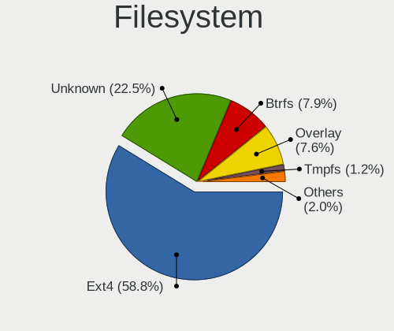
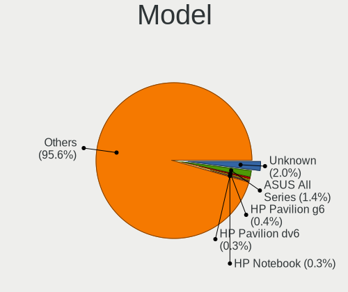
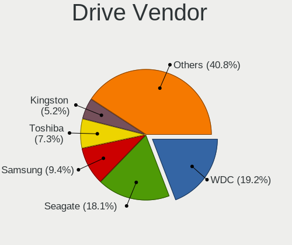
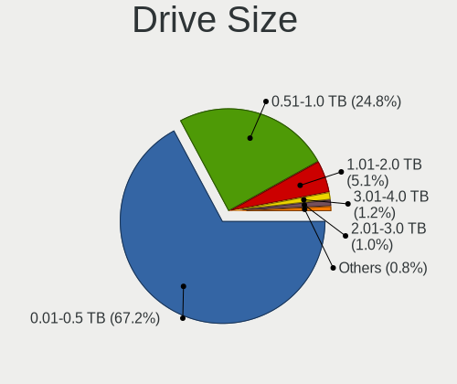
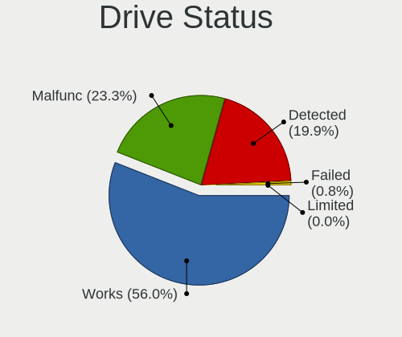
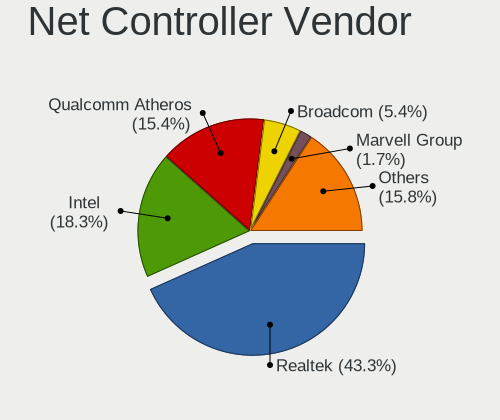
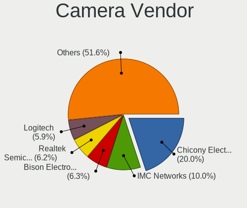
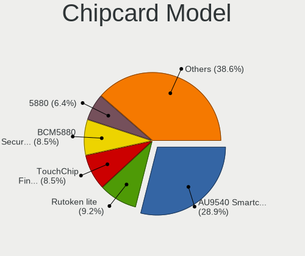

Linux in Russia - Tested Hardware & Statistics
----------------------------------------------

A project to collect tested hardware configurations for Linux in Russia.

Anyone can contribute to this report by the [hw-probe](https://github.com/linuxhw/hw-probe) tool:

    sudo -E hw-probe -all -upload

Please contribute! Especially if your hardware is rare.

This is a report for all computer types. See also reports for [desktops](/Location/Russia/Desktop/README.md) and [notebooks](/Location/Russia/Notebook/README.md).

Contents
--------

* [ Test Cases ](#test-cases)

* [ System ](#system)
  - [ OS                       ](#os)
  - [ OS Family                ](#os-family)
  - [ Kernel                   ](#kernel)
  - [ Kernel Family            ](#kernel-family)
  - [ Kernel Major Ver.        ](#kernel-major-ver)
  - [ Arch                     ](#arch)
  - [ DE                       ](#de)
  - [ Display Server           ](#display-server)
  - [ Display Manager          ](#display-manager)
  - [ OS Lang                  ](#os-lang)
  - [ Boot Mode                ](#boot-mode)
  - [ Filesystem               ](#filesystem)
  - [ Part. scheme             ](#part-scheme)
  - [ Dual Boot with Linux/BSD ](#dual-boot-with-linuxbsd)
  - [ Dual Boot (Win)          ](#dual-boot-win)

* [ Board ](#board)
  - [ Vendor                   ](#vendor)
  - [ Model                    ](#model)
  - [ Model Family             ](#model-family)
  - [ MFG Year                 ](#mfg-year)
  - [ Form Factor              ](#form-factor)
  - [ Secure Boot              ](#secure-boot)
  - [ Coreboot                 ](#coreboot)
  - [ RAM Size                 ](#ram-size)
  - [ RAM Used                 ](#ram-used)
  - [ Total Drives             ](#total-drives)
  - [ Has CD-ROM               ](#has-cd-rom)
  - [ Has Ethernet             ](#has-ethernet)
  - [ Has WiFi                 ](#has-wifi)
  - [ Has Bluetooth            ](#has-bluetooth)

* [ Location ](#location)
  - [ Country                  ](#country)
  - [ City                     ](#city)

* [ Drives ](#drives)
  - [ Drive Vendor             ](#drive-vendor)
  - [ Drive Model              ](#drive-model)
  - [ HDD Vendor               ](#hdd-vendor)
  - [ SSD Vendor               ](#ssd-vendor)
  - [ Drive Kind               ](#drive-kind)
  - [ Drive Connector          ](#drive-connector)
  - [ Drive Size               ](#drive-size)
  - [ Space Total              ](#space-total)
  - [ Space Used               ](#space-used)
  - [ Malfunc. Drives          ](#malfunc-drives)
  - [ Malfunc. Drive Vendor    ](#malfunc-drive-vendor)
  - [ Malfunc. HDD Vendor      ](#malfunc-hdd-vendor)
  - [ Malfunc. Drive Kind      ](#malfunc-drive-kind)
  - [ Failed Drives            ](#failed-drives)
  - [ Failed Drive Vendor      ](#failed-drive-vendor)
  - [ Drive Status             ](#drive-status)

* [ Storage controller ](#storage-controller)
  - [ Storage Vendor           ](#storage-vendor)
  - [ Storage Model            ](#storage-model)
  - [ Storage Kind             ](#storage-kind)

* [ Processor ](#processor)
  - [ CPU Vendor               ](#cpu-vendor)
  - [ CPU Model                ](#cpu-model)
  - [ CPU Model Family         ](#cpu-model-family)
  - [ CPU Cores                ](#cpu-cores)
  - [ CPU Sockets              ](#cpu-sockets)
  - [ CPU Threads              ](#cpu-threads)
  - [ CPU Op-Modes             ](#cpu-op-modes)
  - [ CPU Microcode            ](#cpu-microcode)
  - [ CPU Microarch            ](#cpu-microarch)

* [ Graphics ](#graphics)
  - [ GPU Vendor               ](#gpu-vendor)
  - [ GPU Model                ](#gpu-model)
  - [ GPU Combo                ](#gpu-combo)
  - [ GPU Driver               ](#gpu-driver)
  - [ GPU Memory               ](#gpu-memory)

* [ Monitor ](#monitor)
  - [ Monitor Vendor           ](#monitor-vendor)
  - [ Monitor Model            ](#monitor-model)
  - [ Monitor Resolution       ](#monitor-resolution)
  - [ Monitor Diagonal         ](#monitor-diagonal)
  - [ Monitor Width            ](#monitor-width)
  - [ Aspect Ratio             ](#aspect-ratio)
  - [ Monitor Area             ](#monitor-area)
  - [ Pixel Density            ](#pixel-density)
  - [ Multiple Monitors        ](#multiple-monitors)

* [ Network ](#network)
  - [ Net Controller Vendor    ](#net-controller-vendor)
  - [ Net Controller Model     ](#net-controller-model)
  - [ Wireless Vendor          ](#wireless-vendor)
  - [ Wireless Model           ](#wireless-model)
  - [ Ethernet Vendor          ](#ethernet-vendor)
  - [ Ethernet Model           ](#ethernet-model)
  - [ Net Controller Kind      ](#net-controller-kind)
  - [ Used Controller          ](#used-controller)
  - [ NICs                     ](#nics)
  - [ IPv6                     ](#ipv6)

* [ Bluetooth ](#bluetooth)
  - [ Bluetooth Vendor         ](#bluetooth-vendor)
  - [ Bluetooth Model          ](#bluetooth-model)

* [ Sound ](#sound)
  - [ Sound Vendor             ](#sound-vendor)
  - [ Sound Model              ](#sound-model)

* [ Memory ](#memory)
  - [ Memory Vendor            ](#memory-vendor)
  - [ Memory Model             ](#memory-model)
  - [ Memory Kind              ](#memory-kind)
  - [ Memory Form Factor       ](#memory-form-factor)
  - [ Memory Size              ](#memory-size)
  - [ Memory Speed             ](#memory-speed)

* [ Printers & scanners ](#printers--scanners)
  - [ Printer Vendor           ](#printer-vendor)
  - [ Printer Model            ](#printer-model)
  - [ Scanner Vendor           ](#scanner-vendor)
  - [ Scanner Model            ](#scanner-model)

* [ Camera ](#camera)
  - [ Camera Vendor            ](#camera-vendor)
  - [ Camera Model             ](#camera-model)

* [ Security ](#security)
  - [ Fingerprint Vendor       ](#fingerprint-vendor)
  - [ Fingerprint Model        ](#fingerprint-model)
  - [ Chipcard Vendor          ](#chipcard-vendor)
  - [ Chipcard Model           ](#chipcard-model)

* [ Unsupported ](#unsupported)
  - [ Unsupported Devices      ](#unsupported-devices)
  - [ Unsupported Device Types ](#unsupported-device-types)

Test Cases
----------

Total: 37743

| Vendor        | Model                       | Form-Factor | Probe                                                      | Date         |
|---------------|-----------------------------|-------------|------------------------------------------------------------|--------------|
| HP            | 8906 SMVB                   | Desktop     | [74430f2160](https://linux-hardware.org/?probe=74430f2160) | Apr 01, 2023 |
| Acer          | Aspire V5-121               | Notebook    | [d6cc7a67ab](https://linux-hardware.org/?probe=d6cc7a67ab) | Apr 01, 2023 |
| Lenovo        | ThinkPad P1 Gen 4i 20Y30... | Notebook    | [96c53eccb0](https://linux-hardware.org/?probe=96c53eccb0) | Apr 01, 2023 |
| Unknown       | X133                        | Notebook    | [950572f119](https://linux-hardware.org/?probe=950572f119) | Apr 01, 2023 |
| ASUSTek       | F3JP                        | Notebook    | [e561213582](https://linux-hardware.org/?probe=e561213582) | Apr 01, 2023 |
| ASUSTek       | X550LB                      | Notebook    | [3d35ff8b68](https://linux-hardware.org/?probe=3d35ff8b68) | Apr 01, 2023 |
| Gigabyte      | B550 AORUS ELITE V2         | Desktop     | [978a5e2579](https://linux-hardware.org/?probe=978a5e2579) | Apr 01, 2023 |
| Toshiba       | Satellite S50-A-K7M         | Notebook    | [af163d8ec3](https://linux-hardware.org/?probe=af163d8ec3) | Apr 01, 2023 |
| Gigabyte      | G41M-Combo                  | Desktop     | [ac658bcb80](https://linux-hardware.org/?probe=ac658bcb80) | Apr 01, 2023 |
| MSI           | MAG B660M MORTAR WIFI DD... | Desktop     | [c512f4cdd9](https://linux-hardware.org/?probe=c512f4cdd9) | Apr 01, 2023 |
| Gigabyte      | MZGLKDP-00                  | Desktop     | [c9427f4873](https://linux-hardware.org/?probe=c9427f4873) | Apr 01, 2023 |
| Sony          | VPCEH1S1R                   | Notebook    | [12100cdd4b](https://linux-hardware.org/?probe=12100cdd4b) | Apr 01, 2023 |
| Lenovo        | IdeaPad 3 15IIL05 81WE      | Notebook    | [9db0830268](https://linux-hardware.org/?probe=9db0830268) | Apr 01, 2023 |
| MSI           | MAG B660M MORTAR WIFI DD... | Desktop     | [e615755655](https://linux-hardware.org/?probe=e615755655) | Apr 01, 2023 |
| ASUSTek       | M5A78L LE                   | Desktop     | [af64a32a09](https://linux-hardware.org/?probe=af64a32a09) | Apr 01, 2023 |
| MSI           | H510M-A PRO                 | Desktop     | [a6953d3b96](https://linux-hardware.org/?probe=a6953d3b96) | Apr 01, 2023 |
| HUAWEI        | NBD-WXX9                    | Notebook    | [d4c718bdab](https://linux-hardware.org/?probe=d4c718bdab) | Apr 01, 2023 |
| Unknown       | X79                         | Desktop     | [d0592836a5](https://linux-hardware.org/?probe=d0592836a5) | Apr 01, 2023 |
| Lenovo        | ThinkPad X201s 514328U      | Notebook    | [011c475758](https://linux-hardware.org/?probe=011c475758) | Apr 01, 2023 |
| Gigabyte      | A320M-H-CF                  | Desktop     | [a5c21e7892](https://linux-hardware.org/?probe=a5c21e7892) | Apr 01, 2023 |
| Gigabyte      | A320M-H-CF                  | Desktop     | [4b873550ab](https://linux-hardware.org/?probe=4b873550ab) | Apr 01, 2023 |
| HP            | Pavilion dv7                | Notebook    | [00bbec023a](https://linux-hardware.org/?probe=00bbec023a) | Apr 01, 2023 |
| Dell          | XPS 17 9700                 | Notebook    | [5d0a908832](https://linux-hardware.org/?probe=5d0a908832) | Mar 31, 2023 |
| ASUSTek       | X202E                       | Notebook    | [cdcccb09e7](https://linux-hardware.org/?probe=cdcccb09e7) | Mar 31, 2023 |
| ASUSTek       | P8B75-V                     | Desktop     | [5ed3be8dbc](https://linux-hardware.org/?probe=5ed3be8dbc) | Mar 31, 2023 |
| ASUSTek       | X202E                       | Notebook    | [ac12ec53a3](https://linux-hardware.org/?probe=ac12ec53a3) | Mar 31, 2023 |
| ASUSTek       | M5A78L LE                   | Desktop     | [7a23362aac](https://linux-hardware.org/?probe=7a23362aac) | Mar 31, 2023 |
| Lenovo        | IdeaPad Yoga 13 20175       | Notebook    | [66a1075056](https://linux-hardware.org/?probe=66a1075056) | Mar 31, 2023 |
| Fujitsu       | LIFEBOOK NH532              | Notebook    | [68a8171c0a](https://linux-hardware.org/?probe=68a8171c0a) | Mar 31, 2023 |
| Gigabyte      | H61M-DS2                    | Desktop     | [35e4f876ca](https://linux-hardware.org/?probe=35e4f876ca) | Mar 31, 2023 |
| Gigabyte      | H61M-DS2                    | Desktop     | [fca09d31a2](https://linux-hardware.org/?probe=fca09d31a2) | Mar 31, 2023 |
| ASUSTek       | PRIME B660-PLUS D4          | Desktop     | [1ac381c18f](https://linux-hardware.org/?probe=1ac381c18f) | Mar 31, 2023 |
| Gigabyte      | Z77-DS3H                    | Desktop     | [79e2cfa0f1](https://linux-hardware.org/?probe=79e2cfa0f1) | Mar 31, 2023 |
| ASUSTek       | PRIME Z690M-PLUS D4         | Desktop     | [51c601477f](https://linux-hardware.org/?probe=51c601477f) | Mar 31, 2023 |
| Samsung       | 300V3A/300V4A/300V5A/200... | Notebook    | [ad92e27c90](https://linux-hardware.org/?probe=ad92e27c90) | Mar 31, 2023 |
| Gigabyte      | Z77X-UD5H                   | Desktop     | [323d8881a5](https://linux-hardware.org/?probe=323d8881a5) | Mar 31, 2023 |
| ASUSTek       | K53SD                       | Notebook    | [81d03c3707](https://linux-hardware.org/?probe=81d03c3707) | Mar 31, 2023 |
| ASRock        | N68-GS4 FX                  | Desktop     | [573f5db37d](https://linux-hardware.org/?probe=573f5db37d) | Mar 31, 2023 |
| Getac         | F110G6                      | Tablet      | [2a05772cb6](https://linux-hardware.org/?probe=2a05772cb6) | Mar 31, 2023 |
| Chuwi         | CoreBook XPro               | Notebook    | [85ad17d246](https://linux-hardware.org/?probe=85ad17d246) | Mar 31, 2023 |
| HUAWEI        | HN-WX9X                     | Notebook    | [b10ed7894c](https://linux-hardware.org/?probe=b10ed7894c) | Mar 31, 2023 |
| HP            | ProLiant DL380 G6           | Server      | [0cad2b6262](https://linux-hardware.org/?probe=0cad2b6262) | Mar 31, 2023 |
| HP            | ProLiant DL380 G6           | Server      | [953fbb916c](https://linux-hardware.org/?probe=953fbb916c) | Mar 31, 2023 |
| Quanta        | 2AC5 100                    | Desktop     | [7f253a82dc](https://linux-hardware.org/?probe=7f253a82dc) | Mar 31, 2023 |
| ASUSTek       | P8H67-M                     | Desktop     | [3806b33cae](https://linux-hardware.org/?probe=3806b33cae) | Mar 31, 2023 |
| ASUSTek       | TUF Z270 MARK 2             | Desktop     | [6bd60aa5f0](https://linux-hardware.org/?probe=6bd60aa5f0) | Mar 31, 2023 |
| Intel         | S1200BTL E98681-352         | Server      | [6d9ff27de2](https://linux-hardware.org/?probe=6d9ff27de2) | Mar 31, 2023 |
| ASUSTek       | GL502VMK                    | Notebook    | [fe7f43d2db](https://linux-hardware.org/?probe=fe7f43d2db) | Mar 31, 2023 |
| Lenovo        | Legion 5 15IMH05 82AU       | Notebook    | [36c0a38885](https://linux-hardware.org/?probe=36c0a38885) | Mar 31, 2023 |
| Dell          | Inspiron N5010              | Notebook    | [4d3e61950f](https://linux-hardware.org/?probe=4d3e61950f) | Mar 31, 2023 |
| Intel         | S1200BTL E98681-352         | Server      | [50c3fba233](https://linux-hardware.org/?probe=50c3fba233) | Mar 31, 2023 |
| Gigabyte      | 965P-DS4                    | Desktop     | [ddebc735da](https://linux-hardware.org/?probe=ddebc735da) | Mar 31, 2023 |
| Intel         | X79                         | Desktop     | [c06125262b](https://linux-hardware.org/?probe=c06125262b) | Mar 31, 2023 |
| HP            | ProLiant DL380 G5           | Server      | [8cf84909e3](https://linux-hardware.org/?probe=8cf84909e3) | Mar 31, 2023 |
| ASUSTek       | X751LD                      | Notebook    | [2ef82331de](https://linux-hardware.org/?probe=2ef82331de) | Mar 31, 2023 |
| Lenovo        | IdeaPad 300-15ISK 80Q7      | Notebook    | [54f8c5082d](https://linux-hardware.org/?probe=54f8c5082d) | Mar 31, 2023 |
| MSI           | H510M PRO-E                 | Desktop     | [9ec66a8f48](https://linux-hardware.org/?probe=9ec66a8f48) | Mar 31, 2023 |
| Lenovo        | IdeaPad L340-15API 81LW     | Notebook    | [36b3103f3f](https://linux-hardware.org/?probe=36b3103f3f) | Mar 31, 2023 |
| MSI           | G31TM-P21                   | Desktop     | [7404d94ca4](https://linux-hardware.org/?probe=7404d94ca4) | Mar 31, 2023 |
| ASUSTek       | VivoBook 15_ASUS Laptop ... | Notebook    | [8228733171](https://linux-hardware.org/?probe=8228733171) | Mar 31, 2023 |
| ASUSTek       | TUF Gaming B550M-PLUS       | Desktop     | [7a0f5608b2](https://linux-hardware.org/?probe=7a0f5608b2) | Mar 31, 2023 |
| ECS           | H61H2-M6                    | Desktop     | [6c33ee7e15](https://linux-hardware.org/?probe=6c33ee7e15) | Mar 31, 2023 |
| ASRock        | H61M                        | Desktop     | [29327171c4](https://linux-hardware.org/?probe=29327171c4) | Mar 31, 2023 |
| Gigabyte      | EP43-DS3L                   | Desktop     | [b7594db73b](https://linux-hardware.org/?probe=b7594db73b) | Mar 31, 2023 |
| HP            | Spectre x360 Convertible... | Convertible | [6df4368a49](https://linux-hardware.org/?probe=6df4368a49) | Mar 31, 2023 |
| ASUSTek       | M5A78L-M LX3                | Desktop     | [6ff0a3cb3f](https://linux-hardware.org/?probe=6ff0a3cb3f) | Mar 31, 2023 |
| ASUSTek       | K54C                        | Notebook    | [a2a91e2071](https://linux-hardware.org/?probe=a2a91e2071) | Mar 30, 2023 |
| ASUSTek       | PRIME A320M-K               | Desktop     | [3670f0a6ed](https://linux-hardware.org/?probe=3670f0a6ed) | Mar 30, 2023 |
| ASRock        | X570 Phantom Gaming 4       | Desktop     | [1417777bbc](https://linux-hardware.org/?probe=1417777bbc) | Mar 30, 2023 |
| AZW           | U59                         | Desktop     | [c87edfe3b6](https://linux-hardware.org/?probe=c87edfe3b6) | Mar 30, 2023 |
| ASRock        | X570 Phantom Gaming 4       | Desktop     | [2ac52b4538](https://linux-hardware.org/?probe=2ac52b4538) | Mar 30, 2023 |
| Gigabyte      | P41T-D3P                    | Desktop     | [c8cadc8a94](https://linux-hardware.org/?probe=c8cadc8a94) | Mar 30, 2023 |
| HP            | Pavilion dv6                | Notebook    | [c91e4d9c5a](https://linux-hardware.org/?probe=c91e4d9c5a) | Mar 30, 2023 |
| ASUSTek       | X101H                       | Notebook    | [a8a30f0050](https://linux-hardware.org/?probe=a8a30f0050) | Mar 30, 2023 |
| Intel         | B75A                        | Desktop     | [b7b1423f34](https://linux-hardware.org/?probe=b7b1423f34) | Mar 30, 2023 |
| HUAWEI        | KLVL-WXXW                   | Notebook    | [ab31f6f63d](https://linux-hardware.org/?probe=ab31f6f63d) | Mar 30, 2023 |
| Gigabyte      | H410M S2H V2                | Desktop     | [cf13162657](https://linux-hardware.org/?probe=cf13162657) | Mar 30, 2023 |
| HP            | Pavilion Notebook           | Notebook    | [3844e429b1](https://linux-hardware.org/?probe=3844e429b1) | Mar 30, 2023 |
| ASUSTek       | K52JB                       | Notebook    | [45162c9123](https://linux-hardware.org/?probe=45162c9123) | Mar 30, 2023 |
| ASUSTek       | K52JB                       | Notebook    | [c19cd604b3](https://linux-hardware.org/?probe=c19cd604b3) | Mar 30, 2023 |
| MSI           | H510M-A PRO                 | Desktop     | [49a4903c58](https://linux-hardware.org/?probe=49a4903c58) | Mar 30, 2023 |
| Lenovo        | Legion 5 15ACH6H 82JU       | Notebook    | [8e7a5551df](https://linux-hardware.org/?probe=8e7a5551df) | Mar 30, 2023 |
| Acer          | Aspire E5-573G              | Notebook    | [d68a126b9b](https://linux-hardware.org/?probe=d68a126b9b) | Mar 30, 2023 |
| ASUSTek       | P5G41T-M LX2/GB             | Desktop     | [f310910b0e](https://linux-hardware.org/?probe=f310910b0e) | Mar 30, 2023 |
| Toshiba       | Satellite Pro L300          | Notebook    | [04b9e48603](https://linux-hardware.org/?probe=04b9e48603) | Mar 30, 2023 |
| DEPO Compu... | DPC156                      | Notebook    | [fc942702db](https://linux-hardware.org/?probe=fc942702db) | Mar 30, 2023 |
| Foxconn       | 2ABF                        | Desktop     | [8e1750d5e4](https://linux-hardware.org/?probe=8e1750d5e4) | Mar 30, 2023 |
| Fujitsu Si... | D2764-A1 S26361-D2764-A1    | Desktop     | [08af010307](https://linux-hardware.org/?probe=08af010307) | Mar 30, 2023 |
| DEPO Compu... | DPC156                      | Notebook    | [ab5d4b339b](https://linux-hardware.org/?probe=ab5d4b339b) | Mar 30, 2023 |
| ASUSTek       | P8H77-V                     | Desktop     | [1869e23c56](https://linux-hardware.org/?probe=1869e23c56) | Mar 30, 2023 |
| HP            | Pavilion Notebook           | Notebook    | [d3eafe4568](https://linux-hardware.org/?probe=d3eafe4568) | Mar 30, 2023 |
| Dell          | Vostro 5468                 | Notebook    | [4ad7375ed0](https://linux-hardware.org/?probe=4ad7375ed0) | Mar 30, 2023 |
| MSI           | H97 PC Mate                 | Desktop     | [37c098e51a](https://linux-hardware.org/?probe=37c098e51a) | Mar 30, 2023 |
| Gigabyte      | Z390 UD                     | Desktop     | [558d551d9a](https://linux-hardware.org/?probe=558d551d9a) | Mar 30, 2023 |
| Valve         | Jupiter                     | Notebook    | [cf4ac240c4](https://linux-hardware.org/?probe=cf4ac240c4) | Mar 30, 2023 |
| Gigabyte      | GA-A55M-S2V                 | Desktop     | [6bb5f276cd](https://linux-hardware.org/?probe=6bb5f276cd) | Mar 30, 2023 |
| Gigabyte      | H77N-WIFI                   | Desktop     | [fecc161428](https://linux-hardware.org/?probe=fecc161428) | Mar 30, 2023 |
| Gigabyte      | B75M-D3V                    | Desktop     | [d3ae118e3b](https://linux-hardware.org/?probe=d3ae118e3b) | Mar 30, 2023 |
| ASUSTek       | PRIME H310M-R R2.0          | Desktop     | [3ad3c5e45c](https://linux-hardware.org/?probe=3ad3c5e45c) | Mar 30, 2023 |
| Huanan        | X99-QD4 V1.0                | Desktop     | [d88393be26](https://linux-hardware.org/?probe=d88393be26) | Mar 30, 2023 |
| Gigabyte      | H81M-S2V                    | Desktop     | [5a16920bc0](https://linux-hardware.org/?probe=5a16920bc0) | Mar 30, 2023 |
| Acer          | Aspire TC-605               | Desktop     | [5938e606b6](https://linux-hardware.org/?probe=5938e606b6) | Mar 30, 2023 |
| ASRock        | H110M-DGS R3.0              | Desktop     | [0580e11b2f](https://linux-hardware.org/?probe=0580e11b2f) | Mar 29, 2023 |
| ASRock        | B650M PG Riptide            | Desktop     | [f019265109](https://linux-hardware.org/?probe=f019265109) | Mar 29, 2023 |
| AZW           | SER                         | Mini pc     | [40824322c9](https://linux-hardware.org/?probe=40824322c9) | Mar 29, 2023 |
| Unknown       | Unknown                     | Desktop     | [e62607df55](https://linux-hardware.org/?probe=e62607df55) | Mar 29, 2023 |
| ASUSTek       | VivoBook_ASUSLaptop X513... | Notebook    | [d7fedcc338](https://linux-hardware.org/?probe=d7fedcc338) | Mar 29, 2023 |
| ASRock        | N68PV-GS                    | Desktop     | [1c473cd5c6](https://linux-hardware.org/?probe=1c473cd5c6) | Mar 29, 2023 |
| Gigabyte      | 945P-S3                     | Desktop     | [8aa985b6fa](https://linux-hardware.org/?probe=8aa985b6fa) | Mar 29, 2023 |
| Acer          | Aspire 5050                 | Notebook    | [689cd48886](https://linux-hardware.org/?probe=689cd48886) | Mar 29, 2023 |
| ASUSTek       | ProArt Z690-CREATOR WIFI    | Desktop     | [55a22382cc](https://linux-hardware.org/?probe=55a22382cc) | Mar 29, 2023 |
| Dell          | Latitude 5420               | Notebook    | [aee5c648e7](https://linux-hardware.org/?probe=aee5c648e7) | Mar 29, 2023 |
| Clevo         | NL41MU2                     | Notebook    | [69abc76758](https://linux-hardware.org/?probe=69abc76758) | Mar 29, 2023 |
| Dell          | System Inspiron N7110       | Notebook    | [cc23cb7065](https://linux-hardware.org/?probe=cc23cb7065) | Mar 29, 2023 |
| ASRock        | 990FX Extreme3              | Desktop     | [ca172328f1](https://linux-hardware.org/?probe=ca172328f1) | Mar 29, 2023 |
| Lenovo        | ThinkPad X201s 514328U      | Notebook    | [a6dbe138a5](https://linux-hardware.org/?probe=a6dbe138a5) | Mar 29, 2023 |
| Gigabyte      | B550 AORUS ELITE V2         | Desktop     | [599577c3b4](https://linux-hardware.org/?probe=599577c3b4) | Mar 29, 2023 |
| Lenovo        | IdeaPad S145-15API 81UT     | Notebook    | [695a074faf](https://linux-hardware.org/?probe=695a074faf) | Mar 29, 2023 |
| Fujitsu Si... | LIFEBOOK S6410              | Notebook    | [607219699e](https://linux-hardware.org/?probe=607219699e) | Mar 29, 2023 |
| Timi          | TM1701                      | Notebook    | [16ca4bcb7f](https://linux-hardware.org/?probe=16ca4bcb7f) | Mar 29, 2023 |
| ASRock        | H81M-HDS R2.0               | Desktop     | [1f333c98e1](https://linux-hardware.org/?probe=1f333c98e1) | Mar 29, 2023 |
| HONOR         | NBR-WAX9                    | Notebook    | [c0eeee7caf](https://linux-hardware.org/?probe=c0eeee7caf) | Mar 29, 2023 |
| Acer          | Aspire E1-571G              | Notebook    | [574f00dff5](https://linux-hardware.org/?probe=574f00dff5) | Mar 29, 2023 |
| Intel         | NUC10i5FNB K61361-306       | Mini pc     | [9ec87342fd](https://linux-hardware.org/?probe=9ec87342fd) | Mar 29, 2023 |
| Graviton      | DMB-A520-MCA01              | Desktop     | [9d7a43d81f](https://linux-hardware.org/?probe=9d7a43d81f) | Mar 29, 2023 |
| Gigabyte      | B550M DS3H                  | Desktop     | [612dd1dba2](https://linux-hardware.org/?probe=612dd1dba2) | Mar 29, 2023 |
| ASUSTek       | PRIME H310M-R R2.0          | Desktop     | [8400d48ed0](https://linux-hardware.org/?probe=8400d48ed0) | Mar 29, 2023 |
| Clevo         | M815P                       | Notebook    | [ac4eae2a0b](https://linux-hardware.org/?probe=ac4eae2a0b) | Mar 29, 2023 |
| Timi          | Redmi Book Pro 14 2022      | Notebook    | [e9b1759970](https://linux-hardware.org/?probe=e9b1759970) | Mar 29, 2023 |
| Gigabyte      | P55-UD6-C                   | Desktop     | [7c56c30e23](https://linux-hardware.org/?probe=7c56c30e23) | Mar 29, 2023 |
| Gigabyte      | P55-UD6-C                   | Desktop     | [010ed7a818](https://linux-hardware.org/?probe=010ed7a818) | Mar 29, 2023 |
| HUAWEI        | KLVL-WXXW                   | Notebook    | [6c61111706](https://linux-hardware.org/?probe=6c61111706) | Mar 28, 2023 |
| HP            | Pavilion Notebook           | Notebook    | [9cb1834208](https://linux-hardware.org/?probe=9cb1834208) | Mar 28, 2023 |
| Gigabyte      | H410M H V3                  | Desktop     | [10fd7d1526](https://linux-hardware.org/?probe=10fd7d1526) | Mar 28, 2023 |
| Gateway       | LT27                        | Notebook    | [4697cead5f](https://linux-hardware.org/?probe=4697cead5f) | Mar 28, 2023 |
| THUNDEROBO... | 911 Plus                    | Notebook    | [6617ad47b7](https://linux-hardware.org/?probe=6617ad47b7) | Mar 28, 2023 |
| MSI           | X370 GAMING PLUS            | Desktop     | [53543ce276](https://linux-hardware.org/?probe=53543ce276) | Mar 28, 2023 |
| Pegatron      | H36QR                       | Notebook    | [a9f1036ba5](https://linux-hardware.org/?probe=a9f1036ba5) | Mar 28, 2023 |
| Supermicro    | X9DRi-LN4+/X9DR3-LN4+       | Desktop     | [3c3474d69b](https://linux-hardware.org/?probe=3c3474d69b) | Mar 28, 2023 |
| Supermicro    | X9DRi-LN4+/X9DR3-LN4+       | Desktop     | [21f6af6f50](https://linux-hardware.org/?probe=21f6af6f50) | Mar 28, 2023 |
| Pegatron      | H36QR                       | Notebook    | [c3cf444e89](https://linux-hardware.org/?probe=c3cf444e89) | Mar 28, 2023 |
| Gigabyte      | GA-780T-D3L                 | Desktop     | [4f523c6409](https://linux-hardware.org/?probe=4f523c6409) | Mar 28, 2023 |
| HIPER Tech... | HIPER WORKBOOK              | Notebook    | [6e3a79c8b3](https://linux-hardware.org/?probe=6e3a79c8b3) | Mar 28, 2023 |
| MSI           | GE72 6QC                    | Notebook    | [6e593cf965](https://linux-hardware.org/?probe=6e593cf965) | Mar 28, 2023 |
| Gigabyte      | 946GMX-S2                   | Desktop     | [41f98f54fd](https://linux-hardware.org/?probe=41f98f54fd) | Mar 28, 2023 |
| ASUSTek       | X751LD                      | Notebook    | [61382d0bd8](https://linux-hardware.org/?probe=61382d0bd8) | Mar 28, 2023 |
| ASUSTek       | VivoBook 15_ASUS Laptop ... | Notebook    | [d97a249a99](https://linux-hardware.org/?probe=d97a249a99) | Mar 28, 2023 |
| ASUSTek       | P8Z77-V LK                  | Desktop     | [b097373c25](https://linux-hardware.org/?probe=b097373c25) | Mar 28, 2023 |
| MSI           | 770-C45                     | Desktop     | [9b23a7e2d0](https://linux-hardware.org/?probe=9b23a7e2d0) | Mar 28, 2023 |
| Aquarius      | NS685U R11                  | Notebook    | [ecd08ca6d1](https://linux-hardware.org/?probe=ecd08ca6d1) | Mar 28, 2023 |
| Samsung       | 350V5C/351V5C/3540VC/344... | Notebook    | [b8a7f41c86](https://linux-hardware.org/?probe=b8a7f41c86) | Mar 28, 2023 |
| MSI           | MPG B550 GAMING PLUS        | Desktop     | [23438353bb](https://linux-hardware.org/?probe=23438353bb) | Mar 28, 2023 |
| MSI           | MPG B550 GAMING PLUS        | Desktop     | [c49cc33482](https://linux-hardware.org/?probe=c49cc33482) | Mar 28, 2023 |
| MSI           | MS-AA721 100                | All in one  | [f2703ea41c](https://linux-hardware.org/?probe=f2703ea41c) | Mar 28, 2023 |
| Huanan        | X99-F8D V2.6                | Desktop     | [65f96586ec](https://linux-hardware.org/?probe=65f96586ec) | Mar 27, 2023 |
| HP            | Compaq 6720s                | Notebook    | [9998cb9bfb](https://linux-hardware.org/?probe=9998cb9bfb) | Mar 27, 2023 |
| Acer          | Extensa 2530                | Notebook    | [e39fe56d67](https://linux-hardware.org/?probe=e39fe56d67) | Mar 27, 2023 |
| Intel         | X79v2.72 KD V2.0            | Desktop     | [7b9dfca8cc](https://linux-hardware.org/?probe=7b9dfca8cc) | Mar 27, 2023 |
| Foxconn       | 2AA9                        | Desktop     | [97192fc35b](https://linux-hardware.org/?probe=97192fc35b) | Mar 27, 2023 |
| Acer          | NB-EX2510G-53DE             | Notebook    | [d331242786](https://linux-hardware.org/?probe=d331242786) | Mar 27, 2023 |
| HUAWEI        | NBD-WXX9                    | Notebook    | [e7788fd2a4](https://linux-hardware.org/?probe=e7788fd2a4) | Mar 27, 2023 |
| Haier         | P1510SD                     | Notebook    | [8bba4e9b5f](https://linux-hardware.org/?probe=8bba4e9b5f) | Mar 27, 2023 |
| HUAWEI        | NBD-WXX9                    | Notebook    | [d723ff0fa9](https://linux-hardware.org/?probe=d723ff0fa9) | Mar 27, 2023 |
| ASUSTek       | P7H55                       | Desktop     | [40158bca43](https://linux-hardware.org/?probe=40158bca43) | Mar 27, 2023 |
| Pegatron      | A15                         | Notebook    | [2a0a6bdafc](https://linux-hardware.org/?probe=2a0a6bdafc) | Mar 27, 2023 |
| Dell          | Inspiron 5570               | Notebook    | [696a8c86bf](https://linux-hardware.org/?probe=696a8c86bf) | Mar 27, 2023 |
| MSI           | G41M-P33 Combo              | Desktop     | [ea8ce90ed5](https://linux-hardware.org/?probe=ea8ce90ed5) | Mar 27, 2023 |
| MSI           | GE72 6QC                    | Notebook    | [e7c328a9f5](https://linux-hardware.org/?probe=e7c328a9f5) | Mar 27, 2023 |
| Lenovo        | IdeaPad S145-15AST 81N3     | Notebook    | [580e3a1237](https://linux-hardware.org/?probe=580e3a1237) | Mar 27, 2023 |
| Lenovo        | IdeaPad 1 15ALC7 82R4       | Notebook    | [deb6990c19](https://linux-hardware.org/?probe=deb6990c19) | Mar 27, 2023 |
| Acer          | Aspire 5050                 | Notebook    | [8490dcc481](https://linux-hardware.org/?probe=8490dcc481) | Mar 27, 2023 |
| HONOR         | NBR-WAX9                    | Notebook    | [ef91ef3645](https://linux-hardware.org/?probe=ef91ef3645) | Mar 27, 2023 |
| Packard Be... | EasyNote TE11HC             | Notebook    | [dd242e4ae3](https://linux-hardware.org/?probe=dd242e4ae3) | Mar 27, 2023 |
| Unknown       | Unknown                     | Desktop     | [ecf55ab179](https://linux-hardware.org/?probe=ecf55ab179) | Mar 27, 2023 |
| MSI           | Modern 15 B12M              | Notebook    | [eded7b36b1](https://linux-hardware.org/?probe=eded7b36b1) | Mar 27, 2023 |
| Lenovo        | B570e HuronRiver Platfor... | Notebook    | [f5274197b8](https://linux-hardware.org/?probe=f5274197b8) | Mar 27, 2023 |
| ASUSTek       | Maximus VIII HERO           | Desktop     | [23ee1856bc](https://linux-hardware.org/?probe=23ee1856bc) | Mar 27, 2023 |
| Haier         | S15                         | Notebook    | [a75654fe8a](https://linux-hardware.org/?probe=a75654fe8a) | Mar 27, 2023 |
| Lenovo        | B460e                       | Notebook    | [1c79a13a61](https://linux-hardware.org/?probe=1c79a13a61) | Mar 27, 2023 |
| Clevo         | NL41MU2                     | Notebook    | [60191a33b8](https://linux-hardware.org/?probe=60191a33b8) | Mar 27, 2023 |
| MSI           | Katana GF76 11UE            | Notebook    | [b82e15f498](https://linux-hardware.org/?probe=b82e15f498) | Mar 27, 2023 |
| MSI           | Modern 15 B12M              | Notebook    | [9ee3ca41c8](https://linux-hardware.org/?probe=9ee3ca41c8) | Mar 27, 2023 |
| Sony          | VPCF13E8R                   | Notebook    | [a9c7f1d8bc](https://linux-hardware.org/?probe=a9c7f1d8bc) | Mar 27, 2023 |
| Dell          | Latitude E6430              | Notebook    | [ec464ade9c](https://linux-hardware.org/?probe=ec464ade9c) | Mar 27, 2023 |
| Acer          | Aspire V3-551               | Notebook    | [48409a7222](https://linux-hardware.org/?probe=48409a7222) | Mar 27, 2023 |
| Gigabyte      | MRHM3AP                     | Desktop     | [27ac802035](https://linux-hardware.org/?probe=27ac802035) | Mar 26, 2023 |
| Gigabyte      | H77-DS3H                    | Desktop     | [36d80a146f](https://linux-hardware.org/?probe=36d80a146f) | Mar 26, 2023 |
| Lenovo        | ThinkPad E14 Gen 3 20Y70... | Notebook    | [85a8b8b452](https://linux-hardware.org/?probe=85a8b8b452) | Mar 26, 2023 |
| Foxconn       | G41MXE-V                    | Desktop     | [38d87a8061](https://linux-hardware.org/?probe=38d87a8061) | Mar 26, 2023 |
| Packard Be... | EasyNote TE11HC             | Notebook    | [6c942c5a39](https://linux-hardware.org/?probe=6c942c5a39) | Mar 26, 2023 |
| MSI           | GE72 6QC                    | Notebook    | [83793f19c1](https://linux-hardware.org/?probe=83793f19c1) | Mar 26, 2023 |
| ASUSTek       | TUF Gaming B550-PLUS        | Desktop     | [bbfe5423c9](https://linux-hardware.org/?probe=bbfe5423c9) | Mar 26, 2023 |
| ASUSTek       | P5W DH Deluxe               | Desktop     | [781cafa540](https://linux-hardware.org/?probe=781cafa540) | Mar 26, 2023 |
| Acer          | Aspire E1-570G              | Notebook    | [9d123ef87d](https://linux-hardware.org/?probe=9d123ef87d) | Mar 26, 2023 |
| Gigabyte      | G5 KF                       | Notebook    | [5275b7d43a](https://linux-hardware.org/?probe=5275b7d43a) | Mar 26, 2023 |
| Dell          | Inspiron 3576               | Notebook    | [18352c181a](https://linux-hardware.org/?probe=18352c181a) | Mar 26, 2023 |
| Gigabyte      | G5 KF                       | Notebook    | [9dd2faffb3](https://linux-hardware.org/?probe=9dd2faffb3) | Mar 26, 2023 |
| HP            | Victus by Laptop 16-e0xx... | Notebook    | [a7ff24abc4](https://linux-hardware.org/?probe=a7ff24abc4) | Mar 26, 2023 |
| HP            | Victus by Laptop 16-e0xx... | Notebook    | [8d5a135264](https://linux-hardware.org/?probe=8d5a135264) | Mar 26, 2023 |
| ASUSTek       | M5A78L/USB3                 | Desktop     | [732b7b7fab](https://linux-hardware.org/?probe=732b7b7fab) | Mar 26, 2023 |
| HUAWEI        | HN-WX9X                     | Notebook    | [cdc4b03fe2](https://linux-hardware.org/?probe=cdc4b03fe2) | Mar 26, 2023 |
| Samsung       | RV408/RV508                 | Notebook    | [5f5efa7edc](https://linux-hardware.org/?probe=5f5efa7edc) | Mar 25, 2023 |
| Gigabyte      | F2A55M-S1                   | Desktop     | [fff8f87d2a](https://linux-hardware.org/?probe=fff8f87d2a) | Mar 25, 2023 |
| HP            | ProBook 430 G6              | Notebook    | [cd14b86548](https://linux-hardware.org/?probe=cd14b86548) | Mar 25, 2023 |
| Samsung       | RV408/RV508                 | Notebook    | [cce3fdd054](https://linux-hardware.org/?probe=cce3fdd054) | Mar 25, 2023 |
| MSI           | PRO H610M-E DDR4            | Desktop     | [c33415cb2b](https://linux-hardware.org/?probe=c33415cb2b) | Mar 25, 2023 |
| Gigabyte      | B75M-D2V                    | Desktop     | [c98eac375f](https://linux-hardware.org/?probe=c98eac375f) | Mar 25, 2023 |
| ASUSTek       | P5G41T-M LX2/GB             | Desktop     | [8f04388ab5](https://linux-hardware.org/?probe=8f04388ab5) | Mar 25, 2023 |
| Timi          | TM1701                      | Notebook    | [f5dfd4628e](https://linux-hardware.org/?probe=f5dfd4628e) | Mar 25, 2023 |
| Fanless Mi... | Rev GMLR1                   | Mini pc     | [1879a953b7](https://linux-hardware.org/?probe=1879a953b7) | Mar 25, 2023 |
| HP            | EliteBook 855 G8 Noteboo... | Notebook    | [9c21fe4228](https://linux-hardware.org/?probe=9c21fe4228) | Mar 25, 2023 |
| Timi          | TM1701                      | Notebook    | [17e055a118](https://linux-hardware.org/?probe=17e055a118) | Mar 25, 2023 |
| MSI           | A520M PRO                   | Desktop     | [c27ea21be5](https://linux-hardware.org/?probe=c27ea21be5) | Mar 25, 2023 |
| Gigabyte      | GA-78LMT-S2P                | Desktop     | [3ce94dae13](https://linux-hardware.org/?probe=3ce94dae13) | Mar 25, 2023 |
| HP            | 0AA4h                       | Desktop     | [a77b084eba](https://linux-hardware.org/?probe=a77b084eba) | Mar 25, 2023 |
| Intel         | D2700DC AAG32420-602        | Desktop     | [0d20e81321](https://linux-hardware.org/?probe=0d20e81321) | Mar 25, 2023 |
| Toshiba       | Satellite A500              | Notebook    | [cd79c573c6](https://linux-hardware.org/?probe=cd79c573c6) | Mar 25, 2023 |
| Haier         | S15                         | Notebook    | [083feb0355](https://linux-hardware.org/?probe=083feb0355) | Mar 25, 2023 |
| ASUSTek       | ROG Strix G513IH_G513IH     | Notebook    | [f692116967](https://linux-hardware.org/?probe=f692116967) | Mar 25, 2023 |
| Samsung       | NC10                        | Notebook    | [96a0efc869](https://linux-hardware.org/?probe=96a0efc869) | Mar 25, 2023 |
| Samsung       | 300E4A/300E5A/300E7A/343... | Notebook    | [e9d97f4745](https://linux-hardware.org/?probe=e9d97f4745) | Mar 25, 2023 |
| ASUSTek       | P5KPL-AM SE                 | Desktop     | [357a52fe14](https://linux-hardware.org/?probe=357a52fe14) | Mar 25, 2023 |
| ASRock        | X99 Professional Gaming ... | Desktop     | [1cafadad17](https://linux-hardware.org/?probe=1cafadad17) | Mar 25, 2023 |
| ASRock        | X99 Professional Gaming ... | Desktop     | [38cead30d5](https://linux-hardware.org/?probe=38cead30d5) | Mar 25, 2023 |
| ASUSTek       | N53SN                       | Notebook    | [4150c3835d](https://linux-hardware.org/?probe=4150c3835d) | Mar 24, 2023 |
| Gigabyte      | H310N                       | Desktop     | [33a905038c](https://linux-hardware.org/?probe=33a905038c) | Mar 24, 2023 |
| Gigabyte      | X470 AORUS ULTRA GAMING-... | Desktop     | [f185ea819d](https://linux-hardware.org/?probe=f185ea819d) | Mar 24, 2023 |
| Gigabyte      | H61M-DS2                    | Desktop     | [cea1787057](https://linux-hardware.org/?probe=cea1787057) | Mar 24, 2023 |
| ASUSTek       | N550JK                      | Notebook    | [b63ec78860](https://linux-hardware.org/?probe=b63ec78860) | Mar 24, 2023 |
| MACHINIST     | X99-RS9 V3.1                | Desktop     | [c1e2b5e7fb](https://linux-hardware.org/?probe=c1e2b5e7fb) | Mar 24, 2023 |
| ASRock        | Z370M Pro4                  | Desktop     | [765602e7bf](https://linux-hardware.org/?probe=765602e7bf) | Mar 24, 2023 |
| ASRock        | 990FX Extreme3              | Desktop     | [c310b97b8d](https://linux-hardware.org/?probe=c310b97b8d) | Mar 24, 2023 |
| Lenovo        | QIWG5                       | Notebook    | [3136edbf1d](https://linux-hardware.org/?probe=3136edbf1d) | Mar 24, 2023 |
| Packard Be... | EasyNote TE11HC             | Notebook    | [dbea63ed43](https://linux-hardware.org/?probe=dbea63ed43) | Mar 24, 2023 |
| HP            | Laptop 17-ak0xx             | Notebook    | [872e7f18c5](https://linux-hardware.org/?probe=872e7f18c5) | Mar 24, 2023 |
| Unknown       | Unknown                     | Notebook    | [17cc340907](https://linux-hardware.org/?probe=17cc340907) | Mar 24, 2023 |
| Gigabyte      | H410M S2                    | Desktop     | [08b36ebc25](https://linux-hardware.org/?probe=08b36ebc25) | Mar 24, 2023 |
| Unknown       | Unknown                     | Notebook    | [359168b631](https://linux-hardware.org/?probe=359168b631) | Mar 24, 2023 |
| Lenovo        | B50-45 20388                | Notebook    | [5bd617a430](https://linux-hardware.org/?probe=5bd617a430) | Mar 24, 2023 |
| Intel         | D945GNT AAC96315-405        | Desktop     | [fcc7a18f89](https://linux-hardware.org/?probe=fcc7a18f89) | Mar 24, 2023 |
| ASUSTek       | ZenBook UX433FN_BX433FN     | Notebook    | [d8e67b032e](https://linux-hardware.org/?probe=d8e67b032e) | Mar 24, 2023 |
| ASUSTek       | VivoBook 15_ASUS Laptop ... | Notebook    | [a021e21c5f](https://linux-hardware.org/?probe=a021e21c5f) | Mar 24, 2023 |
| Lenovo        | IdeaPad Y560                | Notebook    | [18071acd7e](https://linux-hardware.org/?probe=18071acd7e) | Mar 24, 2023 |
| HP            | 8906 SMVB                   | Desktop     | [ae7d4327f5](https://linux-hardware.org/?probe=ae7d4327f5) | Mar 24, 2023 |
| Unknown       | X79M2-Q                     | Desktop     | [f517d6c26d](https://linux-hardware.org/?probe=f517d6c26d) | Mar 23, 2023 |
| Timi          | Redmi Book Pro 15 2022      | Notebook    | [cba22e109f](https://linux-hardware.org/?probe=cba22e109f) | Mar 23, 2023 |
| ASRock        | N68C-GS FX                  | Desktop     | [03da177044](https://linux-hardware.org/?probe=03da177044) | Mar 23, 2023 |
| Packard Be... | EasyNote TS11HR             | Notebook    | [f03dde8b73](https://linux-hardware.org/?probe=f03dde8b73) | Mar 23, 2023 |
| HP            | EliteBook 855 G8 Noteboo... | Notebook    | [750933836b](https://linux-hardware.org/?probe=750933836b) | Mar 23, 2023 |
| ASUSTek       | VivoBook_ASUSLaptop M650... | Notebook    | [2d44e8f5c2](https://linux-hardware.org/?probe=2d44e8f5c2) | Mar 23, 2023 |
| Gigabyte      | B85M-D2V                    | Desktop     | [afba39d63c](https://linux-hardware.org/?probe=afba39d63c) | Mar 23, 2023 |
| Gigabyte      | 970-GAMING                  | Desktop     | [f16afa095b](https://linux-hardware.org/?probe=f16afa095b) | Mar 23, 2023 |
| HP            | Pavilion Gaming Laptop 1... | Notebook    | [d956770153](https://linux-hardware.org/?probe=d956770153) | Mar 23, 2023 |
| Clevo         | NL41MU2                     | Notebook    | [b56bf816d5](https://linux-hardware.org/?probe=b56bf816d5) | Mar 23, 2023 |
| ECS           | G31T-M9                     | Desktop     | [e314bf5403](https://linux-hardware.org/?probe=e314bf5403) | Mar 23, 2023 |
| Lenovo        | Yoga Slim 7 13ACN5 82CY     | Notebook    | [950e4b69e8](https://linux-hardware.org/?probe=950e4b69e8) | Mar 23, 2023 |
| Clevo         | NL41MU2                     | Notebook    | [88a5d2eb30](https://linux-hardware.org/?probe=88a5d2eb30) | Mar 23, 2023 |
| Gigabyte      | G1.Sniper A88X-CF           | Desktop     | [ea6d900647](https://linux-hardware.org/?probe=ea6d900647) | Mar 23, 2023 |
| Gigabyte      | G1.Sniper A88X-CF           | Desktop     | [86d12b640c](https://linux-hardware.org/?probe=86d12b640c) | Mar 23, 2023 |
| iRU           | P231                        | All in one  | [98e5c0ba37](https://linux-hardware.org/?probe=98e5c0ba37) | Mar 23, 2023 |
| ASUSTek       | X556UB                      | Notebook    | [97a85936b2](https://linux-hardware.org/?probe=97a85936b2) | Mar 23, 2023 |
| Gigabyte      | B450M S2H                   | Desktop     | [73d22216c2](https://linux-hardware.org/?probe=73d22216c2) | Mar 23, 2023 |
| MSI           | MPG X670E CARBON WIFI       | Desktop     | [a36464850a](https://linux-hardware.org/?probe=a36464850a) | Mar 23, 2023 |
| MSI           | 760GM-P23                   | Desktop     | [f170457555](https://linux-hardware.org/?probe=f170457555) | Mar 23, 2023 |
| ASUSTek       | VivoBook_ASUSLaptop X415... | Notebook    | [fe3c64d71e](https://linux-hardware.org/?probe=fe3c64d71e) | Mar 23, 2023 |
| ASUSTek       | K61IC                       | Notebook    | [b16fb0d3c8](https://linux-hardware.org/?probe=b16fb0d3c8) | Mar 23, 2023 |
| Teclast       | F15Plus 2                   | Notebook    | [70a7bfb366](https://linux-hardware.org/?probe=70a7bfb366) | Mar 23, 2023 |
| realme        | CloudProXXXX                | Notebook    | [aaafa41631](https://linux-hardware.org/?probe=aaafa41631) | Mar 23, 2023 |
| ASUSTek       | H97-PLUS                    | Desktop     | [577716237d](https://linux-hardware.org/?probe=577716237d) | Mar 22, 2023 |
| Lenovo        | G560 20042                  | Notebook    | [2df8b64f07](https://linux-hardware.org/?probe=2df8b64f07) | Mar 22, 2023 |
| Toshiba       | T20                         | Notebook    | [a0757b47d7](https://linux-hardware.org/?probe=a0757b47d7) | Mar 22, 2023 |
| HP            | 635                         | Notebook    | [fef3dd1785](https://linux-hardware.org/?probe=fef3dd1785) | Mar 22, 2023 |
| Gigabyte      | H97M-HD3                    | Desktop     | [ab4dce8483](https://linux-hardware.org/?probe=ab4dce8483) | Mar 22, 2023 |
| Graviton      | DMB-A520-MCA01              | Desktop     | [123e95cee1](https://linux-hardware.org/?probe=123e95cee1) | Mar 22, 2023 |
| ASUSTek       | H97-PLUS                    | Desktop     | [32fa1d46e2](https://linux-hardware.org/?probe=32fa1d46e2) | Mar 22, 2023 |
| Apple         | Mac-F4238CC8 PVT            | All in one  | [59a7093d9b](https://linux-hardware.org/?probe=59a7093d9b) | Mar 22, 2023 |
| DEPO Compu... | MS-7846                     | Desktop     | [baaaef2394](https://linux-hardware.org/?probe=baaaef2394) | Mar 22, 2023 |
| Clevo         | NL41MU2                     | Notebook    | [430f11129e](https://linux-hardware.org/?probe=430f11129e) | Mar 22, 2023 |
| Unknown       | Unknown                     | Desktop     | [5d06af8741](https://linux-hardware.org/?probe=5d06af8741) | Mar 22, 2023 |
| ASUSTek       | X550CC                      | Notebook    | [55d3d0217c](https://linux-hardware.org/?probe=55d3d0217c) | Mar 22, 2023 |
| ASUSTek       | Zenbook UX535QE_UM535QE     | Notebook    | [1f5d2a057c](https://linux-hardware.org/?probe=1f5d2a057c) | Mar 22, 2023 |
| MACHINIST     | X99-k9 V2.0                 | Desktop     | [24377b0218](https://linux-hardware.org/?probe=24377b0218) | Mar 22, 2023 |
| Lenovo        | IdeaPad 330S-14AST 81F8     | Notebook    | [f97f90f7ce](https://linux-hardware.org/?probe=f97f90f7ce) | Mar 22, 2023 |
| ASUSTek       | X550CC                      | Notebook    | [957e5f5f8d](https://linux-hardware.org/?probe=957e5f5f8d) | Mar 22, 2023 |
| ASUSTek       | M2N-MX                      | Desktop     | [7eead8bd18](https://linux-hardware.org/?probe=7eead8bd18) | Mar 22, 2023 |
| Dell          | Latitude 5521               | Notebook    | [ff25b78796](https://linux-hardware.org/?probe=ff25b78796) | Mar 21, 2023 |
| ASUSTek       | ROG STRIX B650E-E GAMING... | Desktop     | [3308202939](https://linux-hardware.org/?probe=3308202939) | Mar 21, 2023 |
| HP            | Pavilion g7                 | Notebook    | [9fbef1354b](https://linux-hardware.org/?probe=9fbef1354b) | Mar 21, 2023 |
| HUAWEI        | CREM-WXX9                   | Notebook    | [64a63f42bf](https://linux-hardware.org/?probe=64a63f42bf) | Mar 21, 2023 |
| MSI           | Sword 15 A12UE              | Notebook    | [f4341a491a](https://linux-hardware.org/?probe=f4341a491a) | Mar 21, 2023 |
| HONOR         | HYM-WXX                     | Notebook    | [df318ed208](https://linux-hardware.org/?probe=df318ed208) | Mar 21, 2023 |
| MSI           | Bravo 15 B5DD               | Notebook    | [a320127e2e](https://linux-hardware.org/?probe=a320127e2e) | Mar 21, 2023 |
| New IT Pro... | C156EP-C8RVTH               | Notebook    | [556d5020f8](https://linux-hardware.org/?probe=556d5020f8) | Mar 21, 2023 |
| New IT Pro... | C156EP-C8RVTH               | Notebook    | [96e84a3c49](https://linux-hardware.org/?probe=96e84a3c49) | Mar 21, 2023 |
| Graviton      | DMB-A520-MCA01              | Desktop     | [24b07c4402](https://linux-hardware.org/?probe=24b07c4402) | Mar 21, 2023 |
| Lenovo        | ThinkBook 15 G2 ITL 20VE    | Notebook    | [a526417aaf](https://linux-hardware.org/?probe=a526417aaf) | Mar 21, 2023 |
| ASUSTek       | VivoBook_ASUSLaptop M350... | Notebook    | [e96b4f9ca9](https://linux-hardware.org/?probe=e96b4f9ca9) | Mar 21, 2023 |
| Intel         | NUC12WSBi5 M46425-302       | Mini pc     | [8e021e8177](https://linux-hardware.org/?probe=8e021e8177) | Mar 21, 2023 |
| Gigabyte      | H77N-WIFI                   | Desktop     | [3a70b6918f](https://linux-hardware.org/?probe=3a70b6918f) | Mar 21, 2023 |
| ASRock        | H470M-HDV                   | Desktop     | [52b14963e3](https://linux-hardware.org/?probe=52b14963e3) | Mar 21, 2023 |
| ASUSTek       | PRIME H310M-R R2.0          | Desktop     | [6b25c70b9f](https://linux-hardware.org/?probe=6b25c70b9f) | Mar 21, 2023 |
| Intel         | NUC7JYB M37329-601          | Mini pc     | [b9649aaa48](https://linux-hardware.org/?probe=b9649aaa48) | Mar 21, 2023 |
| ASRock        | AB350 Pro4                  | Desktop     | [7336ce9057](https://linux-hardware.org/?probe=7336ce9057) | Mar 21, 2023 |
| MSI           | Modern 14 A10M              | Notebook    | [7d9620fdd3](https://linux-hardware.org/?probe=7d9620fdd3) | Mar 21, 2023 |
| ASRock        | AB350 Pro4                  | Desktop     | [01e06fb483](https://linux-hardware.org/?probe=01e06fb483) | Mar 21, 2023 |
| Acer          | Aspire A515-44              | Notebook    | [923686eb97](https://linux-hardware.org/?probe=923686eb97) | Mar 21, 2023 |
| MSI           | B350 GAMING PLUS            | Desktop     | [2d82cffc81](https://linux-hardware.org/?probe=2d82cffc81) | Mar 20, 2023 |
| Acer          | Swift SF315-52G             | Notebook    | [f6042580d0](https://linux-hardware.org/?probe=f6042580d0) | Mar 20, 2023 |
| Gigabyte      | P31-DS3L                    | Desktop     | [7fb5a2f07e](https://linux-hardware.org/?probe=7fb5a2f07e) | Mar 20, 2023 |
| Unknown       | X79M2-Q                     | Desktop     | [11e2caa120](https://linux-hardware.org/?probe=11e2caa120) | Mar 20, 2023 |
| Gigabyte      | B550 AORUS PRO AC           | Desktop     | [e128423a13](https://linux-hardware.org/?probe=e128423a13) | Mar 20, 2023 |
| Lenovo        | ThinkPad T530 2429LT7       | Notebook    | [ebb127610b](https://linux-hardware.org/?probe=ebb127610b) | Mar 20, 2023 |
| Gigabyte      | B360M DS3H                  | Desktop     | [4df457f6bb](https://linux-hardware.org/?probe=4df457f6bb) | Mar 20, 2023 |
| HP            | ProLiant DL380 G6           | Server      | [cba773535e](https://linux-hardware.org/?probe=cba773535e) | Mar 20, 2023 |
| ASUSTek       | P5KPL-AM SE                 | Desktop     | [9a5bfcc056](https://linux-hardware.org/?probe=9a5bfcc056) | Mar 20, 2023 |
| Lenovo        | ThinkPad E15 Gen 4 21E60... | Notebook    | [7bc035af43](https://linux-hardware.org/?probe=7bc035af43) | Mar 20, 2023 |
| Unknown       | Unknown                     | Desktop     | [dfcc73f24d](https://linux-hardware.org/?probe=dfcc73f24d) | Mar 20, 2023 |
| Acer          | Swift SF114-34              | Notebook    | [0648d2d9c3](https://linux-hardware.org/?probe=0648d2d9c3) | Mar 20, 2023 |
| Gigabyte      | B360 AORUS GAMING 3 WIFI... | Desktop     | [e897657a4e](https://linux-hardware.org/?probe=e897657a4e) | Mar 20, 2023 |
| Acer          | Extensa 2509                | Notebook    | [8e0efd63c5](https://linux-hardware.org/?probe=8e0efd63c5) | Mar 20, 2023 |
| ASRock        | H310CM-DVS                  | Desktop     | [2ef180bad0](https://linux-hardware.org/?probe=2ef180bad0) | Mar 20, 2023 |
| Lenovo        | IdeaPad L340-15API 81LW     | Notebook    | [be9b767d92](https://linux-hardware.org/?probe=be9b767d92) | Mar 20, 2023 |
| ASUSTek       | VivoBook_ASUSLaptop X712... | Notebook    | [5b1bccd269](https://linux-hardware.org/?probe=5b1bccd269) | Mar 20, 2023 |
| Gigabyte      | X470 AORUS ULTRA GAMING-... | Desktop     | [f9c84aa26c](https://linux-hardware.org/?probe=f9c84aa26c) | Mar 20, 2023 |
| Gigabyte      | MP32-AR1-00 00030003        | Server      | [8619e38037](https://linux-hardware.org/?probe=8619e38037) | Mar 20, 2023 |
| ASUSTek       | PRIME H310M-R R2.0          | Desktop     | [e49b9e39d5](https://linux-hardware.org/?probe=e49b9e39d5) | Mar 20, 2023 |
| ASUSTek       | X751NV                      | Notebook    | [934e232587](https://linux-hardware.org/?probe=934e232587) | Mar 20, 2023 |
| Samsung       | 300E4A/300E5A/300E7A/343... | Notebook    | [470a7a9123](https://linux-hardware.org/?probe=470a7a9123) | Mar 20, 2023 |
| Acer          | TravelMate 5760             | Notebook    | [712e36569d](https://linux-hardware.org/?probe=712e36569d) | Mar 20, 2023 |
| ASUSTek       | Z97-K                       | Desktop     | [a48a2fbdd0](https://linux-hardware.org/?probe=a48a2fbdd0) | Mar 19, 2023 |
| ASUSTek       | PRIME H270-PLUS             | Desktop     | [4f56864a63](https://linux-hardware.org/?probe=4f56864a63) | Mar 19, 2023 |
| HP            | ProLiant DL380 G6           | Server      | [c831ceef8a](https://linux-hardware.org/?probe=c831ceef8a) | Mar 19, 2023 |
| Soyo          | SY-Classic B660M            | Desktop     | [cebe1d8722](https://linux-hardware.org/?probe=cebe1d8722) | Mar 19, 2023 |
| HP            | 0A54h                       | Desktop     | [6ec15582a7](https://linux-hardware.org/?probe=6ec15582a7) | Mar 19, 2023 |
| Prestigio     | PSB141C01BFH                | Notebook    | [9190e0a0e7](https://linux-hardware.org/?probe=9190e0a0e7) | Mar 19, 2023 |
| Teclast       | F15Plus 2                   | Notebook    | [17558890e2](https://linux-hardware.org/?probe=17558890e2) | Mar 19, 2023 |
| HP            | Laptop 15-rb0xx             | Notebook    | [d7ed5ce80d](https://linux-hardware.org/?probe=d7ed5ce80d) | Mar 19, 2023 |
| Toshiba       | Satellite Pro L300          | Notebook    | [82e7cb9669](https://linux-hardware.org/?probe=82e7cb9669) | Mar 19, 2023 |
| ASRock        | N68C-GS FX                  | Desktop     | [4d50b47e95](https://linux-hardware.org/?probe=4d50b47e95) | Mar 19, 2023 |
| MB            | A320-SF110                  | Desktop     | [588c8f3fe5](https://linux-hardware.org/?probe=588c8f3fe5) | Mar 19, 2023 |
| ASUSTek       | PRIME H310M-R R2.0          | Desktop     | [99096c6a78](https://linux-hardware.org/?probe=99096c6a78) | Mar 19, 2023 |
| ASUSTek       | VivoBook_ASUSLaptop M650... | Notebook    | [74b67b2037](https://linux-hardware.org/?probe=74b67b2037) | Mar 19, 2023 |
| Acidanther... | Mac-CFF7D910A743CAAF iMa... | All in one  | [1854e9efde](https://linux-hardware.org/?probe=1854e9efde) | Mar 19, 2023 |
| HONOR         | GLO-FX6P                    | Notebook    | [0fb3ebc365](https://linux-hardware.org/?probe=0fb3ebc365) | Mar 19, 2023 |
| Supermicro    | X9SRL-F                     | Server      | [eef379bee2](https://linux-hardware.org/?probe=eef379bee2) | Mar 19, 2023 |
| ASUSTek       | X205TA                      | Notebook    | [9727a94199](https://linux-hardware.org/?probe=9727a94199) | Mar 18, 2023 |
| Supermicro    | X9SRL-F                     | Server      | [87f035b169](https://linux-hardware.org/?probe=87f035b169) | Mar 18, 2023 |
| ASUSTek       | UX301LAA                    | Notebook    | [882d4d095b](https://linux-hardware.org/?probe=882d4d095b) | Mar 18, 2023 |
| Lenovo        | IdeaPad S340-15IIL 81VW     | Notebook    | [90ef6ca2b7](https://linux-hardware.org/?probe=90ef6ca2b7) | Mar 18, 2023 |
| ASUSTek       | PRIME B550M-A               | Desktop     | [783a968012](https://linux-hardware.org/?probe=783a968012) | Mar 18, 2023 |
| Gigabyte      | H110M-S2V-CF                | Desktop     | [1bedc9be7e](https://linux-hardware.org/?probe=1bedc9be7e) | Mar 18, 2023 |
| Lenovo        | IdeaPad S340-15IIL 81VW     | Notebook    | [b769745990](https://linux-hardware.org/?probe=b769745990) | Mar 18, 2023 |
| HONOR         | HYM-WXX                     | Notebook    | [bdb5c6a4ee](https://linux-hardware.org/?probe=bdb5c6a4ee) | Mar 18, 2023 |
| Supermicro    | X10SRi-FB                   | Server      | [746daacc72](https://linux-hardware.org/?probe=746daacc72) | Mar 18, 2023 |
| MSI           | GP60 2OD                    | Notebook    | [a3ffd8113f](https://linux-hardware.org/?probe=a3ffd8113f) | Mar 18, 2023 |
| MSI           | MS-B0A21                    | Desktop     | [7b5c0f63da](https://linux-hardware.org/?probe=7b5c0f63da) | Mar 18, 2023 |
| HONOR         | NBR-WAX9                    | Notebook    | [19fd2af680](https://linux-hardware.org/?probe=19fd2af680) | Mar 18, 2023 |
| Acer          | Aspire A315-55G             | Notebook    | [badcc52c19](https://linux-hardware.org/?probe=badcc52c19) | Mar 18, 2023 |
| Gigabyte      | GA-870A-UD3                 | Desktop     | [caf54bddb9](https://linux-hardware.org/?probe=caf54bddb9) | Mar 18, 2023 |
| HP            | Laptop 15-db1xxx            | Notebook    | [08df29b00e](https://linux-hardware.org/?probe=08df29b00e) | Mar 18, 2023 |
| Gigabyte      | 945GCM-S2L                  | Desktop     | [4b484ab326](https://linux-hardware.org/?probe=4b484ab326) | Mar 18, 2023 |
| Positivo      | N6440                       | Notebook    | [98323051b5](https://linux-hardware.org/?probe=98323051b5) | Mar 18, 2023 |
| ASRock        | B550M Phantom Gaming 4      | Desktop     | [c399d3fbf5](https://linux-hardware.org/?probe=c399d3fbf5) | Mar 18, 2023 |
| Gigabyte      | B550 AORUS ELITE AX V2      | Desktop     | [b33066c1b7](https://linux-hardware.org/?probe=b33066c1b7) | Mar 18, 2023 |
| HP            | OMEN Laptop 15-en1xxx       | Notebook    | [233610a033](https://linux-hardware.org/?probe=233610a033) | Mar 18, 2023 |
| ASRock        | N68C-GS FX                  | Desktop     | [94b8c06fdd](https://linux-hardware.org/?probe=94b8c06fdd) | Mar 18, 2023 |
| Apple         | Mac-4BC72D62AD45599E Mac... | Mini pc     | [3d01b5328f](https://linux-hardware.org/?probe=3d01b5328f) | Mar 18, 2023 |
| ASUSTek       | X551CAP                     | Notebook    | [e45da01a7e](https://linux-hardware.org/?probe=e45da01a7e) | Mar 18, 2023 |
| Gigabyte      | G41M-Combo                  | Desktop     | [877608b32b](https://linux-hardware.org/?probe=877608b32b) | Mar 18, 2023 |
| Acer          | Aspire 5310                 | Notebook    | [132691cbda](https://linux-hardware.org/?probe=132691cbda) | Mar 18, 2023 |
| ASRock        | QC6000M                     | Desktop     | [b897493246](https://linux-hardware.org/?probe=b897493246) | Mar 18, 2023 |
| ASUSTek       | VivoBook_ASUSLaptop M650... | Notebook    | [ecc76a5003](https://linux-hardware.org/?probe=ecc76a5003) | Mar 17, 2023 |
| Unknown       | X79M2-Q                     | Desktop     | [fe58227748](https://linux-hardware.org/?probe=fe58227748) | Mar 17, 2023 |
| HONOR         | NBR-WAX9                    | Notebook    | [09541b3bdd](https://linux-hardware.org/?probe=09541b3bdd) | Mar 17, 2023 |
| HONOR         | HYM-WXX                     | Notebook    | [279e932275](https://linux-hardware.org/?probe=279e932275) | Mar 17, 2023 |
| Biostar       | G41-M7                      | Desktop     | [7109205ef0](https://linux-hardware.org/?probe=7109205ef0) | Mar 17, 2023 |
| Aquarius      | NS585                       | Notebook    | [cd1e92458f](https://linux-hardware.org/?probe=cd1e92458f) | Mar 17, 2023 |
| ZOTAC         | H67ITX-C-E                  | Desktop     | [1da59d5440](https://linux-hardware.org/?probe=1da59d5440) | Mar 17, 2023 |
| ASUSTek       | P8H61-M LE                  | Desktop     | [bb43961724](https://linux-hardware.org/?probe=bb43961724) | Mar 17, 2023 |
| ASRock        | N68C-GS FX                  | Desktop     | [814c2e63c6](https://linux-hardware.org/?probe=814c2e63c6) | Mar 17, 2023 |
| HP            | EliteBook 840 G4            | Notebook    | [bb6be61738](https://linux-hardware.org/?probe=bb6be61738) | Mar 17, 2023 |
| Lenovo        | B590 20208                  | Notebook    | [e151d5d899](https://linux-hardware.org/?probe=e151d5d899) | Mar 17, 2023 |
| HIPER         | WORKBOOK                    | Notebook    | [ed14fd6e80](https://linux-hardware.org/?probe=ed14fd6e80) | Mar 17, 2023 |
| Gigabyte      | AB350M-DS3H V2-CF           | Desktop     | [0125449b9f](https://linux-hardware.org/?probe=0125449b9f) | Mar 17, 2023 |
| Biostar       | G41-M7                      | Desktop     | [b1fe372b7d](https://linux-hardware.org/?probe=b1fe372b7d) | Mar 17, 2023 |
| Gigabyte      | M52L-S3P                    | Desktop     | [89660a09c2](https://linux-hardware.org/?probe=89660a09c2) | Mar 17, 2023 |
| Intel         | X99 V1.0                    | Desktop     | [1b993725aa](https://linux-hardware.org/?probe=1b993725aa) | Mar 17, 2023 |
| Gigabyte      | H410M H V3                  | Desktop     | [be0d148aa6](https://linux-hardware.org/?probe=be0d148aa6) | Mar 17, 2023 |
| Gigabyte      | H410M H V3                  | Desktop     | [3b591bcb12](https://linux-hardware.org/?probe=3b591bcb12) | Mar 17, 2023 |
| Intel         | D945GNT AAC96315-405        | Desktop     | [58c99c07a6](https://linux-hardware.org/?probe=58c99c07a6) | Mar 17, 2023 |
| Gigabyte      | H410M H V3                  | Desktop     | [97ef9205b5](https://linux-hardware.org/?probe=97ef9205b5) | Mar 17, 2023 |
| Unknown       | Unknown                     | Notebook    | [d2af864fbb](https://linux-hardware.org/?probe=d2af864fbb) | Mar 17, 2023 |
| ASUSTek       | PRIME B250M-K               | Desktop     | [244382a7f5](https://linux-hardware.org/?probe=244382a7f5) | Mar 17, 2023 |
| Acer          | Nitro AN515-52              | Notebook    | [6ad4034797](https://linux-hardware.org/?probe=6ad4034797) | Mar 17, 2023 |
| ASUSTek       | X580VD                      | Notebook    | [8c4023bd5d](https://linux-hardware.org/?probe=8c4023bd5d) | Mar 16, 2023 |
| HONOR         | BMH-WCX9                    | Notebook    | [47a9ec2aa1](https://linux-hardware.org/?probe=47a9ec2aa1) | Mar 16, 2023 |
| Gigabyte      | B550M AORUS PRO-P           | Desktop     | [e41f82bcfd](https://linux-hardware.org/?probe=e41f82bcfd) | Mar 16, 2023 |
| ASUSTek       | ROG Zephyrus M16 GU603HE... | Notebook    | [421f6945e6](https://linux-hardware.org/?probe=421f6945e6) | Mar 16, 2023 |
| Acer          | Aspire 5820TZG              | Notebook    | [9f08995104](https://linux-hardware.org/?probe=9f08995104) | Mar 16, 2023 |
| ASUSTek       | X75VCP                      | Notebook    | [f154cf28db](https://linux-hardware.org/?probe=f154cf28db) | Mar 16, 2023 |
| ASUSTek       | X55A                        | Notebook    | [5cf7c3643d](https://linux-hardware.org/?probe=5cf7c3643d) | Mar 16, 2023 |
| ASUSTek       | X55A                        | Notebook    | [743d04e5fc](https://linux-hardware.org/?probe=743d04e5fc) | Mar 16, 2023 |
| Gigabyte      | B550M AORUS PRO-P           | Desktop     | [d6def0b0aa](https://linux-hardware.org/?probe=d6def0b0aa) | Mar 16, 2023 |
| ASUSTek       | X580VD                      | Notebook    | [26b62abfc9](https://linux-hardware.org/?probe=26b62abfc9) | Mar 16, 2023 |
| Gigabyte      | B550M AORUS ELITE           | Desktop     | [1a4e62a4a5](https://linux-hardware.org/?probe=1a4e62a4a5) | Mar 16, 2023 |
| Gigabyte      | 970A-DS3P                   | Desktop     | [fd875a6058](https://linux-hardware.org/?probe=fd875a6058) | Mar 16, 2023 |
| MicroByte     | ezpad                       | Tablet      | [745babb415](https://linux-hardware.org/?probe=745babb415) | Mar 16, 2023 |
| Lenovo        | ThinkBook 14s Yoga ITL 2... | Convertible | [73eb93b06f](https://linux-hardware.org/?probe=73eb93b06f) | Mar 16, 2023 |
| HUAWEI        | NDZ-WXX9                    | Notebook    | [82687f32c9](https://linux-hardware.org/?probe=82687f32c9) | Mar 16, 2023 |
| Dell          | 0VRWRC A00                  | Desktop     | [2159ca2389](https://linux-hardware.org/?probe=2159ca2389) | Mar 16, 2023 |
| ASUSTek       | P7H57D-V EVO                | Desktop     | [f93f85e76d](https://linux-hardware.org/?probe=f93f85e76d) | Mar 16, 2023 |
| Biostar       | H610MH                      | Desktop     | [6b367d747d](https://linux-hardware.org/?probe=6b367d747d) | Mar 16, 2023 |
| ASUSTek       | VivoBook_ASUSLaptop M150... | Notebook    | [a99c892744](https://linux-hardware.org/?probe=a99c892744) | Mar 16, 2023 |
| HUAWEI        | BOD-WXX9                    | Notebook    | [ef98a330e6](https://linux-hardware.org/?probe=ef98a330e6) | Mar 16, 2023 |
| Gigabyte      | B550 AORUS ELITE AX V2      | Desktop     | [9e172b266b](https://linux-hardware.org/?probe=9e172b266b) | Mar 16, 2023 |
| Gigabyte      | B550 AORUS ELITE AX V2      | Desktop     | [e6d8cd5424](https://linux-hardware.org/?probe=e6d8cd5424) | Mar 16, 2023 |
| ASUSTek       | PRIME X670-P WIFI           | Desktop     | [0b9755873a](https://linux-hardware.org/?probe=0b9755873a) | Mar 16, 2023 |
| MSI           | B450 TOMAHAWK MAX II        | Desktop     | [4e61f760cb](https://linux-hardware.org/?probe=4e61f760cb) | Mar 16, 2023 |
| MSI           | B450 TOMAHAWK MAX II        | Desktop     | [b7671cbae5](https://linux-hardware.org/?probe=b7671cbae5) | Mar 16, 2023 |
| Dell          | Latitude 7520               | Notebook    | [09c8e699d3](https://linux-hardware.org/?probe=09c8e699d3) | Mar 16, 2023 |
| Gigabyte      | H410M H V3                  | Desktop     | [6023b7ce1d](https://linux-hardware.org/?probe=6023b7ce1d) | Mar 16, 2023 |
| Lenovo        | ThinkPad X230 23245C8       | Notebook    | [7015f3b169](https://linux-hardware.org/?probe=7015f3b169) | Mar 16, 2023 |
| ASUSTek       | N76VB                       | Notebook    | [20afa1889d](https://linux-hardware.org/?probe=20afa1889d) | Mar 15, 2023 |
| Lenovo        | IdeaPad 320-15IKB 80XL      | Notebook    | [46d1e1d803](https://linux-hardware.org/?probe=46d1e1d803) | Mar 15, 2023 |
| Lenovo        | IdeaPad 320-15IKB 80XL      | Notebook    | [b110af35d5](https://linux-hardware.org/?probe=b110af35d5) | Mar 15, 2023 |
| Fujitsu       | LIFEBOOK E744               | Notebook    | [03e5d43f27](https://linux-hardware.org/?probe=03e5d43f27) | Mar 15, 2023 |
| Fujitsu       | LIFEBOOK E744               | Notebook    | [4c49d73583](https://linux-hardware.org/?probe=4c49d73583) | Mar 15, 2023 |
| Acer          | Aspire A315-42G             | Notebook    | [727c7d3b7b](https://linux-hardware.org/?probe=727c7d3b7b) | Mar 15, 2023 |
| HP            | Laptop 15s-eq1xxx           | Notebook    | [59a304e790](https://linux-hardware.org/?probe=59a304e790) | Mar 15, 2023 |
| Gigabyte      | A320M-S2H V2-CF             | Desktop     | [dfe927cc13](https://linux-hardware.org/?probe=dfe927cc13) | Mar 15, 2023 |
| ASRock        | Z77 Extreme3                | Desktop     | [e128413357](https://linux-hardware.org/?probe=e128413357) | Mar 15, 2023 |
| ECS           | K8M890M-M                   | Desktop     | [f38e796f51](https://linux-hardware.org/?probe=f38e796f51) | Mar 15, 2023 |
| Cincoze       | P1101.01.001                | Desktop     | [9443379d5e](https://linux-hardware.org/?probe=9443379d5e) | Mar 15, 2023 |
| iEi           | SAT3 V1.03                  | Desktop     | [2d3c739ac5](https://linux-hardware.org/?probe=2d3c739ac5) | Mar 15, 2023 |
| Toshiba       | Satellite L850D-BJS         | Notebook    | [95fcbd0967](https://linux-hardware.org/?probe=95fcbd0967) | Mar 15, 2023 |
| Lenovo        | ThinkBook 14s Yoga ITL 2... | Convertible | [5b55ac3757](https://linux-hardware.org/?probe=5b55ac3757) | Mar 15, 2023 |
| Acer          | Aspire C22-760              | All in one  | [e42342d72d](https://linux-hardware.org/?probe=e42342d72d) | Mar 15, 2023 |
| Gigabyte      | H55-UD3H                    | Desktop     | [bd69e8e59c](https://linux-hardware.org/?probe=bd69e8e59c) | Mar 15, 2023 |
| iEi           | SAT3 V1.03                  | Desktop     | [f6f29a0f8a](https://linux-hardware.org/?probe=f6f29a0f8a) | Mar 15, 2023 |
| ASUSTek       | B85M-G                      | Desktop     | [ea280402ca](https://linux-hardware.org/?probe=ea280402ca) | Mar 15, 2023 |
| ASUSTek       | B85M-G                      | Desktop     | [513385d981](https://linux-hardware.org/?probe=513385d981) | Mar 15, 2023 |
| HIPER         | WORKBOOK                    | Notebook    | [3d1c928bcb](https://linux-hardware.org/?probe=3d1c928bcb) | Mar 15, 2023 |
| ASUSTek       | PRIME Z370-P                | Desktop     | [82e7940a77](https://linux-hardware.org/?probe=82e7940a77) | Mar 15, 2023 |
| Acer          | Aspire 7720                 | Notebook    | [0f040d8292](https://linux-hardware.org/?probe=0f040d8292) | Mar 15, 2023 |
| Valve         | Jupiter                     | Notebook    | [686a9db96f](https://linux-hardware.org/?probe=686a9db96f) | Mar 15, 2023 |
| Gigabyte      | B450M DS3H V2               | Desktop     | [b952483e9a](https://linux-hardware.org/?probe=b952483e9a) | Mar 15, 2023 |
| ASUSTek       | P5Q SE2                     | Desktop     | [4f76198c2d](https://linux-hardware.org/?probe=4f76198c2d) | Mar 15, 2023 |
| MSI           | H61M-P20                    | Desktop     | [8129a4f5a4](https://linux-hardware.org/?probe=8129a4f5a4) | Mar 15, 2023 |
| ASUSTek       | VivoBook_ASUSLaptop K650... | Notebook    | [112d979fc6](https://linux-hardware.org/?probe=112d979fc6) | Mar 14, 2023 |
| Acer          | Aspire 7110                 | Notebook    | [ec44273fd3](https://linux-hardware.org/?probe=ec44273fd3) | Mar 14, 2023 |
| ASUSTek       | 1215P                       | Notebook    | [7cfe211e09](https://linux-hardware.org/?probe=7cfe211e09) | Mar 14, 2023 |
| Gigabyte      | B450M S2H                   | Desktop     | [31a56518c3](https://linux-hardware.org/?probe=31a56518c3) | Mar 14, 2023 |
| Lenovo        | ThinkPad X230 23245C8       | Notebook    | [5aaf852168](https://linux-hardware.org/?probe=5aaf852168) | Mar 14, 2023 |
| Sony          | VPCZ12V9R                   | Notebook    | [28be5f7f2b](https://linux-hardware.org/?probe=28be5f7f2b) | Mar 14, 2023 |
| Gigabyte      | GA-A55M-S2V                 | Desktop     | [25f7fa6e96](https://linux-hardware.org/?probe=25f7fa6e96) | Mar 14, 2023 |
| HP            | EliteBook 840 G8 Noteboo... | Notebook    | [9f3f315f73](https://linux-hardware.org/?probe=9f3f315f73) | Mar 14, 2023 |
| Lenovo        | V110-15AST 80TD             | Notebook    | [a574807ec1](https://linux-hardware.org/?probe=a574807ec1) | Mar 14, 2023 |
| HP            | EliteBook 840 G8 Noteboo... | Notebook    | [42653f8c2a](https://linux-hardware.org/?probe=42653f8c2a) | Mar 14, 2023 |
| Acer          | Aspire 7739G                | Notebook    | [aeff2df11c](https://linux-hardware.org/?probe=aeff2df11c) | Mar 14, 2023 |
| HP            | Laptop 15-bs1xx             | Notebook    | [3d98403721](https://linux-hardware.org/?probe=3d98403721) | Mar 14, 2023 |
| Acer          | Aspire 7720                 | Notebook    | [b80fa5f7ff](https://linux-hardware.org/?probe=b80fa5f7ff) | Mar 14, 2023 |
| ASUSTek       | PN41                        | Mini pc     | [8c5ddbfa64](https://linux-hardware.org/?probe=8c5ddbfa64) | Mar 14, 2023 |
| Intel         | S1200BTL E98681-352         | Server      | [50026c4750](https://linux-hardware.org/?probe=50026c4750) | Mar 14, 2023 |
| ASRock        | H55M Pro                    | Desktop     | [fe7531d450](https://linux-hardware.org/?probe=fe7531d450) | Mar 14, 2023 |
| MSI           | 770-C45                     | Desktop     | [ec1fc57db4](https://linux-hardware.org/?probe=ec1fc57db4) | Mar 14, 2023 |
| ASUSTek       | P5K                         | Desktop     | [2257feac11](https://linux-hardware.org/?probe=2257feac11) | Mar 14, 2023 |
| Intel         | D945GCPE AAD97209-201       | Desktop     | [7733f89d7d](https://linux-hardware.org/?probe=7733f89d7d) | Mar 14, 2023 |
| HUAWEI        | KPRC-WX0                    | Notebook    | [580758b277](https://linux-hardware.org/?probe=580758b277) | Mar 14, 2023 |
| HONOR         | BMH-WCX9                    | Notebook    | [d53fa296bf](https://linux-hardware.org/?probe=d53fa296bf) | Mar 14, 2023 |
| Lenovo        | ThinkPad E15 Gen 4 21ED0... | Notebook    | [e6792912bf](https://linux-hardware.org/?probe=e6792912bf) | Mar 14, 2023 |
| Lenovo        | ThinkPad E14 Gen 3 20Y70... | Notebook    | [088325b0d3](https://linux-hardware.org/?probe=088325b0d3) | Mar 14, 2023 |
| HP            | 0B4Ch D                     | Desktop     | [a26dff699b](https://linux-hardware.org/?probe=a26dff699b) | Mar 14, 2023 |
| Gigabyte      | B550 AORUS ELITE V2         | Desktop     | [ac3240d021](https://linux-hardware.org/?probe=ac3240d021) | Mar 14, 2023 |
| eMachines     | eME730G                     | Notebook    | [ef96ec0313](https://linux-hardware.org/?probe=ef96ec0313) | Mar 14, 2023 |
| ASUSTek       | E2KM1I-DELUXE               | Desktop     | [11056484c3](https://linux-hardware.org/?probe=11056484c3) | Mar 13, 2023 |
| Gigabyte      | B550 GAMING X V2            | Desktop     | [72f5663d9d](https://linux-hardware.org/?probe=72f5663d9d) | Mar 13, 2023 |
| Intel         | X79                         | Desktop     | [ae742c13ae](https://linux-hardware.org/?probe=ae742c13ae) | Mar 13, 2023 |
| Gigabyte      | X570 GAMING X               | Desktop     | [d4ebb8d458](https://linux-hardware.org/?probe=d4ebb8d458) | Mar 13, 2023 |
| ASUSTek       | VivoBook_ASUSLaptop X515... | Notebook    | [cc878090ee](https://linux-hardware.org/?probe=cc878090ee) | Mar 13, 2023 |
| ASUSTek       | K53Z                        | Notebook    | [5ec3f96a8e](https://linux-hardware.org/?probe=5ec3f96a8e) | Mar 13, 2023 |
| ASRock        | H61M-DGS                    | Desktop     | [47b6690dc8](https://linux-hardware.org/?probe=47b6690dc8) | Mar 13, 2023 |
| ASRock        | H61M-DGS                    | Desktop     | [7c7bdc15fe](https://linux-hardware.org/?probe=7c7bdc15fe) | Mar 13, 2023 |
| ASUSTek       | H110M-K                     | Desktop     | [d0e82a7ba0](https://linux-hardware.org/?probe=d0e82a7ba0) | Mar 13, 2023 |
| ASRock        | X570 Phantom Gaming 4       | Desktop     | [c59a00db09](https://linux-hardware.org/?probe=c59a00db09) | Mar 13, 2023 |
| ASUSTek       | B75M-A                      | Desktop     | [8ca3a8801d](https://linux-hardware.org/?probe=8ca3a8801d) | Mar 13, 2023 |
| MSI           | H61M-P32/W8                 | Desktop     | [9eefe8ac8e](https://linux-hardware.org/?probe=9eefe8ac8e) | Mar 13, 2023 |
| Acer          | Aspire one                  | Notebook    | [60c75cc14d](https://linux-hardware.org/?probe=60c75cc14d) | Mar 13, 2023 |
| Fujitsu       | D3221-A1 S26361-D3221-A1    | Desktop     | [9793c62af0](https://linux-hardware.org/?probe=9793c62af0) | Mar 13, 2023 |
| Gigabyte      | H61M-DS2                    | Desktop     | [0cee087c15](https://linux-hardware.org/?probe=0cee087c15) | Mar 13, 2023 |
| Dell          | Vostro 3400                 | Notebook    | [01bfc3e026](https://linux-hardware.org/?probe=01bfc3e026) | Mar 13, 2023 |
| Foxconn       | nT-330i                     | Desktop     | [e4b99289c7](https://linux-hardware.org/?probe=e4b99289c7) | Mar 13, 2023 |
| Gigabyte      | B450 AORUS M                | Desktop     | [94a2a9b97a](https://linux-hardware.org/?probe=94a2a9b97a) | Mar 13, 2023 |
| Acer          | Aspire A315-21G             | Notebook    | [84b199bf8b](https://linux-hardware.org/?probe=84b199bf8b) | Mar 13, 2023 |
| Acer          | Aspire R7-371T              | Notebook    | [b6aef449b6](https://linux-hardware.org/?probe=b6aef449b6) | Mar 13, 2023 |
| ASUSTek       | PRIME B450M-A               | Desktop     | [881e48f258](https://linux-hardware.org/?probe=881e48f258) | Mar 13, 2023 |
| ASUSTek       | PRIME B450M-A               | Desktop     | [6ddc564b5d](https://linux-hardware.org/?probe=6ddc564b5d) | Mar 12, 2023 |
| Lenovo        | ThinkPad 11e 3rd Gen 20G... | Notebook    | [1e037723cc](https://linux-hardware.org/?probe=1e037723cc) | Mar 12, 2023 |
| TECNO         | MEGABOOK T1                 | Notebook    | [000c3e4761](https://linux-hardware.org/?probe=000c3e4761) | Mar 12, 2023 |
| ECS           | K8M890M-M                   | Desktop     | [5adfeea7d1](https://linux-hardware.org/?probe=5adfeea7d1) | Mar 12, 2023 |
| ASUSTek       | PRIME B450M-K               | Desktop     | [d5a4dbf55c](https://linux-hardware.org/?probe=d5a4dbf55c) | Mar 12, 2023 |
| Acer          | Spin SP111-34N              | Convertible | [9b2e6b22c5](https://linux-hardware.org/?probe=9b2e6b22c5) | Mar 12, 2023 |
| Acer          | Aspire one                  | Notebook    | [c3d7bc326a](https://linux-hardware.org/?probe=c3d7bc326a) | Mar 12, 2023 |
| MSI           | MPG B550 GAMING PLUS        | Desktop     | [3103d0f0c2](https://linux-hardware.org/?probe=3103d0f0c2) | Mar 12, 2023 |
| Fujitsu       | D2778-D1 S26361-D2778-D1    | Desktop     | [092aec6abe](https://linux-hardware.org/?probe=092aec6abe) | Mar 12, 2023 |
| HONOR         | HYM-WXX                     | Notebook    | [366d00f0a7](https://linux-hardware.org/?probe=366d00f0a7) | Mar 12, 2023 |
| Gigabyte      | 8IR533                      | Desktop     | [ee9bb6485a](https://linux-hardware.org/?probe=ee9bb6485a) | Mar 12, 2023 |
| Gigabyte      | 8IR533                      | Desktop     | [9e5837ddaf](https://linux-hardware.org/?probe=9e5837ddaf) | Mar 12, 2023 |
| Gigabyte      | B365M H                     | Desktop     | [1f3f97f186](https://linux-hardware.org/?probe=1f3f97f186) | Mar 12, 2023 |
| Lenovo        | ThinkPad Edge 13IAL# 019... | Notebook    | [1d91216d1b](https://linux-hardware.org/?probe=1d91216d1b) | Mar 12, 2023 |
| Pegatron      | C15B                        | Notebook    | [539f4fbf7a](https://linux-hardware.org/?probe=539f4fbf7a) | Mar 12, 2023 |
| ASUSTek       | P8B75-M LE                  | Desktop     | [cb6d3a8371](https://linux-hardware.org/?probe=cb6d3a8371) | Mar 12, 2023 |
| MSI           | MPG B550 GAMING PLUS        | Desktop     | [b1df269b3c](https://linux-hardware.org/?probe=b1df269b3c) | Mar 12, 2023 |
| ASRock        | AB350M-HDV                  | Desktop     | [45a5fbc5e7](https://linux-hardware.org/?probe=45a5fbc5e7) | Mar 12, 2023 |
| ASUSTek       | GL702VM                     | Notebook    | [62a45a1b6d](https://linux-hardware.org/?probe=62a45a1b6d) | Mar 12, 2023 |
| ASUSTek       | GL702VM                     | Notebook    | [ae185a2005](https://linux-hardware.org/?probe=ae185a2005) | Mar 11, 2023 |
| Gigabyte      | H55M-USB3                   | Desktop     | [3633c704cc](https://linux-hardware.org/?probe=3633c704cc) | Mar 11, 2023 |
| Supermicro    | X9SRL-F                     | Server      | [dceb5c3175](https://linux-hardware.org/?probe=dceb5c3175) | Mar 11, 2023 |
| Gigabyte      | H55M-USB3                   | Desktop     | [c249ea9094](https://linux-hardware.org/?probe=c249ea9094) | Mar 11, 2023 |
| Supermicro    | X9SRL-F                     | Server      | [c0880336e5](https://linux-hardware.org/?probe=c0880336e5) | Mar 11, 2023 |
| ASUSTek       | M3400WUA                    | All in one  | [e593179048](https://linux-hardware.org/?probe=e593179048) | Mar 11, 2023 |
| ASUSTek       | SABERTOOTH 990FX            | Desktop     | [70fe849438](https://linux-hardware.org/?probe=70fe849438) | Mar 11, 2023 |
| Lenovo        | IdeaPad 320-15AST 80XV      | Notebook    | [062687b226](https://linux-hardware.org/?probe=062687b226) | Mar 11, 2023 |
| Sony          | SVE1713P1RB                 | Notebook    | [efa148ef67](https://linux-hardware.org/?probe=efa148ef67) | Mar 11, 2023 |
| LTD Delovo... | EVE 14 C414 NA9144BXW01     | Notebook    | [f7bda1bf30](https://linux-hardware.org/?probe=f7bda1bf30) | Mar 11, 2023 |
| HONOR         | NMH-WCX9                    | Notebook    | [d8cf10f11d](https://linux-hardware.org/?probe=d8cf10f11d) | Mar 11, 2023 |
| ASUSTek       | N53SV                       | Notebook    | [816307ec8e](https://linux-hardware.org/?probe=816307ec8e) | Mar 11, 2023 |
| ASUSTek       | VivoBook 15_ASUS Laptop ... | Notebook    | [06814e6afa](https://linux-hardware.org/?probe=06814e6afa) | Mar 11, 2023 |
| Biostar       | TB250-BTC                   | Desktop     | [59d148cedc](https://linux-hardware.org/?probe=59d148cedc) | Mar 11, 2023 |
| ASRock        | X570 Phantom Gaming 4       | Desktop     | [1d552cfca2](https://linux-hardware.org/?probe=1d552cfca2) | Mar 11, 2023 |
| HP            | Laptop 15-bw0xx             | Notebook    | [d479ffc245](https://linux-hardware.org/?probe=d479ffc245) | Mar 11, 2023 |
| MSI           | MPG B550 GAMING PLUS        | Desktop     | [c3c00e99aa](https://linux-hardware.org/?probe=c3c00e99aa) | Mar 11, 2023 |
| ASUSTek       | K46CM                       | Notebook    | [e0cce23d86](https://linux-hardware.org/?probe=e0cce23d86) | Mar 11, 2023 |
| Gigabyte      | GB-BSi7A-6500               | Notebook    | [b24842e6f1](https://linux-hardware.org/?probe=b24842e6f1) | Mar 11, 2023 |
| Acer          | Aspire E5-771G              | Notebook    | [c9c401bdb5](https://linux-hardware.org/?probe=c9c401bdb5) | Mar 11, 2023 |
| Acer          | Aspire E5-771G              | Notebook    | [849ea0e3dc](https://linux-hardware.org/?probe=849ea0e3dc) | Mar 11, 2023 |
| ASUSTek       | K53SM                       | Notebook    | [aa3efc3683](https://linux-hardware.org/?probe=aa3efc3683) | Mar 11, 2023 |
| Gigabyte      | 970A-UD3P                   | Desktop     | [2da8e75f5c](https://linux-hardware.org/?probe=2da8e75f5c) | Mar 11, 2023 |
| Unknown       | Unknown                     | Notebook    | [5d585fb91b](https://linux-hardware.org/?probe=5d585fb91b) | Mar 11, 2023 |
| ASUSTek       | VivoBook_ASUSLaptop X509... | Notebook    | [bd2a89f7c1](https://linux-hardware.org/?probe=bd2a89f7c1) | Mar 11, 2023 |
| Lenovo        | IdeaPad Z480                | Notebook    | [eb63a9a0d3](https://linux-hardware.org/?probe=eb63a9a0d3) | Mar 10, 2023 |
| ASUSTek       | P5QL/EPU                    | Desktop     | [ccd888c89f](https://linux-hardware.org/?probe=ccd888c89f) | Mar 10, 2023 |
| Gigabyte      | MP32-AR1-00 00030003        | Server      | [0625208c60](https://linux-hardware.org/?probe=0625208c60) | Mar 10, 2023 |
| HP            | Laptop 15s-eq2xxx           | Notebook    | [a6dc5e13d0](https://linux-hardware.org/?probe=a6dc5e13d0) | Mar 10, 2023 |
| MSI           | B450I GAMING PLUS AC        | Desktop     | [502bf5911c](https://linux-hardware.org/?probe=502bf5911c) | Mar 10, 2023 |
| Gigabyte      | A520I AC                    | Desktop     | [f1e983c2dc](https://linux-hardware.org/?probe=f1e983c2dc) | Mar 10, 2023 |
| Dell          | Vostro 3400                 | Notebook    | [ed7724b921](https://linux-hardware.org/?probe=ed7724b921) | Mar 10, 2023 |
| Lenovo        | ThinkPad T14 Gen 3 21AJS... | Notebook    | [b473b68faf](https://linux-hardware.org/?probe=b473b68faf) | Mar 10, 2023 |
| Gigabyte      | B360M D2V                   | Desktop     | [dd67a26e98](https://linux-hardware.org/?probe=dd67a26e98) | Mar 10, 2023 |
| Dell          | Vostro 3400                 | Notebook    | [6605d9e257](https://linux-hardware.org/?probe=6605d9e257) | Mar 10, 2023 |
| Lenovo        | ThinkPad T14 Gen 3 21AJS... | Notebook    | [4a8589fbdf](https://linux-hardware.org/?probe=4a8589fbdf) | Mar 10, 2023 |
| ASUSTek       | PRIME H510M-R               | Desktop     | [058f4d66e2](https://linux-hardware.org/?probe=058f4d66e2) | Mar 10, 2023 |
| HP            | Laptop 15s-eq2xxx           | Notebook    | [801cf42ac7](https://linux-hardware.org/?probe=801cf42ac7) | Mar 10, 2023 |
| HP            | ProBook 445 G8 Notebook ... | Notebook    | [a62abba552](https://linux-hardware.org/?probe=a62abba552) | Mar 10, 2023 |
| Acer          | Aspire A715-71G             | Notebook    | [6ef05d9cbb](https://linux-hardware.org/?probe=6ef05d9cbb) | Mar 10, 2023 |
| Acer          | Aspire A715-71G             | Notebook    | [4f916d30c4](https://linux-hardware.org/?probe=4f916d30c4) | Mar 10, 2023 |
| Gigabyte      | X470 AORUS ULTRA GAMING-... | Desktop     | [c59f1b8832](https://linux-hardware.org/?probe=c59f1b8832) | Mar 10, 2023 |
| Dell          | 072XWF A03                  | Server      | [87ee1b58e4](https://linux-hardware.org/?probe=87ee1b58e4) | Mar 10, 2023 |
| Gigabyte      | B650 AORUS ELITE AX         | Desktop     | [fb2f4741e9](https://linux-hardware.org/?probe=fb2f4741e9) | Mar 10, 2023 |
| Gigabyte      | 965GM-S2                    | Desktop     | [8a58676b8d](https://linux-hardware.org/?probe=8a58676b8d) | Mar 10, 2023 |
| Dell          | Vostro 5581                 | Notebook    | [72b648b75c](https://linux-hardware.org/?probe=72b648b75c) | Mar 10, 2023 |
| Gigabyte      | B650 AORUS ELITE AX         | Desktop     | [9260aaddc7](https://linux-hardware.org/?probe=9260aaddc7) | Mar 10, 2023 |
| ASUSTek       | Zenbook UX535QE_UM535QE     | Notebook    | [87aa621d6a](https://linux-hardware.org/?probe=87aa621d6a) | Mar 10, 2023 |
| Gigabyte      | 965GM-S2                    | Desktop     | [e514c2892e](https://linux-hardware.org/?probe=e514c2892e) | Mar 10, 2023 |
| Dell          | Vostro 5581                 | Notebook    | [c7a13194c8](https://linux-hardware.org/?probe=c7a13194c8) | Mar 10, 2023 |
| ASUSTek       | 1001PX                      | Notebook    | [b38727d178](https://linux-hardware.org/?probe=b38727d178) | Mar 10, 2023 |
| Lenovo        | IdeaPad 320-15IAP 80XR      | Notebook    | [d64a783d3a](https://linux-hardware.org/?probe=d64a783d3a) | Mar 10, 2023 |
| Lenovo        | IdeaPad 320-15AST 80XV      | Notebook    | [1b0ea7bf68](https://linux-hardware.org/?probe=1b0ea7bf68) | Mar 10, 2023 |
| ASUSTek       | PRIME B450M-A               | Desktop     | [ceb2734b56](https://linux-hardware.org/?probe=ceb2734b56) | Mar 09, 2023 |
| MSI           | S12T 3M/S12 3M              | Notebook    | [b12ff30d25](https://linux-hardware.org/?probe=b12ff30d25) | Mar 09, 2023 |
| Supermicro    | H12SSW-NT                   | Server      | [3e3cb25241](https://linux-hardware.org/?probe=3e3cb25241) | Mar 09, 2023 |
| Supermicro    | H12SSW-NT                   | Server      | [19fddb0a01](https://linux-hardware.org/?probe=19fddb0a01) | Mar 09, 2023 |
| Supermicro    | H12SSW-NT                   | Server      | [80e5cfeea5](https://linux-hardware.org/?probe=80e5cfeea5) | Mar 09, 2023 |
| Supermicro    | H12SSW-NT                   | Server      | [83ff998a9a](https://linux-hardware.org/?probe=83ff998a9a) | Mar 09, 2023 |
| Supermicro    | H12SSW-NT                   | Server      | [61af44de6d](https://linux-hardware.org/?probe=61af44de6d) | Mar 09, 2023 |
| Supermicro    | H12SSW-NT                   | Server      | [dd8597fd65](https://linux-hardware.org/?probe=dd8597fd65) | Mar 09, 2023 |
| Supermicro    | H12SSW-NT                   | Server      | [090720bc72](https://linux-hardware.org/?probe=090720bc72) | Mar 09, 2023 |
| ASUSTek       | X580VD                      | Notebook    | [8cb2ac6f38](https://linux-hardware.org/?probe=8cb2ac6f38) | Mar 09, 2023 |
| ASRock        | G31M-VS2                    | Desktop     | [c098fa3ee0](https://linux-hardware.org/?probe=c098fa3ee0) | Mar 09, 2023 |
| Lenovo        | ThinkPad E15 Gen 4 21ED0... | Notebook    | [9e620a10f2](https://linux-hardware.org/?probe=9e620a10f2) | Mar 09, 2023 |
| Gigabyte      | B560M AORUS PRO             | Desktop     | [9442ced293](https://linux-hardware.org/?probe=9442ced293) | Mar 09, 2023 |
| Intel         | SKYBAY                      | Desktop     | [226b8468d4](https://linux-hardware.org/?probe=226b8468d4) | Mar 09, 2023 |
| Lenovo        | B570e HuronRiver Platfor... | Notebook    | [c7519d4c79](https://linux-hardware.org/?probe=c7519d4c79) | Mar 09, 2023 |
| Lenovo        | IdeaPad Z480                | Notebook    | [bc5f204a78](https://linux-hardware.org/?probe=bc5f204a78) | Mar 08, 2023 |
| ASUSTek       | ZenBook UX463FL_UX463FL     | Convertible | [8fbb4566ac](https://linux-hardware.org/?probe=8fbb4566ac) | Mar 08, 2023 |
| EPoX Compu... | nForce3 DDR: 8KDA3I Seri... | Desktop     | [271d259059](https://linux-hardware.org/?probe=271d259059) | Mar 08, 2023 |
| Acer          | Swift SF114-32              | Notebook    | [6bc8cc9c28](https://linux-hardware.org/?probe=6bc8cc9c28) | Mar 08, 2023 |
| EPoX Compu... | nForce3 DDR: 8KDA3I Seri... | Desktop     | [4cb9932b91](https://linux-hardware.org/?probe=4cb9932b91) | Mar 08, 2023 |
| ASUSTek       | TUF Gaming B550M-PLUS       | Desktop     | [cefdfde063](https://linux-hardware.org/?probe=cefdfde063) | Mar 08, 2023 |
| Toshiba       | Satellite A200              | Notebook    | [3b83e42348](https://linux-hardware.org/?probe=3b83e42348) | Mar 08, 2023 |
| ASRock        | B450 Gaming K4              | Desktop     | [ef22a14cc5](https://linux-hardware.org/?probe=ef22a14cc5) | Mar 08, 2023 |
| HUAWEI        | NBLK-WAX9X                  | Notebook    | [d01b6ad50c](https://linux-hardware.org/?probe=d01b6ad50c) | Mar 08, 2023 |
| ASUSTek       | TUF Gaming B550M-PLUS       | Desktop     | [a84a348f29](https://linux-hardware.org/?probe=a84a348f29) | Mar 08, 2023 |
| HONOR         | BMH-WCX9                    | Notebook    | [9ec3d187fd](https://linux-hardware.org/?probe=9ec3d187fd) | Mar 08, 2023 |
| Gigabyte      | GA-M55PLUS-S3G              | Desktop     | [dfd0b3e3de](https://linux-hardware.org/?probe=dfd0b3e3de) | Mar 08, 2023 |
| Maibenben     | JinMai6 series              | Notebook    | [ace44d9872](https://linux-hardware.org/?probe=ace44d9872) | Mar 08, 2023 |
| Gigabyte      | H170-HD3-CF                 | Desktop     | [5785eede0a](https://linux-hardware.org/?probe=5785eede0a) | Mar 08, 2023 |
| Dell          | Latitude 5521               | Notebook    | [550860917e](https://linux-hardware.org/?probe=550860917e) | Mar 08, 2023 |
| Gigabyte      | 8IPE1000-G                  | Desktop     | [58d94793e2](https://linux-hardware.org/?probe=58d94793e2) | Mar 08, 2023 |
| Gigabyte      | A320M-S2H V2-CF             | Desktop     | [38c0ccd72e](https://linux-hardware.org/?probe=38c0ccd72e) | Mar 08, 2023 |
| Valve         | Jupiter                     | Notebook    | [258d1635a3](https://linux-hardware.org/?probe=258d1635a3) | Mar 08, 2023 |
| Gigabyte      | P35-DS3L                    | Desktop     | [246f8d46b3](https://linux-hardware.org/?probe=246f8d46b3) | Mar 08, 2023 |
| MSI           | MAG B460M MORTAR            | Desktop     | [233700c52d](https://linux-hardware.org/?probe=233700c52d) | Mar 08, 2023 |
| MSI           | B550M PRO-VDH WIFI          | Desktop     | [c4c9827316](https://linux-hardware.org/?probe=c4c9827316) | Mar 08, 2023 |
| ASUSTek       | P5Q-EM                      | Desktop     | [371913da58](https://linux-hardware.org/?probe=371913da58) | Mar 08, 2023 |
| ASRock        | 890GX Extreme3              | Desktop     | [4d59bfb158](https://linux-hardware.org/?probe=4d59bfb158) | Mar 08, 2023 |
| Infinix       | INBOOK X2 GEN11             | Notebook    | [3d14886d4c](https://linux-hardware.org/?probe=3d14886d4c) | Mar 07, 2023 |
| HP            | ProBook 440 G7              | Notebook    | [7f4678dcf1](https://linux-hardware.org/?probe=7f4678dcf1) | Mar 07, 2023 |
| Infinix       | INBOOK X2 GEN11             | Notebook    | [124b1af920](https://linux-hardware.org/?probe=124b1af920) | Mar 07, 2023 |
| MSI           | A320M-A PRO                 | Desktop     | [ce2373e31a](https://linux-hardware.org/?probe=ce2373e31a) | Mar 07, 2023 |
| ASRock        | B450M-HDV                   | Desktop     | [cca3440ed3](https://linux-hardware.org/?probe=cca3440ed3) | Mar 07, 2023 |
| Valve         | Jupiter                     | Notebook    | [00cb6a869a](https://linux-hardware.org/?probe=00cb6a869a) | Mar 07, 2023 |
| MSI           | B450-A PRO MAX              | Desktop     | [55883b5a5d](https://linux-hardware.org/?probe=55883b5a5d) | Mar 07, 2023 |
| ASUSTek       | ROG Strix G513IH_G513IH     | Notebook    | [9ff521edc3](https://linux-hardware.org/?probe=9ff521edc3) | Mar 07, 2023 |
| Lenovo        | B570e HuronRiver Platfor... | Notebook    | [070c644d4f](https://linux-hardware.org/?probe=070c644d4f) | Mar 07, 2023 |
| Gigabyte      | B550 AORUS PRO AC           | Desktop     | [887c698c7d](https://linux-hardware.org/?probe=887c698c7d) | Mar 07, 2023 |
| MSI           | X470 GAMING PRO MAX         | Desktop     | [eada75807b](https://linux-hardware.org/?probe=eada75807b) | Mar 07, 2023 |
| Lenovo        | ThinkPad P1 Gen 4i 20Y30... | Notebook    | [efe5bcec0b](https://linux-hardware.org/?probe=efe5bcec0b) | Mar 07, 2023 |
| ASUSTek       | H110M-R                     | Desktop     | [d62a6bc830](https://linux-hardware.org/?probe=d62a6bc830) | Mar 07, 2023 |
| Lenovo        | IdeaPad 5 Pro 14ITL6 82L... | Notebook    | [c6737dc34b](https://linux-hardware.org/?probe=c6737dc34b) | Mar 07, 2023 |
| Dell          | 0Y5DDC A00                  | Desktop     | [46fa342e07](https://linux-hardware.org/?probe=46fa342e07) | Mar 07, 2023 |
| HP            | 8599                        | Desktop     | [2b9bd0b4a7](https://linux-hardware.org/?probe=2b9bd0b4a7) | Mar 07, 2023 |
| Apple         | Mac-F226BEC8 PVT            | All in one  | [a5841cbe8f](https://linux-hardware.org/?probe=a5841cbe8f) | Mar 07, 2023 |
| ASUSTek       | Z97-PRO                     | Desktop     | [3cd613e991](https://linux-hardware.org/?probe=3cd613e991) | Mar 07, 2023 |
| ASUSTek       | Z97-PRO                     | Desktop     | [37e53b9cd0](https://linux-hardware.org/?probe=37e53b9cd0) | Mar 07, 2023 |
| DEPO Compu... | DPH410S                     | Desktop     | [5fb80da27b](https://linux-hardware.org/?probe=5fb80da27b) | Mar 07, 2023 |
| ICL           | H310SB-TM                   | All in one  | [63dbb9394e](https://linux-hardware.org/?probe=63dbb9394e) | Mar 07, 2023 |
| Lenovo        | ThinkPad P1 Gen 4i 20Y30... | Notebook    | [c517071efd](https://linux-hardware.org/?probe=c517071efd) | Mar 06, 2023 |
| Acer          | Aspire C22-820              | All in one  | [07d4bf17aa](https://linux-hardware.org/?probe=07d4bf17aa) | Mar 06, 2023 |
| Timi          | Redmi Book Pro 15 2022      | Notebook    | [00b928f630](https://linux-hardware.org/?probe=00b928f630) | Mar 06, 2023 |
| Sony          | SVT1313X9RS                 | Notebook    | [c2766f4ac5](https://linux-hardware.org/?probe=c2766f4ac5) | Mar 06, 2023 |
| Lenovo        | ThinkPad Edge 03014EG       | Notebook    | [e3186561ef](https://linux-hardware.org/?probe=e3186561ef) | Mar 06, 2023 |
| HP            | Pavilion dv6                | Notebook    | [6485870687](https://linux-hardware.org/?probe=6485870687) | Mar 06, 2023 |
| Lenovo        | IdeaPad 520-15IKB 81BF      | Notebook    | [119a07048d](https://linux-hardware.org/?probe=119a07048d) | Mar 06, 2023 |
| Infinix       | INBOOK X2 GEN11             | Notebook    | [6faa586824](https://linux-hardware.org/?probe=6faa586824) | Mar 06, 2023 |
| Samsung       | 300V3A/300V4A/300V5A/200... | Notebook    | [91db409270](https://linux-hardware.org/?probe=91db409270) | Mar 06, 2023 |
| ASUSTek       | P5GC-MX/1333                | Desktop     | [ccb99906a8](https://linux-hardware.org/?probe=ccb99906a8) | Mar 06, 2023 |
| ASUSTek       | M4N68T-M-LE-V2              | Desktop     | [a0bccf2d2b](https://linux-hardware.org/?probe=a0bccf2d2b) | Mar 06, 2023 |
| MSI           | G41M-P33 Combo              | Desktop     | [a78a4114e6](https://linux-hardware.org/?probe=a78a4114e6) | Mar 06, 2023 |
| ASRock        | H61M-DGS                    | Desktop     | [388d4b38c1](https://linux-hardware.org/?probe=388d4b38c1) | Mar 06, 2023 |
| ASUSTek       | P5GC-MX/1333                | Desktop     | [6d97e48a7e](https://linux-hardware.org/?probe=6d97e48a7e) | Mar 06, 2023 |
| ASRock        | H61M-DGS                    | Desktop     | [8741c0e2f1](https://linux-hardware.org/?probe=8741c0e2f1) | Mar 06, 2023 |
| EPoX Compu... | MCP61S DDR2: AGF6110-M S... | Desktop     | [537087cc72](https://linux-hardware.org/?probe=537087cc72) | Mar 06, 2023 |
| MSI           | MAG B460M MORTAR            | Desktop     | [de44275a2c](https://linux-hardware.org/?probe=de44275a2c) | Mar 06, 2023 |
| ASUSTek       | PRIME B560M-K               | Desktop     | [9e1f0243d7](https://linux-hardware.org/?probe=9e1f0243d7) | Mar 06, 2023 |
| Gigabyte      | B650 AORUS ELITE AX         | Desktop     | [2c8192e064](https://linux-hardware.org/?probe=2c8192e064) | Mar 06, 2023 |
| Acer          | Aspire 4253G                | Notebook    | [80228255b2](https://linux-hardware.org/?probe=80228255b2) | Mar 06, 2023 |
| ASUSTek       | M4N68T-M-LE-V2              | Desktop     | [2f63b318f6](https://linux-hardware.org/?probe=2f63b318f6) | Mar 06, 2023 |
| ASRock        | AB350 Gaming K4             | Desktop     | [896ea5798f](https://linux-hardware.org/?probe=896ea5798f) | Mar 06, 2023 |
| ASUSTek       | M5A78L-M LE/USB3            | Desktop     | [2891c31951](https://linux-hardware.org/?probe=2891c31951) | Mar 06, 2023 |
| EPoX Compu... | NF550/570 DDR2: AF550/57... | Desktop     | [de616ef63b](https://linux-hardware.org/?probe=de616ef63b) | Mar 06, 2023 |
| Huanan        | X99-TF                      | Desktop     | [99a3729e53](https://linux-hardware.org/?probe=99a3729e53) | Mar 05, 2023 |
| Unknown       | Unknown                     | Notebook    | [8b7f7b9440](https://linux-hardware.org/?probe=8b7f7b9440) | Mar 05, 2023 |
| ASRock        | H110M-DGS R3.0              | Desktop     | [4b3689dc5c](https://linux-hardware.org/?probe=4b3689dc5c) | Mar 05, 2023 |
| ASRock        | X470 Gaming K4              | Desktop     | [3884dbf23c](https://linux-hardware.org/?probe=3884dbf23c) | Mar 05, 2023 |
| ASRock        | X470 Gaming K4              | Desktop     | [36b6cd2a7e](https://linux-hardware.org/?probe=36b6cd2a7e) | Mar 05, 2023 |
| Toshiba       | Satellite U300              | Notebook    | [6e33105e71](https://linux-hardware.org/?probe=6e33105e71) | Mar 05, 2023 |
| Shuttle       | XS35V3                      | Desktop     | [1f391b4852](https://linux-hardware.org/?probe=1f391b4852) | Mar 05, 2023 |
| ASUSTek       | X102BA                      | Notebook    | [6c425f0640](https://linux-hardware.org/?probe=6c425f0640) | Mar 05, 2023 |
| Gigabyte      | P41-ES3G                    | Desktop     | [ae657140ba](https://linux-hardware.org/?probe=ae657140ba) | Mar 05, 2023 |
| ASUSTek       | PRIME H270-PLUS             | Desktop     | [93b1720fa7](https://linux-hardware.org/?probe=93b1720fa7) | Mar 05, 2023 |
| ASUSTek       | P8H61                       | Desktop     | [a5212119dc](https://linux-hardware.org/?probe=a5212119dc) | Mar 05, 2023 |
| ASUSTek       | V6J                         | Notebook    | [10819a91fd](https://linux-hardware.org/?probe=10819a91fd) | Mar 05, 2023 |
| Gigabyte      | H510M H                     | Desktop     | [9eeb7d071e](https://linux-hardware.org/?probe=9eeb7d071e) | Mar 05, 2023 |
| Biostar       | A320MH                      | Desktop     | [f4701d1a66](https://linux-hardware.org/?probe=f4701d1a66) | Mar 05, 2023 |
| Lenovo        | 371D 31900002 WIN 180194... | All in one  | [2bd3cdbc37](https://linux-hardware.org/?probe=2bd3cdbc37) | Mar 05, 2023 |
| ASUSTek       | M51Tr                       | Notebook    | [3d4d35a9a7](https://linux-hardware.org/?probe=3d4d35a9a7) | Mar 05, 2023 |
| Dell          | 0T1D10 A01                  | Desktop     | [e42a2e580a](https://linux-hardware.org/?probe=e42a2e580a) | Mar 05, 2023 |
| ASUSTek       | STRIX B250F GAMING          | Desktop     | [8555857264](https://linux-hardware.org/?probe=8555857264) | Mar 05, 2023 |
| ASUSTek       | P8H61-M LX3 R2.0            | Desktop     | [17da5ff761](https://linux-hardware.org/?probe=17da5ff761) | Mar 05, 2023 |
| ASUSTek       | PRIME B550-PLUS             | Desktop     | [b51b70bc1a](https://linux-hardware.org/?probe=b51b70bc1a) | Mar 05, 2023 |
| Dell          | G5 5500                     | Notebook    | [7da5494dea](https://linux-hardware.org/?probe=7da5494dea) | Mar 05, 2023 |
| Gigabyte      | Z370M D3H-CF                | Desktop     | [d000dc6718](https://linux-hardware.org/?probe=d000dc6718) | Mar 04, 2023 |
| Gigabyte      | H110M-D3H R2-CF             | Desktop     | [35866f074d](https://linux-hardware.org/?probe=35866f074d) | Mar 04, 2023 |
| Lenovo        | IdeaPad 330S-15ARR 81FB     | Notebook    | [fe903be37c](https://linux-hardware.org/?probe=fe903be37c) | Mar 04, 2023 |
| ASUSTek       | H81M-K                      | Desktop     | [05507dab01](https://linux-hardware.org/?probe=05507dab01) | Mar 04, 2023 |
| Dell          | Inspiron 11-3162            | Notebook    | [243db51836](https://linux-hardware.org/?probe=243db51836) | Mar 04, 2023 |
| Acer          | Aspire V3-551G              | Notebook    | [ae3684f7c7](https://linux-hardware.org/?probe=ae3684f7c7) | Mar 04, 2023 |
| Samsung       | R530/R730                   | Notebook    | [277c940c6b](https://linux-hardware.org/?probe=277c940c6b) | Mar 04, 2023 |
| Sony          | VPCZ12S9R                   | Notebook    | [bbc4c5d9ae](https://linux-hardware.org/?probe=bbc4c5d9ae) | Mar 04, 2023 |
| Gigabyte      | H55M-S2H                    | Desktop     | [545e7119e9](https://linux-hardware.org/?probe=545e7119e9) | Mar 04, 2023 |
| HUAWEI        | NBLB-WAX9N                  | Notebook    | [737ed0a45d](https://linux-hardware.org/?probe=737ed0a45d) | Mar 04, 2023 |
| ASUSTek       | K53TA                       | Notebook    | [5bfd8132fb](https://linux-hardware.org/?probe=5bfd8132fb) | Mar 04, 2023 |
| ASUSTek       | P5G41-M LX2/GB              | Desktop     | [b00bb9faf9](https://linux-hardware.org/?probe=b00bb9faf9) | Mar 04, 2023 |
| HP            | 255 G3                      | Notebook    | [9ccab85062](https://linux-hardware.org/?probe=9ccab85062) | Mar 04, 2023 |
| Lenovo        | IdeaPad 5 15ARE05 81YQ      | Notebook    | [c4def038d9](https://linux-hardware.org/?probe=c4def038d9) | Mar 04, 2023 |
| ASUSTek       | ROG STRIX B550-F GAMING     | Desktop     | [9627dbdadf](https://linux-hardware.org/?probe=9627dbdadf) | Mar 04, 2023 |
| ASUSTek       | G750JS                      | Notebook    | [43c8398586](https://linux-hardware.org/?probe=43c8398586) | Mar 04, 2023 |
| HP            | Laptop 14s-dq1xxx           | Notebook    | [29fa7c0b23](https://linux-hardware.org/?probe=29fa7c0b23) | Mar 04, 2023 |
| Huanan        | X99-QD4 V1.0                | Desktop     | [17889079ab](https://linux-hardware.org/?probe=17889079ab) | Mar 04, 2023 |
| Raspberry ... | Raspberry Pi                | Soc         | [da1bdd1d3d](https://linux-hardware.org/?probe=da1bdd1d3d) | Mar 04, 2023 |
| Prestigio     | B10T                        | Notebook    | [140230a6ad](https://linux-hardware.org/?probe=140230a6ad) | Mar 04, 2023 |
| ASUSTek       | G750JS                      | Notebook    | [a75616082d](https://linux-hardware.org/?probe=a75616082d) | Mar 03, 2023 |
| Gigabyte      | P41-ES3G                    | Desktop     | [dfd94da97c](https://linux-hardware.org/?probe=dfd94da97c) | Mar 03, 2023 |
| Gigabyte      | B450 AORUS M                | Desktop     | [3603a535a3](https://linux-hardware.org/?probe=3603a535a3) | Mar 03, 2023 |
| DEXP          | Aquilon C15                 | Notebook    | [9ae006e12a](https://linux-hardware.org/?probe=9ae006e12a) | Mar 03, 2023 |
| Gigabyte      | B450 AORUS M                | Desktop     | [b43557ffd3](https://linux-hardware.org/?probe=b43557ffd3) | Mar 03, 2023 |
| ASUSTek       | PRIME B450M-A               | Desktop     | [dd9492dd43](https://linux-hardware.org/?probe=dd9492dd43) | Mar 03, 2023 |
| Gigabyte      | H410M H V3                  | Desktop     | [fdee05953f](https://linux-hardware.org/?probe=fdee05953f) | Mar 03, 2023 |
| ASUSTek       | P5KPL-AM                    | Desktop     | [7471275fc7](https://linux-hardware.org/?probe=7471275fc7) | Mar 03, 2023 |
| HP            | ENVY x360 Convertible 15... | Convertible | [ce83be13a8](https://linux-hardware.org/?probe=ce83be13a8) | Mar 03, 2023 |
| Acer          | Aspire A317-53              | Notebook    | [f097b7866e](https://linux-hardware.org/?probe=f097b7866e) | Mar 03, 2023 |
| ASUSTek       | PN52                        | Mini pc     | [5f0d451ee3](https://linux-hardware.org/?probe=5f0d451ee3) | Mar 03, 2023 |
| ASRock        | Z68 Extreme7 Gen3           | Desktop     | [133f8a8bef](https://linux-hardware.org/?probe=133f8a8bef) | Mar 03, 2023 |
| ASUSTek       | M4N68T-M-LE-V2              | Desktop     | [31fc7e49b2](https://linux-hardware.org/?probe=31fc7e49b2) | Mar 03, 2023 |
| ASUSTek       | PRIME B250-PLUS             | Desktop     | [ae8815c871](https://linux-hardware.org/?probe=ae8815c871) | Mar 03, 2023 |
| eMachines     | eM355                       | Notebook    | [a882cab474](https://linux-hardware.org/?probe=a882cab474) | Mar 03, 2023 |
| Acer          | Aspire E1-522               | Notebook    | [f102669f1f](https://linux-hardware.org/?probe=f102669f1f) | Mar 03, 2023 |
| Fujitsu       | D3221-A1 S26361-D3221-A1    | Desktop     | [7adf1c211e](https://linux-hardware.org/?probe=7adf1c211e) | Mar 03, 2023 |
| Unknown       | Unknown                     | Notebook    | [7afe06d070](https://linux-hardware.org/?probe=7afe06d070) | Mar 03, 2023 |
| Gigabyte      | B75M-HD3                    | Desktop     | [c76495f7b0](https://linux-hardware.org/?probe=c76495f7b0) | Mar 03, 2023 |
| Lenovo        | ThinkBook 14s Yoga ITL 2... | Convertible | [196e49402d](https://linux-hardware.org/?probe=196e49402d) | Mar 03, 2023 |
| ASUSTek       | PN52                        | Mini pc     | [820f30037a](https://linux-hardware.org/?probe=820f30037a) | Mar 03, 2023 |
| ASUSTek       | F2A55-M LE                  | Desktop     | [47c7f6e38d](https://linux-hardware.org/?probe=47c7f6e38d) | Mar 03, 2023 |
| ICL           | H510SB-TM v2.0              | All in one  | [2e8dc3ddd2](https://linux-hardware.org/?probe=2e8dc3ddd2) | Mar 03, 2023 |
| MSI           | 970A SLI Krait Edition      | Desktop     | [55b187db64](https://linux-hardware.org/?probe=55b187db64) | Mar 03, 2023 |
| Intel         | D945GNT AAC96315-405        | Desktop     | [0d02616013](https://linux-hardware.org/?probe=0d02616013) | Mar 03, 2023 |
| ASUSTek       | PRIME B250M-K               | Desktop     | [e9b7260885](https://linux-hardware.org/?probe=e9b7260885) | Mar 03, 2023 |
| Lenovo        | G500 20236                  | Notebook    | [89a9f53a7e](https://linux-hardware.org/?probe=89a9f53a7e) | Mar 03, 2023 |
| ASUSTek       | F5SL                        | Notebook    | [c959885e6f](https://linux-hardware.org/?probe=c959885e6f) | Mar 03, 2023 |
| MSI           | 970A SLI Krait Edition      | Desktop     | [db674213ce](https://linux-hardware.org/?probe=db674213ce) | Mar 03, 2023 |
| Huanan        | X99-F8D V2.4                | Desktop     | [e260724901](https://linux-hardware.org/?probe=e260724901) | Mar 03, 2023 |
| HP            | ENVY x360 Convertible 15... | Convertible | [9399dd475c](https://linux-hardware.org/?probe=9399dd475c) | Mar 02, 2023 |
| HP            | ProBook 6450b               | Notebook    | [3def91ca84](https://linux-hardware.org/?probe=3def91ca84) | Mar 02, 2023 |
| MSI           | Modern 14 C12M              | Notebook    | [ac7eea2ecc](https://linux-hardware.org/?probe=ac7eea2ecc) | Mar 02, 2023 |
| Dell          | Vostro1710                  | Notebook    | [c24eab7e3d](https://linux-hardware.org/?probe=c24eab7e3d) | Mar 02, 2023 |
| HUAWEI        | HVY-WXX9                    | Notebook    | [dcc115a880](https://linux-hardware.org/?probe=dcc115a880) | Mar 02, 2023 |
| ASUSTek       | PRIME Z370-P II             | Desktop     | [771fd25f9d](https://linux-hardware.org/?probe=771fd25f9d) | Mar 02, 2023 |
| Acer          | Aspire 3690                 | Notebook    | [6f2794495c](https://linux-hardware.org/?probe=6f2794495c) | Mar 02, 2023 |
| ECS           | G31T-M9                     | Desktop     | [88447490cb](https://linux-hardware.org/?probe=88447490cb) | Mar 02, 2023 |
| ASUSTek       | PRIME H310M-K               | Desktop     | [8c7ab87113](https://linux-hardware.org/?probe=8c7ab87113) | Mar 02, 2023 |
| Lenovo        | IdeaPad Z510 20287          | Notebook    | [c11c045673](https://linux-hardware.org/?probe=c11c045673) | Mar 02, 2023 |
| Kraftway      | ACCORD                      | Notebook    | [0c2d63ec1c](https://linux-hardware.org/?probe=0c2d63ec1c) | Mar 02, 2023 |
| HP            | Pavilion g6                 | Notebook    | [ee48e03827](https://linux-hardware.org/?probe=ee48e03827) | Mar 02, 2023 |
| Kraftway      | ACCORD                      | Notebook    | [458c33576f](https://linux-hardware.org/?probe=458c33576f) | Mar 02, 2023 |
| Irbis         | 15NBC1000                   | Notebook    | [c10f6c3c00](https://linux-hardware.org/?probe=c10f6c3c00) | Mar 02, 2023 |
| Gigabyte      | A320M-S2H V2-CF             | Desktop     | [2485632618](https://linux-hardware.org/?probe=2485632618) | Mar 02, 2023 |
| ASUSTek       | K40AF                       | Notebook    | [09472e2548](https://linux-hardware.org/?probe=09472e2548) | Mar 02, 2023 |
| ASUSTek       | V161GA                      | All in one  | [2f11e3e79d](https://linux-hardware.org/?probe=2f11e3e79d) | Mar 02, 2023 |
| Samsung       | 350V5C/351V5C/3540VC/344... | Notebook    | [ad513cea88](https://linux-hardware.org/?probe=ad513cea88) | Mar 02, 2023 |
| ASRock        | H510M-HVS R2.0              | Desktop     | [9acee9d7d4](https://linux-hardware.org/?probe=9acee9d7d4) | Mar 02, 2023 |
| Acer          | Aspire 3690                 | Notebook    | [36266c4a83](https://linux-hardware.org/?probe=36266c4a83) | Mar 02, 2023 |
| AZW           | SEi                         | Desktop     | [eb876ab2f4](https://linux-hardware.org/?probe=eb876ab2f4) | Mar 02, 2023 |
| AZW           | SEi                         | Desktop     | [7184a124c7](https://linux-hardware.org/?probe=7184a124c7) | Mar 02, 2023 |
| Maibenben     | XiaoMai5                    | Notebook    | [f4f5217397](https://linux-hardware.org/?probe=f4f5217397) | Mar 02, 2023 |
| MSI           | MPG X570 GAMING PLUS        | Desktop     | [ea9a7523dc](https://linux-hardware.org/?probe=ea9a7523dc) | Mar 01, 2023 |
| HP            | 255 G3                      | Notebook    | [78c4cd0a9c](https://linux-hardware.org/?probe=78c4cd0a9c) | Mar 01, 2023 |
| ASUSTek       | AT4NM10T-I                  | Desktop     | [ca09a29082](https://linux-hardware.org/?probe=ca09a29082) | Mar 01, 2023 |
| MSI           | MPG X570 GAMING PLUS        | Desktop     | [0a096e93c1](https://linux-hardware.org/?probe=0a096e93c1) | Mar 01, 2023 |
| Valve         | Jupiter                     | Notebook    | [2a2e923df8](https://linux-hardware.org/?probe=2a2e923df8) | Mar 01, 2023 |
| Dell          | Vostro 5402                 | Notebook    | [0befe28d1b](https://linux-hardware.org/?probe=0befe28d1b) | Mar 01, 2023 |
| Valve         | Jupiter                     | Notebook    | [4204e99885](https://linux-hardware.org/?probe=4204e99885) | Mar 01, 2023 |
| ASUSTek       | X751LD                      | Notebook    | [46eecb2678](https://linux-hardware.org/?probe=46eecb2678) | Mar 01, 2023 |
| Lenovo        | 370C No DPK                 | All in one  | [ae16b78fa0](https://linux-hardware.org/?probe=ae16b78fa0) | Mar 01, 2023 |
| Dell          | Inspiron 1501               | Notebook    | [e137d431d2](https://linux-hardware.org/?probe=e137d431d2) | Mar 01, 2023 |
| ASUSTek       | K53TK                       | Notebook    | [09398155fc](https://linux-hardware.org/?probe=09398155fc) | Mar 01, 2023 |
| Gigabyte      | GA-78LMT-S2 sex             | Desktop     | [ee3aeec484](https://linux-hardware.org/?probe=ee3aeec484) | Mar 01, 2023 |
| HIPER         | WORKBOOK                    | Notebook    | [85085220c9](https://linux-hardware.org/?probe=85085220c9) | Mar 01, 2023 |
| Biostar       | A320MH                      | Desktop     | [d1f48d6cab](https://linux-hardware.org/?probe=d1f48d6cab) | Mar 01, 2023 |
| HP            | 83F3                        | Desktop     | [67f6266111](https://linux-hardware.org/?probe=67f6266111) | Mar 01, 2023 |
| Gigabyte      | H61M-S1                     | Desktop     | [a37a935237](https://linux-hardware.org/?probe=a37a935237) | Mar 01, 2023 |
| Aquarius      | AQB560M                     | Desktop     | [fedd6483cd](https://linux-hardware.org/?probe=fedd6483cd) | Mar 01, 2023 |
| Lenovo        | ThinkBook 15 G3 ACL 21A4    | Notebook    | [165c0356a5](https://linux-hardware.org/?probe=165c0356a5) | Mar 01, 2023 |
| Unknown       | X133                        | Notebook    | [36f455c1af](https://linux-hardware.org/?probe=36f455c1af) | Mar 01, 2023 |
| ASUSTek       | K40AF                       | Notebook    | [71ec4e0527](https://linux-hardware.org/?probe=71ec4e0527) | Mar 01, 2023 |
| Supermicro    | H12SSW-NT                   | Server      | [8b83576100](https://linux-hardware.org/?probe=8b83576100) | Feb 28, 2023 |
| Supermicro    | H12SSW-NT                   | Server      | [c33e8fab03](https://linux-hardware.org/?probe=c33e8fab03) | Feb 28, 2023 |
| Supermicro    | H12SSW-NT                   | Server      | [2f3379adb9](https://linux-hardware.org/?probe=2f3379adb9) | Feb 28, 2023 |
| ASRock        | 760GM-HDV                   | Desktop     | [c420a55609](https://linux-hardware.org/?probe=c420a55609) | Feb 28, 2023 |
| ASRock        | B550M Steel Legend          | Desktop     | [8fd450db03](https://linux-hardware.org/?probe=8fd450db03) | Feb 28, 2023 |
| Acer          | AOHAPPY2                    | Notebook    | [9bbd271b36](https://linux-hardware.org/?probe=9bbd271b36) | Feb 28, 2023 |
| ASUSTek       | P8H61-M LE                  | Desktop     | [69713a19ea](https://linux-hardware.org/?probe=69713a19ea) | Feb 28, 2023 |
| HP            | ProLiant ML350 G5           | Desktop     | [073427bc3c](https://linux-hardware.org/?probe=073427bc3c) | Feb 28, 2023 |
| HP            | ProLiant ML350 Gen9         | Desktop     | [bbad31d175](https://linux-hardware.org/?probe=bbad31d175) | Feb 28, 2023 |
| Gigabyte      | A320M-S2H-CF                | Desktop     | [19fd766ea6](https://linux-hardware.org/?probe=19fd766ea6) | Feb 28, 2023 |
| ASUSTek       | V241DA                      | All in one  | [0779deca8b](https://linux-hardware.org/?probe=0779deca8b) | Feb 28, 2023 |
| Dell          | G15 5511                    | Notebook    | [1859d13517](https://linux-hardware.org/?probe=1859d13517) | Feb 28, 2023 |
| Graviton      | DMB-H610-TMI01              | All in one  | [4c3b90ede8](https://linux-hardware.org/?probe=4c3b90ede8) | Feb 28, 2023 |
| Clevo         | NL41MU2                     | Notebook    | [29df87f87f](https://linux-hardware.org/?probe=29df87f87f) | Feb 28, 2023 |
| ASUSTek       | P8B75-V                     | Desktop     | [17fcfc2758](https://linux-hardware.org/?probe=17fcfc2758) | Feb 28, 2023 |
| Aquarius      | AQB560M                     | Desktop     | [ee0c530562](https://linux-hardware.org/?probe=ee0c530562) | Feb 28, 2023 |
| AZW           | MINI S                      | Desktop     | [e65b0d1ef6](https://linux-hardware.org/?probe=e65b0d1ef6) | Feb 28, 2023 |
| HP            | 255 G2                      | Notebook    | [10397efd1b](https://linux-hardware.org/?probe=10397efd1b) | Feb 28, 2023 |
| Gigabyte      | P31-ES3G                    | Desktop     | [5ab1863f2b](https://linux-hardware.org/?probe=5ab1863f2b) | Feb 28, 2023 |
| Acer          | Aspire A315-59              | Notebook    | [9a897f5d7c](https://linux-hardware.org/?probe=9a897f5d7c) | Feb 28, 2023 |
| Gigabyte      | H61M-DS2                    | Desktop     | [49205269e7](https://linux-hardware.org/?probe=49205269e7) | Feb 28, 2023 |
| ASUSTek       | P8B75-V                     | Desktop     | [cf4c7357eb](https://linux-hardware.org/?probe=cf4c7357eb) | Feb 28, 2023 |
| TECNO         | MEGABOOK T1                 | Notebook    | [3d003c6d17](https://linux-hardware.org/?probe=3d003c6d17) | Feb 28, 2023 |
| Foxconn       | 2ABF                        | Desktop     | [d6eb6b4839](https://linux-hardware.org/?probe=d6eb6b4839) | Feb 28, 2023 |
| Graviton      | DMB-H610-TMI01              | All in one  | [98eee7b827](https://linux-hardware.org/?probe=98eee7b827) | Feb 28, 2023 |
| Sony          | VPCZ21Z9R                   | Notebook    | [4d3f0c27cd](https://linux-hardware.org/?probe=4d3f0c27cd) | Feb 28, 2023 |
| Acer          | Aspire A515-45G             | Notebook    | [5f8c1e2d90](https://linux-hardware.org/?probe=5f8c1e2d90) | Feb 28, 2023 |
| MSI           | MS-7210 100                 | Desktop     | [5cb2d5ea2c](https://linux-hardware.org/?probe=5cb2d5ea2c) | Feb 28, 2023 |
| MSI           | MS-7210 100                 | Desktop     | [a541b48e4d](https://linux-hardware.org/?probe=a541b48e4d) | Feb 28, 2023 |
| HP            | ProBook 430 G1              | Notebook    | [fa75658ee0](https://linux-hardware.org/?probe=fa75658ee0) | Feb 28, 2023 |
| Fujitsu       | LIFEBOOK E744               | Notebook    | [e331c5e257](https://linux-hardware.org/?probe=e331c5e257) | Feb 27, 2023 |
| Dell          | XPS 13 9380                 | Notebook    | [e888e1330d](https://linux-hardware.org/?probe=e888e1330d) | Feb 27, 2023 |
| Dell          | XPS 13 9380                 | Notebook    | [18fdb45ec1](https://linux-hardware.org/?probe=18fdb45ec1) | Feb 27, 2023 |
| ASRock        | X370 Professional Gaming    | Desktop     | [3a670fbd63](https://linux-hardware.org/?probe=3a670fbd63) | Feb 27, 2023 |
| MSI           | MPG B560I GAMING EDGE WI... | Desktop     | [882168458c](https://linux-hardware.org/?probe=882168458c) | Feb 27, 2023 |
| Gigabyte      | GA-970A-UD3                 | Desktop     | [e4bb117847](https://linux-hardware.org/?probe=e4bb117847) | Feb 27, 2023 |
| Gigabyte      | GA-970A-UD3                 | Desktop     | [732f6c8c00](https://linux-hardware.org/?probe=732f6c8c00) | Feb 27, 2023 |
| IBM           | 00D4062                     | Server      | [16c68a28d8](https://linux-hardware.org/?probe=16c68a28d8) | Feb 27, 2023 |
| MSI           | NF750-G55                   | Desktop     | [f279251ffa](https://linux-hardware.org/?probe=f279251ffa) | Feb 27, 2023 |
| ASUSTek       | P7H55                       | Desktop     | [394ad3d24f](https://linux-hardware.org/?probe=394ad3d24f) | Feb 27, 2023 |
| HUAWEI        | BOM-WXX9                    | Notebook    | [43a5dbf393](https://linux-hardware.org/?probe=43a5dbf393) | Feb 27, 2023 |
| Clevo         | NL41MU2                     | Notebook    | [b91dfc602e](https://linux-hardware.org/?probe=b91dfc602e) | Feb 27, 2023 |
| Timi          | RedmiBook Pro 15S           | Notebook    | [109a8e15c4](https://linux-hardware.org/?probe=109a8e15c4) | Feb 27, 2023 |
| Aquarius      | AQH310CM                    | Desktop     | [a2f4d0f77e](https://linux-hardware.org/?probe=a2f4d0f77e) | Feb 27, 2023 |
| Gigabyte      | B365M D2V                   | Desktop     | [aa39313621](https://linux-hardware.org/?probe=aa39313621) | Feb 27, 2023 |
| Supermicro    | H12SSW-NT                   | Server      | [efc03f8d68](https://linux-hardware.org/?probe=efc03f8d68) | Feb 27, 2023 |
| ASUSTek       | P8B75-V                     | Desktop     | [7a8e478900](https://linux-hardware.org/?probe=7a8e478900) | Feb 27, 2023 |
| Gigabyte      | B365M H                     | Desktop     | [dbb3e73c89](https://linux-hardware.org/?probe=dbb3e73c89) | Feb 27, 2023 |
| Dell          | 0Y5DDC A00                  | Desktop     | [e3090d9725](https://linux-hardware.org/?probe=e3090d9725) | Feb 27, 2023 |
| HP            | EliteBook 835 G8 Noteboo... | Notebook    | [aa26becbb1](https://linux-hardware.org/?probe=aa26becbb1) | Feb 27, 2023 |
| ASUSTek       | H61M-E                      | Desktop     | [ee5b36d127](https://linux-hardware.org/?probe=ee5b36d127) | Feb 27, 2023 |
| Lenovo        | IdeaPad 330-15ARR 81D2      | Notebook    | [b116afe451](https://linux-hardware.org/?probe=b116afe451) | Feb 27, 2023 |
| ASUSTek       | VivoBook_ASUSLaptop X513... | Notebook    | [d7e55bb97e](https://linux-hardware.org/?probe=d7e55bb97e) | Feb 27, 2023 |
| Samsung       | 350V5C/351V5C/3540VC/344... | Notebook    | [7936e7db49](https://linux-hardware.org/?probe=7936e7db49) | Feb 27, 2023 |
| Lenovo        | IdeaPad 5 Pro 14ACN6 82L... | Notebook    | [a2af33e0e3](https://linux-hardware.org/?probe=a2af33e0e3) | Feb 27, 2023 |
| Acer          | Aspire 3690                 | Notebook    | [c93af7d4eb](https://linux-hardware.org/?probe=c93af7d4eb) | Feb 27, 2023 |
| Acer          | Aspire 3690                 | Notebook    | [b119bda1a6](https://linux-hardware.org/?probe=b119bda1a6) | Feb 27, 2023 |
| Gigabyte      | B550M AORUS PRO             | Desktop     | [ffdac8fa88](https://linux-hardware.org/?probe=ffdac8fa88) | Feb 27, 2023 |
| Sony          | VPCSB2L1R                   | Notebook    | [6ed9bd210d](https://linux-hardware.org/?probe=6ed9bd210d) | Feb 26, 2023 |
| Apple         | MacBookAir7,1               | Notebook    | [2986fb12e2](https://linux-hardware.org/?probe=2986fb12e2) | Feb 26, 2023 |
| Lenovo        | ThinkPad E590 20NB0012RT    | Notebook    | [4c9bfc239a](https://linux-hardware.org/?probe=4c9bfc239a) | Feb 26, 2023 |
| HP            | Pavilion g6                 | Notebook    | [8d8e5bc41d](https://linux-hardware.org/?probe=8d8e5bc41d) | Feb 26, 2023 |
| HP            | 255 G3                      | Notebook    | [49dccf5753](https://linux-hardware.org/?probe=49dccf5753) | Feb 26, 2023 |
| Kllisre       | X79 V2.72S                  | Desktop     | [eb7e4b521c](https://linux-hardware.org/?probe=eb7e4b521c) | Feb 26, 2023 |
| ASUSTek       | PRIME B450M-K               | Desktop     | [575e6a8c55](https://linux-hardware.org/?probe=575e6a8c55) | Feb 26, 2023 |
| ASUSTek       | PRIME B250-PLUS             | Desktop     | [49b1cd5754](https://linux-hardware.org/?probe=49b1cd5754) | Feb 26, 2023 |
| ASUSTek       | Z97-K                       | Desktop     | [77a5832b3f](https://linux-hardware.org/?probe=77a5832b3f) | Feb 26, 2023 |
| HP            | ProBook 430 G1              | Notebook    | [1354e0b47e](https://linux-hardware.org/?probe=1354e0b47e) | Feb 26, 2023 |
| Acer          | AOHAPPY2                    | Notebook    | [830a1212b7](https://linux-hardware.org/?probe=830a1212b7) | Feb 26, 2023 |
| Lenovo        | ThinkPad T530 2392AQU       | Notebook    | [da19f23a14](https://linux-hardware.org/?probe=da19f23a14) | Feb 26, 2023 |
| Apple         | MacBookAir7,1               | Notebook    | [05c92ac080](https://linux-hardware.org/?probe=05c92ac080) | Feb 26, 2023 |
| MSI           | Z77A-G43                    | Desktop     | [2fe5c30b13](https://linux-hardware.org/?probe=2fe5c30b13) | Feb 26, 2023 |
| MSI           | Z77A-G43                    | Desktop     | [4b96538701](https://linux-hardware.org/?probe=4b96538701) | Feb 26, 2023 |
| Acer          | Extensa 2519                | Notebook    | [b80f0bc182](https://linux-hardware.org/?probe=b80f0bc182) | Feb 26, 2023 |
| Acer          | Extensa 2519                | Notebook    | [3ee3fea5eb](https://linux-hardware.org/?probe=3ee3fea5eb) | Feb 26, 2023 |
| ASRock        | 880GM-LE                    | Desktop     | [32366172e4](https://linux-hardware.org/?probe=32366172e4) | Feb 26, 2023 |
| ASUSTek       | ROG Zephyrus G15 GA503RW... | Notebook    | [848e43f7c3](https://linux-hardware.org/?probe=848e43f7c3) | Feb 26, 2023 |
| Lenovo        | ThinkPad E490 20N8000XRT    | Notebook    | [b9e64d9f86](https://linux-hardware.org/?probe=b9e64d9f86) | Feb 26, 2023 |
| eMachines     | Rhine V1.42                 | Notebook    | [c0c7b48991](https://linux-hardware.org/?probe=c0c7b48991) | Feb 26, 2023 |
| Unknown       | Intel X79                   | Desktop     | [0f7920afd6](https://linux-hardware.org/?probe=0f7920afd6) | Feb 26, 2023 |
| eMachines     | eME728                      | Notebook    | [2331984fc8](https://linux-hardware.org/?probe=2331984fc8) | Feb 26, 2023 |
| Sony          | VPCZ12V9R                   | Notebook    | [3014067c24](https://linux-hardware.org/?probe=3014067c24) | Feb 26, 2023 |
| realme        | RMNBXXXX                    | Notebook    | [6ea10cb77a](https://linux-hardware.org/?probe=6ea10cb77a) | Feb 26, 2023 |
| ASUSTek       | PRIME A320M-K               | Desktop     | [c204192a4b](https://linux-hardware.org/?probe=c204192a4b) | Feb 26, 2023 |
| ASUSTek       | Zenbook UX535QE_UM535QE     | Notebook    | [7d7953a826](https://linux-hardware.org/?probe=7d7953a826) | Feb 26, 2023 |
| Gigabyte      | H310M D3H                   | Desktop     | [058fac57c2](https://linux-hardware.org/?probe=058fac57c2) | Feb 25, 2023 |
| Acer          | Aspire A715-42G             | Notebook    | [c7ef2b6e58](https://linux-hardware.org/?probe=c7ef2b6e58) | Feb 25, 2023 |
| Unknown       | Unknown                     | Desktop     | [b4e0540b00](https://linux-hardware.org/?probe=b4e0540b00) | Feb 25, 2023 |
| Gigabyte      | GA-78LMT-USB3 R2 sex        | Desktop     | [585e02a6dc](https://linux-hardware.org/?probe=585e02a6dc) | Feb 25, 2023 |
| ASUSTek       | H81M-E                      | Desktop     | [25a3002df1](https://linux-hardware.org/?probe=25a3002df1) | Feb 25, 2023 |
| Dell          | Vostro 3501                 | Notebook    | [ed459712f6](https://linux-hardware.org/?probe=ed459712f6) | Feb 25, 2023 |
| Dell          | Latitude 5511               | Notebook    | [4402838fb3](https://linux-hardware.org/?probe=4402838fb3) | Feb 25, 2023 |
| Acer          | Aspire Z1-601               | All in one  | [dd0dffa557](https://linux-hardware.org/?probe=dd0dffa557) | Feb 25, 2023 |
| Hampoo        | I2W6_AP135 Reserved         | Notebook    | [c5cdb97c5b](https://linux-hardware.org/?probe=c5cdb97c5b) | Feb 25, 2023 |
| HUAWEI        | MACH-WX9                    | Notebook    | [52924074db](https://linux-hardware.org/?probe=52924074db) | Feb 25, 2023 |
| ASUSTek       | N53SM                       | Notebook    | [6606121f31](https://linux-hardware.org/?probe=6606121f31) | Feb 25, 2023 |
| Hampoo        | I2W6_AP135 Reserved         | Notebook    | [976a29944a](https://linux-hardware.org/?probe=976a29944a) | Feb 25, 2023 |
| MSI           | B350M PRO-VDH               | Desktop     | [748d109cb3](https://linux-hardware.org/?probe=748d109cb3) | Feb 24, 2023 |
| HP            | 1497                        | Desktop     | [ebf580cb5d](https://linux-hardware.org/?probe=ebf580cb5d) | Feb 24, 2023 |
| ASUSTek       | P5B                         | Desktop     | [60cb8319db](https://linux-hardware.org/?probe=60cb8319db) | Feb 24, 2023 |
| HONOR         | BMH-WCX9                    | Notebook    | [634b80ac90](https://linux-hardware.org/?probe=634b80ac90) | Feb 24, 2023 |
| Lenovo        | IdeaPad 3 15ADA05 81W1      | Notebook    | [a8a2fc9d83](https://linux-hardware.org/?probe=a8a2fc9d83) | Feb 24, 2023 |
| ASUSTek       | P5Q-EM                      | Desktop     | [3fef9c126a](https://linux-hardware.org/?probe=3fef9c126a) | Feb 24, 2023 |
| Lenovo        | ThinkPad X260 20F6S02A00    | Notebook    | [5ad40efe5c](https://linux-hardware.org/?probe=5ad40efe5c) | Feb 24, 2023 |
| ASRock        | 760GM-GS3                   | Desktop     | [5440ad3270](https://linux-hardware.org/?probe=5440ad3270) | Feb 24, 2023 |
| Lenovo        | G50-70 20351                | Notebook    | [8fa16a1dec](https://linux-hardware.org/?probe=8fa16a1dec) | Feb 24, 2023 |
| ASRock        | N68C-GS FX                  | Desktop     | [6b7b16645d](https://linux-hardware.org/?probe=6b7b16645d) | Feb 24, 2023 |
| HP            | EliteBook 845 14 inch G9... | Notebook    | [8a573735cb](https://linux-hardware.org/?probe=8a573735cb) | Feb 24, 2023 |
| Seeed Stud... | ODYSSEY-X86J4105 SD-BS-C... | Desktop     | [1989031eb6](https://linux-hardware.org/?probe=1989031eb6) | Feb 24, 2023 |
| ASUSTek       | P8H61-M LX R2.0             | Desktop     | [b410c9f493](https://linux-hardware.org/?probe=b410c9f493) | Feb 24, 2023 |
| HP            | Pavilion Gaming Laptop 1... | Notebook    | [9c0b9ff47a](https://linux-hardware.org/?probe=9c0b9ff47a) | Feb 24, 2023 |
| ASUSTek       | M2N-MX SE Plus              | Desktop     | [21aa20cd64](https://linux-hardware.org/?probe=21aa20cd64) | Feb 24, 2023 |
| Samsung       | N150P                       | Notebook    | [662488621d](https://linux-hardware.org/?probe=662488621d) | Feb 24, 2023 |
| Toshiba       | Satellite U300              | Notebook    | [d5973ad69a](https://linux-hardware.org/?probe=d5973ad69a) | Feb 24, 2023 |
| MSI           | Z170A PC MATE               | Desktop     | [5ee58b9271](https://linux-hardware.org/?probe=5ee58b9271) | Feb 24, 2023 |
| Dell          | G5 5587                     | Notebook    | [1f43871064](https://linux-hardware.org/?probe=1f43871064) | Feb 24, 2023 |
| HP            | ProBook 4545s               | Notebook    | [0f56422e2d](https://linux-hardware.org/?probe=0f56422e2d) | Feb 24, 2023 |
| Gigabyte      | B660M DS3H DDR4             | Desktop     | [4cddc9362b](https://linux-hardware.org/?probe=4cddc9362b) | Feb 23, 2023 |
| MSI           | B450M GAMING PLUS           | Desktop     | [accb966ada](https://linux-hardware.org/?probe=accb966ada) | Feb 23, 2023 |
| HUAWEI        | MACH-WX9                    | Notebook    | [fd61d34d74](https://linux-hardware.org/?probe=fd61d34d74) | Feb 23, 2023 |
| Acer          | Aspire ES1-132              | Notebook    | [386da062e2](https://linux-hardware.org/?probe=386da062e2) | Feb 23, 2023 |
| Acer          | AOHAPPY2                    | Notebook    | [a7a5e4b46c](https://linux-hardware.org/?probe=a7a5e4b46c) | Feb 23, 2023 |
| ASUSTek       | P5K                         | Desktop     | [f564dd9ac5](https://linux-hardware.org/?probe=f564dd9ac5) | Feb 23, 2023 |
| Gigabyte      | GA-970A-D3                  | Desktop     | [8b1222a755](https://linux-hardware.org/?probe=8b1222a755) | Feb 23, 2023 |
| Gigabyte      | G1.Sniper A88X-CF           | Desktop     | [cfe5ecec44](https://linux-hardware.org/?probe=cfe5ecec44) | Feb 23, 2023 |
| Gigabyte      | H61M-S1                     | Desktop     | [ca76e62a1e](https://linux-hardware.org/?probe=ca76e62a1e) | Feb 23, 2023 |
| ASUSTek       | VivoBook 15_ASUS Laptop ... | Notebook    | [e76bd912f8](https://linux-hardware.org/?probe=e76bd912f8) | Feb 23, 2023 |
| Unknown       | Unknown                     | Soc         | [bdba0a6f7a](https://linux-hardware.org/?probe=bdba0a6f7a) | Feb 23, 2023 |
| HP            | ProBook 440 G7              | Notebook    | [224a9e7278](https://linux-hardware.org/?probe=224a9e7278) | Feb 23, 2023 |
| HP            | ProBook 440 G7              | Notebook    | [618e46eb82](https://linux-hardware.org/?probe=618e46eb82) | Feb 23, 2023 |
| ASUSTek       | P5K                         | Desktop     | [1769888b2b](https://linux-hardware.org/?probe=1769888b2b) | Feb 23, 2023 |
| MSI           | G31TM-P21                   | Desktop     | [7d6e4cd766](https://linux-hardware.org/?probe=7d6e4cd766) | Feb 23, 2023 |
| Dell          | Latitude 7410               | Notebook    | [dfa449b870](https://linux-hardware.org/?probe=dfa449b870) | Feb 23, 2023 |
| ASUSTek       | X541SA                      | Notebook    | [59a1b07ad5](https://linux-hardware.org/?probe=59a1b07ad5) | Feb 23, 2023 |
| ASUSTek       | TUF Gaming X570-PLUS        | Desktop     | [640957cabe](https://linux-hardware.org/?probe=640957cabe) | Feb 23, 2023 |
| Valve         | Jupiter                     | Notebook    | [ed92b67969](https://linux-hardware.org/?probe=ed92b67969) | Feb 22, 2023 |
| ASUSTek       | PRIME H510M-K               | Desktop     | [3dab1052d4](https://linux-hardware.org/?probe=3dab1052d4) | Feb 22, 2023 |
| 3Logic Gro... | Graviton N15i-K2            | Notebook    | [564ecd80d9](https://linux-hardware.org/?probe=564ecd80d9) | Feb 22, 2023 |
| Unknown       | NF-CK804                    | Desktop     | [3dd6239815](https://linux-hardware.org/?probe=3dd6239815) | Feb 22, 2023 |
| MSI           | GF63 Thin 9RCX              | Notebook    | [87a9510543](https://linux-hardware.org/?probe=87a9510543) | Feb 22, 2023 |
| MSI           | MPG X570 GAMING EDGE WIF... | Desktop     | [feea587fef](https://linux-hardware.org/?probe=feea587fef) | Feb 22, 2023 |
| ASUSTek       | P7H55-M/USB3                | Desktop     | [472721d72c](https://linux-hardware.org/?probe=472721d72c) | Feb 22, 2023 |
| ASUSTek       | ZenBook UX333FN_UX333FN     | Notebook    | [25c5125cd9](https://linux-hardware.org/?probe=25c5125cd9) | Feb 22, 2023 |
| ASUSTek       | ASUS EXPERTBOOK B3402FBA... | Convertible | [cede8b490a](https://linux-hardware.org/?probe=cede8b490a) | Feb 22, 2023 |
| HP            | ENVY x360 Convertible 15... | Convertible | [85b2c3fb59](https://linux-hardware.org/?probe=85b2c3fb59) | Feb 22, 2023 |
| Acer          | Aspire V3-771               | Notebook    | [c56e36cd0e](https://linux-hardware.org/?probe=c56e36cd0e) | Feb 22, 2023 |
| ASUSTek       | P8H61-M LX3                 | Desktop     | [af3c7b2459](https://linux-hardware.org/?probe=af3c7b2459) | Feb 22, 2023 |
| ASUSTek       | P8B75-V                     | Desktop     | [fb050eaf3c](https://linux-hardware.org/?probe=fb050eaf3c) | Feb 22, 2023 |
| ASRock        | B450M Pro4                  | Desktop     | [f245e79c04](https://linux-hardware.org/?probe=f245e79c04) | Feb 22, 2023 |
| HP            | ProBook 640 G5              | Notebook    | [e90b71c2fd](https://linux-hardware.org/?probe=e90b71c2fd) | Feb 22, 2023 |
| Kraftway      | ACCORD                      | Notebook    | [8fe15f2f2b](https://linux-hardware.org/?probe=8fe15f2f2b) | Feb 22, 2023 |
| Lenovo        | ThinkPad T520 4242NS9       | Notebook    | [6e2e5c8285](https://linux-hardware.org/?probe=6e2e5c8285) | Feb 22, 2023 |
| ASRock        | B450M Pro4                  | Desktop     | [2e1d1c3117](https://linux-hardware.org/?probe=2e1d1c3117) | Feb 22, 2023 |
| Acer          | Aspire ES1-533              | Notebook    | [4a7563bd8e](https://linux-hardware.org/?probe=4a7563bd8e) | Feb 22, 2023 |
| MSI           | GF615M-P33                  | Desktop     | [c9cad5f4fa](https://linux-hardware.org/?probe=c9cad5f4fa) | Feb 22, 2023 |
| Toshiba       | Satellite A300D             | Notebook    | [fd0d9d5ba1](https://linux-hardware.org/?probe=fd0d9d5ba1) | Feb 22, 2023 |
| ASUSTek       | P8B75-M LE                  | Desktop     | [fa3e62fdef](https://linux-hardware.org/?probe=fa3e62fdef) | Feb 22, 2023 |
| ASRock        | AB350 Pro4                  | Desktop     | [aaad317fe4](https://linux-hardware.org/?probe=aaad317fe4) | Feb 22, 2023 |
| Chuwi         | CoreBook XPro               | Notebook    | [c1f8c947d4](https://linux-hardware.org/?probe=c1f8c947d4) | Feb 21, 2023 |
| HP            | EliteBook 840 G8 Noteboo... | Notebook    | [0e9172bdd5](https://linux-hardware.org/?probe=0e9172bdd5) | Feb 21, 2023 |
| HUAWEI        | CREM-WXX9                   | Notebook    | [643d79fd46](https://linux-hardware.org/?probe=643d79fd46) | Feb 21, 2023 |
| ASUSTek       | X551CAP                     | Notebook    | [1ed860d561](https://linux-hardware.org/?probe=1ed860d561) | Feb 21, 2023 |
| ASUSTek       | X556UQ                      | Notebook    | [8f645fa6fc](https://linux-hardware.org/?probe=8f645fa6fc) | Feb 21, 2023 |
| HP            | EliteBook 840 G8 Noteboo... | Notebook    | [adc356a0a8](https://linux-hardware.org/?probe=adc356a0a8) | Feb 21, 2023 |
| ASUSTek       | P8B75-V                     | Desktop     | [de56e36164](https://linux-hardware.org/?probe=de56e36164) | Feb 21, 2023 |
| Intel         | DH61CR AAG14064-204         | Desktop     | [f511e61852](https://linux-hardware.org/?probe=f511e61852) | Feb 21, 2023 |
| Lenovo        | ThinkCentre M91p 4524PL4    | Desktop     | [5cda5522e8](https://linux-hardware.org/?probe=5cda5522e8) | Feb 21, 2023 |
| Acer          | Aspire 7736                 | Notebook    | [479496a645](https://linux-hardware.org/?probe=479496a645) | Feb 21, 2023 |
| Acer          | Aspire V5-552PG             | Notebook    | [6030cc4d8a](https://linux-hardware.org/?probe=6030cc4d8a) | Feb 21, 2023 |
| Intel         | DH61CR AAG14064-204         | Desktop     | [eec6e2f905](https://linux-hardware.org/?probe=eec6e2f905) | Feb 21, 2023 |
| ASUSTek       | TUF Gaming FX505DT_FX505... | Notebook    | [21c2630c57](https://linux-hardware.org/?probe=21c2630c57) | Feb 21, 2023 |
| Lenovo        | ThinkBook 15 G3 ACL 21A4    | Notebook    | [a0faf74325](https://linux-hardware.org/?probe=a0faf74325) | Feb 21, 2023 |
| ASUSTek       | TUF Gaming FX505DT_FX505... | Notebook    | [d51436d679](https://linux-hardware.org/?probe=d51436d679) | Feb 21, 2023 |
| Gigabyte      | AORUS 17 XE4                | Notebook    | [b674e3e1e0](https://linux-hardware.org/?probe=b674e3e1e0) | Feb 21, 2023 |
| ASUSTek       | B75M-A                      | Desktop     | [c0c41ca089](https://linux-hardware.org/?probe=c0c41ca089) | Feb 21, 2023 |
| ASUSTek       | B75M-A                      | Desktop     | [2ea45a0d80](https://linux-hardware.org/?probe=2ea45a0d80) | Feb 21, 2023 |
| Dell          | 0TT740 A00                  | Server      | [2e77448a7d](https://linux-hardware.org/?probe=2e77448a7d) | Feb 21, 2023 |
| HUAWEI        | MRGF-XX                     | Notebook    | [1c61370063](https://linux-hardware.org/?probe=1c61370063) | Feb 21, 2023 |
| HP            | ProBook 430 G1              | Notebook    | [1505165a73](https://linux-hardware.org/?probe=1505165a73) | Feb 20, 2023 |
| ASUSTek       | TP300UA                     | Notebook    | [22ff7f5827](https://linux-hardware.org/?probe=22ff7f5827) | Feb 20, 2023 |
| HP            | Pavilion Notebook           | Notebook    | [caff81fa5f](https://linux-hardware.org/?probe=caff81fa5f) | Feb 20, 2023 |
| Apple         | MacBookAir7,1               | Notebook    | [5002433b97](https://linux-hardware.org/?probe=5002433b97) | Feb 20, 2023 |
| Samsung       | N102                        | Notebook    | [736977f523](https://linux-hardware.org/?probe=736977f523) | Feb 20, 2023 |
| ASUSTek       | Z97-K                       | Desktop     | [132a805814](https://linux-hardware.org/?probe=132a805814) | Feb 20, 2023 |
| ASUSTek       | Z97-K                       | Desktop     | [59931c7434](https://linux-hardware.org/?probe=59931c7434) | Feb 20, 2023 |
| Acer          | Extensa 2520G               | Notebook    | [823c5829a9](https://linux-hardware.org/?probe=823c5829a9) | Feb 20, 2023 |
| MSI           | A320M PRO-E                 | Desktop     | [3e441c86f1](https://linux-hardware.org/?probe=3e441c86f1) | Feb 20, 2023 |
| ASUSTek       | GL703VD                     | Notebook    | [5b0cf6bef1](https://linux-hardware.org/?probe=5b0cf6bef1) | Feb 20, 2023 |
| Haier         | A1410ED                     | Notebook    | [0188ad4a9b](https://linux-hardware.org/?probe=0188ad4a9b) | Feb 20, 2023 |
| Haier         | A1410ED                     | Notebook    | [0551c42cf8](https://linux-hardware.org/?probe=0551c42cf8) | Feb 20, 2023 |
| Graviton      | DMB-H610-TMI01              | All in one  | [e3156cc208](https://linux-hardware.org/?probe=e3156cc208) | Feb 20, 2023 |
| ASUSTek       | B85M-G                      | Desktop     | [501a95ac36](https://linux-hardware.org/?probe=501a95ac36) | Feb 20, 2023 |
| Huanan        | X99 F8D V2.2                | Desktop     | [c9d8617e08](https://linux-hardware.org/?probe=c9d8617e08) | Feb 20, 2023 |
| AMI           | Aptio CRB                   | Mini pc     | [5bcd20c966](https://linux-hardware.org/?probe=5bcd20c966) | Feb 20, 2023 |
| ASUSTek       | Zenbook UX535QE_UM535QE     | Notebook    | [e008fd489b](https://linux-hardware.org/?probe=e008fd489b) | Feb 20, 2023 |
| Gigabyte      | GA-78LMT-S2                 | Desktop     | [29758ea823](https://linux-hardware.org/?probe=29758ea823) | Feb 20, 2023 |
| Alienware     | 17                          | Notebook    | [848d5cd7e9](https://linux-hardware.org/?probe=848d5cd7e9) | Feb 20, 2023 |
| Intel         | X79M-S                      | Desktop     | [89ac8fc3ce](https://linux-hardware.org/?probe=89ac8fc3ce) | Feb 20, 2023 |
| ASUSTek       | P8H61-M LX3                 | Desktop     | [509f76c7ec](https://linux-hardware.org/?probe=509f76c7ec) | Feb 20, 2023 |
| ASUSTek       | M5A99FX PRO R2.0            | Desktop     | [45e185354c](https://linux-hardware.org/?probe=45e185354c) | Feb 20, 2023 |
| DNS           | MB40IA1                     | Notebook    | [9aaf027f52](https://linux-hardware.org/?probe=9aaf027f52) | Feb 20, 2023 |
| HUAWEI        | KLVD-WXX9                   | Notebook    | [d65b4290e6](https://linux-hardware.org/?probe=d65b4290e6) | Feb 19, 2023 |
| ASUSTek       | VivoBook_ASUSLaptop X571... | Notebook    | [c0032d4f0b](https://linux-hardware.org/?probe=c0032d4f0b) | Feb 19, 2023 |
| Gigabyte      | MRHM3AP                     | Desktop     | [9f4978d79f](https://linux-hardware.org/?probe=9f4978d79f) | Feb 19, 2023 |
| Gigabyte      | H61M-S1                     | Desktop     | [82ab7aabe2](https://linux-hardware.org/?probe=82ab7aabe2) | Feb 19, 2023 |
| AZW           | GK55                        | Desktop     | [e8376dbc54](https://linux-hardware.org/?probe=e8376dbc54) | Feb 19, 2023 |
| ASUSTek       | VivoBook_ASUSLaptop K650... | Notebook    | [b1d168b6ce](https://linux-hardware.org/?probe=b1d168b6ce) | Feb 19, 2023 |
| Intel         | NUC7JYB J67967-404          | Mini pc     | [6aa1dafa0d](https://linux-hardware.org/?probe=6aa1dafa0d) | Feb 19, 2023 |
| ASRock        | 870 Extreme3 R2.0           | Desktop     | [68c2299161](https://linux-hardware.org/?probe=68c2299161) | Feb 19, 2023 |
| Lenovo        | ThinkPad X260 20F6S02A00    | Notebook    | [aa5d23bc20](https://linux-hardware.org/?probe=aa5d23bc20) | Feb 19, 2023 |
| Timi          | Xiaomi Book Pro 14 2022     | Notebook    | [28e6263489](https://linux-hardware.org/?probe=28e6263489) | Feb 19, 2023 |
| Gigabyte      | P85-D3                      | Desktop     | [970f04658e](https://linux-hardware.org/?probe=970f04658e) | Feb 19, 2023 |
| Gigabyte      | P85-D3                      | Desktop     | [331f606733](https://linux-hardware.org/?probe=331f606733) | Feb 19, 2023 |
| ASRock        | AB350 Pro4                  | Desktop     | [0f1365d8d8](https://linux-hardware.org/?probe=0f1365d8d8) | Feb 19, 2023 |
| Dell          | 0Y5DDC A00                  | Desktop     | [87c921a93a](https://linux-hardware.org/?probe=87c921a93a) | Feb 19, 2023 |
| ASUSTek       | VivoBook 15_ASUS Laptop ... | Notebook    | [b27447bfa3](https://linux-hardware.org/?probe=b27447bfa3) | Feb 19, 2023 |
| MSI           | B85M-P33 V2                 | Desktop     | [b78aee1c5a](https://linux-hardware.org/?probe=b78aee1c5a) | Feb 19, 2023 |
| Gigabyte      | B550 AORUS ELITE V2         | Desktop     | [6eda9f2592](https://linux-hardware.org/?probe=6eda9f2592) | Feb 19, 2023 |
| HP            | Laptop 15s-eq1xxx           | Notebook    | [188489240c](https://linux-hardware.org/?probe=188489240c) | Feb 19, 2023 |
| ASUSTek       | M51Sn                       | Notebook    | [999f32a65f](https://linux-hardware.org/?probe=999f32a65f) | Feb 18, 2023 |
| Lenovo        | B590 20208                  | Notebook    | [59810216a8](https://linux-hardware.org/?probe=59810216a8) | Feb 18, 2023 |
| ASUSTek       | ROG STRIX B550-F GAMING     | Desktop     | [0c6f21a56e](https://linux-hardware.org/?probe=0c6f21a56e) | Feb 18, 2023 |
| ASUSTek       | P5Q SE2                     | Desktop     | [37b0d0609f](https://linux-hardware.org/?probe=37b0d0609f) | Feb 18, 2023 |
| HP            | ENVY x360 Convertible 15... | Convertible | [b42011554d](https://linux-hardware.org/?probe=b42011554d) | Feb 18, 2023 |
| Gigabyte      | H410M S2H                   | Desktop     | [bdb8c0094b](https://linux-hardware.org/?probe=bdb8c0094b) | Feb 18, 2023 |
| OEM           | Intel H81                   | Desktop     | [2dc44e8ff2](https://linux-hardware.org/?probe=2dc44e8ff2) | Feb 18, 2023 |
| ASRock        | B550M Steel Legend          | Desktop     | [b3c5c043ea](https://linux-hardware.org/?probe=b3c5c043ea) | Feb 18, 2023 |
| Lenovo        | Flex 2-14 20404             | Notebook    | [1fc2c6c2f5](https://linux-hardware.org/?probe=1fc2c6c2f5) | Feb 18, 2023 |
| ASRock        | B550M Steel Legend          | Desktop     | [1c1470c8a2](https://linux-hardware.org/?probe=1c1470c8a2) | Feb 18, 2023 |
| Intel         | DP965LT AAD41694-206        | Desktop     | [2744ec3c4a](https://linux-hardware.org/?probe=2744ec3c4a) | Feb 18, 2023 |
| Gigabyte      | B550 AORUS ELITE            | Desktop     | [13a132516b](https://linux-hardware.org/?probe=13a132516b) | Feb 18, 2023 |
| HP            | Notebook                    | Notebook    | [3eff638ead](https://linux-hardware.org/?probe=3eff638ead) | Feb 18, 2023 |
| ASUSTek       | H170 PRO GAMING             | Desktop     | [e85ff6e5c3](https://linux-hardware.org/?probe=e85ff6e5c3) | Feb 18, 2023 |
| Gigabyte      | MRHM3AP                     | Desktop     | [a427da167b](https://linux-hardware.org/?probe=a427da167b) | Feb 18, 2023 |
| HUAWEI        | BOM-WXX9                    | Notebook    | [6234395029](https://linux-hardware.org/?probe=6234395029) | Feb 18, 2023 |
| Samsung       | R519/R719                   | Notebook    | [17524cf177](https://linux-hardware.org/?probe=17524cf177) | Feb 18, 2023 |
| ASRock        | Z690 Pro RS                 | Desktop     | [68dcf39492](https://linux-hardware.org/?probe=68dcf39492) | Feb 18, 2023 |

...

See full list of test cases in the file [Test_Cases.md](</Location/Russia/All/Test_Cases.md>).

System
------

OS
--

Installed operating systems

| Name               | Computers | Percent |
|--------------------|-----------|---------|
| ROSA R11           | 3115      | 11.18%  |
| ROSA R10           | 3115      | 11.18%  |
| ROSA R8.1          | 2217      | 7.96%   |
| ROSA R8            | 1995      | 7.16%   |
| ROSA R9            | 1813      | 6.51%   |
| ROSA 12.2          | 1737      | 6.23%   |
| ROSA R11.1         | 1676      | 6.01%   |
| Debian 11          | 971       | 3.48%   |
| Ubuntu 20.04       | 871       | 3.13%   |
| ROSA 12.3          | 789       | 2.83%   |
| Ubuntu 18.04       | 483       | 1.73%   |
| OpenMandriva 4.2   | 401       | 1.44%   |
| Ubuntu 22.04       | 296       | 1.06%   |
| OpenMandriva 4.3   | 272       | 0.98%   |
| ROSA 12.1          | 262       | 0.94%   |
| Arch Rolling       | 223       | 0.8%    |
| KDE neon 20.04     | 199       | 0.71%   |
| Arch               | 175       | 0.63%   |
| Debian 10          | 172       | 0.62%   |
| Kometa P10         | 165       | 0.59%   |
| Manjaro            | 149       | 0.53%   |
| Fedora 36          | 148       | 0.53%   |
| ROSA 12            | 142       | 0.51%   |
| Linux Mint 19.3    | 133       | 0.48%   |
| Linux Mint 20.3    | 131       | 0.47%   |
| Fedora 37          | 130       | 0.47%   |
| Xubuntu 20.04      | 123       | 0.44%   |
| Kubuntu 20.04      | 115       | 0.41%   |
| OpenMandriva 23.01 | 114       | 0.41%   |
| Linux Mint 18.3    | 112       | 0.4%    |
| Fedora 35          | 112       | 0.4%    |
| Linux Mint 20.1    | 107       | 0.38%   |
| Linux Mint 19.1    | 105       | 0.38%   |
| Red OS 7.3.1       | 99        | 0.36%   |
| Linux Mint 20      | 96        | 0.34%   |
| Linux Mint 20.2    | 87        | 0.31%   |
| Linux Mint 19.2    | 87        | 0.31%   |
| ALT Linux 10.1     | 87        | 0.31%   |
| RED X3             | 86        | 0.31%   |
| Fedora 34          | 86        | 0.31%   |

OS Family
---------

OS without a version

| Name          | Computers | Percent |
|---------------|-----------|---------|
| ROSA          | 14571     | 58.81%  |
| Ubuntu        | 2061      | 8.32%   |
| Debian        | 1254      | 5.06%   |
| Linux Mint    | 1031      | 4.16%   |
| OpenMandriva  | 891       | 3.6%    |
| Fedora        | 646       | 2.61%   |
| Manjaro       | 578       | 2.33%   |
| ALT Linux     | 486       | 1.96%   |
| Arch          | 382       | 1.54%   |
| Endless       | 285       | 1.15%   |
| KDE neon      | 254       | 1.03%   |
| Xubuntu       | 251       | 1.01%   |
| Kubuntu       | 248       | 1%      |
| Red OS        | 238       | 0.96%   |
| RED           | 166       | 0.67%   |
| Pop!_OS       | 142       | 0.57%   |
| Gentoo        | 126       | 0.51%   |
| openSUSE      | 86        | 0.35%   |
| Elementary    | 80        | 0.32%   |
| Kali          | 72        | 0.29%   |
| Ubuntu MATE   | 62        | 0.25%   |
| Clear Linux   | 61        | 0.25%   |
| CentOS        | 61        | 0.25%   |
| Lubuntu       | 59        | 0.24%   |
| Zorin         | 57        | 0.23%   |
| LMDE          | 54        | 0.22%   |
| Ubuntu Unity  | 48        | 0.19%   |
| RELS          | 44        | 0.18%   |
| ArcoLinux     | 37        | 0.15%   |
| Cyber Infra   | 27        | 0.11%   |
| Astra Linux   | 27        | 0.11%   |
| EndeavourOS   | 21        | 0.08%   |
| Artix         | 20        | 0.08%   |
| MX            | 19        | 0.08%   |
| SteamOS       | 17        | 0.07%   |
| Parrot        | 15        | 0.06%   |
| Ubuntu Budgie | 14        | 0.06%   |
| Calculate     | 14        | 0.06%   |
| Void Linux    | 13        | 0.05%   |
| Nobara        | 12        | 0.05%   |

Kernel
------

Version of the Linux kernel

| Version                             | Computers | Percent |
|-------------------------------------|-----------|---------|
| 5.10.74-generic-2rosa2021.1-x86_64  | 1475      | 4.92%   |
| 4.9.60-nrj-desktop-1rosa-x86_64     | 1357      | 4.52%   |
| 4.15.0-desktop-45.1rosa-x86_64      | 1350      | 4.5%    |
| 4.9.20-nrj-desktop-1rosa-x86_64     | 1279      | 4.26%   |
| 4.1.34-nrj-desktop-2rosa-x86_64     | 761       | 2.54%   |
| 4.9.124-nrj-desktop-1rosa-x86_64    | 619       | 2.06%   |
| 5.10.0-7-amd64                      | 583       | 1.94%   |
| 4.1.25-nrj-desktop-1rosa-x86_64     | 558       | 1.86%   |
| 4.9.9-nrj-desktop-1rosa-x86_64      | 545       | 1.82%   |
| 4.1.38-nrj-desktop-2rosa-x86_64     | 476       | 1.59%   |
| 4.9.60-nrj-desktop-1rosa-i586       | 395       | 1.32%   |
| 4.9.76-nrj-desktop-1rosa-x86_64     | 391       | 1.3%    |
| 5.10.14-desktop-1omv4002            | 386       | 1.29%   |
| 4.9.41-nrj-desktop-1rosa-x86_64     | 377       | 1.26%   |
| 4.15.0-desktop-68.5rosa-x86_64      | 369       | 1.23%   |
| 4.9.20-nrj-desktop-1rosa-i586       | 363       | 1.21%   |
| 4.9.155-nrj-desktop-1rosa-x86_64    | 353       | 1.18%   |
| 4.15.0-desktop-45.1rosa-i586        | 347       | 1.16%   |
| 5.10.118-generic-2rosa2021.1-x86_64 | 322       | 1.07%   |
| 4.15.0-desktop-122.124.1rosa-x86_64 | 322       | 1.07%   |
| 5.4.32-generic-2rosa-x86_64         | 313       | 1.04%   |
| 4.15.0-desktop-47.2rosa-x86_64      | 307       | 1.02%   |
| 4.1.34-nrj-desktop-2rosa-i586       | 297       | 0.99%   |
| 5.4.83-generic-2rosa-x86_64         | 286       | 0.95%   |
| 5.15.75-generic-1rosa2021.1-x86_64  | 267       | 0.89%   |
| 5.16.7-desktop-1omv4003             | 255       | 0.85%   |
| 4.9.9-nrj-desktop-1rosa-i586        | 251       | 0.84%   |
| 4.15.0-desktop-94.1rosa-x86_64      | 251       | 0.84%   |
| 5.15.79-generic-1rosa2021.1-x86_64  | 232       | 0.77%   |
| 4.1.38-nrj-desktop-2rosa-i586       | 220       | 0.73%   |
| 4.1.25-nrj-desktop-1rosa-i586       | 204       | 0.68%   |
| 4.9.95-nrj-desktop-2rosa-x86_64     | 192       | 0.64%   |
| 4.15.0-desktop-60.7rosa-x86_64      | 167       | 0.56%   |
| 5.10.0-2-amd64                      | 149       | 0.5%    |
| 4.9.124-nrj-desktop-1rosa-i586      | 143       | 0.48%   |
| 4.9.111-nrj-desktop-2rosa-x86_64    | 143       | 0.48%   |
| 5.10.71-generic-1rosa2021.1-x86_64  | 137       | 0.46%   |
| 5.4.0-42-generic                    | 125       | 0.42%   |
| 4.1.38-nrj-desktop-1rosa-x86_64     | 124       | 0.41%   |
| 4.9.155-nrj-desktop-1rosa-i586      | 120       | 0.4%    |

Kernel Family
-------------

Linux kernel without a distro release

| Version  | Computers | Percent |
|----------|-----------|---------|
| 4.15.0   | 3985      | 13.72%  |
| 4.9.60   | 1750      | 6.02%   |
| 4.9.20   | 1641      | 5.65%   |
| 5.10.74  | 1521      | 5.24%   |
| 5.4.0    | 1322      | 4.55%   |
| 4.1.34   | 1057      | 3.64%   |
| 5.10.0   | 1010      | 3.48%   |
| 4.1.38   | 841       | 2.89%   |
| 4.9.9    | 792       | 2.73%   |
| 4.9.124  | 765       | 2.63%   |
| 4.1.25   | 763       | 2.63%   |
| 5.15.0   | 622       | 2.14%   |
| 4.9.76   | 494       | 1.7%    |
| 4.9.41   | 493       | 1.7%    |
| 4.9.155  | 479       | 1.65%   |
| 5.4.32   | 429       | 1.48%   |
| 5.3.0    | 400       | 1.38%   |
| 5.10.14  | 390       | 1.34%   |
| 5.8.0    | 376       | 1.29%   |
| 5.4.83   | 369       | 1.27%   |
| 5.11.0   | 355       | 1.22%   |
| 5.10.118 | 334       | 1.15%   |
| 5.15.75  | 307       | 1.06%   |
| 5.13.0   | 301       | 1.04%   |
| 5.0.0    | 295       | 1.02%   |
| 5.16.7   | 258       | 0.89%   |
| 4.9.95   | 251       | 0.86%   |
| 5.15.79  | 236       | 0.81%   |
| 4.18.0   | 192       | 0.66%   |
| 4.9.111  | 187       | 0.64%   |
| 4.19.0   | 156       | 0.54%   |
| 4.13.0   | 145       | 0.5%    |
| 5.19.0   | 142       | 0.49%   |
| 4.9.87   | 142       | 0.49%   |
| 5.10.71  | 138       | 0.48%   |
| 3.10.0   | 117       | 0.4%    |
| 6.1.1    | 116       | 0.4%    |
| 4.9.14   | 93        | 0.32%   |
| 5.17.11  | 90        | 0.31%   |
| 5.10.109 | 86        | 0.3%    |

Kernel Major Ver.
-----------------

Linux kernel major version

| Version | Computers | Percent |
|---------|-----------|---------|
| 4.9     | 6231      | 22.88%  |
| 4.15    | 4023      | 14.77%  |
| 5.10    | 3902      | 14.33%  |
| 4.1     | 2601      | 9.55%   |
| 5.4     | 2459      | 9.03%   |
| 5.15    | 1827      | 6.71%   |
| 5.11    | 512       | 1.88%   |
| 5.8     | 499       | 1.83%   |
| 5.3     | 496       | 1.82%   |
| 5.16    | 405       | 1.49%   |
| 5.13    | 400       | 1.47%   |
| 6.1     | 350       | 1.29%   |
| 5.0     | 324       | 1.19%   |
| 6.0     | 262       | 0.96%   |
| 5.18    | 254       | 0.93%   |
| 5.19    | 253       | 0.93%   |
| 4.19    | 245       | 0.9%    |
| 5.17    | 219       | 0.8%    |
| 4.18    | 218       | 0.8%    |
| 4.13    | 175       | 0.64%   |
| 5.14    | 167       | 0.61%   |
| 5.6     | 157       | 0.58%   |
| 5.9     | 137       | 0.5%    |
| 3.10    | 120       | 0.44%   |
| 4.4     | 107       | 0.39%   |
| 5.12    | 99        | 0.36%   |
| 6.2     | 92        | 0.34%   |
| 5.7     | 92        | 0.34%   |
| 4.8     | 77        | 0.28%   |
| 4.16    | 76        | 0.28%   |
| 5.5     | 71        | 0.26%   |
| 4.10    | 59        | 0.22%   |
| 4.14    | 49        | 0.18%   |
| 3.14    | 43        | 0.16%   |
| 5.2     | 40        | 0.15%   |
| 4.12    | 30        | 0.11%   |
| 4.17    | 27        | 0.1%    |
| 4.11    | 24        | 0.09%   |
| 5.1     | 18        | 0.07%   |
| 4.7     | 17        | 0.06%   |

Arch
----

OS architecture (x86_64, i586, etc.)

| Name        | Computers | Percent |
|-------------|-----------|---------|
| x86_64      | 20964     | 86%     |
| i686        | 3333      | 13.67%  |
| aarch64     | 50        | 0.21%   |
| armv7l      | 15        | 0.06%   |
| armv6l      | 5         | 0.02%   |
| e2k         | 4         | 0.02%   |
| armv8l      | 3         | 0.01%   |
| ppc64       | 1         | 0.004%  |
| ppc         | 1         | 0.004%  |
| mips        | 1         | 0.004%  |
| loongarch64 | 1         | 0.004%  |

DE
--

Desktop Environment

| Name               | Computers | Percent |
|--------------------|-----------|---------|
| KDE4               | 9032      | 35.01%  |
| KDE5               | 6682      | 25.9%   |
| GNOME              | 4083      | 15.83%  |
| Unknown            | 2023      | 7.84%   |
| XFCE               | 889       | 3.45%   |
| LXQt               | 742       | 2.88%   |
| MATE               | 730       | 2.83%   |
| Cinnamon           | 461       | 1.79%   |
| X-Cinnamon         | 446       | 1.73%   |
| KDE                | 313       | 1.21%   |
| Pantheon           | 75        | 0.29%   |
| LXDE               | 55        | 0.21%   |
| Unity              | 48        | 0.19%   |
| i3                 | 45        | 0.17%   |
| Budgie             | 33        | 0.13%   |
| GNOME Flashback    | 24        | 0.09%   |
| Deepin             | 16        | 0.06%   |
| Sway               | 15        | 0.06%   |
| fly                | 14        | 0.05%   |
| GNOME Classic      | 10        | 0.04%   |
| Openbox            | 9         | 0.03%   |
| awesome            | 9         | 0.03%   |
| DWM                | 7         | 0.03%   |
| icewm              | 5         | 0.02%   |
| xmonad             | 4         | 0.02%   |
| Trinity            | 4         | 0.02%   |
| bspwm              | 4         | 0.02%   |
| lightdm-xsession   | 3         | 0.01%   |
| Hyprland           | 3         | 0.01%   |
| fluxbox            | 3         | 0.01%   |
| X-Generic          | 1         | 0.004%  |
| steamos            | 1         | 0.004%  |
| qtile              | 1         | 0.004%  |
| pantheon-non-gnome | 1         | 0.004%  |
| none+i3            | 1         | 0.004%  |
| Lumina             | 1         | 0.004%  |
| Lubuntu            | 1         | 0.004%  |
| i3-with-shmlog     | 1         | 0.004%  |
| fvwm2              | 1         | 0.004%  |
| Enlightenment      | 1         | 0.004%  |

Display Server
--------------

X11 or Wayland

| Name    | Computers | Percent |
|---------|-----------|---------|
| X11     | 19825     | 80%     |
| Wayland | 3411      | 13.76%  |
| Unknown | 1280      | 5.17%   |
| Tty     | 264       | 1.07%   |
| Web     | 1         | 0.004%  |

Display Manager
---------------

SDDM, LightDM, etc.

| Name    | Computers | Percent |
|---------|-----------|---------|
| KDM     | 9094      | 35.38%  |
| SDDM    | 6839      | 26.61%  |
| Unknown | 4353      | 16.94%  |
| GDM     | 2879      | 11.2%   |
| LightDM | 1059      | 4.12%   |
| TDM     | 798       | 3.1%    |
| GDM3    | 556       | 2.16%   |
| MDM     | 43        | 0.17%   |
| XDM     | 28        | 0.11%   |
| SLiM    | 17        | 0.07%   |
| FLY-DM  | 10        | 0.04%   |
| LXDM    | 9         | 0.04%   |
| Ly      | 6         | 0.02%   |
| NODM    | 4         | 0.02%   |
| GREETD  | 4         | 0.02%   |
| WDM     | 1         | 0.004%  |
| LDM     | 1         | 0.004%  |

OS Lang
-------

Language

| Lang        | Computers | Percent |
|-------------|-----------|---------|
| Unknown     | 12389     | 49.35%  |
| ru_RU       | 10138     | 40.38%  |
| en_US       | 2228      | 8.87%   |
| C           | 127       | 0.51%   |
| en_GB       | 79        | 0.31%   |
| ru_RU.UTF_8 | 30        | 0.12%   |
| ru_UA       | 17        | 0.07%   |
| C.UTF8      | 15        | 0.06%   |
| POSIX       | 12        | 0.05%   |
| ru_RU.UTF8  | 8         | 0.03%   |
| de_DE       | 7         | 0.03%   |
| cv_RU       | 7         | 0.03%   |
| zh_CN       | 6         | 0.02%   |
| en_AG       | 5         | 0.02%   |
| en_CA       | 4         | 0.02%   |
| ba_RU       | 4         | 0.02%   |
| uk_UA       | 3         | 0.01%   |
| tt_RU       | 3         | 0.01%   |
| fr_FR       | 3         | 0.01%   |
| es_ES       | 3         | 0.01%   |
| en_DK       | 3         | 0.01%   |
| tr_TR       | 2         | 0.01%   |
| myv_RU      | 2         | 0.01%   |
| it_IT       | 2         | 0.01%   |
| pt_BR       | 1         | 0.004%  |
| ja_JP       | 1         | 0.004%  |
| en_RU       | 1         | 0.004%  |
| en_NZ       | 1         | 0.004%  |
| en_GB.utf-8 | 1         | 0.004%  |
| en_AU       | 1         | 0.004%  |
| en-US       | 1         | 0.004%  |
| ce_RU       | 1         | 0.004%  |

Boot Mode
---------

EFI or BIOS

| Mode | Computers | Percent |
|------|-----------|---------|
| BIOS | 15796     | 64.11%  |
| EFI  | 8843      | 35.89%  |

Filesystem
----------

Type of filesystem

| Type     | Computers | Percent |
|----------|-----------|---------|
| Ext4     | 14586     | 57.14%  |
| Unknown  | 7580      | 29.69%  |
| Overlay  | 1663      | 6.51%   |
| Btrfs    | 1234      | 4.83%   |
| Xfs      | 190       | 0.74%   |
| Zfs      | 75        | 0.29%   |
| Ext3     | 67        | 0.26%   |
| Ext2     | 39        | 0.15%   |
| F2fs     | 36        | 0.14%   |
| Aufs     | 21        | 0.08%   |
| Reiserfs | 8         | 0.03%   |
| Tmpfs    | 6         | 0.02%   |
| XXXXXXX  | 5         | 0.02%   |
| Rootfs   | 5         | 0.02%   |
| Jfs      | 5         | 0.02%   |
| SAMSUNG  | 3         | 0.01%   |
| XXXXX    | 2         | 0.01%   |
| Ufs      | 1         | 0.004%  |
| Exfat    | 1         | 0.004%  |

Part. scheme
------------

Scheme of partitioning

| Type    | Computers | Percent |
|---------|-----------|---------|
| MBR     | 10551     | 41.31%  |
| GPT     | 8241      | 32.27%  |
| Unknown | 6748      | 26.42%  |

Dual Boot with Linux/BSD
------------------------

Hosting more than one Linux/BSD

| Dual boot | Computers | Percent |
|-----------|-----------|---------|
| No        | 21452     | 86.12%  |
| Yes       | 3457      | 13.88%  |

Dual Boot (Win)
---------------

Hosting Linux and Windows

| Dual boot | Computers | Percent |
|-----------|-----------|---------|
| No        | 17171     | 68.24%  |
| Yes       | 7992      | 31.76%  |

Board
-----

Vendor
------

Motherboard manufacturer

| Name                | Computers | Percent |
|---------------------|-----------|---------|
| ASUSTek Computer    | 6251      | 25.93%  |
| Gigabyte Technology | 2890      | 11.99%  |
| Lenovo              | 2357      | 9.78%   |
| Hewlett-Packard     | 1956      | 8.12%   |
| Acer                | 1800      | 7.47%   |
| MSI                 | 1528      | 6.34%   |
| ASRock              | 1278      | 5.3%    |
| Dell                | 951       | 3.95%   |
| Samsung Electronics | 650       | 2.7%    |
| Intel               | 461       | 1.91%   |
| Unknown             | 293       | 1.22%   |
| Toshiba             | 288       | 1.19%   |
| Sony                | 272       | 1.13%   |
| ECS                 | 264       | 1.1%    |
| HUAWEI              | 186       | 0.77%   |
| Packard Bell        | 180       | 0.75%   |
| Pegatron            | 148       | 0.61%   |
| Apple               | 139       | 0.58%   |
| Supermicro          | 137       | 0.57%   |
| Biostar             | 127       | 0.53%   |
| Foxconn             | 121       | 0.5%    |
| eMachines           | 120       | 0.5%    |
| Clevo               | 92        | 0.38%   |
| Aquarius            | 91        | 0.38%   |
| Timi                | 81        | 0.34%   |
| Huanan              | 79        | 0.33%   |
| Notebook            | 72        | 0.3%    |
| Fujitsu             | 59        | 0.24%   |
| Digma               | 57        | 0.24%   |
| Fujitsu Siemens     | 56        | 0.23%   |
| Irbis               | 44        | 0.18%   |
| HONOR               | 41        | 0.17%   |
| DNS                 | 40        | 0.17%   |
| Quanta              | 39        | 0.16%   |
| Prestigio           | 36        | 0.15%   |
| DEPO Computers      | 35        | 0.15%   |
| AMI                 | 34        | 0.14%   |
| 3Logic Group        | 34        | 0.14%   |
| ICL                 | 32        | 0.13%   |
| DEXP                | 30        | 0.12%   |

Model
-----

Motherboard model

| Name                             | Computers | Percent |
|----------------------------------|-----------|---------|
| Unknown                          | 380       | 1.58%   |
| ASUS All Series                  | 373       | 1.55%   |
| HP Pavilion g6                   | 123       | 0.51%   |
| HP Notebook                      | 79        | 0.33%   |
| HP Pavilion dv6                  | 78        | 0.32%   |
| HP Laptop 15-bw0xx               | 75        | 0.31%   |
| Gigabyte 970A-DS3P               | 71        | 0.29%   |
| MSI MS-7996                      | 70        | 0.29%   |
| ASUS M5A78L-M LX3                | 68        | 0.28%   |
| MSI MS-7817                      | 67        | 0.28%   |
| ASUS P8H61-M LX3 R2.0            | 59        | 0.24%   |
| ASUS H110M-R                     | 59        | 0.24%   |
| Acer Aspire V3-571G              | 57        | 0.24%   |
| ASUS S20 K29                     | 55        | 0.23%   |
| Lenovo G570 20079                | 52        | 0.22%   |
| Intel SKYBAY                     | 48        | 0.2%    |
| Lenovo B570e HuronRiver Platform | 46        | 0.19%   |
| ASUS P5K                         | 46        | 0.19%   |
| ASUS M5A97 R2.0                  | 46        | 0.19%   |
| ASRock G31M-S                    | 46        | 0.19%   |
| Aquarius NS585                   | 46        | 0.19%   |
| MSI MS-7529                      | 45        | 0.19%   |
| Gigabyte H61M-S1                 | 45        | 0.19%   |
| Gigabyte G31M-ES2L               | 43        | 0.18%   |
| ASUS P5G41T-M LX2/GB             | 43        | 0.18%   |
| HP Pavilion dv7                  | 42        | 0.17%   |
| ASUS P5KPL-AM                    | 41        | 0.17%   |
| Lenovo B590 20206                | 40        | 0.17%   |
| Gigabyte H61M-S2PV               | 40        | 0.17%   |
| ASRock N68C-S UCC                | 40        | 0.17%   |
| Packard Bell EasyNote TE11HC     | 39        | 0.16%   |
| MSI MS-7592                      | 39        | 0.16%   |
| ASUS M5A78L-M/USB3               | 39        | 0.16%   |
| HP Pavilion 15                   | 38        | 0.16%   |
| ASUS PRIME A320M-K               | 38        | 0.16%   |
| ASUS M5A97 LE R2.0               | 37        | 0.15%   |
| Supermicro Super Server          | 36        | 0.15%   |
| Lenovo G50-45 80E3               | 36        | 0.15%   |
| Lenovo B590 20208                | 36        | 0.15%   |
| HUAWEI NBLK-WAX9X                | 34        | 0.14%   |

Model Family
------------

Motherboard model prefix

| Name                  | Computers | Percent |
|-----------------------|-----------|---------|
| Acer Aspire           | 1228      | 5.09%   |
| Lenovo IdeaPad        | 626       | 2.6%    |
| HP Pavilion           | 512       | 2.12%   |
| Lenovo ThinkPad       | 460       | 1.91%   |
| Dell Inspiron         | 426       | 1.77%   |
| ASUS PRIME            | 392       | 1.63%   |
| Unknown               | 380       | 1.58%   |
| ASUS All              | 373       | 1.55%   |
| ASUS VivoBook         | 291       | 1.21%   |
| HP Laptop             | 287       | 1.19%   |
| Toshiba Satellite     | 267       | 1.11%   |
| HP ProBook            | 248       | 1.03%   |
| ASUS P8H61-M          | 188       | 0.78%   |
| ASUS M5A78L-M         | 178       | 0.74%   |
| HP Compaq             | 167       | 0.69%   |
| Dell Latitude         | 166       | 0.69%   |
| Packard Bell EasyNote | 151       | 0.63%   |
| Acer Extensa          | 149       | 0.62%   |
| ASUS P5KPL-AM         | 125       | 0.52%   |
| Dell Vostro           | 122       | 0.51%   |
| ASUS ROG              | 112       | 0.46%   |
| ASUS M5A97            | 112       | 0.46%   |
| ASUS TUF              | 110       | 0.46%   |
| ASUS P5G41T-M         | 106       | 0.44%   |
| ASUS P5K              | 96        | 0.4%    |
| Acer TravelMate       | 89        | 0.37%   |
| HP EliteBook          | 86        | 0.36%   |
| ASUS P8Z77-V          | 86        | 0.36%   |
| HP Notebook           | 80        | 0.33%   |
| Lenovo G580           | 76        | 0.32%   |
| Lenovo B590           | 76        | 0.32%   |
| ASUS P5Q              | 73        | 0.3%    |
| Gigabyte 970A-DS3P    | 72        | 0.3%    |
| Dell OptiPlex         | 71        | 0.29%   |
| MSI MS-7996           | 70        | 0.29%   |
| Lenovo ThinkCentre    | 70        | 0.29%   |
| Lenovo ThinkBook      | 68        | 0.28%   |
| HP ENVY               | 68        | 0.28%   |
| Gigabyte B450M        | 68        | 0.28%   |
| MSI MS-7817           | 67        | 0.28%   |

MFG Year
--------

Motherboard manufacture year

| Year    | Computers | Percent |
|---------|-----------|---------|
| 2012    | 2988      | 12.4%   |
| 2011    | 2527      | 10.48%  |
| 2010    | 1938      | 8.04%   |
| 2013    | 1724      | 7.15%   |
| 2009    | 1648      | 6.84%   |
| 2018    | 1591      | 6.6%    |
| 2008    | 1371      | 5.69%   |
| 2019    | 1312      | 5.44%   |
| 2017    | 1169      | 4.85%   |
| 2007    | 1168      | 4.85%   |
| 2020    | 1147      | 4.76%   |
| 2014    | 1070      | 4.44%   |
| 2016    | 1044      | 4.33%   |
| 2021    | 977       | 4.05%   |
| 2015    | 950       | 3.94%   |
| 2006    | 672       | 2.79%   |
| 2022    | 336       | 1.39%   |
| 2005    | 248       | 1.03%   |
| 2004    | 80        | 0.33%   |
| Unknown | 80        | 0.33%   |
| 2003    | 43        | 0.18%   |
| 2002    | 8         | 0.03%   |
| 2023    | 6         | 0.02%   |
| 2001    | 5         | 0.02%   |
| 2000    | 1         | 0.004%  |

Form Factor
-----------

Physical design of the computer

| Name           | Computers | Percent |
|----------------|-----------|---------|
| Desktop        | 11649     | 48.33%  |
| Notebook       | 11469     | 47.58%  |
| All in one     | 316       | 1.31%   |
| Server         | 218       | 0.9%    |
| Mini pc        | 187       | 0.78%   |
| Convertible    | 103       | 0.43%   |
| Tablet         | 97        | 0.4%    |
| System on chip | 56        | 0.23%   |
| Phone          | 5         | 0.02%   |
| Stick pc       | 2         | 0.01%   |
| Firewall       | 1         | 0.004%  |

Secure Boot
-----------

Enabled or disabled

| State    | Computers | Percent |
|----------|-----------|---------|
| Disabled | 23543     | 97.4%   |
| Enabled  | 628       | 2.6%    |

Coreboot
--------

Have coreboot on board

| Used | Computers | Percent |
|------|-----------|---------|
| No   | 24085     | 99.93%  |
| Yes  | 18        | 0.07%   |

RAM Size
--------

Total RAM memory

| Size in GB      | Computers | Percent |
|-----------------|-----------|---------|
| 3.01-4.0        | 6714      | 26.94%  |
| 4.01-8.0        | 5288      | 21.22%  |
| 8.01-16.0       | 4392      | 17.62%  |
| 16.01-24.0      | 2743      | 11.01%  |
| 1.01-2.0        | 2528      | 10.14%  |
| 2.01-3.0        | 1434      | 5.75%   |
| 32.01-64.0      | 859       | 3.45%   |
| 0.51-1.0        | 426       | 1.71%   |
| 64.01-256.0     | 257       | 1.03%   |
| 24.01-32.0      | 196       | 0.79%   |
| More than 256.0 | 42        | 0.17%   |
| 0.01-0.5        | 34        | 0.14%   |
| Unknown         | 7         | 0.03%   |

RAM Used
--------

Used RAM memory

| Used GB         | Computers | Percent |
|-----------------|-----------|---------|
| 1.01-2.0        | 10465     | 38.43%  |
| 0.51-1.0        | 8676      | 31.86%  |
| 2.01-3.0        | 3669      | 13.47%  |
| 4.01-8.0        | 1646      | 6.04%   |
| 3.01-4.0        | 1541      | 5.66%   |
| 0.01-0.5        | 620       | 2.28%   |
| 8.01-16.0       | 436       | 1.6%    |
| 16.01-24.0      | 75        | 0.28%   |
| Unknown         | 35        | 0.13%   |
| 32.01-64.0      | 28        | 0.1%    |
| 24.01-32.0      | 25        | 0.09%   |
| 64.01-256.0     | 12        | 0.04%   |
| More than 256.0 | 5         | 0.02%   |

Total Drives
------------

Number of drives on board

| Drives  | Computers | Percent |
|---------|-----------|---------|
| 1       | 15837     | 62.92%  |
| 2       | 5915      | 23.5%   |
| 3       | 1927      | 7.66%   |
| 4       | 759       | 3.02%   |
| 5       | 321       | 1.28%   |
| 0       | 186       | 0.74%   |
| 6       | 104       | 0.41%   |
| 7       | 43        | 0.17%   |
| 8       | 33        | 0.13%   |
| 9       | 9         | 0.04%   |
| Unknown | 9         | 0.04%   |
| 10      | 6         | 0.02%   |
| 11      | 4         | 0.02%   |
| 28      | 3         | 0.01%   |
| 17      | 2         | 0.01%   |
| 16      | 2         | 0.01%   |
| 12      | 2         | 0.01%   |
| 209     | 1         | 0.004%  |
| 27      | 1         | 0.004%  |
| 25      | 1         | 0.004%  |
| 24      | 1         | 0.004%  |
| 21      | 1         | 0.004%  |
| 18      | 1         | 0.004%  |
| 15      | 1         | 0.004%  |
| 13      | 1         | 0.004%  |

Has CD-ROM
----------

Has CD-ROM on board

| Presented | Computers | Percent |
|-----------|-----------|---------|
| No        | 13082     | 53.32%  |
| Yes       | 11454     | 46.68%  |

Has Ethernet
------------

Has Ethernet on board

| Presented | Computers | Percent |
|-----------|-----------|---------|
| Yes       | 22249     | 92.21%  |
| No        | 1879      | 7.79%   |

Has WiFi
--------

Has WiFi module

| Presented | Computers | Percent |
|-----------|-----------|---------|
| Yes       | 14683     | 60.38%  |
| No        | 9634      | 39.62%  |

Has Bluetooth
-------------

Has Bluetooth module

| Presented | Computers | Percent |
|-----------|-----------|---------|
| No        | 14223     | 58.2%   |
| Yes       | 10215     | 41.8%   |

Location
--------

Country
-------

Geographic location (country)

| Country | Computers | Percent |
|---------|-----------|---------|
| Russia  | 24103     | 100%    |

City
----

Geographic location (city)

| City             | Computers | Percent |
|------------------|-----------|---------|
| Moscow           | 4841      | 18.77%  |
| St Petersburg    | 2064      | 8%      |
| Voronezh         | 1110      | 4.3%    |
| Novosibirsk      | 777       | 3.01%   |
| Pecherskoye      | 765       | 2.97%   |
| Krasnodar        | 674       | 2.61%   |
| Yekaterinburg    | 659       | 2.55%   |
| Nizhniy Novgorod | 503       | 1.95%   |
| Samara           | 484       | 1.88%   |
| Perm             | 426       | 1.65%   |
| Rostov-on-Don    | 423       | 1.64%   |
| Chelyabinsk      | 406       | 1.57%   |
| Krasnoyarsk      | 308       | 1.19%   |
| Saratov          | 280       | 1.09%   |
| Kazan         | 280       | 1.09%   |
| Ufa              | 257       | 1%      |
| Omsk             | 252       | 0.98%   |
| Volgograd        | 224       | 0.87%   |
| Vladivostok      | 207       | 0.8%    |
| Khabarovsk       | 207       | 0.8%    |
| Tyumen           | 205       | 0.79%   |
| Barnaul          | 204       | 0.79%   |
| Stavropol        | 193       | 0.75%   |
| Irkutsk          | 192       | 0.74%   |
| Yaroslavl        | 158       | 0.61%   |
| Kaliningrad      | 152       | 0.59%   |
| Ulyanovsk        | 149       | 0.58%   |
| Kemerovo         | 145       | 0.56%   |
| Tula             | 143       | 0.55%   |
| Belgorod         | 142       | 0.55%   |
| Tomsk            | 141       | 0.55%   |
| Orenburg         | 137       | 0.53%   |
| Kirov            | 133       | 0.52%   |
| Ryazan           | 129       | 0.5%    |
| Bryansk          | 127       | 0.49%   |
| Novokuznetsk     | 125       | 0.48%   |
| Izhevsk          | 122       | 0.47%   |
| Surgut           | 119       | 0.46%   |
| Tolyatti         | 118       | 0.46%   |
| Penza            | 115       | 0.45%   |

Drives
------

Drive Vendor
------------

Hard drive vendors

| Vendor              | Computers | Drives | Percent |
|---------------------|-----------|--------|---------|
| WDC                 | 7401      | 11925  | 21.42%  |
| Seagate             | 7115      | 10918  | 20.59%  |
| Samsung Electronics | 3077      | 4507   | 8.91%   |
| Toshiba             | 2774      | 3903   | 8.03%   |
| Hitachi             | 1998      | 2708   | 5.78%   |
| Kingston            | 1775      | 2325   | 5.14%   |
| Unknown             | 803       | 1063   | 2.32%   |
| HGST                | 765       | 1150   | 2.21%   |
| SanDisk             | 713       | 955    | 2.06%   |
| A-DATA Technology   | 595       | 860    | 1.72%   |
| Intel               | 591       | 910    | 1.71%   |
| China               | 537       | 735    | 1.55%   |
| SPCC                | 432       | 563    | 1.25%   |
| SK hynix            | 420       | 531    | 1.22%   |
| Crucial             | 412       | 545    | 1.19%   |
| OCZ                 | 322       | 410    | 0.93%   |
| Apacer              | 290       | 374    | 0.84%   |
| Plextor             | 278       | 406    | 0.8%    |
| Maxtor              | 278       | 351    | 0.8%    |
| Smartbuy            | 213       | 272    | 0.62%   |
| Micron Technology   | 197       | 269    | 0.57%   |
| Fujitsu             | 178       | 213    | 0.52%   |
| Transcend           | 177       | 224    | 0.51%   |
| KingSpec            | 159       | 200    | 0.46%   |
| HUAWEI              | 159       | 194    | 0.46%   |
| AMD                 | 158       | 198    | 0.46%   |
| Patriot             | 157       | 200    | 0.45%   |
| Silicon Motion      | 126       | 155    | 0.36%   |
| Netac               | 123       | 213    | 0.36%   |
| GOODRAM             | 116       | 153    | 0.34%   |
| Corsair             | 112       | 159    | 0.32%   |
| Phison              | 109       | 124    | 0.32%   |
| KIOXIA              | 102       | 125    | 0.3%    |
| Gigabyte Technology | 90        | 106    | 0.26%   |
| KingDian            | 75        | 114    | 0.22%   |
| Unknown             | 73        | 80     | 0.21%   |
| JMicron Technology  | 67        | 69     | 0.19%   |
| Apple               | 64        | 83     | 0.19%   |
| XPG                 | 59        | 75     | 0.17%   |
| XrayDisk            | 54        | 68     | 0.16%   |

Drive Model
-----------

Hard drive models

| Model                              | Computers | Percent |
|------------------------------------|-----------|---------|
| Seagate ST500DM002-1BD142 500GB    | 407       | 1.07%   |
| Seagate ST1000LM024 HN-M101MBB 1TB | 300       | 0.79%   |
| Seagate ST500LT012-1DG142 500GB    | 291       | 0.77%   |
| Toshiba DT01ACA050 500GB           | 282       | 0.74%   |
| Toshiba MQ01ABF050 500GB           | 279       | 0.74%   |
| Kingston SA400S37240G 240GB SSD    | 259       | 0.68%   |
| Seagate ST1000DM010-2EP102 1TB     | 255       | 0.67%   |
| Seagate ST3500418AS 500GB          | 252       | 0.67%   |
| Kingston SA400S37120G 120GB SSD    | 250       | 0.66%   |
| Toshiba HDWD110 1TB                | 246       | 0.65%   |
| Seagate ST9500325AS 500GB          | 229       | 0.6%    |
| WDC WD10EZEX-08WN4A0 1TB           | 227       | 0.6%    |
| Kingston SV300S37A120G 120GB SSD   | 215       | 0.57%   |
| Seagate ST1000DM003-1CH162 1TB     | 207       | 0.55%   |
| WDC WDS240G2G0A-00JH30 240GB SSD   | 204       | 0.54%   |
| Toshiba DT01ACA100 1TB             | 203       | 0.54%   |
| Samsung SSD 860 EVO 250GB          | 203       | 0.54%   |
| Seagate ST1000LM035-1RK172 1TB     | 195       | 0.51%   |
| Seagate ST9320325AS 320GB          | 183       | 0.48%   |
| HGST HTS545050A7E680 500GB         | 173       | 0.46%   |
| WDC WDS120G2G0A-00JH30 120GB SSD   | 159       | 0.42%   |
| Toshiba MQ01ABD100 1TB             | 147       | 0.39%   |
| WDC WD5000AAKX-001CA0 500GB        | 138       | 0.36%   |
| Seagate ST3250410AS 250GB          | 135       | 0.36%   |
| Seagate ST380011A 80GB             | 130       | 0.34%   |
| Seagate ST380815AS 80GB            | 128       | 0.34%   |
| Samsung SSD 860 EVO 500GB          | 125       | 0.33%   |
| Seagate ST31000524AS 1TB           | 124       | 0.33%   |
| Seagate ST31000528AS 1TB           | 122       | 0.32%   |
| Hitachi HTS543232A7A384 320GB      | 121       | 0.32%   |
| Toshiba MQ04ABF100 1TB             | 120       | 0.32%   |
| SPCC Solid State Disk 120GB        | 119       | 0.31%   |
| Seagate ST9250315AS 250GB          | 118       | 0.31%   |
| Seagate ST500LT012-9WS142 500GB    | 118       | 0.31%   |
| Seagate ST3160815AS 160GB          | 118       | 0.31%   |
| Hitachi HDS721050CLA362 500GB      | 117       | 0.31%   |
| HGST HTS721010A9E630 1TB           | 116       | 0.31%   |
| HGST HTS545050A7E380 500GB         | 116       | 0.31%   |
| Seagate ST1000DM003-1ER162 1TB     | 114       | 0.3%    |
| Seagate ST3250310AS 250GB          | 113       | 0.3%    |

HDD Vendor
----------

Hard disk drive vendors

| Vendor              | Computers | Drives | Percent |
|---------------------|-----------|--------|---------|
| Seagate             | 7085      | 10853  | 34.31%  |
| WDC                 | 6640      | 10455  | 32.15%  |
| Toshiba             | 2548      | 3567   | 12.34%  |
| Hitachi             | 1998      | 2708   | 9.68%   |
| Samsung Electronics | 987       | 1366   | 4.78%   |
| HGST                | 765       | 1150   | 3.7%    |
| Maxtor              | 277       | 350    | 1.34%   |
| Fujitsu             | 176       | 211    | 0.85%   |
| Unknown             | 52        | 69     | 0.25%   |
| Apple               | 22        | 27     | 0.11%   |
| IBM/Hitachi         | 18        | 21     | 0.09%   |
| Hewlett-Packard     | 12        | 32     | 0.06%   |
| IBM                 | 5         | 5      | 0.02%   |
| PHD 3.0             | 4         | 4      | 0.02%   |
| HGST HTS            | 4         | 4      | 0.02%   |
| WD MediaMax         | 3         | 4      | 0.01%   |
| USB3.0              | 3         | 3      | 0.01%   |
| Quantum             | 3         | 3      | 0.01%   |
| Lenovo              | 3         | 25     | 0.01%   |
| KESU                | 3         | 3      | 0.01%   |
| CLOVER              | 3         | 3      | 0.01%   |
| ASMT                | 3         | 12     | 0.01%   |
| Unknown             | 3         | 3      | 0.01%   |
| USB                 | 2         | 2      | 0.01%   |
| Synology            | 2         | 3      | 0.01%   |
| SCST_BIO            | 2         | 6      | 0.01%   |
| LIO-ORG             | 2         | 2      | 0.01%   |
| HPE                 | 2         | 2      | 0.01%   |
| ExcelStor           | 2         | 2      | 0.01%   |
| ASMT106x            | 2         | 3      | 0.01%   |
| ZALMAN              | 1         | 1      | 0.005%  |
| VSTORAGE            | 1         | 1      | 0.005%  |
| USB 3.0             | 1         | 1      | 0.005%  |
| SILICONMOTION       | 1         | 1      | 0.005%  |
| Silicon             | 1         | 1      | 0.005%  |
| SAGE                | 1         | 1      | 0.005%  |
| QNAP                | 1         | 2      | 0.005%  |
| Pioneer             | 1         | 1      | 0.005%  |
| OEM                 | 1         | 2      | 0.005%  |
| MSCC                | 1         | 1      | 0.005%  |

SSD Vendor
----------

Solid state drive vendors

| Vendor              | Computers | Drives | Percent |
|---------------------|-----------|--------|---------|
| Kingston            | 1510      | 1978   | 15.95%  |
| Samsung Electronics | 1230      | 1786   | 12.99%  |
| WDC                 | 725       | 927    | 7.66%   |
| China               | 534       | 732    | 5.64%   |
| A-DATA Technology   | 503       | 718    | 5.31%   |
| SanDisk             | 463       | 644    | 4.89%   |
| SPCC                | 410       | 536    | 4.33%   |
| Crucial             | 398       | 525    | 4.2%    |
| OCZ                 | 321       | 409    | 3.39%   |
| Intel               | 316       | 527    | 3.34%   |
| Plextor             | 261       | 367    | 2.76%   |
| Apacer              | 243       | 317    | 2.57%   |
| Smartbuy            | 201       | 258    | 2.12%   |
| Transcend           | 166       | 206    | 1.75%   |
| KingSpec            | 158       | 199    | 1.67%   |
| Toshiba             | 155       | 211    | 1.64%   |
| Patriot             | 149       | 191    | 1.57%   |
| AMD                 | 143       | 175    | 1.51%   |
| GOODRAM             | 111       | 148    | 1.17%   |
| Corsair             | 105       | 148    | 1.11%   |
| Netac               | 102       | 185    | 1.08%   |
| Micron Technology   | 92        | 142    | 0.97%   |
| SK hynix            | 88        | 108    | 0.93%   |
| KingDian            | 74        | 113    | 0.78%   |
| Gigabyte Technology | 58        | 64     | 0.61%   |
| Kingmax             | 47        | 86     | 0.5%    |
| XrayDisk            | 42        | 54     | 0.44%   |
| JMicron Technology  | 42        | 43     | 0.44%   |
| Unknown             | 39        | 43     | 0.41%   |
| Foxline             | 37        | 44     | 0.39%   |
| Apple               | 34        | 41     | 0.36%   |
| LITEON              | 32        | 40     | 0.34%   |
| LITEONIT            | 28        | 47     | 0.3%    |
| AXIOMTEK            | 27        | 29     | 0.29%   |
| Qumo                | 26        | 34     | 0.27%   |
| Londisk             | 26        | 30     | 0.27%   |
| KingFast            | 23        | 29     | 0.24%   |
| Hewlett-Packard     | 23        | 34     | 0.24%   |
| Zheino              | 21        | 27     | 0.22%   |
| TO Exter            | 21        | 23     | 0.22%   |

Drive Kind
----------

HDD or SSD

| Kind    | Computers | Drives | Percent |
|---------|-----------|--------|---------|
| HDD     | 17447     | 30923  | 57.47%  |
| SSD     | 8338      | 12850  | 27.46%  |
| NVMe    | 3373      | 4693   | 11.11%  |
| MMC     | 782       | 1058   | 2.58%   |
| Unknown | 419       | 683    | 1.38%   |

Drive Connector
---------------

SATA, SAS, NVMe, etc.

| Type | Computers | Drives | Percent |
|------|-----------|--------|---------|
| SATA | 21370     | 43285  | 81.36%  |
| NVMe | 3356      | 4664   | 12.78%  |
| MMC  | 782       | 1058   | 2.98%   |
| SAS  | 759       | 1200   | 2.89%   |

Drive Size
----------

Size of hard drive

| Size in TB      | Computers | Drives | Percent |
|-----------------|-----------|--------|---------|
| 0.01-0.5        | 17910     | 30309  | 68.61%  |
| 0.51-1.0        | 6362      | 10230  | 24.37%  |
| 1.01-2.0        | 1217      | 2067   | 4.66%   |
| 2.01-3.0        | 257       | 445    | 0.98%   |
| 3.01-4.0        | 208       | 365    | 0.8%    |
| 4.01-10.0       | 125       | 302    | 0.48%   |
| 10.01-20.0      | 21        | 51     | 0.08%   |
| 0               | 2         | 2      | 0.01%   |
| More than 100.0 | 1         | 1      | 0.004%  |
| 20.01-50.0      | 1         | 1      | 0.004%  |

Space Total
-----------

Amount of disk space available on the file system

| Size in GB     | Computers | Percent |
|----------------|-----------|---------|
| 101-250        | 7255      | 27.15%  |
| 251-500        | 5721      | 21.41%  |
| 501-1000       | 3097      | 11.59%  |
| 1-20           | 2911      | 10.9%   |
| 51-100         | 2581      | 9.66%   |
| 21-50          | 1755      | 6.57%   |
| 1001-2000      | 1488      | 5.57%   |
| Unknown        | 1015      | 3.8%    |
| 2001-3000      | 468       | 1.75%   |
| More than 3000 | 427       | 1.6%    |

Space Used
----------

Amount of used disk space

| Used GB        | Computers | Percent |
|----------------|-----------|---------|
| 1-20           | 14900     | 55.07%  |
| 21-50          | 3231      | 11.94%  |
| 101-250        | 2347      | 8.67%   |
| 51-100         | 2105      | 7.78%   |
| 251-500        | 1582      | 5.85%   |
| 501-1000       | 1031      | 3.81%   |
| Unknown        | 1015      | 3.75%   |
| 1001-2000      | 520       | 1.92%   |
| More than 3000 | 179       | 0.66%   |
| 2001-3000      | 145       | 0.54%   |
| 0              | 2         | 0.01%   |

Malfunc. Drives
---------------

Drive models with a malfunction

| Model                              | Computers | Drives | Percent |
|------------------------------------|-----------|--------|---------|
| Seagate ST500DM002-1BD142 500GB    | 158       | 199    | 1.84%   |
| Seagate ST9500325AS 500GB          | 154       | 207    | 1.79%   |
| Seagate ST3500418AS 500GB          | 110       | 141    | 1.28%   |
| Seagate ST500LT012-9WS142 500GB    | 107       | 127    | 1.25%   |
| Seagate ST9320325AS 320GB          | 99        | 124    | 1.15%   |
| Seagate ST3250410AS 250GB          | 89        | 114    | 1.04%   |
| Seagate ST1000LM024 HN-M101MBB 1TB | 85        | 102    | 0.99%   |
| Seagate ST9250315AS 250GB          | 83        | 102    | 0.97%   |
| Seagate ST500LT012-1DG142 500GB    | 81        | 99     | 0.94%   |
| HGST HTS545050A7E680 500GB         | 78        | 114    | 0.91%   |
| WDC WD5000AAKX-001CA0 500GB        | 67        | 85     | 0.78%   |
| Seagate ST3250310AS 250GB          | 65        | 108    | 0.76%   |
| Seagate ST3320613AS 320GB          | 62        | 82     | 0.72%   |
| Seagate ST320LT020-9YG142 320GB    | 62        | 89     | 0.72%   |
| Seagate ST31000528AS 1TB           | 57        | 67     | 0.66%   |
| Seagate ST1000DM003-1CH162 1TB     | 56        | 85     | 0.65%   |
| Seagate ST1000DM003-9YN162 1TB     | 54        | 64     | 0.63%   |
| HGST HTS545050A7E380 500GB         | 53        | 83     | 0.62%   |
| Hitachi HTS545025B9A300 250GB      | 47        | 57     | 0.55%   |
| Hitachi HTS543232A7A384 320GB      | 46        | 52     | 0.54%   |
| Hitachi HDS721050CLA362 500GB      | 46        | 54     | 0.54%   |
| WDC WD5000AADS-00S9B0 500GB        | 45        | 52     | 0.52%   |
| Seagate ST380011A 80GB             | 45        | 48     | 0.52%   |
| Seagate ST31000524AS 1TB           | 44        | 57     | 0.51%   |
| Seagate ST250DM000-1BD141 250GB    | 43        | 58     | 0.5%    |
| Seagate ST320LT012-9WS14C 320GB    | 42        | 56     | 0.49%   |
| Seagate ST3160815AS 160GB          | 42        | 53     | 0.49%   |
| Seagate ST3250318AS 250GB          | 40        | 48     | 0.47%   |
| Kingston SV300S37A120G 120GB SSD   | 39        | 40     | 0.45%   |
| Hitachi HTS541612J9SA00 120GB      | 39        | 51     | 0.45%   |
| Hitachi HDS721010CLA332 1TB        | 39        | 46     | 0.45%   |
| WDC WD3200AAJS-00L7A0 320GB        | 38        | 43     | 0.44%   |
| Hitachi HTS547550A9E384 500GB      | 38        | 53     | 0.44%   |
| Toshiba MQ01ABD050 500GB           | 37        | 44     | 0.43%   |
| Hitachi HDS721616PLA380 160GB      | 37        | 51     | 0.43%   |
| WDC WD5000AAKX-60U6AA0 500GB       | 36        | 45     | 0.42%   |
| WDC WD10EARS-00Y5B1 1TB            | 36        | 60     | 0.42%   |
| Seagate ST380815AS 80GB            | 36        | 48     | 0.42%   |
| Hitachi HTS547575A9E384 752GB      | 36        | 52     | 0.42%   |
| Seagate ST3160811AS 160GB          | 35        | 50     | 0.41%   |

Malfunc. Drive Vendor
---------------------

Vendors of faulty drives

| Vendor              | Computers | Drives | Percent |
|---------------------|-----------|--------|---------|
| Seagate             | 2835      | 3932   | 34.59%  |
| WDC                 | 2026      | 2797   | 24.72%  |
| Hitachi             | 985       | 1289   | 12.02%  |
| Toshiba             | 596       | 777    | 7.27%   |
| Samsung Electronics | 514       | 697    | 6.27%   |
| HGST                | 216       | 316    | 2.64%   |
| Maxtor              | 161       | 192    | 1.96%   |
| Kingston            | 147       | 168    | 1.79%   |
| OCZ                 | 68        | 86     | 0.83%   |
| SanDisk             | 61        | 75     | 0.74%   |
| A-DATA Technology   | 53        | 74     | 0.65%   |
| Fujitsu             | 51        | 68     | 0.62%   |
| Intel               | 50        | 71     | 0.61%   |
| SPCC                | 48        | 56     | 0.59%   |
| Corsair             | 37        | 52     | 0.45%   |
| SK hynix            | 27        | 37     | 0.33%   |
| Kingmax             | 27        | 48     | 0.33%   |
| KingSpec            | 26        | 30     | 0.32%   |
| China               | 26        | 34     | 0.32%   |
| Crucial             | 21        | 34     | 0.26%   |
| Plextor             | 20        | 33     | 0.24%   |
| IBM/Hitachi         | 16        | 19     | 0.2%    |
| AMD                 | 15        | 20     | 0.18%   |
| LITEON              | 12        | 14     | 0.15%   |
| Micron Technology   | 11        | 19     | 0.13%   |
| Netac               | 9         | 10     | 0.11%   |
| LITEONIT            | 9         | 15     | 0.11%   |
| Unknown             | 9         | 11     | 0.11%   |
| OCZ-VERTEX3         | 8         | 13     | 0.1%    |
| Transcend           | 7         | 7      | 0.09%   |
| KingDian            | 6         | 10     | 0.07%   |
| Smartbuy            | 5         | 5      | 0.06%   |
| Neo                 | 5         | 9      | 0.06%   |
| Apple               | 5         | 6      | 0.06%   |
| XrayDisk            | 3         | 3      | 0.04%   |
| XPG                 | 3         | 5      | 0.04%   |
| Team                | 3         | 3      | 0.04%   |
| SSSTC               | 3         | 4      | 0.04%   |
| Qumo                | 3         | 6      | 0.04%   |
| Patriot             | 3         | 3      | 0.04%   |

Malfunc. HDD Vendor
-------------------

Vendors of faulty HDD drives

| Vendor              | Computers | Drives | Percent |
|---------------------|-----------|--------|---------|
| Seagate             | 2834      | 3929   | 38.76%  |
| WDC                 | 1971      | 2720   | 26.96%  |
| Hitachi             | 985       | 1289   | 13.47%  |
| Toshiba             | 589       | 770    | 8.06%   |
| Samsung Electronics | 470       | 646    | 6.43%   |
| HGST                | 216       | 316    | 2.95%   |
| Maxtor              | 161       | 192    | 2.2%    |
| Fujitsu             | 51        | 68     | 0.7%    |
| IBM/Hitachi         | 16        | 19     | 0.22%   |
| IBM                 | 3         | 3      | 0.04%   |
| Hewlett-Packard     | 3         | 4      | 0.04%   |
| Quantum             | 2         | 2      | 0.03%   |
| HGST HTS            | 2         | 2      | 0.03%   |
| ASMT                | 2         | 4      | 0.03%   |
| Apple               | 2         | 3      | 0.03%   |
| WD MediaMax         | 1         | 1      | 0.01%   |
| MARSHAL             | 1         | 1      | 0.01%   |
| ExcelStor           | 1         | 1      | 0.01%   |
| Unknown             | 1         | 1      | 0.01%   |

Malfunc. Drive Kind
-------------------

Kinds of faulty drives

| Kind | Computers | Drives | Percent |
|------|-----------|--------|---------|
| HDD  | 6715      | 9971   | 88.43%  |
| SSD  | 836       | 1095   | 11.01%  |
| NVMe | 43        | 62     | 0.57%   |

Failed Drives
-------------

Failed drive models

| Model                              | Computers | Drives | Percent |
|------------------------------------|-----------|--------|---------|
| Seagate ST31000528AS 1TB           | 7         | 9      | 2.52%   |
| Seagate ST31000524AS 1TB           | 7         | 9      | 2.52%   |
| Seagate ST9500325AS 500GB          | 5         | 5      | 1.8%    |
| Seagate ST3500418AS 500GB          | 5         | 6      | 1.8%    |
| Seagate ST3500412AS 500GB          | 5         | 6      | 1.8%    |
| Samsung Electronics HM321HI 320GB  | 5         | 7      | 1.8%    |
| Hitachi HDS721010DLE630 1TB        | 5         | 6      | 1.8%    |
| WDC WD1600BEVT-22ZCT0 160GB        | 4         | 5      | 1.44%   |
| Seagate ST9320325AS 320GB          | 4         | 5      | 1.44%   |
| HGST HTS721010A9E630 1TB           | 4         | 5      | 1.44%   |
| HGST HTS545050A7E680 500GB         | 4         | 4      | 1.44%   |
| HGST HTS545050A7E380 500GB         | 4         | 4      | 1.44%   |
| WDC WD1600BEVS-22RST0 160GB        | 3         | 4      | 1.08%   |
| Toshiba MQ01ABD050 500GB           | 3         | 3      | 1.08%   |
| Toshiba MK6465GSX 640GB            | 3         | 3      | 1.08%   |
| Toshiba MK3265GSX 320GB            | 3         | 3      | 1.08%   |
| Seagate ST31000333AS 1TB           | 3         | 3      | 1.08%   |
| Seagate ST1000LM024 HN-M101MBB 1TB | 3         | 3      | 1.08%   |
| Samsung Electronics SP0411N 40GB   | 3         | 4      | 1.08%   |
| Maxtor 6Y080L0 82GB                | 3         | 3      | 1.08%   |
| Hitachi HDS721010CLA332 1TB        | 3         | 3      | 1.08%   |
| WDC WD5000AAKS-00V1A0 500GB        | 2         | 2      | 0.72%   |
| WDC WD3200BEVT-22ZCT0 320GB        | 2         | 2      | 0.72%   |
| WDC WD3200AAJS-00L7A0 320GB        | 2         | 2      | 0.72%   |
| WDC WD20EARS-00MVWB0 2TB           | 2         | 2      | 0.72%   |
| WDC WD15EARS-00MVWB0 1TB           | 2         | 4      | 0.72%   |
| Toshiba MK3259GSXP 320GB           | 2         | 2      | 0.72%   |
| Seagate STM3500418AS 500GB         | 2         | 2      | 0.72%   |
| Seagate ST500LT012-1DG142 500GB    | 2         | 2      | 0.72%   |
| Seagate ST500DM005 HD502HJ 500GB   | 2         | 3      | 0.72%   |
| Seagate ST500DM002-1BD142 500GB    | 2         | 2      | 0.72%   |
| Seagate ST500DM002-1BC142 500GB    | 2         | 2      | 0.72%   |
| Seagate ST3750528AS 752GB          | 2         | 2      | 0.72%   |
| Seagate ST3320613AS 320GB          | 2         | 3      | 0.72%   |
| Seagate ST3250318AS 250GB          | 2         | 2      | 0.72%   |
| Seagate ST32000542AS 2TB           | 2         | 4      | 0.72%   |
| Seagate ST3160318AS 160GB          | 2         | 2      | 0.72%   |
| Seagate ST250DM000-1BD141 250GB    | 2         | 2      | 0.72%   |
| Samsung Electronics HM160HI 160GB  | 2         | 2      | 0.72%   |
| Samsung Electronics HD503HI 500GB  | 2         | 2      | 0.72%   |

Failed Drive Vendor
-------------------

Failed drive vendors

| Vendor              | Computers | Drives | Percent |
|---------------------|-----------|--------|---------|
| Seagate             | 84        | 101    | 30.43%  |
| WDC                 | 75        | 91     | 27.17%  |
| Samsung Electronics | 36        | 39     | 13.04%  |
| Hitachi             | 25        | 28     | 9.06%   |
| Toshiba             | 22        | 24     | 7.97%   |
| HGST                | 16        | 18     | 5.8%    |
| Maxtor              | 7         | 7      | 2.54%   |
| Transcend           | 1         | 1      | 0.36%   |
| OCZ                 | 1         | 1      | 0.36%   |
| Intel               | 1         | 1      | 0.36%   |
| IBM-ESXS            | 1         | 2      | 0.36%   |
| Hewlett-Packard     | 1         | 1      | 0.36%   |
| GOODRAM             | 1         | 1      | 0.36%   |
| Fujitsu             | 1         | 1      | 0.36%   |
| Crucial             | 1         | 1      | 0.36%   |
| Corsair             | 1         | 1      | 0.36%   |
| Apple               | 1         | 2      | 0.36%   |
| A-DATA Technology   | 1         | 1      | 0.36%   |

Drive Status
------------

Number of failed and malfunc. drives

| Status   | Computers | Drives | Percent |
|----------|-----------|--------|---------|
| Works    | 15599     | 29675  | 55.16%  |
| Malfunc  | 7386      | 11128  | 26.12%  |
| Detected | 5019      | 9082   | 17.75%  |
| Failed   | 272       | 321    | 0.96%   |
| Limited  | 1         | 1      | 0.004%  |

Storage controller
------------------

Storage Vendor
--------------

Storage controller vendors

| Vendor                           | Computers | Percent |
|----------------------------------|-----------|---------|
| Intel                            | 16623     | 58.78%  |
| AMD                              | 5235      | 18.51%  |
| Samsung Electronics              | 1005      | 3.55%   |
| Nvidia                           | 901       | 3.19%   |
| JMicron Technology               | 809       | 2.86%   |
| Marvell Technology Group         | 437       | 1.55%   |
| SanDisk                          | 423       | 1.5%    |
| ASMedia Technology               | 390       | 1.38%   |
| SK hynix                         | 316       | 1.12%   |
| Kingston Technology Company      | 294       | 1.04%   |
| Phison Electronics               | 258       | 0.91%   |
| VIA Technologies                 | 222       | 0.78%   |
| Silicon Motion                   | 215       | 0.76%   |
| Silicon Integrated Systems [SiS] | 115       | 0.41%   |
| KIOXIA                           | 115       | 0.41%   |
| Micron Technology                | 110       | 0.39%   |
| Toshiba America Info Systems     | 107       | 0.38%   |
| ADATA Technology                 | 99        | 0.35%   |
| Realtek Semiconductor            | 88        | 0.31%   |
| Union Memory (Shenzhen)          | 63        | 0.22%   |
| Solid State Storage Technology   | 45        | 0.16%   |
| Broadcom / LSI                   | 42        | 0.15%   |
| Silicon Image                    | 39        | 0.14%   |
| Lite-On Technology               | 37        | 0.13%   |
| LSI Logic / Symbios Logic        | 35        | 0.12%   |
| Integrated Technology Express    | 31        | 0.11%   |
| INNOGRIT                         | 26        | 0.09%   |
| Micron/Crucial Technology        | 24        | 0.08%   |
| MAXIO Technology (Hangzhou)      | 24        | 0.08%   |
| Hewlett-Packard                  | 22        | 0.08%   |
| Shenzhen Longsys Electronics     | 21        | 0.07%   |
| Adaptec                          | 21        | 0.07%   |
| Netac Technology                 | 14        | 0.05%   |
| Apple                            | 7         | 0.02%   |
| Yangtze Memory Technologies      | 6         | 0.02%   |
| Lenovo                           | 6         | 0.02%   |
| ULi Electronics                  | 5         | 0.02%   |
| Seagate Technology               | 5         | 0.02%   |
| Lite-On IT Corp. / Plextor       | 5         | 0.02%   |
| Promise Technology               | 4         | 0.01%   |

Storage Model
-------------

Storage controller models

| Model                                                                                   | Computers | Percent |
|-----------------------------------------------------------------------------------------|-----------|---------|
| AMD FCH SATA Controller [AHCI mode]                                                     | 2714      | 7.58%   |
| Intel NM10/ICH7 Family SATA Controller [IDE mode]                                       | 1461      | 4.08%   |
| Intel 7 Series Chipset Family 6-port SATA Controller [AHCI mode]                        | 1372      | 3.83%   |
| Intel 82801G (ICH7 Family) IDE Controller                                               | 1177      | 3.29%   |
| AMD SB7x0/SB8x0/SB9x0 IDE Controller                                                    | 1170      | 3.27%   |
| AMD SB7x0/SB8x0/SB9x0 SATA Controller [AHCI mode]                                       | 1050      | 2.93%   |
| Intel 8 Series/C220 Series Chipset Family 6-port SATA Controller 1 [AHCI mode]          | 965       | 2.7%    |
| Intel 6 Series/C200 Series Chipset Family 6 port Mobile SATA AHCI Controller            | 935       | 2.61%   |
| AMD SB7x0/SB8x0/SB9x0 SATA Controller [IDE mode]                                        | 809       | 2.26%   |
| Intel Sunrise Point-LP SATA Controller [AHCI mode]                                      | 721       | 2.01%   |
| Intel Q170/Q150/B150/H170/H110/Z170/CM236 Chipset SATA Controller [AHCI Mode]           | 642       | 1.79%   |
| Intel 6 Series/C200 Series Chipset Family 6 port Desktop SATA AHCI Controller           | 624       | 1.74%   |
| Intel 6 Series/C200 Series Chipset Family Desktop SATA Controller (IDE mode, ports 4-5) | 598       | 1.67%   |
| Intel 6 Series/C200 Series Chipset Family Desktop SATA Controller (IDE mode, ports 0-3) | 597       | 1.67%   |
| Intel 82801IBM/IEM (ICH9M/ICH9M-E) 4 port SATA Controller [AHCI mode]                   | 518       | 1.45%   |
| Samsung NVMe SSD Controller SM981/PM981/PM983                                           | 516       | 1.44%   |
| Intel 5 Series/3400 Series Chipset 4 port SATA AHCI Controller                          | 509       | 1.42%   |
| Intel 7 Series/C210 Series Chipset Family 6-port SATA Controller [AHCI mode]            | 477       | 1.33%   |
| Intel NM10/ICH7 Family SATA Controller [AHCI mode]                                      | 459       | 1.28%   |
| Intel 200 Series PCH SATA controller [AHCI mode]                                        | 456       | 1.27%   |
| AMD 400 Series Chipset SATA Controller                                                  | 441       | 1.23%   |
| Nvidia MCP61 SATA Controller                                                            | 399       | 1.11%   |
| JMicron JMB363 SATA/IDE Controller                                                      | 385       | 1.08%   |
| Intel 82801HM/HEM (ICH8M/ICH8M-E) IDE Controller                                        | 378       | 1.06%   |
| ASMedia ASM1062 Serial ATA Controller                                                   | 376       | 1.05%   |
| Nvidia MCP61 IDE                                                                        | 375       | 1.05%   |
| Intel 8 Series SATA Controller 1 [AHCI mode]                                            | 327       | 0.91%   |
| Intel 82801 Mobile SATA Controller [RAID mode]                                          | 324       | 0.9%    |
| Intel Atom Processor E3800 Series SATA AHCI Controller                                  | 312       | 0.87%   |
| Intel 82801HM/HEM (ICH8M/ICH8M-E) SATA Controller [AHCI mode]                           | 305       | 0.85%   |
| JMicron JMB368 IDE controller                                                           | 298       | 0.83%   |
| Intel 82801JI (ICH10 Family) 4 port SATA IDE Controller #1                              | 289       | 0.81%   |
| Intel 82801JI (ICH10 Family) 2 port SATA IDE Controller #2                              | 288       | 0.8%    |
| Samsung NVMe SSD Controller 980                                                         | 269       | 0.75%   |
| Intel 82801I (ICH9 Family) 2 port SATA Controller [IDE mode]                            | 262       | 0.73%   |
| Intel Cannon Lake PCH SATA AHCI Controller                                              | 260       | 0.73%   |
| Intel Atom/Celeron/Pentium Processor x5-E8000/J3xxx/N3xxx Series SATA Controller        | 258       | 0.72%   |
| Intel Celeron/Pentium Silver Processor SATA Controller                                  | 251       | 0.7%    |
| Intel 5 Series/3400 Series Chipset 6 port SATA AHCI Controller                          | 232       | 0.65%   |
| Intel 5 Series/3400 Series Chipset 4 port SATA IDE Controller                           | 225       | 0.63%   |

Storage Kind
------------

Kind of storage controller (IDE, SATA, NVMe, SAS, ...)

| Kind | Computers | Percent |
|------|-----------|---------|
| SATA | 17425     | 59.77%  |
| IDE  | 7435      | 25.5%   |
| NVMe | 3388      | 11.62%  |
| RAID | 844       | 2.89%   |
| SAS  | 51        | 0.17%   |
| SCSI | 12        | 0.04%   |

Processor
---------

CPU Vendor
----------

Processor vendors

| Vendor       | Computers | Percent |
|--------------|-----------|---------|
| Intel        | 17608     | 73.05%  |
| AMD          | 6407      | 26.58%  |
| ARM          | 59        | 0.24%   |
| CentaurHauls | 9         | 0.04%   |
| QUALCOMM     | 5         | 0.02%   |
| Unknown      | 5         | 0.02%   |
| HiSilicon    | 4         | 0.02%   |
| PowerMac7,2  | 1         | 0.004%  |
| PowerBook5,6 | 1         | 0.004%  |
| MIPS         | 1         | 0.004%  |
| MBE8C-PC     | 1         | 0.004%  |
| Loongson     | 1         | 0.004%  |
| Elbrus-MCST  | 1         | 0.004%  |
| E8C/EATX     | 1         | 0.004%  |
| E8C-SWTX     | 1         | 0.004%  |

CPU Model
---------

Processor models

| Model                                         | Computers | Percent |
|-----------------------------------------------|-----------|---------|
| Intel Core 2 Duo CPU E8400 @ 3.00GHz          | 168       | 0.69%   |
| Intel Core i5-3210M CPU @ 2.50GHz             | 166       | 0.68%   |
| Intel Core i5-8250U CPU @ 1.60GHz             | 152       | 0.63%   |
| Intel Core i5-8265U CPU @ 1.60GHz             | 146       | 0.6%    |
| AMD Ryzen 5 3500U with Radeon Vega Mobile Gfx | 146       | 0.6%    |
| Intel Core i5-3230M CPU @ 2.60GHz             | 141       | 0.58%   |
| Intel Core i5-2410M CPU @ 2.30GHz             | 128       | 0.53%   |
| Intel 11th Gen Core i5-1135G7 @ 2.40GHz       | 126       | 0.52%   |
| Intel Pentium CPU B960 @ 2.20GHz              | 123       | 0.51%   |
| Intel Core i5-9400 CPU @ 2.90GHz              | 118       | 0.49%   |
| Intel Core i3-2120 CPU @ 3.30GHz              | 115       | 0.47%   |
| Intel Atom CPU N450 @ 1.66GHz                 | 115       | 0.47%   |
| Intel Core i3-2100 CPU @ 3.10GHz              | 114       | 0.47%   |
| Intel Atom x5-Z8350 CPU @ 1.44GHz             | 114       | 0.47%   |
| Intel Pentium 4 CPU 3.00GHz                   | 113       | 0.47%   |
| Intel Core i5-7200U CPU @ 2.50GHz             | 113       | 0.47%   |
| Intel Core i3-2350M CPU @ 2.30GHz             | 112       | 0.46%   |
| Intel Core i5-10210U CPU @ 1.60GHz            | 111       | 0.46%   |
| Intel Core 2 Duo CPU E7500 @ 2.93GHz          | 109       | 0.45%   |
| Intel Core i5-2450M CPU @ 2.50GHz             | 108       | 0.45%   |
| Intel Core i3-3220 CPU @ 3.30GHz              | 106       | 0.44%   |
| Intel Celeron CPU N2840 @ 2.16GHz             | 106       | 0.44%   |
| AMD FX-6300 Six-Core Processor                | 105       | 0.43%   |
| AMD Ryzen 5 3600 6-Core Processor             | 103       | 0.42%   |
| Intel Core i5-3470 CPU @ 3.20GHz              | 102       | 0.42%   |
| Intel Core i3-6006U CPU @ 2.00GHz             | 102       | 0.42%   |
| Intel Core i5-2430M CPU @ 2.40GHz             | 100       | 0.41%   |
| Intel Core i3-2310M CPU @ 2.10GHz             | 100       | 0.41%   |
| Intel Core i3 CPU M 370 @ 2.40GHz             | 97        | 0.4%    |
| AMD FX-8350 Eight-Core Processor              | 91        | 0.37%   |
| AMD Athlon II X2 250 Processor                | 91        | 0.37%   |
| Intel Core i3-3110M CPU @ 2.40GHz             | 89        | 0.37%   |
| Intel Core i3 CPU M 380 @ 2.53GHz             | 89        | 0.37%   |
| AMD E-450 APU with Radeon HD Graphics         | 88        | 0.36%   |
| Intel Atom CPU N270 @ 1.60GHz                 | 87        | 0.36%   |
| AMD Ryzen 5 5500U with Radeon Graphics        | 87        | 0.36%   |
| Intel Pentium CPU G4400 @ 3.30GHz             | 86        | 0.35%   |
| Intel Core 2 Quad CPU Q6600 @ 2.40GHz         | 86        | 0.35%   |
| Intel Celeron CPU N3350 @ 1.10GHz             | 85        | 0.35%   |
| Intel Core i3-6100 CPU @ 3.70GHz              | 84        | 0.35%   |

CPU Model Family
----------------

Processor model prefix

| Model                   | Computers | Percent |
|-------------------------|-----------|---------|
| Intel Core i5           | 3966      | 16.37%  |
| Intel Core i3           | 2781      | 11.48%  |
| Intel Core i7           | 1802      | 7.44%   |
| Intel Celeron           | 1671      | 6.9%    |
| Intel Pentium           | 1544      | 6.37%   |
| Intel Core 2 Duo        | 1382      | 5.7%    |
| AMD Ryzen 5             | 994       | 4.1%    |
| Intel Atom              | 904       | 3.73%   |
| Other                   | 658       | 2.72%   |
| Intel Xeon              | 651       | 2.69%   |
| AMD FX                  | 628       | 2.59%   |
| Intel Pentium Dual-Core | 585       | 2.41%   |
| AMD Athlon 64 X2        | 434       | 1.79%   |
| AMD Ryzen 7             | 424       | 1.75%   |
| Intel Core 2 Quad       | 351       | 1.45%   |
| AMD Athlon II X2        | 325       | 1.34%   |
| AMD A6                  | 322       | 1.33%   |
| AMD Ryzen 3             | 293       | 1.21%   |
| AMD A8                  | 266       | 1.1%    |
| AMD A4                  | 264       | 1.09%   |
| Intel Pentium 4         | 258       | 1.06%   |
| AMD A10                 | 255       | 1.05%   |
| Intel Pentium Dual      | 243       | 1%      |
| Intel Core 2            | 228       | 0.94%   |
| AMD Phenom II X4        | 202       | 0.83%   |
| AMD E                   | 166       | 0.68%   |
| AMD Athlon II X4        | 150       | 0.62%   |
| Intel Genuine           | 142       | 0.59%   |
| AMD E1                  | 128       | 0.53%   |
| AMD E2                  | 119       | 0.49%   |
| AMD Athlon II X3        | 117       | 0.48%   |
| AMD Athlon              | 115       | 0.47%   |
| Intel Pentium D         | 106       | 0.44%   |
| AMD Phenom              | 99        | 0.41%   |
| Intel Pentium Silver    | 94        | 0.39%   |
| Intel Pentium Gold      | 93        | 0.38%   |
| AMD Athlon 64           | 90        | 0.37%   |
| AMD Phenom II X6        | 82        | 0.34%   |
| AMD Ryzen 9             | 81        | 0.33%   |
| Intel Celeron M         | 76        | 0.31%   |

CPU Cores
---------

Number of processor cores

| Number  | Computers | Percent |
|---------|-----------|---------|
| 2       | 12195     | 49.77%  |
| 4       | 6803      | 27.76%  |
| 6       | 1598      | 6.52%   |
| 1       | 1345      | 5.49%   |
| Unknown | 1105      | 4.51%   |
| 8       | 773       | 3.15%   |
| 3       | 330       | 1.35%   |
| 12      | 130       | 0.53%   |
| 16      | 57        | 0.23%   |
| 10      | 50        | 0.2%    |
| 24      | 38        | 0.16%   |
| 14      | 18        | 0.07%   |
| 32      | 16        | 0.07%   |
| 20      | 16        | 0.07%   |
| 28      | 7         | 0.03%   |
| 18      | 5         | 0.02%   |
| 96      | 4         | 0.02%   |
| 40      | 3         | 0.01%   |
| 192     | 1         | 0.004%  |
| 128     | 1         | 0.004%  |
| 80      | 1         | 0.004%  |
| 72      | 1         | 0.004%  |
| 56      | 1         | 0.004%  |
| 48      | 1         | 0.004%  |
| 36      | 1         | 0.004%  |
| 22      | 1         | 0.004%  |
| 15      | 1         | 0.004%  |
| 5       | 1         | 0.004%  |

CPU Sockets
-----------

Number of sockets

| Number  | Computers | Percent |
|---------|-----------|---------|
| 1       | 23874     | 98.98%  |
| 2       | 196       | 0.81%   |
| Unknown | 37        | 0.15%   |
| 4       | 8         | 0.03%   |
| 3       | 2         | 0.01%   |
| 8       | 1         | 0.004%  |
| 0       | 1         | 0.004%  |

CPU Threads
-----------

Threads per core (Hyper-Threading)

| Number  | Computers | Percent |
|---------|-----------|---------|
| 1       | 11898     | 48.58%  |
| 2       | 11482     | 46.88%  |
| Unknown | 1105      | 4.51%   |
| 8       | 2         | 0.01%   |
| 6       | 2         | 0.01%   |
| 4       | 1         | 0.004%  |

CPU Op-Modes
------------

CPU Operation Modes (32-bit, 64-bit)

| Op mode        | Computers | Percent |
|----------------|-----------|---------|
| 32-bit, 64-bit | 23326     | 96.64%  |
| 32-bit         | 559       | 2.32%   |
| Unknown        | 238       | 0.99%   |
| 64-bit         | 15        | 0.06%   |

CPU Microcode
-------------

Microcode number

| Number     | Computers | Percent |
|------------|-----------|---------|
| Unknown    | 2465      | 9.98%   |
| 0x206a7    | 2246      | 9.09%   |
| 0x306a9    | 1902      | 7.7%    |
| 0x1067a    | 1499      | 6.07%   |
| 0x306c3    | 1075      | 4.35%   |
| 0x010000c8 | 631       | 2.55%   |
| 0x6fd      | 613       | 2.48%   |
| 0x20655    | 565       | 2.29%   |
| 0x906ea    | 517       | 2.09%   |
| 0x506e3    | 467       | 1.89%   |
| 0x10676    | 431       | 1.74%   |
| 0x06001119 | 395       | 1.6%    |
| 0x906e9    | 389       | 1.57%   |
| 0x106ca    | 371       | 1.5%    |
| 0x30678    | 340       | 1.38%   |
| 0x806ec    | 322       | 1.3%    |
| 0x40651    | 310       | 1.25%   |
| 0x806ea    | 308       | 1.25%   |
| 0x6fb      | 278       | 1.13%   |
| 0x08108109 | 265       | 1.07%   |
| 0x406c4    | 258       | 1.04%   |
| 0x806e9    | 254       | 1.03%   |
| 0x406e3    | 251       | 1.02%   |
| 0x06000852 | 233       | 0.94%   |
| 0x806c1    | 229       | 0.93%   |
| 0x20652    | 216       | 0.87%   |
| 0x03000027 | 213       | 0.86%   |
| 0xa0653    | 205       | 0.83%   |
| 0x05000119 | 189       | 0.77%   |
| 0x306d4    | 188       | 0.76%   |
| 0x0600084f | 171       | 0.69%   |
| 0x0800820d | 168       | 0.68%   |
| 0x08701021 | 164       | 0.66%   |
| 0x6f6      | 158       | 0.64%   |
| 0x07030105 | 158       | 0.64%   |
| 0x506c9    | 153       | 0.62%   |
| 0x30661    | 150       | 0.61%   |
| 0x106e5    | 150       | 0.61%   |
| 0x06006705 | 150       | 0.61%   |
| 0x010000db | 146       | 0.59%   |

CPU Microarch
-------------

Microarchitecture

| Name             | Computers | Percent |
|------------------|-----------|---------|
| SandyBridge      | 2445      | 10.09%  |
| KabyLake         | 2330      | 9.61%   |
| IvyBridge        | 2083      | 8.59%   |
| Penryn           | 1974      | 8.14%   |
| Haswell          | 1579      | 6.51%   |
| Core             | 1433      | 5.91%   |
| K10              | 1225      | 5.05%   |
| Piledriver       | 916       | 3.78%   |
| Westmere         | 862       | 3.56%   |
| Skylake          | 851       | 3.51%   |
| Silvermont       | 826       | 3.41%   |
| K8 Hammer        | 653       | 2.69%   |
| Bonnell          | 634       | 2.62%   |
| Zen+             | 625       | 2.58%   |
| Unknown          | 545       | 2.25%   |
| Zen 2            | 522       | 2.15%   |
| NetBurst         | 480       | 1.98%   |
| Zen              | 398       | 1.64%   |
| CometLake        | 369       | 1.52%   |
| Excavator        | 344       | 1.42%   |
| Zen 3            | 294       | 1.21%   |
| Bobcat           | 287       | 1.18%   |
| TigerLake        | 277       | 1.14%   |
| Goldmont plus    | 254       | 1.05%   |
| Broadwell        | 247       | 1.02%   |
| K10 Llano        | 239       | 0.99%   |
| Puma             | 206       | 0.85%   |
| Nehalem          | 204       | 0.84%   |
| P6               | 187       | 0.77%   |
| Goldmont         | 181       | 0.75%   |
| IceLake          | 172       | 0.71%   |
| Bulldozer        | 142       | 0.59%   |
| Steamroller      | 126       | 0.52%   |
| Jaguar           | 120       | 0.5%    |
| Alderlake Hybrid | 88        | 0.36%   |
| K8 & K10 hybrid  | 71        | 0.29%   |
| Tremont          | 38        | 0.16%   |
| K6               | 11        | 0.05%   |

Graphics
--------

GPU Vendor
----------

Vendors of graphics cards

| Vendor                                       | Computers | Percent |
|----------------------------------------------|-----------|---------|
| Intel                                        | 11397     | 40.53%  |
| Nvidia                                       | 9341      | 33.22%  |
| AMD                                          | 7078      | 25.17%  |
| ASPEED Technology                            | 112       | 0.4%    |
| Matrox Electronics Systems                   | 105       | 0.37%   |
| Silicon Integrated Systems [SiS]             | 36        | 0.13%   |
| VIA Technologies                             | 26        | 0.09%   |
| ATI Technologies                             | 10        | 0.04%   |
| Huawei Technologies                          | 7         | 0.02%   |
| Zhaoxin                                      | 3         | 0.01%   |
| S3 Graphics                                  | 3         | 0.01%   |
| Silicon Motion                               | 2         | 0.01%   |
| XGI Technology (eXtreme Graphics Innovation) | 1         | 0.004%  |
| Loongson Technology                          | 1         | 0.004%  |

GPU Model
---------

Graphics card models

| Model                                                                                    | Computers | Percent |
|------------------------------------------------------------------------------------------|-----------|---------|
| Intel 2nd Generation Core Processor Family Integrated Graphics Controller                | 1623      | 5.46%   |
| Intel 3rd Gen Core processor Graphics Controller                                         | 1110      | 3.74%   |
| Intel Atom/Celeron/Pentium Processor x5-E8000/J3xxx/N3xxx Integrated Graphics Controller | 420       | 1.41%   |
| AMD Picasso/Raven 2 [Radeon Vega Series / Radeon Vega Mobile Series]                     | 415       | 1.4%    |
| Intel Atom Processor Z36xxx/Z37xxx Series Graphics & Display                             | 402       | 1.35%   |
| Intel Core Processor Integrated Graphics Controller                                      | 395       | 1.33%   |
| Intel Xeon E3-1200 v3/4th Gen Core Processor Integrated Graphics Controller              | 382       | 1.29%   |
| Intel Atom Processor D4xx/D5xx/N4xx/N5xx Integrated Graphics Controller                  | 353       | 1.19%   |
| Nvidia GF117M [GeForce 610M/710M/810M/820M / GT 620M/625M/630M/720M]                     | 347       | 1.17%   |
| Intel Haswell-ULT Integrated Graphics Controller                                         | 339       | 1.14%   |
| Intel Mobile 4 Series Chipset Integrated Graphics Controller                             | 322       | 1.08%   |
| Nvidia GP107 [GeForce GTX 1050 Ti]                                                       | 305       | 1.03%   |
| Intel CoffeeLake-S GT2 [UHD Graphics 630]                                                | 298       | 1%      |
| AMD Ellesmere [Radeon RX 470/480/570/570X/580/580X/590]                                  | 280       | 0.94%   |
| Nvidia GK208B [GeForce GT 710]                                                           | 272       | 0.92%   |
| Intel UHD Graphics 620                                                                   | 264       | 0.89%   |
| Intel Xeon E3-1200 v2/3rd Gen Core processor Graphics Controller                         | 263       | 0.89%   |
| Intel HD Graphics 620                                                                    | 263       | 0.89%   |
| Intel 4th Gen Core Processor Integrated Graphics Controller                              | 255       | 0.86%   |
| Nvidia GT218 [GeForce 210]                                                               | 254       | 0.86%   |
| AMD Renoir                                                                               | 249       | 0.84%   |
| AMD Stoney [Radeon R2/R3/R4/R5 Graphics]                                                 | 237       | 0.8%    |
| Intel Mobile GM965/GL960 Integrated Graphics Controller (secondary)                      | 236       | 0.79%   |
| Intel Mobile GM965/GL960 Integrated Graphics Controller (primary)                        | 236       | 0.79%   |
| Intel HD Graphics 630                                                                    | 231       | 0.78%   |
| Intel Skylake GT2 [HD Graphics 520]                                                      | 230       | 0.77%   |
| Intel WhiskeyLake-U GT2 [UHD Graphics 620]                                               | 227       | 0.76%   |
| Intel TigerLake-LP GT2 [Iris Xe Graphics]                                                | 218       | 0.73%   |
| Intel CoffeeLake-H GT2 [UHD Graphics 630]                                                | 215       | 0.72%   |
| Intel 82G33/G31 Express Integrated Graphics Controller                                   | 215       | 0.72%   |
| Intel 4 Series Chipset Integrated Graphics Controller                                    | 215       | 0.72%   |
| Intel HD Graphics 530                                                                    | 213       | 0.72%   |
| Intel Mobile 945GM/GMS/GME, 943/940GML Express Integrated Graphics Controller            | 209       | 0.7%    |
| AMD Seymour [Radeon HD 6400M/7400M Series]                                               | 208       | 0.7%    |
| Intel CometLake-U GT2 [UHD Graphics]                                                     | 198       | 0.67%   |
| AMD Thames [Radeon HD 7500M/7600M Series]                                                | 189       | 0.64%   |
| AMD Raven Ridge [Radeon Vega Series / Radeon Vega Mobile Series]                         | 185       | 0.62%   |
| AMD Cezanne [Radeon Vega Series / Radeon Vega Mobile Series]                             | 185       | 0.62%   |
| Nvidia GK107 [GeForce GTX 650]                                                           | 177       | 0.6%    |
| Nvidia GF108 [GeForce GT 630]                                                            | 177       | 0.6%    |

GPU Combo
---------

Combinations of graphics cards

| Name                          | Computers | Percent |
|-------------------------------|-----------|---------|
| 1 x Intel                     | 7801      | 31.95%  |
| 1 x Nvidia                    | 6301      | 25.81%  |
| 1 x AMD                       | 5397      | 22.11%  |
| Intel + Nvidia                | 2785      | 11.41%  |
| 2 x AMD                       | 863       | 3.53%   |
| Intel + AMD                   | 620       | 2.54%   |
| AMD + Nvidia                  | 210       | 0.86%   |
| 1 x Matrox                    | 98        | 0.4%    |
| 1 x ASPEED                    | 98        | 0.4%    |
| Other                         | 85        | 0.35%   |
| 2 x Nvidia                    | 36        | 0.15%   |
| 1 x SiS                       | 36        | 0.15%   |
| 1 x VIA                       | 26        | 0.11%   |
| 2 x Intel                     | 8         | 0.03%   |
| Nvidia + ASPEED               | 8         | 0.03%   |
| Nvidia + Matrox               | 7         | 0.03%   |
| 1 x Huawei Technologies       | 7         | 0.03%   |
| AMD + ASPEED                  | 5         | 0.02%   |
| 3 x AMD                       | 4         | 0.02%   |
| 3 x Nvidia                    | 3         | 0.01%   |
| 1 x Zhaoxin                   | 2         | 0.01%   |
| 1 x Silicon Motion            | 2         | 0.01%   |
| 1 x S3 Graphics               | 2         | 0.01%   |
| Intel + 2 x Nvidia            | 2         | 0.01%   |
| 2 x AMD + 1 x Nvidia          | 1         | 0.004%  |
| 1 x XGI                       | 1         | 0.004%  |
| Nvidia + Zhaoxin              | 1         | 0.004%  |
| 1 x Loongson Technology       | 1         | 0.004%  |
| Intel + 2 x AMD               | 1         | 0.004%  |
| Intel + SiS + 1 x S3 Graphics | 1         | 0.004%  |
| Intel + ASPEED                | 1         | 0.004%  |
| Intel + AMD + 4 x Nvidia      | 1         | 0.004%  |
| AMD + 2 x Nvidia              | 1         | 0.004%  |

GPU Driver
----------

Free vs proprietary

| Driver      | Computers | Percent |
|-------------|-----------|---------|
| Free        | 19521     | 78.14%  |
| Proprietary | 3426      | 13.71%  |
| Unknown     | 2034      | 8.14%   |

GPU Memory
----------

Total video memory

| Size in GB | Computers | Percent |
|------------|-----------|---------|
| Unknown    | 8107      | 32.01%  |
| 1.01-2.0   | 5911      | 23.34%  |
| 0.01-0.5   | 5295      | 20.91%  |
| 0.51-1.0   | 3342      | 13.2%   |
| 3.01-4.0   | 1673      | 6.61%   |
| 7.01-8.0   | 432       | 1.71%   |
| 5.01-6.0   | 280       | 1.11%   |
| 2.01-3.0   | 184       | 0.73%   |
| 8.01-16.0  | 88        | 0.35%   |
| 16.01-24.0 | 8         | 0.03%   |
| 4.01-5.0   | 6         | 0.02%   |

Monitor
-------

Monitor Vendor
--------------

Monitor vendors

| Vendor                  | Computers | Percent |
|-------------------------|-----------|---------|
| Samsung Electronics     | 4327      | 18.47%  |
| AU Optronics            | 2487      | 10.62%  |
| LG Display              | 1820      | 7.77%   |
| Goldstar                | 1711      | 7.3%    |
| BOE                     | 1384      | 5.91%   |
| Chimei Innolux          | 1381      | 5.89%   |
| Acer                    | 1353      | 5.77%   |
| BenQ                    | 1084      | 4.63%   |
| Philips                 | 829       | 3.54%   |
| Chi Mei Optoelectronics | 798       | 3.41%   |
| Dell                    | 630       | 2.69%   |
| ViewSonic               | 601       | 2.57%   |
| AOC                     | 597       | 2.55%   |
| Ancor Communications    | 421       | 1.8%    |
| Hewlett-Packard         | 389       | 1.66%   |
| Lenovo                  | 316       | 1.35%   |
| NEC Computers           | 283       | 1.21%   |
| LG Philips              | 225       | 0.96%   |
| HannStar                | 195       | 0.83%   |
| Iiyama                  | 186       | 0.79%   |
| Sony                    | 179       | 0.76%   |
| PANDA                   | 149       | 0.64%   |
| Apple                   | 126       | 0.54%   |
| InfoVision              | 121       | 0.52%   |
| CPT                     | 116       | 0.5%    |
| Sharp                   | 111       | 0.47%   |
| Unknown                 | 88        | 0.38%   |
| ASUSTek Computer        | 84        | 0.36%   |
| LG Electronics          | 62        | 0.26%   |
| Envision Peripherals    | 62        | 0.26%   |
| Plain Tree Systems      | 58        | 0.25%   |
| Toshiba                 | 50        | 0.21%   |
| HHT                     | 47        | 0.2%    |
| Packard Bell            | 43        | 0.18%   |
| ___                     | 35        | 0.15%   |
| CSO                     | 34        | 0.15%   |
| InnoLux Display         | 31        | 0.13%   |
| Mi                      | 30        | 0.13%   |
| MSI                     | 29        | 0.12%   |
| Panasonic               | 27        | 0.12%   |

Monitor Model
-------------

Monitor models

| Model                                                                    | Computers | Percent |
|--------------------------------------------------------------------------|-----------|---------|
| LG Display LCD Monitor LGD02DC 1366x768 344x194mm 15.5-inch              | 228       | 0.95%   |
| AU Optronics LCD Monitor AUO22EC 1366x768 344x193mm 15.5-inch            | 197       | 0.82%   |
| Chi Mei Optoelectronics LCD Monitor CMO15A7 1366x768 344x193mm 15.5-inch | 172       | 0.72%   |
| AU Optronics LCD Monitor AUO26EC 1366x768 344x193mm 15.5-inch            | 153       | 0.64%   |
| AU Optronics LCD Monitor AUO38ED 1920x1080 344x193mm 15.5-inch           | 152       | 0.63%   |
| Chimei Innolux LCD Monitor CMN15DB 1366x768 344x193mm 15.5-inch          | 107       | 0.45%   |
| Samsung Electronics LCD Monitor SEC3245 1366x768 344x194mm 15.5-inch     | 102       | 0.43%   |
| AU Optronics LCD Monitor AUO21ED 1920x1080 344x194mm 15.5-inch           | 100       | 0.42%   |
| BOE LCD Monitor BOE06A5 1366x768 344x194mm 15.5-inch                     | 91        | 0.38%   |
| AU Optronics LCD Monitor AUO21EC 1366x768 344x193mm 15.5-inch            | 91        | 0.38%   |
| Samsung Electronics SyncMaster SAM01E1 1280x1024 376x301mm 19.0-inch     | 87        | 0.36%   |
| LG Display LCD Monitor LGD033A 1366x768 344x194mm 15.5-inch              | 87        | 0.36%   |
| Samsung Electronics LCD Monitor SEC5441 1366x768 344x194mm 15.5-inch     | 85        | 0.35%   |
| Samsung Electronics SyncMaster SAM011E 1280x1024 338x270mm 17.0-inch     | 77        | 0.32%   |
| HannStar LCD Monitor HSD03E9 1024x600 220x129mm 10.0-inch                | 76        | 0.32%   |
| AU Optronics LCD Monitor AUO20EC 1366x768 344x193mm 15.5-inch            | 74        | 0.31%   |
| Samsung Electronics LCD Monitor SEC324A 1366x768 344x194mm 15.5-inch     | 73        | 0.3%    |
| Chimei Innolux LCD Monitor CMN14D4 1920x1080 309x173mm 13.9-inch         | 73        | 0.3%    |
| Acer AL1716A ACRAD46 1280x1024 338x270mm 17.0-inch                       | 73        | 0.3%    |
| Chi Mei Optoelectronics LCD Monitor CMO1592 1366x768 344x193mm 15.5-inch | 70        | 0.29%   |
| AU Optronics LCD Monitor AUO61D2 1024x600 222x125mm 10.0-inch            | 70        | 0.29%   |
| Samsung Electronics SyncMaster SAM036E 1280x1024 376x301mm 19.0-inch     | 69        | 0.29%   |
| LG Display LCD Monitor LGD038E 1366x768 344x194mm 15.5-inch              | 67        | 0.28%   |
| Chimei Innolux LCD Monitor CMN15D5 1920x1080 344x193mm 15.5-inch         | 67        | 0.28%   |
| Lenovo LCD Monitor LEN40B0 1366x768 344x194mm 15.5-inch                  | 64        | 0.27%   |
| Goldstar FULL HD GSM5B55 1920x1080 480x270mm 21.7-inch                   | 64        | 0.27%   |
| AU Optronics LCD Monitor AUO45EC 1366x768 344x193mm 15.5-inch            | 63        | 0.26%   |
| Goldstar W1943 GSM4BAD 1360x768 406x229mm 18.4-inch                      | 62        | 0.26%   |
| BOE LCD Monitor BOE0687 1920x1080 344x193mm 15.5-inch                    | 60        | 0.25%   |
| AU Optronics LCD Monitor AUO71EC 1366x768 344x193mm 15.5-inch            | 60        | 0.25%   |
| Samsung Electronics SyncMaster SAM01B7 1280x1024 338x270mm 17.0-inch     | 59        | 0.25%   |
| Philips PHL 243V7 PHLC155 1920x1080 527x296mm 23.8-inch                  | 58        | 0.24%   |
| Chimei Innolux LCD Monitor CMN15F5 1920x1080 344x193mm 15.5-inch         | 57        | 0.24%   |
| BOE LCD Monitor BOE069C 1920x1080 344x193mm 15.5-inch                    | 55        | 0.23%   |
| AU Optronics LCD Monitor AUO46EC 1366x768 344x193mm 15.5-inch            | 53        | 0.22%   |
| Chi Mei Optoelectronics LCD Monitor CMO15A3 1366x768 344x193mm 15.5-inch | 52        | 0.22%   |
| AU Optronics LCD Monitor AUO8174 1280x800 331x207mm 15.4-inch            | 51        | 0.21%   |
| Chimei Innolux LCD Monitor CMN1728 1600x900 382x215mm 17.3-inch          | 50        | 0.21%   |
| Philips PHL 223V5 PHLC0CF 1920x1080 477x268mm 21.5-inch                  | 49        | 0.2%    |
| LG Display LCD Monitor LGD02F2 1366x768 344x194mm 15.5-inch              | 49        | 0.2%    |

Monitor Resolution
------------------

Monitor screen resolution

| Resolution         | Computers | Percent |
|--------------------|-----------|---------|
| 1920x1080 (FHD)    | 8623      | 37.6%   |
| 1366x768 (WXGA)    | 5280      | 23.02%  |
| 1280x1024 (SXGA)   | 2418      | 10.54%  |
| 1600x900 (HD+)     | 1180      | 5.14%   |
| 1280x800 (WXGA)    | 773       | 3.37%   |
| 1440x900 (WXGA+)   | 739       | 3.22%   |
| 1680x1050 (WSXGA+) | 722       | 3.15%   |
| 3840x2160 (4K)     | 573       | 2.5%    |
| 2560x1440 (QHD)    | 505       | 2.2%    |
| 1024x600           | 381       | 1.66%   |
| 1920x1200 (WUXGA)  | 331       | 1.44%   |
| 1360x768           | 213       | 0.93%   |
| 1024x768 (XGA)     | 197       | 0.86%   |
| 2560x1080          | 130       | 0.57%   |
| 1600x1200          | 97        | 0.42%   |
| Unknown            | 96        | 0.42%   |
| 3440x1440          | 76        | 0.33%   |
| 2560x1600          | 60        | 0.26%   |
| 2160x1440          | 57        | 0.25%   |
| 1280x720 (HD)      | 56        | 0.24%   |
| 1920x540           | 37        | 0.16%   |
| 2288x1287          | 34        | 0.15%   |
| 1400x1050          | 34        | 0.15%   |
| 2880x1800          | 29        | 0.13%   |
| 3840x1080          | 23        | 0.1%    |
| 800x1280           | 17        | 0.07%   |
| 1152x864           | 15        | 0.07%   |
| 3200x2000          | 14        | 0.06%   |
| 2048x1536          | 14        | 0.06%   |
| 1680x945           | 14        | 0.06%   |
| 1280x960           | 13        | 0.06%   |
| 3000x2000          | 11        | 0.05%   |
| 2048x1152          | 11        | 0.05%   |
| 4480x1440          | 9         | 0.04%   |
| 2520x1680          | 9         | 0.04%   |
| 3840x2400          | 8         | 0.03%   |
| 1920x1440          | 8         | 0.03%   |
| 3200x1800 (QHD+)   | 7         | 0.03%   |
| 3200x1080          | 6         | 0.03%   |
| 5760x2160          | 5         | 0.02%   |

Monitor Diagonal
----------------

Diagonal size in inches

| Inches  | Computers | Percent |
|---------|-----------|---------|
| 15      | 6927      | 29.51%  |
| 17      | 2181      | 9.29%   |
| 21      | 2008      | 8.55%   |
| 23      | 1763      | 7.51%   |
| 19      | 1700      | 7.24%   |
| 24      | 1381      | 5.88%   |
| 13      | 1021      | 4.35%   |
| 14      | 944       | 4.02%   |
| 27      | 900       | 3.83%   |
| 18      | 715       | 3.05%   |
| 20      | 574       | 2.44%   |
| Unknown | 523       | 2.23%   |
| 22      | 426       | 1.81%   |
| 10      | 397       | 1.69%   |
| 11      | 264       | 1.12%   |
| 12      | 237       | 1.01%   |
| 31      | 218       | 0.93%   |
| 34      | 169       | 0.72%   |
| 16      | 140       | 0.6%    |
| 40      | 139       | 0.59%   |
| 72      | 104       | 0.44%   |
| 32      | 104       | 0.44%   |
| 54      | 101       | 0.43%   |
| 26      | 67        | 0.29%   |
| 52      | 62        | 0.26%   |
| 25      | 48        | 0.2%    |
| 84      | 46        | 0.2%    |
| 48      | 32        | 0.14%   |
| 46      | 32        | 0.14%   |
| 42      | 32        | 0.14%   |
| 8       | 23        | 0.1%    |
| 142     | 22        | 0.09%   |
| 28      | 19        | 0.08%   |
| 43      | 17        | 0.07%   |
| 33      | 14        | 0.06%   |
| 65      | 13        | 0.06%   |
| 37      | 11        | 0.05%   |
| 29      | 11        | 0.05%   |
| 7       | 11        | 0.05%   |
| 50      | 10        | 0.04%   |

Monitor Width
-------------

Physical width

| Width in mm    | Computers | Percent |
|----------------|-----------|---------|
| 301-350        | 9364      | 40.32%  |
| 401-500        | 4229      | 18.21%  |
| 501-600        | 3923      | 16.89%  |
| 351-400        | 2400      | 10.33%  |
| 201-300        | 1484      | 6.39%   |
| Unknown        | 523       | 2.25%   |
| 601-700        | 298       | 1.28%   |
| 701-800        | 290       | 1.25%   |
| 1001-1500      | 283       | 1.22%   |
| 1501-2000      | 156       | 0.67%   |
| 801-900        | 114       | 0.49%   |
| 901-1000       | 100       | 0.43%   |
| More than 2000 | 27        | 0.12%   |
| 101-200        | 23        | 0.1%    |
| 1-100          | 12        | 0.05%   |

Aspect Ratio
------------

Proportional relationship between the width and the height

| Ratio   | Computers | Percent |
|---------|-----------|---------|
| 16/9    | 15953     | 71.51%  |
| 16/10   | 2632      | 11.8%   |
| 5/4     | 2282      | 10.23%  |
| 4/3     | 535       | 2.4%    |
| Unknown | 365       | 1.64%   |
| 21/9    | 230       | 1.03%   |
| 3/2     | 213       | 0.95%   |
| 6/5     | 45        | 0.2%    |
| 1.00    | 22        | 0.1%    |
| 0.67    | 11        | 0.05%   |
| 32/9    | 9         | 0.04%   |
| 0.62    | 6         | 0.03%   |
| 3.73    | 1         | 0.004%  |
| 2.00    | 1         | 0.004%  |
| 1.96    | 1         | 0.004%  |
| 0.80    | 1         | 0.004%  |
| 0.45    | 1         | 0.004%  |

Monitor Area
------------

Area in inch

| Area in inch | Computers | Percent |
|----------------|-----------|---------|
| 101-110        | 6820      | 29.23%  |
| 201-250        | 4730      | 20.28%  |
| 151-200        | 2830      | 12.13%  |
| 141-150        | 1716      | 7.36%   |
| 81-90          | 1481      | 6.35%   |
| 301-350        | 963       | 4.13%   |
| 121-130        | 838       | 3.59%   |
| Unknown        | 523       | 2.24%   |
| 351-500        | 518       | 2.22%   |
| 71-80          | 481       | 2.06%   |
| More than 1000 | 420       | 1.8%    |
| 41-50          | 400       | 1.71%   |
| 251-300        | 383       | 1.64%   |
| 51-60          | 264       | 1.13%   |
| 501-1000       | 262       | 1.12%   |
| 131-140        | 210       | 0.9%    |
| 61-70          | 194       | 0.83%   |
| 111-120        | 165       | 0.71%   |
| 91-100         | 96        | 0.41%   |
| 1-40           | 35        | 0.15%   |

Pixel Density
-------------

Pixels per inch

| Density       | Computers | Percent |
|---------------|-----------|---------|
| 51-100        | 9916      | 43.49%  |
| 101-120       | 7497      | 32.88%  |
| 121-160       | 3710      | 16.27%  |
| 161-240       | 529       | 2.32%   |
| Unknown       | 523       | 2.29%   |
| 1-50          | 487       | 2.14%   |
| More than 240 | 140       | 0.61%   |

Multiple Monitors
-----------------

Total monitors connected

| Total | Computers | Percent |
|-------|-----------|---------|
| 1     | 20889     | 84.99%  |
| 2     | 1926      | 7.84%   |
| 0     | 1652      | 6.72%   |
| 3     | 109       | 0.44%   |
| 4     | 3         | 0.01%   |

Network
-------

Net Controller Vendor
---------------------

Controller vendors

| Vendor                            | Computers | Percent |
|-----------------------------------|-----------|---------|
| Realtek Semiconductor             | 15474     | 43.37%  |
| Qualcomm Atheros                  | 6217      | 17.43%  |
| Intel                             | 5603      | 15.71%  |
| Broadcom                          | 2024      | 5.67%   |
| Nvidia                            | 739       | 2.07%   |
| Marvell Technology Group          | 700       | 1.96%   |
| Ralink                            | 551       | 1.54%   |
| Broadcom Limited                  | 527       | 1.48%   |
| Huawei Technologies               | 484       | 1.36%   |
| Ralink Technology                 | 468       | 1.31%   |
| TP-Link                           | 309       | 0.87%   |
| MediaTek                          | 252       | 0.71%   |
| VIA Technologies                  | 192       | 0.54%   |
| D-Link                            | 165       | 0.46%   |
| D-Link System                     | 154       | 0.43%   |
| Xiaomi                            | 151       | 0.42%   |
| ASUSTek Computer                  | 140       | 0.39%   |
| JMicron Technology                | 123       | 0.34%   |
| Qualcomm Atheros Communications   | 121       | 0.34%   |
| Attansic Technology               | 108       | 0.3%    |
| ZTE WCDMA Technologies MSM        | 102       | 0.29%   |
| Samsung Electronics               | 95        | 0.27%   |
| Silicon Integrated Systems [SiS]  | 78        | 0.22%   |
| Qualcomm                          | 49        | 0.14%   |
| ASIX Electronics                  | 45        | 0.13%   |
| Sundance Technology Inc / IC Plus | 37        | 0.1%    |
| Mellanox Technologies             | 37        | 0.1%    |
| Gemtek                            | 35        | 0.1%    |
| 3Com                              | 33        | 0.09%   |
| Sierra Wireless                   | 25        | 0.07%   |
| Microsoft                         | 25        | 0.07%   |
| Ericsson Business Mobile Networks | 25        | 0.07%   |
| IBM                               | 24        | 0.07%   |
| Hewlett-Packard                   | 24        | 0.07%   |
| HTC (High Tech Computer)          | 23        | 0.06%   |
| NetGear                           | 21        | 0.06%   |
| Lenovo                            | 21        | 0.06%   |
| Vimtron Electronics               | 20        | 0.06%   |
| Mercucys                          | 19        | 0.05%   |
| Dell                              | 19        | 0.05%   |

Net Controller Model
--------------------

Controller models

| Model                                                                   | Computers | Percent |
|-------------------------------------------------------------------------|-----------|---------|
| Realtek RTL8111/8168/8411 PCI Express Gigabit Ethernet Controller       | 11365     | 28.42%  |
| Realtek RTL810xE PCI Express Fast Ethernet controller                   | 2100      | 5.25%   |
| Qualcomm Atheros AR9285 Wireless Network Adapter (PCI-Express)          | 1435      | 3.59%   |
| Qualcomm Atheros AR9485 Wireless Network Adapter                        | 872       | 2.18%   |
| Qualcomm Atheros QCA9565 / AR9565 Wireless Network Adapter              | 624       | 1.56%   |
| Broadcom BCM4313 802.11bgn Wireless Network Adapter                     | 567       | 1.42%   |
| Realtek RTL-8100/8101L/8139 PCI Fast Ethernet Adapter                   | 531       | 1.33%   |
| Qualcomm Atheros QCA9377 802.11ac Wireless Network Adapter              | 507       | 1.27%   |
| Qualcomm Atheros AR8151 v2.0 Gigabit Ethernet                           | 469       | 1.17%   |
| Realtek RTL8723BE PCIe Wireless Network Adapter                         | 429       | 1.07%   |
| Realtek RTL8821CE 802.11ac PCIe Wireless Network Adapter                | 400       | 1%      |
| Nvidia MCP61 Ethernet                                                   | 356       | 0.89%   |
| Qualcomm Atheros AR242x / AR542x Wireless Network Adapter (PCI-Express) | 344       | 0.86%   |
| Realtek RTL8822CE 802.11ac PCIe Wireless Network Adapter                | 318       | 0.8%    |
| Intel Wi-Fi 6 AX200                                                     | 300       | 0.75%   |
| Broadcom BCM43142 802.11b/g/n                                           | 299       | 0.75%   |
| Ralink MT7601U Wireless Adapter                                         | 290       | 0.73%   |
| Intel PRO/Wireless 3945ABG [Golan] Network Connection                   | 269       | 0.67%   |
| Qualcomm Atheros AR8131 Gigabit Ethernet                                | 250       | 0.63%   |
| Qualcomm Atheros AR8161 Gigabit Ethernet                                | 247       | 0.62%   |
| Intel Wireless 8265 / 8275                                              | 237       | 0.59%   |
| Huawei Modem/Networkcard                                                | 237       | 0.59%   |
| Qualcomm Atheros AR9462 Wireless Network Adapter                        | 234       | 0.59%   |
| Broadcom NetLink BCM57785 Gigabit Ethernet PCIe                         | 234       | 0.59%   |
| Qualcomm Atheros AR8121/AR8113/AR8114 Gigabit or Fast Ethernet          | 227       | 0.57%   |
| Intel Wireless 7265                                                     | 222       | 0.56%   |
| Intel Ethernet Connection (2) I219-V                                    | 222       | 0.56%   |
| Intel Wi-Fi 6 AX201                                                     | 219       | 0.55%   |
| Realtek RTL8188EUS 802.11n Wireless Network Adapter                     | 212       | 0.53%   |
| Qualcomm Atheros AR8152 v2.0 Fast Ethernet                              | 205       | 0.51%   |
| Intel Wireless 3165                                                     | 204       | 0.51%   |
| Intel 82579LM Gigabit Network Connection (Lewisville)                   | 202       | 0.51%   |
| Intel Cannon Lake PCH CNVi WiFi                                         | 199       | 0.5%    |
| Qualcomm Atheros Attansic L1 Gigabit Ethernet                           | 196       | 0.49%   |
| Ralink RT3290 Wireless 802.11n 1T/1R PCIe                               | 193       | 0.48%   |
| Marvell Group 88E8040 PCI-E Fast Ethernet Controller                    | 192       | 0.48%   |
| Intel I211 Gigabit Network Connection                                   | 189       | 0.47%   |
| Realtek RTL8188CE 802.11b/g/n WiFi Adapter                              | 188       | 0.47%   |
| Intel 82579V Gigabit Network Connection                                 | 187       | 0.47%   |
| Realtek RTL8723DE Wireless Network Adapter                              | 184       | 0.46%   |

Wireless Vendor
---------------

Wireless vendors

| Vendor                          | Computers | Percent |
|---------------------------------|-----------|---------|
| Qualcomm Atheros                | 4516      | 29.74%  |
| Intel                           | 3974      | 26.17%  |
| Realtek Semiconductor           | 2884      | 18.99%  |
| Broadcom                        | 1401      | 9.23%   |
| Ralink                          | 551       | 3.63%   |
| Ralink Technology               | 468       | 3.08%   |
| TP-Link                         | 272       | 1.79%   |
| Broadcom Limited                | 261       | 1.72%   |
| MediaTek                        | 170       | 1.12%   |
| D-Link                          | 143       | 0.94%   |
| ASUSTek Computer                | 129       | 0.85%   |
| Qualcomm Atheros Communications | 121       | 0.8%    |
| D-Link System                   | 68        | 0.45%   |
| Sierra Wireless                 | 25        | 0.16%   |
| Microsoft                       | 25        | 0.16%   |
| NetGear                         | 20        | 0.13%   |
| Mercucys                        | 19        | 0.13%   |
| IMC Networks                    | 16        | 0.11%   |
| ZyXEL Communications            | 14        | 0.09%   |
| Qualcomm                        | 14        | 0.09%   |
| Fibocom                         | 12        | 0.08%   |
| Tenda                           | 11        | 0.07%   |
| Xiaomi                          | 10        | 0.07%   |
| Dell                            | 10        | 0.07%   |
| Micro Star International        | 7         | 0.05%   |
| Marvell Technology Group        | 5         | 0.03%   |
| Edimax Technology               | 5         | 0.03%   |
| ZyDAS                           | 3         | 0.02%   |
| VIA Technologies                | 3         | 0.02%   |
| Texas Instruments               | 3         | 0.02%   |
| Hewlett-Packard                 | 3         | 0.02%   |
| Wacom                           | 2         | 0.01%   |
| TRENDnet                        | 2         | 0.01%   |
| Linksys                         | 2         | 0.01%   |
| Fujitsu Siemens Computers       | 2         | 0.01%   |
| ASUSTek Computer (wrong ID)     | 2         | 0.01%   |
| Z-Com                           | 1         | 0.01%   |
| Wilocity                        | 1         | 0.01%   |
| Quectel Wireless Solutions      | 1         | 0.01%   |
| Qcom                            | 1         | 0.01%   |

Wireless Model
--------------

Wireless models

| Model                                                                   | Computers | Percent |
|-------------------------------------------------------------------------|-----------|---------|
| Qualcomm Atheros AR9285 Wireless Network Adapter (PCI-Express)          | 1435      | 9.37%   |
| Qualcomm Atheros AR9485 Wireless Network Adapter                        | 872       | 5.7%    |
| Qualcomm Atheros QCA9565 / AR9565 Wireless Network Adapter              | 624       | 4.08%   |
| Broadcom BCM4313 802.11bgn Wireless Network Adapter                     | 567       | 3.7%    |
| Qualcomm Atheros QCA9377 802.11ac Wireless Network Adapter              | 507       | 3.31%   |
| Realtek RTL8723BE PCIe Wireless Network Adapter                         | 429       | 2.8%    |
| Realtek RTL8821CE 802.11ac PCIe Wireless Network Adapter                | 400       | 2.61%   |
| Qualcomm Atheros AR242x / AR542x Wireless Network Adapter (PCI-Express) | 344       | 2.25%   |
| Realtek RTL8822CE 802.11ac PCIe Wireless Network Adapter                | 318       | 2.08%   |
| Intel Wi-Fi 6 AX200                                                     | 300       | 1.96%   |
| Broadcom BCM43142 802.11b/g/n                                           | 299       | 1.95%   |
| Ralink MT7601U Wireless Adapter                                         | 290       | 1.89%   |
| Intel PRO/Wireless 3945ABG [Golan] Network Connection                   | 269       | 1.76%   |
| Intel Wireless 8265 / 8275                                              | 237       | 1.55%   |
| Qualcomm Atheros AR9462 Wireless Network Adapter                        | 234       | 1.53%   |
| Intel Wireless 7265                                                     | 222       | 1.45%   |
| Intel Wi-Fi 6 AX201                                                     | 219       | 1.43%   |
| Realtek RTL8188EUS 802.11n Wireless Network Adapter                     | 212       | 1.38%   |
| Intel Wireless 3165                                                     | 204       | 1.33%   |
| Intel Cannon Lake PCH CNVi WiFi                                         | 199       | 1.3%    |
| Ralink RT3290 Wireless 802.11n 1T/1R PCIe                               | 193       | 1.26%   |
| Realtek RTL8188CE 802.11b/g/n WiFi Adapter                              | 188       | 1.23%   |
| Realtek RTL8723DE Wireless Network Adapter                              | 184       | 1.2%    |
| Intel Dual Band Wireless-AC 3168NGW [Stone Peak]                        | 184       | 1.2%    |
| Intel Comet Lake PCH-LP CNVi WiFi                                       | 165       | 1.08%   |
| Intel WiFi Link 5100                                                    | 151       | 0.99%   |
| Intel Cannon Point-LP CNVi [Wireless-AC]                                | 151       | 0.99%   |
| Intel Wireless 7260                                                     | 142       | 0.93%   |
| Broadcom BCM4312 802.11b/g LP-PHY                                       | 140       | 0.91%   |
| Realtek RTL8723AE PCIe Wireless Network Adapter                         | 138       | 0.9%    |
| Intel Centrino Wireless-N 130                                           | 126       | 0.82%   |
| Qualcomm Atheros AR9287 Wireless Network Adapter (PCI-Express)          | 123       | 0.8%    |
| Qualcomm Atheros QCA6174 802.11ac Wireless Network Adapter              | 121       | 0.79%   |
| Realtek RTL8188EE Wireless Network Adapter                              | 120       | 0.78%   |
| Ralink RT3090 Wireless 802.11n 1T/1R PCIe                               | 118       | 0.77%   |
| Realtek RTL8192CU 802.11n WLAN Adapter                                  | 111       | 0.73%   |
| Realtek RTL8822BE 802.11a/b/g/n/ac WiFi adapter                         | 104       | 0.68%   |
| Qualcomm Atheros AR9271 802.11n                                         | 99        | 0.65%   |
| Intel Centrino Advanced-N 6205 [Taylor Peak]                            | 99        | 0.65%   |
| MediaTek MT7921 802.11ax PCI Express Wireless Network Adapter           | 98        | 0.64%   |

Ethernet Vendor
---------------

Ethernet vendors

| Vendor                                 | Computers | Percent |
|----------------------------------------|-----------|---------|
| Realtek Semiconductor                  | 14409     | 60.78%  |
| Intel                                  | 2554      | 10.77%  |
| Qualcomm Atheros                       | 2474      | 10.44%  |
| Broadcom                               | 811       | 3.42%   |
| Nvidia                                 | 738       | 3.11%   |
| Marvell Technology Group               | 695       | 2.93%   |
| Broadcom Limited                       | 275       | 1.16%   |
| VIA Technologies                       | 187       | 0.79%   |
| Huawei Technologies                    | 156       | 0.66%   |
| Xiaomi                                 | 141       | 0.59%   |
| JMicron Technology                     | 123       | 0.52%   |
| Attansic Technology                    | 108       | 0.46%   |
| ZTE WCDMA Technologies MSM             | 97        | 0.41%   |
| Samsung Electronics                    | 95        | 0.4%    |
| D-Link System                          | 87        | 0.37%   |
| MediaTek                               | 79        | 0.33%   |
| Silicon Integrated Systems [SiS]       | 77        | 0.32%   |
| ASIX Electronics                       | 45        | 0.19%   |
| TP-Link                                | 38        | 0.16%   |
| Sundance Technology Inc / IC Plus      | 37        | 0.16%   |
| Qualcomm                               | 35        | 0.15%   |
| Gemtek                                 | 34        | 0.14%   |
| 3Com                                   | 33        | 0.14%   |
| Mellanox Technologies                  | 25        | 0.11%   |
| IBM                                    | 24        | 0.1%    |
| HTC (High Tech Computer)               | 23        | 0.1%    |
| D-Link                                 | 22        | 0.09%   |
| Lenovo                                 | 21        | 0.09%   |
| Vimtron Electronics                    | 20        | 0.08%   |
| Sony Ericsson Mobile Communications AB | 15        | 0.06%   |
| Aquantia                               | 15        | 0.06%   |
| Spreadtrum Communications              | 14        | 0.06%   |
| OPPO Electronics                       | 14        | 0.06%   |
| HMD Global                             | 14        | 0.06%   |
| T & A Mobile Phones                    | 12        | 0.05%   |
| GCT Semiconductor                      | 12        | 0.05%   |
| ASUSTek Computer                       | 12        | 0.05%   |
| ICS Advent                             | 11        | 0.05%   |
| Microchip Technology                   | 10        | 0.04%   |
| Apple                                  | 10        | 0.04%   |

Ethernet Model
--------------

Ethernet models

| Model                                                             | Computers | Percent |
|-------------------------------------------------------------------|-----------|---------|
| Realtek RTL8111/8168/8411 PCI Express Gigabit Ethernet Controller | 11365     | 47.13%  |
| Realtek RTL810xE PCI Express Fast Ethernet controller             | 2100      | 8.71%   |
| Realtek RTL-8100/8101L/8139 PCI Fast Ethernet Adapter             | 531       | 2.2%    |
| Qualcomm Atheros AR8151 v2.0 Gigabit Ethernet                     | 469       | 1.94%   |
| Nvidia MCP61 Ethernet                                             | 356       | 1.48%   |
| Qualcomm Atheros AR8131 Gigabit Ethernet                          | 250       | 1.04%   |
| Qualcomm Atheros AR8161 Gigabit Ethernet                          | 247       | 1.02%   |
| Broadcom NetLink BCM57785 Gigabit Ethernet PCIe                   | 234       | 0.97%   |
| Qualcomm Atheros AR8121/AR8113/AR8114 Gigabit or Fast Ethernet    | 227       | 0.94%   |
| Intel Ethernet Connection (2) I219-V                              | 222       | 0.92%   |
| Qualcomm Atheros AR8152 v2.0 Fast Ethernet                        | 205       | 0.85%   |
| Intel 82579LM Gigabit Network Connection (Lewisville)             | 202       | 0.84%   |
| Qualcomm Atheros Attansic L1 Gigabit Ethernet                     | 196       | 0.81%   |
| Marvell Group 88E8040 PCI-E Fast Ethernet Controller              | 192       | 0.8%    |
| Intel I211 Gigabit Network Connection                             | 189       | 0.78%   |
| Intel 82579V Gigabit Network Connection                           | 187       | 0.78%   |
| Qualcomm Atheros AR8132 Fast Ethernet                             | 173       | 0.72%   |
| Realtek RTL8125 2.5GbE Controller                                 | 168       | 0.7%    |
| Qualcomm Atheros QCA8171 Gigabit Ethernet                         | 129       | 0.53%   |
| VIA VT6105/VT6106S [Rhine-III]                                    | 126       | 0.52%   |
| Qualcomm Atheros QCA8172 Fast Ethernet                            | 120       | 0.5%    |
| Qualcomm Atheros AR8162 Fast Ethernet                             | 117       | 0.49%   |
| Realtek RTL8152 Fast Ethernet Adapter                             | 115       | 0.48%   |
| Realtek RTL8153 Gigabit Ethernet Adapter                          | 112       | 0.46%   |
| Xiaomi Mi/Redmi series (RNDIS)                                    | 108       | 0.45%   |
| Broadcom NetLink BCM57780 Gigabit Ethernet PCIe                   | 108       | 0.45%   |
| Attansic AR8152 v2.0 Fast Ethernet                                | 108       | 0.45%   |
| Marvell Group 88E8056 PCI-E Gigabit Ethernet Controller           | 104       | 0.43%   |
| JMicron JMC250 PCI Express Gigabit Ethernet Controller            | 100       | 0.41%   |
| Realtek RTL-8110SC/8169SC Gigabit Ethernet                        | 89        | 0.37%   |
| Qualcomm Atheros Killer E220x Gigabit Ethernet Controller         | 88        | 0.36%   |
| Marvell Group 88E8055 PCI-E Gigabit Ethernet Controller           | 85        | 0.35%   |
| Intel 82574L Gigabit Network Connection                           | 85        | 0.35%   |
| ZTE WCDMA MSM USB SCSI CD-ROM                                     | 83        | 0.34%   |
| Realtek RTL8169 PCI Gigabit Ethernet Controller                   | 83        | 0.34%   |
| Nvidia MCP77 Ethernet                                             | 83        | 0.34%   |
| Huawei ANA-NX9                                                    | 82        | 0.34%   |
| Intel Ethernet Connection I217-V                                  | 81        | 0.34%   |
| Intel Ethernet Connection (14) I219-V                             | 81        | 0.34%   |
| Samsung Galaxy series, misc. (tethering mode)                     | 79        | 0.33%   |

Net Controller Kind
-------------------

Ethernet, WiFi or modem

| Kind     | Computers | Percent |
|----------|-----------|---------|
| Ethernet | 22208     | 59.31%  |
| WiFi     | 14680     | 39.2%   |
| Modem    | 514       | 1.37%   |
| Unknown  | 43        | 0.11%   |

Used Controller
---------------

Currently used network controller

| Kind     | Computers | Percent |
|----------|-----------|---------|
| Ethernet | 12894     | 53.05%  |
| WiFi     | 11404     | 46.92%  |
| Modem    | 5         | 0.02%   |
| Unknown  | 3         | 0.01%   |

NICs
----

Total network controllers on board

| Total | Computers | Percent |
|-------|-----------|---------|
| 2     | 12012     | 49.61%  |
| 1     | 11393     | 47.06%  |
| 0     | 473       | 1.95%   |
| 3     | 202       | 0.83%   |
| 4     | 70        | 0.29%   |
| 6     | 35        | 0.14%   |
| 8     | 9         | 0.04%   |
| 5     | 5         | 0.02%   |
| 12    | 3         | 0.01%   |
| 7     | 3         | 0.01%   |
| 33    | 1         | 0.004%  |
| 20    | 1         | 0.004%  |
| 14    | 1         | 0.004%  |
| 13    | 1         | 0.004%  |
| 11    | 1         | 0.004%  |
| 10    | 1         | 0.004%  |

IPv6
----

IPv6 vs IPv4

| Used | Computers | Percent |
|------|-----------|---------|
| No   | 23779     | 98.27%  |
| Yes  | 418       | 1.73%   |

Bluetooth
---------

Bluetooth Vendor
----------------

Controller vendors

| Vendor                          | Computers | Percent |
|---------------------------------|-----------|---------|
| Intel                           | 2832      | 27.39%  |
| Qualcomm Atheros Communications | 1249      | 12.08%  |
| Realtek Semiconductor           | 1245      | 12.04%  |
| Cambridge Silicon Radio         | 837       | 8.1%    |
| IMC Networks                    | 715       | 6.92%   |
| Broadcom                        | 707       | 6.84%   |
| Lite-On Technology              | 624       | 6.04%   |
| Foxconn / Hon Hai               | 526       | 5.09%   |
| ASUSTek Computer                | 329       | 3.18%   |
| Ralink                          | 193       | 1.87%   |
| Toshiba                         | 147       | 1.42%   |
| Foxconn International           | 147       | 1.42%   |
| Apple                           | 137       | 1.33%   |
| Realtek                         | 123       | 1.19%   |
| Hewlett-Packard                 | 121       | 1.17%   |
| Dell                            | 108       | 1.04%   |
| Alps Electric                   | 63        | 0.61%   |
| MediaTek                        | 38        | 0.37%   |
| Ralink Technology               | 37        | 0.36%   |
| Integrated System Solution      | 31        | 0.3%    |
| Chicony Electronics             | 23        | 0.22%   |
| TP-Link                         | 16        | 0.15%   |
| Opticis                         | 15        | 0.15%   |
| Micro Star International        | 13        | 0.13%   |
| USI                             | 9         | 0.09%   |
| Conwise Technology              | 9         | 0.09%   |
| Askey Computer                  | 7         | 0.07%   |
| Taiyo Yuden                     | 5         | 0.05%   |
| Roper                           | 5         | 0.05%   |
| Qcom                            | 5         | 0.05%   |
| Logitech                        | 4         | 0.04%   |
| HTC (High Tech Computer)        | 4         | 0.04%   |
| D-Link System                   | 4         | 0.04%   |
| Marvell Semiconductor           | 3         | 0.03%   |
| Samsung Electronics             | 2         | 0.02%   |
| TRENDnet                        | 1         | 0.01%   |
| Syntek                          | 1         | 0.01%   |
| Fujitsu                         | 1         | 0.01%   |
| Edimax Technology               | 1         | 0.01%   |
| Unknown                         | 1         | 0.01%   |

Bluetooth Model
---------------

Controller models

| Model                                                                               | Computers | Percent |
|-------------------------------------------------------------------------------------|-----------|---------|
| Intel Bluetooth wireless interface                                                  | 954       | 9.22%   |
| Cambridge Silicon Radio Bluetooth Dongle (HCI mode)                                 | 837       | 8.09%   |
| Realtek Bluetooth Radio                                                             | 710       | 6.86%   |
| Intel Bluetooth 9460/9560 Jefferson Peak (JfP)                                      | 525       | 5.07%   |
| Intel AX201 Bluetooth                                                               | 410       | 3.96%   |
| Qualcomm Atheros AR3011 Bluetooth                                                   | 389       | 3.76%   |
| Qualcomm Atheros  Bluetooth Device                                                  | 374       | 3.61%   |
| Realtek  Bluetooth 4.2 Adapter                                                      | 304       | 2.94%   |
| Intel AX200 Bluetooth                                                               | 296       | 2.86%   |
| Qualcomm Atheros AR3012 Bluetooth 4.0                                               | 253       | 2.45%   |
| IMC Networks Bluetooth Radio                                                        | 220       | 2.13%   |
| Ralink RT3290 Bluetooth                                                             | 193       | 1.87%   |
| Intel Wireless-AC 3168 Bluetooth                                                    | 179       | 1.73%   |
| Foxconn / Hon Hai Bluetooth Device                                                  | 175       | 1.69%   |
| IMC Networks Bluetooth Device                                                       | 173       | 1.67%   |
| Lite-On Atheros AR3012 Bluetooth                                                    | 159       | 1.54%   |
| Lite-On Qualcomm Atheros QCA9377 Bluetooth                                          | 156       | 1.51%   |
| Lite-On Bluetooth Device                                                            | 156       | 1.51%   |
| Intel Centrino Bluetooth Wireless Transceiver                                       | 153       | 1.48%   |
| Intel Centrino Advanced-N 6230 Bluetooth adapter                                    | 151       | 1.46%   |
| Foxconn International BCM43142A0 Bluetooth module                                   | 145       | 1.4%    |
| IMC Networks Atheros AR3012 Bluetooth 4.0 Adapter                                   | 128       | 1.24%   |
| Realtek Bluetooth Radio                                                             | 123       | 1.19%   |
| Broadcom BCM2070 Bluetooth Device                                                   | 107       | 1.03%   |
| Realtek RTL8723B Bluetooth                                                          | 104       | 1.01%   |
| Broadcom BCM2070 Bluetooth 2.1 + EDR                                                | 103       | 1%      |
| Broadcom BCM2045 Bluetooth                                                          | 97        | 0.94%   |
| Qualcomm Atheros Bluetooth                                                          | 73        | 0.71%   |
| Intel Wireless-AC 9260 Bluetooth Adapter                                            | 71        | 0.69%   |
| ASUS Broadcom BCM20702A0 Bluetooth                                                  | 71        | 0.69%   |
| Intel AX210 Bluetooth                                                               | 68        | 0.66%   |
| Foxconn / Hon Hai Broadcom Bluetooth 2.1 Device                                     | 67        | 0.65%   |
| HP Bluetooth 2.0 Interface [Broadcom BCM2045]                                       | 65        | 0.63%   |
| Broadcom HP Portable Valentine                                                      | 62        | 0.6%    |
| Apple Bluetooth Host Controller                                                     | 62        | 0.6%    |
| Foxconn / Hon Hai Foxconn T77H114 BCM2070 [Single-Chip Bluetooth 2.1 + EDR Adapter] | 61        | 0.59%   |
| ASUS BT-183 Bluetooth 2.0+EDR adapter                                               | 61        | 0.59%   |
| Broadcom BCM2045B (BDC-2.1)                                                         | 57        | 0.55%   |
| Toshiba Integrated Bluetooth HCI                                                    | 55        | 0.53%   |
| ASUS BT-253 Bluetooth Adapter                                                       | 54        | 0.52%   |

Sound
-----

Sound Vendor
------------

Sound card vendors

| Vendor                               | Computers | Percent |
|--------------------------------------|-----------|---------|
| Intel                                | 16589     | 51.14%  |
| AMD                                  | 7426      | 22.89%  |
| Nvidia                               | 6191      | 19.09%  |
| C-Media Electronics                  | 575       | 1.77%   |
| Creative Labs                        | 313       | 0.96%   |
| VIA Technologies                     | 132       | 0.41%   |
| Silicon Integrated Systems [SiS]     | 113       | 0.35%   |
| Creative Technology                  | 106       | 0.33%   |
| Logitech                             | 96        | 0.3%    |
| JMTek                                | 84        | 0.26%   |
| Texas Instruments                    | 60        | 0.18%   |
| Generalplus Technology               | 52        | 0.16%   |
| ASUSTek Computer                     | 31        | 0.1%    |
| Plantronics                          | 29        | 0.09%   |
| Kingston Technology                  | 25        | 0.08%   |
| Realtek Semiconductor                | 23        | 0.07%   |
| Lenovo                               | 20        | 0.06%   |
| GN Netcom                            | 20        | 0.06%   |
| Yamaha                               | 19        | 0.06%   |
| Razer USA                            | 18        | 0.06%   |
| Sony                                 | 17        | 0.05%   |
| Focusrite-Novation                   | 17        | 0.05%   |
| A4Tech                               | 16        | 0.05%   |
| Samson Technologies                  | 15        | 0.05%   |
| SteelSeries ApS                      | 14        | 0.04%   |
| Pixart Imaging                       | 12        | 0.04%   |
| M-Audio                              | 12        | 0.04%   |
| XMOS                                 | 11        | 0.03%   |
| Ensoniq                              | 10        | 0.03%   |
| Thesycon Systemsoftware & Consulting | 9         | 0.03%   |
| Microsoft                            | 9         | 0.03%   |
| Conexant Systems                     | 9         | 0.03%   |
| Sennheiser Communications            | 8         | 0.02%   |
| KTMicro                              | 8         | 0.02%   |
| GYROCOM C&C                          | 8         | 0.02%   |
| BEHRINGER International              | 8         | 0.02%   |
| SAVITECH                             | 7         | 0.02%   |
| Promethean Limited                   | 7         | 0.02%   |
| Nordic Semiconductor ASA             | 7         | 0.02%   |
| ESS Technology                       | 7         | 0.02%   |

Sound Model
-----------

Sound card models

| Model                                                                                             | Computers | Percent |
|---------------------------------------------------------------------------------------------------|-----------|---------|
| Intel 6 Series/C200 Series Chipset Family High Definition Audio Controller                        | 2177      | 5.77%   |
| Intel NM10/ICH7 Family High Definition Audio Controller                                           | 2144      | 5.68%   |
| Intel 7 Series/C216 Chipset Family High Definition Audio Controller                               | 2136      | 5.66%   |
| AMD SBx00 Azalia (Intel HDA)                                                                      | 1988      | 5.27%   |
| AMD Family 17h/19h HD Audio Controller                                                            | 1214      | 3.22%   |
| AMD FCH Azalia Controller                                                                         | 1192      | 3.16%   |
| Intel 8 Series/C220 Series Chipset High Definition Audio Controller                               | 1018      | 2.7%    |
| Intel 5 Series/3400 Series Chipset High Definition Audio                                          | 942       | 2.49%   |
| Intel 82801I (ICH9 Family) HD Audio Controller                                                    | 892       | 2.36%   |
| Intel Sunrise Point-LP HD Audio                                                                   | 884       | 2.34%   |
| Nvidia GF108 High Definition Audio Controller                                                     | 773       | 2.05%   |
| Intel 100 Series/C230 Series Chipset Family HD Audio Controller                                   | 646       | 1.71%   |
| Intel Xeon E3-1200 v3/4th Gen Core Processor HD Audio Controller                                  | 644       | 1.71%   |
| AMD Raven/Raven2/Fenghuang HDMI/DP Audio Controller                                               | 570       | 1.51%   |
| Nvidia High Definition Audio Controller                                                           | 567       | 1.5%    |
| Intel 82801H (ICH8 Family) HD Audio Controller                                                    | 567       | 1.5%    |
| AMD Renoir Radeon High Definition Audio Controller                                                | 536       | 1.42%   |
| Nvidia GP107GL High Definition Audio Controller                                                   | 510       | 1.35%   |
| Intel Cannon Lake PCH cAVS                                                                        | 483       | 1.28%   |
| Nvidia GK208 HDMI/DP Audio Controller                                                             | 477       | 1.26%   |
| Intel 200 Series PCH HD Audio                                                                     | 469       | 1.24%   |
| AMD Oland/Hainan/Cape Verde/Pitcairn HDMI Audio [Radeon HD 7000 Series]                           | 454       | 1.2%    |
| AMD Kabini HDMI/DP Audio                                                                          | 419       | 1.11%   |
| Intel 82801JI (ICH10 Family) HD Audio Controller                                                  | 396       | 1.05%   |
| Nvidia MCP61 High Definition Audio                                                                | 385       | 1.02%   |
| AMD Family 17h (Models 00h-0fh) HD Audio Controller                                               | 365       | 0.97%   |
| Nvidia GK107 HDMI Audio Controller                                                                | 347       | 0.92%   |
| Intel Haswell-ULT HD Audio Controller                                                             | 341       | 0.9%    |
| Intel 8 Series HD Audio Controller                                                                | 341       | 0.9%    |
| AMD Family 15h (Models 60h-6fh) Audio Controller                                                  | 339       | 0.9%    |
| Intel Atom Processor Z36xxx/Z37xxx Series High Definition Audio Controller                        | 328       | 0.87%   |
| AMD Starship/Matisse HD Audio Controller                                                          | 312       | 0.83%   |
| AMD Trinity HDMI Audio Controller                                                                 | 300       | 0.79%   |
| AMD Ellesmere HDMI Audio [Radeon RX 470/480 / 570/580/590]                                        | 291       | 0.77%   |
| Intel Cannon Point-LP High Definition Audio Controller                                            | 289       | 0.77%   |
| Intel Atom/Celeron/Pentium Processor x5-E8000/J3xxx/N3xxx Series High Definition Audio Controller | 278       | 0.74%   |
| Intel Tiger Lake-LP Smart Sound Technology Audio Controller                                       | 277       | 0.73%   |
| Nvidia GF119 HDMI Audio Controller                                                                | 267       | 0.71%   |
| Nvidia GM107 High Definition Audio Controller [GeForce 940MX]                                     | 258       | 0.68%   |
| AMD RV710/730 HDMI Audio [Radeon HD 4000 series]                                                  | 258       | 0.68%   |

Memory
------

Memory Vendor
-------------

Memory module vendors

| Vendor                       | Computers | Percent |
|------------------------------|-----------|---------|
| Unknown                      | 6169      | 25.86%  |
| Samsung Electronics          | 3613      | 15.14%  |
| Kingston                     | 3601      | 15.09%  |
| SK hynix                     | 2845      | 11.92%  |
| Crucial                      | 1278      | 5.36%   |
| Micron Technology            | 1201      | 5.03%   |
| Corsair                      | 562       | 2.36%   |
| Elpida                       | 506       | 2.12%   |
| Nanya Technology             | 461       | 1.93%   |
| AMD                          | 437       | 1.83%   |
| A-DATA Technology            | 426       | 1.79%   |
| Ramaxel Technology           | 404       | 1.69%   |
| Patriot                      | 394       | 1.65%   |
| Goldkey                      | 131       | 0.55%   |
| Goodram                      | 127       | 0.53%   |
| Unknown (ABCD)               | 126       | 0.53%   |
| ASint Technology             | 125       | 0.52%   |
| Apacer                       | 103       | 0.43%   |
| Foxline                      | 100       | 0.42%   |
| G.Skill                      | 86        | 0.36%   |
| 48spaces                     | 81        | 0.34%   |
| Qumo                         | 80        | 0.34%   |
| Unknown                      | 75        | 0.31%   |
| Transcend                    | 73        | 0.31%   |
| Kingmax                      | 73        | 0.31%   |
| Kllisre                      | 63        | 0.26%   |
| Silicon Power                | 60        | 0.25%   |
| SHARETRONIC                  | 56        | 0.23%   |
| Unifosa                      | 53        | 0.22%   |
| Qimonda                      | 40        | 0.17%   |
| KETECH                       | 30        | 0.13%   |
| GeIL                         | 29        | 0.12%   |
| Atermiter                    | 27        | 0.11%   |
| Hikvision                    | 25        | 0.1%    |
| ACPI Digital                 | 24        | 0.1%    |
| Toshiba                      | 21        | 0.09%   |
| Team                         | 21        | 0.09%   |
| Ramos Technology             | 18        | 0.08%   |
| Patriot Memory (PDP Systems) | 12        | 0.05%   |
| Kingmax Semiconductor        | 12        | 0.05%   |

Memory Model
------------

Memory module models

| Model                                                            | Computers | Percent |
|------------------------------------------------------------------|-----------|---------|
| Unknown RAM Module 2048MB DIMM DDR2 800MT/s                      | 290       | 1.08%   |
| Unknown RAM Module 2048MB DIMM SDRAM                             | 271       | 1.01%   |
| Unknown RAM Module 2048MB DIMM 800MT/s                           | 264       | 0.99%   |
| Unknown RAM Module 1024MB DIMM SDRAM                             | 224       | 0.84%   |
| Samsung RAM M471B5273DH0-CH9 4GB SODIMM DDR3 1334MT/s            | 223       | 0.83%   |
| Unknown RAM Module 2048MB DIMM 1333MT/s                          | 213       | 0.8%    |
| Unknown RAM Module 4096MB DIMM 1333MT/s                          | 206       | 0.77%   |
| Unknown RAM Module 1024MB DIMM DDR2 800MT/s                      | 186       | 0.69%   |
| Samsung RAM M471A5244CB0-CTD 4GB SODIMM DDR4 3266MT/s            | 155       | 0.58%   |
| Samsung RAM M471B5773CHS-CH9 2GB SODIMM DDR3 4199MT/s            | 145       | 0.54%   |
| Unknown RAM Module 1024MB DIMM 800MT/s                           | 142       | 0.53%   |
| Unknown RAM Module 1024MB DIMM DDR2 667MT/s                      | 137       | 0.51%   |
| Samsung RAM M471B5773DH0-CH9 2GB SODIMM DDR3 1600MT/s            | 134       | 0.5%    |
| Samsung RAM M471B5273CH0-CH9 4GB SODIMM DDR3 1334MT/s            | 131       | 0.49%   |
| SK hynix RAM HMT351S6CFR8C-PB 4GB SODIMM DDR3 1600MT/s           | 129       | 0.48%   |
| Samsung RAM M471B5273DH0-CK0 4GB SODIMM DDR3 1600MT/s            | 124       | 0.46%   |
| Samsung RAM M471B5173DB0-YK0 4GB SODIMM DDR3 1600MT/s            | 124       | 0.46%   |
| Unknown RAM Module 2048MB DIMM DDR2 667MT/s                      | 122       | 0.46%   |
| Unknown RAM Module 2048MB SODIMM DDR2 667MT/s                    | 121       | 0.45%   |
| Samsung RAM M471B5173QH0-YK0 4GB SODIMM DDR3 1600MT/s            | 114       | 0.43%   |
| Unknown RAM Module 2048MB SODIMM DDR2                            | 112       | 0.42%   |
| SK hynix RAM HMT451S6BFR8A-PB 4GB SODIMM DDR3 1600MT/s           | 110       | 0.41%   |
| Samsung RAM M471B5173EB0-YK0 4GB SODIMM DDR3 1600MT/s            | 109       | 0.41%   |
| Samsung RAM M471A5244CB0-CRC 4GB SODIMM DDR4 2667MT/s            | 101       | 0.38%   |
| SK hynix RAM HMT451S6AFR8A-PB 4GB SODIMM DDR3 1600MT/s           | 99        | 0.37%   |
| Unknown RAM Module 4096MB DIMM DDR3 1333MT/s                     | 97        | 0.36%   |
| Unknown RAM Module 1024MB SODIMM DDR2                            | 95        | 0.35%   |
| Unknown RAM Module 2GB DIMM SDRAM                                | 94        | 0.35%   |
| Unknown RAM Module 2048MB DIMM 667MT/s                           | 94        | 0.35%   |
| SK hynix RAM HMT325S6CFR8C-PB 2GB SODIMM DDR3 1600MT/s           | 93        | 0.35%   |
| Unknown (ABCD) RAM 123456789012345678 2GB SODIMM LPDDR4 2400MT/s | 92        | 0.34%   |
| Kingston RAM KHX1600C9D3/4GX 4GB DIMM DDR3 1600MT/s              | 91        | 0.34%   |
| Elpida RAM EBJ41UF8BCS0-DJ-F 4GB SODIMM DDR3 1334MT/s            | 91        | 0.34%   |
| Unknown RAM Module 1024MB SODIMM DDR2 667MT/s                    | 89        | 0.33%   |
| Unknown RAM Module 4096MB DIMM 1600MT/s                          | 86        | 0.32%   |
| Unknown RAM Module 1024MB DIMM 667MT/s                           | 86        | 0.32%   |
| Unknown RAM Module 2048MB DIMM DDR3 1333MT/s                     | 85        | 0.32%   |
| Unknown RAM Module 2048MB DIMM 400MT/s                           | 83        | 0.31%   |
| Unknown RAM Module 512MB DIMM SDRAM                              | 82        | 0.31%   |
| Samsung RAM M471B5673FH0-CH9 2GB SODIMM DDR3 1334MT/s            | 79        | 0.29%   |

Memory Kind
-----------

Memory module kinds

| Kind    | Computers | Percent |
|---------|-----------|---------|
| DDR3    | 8955      | 42.85%  |
| DDR4    | 5068      | 24.25%  |
| DDR2    | 2348      | 11.23%  |
| Unknown | 2067      | 9.89%   |
| SDRAM   | 1479      | 7.08%   |
| DDR     | 414       | 1.98%   |
| LPDDR4  | 311       | 1.49%   |
| DRAM    | 113       | 0.54%   |
| LPDDR3  | 103       | 0.49%   |
| DDR5    | 26        | 0.12%   |
| LPDDR5  | 13        | 0.06%   |
| SRAM    | 1         | 0.005%  |
| EEPROM  | 1         | 0.005%  |

Memory Form Factor
------------------

Physical design of the memory module

| Name         | Computers | Percent |
|--------------|-----------|---------|
| DIMM         | 10354     | 50.26%  |
| SODIMM       | 9778      | 47.47%  |
| Row Of Chips | 417       | 2.02%   |
| Chip         | 25        | 0.12%   |
| FB-DIMM      | 16        | 0.08%   |
| Unknown      | 8         | 0.04%   |
| RIMM         | 1         | 0.005%  |

Memory Size
-----------

Memory module size

| Size    | Computers | Percent |
|---------|-----------|---------|
| 4096    | 7995      | 33.49%  |
| 2048    | 6390      | 26.77%  |
| 8192    | 4900      | 20.53%  |
| 1024    | 2680      | 11.23%  |
| 16384   | 1002      | 4.2%    |
| 512     | 539       | 2.26%   |
| 32768   | 209       | 0.88%   |
| 256     | 103       | 0.43%   |
| 65536   | 26        | 0.11%   |
| 1536    | 10        | 0.04%   |
| 32      | 5         | 0.02%   |
| Unknown | 5         | 0.02%   |
| 128     | 2         | 0.01%   |
| 16      | 2         | 0.01%   |
| 258496  | 1         | 0.004%  |
| 129408  | 1         | 0.004%  |
| 1       | 1         | 0.004%  |

Memory Speed
------------

Memory module speed

| Speed   | Computers | Percent |
|---------|-----------|---------|
| 1600    | 5277      | 23%     |
| 1333    | 2674      | 11.66%  |
| 2667    | 1717      | 7.48%   |
| Unknown | 1611      | 7.02%   |
| 800     | 1516      | 6.61%   |
| 667     | 1363      | 5.94%   |
| 1334    | 1351      | 5.89%   |
| 3200    | 1213      | 5.29%   |
| 2400    | 1194      | 5.2%    |
| 2133    | 685       | 2.99%   |
| 1067    | 316       | 1.38%   |
| 1066    | 314       | 1.37%   |
| 400     | 300       | 1.31%   |
| 1867    | 296       | 1.29%   |
| 533     | 283       | 1.23%   |
| 4199    | 280       | 1.22%   |
| 1866    | 233       | 1.02%   |
| 3266    | 211       | 0.92%   |
| 3600    | 198       | 0.86%   |
| 333     | 179       | 0.78%   |
| 2933    | 157       | 0.68%   |
| 3400    | 145       | 0.63%   |
| 2666    | 130       | 0.57%   |
| 2048    | 122       | 0.53%   |
| 3466    | 78        | 0.34%   |
| 1800    | 70        | 0.31%   |
| 3000    | 67        | 0.29%   |
| 266     | 62        | 0.27%   |
| 975     | 61        | 0.27%   |
| 2866    | 55        | 0.24%   |
| 2800    | 53        | 0.23%   |
| 3733    | 41        | 0.18%   |
| 3333    | 38        | 0.17%   |
| 3066    | 37        | 0.16%   |
| 4267    | 33        | 0.14%   |
| 1648    | 33        | 0.14%   |
| 66      | 33        | 0.14%   |
| 1639    | 31        | 0.14%   |
| 2134    | 29        | 0.13%   |
| 2000    | 28        | 0.12%   |

Printers & scanners
-------------------

Printer Vendor
--------------

Printer device vendors

| Vendor                          | Computers | Percent |
|---------------------------------|-----------|---------|
| Hewlett-Packard                 | 346       | 28.83%  |
| Canon                           | 254       | 21.17%  |
| Samsung Electronics             | 203       | 16.92%  |
| Seiko Epson                     | 110       | 9.17%   |
| Brother Industries              | 85        | 7.08%   |
| Xerox                           | 45        | 3.75%   |
| Panasonic (Matsushita)          | 37        | 3.08%   |
| Pantum                          | 34        | 2.83%   |
| Kyocera                         | 24        | 2%      |
| Ricoh                           | 19        | 1.58%   |
| QinHeng Electronics             | 12        | 1%      |
| Prolific Technology             | 7         | 0.58%   |
| NXP Semiconductors              | 3         | 0.25%   |
| Lexmark International           | 3         | 0.25%   |
| TSC Auto ID Technology          | 2         | 0.17%   |
| STMicroelectronics              | 2         | 0.17%   |
| Konica Minolta                  | 2         | 0.17%   |
| Datamax-O'Neil                  | 2         | 0.17%   |
| cab Produkttechnik GmbH & Co KG | 2         | 0.17%   |
| Apple                           | 2         | 0.17%   |
| Xiaomi                          | 1         | 0.08%   |
| Sharp                           | 1         | 0.08%   |
| Samsung Info. Systems America   | 1         | 0.08%   |
| KODAK                           | 1         | 0.08%   |
| GODEX INTERNATIONAL             | 1         | 0.08%   |
| Fuji Xerox                      | 1         | 0.08%   |

Printer Model
-------------

Printer device models

| Model                                 | Computers | Percent |
|---------------------------------------|-----------|---------|
| HP LaserJet 1020                      | 38        | 3.15%   |
| Samsung SCX-4200 series               | 34        | 2.81%   |
| HP LaserJet 1018                      | 31        | 2.57%   |
| HP LaserJet P1102                     | 30        | 2.48%   |
| Canon LBP2900                         | 30        | 2.48%   |
| Panasonic (Matsushita) KX-MB1500RU    | 24        | 1.99%   |
| Samsung SCX-3400 Series               | 21        | 1.74%   |
| HP LaserJet 1010                      | 20        | 1.66%   |
| HP LaserJet P1005                     | 18        | 1.49%   |
| Seiko Epson Printer                   | 17        | 1.41%   |
| Samsung SCX-3200 Series               | 17        | 1.41%   |
| Seiko Epson USB2.0 Printer (Hi-speed) | 14        | 1.16%   |
| HP LaserJet 1320                      | 14        | 1.16%   |
| HP LaserJet 1200                      | 14        | 1.16%   |
| Canon MF4410                          | 14        | 1.16%   |
| Canon MF4010 series                   | 14        | 1.16%   |
| Samsung M2070 Series                  | 13        | 1.08%   |
| Canon MF3010                          | 13        | 1.08%   |
| Brother HL-1110 series                | 13        | 1.08%   |
| Samsung ML-1210 Printer               | 12        | 0.99%   |
| QinHeng CH340S                        | 12        | 0.99%   |
| Pantum P2200 series                   | 12        | 0.99%   |
| Canon PIXMA MG2500 Series             | 12        | 0.99%   |
| Canon LBP3010/LBP3018/LBP3050         | 12        | 0.99%   |
| Seiko Epson L210 Series               | 11        | 0.91%   |
| HP DeskJet 2130 series                | 11        | 0.91%   |
| Canon LBP6000                         | 11        | 0.91%   |
| Samsung ML-2010P Mono Laser Printer   | 10        | 0.83%   |
| Samsung ML-1640 Series Laser Printer  | 10        | 0.83%   |
| Samsung M2020 Series                  | 10        | 0.83%   |
| Pantum M6500 series                   | 10        | 0.83%   |
| HP LaserJet 1300                      | 10        | 0.83%   |
| HP LaserJet 1022                      | 10        | 0.83%   |
| Canon LaserShot LBP-1120 Printer      | 10        | 0.83%   |
| Brother HL-2030 Laser Printer         | 10        | 0.83%   |
| Samsung SCX-4100 Scanner              | 9         | 0.75%   |
| Canon LBP810                          | 9         | 0.75%   |
| Xerox WorkCentre 3119 Series          | 8         | 0.66%   |
| Xerox Phaser 3140 and 3155            | 8         | 0.66%   |
| Samsung ML-216x Series Laser Printer  | 8         | 0.66%   |

Scanner Vendor
--------------

Scanner device vendors

| Vendor                      | Computers | Percent |
|-----------------------------|-----------|---------|
| Canon                       | 113       | 35.87%  |
| Seiko Epson                 | 82        | 26.03%  |
| Hewlett-Packard             | 55        | 17.46%  |
| Mustek Systems              | 32        | 10.16%  |
| Acer Peripherals (now BenQ) | 13        | 4.13%   |
| Ultima Electronics          | 12        | 3.81%   |
| KYE Systems (Mouse Systems) | 5         | 1.59%   |
| Avision                     | 2         | 0.63%   |
| Canon Electronics           | 1         | 0.32%   |

Scanner Model
-------------

Scanner device models

| Model                                                                                 | Computers | Percent |
|---------------------------------------------------------------------------------------|-----------|---------|
| Canon CanoScan LIDE 25                                                                | 20        | 6.33%   |
| HP ScanJet 2400c                                                                      | 19        | 6.01%   |
| Canon CanoScan LiDE 120                                                               | 18        | 5.7%    |
| Canon CanoScan LiDE 110                                                               | 18        | 5.7%    |
| Seiko Epson GT-F650 [GT-S600/Perfection V10/V100]                                     | 13        | 4.11%   |
| Ultima Artec Ultima 2000 (GT6801 based)/Lifetec LT9385/ScanMagic 1200 UB Plus Scanner | 11        | 3.48%   |
| Mustek Systems BearPaw 1200 CU Plus                                                   | 11        | 3.48%   |
| Canon CanoScan LiDE 210                                                               | 11        | 3.48%   |
| Seiko Epson GT-F730 [GT-S630/Perfection V33/V330 Photo]                               | 10        | 3.16%   |
| Seiko Epson GT-F500/GT-F550 [Perfection 2480/2580 PHOTO]                              | 10        | 3.16%   |
| Seiko Epson GT-7400U [Perfection 1270]                                                | 10        | 3.16%   |
| Canon CanoScan N670U/N676U/LiDE 20                                                    | 9         | 2.85%   |
| Seiko Epson GT-F670 [Perfection V200 Photo]                                           | 7         | 2.22%   |
| Seiko Epson GT-F520/GT-F570 [Perfection 3590 PHOTO]                                   | 6         | 1.9%    |
| Mustek Systems SNAPSCAN e22                                                           | 6         | 1.9%    |
| Mustek Systems BearPaw 2400 CU Plus                                                   | 6         | 1.9%    |
| Canon CanoScan LiDE 60                                                                | 6         | 1.9%    |
| Canon CanoScan LiDE 220                                                               | 6         | 1.9%    |
| Canon CanoScan LiDE 100                                                               | 6         | 1.9%    |
| Seiko Epson GT-8400UF [Perfection 1670/1670 PHOTO]                                    | 4         | 1.27%   |
| HP ScanJet 3800c                                                                      | 4         | 1.27%   |
| Canon CanoScan LiDE 70                                                                | 4         | 1.27%   |
| Acer Peripherals (now BenQ) Benq 5560                                                 | 4         | 1.27%   |
| Seiko Epson Perfection 660                                                            | 3         | 0.95%   |
| Seiko Epson GT-X770 [Perfection V500]                                                 | 3         | 0.95%   |
| HP ScanJet 3970c                                                                      | 3         | 0.95%   |
| HP ScanJet 3770                                                                       | 3         | 0.95%   |
| HP Scanjet 200                                                                        | 3         | 0.95%   |
| Canon CanoScan LiDE 50/LiDE 35/LiDE 40                                                | 3         | 0.95%   |
| Acer Peripherals (now BenQ) Benq 5000                                                 | 3         | 0.95%   |
| Seiko Epson GT-X800 [Perfection 4990 PHOTO]                                           | 2         | 0.63%   |
| Seiko Epson GT-X750 [Perfection 4490 Photo]                                           | 2         | 0.63%   |
| Seiko Epson GT-F720 [GT-S620/Perfection V30/V300 Photo]                               | 2         | 0.63%   |
| Seiko Epson GT-9300UF [Perfection 2400 PHOTO]                                         | 2         | 0.63%   |
| Mustek Systems BearPaw 2448 TA Plus                                                   | 2         | 0.63%   |
| Mustek Systems BearPaw 2448 CU Pro                                                    | 2         | 0.63%   |
| Mustek Systems BearPaw 2400 TA Plus                                                   | 2         | 0.63%   |
| Mustek Systems BearPaw 1200 TA/CS                                                     | 2         | 0.63%   |
| KYE Systems (Mouse Systems) ColorPage-Vivid4                                          | 2         | 0.63%   |
| HP ScanJet G4050                                                                      | 2         | 0.63%   |

Camera
------

Camera Vendor
-------------

Camera device vendors

| Vendor                                 | Computers | Percent |
|----------------------------------------|-----------|---------|
| Chicony Electronics                    | 2728      | 21.19%  |
| IMC Networks                           | 1262      | 9.8%    |
| Acer                                   | 890       | 6.91%   |
| Logitech                               | 838       | 6.51%   |
| Realtek Semiconductor                  | 779       | 6.05%   |
| Microdia                               | 721       | 5.6%    |
| Suyin                                  | 649       | 5.04%   |
| Z-Star Microelectronics                | 565       | 4.39%   |
| Sunplus Innovation Technology          | 501       | 3.89%   |
| Quanta                                 | 416       | 3.23%   |
| Silicon Motion                         | 414       | 3.22%   |
| Cheng Uei Precision Industry (Foxlink) | 390       | 3.03%   |
| Alcor Micro                            | 382       | 2.97%   |
| Syntek                                 | 345       | 2.68%   |
| Apple                                  | 154       | 1.2%    |
| Lite-On Technology                     | 126       | 0.98%   |
| Microsoft                              | 125       | 0.97%   |
| Ricoh                                  | 123       | 0.96%   |
| ALi                                    | 103       | 0.8%    |
| KYE Systems (Mouse Systems)            | 98        | 0.76%   |
| Bison Electronics                      | 96        | 0.75%   |
| Luxvisions Innotech Limited            | 95        | 0.74%   |
| DigiTech                               | 82        | 0.64%   |
| GEMBIRD                                | 78        | 0.61%   |
| Arkmicro Technologies                  | 75        | 0.58%   |
| Aveo Technology                        | 64        | 0.5%    |
| Pixart Imaging                         | 58        | 0.45%   |
| Samsung Electronics                    | 57        | 0.44%   |
| Cubeternet                             | 55        | 0.43%   |
| Creative Technology                    | 43        | 0.33%   |
| Lenovo                                 | 39        | 0.3%    |
| Sonix Technology                       | 36        | 0.28%   |
| SunplusIT                              | 34        | 0.26%   |
| Primax Electronics                     | 31        | 0.24%   |
| Genesys Logic                          | 26        | 0.2%    |
| USB Camera                             | 24        | 0.19%   |
| Importek                               | 23        | 0.18%   |
| A4Tech                                 | 20        | 0.16%   |
| Sunplus Technology                     | 19        | 0.15%   |
| Unknown                                | 18        | 0.14%   |

Camera Model
------------

Camera device models

| Model                                    | Computers | Percent |
|------------------------------------------|-----------|---------|
| Logitech Webcam C270                     | 300       | 2.32%   |
| Chicony HD WebCam                        | 284       | 2.2%    |
| Chicony Integrated Camera                | 271       | 2.1%    |
| IMC Networks USB2.0 VGA UVC WebCam       | 244       | 1.89%   |
| Chicony Lenovo EasyCamera                | 217       | 1.68%   |
| Acer Lenovo Integrated Webcam            | 204       | 1.58%   |
| IMC Networks USB2.0 HD UVC WebCam        | 187       | 1.45%   |
| Z-Star Venus USB2.0 Camera               | 171       | 1.32%   |
| Microdia Integrated_Webcam_HD            | 153       | 1.19%   |
| Sunplus HD WebCam                        | 148       | 1.15%   |
| Acer BisonCam, NB Pro                    | 146       | 1.13%   |
| IMC Networks Integrated Camera           | 143       | 1.11%   |
| IMC Networks UVC VGA Webcam              | 140       | 1.08%   |
| Chicony USB2.0 HD UVC WebCam             | 138       | 1.07%   |
| Acer Lenovo EasyCamera                   | 137       | 1.06%   |
| Realtek Integrated_Webcam_HD             | 129       | 1%      |
| Chicony USB 2.0 Camera                   | 126       | 0.98%   |
| Microdia Camera                          | 116       | 0.9%    |
| Z-Star A4 TECH USB2.0 PC Camera J        | 115       | 0.89%   |
| Chicony HP Webcam                        | 105       | 0.81%   |
| Alcor Micro USB 2.0 Camera               | 105       | 0.81%   |
| Syntek Integrated Camera                 | 104       | 0.81%   |
| Quanta VGA WebCam                        | 103       | 0.8%    |
| Chicony VGA Webcam                       | 97        | 0.75%   |
| Realtek Lenovo EasyCamera                | 96        | 0.74%   |
| Chicony USB2.0 VGA UVC WebCam            | 90        | 0.7%    |
| Realtek USB Camera                       | 87        | 0.67%   |
| Alcor Micro Asus Integrated Webcam       | 86        | 0.67%   |
| Acer Integrated Camera                   | 86        | 0.67%   |
| IMC Networks HD Camera                   | 85        | 0.66%   |
| Silicon Motion WebCam SC-0311139N        | 84        | 0.65%   |
| Z-Star Vimicro USB Camera (Altair)       | 79        | 0.61%   |
| Syntek Lenovo EasyCamera                 | 79        | 0.61%   |
| IMC Networks Integrated Webcam           | 78        | 0.6%    |
| Chicony 2.0M UVC Webcam / CNF7129        | 76        | 0.59%   |
| Suyin Acer/HP Integrated Webcam [CN0314] | 74        | 0.57%   |
| DigiTech USB 2.0 PC Camera               | 74        | 0.57%   |
| Chicony HP Truevision HD                 | 73        | 0.57%   |
| Sunplus Integrated_Webcam_HD             | 71        | 0.55%   |
| Apple iPhone 5/5C/5S/6/SE/7/8/X          | 70        | 0.54%   |

Security
--------

Fingerprint Vendor
------------------

Fingerprint sensor vendors

| Vendor                             | Computers | Percent |
|------------------------------------|-----------|---------|
| Validity Sensors                   | 428       | 31.85%  |
| Shenzhen Goodix Technology         | 235       | 17.49%  |
| Synaptics                          | 203       | 15.1%   |
| AuthenTec                          | 131       | 9.75%   |
| Upek                               | 110       | 8.18%   |
| LighTuning Technology              | 96        | 7.14%   |
| Elan Microelectronics              | 91        | 6.77%   |
| STMicroelectronics                 | 34        | 2.53%   |
| Focal-systems.Corp                 | 9         | 0.67%   |
| Realtek USB2.0 Finger Print Bridge | 4         | 0.3%    |
| Microsoft                          | 2         | 0.15%   |
| Samsung Electronics                | 1         | 0.07%   |

Fingerprint Model
-----------------

Fingerprint sensor models

| Model                                                                      | Computers | Percent |
|----------------------------------------------------------------------------|-----------|---------|
| Shenzhen Goodix  Fingerprint Device                                        | 186       | 13.84%  |
| Validity Sensors Fingerprint scanner                                       | 99        | 7.37%   |
| Upek Biometric Touchchip/Touchstrip Fingerprint Sensor                     | 92        | 6.85%   |
| Validity Sensors VFS5011 Fingerprint Reader                                | 87        | 6.47%   |
| Validity Sensors VFS495 Fingerprint Reader                                 | 73        | 5.43%   |
| Elan ELAN:Fingerprint                                                      | 60        | 4.46%   |
| Synaptics Prometheus MIS Touch Fingerprint Reader                          | 58        | 4.32%   |
| Shenzhen Goodix Fingerprint Reader                                         | 43        | 3.2%    |
| LighTuning Fingerprint Reader                                              | 43        | 3.2%    |
| AuthenTec AES1600                                                          | 41        | 3.05%   |
| STMicroelectronics Fingerprint Reader                                      | 34        | 2.53%   |
| LighTuning EgisTec Touch Fingerprint Sensor                                | 33        | 2.46%   |
| Synaptics Metallica MOH Touch Fingerprint Reader                           | 32        | 2.38%   |
| AuthenTec AES2501 Fingerprint Sensor                                       | 32        | 2.38%   |
| Elan ELAN:ARM-M4                                                           | 27        | 2.01%   |
| AuthenTec AES2810                                                          | 27        | 2.01%   |
| Validity Sensors VFS491                                                    | 26        | 1.93%   |
| Validity Sensors VFS 5011 fingerprint sensor                               | 24        | 1.79%   |
| Validity Sensors VFS451 Fingerprint Reader                                 | 23        | 1.71%   |
| Validity Sensors VFS471 Fingerprint Reader                                 | 20        | 1.49%   |
| Synaptics Metallica MIS Touch Fingerprint Reader                           | 20        | 1.49%   |
| Validity Sensors VFS301 Fingerprint Reader                                 | 19        | 1.41%   |
| Upek TCS5B Fingerprint sensor                                              | 18        | 1.34%   |
| LighTuning ES603 Swipe Fingerprint Sensor                                  | 18        | 1.34%   |
| AuthenTec AES1660 Fingerprint Sensor                                       | 18        | 1.34%   |
| Synaptics  FS7604 Touch Fingerprint Sensor with PurePrint                  | 17        | 1.26%   |
| Synaptics  WBDI                                                            | 16        | 1.19%   |
| Synaptics  VFS7552 Touch Fingerprint Sensor with PurePrint                 | 16        | 1.19%   |
| Synaptics FS7604 Touch Fingerprint Sensor with PurePrint                   | 14        | 1.04%   |
| Validity Sensors Synaptics WBDI                                            | 13        | 0.97%   |
| Validity Sensors VFS101 Fingerprint Reader                                 | 12        | 0.89%   |
| Synaptics WBDI Fingerprint Reader USB 086                                  | 10        | 0.74%   |
| Validity Sensors Synaptics VFS7552 Touch Fingerprint Sensor with PurePrint | 9         | 0.67%   |
| Validity Sensors Swipe Fingerprint Sensor                                  | 9         | 0.67%   |
| Focal-systems.Corp FT9201Fingerprint.                                      | 9         | 0.67%   |
| Synaptics UWP WBDI Device                                                  | 8         | 0.6%    |
| Synaptics UWP WBDI                                                         | 8         | 0.6%    |
| AuthenTec AES2550 Fingerprint Sensor                                       | 8         | 0.6%    |
| Validity Sensors VFS7500 Touch Fingerprint Sensor                          | 7         | 0.52%   |
| Shenzhen Goodix FingerPrint                                                | 6         | 0.45%   |

Chipcard Vendor
---------------

Chipcard module vendors

| Vendor                     | Computers | Percent |
|----------------------------|-----------|---------|
| Alcor Micro                | 99        | 31.63%  |
| Broadcom                   | 85        | 27.16%  |
| Upek                       | 26        | 8.31%   |
| O2 Micro                   | 21        | 6.71%   |
| Aktiv                      | 17        | 5.43%   |
| Lenovo                     | 16        | 5.11%   |
| Aladdin Knowledge Systems  | 15        | 4.79%   |
| Aladdin R.D.               | 9         | 2.88%   |
| Yubico.com                 | 6         | 1.92%   |
| Advanced Card Systems      | 6         | 1.92%   |
| Gemalto (was Gemplus)      | 5         | 1.6%    |
| Athena Smartcard Solutions | 4         | 1.28%   |
| OmniKey                    | 1         | 0.32%   |
| NXP Semiconductors         | 1         | 0.32%   |
| Microchip Technology       | 1         | 0.32%   |
| Castles Technology         | 1         | 0.32%   |

Chipcard Model
--------------

Chipcard module models

| Model                                                                        | Computers | Percent |
|------------------------------------------------------------------------------|-----------|---------|
| Alcor Micro AU9540 Smartcard Reader                                          | 94        | 30.03%  |
| Broadcom BCM5880 Secure Applications Processor                               | 33        | 10.54%  |
| Upek TouchChip Fingerprint Coprocessor (WBF advanced mode)                   | 26        | 8.31%   |
| Broadcom 58200                                                               | 19        | 6.07%   |
| O2 Micro OZ776 CCID Smartcard Reader                                         | 18        | 5.75%   |
| Broadcom 5880                                                                | 18        | 5.75%   |
| Aktiv Rutoken lite                                                           | 17        | 5.43%   |
| Lenovo Integrated Smart Card Reader                                          | 16        | 5.11%   |
| Broadcom BCM5880 Secure Applications Processor with fingerprint swipe sensor | 15        | 4.79%   |
| Aladdin Knowledge Systems Token JC                                           | 15        | 4.79%   |
| Aladdin R.D. JaCarta                                                         | 8         | 2.56%   |
| Yubico.com Yubikey 4/5 U2F+CCID                                              | 6         | 1.92%   |
| Athena Smartcard Solutions ASEDrive CCID                                     | 4         | 1.28%   |
| Alcor Micro Watchdata W 1981                                                 | 4         | 1.28%   |
| O2 Micro Oz776 SmartCard Reader                                              | 3         | 0.96%   |
| Gemalto (was Gemplus) Compact Smart Card Reader Writer                       | 3         | 0.96%   |
| Gemalto (was Gemplus) GemPC Key SmartCard Reader                             | 2         | 0.64%   |
| Advanced Card Systems ACR38 SmartCard Reader                                 | 2         | 0.64%   |
| OmniKey Smart Card Reader USB                                                | 1         | 0.32%   |
| NXP Semiconductors PN7462au CCID                                             | 1         | 0.32%   |
| Microchip Technology SMSC USX101x Reader                                     | 1         | 0.32%   |
| Castles Technology EZCCID Smart Card Reader                                  | 1         | 0.32%   |
| Alcor Micro EMV Smartcard Reader                                             | 1         | 0.32%   |
| Aladdin R.D. Smart card reader JCR721                                        | 1         | 0.32%   |
| Advanced Card Systems Token USB 64K                                          | 1         | 0.32%   |
| Advanced Card Systems ACR39U                                                 | 1         | 0.32%   |
| Advanced Card Systems ACR3901U                                               | 1         | 0.32%   |
| Advanced Card Systems ACR1281 1S Dual Reader                                 | 1         | 0.32%   |

Unsupported
-----------

Unsupported Devices
-------------------

Total unsupported devices on board

| Total | Computers | Percent |
|-------|-----------|---------|
| 0     | 18462     | 74.18%  |
| 1     | 5234      | 21.03%  |
| 2     | 924       | 3.71%   |
| 3     | 178       | 0.72%   |
| 4     | 64        | 0.26%   |
| 5     | 14        | 0.06%   |
| 6     | 8         | 0.03%   |
| 7     | 3         | 0.01%   |
| 9     | 1         | 0.004%  |

Unsupported Device Types
------------------------

Types of unsupported devices

| Type                     | Computers | Percent |
|--------------------------|-----------|---------|
| Graphics card            | 3305      | 45.17%  |
| Fingerprint reader       | 1339      | 18.3%   |
| Net/wireless             | 687       | 9.39%   |
| Communication controller | 342       | 4.67%   |
| Multimedia controller    | 339       | 4.63%   |
| Bluetooth                | 274       | 3.74%   |
| Chipcard                 | 270       | 3.69%   |
| Unassigned class         | 183       | 2.5%    |
| Camera                   | 164       | 2.24%   |
| Sound                    | 88        | 1.2%    |
| Storage                  | 69        | 0.94%   |
| Flash memory             | 62        | 0.85%   |
| Net/ethernet             | 46        | 0.63%   |
| Modem                    | 30        | 0.41%   |
| Card reader              | 28        | 0.38%   |
| Network                  | 25        | 0.34%   |
| Dvb card                 | 19        | 0.26%   |
| Storage/raid             | 17        | 0.23%   |
| Storage/ide              | 9         | 0.12%   |
| Firewire controller      | 8         | 0.11%   |
| Storage/ata              | 5         | 0.07%   |
| Tv card                  | 4         | 0.05%   |
| Unclassified device      | 2         | 0.03%   |
| Wireless                 | 1         | 0.01%   |
| Video                    | 1         | 0.01%   |

