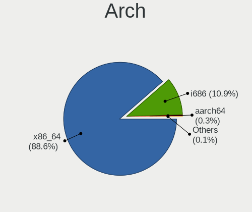
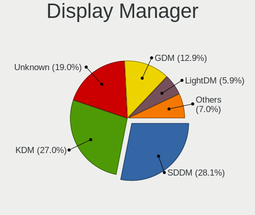
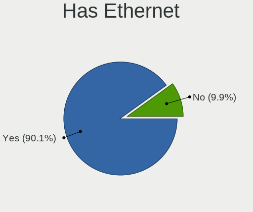
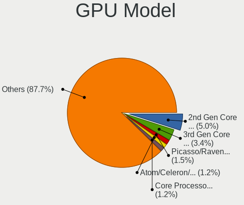
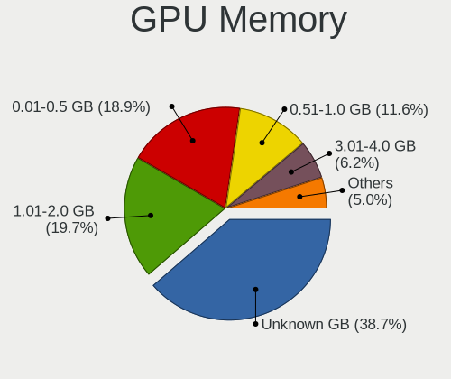
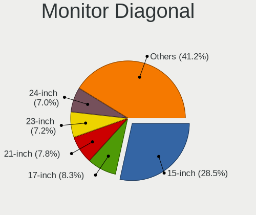

Linux in Russia - Tested Hardware & Statistics
----------------------------------------------

A project to collect tested hardware configurations for Linux in Russia.

Anyone can contribute to this report by the [hw-probe](https://github.com/linuxhw/hw-probe) tool:

    sudo -E hw-probe -all -upload

Please contribute! Especially if your hardware is rare.

This is a report for all computer types. See also reports for [desktops](/Location/Russia/Desktop/README.md) and [notebooks](/Location/Russia/Notebook/README.md).

Contents
--------

* [ Test Cases ](#test-cases)

* [ System ](#system)
  - [ OS                       ](#os)
  - [ OS Family                ](#os-family)
  - [ Kernel                   ](#kernel)
  - [ Kernel Family            ](#kernel-family)
  - [ Kernel Major Ver.        ](#kernel-major-ver)
  - [ Arch                     ](#arch)
  - [ DE                       ](#de)
  - [ Display Server           ](#display-server)
  - [ Display Manager          ](#display-manager)
  - [ OS Lang                  ](#os-lang)
  - [ Boot Mode                ](#boot-mode)
  - [ Filesystem               ](#filesystem)
  - [ Part. scheme             ](#part-scheme)
  - [ Dual Boot with Linux/BSD ](#dual-boot-with-linuxbsd)
  - [ Dual Boot (Win)          ](#dual-boot-win)

* [ Board ](#board)
  - [ Vendor                   ](#vendor)
  - [ Model                    ](#model)
  - [ Model Family             ](#model-family)
  - [ MFG Year                 ](#mfg-year)
  - [ Form Factor              ](#form-factor)
  - [ Secure Boot              ](#secure-boot)
  - [ Coreboot                 ](#coreboot)
  - [ RAM Size                 ](#ram-size)
  - [ RAM Used                 ](#ram-used)
  - [ Total Drives             ](#total-drives)
  - [ Has CD-ROM               ](#has-cd-rom)
  - [ Has Ethernet             ](#has-ethernet)
  - [ Has WiFi                 ](#has-wifi)
  - [ Has Bluetooth            ](#has-bluetooth)

* [ Location ](#location)
  - [ Country                  ](#country)
  - [ City                     ](#city)

* [ Drives ](#drives)
  - [ Drive Vendor             ](#drive-vendor)
  - [ Drive Model              ](#drive-model)
  - [ HDD Vendor               ](#hdd-vendor)
  - [ SSD Vendor               ](#ssd-vendor)
  - [ Drive Kind               ](#drive-kind)
  - [ Drive Connector          ](#drive-connector)
  - [ Drive Size               ](#drive-size)
  - [ Space Total              ](#space-total)
  - [ Space Used               ](#space-used)
  - [ Malfunc. Drives          ](#malfunc-drives)
  - [ Malfunc. Drive Vendor    ](#malfunc-drive-vendor)
  - [ Malfunc. HDD Vendor      ](#malfunc-hdd-vendor)
  - [ Malfunc. Drive Kind      ](#malfunc-drive-kind)
  - [ Failed Drives            ](#failed-drives)
  - [ Failed Drive Vendor      ](#failed-drive-vendor)
  - [ Drive Status             ](#drive-status)

* [ Storage controller ](#storage-controller)
  - [ Storage Vendor           ](#storage-vendor)
  - [ Storage Model            ](#storage-model)
  - [ Storage Kind             ](#storage-kind)

* [ Processor ](#processor)
  - [ CPU Vendor               ](#cpu-vendor)
  - [ CPU Model                ](#cpu-model)
  - [ CPU Model Family         ](#cpu-model-family)
  - [ CPU Cores                ](#cpu-cores)
  - [ CPU Sockets              ](#cpu-sockets)
  - [ CPU Threads              ](#cpu-threads)
  - [ CPU Op-Modes             ](#cpu-op-modes)
  - [ CPU Microcode            ](#cpu-microcode)
  - [ CPU Microarch            ](#cpu-microarch)

* [ Graphics ](#graphics)
  - [ GPU Vendor               ](#gpu-vendor)
  - [ GPU Model                ](#gpu-model)
  - [ GPU Combo                ](#gpu-combo)
  - [ GPU Driver               ](#gpu-driver)
  - [ GPU Memory               ](#gpu-memory)

* [ Monitor ](#monitor)
  - [ Monitor Vendor           ](#monitor-vendor)
  - [ Monitor Model            ](#monitor-model)
  - [ Monitor Resolution       ](#monitor-resolution)
  - [ Monitor Diagonal         ](#monitor-diagonal)
  - [ Monitor Width            ](#monitor-width)
  - [ Aspect Ratio             ](#aspect-ratio)
  - [ Monitor Area             ](#monitor-area)
  - [ Pixel Density            ](#pixel-density)
  - [ Multiple Monitors        ](#multiple-monitors)

* [ Network ](#network)
  - [ Net Controller Vendor    ](#net-controller-vendor)
  - [ Net Controller Model     ](#net-controller-model)
  - [ Wireless Vendor          ](#wireless-vendor)
  - [ Wireless Model           ](#wireless-model)
  - [ Ethernet Vendor          ](#ethernet-vendor)
  - [ Ethernet Model           ](#ethernet-model)
  - [ Net Controller Kind      ](#net-controller-kind)
  - [ Used Controller          ](#used-controller)
  - [ NICs                     ](#nics)
  - [ IPv6                     ](#ipv6)

* [ Bluetooth ](#bluetooth)
  - [ Bluetooth Vendor         ](#bluetooth-vendor)
  - [ Bluetooth Model          ](#bluetooth-model)

* [ Sound ](#sound)
  - [ Sound Vendor             ](#sound-vendor)
  - [ Sound Model              ](#sound-model)

* [ Memory ](#memory)
  - [ Memory Vendor            ](#memory-vendor)
  - [ Memory Model             ](#memory-model)
  - [ Memory Kind              ](#memory-kind)
  - [ Memory Form Factor       ](#memory-form-factor)
  - [ Memory Size              ](#memory-size)
  - [ Memory Speed             ](#memory-speed)

* [ Printers & scanners ](#printers--scanners)
  - [ Printer Vendor           ](#printer-vendor)
  - [ Printer Model            ](#printer-model)
  - [ Scanner Vendor           ](#scanner-vendor)
  - [ Scanner Model            ](#scanner-model)

* [ Camera ](#camera)
  - [ Camera Vendor            ](#camera-vendor)
  - [ Camera Model             ](#camera-model)

* [ Security ](#security)
  - [ Fingerprint Vendor       ](#fingerprint-vendor)
  - [ Fingerprint Model        ](#fingerprint-model)
  - [ Chipcard Vendor          ](#chipcard-vendor)
  - [ Chipcard Model           ](#chipcard-model)

* [ Unsupported ](#unsupported)
  - [ Unsupported Devices      ](#unsupported-devices)
  - [ Unsupported Device Types ](#unsupported-device-types)

Test Cases
----------

Total: 44164

| Vendor        | Model                       | Form-Factor | Probe                                                      | Date         |
|---------------|-----------------------------|-------------|------------------------------------------------------------|--------------|
| Acer          | Nitro AN515-54              | Notebook    | [051e477b5f](https://linux-hardware.org/?probe=051e477b5f) | Feb 02, 2024 |
| HP            | EliteBook 8560w             | Notebook    | [6ff665aaf5](https://linux-hardware.org/?probe=6ff665aaf5) | Feb 02, 2024 |
| Gigabyte      | B550M AORUS PRO-P           | Desktop     | [1f0ece5a8b](https://linux-hardware.org/?probe=1f0ece5a8b) | Feb 02, 2024 |
| Gigabyte      | B550M AORUS PRO-P           | Desktop     | [11b2f337e7](https://linux-hardware.org/?probe=11b2f337e7) | Feb 02, 2024 |
| Acer          | Aspire VN7-591G             | Notebook    | [c0f024d3e0](https://linux-hardware.org/?probe=c0f024d3e0) | Feb 02, 2024 |
| Delovoy of... | LPGR.469559.018 V1.0        | Desktop     | [4ed2bd72be](https://linux-hardware.org/?probe=4ed2bd72be) | Feb 02, 2024 |
| Acer          | P4LJ0                       | Notebook    | [c0a2639732](https://linux-hardware.org/?probe=c0a2639732) | Feb 02, 2024 |
| ASUSTek       | H110M-R                     | Desktop     | [2902d23de2](https://linux-hardware.org/?probe=2902d23de2) | Feb 02, 2024 |
| ASUSTek       | F8Vr                        | Notebook    | [02fced1d70](https://linux-hardware.org/?probe=02fced1d70) | Feb 02, 2024 |
| HP            | ProLiant DL360 Gen9         | Server      | [d71cef49ca](https://linux-hardware.org/?probe=d71cef49ca) | Feb 02, 2024 |
| DEXP          | Atlas M14-I5W303            | Notebook    | [fd14684ed2](https://linux-hardware.org/?probe=fd14684ed2) | Feb 02, 2024 |
| ASUSTek       | B85M-G                      | Desktop     | [cd9f6ee87d](https://linux-hardware.org/?probe=cd9f6ee87d) | Feb 02, 2024 |
| Lenovo        | ThinkPad E590 20NB002BRT    | Notebook    | [283a2fd324](https://linux-hardware.org/?probe=283a2fd324) | Feb 02, 2024 |
| Timi          | RedmiBook Pro 15S           | Notebook    | [70dacc6818](https://linux-hardware.org/?probe=70dacc6818) | Feb 02, 2024 |
| MSI           | Modern 14 B11MOU            | Notebook    | [a5b3665f64](https://linux-hardware.org/?probe=a5b3665f64) | Feb 02, 2024 |
| MSI           | Modern 14 B11MOU            | Notebook    | [f7d0fcd205](https://linux-hardware.org/?probe=f7d0fcd205) | Feb 02, 2024 |
| ASUSTek       | PRIME H510M-R               | Desktop     | [4196d911d2](https://linux-hardware.org/?probe=4196d911d2) | Feb 02, 2024 |
| Gigabyte      | A320M-S2H V2-CF             | Desktop     | [f38bbe7c82](https://linux-hardware.org/?probe=f38bbe7c82) | Feb 02, 2024 |
| Samsung       | 305E4A/305E5A/305E7A        | Notebook    | [bf840a5308](https://linux-hardware.org/?probe=bf840a5308) | Feb 02, 2024 |
| Biostar       | IH61MF-Q5                   | Desktop     | [1087f70019](https://linux-hardware.org/?probe=1087f70019) | Feb 01, 2024 |
| ASUSTek       | P5K                         | Desktop     | [1414d10ffb](https://linux-hardware.org/?probe=1414d10ffb) | Feb 01, 2024 |
| Acer          | Aspire 7740                 | Notebook    | [a329ef6c37](https://linux-hardware.org/?probe=a329ef6c37) | Feb 01, 2024 |
| Acer          | TravelMate B118-M           | Notebook    | [4f53c6a6af](https://linux-hardware.org/?probe=4f53c6a6af) | Feb 01, 2024 |
| Acer          | Aspire A515-56              | Notebook    | [5599d65127](https://linux-hardware.org/?probe=5599d65127) | Feb 01, 2024 |
| Gigabyte      | EP43T-UD3L                  | Desktop     | [934c3f974a](https://linux-hardware.org/?probe=934c3f974a) | Feb 01, 2024 |
| Supermicro    | X8DTU                       | Server      | [246a9d76c6](https://linux-hardware.org/?probe=246a9d76c6) | Feb 01, 2024 |
| ASUSTek       | PRIME B450M-A               | Desktop     | [5befaf642f](https://linux-hardware.org/?probe=5befaf642f) | Feb 01, 2024 |
| MicroByte     | ezpad                       | Tablet      | [192098a0fc](https://linux-hardware.org/?probe=192098a0fc) | Feb 01, 2024 |
| MicroByte     | ezpad                       | Tablet      | [e8d8cc7618](https://linux-hardware.org/?probe=e8d8cc7618) | Feb 01, 2024 |
| HONOR         | BRN-HXX                     | Notebook    | [9e92d94ecb](https://linux-hardware.org/?probe=9e92d94ecb) | Feb 01, 2024 |
| Apple         | Mac-4BC72D62AD45599E Mac... | Mini pc     | [729a70888f](https://linux-hardware.org/?probe=729a70888f) | Feb 01, 2024 |
| Samsung       | RV413/RV513/E3413           | Notebook    | [975921919b](https://linux-hardware.org/?probe=975921919b) | Feb 01, 2024 |
| Apple         | Mac-F4208DC8 PVT            | Desktop     | [bce380880a](https://linux-hardware.org/?probe=bce380880a) | Feb 01, 2024 |
| ASRock        | G41M-VS3                    | Desktop     | [df1c8c0da3](https://linux-hardware.org/?probe=df1c8c0da3) | Feb 01, 2024 |
| Apple         | MacBookPro11,3              | Notebook    | [9b4ae891b7](https://linux-hardware.org/?probe=9b4ae891b7) | Feb 01, 2024 |
| ASUSTek       | M4A78-VM                    | Desktop     | [cc37c1b937](https://linux-hardware.org/?probe=cc37c1b937) | Feb 01, 2024 |
| Lenovo        | G500 20236                  | Notebook    | [8b5fd80f76](https://linux-hardware.org/?probe=8b5fd80f76) | Feb 01, 2024 |
| Lenovo        | G500 20236                  | Notebook    | [31fc253b87](https://linux-hardware.org/?probe=31fc253b87) | Feb 01, 2024 |
| ASUSTek       | P5B-Deluxe                  | Desktop     | [b30373632d](https://linux-hardware.org/?probe=b30373632d) | Feb 01, 2024 |
| Lenovo        | IdeaPad 3 15IGL05 81WQ      | Notebook    | [589322c92f](https://linux-hardware.org/?probe=589322c92f) | Feb 01, 2024 |
| Gigabyte      | B760M GAMING X DDR4         | Desktop     | [855d31073a](https://linux-hardware.org/?probe=855d31073a) | Feb 01, 2024 |
| HP            | ENVY x360 Convertible 13... | Convertible | [ae820ef040](https://linux-hardware.org/?probe=ae820ef040) | Feb 01, 2024 |
| HONOR         | BBR-WAX9                    | Notebook    | [a34e642fbe](https://linux-hardware.org/?probe=a34e642fbe) | Jan 31, 2024 |
| ASUSTek       | VivoBook_ASUSLaptop M160... | Notebook    | [0414c66c77](https://linux-hardware.org/?probe=0414c66c77) | Jan 31, 2024 |
| Supermicro    | X10DRU-i+A                  | Desktop     | [f2881b94b0](https://linux-hardware.org/?probe=f2881b94b0) | Jan 31, 2024 |
| ASUSTek       | P8Z77-V LX                  | Desktop     | [011fd25549](https://linux-hardware.org/?probe=011fd25549) | Jan 31, 2024 |
| MACHCREATO... | E                           | Notebook    | [af231c3cc8](https://linux-hardware.org/?probe=af231c3cc8) | Jan 31, 2024 |
| HONOR         | BBR-WAX9                    | Notebook    | [a1b73e72d3](https://linux-hardware.org/?probe=a1b73e72d3) | Jan 31, 2024 |
| ASUSTek       | X540YA                      | Notebook    | [4e8d90738d](https://linux-hardware.org/?probe=4e8d90738d) | Jan 31, 2024 |
| Biostar       | H610MH                      | Desktop     | [fb0234d450](https://linux-hardware.org/?probe=fb0234d450) | Jan 31, 2024 |
| Lenovo        | G50-30 80G0                 | Notebook    | [16e8c28b87](https://linux-hardware.org/?probe=16e8c28b87) | Jan 31, 2024 |
| HUAWEI        | MCLF-XX                     | Notebook    | [97bfeb35bc](https://linux-hardware.org/?probe=97bfeb35bc) | Jan 31, 2024 |
| HP            | ProBook 4510s               | Notebook    | [2982cc0a30](https://linux-hardware.org/?probe=2982cc0a30) | Jan 31, 2024 |
| ETegro Tec... | ETRS125G4 31S2MMB0040       | Server      | [12a68ef8f3](https://linux-hardware.org/?probe=12a68ef8f3) | Jan 31, 2024 |
| ETegro Tec... | ETRS125G4 31S2MMB0040       | Server      | [34c89da9d0](https://linux-hardware.org/?probe=34c89da9d0) | Jan 31, 2024 |
| ASUSTek       | A68HM-PLUS                  | Desktop     | [6361608cec](https://linux-hardware.org/?probe=6361608cec) | Jan 31, 2024 |
| Supermicro    | X8DTH                       | Server      | [53d7109f48](https://linux-hardware.org/?probe=53d7109f48) | Jan 31, 2024 |
| Lenovo        | G575 20081                  | Notebook    | [162e1f81cf](https://linux-hardware.org/?probe=162e1f81cf) | Jan 31, 2024 |
| ASUSTek       | B85M-G                      | Desktop     | [c14af0c776](https://linux-hardware.org/?probe=c14af0c776) | Jan 31, 2024 |
| ASUSTek       | V221ID                      | All in one  | [1a3791054b](https://linux-hardware.org/?probe=1a3791054b) | Jan 31, 2024 |
| ETegro Tec... | ETRS125G4 31S2MMB0040       | Server      | [535ed186d9](https://linux-hardware.org/?probe=535ed186d9) | Jan 31, 2024 |
| Biostar       | NF61S-M2A                   | Desktop     | [4b42e5cd37](https://linux-hardware.org/?probe=4b42e5cd37) | Jan 31, 2024 |
| ETegro Tec... | ETRS125G4 31S2MMB0040       | Server      | [6a4b856510](https://linux-hardware.org/?probe=6a4b856510) | Jan 31, 2024 |
| Intel         | SKYBAY                      | Desktop     | [1e706b6589](https://linux-hardware.org/?probe=1e706b6589) | Jan 31, 2024 |
| Acer          | Aspire ES1-531              | Notebook    | [eb59b4c3ac](https://linux-hardware.org/?probe=eb59b4c3ac) | Jan 31, 2024 |
| HUAWEI        | BOM-WXX9                    | Notebook    | [44970ca2bb](https://linux-hardware.org/?probe=44970ca2bb) | Jan 31, 2024 |
| Intel         | SKYBAY                      | Desktop     | [4420198abc](https://linux-hardware.org/?probe=4420198abc) | Jan 31, 2024 |
| MSI           | H110M PRO-VD                | Desktop     | [29fd183b3b](https://linux-hardware.org/?probe=29fd183b3b) | Jan 31, 2024 |
| Intel         | SKYBAY                      | Desktop     | [9d6bc7afb3](https://linux-hardware.org/?probe=9d6bc7afb3) | Jan 31, 2024 |
| Unknown       | X133                        | Notebook    | [a2fcc244e8](https://linux-hardware.org/?probe=a2fcc244e8) | Jan 31, 2024 |
| ASUSTek       | P6T WS PRO                  | Desktop     | [21d91717a1](https://linux-hardware.org/?probe=21d91717a1) | Jan 31, 2024 |
| HP            | EliteBook 855 G8 Noteboo... | Notebook    | [fff51c5158](https://linux-hardware.org/?probe=fff51c5158) | Jan 30, 2024 |
| Dell          | XPS 9315                    | Notebook    | [dd96b44e05](https://linux-hardware.org/?probe=dd96b44e05) | Jan 30, 2024 |
| ASUSTek       | ROG Zephyrus G15 GA503QS... | Notebook    | [556c1ede91](https://linux-hardware.org/?probe=556c1ede91) | Jan 30, 2024 |
| MSI           | GE62 6QE                    | Notebook    | [6d6f9ba002](https://linux-hardware.org/?probe=6d6f9ba002) | Jan 30, 2024 |
| Unknown       | Unknown                     | Desktop     | [6928c8eb05](https://linux-hardware.org/?probe=6928c8eb05) | Jan 30, 2024 |
| Gigabyte      | B365M H                     | Desktop     | [ac7a22a8f4](https://linux-hardware.org/?probe=ac7a22a8f4) | Jan 30, 2024 |
| Lenovo        | IdeaPad S340-14API 81NB     | Notebook    | [39c2f54da6](https://linux-hardware.org/?probe=39c2f54da6) | Jan 30, 2024 |
| Gigabyte      | H81M-S1                     | Desktop     | [0770521f11](https://linux-hardware.org/?probe=0770521f11) | Jan 30, 2024 |
| Unknown       | Unknown                     | Desktop     | [a4eb1c6dda](https://linux-hardware.org/?probe=a4eb1c6dda) | Jan 30, 2024 |
| Unknown       | Unknown                     | Desktop     | [f8b5f64c1e](https://linux-hardware.org/?probe=f8b5f64c1e) | Jan 30, 2024 |
| ASRock        | B550 Phantom Gaming 4       | Desktop     | [9d98a77586](https://linux-hardware.org/?probe=9d98a77586) | Jan 30, 2024 |
| Unknown       | T360D11                     | Desktop     | [4f06f14ee6](https://linux-hardware.org/?probe=4f06f14ee6) | Jan 30, 2024 |
| HP            | 8431                        | All in one  | [a0646a07e1](https://linux-hardware.org/?probe=a0646a07e1) | Jan 30, 2024 |
| Gigabyte      | B360HD3                     | Desktop     | [7a7e6d1518](https://linux-hardware.org/?probe=7a7e6d1518) | Jan 30, 2024 |
| Gigabyte      | B75M-D3V                    | Desktop     | [5628f77cd1](https://linux-hardware.org/?probe=5628f77cd1) | Jan 30, 2024 |
| ASUSTek       | P8H61-MX                    | Desktop     | [1d7356527b](https://linux-hardware.org/?probe=1d7356527b) | Jan 30, 2024 |
| ASUSTek       | ASUS EXPERTBOOK L2402CYA... | Notebook    | [7b41a93878](https://linux-hardware.org/?probe=7b41a93878) | Jan 30, 2024 |
| Intel         | NUC7i7DNB J83500-204        | Mini pc     | [2dc40304a3](https://linux-hardware.org/?probe=2dc40304a3) | Jan 30, 2024 |
| ASUSTek       | P7H55                       | Desktop     | [21853e5c4a](https://linux-hardware.org/?probe=21853e5c4a) | Jan 30, 2024 |
| Fujitsu       | LIFEBOOK AH544              | Notebook    | [7c4ab0f337](https://linux-hardware.org/?probe=7c4ab0f337) | Jan 29, 2024 |
| Intel         | X99 V1.0                    | Desktop     | [dee15911ba](https://linux-hardware.org/?probe=dee15911ba) | Jan 29, 2024 |
| Fujitsu       | LIFEBOOK AH544              | Notebook    | [b7421bfef5](https://linux-hardware.org/?probe=b7421bfef5) | Jan 29, 2024 |
| MSI           | Z490M-S01                   | Desktop     | [ed7f213619](https://linux-hardware.org/?probe=ed7f213619) | Jan 29, 2024 |
| Lenovo        | 3190 NOK                    | Mini pc     | [df5decae4b](https://linux-hardware.org/?probe=df5decae4b) | Jan 29, 2024 |
| OEM           | PSC621DI-16F 12220113A01... | Server      | [6c1f52bc56](https://linux-hardware.org/?probe=6c1f52bc56) | Jan 29, 2024 |
| MSI           | B550M PRO-VDH WIFI          | Desktop     | [d0403669b9](https://linux-hardware.org/?probe=d0403669b9) | Jan 29, 2024 |
| HUAWEI        | KPRC-WX0                    | Notebook    | [dea81917ae](https://linux-hardware.org/?probe=dea81917ae) | Jan 29, 2024 |
| ASRock        | AB350M-HDV R3.0             | Desktop     | [7b68f8ca63](https://linux-hardware.org/?probe=7b68f8ca63) | Jan 29, 2024 |
| Lenovo        | G50-30 80G0                 | Notebook    | [94b345e552](https://linux-hardware.org/?probe=94b345e552) | Jan 29, 2024 |
| Lenovo        | V370 HuronRiver Platform    | Notebook    | [9d6e253461](https://linux-hardware.org/?probe=9d6e253461) | Jan 29, 2024 |
| DEPO Compu... | DPH610S                     | Notebook    | [de6c6c0dc5](https://linux-hardware.org/?probe=de6c6c0dc5) | Jan 29, 2024 |
| SZMZ          | X99-S3                      | Desktop     | [acf24ed760](https://linux-hardware.org/?probe=acf24ed760) | Jan 29, 2024 |
| MSI           | Modern 15 B5M               | Notebook    | [af1dd03737](https://linux-hardware.org/?probe=af1dd03737) | Jan 29, 2024 |
| MSI           | Bravo 15 C7VE               | Notebook    | [1510824aee](https://linux-hardware.org/?probe=1510824aee) | Jan 29, 2024 |
| Lenovo        | V370 HuronRiver Platform    | Notebook    | [77ec188a66](https://linux-hardware.org/?probe=77ec188a66) | Jan 29, 2024 |
| eMachines     | Rhine V1.45                 | Notebook    | [6bb4f91b29](https://linux-hardware.org/?probe=6bb4f91b29) | Jan 29, 2024 |
| OEM           | T2DM B                      | Server      | [cbf4342d2c](https://linux-hardware.org/?probe=cbf4342d2c) | Jan 29, 2024 |
| HP            | 8431                        | All in one  | [e07be0c225](https://linux-hardware.org/?probe=e07be0c225) | Jan 29, 2024 |
| ASRock        | AB350M-HDV R3.0             | Desktop     | [5cc2818fe5](https://linux-hardware.org/?probe=5cc2818fe5) | Jan 29, 2024 |
| HP            | EliteBook 2540p             | Notebook    | [65de0b33df](https://linux-hardware.org/?probe=65de0b33df) | Jan 29, 2024 |
| ASUSTek       | M5A78L-M LX                 | Desktop     | [8c79f36086](https://linux-hardware.org/?probe=8c79f36086) | Jan 29, 2024 |
| Lenovo        | ThinkPad T14 Gen 2i 20W0... | Notebook    | [454031382d](https://linux-hardware.org/?probe=454031382d) | Jan 29, 2024 |
| ASRock        | X300TM-ITX                  | Desktop     | [c3277a6c4c](https://linux-hardware.org/?probe=c3277a6c4c) | Jan 29, 2024 |
| Rockchip      | RK3318 BOX                  | Soc         | [d52d85d882](https://linux-hardware.org/?probe=d52d85d882) | Jan 29, 2024 |
| Huanan        | X99-QD4 V1.0                | Desktop     | [2194293ede](https://linux-hardware.org/?probe=2194293ede) | Jan 28, 2024 |
| Lenovo        | B590 20208                  | Notebook    | [ea632b2785](https://linux-hardware.org/?probe=ea632b2785) | Jan 28, 2024 |
| Lenovo        | IdeaPad P585 20181          | Notebook    | [d54756c11a](https://linux-hardware.org/?probe=d54756c11a) | Jan 28, 2024 |
| Acer          | Iconia W701                 | Notebook    | [572a3d7c02](https://linux-hardware.org/?probe=572a3d7c02) | Jan 28, 2024 |
| ASUSTek       | PRIME B250M-C               | Desktop     | [5c34879ea0](https://linux-hardware.org/?probe=5c34879ea0) | Jan 28, 2024 |
| ASUSTek       | K52JU                       | Notebook    | [066d333914](https://linux-hardware.org/?probe=066d333914) | Jan 28, 2024 |
| Intel         | Unknown                     | Desktop     | [24ab2fdfbf](https://linux-hardware.org/?probe=24ab2fdfbf) | Jan 28, 2024 |
| Apple         | Mac-4B682C642B45593E iMa... | All in one  | [feb1a8c3aa](https://linux-hardware.org/?probe=feb1a8c3aa) | Jan 28, 2024 |
| Dell          | 0Y5DDC A00                  | Desktop     | [bad163ed53](https://linux-hardware.org/?probe=bad163ed53) | Jan 28, 2024 |
| ASUSTek       | X540SA                      | Notebook    | [39aef9d411](https://linux-hardware.org/?probe=39aef9d411) | Jan 28, 2024 |
| Gigabyte      | H61M-D2-B3                  | Desktop     | [a177c22fb5](https://linux-hardware.org/?probe=a177c22fb5) | Jan 28, 2024 |
| Lenovo        | V560                        | Notebook    | [a0dbd66d53](https://linux-hardware.org/?probe=a0dbd66d53) | Jan 28, 2024 |
| MSI           | Z97 GAMING 3                | Desktop     | [5a4ad9cb67](https://linux-hardware.org/?probe=5a4ad9cb67) | Jan 28, 2024 |
| Supermicro    | X13DEI                      | Server      | [044e82e684](https://linux-hardware.org/?probe=044e82e684) | Jan 27, 2024 |
| ASUSTek       | PRIME B450M-A II            | Desktop     | [1d4239bc71](https://linux-hardware.org/?probe=1d4239bc71) | Jan 27, 2024 |
| Sony          | VAIO                        | All in one  | [5a4ca41301](https://linux-hardware.org/?probe=5a4ca41301) | Jan 27, 2024 |
| ASUSTek       | P5K                         | Desktop     | [9cadd6185d](https://linux-hardware.org/?probe=9cadd6185d) | Jan 27, 2024 |
| Acer          | Aspire A315-41G             | Notebook    | [e0d994ac23](https://linux-hardware.org/?probe=e0d994ac23) | Jan 27, 2024 |
| ASUSTek       | PRIME X370-A                | Desktop     | [e3c045bb8c](https://linux-hardware.org/?probe=e3c045bb8c) | Jan 27, 2024 |
| Acer          | Aspire A315-41G             | Notebook    | [1b15d869d4](https://linux-hardware.org/?probe=1b15d869d4) | Jan 27, 2024 |
| Gigabyte      | H67A-USB3-B3                | Desktop     | [e53ca59dec](https://linux-hardware.org/?probe=e53ca59dec) | Jan 27, 2024 |
| Lenovo        | ThinkPad T14 Gen 3 21AHA... | Notebook    | [f2ed690a39](https://linux-hardware.org/?probe=f2ed690a39) | Jan 27, 2024 |
| ARDOR GAMI... | PD5x_7xSNC_SND_SNE          | Notebook    | [398529b5cb](https://linux-hardware.org/?probe=398529b5cb) | Jan 27, 2024 |
| ECS           | A960M-MV                    | Desktop     | [3b0de09ab6](https://linux-hardware.org/?probe=3b0de09ab6) | Jan 27, 2024 |
| Lenovo        | ThinkPad T14 Gen 3 21AHA... | Notebook    | [4644130b45](https://linux-hardware.org/?probe=4644130b45) | Jan 27, 2024 |
| MSI           | MS-B1711                    | Desktop     | [8eec6cdde5](https://linux-hardware.org/?probe=8eec6cdde5) | Jan 27, 2024 |
| Timi          | Xiaomi Book Pro 16 2022     | Notebook    | [60e1022aef](https://linux-hardware.org/?probe=60e1022aef) | Jan 27, 2024 |
| HP            | ProBook 640 G1              | Notebook    | [6359631eb5](https://linux-hardware.org/?probe=6359631eb5) | Jan 27, 2024 |
| ASRock        | ION3D-HT                    | Desktop     | [393d01f3c9](https://linux-hardware.org/?probe=393d01f3c9) | Jan 27, 2024 |
| Acer          | Aspire 5732Z                | Notebook    | [0499bd177a](https://linux-hardware.org/?probe=0499bd177a) | Jan 27, 2024 |
| ASUSTek       | PRIME B450M-K II            | Desktop     | [531cd352a8](https://linux-hardware.org/?probe=531cd352a8) | Jan 27, 2024 |
| Dell          | Inspiron 3793               | Notebook    | [ab1d389327](https://linux-hardware.org/?probe=ab1d389327) | Jan 27, 2024 |
| HONOR         | FRI-FXX                     | Notebook    | [c9b0b584fc](https://linux-hardware.org/?probe=c9b0b584fc) | Jan 27, 2024 |
| Gigabyte      | H410M H V3                  | Desktop     | [018db3f12a](https://linux-hardware.org/?probe=018db3f12a) | Jan 26, 2024 |
| Gigabyte      | H470M K                     | Desktop     | [644982a46f](https://linux-hardware.org/?probe=644982a46f) | Jan 26, 2024 |
| Lenovo        | 1052 SDK0J40697 WIN 3305... | Desktop     | [b0019abd70](https://linux-hardware.org/?probe=b0019abd70) | Jan 26, 2024 |
| Gigabyte      | GA-A55M-S2HP                | Desktop     | [2c061938f7](https://linux-hardware.org/?probe=2c061938f7) | Jan 26, 2024 |
| MSI           | MS-B0A21                    | Desktop     | [aebe283d41](https://linux-hardware.org/?probe=aebe283d41) | Jan 26, 2024 |
| HUAWEI        | WRT-WX9                     | Notebook    | [4fe4c818d5](https://linux-hardware.org/?probe=4fe4c818d5) | Jan 26, 2024 |
| ASUSTek       | PRIME B450M-A II            | Desktop     | [0554d57e37](https://linux-hardware.org/?probe=0554d57e37) | Jan 26, 2024 |
| Gigabyte      | Z170X-Gaming 3              | Desktop     | [70edc53219](https://linux-hardware.org/?probe=70edc53219) | Jan 26, 2024 |
| MSI           | 785G-E53                    | Desktop     | [81ee1ec28d](https://linux-hardware.org/?probe=81ee1ec28d) | Jan 26, 2024 |
| Intel         | S1200BTL E98681-352         | Server      | [93da2d648d](https://linux-hardware.org/?probe=93da2d648d) | Jan 26, 2024 |
| Unknown       | Unknown                     | Notebook    | [9e979ee4e4](https://linux-hardware.org/?probe=9e979ee4e4) | Jan 26, 2024 |
| Unknown       | Unknown                     | Notebook    | [3e9fd3e31a](https://linux-hardware.org/?probe=3e9fd3e31a) | Jan 26, 2024 |
| LTD Delovo... | EVE 1470D ES1278EW          | Tablet      | [81aa769b3d](https://linux-hardware.org/?probe=81aa769b3d) | Jan 26, 2024 |
| HP            | Pavilion 15                 | Notebook    | [c303f2769d](https://linux-hardware.org/?probe=c303f2769d) | Jan 26, 2024 |
| Lenovo        | IdeaPad S340-14API 81NB     | Notebook    | [1e983d206c](https://linux-hardware.org/?probe=1e983d206c) | Jan 26, 2024 |
| ECS           | G31T-M9                     | Desktop     | [8af1e631e7](https://linux-hardware.org/?probe=8af1e631e7) | Jan 26, 2024 |
| MSI           | G31M3 V2                    | Desktop     | [b98a012c0e](https://linux-hardware.org/?probe=b98a012c0e) | Jan 26, 2024 |
| Gigabyte      | H81M-S2V                    | Desktop     | [42abec13ac](https://linux-hardware.org/?probe=42abec13ac) | Jan 26, 2024 |
| Lenovo        | Legion 5 17ACH6H 82JY       | Notebook    | [6db5a094d7](https://linux-hardware.org/?probe=6db5a094d7) | Jan 26, 2024 |
| ASUSTek       | PRIME B450M-K II            | Desktop     | [04feb5fc7d](https://linux-hardware.org/?probe=04feb5fc7d) | Jan 26, 2024 |
| ASUSTek       | B400VC                      | Notebook    | [af39cde6d9](https://linux-hardware.org/?probe=af39cde6d9) | Jan 26, 2024 |
| Dell          | Inspiron 1720               | Notebook    | [cff6e1a58a](https://linux-hardware.org/?probe=cff6e1a58a) | Jan 26, 2024 |
| Intel         | SKYBAY                      | Desktop     | [3d4350c03d](https://linux-hardware.org/?probe=3d4350c03d) | Jan 26, 2024 |
| HUAWEI        | KLVD-WXX9                   | Notebook    | [42e8e68344](https://linux-hardware.org/?probe=42e8e68344) | Jan 26, 2024 |
| Supermicro    | X10DDW-i                    | Desktop     | [6a9650896a](https://linux-hardware.org/?probe=6a9650896a) | Jan 26, 2024 |
| MSI           | Katana 17 B11UCX            | Notebook    | [0fa09d8394](https://linux-hardware.org/?probe=0fa09d8394) | Jan 26, 2024 |
| MSI           | GF65 Thin 9SEXR             | Notebook    | [5be9da4fbd](https://linux-hardware.org/?probe=5be9da4fbd) | Jan 26, 2024 |
| Lenovo        | IdeaPad L340-15API 81LW     | Notebook    | [db2cd07d84](https://linux-hardware.org/?probe=db2cd07d84) | Jan 26, 2024 |
| MACHENIKE     | S15C                        | Notebook    | [7429416572](https://linux-hardware.org/?probe=7429416572) | Jan 25, 2024 |
| Unknown       | Unknown                     | Notebook    | [f24b77e03e](https://linux-hardware.org/?probe=f24b77e03e) | Jan 25, 2024 |
| ASRock        | Z97 Anniversary             | Desktop     | [0973057025](https://linux-hardware.org/?probe=0973057025) | Jan 25, 2024 |
| Apple         | MacBookPro4,1               | Notebook    | [8cbf896791](https://linux-hardware.org/?probe=8cbf896791) | Jan 25, 2024 |
| Gigabyte      | H81M-S1                     | Desktop     | [b727252ca9](https://linux-hardware.org/?probe=b727252ca9) | Jan 25, 2024 |
| MSI           | B550-A PRO                  | Desktop     | [1f374d86d7](https://linux-hardware.org/?probe=1f374d86d7) | Jan 25, 2024 |
| ASUSTek       | N61Vg                       | Notebook    | [ea2d37b9a8](https://linux-hardware.org/?probe=ea2d37b9a8) | Jan 25, 2024 |
| HUAWEI        | BC11HGSA0 V100R003          | Server      | [585e78ced6](https://linux-hardware.org/?probe=585e78ced6) | Jan 25, 2024 |
| HUAWEI        | BC11HGSA0 V100R003          | Server      | [234bc0cc22](https://linux-hardware.org/?probe=234bc0cc22) | Jan 25, 2024 |
| ASUSTek       | VivoBook 15_ASUS Laptop ... | Notebook    | [bed129824b](https://linux-hardware.org/?probe=bed129824b) | Jan 25, 2024 |
| Unknown       | Unknown                     | Notebook    | [f149927f3f](https://linux-hardware.org/?probe=f149927f3f) | Jan 25, 2024 |
| Gigabyte      | EG41MF-US2H                 | Desktop     | [882d3605ed](https://linux-hardware.org/?probe=882d3605ed) | Jan 25, 2024 |
| Dell          | Inspiron 5521               | Notebook    | [18fc8668de](https://linux-hardware.org/?probe=18fc8668de) | Jan 25, 2024 |
| HUAWEI        | NBD-WXX9                    | Notebook    | [d2b6c52d72](https://linux-hardware.org/?probe=d2b6c52d72) | Jan 25, 2024 |
| ASUSTek       | VivoBook_ASUSLaptop M650... | Notebook    | [68c758113c](https://linux-hardware.org/?probe=68c758113c) | Jan 25, 2024 |
| Acer          | Aspire 5820TG               | Notebook    | [d36d7405c8](https://linux-hardware.org/?probe=d36d7405c8) | Jan 25, 2024 |
| Lenovo        | ThinkPad X230 Tablet 343... | Notebook    | [40618fab75](https://linux-hardware.org/?probe=40618fab75) | Jan 25, 2024 |
| ASUSTek       | X99-E WS                    | Desktop     | [92cb95eaef](https://linux-hardware.org/?probe=92cb95eaef) | Jan 25, 2024 |
| Samsung       | RC410/RC510/RC710           | Notebook    | [34369cc7eb](https://linux-hardware.org/?probe=34369cc7eb) | Jan 25, 2024 |
| ASUSTek       | B150M-C                     | Desktop     | [f264367309](https://linux-hardware.org/?probe=f264367309) | Jan 25, 2024 |
| Gigabyte      | GA-78LMT-S2P                | Desktop     | [066f355824](https://linux-hardware.org/?probe=066f355824) | Jan 25, 2024 |
| Lenovo        | Legion 5 15ACH6H 82JU       | Notebook    | [ceebacdeee](https://linux-hardware.org/?probe=ceebacdeee) | Jan 24, 2024 |
| Acer          | Nitro AN515-52              | Notebook    | [36dc15871c](https://linux-hardware.org/?probe=36dc15871c) | Jan 24, 2024 |
| eMachines     | eME732Z                     | Notebook    | [fe3d184f11](https://linux-hardware.org/?probe=fe3d184f11) | Jan 24, 2024 |
| ASUSTek       | Vivobook Go E1504GA_E150... | Notebook    | [47052e9985](https://linux-hardware.org/?probe=47052e9985) | Jan 24, 2024 |
| MACHENIKE     | L17                         | Notebook    | [6510b1b157](https://linux-hardware.org/?probe=6510b1b157) | Jan 24, 2024 |
| Acer          | Aspire V3-331               | Notebook    | [002e761d1d](https://linux-hardware.org/?probe=002e761d1d) | Jan 24, 2024 |
| Acer          | Aspire V3-331               | Notebook    | [944c9b110c](https://linux-hardware.org/?probe=944c9b110c) | Jan 24, 2024 |
| Acer          | Aspire A515-51G             | Notebook    | [d1fe84630c](https://linux-hardware.org/?probe=d1fe84630c) | Jan 24, 2024 |
| HUAWEI        | RLEF-XX                     | Notebook    | [dc4ce0b71d](https://linux-hardware.org/?probe=dc4ce0b71d) | Jan 24, 2024 |
| HUAWEI        | RLEF-XX                     | Notebook    | [c53987023c](https://linux-hardware.org/?probe=c53987023c) | Jan 24, 2024 |
| Supermicro    | X8DTU                       | Server      | [c6e21da64a](https://linux-hardware.org/?probe=c6e21da64a) | Jan 24, 2024 |
| MSI           | MAG X670E TOMAHAWK WIFI     | Desktop     | [89d705627b](https://linux-hardware.org/?probe=89d705627b) | Jan 24, 2024 |
| Unknown       | Toshiba AC100 / Dynabook... | Notebook    | [7dcaf9ae21](https://linux-hardware.org/?probe=7dcaf9ae21) | Jan 24, 2024 |
| ECS           | G31T-M9                     | Desktop     | [87e9fbf4fd](https://linux-hardware.org/?probe=87e9fbf4fd) | Jan 24, 2024 |
| ASUSTek       | Z170 PRO GAMING             | Desktop     | [298f2d1380](https://linux-hardware.org/?probe=298f2d1380) | Jan 24, 2024 |
| Gigabyte      | H61M-USB3V                  | Desktop     | [6a5faff8dd](https://linux-hardware.org/?probe=6a5faff8dd) | Jan 24, 2024 |
| ASRock        | G31M-GS                     | Desktop     | [8c46163f5c](https://linux-hardware.org/?probe=8c46163f5c) | Jan 24, 2024 |
| ASRock        | G31M-GS                     | Desktop     | [dbe6d0fdd4](https://linux-hardware.org/?probe=dbe6d0fdd4) | Jan 24, 2024 |
| ASUSTek       | V221ID                      | All in one  | [9966113f02](https://linux-hardware.org/?probe=9966113f02) | Jan 24, 2024 |
| Foxconn       | G33M03                      | Desktop     | [dd33710847](https://linux-hardware.org/?probe=dd33710847) | Jan 24, 2024 |
| ASUSTek       | P7H55-M LE                  | Desktop     | [a864af0be4](https://linux-hardware.org/?probe=a864af0be4) | Jan 24, 2024 |
| Gigabyte      | H55M-UD2H                   | Desktop     | [10c2d49a41](https://linux-hardware.org/?probe=10c2d49a41) | Jan 24, 2024 |
| ASUSTek       | PRIME Z690-P D4             | Desktop     | [61635d9262](https://linux-hardware.org/?probe=61635d9262) | Jan 24, 2024 |
| Foxconn       | G33M03                      | Desktop     | [bd9087ac07](https://linux-hardware.org/?probe=bd9087ac07) | Jan 24, 2024 |
| ASUSTek       | H110M-R                     | Desktop     | [7ed41d411e](https://linux-hardware.org/?probe=7ed41d411e) | Jan 24, 2024 |
| ASUSTek       | P8H61-M LX3 PLUS R2.0       | Desktop     | [0dc2ae0570](https://linux-hardware.org/?probe=0dc2ae0570) | Jan 24, 2024 |
| Samsung       | RC410/RC510/RC710           | Notebook    | [d48bdbaec0](https://linux-hardware.org/?probe=d48bdbaec0) | Jan 24, 2024 |
| Lenovo        | IdeaPad 330-15AST 81D6      | Notebook    | [10eb215783](https://linux-hardware.org/?probe=10eb215783) | Jan 24, 2024 |
| ASUSTek       | ROG Strix G733PZ_G733PZ     | Notebook    | [5a5ec0016f](https://linux-hardware.org/?probe=5a5ec0016f) | Jan 24, 2024 |
| Lenovo        | IdeaPad Gaming 3 15ACH6 ... | Notebook    | [11f654a03a](https://linux-hardware.org/?probe=11f654a03a) | Jan 24, 2024 |
| Infinix       | INBOOK X2                   | Notebook    | [a49adb917b](https://linux-hardware.org/?probe=a49adb917b) | Jan 24, 2024 |
| ASRock        | N68C-GS FX                  | Desktop     | [ed8901f53b](https://linux-hardware.org/?probe=ed8901f53b) | Jan 24, 2024 |
| ASRock        | B365M-ITX/ac                | Desktop     | [1a48a2a936](https://linux-hardware.org/?probe=1a48a2a936) | Jan 24, 2024 |
| ASRock        | B365M-ITX/ac                | Desktop     | [e7719cba1d](https://linux-hardware.org/?probe=e7719cba1d) | Jan 24, 2024 |
| ASRock        | B365M-ITX/ac                | Desktop     | [b2abf616b0](https://linux-hardware.org/?probe=b2abf616b0) | Jan 24, 2024 |
| MSI           | MPG B650I EDGE WIFI         | Desktop     | [9e5edb123e](https://linux-hardware.org/?probe=9e5edb123e) | Jan 24, 2024 |
| ASUSTek       | PRIME Z690-P WIFI D4        | Desktop     | [069146509d](https://linux-hardware.org/?probe=069146509d) | Jan 24, 2024 |
| Intel         | X79 (INTEL Xeon E5/Corei... | Desktop     | [f19c285018](https://linux-hardware.org/?probe=f19c285018) | Jan 24, 2024 |
| Gigabyte      | 8IPE1000P-G                 | Desktop     | [052ba36722](https://linux-hardware.org/?probe=052ba36722) | Jan 24, 2024 |
| ASUSTek       | ROG Maximus Z690 HERO EV... | Desktop     | [340fdb1832](https://linux-hardware.org/?probe=340fdb1832) | Jan 24, 2024 |
| ASRock        | X570 Phantom Gaming 4       | Desktop     | [0d4e165d3f](https://linux-hardware.org/?probe=0d4e165d3f) | Jan 23, 2024 |
| HP            | Pavilion g6                 | Notebook    | [ba785cef9c](https://linux-hardware.org/?probe=ba785cef9c) | Jan 23, 2024 |
| Apple         | MacBookPro4,1               | Notebook    | [4c99b7a6ff](https://linux-hardware.org/?probe=4c99b7a6ff) | Jan 23, 2024 |
| ASRock        | H110M-DVS R2.0              | Desktop     | [68583ae434](https://linux-hardware.org/?probe=68583ae434) | Jan 23, 2024 |
| ASUSTek       | PRIME Z490-V                | Desktop     | [fe2523751b](https://linux-hardware.org/?probe=fe2523751b) | Jan 23, 2024 |
| Samsung       | R580/R590                   | Notebook    | [832ca89f89](https://linux-hardware.org/?probe=832ca89f89) | Jan 23, 2024 |
| ASUSTek       | Vivobook Go E1504FA_E150... | Notebook    | [0ccaa8b707](https://linux-hardware.org/?probe=0ccaa8b707) | Jan 23, 2024 |
| ASUSTek       | TUF Gaming B660-PLUS WIF... | Desktop     | [6ae01879d8](https://linux-hardware.org/?probe=6ae01879d8) | Jan 23, 2024 |
| ASUSTek       | ROG STRIX B560-A GAMING ... | Desktop     | [6887beeb2a](https://linux-hardware.org/?probe=6887beeb2a) | Jan 23, 2024 |
| MSI           | PRO B660M-E DDR4            | Desktop     | [7357312922](https://linux-hardware.org/?probe=7357312922) | Jan 23, 2024 |
| ASUSTek       | Vivobook Go E1504FA_E150... | Notebook    | [43c061d6de](https://linux-hardware.org/?probe=43c061d6de) | Jan 23, 2024 |
| HP            | 3399                        | Desktop     | [5126e6fb32](https://linux-hardware.org/?probe=5126e6fb32) | Jan 23, 2024 |
| ASUSTek       | M2N-E SLI                   | Desktop     | [113665efbe](https://linux-hardware.org/?probe=113665efbe) | Jan 23, 2024 |
| Clevo         | NL41MU2                     | Notebook    | [9ea0222064](https://linux-hardware.org/?probe=9ea0222064) | Jan 23, 2024 |
| Gigabyte      | H61M-D2-B3                  | Desktop     | [a8315f32a0](https://linux-hardware.org/?probe=a8315f32a0) | Jan 23, 2024 |
| eMachines     | eME732G                     | Notebook    | [df21539c0d](https://linux-hardware.org/?probe=df21539c0d) | Jan 23, 2024 |
| Lenovo        | 3135 NOK                    | Mini pc     | [5021024af3](https://linux-hardware.org/?probe=5021024af3) | Jan 23, 2024 |
| Huanan        | X99-BD4 V1.34               | Desktop     | [65794c873c](https://linux-hardware.org/?probe=65794c873c) | Jan 23, 2024 |
| ASUSTek       | S551LN                      | Notebook    | [4bcdfef62c](https://linux-hardware.org/?probe=4bcdfef62c) | Jan 23, 2024 |
| Shuttle       | XS35V3                      | Desktop     | [af36ef4d08](https://linux-hardware.org/?probe=af36ef4d08) | Jan 23, 2024 |
| Lenovo        | Legion R9000P2021H 82JQ     | Notebook    | [3d55ffe30d](https://linux-hardware.org/?probe=3d55ffe30d) | Jan 23, 2024 |
| ASRock        | X370 Gaming-ITX/ac          | Desktop     | [af9215d3a5](https://linux-hardware.org/?probe=af9215d3a5) | Jan 23, 2024 |
| Samsung       | 305V4A/305V5A               | Notebook    | [f5cf7e9fd4](https://linux-hardware.org/?probe=f5cf7e9fd4) | Jan 23, 2024 |
| ASRock        | H110M-DGS R3.0              | Desktop     | [8d264d359b](https://linux-hardware.org/?probe=8d264d359b) | Jan 22, 2024 |
| ASUSTek       | E520                        | Desktop     | [948381dfd1](https://linux-hardware.org/?probe=948381dfd1) | Jan 22, 2024 |
| ASUSTek       | J1800I-C                    | Desktop     | [6adb9446f3](https://linux-hardware.org/?probe=6adb9446f3) | Jan 22, 2024 |
| ASUSTek       | H81M-R                      | Desktop     | [dd7840e283](https://linux-hardware.org/?probe=dd7840e283) | Jan 22, 2024 |
| Foxconn       | 2ABF                        | Desktop     | [4983fd3ab4](https://linux-hardware.org/?probe=4983fd3ab4) | Jan 22, 2024 |
| Packard Be... | EasyNote TS11HR             | Notebook    | [31a4f6e57f](https://linux-hardware.org/?probe=31a4f6e57f) | Jan 22, 2024 |
| ASUSTek       | P5QL                        | Desktop     | [300924de5a](https://linux-hardware.org/?probe=300924de5a) | Jan 22, 2024 |
| Acidanther... | MacBookPro16,3              | Notebook    | [ec9ea0d332](https://linux-hardware.org/?probe=ec9ea0d332) | Jan 22, 2024 |
| LTD Delovo... | EVE 1470D ES1278EW          | Tablet      | [3442c07963](https://linux-hardware.org/?probe=3442c07963) | Jan 22, 2024 |
| Alienware     | Area-51m                    | Notebook    | [5d5a86f557](https://linux-hardware.org/?probe=5d5a86f557) | Jan 22, 2024 |
| Supermicro    | X11SSD-F                    | Desktop     | [a1b05dae9c](https://linux-hardware.org/?probe=a1b05dae9c) | Jan 22, 2024 |
| Acer          | Aspire A315-57G             | Notebook    | [75b94f015e](https://linux-hardware.org/?probe=75b94f015e) | Jan 22, 2024 |
| AMI           | Cherry Trail CR             | Notebook    | [873a9b67e1](https://linux-hardware.org/?probe=873a9b67e1) | Jan 22, 2024 |
| Intel         | X99                         | Desktop     | [f232e1ea07](https://linux-hardware.org/?probe=f232e1ea07) | Jan 21, 2024 |
| ASRock        | A770DE+                     | Desktop     | [280f9c65c0](https://linux-hardware.org/?probe=280f9c65c0) | Jan 21, 2024 |
| Gigabyte      | B550 AORUS PRO AC           | Desktop     | [d67daf2078](https://linux-hardware.org/?probe=d67daf2078) | Jan 21, 2024 |
| Biostar       | Z690GTA                     | Desktop     | [7beb190026](https://linux-hardware.org/?probe=7beb190026) | Jan 21, 2024 |
| Gigabyte      | B550M AORUS ELITE           | Desktop     | [f313b1c112](https://linux-hardware.org/?probe=f313b1c112) | Jan 21, 2024 |
| ASUSTek       | P5KPL-AM                    | Desktop     | [98dc47d431](https://linux-hardware.org/?probe=98dc47d431) | Jan 21, 2024 |
| Acer          | Aspire 7551                 | Notebook    | [19efb9c9b1](https://linux-hardware.org/?probe=19efb9c9b1) | Jan 21, 2024 |
| Intel         | D525MW AAE93082-401         | Desktop     | [c1c97f080e](https://linux-hardware.org/?probe=c1c97f080e) | Jan 21, 2024 |
| Huanan        | X99 F8D V2.2                | Desktop     | [5a8ba8fd60](https://linux-hardware.org/?probe=5a8ba8fd60) | Jan 21, 2024 |
| ASRock        | B550 Phantom Gaming 4       | Desktop     | [f8f9f25c64](https://linux-hardware.org/?probe=f8f9f25c64) | Jan 21, 2024 |
| ASUSTek       | P5B-Deluxe                  | Desktop     | [b628671631](https://linux-hardware.org/?probe=b628671631) | Jan 21, 2024 |
| Gigabyte      | B550 AORUS ELITE AX V2      | Desktop     | [ac1d5f3aec](https://linux-hardware.org/?probe=ac1d5f3aec) | Jan 21, 2024 |
| ASRock        | B75 Pro3                    | Desktop     | [498caaba05](https://linux-hardware.org/?probe=498caaba05) | Jan 21, 2024 |
| ASRock        | N68C-GS FX                  | Desktop     | [6c88409266](https://linux-hardware.org/?probe=6c88409266) | Jan 21, 2024 |
| ASUSTek       | N53Jg                       | Notebook    | [63a02d2a23](https://linux-hardware.org/?probe=63a02d2a23) | Jan 21, 2024 |
| Intel         | X99                         | Desktop     | [93a5879bf4](https://linux-hardware.org/?probe=93a5879bf4) | Jan 21, 2024 |
| ECS           | A960M-MV                    | Desktop     | [7762cce94d](https://linux-hardware.org/?probe=7762cce94d) | Jan 21, 2024 |
| Gigabyte      | B550 AORUS ELITE AX V2      | Desktop     | [0dc11cbadf](https://linux-hardware.org/?probe=0dc11cbadf) | Jan 21, 2024 |
| Lenovo        | ThinkPad T490 20N2000RRT    | Notebook    | [b48f14a503](https://linux-hardware.org/?probe=b48f14a503) | Jan 20, 2024 |
| Intel         | NUC8i7HVB J68196-600        | Mini pc     | [c1db8b0a81](https://linux-hardware.org/?probe=c1db8b0a81) | Jan 20, 2024 |
| ASRock        | FM2A85X-ITX                 | Desktop     | [30f6aa7ead](https://linux-hardware.org/?probe=30f6aa7ead) | Jan 20, 2024 |
| Dell          | 0Y5DDC A00                  | Desktop     | [a73f786be7](https://linux-hardware.org/?probe=a73f786be7) | Jan 20, 2024 |
| ASUSTek       | K50IN                       | Notebook    | [ce48aa2c37](https://linux-hardware.org/?probe=ce48aa2c37) | Jan 20, 2024 |
| Aquarius      | AQH310CM                    | Desktop     | [6172ad2c5d](https://linux-hardware.org/?probe=6172ad2c5d) | Jan 20, 2024 |
| MSI           | H510M-A PRO                 | Desktop     | [d82c1229a9](https://linux-hardware.org/?probe=d82c1229a9) | Jan 20, 2024 |
| Gigabyte      | A320M-S2H-CF                | Desktop     | [39cd221e89](https://linux-hardware.org/?probe=39cd221e89) | Jan 20, 2024 |
| HP            | EliteBook 840 G8 Noteboo... | Notebook    | [e03dc88f3e](https://linux-hardware.org/?probe=e03dc88f3e) | Jan 20, 2024 |
| Gigabyte      | B450M S2H                   | Desktop     | [5333665ad1](https://linux-hardware.org/?probe=5333665ad1) | Jan 19, 2024 |
| Lenovo        | ThinkPad T14 Gen 2i 20W1... | Notebook    | [c5644b867a](https://linux-hardware.org/?probe=c5644b867a) | Jan 19, 2024 |
| HIPER Tech... | HIPER WORKBOOK              | Notebook    | [88b6a30668](https://linux-hardware.org/?probe=88b6a30668) | Jan 19, 2024 |
| ASUSTek       | F2A85-V PRO                 | Desktop     | [150d445de6](https://linux-hardware.org/?probe=150d445de6) | Jan 19, 2024 |
| Lenovo        | ThinkPad T14 Gen 2i 20W1... | Notebook    | [20e88d4383](https://linux-hardware.org/?probe=20e88d4383) | Jan 19, 2024 |
| ASUSTek       | F2A85-V PRO                 | Desktop     | [51b2474c14](https://linux-hardware.org/?probe=51b2474c14) | Jan 19, 2024 |
| Gigabyte      | B250M-DS3H-CF               | Desktop     | [b4073d28df](https://linux-hardware.org/?probe=b4073d28df) | Jan 19, 2024 |
| HIPER Tech... | HIPER WORKBOOK              | Notebook    | [277f1fa594](https://linux-hardware.org/?probe=277f1fa594) | Jan 19, 2024 |
| ASUSTek       | Pro WS WRX80E-SAGE SE WI... | Desktop     | [e62243f63a](https://linux-hardware.org/?probe=e62243f63a) | Jan 19, 2024 |
| Intel         | DH77EB AAG39073-304         | Desktop     | [6c6bbd8cc8](https://linux-hardware.org/?probe=6c6bbd8cc8) | Jan 19, 2024 |
| Acer          | Aspire A515-43              | Notebook    | [2c2f4e8e3b](https://linux-hardware.org/?probe=2c2f4e8e3b) | Jan 19, 2024 |
| MSI           | MPG B650I EDGE WIFI         | Desktop     | [ba941d7a4e](https://linux-hardware.org/?probe=ba941d7a4e) | Jan 19, 2024 |
| Gigabyte      | EP45-DS3L                   | Desktop     | [c3a9225062](https://linux-hardware.org/?probe=c3a9225062) | Jan 19, 2024 |
| IBM           | 94Y7718 SIT                 | Server      | [4c4fece75e](https://linux-hardware.org/?probe=4c4fece75e) | Jan 19, 2024 |
| IBM           | 69Y1006 SIT                 | Server      | [b9e00770bb](https://linux-hardware.org/?probe=b9e00770bb) | Jan 19, 2024 |
| ASRock        | B365M-ITX/ac                | Desktop     | [45d94979a5](https://linux-hardware.org/?probe=45d94979a5) | Jan 19, 2024 |
| ASUSTek       | UX303UA                     | Notebook    | [a1e8d78385](https://linux-hardware.org/?probe=a1e8d78385) | Jan 19, 2024 |
| MSI           | PRO H610M-E DDR4            | Desktop     | [66e82c879d](https://linux-hardware.org/?probe=66e82c879d) | Jan 19, 2024 |
| MSI           | PRO H610M-E DDR4            | Desktop     | [af8a99bcf3](https://linux-hardware.org/?probe=af8a99bcf3) | Jan 19, 2024 |
| ASUSTek       | Z170 PRO GAMING             | Desktop     | [d64ba116db](https://linux-hardware.org/?probe=d64ba116db) | Jan 19, 2024 |
| Chuwi         | GemiBook Pro                | Notebook    | [216035484c](https://linux-hardware.org/?probe=216035484c) | Jan 19, 2024 |
| ASUSTek       | P8H77-V LE                  | Desktop     | [d805f83d93](https://linux-hardware.org/?probe=d805f83d93) | Jan 19, 2024 |
| Lenovo        | IdeaPad L340-15API 81LW     | Notebook    | [ca9e77a64e](https://linux-hardware.org/?probe=ca9e77a64e) | Jan 19, 2024 |
| ASUSTek       | PRIME A320M-E               | Desktop     | [979cbe9fe0](https://linux-hardware.org/?probe=979cbe9fe0) | Jan 19, 2024 |
| Samsung       | 300V3A/300V4A/300V5A/200... | Notebook    | [69a5d8296c](https://linux-hardware.org/?probe=69a5d8296c) | Jan 19, 2024 |
| Lenovo        | ThinkPad X230 23205XG       | Notebook    | [384ae6ddfb](https://linux-hardware.org/?probe=384ae6ddfb) | Jan 19, 2024 |
| realme        | CloudProXXXX                | Notebook    | [a82160e17d](https://linux-hardware.org/?probe=a82160e17d) | Jan 19, 2024 |
| Apple         | Mac-4B682C642B45593E iMa... | All in one  | [e4a1c904a1](https://linux-hardware.org/?probe=e4a1c904a1) | Jan 18, 2024 |
| ASUSTek       | P6T WS PRO                  | Desktop     | [d8c6804097](https://linux-hardware.org/?probe=d8c6804097) | Jan 18, 2024 |
| Acer          | Aspire A315-21              | Notebook    | [0e67fe580f](https://linux-hardware.org/?probe=0e67fe580f) | Jan 18, 2024 |
| ASUSTek       | VivoBook_ASUSLaptop K660... | Notebook    | [96aa415cee](https://linux-hardware.org/?probe=96aa415cee) | Jan 18, 2024 |
| Fujitsu       | LIFEBOOK P771               | Notebook    | [47367bff01](https://linux-hardware.org/?probe=47367bff01) | Jan 18, 2024 |
| ASUSTek       | P5QL-CM                     | Desktop     | [a8adaf0c17](https://linux-hardware.org/?probe=a8adaf0c17) | Jan 18, 2024 |
| ASUSTek       | P5QL-CM                     | Desktop     | [26510e18f5](https://linux-hardware.org/?probe=26510e18f5) | Jan 18, 2024 |
| ASUSTek       | P5QL-CM                     | Desktop     | [4ca7c404f0](https://linux-hardware.org/?probe=4ca7c404f0) | Jan 18, 2024 |
| ASUSTek       | P5QL-CM                     | Desktop     | [a2967a1948](https://linux-hardware.org/?probe=a2967a1948) | Jan 18, 2024 |
| ASUSTek       | P5QL-CM                     | Desktop     | [a0c4c6c96a](https://linux-hardware.org/?probe=a0c4c6c96a) | Jan 18, 2024 |
| Grandstrea... | T3 MRD                      | Desktop     | [21c38a3719](https://linux-hardware.org/?probe=21c38a3719) | Jan 18, 2024 |
| ASUSTek       | P5QL-CM                     | Desktop     | [900d299461](https://linux-hardware.org/?probe=900d299461) | Jan 18, 2024 |
| ASUSTek       | P5QL-CM                     | Desktop     | [56d6cc2713](https://linux-hardware.org/?probe=56d6cc2713) | Jan 18, 2024 |
| ASUSTek       | P5QL-CM                     | Desktop     | [3bc6ca5cba](https://linux-hardware.org/?probe=3bc6ca5cba) | Jan 18, 2024 |
| ASUSTek       | P5QL-CM                     | Desktop     | [a71b94ef53](https://linux-hardware.org/?probe=a71b94ef53) | Jan 18, 2024 |
| Gigabyte      | P41T-D3P                    | Desktop     | [3470a0f79b](https://linux-hardware.org/?probe=3470a0f79b) | Jan 18, 2024 |
| ASUSTek       | P5QL-CM                     | Desktop     | [01d717f8fc](https://linux-hardware.org/?probe=01d717f8fc) | Jan 18, 2024 |
| ASUSTek       | P5QL-CM                     | Desktop     | [12129124f0](https://linux-hardware.org/?probe=12129124f0) | Jan 18, 2024 |
| ASUSTek       | P5QL-CM                     | Desktop     | [6ebd6d855d](https://linux-hardware.org/?probe=6ebd6d855d) | Jan 18, 2024 |
| ASUSTek       | P5QL-CM                     | Desktop     | [362052b28a](https://linux-hardware.org/?probe=362052b28a) | Jan 18, 2024 |
| HUAWEI        | MACHD-WXX9                  | Notebook    | [0f17e4ee65](https://linux-hardware.org/?probe=0f17e4ee65) | Jan 18, 2024 |
| Lenovo        | ThinkPad L530 2479BG8       | Notebook    | [4c8c134e10](https://linux-hardware.org/?probe=4c8c134e10) | Jan 18, 2024 |
| Gigabyte      | H610M K DDR4                | Desktop     | [5c9e5ec7aa](https://linux-hardware.org/?probe=5c9e5ec7aa) | Jan 18, 2024 |
| OEM           | X79G                        | Desktop     | [992b83b632](https://linux-hardware.org/?probe=992b83b632) | Jan 18, 2024 |
| Unknown       | Unknown                     | Desktop     | [500e9e8fda](https://linux-hardware.org/?probe=500e9e8fda) | Jan 18, 2024 |
| Unknown       | Unknown                     | Desktop     | [17bd249685](https://linux-hardware.org/?probe=17bd249685) | Jan 18, 2024 |
| ASRock        | J3355M                      | Desktop     | [40caff1c3c](https://linux-hardware.org/?probe=40caff1c3c) | Jan 18, 2024 |
| MSI           | PRO B760M-A WIFI DDR4       | Desktop     | [a115913fe1](https://linux-hardware.org/?probe=a115913fe1) | Jan 18, 2024 |
| UMAX          | VisionBook 14Wr Plus        | Notebook    | [7ce24a39ab](https://linux-hardware.org/?probe=7ce24a39ab) | Jan 18, 2024 |
| MECHREVO      | Jiaolong Series GM5ZG0O     | Notebook    | [4f589be8f4](https://linux-hardware.org/?probe=4f589be8f4) | Jan 18, 2024 |
| Lenovo        | ThinkPad X1 Carbon Gen 1... | Notebook    | [f73bc25ab5](https://linux-hardware.org/?probe=f73bc25ab5) | Jan 17, 2024 |
| MSI           | GE60 2PL                    | Notebook    | [a0eff25dfe](https://linux-hardware.org/?probe=a0eff25dfe) | Jan 17, 2024 |
| ASUSTek       | Z87-K                       | Desktop     | [199117128e](https://linux-hardware.org/?probe=199117128e) | Jan 17, 2024 |
| ASUSTek       | K53U                        | Notebook    | [04cc25d38b](https://linux-hardware.org/?probe=04cc25d38b) | Jan 17, 2024 |
| Intel         | NUC7i3BNB J22859-303        | Mini pc     | [319dc86edc](https://linux-hardware.org/?probe=319dc86edc) | Jan 17, 2024 |
| ASUSTek       | PRIME H310M-R R2.0          | Desktop     | [2b7eda6458](https://linux-hardware.org/?probe=2b7eda6458) | Jan 17, 2024 |
| ASUSTek       | PN40                        | Mini pc     | [f7cb91c837](https://linux-hardware.org/?probe=f7cb91c837) | Jan 17, 2024 |
| ASUSTek       | ASUS TUF Dash F15 FX517Z... | Notebook    | [1bb64ecbb9](https://linux-hardware.org/?probe=1bb64ecbb9) | Jan 17, 2024 |
| ASUSTek       | ASUS TUF Dash F15 FX517Z... | Notebook    | [42c4cf9cea](https://linux-hardware.org/?probe=42c4cf9cea) | Jan 17, 2024 |
| MACHINIST     | E5-RS9 V1.11                | Desktop     | [2b48345368](https://linux-hardware.org/?probe=2b48345368) | Jan 17, 2024 |
| Gigabyte      | H61M-S2PV                   | Desktop     | [3baca805c4](https://linux-hardware.org/?probe=3baca805c4) | Jan 17, 2024 |
| Aquarius      | NS585                       | Notebook    | [21185900ad](https://linux-hardware.org/?probe=21185900ad) | Jan 17, 2024 |
| Gigabyte      | GA-870A-UD3                 | Desktop     | [d274a17024](https://linux-hardware.org/?probe=d274a17024) | Jan 17, 2024 |
| EPoX Compu... | NF6100 + NF410 DDR2: MGF... | Desktop     | [ba08d6e05c](https://linux-hardware.org/?probe=ba08d6e05c) | Jan 17, 2024 |
| HP            | Laptop 15-dw3xxx            | Notebook    | [77766f1cc1](https://linux-hardware.org/?probe=77766f1cc1) | Jan 17, 2024 |
| Intel         | DH77KC AAG39641-400         | Desktop     | [b9c3c9837d](https://linux-hardware.org/?probe=b9c3c9837d) | Jan 17, 2024 |
| ASUSTek       | P5GC-MX/1333                | Desktop     | [9aa4d8799f](https://linux-hardware.org/?probe=9aa4d8799f) | Jan 17, 2024 |
| ASUSTek       | P5GC-MX/1333                | Desktop     | [39f5fe6747](https://linux-hardware.org/?probe=39f5fe6747) | Jan 17, 2024 |
| Packard Be... | EasyNote TE11HC             | Notebook    | [b38e6a2298](https://linux-hardware.org/?probe=b38e6a2298) | Jan 17, 2024 |
| ASUSTek       | Vivobook Go E1504FA_E150... | Notebook    | [f12e5f7ddc](https://linux-hardware.org/?probe=f12e5f7ddc) | Jan 16, 2024 |
| ASUSTek       | F1A55-M LX R2.0             | Desktop     | [465eb048fe](https://linux-hardware.org/?probe=465eb048fe) | Jan 16, 2024 |
| Lenovo        | YogaAir 14s APU8 83AA       | Notebook    | [8951d7dd3e](https://linux-hardware.org/?probe=8951d7dd3e) | Jan 16, 2024 |
| ETegro Tec... | ETRS125G4 31S2MMB0040       | Server      | [9fa2ea5f9e](https://linux-hardware.org/?probe=9fa2ea5f9e) | Jan 16, 2024 |
| ETegro Tec... | ETRS125G4 31S2MMB0040       | Server      | [1fdaf6d8ba](https://linux-hardware.org/?probe=1fdaf6d8ba) | Jan 16, 2024 |
| ETegro Tec... | ETRS125G4 31S2MMB0040       | Server      | [5827410c25](https://linux-hardware.org/?probe=5827410c25) | Jan 16, 2024 |
| HP            | ProLiant ML310e Gen8 v2     | Desktop     | [75c345abd6](https://linux-hardware.org/?probe=75c345abd6) | Jan 16, 2024 |
| Supermicro    | X9DRW                       | Server      | [1b1bb1d866](https://linux-hardware.org/?probe=1b1bb1d866) | Jan 16, 2024 |
| ETegro Tec... | ETRS125G4 31S2MMB0040       | Server      | [f118eb0043](https://linux-hardware.org/?probe=f118eb0043) | Jan 16, 2024 |
| ASUSTek       | H81M-C                      | Desktop     | [bcbb9c099f](https://linux-hardware.org/?probe=bcbb9c099f) | Jan 16, 2024 |
| Supermicro    | X10DRiB                     | Server      | [6d35cc0c34](https://linux-hardware.org/?probe=6d35cc0c34) | Jan 16, 2024 |
| Intel         | S2600WFT H48104-854         | Server      | [781f43495a](https://linux-hardware.org/?probe=781f43495a) | Jan 16, 2024 |
| Intel         | SKYBAY                      | Desktop     | [defbd49284](https://linux-hardware.org/?probe=defbd49284) | Jan 16, 2024 |
| ASUSTek       | P5Q SE2                     | Desktop     | [e357bf8b25](https://linux-hardware.org/?probe=e357bf8b25) | Jan 16, 2024 |
| MSI           | Katana GF66 12UE            | Notebook    | [6864ccb2af](https://linux-hardware.org/?probe=6864ccb2af) | Jan 16, 2024 |
| ASRock        | A320M-HDV R3.0              | Desktop     | [de188c28b4](https://linux-hardware.org/?probe=de188c28b4) | Jan 16, 2024 |
| ASUSTek       | H110M-R                     | Desktop     | [3daca725a3](https://linux-hardware.org/?probe=3daca725a3) | Jan 16, 2024 |
| ASUSTek       | H110M-R                     | Desktop     | [cb598cde50](https://linux-hardware.org/?probe=cb598cde50) | Jan 16, 2024 |
| ASUSTek       | PRIME X570-PRO              | Desktop     | [fe59a3038f](https://linux-hardware.org/?probe=fe59a3038f) | Jan 16, 2024 |
| ASUSTek       | P5GC-MX/1333                | Desktop     | [17555d4d11](https://linux-hardware.org/?probe=17555d4d11) | Jan 15, 2024 |
| MSI           | Z68A-G43                    | Desktop     | [9ab9ae7952](https://linux-hardware.org/?probe=9ab9ae7952) | Jan 15, 2024 |
| Unknown       | Orange Pi 5 Plus            | Soc         | [5e5bbb11a4](https://linux-hardware.org/?probe=5e5bbb11a4) | Jan 15, 2024 |
| Unknown       | Orange Pi 5 Plus            | Soc         | [694c6f5c35](https://linux-hardware.org/?probe=694c6f5c35) | Jan 15, 2024 |
| Gigabyte      | B550M AORUS PRO-P           | Desktop     | [9d15ee6561](https://linux-hardware.org/?probe=9d15ee6561) | Jan 15, 2024 |
| Lenovo        | ThinkPad X1 Carbon Gen 1... | Notebook    | [8578d3d843](https://linux-hardware.org/?probe=8578d3d843) | Jan 15, 2024 |
| Lenovo        | G580 20157                  | Notebook    | [02e26b7dbe](https://linux-hardware.org/?probe=02e26b7dbe) | Jan 15, 2024 |
| Pegatron      | 2A94h                       | Desktop     | [1bb35b61cf](https://linux-hardware.org/?probe=1bb35b61cf) | Jan 15, 2024 |
| Gigabyte      | M720-US3                    | Desktop     | [3b0d0759b6](https://linux-hardware.org/?probe=3b0d0759b6) | Jan 15, 2024 |
| MSI           | Katana GF66 12UE            | Notebook    | [cb2a25098e](https://linux-hardware.org/?probe=cb2a25098e) | Jan 15, 2024 |
| ASUSTek       | VivoBook 15_ASUS Laptop ... | Notebook    | [4162a83dbc](https://linux-hardware.org/?probe=4162a83dbc) | Jan 15, 2024 |
| Gigabyte      | A320M-S2H V2-CF             | Desktop     | [f3ba9ee452](https://linux-hardware.org/?probe=f3ba9ee452) | Jan 15, 2024 |
| Gigabyte      | P41T-D3P                    | Desktop     | [1519e94620](https://linux-hardware.org/?probe=1519e94620) | Jan 15, 2024 |
| AZW           | GTR V01                     | Mini pc     | [21c7253861](https://linux-hardware.org/?probe=21c7253861) | Jan 15, 2024 |
| Gigabyte      | B550M AORUS PRO             | Desktop     | [a91d050e76](https://linux-hardware.org/?probe=a91d050e76) | Jan 15, 2024 |
| Clevo         | M815P                       | Notebook    | [3ee9aaa992](https://linux-hardware.org/?probe=3ee9aaa992) | Jan 15, 2024 |
| Clevo         | M815P                       | Notebook    | [398ddcd746](https://linux-hardware.org/?probe=398ddcd746) | Jan 15, 2024 |
| ASUSTek       | VivoBook_ASUSLaptop M350... | Notebook    | [e73d1f2078](https://linux-hardware.org/?probe=e73d1f2078) | Jan 15, 2024 |
| ASUSTek       | Z87-K                       | Desktop     | [46409c885e](https://linux-hardware.org/?probe=46409c885e) | Jan 15, 2024 |
| Lenovo        | IdeaPadFlex 3 11ADA05 82... | Convertible | [c0e5f745c6](https://linux-hardware.org/?probe=c0e5f745c6) | Jan 15, 2024 |
| Intel         | H81                         | Desktop     | [b0fd4c7628](https://linux-hardware.org/?probe=b0fd4c7628) | Jan 15, 2024 |
| HUAWEI        | KLVL-WXXW                   | Notebook    | [3a8600efaf](https://linux-hardware.org/?probe=3a8600efaf) | Jan 14, 2024 |
| Dell          | Inspiron 1501               | Notebook    | [b96b5df9e5](https://linux-hardware.org/?probe=b96b5df9e5) | Jan 14, 2024 |
| ASUSTek       | VivoBook_ASUSLaptop M650... | Notebook    | [3aab9743d9](https://linux-hardware.org/?probe=3aab9743d9) | Jan 14, 2024 |
| Gigabyte      | B650M GAMING X AX           | Desktop     | [655122ef53](https://linux-hardware.org/?probe=655122ef53) | Jan 14, 2024 |
| Acer          | Nitro AN515-52              | Notebook    | [d6885f2fa0](https://linux-hardware.org/?probe=d6885f2fa0) | Jan 14, 2024 |
| Dell          | Inspiron 1501               | Notebook    | [7498db6367](https://linux-hardware.org/?probe=7498db6367) | Jan 14, 2024 |
| HP            | ProBook 430 G2              | Notebook    | [0c1f594a26](https://linux-hardware.org/?probe=0c1f594a26) | Jan 14, 2024 |
| Dell          | Inspiron 15-3567            | Notebook    | [fe568bbc5d](https://linux-hardware.org/?probe=fe568bbc5d) | Jan 14, 2024 |
| ASUSTek       | VivoBook_ASUSLaptop X515... | Notebook    | [3382d92b24](https://linux-hardware.org/?probe=3382d92b24) | Jan 14, 2024 |
| ASUSTek       | VivoBook_ASUSLaptop X515... | Notebook    | [1d59e1c691](https://linux-hardware.org/?probe=1d59e1c691) | Jan 14, 2024 |
| Acer          | Aspire A315-24P             | Notebook    | [abc7a5352b](https://linux-hardware.org/?probe=abc7a5352b) | Jan 14, 2024 |
| MSI           | FX610MX                     | Notebook    | [398e37e98e](https://linux-hardware.org/?probe=398e37e98e) | Jan 14, 2024 |
| Valve         | Galileo                     | Notebook    | [48d337c0f3](https://linux-hardware.org/?probe=48d337c0f3) | Jan 14, 2024 |
| Unknown       | Unknown                     | Soc         | [8eb428515e](https://linux-hardware.org/?probe=8eb428515e) | Jan 14, 2024 |
| ASUSTek       | ET1610PT                    | Desktop     | [f71bcea580](https://linux-hardware.org/?probe=f71bcea580) | Jan 14, 2024 |
| ASUSTek       | VivoBook_ASUSLaptop M650... | Notebook    | [a6d483fa69](https://linux-hardware.org/?probe=a6d483fa69) | Jan 14, 2024 |
| Acer          | Aspire A315-24P             | Notebook    | [166d3493a4](https://linux-hardware.org/?probe=166d3493a4) | Jan 14, 2024 |
| Acer          | Aspire TC-705               | Desktop     | [52f5e7c5ef](https://linux-hardware.org/?probe=52f5e7c5ef) | Jan 14, 2024 |
| Lenovo        | B590 20208                  | Notebook    | [5f1f7fc385](https://linux-hardware.org/?probe=5f1f7fc385) | Jan 14, 2024 |
| ASUSTek       | A88X-PLUS/USB               | Desktop     | [819679691a](https://linux-hardware.org/?probe=819679691a) | Jan 14, 2024 |
| Gigabyte      | GA-78LMT-S2 sex             | Desktop     | [6cbbe82d77](https://linux-hardware.org/?probe=6cbbe82d77) | Jan 14, 2024 |
| HP            | Pro x2 612 G2               | Tablet      | [2ada395167](https://linux-hardware.org/?probe=2ada395167) | Jan 14, 2024 |
| Gigabyte      | H61M-DS2                    | Desktop     | [f75904222c](https://linux-hardware.org/?probe=f75904222c) | Jan 13, 2024 |
| Packard Be... | EasyNote ENTE70BH           | Notebook    | [3b0a0b0f19](https://linux-hardware.org/?probe=3b0a0b0f19) | Jan 13, 2024 |
| ASUSTek       | PRIME B450M-A II            | Desktop     | [8035c49f8f](https://linux-hardware.org/?probe=8035c49f8f) | Jan 13, 2024 |
| Gigabyte      | EX58-UD3R                   | Desktop     | [b62ae21449](https://linux-hardware.org/?probe=b62ae21449) | Jan 13, 2024 |
| HUAWEI        | BOM-WXX9                    | Notebook    | [f15e99bc7d](https://linux-hardware.org/?probe=f15e99bc7d) | Jan 13, 2024 |
| ASRock        | H55M-LE                     | Desktop     | [30ce52798e](https://linux-hardware.org/?probe=30ce52798e) | Jan 13, 2024 |
| Huanan        | X79M-PRO V1.2               | Desktop     | [fbcae0c103](https://linux-hardware.org/?probe=fbcae0c103) | Jan 13, 2024 |
| Intel         | H81                         | Desktop     | [86da5a9776](https://linux-hardware.org/?probe=86da5a9776) | Jan 13, 2024 |
| Apple         | MacBookPro7,1               | Notebook    | [932b9f58d5](https://linux-hardware.org/?probe=932b9f58d5) | Jan 13, 2024 |
| HUAWEI        | HLY-WX9XX                   | Notebook    | [d15fd25a80](https://linux-hardware.org/?probe=d15fd25a80) | Jan 13, 2024 |
| Gigabyte      | B450M DS3H-CF               | Desktop     | [77546f522e](https://linux-hardware.org/?probe=77546f522e) | Jan 13, 2024 |
| HUAWEI        | BOD-WXX9                    | Notebook    | [e0c9cacfa0](https://linux-hardware.org/?probe=e0c9cacfa0) | Jan 13, 2024 |
| MSI           | MS-B0A61                    | Desktop     | [cacdb6e6fe](https://linux-hardware.org/?probe=cacdb6e6fe) | Jan 13, 2024 |
| Acer          | FIH57                       | All in one  | [441ca577ab](https://linux-hardware.org/?probe=441ca577ab) | Jan 13, 2024 |
| Intel         | X99                         | Desktop     | [6fff9c3661](https://linux-hardware.org/?probe=6fff9c3661) | Jan 13, 2024 |
| HP            | 1825                        | Desktop     | [2e88180c54](https://linux-hardware.org/?probe=2e88180c54) | Jan 13, 2024 |
| ASRock        | N68-GS                      | Desktop     | [d8f071018b](https://linux-hardware.org/?probe=d8f071018b) | Jan 13, 2024 |
| Acer          | Aspire E5-532               | Notebook    | [5441361fdd](https://linux-hardware.org/?probe=5441361fdd) | Jan 13, 2024 |
| HP            | EliteBook 840 G4            | Notebook    | [e5073c8346](https://linux-hardware.org/?probe=e5073c8346) | Jan 13, 2024 |
| HP            | Pavilion dv7                | Notebook    | [5b2ddda1cc](https://linux-hardware.org/?probe=5b2ddda1cc) | Jan 13, 2024 |
| Packard Be... | EasyNote ENLG81BA           | Notebook    | [8fce4ff747](https://linux-hardware.org/?probe=8fce4ff747) | Jan 13, 2024 |
| HP            | ProBook 445 G7              | Notebook    | [6b3e44d0ab](https://linux-hardware.org/?probe=6b3e44d0ab) | Jan 12, 2024 |
| Lenovo        | G500 20236                  | Notebook    | [5dacf75c7d](https://linux-hardware.org/?probe=5dacf75c7d) | Jan 12, 2024 |
| HP            | ENVY x360 Convertible 15... | Convertible | [5d76bcb4e3](https://linux-hardware.org/?probe=5d76bcb4e3) | Jan 12, 2024 |
| HP            | ENVY x360 Convertible 15... | Convertible | [7f479d5b44](https://linux-hardware.org/?probe=7f479d5b44) | Jan 12, 2024 |
| HP            | Pavilion Gaming Laptop 1... | Notebook    | [dba8b3f332](https://linux-hardware.org/?probe=dba8b3f332) | Jan 12, 2024 |
| HUAWEI        | BOM-WXX9                    | Notebook    | [77d4403dbe](https://linux-hardware.org/?probe=77d4403dbe) | Jan 12, 2024 |
| Lenovo        | V15-IGL 82C3                | Notebook    | [c7de9c6d40](https://linux-hardware.org/?probe=c7de9c6d40) | Jan 12, 2024 |
| Chuwi         | LapBook Pro                 | Notebook    | [9b26a023b9](https://linux-hardware.org/?probe=9b26a023b9) | Jan 12, 2024 |
| ASRock        | B760M-HDV/M.2 D4            | Desktop     | [a8d229af9d](https://linux-hardware.org/?probe=a8d229af9d) | Jan 12, 2024 |
| Chuwi         | LapBook Pro                 | Notebook    | [efa337f154](https://linux-hardware.org/?probe=efa337f154) | Jan 12, 2024 |
| ASUSTek       | PRIME B560-PLUS             | Desktop     | [15e853a1d1](https://linux-hardware.org/?probe=15e853a1d1) | Jan 12, 2024 |
| ASUSTek       | PRIME B560-PLUS             | Desktop     | [3d9b7d2d2b](https://linux-hardware.org/?probe=3d9b7d2d2b) | Jan 12, 2024 |
| Intel         | SKYBAY                      | Desktop     | [a5f2ea79e9](https://linux-hardware.org/?probe=a5f2ea79e9) | Jan 12, 2024 |
| Lenovo        | ThinkPad X1 Titanium Gen... | Convertible | [264c1e67c4](https://linux-hardware.org/?probe=264c1e67c4) | Jan 12, 2024 |
| HP            | ProBook 450 G1              | Notebook    | [aada05f6c2](https://linux-hardware.org/?probe=aada05f6c2) | Jan 12, 2024 |
| Pegatron      | 2AED                        | All in one  | [9443b8fa7b](https://linux-hardware.org/?probe=9443b8fa7b) | Jan 12, 2024 |
| Timi          | RedmiBook Pro 15S           | Notebook    | [a4693e04aa](https://linux-hardware.org/?probe=a4693e04aa) | Jan 12, 2024 |
| MSI           | H110M PRO-VD                | Desktop     | [10efa0c4e5](https://linux-hardware.org/?probe=10efa0c4e5) | Jan 12, 2024 |
| Timi          | RedmiBook Pro 15S           | Notebook    | [856d9c6c00](https://linux-hardware.org/?probe=856d9c6c00) | Jan 12, 2024 |
| ASUSTek       | VivoBook_ASUSLaptop M350... | Notebook    | [c317a3afa7](https://linux-hardware.org/?probe=c317a3afa7) | Jan 12, 2024 |
| Intel         | DH67CL AAG10212-208         | Desktop     | [9e5c35a6b6](https://linux-hardware.org/?probe=9e5c35a6b6) | Jan 12, 2024 |
| ASUSTek       | ROG Strix G513RW_G513RW     | Notebook    | [2bc2a90ad1](https://linux-hardware.org/?probe=2bc2a90ad1) | Jan 12, 2024 |
| Gigabyte      | B550M AORUS ELITE           | Desktop     | [b47717df63](https://linux-hardware.org/?probe=b47717df63) | Jan 12, 2024 |
| ASUSTek       | CM6330_CM6630_CM6730_CM6... | Desktop     | [11dd31f3c6](https://linux-hardware.org/?probe=11dd31f3c6) | Jan 12, 2024 |
| Supermicro    | X8DTT                       | Server      | [72c805d488](https://linux-hardware.org/?probe=72c805d488) | Jan 12, 2024 |
| Supermicro    | X8DTU                       | Server      | [5502f9b871](https://linux-hardware.org/?probe=5502f9b871) | Jan 12, 2024 |
| Clevo         | NL41MU2                     | Notebook    | [a1934fd532](https://linux-hardware.org/?probe=a1934fd532) | Jan 11, 2024 |
| Supermicro    | X8DTU                       | Server      | [39dd7210ba](https://linux-hardware.org/?probe=39dd7210ba) | Jan 11, 2024 |
| Gigabyte      | H77N-WIFI                   | Desktop     | [aeb566949b](https://linux-hardware.org/?probe=aeb566949b) | Jan 11, 2024 |
| Supermicro    | X8DAH                       | Server      | [114247da0f](https://linux-hardware.org/?probe=114247da0f) | Jan 11, 2024 |
| Sony          | VGN-NS11ER_S                | Notebook    | [a36cd10d4f](https://linux-hardware.org/?probe=a36cd10d4f) | Jan 11, 2024 |
| HP            | Pavilion 15                 | Notebook    | [f2b6647344](https://linux-hardware.org/?probe=f2b6647344) | Jan 11, 2024 |
| ETegro Tec... | ETRS125G4 31S2MMB0040       | Server      | [098e2545b5](https://linux-hardware.org/?probe=098e2545b5) | Jan 11, 2024 |
| ASRock        | B450M Pro4-F                | Desktop     | [99dfb1abed](https://linux-hardware.org/?probe=99dfb1abed) | Jan 11, 2024 |
| Unknown       | Unknown                     | Notebook    | [f6ae9e1e1d](https://linux-hardware.org/?probe=f6ae9e1e1d) | Jan 11, 2024 |
| Pegatron      | C15B                        | Notebook    | [168aedbfba](https://linux-hardware.org/?probe=168aedbfba) | Jan 11, 2024 |
| HP            | ProLiant ML310e Gen8 v2     | Desktop     | [d6e4987996](https://linux-hardware.org/?probe=d6e4987996) | Jan 11, 2024 |
| Dell          | Inspiron 5547               | Notebook    | [0b1f6ac0e4](https://linux-hardware.org/?probe=0b1f6ac0e4) | Jan 11, 2024 |
| Dell          | Inspiron 5547               | Notebook    | [453ed6cb99](https://linux-hardware.org/?probe=453ed6cb99) | Jan 11, 2024 |
| Supermicro    | X10DDW-i                    | Desktop     | [ce09e674db](https://linux-hardware.org/?probe=ce09e674db) | Jan 11, 2024 |
| Gigabyte      | GA-M56S-S3                  | Desktop     | [77af17feec](https://linux-hardware.org/?probe=77af17feec) | Jan 11, 2024 |
| Gigabyte      | H410M H V3                  | Desktop     | [eb21b0dd13](https://linux-hardware.org/?probe=eb21b0dd13) | Jan 11, 2024 |
| ASUSTek       | PRIME B450M-A               | Desktop     | [4bfba10e3f](https://linux-hardware.org/?probe=4bfba10e3f) | Jan 11, 2024 |
| ASUSTek       | PN52                        | Mini pc     | [96059ecdcd](https://linux-hardware.org/?probe=96059ecdcd) | Jan 11, 2024 |
| ASUSTek       | Q87M-E                      | Desktop     | [22cbd96a3b](https://linux-hardware.org/?probe=22cbd96a3b) | Jan 11, 2024 |
| MSI           | B550-A PRO                  | Desktop     | [e658ae012b](https://linux-hardware.org/?probe=e658ae012b) | Jan 11, 2024 |
| Samsung       | 550P5C/550P7C               | Notebook    | [0153b8d5e8](https://linux-hardware.org/?probe=0153b8d5e8) | Jan 11, 2024 |
| BESHTAU       | B560RU V51                  | Desktop     | [dec20966d4](https://linux-hardware.org/?probe=dec20966d4) | Jan 11, 2024 |
| ASUSTek       | PRIME A320M-E               | Desktop     | [2be2d8a769](https://linux-hardware.org/?probe=2be2d8a769) | Jan 11, 2024 |
| MSI           | Prestige 13Evo A13M         | Notebook    | [65eda94bdb](https://linux-hardware.org/?probe=65eda94bdb) | Jan 11, 2024 |
| HUAWEI        | MRGFG-XX                    | Notebook    | [93269856b2](https://linux-hardware.org/?probe=93269856b2) | Jan 11, 2024 |
| ASUSTek       | TUF B450M-PLUS GAMING       | Desktop     | [47a7d3fa7c](https://linux-hardware.org/?probe=47a7d3fa7c) | Jan 10, 2024 |
| ASUSTek       | F3JA                        | Notebook    | [bdf839bb01](https://linux-hardware.org/?probe=bdf839bb01) | Jan 10, 2024 |
| ASRock        | Z77 Pro3                    | Desktop     | [aeb12c2013](https://linux-hardware.org/?probe=aeb12c2013) | Jan 10, 2024 |
| MSI           | Bravo 15 C7VE               | Notebook    | [6c44184013](https://linux-hardware.org/?probe=6c44184013) | Jan 10, 2024 |
| MSI           | MPG B550 GAMING PLUS        | Desktop     | [e371e895ec](https://linux-hardware.org/?probe=e371e895ec) | Jan 10, 2024 |
| ASUSTek       | K54HR                       | Notebook    | [9bea135bd3](https://linux-hardware.org/?probe=9bea135bd3) | Jan 10, 2024 |
| Gigabyte      | A520M K V2                  | Desktop     | [3485cdf9ff](https://linux-hardware.org/?probe=3485cdf9ff) | Jan 10, 2024 |
| HUAWEI        | KLVF-XX                     | Notebook    | [133633238b](https://linux-hardware.org/?probe=133633238b) | Jan 10, 2024 |
| Lenovo        | ThinkPad E14 20RA001BRT     | Notebook    | [99ac2e5b0c](https://linux-hardware.org/?probe=99ac2e5b0c) | Jan 10, 2024 |
| Gigabyte      | H81M-S1                     | Desktop     | [e152d77865](https://linux-hardware.org/?probe=e152d77865) | Jan 10, 2024 |
| iRU           | 15TLI                       | Notebook    | [4d83aee906](https://linux-hardware.org/?probe=4d83aee906) | Jan 10, 2024 |
| HP            | 339A                        | Desktop     | [07e0cfbca2](https://linux-hardware.org/?probe=07e0cfbca2) | Jan 10, 2024 |
| Aquarius      | AQH310CM                    | Desktop     | [64bd83e185](https://linux-hardware.org/?probe=64bd83e185) | Jan 10, 2024 |
| Lenovo        | 313E SDK0J40697 WIN 3305... | All in one  | [ac74555172](https://linux-hardware.org/?probe=ac74555172) | Jan 10, 2024 |
| MAINBRD       | OPS62A-SHA                  | Desktop     | [7090d5973d](https://linux-hardware.org/?probe=7090d5973d) | Jan 10, 2024 |
| MSI           | Katana GF76 12UC            | Notebook    | [73c3208c03](https://linux-hardware.org/?probe=73c3208c03) | Jan 10, 2024 |
| MSI           | Katana GF76 12UC            | Notebook    | [15db2ea112](https://linux-hardware.org/?probe=15db2ea112) | Jan 10, 2024 |
| Gigabyte      | A520M K V2                  | Desktop     | [2f7bb41141](https://linux-hardware.org/?probe=2f7bb41141) | Jan 10, 2024 |
| MSI           | B550-A PRO                  | Desktop     | [4042af29a0](https://linux-hardware.org/?probe=4042af29a0) | Jan 10, 2024 |
| DEXP          | Aquilon C14                 | Notebook    | [d38932d74f](https://linux-hardware.org/?probe=d38932d74f) | Jan 10, 2024 |
| MACHINIST     | E5-MR9S V1.0                | Desktop     | [7e938e0f91](https://linux-hardware.org/?probe=7e938e0f91) | Jan 10, 2024 |
| Shenzhen M... | F7BFD                       | Desktop     | [ff12a04779](https://linux-hardware.org/?probe=ff12a04779) | Jan 10, 2024 |
| Dell          | System Inspiron N7110       | Notebook    | [4b3ae60a61](https://linux-hardware.org/?probe=4b3ae60a61) | Jan 10, 2024 |
| HP            | Pavilion 15                 | Notebook    | [e719d4a0cf](https://linux-hardware.org/?probe=e719d4a0cf) | Jan 09, 2024 |
| HP            | Pavilion 15                 | Notebook    | [850d28e06d](https://linux-hardware.org/?probe=850d28e06d) | Jan 09, 2024 |
| ASUSTek       | VivoBook_ASUSLaptop X513... | Notebook    | [ded91accee](https://linux-hardware.org/?probe=ded91accee) | Jan 09, 2024 |
| MSI           | H510M-A PRO                 | Desktop     | [625e6af2b6](https://linux-hardware.org/?probe=625e6af2b6) | Jan 09, 2024 |
| Gigabyte      | GA-MA69VM-S2                | Desktop     | [7caaae153c](https://linux-hardware.org/?probe=7caaae153c) | Jan 09, 2024 |
| Acer          | Aspire V5-552G              | Notebook    | [b27d99d614](https://linux-hardware.org/?probe=b27d99d614) | Jan 09, 2024 |
| ASUSTek       | VivoBook_ASUSLaptop X513... | Notebook    | [d041e87729](https://linux-hardware.org/?probe=d041e87729) | Jan 09, 2024 |
| HP            | Laptop 15s-eq2xxx           | Notebook    | [2e0223d4eb](https://linux-hardware.org/?probe=2e0223d4eb) | Jan 09, 2024 |
| SZMZ          | H61-ME V1.0                 | Desktop     | [4ca9bf9ced](https://linux-hardware.org/?probe=4ca9bf9ced) | Jan 09, 2024 |
| Supermicro    | X8DTL                       | Server      | [22e620501f](https://linux-hardware.org/?probe=22e620501f) | Jan 09, 2024 |
| Supermicro    | X9DRW                       | Server      | [68a4aaa2d4](https://linux-hardware.org/?probe=68a4aaa2d4) | Jan 09, 2024 |
| HUAWEI        | BC11HGSC0 V100R003          | Server      | [03205885bb](https://linux-hardware.org/?probe=03205885bb) | Jan 09, 2024 |
| Supermicro    | X8DTU                       | Server      | [7f33fb49c4](https://linux-hardware.org/?probe=7f33fb49c4) | Jan 09, 2024 |
| Supermicro    | X8DTU                       | Server      | [f125979011](https://linux-hardware.org/?probe=f125979011) | Jan 09, 2024 |
| Supermicro    | X10DRU-i+A                  | Desktop     | [99d2afabde](https://linux-hardware.org/?probe=99d2afabde) | Jan 09, 2024 |
| ETegro Tec... | ETRS125G4 31S2MMB0040       | Server      | [0005cd19d9](https://linux-hardware.org/?probe=0005cd19d9) | Jan 09, 2024 |
| ETegro Tec... | ETRS125G4 31S2MMB0040       | Server      | [92966f2755](https://linux-hardware.org/?probe=92966f2755) | Jan 09, 2024 |
| ETegro Tec... | ETRS125G4 31S2MMB0040       | Server      | [ee487abf72](https://linux-hardware.org/?probe=ee487abf72) | Jan 09, 2024 |
| ETegro Tec... | ETRS125G4 31S2MMB0040       | Server      | [88bbad1480](https://linux-hardware.org/?probe=88bbad1480) | Jan 09, 2024 |
| Supermicro    | X8DTT                       | Server      | [9777da110a](https://linux-hardware.org/?probe=9777da110a) | Jan 09, 2024 |
| Supermicro    | X10DDW-i                    | Desktop     | [04153850d2](https://linux-hardware.org/?probe=04153850d2) | Jan 09, 2024 |
| Supermicro    | X10DDW-i                    | Desktop     | [13fdb351eb](https://linux-hardware.org/?probe=13fdb351eb) | Jan 09, 2024 |
| Supermicro    | X9DRW                       | Server      | [ef1a6dfa79](https://linux-hardware.org/?probe=ef1a6dfa79) | Jan 09, 2024 |
| ETegro Tec... | ETRS125G4 31S2MMB0040       | Server      | [95e26f870f](https://linux-hardware.org/?probe=95e26f870f) | Jan 09, 2024 |
| Supermicro    | X10DDW-i                    | Desktop     | [3e1d916552](https://linux-hardware.org/?probe=3e1d916552) | Jan 09, 2024 |
| Supermicro    | X10DRL-i                    | Desktop     | [59f7acf7d1](https://linux-hardware.org/?probe=59f7acf7d1) | Jan 09, 2024 |
| ETegro Tec... | ETRS125G4 31S2MMB0040       | Server      | [3c75b14eb1](https://linux-hardware.org/?probe=3c75b14eb1) | Jan 09, 2024 |
| Supermicro    | X10DDW-i                    | Desktop     | [f97c7d0615](https://linux-hardware.org/?probe=f97c7d0615) | Jan 09, 2024 |
| Supermicro    | X10DRL-i                    | Desktop     | [97ae6ae9d6](https://linux-hardware.org/?probe=97ae6ae9d6) | Jan 09, 2024 |
| ASUSTek       | A88XM-A                     | Desktop     | [50b476ac09](https://linux-hardware.org/?probe=50b476ac09) | Jan 09, 2024 |
| HJS           | OPSH110D4                   | Desktop     | [b604539d33](https://linux-hardware.org/?probe=b604539d33) | Jan 09, 2024 |
| newplatfor... | NP-1008i.1                  | Desktop     | [3da4bb5017](https://linux-hardware.org/?probe=3da4bb5017) | Jan 09, 2024 |
| ICL           | H510SB-TM v2.0              | All in one  | [f0308ce995](https://linux-hardware.org/?probe=f0308ce995) | Jan 09, 2024 |
| ASUSTek       | B85M-G                      | Desktop     | [1d4ef9db6e](https://linux-hardware.org/?probe=1d4ef9db6e) | Jan 09, 2024 |
| Aquarius      | NS585                       | Notebook    | [ad17f295fa](https://linux-hardware.org/?probe=ad17f295fa) | Jan 09, 2024 |
| Aquarius      | NS585                       | Notebook    | [c74d9cb486](https://linux-hardware.org/?probe=c74d9cb486) | Jan 09, 2024 |
| Aquarius      | NS585                       | Notebook    | [8710764b3b](https://linux-hardware.org/?probe=8710764b3b) | Jan 09, 2024 |
| Lenovo        | IdeaPad L340-15API 81LW     | Notebook    | [04855eeea8](https://linux-hardware.org/?probe=04855eeea8) | Jan 09, 2024 |
| Aquarius      | NS585                       | Notebook    | [23ec56d03f](https://linux-hardware.org/?probe=23ec56d03f) | Jan 09, 2024 |
| Aquarius      | NS585                       | Notebook    | [a9250fd152](https://linux-hardware.org/?probe=a9250fd152) | Jan 09, 2024 |
| Acer          | Extensa 215-22              | Notebook    | [c2884d7a5d](https://linux-hardware.org/?probe=c2884d7a5d) | Jan 09, 2024 |
| iRU           | 15TLI                       | Notebook    | [d318923a72](https://linux-hardware.org/?probe=d318923a72) | Jan 09, 2024 |
| Aquarius      | NS585                       | Notebook    | [f3090f70d2](https://linux-hardware.org/?probe=f3090f70d2) | Jan 09, 2024 |
| Aquarius      | NS585                       | Notebook    | [a167167f54](https://linux-hardware.org/?probe=a167167f54) | Jan 09, 2024 |
| Lenovo        | Yoga 7 14ITL5 82BH          | Convertible | [988139e4fe](https://linux-hardware.org/?probe=988139e4fe) | Jan 09, 2024 |
| Unknown       | Unknown                     | All in one  | [e96082202f](https://linux-hardware.org/?probe=e96082202f) | Jan 09, 2024 |
| Aquarius      | NS585                       | Notebook    | [0d67b1f360](https://linux-hardware.org/?probe=0d67b1f360) | Jan 09, 2024 |
| ECS           | H61H2-M12                   | Desktop     | [a5b967dfc4](https://linux-hardware.org/?probe=a5b967dfc4) | Jan 09, 2024 |
| Gigabyte      | GA-A55M-S2HP                | Desktop     | [ca456b55a8](https://linux-hardware.org/?probe=ca456b55a8) | Jan 08, 2024 |
| Gigabyte      | B550I AORUS PRO AX          | Desktop     | [c832a7e8f5](https://linux-hardware.org/?probe=c832a7e8f5) | Jan 08, 2024 |
| Samsung       | N145P/N250P/N260P           | Notebook    | [42f3dc5b5b](https://linux-hardware.org/?probe=42f3dc5b5b) | Jan 08, 2024 |
| Acer          | Swift SF314-43              | Notebook    | [fbd53e189d](https://linux-hardware.org/?probe=fbd53e189d) | Jan 08, 2024 |
| Packard Be... | EasyNote ENTE70BH           | Notebook    | [686528b2b8](https://linux-hardware.org/?probe=686528b2b8) | Jan 08, 2024 |
| Unknown       | Unknown                     | Notebook    | [124f393da9](https://linux-hardware.org/?probe=124f393da9) | Jan 08, 2024 |
| ASUSTek       | M2N-VM HDMI                 | Desktop     | [ea20cecd28](https://linux-hardware.org/?probe=ea20cecd28) | Jan 08, 2024 |
| Gigabyte      | P41-ES3G                    | Desktop     | [84aa0a3ab2](https://linux-hardware.org/?probe=84aa0a3ab2) | Jan 08, 2024 |
| Rockchip      | RK3318 BOX                  | Soc         | [38b73ab5a1](https://linux-hardware.org/?probe=38b73ab5a1) | Jan 08, 2024 |
| ASUSTek       | B85M-G                      | Desktop     | [9e3cd173d7](https://linux-hardware.org/?probe=9e3cd173d7) | Jan 08, 2024 |
| ASUSTek       | B85M-G                      | Desktop     | [22ef91bad9](https://linux-hardware.org/?probe=22ef91bad9) | Jan 08, 2024 |
| Lenovo        | IdeaPad L340-15API 81LW     | Notebook    | [908776c42b](https://linux-hardware.org/?probe=908776c42b) | Jan 08, 2024 |
| ASUSTek       | K42JK                       | Notebook    | [458158ebaf](https://linux-hardware.org/?probe=458158ebaf) | Jan 08, 2024 |
| Lenovo        | B560                        | Notebook    | [900be0c575](https://linux-hardware.org/?probe=900be0c575) | Jan 08, 2024 |
| MSI           | Creator Z17 A12UGST         | Notebook    | [b9357d76fc](https://linux-hardware.org/?probe=b9357d76fc) | Jan 08, 2024 |
| ASUSTek       | T100TA                      | Notebook    | [6c102638a9](https://linux-hardware.org/?probe=6c102638a9) | Jan 08, 2024 |
| MSI           | Creator Z17 A12UGST         | Notebook    | [6027d9f940](https://linux-hardware.org/?probe=6027d9f940) | Jan 08, 2024 |
| Acer          | Aspire 5520                 | Notebook    | [0a5ec0c310](https://linux-hardware.org/?probe=0a5ec0c310) | Jan 08, 2024 |
| ASUSTek       | X551MA                      | Notebook    | [243ad8414b](https://linux-hardware.org/?probe=243ad8414b) | Jan 08, 2024 |
| MSI           | Bravo 15 C7VE               | Notebook    | [0235f555a0](https://linux-hardware.org/?probe=0235f555a0) | Jan 07, 2024 |
| ASUSTek       | ASUS TUF Gaming A15 FA50... | Notebook    | [be56ab0378](https://linux-hardware.org/?probe=be56ab0378) | Jan 07, 2024 |
| HP            | ProBook 6360b               | Notebook    | [e47b503ba6](https://linux-hardware.org/?probe=e47b503ba6) | Jan 07, 2024 |
| Gigabyte      | B450 GAMING X               | Desktop     | [4ee36f49f1](https://linux-hardware.org/?probe=4ee36f49f1) | Jan 07, 2024 |
| HP            | Laptop 15s-eq2xxx           | Notebook    | [9233f4fdcb](https://linux-hardware.org/?probe=9233f4fdcb) | Jan 07, 2024 |
| Acer          | Aspire 7739ZG               | Notebook    | [62dc64989b](https://linux-hardware.org/?probe=62dc64989b) | Jan 07, 2024 |
| ASRock        | B450 Pro4 R2.0              | Desktop     | [9729786ea6](https://linux-hardware.org/?probe=9729786ea6) | Jan 07, 2024 |
| Digitek       | Z156                        | Notebook    | [db1140fc17](https://linux-hardware.org/?probe=db1140fc17) | Jan 07, 2024 |
| Dell          | 0FXD80 A00                  | Desktop     | [628772fa2d](https://linux-hardware.org/?probe=628772fa2d) | Jan 07, 2024 |
| Timi          | Redmi Book Pro 15 2022      | Notebook    | [85ffea8873](https://linux-hardware.org/?probe=85ffea8873) | Jan 07, 2024 |
| Lenovo        | IdeaPad 3 15ITL6 82H8       | Notebook    | [aabe472c22](https://linux-hardware.org/?probe=aabe472c22) | Jan 07, 2024 |
| HP            | EliteBook 2540p             | Notebook    | [5ca15a89d6](https://linux-hardware.org/?probe=5ca15a89d6) | Jan 07, 2024 |
| Lenovo        | IdeaPad Gaming 3 15ARH05... | Notebook    | [31daef8900](https://linux-hardware.org/?probe=31daef8900) | Jan 07, 2024 |
| MSI           | Modern 15 B5M               | Notebook    | [edf62d9f68](https://linux-hardware.org/?probe=edf62d9f68) | Jan 07, 2024 |
| Unknown       | C51PVGM-M                   | Desktop     | [a652ef8499](https://linux-hardware.org/?probe=a652ef8499) | Jan 07, 2024 |
| Lenovo        | ThinkPad X120e 0611AN2      | Notebook    | [8d06f74a60](https://linux-hardware.org/?probe=8d06f74a60) | Jan 07, 2024 |
| HP            | 635                         | Notebook    | [29632bb08b](https://linux-hardware.org/?probe=29632bb08b) | Jan 07, 2024 |
| ASUSTek       | P5KPL-AM SE                 | Desktop     | [3d05259dfb](https://linux-hardware.org/?probe=3d05259dfb) | Jan 07, 2024 |
| Gigabyte      | B450M H                     | Desktop     | [1a3c2a5a40](https://linux-hardware.org/?probe=1a3c2a5a40) | Jan 07, 2024 |
| ASUSTek       | A88X-PLUS/USB               | Desktop     | [7eed61fd57](https://linux-hardware.org/?probe=7eed61fd57) | Jan 07, 2024 |
| ASUSTek       | A88X-PLUS/USB               | Desktop     | [69c24e28a0](https://linux-hardware.org/?probe=69c24e28a0) | Jan 07, 2024 |
| ASUSTek       | PRIME Z690-P WIFI D4        | Desktop     | [46a12dff06](https://linux-hardware.org/?probe=46a12dff06) | Jan 07, 2024 |
| Lenovo        | G710 20252                  | Notebook    | [0ee32cd03b](https://linux-hardware.org/?probe=0ee32cd03b) | Jan 07, 2024 |
| GPD           | G1621-02                    | Notebook    | [ea062fdae3](https://linux-hardware.org/?probe=ea062fdae3) | Jan 06, 2024 |
| newplatfor... | NP-1004i.1                  | Desktop     | [95788038c5](https://linux-hardware.org/?probe=95788038c5) | Jan 06, 2024 |
| ASUSTek       | P7H55-M                     | Desktop     | [36fc37c5b9](https://linux-hardware.org/?probe=36fc37c5b9) | Jan 06, 2024 |
| ASUSTek       | AT4NM10T-I                  | Desktop     | [7adc9b4d41](https://linux-hardware.org/?probe=7adc9b4d41) | Jan 06, 2024 |
| ASUSTek       | PRIME H410M-K               | Desktop     | [c16b44c1ce](https://linux-hardware.org/?probe=c16b44c1ce) | Jan 06, 2024 |
| ASUSTek       | P8H61-M LX3 R2.0            | Desktop     | [2f34cc5377](https://linux-hardware.org/?probe=2f34cc5377) | Jan 06, 2024 |
| Apple         | MacBookAir6,2               | Notebook    | [ef63e5e5dd](https://linux-hardware.org/?probe=ef63e5e5dd) | Jan 06, 2024 |
| ASUSTek       | PRIME H310M-E R2.0          | Desktop     | [62f182c46e](https://linux-hardware.org/?probe=62f182c46e) | Jan 06, 2024 |
| HUAWEI        | HKFG-XX                     | Notebook    | [a90398b4f6](https://linux-hardware.org/?probe=a90398b4f6) | Jan 06, 2024 |
| Lenovo        | IdeaPad 5 14ARE05 81YM      | Notebook    | [6859e6749d](https://linux-hardware.org/?probe=6859e6749d) | Jan 06, 2024 |
| MSI           | GL62M 7REX                  | Notebook    | [d3f10df70f](https://linux-hardware.org/?probe=d3f10df70f) | Jan 06, 2024 |
| ASUSTek       | VivoBook_ASUSLaptop X740... | Notebook    | [4d0a7d86bb](https://linux-hardware.org/?probe=4d0a7d86bb) | Jan 06, 2024 |
| ASUSTek       | VivoBook_ASUSLaptop M340... | Notebook    | [2b10c57f32](https://linux-hardware.org/?probe=2b10c57f32) | Jan 06, 2024 |
| Unknown       | C51PVGM-M                   | Desktop     | [cfe5df72f8](https://linux-hardware.org/?probe=cfe5df72f8) | Jan 06, 2024 |
| Dell          | Latitude E7440              | Notebook    | [3e3121718d](https://linux-hardware.org/?probe=3e3121718d) | Jan 06, 2024 |
| HP            | 3047h                       | Desktop     | [37bc25aa54](https://linux-hardware.org/?probe=37bc25aa54) | Jan 06, 2024 |
| Lenovo        | IdeaPad S145-15AST 81N3     | Notebook    | [3a2e5d320d](https://linux-hardware.org/?probe=3a2e5d320d) | Jan 06, 2024 |
| Unknown       | Unknown                     | Desktop     | [496c931b75](https://linux-hardware.org/?probe=496c931b75) | Jan 06, 2024 |
| TECNO Mobi... | MEGABOOK T14TA              | Notebook    | [deadd2cf3d](https://linux-hardware.org/?probe=deadd2cf3d) | Jan 05, 2024 |
| Apple         | Mac-031B6874CF7F642A iMa... | All in one  | [532aed7e45](https://linux-hardware.org/?probe=532aed7e45) | Jan 05, 2024 |
| HONOR         | NMH-WCX9                    | Notebook    | [48f7f496b7](https://linux-hardware.org/?probe=48f7f496b7) | Jan 05, 2024 |
| Acer          | Predator PH717-72           | Notebook    | [cfa0e5b6c6](https://linux-hardware.org/?probe=cfa0e5b6c6) | Jan 05, 2024 |
| Samsung       | 300V3A/300V4A/300V5A/200... | Notebook    | [db402d3717](https://linux-hardware.org/?probe=db402d3717) | Jan 05, 2024 |
| HP            | EliteBook 840 G4            | Notebook    | [2831ef8f2f](https://linux-hardware.org/?probe=2831ef8f2f) | Jan 05, 2024 |
| Lenovo        | ThinkPad T61 6464WM6        | Notebook    | [a0b959c7c4](https://linux-hardware.org/?probe=a0b959c7c4) | Jan 05, 2024 |
| Lenovo        | ThinkPad T61 6464WM6        | Notebook    | [3cf7d0764e](https://linux-hardware.org/?probe=3cf7d0764e) | Jan 05, 2024 |
| ASUSTek       | M51Sn                       | Notebook    | [909c38ed4b](https://linux-hardware.org/?probe=909c38ed4b) | Jan 05, 2024 |
| MSI           | A520M-A PRO                 | Desktop     | [73e4418e17](https://linux-hardware.org/?probe=73e4418e17) | Jan 05, 2024 |
| TopStar       | V211 C                      | Desktop     | [d056c50760](https://linux-hardware.org/?probe=d056c50760) | Jan 05, 2024 |
| Clevo         | W760T/M740T/M760T           | Notebook    | [1b63264977](https://linux-hardware.org/?probe=1b63264977) | Jan 05, 2024 |
| Acer          | Aspire 5732Z                | Notebook    | [4ec5e534a6](https://linux-hardware.org/?probe=4ec5e534a6) | Jan 05, 2024 |
| HUAWEI        | BoDE-WXX9                   | Notebook    | [19c9de230e](https://linux-hardware.org/?probe=19c9de230e) | Jan 05, 2024 |
| HUAWEI        | BoDE-WXX9                   | Notebook    | [37d74e549d](https://linux-hardware.org/?probe=37d74e549d) | Jan 05, 2024 |
| MSI           | H110M PRO-VD                | Desktop     | [bd9f1e7d54](https://linux-hardware.org/?probe=bd9f1e7d54) | Jan 05, 2024 |
| Digma         | CITI 10 C404T 3G CS1047E... | Tablet      | [2a52e8068f](https://linux-hardware.org/?probe=2a52e8068f) | Jan 05, 2024 |
| Lenovo        | G470 20078                  | Notebook    | [e9f6af483a](https://linux-hardware.org/?probe=e9f6af483a) | Jan 05, 2024 |
| HP            | ProBook 445 G7              | Notebook    | [758fdda6d6](https://linux-hardware.org/?probe=758fdda6d6) | Jan 05, 2024 |
| Huanan        | X99-TF GAMING V3.0          | Desktop     | [1d01b72d8c](https://linux-hardware.org/?probe=1d01b72d8c) | Jan 05, 2024 |
| ASUSTek       | VivoBook_ASUSLaptop M160... | Notebook    | [96f32abb26](https://linux-hardware.org/?probe=96f32abb26) | Jan 05, 2024 |
| HP            | Compaq Presario CQ50        | Notebook    | [593df08bff](https://linux-hardware.org/?probe=593df08bff) | Jan 05, 2024 |
| Clevo         | NL41MU2                     | Notebook    | [c45b51ce3f](https://linux-hardware.org/?probe=c45b51ce3f) | Jan 05, 2024 |
| Maibenben     | MaiBook X series            | Notebook    | [eb4921954d](https://linux-hardware.org/?probe=eb4921954d) | Jan 05, 2024 |
| Maibenben     | MaiBook X series            | Notebook    | [8a3ed185f1](https://linux-hardware.org/?probe=8a3ed185f1) | Jan 05, 2024 |
| ASRock        | H61M                        | Desktop     | [e4a7c28d85](https://linux-hardware.org/?probe=e4a7c28d85) | Jan 04, 2024 |
| ASRock        | X570 Phantom Gaming 4       | Desktop     | [26dd967e32](https://linux-hardware.org/?probe=26dd967e32) | Jan 04, 2024 |
| HP            | Compaq Presario CQ50        | Notebook    | [1b67d7fdc7](https://linux-hardware.org/?probe=1b67d7fdc7) | Jan 04, 2024 |
| HP            | Laptop 17-by3xxx            | Notebook    | [32486bf070](https://linux-hardware.org/?probe=32486bf070) | Jan 04, 2024 |
| ASUSTek       | TUF Gaming FX505DY_FX505... | Notebook    | [1f5e805f6a](https://linux-hardware.org/?probe=1f5e805f6a) | Jan 04, 2024 |
| ASUSTek       | P5KPL-AM SE                 | Desktop     | [34a39f9113](https://linux-hardware.org/?probe=34a39f9113) | Jan 04, 2024 |
| Unknown       | Unknown                     | Desktop     | [293f3effa7](https://linux-hardware.org/?probe=293f3effa7) | Jan 04, 2024 |
| Acer          | Aspire ES1-531              | Notebook    | [d690461c92](https://linux-hardware.org/?probe=d690461c92) | Jan 04, 2024 |
| Acer          | Aspire ES1-531              | Notebook    | [cb353673fe](https://linux-hardware.org/?probe=cb353673fe) | Jan 04, 2024 |
| MSI           | H61M-P21                    | Desktop     | [7d4774aa97](https://linux-hardware.org/?probe=7d4774aa97) | Jan 04, 2024 |
| ASUSTek       | K40IN                       | Notebook    | [3652028e43](https://linux-hardware.org/?probe=3652028e43) | Jan 04, 2024 |
| Gigabyte      | B560M DS3H                  | Desktop     | [dbf5b389e1](https://linux-hardware.org/?probe=dbf5b389e1) | Jan 04, 2024 |
| Acer          | Aspire A315-23              | Notebook    | [68f433dca5](https://linux-hardware.org/?probe=68f433dca5) | Jan 04, 2024 |
| Acer          | Aspire A715-71G             | Notebook    | [47783802e5](https://linux-hardware.org/?probe=47783802e5) | Jan 04, 2024 |
| ASUSTek       | VivoBook_ASUSLaptop K650... | Notebook    | [1b25631ac9](https://linux-hardware.org/?probe=1b25631ac9) | Jan 03, 2024 |
| ASUSTek       | P8H61-MX R2.0               | Desktop     | [aeb9554ba6](https://linux-hardware.org/?probe=aeb9554ba6) | Jan 03, 2024 |
| AZW           | MINI S 10                   | Desktop     | [6f5bb65726](https://linux-hardware.org/?probe=6f5bb65726) | Jan 03, 2024 |
| Irbis         | NB264                       | Notebook    | [c42f5880cc](https://linux-hardware.org/?probe=c42f5880cc) | Jan 03, 2024 |
| Acer          | Veriton N4620G              | Desktop     | [f438d41562](https://linux-hardware.org/?probe=f438d41562) | Jan 03, 2024 |
| Unknown       | Unknown                     | Notebook    | [737a25372c](https://linux-hardware.org/?probe=737a25372c) | Jan 03, 2024 |
| Lenovo        | IdeaPad Z560 20060          | Notebook    | [decb357ee5](https://linux-hardware.org/?probe=decb357ee5) | Jan 03, 2024 |
| HUAWEI        | NBM-WXX9                    | Notebook    | [f1a366a5a9](https://linux-hardware.org/?probe=f1a366a5a9) | Jan 03, 2024 |
| ASUSTek       | TUF Z390-PRO GAMING         | Desktop     | [e44e9a6818](https://linux-hardware.org/?probe=e44e9a6818) | Jan 03, 2024 |
| ASUSTek       | P7H55-M SI                  | Desktop     | [55390181a6](https://linux-hardware.org/?probe=55390181a6) | Jan 03, 2024 |
| Unknown       | Unknown                     | Notebook    | [ec1ee65b65](https://linux-hardware.org/?probe=ec1ee65b65) | Jan 03, 2024 |
| Gigabyte      | 8PEMT4                      | Desktop     | [d07fa4ad02](https://linux-hardware.org/?probe=d07fa4ad02) | Jan 03, 2024 |
| Timi          | Redmi Book Pro 15 2022      | Notebook    | [6a25b4f0dc](https://linux-hardware.org/?probe=6a25b4f0dc) | Jan 03, 2024 |
| Maibenben     | XiaoMai6 Plus               | Notebook    | [96ad7f78e9](https://linux-hardware.org/?probe=96ad7f78e9) | Jan 03, 2024 |
| Lenovo        | ThinkBook 16 G4+ ARA 21D... | Notebook    | [9ebfe6bfaf](https://linux-hardware.org/?probe=9ebfe6bfaf) | Jan 03, 2024 |
| Acer          | Aspire 5733Z                | Notebook    | [3a3502aceb](https://linux-hardware.org/?probe=3a3502aceb) | Jan 03, 2024 |
| MSI           | MAG B550 TOMAHAWK           | Desktop     | [5d528799c4](https://linux-hardware.org/?probe=5d528799c4) | Jan 03, 2024 |
| Lenovo        | B580 20144                  | Notebook    | [f062a8fd3a](https://linux-hardware.org/?probe=f062a8fd3a) | Jan 03, 2024 |
| Chuwi         | UBook X                     | Convertible | [de96f98e33](https://linux-hardware.org/?probe=de96f98e33) | Jan 03, 2024 |
| ASUSTek       | TUF B450M-PLUS GAMING       | Desktop     | [38b88634a4](https://linux-hardware.org/?probe=38b88634a4) | Jan 03, 2024 |
| Lenovo        | Mullins-LarneML             | Notebook    | [6300b4535f](https://linux-hardware.org/?probe=6300b4535f) | Jan 02, 2024 |
| ASUSTek       | P7H55-M SI                  | Desktop     | [63538d3917](https://linux-hardware.org/?probe=63538d3917) | Jan 02, 2024 |
| Acer          | Extensa 2540                | Notebook    | [0dd0c273c1](https://linux-hardware.org/?probe=0dd0c273c1) | Jan 02, 2024 |
| ASUSTek       | P53SJ                       | Notebook    | [166aa26cbf](https://linux-hardware.org/?probe=166aa26cbf) | Jan 02, 2024 |
| ASUSTek       | P53SJ                       | Notebook    | [b4d6eb4321](https://linux-hardware.org/?probe=b4d6eb4321) | Jan 02, 2024 |
| HUAWEI        | BOM-WXX9                    | Notebook    | [4c7efd21fe](https://linux-hardware.org/?probe=4c7efd21fe) | Jan 02, 2024 |
| Intel         | Unknown                     | Notebook    | [b9c1ff5dd5](https://linux-hardware.org/?probe=b9c1ff5dd5) | Jan 02, 2024 |
| HP            | 8433 11                     | Desktop     | [7cb531e95b](https://linux-hardware.org/?probe=7cb531e95b) | Jan 02, 2024 |
| ASUSTek       | M5A78L-M LE/USB3            | Desktop     | [6a8af45aab](https://linux-hardware.org/?probe=6a8af45aab) | Jan 02, 2024 |
| Lenovo        | Legion R9000P ARX8 82WM     | Notebook    | [2903680651](https://linux-hardware.org/?probe=2903680651) | Jan 02, 2024 |
| Supermicro    | X11SSD-F                    | Desktop     | [765e93b62c](https://linux-hardware.org/?probe=765e93b62c) | Jan 02, 2024 |
| ASRock        | 970 Pro3 R2.0               | Desktop     | [508424d991](https://linux-hardware.org/?probe=508424d991) | Jan 02, 2024 |
| KVADRA        | NAU LE15T                   | Notebook    | [b53fe7cc28](https://linux-hardware.org/?probe=b53fe7cc28) | Jan 02, 2024 |
| Acer          | AO531h                      | Notebook    | [d53e1252c6](https://linux-hardware.org/?probe=d53e1252c6) | Jan 02, 2024 |
| ASUSTek       | P5LD2                       | Desktop     | [19abe4bb6a](https://linux-hardware.org/?probe=19abe4bb6a) | Jan 02, 2024 |
| 3Q            | 3QLAP-ES1001N-WBN6-MB       | Notebook    | [d0a86ccf9e](https://linux-hardware.org/?probe=d0a86ccf9e) | Jan 02, 2024 |
| ASUSTek       | P8H77-M                     | Desktop     | [518d80f081](https://linux-hardware.org/?probe=518d80f081) | Jan 02, 2024 |
| MSI           | MAG B550M MORTAR            | Desktop     | [3fbea8cbf8](https://linux-hardware.org/?probe=3fbea8cbf8) | Jan 02, 2024 |
| ASUSTek       | P5QL                        | Desktop     | [723455abf9](https://linux-hardware.org/?probe=723455abf9) | Jan 02, 2024 |
| ECS           | GLKD-I2                     | Desktop     | [97247e0a90](https://linux-hardware.org/?probe=97247e0a90) | Jan 02, 2024 |
| Gigabyte      | B560M DS3H                  | Desktop     | [4ff670c80b](https://linux-hardware.org/?probe=4ff670c80b) | Jan 02, 2024 |
| Lenovo        | V15 G3 IAP 82TT             | Notebook    | [2ca86aaf30](https://linux-hardware.org/?probe=2ca86aaf30) | Jan 02, 2024 |
| Gigabyte      | B560M DS3H                  | Desktop     | [1529597f3c](https://linux-hardware.org/?probe=1529597f3c) | Jan 02, 2024 |
| HP            | ProBook 430 G1              | Notebook    | [7f61fa84aa](https://linux-hardware.org/?probe=7f61fa84aa) | Jan 02, 2024 |
| ASRock        | J3355M                      | Desktop     | [305d025c0f](https://linux-hardware.org/?probe=305d025c0f) | Jan 01, 2024 |
| ASUSTek       | TUF Gaming FX705DT_FX705... | Notebook    | [c71368b0eb](https://linux-hardware.org/?probe=c71368b0eb) | Jan 01, 2024 |
| ASUSTek       | ZenBook UX425UA_UM425UA     | Notebook    | [6826d7c88d](https://linux-hardware.org/?probe=6826d7c88d) | Jan 01, 2024 |
| Gigabyte      | H470M K                     | Desktop     | [90b6ff9ff3](https://linux-hardware.org/?probe=90b6ff9ff3) | Jan 01, 2024 |
| Sony          | VPCEH3P1R                   | Notebook    | [d5a18ec675](https://linux-hardware.org/?probe=d5a18ec675) | Jan 01, 2024 |
| ASUSTek       | X555LB                      | Notebook    | [6e12fcec56](https://linux-hardware.org/?probe=6e12fcec56) | Jan 01, 2024 |
| Supermicro    | X10SRi-FB                   | Server      | [f4d124acc9](https://linux-hardware.org/?probe=f4d124acc9) | Jan 01, 2024 |
| HP            | ProLiant ML310e Gen8 v2     | Desktop     | [7271f244c2](https://linux-hardware.org/?probe=7271f244c2) | Jan 01, 2024 |
| Lenovo        | ThinkPad T430 2349SB4       | Notebook    | [06956b900b](https://linux-hardware.org/?probe=06956b900b) | Jan 01, 2024 |
| ASUSTek       | VivoBook 17_ASUS Laptop ... | Notebook    | [156c23e1d0](https://linux-hardware.org/?probe=156c23e1d0) | Jan 01, 2024 |
| ASUSTek       | X751LA                      | Notebook    | [089bb5bca9](https://linux-hardware.org/?probe=089bb5bca9) | Jan 01, 2024 |
| Acer          | WMCP78M                     | Desktop     | [e2d232fa11](https://linux-hardware.org/?probe=e2d232fa11) | Dec 31, 2023 |
| Intel         | NUC13ANBi7 M89645-203       | Mini pc     | [23f3ddf830](https://linux-hardware.org/?probe=23f3ddf830) | Dec 31, 2023 |
| Irbis         | NB264                       | Notebook    | [b7da9b39c3](https://linux-hardware.org/?probe=b7da9b39c3) | Dec 31, 2023 |
| XIAOMI        | Redmi Book Pro 15 2023      | Notebook    | [9f9b454f97](https://linux-hardware.org/?probe=9f9b454f97) | Dec 31, 2023 |
| Dell          | Inspiron 3537               | Notebook    | [7adc50aeab](https://linux-hardware.org/?probe=7adc50aeab) | Dec 31, 2023 |
| Gigabyte      | B450M DS3H-CF               | Desktop     | [c341d04885](https://linux-hardware.org/?probe=c341d04885) | Dec 31, 2023 |
| Acer          | Extensa 5220                | Notebook    | [dd3638713e](https://linux-hardware.org/?probe=dd3638713e) | Dec 31, 2023 |
| ASUSTek       | H81M-K                      | Desktop     | [8262129320](https://linux-hardware.org/?probe=8262129320) | Dec 31, 2023 |
| ASUSTek       | PRIME B360M-K               | Desktop     | [d333516660](https://linux-hardware.org/?probe=d333516660) | Dec 31, 2023 |
| ASUSTek       | M2N-VM HDMI                 | Desktop     | [3429c969a5](https://linux-hardware.org/?probe=3429c969a5) | Dec 30, 2023 |
| ASUSTek       | M2N-VM HDMI                 | Desktop     | [e90dfa13e1](https://linux-hardware.org/?probe=e90dfa13e1) | Dec 30, 2023 |
| Intel         | ChiefRiver                  | Notebook    | [6fc4ceeaa6](https://linux-hardware.org/?probe=6fc4ceeaa6) | Dec 30, 2023 |
| MSI           | B450M-A PRO MAX II          | Desktop     | [3698a044ca](https://linux-hardware.org/?probe=3698a044ca) | Dec 30, 2023 |
| DERE          | Unknown                     | Notebook    | [0c27b482df](https://linux-hardware.org/?probe=0c27b482df) | Dec 30, 2023 |
| DFI           | LP DK 790FXB-M2RS           | Desktop     | [8d0c82bedc](https://linux-hardware.org/?probe=8d0c82bedc) | Dec 30, 2023 |
| Dell          | Inspiron 5748               | Notebook    | [20017233b9](https://linux-hardware.org/?probe=20017233b9) | Dec 30, 2023 |
| Gigabyte      | H61M-S2PV                   | Desktop     | [455d19da89](https://linux-hardware.org/?probe=455d19da89) | Dec 30, 2023 |
| ASUSTek       | A88XM-A                     | Desktop     | [175ef5b9a8](https://linux-hardware.org/?probe=175ef5b9a8) | Dec 30, 2023 |
| ASRock        | J4125M                      | Desktop     | [59f93c9ec4](https://linux-hardware.org/?probe=59f93c9ec4) | Dec 30, 2023 |
| Lenovo        | V15 G3 IAP 82TT             | Notebook    | [adf7c97dab](https://linux-hardware.org/?probe=adf7c97dab) | Dec 30, 2023 |
| ASUSTek       | K52JB                       | Notebook    | [169f787cff](https://linux-hardware.org/?probe=169f787cff) | Dec 30, 2023 |
| ASUSTek       | ASUS TUF Gaming A17 FA70... | Notebook    | [1372c9e7e6](https://linux-hardware.org/?probe=1372c9e7e6) | Dec 30, 2023 |
| HP            | 8949 11                     | Desktop     | [1add0bc0e2](https://linux-hardware.org/?probe=1add0bc0e2) | Dec 30, 2023 |
| Acer          | Aspire A715-75G             | Notebook    | [753b419047](https://linux-hardware.org/?probe=753b419047) | Dec 30, 2023 |
| Valve         | Jupiter                     | Notebook    | [0254493ea3](https://linux-hardware.org/?probe=0254493ea3) | Dec 29, 2023 |
| Unknown       | X99                         | Desktop     | [cc4f5ea8e5](https://linux-hardware.org/?probe=cc4f5ea8e5) | Dec 29, 2023 |
| Lenovo        | IdeaPad 320-15IAP 80XR      | Notebook    | [d2c1896794](https://linux-hardware.org/?probe=d2c1896794) | Dec 29, 2023 |
| ASRock        | 970 Pro3 R2.0               | Desktop     | [2f24e45b02](https://linux-hardware.org/?probe=2f24e45b02) | Dec 29, 2023 |
| Acer          | Aspire A515-44              | Notebook    | [b063fdc8bf](https://linux-hardware.org/?probe=b063fdc8bf) | Dec 29, 2023 |
| Supermicro    | X10DDW-i                    | Desktop     | [36b4cb3de7](https://linux-hardware.org/?probe=36b4cb3de7) | Dec 29, 2023 |
| Supermicro    | X10DDW-i                    | Desktop     | [7accaaedbb](https://linux-hardware.org/?probe=7accaaedbb) | Dec 29, 2023 |
| Supermicro    | X10DDW-i                    | Desktop     | [5d7ab2ff4b](https://linux-hardware.org/?probe=5d7ab2ff4b) | Dec 29, 2023 |
| Supermicro    | X10DDW-i                    | Desktop     | [be9b9577fd](https://linux-hardware.org/?probe=be9b9577fd) | Dec 29, 2023 |
| Supermicro    | X10DDW-i                    | Desktop     | [4f7ea59b94](https://linux-hardware.org/?probe=4f7ea59b94) | Dec 29, 2023 |
| Supermicro    | X8DTU                       | Server      | [f1f8eb7460](https://linux-hardware.org/?probe=f1f8eb7460) | Dec 29, 2023 |
| Supermicro    | X8DTU                       | Server      | [85a63e7856](https://linux-hardware.org/?probe=85a63e7856) | Dec 29, 2023 |
| Supermicro    | X8DTU                       | Server      | [17a55bc4e2](https://linux-hardware.org/?probe=17a55bc4e2) | Dec 29, 2023 |
| Supermicro    | X8DTT                       | Server      | [88a46dccc4](https://linux-hardware.org/?probe=88a46dccc4) | Dec 29, 2023 |
| Supermicro    | X8DTL                       | Server      | [bcd6e1b410](https://linux-hardware.org/?probe=bcd6e1b410) | Dec 29, 2023 |
| Supermicro    | X8DTT                       | Server      | [bbb803049b](https://linux-hardware.org/?probe=bbb803049b) | Dec 29, 2023 |
| Lenovo        | B560                        | Notebook    | [1f8cf50933](https://linux-hardware.org/?probe=1f8cf50933) | Dec 29, 2023 |
| Lenovo        | XiaoXinPro 16 IRH8 83AQ     | Notebook    | [e21e415784](https://linux-hardware.org/?probe=e21e415784) | Dec 29, 2023 |
| Gigabyte      | B550 AORUS ELITE V2         | Desktop     | [7b33e176ed](https://linux-hardware.org/?probe=7b33e176ed) | Dec 29, 2023 |
| Acer          | Aspire SW5-012              | Notebook    | [4efea61fa3](https://linux-hardware.org/?probe=4efea61fa3) | Dec 29, 2023 |
| HUAWEI        | BOD-WXX9                    | Notebook    | [fdcf9374ad](https://linux-hardware.org/?probe=fdcf9374ad) | Dec 29, 2023 |
| HONOR         | NMH-WDX9                    | Notebook    | [a632604865](https://linux-hardware.org/?probe=a632604865) | Dec 29, 2023 |
| ASUSTek       | ROG STRIX Z390-E GAMING     | Desktop     | [51ab2c0529](https://linux-hardware.org/?probe=51ab2c0529) | Dec 29, 2023 |
| HUAWEI        | BOD-WXX9                    | Notebook    | [eee070b636](https://linux-hardware.org/?probe=eee070b636) | Dec 29, 2023 |
| HUAWEI        | CREFG-XX                    | Notebook    | [91cc2daf14](https://linux-hardware.org/?probe=91cc2daf14) | Dec 28, 2023 |
| MSI           | 890FXA-GD70                 | Desktop     | [f97a148a6d](https://linux-hardware.org/?probe=f97a148a6d) | Dec 28, 2023 |
| MACHENIKE     | T58-V                       | Notebook    | [bbcdf32afc](https://linux-hardware.org/?probe=bbcdf32afc) | Dec 28, 2023 |
| Gigabyte      | GA-MA69G-S3H                | Desktop     | [25eaed96f5](https://linux-hardware.org/?probe=25eaed96f5) | Dec 28, 2023 |
| Gigabyte      | H77-D3H                     | Desktop     | [2fe4c01bc1](https://linux-hardware.org/?probe=2fe4c01bc1) | Dec 28, 2023 |
| Dell          | Latitude 7490               | Notebook    | [7eab9f671e](https://linux-hardware.org/?probe=7eab9f671e) | Dec 28, 2023 |
| HIPER Tech... | HIPER WORKBOOK              | Notebook    | [ddca4cca74](https://linux-hardware.org/?probe=ddca4cca74) | Dec 28, 2023 |
| ASUSTek       | PN42                        | Mini pc     | [82596ed00d](https://linux-hardware.org/?probe=82596ed00d) | Dec 28, 2023 |
| HUAWEI        | BOD-WXX9                    | Notebook    | [7d74ad36fd](https://linux-hardware.org/?probe=7d74ad36fd) | Dec 28, 2023 |
| Clevo         | NL41MU2                     | Notebook    | [51d90b2126](https://linux-hardware.org/?probe=51d90b2126) | Dec 28, 2023 |
| Lenovo        | ThinkPad L520 5017AD1       | Notebook    | [93cc8d014a](https://linux-hardware.org/?probe=93cc8d014a) | Dec 28, 2023 |
| Toshiba       | Satellite A200              | Notebook    | [081782c544](https://linux-hardware.org/?probe=081782c544) | Dec 28, 2023 |
| ASUSTek       | ROG Zephyrus G14 GA401QM... | Notebook    | [9c498442e0](https://linux-hardware.org/?probe=9c498442e0) | Dec 28, 2023 |
| Lenovo        | B570e HuronRiver Platfor... | Notebook    | [274273301c](https://linux-hardware.org/?probe=274273301c) | Dec 28, 2023 |
| Intel         | D410PT AAE76528-404         | Desktop     | [14f9de700a](https://linux-hardware.org/?probe=14f9de700a) | Dec 27, 2023 |
| ASUSTek       | X200LA                      | Notebook    | [e7eb756fbf](https://linux-hardware.org/?probe=e7eb756fbf) | Dec 27, 2023 |
| Packard Be... | EasyNote TE11HC             | Notebook    | [6061821ba9](https://linux-hardware.org/?probe=6061821ba9) | Dec 27, 2023 |
| HUAWEI        | BOD-WXX9                    | Notebook    | [1d2d72f2a2](https://linux-hardware.org/?probe=1d2d72f2a2) | Dec 27, 2023 |
| ASUSTek       | M2NPV-VM                    | Desktop     | [98103e5513](https://linux-hardware.org/?probe=98103e5513) | Dec 27, 2023 |
| ASUSTek       | M5A78L-M PLUS/USB3          | Desktop     | [8319279670](https://linux-hardware.org/?probe=8319279670) | Dec 27, 2023 |
| HP            | 85A1                        | All in one  | [95e55a3834](https://linux-hardware.org/?probe=95e55a3834) | Dec 27, 2023 |
| Lenovo        | ThinkPad T480 20L50007RT    | Notebook    | [17df248bb2](https://linux-hardware.org/?probe=17df248bb2) | Dec 27, 2023 |
| ASUSTek       | P8Z68-V LX                  | Desktop     | [1d40495aae](https://linux-hardware.org/?probe=1d40495aae) | Dec 27, 2023 |
| HUAWEI        | NbDE-WXX9                   | Notebook    | [5f124e4838](https://linux-hardware.org/?probe=5f124e4838) | Dec 27, 2023 |
| ASUSTek       | P5K Premium                 | Desktop     | [b1c8bc2127](https://linux-hardware.org/?probe=b1c8bc2127) | Dec 26, 2023 |
| ASUSTek       | H170-PRO                    | Desktop     | [969aa3e243](https://linux-hardware.org/?probe=969aa3e243) | Dec 26, 2023 |
| MSI           | H510M-A PRO                 | Desktop     | [0260c1a342](https://linux-hardware.org/?probe=0260c1a342) | Dec 26, 2023 |
| ASUSTek       | F3Ke                        | Notebook    | [22f515ae42](https://linux-hardware.org/?probe=22f515ae42) | Dec 26, 2023 |
| MSI           | MPG B560I GAMING EDGE WI... | Desktop     | [36ca57b5f2](https://linux-hardware.org/?probe=36ca57b5f2) | Dec 26, 2023 |
| ASUSTek       | X550CC                      | Notebook    | [6fa1156580](https://linux-hardware.org/?probe=6fa1156580) | Dec 26, 2023 |
| SZMZ          | X99-S3                      | Desktop     | [85c9abf0f3](https://linux-hardware.org/?probe=85c9abf0f3) | Dec 26, 2023 |
| ASUSTek       | PN40                        | Mini pc     | [eb08b1fdef](https://linux-hardware.org/?probe=eb08b1fdef) | Dec 26, 2023 |
| Apple         | MacBookAir6,2               | Notebook    | [67979f3133](https://linux-hardware.org/?probe=67979f3133) | Dec 26, 2023 |
| Supermicro    | X8SIL                       | Desktop     | [16a2d27e0a](https://linux-hardware.org/?probe=16a2d27e0a) | Dec 26, 2023 |
| Rockchip      | RK3318 BOX                  | Soc         | [9dc03fd3b7](https://linux-hardware.org/?probe=9dc03fd3b7) | Dec 26, 2023 |
| HJS           | OPSADLPA07                  | Desktop     | [2a502cf786](https://linux-hardware.org/?probe=2a502cf786) | Dec 26, 2023 |
| Lenovo        | 102F SDK0E50510 WIN 2625... | Desktop     | [9227fed37d](https://linux-hardware.org/?probe=9227fed37d) | Dec 26, 2023 |
| ASUSTek       | P5QL                        | Desktop     | [3e67d03984](https://linux-hardware.org/?probe=3e67d03984) | Dec 26, 2023 |
| ASUSTek       | PRIME Z370-A II             | Desktop     | [2013c4457a](https://linux-hardware.org/?probe=2013c4457a) | Dec 26, 2023 |
| Irbis         | NB 111                      | Convertible | [195566f103](https://linux-hardware.org/?probe=195566f103) | Dec 26, 2023 |
| Sony          | VGC-LT1SR                   | Notebook    | [680780a4de](https://linux-hardware.org/?probe=680780a4de) | Dec 26, 2023 |
| Sony          | VGC-LT1SR                   | Notebook    | [2a7c712f76](https://linux-hardware.org/?probe=2a7c712f76) | Dec 26, 2023 |
| MECHREVO      | Jiaolong16Q Series GM6BG... | Notebook    | [900da4b920](https://linux-hardware.org/?probe=900da4b920) | Dec 26, 2023 |
| MSI           | GE70 0NC\0ND                | Notebook    | [ffc8a3bf6d](https://linux-hardware.org/?probe=ffc8a3bf6d) | Dec 26, 2023 |
| ASUSTek       | VivoBook_ASUSLaptop X421... | Notebook    | [522209b304](https://linux-hardware.org/?probe=522209b304) | Dec 26, 2023 |
| ASUSTek       | GL553VE                     | Notebook    | [19d431f40e](https://linux-hardware.org/?probe=19d431f40e) | Dec 25, 2023 |
| THTF          | WUJIE 14                    | Notebook    | [c402523a2c](https://linux-hardware.org/?probe=c402523a2c) | Dec 25, 2023 |
| Lenovo        | B590 20206                  | Notebook    | [c0fb6339e4](https://linux-hardware.org/?probe=c0fb6339e4) | Dec 25, 2023 |
| ASUSTek       | P8H61-M LX3 R2.0            | Desktop     | [81d482c238](https://linux-hardware.org/?probe=81d482c238) | Dec 25, 2023 |
| Lenovo        | B590 20208                  | Notebook    | [0ae0c3dd40](https://linux-hardware.org/?probe=0ae0c3dd40) | Dec 25, 2023 |
| ARDOR GAMI... | V15x_V17xPNKPNJPNH          | Notebook    | [46a795ef16](https://linux-hardware.org/?probe=46a795ef16) | Dec 25, 2023 |
| ASUSTek       | PRIME X570-PRO              | Desktop     | [0867d19407](https://linux-hardware.org/?probe=0867d19407) | Dec 25, 2023 |
| Lenovo        | ThinkPad T14 Gen 3 21AH0... | Notebook    | [14d453985d](https://linux-hardware.org/?probe=14d453985d) | Dec 25, 2023 |
| ASUSTek       | M5A97 R2.0                  | Desktop     | [5775a72a93](https://linux-hardware.org/?probe=5775a72a93) | Dec 25, 2023 |
| Gigabyte      | GA-870A-UD3                 | Desktop     | [77da0ba60c](https://linux-hardware.org/?probe=77da0ba60c) | Dec 25, 2023 |
| ASUSTek       | PRIME B550-PLUS             | Desktop     | [f72b5c344b](https://linux-hardware.org/?probe=f72b5c344b) | Dec 25, 2023 |
| Intel         | S1200BTL E98681-352         | Server      | [14157f8630](https://linux-hardware.org/?probe=14157f8630) | Dec 25, 2023 |
| ASUSTek       | Z9PR-D12 Series             | Server      | [59a7d0cee6](https://linux-hardware.org/?probe=59a7d0cee6) | Dec 25, 2023 |
| AZW           | T4 PRO                      | Desktop     | [2b34c0a2cc](https://linux-hardware.org/?probe=2b34c0a2cc) | Dec 25, 2023 |
| ASUSTek       | P5LD2                       | Desktop     | [d7be999894](https://linux-hardware.org/?probe=d7be999894) | Dec 25, 2023 |
| HP            | 250 G8 Notebook PC          | Notebook    | [494c6b1fe3](https://linux-hardware.org/?probe=494c6b1fe3) | Dec 25, 2023 |
| ASUSTek       | PRIME Z370-A II             | Desktop     | [57131068a4](https://linux-hardware.org/?probe=57131068a4) | Dec 25, 2023 |
| THTF          | WUJIE 14                    | Notebook    | [39ee354a27](https://linux-hardware.org/?probe=39ee354a27) | Dec 25, 2023 |
| ASUSTek       | TUF Z390M-PRO GAMING        | Desktop     | [9007132e3a](https://linux-hardware.org/?probe=9007132e3a) | Dec 25, 2023 |
| MSI           | PS63 Modern 8M              | Notebook    | [3097ac02eb](https://linux-hardware.org/?probe=3097ac02eb) | Dec 25, 2023 |
| Gigabyte      | AORUS 15 XE4                | Notebook    | [4fa06b2483](https://linux-hardware.org/?probe=4fa06b2483) | Dec 25, 2023 |
| Dell          | Inspiron 5520               | Notebook    | [27f944d802](https://linux-hardware.org/?probe=27f944d802) | Dec 25, 2023 |
| Dell          | Inspiron 5520               | Notebook    | [7cc405c94d](https://linux-hardware.org/?probe=7cc405c94d) | Dec 25, 2023 |
| ASUSTek       | X550CC                      | Notebook    | [ee3308d282](https://linux-hardware.org/?probe=ee3308d282) | Dec 25, 2023 |
| ASUSTek       | PRIME A520M-K               | Desktop     | [c37ceeb88e](https://linux-hardware.org/?probe=c37ceeb88e) | Dec 24, 2023 |
| ASUSTek       | P5QL                        | Desktop     | [3f5460760f](https://linux-hardware.org/?probe=3f5460760f) | Dec 24, 2023 |
| MSI           | H510M-A PRO                 | Desktop     | [9f369b34fa](https://linux-hardware.org/?probe=9f369b34fa) | Dec 24, 2023 |
| Valve         | Jupiter                     | Notebook    | [3f9fc8839c](https://linux-hardware.org/?probe=3f9fc8839c) | Dec 24, 2023 |
| ASUSTek       | A88XM-A                     | Desktop     | [34a574fc4f](https://linux-hardware.org/?probe=34a574fc4f) | Dec 24, 2023 |
| HP            | ProBook 430 G2              | Notebook    | [e383d83cd9](https://linux-hardware.org/?probe=e383d83cd9) | Dec 24, 2023 |
| MSI           | 770-C45                     | Desktop     | [5aa1ef152a](https://linux-hardware.org/?probe=5aa1ef152a) | Dec 24, 2023 |
| ASUSTek       | P5B-VM SE                   | Desktop     | [7a453f721a](https://linux-hardware.org/?probe=7a453f721a) | Dec 24, 2023 |
| Dell          | Inspiron N5110              | Notebook    | [4629a1dfe0](https://linux-hardware.org/?probe=4629a1dfe0) | Dec 24, 2023 |
| iRU           | LPGR.469559.012             | Desktop     | [0f955d2b87](https://linux-hardware.org/?probe=0f955d2b87) | Dec 24, 2023 |
| Notebook      | W65_67SJ                    | Notebook    | [8bea89f7c9](https://linux-hardware.org/?probe=8bea89f7c9) | Dec 24, 2023 |
| ASRock        | H610D4-P1                   | Desktop     | [88f9c52b47](https://linux-hardware.org/?probe=88f9c52b47) | Dec 24, 2023 |
| Notebook      | W65_67SJ                    | Notebook    | [439816e10c](https://linux-hardware.org/?probe=439816e10c) | Dec 24, 2023 |
| Anbernic      | Win600                      | Notebook    | [3b5255f14b](https://linux-hardware.org/?probe=3b5255f14b) | Dec 24, 2023 |
| MSI           | 770-C45                     | Desktop     | [b627deabe4](https://linux-hardware.org/?probe=b627deabe4) | Dec 24, 2023 |
| Lenovo        | V15 G4 AMN 82YU             | Notebook    | [d7518dd730](https://linux-hardware.org/?probe=d7518dd730) | Dec 24, 2023 |
| MSI           | H510M-A PRO                 | Desktop     | [fe19f4de86](https://linux-hardware.org/?probe=fe19f4de86) | Dec 23, 2023 |
| TECNO Mobi... | MEGABOOK T15DA              | Notebook    | [82d65cfce4](https://linux-hardware.org/?probe=82d65cfce4) | Dec 23, 2023 |
| Lenovo        | V15 G4 AMN 82YU             | Notebook    | [a4b5f3a556](https://linux-hardware.org/?probe=a4b5f3a556) | Dec 23, 2023 |
| Dell          | Latitude E4310              | Notebook    | [0c4f2ab6b3](https://linux-hardware.org/?probe=0c4f2ab6b3) | Dec 23, 2023 |
| MSI           | MPG B550 GAMING PLUS        | Desktop     | [9aa71593d4](https://linux-hardware.org/?probe=9aa71593d4) | Dec 23, 2023 |
| MSI           | MPG B550 GAMING PLUS        | Desktop     | [3819a04ddd](https://linux-hardware.org/?probe=3819a04ddd) | Dec 23, 2023 |
| MSI           | H110M PRO-D                 | Desktop     | [7a442e82cf](https://linux-hardware.org/?probe=7a442e82cf) | Dec 23, 2023 |
| ASUSTek       | U5A                         | Notebook    | [fd3c48af54](https://linux-hardware.org/?probe=fd3c48af54) | Dec 23, 2023 |
| ASUSTek       | N53SV                       | Notebook    | [5098aee09b](https://linux-hardware.org/?probe=5098aee09b) | Dec 23, 2023 |
| ASUSTek       | Zenbook UM3402YAR_UM3402... | Notebook    | [a72824a48c](https://linux-hardware.org/?probe=a72824a48c) | Dec 23, 2023 |
| ASUSTek       | N53SV                       | Notebook    | [5ad49bc6d3](https://linux-hardware.org/?probe=5ad49bc6d3) | Dec 23, 2023 |
| ASUSTek       | P5B-VM SE                   | Desktop     | [4640d8f333](https://linux-hardware.org/?probe=4640d8f333) | Dec 23, 2023 |
| MSI           | H110M PRO-D                 | Desktop     | [10257919e4](https://linux-hardware.org/?probe=10257919e4) | Dec 23, 2023 |
| Anbernic      | Win600                      | Notebook    | [02e1d7adeb](https://linux-hardware.org/?probe=02e1d7adeb) | Dec 23, 2023 |
| ASUSTek       | PRIME H310M-K R2.0          | Desktop     | [8decde512f](https://linux-hardware.org/?probe=8decde512f) | Dec 23, 2023 |
| ASUSTek       | P8H61-M LX                  | Desktop     | [29bb247885](https://linux-hardware.org/?probe=29bb247885) | Dec 23, 2023 |
| ASUSTek       | TUF Gaming FX504GD_FX80G... | Notebook    | [76b5abd1bd](https://linux-hardware.org/?probe=76b5abd1bd) | Dec 23, 2023 |
| MSI           | 890FXA-GD70                 | Desktop     | [1093dc8236](https://linux-hardware.org/?probe=1093dc8236) | Dec 23, 2023 |
| Dell          | 0Y5DDC A00                  | Desktop     | [7ab5ac3907](https://linux-hardware.org/?probe=7ab5ac3907) | Dec 23, 2023 |
| Samsung       | 350V5C/351V5C/3540VC/344... | Notebook    | [541c5efbf3](https://linux-hardware.org/?probe=541c5efbf3) | Dec 23, 2023 |
| HP            | 340S G7 Notebook PC         | Notebook    | [097603b65a](https://linux-hardware.org/?probe=097603b65a) | Dec 23, 2023 |
| Dell          | Inspiron N5050              | Notebook    | [51b49fb205](https://linux-hardware.org/?probe=51b49fb205) | Dec 22, 2023 |
| HUAWEI        | KLVL-WXXW                   | Notebook    | [ccf505804c](https://linux-hardware.org/?probe=ccf505804c) | Dec 22, 2023 |
| Intel         | NUC10i3FNB M38070-308       | Mini pc     | [006c2edbad](https://linux-hardware.org/?probe=006c2edbad) | Dec 22, 2023 |
| Acer          | Aspire 5920G                | Notebook    | [93945148f3](https://linux-hardware.org/?probe=93945148f3) | Dec 22, 2023 |
| HP            | 1495                        | Desktop     | [475715312b](https://linux-hardware.org/?probe=475715312b) | Dec 22, 2023 |
| ASUSTek       | SABERTOOTH 990FX R3.0       | Desktop     | [a1a6c29257](https://linux-hardware.org/?probe=a1a6c29257) | Dec 22, 2023 |
| Irbis         | NB264                       | Notebook    | [8821679765](https://linux-hardware.org/?probe=8821679765) | Dec 22, 2023 |
| ASUSTek       | P7P55D PRO                  | Desktop     | [ce940a8975](https://linux-hardware.org/?probe=ce940a8975) | Dec 22, 2023 |
| MSI           | B75A-G43                    | Desktop     | [70c44f3ff8](https://linux-hardware.org/?probe=70c44f3ff8) | Dec 22, 2023 |
| iRU           | 15ALC                       | Notebook    | [28f7177799](https://linux-hardware.org/?probe=28f7177799) | Dec 22, 2023 |
| Gigabyte      | B550 AORUS PRO V2           | Desktop     | [be8f1bf021](https://linux-hardware.org/?probe=be8f1bf021) | Dec 22, 2023 |
| Samsung       | 300V3A/300V4A/300V5A/200... | Notebook    | [4bf5538ba0](https://linux-hardware.org/?probe=4bf5538ba0) | Dec 22, 2023 |
| ASUSTek       | X553MA                      | Notebook    | [af944b3278](https://linux-hardware.org/?probe=af944b3278) | Dec 22, 2023 |
| ASUSTek       | X553MA                      | Notebook    | [ccc1d214ce](https://linux-hardware.org/?probe=ccc1d214ce) | Dec 22, 2023 |
| Dell          | Vostro 15 3510              | Notebook    | [d2c7d30632](https://linux-hardware.org/?probe=d2c7d30632) | Dec 22, 2023 |
| Lenovo        | ThinkPad T14 Gen 1 20UES... | Notebook    | [283320e72d](https://linux-hardware.org/?probe=283320e72d) | Dec 22, 2023 |
| HUAWEI        | RLEF-XX                     | Notebook    | [cdcc0b8368](https://linux-hardware.org/?probe=cdcc0b8368) | Dec 22, 2023 |
| Sony          | VPCCA3X1R                   | Notebook    | [156b109950](https://linux-hardware.org/?probe=156b109950) | Dec 21, 2023 |
| Dell          | Precision M4700             | Notebook    | [3048d06ee6](https://linux-hardware.org/?probe=3048d06ee6) | Dec 21, 2023 |
| LG Electro... | F1-2A85R                    | Notebook    | [06bdffa7cc](https://linux-hardware.org/?probe=06bdffa7cc) | Dec 21, 2023 |
| Gigabyte      | AORUS 15 XE4                | Notebook    | [5dd281e2dd](https://linux-hardware.org/?probe=5dd281e2dd) | Dec 21, 2023 |
| Dell          | Inspiron 5558               | Notebook    | [b847e03f71](https://linux-hardware.org/?probe=b847e03f71) | Dec 21, 2023 |
| Gigabyte      | A320M-S2H-CF                | Desktop     | [7a1be2ed24](https://linux-hardware.org/?probe=7a1be2ed24) | Dec 21, 2023 |
| Acer          | Aspire ES1-531              | Notebook    | [0bacfb8ebc](https://linux-hardware.org/?probe=0bacfb8ebc) | Dec 21, 2023 |
| AZW           | GTR V21                     | Mini pc     | [24ed791d67](https://linux-hardware.org/?probe=24ed791d67) | Dec 21, 2023 |
| Valve         | Jupiter                     | Notebook    | [f30a4a2d8a](https://linux-hardware.org/?probe=f30a4a2d8a) | Dec 21, 2023 |
| Acer          | Aspire ES1-531              | Notebook    | [14e802a51f](https://linux-hardware.org/?probe=14e802a51f) | Dec 21, 2023 |
| ASUSTek       | X540LA                      | Notebook    | [ae9a60ec08](https://linux-hardware.org/?probe=ae9a60ec08) | Dec 21, 2023 |
| realme        | RMNBXXXX                    | Notebook    | [d8e473e1e4](https://linux-hardware.org/?probe=d8e473e1e4) | Dec 21, 2023 |
| ASUSTek       | P5G41T-M LX                 | Desktop     | [8bc6ac892f](https://linux-hardware.org/?probe=8bc6ac892f) | Dec 21, 2023 |
| INTECH PRO    | H510-M2 v5.0                | Desktop     | [9d99caa058](https://linux-hardware.org/?probe=9d99caa058) | Dec 21, 2023 |
| Intel         | SKYBAY                      | Desktop     | [36f317de81](https://linux-hardware.org/?probe=36f317de81) | Dec 21, 2023 |
| HUAWEI        | NBLL-WXX9                   | Notebook    | [c125585a5d](https://linux-hardware.org/?probe=c125585a5d) | Dec 21, 2023 |
| ASUSTek       | K53SM                       | Notebook    | [7af945d0af](https://linux-hardware.org/?probe=7af945d0af) | Dec 21, 2023 |
| ASUSTek       | VivoBook_ASUSLaptop X150... | Notebook    | [46c4d5053b](https://linux-hardware.org/?probe=46c4d5053b) | Dec 21, 2023 |
| ASUSTek       | H97M-E                      | Desktop     | [090fcf5a52](https://linux-hardware.org/?probe=090fcf5a52) | Dec 21, 2023 |
| ASUSTek       | M2NPV-VM                    | Desktop     | [312d56f544](https://linux-hardware.org/?probe=312d56f544) | Dec 21, 2023 |
| Gigabyte      | A320M-H-CF                  | Desktop     | [4294629777](https://linux-hardware.org/?probe=4294629777) | Dec 21, 2023 |
| MSI           | 770-C45                     | Desktop     | [cf5f865e2a](https://linux-hardware.org/?probe=cf5f865e2a) | Dec 21, 2023 |
| ASUSTek       | VX7                         | Notebook    | [df8564bf5b](https://linux-hardware.org/?probe=df8564bf5b) | Dec 21, 2023 |
| DEXP          | Aquilon C14                 | Notebook    | [09cd71a27d](https://linux-hardware.org/?probe=09cd71a27d) | Dec 21, 2023 |
| ASUSTek       | TUF Gaming B550M-PLUS       | Desktop     | [d5f60126bb](https://linux-hardware.org/?probe=d5f60126bb) | Dec 20, 2023 |
| DEXP          | Atlas M15-I3W302            | Notebook    | [176dd6f77a](https://linux-hardware.org/?probe=176dd6f77a) | Dec 20, 2023 |
| ASUSTek       | Zenbook UX535QE_UM535QE     | Notebook    | [d420770c44](https://linux-hardware.org/?probe=d420770c44) | Dec 20, 2023 |
| Lenovo        | ThinkPad T530 239233G       | Notebook    | [83d94e2acb](https://linux-hardware.org/?probe=83d94e2acb) | Dec 20, 2023 |
| ASUSTek       | VM40B                       | Desktop     | [8deb79e86e](https://linux-hardware.org/?probe=8deb79e86e) | Dec 20, 2023 |
| Lenovo        | ThinkCentre A70 7099L8G     | Desktop     | [9720608634](https://linux-hardware.org/?probe=9720608634) | Dec 20, 2023 |
| Dell          | Inspiron N5110              | Notebook    | [c983a4857a](https://linux-hardware.org/?probe=c983a4857a) | Dec 20, 2023 |
| ASUSTek       | TUF Gaming B550M-PLUS       | Desktop     | [70aa06688c](https://linux-hardware.org/?probe=70aa06688c) | Dec 20, 2023 |
| MSI           | 760GM-P23                   | Desktop     | [cec4f5fa78](https://linux-hardware.org/?probe=cec4f5fa78) | Dec 20, 2023 |
| ASUSTek       | VivoBook_ASUSLaptop X340... | Notebook    | [00d649079a](https://linux-hardware.org/?probe=00d649079a) | Dec 20, 2023 |
| Intel         | DX58SO AAE29331-701         | Desktop     | [2d58e75a01](https://linux-hardware.org/?probe=2d58e75a01) | Dec 20, 2023 |
| Intel         | SKYBAY                      | Desktop     | [09a66cdc69](https://linux-hardware.org/?probe=09a66cdc69) | Dec 20, 2023 |
| ASUSTek       | P7P55D PRO                  | Desktop     | [15f5598650](https://linux-hardware.org/?probe=15f5598650) | Dec 20, 2023 |
| iRU           | 15TLI                       | Notebook    | [bbb5b326aa](https://linux-hardware.org/?probe=bbb5b326aa) | Dec 20, 2023 |
| ASRock        | M3A UCC                     | Desktop     | [f28e499d94](https://linux-hardware.org/?probe=f28e499d94) | Dec 20, 2023 |
| Gigabyte      | Z77-DS3H                    | Desktop     | [6c1f758e88](https://linux-hardware.org/?probe=6c1f758e88) | Dec 19, 2023 |
| Gigabyte      | GA-78LMT-S2P                | Desktop     | [0e95772674](https://linux-hardware.org/?probe=0e95772674) | Dec 19, 2023 |
| Gigabyte      | GA-78LMT-S2P                | Desktop     | [f2d2625715](https://linux-hardware.org/?probe=f2d2625715) | Dec 19, 2023 |
| Gigabyte      | Z790 UD                     | Desktop     | [94a40a476d](https://linux-hardware.org/?probe=94a40a476d) | Dec 19, 2023 |
| AZW           | MINI S 10                   | Desktop     | [9fd8cc1993](https://linux-hardware.org/?probe=9fd8cc1993) | Dec 19, 2023 |
| HUAWEI        | CREFG-XX                    | Notebook    | [b97589a2bc](https://linux-hardware.org/?probe=b97589a2bc) | Dec 19, 2023 |
| HUAWEI        | CREFG-XX                    | Notebook    | [5dd323e917](https://linux-hardware.org/?probe=5dd323e917) | Dec 19, 2023 |
| Acer          | Nitro AN515-56              | Notebook    | [3fb0406c18](https://linux-hardware.org/?probe=3fb0406c18) | Dec 19, 2023 |
| ASUSTek       | N73Jn                       | Notebook    | [75d7e7434d](https://linux-hardware.org/?probe=75d7e7434d) | Dec 19, 2023 |
| ICL           | H510SB-TM v2.0              | All in one  | [8dde4765f9](https://linux-hardware.org/?probe=8dde4765f9) | Dec 19, 2023 |
| ASUSTek       | VivoBook_ASUSLaptop M650... | Notebook    | [188dea7b4b](https://linux-hardware.org/?probe=188dea7b4b) | Dec 19, 2023 |
| ASUSTek       | H110M-R                     | Desktop     | [61211b72bb](https://linux-hardware.org/?probe=61211b72bb) | Dec 19, 2023 |
| ICL           | H510SB-TM v2.0              | All in one  | [11e4d48e66](https://linux-hardware.org/?probe=11e4d48e66) | Dec 19, 2023 |
| DNS           | V40SI2                      | Notebook    | [cc28f4eaa2](https://linux-hardware.org/?probe=cc28f4eaa2) | Dec 19, 2023 |
| MSI           | B360-A PRO                  | Desktop     | [a19733520c](https://linux-hardware.org/?probe=a19733520c) | Dec 19, 2023 |
| Dell          | Inspiron 5520               | Notebook    | [df5cca640e](https://linux-hardware.org/?probe=df5cca640e) | Dec 19, 2023 |
| Valve         | Jupiter                     | Notebook    | [d6b925353e](https://linux-hardware.org/?probe=d6b925353e) | Dec 18, 2023 |
| ASUSTek       | 1011PX                      | Notebook    | [6046941a0a](https://linux-hardware.org/?probe=6046941a0a) | Dec 18, 2023 |
| Gigabyte      | AORUS 17H BXF               | Notebook    | [ad8b646e5c](https://linux-hardware.org/?probe=ad8b646e5c) | Dec 18, 2023 |
| Dell          | Inspiron 5520               | Notebook    | [0d5fb0418b](https://linux-hardware.org/?probe=0d5fb0418b) | Dec 18, 2023 |
| Acer          | Aspire E1-522               | Notebook    | [874bdf3d31](https://linux-hardware.org/?probe=874bdf3d31) | Dec 18, 2023 |
| ASUSTek       | STRIX X99 GAMING            | Desktop     | [4becb790c2](https://linux-hardware.org/?probe=4becb790c2) | Dec 18, 2023 |
| HUAWEI        | BOD-WXX9                    | Notebook    | [3d0c812852](https://linux-hardware.org/?probe=3d0c812852) | Dec 18, 2023 |
| Acer          | Aspire A114-33              | Notebook    | [0d1dc00e78](https://linux-hardware.org/?probe=0d1dc00e78) | Dec 18, 2023 |
| Toshiba       | Satellite Pro C660          | Notebook    | [8d45441911](https://linux-hardware.org/?probe=8d45441911) | Dec 18, 2023 |
| Maibenben     | MaiBook P series            | Notebook    | [6bd05cc6a1](https://linux-hardware.org/?probe=6bd05cc6a1) | Dec 18, 2023 |
| Lenovo        | G500 20236                  | Notebook    | [d8f95bfd45](https://linux-hardware.org/?probe=d8f95bfd45) | Dec 18, 2023 |
| Lenovo        | G500 20236                  | Notebook    | [f9a70833ee](https://linux-hardware.org/?probe=f9a70833ee) | Dec 18, 2023 |
| HP            | Pavilion dv6                | Notebook    | [604417783f](https://linux-hardware.org/?probe=604417783f) | Dec 18, 2023 |
| Clevo         | NL41MU2                     | Notebook    | [31d86d4507](https://linux-hardware.org/?probe=31d86d4507) | Dec 18, 2023 |
| Apple         | Mac-77F17D7DA9285301 iMa... | All in one  | [f051e1ba58](https://linux-hardware.org/?probe=f051e1ba58) | Dec 18, 2023 |
| Unknown       | Unknown                     | Soc         | [86edce9654](https://linux-hardware.org/?probe=86edce9654) | Dec 18, 2023 |
| Gigabyte      | H410M S2H V3                | Desktop     | [498141a78c](https://linux-hardware.org/?probe=498141a78c) | Dec 18, 2023 |
| Dell          | Studio 1535                 | Notebook    | [06e18b7a2f](https://linux-hardware.org/?probe=06e18b7a2f) | Dec 18, 2023 |
| Lenovo        | V15 G1 IML 82NB             | Notebook    | [90d82dc1a1](https://linux-hardware.org/?probe=90d82dc1a1) | Dec 18, 2023 |
| ASUSTek       | P5LD2                       | Desktop     | [6b2cff0ab3](https://linux-hardware.org/?probe=6b2cff0ab3) | Dec 18, 2023 |
| realme        | RMNBXXXX                    | Notebook    | [100bef421f](https://linux-hardware.org/?probe=100bef421f) | Dec 18, 2023 |
| ASUSTek       | ROG Flow X16 GV601VI_GV6... | Convertible | [4065921cd4](https://linux-hardware.org/?probe=4065921cd4) | Dec 18, 2023 |
| Clevo         | NL41MU2                     | Notebook    | [7bf2e8159e](https://linux-hardware.org/?probe=7bf2e8159e) | Dec 18, 2023 |
| ASUSTek       | PRIME B360M-K               | Desktop     | [d52ec68e39](https://linux-hardware.org/?probe=d52ec68e39) | Dec 18, 2023 |
| Biostar       | H610MH                      | Desktop     | [6a0d454360](https://linux-hardware.org/?probe=6a0d454360) | Dec 18, 2023 |
| Lenovo        | IdeaPad 3 15ITL05 81X8      | Notebook    | [4c190c150c](https://linux-hardware.org/?probe=4c190c150c) | Dec 18, 2023 |
| MSI           | Katana GF66 11SC            | Notebook    | [96407da6d4](https://linux-hardware.org/?probe=96407da6d4) | Dec 18, 2023 |
| HUAWEI        | BOHB-WAX9                   | Notebook    | [94757e986e](https://linux-hardware.org/?probe=94757e986e) | Dec 18, 2023 |
| Irbis         | NB264                       | Notebook    | [8c32d8fb0b](https://linux-hardware.org/?probe=8c32d8fb0b) | Dec 18, 2023 |
| ASUSTek       | ROG STRIX B550-I GAMING     | Desktop     | [0bedf3955a](https://linux-hardware.org/?probe=0bedf3955a) | Dec 17, 2023 |
| ASRock        | B460 Phantom Gaming 4       | Desktop     | [8a69294494](https://linux-hardware.org/?probe=8a69294494) | Dec 17, 2023 |
| Dell          | System Inspiron N7110       | Notebook    | [b1f392f5f3](https://linux-hardware.org/?probe=b1f392f5f3) | Dec 17, 2023 |
| Lenovo        | ThinkPad T430u 86147MG      | Notebook    | [0463c0adc2](https://linux-hardware.org/?probe=0463c0adc2) | Dec 17, 2023 |
| Gigabyte      | A320M-H-CF                  | Desktop     | [d346ec3767](https://linux-hardware.org/?probe=d346ec3767) | Dec 17, 2023 |
| Gigabyte      | X570S UD                    | Desktop     | [058c14cd39](https://linux-hardware.org/?probe=058c14cd39) | Dec 17, 2023 |
| ASUSTek       | M4A87TD/USB3                | Desktop     | [df3eb3c253](https://linux-hardware.org/?probe=df3eb3c253) | Dec 17, 2023 |
| Dell          | Inspiron 1545               | Notebook    | [cd3471d9e5](https://linux-hardware.org/?probe=cd3471d9e5) | Dec 17, 2023 |
| Unknown       | YL-J1900-V1                 | Desktop     | [257144f3a3](https://linux-hardware.org/?probe=257144f3a3) | Dec 17, 2023 |
| Unknown       | YL-J1900-V1                 | Desktop     | [c14e43b65f](https://linux-hardware.org/?probe=c14e43b65f) | Dec 17, 2023 |
| Gigabyte      | Z790 UD                     | Desktop     | [bfe9651fbd](https://linux-hardware.org/?probe=bfe9651fbd) | Dec 17, 2023 |

...

See full list of test cases in the file [Test_Cases.md](</Location/Russia/All/Test_Cases.md>).

System
------

OS
--

Installed operating systems

| Name               | Computers | Percent |
|--------------------|-----------|---------|
| ROSA R11           | 3120      | 9.64%   |
| ROSA R10           | 3116      | 9.63%   |
| ROSA R8.1          | 2218      | 6.85%   |
| ROSA R8            | 1995      | 6.16%   |
| ROSA R9            | 1814      | 5.61%   |
| ROSA 12.2          | 1763      | 5.45%   |
| ROSA R11.1         | 1734      | 5.36%   |
| ROSA 12.4          | 1173      | 3.62%   |
| Debian 11          | 1033      | 3.19%   |
| Ubuntu 20.04       | 907       | 2.8%    |
| ROSA 12.3          | 839       | 2.59%   |
| Ubuntu 22.04       | 674       | 2.08%   |
| Ubuntu 18.04       | 486       | 1.5%    |
| Debian 12          | 449       | 1.39%   |
| OpenMandriva 4.2   | 406       | 1.25%   |
| Arch Rolling       | 361       | 1.12%   |
| OpenMandriva 4.3   | 301       | 0.93%   |
| ROSA 12.1          | 281       | 0.87%   |
| ROSA 12            | 256       | 0.79%   |
| KDE neon 20.04     | 199       | 0.61%   |
| Manjaro            | 197       | 0.61%   |
| Red OS 7.3         | 184       | 0.57%   |
| Debian 10          | 175       | 0.54%   |
| Arch               | 175       | 0.54%   |
| Fedora 38          | 166       | 0.51%   |
| Kometa P10         | 165       | 0.51%   |
| Fedora 36          | 155       | 0.48%   |
| Fedora 37          | 151       | 0.47%   |
| Xubuntu 20.04      | 141       | 0.44%   |
| Linux Mint 20.3    | 141       | 0.44%   |
| Linux Mint 19.3    | 136       | 0.42%   |
| ALT Linux 10.1     | 136       | 0.42%   |
| OpenMandriva 23.03 | 126       | 0.39%   |
| OpenMandriva 23.01 | 120       | 0.37%   |
| Kubuntu 20.04      | 119       | 0.37%   |
| Fedora 35          | 113       | 0.35%   |
| Linux Mint 18.3    | 112       | 0.35%   |
| Red OS 7.3.2       | 109       | 0.34%   |
| Linux Mint 20.1    | 108       | 0.33%   |
| Linux Mint 19.1    | 105       | 0.32%   |

OS Family
---------

OS without a version

| Name         | Computers | Percent |
|--------------|-----------|---------|
| ROSA         | 15719     | 54.79%  |
| Ubuntu       | 2592      | 9.03%   |
| Debian       | 1651      | 5.75%   |
| Linux Mint   | 1187      | 4.14%   |
| OpenMandriva | 1164      | 4.06%   |
| Fedora       | 910       | 3.17%   |
| Manjaro      | 665       | 2.32%   |
| ALT Linux    | 632       | 2.2%    |
| Arch         | 518       | 1.81%   |
| Red OS       | 390       | 1.36%   |
| Kubuntu      | 303       | 1.06%   |
| Endless      | 288       | 1%      |
| Xubuntu      | 284       | 0.99%   |
| KDE neon     | 280       | 0.98%   |
| Pop!_OS      | 179       | 0.62%   |
| RED          | 170       | 0.59%   |
| Gentoo       | 148       | 0.52%   |
| openSUSE     | 123       | 0.43%   |
| Kali         | 105       | 0.37%   |
| Elementary   | 105       | 0.37%   |
| Lubuntu      | 73        | 0.25%   |
| ArcoLinux    | 73        | 0.25%   |
| Ubuntu MATE  | 70        | 0.24%   |
| Zorin        | 69        | 0.24%   |
| Clear Linux  | 67        | 0.23%   |
| CentOS       | 67        | 0.23%   |
| LMDE         | 66        | 0.23%   |
| SteamOS      | 60        | 0.21%   |
| Cyber Infra  | 56        | 0.2%    |
| Ubuntu Unity | 54        | 0.19%   |
| RELS         | 47        | 0.16%   |
| EndeavourOS  | 41        | 0.14%   |
| Astra Linux  | 41        | 0.14%   |
| MX           | 30        | 0.1%    |
| Nobara       | 27        | 0.09%   |
| Artix        | 26        | 0.09%   |
| RELD         | 19        | 0.07%   |
| Parrot       | 19        | 0.07%   |
| NixOS        | 19        | 0.07%   |
| Xero         | 18        | 0.06%   |

Kernel
------

Version of the Linux kernel

| Version                             | Computers | Percent |
|-------------------------------------|-----------|---------|
| 5.10.74-generic-2rosa2021.1-x86_64  | 1517      | 4.35%   |
| 4.9.60-nrj-desktop-1rosa-x86_64     | 1358      | 3.9%    |
| 4.15.0-desktop-45.1rosa-x86_64      | 1353      | 3.88%   |
| 4.9.20-nrj-desktop-1rosa-x86_64     | 1280      | 3.67%   |
| 4.1.34-nrj-desktop-2rosa-x86_64     | 761       | 2.18%   |
| 4.9.124-nrj-desktop-1rosa-x86_64    | 619       | 1.78%   |
| 5.10.0-7-amd64                      | 583       | 1.67%   |
| 6.1.20-generic-2rosa2021.1-x86_64   | 582       | 1.67%   |
| 4.1.25-nrj-desktop-1rosa-x86_64     | 558       | 1.6%    |
| 4.9.9-nrj-desktop-1rosa-x86_64      | 545       | 1.56%   |
| 4.1.38-nrj-desktop-2rosa-x86_64     | 476       | 1.37%   |
| 4.9.60-nrj-desktop-1rosa-i586       | 395       | 1.13%   |
| 5.10.14-desktop-1omv4002            | 391       | 1.12%   |
| 4.9.76-nrj-desktop-1rosa-x86_64     | 391       | 1.12%   |
| 4.9.41-nrj-desktop-1rosa-x86_64     | 377       | 1.08%   |
| 4.15.0-desktop-68.5rosa-x86_64      | 369       | 1.06%   |
| 4.9.20-nrj-desktop-1rosa-i586       | 363       | 1.04%   |
| 4.9.155-nrj-desktop-1rosa-x86_64    | 357       | 1.02%   |
| 4.15.0-desktop-45.1rosa-i586        | 349       | 1%      |
| 4.15.0-desktop-122.124.1rosa-x86_64 | 334       | 0.96%   |
| 5.10.118-generic-2rosa2021.1-x86_64 | 325       | 0.93%   |
| 5.4.32-generic-2rosa-x86_64         | 319       | 0.92%   |
| 4.15.0-desktop-47.2rosa-x86_64      | 307       | 0.88%   |
| 5.4.83-generic-2rosa-x86_64         | 304       | 0.87%   |
| 4.1.34-nrj-desktop-2rosa-i586       | 297       | 0.85%   |
| 5.15.75-generic-1rosa2021.1-x86_64  | 292       | 0.84%   |
| 5.16.7-desktop-1omv4003             | 275       | 0.79%   |
| 6.1.0-4-amd64                       | 264       | 0.76%   |
| 6.1.58-generic-1rosa2021.1-x86_64   | 262       | 0.75%   |
| 4.9.9-nrj-desktop-1rosa-i586        | 251       | 0.72%   |
| 4.15.0-desktop-94.1rosa-x86_64      | 251       | 0.72%   |
| 5.15.79-generic-1rosa2021.1-x86_64  | 240       | 0.69%   |
| 4.1.38-nrj-desktop-2rosa-i586       | 221       | 0.63%   |
| 4.1.25-nrj-desktop-1rosa-i586       | 204       | 0.59%   |
| 4.9.95-nrj-desktop-2rosa-x86_64     | 192       | 0.55%   |
| 4.15.0-desktop-60.7rosa-x86_64      | 167       | 0.48%   |
| 6.1.38-generic-1rosa2021.1-x86_64   | 154       | 0.44%   |
| 5.10.0-2-amd64                      | 149       | 0.43%   |
| 6.1.46-generic-2rosa2021.1-x86_64   | 147       | 0.42%   |
| 4.9.124-nrj-desktop-1rosa-i586      | 143       | 0.41%   |

Kernel Family
-------------

Linux kernel without a distro release

| Version  | Computers | Percent |
|----------|-----------|---------|
| 4.15.0   | 4013      | 11.86%  |
| 4.9.60   | 1751      | 5.18%   |
| 4.9.20   | 1642      | 4.85%   |
| 5.10.74  | 1567      | 4.63%   |
| 5.4.0    | 1365      | 4.03%   |
| 5.10.0   | 1066      | 3.15%   |
| 4.1.34   | 1057      | 3.12%   |
| 5.15.0   | 916       | 2.71%   |
| 4.1.38   | 842       | 2.49%   |
| 4.9.9    | 792       | 2.34%   |
| 4.9.124  | 765       | 2.26%   |
| 4.1.25   | 763       | 2.26%   |
| 6.1.20   | 606       | 1.79%   |
| 4.9.76   | 494       | 1.46%   |
| 4.9.41   | 493       | 1.46%   |
| 4.9.155  | 484       | 1.43%   |
| 6.1.0    | 473       | 1.4%    |
| 5.4.32   | 439       | 1.3%    |
| 5.3.0    | 400       | 1.18%   |
| 5.4.83   | 395       | 1.17%   |
| 5.10.14  | 395       | 1.17%   |
| 5.8.0    | 377       | 1.11%   |
| 5.19.0   | 371       | 1.1%    |
| 5.11.0   | 357       | 1.06%   |
| 5.10.118 | 338       | 1%      |
| 5.15.75  | 337       | 1%      |
| 5.13.0   | 328       | 0.97%   |
| 5.0.0    | 296       | 0.87%   |
| 6.2.0    | 288       | 0.85%   |
| 5.16.7   | 278       | 0.82%   |
| 6.1.58   | 273       | 0.81%   |
| 4.9.95   | 251       | 0.74%   |
| 5.15.79  | 244       | 0.72%   |
| 4.18.0   | 194       | 0.57%   |
| 4.9.111  | 187       | 0.55%   |
| 6.1.38   | 177       | 0.52%   |
| 4.19.0   | 158       | 0.47%   |
| 6.1.46   | 153       | 0.45%   |
| 3.10.0   | 150       | 0.44%   |
| 6.2.6    | 149       | 0.44%   |

Kernel Major Ver.
-----------------

Linux kernel major version

| Version | Computers | Percent |
|---------|-----------|---------|
| 4.9     | 6237      | 19.64%  |
| 5.10    | 4145      | 13.05%  |
| 4.15    | 4052      | 12.76%  |
| 4.1     | 2602      | 8.19%   |
| 5.4     | 2550      | 8.03%   |
| 5.15    | 2373      | 7.47%   |
| 6.1     | 2055      | 6.47%   |
| 6.2     | 618       | 1.95%   |
| 5.11    | 515       | 1.62%   |
| 5.8     | 500       | 1.57%   |
| 5.3     | 496       | 1.56%   |
| 5.19    | 483       | 1.52%   |
| 5.16    | 435       | 1.37%   |
| 5.13    | 428       | 1.35%   |
| 6.5     | 329       | 1.04%   |
| 5.0     | 325       | 1.02%   |
| 6.0     | 278       | 0.88%   |
| 6.4     | 257       | 0.81%   |
| 5.18    | 256       | 0.81%   |
| 4.19    | 251       | 0.79%   |
| 6.6     | 233       | 0.73%   |
| 5.17    | 229       | 0.72%   |
| 4.18    | 220       | 0.69%   |
| 5.14    | 194       | 0.61%   |
| 4.13    | 175       | 0.55%   |
| 5.6     | 158       | 0.5%    |
| 3.10    | 153       | 0.48%   |
| 5.9     | 137       | 0.43%   |
| 6.3     | 134       | 0.42%   |
| 4.4     | 109       | 0.34%   |
| 5.12    | 99        | 0.31%   |
| 5.7     | 93        | 0.29%   |
| 4.8     | 77        | 0.24%   |
| 4.16    | 76        | 0.24%   |
| 5.5     | 71        | 0.22%   |
| 4.10    | 59        | 0.19%   |
| 4.14    | 50        | 0.16%   |
| 3.14    | 43        | 0.14%   |
| 5.2     | 40        | 0.13%   |
| 4.12    | 30        | 0.09%   |

Arch
----

OS architecture (x86_64, i586, etc.)

| Name        | Computers | Percent |
|-------------|-----------|---------|
| x86_64      | 24563     | 87.43%  |
| i686        | 3416      | 12.16%  |
| aarch64     | 75        | 0.27%   |
| armv7l      | 20        | 0.07%   |
| e2k         | 6         | 0.02%   |
| armv6l      | 5         | 0.02%   |
| riscv64     | 3         | 0.01%   |
| armv8l      | 3         | 0.01%   |
| ppc64       | 1         | 0.004%  |
| ppc         | 1         | 0.004%  |
| mips        | 1         | 0.004%  |
| loongarch64 | 1         | 0.004%  |

DE
--

Desktop Environment

| Name               | Computers | Percent |
|--------------------|-----------|---------|
| KDE4               | 9075      | 30.48%  |
| KDE5               | 8065      | 27.09%  |
| GNOME              | 5230      | 17.57%  |
| Unknown            | 2521      | 8.47%   |
| XFCE               | 1090      | 3.66%   |
| MATE               | 939       | 3.15%   |
| LXQt               | 923       | 3.1%    |
| X-Cinnamon         | 603       | 2.03%   |
| Cinnamon           | 488       | 1.64%   |
| KDE                | 316       | 1.06%   |
| Pantheon           | 100       | 0.34%   |
| i3                 | 71        | 0.24%   |
| LXDE               | 63        | 0.21%   |
| Unity              | 55        | 0.18%   |
| Budgie             | 41        | 0.14%   |
| GNOME Flashback    | 29        | 0.1%    |
| fly                | 22        | 0.07%   |
| sway               | 20        | 0.07%   |
| Deepin             | 19        | 0.06%   |
| GNOME Classic      | 12        | 0.04%   |
| awesome            | 12        | 0.04%   |
| Hyprland           | 11        | 0.04%   |
| openbox            | 10        | 0.03%   |
| DWM                | 9         | 0.03%   |
| icewm              | 8         | 0.03%   |
| bspwm              | 8         | 0.03%   |
| Trinity            | 5         | 0.02%   |
| lightdm-xsession   | 5         | 0.02%   |
| xmonad             | 4         | 0.01%   |
| fluxbox            | 4         | 0.01%   |
| x-session-manager  | 1         | 0.003%  |
| X-Generic          | 1         | 0.003%  |
| ubuntu             | 1         | 0.003%  |
| steamos            | 1         | 0.003%  |
| qtile              | 1         | 0.003%  |
| pantheon-non-gnome | 1         | 0.003%  |
| none+i3            | 1         | 0.003%  |
| Lumina             | 1         | 0.003%  |
| Lubuntu            | 1         | 0.003%  |
| KDE6               | 1         | 0.003%  |

Display Server
--------------

X11 or Wayland

| Name        | Computers | Percent |
|-------------|-----------|---------|
| X11         | 21551     | 75%     |
| Wayland     | 5116      | 17.81%  |
| Unknown     | 1640      | 5.71%   |
| Tty         | 424       | 1.48%   |
| Web         | 1         | 0.003%  |
| Unspecified | 1         | 0.003%  |

Display Manager
---------------

SDDM, LightDM, etc.

| Name    | Computers | Percent |
|---------|-----------|---------|
| KDM     | 9137      | 30.77%  |
| SDDM    | 8080      | 27.21%  |
| Unknown | 5413      | 18.23%  |
| GDM     | 3628      | 12.22%  |
| LightDM | 1537      | 5.18%   |
| GDM3    | 961       | 3.24%   |
| TDM     | 798       | 2.69%   |
| MDM     | 43        | 0.14%   |
| XDM     | 29        | 0.1%    |
| SLiM    | 19        | 0.06%   |
| FLY-DM  | 18        | 0.06%   |
| LXDM    | 13        | 0.04%   |
| Ly      | 8         | 0.03%   |
| NODM    | 4         | 0.01%   |
| GREETD  | 4         | 0.01%   |
| LDM     | 2         | 0.01%   |
| WDM     | 1         | 0.003%  |
| SLIMSKI | 1         | 0.003%  |
| LY-DM   | 1         | 0.003%  |

OS Lang
-------

Language

| Lang        | Computers | Percent |
|-------------|-----------|---------|
| ru_RU       | 12937     | 44.68%  |
| Unknown     | 12431     | 42.93%  |
| en_US       | 3006      | 10.38%  |
| C           | 312       | 1.08%   |
| en_GB       | 99        | 0.34%   |
| ru_RU.UTF_8 | 30        | 0.1%    |
| ru_UA       | 21        | 0.07%   |
| C.UTF8      | 16        | 0.06%   |
| POSIX       | 15        | 0.05%   |
| ru_RU.UTF8  | 11        | 0.04%   |
| zh_CN       | 8         | 0.03%   |
| de_DE       | 7         | 0.02%   |
| cv_RU       | 7         | 0.02%   |
| en_DK       | 6         | 0.02%   |
| en_AG       | 6         | 0.02%   |
| ba_RU       | 5         | 0.02%   |
| fr_FR       | 4         | 0.01%   |
| en_CA       | 4         | 0.01%   |
| uk_UA       | 3         | 0.01%   |
| tt_RU       | 3         | 0.01%   |
| ru          | 3         | 0.01%   |
| it_IT       | 3         | 0.01%   |
| es_ES       | 3         | 0.01%   |
| tr_TR       | 2         | 0.01%   |
| pt_BR       | 2         | 0.01%   |
| myv_RU      | 2         | 0.01%   |
| en_AU       | 2         | 0.01%   |
| ru_RU.utf-8 | 1         | 0.003%  |
| ru_RU-UTF8  | 1         | 0.003%  |
| ja_JP       | 1         | 0.003%  |
| en_RU       | 1         | 0.003%  |
| en_NZ       | 1         | 0.003%  |
| en_IL       | 1         | 0.003%  |
| en_GB.utf-8 | 1         | 0.003%  |
| en-US       | 1         | 0.003%  |
| ce_RU       | 1         | 0.003%  |

Boot Mode
---------

EFI or BIOS

| Mode | Computers | Percent |
|------|-----------|---------|
| BIOS | 17493     | 61.51%  |
| EFI  | 10947     | 38.49%  |

Filesystem
----------

Type of filesystem

| Type     | Computers | Percent |
|----------|-----------|---------|
| Ext4     | 17082     | 58.07%  |
| Unknown  | 7587      | 25.79%  |
| Overlay  | 2162      | 7.35%   |
| Btrfs    | 1818      | 6.18%   |
| Xfs      | 233       | 0.79%   |
| Tmpfs    | 200       | 0.68%   |
| Zfs      | 103       | 0.35%   |
| Ext3     | 70        | 0.24%   |
| F2fs     | 56        | 0.19%   |
| Ext2     | 43        | 0.15%   |
| Aufs     | 25        | 0.08%   |
| Reiserfs | 10        | 0.03%   |
| Rootfs   | 6         | 0.02%   |
| XXXXXXX  | 5         | 0.02%   |
| Jfs      | 5         | 0.02%   |
| XXXXX    | 3         | 0.01%   |
| SAMSUNG  | 3         | 0.01%   |
| Ufs      | 1         | 0.003%  |
| Exfat    | 1         | 0.003%  |
| Bcachefs | 1         | 0.003%  |

Part. scheme
------------

Scheme of partitioning

| Type    | Computers | Percent |
|---------|-----------|---------|
| MBR     | 11452     | 38.97%  |
| GPT     | 10479     | 35.66%  |
| Unknown | 7456      | 25.37%  |

Dual Boot with Linux/BSD
------------------------

Hosting more than one Linux/BSD

| Dual boot | Computers | Percent |
|-----------|-----------|---------|
| No        | 24562     | 85.26%  |
| Yes       | 4248      | 14.74%  |

Dual Boot (Win)
---------------

Hosting Linux and Windows

| Dual boot | Computers | Percent |
|-----------|-----------|---------|
| No        | 19595     | 67.54%  |
| Yes       | 9416      | 32.46%  |

Board
-----

Vendor
------

Motherboard manufacturer

| Name                | Computers | Percent |
|---------------------|-----------|---------|
| ASUSTek Computer    | 6981      | 25.11%  |
| Gigabyte Technology | 3247      | 11.68%  |
| Lenovo              | 2696      | 9.7%    |
| Hewlett-Packard     | 2226      | 8.01%   |
| Acer                | 2008      | 7.22%   |
| MSI                 | 1808      | 6.5%    |
| ASRock              | 1419      | 5.1%    |
| Dell                | 1051      | 3.78%   |
| Samsung Electronics | 697       | 2.51%   |
| Intel               | 543       | 1.95%   |
| Unknown             | 397       | 1.43%   |
| HUAWEI              | 320       | 1.15%   |
| Toshiba             | 309       | 1.11%   |
| Sony                | 295       | 1.06%   |
| ECS                 | 282       | 1.01%   |
| Supermicro          | 270       | 0.97%   |
| Packard Bell        | 191       | 0.69%   |
| Apple               | 181       | 0.65%   |
| Pegatron            | 159       | 0.57%   |
| Biostar             | 148       | 0.53%   |
| Foxconn             | 132       | 0.47%   |
| eMachines           | 130       | 0.47%   |
| Clevo               | 126       | 0.45%   |
| Timi                | 122       | 0.44%   |
| Aquarius            | 112       | 0.4%    |
| Huanan              | 105       | 0.38%   |
| Notebook            | 81        | 0.29%   |
| Digma               | 70        | 0.25%   |
| HONOR               | 66        | 0.24%   |
| Fujitsu             | 63        | 0.23%   |
| Fujitsu Siemens     | 61        | 0.22%   |
| ICL                 | 58        | 0.21%   |
| Valve               | 56        | 0.2%    |
| Irbis               | 56        | 0.2%    |
| Quanta              | 43        | 0.15%   |
| 3Logic Group        | 42        | 0.15%   |
| DNS                 | 41        | 0.15%   |
| Chuwi               | 41        | 0.15%   |
| AZW                 | 41        | 0.15%   |
| DEPO Computers      | 40        | 0.14%   |

Model
-----

Motherboard model

| Name                             | Computers | Percent |
|----------------------------------|-----------|---------|
| Unknown                          | 500       | 1.8%    |
| ASUS All Series                  | 419       | 1.51%   |
| HP Pavilion g6                   | 128       | 0.46%   |
| HP Notebook                      | 88        | 0.32%   |
| HP Pavilion dv6                  | 86        | 0.31%   |
| MSI MS-7996                      | 81        | 0.29%   |
| HP Laptop 15-bw0xx               | 79        | 0.28%   |
| Gigabyte 970A-DS3P               | 74        | 0.27%   |
| MSI MS-7817                      | 72        | 0.26%   |
| ASUS M5A78L-M LX3                | 69        | 0.25%   |
| ASUS H110M-R                     | 69        | 0.25%   |
| Acer Aspire V3-571G              | 64        | 0.23%   |
| ASUS P8H61-M LX3 R2.0            | 63        | 0.23%   |
| Intel SKYBAY                     | 62        | 0.22%   |
| Supermicro Super Server          | 60        | 0.22%   |
| Valve Jupiter                    | 55        | 0.2%    |
| ASUS S20 K29                     | 55        | 0.2%    |
| Lenovo G570 20079                | 54        | 0.19%   |
| Clevo NL41MU2                    | 54        | 0.19%   |
| ASUS P5K                         | 53        | 0.19%   |
| ASUS M5A97 R2.0                  | 51        | 0.18%   |
| Aquarius NS585                   | 50        | 0.18%   |
| Lenovo B570e HuronRiver Platform | 48        | 0.17%   |
| MSI MS-7529                      | 47        | 0.17%   |
| Lenovo B590 20206                | 47        | 0.17%   |
| Gigabyte H61M-S1                 | 47        | 0.17%   |
| ASRock G31M-S                    | 47        | 0.17%   |
| Gigabyte G31M-ES2L               | 46        | 0.17%   |
| HP Pavilion 15                   | 45        | 0.16%   |
| ASUS PRIME A320M-K               | 45        | 0.16%   |
| ASUS P5KPL-AM                    | 45        | 0.16%   |
| ASUS P5G41T-M LX2/GB             | 45        | 0.16%   |
| Gigabyte H61M-S2PV               | 43        | 0.15%   |
| MSI MS-7592                      | 42        | 0.15%   |
| HP Pavilion dv7                  | 42        | 0.15%   |
| Packard Bell EasyNote TE11HC     | 41        | 0.15%   |
| ASRock N68C-S UCC                | 41        | 0.15%   |
| Gigabyte H81M-S2V                | 40        | 0.14%   |
| Lenovo B590 20208                | 39        | 0.14%   |
| ASUS M5A78L-M/USB3               | 39        | 0.14%   |

Model Family
------------

Motherboard model prefix

| Name                  | Computers | Percent |
|-----------------------|-----------|---------|
| Acer Aspire           | 1358      | 4.88%   |
| Lenovo IdeaPad        | 706       | 2.54%   |
| HP Pavilion           | 554       | 1.99%   |
| Lenovo ThinkPad       | 548       | 1.97%   |
| Unknown               | 500       | 1.8%    |
| ASUS PRIME            | 494       | 1.78%   |
| Dell Inspiron         | 462       | 1.66%   |
| ASUS All              | 419       | 1.51%   |
| ASUS VivoBook         | 378       | 1.36%   |
| HP Laptop             | 329       | 1.18%   |
| HP ProBook            | 295       | 1.06%   |
| Toshiba Satellite     | 286       | 1.03%   |
| ASUS P8H61-M          | 204       | 0.73%   |
| ASUS M5A78L-M         | 183       | 0.66%   |
| Dell Latitude         | 182       | 0.65%   |
| HP Compaq             | 178       | 0.64%   |
| Acer Extensa          | 165       | 0.59%   |
| Packard Bell EasyNote | 160       | 0.58%   |
| ASUS ROG              | 155       | 0.56%   |
| ASUS TUF              | 146       | 0.53%   |
| Dell Vostro           | 139       | 0.5%    |
| ASUS P5KPL-AM         | 132       | 0.47%   |
| ASUS M5A97            | 119       | 0.43%   |
| ASUS P5G41T-M         | 114       | 0.41%   |
| HP EliteBook          | 109       | 0.39%   |
| ASUS P5K              | 108       | 0.39%   |
| Acer TravelMate       | 100       | 0.36%   |
| Lenovo ThinkCentre    | 98        | 0.35%   |
| ASUS P8Z77-V          | 93        | 0.33%   |
| HP Notebook           | 89        | 0.32%   |
| Gigabyte B450M        | 87        | 0.31%   |
| Lenovo B590           | 86        | 0.31%   |
| Lenovo G580           | 83        | 0.3%    |
| Lenovo ThinkBook      | 82        | 0.29%   |
| MSI MS-7996           | 81        | 0.29%   |
| Dell OptiPlex         | 78        | 0.28%   |
| Gigabyte 970A-DS3P    | 76        | 0.27%   |
| ASUS P5Q              | 75        | 0.27%   |
| HP ENVY               | 74        | 0.27%   |
| MSI MS-7817           | 72        | 0.26%   |

MFG Year
--------

Motherboard manufacture year

| Year    | Computers | Percent |
|---------|-----------|---------|
| 2012    | 3258      | 11.72%  |
| 2011    | 2762      | 9.93%   |
| 2010    | 2098      | 7.55%   |
| 2013    | 1910      | 6.87%   |
| 2018    | 1840      | 6.62%   |
| 2009    | 1779      | 6.4%    |
| 2019    | 1522      | 5.47%   |
| 2008    | 1480      | 5.32%   |
| 2020    | 1439      | 5.18%   |
| 2021    | 1379      | 4.96%   |
| 2017    | 1285      | 4.62%   |
| 2007    | 1265      | 4.55%   |
| 2014    | 1207      | 4.34%   |
| 2016    | 1149      | 4.13%   |
| 2015    | 1068      | 3.84%   |
| 2022    | 915       | 3.29%   |
| 2006    | 705       | 2.54%   |
| 2005    | 255       | 0.92%   |
| 2023    | 234       | 0.84%   |
| Unknown | 111       | 0.4%    |
| 2004    | 83        | 0.3%    |
| 2003    | 47        | 0.17%   |
| 2002    | 8         | 0.03%   |
| 2001    | 5         | 0.02%   |
| 2000    | 1         | 0.004%  |

Form Factor
-----------

Physical design of the computer

| Name           | Computers | Percent |
|----------------|-----------|---------|
| Notebook       | 13251     | 47.66%  |
| Desktop        | 13157     | 47.32%  |
| Server         | 414       | 1.49%   |
| All in one     | 411       | 1.48%   |
| Mini pc        | 228       | 0.82%   |
| Convertible    | 136       | 0.49%   |
| Tablet         | 116       | 0.42%   |
| System on chip | 83        | 0.3%    |
| Phone          | 6         | 0.02%   |
| Stick pc       | 2         | 0.01%   |
| Firewall       | 1         | 0.004%  |

Secure Boot
-----------

Enabled or disabled

| State    | Computers | Percent |
|----------|-----------|---------|
| Disabled | 27053     | 97%     |
| Enabled  | 836       | 3%      |

Coreboot
--------

Have coreboot on board

| Used | Computers | Percent |
|------|-----------|---------|
| No   | 27782     | 99.92%  |
| Yes  | 23        | 0.08%   |

RAM Size
--------

Total RAM memory

| Size in GB      | Computers | Percent |
|-----------------|-----------|---------|
| 3.01-4.0        | 7221      | 25.09%  |
| 4.01-8.0        | 6213      | 21.59%  |
| 8.01-16.0       | 5108      | 17.75%  |
| 16.01-24.0      | 3558      | 12.36%  |
| 1.01-2.0        | 2672      | 9.29%   |
| 2.01-3.0        | 1509      | 5.24%   |
| 32.01-64.0      | 1222      | 4.25%   |
| 0.51-1.0        | 448       | 1.56%   |
| 64.01-256.0     | 426       | 1.48%   |
| 24.01-32.0      | 269       | 0.93%   |
| More than 256.0 | 83        | 0.29%   |
| 0.01-0.5        | 39        | 0.14%   |
| Unknown         | 7         | 0.02%   |

RAM Used
--------

Used RAM memory

| Used GB         | Computers | Percent |
|-----------------|-----------|---------|
| 1.01-2.0        | 11913     | 37.82%  |
| 0.51-1.0        | 9152      | 29.05%  |
| 2.01-3.0        | 4645      | 14.75%  |
| 4.01-8.0        | 2195      | 6.97%   |
| 3.01-4.0        | 2053      | 6.52%   |
| 0.01-0.5        | 683       | 2.17%   |
| 8.01-16.0       | 613       | 1.95%   |
| 16.01-24.0      | 97        | 0.31%   |
| 32.01-64.0      | 43        | 0.14%   |
| 24.01-32.0      | 43        | 0.14%   |
| Unknown         | 37        | 0.12%   |
| 64.01-256.0     | 22        | 0.07%   |
| More than 256.0 | 5         | 0.02%   |

Total Drives
------------

Number of drives on board

| Drives  | Computers | Percent |
|---------|-----------|---------|
| 1       | 18168     | 62.4%   |
| 2       | 6844      | 23.51%  |
| 3       | 2250      | 7.73%   |
| 4       | 913       | 3.14%   |
| 5       | 395       | 1.36%   |
| 0       | 214       | 0.73%   |
| 6       | 133       | 0.46%   |
| 7       | 62        | 0.21%   |
| 8       | 48        | 0.16%   |
| 9       | 18        | 0.06%   |
| 10      | 17        | 0.06%   |
| 11      | 13        | 0.04%   |
| Unknown | 9         | 0.03%   |
| 17      | 4         | 0.01%   |
| 28      | 3         | 0.01%   |
| 19      | 3         | 0.01%   |
| 16      | 3         | 0.01%   |
| 13      | 3         | 0.01%   |
| 12      | 3         | 0.01%   |
| 20      | 2         | 0.01%   |
| 209     | 1         | 0.003%  |
| 70      | 1         | 0.003%  |
| 40      | 1         | 0.003%  |
| 36      | 1         | 0.003%  |
| 27      | 1         | 0.003%  |
| 26      | 1         | 0.003%  |
| 25      | 1         | 0.003%  |
| 24      | 1         | 0.003%  |
| 21      | 1         | 0.003%  |
| 18      | 1         | 0.003%  |
| 15      | 1         | 0.003%  |
| 14      | 1         | 0.003%  |

Has CD-ROM
----------

Has CD-ROM on board

| Presented | Computers | Percent |
|-----------|-----------|---------|
| No        | 16017     | 56.61%  |
| Yes       | 12275     | 43.39%  |

Has Ethernet
------------

Has Ethernet on board

| Presented | Computers | Percent |
|-----------|-----------|---------|
| Yes       | 25344     | 91.04%  |
| No        | 2495      | 8.96%   |

Has WiFi
--------

Has WiFi module

| Presented | Computers | Percent |
|-----------|-----------|---------|
| Yes       | 17089     | 60.91%  |
| No        | 10969     | 39.09%  |

Has Bluetooth
-------------

Has Bluetooth module

| Presented | Computers | Percent |
|-----------|-----------|---------|
| No        | 15918     | 56.45%  |
| Yes       | 12280     | 43.55%  |

Location
--------

Country
-------

Geographic location (country)

| Country | Computers | Percent |
|---------|-----------|---------|
| Russia  | 27805     | 100%    |

City
----

Geographic location (city)

| City             | Computers | Percent |
|------------------|-----------|---------|
| Moscow           | 5949      | 19.98%  |
| St Petersburg    | 2418      | 8.12%   |
| Voronezh         | 1323      | 4.44%   |
| Novosibirsk      | 867       | 2.91%   |
| Pecherskoye      | 766       | 2.57%   |
| Krasnodar        | 759       | 2.55%   |
| Yekaterinburg    | 755       | 2.54%   |
| Nizhniy Novgorod | 553       | 1.86%   |
| Samara           | 541       | 1.82%   |
| Perm             | 496       | 1.67%   |
| Rostov-on-Don    | 484       | 1.63%   |
| Chelyabinsk      | 451       | 1.51%   |
| Krasnoyarsk      | 346       | 1.16%   |
| Kazan         | 329       | 1.1%    |
| Saratov          | 316       | 1.06%   |
| Ufa              | 303       | 1.02%   |
| Omsk             | 277       | 0.93%   |
| Volgograd        | 263       | 0.88%   |
| Vladivostok      | 244       | 0.82%   |
| Tyumen           | 237       | 0.8%    |
| Khabarovsk       | 234       | 0.79%   |
| Barnaul          | 228       | 0.77%   |
| Irkutsk          | 217       | 0.73%   |
| Stavropol        | 212       | 0.71%   |
| Yaroslavl        | 179       | 0.6%    |
| Ulyanovsk        | 171       | 0.57%   |
| Tomsk            | 167       | 0.56%   |
| Kaliningrad      | 165       | 0.55%   |
| Belgorod         | 162       | 0.54%   |
| Tula             | 161       | 0.54%   |
| Kemerovo         | 161       | 0.54%   |
| Kirov            | 153       | 0.51%   |
| Orenburg         | 150       | 0.5%    |
| Bryansk          | 144       | 0.48%   |
| Ryazan           | 143       | 0.48%   |
| Surgut           | 142       | 0.48%   |
| Tolyatti         | 138       | 0.46%   |
| Novokuznetsk     | 133       | 0.45%   |
| Penza            | 132       | 0.44%   |
| Lipetsk          | 131       | 0.44%   |

Drives
------

Drive Vendor
------------

Hard drive vendors

| Vendor              | Computers | Drives | Percent |
|---------------------|-----------|--------|---------|
| WDC                 | 8182      | 13413  | 20.34%  |
| Seagate             | 7702      | 11965  | 19.15%  |
| Samsung Electronics | 3717      | 5530   | 9.24%   |
| Toshiba             | 3086      | 4504   | 7.67%   |
| Hitachi             | 2141      | 2996   | 5.32%   |
| Kingston            | 2093      | 2799   | 5.2%    |
| Unknown             | 967       | 1298   | 2.4%    |
| SanDisk             | 862       | 1166   | 2.14%   |
| HGST                | 846       | 1325   | 2.1%    |
| Intel               | 779       | 1291   | 1.94%   |
| A-DATA Technology   | 776       | 1151   | 1.93%   |
| China               | 660       | 900    | 1.64%   |
| Crucial             | 531       | 706    | 1.32%   |
| SK hynix            | 516       | 673    | 1.28%   |
| SPCC                | 477       | 636    | 1.19%   |
| Apacer              | 396       | 515    | 0.98%   |
| OCZ                 | 353       | 444    | 0.88%   |
| Micron Technology   | 307       | 475    | 0.76%   |
| Plextor             | 302       | 440    | 0.75%   |
| Maxtor              | 296       | 378    | 0.74%   |
| Fujitsu             | 256       | 479    | 0.64%   |
| Smartbuy            | 245       | 319    | 0.61%   |
| AMD                 | 219       | 273    | 0.54%   |
| Patriot             | 217       | 277    | 0.54%   |
| Silicon Motion      | 210       | 267    | 0.52%   |
| Transcend           | 207       | 260    | 0.51%   |
| KingSpec            | 204       | 253    | 0.51%   |
| Netac               | 203       | 328    | 0.5%    |
| HUAWEI              | 164       | 201    | 0.41%   |
| KIOXIA              | 156       | 191    | 0.39%   |
| Phison              | 146       | 166    | 0.36%   |
| GOODRAM             | 134       | 177    | 0.33%   |
| Unknown             | 125       | 138    | 0.31%   |
| Corsair             | 121       | 169    | 0.3%    |
| Gigabyte Technology | 111       | 134    | 0.28%   |
| JMicron Technology  | 101       | 108    | 0.25%   |
| Phison Electronics  | 97        | 120    | 0.24%   |
| Apple               | 84        | 113    | 0.21%   |
| XrayDisk            | 83        | 114    | 0.21%   |
| KingDian            | 80        | 120    | 0.2%    |

Drive Model
-----------

Hard drive models

| Model                              | Computers | Percent |
|------------------------------------|-----------|---------|
| Seagate ST500DM002-1BD142 500GB    | 437       | 0.99%   |
| Toshiba DT01ACA050 500GB           | 321       | 0.73%   |
| Seagate ST1000LM024 HN-M101MBB 1TB | 320       | 0.73%   |
| Kingston SA400S37240G 240GB SSD    | 317       | 0.72%   |
| Seagate ST500LT012-1DG142 500GB    | 312       | 0.71%   |
| Toshiba MQ01ABF050 500GB           | 308       | 0.7%    |
| Seagate ST1000DM010-2EP102 1TB     | 295       | 0.67%   |
| Toshiba HDWD110 1TB                | 278       | 0.63%   |
| Kingston SA400S37120G 120GB SSD    | 278       | 0.63%   |
| Seagate ST3500418AS 500GB          | 268       | 0.61%   |
| WDC WD10EZEX-08WN4A0 1TB           | 253       | 0.57%   |
| Seagate ST9500325AS 500GB          | 242       | 0.55%   |
| WDC WDS240G2G0A-00JH30 240GB SSD   | 236       | 0.54%   |
| Kingston SV300S37A120G 120GB SSD   | 227       | 0.52%   |
| Samsung SSD 860 EVO 250GB          | 226       | 0.51%   |
| Toshiba DT01ACA100 1TB             | 222       | 0.5%    |
| Seagate ST1000DM003-1CH162 1TB     | 221       | 0.5%    |
| Seagate ST1000LM035-1RK172 1TB     | 220       | 0.5%    |
| Seagate ST9320325AS 320GB          | 190       | 0.43%   |
| HGST HTS545050A7E680 500GB         | 185       | 0.42%   |
| WDC WDS120G2G0A-00JH30 120GB SSD   | 181       | 0.41%   |
| Toshiba MQ01ABD100 1TB             | 160       | 0.36%   |
| WDC WD5000AAKX-001CA0 500GB        | 147       | 0.33%   |
| Samsung SSD 860 EVO 500GB          | 145       | 0.33%   |
| Kingston SA400S37480G 480GB SSD    | 145       | 0.33%   |
| Seagate ST3250410AS 250GB          | 142       | 0.32%   |
| Seagate ST1000DM003-1ER162 1TB     | 142       | 0.32%   |
| Toshiba MQ04ABF100 1TB             | 137       | 0.31%   |
| Seagate ST380815AS 80GB            | 137       | 0.31%   |
| Seagate ST380011A 80GB             | 135       | 0.31%   |
| Seagate ST31000524AS 1TB           | 131       | 0.3%    |
| Hitachi HTS543232A7A384 320GB      | 131       | 0.3%    |
| Seagate ST31000528AS 1TB           | 130       | 0.29%   |
| Crucial CT240BX500SSD1 240GB       | 129       | 0.29%   |
| Seagate ST500LT012-9WS142 500GB    | 128       | 0.29%   |
| Seagate ST3160815AS 160GB          | 128       | 0.29%   |
| HGST HTS545050A7E380 500GB         | 126       | 0.29%   |
| Unknown                            | 125       | 0.28%   |
| Hitachi HDS721050CLA362 500GB      | 124       | 0.28%   |
| HGST HTS721010A9E630 1TB           | 124       | 0.28%   |

HDD Vendor
----------

Hard disk drive vendors

| Vendor              | Computers | Drives | Percent |
|---------------------|-----------|--------|---------|
| Seagate             | 7667      | 11887  | 33.84%  |
| WDC                 | 7262      | 11652  | 32.05%  |
| Toshiba             | 2831      | 4122   | 12.5%   |
| Hitachi             | 2140      | 2995   | 9.45%   |
| Samsung Electronics | 1038      | 1441   | 4.58%   |
| HGST                | 846       | 1325   | 3.73%   |
| Maxtor              | 293       | 375    | 1.29%   |
| Fujitsu             | 254       | 477    | 1.12%   |
| JMicron Technology  | 74        | 75     | 0.33%   |
| Unknown             | 62        | 89     | 0.27%   |
| TO Exter            | 27        | 32     | 0.12%   |
| Apple               | 25        | 35     | 0.11%   |
| External            | 21        | 28     | 0.09%   |
| Hewlett-Packard     | 19        | 94     | 0.08%   |
| IBM/Hitachi         | 18        | 21     | 0.08%   |
| StoreJet            | 5         | 5      | 0.02%   |
| Lenovo              | 5         | 51     | 0.02%   |
| IBM                 | 5         | 5      | 0.02%   |
| Unknown             | 5         | 5      | 0.02%   |
| HPE                 | 4         | 20     | 0.02%   |
| HGST HTS            | 4         | 4      | 0.02%   |
| ASMT                | 4         | 16     | 0.02%   |
| WD MediaMax         | 3         | 4      | 0.01%   |
| Quantum             | 3         | 3      | 0.01%   |
| KESU                | 3         | 3      | 0.01%   |
| CLOVER              | 3         | 3      | 0.01%   |
| Synology            | 2         | 3      | 0.01%   |
| SCST_BIO            | 2         | 6      | 0.01%   |
| QNAP                | 2         | 6      | 0.01%   |
| MARSHAL             | 2         | 2      | 0.01%   |
| LIO-ORG             | 2         | 2      | 0.01%   |
| IBM-ESXS            | 2         | 3      | 0.01%   |
| ExcelStor           | 2         | 2      | 0.01%   |
| ASMT106x            | 2         | 3      | 0.01%   |
| ZALMAN              | 1         | 1      | 0.004%  |
| XrayDisk            | 1         | 3      | 0.004%  |
| VSTORAGE            | 1         | 1      | 0.004%  |
| USB 3.0             | 1         | 1      | 0.004%  |
| Unknown (CF)        | 1         | 1      | 0.004%  |
| TDAS                | 1         | 4      | 0.004%  |

SSD Vendor
----------

Solid state drive vendors

| Vendor              | Computers | Drives | Percent |
|---------------------|-----------|--------|---------|
| Kingston            | 1748      | 2332   | 15.39%  |
| Samsung Electronics | 1457      | 2151   | 12.83%  |
| WDC                 | 856       | 1118   | 7.54%   |
| China               | 656       | 896    | 5.77%   |
| A-DATA Technology   | 634       | 943    | 5.58%   |
| Crucial             | 511       | 671    | 4.5%    |
| SanDisk             | 497       | 705    | 4.38%   |
| SPCC                | 448       | 599    | 3.94%   |
| Intel               | 392       | 725    | 3.45%   |
| OCZ                 | 352       | 443    | 3.1%    |
| Apacer              | 332       | 433    | 2.92%   |
| Plextor             | 283       | 397    | 2.49%   |
| Smartbuy            | 232       | 301    | 2.04%   |
| Patriot             | 201       | 260    | 1.77%   |
| KingSpec            | 201       | 250    | 1.77%   |
| AMD                 | 201       | 243    | 1.77%   |
| Transcend           | 191       | 234    | 1.68%   |
| Toshiba             | 163       | 222    | 1.43%   |
| Netac               | 151       | 262    | 1.33%   |
| GOODRAM             | 128       | 171    | 1.13%   |
| Micron Technology   | 126       | 231    | 1.11%   |
| Corsair             | 112       | 156    | 0.99%   |
| SK hynix            | 96        | 118    | 0.85%   |
| KingDian            | 79        | 119    | 0.7%    |
| Gigabyte Technology | 72        | 82     | 0.63%   |
| XrayDisk            | 64        | 90     | 0.56%   |
| Unknown             | 58        | 66     | 0.51%   |
| Kingmax             | 50        | 91     | 0.44%   |
| Foxline             | 47        | 57     | 0.41%   |
| Hewlett-Packard     | 45        | 97     | 0.4%    |
| Apple               | 45        | 55     | 0.4%    |
| LITEON              | 38        | 47     | 0.33%   |
| Qumo                | 34        | 46     | 0.3%    |
| Team                | 33        | 42     | 0.29%   |
| AXIOMTEK            | 32        | 34     | 0.28%   |
| KingFast            | 31        | 37     | 0.27%   |
| LITEONIT            | 29        | 48     | 0.26%   |
| Londisk             | 27        | 32     | 0.24%   |
| Zheino              | 23        | 30     | 0.2%    |
| Seagate             | 22        | 38     | 0.19%   |

Drive Kind
----------

HDD or SSD

| Kind    | Computers | Drives | Percent |
|---------|-----------|--------|---------|
| HDD     | 19079     | 34826  | 54.03%  |
| SSD     | 9950      | 15747  | 28.18%  |
| NVMe    | 4875      | 6978   | 13.81%  |
| MMC     | 934       | 1270   | 2.64%   |
| Unknown | 474       | 773    | 1.34%   |

Drive Connector
---------------

SATA, SAS, NVMe, etc.

| Type | Computers | Drives | Percent |
|------|-----------|--------|---------|
| SATA | 23842     | 49688  | 77.84%  |
| NVMe | 4872      | 6960   | 15.91%  |
| SAS  | 982       | 1676   | 3.21%   |
| MMC  | 934       | 1270   | 3.05%   |

Drive Size
----------

Size of hard drive

| Size in TB      | Computers | Drives | Percent |
|-----------------|-----------|--------|---------|
| 0.01-0.5        | 19954     | 34480  | 68.05%  |
| 0.51-1.0        | 7234      | 12007  | 24.67%  |
| 1.01-2.0        | 1354      | 2416   | 4.62%   |
| 2.01-3.0        | 298       | 585    | 1.02%   |
| 3.01-4.0        | 278       | 550    | 0.95%   |
| 4.01-10.0       | 159       | 398    | 0.54%   |
| 10.01-20.0      | 34        | 126    | 0.12%   |
| More than 100.0 | 7         | 8      | 0.02%   |
| 0               | 2         | 2      | 0.01%   |
| 20.01-50.0      | 1         | 1      | 0.003%  |

Space Total
-----------

Amount of disk space available on the file system

| Size in GB     | Computers | Percent |
|----------------|-----------|---------|
| 101-250        | 8318      | 26.95%  |
| 251-500        | 6639      | 21.51%  |
| 501-1000       | 3623      | 11.74%  |
| 1-20           | 3233      | 10.48%  |
| 51-100         | 2839      | 9.2%    |
| 21-50          | 1903      | 6.17%   |
| 1001-2000      | 1773      | 5.75%   |
| Unknown        | 1391      | 4.51%   |
| More than 3000 | 578       | 1.87%   |
| 2001-3000      | 563       | 1.82%   |

Space Used
----------

Amount of used disk space

| Used GB        | Computers | Percent |
|----------------|-----------|---------|
| 1-20           | 16617     | 53.17%  |
| 21-50          | 3925      | 12.56%  |
| 101-250        | 2782      | 8.9%    |
| 51-100         | 2489      | 7.96%   |
| 251-500        | 1844      | 5.9%    |
| Unknown        | 1391      | 4.45%   |
| 501-1000       | 1197      | 3.83%   |
| 1001-2000      | 603       | 1.93%   |
| More than 3000 | 228       | 0.73%   |
| 2001-3000      | 173       | 0.55%   |
| 0              | 6         | 0.02%   |

Malfunc. Drives
---------------

Drive models with a malfunction

| Model                              | Computers | Drives | Percent |
|------------------------------------|-----------|--------|---------|
| Seagate ST500DM002-1BD142 500GB    | 167       | 210    | 1.79%   |
| Seagate ST9500325AS 500GB          | 164       | 219    | 1.76%   |
| Seagate ST3500418AS 500GB          | 116       | 150    | 1.24%   |
| Seagate ST500LT012-9WS142 500GB    | 115       | 135    | 1.23%   |
| Seagate ST9320325AS 320GB          | 103       | 130    | 1.11%   |
| Seagate ST3250410AS 250GB          | 95        | 121    | 1.02%   |
| Seagate ST1000LM024 HN-M101MBB 1TB | 90        | 112    | 0.97%   |
| Seagate ST9250315AS 250GB          | 87        | 107    | 0.93%   |
| Seagate ST500LT012-1DG142 500GB    | 86        | 105    | 0.92%   |
| HGST HTS545050A7E680 500GB         | 81        | 120    | 0.87%   |
| WDC WD5000AAKX-001CA0 500GB        | 72        | 93     | 0.77%   |
| Seagate ST3250310AS 250GB          | 70        | 115    | 0.75%   |
| Seagate ST320LT020-9YG142 320GB    | 69        | 97     | 0.74%   |
| Seagate ST3320613AS 320GB          | 64        | 86     | 0.69%   |
| Seagate ST1000DM003-1CH162 1TB     | 60        | 91     | 0.64%   |
| Seagate ST31000528AS 1TB           | 58        | 69     | 0.62%   |
| HGST HTS545050A7E380 500GB         | 56        | 90     | 0.6%    |
| Seagate ST1000DM003-9YN162 1TB     | 55        | 65     | 0.59%   |
| WDC WD3200AAJS-00L7A0 320GB        | 51        | 57     | 0.55%   |
| Hitachi HDS721050CLA362 500GB      | 51        | 61     | 0.55%   |
| Hitachi HTS543232A7A384 320GB      | 50        | 56     | 0.54%   |
| Hitachi HTS545025B9A300 250GB      | 48        | 59     | 0.52%   |
| WDC WD5000AADS-00S9B0 500GB        | 47        | 54     | 0.5%    |
| Seagate ST3160815AS 160GB          | 47        | 58     | 0.5%    |
| Seagate ST31000524AS 1TB           | 47        | 63     | 0.5%    |
| Seagate ST380011A 80GB             | 46        | 49     | 0.49%   |
| Seagate ST320LT012-9WS14C 320GB    | 45        | 60     | 0.48%   |
| Seagate ST250DM000-1BD141 250GB    | 45        | 61     | 0.48%   |
| Seagate ST3250318AS 250GB          | 42        | 54     | 0.45%   |
| Kingston SV300S37A120G 120GB SSD   | 42        | 44     | 0.45%   |
| Toshiba MQ01ABF050 500GB           | 41        | 61     | 0.44%   |
| WDC WD5000AAKX-60U6AA0 500GB       | 40        | 61     | 0.43%   |
| Seagate ST380815AS 80GB            | 40        | 52     | 0.43%   |
| Hitachi HTS547550A9E384 500GB      | 40        | 55     | 0.43%   |
| Hitachi HTS541612J9SA00 120GB      | 40        | 52     | 0.43%   |
| Hitachi HDS721616PLA380 160GB      | 40        | 54     | 0.43%   |
| Hitachi HDS721010CLA332 1TB        | 40        | 47     | 0.43%   |
| Toshiba MQ01ABD050 500GB           | 39        | 46     | 0.42%   |
| WDC WD10EARS-00Y5B1 1TB            | 38        | 64     | 0.41%   |
| Seagate ST3160811AS 160GB          | 37        | 53     | 0.4%    |

Malfunc. Drive Vendor
---------------------

Vendors of faulty drives

| Vendor              | Computers | Drives | Percent |
|---------------------|-----------|--------|---------|
| Seagate             | 3022      | 4184   | 33.95%  |
| WDC                 | 2212      | 3084   | 24.85%  |
| Hitachi             | 1042      | 1364   | 11.71%  |
| Toshiba             | 649       | 865    | 7.29%   |
| Samsung Electronics | 557       | 751    | 6.26%   |
| HGST                | 236       | 349    | 2.65%   |
| Maxtor              | 170       | 205    | 1.91%   |
| Kingston            | 166       | 192    | 1.86%   |
| OCZ                 | 74        | 93     | 0.83%   |
| Intel               | 71        | 117    | 0.8%    |
| SanDisk             | 68        | 82     | 0.76%   |
| A-DATA Technology   | 60        | 83     | 0.67%   |
| Fujitsu             | 56        | 80     | 0.63%   |
| SPCC                | 51        | 59     | 0.57%   |
| Corsair             | 39        | 54     | 0.44%   |
| China               | 37        | 47     | 0.42%   |
| SK hynix            | 31        | 41     | 0.35%   |
| KingSpec            | 29        | 33     | 0.33%   |
| Kingmax             | 28        | 51     | 0.31%   |
| Plextor             | 23        | 38     | 0.26%   |
| Crucial             | 22        | 35     | 0.25%   |
| AMD                 | 22        | 27     | 0.25%   |
| Netac               | 18        | 19     | 0.2%    |
| IBM/Hitachi         | 16        | 19     | 0.18%   |
| Micron Technology   | 14        | 28     | 0.16%   |
| LITEON              | 14        | 16     | 0.16%   |
| Unknown             | 11        | 13     | 0.12%   |
| LITEONIT            | 10        | 16     | 0.11%   |
| Neo                 | 9         | 19     | 0.1%    |
| OCZ-VERTEX3         | 8         | 13     | 0.09%   |
| Transcend           | 7         | 7      | 0.08%   |
| KingDian            | 7         | 11     | 0.08%   |
| Apple               | 6         | 7      | 0.07%   |
| Apacer              | 6         | 6      | 0.07%   |
| XrayDisk            | 5         | 7      | 0.06%   |
| Smartbuy            | 5         | 6      | 0.06%   |
| SSSTC               | 4         | 6      | 0.04%   |
| Patriot             | 4         | 4      | 0.04%   |
| XPG                 | 3         | 7      | 0.03%   |
| Team                | 3         | 4      | 0.03%   |

Malfunc. HDD Vendor
-------------------

Vendors of faulty HDD drives

| Vendor              | Computers | Drives | Percent |
|---------------------|-----------|--------|---------|
| Seagate             | 3021      | 4181   | 38.56%  |
| WDC                 | 2139      | 2984   | 27.3%   |
| Hitachi             | 1042      | 1364   | 13.3%   |
| Toshiba             | 642       | 858    | 8.19%   |
| Samsung Electronics | 492       | 674    | 6.28%   |
| HGST                | 236       | 349    | 3.01%   |
| Maxtor              | 170       | 205    | 2.17%   |
| Fujitsu             | 56        | 80     | 0.71%   |
| IBM/Hitachi         | 16        | 19     | 0.2%    |
| IBM                 | 3         | 3      | 0.04%   |
| Hewlett-Packard     | 3         | 4      | 0.04%   |
| Quantum             | 2         | 2      | 0.03%   |
| MARSHAL             | 2         | 2      | 0.03%   |
| HGST HTS            | 2         | 2      | 0.03%   |
| ASMT                | 2         | 4      | 0.03%   |
| Apple               | 2         | 3      | 0.03%   |
| WD MediaMax         | 1         | 1      | 0.01%   |
| StoreJet            | 1         | 1      | 0.01%   |
| External            | 1         | 1      | 0.01%   |
| ExcelStor           | 1         | 1      | 0.01%   |
| Unknown             | 1         | 1      | 0.01%   |

Malfunc. Drive Kind
-------------------

Kinds of faulty drives

| Kind | Computers | Drives | Percent |
|------|-----------|--------|---------|
| HDD  | 7186      | 10739  | 87.17%  |
| SSD  | 993       | 1321   | 12.05%  |
| NVMe | 65        | 89     | 0.79%   |

Failed Drives
-------------

Failed drive models

| Model                              | Computers | Drives | Percent |
|------------------------------------|-----------|--------|---------|
| Seagate ST31000528AS 1TB           | 8         | 10     | 2.79%   |
| Seagate ST31000524AS 1TB           | 7         | 9      | 2.44%   |
| Hitachi HDS721010DLE630 1TB        | 6         | 7      | 2.09%   |
| Seagate ST9500325AS 500GB          | 5         | 5      | 1.74%   |
| Seagate ST3500418AS 500GB          | 5         | 6      | 1.74%   |
| Seagate ST3500412AS 500GB          | 5         | 6      | 1.74%   |
| Samsung Electronics HM321HI 320GB  | 5         | 7      | 1.74%   |
| WDC WD1600BEVT-22ZCT0 160GB        | 4         | 5      | 1.39%   |
| Seagate ST9320325AS 320GB          | 4         | 5      | 1.39%   |
| Seagate ST3320613AS 320GB          | 4         | 5      | 1.39%   |
| HGST HTS721010A9E630 1TB           | 4         | 5      | 1.39%   |
| HGST HTS545050A7E680 500GB         | 4         | 4      | 1.39%   |
| HGST HTS545050A7E380 500GB         | 4         | 4      | 1.39%   |
| WDC WD1600BEVS-22RST0 160GB        | 3         | 4      | 1.05%   |
| Toshiba MQ01ABD050 500GB           | 3         | 3      | 1.05%   |
| Toshiba MK6465GSX 640GB            | 3         | 3      | 1.05%   |
| Toshiba MK3265GSX 320GB            | 3         | 3      | 1.05%   |
| Seagate ST31000333AS 1TB           | 3         | 3      | 1.05%   |
| Seagate ST1000LM024 HN-M101MBB 1TB | 3         | 3      | 1.05%   |
| Samsung Electronics SP0411N 40GB   | 3         | 4      | 1.05%   |
| Maxtor 6Y080L0 82GB                | 3         | 3      | 1.05%   |
| Hitachi HTS547550A9E384 500GB      | 3         | 3      | 1.05%   |
| Hitachi HDS721010CLA332 1TB        | 3         | 3      | 1.05%   |
| HGST HTS541010A9E680 1TB           | 3         | 4      | 1.05%   |
| WDC WD5000AAKS-00V1A0 500GB        | 2         | 2      | 0.7%    |
| WDC WD3200BEVT-22ZCT0 320GB        | 2         | 2      | 0.7%    |
| WDC WD3200AAJS-00L7A0 320GB        | 2         | 2      | 0.7%    |
| WDC WD20EARS-00MVWB0 2TB           | 2         | 2      | 0.7%    |
| WDC WD15EARS-00MVWB0 1TB           | 2         | 4      | 0.7%    |
| Toshiba MK3259GSXP 320GB           | 2         | 2      | 0.7%    |
| Seagate STM3500418AS 500GB         | 2         | 2      | 0.7%    |
| Seagate ST500LT012-1DG142 500GB    | 2         | 2      | 0.7%    |
| Seagate ST500DM005 HD502HJ 500GB   | 2         | 3      | 0.7%    |
| Seagate ST500DM002-1BD142 500GB    | 2         | 2      | 0.7%    |
| Seagate ST500DM002-1BC142 500GB    | 2         | 2      | 0.7%    |
| Seagate ST3750528AS 752GB          | 2         | 2      | 0.7%    |
| Seagate ST3250318AS 250GB          | 2         | 2      | 0.7%    |
| Seagate ST32000542AS 2TB           | 2         | 4      | 0.7%    |
| Seagate ST3160318AS 160GB          | 2         | 2      | 0.7%    |
| Seagate ST250DM000-1BD141 250GB    | 2         | 2      | 0.7%    |

Failed Drive Vendor
-------------------

Failed drive vendors

| Vendor              | Computers | Drives | Percent |
|---------------------|-----------|--------|---------|
| Seagate             | 88        | 105    | 30.88%  |
| WDC                 | 75        | 92     | 26.32%  |
| Samsung Electronics | 36        | 39     | 12.63%  |
| Hitachi             | 27        | 30     | 9.47%   |
| Toshiba             | 23        | 25     | 8.07%   |
| HGST                | 17        | 20     | 5.96%   |
| Maxtor              | 7         | 7      | 2.46%   |
| Intel               | 2         | 5      | 0.7%    |
| Transcend           | 1         | 1      | 0.35%   |
| OCZ                 | 1         | 1      | 0.35%   |
| IBM-ESXS            | 1         | 2      | 0.35%   |
| Hewlett-Packard     | 1         | 1      | 0.35%   |
| GOODRAM             | 1         | 1      | 0.35%   |
| Fujitsu             | 1         | 1      | 0.35%   |
| Crucial             | 1         | 1      | 0.35%   |
| Corsair             | 1         | 1      | 0.35%   |
| Apple               | 1         | 2      | 0.35%   |
| A-DATA Technology   | 1         | 1      | 0.35%   |

Drive Status
------------

Number of failed and malfunc. drives

| Status   | Computers | Drives | Percent |
|----------|-----------|--------|---------|
| Works    | 18154     | 35759  | 55.73%  |
| Malfunc  | 8011      | 12149  | 24.59%  |
| Detected | 6128      | 11350  | 18.81%  |
| Failed   | 281       | 335    | 0.86%   |
| Limited  | 1         | 1      | 0.003%  |

Storage controller
------------------

Storage Vendor
--------------

Storage controller vendors

| Vendor                           | Computers | Percent |
|----------------------------------|-----------|---------|
| Intel                            | 18981     | 57.02%  |
| AMD                              | 5933      | 17.82%  |
| Samsung Electronics              | 1411      | 4.24%   |
| Nvidia                           | 947       | 2.84%   |
| JMicron Technology               | 881       | 2.65%   |
| SanDisk                          | 602       | 1.81%   |
| Marvell Technology Group         | 476       | 1.43%   |
| ASMedia Technology               | 459       | 1.38%   |
| Kingston Technology Company      | 414       | 1.24%   |
| SK hynix                         | 400       | 1.2%    |
| Phison Electronics               | 394       | 1.18%   |
| Silicon Motion                   | 329       | 0.99%   |
| VIA Technologies                 | 237       | 0.71%   |
| Micron Technology                | 190       | 0.57%   |
| KIOXIA                           | 171       | 0.51%   |
| ADATA Technology                 | 169       | 0.51%   |
| Toshiba America Info Systems     | 128       | 0.38%   |
| Realtek Semiconductor            | 119       | 0.36%   |
| Silicon Integrated Systems [SiS] | 118       | 0.35%   |
| LSI Logic / Symbios Logic        | 103       | 0.31%   |
| MAXIO Technology (Hangzhou)      | 83        | 0.25%   |
| Union Memory (Shenzhen)          | 74        | 0.22%   |
| Broadcom / LSI                   | 71        | 0.21%   |
| INNOGRIT                         | 66        | 0.2%    |
| Solid State Storage Technology   | 60        | 0.18%   |
| Adaptec                          | 52        | 0.16%   |
| Shenzhen Longsys Electronics     | 51        | 0.15%   |
| Micron/Crucial Technology        | 43        | 0.13%   |
| Netac Technology                 | 42        | 0.13%   |
| Hewlett-Packard                  | 42        | 0.13%   |
| Silicon Image                    | 39        | 0.12%   |
| Lite-On Technology               | 38        | 0.11%   |
| Integrated Technology Express    | 31        | 0.09%   |
| Yangtze Memory Technologies      | 15        | 0.05%   |
| O2 Micro                         | 13        | 0.04%   |
| Apple                            | 11        | 0.03%   |
| Shenzhen Shichuangyi Electronics | 10        | 0.03%   |
| Lenovo                           | 7         | 0.02%   |
| Seagate Technology               | 6         | 0.02%   |
| Biwin Storage Technology         | 6         | 0.02%   |

Storage Model
-------------

Storage controller models

| Model                                                                                   | Computers | Percent |
|-----------------------------------------------------------------------------------------|-----------|---------|
| AMD FCH SATA Controller [AHCI mode]                                                     | 3112      | 7.48%   |
| Intel NM10/ICH7 Family SATA Controller [IDE mode]                                       | 1533      | 3.69%   |
| Intel 7 Series Chipset Family 6-port SATA Controller [AHCI mode]                        | 1500      | 3.61%   |
| AMD SB7x0/SB8x0/SB9x0 IDE Controller                                                    | 1240      | 2.98%   |
| Intel 82801G (ICH7 Family) IDE Controller                                               | 1237      | 2.97%   |
| AMD SB7x0/SB8x0/SB9x0 SATA Controller [AHCI mode]                                       | 1123      | 2.7%    |
| Intel 8 Series/C220 Series Chipset Family 6-port SATA Controller 1 [AHCI mode]          | 1097      | 2.64%   |
| Intel 6 Series/C200 Series Chipset Family 6 port Mobile SATA AHCI Controller            | 1029      | 2.47%   |
| AMD SB7x0/SB8x0/SB9x0 SATA Controller [IDE mode]                                        | 846       | 2.03%   |
| Intel Sunrise Point-LP SATA Controller [AHCI mode]                                      | 779       | 1.87%   |
| Intel Q170/Q150/B150/H170/H110/Z170/CM236 Chipset SATA Controller [AHCI Mode]           | 730       | 1.75%   |
| Intel 6 Series/C200 Series Chipset Family 6 port Desktop SATA AHCI Controller           | 699       | 1.68%   |
| Samsung NVMe SSD Controller SM981/PM981/PM983                                           | 649       | 1.56%   |
| Intel 6 Series/C200 Series Chipset Family Desktop SATA Controller (IDE mode, ports 4-5) | 648       | 1.56%   |
| Intel 6 Series/C200 Series Chipset Family Desktop SATA Controller (IDE mode, ports 0-3) | 646       | 1.55%   |
| Intel 82801IBM/IEM (ICH9M/ICH9M-E) 4 port SATA Controller [AHCI mode]                   | 558       | 1.34%   |
| Intel 5 Series/3400 Series Chipset 4 port SATA AHCI Controller                          | 553       | 1.33%   |
| AMD 400 Series Chipset SATA Controller                                                  | 533       | 1.28%   |
| Intel 200 Series PCH SATA controller [AHCI mode]                                        | 521       | 1.25%   |
| Intel 7 Series/C210 Series Chipset Family 6-port SATA Controller [AHCI mode]            | 517       | 1.24%   |
| Intel NM10/ICH7 Family SATA Controller [AHCI mode]                                      | 485       | 1.17%   |
| ASMedia ASM1061/ASM1062 Serial ATA Controller                                           | 434       | 1.04%   |
| JMicron JMB363 SATA/IDE Controller                                                      | 413       | 0.99%   |
| Nvidia MCP61 SATA Controller                                                            | 411       | 0.99%   |
| Intel 82801HM/HEM (ICH8M/ICH8M-E) IDE Controller                                        | 409       | 0.98%   |
| Samsung NVMe SSD Controller 980 (DRAM-less)                                             | 388       | 0.93%   |
| Nvidia MCP61 IDE                                                                        | 384       | 0.92%   |
| Intel 82801 Mobile SATA Controller [RAID mode]                                          | 367       | 0.88%   |
| Intel 8 Series SATA Controller 1 [AHCI mode]                                            | 367       | 0.88%   |
| JMicron JMB368 IDE controller                                                           | 333       | 0.8%    |
| Intel Cannon Lake PCH SATA AHCI Controller                                              | 332       | 0.8%    |
| Intel 82801JI (ICH10 Family) 4 port SATA IDE Controller #1                              | 332       | 0.8%    |
| Intel 82801HM/HEM (ICH8M/ICH8M-E) SATA Controller [AHCI mode]                           | 332       | 0.8%    |
| Intel Atom Processor E3800 Series SATA AHCI Controller                                  | 331       | 0.8%    |
| Intel 82801JI (ICH10 Family) 2 port SATA IDE Controller #2                              | 331       | 0.8%    |
| Intel Celeron/Pentium Silver Processor SATA Controller                                  | 310       | 0.75%   |
| Intel 500 Series Chipset Family SATA AHCI Controller                                    | 305       | 0.73%   |
| Intel 82801I (ICH9 Family) 2 port SATA Controller [IDE mode]                            | 281       | 0.68%   |
| Intel Atom/Celeron/Pentium Processor x5-E8000/J3xxx/N3xxx Series SATA Controller        | 279       | 0.67%   |
| Intel Comet Lake SATA AHCI Controller                                                   | 277       | 0.67%   |

Storage Kind
------------

Kind of storage controller (IDE, SATA, NVMe, SAS, ...)

| Kind | Computers | Percent |
|------|-----------|---------|
| SATA | 20057     | 58.81%  |
| IDE  | 7912      | 23.2%   |
| NVMe | 4903      | 14.38%  |
| RAID | 1060      | 3.11%   |
| SAS  | 140       | 0.41%   |
| SCSI | 32        | 0.09%   |

Processor
---------

CPU Vendor
----------

Processor vendors

| Vendor        | Computers | Percent |
|---------------|-----------|---------|
| Intel         | 20225     | 72.73%  |
| AMD           | 7457      | 26.82%  |
| ARM           | 88        | 0.32%   |
| CentaurHauls  | 9         | 0.03%   |
| Unknown       | 7         | 0.03%   |
| Qualcomm      | 6         | 0.02%   |
| HiSilicon     | 4         | 0.01%   |
| sifive,u74-mc | 3         | 0.01%   |
| PowerMac7,2   | 1         | 0.004%  |
| PowerBook5,6  | 1         | 0.004%  |
| MIPS          | 1         | 0.004%  |
| MBE8C-PC      | 1         | 0.004%  |
| Loongson      | 1         | 0.004%  |
| Elbrus-MCST   | 1         | 0.004%  |
| EL2S4         | 1         | 0.004%  |
| E8C/EATX      | 1         | 0.004%  |
| E8C-SWTX      | 1         | 0.004%  |
| E8C-mITX      | 1         | 0.004%  |

CPU Model
---------

Processor models

| Model                                         | Computers | Percent |
|-----------------------------------------------|-----------|---------|
| Intel 11th Gen Core i5-1135G7 @ 2.40GHz       | 206       | 0.74%   |
| Intel Core i5-3210M CPU @ 2.50GHz             | 178       | 0.64%   |
| Intel Core 2 Duo CPU E8400 @ 3.00GHz          | 174       | 0.62%   |
| AMD Ryzen 5 3500U with Radeon Vega Mobile Gfx | 168       | 0.6%    |
| Intel Core i5-8265U CPU @ 1.60GHz             | 160       | 0.57%   |
| Intel Core i5-8250U CPU @ 1.60GHz             | 160       | 0.57%   |
| Intel Core i5-3230M CPU @ 2.60GHz             | 151       | 0.54%   |
| Intel Core i5-10210U CPU @ 1.60GHz            | 143       | 0.51%   |
| AMD Ryzen 5 5500U with Radeon Graphics        | 139       | 0.5%    |
| Intel Core i5-2410M CPU @ 2.30GHz             | 138       | 0.49%   |
| Intel Core i3-2120 CPU @ 3.30GHz              | 131       | 0.47%   |
| AMD Ryzen 5 3600 6-Core Processor             | 131       | 0.47%   |
| Intel Pentium CPU B960 @ 2.20GHz              | 130       | 0.46%   |
| Intel Core i5-9400 CPU @ 2.90GHz              | 127       | 0.45%   |
| Intel Core i3-2100 CPU @ 3.10GHz              | 121       | 0.43%   |
| Intel Atom CPU N450 @ 1.66GHz                 | 121       | 0.43%   |
| Intel Core i5-2450M CPU @ 2.50GHz             | 120       | 0.43%   |
| Intel Atom x5-Z8350 CPU @ 1.44GHz             | 120       | 0.43%   |
| Intel Core i3-2350M CPU @ 2.30GHz             | 119       | 0.42%   |
| Intel Core 2 Duo CPU E7500 @ 2.93GHz          | 118       | 0.42%   |
| Intel Core i5-7200U CPU @ 2.50GHz             | 117       | 0.42%   |
| Intel Core i3-3220 CPU @ 3.30GHz              | 114       | 0.41%   |
| Intel Pentium 4 CPU 3.00GHz                   | 113       | 0.4%    |
| AMD FX-6300 Six-Core Processor                | 113       | 0.4%    |
| Intel Core i5-3470 CPU @ 3.20GHz              | 112       | 0.4%    |
| Intel Core i3-6006U CPU @ 2.00GHz             | 110       | 0.39%   |
| Intel Core i3-2310M CPU @ 2.10GHz             | 110       | 0.39%   |
| Intel Core i5-2430M CPU @ 2.40GHz             | 109       | 0.39%   |
| Intel Celeron CPU N2840 @ 2.16GHz             | 108       | 0.39%   |
| Intel Core i3 CPU M 370 @ 2.40GHz             | 103       | 0.37%   |
| Intel Celeron CPU N3350 @ 1.10GHz             | 103       | 0.37%   |
| AMD Athlon II X2 250 Processor                | 101       | 0.36%   |
| Intel Pentium CPU G4400 @ 3.30GHz             | 99        | 0.35%   |
| Intel Core i3-3110M CPU @ 2.40GHz             | 99        | 0.35%   |
| Intel Core i5-10400 CPU @ 2.90GHz             | 95        | 0.34%   |
| Intel Core i3 CPU M 380 @ 2.53GHz             | 95        | 0.34%   |
| AMD FX-8350 Eight-Core Processor              | 94        | 0.34%   |
| Intel Core 2 Quad CPU Q6600 @ 2.40GHz         | 92        | 0.33%   |
| AMD Ryzen 5 2600 Six-Core Processor           | 92        | 0.33%   |
| AMD E-450 APU with Radeon HD Graphics         | 92        | 0.33%   |

CPU Model Family
----------------

Processor model prefix

| Model                   | Computers | Percent |
|-------------------------|-----------|---------|
| Intel Core i5           | 4495      | 16.08%  |
| Intel Core i3           | 3126      | 11.18%  |
| Intel Core i7           | 2057      | 7.36%   |
| Intel Celeron           | 1873      | 6.7%    |
| Intel Pentium           | 1686      | 6.03%   |
| Intel Core 2 Duo        | 1492      | 5.34%   |
| AMD Ryzen 5             | 1308      | 4.68%   |
| Other                   | 1210      | 4.33%   |
| Intel Atom              | 959       | 3.43%   |
| Intel Xeon              | 954       | 3.41%   |
| AMD FX                  | 658       | 2.35%   |
| AMD Ryzen 7             | 655       | 2.34%   |
| Intel Pentium Dual-Core | 626       | 2.24%   |
| AMD Athlon 64 X2        | 450       | 1.61%   |
| Intel Core 2 Quad       | 374       | 1.34%   |
| AMD Ryzen 3             | 369       | 1.32%   |
| AMD A6                  | 350       | 1.25%   |
| AMD Athlon II X2        | 342       | 1.22%   |
| AMD A8                  | 290       | 1.04%   |
| AMD A4                  | 280       | 1%      |
| AMD A10                 | 275       | 0.98%   |
| Intel Pentium 4         | 265       | 0.95%   |
| Intel Pentium Dual      | 249       | 0.89%   |
| Intel Core 2            | 245       | 0.88%   |
| AMD Phenom II X4        | 219       | 0.78%   |
| AMD E                   | 180       | 0.64%   |
| AMD Athlon II X4        | 158       | 0.57%   |
| Intel Genuine           | 151       | 0.54%   |
| AMD Ryzen 9             | 139       | 0.5%    |
| AMD Athlon              | 136       | 0.49%   |
| AMD E2                  | 131       | 0.47%   |
| AMD E1                  | 131       | 0.47%   |
| AMD Athlon II X3        | 122       | 0.44%   |
| Intel Pentium Gold      | 117       | 0.42%   |
| Intel Pentium D         | 109       | 0.39%   |
| Intel Pentium Silver    | 108       | 0.39%   |
| AMD Phenom              | 103       | 0.37%   |
| AMD Athlon 64           | 95        | 0.34%   |
| AMD Phenom II X6        | 88        | 0.31%   |
| Intel Celeron M         | 80        | 0.29%   |

CPU Cores
---------

Number of processor cores

| Number  | Computers | Percent |
|---------|-----------|---------|
| 2       | 13398     | 47.45%  |
| 4       | 7914      | 28.03%  |
| 6       | 2079      | 7.36%   |
| 1       | 1421      | 5.03%   |
| 8       | 1127      | 3.99%   |
| Unknown | 1117      | 3.96%   |
| 3       | 356       | 1.26%   |
| 12      | 310       | 1.1%    |
| 10      | 133       | 0.47%   |
| 16      | 119       | 0.42%   |
| 24      | 67        | 0.24%   |
| 14      | 60        | 0.21%   |
| 28      | 38        | 0.13%   |
| 20      | 24        | 0.09%   |
| 32      | 22        | 0.08%   |
| 18      | 10        | 0.04%   |
| 40      | 7         | 0.02%   |
| 44      | 5         | 0.02%   |
| 96      | 4         | 0.01%   |
| 48      | 4         | 0.01%   |
| 36      | 4         | 0.01%   |
| 64      | 3         | 0.01%   |
| 56      | 3         | 0.01%   |
| 22      | 2         | 0.01%   |
| 192     | 1         | 0.004%  |
| 128     | 1         | 0.004%  |
| 80      | 1         | 0.004%  |
| 72      | 1         | 0.004%  |
| 26      | 1         | 0.004%  |
| 15      | 1         | 0.004%  |
| 5       | 1         | 0.004%  |

CPU Sockets
-----------

Number of sockets

| Number  | Computers | Percent |
|---------|-----------|---------|
| 1       | 27360     | 98.33%  |
| 2       | 401       | 1.44%   |
| Unknown | 49        | 0.18%   |
| 4       | 9         | 0.03%   |
| 3       | 3         | 0.01%   |
| 8       | 1         | 0.004%  |
| 6       | 1         | 0.004%  |
| 0       | 1         | 0.004%  |

CPU Threads
-----------

Threads per core (Hyper-Threading)

| Number  | Computers | Percent |
|---------|-----------|---------|
| 2       | 13998     | 49.63%  |
| 1       | 13085     | 46.39%  |
| Unknown | 1117      | 3.96%   |
| 8       | 2         | 0.01%   |
| 6       | 2         | 0.01%   |
| 4       | 2         | 0.01%   |

CPU Op-Modes
------------

CPU Operation Modes (32-bit, 64-bit)

| Op mode        | Computers | Percent |
|----------------|-----------|---------|
| 32-bit, 64-bit | 26993     | 96.96%  |
| 32-bit         | 581       | 2.09%   |
| Unknown        | 250       | 0.9%    |
| 64-bit         | 16        | 0.06%   |

CPU Microcode
-------------

Microcode number

| Number     | Computers | Percent |
|------------|-----------|---------|
| Unknown    | 3798      | 13.26%  |
| 0x206a7    | 2389      | 8.34%   |
| 0x306a9    | 2025      | 7.07%   |
| 0x1067a    | 1611      | 5.63%   |
| 0x306c3    | 1170      | 4.09%   |
| 0x010000c8 | 657       | 2.29%   |
| 0x6fd      | 640       | 2.23%   |
| 0x20655    | 599       | 2.09%   |
| 0x906ea    | 564       | 1.97%   |
| 0x506e3    | 513       | 1.79%   |
| 0x10676    | 455       | 1.59%   |
| 0x906e9    | 439       | 1.53%   |
| 0x06001119 | 412       | 1.44%   |
| 0x106ca    | 390       | 1.36%   |
| 0x806ec    | 366       | 1.28%   |
| 0x30678    | 355       | 1.24%   |
| 0x40651    | 335       | 1.17%   |
| 0x806c1    | 331       | 1.16%   |
| 0x08108109 | 329       | 1.15%   |
| 0x806ea    | 328       | 1.15%   |
| 0x6fb      | 293       | 1.02%   |
| 0xa0653    | 272       | 0.95%   |
| 0x406c4    | 270       | 0.94%   |
| 0x406e3    | 264       | 0.92%   |
| 0x806e9    | 263       | 0.92%   |
| 0x06000852 | 236       | 0.82%   |
| 0x20652    | 233       | 0.81%   |
| 0x03000027 | 225       | 0.79%   |
| 0x0a50000c | 214       | 0.75%   |
| 0x306d4    | 202       | 0.71%   |
| 0x0800820d | 197       | 0.69%   |
| 0x05000119 | 192       | 0.67%   |
| 0x08701021 | 191       | 0.67%   |
| 0x6f6      | 171       | 0.6%    |
| 0x0600084f | 171       | 0.6%    |
| 0x506c9    | 169       | 0.59%   |
| 0x906eb    | 167       | 0.58%   |
| 0x06006705 | 166       | 0.58%   |
| 0x106e5    | 164       | 0.57%   |
| 0x08600106 | 164       | 0.57%   |

CPU Microarch
-------------

Microarchitecture

| Name             | Computers | Percent |
|------------------|-----------|---------|
| KabyLake         | 2698      | 9.65%   |
| SandyBridge      | 2682      | 9.59%   |
| IvyBridge        | 2335      | 8.35%   |
| Penryn           | 2133      | 7.63%   |
| Haswell          | 1815      | 6.49%   |
| Core             | 1511      | 5.4%    |
| K10              | 1300      | 4.65%   |
| Skylake          | 972       | 3.48%   |
| Piledriver       | 970       | 3.47%   |
| Westmere         | 966       | 3.45%   |
| Silvermont       | 882       | 3.15%   |
| Unknown          | 879       | 3.14%   |
| Zen+             | 740       | 2.65%   |
| K8 Hammer        | 689       | 2.46%   |
| Bonnell          | 669       | 2.39%   |
| Zen 2            | 661       | 2.36%   |
| Zen 3            | 526       | 1.88%   |
| CometLake        | 526       | 1.88%   |
| NetBurst         | 493       | 1.76%   |
| TigerLake        | 472       | 1.69%   |
| Zen              | 454       | 1.62%   |
| Excavator        | 387       | 1.38%   |
| Broadwell        | 333       | 1.19%   |
| Goldmont plus    | 314       | 1.12%   |
| Bobcat           | 305       | 1.09%   |
| Alderlake Hybrid | 285       | 1.02%   |
| Icelake          | 261       | 0.93%   |
| K10 Llano        | 258       | 0.92%   |
| Nehalem          | 247       | 0.88%   |
| Goldmont         | 217       | 0.78%   |
| Puma             | 216       | 0.77%   |
| P6               | 199       | 0.71%   |
| Bulldozer        | 149       | 0.53%   |
| Steamroller      | 134       | 0.48%   |
| Jaguar           | 126       | 0.45%   |
| K8 & K10 hybrid  | 74        | 0.26%   |
| Tremont          | 65        | 0.23%   |
| K6               | 11        | 0.04%   |
| Gracemont        | 5         | 0.02%   |
| Sapphire Rapids  | 1         | 0.004%  |

Graphics
--------

GPU Vendor
----------

Vendors of graphics cards

| Vendor                                       | Computers | Percent |
|----------------------------------------------|-----------|---------|
| Intel                                        | 13160     | 40.63%  |
| Nvidia                                       | 10466     | 32.32%  |
| AMD                                          | 8211      | 25.35%  |
| ASPEED Technology                            | 234       | 0.72%   |
| Matrox Electronics Systems                   | 214       | 0.66%   |
| Silicon Integrated Systems [SiS]             | 37        | 0.11%   |
| VIA Technologies                             | 27        | 0.08%   |
| ATI Technologies                             | 13        | 0.04%   |
| Huawei Technologies                          | 10        | 0.03%   |
| S3 Graphics                                  | 4         | 0.01%   |
| Zhaoxin                                      | 3         | 0.01%   |
| Silicon Motion                               | 3         | 0.01%   |
| XGI Technology (eXtreme Graphics Innovation) | 2         | 0.01%   |
| Red Hat                                      | 1         | 0.003%  |
| Loongson Technology                          | 1         | 0.003%  |

GPU Model
---------

Graphics card models

| Model                                                                                    | Computers | Percent |
|------------------------------------------------------------------------------------------|-----------|---------|
| Intel 2nd Generation Core Processor Family Integrated Graphics Controller                | 1769      | 5.18%   |
| Intel 3rd Gen Core processor Graphics Controller                                         | 1213      | 3.55%   |
| AMD Picasso/Raven 2 [Radeon Vega Series / Radeon Vega Mobile Series]                     | 501       | 1.47%   |
| Intel Atom/Celeron/Pentium Processor x5-E8000/J3xxx/N3xxx Integrated Graphics Controller | 448       | 1.31%   |
| Intel Core Processor Integrated Graphics Controller                                      | 436       | 1.28%   |
| Intel Xeon E3-1200 v3/4th Gen Core Processor Integrated Graphics Controller              | 431       | 1.26%   |
| Intel Atom Processor Z36xxx/Z37xxx Series Graphics & Display                             | 429       | 1.26%   |
| Intel Haswell-ULT Integrated Graphics Controller                                         | 383       | 1.12%   |
| Nvidia GF117M [GeForce 610M/710M/810M/820M / GT 620M/625M/630M/720M]                     | 378       | 1.11%   |
| Intel Atom Processor D4xx/D5xx/N4xx/N5xx Integrated Graphics Controller                  | 376       | 1.1%    |
| Intel TigerLake-LP GT2 [Iris Xe Graphics]                                                | 361       | 1.06%   |
| Intel CoffeeLake-S GT2 [UHD Graphics 630]                                                | 352       | 1.03%   |
| Nvidia GP107 [GeForce GTX 1050 Ti]                                                       | 345       | 1.01%   |
| Intel Mobile 4 Series Chipset Integrated Graphics Controller                             | 345       | 1.01%   |
| AMD Ellesmere [Radeon RX 470/480/570/570X/580/580X/590]                                  | 331       | 0.97%   |
| AMD Renoir [Radeon RX Vega 6 (Ryzen 4000/5000 Mobile Series)]                            | 325       | 0.95%   |
| AMD Cezanne [Radeon Vega Series / Radeon Vega Mobile Series]                             | 309       | 0.91%   |
| Intel Xeon E3-1200 v2/3rd Gen Core processor Graphics Controller                         | 304       | 0.89%   |
| Nvidia GK208B [GeForce GT 710]                                                           | 298       | 0.87%   |
| Intel UHD Graphics 620                                                                   | 285       | 0.84%   |
| Intel HD Graphics 620                                                                    | 281       | 0.82%   |
| Intel 4th Gen Core Processor Integrated Graphics Controller                              | 279       | 0.82%   |
| Nvidia GT218 [GeForce 210]                                                               | 274       | 0.8%    |
| Intel HD Graphics 630                                                                    | 268       | 0.79%   |
| AMD Stoney [Radeon R2/R3/R4/R5 Graphics]                                                 | 264       | 0.77%   |
| Intel Skylake GT2 [HD Graphics 520]                                                      | 258       | 0.76%   |
| Intel CometLake-U GT2 [UHD Graphics]                                                     | 255       | 0.75%   |
| Intel WhiskeyLake-U GT2 [UHD Graphics 620]                                               | 254       | 0.74%   |
| Intel Mobile GM965/GL960 Integrated Graphics Controller (secondary)                      | 252       | 0.74%   |
| Intel Mobile GM965/GL960 Integrated Graphics Controller (primary)                        | 252       | 0.74%   |
| Intel HD Graphics 530                                                                    | 248       | 0.73%   |
| Intel CoffeeLake-H GT2 [UHD Graphics 630]                                                | 244       | 0.71%   |
| Intel 4 Series Chipset Integrated Graphics Controller                                    | 237       | 0.69%   |
| Intel 82G33/G31 Express Integrated Graphics Controller                                   | 235       | 0.69%   |
| ASPEED Technology ASPEED Graphics Family                                                 | 234       | 0.69%   |
| Intel CometLake-S GT2 [UHD Graphics 630]                                                 | 231       | 0.68%   |
| AMD Lucienne                                                                             | 226       | 0.66%   |
| AMD Seymour [Radeon HD 6400M/7400M Series]                                               | 225       | 0.66%   |
| Intel GeminiLake [UHD Graphics 600]                                                      | 223       | 0.65%   |
| Intel Mobile 945GM/GMS/GME, 943/940GML Express Integrated Graphics Controller            | 221       | 0.65%   |

GPU Combo
---------

Combinations of graphics cards

| Name                          | Computers | Percent |
|-------------------------------|-----------|---------|
| 1 x Intel                     | 9088      | 32.27%  |
| 1 x Nvidia                    | 6956      | 24.7%   |
| 1 x AMD                       | 6302      | 22.38%  |
| Intel + Nvidia                | 3151      | 11.19%  |
| 2 x AMD                       | 940       | 3.34%   |
| Intel + AMD                   | 681       | 2.42%   |
| AMD + Nvidia                  | 302       | 1.07%   |
| 1 x ASPEED                    | 212       | 0.75%   |
| 1 x Matrox                    | 203       | 0.72%   |
| Other                         | 124       | 0.44%   |
| 2 x Nvidia                    | 38        | 0.13%   |
| 1 x SiS                       | 37        | 0.13%   |
| 1 x VIA                       | 27        | 0.1%    |
| 2 x Intel                     | 25        | 0.09%   |
| Nvidia + Matrox               | 11        | 0.04%   |
| Nvidia + ASPEED               | 11        | 0.04%   |
| 1 x Huawei Technologies       | 10        | 0.04%   |
| AMD + ASPEED                  | 7         | 0.02%   |
| 3 x AMD                       | 4         | 0.01%   |
| 3 x Nvidia                    | 3         | 0.01%   |
| 1 x Silicon Motion            | 3         | 0.01%   |
| Intel + 2 x AMD               | 3         | 0.01%   |
| 2 x Nvidia + 1 x ASPEED       | 2         | 0.01%   |
| 1 x Zhaoxin                   | 2         | 0.01%   |
| 1 x XGI                       | 2         | 0.01%   |
| 1 x S3 Graphics               | 2         | 0.01%   |
| Intel + 2 x Nvidia            | 2         | 0.01%   |
| 3 x Nvidia + 1 x ASPEED       | 1         | 0.004%  |
| 2 x AMD + 1 x Nvidia          | 1         | 0.004%  |
| 1 x Red Hat                   | 1         | 0.004%  |
| Nvidia + Zhaoxin              | 1         | 0.004%  |
| 1 x Loongson Technology       | 1         | 0.004%  |
| 1 x Intel + 3 x Nvidia        | 1         | 0.004%  |
| Intel + SiS + 1 x S3 Graphics | 1         | 0.004%  |
| Intel + S3 Graphics           | 1         | 0.004%  |
| Intel + ASPEED                | 1         | 0.004%  |
| Intel + AMD + 4 x Nvidia      | 1         | 0.004%  |
| AMD + 2 x Nvidia              | 1         | 0.004%  |

GPU Driver
----------

Free vs proprietary

| Driver      | Computers | Percent |
|-------------|-----------|---------|
| Free        | 22391     | 77.8%   |
| Proprietary | 3910      | 13.59%  |
| Unknown     | 2478      | 8.61%   |

GPU Memory
----------

Total video memory

| Size in GB | Computers | Percent |
|------------|-----------|---------|
| Unknown    | 10366     | 35.5%   |
| 1.01-2.0   | 6265      | 21.46%  |
| 0.01-0.5   | 5807      | 19.89%  |
| 0.51-1.0   | 3604      | 12.34%  |
| 3.01-4.0   | 1856      | 6.36%   |
| 7.01-8.0   | 574       | 1.97%   |
| 5.01-6.0   | 355       | 1.22%   |
| 2.01-3.0   | 196       | 0.67%   |
| 8.01-16.0  | 152       | 0.52%   |
| 16.01-24.0 | 17        | 0.06%   |
| 4.01-5.0   | 6         | 0.02%   |
| 24.01-32.0 | 1         | 0.003%  |

Monitor
-------

Monitor Vendor
--------------

Monitor vendors

| Vendor                  | Computers | Percent |
|-------------------------|-----------|---------|
| Samsung Electronics     | 4800      | 17.77%  |
| AU Optronics            | 2784      | 10.31%  |
| LG Display              | 2003      | 7.42%   |
| Goldstar                | 1894      | 7.01%   |
| BOE                     | 1834      | 6.79%   |
| Chimei Innolux          | 1665      | 6.16%   |
| Acer                    | 1518      | 5.62%   |
| BenQ                    | 1175      | 4.35%   |
| Philips                 | 976       | 3.61%   |
| Chi Mei Optoelectronics | 869       | 3.22%   |
| Dell                    | 739       | 2.74%   |
| AOC                     | 707       | 2.62%   |
| ViewSonic               | 657       | 2.43%   |
| Hewlett-Packard         | 466       | 1.73%   |
| Ancor Communications    | 458       | 1.7%    |
| Lenovo                  | 359       | 1.33%   |
| NEC Computers           | 312       | 1.16%   |
| LG Philips              | 237       | 0.88%   |
| Iiyama                  | 212       | 0.78%   |
| HannStar                | 207       | 0.77%   |
| PANDA                   | 203       | 0.75%   |
| Sony                    | 192       | 0.71%   |
| Apple                   | 164       | 0.61%   |
| Sharp                   | 130       | 0.48%   |
| InfoVision              | 130       | 0.48%   |
| ASUSTek Computer        | 124       | 0.46%   |
| CPT                     | 120       | 0.44%   |
| Unknown                 | 105       | 0.39%   |
| LG Electronics          | 73        | 0.27%   |
| Envision Peripherals    | 66        | 0.24%   |
| Mi                      | 64        | 0.24%   |
| Plain Tree Systems      | 61        | 0.23%   |
| HHT                     | 60        | 0.22%   |
| Toshiba                 | 59        | 0.22%   |
| Packard Bell            | 58        | 0.21%   |
| MSI                     | 55        | 0.2%    |
| TMX                     | 52        | 0.19%   |
| CSO                     | 52        | 0.19%   |
| Valve                   | 51        | 0.19%   |
| HUAWEI                  | 49        | 0.18%   |

Monitor Model
-------------

Monitor models

| Model                                                                    | Computers | Percent |
|--------------------------------------------------------------------------|-----------|---------|
| LG Display LCD Monitor LGD02DC 1366x768 344x194mm 15.5-inch              | 242       | 0.88%   |
| AU Optronics LCD Monitor AUO22EC 1366x768 344x193mm 15.5-inch            | 214       | 0.77%   |
| Chi Mei Optoelectronics LCD Monitor CMO15A7 1366x768 344x193mm 15.5-inch | 187       | 0.68%   |
| AU Optronics LCD Monitor AUO26EC 1366x768 344x193mm 15.5-inch            | 166       | 0.6%    |
| AU Optronics LCD Monitor AUO38ED 1920x1080 344x193mm 15.5-inch           | 159       | 0.58%   |
| Chimei Innolux LCD Monitor CMN15DB 1366x768 344x193mm 15.5-inch          | 116       | 0.42%   |
| Samsung Electronics LCD Monitor SEC3245 1366x768 344x194mm 15.5-inch     | 109       | 0.39%   |
| AU Optronics LCD Monitor AUO21ED 1920x1080 344x193mm 15.5-inch           | 108       | 0.39%   |
| Chimei Innolux LCD Monitor CMN14D4 1920x1080 309x173mm 13.9-inch         | 104       | 0.38%   |
| AU Optronics LCD Monitor AUO21EC 1366x768 344x193mm 15.5-inch            | 103       | 0.37%   |
| LG Display LCD Monitor LGD033A 1366x768 344x194mm 15.5-inch              | 97        | 0.35%   |
| BOE LCD Monitor BOE06A5 1366x768 344x194mm 15.5-inch                     | 96        | 0.35%   |
| Samsung Electronics LCD Monitor SEC5441 1366x768 344x194mm 15.5-inch     | 92        | 0.33%   |
| Samsung Electronics SyncMaster SAM01E1 1280x1024 380x300mm 19.1-inch     | 91        | 0.33%   |
| Samsung Electronics SyncMaster SAM011E 1280x1024 338x270mm 17.0-inch     | 84        | 0.3%    |
| BOE LCD Monitor BOE0872 1920x1080 344x194mm 15.5-inch                    | 79        | 0.29%   |
| HannStar LCD Monitor HSD03E9 1024x600 220x129mm 10.0-inch                | 78        | 0.28%   |
| Chi Mei Optoelectronics LCD Monitor CMO1592 1366x768 344x193mm 15.5-inch | 78        | 0.28%   |
| AU Optronics LCD Monitor AUO61D2 1024x600 222x125mm 10.0-inch            | 78        | 0.28%   |
| Samsung Electronics LCD Monitor SEC324A 1366x768 344x194mm 15.5-inch     | 77        | 0.28%   |
| AU Optronics LCD Monitor AUO20EC 1366x768 344x193mm 15.5-inch            | 76        | 0.28%   |
| Acer AL1716A ACRAD46 1280x1024 338x270mm 17.0-inch                       | 75        | 0.27%   |
| Samsung Electronics SyncMaster SAM036E 1280x1024 376x301mm 19.0-inch     | 74        | 0.27%   |
| Goldstar FULL HD GSM5B55 1920x1080 480x270mm 21.7-inch                   | 74        | 0.27%   |
| Philips PHL 243V7 PHLC155 1920x1080 527x296mm 23.8-inch                  | 72        | 0.26%   |
| Chimei Innolux LCD Monitor CMN15F5 1920x1080 344x193mm 15.5-inch         | 72        | 0.26%   |
| Chimei Innolux LCD Monitor CMN15D5 1920x1080 344x193mm 15.5-inch         | 72        | 0.26%   |
| LG Display LCD Monitor LGD038E 1366x768 344x194mm 15.5-inch              | 69        | 0.25%   |
| AU Optronics LCD Monitor AUO45EC 1366x768 340x190mm 15.3-inch            | 68        | 0.25%   |
| Samsung Electronics SyncMaster SAM01B7 1280x1024 338x270mm 17.0-inch     | 67        | 0.24%   |
| BOE LCD Monitor BOE0877 1920x1080 309x173mm 13.9-inch                    | 67        | 0.24%   |
| Lenovo LCD Monitor LEN40B0 1366x768 345x194mm 15.6-inch                  | 65        | 0.24%   |
| Goldstar W1943 GSM4BAD 1360x768 406x229mm 18.4-inch                      | 65        | 0.24%   |
| AU Optronics LCD Monitor AUO71EC 1366x768 344x193mm 15.5-inch            | 65        | 0.24%   |
| BOE LCD Monitor BOE0687 1920x1080 344x193mm 15.5-inch                    | 64        | 0.23%   |
| Chi Mei Optoelectronics LCD Monitor CMO15A3 1366x768 344x193mm 15.5-inch | 63        | 0.23%   |
| BOE LCD Monitor BOE069C 1920x1080 344x193mm 15.5-inch                    | 60        | 0.22%   |
| Philips PHL 223V5 PHLC0CF 1920x1080 477x268mm 21.5-inch                  | 59        | 0.21%   |
| HHT ActivPanel V6 HHT0030 3840x2160 944x398mm 40.3-inch                  | 59        | 0.21%   |
| AU Optronics LCD Monitor AUO46EC 1366x768 344x193mm 15.5-inch            | 57        | 0.21%   |

Monitor Resolution
------------------

Monitor screen resolution

| Resolution         | Computers | Percent |
|--------------------|-----------|---------|
| 1920x1080 (FHD)    | 10268     | 38.93%  |
| 1366x768 (WXGA)    | 5748      | 21.79%  |
| 1280x1024 (SXGA)   | 2573      | 9.75%   |
| 1600x900 (HD+)     | 1282      | 4.86%   |
| 1280x800 (WXGA)    | 828       | 3.14%   |
| 1440x900 (WXGA+)   | 804       | 3.05%   |
| 1680x1050 (WSXGA+) | 779       | 2.95%   |
| 3840x2160 (4K)     | 760       | 2.88%   |
| 2560x1440 (QHD)    | 715       | 2.71%   |
| 1920x1200 (WUXGA)  | 416       | 1.58%   |
| 1024x600           | 400       | 1.52%   |
| 1360x768           | 229       | 0.87%   |
| 1024x768 (XGA)     | 221       | 0.84%   |
| 2560x1080          | 156       | 0.59%   |
| 2560x1600          | 119       | 0.45%   |
| Unknown            | 113       | 0.43%   |
| 1600x1200          | 108       | 0.41%   |
| 3440x1440          | 105       | 0.4%    |
| 2160x1440          | 91        | 0.34%   |
| 1280x720 (HD)      | 61        | 0.23%   |
| 800x1280           | 57        | 0.22%   |
| 2880x1800          | 47        | 0.18%   |
| 2288x1287          | 46        | 0.17%   |
| 1920x540           | 43        | 0.16%   |
| 1400x1050          | 38        | 0.14%   |
| 3840x1080          | 33        | 0.13%   |
| 3200x2000          | 31        | 0.12%   |
| 2520x1680          | 17        | 0.06%   |
| 1152x864           | 16        | 0.06%   |
| 1680x945           | 15        | 0.06%   |
| 3000x2000          | 14        | 0.05%   |
| 2048x1536          | 14        | 0.05%   |
| 2048x1152          | 14        | 0.05%   |
| 1280x960           | 14        | 0.05%   |
| 4480x1440          | 12        | 0.05%   |
| 3840x2400          | 11        | 0.04%   |
| 2880x1620          | 11        | 0.04%   |
| 3200x1800 (QHD+)   | 9         | 0.03%   |
| 2240x1400          | 9         | 0.03%   |
| 1920x1440          | 9         | 0.03%   |

Monitor Diagonal
----------------

Diagonal size in inches

| Inches  | Computers | Percent |
|---------|-----------|---------|
| 15      | 7881      | 29.13%  |
| 17      | 2371      | 8.76%   |
| 21      | 2284      | 8.44%   |
| 23      | 2025      | 7.49%   |
| 19      | 1839      | 6.8%    |
| 24      | 1693      | 6.26%   |
| 13      | 1218      | 4.5%    |
| 14      | 1197      | 4.42%   |
| 27      | 1157      | 4.28%   |
| 18      | 768       | 2.84%   |
| 20      | 633       | 2.34%   |
| Unknown | 613       | 2.27%   |
| 22      | 452       | 1.67%   |
| 10      | 418       | 1.55%   |
| 11      | 297       | 1.1%    |
| 31      | 277       | 1.02%   |
| 12      | 271       | 1%      |
| 16      | 239       | 0.88%   |
| 34      | 218       | 0.81%   |
| 40      | 165       | 0.61%   |
| 54      | 121       | 0.45%   |
| 32      | 121       | 0.45%   |
| 72      | 112       | 0.41%   |
| 26      | 74        | 0.27%   |
| 52      | 72        | 0.27%   |
| 84      | 51        | 0.19%   |
| 25      | 51        | 0.19%   |
| 7       | 51        | 0.19%   |
| 46      | 37        | 0.14%   |
| 42      | 35        | 0.13%   |
| 142     | 34        | 0.13%   |
| 48      | 34        | 0.13%   |
| 28      | 31        | 0.11%   |
| 8       | 23        | 0.09%   |
| 43      | 21        | 0.08%   |
| 29      | 17        | 0.06%   |
| 65      | 16        | 0.06%   |
| 33      | 15        | 0.06%   |
| 37      | 11        | 0.04%   |
| 86      | 10        | 0.04%   |

Monitor Width
-------------

Physical width

| Width in mm    | Computers | Percent |
|----------------|-----------|---------|
| 301-350        | 10787     | 40.32%  |
| 501-600        | 4708      | 17.6%   |
| 401-500        | 4693      | 17.54%  |
| 351-400        | 2649      | 9.9%    |
| 201-300        | 1676      | 6.26%   |
| Unknown        | 613       | 2.29%   |
| 601-700        | 390       | 1.46%   |
| 701-800        | 362       | 1.35%   |
| 1001-1500      | 335       | 1.25%   |
| 1501-2000      | 171       | 0.64%   |
| 801-900        | 130       | 0.49%   |
| 901-1000       | 121       | 0.45%   |
| 1-100          | 56        | 0.21%   |
| More than 2000 | 40        | 0.15%   |
| 101-200        | 23        | 0.09%   |

Aspect Ratio
------------

Proportional relationship between the width and the height

| Ratio   | Computers | Percent |
|---------|-----------|---------|
| 16/9    | 18386     | 71.8%   |
| 16/10   | 3009      | 11.75%  |
| 5/4     | 2443      | 9.54%   |
| 4/3     | 585       | 2.28%   |
| Unknown | 437       | 1.71%   |
| 21/9    | 298       | 1.16%   |
| 3/2     | 275       | 1.07%   |
| 6/5     | 50        | 0.2%    |
| 0.67    | 50        | 0.2%    |
| 1.00    | 34        | 0.13%   |
| 32/9    | 15        | 0.06%   |
| 0.56    | 12        | 0.05%   |
| 0.62    | 3         | 0.01%   |
| 3.73    | 2         | 0.01%   |
| 2.00    | 2         | 0.01%   |
| 0.45    | 2         | 0.01%   |
| 3.40    | 1         | 0.004%  |
| 1.96    | 1         | 0.004%  |
| 0.80    | 1         | 0.004%  |

Monitor Area
------------

Area in inch

| Area in inch | Computers | Percent |
|----------------|-----------|---------|
| 101-110        | 7789      | 29%     |
| 201-250        | 5432      | 20.22%  |
| 151-200        | 3068      | 11.42%  |
| 81-90          | 1866      | 6.95%   |
| 141-150        | 1832      | 6.82%   |
| 301-350        | 1226      | 4.56%   |
| 121-130        | 956       | 3.56%   |
| 351-500        | 654       | 2.43%   |
| Unknown        | 613       | 2.28%   |
| 71-80          | 546       | 2.03%   |
| More than 1000 | 496       | 1.85%   |
| 251-300        | 493       | 1.84%   |
| 41-50          | 421       | 1.57%   |
| 501-1000       | 307       | 1.14%   |
| 51-60          | 298       | 1.11%   |
| 131-140        | 230       | 0.86%   |
| 111-120        | 230       | 0.86%   |
| 61-70          | 219       | 0.82%   |
| 91-100         | 107       | 0.4%    |
| 1-40           | 79        | 0.29%   |

Pixel Density
-------------

Pixels per inch

| Density       | Computers | Percent |
|---------------|-----------|---------|
| 51-100        | 11133     | 42.39%  |
| 101-120       | 8309      | 31.64%  |
| 121-160       | 4650      | 17.7%   |
| 161-240       | 811       | 3.09%   |
| Unknown       | 613       | 2.33%   |
| 1-50          | 556       | 2.12%   |
| More than 240 | 193       | 0.73%   |

Multiple Monitors
-----------------

Total monitors connected

| Total | Computers | Percent |
|-------|-----------|---------|
| 1     | 23738     | 83.65%  |
| 2     | 2324      | 8.19%   |
| 0     | 2171      | 7.65%   |
| 3     | 141       | 0.5%    |
| 4     | 5         | 0.02%   |

Network
-------

Net Controller Vendor
---------------------

Controller vendors

| Vendor                            | Computers | Percent |
|-----------------------------------|-----------|---------|
| Realtek Semiconductor             | 17766     | 43.35%  |
| Intel                             | 7025      | 17.14%  |
| Qualcomm Atheros                  | 6721      | 16.4%   |
| Broadcom                          | 2230      | 5.44%   |
| Nvidia                            | 773       | 1.89%   |
| Marvell Technology Group          | 747       | 1.82%   |
| Ralink                            | 595       | 1.45%   |
| Broadcom Limited                  | 586       | 1.43%   |
| Ralink Technology                 | 533       | 1.3%    |
| Huawei Technologies               | 510       | 1.24%   |
| MediaTek                          | 439       | 1.07%   |
| TP-Link                           | 369       | 0.9%    |
| Xiaomi                            | 199       | 0.49%   |
| VIA Technologies                  | 197       | 0.48%   |
| D-Link                            | 173       | 0.42%   |
| D-Link System                     | 165       | 0.4%    |
| ASUSTek Computer                  | 146       | 0.36%   |
| Qualcomm Atheros Communications   | 131       | 0.32%   |
| JMicron Technology                | 131       | 0.32%   |
| Attansic Technology               | 116       | 0.28%   |
| Samsung Electronics               | 112       | 0.27%   |
| ZTE WCDMA Technologies MSM        | 109       | 0.27%   |
| Qualcomm                          | 82        | 0.2%    |
| Silicon Integrated Systems [SiS]  | 81        | 0.2%    |
| Mellanox Technologies             | 70        | 0.17%   |
| ASIX Electronics                  | 59        | 0.14%   |
| Sundance Technology Inc / IC Plus | 38        | 0.09%   |
| Gemtek                            | 35        | 0.09%   |
| 3Com                              | 35        | 0.09%   |
| Sierra Wireless                   | 32        | 0.08%   |
| Microsoft                         | 32        | 0.08%   |
| Hewlett-Packard                   | 30        | 0.07%   |
| IBM                               | 29        | 0.07%   |
| Mercucys                          | 27        | 0.07%   |
| OPPO Electronics                  | 26        | 0.06%   |
| Lenovo                            | 25        | 0.06%   |
| Ericsson Business Mobile Networks | 25        | 0.06%   |
| NetGear                           | 24        | 0.06%   |
| Vimtron Electronics               | 23        | 0.06%   |
| U-Blox                            | 23        | 0.06%   |

Net Controller Model
--------------------

Controller models

| Model                                                                   | Computers | Percent |
|-------------------------------------------------------------------------|-----------|---------|
| Realtek RTL8111/8168/8211/8411 PCI Express Gigabit Ethernet Controller  | 12962     | 28.19%  |
| Realtek RTL810xE PCI Express Fast Ethernet controller                   | 2243      | 4.88%   |
| Qualcomm Atheros AR9285 Wireless Network Adapter (PCI-Express)          | 1544      | 3.36%   |
| Qualcomm Atheros AR9485 Wireless Network Adapter                        | 937       | 2.04%   |
| Qualcomm Atheros QCA9565 / AR9565 Wireless Network Adapter              | 679       | 1.48%   |
| Broadcom BCM4313 802.11bgn Wireless Network Adapter                     | 600       | 1.31%   |
| Qualcomm Atheros QCA9377 802.11ac Wireless Network Adapter              | 573       | 1.25%   |
| Realtek RTL-8100/8101L/8139 PCI Fast Ethernet Adapter                   | 563       | 1.22%   |
| Qualcomm Atheros AR8151 v2.0 Gigabit Ethernet                           | 507       | 1.1%    |
| Realtek RTL8821CE 802.11ac PCIe Wireless Network Adapter                | 488       | 1.06%   |
| Realtek RTL8822CE 802.11ac PCIe Wireless Network Adapter                | 472       | 1.03%   |
| Realtek RTL8723BE PCIe Wireless Network Adapter                         | 454       | 0.99%   |
| Intel Wi-Fi 6 AX200                                                     | 369       | 0.8%    |
| Intel Wi-Fi 6 AX201                                                     | 368       | 0.8%    |
| Qualcomm Atheros AR242x / AR542x Wireless Network Adapter (PCI-Express) | 367       | 0.8%    |
| Nvidia MCP61 Ethernet                                                   | 366       | 0.8%    |
| Ralink MT7601U Wireless Adapter                                         | 336       | 0.73%   |
| Broadcom BCM43142 802.11b/g/n                                           | 329       | 0.72%   |
| Realtek RTL8125 2.5GbE Controller                                       | 296       | 0.64%   |
| Intel Wireless 7265                                                     | 288       | 0.63%   |
| Intel PRO/Wireless 3945ABG [Golan] Network Connection                   | 287       | 0.62%   |
| Intel Wireless 8265 / 8275                                              | 273       | 0.59%   |
| Qualcomm Atheros AR8131 Gigabit Ethernet                                | 270       | 0.59%   |
| Intel Ethernet Connection (2) I219-V                                    | 263       | 0.57%   |
| Qualcomm Atheros AR9462 Wireless Network Adapter                        | 262       | 0.57%   |
| Qualcomm Atheros AR8161 Gigabit Ethernet                                | 260       | 0.57%   |
| Intel Wireless 3165                                                     | 257       | 0.56%   |
| Broadcom NetLink BCM57785 Gigabit Ethernet PCIe                         | 251       | 0.55%   |
| Huawei Modem/Networkcard                                                | 240       | 0.52%   |
| Realtek RTL8188EUS 802.11n Wireless Network Adapter                     | 239       | 0.52%   |
| Qualcomm Atheros AR8121/AR8113/AR8114 Gigabit or Fast Ethernet          | 237       | 0.52%   |
| Intel 82579LM Gigabit Network Connection (Lewisville)                   | 234       | 0.51%   |
| Intel Cannon Lake PCH CNVi WiFi                                         | 233       | 0.51%   |
| Qualcomm Atheros AR8152 v2.0 Fast Ethernet                              | 221       | 0.48%   |
| Intel Dual Band Wireless-AC 3168NGW [Stone Peak]                        | 221       | 0.48%   |
| Intel I211 Gigabit Network Connection                                   | 220       | 0.48%   |
| Intel Comet Lake PCH-LP CNVi WiFi                                       | 213       | 0.46%   |
| Qualcomm Atheros Attansic L1 Gigabit Ethernet                           | 210       | 0.46%   |
| Ralink RT3290 Wireless 802.11n 1T/1R PCIe                               | 209       | 0.45%   |
| Realtek RTL8188CE 802.11b/g/n WiFi Adapter                              | 204       | 0.44%   |

Wireless Vendor
---------------

Wireless vendors

| Vendor                            | Computers | Percent |
|-----------------------------------|-----------|---------|
| Intel                             | 4931      | 27.87%  |
| Qualcomm Atheros                  | 4901      | 27.7%   |
| Realtek Semiconductor             | 3438      | 19.43%  |
| Broadcom                          | 1531      | 8.65%   |
| Ralink                            | 595       | 3.36%   |
| Ralink Technology                 | 533       | 3.01%   |
| MediaTek                          | 346       | 1.96%   |
| TP-Link                           | 326       | 1.84%   |
| Broadcom Limited                  | 301       | 1.7%    |
| D-Link                            | 151       | 0.85%   |
| ASUSTek Computer                  | 135       | 0.76%   |
| Qualcomm Atheros Communications   | 131       | 0.74%   |
| D-Link System                     | 73        | 0.41%   |
| Qualcomm                          | 36        | 0.2%    |
| Sierra Wireless                   | 32        | 0.18%   |
| Microsoft                         | 32        | 0.18%   |
| Mercucys                          | 27        | 0.15%   |
| NetGear                           | 23        | 0.13%   |
| IMC Networks                      | 16        | 0.09%   |
| ZyXEL Communications              | 15        | 0.08%   |
| Tenda                             | 13        | 0.07%   |
| Fibocom                           | 13        | 0.07%   |
| Xiaomi                            | 12        | 0.07%   |
| Micro Star International          | 10        | 0.06%   |
| Dell                              | 10        | 0.06%   |
| Marvell Technology Group          | 6         | 0.03%   |
| Edimax Technology                 | 6         | 0.03%   |
| Ericsson Business Mobile Networks | 5         | 0.03%   |
| Unknown                           | 5         | 0.03%   |
| Hewlett-Packard                   | 4         | 0.02%   |
| ZyDAS                             | 3         | 0.02%   |
| VIA Technologies                  | 3         | 0.02%   |
| Texas Instruments                 | 3         | 0.02%   |
| Linksys                           | 3         | 0.02%   |
| Wacom                             | 2         | 0.01%   |
| TRENDnet                          | 2         | 0.01%   |
| Quectel Wireless Solutions        | 2         | 0.01%   |
| Fujitsu Siemens Computers         | 2         | 0.01%   |
| ASUSTek Computer (wrong ID)       | 2         | 0.01%   |
| Z-Com                             | 1         | 0.01%   |

Wireless Model
--------------

Wireless models

| Model                                                                   | Computers | Percent |
|-------------------------------------------------------------------------|-----------|---------|
| Qualcomm Atheros AR9285 Wireless Network Adapter (PCI-Express)          | 1544      | 8.68%   |
| Qualcomm Atheros AR9485 Wireless Network Adapter                        | 937       | 5.27%   |
| Qualcomm Atheros QCA9565 / AR9565 Wireless Network Adapter              | 679       | 3.82%   |
| Broadcom BCM4313 802.11bgn Wireless Network Adapter                     | 600       | 3.37%   |
| Qualcomm Atheros QCA9377 802.11ac Wireless Network Adapter              | 573       | 3.22%   |
| Realtek RTL8821CE 802.11ac PCIe Wireless Network Adapter                | 488       | 2.74%   |
| Realtek RTL8822CE 802.11ac PCIe Wireless Network Adapter                | 472       | 2.65%   |
| Realtek RTL8723BE PCIe Wireless Network Adapter                         | 454       | 2.55%   |
| Intel Wi-Fi 6 AX200                                                     | 369       | 2.08%   |
| Intel Wi-Fi 6 AX201                                                     | 368       | 2.07%   |
| Qualcomm Atheros AR242x / AR542x Wireless Network Adapter (PCI-Express) | 367       | 2.06%   |
| Ralink MT7601U Wireless Adapter                                         | 336       | 1.89%   |
| Broadcom BCM43142 802.11b/g/n                                           | 329       | 1.85%   |
| Intel Wireless 7265                                                     | 288       | 1.62%   |
| Intel PRO/Wireless 3945ABG [Golan] Network Connection                   | 287       | 1.61%   |
| Intel Wireless 8265 / 8275                                              | 273       | 1.54%   |
| Qualcomm Atheros AR9462 Wireless Network Adapter                        | 262       | 1.47%   |
| Intel Wireless 3165                                                     | 257       | 1.45%   |
| Realtek RTL8188EUS 802.11n Wireless Network Adapter                     | 239       | 1.34%   |
| Intel Cannon Lake PCH CNVi WiFi                                         | 233       | 1.31%   |
| Intel Dual Band Wireless-AC 3168NGW [Stone Peak]                        | 221       | 1.24%   |
| Intel Comet Lake PCH-LP CNVi WiFi                                       | 213       | 1.2%    |
| Ralink RT3290 Wireless 802.11n 1T/1R PCIe                               | 209       | 1.18%   |
| Realtek RTL8188CE 802.11b/g/n WiFi Adapter                              | 204       | 1.15%   |
| Realtek RTL8723DE Wireless Network Adapter                              | 199       | 1.12%   |
| Intel Cannon Point-LP CNVi [Wireless-AC]                                | 170       | 0.96%   |
| MediaTek MT7921 802.11ax PCI Express Wireless Network Adapter           | 169       | 0.95%   |
| Intel WiFi Link 5100                                                    | 162       | 0.91%   |
| Intel Wireless 7260                                                     | 159       | 0.89%   |
| Broadcom BCM4312 802.11b/g LP-PHY                                       | 149       | 0.84%   |
| Intel Alder Lake-P PCH CNVi WiFi                                        | 146       | 0.82%   |
| Realtek RTL8723AE PCIe Wireless Network Adapter                         | 144       | 0.81%   |
| Realtek RTL8188EE Wireless Network Adapter                              | 134       | 0.75%   |
| Intel Centrino Wireless-N 130                                           | 134       | 0.75%   |
| Qualcomm Atheros QCA6174 802.11ac Wireless Network Adapter              | 133       | 0.75%   |
| Qualcomm Atheros AR9287 Wireless Network Adapter (PCI-Express)          | 127       | 0.71%   |
| Ralink RT3090 Wireless 802.11n 1T/1R PCIe                               | 126       | 0.71%   |
| Realtek RTL8192CU 802.11n WLAN Adapter                                  | 121       | 0.68%   |
| Realtek RTL8822BE 802.11a/b/g/n/ac WiFi adapter                         | 116       | 0.65%   |
| Intel Centrino Advanced-N 6205 [Taylor Peak]                            | 113       | 0.64%   |

Ethernet Vendor
---------------

Ethernet vendors

| Vendor                                 | Computers | Percent |
|----------------------------------------|-----------|---------|
| Realtek Semiconductor                  | 16399     | 60.56%  |
| Intel                                  | 3283      | 12.12%  |
| Qualcomm Atheros                       | 2656      | 9.81%   |
| Broadcom                               | 914       | 3.38%   |
| Nvidia                                 | 772       | 2.85%   |
| Marvell Technology Group               | 741       | 2.74%   |
| Broadcom Limited                       | 295       | 1.09%   |
| VIA Technologies                       | 192       | 0.71%   |
| Xiaomi                                 | 187       | 0.69%   |
| Huawei Technologies                    | 178       | 0.66%   |
| JMicron Technology                     | 131       | 0.48%   |
| Attansic Technology                    | 116       | 0.43%   |
| Samsung Electronics                    | 112       | 0.41%   |
| ZTE WCDMA Technologies MSM             | 104       | 0.38%   |
| D-Link System                          | 93        | 0.34%   |
| MediaTek                               | 90        | 0.33%   |
| Silicon Integrated Systems [SiS]       | 80        | 0.3%    |
| ASIX Electronics                       | 59        | 0.22%   |
| Mellanox Technologies                  | 55        | 0.2%    |
| Qualcomm                               | 46        | 0.17%   |
| TP-Link                                | 44        | 0.16%   |
| Sundance Technology Inc / IC Plus      | 38        | 0.14%   |
| 3Com                                   | 35        | 0.13%   |
| Gemtek                                 | 34        | 0.13%   |
| IBM                                    | 29        | 0.11%   |
| OPPO Electronics                       | 26        | 0.1%    |
| Lenovo                                 | 25        | 0.09%   |
| Vimtron Electronics                    | 23        | 0.08%   |
| HTC (High Tech Computer)               | 23        | 0.08%   |
| D-Link                                 | 22        | 0.08%   |
| Spreadtrum Communications              | 18        | 0.07%   |
| Aquantia                               | 17        | 0.06%   |
| Sony Ericsson Mobile Communications AB | 15        | 0.06%   |
| ICS Advent                             | 15        | 0.06%   |
| HMD Global                             | 14        | 0.05%   |
| T & A Mobile Phones                    | 13        | 0.05%   |
| Apple                                  | 13        | 0.05%   |
| GCT Semiconductor                      | 12        | 0.04%   |
| ASUSTek Computer                       | 12        | 0.04%   |
| American Megatrends                    | 12        | 0.04%   |

Ethernet Model
--------------

Ethernet models

| Model                                                                  | Computers | Percent |
|------------------------------------------------------------------------|-----------|---------|
| Realtek RTL8111/8168/8211/8411 PCI Express Gigabit Ethernet Controller | 12962     | 46.97%  |
| Realtek RTL810xE PCI Express Fast Ethernet controller                  | 2243      | 8.13%   |
| Realtek RTL-8100/8101L/8139 PCI Fast Ethernet Adapter                  | 563       | 2.04%   |
| Qualcomm Atheros AR8151 v2.0 Gigabit Ethernet                          | 507       | 1.84%   |
| Nvidia MCP61 Ethernet                                                  | 366       | 1.33%   |
| Realtek RTL8125 2.5GbE Controller                                      | 296       | 1.07%   |
| Qualcomm Atheros AR8131 Gigabit Ethernet                               | 270       | 0.98%   |
| Intel Ethernet Connection (2) I219-V                                   | 263       | 0.95%   |
| Qualcomm Atheros AR8161 Gigabit Ethernet                               | 260       | 0.94%   |
| Broadcom NetLink BCM57785 Gigabit Ethernet PCIe                        | 251       | 0.91%   |
| Qualcomm Atheros AR8121/AR8113/AR8114 Gigabit or Fast Ethernet         | 237       | 0.86%   |
| Intel 82579LM Gigabit Network Connection (Lewisville)                  | 234       | 0.85%   |
| Qualcomm Atheros AR8152 v2.0 Fast Ethernet                             | 221       | 0.8%    |
| Intel I211 Gigabit Network Connection                                  | 220       | 0.8%    |
| Qualcomm Atheros Attansic L1 Gigabit Ethernet                          | 210       | 0.76%   |
| Marvell Group 88E8040 PCI-E Fast Ethernet Controller                   | 202       | 0.73%   |
| Intel 82579V Gigabit Network Connection                                | 199       | 0.72%   |
| Qualcomm Atheros AR8132 Fast Ethernet                                  | 183       | 0.66%   |
| Realtek RTL8152 Fast Ethernet Adapter                                  | 157       | 0.57%   |
| Realtek RTL8153 Gigabit Ethernet Adapter                               | 155       | 0.56%   |
| Intel I350 Gigabit Network Connection                                  | 154       | 0.56%   |
| Xiaomi Mi/Redmi series (RNDIS)                                         | 147       | 0.53%   |
| Qualcomm Atheros QCA8171 Gigabit Ethernet                              | 141       | 0.51%   |
| VIA VT6105/VT6106S [Rhine-III]                                         | 131       | 0.47%   |
| Qualcomm Atheros QCA8172 Fast Ethernet                                 | 131       | 0.47%   |
| Qualcomm Atheros AR8162 Fast Ethernet                                  | 126       | 0.46%   |
| Intel Ethernet Controller I225-V                                       | 117       | 0.42%   |
| Attansic AR8152 v2.0 Fast Ethernet                                     | 116       | 0.42%   |
| Broadcom NetLink BCM57780 Gigabit Ethernet PCIe                        | 114       | 0.41%   |
| Marvell Group 88E8056 PCI-E Gigabit Ethernet Controller                | 112       | 0.41%   |
| Intel I210 Gigabit Network Connection                                  | 111       | 0.4%    |
| Intel Ethernet Connection (14) I219-V                                  | 110       | 0.4%    |
| JMicron JMC250 PCI Express Gigabit Ethernet Controller                 | 108       | 0.39%   |
| Intel WiMAX Connection 2400m                                           | 103       | 0.37%   |
| Intel 82574L Gigabit Network Connection                                | 103       | 0.37%   |
| Qualcomm Atheros Killer E220x Gigabit Ethernet Controller              | 98        | 0.36%   |
| Intel Ethernet Connection (7) I219-V                                   | 98        | 0.36%   |
| Realtek RTL-8110SC/8169SC Gigabit Ethernet                             | 97        | 0.35%   |
| Marvell Group 88E8055 PCI-E Gigabit Ethernet Controller                | 95        | 0.34%   |
| Huawei STG-LX1                                                         | 95        | 0.34%   |

Net Controller Kind
-------------------

Ethernet, WiFi or modem

| Kind     | Computers | Percent |
|----------|-----------|---------|
| Ethernet | 25297     | 58.87%  |
| WiFi     | 17083     | 39.75%  |
| Modem    | 541       | 1.26%   |
| Unknown  | 51        | 0.12%   |

Used Controller
---------------

Currently used network controller

| Kind     | Computers | Percent |
|----------|-----------|---------|
| Ethernet | 14796     | 52.85%  |
| WiFi     | 13194     | 47.12%  |
| Modem    | 5         | 0.02%   |
| Unknown  | 3         | 0.01%   |

NICs
----

Total network controllers on board

| Total | Computers | Percent |
|-------|-----------|---------|
| 2     | 13737     | 49.16%  |
| 1     | 13150     | 47.06%  |
| 0     | 575       | 2.06%   |
| 3     | 254       | 0.91%   |
| 4     | 132       | 0.47%   |
| 6     | 50        | 0.18%   |
| 8     | 19        | 0.07%   |
| 10    | 6         | 0.02%   |
| 5     | 6         | 0.02%   |
| 7     | 4         | 0.01%   |
| 12    | 3         | 0.01%   |
| 11    | 2         | 0.01%   |
| 33    | 1         | 0.004%  |
| 20    | 1         | 0.004%  |
| 14    | 1         | 0.004%  |
| 13    | 1         | 0.004%  |

IPv6
----

IPv6 vs IPv4

| Used | Computers | Percent |
|------|-----------|---------|
| No   | 27335     | 97.83%  |
| Yes  | 605       | 2.17%   |

Bluetooth
---------

Bluetooth Vendor
----------------

Controller vendors

| Vendor                          | Computers | Percent |
|---------------------------------|-----------|---------|
| Intel                           | 3682      | 29.61%  |
| Realtek Semiconductor           | 1490      | 11.98%  |
| Qualcomm Atheros Communications | 1370      | 11.02%  |
| Cambridge Silicon Radio         | 960       | 7.72%   |
| IMC Networks                    | 900       | 7.24%   |
| Broadcom                        | 767       | 6.17%   |
| Lite-On Technology              | 713       | 5.73%   |
| Foxconn / Hon Hai               | 622       | 5%      |
| ASUSTek Computer                | 362       | 2.91%   |
| Ralink                          | 209       | 1.68%   |
| Realtek                         | 180       | 1.45%   |
| Apple                           | 176       | 1.42%   |
| Foxconn International           | 164       | 1.32%   |
| Toshiba                         | 159       | 1.28%   |
| Hewlett-Packard                 | 140       | 1.13%   |
| Dell                            | 117       | 0.94%   |
| MediaTek                        | 102       | 0.82%   |
| Alps Electric                   | 68        | 0.55%   |
| Ralink Technology               | 38        | 0.31%   |
| Opticis                         | 36        | 0.29%   |
| TP-Link                         | 34        | 0.27%   |
| Integrated System Solution      | 33        | 0.27%   |
| Chicony Electronics             | 23        | 0.18%   |
| Micro Star International        | 17        | 0.14%   |
| USI                             | 12        | 0.1%    |
| Conwise Technology              | 9         | 0.07%   |
| Askey Computer                  | 7         | 0.06%   |
| Taiyo Yuden                     | 5         | 0.04%   |
| Roper                           | 5         | 0.04%   |
| Qcom                            | 5         | 0.04%   |
| HTC (High Tech Computer)        | 5         | 0.04%   |
| Actions                         | 5         | 0.04%   |
| Marvell Semiconductor           | 4         | 0.03%   |
| Logitech                        | 4         | 0.03%   |
| D-Link System                   | 4         | 0.03%   |
| Samsung Electronics             | 2         | 0.02%   |
| Edimax Technology               | 2         | 0.02%   |
| Unknown                         | 2         | 0.02%   |
| TRENDnet                        | 1         | 0.01%   |
| Syntek                          | 1         | 0.01%   |

Bluetooth Model
---------------

Controller models

| Model                                                                               | Computers | Percent |
|-------------------------------------------------------------------------------------|-----------|---------|
| Intel Bluetooth wireless interface                                                  | 1150      | 9.24%   |
| Cambridge Silicon Radio Bluetooth Dongle (HCI mode)                                 | 960       | 7.71%   |
| Realtek Bluetooth Radio                                                             | 954       | 7.66%   |
| Intel AX201 Bluetooth                                                               | 681       | 5.47%   |
| Intel Bluetooth 9460/9560 Jefferson Peak (JfP)                                      | 661       | 5.31%   |
| Qualcomm Atheros AR3011 Bluetooth                                                   | 434       | 3.49%   |
| Qualcomm Atheros  Bluetooth Device                                                  | 407       | 3.27%   |
| Intel AX200 Bluetooth                                                               | 365       | 2.93%   |
| Realtek  Bluetooth 4.2 Adapter                                                      | 337       | 2.71%   |
| IMC Networks Bluetooth Radio                                                        | 299       | 2.4%    |
| Qualcomm Atheros AR3012 Bluetooth 4.0                                               | 275       | 2.21%   |
| Intel Bluetooth Device                                                              | 264       | 2.12%   |
| Intel Wireless-AC 3168 Bluetooth                                                    | 213       | 1.71%   |
| Ralink RT3290 Bluetooth                                                             | 209       | 1.68%   |
| Foxconn / Hon Hai Bluetooth Device                                                  | 205       | 1.65%   |
| IMC Networks Bluetooth Device                                                       | 198       | 1.59%   |
| Lite-On Qualcomm Atheros QCA9377 Bluetooth                                          | 182       | 1.46%   |
| Realtek Bluetooth Radio                                                             | 180       | 1.45%   |
| Lite-On Atheros AR3012 Bluetooth                                                    | 173       | 1.39%   |
| Lite-On Bluetooth Device                                                            | 172       | 1.38%   |
| Intel Centrino Bluetooth Wireless Transceiver                                       | 166       | 1.33%   |
| Foxconn International BCM43142A0 Bluetooth module                                   | 162       | 1.3%    |
| IMC Networks Atheros AR3012 Bluetooth 4.0 Adapter                                   | 145       | 1.16%   |
| IMC Networks Wireless_Device                                                        | 111       | 0.89%   |
| Broadcom BCM2070 Bluetooth 2.1 + EDR                                                | 111       | 0.89%   |
| Broadcom BCM2070 Bluetooth Device                                                   | 109       | 0.88%   |
| Realtek RTL8723B Bluetooth                                                          | 108       | 0.87%   |
| Intel AX210 Bluetooth                                                               | 103       | 0.83%   |
| Broadcom BCM2045 Bluetooth                                                          | 103       | 0.83%   |
| MediaTek Wireless_Device                                                            | 87        | 0.7%    |
| Intel Wireless-AC 9260 Bluetooth Adapter                                            | 85        | 0.68%   |
| Apple Bluetooth Host Controller                                                     | 80        | 0.64%   |
| Qualcomm Atheros Bluetooth                                                          | 76        | 0.61%   |
| ASUS Broadcom BCM20702A0 Bluetooth                                                  | 75        | 0.6%    |
| Foxconn / Hon Hai Broadcom Bluetooth 2.1 Device                                     | 74        | 0.59%   |
| Foxconn / Hon Hai Wireless_Device                                                   | 69        | 0.55%   |
| HP Bluetooth 2.0 Interface [Broadcom BCM2045]                                       | 67        | 0.54%   |
| ASUS BT-183 Bluetooth 2.0+EDR adapter                                               | 66        | 0.53%   |
| HP Broadcom 2070 Bluetooth Combo                                                    | 65        | 0.52%   |
| Foxconn / Hon Hai Foxconn T77H114 BCM2070 [Single-Chip Bluetooth 2.1 + EDR Adapter] | 64        | 0.51%   |

Sound
-----

Sound Vendor
------------

Sound card vendors

| Vendor                                       | Computers | Percent |
|----------------------------------------------|-----------|---------|
| Intel                                        | 18907     | 50.67%  |
| AMD                                          | 8621      | 23.1%   |
| Nvidia                                       | 7067      | 18.94%  |
| C-Media Electronics                          | 681       | 1.83%   |
| Creative Labs                                | 343       | 0.92%   |
| VIA Technologies                             | 138       | 0.37%   |
| Creative Technology                          | 123       | 0.33%   |
| Silicon Integrated Systems [SiS]             | 116       | 0.31%   |
| JMTek                                        | 114       | 0.31%   |
| Logitech                                     | 113       | 0.3%    |
| Generalplus Technology                       | 83        | 0.22%   |
| Texas Instruments                            | 76        | 0.2%    |
| ASUSTek Computer                             | 47        | 0.13%   |
| Lenovo                                       | 34        | 0.09%   |
| Realtek Semiconductor                        | 33        | 0.09%   |
| Plantronics                                  | 31        | 0.08%   |
| Kingston Technology                          | 31        | 0.08%   |
| Razer USA                                    | 26        | 0.07%   |
| KTMicro                                      | 25        | 0.07%   |
| GN Netcom                                    | 25        | 0.07%   |
| Micro Star International                     | 23        | 0.06%   |
| Yamaha                                       | 22        | 0.06%   |
| Focusrite-Novation                           | 21        | 0.06%   |
| SteelSeries ApS                              | 19        | 0.05%   |
| Sony                                         | 19        | 0.05%   |
| A4Tech                                       | 19        | 0.05%   |
| Samson Technologies                          | 17        | 0.05%   |
| Zoran Co. Personal Media Division (Nogatech) | 14        | 0.04%   |
| Sennheiser Communications                    | 14        | 0.04%   |
| M-Audio                                      | 14        | 0.04%   |
| Pixart Imaging                               | 13        | 0.03%   |
| Nordic Semiconductor ASA                     | 13        | 0.03%   |
| XMOS                                         | 12        | 0.03%   |
| Hewlett-Packard                              | 11        | 0.03%   |
| FIFINE Microphones                           | 11        | 0.03%   |
| Ensoniq                                      | 11        | 0.03%   |
| Conexant Systems                             | 11        | 0.03%   |
| BEHRINGER International                      | 11        | 0.03%   |
| Thesycon Systemsoftware & Consulting         | 10        | 0.03%   |
| Microsoft                                    | 10        | 0.03%   |

Sound Model
-----------

Sound card models

| Model                                                                                             | Computers | Percent |
|---------------------------------------------------------------------------------------------------|-----------|---------|
| Intel 6 Series/C200 Series Chipset Family High Definition Audio Controller                        | 2393      | 5.49%   |
| Intel 7 Series/C216 Chipset Family High Definition Audio Controller                               | 2329      | 5.35%   |
| Intel NM10/ICH7 Family High Definition Audio Controller                                           | 2260      | 5.19%   |
| AMD SBx00 Azalia (Intel HDA)                                                                      | 2108      | 4.84%   |
| AMD Family 17h/19h HD Audio Controller                                                            | 1724      | 3.96%   |
| AMD FCH Azalia Controller                                                                         | 1266      | 2.91%   |
| Intel 8 Series/C220 Series Chipset High Definition Audio Controller                               | 1157      | 2.66%   |
| Intel 5 Series/3400 Series Chipset High Definition Audio                                          | 1026      | 2.36%   |
| Intel Sunrise Point-LP HD Audio                                                                   | 961       | 2.21%   |
| Intel 82801I (ICH9 Family) HD Audio Controller                                                    | 957       | 2.2%    |
| Nvidia GF108 High Definition Audio Controller                                                     | 862       | 1.98%   |
| AMD Renoir Radeon High Definition Audio Controller                                                | 849       | 1.95%   |
| Intel 100 Series/C230 Series Chipset Family HD Audio Controller                                   | 731       | 1.68%   |
| Intel Xeon E3-1200 v3/4th Gen Core Processor HD Audio Controller                                  | 725       | 1.66%   |
| AMD Raven/Raven2/Fenghuang HDMI/DP Audio Controller                                               | 676       | 1.55%   |
| Nvidia High Definition Audio Controller                                                           | 617       | 1.42%   |
| Intel 82801H (ICH8 Family) HD Audio Controller                                                    | 609       | 1.4%    |
| Intel Cannon Lake PCH cAVS                                                                        | 591       | 1.36%   |
| Nvidia GP107GL High Definition Audio Controller                                                   | 572       | 1.31%   |
| Intel 200 Series PCH HD Audio                                                                     | 538       | 1.24%   |
| Nvidia GK208 HDMI/DP Audio Controller                                                             | 526       | 1.21%   |
| AMD Oland/Hainan/Cape Verde/Pitcairn HDMI Audio [Radeon HD 7000 Series]                           | 491       | 1.13%   |
| Intel Tiger Lake-LP Smart Sound Technology Audio Controller                                       | 472       | 1.08%   |
| AMD Kabini HDMI/DP Audio                                                                          | 446       | 1.02%   |
| Intel 82801JI (ICH10 Family) HD Audio Controller                                                  | 444       | 1.02%   |
| AMD Starship/Matisse HD Audio Controller                                                          | 425       | 0.98%   |
| AMD Family 17h (Models 00h-0fh) HD Audio Controller                                               | 413       | 0.95%   |
| Nvidia MCP61 High Definition Audio                                                                | 396       | 0.91%   |
| Intel 8 Series HD Audio Controller                                                                | 385       | 0.88%   |
| Intel Haswell-ULT HD Audio Controller                                                             | 384       | 0.88%   |
| AMD Family 15h (Models 60h-6fh) Audio Controller                                                  | 381       | 0.87%   |
| Nvidia GK107 HDMI Audio Controller                                                                | 376       | 0.86%   |
| AMD Ellesmere HDMI Audio [Radeon RX 470/480 / 570/580/590]                                        | 352       | 0.81%   |
| Intel Atom Processor Z36xxx/Z37xxx Series High Definition Audio Controller                        | 347       | 0.8%    |
| Intel Cannon Point-LP High Definition Audio Controller                                            | 328       | 0.75%   |
| AMD Trinity HDMI Audio Controller                                                                 | 324       | 0.74%   |
| Intel Celeron/Pentium Silver Processor High Definition Audio                                      | 314       | 0.72%   |
| Intel Atom/Celeron/Pentium Processor x5-E8000/J3xxx/N3xxx Series High Definition Audio Controller | 299       | 0.69%   |
| Nvidia GF119 HDMI Audio Controller                                                                | 291       | 0.67%   |
| Nvidia GM107 High Definition Audio Controller [GeForce 940MX]                                     | 285       | 0.65%   |

Memory
------

Memory Vendor
-------------

Memory module vendors

| Vendor                       | Computers | Percent |
|------------------------------|-----------|---------|
| Unknown                      | 6608      | 24.08%  |
| Samsung Electronics          | 4299      | 15.67%  |
| Kingston                     | 4139      | 15.08%  |
| SK hynix                     | 3253      | 11.86%  |
| Micron Technology            | 1507      | 5.49%   |
| Crucial                      | 1462      | 5.33%   |
| Corsair                      | 605       | 2.2%    |
| Elpida                       | 551       | 2.01%   |
| A-DATA Technology            | 541       | 1.97%   |
| AMD                          | 531       | 1.94%   |
| Nanya Technology             | 497       | 1.81%   |
| Patriot                      | 485       | 1.77%   |
| Ramaxel Technology           | 444       | 1.62%   |
| Unknown (ABCD)               | 172       | 0.63%   |
| Unknown                      | 158       | 0.58%   |
| GOODRAM                      | 148       | 0.54%   |
| Apacer                       | 143       | 0.52%   |
| Goldkey                      | 139       | 0.51%   |
| ASint Technology             | 134       | 0.49%   |
| Foxline                      | 123       | 0.45%   |
| G.Skill                      | 118       | 0.43%   |
| Transcend                    | 92        | 0.34%   |
| 48spaces                     | 86        | 0.31%   |
| Qumo                         | 83        | 0.3%    |
| Kingmax                      | 83        | 0.3%    |
| Silicon Power                | 70        | 0.26%   |
| Kllisre                      | 69        | 0.25%   |
| SHARETRONIC                  | 59        | 0.22%   |
| Unifosa                      | 55        | 0.2%    |
| ACPI Digital                 | 55        | 0.2%    |
| Qimonda                      | 45        | 0.16%   |
| Atermiter                    | 37        | 0.13%   |
| GeIL                         | 33        | 0.12%   |
| KETECH                       | 31        | 0.11%   |
| Hikvision                    | 30        | 0.11%   |
| Hewlett-Packard              | 29        | 0.11%   |
| Patriot Memory (PDP Systems) | 26        | 0.09%   |
| Team                         | 24        | 0.09%   |
| ChangXin Memory              | 23        | 0.08%   |
| Toshiba                      | 21        | 0.08%   |

Memory Model
------------

Memory module models

| Model                                                               | Computers | Percent |
|---------------------------------------------------------------------|-----------|---------|
| Unknown RAM Module 2048MB DIMM DDR2 800MT/s                         | 291       | 0.95%   |
| Unknown RAM Module 2048MB DIMM SDRAM                                | 273       | 0.89%   |
| Unknown RAM Module 2048MB DIMM 800MT/s                              | 265       | 0.86%   |
| Samsung RAM M471B5273DH0-CH9 4GB SODIMM DDR3 1334MT/s               | 240       | 0.78%   |
| Unknown RAM Module 1024MB DIMM SDRAM                                | 224       | 0.73%   |
| Unknown RAM Module 2048MB DIMM 1333MT/s                             | 214       | 0.7%    |
| Unknown RAM Module 4096MB DIMM 1333MT/s                             | 206       | 0.67%   |
| Unknown RAM Module 1024MB DIMM DDR2 800MT/s                         | 188       | 0.61%   |
| Samsung RAM M471A5244CB0-CTD 4096MB SODIMM DDR4 3266MT/s            | 183       | 0.6%    |
| SK hynix RAM HMT351S6CFR8C-PB 4GB SODIMM DDR3 1600MT/s              | 172       | 0.56%   |
| Unknown                                                             | 158       | 0.51%   |
| Samsung RAM M471B5773CHS-CH9 2048MB SODIMM DDR3 4199MT/s            | 150       | 0.49%   |
| Samsung RAM M471B5273CH0-CH9 4GB SODIMM DDR3 1334MT/s               | 144       | 0.47%   |
| Samsung RAM M471B5773DH0-CH9 2GB SODIMM DDR3 1600MT/s               | 143       | 0.47%   |
| Unknown RAM Module 1024MB DIMM 800MT/s                              | 142       | 0.46%   |
| Unknown RAM Module 1024MB DIMM DDR2 667MT/s                         | 138       | 0.45%   |
| Samsung RAM M471B5273DH0-CK0 4GB SODIMM DDR3 1600MT/s               | 138       | 0.45%   |
| Samsung RAM M471B5173DB0-YK0 4GB SODIMM DDR3 1600MT/s               | 135       | 0.44%   |
| Unknown (ABCD) RAM 123456789012345678 2048MB SODIMM LPDDR4 2400MT/s | 132       | 0.43%   |
| Unknown RAM Module 2048MB DIMM DDR2 667MT/s                         | 124       | 0.4%    |
| Unknown RAM Module 2048MB SODIMM DDR2 667MT/s                       | 123       | 0.4%    |
| Samsung RAM M471B5173QH0-YK0 4096MB SODIMM DDR3 1600MT/s            | 122       | 0.4%    |
| SK hynix RAM HMT451S6BFR8A-PB 4GB SODIMM DDR3 1600MT/s              | 120       | 0.39%   |
| Unknown RAM Module 2GB DIMM SDRAM                                   | 118       | 0.38%   |
| Unknown RAM Module 2048MB SODIMM DDR2                               | 115       | 0.37%   |
| Samsung RAM M471B5173EB0-YK0 4GB SODIMM DDR3 1600MT/s               | 114       | 0.37%   |
| Samsung RAM M471A5244CB0-CRC 4GB SODIMM DDR4 2667MT/s               | 109       | 0.35%   |
| Unknown RAM Module 2GB DIMM DDR2 800MT/s                            | 107       | 0.35%   |
| SK hynix RAM HMT451S6AFR8A-PB 4GB SODIMM DDR3 1600MT/s              | 101       | 0.33%   |
| Kingston RAM KHX1600C9D3/4GX 4GB DIMM DDR3 1600MT/s                 | 101       | 0.33%   |
| Elpida RAM EBJ41UF8BCS0-DJ-F 4GB SODIMM DDR3 1334MT/s               | 101       | 0.33%   |
| Unknown RAM Module 4096MB DIMM DDR3 1333MT/s                        | 97        | 0.32%   |
| Unknown RAM Module 1024MB SODIMM DDR2                               | 96        | 0.31%   |
| SK hynix RAM HMT325S6CFR8C-PB 2GB SODIMM DDR3 1600MT/s              | 95        | 0.31%   |
| Unknown RAM Module 2048MB DIMM 667MT/s                              | 94        | 0.31%   |
| Unknown RAM Module 1024MB SODIMM DDR2 667MT/s                       | 90        | 0.29%   |
| Samsung RAM M471A1K43EB1-CWE 8GB SODIMM DDR4 3200MT/s               | 88        | 0.29%   |
| Unknown RAM Module 2048MB DIMM DDR3 1333MT/s                        | 87        | 0.28%   |
| Unknown RAM Module 4096MB DIMM 1600MT/s                             | 86        | 0.28%   |
| Unknown RAM Module 1024MB DIMM 667MT/s                              | 86        | 0.28%   |

Memory Kind
-----------

Memory module kinds

| Kind         | Computers | Percent |
|--------------|-----------|---------|
| DDR3         | 9779      | 40.71%  |
| DDR4         | 6565      | 27.33%  |
| DDR2         | 2528      | 10.52%  |
| Unknown      | 2224      | 9.26%   |
| SDRAM        | 1562      | 6.5%    |
| LPDDR4       | 473       | 1.97%   |
| DDR          | 443       | 1.84%   |
| DRAM         | 138       | 0.57%   |
| DDR5         | 117       | 0.49%   |
| LPDDR3       | 114       | 0.47%   |
| LPDDR5       | 71        | 0.3%    |
| EPROM        | 2         | 0.01%   |
| DDR2 FB-DIMM | 2         | 0.01%   |
| SRAM         | 1         | 0.004%  |
| RAM          | 1         | 0.004%  |
| EEPROM       | 1         | 0.004%  |

Memory Form Factor
------------------

Physical design of the memory module

| Name         | Computers | Percent |
|--------------|-----------|---------|
| DIMM         | 11742     | 49.63%  |
| SODIMM       | 11186     | 47.28%  |
| Row Of Chips | 674       | 2.85%   |
| Chip         | 30        | 0.13%   |
| FB-DIMM      | 17        | 0.07%   |
| Unknown      | 10        | 0.04%   |
| RIMM         | 1         | 0.004%  |

Memory Size
-----------

Memory module size

| Size    | Computers | Percent |
|---------|-----------|---------|
| 4096    | 8598      | 31.29%  |
| 2048    | 6868      | 24.99%  |
| 8192    | 6432      | 23.41%  |
| 1024    | 2849      | 10.37%  |
| 16384   | 1569      | 5.71%   |
| 512     | 568       | 2.07%   |
| 32768   | 422       | 1.54%   |
| 256     | 105       | 0.38%   |
| 65536   | 32        | 0.12%   |
| 1536    | 11        | 0.04%   |
| 12288   | 5         | 0.02%   |
| 32      | 5         | 0.02%   |
| Unknown | 5         | 0.02%   |
| 128     | 2         | 0.01%   |
| 16      | 2         | 0.01%   |
| 258496  | 1         | 0.004%  |
| 129408  | 1         | 0.004%  |
| 24576   | 1         | 0.004%  |
| 12536   | 1         | 0.004%  |
| 1       | 1         | 0.004%  |

Memory Speed
------------

Memory module speed

| Speed   | Computers | Percent |
|---------|-----------|---------|
| 1600    | 5651      | 21.44%  |
| 1333    | 3013      | 11.43%  |
| 2667    | 2129      | 8.08%   |
| 3200    | 2030      | 7.7%    |
| Unknown | 1700      | 6.45%   |
| 800     | 1619      | 6.14%   |
| 667     | 1453      | 5.51%   |
| 1334    | 1440      | 5.46%   |
| 2400    | 1357      | 5.15%   |
| 2133    | 775       | 2.94%   |
| 1066    | 350       | 1.33%   |
| 1067    | 327       | 1.24%   |
| 1867    | 323       | 1.23%   |
| 400     | 318       | 1.21%   |
| 533     | 302       | 1.15%   |
| 4199    | 294       | 1.12%   |
| 1866    | 276       | 1.05%   |
| 3600    | 265       | 1.01%   |
| 3266    | 224       | 0.85%   |
| 2933    | 197       | 0.75%   |
| 333     | 189       | 0.72%   |
| 2666    | 181       | 0.69%   |
| 3400    | 152       | 0.58%   |
| 2048    | 132       | 0.5%    |
| 3733    | 118       | 0.45%   |
| 1800    | 108       | 0.41%   |
| 4267    | 96        | 0.36%   |
| 4800    | 80        | 0.3%    |
| 3466    | 77        | 0.29%   |
| 6400    | 73        | 0.28%   |
| 3000    | 70        | 0.27%   |
| 975     | 69        | 0.26%   |
| 266     | 62        | 0.24%   |
| 2800    | 49        | 0.19%   |
| 2866    | 44        | 0.17%   |
| 3333    | 43        | 0.16%   |
| 1648    | 38        | 0.14%   |
| 1639    | 35        | 0.13%   |
| 3066    | 34        | 0.13%   |
| 4266    | 33        | 0.13%   |

Printers & scanners
-------------------

Printer Vendor
--------------

Printer device vendors

| Vendor                          | Computers | Percent |
|---------------------------------|-----------|---------|
| Hewlett-Packard                 | 392       | 29.12%  |
| Canon                           | 278       | 20.65%  |
| Samsung Electronics             | 218       | 16.2%   |
| Seiko Epson                     | 118       | 8.77%   |
| Brother Industries              | 95        | 7.06%   |
| Xerox                           | 52        | 3.86%   |
| Pantum                          | 49        | 3.64%   |
| Panasonic (Matsushita)          | 38        | 2.82%   |
| Kyocera                         | 27        | 2.01%   |
| Ricoh                           | 22        | 1.63%   |
| QinHeng Electronics             | 14        | 1.04%   |
| Prolific Technology             | 8         | 0.59%   |
| Xiaomi                          | 4         | 0.3%    |
| Lexmark International           | 4         | 0.3%    |
| NXP Semiconductors              | 3         | 0.22%   |
| TSC Auto ID Technology          | 2         | 0.15%   |
| STMicroelectronics              | 2         | 0.15%   |
| Oki Data                        | 2         | 0.15%   |
| Konica Minolta                  | 2         | 0.15%   |
| Datamax-O'Neil                  | 2         | 0.15%   |
| Custom Engineering SPA          | 2         | 0.15%   |
| cab Produkttechnik GmbH & Co KG | 2         | 0.15%   |
| Apple                           | 2         | 0.15%   |
| Sharp                           | 1         | 0.07%   |
| Samsung Info. Systems America   | 1         | 0.07%   |
| NCR                             | 1         | 0.07%   |
| KODAK                           | 1         | 0.07%   |
| iDPRT                           | 1         | 0.07%   |
| HIPER                           | 1         | 0.07%   |
| GODEX INTERNATIONAL             | 1         | 0.07%   |
| Fuji Xerox                      | 1         | 0.07%   |

Printer Model
-------------

Printer device models

| Model                                                        | Computers | Percent |
|--------------------------------------------------------------|-----------|---------|
| HP LaserJet 1020                                             | 41        | 3.03%   |
| HP LaserJet P1102                                            | 36        | 2.66%   |
| Samsung SCX-4200 series                                      | 35        | 2.58%   |
| HP LaserJet 1018                                             | 33        | 2.44%   |
| Canon LBP2900                                                | 30        | 2.22%   |
| Panasonic (Matsushita) KX-MB1500RU                           | 24        | 1.77%   |
| Samsung SCX-3400 Series                                      | 23        | 1.7%    |
| HP LaserJet 1010                                             | 22        | 1.62%   |
| HP LaserJet P1005                                            | 20        | 1.48%   |
| Samsung SCX-3200 Series                                      | 19        | 1.4%    |
| Seiko Epson Printer                                          | 17        | 1.26%   |
| Canon MF4010 series                                          | 17        | 1.26%   |
| Samsung M2070 Series                                         | 16        | 1.18%   |
| Pantum P2200 series                                          | 16        | 1.18%   |
| Canon MF3010                                                 | 16        | 1.18%   |
| HP LaserJet 1320                                             | 15        | 1.11%   |
| Canon MF4410                                                 | 15        | 1.11%   |
| Seiko Epson USB2.0 Printer                                   | 14        | 1.03%   |
| QinHeng CH340S                                               | 14        | 1.03%   |
| HP LaserJet 1200                                             | 14        | 1.03%   |
| HP DeskJet 2130 series                                       | 14        | 1.03%   |
| Brother HL-1110 series                                       | 14        | 1.03%   |
| Canon PIXMA MG2500 Series                                    | 13        | 0.96%   |
| Canon LBP3010/LBP3018/LBP3050                                | 13        | 0.96%   |
| Seiko Epson L210 Series                                      | 12        | 0.89%   |
| Samsung ML-2010P Mono Laser Printer                          | 12        | 0.89%   |
| Samsung ML-1640 Series Laser Printer                         | 12        | 0.89%   |
| Samsung ML-1210 Printer                                      | 12        | 0.89%   |
| Samsung M2020 Series                                         | 12        | 0.89%   |
| Pantum M6500 series                                          | 12        | 0.89%   |
| Canon LBP810                                                 | 12        | 0.89%   |
| HP LaserJet 1022                                             | 11        | 0.81%   |
| Canon LBP6000                                                | 11        | 0.81%   |
| HP LaserJet 1300                                             | 10        | 0.74%   |
| Canon LaserShot LBP-1120 Printer                             | 10        | 0.74%   |
| Brother HL-2030 Laser Printer                                | 10        | 0.74%   |
| Xerox Phaser 3020                                            | 9         | 0.66%   |
| Samsung SCX-4100 Scanner                                     | 9         | 0.66%   |
| Panasonic (Matsushita) KX-MB2030 Multifunction Laser Printer | 9         | 0.66%   |
| Canon LBP6020                                                | 9         | 0.66%   |

Scanner Vendor
--------------

Scanner device vendors

| Vendor                      | Computers | Percent |
|-----------------------------|-----------|---------|
| Canon                       | 122       | 35.88%  |
| Seiko Epson                 | 87        | 25.59%  |
| Hewlett-Packard             | 60        | 17.65%  |
| Mustek Systems              | 36        | 10.59%  |
| Acer Peripherals (now BenQ) | 14        | 4.12%   |
| Ultima Electronics          | 12        | 3.53%   |
| KYE Systems (Mouse Systems) | 5         | 1.47%   |
| Avision                     | 2         | 0.59%   |
| Plustek                     | 1         | 0.29%   |
| Canon Electronics           | 1         | 0.29%   |

Scanner Model
-------------

Scanner device models

| Model                                                                                 | Computers | Percent |
|---------------------------------------------------------------------------------------|-----------|---------|
| Canon CanoScan LIDE 25                                                                | 22        | 6.45%   |
| Canon CanoScan LiDE 110                                                               | 22        | 6.45%   |
| HP ScanJet 2400c                                                                      | 20        | 5.87%   |
| Canon CanoScan LiDE 120                                                               | 18        | 5.28%   |
| Seiko Epson GT-F650 [GT-S600/Perfection V10/V100]                                     | 14        | 4.11%   |
| Mustek Systems BearPaw 1200 CU Plus                                                   | 12        | 3.52%   |
| Ultima Artec Ultima 2000 (GT6801 based)/Lifetec LT9385/ScanMagic 1200 UB Plus Scanner | 11        | 3.23%   |
| Canon CanoScan LiDE 210                                                               | 11        | 3.23%   |
| Seiko Epson GT-F730 [GT-S630/Perfection V33/V330 Photo]                               | 10        | 2.93%   |
| Seiko Epson GT-F500/GT-F550 [Perfection 2480/2580 PHOTO]                              | 10        | 2.93%   |
| Seiko Epson GT-7400U [Perfection 1270]                                                | 10        | 2.93%   |
| Canon CanoScan N670U/N676U/LiDE 20                                                    | 9         | 2.64%   |
| Mustek Systems SNAPSCAN e22                                                           | 8         | 2.35%   |
| Seiko Epson GT-F670 [Perfection V200 Photo]                                           | 7         | 2.05%   |
| Seiko Epson GT-F520/GT-F570 [Perfection 3590 PHOTO]                                   | 6         | 1.76%   |
| Mustek Systems BearPaw 2400 CU Plus                                                   | 6         | 1.76%   |
| Canon CanoScan LiDE 60                                                                | 6         | 1.76%   |
| Canon CanoScan LiDE 220                                                               | 6         | 1.76%   |
| Canon CanoScan LiDE 100                                                               | 6         | 1.76%   |
| Acer Peripherals (now BenQ) Benq 5560                                                 | 5         | 1.47%   |
| Seiko Epson GT-8400UF [Perfection 1670/1670 PHOTO]                                    | 4         | 1.17%   |
| HP ScanJet 3800c                                                                      | 4         | 1.17%   |
| Canon CanoScan LiDE 70                                                                | 4         | 1.17%   |
| Seiko Epson Perfection 660                                                            | 3         | 0.88%   |
| Seiko Epson GT-X770 [Perfection V500]                                                 | 3         | 0.88%   |
| Seiko Epson GT-9300UF [Perfection 2400 PHOTO]                                         | 3         | 0.88%   |
| Mustek Systems BearPaw 2448 TA Plus                                                   | 3         | 0.88%   |
| HP ScanJet 3970c                                                                      | 3         | 0.88%   |
| HP ScanJet 3770                                                                       | 3         | 0.88%   |
| HP Scanjet 300                                                                        | 3         | 0.88%   |
| HP Scanjet 200                                                                        | 3         | 0.88%   |
| Canon CanoScan N1240U/LiDE 30                                                         | 3         | 0.88%   |
| Canon CanoScan LiDE 50/LiDE 35/LiDE 40                                                | 3         | 0.88%   |
| Acer Peripherals (now BenQ) Benq 5000                                                 | 3         | 0.88%   |
| Seiko Epson GT-X800 [Perfection 4990 PHOTO]                                           | 2         | 0.59%   |
| Seiko Epson GT-X750 [Perfection 4490 Photo]                                           | 2         | 0.59%   |
| Seiko Epson GT-F720 [GT-S620/Perfection V30/V300 Photo]                               | 2         | 0.59%   |
| Mustek Systems BearPaw 2448 CU Pro                                                    | 2         | 0.59%   |
| Mustek Systems BearPaw 2400 TA Plus                                                   | 2         | 0.59%   |
| Mustek Systems BearPaw 1200 TA/CS                                                     | 2         | 0.59%   |

Camera
------

Camera Vendor
-------------

Camera device vendors

| Vendor                                 | Computers | Percent |
|----------------------------------------|-----------|---------|
| Chicony Electronics                    | 3053      | 20.6%   |
| IMC Networks                           | 1469      | 9.91%   |
| Logitech                               | 908       | 6.13%   |
| Realtek Semiconductor                  | 890       | 6.01%   |
| Microdia                               | 815       | 5.5%    |
| Bison Electronics                      | 728       | 4.91%   |
| Suyin                                  | 695       | 4.69%   |
| Sunplus Innovation Technology          | 614       | 4.14%   |
| Z-Star Microelectronics                | 602       | 4.06%   |
| Quanta                                 | 582       | 3.93%   |
| Silicon Motion                         | 447       | 3.02%   |
| Cheng Uei Precision Industry (Foxlink) | 445       | 3%      |
| Acer                                   | 439       | 2.96%   |
| Alcor Micro                            | 410       | 2.77%   |
| Syntek                                 | 394       | 2.66%   |
| Apple                                  | 196       | 1.32%   |
| Lite-On Technology                     | 145       | 0.98%   |
| Luxvisions Innotech Limited            | 139       | 0.94%   |
| Microsoft                              | 136       | 0.92%   |
| Ricoh                                  | 133       | 0.9%    |
| ALi                                    | 110       | 0.74%   |
| KYE Systems (Mouse Systems)            | 106       | 0.72%   |
| GEMBIRD                                | 86        | 0.58%   |
| DigiTech                               | 85        | 0.57%   |
| Sonix Technology                       | 81        | 0.55%   |
| Arkmicro Technologies                  | 79        | 0.53%   |
| SunplusIT                              | 77        | 0.52%   |
| Samsung Electronics                    | 68        | 0.46%   |
| Aveo Technology                        | 67        | 0.45%   |
| Pixart Imaging                         | 60        | 0.4%    |
| Cubeternet                             | 56        | 0.38%   |
| Creative Technology                    | 50        | 0.34%   |
| USB Camera                             | 42        | 0.28%   |
| Lenovo                                 | 42        | 0.28%   |
| Primax Electronics                     | 38        | 0.26%   |
| Genesys Logic                          | 27        | 0.18%   |
| A4Tech                                 | 26        | 0.18%   |
| Y Media                                | 25        | 0.17%   |
| Importek                               | 25        | 0.17%   |
| Unknown                                | 22        | 0.15%   |

Camera Model
------------

Camera device models

| Model                              | Computers | Percent |
|------------------------------------|-----------|---------|
| Logitech Webcam C270               | 323       | 2.17%   |
| Chicony HD WebCam                  | 312       | 2.1%    |
| Chicony Integrated Camera          | 307       | 2.07%   |
| IMC Networks USB2.0 VGA UVC WebCam | 264       | 1.78%   |
| IMC Networks USB2.0 HD UVC WebCam  | 245       | 1.65%   |
| Chicony Lenovo EasyCamera          | 234       | 1.58%   |
| Z-Star Venus USB2.0 Camera         | 184       | 1.24%   |
| IMC Networks Integrated Camera     | 175       | 1.18%   |
| Microdia Integrated_Webcam_HD      | 171       | 1.15%   |
| Realtek USB Camera                 | 170       | 1.14%   |
| Bison Lenovo Integrated Webcam     | 167       | 1.12%   |
| Sunplus HD WebCam                  | 160       | 1.08%   |
| Chicony USB2.0 HD UVC WebCam       | 151       | 1.02%   |
| IMC Networks UVC VGA Webcam        | 147       | 0.99%   |
| Syntek Integrated Camera           | 142       | 0.96%   |
| Chicony USB 2.0 Camera             | 142       | 0.96%   |
| Realtek Integrated_Webcam_HD       | 137       | 0.92%   |
| Acer BisonCam, NB Pro              | 135       | 0.91%   |
| Microdia Camera                    | 125       | 0.84%   |
| Z-Star A4 TECH USB2.0 PC Camera J  | 120       | 0.81%   |
| Chicony VGA WebCam                 | 120       | 0.81%   |
| Bison Lenovo EasyCamera            | 120       | 0.81%   |
| Chicony HP Webcam                  | 117       | 0.79%   |
| Alcor Micro USB 2.0 Camera         | 114       | 0.77%   |
| Bison Integrated Camera            | 108       | 0.73%   |
| Realtek Lenovo EasyCamera          | 103       | 0.69%   |
| Quanta VGA WebCam                  | 103       | 0.69%   |
| IMC Networks HD Camera             | 101       | 0.68%   |
| Chicony USB2.0 VGA UVC WebCam      | 97        | 0.65%   |
| Alcor Micro Asus Integrated Webcam | 92        | 0.62%   |
| Silicon Motion WebCam SC-0311139N  | 87        | 0.59%   |
| Sunplus Integrated_Webcam_HD       | 86        | 0.58%   |
| Microdia USB 2.0 Camera            | 86        | 0.58%   |
| Quanta ov9734_techfront_camera     | 84        | 0.57%   |
| Apple iPhone 5/5C/5S/6/SE/7/8/X/XR | 84        | 0.57%   |
| Z-Star A4 TECH USB2.0 PC Camera E  | 83        | 0.56%   |
| Chicony 2.0M UVC Webcam / CNF7129  | 83        | 0.56%   |
| Syntek Lenovo EasyCamera           | 82        | 0.55%   |
| IMC Networks Integrated Webcam     | 82        | 0.55%   |
| Chicony HP Truevision HD           | 81        | 0.55%   |

Security
--------

Fingerprint Vendor
------------------

Fingerprint sensor vendors

| Vendor                             | Computers | Percent |
|------------------------------------|-----------|---------|
| Validity Sensors                   | 481       | 28.89%  |
| Shenzhen Goodix Technology         | 354       | 21.26%  |
| Synaptics                          | 254       | 15.26%  |
| AuthenTec                          | 143       | 8.59%   |
| Elan Microelectronics              | 123       | 7.39%   |
| Upek                               | 114       | 6.85%   |
| LighTuning Technology              | 107       | 6.43%   |
| STMicroelectronics                 | 38        | 2.28%   |
| Realtek USB2.0 Finger Print Bridge | 23        | 1.38%   |
| Focal-systems.Corp                 | 17        | 1.02%   |
| FocalTech                          | 6         | 0.36%   |
| Microsoft                          | 2         | 0.12%   |
| GDMicroelectronics                 | 2         | 0.12%   |
| Samsung Electronics                | 1         | 0.06%   |

Fingerprint Model
-----------------

Fingerprint sensor models

| Model                                                                      | Computers | Percent |
|----------------------------------------------------------------------------|-----------|---------|
| Shenzhen Goodix  Fingerprint Device                                        | 293       | 17.6%   |
| Validity Sensors Fingerprint scanner                                       | 104       | 6.25%   |
| Upek Biometric Touchchip/Touchstrip Fingerprint Sensor                     | 96        | 5.77%   |
| Validity Sensors VFS5011 Fingerprint Reader                                | 91        | 5.47%   |
| Validity Sensors VFS495 Fingerprint Reader                                 | 83        | 4.98%   |
| Elan ELAN:Fingerprint                                                      | 83        | 4.98%   |
| Synaptics Prometheus MIS Touch Fingerprint Reader                          | 74        | 4.44%   |
| Shenzhen Goodix Fingerprint Reader                                         | 53        | 3.18%   |
| LighTuning Fingerprint Reader                                              | 48        | 2.88%   |
| AuthenTec AES1600                                                          | 44        | 2.64%   |
| STMicroelectronics Fingerprint Reader                                      | 38        | 2.28%   |
| Synaptics Metallica MOH Touch Fingerprint Reader                           | 36        | 2.16%   |
| Elan ELAN:ARM-M4                                                           | 36        | 2.16%   |
| AuthenTec AES2501 Fingerprint Sensor                                       | 35        | 2.1%    |
| LighTuning EgisTec Touch Fingerprint Sensor                                | 34        | 2.04%   |
| Validity Sensors VFS491                                                    | 29        | 1.74%   |
| Validity Sensors VFS 5011 fingerprint sensor                               | 29        | 1.74%   |
| Validity Sensors VFS451 Fingerprint Reader                                 | 28        | 1.68%   |
| AuthenTec AES2810                                                          | 28        | 1.68%   |
| Validity Sensors VFS471 Fingerprint Reader                                 | 27        | 1.62%   |
| Realtek USB2.0 Finger Print Bridge FocalTech Fingerprint Device            | 23        | 1.38%   |
| Validity Sensors VFS301 Fingerprint Reader                                 | 22        | 1.32%   |
| Synaptics Metallica MIS Touch Fingerprint Reader                           | 22        | 1.32%   |
| AuthenTec AES1660 Fingerprint Sensor                                       | 22        | 1.32%   |
| Synaptics FS7604 Touch Fingerprint Sensor with PurePrint                   | 20        | 1.2%    |
| LighTuning ES603 Swipe Fingerprint Sensor                                  | 20        | 1.2%    |
| Synaptics  WBDI                                                            | 19        | 1.14%   |
| Synaptics  FS7604 Touch Fingerprint Sensor with PurePrint                  | 19        | 1.14%   |
| Synaptics Fingerprint reader [HP G6]                                       | 19        | 1.14%   |
| Upek TCS5B Fingerprint sensor                                              | 18        | 1.08%   |
| Validity Sensors Synaptics WBDI                                            | 17        | 1.02%   |
| Focal-systems.Corp FT9201Fingerprint.                                  | 17        | 1.02%   |
| Synaptics WBDI Fingerprint Reader USB 086                                  | 15        | 0.9%    |
| Validity Sensors VFS101 Fingerprint Reader                                 | 12        | 0.72%   |
| Synaptics UWP WBDI Device                                                  | 12        | 0.72%   |
| Validity Sensors VFS7500 Touch Fingerprint Sensor                          | 11        | 0.66%   |
| Validity Sensors Synaptics VFS7552 Touch Fingerprint Sensor with PurePrint | 11        | 0.66%   |
| Synaptics UWP WBDI                                                         | 10        | 0.6%    |
| Validity Sensors Swipe Fingerprint Sensor                                  | 9         | 0.54%   |
| Shenzhen Goodix FingerPrint                                                | 8         | 0.48%   |

Chipcard Vendor
---------------

Chipcard module vendors

| Vendor                     | Computers | Percent |
|----------------------------|-----------|---------|
| Alcor Micro                | 116       | 32.13%  |
| Broadcom                   | 92        | 25.48%  |
| Upek                       | 30        | 8.31%   |
| Aktiv                      | 26        | 7.2%    |
| O2 Micro                   | 21        | 5.82%   |
| Aladdin Knowledge Systems  | 17        | 4.71%   |
| Lenovo                     | 16        | 4.43%   |
| Aladdin R.D.               | 12        | 3.32%   |
| Yubico.com                 | 8         | 2.22%   |
| Advanced Card Systems      | 7         | 1.94%   |
| Gemalto (was Gemplus)      | 6         | 1.66%   |
| Athena Smartcard Solutions | 4         | 1.11%   |
| NXP Semiconductors         | 2         | 0.55%   |
| Realtek Semiconductor      | 1         | 0.28%   |
| OmniKey                    | 1         | 0.28%   |
| Microchip Technology       | 1         | 0.28%   |
| Castles Technology         | 1         | 0.28%   |

Chipcard Model
--------------

Chipcard module models

| Model                                                                        | Computers | Percent |
|------------------------------------------------------------------------------|-----------|---------|
| Alcor Micro AU9540 Smartcard Reader                                          | 111       | 30.75%  |
| Broadcom BCM5880 Secure Applications Processor                               | 35        | 9.7%    |
| Upek TouchChip Fingerprint Coprocessor (WBF advanced mode)                   | 30        | 8.31%   |
| Aktiv Rutoken lite                                                           | 26        | 7.2%    |
| Broadcom 58200                                                               | 21        | 5.82%   |
| Broadcom 5880                                                                | 20        | 5.54%   |
| O2 Micro OZ776 CCID Smartcard Reader                                         | 18        | 4.99%   |
| Aladdin Knowledge Systems Token JC                                           | 17        | 4.71%   |
| Lenovo Integrated Smart Card Reader                                          | 16        | 4.43%   |
| Broadcom BCM5880 Secure Applications Processor with fingerprint swipe sensor | 16        | 4.43%   |
| Aladdin R.D. JaCarta                                                         | 10        | 2.77%   |
| Yubico.com Yubikey 4/5 U2F+CCID                                              | 7         | 1.94%   |
| Gemalto (was Gemplus) Compact Smart Card Reader Writer                       | 4         | 1.11%   |
| Athena Smartcard Solutions ASEDrive CCID                                     | 4         | 1.11%   |
| Alcor Micro Watchdata W 1981                                                 | 4         | 1.11%   |
| O2 Micro Oz776 SmartCard Reader                                              | 3         | 0.83%   |
| Gemalto (was Gemplus) GemPC Key SmartCard Reader                             | 2         | 0.55%   |
| Advanced Card Systems ACR38 SmartCard Reader                                 | 2         | 0.55%   |
| Advanced Card Systems ACR1281 1S Dual Reader                                 | 2         | 0.55%   |
| Yubico.com Yubikey 4/5 CCID                                                  | 1         | 0.28%   |
| Realtek Semiconductor Smart Card Reader Interface                            | 1         | 0.28%   |
| OmniKey Smart Card Reader USB                                                | 1         | 0.28%   |
| NXP Semiconductors PR533                                                     | 1         | 0.28%   |
| NXP Semiconductors PN7462au CCID                                             | 1         | 0.28%   |
| Microchip Technology SMSC USX101x Reader                                     | 1         | 0.28%   |
| Castles Technology EZCCID Smart Card Reader                                  | 1         | 0.28%   |
| Alcor Micro EMV Smartcard Reader                                             | 1         | 0.28%   |
| Aladdin R.D. Smart card reader JCR721                                        | 1         | 0.28%   |
| Aladdin R.D. JaCarta LT                                                      | 1         | 0.28%   |
| Advanced Card Systems Token USB 64K                                          | 1         | 0.28%   |
| Advanced Card Systems ACR39U                                                 | 1         | 0.28%   |
| Advanced Card Systems ACR3901U                                               | 1         | 0.28%   |

Unsupported
-----------

Unsupported Devices
-------------------

Total unsupported devices on board

| Total | Computers | Percent |
|-------|-----------|---------|
| 0     | 21028     | 73.28%  |
| 1     | 6175      | 21.52%  |
| 2     | 1072      | 3.74%   |
| 3     | 254       | 0.89%   |
| 4     | 122       | 0.43%   |
| 5     | 23        | 0.08%   |
| 6     | 15        | 0.05%   |
| 7     | 3         | 0.01%   |
| 10    | 1         | 0.003%  |
| 9     | 1         | 0.003%  |

Unsupported Device Types
------------------------

Types of unsupported devices

| Type                     | Computers | Percent |
|--------------------------|-----------|---------|
| Graphics card            | 3902      | 44.01%  |
| Fingerprint reader       | 1658      | 18.7%   |
| Net/wireless             | 787       | 8.88%   |
| Communication controller | 510       | 5.75%   |
| Multimedia controller    | 412       | 4.65%   |
| Unassigned class         | 317       | 3.58%   |
| Bluetooth                | 308       | 3.47%   |
| Chipcard                 | 294       | 3.32%   |
| Camera                   | 200       | 2.26%   |
| Sound                    | 97        | 1.09%   |
| Storage                  | 76        | 0.86%   |
| Flash memory             | 68        | 0.77%   |
| Net/ethernet             | 58        | 0.65%   |
| Network                  | 35        | 0.39%   |
| Card reader              | 33        | 0.37%   |
| Modem                    | 31        | 0.35%   |
| Dvb card                 | 23        | 0.26%   |
| Storage/raid             | 20        | 0.23%   |
| Storage/ide              | 11        | 0.12%   |
| Firewire controller      | 10        | 0.11%   |
| Storage/ata              | 7         | 0.08%   |
| Tv card                  | 5         | 0.06%   |
| Unclassified device      | 2         | 0.02%   |
| Wireless                 | 1         | 0.01%   |
| Video                    | 1         | 0.01%   |
| Storage/nvme             | 1         | 0.01%   |

