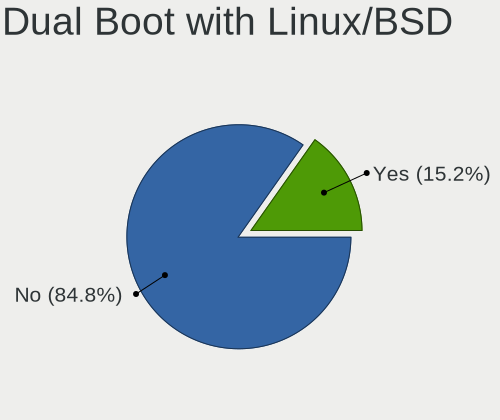
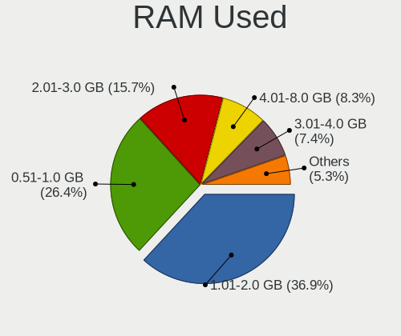
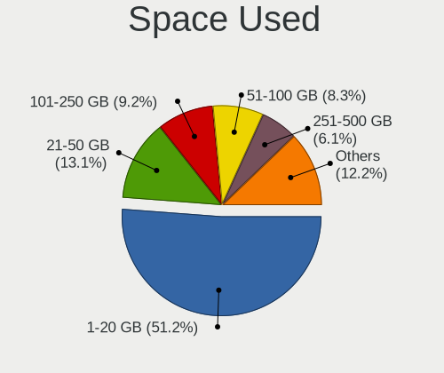
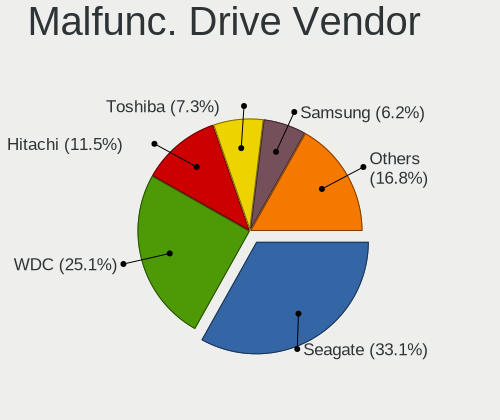
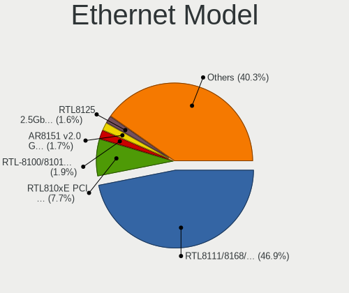

Linux in Russia - Tested Hardware & Statistics
----------------------------------------------

A project to collect tested hardware configurations for Linux in Russia.

Anyone can contribute to this report by the [hw-probe](https://github.com/linuxhw/hw-probe) tool:

    sudo -E hw-probe -all -upload

Please contribute! Especially if your hardware is rare.

This is a report for all computer types. See also reports for [desktops](/Location/Russia/Desktop/README.md) and [notebooks](/Location/Russia/Notebook/README.md).

Contents
--------

* [ Test Cases ](#test-cases)

* [ System ](#system)
  - [ OS                       ](#os)
  - [ OS Family                ](#os-family)
  - [ Kernel                   ](#kernel)
  - [ Kernel Family            ](#kernel-family)
  - [ Kernel Major Ver.        ](#kernel-major-ver)
  - [ Arch                     ](#arch)
  - [ DE                       ](#de)
  - [ Display Server           ](#display-server)
  - [ Display Manager          ](#display-manager)
  - [ OS Lang                  ](#os-lang)
  - [ Boot Mode                ](#boot-mode)
  - [ Filesystem               ](#filesystem)
  - [ Part. scheme             ](#part-scheme)
  - [ Dual Boot with Linux/BSD ](#dual-boot-with-linuxbsd)
  - [ Dual Boot (Win)          ](#dual-boot-win)

* [ Board ](#board)
  - [ Vendor                   ](#vendor)
  - [ Model                    ](#model)
  - [ Model Family             ](#model-family)
  - [ MFG Year                 ](#mfg-year)
  - [ Form Factor              ](#form-factor)
  - [ Secure Boot              ](#secure-boot)
  - [ Coreboot                 ](#coreboot)
  - [ RAM Size                 ](#ram-size)
  - [ RAM Used                 ](#ram-used)
  - [ Total Drives             ](#total-drives)
  - [ Has CD-ROM               ](#has-cd-rom)
  - [ Has Ethernet             ](#has-ethernet)
  - [ Has WiFi                 ](#has-wifi)
  - [ Has Bluetooth            ](#has-bluetooth)

* [ Location ](#location)
  - [ Country                  ](#country)
  - [ City                     ](#city)

* [ Drives ](#drives)
  - [ Drive Vendor             ](#drive-vendor)
  - [ Drive Model              ](#drive-model)
  - [ HDD Vendor               ](#hdd-vendor)
  - [ SSD Vendor               ](#ssd-vendor)
  - [ Drive Kind               ](#drive-kind)
  - [ Drive Connector          ](#drive-connector)
  - [ Drive Size               ](#drive-size)
  - [ Space Total              ](#space-total)
  - [ Space Used               ](#space-used)
  - [ Malfunc. Drives          ](#malfunc-drives)
  - [ Malfunc. Drive Vendor    ](#malfunc-drive-vendor)
  - [ Malfunc. HDD Vendor      ](#malfunc-hdd-vendor)
  - [ Malfunc. Drive Kind      ](#malfunc-drive-kind)
  - [ Failed Drives            ](#failed-drives)
  - [ Failed Drive Vendor      ](#failed-drive-vendor)
  - [ Drive Status             ](#drive-status)

* [ Storage controller ](#storage-controller)
  - [ Storage Vendor           ](#storage-vendor)
  - [ Storage Model            ](#storage-model)
  - [ Storage Kind             ](#storage-kind)

* [ Processor ](#processor)
  - [ CPU Vendor               ](#cpu-vendor)
  - [ CPU Model                ](#cpu-model)
  - [ CPU Model Family         ](#cpu-model-family)
  - [ CPU Cores                ](#cpu-cores)
  - [ CPU Sockets              ](#cpu-sockets)
  - [ CPU Threads              ](#cpu-threads)
  - [ CPU Op-Modes             ](#cpu-op-modes)
  - [ CPU Microcode            ](#cpu-microcode)
  - [ CPU Microarch            ](#cpu-microarch)

* [ Graphics ](#graphics)
  - [ GPU Vendor               ](#gpu-vendor)
  - [ GPU Model                ](#gpu-model)
  - [ GPU Combo                ](#gpu-combo)
  - [ GPU Driver               ](#gpu-driver)
  - [ GPU Memory               ](#gpu-memory)

* [ Monitor ](#monitor)
  - [ Monitor Vendor           ](#monitor-vendor)
  - [ Monitor Model            ](#monitor-model)
  - [ Monitor Resolution       ](#monitor-resolution)
  - [ Monitor Diagonal         ](#monitor-diagonal)
  - [ Monitor Width            ](#monitor-width)
  - [ Aspect Ratio             ](#aspect-ratio)
  - [ Monitor Area             ](#monitor-area)
  - [ Pixel Density            ](#pixel-density)
  - [ Multiple Monitors        ](#multiple-monitors)

* [ Network ](#network)
  - [ Net Controller Vendor    ](#net-controller-vendor)
  - [ Net Controller Model     ](#net-controller-model)
  - [ Wireless Vendor          ](#wireless-vendor)
  - [ Wireless Model           ](#wireless-model)
  - [ Ethernet Vendor          ](#ethernet-vendor)
  - [ Ethernet Model           ](#ethernet-model)
  - [ Net Controller Kind      ](#net-controller-kind)
  - [ Used Controller          ](#used-controller)
  - [ NICs                     ](#nics)
  - [ IPv6                     ](#ipv6)

* [ Bluetooth ](#bluetooth)
  - [ Bluetooth Vendor         ](#bluetooth-vendor)
  - [ Bluetooth Model          ](#bluetooth-model)

* [ Sound ](#sound)
  - [ Sound Vendor             ](#sound-vendor)
  - [ Sound Model              ](#sound-model)

* [ Memory ](#memory)
  - [ Memory Vendor            ](#memory-vendor)
  - [ Memory Model             ](#memory-model)
  - [ Memory Kind              ](#memory-kind)
  - [ Memory Form Factor       ](#memory-form-factor)
  - [ Memory Size              ](#memory-size)
  - [ Memory Speed             ](#memory-speed)

* [ Printers & scanners ](#printers--scanners)
  - [ Printer Vendor           ](#printer-vendor)
  - [ Printer Model            ](#printer-model)
  - [ Scanner Vendor           ](#scanner-vendor)
  - [ Scanner Model            ](#scanner-model)

* [ Camera ](#camera)
  - [ Camera Vendor            ](#camera-vendor)
  - [ Camera Model             ](#camera-model)

* [ Security ](#security)
  - [ Fingerprint Vendor       ](#fingerprint-vendor)
  - [ Fingerprint Model        ](#fingerprint-model)
  - [ Chipcard Vendor          ](#chipcard-vendor)
  - [ Chipcard Model           ](#chipcard-model)

* [ Unsupported ](#unsupported)
  - [ Unsupported Devices      ](#unsupported-devices)
  - [ Unsupported Device Types ](#unsupported-device-types)

Test Cases
----------

Total: 39156

| Vendor        | Model                       | Form-Factor | Probe                                                      | Date         |
|---------------|-----------------------------|-------------|------------------------------------------------------------|--------------|
| Acer          | Aspire A517-51              | Notebook    | [01cfb1c93f](https://linux-hardware.org/?probe=01cfb1c93f) | Jun 10, 2023 |
| ASRock        | G41M-VS3                    | Desktop     | [d592b19e9b](https://linux-hardware.org/?probe=d592b19e9b) | Jun 10, 2023 |
| Samsung       | P29/28/26                   | Notebook    | [6040d56961](https://linux-hardware.org/?probe=6040d56961) | Jun 10, 2023 |
| Gigabyte      | 8I865GVMK-775               | Desktop     | [3d90d76b7b](https://linux-hardware.org/?probe=3d90d76b7b) | Jun 10, 2023 |
| Gigabyte      | H410M H                     | Desktop     | [dfba5357ee](https://linux-hardware.org/?probe=dfba5357ee) | Jun 10, 2023 |
| WeiBu         | OEM                         | Notebook    | [49bd40f956](https://linux-hardware.org/?probe=49bd40f956) | Jun 10, 2023 |
| HUAWEI        | NBD-WXX9                    | Notebook    | [61c1703e67](https://linux-hardware.org/?probe=61c1703e67) | Jun 10, 2023 |
| Huanan        | X99 F8D V2.2                | Desktop     | [1eeaac2701](https://linux-hardware.org/?probe=1eeaac2701) | Jun 10, 2023 |
| MSI           | MAG B760 TOMAHAWK WIFI      | Desktop     | [88955e82f2](https://linux-hardware.org/?probe=88955e82f2) | Jun 10, 2023 |
| HUAWEI        | NBD-WXX9                    | Notebook    | [321ad38786](https://linux-hardware.org/?probe=321ad38786) | Jun 10, 2023 |
| Gigabyte      | B450M S2H                   | Desktop     | [82adaa06b7](https://linux-hardware.org/?probe=82adaa06b7) | Jun 10, 2023 |
| ASRock        | H610M-ITX/ac                | Desktop     | [80002221f5](https://linux-hardware.org/?probe=80002221f5) | Jun 10, 2023 |
| TYAN Compu... | S7010                       | Server      | [a8b96e89f2](https://linux-hardware.org/?probe=a8b96e89f2) | Jun 10, 2023 |
| MACHENIKE     | F117-7P                     | Notebook    | [78ad896b83](https://linux-hardware.org/?probe=78ad896b83) | Jun 10, 2023 |
| MSI           | B250M PRO-VH                | Desktop     | [16b496c21d](https://linux-hardware.org/?probe=16b496c21d) | Jun 10, 2023 |
| Lenovo        | Legion 5 15ARH05 82B5       | Notebook    | [2b4f40f41b](https://linux-hardware.org/?probe=2b4f40f41b) | Jun 09, 2023 |
| Dell          | Inspiron N5110              | Notebook    | [62d37454d3](https://linux-hardware.org/?probe=62d37454d3) | Jun 09, 2023 |
| Dell          | Latitude 5480               | Notebook    | [5b3fb0b4f8](https://linux-hardware.org/?probe=5b3fb0b4f8) | Jun 09, 2023 |
| ECS           | G31T-M9                     | Desktop     | [d8ca98b733](https://linux-hardware.org/?probe=d8ca98b733) | Jun 09, 2023 |
| IBM           | 00J6244 08                  | Server      | [1543d47492](https://linux-hardware.org/?probe=1543d47492) | Jun 09, 2023 |
| Acer          | Aspire 5750G                | Notebook    | [69227c0908](https://linux-hardware.org/?probe=69227c0908) | Jun 09, 2023 |
| MSI           | A520M-A PRO                 | Desktop     | [8a9223ce9f](https://linux-hardware.org/?probe=8a9223ce9f) | Jun 09, 2023 |
| Gigabyte      | B450M S2H V2                | Desktop     | [fb883c82bc](https://linux-hardware.org/?probe=fb883c82bc) | Jun 09, 2023 |
| Gigabyte      | B450 AORUS ELITE            | Desktop     | [b2c39972c2](https://linux-hardware.org/?probe=b2c39972c2) | Jun 09, 2023 |
| Gigabyte      | B450M H                     | Desktop     | [e54b5ce7da](https://linux-hardware.org/?probe=e54b5ce7da) | Jun 09, 2023 |
| HUAWEI        | BOHB-WAX9                   | Notebook    | [aa0b439e8d](https://linux-hardware.org/?probe=aa0b439e8d) | Jun 09, 2023 |
| Lenovo        | IdeaPad 5 14ARE05 81YM      | Notebook    | [e246e70bb6](https://linux-hardware.org/?probe=e246e70bb6) | Jun 09, 2023 |
| Acer          | Aspire A517-53              | Notebook    | [c14dcffa32](https://linux-hardware.org/?probe=c14dcffa32) | Jun 08, 2023 |
| Supermicro    | X10DRG-Q                    | Desktop     | [c03c5ea1b9](https://linux-hardware.org/?probe=c03c5ea1b9) | Jun 08, 2023 |
| Supermicro    | X10DRU-i+                   | Server      | [092cd038fc](https://linux-hardware.org/?probe=092cd038fc) | Jun 08, 2023 |
| HP            | ProLiant DL360 Gen9         | Server      | [20092d99e6](https://linux-hardware.org/?probe=20092d99e6) | Jun 08, 2023 |
| Supermicro    | X8DTU                       | Server      | [8c9992144c](https://linux-hardware.org/?probe=8c9992144c) | Jun 08, 2023 |
| Dell          | 08GXHX A06                  | Server      | [e4ef5b4ff9](https://linux-hardware.org/?probe=e4ef5b4ff9) | Jun 08, 2023 |
| Supermicro    | X8DTU                       | Server      | [afa1204a2d](https://linux-hardware.org/?probe=afa1204a2d) | Jun 08, 2023 |
| Supermicro    | X8DTU                       | Server      | [71e863c1a8](https://linux-hardware.org/?probe=71e863c1a8) | Jun 08, 2023 |
| Supermicro    | X8DTU                       | Server      | [5033e3aef3](https://linux-hardware.org/?probe=5033e3aef3) | Jun 08, 2023 |
| Supermicro    | X9DRW                       | Server      | [0f8167210a](https://linux-hardware.org/?probe=0f8167210a) | Jun 08, 2023 |
| Supermicro    | X8DTU                       | Server      | [ab8024c378](https://linux-hardware.org/?probe=ab8024c378) | Jun 08, 2023 |
| Supermicro    | X9DRW                       | Server      | [6845342901](https://linux-hardware.org/?probe=6845342901) | Jun 08, 2023 |
| Supermicro    | X10DRU-i+                   | Server      | [a94d257f7f](https://linux-hardware.org/?probe=a94d257f7f) | Jun 08, 2023 |
| Supermicro    | X8DTL                       | Server      | [b261675cb7](https://linux-hardware.org/?probe=b261675cb7) | Jun 08, 2023 |
| Supermicro    | X8DTU                       | Server      | [605dfce92c](https://linux-hardware.org/?probe=605dfce92c) | Jun 08, 2023 |
| Lenovo        | Unknown                     | Notebook    | [1842b75de0](https://linux-hardware.org/?probe=1842b75de0) | Jun 08, 2023 |
| Dell          | Vostro 1015                 | Notebook    | [dcd4a1ad41](https://linux-hardware.org/?probe=dcd4a1ad41) | Jun 08, 2023 |
| Biostar       | H610MH                      | Desktop     | [a2c82f65b6](https://linux-hardware.org/?probe=a2c82f65b6) | Jun 08, 2023 |
| ASUSTek       | ROG Strix G713PI_G713PI     | Notebook    | [13b0e73872](https://linux-hardware.org/?probe=13b0e73872) | Jun 08, 2023 |
| HJS           | OPSH110D4                   | Desktop     | [bfb0ead991](https://linux-hardware.org/?probe=bfb0ead991) | Jun 08, 2023 |
| ASUSTek       | M4A78T-E                    | Desktop     | [fa22309a62](https://linux-hardware.org/?probe=fa22309a62) | Jun 08, 2023 |
| Biostar       | H610MH                      | Desktop     | [2cd4e157d4](https://linux-hardware.org/?probe=2cd4e157d4) | Jun 08, 2023 |
| INFERIT       | Silver                      | Notebook    | [f6b3fc6762](https://linux-hardware.org/?probe=f6b3fc6762) | Jun 08, 2023 |
| Unknown       | Unknown                     | Tablet      | [072c85039e](https://linux-hardware.org/?probe=072c85039e) | Jun 08, 2023 |
| MSI           | H510M-A PRO                 | Desktop     | [86dfe28c7a](https://linux-hardware.org/?probe=86dfe28c7a) | Jun 08, 2023 |
| Dell          | Inspiron 3558               | Notebook    | [87b5fd28c2](https://linux-hardware.org/?probe=87b5fd28c2) | Jun 08, 2023 |
| HP            | 895F                        | All in one  | [355d6e856c](https://linux-hardware.org/?probe=355d6e856c) | Jun 08, 2023 |
| MSI           | GE60 2PL                    | Notebook    | [e1d118e2d2](https://linux-hardware.org/?probe=e1d118e2d2) | Jun 08, 2023 |
| HP            | G62                         | Notebook    | [fb9522ceac](https://linux-hardware.org/?probe=fb9522ceac) | Jun 08, 2023 |
| Acer          | Aspire 7741                 | Notebook    | [c85cff4000](https://linux-hardware.org/?probe=c85cff4000) | Jun 08, 2023 |
| Gigabyte      | A520M H                     | Desktop     | [302bb0628a](https://linux-hardware.org/?probe=302bb0628a) | Jun 08, 2023 |
| Lenovo        | IdeaPad 5 Pro 14ACN6 82L... | Notebook    | [292625f2da](https://linux-hardware.org/?probe=292625f2da) | Jun 08, 2023 |
| Sony          | VPCEH2E1R                   | Notebook    | [97e5366810](https://linux-hardware.org/?probe=97e5366810) | Jun 08, 2023 |
| Lenovo        | B590 20208                  | Notebook    | [102b3706f4](https://linux-hardware.org/?probe=102b3706f4) | Jun 08, 2023 |
| ASRock        | A320M-DVS R4.0              | Desktop     | [aaf59358b7](https://linux-hardware.org/?probe=aaf59358b7) | Jun 07, 2023 |
| ASUSTek       | P8Z77-V LE PLUS             | Desktop     | [45cc99775f](https://linux-hardware.org/?probe=45cc99775f) | Jun 07, 2023 |
| Gigabyte      | Z390 GAMING SLI-CF          | Desktop     | [5f0e8ab63a](https://linux-hardware.org/?probe=5f0e8ab63a) | Jun 07, 2023 |
| Supermicro    | X9DRi-LN4+/X9DR3-LN4+       | Server      | [b4eb1cdd06](https://linux-hardware.org/?probe=b4eb1cdd06) | Jun 07, 2023 |
| Unknown       | Unknown                     | Desktop     | [b2c6247a0e](https://linux-hardware.org/?probe=b2c6247a0e) | Jun 07, 2023 |
| ASUSTek       | M5A97 R2.0                  | Desktop     | [369f5d3044](https://linux-hardware.org/?probe=369f5d3044) | Jun 07, 2023 |
| Machcreato... | 14                          | Notebook    | [d889b02b13](https://linux-hardware.org/?probe=d889b02b13) | Jun 07, 2023 |
| ASUSTek       | VivoBook_ASUSLaptop M150... | Notebook    | [6d434209eb](https://linux-hardware.org/?probe=6d434209eb) | Jun 07, 2023 |
| MSI           | MAG B550 TOMAHAWK           | Desktop     | [96256dca48](https://linux-hardware.org/?probe=96256dca48) | Jun 07, 2023 |
| Maibenben     | MaiBook X series            | Notebook    | [5ca7ad5fb0](https://linux-hardware.org/?probe=5ca7ad5fb0) | Jun 07, 2023 |
| ASUSTek       | X205TA                      | Notebook    | [4c56663011](https://linux-hardware.org/?probe=4c56663011) | Jun 07, 2023 |
| Kraftway      | KWH510                      | Desktop     | [3a5ccb373b](https://linux-hardware.org/?probe=3a5ccb373b) | Jun 07, 2023 |
| Supermicro    | H12SSW-NT                   | Server      | [5950749033](https://linux-hardware.org/?probe=5950749033) | Jun 07, 2023 |
| Samsung       | 355V4C/356V4C/3445VC/354... | Notebook    | [6e2a67c010](https://linux-hardware.org/?probe=6e2a67c010) | Jun 07, 2023 |
| Samsung       | 350V5C/351V5C/3540VC/344... | Notebook    | [2e0b21f8d4](https://linux-hardware.org/?probe=2e0b21f8d4) | Jun 07, 2023 |
| HP            | Laptop 15s-eq1xxx           | Notebook    | [db91b1b71c](https://linux-hardware.org/?probe=db91b1b71c) | Jun 07, 2023 |
| ASUSTek       | PRIME Z690M-PLUS D4         | Desktop     | [468f6fe603](https://linux-hardware.org/?probe=468f6fe603) | Jun 06, 2023 |
| Acer          | AOD257                      | Notebook    | [1b75b86659](https://linux-hardware.org/?probe=1b75b86659) | Jun 06, 2023 |
| HP            | Laptop 15s-eq1xxx           | Notebook    | [d2c05f91c4](https://linux-hardware.org/?probe=d2c05f91c4) | Jun 06, 2023 |
| Gigabyte      | H67MA-USB3-B3               | Desktop     | [c2f52c637b](https://linux-hardware.org/?probe=c2f52c637b) | Jun 06, 2023 |
| Packard Be... | EasyNote TE69KB             | Notebook    | [d6f404ae63](https://linux-hardware.org/?probe=d6f404ae63) | Jun 06, 2023 |
| Gigabyte      | M68MT-S2                    | Desktop     | [2ff7b71aed](https://linux-hardware.org/?probe=2ff7b71aed) | Jun 06, 2023 |
| AMI           | Aptio CRB                   | Mini pc     | [443550d99f](https://linux-hardware.org/?probe=443550d99f) | Jun 06, 2023 |
| Machcreato... | 14                          | Notebook    | [f0a27a9f97](https://linux-hardware.org/?probe=f0a27a9f97) | Jun 06, 2023 |
| HP            | Pavilion 15                 | Notebook    | [d75a894e8c](https://linux-hardware.org/?probe=d75a894e8c) | Jun 06, 2023 |
| Intel         | E5 V1.0                     | Desktop     | [077c08c2dc](https://linux-hardware.org/?probe=077c08c2dc) | Jun 06, 2023 |
| Gigabyte      | H61M-DS2                    | Desktop     | [10ecbb2117](https://linux-hardware.org/?probe=10ecbb2117) | Jun 06, 2023 |
| HP            | 250 15.6 inch G9 Noteboo... | Notebook    | [be9987ca28](https://linux-hardware.org/?probe=be9987ca28) | Jun 06, 2023 |
| Dell          | G5 5587                     | Notebook    | [909f234c06](https://linux-hardware.org/?probe=909f234c06) | Jun 06, 2023 |
| ASUSTek       | PRIME H410I-PLUS            | Desktop     | [83988ad739](https://linux-hardware.org/?probe=83988ad739) | Jun 06, 2023 |
| Lenovo        | G70-70 80HW                 | Notebook    | [0d46480e90](https://linux-hardware.org/?probe=0d46480e90) | Jun 06, 2023 |
| Acer          | Swift SF314-511             | Notebook    | [60bf4b0442](https://linux-hardware.org/?probe=60bf4b0442) | Jun 05, 2023 |
| MSI           | Delta 15 A5EFK              | Notebook    | [d55fa44834](https://linux-hardware.org/?probe=d55fa44834) | Jun 05, 2023 |
| realme        | CloudProXXXX                | Notebook    | [22cced9066](https://linux-hardware.org/?probe=22cced9066) | Jun 05, 2023 |
| ASUSTek       | PRIME Z370-P II             | Desktop     | [5a66eed08e](https://linux-hardware.org/?probe=5a66eed08e) | Jun 05, 2023 |
| Unknown       | X79                         | Desktop     | [8c1de0f494](https://linux-hardware.org/?probe=8c1de0f494) | Jun 05, 2023 |
| ECS           | G31T-M9                     | Desktop     | [8bb444bdd6](https://linux-hardware.org/?probe=8bb444bdd6) | Jun 05, 2023 |
| ASUSTek       | P5Q                         | Desktop     | [85c6e06d3b](https://linux-hardware.org/?probe=85c6e06d3b) | Jun 05, 2023 |
| Lenovo        | 3123 SDK0J40697 WIN 3305... | All in one  | [b5b1c0dd60](https://linux-hardware.org/?probe=b5b1c0dd60) | Jun 05, 2023 |
| Gigabyte      | M68MT-S2                    | Desktop     | [2ec944c5d0](https://linux-hardware.org/?probe=2ec944c5d0) | Jun 05, 2023 |
| Aquarius      | NS585                       | Notebook    | [b3f11e4a53](https://linux-hardware.org/?probe=b3f11e4a53) | Jun 05, 2023 |
| Unknown       | Unknown                     | Desktop     | [8896a460d4](https://linux-hardware.org/?probe=8896a460d4) | Jun 05, 2023 |
| Gigabyte      | M68MT-S2                    | Desktop     | [d392dff6bb](https://linux-hardware.org/?probe=d392dff6bb) | Jun 05, 2023 |
| ASRock        | 960GM-GS3 FX                | Desktop     | [72702690e5](https://linux-hardware.org/?probe=72702690e5) | Jun 05, 2023 |
| HP            | EliteBook 2560p             | Notebook    | [3ed00534ed](https://linux-hardware.org/?probe=3ed00534ed) | Jun 05, 2023 |
| ECS           | G31T-M9                     | Desktop     | [630360ab38](https://linux-hardware.org/?probe=630360ab38) | Jun 05, 2023 |
| Lenovo        | IdeaPad 520-15IKB 81BF      | Notebook    | [2e429d02d1](https://linux-hardware.org/?probe=2e429d02d1) | Jun 05, 2023 |
| ASUSTek       | M5A78L-M LX3 PLUS           | Desktop     | [1f07862108](https://linux-hardware.org/?probe=1f07862108) | Jun 05, 2023 |
| HP            | Mini 210-1000               | Notebook    | [96f41af422](https://linux-hardware.org/?probe=96f41af422) | Jun 05, 2023 |
| Gigabyte      | M68MT-S2                    | Desktop     | [991c5472ac](https://linux-hardware.org/?probe=991c5472ac) | Jun 05, 2023 |
| ASUSTek       | SABERTOOTH 55i              | Desktop     | [c208cb2024](https://linux-hardware.org/?probe=c208cb2024) | Jun 05, 2023 |
| Lenovo        | 316E NOK                    | Mini pc     | [ac55415914](https://linux-hardware.org/?probe=ac55415914) | Jun 05, 2023 |
| MSI           | MAG B550 TOMAHAWK           | Desktop     | [d7ae224bea](https://linux-hardware.org/?probe=d7ae224bea) | Jun 04, 2023 |
| Samsung       | N102                        | Notebook    | [c3e402b50d](https://linux-hardware.org/?probe=c3e402b50d) | Jun 04, 2023 |
| HP            | Pavilion 15                 | Notebook    | [944c353c44](https://linux-hardware.org/?probe=944c353c44) | Jun 04, 2023 |
| Intel         | S1200RP_SE G62252-408       | Server      | [887b53c07e](https://linux-hardware.org/?probe=887b53c07e) | Jun 04, 2023 |
| Intel         | S1200RP_SE G62252-408       | Server      | [267a861f0d](https://linux-hardware.org/?probe=267a861f0d) | Jun 04, 2023 |
| ASUSTek       | VivoBook_ASUSLaptop X571... | Notebook    | [dfb8881ffe](https://linux-hardware.org/?probe=dfb8881ffe) | Jun 04, 2023 |
| Gigabyte      | G41MT-S2P                   | Desktop     | [aa5ed8cbc0](https://linux-hardware.org/?probe=aa5ed8cbc0) | Jun 04, 2023 |
| ASRock        | G31M-GS                     | Desktop     | [558dec9114](https://linux-hardware.org/?probe=558dec9114) | Jun 04, 2023 |
| Apple         | MacBookPro11,1              | Notebook    | [4192000802](https://linux-hardware.org/?probe=4192000802) | Jun 04, 2023 |
| Samsung       | 305V4A/305V5A/3415VA        | Notebook    | [a0f9cde008](https://linux-hardware.org/?probe=a0f9cde008) | Jun 04, 2023 |
| Apple         | MacBookPro11,1              | Notebook    | [168fa7f541](https://linux-hardware.org/?probe=168fa7f541) | Jun 04, 2023 |
| Acer          | Spin SP111-32N              | Convertible | [e27deb35b8](https://linux-hardware.org/?probe=e27deb35b8) | Jun 03, 2023 |
| Acer          | Spin SP111-32N              | Convertible | [60f94ec7f1](https://linux-hardware.org/?probe=60f94ec7f1) | Jun 03, 2023 |
| Lenovo        | V560                        | Notebook    | [b2564e07cc](https://linux-hardware.org/?probe=b2564e07cc) | Jun 03, 2023 |
| Valve         | Jupiter                     | Notebook    | [fdfee4fc99](https://linux-hardware.org/?probe=fdfee4fc99) | Jun 03, 2023 |
| ASUSTek       | P8B75-M LE                  | Desktop     | [640faccae0](https://linux-hardware.org/?probe=640faccae0) | Jun 03, 2023 |
| Maibenben     | MaiBook M                   | Notebook    | [b5d7957b55](https://linux-hardware.org/?probe=b5d7957b55) | Jun 03, 2023 |
| Lenovo        | IdeaPad 320-17IKB 80XM      | Notebook    | [5d6b08920f](https://linux-hardware.org/?probe=5d6b08920f) | Jun 03, 2023 |
| Valve         | Jupiter                     | Notebook    | [cf26028872](https://linux-hardware.org/?probe=cf26028872) | Jun 03, 2023 |
| Acer          | Aspire S3                   | Notebook    | [23c1a32b88](https://linux-hardware.org/?probe=23c1a32b88) | Jun 03, 2023 |
| Samsung       | N102                        | Notebook    | [b21ddf3fea](https://linux-hardware.org/?probe=b21ddf3fea) | Jun 03, 2023 |
| ECS           | G31T-M                      | Desktop     | [55d38b75c7](https://linux-hardware.org/?probe=55d38b75c7) | Jun 03, 2023 |
| ASUSTek       | PRIME H310M-R R2.0          | Desktop     | [5387bcbf7d](https://linux-hardware.org/?probe=5387bcbf7d) | Jun 03, 2023 |
| ASUSTek       | PRIME H310M-R R2.0          | Desktop     | [881df8f45c](https://linux-hardware.org/?probe=881df8f45c) | Jun 03, 2023 |
| ASUSTek       | PRIME H310M-R R2.0          | Desktop     | [0dd3be3300](https://linux-hardware.org/?probe=0dd3be3300) | Jun 03, 2023 |
| ASUSTek       | PRIME A520M-A               | Desktop     | [7dac003c12](https://linux-hardware.org/?probe=7dac003c12) | Jun 03, 2023 |
| ASUSTek       | VivoBook 17_ASUS Laptop ... | Notebook    | [88c3440ff2](https://linux-hardware.org/?probe=88c3440ff2) | Jun 03, 2023 |
| Dell          | Inspiron 1525               | Notebook    | [3160e89723](https://linux-hardware.org/?probe=3160e89723) | Jun 03, 2023 |
| MSI           | PRO Z790-A WIFI             | Desktop     | [1c7cc37995](https://linux-hardware.org/?probe=1c7cc37995) | Jun 03, 2023 |
| ASUSTek       | X556UQ                      | Notebook    | [088518df2b](https://linux-hardware.org/?probe=088518df2b) | Jun 02, 2023 |
| ASUSTek       | PRIME B450M-A II            | Desktop     | [11e04db670](https://linux-hardware.org/?probe=11e04db670) | Jun 02, 2023 |
| HUAWEI        | BOD-WXX9                    | Notebook    | [532dea434a](https://linux-hardware.org/?probe=532dea434a) | Jun 02, 2023 |
| HP            | ENVY Notebook               | Notebook    | [e7f4c63499](https://linux-hardware.org/?probe=e7f4c63499) | Jun 02, 2023 |
| DEXP          | Aquilon C15                 | Notebook    | [763c923576](https://linux-hardware.org/?probe=763c923576) | Jun 02, 2023 |
| IBM           | 00J6244 08                  | Server      | [81b4c3fd14](https://linux-hardware.org/?probe=81b4c3fd14) | Jun 02, 2023 |
| MSI           | G31TM-P21                   | Desktop     | [964377db0b](https://linux-hardware.org/?probe=964377db0b) | Jun 02, 2023 |
| Dell          | 0VNM11 A01                  | Desktop     | [df3c87a033](https://linux-hardware.org/?probe=df3c87a033) | Jun 02, 2023 |
| ASUSTek       | PRIME B450M-K               | Desktop     | [853bd25ca5](https://linux-hardware.org/?probe=853bd25ca5) | Jun 02, 2023 |
| ASUSTek       | PRIME B450M-K               | Desktop     | [3a9fb692f1](https://linux-hardware.org/?probe=3a9fb692f1) | Jun 02, 2023 |
| ASUSTek       | PRIME B450M-K               | Desktop     | [9b549fe65a](https://linux-hardware.org/?probe=9b549fe65a) | Jun 02, 2023 |
| ASUSTek       | PRIME B450M-K               | Desktop     | [db685837d0](https://linux-hardware.org/?probe=db685837d0) | Jun 02, 2023 |
| ASUSTek       | PRIME B450M-K               | Desktop     | [968b38e0b9](https://linux-hardware.org/?probe=968b38e0b9) | Jun 02, 2023 |
| ASUSTek       | PRIME B450M-K               | Desktop     | [c9a04d8da0](https://linux-hardware.org/?probe=c9a04d8da0) | Jun 02, 2023 |
| ASUSTek       | PRIME B450M-K               | Desktop     | [238931757a](https://linux-hardware.org/?probe=238931757a) | Jun 02, 2023 |
| ASUSTek       | PRIME B450M-K               | Desktop     | [e190e991a6](https://linux-hardware.org/?probe=e190e991a6) | Jun 02, 2023 |
| ASUSTek       | PRIME B450M-K               | Desktop     | [0816e77499](https://linux-hardware.org/?probe=0816e77499) | Jun 02, 2023 |
| ASUSTek       | PRIME B450M-K               | Desktop     | [ff143ac918](https://linux-hardware.org/?probe=ff143ac918) | Jun 02, 2023 |
| Aquarius      | NS585                       | Notebook    | [6f93385917](https://linux-hardware.org/?probe=6f93385917) | Jun 02, 2023 |
| ASUSTek       | VivoBook_ASUS Laptop X50... | Notebook    | [6ae18b11ab](https://linux-hardware.org/?probe=6ae18b11ab) | Jun 02, 2023 |
| Zvezda        | Arctur test_serv            | Server      | [f728993499](https://linux-hardware.org/?probe=f728993499) | Jun 02, 2023 |
| ASUSTek       | VivoBook_ASUSLaptop N760... | Notebook    | [05a99cf128](https://linux-hardware.org/?probe=05a99cf128) | Jun 02, 2023 |
| ASUSTek       | VivoBook_ASUS Laptop X50... | Notebook    | [963b30ca7f](https://linux-hardware.org/?probe=963b30ca7f) | Jun 02, 2023 |
| Aquarius      | NS585                       | Notebook    | [091267ec3a](https://linux-hardware.org/?probe=091267ec3a) | Jun 02, 2023 |
| Aquarius      | NS585                       | Notebook    | [7534819f94](https://linux-hardware.org/?probe=7534819f94) | Jun 02, 2023 |
| Lenovo        | S40-70 80GQ                 | Notebook    | [9a3fbc7388](https://linux-hardware.org/?probe=9a3fbc7388) | Jun 02, 2023 |
| Gigabyte      | GA-880GMA-USB3              | Desktop     | [3feb5e9cb5](https://linux-hardware.org/?probe=3feb5e9cb5) | Jun 02, 2023 |
| ASUSTek       | ASUS TUF Gaming F17 FX70... | Notebook    | [23e94c534e](https://linux-hardware.org/?probe=23e94c534e) | Jun 01, 2023 |
| HP            | EliteBook 840 G6            | Notebook    | [81ec1cc134](https://linux-hardware.org/?probe=81ec1cc134) | Jun 01, 2023 |
| ASRock        | Z77M                        | Desktop     | [eae1adee21](https://linux-hardware.org/?probe=eae1adee21) | Jun 01, 2023 |
| Gigabyte      | H61M-DS2                    | Desktop     | [f3b666f725](https://linux-hardware.org/?probe=f3b666f725) | Jun 01, 2023 |
| Dell          | 0VNM11 A01                  | Desktop     | [308b943182](https://linux-hardware.org/?probe=308b943182) | Jun 01, 2023 |
| Gigabyte      | H61M-DS2                    | Desktop     | [1cf7ec0aa5](https://linux-hardware.org/?probe=1cf7ec0aa5) | Jun 01, 2023 |
| ASRock        | J3455M                      | Desktop     | [ca1db2cfb9](https://linux-hardware.org/?probe=ca1db2cfb9) | Jun 01, 2023 |
| Lenovo        | ThinkBook 14s Yoga ITL 2... | Convertible | [38a0e17081](https://linux-hardware.org/?probe=38a0e17081) | Jun 01, 2023 |
| Gigabyte      | B360M DS3H                  | Desktop     | [09b2200a7f](https://linux-hardware.org/?probe=09b2200a7f) | Jun 01, 2023 |
| Gigabyte      | H61M-DS2                    | Desktop     | [7f9d81bd57](https://linux-hardware.org/?probe=7f9d81bd57) | Jun 01, 2023 |
| Timi          | RedmiBook Pro 15S           | Notebook    | [1708ebae47](https://linux-hardware.org/?probe=1708ebae47) | Jun 01, 2023 |
| Aquarius      | NS585                       | Notebook    | [ffa7425b95](https://linux-hardware.org/?probe=ffa7425b95) | Jun 01, 2023 |
| Gigabyte      | B450 GAMING X               | Desktop     | [b92d2128ad](https://linux-hardware.org/?probe=b92d2128ad) | Jun 01, 2023 |
| MSI           | GF63 Thin 11SC              | Notebook    | [8f8afcc010](https://linux-hardware.org/?probe=8f8afcc010) | Jun 01, 2023 |
| Aquarius      | NS585                       | Notebook    | [fafcbbe90e](https://linux-hardware.org/?probe=fafcbbe90e) | Jun 01, 2023 |
| ASUSTek       | Z97-K                       | Desktop     | [1bd92e67d7](https://linux-hardware.org/?probe=1bd92e67d7) | Jun 01, 2023 |
| ASUSTek       | TUF Gaming B550M-PLUS WI... | Desktop     | [9afffc17a1](https://linux-hardware.org/?probe=9afffc17a1) | Jun 01, 2023 |
| Samsung       | 750QFG                      | Convertible | [7720d51647](https://linux-hardware.org/?probe=7720d51647) | Jun 01, 2023 |
| Dell          | Latitude 5490               | Notebook    | [34dde30b90](https://linux-hardware.org/?probe=34dde30b90) | Jun 01, 2023 |
| ASRock        | J4125-ITX                   | Desktop     | [31e0f624be](https://linux-hardware.org/?probe=31e0f624be) | Jun 01, 2023 |
| ASUSTek       | X550CC                      | Notebook    | [d75bfc397f](https://linux-hardware.org/?probe=d75bfc397f) | Jun 01, 2023 |
| Gigabyte      | EP45T-DS3                   | Desktop     | [0dd3baa28d](https://linux-hardware.org/?probe=0dd3baa28d) | Jun 01, 2023 |
| Timi          | TM1801                      | Notebook    | [aa1db210df](https://linux-hardware.org/?probe=aa1db210df) | Jun 01, 2023 |
| ASUSTek       | P8Z77-V LE PLUS             | Desktop     | [d94ba8fb27](https://linux-hardware.org/?probe=d94ba8fb27) | Jun 01, 2023 |
| Lenovo        | K14 Gen 1 21CSS16E00        | Notebook    | [9c95ad4263](https://linux-hardware.org/?probe=9c95ad4263) | May 31, 2023 |
| MSI           | X370 GAMING PLUS            | Desktop     | [ba0b4e2430](https://linux-hardware.org/?probe=ba0b4e2430) | May 31, 2023 |
| Acer          | Aspire 4810T                | Notebook    | [3058ac9018](https://linux-hardware.org/?probe=3058ac9018) | May 31, 2023 |
| ASRock        | FM2A88X-ITX+                | Desktop     | [6a2cd16e95](https://linux-hardware.org/?probe=6a2cd16e95) | May 31, 2023 |
| ASUSTek       | P5G41T-M LX3                | Desktop     | [483bf9a882](https://linux-hardware.org/?probe=483bf9a882) | May 31, 2023 |
| Apple         | MacBookPro16,1              | Notebook    | [717c7884c8](https://linux-hardware.org/?probe=717c7884c8) | May 31, 2023 |
| Acer          | Aspire ES1-523              | Notebook    | [d68236f41d](https://linux-hardware.org/?probe=d68236f41d) | May 31, 2023 |
| ASRock        | A320D4-P1                   | Desktop     | [195945844b](https://linux-hardware.org/?probe=195945844b) | May 31, 2023 |
| ECS           | G31T-M9                     | Desktop     | [f227323587](https://linux-hardware.org/?probe=f227323587) | May 31, 2023 |
| ASUSTek       | PRIME A320M-K               | Desktop     | [6bcba3e54d](https://linux-hardware.org/?probe=6bcba3e54d) | May 31, 2023 |
| AMD           | AOPW-PLUS                   | Server      | [9e0f4d41e2](https://linux-hardware.org/?probe=9e0f4d41e2) | May 31, 2023 |
| Dell          | Latitude 5411               | Notebook    | [8583aa2091](https://linux-hardware.org/?probe=8583aa2091) | May 31, 2023 |
| HP            | EliteBook 840 G3            | Notebook    | [384ebf87a3](https://linux-hardware.org/?probe=384ebf87a3) | May 31, 2023 |
| HP            | Laptop 15-gw0xxx            | Notebook    | [ebc3d97429](https://linux-hardware.org/?probe=ebc3d97429) | May 30, 2023 |
| HP            | Laptop 15-gw0xxx            | Notebook    | [97382e45f8](https://linux-hardware.org/?probe=97382e45f8) | May 30, 2023 |
| HP            | Laptop 17-ca0xxx            | Notebook    | [3222c41173](https://linux-hardware.org/?probe=3222c41173) | May 30, 2023 |
| Samsung       | RV410/RV510/S3510/E3510     | Notebook    | [d20ebd68c0](https://linux-hardware.org/?probe=d20ebd68c0) | May 30, 2023 |
| Lenovo        | Legion Y530-15ICH 81FV      | Notebook    | [85a2504037](https://linux-hardware.org/?probe=85a2504037) | May 30, 2023 |
| ASUSTek       | PRIME B450M-A               | Desktop     | [4833d37ec3](https://linux-hardware.org/?probe=4833d37ec3) | May 30, 2023 |
| Gigabyte      | M68MT-S2                    | Desktop     | [c56271ea6a](https://linux-hardware.org/?probe=c56271ea6a) | May 30, 2023 |
| MSI           | B350M PRO-VD PLUS           | Desktop     | [ca4e5a8f82](https://linux-hardware.org/?probe=ca4e5a8f82) | May 30, 2023 |
| Biostar       | H610MH                      | Desktop     | [708df29fd6](https://linux-hardware.org/?probe=708df29fd6) | May 30, 2023 |
| HP            | Laptop 15s-fq2xxx           | Notebook    | [7ab8c72481](https://linux-hardware.org/?probe=7ab8c72481) | May 30, 2023 |
| ASRock        | B550 Phantom Gaming 4       | Desktop     | [c23ef58095](https://linux-hardware.org/?probe=c23ef58095) | May 30, 2023 |
| MSI           | PRO Z790-A WIFI             | Desktop     | [676d83919f](https://linux-hardware.org/?probe=676d83919f) | May 30, 2023 |
| IBM           | 00J6244 08                  | Server      | [cee2891b60](https://linux-hardware.org/?probe=cee2891b60) | May 30, 2023 |
| ICL           | RAYbook Si1407              | Notebook    | [5956bb96ff](https://linux-hardware.org/?probe=5956bb96ff) | May 30, 2023 |
| Gigabyte      | M68MT-S2                    | Desktop     | [a0ffb7fd40](https://linux-hardware.org/?probe=a0ffb7fd40) | May 30, 2023 |
| Gigabyte      | H61M-S2PV                   | Desktop     | [446d026ac1](https://linux-hardware.org/?probe=446d026ac1) | May 30, 2023 |
| Supermicro    | X9DR3-F                     | Server      | [afcfc0fdf3](https://linux-hardware.org/?probe=afcfc0fdf3) | May 30, 2023 |
| Gigabyte      | B560M D3H                   | Desktop     | [8579e0281a](https://linux-hardware.org/?probe=8579e0281a) | May 30, 2023 |
| MSI           | MS-ACD31                    | All in one  | [d958890b05](https://linux-hardware.org/?probe=d958890b05) | May 30, 2023 |
| Acer          | Swift SF114-34              | Notebook    | [3722c76b10](https://linux-hardware.org/?probe=3722c76b10) | May 30, 2023 |
| Lenovo        | G570 20079                  | Notebook    | [4843789a62](https://linux-hardware.org/?probe=4843789a62) | May 30, 2023 |
| HP            | ProBook 440 G7              | Notebook    | [9da720226e](https://linux-hardware.org/?probe=9da720226e) | May 30, 2023 |
| ASRock        | A320M-DVS R4.0              | Desktop     | [611b47056d](https://linux-hardware.org/?probe=611b47056d) | May 30, 2023 |
| ASUSTek       | P9X79                       | Desktop     | [dacfbfd038](https://linux-hardware.org/?probe=dacfbfd038) | May 30, 2023 |
| ASUSTek       | M5A97 EVO R2.0              | Desktop     | [8e0413af72](https://linux-hardware.org/?probe=8e0413af72) | May 30, 2023 |
| Lenovo        | Legion Y530-15ICH 81FV      | Notebook    | [c0e9edd453](https://linux-hardware.org/?probe=c0e9edd453) | May 30, 2023 |
| MSI           | GE60 2PC                    | Notebook    | [48c124853f](https://linux-hardware.org/?probe=48c124853f) | May 30, 2023 |
| ASUSTek       | X550WA                      | Notebook    | [864236b0c9](https://linux-hardware.org/?probe=864236b0c9) | May 29, 2023 |
| ASRock        | B450 Gaming K4              | Desktop     | [2ef322a58d](https://linux-hardware.org/?probe=2ef322a58d) | May 29, 2023 |
| Lenovo        | ThinkPad E14 Gen 3 20Y70... | Notebook    | [3933dfe4f0](https://linux-hardware.org/?probe=3933dfe4f0) | May 29, 2023 |
| Gigabyte      | M68MT-S2                    | Desktop     | [80c2e03e4e](https://linux-hardware.org/?probe=80c2e03e4e) | May 29, 2023 |
| Huanan        | X99 F8D V2.2                | Desktop     | [b4e407cdb0](https://linux-hardware.org/?probe=b4e407cdb0) | May 29, 2023 |
| ECS           | G31T-M9                     | Desktop     | [8f4cd5b132](https://linux-hardware.org/?probe=8f4cd5b132) | May 29, 2023 |
| Samsung       | RV410/RV510/S3510/E3510     | Notebook    | [a786eb985d](https://linux-hardware.org/?probe=a786eb985d) | May 29, 2023 |
| ASUSTek       | GL553VD                     | Notebook    | [a1f825f4e5](https://linux-hardware.org/?probe=a1f825f4e5) | May 29, 2023 |
| Intel         | NUC7JYB J67970-403          | Mini pc     | [8af314920e](https://linux-hardware.org/?probe=8af314920e) | May 29, 2023 |
| Gigabyte      | M68MT-S2                    | Desktop     | [ffe8469edc](https://linux-hardware.org/?probe=ffe8469edc) | May 29, 2023 |
| ASUSTek       | B85M-G                      | Desktop     | [8f51b4170e](https://linux-hardware.org/?probe=8f51b4170e) | May 29, 2023 |
| Gigabyte      | F2A68HM-S1                  | Desktop     | [9b21df1d8e](https://linux-hardware.org/?probe=9b21df1d8e) | May 29, 2023 |
| Supermicro    | H12SSW-NT                   | Server      | [f8a6482d0e](https://linux-hardware.org/?probe=f8a6482d0e) | May 29, 2023 |
| HP            | ProBook 440 G6              | Notebook    | [35d14ed328](https://linux-hardware.org/?probe=35d14ed328) | May 29, 2023 |
| HP            | ProBook 440 G6              | Notebook    | [36a3563566](https://linux-hardware.org/?probe=36a3563566) | May 29, 2023 |
| Gigabyte      | GA-M56S-S3                  | Desktop     | [e9f274ad89](https://linux-hardware.org/?probe=e9f274ad89) | May 29, 2023 |
| Gigabyte      | M68MT-S2                    | Desktop     | [62a5559050](https://linux-hardware.org/?probe=62a5559050) | May 29, 2023 |
| Gigabyte      | GA-M56S-S3                  | Desktop     | [a9c147d701](https://linux-hardware.org/?probe=a9c147d701) | May 29, 2023 |
| ICL-KME CS    | RAYbook                     | Notebook    | [9e976ffc1a](https://linux-hardware.org/?probe=9e976ffc1a) | May 29, 2023 |
| HP            | Laptop 17-ca0xxx            | Notebook    | [4b53ed4ede](https://linux-hardware.org/?probe=4b53ed4ede) | May 29, 2023 |
| MSI           | 770-C45                     | Desktop     | [dae0d25fcc](https://linux-hardware.org/?probe=dae0d25fcc) | May 29, 2023 |
| Acer          | Swift SF114-34              | Notebook    | [b7be0bf5ad](https://linux-hardware.org/?probe=b7be0bf5ad) | May 29, 2023 |
| HONOR         | BBR-WAX9                    | Notebook    | [e57b9850f8](https://linux-hardware.org/?probe=e57b9850f8) | May 28, 2023 |
| Acer          | Aspire V3-571G              | Notebook    | [d3afe375cf](https://linux-hardware.org/?probe=d3afe375cf) | May 28, 2023 |
| ASUSTek       | PRIME H510M-K               | Desktop     | [0c7bfc7977](https://linux-hardware.org/?probe=0c7bfc7977) | May 28, 2023 |
| iRU           | J231                        | All in one  | [fdc7f7219d](https://linux-hardware.org/?probe=fdc7f7219d) | May 28, 2023 |
| Unknown       | X79                         | Desktop     | [cfda28fe65](https://linux-hardware.org/?probe=cfda28fe65) | May 28, 2023 |
| ASUSTek       | PN52                        | Mini pc     | [6f81612c62](https://linux-hardware.org/?probe=6f81612c62) | May 28, 2023 |
| Maibenben     | MaiBook M                   | Notebook    | [fa3f4694ba](https://linux-hardware.org/?probe=fa3f4694ba) | May 28, 2023 |
| ASUSTek       | PN52                        | Mini pc     | [444239084c](https://linux-hardware.org/?probe=444239084c) | May 28, 2023 |
| Gigabyte      | H81M-S1                     | Desktop     | [849ff29f29](https://linux-hardware.org/?probe=849ff29f29) | May 28, 2023 |
| Gigabyte      | H81M-S1                     | Desktop     | [45a2eb8526](https://linux-hardware.org/?probe=45a2eb8526) | May 28, 2023 |
| ASRock        | B550M Phantom Gaming 4      | Desktop     | [773f0d5242](https://linux-hardware.org/?probe=773f0d5242) | May 28, 2023 |
| ASUSTek       | VivoBook_ASUSLaptop X415... | Notebook    | [86876e9715](https://linux-hardware.org/?probe=86876e9715) | May 28, 2023 |
| HIPER Tech... | HIPER WORKBOOK              | Notebook    | [8283b1247f](https://linux-hardware.org/?probe=8283b1247f) | May 28, 2023 |
| LTD Delovo... | EVE 14 C414                 | Notebook    | [d52f6c1303](https://linux-hardware.org/?probe=d52f6c1303) | May 28, 2023 |
| MSI           | Z590-A PRO                  | Desktop     | [39f6ad44fe](https://linux-hardware.org/?probe=39f6ad44fe) | May 28, 2023 |
| Unknown       | Unknown                     | Notebook    | [b294c91e3a](https://linux-hardware.org/?probe=b294c91e3a) | May 28, 2023 |
| Lenovo        | IdeaPad Z570 1024CPU        | Notebook    | [eb1c70f7af](https://linux-hardware.org/?probe=eb1c70f7af) | May 28, 2023 |
| MSI           | Katana GF76 12UGSO          | Notebook    | [fb534d212e](https://linux-hardware.org/?probe=fb534d212e) | May 28, 2023 |
| MSI           | Katana GF76 12UGSO          | Notebook    | [6b753016ff](https://linux-hardware.org/?probe=6b753016ff) | May 28, 2023 |
| HP            | ENVY x360 Convertible 15... | Convertible | [447bbfbd40](https://linux-hardware.org/?probe=447bbfbd40) | May 27, 2023 |
| ASUSTek       | ROG Strix G634JY_G634JY     | Notebook    | [026cf06ce5](https://linux-hardware.org/?probe=026cf06ce5) | May 27, 2023 |
| HP            | Laptop 15s-fq5xxx           | Notebook    | [c6309fc374](https://linux-hardware.org/?probe=c6309fc374) | May 27, 2023 |
| AZW           | MINI S                      | Desktop     | [55c17a6700](https://linux-hardware.org/?probe=55c17a6700) | May 27, 2023 |
| Infinix       | INBOOK X2                   | Notebook    | [1f8b536f4f](https://linux-hardware.org/?probe=1f8b536f4f) | May 27, 2023 |
| Acer          | Aspire A517-51G             | Notebook    | [bfc89878ce](https://linux-hardware.org/?probe=bfc89878ce) | May 27, 2023 |
| ASUSTek       | H81M-PLUS                   | Desktop     | [e43931a1af](https://linux-hardware.org/?probe=e43931a1af) | May 27, 2023 |
| Huanan        | X79 249PC V2.2              | Desktop     | [0723379042](https://linux-hardware.org/?probe=0723379042) | May 27, 2023 |
| Huanan        | X79 249PC V2.2              | Desktop     | [ef1a056412](https://linux-hardware.org/?probe=ef1a056412) | May 27, 2023 |
| Gigabyte      | B360M D2V                   | Desktop     | [7fce8e04b2](https://linux-hardware.org/?probe=7fce8e04b2) | May 27, 2023 |
| Gigabyte      | H81M-S2V                    | Desktop     | [bcdfc5a2bf](https://linux-hardware.org/?probe=bcdfc5a2bf) | May 27, 2023 |
| Gigabyte      | H81M-S2V                    | Desktop     | [68cb8bdf49](https://linux-hardware.org/?probe=68cb8bdf49) | May 27, 2023 |
| Aquarius      | NS585                       | Notebook    | [a87c8d46b6](https://linux-hardware.org/?probe=a87c8d46b6) | May 27, 2023 |
| ASUSTek       | M4A785-M                    | Desktop     | [ff2e86c530](https://linux-hardware.org/?probe=ff2e86c530) | May 27, 2023 |
| Gigabyte      | F2A55M-DS2                  | Desktop     | [f1bfd18361](https://linux-hardware.org/?probe=f1bfd18361) | May 27, 2023 |
| ASRock        | B450 Gaming K4              | Desktop     | [985e20f0ad](https://linux-hardware.org/?probe=985e20f0ad) | May 27, 2023 |
| MSI           | MPG B650I EDGE WIFI         | Desktop     | [8fdbd504af](https://linux-hardware.org/?probe=8fdbd504af) | May 27, 2023 |
| Gigabyte      | Z690 AORUS MASTER           | Desktop     | [95231653d0](https://linux-hardware.org/?probe=95231653d0) | May 26, 2023 |
| HP            | Pavilion Laptop 14-ec0xx... | Notebook    | [4662e37743](https://linux-hardware.org/?probe=4662e37743) | May 26, 2023 |
| ASUSTek       | B85M-G                      | Desktop     | [92836191e9](https://linux-hardware.org/?probe=92836191e9) | May 26, 2023 |
| ASUSTek       | B85M-G                      | Desktop     | [0d449702e3](https://linux-hardware.org/?probe=0d449702e3) | May 26, 2023 |
| ASUSTek       | B85M-G                      | Desktop     | [a5fbe0c1ba](https://linux-hardware.org/?probe=a5fbe0c1ba) | May 26, 2023 |
| ASUSTek       | B85M-G                      | Desktop     | [f9fd99a8b7](https://linux-hardware.org/?probe=f9fd99a8b7) | May 26, 2023 |
| ASUSTek       | B85M-G                      | Desktop     | [6c87853f8c](https://linux-hardware.org/?probe=6c87853f8c) | May 26, 2023 |
| Samsung       | N130                        | Notebook    | [bd37239d10](https://linux-hardware.org/?probe=bd37239d10) | May 26, 2023 |
| Timi          | TM1701                      | Notebook    | [94105aa58f](https://linux-hardware.org/?probe=94105aa58f) | May 26, 2023 |
| ASUSTek       | H81M-C                      | Desktop     | [138348e6eb](https://linux-hardware.org/?probe=138348e6eb) | May 26, 2023 |
| ASUSTek       | B85M-G                      | Desktop     | [388eed2f8e](https://linux-hardware.org/?probe=388eed2f8e) | May 26, 2023 |
| ASUSTek       | B85M-G                      | Desktop     | [1bc02afebc](https://linux-hardware.org/?probe=1bc02afebc) | May 26, 2023 |
| ASUSTek       | B85M-G                      | Desktop     | [485617123a](https://linux-hardware.org/?probe=485617123a) | May 26, 2023 |
| ASUSTek       | B85M-G                      | Desktop     | [d1933e40f4](https://linux-hardware.org/?probe=d1933e40f4) | May 26, 2023 |
| ASUSTek       | B85M-G                      | Desktop     | [db84f366d0](https://linux-hardware.org/?probe=db84f366d0) | May 26, 2023 |
| ASUSTek       | B85M-G                      | Desktop     | [4d7f19ec5b](https://linux-hardware.org/?probe=4d7f19ec5b) | May 26, 2023 |
| ASUSTek       | B85M-G                      | Desktop     | [adb7acad13](https://linux-hardware.org/?probe=adb7acad13) | May 26, 2023 |
| ASUSTek       | B85M-G                      | Desktop     | [897503110a](https://linux-hardware.org/?probe=897503110a) | May 26, 2023 |
| ASUSTek       | B85M-G                      | Desktop     | [7ddbfedd32](https://linux-hardware.org/?probe=7ddbfedd32) | May 26, 2023 |
| Gigabyte      | H81M-S2V                    | Desktop     | [96202d100a](https://linux-hardware.org/?probe=96202d100a) | May 26, 2023 |
| Gigabyte      | H81M-S2V                    | Desktop     | [faa830a26c](https://linux-hardware.org/?probe=faa830a26c) | May 26, 2023 |
| Gigabyte      | H81M-S2V                    | Desktop     | [03d0e0d8d7](https://linux-hardware.org/?probe=03d0e0d8d7) | May 26, 2023 |
| Gigabyte      | H81M-S2V                    | Desktop     | [f76e433d68](https://linux-hardware.org/?probe=f76e433d68) | May 26, 2023 |
| Gigabyte      | H81M-S2V                    | Desktop     | [610a5f2bb3](https://linux-hardware.org/?probe=610a5f2bb3) | May 26, 2023 |
| Gigabyte      | H81M-S2V                    | Desktop     | [f10a5bd0f9](https://linux-hardware.org/?probe=f10a5bd0f9) | May 26, 2023 |
| ASUSTek       | PRIME H510M-A               | Desktop     | [4945ea3fba](https://linux-hardware.org/?probe=4945ea3fba) | May 26, 2023 |
| eMachines     | eME644G                     | Notebook    | [cde4d7b461](https://linux-hardware.org/?probe=cde4d7b461) | May 26, 2023 |
| eMachines     | E725                        | Notebook    | [a4be8012a8](https://linux-hardware.org/?probe=a4be8012a8) | May 26, 2023 |
| Lenovo        | B570e HuronRiver Platfor... | Notebook    | [d3ac4866d3](https://linux-hardware.org/?probe=d3ac4866d3) | May 26, 2023 |
| Lenovo        | B570e HuronRiver Platfor... | Notebook    | [67b6a5e731](https://linux-hardware.org/?probe=67b6a5e731) | May 26, 2023 |
| ASUSTek       | G50VT                       | Notebook    | [6e4a2588b1](https://linux-hardware.org/?probe=6e4a2588b1) | May 26, 2023 |
| Gigabyte      | GA-M56S-S3                  | Desktop     | [7a40f97a17](https://linux-hardware.org/?probe=7a40f97a17) | May 26, 2023 |
| Acer          | Aspire V3-551               | Notebook    | [9d609ccd4a](https://linux-hardware.org/?probe=9d609ccd4a) | May 26, 2023 |
| Infinix       | INBOOK X2                   | Notebook    | [925318e521](https://linux-hardware.org/?probe=925318e521) | May 26, 2023 |
| ASRock        | FM2A68M-DG3+                | Desktop     | [cd4b2a2c6e](https://linux-hardware.org/?probe=cd4b2a2c6e) | May 26, 2023 |
| HP            | 83F0                        | Desktop     | [77cfad8631](https://linux-hardware.org/?probe=77cfad8631) | May 26, 2023 |
| Gigabyte      | P43-ES3G                    | Desktop     | [9683a94030](https://linux-hardware.org/?probe=9683a94030) | May 26, 2023 |
| MSI           | Z490-A PRO                  | Desktop     | [e34e6ab643](https://linux-hardware.org/?probe=e34e6ab643) | May 26, 2023 |
| Intel Clie... | LAPBC710                    | Notebook    | [7ed6d7079c](https://linux-hardware.org/?probe=7ed6d7079c) | May 26, 2023 |
| Unknown       | Unknown                     | Notebook    | [b63a3cbd7b](https://linux-hardware.org/?probe=b63a3cbd7b) | May 25, 2023 |
| Unknown       | Unknown                     | Notebook    | [3db7516231](https://linux-hardware.org/?probe=3db7516231) | May 25, 2023 |
| ASUSTek       | P5G41T-M LX                 | Desktop     | [f9111f71f7](https://linux-hardware.org/?probe=f9111f71f7) | May 25, 2023 |
| ASUSTek       | X502CA                      | Notebook    | [7b19816353](https://linux-hardware.org/?probe=7b19816353) | May 25, 2023 |
| HP            | ProBook 4535s               | Notebook    | [bf141ba124](https://linux-hardware.org/?probe=bf141ba124) | May 25, 2023 |
| Gigabyte      | P43-ES3G                    | Desktop     | [b9af05a16f](https://linux-hardware.org/?probe=b9af05a16f) | May 25, 2023 |
| MSI           | H110M PRO-VD                | Desktop     | [387793dfb2](https://linux-hardware.org/?probe=387793dfb2) | May 25, 2023 |
| ASUSTek       | P9X79                       | Desktop     | [142c9c4384](https://linux-hardware.org/?probe=142c9c4384) | May 25, 2023 |
| ASRock        | B550M-HDV                   | Desktop     | [5311e723a0](https://linux-hardware.org/?probe=5311e723a0) | May 25, 2023 |
| Gigabyte      | E350N WIN8                  | Desktop     | [3d858aac61](https://linux-hardware.org/?probe=3d858aac61) | May 25, 2023 |
| eMachines     | eME644G                     | Notebook    | [bc740da95e](https://linux-hardware.org/?probe=bc740da95e) | May 25, 2023 |
| ASUSTek       | P8H67-M                     | Desktop     | [7b4b86c1ea](https://linux-hardware.org/?probe=7b4b86c1ea) | May 25, 2023 |
| ASUSTek       | P8H67-M                     | Desktop     | [15c2f741bf](https://linux-hardware.org/?probe=15c2f741bf) | May 25, 2023 |
| ASUSTek       | PRIME B450M-K               | Desktop     | [4670302b3a](https://linux-hardware.org/?probe=4670302b3a) | May 25, 2023 |
| Aquarius      | NS685U R11                  | Notebook    | [8e0050a63d](https://linux-hardware.org/?probe=8e0050a63d) | May 25, 2023 |
| Aquarius      | NS685U R11                  | Notebook    | [17191f57d3](https://linux-hardware.org/?probe=17191f57d3) | May 25, 2023 |
| Clevo         | NL41MU2                     | Notebook    | [41f9a8d4b1](https://linux-hardware.org/?probe=41f9a8d4b1) | May 25, 2023 |
| ASUSTek       | GL553VD                     | Notebook    | [51dbf3c463](https://linux-hardware.org/?probe=51dbf3c463) | May 25, 2023 |
| Gigabyte      | Z68MA-D2H-B3                | Desktop     | [a5f7973a09](https://linux-hardware.org/?probe=a5f7973a09) | May 25, 2023 |
| Acer          | Aspire A515-45G             | Notebook    | [99bcbfbb2a](https://linux-hardware.org/?probe=99bcbfbb2a) | May 25, 2023 |
| Gigabyte      | A320M-S2H-CF                | Desktop     | [a98cdfee26](https://linux-hardware.org/?probe=a98cdfee26) | May 25, 2023 |
| Aquarius      | NS585                       | Notebook    | [82a0d45251](https://linux-hardware.org/?probe=82a0d45251) | May 25, 2023 |
| HONOR         | HYM-WXX                     | Notebook    | [00a5e48ef4](https://linux-hardware.org/?probe=00a5e48ef4) | May 25, 2023 |
| Acer          | Aspire 7750G                | Notebook    | [589639a63f](https://linux-hardware.org/?probe=589639a63f) | May 25, 2023 |
| Timi          | TM1701                      | Notebook    | [c883337466](https://linux-hardware.org/?probe=c883337466) | May 24, 2023 |
| Acer          | Aspire E5-573G              | Notebook    | [c6cc5e2a20](https://linux-hardware.org/?probe=c6cc5e2a20) | May 24, 2023 |
| Gigabyte      | GA-E240N                    | Desktop     | [f538fa3add](https://linux-hardware.org/?probe=f538fa3add) | May 24, 2023 |
| HP            | EliteBook 855 G8 Noteboo... | Notebook    | [fb5edbbd6b](https://linux-hardware.org/?probe=fb5edbbd6b) | May 24, 2023 |
| Apple         | Mac-F42386C8 PVT            | All in one  | [fe046d6420](https://linux-hardware.org/?probe=fe046d6420) | May 24, 2023 |
| Gigabyte      | GA-770T-USB3                | Desktop     | [60e294f0e6](https://linux-hardware.org/?probe=60e294f0e6) | May 24, 2023 |
| Acer          | Extensa 5630                | Notebook    | [00e8bb4d6a](https://linux-hardware.org/?probe=00e8bb4d6a) | May 24, 2023 |
| HUAWEI        | BOD-WXX9                    | Notebook    | [9486b7ca4f](https://linux-hardware.org/?probe=9486b7ca4f) | May 24, 2023 |
| Samsung       | R710                        | Notebook    | [a2c199b3cd](https://linux-hardware.org/?probe=a2c199b3cd) | May 24, 2023 |
| Packard Be... | DOT S                       | Notebook    | [a49bbc7aa2](https://linux-hardware.org/?probe=a49bbc7aa2) | May 24, 2023 |
| ASUSTek       | E35M1-M                     | Desktop     | [c62d813dd9](https://linux-hardware.org/?probe=c62d813dd9) | May 24, 2023 |
| DEXP          | Aquilon C14                 | Notebook    | [357a7caaf8](https://linux-hardware.org/?probe=357a7caaf8) | May 24, 2023 |
| DEXP          | Aquilon C14                 | Notebook    | [cd3dc35687](https://linux-hardware.org/?probe=cd3dc35687) | May 24, 2023 |
| Gigabyte      | GA-M56S-S3                  | Desktop     | [3898315bde](https://linux-hardware.org/?probe=3898315bde) | May 24, 2023 |
| HP            | EliteBook 855 G8 Noteboo... | Notebook    | [a03284052b](https://linux-hardware.org/?probe=a03284052b) | May 24, 2023 |
| ASUSTek       | UL30A                       | Notebook    | [d7ab3b0ed3](https://linux-hardware.org/?probe=d7ab3b0ed3) | May 24, 2023 |
| Gigabyte      | Z77-DS3H                    | Desktop     | [1e1fb2110f](https://linux-hardware.org/?probe=1e1fb2110f) | May 24, 2023 |
| ASUSTek       | P8H61-MX R2.0               | Desktop     | [0854b7f24a](https://linux-hardware.org/?probe=0854b7f24a) | May 24, 2023 |
| Gigabyte      | 8I945GZME-RH                | Desktop     | [3b4c63eddb](https://linux-hardware.org/?probe=3b4c63eddb) | May 24, 2023 |
| Lenovo        | Legion Y530-15ICH 81FV      | Notebook    | [dd1104fc5a](https://linux-hardware.org/?probe=dd1104fc5a) | May 23, 2023 |
| ASUSTek       | TUF Gaming X570-PLUS        | Desktop     | [192358f396](https://linux-hardware.org/?probe=192358f396) | May 23, 2023 |
| Gigabyte      | M61PME-S2                   | Desktop     | [e147bb9d5e](https://linux-hardware.org/?probe=e147bb9d5e) | May 23, 2023 |
| Unknown       | Unknown                     | Notebook    | [6680332a54](https://linux-hardware.org/?probe=6680332a54) | May 23, 2023 |
| ASUSTek       | H81M-K                      | Desktop     | [17f5577d63](https://linux-hardware.org/?probe=17f5577d63) | May 23, 2023 |
| ASUSTek       | B85M-G                      | Desktop     | [49bd7863b7](https://linux-hardware.org/?probe=49bd7863b7) | May 23, 2023 |
| HP            | Pavilion x360 Convertibl... | Convertible | [4f9c9295d4](https://linux-hardware.org/?probe=4f9c9295d4) | May 23, 2023 |
| HUAWEI        | CREF-XX                     | Notebook    | [39ff25bc94](https://linux-hardware.org/?probe=39ff25bc94) | May 23, 2023 |
| ASUSTek       | H81M-K                      | Desktop     | [d06b734926](https://linux-hardware.org/?probe=d06b734926) | May 23, 2023 |
| Gigabyte      | B250M-DS3H-CF               | Desktop     | [3ee24557f7](https://linux-hardware.org/?probe=3ee24557f7) | May 23, 2023 |
| ASUSTek       | N53SM                       | Notebook    | [95301f4dea](https://linux-hardware.org/?probe=95301f4dea) | May 23, 2023 |
| Dell          | Inspiron N5110              | Notebook    | [a410c18f8c](https://linux-hardware.org/?probe=a410c18f8c) | May 23, 2023 |
| MSI           | MAG B560M BAZOOKA           | Desktop     | [712c1eecdb](https://linux-hardware.org/?probe=712c1eecdb) | May 23, 2023 |
| ASUSTek       | ET2321I                     | Notebook    | [829fe9b078](https://linux-hardware.org/?probe=829fe9b078) | May 23, 2023 |
| ASUSTek       | TUF Gaming Z490-PLUS        | Desktop     | [4d067a1511](https://linux-hardware.org/?probe=4d067a1511) | May 22, 2023 |
| ASUSTek       | ROG Zephyrus G15 GA503QS... | Notebook    | [374ccaecd9](https://linux-hardware.org/?probe=374ccaecd9) | May 22, 2023 |
| Acer          | Nitro AN515-46              | Notebook    | [702a597b36](https://linux-hardware.org/?probe=702a597b36) | May 22, 2023 |
| MSI           | MS-7A66                     | Desktop     | [9be9117e62](https://linux-hardware.org/?probe=9be9117e62) | May 22, 2023 |
| MSI           | 770-C45                     | Desktop     | [98672fa54c](https://linux-hardware.org/?probe=98672fa54c) | May 22, 2023 |
| HUAWEI        | KLVL-WXXW                   | Notebook    | [6ca579ee78](https://linux-hardware.org/?probe=6ca579ee78) | May 22, 2023 |
| Graviton      | DMB-A520-MCA01              | Desktop     | [91ad90fd67](https://linux-hardware.org/?probe=91ad90fd67) | May 22, 2023 |
| ASUSTek       | P9D-M Series                | Server      | [00b64b43b5](https://linux-hardware.org/?probe=00b64b43b5) | May 22, 2023 |
| ASUSTek       | H81M-K                      | Desktop     | [91aa0c376a](https://linux-hardware.org/?probe=91aa0c376a) | May 22, 2023 |
| ASUSTek       | H81M-K                      | Desktop     | [98f94bccb6](https://linux-hardware.org/?probe=98f94bccb6) | May 22, 2023 |
| Gigabyte      | B250M-D2V-CF                | Desktop     | [71fc64d684](https://linux-hardware.org/?probe=71fc64d684) | May 22, 2023 |
| HP            | EliteBook 8440p             | Notebook    | [3ad250d762](https://linux-hardware.org/?probe=3ad250d762) | May 22, 2023 |
| Gigabyte      | B560 HD3                    | Desktop     | [5dd26df23e](https://linux-hardware.org/?probe=5dd26df23e) | May 22, 2023 |
| ASUSTek       | Z97-C                       | Desktop     | [e308a2d977](https://linux-hardware.org/?probe=e308a2d977) | May 22, 2023 |
| Acer          | Nitro AN515-45              | Notebook    | [179e48239b](https://linux-hardware.org/?probe=179e48239b) | May 22, 2023 |
| Valve         | Jupiter                     | Notebook    | [0a03a5a40a](https://linux-hardware.org/?probe=0a03a5a40a) | May 22, 2023 |
| ASUSTek       | X550CC                      | Notebook    | [8226c82b49](https://linux-hardware.org/?probe=8226c82b49) | May 21, 2023 |
| ASUSTek       | X550CC                      | Notebook    | [6a8e6201be](https://linux-hardware.org/?probe=6a8e6201be) | May 21, 2023 |
| Lenovo        | Unknown                     | Notebook    | [1288108e10](https://linux-hardware.org/?probe=1288108e10) | May 21, 2023 |
| MSI           | A320M PRO-VD/S V2           | Desktop     | [f573a9cfae](https://linux-hardware.org/?probe=f573a9cfae) | May 21, 2023 |
| Unknown       | X133                        | Notebook    | [52cd0be8f5](https://linux-hardware.org/?probe=52cd0be8f5) | May 21, 2023 |
| ASUSTek       | ROG STRIX X670E-I GAMING... | Desktop     | [1e231f6e75](https://linux-hardware.org/?probe=1e231f6e75) | May 21, 2023 |
| Unknown       | Unknown                     | Soc         | [d40c7d6729](https://linux-hardware.org/?probe=d40c7d6729) | May 21, 2023 |
| HP            | Laptop 17-by3xxx            | Notebook    | [7f15c1b9e3](https://linux-hardware.org/?probe=7f15c1b9e3) | May 21, 2023 |
| MSI           | B450M-A PRO MAX             | Desktop     | [bc16fc021e](https://linux-hardware.org/?probe=bc16fc021e) | May 21, 2023 |
| ASRock        | Q1900M                      | Desktop     | [0290a65c70](https://linux-hardware.org/?probe=0290a65c70) | May 21, 2023 |
| Dell          | Inspiron N5110              | Notebook    | [279141fa2a](https://linux-hardware.org/?probe=279141fa2a) | May 21, 2023 |
| ASUSTek       | ASUS TUF Gaming A15 FA50... | Notebook    | [47ab72fc6c](https://linux-hardware.org/?probe=47ab72fc6c) | May 20, 2023 |
| HASEE Comp... | V1x0PNPx                    | Notebook    | [ce5f16dcfe](https://linux-hardware.org/?probe=ce5f16dcfe) | May 20, 2023 |
| Dell          | Inspiron 3542               | Notebook    | [166b73ef05](https://linux-hardware.org/?probe=166b73ef05) | May 20, 2023 |
| GX55          | Standard                    | Mini pc     | [c30cac8dda](https://linux-hardware.org/?probe=c30cac8dda) | May 20, 2023 |
| ASUSTek       | P9D-M Series                | Server      | [ebe8b24fd2](https://linux-hardware.org/?probe=ebe8b24fd2) | May 20, 2023 |
| Lenovo        | 3714 NOK                    | Desktop     | [0da1ff78c6](https://linux-hardware.org/?probe=0da1ff78c6) | May 20, 2023 |
| ASRock        | H470M-HVS                   | Desktop     | [919ed7f9e1](https://linux-hardware.org/?probe=919ed7f9e1) | May 20, 2023 |
| ASUSTek       | K53SC                       | Notebook    | [d2ddb09cc1](https://linux-hardware.org/?probe=d2ddb09cc1) | May 20, 2023 |
| Gigabyte      | 970A-DS3P                   | Desktop     | [c43eef4a3a](https://linux-hardware.org/?probe=c43eef4a3a) | May 20, 2023 |
| Gigabyte      | G31M-S2L                    | Desktop     | [927345991a](https://linux-hardware.org/?probe=927345991a) | May 20, 2023 |
| Apple         | MacBookPro9,2               | Notebook    | [ac3d3ea87c](https://linux-hardware.org/?probe=ac3d3ea87c) | May 19, 2023 |
| MSI           | Z170A TOMAHAWK              | Desktop     | [ab569c8de9](https://linux-hardware.org/?probe=ab569c8de9) | May 19, 2023 |
| Supermicro    | X5DPA                       | Desktop     | [0823a08bd8](https://linux-hardware.org/?probe=0823a08bd8) | May 19, 2023 |
| ASUSTek       | TUF Gaming FX504GE_FX80G... | Notebook    | [a51baad28a](https://linux-hardware.org/?probe=a51baad28a) | May 19, 2023 |
| ASUSTek       | ASUS EXPERTBOOK B2402CBA... | Notebook    | [13d783ec86](https://linux-hardware.org/?probe=13d783ec86) | May 19, 2023 |
| ASUSTek       | PRIME H410M-R               | Desktop     | [09cc939f04](https://linux-hardware.org/?probe=09cc939f04) | May 19, 2023 |
| Valve         | Jupiter                     | Notebook    | [7d600a9c24](https://linux-hardware.org/?probe=7d600a9c24) | May 19, 2023 |
| Gigabyte      | B550M AORUS PRO             | Desktop     | [0f034f50a0](https://linux-hardware.org/?probe=0f034f50a0) | May 19, 2023 |
| Gigabyte      | B550M AORUS PRO             | Desktop     | [cdb86f0326](https://linux-hardware.org/?probe=cdb86f0326) | May 19, 2023 |
| ASUSTek       | VivoBook_ASUSLaptop M160... | Notebook    | [39fa0ce7e9](https://linux-hardware.org/?probe=39fa0ce7e9) | May 19, 2023 |
| ASUSTek       | ROG STRIX B360-G GAMING     | Desktop     | [e1901ac344](https://linux-hardware.org/?probe=e1901ac344) | May 19, 2023 |
| ASUSTek       | P5G41T-M LE                 | Desktop     | [8c80042f1e](https://linux-hardware.org/?probe=8c80042f1e) | May 19, 2023 |
| ASUSTek       | PRIME B250M-PLUS            | Desktop     | [d5ffcf1bec](https://linux-hardware.org/?probe=d5ffcf1bec) | May 19, 2023 |
| Gigabyte      | P55-UD3                     | Desktop     | [12da248164](https://linux-hardware.org/?probe=12da248164) | May 19, 2023 |
| Lenovo        | Legion 5 15ARH05H 82B1      | Notebook    | [d51c5680e8](https://linux-hardware.org/?probe=d51c5680e8) | May 19, 2023 |
| Gigabyte      | GA-970A-D3                  | Desktop     | [52dbfc4c5a](https://linux-hardware.org/?probe=52dbfc4c5a) | May 19, 2023 |
| Gigabyte      | H510M H                     | Desktop     | [e7949de034](https://linux-hardware.org/?probe=e7949de034) | May 19, 2023 |
| HP            | Laptop 17-ca0xxx            | Notebook    | [c1f8fc5eed](https://linux-hardware.org/?probe=c1f8fc5eed) | May 19, 2023 |
| Lenovo        | Legion 5 15ITH6H 82JH       | Notebook    | [7f35aa414f](https://linux-hardware.org/?probe=7f35aa414f) | May 18, 2023 |
| Samsung       | 355V4C/356V4C/3445VC/354... | Notebook    | [08df098150](https://linux-hardware.org/?probe=08df098150) | May 18, 2023 |
| MSI           | B450M-A PRO MAX             | Desktop     | [763654d8fc](https://linux-hardware.org/?probe=763654d8fc) | May 18, 2023 |
| HP            | Laptop 15-bs1xx             | Notebook    | [0517273b27](https://linux-hardware.org/?probe=0517273b27) | May 18, 2023 |
| ASUSTek       | PRIME X370-A                | Desktop     | [137d8d57ee](https://linux-hardware.org/?probe=137d8d57ee) | May 18, 2023 |
| ASUSTek       | ROG STRIX B360-G GAMING     | Desktop     | [276b10e762](https://linux-hardware.org/?probe=276b10e762) | May 18, 2023 |
| ASUSTek       | P8H61-M LE R2.0             | Desktop     | [286c28d090](https://linux-hardware.org/?probe=286c28d090) | May 18, 2023 |
| ASUSTek       | P8H67-M LE                  | Desktop     | [a6bcd864f3](https://linux-hardware.org/?probe=a6bcd864f3) | May 18, 2023 |
| Aquarius      | NS585                       | Notebook    | [dc2b351b40](https://linux-hardware.org/?probe=dc2b351b40) | May 18, 2023 |
| MSI           | B450M PRO-VDH MAX           | Desktop     | [6c9d197b74](https://linux-hardware.org/?probe=6c9d197b74) | May 18, 2023 |
| MSI           | H510M-A PRO                 | Desktop     | [c5f452ea28](https://linux-hardware.org/?probe=c5f452ea28) | May 18, 2023 |
| Digma         | EVE 15 P417 NP3158CXW01     | Notebook    | [fdb0fb3d9c](https://linux-hardware.org/?probe=fdb0fb3d9c) | May 18, 2023 |
| HONOR         | HLYL-WXX9                   | Notebook    | [01a49c336d](https://linux-hardware.org/?probe=01a49c336d) | May 18, 2023 |
| MSI           | 760GM-P23                   | Desktop     | [05c4685974](https://linux-hardware.org/?probe=05c4685974) | May 18, 2023 |
| MTR           | DP1000T-B V2.0              | All in one  | [f607fe37d0](https://linux-hardware.org/?probe=f607fe37d0) | May 18, 2023 |
| MSI           | MPG Z390 GAMING PRO CARB... | Desktop     | [4551c437bf](https://linux-hardware.org/?probe=4551c437bf) | May 18, 2023 |
| Gigabyte      | B450M H                     | Desktop     | [a1cb84300e](https://linux-hardware.org/?probe=a1cb84300e) | May 18, 2023 |
| ASUSTek       | Maximus IV Extreme-Z        | Desktop     | [4651c937d1](https://linux-hardware.org/?probe=4651c937d1) | May 18, 2023 |
| OEM           | X79G                        | Desktop     | [08ece3d402](https://linux-hardware.org/?probe=08ece3d402) | May 18, 2023 |
| Dell          | 0Y5DDC A00                  | Desktop     | [86b17fb9ff](https://linux-hardware.org/?probe=86b17fb9ff) | May 17, 2023 |
| Gigabyte      | A520M H                     | Desktop     | [a776d86dad](https://linux-hardware.org/?probe=a776d86dad) | May 17, 2023 |
| Gigabyte      | EP41-UD3L                   | Desktop     | [adc188c60b](https://linux-hardware.org/?probe=adc188c60b) | May 17, 2023 |
| Unknown       | NF-CK804                    | Desktop     | [754a676bd7](https://linux-hardware.org/?probe=754a676bd7) | May 17, 2023 |
| ASUSTek       | PRIME A320M-E               | Desktop     | [6688a22b2b](https://linux-hardware.org/?probe=6688a22b2b) | May 17, 2023 |
| MSI           | B85-G43                     | Desktop     | [fbf5ca53e9](https://linux-hardware.org/?probe=fbf5ca53e9) | May 17, 2023 |
| HP            | Laptop 17-ca0xxx            | Notebook    | [f93ee0d717](https://linux-hardware.org/?probe=f93ee0d717) | May 17, 2023 |
| Aquarius      | NS685U R11                  | Notebook    | [23e33588a8](https://linux-hardware.org/?probe=23e33588a8) | May 17, 2023 |
| ASUSTek       | P5B-VM SE                   | Desktop     | [dce4e8be7c](https://linux-hardware.org/?probe=dce4e8be7c) | May 17, 2023 |
| MSI           | H510M-A PRO                 | Desktop     | [94ee6e64c4](https://linux-hardware.org/?probe=94ee6e64c4) | May 17, 2023 |
| Lenovo        | ThinkPad L13 Gen 3 21BAS... | Notebook    | [2df1a28c50](https://linux-hardware.org/?probe=2df1a28c50) | May 17, 2023 |
| ASUSTek       | Z97M-PLUS                   | Desktop     | [1455e60d54](https://linux-hardware.org/?probe=1455e60d54) | May 17, 2023 |
| Supermicro    | H12DSi-N6                   | Server      | [bb6cdf1807](https://linux-hardware.org/?probe=bb6cdf1807) | May 17, 2023 |
| ASUSTek       | P5G41T-M LX                 | Desktop     | [b9410e67b1](https://linux-hardware.org/?probe=b9410e67b1) | May 17, 2023 |
| HP            | 1589                        | Desktop     | [2eb60ba617](https://linux-hardware.org/?probe=2eb60ba617) | May 17, 2023 |
| Acer          | Veriton N4680G              | Desktop     | [c1fc339cf0](https://linux-hardware.org/?probe=c1fc339cf0) | May 17, 2023 |
| Lenovo        | ThinkPad L13 Gen 3 21BAA... | Notebook    | [5e4e802b87](https://linux-hardware.org/?probe=5e4e802b87) | May 17, 2023 |
| ASUSTek       | PRIME B365M-A               | Desktop     | [e0fb89fec8](https://linux-hardware.org/?probe=e0fb89fec8) | May 17, 2023 |
| Gigabyte      | H55M-S2H                    | Desktop     | [e571fb4d7d](https://linux-hardware.org/?probe=e571fb4d7d) | May 17, 2023 |
| Lenovo        | ThinkPad W520 4284W2U       | Notebook    | [429d4451c9](https://linux-hardware.org/?probe=429d4451c9) | May 16, 2023 |
| ASUSTek       | P8H61-MX R2.0               | Desktop     | [3776285fc1](https://linux-hardware.org/?probe=3776285fc1) | May 16, 2023 |
| Gigabyte      | B450M S2H                   | Desktop     | [03316a0819](https://linux-hardware.org/?probe=03316a0819) | May 16, 2023 |
| ASUSTek       | Z97M-PLUS                   | Desktop     | [930e5f69ed](https://linux-hardware.org/?probe=930e5f69ed) | May 16, 2023 |
| Maxtang       | FP650 V1.0                  | Desktop     | [8f1eba846a](https://linux-hardware.org/?probe=8f1eba846a) | May 16, 2023 |
| ASUSTek       | A88XM-E                     | Desktop     | [81366d4eb1](https://linux-hardware.org/?probe=81366d4eb1) | May 16, 2023 |
| Gigabyte      | B560 HD3                    | Desktop     | [1bfbf34771](https://linux-hardware.org/?probe=1bfbf34771) | May 16, 2023 |
| Gigabyte      | B450 GAMING X               | Desktop     | [ee17ca6aa8](https://linux-hardware.org/?probe=ee17ca6aa8) | May 16, 2023 |
| ASUSTek       | K53TA                       | Notebook    | [9700522405](https://linux-hardware.org/?probe=9700522405) | May 16, 2023 |
| HP            | ENVY dv6                    | Notebook    | [2490803f28](https://linux-hardware.org/?probe=2490803f28) | May 16, 2023 |
| Gigabyte      | G41M-ES2L                   | Desktop     | [d9cac69c4c](https://linux-hardware.org/?probe=d9cac69c4c) | May 16, 2023 |
| Digma         | EVE 11 C422 ES1068EW        | Notebook    | [21255b70aa](https://linux-hardware.org/?probe=21255b70aa) | May 16, 2023 |
| Acer          | AOD257                      | Notebook    | [421fde4e9b](https://linux-hardware.org/?probe=421fde4e9b) | May 16, 2023 |
| Samsung       | R780                        | Notebook    | [5862ae2996](https://linux-hardware.org/?probe=5862ae2996) | May 16, 2023 |
| Samsung       | R780                        | Notebook    | [1fc01590bb](https://linux-hardware.org/?probe=1fc01590bb) | May 16, 2023 |
| ASUSTek       | H170-PRO/USB                | Desktop     | [2cefbf1505](https://linux-hardware.org/?probe=2cefbf1505) | May 16, 2023 |
| HP            | ProLiant DL360 Gen9         | Server      | [7dca952cb0](https://linux-hardware.org/?probe=7dca952cb0) | May 16, 2023 |
| Gigabyte      | H61M-DS2                    | Desktop     | [9505c6130c](https://linux-hardware.org/?probe=9505c6130c) | May 16, 2023 |
| Lenovo        | 3145 No DPK                 | All in one  | [4fac5ac06a](https://linux-hardware.org/?probe=4fac5ac06a) | May 16, 2023 |
| ASUSTek       | X550CC                      | Notebook    | [cce2c46f1e](https://linux-hardware.org/?probe=cce2c46f1e) | May 16, 2023 |
| iRU           | A231                        | Desktop     | [0b35bba039](https://linux-hardware.org/?probe=0b35bba039) | May 16, 2023 |
| ASUSTek       | K53TA                       | Notebook    | [57a36429fe](https://linux-hardware.org/?probe=57a36429fe) | May 15, 2023 |
| ASUSTek       | TUF Gaming Z590-PLUS WIF... | Desktop     | [6586d8eaed](https://linux-hardware.org/?probe=6586d8eaed) | May 15, 2023 |
| Acer          | Aspire TC-705               | Desktop     | [781430f6f0](https://linux-hardware.org/?probe=781430f6f0) | May 15, 2023 |
| HUAWEI        | NBLK-WAX9X                  | Notebook    | [2b6c863711](https://linux-hardware.org/?probe=2b6c863711) | May 15, 2023 |
| Gigabyte      | B360M DS3H                  | Desktop     | [eee39f2f10](https://linux-hardware.org/?probe=eee39f2f10) | May 15, 2023 |
| HP            | Pavilion Gaming Laptop 1... | Notebook    | [2ffc331e90](https://linux-hardware.org/?probe=2ffc331e90) | May 15, 2023 |
| Samsung       | R428/P428                   | Notebook    | [1d93335f58](https://linux-hardware.org/?probe=1d93335f58) | May 15, 2023 |
| Toshiba       | Satellite L755              | Notebook    | [ec59045a15](https://linux-hardware.org/?probe=ec59045a15) | May 15, 2023 |
| Lenovo        | ThinkBook 16 G4+ ARA 21D... | Notebook    | [acd8d0441a](https://linux-hardware.org/?probe=acd8d0441a) | May 15, 2023 |
| Gigabyte      | B760 AORUS ELITE AX         | Desktop     | [b1ab3ebdd4](https://linux-hardware.org/?probe=b1ab3ebdd4) | May 15, 2023 |
| ASUSTek       | GL703VD                     | Notebook    | [6de826cbe5](https://linux-hardware.org/?probe=6de826cbe5) | May 15, 2023 |
| Lenovo        | IdeaPad S145-15AST 81N3     | Notebook    | [f8f9a6dc69](https://linux-hardware.org/?probe=f8f9a6dc69) | May 15, 2023 |
| ASRock        | H470M-HVS                   | Desktop     | [36cb64f82a](https://linux-hardware.org/?probe=36cb64f82a) | May 15, 2023 |
| ASRock        | H55M-LE                     | Desktop     | [8da2dc07ec](https://linux-hardware.org/?probe=8da2dc07ec) | May 15, 2023 |
| Lenovo        | ThinkPad T61 7661V3L        | Notebook    | [5714171d2a](https://linux-hardware.org/?probe=5714171d2a) | May 14, 2023 |
| iRU           | A231                        | Desktop     | [8c941b1457](https://linux-hardware.org/?probe=8c941b1457) | May 14, 2023 |
| Acer          | Aspire V5-552G              | Notebook    | [4384294484](https://linux-hardware.org/?probe=4384294484) | May 14, 2023 |
| AZW           | MINI S                      | Desktop     | [72c9908514](https://linux-hardware.org/?probe=72c9908514) | May 14, 2023 |
| AZW           | MINI S                      | Desktop     | [788d932e58](https://linux-hardware.org/?probe=788d932e58) | May 14, 2023 |
| Gigabyte      | X570 I AORUS PRO WIFI       | Desktop     | [bd390995e3](https://linux-hardware.org/?probe=bd390995e3) | May 14, 2023 |
| HP            | ProBook 6560b               | Notebook    | [e8f24791d1](https://linux-hardware.org/?probe=e8f24791d1) | May 14, 2023 |
| Gigabyte      | B450 GAMING X               | Desktop     | [4272bb4341](https://linux-hardware.org/?probe=4272bb4341) | May 14, 2023 |
| Acer          | TravelMate B113             | Notebook    | [b6a4ef5336](https://linux-hardware.org/?probe=b6a4ef5336) | May 14, 2023 |
| Acer          | TravelMate B113             | Notebook    | [c2e9fe6581](https://linux-hardware.org/?probe=c2e9fe6581) | May 14, 2023 |
| MSI           | GL62 6QF                    | Notebook    | [6ae5c650f3](https://linux-hardware.org/?probe=6ae5c650f3) | May 14, 2023 |
| Gigabyte      | A320M-S2H V2-CF             | Desktop     | [08e2dca3fe](https://linux-hardware.org/?probe=08e2dca3fe) | May 14, 2023 |
| ASUSTek       | VivoBook_ASUSLaptop M650... | Notebook    | [72eaf980ad](https://linux-hardware.org/?probe=72eaf980ad) | May 14, 2023 |
| Unknown       | Unknown                     | Notebook    | [077df36551](https://linux-hardware.org/?probe=077df36551) | May 14, 2023 |
| HP            | OMEN by Laptop 15-dc1xxx    | Notebook    | [ba47df6545](https://linux-hardware.org/?probe=ba47df6545) | May 14, 2023 |
| HP            | OMEN by Laptop 15-dc1xxx    | Notebook    | [0b6c34eefa](https://linux-hardware.org/?probe=0b6c34eefa) | May 14, 2023 |
| Dell          | Inspiron 3520               | Notebook    | [675fc0ce85](https://linux-hardware.org/?probe=675fc0ce85) | May 14, 2023 |
| Irbis         | NB64                        | Notebook    | [a3dc2d6133](https://linux-hardware.org/?probe=a3dc2d6133) | May 13, 2023 |
| Irbis         | NB64                        | Notebook    | [369617cbf6](https://linux-hardware.org/?probe=369617cbf6) | May 13, 2023 |
| HP            | Laptop 15-bw0xx             | Notebook    | [10ee4f50b6](https://linux-hardware.org/?probe=10ee4f50b6) | May 13, 2023 |
| Digma         | EVE 15 P417 NP3158CXW01     | Notebook    | [7e178a2a32](https://linux-hardware.org/?probe=7e178a2a32) | May 13, 2023 |
| Apple         | MacBookPro8,1               | Notebook    | [cd0c59d678](https://linux-hardware.org/?probe=cd0c59d678) | May 13, 2023 |
| Lenovo        | ThinkCentre M71e 3176RV9    | Desktop     | [1f47569d44](https://linux-hardware.org/?probe=1f47569d44) | May 13, 2023 |
| ASUSTek       | PRIME H310M-K               | Desktop     | [12b97cd9b6](https://linux-hardware.org/?probe=12b97cd9b6) | May 13, 2023 |
| Packard Be... | EasyNote TK85               | Notebook    | [3d4b4e176a](https://linux-hardware.org/?probe=3d4b4e176a) | May 13, 2023 |
| OEM           | X99-Turbo                   | Desktop     | [31cc62203f](https://linux-hardware.org/?probe=31cc62203f) | May 13, 2023 |
| ECS           | IC55H-A                     | Desktop     | [82ad3504a9](https://linux-hardware.org/?probe=82ad3504a9) | May 13, 2023 |
| Samsung       | R425/R525                   | Notebook    | [a7719ea5d3](https://linux-hardware.org/?probe=a7719ea5d3) | May 13, 2023 |
| ASUSTek       | P5B                         | Desktop     | [ef0459f224](https://linux-hardware.org/?probe=ef0459f224) | May 13, 2023 |
| ASUSTek       | PRIME Z690-P WIFI D4        | Desktop     | [efab80e399](https://linux-hardware.org/?probe=efab80e399) | May 13, 2023 |
| HP            | Pavilion g6                 | Notebook    | [a86469b33f](https://linux-hardware.org/?probe=a86469b33f) | May 12, 2023 |
| ASRock        | A320M-HDV R4.0              | Desktop     | [af60056caa](https://linux-hardware.org/?probe=af60056caa) | May 12, 2023 |
| HUAWEI        | CREM-WXX9                   | Notebook    | [b1b041ac47](https://linux-hardware.org/?probe=b1b041ac47) | May 12, 2023 |
| Gigabyte      | H61M-DS2                    | Desktop     | [de18c72638](https://linux-hardware.org/?probe=de18c72638) | May 12, 2023 |
| Digma         | EVE 15 P417 NP3158CXW01     | Notebook    | [29e584b980](https://linux-hardware.org/?probe=29e584b980) | May 12, 2023 |
| Digma         | EVE 15 P417 NP3158CXW01     | Notebook    | [22673e3f0c](https://linux-hardware.org/?probe=22673e3f0c) | May 12, 2023 |
| Gigabyte      | B550 AORUS PRO AC           | Desktop     | [2941682016](https://linux-hardware.org/?probe=2941682016) | May 12, 2023 |
| ASUSTek       | M51Sn                       | Notebook    | [94a426384a](https://linux-hardware.org/?probe=94a426384a) | May 12, 2023 |
| HP            | 8374 1100                   | All in one  | [2e31c0e1d5](https://linux-hardware.org/?probe=2e31c0e1d5) | May 12, 2023 |
| Digma         | EVE 15 P417 NP3158CXW01     | Notebook    | [2a93dcb797](https://linux-hardware.org/?probe=2a93dcb797) | May 12, 2023 |
| Apple         | MacBookPro11,2              | Notebook    | [ceea346358](https://linux-hardware.org/?probe=ceea346358) | May 12, 2023 |
| realme        | RMNBXXXX                    | Notebook    | [16782746d8](https://linux-hardware.org/?probe=16782746d8) | May 12, 2023 |
| ASUSTek       | PRIME B560M-K               | Desktop     | [5afcbcef75](https://linux-hardware.org/?probe=5afcbcef75) | May 12, 2023 |
| Gigabyte      | G41M-ES2L                   | Desktop     | [0959f95f56](https://linux-hardware.org/?probe=0959f95f56) | May 12, 2023 |
| MSI           | H310M PRO-VD                | Desktop     | [b502077711](https://linux-hardware.org/?probe=b502077711) | May 12, 2023 |
| MSI           | H310M PRO-VD                | Desktop     | [ab733d41de](https://linux-hardware.org/?probe=ab733d41de) | May 12, 2023 |
| Acer          | RS880M05                    | Desktop     | [5952c105f6](https://linux-hardware.org/?probe=5952c105f6) | May 12, 2023 |
| MSI           | 770-C45                     | Desktop     | [a2b983590a](https://linux-hardware.org/?probe=a2b983590a) | May 12, 2023 |
| MSI           | 770-C45                     | Desktop     | [6f2e35faa1](https://linux-hardware.org/?probe=6f2e35faa1) | May 12, 2023 |
| Digma         | Pro Magnus M DN16R7-ADXW... | Notebook    | [4e4a1278e9](https://linux-hardware.org/?probe=4e4a1278e9) | May 12, 2023 |
| HUAWEI        | NbDE-WXX9                   | Notebook    | [77da4c15ba](https://linux-hardware.org/?probe=77da4c15ba) | May 12, 2023 |
| Rombica       | myBook Zenith               | Notebook    | [f7438f1448](https://linux-hardware.org/?probe=f7438f1448) | May 11, 2023 |
| Notebook      | W250EGQ / W270EGQ           | Notebook    | [7259a9f7fb](https://linux-hardware.org/?probe=7259a9f7fb) | May 11, 2023 |
| ASUSTek       | K53SC                       | Notebook    | [68e25fe72f](https://linux-hardware.org/?probe=68e25fe72f) | May 11, 2023 |
| Huanan        | X99-F8 Gaming 2021          | Desktop     | [fb4cf864f2](https://linux-hardware.org/?probe=fb4cf864f2) | May 11, 2023 |
| HUAWEI        | CREM-WXX9                   | Notebook    | [847d86e573](https://linux-hardware.org/?probe=847d86e573) | May 11, 2023 |
| HP            | Laptop 15-bw0xx             | Notebook    | [11e89ebe3c](https://linux-hardware.org/?probe=11e89ebe3c) | May 11, 2023 |
| DEPO Compu... | DPA520S                     | Desktop     | [dea48fc3fa](https://linux-hardware.org/?probe=dea48fc3fa) | May 11, 2023 |
| Lenovo        | IdeaPad 520-15IKB 80YL      | Notebook    | [3fb4df889e](https://linux-hardware.org/?probe=3fb4df889e) | May 11, 2023 |
| Gigabyte      | Z270N-Gaming 5              | Desktop     | [c056fdd9a8](https://linux-hardware.org/?probe=c056fdd9a8) | May 11, 2023 |
| ASUSTek       | VivoBook_ASUSLaptop TN34... | Convertible | [b3342e7343](https://linux-hardware.org/?probe=b3342e7343) | May 11, 2023 |
| ICL           | H510SB-TM v2.0              | All in one  | [f0fbd1eda9](https://linux-hardware.org/?probe=f0fbd1eda9) | May 11, 2023 |
| ICL           | H510SB-TM v2.0              | All in one  | [096f897a80](https://linux-hardware.org/?probe=096f897a80) | May 11, 2023 |
| Clevo         | W210CUQ                     | Notebook    | [73f12c473d](https://linux-hardware.org/?probe=73f12c473d) | May 11, 2023 |
| ICL           | H510SB-TM v2.0              | All in one  | [7a1acf3851](https://linux-hardware.org/?probe=7a1acf3851) | May 11, 2023 |
| Clevo         | NL41MU2                     | Notebook    | [3c0893a822](https://linux-hardware.org/?probe=3c0893a822) | May 11, 2023 |
| Unknown       | Unknown                     | Notebook    | [39f23657d8](https://linux-hardware.org/?probe=39f23657d8) | May 11, 2023 |
| Clevo         | NL41MU2                     | Notebook    | [3fee2052a6](https://linux-hardware.org/?probe=3fee2052a6) | May 11, 2023 |
| Supermicro    | H11SSL-i                    | Server      | [b68071ee84](https://linux-hardware.org/?probe=b68071ee84) | May 11, 2023 |
| MSI           | H110M PRO-VD PLUS           | Desktop     | [3eebb3f19d](https://linux-hardware.org/?probe=3eebb3f19d) | May 11, 2023 |
| Lenovo        | B590 20206                  | Notebook    | [b266312b1e](https://linux-hardware.org/?probe=b266312b1e) | May 11, 2023 |
| DEPO Compu... | DPA520S                     | Desktop     | [848dc775e0](https://linux-hardware.org/?probe=848dc775e0) | May 11, 2023 |
| ASRock        | H470M-HVS                   | Desktop     | [72aed73d34](https://linux-hardware.org/?probe=72aed73d34) | May 11, 2023 |
| Gigabyte      | H410M H V3                  | Desktop     | [8726271588](https://linux-hardware.org/?probe=8726271588) | May 11, 2023 |
| Gigabyte      | H410M H V3                  | Desktop     | [ac70f06ddc](https://linux-hardware.org/?probe=ac70f06ddc) | May 11, 2023 |
| Lenovo        | 316E NOK                    | Mini pc     | [cf7aa805b4](https://linux-hardware.org/?probe=cf7aa805b4) | May 11, 2023 |
| MSI           | PRO H610M-E DDR4            | Desktop     | [ceff5a622d](https://linux-hardware.org/?probe=ceff5a622d) | May 11, 2023 |
| Gigabyte      | H61M-S1                     | Desktop     | [54b185860a](https://linux-hardware.org/?probe=54b185860a) | May 10, 2023 |
| Digma         | EVE 11 C422 ES1068EW        | Notebook    | [6c6b40d9de](https://linux-hardware.org/?probe=6c6b40d9de) | May 10, 2023 |
| ASUSTek       | PRIME A320M-E               | Desktop     | [8376015b15](https://linux-hardware.org/?probe=8376015b15) | May 10, 2023 |
| Raspberry ... | Raspberry Pi 3 Model B P... | Soc         | [e07b012f6b](https://linux-hardware.org/?probe=e07b012f6b) | May 10, 2023 |
| ECS           | G31T-M9                     | Desktop     | [25fd5432f0](https://linux-hardware.org/?probe=25fd5432f0) | May 10, 2023 |
| HONOR         | BBR-WAX9                    | Notebook    | [e391a674fa](https://linux-hardware.org/?probe=e391a674fa) | May 10, 2023 |
| MSI           | H81M-P33                    | Desktop     | [c3902a3649](https://linux-hardware.org/?probe=c3902a3649) | May 10, 2023 |
| HP            | 339A                        | Desktop     | [f5a7934b67](https://linux-hardware.org/?probe=f5a7934b67) | May 10, 2023 |
| Supermicro    | X9DRW                       | Server      | [a36aa5e1ee](https://linux-hardware.org/?probe=a36aa5e1ee) | May 10, 2023 |
| HUAWEI        | MACHD-WXX9                  | Notebook    | [7b956abe69](https://linux-hardware.org/?probe=7b956abe69) | May 10, 2023 |
| Irbis         | NB143                       | Notebook    | [b4dd25345a](https://linux-hardware.org/?probe=b4dd25345a) | May 10, 2023 |
| ASUSTek       | VivoBook_ASUSLaptop M160... | Notebook    | [ce24dc022b](https://linux-hardware.org/?probe=ce24dc022b) | May 10, 2023 |
| ASUSTek       | P8Z68-M PRO                 | Desktop     | [37b88384a5](https://linux-hardware.org/?probe=37b88384a5) | May 10, 2023 |
| Valve         | Jupiter                     | Notebook    | [1285d2af93](https://linux-hardware.org/?probe=1285d2af93) | May 10, 2023 |
| ASRock        | B450 Pro4                   | Desktop     | [928216a0a5](https://linux-hardware.org/?probe=928216a0a5) | May 10, 2023 |
| Supermicro    | X8DTU                       | Server      | [c3f047a095](https://linux-hardware.org/?probe=c3f047a095) | May 10, 2023 |
| Supermicro    | X8DTU                       | Server      | [5898cc1b65](https://linux-hardware.org/?probe=5898cc1b65) | May 10, 2023 |
| Intel         | X58M                        | Desktop     | [666b002908](https://linux-hardware.org/?probe=666b002908) | May 10, 2023 |
| ASUSTek       | PRIME H310M-R R2.0          | Desktop     | [6dab6243c2](https://linux-hardware.org/?probe=6dab6243c2) | May 10, 2023 |
| MSI           | GP60 2OD                    | Notebook    | [910b0f9647](https://linux-hardware.org/?probe=910b0f9647) | May 10, 2023 |
| ASUSTek       | PRIME H310M-R R2.0          | Desktop     | [aa5ebc6727](https://linux-hardware.org/?probe=aa5ebc6727) | May 10, 2023 |
| ASRock        | H470M-HVS                   | Desktop     | [e61f99e96e](https://linux-hardware.org/?probe=e61f99e96e) | May 10, 2023 |
| HONOR         | HYM-WXX                     | Notebook    | [ab5b69b742](https://linux-hardware.org/?probe=ab5b69b742) | May 10, 2023 |
| Lenovo        | RD450X                      | Server      | [6fca1885fc](https://linux-hardware.org/?probe=6fca1885fc) | May 10, 2023 |
| Lenovo        | RD450X                      | Server      | [5cd314b0af](https://linux-hardware.org/?probe=5cd314b0af) | May 10, 2023 |
| Packard Be... | DOT S                       | Notebook    | [1ca8df486d](https://linux-hardware.org/?probe=1ca8df486d) | May 10, 2023 |
| Valve         | Jupiter                     | Notebook    | [21471afcae](https://linux-hardware.org/?probe=21471afcae) | May 09, 2023 |
| Unknown       | Unknown                     | Notebook    | [4a0ccb88d2](https://linux-hardware.org/?probe=4a0ccb88d2) | May 09, 2023 |
| Clevo         | W210CUQ                     | Notebook    | [afd0fd091b](https://linux-hardware.org/?probe=afd0fd091b) | May 09, 2023 |
| HUAWEI        | KLVD-WXX9                   | Notebook    | [3ad22447bb](https://linux-hardware.org/?probe=3ad22447bb) | May 09, 2023 |
| Gigabyte      | 990XA-UD3                   | Desktop     | [d95065a8fa](https://linux-hardware.org/?probe=d95065a8fa) | May 09, 2023 |
| Acer          | Aspire 5100                 | Notebook    | [d12cffdc1d](https://linux-hardware.org/?probe=d12cffdc1d) | May 09, 2023 |
| Gigabyte      | H310M S2H x.x               | Desktop     | [7f25dc4e18](https://linux-hardware.org/?probe=7f25dc4e18) | May 09, 2023 |
| Gigabyte      | GA-MA770T-UD3               | Desktop     | [12c2931180](https://linux-hardware.org/?probe=12c2931180) | May 09, 2023 |
| Gigabyte      | GA-MA770T-UD3               | Desktop     | [27ec66031a](https://linux-hardware.org/?probe=27ec66031a) | May 09, 2023 |
| Valve         | Jupiter                     | Notebook    | [1324443418](https://linux-hardware.org/?probe=1324443418) | May 09, 2023 |
| MSI           | MAG B550 TOMAHAWK           | Desktop     | [49ad1e2075](https://linux-hardware.org/?probe=49ad1e2075) | May 09, 2023 |
| ASRock        | H67DE3/SI                   | Desktop     | [13b1131bef](https://linux-hardware.org/?probe=13b1131bef) | May 08, 2023 |
| Lenovo        | G700 20251                  | Notebook    | [de7d5668d5](https://linux-hardware.org/?probe=de7d5668d5) | May 08, 2023 |
| ASUSTek       | M3N WS                      | Desktop     | [fb7920c5f9](https://linux-hardware.org/?probe=fb7920c5f9) | May 08, 2023 |
| Clevo         | W240EL/W250ELQ/W270ELQ      | Notebook    | [f63a54bf5f](https://linux-hardware.org/?probe=f63a54bf5f) | May 08, 2023 |
| HP            | 255 G8 Notebook PC          | Notebook    | [1d61e5da8b](https://linux-hardware.org/?probe=1d61e5da8b) | May 08, 2023 |
| Acer          | Aspire 5733Z                | Notebook    | [5c8c1872e4](https://linux-hardware.org/?probe=5c8c1872e4) | May 08, 2023 |
| Toshiba       | Satellite L855              | Notebook    | [5e78ff90cc](https://linux-hardware.org/?probe=5e78ff90cc) | May 08, 2023 |
| Acer          | Aspire 5733Z                | Notebook    | [8394909745](https://linux-hardware.org/?probe=8394909745) | May 08, 2023 |
| Acer          | Aspire ES1-132              | Notebook    | [10a13dcd68](https://linux-hardware.org/?probe=10a13dcd68) | May 08, 2023 |
| MSI           | GF615M-P33                  | Desktop     | [f64f988a79](https://linux-hardware.org/?probe=f64f988a79) | May 08, 2023 |
| Samsung       | 350V5C/351V5C/3540VC/344... | Notebook    | [47f5fe62aa](https://linux-hardware.org/?probe=47f5fe62aa) | May 08, 2023 |
| Gigabyte      | B450 AORUS ELITE            | Desktop     | [e6ead6e953](https://linux-hardware.org/?probe=e6ead6e953) | May 08, 2023 |
| ASUSTek       | M5A78L LE                   | Desktop     | [e3dc27eee1](https://linux-hardware.org/?probe=e3dc27eee1) | May 08, 2023 |
| Samsung       | 300V3A/300V4A/300V5A        | Notebook    | [bb84771a09](https://linux-hardware.org/?probe=bb84771a09) | May 08, 2023 |
| Dell          | Inspiron N5050              | Notebook    | [577e5fe375](https://linux-hardware.org/?probe=577e5fe375) | May 08, 2023 |
| ASUSTek       | P8H61-M LX3                 | Desktop     | [9a420c42de](https://linux-hardware.org/?probe=9a420c42de) | May 07, 2023 |
| Raspberry ... | Raspberry Pi 4 Model B R... | Soc         | [f045323c99](https://linux-hardware.org/?probe=f045323c99) | May 07, 2023 |
| Raspberry ... | Raspberry Pi 4 Model B R... | Soc         | [a13212b8b7](https://linux-hardware.org/?probe=a13212b8b7) | May 07, 2023 |
| Lenovo        | V580c 20160                 | Notebook    | [8efa05ada7](https://linux-hardware.org/?probe=8efa05ada7) | May 07, 2023 |
| Sony          | VPCZ23Q9R                   | Notebook    | [38c78ad6b1](https://linux-hardware.org/?probe=38c78ad6b1) | May 07, 2023 |
| ASUSTek       | PRIME A320M-E               | Desktop     | [a241837604](https://linux-hardware.org/?probe=a241837604) | May 07, 2023 |
| ASUSTek       | P5K                         | Desktop     | [d15b9fb438](https://linux-hardware.org/?probe=d15b9fb438) | May 07, 2023 |
| ASUSTek       | P5K                         | Desktop     | [230147ec2f](https://linux-hardware.org/?probe=230147ec2f) | May 07, 2023 |
| MACHINIST     | E5-RS9 V1.11                | Desktop     | [22b0b37a19](https://linux-hardware.org/?probe=22b0b37a19) | May 07, 2023 |
| Sony          | VPCZ23Q9R                   | Notebook    | [fe13bc275e](https://linux-hardware.org/?probe=fe13bc275e) | May 07, 2023 |
| Lenovo        | ThinkPad E14 Gen 2 20T60... | Notebook    | [af9591cedc](https://linux-hardware.org/?probe=af9591cedc) | May 07, 2023 |
| HP            | 255 G8 Notebook PC          | Notebook    | [8ec6bd089d](https://linux-hardware.org/?probe=8ec6bd089d) | May 07, 2023 |
| HP            | ProBook 440 G4              | Notebook    | [ec3ee4b9da](https://linux-hardware.org/?probe=ec3ee4b9da) | May 07, 2023 |
| Lenovo        | B590 20208                  | Notebook    | [e505ff2542](https://linux-hardware.org/?probe=e505ff2542) | May 07, 2023 |
| Dell          | Inspiron 3520               | Notebook    | [00ce6a8f5a](https://linux-hardware.org/?probe=00ce6a8f5a) | May 07, 2023 |
| Lenovo        | V580c 20160                 | Notebook    | [8a0af12a27](https://linux-hardware.org/?probe=8a0af12a27) | May 07, 2023 |
| MSI           | 2A9C                        | Desktop     | [4acb37f728](https://linux-hardware.org/?probe=4acb37f728) | May 07, 2023 |
| ASUSTek       | Pro WS X570-ACE             | Desktop     | [895855ed9a](https://linux-hardware.org/?probe=895855ed9a) | May 07, 2023 |
| Gigabyte      | H61M-S2PH                   | Desktop     | [fe207b0df1](https://linux-hardware.org/?probe=fe207b0df1) | May 07, 2023 |
| Gigabyte      | H470M K                     | Desktop     | [655bbe4068](https://linux-hardware.org/?probe=655bbe4068) | May 07, 2023 |
| Acer          | Aspire V5-571G              | Notebook    | [e9212685f5](https://linux-hardware.org/?probe=e9212685f5) | May 07, 2023 |
| HONOR         | BMH-WCX9                    | Notebook    | [ea0b55ed61](https://linux-hardware.org/?probe=ea0b55ed61) | May 07, 2023 |
| Acer          | Aspire E5-573G              | Notebook    | [5cff94f71e](https://linux-hardware.org/?probe=5cff94f71e) | May 07, 2023 |
| HONOR         | BMH-WCX9                    | Notebook    | [df06b3c5b3](https://linux-hardware.org/?probe=df06b3c5b3) | May 07, 2023 |
| Lenovo        | ThinkBook 16p Gen 2 20YM    | Notebook    | [30581d3bef](https://linux-hardware.org/?probe=30581d3bef) | May 07, 2023 |
| Unknown       | Unknown                     | Notebook    | [9ed744299a](https://linux-hardware.org/?probe=9ed744299a) | May 06, 2023 |
| Unknown       | Unknown                     | Notebook    | [82281ca3d5](https://linux-hardware.org/?probe=82281ca3d5) | May 06, 2023 |
| ASUSTek       | X202E                       | Notebook    | [f5ea22351c](https://linux-hardware.org/?probe=f5ea22351c) | May 06, 2023 |
| Dell          | Vostro 5391                 | Notebook    | [f5342b41ec](https://linux-hardware.org/?probe=f5342b41ec) | May 06, 2023 |
| Dell          | Latitude 3190 2-in-1        | Convertible | [eb82f6baa1](https://linux-hardware.org/?probe=eb82f6baa1) | May 06, 2023 |
| Chuwi         | HeroBook Air                | Notebook    | [872196fb37](https://linux-hardware.org/?probe=872196fb37) | May 06, 2023 |
| ASRock        | B365M-HDV                   | Desktop     | [b9482229ca](https://linux-hardware.org/?probe=b9482229ca) | May 06, 2023 |
| Unknown       | X133                        | Notebook    | [6ed8dbca4d](https://linux-hardware.org/?probe=6ed8dbca4d) | May 06, 2023 |
| HP            | Laptop 15s-eq0xxx           | Notebook    | [a5252d48f3](https://linux-hardware.org/?probe=a5252d48f3) | May 06, 2023 |
| Dell          | Inspiron 5490               | Notebook    | [6e2a4689b5](https://linux-hardware.org/?probe=6e2a4689b5) | May 06, 2023 |
| Lenovo        | IdeaPad Z570 1024CPU        | Notebook    | [18bcbf2f00](https://linux-hardware.org/?probe=18bcbf2f00) | May 06, 2023 |
| ASUSTek       | P5G41T-M LE                 | Desktop     | [d5456946bb](https://linux-hardware.org/?probe=d5456946bb) | May 06, 2023 |
| Lenovo        | IdeaPad Z570 1024CPU        | Notebook    | [8e8c638dd7](https://linux-hardware.org/?probe=8e8c638dd7) | May 06, 2023 |
| Quanta        | JW2                         | Notebook    | [eb9ff2a263](https://linux-hardware.org/?probe=eb9ff2a263) | May 06, 2023 |
| ASUSTek       | M4A89GTD-PRO/USB3           | Desktop     | [5d774e899c](https://linux-hardware.org/?probe=5d774e899c) | May 06, 2023 |
| Maibenben     | MaiBook M                   | Notebook    | [aaad2fda16](https://linux-hardware.org/?probe=aaad2fda16) | May 06, 2023 |
| HP            | 650                         | Notebook    | [86b80ba835](https://linux-hardware.org/?probe=86b80ba835) | May 05, 2023 |
| Valve         | Jupiter                     | Notebook    | [42abbac529](https://linux-hardware.org/?probe=42abbac529) | May 05, 2023 |
| Maibenben     | MaiBook M                   | Notebook    | [c6b9cf8729](https://linux-hardware.org/?probe=c6b9cf8729) | May 05, 2023 |
| Gigabyte      | GA-A55M-S2HP                | Desktop     | [a56cc8ab0e](https://linux-hardware.org/?probe=a56cc8ab0e) | May 05, 2023 |
| ASUSTek       | H110M-A/M.2                 | Desktop     | [45b0eb3060](https://linux-hardware.org/?probe=45b0eb3060) | May 05, 2023 |
| ASUSTek       | X401A1                      | Notebook    | [3fa1a1e9f0](https://linux-hardware.org/?probe=3fa1a1e9f0) | May 05, 2023 |
| MSI           | X570-A PRO                  | Desktop     | [e11b4303d3](https://linux-hardware.org/?probe=e11b4303d3) | May 05, 2023 |
| Intel         | B75                         | Desktop     | [f70469a019](https://linux-hardware.org/?probe=f70469a019) | May 05, 2023 |
| ASUSTek       | SABERTOOTH 990FX R2.0       | Desktop     | [5d0bae516f](https://linux-hardware.org/?probe=5d0bae516f) | May 05, 2023 |
| HUAWEI        | CREM-WXX9                   | Notebook    | [55e2b9f062](https://linux-hardware.org/?probe=55e2b9f062) | May 05, 2023 |
| ASRock        | A320M-DVS R4.0              | Desktop     | [2b273ee426](https://linux-hardware.org/?probe=2b273ee426) | May 05, 2023 |
| ASUSTek       | PRIME B550M-A               | Desktop     | [be7c8943ce](https://linux-hardware.org/?probe=be7c8943ce) | May 05, 2023 |
| Unknown       | Unknown                     | Phone       | [3562166da4](https://linux-hardware.org/?probe=3562166da4) | May 05, 2023 |
| HUAWEI        | CREM-WXX9                   | Notebook    | [70f39dc2df](https://linux-hardware.org/?probe=70f39dc2df) | May 05, 2023 |
| Unknown       | Unknown                     | Desktop     | [22d1fbdeee](https://linux-hardware.org/?probe=22d1fbdeee) | May 05, 2023 |
| MSI           | PRO Z690-A                  | Desktop     | [c2956fd204](https://linux-hardware.org/?probe=c2956fd204) | May 05, 2023 |
| Graviton      | N14I-T                      | Notebook    | [e82c8f00d8](https://linux-hardware.org/?probe=e82c8f00d8) | May 05, 2023 |
| Clevo         | NL41MU2                     | Notebook    | [6a80029392](https://linux-hardware.org/?probe=6a80029392) | May 05, 2023 |
| HUAWEI        | NBD-WXX9                    | Notebook    | [207442de78](https://linux-hardware.org/?probe=207442de78) | May 05, 2023 |
| Clevo         | NL41MU2                     | Notebook    | [1d50da2ba5](https://linux-hardware.org/?probe=1d50da2ba5) | May 05, 2023 |
| ASUSTek       | M4A785D-M PRO               | Desktop     | [904de435c7](https://linux-hardware.org/?probe=904de435c7) | May 05, 2023 |
| Gigabyte      | G41M-Combo                  | Desktop     | [082d8e2007](https://linux-hardware.org/?probe=082d8e2007) | May 05, 2023 |
| HP            | 255 G8 Notebook PC          | Notebook    | [49152448eb](https://linux-hardware.org/?probe=49152448eb) | May 05, 2023 |
| Gigabyte      | B450M S2H                   | Desktop     | [a79a0e564e](https://linux-hardware.org/?probe=a79a0e564e) | May 04, 2023 |
| Gigabyte      | B450M S2H                   | Desktop     | [831fd306fb](https://linux-hardware.org/?probe=831fd306fb) | May 04, 2023 |
| HP            | OMEN Laptop 15-en0xxx       | Notebook    | [2f63d091a0](https://linux-hardware.org/?probe=2f63d091a0) | May 04, 2023 |
| MSI           | GP60 2OD                    | Notebook    | [9dc27339b8](https://linux-hardware.org/?probe=9dc27339b8) | May 04, 2023 |
| Lenovo        | ThinkPad E14 Gen 3 20Y70... | Notebook    | [cf49833602](https://linux-hardware.org/?probe=cf49833602) | May 04, 2023 |
| HUAWEI        | BDZ-WXX9                    | Notebook    | [6f864fb399](https://linux-hardware.org/?probe=6f864fb399) | May 04, 2023 |
| Aquarius      | AQH410T                     | Desktop     | [aeeb40c393](https://linux-hardware.org/?probe=aeeb40c393) | May 04, 2023 |
| Quanta        | UW3 TBD                     | Notebook    | [0c951d032e](https://linux-hardware.org/?probe=0c951d032e) | May 04, 2023 |
| MSI           | MAG B660M MORTAR MAX WIF... | Desktop     | [826499629c](https://linux-hardware.org/?probe=826499629c) | May 04, 2023 |
| Acer          | Aspire A315-55G             | Notebook    | [1af4545239](https://linux-hardware.org/?probe=1af4545239) | May 04, 2023 |
| Aquarius      | NS585                       | Notebook    | [817d9a6b62](https://linux-hardware.org/?probe=817d9a6b62) | May 04, 2023 |
| ASRock        | B450 Gaming K4              | Desktop     | [1a811619bf](https://linux-hardware.org/?probe=1a811619bf) | May 04, 2023 |
| ASUSTek       | H110M-K                     | Desktop     | [b6db5398bf](https://linux-hardware.org/?probe=b6db5398bf) | May 04, 2023 |
| MSI           | MPG Z390 GAMING EDGE AC     | Desktop     | [586e9d4fec](https://linux-hardware.org/?probe=586e9d4fec) | May 04, 2023 |
| Raspberry ... | Raspberry Pi 4 Model B R... | Soc         | [8a4aacb421](https://linux-hardware.org/?probe=8a4aacb421) | May 04, 2023 |
| Gigabyte      | H61M-S2PV                   | Desktop     | [3ed55d530a](https://linux-hardware.org/?probe=3ed55d530a) | May 04, 2023 |
| HP            | Unknown                     | Notebook    | [311e275897](https://linux-hardware.org/?probe=311e275897) | May 04, 2023 |
| Lenovo        | 316E NOK                    | Mini pc     | [0c5d92ebf9](https://linux-hardware.org/?probe=0c5d92ebf9) | May 04, 2023 |
| Lenovo        | 316E NOK                    | Mini pc     | [7f787e2e46](https://linux-hardware.org/?probe=7f787e2e46) | May 04, 2023 |
| Quanta        | UW3 TBD                     | Notebook    | [c138f57a47](https://linux-hardware.org/?probe=c138f57a47) | May 04, 2023 |
| ASUSTek       | P9X79 DELUXE                | Desktop     | [9e96459722](https://linux-hardware.org/?probe=9e96459722) | May 03, 2023 |
| ASUSTek       | PRIME B550-PLUS             | Desktop     | [bae8fe38e4](https://linux-hardware.org/?probe=bae8fe38e4) | May 03, 2023 |
| HP            | ProBook 440 G4              | Notebook    | [7ac58f6955](https://linux-hardware.org/?probe=7ac58f6955) | May 03, 2023 |
| HP            | Laptop 15-db0xxx            | Notebook    | [5b2534c11a](https://linux-hardware.org/?probe=5b2534c11a) | May 03, 2023 |
| ASUSTek       | X750JB                      | Notebook    | [02a5481254](https://linux-hardware.org/?probe=02a5481254) | May 03, 2023 |
| Aquarius      | NS585                       | Notebook    | [c629501448](https://linux-hardware.org/?probe=c629501448) | May 03, 2023 |
| MSI           | Katana GF66 11UE            | Notebook    | [00cae795f4](https://linux-hardware.org/?probe=00cae795f4) | May 03, 2023 |
| LTD Delovo... | 15CLG1                      | Notebook    | [9e3fbfad28](https://linux-hardware.org/?probe=9e3fbfad28) | May 03, 2023 |
| LTD Delovo... | 15CLG1                      | Notebook    | [0a60804fd0](https://linux-hardware.org/?probe=0a60804fd0) | May 03, 2023 |
| Valve         | Jupiter                     | Notebook    | [c2e70cab2c](https://linux-hardware.org/?probe=c2e70cab2c) | May 03, 2023 |
| HP            | ProLiant DL380 Gen9         | Server      | [28bd32b178](https://linux-hardware.org/?probe=28bd32b178) | May 03, 2023 |
| Samsung       | 305V4A/305V5A               | Notebook    | [a91ba19b0a](https://linux-hardware.org/?probe=a91ba19b0a) | May 03, 2023 |
| MSI           | G41M-P26                    | Desktop     | [19fe6e1910](https://linux-hardware.org/?probe=19fe6e1910) | May 03, 2023 |
| MSI           | Katana GF66 12UE            | Notebook    | [799a951714](https://linux-hardware.org/?probe=799a951714) | May 03, 2023 |
| F-PLUS EQU... | FNB-140-P1                  | Notebook    | [f78d6739f5](https://linux-hardware.org/?probe=f78d6739f5) | May 03, 2023 |
| THUNDEROBO... | 911AirXD                    | Notebook    | [a6630cdd1c](https://linux-hardware.org/?probe=a6630cdd1c) | May 03, 2023 |
| Aquarius      | AQB560M                     | Desktop     | [26a69bbd65](https://linux-hardware.org/?probe=26a69bbd65) | May 03, 2023 |
| HUAWEI        | CREM-WXX9                   | Notebook    | [8ebf347e24](https://linux-hardware.org/?probe=8ebf347e24) | May 03, 2023 |
| Clevo         | NL41MU2                     | Notebook    | [67b2580836](https://linux-hardware.org/?probe=67b2580836) | May 03, 2023 |
| ASUSTek       | VivoBook_ASUSLaptop X571... | Notebook    | [1515ab9d19](https://linux-hardware.org/?probe=1515ab9d19) | May 03, 2023 |
| Gigabyte      | H410M H V3                  | Desktop     | [343f821e8c](https://linux-hardware.org/?probe=343f821e8c) | May 03, 2023 |
| Acer          | Aspire 5935                 | Notebook    | [1ba45b2b8f](https://linux-hardware.org/?probe=1ba45b2b8f) | May 03, 2023 |
| Acer          | Swift SF314-41              | Notebook    | [520066013b](https://linux-hardware.org/?probe=520066013b) | May 03, 2023 |
| Gigabyte      | H410M H V3                  | Desktop     | [100acf14e5](https://linux-hardware.org/?probe=100acf14e5) | May 03, 2023 |
| ASRock        | H510M-HDV                   | Desktop     | [af60ddf275](https://linux-hardware.org/?probe=af60ddf275) | May 03, 2023 |
| MSI           | Unknown                     | Notebook    | [917d7a7fc9](https://linux-hardware.org/?probe=917d7a7fc9) | May 03, 2023 |
| Lenovo        | E31-80 80MX                 | Notebook    | [90be5f2d6e](https://linux-hardware.org/?probe=90be5f2d6e) | May 03, 2023 |
| ASUSTek       | M5A97 PRO                   | Desktop     | [fda9b0ae93](https://linux-hardware.org/?probe=fda9b0ae93) | May 03, 2023 |
| HP            | Unknown                     | Notebook    | [122c1783c0](https://linux-hardware.org/?probe=122c1783c0) | May 03, 2023 |
| ASUSTek       | P9X79 DELUXE                | Desktop     | [22fc7d860a](https://linux-hardware.org/?probe=22fc7d860a) | May 03, 2023 |
| HP            | 8374 1100                   | All in one  | [68015b73d0](https://linux-hardware.org/?probe=68015b73d0) | May 03, 2023 |
| Dell          | Inspiron 3537               | Notebook    | [92b0fa6435](https://linux-hardware.org/?probe=92b0fa6435) | May 03, 2023 |
| ASUSTek       | VivoBook_ASUSLaptop X571... | Notebook    | [61faf68b9f](https://linux-hardware.org/?probe=61faf68b9f) | May 03, 2023 |
| Aquarius      | NS585                       | Notebook    | [e6922e974c](https://linux-hardware.org/?probe=e6922e974c) | May 02, 2023 |
| Lenovo        | B450 1S16800336100N8        | Notebook    | [34e42f6eaa](https://linux-hardware.org/?probe=34e42f6eaa) | May 02, 2023 |
| Dell          | Inspiron 3537               | Notebook    | [9833999b46](https://linux-hardware.org/?probe=9833999b46) | May 02, 2023 |
| Toshiba       | Satellite L850D-BNK         | Notebook    | [525c048249](https://linux-hardware.org/?probe=525c048249) | May 02, 2023 |
| Biostar       | G41-M7                      | Desktop     | [7221b8a2f0](https://linux-hardware.org/?probe=7221b8a2f0) | May 02, 2023 |
| Acer          | Aspire 5735                 | Notebook    | [00c2a8eb33](https://linux-hardware.org/?probe=00c2a8eb33) | May 02, 2023 |
| Acer          | Aspire 5735                 | Notebook    | [4463d7323a](https://linux-hardware.org/?probe=4463d7323a) | May 02, 2023 |
| Unknown       | Unknown                     | Desktop     | [3522381ca7](https://linux-hardware.org/?probe=3522381ca7) | May 02, 2023 |
| Lenovo        | IdeaPad L340-15API 81LW     | Notebook    | [a61a9a88bc](https://linux-hardware.org/?probe=a61a9a88bc) | May 02, 2023 |
| Lenovo        | 310C SDK0J40697 WIN 3305... | Mini pc     | [c0f2b10022](https://linux-hardware.org/?probe=c0f2b10022) | May 02, 2023 |
| Unknown       | 1.0                         | Desktop     | [e3580544f1](https://linux-hardware.org/?probe=e3580544f1) | May 02, 2023 |
| HP            | 82B4                        | Desktop     | [5c0b7b180d](https://linux-hardware.org/?probe=5c0b7b180d) | May 02, 2023 |
| Unknown       | Unknown                     | Desktop     | [4ec0da1442](https://linux-hardware.org/?probe=4ec0da1442) | May 02, 2023 |
| MSI           | A520M PRO                   | Desktop     | [6d37fb0e46](https://linux-hardware.org/?probe=6d37fb0e46) | May 02, 2023 |
| MSI           | A520M PRO                   | Desktop     | [c87539eaec](https://linux-hardware.org/?probe=c87539eaec) | May 02, 2023 |
| Toshiba       | Satellite X200              | Notebook    | [e1674b1234](https://linux-hardware.org/?probe=e1674b1234) | May 02, 2023 |
| ASRock        | B365M-HDV                   | Desktop     | [35293a227b](https://linux-hardware.org/?probe=35293a227b) | May 02, 2023 |
| ASUSTek       | P8H77-V LE                  | Desktop     | [623ff14300](https://linux-hardware.org/?probe=623ff14300) | May 02, 2023 |
| ASUSTek       | PRIME X670-P WIFI           | Desktop     | [86b607e7d4](https://linux-hardware.org/?probe=86b607e7d4) | May 02, 2023 |
| MSI           | G41M-P28                    | Desktop     | [797731b58b](https://linux-hardware.org/?probe=797731b58b) | May 02, 2023 |
| Gigabyte      | H61M-S2-B3                  | Desktop     | [5575cdf0c2](https://linux-hardware.org/?probe=5575cdf0c2) | May 02, 2023 |
| HP            | ProBook x360 440 G1         | Convertible | [24a98e5803](https://linux-hardware.org/?probe=24a98e5803) | May 02, 2023 |
| Timi          | Xiaomi Book Pro 14 2022     | Notebook    | [313d9f6e42](https://linux-hardware.org/?probe=313d9f6e42) | May 01, 2023 |
| Timi          | Xiaomi Book Pro 14 2022     | Notebook    | [61ca990255](https://linux-hardware.org/?probe=61ca990255) | May 01, 2023 |
| Gigabyte      | B450 AORUS ELITE            | Desktop     | [961ec7671c](https://linux-hardware.org/?probe=961ec7671c) | May 01, 2023 |
| Intel         | B75                         | Desktop     | [7db60d4b1e](https://linux-hardware.org/?probe=7db60d4b1e) | May 01, 2023 |
| MSI           | GE620/GE620DX/FX620DX/FX... | Notebook    | [19a4e5d4d4](https://linux-hardware.org/?probe=19a4e5d4d4) | May 01, 2023 |
| Timi          | Xiaomi Book Pro 14 2022     | Notebook    | [e7398c9db0](https://linux-hardware.org/?probe=e7398c9db0) | May 01, 2023 |
| HP            | ProBook 430 G1              | Notebook    | [56542de280](https://linux-hardware.org/?probe=56542de280) | May 01, 2023 |
| MSI           | MPG X570 GAMING PLUS        | Desktop     | [7ffccfda78](https://linux-hardware.org/?probe=7ffccfda78) | May 01, 2023 |
| Maibenben     | MaiBook M                   | Notebook    | [920228c05f](https://linux-hardware.org/?probe=920228c05f) | May 01, 2023 |
| HP            | 255 G8 Notebook PC          | Notebook    | [b1429990db](https://linux-hardware.org/?probe=b1429990db) | May 01, 2023 |
| MSI           | MPG X570 GAMING PLUS        | Desktop     | [cae5c89e4d](https://linux-hardware.org/?probe=cae5c89e4d) | May 01, 2023 |
| HP            | 255 G8 Notebook PC          | Notebook    | [6d1a7c83c5](https://linux-hardware.org/?probe=6d1a7c83c5) | May 01, 2023 |
| Lenovo        | IdeaPad Z570 1024CPU        | Notebook    | [0e948e2cf6](https://linux-hardware.org/?probe=0e948e2cf6) | May 01, 2023 |
| HP            | ProBook 440 G4              | Notebook    | [ebdeafc055](https://linux-hardware.org/?probe=ebdeafc055) | May 01, 2023 |
| Valve         | Jupiter                     | Notebook    | [eab445bfa5](https://linux-hardware.org/?probe=eab445bfa5) | May 01, 2023 |
| ASUSTek       | TUF Gaming B550-PLUS        | Desktop     | [651d1b1a22](https://linux-hardware.org/?probe=651d1b1a22) | May 01, 2023 |
| Dell          | 0Y5DDC A00                  | Desktop     | [9a9a57dd2b](https://linux-hardware.org/?probe=9a9a57dd2b) | May 01, 2023 |
| Valve         | Jupiter                     | Notebook    | [09f9cbd392](https://linux-hardware.org/?probe=09f9cbd392) | May 01, 2023 |
| ASUSTek       | SABERTOOTH 990FX R2.0       | Desktop     | [41e9bb9584](https://linux-hardware.org/?probe=41e9bb9584) | May 01, 2023 |
| Lenovo        | ThinkBook 15 G2 ITL 20VE    | Notebook    | [8f8a912636](https://linux-hardware.org/?probe=8f8a912636) | May 01, 2023 |
| ASRock        | A520M-ITX/ac                | Desktop     | [5a9f58bcc0](https://linux-hardware.org/?probe=5a9f58bcc0) | Apr 30, 2023 |
| Apple         | MacBookAir7,2               | Notebook    | [1a343a4622](https://linux-hardware.org/?probe=1a343a4622) | Apr 30, 2023 |
| Notebook      | W250EGQ / W270EGQ           | Notebook    | [e523dbbf78](https://linux-hardware.org/?probe=e523dbbf78) | Apr 30, 2023 |
| HP            | Pavilion Gaming Laptop 1... | Notebook    | [43a167afad](https://linux-hardware.org/?probe=43a167afad) | Apr 30, 2023 |
| ASUSTek       | TUF Gaming B550-PLUS        | Desktop     | [0bf0b828d4](https://linux-hardware.org/?probe=0bf0b828d4) | Apr 30, 2023 |
| HP            | Pavilion Gaming Laptop 1... | Notebook    | [0ae3fb5506](https://linux-hardware.org/?probe=0ae3fb5506) | Apr 30, 2023 |
| ASRock        | B650M PG Riptide            | Desktop     | [236258bd78](https://linux-hardware.org/?probe=236258bd78) | Apr 30, 2023 |
| ASUSTek       | P7Q57-M DO                  | Desktop     | [897fc61b8c](https://linux-hardware.org/?probe=897fc61b8c) | Apr 30, 2023 |
| ASUSTek       | P7Q57-M DO                  | Desktop     | [4f502dcb59](https://linux-hardware.org/?probe=4f502dcb59) | Apr 30, 2023 |
| Thomson       | NEO14A-4WH128               | Notebook    | [be47cb81e5](https://linux-hardware.org/?probe=be47cb81e5) | Apr 30, 2023 |
| ASUSTek       | P5K                         | Desktop     | [ea70f7298c](https://linux-hardware.org/?probe=ea70f7298c) | Apr 30, 2023 |
| ASUSTek       | PRIME A320M-K               | Desktop     | [4587583e6a](https://linux-hardware.org/?probe=4587583e6a) | Apr 30, 2023 |
| ASUSTek       | VivoBook 15_ASUS Laptop ... | Notebook    | [4470195d38](https://linux-hardware.org/?probe=4470195d38) | Apr 30, 2023 |
| Dell          | Inspiron N5110              | Notebook    | [9f932190c4](https://linux-hardware.org/?probe=9f932190c4) | Apr 30, 2023 |
| Maibenben     | MaiBook X series            | Notebook    | [5f97e34b20](https://linux-hardware.org/?probe=5f97e34b20) | Apr 30, 2023 |
| MSI           | P67A-C43                    | Desktop     | [68f0d09abd](https://linux-hardware.org/?probe=68f0d09abd) | Apr 30, 2023 |
| HP            | Pavilion Gaming Laptop 1... | Notebook    | [cc7ea9df99](https://linux-hardware.org/?probe=cc7ea9df99) | Apr 30, 2023 |
| Dell          | Vostro 15 3515              | Notebook    | [8f07407e1a](https://linux-hardware.org/?probe=8f07407e1a) | Apr 29, 2023 |
| HP            | Pavilion g6                 | Notebook    | [6d3e51b808](https://linux-hardware.org/?probe=6d3e51b808) | Apr 29, 2023 |
| ASUSTek       | GL702VMK                    | Notebook    | [a3c0cb6515](https://linux-hardware.org/?probe=a3c0cb6515) | Apr 29, 2023 |
| Gigabyte      | GA-A55M-S2HP                | Desktop     | [4a478780d6](https://linux-hardware.org/?probe=4a478780d6) | Apr 29, 2023 |
| ASUSTek       | G56JR                       | Notebook    | [b7eb868ec4](https://linux-hardware.org/?probe=b7eb868ec4) | Apr 29, 2023 |
| HONOR         | HYM-WXX                     | Notebook    | [6923c4c1ce](https://linux-hardware.org/?probe=6923c4c1ce) | Apr 29, 2023 |
| Samsung       | 300E4C/300E5C/300E7C        | Notebook    | [e6257e3e50](https://linux-hardware.org/?probe=e6257e3e50) | Apr 29, 2023 |
| Lenovo        | Unknown                     | Notebook    | [33a55a2347](https://linux-hardware.org/?probe=33a55a2347) | Apr 29, 2023 |
| Clevo         | E512xQ/E4129                | Notebook    | [7499c233c9](https://linux-hardware.org/?probe=7499c233c9) | Apr 29, 2023 |
| Dell          | Inspiron N5110              | Notebook    | [04da6f1db9](https://linux-hardware.org/?probe=04da6f1db9) | Apr 29, 2023 |
| HUAWEI        | BOM-WXX9                    | Notebook    | [b09f495645](https://linux-hardware.org/?probe=b09f495645) | Apr 29, 2023 |
| HUAWEI        | BOM-WXX9                    | Notebook    | [a69dab4a99](https://linux-hardware.org/?probe=a69dab4a99) | Apr 29, 2023 |
| Notebook      | W250EGQ / W270EGQ           | Notebook    | [f25ef6f165](https://linux-hardware.org/?probe=f25ef6f165) | Apr 29, 2023 |
| Toshiba       | Satellite C850-D8K          | Notebook    | [a27eb72e94](https://linux-hardware.org/?probe=a27eb72e94) | Apr 29, 2023 |
| Notebook      | W250EGQ / W270EGQ           | Notebook    | [e4ab273aac](https://linux-hardware.org/?probe=e4ab273aac) | Apr 29, 2023 |
| HP            | 250 G7 Notebook PC          | Notebook    | [e5fe9aa407](https://linux-hardware.org/?probe=e5fe9aa407) | Apr 29, 2023 |
| Toshiba       | Satellite C850-D8K          | Notebook    | [f2f50094ba](https://linux-hardware.org/?probe=f2f50094ba) | Apr 28, 2023 |
| Sony          | VPCSB2A7R                   | Notebook    | [f089770d02](https://linux-hardware.org/?probe=f089770d02) | Apr 28, 2023 |
| Sony          | VPCSB2A7R                   | Notebook    | [89f52ca147](https://linux-hardware.org/?probe=89f52ca147) | Apr 28, 2023 |
| Aquarius      | NS585                       | Notebook    | [b23696ca41](https://linux-hardware.org/?probe=b23696ca41) | Apr 28, 2023 |
| ECS           | A740GM-M                    | Desktop     | [9e69523c9f](https://linux-hardware.org/?probe=9e69523c9f) | Apr 28, 2023 |
| ASUSTek       | ASUS TUF Gaming A15 FA50... | Notebook    | [3059eade71](https://linux-hardware.org/?probe=3059eade71) | Apr 28, 2023 |
| ASRock        | Z77 Extreme3                | Desktop     | [b0c7bac447](https://linux-hardware.org/?probe=b0c7bac447) | Apr 28, 2023 |
| Lenovo        | IdeaPad 5 Pro 14ACN6 82L... | Notebook    | [e665e9d318](https://linux-hardware.org/?probe=e665e9d318) | Apr 28, 2023 |
| Gigabyte      | B550 AORUS MASTER           | Desktop     | [93cf85eecd](https://linux-hardware.org/?probe=93cf85eecd) | Apr 28, 2023 |
| Valve         | Jupiter                     | Notebook    | [583e105bbf](https://linux-hardware.org/?probe=583e105bbf) | Apr 28, 2023 |
| MSI           | Katana GF66 12UGS           | Notebook    | [3607ee704e](https://linux-hardware.org/?probe=3607ee704e) | Apr 28, 2023 |
| Lenovo        | ThinkPad T14 Gen 3 21AH0... | Notebook    | [e0ef7894af](https://linux-hardware.org/?probe=e0ef7894af) | Apr 28, 2023 |
| HP            | 0B54h D                     | Desktop     | [49c56c77af](https://linux-hardware.org/?probe=49c56c77af) | Apr 28, 2023 |
| Acer          | Aspire 5935                 | Notebook    | [9dfeeff104](https://linux-hardware.org/?probe=9dfeeff104) | Apr 28, 2023 |
| ASUSTek       | GL702VMK                    | Notebook    | [5df53b9f76](https://linux-hardware.org/?probe=5df53b9f76) | Apr 28, 2023 |
| ASUSTek       | PRIME H310M-R R2.0          | Desktop     | [41d545e4d7](https://linux-hardware.org/?probe=41d545e4d7) | Apr 28, 2023 |
| ASUSTek       | X51RL                       | Notebook    | [0d18de9922](https://linux-hardware.org/?probe=0d18de9922) | Apr 28, 2023 |
| ASUSTek       | B150-PRO D3                 | Desktop     | [35fa6f9a33](https://linux-hardware.org/?probe=35fa6f9a33) | Apr 28, 2023 |
| F-Plus Mob... | FLAPTOP r                   | Notebook    | [539369db0e](https://linux-hardware.org/?probe=539369db0e) | Apr 28, 2023 |
| Valve         | Jupiter                     | Notebook    | [37534616d7](https://linux-hardware.org/?probe=37534616d7) | Apr 27, 2023 |
| Acer          | Swift SF314-43              | Notebook    | [9ca9aedf16](https://linux-hardware.org/?probe=9ca9aedf16) | Apr 27, 2023 |
| Dell          | Latitude D531               | Notebook    | [a6f2e7170f](https://linux-hardware.org/?probe=a6f2e7170f) | Apr 27, 2023 |
| Dell          | Inspiron N5110              | Notebook    | [2a40d09c1a](https://linux-hardware.org/?probe=2a40d09c1a) | Apr 27, 2023 |
| Lenovo        | B590 20208                  | Notebook    | [912acd510d](https://linux-hardware.org/?probe=912acd510d) | Apr 27, 2023 |
| HP            | Laptop 15-bw0xx             | Notebook    | [387eecc18e](https://linux-hardware.org/?probe=387eecc18e) | Apr 27, 2023 |
| Lenovo        | Legion 5 17ARH05H 82GN      | Notebook    | [e207848340](https://linux-hardware.org/?probe=e207848340) | Apr 27, 2023 |
| Timi          | Redmi Book Pro 14 2022      | Notebook    | [dcc8c22535](https://linux-hardware.org/?probe=dcc8c22535) | Apr 27, 2023 |
| ASRock        | H510M-HDV R2.0              | Desktop     | [91930613cb](https://linux-hardware.org/?probe=91930613cb) | Apr 27, 2023 |
| Dell          | Inspiron N5010              | Notebook    | [78b4f0cd2f](https://linux-hardware.org/?probe=78b4f0cd2f) | Apr 27, 2023 |
| Lenovo        | ThinkPad P15 Gen 1 20ST0... | Notebook    | [a6845d78e4](https://linux-hardware.org/?probe=a6845d78e4) | Apr 27, 2023 |
| Unknown       | Unknown                     | Desktop     | [59d18b7284](https://linux-hardware.org/?probe=59d18b7284) | Apr 27, 2023 |
| ASUSTek       | ROG Strix G513QY_G513QY     | Notebook    | [640a71aea3](https://linux-hardware.org/?probe=640a71aea3) | Apr 27, 2023 |
| ASRock        | A320M-HDV R3.0              | Desktop     | [d395c6168d](https://linux-hardware.org/?probe=d395c6168d) | Apr 27, 2023 |
| ARDOR GAMI... | PD5x_7xPNP_PNR_PNN_PNT      | Notebook    | [e61f528ba5](https://linux-hardware.org/?probe=e61f528ba5) | Apr 27, 2023 |
| Unknown       | Unknown                     | Desktop     | [8599268159](https://linux-hardware.org/?probe=8599268159) | Apr 27, 2023 |
| ASUSTek       | Zenbook UX535QE_UM535QE     | Notebook    | [2093399e21](https://linux-hardware.org/?probe=2093399e21) | Apr 27, 2023 |
| Acer          | Aspire C24-963              | All in one  | [7b4eeebdbc](https://linux-hardware.org/?probe=7b4eeebdbc) | Apr 27, 2023 |
| ASRock        | B365M-ITX/ac                | Desktop     | [e4c8218911](https://linux-hardware.org/?probe=e4c8218911) | Apr 27, 2023 |
| Acer          | Aspire 5720G                | Notebook    | [f566395f99](https://linux-hardware.org/?probe=f566395f99) | Apr 27, 2023 |
| ASUSTek       | M4A785D-M PRO               | Desktop     | [ac2a21023c](https://linux-hardware.org/?probe=ac2a21023c) | Apr 27, 2023 |
| ASUSTek       | ASUS TUF Gaming A15 FA50... | Notebook    | [67288f740c](https://linux-hardware.org/?probe=67288f740c) | Apr 27, 2023 |
| ASUSTek       | N750JV                      | Notebook    | [3ec3c7aa7b](https://linux-hardware.org/?probe=3ec3c7aa7b) | Apr 26, 2023 |
| ASUSTek       | N750JV                      | Notebook    | [53c0f79af9](https://linux-hardware.org/?probe=53c0f79af9) | Apr 26, 2023 |
| MSI           | MS-B0A21                    | Desktop     | [646d14f7b0](https://linux-hardware.org/?probe=646d14f7b0) | Apr 26, 2023 |
| ARDOR GAMI... | PD5x_7xPNP_PNR_PNN_PNT      | Notebook    | [cec3a72c8a](https://linux-hardware.org/?probe=cec3a72c8a) | Apr 26, 2023 |
| ASUSTek       | K501UX                      | Notebook    | [3f46fa9a68](https://linux-hardware.org/?probe=3f46fa9a68) | Apr 26, 2023 |
| Gigabyte      | P75-D3                      | Desktop     | [f9cf28acb8](https://linux-hardware.org/?probe=f9cf28acb8) | Apr 26, 2023 |
| Timi          | RedmiBook Pro 15S           | Notebook    | [7153e7fbe0](https://linux-hardware.org/?probe=7153e7fbe0) | Apr 26, 2023 |
| MSI           | A320M PRO-VD/S              | Desktop     | [f147a5df1c](https://linux-hardware.org/?probe=f147a5df1c) | Apr 26, 2023 |
| Clevo         | NL41MU2                     | Notebook    | [4f2ffb4273](https://linux-hardware.org/?probe=4f2ffb4273) | Apr 26, 2023 |
| MSI           | H110M PRO-VD PLUS           | Desktop     | [95bac1f720](https://linux-hardware.org/?probe=95bac1f720) | Apr 26, 2023 |
| ASUSTek       | ROG STRIX X470-F GAMING     | Desktop     | [62996d1f05](https://linux-hardware.org/?probe=62996d1f05) | Apr 26, 2023 |
| Acer          | Aspire 5935                 | Notebook    | [0430d21b33](https://linux-hardware.org/?probe=0430d21b33) | Apr 26, 2023 |
| Fujitsu Si... | AMILO Pro V2085             | Notebook    | [d577e7c1e8](https://linux-hardware.org/?probe=d577e7c1e8) | Apr 26, 2023 |
| Sony          | SVE1512K1RW                 | Notebook    | [521db31dfc](https://linux-hardware.org/?probe=521db31dfc) | Apr 26, 2023 |
| ZOTAC         | ZBOX-ECM73070C/7307LH/53... | Mini pc     | [c3d1c96452](https://linux-hardware.org/?probe=c3d1c96452) | Apr 26, 2023 |
| HP            | Pavilion g6                 | Notebook    | [e1b7d44502](https://linux-hardware.org/?probe=e1b7d44502) | Apr 26, 2023 |
| Gigabyte      | A320M-H-CF                  | Desktop     | [a1ddcc0d4a](https://linux-hardware.org/?probe=a1ddcc0d4a) | Apr 26, 2023 |
| MSI           | PRO Z690-A WIFI             | Desktop     | [23c9be7614](https://linux-hardware.org/?probe=23c9be7614) | Apr 26, 2023 |
| Unknown       | Unknown                     | Notebook    | [208f6823ed](https://linux-hardware.org/?probe=208f6823ed) | Apr 26, 2023 |
| X79P mothe... | KLLISRE V1.0                | Desktop     | [a7a0059437](https://linux-hardware.org/?probe=a7a0059437) | Apr 26, 2023 |
| ASUSTek       | PRIME H270-PLUS             | Desktop     | [8a0cd0bb6e](https://linux-hardware.org/?probe=8a0cd0bb6e) | Apr 26, 2023 |
| Huanan        | X79 INTEL (INTEL Xeon E5... | Desktop     | [8c9b08bcab](https://linux-hardware.org/?probe=8c9b08bcab) | Apr 26, 2023 |
| Unknown       | ARM5                        | Mini pc     | [62a7da0cc4](https://linux-hardware.org/?probe=62a7da0cc4) | Apr 26, 2023 |
| Acer          | Extensa M2610 V:1.0         | Desktop     | [4a85453666](https://linux-hardware.org/?probe=4a85453666) | Apr 26, 2023 |
| Dell          | Inspiron 5748               | Notebook    | [dd4d50839d](https://linux-hardware.org/?probe=dd4d50839d) | Apr 25, 2023 |
| ASUSTek       | M5A78L-M LX3 PLUS           | Desktop     | [8093a43498](https://linux-hardware.org/?probe=8093a43498) | Apr 25, 2023 |
| Lenovo        | IdeaPad S110 20126          | Notebook    | [4defb36760](https://linux-hardware.org/?probe=4defb36760) | Apr 25, 2023 |
| ASRock        | B450 Pro4                   | Desktop     | [bd406c08f8](https://linux-hardware.org/?probe=bd406c08f8) | Apr 25, 2023 |
| Huanan        | X79 INTEL (INTEL Xeon E5... | Desktop     | [6007547b60](https://linux-hardware.org/?probe=6007547b60) | Apr 25, 2023 |
| ASUSTek       | A68HM-K                     | Desktop     | [ae90303c3a](https://linux-hardware.org/?probe=ae90303c3a) | Apr 25, 2023 |
| ASUSTek       | J1800I-C                    | Desktop     | [0a58f3fa51](https://linux-hardware.org/?probe=0a58f3fa51) | Apr 25, 2023 |
| ASUSTek       | P5QL/EPU                    | Desktop     | [a84428c233](https://linux-hardware.org/?probe=a84428c233) | Apr 25, 2023 |
| Dell          | XPS 13 9310                 | Notebook    | [b9bc4703a8](https://linux-hardware.org/?probe=b9bc4703a8) | Apr 25, 2023 |
| Aquarius      | NS585                       | Notebook    | [a0983c89d8](https://linux-hardware.org/?probe=a0983c89d8) | Apr 25, 2023 |
| Aquarius      | NS585                       | Notebook    | [5d9edb6ed4](https://linux-hardware.org/?probe=5d9edb6ed4) | Apr 25, 2023 |
| Aquarius      | NS585                       | Notebook    | [972d7f6e4a](https://linux-hardware.org/?probe=972d7f6e4a) | Apr 25, 2023 |
| Aquarius      | NS585                       | Notebook    | [c89bbd8bc0](https://linux-hardware.org/?probe=c89bbd8bc0) | Apr 25, 2023 |
| Aquarius      | NS585                       | Notebook    | [a6e5a5f3d1](https://linux-hardware.org/?probe=a6e5a5f3d1) | Apr 25, 2023 |
| Aquarius      | NS585                       | Notebook    | [b6dac5b058](https://linux-hardware.org/?probe=b6dac5b058) | Apr 25, 2023 |
| Aquarius      | NS585                       | Notebook    | [1563889dac](https://linux-hardware.org/?probe=1563889dac) | Apr 25, 2023 |
| Aquarius      | NS585                       | Notebook    | [9bdbad2ab7](https://linux-hardware.org/?probe=9bdbad2ab7) | Apr 25, 2023 |
| Aquarius      | NS585                       | Notebook    | [e30d7dde7b](https://linux-hardware.org/?probe=e30d7dde7b) | Apr 25, 2023 |
| Aquarius      | NS585                       | Notebook    | [68527a900f](https://linux-hardware.org/?probe=68527a900f) | Apr 25, 2023 |
| Lenovo        | H420                        | Desktop     | [265f943a61](https://linux-hardware.org/?probe=265f943a61) | Apr 25, 2023 |
| Aquarius      | NS585                       | Notebook    | [ce99b27fb4](https://linux-hardware.org/?probe=ce99b27fb4) | Apr 25, 2023 |
| Aquarius      | NS585                       | Notebook    | [fc377acae2](https://linux-hardware.org/?probe=fc377acae2) | Apr 25, 2023 |
| Aquarius      | NS585                       | Notebook    | [ed32f24d6e](https://linux-hardware.org/?probe=ed32f24d6e) | Apr 25, 2023 |
| HUAWEI        | CREM-WXX9                   | Notebook    | [fe2d361db9](https://linux-hardware.org/?probe=fe2d361db9) | Apr 25, 2023 |
| Aquarius      | NS585                       | Notebook    | [ea60267a5b](https://linux-hardware.org/?probe=ea60267a5b) | Apr 25, 2023 |
| Aquarius      | NS585                       | Notebook    | [f71897bf76](https://linux-hardware.org/?probe=f71897bf76) | Apr 25, 2023 |
| Aquarius      | NS585                       | Notebook    | [7aa4561ca5](https://linux-hardware.org/?probe=7aa4561ca5) | Apr 25, 2023 |
| Aquarius      | NS585                       | Notebook    | [385ce8cd93](https://linux-hardware.org/?probe=385ce8cd93) | Apr 25, 2023 |
| HP            | 2B43                        | Desktop     | [aa5fb69f7e](https://linux-hardware.org/?probe=aa5fb69f7e) | Apr 25, 2023 |
| Aquarius      | NS585                       | Notebook    | [3fc8926a1a](https://linux-hardware.org/?probe=3fc8926a1a) | Apr 25, 2023 |
| Lenovo        | ThinkPad E14 Gen 2 20T60... | Notebook    | [3a7c24a13f](https://linux-hardware.org/?probe=3a7c24a13f) | Apr 25, 2023 |
| Lenovo        | IdeaPad Z580                | Notebook    | [ad5a6d474b](https://linux-hardware.org/?probe=ad5a6d474b) | Apr 25, 2023 |
| Aquarius      | NS585                       | Notebook    | [58306d0266](https://linux-hardware.org/?probe=58306d0266) | Apr 25, 2023 |
| ICL           | RAYbook Si1512              | Notebook    | [6aa907fd2e](https://linux-hardware.org/?probe=6aa907fd2e) | Apr 25, 2023 |
| Notebook      | W650EH                      | Notebook    | [8e848e589e](https://linux-hardware.org/?probe=8e848e589e) | Apr 25, 2023 |
| Gigabyte      | F2A68HM-DS2                 | Desktop     | [b9b8640409](https://linux-hardware.org/?probe=b9b8640409) | Apr 25, 2023 |
| ICL           | RAYbook Si1512              | Notebook    | [4e960cbe90](https://linux-hardware.org/?probe=4e960cbe90) | Apr 24, 2023 |
| ASRock        | H61M-VG3                    | Desktop     | [3427383977](https://linux-hardware.org/?probe=3427383977) | Apr 24, 2023 |
| ASUSTek       | P5Q                         | Desktop     | [57e3cfa7dc](https://linux-hardware.org/?probe=57e3cfa7dc) | Apr 24, 2023 |
| Acer          | One S1003                   | Tablet      | [140992e52d](https://linux-hardware.org/?probe=140992e52d) | Apr 24, 2023 |
| Gigabyte      | B365M DS3H                  | Desktop     | [90747b3b70](https://linux-hardware.org/?probe=90747b3b70) | Apr 24, 2023 |
| HP            | ProBook 4520s               | Notebook    | [b680525b61](https://linux-hardware.org/?probe=b680525b61) | Apr 24, 2023 |
| Lenovo        | 36F3 No DPK                 | All in one  | [40bd947612](https://linux-hardware.org/?probe=40bd947612) | Apr 24, 2023 |
| Lenovo        | 36F3 SDK0J40688 WIN 3424... | All in one  | [7a81eae6f1](https://linux-hardware.org/?probe=7a81eae6f1) | Apr 24, 2023 |
| HP            | ProBook 4520s               | Notebook    | [e4ce7aed55](https://linux-hardware.org/?probe=e4ce7aed55) | Apr 24, 2023 |
| AZW           | MINI S                      | Desktop     | [d71153ae6e](https://linux-hardware.org/?probe=d71153ae6e) | Apr 24, 2023 |
| Lenovo        | G560 20042                  | Notebook    | [af88bff29f](https://linux-hardware.org/?probe=af88bff29f) | Apr 24, 2023 |
| ASUSTek       | B85M-G                      | Desktop     | [4819635121](https://linux-hardware.org/?probe=4819635121) | Apr 24, 2023 |
| Intel         | SE7320EP2 D11950-402        | Desktop     | [ad1a126878](https://linux-hardware.org/?probe=ad1a126878) | Apr 24, 2023 |
| ASUSTek       | PRIME Z390M-PLUS            | Desktop     | [cac96b2cc9](https://linux-hardware.org/?probe=cac96b2cc9) | Apr 24, 2023 |
| Gigabyte      | H410M H V3                  | Desktop     | [8fd18554d1](https://linux-hardware.org/?probe=8fd18554d1) | Apr 24, 2023 |
| Lenovo        | IdeaPad 3 15IGL05 81WQ      | Notebook    | [52086c894a](https://linux-hardware.org/?probe=52086c894a) | Apr 24, 2023 |
| Lenovo        | ThinkPad T440s 20ARS16G0... | Notebook    | [b019f5af89](https://linux-hardware.org/?probe=b019f5af89) | Apr 24, 2023 |
| Gigabyte      | B550M AORUS ELITE           | Desktop     | [39fd6ad31f](https://linux-hardware.org/?probe=39fd6ad31f) | Apr 24, 2023 |
| Panasonic     | CF-19RHSC8FN                | Notebook    | [cef5165f9c](https://linux-hardware.org/?probe=cef5165f9c) | Apr 23, 2023 |
| ASUSTek       | M5A78L LE                   | Desktop     | [df70910ec6](https://linux-hardware.org/?probe=df70910ec6) | Apr 23, 2023 |
| ASUSTek       | PRIME Z390M-PLUS            | Desktop     | [1a7a3be03e](https://linux-hardware.org/?probe=1a7a3be03e) | Apr 23, 2023 |
| HP            | Pavilion g6                 | Notebook    | [1ca41a3608](https://linux-hardware.org/?probe=1ca41a3608) | Apr 23, 2023 |
| ASUSTek       | ROG STRIX X470-F GAMING     | Desktop     | [88036a75ec](https://linux-hardware.org/?probe=88036a75ec) | Apr 23, 2023 |
| Acer          | Aspire A515-57              | Notebook    | [23f076b6d3](https://linux-hardware.org/?probe=23f076b6d3) | Apr 23, 2023 |
| ASUSTek       | Z170-K                      | Desktop     | [538ebf1f96](https://linux-hardware.org/?probe=538ebf1f96) | Apr 23, 2023 |
| HUAWEI        | KLVC-WXX9                   | Notebook    | [911f7932cc](https://linux-hardware.org/?probe=911f7932cc) | Apr 23, 2023 |
| AZW           | U59                         | Desktop     | [8921a6910d](https://linux-hardware.org/?probe=8921a6910d) | Apr 23, 2023 |
| ASRock        | A320M-DVS R4.0              | Desktop     | [ba7ae1ec90](https://linux-hardware.org/?probe=ba7ae1ec90) | Apr 23, 2023 |
| Acer          | Aspire A315-56              | Notebook    | [5efcb6cf5d](https://linux-hardware.org/?probe=5efcb6cf5d) | Apr 23, 2023 |
| ASUSTek       | UX310UA                     | Notebook    | [a7b628ab1c](https://linux-hardware.org/?probe=a7b628ab1c) | Apr 23, 2023 |
| Intel         | DH61BE AAG14062-206         | Desktop     | [c1817da6ab](https://linux-hardware.org/?probe=c1817da6ab) | Apr 23, 2023 |
| Gigabyte      | H61M-HD2                    | Desktop     | [dd548a2be5](https://linux-hardware.org/?probe=dd548a2be5) | Apr 23, 2023 |
| Acidanther... | Mac-CFF7D910A743CAAF iMa... | All in one  | [332429fc14](https://linux-hardware.org/?probe=332429fc14) | Apr 23, 2023 |
| ASUSTek       | X550CC                      | Notebook    | [f51db9e4de](https://linux-hardware.org/?probe=f51db9e4de) | Apr 23, 2023 |
| Lenovo        | Legion 5 15ARH05 82B5       | Notebook    | [803d0798f1](https://linux-hardware.org/?probe=803d0798f1) | Apr 22, 2023 |
| Gigabyte      | AB350-Gaming 3-CF           | Desktop     | [2f62c287fc](https://linux-hardware.org/?probe=2f62c287fc) | Apr 22, 2023 |
| HP            | 0A60h                       | Desktop     | [e705150840](https://linux-hardware.org/?probe=e705150840) | Apr 22, 2023 |
| ASUSTek       | X551CAP                     | Notebook    | [96dc0b9b7c](https://linux-hardware.org/?probe=96dc0b9b7c) | Apr 22, 2023 |
| ASUSTek       | F1A75-V                     | Desktop     | [ac602a38ec](https://linux-hardware.org/?probe=ac602a38ec) | Apr 22, 2023 |
| Lenovo        | G560 20042                  | Notebook    | [29bfcf59fa](https://linux-hardware.org/?probe=29bfcf59fa) | Apr 22, 2023 |
| Gigabyte      | E3000N                      | Desktop     | [a6d7a7356a](https://linux-hardware.org/?probe=a6d7a7356a) | Apr 22, 2023 |
| MSI           | GP60 2OD                    | Notebook    | [3504850973](https://linux-hardware.org/?probe=3504850973) | Apr 22, 2023 |
| Gigabyte      | B365M H                     | Desktop     | [aca220e594](https://linux-hardware.org/?probe=aca220e594) | Apr 22, 2023 |
| ASUSTek       | M4A785D-M PRO               | Desktop     | [09791c0d84](https://linux-hardware.org/?probe=09791c0d84) | Apr 22, 2023 |
| ASUSTek       | M4A785D-M PRO               | Desktop     | [62dfd33592](https://linux-hardware.org/?probe=62dfd33592) | Apr 22, 2023 |
| Techvision    | TVI7309X B0                 | Desktop     | [26e981dab3](https://linux-hardware.org/?probe=26e981dab3) | Apr 22, 2023 |
| Lenovo        | Yoga 910-13IKB 80VF         | Convertible | [fc367d0743](https://linux-hardware.org/?probe=fc367d0743) | Apr 21, 2023 |
| ASUSTek       | PRIME A320M-K               | Desktop     | [fb1f9f0d16](https://linux-hardware.org/?probe=fb1f9f0d16) | Apr 21, 2023 |
| ASUSTek       | ASUS TUF Gaming F15 FX50... | Notebook    | [dae63185d5](https://linux-hardware.org/?probe=dae63185d5) | Apr 21, 2023 |
| Gigabyte      | P31-S3G                     | Desktop     | [cec5cd32e8](https://linux-hardware.org/?probe=cec5cd32e8) | Apr 21, 2023 |
| Gigabyte      | AB350-Gaming 3-CF           | Desktop     | [ebd7a2d70a](https://linux-hardware.org/?probe=ebd7a2d70a) | Apr 21, 2023 |
| ASUSTek       | F2A85-V                     | Desktop     | [422eb87f07](https://linux-hardware.org/?probe=422eb87f07) | Apr 21, 2023 |
| HP            | ProBook 440 G8 Notebook ... | Notebook    | [40aaf19667](https://linux-hardware.org/?probe=40aaf19667) | Apr 21, 2023 |
| Gigabyte      | H110-D3-CF                  | Desktop     | [bbf67462c7](https://linux-hardware.org/?probe=bbf67462c7) | Apr 21, 2023 |
| Valve         | Jupiter                     | Notebook    | [9091e5efc9](https://linux-hardware.org/?probe=9091e5efc9) | Apr 21, 2023 |
| ASUSTek       | M5A78L LE                   | Desktop     | [3d241113f4](https://linux-hardware.org/?probe=3d241113f4) | Apr 21, 2023 |
| ASUSTek       | P8H61-M LX R2.0             | Desktop     | [ebc4b3095d](https://linux-hardware.org/?probe=ebc4b3095d) | Apr 21, 2023 |
| Lenovo        | IdeaPad S510p 20298         | Notebook    | [8a1e6b7f32](https://linux-hardware.org/?probe=8a1e6b7f32) | Apr 21, 2023 |
| ASRock        | H310M-HDV                   | Desktop     | [ee492f099b](https://linux-hardware.org/?probe=ee492f099b) | Apr 21, 2023 |
| ASUSTek       | M4N68T-M LE                 | Desktop     | [4f1e6c6ce7](https://linux-hardware.org/?probe=4f1e6c6ce7) | Apr 21, 2023 |
| Clevo         | NL41MU2                     | Notebook    | [2f1b310ca2](https://linux-hardware.org/?probe=2f1b310ca2) | Apr 21, 2023 |
| Timi          | Redmi Book Pro 15 2022      | Notebook    | [3fd583ee9b](https://linux-hardware.org/?probe=3fd583ee9b) | Apr 21, 2023 |
| HP            | Compaq 6720s                | Notebook    | [b980c3c57d](https://linux-hardware.org/?probe=b980c3c57d) | Apr 21, 2023 |
| Samsung       | 350V5C/351V5C/3540VC/344... | Notebook    | [0658934d69](https://linux-hardware.org/?probe=0658934d69) | Apr 21, 2023 |

...

See full list of test cases in the file [Test_Cases.md](</Location/Russia/All/Test_Cases.md>).

System
------

OS
--

Installed operating systems

| Name               | Computers | Percent |
|--------------------|-----------|---------|
| ROSA R11           | 3117      | 10.78%  |
| ROSA R10           | 3116      | 10.77%  |
| ROSA R8.1          | 2217      | 7.66%   |
| ROSA R8            | 1995      | 6.9%    |
| ROSA R9            | 1814      | 6.27%   |
| ROSA 12.2          | 1747      | 6.04%   |
| ROSA R11.1         | 1689      | 5.84%   |
| Debian 11          | 996       | 3.44%   |
| Ubuntu 20.04       | 883       | 3.05%   |
| ROSA 12.3          | 815       | 2.82%   |
| Ubuntu 18.04       | 484       | 1.67%   |
| OpenMandriva 4.2   | 402       | 1.39%   |
| Ubuntu 22.04       | 363       | 1.25%   |
| ROSA 12.4          | 331       | 1.14%   |
| OpenMandriva 4.3   | 282       | 0.97%   |
| ROSA 12.1          | 270       | 0.93%   |
| Arch Rolling       | 253       | 0.87%   |
| KDE neon 20.04     | 199       | 0.69%   |
| Arch               | 175       | 0.6%    |
| Debian 10          | 174       | 0.6%    |
| Kometa P10         | 165       | 0.57%   |
| Manjaro            | 156       | 0.54%   |
| ROSA 12            | 154       | 0.53%   |
| Fedora 36          | 149       | 0.52%   |
| Fedora 37          | 142       | 0.49%   |
| Linux Mint 20.3    | 135       | 0.47%   |
| Linux Mint 19.3    | 133       | 0.46%   |
| Debian 12          | 132       | 0.46%   |
| Xubuntu 20.04      | 126       | 0.44%   |
| OpenMandriva 23.01 | 119       | 0.41%   |
| Kubuntu 20.04      | 117       | 0.4%    |
| Linux Mint 18.3    | 112       | 0.39%   |
| Fedora 35          | 112       | 0.39%   |
| Linux Mint 20.1    | 108       | 0.37%   |
| Linux Mint 19.1    | 105       | 0.36%   |
| OpenMandriva 23.03 | 102       | 0.35%   |
| ALT Linux 10.1     | 102       | 0.35%   |
| Red OS 7.3.1       | 100       | 0.35%   |
| Linux Mint 20      | 96        | 0.33%   |
| Red OS 7.3.2       | 93        | 0.32%   |

OS Family
---------

OS without a version

| Name          | Computers | Percent |
|---------------|-----------|---------|
| ROSA          | 14839     | 57.87%  |
| Ubuntu        | 2163      | 8.44%   |
| Debian        | 1340      | 5.23%   |
| Linux Mint    | 1063      | 4.15%   |
| OpenMandriva  | 960       | 3.74%   |
| Fedora        | 702       | 2.74%   |
| Manjaro       | 592       | 2.31%   |
| ALT Linux     | 521       | 2.03%   |
| Arch          | 411       | 1.6%    |
| Endless       | 286       | 1.12%   |
| Red OS        | 278       | 1.08%   |
| KDE neon      | 260       | 1.01%   |
| Kubuntu       | 259       | 1.01%   |
| Xubuntu       | 257       | 1%      |
| RED           | 167       | 0.65%   |
| Pop!_OS       | 152       | 0.59%   |
| Gentoo        | 130       | 0.51%   |
| openSUSE      | 92        | 0.36%   |
| Elementary    | 87        | 0.34%   |
| Kali          | 84        | 0.33%   |
| Ubuntu MATE   | 64        | 0.25%   |
| Clear Linux   | 63        | 0.25%   |
| CentOS        | 63        | 0.25%   |
| Lubuntu       | 61        | 0.24%   |
| LMDE          | 61        | 0.24%   |
| Zorin         | 60        | 0.23%   |
| Ubuntu Unity  | 50        | 0.2%    |
| RELS          | 44        | 0.17%   |
| ArcoLinux     | 44        | 0.17%   |
| Cyber Infra   | 34        | 0.13%   |
| Astra Linux   | 28        | 0.11%   |
| SteamOS       | 24        | 0.09%   |
| EndeavourOS   | 24        | 0.09%   |
| MX            | 22        | 0.09%   |
| Artix         | 22        | 0.09%   |
| Ubuntu Budgie | 16        | 0.06%   |
| Parrot        | 16        | 0.06%   |
| Calculate     | 15        | 0.06%   |
| Void Linux    | 13        | 0.05%   |
| RELD          | 12        | 0.05%   |

Kernel
------

Version of the Linux kernel

| Version                             | Computers | Percent |
|-------------------------------------|-----------|---------|
| 5.10.74-generic-2rosa2021.1-x86_64  | 1491      | 4.79%   |
| 4.9.60-nrj-desktop-1rosa-x86_64     | 1358      | 4.37%   |
| 4.15.0-desktop-45.1rosa-x86_64      | 1351      | 4.34%   |
| 4.9.20-nrj-desktop-1rosa-x86_64     | 1280      | 4.11%   |
| 4.1.34-nrj-desktop-2rosa-x86_64     | 761       | 2.45%   |
| 4.9.124-nrj-desktop-1rosa-x86_64    | 619       | 1.99%   |
| 5.10.0-7-amd64                      | 583       | 1.87%   |
| 4.1.25-nrj-desktop-1rosa-x86_64     | 558       | 1.79%   |
| 4.9.9-nrj-desktop-1rosa-x86_64      | 545       | 1.75%   |
| 4.1.38-nrj-desktop-2rosa-x86_64     | 476       | 1.53%   |
| 4.9.60-nrj-desktop-1rosa-i586       | 395       | 1.27%   |
| 4.9.76-nrj-desktop-1rosa-x86_64     | 391       | 1.26%   |
| 5.10.14-desktop-1omv4002            | 387       | 1.24%   |
| 4.9.41-nrj-desktop-1rosa-x86_64     | 377       | 1.21%   |
| 4.15.0-desktop-68.5rosa-x86_64      | 369       | 1.19%   |
| 4.9.20-nrj-desktop-1rosa-i586       | 363       | 1.17%   |
| 4.9.155-nrj-desktop-1rosa-x86_64    | 353       | 1.13%   |
| 4.15.0-desktop-45.1rosa-i586        | 348       | 1.12%   |
| 4.15.0-desktop-122.124.1rosa-x86_64 | 326       | 1.05%   |
| 5.10.118-generic-2rosa2021.1-x86_64 | 322       | 1.04%   |
| 5.4.32-generic-2rosa-x86_64         | 315       | 1.01%   |
| 4.15.0-desktop-47.2rosa-x86_64      | 307       | 0.99%   |
| 4.1.34-nrj-desktop-2rosa-i586       | 297       | 0.95%   |
| 5.4.83-generic-2rosa-x86_64         | 290       | 0.93%   |
| 5.15.75-generic-1rosa2021.1-x86_64  | 276       | 0.89%   |
| 5.16.7-desktop-1omv4003             | 261       | 0.84%   |
| 6.1.20-generic-2rosa2021.1-x86_64   | 256       | 0.82%   |
| 4.9.9-nrj-desktop-1rosa-i586        | 251       | 0.81%   |
| 4.15.0-desktop-94.1rosa-x86_64      | 251       | 0.81%   |
| 5.15.79-generic-1rosa2021.1-x86_64  | 238       | 0.77%   |
| 4.1.38-nrj-desktop-2rosa-i586       | 220       | 0.71%   |
| 4.1.25-nrj-desktop-1rosa-i586       | 204       | 0.66%   |
| 4.9.95-nrj-desktop-2rosa-x86_64     | 192       | 0.62%   |
| 4.15.0-desktop-60.7rosa-x86_64      | 167       | 0.54%   |
| 5.10.0-2-amd64                      | 149       | 0.48%   |
| 4.9.124-nrj-desktop-1rosa-i586      | 143       | 0.46%   |
| 4.9.111-nrj-desktop-2rosa-x86_64    | 143       | 0.46%   |
| 5.10.71-generic-1rosa2021.1-x86_64  | 138       | 0.44%   |
| 5.4.0-42-generic                    | 125       | 0.4%    |
| 4.1.38-nrj-desktop-1rosa-x86_64     | 124       | 0.4%    |

Kernel Family
-------------

Linux kernel without a distro release

| Version  | Computers | Percent |
|----------|-----------|---------|
| 4.15.0   | 3991      | 13.24%  |
| 4.9.60   | 1751      | 5.81%   |
| 4.9.20   | 1642      | 5.45%   |
| 5.10.74  | 1540      | 5.11%   |
| 5.4.0    | 1332      | 4.42%   |
| 4.1.34   | 1057      | 3.51%   |
| 5.10.0   | 1042      | 3.46%   |
| 4.1.38   | 841       | 2.79%   |
| 4.9.9    | 792       | 2.63%   |
| 4.9.124  | 765       | 2.54%   |
| 4.1.25   | 763       | 2.53%   |
| 5.15.0   | 682       | 2.26%   |
| 4.9.76   | 494       | 1.64%   |
| 4.9.41   | 493       | 1.64%   |
| 4.9.155  | 479       | 1.59%   |
| 5.4.32   | 431       | 1.43%   |
| 5.3.0    | 400       | 1.33%   |
| 5.10.14  | 391       | 1.3%    |
| 5.8.0    | 376       | 1.25%   |
| 5.4.83   | 376       | 1.25%   |
| 5.11.0   | 356       | 1.18%   |
| 5.10.118 | 335       | 1.11%   |
| 5.15.75  | 317       | 1.05%   |
| 5.13.0   | 307       | 1.02%   |
| 5.0.0    | 296       | 0.98%   |
| 6.1.20   | 273       | 0.91%   |
| 5.16.7   | 264       | 0.88%   |
| 4.9.95   | 251       | 0.83%   |
| 5.15.79  | 242       | 0.8%    |
| 5.19.0   | 223       | 0.74%   |
| 4.18.0   | 192       | 0.64%   |
| 4.9.111  | 187       | 0.62%   |
| 6.1.0    | 168       | 0.56%   |
| 4.19.0   | 158       | 0.52%   |
| 4.13.0   | 145       | 0.48%   |
| 4.9.87   | 142       | 0.47%   |
| 5.10.71  | 139       | 0.46%   |
| 3.10.0   | 125       | 0.41%   |
| 6.1.1    | 121       | 0.4%    |
| 6.2.6    | 117       | 0.39%   |

Kernel Major Ver.
-----------------

Linux kernel major version

| Version | Computers | Percent |
|---------|-----------|---------|
| 4.9     | 6233      | 22.04%  |
| 4.15    | 4029      | 14.25%  |
| 5.10    | 3991      | 14.11%  |
| 4.1     | 2601      | 9.2%    |
| 5.4     | 2480      | 8.77%   |
| 5.15    | 1983      | 7.01%   |
| 6.1     | 751       | 2.66%   |
| 5.11    | 514       | 1.82%   |
| 5.8     | 499       | 1.76%   |
| 5.3     | 496       | 1.75%   |
| 5.16    | 415       | 1.47%   |
| 5.13    | 406       | 1.44%   |
| 5.19    | 335       | 1.18%   |
| 5.0     | 325       | 1.15%   |
| 6.2     | 275       | 0.97%   |
| 6.0     | 272       | 0.96%   |
| 5.18    | 254       | 0.9%    |
| 4.19    | 248       | 0.88%   |
| 5.17    | 224       | 0.79%   |
| 4.18    | 218       | 0.77%   |
| 4.13    | 175       | 0.62%   |
| 5.14    | 173       | 0.61%   |
| 5.6     | 157       | 0.56%   |
| 5.9     | 137       | 0.48%   |
| 3.10    | 128       | 0.45%   |
| 4.4     | 109       | 0.39%   |
| 5.12    | 99        | 0.35%   |
| 5.7     | 93        | 0.33%   |
| 4.8     | 77        | 0.27%   |
| 4.16    | 76        | 0.27%   |
| 5.5     | 71        | 0.25%   |
| 4.10    | 59        | 0.21%   |
| 4.14    | 50        | 0.18%   |
| 6.3     | 47        | 0.17%   |
| 3.14    | 43        | 0.15%   |
| 5.2     | 40        | 0.14%   |
| 4.12    | 30        | 0.11%   |
| 4.17    | 27        | 0.1%    |
| 4.11    | 24        | 0.08%   |
| 5.1     | 18        | 0.06%   |

Arch
----

OS architecture (x86_64, i586, etc.)

| Name        | Computers | Percent |
|-------------|-----------|---------|
| x86_64      | 21763     | 86.35%  |
| i686        | 3353      | 13.3%   |
| aarch64     | 56        | 0.22%   |
| armv7l      | 15        | 0.06%   |
| armv6l      | 5         | 0.02%   |
| e2k         | 4         | 0.02%   |
| armv8l      | 3         | 0.01%   |
| ppc64       | 1         | 0.004%  |
| ppc         | 1         | 0.004%  |
| mips        | 1         | 0.004%  |
| loongarch64 | 1         | 0.004%  |

DE
--

Desktop Environment

| Name               | Computers | Percent |
|--------------------|-----------|---------|
| KDE4               | 9043      | 33.88%  |
| KDE5               | 6997      | 26.22%  |
| GNOME              | 4336      | 16.25%  |
| Unknown            | 2120      | 7.94%   |
| XFCE               | 931       | 3.49%   |
| LXQt               | 788       | 2.95%   |
| MATE               | 781       | 2.93%   |
| X-Cinnamon         | 481       | 1.8%    |
| Cinnamon           | 469       | 1.76%   |
| KDE                | 314       | 1.18%   |
| Pantheon           | 82        | 0.31%   |
| LXDE               | 56        | 0.21%   |
| Unity              | 50        | 0.19%   |
| i3                 | 49        | 0.18%   |
| Budgie             | 36        | 0.13%   |
| GNOME Flashback    | 26        | 0.1%    |
| Deepin             | 18        | 0.07%   |
| sway               | 15        | 0.06%   |
| fly                | 15        | 0.06%   |
| GNOME Classic      | 10        | 0.04%   |
| awesome            | 10        | 0.04%   |
| Openbox            | 9         | 0.03%   |
| icewm              | 7         | 0.03%   |
| DWM                | 7         | 0.03%   |
| bspwm              | 7         | 0.03%   |
| Hyprland           | 5         | 0.02%   |
| xmonad             | 4         | 0.01%   |
| Trinity            | 4         | 0.01%   |
| lightdm-xsession   | 4         | 0.01%   |
| fluxbox            | 3         | 0.01%   |
| X-Generic          | 1         | 0.004%  |
| steamos            | 1         | 0.004%  |
| qtile              | 1         | 0.004%  |
| pantheon-non-gnome | 1         | 0.004%  |
| none+i3            | 1         | 0.004%  |
| Lumina             | 1         | 0.004%  |
| Lubuntu            | 1         | 0.004%  |
| i3-with-shmlog     | 1         | 0.004%  |
| fvwm2              | 1         | 0.004%  |
| Enlightenment      | 1         | 0.004%  |

Display Server
--------------

X11 or Wayland

| Name    | Computers | Percent |
|---------|-----------|---------|
| X11     | 20251     | 78.93%  |
| Wayland | 3756      | 14.64%  |
| Unknown | 1356      | 5.29%   |
| Tty     | 292       | 1.14%   |
| Web     | 1         | 0.004%  |

Display Manager
---------------

SDDM, LightDM, etc.

| Name    | Computers | Percent |
|---------|-----------|---------|
| KDM     | 9105      | 34.24%  |
| SDDM    | 7131      | 26.82%  |
| Unknown | 4565      | 17.17%  |
| GDM     | 3074      | 11.56%  |
| LightDM | 1156      | 4.35%   |
| TDM     | 798       | 3%      |
| GDM3    | 635       | 2.39%   |
| MDM     | 43        | 0.16%   |
| XDM     | 28        | 0.11%   |
| SLiM    | 17        | 0.06%   |
| FLY-DM  | 11        | 0.04%   |
| LXDM    | 10        | 0.04%   |
| Ly      | 6         | 0.02%   |
| NODM    | 4         | 0.02%   |
| GREETD  | 4         | 0.02%   |
| WDM     | 1         | 0.004%  |
| LDM     | 1         | 0.004%  |

OS Lang
-------

Language

| Lang        | Computers | Percent |
|-------------|-----------|---------|
| Unknown     | 12400     | 47.77%  |
| ru_RU       | 10787     | 41.56%  |
| en_US       | 2391      | 9.21%   |
| C           | 145       | 0.56%   |
| en_GB       | 83        | 0.32%   |
| ru_RU.UTF_8 | 30        | 0.12%   |
| ru_UA       | 18        | 0.07%   |
| C.UTF8      | 15        | 0.06%   |
| POSIX       | 13        | 0.05%   |
| ru_RU.UTF8  | 9         | 0.03%   |
| de_DE       | 7         | 0.03%   |
| cv_RU       | 7         | 0.03%   |
| zh_CN       | 6         | 0.02%   |
| en_DK       | 5         | 0.02%   |
| en_AG       | 5         | 0.02%   |
| ba_RU       | 5         | 0.02%   |
| en_CA       | 4         | 0.02%   |
| uk_UA       | 3         | 0.01%   |
| tt_RU       | 3         | 0.01%   |
| fr_FR       | 3         | 0.01%   |
| es_ES       | 3         | 0.01%   |
| tr_TR       | 2         | 0.01%   |
| myv_RU      | 2         | 0.01%   |
| it_IT       | 2         | 0.01%   |
| pt_BR       | 1         | 0.004%  |
| ja_JP       | 1         | 0.004%  |
| en_RU       | 1         | 0.004%  |
| en_NZ       | 1         | 0.004%  |
| en_IL       | 1         | 0.004%  |
| en_GB.utf-8 | 1         | 0.004%  |
| en_AU       | 1         | 0.004%  |
| en-US       | 1         | 0.004%  |
| ce_RU       | 1         | 0.004%  |

Boot Mode
---------

EFI or BIOS

| Mode | Computers | Percent |
|------|-----------|---------|
| BIOS | 16174     | 63.47%  |
| EFI  | 9308      | 36.53%  |

Filesystem
----------

Type of filesystem

| Type     | Computers | Percent |
|----------|-----------|---------|
| Ext4     | 15187     | 57.54%  |
| Unknown  | 7580      | 28.72%  |
| Overlay  | 1768      | 6.7%    |
| Btrfs    | 1342      | 5.08%   |
| Xfs      | 203       | 0.77%   |
| Zfs      | 78        | 0.3%    |
| Ext3     | 68        | 0.26%   |
| Ext2     | 41        | 0.16%   |
| F2fs     | 39        | 0.15%   |
| Tmpfs    | 34        | 0.13%   |
| Aufs     | 22        | 0.08%   |
| Reiserfs | 8         | 0.03%   |
| XXXXXXX  | 5         | 0.02%   |
| Rootfs   | 5         | 0.02%   |
| Jfs      | 5         | 0.02%   |
| SAMSUNG  | 3         | 0.01%   |
| XXXXX    | 2         | 0.01%   |
| Ufs      | 1         | 0.004%  |
| Exfat    | 1         | 0.004%  |

Part. scheme
------------

Scheme of partitioning

| Type    | Computers | Percent |
|---------|-----------|---------|
| MBR     | 10782     | 40.85%  |
| GPT     | 8730      | 33.08%  |
| Unknown | 6881      | 26.07%  |

Dual Boot with Linux/BSD
------------------------

Hosting more than one Linux/BSD

| Dual boot | Computers | Percent |
|-----------|-----------|---------|
| No        | 22157     | 85.98%  |
| Yes       | 3612      | 14.02%  |

Dual Boot (Win)
---------------

Hosting Linux and Windows

| Dual boot | Computers | Percent |
|-----------|-----------|---------|
| No        | 17675     | 67.95%  |
| Yes       | 8338      | 32.05%  |

Board
-----

Vendor
------

Motherboard manufacturer

| Name                | Computers | Percent |
|---------------------|-----------|---------|
| ASUSTek Computer    | 6405      | 25.7%   |
| Gigabyte Technology | 2970      | 11.92%  |
| Lenovo              | 2432      | 9.76%   |
| Hewlett-Packard     | 2027      | 8.13%   |
| Acer                | 1851      | 7.43%   |
| MSI                 | 1594      | 6.4%    |
| ASRock              | 1311      | 5.26%   |
| Dell                | 971       | 3.9%    |
| Samsung Electronics | 665       | 2.67%   |
| Intel               | 476       | 1.91%   |
| Unknown             | 311       | 1.25%   |
| Toshiba             | 294       | 1.18%   |
| Sony                | 278       | 1.12%   |
| ECS                 | 271       | 1.09%   |
| HUAWEI              | 214       | 0.86%   |
| Packard Bell        | 183       | 0.73%   |
| Supermicro          | 157       | 0.63%   |
| Pegatron            | 148       | 0.59%   |
| Apple               | 147       | 0.59%   |
| Biostar             | 130       | 0.52%   |
| Foxconn             | 123       | 0.49%   |
| eMachines           | 123       | 0.49%   |
| Clevo               | 104       | 0.42%   |
| Aquarius            | 100       | 0.4%    |
| Timi                | 88        | 0.35%   |
| Huanan              | 82        | 0.33%   |
| Notebook            | 75        | 0.3%    |
| Digma               | 62        | 0.25%   |
| Fujitsu             | 59        | 0.24%   |
| Fujitsu Siemens     | 57        | 0.23%   |
| HONOR               | 48        | 0.19%   |
| Irbis               | 47        | 0.19%   |
| Quanta              | 41        | 0.16%   |
| DNS                 | 40        | 0.16%   |
| ICL                 | 39        | 0.16%   |
| Prestigio           | 37        | 0.15%   |
| 3Logic Group        | 37        | 0.15%   |
| DEPO Computers      | 36        | 0.14%   |
| AMI                 | 34        | 0.14%   |
| DEXP                | 33        | 0.13%   |

Model
-----

Motherboard model

| Name                             | Computers | Percent |
|----------------------------------|-----------|---------|
| Unknown                          | 405       | 1.62%   |
| ASUS All Series                  | 380       | 1.52%   |
| HP Pavilion g6                   | 125       | 0.5%    |
| HP Notebook                      | 80        | 0.32%   |
| HP Pavilion dv6                  | 79        | 0.32%   |
| HP Laptop 15-bw0xx               | 76        | 0.3%    |
| MSI MS-7996                      | 72        | 0.29%   |
| Gigabyte 970A-DS3P               | 72        | 0.29%   |
| MSI MS-7817                      | 68        | 0.27%   |
| ASUS M5A78L-M LX3                | 68        | 0.27%   |
| ASUS H110M-R                     | 60        | 0.24%   |
| ASUS P8H61-M LX3 R2.0            | 59        | 0.24%   |
| Acer Aspire V3-571G              | 59        | 0.24%   |
| ASUS S20 K29                     | 55        | 0.22%   |
| Lenovo G570 20079                | 53        | 0.21%   |
| Aquarius NS585                   | 50        | 0.2%    |
| Intel SKYBAY                     | 49        | 0.2%    |
| ASUS P5K                         | 49        | 0.2%    |
| Lenovo B570e HuronRiver Platform | 47        | 0.19%   |
| ASUS M5A97 R2.0                  | 47        | 0.19%   |
| MSI MS-7529                      | 46        | 0.18%   |
| Gigabyte H61M-S1                 | 46        | 0.18%   |
| ASRock G31M-S                    | 46        | 0.18%   |
| Lenovo B590 20206                | 43        | 0.17%   |
| Gigabyte G31M-ES2L               | 43        | 0.17%   |
| ASUS P5KPL-AM                    | 43        | 0.17%   |
| ASUS P5G41T-M LX2/GB             | 43        | 0.17%   |
| HP Pavilion dv7                  | 42        | 0.17%   |
| Supermicro Super Server          | 41        | 0.16%   |
| MSI MS-7592                      | 41        | 0.16%   |
| Gigabyte H61M-S2PV               | 40        | 0.16%   |
| ASUS PRIME A320M-K               | 40        | 0.16%   |
| ASRock N68C-S UCC                | 40        | 0.16%   |
| Packard Bell EasyNote TE11HC     | 39        | 0.16%   |
| HP Pavilion 15                   | 39        | 0.16%   |
| ASUS M5A78L-M/USB3               | 39        | 0.16%   |
| Lenovo B590 20208                | 38        | 0.15%   |
| ASUS M5A97 LE R2.0               | 37        | 0.15%   |
| Lenovo G50-45 80E3               | 36        | 0.14%   |
| ECS G31T-M9                      | 35        | 0.14%   |

Model Family
------------

Motherboard model prefix

| Name                  | Computers | Percent |
|-----------------------|-----------|---------|
| Acer Aspire           | 1260      | 5.06%   |
| Lenovo IdeaPad        | 643       | 2.58%   |
| HP Pavilion           | 522       | 2.09%   |
| Lenovo ThinkPad       | 475       | 1.91%   |
| Dell Inspiron         | 432       | 1.73%   |
| ASUS PRIME            | 421       | 1.69%   |
| Unknown               | 405       | 1.62%   |
| ASUS All              | 380       | 1.52%   |
| ASUS VivoBook         | 304       | 1.22%   |
| HP Laptop             | 294       | 1.18%   |
| Toshiba Satellite     | 273       | 1.1%    |
| HP ProBook            | 262       | 1.05%   |
| ASUS P8H61-M          | 190       | 0.76%   |
| ASUS M5A78L-M         | 179       | 0.72%   |
| Dell Latitude         | 173       | 0.69%   |
| HP Compaq             | 170       | 0.68%   |
| Acer Extensa          | 154       | 0.62%   |
| Packard Bell EasyNote | 152       | 0.61%   |
| ASUS P5KPL-AM         | 127       | 0.51%   |
| Dell Vostro           | 125       | 0.5%    |
| ASUS ROG              | 122       | 0.49%   |
| ASUS TUF              | 114       | 0.46%   |
| ASUS M5A97            | 114       | 0.46%   |
| ASUS P5G41T-M         | 109       | 0.44%   |
| ASUS P5K              | 100       | 0.4%    |
| HP EliteBook          | 92        | 0.37%   |
| Acer TravelMate       | 90        | 0.36%   |
| ASUS P8Z77-V          | 87        | 0.35%   |
| Lenovo B590           | 81        | 0.32%   |
| HP Notebook           | 81        | 0.32%   |
| Lenovo G580           | 77        | 0.31%   |
| Lenovo ThinkCentre    | 74        | 0.3%    |
| Gigabyte 970A-DS3P    | 73        | 0.29%   |
| Dell OptiPlex         | 73        | 0.29%   |
| ASUS P5Q              | 73        | 0.29%   |
| MSI MS-7996           | 72        | 0.29%   |
| Lenovo ThinkBook      | 72        | 0.29%   |
| HP ENVY               | 72        | 0.29%   |
| Gigabyte B450M        | 72        | 0.29%   |
| MSI MS-7817           | 68        | 0.27%   |

MFG Year
--------

Motherboard manufacture year

| Year    | Computers | Percent |
|---------|-----------|---------|
| 2012    | 3044      | 12.21%  |
| 2011    | 2591      | 10.4%   |
| 2010    | 1983      | 7.96%   |
| 2013    | 1756      | 7.05%   |
| 2009    | 1672      | 6.71%   |
| 2018    | 1671      | 6.7%    |
| 2008    | 1386      | 5.56%   |
| 2019    | 1364      | 5.47%   |
| 2020    | 1219      | 4.89%   |
| 2017    | 1193      | 4.79%   |
| 2007    | 1186      | 4.76%   |
| 2014    | 1097      | 4.4%    |
| 2016    | 1069      | 4.29%   |
| 2021    | 1068      | 4.28%   |
| 2015    | 983       | 3.94%   |
| 2006    | 680       | 2.73%   |
| 2022    | 472       | 1.89%   |
| 2005    | 251       | 1.01%   |
| Unknown | 86        | 0.35%   |
| 2004    | 80        | 0.32%   |
| 2003    | 44        | 0.18%   |
| 2023    | 16        | 0.06%   |
| 2002    | 8         | 0.03%   |
| 2001    | 5         | 0.02%   |
| 2000    | 1         | 0.004%  |

Form Factor
-----------

Physical design of the computer

| Name           | Computers | Percent |
|----------------|-----------|---------|
| Desktop        | 11982     | 48.07%  |
| Notebook       | 11877     | 47.65%  |
| All in one     | 334       | 1.34%   |
| Server         | 253       | 1.02%   |
| Mini pc        | 195       | 0.78%   |
| Convertible    | 115       | 0.46%   |
| Tablet         | 99        | 0.4%    |
| System on chip | 61        | 0.24%   |
| Phone          | 6         | 0.02%   |
| Stick pc       | 2         | 0.01%   |
| Firewall       | 1         | 0.004%  |

Secure Boot
-----------

Enabled or disabled

| State    | Computers | Percent |
|----------|-----------|---------|
| Disabled | 24318     | 97.29%  |
| Enabled  | 678       | 2.71%   |

Coreboot
--------

Have coreboot on board

| Used | Computers | Percent |
|------|-----------|---------|
| No   | 24907     | 99.93%  |
| Yes  | 18        | 0.07%   |

RAM Size
--------

Total RAM memory

| Size in GB      | Computers | Percent |
|-----------------|-----------|---------|
| 3.01-4.0        | 6830      | 26.5%   |
| 4.01-8.0        | 5500      | 21.34%  |
| 8.01-16.0       | 4556      | 17.68%  |
| 16.01-24.0      | 2921      | 11.34%  |
| 1.01-2.0        | 2561      | 9.94%   |
| 2.01-3.0        | 1456      | 5.65%   |
| 32.01-64.0      | 931       | 3.61%   |
| 0.51-1.0        | 431       | 1.67%   |
| 64.01-256.0     | 284       | 1.1%    |
| 24.01-32.0      | 208       | 0.81%   |
| More than 256.0 | 50        | 0.19%   |
| 0.01-0.5        | 34        | 0.13%   |
| Unknown         | 7         | 0.03%   |

RAM Used
--------

Used RAM memory

| Used GB         | Computers | Percent |
|-----------------|-----------|---------|
| 1.01-2.0        | 10780     | 38.26%  |
| 0.51-1.0        | 8807      | 31.26%  |
| 2.01-3.0        | 3901      | 13.85%  |
| 4.01-8.0        | 1745      | 6.19%   |
| 3.01-4.0        | 1647      | 5.85%   |
| 0.01-0.5        | 632       | 2.24%   |
| 8.01-16.0       | 472       | 1.68%   |
| 16.01-24.0      | 77        | 0.27%   |
| Unknown         | 35        | 0.12%   |
| 32.01-64.0      | 32        | 0.11%   |
| 24.01-32.0      | 29        | 0.1%    |
| 64.01-256.0     | 13        | 0.05%   |
| More than 256.0 | 5         | 0.02%   |

Total Drives
------------

Number of drives on board

| Drives  | Computers | Percent |
|---------|-----------|---------|
| 1       | 16359     | 62.84%  |
| 2       | 6122      | 23.52%  |
| 3       | 1996      | 7.67%   |
| 4       | 790       | 3.03%   |
| 5       | 332       | 1.28%   |
| 0       | 191       | 0.73%   |
| 6       | 108       | 0.41%   |
| 7       | 45        | 0.17%   |
| 8       | 37        | 0.14%   |
| 9       | 13        | 0.05%   |
| Unknown | 9         | 0.03%   |
| 10      | 7         | 0.03%   |
| 11      | 5         | 0.02%   |
| 28      | 3         | 0.01%   |
| 17      | 2         | 0.01%   |
| 16      | 2         | 0.01%   |
| 12      | 2         | 0.01%   |
| 209     | 1         | 0.004%  |
| 27      | 1         | 0.004%  |
| 25      | 1         | 0.004%  |
| 24      | 1         | 0.004%  |
| 21      | 1         | 0.004%  |
| 19      | 1         | 0.004%  |
| 18      | 1         | 0.004%  |
| 15      | 1         | 0.004%  |
| 13      | 1         | 0.004%  |

Has CD-ROM
----------

Has CD-ROM on board

| Presented | Computers | Percent |
|-----------|-----------|---------|
| No        | 13741     | 54.16%  |
| Yes       | 11632     | 45.84%  |

Has Ethernet
------------

Has Ethernet on board

| Presented | Computers | Percent |
|-----------|-----------|---------|
| Yes       | 22954     | 92%     |
| No        | 1997      | 8%      |

Has WiFi
--------

Has WiFi module

| Presented | Computers | Percent |
|-----------|-----------|---------|
| Yes       | 15208     | 60.47%  |
| No        | 9943      | 39.53%  |

Has Bluetooth
-------------

Has Bluetooth module

| Presented | Computers | Percent |
|-----------|-----------|---------|
| No        | 14600     | 57.77%  |
| Yes       | 10672     | 42.23%  |

Location
--------

Country
-------

Geographic location (country)

| Country | Computers | Percent |
|---------|-----------|---------|
| Russia  | 24925     | 100%    |

City
----

Geographic location (city)

| City             | Computers | Percent |
|------------------|-----------|---------|
| Moscow           | 5074      | 19.02%  |
| St Petersburg    | 2136      | 8%      |
| Voronezh         | 1172      | 4.39%   |
| Novosibirsk      | 800       | 3%      |
| Pecherskoye      | 765       | 2.87%   |
| Krasnodar        | 689       | 2.58%   |
| Yekaterinburg    | 684       | 2.56%   |
| Nizhniy Novgorod | 513       | 1.92%   |
| Samara           | 493       | 1.85%   |
| Perm             | 439       | 1.65%   |
| Rostov-on-Don    | 437       | 1.64%   |
| Chelyabinsk      | 409       | 1.53%   |
| Krasnoyarsk      | 317       | 1.19%   |
| Kazan         | 289       | 1.08%   |
| Saratov          | 288       | 1.08%   |
| Ufa              | 262       | 0.98%   |
| Omsk             | 260       | 0.97%   |
| Volgograd        | 232       | 0.87%   |
| Tyumen           | 215       | 0.81%   |
| Khabarovsk       | 214       | 0.8%    |
| Vladivostok      | 212       | 0.79%   |
| Barnaul          | 208       | 0.78%   |
| Irkutsk          | 199       | 0.75%   |
| Stavropol        | 198       | 0.74%   |
| Yaroslavl        | 164       | 0.61%   |
| Kaliningrad      | 155       | 0.58%   |
| Ulyanovsk        | 153       | 0.57%   |
| Tomsk            | 151       | 0.57%   |
| Kemerovo         | 150       | 0.56%   |
| Tula             | 147       | 0.55%   |
| Belgorod         | 147       | 0.55%   |
| Orenburg         | 141       | 0.53%   |
| Kirov            | 136       | 0.51%   |
| Ryazan           | 134       | 0.5%    |
| Bryansk          | 131       | 0.49%   |
| Novokuznetsk     | 127       | 0.48%   |
| Izhevsk          | 123       | 0.46%   |
| Surgut           | 122       | 0.46%   |
| Tolyatti         | 121       | 0.45%   |
| Lipetsk          | 117       | 0.44%   |

Drives
------

Drive Vendor
------------

Hard drive vendors

| Vendor              | Computers | Drives | Percent |
|---------------------|-----------|--------|---------|
| WDC                 | 7567      | 12269  | 21.15%  |
| Seagate             | 7257      | 11156  | 20.29%  |
| Samsung Electronics | 3211      | 4736   | 8.98%   |
| Toshiba             | 2839      | 4003   | 7.94%   |
| Hitachi             | 2034      | 2772   | 5.69%   |
| Kingston            | 1849      | 2444   | 5.17%   |
| Unknown             | 847       | 1119   | 2.37%   |
| HGST                | 780       | 1177   | 2.18%   |
| SanDisk             | 750       | 1005   | 2.1%    |
| A-DATA Technology   | 633       | 942    | 1.77%   |
| Intel               | 621       | 949    | 1.74%   |
| China               | 570       | 777    | 1.59%   |
| SPCC                | 449       | 587    | 1.26%   |
| Crucial             | 447       | 587    | 1.25%   |
| SK hynix            | 441       | 559    | 1.23%   |
| OCZ                 | 326       | 415    | 0.91%   |
| Apacer              | 311       | 400    | 0.87%   |
| Plextor             | 286       | 414    | 0.8%    |
| Maxtor              | 281       | 356    | 0.79%   |
| Smartbuy            | 222       | 285    | 0.62%   |
| Micron Technology   | 218       | 316    | 0.61%   |
| Transcend           | 189       | 238    | 0.53%   |
| Fujitsu             | 184       | 225    | 0.51%   |
| KingSpec            | 175       | 219    | 0.49%   |
| Patriot             | 169       | 214    | 0.47%   |
| AMD                 | 168       | 210    | 0.47%   |
| HUAWEI              | 161       | 196    | 0.45%   |
| Silicon Motion      | 142       | 175    | 0.4%    |
| Netac               | 141       | 235    | 0.39%   |
| Goodram             | 120       | 159    | 0.34%   |
| Phison              | 114       | 130    | 0.32%   |
| Corsair             | 113       | 161    | 0.32%   |
| KIOXIA              | 111       | 138    | 0.31%   |
| Gigabyte Technology | 94        | 113    | 0.26%   |
| Unknown             | 87        | 96     | 0.24%   |
| KingDian            | 77        | 117    | 0.22%   |
| JMicron Technology  | 71        | 74     | 0.2%    |
| Apple               | 68        | 88     | 0.19%   |
| XPG                 | 62        | 80     | 0.17%   |
| XrayDisk            | 59        | 75     | 0.16%   |

Drive Model
-----------

Hard drive models

| Model                              | Computers | Percent |
|------------------------------------|-----------|---------|
| Seagate ST500DM002-1BD142 500GB    | 411       | 1.05%   |
| Seagate ST1000LM024 HN-M101MBB 1TB | 302       | 0.77%   |
| Seagate ST500LT012-1DG142 500GB    | 293       | 0.75%   |
| Toshiba DT01ACA050 500GB           | 289       | 0.74%   |
| Toshiba MQ01ABF050 500GB           | 284       | 0.72%   |
| Kingston SA400S37240G 240GB SSD    | 267       | 0.68%   |
| Seagate ST1000DM010-2EP102 1TB     | 264       | 0.67%   |
| Seagate ST3500418AS 500GB          | 258       | 0.66%   |
| Toshiba HDWD110 1TB                | 255       | 0.65%   |
| Kingston SA400S37120G 120GB SSD    | 255       | 0.65%   |
| Seagate ST9500325AS 500GB          | 234       | 0.6%    |
| WDC WD10EZEX-08WN4A0 1TB           | 233       | 0.59%   |
| Kingston SV300S37A120G 120GB SSD   | 219       | 0.56%   |
| WDC WDS240G2G0A-00JH30 240GB SSD   | 212       | 0.54%   |
| Seagate ST1000DM003-1CH162 1TB     | 209       | 0.53%   |
| Toshiba DT01ACA100 1TB             | 206       | 0.53%   |
| Samsung SSD 860 EVO 250GB          | 204       | 0.52%   |
| Seagate ST1000LM035-1RK172 1TB     | 201       | 0.51%   |
| Seagate ST9320325AS 320GB          | 185       | 0.47%   |
| HGST HTS545050A7E680 500GB         | 178       | 0.45%   |
| WDC WDS120G2G0A-00JH30 120GB SSD   | 161       | 0.41%   |
| Toshiba MQ01ABD100 1TB             | 152       | 0.39%   |
| WDC WD5000AAKX-001CA0 500GB        | 139       | 0.35%   |
| Seagate ST3250410AS 250GB          | 137       | 0.35%   |
| Samsung SSD 860 EVO 500GB          | 132       | 0.34%   |
| Seagate ST380011A 80GB             | 131       | 0.33%   |
| Seagate ST380815AS 80GB            | 129       | 0.33%   |
| Seagate ST31000528AS 1TB           | 125       | 0.32%   |
| Seagate ST31000524AS 1TB           | 124       | 0.32%   |
| Toshiba MQ04ABF100 1TB             | 123       | 0.31%   |
| Hitachi HTS543232A7A384 320GB      | 123       | 0.31%   |
| Seagate ST500LT012-9WS142 500GB    | 122       | 0.31%   |
| Seagate ST1000DM003-1ER162 1TB     | 122       | 0.31%   |
| SPCC Solid State Disk 120GB        | 120       | 0.31%   |
| Seagate ST3160815AS 160GB          | 120       | 0.31%   |
| Seagate ST9250315AS 250GB          | 119       | 0.3%    |
| Hitachi HDS721050CLA362 500GB      | 119       | 0.3%    |
| HGST HTS721010A9E630 1TB           | 118       | 0.3%    |
| HGST HTS545050A7E380 500GB         | 117       | 0.3%    |
| Seagate ST3250310AS 250GB          | 116       | 0.3%    |

HDD Vendor
----------

Hard disk drive vendors

| Vendor              | Computers | Drives | Percent |
|---------------------|-----------|--------|---------|
| Seagate             | 7227      | 11090  | 34.27%  |
| WDC                 | 6774      | 10733  | 32.12%  |
| Toshiba             | 2608      | 3661   | 12.37%  |
| Hitachi             | 2034      | 2772   | 9.64%   |
| Samsung Electronics | 1003      | 1390   | 4.76%   |
| HGST                | 780       | 1177   | 3.7%    |
| Maxtor              | 280       | 355    | 1.33%   |
| Fujitsu             | 182       | 223    | 0.86%   |
| Unknown             | 56        | 75     | 0.27%   |
| Apple               | 22        | 28     | 0.1%    |
| IBM/Hitachi         | 18        | 21     | 0.09%   |
| External            | 18        | 21     | 0.09%   |
| Hewlett-Packard     | 14        | 40     | 0.07%   |
| USB3.0              | 5         | 5      | 0.02%   |
| IBM                 | 5         | 5      | 0.02%   |
| PHD 3.0             | 4         | 4      | 0.02%   |
| HGST HTS            | 4         | 4      | 0.02%   |
| ASMT                | 4         | 15     | 0.02%   |
| ASMedia             | 4         | 5      | 0.02%   |
| WD MediaMax         | 3         | 4      | 0.01%   |
| Quantum             | 3         | 3      | 0.01%   |
| Lenovo              | 3         | 25     | 0.01%   |
| KESU                | 3         | 3      | 0.01%   |
| CLOVER              | 3         | 3      | 0.01%   |
| Unknown             | 3         | 3      | 0.01%   |
| Synology            | 2         | 3      | 0.01%   |
| SCST_BIO            | 2         | 6      | 0.01%   |
| LIO-ORG             | 2         | 2      | 0.01%   |
| HPE                 | 2         | 2      | 0.01%   |
| ExcelStor           | 2         | 2      | 0.01%   |
| ASMT106x            | 2         | 3      | 0.01%   |
| ZALMAN              | 1         | 1      | 0.005%  |
| VSTORAGE            | 1         | 1      | 0.005%  |
| USB 3.0             | 1         | 1      | 0.005%  |
| StoreJet            | 1         | 1      | 0.005%  |
| SILICONMOTION       | 1         | 1      | 0.005%  |
| Silicon             | 1         | 1      | 0.005%  |
| SAGE                | 1         | 1      | 0.005%  |
| QNAP                | 1         | 2      | 0.005%  |
| Pioneer             | 1         | 1      | 0.005%  |

SSD Vendor
----------

Solid state drive vendors

| Vendor              | Computers | Drives | Percent |
|---------------------|-----------|--------|---------|
| Kingston            | 1564      | 2066   | 15.8%   |
| Samsung Electronics | 1268      | 1859   | 12.81%  |
| WDC                 | 751       | 970    | 7.59%   |
| China               | 566       | 773    | 5.72%   |
| A-DATA Technology   | 530       | 783    | 5.35%   |
| SanDisk             | 477       | 665    | 4.82%   |
| Crucial             | 432       | 566    | 4.36%   |
| SPCC                | 426       | 558    | 4.3%    |
| Intel               | 329       | 544    | 3.32%   |
| OCZ                 | 325       | 414    | 3.28%   |
| Plextor             | 268       | 374    | 2.71%   |
| Apacer              | 261       | 337    | 2.64%   |
| Smartbuy            | 210       | 271    | 2.12%   |
| Transcend           | 177       | 218    | 1.79%   |
| KingSpec            | 174       | 218    | 1.76%   |
| Patriot             | 159       | 203    | 1.61%   |
| Toshiba             | 157       | 214    | 1.59%   |
| AMD                 | 152       | 185    | 1.54%   |
| GOODRAM             | 115       | 154    | 1.16%   |
| Netac               | 112       | 198    | 1.13%   |
| Corsair             | 106       | 150    | 1.07%   |
| Micron Technology   | 100       | 155    | 1.01%   |
| SK hynix            | 89        | 109    | 0.9%    |
| KingDian            | 76        | 116    | 0.77%   |
| Gigabyte Technology | 62        | 70     | 0.63%   |
| XrayDisk            | 47        | 61     | 0.47%   |
| Kingmax             | 47        | 86     | 0.47%   |
| JMicron Technology  | 46        | 47     | 0.46%   |
| Unknown             | 42        | 47     | 0.42%   |
| Foxline             | 41        | 48     | 0.41%   |
| Apple               | 36        | 43     | 0.36%   |
| LITEON              | 34        | 42     | 0.34%   |
| LITEONIT            | 28        | 47     | 0.28%   |
| AXIOMTEK            | 28        | 30     | 0.28%   |
| Qumo                | 27        | 35     | 0.27%   |
| Hewlett-Packard     | 27        | 41     | 0.27%   |
| Londisk             | 26        | 30     | 0.26%   |
| KingFast            | 24        | 30     | 0.24%   |
| TO Exter            | 23        | 27     | 0.23%   |
| Team                | 22        | 26     | 0.22%   |

Drive Kind
----------

HDD or SSD

| Kind    | Computers | Drives | Percent |
|---------|-----------|--------|---------|
| HDD     | 17816     | 31706  | 56.66%  |
| SSD     | 8704      | 13493  | 27.68%  |
| NVMe    | 3675      | 5147   | 11.69%  |
| MMC     | 826       | 1113   | 2.63%   |
| Unknown | 422       | 688    | 1.34%   |

Drive Connector
---------------

SATA, SAS, NVMe, etc.

| Type | Computers | Drives | Percent |
|------|-----------|--------|---------|
| SATA | 21933     | 44654  | 80.59%  |
| NVMe | 3671      | 5137   | 13.49%  |
| MMC  | 826       | 1113   | 3.03%   |
| SAS  | 786       | 1243   | 2.89%   |

Drive Size
----------

Size of hard drive

| Size in TB      | Computers | Drives | Percent |
|-----------------|-----------|--------|---------|
| 0.01-0.5        | 18380     | 31204  | 68.55%  |
| 0.51-1.0        | 6602      | 10697  | 24.62%  |
| 1.01-2.0        | 1192      | 2061   | 4.45%   |
| 2.01-3.0        | 262       | 461    | 0.98%   |
| 3.01-4.0        | 227       | 402    | 0.85%   |
| 4.01-10.0       | 121       | 309    | 0.45%   |
| 10.01-20.0      | 24        | 61     | 0.09%   |
| 0               | 2         | 2      | 0.01%   |
| More than 100.0 | 1         | 1      | 0.004%  |
| 20.01-50.0      | 1         | 1      | 0.004%  |

Space Total
-----------

Amount of disk space available on the file system

| Size in GB     | Computers | Percent |
|----------------|-----------|---------|
| 101-250        | 7505      | 27.16%  |
| 251-500        | 5912      | 21.39%  |
| 501-1000       | 3223      | 11.66%  |
| 1-20           | 2981      | 10.79%  |
| 51-100         | 2637      | 9.54%   |
| 21-50          | 1794      | 6.49%   |
| 1001-2000      | 1545      | 5.59%   |
| Unknown        | 1093      | 3.96%   |
| 2001-3000      | 491       | 1.78%   |
| More than 3000 | 452       | 1.64%   |

Space Used
----------

Amount of used disk space

| Used GB        | Computers | Percent |
|----------------|-----------|---------|
| 1-20           | 15306     | 54.69%  |
| 21-50          | 3377      | 12.07%  |
| 101-250        | 2435      | 8.7%    |
| 51-100         | 2198      | 7.85%   |
| 251-500        | 1639      | 5.86%   |
| Unknown        | 1093      | 3.91%   |
| 501-1000       | 1061      | 3.79%   |
| 1001-2000      | 543       | 1.94%   |
| More than 3000 | 183       | 0.65%   |
| 2001-3000      | 151       | 0.54%   |
| 0              | 2         | 0.01%   |

Malfunc. Drives
---------------

Drive models with a malfunction

| Model                              | Computers | Drives | Percent |
|------------------------------------|-----------|--------|---------|
| Seagate ST9500325AS 500GB          | 160       | 214    | 1.82%   |
| Seagate ST500DM002-1BD142 500GB    | 159       | 200    | 1.81%   |
| Seagate ST3500418AS 500GB          | 113       | 144    | 1.29%   |
| Seagate ST500LT012-9WS142 500GB    | 110       | 130    | 1.25%   |
| Seagate ST9320325AS 320GB          | 100       | 125    | 1.14%   |
| Seagate ST3250410AS 250GB          | 91        | 116    | 1.04%   |
| Seagate ST1000LM024 HN-M101MBB 1TB | 86        | 103    | 0.98%   |
| Seagate ST9250315AS 250GB          | 84        | 103    | 0.96%   |
| Seagate ST500LT012-1DG142 500GB    | 82        | 100    | 0.93%   |
| HGST HTS545050A7E680 500GB         | 79        | 117    | 0.9%    |
| WDC WD5000AAKX-001CA0 500GB        | 69        | 87     | 0.79%   |
| Seagate ST3250310AS 250GB          | 68        | 112    | 0.78%   |
| Seagate ST320LT020-9YG142 320GB    | 63        | 90     | 0.72%   |
| Seagate ST3320613AS 320GB          | 62        | 83     | 0.71%   |
| Seagate ST31000528AS 1TB           | 58        | 68     | 0.66%   |
| Seagate ST1000DM003-1CH162 1TB     | 58        | 88     | 0.66%   |
| Seagate ST1000DM003-9YN162 1TB     | 55        | 65     | 0.63%   |
| HGST HTS545050A7E380 500GB         | 53        | 84     | 0.6%    |
| Hitachi HTS543232A7A384 320GB      | 48        | 54     | 0.55%   |
| Hitachi HDS721050CLA362 500GB      | 48        | 57     | 0.55%   |
| Hitachi HTS545025B9A300 250GB      | 47        | 57     | 0.54%   |
| WDC WD5000AADS-00S9B0 500GB        | 46        | 53     | 0.52%   |
| Seagate ST380011A 80GB             | 45        | 48     | 0.51%   |
| Seagate ST250DM000-1BD141 250GB    | 45        | 60     | 0.51%   |
| Seagate ST31000524AS 1TB           | 44        | 57     | 0.5%    |
| Seagate ST3160815AS 160GB          | 43        | 54     | 0.49%   |
| Seagate ST320LT012-9WS14C 320GB    | 42        | 56     | 0.48%   |
| Seagate ST3250318AS 250GB          | 40        | 51     | 0.46%   |
| Kingston SV300S37A120G 120GB SSD   | 40        | 41     | 0.46%   |
| WDC WD3200AAJS-00L7A0 320GB        | 39        | 44     | 0.44%   |
| Hitachi HTS541612J9SA00 120GB      | 39        | 51     | 0.44%   |
| Hitachi HDS721010CLA332 1TB        | 39        | 46     | 0.44%   |
| Hitachi HTS547550A9E384 500GB      | 38        | 53     | 0.43%   |
| Hitachi HDS721616PLA380 160GB      | 38        | 52     | 0.43%   |
| WDC WD5000AAKX-60U6AA0 500GB       | 37        | 58     | 0.42%   |
| WDC WD10EARS-00Y5B1 1TB            | 37        | 61     | 0.42%   |
| Toshiba MQ01ABD050 500GB           | 37        | 44     | 0.42%   |
| Seagate ST380815AS 80GB            | 36        | 48     | 0.41%   |
| Seagate ST3160811AS 160GB          | 36        | 52     | 0.41%   |
| Hitachi HTS547575A9E384 752GB      | 36        | 52     | 0.41%   |

Malfunc. Drive Vendor
---------------------

Vendors of faulty drives

| Vendor              | Computers | Drives | Percent |
|---------------------|-----------|--------|---------|
| Seagate             | 2889      | 4000   | 34.51%  |
| WDC                 | 2067      | 2872   | 24.69%  |
| Hitachi             | 1000      | 1310   | 11.94%  |
| Toshiba             | 608       | 795    | 7.26%   |
| Samsung Electronics | 528       | 716    | 6.31%   |
| HGST                | 218       | 322    | 2.6%    |
| Maxtor              | 162       | 193    | 1.94%   |
| Kingston            | 149       | 171    | 1.78%   |
| OCZ                 | 68        | 86     | 0.81%   |
| SanDisk             | 64        | 78     | 0.76%   |
| Intel               | 56        | 79     | 0.67%   |
| A-DATA Technology   | 55        | 76     | 0.66%   |
| Fujitsu             | 53        | 70     | 0.63%   |
| SPCC                | 49        | 57     | 0.59%   |
| Corsair             | 37        | 52     | 0.44%   |
| KingSpec            | 28        | 32     | 0.33%   |
| SK hynix            | 27        | 37     | 0.32%   |
| Kingmax             | 27        | 48     | 0.32%   |
| China               | 27        | 35     | 0.32%   |
| Plextor             | 21        | 34     | 0.25%   |
| Crucial             | 21        | 34     | 0.25%   |
| AMD                 | 18        | 23     | 0.22%   |
| IBM/Hitachi         | 16        | 19     | 0.19%   |
| Netac               | 12        | 13     | 0.14%   |
| LITEON              | 12        | 14     | 0.14%   |
| Micron Technology   | 11        | 19     | 0.13%   |
| Unknown             | 10        | 12     | 0.12%   |
| LITEONIT            | 9         | 15     | 0.11%   |
| OCZ-VERTEX3         | 8         | 13     | 0.1%    |
| Transcend           | 7         | 7      | 0.08%   |
| KingDian            | 7         | 11     | 0.08%   |
| Neo                 | 6         | 12     | 0.07%   |
| Smartbuy            | 5         | 6      | 0.06%   |
| Apple               | 5         | 6      | 0.06%   |
| Apacer              | 5         | 5      | 0.06%   |
| XrayDisk            | 3         | 4      | 0.04%   |
| XPG                 | 3         | 6      | 0.04%   |
| Team                | 3         | 3      | 0.04%   |
| SSSTC               | 3         | 4      | 0.04%   |
| Silicon Motion      | 3         | 4      | 0.04%   |

Malfunc. HDD Vendor
-------------------

Vendors of faulty HDD drives

| Vendor              | Computers | Drives | Percent |
|---------------------|-----------|--------|---------|
| Seagate             | 2888      | 3997   | 38.77%  |
| WDC                 | 2012      | 2794   | 27.01%  |
| Hitachi             | 1000      | 1310   | 13.42%  |
| Toshiba             | 601       | 788    | 8.07%   |
| Samsung Electronics | 480       | 657    | 6.44%   |
| HGST                | 218       | 322    | 2.93%   |
| Maxtor              | 162       | 193    | 2.17%   |
| Fujitsu             | 53        | 70     | 0.71%   |
| IBM/Hitachi         | 16        | 19     | 0.21%   |
| IBM                 | 3         | 3      | 0.04%   |
| Hewlett-Packard     | 3         | 4      | 0.04%   |
| Quantum             | 2         | 2      | 0.03%   |
| HGST HTS            | 2         | 2      | 0.03%   |
| ASMT                | 2         | 4      | 0.03%   |
| Apple               | 2         | 3      | 0.03%   |
| WD MediaMax         | 1         | 1      | 0.01%   |
| MARSHAL             | 1         | 1      | 0.01%   |
| External            | 1         | 1      | 0.01%   |
| ExcelStor           | 1         | 1      | 0.01%   |
| ASMedia             | 1         | 1      | 0.01%   |
| Unknown             | 1         | 1      | 0.01%   |

Malfunc. Drive Kind
-------------------

Kinds of faulty drives

| Kind | Computers | Drives | Percent |
|------|-----------|--------|---------|
| HDD  | 6838      | 10174  | 88.2%   |
| SSD  | 867       | 1137   | 11.18%  |
| NVMe | 48        | 69     | 0.62%   |

Failed Drives
-------------

Failed drive models

| Model                              | Computers | Drives | Percent |
|------------------------------------|-----------|--------|---------|
| Seagate ST31000528AS 1TB           | 7         | 9      | 2.5%    |
| Seagate ST31000524AS 1TB           | 7         | 9      | 2.5%    |
| Hitachi HDS721010DLE630 1TB        | 6         | 7      | 2.14%   |
| Seagate ST9500325AS 500GB          | 5         | 5      | 1.79%   |
| Seagate ST3500418AS 500GB          | 5         | 6      | 1.79%   |
| Seagate ST3500412AS 500GB          | 5         | 6      | 1.79%   |
| Samsung Electronics HM321HI 320GB  | 5         | 7      | 1.79%   |
| WDC WD1600BEVT-22ZCT0 160GB        | 4         | 5      | 1.43%   |
| Seagate ST9320325AS 320GB          | 4         | 5      | 1.43%   |
| HGST HTS721010A9E630 1TB           | 4         | 5      | 1.43%   |
| HGST HTS545050A7E680 500GB         | 4         | 4      | 1.43%   |
| HGST HTS545050A7E380 500GB         | 4         | 4      | 1.43%   |
| WDC WD1600BEVS-22RST0 160GB        | 3         | 4      | 1.07%   |
| Toshiba MQ01ABD050 500GB           | 3         | 3      | 1.07%   |
| Toshiba MK6465GSX 640GB            | 3         | 3      | 1.07%   |
| Toshiba MK3265GSX 320GB            | 3         | 3      | 1.07%   |
| Seagate ST31000333AS 1TB           | 3         | 3      | 1.07%   |
| Seagate ST1000LM024 HN-M101MBB 1TB | 3         | 3      | 1.07%   |
| Samsung Electronics SP0411N 40GB   | 3         | 4      | 1.07%   |
| Maxtor 6Y080L0 82GB                | 3         | 3      | 1.07%   |
| Hitachi HDS721010CLA332 1TB        | 3         | 3      | 1.07%   |
| WDC WD5000AAKS-00V1A0 500GB        | 2         | 2      | 0.71%   |
| WDC WD3200BEVT-22ZCT0 320GB        | 2         | 2      | 0.71%   |
| WDC WD3200AAJS-00L7A0 320GB        | 2         | 2      | 0.71%   |
| WDC WD20EARS-00MVWB0 2TB           | 2         | 2      | 0.71%   |
| WDC WD15EARS-00MVWB0 1TB           | 2         | 4      | 0.71%   |
| Toshiba MK3259GSXP 320GB           | 2         | 2      | 0.71%   |
| Seagate STM3500418AS 500GB         | 2         | 2      | 0.71%   |
| Seagate ST500LT012-1DG142 500GB    | 2         | 2      | 0.71%   |
| Seagate ST500DM005 HD502HJ 500GB   | 2         | 3      | 0.71%   |
| Seagate ST500DM002-1BD142 500GB    | 2         | 2      | 0.71%   |
| Seagate ST500DM002-1BC142 500GB    | 2         | 2      | 0.71%   |
| Seagate ST3750528AS 752GB          | 2         | 2      | 0.71%   |
| Seagate ST3320613AS 320GB          | 2         | 3      | 0.71%   |
| Seagate ST3250318AS 250GB          | 2         | 2      | 0.71%   |
| Seagate ST32000542AS 2TB           | 2         | 4      | 0.71%   |
| Seagate ST3160318AS 160GB          | 2         | 2      | 0.71%   |
| Seagate ST250DM000-1BD141 250GB    | 2         | 2      | 0.71%   |
| Samsung Electronics HM160HI 160GB  | 2         | 2      | 0.71%   |
| Samsung Electronics HD503HI 500GB  | 2         | 2      | 0.71%   |

Failed Drive Vendor
-------------------

Failed drive vendors

| Vendor              | Computers | Drives | Percent |
|---------------------|-----------|--------|---------|
| Seagate             | 84        | 101    | 30.22%  |
| WDC                 | 75        | 92     | 26.98%  |
| Samsung Electronics | 36        | 39     | 12.95%  |
| Hitachi             | 26        | 29     | 9.35%   |
| Toshiba             | 23        | 25     | 8.27%   |
| HGST                | 16        | 18     | 5.76%   |
| Maxtor              | 7         | 7      | 2.52%   |
| Transcend           | 1         | 1      | 0.36%   |
| OCZ                 | 1         | 1      | 0.36%   |
| Intel               | 1         | 1      | 0.36%   |
| IBM-ESXS            | 1         | 2      | 0.36%   |
| Hewlett-Packard     | 1         | 1      | 0.36%   |
| GOODRAM             | 1         | 1      | 0.36%   |
| Fujitsu             | 1         | 1      | 0.36%   |
| Crucial             | 1         | 1      | 0.36%   |
| Corsair             | 1         | 1      | 0.36%   |
| Apple               | 1         | 2      | 0.36%   |
| A-DATA Technology   | 1         | 1      | 0.36%   |

Drive Status
------------

Number of failed and malfunc. drives

| Status   | Computers | Drives | Percent |
|----------|-----------|--------|---------|
| Works    | 16185     | 30962  | 55.37%  |
| Malfunc  | 7537      | 11380  | 25.79%  |
| Detected | 5232      | 9480   | 17.9%   |
| Failed   | 274       | 324    | 0.94%   |
| Limited  | 1         | 1      | 0.003%  |

Storage controller
------------------

Storage Vendor
--------------

Storage controller vendors

| Vendor                           | Computers | Percent |
|----------------------------------|-----------|---------|
| Intel                            | 17154     | 58.39%  |
| AMD                              | 5396      | 18.37%  |
| Samsung Electronics              | 1096      | 3.73%   |
| Nvidia                           | 911       | 3.1%    |
| JMicron Technology               | 822       | 2.8%    |
| SanDisk                          | 462       | 1.57%   |
| Marvell Technology Group         | 446       | 1.52%   |
| ASMedia Technology               | 408       | 1.39%   |
| SK hynix                         | 336       | 1.14%   |
| Kingston Technology Company      | 321       | 1.09%   |
| Phison Electronics               | 286       | 0.97%   |
| Silicon Motion                   | 240       | 0.82%   |
| VIA Technologies                 | 225       | 0.77%   |
| Micron Technology                | 127       | 0.43%   |
| KIOXIA                           | 123       | 0.42%   |
| Silicon Integrated Systems [SiS] | 115       | 0.39%   |
| ADATA Technology                 | 114       | 0.39%   |
| Toshiba America Info Systems     | 112       | 0.38%   |
| Realtek Semiconductor            | 94        | 0.32%   |
| Union Memory (Shenzhen)          | 66        | 0.22%   |
| Solid State Storage Technology   | 48        | 0.16%   |
| Broadcom / LSI                   | 47        | 0.16%   |
| LSI Logic / Symbios Logic        | 43        | 0.15%   |
| Silicon Image                    | 39        | 0.13%   |
| Lite-On Technology               | 37        | 0.13%   |
| INNOGRIT                         | 37        | 0.13%   |
| Integrated Technology Express    | 31        | 0.11%   |
| MAXIO Technology (Hangzhou)      | 30        | 0.1%    |
| Shenzhen Longsys Electronics     | 26        | 0.09%   |
| Micron/Crucial Technology        | 26        | 0.09%   |
| Hewlett-Packard                  | 26        | 0.09%   |
| Adaptec                          | 25        | 0.09%   |
| Netac Technology                 | 23        | 0.08%   |
| Yangtze Memory Technologies      | 9         | 0.03%   |
| Apple                            | 8         | 0.03%   |
| Lenovo                           | 6         | 0.02%   |
| ULi Electronics                  | 5         | 0.02%   |
| Seagate Technology               | 5         | 0.02%   |
| Lite-On IT Corp. / Plextor       | 5         | 0.02%   |
| Promise Technology               | 4         | 0.01%   |

Storage Model
-------------

Storage controller models

| Model                                                                                   | Computers | Percent |
|-----------------------------------------------------------------------------------------|-----------|---------|
| AMD FCH SATA Controller [AHCI mode]                                                     | 2816      | 7.6%    |
| Intel NM10/ICH7 Family SATA Controller [IDE mode]                                       | 1476      | 3.98%   |
| Intel 7 Series Chipset Family 6-port SATA Controller [AHCI mode]                        | 1405      | 3.79%   |
| Intel 82801G (ICH7 Family) IDE Controller                                               | 1190      | 3.21%   |
| AMD SB7x0/SB8x0/SB9x0 IDE Controller                                                    | 1188      | 3.2%    |
| AMD SB7x0/SB8x0/SB9x0 SATA Controller [AHCI mode]                                       | 1066      | 2.88%   |
| Intel 8 Series/C220 Series Chipset Family 6-port SATA Controller 1 [AHCI mode]          | 990       | 2.67%   |
| Intel 6 Series/C200 Series Chipset Family 6 port Mobile SATA AHCI Controller            | 955       | 2.58%   |
| AMD SB7x0/SB8x0/SB9x0 SATA Controller [IDE mode]                                        | 822       | 2.22%   |
| Intel Sunrise Point-LP SATA Controller [AHCI mode]                                      | 738       | 1.99%   |
| Intel Q170/Q150/B150/H170/H110/Z170/CM236 Chipset SATA Controller [AHCI Mode]           | 659       | 1.78%   |
| Intel 6 Series/C200 Series Chipset Family 6 port Desktop SATA AHCI Controller           | 642       | 1.73%   |
| Intel 6 Series/C200 Series Chipset Family Desktop SATA Controller (IDE mode, ports 4-5) | 609       | 1.64%   |
| Intel 6 Series/C200 Series Chipset Family Desktop SATA Controller (IDE mode, ports 0-3) | 608       | 1.64%   |
| Samsung NVMe SSD Controller SM981/PM981/PM983                                           | 552       | 1.49%   |
| Intel 82801IBM/IEM (ICH9M/ICH9M-E) 4 port SATA Controller [AHCI mode]                   | 533       | 1.44%   |
| Intel 5 Series/3400 Series Chipset 4 port SATA AHCI Controller                          | 518       | 1.4%    |
| Intel 7 Series/C210 Series Chipset Family 6-port SATA Controller [AHCI mode]            | 485       | 1.31%   |
| Intel 200 Series PCH SATA controller [AHCI mode]                                        | 474       | 1.28%   |
| AMD 400 Series Chipset SATA Controller                                                  | 469       | 1.27%   |
| Intel NM10/ICH7 Family SATA Controller [AHCI mode]                                      | 467       | 1.26%   |
| Nvidia MCP61 SATA Controller                                                            | 403       | 1.09%   |
| JMicron JMB363 SATA/IDE Controller                                                      | 390       | 1.05%   |
| ASMedia ASM1062 Serial ATA Controller                                                   | 390       | 1.05%   |
| Intel 82801HM/HEM (ICH8M/ICH8M-E) IDE Controller                                        | 386       | 1.04%   |
| Nvidia MCP61 IDE                                                                        | 377       | 1.02%   |
| Intel 82801 Mobile SATA Controller [RAID mode]                                          | 335       | 0.9%    |
| Intel 8 Series SATA Controller 1 [AHCI mode]                                            | 335       | 0.9%    |
| Intel Atom Processor E3800 Series SATA AHCI Controller                                  | 316       | 0.85%   |
| Intel 82801HM/HEM (ICH8M/ICH8M-E) SATA Controller [AHCI mode]                           | 312       | 0.84%   |
| JMicron JMB368 IDE controller                                                           | 302       | 0.81%   |
| Samsung NVMe SSD Controller 980                                                         | 300       | 0.81%   |
| Intel 82801JI (ICH10 Family) 4 port SATA IDE Controller #1                              | 293       | 0.79%   |
| Intel 82801JI (ICH10 Family) 2 port SATA IDE Controller #2                              | 291       | 0.79%   |
| Intel Cannon Lake PCH SATA AHCI Controller                                              | 285       | 0.77%   |
| Intel Celeron/Pentium Silver Processor SATA Controller                                  | 268       | 0.72%   |
| Intel 82801I (ICH9 Family) 2 port SATA Controller [IDE mode]                            | 266       | 0.72%   |
| Intel Atom/Celeron/Pentium Processor x5-E8000/J3xxx/N3xxx Series SATA Controller        | 260       | 0.7%    |
| Intel 500 Series Chipset Family SATA AHCI Controller                                    | 248       | 0.67%   |
| Intel 5 Series/3400 Series Chipset 6 port SATA AHCI Controller                          | 241       | 0.65%   |

Storage Kind
------------

Kind of storage controller (IDE, SATA, NVMe, SAS, ...)

| Kind | Computers | Percent |
|------|-----------|---------|
| SATA | 18020     | 59.62%  |
| IDE  | 7545      | 24.96%  |
| NVMe | 3703      | 12.25%  |
| RAID | 877       | 2.9%    |
| SAS  | 65        | 0.22%   |
| SCSI | 14        | 0.05%   |

Processor
---------

CPU Vendor
----------

Processor vendors

| Vendor       | Computers | Percent |
|--------------|-----------|---------|
| Intel        | 18190     | 72.97%  |
| AMD          | 6642      | 26.64%  |
| ARM          | 64        | 0.26%   |
| CentaurHauls | 9         | 0.04%   |
| Qualcomm     | 6         | 0.02%   |
| Unknown      | 5         | 0.02%   |
| HiSilicon    | 4         | 0.02%   |
| PowerMac7,2  | 1         | 0.004%  |
| PowerBook5,6 | 1         | 0.004%  |
| MIPS         | 1         | 0.004%  |
| MBE8C-PC     | 1         | 0.004%  |
| Loongson     | 1         | 0.004%  |
| Elbrus-MCST  | 1         | 0.004%  |
| E8C/EATX     | 1         | 0.004%  |
| E8C-SWTX     | 1         | 0.004%  |

CPU Model
---------

Processor models

| Model                                         | Computers | Percent |
|-----------------------------------------------|-----------|---------|
| Intel Core 2 Duo CPU E8400 @ 3.00GHz          | 168       | 0.67%   |
| Intel Core i5-3210M CPU @ 2.50GHz             | 167       | 0.67%   |
| Intel Core i5-8250U CPU @ 1.60GHz             | 153       | 0.61%   |
| Intel Core i5-8265U CPU @ 1.60GHz             | 152       | 0.61%   |
| AMD Ryzen 5 3500U with Radeon Vega Mobile Gfx | 152       | 0.61%   |
| Intel 11th Gen Core i5-1135G7 @ 2.40GHz       | 145       | 0.58%   |
| Intel Core i5-3230M CPU @ 2.60GHz             | 143       | 0.57%   |
| Intel Core i5-2410M CPU @ 2.30GHz             | 130       | 0.52%   |
| Intel Pentium CPU B960 @ 2.20GHz              | 123       | 0.49%   |
| Intel Core i5-9400 CPU @ 2.90GHz              | 120       | 0.48%   |
| Intel Core i5-10210U CPU @ 1.60GHz            | 120       | 0.48%   |
| Intel Core i3-2120 CPU @ 3.30GHz              | 119       | 0.47%   |
| Intel Atom x5-Z8350 CPU @ 1.44GHz             | 116       | 0.46%   |
| Intel Atom CPU N450 @ 1.66GHz                 | 116       | 0.46%   |
| Intel Core i3-2100 CPU @ 3.10GHz              | 115       | 0.46%   |
| Intel Core i5-7200U CPU @ 2.50GHz             | 114       | 0.45%   |
| Intel Core i3-2350M CPU @ 2.30GHz             | 114       | 0.45%   |
| Intel Pentium 4 CPU 3.00GHz                   | 113       | 0.45%   |
| Intel Core 2 Duo CPU E7500 @ 2.93GHz          | 110       | 0.44%   |
| AMD Ryzen 5 3600 6-Core Processor             | 110       | 0.44%   |
| Intel Core i5-2450M CPU @ 2.50GHz             | 109       | 0.43%   |
| Intel Core i3-3220 CPU @ 3.30GHz              | 108       | 0.43%   |
| AMD FX-6300 Six-Core Processor                | 107       | 0.43%   |
| Intel Core i5-3470 CPU @ 3.20GHz              | 106       | 0.42%   |
| Intel Celeron CPU N2840 @ 2.16GHz             | 106       | 0.42%   |
| Intel Core i3-6006U CPU @ 2.00GHz             | 103       | 0.41%   |
| Intel Core i5-2430M CPU @ 2.40GHz             | 102       | 0.41%   |
| Intel Core i3-2310M CPU @ 2.10GHz             | 102       | 0.41%   |
| AMD Ryzen 5 5500U with Radeon Graphics        | 98        | 0.39%   |
| Intel Core i3 CPU M 370 @ 2.40GHz             | 97        | 0.39%   |
| AMD Athlon II X2 250 Processor                | 95        | 0.38%   |
| Intel Core i3-3110M CPU @ 2.40GHz             | 92        | 0.37%   |
| AMD FX-8350 Eight-Core Processor              | 92        | 0.37%   |
| Intel Pentium CPU G4400 @ 3.30GHz             | 91        | 0.36%   |
| Intel Core i3 CPU M 380 @ 2.53GHz             | 90        | 0.36%   |
| Intel Celeron CPU N3350 @ 1.10GHz             | 88        | 0.35%   |
| Intel Atom CPU N270 @ 1.60GHz                 | 88        | 0.35%   |
| AMD E-450 APU with Radeon HD Graphics         | 88        | 0.35%   |
| Intel Core 2 Quad CPU Q6600 @ 2.40GHz         | 87        | 0.35%   |
| Intel Core i3-6100 CPU @ 3.70GHz              | 86        | 0.34%   |

CPU Model Family
----------------

Processor model prefix

| Model                   | Computers | Percent |
|-------------------------|-----------|---------|
| Intel Core i5           | 4094      | 16.34%  |
| Intel Core i3           | 2864      | 11.43%  |
| Intel Core i7           | 1862      | 7.43%   |
| Intel Celeron           | 1727      | 6.89%   |
| Intel Pentium           | 1578      | 6.3%    |
| Intel Core 2 Duo        | 1405      | 5.61%   |
| AMD Ryzen 5             | 1072      | 4.28%   |
| Intel Atom              | 917       | 3.66%   |
| Other                   | 759       | 3.03%   |
| Intel Xeon              | 702       | 2.8%    |
| AMD FX                  | 637       | 2.54%   |
| Intel Pentium Dual-Core | 598       | 2.39%   |
| AMD Ryzen 7             | 464       | 1.85%   |
| AMD Athlon 64 X2        | 437       | 1.74%   |
| Intel Core 2 Quad       | 353       | 1.41%   |
| AMD Athlon II X2        | 330       | 1.32%   |
| AMD A6                  | 328       | 1.31%   |
| AMD Ryzen 3             | 308       | 1.23%   |
| AMD A8                  | 273       | 1.09%   |
| AMD A4                  | 270       | 1.08%   |
| AMD A10                 | 261       | 1.04%   |
| Intel Pentium 4         | 259       | 1.03%   |
| Intel Pentium Dual      | 244       | 0.97%   |
| Intel Core 2            | 231       | 0.92%   |
| AMD Phenom II X4        | 206       | 0.82%   |
| AMD E                   | 169       | 0.67%   |
| AMD Athlon II X4        | 152       | 0.61%   |
| Intel Genuine           | 144       | 0.57%   |
| AMD E1                  | 129       | 0.51%   |
| AMD E2                  | 120       | 0.48%   |
| AMD Athlon              | 120       | 0.48%   |
| AMD Athlon II X3        | 118       | 0.47%   |
| Intel Pentium D         | 107       | 0.43%   |
| Intel Pentium Gold      | 100       | 0.4%    |
| AMD Phenom              | 100       | 0.4%    |
| Intel Pentium Silver    | 97        | 0.39%   |
| AMD Athlon 64           | 92        | 0.37%   |
| AMD Ryzen 9             | 91        | 0.36%   |
| AMD Phenom II X6        | 83        | 0.33%   |
| Intel Celeron M         | 77        | 0.31%   |

CPU Cores
---------

Number of processor cores

| Number  | Computers | Percent |
|---------|-----------|---------|
| 2       | 12476     | 49.25%  |
| 4       | 7076      | 27.93%  |
| 6       | 1715      | 6.77%   |
| 1       | 1365      | 5.39%   |
| Unknown | 1106      | 4.37%   |
| 8       | 833       | 3.29%   |
| 3       | 335       | 1.32%   |
| 12      | 150       | 0.59%   |
| 16      | 70        | 0.28%   |
| 10      | 62        | 0.24%   |
| 24      | 45        | 0.18%   |
| 14      | 29        | 0.11%   |
| 20      | 19        | 0.08%   |
| 32      | 17        | 0.07%   |
| 28      | 9         | 0.04%   |
| 18      | 5         | 0.02%   |
| 96      | 4         | 0.02%   |
| 40      | 4         | 0.02%   |
| 48      | 2         | 0.01%   |
| 36      | 2         | 0.01%   |
| 192     | 1         | 0.004%  |
| 128     | 1         | 0.004%  |
| 80      | 1         | 0.004%  |
| 72      | 1         | 0.004%  |
| 56      | 1         | 0.004%  |
| 22      | 1         | 0.004%  |
| 15      | 1         | 0.004%  |
| 5       | 1         | 0.004%  |

CPU Sockets
-----------

Number of sockets

| Number  | Computers | Percent |
|---------|-----------|---------|
| 1       | 24662     | 98.88%  |
| 2       | 230       | 0.92%   |
| Unknown | 38        | 0.15%   |
| 4       | 8         | 0.03%   |
| 3       | 2         | 0.01%   |
| 8       | 1         | 0.004%  |
| 0       | 1         | 0.004%  |

CPU Threads
-----------

Threads per core (Hyper-Threading)

| Number  | Computers | Percent |
|---------|-----------|---------|
| 1       | 12189     | 48.15%  |
| 2       | 12015     | 47.46%  |
| Unknown | 1106      | 4.37%   |
| 8       | 2         | 0.01%   |
| 6       | 2         | 0.01%   |
| 4       | 1         | 0.004%  |

CPU Op-Modes
------------

CPU Operation Modes (32-bit, 64-bit)

| Op mode        | Computers | Percent |
|----------------|-----------|---------|
| 32-bit, 64-bit | 24143     | 96.73%  |
| 32-bit         | 563       | 2.26%   |
| Unknown        | 239       | 0.96%   |
| 64-bit         | 15        | 0.06%   |

CPU Microcode
-------------

Microcode number

| Number     | Computers | Percent |
|------------|-----------|---------|
| Unknown    | 2707      | 10.59%  |
| 0x206a7    | 2284      | 8.93%   |
| 0x306a9    | 1932      | 7.56%   |
| 0x1067a    | 1525      | 5.96%   |
| 0x306c3    | 1095      | 4.28%   |
| 0x010000c8 | 637       | 2.49%   |
| 0x6fd      | 617       | 2.41%   |
| 0x20655    | 574       | 2.24%   |
| 0x906ea    | 533       | 2.08%   |
| 0x506e3    | 476       | 1.86%   |
| 0x10676    | 435       | 1.7%    |
| 0x906e9    | 406       | 1.59%   |
| 0x06001119 | 399       | 1.56%   |
| 0x106ca    | 376       | 1.47%   |
| 0x30678    | 342       | 1.34%   |
| 0x806ec    | 333       | 1.3%    |
| 0x40651    | 316       | 1.24%   |
| 0x806ea    | 313       | 1.22%   |
| 0x08108109 | 286       | 1.12%   |
| 0x6fb      | 283       | 1.11%   |
| 0x406c4    | 262       | 1.02%   |
| 0x406e3    | 259       | 1.01%   |
| 0x806e9    | 257       | 1.01%   |
| 0x806c1    | 252       | 0.99%   |
| 0x06000852 | 234       | 0.92%   |
| 0xa0653    | 226       | 0.88%   |
| 0x20652    | 222       | 0.87%   |
| 0x03000027 | 216       | 0.84%   |
| 0x306d4    | 192       | 0.75%   |
| 0x05000119 | 189       | 0.74%   |
| 0x0800820d | 177       | 0.69%   |
| 0x0600084f | 171       | 0.67%   |
| 0x08701021 | 170       | 0.66%   |
| 0x6f6      | 160       | 0.63%   |
| 0x0a50000c | 160       | 0.63%   |
| 0x07030105 | 160       | 0.63%   |
| 0x506c9    | 157       | 0.61%   |
| 0x906eb    | 154       | 0.6%    |
| 0x06006705 | 153       | 0.6%    |
| 0x30661    | 152       | 0.59%   |

CPU Microarch
-------------

Microarchitecture

| Name             | Computers | Percent |
|------------------|-----------|---------|
| SandyBridge      | 2503      | 9.99%   |
| KabyLake         | 2436      | 9.72%   |
| IvyBridge        | 2134      | 8.51%   |
| Penryn           | 2011      | 8.02%   |
| Haswell          | 1621      | 6.47%   |
| Core             | 1450      | 5.78%   |
| K10              | 1244      | 4.96%   |
| Piledriver       | 934       | 3.73%   |
| Westmere         | 890       | 3.55%   |
| Skylake          | 882       | 3.52%   |
| Silvermont       | 836       | 3.34%   |
| Zen+             | 660       | 2.63%   |
| K8 Hammer        | 660       | 2.63%   |
| Bonnell          | 643       | 2.57%   |
| Unknown          | 599       | 2.39%   |
| Zen 2            | 556       | 2.22%   |
| NetBurst         | 484       | 1.93%   |
| Zen              | 408       | 1.63%   |
| CometLake        | 406       | 1.62%   |
| Excavator        | 352       | 1.4%    |
| Zen 3            | 344       | 1.37%   |
| TigerLake        | 317       | 1.26%   |
| Bobcat           | 290       | 1.16%   |
| Goldmont plus    | 272       | 1.09%   |
| Broadwell        | 261       | 1.04%   |
| K10 Llano        | 244       | 0.97%   |
| Nehalem          | 211       | 0.84%   |
| Puma             | 209       | 0.83%   |
| P6               | 189       | 0.75%   |
| Goldmont         | 189       | 0.75%   |
| IceLake          | 185       | 0.74%   |
| Bulldozer        | 144       | 0.57%   |
| Steamroller      | 129       | 0.51%   |
| Jaguar           | 123       | 0.49%   |
| Alderlake Hybrid | 122       | 0.49%   |
| K8 & K10 hybrid  | 71        | 0.28%   |
| Tremont          | 46        | 0.18%   |
| K6               | 11        | 0.04%   |

Graphics
--------

GPU Vendor
----------

Vendors of graphics cards

| Vendor                                       | Computers | Percent |
|----------------------------------------------|-----------|---------|
| Intel                                        | 11802     | 40.58%  |
| Nvidia                                       | 9607      | 33.03%  |
| AMD                                          | 7333      | 25.21%  |
| Matrox Electronics Systems                   | 126       | 0.43%   |
| ASPEED Technology                            | 126       | 0.43%   |
| Silicon Integrated Systems [SiS]             | 36        | 0.12%   |
| VIA Technologies                             | 26        | 0.09%   |
| ATI Technologies                             | 10        | 0.03%   |
| Huawei Technologies                          | 7         | 0.02%   |
| Zhaoxin                                      | 3         | 0.01%   |
| S3 Graphics                                  | 3         | 0.01%   |
| Silicon Motion                               | 2         | 0.01%   |
| XGI Technology (eXtreme Graphics Innovation) | 1         | 0.003%  |
| Loongson Technology                          | 1         | 0.003%  |

GPU Model
---------

Graphics card models

| Model                                                                                    | Computers | Percent |
|------------------------------------------------------------------------------------------|-----------|---------|
| Intel 2nd Generation Core Processor Family Integrated Graphics Controller                | 1659      | 5.4%    |
| Intel 3rd Gen Core processor Graphics Controller                                         | 1129      | 3.68%   |
| AMD Picasso/Raven 2 [Radeon Vega Series / Radeon Vega Mobile Series]                     | 440       | 1.43%   |
| Intel Atom/Celeron/Pentium Processor x5-E8000/J3xxx/N3xxx Integrated Graphics Controller | 425       | 1.38%   |
| Intel Atom Processor Z36xxx/Z37xxx Series Graphics & Display                             | 407       | 1.33%   |
| Intel Core Processor Integrated Graphics Controller                                      | 406       | 1.32%   |
| Intel Xeon E3-1200 v3/4th Gen Core Processor Integrated Graphics Controller              | 389       | 1.27%   |
| Intel Atom Processor D4xx/D5xx/N4xx/N5xx Integrated Graphics Controller                  | 359       | 1.17%   |
| Nvidia GF117M [GeForce 610M/710M/810M/820M / GT 620M/625M/630M/720M]                     | 357       | 1.16%   |
| Intel Haswell-ULT Integrated Graphics Controller                                         | 348       | 1.13%   |
| Intel Mobile 4 Series Chipset Integrated Graphics Controller                             | 332       | 1.08%   |
| Nvidia GP107 [GeForce GTX 1050 Ti]                                                       | 317       | 1.03%   |
| Intel CoffeeLake-S GT2 [UHD Graphics 630]                                                | 315       | 1.03%   |
| AMD Ellesmere [Radeon RX 470/480/570/570X/580/580X/590]                                  | 296       | 0.96%   |
| Nvidia GK208B [GeForce GT 710]                                                           | 275       | 0.9%    |
| Intel Xeon E3-1200 v2/3rd Gen Core processor Graphics Controller                         | 275       | 0.9%    |
| AMD Renoir                                                                               | 270       | 0.88%   |
| Intel UHD Graphics 620                                                                   | 269       | 0.88%   |
| Intel HD Graphics 620                                                                    | 266       | 0.87%   |
| Intel 4th Gen Core Processor Integrated Graphics Controller                              | 259       | 0.84%   |
| Nvidia GT218 [GeForce 210]                                                               | 257       | 0.84%   |
| Intel TigerLake-LP GT2 [Iris Xe Graphics]                                                | 249       | 0.81%   |
| Intel HD Graphics 630                                                                    | 245       | 0.8%    |
| Intel Skylake GT2 [HD Graphics 520]                                                      | 242       | 0.79%   |
| AMD Stoney [Radeon R2/R3/R4/R5 Graphics]                                                 | 241       | 0.78%   |
| Intel Mobile GM965/GL960 Integrated Graphics Controller (secondary)                      | 240       | 0.78%   |
| Intel Mobile GM965/GL960 Integrated Graphics Controller (primary)                        | 240       | 0.78%   |
| Intel WhiskeyLake-U GT2 [UHD Graphics 620]                                               | 236       | 0.77%   |
| Intel CoffeeLake-H GT2 [UHD Graphics 630]                                                | 221       | 0.72%   |
| Intel 4 Series Chipset Integrated Graphics Controller                                    | 221       | 0.72%   |
| Intel HD Graphics 530                                                                    | 218       | 0.71%   |
| Intel 82G33/G31 Express Integrated Graphics Controller                                   | 217       | 0.71%   |
| AMD Cezanne [Radeon Vega Series / Radeon Vega Mobile Series]                             | 215       | 0.7%    |
| AMD Seymour [Radeon HD 6400M/7400M Series]                                               | 214       | 0.7%    |
| Intel CometLake-U GT2 [UHD Graphics]                                                     | 212       | 0.69%   |
| Intel Mobile 945GM/GMS/GME, 943/940GML Express Integrated Graphics Controller            | 210       | 0.68%   |
| AMD Thames [Radeon HD 7500M/7600M Series]                                                | 193       | 0.63%   |
| AMD Raven Ridge [Radeon Vega Series / Radeon Vega Mobile Series]                         | 191       | 0.62%   |
| Intel GeminiLake [UHD Graphics 600]                                                      | 188       | 0.61%   |
| Nvidia GF108 [GeForce GT 630]                                                            | 180       | 0.59%   |

GPU Combo
---------

Combinations of graphics cards

| Name                          | Computers | Percent |
|-------------------------------|-----------|---------|
| 1 x Intel                     | 8082      | 32.01%  |
| 1 x Nvidia                    | 6452      | 25.55%  |
| 1 x AMD                       | 5599      | 22.18%  |
| Intel + Nvidia                | 2881      | 11.41%  |
| 2 x AMD                       | 884       | 3.5%    |
| Intel + AMD                   | 634       | 2.51%   |
| AMD + Nvidia                  | 228       | 0.9%    |
| 1 x Matrox                    | 117       | 0.46%   |
| 1 x ASPEED                    | 110       | 0.44%   |
| Other                         | 92        | 0.36%   |
| 2 x Nvidia                    | 36        | 0.14%   |
| 1 x SiS                       | 36        | 0.14%   |
| 1 x VIA                       | 26        | 0.1%    |
| 2 x Intel                     | 15        | 0.06%   |
| Nvidia + Matrox               | 9         | 0.04%   |
| Nvidia + ASPEED               | 8         | 0.03%   |
| 1 x Huawei Technologies       | 7         | 0.03%   |
| AMD + ASPEED                  | 6         | 0.02%   |
| 3 x AMD                       | 4         | 0.02%   |
| 3 x Nvidia                    | 3         | 0.01%   |
| 1 x Zhaoxin                   | 2         | 0.01%   |
| 1 x Silicon Motion            | 2         | 0.01%   |
| 1 x S3 Graphics               | 2         | 0.01%   |
| Intel + 2 x Nvidia            | 2         | 0.01%   |
| Intel + 2 x AMD               | 2         | 0.01%   |
| 3 x Nvidia + 1 x ASPEED       | 1         | 0.004%  |
| 2 x AMD + 1 x Nvidia          | 1         | 0.004%  |
| 1 x XGI                       | 1         | 0.004%  |
| Nvidia + Zhaoxin              | 1         | 0.004%  |
| 1 x Loongson Technology       | 1         | 0.004%  |
| Intel + SiS + 1 x S3 Graphics | 1         | 0.004%  |
| Intel + ASPEED                | 1         | 0.004%  |
| Intel + AMD + 4 x Nvidia      | 1         | 0.004%  |
| AMD + 2 x Nvidia              | 1         | 0.004%  |

GPU Driver
----------

Free vs proprietary

| Driver      | Computers | Percent |
|-------------|-----------|---------|
| Free        | 20169     | 78.08%  |
| Proprietary | 3536      | 13.69%  |
| Unknown     | 2126      | 8.23%   |

GPU Memory
----------

Total video memory

| Size in GB | Computers | Percent |
|------------|-----------|---------|
| Unknown    | 8608      | 32.87%  |
| 1.01-2.0   | 5990      | 22.87%  |
| 0.01-0.5   | 5403      | 20.63%  |
| 0.51-1.0   | 3410      | 13.02%  |
| 3.01-4.0   | 1724      | 6.58%   |
| 7.01-8.0   | 455       | 1.74%   |
| 5.01-6.0   | 299       | 1.14%   |
| 2.01-3.0   | 185       | 0.71%   |
| 8.01-16.0  | 100       | 0.38%   |
| 16.01-24.0 | 11        | 0.04%   |
| 4.01-5.0   | 6         | 0.02%   |

Monitor
-------

Monitor Vendor
--------------

Monitor vendors

| Vendor                  | Computers | Percent |
|-------------------------|-----------|---------|
| Samsung Electronics     | 4426      | 18.27%  |
| AU Optronics            | 2557      | 10.55%  |
| LG Display              | 1874      | 7.73%   |
| Goldstar                | 1745      | 7.2%    |
| BOE                     | 1477      | 6.1%    |
| Chimei Innolux          | 1444      | 5.96%   |
| Acer                    | 1393      | 5.75%   |
| BenQ                    | 1101      | 4.54%   |
| Philips                 | 870       | 3.59%   |
| Chi Mei Optoelectronics | 812       | 3.35%   |
| Dell                    | 644       | 2.66%   |
| AOC                     | 622       | 2.57%   |
| ViewSonic               | 611       | 2.52%   |
| Ancor Communications    | 428       | 1.77%   |
| Hewlett-Packard         | 414       | 1.71%   |
| Lenovo                  | 332       | 1.37%   |
| NEC Computers           | 295       | 1.22%   |
| LG Philips              | 226       | 0.93%   |
| HannStar                | 202       | 0.83%   |
| Iiyama                  | 193       | 0.8%    |
| Sony                    | 184       | 0.76%   |
| PANDA                   | 161       | 0.66%   |
| Apple                   | 134       | 0.55%   |
| InfoVision              | 125       | 0.52%   |
| CPT                     | 117       | 0.48%   |
| Sharp                   | 115       | 0.47%   |
| ASUSTek Computer        | 98        | 0.4%    |
| Unknown                 | 91        | 0.38%   |
| LG Electronics          | 64        | 0.26%   |
| Envision Peripherals    | 64        | 0.26%   |
| Plain Tree Systems      | 58        | 0.24%   |
| Toshiba                 | 52        | 0.21%   |
| HHT                     | 48        | 0.2%    |
| Packard Bell            | 43        | 0.18%   |
| Mi                      | 39        | 0.16%   |
| MSI                     | 36        | 0.15%   |
| CSO                     | 36        | 0.15%   |
| ___                     | 35        | 0.14%   |
| InnoLux Display         | 32        | 0.13%   |
| TMX                     | 30        | 0.12%   |

Monitor Model
-------------

Monitor models

| Model                                                                    | Computers | Percent |
|--------------------------------------------------------------------------|-----------|---------|
| LG Display LCD Monitor LGD02DC 1366x768 344x194mm 15.5-inch              | 232       | 0.94%   |
| AU Optronics LCD Monitor AUO22EC 1366x768 344x193mm 15.5-inch            | 202       | 0.82%   |
| Chi Mei Optoelectronics LCD Monitor CMO15A7 1366x768 344x193mm 15.5-inch | 175       | 0.71%   |
| AU Optronics LCD Monitor AUO38ED 1920x1080 344x193mm 15.5-inch           | 156       | 0.63%   |
| AU Optronics LCD Monitor AUO26EC 1366x768 344x193mm 15.5-inch            | 155       | 0.63%   |
| Chimei Innolux LCD Monitor CMN15DB 1366x768 344x193mm 15.5-inch          | 108       | 0.44%   |
| Samsung Electronics LCD Monitor SEC3245 1366x768 344x194mm 15.5-inch     | 103       | 0.42%   |
| AU Optronics LCD Monitor AUO21ED 1920x1080 344x194mm 15.5-inch           | 100       | 0.4%    |
| LG Display LCD Monitor LGD033A 1366x768 344x194mm 15.5-inch              | 92        | 0.37%   |
| BOE LCD Monitor BOE06A5 1366x768 344x194mm 15.5-inch                     | 92        | 0.37%   |
| AU Optronics LCD Monitor AUO21EC 1366x768 344x193mm 15.5-inch            | 92        | 0.37%   |
| Samsung Electronics SyncMaster SAM01E1 1280x1024 376x301mm 19.0-inch     | 88        | 0.36%   |
| Samsung Electronics LCD Monitor SEC5441 1280x800 331x207mm 15.4-inch     | 87        | 0.35%   |
| Chimei Innolux LCD Monitor CMN14D4 1920x1080 309x173mm 13.9-inch         | 83        | 0.34%   |
| Samsung Electronics SyncMaster SAM011E 1280x1024 338x270mm 17.0-inch     | 77        | 0.31%   |
| HannStar HSD101PFW2 HSD03E9 1024x600 222x125mm 10.0-inch                 | 77        | 0.31%   |
| Samsung Electronics LCD Monitor SEC324A 1366x768 344x194mm 15.5-inch     | 74        | 0.3%    |
| AU Optronics LCD Monitor AUO61D2 1024x600 222x125mm 10.0-inch            | 74        | 0.3%    |
| AU Optronics LCD Monitor AUO20EC 1366x768 344x193mm 15.5-inch            | 74        | 0.3%    |
| Chi Mei Optoelectronics LCD Monitor CMO1592 1366x768 344x193mm 15.5-inch | 73        | 0.29%   |
| Acer AL1716 ACRAD46 1280x1024 338x270mm 17.0-inch                        | 73        | 0.29%   |
| Samsung Electronics SyncMaster SAM036E 1280x1024 376x301mm 19.0-inch     | 71        | 0.29%   |
| LG Display LCD Monitor LGD038E 1366x768 344x194mm 15.5-inch              | 69        | 0.28%   |
| Chimei Innolux LCD Monitor CMN15D5 1920x1080 344x193mm 15.5-inch         | 67        | 0.27%   |
| Goldstar FULL HD GSM5B55 1920x1080 480x270mm 21.7-inch                   | 66        | 0.27%   |
| Goldstar W1943 GSM4BAD 1360x768 406x229mm 18.4-inch                      | 65        | 0.26%   |
| AU Optronics LCD Monitor AUO45EC 1366x768 344x193mm 15.5-inch            | 65        | 0.26%   |
| Lenovo LCD Monitor LEN40B0 1366x768 345x194mm 15.6-inch                  | 64        | 0.26%   |
| Chimei Innolux LCD Monitor CMN15F5 1920x1080 344x193mm 15.5-inch         | 61        | 0.25%   |
| Samsung Electronics SyncMaster SAM01B7 1280x1024 338x270mm 17.0-inch     | 60        | 0.24%   |
| Philips PHL 243V7 PHLC155 1920x1080 527x296mm 23.8-inch                  | 60        | 0.24%   |
| BOE LCD Monitor BOE0687 1920x1080 344x193mm 15.5-inch                    | 60        | 0.24%   |
| AU Optronics LCD Monitor AUO71EC 1366x768 344x193mm 15.5-inch            | 60        | 0.24%   |
| Chi Mei Optoelectronics LCD Monitor CMO15A3 1366x768 344x193mm 15.5-inch | 56        | 0.23%   |
| BOE LCD Monitor BOE069C 1920x1080 344x193mm 15.5-inch                    | 56        | 0.23%   |
| AU Optronics LCD Monitor AUO46EC 1366x768 344x193mm 15.5-inch            | 54        | 0.22%   |
| AU Optronics LCD Monitor AUO8174 1280x800 331x207mm 15.4-inch            | 53        | 0.21%   |
| Philips PHL 223V5 PHLC0CF 1920x1080 477x268mm 21.5-inch                  | 51        | 0.21%   |
| Chimei Innolux LCD Monitor CMN1728 1600x900 382x215mm 17.3-inch          | 50        | 0.2%    |
| Chimei Innolux LCD Monitor CMN15C9 1366x768 344x193mm 15.5-inch          | 50        | 0.2%    |

Monitor Resolution
------------------

Monitor screen resolution

| Resolution         | Computers | Percent |
|--------------------|-----------|---------|
| 1920x1080 (FHD)    | 8966      | 37.82%  |
| 1366x768 (WXGA)    | 5400      | 22.78%  |
| 1280x1024 (SXGA)   | 2438      | 10.28%  |
| 1600x900 (HD+)     | 1204      | 5.08%   |
| 1280x800 (WXGA)    | 785       | 3.31%   |
| 1440x900 (WXGA+)   | 755       | 3.18%   |
| 1680x1050 (WSXGA+) | 741       | 3.13%   |
| 3840x2160 (4K)     | 608       | 2.56%   |
| 2560x1440 (QHD)    | 587       | 2.48%   |
| 1024x600           | 388       | 1.64%   |
| 1920x1200 (WUXGA)  | 348       | 1.47%   |
| 1360x768           | 220       | 0.93%   |
| 1024x768 (XGA)     | 200       | 0.84%   |
| 2560x1080          | 135       | 0.57%   |
| Unknown            | 101       | 0.43%   |
| 1600x1200          | 99        | 0.42%   |
| 3440x1440          | 81        | 0.34%   |
| 2560x1600          | 68        | 0.29%   |
| 2160x1440          | 64        | 0.27%   |
| 1280x720 (HD)      | 57        | 0.24%   |
| 1920x540           | 39        | 0.16%   |
| 2288x1287          | 36        | 0.15%   |
| 1400x1050          | 36        | 0.15%   |
| 2880x1800          | 34        | 0.14%   |
| 3840x1080          | 28        | 0.12%   |
| 800x1280           | 24        | 0.1%    |
| 3200x2000          | 17        | 0.07%   |
| 1152x864           | 15        | 0.06%   |
| 2048x1536          | 14        | 0.06%   |
| 1680x945           | 14        | 0.06%   |
| 1280x960           | 14        | 0.06%   |
| 3000x2000          | 12        | 0.05%   |
| 2520x1680          | 12        | 0.05%   |
| 2048x1152          | 11        | 0.05%   |
| 4480x1440          | 9         | 0.04%   |
| 3840x2400          | 8         | 0.03%   |
| 1920x1440          | 8         | 0.03%   |
| 3200x1800 (QHD+)   | 7         | 0.03%   |
| 3200x1080          | 6         | 0.03%   |
| 5760x2160          | 5         | 0.02%   |

Monitor Diagonal
----------------

Diagonal size in inches

| Inches  | Computers | Percent |
|---------|-----------|---------|
| 15      | 7127      | 29.36%  |
| 17      | 2206      | 9.09%   |
| 21      | 2078      | 8.56%   |
| 23      | 1807      | 7.44%   |
| 19      | 1729      | 7.12%   |
| 24      | 1464      | 6.03%   |
| 13      | 1072      | 4.42%   |
| 14      | 1008      | 4.15%   |
| 27      | 961       | 3.96%   |
| 18      | 733       | 3.02%   |
| 20      | 591       | 2.43%   |
| Unknown | 539       | 2.22%   |
| 22      | 434       | 1.79%   |
| 10      | 405       | 1.67%   |
| 11      | 274       | 1.13%   |
| 12      | 243       | 1%      |
| 31      | 227       | 0.94%   |
| 34      | 178       | 0.73%   |
| 16      | 161       | 0.66%   |
| 40      | 144       | 0.59%   |
| 32      | 109       | 0.45%   |
| 72      | 105       | 0.43%   |
| 54      | 105       | 0.43%   |
| 26      | 69        | 0.28%   |
| 52      | 65        | 0.27%   |
| 25      | 50        | 0.21%   |
| 84      | 46        | 0.19%   |
| 42      | 33        | 0.14%   |
| 48      | 32        | 0.13%   |
| 46      | 32        | 0.13%   |
| 142     | 24        | 0.1%    |
| 28      | 23        | 0.09%   |
| 8       | 23        | 0.09%   |
| 43      | 18        | 0.07%   |
| 7       | 18        | 0.07%   |
| 33      | 14        | 0.06%   |
| 65      | 13        | 0.05%   |
| 29      | 12        | 0.05%   |
| 37      | 11        | 0.05%   |
| 50      | 9         | 0.04%   |

Monitor Width
-------------

Physical width

| Width in mm    | Computers | Percent |
|----------------|-----------|---------|
| 301-350        | 9661      | 40.24%  |
| 401-500        | 4350      | 18.12%  |
| 501-600        | 4103      | 17.09%  |
| 351-400        | 2456      | 10.23%  |
| 201-300        | 1535      | 6.39%   |
| Unknown        | 539       | 2.24%   |
| 601-700        | 315       | 1.31%   |
| 701-800        | 305       | 1.27%   |
| 1001-1500      | 292       | 1.22%   |
| 1501-2000      | 157       | 0.65%   |
| 801-900        | 118       | 0.49%   |
| 901-1000       | 103       | 0.43%   |
| More than 2000 | 30        | 0.12%   |
| 101-200        | 23        | 0.1%    |
| 1-100          | 23        | 0.1%    |

Aspect Ratio
------------

Proportional relationship between the width and the height

| Ratio   | Computers | Percent |
|---------|-----------|---------|
| 16/9    | 16511     | 71.68%  |
| 16/10   | 2714      | 11.78%  |
| 5/4     | 2304      | 10%     |
| 4/3     | 546       | 2.37%   |
| Unknown | 383       | 1.66%   |
| 21/9    | 241       | 1.05%   |
| 3/2     | 227       | 0.99%   |
| 6/5     | 49        | 0.21%   |
| 1.00    | 24        | 0.1%    |
| 0.67    | 18        | 0.08%   |
| 32/9    | 9         | 0.04%   |
| 3.73    | 2         | 0.01%   |
| 0.62    | 2         | 0.01%   |
| 2.00    | 1         | 0.004%  |
| 1.96    | 1         | 0.004%  |
| 0.80    | 1         | 0.004%  |
| 0.56    | 1         | 0.004%  |
| 0.45    | 1         | 0.004%  |

Monitor Area
------------

Area in inch

| Area in inch | Computers | Percent |
|----------------|-----------|---------|
| 101-110        | 7027      | 29.13%  |
| 201-250        | 4895      | 20.29%  |
| 151-200        | 2882      | 11.95%  |
| 141-150        | 1732      | 7.18%   |
| 81-90          | 1576      | 6.53%   |
| 301-350        | 1026      | 4.25%   |
| 121-130        | 857       | 3.55%   |
| 351-500        | 545       | 2.26%   |
| Unknown        | 539       | 2.23%   |
| 71-80          | 502       | 2.08%   |
| More than 1000 | 433       | 1.8%    |
| 251-300        | 419       | 1.74%   |
| 41-50          | 408       | 1.69%   |
| 51-60          | 274       | 1.14%   |
| 501-1000       | 270       | 1.12%   |
| 131-140        | 216       | 0.9%    |
| 61-70          | 198       | 0.82%   |
| 111-120        | 178       | 0.74%   |
| 91-100         | 97        | 0.4%    |
| 1-40           | 46        | 0.19%   |

Pixel Density
-------------

Pixels per inch

| Density       | Computers | Percent |
|---------------|-----------|---------|
| 51-100        | 10173     | 43.16%  |
| 101-120       | 7704      | 32.69%  |
| 121-160       | 3914      | 16.61%  |
| 161-240       | 588       | 2.49%   |
| Unknown       | 539       | 2.29%   |
| 1-50          | 500       | 2.12%   |
| More than 240 | 152       | 0.64%   |

Multiple Monitors
-----------------

Total monitors connected

| Total | Computers | Percent |
|-------|-----------|---------|
| 1     | 21518     | 84.64%  |
| 2     | 2025      | 7.97%   |
| 0     | 1761      | 6.93%   |
| 3     | 115       | 0.45%   |
| 4     | 4         | 0.02%   |

Network
-------

Net Controller Vendor
---------------------

Controller vendors

| Vendor                            | Computers | Percent |
|-----------------------------------|-----------|---------|
| Realtek Semiconductor             | 15998     | 43.39%  |
| Qualcomm Atheros                  | 6344      | 17.21%  |
| Intel                             | 5902      | 16.01%  |
| Broadcom                          | 2072      | 5.62%   |
| Nvidia                            | 747       | 2.03%   |
| Marvell Technology Group          | 710       | 1.93%   |
| Ralink                            | 561       | 1.52%   |
| Broadcom Limited                  | 540       | 1.46%   |
| Huawei Technologies               | 491       | 1.33%   |
| Ralink Technology                 | 484       | 1.31%   |
| TP-Link                           | 324       | 0.88%   |
| MediaTek                          | 288       | 0.78%   |
| VIA Technologies                  | 194       | 0.53%   |
| D-Link                            | 165       | 0.45%   |
| Xiaomi                            | 163       | 0.44%   |
| D-Link System                     | 158       | 0.43%   |
| ASUSTek Computer                  | 141       | 0.38%   |
| Qualcomm Atheros Communications   | 124       | 0.34%   |
| JMicron Technology                | 124       | 0.34%   |
| Attansic Technology               | 108       | 0.29%   |
| ZTE WCDMA Technologies MSM        | 105       | 0.28%   |
| Samsung Electronics               | 98        | 0.27%   |
| Silicon Integrated Systems [SiS]  | 78        | 0.21%   |
| Qualcomm                          | 56        | 0.15%   |
| ASIX Electronics                  | 52        | 0.14%   |
| Mellanox Technologies             | 45        | 0.12%   |
| Sundance Technology Inc / IC Plus | 37        | 0.1%    |
| Gemtek                            | 35        | 0.09%   |
| 3Com                              | 33        | 0.09%   |
| Sierra Wireless                   | 27        | 0.07%   |
| Microsoft                         | 27        | 0.07%   |
| IBM                               | 26        | 0.07%   |
| Hewlett-Packard                   | 26        | 0.07%   |
| Ericsson Business Mobile Networks | 25        | 0.07%   |
| Vimtron Electronics               | 23        | 0.06%   |
| HTC (High Tech Computer)          | 23        | 0.06%   |
| NetGear                           | 22        | 0.06%   |
| Mercucys                          | 22        | 0.06%   |
| Lenovo                            | 22        | 0.06%   |
| OPPO Electronics                  | 19        | 0.05%   |

Net Controller Model
--------------------

Controller models

| Model                                                                   | Computers | Percent |
|-------------------------------------------------------------------------|-----------|---------|
| Realtek RTL8111/8168/8411 PCI Express Gigabit Ethernet Controller       | 11749     | 28.42%  |
| Realtek RTL810xE PCI Express Fast Ethernet controller                   | 2135      | 5.16%   |
| Qualcomm Atheros AR9285 Wireless Network Adapter (PCI-Express)          | 1465      | 3.54%   |
| Qualcomm Atheros AR9485 Wireless Network Adapter                        | 889       | 2.15%   |
| Qualcomm Atheros QCA9565 / AR9565 Wireless Network Adapter              | 639       | 1.55%   |
| Broadcom BCM4313 802.11bgn Wireless Network Adapter                     | 573       | 1.39%   |
| Realtek RTL-8100/8101L/8139 PCI Fast Ethernet Adapter                   | 537       | 1.3%    |
| Qualcomm Atheros QCA9377 802.11ac Wireless Network Adapter              | 519       | 1.26%   |
| Qualcomm Atheros AR8151 v2.0 Gigabit Ethernet                           | 477       | 1.15%   |
| Realtek RTL8723BE PCIe Wireless Network Adapter                         | 433       | 1.05%   |
| Realtek RTL8821CE 802.11ac PCIe Wireless Network Adapter                | 419       | 1.01%   |
| Nvidia MCP61 Ethernet                                                   | 359       | 0.87%   |
| Qualcomm Atheros AR242x / AR542x Wireless Network Adapter (PCI-Express) | 351       | 0.85%   |
| Realtek RTL8822CE 802.11ac PCIe Wireless Network Adapter                | 350       | 0.85%   |
| Intel Wi-Fi 6 AX200                                                     | 319       | 0.77%   |
| Broadcom BCM43142 802.11b/g/n                                           | 305       | 0.74%   |
| Ralink MT7601U Wireless Adapter                                         | 304       | 0.74%   |
| Intel PRO/Wireless 3945ABG [Golan] Network Connection                   | 272       | 0.66%   |
| Qualcomm Atheros AR8131 Gigabit Ethernet                                | 256       | 0.62%   |
| Qualcomm Atheros AR8161 Gigabit Ethernet                                | 253       | 0.61%   |
| Intel Wi-Fi 6 AX201                                                     | 253       | 0.61%   |
| Intel Wireless 8265 / 8275                                              | 247       | 0.6%    |
| Qualcomm Atheros AR9462 Wireless Network Adapter                        | 241       | 0.58%   |
| Intel Wireless 7265                                                     | 240       | 0.58%   |
| Broadcom NetLink BCM57785 Gigabit Ethernet PCIe                         | 238       | 0.58%   |
| Huawei Modem/Networkcard                                                | 237       | 0.57%   |
| Intel Ethernet Connection (2) I219-V                                    | 230       | 0.56%   |
| Qualcomm Atheros AR8121/AR8113/AR8114 Gigabit or Fast Ethernet          | 229       | 0.55%   |
| Realtek RTL8188EUS 802.11n Wireless Network Adapter                     | 218       | 0.53%   |
| Intel Wireless 3165                                                     | 214       | 0.52%   |
| Qualcomm Atheros AR8152 v2.0 Fast Ethernet                              | 209       | 0.51%   |
| Intel Cannon Lake PCH CNVi WiFi                                         | 207       | 0.5%    |
| Intel 82579LM Gigabit Network Connection (Lewisville)                   | 205       | 0.5%    |
| Qualcomm Atheros Attansic L1 Gigabit Ethernet                           | 202       | 0.49%   |
| Ralink RT3290 Wireless 802.11n 1T/1R PCIe                               | 196       | 0.47%   |
| Marvell Group 88E8040 PCI-E Fast Ethernet Controller                    | 195       | 0.47%   |
| Intel Dual Band Wireless-AC 3168NGW [Stone Peak]                        | 195       | 0.47%   |
| Intel I211 Gigabit Network Connection                                   | 192       | 0.46%   |
| Realtek RTL8125 2.5GbE Controller                                       | 190       | 0.46%   |
| Intel 82579V Gigabit Network Connection                                 | 190       | 0.46%   |

Wireless Vendor
---------------

Wireless vendors

| Vendor                          | Computers | Percent |
|---------------------------------|-----------|---------|
| Qualcomm Atheros                | 4616      | 29.36%  |
| Intel                           | 4188      | 26.64%  |
| Realtek Semiconductor           | 3005      | 19.11%  |
| Broadcom                        | 1429      | 9.09%   |
| Ralink                          | 561       | 3.57%   |
| Ralink Technology               | 484       | 3.08%   |
| Broadcom Limited                | 271       | 1.72%   |
| TP-Link                         | 258       | 1.64%   |
| MediaTek                        | 204       | 1.3%    |
| D-Link                          | 143       | 0.91%   |
| ASUSTek Computer                | 130       | 0.83%   |
| Qualcomm Atheros Communications | 124       | 0.79%   |
| D-Link System                   | 69        | 0.44%   |
| Sierra Wireless                 | 27        | 0.17%   |
| Microsoft                       | 27        | 0.17%   |
| Mercucys                        | 22        | 0.14%   |
| NetGear                         | 21        | 0.13%   |
| Qualcomm                        | 18        | 0.11%   |
| IMC Networks                    | 16        | 0.1%    |
| ZyXEL Communications            | 15        | 0.1%    |
| Realtek                         | 12        | 0.08%   |
| Fibocom                         | 12        | 0.08%   |
| Xiaomi                          | 10        | 0.06%   |
| Dell                            | 10        | 0.06%   |
| Micro Star International        | 7         | 0.04%   |
| Marvell Technology Group        | 5         | 0.03%   |
| Edimax Technology               | 5         | 0.03%   |
| ZyDAS                           | 3         | 0.02%   |
| VIA Technologies                | 3         | 0.02%   |
| Texas Instruments               | 3         | 0.02%   |
| Hewlett-Packard                 | 3         | 0.02%   |
| Wacom                           | 2         | 0.01%   |
| TRENDnet                        | 2         | 0.01%   |
| Linksys                         | 2         | 0.01%   |
| Fujitsu Siemens Computers       | 2         | 0.01%   |
| ASUSTek Computer (wrong ID)     | 2         | 0.01%   |
| Z-Com                           | 1         | 0.01%   |
| Wilocity                        | 1         | 0.01%   |
| Quectel Wireless Solutions      | 1         | 0.01%   |
| Qcom                            | 1         | 0.01%   |

Wireless Model
--------------

Wireless models

| Model                                                                   | Computers | Percent |
|-------------------------------------------------------------------------|-----------|---------|
| Qualcomm Atheros AR9285 Wireless Network Adapter (PCI-Express)          | 1465      | 9.24%   |
| Qualcomm Atheros AR9485 Wireless Network Adapter                        | 889       | 5.61%   |
| Qualcomm Atheros QCA9565 / AR9565 Wireless Network Adapter              | 639       | 4.03%   |
| Broadcom BCM4313 802.11bgn Wireless Network Adapter                     | 573       | 3.61%   |
| Qualcomm Atheros QCA9377 802.11ac Wireless Network Adapter              | 519       | 3.27%   |
| Realtek RTL8723BE PCIe Wireless Network Adapter                         | 433       | 2.73%   |
| Realtek RTL8821CE 802.11ac PCIe Wireless Network Adapter                | 419       | 2.64%   |
| Qualcomm Atheros AR242x / AR542x Wireless Network Adapter (PCI-Express) | 351       | 2.21%   |
| Realtek RTL8822CE 802.11ac PCIe Wireless Network Adapter                | 350       | 2.21%   |
| Intel Wi-Fi 6 AX200                                                     | 319       | 2.01%   |
| Broadcom BCM43142 802.11b/g/n                                           | 305       | 1.92%   |
| Ralink MT7601U Wireless Adapter                                         | 304       | 1.92%   |
| Intel PRO/Wireless 3945ABG [Golan] Network Connection                   | 272       | 1.72%   |
| Intel Wi-Fi 6 AX201                                                     | 253       | 1.6%    |
| Intel Wireless 8265 / 8275                                              | 247       | 1.56%   |
| Qualcomm Atheros AR9462 Wireless Network Adapter                        | 241       | 1.52%   |
| Intel Wireless 7265                                                     | 240       | 1.51%   |
| Realtek RTL8188EUS 802.11n Wireless Network Adapter                     | 218       | 1.38%   |
| Intel Wireless 3165                                                     | 214       | 1.35%   |
| Intel Cannon Lake PCH CNVi WiFi                                         | 207       | 1.31%   |
| Ralink RT3290 Wireless 802.11n 1T/1R PCIe                               | 196       | 1.24%   |
| Intel Dual Band Wireless-AC 3168NGW [Stone Peak]                        | 195       | 1.23%   |
| Realtek RTL8188CE 802.11b/g/n WiFi Adapter                              | 189       | 1.19%   |
| Realtek RTL8723DE Wireless Network Adapter                              | 187       | 1.18%   |
| Intel Comet Lake PCH-LP CNVi WiFi                                       | 175       | 1.1%    |
| Intel Cannon Point-LP CNVi [Wireless-AC]                                | 157       | 0.99%   |
| Intel WiFi Link 5100                                                    | 155       | 0.98%   |
| Intel Wireless 7260                                                     | 143       | 0.9%    |
| Broadcom BCM4312 802.11b/g LP-PHY                                       | 143       | 0.9%    |
| Realtek RTL8723AE PCIe Wireless Network Adapter                         | 141       | 0.89%   |
| Intel Centrino Wireless-N 130                                           | 127       | 0.8%    |
| Qualcomm Atheros AR9287 Wireless Network Adapter (PCI-Express)          | 125       | 0.79%   |
| Qualcomm Atheros QCA6174 802.11ac Wireless Network Adapter              | 124       | 0.78%   |
| Realtek RTL8188EE Wireless Network Adapter                              | 123       | 0.78%   |
| Ralink RT3090 Wireless 802.11n 1T/1R PCIe                               | 121       | 0.76%   |
| Realtek RTL8192CU 802.11n WLAN Adapter                                  | 116       | 0.73%   |
| MediaTek MT7921 802.11ax PCI Express Wireless Network Adapter           | 113       | 0.71%   |
| Realtek RTL8822BE 802.11a/b/g/n/ac WiFi adapter                         | 108       | 0.68%   |
| Qualcomm Atheros AR9271 802.11n                                         | 102       | 0.64%   |
| Intel Centrino Advanced-N 6205 [Taylor Peak]                            | 101       | 0.64%   |

Ethernet Vendor
---------------

Ethernet vendors

| Vendor                                 | Computers | Percent |
|----------------------------------------|-----------|---------|
| Realtek Semiconductor                  | 14873     | 60.74%  |
| Intel                                  | 2699      | 11.02%  |
| Qualcomm Atheros                       | 2519      | 10.29%  |
| Broadcom                               | 835       | 3.41%   |
| Nvidia                                 | 746       | 3.05%   |
| Marvell Technology Group               | 705       | 2.88%   |
| Broadcom Limited                       | 279       | 1.14%   |
| VIA Technologies                       | 189       | 0.77%   |
| Huawei Technologies                    | 162       | 0.66%   |
| Xiaomi                                 | 153       | 0.62%   |
| JMicron Technology                     | 124       | 0.51%   |
| Attansic Technology                    | 108       | 0.44%   |
| ZTE WCDMA Technologies MSM             | 100       | 0.41%   |
| D-Link System                          | 90        | 0.37%   |
| Samsung Electronics                    | 81        | 0.33%   |
| MediaTek                               | 81        | 0.33%   |
| Silicon Integrated Systems [SiS]       | 77        | 0.31%   |
| TP-Link                                | 67        | 0.27%   |
| ASIX Electronics                       | 52        | 0.21%   |
| Qualcomm                               | 38        | 0.16%   |
| Sundance Technology Inc / IC Plus      | 37        | 0.15%   |
| Gemtek                                 | 34        | 0.14%   |
| Mellanox Technologies                  | 33        | 0.13%   |
| 3Com                                   | 33        | 0.13%   |
| IBM                                    | 26        | 0.11%   |
| Vimtron Electronics                    | 23        | 0.09%   |
| HTC (High Tech Computer)               | 23        | 0.09%   |
| Lenovo                                 | 22        | 0.09%   |
| D-Link                                 | 22        | 0.09%   |
| OPPO Electronics                       | 19        | 0.08%   |
| Sony Ericsson Mobile Communications AB | 15        | 0.06%   |
| Aquantia                               | 15        | 0.06%   |
| Spreadtrum Communications              | 14        | 0.06%   |
| HMD Global                             | 14        | 0.06%   |
| T & A Mobile Phones                    | 12        | 0.05%   |
| GCT Semiconductor                      | 12        | 0.05%   |
| ASUSTek Computer                       | 12        | 0.05%   |
| ICS Advent                             | 11        | 0.04%   |
| Apple                                  | 11        | 0.04%   |
| Microchip Technology                   | 10        | 0.04%   |

Ethernet Model
--------------

Ethernet models

| Model                                                             | Computers | Percent |
|-------------------------------------------------------------------|-----------|---------|
| Realtek RTL8111/8168/8411 PCI Express Gigabit Ethernet Controller | 11749     | 47.17%  |
| Realtek RTL810xE PCI Express Fast Ethernet controller             | 2135      | 8.57%   |
| Realtek RTL-8100/8101L/8139 PCI Fast Ethernet Adapter             | 537       | 2.16%   |
| Qualcomm Atheros AR8151 v2.0 Gigabit Ethernet                     | 477       | 1.92%   |
| Nvidia MCP61 Ethernet                                             | 359       | 1.44%   |
| Qualcomm Atheros AR8131 Gigabit Ethernet                          | 256       | 1.03%   |
| Qualcomm Atheros AR8161 Gigabit Ethernet                          | 253       | 1.02%   |
| Broadcom NetLink BCM57785 Gigabit Ethernet PCIe                   | 238       | 0.96%   |
| Intel Ethernet Connection (2) I219-V                              | 230       | 0.92%   |
| Qualcomm Atheros AR8121/AR8113/AR8114 Gigabit or Fast Ethernet    | 229       | 0.92%   |
| Qualcomm Atheros AR8152 v2.0 Fast Ethernet                        | 209       | 0.84%   |
| Intel 82579LM Gigabit Network Connection (Lewisville)             | 205       | 0.82%   |
| Qualcomm Atheros Attansic L1 Gigabit Ethernet                     | 202       | 0.81%   |
| Marvell Group 88E8040 PCI-E Fast Ethernet Controller              | 195       | 0.78%   |
| Intel I211 Gigabit Network Connection                             | 192       | 0.77%   |
| Realtek RTL8125 2.5GbE Controller                                 | 190       | 0.76%   |
| Intel 82579V Gigabit Network Connection                           | 190       | 0.76%   |
| Qualcomm Atheros AR8132 Fast Ethernet                             | 176       | 0.71%   |
| Qualcomm Atheros QCA8171 Gigabit Ethernet                         | 133       | 0.53%   |
| VIA VT6105/VT6106S [Rhine-III]                                    | 128       | 0.51%   |
| Realtek RTL8152 Fast Ethernet Adapter                             | 125       | 0.5%    |
| Realtek RTL8153 Gigabit Ethernet Adapter                          | 123       | 0.49%   |
| Qualcomm Atheros QCA8172 Fast Ethernet                            | 121       | 0.49%   |
| Qualcomm Atheros AR8162 Fast Ethernet                             | 119       | 0.48%   |
| Xiaomi Mi/Redmi series (RNDIS)                                    | 118       | 0.47%   |
| Broadcom NetLink BCM57780 Gigabit Ethernet PCIe                   | 110       | 0.44%   |
| Attansic AR8152 v2.0 Fast Ethernet                                | 108       | 0.43%   |
| Marvell Group 88E8056 PCI-E Gigabit Ethernet Controller           | 104       | 0.42%   |
| JMicron JMC250 PCI Express Gigabit Ethernet Controller            | 101       | 0.41%   |
| Realtek RTL-8110SC/8169SC Gigabit Ethernet                        | 90        | 0.36%   |
| Intel I210 Gigabit Network Connection                             | 90        | 0.36%   |
| Qualcomm Atheros Killer E220x Gigabit Ethernet Controller         | 88        | 0.35%   |
| Intel Ethernet Connection (14) I219-V                             | 88        | 0.35%   |
| Intel 82574L Gigabit Network Connection                           | 88        | 0.35%   |
| Marvell Group 88E8055 PCI-E Gigabit Ethernet Controller           | 87        | 0.35%   |
| Intel Ethernet Controller I225-V                                  | 87        | 0.35%   |
| Huawei ANE-LX1                                                    | 86        | 0.35%   |
| Realtek RTL8169 PCI Gigabit Ethernet Controller                   | 85        | 0.34%   |
| ZTE WCDMA MSM DEMO Mobile Boardband                               | 83        | 0.33%   |
| Nvidia MCP77 Ethernet                                             | 83        | 0.33%   |

Net Controller Kind
-------------------

Ethernet, WiFi or modem

| Kind     | Computers | Percent |
|----------|-----------|---------|
| Ethernet | 22913     | 59.21%  |
| WiFi     | 15205     | 39.29%  |
| Modem    | 538       | 1.39%   |
| Unknown  | 43        | 0.11%   |

Used Controller
---------------

Currently used network controller

| Kind     | Computers | Percent |
|----------|-----------|---------|
| Ethernet | 13337     | 53.1%   |
| WiFi     | 11771     | 46.86%  |
| Modem    | 7         | 0.03%   |
| Unknown  | 3         | 0.01%   |

NICs
----

Total network controllers on board

| Total | Computers | Percent |
|-------|-----------|---------|
| 2     | 12396     | 49.51%  |
| 1     | 11779     | 47.04%  |
| 0     | 501       | 2%      |
| 3     | 215       | 0.86%   |
| 4     | 81        | 0.32%   |
| 6     | 36        | 0.14%   |
| 8     | 12        | 0.05%   |
| 5     | 5         | 0.02%   |
| 7     | 4         | 0.02%   |
| 12    | 3         | 0.01%   |
| 11    | 2         | 0.01%   |
| 33    | 1         | 0.004%  |
| 20    | 1         | 0.004%  |
| 14    | 1         | 0.004%  |
| 13    | 1         | 0.004%  |
| 10    | 1         | 0.004%  |

IPv6
----

IPv6 vs IPv4

| Used | Computers | Percent |
|------|-----------|---------|
| No   | 24570     | 98.17%  |
| Yes  | 459       | 1.83%   |

Bluetooth
---------

Bluetooth Vendor
----------------

Controller vendors

| Vendor                          | Computers | Percent |
|---------------------------------|-----------|---------|
| Intel                           | 3017      | 27.94%  |
| Realtek Semiconductor           | 1305      | 12.08%  |
| Qualcomm Atheros Communications | 1274      | 11.8%   |
| Cambridge Silicon Radio         | 871       | 8.06%   |
| IMC Networks                    | 751       | 6.95%   |
| Broadcom                        | 711       | 6.58%   |
| Lite-On Technology              | 646       | 5.98%   |
| Foxconn / Hon Hai               | 550       | 5.09%   |
| ASUSTek Computer                | 333       | 3.08%   |
| Ralink                          | 196       | 1.81%   |
| Toshiba                         | 152       | 1.41%   |
| Foxconn International           | 150       | 1.39%   |
| Apple                           | 144       | 1.33%   |
| Realtek                         | 136       | 1.26%   |
| Hewlett-Packard                 | 127       | 1.18%   |
| Dell                            | 110       | 1.02%   |
| Alps Electric                   | 65        | 0.6%    |
| MediaTek                        | 45        | 0.42%   |
| Ralink Technology               | 38        | 0.35%   |
| Integrated System Solution      | 31        | 0.29%   |
| Chicony Electronics             | 23        | 0.21%   |
| Opticis                         | 19        | 0.18%   |
| TP-Link                         | 18        | 0.17%   |
| Micro Star International        | 13        | 0.12%   |
| USI                             | 10        | 0.09%   |
| ISSC                            | 10        | 0.09%   |
| Conwise Technology              | 9         | 0.08%   |
| Askey Computer                  | 7         | 0.06%   |
| Taiyo Yuden                     | 5         | 0.05%   |
| Roper                           | 5         | 0.05%   |
| Qcom                            | 5         | 0.05%   |
| Logitech                        | 4         | 0.04%   |
| HTC (High Tech Computer)        | 4         | 0.04%   |
| D-Link System                   | 4         | 0.04%   |
| Marvell Semiconductor           | 3         | 0.03%   |
| Samsung Electronics             | 2         | 0.02%   |
| Actions                         | 2         | 0.02%   |
| TRENDnet                        | 1         | 0.01%   |
| Syntek                          | 1         | 0.01%   |
| Fujitsu                         | 1         | 0.01%   |

Bluetooth Model
---------------

Controller models

| Model                                                                               | Computers | Percent |
|-------------------------------------------------------------------------------------|-----------|---------|
| Intel Bluetooth wireless interface                                                  | 1001      | 9.26%   |
| Cambridge Silicon Radio Bluetooth Dongle (HCI mode)                                 | 871       | 8.06%   |
| Realtek Bluetooth Radio                                                             | 757       | 7%      |
| Intel Bluetooth 9460/9560 Jefferson Peak (JfP)                                      | 554       | 5.12%   |
| Intel AX201 Bluetooth                                                               | 467       | 4.32%   |
| Qualcomm Atheros AR3011 Bluetooth                                                   | 401       | 3.71%   |
| Qualcomm Atheros  Bluetooth Device                                                  | 375       | 3.47%   |
| Intel AX200 Bluetooth                                                               | 315       | 2.91%   |
| Realtek  Bluetooth 4.2 Adapter                                                      | 311       | 2.88%   |
| Qualcomm Atheros AR3012 Bluetooth 4.0                                               | 261       | 2.41%   |
| IMC Networks Bluetooth Radio                                                        | 232       | 2.15%   |
| Ralink RT3290 Bluetooth                                                             | 196       | 1.81%   |
| Intel Bluetooth Device                                                              | 195       | 1.8%    |
| Intel Wireless-AC 3168 Bluetooth                                                    | 190       | 1.76%   |
| Foxconn / Hon Hai Bluetooth Device                                                  | 183       | 1.69%   |
| IMC Networks Bluetooth Device                                                       | 180       | 1.67%   |
| Lite-On Atheros AR3012 Bluetooth                                                    | 163       | 1.51%   |
| Lite-On Qualcomm Atheros QCA9377 Bluetooth                                          | 162       | 1.5%    |
| Lite-On Bluetooth Device                                                            | 161       | 1.49%   |
| Intel Centrino Bluetooth Wireless Transceiver                                       | 153       | 1.42%   |
| Foxconn International BCM43142A0 Bluetooth module                                   | 148       | 1.37%   |
| Realtek Bluetooth Radio                                                             | 136       | 1.26%   |
| IMC Networks Atheros AR3012 Bluetooth 4.0 Adapter                                   | 133       | 1.23%   |
| Broadcom BCM2070 Bluetooth Device                                                   | 107       | 0.99%   |
| Realtek RTL8723B Bluetooth                                                          | 104       | 0.96%   |
| Broadcom BCM2070 Bluetooth 2.1 + EDR                                                | 104       | 0.96%   |
| Broadcom BCM2045 Bluetooth                                                          | 99        | 0.92%   |
| Intel AX210 Bluetooth                                                               | 75        | 0.69%   |
| Qualcomm Atheros Bluetooth                                                          | 73        | 0.68%   |
| Intel Wireless-AC 9260 Bluetooth Adapter                                            | 72        | 0.67%   |
| ASUS Broadcom BCM20702A0 Bluetooth                                                  | 72        | 0.67%   |
| Foxconn / Hon Hai Broadcom Bluetooth 2.1 Device                                     | 70        | 0.65%   |
| Apple Bluetooth Host Controller                                                     | 66        | 0.61%   |
| HP Bluetooth 2.0 Interface [Broadcom BCM2045]                                       | 65        | 0.6%    |
| Foxconn / Hon Hai Foxconn T77H114 BCM2070 [Single-Chip Bluetooth 2.1 + EDR Adapter] | 62        | 0.57%   |
| Broadcom HP Portable Valentine                                                      | 62        | 0.57%   |
| ASUS BT-183 Bluetooth 2.0+EDR adapter                                               | 62        | 0.57%   |
| IMC Networks Wireless_Device                                                        | 60        | 0.56%   |
| Broadcom BCM2045B (BDC-2.1)                                                         | 58        | 0.54%   |
| Toshiba Integrated Bluetooth HCI                                                    | 57        | 0.53%   |

Sound
-----

Sound Vendor
------------

Sound card vendors

| Vendor                               | Computers | Percent |
|--------------------------------------|-----------|---------|
| Intel                                | 17127     | 51.05%  |
| AMD                                  | 7690      | 22.92%  |
| Nvidia                               | 6394      | 19.06%  |
| C-Media Electronics                  | 602       | 1.79%   |
| Creative Labs                        | 321       | 0.96%   |
| VIA Technologies                     | 133       | 0.4%    |
| Silicon Integrated Systems [SiS]     | 113       | 0.34%   |
| Creative Technology                  | 110       | 0.33%   |
| Logitech                             | 101       | 0.3%    |
| JMTek                                | 90        | 0.27%   |
| Texas Instruments                    | 64        | 0.19%   |
| Generalplus Technology               | 61        | 0.18%   |
| ASUSTek Computer                     | 35        | 0.1%    |
| Plantronics                          | 29        | 0.09%   |
| Kingston Technology                  | 27        | 0.08%   |
| Realtek Semiconductor                | 25        | 0.07%   |
| Lenovo                               | 23        | 0.07%   |
| GN Netcom                            | 21        | 0.06%   |
| Yamaha                               | 20        | 0.06%   |
| Razer USA                            | 19        | 0.06%   |
| Sony                                 | 18        | 0.05%   |
| Focusrite-Novation                   | 17        | 0.05%   |
| A4Tech                               | 17        | 0.05%   |
| Samson Technologies                  | 15        | 0.04%   |
| SteelSeries ApS                      | 14        | 0.04%   |
| Pixart Imaging                       | 12        | 0.04%   |
| M-Audio                              | 12        | 0.04%   |
| KTMicro                              | 12        | 0.04%   |
| XMOS                                 | 11        | 0.03%   |
| Ensoniq                              | 10        | 0.03%   |
| Thesycon Systemsoftware & Consulting | 9         | 0.03%   |
| Microsoft                            | 9         | 0.03%   |
| DSEA A/S                             | 9         | 0.03%   |
| Conexant Systems                     | 9         | 0.03%   |
| BEHRINGER International              | 9         | 0.03%   |
| Nordic Semiconductor ASA             | 8         | 0.02%   |
| Micro Star International             | 8         | 0.02%   |
| GYROCOM C&C                          | 8         | 0.02%   |
| SAVITECH                             | 7         | 0.02%   |
| Promethean Limited                   | 7         | 0.02%   |

Sound Model
-----------

Sound card models

| Model                                                                                             | Computers | Percent |
|---------------------------------------------------------------------------------------------------|-----------|---------|
| Intel 6 Series/C200 Series Chipset Family High Definition Audio Controller                        | 2227      | 5.7%    |
| Intel 7 Series/C216 Chipset Family High Definition Audio Controller                               | 2182      | 5.58%   |
| Intel NM10/ICH7 Family High Definition Audio Controller                                           | 2170      | 5.55%   |
| AMD SBx00 Azalia (Intel HDA)                                                                      | 2018      | 5.16%   |
| AMD Family 17h/19h HD Audio Controller                                                            | 1324      | 3.39%   |
| AMD FCH Azalia Controller                                                                         | 1216      | 3.11%   |
| Intel 8 Series/C220 Series Chipset High Definition Audio Controller                               | 1043      | 2.67%   |
| Intel 5 Series/3400 Series Chipset High Definition Audio                                          | 965       | 2.47%   |
| Intel 82801I (ICH9 Family) HD Audio Controller                                                    | 912       | 2.33%   |
| Intel Sunrise Point-LP HD Audio                                                                   | 907       | 2.32%   |
| Nvidia GF108 High Definition Audio Controller                                                     | 796       | 2.04%   |
| Intel 100 Series/C230 Series Chipset Family HD Audio Controller                                   | 663       | 1.7%    |
| Intel Xeon E3-1200 v3/4th Gen Core Processor HD Audio Controller                                  | 661       | 1.69%   |
| AMD Renoir Radeon High Definition Audio Controller                                                | 605       | 1.55%   |
| AMD Raven/Raven2/Fenghuang HDMI/DP Audio Controller                                               | 592       | 1.51%   |
| Nvidia High Definition Audio Controller                                                           | 578       | 1.48%   |
| Intel 82801H (ICH8 Family) HD Audio Controller                                                    | 578       | 1.48%   |
| Nvidia GP107GL High Definition Audio Controller                                                   | 528       | 1.35%   |
| Intel Cannon Lake PCH cAVS                                                                        | 516       | 1.32%   |
| Intel 200 Series PCH HD Audio                                                                     | 492       | 1.26%   |
| Nvidia GK208 HDMI/DP Audio Controller                                                             | 489       | 1.25%   |
| AMD Oland/Hainan/Cape Verde/Pitcairn HDMI Audio [Radeon HD 7000 Series]                           | 460       | 1.18%   |
| AMD Kabini HDMI/DP Audio                                                                          | 428       | 1.09%   |
| Intel 82801JI (ICH10 Family) HD Audio Controller                                                  | 403       | 1.03%   |
| Nvidia MCP61 High Definition Audio                                                                | 389       | 1%      |
| AMD Family 17h (Models 00h-0fh) HD Audio Controller                                               | 378       | 0.97%   |
| Intel Haswell-ULT HD Audio Controller                                                             | 350       | 0.9%    |
| Intel 8 Series HD Audio Controller                                                                | 350       | 0.9%    |
| Nvidia GK107 HDMI Audio Controller                                                                | 349       | 0.89%   |
| AMD Family 15h (Models 60h-6fh) Audio Controller                                                  | 347       | 0.89%   |
| Intel Atom Processor Z36xxx/Z37xxx Series High Definition Audio Controller                        | 332       | 0.85%   |
| AMD Starship/Matisse HD Audio Controller                                                          | 332       | 0.85%   |
| Intel Tiger Lake-LP Smart Sound Technology Audio Controller                                       | 317       | 0.81%   |
| AMD Trinity HDMI Audio Controller                                                                 | 308       | 0.79%   |
| AMD Ellesmere HDMI Audio [Radeon RX 470/480 / 570/580/590]                                        | 307       | 0.79%   |
| Intel Cannon Point-LP High Definition Audio Controller                                            | 302       | 0.77%   |
| Intel Atom/Celeron/Pentium Processor x5-E8000/J3xxx/N3xxx Series High Definition Audio Controller | 280       | 0.72%   |
| Nvidia GF119 HDMI Audio Controller                                                                | 273       | 0.7%    |
| Intel Celeron/Pentium Silver Processor High Definition Audio                                      | 271       | 0.69%   |
| Nvidia GM107 High Definition Audio Controller [GeForce 940MX]                                     | 267       | 0.68%   |

Memory
------

Memory Vendor
-------------

Memory module vendors

| Vendor                       | Computers | Percent |
|------------------------------|-----------|---------|
| Unknown                      | 6265      | 25.41%  |
| Samsung Electronics          | 3772      | 15.3%   |
| Kingston                     | 3707      | 15.04%  |
| SK hynix                     | 2926      | 11.87%  |
| Crucial                      | 1322      | 5.36%   |
| Micron Technology            | 1274      | 5.17%   |
| Corsair                      | 570       | 2.31%   |
| Elpida                       | 520       | 2.11%   |
| Nanya Technology             | 472       | 1.91%   |
| AMD                          | 465       | 1.89%   |
| A-DATA Technology            | 461       | 1.87%   |
| Patriot                      | 418       | 1.7%    |
| Ramaxel Technology           | 414       | 1.68%   |
| Unknown (ABCD)               | 141       | 0.57%   |
| GOODRAM                      | 139       | 0.56%   |
| Goldkey                      | 134       | 0.54%   |
| ASint Technology             | 128       | 0.52%   |
| Foxline                      | 111       | 0.45%   |
| Apacer                       | 111       | 0.45%   |
| G.Skill                      | 91        | 0.37%   |
| Unknown                      | 87        | 0.35%   |
| 48spaces                     | 82        | 0.33%   |
| Qumo                         | 81        | 0.33%   |
| Kingmax                      | 74        | 0.3%    |
| Transcend                    | 73        | 0.3%    |
| Kllisre                      | 64        | 0.26%   |
| Silicon Power                | 62        | 0.25%   |
| SHARETRONIC                  | 56        | 0.23%   |
| Unifosa                      | 53        | 0.21%   |
| Qimonda                      | 41        | 0.17%   |
| ACPI Digital                 | 33        | 0.13%   |
| KETECH                       | 31        | 0.13%   |
| GeIL                         | 29        | 0.12%   |
| Atermiter                    | 29        | 0.12%   |
| Hikvision                    | 25        | 0.1%    |
| Team                         | 22        | 0.09%   |
| Toshiba                      | 21        | 0.09%   |
| Ramos Technology             | 18        | 0.07%   |
| Patriot Memory (PDP Systems) | 13        | 0.05%   |
| Kingmax Semiconductor        | 13        | 0.05%   |

Memory Model
------------

Memory module models

| Model                                                            | Computers | Percent |
|------------------------------------------------------------------|-----------|---------|
| Unknown RAM Module 2048MB DIMM DDR2 800MT/s                      | 291       | 1.05%   |
| Unknown RAM Module 2048MB DIMM SDRAM                             | 271       | 0.98%   |
| Unknown RAM Module 2048MB DIMM 800MT/s                           | 264       | 0.95%   |
| Samsung RAM M471B5273DH0-CH9 4GB SODIMM DDR3 1334MT/s            | 227       | 0.82%   |
| Unknown RAM Module 1024MB DIMM SDRAM                             | 224       | 0.81%   |
| Unknown RAM Module 2048MB DIMM 1333MT/s                          | 213       | 0.77%   |
| Unknown RAM Module 4096MB DIMM 1333MT/s                          | 206       | 0.74%   |
| Unknown RAM Module 1024MB DIMM DDR2 800MT/s                      | 186       | 0.67%   |
| SK hynix RAM HMT351S6CFR8C-PB 4GB SODIMM DDR3 1600MT/s           | 163       | 0.59%   |
| Samsung RAM M471A5244CB0-CTD 4GB SODIMM DDR4 3266MT/s            | 155       | 0.56%   |
| Samsung RAM M471B5773CHS-CH9 2GB SODIMM DDR3 4199MT/s            | 145       | 0.52%   |
| Unknown RAM Module 1024MB DIMM 800MT/s                           | 142       | 0.51%   |
| Unknown RAM Module 1024MB DIMM DDR2 667MT/s                      | 137       | 0.5%    |
| Samsung RAM M471B5773DH0-CH9 2GB SODIMM DDR3 1600MT/s            | 137       | 0.5%    |
| Samsung RAM M471B5273CH0-CH9 4GB SODIMM DDR3 1334MT/s            | 135       | 0.49%   |
| Samsung RAM M471B5273DH0-CK0 4GB SODIMM DDR3 1600MT/s            | 129       | 0.47%   |
| Samsung RAM M471B5173DB0-YK0 4GB SODIMM DDR3 1600MT/s            | 127       | 0.46%   |
| Unknown RAM Module 2048MB DIMM DDR2 667MT/s                      | 122       | 0.44%   |
| Unknown RAM Module 2048MB SODIMM DDR2 667MT/s                    | 121       | 0.44%   |
| Samsung RAM M471B5173QH0-YK0 4GB SODIMM DDR3 1600MT/s            | 114       | 0.41%   |
| Unknown RAM Module 2048MB SODIMM DDR2                            | 113       | 0.41%   |
| SK hynix RAM HMT451S6BFR8A-PB 4GB SODIMM DDR3 1600MT/s           | 111       | 0.4%    |
| Samsung RAM M471B5173EB0-YK0 4GB SODIMM DDR3 1600MT/s            | 111       | 0.4%    |
| Unknown (ABCD) RAM 123456789012345678 2GB SODIMM LPDDR4 2400MT/s | 106       | 0.38%   |
| Samsung RAM M471A5244CB0-CRC 4GB SODIMM DDR4 2667MT/s            | 106       | 0.38%   |
| Unknown RAM Module 2GB DIMM SDRAM                                | 103       | 0.37%   |
| SK hynix RAM HMT451S6AFR8A-PB 4GB SODIMM DDR3 1600MT/s           | 101       | 0.37%   |
| Unknown RAM Module 4096MB DIMM DDR3 1333MT/s                     | 97        | 0.35%   |
| Unknown RAM Module 1024MB SODIMM DDR2                            | 96        | 0.35%   |
| Unknown RAM Module 2048MB DIMM 667MT/s                           | 94        | 0.34%   |
| Elpida RAM EBJ41UF8BCS0-DJ-F 4GB SODIMM DDR3 1334MT/s            | 93        | 0.34%   |
| Kingston RAM KHX1600C9D3/4GX 4GB DIMM DDR3 1600MT/s              | 92        | 0.33%   |
| Unknown RAM Module 1024MB SODIMM DDR2 667MT/s                    | 89        | 0.32%   |
| Unknown                                                          | 87        | 0.31%   |
| Unknown RAM Module 4096MB DIMM 1600MT/s                          | 86        | 0.31%   |
| Unknown RAM Module 1024MB DIMM 667MT/s                           | 86        | 0.31%   |
| Unknown RAM Module 2048MB DIMM DDR3 1333MT/s                     | 85        | 0.31%   |
| Unknown RAM Module 2048MB DIMM 400MT/s                           | 83        | 0.3%    |
| Unknown RAM Module 512MB DIMM SDRAM                              | 82        | 0.3%    |
| Samsung RAM M471B5673FH0-CH9 2GB SODIMM DDR3 1334MT/s            | 81        | 0.29%   |

Memory Kind
-----------

Memory module kinds

| Kind    | Computers | Percent |
|---------|-----------|---------|
| DDR3    | 9148      | 42.37%  |
| DDR4    | 5400      | 25.01%  |
| DDR2    | 2387      | 11.05%  |
| Unknown | 2102      | 9.73%   |
| SDRAM   | 1498      | 6.94%   |
| DDR     | 422       | 1.95%   |
| LPDDR4  | 349       | 1.62%   |
| DRAM    | 114       | 0.53%   |
| LPDDR3  | 108       | 0.5%    |
| DDR5    | 44        | 0.2%    |
| LPDDR5  | 19        | 0.09%   |
| SRAM    | 1         | 0.005%  |
| EEPROM  | 1         | 0.005%  |

Memory Form Factor
------------------

Physical design of the memory module

| Name         | Computers | Percent |
|--------------|-----------|---------|
| DIMM         | 10662     | 50.08%  |
| SODIMM       | 10109     | 47.48%  |
| Row Of Chips | 466       | 2.19%   |
| Chip         | 27        | 0.13%   |
| FB-DIMM      | 16        | 0.08%   |
| Unknown      | 8         | 0.04%   |
| RIMM         | 1         | 0.005%  |

Memory Size
-----------

Memory module size

| Size    | Computers | Percent |
|---------|-----------|---------|
| 4096    | 8158      | 33.08%  |
| 2048    | 6495      | 26.34%  |
| 8192    | 5215      | 21.15%  |
| 1024    | 2709      | 10.99%  |
| 16384   | 1143      | 4.64%   |
| 512     | 546       | 2.21%   |
| 32768   | 235       | 0.95%   |
| 256     | 104       | 0.42%   |
| 65536   | 27        | 0.11%   |
| 1536    | 10        | 0.04%   |
| 32      | 5         | 0.02%   |
| Unknown | 5         | 0.02%   |
| 128     | 2         | 0.01%   |
| 16      | 2         | 0.01%   |
| 258496  | 1         | 0.004%  |
| 129408  | 1         | 0.004%  |
| 1       | 1         | 0.004%  |

Memory Speed
------------

Memory module speed

| Speed   | Computers | Percent |
|---------|-----------|---------|
| 1600    | 5375      | 22.69%  |
| 1333    | 2737      | 11.55%  |
| 2667    | 1827      | 7.71%   |
| Unknown | 1630      | 6.88%   |
| 800     | 1535      | 6.48%   |
| 667     | 1385      | 5.85%   |
| 3200    | 1383      | 5.84%   |
| 1334    | 1375      | 5.8%    |
| 2400    | 1236      | 5.22%   |
| 2133    | 700       | 2.95%   |
| 1066    | 323       | 1.36%   |
| 1067    | 321       | 1.35%   |
| 1867    | 304       | 1.28%   |
| 400     | 304       | 1.28%   |
| 533     | 287       | 1.21%   |
| 4199    | 284       | 1.2%    |
| 1866    | 250       | 1.06%   |
| 3600    | 230       | 0.97%   |
| 3266    | 212       | 0.89%   |
| 333     | 181       | 0.76%   |
| 2933    | 166       | 0.7%    |
| 2666    | 139       | 0.59%   |
| 3400    | 128       | 0.54%   |
| 2048    | 122       | 0.51%   |
| 1800    | 82        | 0.35%   |
| 3466    | 73        | 0.31%   |
| 3000    | 65        | 0.27%   |
| 975     | 62        | 0.26%   |
| 266     | 62        | 0.26%   |
| 2800    | 56        | 0.24%   |
| 4267    | 47        | 0.2%    |
| 3733    | 44        | 0.19%   |
| 2866    | 42        | 0.18%   |
| 3333    | 41        | 0.17%   |
| 1648    | 34        | 0.14%   |
| 66      | 33        | 0.14%   |
| 4800    | 32        | 0.14%   |
| 1639    | 32        | 0.14%   |
| 2134    | 30        | 0.13%   |
| 2000    | 29        | 0.12%   |

Printers & scanners
-------------------

Printer Vendor
--------------

Printer device vendors

| Vendor                          | Computers | Percent |
|---------------------------------|-----------|---------|
| Hewlett-Packard                 | 357       | 28.81%  |
| Canon                           | 261       | 21.07%  |
| Samsung Electronics             | 206       | 16.63%  |
| Seiko Epson                     | 114       | 9.2%    |
| Brother Industries              | 88        | 7.1%    |
| Xerox                           | 47        | 3.79%   |
| Panasonic (Matsushita)          | 37        | 2.99%   |
| Pantum                          | 36        | 2.91%   |
| Kyocera                         | 24        | 1.94%   |
| Ricoh                           | 21        | 1.69%   |
| QinHeng Electronics             | 13        | 1.05%   |
| Prolific Technology             | 7         | 0.56%   |
| NXP Semiconductors              | 3         | 0.24%   |
| Lexmark International           | 3         | 0.24%   |
| Xiaomi                          | 2         | 0.16%   |
| TSC Auto ID Technology          | 2         | 0.16%   |
| STMicroelectronics              | 2         | 0.16%   |
| Konica Minolta                  | 2         | 0.16%   |
| Datamax-O'Neil                  | 2         | 0.16%   |
| cab Produkttechnik GmbH & Co KG | 2         | 0.16%   |
| Apple                           | 2         | 0.16%   |
| Sharp                           | 1         | 0.08%   |
| Samsung Info. Systems America   | 1         | 0.08%   |
| Oki Data                        | 1         | 0.08%   |
| KODAK                           | 1         | 0.08%   |
| iDPRT                           | 1         | 0.08%   |
| GODEX INTERNATIONAL             | 1         | 0.08%   |
| Fuji Xerox                      | 1         | 0.08%   |
| Custom Engineering SPA          | 1         | 0.08%   |

Printer Model
-------------

Printer device models

| Model                                 | Computers | Percent |
|---------------------------------------|-----------|---------|
| HP LaserJet 1020                      | 38        | 3.05%   |
| Samsung SCX-4200 series               | 34        | 2.73%   |
| HP LaserJet 1018                      | 31        | 2.49%   |
| HP LaserJet P1102                     | 30        | 2.41%   |
| Canon LBP2900                         | 30        | 2.41%   |
| Panasonic (Matsushita) KX-MB1500RU    | 24        | 1.92%   |
| Samsung SCX-3400 Series               | 21        | 1.68%   |
| HP LaserJet 1010                      | 20        | 1.6%    |
| HP LaserJet P1005                     | 19        | 1.52%   |
| Samsung SCX-3200 Series               | 18        | 1.44%   |
| Seiko Epson Printer                   | 17        | 1.36%   |
| Canon MF4010 series                   | 15        | 1.2%    |
| Canon MF3010                          | 15        | 1.2%    |
| Seiko Epson USB2.0 Printer (Hi-speed) | 14        | 1.12%   |
| Samsung M2070 Series                  | 14        | 1.12%   |
| HP LaserJet 1320                      | 14        | 1.12%   |
| HP LaserJet 1200                      | 14        | 1.12%   |
| Canon MF4410                          | 14        | 1.12%   |
| Brother HL-1110 series                | 14        | 1.12%   |
| QinHeng CH340S                        | 13        | 1.04%   |
| Pantum P2200 series                   | 13        | 1.04%   |
| Samsung ML-1210 Printer               | 12        | 0.96%   |
| Canon PIXMA MG2500 Series             | 12        | 0.96%   |
| Canon LBP3010/LBP3018/LBP3050         | 12        | 0.96%   |
| Seiko Epson L210 Series               | 11        | 0.88%   |
| Samsung ML-1640 Series Laser Printer  | 11        | 0.88%   |
| HP LaserJet 1022                      | 11        | 0.88%   |
| HP DeskJet 2130 series                | 11        | 0.88%   |
| Canon LBP6000                         | 11        | 0.88%   |
| Samsung ML-2010P Mono Laser Printer   | 10        | 0.8%    |
| Samsung M2020 Series                  | 10        | 0.8%    |
| Pantum M6500 series                   | 10        | 0.8%    |
| HP LaserJet 1300                      | 10        | 0.8%    |
| Canon LaserShot LBP-1120 Printer      | 10        | 0.8%    |
| Brother HL-2030 Laser Printer         | 10        | 0.8%    |
| Samsung SCX-4100 Scanner              | 9         | 0.72%   |
| Canon LBP810                          | 9         | 0.72%   |
| Xerox WorkCentre 3119 Series          | 8         | 0.64%   |
| Xerox Phaser 3140 and 3155            | 8         | 0.64%   |
| Samsung ML-216x Series Laser Printer  | 8         | 0.64%   |

Scanner Vendor
--------------

Scanner device vendors

| Vendor                      | Computers | Percent |
|-----------------------------|-----------|---------|
| Canon                       | 115       | 35.94%  |
| Seiko Epson                 | 83        | 25.94%  |
| Hewlett-Packard             | 56        | 17.5%   |
| Mustek Systems              | 33        | 10.31%  |
| Acer Peripherals (now BenQ) | 13        | 4.06%   |
| Ultima Electronics          | 12        | 3.75%   |
| KYE Systems (Mouse Systems) | 5         | 1.56%   |
| Avision                     | 2         | 0.63%   |
| Canon Electronics           | 1         | 0.31%   |

Scanner Model
-------------

Scanner device models

| Model                                                                                 | Computers | Percent |
|---------------------------------------------------------------------------------------|-----------|---------|
| Canon CanoScan LIDE 25                                                                | 20        | 6.23%   |
| Canon CanoScan LiDE 110                                                               | 20        | 6.23%   |
| HP ScanJet 2400c                                                                      | 19        | 5.92%   |
| Canon CanoScan LiDE 120                                                               | 18        | 5.61%   |
| Seiko Epson GT-F650 [GT-S600/Perfection V10/V100]                                     | 13        | 4.05%   |
| Ultima Artec Ultima 2000 (GT6801 based)/Lifetec LT9385/ScanMagic 1200 UB Plus Scanner | 11        | 3.43%   |
| Mustek Systems BearPaw 1200 CU Plus                                                   | 11        | 3.43%   |
| Canon CanoScan LiDE 210                                                               | 11        | 3.43%   |
| Seiko Epson GT-F730 [GT-S630/Perfection V33/V330 Photo]                               | 10        | 3.12%   |
| Seiko Epson GT-F500/GT-F550 [Perfection 2480/2580 PHOTO]                              | 10        | 3.12%   |
| Seiko Epson GT-7400U [Perfection 1270]                                                | 10        | 3.12%   |
| Canon CanoScan N670U/N676U/LiDE 20                                                    | 9         | 2.8%    |
| Seiko Epson GT-F670 [Perfection V200 Photo]                                           | 7         | 2.18%   |
| Mustek Systems SNAPSCAN e22                                                           | 7         | 2.18%   |
| Seiko Epson GT-F520/GT-F570 [Perfection 3590 PHOTO]                                   | 6         | 1.87%   |
| Mustek Systems BearPaw 2400 CU Plus                                                   | 6         | 1.87%   |
| Canon CanoScan LiDE 60                                                                | 6         | 1.87%   |
| Canon CanoScan LiDE 220                                                               | 6         | 1.87%   |
| Canon CanoScan LiDE 100                                                               | 6         | 1.87%   |
| Seiko Epson GT-8400UF [Perfection 1670/1670 PHOTO]                                    | 4         | 1.25%   |
| HP ScanJet 3800c                                                                      | 4         | 1.25%   |
| Canon CanoScan LiDE 70                                                                | 4         | 1.25%   |
| Acer Peripherals (now BenQ) Benq 5560                                                 | 4         | 1.25%   |
| Seiko Epson Perfection 660                                                            | 3         | 0.93%   |
| Seiko Epson GT-X770 [Perfection V500]                                                 | 3         | 0.93%   |
| HP ScanJet 3970c                                                                      | 3         | 0.93%   |
| HP ScanJet 3770                                                                       | 3         | 0.93%   |
| HP Scanjet 200                                                                        | 3         | 0.93%   |
| Canon CanoScan LiDE 50/LiDE 35/LiDE 40                                                | 3         | 0.93%   |
| Acer Peripherals (now BenQ) Benq 5000                                                 | 3         | 0.93%   |
| Seiko Epson GT-X800 [Perfection 4990 PHOTO]                                           | 2         | 0.62%   |
| Seiko Epson GT-X750 [Perfection 4490 Photo]                                           | 2         | 0.62%   |
| Seiko Epson GT-F720 [GT-S620/Perfection V30/V300 Photo]                               | 2         | 0.62%   |
| Seiko Epson GT-9300UF [Perfection 2400 PHOTO]                                         | 2         | 0.62%   |
| Mustek Systems BearPaw 2448 TA Plus                                                   | 2         | 0.62%   |
| Mustek Systems BearPaw 2448 CU Pro                                                    | 2         | 0.62%   |
| Mustek Systems BearPaw 2400 TA Plus                                                   | 2         | 0.62%   |
| Mustek Systems BearPaw 1200 TA/CS                                                     | 2         | 0.62%   |
| KYE Systems (Mouse Systems) ColorPage-Vivid4                                          | 2         | 0.62%   |
| HP ScanJet G4050                                                                      | 2         | 0.62%   |

Camera
------

Camera Vendor
-------------

Camera device vendors

| Vendor                                 | Computers | Percent |
|----------------------------------------|-----------|---------|
| Chicony Electronics                    | 2806      | 21.06%  |
| IMC Networks                           | 1303      | 9.78%   |
| Logitech                               | 853       | 6.4%    |
| Realtek Semiconductor                  | 804       | 6.04%   |
| Microdia                               | 740       | 5.56%   |
| Suyin                                  | 662       | 4.97%   |
| Z-Star Microelectronics                | 580       | 4.35%   |
| Bison Electronics                      | 542       | 4.07%   |
| Sunplus Innovation Technology          | 524       | 3.93%   |
| Acer                                   | 500       | 3.75%   |
| Quanta                                 | 455       | 3.42%   |
| Silicon Motion                         | 421       | 3.16%   |
| Cheng Uei Precision Industry (Foxlink) | 410       | 3.08%   |
| Alcor Micro                            | 387       | 2.91%   |
| Syntek                                 | 350       | 2.63%   |
| Apple                                  | 159       | 1.19%   |
| Lite-On Technology                     | 130       | 0.98%   |
| Microsoft                              | 126       | 0.95%   |
| Ricoh                                  | 124       | 0.93%   |
| ALi                                    | 107       | 0.8%    |
| Luxvisions Innotech Limited            | 102       | 0.77%   |
| KYE Systems (Mouse Systems)            | 100       | 0.75%   |
| DigiTech                               | 82        | 0.62%   |
| GEMBIRD                                | 80        | 0.6%    |
| Arkmicro Technologies                  | 75        | 0.56%   |
| Aveo Technology                        | 64        | 0.48%   |
| Samsung Electronics                    | 59        | 0.44%   |
| Pixart Imaging                         | 59        | 0.44%   |
| Cubeternet                             | 55        | 0.41%   |
| SunplusIT                              | 44        | 0.33%   |
| Creative Technology                    | 44        | 0.33%   |
| Sonix Technology                       | 43        | 0.32%   |
| Lenovo                                 | 41        | 0.31%   |
| Primax Electronics                     | 33        | 0.25%   |
| icSpring                               | 27        | 0.2%    |
| Genesys Logic                          | 26        | 0.2%    |
| Importek                               | 24        | 0.18%   |
| A4Tech                                 | 23        | 0.17%   |
| Y Media                                | 22        | 0.17%   |
| Sunplus Technology                     | 20        | 0.15%   |

Camera Model
------------

Camera device models

| Model                                    | Computers | Percent |
|------------------------------------------|-----------|---------|
| Logitech Webcam C270                     | 304       | 2.28%   |
| Chicony HD WebCam                        | 292       | 2.19%   |
| Chicony Integrated Camera                | 274       | 2.05%   |
| IMC Networks USB2.0 VGA UVC WebCam       | 248       | 1.86%   |
| Chicony Lenovo EasyCamera                | 221       | 1.66%   |
| IMC Networks USB2.0 HD UVC WebCam        | 198       | 1.48%   |
| Z-Star Venus USB2.0 Camera               | 175       | 1.31%   |
| Microdia Integrated_Webcam_HD            | 155       | 1.16%   |
| Sunplus HD WebCam                        | 151       | 1.13%   |
| Bison Lenovo Integrated Webcam           | 150       | 1.12%   |
| IMC Networks Integrated Camera           | 148       | 1.11%   |
| Chicony USB2.0 HD UVC WebCam             | 142       | 1.06%   |
| IMC Networks UVC VGA Webcam              | 140       | 1.05%   |
| Chicony USB 2.0 Camera                   | 127       | 0.95%   |
| Realtek Integrated_Webcam_HD             | 122       | 0.91%   |
| Acer BisonCam, NB Pro                    | 120       | 0.9%    |
| Z-Star A4 TECH USB2.0 PC Camera J        | 117       | 0.88%   |
| Microdia Camera                          | 117       | 0.88%   |
| Realtek USB Camera                       | 116       | 0.87%   |
| Syntek Integrated Camera                 | 107       | 0.8%    |
| Quanta VGA WebCam                        | 107       | 0.8%    |
| Chicony HP Webcam                        | 107       | 0.8%    |
| Alcor Micro USB 2.0 Camera               | 104       | 0.78%   |
| Chicony VGA WebCam                       | 101       | 0.76%   |
| Acer Lenovo EasyCamera                   | 101       | 0.76%   |
| Realtek Lenovo EasyCamera                | 98        | 0.73%   |
| Chicony USB2.0 VGA UVC WebCam            | 92        | 0.69%   |
| Alcor Micro Asus Integrated Webcam       | 87        | 0.65%   |
| Bison Lenovo EasyCamera                  | 86        | 0.64%   |
| Silicon Motion WebCam SC-0311139N        | 85        | 0.64%   |
| IMC Networks HD Camera                   | 83        | 0.62%   |
| Z-Star A4 TECH USB2.0 PC Camera E        | 81        | 0.61%   |
| Syntek Lenovo EasyCamera                 | 80        | 0.6%    |
| IMC Networks Integrated Webcam           | 79        | 0.59%   |
| Sunplus Integrated_Webcam_HD             | 77        | 0.58%   |
| Chicony 2.0M UVC Webcam / CNF7129        | 77        | 0.58%   |
| Suyin Acer/HP Integrated Webcam [CN0314] | 76        | 0.57%   |
| Chicony HP Truevision HD                 | 76        | 0.57%   |
| DigiTech USB 2.0 PC Camera               | 74        | 0.55%   |
| ALi Gateway Webcam                       | 72        | 0.54%   |

Security
--------

Fingerprint Vendor
------------------

Fingerprint sensor vendors

| Vendor                             | Computers | Percent |
|------------------------------------|-----------|---------|
| Validity Sensors                   | 443       | 31.07%  |
| Shenzhen Goodix Technology         | 270       | 18.93%  |
| Synaptics                          | 213       | 14.94%  |
| AuthenTec                          | 135       | 9.47%   |
| Upek                               | 111       | 7.78%   |
| LighTuning Technology              | 100       | 7.01%   |
| Elan Microelectronics              | 96        | 6.73%   |
| STMicroelectronics                 | 37        | 2.59%   |
| Focal-systems.Corp                 | 11        | 0.77%   |
| Realtek USB2.0 Finger Print Bridge | 7         | 0.49%   |
| Microsoft                          | 2         | 0.14%   |
| Samsung Electronics                | 1         | 0.07%   |

Fingerprint Model
-----------------

Fingerprint sensor models

| Model                                                                      | Computers | Percent |
|----------------------------------------------------------------------------|-----------|---------|
| Shenzhen Goodix  Fingerprint Device                                        | 214       | 15.01%  |
| Validity Sensors Fingerprint scanner                                       | 100       | 7.01%   |
| Upek Biometric Touchchip/Touchstrip Fingerprint Sensor                     | 93        | 6.52%   |
| Validity Sensors VFS5011 Fingerprint Reader                                | 88        | 6.17%   |
| Validity Sensors VFS495 Fingerprint Reader                                 | 75        | 5.26%   |
| Synaptics Prometheus MIS Touch Fingerprint Reader                          | 62        | 4.35%   |
| Elan ELAN:Fingerprint                                                      | 62        | 4.35%   |
| Shenzhen Goodix Fingerprint Reader                                         | 49        | 3.44%   |
| LighTuning Fingerprint Reader                                              | 45        | 3.16%   |
| AuthenTec AES1600                                                          | 42        | 2.95%   |
| STMicroelectronics Fingerprint Reader                                      | 37        | 2.59%   |
| LighTuning EgisTec Touch Fingerprint Sensor                                | 34        | 2.38%   |
| Synaptics Metallica MOH Touch Fingerprint Reader                           | 32        | 2.24%   |
| AuthenTec AES2501 Fingerprint Sensor                                       | 32        | 2.24%   |
| Elan ELAN:ARM-M4                                                           | 30        | 2.1%    |
| AuthenTec AES2810                                                          | 28        | 1.96%   |
| Validity Sensors VFS491                                                    | 27        | 1.89%   |
| Validity Sensors VFS451 Fingerprint Reader                                 | 26        | 1.82%   |
| Validity Sensors VFS 5011 fingerprint sensor                               | 24        | 1.68%   |
| Validity Sensors VFS471 Fingerprint Reader                                 | 21        | 1.47%   |
| Synaptics Metallica MIS Touch Fingerprint Reader                           | 20        | 1.4%    |
| AuthenTec AES1660 Fingerprint Sensor                                       | 20        | 1.4%    |
| Validity Sensors VFS301 Fingerprint Reader                                 | 19        | 1.33%   |
| LighTuning ES603 Swipe Fingerprint Sensor                                  | 19        | 1.33%   |
| Upek TCS5B Fingerprint sensor                                              | 18        | 1.26%   |
| Synaptics  VFS7552 Touch Fingerprint Sensor with PurePrint                 | 18        | 1.26%   |
| Synaptics  WBDI                                                            | 17        | 1.19%   |
| Synaptics  FS7604 Touch Fingerprint Sensor with PurePrint                  | 17        | 1.19%   |
| Validity Sensors Synaptics WBDI                                            | 15        | 1.05%   |
| Synaptics FS7604 Touch Fingerprint Sensor with PurePrint                   | 14        | 0.98%   |
| Validity Sensors VFS101 Fingerprint Reader                                 | 12        | 0.84%   |
| Validity Sensors Synaptics VFS7552 Touch Fingerprint Sensor with PurePrint | 11        | 0.77%   |
| Synaptics WBDI Fingerprint Reader USB 086                                  | 11        | 0.77%   |
| Focal-systems.Corp FT9201Fingerprint.                                      | 11        | 0.77%   |
| Validity Sensors VFS7500 Touch Fingerprint Sensor                          | 9         | 0.63%   |
| Validity Sensors Swipe Fingerprint Sensor                                  | 9         | 0.63%   |
| Synaptics UWP WBDI Device                                                  | 9         | 0.63%   |
| Synaptics UWP WBDI                                                         | 9         | 0.63%   |
| AuthenTec AES2550 Fingerprint Sensor                                       | 8         | 0.56%   |
| Shenzhen Goodix FingerPrint                                                | 7         | 0.49%   |

Chipcard Vendor
---------------

Chipcard module vendors

| Vendor                     | Computers | Percent |
|----------------------------|-----------|---------|
| Alcor Micro                | 103       | 31.99%  |
| Broadcom                   | 88        | 27.33%  |
| Upek                       | 26        | 8.07%   |
| O2 Micro                   | 21        | 6.52%   |
| Aktiv                      | 18        | 5.59%   |
| Lenovo                     | 16        | 4.97%   |
| Aladdin Knowledge Systems  | 15        | 4.66%   |
| Aladdin R.D.               | 9         | 2.8%    |
| Advanced Card Systems      | 7         | 2.17%   |
| Yubico.com                 | 6         | 1.86%   |
| Gemalto (was Gemplus)      | 5         | 1.55%   |
| Athena Smartcard Solutions | 4         | 1.24%   |
| OmniKey                    | 1         | 0.31%   |
| NXP Semiconductors         | 1         | 0.31%   |
| Microchip Technology       | 1         | 0.31%   |
| Castles Technology         | 1         | 0.31%   |

Chipcard Model
--------------

Chipcard module models

| Model                                                                        | Computers | Percent |
|------------------------------------------------------------------------------|-----------|---------|
| Alcor Micro AU9540 Smartcard Reader                                          | 98        | 30.43%  |
| Broadcom BCM5880 Secure Applications Processor                               | 34        | 10.56%  |
| Upek TouchChip Fingerprint Coprocessor (WBF advanced mode)                   | 26        | 8.07%   |
| Broadcom 58200                                                               | 20        | 6.21%   |
| Broadcom 5880                                                                | 19        | 5.9%    |
| O2 Micro OZ776 CCID Smartcard Reader                                         | 18        | 5.59%   |
| Aktiv Rutoken lite                                                           | 18        | 5.59%   |
| Lenovo Integrated Smart Card Reader                                          | 16        | 4.97%   |
| Broadcom BCM5880 Secure Applications Processor with fingerprint swipe sensor | 15        | 4.66%   |
| Aladdin Knowledge Systems Token JC                                           | 15        | 4.66%   |
| Aladdin R.D. JaCarta                                                         | 8         | 2.48%   |
| Yubico.com Yubikey 4/5 U2F+CCID                                              | 6         | 1.86%   |
| Athena Smartcard Solutions ASEDrive CCID                                     | 4         | 1.24%   |
| Alcor Micro Watchdata W 1981                                                 | 4         | 1.24%   |
| O2 Micro Oz776 SmartCard Reader                                              | 3         | 0.93%   |
| Gemalto (was Gemplus) Compact Smart Card Reader Writer                       | 3         | 0.93%   |
| Gemalto (was Gemplus) GemPC Key SmartCard Reader                             | 2         | 0.62%   |
| Advanced Card Systems ACR38 SmartCard Reader                                 | 2         | 0.62%   |
| Advanced Card Systems ACR1281 1S Dual Reader                                 | 2         | 0.62%   |
| OmniKey Smart Card Reader USB                                                | 1         | 0.31%   |
| NXP Semiconductors PN7462au CCID                                             | 1         | 0.31%   |
| Microchip Technology SMSC USX101x Reader                                     | 1         | 0.31%   |
| Castles Technology EZCCID Smart Card Reader                                  | 1         | 0.31%   |
| Alcor Micro EMV Smartcard Reader                                             | 1         | 0.31%   |
| Aladdin R.D. Smart card reader JCR721                                        | 1         | 0.31%   |
| Advanced Card Systems Token USB 64K                                          | 1         | 0.31%   |
| Advanced Card Systems ACR39U                                                 | 1         | 0.31%   |
| Advanced Card Systems ACR3901U                                               | 1         | 0.31%   |

Unsupported
-----------

Unsupported Devices
-------------------

Total unsupported devices on board

| Total | Computers | Percent |
|-------|-----------|---------|
| 0     | 19109     | 74.27%  |
| 1     | 5395      | 20.97%  |
| 2     | 945       | 3.67%   |
| 3     | 183       | 0.71%   |
| 4     | 69        | 0.27%   |
| 5     | 17        | 0.07%   |
| 6     | 8         | 0.03%   |
| 7     | 3         | 0.01%   |
| 9     | 1         | 0.004%  |

Unsupported Device Types
------------------------

Types of unsupported devices

| Type                     | Computers | Percent |
|--------------------------|-----------|---------|
| Graphics card            | 3339      | 44.19%  |
| Fingerprint reader       | 1421      | 18.81%  |
| Net/wireless             | 724       | 9.58%   |
| Communication controller | 361       | 4.78%   |
| Multimedia controller    | 353       | 4.67%   |
| Bluetooth                | 280       | 3.71%   |
| Chipcard                 | 276       | 3.65%   |
| Unassigned class         | 202       | 2.67%   |
| Camera                   | 170       | 2.25%   |
| Sound                    | 89        | 1.18%   |
| Storage                  | 70        | 0.93%   |
| Flash memory             | 63        | 0.83%   |
| Net/ethernet             | 48        | 0.64%   |
| Modem                    | 30        | 0.4%    |
| Network                  | 29        | 0.38%   |
| Card reader              | 28        | 0.37%   |
| Dvb card                 | 21        | 0.28%   |
| Storage/raid             | 17        | 0.22%   |
| Storage/ide              | 10        | 0.13%   |
| Firewire controller      | 9         | 0.12%   |
| Storage/ata              | 7         | 0.09%   |
| Tv card                  | 5         | 0.07%   |
| Unclassified device      | 2         | 0.03%   |
| Wireless                 | 1         | 0.01%   |
| Video                    | 1         | 0.01%   |

