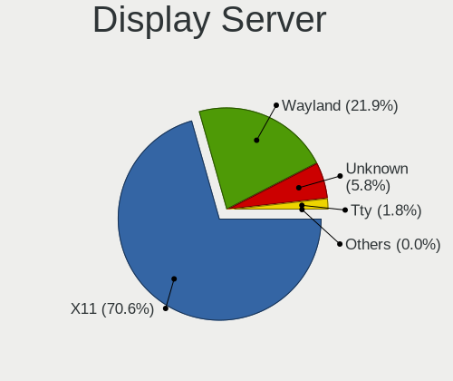
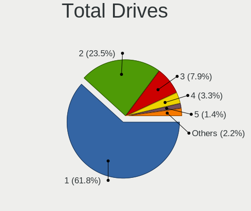
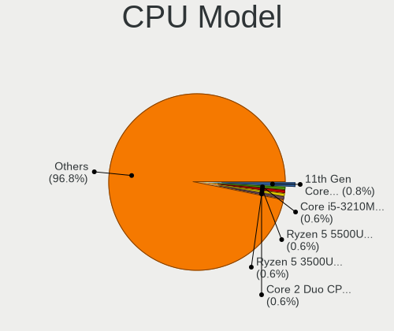
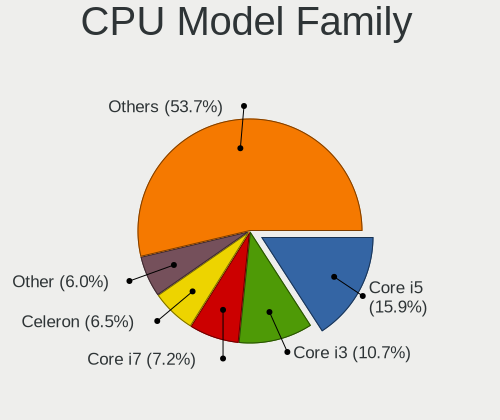

Linux in Russia - Tested Hardware & Statistics
----------------------------------------------

A project to collect tested hardware configurations for Linux in Russia.

Anyone can contribute to this report by the [hw-probe](https://github.com/linuxhw/hw-probe) tool:

    sudo -E hw-probe -all -upload

Please contribute! Especially if your hardware is rare.

This is a report for all computer types. See also reports for [desktops](/Location/Russia/Desktop/README.md) and [notebooks](/Location/Russia/Notebook/README.md).

Contents
--------

* [ Test Cases ](#test-cases)

* [ System ](#system)
  - [ OS                       ](#os)
  - [ OS Family                ](#os-family)
  - [ Kernel                   ](#kernel)
  - [ Kernel Family            ](#kernel-family)
  - [ Kernel Major Ver.        ](#kernel-major-ver)
  - [ Arch                     ](#arch)
  - [ DE                       ](#de)
  - [ Display Server           ](#display-server)
  - [ Display Manager          ](#display-manager)
  - [ OS Lang                  ](#os-lang)
  - [ Boot Mode                ](#boot-mode)
  - [ Filesystem               ](#filesystem)
  - [ Part. scheme             ](#part-scheme)
  - [ Dual Boot with Linux/BSD ](#dual-boot-with-linuxbsd)
  - [ Dual Boot (Win)          ](#dual-boot-win)

* [ Board ](#board)
  - [ Vendor                   ](#vendor)
  - [ Model                    ](#model)
  - [ Model Family             ](#model-family)
  - [ MFG Year                 ](#mfg-year)
  - [ Form Factor              ](#form-factor)
  - [ Secure Boot              ](#secure-boot)
  - [ Coreboot                 ](#coreboot)
  - [ RAM Size                 ](#ram-size)
  - [ RAM Used                 ](#ram-used)
  - [ Total Drives             ](#total-drives)
  - [ Has CD-ROM               ](#has-cd-rom)
  - [ Has Ethernet             ](#has-ethernet)
  - [ Has WiFi                 ](#has-wifi)
  - [ Has Bluetooth            ](#has-bluetooth)

* [ Location ](#location)
  - [ Country                  ](#country)
  - [ City                     ](#city)

* [ Drives ](#drives)
  - [ Drive Vendor             ](#drive-vendor)
  - [ Drive Model              ](#drive-model)
  - [ HDD Vendor               ](#hdd-vendor)
  - [ SSD Vendor               ](#ssd-vendor)
  - [ Drive Kind               ](#drive-kind)
  - [ Drive Connector          ](#drive-connector)
  - [ Drive Size               ](#drive-size)
  - [ Space Total              ](#space-total)
  - [ Space Used               ](#space-used)
  - [ Malfunc. Drives          ](#malfunc-drives)
  - [ Malfunc. Drive Vendor    ](#malfunc-drive-vendor)
  - [ Malfunc. HDD Vendor      ](#malfunc-hdd-vendor)
  - [ Malfunc. Drive Kind      ](#malfunc-drive-kind)
  - [ Failed Drives            ](#failed-drives)
  - [ Failed Drive Vendor      ](#failed-drive-vendor)
  - [ Drive Status             ](#drive-status)

* [ Storage controller ](#storage-controller)
  - [ Storage Vendor           ](#storage-vendor)
  - [ Storage Model            ](#storage-model)
  - [ Storage Kind             ](#storage-kind)

* [ Processor ](#processor)
  - [ CPU Vendor               ](#cpu-vendor)
  - [ CPU Model                ](#cpu-model)
  - [ CPU Model Family         ](#cpu-model-family)
  - [ CPU Cores                ](#cpu-cores)
  - [ CPU Sockets              ](#cpu-sockets)
  - [ CPU Threads              ](#cpu-threads)
  - [ CPU Op-Modes             ](#cpu-op-modes)
  - [ CPU Microcode            ](#cpu-microcode)
  - [ CPU Microarch            ](#cpu-microarch)

* [ Graphics ](#graphics)
  - [ GPU Vendor               ](#gpu-vendor)
  - [ GPU Model                ](#gpu-model)
  - [ GPU Combo                ](#gpu-combo)
  - [ GPU Driver               ](#gpu-driver)
  - [ GPU Memory               ](#gpu-memory)

* [ Monitor ](#monitor)
  - [ Monitor Vendor           ](#monitor-vendor)
  - [ Monitor Model            ](#monitor-model)
  - [ Monitor Resolution       ](#monitor-resolution)
  - [ Monitor Diagonal         ](#monitor-diagonal)
  - [ Monitor Width            ](#monitor-width)
  - [ Aspect Ratio             ](#aspect-ratio)
  - [ Monitor Area             ](#monitor-area)
  - [ Pixel Density            ](#pixel-density)
  - [ Multiple Monitors        ](#multiple-monitors)

* [ Network ](#network)
  - [ Net Controller Vendor    ](#net-controller-vendor)
  - [ Net Controller Model     ](#net-controller-model)
  - [ Wireless Vendor          ](#wireless-vendor)
  - [ Wireless Model           ](#wireless-model)
  - [ Ethernet Vendor          ](#ethernet-vendor)
  - [ Ethernet Model           ](#ethernet-model)
  - [ Net Controller Kind      ](#net-controller-kind)
  - [ Used Controller          ](#used-controller)
  - [ NICs                     ](#nics)
  - [ IPv6                     ](#ipv6)

* [ Bluetooth ](#bluetooth)
  - [ Bluetooth Vendor         ](#bluetooth-vendor)
  - [ Bluetooth Model          ](#bluetooth-model)

* [ Sound ](#sound)
  - [ Sound Vendor             ](#sound-vendor)
  - [ Sound Model              ](#sound-model)

* [ Memory ](#memory)
  - [ Memory Vendor            ](#memory-vendor)
  - [ Memory Model             ](#memory-model)
  - [ Memory Kind              ](#memory-kind)
  - [ Memory Form Factor       ](#memory-form-factor)
  - [ Memory Size              ](#memory-size)
  - [ Memory Speed             ](#memory-speed)

* [ Printers & scanners ](#printers--scanners)
  - [ Printer Vendor           ](#printer-vendor)
  - [ Printer Model            ](#printer-model)
  - [ Scanner Vendor           ](#scanner-vendor)
  - [ Scanner Model            ](#scanner-model)

* [ Camera ](#camera)
  - [ Camera Vendor            ](#camera-vendor)
  - [ Camera Model             ](#camera-model)

* [ Security ](#security)
  - [ Fingerprint Vendor       ](#fingerprint-vendor)
  - [ Fingerprint Model        ](#fingerprint-model)
  - [ Chipcard Vendor          ](#chipcard-vendor)
  - [ Chipcard Model           ](#chipcard-model)

* [ Unsupported ](#unsupported)
  - [ Unsupported Devices      ](#unsupported-devices)
  - [ Unsupported Device Types ](#unsupported-device-types)

Test Cases
----------

Total: 46422

| Vendor        | Model                       | Form-Factor | Probe                                                      | Date         |
|---------------|-----------------------------|-------------|------------------------------------------------------------|--------------|
| Samsung       | 350V5C/351V5C/3540VC/344... | Notebook    | [c7b3c10131](https://linux-hardware.org/?probe=c7b3c10131) | May 09, 2024 |
| ASUSTek       | TUF Gaming B550-PLUS WIF... | Desktop     | [c314d61f74](https://linux-hardware.org/?probe=c314d61f74) | May 09, 2024 |
| Unknown       | Unknown                     | Notebook    | [3c4e207a92](https://linux-hardware.org/?probe=3c4e207a92) | May 09, 2024 |
| ASUSTek       | K52F                        | Notebook    | [f67d81858e](https://linux-hardware.org/?probe=f67d81858e) | May 09, 2024 |
| Lenovo        | Bantry CRB NOK              | Desktop     | [c2a11bca8a](https://linux-hardware.org/?probe=c2a11bca8a) | May 09, 2024 |
| Lenovo        | IdeaPad S340-14API 81NB     | Notebook    | [6bb0aa91af](https://linux-hardware.org/?probe=6bb0aa91af) | May 09, 2024 |
| Packard Be... | EasyNote LM98               | Notebook    | [4826f72192](https://linux-hardware.org/?probe=4826f72192) | May 08, 2024 |
| Lenovo        | ThinkBook 16 G6 IRL 21KH    | Notebook    | [58b9bbc4d6](https://linux-hardware.org/?probe=58b9bbc4d6) | May 08, 2024 |
| ASUSTek       | VivoBook 15_ASUS Laptop ... | Notebook    | [11d69e96cb](https://linux-hardware.org/?probe=11d69e96cb) | May 08, 2024 |
| HUAWEI        | BC11HGSB0 V100R003          | Server      | [ce27371402](https://linux-hardware.org/?probe=ce27371402) | May 08, 2024 |
| ASRock        | H61M                        | Desktop     | [4db6a46097](https://linux-hardware.org/?probe=4db6a46097) | May 08, 2024 |
| ASRock        | H61M                        | Desktop     | [cf55ba331e](https://linux-hardware.org/?probe=cf55ba331e) | May 08, 2024 |
| Dell          | XPS 15 9500                 | Notebook    | [b981a13960](https://linux-hardware.org/?probe=b981a13960) | May 08, 2024 |
| Supermicro    | X9DRW                       | Server      | [fd0af1a212](https://linux-hardware.org/?probe=fd0af1a212) | May 08, 2024 |
| Acer          | Aspire AL14-31P             | Notebook    | [fc4db570af](https://linux-hardware.org/?probe=fc4db570af) | May 08, 2024 |
| ASRock        | B450M-HDV                   | Desktop     | [098e62d52a](https://linux-hardware.org/?probe=098e62d52a) | May 08, 2024 |
| HP            | ProLiant DL160 G6           | Server      | [1f19c32b7d](https://linux-hardware.org/?probe=1f19c32b7d) | May 08, 2024 |
| EVOC          | P7xxTM1                     | Notebook    | [7c15b2991c](https://linux-hardware.org/?probe=7c15b2991c) | May 08, 2024 |
| ASUSTek       | ASUS TUF Dash F15 FX517Z... | Notebook    | [ac49e3fa07](https://linux-hardware.org/?probe=ac49e3fa07) | May 08, 2024 |
| Sony          | VPCF13E1R                   | Notebook    | [593de85e33](https://linux-hardware.org/?probe=593de85e33) | May 08, 2024 |
| Dell          | Inspiron 3542               | Notebook    | [fcc3b9cc19](https://linux-hardware.org/?probe=fcc3b9cc19) | May 08, 2024 |
| Lenovo        | IdeaPad S510p 20298         | Notebook    | [e4c7ca80f3](https://linux-hardware.org/?probe=e4c7ca80f3) | May 08, 2024 |
| ASRock        | B550M Phantom Gaming 4      | Desktop     | [336a5b4e2b](https://linux-hardware.org/?probe=336a5b4e2b) | May 08, 2024 |
| Gigabyte      | H81M-S1                     | Desktop     | [3566b1666c](https://linux-hardware.org/?probe=3566b1666c) | May 08, 2024 |
| ASUSTek       | E520                        | Desktop     | [4e025280e9](https://linux-hardware.org/?probe=4e025280e9) | May 08, 2024 |
| Gigabyte      | B560M H                     | Desktop     | [9d2a9c59a3](https://linux-hardware.org/?probe=9d2a9c59a3) | May 08, 2024 |
| MSI           | B450M-A PRO MAX II          | Desktop     | [cd66ff303c](https://linux-hardware.org/?probe=cd66ff303c) | May 08, 2024 |
| MSI           | PRO B650M-P                 | Desktop     | [2490ea1b56](https://linux-hardware.org/?probe=2490ea1b56) | May 08, 2024 |
| Gigabyte      | H81M-S2H                    | Desktop     | [217f6991ee](https://linux-hardware.org/?probe=217f6991ee) | May 08, 2024 |
| Digma         | Pro Magnus M DN16R9-ADXW... | Notebook    | [beee17622d](https://linux-hardware.org/?probe=beee17622d) | May 08, 2024 |
| Gigabyte      | B450 GAMING X               | Desktop     | [f7eef71378](https://linux-hardware.org/?probe=f7eef71378) | May 08, 2024 |
| Gigabyte      | B450 AORUS ELITE            | Desktop     | [af6bde9c97](https://linux-hardware.org/?probe=af6bde9c97) | May 07, 2024 |
| Gigabyte      | B450 AORUS ELITE            | Desktop     | [1755d8da2b](https://linux-hardware.org/?probe=1755d8da2b) | May 07, 2024 |
| ASUSTek       | P8Z77-I DELUXE              | Desktop     | [6aa44077ff](https://linux-hardware.org/?probe=6aa44077ff) | May 07, 2024 |
| MSI           | Z170A-G43 PLUS              | Desktop     | [cbc2d08a03](https://linux-hardware.org/?probe=cbc2d08a03) | May 07, 2024 |
| Valve         | Galileo                     | Notebook    | [9b9caa6850](https://linux-hardware.org/?probe=9b9caa6850) | May 07, 2024 |
| Dell          | XPS 15 9530                 | Notebook    | [cdcf7e98eb](https://linux-hardware.org/?probe=cdcf7e98eb) | May 07, 2024 |
| Dell          | Vostro 15 3510              | Notebook    | [9236e5d92d](https://linux-hardware.org/?probe=9236e5d92d) | May 07, 2024 |
| ASRock        | AB350M-HDV R3.0             | Desktop     | [d919c0d099](https://linux-hardware.org/?probe=d919c0d099) | May 07, 2024 |
| Supermicro    | X10DDW-i                    | Desktop     | [ff62f6b4d9](https://linux-hardware.org/?probe=ff62f6b4d9) | May 07, 2024 |
| Supermicro    | X10DDW-i                    | Desktop     | [b849fea196](https://linux-hardware.org/?probe=b849fea196) | May 07, 2024 |
| Supermicro    | X10DDW-i                    | Desktop     | [c20ef4d35b](https://linux-hardware.org/?probe=c20ef4d35b) | May 07, 2024 |
| Supermicro    | X10DDW-i                    | Desktop     | [9b21386a04](https://linux-hardware.org/?probe=9b21386a04) | May 07, 2024 |
| Supermicro    | X10DDW-i                    | Desktop     | [99fbeae8c9](https://linux-hardware.org/?probe=99fbeae8c9) | May 07, 2024 |
| Supermicro    | X10DDW-i                    | Desktop     | [48bb233b46](https://linux-hardware.org/?probe=48bb233b46) | May 07, 2024 |
| Supermicro    | X9DRW                       | Server      | [7915255781](https://linux-hardware.org/?probe=7915255781) | May 07, 2024 |
| Supermicro    | X10DRL-i                    | Desktop     | [da5c3ed75f](https://linux-hardware.org/?probe=da5c3ed75f) | May 07, 2024 |
| Dell          | Inspiron 3793               | Notebook    | [02e4c23d86](https://linux-hardware.org/?probe=02e4c23d86) | May 07, 2024 |
| Gigabyte      | C1037UN-EU                  | Desktop     | [714735cd6f](https://linux-hardware.org/?probe=714735cd6f) | May 07, 2024 |
| Dell          | Inspiron 3793               | Notebook    | [00234ed0c4](https://linux-hardware.org/?probe=00234ed0c4) | May 07, 2024 |
| ASUSTek       | ASUSLaptop_Q530VJ           | Notebook    | [97021794a9](https://linux-hardware.org/?probe=97021794a9) | May 07, 2024 |
| Gigabyte      | B550M DS3H                  | Desktop     | [3514c9adca](https://linux-hardware.org/?probe=3514c9adca) | May 07, 2024 |
| Gigabyte      | B460 HD3                    | Desktop     | [8d8fcf703b](https://linux-hardware.org/?probe=8d8fcf703b) | May 07, 2024 |
| Supermicro    | X8DT6                       | Server      | [9a70e94fb0](https://linux-hardware.org/?probe=9a70e94fb0) | May 07, 2024 |
| ASUSTek       | VivoBook S15 X530UF         | Notebook    | [5725e80488](https://linux-hardware.org/?probe=5725e80488) | May 07, 2024 |
| MSI           | GL62M 7RDX                  | Notebook    | [df43002002](https://linux-hardware.org/?probe=df43002002) | May 07, 2024 |
| ASUSTek       | PRIME A320M-E               | Desktop     | [d97bbebd45](https://linux-hardware.org/?probe=d97bbebd45) | May 07, 2024 |
| Supermicro    | X8DT6                       | Server      | [c3428daaf1](https://linux-hardware.org/?probe=c3428daaf1) | May 07, 2024 |
| GEEKOM        | A7                          | Desktop     | [87925a210f](https://linux-hardware.org/?probe=87925a210f) | May 07, 2024 |
| Gigabyte      | H610M S2H DDR4              | Desktop     | [4fb0650e99](https://linux-hardware.org/?probe=4fb0650e99) | May 07, 2024 |
| MSI           | PRO H610M-E DDR4            | Desktop     | [a415f46a9e](https://linux-hardware.org/?probe=a415f46a9e) | May 07, 2024 |
| HP            | EliteBook 8470p             | Notebook    | [1022758f4a](https://linux-hardware.org/?probe=1022758f4a) | May 07, 2024 |
| HP            | EliteBook 8470p             | Notebook    | [36f94dbbd1](https://linux-hardware.org/?probe=36f94dbbd1) | May 07, 2024 |
| Dell          | XPS 15 9500                 | Notebook    | [e5dc310897](https://linux-hardware.org/?probe=e5dc310897) | May 07, 2024 |
| HUAWEI        | HLYL-WXX9                   | Notebook    | [71d1f5cdfb](https://linux-hardware.org/?probe=71d1f5cdfb) | May 07, 2024 |
| ASUSTek       | ROG STRIX X299-E GAMING ... | Desktop     | [fc1633451e](https://linux-hardware.org/?probe=fc1633451e) | May 06, 2024 |
| ASUSTek       | VivoBook_ASUSLaptop M350... | Notebook    | [e6dfd023b6](https://linux-hardware.org/?probe=e6dfd023b6) | May 06, 2024 |
| ASUSTek       | VivoBook_ASUSLaptop M350... | Notebook    | [6ece3912e8](https://linux-hardware.org/?probe=6ece3912e8) | May 06, 2024 |
| Lenovo        | E31-80 80MX                 | Notebook    | [1c9fd17eff](https://linux-hardware.org/?probe=1c9fd17eff) | May 06, 2024 |
| MSI           | Creator Z16 A12UET          | Notebook    | [edf6b45103](https://linux-hardware.org/?probe=edf6b45103) | May 06, 2024 |
| Lenovo        | IdeaPad Z580                | Notebook    | [2fad877602](https://linux-hardware.org/?probe=2fad877602) | May 06, 2024 |
| MSI           | Creator Z16 A12UET          | Notebook    | [2aea1cacac](https://linux-hardware.org/?probe=2aea1cacac) | May 06, 2024 |
| ASRock        | B450M-HDV R4.0              | Desktop     | [1d40ae8807](https://linux-hardware.org/?probe=1d40ae8807) | May 06, 2024 |
| Lenovo        | 36C7 SDK0J40697 WIN 3305... | Desktop     | [867c770e38](https://linux-hardware.org/?probe=867c770e38) | May 06, 2024 |
| HP            | ProLiant DL360 Gen9         | Server      | [162040356c](https://linux-hardware.org/?probe=162040356c) | May 06, 2024 |
| Intel         | S1200BTL E98681-352         | Server      | [4927e2996f](https://linux-hardware.org/?probe=4927e2996f) | May 06, 2024 |
| Dell          | Vostro 3520                 | Notebook    | [0b420358ac](https://linux-hardware.org/?probe=0b420358ac) | May 06, 2024 |
| Dell          | Vostro 15 3510              | Notebook    | [cd07d15de0](https://linux-hardware.org/?probe=cd07d15de0) | May 06, 2024 |
| Gigabyte      | 8PEMT4                      | Desktop     | [d43ba07bdd](https://linux-hardware.org/?probe=d43ba07bdd) | May 06, 2024 |
| Gigabyte      | H61M-S2PV                   | Desktop     | [cece4d3b5e](https://linux-hardware.org/?probe=cece4d3b5e) | May 06, 2024 |
| ASUSTek       | Z9PR-D12 Series             | Server      | [f922090bb9](https://linux-hardware.org/?probe=f922090bb9) | May 06, 2024 |
| Gigabyte      | H61M-S2PV                   | Desktop     | [98e922adae](https://linux-hardware.org/?probe=98e922adae) | May 06, 2024 |
| MSI           | PRO H610M-E DDR4            | Desktop     | [e4adc14010](https://linux-hardware.org/?probe=e4adc14010) | May 06, 2024 |
| HP            | ProLiant DL360 Gen9         | Server      | [0544131147](https://linux-hardware.org/?probe=0544131147) | May 06, 2024 |
| Supermicro    | X9SCL/X9SCMA                | Desktop     | [bb7e4b6de6](https://linux-hardware.org/?probe=bb7e4b6de6) | May 06, 2024 |
| Gigabyte      | B75M-D3V                    | Desktop     | [52037a51a0](https://linux-hardware.org/?probe=52037a51a0) | May 06, 2024 |
| Supermicro    | X10DRL-i                    | Desktop     | [80cdad1821](https://linux-hardware.org/?probe=80cdad1821) | May 06, 2024 |
| Gigabyte      | H81M-S2H                    | Desktop     | [0b1a61e802](https://linux-hardware.org/?probe=0b1a61e802) | May 06, 2024 |
| Gigabyte      | B560M DS3H                  | Desktop     | [ead92a9fe5](https://linux-hardware.org/?probe=ead92a9fe5) | May 06, 2024 |
| eMachines     | E725                        | Notebook    | [171963d4bd](https://linux-hardware.org/?probe=171963d4bd) | May 05, 2024 |
| SZMZ          | X99 DUAL Z8                 | Desktop     | [24f362dbe8](https://linux-hardware.org/?probe=24f362dbe8) | May 05, 2024 |
| ASRock        | FM2A68M-DG3+                | Desktop     | [0c960e6942](https://linux-hardware.org/?probe=0c960e6942) | May 05, 2024 |
| Gigabyte      | B560M DS3H                  | Desktop     | [3d88207b4d](https://linux-hardware.org/?probe=3d88207b4d) | May 05, 2024 |
| ASUSTek       | X550CC                      | Notebook    | [47b8006c42](https://linux-hardware.org/?probe=47b8006c42) | May 05, 2024 |
| ASUSTek       | M5A78L-M/USB3               | Desktop     | [551c4cd540](https://linux-hardware.org/?probe=551c4cd540) | May 05, 2024 |
| ASUSTek       | TUF H310M-PLUS GAMING R2... | Desktop     | [2a47a6393b](https://linux-hardware.org/?probe=2a47a6393b) | May 05, 2024 |
| ASUSTek       | TUF Gaming B550M-PLUS WI... | Desktop     | [c785a73424](https://linux-hardware.org/?probe=c785a73424) | May 05, 2024 |
| ASRock        | B450M Pro4                  | Desktop     | [b1caabc9b5](https://linux-hardware.org/?probe=b1caabc9b5) | May 05, 2024 |
| Lenovo        | ThinkPad X240 20ALA08VRT    | Notebook    | [b894f49df3](https://linux-hardware.org/?probe=b894f49df3) | May 05, 2024 |
| Lenovo        | ThinkPad L512 2597W1R       | Notebook    | [d7cb3b5ddd](https://linux-hardware.org/?probe=d7cb3b5ddd) | May 05, 2024 |
| Acer          | Nitro AN515-46              | Notebook    | [23ae7fd7c6](https://linux-hardware.org/?probe=23ae7fd7c6) | May 05, 2024 |
| Samsung       | R528/R728                   | Notebook    | [2f4a17771e](https://linux-hardware.org/?probe=2f4a17771e) | May 05, 2024 |
| ASUSTek       | A7U                         | Notebook    | [d380bb6272](https://linux-hardware.org/?probe=d380bb6272) | May 05, 2024 |
| Gigabyte      | B450 GAMING X               | Desktop     | [632943f952](https://linux-hardware.org/?probe=632943f952) | May 05, 2024 |
| MSI           | B650 GAMING PLUS WIFI       | Desktop     | [c1db6719c8](https://linux-hardware.org/?probe=c1db6719c8) | May 04, 2024 |
| Gigabyte      | Z68A-D3H-B3                 | Desktop     | [22b510c32b](https://linux-hardware.org/?probe=22b510c32b) | May 04, 2024 |
| Unknown       | Unknown                     | Notebook    | [b7866b963f](https://linux-hardware.org/?probe=b7866b963f) | May 04, 2024 |
| Acer          | Aspire XC-1660 V:1.1        | Desktop     | [faaa324204](https://linux-hardware.org/?probe=faaa324204) | May 04, 2024 |
| Toshiba       | Satellite L500              | Notebook    | [c947dc4138](https://linux-hardware.org/?probe=c947dc4138) | May 04, 2024 |
| Acer          | Spin SP111-32N              | Convertible | [e4389ae53b](https://linux-hardware.org/?probe=e4389ae53b) | May 04, 2024 |
| ASUSTek       | P8P67                       | Desktop     | [9dcca1359b](https://linux-hardware.org/?probe=9dcca1359b) | May 04, 2024 |
| Lenovo        | ThinkPad T480 20L6S7MP00    | Notebook    | [2e32ab2b3b](https://linux-hardware.org/?probe=2e32ab2b3b) | May 04, 2024 |
| Infinix       | INBOOK X2 GEN11             | Notebook    | [9002e7e3c5](https://linux-hardware.org/?probe=9002e7e3c5) | May 04, 2024 |
| Gigabyte      | B550 AORUS ELITE V2         | Desktop     | [2f23713428](https://linux-hardware.org/?probe=2f23713428) | May 04, 2024 |
| Acer          | Extensa 5630                | Notebook    | [3312068dfc](https://linux-hardware.org/?probe=3312068dfc) | May 04, 2024 |
| Lenovo        | ThinkPad T14 Gen 2i 20W1... | Notebook    | [6689db52ed](https://linux-hardware.org/?probe=6689db52ed) | May 04, 2024 |
| MSI           | MS-7267                     | Desktop     | [c9e3d08574](https://linux-hardware.org/?probe=c9e3d08574) | May 04, 2024 |
| ASRock        | B550 Pro4                   | Desktop     | [7b008baaaa](https://linux-hardware.org/?probe=7b008baaaa) | May 04, 2024 |
| Gigabyte      | B550M DS3H                  | Desktop     | [178f62317e](https://linux-hardware.org/?probe=178f62317e) | May 04, 2024 |
| Unknown       | Unknown                     | Notebook    | [ad1cee8128](https://linux-hardware.org/?probe=ad1cee8128) | May 04, 2024 |
| Gigabyte      | H97-D3H-CF                  | Desktop     | [d4b03a1295](https://linux-hardware.org/?probe=d4b03a1295) | May 04, 2024 |
| ASRock        | B760M PG Lightning/D4       | Desktop     | [50c91b7d78](https://linux-hardware.org/?probe=50c91b7d78) | May 03, 2024 |
| Dell          | Latitude 7490               | Notebook    | [300c9cd271](https://linux-hardware.org/?probe=300c9cd271) | May 03, 2024 |
| ASUSTek       | P7H55                       | Desktop     | [25860ff0c1](https://linux-hardware.org/?probe=25860ff0c1) | May 03, 2024 |
| SZMZ          | X99-S3                      | Desktop     | [9dc9366e04](https://linux-hardware.org/?probe=9dc9366e04) | May 03, 2024 |
| Supermicro    | X8DTU                       | Server      | [3d87f9e883](https://linux-hardware.org/?probe=3d87f9e883) | May 03, 2024 |
| ASRock        | B450 Gaming K4              | Desktop     | [721fef3d82](https://linux-hardware.org/?probe=721fef3d82) | May 03, 2024 |
| HP            | ProBook 6450b               | Notebook    | [c4d1788222](https://linux-hardware.org/?probe=c4d1788222) | May 03, 2024 |
| Gigabyte      | B650M GAMING X AX           | Desktop     | [bca236e545](https://linux-hardware.org/?probe=bca236e545) | May 03, 2024 |
| HP            | ProLiant DL360 Gen9         | Server      | [4eb1ae6ad4](https://linux-hardware.org/?probe=4eb1ae6ad4) | May 03, 2024 |
| HP            | ProLiant DL360 Gen9         | Server      | [a7dfd908c9](https://linux-hardware.org/?probe=a7dfd908c9) | May 03, 2024 |
| Unknown       | Unknown                     | Desktop     | [1564e76ada](https://linux-hardware.org/?probe=1564e76ada) | May 03, 2024 |
| ASUSTek       | ASUS TUF Dash F15 FX517Z... | Notebook    | [2ce93c9d05](https://linux-hardware.org/?probe=2ce93c9d05) | May 03, 2024 |
| Unknown       | OnePlus 6T                  | Soc         | [a799bc5691](https://linux-hardware.org/?probe=a799bc5691) | May 03, 2024 |
| MSI           | MAG B760M MORTAR WIFI DD... | Desktop     | [a077206bc5](https://linux-hardware.org/?probe=a077206bc5) | May 03, 2024 |
| Apple         | MacBookPro11,3              | Notebook    | [9dc81700bc](https://linux-hardware.org/?probe=9dc81700bc) | May 03, 2024 |
| Timi          | Xiaomi Book Pro 14 2022     | Notebook    | [30f381be91](https://linux-hardware.org/?probe=30f381be91) | May 03, 2024 |
| HP            | ProBook 450 G3              | Notebook    | [63fa17c1de](https://linux-hardware.org/?probe=63fa17c1de) | May 03, 2024 |
| MSI           | A320M-A PRO                 | Desktop     | [007b5d93c7](https://linux-hardware.org/?probe=007b5d93c7) | May 03, 2024 |
| AZW           | SER V1.0                    | Mini pc     | [cf0759e00a](https://linux-hardware.org/?probe=cf0759e00a) | May 03, 2024 |
| Lenovo        | V130-15IKB 81HN             | Notebook    | [d00e301298](https://linux-hardware.org/?probe=d00e301298) | May 03, 2024 |
| HP            | 15                          | Notebook    | [6c1f8325a6](https://linux-hardware.org/?probe=6c1f8325a6) | May 02, 2024 |
| ASUSTek       | VivoBook_ASUSLaptop M160... | Notebook    | [9c68c10a9e](https://linux-hardware.org/?probe=9c68c10a9e) | May 02, 2024 |
| Acer          | Aspire 3690                 | Notebook    | [18468b287d](https://linux-hardware.org/?probe=18468b287d) | May 02, 2024 |
| Lenovo        | ThinkBook 14 G6+ AHP 21L... | Notebook    | [bc762dbbd9](https://linux-hardware.org/?probe=bc762dbbd9) | May 02, 2024 |
| MECHREVO      | WUJIE14 PRO                 | Notebook    | [2004900fec](https://linux-hardware.org/?probe=2004900fec) | May 02, 2024 |
| Samsung       | RV420/RV520/RV720/E3530/... | Notebook    | [b12580ca82](https://linux-hardware.org/?probe=b12580ca82) | May 02, 2024 |
| MSI           | B450-A PRO                  | Desktop     | [028acf1ed9](https://linux-hardware.org/?probe=028acf1ed9) | May 02, 2024 |
| Acer          | Aspire A315-53G             | Notebook    | [d782707b53](https://linux-hardware.org/?probe=d782707b53) | May 02, 2024 |
| Acer          | Swift SF314-41              | Notebook    | [7c627dfe92](https://linux-hardware.org/?probe=7c627dfe92) | May 02, 2024 |
| Acer          | Swift SF314-41              | Notebook    | [c6c8d9ef33](https://linux-hardware.org/?probe=c6c8d9ef33) | May 02, 2024 |
| HUAWEI        | BOM-WXX9                    | Notebook    | [358e00bbaa](https://linux-hardware.org/?probe=358e00bbaa) | May 02, 2024 |
| Samsung       | R530/R730                   | Notebook    | [bef875b7e6](https://linux-hardware.org/?probe=bef875b7e6) | May 02, 2024 |
| Dell          | 0JP3NX A01                  | Desktop     | [59857ba04e](https://linux-hardware.org/?probe=59857ba04e) | May 02, 2024 |
| ASUSTek       | H81M-K                      | Desktop     | [f4dbf33638](https://linux-hardware.org/?probe=f4dbf33638) | May 02, 2024 |
| HONOR         | HYM-WXX                     | Notebook    | [58cc24a6c2](https://linux-hardware.org/?probe=58cc24a6c2) | May 02, 2024 |
| Gigabyte      | B560 HD3                    | Desktop     | [eb083c6668](https://linux-hardware.org/?probe=eb083c6668) | May 02, 2024 |
| HP            | ProLiant DL360 Gen9         | Server      | [d2c6cfb3bd](https://linux-hardware.org/?probe=d2c6cfb3bd) | May 02, 2024 |
| Soyo          | SY-KL A320M.2-VH            | Desktop     | [e6ebaa107b](https://linux-hardware.org/?probe=e6ebaa107b) | May 02, 2024 |
| Lenovo        | B590 20206                  | Notebook    | [9c08740bb5](https://linux-hardware.org/?probe=9c08740bb5) | May 02, 2024 |
| HUAWEI        | BOD-WXX9                    | Notebook    | [555e3c4b2c](https://linux-hardware.org/?probe=555e3c4b2c) | May 02, 2024 |
| Gigabyte      | A320M-S2H V2-CF             | Desktop     | [f98dcf2d99](https://linux-hardware.org/?probe=f98dcf2d99) | May 02, 2024 |
| Acer          | Nitro AN515-54              | Notebook    | [27189a555f](https://linux-hardware.org/?probe=27189a555f) | May 02, 2024 |
| Acer          | Nitro AN515-54              | Notebook    | [2293918110](https://linux-hardware.org/?probe=2293918110) | May 02, 2024 |
| ASUSTek       | PRIME B660-PLUS D4          | Desktop     | [d7c901b5d7](https://linux-hardware.org/?probe=d7c901b5d7) | May 02, 2024 |
| HUAWEI        | BOD-WXX9                    | Notebook    | [0cd46d4084](https://linux-hardware.org/?probe=0cd46d4084) | May 02, 2024 |
| MSI           | B650 GAMING PLUS WIFI       | Desktop     | [23638766ff](https://linux-hardware.org/?probe=23638766ff) | May 01, 2024 |
| ASUSTek       | ROG STRIX B550-A GAMING     | Desktop     | [0688fff0ed](https://linux-hardware.org/?probe=0688fff0ed) | May 01, 2024 |
| Dell          | Precision 5510              | Notebook    | [a010faffda](https://linux-hardware.org/?probe=a010faffda) | May 01, 2024 |
| HUAWEI        | CREFG-XX                    | Notebook    | [35fbc74ed5](https://linux-hardware.org/?probe=35fbc74ed5) | May 01, 2024 |
| Unknown       | Unknown                     | Notebook    | [9fb77bbafc](https://linux-hardware.org/?probe=9fb77bbafc) | May 01, 2024 |
| HP            | 0AA8h                       | Desktop     | [7b72e86416](https://linux-hardware.org/?probe=7b72e86416) | May 01, 2024 |
| Gigabyte      | B450 AORUS PRO-CF           | Desktop     | [1b914f7922](https://linux-hardware.org/?probe=1b914f7922) | May 01, 2024 |
| JGINYUE       | X99 TITANIUM D4             | Desktop     | [dc3cd2b7e9](https://linux-hardware.org/?probe=dc3cd2b7e9) | May 01, 2024 |
| Maibenben     | MaiBook M                   | Notebook    | [791e571e24](https://linux-hardware.org/?probe=791e571e24) | May 01, 2024 |
| HP            | EliteBook 8460p             | Notebook    | [d5b743dc5a](https://linux-hardware.org/?probe=d5b743dc5a) | May 01, 2024 |
| HP            | Unknown                     | Notebook    | [c2419b4779](https://linux-hardware.org/?probe=c2419b4779) | May 01, 2024 |
| ASRock        | H410M-HVS                   | Desktop     | [2a5b383001](https://linux-hardware.org/?probe=2a5b383001) | May 01, 2024 |
| Intel         | DZ77BH-55K AAG39008-401     | Desktop     | [9fae0699d4](https://linux-hardware.org/?probe=9fae0699d4) | May 01, 2024 |
| Lenovo        | ThinkPad T480s 20L7001HR... | Notebook    | [f6ec4c6b31](https://linux-hardware.org/?probe=f6ec4c6b31) | May 01, 2024 |
| Acer          | WMCP78M                     | Desktop     | [34b0e08d0c](https://linux-hardware.org/?probe=34b0e08d0c) | May 01, 2024 |
| Lenovo        | ThinkPad T14 Gen 2i 20W1... | Notebook    | [6dee7f5b7c](https://linux-hardware.org/?probe=6dee7f5b7c) | May 01, 2024 |
| ASUSTek       | M4A87TD/USB3                | Desktop     | [91136f3f95](https://linux-hardware.org/?probe=91136f3f95) | May 01, 2024 |
| Packard Be... | EasyNote TJ71               | Notebook    | [f421f823ec](https://linux-hardware.org/?probe=f421f823ec) | May 01, 2024 |
| Unknown       | GB01                        | Desktop     | [cbbb8cc3ea](https://linux-hardware.org/?probe=cbbb8cc3ea) | May 01, 2024 |
| Lenovo        | V580c 20160                 | Notebook    | [f7f711165b](https://linux-hardware.org/?probe=f7f711165b) | May 01, 2024 |
| ASUSTek       | M50Vc                       | Notebook    | [d1db0617f1](https://linux-hardware.org/?probe=d1db0617f1) | May 01, 2024 |
| ASUSTek       | X75VC                       | Notebook    | [0896559952](https://linux-hardware.org/?probe=0896559952) | May 01, 2024 |
| Acer          | Predator PH317-52           | Notebook    | [bd69caed14](https://linux-hardware.org/?probe=bd69caed14) | Apr 30, 2024 |
| Gigabyte      | P67A-D3-B3                  | Desktop     | [22337aabf0](https://linux-hardware.org/?probe=22337aabf0) | Apr 30, 2024 |
| Gigabyte      | P67A-D3-B3                  | Desktop     | [f3950d30d7](https://linux-hardware.org/?probe=f3950d30d7) | Apr 30, 2024 |
| MSI           | PRO H610M-G DDR4            | Desktop     | [b8ab800603](https://linux-hardware.org/?probe=b8ab800603) | Apr 30, 2024 |
| ASUSTek       | PRIME H610I-PLUS D4         | Desktop     | [1c4e390f2d](https://linux-hardware.org/?probe=1c4e390f2d) | Apr 30, 2024 |
| ASRock        | H510M-HDV                   | Desktop     | [f48ead89ac](https://linux-hardware.org/?probe=f48ead89ac) | Apr 30, 2024 |
| Lenovo        | ThinkPad T60 1952W2Q        | Notebook    | [cfb8cb1bb5](https://linux-hardware.org/?probe=cfb8cb1bb5) | Apr 30, 2024 |
| HP            | EliteBook 845 14 inch G1... | Notebook    | [8fa3424cce](https://linux-hardware.org/?probe=8fa3424cce) | Apr 30, 2024 |
| HP            | EliteBook 845 14 inch G1... | Notebook    | [62914f0506](https://linux-hardware.org/?probe=62914f0506) | Apr 30, 2024 |
| Gigabyte      | H81M-S2V                    | Desktop     | [11f391fabc](https://linux-hardware.org/?probe=11f391fabc) | Apr 30, 2024 |
| Lenovo        | V580c 20160                 | Notebook    | [2114d134ab](https://linux-hardware.org/?probe=2114d134ab) | Apr 30, 2024 |
| Digma         | CITI E301 ES3008EW          | Notebook    | [91b8be60a0](https://linux-hardware.org/?probe=91b8be60a0) | Apr 30, 2024 |
| Digma         | CITI E301 ES3008EW          | Notebook    | [586069736d](https://linux-hardware.org/?probe=586069736d) | Apr 30, 2024 |
| HUAWEI        | NBD-WXX9                    | Notebook    | [28ca7324e5](https://linux-hardware.org/?probe=28ca7324e5) | Apr 30, 2024 |
| ASUSTek       | X550VC                      | Notebook    | [cc8153163f](https://linux-hardware.org/?probe=cc8153163f) | Apr 30, 2024 |
| DEXP          | Atlas M15-I3W302            | Notebook    | [efae6e687e](https://linux-hardware.org/?probe=efae6e687e) | Apr 30, 2024 |
| Gigabyte      | H110M-S2-CF                 | Desktop     | [e55bcf23cf](https://linux-hardware.org/?probe=e55bcf23cf) | Apr 30, 2024 |
| HUAWEI        | BOM-WXX9                    | Notebook    | [b6223c94a8](https://linux-hardware.org/?probe=b6223c94a8) | Apr 30, 2024 |
| Dell          | Inspiron 3542               | Notebook    | [b37cc5d9c0](https://linux-hardware.org/?probe=b37cc5d9c0) | Apr 30, 2024 |
| ASUSTek       | M5A97 R2.0                  | Desktop     | [448d785ccb](https://linux-hardware.org/?probe=448d785ccb) | Apr 30, 2024 |
| Maibenben     | MaiBook M                   | Notebook    | [ca131f72bd](https://linux-hardware.org/?probe=ca131f72bd) | Apr 30, 2024 |
| ASRock        | B550 Phantom Gaming 4       | Desktop     | [29804b3285](https://linux-hardware.org/?probe=29804b3285) | Apr 30, 2024 |
| Echips Imp... | NX140A-S                    | Notebook    | [dec569991b](https://linux-hardware.org/?probe=dec569991b) | Apr 30, 2024 |
| HP            | Pavilion g6                 | Notebook    | [466b38f1ee](https://linux-hardware.org/?probe=466b38f1ee) | Apr 30, 2024 |
| Supermicro    | X11DDW-L                    | Server      | [a466d61b44](https://linux-hardware.org/?probe=a466d61b44) | Apr 30, 2024 |
| ASUSTek       | M5A99FX PRO R2.0            | Desktop     | [9dcdf5a463](https://linux-hardware.org/?probe=9dcdf5a463) | Apr 29, 2024 |
| Gigabyte      | B450M S2H                   | Desktop     | [28ce6a0f2e](https://linux-hardware.org/?probe=28ce6a0f2e) | Apr 29, 2024 |
| Gigabyte      | B450M S2H                   | Desktop     | [f96e09c9e1](https://linux-hardware.org/?probe=f96e09c9e1) | Apr 29, 2024 |
| Supermicro    | X11DDW-L                    | Server      | [35b92be9f4](https://linux-hardware.org/?probe=35b92be9f4) | Apr 29, 2024 |
| Supermicro    | X11DDW-L                    | Server      | [91829f13b3](https://linux-hardware.org/?probe=91829f13b3) | Apr 29, 2024 |
| Supermicro    | X11DDW-L                    | Server      | [26cb0d914d](https://linux-hardware.org/?probe=26cb0d914d) | Apr 29, 2024 |
| Supermicro    | X11DDW-L                    | Server      | [86ec1c52cf](https://linux-hardware.org/?probe=86ec1c52cf) | Apr 29, 2024 |
| Supermicro    | X11DDW-L                    | Server      | [02acab99ca](https://linux-hardware.org/?probe=02acab99ca) | Apr 29, 2024 |
| Supermicro    | X11DDW-L                    | Server      | [2743b737c5](https://linux-hardware.org/?probe=2743b737c5) | Apr 29, 2024 |
| Supermicro    | X11DDW-L                    | Server      | [6f4331e541](https://linux-hardware.org/?probe=6f4331e541) | Apr 29, 2024 |
| Supermicro    | X11DDW-L                    | Server      | [6dfa7a39f0](https://linux-hardware.org/?probe=6dfa7a39f0) | Apr 29, 2024 |
| Supermicro    | X11DDW-L                    | Server      | [c15ca5d532](https://linux-hardware.org/?probe=c15ca5d532) | Apr 29, 2024 |
| Supermicro    | X11DDW-L                    | Server      | [51b1b9f5d9](https://linux-hardware.org/?probe=51b1b9f5d9) | Apr 29, 2024 |
| Supermicro    | X11DDW-L                    | Server      | [4c17dc4de0](https://linux-hardware.org/?probe=4c17dc4de0) | Apr 29, 2024 |
| ASUSTek       | P5KPL-VM                    | Desktop     | [d2d5710920](https://linux-hardware.org/?probe=d2d5710920) | Apr 29, 2024 |
| HIPER Tech... | HIPER WORKBOOK              | Notebook    | [b553fc9cbc](https://linux-hardware.org/?probe=b553fc9cbc) | Apr 29, 2024 |
| Lenovo        | B50-80 80EW                 | Notebook    | [5f20d3fde3](https://linux-hardware.org/?probe=5f20d3fde3) | Apr 29, 2024 |
| Lenovo        | IdeaPad 5 15ARE05 81YQ      | Notebook    | [69ab0359f4](https://linux-hardware.org/?probe=69ab0359f4) | Apr 29, 2024 |
| MSI           | A68HM-E33                   | Desktop     | [abf75e8321](https://linux-hardware.org/?probe=abf75e8321) | Apr 29, 2024 |
| Lenovo        | IdeaPad 5 14ARE05 81YM      | Notebook    | [6c0201b207](https://linux-hardware.org/?probe=6c0201b207) | Apr 29, 2024 |
| Gigabyte      | C1037UN-EU                  | Desktop     | [ff9f6ab993](https://linux-hardware.org/?probe=ff9f6ab993) | Apr 29, 2024 |
| Lenovo        | ThinkPad T480 20L6S7MP00    | Notebook    | [ea3db5dd3c](https://linux-hardware.org/?probe=ea3db5dd3c) | Apr 29, 2024 |
| Maibenben     | MaiBook M                   | Notebook    | [48837878a2](https://linux-hardware.org/?probe=48837878a2) | Apr 29, 2024 |
| Supermicro    | X11DDW-L                    | Server      | [5bb24704dd](https://linux-hardware.org/?probe=5bb24704dd) | Apr 29, 2024 |
| Acer          | Aspire A515-47              | Notebook    | [7cef016361](https://linux-hardware.org/?probe=7cef016361) | Apr 29, 2024 |
| Gigabyte      | B550M AORUS ELITE           | Desktop     | [deab538223](https://linux-hardware.org/?probe=deab538223) | Apr 29, 2024 |
| ASRock        | H110M-DGS R3.0              | Desktop     | [e1d811fd8f](https://linux-hardware.org/?probe=e1d811fd8f) | Apr 29, 2024 |
| HP            | Laptop 15s-eq1xxx           | Notebook    | [43977b477b](https://linux-hardware.org/?probe=43977b477b) | Apr 29, 2024 |
| Lenovo        | ThinkPad E16 Gen 1 21JNS... | Notebook    | [d55532cec3](https://linux-hardware.org/?probe=d55532cec3) | Apr 29, 2024 |
| Lenovo        | ThinkPad E16 Gen 1 21JNS... | Notebook    | [64c12d9b15](https://linux-hardware.org/?probe=64c12d9b15) | Apr 29, 2024 |
| Lenovo        | ThinkBook 15 G3 ACL 21A4    | Notebook    | [63088368e6](https://linux-hardware.org/?probe=63088368e6) | Apr 29, 2024 |
| ASUSTek       | N53Jf                       | Notebook    | [02cf0c80c7](https://linux-hardware.org/?probe=02cf0c80c7) | Apr 29, 2024 |
| HUAWEI        | NbDE-WXX9                   | Notebook    | [b378a91172](https://linux-hardware.org/?probe=b378a91172) | Apr 29, 2024 |
| ASUSTek       | K53SJ                       | Notebook    | [45bc744085](https://linux-hardware.org/?probe=45bc744085) | Apr 28, 2024 |
| Acer          | Swift SF314-43              | Notebook    | [eeb771fb99](https://linux-hardware.org/?probe=eeb771fb99) | Apr 28, 2024 |
| Unknown       | Unknown                     | Desktop     | [806e7d1dfa](https://linux-hardware.org/?probe=806e7d1dfa) | Apr 28, 2024 |
| Lenovo        | ThinkPad L13 Yoga Gen 2 ... | Convertible | [b5f2998b24](https://linux-hardware.org/?probe=b5f2998b24) | Apr 28, 2024 |
| Gigabyte      | M68M-S2P                    | Desktop     | [3608c76af5](https://linux-hardware.org/?probe=3608c76af5) | Apr 28, 2024 |
| MSI           | MPG B550 GAMING PLUS        | Desktop     | [df28569bfc](https://linux-hardware.org/?probe=df28569bfc) | Apr 28, 2024 |
| ASRock        | 970 Extreme3                | Desktop     | [41c988e70a](https://linux-hardware.org/?probe=41c988e70a) | Apr 28, 2024 |
| Intel Clie... | LAPAC71H                    | Notebook    | [a1a6c57c02](https://linux-hardware.org/?probe=a1a6c57c02) | Apr 28, 2024 |
| HP            | Dragonfly 13.5 inch G4 N... | Notebook    | [2faf3d5ce2](https://linux-hardware.org/?probe=2faf3d5ce2) | Apr 28, 2024 |
| Acer          | Aspire ES1-523              | Notebook    | [8459f9ea9a](https://linux-hardware.org/?probe=8459f9ea9a) | Apr 28, 2024 |
| Dell          | 0Y5DDC A00                  | Desktop     | [ebc89ad860](https://linux-hardware.org/?probe=ebc89ad860) | Apr 28, 2024 |
| Gigabyte      | A320M-S2H V2-CF             | Desktop     | [a11f4281d0](https://linux-hardware.org/?probe=a11f4281d0) | Apr 28, 2024 |
| Dell          | Inspiron 5558               | Notebook    | [544ce3b297](https://linux-hardware.org/?probe=544ce3b297) | Apr 28, 2024 |
| Lenovo        | G700 20251                  | Notebook    | [c98807b638](https://linux-hardware.org/?probe=c98807b638) | Apr 28, 2024 |
| ASUSTek       | ROG STRIX Z490-A GAMING     | Desktop     | [3f33898064](https://linux-hardware.org/?probe=3f33898064) | Apr 28, 2024 |
| HP            | EliteBook 840 G4            | Notebook    | [85dd5fce8a](https://linux-hardware.org/?probe=85dd5fce8a) | Apr 28, 2024 |
| Gigabyte      | B450M GAMING                | Desktop     | [e1d90f7845](https://linux-hardware.org/?probe=e1d90f7845) | Apr 28, 2024 |
| HP            | EliteBook 840 G4            | Notebook    | [0da481706b](https://linux-hardware.org/?probe=0da481706b) | Apr 27, 2024 |
| ASUSTek       | TUF Gaming B550-PLUS        | Desktop     | [9668278c22](https://linux-hardware.org/?probe=9668278c22) | Apr 27, 2024 |
| ASUSTek       | PRIME B650M-K               | Desktop     | [b25f0a8640](https://linux-hardware.org/?probe=b25f0a8640) | Apr 27, 2024 |
| Gigabyte      | B560 HD3                    | Desktop     | [44238d5c6b](https://linux-hardware.org/?probe=44238d5c6b) | Apr 27, 2024 |
| Supermicro    | X10DRL-i                    | Desktop     | [442d3d029e](https://linux-hardware.org/?probe=442d3d029e) | Apr 27, 2024 |
| Gigabyte      | B550M K                     | Desktop     | [cd0ed468fc](https://linux-hardware.org/?probe=cd0ed468fc) | Apr 27, 2024 |
| ASUSTek       | X541NA                      | Notebook    | [19a17079a5](https://linux-hardware.org/?probe=19a17079a5) | Apr 27, 2024 |
| Gigabyte      | P75-D3                      | Desktop     | [5b99a00fb6](https://linux-hardware.org/?probe=5b99a00fb6) | Apr 27, 2024 |
| ASRock        | A320M-DVS R3.0              | Desktop     | [3af9ef3df5](https://linux-hardware.org/?probe=3af9ef3df5) | Apr 27, 2024 |
| Lenovo        | G700 20251                  | Notebook    | [a280143fe1](https://linux-hardware.org/?probe=a280143fe1) | Apr 27, 2024 |
| HP            | 8591                        | Desktop     | [bb5e30b6c7](https://linux-hardware.org/?probe=bb5e30b6c7) | Apr 27, 2024 |
| XIAOMI        | Redmi Book Pro 15 2023      | Notebook    | [e4feccc962](https://linux-hardware.org/?probe=e4feccc962) | Apr 27, 2024 |
| ASUSTek       | ROG STRIX B650E-E GAMING... | Desktop     | [40d791bbd0](https://linux-hardware.org/?probe=40d791bbd0) | Apr 27, 2024 |
| Supermicro    | X10DRL-i                    | Desktop     | [acd3d2d971](https://linux-hardware.org/?probe=acd3d2d971) | Apr 27, 2024 |
| HONOR         | BMH-WDX9                    | Notebook    | [0f5f7fc34b](https://linux-hardware.org/?probe=0f5f7fc34b) | Apr 27, 2024 |
| Supermicro    | X10DRL-i                    | Desktop     | [97cef8e012](https://linux-hardware.org/?probe=97cef8e012) | Apr 27, 2024 |
| Supermicro    | X9DRW                       | Server      | [d308e51e85](https://linux-hardware.org/?probe=d308e51e85) | Apr 27, 2024 |
| HP            | Unknown                     | Notebook    | [6be2b918a8](https://linux-hardware.org/?probe=6be2b918a8) | Apr 27, 2024 |
| ASUSTek       | VivoBook_ASUSLaptop M370... | Notebook    | [fdd97ab603](https://linux-hardware.org/?probe=fdd97ab603) | Apr 27, 2024 |
| ASRock        | A520M Pro4                  | Desktop     | [4bc0a01a43](https://linux-hardware.org/?probe=4bc0a01a43) | Apr 27, 2024 |
| HUAWEI        | BOM-WXX9                    | Notebook    | [8fd8598d05](https://linux-hardware.org/?probe=8fd8598d05) | Apr 27, 2024 |
| ASUSTek       | M5A97 LE R2.0               | Desktop     | [c01df1a8cc](https://linux-hardware.org/?probe=c01df1a8cc) | Apr 27, 2024 |
| MSI           | B560M PRO-VDH               | Desktop     | [e8eecbc1e8](https://linux-hardware.org/?probe=e8eecbc1e8) | Apr 27, 2024 |
| DEXP          | ZRA6101                     | All in one  | [3b8874497a](https://linux-hardware.org/?probe=3b8874497a) | Apr 27, 2024 |
| Acer          | Aspire ES1-732              | Notebook    | [dda97c8536](https://linux-hardware.org/?probe=dda97c8536) | Apr 26, 2024 |
| Gigabyte      | H61M-S2-B3                  | Desktop     | [cc5989068c](https://linux-hardware.org/?probe=cc5989068c) | Apr 26, 2024 |
| Lenovo        | ThinkPad X220 4290RW1       | Notebook    | [306c586e02](https://linux-hardware.org/?probe=306c586e02) | Apr 26, 2024 |
| Dell          | Precision 5560              | Notebook    | [5bb30e87d6](https://linux-hardware.org/?probe=5bb30e87d6) | Apr 26, 2024 |
| Apple         | MacBookPro11,5              | Notebook    | [477f528415](https://linux-hardware.org/?probe=477f528415) | Apr 26, 2024 |
| Lenovo        | 3190 NOK                    | Mini pc     | [e8cbe17627](https://linux-hardware.org/?probe=e8cbe17627) | Apr 26, 2024 |
| Unknown       | X79A                        | Desktop     | [c0456a0238](https://linux-hardware.org/?probe=c0456a0238) | Apr 26, 2024 |
| HP            | Pavilion Notebook           | Notebook    | [baeaf7e578](https://linux-hardware.org/?probe=baeaf7e578) | Apr 26, 2024 |
| ASUSTek       | X541NA                      | Notebook    | [bba16f5bc3](https://linux-hardware.org/?probe=bba16f5bc3) | Apr 26, 2024 |
| ASUSTek       | P5QL-CM                     | Desktop     | [28a4852048](https://linux-hardware.org/?probe=28a4852048) | Apr 26, 2024 |
| ASUSTek       | P5QL-CM                     | Desktop     | [bf1873c20d](https://linux-hardware.org/?probe=bf1873c20d) | Apr 26, 2024 |
| Gigabyte      | H55M-UD2H                   | Desktop     | [6caa28f904](https://linux-hardware.org/?probe=6caa28f904) | Apr 26, 2024 |
| ASUSTek       | P7H55-M LE                  | Desktop     | [517a020485](https://linux-hardware.org/?probe=517a020485) | Apr 26, 2024 |
| Unknown       | Unknown                     | Notebook    | [0cb76807b8](https://linux-hardware.org/?probe=0cb76807b8) | Apr 26, 2024 |
| Gigabyte      | P75-D3                      | Desktop     | [496e1605e9](https://linux-hardware.org/?probe=496e1605e9) | Apr 26, 2024 |
| Lenovo        | ThinkBook 16 G4+ ARA 21D... | Notebook    | [9c92ac1222](https://linux-hardware.org/?probe=9c92ac1222) | Apr 26, 2024 |
| MSI           | A520M-A PRO                 | Desktop     | [b5da5c88d5](https://linux-hardware.org/?probe=b5da5c88d5) | Apr 26, 2024 |
| ASRock        | G31M-GS                     | Desktop     | [5a76ec66ed](https://linux-hardware.org/?probe=5a76ec66ed) | Apr 26, 2024 |
| ASUSTek       | P5KPL-CM                    | Desktop     | [8992ae65ab](https://linux-hardware.org/?probe=8992ae65ab) | Apr 26, 2024 |
| Lenovo        | IdeaPad Y570 20091          | Notebook    | [67336a137f](https://linux-hardware.org/?probe=67336a137f) | Apr 26, 2024 |
| MSI           | MAG B550M MORTAR MAX WIF... | Desktop     | [d486386bde](https://linux-hardware.org/?probe=d486386bde) | Apr 26, 2024 |
| MSI           | A520M-A PRO                 | Desktop     | [29f83993ee](https://linux-hardware.org/?probe=29f83993ee) | Apr 26, 2024 |
| MSI           | PRO X670-P WIFI             | Desktop     | [78ae7b72db](https://linux-hardware.org/?probe=78ae7b72db) | Apr 26, 2024 |
| MSI           | B560M-A PRO                 | Desktop     | [8c03907a7f](https://linux-hardware.org/?probe=8c03907a7f) | Apr 26, 2024 |
| ASUSTek       | PRIME A320M-K               | Desktop     | [b55bedf1e5](https://linux-hardware.org/?probe=b55bedf1e5) | Apr 26, 2024 |
| Haier         | AX1750SD                    | Notebook    | [75850d1eb4](https://linux-hardware.org/?probe=75850d1eb4) | Apr 26, 2024 |
| Intel         | DQ77MK AAG39642-302         | Desktop     | [0e7e9ec585](https://linux-hardware.org/?probe=0e7e9ec585) | Apr 26, 2024 |
| HONOR         | BMH-WCX9                    | Notebook    | [78d048ebdc](https://linux-hardware.org/?probe=78d048ebdc) | Apr 26, 2024 |
| ASUSTek       | Z170 PRO GAMING             | Desktop     | [79f0b7e272](https://linux-hardware.org/?probe=79f0b7e272) | Apr 26, 2024 |
| Acer          | AO725                       | Notebook    | [edab2bcf78](https://linux-hardware.org/?probe=edab2bcf78) | Apr 25, 2024 |
| HUAWEI        | MRGF-XX                     | Notebook    | [fc337f163c](https://linux-hardware.org/?probe=fc337f163c) | Apr 25, 2024 |
| Acer          | Aspire V3-551G              | Notebook    | [86b4773429](https://linux-hardware.org/?probe=86b4773429) | Apr 25, 2024 |
| HUAWEI        | MRGF-XX                     | Notebook    | [f8e3f93462](https://linux-hardware.org/?probe=f8e3f93462) | Apr 25, 2024 |
| Lenovo        | 3000 G770 PIWG1             | Notebook    | [07341d0770](https://linux-hardware.org/?probe=07341d0770) | Apr 25, 2024 |
| MSI           | MEG X670E ACE               | Desktop     | [e83a37876c](https://linux-hardware.org/?probe=e83a37876c) | Apr 25, 2024 |
| Gigabyte      | H610M H DDR4                | Desktop     | [f539d958f8](https://linux-hardware.org/?probe=f539d958f8) | Apr 25, 2024 |
| MSI           | PRO X670-P WIFI             | Desktop     | [12400b294e](https://linux-hardware.org/?probe=12400b294e) | Apr 25, 2024 |
| Sony          | SVF1521X1RB                 | Notebook    | [49942872ab](https://linux-hardware.org/?probe=49942872ab) | Apr 25, 2024 |
| Timi          | Xiaomi Book Pro 14 2022     | Notebook    | [c08c262bee](https://linux-hardware.org/?probe=c08c262bee) | Apr 25, 2024 |
| Supermicro    | X9DRW                       | Server      | [7a6be25189](https://linux-hardware.org/?probe=7a6be25189) | Apr 25, 2024 |
| Supermicro    | X10DRiB                     | Server      | [b3afa0e717](https://linux-hardware.org/?probe=b3afa0e717) | Apr 25, 2024 |
| Supermicro    | X8DTU                       | Server      | [9e25cb3692](https://linux-hardware.org/?probe=9e25cb3692) | Apr 25, 2024 |
| Supermicro    | X8DTU                       | Server      | [30ea8b3537](https://linux-hardware.org/?probe=30ea8b3537) | Apr 25, 2024 |
| Supermicro    | X8DTU                       | Server      | [855c9d315e](https://linux-hardware.org/?probe=855c9d315e) | Apr 25, 2024 |
| Supermicro    | X8DTU                       | Server      | [f8317a10ed](https://linux-hardware.org/?probe=f8317a10ed) | Apr 25, 2024 |
| Supermicro    | X8DTN+-F                    | Server      | [82cc6ffb23](https://linux-hardware.org/?probe=82cc6ffb23) | Apr 25, 2024 |
| MAXSUN        | MS-Terminator B550M         | Desktop     | [4960448326](https://linux-hardware.org/?probe=4960448326) | Apr 25, 2024 |
| ECS           | H61H2-M13                   | Desktop     | [677042f9b9](https://linux-hardware.org/?probe=677042f9b9) | Apr 25, 2024 |
| MB            | A320-SF110                  | Desktop     | [12b1e02450](https://linux-hardware.org/?probe=12b1e02450) | Apr 25, 2024 |
| ASUSTek       | F2A85-M                     | Desktop     | [94e6f654e9](https://linux-hardware.org/?probe=94e6f654e9) | Apr 25, 2024 |
| Acer          | Aspire V5-122               | Notebook    | [56cc9120d0](https://linux-hardware.org/?probe=56cc9120d0) | Apr 25, 2024 |
| ASUSTek       | X75VC                       | Notebook    | [11dcf2d1f8](https://linux-hardware.org/?probe=11dcf2d1f8) | Apr 25, 2024 |
| MSI           | B450M PRO-VDH MAX           | Desktop     | [6af9b206fe](https://linux-hardware.org/?probe=6af9b206fe) | Apr 25, 2024 |
| Samsung       | 350V5C/351V5C/3540VC/344... | Notebook    | [5df7b71a31](https://linux-hardware.org/?probe=5df7b71a31) | Apr 25, 2024 |
| ASUSTek       | TUF B450-PLUS GAMING        | Desktop     | [109dfaced4](https://linux-hardware.org/?probe=109dfaced4) | Apr 25, 2024 |
| ASUSTek       | TUF B450-PLUS GAMING        | Desktop     | [4a9bdd2079](https://linux-hardware.org/?probe=4a9bdd2079) | Apr 25, 2024 |
| Gigabyte      | B550M DS3H                  | Desktop     | [f4d652cc40](https://linux-hardware.org/?probe=f4d652cc40) | Apr 25, 2024 |
| ASRock        | B450M Pro4                  | Desktop     | [c21217d9a7](https://linux-hardware.org/?probe=c21217d9a7) | Apr 24, 2024 |
| Gigabyte      | 970A-UD3P                   | Desktop     | [e4237a07f0](https://linux-hardware.org/?probe=e4237a07f0) | Apr 24, 2024 |
| DEXP          | Atlas M15-A5W304            | Notebook    | [4185759bbc](https://linux-hardware.org/?probe=4185759bbc) | Apr 24, 2024 |
| Supermicro    | X9DRW                       | Server      | [53c6223313](https://linux-hardware.org/?probe=53c6223313) | Apr 24, 2024 |
| Lenovo        | 312D SDK0J40697 WIN 3305... | Mini pc     | [a61a96f7dd](https://linux-hardware.org/?probe=a61a96f7dd) | Apr 24, 2024 |
| Supermicro    | X9DRW                       | Server      | [3c23cd2afd](https://linux-hardware.org/?probe=3c23cd2afd) | Apr 24, 2024 |
| Supermicro    | X9DRW                       | Server      | [c1d97f1b0b](https://linux-hardware.org/?probe=c1d97f1b0b) | Apr 24, 2024 |
| Supermicro    | X8DTN+-F                    | Server      | [1155101052](https://linux-hardware.org/?probe=1155101052) | Apr 24, 2024 |
| Supermicro    | X8DTU                       | Server      | [58f0d9e65e](https://linux-hardware.org/?probe=58f0d9e65e) | Apr 24, 2024 |
| ZET           | Ward M103                   | Notebook    | [af64c3a8c3](https://linux-hardware.org/?probe=af64c3a8c3) | Apr 24, 2024 |
| Dell          | Vostro 5502                 | Notebook    | [ec30716f3d](https://linux-hardware.org/?probe=ec30716f3d) | Apr 24, 2024 |
| ASUSTek       | M5A78L-M PLUS/USB3          | Desktop     | [2d7981cb51](https://linux-hardware.org/?probe=2d7981cb51) | Apr 24, 2024 |
| MSI           | Katana 17 B12VGK            | Notebook    | [9774448ac4](https://linux-hardware.org/?probe=9774448ac4) | Apr 24, 2024 |
| Supermicro    | X8DTU                       | Server      | [b74509f40a](https://linux-hardware.org/?probe=b74509f40a) | Apr 24, 2024 |
| Dell          | Precision 5560              | Notebook    | [47fef25c3b](https://linux-hardware.org/?probe=47fef25c3b) | Apr 24, 2024 |
| ASUSTek       | Z87-K                       | Desktop     | [4e94cfc6a5](https://linux-hardware.org/?probe=4e94cfc6a5) | Apr 23, 2024 |
| HONOR         | GLO-GXXX                    | Notebook    | [d92d20c83b](https://linux-hardware.org/?probe=d92d20c83b) | Apr 23, 2024 |
| ASUSTek       | Z87-K                       | Desktop     | [82b76f44a6](https://linux-hardware.org/?probe=82b76f44a6) | Apr 23, 2024 |
| Lenovo        | ThinkBook 16 G6 IRL 21KH    | Notebook    | [14164a1cf6](https://linux-hardware.org/?probe=14164a1cf6) | Apr 23, 2024 |
| Gigabyte      | Z77-DS3H                    | Desktop     | [b80658bbc0](https://linux-hardware.org/?probe=b80658bbc0) | Apr 23, 2024 |
| ASUSTek       | X550ZA                      | Notebook    | [89422ba7fc](https://linux-hardware.org/?probe=89422ba7fc) | Apr 23, 2024 |
| Clevo         | NL41MU2                     | Notebook    | [bfc7896f0a](https://linux-hardware.org/?probe=bfc7896f0a) | Apr 23, 2024 |
| Shenzhen M... | RPBNB                       | Desktop     | [37eb2f2a94](https://linux-hardware.org/?probe=37eb2f2a94) | Apr 23, 2024 |
| Lenovo        | IdeaPad L340-15API 81LW     | Notebook    | [e61e4963d5](https://linux-hardware.org/?probe=e61e4963d5) | Apr 23, 2024 |
| XIAOMI        | Redmi Book 14 2024          | Notebook    | [8bc80a1886](https://linux-hardware.org/?probe=8bc80a1886) | Apr 23, 2024 |
| Dell          | Precision M4700             | Notebook    | [fa5aa96761](https://linux-hardware.org/?probe=fa5aa96761) | Apr 23, 2024 |
| Lenovo        | XiaoXinPro 16 AHP9 83D5     | Notebook    | [8ee1de3473](https://linux-hardware.org/?probe=8ee1de3473) | Apr 23, 2024 |
| Dell          | 0773VG A00                  | Desktop     | [1c8d42c2a0](https://linux-hardware.org/?probe=1c8d42c2a0) | Apr 23, 2024 |
| Standard      | Unknown                     | Notebook    | [56927b31d9](https://linux-hardware.org/?probe=56927b31d9) | Apr 23, 2024 |
| Graviton      | DMB-H610-TMI01              | All in one  | [0a19edf36a](https://linux-hardware.org/?probe=0a19edf36a) | Apr 23, 2024 |
| Maibenben     | Perfectum Series            | Notebook    | [bec84b156a](https://linux-hardware.org/?probe=bec84b156a) | Apr 23, 2024 |
| ASUSTek       | K53SD                       | Notebook    | [777dfb666e](https://linux-hardware.org/?probe=777dfb666e) | Apr 23, 2024 |
| Supermicro    | X8DTU                       | Server      | [4fa344ac38](https://linux-hardware.org/?probe=4fa344ac38) | Apr 23, 2024 |
| ASUSTek       | VivoBook_ASUSLaptop X521... | Notebook    | [044858db54](https://linux-hardware.org/?probe=044858db54) | Apr 23, 2024 |
| Biostar       | B250MHC                     | Desktop     | [ce7a852455](https://linux-hardware.org/?probe=ce7a852455) | Apr 23, 2024 |
| ASUSTek       | P8H61-I R2.0                | Desktop     | [db4468debf](https://linux-hardware.org/?probe=db4468debf) | Apr 23, 2024 |
| Unknown       | Unknown                     | Notebook    | [f8d5589c4d](https://linux-hardware.org/?probe=f8d5589c4d) | Apr 22, 2024 |
| Supermicro    | X10DRU-i+                   | Server      | [66fa37e952](https://linux-hardware.org/?probe=66fa37e952) | Apr 22, 2024 |
| HUAWEI        | BOM-WXX9                    | Notebook    | [4113f409f3](https://linux-hardware.org/?probe=4113f409f3) | Apr 22, 2024 |
| MSI           | Prestige 13Evo A13M         | Notebook    | [9103acf647](https://linux-hardware.org/?probe=9103acf647) | Apr 22, 2024 |
| ASRock        | G31M-S                      | Desktop     | [591e58940a](https://linux-hardware.org/?probe=591e58940a) | Apr 22, 2024 |
| Lenovo        | ThinkPad SL510 28477EG      | Notebook    | [cd4ebf191f](https://linux-hardware.org/?probe=cd4ebf191f) | Apr 22, 2024 |
| ICL           | H510SB-TM v2.0              | All in one  | [acb37c9baa](https://linux-hardware.org/?probe=acb37c9baa) | Apr 22, 2024 |
| EPoX Compu... | nForce3 DDR: 8KDA3I Seri... | Desktop     | [12953efce9](https://linux-hardware.org/?probe=12953efce9) | Apr 22, 2024 |
| HP            | ProLiant DL360 Gen9         | Server      | [55814d7e58](https://linux-hardware.org/?probe=55814d7e58) | Apr 22, 2024 |
| Gigabyte      | B560 HD3                    | Desktop     | [79a0bd3c5a](https://linux-hardware.org/?probe=79a0bd3c5a) | Apr 22, 2024 |
| MSI           | B450M MORTAR MAX            | Desktop     | [4c3f0758e4](https://linux-hardware.org/?probe=4c3f0758e4) | Apr 22, 2024 |
| Acer          | Aspire ES1-731G             | Notebook    | [4f759b0a0c](https://linux-hardware.org/?probe=4f759b0a0c) | Apr 22, 2024 |
| ASUSTek       | PRIME H310M-R R2.0          | Desktop     | [2a4799164d](https://linux-hardware.org/?probe=2a4799164d) | Apr 22, 2024 |
| ASUSTek       | PRIME H310M-R R2.0          | Desktop     | [4a46b6f322](https://linux-hardware.org/?probe=4a46b6f322) | Apr 22, 2024 |
| Gigabyte      | B75-D3V                     | Desktop     | [4ddc5c0d0d](https://linux-hardware.org/?probe=4ddc5c0d0d) | Apr 21, 2024 |
| Gigabyte      | A520M H                     | Desktop     | [e2dbe2747f](https://linux-hardware.org/?probe=e2dbe2747f) | Apr 21, 2024 |
| ECS           | H61H2-MV                    | Desktop     | [ae7dbc61ba](https://linux-hardware.org/?probe=ae7dbc61ba) | Apr 21, 2024 |
| MSI           | 760GM-P21                   | Desktop     | [7984d3e4b9](https://linux-hardware.org/?probe=7984d3e4b9) | Apr 21, 2024 |
| MSI           | CX600                       | Notebook    | [061bf45f86](https://linux-hardware.org/?probe=061bf45f86) | Apr 21, 2024 |
| Lenovo        | G50-30 80G0                 | Notebook    | [6b8474e96b](https://linux-hardware.org/?probe=6b8474e96b) | Apr 21, 2024 |
| Apple         | MacBookPro11,1              | Notebook    | [3f4e9ae066](https://linux-hardware.org/?probe=3f4e9ae066) | Apr 21, 2024 |
| Apple         | MacBookPro11,1              | Notebook    | [e70b7338c2](https://linux-hardware.org/?probe=e70b7338c2) | Apr 21, 2024 |
| HP            | Presario CQ56               | Notebook    | [80adb74ef1](https://linux-hardware.org/?probe=80adb74ef1) | Apr 21, 2024 |
| Gigabyte      | H77N-WIFI                   | Desktop     | [a3913f0b25](https://linux-hardware.org/?probe=a3913f0b25) | Apr 21, 2024 |
| HP            | 8433 11                     | Desktop     | [c35af27b38](https://linux-hardware.org/?probe=c35af27b38) | Apr 21, 2024 |
| HUAWEI        | BOHK-WAX9X                  | Notebook    | [b69304aa9b](https://linux-hardware.org/?probe=b69304aa9b) | Apr 21, 2024 |
| Acer          | Aspire S3                   | Notebook    | [e43ba2d3ae](https://linux-hardware.org/?probe=e43ba2d3ae) | Apr 21, 2024 |
| Gigabyte      | B560M DS3H V2               | Desktop     | [6d72c0e404](https://linux-hardware.org/?probe=6d72c0e404) | Apr 21, 2024 |
| Gigabyte      | B450M S2H                   | Desktop     | [91016c84f6](https://linux-hardware.org/?probe=91016c84f6) | Apr 21, 2024 |
| Alienware     | x15 R1                      | Notebook    | [63bd9e4e5b](https://linux-hardware.org/?probe=63bd9e4e5b) | Apr 21, 2024 |
| Alienware     | x15 R1                      | Notebook    | [adfa8b3aea](https://linux-hardware.org/?probe=adfa8b3aea) | Apr 21, 2024 |
| Lenovo        | ThinkPad T61 7663PJG        | Notebook    | [6463d83351](https://linux-hardware.org/?probe=6463d83351) | Apr 21, 2024 |
| Intel         | X99                         | Desktop     | [efa0495932](https://linux-hardware.org/?probe=efa0495932) | Apr 20, 2024 |
| ASRock        | N68-VS3 UCC                 | Desktop     | [d273e0a39b](https://linux-hardware.org/?probe=d273e0a39b) | Apr 20, 2024 |
| Intel Clie... | LAPAC71H                    | Notebook    | [c365e08c03](https://linux-hardware.org/?probe=c365e08c03) | Apr 20, 2024 |
| Quanta        | S210-X12MS 31S2MMB0040      | Server      | [7dbf4f941d](https://linux-hardware.org/?probe=7dbf4f941d) | Apr 20, 2024 |
| HUAWEI        | BOM-WXX9                    | Notebook    | [fb9a9f3feb](https://linux-hardware.org/?probe=fb9a9f3feb) | Apr 20, 2024 |
| Acer          | Aspire 5742Z                | Notebook    | [d74abf8d8a](https://linux-hardware.org/?probe=d74abf8d8a) | Apr 20, 2024 |
| HP            | Pavilion g6                 | Notebook    | [9e232056dd](https://linux-hardware.org/?probe=9e232056dd) | Apr 20, 2024 |
| Sony          | VGN-FW11ER                  | Notebook    | [a8a0b64a18](https://linux-hardware.org/?probe=a8a0b64a18) | Apr 20, 2024 |
| Colorful T... | C.A68M-E V15                | Desktop     | [b0b7690daa](https://linux-hardware.org/?probe=b0b7690daa) | Apr 20, 2024 |
| Lenovo        | ThinkPad T530 2392AQU       | Notebook    | [6f325b5377](https://linux-hardware.org/?probe=6f325b5377) | Apr 20, 2024 |
| ASRock        | N68C-GS FX                  | Desktop     | [8c11941906](https://linux-hardware.org/?probe=8c11941906) | Apr 20, 2024 |
| HP            | Pavilion Laptop 15-eh0xx... | Notebook    | [e63dbfe22c](https://linux-hardware.org/?probe=e63dbfe22c) | Apr 20, 2024 |
| ASUSTek       | M5A97 R2.0                  | Desktop     | [05599b7ecf](https://linux-hardware.org/?probe=05599b7ecf) | Apr 20, 2024 |
| Valve         | Jupiter                     | Notebook    | [3d82c7c0ee](https://linux-hardware.org/?probe=3d82c7c0ee) | Apr 20, 2024 |
| Acer          | Aspire 5943G                | Notebook    | [25e8c506a4](https://linux-hardware.org/?probe=25e8c506a4) | Apr 20, 2024 |
| Gigabyte      | M68M-S2P                    | Desktop     | [e3b4d761b6](https://linux-hardware.org/?probe=e3b4d761b6) | Apr 20, 2024 |
| HP            | ProBook 450 G5              | Notebook    | [7f344d90df](https://linux-hardware.org/?probe=7f344d90df) | Apr 20, 2024 |
| Unknown       | Unknown                     | Desktop     | [bda99e9656](https://linux-hardware.org/?probe=bda99e9656) | Apr 20, 2024 |
| Unknown       | Unknown                     | Desktop     | [4f687b566d](https://linux-hardware.org/?probe=4f687b566d) | Apr 20, 2024 |
| Intel         | AB2L .A001                  | Mini pc     | [ee7b33e3aa](https://linux-hardware.org/?probe=ee7b33e3aa) | Apr 20, 2024 |
| HUAWEI        | BOM-WXX9                    | Notebook    | [44ae5efad2](https://linux-hardware.org/?probe=44ae5efad2) | Apr 20, 2024 |
| Lenovo        | IdeaPad S10-2 20027         | Notebook    | [db640aaaa7](https://linux-hardware.org/?probe=db640aaaa7) | Apr 20, 2024 |
| MSI           | MAG B550 TOMAHAWK           | Desktop     | [b3d6bd419d](https://linux-hardware.org/?probe=b3d6bd419d) | Apr 20, 2024 |
| MSI           | MS-B0961                    | All in one  | [552ca42387](https://linux-hardware.org/?probe=552ca42387) | Apr 20, 2024 |
| ASUSTek       | VivoBook_ASUSLaptop X580... | Notebook    | [8740fd113c](https://linux-hardware.org/?probe=8740fd113c) | Apr 19, 2024 |
| MSI           | 2A9Ch                       | Desktop     | [9722851624](https://linux-hardware.org/?probe=9722851624) | Apr 19, 2024 |
| ASRock        | H55M-GE                     | Desktop     | [af9410e05d](https://linux-hardware.org/?probe=af9410e05d) | Apr 19, 2024 |
| ASRock        | H81M-HDS R2.0               | Desktop     | [fc15e77fd7](https://linux-hardware.org/?probe=fc15e77fd7) | Apr 19, 2024 |
| Irbis         | TW103                       | Tablet      | [dd876aec1e](https://linux-hardware.org/?probe=dd876aec1e) | Apr 19, 2024 |
| Gigabyte      | GA-870A-UD3                 | Desktop     | [5c12a39842](https://linux-hardware.org/?probe=5c12a39842) | Apr 19, 2024 |
| HP            | ProLiant DL360 Gen9         | Server      | [2691020a6e](https://linux-hardware.org/?probe=2691020a6e) | Apr 19, 2024 |
| ASUSTek       | PRIME H410M-A               | Desktop     | [7177cc89e5](https://linux-hardware.org/?probe=7177cc89e5) | Apr 19, 2024 |
| Supermicro    | X9DRW                       | Server      | [4e9d65520f](https://linux-hardware.org/?probe=4e9d65520f) | Apr 19, 2024 |
| Gigabyte      | GA-970A-UD3                 | Desktop     | [a898b849a3](https://linux-hardware.org/?probe=a898b849a3) | Apr 19, 2024 |
| ASUSTek       | PRIME H310M-R R2.0          | Desktop     | [b1b415511d](https://linux-hardware.org/?probe=b1b415511d) | Apr 19, 2024 |
| ASUSTek       | H81M-A                      | Desktop     | [1ef3d038c5](https://linux-hardware.org/?probe=1ef3d038c5) | Apr 19, 2024 |
| ASUSTek       | PRIME H310M-R R2.0          | Desktop     | [40a4bdb47b](https://linux-hardware.org/?probe=40a4bdb47b) | Apr 19, 2024 |
| Unknown       | Unknown                     | Notebook    | [5dbe94517d](https://linux-hardware.org/?probe=5dbe94517d) | Apr 19, 2024 |
| Google        | Shyvana                     | Notebook    | [a0d110b275](https://linux-hardware.org/?probe=a0d110b275) | Apr 19, 2024 |
| Gigabyte      | B560M AORUS ELITE           | Desktop     | [ecce644b2d](https://linux-hardware.org/?probe=ecce644b2d) | Apr 19, 2024 |
| ASUSTek       | PRIME H310M-R R2.0          | Desktop     | [8d3a6c05f9](https://linux-hardware.org/?probe=8d3a6c05f9) | Apr 19, 2024 |
| Acer          | Aspire A315-53G             | Notebook    | [3929f4890f](https://linux-hardware.org/?probe=3929f4890f) | Apr 19, 2024 |
| Unknown       | Unknown                     | Notebook    | [7d4668e73c](https://linux-hardware.org/?probe=7d4668e73c) | Apr 19, 2024 |
| Toshiba       | Satellite C850-C1S          | Notebook    | [f81e33341e](https://linux-hardware.org/?probe=f81e33341e) | Apr 19, 2024 |
| Lenovo        | ThinkPad E15 Gen 2 20TES... | Notebook    | [06ac86f46d](https://linux-hardware.org/?probe=06ac86f46d) | Apr 18, 2024 |
| Lenovo        | ThinkPad E15 Gen 2 20TES... | Notebook    | [0552b58ce6](https://linux-hardware.org/?probe=0552b58ce6) | Apr 18, 2024 |
| ASRock        | B450M Pro4-F                | Desktop     | [d721e6ffa6](https://linux-hardware.org/?probe=d721e6ffa6) | Apr 18, 2024 |
| Gigabyte      | AB350M-DS3H V2-CF           | Desktop     | [7521a177c6](https://linux-hardware.org/?probe=7521a177c6) | Apr 18, 2024 |
| Unknown       | T100                        | Desktop     | [cbe8f3e9af](https://linux-hardware.org/?probe=cbe8f3e9af) | Apr 18, 2024 |
| ICL           | H310SB-TM                   | All in one  | [46658f67d3](https://linux-hardware.org/?probe=46658f67d3) | Apr 18, 2024 |
| HP            | Laptop 15-bw0xx             | Notebook    | [1291c4934f](https://linux-hardware.org/?probe=1291c4934f) | Apr 18, 2024 |
| Unknown       | T100                        | Desktop     | [03f07534d1](https://linux-hardware.org/?probe=03f07534d1) | Apr 18, 2024 |
| ASUSTek       | VivoBook_ASUSLaptop M150... | Notebook    | [38a33160a4](https://linux-hardware.org/?probe=38a33160a4) | Apr 18, 2024 |
| HP            | ProBook 430 G3              | Notebook    | [aa87864d43](https://linux-hardware.org/?probe=aa87864d43) | Apr 18, 2024 |
| Supermicro    | X8DTU                       | Server      | [1549dc8a12](https://linux-hardware.org/?probe=1549dc8a12) | Apr 18, 2024 |
| Intel         | SKYBAY                      | Desktop     | [8177e0db3d](https://linux-hardware.org/?probe=8177e0db3d) | Apr 18, 2024 |
| HP            | ProLiant DL160 G6           | Server      | [5269ba1b65](https://linux-hardware.org/?probe=5269ba1b65) | Apr 18, 2024 |
| ASRock        | H55M-LE                     | Desktop     | [d1a9eab709](https://linux-hardware.org/?probe=d1a9eab709) | Apr 18, 2024 |
| Lenovo        | 3000 G770 PIWG1             | Notebook    | [d649ef0780](https://linux-hardware.org/?probe=d649ef0780) | Apr 18, 2024 |
| ASUSTek       | PRIME B550M-K               | Desktop     | [8a7cf36703](https://linux-hardware.org/?probe=8a7cf36703) | Apr 18, 2024 |
| Aquarius      | NS685U R11                  | Notebook    | [b5b6ca6e69](https://linux-hardware.org/?probe=b5b6ca6e69) | Apr 18, 2024 |
| Lenovo        | G50-30 80G0                 | Notebook    | [bb33045893](https://linux-hardware.org/?probe=bb33045893) | Apr 18, 2024 |
| Gigabyte      | H61M-S2PV                   | Desktop     | [2237c11067](https://linux-hardware.org/?probe=2237c11067) | Apr 18, 2024 |
| HP            | 655                         | Notebook    | [603622d552](https://linux-hardware.org/?probe=603622d552) | Apr 18, 2024 |
| ASRock        | B450 Pro4 R2.0              | Desktop     | [68b9255929](https://linux-hardware.org/?probe=68b9255929) | Apr 18, 2024 |
| Softline      | TB20                        | Mini pc     | [1e0adf9323](https://linux-hardware.org/?probe=1e0adf9323) | Apr 18, 2024 |
| MSI           | PRO B650M-P                 | Desktop     | [248ffb4c8d](https://linux-hardware.org/?probe=248ffb4c8d) | Apr 18, 2024 |
| Gigabyte      | H410M S2H V3                | Desktop     | [017e219995](https://linux-hardware.org/?probe=017e219995) | Apr 18, 2024 |
| MACHINIST     | X79 (INTEL Xeon E5/Corei... | Desktop     | [4dbd9441f2](https://linux-hardware.org/?probe=4dbd9441f2) | Apr 18, 2024 |
| Lenovo        | Yoga 530-14ARR 81H9         | Convertible | [816cd7c3fe](https://linux-hardware.org/?probe=816cd7c3fe) | Apr 18, 2024 |
| Lenovo        | ThinkPad T430 2349QF4       | Notebook    | [b9dbaebca0](https://linux-hardware.org/?probe=b9dbaebca0) | Apr 17, 2024 |
| HP            | 8534 MVB                    | Desktop     | [a72d3ca2aa](https://linux-hardware.org/?probe=a72d3ca2aa) | Apr 17, 2024 |
| HP            | EliteBook 8440p             | Notebook    | [eb3a684db2](https://linux-hardware.org/?probe=eb3a684db2) | Apr 17, 2024 |
| ASRock        | H110M-DGS R3.0              | Desktop     | [f010a333ff](https://linux-hardware.org/?probe=f010a333ff) | Apr 17, 2024 |
| ETegro Tec... | ETRS125G4 31S2MMB0040       | Server      | [cb8e90c247](https://linux-hardware.org/?probe=cb8e90c247) | Apr 17, 2024 |
| Supermicro    | X10DRL-i                    | Desktop     | [2fcba07dab](https://linux-hardware.org/?probe=2fcba07dab) | Apr 17, 2024 |
| Lenovo        | G505 20240                  | Notebook    | [e51eddb945](https://linux-hardware.org/?probe=e51eddb945) | Apr 17, 2024 |
| HUAWEI        | KLVL-WXXW                   | Notebook    | [0279a4db38](https://linux-hardware.org/?probe=0279a4db38) | Apr 17, 2024 |
| Supermicro    | X10DDW-i                    | Desktop     | [870e9c2cc5](https://linux-hardware.org/?probe=870e9c2cc5) | Apr 17, 2024 |
| Supermicro    | X10DDW-i                    | Desktop     | [fe2a75df41](https://linux-hardware.org/?probe=fe2a75df41) | Apr 17, 2024 |
| ETegro Tec... | ETRS125G4 31S2MMB0040       | Server      | [2c4c1d309e](https://linux-hardware.org/?probe=2c4c1d309e) | Apr 17, 2024 |
| ETegro Tec... | ETRS125G4 31S2MMB0040       | Server      | [daf9fcaa6a](https://linux-hardware.org/?probe=daf9fcaa6a) | Apr 17, 2024 |
| ETegro Tec... | ETRS125G4 31S2MMB0040       | Server      | [55a13742e0](https://linux-hardware.org/?probe=55a13742e0) | Apr 17, 2024 |
| Supermicro    | X10DRH-iT                   | Server      | [738bd7dacf](https://linux-hardware.org/?probe=738bd7dacf) | Apr 17, 2024 |
| Lenovo        | 102F SDK0E50510 WIN 2625... | Desktop     | [68691105b0](https://linux-hardware.org/?probe=68691105b0) | Apr 17, 2024 |
| MSI           | MPG B550 GAMING PLUS        | Desktop     | [3d86cc0385](https://linux-hardware.org/?probe=3d86cc0385) | Apr 17, 2024 |
| Supermicro    | X10DRH-iT                   | Server      | [0bfe8c1fba](https://linux-hardware.org/?probe=0bfe8c1fba) | Apr 17, 2024 |
| Supermicro    | X10DRH-iT                   | Server      | [1077c60583](https://linux-hardware.org/?probe=1077c60583) | Apr 17, 2024 |
| HP            | ProLiant DL360 Gen9         | Server      | [2b34ab5c97](https://linux-hardware.org/?probe=2b34ab5c97) | Apr 17, 2024 |
| HP            | ProLiant DL360 Gen9         | Server      | [82cc08dbe8](https://linux-hardware.org/?probe=82cc08dbe8) | Apr 17, 2024 |
| Intel         | S1200BTL E98681-352         | Server      | [848bdccedc](https://linux-hardware.org/?probe=848bdccedc) | Apr 17, 2024 |
| Lenovo        | 102F SDK0E50510 WIN 2625... | Desktop     | [b408b88671](https://linux-hardware.org/?probe=b408b88671) | Apr 17, 2024 |
| ASUSTek       | P8H67-M                     | Desktop     | [e3d45ddada](https://linux-hardware.org/?probe=e3d45ddada) | Apr 17, 2024 |
| ASUSTek       | Z9PR-D12 Series             | Server      | [463e1228da](https://linux-hardware.org/?probe=463e1228da) | Apr 17, 2024 |
| HP            | EliteBook 2530p             | Notebook    | [930a387011](https://linux-hardware.org/?probe=930a387011) | Apr 17, 2024 |
| HP            | EliteBook 2530p             | Notebook    | [b6df5893ef](https://linux-hardware.org/?probe=b6df5893ef) | Apr 17, 2024 |
| Softline      | TB20                        | Mini pc     | [e898a4a799](https://linux-hardware.org/?probe=e898a4a799) | Apr 17, 2024 |
| Sony          | SVF1521X1RB                 | Notebook    | [9e0873ff32](https://linux-hardware.org/?probe=9e0873ff32) | Apr 17, 2024 |
| Supermicro    | X11DPi-NT                   | Server      | [5a3102ebe7](https://linux-hardware.org/?probe=5a3102ebe7) | Apr 17, 2024 |
| Infinix       | INBOOK Y2 PLUS              | Notebook    | [8daf9c701b](https://linux-hardware.org/?probe=8daf9c701b) | Apr 17, 2024 |
| ASUSTek       | P8H61-M LX R2.0             | Desktop     | [0d46687bb7](https://linux-hardware.org/?probe=0d46687bb7) | Apr 17, 2024 |
| MECHREVO      | WUJIE14 PRO                 | Notebook    | [88a4e369a9](https://linux-hardware.org/?probe=88a4e369a9) | Apr 17, 2024 |
| Supermicro    | X10DRU-i+A                  | Desktop     | [c8cae2309d](https://linux-hardware.org/?probe=c8cae2309d) | Apr 17, 2024 |
| ICL Techno    | F140a                       | Notebook    | [bd46cdda52](https://linux-hardware.org/?probe=bd46cdda52) | Apr 16, 2024 |
| eMachines     | eM355                       | Notebook    | [7cdc6d2995](https://linux-hardware.org/?probe=7cdc6d2995) | Apr 16, 2024 |
| Gigabyte      | Z690 GAMING X DDR4          | Desktop     | [4bc71ebee3](https://linux-hardware.org/?probe=4bc71ebee3) | Apr 16, 2024 |
| ASUSTek       | A88XM-A                     | Desktop     | [9ec8a9c7a5](https://linux-hardware.org/?probe=9ec8a9c7a5) | Apr 16, 2024 |
| Gigabyte      | B360M DS3H                  | Desktop     | [5840160986](https://linux-hardware.org/?probe=5840160986) | Apr 16, 2024 |
| ASUSTek       | M5A97 R2.0                  | Desktop     | [4cbfaca39b](https://linux-hardware.org/?probe=4cbfaca39b) | Apr 16, 2024 |
| ASUSTek       | F80S                        | Notebook    | [74bd778747](https://linux-hardware.org/?probe=74bd778747) | Apr 16, 2024 |
| Gigabyte      | B360M DS3H                  | Desktop     | [b0cdd5070e](https://linux-hardware.org/?probe=b0cdd5070e) | Apr 16, 2024 |
| Acer          | Predator PH317-52           | Notebook    | [61bf535f73](https://linux-hardware.org/?probe=61bf535f73) | Apr 16, 2024 |
| HP            | Presario CQ61               | Notebook    | [8247d1e7e6](https://linux-hardware.org/?probe=8247d1e7e6) | Apr 16, 2024 |
| Intel         | D201GLY AAD81205-301        | Desktop     | [1b2fcf83fa](https://linux-hardware.org/?probe=1b2fcf83fa) | Apr 16, 2024 |
| ASUSTek       | P5Q-VM DO                   | Desktop     | [97854f0f53](https://linux-hardware.org/?probe=97854f0f53) | Apr 16, 2024 |
| ASUSTek       | P8H61-MX R2.0               | Desktop     | [53a06e22d4](https://linux-hardware.org/?probe=53a06e22d4) | Apr 16, 2024 |
| Gigabyte      | GA-78LMT-S2                 | Desktop     | [c9be366373](https://linux-hardware.org/?probe=c9be366373) | Apr 16, 2024 |
| Dell          | Inspiron 15-3552            | Notebook    | [6d75038dbf](https://linux-hardware.org/?probe=6d75038dbf) | Apr 16, 2024 |
| Sony          | VGN-Z21VRN_X                | Notebook    | [6cc5820724](https://linux-hardware.org/?probe=6cc5820724) | Apr 16, 2024 |
| Lenovo        | B590 20206                  | Notebook    | [be2ff40e34](https://linux-hardware.org/?probe=be2ff40e34) | Apr 16, 2024 |
| ANCOMP        | Learnmate A15-501           | Notebook    | [4084ef8bf3](https://linux-hardware.org/?probe=4084ef8bf3) | Apr 16, 2024 |
| ASUSTek       | P8H61-M LX R2.0             | Desktop     | [7cad8d2493](https://linux-hardware.org/?probe=7cad8d2493) | Apr 16, 2024 |
| HIPER         | EXPERTBOOK                  | Notebook    | [d0acd21b3b](https://linux-hardware.org/?probe=d0acd21b3b) | Apr 16, 2024 |
| Intel         | NUC8BEB J72693-308          | Mini pc     | [1ede6792e9](https://linux-hardware.org/?probe=1ede6792e9) | Apr 16, 2024 |
| MSI           | GF75 Thin 10SC              | Notebook    | [7ab70feffe](https://linux-hardware.org/?probe=7ab70feffe) | Apr 16, 2024 |
| Maibenben     | MaiBook M                   | Notebook    | [9bf28eb5b5](https://linux-hardware.org/?probe=9bf28eb5b5) | Apr 15, 2024 |
| ASUSTek       | PRIME B660M-K D4            | Desktop     | [ef00b4e19b](https://linux-hardware.org/?probe=ef00b4e19b) | Apr 15, 2024 |
| ASUSTek       | K53SM                       | Notebook    | [63f81d22fb](https://linux-hardware.org/?probe=63f81d22fb) | Apr 15, 2024 |
| ASUSTek       | K53SM                       | Notebook    | [d23a978a95](https://linux-hardware.org/?probe=d23a978a95) | Apr 15, 2024 |
| Toshiba       | Satellite C850-C1S          | Notebook    | [d4457e5519](https://linux-hardware.org/?probe=d4457e5519) | Apr 15, 2024 |
| HP            | Pavilion m6                 | Notebook    | [c0e3a0cb12](https://linux-hardware.org/?probe=c0e3a0cb12) | Apr 15, 2024 |
| MSI           | X670E GAMING PLUS WIFI      | Desktop     | [e349330184](https://linux-hardware.org/?probe=e349330184) | Apr 15, 2024 |
| Lenovo        | G570 20079                  | Notebook    | [177d1c0089](https://linux-hardware.org/?probe=177d1c0089) | Apr 15, 2024 |
| MACHENIKE     | MACHCREATOR-16              | Notebook    | [03f369c46b](https://linux-hardware.org/?probe=03f369c46b) | Apr 15, 2024 |
| DEPO Compu... | W25CEW                      | Notebook    | [6653a2975d](https://linux-hardware.org/?probe=6653a2975d) | Apr 15, 2024 |
| Acer          | Aspire E5-573G              | Notebook    | [4afd132fe0](https://linux-hardware.org/?probe=4afd132fe0) | Apr 15, 2024 |
| ASUSTek       | P7H55-M PRO                 | Desktop     | [ac09a9db06](https://linux-hardware.org/?probe=ac09a9db06) | Apr 15, 2024 |
| HP            | Pavilion dv7                | Notebook    | [36f682acf5](https://linux-hardware.org/?probe=36f682acf5) | Apr 15, 2024 |
| ASUSTek       | P5Q-EM                      | Desktop     | [dc780bc9a5](https://linux-hardware.org/?probe=dc780bc9a5) | Apr 15, 2024 |
| Lenovo        | Yoga 730-15IKB 81CU         | Convertible | [d2e974bead](https://linux-hardware.org/?probe=d2e974bead) | Apr 14, 2024 |
| Gigabyte      | B450M K-CF                  | Desktop     | [b2bcb4464b](https://linux-hardware.org/?probe=b2bcb4464b) | Apr 14, 2024 |
| Dell          | Inspiron 11-3162            | Notebook    | [ba7e2b7089](https://linux-hardware.org/?probe=ba7e2b7089) | Apr 14, 2024 |
| MAXSUN        | MS-Challenger B450M         | Desktop     | [1eae5a3d34](https://linux-hardware.org/?probe=1eae5a3d34) | Apr 14, 2024 |
| ASUSTek       | M4A77TD                     | Desktop     | [0382b33ed0](https://linux-hardware.org/?probe=0382b33ed0) | Apr 14, 2024 |
| HP            | Laptop 14s-dq2xxx           | Notebook    | [d6865e9438](https://linux-hardware.org/?probe=d6865e9438) | Apr 14, 2024 |
| Gigabyte      | H77N-WIFI                   | Desktop     | [1dbe5f68f3](https://linux-hardware.org/?probe=1dbe5f68f3) | Apr 14, 2024 |
| HP            | Pavilion x360 Convertibl... | Convertible | [6e6a1712a7](https://linux-hardware.org/?probe=6e6a1712a7) | Apr 14, 2024 |
| HONOR         | NMH-WDX9                    | Notebook    | [2560619236](https://linux-hardware.org/?probe=2560619236) | Apr 14, 2024 |
| ASUSTek       | STRIX B250F GAMING          | Desktop     | [b80ca80da1](https://linux-hardware.org/?probe=b80ca80da1) | Apr 14, 2024 |
| Gigabyte      | B450M GAMING                | Desktop     | [b4ac82dde9](https://linux-hardware.org/?probe=b4ac82dde9) | Apr 14, 2024 |
| ASUSTek       | H81-PLUS                    | Desktop     | [6dbd2eaff6](https://linux-hardware.org/?probe=6dbd2eaff6) | Apr 14, 2024 |
| Gigabyte      | B550M K                     | Desktop     | [2d8d568aaa](https://linux-hardware.org/?probe=2d8d568aaa) | Apr 14, 2024 |
| HP            | Pavilion g6                 | Notebook    | [067ec164b8](https://linux-hardware.org/?probe=067ec164b8) | Apr 14, 2024 |
| Acer          | Aspire ES1-533              | Notebook    | [c4059b2efa](https://linux-hardware.org/?probe=c4059b2efa) | Apr 14, 2024 |
| MSI           | B250M MORTAR                | Desktop     | [dcacc2485e](https://linux-hardware.org/?probe=dcacc2485e) | Apr 14, 2024 |
| Gigabyte      | Z97M-DS3H                   | Desktop     | [209a4136f3](https://linux-hardware.org/?probe=209a4136f3) | Apr 14, 2024 |
| ECS           | GLKD-I2                     | Desktop     | [77d06e5960](https://linux-hardware.org/?probe=77d06e5960) | Apr 14, 2024 |
| ASUSTek       | TUF Gaming B550M-PLUS       | Desktop     | [bc904a86db](https://linux-hardware.org/?probe=bc904a86db) | Apr 14, 2024 |
| Biostar       | A68MHE                      | Desktop     | [d8db2caef4](https://linux-hardware.org/?probe=d8db2caef4) | Apr 14, 2024 |
| Biostar       | A68MHE                      | Desktop     | [acdf6abfbf](https://linux-hardware.org/?probe=acdf6abfbf) | Apr 14, 2024 |
| Aquarius      | NE405                       | Notebook    | [0a14f42d90](https://linux-hardware.org/?probe=0a14f42d90) | Apr 14, 2024 |
| Lenovo        | Legion S7 15ACH6 82K8       | Notebook    | [4e8dddab03](https://linux-hardware.org/?probe=4e8dddab03) | Apr 14, 2024 |
| Gigabyte      | H61M-S2-B3                  | Desktop     | [5e533a401e](https://linux-hardware.org/?probe=5e533a401e) | Apr 14, 2024 |
| XIAOMI        | Redmi Book Pro 15 2023      | Notebook    | [7bad2daef7](https://linux-hardware.org/?probe=7bad2daef7) | Apr 14, 2024 |
| MSI           | B450M PRO-VDH MAX           | Desktop     | [dce8bf4cbc](https://linux-hardware.org/?probe=dce8bf4cbc) | Apr 13, 2024 |
| Lenovo        | Aptio CRB 31900059 STD      | Mini pc     | [91ca10aa3b](https://linux-hardware.org/?probe=91ca10aa3b) | Apr 13, 2024 |
| ASUSTek       | P8B75-M                     | Desktop     | [fc9c40684f](https://linux-hardware.org/?probe=fc9c40684f) | Apr 13, 2024 |
| IP3 Tech      | ZEN1                        | Notebook    | [d85ba98172](https://linux-hardware.org/?probe=d85ba98172) | Apr 13, 2024 |
| HP            | Pavilion x360 Convertibl... | Convertible | [9dc06b7a85](https://linux-hardware.org/?probe=9dc06b7a85) | Apr 13, 2024 |
| ASUSTek       | PRIME B650M-K               | Desktop     | [702273a412](https://linux-hardware.org/?probe=702273a412) | Apr 13, 2024 |
| ASUSTek       | PRIME H610I-PLUS D4         | Desktop     | [cf8e423d4c](https://linux-hardware.org/?probe=cf8e423d4c) | Apr 13, 2024 |
| Biostar       | H610MH                      | Desktop     | [06dbe44a85](https://linux-hardware.org/?probe=06dbe44a85) | Apr 13, 2024 |
| Gigabyte      | H110N-CF                    | Desktop     | [4e8d65ec25](https://linux-hardware.org/?probe=4e8d65ec25) | Apr 13, 2024 |
| Gigabyte      | B560M AORUS PRO             | Desktop     | [6e49d2f74b](https://linux-hardware.org/?probe=6e49d2f74b) | Apr 13, 2024 |
| Lenovo        | ThinkPad X250 20CLS2JX00    | Notebook    | [2c388fd864](https://linux-hardware.org/?probe=2c388fd864) | Apr 13, 2024 |
| HUAWEI        | BOD-WXX9                    | Notebook    | [c8f3706c61](https://linux-hardware.org/?probe=c8f3706c61) | Apr 13, 2024 |
| Lenovo        | IdeaPad 310-15IKB 80TV      | Notebook    | [75ef2f2d7a](https://linux-hardware.org/?probe=75ef2f2d7a) | Apr 13, 2024 |
| MSI           | MS-N014                     | Notebook    | [22666eaddc](https://linux-hardware.org/?probe=22666eaddc) | Apr 13, 2024 |
| Gigabyte      | F2A68HM-DS2                 | Desktop     | [62cafd8bff](https://linux-hardware.org/?probe=62cafd8bff) | Apr 13, 2024 |
| Intel         | DH67BL AAG10189-209         | Desktop     | [0d8601b752](https://linux-hardware.org/?probe=0d8601b752) | Apr 13, 2024 |
| MSI           | MAG B660M MORTAR WIFI       | Desktop     | [663c8ae486](https://linux-hardware.org/?probe=663c8ae486) | Apr 13, 2024 |
| ASUSTek       | P7H55-M PRO                 | Desktop     | [ab4d2501d8](https://linux-hardware.org/?probe=ab4d2501d8) | Apr 13, 2024 |
| HUAWEI        | BOM-WXX9                    | Notebook    | [c5720fd484](https://linux-hardware.org/?probe=c5720fd484) | Apr 13, 2024 |
| Gigabyte      | B450M DS3H-CF               | Desktop     | [cf6c011819](https://linux-hardware.org/?probe=cf6c011819) | Apr 13, 2024 |
| Clevo         | NL41MU2                     | Notebook    | [682e4993f4](https://linux-hardware.org/?probe=682e4993f4) | Apr 12, 2024 |
| Lenovo        | ThinkBook 13s G2 ITL 20V... | Notebook    | [c62b0de6a3](https://linux-hardware.org/?probe=c62b0de6a3) | Apr 12, 2024 |
| AZW           | GTR V02                     | Desktop     | [120d648339](https://linux-hardware.org/?probe=120d648339) | Apr 12, 2024 |
| MSI           | B450M-A PRO MAX             | Desktop     | [705cf8272f](https://linux-hardware.org/?probe=705cf8272f) | Apr 12, 2024 |
| MSI           | B450M-A PRO MAX             | Desktop     | [94b1f5a4cd](https://linux-hardware.org/?probe=94b1f5a4cd) | Apr 12, 2024 |
| Lenovo        | ThinkPad T480 20L6S57T00    | Notebook    | [06575d2064](https://linux-hardware.org/?probe=06575d2064) | Apr 12, 2024 |
| HONOR         | GLO-GXXX                    | Notebook    | [d8d90912a0](https://linux-hardware.org/?probe=d8d90912a0) | Apr 12, 2024 |
| ETegro Tec... | ETRS125G4 31S2MMB0040       | Server      | [b1230ab718](https://linux-hardware.org/?probe=b1230ab718) | Apr 12, 2024 |
| ASUSTek       | P8H77-V                     | Desktop     | [ff2fb02615](https://linux-hardware.org/?probe=ff2fb02615) | Apr 12, 2024 |
| Packard Be... | EasyNote LM98               | Notebook    | [e5f560059b](https://linux-hardware.org/?probe=e5f560059b) | Apr 12, 2024 |
| eMachines     | D620 Rev                    | Notebook    | [14ed3fe2a0](https://linux-hardware.org/?probe=14ed3fe2a0) | Apr 12, 2024 |
| Lenovo        | IdeaPad S145-15IWL 81MV     | Notebook    | [057d948dbd](https://linux-hardware.org/?probe=057d948dbd) | Apr 12, 2024 |
| Dell          | Inspiron 3180               | Notebook    | [1e6985a883](https://linux-hardware.org/?probe=1e6985a883) | Apr 12, 2024 |
| HP            | ProBook 440 G5              | Notebook    | [aef600663a](https://linux-hardware.org/?probe=aef600663a) | Apr 12, 2024 |
| MSI           | H97M-G43                    | Desktop     | [dc55d3b788](https://linux-hardware.org/?probe=dc55d3b788) | Apr 12, 2024 |
| ICL           | H510SB-TM v2.0              | All in one  | [e5e70259e0](https://linux-hardware.org/?probe=e5e70259e0) | Apr 12, 2024 |
| Notebook      | Si155                       | Notebook    | [52da5014e6](https://linux-hardware.org/?probe=52da5014e6) | Apr 12, 2024 |
| Lenovo        | Bantry CRB SDK0J40697 WI... | Desktop     | [d9ab381361](https://linux-hardware.org/?probe=d9ab381361) | Apr 12, 2024 |
| Lenovo        | IdeaPad S340-14API 81NB     | Notebook    | [a252dc6dd3](https://linux-hardware.org/?probe=a252dc6dd3) | Apr 12, 2024 |
| HP            | ProLiant DL380 Gen9         | Server      | [a9cd6d9c71](https://linux-hardware.org/?probe=a9cd6d9c71) | Apr 12, 2024 |
| ASRock        | AB350 Pro4                  | Desktop     | [930f540c90](https://linux-hardware.org/?probe=930f540c90) | Apr 12, 2024 |
| Lenovo        | Bantry CRB SDK0J40697 WI... | Desktop     | [861ffd6210](https://linux-hardware.org/?probe=861ffd6210) | Apr 12, 2024 |
| ASRock        | H81M-HDS R2.0               | Desktop     | [78e0859e01](https://linux-hardware.org/?probe=78e0859e01) | Apr 12, 2024 |
| Lenovo        | Bantry CRB SDK0J40697 WI... | Desktop     | [bc8e13b93d](https://linux-hardware.org/?probe=bc8e13b93d) | Apr 12, 2024 |
| ASUSTek       | X200CA                      | Notebook    | [463838f274](https://linux-hardware.org/?probe=463838f274) | Apr 12, 2024 |
| ASRock        | B75M-DGS                    | Desktop     | [d12544d0b5](https://linux-hardware.org/?probe=d12544d0b5) | Apr 12, 2024 |
| Infinix       | INBOOK Y2 PLUS              | Notebook    | [47c3147253](https://linux-hardware.org/?probe=47c3147253) | Apr 12, 2024 |
| ANCOMP        | Learnmate A15-501           | Notebook    | [4200531dd0](https://linux-hardware.org/?probe=4200531dd0) | Apr 12, 2024 |
| Acer          | Nitro ANV15-51              | Notebook    | [b78fb4e0df](https://linux-hardware.org/?probe=b78fb4e0df) | Apr 12, 2024 |
| ASUSTek       | SABERTOOTH 990FX R2.0       | Desktop     | [91919808a7](https://linux-hardware.org/?probe=91919808a7) | Apr 12, 2024 |
| Timi          | TM1701                      | Notebook    | [0af4854c82](https://linux-hardware.org/?probe=0af4854c82) | Apr 12, 2024 |
| Samsung       | R510/P510                   | Notebook    | [0c28f56ea4](https://linux-hardware.org/?probe=0c28f56ea4) | Apr 11, 2024 |
| Dell          | 030VXY A01                  | Desktop     | [03bd29951c](https://linux-hardware.org/?probe=03bd29951c) | Apr 11, 2024 |
| Lenovo        | Legion 5 17ACH6H 82JY       | Notebook    | [248ee4d26e](https://linux-hardware.org/?probe=248ee4d26e) | Apr 11, 2024 |
| ASUSTek       | Z170 PRO GAMING             | Desktop     | [026c72df1c](https://linux-hardware.org/?probe=026c72df1c) | Apr 11, 2024 |
| ASUSTek       | Z170-DELUXE                 | Desktop     | [8efe50aabf](https://linux-hardware.org/?probe=8efe50aabf) | Apr 11, 2024 |
| ASUSTek       | VivoBook_ASUSLaptop M350... | Notebook    | [33cfdae960](https://linux-hardware.org/?probe=33cfdae960) | Apr 11, 2024 |
| Gigabyte      | AB350M-D3V-CF               | Desktop     | [c80a1a724e](https://linux-hardware.org/?probe=c80a1a724e) | Apr 11, 2024 |
| Lenovo        | Bantry CRB SDK0J40697 WI... | Desktop     | [75b741a57b](https://linux-hardware.org/?probe=75b741a57b) | Apr 11, 2024 |
| Lenovo        | Bantry CRB SDK0J40697 WI... | Desktop     | [ab8331fb24](https://linux-hardware.org/?probe=ab8331fb24) | Apr 11, 2024 |
| ASUSTek       | P8H77-V LE                  | Desktop     | [e338c880cd](https://linux-hardware.org/?probe=e338c880cd) | Apr 11, 2024 |
| Lenovo        | Bantry CRB SDK0J40697 WI... | Desktop     | [204eec6335](https://linux-hardware.org/?probe=204eec6335) | Apr 11, 2024 |
| HUAWEI        | NbDE-WXX9                   | Notebook    | [ab55a720c5](https://linux-hardware.org/?probe=ab55a720c5) | Apr 11, 2024 |
| Lenovo        | B50-80 80EW                 | Notebook    | [eb7ac17048](https://linux-hardware.org/?probe=eb7ac17048) | Apr 11, 2024 |
| Lenovo        | B50-80 80EW                 | Notebook    | [147e0059fe](https://linux-hardware.org/?probe=147e0059fe) | Apr 11, 2024 |
| MSI           | GL62M 7RDX                  | Notebook    | [253c6d2492](https://linux-hardware.org/?probe=253c6d2492) | Apr 11, 2024 |
| Intel         | H61                         | Desktop     | [99ba929566](https://linux-hardware.org/?probe=99ba929566) | Apr 11, 2024 |
| Lenovo        | Bantry CRB NOK              | Desktop     | [451151dc37](https://linux-hardware.org/?probe=451151dc37) | Apr 11, 2024 |
| Acer          | Aspire C24-963              | All in one  | [45437c3235](https://linux-hardware.org/?probe=45437c3235) | Apr 11, 2024 |
| Samsung       | 350V5C/351V5C/3540VC/344... | Notebook    | [1e03070905](https://linux-hardware.org/?probe=1e03070905) | Apr 11, 2024 |
| Gigabyte      | H610M S2H DDR4              | Desktop     | [e27e00184c](https://linux-hardware.org/?probe=e27e00184c) | Apr 10, 2024 |
| TECNO         | MEGABOOK T1                 | Notebook    | [d19f36b422](https://linux-hardware.org/?probe=d19f36b422) | Apr 10, 2024 |
| Timi          | TM1701                      | Notebook    | [c71e4ec638](https://linux-hardware.org/?probe=c71e4ec638) | Apr 10, 2024 |
| Intel         | AB2L .A001                  | Mini pc     | [8a88e63042](https://linux-hardware.org/?probe=8a88e63042) | Apr 10, 2024 |
| ASRock        | H610M-HVS                   | Desktop     | [bb1b76d77f](https://linux-hardware.org/?probe=bb1b76d77f) | Apr 10, 2024 |
| Gigabyte      | A520M DS3H V2               | Desktop     | [b7832201c1](https://linux-hardware.org/?probe=b7832201c1) | Apr 10, 2024 |
| BESHTAU       | H610RU001 V1.0              | Desktop     | [13908cdc03](https://linux-hardware.org/?probe=13908cdc03) | Apr 10, 2024 |
| Gigabyte      | A520M DS3H                  | Desktop     | [9d82499edb](https://linux-hardware.org/?probe=9d82499edb) | Apr 10, 2024 |
| ASUSTek       | VivoBook_ASUS Laptop X50... | Notebook    | [8d05f71f6b](https://linux-hardware.org/?probe=8d05f71f6b) | Apr 10, 2024 |
| ASUSTek       | VivoBook_ASUS Laptop X50... | Notebook    | [4b2cfbf4b2](https://linux-hardware.org/?probe=4b2cfbf4b2) | Apr 10, 2024 |
| Lenovo        | Bantry CRB SDK0J40697 WI... | Desktop     | [0b230ea544](https://linux-hardware.org/?probe=0b230ea544) | Apr 10, 2024 |
| Gigabyte      | B75M-D2V                    | Desktop     | [73cc8735fc](https://linux-hardware.org/?probe=73cc8735fc) | Apr 10, 2024 |
| MSI           | B450M MORTAR MAX            | Desktop     | [2a497ea609](https://linux-hardware.org/?probe=2a497ea609) | Apr 10, 2024 |
| Biostar       | A320MH                      | Desktop     | [39c71c5a15](https://linux-hardware.org/?probe=39c71c5a15) | Apr 10, 2024 |
| ASUSTek       | ROG Rampage VI EXTREME      | Desktop     | [fb483fb3bc](https://linux-hardware.org/?probe=fb483fb3bc) | Apr 10, 2024 |
| Lenovo        | Bantry CRB SDK0J40697 WI... | Desktop     | [bdcccf8c92](https://linux-hardware.org/?probe=bdcccf8c92) | Apr 10, 2024 |
| Lenovo        | Bantry CRB SDK0J40697 WI... | Desktop     | [2ca0777f6f](https://linux-hardware.org/?probe=2ca0777f6f) | Apr 10, 2024 |
| MACHENIKE     | L17A                        | Notebook    | [5bd336609a](https://linux-hardware.org/?probe=5bd336609a) | Apr 10, 2024 |
| Supermicro    | X10DRL-i                    | Desktop     | [3e5f2848b5](https://linux-hardware.org/?probe=3e5f2848b5) | Apr 10, 2024 |
| ASUSTek       | H110-PLUS                   | Desktop     | [f9d667563c](https://linux-hardware.org/?probe=f9d667563c) | Apr 10, 2024 |
| Gigabyte      | B75M-D3V                    | Desktop     | [606efbdac3](https://linux-hardware.org/?probe=606efbdac3) | Apr 10, 2024 |
| Supermicro    | X9DRW                       | Server      | [8efaf80565](https://linux-hardware.org/?probe=8efaf80565) | Apr 10, 2024 |
| Supermicro    | X10DDW-i                    | Desktop     | [8711fda3e2](https://linux-hardware.org/?probe=8711fda3e2) | Apr 10, 2024 |
| Supermicro    | X9DRW                       | Server      | [2560301d1d](https://linux-hardware.org/?probe=2560301d1d) | Apr 10, 2024 |
| Supermicro    | X9DRW                       | Server      | [f8ace13345](https://linux-hardware.org/?probe=f8ace13345) | Apr 10, 2024 |
| Lenovo        | G570 20079                  | Notebook    | [ac6c9fa01b](https://linux-hardware.org/?probe=ac6c9fa01b) | Apr 10, 2024 |
| ASUSTek       | VivoBook_ASUSLaptop X150... | Notebook    | [df283b0cd8](https://linux-hardware.org/?probe=df283b0cd8) | Apr 10, 2024 |
| Fujitsu       | CELSIUS H780                | Notebook    | [f5dc0c7623](https://linux-hardware.org/?probe=f5dc0c7623) | Apr 10, 2024 |
| ASUSTek       | K54HR                       | Notebook    | [5ac55f4069](https://linux-hardware.org/?probe=5ac55f4069) | Apr 10, 2024 |
| Gigabyte      | A520M S2H                   | Desktop     | [baba89fd01](https://linux-hardware.org/?probe=baba89fd01) | Apr 10, 2024 |
| Supermicro    | X9DRW                       | Server      | [add9c9a417](https://linux-hardware.org/?probe=add9c9a417) | Apr 10, 2024 |
| Supermicro    | X10DRL-i                    | Desktop     | [1fb898abac](https://linux-hardware.org/?probe=1fb898abac) | Apr 10, 2024 |
| Supermicro    | X9DRW                       | Server      | [4508b48e5c](https://linux-hardware.org/?probe=4508b48e5c) | Apr 10, 2024 |
| Supermicro    | X10DDW-i                    | Desktop     | [b92dcd64e9](https://linux-hardware.org/?probe=b92dcd64e9) | Apr 10, 2024 |
| Supermicro    | X10DDW-i                    | Desktop     | [fb0193d2d1](https://linux-hardware.org/?probe=fb0193d2d1) | Apr 10, 2024 |
| HUAWEI        | BC11HGSB0 V100R003          | Server      | [ecd0eee77a](https://linux-hardware.org/?probe=ecd0eee77a) | Apr 09, 2024 |
| Dell          | G5 5590                     | Notebook    | [0e79211d8e](https://linux-hardware.org/?probe=0e79211d8e) | Apr 09, 2024 |
| HP            | ProBook 4520s               | Notebook    | [6886f7483d](https://linux-hardware.org/?probe=6886f7483d) | Apr 09, 2024 |
| ASUSTek       | X555LF                      | Notebook    | [8c3943f55b](https://linux-hardware.org/?probe=8c3943f55b) | Apr 09, 2024 |
| Toshiba       | Satellite Pro L300          | Notebook    | [b400408af4](https://linux-hardware.org/?probe=b400408af4) | Apr 09, 2024 |
| Lenovo        | B450                        | Notebook    | [b3bc6520f9](https://linux-hardware.org/?probe=b3bc6520f9) | Apr 09, 2024 |
| HONOR         | NMH-WDX9                    | Notebook    | [03ebb39034](https://linux-hardware.org/?probe=03ebb39034) | Apr 09, 2024 |
| Lenovo        | ThinkPad T420 4180DS7       | Notebook    | [e8ea27e460](https://linux-hardware.org/?probe=e8ea27e460) | Apr 09, 2024 |
| Acer          | Spin SP111-32N              | Convertible | [f671b9f63f](https://linux-hardware.org/?probe=f671b9f63f) | Apr 09, 2024 |
| HIPER Tech... | HIPER WORKBOOK              | Notebook    | [4a64209bcc](https://linux-hardware.org/?probe=4a64209bcc) | Apr 09, 2024 |
| Supermicro    | X9DRW                       | Server      | [9488a9551a](https://linux-hardware.org/?probe=9488a9551a) | Apr 09, 2024 |
| HP            | ProBook 4510s               | Notebook    | [9992995d43](https://linux-hardware.org/?probe=9992995d43) | Apr 09, 2024 |
| ASUSTek       | ROG STRIX B650E-I GAMING... | Desktop     | [f4dfa0c669](https://linux-hardware.org/?probe=f4dfa0c669) | Apr 09, 2024 |
| HUAWEI        | BC11HGSC0 V100R003          | Server      | [3213a30cd8](https://linux-hardware.org/?probe=3213a30cd8) | Apr 09, 2024 |
| HUAWEI        | RLEFG-XX                    | Notebook    | [2bc54fcf85](https://linux-hardware.org/?probe=2bc54fcf85) | Apr 09, 2024 |
| HUAWEI        | RLEFG-XX                    | Notebook    | [268dc837cb](https://linux-hardware.org/?probe=268dc837cb) | Apr 09, 2024 |
| ASRock        | B650I Lightning WiFi        | Desktop     | [229c518db0](https://linux-hardware.org/?probe=229c518db0) | Apr 09, 2024 |
| Supermicro    | X9DRW                       | Server      | [2bbfef7b14](https://linux-hardware.org/?probe=2bbfef7b14) | Apr 09, 2024 |
| Supermicro    | X9DRW                       | Server      | [57bc0e005d](https://linux-hardware.org/?probe=57bc0e005d) | Apr 09, 2024 |
| Supermicro    | X9DRW                       | Server      | [883c446051](https://linux-hardware.org/?probe=883c446051) | Apr 09, 2024 |
| Supermicro    | X9DRW                       | Server      | [1e2d6464d3](https://linux-hardware.org/?probe=1e2d6464d3) | Apr 09, 2024 |
| Supermicro    | X9DRW                       | Server      | [91b33e4d00](https://linux-hardware.org/?probe=91b33e4d00) | Apr 09, 2024 |
| Lenovo        | G710 20252                  | Notebook    | [6859d6ad04](https://linux-hardware.org/?probe=6859d6ad04) | Apr 09, 2024 |
| Gigabyte      | Z390 M GAMING-CF            | Desktop     | [cb1ab91477](https://linux-hardware.org/?probe=cb1ab91477) | Apr 09, 2024 |
| HUAWEI        | CREM-WXX9                   | Notebook    | [2abd83a846](https://linux-hardware.org/?probe=2abd83a846) | Apr 09, 2024 |
| Lenovo        | Bantry CRB SDK0J40697 WI... | Desktop     | [5c33da7024](https://linux-hardware.org/?probe=5c33da7024) | Apr 09, 2024 |
| MSI           | A520M-A PRO                 | Desktop     | [e36f7cb49b](https://linux-hardware.org/?probe=e36f7cb49b) | Apr 09, 2024 |
| Gigabyte      | B75M-D3V                    | Desktop     | [af364f4b61](https://linux-hardware.org/?probe=af364f4b61) | Apr 09, 2024 |
| HP            | ProLiant DL360 Gen9         | Server      | [c3ee8b2d3d](https://linux-hardware.org/?probe=c3ee8b2d3d) | Apr 09, 2024 |
| Unknown       | Unknown                     | Notebook    | [4bc1ff4841](https://linux-hardware.org/?probe=4bc1ff4841) | Apr 09, 2024 |
| Gigabyte      | GA-78LMT-S2                 | Desktop     | [bf17502965](https://linux-hardware.org/?probe=bf17502965) | Apr 09, 2024 |
| MSI           | H110M PRO-VD PLUS           | Desktop     | [3536b4b6ae](https://linux-hardware.org/?probe=3536b4b6ae) | Apr 09, 2024 |
| ASRock        | A520M Pro4                  | Desktop     | [917d6e1ea7](https://linux-hardware.org/?probe=917d6e1ea7) | Apr 09, 2024 |
| Toshiba       | Satellite U300              | Notebook    | [a72672e15f](https://linux-hardware.org/?probe=a72672e15f) | Apr 09, 2024 |
| MSI           | MS-B090                     | All in one  | [d014604e20](https://linux-hardware.org/?probe=d014604e20) | Apr 09, 2024 |
| MSI           | H110M PRO-D                 | Desktop     | [b3ab9e2e4c](https://linux-hardware.org/?probe=b3ab9e2e4c) | Apr 08, 2024 |
| Samsung       | RV413/RV513                 | Notebook    | [7c83951a22](https://linux-hardware.org/?probe=7c83951a22) | Apr 08, 2024 |
| Gigabyte      | 8PEMT4                      | Desktop     | [efaa20f6ef](https://linux-hardware.org/?probe=efaa20f6ef) | Apr 08, 2024 |
| Gigabyte      | AB350M-DS3H V2-CF           | Desktop     | [46f80c95ad](https://linux-hardware.org/?probe=46f80c95ad) | Apr 08, 2024 |
| Gigabyte      | A320M-DS2-CF                | Desktop     | [14aae5a31c](https://linux-hardware.org/?probe=14aae5a31c) | Apr 08, 2024 |
| Biostar       | H610MH                      | Desktop     | [588cd60ee9](https://linux-hardware.org/?probe=588cd60ee9) | Apr 08, 2024 |
| ASRock        | B650 Pro RS                 | Desktop     | [22f08d369c](https://linux-hardware.org/?probe=22f08d369c) | Apr 08, 2024 |
| ETegro Tec... | ETRS125G4 31S2MMB0040       | Server      | [216872e4ce](https://linux-hardware.org/?probe=216872e4ce) | Apr 08, 2024 |
| ASUSTek       | P8Z68-V LX                  | Desktop     | [4b6af763ef](https://linux-hardware.org/?probe=4b6af763ef) | Apr 08, 2024 |
| HP            | ProLiant DL360 Gen9         | Server      | [fb71c7fef7](https://linux-hardware.org/?probe=fb71c7fef7) | Apr 08, 2024 |
| ASUSTek       | N53SV                       | Notebook    | [aa46266206](https://linux-hardware.org/?probe=aa46266206) | Apr 08, 2024 |
| ASUSTek       | ROG Rampage VI EXTREME      | Desktop     | [0de5191161](https://linux-hardware.org/?probe=0de5191161) | Apr 08, 2024 |
| HUAWEI        | CREM-WXX9                   | Notebook    | [622d81532a](https://linux-hardware.org/?probe=622d81532a) | Apr 08, 2024 |
| MB            | A320-SF110                  | Desktop     | [70937f5b47](https://linux-hardware.org/?probe=70937f5b47) | Apr 08, 2024 |
| MSI           | H510M-A PRO                 | Desktop     | [638e20e26e](https://linux-hardware.org/?probe=638e20e26e) | Apr 08, 2024 |
| ASRock        | J5040-ITX                   | Desktop     | [2fc164e842](https://linux-hardware.org/?probe=2fc164e842) | Apr 08, 2024 |
| ASRock        | J5040-ITX                   | Desktop     | [f99f00b44e](https://linux-hardware.org/?probe=f99f00b44e) | Apr 08, 2024 |
| Sony          | SVE1512G1RB                 | Notebook    | [667f25c5c9](https://linux-hardware.org/?probe=667f25c5c9) | Apr 08, 2024 |
| MSI           | A55M-P33                    | Desktop     | [4116940d72](https://linux-hardware.org/?probe=4116940d72) | Apr 08, 2024 |
| Dell          | Precision M4700             | Notebook    | [14e5ad11ff](https://linux-hardware.org/?probe=14e5ad11ff) | Apr 08, 2024 |
| ASRock        | B650 Pro RS                 | Desktop     | [c966abe8ce](https://linux-hardware.org/?probe=c966abe8ce) | Apr 08, 2024 |
| MSI           | A55M-P33                    | Desktop     | [0697630ce1](https://linux-hardware.org/?probe=0697630ce1) | Apr 08, 2024 |
| Huanan        | X99 F8D V2.2                | Desktop     | [9d62ddde46](https://linux-hardware.org/?probe=9d62ddde46) | Apr 08, 2024 |
| Lenovo        | IdeaPad S145-15AST 81N3     | Notebook    | [0739adb3ee](https://linux-hardware.org/?probe=0739adb3ee) | Apr 08, 2024 |
| Intel         | H61                         | Desktop     | [ee335cb309](https://linux-hardware.org/?probe=ee335cb309) | Apr 08, 2024 |
| Chuwi         | MiniBook X                  | Notebook    | [9a717f509d](https://linux-hardware.org/?probe=9a717f509d) | Apr 07, 2024 |
| Lenovo        | B590 20208                  | Notebook    | [4d24cbea78](https://linux-hardware.org/?probe=4d24cbea78) | Apr 07, 2024 |
| HUAWEI        | NBLK-WAX9X                  | Notebook    | [cb62a6fe3a](https://linux-hardware.org/?probe=cb62a6fe3a) | Apr 07, 2024 |
| Gigabyte      | GA-MA78LM-S2H               | Desktop     | [7d1804790f](https://linux-hardware.org/?probe=7d1804790f) | Apr 07, 2024 |
| ASUSTek       | N50Vc                       | Notebook    | [e7ae85215d](https://linux-hardware.org/?probe=e7ae85215d) | Apr 07, 2024 |
| Gigabyte      | GA-M56S-S3                  | Desktop     | [af30b29794](https://linux-hardware.org/?probe=af30b29794) | Apr 07, 2024 |
| ASUSTek       | PRIME H310M-K               | Desktop     | [fb3bb01029](https://linux-hardware.org/?probe=fb3bb01029) | Apr 07, 2024 |
| MSI           | G41M-P26                    | Desktop     | [c337a993c8](https://linux-hardware.org/?probe=c337a993c8) | Apr 07, 2024 |
| Valve         | Jupiter                     | Notebook    | [6fb589032f](https://linux-hardware.org/?probe=6fb589032f) | Apr 07, 2024 |
| ASUSTek       | STRIX Z270E GAMING          | Desktop     | [61f6715e80](https://linux-hardware.org/?probe=61f6715e80) | Apr 07, 2024 |
| Gigabyte      | H61M-DS2 DVI                | Desktop     | [b4519443c0](https://linux-hardware.org/?probe=b4519443c0) | Apr 07, 2024 |
| ASUSTek       | B85-PLUS                    | Desktop     | [21ce73299e](https://linux-hardware.org/?probe=21ce73299e) | Apr 07, 2024 |
| HUAWEI        | BOM-WXX9                    | Notebook    | [a5ab134bcf](https://linux-hardware.org/?probe=a5ab134bcf) | Apr 07, 2024 |
| Gigabyte      | B560M AORUS PRO             | Desktop     | [67db3a141e](https://linux-hardware.org/?probe=67db3a141e) | Apr 07, 2024 |
| Lenovo        | IdeaPad 330-15IKB 81DE      | Notebook    | [c1d58b4852](https://linux-hardware.org/?probe=c1d58b4852) | Apr 07, 2024 |
| ASUSTek       | 1215N                       | Notebook    | [38e91de3c6](https://linux-hardware.org/?probe=38e91de3c6) | Apr 07, 2024 |
| Chuwi         | MiniBook X                  | Notebook    | [b747ca2f62](https://linux-hardware.org/?probe=b747ca2f62) | Apr 07, 2024 |
| Maibenben     | Typhoon Series              | Notebook    | [f2ecb7a366](https://linux-hardware.org/?probe=f2ecb7a366) | Apr 07, 2024 |
| ASUSTek       | 1001PX                      | Notebook    | [5b414f71aa](https://linux-hardware.org/?probe=5b414f71aa) | Apr 07, 2024 |
| MSI           | B450M MORTAR MAX            | Desktop     | [67dad6a68c](https://linux-hardware.org/?probe=67dad6a68c) | Apr 07, 2024 |
| Valve         | Jupiter                     | Notebook    | [ca414b0905](https://linux-hardware.org/?probe=ca414b0905) | Apr 07, 2024 |
| ASUSTek       | P8B75-M LX                  | Desktop     | [9ba992195f](https://linux-hardware.org/?probe=9ba992195f) | Apr 07, 2024 |
| Lenovo        | G505 20240                  | Notebook    | [c4a98d7c4b](https://linux-hardware.org/?probe=c4a98d7c4b) | Apr 06, 2024 |
| ASUSTek       | ROG STRIX B350-F GAMING     | Desktop     | [73ddc52a0f](https://linux-hardware.org/?probe=73ddc52a0f) | Apr 06, 2024 |
| ASUSTek       | VivoBook_ASUSLaptop M160... | Notebook    | [a6e759eb1f](https://linux-hardware.org/?probe=a6e759eb1f) | Apr 06, 2024 |
| Irbis         | NB264                       | Notebook    | [c64561eaa6](https://linux-hardware.org/?probe=c64561eaa6) | Apr 06, 2024 |
| Timi          | Xiaomi Book Pro 14 2022     | Notebook    | [c1e2a24ecd](https://linux-hardware.org/?probe=c1e2a24ecd) | Apr 06, 2024 |
| ASRock        | 960GM-VGS3 FX               | Desktop     | [a477f6d679](https://linux-hardware.org/?probe=a477f6d679) | Apr 06, 2024 |
| Fujitsu Si... | ESPRIMO Mobile U9200        | Notebook    | [44ccd02e3f](https://linux-hardware.org/?probe=44ccd02e3f) | Apr 06, 2024 |
| Acer          | Swift SF314-43              | Notebook    | [2b8af801f3](https://linux-hardware.org/?probe=2b8af801f3) | Apr 06, 2024 |
| Lenovo        | B590 20208                  | Notebook    | [bcf0312d12](https://linux-hardware.org/?probe=bcf0312d12) | Apr 06, 2024 |
| Gigabyte      | H410M S2H V2                | Desktop     | [2713f1fbb2](https://linux-hardware.org/?probe=2713f1fbb2) | Apr 06, 2024 |
| Lenovo        | ThinkPad E14 Gen 5 21JSS... | Notebook    | [327b8112a5](https://linux-hardware.org/?probe=327b8112a5) | Apr 06, 2024 |
| Chuwi         | MiniBook X                  | Notebook    | [85f4cc1804](https://linux-hardware.org/?probe=85f4cc1804) | Apr 06, 2024 |
| MSI           | 770-C45                     | Desktop     | [ba92b1059e](https://linux-hardware.org/?probe=ba92b1059e) | Apr 06, 2024 |
| ASUSTek       | N76VJ                       | Notebook    | [677cc11076](https://linux-hardware.org/?probe=677cc11076) | Apr 06, 2024 |
| Lenovo        | 3000 G770 PIWG1             | Notebook    | [dc1eb85932](https://linux-hardware.org/?probe=dc1eb85932) | Apr 06, 2024 |
| ASUSTek       | TUF Gaming FX505DV_FX505... | Notebook    | [40e7da85c2](https://linux-hardware.org/?probe=40e7da85c2) | Apr 06, 2024 |
| ASUSTek       | TUF Gaming FX505DV_FX505... | Notebook    | [6ab031c460](https://linux-hardware.org/?probe=6ab031c460) | Apr 06, 2024 |
| DEPO Compu... | DPC156                      | Notebook    | [957ec88118](https://linux-hardware.org/?probe=957ec88118) | Apr 06, 2024 |
| Maibenben     | MaiBook X series            | Notebook    | [dbf76a7686](https://linux-hardware.org/?probe=dbf76a7686) | Apr 06, 2024 |
| Gigabyte      | GA-970A-DS3                 | Desktop     | [5eaed7ef4a](https://linux-hardware.org/?probe=5eaed7ef4a) | Apr 06, 2024 |
| ASRock        | H410M-HVS                   | Desktop     | [bff4181453](https://linux-hardware.org/?probe=bff4181453) | Apr 06, 2024 |
| HP            | 14 TS                       | Notebook    | [9ac43a4a95](https://linux-hardware.org/?probe=9ac43a4a95) | Apr 06, 2024 |
| HUAWEI        | HVY-WXX9                    | Notebook    | [7c7e74b442](https://linux-hardware.org/?probe=7c7e74b442) | Apr 06, 2024 |
| ASUSTek       | VivoBook 15_ASUS Laptop ... | Notebook    | [5b6ccc400c](https://linux-hardware.org/?probe=5b6ccc400c) | Apr 06, 2024 |
| HP            | ProLiant DL360 Gen9         | Server      | [e927b8e190](https://linux-hardware.org/?probe=e927b8e190) | Apr 06, 2024 |
| Supermicro    | X9DRW                       | Server      | [f9ee48777f](https://linux-hardware.org/?probe=f9ee48777f) | Apr 06, 2024 |
| Acer          | AO751h                      | Notebook    | [d2bba2eb45](https://linux-hardware.org/?probe=d2bba2eb45) | Apr 06, 2024 |
| Acer          | Aspire 5536                 | Notebook    | [40d6361edd](https://linux-hardware.org/?probe=40d6361edd) | Apr 06, 2024 |
| Packard Be... | EasyNote TV11HC             | Notebook    | [02779c78ea](https://linux-hardware.org/?probe=02779c78ea) | Apr 06, 2024 |
| Intel         | X99                         | Desktop     | [ce7d0c7c5d](https://linux-hardware.org/?probe=ce7d0c7c5d) | Apr 06, 2024 |
| Packard Be... | EasyNote TE69KB             | Notebook    | [39d995af3d](https://linux-hardware.org/?probe=39d995af3d) | Apr 06, 2024 |
| Intel         | X99H                        | Desktop     | [cc8af5d83d](https://linux-hardware.org/?probe=cc8af5d83d) | Apr 05, 2024 |
| ASUSTek       | M3R78L                      | Desktop     | [39b9a3e736](https://linux-hardware.org/?probe=39b9a3e736) | Apr 05, 2024 |
| Supermicro    | X9DRW                       | Server      | [07e40313fc](https://linux-hardware.org/?probe=07e40313fc) | Apr 05, 2024 |
| Alienware     | 15 R2                       | Notebook    | [87eb25aa1a](https://linux-hardware.org/?probe=87eb25aa1a) | Apr 05, 2024 |
| Alienware     | 15 R2                       | Notebook    | [145032bba4](https://linux-hardware.org/?probe=145032bba4) | Apr 05, 2024 |
| Gigabyte      | B150-HD3 DDR3-CF            | Desktop     | [11eed3d590](https://linux-hardware.org/?probe=11eed3d590) | Apr 05, 2024 |
| Lenovo        | XiaoXinPro 14 APH8 83AM     | Notebook    | [3a979a2c53](https://linux-hardware.org/?probe=3a979a2c53) | Apr 05, 2024 |
| Lenovo        | Legion Y530-15ICH 81FV      | Notebook    | [25c53a5f52](https://linux-hardware.org/?probe=25c53a5f52) | Apr 05, 2024 |
| Timi          | RedmiBook Pro 14S           | Notebook    | [fd0d32d3cb](https://linux-hardware.org/?probe=fd0d32d3cb) | Apr 05, 2024 |
| Dell          | 0F373D A00                  | Desktop     | [34e756242b](https://linux-hardware.org/?probe=34e756242b) | Apr 05, 2024 |
| Unknown       | X133                        | Notebook    | [c85c7ccafc](https://linux-hardware.org/?probe=c85c7ccafc) | Apr 05, 2024 |
| ASUSTek       | UX42VS                      | Notebook    | [c2a278a12f](https://linux-hardware.org/?probe=c2a278a12f) | Apr 05, 2024 |
| HP            | ProLiant DL360 Gen9         | Server      | [77ca8ba81c](https://linux-hardware.org/?probe=77ca8ba81c) | Apr 05, 2024 |
| HP            | Laptop 15-bw0xx             | Notebook    | [3ca37ac33c](https://linux-hardware.org/?probe=3ca37ac33c) | Apr 05, 2024 |
| MSI           | MS-B0A21                    | Desktop     | [e74fc30957](https://linux-hardware.org/?probe=e74fc30957) | Apr 05, 2024 |
| ASUSTek       | P9X79 LE                    | Desktop     | [4526068a5d](https://linux-hardware.org/?probe=4526068a5d) | Apr 05, 2024 |
| ASUSTek       | P9X79 LE                    | Desktop     | [f4e8887942](https://linux-hardware.org/?probe=f4e8887942) | Apr 05, 2024 |
| MSI           | H61M-P20                    | Desktop     | [fc8a433734](https://linux-hardware.org/?probe=fc8a433734) | Apr 05, 2024 |
| ASRock        | B550M Steel Legend          | Desktop     | [d09a077cff](https://linux-hardware.org/?probe=d09a077cff) | Apr 05, 2024 |
| Gigabyte      | B75M-D3V                    | Desktop     | [2c9d3860d1](https://linux-hardware.org/?probe=2c9d3860d1) | Apr 05, 2024 |
| MSI           | A320M PRO-VD/S              | Desktop     | [4e485d29ea](https://linux-hardware.org/?probe=4e485d29ea) | Apr 05, 2024 |
| ASRock        | H610M-HVS                   | Desktop     | [0fe84d2ae2](https://linux-hardware.org/?probe=0fe84d2ae2) | Apr 05, 2024 |
| Unknown       | Unknown                     | Notebook    | [4c4a9c5f53](https://linux-hardware.org/?probe=4c4a9c5f53) | Apr 05, 2024 |
| HUAWEI        | MRGF-XX                     | Notebook    | [aeccfe5e22](https://linux-hardware.org/?probe=aeccfe5e22) | Apr 05, 2024 |
| Lenovo        | Legion Y530-15ICH 81FV      | Notebook    | [58e74c68af](https://linux-hardware.org/?probe=58e74c68af) | Apr 05, 2024 |
| ASUSTek       | Z9PA-D8 Series              | Server      | [547acce656](https://linux-hardware.org/?probe=547acce656) | Apr 05, 2024 |
| ASUSTek       | GL503VD                     | Notebook    | [009b84286f](https://linux-hardware.org/?probe=009b84286f) | Apr 05, 2024 |
| Acer          | Aspire V3-571G              | Notebook    | [54eaa3974d](https://linux-hardware.org/?probe=54eaa3974d) | Apr 05, 2024 |
| Acer          | Aspire V3-571G              | Notebook    | [5a8cd57120](https://linux-hardware.org/?probe=5a8cd57120) | Apr 05, 2024 |
| ASUSTek       | F80S                        | Notebook    | [bd2ef82132](https://linux-hardware.org/?probe=bd2ef82132) | Apr 05, 2024 |
| Dell          | Vostro 3559                 | Notebook    | [6fcf8b4651](https://linux-hardware.org/?probe=6fcf8b4651) | Apr 05, 2024 |
| HUAWEI        | RLEF-XX                     | Notebook    | [912bbd56b1](https://linux-hardware.org/?probe=912bbd56b1) | Apr 05, 2024 |
| HP            | 255 G7 Notebook PC          | Notebook    | [de15f115b7](https://linux-hardware.org/?probe=de15f115b7) | Apr 04, 2024 |
| MSI           | X570-A PRO                  | Desktop     | [4f7dddb3d7](https://linux-hardware.org/?probe=4f7dddb3d7) | Apr 04, 2024 |
| Acer          | Nitro AN515-54              | Notebook    | [4cd085f7f7](https://linux-hardware.org/?probe=4cd085f7f7) | Apr 04, 2024 |
| Toshiba       | Satellite C850-B1K          | Notebook    | [54bfebf11c](https://linux-hardware.org/?probe=54bfebf11c) | Apr 04, 2024 |
| HP            | Pavilion Gaming Laptop 1... | Notebook    | [6f73e98bd2](https://linux-hardware.org/?probe=6f73e98bd2) | Apr 04, 2024 |
| Intel         | NUC5PPYB H76558-109         | Mini pc     | [2cd35a2254](https://linux-hardware.org/?probe=2cd35a2254) | Apr 04, 2024 |
| ASRock        | H81M-HDS R2.0               | Desktop     | [f7dcd5cd93](https://linux-hardware.org/?probe=f7dcd5cd93) | Apr 04, 2024 |
| ETegro Tec... | ETRS125G4 31S2MMB0040       | Server      | [a7d04e6d4f](https://linux-hardware.org/?probe=a7d04e6d4f) | Apr 04, 2024 |
| ETegro Tec... | ETRS125G4 31S2MMB0040       | Server      | [3a0183d8ba](https://linux-hardware.org/?probe=3a0183d8ba) | Apr 04, 2024 |
| ETegro Tec... | ETRS125G4 31S2MMB0040       | Server      | [60c6e7757a](https://linux-hardware.org/?probe=60c6e7757a) | Apr 04, 2024 |
| ASUSTek       | PRIME B550-PLUS             | Desktop     | [1151f3dcdc](https://linux-hardware.org/?probe=1151f3dcdc) | Apr 04, 2024 |
| ETegro Tec... | ETRS125G4 31S2MMB0040       | Server      | [71887431d6](https://linux-hardware.org/?probe=71887431d6) | Apr 04, 2024 |
| Supermicro    | X9DRW                       | Server      | [c8643a4a77](https://linux-hardware.org/?probe=c8643a4a77) | Apr 04, 2024 |
| ETegro Tec... | ETRS125G4 31S2MMB0040       | Server      | [238ee25f2f](https://linux-hardware.org/?probe=238ee25f2f) | Apr 04, 2024 |
| ETegro Tec... | ETRS125G4 31S2MMB0040       | Server      | [d2e7ef79b3](https://linux-hardware.org/?probe=d2e7ef79b3) | Apr 04, 2024 |
| ETegro Tec... | ETRS125G4 31S2MMB0040       | Server      | [9616deb2a0](https://linux-hardware.org/?probe=9616deb2a0) | Apr 04, 2024 |
| ASUSTek       | N76VJ                       | Notebook    | [283ab72984](https://linux-hardware.org/?probe=283ab72984) | Apr 04, 2024 |
| Intel         | H61                         | Desktop     | [d442271cf5](https://linux-hardware.org/?probe=d442271cf5) | Apr 04, 2024 |
| Dell          | Latitude 7290               | Notebook    | [b7f36c7c42](https://linux-hardware.org/?probe=b7f36c7c42) | Apr 04, 2024 |
| HP            | ProLiant DL360 Gen9         | Server      | [faa2ccd815](https://linux-hardware.org/?probe=faa2ccd815) | Apr 04, 2024 |
| Aquarius      | NS685U R11                  | Notebook    | [1835039a14](https://linux-hardware.org/?probe=1835039a14) | Apr 04, 2024 |
| ETegro Tec... | ETRS125G4 31S2MMB0040       | Server      | [7d695d48e0](https://linux-hardware.org/?probe=7d695d48e0) | Apr 04, 2024 |
| Acer          | eMachine V1.45              | Notebook    | [90a127f026](https://linux-hardware.org/?probe=90a127f026) | Apr 04, 2024 |
| Supermicro    | X8DTU                       | Server      | [7a5896f95f](https://linux-hardware.org/?probe=7a5896f95f) | Apr 04, 2024 |
| ETegro Tec... | ETRS125G4 31S2MMB0040       | Server      | [edaf1a39ce](https://linux-hardware.org/?probe=edaf1a39ce) | Apr 04, 2024 |
| Supermicro    | X9DRW                       | Server      | [d732122ae4](https://linux-hardware.org/?probe=d732122ae4) | Apr 04, 2024 |
| Supermicro    | X9DRW                       | Server      | [882605e3b7](https://linux-hardware.org/?probe=882605e3b7) | Apr 04, 2024 |
| ETegro Tec... | ETRS125G4 31S2MMB0040       | Server      | [14f066a2be](https://linux-hardware.org/?probe=14f066a2be) | Apr 04, 2024 |
| ETegro Tec... | ETRS125G4 31S2MMB0040       | Server      | [a73f231237](https://linux-hardware.org/?probe=a73f231237) | Apr 04, 2024 |
| HP            | Laptop 15-gw0xxx            | Notebook    | [ba96d62394](https://linux-hardware.org/?probe=ba96d62394) | Apr 04, 2024 |
| ASRock        | N68C-GS FX                  | Desktop     | [9cb5b39fe1](https://linux-hardware.org/?probe=9cb5b39fe1) | Apr 04, 2024 |
| Biostar       | H410MH S2                   | Desktop     | [c2d62789b8](https://linux-hardware.org/?probe=c2d62789b8) | Apr 04, 2024 |
| Dell          | Vostro 5468                 | Notebook    | [065b2c71f1](https://linux-hardware.org/?probe=065b2c71f1) | Apr 04, 2024 |
| ASUSTek       | K54C                        | Notebook    | [caa5ba5924](https://linux-hardware.org/?probe=caa5ba5924) | Apr 04, 2024 |
| Aquarius      | NS685U R11                  | Notebook    | [a26d251971](https://linux-hardware.org/?probe=a26d251971) | Apr 04, 2024 |
| Supermicro    | X9DRW                       | Server      | [7f0eae602c](https://linux-hardware.org/?probe=7f0eae602c) | Apr 04, 2024 |
| Gigabyte      | EG43M-S2H                   | Desktop     | [c4af96ff1b](https://linux-hardware.org/?probe=c4af96ff1b) | Apr 04, 2024 |
| Supermicro    | X10DRU-i+                   | Server      | [596807ab6a](https://linux-hardware.org/?probe=596807ab6a) | Apr 04, 2024 |
| Gigabyte      | B360M H                     | Desktop     | [acb3dd01b9](https://linux-hardware.org/?probe=acb3dd01b9) | Apr 04, 2024 |
| DEPO Compu... | DPC156                      | Notebook    | [9320cdbb02](https://linux-hardware.org/?probe=9320cdbb02) | Apr 04, 2024 |
| Lenovo        | 31A7 SDK0J40697 WIN 3305... | Mini pc     | [22347a6485](https://linux-hardware.org/?probe=22347a6485) | Apr 04, 2024 |
| ASUSTek       | PN41                        | Mini pc     | [646ef98532](https://linux-hardware.org/?probe=646ef98532) | Apr 04, 2024 |
| Lenovo        | 312D NOK                    | Mini pc     | [ae5befe8a8](https://linux-hardware.org/?probe=ae5befe8a8) | Apr 04, 2024 |
| Gigabyte      | Z77-D3H                     | Desktop     | [a3abe9a059](https://linux-hardware.org/?probe=a3abe9a059) | Apr 04, 2024 |
| Gigabyte      | H61M-S2PV                   | Desktop     | [0f125d9a05](https://linux-hardware.org/?probe=0f125d9a05) | Apr 04, 2024 |
| XIAOMI        | Redmi Book Pro 15 2023      | Notebook    | [96b30498b9](https://linux-hardware.org/?probe=96b30498b9) | Apr 04, 2024 |
| Gigabyte      | H61M-S2PV                   | Desktop     | [5a003d744c](https://linux-hardware.org/?probe=5a003d744c) | Apr 04, 2024 |
| Gigabyte      | H310 D3 x.x                 | Desktop     | [d524f96da0](https://linux-hardware.org/?probe=d524f96da0) | Apr 04, 2024 |
| HP            | Laptop 17t-by000            | Notebook    | [d4cc1fe9d7](https://linux-hardware.org/?probe=d4cc1fe9d7) | Apr 03, 2024 |
| ASRock        | B450 Pro4 R2.0              | Desktop     | [60056839c9](https://linux-hardware.org/?probe=60056839c9) | Apr 03, 2024 |
| DEXP          | Atlas M15-A5W305            | Notebook    | [b27b93bc8c](https://linux-hardware.org/?probe=b27b93bc8c) | Apr 03, 2024 |
| Acer          | Aspire A315-22G             | Notebook    | [8ebdcaad32](https://linux-hardware.org/?probe=8ebdcaad32) | Apr 03, 2024 |
| ASUSTek       | Z97-DELUXE                  | Desktop     | [e2bd172da4](https://linux-hardware.org/?probe=e2bd172da4) | Apr 03, 2024 |
| HUAWEI        | NBLBZ-WAX9N                 | Notebook    | [f0688bc1c1](https://linux-hardware.org/?probe=f0688bc1c1) | Apr 03, 2024 |
| ASUSTek       | ROG STRIX B560-A GAMING ... | Desktop     | [3463a25d2c](https://linux-hardware.org/?probe=3463a25d2c) | Apr 03, 2024 |
| Supermicro    | X8ST3                       | Desktop     | [45765546f5](https://linux-hardware.org/?probe=45765546f5) | Apr 03, 2024 |
| ASRock        | H55M-LE                     | Desktop     | [603c13de70](https://linux-hardware.org/?probe=603c13de70) | Apr 03, 2024 |
| Supermicro    | X9DRW                       | Server      | [5d01ff64cf](https://linux-hardware.org/?probe=5d01ff64cf) | Apr 03, 2024 |
| Supermicro    | X9DRW                       | Server      | [5759399f8a](https://linux-hardware.org/?probe=5759399f8a) | Apr 03, 2024 |
| Supermicro    | X9DRW                       | Server      | [fed7a03971](https://linux-hardware.org/?probe=fed7a03971) | Apr 03, 2024 |
| Supermicro    | X9DRW                       | Server      | [3153ef1f6c](https://linux-hardware.org/?probe=3153ef1f6c) | Apr 03, 2024 |
| ASUSTek       | Zenbook UX8402VU_UX8402V... | Notebook    | [2cea574673](https://linux-hardware.org/?probe=2cea574673) | Apr 03, 2024 |
| Toshiba       | Satellite A200              | Notebook    | [0c54df7f91](https://linux-hardware.org/?probe=0c54df7f91) | Apr 03, 2024 |
| Sony          | SVE1512G1RB                 | Notebook    | [54ae17acf8](https://linux-hardware.org/?probe=54ae17acf8) | Apr 03, 2024 |
| HP            | 8063                        | All in one  | [b1a8080e1e](https://linux-hardware.org/?probe=b1a8080e1e) | Apr 03, 2024 |
| Lenovo        | IdeaPad S340-14IIL 81VV     | Notebook    | [6fa0021220](https://linux-hardware.org/?probe=6fa0021220) | Apr 03, 2024 |
| HP            | 8063                        | All in one  | [4ad07effd1](https://linux-hardware.org/?probe=4ad07effd1) | Apr 03, 2024 |
| Lenovo        | IdeaPad S340-14IIL 81VV     | Notebook    | [00dbe246ec](https://linux-hardware.org/?probe=00dbe246ec) | Apr 03, 2024 |
| ASUSTek       | P8H61-M LX R2.0             | Desktop     | [415b56c381](https://linux-hardware.org/?probe=415b56c381) | Apr 03, 2024 |
| Valve         | Jupiter                     | Notebook    | [450a01c984](https://linux-hardware.org/?probe=450a01c984) | Apr 03, 2024 |
| Gigabyte      | GA-MA770T-UD3               | Desktop     | [c953922cd7](https://linux-hardware.org/?probe=c953922cd7) | Apr 03, 2024 |
| ASUSTek       | ASUS TUF Gaming A17 FA70... | Notebook    | [22996086cd](https://linux-hardware.org/?probe=22996086cd) | Apr 03, 2024 |
| Gigabyte      | Z390 AORUS PRO-CF           | Desktop     | [076608b445](https://linux-hardware.org/?probe=076608b445) | Apr 03, 2024 |
| Acer          | AO531h                      | Notebook    | [34b9d3fa61](https://linux-hardware.org/?probe=34b9d3fa61) | Apr 03, 2024 |
| MSI           | GP60 2OD                    | Notebook    | [134464f908](https://linux-hardware.org/?probe=134464f908) | Apr 03, 2024 |
| Notebook      | WA50SRQ                     | Notebook    | [9106a71979](https://linux-hardware.org/?probe=9106a71979) | Apr 03, 2024 |
| Lenovo        | ThinkPad X1 Carbon 3rd 2... | Notebook    | [d9533c6ff4](https://linux-hardware.org/?probe=d9533c6ff4) | Apr 03, 2024 |
| Acer          | Aspire A315-53G             | Notebook    | [966e473570](https://linux-hardware.org/?probe=966e473570) | Apr 03, 2024 |
| ASUSTek       | X751MJ                      | Notebook    | [cdb26bf7a8](https://linux-hardware.org/?probe=cdb26bf7a8) | Apr 03, 2024 |
| Biostar       | IH61MF-Q5                   | Desktop     | [4683e60b66](https://linux-hardware.org/?probe=4683e60b66) | Apr 02, 2024 |
| Biostar       | IH61MF-Q5                   | Desktop     | [a5194cd386](https://linux-hardware.org/?probe=a5194cd386) | Apr 02, 2024 |
| Lenovo        | ThinkPad L530 24793J2       | Notebook    | [1e4c7768c1](https://linux-hardware.org/?probe=1e4c7768c1) | Apr 02, 2024 |
| Lenovo        | ThinkPad L530 24793J2       | Notebook    | [9f6aec0751](https://linux-hardware.org/?probe=9f6aec0751) | Apr 02, 2024 |
| Intel         | X99                         | Desktop     | [fb72c19833](https://linux-hardware.org/?probe=fb72c19833) | Apr 02, 2024 |
| ASUSTek       | PRIME B650M-K               | Desktop     | [5f3337af59](https://linux-hardware.org/?probe=5f3337af59) | Apr 02, 2024 |
| Dell          | 0JP3NX A01                  | Desktop     | [207aea1619](https://linux-hardware.org/?probe=207aea1619) | Apr 02, 2024 |
| Gigabyte      | B365M DS3H                  | Desktop     | [157cf755c3](https://linux-hardware.org/?probe=157cf755c3) | Apr 02, 2024 |
| HP            | ProLiant DL360 Gen9         | Server      | [710900fd44](https://linux-hardware.org/?probe=710900fd44) | Apr 02, 2024 |
| ETegro Tec... | ETRS125G4 31S2MMB0040       | Server      | [26bcec3927](https://linux-hardware.org/?probe=26bcec3927) | Apr 02, 2024 |
| ETegro Tec... | ETRS125G4 31S2MMB0040       | Server      | [fe8e540797](https://linux-hardware.org/?probe=fe8e540797) | Apr 02, 2024 |
| Timi          | Xiaomi Book Pro 14 2022     | Notebook    | [7040c47312](https://linux-hardware.org/?probe=7040c47312) | Apr 02, 2024 |
| ETegro Tec... | ETRS125G4 31S2MMB0040       | Server      | [8aa4776878](https://linux-hardware.org/?probe=8aa4776878) | Apr 02, 2024 |
| Gigabyte      | F2A88X-D3HP                 | Desktop     | [30294c2653](https://linux-hardware.org/?probe=30294c2653) | Apr 02, 2024 |
| ETegro Tec... | ETRS125G4 31S2MMB0040       | Server      | [9cd5d12125](https://linux-hardware.org/?probe=9cd5d12125) | Apr 02, 2024 |
| ETegro Tec... | ETRS125G4 31S2MMB0040       | Server      | [38b4adb520](https://linux-hardware.org/?probe=38b4adb520) | Apr 02, 2024 |
| ETegro Tec... | ETRS125G4 31S2MMB0040       | Server      | [216d93b2e7](https://linux-hardware.org/?probe=216d93b2e7) | Apr 02, 2024 |
| ETegro Tec... | ETRS125G4 31S2MMB0040       | Server      | [2f5262c955](https://linux-hardware.org/?probe=2f5262c955) | Apr 02, 2024 |
| ETegro Tec... | ETRS125G4 31S2MMB0040       | Server      | [a27c8b6c12](https://linux-hardware.org/?probe=a27c8b6c12) | Apr 02, 2024 |
| Gigabyte      | H55-UD3H                    | Desktop     | [337c3ae004](https://linux-hardware.org/?probe=337c3ae004) | Apr 02, 2024 |
| ASUSTek       | PRIME B250-PRO              | Desktop     | [8ac1c3e9e8](https://linux-hardware.org/?probe=8ac1c3e9e8) | Apr 02, 2024 |
| Gigabyte      | H77N-WIFI                   | Desktop     | [1ed84965ff](https://linux-hardware.org/?probe=1ed84965ff) | Apr 02, 2024 |
| TPS           | C48P                        | Notebook    | [ae189fc69f](https://linux-hardware.org/?probe=ae189fc69f) | Apr 02, 2024 |
| Gigabyte      | H510M S2H V3                | Desktop     | [860e8667e1](https://linux-hardware.org/?probe=860e8667e1) | Apr 02, 2024 |
| HUAWEI        | BC11HGSC0 V100R003          | Server      | [49128a2357](https://linux-hardware.org/?probe=49128a2357) | Apr 02, 2024 |
| Supermicro    | X8DTU                       | Server      | [5979b1d8bf](https://linux-hardware.org/?probe=5979b1d8bf) | Apr 02, 2024 |
| HUAWEI        | BC11HGSC0 V100R003          | Server      | [de584778cb](https://linux-hardware.org/?probe=de584778cb) | Apr 02, 2024 |
| Lenovo        | G50-30 80G0                 | Notebook    | [2783320d6e](https://linux-hardware.org/?probe=2783320d6e) | Apr 02, 2024 |
| HP            | 85A2                        | All in one  | [4c618f5dde](https://linux-hardware.org/?probe=4c618f5dde) | Apr 02, 2024 |
| Kraftway      | KWH77                       | Desktop     | [cbd3a382de](https://linux-hardware.org/?probe=cbd3a382de) | Apr 02, 2024 |
| ASUSTek       | VivoBook_ASUSLaptop X570... | Notebook    | [693ff3cfb1](https://linux-hardware.org/?probe=693ff3cfb1) | Apr 02, 2024 |
| Gigabyte      | Z390 AORUS PRO-CF           | Desktop     | [aedfa9ff53](https://linux-hardware.org/?probe=aedfa9ff53) | Apr 02, 2024 |
| MSI           | B450M-A PRO MAX II          | Desktop     | [c4f17b1b3d](https://linux-hardware.org/?probe=c4f17b1b3d) | Apr 02, 2024 |
| Lenovo        | ThinkPad E15 Gen 2 20TD0... | Notebook    | [3a49180fbf](https://linux-hardware.org/?probe=3a49180fbf) | Apr 02, 2024 |
| Gigabyte      | B450M DS3H V2               | Desktop     | [f8c3755f9e](https://linux-hardware.org/?probe=f8c3755f9e) | Apr 02, 2024 |
| MSI           | B365M PRO-VH                | Desktop     | [3b94bbe5fe](https://linux-hardware.org/?probe=3b94bbe5fe) | Apr 02, 2024 |
| Acer          | Spin SP111-32N              | Convertible | [20415308ba](https://linux-hardware.org/?probe=20415308ba) | Apr 02, 2024 |
| Lenovo        | ThinkPad E490 20N8002ART    | Notebook    | [eb49df1b97](https://linux-hardware.org/?probe=eb49df1b97) | Apr 02, 2024 |
| ASUSTek       | P5B                         | Desktop     | [a652289624](https://linux-hardware.org/?probe=a652289624) | Apr 02, 2024 |
| Dell          | Precision 5560              | Notebook    | [2a88b33a32](https://linux-hardware.org/?probe=2a88b33a32) | Apr 02, 2024 |
| Dell          | 0JP3NX A01                  | Desktop     | [ed01bfcc7a](https://linux-hardware.org/?probe=ed01bfcc7a) | Apr 01, 2024 |
| Dell          | Precision 5560              | Notebook    | [e9dfd89a49](https://linux-hardware.org/?probe=e9dfd89a49) | Apr 01, 2024 |
| ASUSTek       | EX-B150M-V3                 | Desktop     | [0c643b047e](https://linux-hardware.org/?probe=0c643b047e) | Apr 01, 2024 |
| ASUSTek       | EX-B150M-V3                 | Desktop     | [c6772f244f](https://linux-hardware.org/?probe=c6772f244f) | Apr 01, 2024 |
| Dell          | 04MFRM A02                  | Desktop     | [588fc1d405](https://linux-hardware.org/?probe=588fc1d405) | Apr 01, 2024 |
| ASUSTek       | PRIME H310M-E R2.0          | Desktop     | [4a49ac0e01](https://linux-hardware.org/?probe=4a49ac0e01) | Apr 01, 2024 |
| Gigabyte      | B760M DS3H DDR4             | Desktop     | [3197b1f7d7](https://linux-hardware.org/?probe=3197b1f7d7) | Apr 01, 2024 |
| Lenovo        | ThinkPad X1 Extreme 20MF... | Notebook    | [43a3819af7](https://linux-hardware.org/?probe=43a3819af7) | Apr 01, 2024 |
| Gigabyte      | EP35C-DS3R                  | Desktop     | [bfc80c9d90](https://linux-hardware.org/?probe=bfc80c9d90) | Apr 01, 2024 |
| Acer          | Aspire A315-23              | Notebook    | [db43c42221](https://linux-hardware.org/?probe=db43c42221) | Apr 01, 2024 |
| ICL           | H510SB-TM v2.0              | All in one  | [87463e8aee](https://linux-hardware.org/?probe=87463e8aee) | Apr 01, 2024 |
| HP            | ProBook 4720s               | Notebook    | [978eb70871](https://linux-hardware.org/?probe=978eb70871) | Apr 01, 2024 |
| Lenovo        | IdeaPad S145-15IWL 81MV     | Notebook    | [786ccd46d4](https://linux-hardware.org/?probe=786ccd46d4) | Apr 01, 2024 |
| Lenovo        | IdeaPad 310-15IAP 80TT      | Notebook    | [072c615063](https://linux-hardware.org/?probe=072c615063) | Apr 01, 2024 |
| MSI           | MPG Z790 CARBON WIFI        | Desktop     | [131c95d3d7](https://linux-hardware.org/?probe=131c95d3d7) | Apr 01, 2024 |
| Gigabyte      | B250M-D3H-CF                | Desktop     | [1439347b12](https://linux-hardware.org/?probe=1439347b12) | Apr 01, 2024 |
| GPD           | G1619-04                    | Notebook    | [4d8878864a](https://linux-hardware.org/?probe=4d8878864a) | Apr 01, 2024 |
| HUAWEI        | BC11HGSB0 V100R003          | Server      | [243eafbf30](https://linux-hardware.org/?probe=243eafbf30) | Apr 01, 2024 |
| Gigabyte      | GA-770T-D3L                 | Desktop     | [402894f9cd](https://linux-hardware.org/?probe=402894f9cd) | Apr 01, 2024 |
| ASUSTek       | TUF Gaming B550-PLUS        | Desktop     | [e9b930b832](https://linux-hardware.org/?probe=e9b930b832) | Apr 01, 2024 |
| ASRock        | AB350 Pro4                  | Desktop     | [ea73f70fbe](https://linux-hardware.org/?probe=ea73f70fbe) | Apr 01, 2024 |
| Apple         | MacBookAir2,1               | Notebook    | [a80e8486df](https://linux-hardware.org/?probe=a80e8486df) | Apr 01, 2024 |
| Gigabyte      | Z68P-DS3                    | Desktop     | [a692dcd385](https://linux-hardware.org/?probe=a692dcd385) | Apr 01, 2024 |
| Lenovo        | ThinkPad P15v Gen 3 21D8... | Notebook    | [2a236e9fd5](https://linux-hardware.org/?probe=2a236e9fd5) | Apr 01, 2024 |
| Gigabyte      | B560M DS3H V3               | Desktop     | [7d2e02bbb4](https://linux-hardware.org/?probe=7d2e02bbb4) | Apr 01, 2024 |
| Lenovo        | IdeaPad 3 15IIL05 81WE      | Notebook    | [b12aee4d87](https://linux-hardware.org/?probe=b12aee4d87) | Apr 01, 2024 |
| Apple         | MacBookAir2,1               | Notebook    | [72fee9e6ec](https://linux-hardware.org/?probe=72fee9e6ec) | Apr 01, 2024 |
| Acer          | Aspire V5-572G              | Notebook    | [b1d00300e0](https://linux-hardware.org/?probe=b1d00300e0) | Apr 01, 2024 |
| HP            | Laptop 15s-eq2xxx           | Notebook    | [70b2aa3d03](https://linux-hardware.org/?probe=70b2aa3d03) | Mar 31, 2024 |
| Huanan        | X79 V2.47                   | Desktop     | [46ef932a9f](https://linux-hardware.org/?probe=46ef932a9f) | Mar 31, 2024 |
| ASUSTek       | P5G41T-M LX3                | Desktop     | [766cded093](https://linux-hardware.org/?probe=766cded093) | Mar 31, 2024 |
| Lunnen        | LL6FA                       | Notebook    | [9ac6487779](https://linux-hardware.org/?probe=9ac6487779) | Mar 31, 2024 |
| Gigabyte      | EP35C-DS3R                  | Desktop     | [f61c8ec0be](https://linux-hardware.org/?probe=f61c8ec0be) | Mar 31, 2024 |
| Lenovo        | IdeaPad 320-15IKB 80XL      | Notebook    | [a029650e84](https://linux-hardware.org/?probe=a029650e84) | Mar 31, 2024 |
| MSI           | B650 GAMING PLUS WIFI       | Desktop     | [c8f03b02ba](https://linux-hardware.org/?probe=c8f03b02ba) | Mar 31, 2024 |
| Samsung       | NC210/NC110                 | Notebook    | [57294b1e3f](https://linux-hardware.org/?probe=57294b1e3f) | Mar 31, 2024 |
| ASUSTek       | PRIME X470-PRO              | Desktop     | [fa1161d44a](https://linux-hardware.org/?probe=fa1161d44a) | Mar 31, 2024 |
| Gigabyte      | H61M-S2-B3                  | Desktop     | [a7615a9986](https://linux-hardware.org/?probe=a7615a9986) | Mar 31, 2024 |
| Timi          | Redmi Book Pro 15 2022      | Notebook    | [1ca1580b1d](https://linux-hardware.org/?probe=1ca1580b1d) | Mar 31, 2024 |
| ASUSTek       | ROG Zephyrus M16 GU603HE... | Notebook    | [3316d5eaec](https://linux-hardware.org/?probe=3316d5eaec) | Mar 31, 2024 |
| ASUSTek       | M5A78L-M/USB3               | Desktop     | [3dc1519718](https://linux-hardware.org/?probe=3dc1519718) | Mar 31, 2024 |
| Gigabyte      | H61M-S2-B3                  | Desktop     | [00de19b7af](https://linux-hardware.org/?probe=00de19b7af) | Mar 31, 2024 |
| Acer          | Aspire A315-51              | Notebook    | [445d41291a](https://linux-hardware.org/?probe=445d41291a) | Mar 31, 2024 |
| Dell          | Latitude 7490               | Notebook    | [956211ad36](https://linux-hardware.org/?probe=956211ad36) | Mar 31, 2024 |
| ASUSTek       | PN53-G                      | Mini pc     | [6156db54ff](https://linux-hardware.org/?probe=6156db54ff) | Mar 31, 2024 |
| Lenovo        | IdeaPad S145-15IWL 81MV     | Notebook    | [7b7e530a69](https://linux-hardware.org/?probe=7b7e530a69) | Mar 31, 2024 |
| ASUSTek       | TUF Gaming FX505DT_FX505... | Notebook    | [64599c7737](https://linux-hardware.org/?probe=64599c7737) | Mar 31, 2024 |
| ASUSTek       | M4A88TD-V EVO/USB3          | Desktop     | [a718289cf3](https://linux-hardware.org/?probe=a718289cf3) | Mar 31, 2024 |
| Dell          | Latitude D430               | Notebook    | [2a17846b53](https://linux-hardware.org/?probe=2a17846b53) | Mar 31, 2024 |
| Unknown       | Unknown                     | Desktop     | [1c48ba772e](https://linux-hardware.org/?probe=1c48ba772e) | Mar 31, 2024 |
| ASUSTek       | P8H61-M LX R2.0             | Desktop     | [6452e5397a](https://linux-hardware.org/?probe=6452e5397a) | Mar 31, 2024 |
| Shenzhen M... | F6BFC                       | Desktop     | [bf5a4e1e40](https://linux-hardware.org/?probe=bf5a4e1e40) | Mar 31, 2024 |
| ASUSTek       | PRIME B450M-A               | Desktop     | [f3878488ab](https://linux-hardware.org/?probe=f3878488ab) | Mar 31, 2024 |
| Gigabyte      | H77N-WIFI                   | Desktop     | [6a9364640d](https://linux-hardware.org/?probe=6a9364640d) | Mar 31, 2024 |
| ASUSTek       | TUF Gaming FX505DT_FX505... | Notebook    | [2e8a52ef75](https://linux-hardware.org/?probe=2e8a52ef75) | Mar 31, 2024 |
| KUANLITU      | S series                    | Notebook    | [5db7aca4ab](https://linux-hardware.org/?probe=5db7aca4ab) | Mar 30, 2024 |

...

See full list of test cases in the file [Test_Cases.md](</Location/Russia/All/Test_Cases.md>).

System
------

OS
--

Installed operating systems

| Name               | Computers | Percent |
|--------------------|-----------|---------|
| ROSA R11           | 3123      | 9.21%   |
| ROSA R10           | 3116      | 9.19%   |
| ROSA R8.1          | 2218      | 6.54%   |
| ROSA R8            | 1991      | 5.87%   |
| ROSA R9            | 1817      | 5.36%   |
| ROSA 12.2          | 1767      | 5.21%   |
| ROSA R11.1         | 1758      | 5.18%   |
| ROSA 12.4          | 1360      | 4.01%   |
| Debian 11          | 1050      | 3.1%    |
| Ubuntu 20.04       | 922       | 2.72%   |
| ROSA 12.3          | 844       | 2.49%   |
| Ubuntu 22.04       | 778       | 2.29%   |
| Debian 12          | 582       | 1.72%   |
| Ubuntu 18.04       | 486       | 1.43%   |
| OpenMandriva 4.2   | 410       | 1.21%   |
| Arch Rolling       | 409       | 1.21%   |
| OpenMandriva 4.3   | 305       | 0.9%    |
| ROSA 12            | 297       | 0.88%   |
| ROSA 12.1          | 285       | 0.84%   |
| ROSA 12.5          | 226       | 0.67%   |
| Red OS 7.3         | 217       | 0.64%   |
| Manjaro            | 215       | 0.63%   |
| KDE neon 20.04     | 199       | 0.59%   |
| Fedora 39          | 195       | 0.58%   |
| Debian 10          | 175       | 0.52%   |
| Arch               | 175       | 0.52%   |
| Fedora 38          | 171       | 0.5%    |
| Kometa P10         | 165       | 0.49%   |
| Fedora 36          | 155       | 0.46%   |
| Fedora 37          | 151       | 0.45%   |
| Xubuntu 20.04      | 143       | 0.42%   |
| Linux Mint 20.3    | 142       | 0.42%   |
| Linux Mint 19.3    | 137       | 0.4%    |
| ALT Linux 10.1     | 137       | 0.4%    |
| OpenMandriva 23.03 | 128       | 0.38%   |
| OpenMandriva 23.08 | 127       | 0.37%   |
| OpenMandriva 23.01 | 121       | 0.36%   |
| Kubuntu 20.04      | 120       | 0.35%   |
| Linux Mint 18.3    | 113       | 0.33%   |
| Fedora 35          | 113       | 0.33%   |

OS Family
---------

OS without a version

| Name         | Computers | Percent |
|--------------|-----------|---------|
| ROSA         | 16142     | 53.74%  |
| Ubuntu       | 2744      | 9.14%   |
| Debian       | 1790      | 5.96%   |
| Linux Mint   | 1228      | 4.09%   |
| OpenMandriva | 1222      | 4.07%   |
| Fedora       | 1039      | 3.46%   |
| Manjaro      | 698       | 2.32%   |
| ALT Linux    | 683       | 2.27%   |
| Arch         | 564       | 1.88%   |
| Red OS       | 438       | 1.46%   |
| Kubuntu      | 327       | 1.09%   |
| Xubuntu      | 292       | 0.97%   |
| KDE neon     | 292       | 0.97%   |
| Endless      | 289       | 0.96%   |
| Pop!_OS      | 193       | 0.64%   |
| RED          | 170       | 0.57%   |
| Gentoo       | 157       | 0.52%   |
| openSUSE     | 133       | 0.44%   |
| Elementary   | 115       | 0.38%   |
| Kali         | 109       | 0.36%   |
| ArcoLinux    | 89        | 0.3%    |
| Zorin        | 78        | 0.26%   |
| Ubuntu MATE  | 77        | 0.26%   |
| Lubuntu      | 76        | 0.25%   |
| LMDE         | 72        | 0.24%   |
| Clear Linux  | 69        | 0.23%   |
| SteamOS      | 68        | 0.23%   |
| Cyber Infra  | 68        | 0.23%   |
| CentOS       | 68        | 0.23%   |
| Ubuntu Unity | 54        | 0.18%   |
| EndeavourOS  | 50        | 0.17%   |
| RELS         | 47        | 0.16%   |
| Astra Linux  | 47        | 0.16%   |
| Nobara       | 37        | 0.12%   |
| MX           | 31        | 0.1%    |
| NixOS        | 27        | 0.09%   |
| Artix        | 27        | 0.09%   |
| Void Linux   | 20        | 0.07%   |
| Xero         | 19        | 0.06%   |
| RELD         | 19        | 0.06%   |

Kernel
------

Version of the Linux kernel

| Version                             | Computers | Percent |
|-------------------------------------|-----------|---------|
| 5.10.74-generic-2rosa2021.1-x86_64  | 1525      | 4.16%   |
| 4.15.0-desktop-45.1rosa-x86_64      | 1355      | 3.7%    |
| 4.9.60-nrj-desktop-1rosa-x86_64     | 1330      | 3.63%   |
| 4.9.20-nrj-desktop-1rosa-x86_64     | 1275      | 3.48%   |
| 4.1.34-nrj-desktop-2rosa-x86_64     | 765       | 2.09%   |
| 6.1.20-generic-2rosa2021.1-x86_64   | 646       | 1.76%   |
| 4.9.124-nrj-desktop-1rosa-x86_64    | 635       | 1.73%   |
| 5.10.0-7-amd64                      | 585       | 1.6%    |
| 4.1.25-nrj-desktop-1rosa-x86_64     | 546       | 1.49%   |
| 4.9.9-nrj-desktop-1rosa-x86_64      | 533       | 1.46%   |
| 4.1.38-nrj-desktop-2rosa-x86_64     | 474       | 1.29%   |
| 4.9.76-nrj-desktop-1rosa-x86_64     | 397       | 1.08%   |
| 6.1.58-generic-1rosa2021.1-x86_64   | 395       | 1.08%   |
| 5.10.14-desktop-1omv4002            | 395       | 1.08%   |
| 4.9.60-nrj-desktop-1rosa-i586       | 392       | 1.07%   |
| 4.9.41-nrj-desktop-1rosa-x86_64     | 386       | 1.05%   |
| 4.15.0-desktop-68.5rosa-x86_64      | 369       | 1.01%   |
| 4.9.20-nrj-desktop-1rosa-i586       | 360       | 0.98%   |
| 4.9.155-nrj-desktop-1rosa-x86_64    | 358       | 0.98%   |
| 4.15.0-desktop-45.1rosa-i586        | 352       | 0.96%   |
| 6.1.0-4-amd64                       | 343       | 0.94%   |
| 4.15.0-desktop-122.124.1rosa-x86_64 | 342       | 0.93%   |
| 5.10.118-generic-2rosa2021.1-x86_64 | 326       | 0.89%   |
| 5.4.32-generic-2rosa-x86_64         | 321       | 0.88%   |
| 5.4.83-generic-2rosa-x86_64         | 308       | 0.84%   |
| 4.15.0-desktop-47.2rosa-x86_64      | 307       | 0.84%   |
| 4.1.34-nrj-desktop-2rosa-i586       | 294       | 0.8%    |
| 5.15.75-generic-1rosa2021.1-x86_64  | 289       | 0.79%   |
| 5.16.7-desktop-1omv4003             | 279       | 0.76%   |
| 4.15.0-desktop-94.1rosa-x86_64      | 251       | 0.69%   |
| 4.9.9-nrj-desktop-1rosa-i586        | 244       | 0.67%   |
| 5.15.79-generic-1rosa2021.1-x86_64  | 242       | 0.66%   |
| 4.1.38-nrj-desktop-2rosa-i586       | 220       | 0.6%    |
| 4.9.95-nrj-desktop-2rosa-x86_64     | 202       | 0.55%   |
| 4.1.25-nrj-desktop-1rosa-i586       | 202       | 0.55%   |
| 4.15.0-desktop-60.7rosa-x86_64      | 167       | 0.46%   |
| 6.1.38-generic-1rosa2021.1-x86_64   | 156       | 0.43%   |
| 6.1.46-generic-2rosa2021.1-x86_64   | 150       | 0.41%   |
| 5.19.0-38-generic                   | 149       | 0.41%   |
| 5.10.0-2-amd64                      | 149       | 0.41%   |

Kernel Family
-------------

Linux kernel without a distro release

| Version  | Computers | Percent |
|----------|-----------|---------|
| 4.15.0   | 4025      | 11.33%  |
| 4.9.60   | 1719      | 4.84%   |
| 4.9.20   | 1633      | 4.6%    |
| 5.10.74  | 1574      | 4.43%   |
| 5.4.0    | 1374      | 3.87%   |
| 5.10.0   | 1079      | 3.04%   |
| 4.1.34   | 1058      | 2.98%   |
| 5.15.0   | 1041      | 2.93%   |
| 4.1.38   | 844       | 2.38%   |
| 4.9.124  | 781       | 2.2%    |
| 4.9.9    | 774       | 2.18%   |
| 4.1.25   | 749       | 2.11%   |
| 6.1.20   | 673       | 1.89%   |
| 6.1.0    | 601       | 1.69%   |
| 4.9.41   | 505       | 1.42%   |
| 4.9.76   | 500       | 1.41%   |
| 4.9.155  | 486       | 1.37%   |
| 5.4.32   | 445       | 1.25%   |
| 6.1.58   | 406       | 1.14%   |
| 5.4.83   | 403       | 1.13%   |
| 5.3.0    | 399       | 1.12%   |
| 5.10.14  | 399       | 1.12%   |
| 5.19.0   | 389       | 1.1%    |
| 5.8.0    | 377       | 1.06%   |
| 5.11.0   | 359       | 1.01%   |
| 5.10.118 | 339       | 0.95%   |
| 5.15.75  | 335       | 0.94%   |
| 5.13.0   | 330       | 0.93%   |
| 5.0.0    | 296       | 0.83%   |
| 6.2.0    | 295       | 0.83%   |
| 5.16.7   | 282       | 0.79%   |
| 6.5.0    | 272       | 0.77%   |
| 4.9.95   | 265       | 0.75%   |
| 5.15.79  | 246       | 0.69%   |
| 4.18.0   | 194       | 0.55%   |
| 4.9.111  | 192       | 0.54%   |
| 6.1.38   | 180       | 0.51%   |
| 3.10.0   | 162       | 0.46%   |
| 4.19.0   | 157       | 0.44%   |
| 6.1.46   | 156       | 0.44%   |

Kernel Major Ver.
-----------------

Linux kernel major version

| Version | Computers | Percent |
|---------|-----------|---------|
| 4.9     | 6237      | 18.7%   |
| 5.10    | 4189      | 12.56%  |
| 4.15    | 4065      | 12.19%  |
| 4.1     | 2593      | 7.78%   |
| 5.4     | 2575      | 7.72%   |
| 5.15    | 2538      | 7.61%   |
| 6.1     | 2501      | 7.5%    |
| 6.2     | 634       | 1.9%    |
| 6.6     | 560       | 1.68%   |
| 5.11    | 517       | 1.55%   |
| 6.5     | 509       | 1.53%   |
| 5.19    | 501       | 1.5%    |
| 5.8     | 500       | 1.5%    |
| 5.3     | 495       | 1.48%   |
| 5.16    | 437       | 1.31%   |
| 5.13    | 430       | 1.29%   |
| 5.0     | 325       | 0.97%   |
| 6.4     | 287       | 0.86%   |
| 6.0     | 278       | 0.83%   |
| 5.18    | 257       | 0.77%   |
| 4.19    | 251       | 0.75%   |
| 5.17    | 234       | 0.7%    |
| 4.18    | 220       | 0.66%   |
| 5.14    | 202       | 0.61%   |
| 4.13    | 174       | 0.52%   |
| 6.7     | 170       | 0.51%   |
| 3.10    | 165       | 0.49%   |
| 5.6     | 158       | 0.47%   |
| 6.8     | 150       | 0.45%   |
| 5.9     | 137       | 0.41%   |
| 6.3     | 135       | 0.4%    |
| 4.4     | 113       | 0.34%   |
| 5.12    | 100       | 0.3%    |
| 5.7     | 93        | 0.28%   |
| 4.16    | 78        | 0.23%   |
| 4.8     | 77        | 0.23%   |
| 5.5     | 71        | 0.21%   |
| 4.10    | 59        | 0.18%   |
| 4.14    | 52        | 0.16%   |
| 3.14    | 43        | 0.13%   |

Arch
----

OS architecture (x86_64, i586, etc.)

| Name        | Computers | Percent |
|-------------|-----------|---------|
| x86_64      | 25806     | 87.87%  |
| i686        | 3437      | 11.7%   |
| aarch64     | 83        | 0.28%   |
| armv7l      | 20        | 0.07%   |
| e2k         | 7         | 0.02%   |
| armv6l      | 5         | 0.02%   |
| riscv64     | 3         | 0.01%   |
| armv8l      | 3         | 0.01%   |
| ppc64       | 1         | 0.003%  |
| ppc         | 1         | 0.003%  |
| mips        | 1         | 0.003%  |
| loongarch64 | 1         | 0.003%  |
| i586        | 1         | 0.003%  |

DE
--

Desktop Environment

| Name               | Computers | Percent |
|--------------------|-----------|---------|
| KDE4               | 9083      | 29.16%  |
| KDE5               | 8520      | 27.36%  |
| GNOME              | 5626      | 18.06%  |
| Unknown            | 2700      | 8.67%   |
| XFCE               | 1153      | 3.7%    |
| MATE               | 1006      | 3.23%   |
| LXQt               | 982       | 3.15%   |
| X-Cinnamon         | 650       | 2.09%   |
| Cinnamon           | 493       | 1.58%   |
| KDE                | 317       | 1.02%   |
| Pantheon           | 110       | 0.35%   |
| i3                 | 76        | 0.24%   |
| LXDE               | 66        | 0.21%   |
| Unity              | 55        | 0.18%   |
| KDE6               | 44        | 0.14%   |
| Budgie             | 42        | 0.13%   |
| GNOME Flashback    | 31        | 0.1%    |
| fly                | 27        | 0.09%   |
| sway               | 24        | 0.08%   |
| Hyprland           | 22        | 0.07%   |
| Deepin             | 19        | 0.06%   |
| GNOME Classic      | 14        | 0.04%   |
| awesome            | 12        | 0.04%   |
| Openbox            | 10        | 0.03%   |
| DWM                | 10        | 0.03%   |
| bspwm              | 10        | 0.03%   |
| icewm              | 8         | 0.03%   |
| Trinity            | 5         | 0.02%   |
| lightdm-xsession   | 5         | 0.02%   |
| xmonad             | 4         | 0.01%   |
| fluxbox            | 4         | 0.01%   |
| x-session-manager  | 1         | 0.003%  |
| X-Generic          | 1         | 0.003%  |
| ubuntu             | 1         | 0.003%  |
| steamos            | 1         | 0.003%  |
| qtile              | 1         | 0.003%  |
| Phosh:GNOME        | 1         | 0.003%  |
| pantheon-non-gnome | 1         | 0.003%  |
| none+i3            | 1         | 0.003%  |
| Lumina             | 1         | 0.003%  |

Display Server
--------------

X11 or Wayland

| Name        | Computers | Percent |
|-------------|-----------|---------|
| X11         | 22082     | 73.38%  |
| Wayland     | 5770      | 19.18%  |
| Unknown     | 1774      | 5.9%    |
| Tty         | 463       | 1.54%   |
| Web         | 1         | 0.003%  |
| Unspecified | 1         | 0.003%  |

Display Manager
---------------

SDDM, LightDM, etc.

| Name    | Computers | Percent |
|---------|-----------|---------|
| KDM     | 9146      | 29.45%  |
| SDDM    | 8528      | 27.46%  |
| Unknown | 5804      | 18.69%  |
| GDM     | 3878      | 12.49%  |
| LightDM | 1681      | 5.41%   |
| GDM3    | 1075      | 3.46%   |
| TDM     | 798       | 2.57%   |
| MDM     | 44        | 0.14%   |
| XDM     | 29        | 0.09%   |
| SLiM    | 21        | 0.07%   |
| FLY-DM  | 20        | 0.06%   |
| LXDM    | 14        | 0.05%   |
| Ly      | 8         | 0.03%   |
| NODM    | 4         | 0.01%   |
| GREETD  | 4         | 0.01%   |
| LY-DM   | 2         | 0.01%   |
| LDM     | 2         | 0.01%   |
| WDM     | 1         | 0.003%  |
| SLIMSKI | 1         | 0.003%  |

OS Lang
-------

Language

| Lang        | Computers | Percent |
|-------------|-----------|---------|
| ru_RU       | 13900     | 45.94%  |
| Unknown     | 12442     | 41.12%  |
| en_US       | 3255      | 10.76%  |
| C           | 371       | 1.23%   |
| en_GB       | 109       | 0.36%   |
| ru_RU.UTF_8 | 30        | 0.1%    |
| ru_UA       | 22        | 0.07%   |
| POSIX       | 18        | 0.06%   |
| C.UTF8      | 17        | 0.06%   |
| ru_RU.UTF8  | 11        | 0.04%   |
| zh_CN       | 8         | 0.03%   |
| de_DE       | 7         | 0.02%   |
| cv_RU       | 7         | 0.02%   |
| en_DK       | 6         | 0.02%   |
| en_AG       | 6         | 0.02%   |
| ru          | 5         | 0.02%   |
| ba_RU       | 5         | 0.02%   |
| fr_FR       | 4         | 0.01%   |
| en_CA       | 4         | 0.01%   |
| uk_UA       | 3         | 0.01%   |
| tt_RU       | 3         | 0.01%   |
| it_IT       | 3         | 0.01%   |
| es_ES       | 3         | 0.01%   |
| tr_TR       | 2         | 0.01%   |
| pt_BR       | 2         | 0.01%   |
| myv_RU      | 2         | 0.01%   |
| en_AU       | 2         | 0.01%   |
| ru_RU.utf-8 | 1         | 0.003%  |
| ru_RU-UTF8  | 1         | 0.003%  |
| ja_JP       | 1         | 0.003%  |
| eo          | 1         | 0.003%  |
| en_US.UTF8  | 1         | 0.003%  |
| en_RU       | 1         | 0.003%  |
| en_NZ       | 1         | 0.003%  |
| en_IL       | 1         | 0.003%  |
| en_GB.utf-8 | 1         | 0.003%  |
| en-US       | 1         | 0.003%  |
| Default     | 1         | 0.003%  |
| ce_RU       | 1         | 0.003%  |

Boot Mode
---------

EFI or BIOS

| Mode | Computers | Percent |
|------|-----------|---------|
| BIOS | 18100     | 60.81%  |
| EFI  | 11664     | 39.19%  |

Filesystem
----------

Type of filesystem

| Type     | Computers | Percent |
|----------|-----------|---------|
| Ext4     | 17932     | 58.31%  |
| Unknown  | 7552      | 24.56%  |
| Overlay  | 2314      | 7.52%   |
| Btrfs    | 2096      | 6.82%   |
| Tmpfs    | 263       | 0.86%   |
| Xfs      | 246       | 0.8%    |
| Zfs      | 110       | 0.36%   |
| Ext3     | 72        | 0.23%   |
| F2fs     | 61        | 0.2%    |
| Ext2     | 43        | 0.14%   |
| Aufs     | 26        | 0.08%   |
| Reiserfs | 10        | 0.03%   |
| Rootfs   | 6         | 0.02%   |
| XXXXXXX  | 5         | 0.02%   |
| Jfs      | 5         | 0.02%   |
| SAMSUNG  | 4         | 0.01%   |
| XXXXX    | 3         | 0.01%   |
| Ufs      | 1         | 0.003%  |
| Udf      | 1         | 0.003%  |
| Exfat    | 1         | 0.003%  |
| Bcachefs | 1         | 0.003%  |

Part. scheme
------------

Scheme of partitioning

| Type    | Computers | Percent |
|---------|-----------|---------|
| MBR     | 11745     | 38.24%  |
| GPT     | 11295     | 36.78%  |
| Unknown | 7672      | 24.98%  |

Dual Boot with Linux/BSD
------------------------

Hosting more than one Linux/BSD

| Dual boot | Computers | Percent |
|-----------|-----------|---------|
| No        | 25674     | 85.08%  |
| Yes       | 4503      | 14.92%  |

Dual Boot (Win)
---------------

Hosting Linux and Windows

| Dual boot | Computers | Percent |
|-----------|-----------|---------|
| No        | 20419     | 67.3%   |
| Yes       | 9922      | 32.7%   |

Board
-----

Vendor
------

Motherboard manufacturer

| Name                | Computers | Percent |
|---------------------|-----------|---------|
| ASUSTek Computer    | 7198      | 24.76%  |
| Gigabyte Technology | 3395      | 11.68%  |
| Lenovo              | 2834      | 9.75%   |
| Hewlett-Packard     | 2325      | 8%      |
| Acer                | 2072      | 7.13%   |
| MSI                 | 1907      | 6.56%   |
| ASRock              | 1470      | 5.06%   |
| Dell                | 1091      | 3.75%   |
| Samsung Electronics | 706       | 2.43%   |
| Intel               | 567       | 1.95%   |
| Unknown             | 442       | 1.52%   |
| HUAWEI              | 369       | 1.27%   |
| Toshiba             | 315       | 1.08%   |
| Supermicro          | 308       | 1.06%   |
| Sony                | 302       | 1.04%   |
| ECS                 | 292       | 1%      |
| Apple               | 197       | 0.68%   |
| Packard Bell        | 194       | 0.67%   |
| Pegatron            | 159       | 0.55%   |
| Biostar             | 157       | 0.54%   |
| Foxconn             | 134       | 0.46%   |
| eMachines           | 133       | 0.46%   |
| Timi                | 132       | 0.45%   |
| Clevo               | 132       | 0.45%   |
| Aquarius            | 118       | 0.41%   |
| Huanan              | 111       | 0.38%   |
| Notebook            | 83        | 0.29%   |
| HONOR               | 78        | 0.27%   |
| Digma               | 73        | 0.25%   |
| ICL                 | 66        | 0.23%   |
| Fujitsu             | 66        | 0.23%   |
| Fujitsu Siemens     | 65        | 0.22%   |
| Valve               | 63        | 0.22%   |
| Irbis               | 58        | 0.2%    |
| Maibenben           | 51        | 0.18%   |
| Chuwi               | 45        | 0.15%   |
| DEXP                | 44        | 0.15%   |
| DEPO Computers      | 44        | 0.15%   |
| AZW                 | 44        | 0.15%   |
| 3Logic Group        | 44        | 0.15%   |

Model
-----

Motherboard model

| Name                             | Computers | Percent |
|----------------------------------|-----------|---------|
| Unknown                          | 550       | 1.89%   |
| ASUS All Series                  | 431       | 1.48%   |
| HP Pavilion g6                   | 131       | 0.45%   |
| HP Pavilion dv6                  | 89        | 0.31%   |
| HP Notebook                      | 89        | 0.31%   |
| MSI MS-7996                      | 81        | 0.28%   |
| HP Laptop 15-bw0xx               | 81        | 0.28%   |
| MSI MS-7817                      | 74        | 0.25%   |
| Gigabyte 970A-DS3P               | 74        | 0.25%   |
| ASUS H110M-R                     | 70        | 0.24%   |
| ASUS M5A78L-M LX3                | 69        | 0.24%   |
| Acer Aspire V3-571G              | 65        | 0.22%   |
| Intel SKYBAY                     | 64        | 0.22%   |
| ASUS P8H61-M LX3 R2.0            | 64        | 0.22%   |
| Supermicro Super Server          | 60        | 0.21%   |
| Clevo NL41MU2                    | 60        | 0.21%   |
| Valve Jupiter                    | 59        | 0.2%    |
| Lenovo G570 20079                | 56        | 0.19%   |
| ASUS S20 K29                     | 55        | 0.19%   |
| ASUS P5K                         | 53        | 0.18%   |
| ASUS M5A97 R2.0                  | 53        | 0.18%   |
| Gigabyte H61M-S1                 | 50        | 0.17%   |
| Aquarius NS585                   | 50        | 0.17%   |
| MSI MS-7529                      | 48        | 0.17%   |
| Lenovo B590 20206                | 48        | 0.17%   |
| Lenovo B570e HuronRiver Platform | 48        | 0.17%   |
| ASRock G31M-S                    | 47        | 0.16%   |
| Gigabyte G31M-ES2L               | 46        | 0.16%   |
| ASUS PRIME A320M-K               | 46        | 0.16%   |
| ASUS P5G41T-M LX2/GB             | 46        | 0.16%   |
| HP Pavilion 15                   | 45        | 0.15%   |
| Gigabyte H61M-S2PV               | 45        | 0.15%   |
| ASUS P5KPL-AM                    | 45        | 0.15%   |
| MSI MS-7592                      | 44        | 0.15%   |
| ASRock N68C-S UCC                | 43        | 0.15%   |
| HP Pavilion dv7                  | 42        | 0.14%   |
| Packard Bell EasyNote TE11HC     | 41        | 0.14%   |
| Lenovo G500 20236                | 41        | 0.14%   |
| Gigabyte H81M-S2V                | 41        | 0.14%   |
| Lenovo B590 20208                | 40        | 0.14%   |

Model Family
------------

Motherboard model prefix

| Name                  | Computers | Percent |
|-----------------------|-----------|---------|
| Acer Aspire           | 1391      | 4.78%   |
| Lenovo IdeaPad        | 739       | 2.54%   |
| Lenovo ThinkPad       | 585       | 2.01%   |
| HP Pavilion           | 571       | 1.96%   |
| Unknown               | 550       | 1.89%   |
| ASUS PRIME            | 518       | 1.78%   |
| Dell Inspiron         | 474       | 1.63%   |
| ASUS All              | 431       | 1.48%   |
| ASUS VivoBook         | 403       | 1.39%   |
| HP Laptop             | 336       | 1.16%   |
| HP ProBook            | 309       | 1.06%   |
| Toshiba Satellite     | 291       | 1%      |
| ASUS P8H61-M          | 213       | 0.73%   |
| Dell Latitude         | 191       | 0.66%   |
| ASUS M5A78L-M         | 186       | 0.64%   |
| HP Compaq             | 181       | 0.62%   |
| Acer Extensa          | 168       | 0.58%   |
| ASUS ROG              | 167       | 0.57%   |
| Packard Bell EasyNote | 163       | 0.56%   |
| ASUS TUF              | 163       | 0.56%   |
| Dell Vostro           | 148       | 0.51%   |
| ASUS P5KPL-AM         | 132       | 0.45%   |
| ASUS M5A97            | 122       | 0.42%   |
| HP EliteBook          | 118       | 0.41%   |
| ASUS P5G41T-M         | 116       | 0.4%    |
| Lenovo ThinkCentre    | 114       | 0.39%   |
| ASUS P5K              | 109       | 0.37%   |
| Acer TravelMate       | 100       | 0.34%   |
| Gigabyte B450M        | 96        | 0.33%   |
| ASUS P8Z77-V          | 94        | 0.32%   |
| HP Notebook           | 90        | 0.31%   |
| Lenovo ThinkBook      | 89        | 0.31%   |
| Lenovo B590           | 88        | 0.3%    |
| Lenovo G580           | 83        | 0.29%   |
| Dell OptiPlex         | 82        | 0.28%   |
| MSI MS-7996           | 81        | 0.28%   |
| Acer Nitro            | 78        | 0.27%   |
| HP ENVY               | 77        | 0.26%   |
| Gigabyte 970A-DS3P    | 76        | 0.26%   |
| ASUS P5Q              | 76        | 0.26%   |

MFG Year
--------

Motherboard manufacture year

| Year    | Computers | Percent |
|---------|-----------|---------|
| 2012    | 3363      | 11.57%  |
| 2011    | 2832      | 9.74%   |
| 2010    | 2127      | 7.32%   |
| 2013    | 1959      | 6.74%   |
| 2018    | 1921      | 6.61%   |
| 2009    | 1860      | 6.4%    |
| 2019    | 1599      | 5.5%    |
| 2020    | 1552      | 5.34%   |
| 2021    | 1517      | 5.22%   |
| 2008    | 1504      | 5.17%   |
| 2017    | 1338      | 4.6%    |
| 2007    | 1284      | 4.42%   |
| 2014    | 1255      | 4.32%   |
| 2016    | 1208      | 4.15%   |
| 2015    | 1112      | 3.82%   |
| 2022    | 1021      | 3.51%   |
| 2006    | 715       | 2.46%   |
| 2023    | 374       | 1.29%   |
| 2005    | 255       | 0.88%   |
| Unknown | 121       | 0.42%   |
| 2004    | 83        | 0.29%   |
| 2003    | 47        | 0.16%   |
| 2024    | 15        | 0.05%   |
| 2002    | 8         | 0.03%   |
| 2001    | 5         | 0.02%   |
| 2000    | 1         | 0.003%  |

Form Factor
-----------

Physical design of the computer

| Name           | Computers | Percent |
|----------------|-----------|---------|
| Notebook       | 13845     | 47.62%  |
| Desktop        | 13697     | 47.11%  |
| Server         | 480       | 1.65%   |
| All in one     | 438       | 1.51%   |
| Mini pc        | 247       | 0.85%   |
| Convertible    | 146       | 0.5%    |
| Tablet         | 126       | 0.43%   |
| System on chip | 87        | 0.3%    |
| Phone          | 7         | 0.02%   |
| Stick pc       | 2         | 0.01%   |
| Firewall       | 1         | 0.003%  |

Secure Boot
-----------

Enabled or disabled

| State    | Computers | Percent |
|----------|-----------|---------|
| Disabled | 28288     | 96.97%  |
| Enabled  | 883       | 3.03%   |

Coreboot
--------

Have coreboot on board

| Used | Computers | Percent |
|------|-----------|---------|
| No   | 29052     | 99.92%  |
| Yes  | 24        | 0.08%   |

RAM Size
--------

Total RAM memory

| Size in GB      | Computers | Percent |
|-----------------|-----------|---------|
| 3.01-4.0        | 7387      | 24.51%  |
| 4.01-8.0        | 6522      | 21.64%  |
| 8.01-16.0       | 5324      | 17.67%  |
| 16.01-24.0      | 3833      | 12.72%  |
| 1.01-2.0        | 2721      | 9.03%   |
| 2.01-3.0        | 1524      | 5.06%   |
| 32.01-64.0      | 1426      | 4.73%   |
| 64.01-256.0     | 507       | 1.68%   |
| 0.51-1.0        | 454       | 1.51%   |
| 24.01-32.0      | 296       | 0.98%   |
| More than 256.0 | 94        | 0.31%   |
| 0.01-0.5        | 41        | 0.14%   |
| Unknown         | 7         | 0.02%   |

RAM Used
--------

Used RAM memory

| Used GB         | Computers | Percent |
|-----------------|-----------|---------|
| 1.01-2.0        | 12369     | 37.45%  |
| 0.51-1.0        | 9309      | 28.18%  |
| 2.01-3.0        | 5019      | 15.2%   |
| 4.01-8.0        | 2434      | 7.37%   |
| 3.01-4.0        | 2251      | 6.82%   |
| 0.01-0.5        | 692       | 2.1%    |
| 8.01-16.0       | 671       | 2.03%   |
| 16.01-24.0      | 112       | 0.34%   |
| 24.01-32.0      | 56        | 0.17%   |
| 32.01-64.0      | 48        | 0.15%   |
| Unknown         | 37        | 0.11%   |
| 64.01-256.0     | 27        | 0.08%   |
| More than 256.0 | 5         | 0.02%   |

Total Drives
------------

Number of drives on board

| Drives  | Computers | Percent |
|---------|-----------|---------|
| 1       | 18920     | 62.05%  |
| 2       | 7156      | 23.47%  |
| 3       | 2390      | 7.84%   |
| 4       | 979       | 3.21%   |
| 5       | 421       | 1.38%   |
| 0       | 230       | 0.75%   |
| 6       | 148       | 0.49%   |
| 7       | 66        | 0.22%   |
| 8       | 54        | 0.18%   |
| 10      | 31        | 0.1%    |
| 11      | 23        | 0.08%   |
| 9       | 23        | 0.08%   |
| Unknown | 8         | 0.03%   |
| 17      | 5         | 0.02%   |
| 13      | 4         | 0.01%   |
| 12      | 4         | 0.01%   |
| 28      | 3         | 0.01%   |
| 19      | 3         | 0.01%   |
| 16      | 3         | 0.01%   |
| 20      | 2         | 0.01%   |
| 18      | 2         | 0.01%   |
| 209     | 1         | 0.003%  |
| 70      | 1         | 0.003%  |
| 40      | 1         | 0.003%  |
| 38      | 1         | 0.003%  |
| 37      | 1         | 0.003%  |
| 36      | 1         | 0.003%  |
| 35      | 1         | 0.003%  |
| 30      | 1         | 0.003%  |
| 27      | 1         | 0.003%  |
| 26      | 1         | 0.003%  |
| 25      | 1         | 0.003%  |
| 24      | 1         | 0.003%  |
| 21      | 1         | 0.003%  |
| 15      | 1         | 0.003%  |
| 14      | 1         | 0.003%  |

Has CD-ROM
----------

Has CD-ROM on board

| Presented | Computers | Percent |
|-----------|-----------|---------|
| No        | 17057     | 57.64%  |
| Yes       | 12536     | 42.36%  |

Has Ethernet
------------

Has Ethernet on board

| Presented | Computers | Percent |
|-----------|-----------|---------|
| Yes       | 26412     | 90.72%  |
| No        | 2702      | 9.28%   |

Has WiFi
--------

Has WiFi module

| Presented | Computers | Percent |
|-----------|-----------|---------|
| Yes       | 17911     | 61.04%  |
| No        | 11432     | 38.96%  |

Has Bluetooth
-------------

Has Bluetooth module

| Presented | Computers | Percent |
|-----------|-----------|---------|
| No        | 16489     | 55.9%   |
| Yes       | 13008     | 44.1%   |

Location
--------

Country
-------

Geographic location (country)

| Country | Computers | Percent |
|---------|-----------|---------|
| Russia  | 29076     | 100%    |

City
----

Geographic location (city)

| City             | Computers | Percent |
|------------------|-----------|---------|
| Moscow           | 6364      | 20.44%  |
| St Petersburg    | 2558      | 8.22%   |
| Voronezh         | 1406      | 4.52%   |
| Novosibirsk      | 896       | 2.88%   |
| Krasnodar        | 788       | 2.53%   |
| Yekaterinburg    | 787       | 2.53%   |
| Pecherskoye      | 753       | 2.42%   |
| Nizhniy Novgorod | 568       | 1.82%   |
| Samara           | 561       | 1.8%    |
| Perm             | 514       | 1.65%   |
| Rostov-on-Don    | 502       | 1.61%   |
| Chelyabinsk      | 470       | 1.51%   |
| Krasnoyarsk      | 358       | 1.15%   |
| Kazan         | 336       | 1.08%   |
| Saratov          | 325       | 1.04%   |
| Ufa              | 312       | 1%      |
| Omsk             | 283       | 0.91%   |
| Volgograd        | 271       | 0.87%   |
| Vladivostok      | 248       | 0.8%    |
| Tyumen           | 244       | 0.78%   |
| Khabarovsk       | 242       | 0.78%   |
| Barnaul          | 235       | 0.75%   |
| Irkutsk          | 226       | 0.73%   |
| Stavropol        | 218       | 0.7%    |
| Yaroslavl        | 187       | 0.6%    |
| Ulyanovsk        | 178       | 0.57%   |
| Tomsk            | 175       | 0.56%   |
| Kaliningrad      | 174       | 0.56%   |
| Tula             | 168       | 0.54%   |
| Kemerovo         | 167       | 0.54%   |
| Belgorod         | 166       | 0.53%   |
| Kirov            | 156       | 0.5%    |
| Orenburg         | 154       | 0.49%   |
| Surgut           | 152       | 0.49%   |
| Ryazan           | 149       | 0.48%   |
| Bryansk          | 149       | 0.48%   |
| Penza            | 139       | 0.45%   |
| Tolyatti         | 138       | 0.44%   |
| Izhevsk          | 138       | 0.44%   |
| Lipetsk          | 137       | 0.44%   |

Drives
------

Drive Vendor
------------

Hard drive vendors

| Vendor              | Computers | Drives | Percent |
|---------------------|-----------|--------|---------|
| WDC                 | 8454      | 13947  | 19.98%  |
| Seagate             | 7955      | 12511  | 18.8%   |
| Samsung Electronics | 3948      | 6052   | 9.33%   |
| Toshiba             | 3192      | 4739   | 7.54%   |
| Hitachi             | 2204      | 3120   | 5.21%   |
| Kingston            | 2195      | 2964   | 5.19%   |
| Unknown             | 1023      | 1372   | 2.42%   |
| SanDisk             | 931       | 1267   | 2.2%    |
| HGST                | 868       | 1385   | 2.05%   |
| Intel               | 846       | 1432   | 2%      |
| A-DATA Technology   | 832       | 1221   | 1.97%   |
| China               | 703       | 962    | 1.66%   |
| Crucial             | 559       | 752    | 1.32%   |
| SK hynix            | 550       | 721    | 1.3%    |
| SPCC                | 496       | 666    | 1.17%   |
| Apacer              | 435       | 572    | 1.03%   |
| OCZ                 | 362       | 455    | 0.86%   |
| Micron Technology   | 343       | 528    | 0.81%   |
| Plextor             | 308       | 454    | 0.73%   |
| Maxtor              | 300       | 383    | 0.71%   |
| Fujitsu             | 281       | 630    | 0.66%   |
| Smartbuy            | 257       | 336    | 0.61%   |
| Silicon Motion      | 248       | 316    | 0.59%   |
| AMD                 | 239       | 296    | 0.56%   |
| Patriot             | 232       | 302    | 0.55%   |
| KingSpec            | 231       | 290    | 0.55%   |
| Netac               | 230       | 366    | 0.54%   |
| Transcend           | 216       | 271    | 0.51%   |
| KIOXIA              | 186       | 227    | 0.44%   |
| HUAWEI              | 165       | 202    | 0.39%   |
| Phison              | 160       | 185    | 0.38%   |
| Unknown             | 146       | 161    | 0.35%   |
| GOODRAM             | 142       | 189    | 0.34%   |
| Gigabyte Technology | 125       | 154    | 0.3%    |
| Corsair             | 124       | 175    | 0.29%   |
| Phison Electronics  | 118       | 146    | 0.28%   |
| JMicron Technology  | 110       | 120    | 0.26%   |
| Hewlett-Packard     | 108       | 328    | 0.26%   |
| Apple               | 96        | 132    | 0.23%   |
| XrayDisk            | 92        | 128    | 0.22%   |

Drive Model
-----------

Hard drive models

| Model                                             | Computers | Percent |
|---------------------------------------------------|-----------|---------|
| Seagate ST500DM002-1BD142 500GB                   | 459       | 0.99%   |
| Kingston SA400S37240G 240GB SSD                   | 341       | 0.73%   |
| Toshiba DT01ACA050 500GB                          | 334       | 0.72%   |
| Seagate ST1000LM024 HN-M101MBB 1TB                | 325       | 0.7%    |
| Seagate ST500LT012-1DG142 500GB                   | 322       | 0.69%   |
| Seagate ST1000DM010-2EP102 1TB                    | 319       | 0.69%   |
| Toshiba MQ01ABF050 500GB                          | 317       | 0.68%   |
| Toshiba HDWD110 1TB                               | 293       | 0.63%   |
| Kingston SA400S37120G 120GB SSD                   | 286       | 0.62%   |
| Seagate ST3500418AS 500GB                         | 274       | 0.59%   |
| WDC WD10EZEX-08WN4A0 1TB                          | 261       | 0.56%   |
| WDC WDS240G2G0A-00JH30 240GB SSD                  | 244       | 0.53%   |
| Seagate ST9500325AS 500GB                         | 244       | 0.53%   |
| Seagate ST1000DM003-1CH162 1TB                    | 234       | 0.5%    |
| Samsung SSD 860 EVO 250GB                         | 232       | 0.5%    |
| Kingston SV300S37A120G 120GB SSD                  | 229       | 0.49%   |
| Toshiba DT01ACA100 1TB                            | 227       | 0.49%   |
| Seagate ST1000LM035-1RK172 1TB                    | 227       | 0.49%   |
| Seagate ST9320325AS 320GB                         | 192       | 0.41%   |
| HGST HTS545050A7E680 500GB                        | 187       | 0.4%    |
| WDC WDS120G2G0A-00JH30 120GB SSD                  | 186       | 0.4%    |
| Toshiba MQ01ABD100 1TB                            | 163       | 0.35%   |
| Kingston SA400S37480G 480GB SSD                   | 157       | 0.34%   |
| WDC WD5000AAKX-001CA0 500GB                       | 152       | 0.33%   |
| Samsung SSD 860 EVO 500GB                         | 152       | 0.33%   |
| Unknown                                           | 146       | 0.31%   |
| Seagate ST1000DM003-1ER162 1TB                    | 145       | 0.31%   |
| Seagate ST3250410AS 250GB                         | 144       | 0.31%   |
| Seagate ST380815AS 80GB                           | 141       | 0.3%    |
| Samsung NVMe SSD Controller SM981/PM981/PM983 1TB | 140       | 0.3%    |
| Toshiba MQ04ABF100 1TB                            | 139       | 0.3%    |
| Seagate ST31000524AS 1TB                          | 137       | 0.3%    |
| Hitachi HTS543232A7A384 320GB                     | 136       | 0.29%   |
| Crucial CT240BX500SSD1 240GB                      | 136       | 0.29%   |
| Seagate ST380011A 80GB                            | 135       | 0.29%   |
| Seagate ST3160815AS 160GB                         | 132       | 0.28%   |
| Seagate ST31000528AS 1TB                          | 131       | 0.28%   |
| HGST HTS721010A9E630 1TB                          | 130       | 0.28%   |
| Hitachi HDS721050CLA362 500GB                     | 129       | 0.28%   |
| Seagate ST500LT012-9WS142 500GB                   | 128       | 0.28%   |

HDD Vendor
----------

Hard disk drive vendors

| Vendor              | Computers | Drives | Percent |
|---------------------|-----------|--------|---------|
| Seagate             | 7917      | 12425  | 33.85%  |
| WDC                 | 7494      | 12103  | 32.04%  |
| Toshiba             | 2928      | 4346   | 12.52%  |
| Hitachi             | 2203      | 3119   | 9.42%   |
| Samsung Electronics | 1059      | 1468   | 4.53%   |
| HGST                | 868       | 1385   | 3.71%   |
| Maxtor              | 296       | 379    | 1.27%   |
| Fujitsu             | 279       | 628    | 1.19%   |
| JMicron Technology  | 81        | 85     | 0.35%   |
| Unknown             | 66        | 95     | 0.28%   |
| Hewlett-Packard     | 40        | 191    | 0.17%   |
| TO Exter            | 27        | 32     | 0.12%   |
| Apple               | 26        | 36     | 0.11%   |
| IBM/Hitachi         | 18        | 21     | 0.08%   |
| Unknown             | 6         | 6      | 0.03%   |
| Lenovo              | 5         | 51     | 0.02%   |
| IBM                 | 5         | 5      | 0.02%   |
| ASMT                | 5         | 17     | 0.02%   |
| HPE                 | 4         | 20     | 0.02%   |
| HGST HTS            | 4         | 4      | 0.02%   |
| WD MediaMax         | 3         | 4      | 0.01%   |
| StoreJet            | 3         | 3      | 0.01%   |
| QUANTUM             | 3         | 3      | 0.01%   |
| KESU                | 3         | 3      | 0.01%   |
| CLOVER              | 3         | 3      | 0.01%   |
| Synology            | 2         | 3      | 0.01%   |
| SCST_BIO            | 2         | 6      | 0.01%   |
| SAGE                | 2         | 2      | 0.01%   |
| QNAP                | 2         | 6      | 0.01%   |
| MARSHAL             | 2         | 2      | 0.01%   |
| LIO-ORG             | 2         | 2      | 0.01%   |
| IBM-ESXS            | 2         | 3      | 0.01%   |
| ExcelStor           | 2         | 2      | 0.01%   |
| ASMT106x            | 2         | 3      | 0.01%   |
| ACASIS              | 2         | 2      | 0.01%   |
| ZALMAN              | 1         | 1      | 0.004%  |
| XrayDisk            | 1         | 3      | 0.004%  |
| VSTORAGE            | 1         | 3      | 0.004%  |
| USB 3.0             | 1         | 1      | 0.004%  |
| Unknown (CF)        | 1         | 1      | 0.004%  |

SSD Vendor
----------

Solid state drive vendors

| Vendor              | Computers | Drives | Percent |
|---------------------|-----------|--------|---------|
| Kingston            | 1822      | 2453   | 15.08%  |
| Samsung Electronics | 1564      | 2398   | 12.94%  |
| WDC                 | 892       | 1174   | 7.38%   |
| China               | 699       | 958    | 5.79%   |
| A-DATA Technology   | 674       | 995    | 5.58%   |
| Crucial             | 536       | 707    | 4.44%   |
| SanDisk             | 515       | 742    | 4.26%   |
| SPCC                | 463       | 622    | 3.83%   |
| Intel               | 428       | 810    | 3.54%   |
| Apacer              | 363       | 477    | 3%      |
| OCZ                 | 361       | 454    | 2.99%   |
| Plextor             | 288       | 409    | 2.38%   |
| Smartbuy            | 244       | 318    | 2.02%   |
| KingSpec            | 228       | 287    | 1.89%   |
| AMD                 | 219       | 263    | 1.81%   |
| Patriot             | 214       | 283    | 1.77%   |
| Transcend           | 198       | 243    | 1.64%   |
| Toshiba             | 168       | 227    | 1.39%   |
| Netac               | 162       | 280    | 1.34%   |
| GOODRAM             | 136       | 183    | 1.13%   |
| Micron Technology   | 130       | 243    | 1.08%   |
| Corsair             | 115       | 161    | 0.95%   |
| SK hynix            | 102       | 128    | 0.84%   |
| Gigabyte Technology | 82        | 95     | 0.68%   |
| KingDian            | 81        | 121    | 0.67%   |
| XrayDisk            | 72        | 102    | 0.6%    |
| Unknown             | 66        | 74     | 0.55%   |
| Apple               | 53        | 64     | 0.44%   |
| Kingmax             | 50        | 91     | 0.41%   |
| Hewlett-Packard     | 48        | 107    | 0.4%    |
| Foxline             | 48        | 59     | 0.4%    |
| Qumo                | 42        | 55     | 0.35%   |
| Team                | 41        | 51     | 0.34%   |
| LITEON              | 39        | 48     | 0.32%   |
| KingFast            | 32        | 38     | 0.26%   |
| AXIOMTEK            | 32        | 34     | 0.26%   |
| LITEONIT            | 30        | 50     | 0.25%   |
| Londisk             | 27        | 32     | 0.22%   |
| DEXP                | 27        | 33     | 0.22%   |
| Seagate             | 25        | 46     | 0.21%   |

Drive Kind
----------

HDD or SSD

| Kind    | Computers | Drives | Percent |
|---------|-----------|--------|---------|
| HDD     | 19681     | 36500  | 53.03%  |
| SSD     | 10528     | 16933  | 28.37%  |
| NVMe    | 5440      | 7909   | 14.66%  |
| MMC     | 977       | 1329   | 2.63%   |
| Unknown | 489       | 792    | 1.32%   |

Drive Connector
---------------

SATA, SAS, NVMe, etc.

| Type | Computers | Drives | Percent |
|------|-----------|--------|---------|
| SATA | 24711     | 52287  | 76.73%  |
| NVMe | 5435      | 7889   | 16.88%  |
| SAS  | 1083      | 1958   | 3.36%   |
| MMC  | 977       | 1329   | 3.03%   |

Drive Size
----------

Size of hard drive

| Size in TB      | Computers | Drives | Percent |
|-----------------|-----------|--------|---------|
| 0.01-0.5        | 20700     | 36180  | 67.69%  |
| 0.51-1.0        | 7494      | 12595  | 24.5%   |
| 1.01-2.0        | 1529      | 2735   | 5%      |
| 3.01-4.0        | 326       | 689    | 1.07%   |
| 2.01-3.0        | 317       | 617    | 1.04%   |
| 4.01-10.0       | 155       | 434    | 0.51%   |
| 10.01-20.0      | 49        | 168    | 0.16%   |
| More than 100.0 | 7         | 8      | 0.02%   |
| 0               | 3         | 3      | 0.01%   |
| 20.01-50.0      | 2         | 4      | 0.01%   |

Space Total
-----------

Amount of disk space available on the file system

| Size in GB     | Computers | Percent |
|----------------|-----------|---------|
| 101-250        | 8640      | 26.78%  |
| 251-500        | 6961      | 21.57%  |
| 501-1000       | 3808      | 11.8%   |
| 1-20           | 3299      | 10.22%  |
| 51-100         | 2928      | 9.07%   |
| 21-50          | 1954      | 6.06%   |
| 1001-2000      | 1881      | 5.83%   |
| Unknown        | 1524      | 4.72%   |
| More than 3000 | 664       | 2.06%   |
| 2001-3000      | 607       | 1.88%   |

Space Used
----------

Amount of used disk space

| Used GB        | Computers | Percent |
|----------------|-----------|---------|
| 1-20           | 17099     | 52.26%  |
| 21-50          | 4194      | 12.82%  |
| 101-250        | 2941      | 8.99%   |
| 51-100         | 2634      | 8.05%   |
| 251-500        | 1955      | 5.98%   |
| Unknown        | 1524      | 4.66%   |
| 501-1000       | 1275      | 3.9%    |
| 1001-2000      | 648       | 1.98%   |
| More than 3000 | 252       | 0.77%   |
| 2001-3000      | 187       | 0.57%   |
| 0              | 10        | 0.03%   |

Malfunc. Drives
---------------

Drive models with a malfunction

| Model                              | Computers | Drives | Percent |
|------------------------------------|-----------|--------|---------|
| Seagate ST500DM002-1BD142 500GB    | 174       | 218    | 1.82%   |
| Seagate ST9500325AS 500GB          | 164       | 220    | 1.71%   |
| Seagate ST3500418AS 500GB          | 117       | 151    | 1.22%   |
| Seagate ST500LT012-9WS142 500GB    | 115       | 136    | 1.2%    |
| Seagate ST9320325AS 320GB          | 104       | 131    | 1.09%   |
| Seagate ST3250410AS 250GB          | 96        | 122    | 1%      |
| Seagate ST1000LM024 HN-M101MBB 1TB | 92        | 114    | 0.96%   |
| Seagate ST500LT012-1DG142 500GB    | 88        | 107    | 0.92%   |
| Seagate ST9250315AS 250GB          | 87        | 110    | 0.91%   |
| HGST HTS545050A7E680 500GB         | 81        | 120    | 0.85%   |
| WDC WD5000AAKX-001CA0 500GB        | 74        | 95     | 0.77%   |
| Seagate ST3250310AS 250GB          | 70        | 115    | 0.73%   |
| Seagate ST320LT020-9YG142 320GB    | 70        | 98     | 0.73%   |
| Seagate ST3320613AS 320GB          | 64        | 87     | 0.67%   |
| Seagate ST1000DM003-1CH162 1TB     | 61        | 92     | 0.64%   |
| Seagate ST31000528AS 1TB           | 58        | 69     | 0.61%   |
| Seagate ST1000DM003-9YN162 1TB     | 57        | 67     | 0.59%   |
| HGST HTS545050A7E380 500GB         | 56        | 92     | 0.58%   |
| Hitachi HDS721050CLA362 500GB      | 55        | 65     | 0.57%   |
| Hitachi HTS543232A7A384 320GB      | 53        | 59     | 0.55%   |
| WDC WD3200AAJS-00L7A0 320GB        | 52        | 58     | 0.54%   |
| WDC WD5000AADS-00S9B0 500GB        | 49        | 56     | 0.51%   |
| Seagate ST31000524AS 1TB           | 49        | 65     | 0.51%   |
| Hitachi HTS545025B9A300 250GB      | 49        | 60     | 0.51%   |
| Seagate ST3160815AS 160GB          | 48        | 59     | 0.5%    |
| Seagate ST320LT012-9WS14C 320GB    | 47        | 62     | 0.49%   |
| Seagate ST250DM000-1BD141 250GB    | 47        | 63     | 0.49%   |
| Seagate ST380011A 80GB             | 46        | 49     | 0.48%   |
| Toshiba MQ01ABF050 500GB           | 44        | 65     | 0.46%   |
| Hitachi HTS547550A9E384 500GB      | 44        | 60     | 0.46%   |
| Seagate ST3250318AS 250GB          | 43        | 55     | 0.45%   |
| WDC WD5000AAKX-60U6AA0 500GB       | 42        | 64     | 0.44%   |
| Kingston SV300S37A120G 120GB SSD   | 42        | 44     | 0.44%   |
| Hitachi HTS541612J9SA00 120GB      | 42        | 54     | 0.44%   |
| Seagate ST3160811AS 160GB          | 41        | 57     | 0.43%   |
| Toshiba MQ01ABD050 500GB           | 40        | 47     | 0.42%   |
| Seagate ST380815AS 80GB            | 40        | 52     | 0.42%   |
| Hitachi HDS721616PLA380 160GB      | 40        | 55     | 0.42%   |
| Hitachi HDS721010CLA332 1TB        | 40        | 47     | 0.42%   |
| WDC WD10EARS-00Y5B1 1TB            | 39        | 65     | 0.41%   |

Malfunc. Drive Vendor
---------------------

Vendors of faulty drives

| Vendor              | Computers | Drives | Percent |
|---------------------|-----------|--------|---------|
| Seagate             | 3079      | 4259   | 33.63%  |
| WDC                 | 2288      | 3196   | 24.99%  |
| Hitachi             | 1072      | 1401   | 11.71%  |
| Toshiba             | 667       | 893    | 7.28%   |
| Samsung Electronics | 577       | 775    | 6.3%    |
| HGST                | 240       | 359    | 2.62%   |
| Kingston            | 172       | 198    | 1.88%   |
| Maxtor              | 171       | 206    | 1.87%   |
| Intel               | 78        | 139    | 0.85%   |
| OCZ                 | 75        | 94     | 0.82%   |
| SanDisk             | 68        | 83     | 0.74%   |
| A-DATA Technology   | 65        | 89     | 0.71%   |
| Fujitsu             | 57        | 83     | 0.62%   |
| SPCC                | 52        | 60     | 0.57%   |
| Corsair             | 39        | 55     | 0.43%   |
| China               | 39        | 49     | 0.43%   |
| SK hynix            | 34        | 47     | 0.37%   |
| KingSpec            | 33        | 38     | 0.36%   |
| Kingmax             | 28        | 51     | 0.31%   |
| Plextor             | 23        | 40     | 0.25%   |
| Crucial             | 23        | 37     | 0.25%   |
| AMD                 | 23        | 28     | 0.25%   |
| Netac               | 18        | 19     | 0.2%    |
| IBM/Hitachi         | 16        | 19     | 0.17%   |
| Micron Technology   | 15        | 29     | 0.16%   |
| LITEON              | 15        | 17     | 0.16%   |
| Unknown             | 11        | 13     | 0.12%   |
| Neo                 | 10        | 24     | 0.11%   |
| LITEONIT            | 10        | 16     | 0.11%   |
| Apacer              | 9         | 10     | 0.1%    |
| OCZ-VERTEX3         | 8         | 13     | 0.09%   |
| Transcend           | 7         | 7      | 0.08%   |
| KingDian            | 7         | 11     | 0.08%   |
| Apple               | 7         | 8      | 0.08%   |
| Smartbuy            | 6         | 7      | 0.07%   |
| Patriot             | 6         | 6      | 0.07%   |
| XrayDisk            | 5         | 7      | 0.05%   |
| SSSTC               | 4         | 7      | 0.04%   |
| XPG                 | 3         | 7      | 0.03%   |
| walram              | 3         | 3      | 0.03%   |

Malfunc. HDD Vendor
-------------------

Vendors of faulty HDD drives

| Vendor              | Computers | Drives | Percent |
|---------------------|-----------|--------|---------|
| Seagate             | 3078      | 4256   | 38.33%  |
| WDC                 | 2210      | 3090   | 27.52%  |
| Hitachi             | 1072      | 1401   | 13.35%  |
| Toshiba             | 659       | 885    | 8.21%   |
| Samsung Electronics | 506       | 690    | 6.3%    |
| HGST                | 240       | 359    | 2.99%   |
| Maxtor              | 171       | 206    | 2.13%   |
| Fujitsu             | 57        | 83     | 0.71%   |
| IBM/Hitachi         | 16        | 19     | 0.2%    |
| IBM                 | 3         | 3      | 0.04%   |
| Hewlett-Packard     | 3         | 4      | 0.04%   |
| Apple               | 3         | 4      | 0.04%   |
| Quantum             | 2         | 2      | 0.02%   |
| MARSHAL             | 2         | 2      | 0.02%   |
| HGST HTS            | 2         | 2      | 0.02%   |
| ASMT                | 2         | 4      | 0.02%   |
| WD MediaMax         | 1         | 1      | 0.01%   |
| StoreJet            | 1         | 1      | 0.01%   |
| ExcelStor           | 1         | 1      | 0.01%   |
| Unknown             | 1         | 1      | 0.01%   |

Malfunc. Drive Kind
-------------------

Kinds of faulty drives

| Kind | Computers | Drives | Percent |
|------|-----------|--------|---------|
| HDD  | 7364      | 11014  | 86.85%  |
| SSD  | 1042      | 1407   | 12.29%  |
| NVMe | 73        | 99     | 0.86%   |

Failed Drives
-------------

Failed drive models

| Model                              | Computers | Drives | Percent |
|------------------------------------|-----------|--------|---------|
| Seagate ST31000528AS 1TB           | 8         | 10     | 2.73%   |
| Seagate ST31000524AS 1TB           | 7         | 9      | 2.39%   |
| Hitachi HDS721010DLE630 1TB        | 6         | 7      | 2.05%   |
| Seagate ST9500325AS 500GB          | 5         | 5      | 1.71%   |
| Seagate ST3500418AS 500GB          | 5         | 6      | 1.71%   |
| Seagate ST3500412AS 500GB          | 5         | 6      | 1.71%   |
| Samsung Electronics HM321HI 320GB  | 5         | 7      | 1.71%   |
| WDC WD1600BEVT-22ZCT0 160GB        | 4         | 5      | 1.37%   |
| Toshiba MK3265GSX 320GB            | 4         | 4      | 1.37%   |
| Seagate ST9320325AS 320GB          | 4         | 5      | 1.37%   |
| Seagate ST3320613AS 320GB          | 4         | 5      | 1.37%   |
| HGST HTS721010A9E630 1TB           | 4         | 5      | 1.37%   |
| HGST HTS545050A7E680 500GB         | 4         | 4      | 1.37%   |
| HGST HTS545050A7E380 500GB         | 4         | 4      | 1.37%   |
| WDC WD1600BEVS-22RST0 160GB        | 3         | 4      | 1.02%   |
| Toshiba MQ01ABD050 500GB           | 3         | 3      | 1.02%   |
| Toshiba MK6465GSX 640GB            | 3         | 3      | 1.02%   |
| Seagate ST31000333AS 1TB           | 3         | 3      | 1.02%   |
| Seagate ST1000LM024 HN-M101MBB 1TB | 3         | 3      | 1.02%   |
| Samsung Electronics SP0411N 40GB   | 3         | 4      | 1.02%   |
| Maxtor 6Y080L0 82GB                | 3         | 3      | 1.02%   |
| Hitachi HTS547550A9E384 500GB      | 3         | 3      | 1.02%   |
| Hitachi HDS721010CLA332 1TB        | 3         | 3      | 1.02%   |
| HGST HTS541010A9E680 1TB           | 3         | 4      | 1.02%   |
| WDC WD5000AAKS-00V1A0 500GB        | 2         | 2      | 0.68%   |
| WDC WD3200BEVT-22ZCT0 320GB        | 2         | 2      | 0.68%   |
| WDC WD3200AAJS-00L7A0 320GB        | 2         | 2      | 0.68%   |
| WDC WD20EARS-00MVWB0 2TB           | 2         | 2      | 0.68%   |
| WDC WD15EARS-00MVWB0 1TB           | 2         | 4      | 0.68%   |
| Toshiba MK3259GSXP 320GB           | 2         | 2      | 0.68%   |
| Seagate STM3500418AS 500GB         | 2         | 2      | 0.68%   |
| Seagate ST500LT012-1DG142 500GB    | 2         | 2      | 0.68%   |
| Seagate ST500DM005 HD502HJ 500GB   | 2         | 3      | 0.68%   |
| Seagate ST500DM002-1BD142 500GB    | 2         | 2      | 0.68%   |
| Seagate ST500DM002-1BC142 500GB    | 2         | 2      | 0.68%   |
| Seagate ST3750528AS 752GB          | 2         | 2      | 0.68%   |
| Seagate ST3250318AS 250GB          | 2         | 2      | 0.68%   |
| Seagate ST32000542AS 2TB           | 2         | 4      | 0.68%   |
| Seagate ST3160318AS 160GB          | 2         | 2      | 0.68%   |
| Seagate ST250DM000-1BD141 250GB    | 2         | 2      | 0.68%   |

Failed Drive Vendor
-------------------

Failed drive vendors

| Vendor              | Computers | Drives | Percent |
|---------------------|-----------|--------|---------|
| Seagate             | 89        | 106    | 30.58%  |
| WDC                 | 76        | 93     | 26.12%  |
| Samsung Electronics | 36        | 39     | 12.37%  |
| Hitachi             | 27        | 30     | 9.28%   |
| Toshiba             | 25        | 27     | 8.59%   |
| HGST                | 17        | 20     | 5.84%   |
| Maxtor              | 7         | 7      | 2.41%   |
| Fujitsu             | 3         | 7      | 1.03%   |
| Intel               | 2         | 5      | 0.69%   |
| Transcend           | 1         | 1      | 0.34%   |
| OCZ                 | 1         | 1      | 0.34%   |
| IBM-ESXS            | 1         | 2      | 0.34%   |
| Hewlett-Packard     | 1         | 1      | 0.34%   |
| GOODRAM             | 1         | 1      | 0.34%   |
| Crucial             | 1         | 1      | 0.34%   |
| Corsair             | 1         | 1      | 0.34%   |
| Apple               | 1         | 2      | 0.34%   |
| A-DATA Technology   | 1         | 1      | 0.34%   |

Drive Status
------------

Number of failed and malfunc. drives

| Status   | Computers | Drives | Percent |
|----------|-----------|--------|---------|
| Works    | 19026     | 38250  | 55.8%   |
| Malfunc  | 8235      | 12520  | 24.15%  |
| Detected | 6547      | 12347  | 19.2%   |
| Failed   | 287       | 345    | 0.84%   |
| Limited  | 1         | 1      | 0.003%  |

Storage controller
------------------

Storage Vendor
--------------

Storage controller vendors

| Vendor                           | Computers | Percent |
|----------------------------------|-----------|---------|
| Intel                            | 19772     | 56.37%  |
| AMD                              | 6203      | 17.69%  |
| Samsung Electronics              | 1548      | 4.41%   |
| Nvidia                           | 960       | 2.74%   |
| JMicron Technology               | 902       | 2.57%   |
| SanDisk                          | 669       | 1.91%   |
| ASMedia Technology               | 487       | 1.39%   |
| Marvell Technology Group         | 483       | 1.38%   |
| Kingston Technology Company      | 456       | 1.3%    |
| Phison Electronics               | 443       | 1.26%   |
| SK hynix                         | 427       | 1.22%   |
| Silicon Motion                   | 375       | 1.07%   |
| VIA Technologies                 | 240       | 0.68%   |
| Micron Technology                | 222       | 0.63%   |
| KIOXIA                           | 201       | 0.57%   |
| ADATA Technology                 | 199       | 0.57%   |
| Realtek Semiconductor            | 132       | 0.38%   |
| Toshiba America Info Systems     | 131       | 0.37%   |
| Silicon Integrated Systems [SiS] | 122       | 0.35%   |
| MAXIO Technology (Hangzhou)      | 119       | 0.34%   |
| LSI Logic / Symbios Logic        | 117       | 0.33%   |
| Broadcom / LSI                   | 80        | 0.23%   |
| Union Memory (Shenzhen)          | 76        | 0.22%   |
| INNOGRIT                         | 75        | 0.21%   |
| Solid State Storage Technology   | 63        | 0.18%   |
| Hewlett-Packard                  | 62        | 0.18%   |
| Shenzhen Longsys Electronics     | 60        | 0.17%   |
| Adaptec                          | 57        | 0.16%   |
| Netac Technology                 | 55        | 0.16%   |
| Micron/Crucial Technology        | 46        | 0.13%   |
| Silicon Image                    | 41        | 0.12%   |
| Lite-On Technology               | 39        | 0.11%   |
| Integrated Technology Express    | 32        | 0.09%   |
| Yangtze Memory Technologies      | 25        | 0.07%   |
| O2 Micro                         | 15        | 0.04%   |
| Shenzhen Shichuangyi Electronics | 13        | 0.04%   |
| Apple                            | 13        | 0.04%   |
| Biwin Storage Technology         | 9         | 0.03%   |
| Unknown                          | 9         | 0.03%   |
| Transcend                        | 8         | 0.02%   |

Storage Model
-------------

Storage controller models

| Model                                                                                   | Computers | Percent |
|-----------------------------------------------------------------------------------------|-----------|---------|
| AMD FCH SATA Controller [AHCI mode]                                                     | 3259      | 7.46%   |
| Intel NM10/ICH7 Family SATA Controller [IDE mode]                                       | 1551      | 3.55%   |
| Intel 7 Series Chipset Family 6-port SATA Controller [AHCI mode]                        | 1545      | 3.54%   |
| AMD SB7x0/SB8x0/SB9x0 IDE Controller                                                    | 1262      | 2.89%   |
| Intel 82801G (ICH7 Family) IDE Controller                                               | 1259      | 2.88%   |
| AMD SB7x0/SB8x0/SB9x0 SATA Controller [AHCI mode]                                       | 1141      | 2.61%   |
| Intel 8 Series/C220 Series Chipset Family 6-port SATA Controller 1 [AHCI mode]          | 1133      | 2.59%   |
| Intel 6 Series/C200 Series Chipset Family 6 port Mobile SATA AHCI Controller            | 1057      | 2.42%   |
| AMD SB7x0/SB8x0/SB9x0 SATA Controller [IDE mode]                                        | 862       | 1.97%   |
| Intel Sunrise Point-LP SATA Controller [AHCI mode]                                      | 809       | 1.85%   |
| Intel Q170/Q150/B150/H170/H110/Z170/CM236 Chipset SATA Controller [AHCI Mode]           | 751       | 1.72%   |
| Intel 6 Series/C200 Series Chipset Family 6 port Desktop SATA AHCI Controller           | 729       | 1.67%   |
| Samsung NVMe SSD Controller SM981/PM981/PM983                                           | 696       | 1.59%   |
| Intel 6 Series/C200 Series Chipset Family Desktop SATA Controller (IDE mode, ports 4-5) | 674       | 1.54%   |
| Intel 6 Series/C200 Series Chipset Family Desktop SATA Controller (IDE mode, ports 0-3) | 672       | 1.54%   |
| AMD 400 Series Chipset SATA Controller                                                  | 578       | 1.32%   |
| Intel 82801IBM/IEM (ICH9M/ICH9M-E) 4 port SATA Controller [AHCI mode]                   | 574       | 1.31%   |
| Intel 5 Series/3400 Series Chipset 4 port SATA AHCI Controller                          | 563       | 1.29%   |
| Intel 200 Series PCH SATA controller [AHCI mode]                                        | 540       | 1.24%   |
| Intel 7 Series/C210 Series Chipset Family 6-port SATA Controller [AHCI mode]            | 534       | 1.22%   |
| Intel NM10/ICH7 Family SATA Controller [AHCI mode]                                      | 494       | 1.13%   |
| ASMedia ASM1061/ASM1062 Serial ATA Controller                                           | 459       | 1.05%   |
| JMicron JMB363 SATA/IDE Controller                                                      | 423       | 0.97%   |
| Nvidia MCP61 SATA Controller                                                            | 420       | 0.96%   |
| Samsung NVMe SSD Controller 980 (DRAM-less)                                             | 419       | 0.96%   |
| Intel 82801HM/HEM (ICH8M/ICH8M-E) IDE Controller                                        | 418       | 0.96%   |
| Nvidia MCP61 IDE                                                                        | 393       | 0.9%    |
| Intel 82801 Mobile SATA Controller [RAID mode]                                          | 380       | 0.87%   |
| Intel 8 Series SATA Controller 1 [AHCI mode]                                            | 379       | 0.87%   |
| Intel Cannon Lake PCH SATA AHCI Controller                                              | 353       | 0.81%   |
| Intel 82801JI (ICH10 Family) 4 port SATA IDE Controller #1                              | 345       | 0.79%   |
| Intel Atom Processor E3800 Series SATA AHCI Controller                                  | 344       | 0.79%   |
| Intel 82801JI (ICH10 Family) 2 port SATA IDE Controller #2                              | 344       | 0.79%   |
| JMicron JMB368 IDE controller                                                           | 341       | 0.78%   |
| Intel 500 Series Chipset Family SATA AHCI Controller                                    | 339       | 0.78%   |
| Intel 82801HM/HEM (ICH8M/ICH8M-E) SATA Controller [AHCI mode]                           | 337       | 0.77%   |
| Intel Celeron/Pentium Silver Processor SATA Controller                                  | 330       | 0.76%   |
| AMD 500 Series Chipset SATA Controller                                                  | 306       | 0.7%    |
| Intel Comet Lake SATA AHCI Controller                                                   | 299       | 0.68%   |
| Intel 82801I (ICH9 Family) 2 port SATA Controller [IDE mode]                            | 287       | 0.66%   |

Storage Kind
------------

Kind of storage controller (IDE, SATA, NVMe, SAS, ...)

| Kind | Computers | Percent |
|------|-----------|---------|
| SATA | 20971     | 58.47%  |
| IDE  | 8079      | 22.52%  |
| NVMe | 5464      | 15.23%  |
| RAID | 1141      | 3.18%   |
| SAS  | 177       | 0.49%   |
| SCSI | 37        | 0.1%    |

Processor
---------

CPU Vendor
----------

Processor vendors

| Vendor        | Computers | Percent |
|---------------|-----------|---------|
| Intel         | 21106     | 72.58%  |
| AMD           | 7836      | 26.95%  |
| ARM           | 92        | 0.32%   |
| CentaurHauls  | 10        | 0.03%   |
| Unknown       | 10        | 0.03%   |
| Qualcomm      | 8         | 0.03%   |
| HiSilicon     | 4         | 0.01%   |
| sifive,u74-mc | 3         | 0.01%   |
| Elbrus-MCST   | 2         | 0.01%   |
| Vortex86 SoC  | 1         | 0.003%  |
| PowerMac7,2   | 1         | 0.003%  |
| PowerBook5,6  | 1         | 0.003%  |
| MIPS          | 1         | 0.003%  |
| MBE8C-PC      | 1         | 0.003%  |
| Loongson      | 1         | 0.003%  |
| EL2S4         | 1         | 0.003%  |
| E8C/EATX      | 1         | 0.003%  |
| E8C-SWTX      | 1         | 0.003%  |
| E8C-mITX      | 1         | 0.003%  |

CPU Model
---------

Processor models

| Model                                         | Computers | Percent |
|-----------------------------------------------|-----------|---------|
| Intel 11th Gen Core i5-1135G7 @ 2.40GHz       | 229       | 0.78%   |
| Intel Core i5-3210M CPU @ 2.50GHz             | 181       | 0.62%   |
| Intel Core 2 Duo CPU E8400 @ 3.00GHz          | 176       | 0.6%    |
| AMD Ryzen 5 3500U with Radeon Vega Mobile Gfx | 175       | 0.6%    |
| Intel Core i5-8265U CPU @ 1.60GHz             | 164       | 0.56%   |
| Intel Core i5-8250U CPU @ 1.60GHz             | 164       | 0.56%   |
| AMD Ryzen 5 5500U with Radeon Graphics        | 156       | 0.53%   |
| Intel Core i5-3230M CPU @ 2.60GHz             | 155       | 0.53%   |
| Intel Core i5-10210U CPU @ 1.60GHz            | 152       | 0.52%   |
| AMD Ryzen 5 3600 6-Core Processor             | 144       | 0.49%   |
| Intel Core i3-2120 CPU @ 3.30GHz              | 142       | 0.48%   |
| Intel Core i5-2410M CPU @ 2.30GHz             | 140       | 0.48%   |
| Intel Pentium CPU B960 @ 2.20GHz              | 132       | 0.45%   |
| Intel Core i5-9400 CPU @ 2.90GHz              | 132       | 0.45%   |
| Intel Core i3-2100 CPU @ 3.10GHz              | 125       | 0.43%   |
| Intel Core i5-2450M CPU @ 2.50GHz             | 124       | 0.42%   |
| Intel Atom x5-Z8350 CPU @ 1.44GHz             | 124       | 0.42%   |
| Intel Core i5-7200U CPU @ 2.50GHz             | 123       | 0.42%   |
| Intel Atom CPU N450 @ 1.66GHz                 | 123       | 0.42%   |
| Intel Core i3-2350M CPU @ 2.30GHz             | 121       | 0.41%   |
| Intel Core 2 Duo CPU E7500 @ 2.93GHz          | 119       | 0.41%   |
| Intel Core i5-3470 CPU @ 3.20GHz              | 117       | 0.4%    |
| Intel Core i3-3220 CPU @ 3.30GHz              | 117       | 0.4%    |
| AMD FX-6300 Six-Core Processor                | 115       | 0.39%   |
| Intel Core i3-2310M CPU @ 2.10GHz             | 114       | 0.39%   |
| Intel Core i5-2430M CPU @ 2.40GHz             | 113       | 0.39%   |
| Intel Pentium 4 CPU 3.00GHz                   | 112       | 0.38%   |
| Intel Core i3-6006U CPU @ 2.00GHz             | 111       | 0.38%   |
| Intel Celeron CPU N3350 @ 1.10GHz             | 111       | 0.38%   |
| Intel Celeron CPU N2840 @ 2.16GHz             | 110       | 0.38%   |
| Intel Core i3 CPU M 370 @ 2.40GHz             | 108       | 0.37%   |
| Intel Core i5-10400 CPU @ 2.90GHz             | 104       | 0.35%   |
| AMD Athlon II X2 250 Processor                | 103       | 0.35%   |
| Intel Core i3-3110M CPU @ 2.40GHz             | 101       | 0.34%   |
| Intel Pentium CPU G4400 @ 3.30GHz             | 100       | 0.34%   |
| AMD Ryzen 5 2600 Six-Core Processor           | 100       | 0.34%   |
| AMD FX-8350 Eight-Core Processor              | 96        | 0.33%   |
| Intel Core i3 CPU M 380 @ 2.53GHz             | 95        | 0.32%   |
| Intel Core i3-6100 CPU @ 3.70GHz              | 93        | 0.32%   |
| Intel Core 2 Quad CPU Q6600 @ 2.40GHz         | 93        | 0.32%   |

CPU Model Family
----------------

Processor model prefix

| Model                   | Computers | Percent |
|-------------------------|-----------|---------|
| Intel Core i5           | 4675      | 15.99%  |
| Intel Core i3           | 3239      | 11.08%  |
| Intel Core i7           | 2133      | 7.29%   |
| Intel Celeron           | 1945      | 6.65%   |
| Intel Pentium           | 1734      | 5.93%   |
| Intel Core 2 Duo        | 1520      | 5.2%    |
| AMD Ryzen 5             | 1452      | 4.97%   |
| Other                   | 1411      | 4.83%   |
| Intel Xeon              | 1043      | 3.57%   |
| Intel Atom              | 986       | 3.37%   |
| AMD Ryzen 7             | 738       | 2.52%   |
| AMD FX                  | 675       | 2.31%   |
| Intel Pentium Dual-Core | 642       | 2.2%    |
| AMD Athlon 64 X2        | 452       | 1.55%   |
| AMD Ryzen 3             | 391       | 1.34%   |
| Intel Core 2 Quad       | 387       | 1.32%   |
| AMD A6                  | 357       | 1.22%   |
| AMD Athlon II X2        | 347       | 1.19%   |
| AMD A8                  | 300       | 1.03%   |
| AMD A4                  | 284       | 0.97%   |
| AMD A10                 | 282       | 0.96%   |
| Intel Pentium 4         | 265       | 0.91%   |
| Intel Pentium Dual      | 253       | 0.87%   |
| Intel Core 2            | 249       | 0.85%   |
| AMD Phenom II X4        | 221       | 0.76%   |
| AMD E                   | 181       | 0.62%   |
| AMD Ryzen 9             | 164       | 0.56%   |
| AMD Athlon II X4        | 160       | 0.55%   |
| Intel Genuine           | 152       | 0.52%   |
| AMD Athlon              | 139       | 0.48%   |
| AMD E2                  | 134       | 0.46%   |
| AMD E1                  | 134       | 0.46%   |
| AMD Athlon II X3        | 124       | 0.42%   |
| Intel Pentium Gold      | 123       | 0.42%   |
| Intel Pentium Silver    | 113       | 0.39%   |
| Intel Pentium D         | 109       | 0.37%   |
| AMD Phenom              | 103       | 0.35%   |
| AMD Athlon 64           | 95        | 0.32%   |
| AMD Phenom II X6        | 88        | 0.3%    |
| Intel Celeron M         | 83        | 0.28%   |

CPU Cores
---------

Number of processor cores

| Number  | Computers | Percent |
|---------|-----------|---------|
| 2       | 13789     | 46.66%  |
| 4       | 8260      | 27.95%  |
| 6       | 2293      | 7.76%   |
| 1       | 1455      | 4.92%   |
| 8       | 1257      | 4.25%   |
| Unknown | 1110      | 3.76%   |
| 12      | 361       | 1.22%   |
| 3       | 361       | 1.22%   |
| 10      | 159       | 0.54%   |
| 16      | 155       | 0.52%   |
| 14      | 82        | 0.28%   |
| 28      | 71        | 0.24%   |
| 24      | 68        | 0.23%   |
| 20      | 56        | 0.19%   |
| 32      | 23        | 0.08%   |
| 18      | 12        | 0.04%   |
| 40      | 7         | 0.02%   |
| 48      | 5         | 0.02%   |
| 44      | 5         | 0.02%   |
| 96      | 4         | 0.01%   |
| 64      | 4         | 0.01%   |
| 36      | 4         | 0.01%   |
| 56      | 3         | 0.01%   |
| 22      | 2         | 0.01%   |
| 192     | 1         | 0.003%  |
| 128     | 1         | 0.003%  |
| 115     | 1         | 0.003%  |
| 80      | 1         | 0.003%  |
| 72      | 1         | 0.003%  |
| 52      | 1         | 0.003%  |
| 26      | 1         | 0.003%  |
| 15      | 1         | 0.003%  |

CPU Sockets
-----------

Number of sockets

| Number  | Computers | Percent |
|---------|-----------|---------|
| 1       | 28555     | 98.14%  |
| 2       | 472       | 1.62%   |
| Unknown | 53        | 0.18%   |
| 4       | 9         | 0.03%   |
| 3       | 4         | 0.01%   |
| 8       | 1         | 0.003%  |
| 6       | 1         | 0.003%  |
| 0       | 1         | 0.003%  |

CPU Threads
-----------

Threads per core (Hyper-Threading)

| Number  | Computers | Percent |
|---------|-----------|---------|
| 2       | 14899     | 50.54%  |
| 1       | 13467     | 45.68%  |
| Unknown | 1109      | 3.76%   |
| 8       | 3         | 0.01%   |
| 6       | 2         | 0.01%   |
| 4       | 2         | 0.01%   |

CPU Op-Modes
------------

CPU Operation Modes (32-bit, 64-bit)

| Op mode        | Computers | Percent |
|----------------|-----------|---------|
| 32-bit, 64-bit | 28248     | 97.03%  |
| 32-bit         | 591       | 2.03%   |
| Unknown        | 254       | 0.87%   |
| 64-bit         | 19        | 0.07%   |

CPU Microcode
-------------

Microcode number

| Number     | Computers | Percent |
|------------|-----------|---------|
| Unknown    | 4512      | 15.01%  |
| 0x206a7    | 2433      | 8.1%    |
| 0x306a9    | 2059      | 6.85%   |
| 0x1067a    | 1638      | 5.45%   |
| 0x306c3    | 1192      | 3.97%   |
| 0x010000c8 | 666       | 2.22%   |
| 0x6fd      | 649       | 2.16%   |
| 0x20655    | 604       | 2.01%   |
| 0x906ea    | 573       | 1.91%   |
| 0x506e3    | 522       | 1.74%   |
| 0x10676    | 455       | 1.51%   |
| 0x906e9    | 444       | 1.48%   |
| 0x06001119 | 416       | 1.38%   |
| 0x106ca    | 398       | 1.32%   |
| 0x806ec    | 372       | 1.24%   |
| 0x30678    | 357       | 1.19%   |
| 0x806c1    | 347       | 1.15%   |
| 0x40651    | 339       | 1.13%   |
| 0x806ea    | 338       | 1.12%   |
| 0x08108109 | 336       | 1.12%   |
| 0x6fb      | 300       | 1%      |
| 0xa0653    | 280       | 0.93%   |
| 0x406c4    | 273       | 0.91%   |
| 0x806e9    | 267       | 0.89%   |
| 0x406e3    | 267       | 0.89%   |
| 0x06000852 | 238       | 0.79%   |
| 0x20652    | 235       | 0.78%   |
| 0x0a50000c | 229       | 0.76%   |
| 0x03000027 | 225       | 0.75%   |
| 0x306d4    | 209       | 0.7%    |
| 0x0800820d | 205       | 0.68%   |
| 0x08701021 | 202       | 0.67%   |
| 0x05000119 | 193       | 0.64%   |
| 0x906eb    | 174       | 0.58%   |
| 0x6f6      | 174       | 0.58%   |
| 0x506c9    | 172       | 0.57%   |
| 0x0600084f | 172       | 0.57%   |
| 0x08600106 | 170       | 0.57%   |
| 0x06006705 | 169       | 0.56%   |
| 0x07030105 | 168       | 0.56%   |

CPU Microarch
-------------

Microarchitecture

| Name             | Computers | Percent |
|------------------|-----------|---------|
| KabyLake         | 2821      | 9.64%   |
| SandyBridge      | 2766      | 9.45%   |
| IvyBridge        | 2419      | 8.26%   |
| Penryn           | 2189      | 7.48%   |
| Haswell          | 1883      | 6.43%   |
| Core             | 1531      | 5.23%   |
| K10              | 1317      | 4.5%    |
| Skylake          | 1018      | 3.48%   |
| Unknown          | 1016      | 3.47%   |
| Westmere         | 1004      | 3.43%   |
| Piledriver       | 990       | 3.38%   |
| Silvermont       | 912       | 3.12%   |
| Zen+             | 778       | 2.66%   |
| Zen 2            | 714       | 2.44%   |
| K8 Hammer        | 695       | 2.37%   |
| Bonnell          | 686       | 2.34%   |
| Zen 3            | 619       | 2.11%   |
| CometLake        | 565       | 1.93%   |
| TigerLake        | 520       | 1.78%   |
| NetBurst         | 494       | 1.69%   |
| Zen              | 473       | 1.62%   |
| Excavator        | 396       | 1.35%   |
| Broadwell        | 388       | 1.33%   |
| Alderlake Hybrid | 364       | 1.24%   |
| Goldmont plus    | 334       | 1.14%   |
| Bobcat           | 310       | 1.06%   |
| Icelake          | 291       | 0.99%   |
| K10 Llano        | 260       | 0.89%   |
| Nehalem          | 254       | 0.87%   |
| Goldmont         | 230       | 0.79%   |
| Puma             | 222       | 0.76%   |
| P6               | 205       | 0.7%    |
| Bulldozer        | 155       | 0.53%   |
| Steamroller      | 148       | 0.51%   |
| Jaguar           | 131       | 0.45%   |
| K8 & K10 hybrid  | 76        | 0.26%   |
| Tremont          | 70        | 0.24%   |
| K6               | 11        | 0.04%   |
| Gracemont        | 11        | 0.04%   |
| Sapphire Rapids  | 2         | 0.01%   |

Graphics
--------

GPU Vendor
----------

Vendors of graphics cards

| Vendor                                       | Computers | Percent |
|----------------------------------------------|-----------|---------|
| Intel                                        | 13771     | 40.67%  |
| Nvidia                                       | 10847     | 32.03%  |
| AMD                                          | 8618      | 25.45%  |
| ASPEED Technology                            | 259       | 0.76%   |
| Matrox Electronics Systems                   | 254       | 0.75%   |
| Silicon Integrated Systems [SiS]             | 38        | 0.11%   |
| VIA Technologies                             | 27        | 0.08%   |
| Huawei Technologies                          | 18        | 0.05%   |
| ATI Technologies                             | 13        | 0.04%   |
| Zhaoxin                                      | 4         | 0.01%   |
| S3 Graphics                                  | 4         | 0.01%   |
| XGI Technology (eXtreme Graphics Innovation) | 3         | 0.01%   |
| Silicon Motion                               | 3         | 0.01%   |
| Red Hat                                      | 1         | 0.003%  |
| Loongson Technology                          | 1         | 0.003%  |

GPU Model
---------

Graphics card models

| Model                                                                                    | Computers | Percent |
|------------------------------------------------------------------------------------------|-----------|---------|
| Intel 2nd Generation Core Processor Family Integrated Graphics Controller                | 1828      | 5.13%   |
| Intel 3rd Gen Core processor Graphics Controller                                         | 1244      | 3.49%   |
| AMD Picasso/Raven 2 [Radeon Vega Series / Radeon Vega Mobile Series]                     | 519       | 1.46%   |
| Intel Atom/Celeron/Pentium Processor x5-E8000/J3xxx/N3xxx Integrated Graphics Controller | 462       | 1.3%    |
| Intel Core Processor Integrated Graphics Controller                                      | 451       | 1.26%   |
| Intel Xeon E3-1200 v3/4th Gen Core Processor Integrated Graphics Controller              | 448       | 1.26%   |
| Intel Atom Processor Z36xxx/Z37xxx Series Graphics & Display                             | 445       | 1.25%   |
| Intel TigerLake-LP GT2 [Iris Xe Graphics]                                                | 398       | 1.12%   |
| Intel Haswell-ULT Integrated Graphics Controller                                         | 398       | 1.12%   |
| Nvidia GF117M [GeForce 610M/710M/810M/820M / GT 620M/625M/630M/720M]                     | 391       | 1.1%    |
| Intel Atom Processor D4xx/D5xx/N4xx/N5xx Integrated Graphics Controller                  | 386       | 1.08%   |
| Intel CoffeeLake-S GT2 [UHD Graphics 630]                                                | 368       | 1.03%   |
| Nvidia GP107 [GeForce GTX 1050 Ti]                                                       | 361       | 1.01%   |
| Intel Mobile 4 Series Chipset Integrated Graphics Controller                             | 357       | 1%      |
| AMD Renoir [Radeon RX Vega 6 (Ryzen 4000/5000 Mobile Series)]                            | 354       | 0.99%   |
| AMD Ellesmere [Radeon RX 470/480/570/570X/580/580X/590]                                  | 352       | 0.99%   |
| AMD Cezanne [Radeon Vega Series / Radeon Vega Mobile Series]                             | 352       | 0.99%   |
| Intel Xeon E3-1200 v2/3rd Gen Core processor Graphics Controller                         | 314       | 0.88%   |
| Nvidia GK208B [GeForce GT 710]                                                           | 312       | 0.87%   |
| Intel UHD Graphics 620                                                                   | 300       | 0.84%   |
| Intel HD Graphics 620                                                                    | 294       | 0.82%   |
| Intel 4th Gen Core Processor Integrated Graphics Controller                              | 288       | 0.81%   |
| Intel HD Graphics 630                                                                    | 279       | 0.78%   |
| Nvidia GT218 [GeForce 210]                                                               | 277       | 0.78%   |
| Intel CometLake-U GT2 [UHD Graphics]                                                     | 272       | 0.76%   |
| AMD Stoney [Radeon R2/R3/R4/R5 Graphics]                                                 | 268       | 0.75%   |
| Intel Skylake GT2 [HD Graphics 520]                                                      | 266       | 0.75%   |
| Intel WhiskeyLake-U GT2 [UHD Graphics 620]                                               | 260       | 0.73%   |
| ASPEED Technology ASPEED Graphics Family                                                 | 259       | 0.73%   |
| Intel HD Graphics 530                                                                    | 258       | 0.72%   |
| Intel Mobile GM965/GL960 Integrated Graphics Controller (secondary)                      | 257       | 0.72%   |
| Intel Mobile GM965/GL960 Integrated Graphics Controller (primary)                        | 257       | 0.72%   |
| Intel CoffeeLake-H GT2 [UHD Graphics 630]                                                | 257       | 0.72%   |
| AMD Lucienne                                                                             | 257       | 0.72%   |
| Intel 4 Series Chipset Integrated Graphics Controller                                    | 255       | 0.72%   |
| Intel CometLake-S GT2 [UHD Graphics 630]                                                 | 242       | 0.68%   |
| Intel GeminiLake [UHD Graphics 600]                                                      | 239       | 0.67%   |
| Intel 82G33/G31 Express Integrated Graphics Controller                                   | 238       | 0.67%   |
| Intel Mobile 945GM/GMS/GME, 943/940GML Express Integrated Graphics Controller            | 230       | 0.64%   |
| AMD Seymour [Radeon HD 6400M/7400M Series]                                               | 228       | 0.64%   |

GPU Combo
---------

Combinations of graphics cards

| Name                          | Computers | Percent |
|-------------------------------|-----------|---------|
| 1 x Intel                     | 9525      | 32.34%  |
| 1 x Nvidia                    | 7177      | 24.37%  |
| 1 x AMD                       | 6635      | 22.53%  |
| Intel + Nvidia                | 3284      | 11.15%  |
| 2 x AMD                       | 963       | 3.27%   |
| Intel + AMD                   | 706       | 2.4%    |
| AMD + Nvidia                  | 325       | 1.1%    |
| 1 x Matrox                    | 242       | 0.82%   |
| 1 x ASPEED                    | 236       | 0.8%    |
| Other                         | 137       | 0.47%   |
| 2 x Nvidia                    | 41        | 0.14%   |
| 1 x SiS                       | 38        | 0.13%   |
| 2 x Intel                     | 29        | 0.1%    |
| 1 x VIA                       | 27        | 0.09%   |
| 1 x Huawei Technologies       | 18        | 0.06%   |
| Nvidia + ASPEED               | 13        | 0.04%   |
| Nvidia + Matrox               | 12        | 0.04%   |
| AMD + ASPEED                  | 8         | 0.03%   |
| 3 x AMD                       | 4         | 0.01%   |
| 3 x Nvidia                    | 3         | 0.01%   |
| 1 x Zhaoxin                   | 3         | 0.01%   |
| 1 x XGI                       | 3         | 0.01%   |
| 1 x Silicon Motion            | 3         | 0.01%   |
| Intel + 2 x AMD               | 3         | 0.01%   |
| 2 x Nvidia + 1 x ASPEED       | 2         | 0.01%   |
| 1 x S3 Graphics               | 2         | 0.01%   |
| Intel + 2 x Nvidia            | 2         | 0.01%   |
| 3 x Nvidia + 1 x ASPEED       | 1         | 0.003%  |
| 2 x AMD + 1 x Nvidia          | 1         | 0.003%  |
| 1 x Red Hat                   | 1         | 0.003%  |
| Nvidia + Zhaoxin              | 1         | 0.003%  |
| 1 x Loongson Technology       | 1         | 0.003%  |
| 1 x Intel + 3 x Nvidia        | 1         | 0.003%  |
| Intel + SiS + 1 x S3 Graphics | 1         | 0.003%  |
| Intel + S3 Graphics           | 1         | 0.003%  |
| Intel + ASPEED                | 1         | 0.003%  |
| Intel + AMD + 4 x Nvidia      | 1         | 0.003%  |
| AMD + 2 x Nvidia              | 1         | 0.003%  |

GPU Driver
----------

Free vs proprietary

| Driver      | Computers | Percent |
|-------------|-----------|---------|
| Free        | 23365     | 77.63%  |
| Proprietary | 4085      | 13.57%  |
| Unknown     | 2649      | 8.8%    |

GPU Memory
----------

Total video memory

| Size in GB | Computers | Percent |
|------------|-----------|---------|
| Unknown    | 11172     | 36.57%  |
| 1.01-2.0   | 6374      | 20.87%  |
| 0.01-0.5   | 5954      | 19.49%  |
| 0.51-1.0   | 3682      | 12.05%  |
| 3.01-4.0   | 1931      | 6.32%   |
| 7.01-8.0   | 630       | 2.06%   |
| 5.01-6.0   | 385       | 1.26%   |
| 2.01-3.0   | 203       | 0.66%   |
| 8.01-16.0  | 185       | 0.61%   |
| 16.01-24.0 | 23        | 0.08%   |
| 4.01-5.0   | 6         | 0.02%   |
| 24.01-32.0 | 1         | 0.003%  |

Monitor
-------

Monitor Vendor
--------------

Monitor vendors

| Vendor                  | Computers | Percent |
|-------------------------|-----------|---------|
| Samsung Electronics     | 4954      | 17.53%  |
| AU Optronics            | 2888      | 10.22%  |
| LG Display              | 2069      | 7.32%   |
| BOE                     | 1992      | 7.05%   |
| Goldstar                | 1951      | 6.9%    |
| Chimei Innolux          | 1748      | 6.18%   |
| Acer                    | 1569      | 5.55%   |
| BenQ                    | 1210      | 4.28%   |
| Philips                 | 1032      | 3.65%   |
| Chi Mei Optoelectronics | 882       | 3.12%   |
| Dell                    | 776       | 2.75%   |
| AOC                     | 750       | 2.65%   |
| ViewSonic               | 674       | 2.38%   |
| Hewlett-Packard         | 488       | 1.73%   |
| Ancor Communications    | 472       | 1.67%   |
| Lenovo                  | 372       | 1.32%   |
| NEC Computers           | 330       | 1.17%   |
| LG Philips              | 241       | 0.85%   |
| Iiyama                  | 225       | 0.8%    |
| PANDA                   | 215       | 0.76%   |
| HannStar                | 212       | 0.75%   |
| Sony                    | 201       | 0.71%   |
| Apple                   | 177       | 0.63%   |
| Sharp                   | 146       | 0.52%   |
| ASUSTek Computer        | 138       | 0.49%   |
| InfoVision              | 133       | 0.47%   |
| Unknown                 | 126       | 0.45%   |
| CPT                     | 121       | 0.43%   |
| Mi                      | 77        | 0.27%   |
| LG Electronics          | 76        | 0.27%   |
| MSI                     | 68        | 0.24%   |
| Envision Peripherals    | 68        | 0.24%   |
| HUAWEI                  | 65        | 0.23%   |
| Plain Tree Systems      | 64        | 0.23%   |
| HHT                     | 63        | 0.22%   |
| Toshiba                 | 61        | 0.22%   |
| TMX                     | 61        | 0.22%   |
| Packard Bell            | 61        | 0.22%   |
| CSO                     | 59        | 0.21%   |
| Valve                   | 58        | 0.21%   |

Monitor Model
-------------

Monitor models

| Model                                                                    | Computers | Percent |
|--------------------------------------------------------------------------|-----------|---------|
| LG Display LCD Monitor LGD02DC 1366x768 344x194mm 15.5-inch              | 247       | 0.85%   |
| AU Optronics LCD Monitor AUO22EC 1366x768 344x193mm 15.5-inch            | 222       | 0.77%   |
| Chi Mei Optoelectronics LCD Monitor CMO15A7 1366x768 344x193mm 15.5-inch | 190       | 0.66%   |
| AU Optronics LCD Monitor AUO26EC 1366x768 344x193mm 15.5-inch            | 169       | 0.58%   |
| AU Optronics LCD Monitor AUO38ED 1920x1080 344x193mm 15.5-inch           | 162       | 0.56%   |
| Chimei Innolux LCD Monitor CMN15DB 1366x768 344x193mm 15.5-inch          | 119       | 0.41%   |
| AU Optronics LCD Monitor AUO21ED 1920x1080 344x193mm 15.5-inch           | 115       | 0.4%    |
| Samsung Electronics LCD Monitor SEC3245 1366x768 344x194mm 15.5-inch     | 111       | 0.38%   |
| Chimei Innolux LCD Monitor CMN14D4 1920x1080 309x173mm 13.9-inch         | 110       | 0.38%   |
| AU Optronics LCD Monitor AUO21EC 1366x768 344x193mm 15.5-inch            | 104       | 0.36%   |
| LG Display LCD Monitor LGD033A 1366x768 344x194mm 15.5-inch              | 100       | 0.35%   |
| BOE LCD Monitor BOE06A5 1366x768 344x194mm 15.5-inch                     | 98        | 0.34%   |
| BOE LCD Monitor BOE0872 1920x1080 344x194mm 15.5-inch                    | 97        | 0.34%   |
| Samsung Electronics SyncMaster SAM01E1 1280x1024 376x301mm 19.0-inch     | 94        | 0.33%   |
| Samsung Electronics LCD Monitor SEC5441 1366x768 344x194mm 15.5-inch     | 94        | 0.33%   |
| Samsung Electronics SyncMaster SAM011E 1280x1024 338x270mm 17.0-inch     | 85        | 0.29%   |
| Philips PHL 243V7 PHLC155 1920x1080 527x296mm 23.8-inch                  | 81        | 0.28%   |
| BOE LCD Monitor BOE0877 1920x1080 309x173mm 13.9-inch                    | 81        | 0.28%   |
| Samsung Electronics LCD Monitor SEC324A 1366x768 344x194mm 15.5-inch     | 80        | 0.28%   |
| HannStar LCD Monitor HSD03E9 1024x600 220x129mm 10.0-inch                | 80        | 0.28%   |
| AU Optronics LCD Monitor AUO61D2 1024x600 222x125mm 10.0-inch            | 80        | 0.28%   |
| Chimei Innolux LCD Monitor CMN15D5 1920x1080 344x193mm 15.5-inch         | 79        | 0.27%   |
| Chi Mei Optoelectronics LCD Monitor CMO1592 1366x768 344x193mm 15.5-inch | 78        | 0.27%   |
| AU Optronics LCD Monitor AUO20EC 1366x768 344x193mm 15.5-inch            | 77        | 0.27%   |
| Samsung Electronics SyncMaster SAM036E 1280x1024 376x301mm 19.0-inch     | 75        | 0.26%   |
| Goldstar FULL HD GSM5B55 1920x1080 480x270mm 21.7-inch                   | 75        | 0.26%   |
| Acer AL1716 ACRAD46 1280x1024 338x270mm 17.0-inch                        | 75        | 0.26%   |
| Chimei Innolux LCD Monitor CMN15F5 1920x1080 344x193mm 15.5-inch         | 74        | 0.26%   |
| LG Display LCD Monitor LGD038E 1366x768 344x194mm 15.5-inch              | 70        | 0.24%   |
| AU Optronics LCD Monitor AUO45EC 1366x768 344x193mm 15.5-inch            | 70        | 0.24%   |
| Lenovo LCD Monitor LEN40B0 1366x768 344x193mm 15.5-inch                  | 69        | 0.24%   |
| Samsung Electronics SyncMaster SAM01B7 1280x1024 340x270mm 17.1-inch     | 68        | 0.24%   |
| BOE LCD Monitor BOE0687 1920x1080 344x193mm 15.5-inch                    | 68        | 0.24%   |
| AU Optronics LCD Monitor AUO71EC 1366x768 344x193mm 15.5-inch            | 67        | 0.23%   |
| Chi Mei Optoelectronics LCD Monitor CMO15A3 1366x768 344x193mm 15.5-inch | 66        | 0.23%   |
| Goldstar W1943 GSM4BAD 1360x768 406x229mm 18.4-inch                      | 65        | 0.22%   |
| Philips PHL 223V5 PHLC0CF 1920x1080 477x268mm 21.5-inch                  | 62        | 0.21%   |
| HHT ActivPanel V6 HHT0030 3840x2160 944x398mm 40.3-inch                  | 62        | 0.21%   |
| Chimei Innolux LCD Monitor CMN15E7 1920x1080 344x193mm 15.5-inch         | 62        | 0.21%   |
| BOE LCD Monitor BOE069C 1920x1080 344x193mm 15.5-inch                    | 61        | 0.21%   |

Monitor Resolution
------------------

Monitor screen resolution

| Resolution         | Computers | Percent |
|--------------------|-----------|---------|
| 1920x1080 (FHD)    | 10859     | 39.37%  |
| 1366x768 (WXGA)    | 5907      | 21.41%  |
| 1280x1024 (SXGA)   | 2622      | 9.51%   |
| 1600x900 (HD+)     | 1311      | 4.75%   |
| 1280x800 (WXGA)    | 847       | 3.07%   |
| 3840x2160 (4K)     | 835       | 3.03%   |
| 1440x900 (WXGA+)   | 821       | 2.98%   |
| 1680x1050 (WSXGA+) | 791       | 2.87%   |
| 2560x1440 (QHD)    | 789       | 2.86%   |
| 1920x1200 (WUXGA)  | 457       | 1.66%   |
| 1024x600           | 407       | 1.48%   |
| 1360x768           | 233       | 0.84%   |
| 1024x768 (XGA)     | 227       | 0.82%   |
| 2560x1080          | 167       | 0.61%   |
| 2560x1600          | 137       | 0.5%    |
| 3440x1440          | 118       | 0.43%   |
| Unknown            | 117       | 0.42%   |
| 1600x1200          | 111       | 0.4%    |
| 2160x1440          | 94        | 0.34%   |
| 2288x1287          | 66        | 0.24%   |
| 800x1280           | 64        | 0.23%   |
| 1280x720 (HD)      | 61        | 0.22%   |
| 2880x1800          | 56        | 0.2%    |
| 1920x540           | 45        | 0.16%   |
| 1400x1050          | 38        | 0.14%   |
| 3200x2000          | 34        | 0.12%   |
| 3840x1080          | 33        | 0.12%   |
| 2520x1680          | 23        | 0.08%   |
| 1152x864           | 16        | 0.06%   |
| 1680x945           | 15        | 0.05%   |
| 3000x2000          | 14        | 0.05%   |
| 2880x1620          | 14        | 0.05%   |
| 2048x1536          | 14        | 0.05%   |
| 2048x1152          | 14        | 0.05%   |
| 1280x960           | 14        | 0.05%   |
| 4480x1440          | 13        | 0.05%   |
| 3840x2400          | 13        | 0.05%   |
| 2240x1400          | 13        | 0.05%   |
| 3200x1800 (QHD+)   | 10        | 0.04%   |
| 3456x2160          | 9         | 0.03%   |

Monitor Diagonal
----------------

Diagonal size in inches

| Inches  | Computers | Percent |
|---------|-----------|---------|
| 15      | 8203      | 28.99%  |
| 17      | 2423      | 8.56%   |
| 21      | 2363      | 8.35%   |
| 23      | 2066      | 7.3%    |
| 24      | 1881      | 6.65%   |
| 19      | 1880      | 6.64%   |
| 13      | 1290      | 4.56%   |
| 14      | 1274      | 4.5%    |
| 27      | 1267      | 4.48%   |
| 18      | 785       | 2.77%   |
| Unknown | 647       | 2.29%   |
| 20      | 646       | 2.28%   |
| 22      | 461       | 1.63%   |
| 10      | 424       | 1.5%    |
| 11      | 307       | 1.08%   |
| 31      | 302       | 1.07%   |
| 12      | 283       | 1%      |
| 16      | 272       | 0.96%   |
| 34      | 238       | 0.84%   |
| 40      | 175       | 0.62%   |
| 54      | 127       | 0.45%   |
| 32      | 124       | 0.44%   |
| 72      | 113       | 0.4%    |
| 52      | 79        | 0.28%   |
| 26      | 78        | 0.28%   |
| 7       | 58        | 0.2%    |
| 142     | 54        | 0.19%   |
| 84      | 53        | 0.19%   |
| 25      | 53        | 0.19%   |
| 46      | 39        | 0.14%   |
| 42      | 37        | 0.13%   |
| 48      | 36        | 0.13%   |
| 28      | 35        | 0.12%   |
| 8       | 25        | 0.09%   |
| 43      | 21        | 0.07%   |
| 29      | 18        | 0.06%   |
| 65      | 17        | 0.06%   |
| 33      | 15        | 0.05%   |
| 37      | 11        | 0.04%   |
| 86      | 10        | 0.04%   |

Monitor Width
-------------

Physical width

| Width in mm    | Computers | Percent |
|----------------|-----------|---------|
| 301-350        | 11260     | 40.25%  |
| 501-600        | 5018      | 17.94%  |
| 401-500        | 4822      | 17.24%  |
| 351-400        | 2723      | 9.73%   |
| 201-300        | 1740      | 6.22%   |
| Unknown        | 647       | 2.31%   |
| 601-700        | 429       | 1.53%   |
| 701-800        | 389       | 1.39%   |
| 1001-1500      | 360       | 1.29%   |
| 1501-2000      | 175       | 0.63%   |
| 801-900        | 137       | 0.49%   |
| 901-1000       | 126       | 0.45%   |
| 1-100          | 63        | 0.23%   |
| More than 2000 | 60        | 0.21%   |
| 101-200        | 25        | 0.09%   |

Aspect Ratio
------------

Proportional relationship between the width and the height

| Ratio   | Computers | Percent |
|---------|-----------|---------|
| 16/9    | 19232     | 71.9%   |
| 16/10   | 3161      | 11.82%  |
| 5/4     | 2490      | 9.31%   |
| 4/3     | 591       | 2.21%   |
| Unknown | 453       | 1.69%   |
| 21/9    | 322       | 1.2%    |
| 3/2     | 289       | 1.08%   |
| 1.00    | 54        | 0.2%    |
| 0.67    | 54        | 0.2%    |
| 6/5     | 51        | 0.19%   |
| 32/9    | 18        | 0.07%   |
| 0.56    | 13        | 0.05%   |
| 0.62    | 8         | 0.03%   |
| 2.00    | 3         | 0.01%   |
| 0.45    | 3         | 0.01%   |
| 3.73    | 2         | 0.01%   |
| 3.40    | 1         | 0.004%  |
| 3.33    | 1         | 0.004%  |
| 1.96    | 1         | 0.004%  |
| 0.80    | 1         | 0.004%  |

Monitor Area
------------

Area in inch

| Area in inch | Computers | Percent |
|----------------|-----------|---------|
| 101-110        | 8118      | 28.88%  |
| 201-250        | 5632      | 20.03%  |
| 151-200        | 3136      | 11.16%  |
| 81-90          | 1989      | 7.08%   |
| 141-150        | 1865      | 6.63%   |
| 301-350        | 1338      | 4.76%   |
| 121-130        | 990       | 3.52%   |
| 351-500        | 705       | 2.51%   |
| Unknown        | 647       | 2.3%    |
| 251-300        | 600       | 2.13%   |
| 71-80          | 567       | 2.02%   |
| More than 1000 | 541       | 1.92%   |
| 41-50          | 427       | 1.52%   |
| 501-1000       | 327       | 1.16%   |
| 51-60          | 308       | 1.1%    |
| 111-120        | 255       | 0.91%   |
| 131-140        | 234       | 0.83%   |
| 61-70          | 229       | 0.81%   |
| 91-100         | 115       | 0.41%   |
| 1-40           | 88        | 0.31%   |

Pixel Density
-------------

Pixels per inch

| Density       | Computers | Percent |
|---------------|-----------|---------|
| 51-100        | 11550     | 42.05%  |
| 101-120       | 8574      | 31.22%  |
| 121-160       | 4998      | 18.2%   |
| 161-240       | 886       | 3.23%   |
| Unknown       | 647       | 2.36%   |
| 1-50          | 599       | 2.18%   |
| More than 240 | 213       | 0.78%   |

Multiple Monitors
-----------------

Total monitors connected

| Total | Computers | Percent |
|-------|-----------|---------|
| 1     | 24694     | 83.18%  |
| 2     | 2474      | 8.33%   |
| 0     | 2357      | 7.94%   |
| 3     | 156       | 0.53%   |
| 4     | 8         | 0.03%   |

Network
-------

Net Controller Vendor
---------------------

Controller vendors

| Vendor                            | Computers | Percent |
|-----------------------------------|-----------|---------|
| Realtek Semiconductor             | 18559     | 43.38%  |
| Intel                             | 7506      | 17.54%  |
| Qualcomm Atheros                  | 6884      | 16.09%  |
| Broadcom                          | 2331      | 5.45%   |
| Nvidia                            | 783       | 1.83%   |
| Marvell Technology Group          | 767       | 1.79%   |
| Ralink                            | 613       | 1.43%   |
| Broadcom Limited                  | 602       | 1.41%   |
| Ralink Technology                 | 543       | 1.27%   |
| Huawei Technologies               | 514       | 1.2%    |
| MediaTek                          | 493       | 1.15%   |
| TP-Link                           | 391       | 0.91%   |
| Xiaomi                            | 204       | 0.48%   |
| VIA Technologies                  | 199       | 0.47%   |
| D-Link                            | 175       | 0.41%   |
| D-Link System                     | 166       | 0.39%   |
| ASUSTek Computer                  | 153       | 0.36%   |
| Qualcomm Atheros Communications   | 132       | 0.31%   |
| JMicron Technology                | 132       | 0.31%   |
| Samsung Electronics               | 118       | 0.28%   |
| Attansic Technology               | 117       | 0.27%   |
| ZTE WCDMA Technologies MSM        | 110       | 0.26%   |
| Qualcomm                          | 93        | 0.22%   |
| Silicon Integrated Systems [SiS]  | 84        | 0.2%    |
| Mellanox Technologies             | 73        | 0.17%   |
| ASIX Electronics                  | 72        | 0.17%   |
| Sundance Technology Inc / IC Plus | 38        | 0.09%   |
| Microsoft                         | 38        | 0.09%   |
| Gemtek                            | 35        | 0.08%   |
| 3Com                              | 35        | 0.08%   |
| Sierra Wireless                   | 32        | 0.07%   |
| OPPO Electronics                  | 32        | 0.07%   |
| Mercucys                          | 32        | 0.07%   |
| Hewlett-Packard                   | 30        | 0.07%   |
| IBM                               | 29        | 0.07%   |
| Lenovo                            | 28        | 0.07%   |
| Ericsson Business Mobile Networks | 25        | 0.06%   |
| Vimtron Electronics               | 24        | 0.06%   |
| U-Blox                            | 24        | 0.06%   |
| NetGear                           | 24        | 0.06%   |

Net Controller Model
--------------------

Controller models

| Model                                                                   | Computers | Percent |
|-------------------------------------------------------------------------|-----------|---------|
| Realtek RTL8111/8168/8211/8411 PCI Express Gigabit Ethernet Controller  | 13532     | 28.17%  |
| Realtek RTL810xE PCI Express Fast Ethernet controller                   | 2301      | 4.79%   |
| Qualcomm Atheros AR9285 Wireless Network Adapter (PCI-Express)          | 1570      | 3.27%   |
| Qualcomm Atheros AR9485 Wireless Network Adapter                        | 953       | 1.98%   |
| Qualcomm Atheros QCA9565 / AR9565 Wireless Network Adapter              | 699       | 1.46%   |
| Broadcom BCM4313 802.11bgn Wireless Network Adapter                     | 615       | 1.28%   |
| Qualcomm Atheros QCA9377 802.11ac Wireless Network Adapter              | 599       | 1.25%   |
| Realtek RTL-8100/8101L/8139 PCI Fast Ethernet Adapter                   | 566       | 1.18%   |
| Qualcomm Atheros AR8151 v2.0 Gigabit Ethernet                           | 520       | 1.08%   |
| Realtek RTL8821CE 802.11ac PCIe Wireless Network Adapter                | 517       | 1.08%   |
| Realtek RTL8822CE 802.11ac PCIe Wireless Network Adapter                | 515       | 1.07%   |
| Realtek RTL8723BE PCIe Wireless Network Adapter                         | 472       | 0.98%   |
| Intel Wi-Fi 6 AX201                                                     | 402       | 0.84%   |
| Intel Wi-Fi 6 AX200                                                     | 400       | 0.83%   |
| Qualcomm Atheros AR242x / AR542x Wireless Network Adapter (PCI-Express) | 376       | 0.78%   |
| Nvidia MCP61 Ethernet                                                   | 374       | 0.78%   |
| Realtek RTL8125 2.5GbE Controller                                       | 363       | 0.76%   |
| Ralink MT7601U Wireless Adapter                                         | 343       | 0.71%   |
| Broadcom BCM43142 802.11b/g/n                                           | 342       | 0.71%   |
| Intel Wireless 7265                                                     | 316       | 0.66%   |
| Intel Wireless 8265 / 8275                                              | 299       | 0.62%   |
| Intel PRO/Wireless 3945ABG [Golan] Network Connection                   | 292       | 0.61%   |
| Intel Wireless 3165                                                     | 278       | 0.58%   |
| Qualcomm Atheros AR8131 Gigabit Ethernet                                | 275       | 0.57%   |
| Intel Ethernet Connection (2) I219-V                                    | 271       | 0.56%   |
| Qualcomm Atheros AR9462 Wireless Network Adapter                        | 268       | 0.56%   |
| Qualcomm Atheros AR8161 Gigabit Ethernet                                | 265       | 0.55%   |
| Broadcom NetLink BCM57785 Gigabit Ethernet PCIe                         | 254       | 0.53%   |
| Realtek RTL8188EUS 802.11n Wireless Network Adapter                     | 246       | 0.51%   |
| Intel 82579LM Gigabit Network Connection (Lewisville)                   | 243       | 0.51%   |
| Intel Cannon Lake PCH CNVi WiFi                                         | 241       | 0.5%    |
| Huawei Modem/Networkcard                                                | 241       | 0.5%    |
| Qualcomm Atheros AR8121/AR8113/AR8114 Gigabit or Fast Ethernet          | 239       | 0.5%    |
| Intel Dual Band Wireless-AC 3168NGW [Stone Peak]                        | 235       | 0.49%   |
| Intel I211 Gigabit Network Connection                                   | 230       | 0.48%   |
| Intel Comet Lake PCH-LP CNVi WiFi                                       | 228       | 0.47%   |
| Qualcomm Atheros AR8152 v2.0 Fast Ethernet                              | 226       | 0.47%   |
| Ralink RT3290 Wireless 802.11n 1T/1R PCIe                               | 218       | 0.45%   |
| Qualcomm Atheros Attansic L1 Gigabit Ethernet                           | 213       | 0.44%   |
| Realtek RTL8188CE 802.11b/g/n WiFi Adapter                              | 209       | 0.44%   |

Wireless Vendor
---------------

Wireless vendors

| Vendor                          | Computers | Percent |
|---------------------------------|-----------|---------|
| Intel                           | 5285      | 28.49%  |
| Qualcomm Atheros                | 5024      | 27.08%  |
| Realtek Semiconductor           | 3613      | 19.48%  |
| Broadcom                        | 1589      | 8.57%   |
| Ralink                          | 613       | 3.3%    |
| Ralink Technology               | 543       | 2.93%   |
| MediaTek                        | 396       | 2.13%   |
| TP-Link                         | 344       | 1.85%   |
| Broadcom Limited                | 315       | 1.7%    |
| D-Link                          | 152       | 0.82%   |
| ASUSTek Computer                | 142       | 0.77%   |
| Qualcomm Atheros Communications | 132       | 0.71%   |
| D-Link System                   | 74        | 0.4%    |
| Qualcomm                        | 46        | 0.25%   |
| Microsoft                       | 38        | 0.2%    |
| Sierra Wireless                 | 32        | 0.17%   |
| Mercucys                        | 32        | 0.17%   |
| NetGear                         | 23        | 0.12%   |
| ZyXEL Communications            | 16        | 0.09%   |
| IMC Networks                    | 16        | 0.09%   |
| FIBOCOM                         | 16        | 0.09%   |
| Tenda                           | 13        | 0.07%   |
| Xiaomi                          | 12        | 0.06%   |
| Micro Star International        | 11        | 0.06%   |
| Dell                            | 11        | 0.06%   |
| Edimax Technology               | 7         | 0.04%   |
| Unknown                         | 7         | 0.04%   |
| Marvell Technology Group        | 6         | 0.03%   |
| Hewlett-Packard                 | 4         | 0.02%   |
| ZyDAS                           | 3         | 0.02%   |
| VIA Technologies                | 3         | 0.02%   |
| Texas Instruments               | 3         | 0.02%   |
| Linksys                         | 3         | 0.02%   |
| ZTopInc                         | 2         | 0.01%   |
| Wilocity                        | 2         | 0.01%   |
| Wacom                           | 2         | 0.01%   |
| TRENDnet                        | 2         | 0.01%   |
| Quectel Wireless Solutions      | 2         | 0.01%   |
| Fujitsu Siemens Computers       | 2         | 0.01%   |
| ASUSTek Computer (wrong ID)     | 2         | 0.01%   |

Wireless Model
--------------

Wireless models

| Model                                                                   | Computers | Percent |
|-------------------------------------------------------------------------|-----------|---------|
| Qualcomm Atheros AR9285 Wireless Network Adapter (PCI-Express)          | 1570      | 8.42%   |
| Qualcomm Atheros AR9485 Wireless Network Adapter                        | 953       | 5.11%   |
| Qualcomm Atheros QCA9565 / AR9565 Wireless Network Adapter              | 699       | 3.75%   |
| Broadcom BCM4313 802.11bgn Wireless Network Adapter                     | 615       | 3.3%    |
| Qualcomm Atheros QCA9377 802.11ac Wireless Network Adapter              | 599       | 3.21%   |
| Realtek RTL8821CE 802.11ac PCIe Wireless Network Adapter                | 517       | 2.77%   |
| Realtek RTL8822CE 802.11ac PCIe Wireless Network Adapter                | 515       | 2.76%   |
| Realtek RTL8723BE PCIe Wireless Network Adapter                         | 472       | 2.53%   |
| Intel Wi-Fi 6 AX201                                                     | 402       | 2.16%   |
| Intel Wi-Fi 6 AX200                                                     | 400       | 2.15%   |
| Qualcomm Atheros AR242x / AR542x Wireless Network Adapter (PCI-Express) | 376       | 2.02%   |
| Ralink MT7601U Wireless Adapter                                         | 343       | 1.84%   |
| Broadcom BCM43142 802.11b/g/n                                           | 342       | 1.83%   |
| Intel Wireless 7265                                                     | 316       | 1.69%   |
| Intel Wireless 8265 / 8275                                              | 299       | 1.6%    |
| Intel PRO/Wireless 3945ABG [Golan] Network Connection                   | 292       | 1.57%   |
| Intel Wireless 3165                                                     | 278       | 1.49%   |
| Qualcomm Atheros AR9462 Wireless Network Adapter                        | 268       | 1.44%   |
| Realtek RTL8188EUS 802.11n Wireless Network Adapter                     | 246       | 1.32%   |
| Intel Cannon Lake PCH CNVi WiFi                                         | 241       | 1.29%   |
| Intel Dual Band Wireless-AC 3168NGW [Stone Peak]                        | 235       | 1.26%   |
| Intel Comet Lake PCH-LP CNVi WiFi                                       | 228       | 1.22%   |
| Ralink RT3290 Wireless 802.11n 1T/1R PCIe                               | 218       | 1.17%   |
| Realtek RTL8188CE 802.11b/g/n WiFi Adapter                              | 209       | 1.12%   |
| Realtek RTL8723DE Wireless Network Adapter                              | 201       | 1.08%   |
| MediaTek MT7921 802.11ax PCI Express Wireless Network Adapter           | 183       | 0.98%   |
| Intel Alder Lake-P PCH CNVi WiFi                                        | 178       | 0.95%   |
| Intel Cannon Point-LP CNVi [Wireless-AC]                                | 173       | 0.93%   |
| Intel Wireless 7260                                                     | 169       | 0.91%   |
| Intel WiFi Link 5100                                                    | 164       | 0.88%   |
| Broadcom BCM4312 802.11b/g LP-PHY                                       | 156       | 0.84%   |
| Realtek RTL8723AE PCIe Wireless Network Adapter                         | 146       | 0.78%   |
| Qualcomm Atheros QCA6174 802.11ac Wireless Network Adapter              | 143       | 0.77%   |
| Realtek RTL8188EE Wireless Network Adapter                              | 139       | 0.75%   |
| Intel Wi-Fi 6E(802.11ax) AX210/AX1675* 2x2 [Typhoon Peak]               | 139       | 0.75%   |
| Intel Centrino Wireless-N 130                                           | 134       | 0.72%   |
| Ralink RT3090 Wireless 802.11n 1T/1R PCIe                               | 128       | 0.69%   |
| Qualcomm Atheros AR9287 Wireless Network Adapter (PCI-Express)          | 128       | 0.69%   |
| Realtek 802.11ac NIC                                                    | 124       | 0.66%   |
| Realtek RTL8192CU 802.11n WLAN Adapter                                  | 123       | 0.66%   |

Ethernet Vendor
---------------

Ethernet vendors

| Vendor                                 | Computers | Percent |
|----------------------------------------|-----------|---------|
| Realtek Semiconductor                  | 17117     | 60.67%  |
| Intel                                  | 3492      | 12.38%  |
| Qualcomm Atheros                       | 2708      | 9.6%    |
| Broadcom                               | 966       | 3.42%   |
| Nvidia                                 | 782       | 2.77%   |
| Marvell Technology Group               | 761       | 2.7%    |
| Broadcom Limited                       | 297       | 1.05%   |
| VIA Technologies                       | 194       | 0.69%   |
| Xiaomi                                 | 192       | 0.68%   |
| Huawei Technologies                    | 180       | 0.64%   |
| JMicron Technology                     | 132       | 0.47%   |
| Samsung Electronics                    | 118       | 0.42%   |
| Attansic Technology                    | 117       | 0.41%   |
| ZTE WCDMA Technologies MSM             | 104       | 0.37%   |
| MediaTek                               | 93        | 0.33%   |
| D-Link System                          | 93        | 0.33%   |
| Silicon Integrated Systems [SiS]       | 83        | 0.29%   |
| ASIX Electronics                       | 72        | 0.26%   |
| Mellanox Technologies                  | 57        | 0.2%    |
| TP-Link                                | 48        | 0.17%   |
| Qualcomm                               | 47        | 0.17%   |
| Sundance Technology Inc / IC Plus      | 38        | 0.13%   |
| 3Com                                   | 35        | 0.12%   |
| Gemtek                                 | 34        | 0.12%   |
| OPPO Electronics                       | 32        | 0.11%   |
| IBM                                    | 29        | 0.1%    |
| Lenovo                                 | 27        | 0.1%    |
| Vimtron Electronics                    | 24        | 0.09%   |
| HTC (High Tech Computer)               | 23        | 0.08%   |
| D-Link                                 | 23        | 0.08%   |
| Aquantia                               | 21        | 0.07%   |
| Spreadtrum Communications              | 19        | 0.07%   |
| ICS Advent                             | 16        | 0.06%   |
| Sony Ericsson Mobile Communications AB | 15        | 0.05%   |
| HMD Global                             | 14        | 0.05%   |
| T & A Mobile Phones                    | 13        | 0.05%   |
| Apple                                  | 13        | 0.05%   |
| American Megatrends                    | 13        | 0.05%   |
| GCT Semiconductor                      | 12        | 0.04%   |
| ASUSTek Computer                       | 12        | 0.04%   |

Ethernet Model
--------------

Ethernet models

| Model                                                                  | Computers | Percent |
|------------------------------------------------------------------------|-----------|---------|
| Realtek RTL8111/8168/8211/8411 PCI Express Gigabit Ethernet Controller | 13532     | 47.02%  |
| Realtek RTL810xE PCI Express Fast Ethernet controller                  | 2301      | 8%      |
| Realtek RTL-8100/8101L/8139 PCI Fast Ethernet Adapter                  | 566       | 1.97%   |
| Qualcomm Atheros AR8151 v2.0 Gigabit Ethernet                          | 520       | 1.81%   |
| Nvidia MCP61 Ethernet                                                  | 374       | 1.3%    |
| Realtek RTL8125 2.5GbE Controller                                      | 363       | 1.26%   |
| Qualcomm Atheros AR8131 Gigabit Ethernet                               | 275       | 0.96%   |
| Intel Ethernet Connection (2) I219-V                                   | 271       | 0.94%   |
| Qualcomm Atheros AR8161 Gigabit Ethernet                               | 265       | 0.92%   |
| Broadcom NetLink BCM57785 Gigabit Ethernet PCIe                        | 254       | 0.88%   |
| Intel 82579LM Gigabit Network Connection (Lewisville)                  | 243       | 0.84%   |
| Qualcomm Atheros AR8121/AR8113/AR8114 Gigabit or Fast Ethernet         | 239       | 0.83%   |
| Intel I211 Gigabit Network Connection                                  | 230       | 0.8%    |
| Qualcomm Atheros AR8152 v2.0 Fast Ethernet                             | 226       | 0.79%   |
| Qualcomm Atheros Attansic L1 Gigabit Ethernet                          | 213       | 0.74%   |
| Marvell Group 88E8040 PCI-E Fast Ethernet Controller                   | 206       | 0.72%   |
| Intel 82579V Gigabit Network Connection                                | 206       | 0.72%   |
| Qualcomm Atheros AR8132 Fast Ethernet                                  | 186       | 0.65%   |
| Realtek RTL8153 Gigabit Ethernet Adapter                               | 169       | 0.59%   |
| Realtek RTL8152 Fast Ethernet Adapter                                  | 164       | 0.57%   |
| Intel I350 Gigabit Network Connection                                  | 163       | 0.57%   |
| Xiaomi Mi/Redmi series (RNDIS)                                         | 152       | 0.53%   |
| Qualcomm Atheros QCA8171 Gigabit Ethernet                              | 145       | 0.5%    |
| Intel Ethernet Controller I225-V                                       | 141       | 0.49%   |
| Qualcomm Atheros QCA8172 Fast Ethernet                                 | 137       | 0.48%   |
| VIA VT6105/VT6106S [Rhine-III]                                         | 133       | 0.46%   |
| Qualcomm Atheros AR8162 Fast Ethernet                                  | 128       | 0.44%   |
| Broadcom NetLink BCM57780 Gigabit Ethernet PCIe                        | 118       | 0.41%   |
| Attansic AR8152 v2.0 Fast Ethernet                                     | 117       | 0.41%   |
| Intel Ethernet Connection (14) I219-V                                  | 116       | 0.4%    |
| Intel I210 Gigabit Network Connection                                  | 115       | 0.4%    |
| Marvell Group 88E8056 PCI-E Gigabit Ethernet Controller                | 114       | 0.4%    |
| JMicron JMC250 PCI Express Gigabit Ethernet Controller                 | 109       | 0.38%   |
| Intel 82574L Gigabit Network Connection                                | 109       | 0.38%   |
| Intel Ethernet Connection (7) I219-V                                   | 106       | 0.37%   |
| Intel Ethernet Connection (13) I219-V                                  | 106       | 0.37%   |
| Intel WiMAX Connection 2400m                                           | 105       | 0.36%   |
| Realtek RTL-8110SC/8169SC Gigabit Ethernet                             | 99        | 0.34%   |
| Qualcomm Atheros Killer E220x Gigabit Ethernet Controller              | 99        | 0.34%   |
| Samsung Galaxy series, misc. (tethering mode)                          | 97        | 0.34%   |

Net Controller Kind
-------------------

Ethernet, WiFi or modem

| Kind     | Computers | Percent |
|----------|-----------|---------|
| Ethernet | 26367     | 58.75%  |
| WiFi     | 17906     | 39.89%  |
| Modem    | 556       | 1.24%   |
| Unknown  | 54        | 0.12%   |

Used Controller
---------------

Currently used network controller

| Kind     | Computers | Percent |
|----------|-----------|---------|
| Ethernet | 15477     | 52.82%  |
| WiFi     | 13815     | 47.15%  |
| Modem    | 5         | 0.02%   |
| Unknown  | 3         | 0.01%   |

NICs
----

Total network controllers on board

| Total | Computers | Percent |
|-------|-----------|---------|
| 2     | 14312     | 48.98%  |
| 1     | 13772     | 47.13%  |
| 0     | 601       | 2.06%   |
| 3     | 268       | 0.92%   |
| 4     | 153       | 0.52%   |
| 6     | 53        | 0.18%   |
| 8     | 32        | 0.11%   |
| 5     | 9         | 0.03%   |
| 10    | 6         | 0.02%   |
| 7     | 6         | 0.02%   |
| 12    | 3         | 0.01%   |
| 11    | 2         | 0.01%   |
| 33    | 1         | 0.003%  |
| 20    | 1         | 0.003%  |
| 13    | 1         | 0.003%  |

IPv6
----

IPv6 vs IPv4

| Used | Computers | Percent |
|------|-----------|---------|
| No   | 28542     | 97.65%  |
| Yes  | 688       | 2.35%   |

Bluetooth
---------

Bluetooth Vendor
----------------

Controller vendors

| Vendor                          | Computers | Percent |
|---------------------------------|-----------|---------|
| Intel                           | 3994      | 30.3%   |
| Realtek Semiconductor           | 1576      | 11.96%  |
| Qualcomm Atheros Communications | 1417      | 10.75%  |
| Cambridge Silicon Radio         | 1009      | 7.65%   |
| IMC Networks                    | 944       | 7.16%   |
| Broadcom                        | 777       | 5.89%   |
| Lite-On Technology              | 737       | 5.59%   |
| Foxconn / Hon Hai               | 658       | 4.99%   |
| ASUSTek Computer                | 381       | 2.89%   |
| Ralink                          | 218       | 1.65%   |
| Realtek                         | 199       | 1.51%   |
| Apple                           | 193       | 1.46%   |
| Foxconn International           | 169       | 1.28%   |
| Toshiba                         | 161       | 1.22%   |
| Hewlett-Packard                 | 144       | 1.09%   |
| MediaTek                        | 123       | 0.93%   |
| Dell                            | 118       | 0.9%    |
| Alps Electric                   | 68        | 0.52%   |
| TP-Link                         | 45        | 0.34%   |
| Ralink Technology               | 41        | 0.31%   |
| Opticis                         | 40        | 0.3%    |
| Integrated System Solution      | 33        | 0.25%   |
| Chicony Electronics             | 25        | 0.19%   |
| Micro Star International        | 18        | 0.14%   |
| USI                             | 13        | 0.1%    |
| SiW                             | 10        | 0.08%   |
| Conwise Technology              | 9         | 0.07%   |
| Actions                         | 9         | 0.07%   |
| Askey Computer                  | 7         | 0.05%   |
| Taiyo Yuden                     | 6         | 0.05%   |
| Unknown                         | 6         | 0.05%   |
| Roper                           | 5         | 0.04%   |
| Qcom                            | 5         | 0.04%   |
| HTC (High Tech Computer)        | 5         | 0.04%   |
| Marvell Semiconductor           | 4         | 0.03%   |
| Logitech                        | 4         | 0.03%   |
| D-Link System                   | 4         | 0.03%   |
| Samsung Electronics             | 2         | 0.02%   |
| Edimax Technology               | 2         | 0.02%   |
| TRENDnet                        | 1         | 0.01%   |

Bluetooth Model
---------------

Controller models

| Model                                               | Computers | Percent |
|-----------------------------------------------------|-----------|---------|
| Cambridge Silicon Radio Bluetooth Dongle (HCI mode) | 1009      | 7.65%   |
| Realtek Bluetooth Radio                             | 923       | 7%      |
| Intel Bluetooth wireless interface                  | 871       | 6.6%    |
| Intel AX201 Bluetooth                               | 754       | 5.71%   |
| Intel Bluetooth 9460/9560 Jefferson Peak (JfP)      | 708       | 5.37%   |
| Qualcomm Atheros AR3011 Bluetooth                   | 441       | 3.34%   |
| Qualcomm Atheros  Bluetooth Device                  | 429       | 3.25%   |
| Intel AX200 Bluetooth                               | 395       | 2.99%   |
| Intel Bluetooth Device                              | 369       | 2.8%    |
| IMC Networks Bluetooth Radio                        | 313       | 2.37%   |
| Realtek  Bluetooth 4.2 Adapter                      | 297       | 2.25%   |
| Qualcomm Atheros AR3012 Bluetooth 4.0               | 282       | 2.14%   |
| Intel Wireless-AC 3168 Bluetooth                    | 226       | 1.71%   |
| Ralink RT3290 Bluetooth                             | 218       | 1.65%   |
| Foxconn / Hon Hai Bluetooth Device                  | 215       | 1.63%   |
| IMC Networks Bluetooth Device                       | 206       | 1.56%   |
| Realtek Bluetooth Radio                             | 199       | 1.51%   |
| Lite-On Qualcomm Atheros QCA9377 Bluetooth          | 186       | 1.41%   |
| Lite-On Atheros AR3012 Bluetooth                    | 176       | 1.33%   |
| Lite-On Bluetooth Device                            | 175       | 1.33%   |
| Intel Centrino Bluetooth Wireless Transceiver       | 170       | 1.29%   |
| Foxconn International BCM43142A0 Bluetooth module   | 167       | 1.27%   |
| Intel Centrino Advanced-N 6230 Bluetooth adapter    | 161       | 1.22%   |
| IMC Networks Atheros AR3012 Bluetooth 4.0 Adapter   | 147       | 1.11%   |
| Intel AX211 Bluetooth                               | 131       | 0.99%   |
| Intel AX210 Bluetooth                               | 129       | 0.98%   |
| IMC Networks Wireless_Device                        | 125       | 0.95%   |
| Broadcom BCM2070 Bluetooth Device                   | 112       | 0.85%   |
| Broadcom BCM2070 Bluetooth 2.1 + EDR                | 112       | 0.85%   |
| Realtek RTL8723B Bluetooth                          | 111       | 0.84%   |
| MediaTek Wireless_Device                            | 108       | 0.82%   |
| Realtek 802.11ac WLAN Adapter                       | 104       | 0.79%   |
| Broadcom BCM2045 Bluetooth                          | 104       | 0.79%   |
| Apple Bluetooth Host Controller                     | 91        | 0.69%   |
| Intel Wireless-AC 9260 Bluetooth Adapter            | 88        | 0.67%   |
| Qualcomm Atheros Bluetooth                          | 77        | 0.58%   |
| Foxconn / Hon Hai Broadcom Bluetooth 2.1 Device     | 77        | 0.58%   |
| ASUS Broadcom BCM20702A0 Bluetooth                  | 77        | 0.58%   |
| HP Bluetooth 2.0 Interface [Broadcom BCM2045]       | 69        | 0.52%   |
| Lite-On Broadcom BCM43142A0 Bluetooth Device        | 67        | 0.51%   |

Sound
-----

Sound Vendor
------------

Sound card vendors

| Vendor                                       | Computers | Percent |
|----------------------------------------------|-----------|---------|
| Intel                                        | 19701     | 50.47%  |
| AMD                                          | 9059      | 23.21%  |
| Nvidia                                       | 7358      | 18.85%  |
| C-Media Electronics                          | 704       | 1.8%    |
| Creative Labs                                | 358       | 0.92%   |
| VIA Technologies                             | 138       | 0.35%   |
| JMTek                                        | 130       | 0.33%   |
| Creative Technology                          | 130       | 0.33%   |
| Logitech                                     | 123       | 0.32%   |
| Silicon Integrated Systems [SiS]             | 120       | 0.31%   |
| Generalplus Technology                       | 93        | 0.24%   |
| Texas Instruments                            | 83        | 0.21%   |
| ASUSTek Computer                             | 50        | 0.13%   |
| Realtek Semiconductor                        | 39        | 0.1%    |
| Lenovo                                       | 37        | 0.09%   |
| Kingston Technology                          | 36        | 0.09%   |
| Razer USA                                    | 34        | 0.09%   |
| Plantronics                                  | 33        | 0.08%   |
| Micro Star International                     | 29        | 0.07%   |
| GN Netcom                                    | 26        | 0.07%   |
| Yamaha                                       | 22        | 0.06%   |
| Focusrite-Novation                           | 22        | 0.06%   |
| SteelSeries ApS                              | 21        | 0.05%   |
| Sony                                         | 20        | 0.05%   |
| KTMicro                                      | 20        | 0.05%   |
| A4Tech                                       | 19        | 0.05%   |
| Zoran Co. Personal Media Division (Nogatech) | 18        | 0.05%   |
| Samson Technologies                          | 18        | 0.05%   |
| M-Audio                                      | 16        | 0.04%   |
| fifine Microphones                           | 14        | 0.04%   |
| DSEA A/S                                     | 14        | 0.04%   |
| XMOS                                         | 13        | 0.03%   |
| Pixart Imaging                               | 13        | 0.03%   |
| Nordic Semiconductor ASA                     | 13        | 0.03%   |
| Hewlett-Packard                              | 12        | 0.03%   |
| Thesycon Systemsoftware & Consulting         | 11        | 0.03%   |
| Ensoniq                                      | 11        | 0.03%   |
| Conexant Systems                             | 11        | 0.03%   |
| BEHRINGER International                      | 11        | 0.03%   |
| Microsoft                                    | 10        | 0.03%   |

Sound Model
-----------

Sound card models

| Model                                                                                             | Computers | Percent |
|---------------------------------------------------------------------------------------------------|-----------|---------|
| Intel 6 Series/C200 Series Chipset Family High Definition Audio Controller                        | 2476      | 5.42%   |
| Intel 7 Series/C216 Chipset Family High Definition Audio Controller                               | 2393      | 5.24%   |
| Intel NM10/ICH7 Family High Definition Audio Controller                                           | 2296      | 5.03%   |
| AMD SBx00 Azalia (Intel HDA)                                                                      | 2145      | 4.7%    |
| AMD Family 17h/19h HD Audio Controller                                                            | 1904      | 4.17%   |
| AMD FCH Azalia Controller                                                                         | 1306      | 2.86%   |
| Intel 8 Series/C220 Series Chipset High Definition Audio Controller                               | 1197      | 2.62%   |
| Intel 5 Series/3400 Series Chipset High Definition Audio                                          | 1052      | 2.3%    |
| Intel Sunrise Point-LP HD Audio                                                                   | 1001      | 2.19%   |
| Intel 82801I (ICH9 Family) HD Audio Controller                                                    | 979       | 2.15%   |
| AMD Renoir Radeon High Definition Audio Controller                                                | 963       | 2.11%   |
| Nvidia GF108 High Definition Audio Controller                                                     | 880       | 1.93%   |
| Intel 100 Series/C230 Series Chipset Family HD Audio Controller                                   | 753       | 1.65%   |
| Intel Xeon E3-1200 v3/4th Gen Core Processor HD Audio Controller                                  | 742       | 1.63%   |
| AMD Raven/Raven2/Fenghuang HDMI/DP Audio Controller                                               | 702       | 1.54%   |
| Nvidia High Definition Audio Controller                                                           | 632       | 1.38%   |
| Intel Cannon Lake PCH cAVS                                                                        | 627       | 1.37%   |
| Intel 82801H (ICH8 Family) HD Audio Controller                                                    | 620       | 1.36%   |
| Nvidia GP107GL High Definition Audio Controller                                                   | 598       | 1.31%   |
| Intel 200 Series PCH HD Audio                                                                     | 558       | 1.22%   |
| Nvidia GK208 HDMI/DP Audio Controller                                                             | 546       | 1.2%    |
| Intel Tiger Lake-LP Smart Sound Technology Audio Controller                                       | 520       | 1.14%   |
| AMD Oland/Hainan/Cape Verde/Pitcairn HDMI Audio [Radeon HD 7000 Series]                           | 502       | 1.1%    |
| AMD Starship/Matisse HD Audio Controller                                                          | 478       | 1.05%   |
| AMD Kabini HDMI/DP Audio                                                                          | 462       | 1.01%   |
| Intel 82801JI (ICH10 Family) HD Audio Controller                                                  | 461       | 1.01%   |
| AMD Family 17h (Models 00h-0fh) HD Audio Controller                                               | 440       | 0.96%   |
| Nvidia MCP61 High Definition Audio                                                                | 405       | 0.89%   |
| Intel 8 Series HD Audio Controller                                                                | 400       | 0.88%   |
| Intel Haswell-ULT HD Audio Controller                                                             | 399       | 0.87%   |
| AMD Family 15h (Models 60h-6fh) Audio Controller                                                  | 389       | 0.85%   |
| Nvidia GK107 HDMI Audio Controller                                                                | 382       | 0.84%   |
| AMD Ellesmere HDMI Audio [Radeon RX 470/480 / 570/580/590]                                        | 378       | 0.83%   |
| Intel Atom Processor Z36xxx/Z37xxx Series High Definition Audio Controller                        | 361       | 0.79%   |
| Intel Cannon Point-LP High Definition Audio Controller                                            | 339       | 0.74%   |
| Intel Celeron/Pentium Silver Processor High Definition Audio                                      | 334       | 0.73%   |
| AMD Trinity HDMI Audio Controller                                                                 | 333       | 0.73%   |
| Intel Atom/Celeron/Pentium Processor x5-E8000/J3xxx/N3xxx Series High Definition Audio Controller | 306       | 0.67%   |
| Intel Comet Lake PCH-LP cAVS                                                                      | 298       | 0.65%   |
| Nvidia GF119 HDMI Audio Controller                                                                | 297       | 0.65%   |

Memory
------

Memory Vendor
-------------

Memory module vendors

| Vendor                       | Computers | Percent |
|------------------------------|-----------|---------|
| Unknown                      | 6750      | 23.51%  |
| Samsung Electronics          | 4511      | 15.71%  |
| Kingston                     | 4337      | 15.11%  |
| SK hynix                     | 3391      | 11.81%  |
| Micron Technology            | 1627      | 5.67%   |
| Crucial                      | 1532      | 5.34%   |
| Corsair                      | 624       | 2.17%   |
| A-DATA Technology            | 586       | 2.04%   |
| AMD                          | 571       | 1.99%   |
| Elpida                       | 568       | 1.98%   |
| Patriot                      | 515       | 1.79%   |
| Nanya Technology             | 504       | 1.76%   |
| Ramaxel Technology           | 457       | 1.59%   |
| Unknown                      | 207       | 0.72%   |
| Unknown (ABCD)               | 189       | 0.66%   |
| GOODRAM                      | 156       | 0.54%   |
| Apacer                       | 153       | 0.53%   |
| Goldkey                      | 142       | 0.49%   |
| ASint Technology             | 137       | 0.48%   |
| G.Skill                      | 132       | 0.46%   |
| Foxline                      | 129       | 0.45%   |
| Transcend                    | 94        | 0.33%   |
| 48spaces                     | 89        | 0.31%   |
| Kingmax                      | 85        | 0.3%    |
| Qumo                         | 84        | 0.29%   |
| Silicon Power                | 74        | 0.26%   |
| Kllisre                      | 73        | 0.25%   |
| ACPI Digital                 | 62        | 0.22%   |
| SHARETRONIC                  | 60        | 0.21%   |
| Unifosa                      | 57        | 0.2%    |
| Qimonda                      | 46        | 0.16%   |
| Hewlett-Packard              | 45        | 0.16%   |
| Atermiter                    | 45        | 0.16%   |
| GeIL                         | 35        | 0.12%   |
| KETECH                       | 31        | 0.11%   |
| Hikvision                    | 30        | 0.1%    |
| Patriot Memory (PDP Systems) | 29        | 0.1%    |
| ChangXin Memory              | 27        | 0.09%   |
| Team                         | 25        | 0.09%   |
| Toshiba                      | 22        | 0.08%   |

Memory Model
------------

Memory module models

| Model                                                            | Computers | Percent |
|------------------------------------------------------------------|-----------|---------|
| Unknown RAM Module 2048MB DIMM DDR2 800MT/s                      | 293       | 0.91%   |
| Unknown RAM Module 2048MB DIMM SDRAM                             | 273       | 0.85%   |
| Unknown RAM Module 2048MB DIMM 800MT/s                           | 265       | 0.82%   |
| Samsung RAM M471B5273DH0-CH9 4GB SODIMM DDR3 1334MT/s            | 246       | 0.77%   |
| Unknown RAM Module 1024MB DIMM SDRAM                             | 225       | 0.7%    |
| Unknown RAM Module 2048MB DIMM 1333MT/s                          | 214       | 0.67%   |
| Unknown RAM Module 4096MB DIMM 1333MT/s                          | 208       | 0.65%   |
| Unknown                                                          | 207       | 0.64%   |
| Unknown RAM Module 1024MB DIMM DDR2 800MT/s                      | 189       | 0.59%   |
| Samsung RAM M471A5244CB0-CTD 4GB SODIMM DDR4 3266MT/s            | 188       | 0.58%   |
| SK hynix RAM HMT351S6CFR8C-PB 4GB SODIMM DDR3 1600MT/s           | 175       | 0.54%   |
| Samsung RAM M471B5773CHS-CH9 2048MB SODIMM DDR3 4199MT/s         | 151       | 0.47%   |
| Samsung RAM M471B5273CH0-CH9 4GB SODIMM DDR3 1334MT/s            | 148       | 0.46%   |
| Samsung RAM M471B5773DH0-CH9 2GB SODIMM DDR3 1600MT/s            | 144       | 0.45%   |
| Unknown RAM Module 1024MB DIMM 800MT/s                           | 142       | 0.44%   |
| Unknown (ABCD) RAM 123456789012345678 2GB SODIMM LPDDR4 2400MT/s | 142       | 0.44%   |
| Samsung RAM M471B5173DB0-YK0 4GB SODIMM DDR3 1600MT/s            | 142       | 0.44%   |
| Unknown RAM Module 1024MB DIMM DDR2 667MT/s                      | 139       | 0.43%   |
| Samsung RAM M471B5273DH0-CK0 4096MB SODIMM DDR3 1600MT/s         | 139       | 0.43%   |
| Unknown RAM Module 2GB DIMM SDRAM                                | 127       | 0.39%   |
| Unknown RAM Module 2048MB DIMM DDR2 667MT/s                      | 124       | 0.39%   |
| Samsung RAM M471B5173QH0-YK0 4GB SODIMM DDR3 1600MT/s            | 124       | 0.39%   |
| Unknown RAM Module 2048MB SODIMM DDR2 667MT/s                    | 123       | 0.38%   |
| SK hynix RAM HMT451S6BFR8A-PB 4GB SODIMM DDR3 1600MT/s           | 122       | 0.38%   |
| Samsung RAM M471B5173EB0-YK0 4GB SODIMM DDR3 1600MT/s            | 117       | 0.36%   |
| Unknown RAM Module 2048MB SODIMM DDR2                            | 115       | 0.36%   |
| Unknown RAM Module 2GB DIMM DDR2 800MT/s                         | 113       | 0.35%   |
| Samsung RAM M471A5244CB0-CRC 4GB SODIMM DDR4 2667MT/s            | 112       | 0.35%   |
| Elpida RAM EBJ41UF8BCS0-DJ-F 4GB SODIMM DDR3 1334MT/s            | 105       | 0.33%   |
| Kingston RAM KHX1600C9D3/4GX 4GB DIMM DDR3 1600MT/s              | 103       | 0.32%   |
| Samsung RAM M471A1K43EB1-CWE 8GB SODIMM DDR4 3200MT/s            | 100       | 0.31%   |
| Unknown RAM Module 4096MB DIMM DDR3 1333MT/s                     | 97        | 0.3%    |
| SK hynix RAM HMT325S6CFR8C-PB 2GB SODIMM DDR3 1600MT/s           | 97        | 0.3%    |
| Unknown RAM Module 1024MB SODIMM DDR2                            | 96        | 0.3%    |
| Unknown RAM Module 2048MB DIMM 667MT/s                           | 95        | 0.3%    |
| Unknown RAM Module 1024MB SODIMM DDR2 667MT/s                    | 91        | 0.28%   |
| Unknown RAM Module 4GB DIMM 1333MT/s                             | 87        | 0.27%   |
| Unknown RAM Module 2048MB DIMM DDR3 1333MT/s                     | 87        | 0.27%   |
| SK hynix RAM HMA81GS6AFR8N-UH 8GB SODIMM DDR4 2667MT/s           | 87        | 0.27%   |
| Samsung RAM M471B5673FH0-CH9 2GB SODIMM DDR3 1334MT/s            | 87        | 0.27%   |

Memory Kind
-----------

Memory module kinds

| Kind         | Computers | Percent |
|--------------|-----------|---------|
| DDR3         | 10081     | 40.19%  |
| DDR4         | 7051      | 28.11%  |
| DDR2         | 2572      | 10.25%  |
| Unknown      | 2266      | 9.03%   |
| SDRAM        | 1588      | 6.33%   |
| LPDDR4       | 514       | 2.05%   |
| DDR          | 450       | 1.79%   |
| DRAM         | 176       | 0.7%    |
| DDR5         | 164       | 0.65%   |
| LPDDR3       | 117       | 0.47%   |
| LPDDR5       | 98        | 0.39%   |
| EPROM        | 2         | 0.01%   |
| DDR2 FB-DIMM | 2         | 0.01%   |
| SRAM         | 1         | 0.004%  |
| RAM          | 1         | 0.004%  |
| EEPROM       | 1         | 0.004%  |

Memory Form Factor
------------------

Physical design of the memory module

| Name         | Computers | Percent |
|--------------|-----------|---------|
| DIMM         | 12232     | 49.51%  |
| SODIMM       | 11664     | 47.22%  |
| Row Of Chips | 746       | 3.02%   |
| Chip         | 31        | 0.13%   |
| FB-DIMM      | 17        | 0.07%   |
| Unknown      | 13        | 0.05%   |
| RIMM         | 1         | 0.004%  |

Memory Size
-----------

Memory module size

| Size    | Computers | Percent |
|---------|-----------|---------|
| 4096    | 8847      | 30.84%  |
| 2048    | 7020      | 24.47%  |
| 8192    | 6856      | 23.9%   |
| 1024    | 2899      | 10.1%   |
| 16384   | 1806      | 6.3%    |
| 512     | 572       | 1.99%   |
| 32768   | 499       | 1.74%   |
| 256     | 105       | 0.37%   |
| 65536   | 45        | 0.16%   |
| 1536    | 12        | 0.04%   |
| 12288   | 5         | 0.02%   |
| 32      | 5         | 0.02%   |
| Unknown | 5         | 0.02%   |
| 24576   | 2         | 0.01%   |
| 128     | 2         | 0.01%   |
| 16      | 2         | 0.01%   |
| 258496  | 1         | 0.003%  |
| 131072  | 1         | 0.003%  |
| 129408  | 1         | 0.003%  |
| 12536   | 1         | 0.003%  |
| 11825   | 1         | 0.003%  |
| 3072    | 1         | 0.003%  |
| 1       | 1         | 0.003%  |

Memory Speed
------------

Memory module speed

| Speed   | Computers | Percent |
|---------|-----------|---------|
| 1600    | 5847      | 21.23%  |
| 1333    | 3096      | 11.24%  |
| 3200    | 2267      | 8.23%   |
| 2667    | 2256      | 8.19%   |
| Unknown | 1734      | 6.3%    |
| 800     | 1640      | 5.96%   |
| 667     | 1482      | 5.38%   |
| 1334    | 1468      | 5.33%   |
| 2400    | 1463      | 5.31%   |
| 2133    | 798       | 2.9%    |
| 1066    | 363       | 1.32%   |
| 1867    | 345       | 1.25%   |
| 1067    | 338       | 1.23%   |
| 400     | 324       | 1.18%   |
| 533     | 310       | 1.13%   |
| 3600    | 300       | 1.09%   |
| 4199    | 298       | 1.08%   |
| 1866    | 289       | 1.05%   |
| 3266    | 231       | 0.84%   |
| 2666    | 192       | 0.7%    |
| 2933    | 190       | 0.69%   |
| 333     | 190       | 0.69%   |
| 3400    | 179       | 0.65%   |
| 2048    | 134       | 0.49%   |
| 3733    | 133       | 0.48%   |
| 1800    | 112       | 0.41%   |
| 4267    | 109       | 0.4%    |
| 4800    | 105       | 0.38%   |
| 6400    | 99        | 0.36%   |
| 3466    | 78        | 0.28%   |
| 3000    | 74        | 0.27%   |
| 975     | 72        | 0.26%   |
| 266     | 62        | 0.23%   |
| 2800    | 50        | 0.18%   |
| 3333    | 47        | 0.17%   |
| 2866    | 44        | 0.16%   |
| 1648    | 39        | 0.14%   |
| 3066    | 38        | 0.14%   |
| 1639    | 35        | 0.13%   |
| 4266    | 34        | 0.12%   |

Printers & scanners
-------------------

Printer Vendor
--------------

Printer device vendors

| Vendor                          | Computers | Percent |
|---------------------------------|-----------|---------|
| Hewlett-Packard                 | 404       | 29.02%  |
| Canon                           | 285       | 20.47%  |
| Samsung Electronics             | 224       | 16.09%  |
| Seiko Epson                     | 121       | 8.69%   |
| Brother Industries              | 101       | 7.26%   |
| Xerox                           | 53        | 3.81%   |
| Pantum                          | 53        | 3.81%   |
| Panasonic (Matsushita)          | 38        | 2.73%   |
| Kyocera                         | 29        | 2.08%   |
| Ricoh                           | 22        | 1.58%   |
| QinHeng Electronics             | 14        | 1.01%   |
| Prolific Technology             | 9         | 0.65%   |
| Lexmark International           | 5         | 0.36%   |
| Xiaomi                          | 4         | 0.29%   |
| NXP Semiconductors              | 4         | 0.29%   |
| Custom Engineering SPA          | 3         | 0.22%   |
| TSC Auto ID Technology          | 2         | 0.14%   |
| STMicroelectronics              | 2         | 0.14%   |
| Oki Data                        | 2         | 0.14%   |
| Konica Minolta                  | 2         | 0.14%   |
| Datamax-O'Neil                  | 2         | 0.14%   |
| cab Produkttechnik GmbH & Co KG | 2         | 0.14%   |
| Apple                           | 2         | 0.14%   |
| Sharp                           | 1         | 0.07%   |
| Samsung Info. Systems America   | 1         | 0.07%   |
| NCR                             | 1         | 0.07%   |
| KODAK                           | 1         | 0.07%   |
| Index Braille AB                | 1         | 0.07%   |
| iDPRT                           | 1         | 0.07%   |
| HIPER                           | 1         | 0.07%   |
| GODEX INTERNATIONAL             | 1         | 0.07%   |
| Fuji Xerox                      | 1         | 0.07%   |

Printer Model
-------------

Printer device models

| Model                                | Computers | Percent |
|--------------------------------------|-----------|---------|
| HP LaserJet 1020                     | 42        | 3%      |
| Samsung SCX-4200 series              | 36        | 2.57%   |
| HP LaserJet P1102                    | 36        | 2.57%   |
| HP LaserJet 1018                     | 33        | 2.36%   |
| Canon LBP2900                        | 30        | 2.14%   |
| Panasonic (Matsushita) KX-MB1500RU   | 24        | 1.71%   |
| Samsung SCX-3400 Series              | 23        | 1.64%   |
| HP LaserJet 1010                     | 22        | 1.57%   |
| HP LaserJet P1005                    | 20        | 1.43%   |
| Samsung SCX-3200 Series              | 19        | 1.36%   |
| Samsung M2070 Series                 | 19        | 1.36%   |
| Canon MF4010 series                  | 18        | 1.29%   |
| Seiko Epson Printer                  | 17        | 1.21%   |
| Pantum P2200 series                  | 17        | 1.21%   |
| HP LaserJet 1320                     | 17        | 1.21%   |
| Canon MF3010                         | 17        | 1.21%   |
| HP DeskJet 2130 series               | 15        | 1.07%   |
| Canon MF4410                         | 15        | 1.07%   |
| Seiko Epson USB2.0 Printer           | 14        | 1%      |
| QinHeng CH340S                       | 14        | 1%      |
| HP LaserJet 1200                     | 14        | 1%      |
| Canon LBP3010/LBP3018/LBP3050        | 14        | 1%      |
| Brother HL-1110 series               | 14        | 1%      |
| Seiko Epson L210 Series              | 13        | 0.93%   |
| Canon PIXMA MG2500 Series            | 13        | 0.93%   |
| Samsung ML-2010P Mono Laser Printer  | 12        | 0.86%   |
| Samsung ML-1640 Series Laser Printer | 12        | 0.86%   |
| Samsung ML-1210 Printer              | 12        | 0.86%   |
| Samsung M2020 Series                 | 12        | 0.86%   |
| Pantum M6500 series                  | 12        | 0.86%   |
| Canon LBP810                         | 12        | 0.86%   |
| HP LaserJet 1022                     | 11        | 0.79%   |
| Canon LBP6000                        | 11        | 0.79%   |
| Canon CAPT USB Device                | 11        | 0.79%   |
| HP LaserJet 1300                     | 10        | 0.71%   |
| Canon LaserShot LBP-1120 Printer     | 10        | 0.71%   |
| Brother HL-2030 Laser Printer        | 10        | 0.71%   |
| Xerox Phaser 3020                    | 9         | 0.64%   |
| Samsung SCX-4100 Scanner             | 9         | 0.64%   |
| Prolific PL2305 Parallel Port        | 9         | 0.64%   |

Scanner Vendor
--------------

Scanner device vendors

| Vendor                      | Computers | Percent |
|-----------------------------|-----------|---------|
| Canon                       | 128       | 36.57%  |
| Seiko Epson                 | 90        | 25.71%  |
| Hewlett-Packard             | 61        | 17.43%  |
| Mustek Systems              | 36        | 10.29%  |
| Acer Peripherals (now BenQ) | 14        | 4%      |
| Ultima Electronics          | 12        | 3.43%   |
| KYE Systems (Mouse Systems) | 5         | 1.43%   |
| Avision                     | 2         | 0.57%   |
| Plustek                     | 1         | 0.29%   |
| Canon Electronics           | 1         | 0.29%   |

Scanner Model
-------------

Scanner device models

| Model                                                                                 | Computers | Percent |
|---------------------------------------------------------------------------------------|-----------|---------|
| Canon CanoScan LIDE 25                                                                | 24        | 6.84%   |
| Canon CanoScan LiDE 110                                                               | 22        | 6.27%   |
| HP ScanJet 2400c                                                                      | 21        | 5.98%   |
| Canon CanoScan LiDE 120                                                               | 19        | 5.41%   |
| Seiko Epson GT-F650 [GT-S600/Perfection V10/V100]                                     | 14        | 3.99%   |
| Mustek Systems BearPaw 1200 CU Plus                                                   | 12        | 3.42%   |
| Canon CanoScan LiDE 210                                                               | 12        | 3.42%   |
| Ultima Artec Ultima 2000 (GT6801 based)/Lifetec LT9385/ScanMagic 1200 UB Plus Scanner | 11        | 3.13%   |
| Seiko Epson GT-F730 [GT-S630/Perfection V33/V330 Photo]                               | 10        | 2.85%   |
| Seiko Epson GT-F500/GT-F550 [Perfection 2480/2580 PHOTO]                              | 10        | 2.85%   |
| Seiko Epson GT-7400U [Perfection 1270]                                                | 10        | 2.85%   |
| Canon CanoScan N670U/N676U/LiDE 20                                                    | 9         | 2.56%   |
| Mustek Systems SNAPSCAN e22                                                           | 8         | 2.28%   |
| Canon CanoScan LiDE 60                                                                | 8         | 2.28%   |
| Seiko Epson GT-F670 [Perfection V200 Photo]                                           | 7         | 1.99%   |
| Seiko Epson GT-F520/GT-F570 [Perfection 3590 PHOTO]                                   | 7         | 1.99%   |
| Mustek Systems BearPaw 2400 CU Plus                                                   | 6         | 1.71%   |
| Canon CanoScan LiDE 220                                                               | 6         | 1.71%   |
| Canon CanoScan LiDE 100                                                               | 6         | 1.71%   |
| Acer Peripherals (now BenQ) Benq 5560                                                 | 5         | 1.42%   |
| Seiko Epson GT-8400UF [Perfection 1670/1670 PHOTO]                                    | 4         | 1.14%   |
| HP ScanJet 3800c                                                                      | 4         | 1.14%   |
| Canon CanoScan LiDE 70                                                                | 4         | 1.14%   |
| Seiko Epson Perfection 660                                                            | 3         | 0.85%   |
| Seiko Epson GT-X770 [Perfection V500]                                                 | 3         | 0.85%   |
| Seiko Epson GT-9300UF [Perfection 2400 PHOTO]                                         | 3         | 0.85%   |
| Mustek Systems BearPaw 2448 TA Plus                                                   | 3         | 0.85%   |
| HP ScanJet 3970c                                                                      | 3         | 0.85%   |
| HP ScanJet 3770                                                                       | 3         | 0.85%   |
| HP Scanjet 300                                                                        | 3         | 0.85%   |
| HP Scanjet 200                                                                        | 3         | 0.85%   |
| Canon CanoScan N1240U/LiDE 30                                                         | 3         | 0.85%   |
| Canon CanoScan LiDE 50/LiDE 35/LiDE 40                                                | 3         | 0.85%   |
| Acer Peripherals (now BenQ) Benq 5000                                                 | 3         | 0.85%   |
| Seiko Epson GT-X800 [Perfection 4990 PHOTO]                                           | 2         | 0.57%   |
| Seiko Epson GT-X750 [Perfection 4490 Photo]                                           | 2         | 0.57%   |
| Seiko Epson GT-F720 [GT-S620/Perfection V30/V300 Photo]                               | 2         | 0.57%   |
| Seiko Epson GT-8300UF [Perfection 1660 PHOTO]                                         | 2         | 0.57%   |
| Mustek Systems BearPaw 2448 CU Pro                                                    | 2         | 0.57%   |
| Mustek Systems BearPaw 2400 TA Plus                                                   | 2         | 0.57%   |

Camera
------

Camera Vendor
-------------

Camera device vendors

| Vendor                                 | Computers | Percent |
|----------------------------------------|-----------|---------|
| Chicony Electronics                    | 3161      | 20.41%  |
| IMC Networks                           | 1549      | 10%     |
| Logitech                               | 946       | 6.11%   |
| Realtek Semiconductor                  | 934       | 6.03%   |
| Microdia                               | 849       | 5.48%   |
| Suyin                                  | 708       | 4.57%   |
| Bison Electronics                      | 681       | 4.4%    |
| Sunplus Innovation Technology          | 662       | 4.27%   |
| Quanta                                 | 634       | 4.09%   |
| Z-Star Microelectronics                | 609       | 3.93%   |
| Acer                                   | 541       | 3.49%   |
| Cheng Uei Precision Industry (Foxlink) | 461       | 2.98%   |
| Silicon Motion                         | 454       | 2.93%   |
| Alcor Micro                            | 420       | 2.71%   |
| Syntek                                 | 411       | 2.65%   |
| Apple                                  | 213       | 1.38%   |
| Luxvisions Innotech Limited            | 153       | 0.99%   |
| Lite-On Technology                     | 151       | 0.97%   |
| Microsoft                              | 142       | 0.92%   |
| Ricoh                                  | 135       | 0.87%   |
| ALi                                    | 111       | 0.72%   |
| KYE Systems (Mouse Systems)            | 109       | 0.7%    |
| Sonix Technology                       | 93        | 0.6%    |
| SunplusIT                              | 88        | 0.57%   |
| GEMBIRD                                | 87        | 0.56%   |
| DigiTech                               | 87        | 0.56%   |
| Arkmicro Technologies                  | 82        | 0.53%   |
| Samsung Electronics                    | 70        | 0.45%   |
| Aveo Technology                        | 69        | 0.45%   |
| Pixart Imaging                         | 60        | 0.39%   |
| Cubeternet                             | 57        | 0.37%   |
| icSpring                               | 53        | 0.34%   |
| Creative Technology                    | 53        | 0.34%   |
| Lenovo                                 | 46        | 0.3%    |
| Primax Electronics                     | 39        | 0.25%   |
| A4Tech                                 | 31        | 0.2%    |
| Y Media                                | 27        | 0.17%   |
| Genesys Logic                          | 27        | 0.17%   |
| Importek                               | 25        | 0.16%   |
| Unknown                                | 24        | 0.15%   |

Camera Model
------------

Camera device models

| Model                              | Computers | Percent |
|------------------------------------|-----------|---------|
| Logitech Webcam C270               | 339       | 2.18%   |
| Chicony Integrated Camera          | 324       | 2.09%   |
| Chicony HD WebCam                  | 318       | 2.05%   |
| IMC Networks USB2.0 VGA UVC WebCam | 272       | 1.75%   |
| IMC Networks USB2.0 HD UVC WebCam  | 268       | 1.73%   |
| Chicony Lenovo EasyCamera          | 237       | 1.53%   |
| Acer Lenovo Integrated Webcam      | 199       | 1.28%   |
| Z-Star Venus USB2.0 Camera         | 186       | 1.2%    |
| Microdia Integrated_Webcam_HD      | 186       | 1.2%    |
| IMC Networks Integrated Camera     | 186       | 1.2%    |
| Realtek USB Camera                 | 185       | 1.19%   |
| Sunplus HD WebCam                  | 164       | 1.06%   |
| IMC Networks UVC VGA Webcam        | 156       | 1%      |
| Chicony USB2.0 HD UVC WebCam       | 156       | 1%      |
| Syntek Integrated Camera           | 152       | 0.98%   |
| Realtek Integrated_Webcam_HD       | 139       | 0.89%   |
| IMC Networks HD Camera             | 128       | 0.82%   |
| Bison BisonCam, NB Pro             | 127       | 0.82%   |
| Microdia Camera                    | 126       | 0.81%   |
| Chicony VGA WebCam                 | 123       | 0.79%   |
| Z-Star A4 TECH USB2.0 PC Camera J  | 120       | 0.77%   |
| Chicony HP Webcam                  | 120       | 0.77%   |
| Quanta VGA Webcam                  | 117       | 0.75%   |
| Realtek Lenovo EasyCamera          | 115       | 0.74%   |
| Alcor Micro USB 2.0 PC cam         | 112       | 0.72%   |
| Bison Integrated Camera            | 108       | 0.7%    |
| Acer Lenovo EasyCamera             | 108       | 0.7%    |
| Quanta ov9734_techfront_camera     | 99        | 0.64%   |
| Microdia USB 2.0 Camera            | 99        | 0.64%   |
| Chicony USB2.0 VGA UVC WebCam      | 99        | 0.64%   |
| Chicony USB 2.0 Camera             | 98        | 0.63%   |
| Alcor Micro Asus Integrated Webcam | 95        | 0.61%   |
| Apple iPhone 5/5C/5S/6/SE/7/8/X    | 94        | 0.61%   |
| Sunplus Integrated_Webcam_HD       | 92        | 0.59%   |
| Silicon Motion WebCam SC-0311139N  | 88        | 0.57%   |
| Bison BisonCam,NB Pro              | 87        | 0.56%   |
| Chicony 2.0M UVC Webcam / CNF7129  | 86        | 0.55%   |
| Z-Star Vimicro USB Camera (Altair) | 85        | 0.55%   |
| Syntek Lenovo EasyCamera           | 85        | 0.55%   |
| IMC Networks Integrated Webcam     | 82        | 0.53%   |

Security
--------

Fingerprint Vendor
------------------

Fingerprint sensor vendors

| Vendor                             | Computers | Percent |
|------------------------------------|-----------|---------|
| Validity Sensors                   | 504       | 28.24%  |
| Shenzhen Goodix Technology         | 391       | 21.9%   |
| Synaptics                          | 270       | 15.13%  |
| AuthenTec                          | 148       | 8.29%   |
| Elan Microelectronics              | 133       | 7.45%   |
| Upek                               | 122       | 6.83%   |
| LighTuning Technology              | 110       | 6.16%   |
| STMicroelectronics                 | 39        | 2.18%   |
| Realtek USB2.0 Finger Print Bridge | 25        | 1.4%    |
| Focal-systems.Corp                 | 19        | 1.06%   |
| FocalTech                          | 15        | 0.84%   |
| GDMicroelectronics                 | 5         | 0.28%   |
| Microsoft                          | 2         | 0.11%   |
| Samsung Electronics                | 1         | 0.06%   |
| Next Biometrics                    | 1         | 0.06%   |

Fingerprint Model
-----------------

Fingerprint sensor models

| Model                                                                      | Computers | Percent |
|----------------------------------------------------------------------------|-----------|---------|
| Shenzhen Goodix  Fingerprint Device                                        | 327       | 18.32%  |
| Validity Sensors Fingerprint scanner                                       | 107       | 5.99%   |
| Upek Biometric Touchchip/Touchstrip Fingerprint Sensor                     | 103       | 5.77%   |
| Validity Sensors VFS5011 Fingerprint Reader                                | 96        | 5.38%   |
| Elan ELAN:Fingerprint                                                      | 91        | 5.1%    |
| Validity Sensors VFS495 Fingerprint Reader                                 | 88        | 4.93%   |
| Synaptics Prometheus MIS Touch Fingerprint Reader                          | 79        | 4.43%   |
| Shenzhen Goodix Fingerprint Reader                                         | 55        | 3.08%   |
| LighTuning Fingerprint Reader                                              | 49        | 2.75%   |
| AuthenTec AES1600                                                          | 46        | 2.58%   |
| STMicroelectronics Fingerprint Reader                                      | 39        | 2.18%   |
| Synaptics Metallica MOH Touch Fingerprint Reader                           | 38        | 2.13%   |
| LighTuning EgisTec Touch Fingerprint Sensor                                | 36        | 2.02%   |
| Elan ELAN:ARM-M4                                                           | 36        | 2.02%   |
| AuthenTec AES2501 Fingerprint Sensor                                       | 36        | 2.02%   |
| Validity Sensors VFS451 Fingerprint Reader                                 | 32        | 1.79%   |
| Validity Sensors VFS 5011 fingerprint sensor                               | 31        | 1.74%   |
| Validity Sensors VFS491                                                    | 30        | 1.68%   |
| AuthenTec AES2810                                                          | 29        | 1.62%   |
| Validity Sensors VFS471 Fingerprint Reader                                 | 27        | 1.51%   |
| Synaptics Metallica MIS Touch Fingerprint Reader                           | 26        | 1.46%   |
| Realtek USB2.0 Finger Print Bridge FocalTech Fingerprint Device            | 25        | 1.4%    |
| Validity Sensors VFS301 Fingerprint Reader                                 | 22        | 1.23%   |
| Synaptics FS7604 Touch Fingerprint Sensor with PurePrint                   | 22        | 1.23%   |
| AuthenTec AES1660 Fingerprint Sensor                                       | 22        | 1.23%   |
| Synaptics  WBDI                                                            | 21        | 1.18%   |
| LighTuning ES603 Swipe Fingerprint Sensor                                  | 20        | 1.12%   |
| Upek TCS5B Fingerprint sensor                                              | 19        | 1.06%   |
| Synaptics  FS7604 Touch Fingerprint Sensor with PurePrint                  | 19        | 1.06%   |
| Synaptics Fingerprint reader [HP G6]                                       | 19        | 1.06%   |
| Focal-systems.Corp FT9201Fingerprint.                                      | 19        | 1.06%   |
| Validity Sensors Synaptics WBDI                                            | 17        | 0.95%   |
| Synaptics WBDI Fingerprint Reader USB 086                                  | 15        | 0.84%   |
| FocalTech Fingerprint Device                                               | 15        | 0.84%   |
| Validity Sensors VFS101 Fingerprint Reader                                 | 13        | 0.73%   |
| Validity Sensors Synaptics VFS7552 Touch Fingerprint Sensor with PurePrint | 12        | 0.67%   |
| Synaptics UWP WBDI Device                                                  | 12        | 0.67%   |
| Validity Sensors VFS7500 Touch Fingerprint Sensor                          | 11        | 0.62%   |
| Validity Sensors Swipe Fingerprint Sensor                                  | 10        | 0.56%   |
| Synaptics UWP WBDI                                                         | 10        | 0.56%   |

Chipcard Vendor
---------------

Chipcard module vendors

| Vendor                     | Computers | Percent |
|----------------------------|-----------|---------|
| Alcor Micro                | 119       | 31.4%   |
| Broadcom                   | 96        | 25.33%  |
| Upek                       | 31        | 8.18%   |
| Aktiv                      | 30        | 7.92%   |
| O2 Micro                   | 23        | 6.07%   |
| Aladdin Knowledge Systems  | 20        | 5.28%   |
| Lenovo                     | 16        | 4.22%   |
| Aladdin R.D.               | 12        | 3.17%   |
| Yubico.com                 | 9         | 2.37%   |
| Advanced Card Systems      | 7         | 1.85%   |
| Gemalto (was Gemplus)      | 6         | 1.58%   |
| Athena Smartcard Solutions | 4         | 1.06%   |
| NXP Semiconductors         | 2         | 0.53%   |
| Realtek Semiconductor      | 1         | 0.26%   |
| OmniKey                    | 1         | 0.26%   |
| Microchip Technology       | 1         | 0.26%   |
| Castles Technology         | 1         | 0.26%   |

Chipcard Model
--------------

Chipcard module models

| Model                                                                        | Computers | Percent |
|------------------------------------------------------------------------------|-----------|---------|
| Alcor Micro AU9540 Smartcard Reader                                          | 114       | 30.08%  |
| Broadcom BCM5880 Secure Applications Processor                               | 35        | 9.23%   |
| Upek TouchChip Fingerprint Coprocessor (WBF advanced mode)                   | 31        | 8.18%   |
| Aktiv Rutoken lite                                                           | 30        | 7.92%   |
| Broadcom 5880                                                                | 22        | 5.8%    |
| Broadcom 58200                                                               | 22        | 5.8%    |
| Aladdin Knowledge Systems Token JC                                           | 20        | 5.28%   |
| O2 Micro OZ776 CCID Smartcard Reader                                         | 19        | 5.01%   |
| Broadcom BCM5880 Secure Applications Processor with fingerprint swipe sensor | 17        | 4.49%   |
| Lenovo Integrated Smart Card Reader                                          | 16        | 4.22%   |
| Aladdin R.D. JaCarta                                                         | 10        | 2.64%   |
| Yubico.com Yubikey 4/5 U2F+CCID                                              | 8         | 2.11%   |
| O2 Micro Oz776 SmartCard Reader                                              | 4         | 1.06%   |
| Gemalto (was Gemplus) Compact Smart Card Reader Writer                       | 4         | 1.06%   |
| Athena Smartcard Solutions ASEDrive CCID                                     | 4         | 1.06%   |
| Alcor Micro Watchdata W 1981                                                 | 4         | 1.06%   |
| Gemalto (was Gemplus) GemPC Key SmartCard Reader                             | 2         | 0.53%   |
| Advanced Card Systems ACR38 SmartCard Reader                                 | 2         | 0.53%   |
| Advanced Card Systems ACR1281 1S Dual Reader                                 | 2         | 0.53%   |
| Yubico.com Yubikey 4/5 CCID                                                  | 1         | 0.26%   |
| Realtek Semiconductor Smart Card Reader Interface                            | 1         | 0.26%   |
| OmniKey Smart Card Reader USB                                                | 1         | 0.26%   |
| NXP Semiconductors PR533                                                     | 1         | 0.26%   |
| NXP Semiconductors PN7462au CCID                                             | 1         | 0.26%   |
| Microchip Technology SMSC USX101x Reader                                     | 1         | 0.26%   |
| Castles Technology EZCCID Smart Card Reader                                  | 1         | 0.26%   |
| Alcor Micro EMV Smartcard Reader                                             | 1         | 0.26%   |
| Aladdin R.D. Smart card reader JCR721                                        | 1         | 0.26%   |
| Aladdin R.D. JaCarta LT                                                      | 1         | 0.26%   |
| Advanced Card Systems Token USB 64K                                          | 1         | 0.26%   |
| Advanced Card Systems ACR39U                                                 | 1         | 0.26%   |
| Advanced Card Systems ACR3901U                                               | 1         | 0.26%   |

Unsupported
-----------

Unsupported Devices
-------------------

Total unsupported devices on board

| Total | Computers | Percent |
|-------|-----------|---------|
| 0     | 21877     | 72.92%  |
| 1     | 6539      | 21.8%   |
| 2     | 1124      | 3.75%   |
| 3     | 277       | 0.92%   |
| 4     | 141       | 0.47%   |
| 5     | 23        | 0.08%   |
| 6     | 16        | 0.05%   |
| 7     | 3         | 0.01%   |
| 10    | 1         | 0.003%  |
| 9     | 1         | 0.003%  |

Unsupported Device Types
------------------------

Types of unsupported devices

| Type                     | Computers | Percent |
|--------------------------|-----------|---------|
| Graphics card            | 4117      | 43.66%  |
| Fingerprint reader       | 1777      | 18.85%  |
| Net/wireless             | 827       | 8.77%   |
| Communication controller | 553       | 5.86%   |
| Multimedia controller    | 435       | 4.61%   |
| Unassigned class         | 373       | 3.96%   |
| Bluetooth                | 324       | 3.44%   |
| Chipcard                 | 307       | 3.26%   |
| Camera                   | 208       | 2.21%   |
| Sound                    | 110       | 1.17%   |
| Storage                  | 78        | 0.83%   |
| Flash memory             | 69        | 0.73%   |
| Net/ethernet             | 61        | 0.65%   |
| Network                  | 37        | 0.39%   |
| Card reader              | 34        | 0.36%   |
| Modem                    | 32        | 0.34%   |
| Storage/raid             | 24        | 0.25%   |
| Dvb card                 | 23        | 0.24%   |
| Storage/ide              | 11        | 0.12%   |
| Firewire controller      | 10        | 0.11%   |
| Storage/ata              | 8         | 0.08%   |
| Tv card                  | 6         | 0.06%   |
| Unclassified device      | 2         | 0.02%   |
| Wireless                 | 1         | 0.01%   |
| Video                    | 1         | 0.01%   |
| Storage/nvme             | 1         | 0.01%   |

