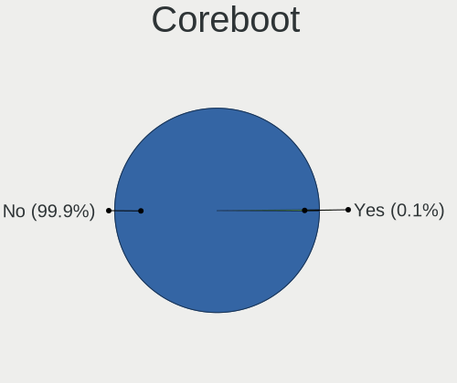
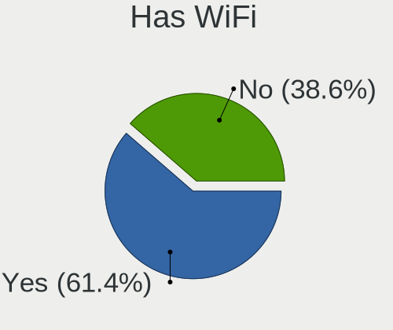
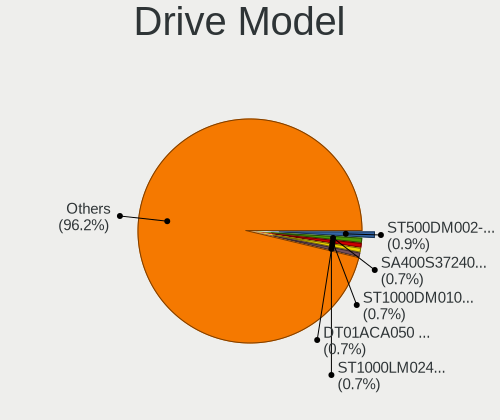
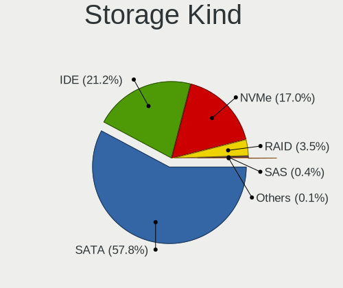
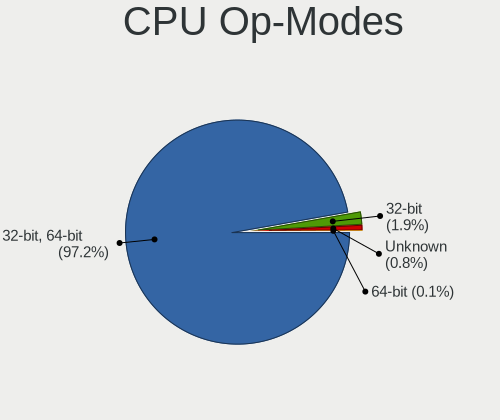
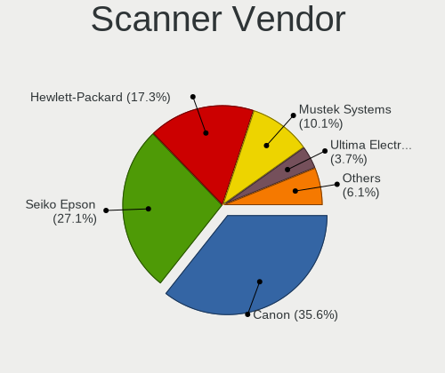
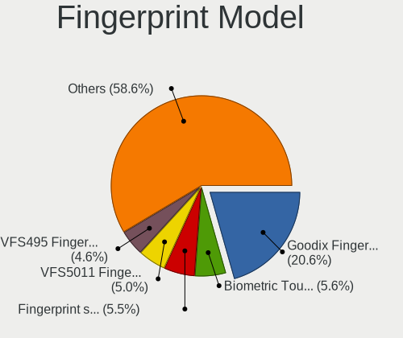

Linux in Russia - Tested Hardware & Statistics
----------------------------------------------

A project to collect tested hardware configurations for Linux in Russia.

Anyone can contribute to this report by the [hw-probe](https://github.com/linuxhw/hw-probe) tool:

    sudo -E hw-probe -all -upload

Please contribute! Especially if your hardware is rare.

This is a report for all computer types. See also reports for [desktops](/Location/Russia/Desktop/README.md) and [notebooks](/Location/Russia/Notebook/README.md).

Contents
--------

* [ Test Cases ](#test-cases)

* [ System ](#system)
  - [ OS                       ](#os)
  - [ OS Family                ](#os-family)
  - [ Kernel                   ](#kernel)
  - [ Kernel Family            ](#kernel-family)
  - [ Kernel Major Ver.        ](#kernel-major-ver)
  - [ Arch                     ](#arch)
  - [ DE                       ](#de)
  - [ Display Server           ](#display-server)
  - [ Display Manager          ](#display-manager)
  - [ OS Lang                  ](#os-lang)
  - [ Boot Mode                ](#boot-mode)
  - [ Filesystem               ](#filesystem)
  - [ Part. scheme             ](#part-scheme)
  - [ Dual Boot with Linux/BSD ](#dual-boot-with-linuxbsd)
  - [ Dual Boot (Win)          ](#dual-boot-win)

* [ Board ](#board)
  - [ Vendor                   ](#vendor)
  - [ Model                    ](#model)
  - [ Model Family             ](#model-family)
  - [ MFG Year                 ](#mfg-year)
  - [ Form Factor              ](#form-factor)
  - [ Secure Boot              ](#secure-boot)
  - [ Coreboot                 ](#coreboot)
  - [ RAM Size                 ](#ram-size)
  - [ RAM Used                 ](#ram-used)
  - [ Total Drives             ](#total-drives)
  - [ Has CD-ROM               ](#has-cd-rom)
  - [ Has Ethernet             ](#has-ethernet)
  - [ Has WiFi                 ](#has-wifi)
  - [ Has Bluetooth            ](#has-bluetooth)

* [ Location ](#location)
  - [ Country                  ](#country)
  - [ City                     ](#city)

* [ Drives ](#drives)
  - [ Drive Vendor             ](#drive-vendor)
  - [ Drive Model              ](#drive-model)
  - [ HDD Vendor               ](#hdd-vendor)
  - [ SSD Vendor               ](#ssd-vendor)
  - [ Drive Kind               ](#drive-kind)
  - [ Drive Connector          ](#drive-connector)
  - [ Drive Size               ](#drive-size)
  - [ Space Total              ](#space-total)
  - [ Space Used               ](#space-used)
  - [ Malfunc. Drives          ](#malfunc-drives)
  - [ Malfunc. Drive Vendor    ](#malfunc-drive-vendor)
  - [ Malfunc. HDD Vendor      ](#malfunc-hdd-vendor)
  - [ Malfunc. Drive Kind      ](#malfunc-drive-kind)
  - [ Failed Drives            ](#failed-drives)
  - [ Failed Drive Vendor      ](#failed-drive-vendor)
  - [ Drive Status             ](#drive-status)

* [ Storage controller ](#storage-controller)
  - [ Storage Vendor           ](#storage-vendor)
  - [ Storage Model            ](#storage-model)
  - [ Storage Kind             ](#storage-kind)

* [ Processor ](#processor)
  - [ CPU Vendor               ](#cpu-vendor)
  - [ CPU Model                ](#cpu-model)
  - [ CPU Model Family         ](#cpu-model-family)
  - [ CPU Cores                ](#cpu-cores)
  - [ CPU Sockets              ](#cpu-sockets)
  - [ CPU Threads              ](#cpu-threads)
  - [ CPU Op-Modes             ](#cpu-op-modes)
  - [ CPU Microcode            ](#cpu-microcode)
  - [ CPU Microarch            ](#cpu-microarch)

* [ Graphics ](#graphics)
  - [ GPU Vendor               ](#gpu-vendor)
  - [ GPU Model                ](#gpu-model)
  - [ GPU Combo                ](#gpu-combo)
  - [ GPU Driver               ](#gpu-driver)
  - [ GPU Memory               ](#gpu-memory)

* [ Monitor ](#monitor)
  - [ Monitor Vendor           ](#monitor-vendor)
  - [ Monitor Model            ](#monitor-model)
  - [ Monitor Resolution       ](#monitor-resolution)
  - [ Monitor Diagonal         ](#monitor-diagonal)
  - [ Monitor Width            ](#monitor-width)
  - [ Aspect Ratio             ](#aspect-ratio)
  - [ Monitor Area             ](#monitor-area)
  - [ Pixel Density            ](#pixel-density)
  - [ Multiple Monitors        ](#multiple-monitors)

* [ Network ](#network)
  - [ Net Controller Vendor    ](#net-controller-vendor)
  - [ Net Controller Model     ](#net-controller-model)
  - [ Wireless Vendor          ](#wireless-vendor)
  - [ Wireless Model           ](#wireless-model)
  - [ Ethernet Vendor          ](#ethernet-vendor)
  - [ Ethernet Model           ](#ethernet-model)
  - [ Net Controller Kind      ](#net-controller-kind)
  - [ Used Controller          ](#used-controller)
  - [ NICs                     ](#nics)
  - [ IPv6                     ](#ipv6)

* [ Bluetooth ](#bluetooth)
  - [ Bluetooth Vendor         ](#bluetooth-vendor)
  - [ Bluetooth Model          ](#bluetooth-model)

* [ Sound ](#sound)
  - [ Sound Vendor             ](#sound-vendor)
  - [ Sound Model              ](#sound-model)

* [ Memory ](#memory)
  - [ Memory Vendor            ](#memory-vendor)
  - [ Memory Model             ](#memory-model)
  - [ Memory Kind              ](#memory-kind)
  - [ Memory Form Factor       ](#memory-form-factor)
  - [ Memory Size              ](#memory-size)
  - [ Memory Speed             ](#memory-speed)

* [ Printers & scanners ](#printers--scanners)
  - [ Printer Vendor           ](#printer-vendor)
  - [ Printer Model            ](#printer-model)
  - [ Scanner Vendor           ](#scanner-vendor)
  - [ Scanner Model            ](#scanner-model)

* [ Camera ](#camera)
  - [ Camera Vendor            ](#camera-vendor)
  - [ Camera Model             ](#camera-model)

* [ Security ](#security)
  - [ Fingerprint Vendor       ](#fingerprint-vendor)
  - [ Fingerprint Model        ](#fingerprint-model)
  - [ Chipcard Vendor          ](#chipcard-vendor)
  - [ Chipcard Model           ](#chipcard-model)

* [ Unsupported ](#unsupported)
  - [ Unsupported Devices      ](#unsupported-devices)
  - [ Unsupported Device Types ](#unsupported-device-types)

Test Cases
----------

Total: 43302

| Vendor        | Model                       | Form-Factor | Probe                                                      | Date         |
|---------------|-----------------------------|-------------|------------------------------------------------------------|--------------|
| Notebook      | W65_67SJ                    | Notebook    | [8bea89f7c9](https://linux-hardware.org/?probe=8bea89f7c9) | Dec 24, 2023 |
| ASRock        | H610D4-P1                   | Desktop     | [88f9c52b47](https://linux-hardware.org/?probe=88f9c52b47) | Dec 24, 2023 |
| Notebook      | W65_67SJ                    | Notebook    | [439816e10c](https://linux-hardware.org/?probe=439816e10c) | Dec 24, 2023 |
| Anbernic      | Win600                      | Notebook    | [3b5255f14b](https://linux-hardware.org/?probe=3b5255f14b) | Dec 24, 2023 |
| MSI           | 770-C45                     | Desktop     | [b627deabe4](https://linux-hardware.org/?probe=b627deabe4) | Dec 24, 2023 |
| Lenovo        | V15 G4 AMN 82YU             | Notebook    | [d7518dd730](https://linux-hardware.org/?probe=d7518dd730) | Dec 24, 2023 |
| MSI           | H510M-A PRO                 | Desktop     | [fe19f4de86](https://linux-hardware.org/?probe=fe19f4de86) | Dec 23, 2023 |
| TECNO Mobi... | MEGABOOK T15DA              | Notebook    | [82d65cfce4](https://linux-hardware.org/?probe=82d65cfce4) | Dec 23, 2023 |
| Lenovo        | V15 G4 AMN 82YU             | Notebook    | [a4b5f3a556](https://linux-hardware.org/?probe=a4b5f3a556) | Dec 23, 2023 |
| Dell          | Latitude E4310              | Notebook    | [0c4f2ab6b3](https://linux-hardware.org/?probe=0c4f2ab6b3) | Dec 23, 2023 |
| MSI           | MPG B550 GAMING PLUS        | Desktop     | [9aa71593d4](https://linux-hardware.org/?probe=9aa71593d4) | Dec 23, 2023 |
| MSI           | MPG B550 GAMING PLUS        | Desktop     | [3819a04ddd](https://linux-hardware.org/?probe=3819a04ddd) | Dec 23, 2023 |
| MSI           | H110M PRO-D                 | Desktop     | [7a442e82cf](https://linux-hardware.org/?probe=7a442e82cf) | Dec 23, 2023 |
| ASUSTek       | U5A                         | Notebook    | [fd3c48af54](https://linux-hardware.org/?probe=fd3c48af54) | Dec 23, 2023 |
| ASUSTek       | N53SV                       | Notebook    | [5098aee09b](https://linux-hardware.org/?probe=5098aee09b) | Dec 23, 2023 |
| ASUSTek       | Zenbook UM3402YAR_UM3402... | Notebook    | [a72824a48c](https://linux-hardware.org/?probe=a72824a48c) | Dec 23, 2023 |
| ASUSTek       | N53SV                       | Notebook    | [5ad49bc6d3](https://linux-hardware.org/?probe=5ad49bc6d3) | Dec 23, 2023 |
| ASUSTek       | P5B-VM SE                   | Desktop     | [4640d8f333](https://linux-hardware.org/?probe=4640d8f333) | Dec 23, 2023 |
| MSI           | H110M PRO-D                 | Desktop     | [10257919e4](https://linux-hardware.org/?probe=10257919e4) | Dec 23, 2023 |
| Anbernic      | Win600                      | Notebook    | [02e1d7adeb](https://linux-hardware.org/?probe=02e1d7adeb) | Dec 23, 2023 |
| ASUSTek       | PRIME H310M-K R2.0          | Desktop     | [8decde512f](https://linux-hardware.org/?probe=8decde512f) | Dec 23, 2023 |
| ASUSTek       | P8H61-M LX                  | Desktop     | [29bb247885](https://linux-hardware.org/?probe=29bb247885) | Dec 23, 2023 |
| ASUSTek       | TUF Gaming FX504GD_FX80G... | Notebook    | [76b5abd1bd](https://linux-hardware.org/?probe=76b5abd1bd) | Dec 23, 2023 |
| MSI           | 890FXA-GD70                 | Desktop     | [1093dc8236](https://linux-hardware.org/?probe=1093dc8236) | Dec 23, 2023 |
| Dell          | 0Y5DDC A00                  | Desktop     | [7ab5ac3907](https://linux-hardware.org/?probe=7ab5ac3907) | Dec 23, 2023 |
| Samsung       | 350V5C/351V5C/3540VC/344... | Notebook    | [541c5efbf3](https://linux-hardware.org/?probe=541c5efbf3) | Dec 23, 2023 |
| HP            | 340S G7 Notebook PC         | Notebook    | [097603b65a](https://linux-hardware.org/?probe=097603b65a) | Dec 23, 2023 |
| Dell          | Inspiron N5050              | Notebook    | [51b49fb205](https://linux-hardware.org/?probe=51b49fb205) | Dec 22, 2023 |
| HUAWEI        | KLVL-WXXW                   | Notebook    | [ccf505804c](https://linux-hardware.org/?probe=ccf505804c) | Dec 22, 2023 |
| Intel         | NUC10i3FNB M38070-308       | Mini pc     | [006c2edbad](https://linux-hardware.org/?probe=006c2edbad) | Dec 22, 2023 |
| Acer          | Aspire 5920G                | Notebook    | [93945148f3](https://linux-hardware.org/?probe=93945148f3) | Dec 22, 2023 |
| HP            | 1495                        | Desktop     | [475715312b](https://linux-hardware.org/?probe=475715312b) | Dec 22, 2023 |
| ASUSTek       | SABERTOOTH 990FX R3.0       | Desktop     | [a1a6c29257](https://linux-hardware.org/?probe=a1a6c29257) | Dec 22, 2023 |
| Irbis         | NB264                       | Notebook    | [8821679765](https://linux-hardware.org/?probe=8821679765) | Dec 22, 2023 |
| ASUSTek       | P7P55D PRO                  | Desktop     | [ce940a8975](https://linux-hardware.org/?probe=ce940a8975) | Dec 22, 2023 |
| MSI           | B75A-G43                    | Desktop     | [70c44f3ff8](https://linux-hardware.org/?probe=70c44f3ff8) | Dec 22, 2023 |
| iRU           | 15ALC                       | Notebook    | [28f7177799](https://linux-hardware.org/?probe=28f7177799) | Dec 22, 2023 |
| Gigabyte      | B550 AORUS PRO V2           | Desktop     | [be8f1bf021](https://linux-hardware.org/?probe=be8f1bf021) | Dec 22, 2023 |
| Samsung       | 300V3A/300V4A/300V5A/200... | Notebook    | [4bf5538ba0](https://linux-hardware.org/?probe=4bf5538ba0) | Dec 22, 2023 |
| ASUSTek       | X553MA                      | Notebook    | [af944b3278](https://linux-hardware.org/?probe=af944b3278) | Dec 22, 2023 |
| ASUSTek       | X553MA                      | Notebook    | [ccc1d214ce](https://linux-hardware.org/?probe=ccc1d214ce) | Dec 22, 2023 |
| Dell          | Vostro 15 3510              | Notebook    | [d2c7d30632](https://linux-hardware.org/?probe=d2c7d30632) | Dec 22, 2023 |
| Lenovo        | ThinkPad T14 Gen 1 20UES... | Notebook    | [283320e72d](https://linux-hardware.org/?probe=283320e72d) | Dec 22, 2023 |
| HUAWEI        | RLEF-XX                     | Notebook    | [cdcc0b8368](https://linux-hardware.org/?probe=cdcc0b8368) | Dec 22, 2023 |
| Sony          | VPCCA3X1R                   | Notebook    | [156b109950](https://linux-hardware.org/?probe=156b109950) | Dec 21, 2023 |
| Dell          | Precision M4700             | Notebook    | [3048d06ee6](https://linux-hardware.org/?probe=3048d06ee6) | Dec 21, 2023 |
| LG Electro... | F1-2A85R                    | Notebook    | [06bdffa7cc](https://linux-hardware.org/?probe=06bdffa7cc) | Dec 21, 2023 |
| Gigabyte      | AORUS 15 XE4                | Notebook    | [5dd281e2dd](https://linux-hardware.org/?probe=5dd281e2dd) | Dec 21, 2023 |
| Dell          | Inspiron 5558               | Notebook    | [b847e03f71](https://linux-hardware.org/?probe=b847e03f71) | Dec 21, 2023 |
| Gigabyte      | A320M-S2H-CF                | Desktop     | [7a1be2ed24](https://linux-hardware.org/?probe=7a1be2ed24) | Dec 21, 2023 |
| Acer          | Aspire ES1-531              | Notebook    | [0bacfb8ebc](https://linux-hardware.org/?probe=0bacfb8ebc) | Dec 21, 2023 |
| AZW           | GTR V21                     | Mini pc     | [24ed791d67](https://linux-hardware.org/?probe=24ed791d67) | Dec 21, 2023 |
| Valve         | Jupiter                     | Notebook    | [f30a4a2d8a](https://linux-hardware.org/?probe=f30a4a2d8a) | Dec 21, 2023 |
| Acer          | Aspire ES1-531              | Notebook    | [14e802a51f](https://linux-hardware.org/?probe=14e802a51f) | Dec 21, 2023 |
| ASUSTek       | X540LA                      | Notebook    | [ae9a60ec08](https://linux-hardware.org/?probe=ae9a60ec08) | Dec 21, 2023 |
| realme        | RMNBXXXX                    | Notebook    | [d8e473e1e4](https://linux-hardware.org/?probe=d8e473e1e4) | Dec 21, 2023 |
| ASUSTek       | P5G41T-M LX                 | Desktop     | [8bc6ac892f](https://linux-hardware.org/?probe=8bc6ac892f) | Dec 21, 2023 |
| INTECH PRO    | H510-M2 v5.0                | Desktop     | [9d99caa058](https://linux-hardware.org/?probe=9d99caa058) | Dec 21, 2023 |
| Intel         | SKYBAY                      | Desktop     | [36f317de81](https://linux-hardware.org/?probe=36f317de81) | Dec 21, 2023 |
| HUAWEI        | NBLL-WXX9                   | Notebook    | [c125585a5d](https://linux-hardware.org/?probe=c125585a5d) | Dec 21, 2023 |
| ASUSTek       | K53SM                       | Notebook    | [7af945d0af](https://linux-hardware.org/?probe=7af945d0af) | Dec 21, 2023 |
| ASUSTek       | VivoBook_ASUSLaptop X150... | Notebook    | [46c4d5053b](https://linux-hardware.org/?probe=46c4d5053b) | Dec 21, 2023 |
| ASUSTek       | H97M-E                      | Desktop     | [090fcf5a52](https://linux-hardware.org/?probe=090fcf5a52) | Dec 21, 2023 |
| ASUSTek       | M2NPV-VM                    | Desktop     | [312d56f544](https://linux-hardware.org/?probe=312d56f544) | Dec 21, 2023 |
| Gigabyte      | A320M-H-CF                  | Desktop     | [4294629777](https://linux-hardware.org/?probe=4294629777) | Dec 21, 2023 |
| MSI           | 770-C45                     | Desktop     | [cf5f865e2a](https://linux-hardware.org/?probe=cf5f865e2a) | Dec 21, 2023 |
| ASUSTek       | VX7                         | Notebook    | [df8564bf5b](https://linux-hardware.org/?probe=df8564bf5b) | Dec 21, 2023 |
| DEXP          | Aquilon C14                 | Notebook    | [09cd71a27d](https://linux-hardware.org/?probe=09cd71a27d) | Dec 21, 2023 |
| ASUSTek       | TUF Gaming B550M-PLUS       | Desktop     | [d5f60126bb](https://linux-hardware.org/?probe=d5f60126bb) | Dec 20, 2023 |
| DEXP          | Atlas M15-I3W302            | Notebook    | [176dd6f77a](https://linux-hardware.org/?probe=176dd6f77a) | Dec 20, 2023 |
| ASUSTek       | Zenbook UX535QE_UM535QE     | Notebook    | [d420770c44](https://linux-hardware.org/?probe=d420770c44) | Dec 20, 2023 |
| Lenovo        | ThinkPad T530 239233G       | Notebook    | [83d94e2acb](https://linux-hardware.org/?probe=83d94e2acb) | Dec 20, 2023 |
| ASUSTek       | VM40B                       | Desktop     | [8deb79e86e](https://linux-hardware.org/?probe=8deb79e86e) | Dec 20, 2023 |
| Lenovo        | ThinkCentre A70 7099L8G     | Desktop     | [9720608634](https://linux-hardware.org/?probe=9720608634) | Dec 20, 2023 |
| Dell          | Inspiron N5110              | Notebook    | [c983a4857a](https://linux-hardware.org/?probe=c983a4857a) | Dec 20, 2023 |
| ASUSTek       | TUF Gaming B550M-PLUS       | Desktop     | [70aa06688c](https://linux-hardware.org/?probe=70aa06688c) | Dec 20, 2023 |
| MSI           | 760GM-P23                   | Desktop     | [cec4f5fa78](https://linux-hardware.org/?probe=cec4f5fa78) | Dec 20, 2023 |
| ASUSTek       | VivoBook_ASUSLaptop X340... | Notebook    | [00d649079a](https://linux-hardware.org/?probe=00d649079a) | Dec 20, 2023 |
| Intel         | DX58SO AAE29331-701         | Desktop     | [2d58e75a01](https://linux-hardware.org/?probe=2d58e75a01) | Dec 20, 2023 |
| Intel         | SKYBAY                      | Desktop     | [09a66cdc69](https://linux-hardware.org/?probe=09a66cdc69) | Dec 20, 2023 |
| ASUSTek       | P7P55D PRO                  | Desktop     | [15f5598650](https://linux-hardware.org/?probe=15f5598650) | Dec 20, 2023 |
| iRU           | 15TLI                       | Notebook    | [bbb5b326aa](https://linux-hardware.org/?probe=bbb5b326aa) | Dec 20, 2023 |
| ASRock        | M3A UCC                     | Desktop     | [f28e499d94](https://linux-hardware.org/?probe=f28e499d94) | Dec 20, 2023 |
| Gigabyte      | Z77-DS3H                    | Desktop     | [6c1f758e88](https://linux-hardware.org/?probe=6c1f758e88) | Dec 19, 2023 |
| Gigabyte      | GA-78LMT-S2P                | Desktop     | [0e95772674](https://linux-hardware.org/?probe=0e95772674) | Dec 19, 2023 |
| Gigabyte      | GA-78LMT-S2P                | Desktop     | [f2d2625715](https://linux-hardware.org/?probe=f2d2625715) | Dec 19, 2023 |
| Gigabyte      | Z790 UD                     | Desktop     | [94a40a476d](https://linux-hardware.org/?probe=94a40a476d) | Dec 19, 2023 |
| AZW           | MINI S 10                   | Desktop     | [9fd8cc1993](https://linux-hardware.org/?probe=9fd8cc1993) | Dec 19, 2023 |
| HUAWEI        | CREFG-XX                    | Notebook    | [b97589a2bc](https://linux-hardware.org/?probe=b97589a2bc) | Dec 19, 2023 |
| HUAWEI        | CREFG-XX                    | Notebook    | [5dd323e917](https://linux-hardware.org/?probe=5dd323e917) | Dec 19, 2023 |
| Acer          | Nitro AN515-56              | Notebook    | [3fb0406c18](https://linux-hardware.org/?probe=3fb0406c18) | Dec 19, 2023 |
| ASUSTek       | N73Jn                       | Notebook    | [75d7e7434d](https://linux-hardware.org/?probe=75d7e7434d) | Dec 19, 2023 |
| ICL           | H510SB-TM v2.0              | All in one  | [8dde4765f9](https://linux-hardware.org/?probe=8dde4765f9) | Dec 19, 2023 |
| ASUSTek       | VivoBook_ASUSLaptop M650... | Notebook    | [188dea7b4b](https://linux-hardware.org/?probe=188dea7b4b) | Dec 19, 2023 |
| ASUSTek       | H110M-R                     | Desktop     | [61211b72bb](https://linux-hardware.org/?probe=61211b72bb) | Dec 19, 2023 |
| ICL           | H510SB-TM v2.0              | All in one  | [11e4d48e66](https://linux-hardware.org/?probe=11e4d48e66) | Dec 19, 2023 |
| DNS           | V40SI2                      | Notebook    | [cc28f4eaa2](https://linux-hardware.org/?probe=cc28f4eaa2) | Dec 19, 2023 |
| MSI           | B360-A PRO                  | Desktop     | [a19733520c](https://linux-hardware.org/?probe=a19733520c) | Dec 19, 2023 |
| Dell          | Inspiron 5520               | Notebook    | [df5cca640e](https://linux-hardware.org/?probe=df5cca640e) | Dec 19, 2023 |
| Valve         | Jupiter                     | Notebook    | [d6b925353e](https://linux-hardware.org/?probe=d6b925353e) | Dec 18, 2023 |
| ASUSTek       | 1011PX                      | Notebook    | [6046941a0a](https://linux-hardware.org/?probe=6046941a0a) | Dec 18, 2023 |
| Gigabyte      | AORUS 17H BXF               | Notebook    | [ad8b646e5c](https://linux-hardware.org/?probe=ad8b646e5c) | Dec 18, 2023 |
| Dell          | Inspiron 5520               | Notebook    | [0d5fb0418b](https://linux-hardware.org/?probe=0d5fb0418b) | Dec 18, 2023 |
| Acer          | Aspire E1-522               | Notebook    | [874bdf3d31](https://linux-hardware.org/?probe=874bdf3d31) | Dec 18, 2023 |
| ASUSTek       | STRIX X99 GAMING            | Desktop     | [4becb790c2](https://linux-hardware.org/?probe=4becb790c2) | Dec 18, 2023 |
| HUAWEI        | BOD-WXX9                    | Notebook    | [3d0c812852](https://linux-hardware.org/?probe=3d0c812852) | Dec 18, 2023 |
| Acer          | Aspire A114-33              | Notebook    | [0d1dc00e78](https://linux-hardware.org/?probe=0d1dc00e78) | Dec 18, 2023 |
| Toshiba       | Satellite Pro C660          | Notebook    | [8d45441911](https://linux-hardware.org/?probe=8d45441911) | Dec 18, 2023 |
| Maibenben     | MaiBook P series            | Notebook    | [6bd05cc6a1](https://linux-hardware.org/?probe=6bd05cc6a1) | Dec 18, 2023 |
| Lenovo        | G500 20236                  | Notebook    | [d8f95bfd45](https://linux-hardware.org/?probe=d8f95bfd45) | Dec 18, 2023 |
| Lenovo        | G500 20236                  | Notebook    | [f9a70833ee](https://linux-hardware.org/?probe=f9a70833ee) | Dec 18, 2023 |
| HP            | Pavilion dv6                | Notebook    | [604417783f](https://linux-hardware.org/?probe=604417783f) | Dec 18, 2023 |
| Clevo         | NL41MU2                     | Notebook    | [31d86d4507](https://linux-hardware.org/?probe=31d86d4507) | Dec 18, 2023 |
| Apple         | Mac-77F17D7DA9285301 iMa... | All in one  | [f051e1ba58](https://linux-hardware.org/?probe=f051e1ba58) | Dec 18, 2023 |
| Unknown       | Unknown                     | Soc         | [86edce9654](https://linux-hardware.org/?probe=86edce9654) | Dec 18, 2023 |
| Gigabyte      | H410M S2H V3                | Desktop     | [498141a78c](https://linux-hardware.org/?probe=498141a78c) | Dec 18, 2023 |
| Dell          | Studio 1535                 | Notebook    | [06e18b7a2f](https://linux-hardware.org/?probe=06e18b7a2f) | Dec 18, 2023 |
| Lenovo        | V15 G1 IML 82NB             | Notebook    | [90d82dc1a1](https://linux-hardware.org/?probe=90d82dc1a1) | Dec 18, 2023 |
| ASUSTek       | P5LD2                       | Desktop     | [6b2cff0ab3](https://linux-hardware.org/?probe=6b2cff0ab3) | Dec 18, 2023 |
| realme        | RMNBXXXX                    | Notebook    | [100bef421f](https://linux-hardware.org/?probe=100bef421f) | Dec 18, 2023 |
| ASUSTek       | ROG Flow X16 GV601VI_GV6... | Convertible | [4065921cd4](https://linux-hardware.org/?probe=4065921cd4) | Dec 18, 2023 |
| Clevo         | NL41MU2                     | Notebook    | [7bf2e8159e](https://linux-hardware.org/?probe=7bf2e8159e) | Dec 18, 2023 |
| ASUSTek       | PRIME B360M-K               | Desktop     | [d52ec68e39](https://linux-hardware.org/?probe=d52ec68e39) | Dec 18, 2023 |
| Biostar       | H610MH                      | Desktop     | [6a0d454360](https://linux-hardware.org/?probe=6a0d454360) | Dec 18, 2023 |
| Lenovo        | IdeaPad 3 15ITL05 81X8      | Notebook    | [4c190c150c](https://linux-hardware.org/?probe=4c190c150c) | Dec 18, 2023 |
| MSI           | Katana GF66 11SC            | Notebook    | [96407da6d4](https://linux-hardware.org/?probe=96407da6d4) | Dec 18, 2023 |
| HUAWEI        | BOHB-WAX9                   | Notebook    | [94757e986e](https://linux-hardware.org/?probe=94757e986e) | Dec 18, 2023 |
| Irbis         | NB264                       | Notebook    | [8c32d8fb0b](https://linux-hardware.org/?probe=8c32d8fb0b) | Dec 18, 2023 |
| ASUSTek       | ROG STRIX B550-I GAMING     | Desktop     | [0bedf3955a](https://linux-hardware.org/?probe=0bedf3955a) | Dec 17, 2023 |
| ASRock        | B460 Phantom Gaming 4       | Desktop     | [8a69294494](https://linux-hardware.org/?probe=8a69294494) | Dec 17, 2023 |
| Dell          | System Inspiron N7110       | Notebook    | [b1f392f5f3](https://linux-hardware.org/?probe=b1f392f5f3) | Dec 17, 2023 |
| Lenovo        | ThinkPad T430u 86147MG      | Notebook    | [0463c0adc2](https://linux-hardware.org/?probe=0463c0adc2) | Dec 17, 2023 |
| Gigabyte      | A320M-H-CF                  | Desktop     | [d346ec3767](https://linux-hardware.org/?probe=d346ec3767) | Dec 17, 2023 |
| Gigabyte      | X570S UD                    | Desktop     | [058c14cd39](https://linux-hardware.org/?probe=058c14cd39) | Dec 17, 2023 |
| ASUSTek       | M4A87TD/USB3                | Desktop     | [df3eb3c253](https://linux-hardware.org/?probe=df3eb3c253) | Dec 17, 2023 |
| Dell          | Inspiron 1545               | Notebook    | [cd3471d9e5](https://linux-hardware.org/?probe=cd3471d9e5) | Dec 17, 2023 |
| Unknown       | YL-J1900-V1                 | Desktop     | [257144f3a3](https://linux-hardware.org/?probe=257144f3a3) | Dec 17, 2023 |
| Unknown       | YL-J1900-V1                 | Desktop     | [c14e43b65f](https://linux-hardware.org/?probe=c14e43b65f) | Dec 17, 2023 |
| Gigabyte      | Z790 UD                     | Desktop     | [bfe9651fbd](https://linux-hardware.org/?probe=bfe9651fbd) | Dec 17, 2023 |
| ASUSTek       | VivoBook_ASUSLaptop M150... | Notebook    | [ed79377477](https://linux-hardware.org/?probe=ed79377477) | Dec 17, 2023 |
| Gigabyte      | B450 GAMING X               | Desktop     | [28f3e414e2](https://linux-hardware.org/?probe=28f3e414e2) | Dec 17, 2023 |
| ASUSTek       | PRIME A320M-K               | Desktop     | [65aee92c23](https://linux-hardware.org/?probe=65aee92c23) | Dec 17, 2023 |
| ASUSTek       | K53SC                       | Notebook    | [4424929359](https://linux-hardware.org/?probe=4424929359) | Dec 17, 2023 |
| ASUSTek       | VivoBook_ASUSLaptop M160... | Notebook    | [0f49954dd1](https://linux-hardware.org/?probe=0f49954dd1) | Dec 17, 2023 |
| Gigabyte      | H77M-D3H                    | Desktop     | [de9dcb40ba](https://linux-hardware.org/?probe=de9dcb40ba) | Dec 17, 2023 |
| Irbis         | NB12                        | Notebook    | [f6eb11e455](https://linux-hardware.org/?probe=f6eb11e455) | Dec 17, 2023 |
| HP            | Laptop 14s-dq2xxx           | Notebook    | [0e123e0682](https://linux-hardware.org/?probe=0e123e0682) | Dec 16, 2023 |
| MSI           | GF63 Thin 9RCX              | Notebook    | [fe9179b1fb](https://linux-hardware.org/?probe=fe9179b1fb) | Dec 16, 2023 |
| Toshiba       | Satellite C660              | Notebook    | [c67f7d8341](https://linux-hardware.org/?probe=c67f7d8341) | Dec 16, 2023 |
| Foxconn       | G41MX/G41MX-K 2.0 1.0       | Desktop     | [cdebd77402](https://linux-hardware.org/?probe=cdebd77402) | Dec 16, 2023 |
| ASRock        | 970M Pro3                   | Desktop     | [1e7fb2b8d8](https://linux-hardware.org/?probe=1e7fb2b8d8) | Dec 16, 2023 |
| MSI           | Modern 15 B5M               | Notebook    | [893ff177b3](https://linux-hardware.org/?probe=893ff177b3) | Dec 16, 2023 |
| ASUSTek       | PRIME A320M-A               | Desktop     | [862ce85408](https://linux-hardware.org/?probe=862ce85408) | Dec 16, 2023 |
| Apple         | MacBookAir7,2               | Notebook    | [d227968843](https://linux-hardware.org/?probe=d227968843) | Dec 16, 2023 |
| HP            | Pavilion Gaming Laptop 1... | Notebook    | [49e930f611](https://linux-hardware.org/?probe=49e930f611) | Dec 16, 2023 |
| Toshiba       | Satellite U300              | Notebook    | [f8f967d0fe](https://linux-hardware.org/?probe=f8f967d0fe) | Dec 16, 2023 |
| AZW           | MINI S 10                   | Desktop     | [c3fcd194a9](https://linux-hardware.org/?probe=c3fcd194a9) | Dec 16, 2023 |
| Gigabyte      | H110M-S2H-CF                | Desktop     | [26e619e2e4](https://linux-hardware.org/?probe=26e619e2e4) | Dec 16, 2023 |
| Samsung       | R528/R728                   | Notebook    | [3a61761648](https://linux-hardware.org/?probe=3a61761648) | Dec 16, 2023 |
| Toshiba       | T20                         | Notebook    | [5bb395790c](https://linux-hardware.org/?probe=5bb395790c) | Dec 16, 2023 |
| AZW           | MINI S 10                   | Desktop     | [eae1cb11b4](https://linux-hardware.org/?probe=eae1cb11b4) | Dec 16, 2023 |
| ROMBICA       | myBook Discovery            | Notebook    | [c7b69fb478](https://linux-hardware.org/?probe=c7b69fb478) | Dec 16, 2023 |
| Valve         | Jupiter                     | Notebook    | [298b8b5df0](https://linux-hardware.org/?probe=298b8b5df0) | Dec 16, 2023 |
| AZW           | MINI S 10                   | Desktop     | [8d0d99e3ca](https://linux-hardware.org/?probe=8d0d99e3ca) | Dec 15, 2023 |
| MSI           | Thin GF63 12HW              | Notebook    | [47f661e72c](https://linux-hardware.org/?probe=47f661e72c) | Dec 15, 2023 |
| MSI           | H61M-P21                    | Desktop     | [e452b4a816](https://linux-hardware.org/?probe=e452b4a816) | Dec 15, 2023 |
| Lenovo        | ThinkBook 15 G2 ITL 20VE    | Notebook    | [a53b2d9ba9](https://linux-hardware.org/?probe=a53b2d9ba9) | Dec 15, 2023 |
| ASUSTek       | M5A78L-M LX                 | Desktop     | [6225f2f85f](https://linux-hardware.org/?probe=6225f2f85f) | Dec 15, 2023 |
| ASUSTek       | ROG Strix G531GU_GL531GU    | Notebook    | [b3b3853325](https://linux-hardware.org/?probe=b3b3853325) | Dec 15, 2023 |
| Unknown       | Toshiba AC100 / Dynabook... | Notebook    | [4ed450dd80](https://linux-hardware.org/?probe=4ed450dd80) | Dec 15, 2023 |
| Clevo         | NL41MU2                     | Notebook    | [7042699eef](https://linux-hardware.org/?probe=7042699eef) | Dec 15, 2023 |
| ASUSTek       | X550CC                      | Notebook    | [e07df321e3](https://linux-hardware.org/?probe=e07df321e3) | Dec 15, 2023 |
| Gigabyte      | Z790 UD                     | Desktop     | [77da8f68cd](https://linux-hardware.org/?probe=77da8f68cd) | Dec 15, 2023 |
| Sony          | VGN-FW11ER                  | Notebook    | [eead7d1cca](https://linux-hardware.org/?probe=eead7d1cca) | Dec 15, 2023 |
| Dell          | Vostro 15 3510              | Notebook    | [051090b9e0](https://linux-hardware.org/?probe=051090b9e0) | Dec 15, 2023 |
| JUXIESHI      | X99-MR9A PRO MAX V5.0       | Desktop     | [9e2f9a2d1b](https://linux-hardware.org/?probe=9e2f9a2d1b) | Dec 14, 2023 |
| Timi          | TM1701                      | Notebook    | [5b3c697954](https://linux-hardware.org/?probe=5b3c697954) | Dec 14, 2023 |
| Gigabyte      | P35-DS4                     | Desktop     | [23e146afdc](https://linux-hardware.org/?probe=23e146afdc) | Dec 14, 2023 |
| Lenovo        | ThinkPad T480s 20L8S7232... | Notebook    | [d9de3edb6b](https://linux-hardware.org/?probe=d9de3edb6b) | Dec 14, 2023 |
| Lenovo        | ThinkPad T480s 20L8S7232... | Notebook    | [84f162f88f](https://linux-hardware.org/?probe=84f162f88f) | Dec 14, 2023 |
| Gigabyte      | 970A-DS3P                   | Desktop     | [35e6b7852f](https://linux-hardware.org/?probe=35e6b7852f) | Dec 14, 2023 |
| Gigabyte      | 970A-DS3P                   | Desktop     | [e3a708296c](https://linux-hardware.org/?probe=e3a708296c) | Dec 14, 2023 |
| Dell          | Studio 1535                 | Notebook    | [0fd7468ec1](https://linux-hardware.org/?probe=0fd7468ec1) | Dec 14, 2023 |
| MSI           | G41M-P26                    | Desktop     | [fea030b929](https://linux-hardware.org/?probe=fea030b929) | Dec 14, 2023 |
| Lenovo        | IdeaPad 320-17IKB 80XM      | Notebook    | [8374878f6a](https://linux-hardware.org/?probe=8374878f6a) | Dec 14, 2023 |
| Gigabyte      | X38-DQ6                     | Desktop     | [67c13b1f2a](https://linux-hardware.org/?probe=67c13b1f2a) | Dec 14, 2023 |
| Lenovo        | IdeaPad Slim 3 14AMN8 82... | Notebook    | [b616535984](https://linux-hardware.org/?probe=b616535984) | Dec 14, 2023 |
| Acer          | AO521                       | Notebook    | [e519cc3d02](https://linux-hardware.org/?probe=e519cc3d02) | Dec 14, 2023 |
| MSI           | B550M PRO-VDH WIFI          | Desktop     | [7e77c20625](https://linux-hardware.org/?probe=7e77c20625) | Dec 14, 2023 |
| MSI           | B460M PRO-VDH               | Desktop     | [262206ab21](https://linux-hardware.org/?probe=262206ab21) | Dec 14, 2023 |
| Acer          | AO521                       | Notebook    | [0dd76d9c3a](https://linux-hardware.org/?probe=0dd76d9c3a) | Dec 14, 2023 |
| Gigabyte      | H410M S2H V3                | Desktop     | [101f8237e0](https://linux-hardware.org/?probe=101f8237e0) | Dec 14, 2023 |
| Valve         | Jupiter                     | Notebook    | [594141dc7c](https://linux-hardware.org/?probe=594141dc7c) | Dec 14, 2023 |
| ASUSTek       | P8H61-M LX                  | Desktop     | [f40c7514a6](https://linux-hardware.org/?probe=f40c7514a6) | Dec 14, 2023 |
| Valve         | Jupiter                     | Notebook    | [9e2657f1ed](https://linux-hardware.org/?probe=9e2657f1ed) | Dec 14, 2023 |
| HP            | ProBook 6560b               | Notebook    | [e103647ee9](https://linux-hardware.org/?probe=e103647ee9) | Dec 13, 2023 |
| Lenovo        | IdeaPad L340-15API 81LW     | Notebook    | [c4aead03a2](https://linux-hardware.org/?probe=c4aead03a2) | Dec 13, 2023 |
| Gigabyte      | B85M-D3V-A                  | Desktop     | [004355ae40](https://linux-hardware.org/?probe=004355ae40) | Dec 13, 2023 |
| Acer          | Aspire C24-1650             | All in one  | [b2ab898336](https://linux-hardware.org/?probe=b2ab898336) | Dec 13, 2023 |
| Acer          | Aspire C24-1650             | All in one  | [5e3f5e5226](https://linux-hardware.org/?probe=5e3f5e5226) | Dec 13, 2023 |
| Gigabyte      | H410M S2H V3                | Desktop     | [e198c73fa2](https://linux-hardware.org/?probe=e198c73fa2) | Dec 13, 2023 |
| ASUSTek       | P5G41T-M LE                 | Desktop     | [e6205fb709](https://linux-hardware.org/?probe=e6205fb709) | Dec 13, 2023 |
| Intel         | DZ68DB AAG27985-105         | Desktop     | [7df70f0023](https://linux-hardware.org/?probe=7df70f0023) | Dec 13, 2023 |
| Dell          | Vostro 3400                 | Notebook    | [01915c7894](https://linux-hardware.org/?probe=01915c7894) | Dec 13, 2023 |
| Dell          | Vostro 3400                 | Notebook    | [a8d24008e2](https://linux-hardware.org/?probe=a8d24008e2) | Dec 13, 2023 |
| HP            | Notebook                    | Notebook    | [d25691af9b](https://linux-hardware.org/?probe=d25691af9b) | Dec 13, 2023 |
| ASUSTek       | B85-PLUS                    | Desktop     | [0baafe2f04](https://linux-hardware.org/?probe=0baafe2f04) | Dec 13, 2023 |
| Unknown       | AMedia X96 Max+             | Soc         | [4df1c17523](https://linux-hardware.org/?probe=4df1c17523) | Dec 12, 2023 |
| HP            | OMEN by Laptop              | Notebook    | [12c97adbac](https://linux-hardware.org/?probe=12c97adbac) | Dec 12, 2023 |
| ASUSTek       | Zenbook UM3402YA_UM3402Y... | Notebook    | [950309042d](https://linux-hardware.org/?probe=950309042d) | Dec 12, 2023 |
| Biostar       | B560MHP                     | Desktop     | [51c947f8c6](https://linux-hardware.org/?probe=51c947f8c6) | Dec 12, 2023 |
| ASUSTek       | B75M-PLUS                   | Desktop     | [03dcd079c2](https://linux-hardware.org/?probe=03dcd079c2) | Dec 12, 2023 |
| ASUSTek       | PRIME Z790M-PLUS D4         | Desktop     | [eadc049e56](https://linux-hardware.org/?probe=eadc049e56) | Dec 12, 2023 |
| Gigabyte      | Z790 UD                     | Desktop     | [44f9c5ad81](https://linux-hardware.org/?probe=44f9c5ad81) | Dec 12, 2023 |
| ASUSTek       | P8H77-V                     | Desktop     | [6b62180e3e](https://linux-hardware.org/?probe=6b62180e3e) | Dec 12, 2023 |
| HP            | 859C                        | Desktop     | [2388872960](https://linux-hardware.org/?probe=2388872960) | Dec 12, 2023 |
| Lenovo        | ThinkPad W530 24382KU       | Notebook    | [b389060869](https://linux-hardware.org/?probe=b389060869) | Dec 12, 2023 |
| Timi          | A35R                        | Notebook    | [6133c765d4](https://linux-hardware.org/?probe=6133c765d4) | Dec 12, 2023 |
| Digma         | EVE 14 C411                 | Notebook    | [bcd7c864a1](https://linux-hardware.org/?probe=bcd7c864a1) | Dec 12, 2023 |
| Acer          | Aspire A517-51G             | Notebook    | [8396e4fdc5](https://linux-hardware.org/?probe=8396e4fdc5) | Dec 12, 2023 |
| ASUSTek       | P8H61-M LX R2.0             | Desktop     | [2a6159034b](https://linux-hardware.org/?probe=2a6159034b) | Dec 12, 2023 |
| HP            | ProBook 450 15.6 inch G9... | Notebook    | [7af6ecc981](https://linux-hardware.org/?probe=7af6ecc981) | Dec 12, 2023 |
| HP            | Pavilion 15                 | Notebook    | [235d10da72](https://linux-hardware.org/?probe=235d10da72) | Dec 12, 2023 |
| HP            | Pavilion 15                 | Notebook    | [fd466b16c8](https://linux-hardware.org/?probe=fd466b16c8) | Dec 12, 2023 |
| Lenovo        | ThinkPad Z61t 9441W15       | Notebook    | [af90f6fb00](https://linux-hardware.org/?probe=af90f6fb00) | Dec 11, 2023 |
| ETegro Tec... | ETRS125G4 31S2MMB0040       | Server      | [f2e813a565](https://linux-hardware.org/?probe=f2e813a565) | Dec 11, 2023 |
| MouseCompu... | H116K                       | Notebook    | [0d2d3680f0](https://linux-hardware.org/?probe=0d2d3680f0) | Dec 11, 2023 |
| Lenovo        | G700                        | Notebook    | [97b63677f6](https://linux-hardware.org/?probe=97b63677f6) | Dec 11, 2023 |
| ASUSTek       | P7H55                       | Desktop     | [3642e15edd](https://linux-hardware.org/?probe=3642e15edd) | Dec 11, 2023 |
| HP            | ProBook 450 15.6 inch G9... | Notebook    | [b9fbad0653](https://linux-hardware.org/?probe=b9fbad0653) | Dec 11, 2023 |
| Unknown       | Unknown                     | Notebook    | [79c6d70468](https://linux-hardware.org/?probe=79c6d70468) | Dec 11, 2023 |
| MSI           | Z490-A PRO                  | Desktop     | [bd1772e0a0](https://linux-hardware.org/?probe=bd1772e0a0) | Dec 11, 2023 |
| Lenovo        | ThinkPad E15 Gen 3 20YG0... | Notebook    | [0d7abecf9b](https://linux-hardware.org/?probe=0d7abecf9b) | Dec 11, 2023 |
| Lenovo        | ThinkPad E15 Gen 3 20YG0... | Notebook    | [3dcb225ff4](https://linux-hardware.org/?probe=3dcb225ff4) | Dec 11, 2023 |
| Lenovo        | IdeaPad 310-15ISK 80SM      | Notebook    | [9b5ac1a49b](https://linux-hardware.org/?probe=9b5ac1a49b) | Dec 11, 2023 |
| HP            | Pavilion Gaming Laptop 1... | Notebook    | [6e3a76166e](https://linux-hardware.org/?probe=6e3a76166e) | Dec 11, 2023 |
| ASUSTek       | A88X-PLUS/USB               | Desktop     | [0856a3d881](https://linux-hardware.org/?probe=0856a3d881) | Dec 11, 2023 |
| HUAWEI        | NBD-WXX9                    | Notebook    | [2e767eb168](https://linux-hardware.org/?probe=2e767eb168) | Dec 11, 2023 |
| Gigabyte      | H610M H DDR4                | Desktop     | [88b93b571e](https://linux-hardware.org/?probe=88b93b571e) | Dec 11, 2023 |
| Acer          | Aspire E1-572G              | Notebook    | [c087547192](https://linux-hardware.org/?probe=c087547192) | Dec 11, 2023 |
| Acer          | Aspire E1-572G              | Notebook    | [5347b71932](https://linux-hardware.org/?probe=5347b71932) | Dec 11, 2023 |
| ASRock        | A320M-DVS R4.0              | Desktop     | [2349ef67ed](https://linux-hardware.org/?probe=2349ef67ed) | Dec 11, 2023 |
| Gigabyte      | A320M-S2H V2-CF             | Desktop     | [15409fd336](https://linux-hardware.org/?probe=15409fd336) | Dec 11, 2023 |
| MSI           | B450M-A PRO MAX             | Desktop     | [fa533e33bb](https://linux-hardware.org/?probe=fa533e33bb) | Dec 10, 2023 |
| MSI           | A320M-A PRO                 | Desktop     | [0542ba556a](https://linux-hardware.org/?probe=0542ba556a) | Dec 10, 2023 |
| ASRock        | N68C-GS FX                  | Desktop     | [a23bf3790b](https://linux-hardware.org/?probe=a23bf3790b) | Dec 10, 2023 |
| Dell          | Inspiron 15-3552            | Notebook    | [39d34daca5](https://linux-hardware.org/?probe=39d34daca5) | Dec 10, 2023 |
| MSI           | B550-A PRO                  | Desktop     | [43b1cafae8](https://linux-hardware.org/?probe=43b1cafae8) | Dec 10, 2023 |
| Lenovo        | ThinkBook 16 G5+ IRH 21H... | Notebook    | [2ed954fa7b](https://linux-hardware.org/?probe=2ed954fa7b) | Dec 10, 2023 |
| Lenovo        | ThinkBook 16 G5+ IRH 21H... | Notebook    | [4dd76b8671](https://linux-hardware.org/?probe=4dd76b8671) | Dec 10, 2023 |
| Gigabyte      | F2A88XM-DS2                 | Desktop     | [0c5f882efd](https://linux-hardware.org/?probe=0c5f882efd) | Dec 10, 2023 |
| Lenovo        | SHARKBAY NOK                | Desktop     | [cdf1824579](https://linux-hardware.org/?probe=cdf1824579) | Dec 10, 2023 |
| Apple         | Mac-F42786A9 DVT            | All in one  | [eaedc51abc](https://linux-hardware.org/?probe=eaedc51abc) | Dec 10, 2023 |
| Apple         | Mac-CFF7D910A743CAAF iMa... | All in one  | [59c9669a28](https://linux-hardware.org/?probe=59c9669a28) | Dec 10, 2023 |
| Irbis         | NB290                       | Notebook    | [dcea177b24](https://linux-hardware.org/?probe=dcea177b24) | Dec 10, 2023 |
| MSI           | A88XM-E35                   | Desktop     | [c0bf97d7e0](https://linux-hardware.org/?probe=c0bf97d7e0) | Dec 09, 2023 |
| ASUSTek       | ROG Strix G533QM_G533QM     | Notebook    | [200be2174b](https://linux-hardware.org/?probe=200be2174b) | Dec 09, 2023 |
| Lenovo        | IdeaPad S145-15API 81UT     | Notebook    | [0d57f82fc5](https://linux-hardware.org/?probe=0d57f82fc5) | Dec 09, 2023 |
| HUAWEI        | BOM-WXX9                    | Notebook    | [0d970bde9a](https://linux-hardware.org/?probe=0d970bde9a) | Dec 09, 2023 |
| ASUSTek       | H170-PRO                    | Desktop     | [5e8d3ff468](https://linux-hardware.org/?probe=5e8d3ff468) | Dec 09, 2023 |
| MSI           | MPG Z790 CARBON WIFI        | Desktop     | [e8520b5d0c](https://linux-hardware.org/?probe=e8520b5d0c) | Dec 09, 2023 |
| Huanan        | X99-F8                      | Desktop     | [8c534cb0a4](https://linux-hardware.org/?probe=8c534cb0a4) | Dec 09, 2023 |
| Huanan        | X99-F8                      | Desktop     | [6d1bdd1b81](https://linux-hardware.org/?probe=6d1bdd1b81) | Dec 09, 2023 |
| Gigabyte      | M55S-S3                     | Desktop     | [bf362d71c7](https://linux-hardware.org/?probe=bf362d71c7) | Dec 09, 2023 |
| eMachines     | eME728                      | Notebook    | [b89ccf8caf](https://linux-hardware.org/?probe=b89ccf8caf) | Dec 09, 2023 |
| eMachines     | eME728                      | Notebook    | [1c6bed2983](https://linux-hardware.org/?probe=1c6bed2983) | Dec 09, 2023 |
| Lenovo        | IdeaPad S145-15IIL 81W8     | Notebook    | [9aa2e36112](https://linux-hardware.org/?probe=9aa2e36112) | Dec 09, 2023 |
| ASUSTek       | X507UB                      | Notebook    | [f1a1ea60e6](https://linux-hardware.org/?probe=f1a1ea60e6) | Dec 09, 2023 |
| Gigabyte      | 970A-DS3P                   | Desktop     | [ea510ad39c](https://linux-hardware.org/?probe=ea510ad39c) | Dec 09, 2023 |
| MSI           | A88XM-E35                   | Desktop     | [b90d791132](https://linux-hardware.org/?probe=b90d791132) | Dec 08, 2023 |
| Valve         | Jupiter                     | Notebook    | [60c55f7c8c](https://linux-hardware.org/?probe=60c55f7c8c) | Dec 08, 2023 |
| Unknown       | Unknown                     | Notebook    | [f6c17cee3d](https://linux-hardware.org/?probe=f6c17cee3d) | Dec 08, 2023 |
| Acer          | Aspire A515-47              | Notebook    | [363153833d](https://linux-hardware.org/?probe=363153833d) | Dec 08, 2023 |
| MSI           | MPG Z790 CARBON WIFI        | Desktop     | [dff716bcac](https://linux-hardware.org/?probe=dff716bcac) | Dec 08, 2023 |
| MSI           | GF65 Thin 9SEXR             | Notebook    | [a988076537](https://linux-hardware.org/?probe=a988076537) | Dec 08, 2023 |
| Maibenben     | MaiBook X series            | Notebook    | [d3de4cf5b2](https://linux-hardware.org/?probe=d3de4cf5b2) | Dec 08, 2023 |
| HUAWEI        | MRGF-XX                     | Notebook    | [ec03f0452e](https://linux-hardware.org/?probe=ec03f0452e) | Dec 08, 2023 |
| HUAWEI        | MRGF-XX                     | Notebook    | [88fc932f99](https://linux-hardware.org/?probe=88fc932f99) | Dec 08, 2023 |
| Lenovo        | V15 G2 ALC 82KD             | Notebook    | [02763925e5](https://linux-hardware.org/?probe=02763925e5) | Dec 08, 2023 |
| ASUSTek       | X540SC                      | Notebook    | [4d5388e6ab](https://linux-hardware.org/?probe=4d5388e6ab) | Dec 08, 2023 |
| ASRock        | M3A UCC                     | Desktop     | [f73d6783e6](https://linux-hardware.org/?probe=f73d6783e6) | Dec 08, 2023 |
| Lenovo        | IdeaPad 5 14ALC05 82LM      | Notebook    | [9d717185fb](https://linux-hardware.org/?probe=9d717185fb) | Dec 07, 2023 |
| Unknown       | Unknown                     | Desktop     | [85f36603e0](https://linux-hardware.org/?probe=85f36603e0) | Dec 07, 2023 |
| Lenovo        | K14 Gen 1 21CSS16E00        | Notebook    | [b0d96c9e33](https://linux-hardware.org/?probe=b0d96c9e33) | Dec 07, 2023 |
| HP            | G62                         | Notebook    | [c2f10412aa](https://linux-hardware.org/?probe=c2f10412aa) | Dec 07, 2023 |
| Edelweiss     | TF307-MB-S-D                | Soc         | [5dcbeffd70](https://linux-hardware.org/?probe=5dcbeffd70) | Dec 07, 2023 |
| Biostar       | A68MHE                      | Desktop     | [28d5e46d68](https://linux-hardware.org/?probe=28d5e46d68) | Dec 07, 2023 |
| Supermicro    | X9DRW                       | Server      | [d94874353c](https://linux-hardware.org/?probe=d94874353c) | Dec 07, 2023 |
| Aquarius      | NS585                       | Notebook    | [b6b0a78cfa](https://linux-hardware.org/?probe=b6b0a78cfa) | Dec 07, 2023 |
| Biostar       | A68MHE                      | Desktop     | [adab01b31b](https://linux-hardware.org/?probe=adab01b31b) | Dec 07, 2023 |
| Acer          | Aspire C24-963              | All in one  | [60ba059a0f](https://linux-hardware.org/?probe=60ba059a0f) | Dec 07, 2023 |
| Gigabyte      | E350N WIN8                  | Desktop     | [b5f6aa3741](https://linux-hardware.org/?probe=b5f6aa3741) | Dec 07, 2023 |
| Lenovo        | 312D NOK                    | Mini pc     | [d9e7bff910](https://linux-hardware.org/?probe=d9e7bff910) | Dec 07, 2023 |
| Acer          | TravelMate B118-M           | Notebook    | [22f8658b94](https://linux-hardware.org/?probe=22f8658b94) | Dec 07, 2023 |
| ASRock        | AB350M-HDV R3.0             | Desktop     | [d5c946c229](https://linux-hardware.org/?probe=d5c946c229) | Dec 06, 2023 |
| HUAWEI        | BoDE-WXX9                   | Notebook    | [290f7cf6b8](https://linux-hardware.org/?probe=290f7cf6b8) | Dec 06, 2023 |
| HP            | Pavilion Laptop 15-eg0xx... | Notebook    | [21b8166e02](https://linux-hardware.org/?probe=21b8166e02) | Dec 06, 2023 |
| Valve         | Jupiter                     | Notebook    | [14e2e0d2b6](https://linux-hardware.org/?probe=14e2e0d2b6) | Dec 06, 2023 |
| MSI           | H510M-A PRO                 | Desktop     | [6b2fb03fb3](https://linux-hardware.org/?probe=6b2fb03fb3) | Dec 06, 2023 |
| Supermicro    | X10DDW-i                    | Desktop     | [30c6080de4](https://linux-hardware.org/?probe=30c6080de4) | Dec 06, 2023 |
| Supermicro    | X10DDW-i                    | Desktop     | [0226f5545c](https://linux-hardware.org/?probe=0226f5545c) | Dec 06, 2023 |
| Supermicro    | X10DDW-i                    | Desktop     | [cf63284103](https://linux-hardware.org/?probe=cf63284103) | Dec 06, 2023 |
| Supermicro    | X10DDW-i                    | Desktop     | [6d0a010766](https://linux-hardware.org/?probe=6d0a010766) | Dec 06, 2023 |
| Supermicro    | X11DDW-NT                   | Server      | [523404e018](https://linux-hardware.org/?probe=523404e018) | Dec 06, 2023 |
| Gigabyte      | X570 GAMING X               | Desktop     | [b7070058fb](https://linux-hardware.org/?probe=b7070058fb) | Dec 06, 2023 |
| Supermicro    | X9DRW                       | Desktop     | [485f869e9b](https://linux-hardware.org/?probe=485f869e9b) | Dec 06, 2023 |
| Supermicro    | X9DRW                       | Server      | [4cdf66bc48](https://linux-hardware.org/?probe=4cdf66bc48) | Dec 06, 2023 |
| Infinix       | INBOOK X3                   | Notebook    | [51e5d10a85](https://linux-hardware.org/?probe=51e5d10a85) | Dec 06, 2023 |
| Supermicro    | X10DRL-i                    | Desktop     | [f30d1a0a40](https://linux-hardware.org/?probe=f30d1a0a40) | Dec 06, 2023 |
| Lenovo        | ThinkPad X220 4290JN8       | Notebook    | [f9cec63bf8](https://linux-hardware.org/?probe=f9cec63bf8) | Dec 06, 2023 |
| Supermicro    | X10DRL-i                    | Desktop     | [7f6c70bab0](https://linux-hardware.org/?probe=7f6c70bab0) | Dec 06, 2023 |
| ASUSTek       | VivoBook_ASUS Laptop E41... | Notebook    | [d1acc8db3d](https://linux-hardware.org/?probe=d1acc8db3d) | Dec 06, 2023 |
| Supermicro    | X9SCL/X9SCMA                | Desktop     | [c7a3277bfa](https://linux-hardware.org/?probe=c7a3277bfa) | Dec 06, 2023 |
| Gigabyte      | Z370 HD3-CF                 | Desktop     | [1b3a42caac](https://linux-hardware.org/?probe=1b3a42caac) | Dec 06, 2023 |
| Supermicro    | X9SCL/X9SCMA                | Desktop     | [3176cf1b45](https://linux-hardware.org/?probe=3176cf1b45) | Dec 06, 2023 |
| Lenovo        | 0x30F617AA NOK              | Desktop     | [c57e8b797a](https://linux-hardware.org/?probe=c57e8b797a) | Dec 06, 2023 |
| Lenovo        | G50-70 20351                | Notebook    | [a5c872d21f](https://linux-hardware.org/?probe=a5c872d21f) | Dec 06, 2023 |
| ASUSTek       | P7P55-M                     | Desktop     | [f19bc05960](https://linux-hardware.org/?probe=f19bc05960) | Dec 06, 2023 |
| ASRock        | B365M-ITX/ac                | Desktop     | [01d47685dd](https://linux-hardware.org/?probe=01d47685dd) | Dec 06, 2023 |
| Acer          | Aspire C24-963              | All in one  | [9c0233708f](https://linux-hardware.org/?probe=9c0233708f) | Dec 06, 2023 |
| ASUSTek       | M2NPV-VM                    | Desktop     | [63a226690c](https://linux-hardware.org/?probe=63a226690c) | Dec 06, 2023 |
| HUAWEI        | KLVL-WXXW                   | Notebook    | [3c655a8eed](https://linux-hardware.org/?probe=3c655a8eed) | Dec 05, 2023 |
| HP            | ProBook 450 G7              | Notebook    | [b70e2e4765](https://linux-hardware.org/?probe=b70e2e4765) | Dec 05, 2023 |
| Lenovo        | ThinkPad X1 Yoga 4th 20Q... | Convertible | [2ba0c7198a](https://linux-hardware.org/?probe=2ba0c7198a) | Dec 05, 2023 |
| ASUSTek       | PRIME A320M-K               | Desktop     | [be8fd86ad0](https://linux-hardware.org/?probe=be8fd86ad0) | Dec 05, 2023 |
| Gigabyte      | EP45-UD3LR                  | Desktop     | [f6bc6674c6](https://linux-hardware.org/?probe=f6bc6674c6) | Dec 05, 2023 |
| Lenovo        | ThinkPad X1 Yoga 4th 20Q... | Convertible | [5b8e1b7878](https://linux-hardware.org/?probe=5b8e1b7878) | Dec 05, 2023 |
| Intel         | H81 V2.3                    | Desktop     | [708916ead2](https://linux-hardware.org/?probe=708916ead2) | Dec 05, 2023 |
| Unknown       | Unknown                     | Notebook    | [1bf269cb9e](https://linux-hardware.org/?probe=1bf269cb9e) | Dec 05, 2023 |
| Fujitsu       | LIFEBOOK AH531/GFO          | Notebook    | [dfc6e4c96b](https://linux-hardware.org/?probe=dfc6e4c96b) | Dec 05, 2023 |
| ASUSTek       | PRIME B450M-K               | Desktop     | [110604e0da](https://linux-hardware.org/?probe=110604e0da) | Dec 05, 2023 |
| MSI           | MS-B1711                    | Desktop     | [8c0247cf89](https://linux-hardware.org/?probe=8c0247cf89) | Dec 05, 2023 |
| Gigabyte      | F2A68HM-DS2                 | Desktop     | [6152f696ba](https://linux-hardware.org/?probe=6152f696ba) | Dec 05, 2023 |
| ASUSTek       | P8H61-M LX3 R2.0            | Desktop     | [7bd10d1922](https://linux-hardware.org/?probe=7bd10d1922) | Dec 05, 2023 |
| eMachines     | eME732G                     | Notebook    | [d94dd62bf1](https://linux-hardware.org/?probe=d94dd62bf1) | Dec 05, 2023 |
| ASUSTek       | A88XM-A                     | Desktop     | [e91058f8a8](https://linux-hardware.org/?probe=e91058f8a8) | Dec 05, 2023 |
| Lenovo        | IdeaPad 3 14ADA05 81W0      | Notebook    | [58eeb19907](https://linux-hardware.org/?probe=58eeb19907) | Dec 05, 2023 |
| Lenovo        | IdeaPad 3 14ADA05 81W0      | Notebook    | [5a7b70b8e0](https://linux-hardware.org/?probe=5a7b70b8e0) | Dec 05, 2023 |
| Gigabyte      | GA-970A-UD3                 | Desktop     | [08a2ed40a1](https://linux-hardware.org/?probe=08a2ed40a1) | Dec 05, 2023 |
| ARDOR GAMI... | V15x_V17xRNx                | Notebook    | [ac9b89a2cd](https://linux-hardware.org/?probe=ac9b89a2cd) | Dec 05, 2023 |
| ASRock        | AD2550B-ITX                 | Desktop     | [6e518f6d21](https://linux-hardware.org/?probe=6e518f6d21) | Dec 05, 2023 |
| Lenovo        | IdeaPad S145-15API 81UT     | Notebook    | [48a8d668d9](https://linux-hardware.org/?probe=48a8d668d9) | Dec 04, 2023 |
| Supermicro    | X10DRG-Q                    | Desktop     | [5844ee0f43](https://linux-hardware.org/?probe=5844ee0f43) | Dec 04, 2023 |
| HP            | OMEN by Laptop              | Notebook    | [603e55b746](https://linux-hardware.org/?probe=603e55b746) | Dec 04, 2023 |
| Supermicro    | X10DRG-Q                    | Desktop     | [175bbb55cb](https://linux-hardware.org/?probe=175bbb55cb) | Dec 04, 2023 |
| ASUSTek       | ASUS TUF Gaming F15 FX50... | Notebook    | [c2d2b59a76](https://linux-hardware.org/?probe=c2d2b59a76) | Dec 04, 2023 |
| ASUSTek       | VivoBook_ASUSLaptop M350... | Notebook    | [5e0643e419](https://linux-hardware.org/?probe=5e0643e419) | Dec 04, 2023 |
| Supermicro    | X8DTU                       | Server      | [d2bc04d563](https://linux-hardware.org/?probe=d2bc04d563) | Dec 04, 2023 |
| Supermicro    | X8DTU                       | Server      | [436a64c8fb](https://linux-hardware.org/?probe=436a64c8fb) | Dec 04, 2023 |
| Gigabyte      | GA-A55M-DS2                 | Desktop     | [479a8762cb](https://linux-hardware.org/?probe=479a8762cb) | Dec 04, 2023 |
| Dell          | Latitude 5420               | Notebook    | [b3ebc9b0fc](https://linux-hardware.org/?probe=b3ebc9b0fc) | Dec 04, 2023 |
| Gigabyte      | B660 GAMING X DDR4          | Desktop     | [8825d0fec5](https://linux-hardware.org/?probe=8825d0fec5) | Dec 04, 2023 |
| HP            | 0B4Ch D                     | Desktop     | [85c03e03e8](https://linux-hardware.org/?probe=85c03e03e8) | Dec 04, 2023 |
| Clevo         | NL41MU2                     | Notebook    | [fbc45d8077](https://linux-hardware.org/?probe=fbc45d8077) | Dec 04, 2023 |
| Lenovo        | 312D SDK0J40697 WIN 3305... | Mini pc     | [e0ac6e916d](https://linux-hardware.org/?probe=e0ac6e916d) | Dec 04, 2023 |
| ASUSTek       | Z87M-PLUS                   | Desktop     | [be471e354a](https://linux-hardware.org/?probe=be471e354a) | Dec 04, 2023 |
| HP            | EliteBook 840 G4            | Notebook    | [1ea135770e](https://linux-hardware.org/?probe=1ea135770e) | Dec 04, 2023 |
| ASUSTek       | Q87M-E                      | Desktop     | [df56e68ebc](https://linux-hardware.org/?probe=df56e68ebc) | Dec 04, 2023 |
| MSI           | B550-A PRO                  | Desktop     | [0f258ceffb](https://linux-hardware.org/?probe=0f258ceffb) | Dec 04, 2023 |
| ASUSTek       | P5P800-VM                   | Desktop     | [dff0c991af](https://linux-hardware.org/?probe=dff0c991af) | Dec 04, 2023 |
| ASUSTek       | P8H61-M LX R2.0             | Desktop     | [61163dcc3a](https://linux-hardware.org/?probe=61163dcc3a) | Dec 04, 2023 |
| ASUSTek       | VivoBook_ASUSLaptop X321... | Notebook    | [80d59e5b16](https://linux-hardware.org/?probe=80d59e5b16) | Dec 03, 2023 |
| eMachines     | eME732G                     | Notebook    | [931569e396](https://linux-hardware.org/?probe=931569e396) | Dec 03, 2023 |
| HP            | Laptop 15s-fq3xxx           | Notebook    | [e9d509dd95](https://linux-hardware.org/?probe=e9d509dd95) | Dec 03, 2023 |
| Huanan        | X99-F8 GAMING V5.0          | Desktop     | [6e9e9a487a](https://linux-hardware.org/?probe=6e9e9a487a) | Dec 03, 2023 |
| HUAWEI        | BoDE-WXX9                   | Notebook    | [28ae7336e2](https://linux-hardware.org/?probe=28ae7336e2) | Dec 03, 2023 |
| Gigabyte      | GA-78LMT-S2 sex             | Desktop     | [9c9a12b12c](https://linux-hardware.org/?probe=9c9a12b12c) | Dec 03, 2023 |
| MSI           | X470 GAMING PLUS MAX        | Desktop     | [8d6b25d674](https://linux-hardware.org/?probe=8d6b25d674) | Dec 03, 2023 |
| Apple         | MacBookAir3,2               | Notebook    | [f3560f311e](https://linux-hardware.org/?probe=f3560f311e) | Dec 03, 2023 |
| MSI           | X470 GAMING PLUS MAX        | Desktop     | [595ed9849e](https://linux-hardware.org/?probe=595ed9849e) | Dec 03, 2023 |
| ASUSTek       | P5LD2                       | Desktop     | [427dcf0f2e](https://linux-hardware.org/?probe=427dcf0f2e) | Dec 03, 2023 |
| Timi          | Mi Laptop Pro 15            | Notebook    | [41ef064705](https://linux-hardware.org/?probe=41ef064705) | Dec 03, 2023 |
| Dell          | Vostro 1015                 | Notebook    | [50b53131f2](https://linux-hardware.org/?probe=50b53131f2) | Dec 03, 2023 |
| Timi          | Mi Laptop Pro 15            | Notebook    | [b14a847625](https://linux-hardware.org/?probe=b14a847625) | Dec 03, 2023 |
| Valve         | Jupiter                     | Notebook    | [80a3ff932f](https://linux-hardware.org/?probe=80a3ff932f) | Dec 03, 2023 |
| MSI           | PRO B650-VC WIFI            | Desktop     | [9e15f48c96](https://linux-hardware.org/?probe=9e15f48c96) | Dec 03, 2023 |
| Irbis         | NB133                       | Notebook    | [b376d8603a](https://linux-hardware.org/?probe=b376d8603a) | Dec 03, 2023 |
| Intel         | X99                         | Desktop     | [b1ae912db2](https://linux-hardware.org/?probe=b1ae912db2) | Dec 03, 2023 |
| HP            | ENVY m6                     | Notebook    | [3a3cde32ab](https://linux-hardware.org/?probe=3a3cde32ab) | Dec 03, 2023 |
| HUAWEI        | NBD-WXX9                    | Notebook    | [2d7c4215b0](https://linux-hardware.org/?probe=2d7c4215b0) | Dec 03, 2023 |
| ASUSTek       | TUF Gaming FX505DT_FX505... | Notebook    | [7dab5dd440](https://linux-hardware.org/?probe=7dab5dd440) | Dec 03, 2023 |
| ASRock        | N68C-S UCC                  | Desktop     | [d42ebb9252](https://linux-hardware.org/?probe=d42ebb9252) | Dec 03, 2023 |
| ASRock        | N68C-S UCC                  | Desktop     | [13d2b9187f](https://linux-hardware.org/?probe=13d2b9187f) | Dec 03, 2023 |
| Huanan        | X99-F8D PLUS V1.3           | Desktop     | [848f3c01c3](https://linux-hardware.org/?probe=848f3c01c3) | Dec 03, 2023 |
| Lenovo        | ThinkPad E15 Gen 4 21E60... | Notebook    | [b85f62262a](https://linux-hardware.org/?probe=b85f62262a) | Dec 02, 2023 |
| ASUSTek       | P7P55 LX                    | Desktop     | [0d59473ae1](https://linux-hardware.org/?probe=0d59473ae1) | Dec 02, 2023 |
| ASUSTek       | X550LD                      | Notebook    | [d6118da294](https://linux-hardware.org/?probe=d6118da294) | Dec 02, 2023 |
| Gigabyte      | B450M DS3H-CF               | Desktop     | [e830e69a5d](https://linux-hardware.org/?probe=e830e69a5d) | Dec 02, 2023 |
| Intel         | X99                         | Desktop     | [e96bed5f38](https://linux-hardware.org/?probe=e96bed5f38) | Dec 02, 2023 |
| HP            | Pavilion Gaming Laptop 1... | Notebook    | [13816c1292](https://linux-hardware.org/?probe=13816c1292) | Dec 02, 2023 |
| ASUSTek       | X75VCP                      | Notebook    | [c4746fbc7c](https://linux-hardware.org/?probe=c4746fbc7c) | Dec 02, 2023 |
| MSI           | Modern 14 B5M               | Notebook    | [c22637e524](https://linux-hardware.org/?probe=c22637e524) | Dec 02, 2023 |
| Lenovo        | IdeaPad L340-15API 81LW     | Notebook    | [786b8aae1c](https://linux-hardware.org/?probe=786b8aae1c) | Dec 02, 2023 |
| Acer          | Nitro AN517-52              | Notebook    | [80b6f0b84a](https://linux-hardware.org/?probe=80b6f0b84a) | Dec 02, 2023 |
| Apple         | Mac-CFF7D910A743CAAF iMa... | All in one  | [51f8076b23](https://linux-hardware.org/?probe=51f8076b23) | Dec 02, 2023 |
| Graviton      | N15i-T                      | Notebook    | [45f4b45d76](https://linux-hardware.org/?probe=45f4b45d76) | Dec 02, 2023 |
| Graviton      | N15i-T                      | Notebook    | [2dfff446c0](https://linux-hardware.org/?probe=2dfff446c0) | Dec 02, 2023 |
| HP            | ProBook 450 G5              | Notebook    | [695b186626](https://linux-hardware.org/?probe=695b186626) | Dec 02, 2023 |
| MSI           | B350 GAMING PLUS            | Desktop     | [883665fb17](https://linux-hardware.org/?probe=883665fb17) | Dec 02, 2023 |
| Gigabyte      | B550M DS3H                  | Desktop     | [a7ab6a0555](https://linux-hardware.org/?probe=a7ab6a0555) | Dec 02, 2023 |
| ASUSTek       | X550CC                      | Notebook    | [cc61afde30](https://linux-hardware.org/?probe=cc61afde30) | Dec 02, 2023 |
| HP            | Pavilion g7                 | Notebook    | [5c596e9e4f](https://linux-hardware.org/?probe=5c596e9e4f) | Dec 02, 2023 |
| LTD Delovo... | EVE 14 C414 NA9144BXW01     | Notebook    | [ef37f773f0](https://linux-hardware.org/?probe=ef37f773f0) | Dec 02, 2023 |
| ASUSTek       | P6X58D PREMIUM              | Desktop     | [28312db8a0](https://linux-hardware.org/?probe=28312db8a0) | Dec 02, 2023 |
| Gigabyte      | H97M-HD3                    | Desktop     | [aa52a8ceac](https://linux-hardware.org/?probe=aa52a8ceac) | Dec 02, 2023 |
| HUAWEI        | BoDE-WXX9                   | Notebook    | [a374355292](https://linux-hardware.org/?probe=a374355292) | Dec 02, 2023 |
| Unknown       | X133                        | Notebook    | [9081482503](https://linux-hardware.org/?probe=9081482503) | Dec 02, 2023 |
| Gigabyte      | B450M DS3H-CF               | Desktop     | [5f195d4731](https://linux-hardware.org/?probe=5f195d4731) | Dec 02, 2023 |
| Acer          | Aspire A315-21              | Notebook    | [a89238478d](https://linux-hardware.org/?probe=a89238478d) | Dec 01, 2023 |
| OEM           | X79G                        | Desktop     | [febfd97ad1](https://linux-hardware.org/?probe=febfd97ad1) | Dec 01, 2023 |
| ASRock        | B450M Pro4-F                | Desktop     | [d0911fd21c](https://linux-hardware.org/?probe=d0911fd21c) | Dec 01, 2023 |
| Supermicro    | X8DTU                       | Server      | [93c745dd29](https://linux-hardware.org/?probe=93c745dd29) | Dec 01, 2023 |
| Supermicro    | X8DTU                       | Server      | [65d0d8ca5c](https://linux-hardware.org/?probe=65d0d8ca5c) | Dec 01, 2023 |
| Gigabyte      | A320M-H-CF                  | Desktop     | [4172cccae3](https://linux-hardware.org/?probe=4172cccae3) | Dec 01, 2023 |
| ASUSTek       | H110M-K                     | Desktop     | [aaa13df3bd](https://linux-hardware.org/?probe=aaa13df3bd) | Dec 01, 2023 |
| Supermicro    | X8DAH                       | Server      | [54aa001997](https://linux-hardware.org/?probe=54aa001997) | Dec 01, 2023 |
| ASRock        | B450M Steel Legend          | Desktop     | [7d88a4ceef](https://linux-hardware.org/?probe=7d88a4ceef) | Dec 01, 2023 |
| Gigabyte      | B150M-DS3H-CF               | Desktop     | [50332d509a](https://linux-hardware.org/?probe=50332d509a) | Dec 01, 2023 |
| Gigabyte      | B460M D3H                   | Desktop     | [b83f7a31ff](https://linux-hardware.org/?probe=b83f7a31ff) | Dec 01, 2023 |
| Supermicro    | X9DRW                       | Server      | [aa8a2f6c7d](https://linux-hardware.org/?probe=aa8a2f6c7d) | Dec 01, 2023 |
| HP            | 250 G8 Notebook PC          | Notebook    | [444b1864c9](https://linux-hardware.org/?probe=444b1864c9) | Dec 01, 2023 |
| ASUSTek       | VivoBook_ASUSLaptop M160... | Notebook    | [17b807be9d](https://linux-hardware.org/?probe=17b807be9d) | Dec 01, 2023 |
| Supermicro    | X8DTT                       | Server      | [a0a8c069f4](https://linux-hardware.org/?probe=a0a8c069f4) | Dec 01, 2023 |
| HP            | 250 G8 Notebook PC          | Notebook    | [475b7358ee](https://linux-hardware.org/?probe=475b7358ee) | Dec 01, 2023 |
| HP            | ProLiant DL360 Gen9         | Server      | [c4f3b7fec9](https://linux-hardware.org/?probe=c4f3b7fec9) | Dec 01, 2023 |
| ASUSTek       | P5QL-VM EPU                 | Desktop     | [c70c2ff27f](https://linux-hardware.org/?probe=c70c2ff27f) | Dec 01, 2023 |
| MSI           | A68HM-P33 V2                | Desktop     | [b1131b7587](https://linux-hardware.org/?probe=b1131b7587) | Dec 01, 2023 |
| MSI           | MAG B550 TOMAHAWK MAX WI... | Desktop     | [a0e082b7d2](https://linux-hardware.org/?probe=a0e082b7d2) | Dec 01, 2023 |
| Lenovo        | B5400 20278                 | Notebook    | [fd17e40f77](https://linux-hardware.org/?probe=fd17e40f77) | Dec 01, 2023 |
| Gigabyte      | B450M H                     | Desktop     | [48d13cedfc](https://linux-hardware.org/?probe=48d13cedfc) | Dec 01, 2023 |
| Huanan        | X99 F8D V2.2                | Desktop     | [acc68bea5c](https://linux-hardware.org/?probe=acc68bea5c) | Nov 30, 2023 |
| Lenovo        | G50-70 20351                | Notebook    | [7b700be3e2](https://linux-hardware.org/?probe=7b700be3e2) | Nov 30, 2023 |
| Toshiba       | Satellite U300              | Notebook    | [9b42ec691e](https://linux-hardware.org/?probe=9b42ec691e) | Nov 30, 2023 |
| MSI           | 770-C45                     | Desktop     | [59a879c475](https://linux-hardware.org/?probe=59a879c475) | Nov 30, 2023 |
| ASUSTek       | B85M-G                      | Desktop     | [97b2117c5e](https://linux-hardware.org/?probe=97b2117c5e) | Nov 30, 2023 |
| MSI           | B450M-A PRO MAX             | Desktop     | [9accd13cb5](https://linux-hardware.org/?probe=9accd13cb5) | Nov 30, 2023 |
| Supermicro    | X11SSL-F                    | Server      | [0ad16d30ae](https://linux-hardware.org/?probe=0ad16d30ae) | Nov 30, 2023 |
| ASUSTek       | PRIME Z790M-PLUS D4         | Desktop     | [3630fd2945](https://linux-hardware.org/?probe=3630fd2945) | Nov 30, 2023 |
| Gigabyte      | H370 HD3-CF                 | Desktop     | [d7367e7072](https://linux-hardware.org/?probe=d7367e7072) | Nov 30, 2023 |
| ECS           | GLKD-I2                     | Desktop     | [05d3dc06a0](https://linux-hardware.org/?probe=05d3dc06a0) | Nov 30, 2023 |
| Supermicro    | X8DTU                       | Server      | [35b42f6bdb](https://linux-hardware.org/?probe=35b42f6bdb) | Nov 30, 2023 |
| HP            | OMEN Laptop 15-en0xxx       | Notebook    | [f2dc650bdf](https://linux-hardware.org/?probe=f2dc650bdf) | Nov 30, 2023 |
| ASUSTek       | P5KPL-AM                    | Desktop     | [241a9d1cad](https://linux-hardware.org/?probe=241a9d1cad) | Nov 30, 2023 |
| Lenovo        | MAHOBAY NO DPK              | Desktop     | [bada3a056e](https://linux-hardware.org/?probe=bada3a056e) | Nov 30, 2023 |
| Lenovo        | Legion 5 15ARH05H 82B1      | Notebook    | [7f260cf5f4](https://linux-hardware.org/?probe=7f260cf5f4) | Nov 30, 2023 |
| ASUSTek       | P5LD2                       | Desktop     | [7cc743250b](https://linux-hardware.org/?probe=7cc743250b) | Nov 30, 2023 |
| Lenovo        | ThinkPad T14s Gen1 20UH0... | Notebook    | [9c37d9bff8](https://linux-hardware.org/?probe=9c37d9bff8) | Nov 30, 2023 |
| Timi          | TM1703                      | Notebook    | [cc3fe6b22b](https://linux-hardware.org/?probe=cc3fe6b22b) | Nov 30, 2023 |
| MSI           | B450M-A PRO MAX             | Desktop     | [a6ae767fad](https://linux-hardware.org/?probe=a6ae767fad) | Nov 30, 2023 |
| Kllisre       | X79 V2.72S                  | Desktop     | [cd66ba8786](https://linux-hardware.org/?probe=cd66ba8786) | Nov 30, 2023 |
| Gigabyte      | A320M-S2H-CF                | Desktop     | [01105932ac](https://linux-hardware.org/?probe=01105932ac) | Nov 30, 2023 |
| Gigabyte      | Z370 HD3-CF                 | Desktop     | [7a171ad95d](https://linux-hardware.org/?probe=7a171ad95d) | Nov 30, 2023 |
| Irbis         | NB290                       | Notebook    | [75805d6558](https://linux-hardware.org/?probe=75805d6558) | Nov 29, 2023 |
| MSI           | MS-AE671 100                | All in one  | [38865ac8a4](https://linux-hardware.org/?probe=38865ac8a4) | Nov 29, 2023 |
| ASUSTek       | P8Z77-I DELUXE              | Desktop     | [a139e1830c](https://linux-hardware.org/?probe=a139e1830c) | Nov 29, 2023 |
| MACHINIST     | X99 RS9                     | Desktop     | [722f516451](https://linux-hardware.org/?probe=722f516451) | Nov 29, 2023 |
| HUAWEI        | NbDE-WXX9                   | Notebook    | [8fc5d22e76](https://linux-hardware.org/?probe=8fc5d22e76) | Nov 29, 2023 |
| MSI           | GT70 2PC                    | Notebook    | [0806985a42](https://linux-hardware.org/?probe=0806985a42) | Nov 29, 2023 |
| Dell          | Inspiron 15-3565            | Notebook    | [7d7541ceb2](https://linux-hardware.org/?probe=7d7541ceb2) | Nov 29, 2023 |
| Samsung       | RC530/RC730                 | Notebook    | [01aee620f1](https://linux-hardware.org/?probe=01aee620f1) | Nov 29, 2023 |
| Acer          | Aspire XC-1660 V:1.1        | Desktop     | [509ae42a22](https://linux-hardware.org/?probe=509ae42a22) | Nov 29, 2023 |
| Gigabyte      | B85-HD3                     | Desktop     | [b64fc99109](https://linux-hardware.org/?probe=b64fc99109) | Nov 29, 2023 |
| Intel         | SKYBAY                      | Desktop     | [5734274ccd](https://linux-hardware.org/?probe=5734274ccd) | Nov 29, 2023 |
| HP            | Laptop 14s-fq0xxx           | Notebook    | [cc31cdf621](https://linux-hardware.org/?probe=cc31cdf621) | Nov 29, 2023 |
| MSI           | MAG Z690 TOMAHAWK WIFI      | Desktop     | [a418438d62](https://linux-hardware.org/?probe=a418438d62) | Nov 29, 2023 |
| MSI           | MPG X570 GAMING PLUS        | Desktop     | [2d7376da77](https://linux-hardware.org/?probe=2d7376da77) | Nov 29, 2023 |
| Lenovo        | G700                        | Notebook    | [3c8ae88b16](https://linux-hardware.org/?probe=3c8ae88b16) | Nov 29, 2023 |
| Lenovo        | IdeaPad L340-15API 81LW     | Notebook    | [3b62534051](https://linux-hardware.org/?probe=3b62534051) | Nov 29, 2023 |
| Gigabyte      | G41MT-S2P                   | Desktop     | [6a2c279391](https://linux-hardware.org/?probe=6a2c279391) | Nov 29, 2023 |
| Gigabyte      | G5 GE                       | Notebook    | [53343f6e05](https://linux-hardware.org/?probe=53343f6e05) | Nov 29, 2023 |
| ASUSTek       | ZenBook UX425UA_UM425UA     | Notebook    | [d4c90a615f](https://linux-hardware.org/?probe=d4c90a615f) | Nov 29, 2023 |
| ARDOR GAMI... | V15x_V17xRNx                | Notebook    | [b711d78ac1](https://linux-hardware.org/?probe=b711d78ac1) | Nov 29, 2023 |
| Gigabyte      | Z270P-D3-CF                 | Desktop     | [9b31bd67fb](https://linux-hardware.org/?probe=9b31bd67fb) | Nov 29, 2023 |
| MSI           | MS-A6181                    | All in one  | [6a4a33e8ac](https://linux-hardware.org/?probe=6a4a33e8ac) | Nov 29, 2023 |
| Lenovo        | ThinkPad X230 23245C8       | Notebook    | [bf518076d5](https://linux-hardware.org/?probe=bf518076d5) | Nov 29, 2023 |
| Apple         | Mac-27ADBB7B4CEE8E61 iMa... | All in one  | [5894ef78ae](https://linux-hardware.org/?probe=5894ef78ae) | Nov 29, 2023 |
| Gigabyte      | GA-780T-D3L                 | Desktop     | [b3dee75350](https://linux-hardware.org/?probe=b3dee75350) | Nov 29, 2023 |
| ASRock        | J4125M                      | Desktop     | [9e5951e82e](https://linux-hardware.org/?probe=9e5951e82e) | Nov 29, 2023 |
| ASUSTek       | M50Vc                       | Notebook    | [0eba431c7a](https://linux-hardware.org/?probe=0eba431c7a) | Nov 29, 2023 |
| MSI           | MS-A6181                    | All in one  | [d170bb0bfc](https://linux-hardware.org/?probe=d170bb0bfc) | Nov 29, 2023 |
| ASUSTek       | VivoBook_ASUSLaptop X513... | Notebook    | [7ca8c7adc5](https://linux-hardware.org/?probe=7ca8c7adc5) | Nov 29, 2023 |
| Acer          | AO531h                      | Notebook    | [25d156801c](https://linux-hardware.org/?probe=25d156801c) | Nov 28, 2023 |
| Acer          | AO531h                      | Notebook    | [1b430bd7c0](https://linux-hardware.org/?probe=1b430bd7c0) | Nov 28, 2023 |
| Lenovo        | IdeaPad Gaming 3 15ARH05... | Notebook    | [2f1a80ecf8](https://linux-hardware.org/?probe=2f1a80ecf8) | Nov 28, 2023 |
| ASUSTek       | PRIME B450-PLUS             | Desktop     | [cf46975c18](https://linux-hardware.org/?probe=cf46975c18) | Nov 28, 2023 |
| ASUSTek       | A88X-PLUS/USB               | Desktop     | [8603cdd73e](https://linux-hardware.org/?probe=8603cdd73e) | Nov 28, 2023 |
| Gigabyte      | B550M AORUS ELITE           | Desktop     | [82528116e5](https://linux-hardware.org/?probe=82528116e5) | Nov 28, 2023 |
| ASRock        | H61DE/S3                    | Desktop     | [50d5c63e0f](https://linux-hardware.org/?probe=50d5c63e0f) | Nov 28, 2023 |
| Dell          | System Inspiron N7110       | Notebook    | [83375f1b7a](https://linux-hardware.org/?probe=83375f1b7a) | Nov 28, 2023 |
| ASRock        | B450 Gaming K4              | Desktop     | [96ff1ae1f7](https://linux-hardware.org/?probe=96ff1ae1f7) | Nov 28, 2023 |
| Lenovo        | ThinkBook 15 G2 ARE 20VG    | Notebook    | [6ccad5b430](https://linux-hardware.org/?probe=6ccad5b430) | Nov 28, 2023 |
| MSI           | X299 GAMING PRO CARBON      | Desktop     | [07d105a830](https://linux-hardware.org/?probe=07d105a830) | Nov 28, 2023 |
| Timi          | TM1703                      | Notebook    | [87ad7cf4b2](https://linux-hardware.org/?probe=87ad7cf4b2) | Nov 28, 2023 |
| ASUSTek       | VivoBook_ASUSLaptop M350... | Notebook    | [cabab02402](https://linux-hardware.org/?probe=cabab02402) | Nov 28, 2023 |
| ASUSTek       | SABERTOOTH P67              | Desktop     | [8b5f96b606](https://linux-hardware.org/?probe=8b5f96b606) | Nov 28, 2023 |
| MSI           | MAG X570S TOMAHAWK MAX W... | Desktop     | [348a2974d6](https://linux-hardware.org/?probe=348a2974d6) | Nov 28, 2023 |
| ASRock        | H81M-DGS R2.0               | Desktop     | [2196f5ec5e](https://linux-hardware.org/?probe=2196f5ec5e) | Nov 28, 2023 |
| ASUSTek       | ROG STRIX B550-E GAMING     | Desktop     | [dcfc4409e2](https://linux-hardware.org/?probe=dcfc4409e2) | Nov 28, 2023 |
| Packard Be... | EasyNote TE11HC             | Notebook    | [d9993e4ca1](https://linux-hardware.org/?probe=d9993e4ca1) | Nov 28, 2023 |
| ICL           | H510SB-TM v2.0              | All in one  | [ca2ecff9cd](https://linux-hardware.org/?probe=ca2ecff9cd) | Nov 28, 2023 |
| Apple         | Mac-27ADBB7B4CEE8E61 iMa... | All in one  | [c056490536](https://linux-hardware.org/?probe=c056490536) | Nov 28, 2023 |
| HP            | ProBook 445 G7              | Notebook    | [979fcdaea6](https://linux-hardware.org/?probe=979fcdaea6) | Nov 28, 2023 |
| HP            | Notebook                    | Notebook    | [3faeeff15b](https://linux-hardware.org/?probe=3faeeff15b) | Nov 28, 2023 |
| Graviton      | DMB-A520-MCA01 1.o          | Desktop     | [f989b31edd](https://linux-hardware.org/?probe=f989b31edd) | Nov 28, 2023 |
| ASUSTek       | PRIME B450-PLUS             | Desktop     | [ebd9b385a7](https://linux-hardware.org/?probe=ebd9b385a7) | Nov 28, 2023 |
| Gigabyte      | A320M-S2H-CF                | Desktop     | [ae4263fce1](https://linux-hardware.org/?probe=ae4263fce1) | Nov 28, 2023 |
| Acer          | Aspire A315-51              | Notebook    | [9d08bad421](https://linux-hardware.org/?probe=9d08bad421) | Nov 28, 2023 |
| Acer          | Aspire A315-57G             | Notebook    | [10678fbceb](https://linux-hardware.org/?probe=10678fbceb) | Nov 28, 2023 |
| Biostar       | H310MHP                     | Desktop     | [58282ae6c7](https://linux-hardware.org/?probe=58282ae6c7) | Nov 28, 2023 |
| Graviton      | DMB-A520-MCA01 1.o          | Desktop     | [1dce0a4738](https://linux-hardware.org/?probe=1dce0a4738) | Nov 28, 2023 |
| MSI           | A520M-A PRO                 | Desktop     | [2d9e2ea88b](https://linux-hardware.org/?probe=2d9e2ea88b) | Nov 28, 2023 |
| ASUSTek       | VivoBook_ASUSLaptop X513... | Notebook    | [9f9e92a1f6](https://linux-hardware.org/?probe=9f9e92a1f6) | Nov 28, 2023 |
| Lenovo        | Legion Y9000P IAH7H 82RF    | Notebook    | [b3bea8127f](https://linux-hardware.org/?probe=b3bea8127f) | Nov 27, 2023 |
| Valve         | Jupiter                     | Notebook    | [2bf5b349c3](https://linux-hardware.org/?probe=2bf5b349c3) | Nov 27, 2023 |
| Lenovo        | B590 20208                  | Notebook    | [fd5004acd4](https://linux-hardware.org/?probe=fd5004acd4) | Nov 27, 2023 |
| Samsung       | RV411/RV511/E3511/S3511     | Notebook    | [36ecf595ab](https://linux-hardware.org/?probe=36ecf595ab) | Nov 27, 2023 |
| Machcreato... | 14X                         | Notebook    | [25e406809e](https://linux-hardware.org/?probe=25e406809e) | Nov 27, 2023 |
| Timi          | TM1701                      | Notebook    | [dfb21da820](https://linux-hardware.org/?probe=dfb21da820) | Nov 27, 2023 |
| ASRock        | B450M Steel Legend          | Desktop     | [67a80483fe](https://linux-hardware.org/?probe=67a80483fe) | Nov 27, 2023 |
| MSI           | Modern 14 A10M              | Notebook    | [b3d2181006](https://linux-hardware.org/?probe=b3d2181006) | Nov 27, 2023 |
| Gigabyte      | P67A-D3-B3                  | Desktop     | [fc4a8c9532](https://linux-hardware.org/?probe=fc4a8c9532) | Nov 27, 2023 |
| HONOR         | BMH-WCX9                    | Notebook    | [62d142db95](https://linux-hardware.org/?probe=62d142db95) | Nov 27, 2023 |
| Foxconn       | H67MP-S/-V/H67MP            | Desktop     | [c5f3edc9d1](https://linux-hardware.org/?probe=c5f3edc9d1) | Nov 27, 2023 |
| ICL           | H510SB-TM v2.0              | All in one  | [95ef158cea](https://linux-hardware.org/?probe=95ef158cea) | Nov 27, 2023 |
| ASUSTek       | P5K                         | Desktop     | [d5cb9ac79b](https://linux-hardware.org/?probe=d5cb9ac79b) | Nov 27, 2023 |
| ASUSTek       | K56CB                       | Notebook    | [fc0cf53ff2](https://linux-hardware.org/?probe=fc0cf53ff2) | Nov 27, 2023 |
| Huanan        | X99-T8 GAMING V2.0          | Desktop     | [f2a97cce30](https://linux-hardware.org/?probe=f2a97cce30) | Nov 27, 2023 |
| Supermicro    | X9DRW                       | Server      | [9659a14b3a](https://linux-hardware.org/?probe=9659a14b3a) | Nov 27, 2023 |
| Supermicro    | X8DTT                       | Server      | [9441542792](https://linux-hardware.org/?probe=9441542792) | Nov 27, 2023 |
| ECS           | GLKD-I2                     | Desktop     | [c1f9ed7186](https://linux-hardware.org/?probe=c1f9ed7186) | Nov 27, 2023 |
| ASRock        | H510M-HVS R2.0              | Desktop     | [e8867e4bb9](https://linux-hardware.org/?probe=e8867e4bb9) | Nov 27, 2023 |
| Dell          | Vostro 3590                 | Notebook    | [8ca5eb4e42](https://linux-hardware.org/?probe=8ca5eb4e42) | Nov 27, 2023 |
| Supermicro    | X8DTU                       | Server      | [3e4d7ab614](https://linux-hardware.org/?probe=3e4d7ab614) | Nov 27, 2023 |
| HUAWEI        | BC11HGSC0 V100R003          | Server      | [b5b7543006](https://linux-hardware.org/?probe=b5b7543006) | Nov 27, 2023 |
| Supermicro    | X8DTU                       | Server      | [08be50f76f](https://linux-hardware.org/?probe=08be50f76f) | Nov 27, 2023 |
| Dell          | 0WWR83 A05                  | Server      | [dc735b9dc9](https://linux-hardware.org/?probe=dc735b9dc9) | Nov 27, 2023 |
| Supermicro    | X8DTU                       | Server      | [3ec4e5f544](https://linux-hardware.org/?probe=3ec4e5f544) | Nov 27, 2023 |
| Supermicro    | X10DRL-i                    | Desktop     | [5ef70291dd](https://linux-hardware.org/?probe=5ef70291dd) | Nov 27, 2023 |
| Supermicro    | X10DRU-i+A                  | Desktop     | [1dc89f1473](https://linux-hardware.org/?probe=1dc89f1473) | Nov 27, 2023 |
| ETegro Tec... | ETRS125G4 31S2MMB0040       | Server      | [be5b9fb33d](https://linux-hardware.org/?probe=be5b9fb33d) | Nov 27, 2023 |
| Supermicro    | X8DTL                       | Server      | [98e4f680a0](https://linux-hardware.org/?probe=98e4f680a0) | Nov 27, 2023 |
| ETegro Tec... | ETRS125G4 31S2MMB0040       | Server      | [bbfc69ba62](https://linux-hardware.org/?probe=bbfc69ba62) | Nov 27, 2023 |
| Supermicro    | X9DRW                       | Server      | [824c861a29](https://linux-hardware.org/?probe=824c861a29) | Nov 27, 2023 |
| ETegro Tec... | ETRS125G4 31S2MMB0040       | Server      | [8b660a9e8d](https://linux-hardware.org/?probe=8b660a9e8d) | Nov 27, 2023 |
| ETegro Tec... | ETRS125G4 31S2MMB0040       | Server      | [6dac06687b](https://linux-hardware.org/?probe=6dac06687b) | Nov 27, 2023 |
| Supermicro    | X9DRW                       | Desktop     | [86356d229c](https://linux-hardware.org/?probe=86356d229c) | Nov 27, 2023 |
| MSI           | H310M PRO-VDH PLUS          | Desktop     | [68644f2689](https://linux-hardware.org/?probe=68644f2689) | Nov 27, 2023 |
| Supermicro    | X10DRL-i                    | Desktop     | [258e338541](https://linux-hardware.org/?probe=258e338541) | Nov 27, 2023 |
| ETegro Tec... | ETRS125G4 31S2MMB0040       | Server      | [75e08bab32](https://linux-hardware.org/?probe=75e08bab32) | Nov 27, 2023 |
| ETegro Tec... | ETRS125G4 31S2MMB0040       | Server      | [0063d09560](https://linux-hardware.org/?probe=0063d09560) | Nov 27, 2023 |
| ETegro Tec... | ETRS125G4 31S2MMB0040       | Server      | [fa631784ee](https://linux-hardware.org/?probe=fa631784ee) | Nov 27, 2023 |
| Supermicro    | X10DDW-i                    | Desktop     | [dd750184ff](https://linux-hardware.org/?probe=dd750184ff) | Nov 27, 2023 |
| Supermicro    | X10DDW-i                    | Desktop     | [275dfaabe4](https://linux-hardware.org/?probe=275dfaabe4) | Nov 27, 2023 |
| Supermicro    | X10DDW-i                    | Desktop     | [7a9789da62](https://linux-hardware.org/?probe=7a9789da62) | Nov 27, 2023 |
| Supermicro    | X10DDW-i                    | Desktop     | [792780c033](https://linux-hardware.org/?probe=792780c033) | Nov 27, 2023 |
| Supermicro    | X9DRW                       | Desktop     | [c764c8a98e](https://linux-hardware.org/?probe=c764c8a98e) | Nov 27, 2023 |
| Clevo         | NL41MU2                     | Notebook    | [972ddcedb5](https://linux-hardware.org/?probe=972ddcedb5) | Nov 27, 2023 |
| Gigabyte      | X570 GAMING X               | Desktop     | [4609a7f037](https://linux-hardware.org/?probe=4609a7f037) | Nov 27, 2023 |
| Supermicro    | X11DDW-NT                   | Server      | [a7890b3e79](https://linux-hardware.org/?probe=a7890b3e79) | Nov 27, 2023 |
| Lenovo        | ThinkPad E14 Gen 2 20TA0... | Notebook    | [9d3e14a9ba](https://linux-hardware.org/?probe=9d3e14a9ba) | Nov 27, 2023 |
| HP            | ProLiant DL160 Gen9         | Server      | [1660aa24b1](https://linux-hardware.org/?probe=1660aa24b1) | Nov 27, 2023 |
| Gigabyte      | Z490 UD                     | Desktop     | [38d2e85b40](https://linux-hardware.org/?probe=38d2e85b40) | Nov 27, 2023 |
| IBM           | 94Y7718 SIT                 | Server      | [b784691187](https://linux-hardware.org/?probe=b784691187) | Nov 27, 2023 |
| IBM           | 69Y1006 SIT                 | Server      | [1e36c88b83](https://linux-hardware.org/?probe=1e36c88b83) | Nov 27, 2023 |
| MSI           | H310M PRO-VDH PLUS          | Desktop     | [6fcbd9b64c](https://linux-hardware.org/?probe=6fcbd9b64c) | Nov 27, 2023 |
| Gigabyte      | H410M S2H V2                | Desktop     | [07a85d20b8](https://linux-hardware.org/?probe=07a85d20b8) | Nov 27, 2023 |
| Dell          | Vostro 14 5410              | Notebook    | [d8694cd2f4](https://linux-hardware.org/?probe=d8694cd2f4) | Nov 27, 2023 |
| Gigabyte      | G31M-ES2L                   | Desktop     | [f3e5b85b92](https://linux-hardware.org/?probe=f3e5b85b92) | Nov 27, 2023 |
| Unknown       | Unknown                     | Desktop     | [2cd14cbfbd](https://linux-hardware.org/?probe=2cd14cbfbd) | Nov 27, 2023 |
| ECS           | G31T-M9                     | Desktop     | [fa44ca9239](https://linux-hardware.org/?probe=fa44ca9239) | Nov 27, 2023 |
| Acer          | Aspire V3-771               | Notebook    | [7563ed582c](https://linux-hardware.org/?probe=7563ed582c) | Nov 27, 2023 |
| HP            | ProBook 430 G2              | Notebook    | [ebdc85d7a5](https://linux-hardware.org/?probe=ebdc85d7a5) | Nov 27, 2023 |
| ASUSTek       | P5B-Deluxe                  | Desktop     | [1af8016aed](https://linux-hardware.org/?probe=1af8016aed) | Nov 27, 2023 |
| ASUSTek       | P5B-Deluxe                  | Desktop     | [668b258270](https://linux-hardware.org/?probe=668b258270) | Nov 27, 2023 |
| Lenovo        | 3135 NOK                    | Mini pc     | [f7274f6c28](https://linux-hardware.org/?probe=f7274f6c28) | Nov 27, 2023 |
| Gigabyte      | 970A-DS3P                   | Desktop     | [182a3875c4](https://linux-hardware.org/?probe=182a3875c4) | Nov 27, 2023 |
| Gigabyte      | 970A-DS3P                   | Desktop     | [196be5def7](https://linux-hardware.org/?probe=196be5def7) | Nov 27, 2023 |
| Intel         | X99H                        | Desktop     | [2cbd1213a8](https://linux-hardware.org/?probe=2cbd1213a8) | Nov 27, 2023 |
| HUAWEI        | CREF-XX                     | Notebook    | [096f432812](https://linux-hardware.org/?probe=096f432812) | Nov 27, 2023 |
| HUAWEI        | CREF-XX                     | Notebook    | [630d8838dc](https://linux-hardware.org/?probe=630d8838dc) | Nov 27, 2023 |
| HUAWEI        | KLVL-WXXW                   | Notebook    | [04e5d5c0e9](https://linux-hardware.org/?probe=04e5d5c0e9) | Nov 27, 2023 |
| ASUSTek       | X551MA                      | Notebook    | [462be5c161](https://linux-hardware.org/?probe=462be5c161) | Nov 26, 2023 |
| HONOR         | HYM-WXX                     | Notebook    | [ce9c3cc669](https://linux-hardware.org/?probe=ce9c3cc669) | Nov 26, 2023 |
| Valve         | Jupiter                     | Notebook    | [c6c33679d8](https://linux-hardware.org/?probe=c6c33679d8) | Nov 26, 2023 |
| MSI           | MPG Z790 CARBON WIFI        | Desktop     | [81c2675a1e](https://linux-hardware.org/?probe=81c2675a1e) | Nov 26, 2023 |
| HUAWEI        | HVY-WXX9                    | Notebook    | [e083bf134c](https://linux-hardware.org/?probe=e083bf134c) | Nov 26, 2023 |
| HP            | Pavilion dv7                | Notebook    | [940ce7b8ed](https://linux-hardware.org/?probe=940ce7b8ed) | Nov 26, 2023 |
| Gigabyte      | GA-MA790X-DS4               | Desktop     | [5435d9e2ba](https://linux-hardware.org/?probe=5435d9e2ba) | Nov 26, 2023 |
| Valve         | Jupiter                     | Notebook    | [2b2f81a5b3](https://linux-hardware.org/?probe=2b2f81a5b3) | Nov 26, 2023 |
| TECNO Mobi... | MEGABOOK T14TA              | Notebook    | [602741eba3](https://linux-hardware.org/?probe=602741eba3) | Nov 26, 2023 |
| Huanan        | X99-BD4 V1.1, NALEX         | Desktop     | [751dbeae2c](https://linux-hardware.org/?probe=751dbeae2c) | Nov 26, 2023 |
| MSI           | GT70 2PC                    | Notebook    | [c4589b53bb](https://linux-hardware.org/?probe=c4589b53bb) | Nov 26, 2023 |
| Clevo         | NL41MU2                     | Notebook    | [77e9934d61](https://linux-hardware.org/?probe=77e9934d61) | Nov 26, 2023 |
| HUAWEI        | RLEF-XX                     | Notebook    | [626b08dbe0](https://linux-hardware.org/?probe=626b08dbe0) | Nov 26, 2023 |
| Unknown       | Unknown                     | Notebook    | [9bebf014dd](https://linux-hardware.org/?probe=9bebf014dd) | Nov 26, 2023 |
| ASUSTek       | A88XM-A                     | Desktop     | [1431a6559b](https://linux-hardware.org/?probe=1431a6559b) | Nov 26, 2023 |
| Red Hat       | RHEL RHEL-9.2.0 PC          | Desktop     | [33dabf03ca](https://linux-hardware.org/?probe=33dabf03ca) | Nov 26, 2023 |
| ASUSTek       | X540SA                      | Notebook    | [df8b6199fc](https://linux-hardware.org/?probe=df8b6199fc) | Nov 26, 2023 |
| Acer          | Aspire V5-571G              | Notebook    | [325e8c5f4e](https://linux-hardware.org/?probe=325e8c5f4e) | Nov 26, 2023 |
| Lenovo        | G700 20251                  | Notebook    | [786f74858b](https://linux-hardware.org/?probe=786f74858b) | Nov 26, 2023 |
| ASUSTek       | P8Z77-I DELUXE              | Desktop     | [bb98eb3ce9](https://linux-hardware.org/?probe=bb98eb3ce9) | Nov 26, 2023 |
| MSI           | H310M PRO-VH PLUS           | Desktop     | [f21d57f728](https://linux-hardware.org/?probe=f21d57f728) | Nov 26, 2023 |
| Timi          | TM1701                      | Notebook    | [f0eb78725f](https://linux-hardware.org/?probe=f0eb78725f) | Nov 26, 2023 |
| Lenovo        | ThinkBook 15 G4 IAP 21DJ    | Notebook    | [7b30223421](https://linux-hardware.org/?probe=7b30223421) | Nov 26, 2023 |
| HUAWEI        | BOD-WXX9                    | Notebook    | [87185da0b7](https://linux-hardware.org/?probe=87185da0b7) | Nov 26, 2023 |
| HUAWEI        | HVY-WXX9                    | Notebook    | [ed18c0bb54](https://linux-hardware.org/?probe=ed18c0bb54) | Nov 26, 2023 |
| HP            | ProLiant BL460c Gen9        | Server      | [8c522ad38a](https://linux-hardware.org/?probe=8c522ad38a) | Nov 26, 2023 |
| HP            | ProLiant BL460c Gen9        | Server      | [a93d58ad56](https://linux-hardware.org/?probe=a93d58ad56) | Nov 26, 2023 |
| HP            | ProLiant SL230s Gen8        | Desktop     | [a0b680d2ac](https://linux-hardware.org/?probe=a0b680d2ac) | Nov 26, 2023 |
| Lenovo        | IdeaPad L340-15API 81LW     | Notebook    | [bfe4912cfd](https://linux-hardware.org/?probe=bfe4912cfd) | Nov 26, 2023 |
| HP            | ProLiant SL230s Gen8        | Desktop     | [b1d3f26e5d](https://linux-hardware.org/?probe=b1d3f26e5d) | Nov 26, 2023 |
| HP            | ProLiant SL230s Gen8        | Desktop     | [800b1eab76](https://linux-hardware.org/?probe=800b1eab76) | Nov 26, 2023 |
| MSI           | B85M-G43                    | Desktop     | [c8c114c2df](https://linux-hardware.org/?probe=c8c114c2df) | Nov 26, 2023 |
| HP            | ProLiant SL230s Gen8        | Desktop     | [35b226a480](https://linux-hardware.org/?probe=35b226a480) | Nov 26, 2023 |
| Unknown       | Unknown                     | Desktop     | [72915fd0dd](https://linux-hardware.org/?probe=72915fd0dd) | Nov 26, 2023 |
| Gigabyte      | B560M D3H                   | Desktop     | [ecf8bf3010](https://linux-hardware.org/?probe=ecf8bf3010) | Nov 26, 2023 |
| Lenovo        | Y520-15IKBN 80WK            | Notebook    | [7078ba99e1](https://linux-hardware.org/?probe=7078ba99e1) | Nov 26, 2023 |
| MSI           | Z490-A PRO                  | Desktop     | [8fdcfb665c](https://linux-hardware.org/?probe=8fdcfb665c) | Nov 26, 2023 |
| Lenovo        | IdeaPad Y580                | Notebook    | [c17c868d52](https://linux-hardware.org/?probe=c17c868d52) | Nov 26, 2023 |
| Dell          | 0Y5DDC A00                  | Desktop     | [db9963f44a](https://linux-hardware.org/?probe=db9963f44a) | Nov 26, 2023 |
| Lenovo        | IdeaPad 3 15ITL05 81X8      | Notebook    | [721fac0123](https://linux-hardware.org/?probe=721fac0123) | Nov 26, 2023 |
| Packard Be... | EasyNote TE11HC             | Notebook    | [812406c15d](https://linux-hardware.org/?probe=812406c15d) | Nov 26, 2023 |
| Unknown       | Unknown                     | Notebook    | [00756344be](https://linux-hardware.org/?probe=00756344be) | Nov 25, 2023 |
| ASRock        | H61M-GS                     | Desktop     | [b1448b5814](https://linux-hardware.org/?probe=b1448b5814) | Nov 25, 2023 |
| ASUSTek       | PRIME A520M-K               | Desktop     | [7514ce50b9](https://linux-hardware.org/?probe=7514ce50b9) | Nov 25, 2023 |
| ASUSTek       | VivoBook_ASUSLaptop M140... | Notebook    | [977c83a086](https://linux-hardware.org/?probe=977c83a086) | Nov 25, 2023 |
| Acer          | Aspire A515-52G             | Notebook    | [5b0ff6d81a](https://linux-hardware.org/?probe=5b0ff6d81a) | Nov 25, 2023 |
| ASUSTek       | P8H77-V                     | Desktop     | [73eebdebc2](https://linux-hardware.org/?probe=73eebdebc2) | Nov 25, 2023 |
| ASUSTek       | VivoBook_ASUSLaptop X513... | Notebook    | [36e2df7f72](https://linux-hardware.org/?probe=36e2df7f72) | Nov 25, 2023 |
| HP            | Laptop 15-bw0xx             | Notebook    | [09f8fda895](https://linux-hardware.org/?probe=09f8fda895) | Nov 25, 2023 |
| HP            | Notebook                    | Notebook    | [519d55357d](https://linux-hardware.org/?probe=519d55357d) | Nov 25, 2023 |
| Unknown       | HX90                        | Desktop     | [b4eef50430](https://linux-hardware.org/?probe=b4eef50430) | Nov 25, 2023 |
| Lenovo        | G505 20240                  | Notebook    | [f0b93fcca9](https://linux-hardware.org/?probe=f0b93fcca9) | Nov 25, 2023 |
| MSI           | MAG B550 TOMAHAWK           | Desktop     | [976fa4dff9](https://linux-hardware.org/?probe=976fa4dff9) | Nov 25, 2023 |
| Lenovo        | IdeaPad Z500 20202          | Notebook    | [59a8bda477](https://linux-hardware.org/?probe=59a8bda477) | Nov 25, 2023 |
| ASUSTek       | Zenbook 15 UM3504DA_UM35... | Notebook    | [6d1874da45](https://linux-hardware.org/?probe=6d1874da45) | Nov 25, 2023 |
| HP            | ProBook 4340s               | Notebook    | [15f28b24ae](https://linux-hardware.org/?probe=15f28b24ae) | Nov 25, 2023 |
| MSI           | Z87-G41 PC Mate             | Desktop     | [cff699d67d](https://linux-hardware.org/?probe=cff699d67d) | Nov 25, 2023 |
| ASRock        | B450 Pro4                   | Desktop     | [1fb358fc57](https://linux-hardware.org/?probe=1fb358fc57) | Nov 25, 2023 |
| ASUSTek       | VivoBook_ASUSLaptop X515... | Notebook    | [434ef5c010](https://linux-hardware.org/?probe=434ef5c010) | Nov 25, 2023 |
| Acer          | Aspire ES1-522              | Notebook    | [b367ec5e53](https://linux-hardware.org/?probe=b367ec5e53) | Nov 25, 2023 |
| SZMZ          | X99 DUAL Z8                 | Desktop     | [d218c8ce18](https://linux-hardware.org/?probe=d218c8ce18) | Nov 25, 2023 |
| HP            | ENVY 17                     | Notebook    | [d4d314c6cb](https://linux-hardware.org/?probe=d4d314c6cb) | Nov 25, 2023 |
| 3Logic Gro... | Graviton N15i               | Notebook    | [a351a9f906](https://linux-hardware.org/?probe=a351a9f906) | Nov 25, 2023 |
| Lenovo        | IdeaPad L340-15IRH Gamin... | Notebook    | [26cfb9b66d](https://linux-hardware.org/?probe=26cfb9b66d) | Nov 24, 2023 |
| Apple         | Mac-942B59F58194171B iMa... | All in one  | [3fcbbcc16b](https://linux-hardware.org/?probe=3fcbbcc16b) | Nov 24, 2023 |
| Unknown       | Unknown                     | Notebook    | [805f1fdc46](https://linux-hardware.org/?probe=805f1fdc46) | Nov 24, 2023 |
| Supermicro    | X8DAH                       | Server      | [b789dcc3ed](https://linux-hardware.org/?probe=b789dcc3ed) | Nov 24, 2023 |
| ASUSTek       | VivoBook_ASUSLaptop K650... | Notebook    | [3443df47ab](https://linux-hardware.org/?probe=3443df47ab) | Nov 24, 2023 |
| Lenovo        | IdeaPad Gaming 3 15ARH05... | Notebook    | [7186bd00ff](https://linux-hardware.org/?probe=7186bd00ff) | Nov 24, 2023 |
| Apple         | MacBookAir6,2               | Notebook    | [013087de59](https://linux-hardware.org/?probe=013087de59) | Nov 24, 2023 |
| ASUSTek       | N550JK                      | Notebook    | [637d2ba066](https://linux-hardware.org/?probe=637d2ba066) | Nov 24, 2023 |
| ASUSTek       | TUF Gaming B550M-E          | Desktop     | [5e32800db0](https://linux-hardware.org/?probe=5e32800db0) | Nov 24, 2023 |
| Supermicro    | X8DT6                       | Server      | [81026f48e2](https://linux-hardware.org/?probe=81026f48e2) | Nov 24, 2023 |
| ASUSTek       | B85M-G                      | Desktop     | [6497745451](https://linux-hardware.org/?probe=6497745451) | Nov 24, 2023 |
| ASUSTek       | TUF X299 MARK 2             | Desktop     | [bb8bae6a59](https://linux-hardware.org/?probe=bb8bae6a59) | Nov 24, 2023 |
| ASUSTek       | ROG STRIX B650E-E GAMING... | Desktop     | [2a14b62cf5](https://linux-hardware.org/?probe=2a14b62cf5) | Nov 24, 2023 |
| ASUSTek       | VivoBook_ASUSLaptop X150... | Notebook    | [574a491168](https://linux-hardware.org/?probe=574a491168) | Nov 24, 2023 |
| ASUSTek       | ROG STRIX X299-E GAMING ... | Desktop     | [ebf074490a](https://linux-hardware.org/?probe=ebf074490a) | Nov 24, 2023 |
| Acer          | Veriton N4660G              | Desktop     | [2d59329fc6](https://linux-hardware.org/?probe=2d59329fc6) | Nov 24, 2023 |
| Lenovo        | IdeaPad Gaming 3 16ARH7 ... | Notebook    | [2c6adf9db4](https://linux-hardware.org/?probe=2c6adf9db4) | Nov 23, 2023 |
| ASRock        | B450M Pro4                  | Desktop     | [bbd1246656](https://linux-hardware.org/?probe=bbd1246656) | Nov 23, 2023 |
| HP            | ProBook 4540s               | Notebook    | [90454b68e2](https://linux-hardware.org/?probe=90454b68e2) | Nov 23, 2023 |
| ASUSTek       | PRIME H510M-R               | Desktop     | [798ff06944](https://linux-hardware.org/?probe=798ff06944) | Nov 23, 2023 |
| SZMZ          | X99 DUAL Z8                 | Desktop     | [aaa9f78cd9](https://linux-hardware.org/?probe=aaa9f78cd9) | Nov 23, 2023 |
| HUAWEI        | KLVF-XX                     | Notebook    | [279b1557ed](https://linux-hardware.org/?probe=279b1557ed) | Nov 23, 2023 |
| Lenovo        | IdeaPad Gaming 3 16ARH7 ... | Notebook    | [6a200f511c](https://linux-hardware.org/?probe=6a200f511c) | Nov 23, 2023 |
| MSI           | Z87-G41 PC Mate             | Desktop     | [ae2a4ee822](https://linux-hardware.org/?probe=ae2a4ee822) | Nov 23, 2023 |
| ASUSTek       | ASUS TUF Gaming A15 FA50... | Notebook    | [94fc35a5f9](https://linux-hardware.org/?probe=94fc35a5f9) | Nov 23, 2023 |
| ASUSTek       | PRIME X670-P WIFI           | Desktop     | [9d776a8aa8](https://linux-hardware.org/?probe=9d776a8aa8) | Nov 23, 2023 |
| ASRock        | A320M-HDV R4.0              | Desktop     | [a67ae23c5a](https://linux-hardware.org/?probe=a67ae23c5a) | Nov 23, 2023 |
| ASRock        | 4Core1600-GLAN              | Desktop     | [d850b7a222](https://linux-hardware.org/?probe=d850b7a222) | Nov 23, 2023 |
| ASUSTek       | PRIME X370-A                | Desktop     | [27f6e938d0](https://linux-hardware.org/?probe=27f6e938d0) | Nov 23, 2023 |
| Biostar       | TF570 SLI A2+               | Desktop     | [50eb6f63d8](https://linux-hardware.org/?probe=50eb6f63d8) | Nov 23, 2023 |
| Biostar       | TF570 SLI A2+               | Desktop     | [052c9cc626](https://linux-hardware.org/?probe=052c9cc626) | Nov 23, 2023 |
| Supermicro    | X8DTH                       | Server      | [585c41a46b](https://linux-hardware.org/?probe=585c41a46b) | Nov 23, 2023 |
| Unknown       | X79                         | Desktop     | [e66769bf5c](https://linux-hardware.org/?probe=e66769bf5c) | Nov 23, 2023 |
| Timi          | Redmi Book Pro 15 2022      | Notebook    | [05c1dddd8d](https://linux-hardware.org/?probe=05c1dddd8d) | Nov 23, 2023 |
| ASUSTek       | E5402WHA                    | All in one  | [f10bbeba90](https://linux-hardware.org/?probe=f10bbeba90) | Nov 23, 2023 |
| Gigabyte      | A320M-H-CF                  | Desktop     | [fbce369e50](https://linux-hardware.org/?probe=fbce369e50) | Nov 23, 2023 |
| Dell          | Latitude E6430              | Notebook    | [a7befe7f1b](https://linux-hardware.org/?probe=a7befe7f1b) | Nov 23, 2023 |
| ASUSTek       | VivoBook_ASUSLaptop M140... | Notebook    | [0cc77ec093](https://linux-hardware.org/?probe=0cc77ec093) | Nov 23, 2023 |
| ASUSTek       | X751LD                      | Notebook    | [f41a7c6412](https://linux-hardware.org/?probe=f41a7c6412) | Nov 22, 2023 |
| HP            | 340S G7 Notebook PC         | Notebook    | [5f8d3105b5](https://linux-hardware.org/?probe=5f8d3105b5) | Nov 22, 2023 |
| Huanan        | X99-F8 V2.0                 | Desktop     | [b4f7ce646b](https://linux-hardware.org/?probe=b4f7ce646b) | Nov 22, 2023 |
| HP            | Notebook                    | Notebook    | [efccf1789b](https://linux-hardware.org/?probe=efccf1789b) | Nov 22, 2023 |
| ASUSTek       | VivoBook_ASUSLaptop M340... | Notebook    | [5ebe8bc062](https://linux-hardware.org/?probe=5ebe8bc062) | Nov 22, 2023 |
| ASUSTek       | G75VX                       | Notebook    | [e433e70a9f](https://linux-hardware.org/?probe=e433e70a9f) | Nov 22, 2023 |
| MSI           | B350M PRO-VDH               | Desktop     | [b8a0ad5987](https://linux-hardware.org/?probe=b8a0ad5987) | Nov 22, 2023 |
| ASRock        | B450 Pro4                   | Desktop     | [5b63e87d07](https://linux-hardware.org/?probe=5b63e87d07) | Nov 22, 2023 |
| Biostar       | B550M-SILVER                | Desktop     | [d2502c76d5](https://linux-hardware.org/?probe=d2502c76d5) | Nov 22, 2023 |
| Huanan        | X99-F8D PLUS V1.2           | Desktop     | [2edde2bb35](https://linux-hardware.org/?probe=2edde2bb35) | Nov 22, 2023 |
| MSI           | B550-A PRO                  | Desktop     | [3914c7ac4f](https://linux-hardware.org/?probe=3914c7ac4f) | Nov 22, 2023 |
| Lenovo        | G500 20236                  | Notebook    | [43a399828f](https://linux-hardware.org/?probe=43a399828f) | Nov 22, 2023 |
| ASUSTek       | VivoBook_ASUSLaptop X340... | Notebook    | [7172a8aca0](https://linux-hardware.org/?probe=7172a8aca0) | Nov 22, 2023 |
| Unknown       | Unknown                     | Desktop     | [f1a988f291](https://linux-hardware.org/?probe=f1a988f291) | Nov 22, 2023 |
| HP            | Laptop 15-bw0xx             | Notebook    | [9e429c4742](https://linux-hardware.org/?probe=9e429c4742) | Nov 22, 2023 |
| Lenovo        | G500 20236                  | Notebook    | [b72fbdf43a](https://linux-hardware.org/?probe=b72fbdf43a) | Nov 22, 2023 |
| Samsung       | 700Z3A/700Z4A/700Z5A/700... | Notebook    | [91b3ed41e0](https://linux-hardware.org/?probe=91b3ed41e0) | Nov 22, 2023 |
| ASUSTek       | PRIME B250M-PLUS            | Desktop     | [aad08ec259](https://linux-hardware.org/?probe=aad08ec259) | Nov 22, 2023 |
| HUAWEI        | BOHB-WAX9                   | Notebook    | [e80db886ed](https://linux-hardware.org/?probe=e80db886ed) | Nov 22, 2023 |
| MSI           | A68HM-P33 V2                | Desktop     | [bee7ef1689](https://linux-hardware.org/?probe=bee7ef1689) | Nov 22, 2023 |
| HUAWEI        | BOHB-WAX9                   | Notebook    | [8789c24bc2](https://linux-hardware.org/?probe=8789c24bc2) | Nov 22, 2023 |
| ICL           | H510SB-TM v2.0              | All in one  | [2d06a59c08](https://linux-hardware.org/?probe=2d06a59c08) | Nov 22, 2023 |
| ASUSTek       | P8H61 PRO                   | Desktop     | [f5ae04b987](https://linux-hardware.org/?probe=f5ae04b987) | Nov 22, 2023 |
| TECNO         | MEGABOOK T1                 | Notebook    | [af9ab5c122](https://linux-hardware.org/?probe=af9ab5c122) | Nov 22, 2023 |
| ASUSTek       | H97-PRO                     | Desktop     | [92e445a4fc](https://linux-hardware.org/?probe=92e445a4fc) | Nov 22, 2023 |
| ASUSTek       | VivoBook_ASUSLaptop K370... | Notebook    | [17ba2ef64a](https://linux-hardware.org/?probe=17ba2ef64a) | Nov 22, 2023 |
| Samsung       | 355V4C/356V4C/3445VC/354... | Notebook    | [ecc33f393d](https://linux-hardware.org/?probe=ecc33f393d) | Nov 22, 2023 |
| Gigabyte      | A520M S2H                   | Desktop     | [450e29b3a9](https://linux-hardware.org/?probe=450e29b3a9) | Nov 21, 2023 |
| HP            | Compaq Presario CQ50        | Notebook    | [40a3d73ff2](https://linux-hardware.org/?probe=40a3d73ff2) | Nov 21, 2023 |
| Supermicro    | X10DRU-i+A                  | Desktop     | [bcefaeb3bc](https://linux-hardware.org/?probe=bcefaeb3bc) | Nov 21, 2023 |
| ETegro Tec... | ETRS125G4 31S2MMB0040       | Server      | [32eff04fd6](https://linux-hardware.org/?probe=32eff04fd6) | Nov 21, 2023 |
| ETegro Tec... | ETRS125G4 31S2MMB0040       | Server      | [b162e76e70](https://linux-hardware.org/?probe=b162e76e70) | Nov 21, 2023 |
| ETegro Tec... | ETRS125G4 31S2MMB0040       | Server      | [b1e6142d34](https://linux-hardware.org/?probe=b1e6142d34) | Nov 21, 2023 |
| ETegro Tec... | ETRS125G4 31S2MMB0040       | Server      | [8e12552e16](https://linux-hardware.org/?probe=8e12552e16) | Nov 21, 2023 |
| ETegro Tec... | ETRS125G4 31S2MMB0040       | Server      | [94a199c2f2](https://linux-hardware.org/?probe=94a199c2f2) | Nov 21, 2023 |
| ETegro Tec... | ETRS125G4 31S2MMB0040       | Server      | [fe792d62c1](https://linux-hardware.org/?probe=fe792d62c1) | Nov 21, 2023 |
| ETegro Tec... | ETRS125G4 31S2MMB0040       | Server      | [5f24162198](https://linux-hardware.org/?probe=5f24162198) | Nov 21, 2023 |
| ETegro Tec... | ETRS125G4 31S2MMB0040       | Server      | [a812734892](https://linux-hardware.org/?probe=a812734892) | Nov 21, 2023 |
| Dell          | 0WWR83 A05                  | Server      | [16435634af](https://linux-hardware.org/?probe=16435634af) | Nov 21, 2023 |
| MSI           | Modern 14 C12M              | Notebook    | [072fdd8676](https://linux-hardware.org/?probe=072fdd8676) | Nov 21, 2023 |
| Lenovo        | ThinkPad T460s 20FAS1TQ0... | Notebook    | [5586688561](https://linux-hardware.org/?probe=5586688561) | Nov 21, 2023 |
| LTD Delovo... | 15Y                         | Notebook    | [8d54474ad0](https://linux-hardware.org/?probe=8d54474ad0) | Nov 21, 2023 |
| Dell          | 0MGK50 A02                  | Desktop     | [44cca29f66](https://linux-hardware.org/?probe=44cca29f66) | Nov 21, 2023 |
| Supermicro    | X10DRU-i+                   | Server      | [018ff25bf1](https://linux-hardware.org/?probe=018ff25bf1) | Nov 21, 2023 |
| Acer          | Aspire A315-41              | Notebook    | [e880b6a41f](https://linux-hardware.org/?probe=e880b6a41f) | Nov 21, 2023 |
| Dell          | 08GXHX A06                  | Server      | [9443769084](https://linux-hardware.org/?probe=9443769084) | Nov 21, 2023 |
| HP            | EliteBook 850 G1            | Notebook    | [7d7599e0d0](https://linux-hardware.org/?probe=7d7599e0d0) | Nov 21, 2023 |
| ICL           | H510SB-TM v2.0              | All in one  | [8eb1f0e198](https://linux-hardware.org/?probe=8eb1f0e198) | Nov 21, 2023 |
| Supermicro    | X10DRU-i+                   | Server      | [35368516ab](https://linux-hardware.org/?probe=35368516ab) | Nov 21, 2023 |
| HUAWEI        | BC11HGSC0 V100R003          | Server      | [e002e6fe39](https://linux-hardware.org/?probe=e002e6fe39) | Nov 21, 2023 |
| ICL           | H510SB-TM v2.0              | All in one  | [94a4beb104](https://linux-hardware.org/?probe=94a4beb104) | Nov 21, 2023 |
| HUAWEI        | NDZ-WXX9                    | Notebook    | [95caa4b8a1](https://linux-hardware.org/?probe=95caa4b8a1) | Nov 21, 2023 |
| HUAWEI        | NDZ-WXX9                    | Notebook    | [0324427380](https://linux-hardware.org/?probe=0324427380) | Nov 21, 2023 |
| ASUSTek       | H110M-D                     | Desktop     | [c871779bc5](https://linux-hardware.org/?probe=c871779bc5) | Nov 21, 2023 |
| ASUSTek       | P5B-Premium                 | Desktop     | [53c5d42789](https://linux-hardware.org/?probe=53c5d42789) | Nov 21, 2023 |
| HP            | EliteBook 840 G3            | Notebook    | [3adc2d4951](https://linux-hardware.org/?probe=3adc2d4951) | Nov 21, 2023 |
| Huanan        | X99 F8D V2.2                | Desktop     | [793263f898](https://linux-hardware.org/?probe=793263f898) | Nov 21, 2023 |
| Samsung       | G25/G26                     | Notebook    | [75ea3e9d1c](https://linux-hardware.org/?probe=75ea3e9d1c) | Nov 21, 2023 |
| Gigabyte      | Z690 UD                     | Desktop     | [a0458c3220](https://linux-hardware.org/?probe=a0458c3220) | Nov 21, 2023 |
| Lenovo        | 3738 No DPK                 | All in one  | [963309ed48](https://linux-hardware.org/?probe=963309ed48) | Nov 21, 2023 |
| Lenovo        | 3738 No DPK                 | All in one  | [894963056c](https://linux-hardware.org/?probe=894963056c) | Nov 21, 2023 |
| ASUSTek       | P8H61 PRO                   | Desktop     | [e029a02461](https://linux-hardware.org/?probe=e029a02461) | Nov 21, 2023 |
| Lenovo        | 3738 No DPK                 | All in one  | [ac1b4a389c](https://linux-hardware.org/?probe=ac1b4a389c) | Nov 21, 2023 |
| Acer          | Aspire Z3620                | All in one  | [96fedbc73a](https://linux-hardware.org/?probe=96fedbc73a) | Nov 21, 2023 |
| ASUSTek       | P8H61 PRO                   | Desktop     | [966108e5dc](https://linux-hardware.org/?probe=966108e5dc) | Nov 21, 2023 |
| Gigabyte      | PH67A-D3-B3                 | Desktop     | [b95aa31de0](https://linux-hardware.org/?probe=b95aa31de0) | Nov 21, 2023 |
| IBM           | 94Y7718 SIT                 | Server      | [c2e0a4cefc](https://linux-hardware.org/?probe=c2e0a4cefc) | Nov 21, 2023 |
| IBM           | 69Y1006 SIT                 | Server      | [729045e89d](https://linux-hardware.org/?probe=729045e89d) | Nov 21, 2023 |
| IBM           | 94Y7718 SIT                 | Server      | [80a223d120](https://linux-hardware.org/?probe=80a223d120) | Nov 21, 2023 |
| HUAWEI        | HVY-WXX9                    | Notebook    | [efba109da8](https://linux-hardware.org/?probe=efba109da8) | Nov 21, 2023 |
| MSI           | H310M PRO-VD                | Desktop     | [aabdcbb08a](https://linux-hardware.org/?probe=aabdcbb08a) | Nov 20, 2023 |
| Gigabyte      | B85M-D3V                    | Desktop     | [5a04938662](https://linux-hardware.org/?probe=5a04938662) | Nov 20, 2023 |
| HP            | G62                         | Notebook    | [de2f290631](https://linux-hardware.org/?probe=de2f290631) | Nov 20, 2023 |
| Lenovo        | ThinkPad P15v Gen 3 21D8... | Notebook    | [7c6999858f](https://linux-hardware.org/?probe=7c6999858f) | Nov 20, 2023 |
| ASUSTek       | PRIME H310M-E R2.0          | Desktop     | [746b73efa5](https://linux-hardware.org/?probe=746b73efa5) | Nov 20, 2023 |
| MSI           | H110M PRO-VD                | Desktop     | [9fab1b4add](https://linux-hardware.org/?probe=9fab1b4add) | Nov 20, 2023 |
| Timi          | RedmiBook 15                | Notebook    | [00a6933cf0](https://linux-hardware.org/?probe=00a6933cf0) | Nov 20, 2023 |
| ASUSTek       | P8H61-M LX3 R2.0            | Desktop     | [7d8f15f875](https://linux-hardware.org/?probe=7d8f15f875) | Nov 20, 2023 |
| ASUSTek       | Zenbook 15 UM3504DA_UM35... | Notebook    | [251174d0cc](https://linux-hardware.org/?probe=251174d0cc) | Nov 20, 2023 |
| HP            | ProLiant DL180 Gen9         | Server      | [941492dd99](https://linux-hardware.org/?probe=941492dd99) | Nov 20, 2023 |
| Gigabyte      | B75M-D3V                    | Desktop     | [48a562a1b6](https://linux-hardware.org/?probe=48a562a1b6) | Nov 20, 2023 |
| Dell          | Latitude 3520               | Notebook    | [a6f62b0a2c](https://linux-hardware.org/?probe=a6f62b0a2c) | Nov 20, 2023 |
| HP            | ProBook 430 G6              | Notebook    | [6175f06df9](https://linux-hardware.org/?probe=6175f06df9) | Nov 20, 2023 |
| Gigabyte      | H61M-S1                     | Desktop     | [5b55e90cd2](https://linux-hardware.org/?probe=5b55e90cd2) | Nov 20, 2023 |
| ASUSTek       | Z87-A                       | Desktop     | [ef419190cb](https://linux-hardware.org/?probe=ef419190cb) | Nov 20, 2023 |
| Gigabyte      | H270-HD3-CF                 | Desktop     | [c492bd0c05](https://linux-hardware.org/?probe=c492bd0c05) | Nov 20, 2023 |
| Gigabyte      | A320M-S2H-CF                | Desktop     | [05b1279d72](https://linux-hardware.org/?probe=05b1279d72) | Nov 20, 2023 |
| Samsung       | G25/G26                     | Notebook    | [4fa1c48bf4](https://linux-hardware.org/?probe=4fa1c48bf4) | Nov 20, 2023 |
| Gigabyte      | H270-HD3-CF                 | Desktop     | [d203bd1f2e](https://linux-hardware.org/?probe=d203bd1f2e) | Nov 20, 2023 |
| ASUSTek       | PRIME B350M-K               | Desktop     | [3fb45b3fae](https://linux-hardware.org/?probe=3fb45b3fae) | Nov 20, 2023 |
| ASUSTek       | PRIME B350M-K               | Desktop     | [1e85870bb4](https://linux-hardware.org/?probe=1e85870bb4) | Nov 20, 2023 |
| Gigabyte      | Z390 GAMING X-CF            | Desktop     | [8c04d88a1a](https://linux-hardware.org/?probe=8c04d88a1a) | Nov 20, 2023 |
| Gigabyte      | A320M-S2H-CF                | Desktop     | [d97ba119eb](https://linux-hardware.org/?probe=d97ba119eb) | Nov 20, 2023 |
| Unknown       | TA320 Series                | Desktop     | [2ba015f4da](https://linux-hardware.org/?probe=2ba015f4da) | Nov 20, 2023 |
| HP            | ProLiant DL360 Gen9         | Server      | [076964fb48](https://linux-hardware.org/?probe=076964fb48) | Nov 20, 2023 |
| MSI           | MS-AE061                    | All in one  | [010c31250c](https://linux-hardware.org/?probe=010c31250c) | Nov 20, 2023 |
| ASRock        | B365M-ITX/ac                | Desktop     | [d9aef8d62e](https://linux-hardware.org/?probe=d9aef8d62e) | Nov 20, 2023 |
| MSI           | MS-AE061                    | All in one  | [7c2f8a8c21](https://linux-hardware.org/?probe=7c2f8a8c21) | Nov 20, 2023 |
| Acer          | Aspire A517-53              | Notebook    | [9572f8f8c1](https://linux-hardware.org/?probe=9572f8f8c1) | Nov 20, 2023 |
| HP            | ProLiant ML310e Gen8 v2     | Desktop     | [eccc68d336](https://linux-hardware.org/?probe=eccc68d336) | Nov 20, 2023 |
| ONDA          | H410D4 IPC                  | Desktop     | [5ace66c92d](https://linux-hardware.org/?probe=5ace66c92d) | Nov 20, 2023 |
| BESHTAU       | B560RU V51                  | Desktop     | [188829d0c2](https://linux-hardware.org/?probe=188829d0c2) | Nov 20, 2023 |
| Dell          | Vostro 14 5410              | Notebook    | [af794f8249](https://linux-hardware.org/?probe=af794f8249) | Nov 20, 2023 |
| ASUSTek       | TUF Gaming B550M-E WIFI     | Desktop     | [f4f0cc26d8](https://linux-hardware.org/?probe=f4f0cc26d8) | Nov 20, 2023 |
| Lenovo        | ThinkPad X230 23301H3       | Notebook    | [53976ca7f1](https://linux-hardware.org/?probe=53976ca7f1) | Nov 20, 2023 |
| HP            | Pavilion dv6                | Notebook    | [15c38c7e03](https://linux-hardware.org/?probe=15c38c7e03) | Nov 19, 2023 |
| Dell          | Inspiron 1521               | Notebook    | [0b0507a1ae](https://linux-hardware.org/?probe=0b0507a1ae) | Nov 19, 2023 |
| MSI           | B350M PRO-VDH               | Desktop     | [56cd0716d9](https://linux-hardware.org/?probe=56cd0716d9) | Nov 19, 2023 |
| ASUSTek       | P7P55-M                     | Desktop     | [7fd9d79c06](https://linux-hardware.org/?probe=7fd9d79c06) | Nov 19, 2023 |
| Intel         | X99H                        | Desktop     | [056d58d460](https://linux-hardware.org/?probe=056d58d460) | Nov 19, 2023 |
| Intel         | X99H                        | Desktop     | [409013cb66](https://linux-hardware.org/?probe=409013cb66) | Nov 19, 2023 |
| ASUSTek       | PRIME Z690-P D4             | Desktop     | [f12026549d](https://linux-hardware.org/?probe=f12026549d) | Nov 19, 2023 |
| Acer          | Nitro AN517-41              | Notebook    | [c5f0fec07b](https://linux-hardware.org/?probe=c5f0fec07b) | Nov 19, 2023 |
| Lenovo        | No DPK                      | Desktop     | [b569bd1d22](https://linux-hardware.org/?probe=b569bd1d22) | Nov 19, 2023 |
| ASRock        | B550 Phantom Gaming 4       | Desktop     | [fc7f2d74b8](https://linux-hardware.org/?probe=fc7f2d74b8) | Nov 19, 2023 |
| MSI           | A88XM-E35                   | Desktop     | [daa37d291c](https://linux-hardware.org/?probe=daa37d291c) | Nov 19, 2023 |
| EPoX Compu... | nF4/nF500 DDR2: MF5-J, M... | Desktop     | [e95c5e0c3f](https://linux-hardware.org/?probe=e95c5e0c3f) | Nov 19, 2023 |
| Dell          | Latitude E6230              | Notebook    | [92e65f6bca](https://linux-hardware.org/?probe=92e65f6bca) | Nov 19, 2023 |
| ASUSTek       | K53E                        | Notebook    | [8b2b851183](https://linux-hardware.org/?probe=8b2b851183) | Nov 19, 2023 |
| Intel         | X99                         | Desktop     | [c07799299c](https://linux-hardware.org/?probe=c07799299c) | Nov 19, 2023 |
| ASUSTek       | G750JX                      | Notebook    | [94ad738290](https://linux-hardware.org/?probe=94ad738290) | Nov 18, 2023 |
| ASUSTek       | ROG STRIX B650E-F GAMING... | Desktop     | [8b59b311ca](https://linux-hardware.org/?probe=8b59b311ca) | Nov 18, 2023 |
| Lenovo        | ThinkBook 16 G5+ ARP 21J... | Notebook    | [e5148f6b93](https://linux-hardware.org/?probe=e5148f6b93) | Nov 18, 2023 |
| Lenovo        | B5400 20278                 | Notebook    | [69336c15b9](https://linux-hardware.org/?probe=69336c15b9) | Nov 18, 2023 |
| Lenovo        | B560                        | Notebook    | [05bde0afed](https://linux-hardware.org/?probe=05bde0afed) | Nov 18, 2023 |
| ASUSTek       | M2N68 Plus                  | Desktop     | [881ae0051a](https://linux-hardware.org/?probe=881ae0051a) | Nov 18, 2023 |
| ASRock        | AB350 Gaming K4             | Desktop     | [281925660d](https://linux-hardware.org/?probe=281925660d) | Nov 18, 2023 |
| Acer          | Aspire A315-53G             | Notebook    | [7f9669bf0b](https://linux-hardware.org/?probe=7f9669bf0b) | Nov 18, 2023 |
| Sony          | VGN-NS11ER_S                | Notebook    | [f295aaa7fd](https://linux-hardware.org/?probe=f295aaa7fd) | Nov 18, 2023 |
| Acer          | Aspire 5334                 | Notebook    | [0dcad1d6e0](https://linux-hardware.org/?probe=0dcad1d6e0) | Nov 18, 2023 |
| ASUSTek       | ROG STRIX B650E-F GAMING... | Desktop     | [7d34e7f4b0](https://linux-hardware.org/?probe=7d34e7f4b0) | Nov 18, 2023 |
| HP            | 87F3 0100                   | All in one  | [240a088585](https://linux-hardware.org/?probe=240a088585) | Nov 18, 2023 |
| ASUSTek       | X201E                       | Notebook    | [3532136698](https://linux-hardware.org/?probe=3532136698) | Nov 18, 2023 |
| Gigabyte      | B760M DS3H DDR4             | Desktop     | [dd65d07da5](https://linux-hardware.org/?probe=dd65d07da5) | Nov 17, 2023 |
| MSI           | MS-B0A91                    | Desktop     | [1fd5a38fea](https://linux-hardware.org/?probe=1fd5a38fea) | Nov 17, 2023 |
| Lenovo        | ThinkBook 15 G3 ACL 21A4    | Notebook    | [d4e8f3f548](https://linux-hardware.org/?probe=d4e8f3f548) | Nov 17, 2023 |
| ASUSTek       | X101H                       | Notebook    | [d9e12c16e0](https://linux-hardware.org/?probe=d9e12c16e0) | Nov 17, 2023 |
| MSI           | Katana GF76 12UC            | Notebook    | [0f4df1b67e](https://linux-hardware.org/?probe=0f4df1b67e) | Nov 17, 2023 |
| ASRock        | 760GM-GS3                   | Desktop     | [bc38c966fd](https://linux-hardware.org/?probe=bc38c966fd) | Nov 17, 2023 |
| Timi          | Redmi Book Pro 15 2022      | Notebook    | [113cd1dc11](https://linux-hardware.org/?probe=113cd1dc11) | Nov 17, 2023 |
| Toshiba       | Satellite L300              | Notebook    | [416018ed84](https://linux-hardware.org/?probe=416018ed84) | Nov 17, 2023 |
| Irbis         | NB120                       | Notebook    | [a90949861b](https://linux-hardware.org/?probe=a90949861b) | Nov 17, 2023 |
| Supermicro    | X10SRi-FB                   | Server      | [6237baa616](https://linux-hardware.org/?probe=6237baa616) | Nov 17, 2023 |
| HP            | Pavilion Laptop 15-eh2xx... | Notebook    | [39179fa6fd](https://linux-hardware.org/?probe=39179fa6fd) | Nov 17, 2023 |
| ASUSTek       | PRIME A320M-K               | Desktop     | [68aadf1f9b](https://linux-hardware.org/?probe=68aadf1f9b) | Nov 17, 2023 |
| ICL           | H410SB-TM2                  | Desktop     | [d63641c6e3](https://linux-hardware.org/?probe=d63641c6e3) | Nov 17, 2023 |
| SYS           | DMB-H310-TMI01              | All in one  | [473c0522d9](https://linux-hardware.org/?probe=473c0522d9) | Nov 17, 2023 |
| ASUSTek       | P6X58D-E                    | Desktop     | [79c73471d5](https://linux-hardware.org/?probe=79c73471d5) | Nov 17, 2023 |
| Supermicro    | X8DTH                       | Server      | [ac2b5e4a3d](https://linux-hardware.org/?probe=ac2b5e4a3d) | Nov 17, 2023 |
| ASUSTek       | X201E                       | Notebook    | [f9b0c13ec1](https://linux-hardware.org/?probe=f9b0c13ec1) | Nov 17, 2023 |
| Gigabyte      | B75M-D3V                    | Desktop     | [2ca3738c72](https://linux-hardware.org/?probe=2ca3738c72) | Nov 17, 2023 |
| Gigabyte      | B360M H                     | Desktop     | [05634e2369](https://linux-hardware.org/?probe=05634e2369) | Nov 17, 2023 |
| ASUSTek       | H81M-R                      | Desktop     | [a0617305eb](https://linux-hardware.org/?probe=a0617305eb) | Nov 17, 2023 |
| Acer          | Aspire C24-420              | All in one  | [b4c4e14837](https://linux-hardware.org/?probe=b4c4e14837) | Nov 17, 2023 |
| Gigabyte      | B360M H                     | Desktop     | [bea2b1a0b7](https://linux-hardware.org/?probe=bea2b1a0b7) | Nov 17, 2023 |
| ASRock        | H81M-DG4                    | Desktop     | [089b0f3839](https://linux-hardware.org/?probe=089b0f3839) | Nov 17, 2023 |
| Acer          | Aspire C24-320              | All in one  | [645dabc9b8](https://linux-hardware.org/?probe=645dabc9b8) | Nov 17, 2023 |
| ASUSTek       | V241FA                      | All in one  | [370bf37b1c](https://linux-hardware.org/?probe=370bf37b1c) | Nov 17, 2023 |
| Intel         | 600 Series Chipset          | All in one  | [0ddf62e15e](https://linux-hardware.org/?probe=0ddf62e15e) | Nov 17, 2023 |
| Gigabyte      | B560 HD3                    | Desktop     | [161d0a2dd8](https://linux-hardware.org/?probe=161d0a2dd8) | Nov 17, 2023 |
| Gigabyte      | Z690 UD                     | Desktop     | [02ae7d47a1](https://linux-hardware.org/?probe=02ae7d47a1) | Nov 17, 2023 |
| Lenovo        | ThinkPad T460 20FMS36800    | Notebook    | [5954abe148](https://linux-hardware.org/?probe=5954abe148) | Nov 17, 2023 |
| ASUSTek       | ZenBook UX435EG_UX435EG     | Notebook    | [01e59bb98c](https://linux-hardware.org/?probe=01e59bb98c) | Nov 16, 2023 |
| Valve         | Jupiter                     | Notebook    | [c726569566](https://linux-hardware.org/?probe=c726569566) | Nov 16, 2023 |
| ASUSTek       | 1001PXD                     | Notebook    | [6f92b6aa53](https://linux-hardware.org/?probe=6f92b6aa53) | Nov 16, 2023 |
| HP            | Pavilion Gaming Laptop 1... | Notebook    | [2164c33a50](https://linux-hardware.org/?probe=2164c33a50) | Nov 16, 2023 |
| Aquarius      | Catfish AQC624CF            | Server      | [2f79afe06c](https://linux-hardware.org/?probe=2f79afe06c) | Nov 16, 2023 |
| Supermicro    | X10DRU-i+A                  | Desktop     | [507da23117](https://linux-hardware.org/?probe=507da23117) | Nov 16, 2023 |
| Valve         | Jupiter                     | Notebook    | [521a021c1d](https://linux-hardware.org/?probe=521a021c1d) | Nov 16, 2023 |
| ICL           | H510SB-TM v2.0              | All in one  | [58c58531b8](https://linux-hardware.org/?probe=58c58531b8) | Nov 16, 2023 |
| HUAWEI        | MDF-XX                      | Notebook    | [d4cdc093f4](https://linux-hardware.org/?probe=d4cdc093f4) | Nov 16, 2023 |
| ICL           | H510SB-TM v2.0              | All in one  | [338b02b538](https://linux-hardware.org/?probe=338b02b538) | Nov 16, 2023 |
| Gigabyte      | H410M S2H V2                | Desktop     | [821667100c](https://linux-hardware.org/?probe=821667100c) | Nov 16, 2023 |
| ICL           | H510SB-TM v2.0              | All in one  | [34debd5e01](https://linux-hardware.org/?probe=34debd5e01) | Nov 16, 2023 |
| HUAWEI        | BC11HGSC0 V100R003          | Server      | [a598f8312e](https://linux-hardware.org/?probe=a598f8312e) | Nov 16, 2023 |
| Gigabyte      | B450 I AORUS PRO WIFI-CF    | Desktop     | [bc84c6feed](https://linux-hardware.org/?probe=bc84c6feed) | Nov 16, 2023 |
| Gigabyte      | 970A-DS3P FX                | Desktop     | [5b960b8464](https://linux-hardware.org/?probe=5b960b8464) | Nov 16, 2023 |
| Lenovo        | IdeaPad 3 15IML05 81WB      | Notebook    | [d5c9e20e7b](https://linux-hardware.org/?probe=d5c9e20e7b) | Nov 15, 2023 |
| Dell          | Inspiron 3521               | Notebook    | [d038cb0c11](https://linux-hardware.org/?probe=d038cb0c11) | Nov 15, 2023 |
| ASUSTek       | M5A78L-M LX                 | Desktop     | [7d69c8e446](https://linux-hardware.org/?probe=7d69c8e446) | Nov 15, 2023 |
| ASRock        | B550M Phantom Gaming 4      | Desktop     | [2bbb1aca78](https://linux-hardware.org/?probe=2bbb1aca78) | Nov 15, 2023 |
| Sony          | VPCCA2S1R                   | Notebook    | [f94fcde51d](https://linux-hardware.org/?probe=f94fcde51d) | Nov 15, 2023 |
| HUAWEI        | DRC-WXX                     | Tablet      | [99d2332a15](https://linux-hardware.org/?probe=99d2332a15) | Nov 15, 2023 |
| HUAWEI        | BC11HGSC0 V100R003          | Server      | [4bd46ace34](https://linux-hardware.org/?probe=4bd46ace34) | Nov 15, 2023 |
| HUAWEI        | DRC-WXX                     | Tablet      | [1ff313db91](https://linux-hardware.org/?probe=1ff313db91) | Nov 15, 2023 |
| Acer          | Aspire Z3770                | All in one  | [c5751e6ffb](https://linux-hardware.org/?probe=c5751e6ffb) | Nov 15, 2023 |
| ASUSTek       | ROG Strix G531GU_GL531GU    | Notebook    | [d4815cabeb](https://linux-hardware.org/?probe=d4815cabeb) | Nov 15, 2023 |
| HP            | 250 G7 Notebook PC          | Notebook    | [127af8c0e3](https://linux-hardware.org/?probe=127af8c0e3) | Nov 15, 2023 |
| HUAWEI        | BOM-WXX9                    | Notebook    | [c4db182f7c](https://linux-hardware.org/?probe=c4db182f7c) | Nov 15, 2023 |
| Acer          | Extensa 215-32              | Notebook    | [477b965e66](https://linux-hardware.org/?probe=477b965e66) | Nov 15, 2023 |
| HP            | 843B                        | Desktop     | [a7a209a2b6](https://linux-hardware.org/?probe=a7a209a2b6) | Nov 15, 2023 |
| ICL           | H510SB-TM v2.0              | All in one  | [02437f9bc0](https://linux-hardware.org/?probe=02437f9bc0) | Nov 15, 2023 |
| Lenovo        | ThinkPad T490 20N2000NRT    | Notebook    | [fa750668a7](https://linux-hardware.org/?probe=fa750668a7) | Nov 15, 2023 |
| ASUSTek       | H97-PRO                     | Desktop     | [c5890b8a51](https://linux-hardware.org/?probe=c5890b8a51) | Nov 15, 2023 |
| Unknown       | Unknown                     | Notebook    | [8f82e3bd78](https://linux-hardware.org/?probe=8f82e3bd78) | Nov 15, 2023 |
| Razer         | Blade 14 (2022) - RZ09-0... | Notebook    | [426fd54105](https://linux-hardware.org/?probe=426fd54105) | Nov 15, 2023 |
| MSI           | Katana GF76 11UD            | Notebook    | [4f5b6c3898](https://linux-hardware.org/?probe=4f5b6c3898) | Nov 15, 2023 |
| Acer          | TravelMate B118-M           | Notebook    | [25b9244c80](https://linux-hardware.org/?probe=25b9244c80) | Nov 15, 2023 |
| HP            | EliteBook 8460p             | Notebook    | [57e8703df8](https://linux-hardware.org/?probe=57e8703df8) | Nov 14, 2023 |
| MSI           | 760GM-P23                   | Desktop     | [f6f9371495](https://linux-hardware.org/?probe=f6f9371495) | Nov 14, 2023 |
| Gigabyte      | EP43-DS3L                   | Desktop     | [acdeeb756d](https://linux-hardware.org/?probe=acdeeb756d) | Nov 14, 2023 |
| Pegatron      | 2AB5                        | Desktop     | [8d788a9b4d](https://linux-hardware.org/?probe=8d788a9b4d) | Nov 14, 2023 |
| Lenovo        | Yoga Slim 7 Carbon 14ACN... | Notebook    | [3394acc120](https://linux-hardware.org/?probe=3394acc120) | Nov 14, 2023 |
| MSI           | MAG B550 TOMAHAWK MAX WI... | Desktop     | [1105d135a2](https://linux-hardware.org/?probe=1105d135a2) | Nov 14, 2023 |
| ASUSTek       | P8B75-M LE                  | Desktop     | [4470b846a0](https://linux-hardware.org/?probe=4470b846a0) | Nov 14, 2023 |
| HIPER Tech... | HIPER WORKBOOK              | Notebook    | [8e914770df](https://linux-hardware.org/?probe=8e914770df) | Nov 14, 2023 |
| Unknown       | Unknown                     | Notebook    | [d169a02b18](https://linux-hardware.org/?probe=d169a02b18) | Nov 14, 2023 |
| Gigabyte      | A320M-S2H V2-CF             | Desktop     | [fbaed4a09a](https://linux-hardware.org/?probe=fbaed4a09a) | Nov 14, 2023 |
| MSI           | MPG B650I EDGE WIFI         | Desktop     | [1c989dab38](https://linux-hardware.org/?probe=1c989dab38) | Nov 14, 2023 |
| Pegatron      | 2AB5                        | Desktop     | [c04b52c00e](https://linux-hardware.org/?probe=c04b52c00e) | Nov 14, 2023 |
| Lenovo        | IdeaPad S540-14API 81NH     | Notebook    | [7ae6ce2914](https://linux-hardware.org/?probe=7ae6ce2914) | Nov 14, 2023 |
| Intel         | H610-MIX v1.0               | Desktop     | [fef86e593d](https://linux-hardware.org/?probe=fef86e593d) | Nov 14, 2023 |
| INTECH PRO    | H510-M2 v5.0                | Desktop     | [9eb08d648d](https://linux-hardware.org/?probe=9eb08d648d) | Nov 14, 2023 |
| HP            | ProBook 440 G3              | Notebook    | [bcb8afe2d9](https://linux-hardware.org/?probe=bcb8afe2d9) | Nov 14, 2023 |
| Lenovo        | IdeaPad L340-15API 81LW     | Notebook    | [9dbd54affc](https://linux-hardware.org/?probe=9dbd54affc) | Nov 14, 2023 |
| Gigabyte      | B85M-HD3                    | Desktop     | [6cd89560fd](https://linux-hardware.org/?probe=6cd89560fd) | Nov 14, 2023 |
| HP            | Pavilion g6                 | Notebook    | [1598948ed4](https://linux-hardware.org/?probe=1598948ed4) | Nov 14, 2023 |
| HUAWEI        | MRGFG-XX                    | Notebook    | [b7dda3ece0](https://linux-hardware.org/?probe=b7dda3ece0) | Nov 14, 2023 |
| Acer          | AOD255                      | Notebook    | [64aee07a6b](https://linux-hardware.org/?probe=64aee07a6b) | Nov 14, 2023 |
| Acer          | AOD255                      | Notebook    | [140fc27d54](https://linux-hardware.org/?probe=140fc27d54) | Nov 14, 2023 |
| MSI           | MS-AE671 100                | All in one  | [7acd5e8d8c](https://linux-hardware.org/?probe=7acd5e8d8c) | Nov 14, 2023 |
| Unchartevi... | 6540                        | Notebook    | [5353bd2c2c](https://linux-hardware.org/?probe=5353bd2c2c) | Nov 13, 2023 |
| HP            | Pavilion dv7                | Notebook    | [788b9eee54](https://linux-hardware.org/?probe=788b9eee54) | Nov 13, 2023 |
| Intel         | X99 V1.0                    | Desktop     | [9f4eb05a5f](https://linux-hardware.org/?probe=9f4eb05a5f) | Nov 13, 2023 |
| HP            | Pavilion dv7                | Notebook    | [b53b5881ea](https://linux-hardware.org/?probe=b53b5881ea) | Nov 13, 2023 |
| ASUSTek       | P8H61                       | Desktop     | [0a801dd4f0](https://linux-hardware.org/?probe=0a801dd4f0) | Nov 13, 2023 |
| ASUSTek       | P8B75-M LE                  | Desktop     | [9290054f05](https://linux-hardware.org/?probe=9290054f05) | Nov 13, 2023 |
| Infinix       | INBOOK X3 Plus              | Notebook    | [7c4201934f](https://linux-hardware.org/?probe=7c4201934f) | Nov 13, 2023 |
| Infinix       | INBOOK X3 Plus              | Notebook    | [99b8206bb0](https://linux-hardware.org/?probe=99b8206bb0) | Nov 13, 2023 |
| Lenovo        | IdeaPad 5 14ARE05 81YM      | Notebook    | [0e8786e8a9](https://linux-hardware.org/?probe=0e8786e8a9) | Nov 13, 2023 |
| ASUSTek       | Z170 PRO GAMING             | Desktop     | [63e36c8c1e](https://linux-hardware.org/?probe=63e36c8c1e) | Nov 13, 2023 |
| MSI           | Modern 14 C5M               | Notebook    | [94c27199a0](https://linux-hardware.org/?probe=94c27199a0) | Nov 13, 2023 |
| MSI           | Modern 14 C5M               | Notebook    | [808a76b01b](https://linux-hardware.org/?probe=808a76b01b) | Nov 13, 2023 |
| HUAWEI        | HVY-WXX9                    | Notebook    | [b0ed26f85a](https://linux-hardware.org/?probe=b0ed26f85a) | Nov 13, 2023 |
| Fujitsu Si... | AMILO Pro Edition V3505     | Notebook    | [47597109a6](https://linux-hardware.org/?probe=47597109a6) | Nov 13, 2023 |
| ASUSTek       | P7P55D PRO                  | Desktop     | [9d6ebd2770](https://linux-hardware.org/?probe=9d6ebd2770) | Nov 13, 2023 |
| Shenzhen M... | F7BSC                       | Desktop     | [dfed21c5c4](https://linux-hardware.org/?probe=dfed21c5c4) | Nov 13, 2023 |
| Samsung       | G25/G26                     | Notebook    | [5fdbe7131c](https://linux-hardware.org/?probe=5fdbe7131c) | Nov 13, 2023 |
| Timi          | Mi Laptop Pro 15 2020       | Notebook    | [ade278e9c7](https://linux-hardware.org/?probe=ade278e9c7) | Nov 13, 2023 |
| Unknown       | MT6737 (DT)                 | Soc         | [ed82b4c1c7](https://linux-hardware.org/?probe=ed82b4c1c7) | Nov 12, 2023 |
| Apple         | MacBookPro16,2              | Notebook    | [bbc6a54b40](https://linux-hardware.org/?probe=bbc6a54b40) | Nov 12, 2023 |
| MSI           | MAG B550 TOMAHAWK MAX WI... | Desktop     | [ab65845e2f](https://linux-hardware.org/?probe=ab65845e2f) | Nov 12, 2023 |
| Gigabyte      | B560M DS3H                  | Desktop     | [9a83b08ba1](https://linux-hardware.org/?probe=9a83b08ba1) | Nov 12, 2023 |
| Gigabyte      | A320M-S2H V2-CF             | Desktop     | [02a5498c27](https://linux-hardware.org/?probe=02a5498c27) | Nov 12, 2023 |
| Gigabyte      | H410M H V2                  | Desktop     | [56a87ac439](https://linux-hardware.org/?probe=56a87ac439) | Nov 12, 2023 |
| Lenovo        | G50-30 80G0                 | Notebook    | [51cd292a70](https://linux-hardware.org/?probe=51cd292a70) | Nov 12, 2023 |
| Lenovo        | B570e HuronRiver Platfor... | Notebook    | [ab99d222f4](https://linux-hardware.org/?probe=ab99d222f4) | Nov 12, 2023 |
| HP            | 84DE                        | All in one  | [880b152af1](https://linux-hardware.org/?probe=880b152af1) | Nov 12, 2023 |
| Lenovo        | ThinkPad T14 Gen 3 21AH0... | Notebook    | [929afc7ae1](https://linux-hardware.org/?probe=929afc7ae1) | Nov 12, 2023 |
| ASUSTek       | X540SA                      | Notebook    | [ff4f0ffc8c](https://linux-hardware.org/?probe=ff4f0ffc8c) | Nov 12, 2023 |
| Gigabyte      | X570 AORUS ULTRA            | Desktop     | [6525548dab](https://linux-hardware.org/?probe=6525548dab) | Nov 12, 2023 |
| ASUSTek       | Q87M-E                      | Desktop     | [2c0511f79f](https://linux-hardware.org/?probe=2c0511f79f) | Nov 12, 2023 |
| MSI           | B550-A PRO                  | Desktop     | [b0bc13f5f8](https://linux-hardware.org/?probe=b0bc13f5f8) | Nov 12, 2023 |
| HUAWEI        | BOM-WXX9                    | Notebook    | [56107ca4c0](https://linux-hardware.org/?probe=56107ca4c0) | Nov 12, 2023 |
| HUAWEI        | BOM-WXX9                    | Notebook    | [d3fd2f491d](https://linux-hardware.org/?probe=d3fd2f491d) | Nov 12, 2023 |
| HP            | Pavilion g6                 | Notebook    | [e00bbf5062](https://linux-hardware.org/?probe=e00bbf5062) | Nov 12, 2023 |
| Unknown       | Unknown                     | Notebook    | [263f51fc64](https://linux-hardware.org/?probe=263f51fc64) | Nov 12, 2023 |
| Irbis         | NB211                       | Notebook    | [2d4aa9a87a](https://linux-hardware.org/?probe=2d4aa9a87a) | Nov 11, 2023 |
| Toshiba       | Satellite L735              | Notebook    | [a04ec0c5b2](https://linux-hardware.org/?probe=a04ec0c5b2) | Nov 11, 2023 |
| HUAWEI        | HLY-WX9XX                   | Notebook    | [641f011e49](https://linux-hardware.org/?probe=641f011e49) | Nov 11, 2023 |
| AZW           | MINI S                      | Desktop     | [c7a46003d0](https://linux-hardware.org/?probe=c7a46003d0) | Nov 11, 2023 |
| ASUSTek       | M51Tr                       | Notebook    | [d022e223bc](https://linux-hardware.org/?probe=d022e223bc) | Nov 11, 2023 |
| ASUSTek       | ZenBook UX425UA_UM425UA     | Notebook    | [6996973cde](https://linux-hardware.org/?probe=6996973cde) | Nov 11, 2023 |
| ASUSTek       | SABERTOOTH 990FX            | Desktop     | [7b086dcc71](https://linux-hardware.org/?probe=7b086dcc71) | Nov 11, 2023 |
| Gigabyte      | H61M-S2PV                   | Desktop     | [4174372199](https://linux-hardware.org/?probe=4174372199) | Nov 11, 2023 |
| Lenovo        | Legion R9000P ARX8 82WM     | Notebook    | [bad94e2ebe](https://linux-hardware.org/?probe=bad94e2ebe) | Nov 11, 2023 |
| ASUSTek       | K53SC                       | Notebook    | [e86d8effd9](https://linux-hardware.org/?probe=e86d8effd9) | Nov 11, 2023 |
| ASUSTek       | P8Z77-V LX                  | Desktop     | [dd321d1fb2](https://linux-hardware.org/?probe=dd321d1fb2) | Nov 11, 2023 |
| Lenovo        | IdeaPad 3 15IML05 81WB      | Notebook    | [3d7d7d3e34](https://linux-hardware.org/?probe=3d7d7d3e34) | Nov 11, 2023 |
| Unknown       | Intel X79                   | Desktop     | [42adc3c9ce](https://linux-hardware.org/?probe=42adc3c9ce) | Nov 11, 2023 |
| ASUSTek       | P8H67                       | Desktop     | [6703e993d2](https://linux-hardware.org/?probe=6703e993d2) | Nov 11, 2023 |
| Samsung       | 305V4A/305V5A/3415VA        | Notebook    | [0ce9bba443](https://linux-hardware.org/?probe=0ce9bba443) | Nov 11, 2023 |
| Haier         | U1530EM                     | Notebook    | [ea3804c31f](https://linux-hardware.org/?probe=ea3804c31f) | Nov 11, 2023 |
| Dell          | Latitude 7390               | Notebook    | [b1f996e81e](https://linux-hardware.org/?probe=b1f996e81e) | Nov 11, 2023 |
| AZW           | T4 PRO                      | Desktop     | [16bdb6f56c](https://linux-hardware.org/?probe=16bdb6f56c) | Nov 10, 2023 |
| ASUSTek       | VivoBook_ASUSLaptop X515... | Notebook    | [fa680be8d9](https://linux-hardware.org/?probe=fa680be8d9) | Nov 10, 2023 |
| AZW           | GTR V01                     | Mini pc     | [1d5d6585e4](https://linux-hardware.org/?probe=1d5d6585e4) | Nov 10, 2023 |
| Gigabyte      | B75M-HD3                    | Desktop     | [57548f89da](https://linux-hardware.org/?probe=57548f89da) | Nov 10, 2023 |
| HP            | ProBook 4510s               | Notebook    | [9b83dea197](https://linux-hardware.org/?probe=9b83dea197) | Nov 10, 2023 |
| Intel         | SKYBAY                      | Desktop     | [f5934c1986](https://linux-hardware.org/?probe=f5934c1986) | Nov 10, 2023 |
| Gigabyte      | B450M S2H V2                | Desktop     | [3a7e86a61d](https://linux-hardware.org/?probe=3a7e86a61d) | Nov 10, 2023 |
| Aquarius      | NS585                       | Notebook    | [0f0c55bda1](https://linux-hardware.org/?probe=0f0c55bda1) | Nov 10, 2023 |
| Lenovo        | Y520-15IKBA 80WY            | Notebook    | [2a5b34f6e6](https://linux-hardware.org/?probe=2a5b34f6e6) | Nov 10, 2023 |
| Lenovo        | ThinkPad T490 20N2000NRT    | Notebook    | [fe5dd30b3d](https://linux-hardware.org/?probe=fe5dd30b3d) | Nov 10, 2023 |
| HUAWEI        | BOD-WXX9                    | Notebook    | [430cbdbe91](https://linux-hardware.org/?probe=430cbdbe91) | Nov 10, 2023 |
| ICL           | H510SB-TM v2.0              | All in one  | [d3cc8838c7](https://linux-hardware.org/?probe=d3cc8838c7) | Nov 10, 2023 |
| Gigabyte      | H61M-D2-B3                  | Desktop     | [f63e590b7d](https://linux-hardware.org/?probe=f63e590b7d) | Nov 10, 2023 |
| ASUSTek       | P5B-Premium                 | Desktop     | [5a031990bf](https://linux-hardware.org/?probe=5a031990bf) | Nov 10, 2023 |
| MSI           | B75A-G43                    | Desktop     | [8dcfda3039](https://linux-hardware.org/?probe=8dcfda3039) | Nov 10, 2023 |
| Intel         | SKYBAY                      | Desktop     | [49d4fabd38](https://linux-hardware.org/?probe=49d4fabd38) | Nov 10, 2023 |
| HUAWEI        | KLVD-WXX9                   | Notebook    | [0de73c41cd](https://linux-hardware.org/?probe=0de73c41cd) | Nov 10, 2023 |
| ASUSTek       | VivoBook_ASUSLaptop M160... | Notebook    | [139e9d8e09](https://linux-hardware.org/?probe=139e9d8e09) | Nov 10, 2023 |
| ASUSTek       | VivoBook_ASUSLaptop M160... | Notebook    | [7ffe26a7bc](https://linux-hardware.org/?probe=7ffe26a7bc) | Nov 10, 2023 |
| Unknown       | Unknown                     | Desktop     | [2a03c8f49d](https://linux-hardware.org/?probe=2a03c8f49d) | Nov 10, 2023 |
| ASUSTek       | ROG STRIX B550-E GAMING     | Desktop     | [8db3107f3f](https://linux-hardware.org/?probe=8db3107f3f) | Nov 10, 2023 |
| Valve         | Jupiter                     | Notebook    | [f3e618c03e](https://linux-hardware.org/?probe=f3e618c03e) | Nov 10, 2023 |
| Fujitsu Si... | AMILO Pro Edition V3505     | Notebook    | [78a7710228](https://linux-hardware.org/?probe=78a7710228) | Nov 10, 2023 |
| Infinix       | INBOOK X2                   | Notebook    | [05a78e325d](https://linux-hardware.org/?probe=05a78e325d) | Nov 09, 2023 |
| Gigabyte      | B550M DS3H                  | Desktop     | [fa61fdff34](https://linux-hardware.org/?probe=fa61fdff34) | Nov 09, 2023 |
| ASRock        | A320M-HDV R4.0              | Desktop     | [9222374410](https://linux-hardware.org/?probe=9222374410) | Nov 09, 2023 |
| MSI           | B550M PRO-VDH WIFI          | Desktop     | [b5d7666605](https://linux-hardware.org/?probe=b5d7666605) | Nov 09, 2023 |
| Pegatron      | Deepcam                     | Notebook    | [5bf6bdb719](https://linux-hardware.org/?probe=5bf6bdb719) | Nov 09, 2023 |
| Gigabyte      | B550M S2H                   | Desktop     | [b748728f16](https://linux-hardware.org/?probe=b748728f16) | Nov 09, 2023 |
| ASUSTek       | X550CC                      | Notebook    | [dc3a25ade3](https://linux-hardware.org/?probe=dc3a25ade3) | Nov 09, 2023 |
| HP            | ProLiant ML310e Gen8 v2     | Desktop     | [280a15fb6e](https://linux-hardware.org/?probe=280a15fb6e) | Nov 09, 2023 |
| Lenovo        | IdeaPad 330-15ARR 81D2      | Notebook    | [7279b92270](https://linux-hardware.org/?probe=7279b92270) | Nov 09, 2023 |
| Gigabyte      | B450M S2H V2                | Desktop     | [983877d365](https://linux-hardware.org/?probe=983877d365) | Nov 09, 2023 |
| ASRock        | B365M Pro4-F                | Desktop     | [cc09f89cd0](https://linux-hardware.org/?probe=cc09f89cd0) | Nov 09, 2023 |
| ASRock        | B365M Pro4-F                | Desktop     | [17ec369170](https://linux-hardware.org/?probe=17ec369170) | Nov 09, 2023 |
| Lenovo        | G580 20150                  | Notebook    | [8c11a6230e](https://linux-hardware.org/?probe=8c11a6230e) | Nov 09, 2023 |
| ASUSTek       | H110M-R                     | Desktop     | [0cfb1d6280](https://linux-hardware.org/?probe=0cfb1d6280) | Nov 09, 2023 |
| Gigabyte      | B450M S2H                   | Desktop     | [542759f111](https://linux-hardware.org/?probe=542759f111) | Nov 09, 2023 |
| Gigabyte      | B450M DS3H-CF               | Desktop     | [babe4865df](https://linux-hardware.org/?probe=babe4865df) | Nov 09, 2023 |
| Gigabyte      | B450 AORUS ELITE            | Desktop     | [406de45098](https://linux-hardware.org/?probe=406de45098) | Nov 09, 2023 |
| Gigabyte      | B450M S2H V2                | Desktop     | [41bf6a7181](https://linux-hardware.org/?probe=41bf6a7181) | Nov 09, 2023 |
| Gigabyte      | B450M S2H V2                | Desktop     | [606524d77e](https://linux-hardware.org/?probe=606524d77e) | Nov 09, 2023 |
| Gigabyte      | B450M H                     | Desktop     | [d52ce3ac0c](https://linux-hardware.org/?probe=d52ce3ac0c) | Nov 09, 2023 |
| HP            | Pavilion g6                 | Notebook    | [1bddfcc66f](https://linux-hardware.org/?probe=1bddfcc66f) | Nov 09, 2023 |
| Aquarius      | NS685U R11                  | Notebook    | [fe2d295af1](https://linux-hardware.org/?probe=fe2d295af1) | Nov 09, 2023 |

...

See full list of test cases in the file [Test_Cases.md](</Location/Russia/All/Test_Cases.md>).

System
------

OS
--

Installed operating systems

| Name               | Computers | Percent |
|--------------------|-----------|---------|
| ROSA R11           | 3120      | 9.81%   |
| ROSA R10           | 3116      | 9.8%    |
| ROSA R8.1          | 2218      | 6.98%   |
| ROSA R8            | 1995      | 6.28%   |
| ROSA R9            | 1814      | 5.71%   |
| ROSA 12.2          | 1760      | 5.54%   |
| ROSA R11.1         | 1728      | 5.44%   |
| ROSA 12.4          | 1032      | 3.25%   |
| Debian 11          | 1028      | 3.23%   |
| Ubuntu 20.04       | 904       | 2.84%   |
| ROSA 12.3          | 836       | 2.63%   |
| Ubuntu 22.04       | 644       | 2.03%   |
| Ubuntu 18.04       | 486       | 1.53%   |
| OpenMandriva 4.2   | 405       | 1.27%   |
| Debian 12          | 375       | 1.18%   |
| Arch Rolling       | 348       | 1.09%   |
| OpenMandriva 4.3   | 299       | 0.94%   |
| ROSA 12.1          | 279       | 0.88%   |
| ROSA 12            | 239       | 0.75%   |
| KDE neon 20.04     | 199       | 0.63%   |
| Manjaro            | 187       | 0.59%   |
| Debian 10          | 175       | 0.55%   |
| Arch               | 175       | 0.55%   |
| Red OS 7.3         | 169       | 0.53%   |
| Kometa P10         | 165       | 0.52%   |
| Fedora 38          | 161       | 0.51%   |
| Fedora 36          | 155       | 0.49%   |
| Fedora 37          | 151       | 0.48%   |
| Xubuntu 20.04      | 140       | 0.44%   |
| Linux Mint 20.3    | 139       | 0.44%   |
| ALT Linux 10.1     | 136       | 0.43%   |
| Linux Mint 19.3    | 134       | 0.42%   |
| OpenMandriva 23.03 | 125       | 0.39%   |
| OpenMandriva 23.01 | 120       | 0.38%   |
| Kubuntu 20.04      | 119       | 0.37%   |
| Fedora 35          | 113       | 0.36%   |
| Linux Mint 18.3    | 112       | 0.35%   |
| Red OS 7.3.2       | 109       | 0.34%   |
| Linux Mint 20.1    | 108       | 0.34%   |
| Linux Mint 19.1    | 105       | 0.33%   |

OS Family
---------

OS without a version

| Name          | Computers | Percent |
|---------------|-----------|---------|
| ROSA          | 15563     | 55.23%  |
| Ubuntu        | 2542      | 9.02%   |
| Debian        | 1585      | 5.62%   |
| Linux Mint    | 1166      | 4.14%   |
| OpenMandriva  | 1132      | 4.02%   |
| Fedora        | 866       | 3.07%   |
| Manjaro       | 649       | 2.3%    |
| ALT Linux     | 623       | 2.21%   |
| Arch          | 505       | 1.79%   |
| Red OS        | 373       | 1.32%   |
| Kubuntu       | 293       | 1.04%   |
| Endless       | 288       | 1.02%   |
| Xubuntu       | 278       | 0.99%   |
| KDE neon      | 277       | 0.98%   |
| Pop!_OS       | 175       | 0.62%   |
| RED           | 169       | 0.6%    |
| Gentoo        | 147       | 0.52%   |
| openSUSE      | 117       | 0.42%   |
| Kali          | 103       | 0.37%   |
| Elementary    | 102       | 0.36%   |
| Lubuntu       | 71        | 0.25%   |
| Ubuntu MATE   | 69        | 0.24%   |
| CentOS        | 67        | 0.24%   |
| LMDE          | 66        | 0.23%   |
| Clear Linux   | 66        | 0.23%   |
| Zorin         | 65        | 0.23%   |
| ArcoLinux     | 62        | 0.22%   |
| SteamOS       | 56        | 0.2%    |
| Cyber Infra   | 56        | 0.2%    |
| Ubuntu Unity  | 54        | 0.19%   |
| RELS          | 47        | 0.17%   |
| EndeavourOS   | 41        | 0.15%   |
| Astra Linux   | 40        | 0.14%   |
| MX            | 29        | 0.1%    |
| Artix         | 26        | 0.09%   |
| Parrot        | 19        | 0.07%   |
| Nobara        | 19        | 0.07%   |
| RELD          | 18        | 0.06%   |
| Ubuntu Budgie | 17        | 0.06%   |
| Void Linux    | 16        | 0.06%   |

Kernel
------

Version of the Linux kernel

| Version                             | Computers | Percent |
|-------------------------------------|-----------|---------|
| 5.10.74-generic-2rosa2021.1-x86_64  | 1513      | 4.42%   |
| 4.9.60-nrj-desktop-1rosa-x86_64     | 1358      | 3.97%   |
| 4.15.0-desktop-45.1rosa-x86_64      | 1353      | 3.95%   |
| 4.9.20-nrj-desktop-1rosa-x86_64     | 1280      | 3.74%   |
| 4.1.34-nrj-desktop-2rosa-x86_64     | 761       | 2.22%   |
| 4.9.124-nrj-desktop-1rosa-x86_64    | 619       | 1.81%   |
| 5.10.0-7-amd64                      | 583       | 1.7%    |
| 4.1.25-nrj-desktop-1rosa-x86_64     | 558       | 1.63%   |
| 4.9.9-nrj-desktop-1rosa-x86_64      | 545       | 1.59%   |
| 6.1.20-generic-2rosa2021.1-x86_64   | 534       | 1.56%   |
| 4.1.38-nrj-desktop-2rosa-x86_64     | 476       | 1.39%   |
| 4.9.60-nrj-desktop-1rosa-i586       | 395       | 1.15%   |
| 4.9.76-nrj-desktop-1rosa-x86_64     | 391       | 1.14%   |
| 5.10.14-desktop-1omv4002            | 390       | 1.14%   |
| 4.9.41-nrj-desktop-1rosa-x86_64     | 377       | 1.1%    |
| 4.15.0-desktop-68.5rosa-x86_64      | 369       | 1.08%   |
| 4.9.20-nrj-desktop-1rosa-i586       | 363       | 1.06%   |
| 4.9.155-nrj-desktop-1rosa-x86_64    | 356       | 1.04%   |
| 4.15.0-desktop-45.1rosa-i586        | 349       | 1.02%   |
| 4.15.0-desktop-122.124.1rosa-x86_64 | 334       | 0.98%   |
| 5.10.118-generic-2rosa2021.1-x86_64 | 324       | 0.95%   |
| 5.4.32-generic-2rosa-x86_64         | 318       | 0.93%   |
| 4.15.0-desktop-47.2rosa-x86_64      | 307       | 0.9%    |
| 5.4.83-generic-2rosa-x86_64         | 298       | 0.87%   |
| 4.1.34-nrj-desktop-2rosa-i586       | 297       | 0.87%   |
| 5.15.75-generic-1rosa2021.1-x86_64  | 288       | 0.84%   |
| 5.16.7-desktop-1omv4003             | 273       | 0.8%    |
| 4.9.9-nrj-desktop-1rosa-i586        | 251       | 0.73%   |
| 4.15.0-desktop-94.1rosa-x86_64      | 251       | 0.73%   |
| 5.15.79-generic-1rosa2021.1-x86_64  | 240       | 0.7%    |
| 6.1.0-4-amd64                       | 221       | 0.65%   |
| 4.1.38-nrj-desktop-2rosa-i586       | 221       | 0.65%   |
| 4.1.25-nrj-desktop-1rosa-i586       | 204       | 0.6%    |
| 4.9.95-nrj-desktop-2rosa-x86_64     | 192       | 0.56%   |
| 4.15.0-desktop-60.7rosa-x86_64      | 167       | 0.49%   |
| 6.1.58-generic-1rosa2021.1-x86_64   | 163       | 0.48%   |
| 6.1.38-generic-1rosa2021.1-x86_64   | 154       | 0.45%   |
| 5.10.0-2-amd64                      | 149       | 0.44%   |
| 6.1.46-generic-2rosa2021.1-x86_64   | 144       | 0.42%   |
| 4.9.124-nrj-desktop-1rosa-i586      | 143       | 0.42%   |

Kernel Family
-------------

Linux kernel without a distro release

| Version  | Computers | Percent |
|----------|-----------|---------|
| 4.15.0   | 4011      | 12.07%  |
| 4.9.60   | 1751      | 5.27%   |
| 4.9.20   | 1642      | 4.94%   |
| 5.10.74  | 1563      | 4.7%    |
| 5.4.0    | 1361      | 4.1%    |
| 5.10.0   | 1066      | 3.21%   |
| 4.1.34   | 1057      | 3.18%   |
| 5.15.0   | 890       | 2.68%   |
| 4.1.38   | 842       | 2.53%   |
| 4.9.9    | 792       | 2.38%   |
| 4.9.124  | 765       | 2.3%    |
| 4.1.25   | 763       | 2.3%    |
| 6.1.20   | 558       | 1.68%   |
| 4.9.76   | 494       | 1.49%   |
| 4.9.41   | 493       | 1.48%   |
| 4.9.155  | 483       | 1.45%   |
| 5.4.32   | 438       | 1.32%   |
| 6.1.0    | 408       | 1.23%   |
| 5.3.0    | 400       | 1.2%    |
| 5.10.14  | 394       | 1.19%   |
| 5.4.83   | 389       | 1.17%   |
| 5.8.0    | 376       | 1.13%   |
| 5.19.0   | 362       | 1.09%   |
| 5.11.0   | 357       | 1.07%   |
| 5.10.118 | 337       | 1.01%   |
| 5.15.75  | 333       | 1%      |
| 5.13.0   | 328       | 0.99%   |
| 5.0.0    | 296       | 0.89%   |
| 5.16.7   | 276       | 0.83%   |
| 6.2.0    | 266       | 0.8%    |
| 4.9.95   | 251       | 0.76%   |
| 5.15.79  | 244       | 0.73%   |
| 4.18.0   | 194       | 0.58%   |
| 4.9.111  | 187       | 0.56%   |
| 6.1.38   | 176       | 0.53%   |
| 6.1.58   | 172       | 0.52%   |
| 4.19.0   | 158       | 0.48%   |
| 6.1.46   | 150       | 0.45%   |
| 3.10.0   | 150       | 0.45%   |
| 6.2.6    | 148       | 0.45%   |

Kernel Major Ver.
-----------------

Linux kernel major version

| Version | Computers | Percent |
|---------|-----------|---------|
| 4.9     | 6236      | 20%     |
| 5.10    | 4132      | 13.25%  |
| 4.15    | 4049      | 12.99%  |
| 4.1     | 2602      | 8.35%   |
| 5.4     | 2537      | 8.14%   |
| 5.15    | 2326      | 7.46%   |
| 6.1     | 1832      | 5.88%   |
| 6.2     | 593       | 1.9%    |
| 5.11    | 515       | 1.65%   |
| 5.8     | 499       | 1.6%    |
| 5.3     | 496       | 1.59%   |
| 5.19    | 474       | 1.52%   |
| 5.16    | 432       | 1.39%   |
| 5.13    | 428       | 1.37%   |
| 5.0     | 325       | 1.04%   |
| 6.0     | 278       | 0.89%   |
| 6.5     | 256       | 0.82%   |
| 5.18    | 255       | 0.82%   |
| 4.19    | 249       | 0.8%    |
| 6.4     | 247       | 0.79%   |
| 5.17    | 229       | 0.73%   |
| 4.18    | 220       | 0.71%   |
| 5.14    | 192       | 0.62%   |
| 4.13    | 175       | 0.56%   |
| 5.6     | 158       | 0.51%   |
| 3.10    | 153       | 0.49%   |
| 5.9     | 137       | 0.44%   |
| 6.3     | 130       | 0.42%   |
| 6.6     | 109       | 0.35%   |
| 4.4     | 109       | 0.35%   |
| 5.12    | 99        | 0.32%   |
| 5.7     | 93        | 0.3%    |
| 4.8     | 77        | 0.25%   |
| 4.16    | 76        | 0.24%   |
| 5.5     | 71        | 0.23%   |
| 4.10    | 59        | 0.19%   |
| 4.14    | 50        | 0.16%   |
| 3.14    | 43        | 0.14%   |
| 5.2     | 40        | 0.13%   |
| 4.12    | 30        | 0.1%    |

Arch
----

OS architecture (x86_64, i586, etc.)

| Name        | Computers | Percent |
|-------------|-----------|---------|
| x86_64      | 24095     | 87.25%  |
| i686        | 3410      | 12.35%  |
| aarch64     | 70        | 0.25%   |
| armv7l      | 19        | 0.07%   |
| e2k         | 6         | 0.02%   |
| armv6l      | 5         | 0.02%   |
| riscv64     | 3         | 0.01%   |
| armv8l      | 3         | 0.01%   |
| ppc64       | 1         | 0.004%  |
| ppc         | 1         | 0.004%  |
| mips        | 1         | 0.004%  |
| loongarch64 | 1         | 0.004%  |

DE
--

Desktop Environment

| Name               | Computers | Percent |
|--------------------|-----------|---------|
| KDE4               | 9071      | 30.99%  |
| KDE5               | 7890      | 26.96%  |
| GNOME              | 5078      | 17.35%  |
| Unknown            | 2461      | 8.41%   |
| XFCE               | 1063      | 3.63%   |
| MATE               | 918       | 3.14%   |
| LXQt               | 902       | 3.08%   |
| X-Cinnamon         | 578       | 1.97%   |
| Cinnamon           | 485       | 1.66%   |
| KDE                | 316       | 1.08%   |
| Pantheon           | 97        | 0.33%   |
| i3                 | 69        | 0.24%   |
| LXDE               | 63        | 0.22%   |
| Unity              | 55        | 0.19%   |
| Budgie             | 41        | 0.14%   |
| GNOME Flashback    | 29        | 0.1%    |
| fly                | 20        | 0.07%   |
| Deepin             | 19        | 0.06%   |
| sway               | 17        | 0.06%   |
| awesome            | 12        | 0.04%   |
| GNOME Classic      | 11        | 0.04%   |
| openbox            | 10        | 0.03%   |
| Hyprland           | 10        | 0.03%   |
| icewm              | 8         | 0.03%   |
| DWM                | 8         | 0.03%   |
| bspwm              | 8         | 0.03%   |
| Trinity            | 5         | 0.02%   |
| xmonad             | 4         | 0.01%   |
| lightdm-xsession   | 4         | 0.01%   |
| fluxbox            | 4         | 0.01%   |
| x-session-manager  | 1         | 0.003%  |
| X-Generic          | 1         | 0.003%  |
| steamos            | 1         | 0.003%  |
| qtile              | 1         | 0.003%  |
| pantheon-non-gnome | 1         | 0.003%  |
| none+i3            | 1         | 0.003%  |
| Lumina             | 1         | 0.003%  |
| Lubuntu            | 1         | 0.003%  |
| KDE6               | 1         | 0.003%  |
| i3-with-shmlog     | 1         | 0.003%  |

Display Server
--------------

X11 or Wayland

| Name        | Computers | Percent |
|-------------|-----------|---------|
| X11         | 21354     | 75.64%  |
| Wayland     | 4889      | 17.32%  |
| Unknown     | 1596      | 5.65%   |
| Tty         | 391       | 1.38%   |
| Web         | 1         | 0.004%  |
| Unspecified | 1         | 0.004%  |

Display Manager
---------------

SDDM, LightDM, etc.

| Name    | Computers | Percent |
|---------|-----------|---------|
| KDM     | 9133      | 31.29%  |
| SDDM    | 7918      | 27.13%  |
| Unknown | 5262      | 18.03%  |
| GDM     | 3537      | 12.12%  |
| LightDM | 1484      | 5.08%   |
| GDM3    | 912       | 3.12%   |
| TDM     | 798       | 2.73%   |
| MDM     | 43        | 0.15%   |
| XDM     | 29        | 0.1%    |
| SLiM    | 19        | 0.07%   |
| FLY-DM  | 18        | 0.06%   |
| LXDM    | 13        | 0.04%   |
| Ly      | 8         | 0.03%   |
| NODM    | 4         | 0.01%   |
| GREETD  | 4         | 0.01%   |
| LDM     | 2         | 0.01%   |
| WDM     | 1         | 0.003%  |
| SLIMSKI | 1         | 0.003%  |
| LY-DM   | 1         | 0.003%  |

OS Lang
-------

Language

| Lang        | Computers | Percent |
|-------------|-----------|---------|
| ru_RU       | 12555     | 44.11%  |
| Unknown     | 12428     | 43.66%  |
| en_US       | 2913      | 10.23%  |
| C           | 300       | 1.05%   |
| en_GB       | 99        | 0.35%   |
| ru_RU.UTF_8 | 30        | 0.11%   |
| ru_UA       | 20        | 0.07%   |
| C.UTF8      | 16        | 0.06%   |
| POSIX       | 15        | 0.05%   |
| ru_RU.UTF8  | 11        | 0.04%   |
| zh_CN       | 7         | 0.02%   |
| de_DE       | 7         | 0.02%   |
| cv_RU       | 7         | 0.02%   |
| en_DK       | 6         | 0.02%   |
| en_AG       | 6         | 0.02%   |
| ba_RU       | 5         | 0.02%   |
| fr_FR       | 4         | 0.01%   |
| en_CA       | 4         | 0.01%   |
| uk_UA       | 3         | 0.01%   |
| tt_RU       | 3         | 0.01%   |
| it_IT       | 3         | 0.01%   |
| es_ES       | 3         | 0.01%   |
| tr_TR       | 2         | 0.01%   |
| pt_BR       | 2         | 0.01%   |
| myv_RU      | 2         | 0.01%   |
| en_AU       | 2         | 0.01%   |
| ru_RU.utf-8 | 1         | 0.004%  |
| ru_RU-UTF8  | 1         | 0.004%  |
| ru          | 1         | 0.004%  |
| ja_JP       | 1         | 0.004%  |
| en_RU       | 1         | 0.004%  |
| en_NZ       | 1         | 0.004%  |
| en_IL       | 1         | 0.004%  |
| en_GB.utf-8 | 1         | 0.004%  |
| en-US       | 1         | 0.004%  |
| ce_RU       | 1         | 0.004%  |

Boot Mode
---------

EFI or BIOS

| Mode | Computers | Percent |
|------|-----------|---------|
| BIOS | 17261     | 61.75%  |
| EFI  | 10693     | 38.25%  |

Filesystem
----------

Type of filesystem

| Type     | Computers | Percent |
|----------|-----------|---------|
| Ext4     | 16781     | 58.04%  |
| Unknown  | 7584      | 26.23%  |
| Overlay  | 2101      | 7.27%   |
| Btrfs    | 1729      | 5.98%   |
| Xfs      | 229       | 0.79%   |
| Tmpfs    | 170       | 0.59%   |
| Zfs      | 95        | 0.33%   |
| Ext3     | 70        | 0.24%   |
| F2fs     | 53        | 0.18%   |
| Ext2     | 43        | 0.15%   |
| Aufs     | 25        | 0.09%   |
| Reiserfs | 9         | 0.03%   |
| Rootfs   | 6         | 0.02%   |
| XXXXXXX  | 5         | 0.02%   |
| Jfs      | 5         | 0.02%   |
| XXXXX    | 3         | 0.01%   |
| SAMSUNG  | 3         | 0.01%   |
| Ufs      | 1         | 0.003%  |
| Exfat    | 1         | 0.003%  |
| Bcachefs | 1         | 0.003%  |

Part. scheme
------------

Scheme of partitioning

| Type    | Computers | Percent |
|---------|-----------|---------|
| MBR     | 11313     | 39.16%  |
| GPT     | 10216     | 35.36%  |
| Unknown | 7361      | 25.48%  |

Dual Boot with Linux/BSD
------------------------

Hosting more than one Linux/BSD

| Dual boot | Computers | Percent |
|-----------|-----------|---------|
| No        | 24147     | 85.31%  |
| Yes       | 4158      | 14.69%  |

Dual Boot (Win)
---------------

Hosting Linux and Windows

| Dual boot | Computers | Percent |
|-----------|-----------|---------|
| No        | 19280     | 67.63%  |
| Yes       | 9229      | 32.37%  |

Board
-----

Vendor
------

Motherboard manufacturer

| Name                | Computers | Percent |
|---------------------|-----------|---------|
| ASUSTek Computer    | 6861      | 25.11%  |
| Gigabyte Technology | 3210      | 11.75%  |
| Lenovo              | 2649      | 9.69%   |
| Hewlett-Packard     | 2203      | 8.06%   |
| Acer                | 1978      | 7.24%   |
| MSI                 | 1777      | 6.5%    |
| ASRock              | 1401      | 5.13%   |
| Dell                | 1044      | 3.82%   |
| Samsung Electronics | 690       | 2.52%   |
| Intel               | 523       | 1.91%   |
| Unknown             | 383       | 1.4%    |
| Toshiba             | 308       | 1.13%   |
| HUAWEI              | 302       | 1.11%   |
| Sony                | 292       | 1.07%   |
| ECS                 | 279       | 1.02%   |
| Supermicro          | 264       | 0.97%   |
| Packard Bell        | 188       | 0.69%   |
| Apple               | 175       | 0.64%   |
| Pegatron            | 158       | 0.58%   |
| Biostar             | 145       | 0.53%   |
| Foxconn             | 129       | 0.47%   |
| eMachines           | 128       | 0.47%   |
| Clevo               | 123       | 0.45%   |
| Timi                | 121       | 0.44%   |
| Aquarius            | 111       | 0.41%   |
| Huanan              | 101       | 0.37%   |
| Notebook            | 81        | 0.3%    |
| Digma               | 69        | 0.25%   |
| Fujitsu             | 62        | 0.23%   |
| HONOR               | 61        | 0.22%   |
| Fujitsu Siemens     | 61        | 0.22%   |
| ICL                 | 57        | 0.21%   |
| Irbis               | 55        | 0.2%    |
| Valve               | 54        | 0.2%    |
| Quanta              | 43        | 0.16%   |
| 3Logic Group        | 42        | 0.15%   |
| DNS                 | 41        | 0.15%   |
| AZW                 | 40        | 0.15%   |
| Prestigio           | 39        | 0.14%   |
| DEPO Computers      | 39        | 0.14%   |

Model
-----

Motherboard model

| Name                             | Computers | Percent |
|----------------------------------|-----------|---------|
| Unknown                          | 483       | 1.77%   |
| ASUS All Series                  | 411       | 1.5%    |
| HP Pavilion g6                   | 128       | 0.47%   |
| HP Notebook                      | 88        | 0.32%   |
| HP Pavilion dv6                  | 86        | 0.31%   |
| HP Laptop 15-bw0xx               | 79        | 0.29%   |
| MSI MS-7996                      | 78        | 0.29%   |
| Gigabyte 970A-DS3P               | 74        | 0.27%   |
| MSI MS-7817                      | 72        | 0.26%   |
| ASUS M5A78L-M LX3                | 69        | 0.25%   |
| ASUS H110M-R                     | 66        | 0.24%   |
| Acer Aspire V3-571G              | 64        | 0.23%   |
| ASUS P8H61-M LX3 R2.0            | 61        | 0.22%   |
| Supermicro Super Server          | 60        | 0.22%   |
| Intel SKYBAY                     | 57        | 0.21%   |
| ASUS S20 K29                     | 55        | 0.2%    |
| Valve Jupiter                    | 54        | 0.2%    |
| Lenovo G570 20079                | 54        | 0.2%    |
| ASUS P5K                         | 53        | 0.19%   |
| Clevo NL41MU2                    | 51        | 0.19%   |
| ASUS M5A97 R2.0                  | 50        | 0.18%   |
| Aquarius NS585                   | 50        | 0.18%   |
| Lenovo B570e HuronRiver Platform | 48        | 0.18%   |
| Gigabyte H61M-S1                 | 47        | 0.17%   |
| ASRock G31M-S                    | 47        | 0.17%   |
| MSI MS-7529                      | 46        | 0.17%   |
| Lenovo B590 20206                | 46        | 0.17%   |
| Gigabyte G31M-ES2L               | 46        | 0.17%   |
| ASUS PRIME A320M-K               | 45        | 0.16%   |
| ASUS P5G41T-M LX2/GB             | 45        | 0.16%   |
| ASUS P5KPL-AM                    | 44        | 0.16%   |
| Gigabyte H61M-S2PV               | 43        | 0.16%   |
| MSI MS-7592                      | 42        | 0.15%   |
| HP Pavilion dv7                  | 42        | 0.15%   |
| HP Pavilion 15                   | 42        | 0.15%   |
| ASRock N68C-S UCC                | 41        | 0.15%   |
| Packard Bell EasyNote TE11HC     | 40        | 0.15%   |
| Lenovo B590 20208                | 39        | 0.14%   |
| Gigabyte H81M-S2V                | 39        | 0.14%   |
| ASUS M5A78L-M/USB3               | 39        | 0.14%   |

Model Family
------------

Motherboard model prefix

| Name                  | Computers | Percent |
|-----------------------|-----------|---------|
| Acer Aspire           | 1336      | 4.89%   |
| Lenovo IdeaPad        | 696       | 2.55%   |
| HP Pavilion           | 550       | 2.01%   |
| Lenovo ThinkPad       | 534       | 1.95%   |
| Unknown               | 483       | 1.77%   |
| ASUS PRIME            | 482       | 1.76%   |
| Dell Inspiron         | 457       | 1.67%   |
| ASUS All              | 411       | 1.5%    |
| ASUS VivoBook         | 364       | 1.33%   |
| HP Laptop             | 327       | 1.2%    |
| HP ProBook            | 290       | 1.06%   |
| Toshiba Satellite     | 285       | 1.04%   |
| ASUS P8H61-M          | 201       | 0.74%   |
| Dell Latitude         | 182       | 0.67%   |
| ASUS M5A78L-M         | 181       | 0.66%   |
| HP Compaq             | 176       | 0.64%   |
| Acer Extensa          | 164       | 0.6%    |
| Packard Bell EasyNote | 157       | 0.57%   |
| ASUS ROG              | 150       | 0.55%   |
| ASUS TUF              | 140       | 0.51%   |
| Dell Vostro           | 139       | 0.51%   |
| ASUS P5KPL-AM         | 130       | 0.48%   |
| ASUS M5A97            | 118       | 0.43%   |
| ASUS P5G41T-M         | 114       | 0.42%   |
| ASUS P5K              | 107       | 0.39%   |
| HP EliteBook          | 106       | 0.39%   |
| Acer TravelMate       | 100       | 0.37%   |
| Lenovo ThinkCentre    | 97        | 0.35%   |
| ASUS P8Z77-V          | 92        | 0.34%   |
| HP Notebook           | 89        | 0.33%   |
| Lenovo B590           | 85        | 0.31%   |
| Gigabyte B450M        | 84        | 0.31%   |
| Lenovo ThinkBook      | 82        | 0.3%    |
| Lenovo G580           | 82        | 0.3%    |
| MSI MS-7996           | 78        | 0.29%   |
| Dell OptiPlex         | 77        | 0.28%   |
| Gigabyte 970A-DS3P    | 76        | 0.28%   |
| ASUS P5Q              | 74        | 0.27%   |
| HP ENVY               | 73        | 0.27%   |
| MSI MS-7817           | 72        | 0.26%   |

MFG Year
--------

Motherboard manufacture year

| Year    | Computers | Percent |
|---------|-----------|---------|
| 2012    | 3239      | 11.85%  |
| 2011    | 2732      | 10%     |
| 2010    | 2070      | 7.57%   |
| 2013    | 1883      | 6.89%   |
| 2018    | 1813      | 6.63%   |
| 2009    | 1768      | 6.47%   |
| 2019    | 1496      | 5.47%   |
| 2008    | 1439      | 5.27%   |
| 2020    | 1408      | 5.15%   |
| 2021    | 1340      | 4.9%    |
| 2017    | 1275      | 4.67%   |
| 2007    | 1249      | 4.57%   |
| 2014    | 1193      | 4.37%   |
| 2016    | 1133      | 4.15%   |
| 2015    | 1055      | 3.86%   |
| 2022    | 850       | 3.11%   |
| 2006    | 700       | 2.56%   |
| 2005    | 255       | 0.93%   |
| 2023    | 184       | 0.67%   |
| Unknown | 105       | 0.38%   |
| 2004    | 82        | 0.3%    |
| 2003    | 46        | 0.17%   |
| 2002    | 8         | 0.03%   |
| 2001    | 5         | 0.02%   |
| 2000    | 1         | 0.004%  |

Form Factor
-----------

Physical design of the computer

| Name           | Computers | Percent |
|----------------|-----------|---------|
| Notebook       | 13028     | 47.67%  |
| Desktop        | 12949     | 47.38%  |
| Server         | 403       | 1.47%   |
| All in one     | 400       | 1.46%   |
| Mini pc        | 220       | 0.81%   |
| Convertible    | 131       | 0.48%   |
| Tablet         | 111       | 0.41%   |
| System on chip | 78        | 0.29%   |
| Phone          | 6         | 0.02%   |
| Stick pc       | 2         | 0.01%   |
| Firewall       | 1         | 0.004%  |

Secure Boot
-----------

Enabled or disabled

| State    | Computers | Percent |
|----------|-----------|---------|
| Disabled | 26598     | 97.03%  |
| Enabled  | 814       | 2.97%   |

Coreboot
--------

Have coreboot on board

| Used | Computers | Percent |
|------|-----------|---------|
| No   | 27309     | 99.93%  |
| Yes  | 20        | 0.07%   |

RAM Size
--------

Total RAM memory

| Size in GB      | Computers | Percent |
|-----------------|-----------|---------|
| 3.01-4.0        | 7138      | 25.25%  |
| 4.01-8.0        | 6095      | 21.56%  |
| 8.01-16.0       | 5024      | 17.77%  |
| 16.01-24.0      | 3466      | 12.26%  |
| 1.01-2.0        | 2640      | 9.34%   |
| 2.01-3.0        | 1498      | 5.3%    |
| 32.01-64.0      | 1172      | 4.15%   |
| 0.51-1.0        | 446       | 1.58%   |
| 64.01-256.0     | 404       | 1.43%   |
| 24.01-32.0      | 261       | 0.92%   |
| More than 256.0 | 80        | 0.28%   |
| 0.01-0.5        | 38        | 0.13%   |
| Unknown         | 7         | 0.02%   |

RAM Used
--------

Used RAM memory

| Used GB         | Computers | Percent |
|-----------------|-----------|---------|
| 1.01-2.0        | 11741     | 37.94%  |
| 0.51-1.0        | 9075      | 29.33%  |
| 2.01-3.0        | 4531      | 14.64%  |
| 4.01-8.0        | 2111      | 6.82%   |
| 3.01-4.0        | 1981      | 6.4%    |
| 0.01-0.5        | 675       | 2.18%   |
| 8.01-16.0       | 590       | 1.91%   |
| 16.01-24.0      | 94        | 0.3%    |
| 32.01-64.0      | 42        | 0.14%   |
| 24.01-32.0      | 41        | 0.13%   |
| Unknown         | 37        | 0.12%   |
| 64.01-256.0     | 20        | 0.06%   |
| More than 256.0 | 5         | 0.02%   |

Total Drives
------------

Number of drives on board

| Drives  | Computers | Percent |
|---------|-----------|---------|
| 1       | 17847     | 62.39%  |
| 2       | 6742      | 23.57%  |
| 3       | 2207      | 7.72%   |
| 4       | 894       | 3.13%   |
| 5       | 388       | 1.36%   |
| 0       | 211       | 0.74%   |
| 6       | 125       | 0.44%   |
| 7       | 60        | 0.21%   |
| 8       | 46        | 0.16%   |
| 9       | 18        | 0.06%   |
| 10      | 15        | 0.05%   |
| 11      | 13        | 0.05%   |
| Unknown | 9         | 0.03%   |
| 17      | 4         | 0.01%   |
| 28      | 3         | 0.01%   |
| 16      | 3         | 0.01%   |
| 13      | 3         | 0.01%   |
| 12      | 3         | 0.01%   |
| 20      | 2         | 0.01%   |
| 19      | 2         | 0.01%   |
| 209     | 1         | 0.003%  |
| 40      | 1         | 0.003%  |
| 36      | 1         | 0.003%  |
| 27      | 1         | 0.003%  |
| 26      | 1         | 0.003%  |
| 25      | 1         | 0.003%  |
| 24      | 1         | 0.003%  |
| 21      | 1         | 0.003%  |
| 18      | 1         | 0.003%  |
| 15      | 1         | 0.003%  |
| 14      | 1         | 0.003%  |

Has CD-ROM
----------

Has CD-ROM on board

| Presented | Computers | Percent |
|-----------|-----------|---------|
| No        | 15599     | 56.05%  |
| Yes       | 12233     | 43.95%  |

Has Ethernet
------------

Has Ethernet on board

| Presented | Computers | Percent |
|-----------|-----------|---------|
| Yes       | 24947     | 91.17%  |
| No        | 2415      | 8.83%   |

Has WiFi
--------

Has WiFi module

| Presented | Computers | Percent |
|-----------|-----------|---------|
| Yes       | 16773     | 60.83%  |
| No        | 10802     | 39.17%  |

Has Bluetooth
-------------

Has Bluetooth module

| Presented | Computers | Percent |
|-----------|-----------|---------|
| No        | 15693     | 56.63%  |
| Yes       | 12020     | 43.37%  |

Location
--------

Country
-------

Geographic location (country)

| Country | Computers | Percent |
|---------|-----------|---------|
| Russia  | 27329     | 100%    |

City
----

Geographic location (city)

| City             | Computers | Percent |
|------------------|-----------|---------|
| Moscow           | 5850      | 19.99%  |
| St Petersburg    | 2376      | 8.12%   |
| Voronezh         | 1287      | 4.4%    |
| Novosibirsk      | 851       | 2.91%   |
| Pecherskoye      | 766       | 2.62%   |
| Krasnodar        | 750       | 2.56%   |
| Yekaterinburg    | 742       | 2.54%   |
| Nizhniy Novgorod | 549       | 1.88%   |
| Samara           | 535       | 1.83%   |
| Perm             | 485       | 1.66%   |
| Rostov-on-Don    | 478       | 1.63%   |
| Chelyabinsk      | 441       | 1.51%   |
| Krasnoyarsk      | 339       | 1.16%   |
| Kazan         | 321       | 1.1%    |
| Saratov          | 311       | 1.06%   |
| Ufa              | 297       | 1.01%   |
| Omsk             | 275       | 0.94%   |
| Volgograd        | 259       | 0.88%   |
| Vladivostok      | 241       | 0.82%   |
| Tyumen           | 235       | 0.8%    |
| Khabarovsk       | 229       | 0.78%   |
| Barnaul          | 224       | 0.77%   |
| Irkutsk          | 212       | 0.72%   |
| Stavropol        | 210       | 0.72%   |
| Yaroslavl        | 177       | 0.6%    |
| Ulyanovsk        | 169       | 0.58%   |
| Tomsk            | 164       | 0.56%   |
| Kaliningrad      | 163       | 0.56%   |
| Belgorod         | 159       | 0.54%   |
| Tula             | 158       | 0.54%   |
| Kemerovo         | 157       | 0.54%   |
| Kirov            | 150       | 0.51%   |
| Orenburg         | 147       | 0.5%    |
| Ryazan           | 142       | 0.49%   |
| Bryansk          | 138       | 0.47%   |
| Surgut           | 135       | 0.46%   |
| Tolyatti         | 134       | 0.46%   |
| Novokuznetsk     | 132       | 0.45%   |
| Penza            | 129       | 0.44%   |
| Lipetsk          | 129       | 0.44%   |

Drives
------

Drive Vendor
------------

Hard drive vendors

| Vendor              | Computers | Drives | Percent |
|---------------------|-----------|--------|---------|
| WDC                 | 8062      | 13211  | 20.41%  |
| Seagate             | 7633      | 11813  | 19.33%  |
| Samsung Electronics | 3637      | 5401   | 9.21%   |
| Toshiba             | 3046      | 4381   | 7.71%   |
| Hitachi             | 2114      | 2948   | 5.35%   |
| Kingston            | 2049      | 2735   | 5.19%   |
| Unknown             | 938       | 1252   | 2.37%   |
| SanDisk             | 842       | 1135   | 2.13%   |
| HGST                | 837       | 1310   | 2.12%   |
| Intel               | 765       | 1263   | 1.94%   |
| A-DATA Technology   | 755       | 1114   | 1.91%   |
| China               | 641       | 874    | 1.62%   |
| Crucial             | 521       | 686    | 1.32%   |
| SK hynix            | 505       | 649    | 1.28%   |
| SPCC                | 474       | 631    | 1.2%    |
| Apacer              | 385       | 500    | 0.97%   |
| OCZ                 | 352       | 443    | 0.89%   |
| Plextor             | 299       | 436    | 0.76%   |
| Micron Technology   | 299       | 462    | 0.76%   |
| Maxtor              | 295       | 376    | 0.75%   |
| Fujitsu             | 256       | 463    | 0.65%   |
| Smartbuy            | 243       | 312    | 0.62%   |
| AMD                 | 214       | 267    | 0.54%   |
| Patriot             | 210       | 266    | 0.53%   |
| Transcend           | 205       | 257    | 0.52%   |
| KingSpec            | 199       | 247    | 0.5%    |
| Silicon Motion      | 198       | 248    | 0.5%    |
| Netac               | 191       | 314    | 0.48%   |
| HUAWEI              | 164       | 201    | 0.42%   |
| KIOXIA              | 151       | 182    | 0.38%   |
| Phison              | 142       | 160    | 0.36%   |
| GOODRAM             | 133       | 175    | 0.34%   |
| Corsair             | 120       | 168    | 0.3%    |
| Unknown             | 114       | 125    | 0.29%   |
| Gigabyte Technology | 108       | 130    | 0.27%   |
| JMicron Technology  | 93        | 100    | 0.24%   |
| Phison Electronics  | 88        | 106    | 0.22%   |
| Apple               | 83        | 110    | 0.21%   |
| XrayDisk            | 79        | 107    | 0.2%    |
| KingDian            | 79        | 119    | 0.2%    |

Drive Model
-----------

Hard drive models

| Model                              | Computers | Percent |
|------------------------------------|-----------|---------|
| Seagate ST500DM002-1BD142 500GB    | 431       | 1%      |
| Seagate ST1000LM024 HN-M101MBB 1TB | 318       | 0.73%   |
| Toshiba DT01ACA050 500GB           | 314       | 0.73%   |
| Kingston SA400S37240G 240GB SSD    | 310       | 0.72%   |
| Seagate ST500LT012-1DG142 500GB    | 307       | 0.71%   |
| Toshiba MQ01ABF050 500GB           | 306       | 0.71%   |
| Seagate ST1000DM010-2EP102 1TB     | 289       | 0.67%   |
| Kingston SA400S37120G 120GB SSD    | 277       | 0.64%   |
| Toshiba HDWD110 1TB                | 274       | 0.63%   |
| Seagate ST3500418AS 500GB          | 267       | 0.62%   |
| WDC WD10EZEX-08WN4A0 1TB           | 251       | 0.58%   |
| Seagate ST9500325AS 500GB          | 239       | 0.55%   |
| WDC WDS240G2G0A-00JH30 240GB SSD   | 233       | 0.54%   |
| Kingston SV300S37A120G 120GB SSD   | 227       | 0.52%   |
| Toshiba DT01ACA100 1TB             | 222       | 0.51%   |
| Samsung SSD 860 EVO 250GB          | 221       | 0.51%   |
| Seagate ST1000LM035-1RK172 1TB     | 220       | 0.51%   |
| Seagate ST1000DM003-1CH162 1TB     | 220       | 0.51%   |
| Seagate ST9320325AS 320GB          | 190       | 0.44%   |
| HGST HTS545050A7E680 500GB         | 183       | 0.42%   |
| WDC WDS120G2G0A-00JH30 120GB SSD   | 180       | 0.42%   |
| Toshiba MQ01ABD100 1TB             | 160       | 0.37%   |
| WDC WD5000AAKX-001CA0 500GB        | 146       | 0.34%   |
| Samsung SSD 860 EVO 500GB          | 145       | 0.34%   |
| Seagate ST3250410AS 250GB          | 142       | 0.33%   |
| Seagate ST1000DM003-1ER162 1TB     | 141       | 0.33%   |
| Seagate ST380815AS 80GB            | 135       | 0.31%   |
| Toshiba MQ04ABF100 1TB             | 134       | 0.31%   |
| Seagate ST380011A 80GB             | 134       | 0.31%   |
| Kingston SA400S37480G 480GB SSD    | 134       | 0.31%   |
| Seagate ST31000524AS 1TB           | 131       | 0.3%    |
| Seagate ST31000528AS 1TB           | 129       | 0.3%    |
| Hitachi HTS543232A7A384 320GB      | 129       | 0.3%    |
| Seagate ST500LT012-9WS142 500GB    | 127       | 0.29%   |
| Seagate ST3160815AS 160GB          | 127       | 0.29%   |
| Crucial CT240BX500SSD1 240GB       | 126       | 0.29%   |
| HGST HTS545050A7E380 500GB         | 125       | 0.29%   |
| HGST HTS721010A9E630 1TB           | 124       | 0.29%   |
| SPCC Solid State Disk 120GB        | 122       | 0.28%   |
| Seagate ST9250315AS 250GB          | 122       | 0.28%   |

HDD Vendor
----------

Hard disk drive vendors

| Vendor              | Computers | Drives | Percent |
|---------------------|-----------|--------|---------|
| Seagate             | 7600      | 11738  | 34%     |
| WDC                 | 7162      | 11483  | 32.04%  |
| Toshiba             | 2795      | 4004   | 12.5%   |
| Hitachi             | 2113      | 2947   | 9.45%   |
| Samsung Electronics | 1032      | 1434   | 4.62%   |
| HGST                | 837       | 1310   | 3.74%   |
| Maxtor              | 292       | 373    | 1.31%   |
| Fujitsu             | 254       | 461    | 1.14%   |
| Unknown             | 61        | 86     | 0.27%   |
| TO Exter            | 27        | 31     | 0.12%   |
| Apple               | 25        | 35     | 0.11%   |
| External            | 21        | 28     | 0.09%   |
| Hewlett-Packard     | 19        | 88     | 0.09%   |
| IBM/Hitachi         | 18        | 21     | 0.08%   |
| USB3.0              | 7         | 7      | 0.03%   |
| USB                 | 7         | 7      | 0.03%   |
| StoreJet            | 5         | 5      | 0.02%   |
| IBM                 | 5         | 5      | 0.02%   |
| ASMT                | 5         | 17     | 0.02%   |
| Unknown             | 5         | 5      | 0.02%   |
| Lenovo              | 4         | 35     | 0.02%   |
| HPE                 | 4         | 20     | 0.02%   |
| HGST HTS            | 4         | 4      | 0.02%   |
| WD MediaMax         | 3         | 4      | 0.01%   |
| Quantum             | 3         | 3      | 0.01%   |
| KESU                | 3         | 3      | 0.01%   |
| JMicron Technology  | 3         | 3      | 0.01%   |
| CLOVER              | 3         | 3      | 0.01%   |
| Synology            | 2         | 3      | 0.01%   |
| SCST_BIO            | 2         | 6      | 0.01%   |
| QNAP                | 2         | 6      | 0.01%   |
| MARSHAL             | 2         | 2      | 0.01%   |
| LIO-ORG             | 2         | 2      | 0.01%   |
| IBM-ESXS            | 2         | 3      | 0.01%   |
| ExcelStor           | 2         | 2      | 0.01%   |
| ASMT106x            | 2         | 3      | 0.01%   |
| ZALMAN              | 1         | 1      | 0.004%  |
| XrayDisk            | 1         | 3      | 0.004%  |
| VSTORAGE            | 1         | 1      | 0.004%  |
| USB 3.0             | 1         | 1      | 0.004%  |

SSD Vendor
----------

Solid state drive vendors

| Vendor              | Computers | Drives | Percent |
|---------------------|-----------|--------|---------|
| Kingston            | 1713      | 2281   | 15.35%  |
| Samsung Electronics | 1430      | 2110   | 12.81%  |
| WDC                 | 839       | 1092   | 7.52%   |
| China               | 637       | 870    | 5.71%   |
| A-DATA Technology   | 619       | 913    | 5.55%   |
| Crucial             | 501       | 654    | 4.49%   |
| SanDisk             | 494       | 698    | 4.43%   |
| SPCC                | 445       | 594    | 3.99%   |
| Intel               | 386       | 712    | 3.46%   |
| OCZ                 | 351       | 442    | 3.15%   |
| Apacer              | 321       | 418    | 2.88%   |
| Plextor             | 280       | 393    | 2.51%   |
| Smartbuy            | 230       | 295    | 2.06%   |
| KingSpec            | 196       | 244    | 1.76%   |
| AMD                 | 196       | 237    | 1.76%   |
| Patriot             | 195       | 250    | 1.75%   |
| Transcend           | 189       | 232    | 1.69%   |
| Toshiba             | 162       | 221    | 1.45%   |
| Netac               | 143       | 252    | 1.28%   |
| GOODRAM             | 127       | 169    | 1.14%   |
| Micron Technology   | 124       | 227    | 1.11%   |
| Corsair             | 111       | 155    | 0.99%   |
| SK hynix            | 94        | 116    | 0.84%   |
| KingDian            | 78        | 118    | 0.7%    |
| Gigabyte Technology | 69        | 79     | 0.62%   |
| JMicron Technology  | 63        | 64     | 0.56%   |
| XrayDisk            | 61        | 84     | 0.55%   |
| Unknown             | 51        | 57     | 0.46%   |
| Kingmax             | 48        | 88     | 0.43%   |
| Foxline             | 46        | 56     | 0.41%   |
| Apple               | 44        | 52     | 0.39%   |
| Hewlett-Packard     | 43        | 94     | 0.39%   |
| LITEON              | 37        | 45     | 0.33%   |
| AXIOMTEK            | 32        | 34     | 0.29%   |
| Qumo                | 31        | 42     | 0.28%   |
| KingFast            | 31        | 37     | 0.28%   |
| Team                | 30        | 38     | 0.27%   |
| LITEONIT            | 29        | 48     | 0.26%   |
| Londisk             | 27        | 32     | 0.24%   |
| Zheino              | 23        | 30     | 0.21%   |

Drive Kind
----------

HDD or SSD

| Kind    | Computers | Drives | Percent |
|---------|-----------|--------|---------|
| HDD     | 18835     | 34218  | 54.31%  |
| SSD     | 9763      | 15424  | 28.15%  |
| NVMe    | 4703      | 6683   | 13.56%  |
| MMC     | 909       | 1239   | 2.62%   |
| Unknown | 471       | 759    | 1.36%   |

Drive Connector
---------------

SATA, SAS, NVMe, etc.

| Type | Computers | Drives | Percent |
|------|-----------|--------|---------|
| SATA | 23507     | 48811  | 78.16%  |
| NVMe | 4700      | 6669   | 15.63%  |
| SAS  | 958       | 1604   | 3.19%   |
| MMC  | 909       | 1239   | 3.02%   |

Drive Size
----------

Size of hard drive

| Size in TB      | Computers | Drives | Percent |
|-----------------|-----------|--------|---------|
| 0.01-0.5        | 19683     | 33865  | 68.07%  |
| 0.51-1.0        | 7142      | 11798  | 24.7%   |
| 1.01-2.0        | 1343      | 2398   | 4.64%   |
| 2.01-3.0        | 291       | 548    | 1.01%   |
| 3.01-4.0        | 265       | 529    | 0.92%   |
| 4.01-10.0       | 151       | 365    | 0.52%   |
| 10.01-20.0      | 32        | 128    | 0.11%   |
| More than 100.0 | 7         | 8      | 0.02%   |
| 0               | 2         | 2      | 0.01%   |
| 20.01-50.0      | 1         | 1      | 0.003%  |

Space Total
-----------

Amount of disk space available on the file system

| Size in GB     | Computers | Percent |
|----------------|-----------|---------|
| 101-250        | 8191      | 27.01%  |
| 251-500        | 6509      | 21.46%  |
| 501-1000       | 3544      | 11.69%  |
| 1-20           | 3195      | 10.54%  |
| 51-100         | 2807      | 9.26%   |
| 21-50          | 1891      | 6.24%   |
| 1001-2000      | 1732      | 5.71%   |
| Unknown        | 1342      | 4.43%   |
| More than 3000 | 560       | 1.85%   |
| 2001-3000      | 555       | 1.83%   |

Space Used
----------

Amount of used disk space

| Used GB        | Computers | Percent |
|----------------|-----------|---------|
| 1-20           | 16401     | 53.41%  |
| 21-50          | 3836      | 12.49%  |
| 101-250        | 2717      | 8.85%   |
| 51-100         | 2446      | 7.97%   |
| 251-500        | 1798      | 5.85%   |
| Unknown        | 1342      | 4.37%   |
| 501-1000       | 1176      | 3.83%   |
| 1001-2000      | 592       | 1.93%   |
| More than 3000 | 223       | 0.73%   |
| 2001-3000      | 172       | 0.56%   |
| 0              | 6         | 0.02%   |

Malfunc. Drives
---------------

Drive models with a malfunction

| Model                              | Computers | Drives | Percent |
|------------------------------------|-----------|--------|---------|
| Seagate ST500DM002-1BD142 500GB    | 165       | 207    | 1.79%   |
| Seagate ST9500325AS 500GB          | 162       | 217    | 1.76%   |
| Seagate ST3500418AS 500GB          | 116       | 150    | 1.26%   |
| Seagate ST500LT012-9WS142 500GB    | 115       | 135    | 1.25%   |
| Seagate ST9320325AS 320GB          | 103       | 130    | 1.12%   |
| Seagate ST3250410AS 250GB          | 95        | 121    | 1.03%   |
| Seagate ST1000LM024 HN-M101MBB 1TB | 90        | 112    | 0.98%   |
| Seagate ST9250315AS 250GB          | 87        | 106    | 0.94%   |
| Seagate ST500LT012-1DG142 500GB    | 86        | 105    | 0.93%   |
| HGST HTS545050A7E680 500GB         | 81        | 120    | 0.88%   |
| WDC WD5000AAKX-001CA0 500GB        | 72        | 92     | 0.78%   |
| Seagate ST3250310AS 250GB          | 70        | 115    | 0.76%   |
| Seagate ST320LT020-9YG142 320GB    | 66        | 94     | 0.72%   |
| Seagate ST3320613AS 320GB          | 63        | 85     | 0.68%   |
| Seagate ST1000DM003-1CH162 1TB     | 60        | 91     | 0.65%   |
| Seagate ST31000528AS 1TB           | 58        | 69     | 0.63%   |
| HGST HTS545050A7E380 500GB         | 56        | 89     | 0.61%   |
| Seagate ST1000DM003-9YN162 1TB     | 55        | 65     | 0.6%    |
| Hitachi HTS543232A7A384 320GB      | 50        | 56     | 0.54%   |
| Hitachi HDS721050CLA362 500GB      | 49        | 59     | 0.53%   |
| Hitachi HTS545025B9A300 250GB      | 48        | 59     | 0.52%   |
| Seagate ST31000524AS 1TB           | 47        | 63     | 0.51%   |
| WDC WD5000AADS-00S9B0 500GB        | 46        | 53     | 0.5%    |
| Seagate ST3160815AS 160GB          | 46        | 57     | 0.5%    |
| Seagate ST380011A 80GB             | 45        | 48     | 0.49%   |
| Seagate ST320LT012-9WS14C 320GB    | 45        | 60     | 0.49%   |
| Seagate ST250DM000-1BD141 250GB    | 45        | 61     | 0.49%   |
| WDC WD3200AAJS-00L7A0 320GB        | 43        | 48     | 0.47%   |
| Kingston SV300S37A120G 120GB SSD   | 42        | 44     | 0.46%   |
| Seagate ST3250318AS 250GB          | 41        | 53     | 0.44%   |
| Toshiba MQ01ABF050 500GB           | 40        | 58     | 0.43%   |
| Hitachi HTS541612J9SA00 120GB      | 40        | 52     | 0.43%   |
| WDC WD5000AAKX-60U6AA0 500GB       | 39        | 60     | 0.42%   |
| Toshiba MQ01ABD050 500GB           | 39        | 46     | 0.42%   |
| Seagate ST380815AS 80GB            | 39        | 51     | 0.42%   |
| Hitachi HTS547550A9E384 500GB      | 39        | 54     | 0.42%   |
| Hitachi HDS721616PLA380 160GB      | 39        | 53     | 0.42%   |
| Hitachi HDS721010CLA332 1TB        | 39        | 46     | 0.42%   |
| WDC WD10EARS-00Y5B1 1TB            | 38        | 64     | 0.41%   |
| Seagate ST3160811AS 160GB          | 37        | 53     | 0.4%    |

Malfunc. Drive Vendor
---------------------

Vendors of faulty drives

| Vendor              | Computers | Drives | Percent |
|---------------------|-----------|--------|---------|
| Seagate             | 3000      | 4158   | 34.06%  |
| WDC                 | 2174      | 3033   | 24.68%  |
| Hitachi             | 1031      | 1351   | 11.71%  |
| Toshiba             | 643       | 854    | 7.3%    |
| Samsung Electronics | 553       | 747    | 6.28%   |
| HGST                | 234       | 346    | 2.66%   |
| Maxtor              | 170       | 205    | 1.93%   |
| Kingston            | 164       | 190    | 1.86%   |
| OCZ                 | 74        | 93     | 0.84%   |
| Intel               | 70        | 115    | 0.79%   |
| SanDisk             | 68        | 82     | 0.77%   |
| A-DATA Technology   | 58        | 81     | 0.66%   |
| Fujitsu             | 56        | 79     | 0.64%   |
| SPCC                | 51        | 59     | 0.58%   |
| Corsair             | 39        | 54     | 0.44%   |
| China               | 35        | 44     | 0.4%    |
| SK hynix            | 31        | 41     | 0.35%   |
| KingSpec            | 29        | 33     | 0.33%   |
| Kingmax             | 28        | 50     | 0.32%   |
| Plextor             | 23        | 38     | 0.26%   |
| Crucial             | 22        | 35     | 0.25%   |
| AMD                 | 21        | 26     | 0.24%   |
| Netac               | 18        | 19     | 0.2%    |
| IBM/Hitachi         | 16        | 19     | 0.18%   |
| Micron Technology   | 14        | 28     | 0.16%   |
| LITEON              | 14        | 16     | 0.16%   |
| LITEONIT            | 10        | 16     | 0.11%   |
| Unknown             | 10        | 12     | 0.11%   |
| Neo                 | 9         | 19     | 0.1%    |
| OCZ-VERTEX3         | 8         | 13     | 0.09%   |
| Transcend           | 7         | 7      | 0.08%   |
| KingDian            | 7         | 11     | 0.08%   |
| Apple               | 6         | 7      | 0.07%   |
| Apacer              | 6         | 6      | 0.07%   |
| XrayDisk            | 5         | 7      | 0.06%   |
| Smartbuy            | 5         | 6      | 0.06%   |
| SSSTC               | 4         | 6      | 0.05%   |
| Patriot             | 4         | 4      | 0.05%   |
| XPG                 | 3         | 7      | 0.03%   |
| Team                | 3         | 4      | 0.03%   |

Malfunc. HDD Vendor
-------------------

Vendors of faulty HDD drives

| Vendor              | Computers | Drives | Percent |
|---------------------|-----------|--------|---------|
| Seagate             | 2999      | 4155   | 38.65%  |
| WDC                 | 2105      | 2937   | 27.13%  |
| Hitachi             | 1031      | 1351   | 13.29%  |
| Toshiba             | 636       | 847    | 8.2%    |
| Samsung Electronics | 491       | 673    | 6.33%   |
| HGST                | 234       | 346    | 3.02%   |
| Maxtor              | 170       | 205    | 2.19%   |
| Fujitsu             | 56        | 79     | 0.72%   |
| IBM/Hitachi         | 16        | 19     | 0.21%   |
| IBM                 | 3         | 3      | 0.04%   |
| Hewlett-Packard     | 3         | 4      | 0.04%   |
| Quantum             | 2         | 2      | 0.03%   |
| MARSHAL             | 2         | 2      | 0.03%   |
| HGST HTS            | 2         | 2      | 0.03%   |
| ASMT                | 2         | 4      | 0.03%   |
| Apple               | 2         | 3      | 0.03%   |
| WD MediaMax         | 1         | 1      | 0.01%   |
| StoreJet            | 1         | 1      | 0.01%   |
| External            | 1         | 1      | 0.01%   |
| ExcelStor           | 1         | 1      | 0.01%   |
| Unknown             | 1         | 1      | 0.01%   |

Malfunc. Drive Kind
-------------------

Kinds of faulty drives

| Kind | Computers | Drives | Percent |
|------|-----------|--------|---------|
| HDD  | 7115      | 10637  | 87.25%  |
| SSD  | 976       | 1301   | 11.97%  |
| NVMe | 64        | 87     | 0.78%   |

Failed Drives
-------------

Failed drive models

| Model                              | Computers | Drives | Percent |
|------------------------------------|-----------|--------|---------|
| Seagate ST31000528AS 1TB           | 8         | 10     | 2.8%    |
| Seagate ST31000524AS 1TB           | 7         | 9      | 2.45%   |
| Hitachi HDS721010DLE630 1TB        | 6         | 7      | 2.1%    |
| Seagate ST9500325AS 500GB          | 5         | 5      | 1.75%   |
| Seagate ST3500418AS 500GB          | 5         | 6      | 1.75%   |
| Seagate ST3500412AS 500GB          | 5         | 6      | 1.75%   |
| Samsung Electronics HM321HI 320GB  | 5         | 7      | 1.75%   |
| WDC WD1600BEVT-22ZCT0 160GB        | 4         | 5      | 1.4%    |
| Seagate ST9320325AS 320GB          | 4         | 5      | 1.4%    |
| Seagate ST3320613AS 320GB          | 4         | 5      | 1.4%    |
| HGST HTS721010A9E630 1TB           | 4         | 5      | 1.4%    |
| HGST HTS545050A7E680 500GB         | 4         | 4      | 1.4%    |
| HGST HTS545050A7E380 500GB         | 4         | 4      | 1.4%    |
| WDC WD1600BEVS-22RST0 160GB        | 3         | 4      | 1.05%   |
| Toshiba MQ01ABD050 500GB           | 3         | 3      | 1.05%   |
| Toshiba MK6465GSX 640GB            | 3         | 3      | 1.05%   |
| Toshiba MK3265GSX 320GB            | 3         | 3      | 1.05%   |
| Seagate ST31000333AS 1TB           | 3         | 3      | 1.05%   |
| Seagate ST1000LM024 HN-M101MBB 1TB | 3         | 3      | 1.05%   |
| Samsung Electronics SP0411N 40GB   | 3         | 4      | 1.05%   |
| Maxtor 6Y080L0 82GB                | 3         | 3      | 1.05%   |
| Hitachi HTS547550A9E384 500GB      | 3         | 3      | 1.05%   |
| Hitachi HDS721010CLA332 1TB        | 3         | 3      | 1.05%   |
| HGST HTS541010A9E680 1TB           | 3         | 4      | 1.05%   |
| WDC WD5000AAKS-00V1A0 500GB        | 2         | 2      | 0.7%    |
| WDC WD3200BEVT-22ZCT0 320GB        | 2         | 2      | 0.7%    |
| WDC WD3200AAJS-00L7A0 320GB        | 2         | 2      | 0.7%    |
| WDC WD20EARS-00MVWB0 2TB           | 2         | 2      | 0.7%    |
| WDC WD15EARS-00MVWB0 1TB           | 2         | 4      | 0.7%    |
| Toshiba MK3259GSXP 320GB           | 2         | 2      | 0.7%    |
| Seagate STM3500418AS 500GB         | 2         | 2      | 0.7%    |
| Seagate ST500LT012-1DG142 500GB    | 2         | 2      | 0.7%    |
| Seagate ST500DM005 HD502HJ 500GB   | 2         | 3      | 0.7%    |
| Seagate ST500DM002-1BD142 500GB    | 2         | 2      | 0.7%    |
| Seagate ST500DM002-1BC142 500GB    | 2         | 2      | 0.7%    |
| Seagate ST3750528AS 752GB          | 2         | 2      | 0.7%    |
| Seagate ST3250318AS 250GB          | 2         | 2      | 0.7%    |
| Seagate ST32000542AS 2TB           | 2         | 4      | 0.7%    |
| Seagate ST3160318AS 160GB          | 2         | 2      | 0.7%    |
| Seagate ST250DM000-1BD141 250GB    | 2         | 2      | 0.7%    |

Failed Drive Vendor
-------------------

Failed drive vendors

| Vendor              | Computers | Drives | Percent |
|---------------------|-----------|--------|---------|
| Seagate             | 87        | 104    | 30.63%  |
| WDC                 | 75        | 92     | 26.41%  |
| Samsung Electronics | 36        | 39     | 12.68%  |
| Hitachi             | 27        | 30     | 9.51%   |
| Toshiba             | 23        | 25     | 8.1%    |
| HGST                | 17        | 20     | 5.99%   |
| Maxtor              | 7         | 7      | 2.46%   |
| Intel               | 2         | 5      | 0.7%    |
| Transcend           | 1         | 1      | 0.35%   |
| OCZ                 | 1         | 1      | 0.35%   |
| IBM-ESXS            | 1         | 2      | 0.35%   |
| Hewlett-Packard     | 1         | 1      | 0.35%   |
| GOODRAM             | 1         | 1      | 0.35%   |
| Fujitsu             | 1         | 1      | 0.35%   |
| Crucial             | 1         | 1      | 0.35%   |
| Corsair             | 1         | 1      | 0.35%   |
| Apple               | 1         | 2      | 0.35%   |
| A-DATA Technology   | 1         | 1      | 0.35%   |

Drive Status
------------

Number of failed and malfunc. drives

| Status   | Computers | Drives | Percent |
|----------|-----------|--------|---------|
| Works    | 17851     | 34985  | 55.74%  |
| Malfunc  | 7923      | 12025  | 24.74%  |
| Detected | 5971      | 10978  | 18.64%  |
| Failed   | 280       | 334    | 0.87%   |
| Limited  | 1         | 1      | 0.003%  |

Storage controller
------------------

Storage Vendor
--------------

Storage controller vendors

| Vendor                           | Computers | Percent |
|----------------------------------|-----------|---------|
| Intel                            | 18673     | 57.17%  |
| AMD                              | 5845      | 17.9%   |
| Samsung Electronics              | 1359      | 4.16%   |
| Nvidia                           | 938       | 2.87%   |
| JMicron Technology               | 863       | 2.64%   |
| SanDisk                          | 582       | 1.78%   |
| Marvell Technology Group         | 474       | 1.45%   |
| ASMedia Technology               | 451       | 1.38%   |
| Kingston Technology Company      | 399       | 1.22%   |
| SK hynix                         | 393       | 1.2%    |
| Phison Electronics               | 379       | 1.16%   |
| Silicon Motion                   | 311       | 0.95%   |
| VIA Technologies                 | 234       | 0.72%   |
| Micron Technology                | 184       | 0.56%   |
| KIOXIA                           | 165       | 0.51%   |
| ADATA Technology                 | 160       | 0.49%   |
| Toshiba America Info Systems     | 125       | 0.38%   |
| Silicon Integrated Systems [SiS] | 118       | 0.36%   |
| Realtek Semiconductor            | 117       | 0.36%   |
| LSI Logic / Symbios Logic        | 100       | 0.31%   |
| MAXIO Technology (Hangzhou)      | 74        | 0.23%   |
| Union Memory (Shenzhen)          | 73        | 0.22%   |
| Broadcom / LSI                   | 68        | 0.21%   |
| INNOGRIT                         | 61        | 0.19%   |
| Solid State Storage Technology   | 56        | 0.17%   |
| Adaptec                          | 52        | 0.16%   |
| Shenzhen Longsys Electronics     | 50        | 0.15%   |
| Micron/Crucial Technology        | 42        | 0.13%   |
| Hewlett-Packard                  | 41        | 0.13%   |
| Silicon Image                    | 39        | 0.12%   |
| Netac Technology                 | 39        | 0.12%   |
| Lite-On Technology               | 38        | 0.12%   |
| Integrated Technology Express    | 31        | 0.09%   |
| Yangtze Memory Technologies      | 13        | 0.04%   |
| O2 Micro                         | 13        | 0.04%   |
| Apple                            | 11        | 0.03%   |
| Shenzhen Shichuangyi Electronics | 9         | 0.03%   |
| Seagate Technology               | 6         | 0.02%   |
| Lenovo                           | 6         | 0.02%   |
| Biwin Storage Technology         | 6         | 0.02%   |

Storage Model
-------------

Storage controller models

| Model                                                                                   | Computers | Percent |
|-----------------------------------------------------------------------------------------|-----------|---------|
| AMD FCH SATA Controller [AHCI mode]                                                     | 3095      | 7.57%   |
| Intel NM10/ICH7 Family SATA Controller [IDE mode]                                       | 1521      | 3.72%   |
| Intel 7 Series Chipset Family 6-port SATA Controller [AHCI mode]                        | 1485      | 3.63%   |
| AMD SB7x0/SB8x0/SB9x0 IDE Controller                                                    | 1231      | 3.01%   |
| Intel 82801G (ICH7 Family) IDE Controller                                               | 1228      | 3%      |
| AMD SB7x0/SB8x0/SB9x0 SATA Controller [AHCI mode]                                       | 1112      | 2.72%   |
| Intel 8 Series/C220 Series Chipset Family 6-port SATA Controller 1 [AHCI mode]          | 1074      | 2.63%   |
| Intel 6 Series/C200 Series Chipset Family 6 port Mobile SATA AHCI Controller            | 1019      | 2.49%   |
| AMD SB7x0/SB8x0/SB9x0 SATA Controller [IDE mode]                                        | 842       | 2.06%   |
| Intel Sunrise Point-LP SATA Controller [AHCI mode]                                      | 772       | 1.89%   |
| Intel Q170/Q150/B150/H170/H110/Z170/CM236 Chipset SATA Controller [AHCI Mode]           | 713       | 1.74%   |
| Intel 6 Series/C200 Series Chipset Family 6 port Desktop SATA AHCI Controller           | 687       | 1.68%   |
| Intel 6 Series/C200 Series Chipset Family Desktop SATA Controller (IDE mode, ports 4-5) | 640       | 1.57%   |
| Intel 6 Series/C200 Series Chipset Family Desktop SATA Controller (IDE mode, ports 0-3) | 639       | 1.56%   |
| Samsung NVMe SSD Controller SM981/PM981/PM983                                           | 633       | 1.55%   |
| Intel 82801IBM/IEM (ICH9M/ICH9M-E) 4 port SATA Controller [AHCI mode]                   | 555       | 1.36%   |
| Intel 5 Series/3400 Series Chipset 4 port SATA AHCI Controller                          | 538       | 1.32%   |
| AMD 400 Series Chipset SATA Controller                                                  | 521       | 1.27%   |
| Intel 200 Series PCH SATA controller [AHCI mode]                                        | 516       | 1.26%   |
| Intel 7 Series/C210 Series Chipset Family 6-port SATA Controller [AHCI mode]            | 507       | 1.24%   |
| Intel NM10/ICH7 Family SATA Controller [AHCI mode]                                      | 481       | 1.18%   |
| ASMedia ASM1062 Serial ATA Controller                                                   | 428       | 1.05%   |
| Nvidia MCP61 SATA Controller                                                            | 410       | 1%      |
| JMicron JMB363 SATA/IDE Controller                                                      | 410       | 1%      |
| Intel 82801HM/HEM (ICH8M/ICH8M-E) IDE Controller                                        | 405       | 0.99%   |
| Nvidia MCP61 IDE                                                                        | 383       | 0.94%   |
| Samsung NVMe SSD Controller 980 (DRAM-less)                                             | 380       | 0.93%   |
| Intel 82801 Mobile SATA Controller [RAID mode]                                          | 366       | 0.9%    |
| Intel 8 Series SATA Controller 1 [AHCI mode]                                            | 360       | 0.88%   |
| Intel Atom Processor E3800 Series SATA AHCI Controller                                  | 330       | 0.81%   |
| Intel 82801HM/HEM (ICH8M/ICH8M-E) SATA Controller [AHCI mode]                           | 328       | 0.8%    |
| Intel Cannon Lake PCH SATA AHCI Controller                                              | 325       | 0.8%    |
| JMicron JMB368 IDE controller                                                           | 318       | 0.78%   |
| Intel 82801JI (ICH10 Family) 4 port SATA IDE Controller #1                              | 318       | 0.78%   |
| Intel 82801JI (ICH10 Family) 2 port SATA IDE Controller #2                              | 317       | 0.78%   |
| Intel Celeron/Pentium Silver Processor SATA Controller                                  | 298       | 0.73%   |
| Intel 500 Series Chipset Family SATA AHCI Controller                                    | 297       | 0.73%   |
| Intel 82801I (ICH9 Family) 2 port SATA Controller [IDE mode]                            | 278       | 0.68%   |
| Intel Atom/Celeron/Pentium Processor x5-E8000/J3xxx/N3xxx Series SATA Controller        | 276       | 0.68%   |
| Intel Comet Lake SATA AHCI Controller                                                   | 271       | 0.66%   |

Storage Kind
------------

Kind of storage controller (IDE, SATA, NVMe, SAS, ...)

| Kind | Computers | Percent |
|------|-----------|---------|
| SATA | 19699     | 58.81%  |
| IDE  | 7837      | 23.4%   |
| NVMe | 4731      | 14.12%  |
| RAID | 1077      | 3.22%   |
| SAS  | 118       | 0.35%   |
| SCSI | 32        | 0.1%    |

Processor
---------

CPU Vendor
----------

Processor vendors

| Vendor        | Computers | Percent |
|---------------|-----------|---------|
| Intel         | 19881     | 72.74%  |
| AMD           | 7331      | 26.82%  |
| ARM           | 82        | 0.3%    |
| CentaurHauls  | 9         | 0.03%   |
| Unknown       | 7         | 0.03%   |
| Qualcomm      | 6         | 0.02%   |
| HiSilicon     | 4         | 0.01%   |
| sifive,u74-mc | 3         | 0.01%   |
| PowerMac7,2   | 1         | 0.004%  |
| PowerBook5,6  | 1         | 0.004%  |
| MIPS          | 1         | 0.004%  |
| MBE8C-PC      | 1         | 0.004%  |
| Loongson      | 1         | 0.004%  |
| Elbrus-MCST   | 1         | 0.004%  |
| EL2S4         | 1         | 0.004%  |
| E8C/EATX      | 1         | 0.004%  |
| E8C-SWTX      | 1         | 0.004%  |
| E8C-mITX      | 1         | 0.004%  |

CPU Model
---------

Processor models

| Model                                         | Computers | Percent |
|-----------------------------------------------|-----------|---------|
| Intel 11th Gen Core i5-1135G7 @ 2.40GHz       | 199       | 0.72%   |
| Intel Core i5-3210M CPU @ 2.50GHz             | 177       | 0.64%   |
| Intel Core 2 Duo CPU E8400 @ 3.00GHz          | 172       | 0.62%   |
| AMD Ryzen 5 3500U with Radeon Vega Mobile Gfx | 165       | 0.6%    |
| Intel Core i5-8250U CPU @ 1.60GHz             | 160       | 0.58%   |
| Intel Core i5-8265U CPU @ 1.60GHz             | 157       | 0.57%   |
| Intel Core i5-3230M CPU @ 2.60GHz             | 150       | 0.54%   |
| Intel Core i5-10210U CPU @ 1.60GHz            | 143       | 0.52%   |
| Intel Core i5-2410M CPU @ 2.30GHz             | 137       | 0.5%    |
| AMD Ryzen 5 5500U with Radeon Graphics        | 133       | 0.48%   |
| Intel Core i3-2120 CPU @ 3.30GHz              | 130       | 0.47%   |
| AMD Ryzen 5 3600 6-Core Processor             | 130       | 0.47%   |
| Intel Pentium CPU B960 @ 2.20GHz              | 128       | 0.46%   |
| Intel Core i5-9400 CPU @ 2.90GHz              | 125       | 0.45%   |
| Intel Core i5-2450M CPU @ 2.50GHz             | 119       | 0.43%   |
| Intel Core i3-2350M CPU @ 2.30GHz             | 119       | 0.43%   |
| Intel Core i3-2100 CPU @ 3.10GHz              | 119       | 0.43%   |
| Intel Atom CPU N450 @ 1.66GHz                 | 119       | 0.43%   |
| Intel Atom x5-Z8350 CPU @ 1.44GHz             | 118       | 0.43%   |
| Intel Core i5-7200U CPU @ 2.50GHz             | 117       | 0.42%   |
| Intel Core 2 Duo CPU E7500 @ 2.93GHz          | 115       | 0.42%   |
| Intel Core i3-3220 CPU @ 3.30GHz              | 114       | 0.41%   |
| Intel Pentium 4 CPU 3.00GHz                   | 113       | 0.41%   |
| Intel Core i5-3470 CPU @ 3.20GHz              | 111       | 0.4%    |
| AMD FX-6300 Six-Core Processor                | 111       | 0.4%    |
| Intel Core i5-2430M CPU @ 2.40GHz             | 109       | 0.4%    |
| Intel Core i3-2310M CPU @ 2.10GHz             | 109       | 0.4%    |
| Intel Core i3-6006U CPU @ 2.00GHz             | 108       | 0.39%   |
| Intel Celeron CPU N2840 @ 2.16GHz             | 107       | 0.39%   |
| AMD Athlon II X2 250 Processor                | 101       | 0.37%   |
| Intel Core i3 CPU M 370 @ 2.40GHz             | 100       | 0.36%   |
| Intel Celeron CPU N3350 @ 1.10GHz             | 100       | 0.36%   |
| Intel Pentium CPU G4400 @ 3.30GHz             | 97        | 0.35%   |
| Intel Core i3-3110M CPU @ 2.40GHz             | 97        | 0.35%   |
| AMD FX-8350 Eight-Core Processor              | 94        | 0.34%   |
| Intel Core i3 CPU M 380 @ 2.53GHz             | 93        | 0.34%   |
| Intel Core i5-10400 CPU @ 2.90GHz             | 92        | 0.33%   |
| Intel Core 2 Quad CPU Q6600 @ 2.40GHz         | 91        | 0.33%   |
| AMD Ryzen 5 2600 Six-Core Processor           | 91        | 0.33%   |
| Intel Atom CPU N270 @ 1.60GHz                 | 90        | 0.33%   |

CPU Model Family
----------------

Processor model prefix

| Model                   | Computers | Percent |
|-------------------------|-----------|---------|
| Intel Core i5           | 4434      | 16.13%  |
| Intel Core i3           | 3074      | 11.19%  |
| Intel Core i7           | 2028      | 7.38%   |
| Intel Celeron           | 1843      | 6.71%   |
| Intel Pentium           | 1666      | 6.06%   |
| Intel Core 2 Duo        | 1464      | 5.33%   |
| AMD Ryzen 5             | 1270      | 4.62%   |
| Other                   | 1136      | 4.13%   |
| Intel Atom              | 947       | 3.45%   |
| Intel Xeon              | 923       | 3.36%   |
| AMD FX                  | 654       | 2.38%   |
| AMD Ryzen 7             | 630       | 2.29%   |
| Intel Pentium Dual-Core | 623       | 2.27%   |
| AMD Athlon 64 X2        | 446       | 1.62%   |
| Intel Core 2 Quad       | 371       | 1.35%   |
| AMD Ryzen 3             | 362       | 1.32%   |
| AMD A6                  | 347       | 1.26%   |
| AMD Athlon II X2        | 341       | 1.24%   |
| AMD A8                  | 287       | 1.04%   |
| AMD A4                  | 278       | 1.01%   |
| AMD A10                 | 271       | 0.99%   |
| Intel Pentium 4         | 263       | 0.96%   |
| Intel Pentium Dual      | 248       | 0.9%    |
| Intel Core 2            | 245       | 0.89%   |
| AMD Phenom II X4        | 216       | 0.79%   |
| AMD E                   | 176       | 0.64%   |
| AMD Athlon II X4        | 158       | 0.57%   |
| Intel Genuine           | 151       | 0.55%   |
| AMD Athlon              | 134       | 0.49%   |
| AMD Ryzen 9             | 132       | 0.48%   |
| AMD E1                  | 131       | 0.48%   |
| AMD E2                  | 130       | 0.47%   |
| AMD Athlon II X3        | 121       | 0.44%   |
| Intel Pentium Gold      | 115       | 0.42%   |
| Intel Pentium D         | 109       | 0.4%    |
| Intel Pentium Silver    | 104       | 0.38%   |
| AMD Phenom              | 102       | 0.37%   |
| AMD Athlon 64           | 94        | 0.34%   |
| AMD Phenom II X6        | 87        | 0.32%   |
| Intel Celeron M         | 80        | 0.29%   |

CPU Cores
---------

Number of processor cores

| Number  | Computers | Percent |
|---------|-----------|---------|
| 2       | 13211     | 47.59%  |
| 4       | 7785      | 28.05%  |
| 6       | 2030      | 7.31%   |
| 1       | 1411      | 5.08%   |
| Unknown | 1114      | 4.01%   |
| 8       | 1085      | 3.91%   |
| 3       | 351       | 1.26%   |
| 12      | 289       | 1.04%   |
| 10      | 122       | 0.44%   |
| 16      | 112       | 0.4%    |
| 24      | 65        | 0.23%   |
| 14      | 55        | 0.2%    |
| 28      | 36        | 0.13%   |
| 20      | 23        | 0.08%   |
| 32      | 22        | 0.08%   |
| 18      | 9         | 0.03%   |
| 40      | 7         | 0.03%   |
| 44      | 5         | 0.02%   |
| 96      | 4         | 0.01%   |
| 48      | 4         | 0.01%   |
| 36      | 4         | 0.01%   |
| 64      | 3         | 0.01%   |
| 56      | 2         | 0.01%   |
| 22      | 2         | 0.01%   |
| 192     | 1         | 0.004%  |
| 128     | 1         | 0.004%  |
| 80      | 1         | 0.004%  |
| 72      | 1         | 0.004%  |
| 26      | 1         | 0.004%  |
| 15      | 1         | 0.004%  |
| 5       | 1         | 0.004%  |

CPU Sockets
-----------

Number of sockets

| Number  | Computers | Percent |
|---------|-----------|---------|
| 1       | 26897     | 98.35%  |
| 2       | 391       | 1.43%   |
| Unknown | 46        | 0.17%   |
| 4       | 9         | 0.03%   |
| 3       | 3         | 0.01%   |
| 8       | 1         | 0.004%  |
| 6       | 1         | 0.004%  |
| 0       | 1         | 0.004%  |

CPU Threads
-----------

Threads per core (Hyper-Threading)

| Number  | Computers | Percent |
|---------|-----------|---------|
| 2       | 13699     | 49.4%   |
| 1       | 12910     | 46.56%  |
| Unknown | 1114      | 4.02%   |
| 8       | 2         | 0.01%   |
| 6       | 2         | 0.01%   |
| 4       | 2         | 0.01%   |

CPU Op-Modes
------------

CPU Operation Modes (32-bit, 64-bit)

| Op mode        | Computers | Percent |
|----------------|-----------|---------|
| 32-bit, 64-bit | 26520     | 96.92%  |
| 32-bit         | 579       | 2.12%   |
| Unknown        | 249       | 0.91%   |
| 64-bit         | 16        | 0.06%   |

CPU Microcode
-------------

Microcode number

| Number     | Computers | Percent |
|------------|-----------|---------|
| Unknown    | 3593      | 12.77%  |
| 0x206a7    | 2374      | 8.44%   |
| 0x306a9    | 2007      | 7.13%   |
| 0x1067a    | 1591      | 5.66%   |
| 0x306c3    | 1161      | 4.13%   |
| 0x010000c8 | 653       | 2.32%   |
| 0x6fd      | 635       | 2.26%   |
| 0x20655    | 590       | 2.1%    |
| 0x906ea    | 560       | 1.99%   |
| 0x506e3    | 502       | 1.78%   |
| 0x10676    | 450       | 1.6%    |
| 0x906e9    | 436       | 1.55%   |
| 0x06001119 | 409       | 1.45%   |
| 0x106ca    | 385       | 1.37%   |
| 0x806ec    | 362       | 1.29%   |
| 0x30678    | 354       | 1.26%   |
| 0x40651    | 331       | 1.18%   |
| 0x806ea    | 327       | 1.16%   |
| 0x806c1    | 323       | 1.15%   |
| 0x08108109 | 323       | 1.15%   |
| 0x6fb      | 292       | 1.04%   |
| 0x406c4    | 269       | 0.96%   |
| 0xa0653    | 268       | 0.95%   |
| 0x806e9    | 263       | 0.93%   |
| 0x406e3    | 262       | 0.93%   |
| 0x06000852 | 235       | 0.84%   |
| 0x20652    | 229       | 0.81%   |
| 0x03000027 | 223       | 0.79%   |
| 0x0a50000c | 210       | 0.75%   |
| 0x306d4    | 199       | 0.71%   |
| 0x0800820d | 193       | 0.69%   |
| 0x05000119 | 191       | 0.68%   |
| 0x08701021 | 190       | 0.68%   |
| 0x0600084f | 171       | 0.61%   |
| 0x6f6      | 170       | 0.6%    |
| 0x506c9    | 165       | 0.59%   |
| 0x906eb    | 164       | 0.58%   |
| 0x06006705 | 164       | 0.58%   |
| 0x07030105 | 163       | 0.58%   |
| 0x08600106 | 162       | 0.58%   |

CPU Microarch
-------------

Microarchitecture

| Name             | Computers | Percent |
|------------------|-----------|---------|
| SandyBridge      | 2661      | 9.68%   |
| KabyLake         | 2659      | 9.68%   |
| IvyBridge        | 2295      | 8.35%   |
| Penryn           | 2104      | 7.66%   |
| Haswell          | 1778      | 6.47%   |
| Core             | 1503      | 5.47%   |
| K10              | 1290      | 4.69%   |
| Piledriver       | 962       | 3.5%    |
| Skylake          | 954       | 3.47%   |
| Westmere         | 944       | 3.43%   |
| Silvermont       | 874       | 3.18%   |
| Unknown          | 834       | 3.03%   |
| Zen+             | 726       | 2.64%   |
| K8 Hammer        | 681       | 2.48%   |
| Bonnell          | 663       | 2.41%   |
| Zen 2            | 651       | 2.37%   |
| CometLake        | 514       | 1.87%   |
| Zen 3            | 498       | 1.81%   |
| NetBurst         | 491       | 1.79%   |
| TigerLake        | 450       | 1.64%   |
| Zen              | 449       | 1.63%   |
| Excavator        | 382       | 1.39%   |
| Broadwell        | 327       | 1.19%   |
| Goldmont plus    | 302       | 1.1%    |
| Bobcat           | 301       | 1.1%    |
| K10 Llano        | 255       | 0.93%   |
| IceLake          | 255       | 0.93%   |
| Alderlake Hybrid | 255       | 0.93%   |
| Nehalem          | 242       | 0.88%   |
| Puma             | 214       | 0.78%   |
| Goldmont         | 210       | 0.76%   |
| P6               | 199       | 0.72%   |
| Bulldozer        | 148       | 0.54%   |
| Steamroller      | 134       | 0.49%   |
| Jaguar           | 126       | 0.46%   |
| K8 & K10 hybrid  | 74        | 0.27%   |
| Tremont          | 63        | 0.23%   |
| K6               | 11        | 0.04%   |
| Gracemont        | 4         | 0.01%   |

Graphics
--------

GPU Vendor
----------

Vendors of graphics cards

| Vendor                                       | Computers | Percent |
|----------------------------------------------|-----------|---------|
| Intel                                        | 12927     | 40.6%   |
| Nvidia                                       | 10321     | 32.41%  |
| AMD                                          | 8061      | 25.31%  |
| ASPEED Technology                            | 225       | 0.71%   |
| Matrox Electronics Systems                   | 209       | 0.66%   |
| Silicon Integrated Systems [SiS]             | 37        | 0.12%   |
| VIA Technologies                             | 27        | 0.08%   |
| ATI Technologies                             | 13        | 0.04%   |
| Huawei Technologies                          | 9         | 0.03%   |
| S3 Graphics                                  | 4         | 0.01%   |
| Zhaoxin                                      | 3         | 0.01%   |
| Silicon Motion                               | 3         | 0.01%   |
| XGI Technology (eXtreme Graphics Innovation) | 2         | 0.01%   |
| Red Hat                                      | 1         | 0.003%  |
| Loongson Technology                          | 1         | 0.003%  |

GPU Model
---------

Graphics card models

| Model                                                                                    | Computers | Percent |
|------------------------------------------------------------------------------------------|-----------|---------|
| Intel 2nd Generation Core Processor Family Integrated Graphics Controller                | 1756      | 5.23%   |
| Intel 3rd Gen Core processor Graphics Controller                                         | 1199      | 3.57%   |
| AMD Picasso/Raven 2 [Radeon Vega Series / Radeon Vega Mobile Series]                     | 490       | 1.46%   |
| Intel Atom/Celeron/Pentium Processor x5-E8000/J3xxx/N3xxx Integrated Graphics Controller | 443       | 1.32%   |
| Intel Atom Processor Z36xxx/Z37xxx Series Graphics & Display                             | 426       | 1.27%   |
| Intel Core Processor Integrated Graphics Controller                                      | 424       | 1.26%   |
| Intel Xeon E3-1200 v3/4th Gen Core Processor Integrated Graphics Controller              | 423       | 1.26%   |
| Intel Haswell-ULT Integrated Graphics Controller                                         | 377       | 1.12%   |
| Nvidia GF117M [GeForce 610M/710M/810M/820M / GT 620M/625M/630M/720M]                     | 375       | 1.12%   |
| Intel Atom Processor D4xx/D5xx/N4xx/N5xx Integrated Graphics Controller                  | 371       | 1.11%   |
| Intel Mobile 4 Series Chipset Integrated Graphics Controller                             | 345       | 1.03%   |
| Intel TigerLake-LP GT2 [Iris Xe Graphics]                                                | 344       | 1.02%   |
| Intel CoffeeLake-S GT2 [UHD Graphics 630]                                                | 344       | 1.02%   |
| Nvidia GP107 [GeForce GTX 1050 Ti]                                                       | 341       | 1.02%   |
| AMD Ellesmere [Radeon RX 470/480/570/570X/580/580X/590]                                  | 326       | 0.97%   |
| AMD Renoir [Radeon RX Vega 6 (Ryzen 4000/5000 Mobile Series)]                            | 319       | 0.95%   |
| Intel Xeon E3-1200 v2/3rd Gen Core processor Graphics Controller                         | 295       | 0.88%   |
| AMD Cezanne [Radeon Vega Series / Radeon Vega Mobile Series]                             | 295       | 0.88%   |
| Nvidia GK208B [GeForce GT 710]                                                           | 291       | 0.87%   |
| Intel UHD Graphics 620                                                                   | 284       | 0.85%   |
| Intel HD Graphics 620                                                                    | 279       | 0.83%   |
| Intel 4th Gen Core Processor Integrated Graphics Controller                              | 273       | 0.81%   |
| Nvidia GT218 [GeForce 210]                                                               | 272       | 0.81%   |
| Intel HD Graphics 630                                                                    | 264       | 0.79%   |
| AMD Stoney [Radeon R2/R3/R4/R5 Graphics]                                                 | 261       | 0.78%   |
| Intel Skylake GT2 [HD Graphics 520]                                                      | 255       | 0.76%   |
| Intel CometLake-U GT2 [UHD Graphics]                                                     | 253       | 0.75%   |
| Intel Mobile GM965/GL960 Integrated Graphics Controller (secondary)                      | 250       | 0.74%   |
| Intel Mobile GM965/GL960 Integrated Graphics Controller (primary)                        | 250       | 0.74%   |
| Intel WhiskeyLake-U GT2 [UHD Graphics 620]                                               | 249       | 0.74%   |
| Intel CoffeeLake-H GT2 [UHD Graphics 630]                                                | 240       | 0.71%   |
| Intel HD Graphics 530                                                                    | 239       | 0.71%   |
| Intel 4 Series Chipset Integrated Graphics Controller                                    | 235       | 0.7%    |
| Intel 82G33/G31 Express Integrated Graphics Controller                                   | 230       | 0.69%   |
| Intel CometLake-S GT2 [UHD Graphics 630]                                                 | 227       | 0.68%   |
| ASPEED Technology ASPEED Graphics Family                                                 | 225       | 0.67%   |
| AMD Seymour [Radeon HD 6400M/7400M Series]                                               | 222       | 0.66%   |
| Intel Mobile 945GM/GMS/GME, 943/940GML Express Integrated Graphics Controller            | 221       | 0.66%   |
| AMD Lucienne                                                                             | 216       | 0.64%   |
| Intel GeminiLake [UHD Graphics 600]                                                      | 214       | 0.64%   |

GPU Combo
---------

Combinations of graphics cards

| Name                          | Computers | Percent |
|-------------------------------|-----------|---------|
| 1 x Intel                     | 8914      | 32.2%   |
| 1 x Nvidia                    | 6866      | 24.8%   |
| 1 x AMD                       | 6188      | 22.36%  |
| Intel + Nvidia                | 3110      | 11.24%  |
| 2 x AMD                       | 928       | 3.35%   |
| Intel + AMD                   | 670       | 2.42%   |
| AMD + Nvidia                  | 289       | 1.04%   |
| 1 x ASPEED                    | 204       | 0.74%   |
| 1 x Matrox                    | 198       | 0.72%   |
| Other                         | 117       | 0.42%   |
| 2 x Nvidia                    | 37        | 0.13%   |
| 1 x SiS                       | 37        | 0.13%   |
| 1 x VIA                       | 27        | 0.1%    |
| 2 x Intel                     | 24        | 0.09%   |
| Nvidia + Matrox               | 11        | 0.04%   |
| Nvidia + ASPEED               | 10        | 0.04%   |
| 1 x Huawei Technologies       | 9         | 0.03%   |
| AMD + ASPEED                  | 7         | 0.03%   |
| 3 x AMD                       | 4         | 0.01%   |
| 3 x Nvidia                    | 3         | 0.01%   |
| 1 x Silicon Motion            | 3         | 0.01%   |
| Intel + 2 x AMD               | 3         | 0.01%   |
| 2 x Nvidia + 1 x ASPEED       | 2         | 0.01%   |
| 1 x Zhaoxin                   | 2         | 0.01%   |
| 1 x XGI                       | 2         | 0.01%   |
| 1 x S3 Graphics               | 2         | 0.01%   |
| Intel + 2 x Nvidia            | 2         | 0.01%   |
| 3 x Nvidia + 1 x ASPEED       | 1         | 0.004%  |
| 2 x AMD + 1 x Nvidia          | 1         | 0.004%  |
| 1 x Red Hat                   | 1         | 0.004%  |
| Nvidia + Zhaoxin              | 1         | 0.004%  |
| 1 x Loongson Technology       | 1         | 0.004%  |
| 1 x Intel + 3 x Nvidia        | 1         | 0.004%  |
| Intel + SiS + 1 x S3 Graphics | 1         | 0.004%  |
| Intel + S3 Graphics           | 1         | 0.004%  |
| Intel + ASPEED                | 1         | 0.004%  |
| Intel + AMD + 4 x Nvidia      | 1         | 0.004%  |
| AMD + 2 x Nvidia              | 1         | 0.004%  |

GPU Driver
----------

Free vs proprietary

| Driver      | Computers | Percent |
|-------------|-----------|---------|
| Free        | 22026     | 77.85%  |
| Proprietary | 3842      | 13.58%  |
| Unknown     | 2424      | 8.57%   |

GPU Memory
----------

Total video memory

| Size in GB | Computers | Percent |
|------------|-----------|---------|
| Unknown    | 10083     | 35.13%  |
| 1.01-2.0   | 6214      | 21.65%  |
| 0.01-0.5   | 5739      | 19.99%  |
| 0.51-1.0   | 3570      | 12.44%  |
| 3.01-4.0   | 1838      | 6.4%    |
| 7.01-8.0   | 551       | 1.92%   |
| 5.01-6.0   | 347       | 1.21%   |
| 2.01-3.0   | 194       | 0.68%   |
| 8.01-16.0  | 145       | 0.51%   |
| 16.01-24.0 | 15        | 0.05%   |
| 4.01-5.0   | 6         | 0.02%   |
| 24.01-32.0 | 1         | 0.003%  |

Monitor
-------

Monitor Vendor
--------------

Monitor vendors

| Vendor                  | Computers | Percent |
|-------------------------|-----------|---------|
| Samsung Electronics     | 4729      | 17.8%   |
| AU Optronics            | 2749      | 10.35%  |
| LG Display              | 1981      | 7.46%   |
| Goldstar                | 1877      | 7.07%   |
| BOE                     | 1780      | 6.7%    |
| Chimei Innolux          | 1632      | 6.14%   |
| Acer                    | 1502      | 5.65%   |
| BenQ                    | 1161      | 4.37%   |
| Philips                 | 960       | 3.61%   |
| Chi Mei Optoelectronics | 860       | 3.24%   |
| Dell                    | 728       | 2.74%   |
| AOC                     | 689       | 2.59%   |
| ViewSonic               | 647       | 2.44%   |
| Hewlett-Packard         | 456       | 1.72%   |
| Ancor Communications    | 455       | 1.71%   |
| Lenovo                  | 354       | 1.33%   |
| NEC Computers           | 310       | 1.17%   |
| LG Philips              | 236       | 0.89%   |
| Iiyama                  | 208       | 0.78%   |
| HannStar                | 207       | 0.78%   |
| PANDA                   | 199       | 0.75%   |
| Sony                    | 191       | 0.72%   |
| Apple                   | 159       | 0.6%    |
| InfoVision              | 128       | 0.48%   |
| Sharp                   | 127       | 0.48%   |
| ASUSTek Computer        | 121       | 0.46%   |
| CPT                     | 120       | 0.45%   |
| Unknown                 | 103       | 0.39%   |
| LG Electronics          | 70        | 0.26%   |
| Envision Peripherals    | 66        | 0.25%   |
| Plain Tree Systems      | 61        | 0.23%   |
| Toshiba                 | 59        | 0.22%   |
| Packard Bell            | 58        | 0.22%   |
| Mi                      | 58        | 0.22%   |
| HHT                     | 56        | 0.21%   |
| MSI                     | 52        | 0.2%    |
| Valve                   | 49        | 0.18%   |
| TMX                     | 48        | 0.18%   |
| CSO                     | 48        | 0.18%   |
| CHR                     | 47        | 0.18%   |

Monitor Model
-------------

Monitor models

| Model                                                                    | Computers | Percent |
|--------------------------------------------------------------------------|-----------|---------|
| LG Display LCD Monitor LGD02DC 1366x768 344x194mm 15.5-inch              | 241       | 0.89%   |
| AU Optronics LCD Monitor AUO22EC 1366x768 344x193mm 15.5-inch            | 210       | 0.77%   |
| Chi Mei Optoelectronics LCD Monitor CMO15A7 1366x768 344x193mm 15.5-inch | 184       | 0.68%   |
| AU Optronics LCD Monitor AUO26EC 1366x768 344x193mm 15.5-inch            | 163       | 0.6%    |
| AU Optronics LCD Monitor AUO38ED 1920x1080 344x193mm 15.5-inch           | 159       | 0.59%   |
| Chimei Innolux LCD Monitor CMN15DB 1366x768 344x193mm 15.5-inch          | 115       | 0.42%   |
| Samsung Electronics LCD Monitor SEC3245 1366x768 344x194mm 15.5-inch     | 107       | 0.39%   |
| AU Optronics LCD Monitor AUO21ED 1920x1080 344x194mm 15.5-inch           | 107       | 0.39%   |
| AU Optronics LCD Monitor AUO21EC 1366x768 344x193mm 15.5-inch            | 101       | 0.37%   |
| Chimei Innolux LCD Monitor CMN14D4 1920x1080 309x173mm 13.9-inch         | 100       | 0.37%   |
| LG Display LCD Monitor LGD033A 1366x768 344x194mm 15.5-inch              | 97        | 0.36%   |
| BOE LCD Monitor BOE06A5 1366x768 344x194mm 15.5-inch                     | 96        | 0.35%   |
| Samsung Electronics LCD Monitor SEC5441 1366x768 309x174mm 14.0-inch     | 92        | 0.34%   |
| Samsung Electronics SyncMaster SAM01E1 1280x1024 380x300mm 19.1-inch     | 91        | 0.34%   |
| Samsung Electronics SyncMaster SAM011E 1280x1024 338x270mm 17.0-inch     | 82        | 0.3%    |
| HannStar LCD Monitor HSD03E9 1024x600 220x129mm 10.0-inch                | 78        | 0.29%   |
| AU Optronics LCD Monitor AUO61D2 1024x600 222x125mm 10.0-inch            | 78        | 0.29%   |
| Samsung Electronics LCD Monitor SEC324A 1366x768 344x194mm 15.5-inch     | 76        | 0.28%   |
| Chi Mei Optoelectronics LCD Monitor CMO1592 1366x768 344x193mm 15.5-inch | 76        | 0.28%   |
| AU Optronics LCD Monitor AUO20EC 1366x768 344x193mm 15.5-inch            | 76        | 0.28%   |
| Acer AL1716A ACRAD46 1280x1024 338x270mm 17.0-inch                       | 75        | 0.28%   |
| Samsung Electronics SyncMaster SAM036E 1280x1024 376x301mm 19.0-inch     | 73        | 0.27%   |
| Goldstar FULL HD GSM5B55 1920x1080 480x270mm 21.7-inch                   | 73        | 0.27%   |
| BOE LCD Monitor BOE0872 1920x1080 344x194mm 15.5-inch                    | 73        | 0.27%   |
| Philips PHL 243V7 PHLC155 1920x1080 527x296mm 23.8-inch                  | 71        | 0.26%   |
| Chimei Innolux LCD Monitor CMN15D5 1920x1080 344x193mm 15.5-inch         | 71        | 0.26%   |
| Chimei Innolux LCD Monitor CMN15F5 1920x1080 344x193mm 15.5-inch         | 70        | 0.26%   |
| LG Display LCD Monitor LGD038E 1366x768 344x194mm 15.5-inch              | 69        | 0.25%   |
| AU Optronics LCD Monitor AUO45EC 1366x768 344x193mm 15.5-inch            | 68        | 0.25%   |
| Samsung Electronics SyncMaster SAM01B7 1280x1024 340x270mm 17.1-inch     | 65        | 0.24%   |
| Lenovo LCD Monitor LEN40B0 1366x768 344x193mm 15.5-inch                  | 65        | 0.24%   |
| Goldstar W1943 GSM4BAD 1360x768 406x229mm 18.4-inch                      | 65        | 0.24%   |
| BOE LCD Monitor BOE0877 1920x1080 309x173mm 13.9-inch                    | 65        | 0.24%   |
| AU Optronics LCD Monitor AUO71EC 1366x768 344x193mm 15.5-inch            | 65        | 0.24%   |
| BOE LCD Monitor BOE0687 1920x1080 344x193mm 15.5-inch                    | 64        | 0.24%   |
| Chi Mei Optoelectronics LCD Monitor CMO15A3 1366x768 344x194mm 15.5-inch | 61        | 0.22%   |
| BOE LCD Monitor BOE069C 1920x1080 344x193mm 15.5-inch                    | 58        | 0.21%   |
| Philips PHL 223V5 PHLC0CF 1920x1080 477x268mm 21.5-inch                  | 57        | 0.21%   |
| AU Optronics LCD Monitor AUO8174 1280x800 331x207mm 15.4-inch            | 56        | 0.21%   |
| AU Optronics LCD Monitor AUO46EC 1366x768 344x193mm 15.5-inch            | 56        | 0.21%   |

Monitor Resolution
------------------

Monitor screen resolution

| Resolution         | Computers | Percent |
|--------------------|-----------|---------|
| 1920x1080 (FHD)    | 10073     | 38.82%  |
| 1366x768 (WXGA)    | 5678      | 21.88%  |
| 1280x1024 (SXGA)   | 2546      | 9.81%   |
| 1600x900 (HD+)     | 1272      | 4.9%    |
| 1280x800 (WXGA)    | 822       | 3.17%   |
| 1440x900 (WXGA+)   | 797       | 3.07%   |
| 1680x1050 (WSXGA+) | 770       | 2.97%   |
| 3840x2160 (4K)     | 726       | 2.8%    |
| 2560x1440 (QHD)    | 701       | 2.7%    |
| 1920x1200 (WUXGA)  | 405       | 1.56%   |
| 1024x600           | 400       | 1.54%   |
| 1360x768           | 228       | 0.88%   |
| 1024x768 (XGA)     | 220       | 0.85%   |
| 2560x1080          | 152       | 0.59%   |
| 2560x1600          | 115       | 0.44%   |
| Unknown            | 112       | 0.43%   |
| 1600x1200          | 106       | 0.41%   |
| 3440x1440          | 99        | 0.38%   |
| 2160x1440          | 85        | 0.33%   |
| 1280x720 (HD)      | 61        | 0.24%   |
| 800x1280           | 55        | 0.21%   |
| 2880x1800          | 46        | 0.18%   |
| 2288x1287          | 44        | 0.17%   |
| 1920x540           | 42        | 0.16%   |
| 1400x1050          | 38        | 0.15%   |
| 3840x1080          | 32        | 0.12%   |
| 3200x2000          | 28        | 0.11%   |
| 2520x1680          | 16        | 0.06%   |
| 1152x864           | 16        | 0.06%   |
| 2048x1536          | 14        | 0.05%   |
| 1680x945           | 14        | 0.05%   |
| 1280x960           | 14        | 0.05%   |
| 3000x2000          | 13        | 0.05%   |
| 2048x1152          | 13        | 0.05%   |
| 4480x1440          | 12        | 0.05%   |
| 3840x2400          | 11        | 0.04%   |
| 2880x1620          | 10        | 0.04%   |
| 3200x1800 (QHD+)   | 9         | 0.03%   |
| 1920x1440          | 9         | 0.03%   |
| 3456x2160          | 8         | 0.03%   |

Monitor Diagonal
----------------

Diagonal size in inches

| Inches  | Computers | Percent |
|---------|-----------|---------|
| 15      | 7754      | 29.14%  |
| 17      | 2348      | 8.83%   |
| 21      | 2248      | 8.45%   |
| 23      | 2001      | 7.52%   |
| 19      | 1813      | 6.81%   |
| 24      | 1666      | 6.26%   |
| 13      | 1197      | 4.5%    |
| 14      | 1169      | 4.39%   |
| 27      | 1127      | 4.24%   |
| 18      | 759       | 2.85%   |
| 20      | 624       | 2.35%   |
| Unknown | 599       | 2.25%   |
| 22      | 450       | 1.69%   |
| 10      | 418       | 1.57%   |
| 11      | 294       | 1.11%   |
| 12      | 266       | 1%      |
| 31      | 265       | 1%      |
| 16      | 229       | 0.86%   |
| 34      | 209       | 0.79%   |
| 40      | 157       | 0.59%   |
| 54      | 120       | 0.45%   |
| 32      | 117       | 0.44%   |
| 72      | 112       | 0.42%   |
| 26      | 74        | 0.28%   |
| 52      | 71        | 0.27%   |
| 25      | 51        | 0.19%   |
| 84      | 49        | 0.18%   |
| 7       | 49        | 0.18%   |
| 46      | 36        | 0.14%   |
| 42      | 34        | 0.13%   |
| 48      | 33        | 0.12%   |
| 142     | 32        | 0.12%   |
| 28      | 30        | 0.11%   |
| 8       | 23        | 0.09%   |
| 43      | 21        | 0.08%   |
| 65      | 16        | 0.06%   |
| 29      | 16        | 0.06%   |
| 33      | 15        | 0.06%   |
| 37      | 11        | 0.04%   |
| 86      | 10        | 0.04%   |

Monitor Width
-------------

Physical width

| Width in mm    | Computers | Percent |
|----------------|-----------|---------|
| 301-350        | 10611     | 40.33%  |
| 501-600        | 4634      | 17.61%  |
| 401-500        | 4626      | 17.58%  |
| 351-400        | 2615      | 9.94%   |
| 201-300        | 1652      | 6.28%   |
| Unknown        | 599       | 2.28%   |
| 601-700        | 375       | 1.43%   |
| 701-800        | 349       | 1.33%   |
| 1001-1500      | 328       | 1.25%   |
| 1501-2000      | 168       | 0.64%   |
| 801-900        | 125       | 0.48%   |
| 901-1000       | 116       | 0.44%   |
| 1-100          | 54        | 0.21%   |
| More than 2000 | 38        | 0.14%   |
| 101-200        | 23        | 0.09%   |

Aspect Ratio
------------

Proportional relationship between the width and the height

| Ratio   | Computers | Percent |
|---------|-----------|---------|
| 16/9    | 18088     | 71.8%   |
| 16/10   | 2964      | 11.77%  |
| 5/4     | 2417      | 9.59%   |
| 4/3     | 580       | 2.3%    |
| Unknown | 426       | 1.69%   |
| 21/9    | 284       | 1.13%   |
| 3/2     | 264       | 1.05%   |
| 6/5     | 50        | 0.2%    |
| 0.67    | 49        | 0.19%   |
| 1.00    | 32        | 0.13%   |
| 32/9    | 14        | 0.06%   |
| 0.56    | 12        | 0.05%   |
| 3.73    | 2         | 0.01%   |
| 2.00    | 2         | 0.01%   |
| 0.62    | 2         | 0.01%   |
| 0.45    | 2         | 0.01%   |
| 3.40    | 1         | 0.004%  |
| 1.96    | 1         | 0.004%  |
| 0.80    | 1         | 0.004%  |

Monitor Area
------------

Area in inch

| Area in inch | Computers | Percent |
|----------------|-----------|---------|
| 101-110        | 7661      | 29%     |
| 201-250        | 5361      | 20.29%  |
| 151-200        | 3028      | 11.46%  |
| 81-90          | 1828      | 6.92%   |
| 141-150        | 1815      | 6.87%   |
| 301-350        | 1196      | 4.53%   |
| 121-130        | 944       | 3.57%   |
| 351-500        | 628       | 2.38%   |
| Unknown        | 599       | 2.27%   |
| 71-80          | 538       | 2.04%   |
| More than 1000 | 486       | 1.84%   |
| 251-300        | 482       | 1.82%   |
| 41-50          | 421       | 1.59%   |
| 51-60          | 295       | 1.12%   |
| 501-1000       | 295       | 1.12%   |
| 131-140        | 227       | 0.86%   |
| 111-120        | 221       | 0.84%   |
| 61-70          | 214       | 0.81%   |
| 91-100         | 103       | 0.39%   |
| 1-40           | 77        | 0.29%   |

Pixel Density
-------------

Pixels per inch

| Density       | Computers | Percent |
|---------------|-----------|---------|
| 51-100        | 10977     | 42.49%  |
| 101-120       | 8204      | 31.75%  |
| 121-160       | 4542      | 17.58%  |
| 161-240       | 778       | 3.01%   |
| Unknown       | 599       | 2.32%   |
| 1-50          | 548       | 2.12%   |
| More than 240 | 188       | 0.73%   |

Multiple Monitors
-----------------

Total monitors connected

| Total | Computers | Percent |
|-------|-----------|---------|
| 1     | 23362     | 83.76%  |
| 2     | 2285      | 8.19%   |
| 0     | 2103      | 7.54%   |
| 3     | 136       | 0.49%   |
| 4     | 5         | 0.02%   |

Network
-------

Net Controller Vendor
---------------------

Controller vendors

| Vendor                            | Computers | Percent |
|-----------------------------------|-----------|---------|
| Realtek Semiconductor             | 17463     | 43.35%  |
| Intel                             | 6860      | 17.03%  |
| Qualcomm Atheros                  | 6650      | 16.51%  |
| Broadcom                          | 2205      | 5.47%   |
| Nvidia                            | 767       | 1.9%    |
| Marvell Technology Group          | 740       | 1.84%   |
| Ralink                            | 585       | 1.45%   |
| Broadcom Limited                  | 579       | 1.44%   |
| Ralink Technology                 | 519       | 1.29%   |
| Huawei Technologies               | 505       | 1.25%   |
| MediaTek                          | 412       | 1.02%   |
| TP-Link                           | 363       | 0.9%    |
| VIA Technologies                  | 196       | 0.49%   |
| Xiaomi                            | 194       | 0.48%   |
| D-Link                            | 172       | 0.43%   |
| D-Link System                     | 165       | 0.41%   |
| ASUSTek Computer                  | 146       | 0.36%   |
| Qualcomm Atheros Communications   | 129       | 0.32%   |
| JMicron Technology                | 127       | 0.32%   |
| Attansic Technology               | 116       | 0.29%   |
| Samsung Electronics               | 110       | 0.27%   |
| ZTE WCDMA Technologies MSM        | 109       | 0.27%   |
| Silicon Integrated Systems [SiS]  | 81        | 0.2%    |
| Qualcomm                          | 73        | 0.18%   |
| Mellanox Technologies             | 70        | 0.17%   |
| ASIX Electronics                  | 59        | 0.15%   |
| Sundance Technology Inc / IC Plus | 37        | 0.09%   |
| Gemtek                            | 35        | 0.09%   |
| 3Com                              | 34        | 0.08%   |
| Sierra Wireless                   | 32        | 0.08%   |
| Microsoft                         | 30        | 0.07%   |
| IBM                               | 29        | 0.07%   |
| OPPO Electronics                  | 26        | 0.06%   |
| Hewlett-Packard                   | 26        | 0.06%   |
| Mercucys                          | 25        | 0.06%   |
| Lenovo                            | 25        | 0.06%   |
| Ericsson Business Mobile Networks | 25        | 0.06%   |
| NetGear                           | 24        | 0.06%   |
| Vimtron Electronics               | 23        | 0.06%   |
| U-Blox                            | 23        | 0.06%   |

Net Controller Model
--------------------

Controller models

| Model                                                                   | Computers | Percent |
|-------------------------------------------------------------------------|-----------|---------|
| Realtek RTL8111/8168/8411 PCI Express Gigabit Ethernet Controller       | 12763     | 28.24%  |
| Realtek RTL810xE PCI Express Fast Ethernet controller                   | 2222      | 4.92%   |
| Qualcomm Atheros AR9285 Wireless Network Adapter (PCI-Express)          | 1528      | 3.38%   |
| Qualcomm Atheros AR9485 Wireless Network Adapter                        | 931       | 2.06%   |
| Qualcomm Atheros QCA9565 / AR9565 Wireless Network Adapter              | 671       | 1.48%   |
| Broadcom BCM4313 802.11bgn Wireless Network Adapter                     | 594       | 1.31%   |
| Qualcomm Atheros QCA9377 802.11ac Wireless Network Adapter              | 566       | 1.25%   |
| Realtek RTL-8100/8101L/8139 PCI Fast Ethernet Adapter                   | 559       | 1.24%   |
| Qualcomm Atheros AR8151 v2.0 Gigabit Ethernet                           | 503       | 1.11%   |
| Realtek RTL8821CE 802.11ac PCIe Wireless Network Adapter                | 474       | 1.05%   |
| Realtek RTL8822CE 802.11ac PCIe Wireless Network Adapter                | 456       | 1.01%   |
| Realtek RTL8723BE PCIe Wireless Network Adapter                         | 450       | 1%      |
| Nvidia MCP61 Ethernet                                                   | 365       | 0.81%   |
| Intel Wi-Fi 6 AX200                                                     | 364       | 0.81%   |
| Qualcomm Atheros AR242x / AR542x Wireless Network Adapter (PCI-Express) | 363       | 0.8%    |
| Intel Wi-Fi 6 AX201                                                     | 355       | 0.79%   |
| Broadcom BCM43142 802.11b/g/n                                           | 327       | 0.72%   |
| Ralink MT7601U Wireless Adapter                                         | 326       | 0.72%   |
| Intel PRO/Wireless 3945ABG [Golan] Network Connection                   | 287       | 0.64%   |
| Realtek RTL8125 2.5GbE Controller                                       | 276       | 0.61%   |
| Intel Wireless 7265                                                     | 276       | 0.61%   |
| Intel Wireless 8265 / 8275                                              | 268       | 0.59%   |
| Qualcomm Atheros AR8131 Gigabit Ethernet                                | 266       | 0.59%   |
| Qualcomm Atheros AR8161 Gigabit Ethernet                                | 260       | 0.58%   |
| Intel Ethernet Connection (2) I219-V                                    | 258       | 0.57%   |
| Qualcomm Atheros AR9462 Wireless Network Adapter                        | 254       | 0.56%   |
| Intel Wireless 3165                                                     | 251       | 0.56%   |
| Broadcom NetLink BCM57785 Gigabit Ethernet PCIe                         | 249       | 0.55%   |
| Huawei Modem/Networkcard                                                | 240       | 0.53%   |
| Qualcomm Atheros AR8121/AR8113/AR8114 Gigabit or Fast Ethernet          | 237       | 0.52%   |
| Realtek RTL8188EUS 802.11n Wireless Network Adapter                     | 234       | 0.52%   |
| Intel Cannon Lake PCH CNVi WiFi                                         | 229       | 0.51%   |
| Intel 82579LM Gigabit Network Connection (Lewisville)                   | 228       | 0.5%    |
| Qualcomm Atheros AR8152 v2.0 Fast Ethernet                              | 215       | 0.48%   |
| Intel Dual Band Wireless-AC 3168NGW [Stone Peak]                        | 215       | 0.48%   |
| Intel I211 Gigabit Network Connection                                   | 214       | 0.47%   |
| Intel Comet Lake PCH-LP CNVi WiFi                                       | 211       | 0.47%   |
| Qualcomm Atheros Attansic L1 Gigabit Ethernet                           | 210       | 0.46%   |
| Ralink RT3290 Wireless 802.11n 1T/1R PCIe                               | 205       | 0.45%   |
| Marvell Group 88E8040 PCI-E Fast Ethernet Controller                    | 201       | 0.44%   |

Wireless Vendor
---------------

Wireless vendors

| Vendor                            | Computers | Percent |
|-----------------------------------|-----------|---------|
| Qualcomm Atheros                  | 4849      | 27.93%  |
| Intel                             | 4813      | 27.72%  |
| Realtek Semiconductor             | 3370      | 19.41%  |
| Broadcom                          | 1515      | 8.73%   |
| Ralink                            | 585       | 3.37%   |
| Ralink Technology                 | 519       | 2.99%   |
| TP-Link                           | 321       | 1.85%   |
| MediaTek                          | 317       | 1.83%   |
| Broadcom Limited                  | 296       | 1.71%   |
| D-Link                            | 150       | 0.86%   |
| ASUSTek Computer                  | 135       | 0.78%   |
| Qualcomm Atheros Communications   | 129       | 0.74%   |
| D-Link System                     | 73        | 0.42%   |
| Sierra Wireless                   | 32        | 0.18%   |
| Qualcomm                          | 31        | 0.18%   |
| Microsoft                         | 30        | 0.17%   |
| Mercucys                          | 25        | 0.14%   |
| NetGear                           | 23        | 0.13%   |
| IMC Networks                      | 16        | 0.09%   |
| ZyXEL Communications              | 15        | 0.09%   |
| Tenda                             | 13        | 0.07%   |
| Dell                              | 13        | 0.07%   |
| Xiaomi                            | 12        | 0.07%   |
| Fibocom                           | 12        | 0.07%   |
| Micro Star International          | 9         | 0.05%   |
| Marvell Technology Group          | 6         | 0.03%   |
| Edimax Technology                 | 6         | 0.03%   |
| Ericsson Business Mobile Networks | 5         | 0.03%   |
| Unknown                           | 4         | 0.02%   |
| ZyDAS                             | 3         | 0.02%   |
| VIA Technologies                  | 3         | 0.02%   |
| Texas Instruments                 | 3         | 0.02%   |
| Linksys                           | 3         | 0.02%   |
| Hewlett-Packard                   | 3         | 0.02%   |
| Wacom                             | 2         | 0.01%   |
| TRENDnet                          | 2         | 0.01%   |
| Fujitsu Siemens Computers         | 2         | 0.01%   |
| ASUSTek Computer (wrong ID)       | 2         | 0.01%   |
| Z-Com                             | 1         | 0.01%   |
| Wilocity                          | 1         | 0.01%   |

Wireless Model
--------------

Wireless models

| Model                                                                   | Computers | Percent |
|-------------------------------------------------------------------------|-----------|---------|
| Qualcomm Atheros AR9285 Wireless Network Adapter (PCI-Express)          | 1528      | 8.76%   |
| Qualcomm Atheros AR9485 Wireless Network Adapter                        | 931       | 5.34%   |
| Qualcomm Atheros QCA9565 / AR9565 Wireless Network Adapter              | 671       | 3.85%   |
| Broadcom BCM4313 802.11bgn Wireless Network Adapter                     | 594       | 3.4%    |
| Qualcomm Atheros QCA9377 802.11ac Wireless Network Adapter              | 566       | 3.24%   |
| Realtek RTL8821CE 802.11ac PCIe Wireless Network Adapter                | 474       | 2.72%   |
| Realtek RTL8822CE 802.11ac PCIe Wireless Network Adapter                | 456       | 2.61%   |
| Realtek RTL8723BE PCIe Wireless Network Adapter                         | 450       | 2.58%   |
| Intel Wi-Fi 6 AX200                                                     | 364       | 2.09%   |
| Qualcomm Atheros AR242x / AR542x Wireless Network Adapter (PCI-Express) | 363       | 2.08%   |
| Intel Wi-Fi 6 AX201                                                     | 355       | 2.03%   |
| Broadcom BCM43142 802.11b/g/n                                           | 327       | 1.87%   |
| Ralink MT7601U Wireless Adapter                                         | 326       | 1.87%   |
| Intel PRO/Wireless 3945ABG [Golan] Network Connection                   | 287       | 1.64%   |
| Intel Wireless 7265                                                     | 276       | 1.58%   |
| Intel Wireless 8265 / 8275                                              | 268       | 1.54%   |
| Qualcomm Atheros AR9462 Wireless Network Adapter                        | 254       | 1.46%   |
| Intel Wireless 3165                                                     | 251       | 1.44%   |
| Realtek RTL8188EUS 802.11n Wireless Network Adapter                     | 234       | 1.34%   |
| Intel Cannon Lake PCH CNVi WiFi                                         | 229       | 1.31%   |
| Intel Dual Band Wireless-AC 3168NGW [Stone Peak]                        | 215       | 1.23%   |
| Intel Comet Lake PCH-LP CNVi WiFi                                       | 211       | 1.21%   |
| Ralink RT3290 Wireless 802.11n 1T/1R PCIe                               | 205       | 1.17%   |
| Realtek RTL8188CE 802.11b/g/n WiFi Adapter                              | 200       | 1.15%   |
| Realtek RTL8723DE Wireless Network Adapter                              | 199       | 1.14%   |
| Intel Cannon Point-LP CNVi [Wireless-AC]                                | 166       | 0.95%   |
| Intel WiFi Link 5100                                                    | 161       | 0.92%   |
| MediaTek MT7921 802.11ax PCI Express Wireless Network Adapter           | 159       | 0.91%   |
| Intel Wireless 7260                                                     | 156       | 0.89%   |
| Broadcom BCM4312 802.11b/g LP-PHY                                       | 149       | 0.85%   |
| Realtek RTL8723AE PCIe Wireless Network Adapter                         | 144       | 0.83%   |
| Realtek RTL8188EE Wireless Network Adapter                              | 134       | 0.77%   |
| Intel Centrino Wireless-N 130                                           | 134       | 0.77%   |
| Qualcomm Atheros QCA6174 802.11ac Wireless Network Adapter              | 132       | 0.76%   |
| Intel Alder Lake-P PCH CNVi WiFi                                        | 132       | 0.76%   |
| Qualcomm Atheros AR9287 Wireless Network Adapter (PCI-Express)          | 127       | 0.73%   |
| Ralink RT3090 Wireless 802.11n 1T/1R PCIe                               | 124       | 0.71%   |
| Realtek RTL8192CU 802.11n WLAN Adapter                                  | 119       | 0.68%   |
| Realtek RTL8822BE 802.11a/b/g/n/ac WiFi adapter                         | 116       | 0.66%   |
| Intel Dual Band Wireless-AC 3165 Plus Bluetooth                         | 111       | 0.64%   |

Ethernet Vendor
---------------

Ethernet vendors

| Vendor                                 | Computers | Percent |
|----------------------------------------|-----------|---------|
| Realtek Semiconductor                  | 16133     | 60.57%  |
| Intel                                  | 3208      | 12.04%  |
| Qualcomm Atheros                       | 2630      | 9.87%   |
| Broadcom                               | 901       | 3.38%   |
| Nvidia                                 | 766       | 2.88%   |
| Marvell Technology Group               | 734       | 2.76%   |
| Broadcom Limited                       | 293       | 1.1%    |
| VIA Technologies                       | 191       | 0.72%   |
| Xiaomi                                 | 182       | 0.68%   |
| Huawei Technologies                    | 173       | 0.65%   |
| JMicron Technology                     | 127       | 0.48%   |
| Attansic Technology                    | 116       | 0.44%   |
| ZTE WCDMA Technologies MSM             | 104       | 0.39%   |
| D-Link System                          | 93        | 0.35%   |
| Samsung Electronics                    | 92        | 0.35%   |
| MediaTek                               | 92        | 0.35%   |
| Silicon Integrated Systems [SiS]       | 80        | 0.3%    |
| ASIX Electronics                       | 59        | 0.22%   |
| Mellanox Technologies                  | 55        | 0.21%   |
| TP-Link                                | 43        | 0.16%   |
| Qualcomm                               | 42        | 0.16%   |
| Sundance Technology Inc / IC Plus      | 37        | 0.14%   |
| Gemtek                                 | 34        | 0.13%   |
| 3Com                                   | 34        | 0.13%   |
| IBM                                    | 29        | 0.11%   |
| OPPO Electronics                       | 26        | 0.1%    |
| Lenovo                                 | 25        | 0.09%   |
| Vimtron Electronics                    | 23        | 0.09%   |
| HTC (High Tech Computer)               | 23        | 0.09%   |
| D-Link                                 | 22        | 0.08%   |
| Spreadtrum Communications              | 18        | 0.07%   |
| Aquantia                               | 17        | 0.06%   |
| Sony Ericsson Mobile Communications AB | 15        | 0.06%   |
| HMD Global                             | 14        | 0.05%   |
| T & A Mobile Phones                    | 13        | 0.05%   |
| ICS Advent                             | 13        | 0.05%   |
| GCT Semiconductor                      | 12        | 0.05%   |
| ASUSTek Computer                       | 12        | 0.05%   |
| Apple                                  | 12        | 0.05%   |
| Microchip Technology                   | 11        | 0.04%   |

Ethernet Model
--------------

Ethernet models

| Model                                                             | Computers | Percent |
|-------------------------------------------------------------------|-----------|---------|
| Realtek RTL8111/8168/8411 PCI Express Gigabit Ethernet Controller | 12763     | 47.04%  |
| Realtek RTL810xE PCI Express Fast Ethernet controller             | 2222      | 8.19%   |
| Realtek RTL-8100/8101L/8139 PCI Fast Ethernet Adapter             | 559       | 2.06%   |
| Qualcomm Atheros AR8151 v2.0 Gigabit Ethernet                     | 503       | 1.85%   |
| Nvidia MCP61 Ethernet                                             | 365       | 1.35%   |
| Realtek RTL8125 2.5GbE Controller                                 | 276       | 1.02%   |
| Qualcomm Atheros AR8131 Gigabit Ethernet                          | 266       | 0.98%   |
| Qualcomm Atheros AR8161 Gigabit Ethernet                          | 260       | 0.96%   |
| Intel Ethernet Connection (2) I219-V                              | 258       | 0.95%   |
| Broadcom NetLink BCM57785 Gigabit Ethernet PCIe                   | 249       | 0.92%   |
| Qualcomm Atheros AR8121/AR8113/AR8114 Gigabit or Fast Ethernet    | 237       | 0.87%   |
| Intel 82579LM Gigabit Network Connection (Lewisville)             | 228       | 0.84%   |
| Qualcomm Atheros AR8152 v2.0 Fast Ethernet                        | 215       | 0.79%   |
| Intel I211 Gigabit Network Connection                             | 214       | 0.79%   |
| Qualcomm Atheros Attansic L1 Gigabit Ethernet                     | 210       | 0.77%   |
| Marvell Group 88E8040 PCI-E Fast Ethernet Controller              | 201       | 0.74%   |
| Intel 82579V Gigabit Network Connection                           | 195       | 0.72%   |
| Qualcomm Atheros AR8132 Fast Ethernet                             | 182       | 0.67%   |
| Realtek RTL8153 Gigabit Ethernet Adapter                          | 151       | 0.56%   |
| Realtek RTL8152 Fast Ethernet Adapter                             | 150       | 0.55%   |
| Intel I350 Gigabit Network Connection                             | 149       | 0.55%   |
| Xiaomi Mi/Redmi series (RNDIS)                                    | 142       | 0.52%   |
| Qualcomm Atheros QCA8171 Gigabit Ethernet                         | 139       | 0.51%   |
| VIA VT6105/VT6106S [Rhine-III]                                    | 130       | 0.48%   |
| Qualcomm Atheros QCA8172 Fast Ethernet                            | 129       | 0.48%   |
| Qualcomm Atheros AR8162 Fast Ethernet                             | 125       | 0.46%   |
| Attansic AR8152 v2.0 Fast Ethernet                                | 116       | 0.43%   |
| Intel Ethernet Controller I225-V                                  | 115       | 0.42%   |
| Marvell Group 88E8056 PCI-E Gigabit Ethernet Controller           | 111       | 0.41%   |
| Broadcom NetLink BCM57780 Gigabit Ethernet PCIe                   | 111       | 0.41%   |
| Intel I210 Gigabit Network Connection                             | 108       | 0.4%    |
| Intel Ethernet Connection (14) I219-V                             | 108       | 0.4%    |
| JMicron JMC250 PCI Express Gigabit Ethernet Controller            | 104       | 0.38%   |
| Intel WiMAX Connection 2400m                                      | 102       | 0.38%   |
| Intel 82574L Gigabit Network Connection                           | 99        | 0.36%   |
| Qualcomm Atheros Killer E220x Gigabit Ethernet Controller         | 96        | 0.35%   |
| Intel Ethernet Connection (7) I219-V                              | 96        | 0.35%   |
| Marvell Group 88E8055 PCI-E Gigabit Ethernet Controller           | 94        | 0.35%   |
| Realtek RTL-8110SC/8169SC Gigabit Ethernet                        | 93        | 0.34%   |
| Samsung Galaxy series, misc. (tethering mode)                     | 92        | 0.34%   |

Net Controller Kind
-------------------

Ethernet, WiFi or modem

| Kind     | Computers | Percent |
|----------|-----------|---------|
| Ethernet | 24900     | 58.91%  |
| WiFi     | 16766     | 39.66%  |
| Modem    | 553       | 1.31%   |
| Unknown  | 51        | 0.12%   |

Used Controller
---------------

Currently used network controller

| Kind     | Computers | Percent |
|----------|-----------|---------|
| Ethernet | 14561     | 52.9%   |
| WiFi     | 12952     | 47.06%  |
| Modem    | 7         | 0.03%   |
| Unknown  | 3         | 0.01%   |

NICs
----

Total network controllers on board

| Total | Computers | Percent |
|-------|-----------|---------|
| 2     | 13524     | 49.24%  |
| 1     | 12916     | 47.03%  |
| 0     | 558       | 2.03%   |
| 3     | 248       | 0.9%    |
| 4     | 127       | 0.46%   |
| 6     | 49        | 0.18%   |
| 8     | 17        | 0.06%   |
| 10    | 6         | 0.02%   |
| 5     | 6         | 0.02%   |
| 7     | 4         | 0.01%   |
| 12    | 3         | 0.01%   |
| 11    | 2         | 0.01%   |
| 33    | 1         | 0.004%  |
| 20    | 1         | 0.004%  |
| 14    | 1         | 0.004%  |
| 13    | 1         | 0.004%  |

IPv6
----

IPv6 vs IPv4

| Used | Computers | Percent |
|------|-----------|---------|
| No   | 26873     | 97.85%  |
| Yes  | 591       | 2.15%   |

Bluetooth
---------

Bluetooth Vendor
----------------

Controller vendors

| Vendor                          | Computers | Percent |
|---------------------------------|-----------|---------|
| Intel                           | 3572      | 29.36%  |
| Realtek Semiconductor           | 1463      | 12.02%  |
| Qualcomm Atheros Communications | 1359      | 11.17%  |
| Cambridge Silicon Radio         | 939       | 7.72%   |
| IMC Networks                    | 882       | 7.25%   |
| Broadcom                        | 757       | 6.22%   |
| Lite-On Technology              | 700       | 5.75%   |
| Foxconn / Hon Hai               | 600       | 4.93%   |
| ASUSTek Computer                | 361       | 2.97%   |
| Ralink                          | 205       | 1.68%   |
| Realtek                         | 175       | 1.44%   |
| Apple                           | 171       | 1.41%   |
| Foxconn International           | 162       | 1.33%   |
| Toshiba                         | 159       | 1.31%   |
| Hewlett-Packard                 | 137       | 1.13%   |
| Dell                            | 116       | 0.95%   |
| MediaTek                        | 95        | 0.78%   |
| Alps Electric                   | 68        | 0.56%   |
| Ralink Technology               | 38        | 0.31%   |
| Opticis                         | 35        | 0.29%   |
| Integrated System Solution      | 32        | 0.26%   |
| TP-Link                         | 29        | 0.24%   |
| Chicony Electronics             | 23        | 0.19%   |
| Micro Star International        | 16        | 0.13%   |
| USI                             | 12        | 0.1%    |
| Conwise Technology              | 9         | 0.07%   |
| Askey Computer                  | 7         | 0.06%   |
| Taiyo Yuden                     | 5         | 0.04%   |
| Roper                           | 5         | 0.04%   |
| Qcom                            | 5         | 0.04%   |
| HTC (High Tech Computer)        | 5         | 0.04%   |
| Actions                         | 5         | 0.04%   |
| Marvell Semiconductor           | 4         | 0.03%   |
| Logitech                        | 4         | 0.03%   |
| D-Link System                   | 4         | 0.03%   |
| Samsung Electronics             | 2         | 0.02%   |
| Edimax Technology               | 2         | 0.02%   |
| Unknown                         | 2         | 0.02%   |
| TRENDnet                        | 1         | 0.01%   |
| Syntek                          | 1         | 0.01%   |

Bluetooth Model
---------------

Controller models

| Model                                                                               | Computers | Percent |
|-------------------------------------------------------------------------------------|-----------|---------|
| Intel Bluetooth wireless interface                                                  | 1124      | 9.23%   |
| Cambridge Silicon Radio Bluetooth Dongle (HCI mode)                                 | 939       | 7.71%   |
| Realtek Bluetooth Radio                                                             | 835       | 6.86%   |
| Intel AX201 Bluetooth                                                               | 652       | 5.35%   |
| Intel Bluetooth 9460/9560 Jefferson Peak (JfP)                                      | 645       | 5.3%    |
| Qualcomm Atheros AR3011 Bluetooth                                                   | 429       | 3.52%   |
| Qualcomm Atheros  Bluetooth Device                                                  | 404       | 3.32%   |
| Intel AX200 Bluetooth                                                               | 360       | 2.96%   |
| Realtek  Bluetooth 4.2 Adapter                                                      | 335       | 2.75%   |
| IMC Networks Bluetooth Radio                                                        | 295       | 2.42%   |
| Qualcomm Atheros AR3012 Bluetooth 4.0                                               | 273       | 2.24%   |
| Intel Wireless-AC 3168 Bluetooth                                                    | 208       | 1.71%   |
| Ralink RT3290 Bluetooth                                                             | 205       | 1.68%   |
| Foxconn / Hon Hai Bluetooth Device                                                  | 197       | 1.62%   |
| IMC Networks Bluetooth Device                                                       | 194       | 1.59%   |
| Lite-On Qualcomm Atheros QCA9377 Bluetooth                                          | 179       | 1.47%   |
| Lite-On Atheros AR3012 Bluetooth                                                    | 171       | 1.4%    |
| Lite-On Bluetooth Device                                                            | 168       | 1.38%   |
| Realtek 802.11ac WLAN Adapter                                                       | 165       | 1.35%   |
| Intel Centrino Advanced-N 6230 Bluetooth adapter                                    | 161       | 1.32%   |
| Intel Centrino Bluetooth Wireless Transceiver                                       | 160       | 1.31%   |
| Foxconn International BCM43142A0 Bluetooth module                                   | 160       | 1.31%   |
| IMC Networks Atheros AR3012 Bluetooth 4.0 Adapter                                   | 145       | 1.19%   |
| Broadcom BCM2070 Bluetooth 2.1 + EDR                                                | 110       | 0.9%    |
| Broadcom BCM2070 Bluetooth Device                                                   | 108       | 0.89%   |
| Realtek RTL8723B Bluetooth                                                          | 106       | 0.87%   |
| Broadcom BCM2045 Bluetooth                                                          | 103       | 0.85%   |
| IMC Networks Wireless_Device                                                        | 101       | 0.83%   |
| Intel AX210 Bluetooth                                                               | 97        | 0.8%    |
| Realtek 802.11ac WLAN Adapter                                                       | 92        | 0.76%   |
| Intel Bluetooth Device                                                              | 88        | 0.72%   |
| Intel Wireless-AC 9260 Bluetooth Adapter                                            | 83        | 0.68%   |
| MediaTek Wireless_Device                                                            | 81        | 0.67%   |
| Apple Bluetooth Host Controller                                                     | 78        | 0.64%   |
| Qualcomm Atheros Bluetooth                                                          | 76        | 0.62%   |
| ASUS Broadcom BCM20702A0 Bluetooth                                                  | 75        | 0.62%   |
| Foxconn / Hon Hai Broadcom Bluetooth 2.1 Device                                     | 72        | 0.59%   |
| HP Bluetooth 2.0 Interface [Broadcom BCM2045]                                       | 67        | 0.55%   |
| ASUS BT-183 Bluetooth 2.0+EDR adapter                                               | 66        | 0.54%   |
| Foxconn / Hon Hai Foxconn T77H114 BCM2070 [Single-Chip Bluetooth 2.1 + EDR Adapter] | 64        | 0.53%   |

Sound
-----

Sound Vendor
------------

Sound card vendors

| Vendor                                       | Computers | Percent |
|----------------------------------------------|-----------|---------|
| Intel                                        | 18592     | 50.7%   |
| AMD                                          | 8465      | 23.08%  |
| Nvidia                                       | 6956      | 18.97%  |
| C-Media Electronics                          | 666       | 1.82%   |
| Creative Labs                                | 340       | 0.93%   |
| VIA Technologies                             | 137       | 0.37%   |
| Creative Technology                          | 121       | 0.33%   |
| Silicon Integrated Systems [SiS]             | 116       | 0.32%   |
| Logitech                                     | 112       | 0.31%   |
| JMTek                                        | 109       | 0.3%    |
| Generalplus Technology                       | 78        | 0.21%   |
| Texas Instruments                            | 76        | 0.21%   |
| ASUSTek Computer                             | 44        | 0.12%   |
| Lenovo                                       | 33        | 0.09%   |
| Realtek Semiconductor                        | 32        | 0.09%   |
| Plantronics                                  | 31        | 0.08%   |
| Kingston Technology                          | 30        | 0.08%   |
| Razer USA                                    | 25        | 0.07%   |
| GN Netcom                                    | 25        | 0.07%   |
| Micro Star International                     | 23        | 0.06%   |
| Yamaha                                       | 21        | 0.06%   |
| Focusrite-Novation                           | 20        | 0.05%   |
| SteelSeries ApS                              | 19        | 0.05%   |
| Sony                                         | 19        | 0.05%   |
| A4Tech                                       | 19        | 0.05%   |
| KTMicro                                      | 18        | 0.05%   |
| Samson Technologies                          | 17        | 0.05%   |
| M-Audio                                      | 14        | 0.04%   |
| DSEA A/S                                     | 14        | 0.04%   |
| Pixart Imaging                               | 13        | 0.04%   |
| Zoran Co. Personal Media Division (Nogatech) | 12        | 0.03%   |
| XMOS                                         | 12        | 0.03%   |
| Nordic Semiconductor ASA                     | 11        | 0.03%   |
| fifine Microphones                           | 11        | 0.03%   |
| Conexant Systems                             | 11        | 0.03%   |
| BEHRINGER International                      | 11        | 0.03%   |
| Thesycon Systemsoftware & Consulting         | 10        | 0.03%   |
| Ensoniq                                      | 10        | 0.03%   |
| Microsoft                                    | 9         | 0.02%   |
| Hewlett-Packard                              | 9         | 0.02%   |

Sound Model
-----------

Sound card models

| Model                                                                                             | Computers | Percent |
|---------------------------------------------------------------------------------------------------|-----------|---------|
| Intel 6 Series/C200 Series Chipset Family High Definition Audio Controller                        | 2365      | 5.53%   |
| Intel 7 Series/C216 Chipset Family High Definition Audio Controller                               | 2304      | 5.38%   |
| Intel NM10/ICH7 Family High Definition Audio Controller                                           | 2244      | 5.24%   |
| AMD SBx00 Azalia (Intel HDA)                                                                      | 2089      | 4.88%   |
| AMD Family 17h/19h HD Audio Controller                                                            | 1664      | 3.89%   |
| AMD FCH Azalia Controller                                                                         | 1254      | 2.93%   |
| Intel 8 Series/C220 Series Chipset High Definition Audio Controller                               | 1131      | 2.64%   |
| Intel 5 Series/3400 Series Chipset High Definition Audio                                          | 1004      | 2.35%   |
| Intel Sunrise Point-LP HD Audio                                                                   | 953       | 2.23%   |
| Intel 82801I (ICH9 Family) HD Audio Controller                                                    | 951       | 2.22%   |
| Nvidia GF108 High Definition Audio Controller                                                     | 853       | 1.99%   |
| AMD Renoir Radeon High Definition Audio Controller                                                | 817       | 1.91%   |
| Intel 100 Series/C230 Series Chipset Family HD Audio Controller                                   | 714       | 1.67%   |
| Intel Xeon E3-1200 v3/4th Gen Core Processor HD Audio Controller                                  | 710       | 1.66%   |
| AMD Raven/Raven2/Fenghuang HDMI/DP Audio Controller                                               | 662       | 1.55%   |
| Nvidia High Definition Audio Controller                                                           | 606       | 1.42%   |
| Intel 82801H (ICH8 Family) HD Audio Controller                                                    | 605       | 1.41%   |
| Intel Cannon Lake PCH cAVS                                                                        | 579       | 1.35%   |
| Nvidia GP107GL High Definition Audio Controller                                                   | 566       | 1.32%   |
| Intel 200 Series PCH HD Audio                                                                     | 534       | 1.25%   |
| Nvidia GK208 HDMI/DP Audio Controller                                                             | 519       | 1.21%   |
| AMD Oland/Hainan/Cape Verde/Pitcairn HDMI Audio [Radeon HD 7000 Series]                           | 488       | 1.14%   |
| Intel Tiger Lake-LP Smart Sound Technology Audio Controller                                       | 450       | 1.05%   |
| AMD Kabini HDMI/DP Audio                                                                          | 442       | 1.03%   |
| Intel 82801JI (ICH10 Family) HD Audio Controller                                                  | 428       | 1%      |
| AMD Starship/Matisse HD Audio Controller                                                          | 412       | 0.96%   |
| AMD Family 17h (Models 00h-0fh) HD Audio Controller                                               | 409       | 0.96%   |
| Nvidia MCP61 High Definition Audio                                                                | 395       | 0.92%   |
| Intel 8 Series HD Audio Controller                                                                | 379       | 0.89%   |
| Intel Haswell-ULT HD Audio Controller                                                             | 378       | 0.88%   |
| AMD Family 15h (Models 60h-6fh) Audio Controller                                                  | 377       | 0.88%   |
| Nvidia GK107 HDMI Audio Controller                                                                | 372       | 0.87%   |
| Intel Atom Processor Z36xxx/Z37xxx Series High Definition Audio Controller                        | 346       | 0.81%   |
| AMD Ellesmere HDMI Audio [Radeon RX 470/480 / 570/580/590]                                        | 343       | 0.8%    |
| Intel Cannon Point-LP High Definition Audio Controller                                            | 322       | 0.75%   |
| AMD Trinity HDMI Audio Controller                                                                 | 319       | 0.75%   |
| Intel Celeron/Pentium Silver Processor High Definition Audio                                      | 301       | 0.7%    |
| Intel Atom/Celeron/Pentium Processor x5-E8000/J3xxx/N3xxx Series High Definition Audio Controller | 296       | 0.69%   |
| Nvidia GF119 HDMI Audio Controller                                                                | 288       | 0.67%   |
| Nvidia GM107 High Definition Audio Controller [GeForce 940MX]                                     | 282       | 0.66%   |

Memory
------

Memory Vendor
-------------

Memory module vendors

| Vendor                       | Computers | Percent |
|------------------------------|-----------|---------|
| Unknown                      | 6533      | 24.2%   |
| Samsung Electronics          | 4221      | 15.63%  |
| Kingston                     | 4072      | 15.08%  |
| SK hynix                     | 3198      | 11.84%  |
| Micron Technology            | 1480      | 5.48%   |
| Crucial                      | 1443      | 5.34%   |
| Corsair                      | 602       | 2.23%   |
| Elpida                       | 546       | 2.02%   |
| A-DATA Technology            | 530       | 1.96%   |
| AMD                          | 525       | 1.94%   |
| Nanya Technology             | 493       | 1.83%   |
| Patriot                      | 474       | 1.76%   |
| Ramaxel Technology           | 438       | 1.62%   |
| Unknown (ABCD)               | 167       | 0.62%   |
| Unknown                      | 147       | 0.54%   |
| GOODRAM                      | 145       | 0.54%   |
| Goldkey                      | 139       | 0.51%   |
| Apacer                       | 139       | 0.51%   |
| ASint Technology             | 132       | 0.49%   |
| Foxline                      | 122       | 0.45%   |
| G.Skill                      | 114       | 0.42%   |
| Transcend                    | 91        | 0.34%   |
| 48spaces                     | 85        | 0.31%   |
| Qumo                         | 82        | 0.3%    |
| Kingmax                      | 82        | 0.3%    |
| Silicon Power                | 70        | 0.26%   |
| Kllisre                      | 69        | 0.26%   |
| SHARETRONIC                  | 57        | 0.21%   |
| Unifosa                      | 55        | 0.2%    |
| ACPI Digital                 | 53        | 0.2%    |
| Qimonda                      | 45        | 0.17%   |
| Atermiter                    | 34        | 0.13%   |
| GeIL                         | 33        | 0.12%   |
| KETECH                       | 31        | 0.11%   |
| Hikvision                    | 29        | 0.11%   |
| Hewlett-Packard              | 28        | 0.1%    |
| Team                         | 24        | 0.09%   |
| Patriot Memory (PDP Systems) | 23        | 0.09%   |
| Toshiba                      | 21        | 0.08%   |
| Ramos Technology             | 19        | 0.07%   |

Memory Model
------------

Memory module models

| Model                                                            | Computers | Percent |
|------------------------------------------------------------------|-----------|---------|
| Unknown RAM Module 2048MB DIMM DDR2 800MT/s                      | 291       | 0.96%   |
| Unknown RAM Module 2048MB DIMM SDRAM                             | 272       | 0.9%    |
| Unknown RAM Module 2048MB DIMM 800MT/s                           | 264       | 0.87%   |
| Samsung RAM M471B5273DH0-CH9 4GB SODIMM DDR3 1334MT/s            | 238       | 0.79%   |
| Unknown RAM Module 1024MB DIMM SDRAM                             | 224       | 0.74%   |
| Unknown RAM Module 2048MB DIMM 1333MT/s                          | 214       | 0.71%   |
| Unknown RAM Module 4096MB DIMM 1333MT/s                          | 206       | 0.68%   |
| Unknown RAM Module 1024MB DIMM DDR2 800MT/s                      | 188       | 0.62%   |
| Samsung RAM M471A5244CB0-CTD 4GB SODIMM DDR4 3266MT/s            | 181       | 0.6%    |
| SK hynix RAM HMT351S6CFR8C-PB 4GB SODIMM DDR3 1600MT/s           | 169       | 0.56%   |
| Samsung RAM M471B5773CHS-CH9 2GB SODIMM DDR3 4199MT/s            | 150       | 0.5%    |
| Unknown                                                          | 147       | 0.49%   |
| Unknown RAM Module 1024MB DIMM 800MT/s                           | 142       | 0.47%   |
| Samsung RAM M471B5273CH0-CH9 4GB SODIMM DDR3 1334MT/s            | 142       | 0.47%   |
| Samsung RAM M471B5773DH0-CH9 2GB SODIMM DDR3 1600MT/s            | 140       | 0.46%   |
| Unknown RAM Module 1024MB DIMM DDR2 667MT/s                      | 138       | 0.46%   |
| Samsung RAM M471B5273DH0-CK0 4GB SODIMM DDR3 1600MT/s            | 137       | 0.45%   |
| Samsung RAM M471B5173DB0-YK0 4GB SODIMM DDR3 1600MT/s            | 132       | 0.44%   |
| Unknown (ABCD) RAM 123456789012345678 2GB SODIMM LPDDR4 2400MT/s | 128       | 0.42%   |
| Unknown RAM Module 2048MB DIMM DDR2 667MT/s                      | 124       | 0.41%   |
| Unknown RAM Module 2048MB SODIMM DDR2 667MT/s                    | 123       | 0.41%   |
| Samsung RAM M471B5173QH0-YK0 4GB SODIMM DDR3 1600MT/s            | 120       | 0.4%    |
| Unknown RAM Module 2048MB SODIMM DDR2                            | 115       | 0.38%   |
| Samsung RAM M471B5173EB0-YK0 4GB SODIMM DDR3 1600MT/s            | 114       | 0.38%   |
| Unknown RAM Module 2GB DIMM SDRAM                                | 113       | 0.37%   |
| Samsung RAM M471A5244CB0-CRC 4096MB SODIMM DDR4 2667MT/s         | 108       | 0.36%   |
| SK hynix RAM HMT451S6BFR8A-PB 4GB SODIMM DDR3 1600MT/s           | 105       | 0.35%   |
| SK hynix RAM HMT451S6AFR8A-PB 4GB SODIMM DDR3 1600MT/s           | 101       | 0.33%   |
| Kingston RAM KHX1600C9D3/4GX 4GB DIMM DDR3 1600MT/s              | 101       | 0.33%   |
| Elpida RAM EBJ41UF8BCS0-DJ-F 4GB SODIMM DDR3 1334MT/s            | 99        | 0.33%   |
| Unknown RAM Module 4096MB DIMM DDR3 1333MT/s                     | 97        | 0.32%   |
| Unknown RAM Module 1024MB SODIMM DDR2                            | 96        | 0.32%   |
| Unknown RAM Module 2048MB DIMM 667MT/s                           | 94        | 0.31%   |
| SK hynix RAM HMT325S6CFR8C-PB 2GB SODIMM DDR3 1600MT/s           | 93        | 0.31%   |
| Unknown RAM Module 1024MB SODIMM DDR2 667MT/s                    | 90        | 0.3%    |
| Unknown RAM Module 2GB DIMM DDR2 800MT/s                         | 89        | 0.29%   |
| Unknown RAM Module 4096MB DIMM 1600MT/s                          | 86        | 0.28%   |
| Unknown RAM Module 2048MB DIMM DDR3 1333MT/s                     | 86        | 0.28%   |
| Unknown RAM Module 1024MB DIMM 667MT/s                           | 86        | 0.28%   |
| Samsung RAM M471B5673FH0-CH9 2GB SODIMM DDR3 1334MT/s            | 85        | 0.28%   |

Memory Kind
-----------

Memory module kinds

| Kind         | Computers | Percent |
|--------------|-----------|---------|
| DDR3         | 9675      | 40.97%  |
| DDR4         | 6377      | 27%     |
| DDR2         | 2495      | 10.57%  |
| Unknown      | 2209      | 9.35%   |
| SDRAM        | 1549      | 6.56%   |
| LPDDR4       | 454       | 1.92%   |
| DDR          | 439       | 1.86%   |
| DRAM         | 130       | 0.55%   |
| LPDDR3       | 113       | 0.48%   |
| DDR5         | 109       | 0.46%   |
| LPDDR5       | 60        | 0.25%   |
| DDR2 FB-DIMM | 2         | 0.01%   |
| SRAM         | 1         | 0.004%  |
| RAM          | 1         | 0.004%  |
| EEPROM       | 1         | 0.004%  |

Memory Form Factor
------------------

Physical design of the memory module

| Name         | Computers | Percent |
|--------------|-----------|---------|
| DIMM         | 11572     | 49.69%  |
| SODIMM       | 11014     | 47.29%  |
| Row Of Chips | 647       | 2.78%   |
| Chip         | 30        | 0.13%   |
| FB-DIMM      | 16        | 0.07%   |
| Unknown      | 8         | 0.03%   |
| RIMM         | 1         | 0.004%  |

Memory Size
-----------

Memory module size

| Size    | Computers | Percent |
|---------|-----------|---------|
| 4096    | 8502      | 31.45%  |
| 2048    | 6782      | 25.09%  |
| 8192    | 6307      | 23.33%  |
| 1024    | 2828      | 10.46%  |
| 16384   | 1471      | 5.44%   |
| 512     | 565       | 2.09%   |
| 32768   | 408       | 1.51%   |
| 256     | 105       | 0.39%   |
| 65536   | 32        | 0.12%   |
| 1536    | 11        | 0.04%   |
| 12288   | 5         | 0.02%   |
| 32      | 5         | 0.02%   |
| Unknown | 5         | 0.02%   |
| 128     | 2         | 0.01%   |
| 16      | 2         | 0.01%   |
| 258496  | 1         | 0.004%  |
| 129408  | 1         | 0.004%  |
| 24576   | 1         | 0.004%  |
| 12536   | 1         | 0.004%  |
| 1       | 1         | 0.004%  |

Memory Speed
------------

Memory module speed

| Speed   | Computers | Percent |
|---------|-----------|---------|
| 1600    | 5599      | 21.6%   |
| 1333    | 2975      | 11.47%  |
| 2667    | 2050      | 7.91%   |
| 3200    | 1971      | 7.6%    |
| Unknown | 1686      | 6.5%    |
| 800     | 1595      | 6.15%   |
| 667     | 1442      | 5.56%   |
| 1334    | 1426      | 5.5%    |
| 2400    | 1341      | 5.17%   |
| 2133    | 766       | 2.95%   |
| 1066    | 347       | 1.34%   |
| 1067    | 325       | 1.25%   |
| 1867    | 318       | 1.23%   |
| 400     | 317       | 1.22%   |
| 533     | 300       | 1.16%   |
| 4199    | 294       | 1.13%   |
| 1866    | 272       | 1.05%   |
| 3600    | 257       | 0.99%   |
| 3266    | 221       | 0.85%   |
| 2933    | 199       | 0.77%   |
| 333     | 186       | 0.72%   |
| 2666    | 166       | 0.64%   |
| 3400    | 143       | 0.55%   |
| 2048    | 130       | 0.5%    |
| 3733    | 112       | 0.43%   |
| 1800    | 107       | 0.41%   |
| 4267    | 90        | 0.35%   |
| 3466    | 76        | 0.29%   |
| 4800    | 73        | 0.28%   |
| 975     | 69        | 0.27%   |
| 3000    | 68        | 0.26%   |
| 6400    | 64        | 0.25%   |
| 266     | 62        | 0.24%   |
| 2800    | 54        | 0.21%   |
| 2866    | 44        | 0.17%   |
| 3333    | 43        | 0.17%   |
| 1648    | 38        | 0.15%   |
| 1639    | 34        | 0.13%   |
| 66      | 33        | 0.13%   |
| 4266    | 32        | 0.12%   |

Printers & scanners
-------------------

Printer Vendor
--------------

Printer device vendors

| Vendor                          | Computers | Percent |
|---------------------------------|-----------|---------|
| Hewlett-Packard                 | 389       | 29.25%  |
| Canon                           | 274       | 20.6%   |
| Samsung Electronics             | 215       | 16.17%  |
| Seiko Epson                     | 118       | 8.87%   |
| Brother Industries              | 94        | 7.07%   |
| Xerox                           | 52        | 3.91%   |
| Pantum                          | 48        | 3.61%   |
| Panasonic (Matsushita)          | 38        | 2.86%   |
| Kyocera                         | 27        | 2.03%   |
| Ricoh                           | 22        | 1.65%   |
| QinHeng Electronics             | 13        | 0.98%   |
| Prolific Technology             | 8         | 0.6%    |
| Lexmark International           | 4         | 0.3%    |
| NXP Semiconductors              | 3         | 0.23%   |
| Xiaomi                          | 2         | 0.15%   |
| TSC Auto ID Technology          | 2         | 0.15%   |
| STMicroelectronics              | 2         | 0.15%   |
| Konica Minolta                  | 2         | 0.15%   |
| Datamax-O'Neil                  | 2         | 0.15%   |
| Custom Engineering SPA          | 2         | 0.15%   |
| cab Produkttechnik GmbH & Co KG | 2         | 0.15%   |
| Apple                           | 2         | 0.15%   |
| Sharp                           | 1         | 0.08%   |
| Samsung Info. Systems America   | 1         | 0.08%   |
| Oki Data                        | 1         | 0.08%   |
| NCR                             | 1         | 0.08%   |
| KODAK                           | 1         | 0.08%   |
| iDPRT                           | 1         | 0.08%   |
| HIPER                           | 1         | 0.08%   |
| GODEX INTERNATIONAL             | 1         | 0.08%   |
| Fuji Xerox                      | 1         | 0.08%   |

Printer Model
-------------

Printer device models

| Model                                                        | Computers | Percent |
|--------------------------------------------------------------|-----------|---------|
| HP LaserJet 1020                                             | 40        | 2.99%   |
| HP LaserJet P1102                                            | 36        | 2.69%   |
| Samsung SCX-4200 series                                      | 35        | 2.62%   |
| HP LaserJet 1018                                             | 33        | 2.47%   |
| Canon LBP2900                                                | 30        | 2.24%   |
| Panasonic (Matsushita) KX-MB1500RU                           | 24        | 1.79%   |
| Samsung SCX-3400 Series                                      | 22        | 1.64%   |
| HP LaserJet 1010                                             | 22        | 1.64%   |
| HP LaserJet P1005                                            | 20        | 1.49%   |
| Samsung SCX-3200 Series                                      | 19        | 1.42%   |
| Seiko Epson Printer                                          | 17        | 1.27%   |
| Canon MF4010 series                                          | 17        | 1.27%   |
| Samsung M2070 Series                                         | 16        | 1.2%    |
| Canon MF3010                                                 | 16        | 1.2%    |
| Pantum P2200 series                                          | 15        | 1.12%   |
| HP LaserJet 1320                                             | 15        | 1.12%   |
| Canon MF4410                                                 | 15        | 1.12%   |
| Seiko Epson USB2.0 Printer                                   | 14        | 1.05%   |
| HP LaserJet 1200                                             | 14        | 1.05%   |
| HP DeskJet 2130 series                                       | 14        | 1.05%   |
| Brother HL-1110 series                                       | 14        | 1.05%   |
| QinHeng CH340S                                               | 13        | 0.97%   |
| Canon LBP3010/LBP3018/LBP3050                                | 13        | 0.97%   |
| Seiko Epson L210 Series                                      | 12        | 0.9%    |
| Samsung ML-1640 Series Laser Printer                         | 12        | 0.9%    |
| Samsung ML-1210 Printer                                      | 12        | 0.9%    |
| Samsung M2020 Series                                         | 12        | 0.9%    |
| Pantum M6500 series                                          | 12        | 0.9%    |
| Canon PIXMA MG2500 Series                                    | 12        | 0.9%    |
| Samsung ML-2010P Mono Laser Printer                          | 11        | 0.82%   |
| HP LaserJet 1022                                             | 11        | 0.82%   |
| Canon LBP810                                                 | 11        | 0.82%   |
| Canon LBP6000                                                | 11        | 0.82%   |
| HP LaserJet 1300                                             | 10        | 0.75%   |
| Canon LaserShot LBP-1120 Printer                             | 10        | 0.75%   |
| Brother HL-2030 Laser Printer                                | 10        | 0.75%   |
| Xerox Phaser 3020                                            | 9         | 0.67%   |
| Samsung SCX-4100 Scanner                                     | 9         | 0.67%   |
| Panasonic (Matsushita) KX-MB2030 Multifunction Laser Printer | 9         | 0.67%   |
| Canon LBP6020                                                | 9         | 0.67%   |

Scanner Vendor
--------------

Scanner device vendors

| Vendor                      | Computers | Percent |
|-----------------------------|-----------|---------|
| Canon                       | 121       | 36.01%  |
| Seiko Epson                 | 86        | 25.6%   |
| Hewlett-Packard             | 60        | 17.86%  |
| Mustek Systems              | 35        | 10.42%  |
| Acer Peripherals (now BenQ) | 13        | 3.87%   |
| Ultima Electronics          | 12        | 3.57%   |
| KYE Systems (Mouse Systems) | 5         | 1.49%   |
| Avision                     | 2         | 0.6%    |
| Plustek                     | 1         | 0.3%    |
| Canon Electronics           | 1         | 0.3%    |

Scanner Model
-------------

Scanner device models

| Model                                                                                 | Computers | Percent |
|---------------------------------------------------------------------------------------|-----------|---------|
| Canon CanoScan LiDE 110                                                               | 22        | 6.53%   |
| Canon CanoScan LIDE 25                                                                | 21        | 6.23%   |
| HP ScanJet 2400c                                                                      | 20        | 5.93%   |
| Canon CanoScan LiDE 120                                                               | 18        | 5.34%   |
| Seiko Epson GT-F650 [GT-S600/Perfection V10/V100]                                     | 13        | 3.86%   |
| Mustek Systems BearPaw 1200 CU Plus                                                   | 12        | 3.56%   |
| Ultima Artec Ultima 2000 (GT6801 based)/Lifetec LT9385/ScanMagic 1200 UB Plus Scanner | 11        | 3.26%   |
| Canon CanoScan LiDE 210                                                               | 11        | 3.26%   |
| Seiko Epson GT-F730 [GT-S630/Perfection V33/V330 Photo]                               | 10        | 2.97%   |
| Seiko Epson GT-F500/GT-F550 [Perfection 2480/2580 PHOTO]                              | 10        | 2.97%   |
| Seiko Epson GT-7400U [Perfection 1270]                                                | 10        | 2.97%   |
| Canon CanoScan N670U/N676U/LiDE 20                                                    | 9         | 2.67%   |
| Seiko Epson GT-F670 [Perfection V200 Photo]                                           | 7         | 2.08%   |
| Mustek Systems SNAPSCAN e22                                                           | 7         | 2.08%   |
| Seiko Epson GT-F520/GT-F570 [Perfection 3590 PHOTO]                                   | 6         | 1.78%   |
| Mustek Systems BearPaw 2400 CU Plus                                                   | 6         | 1.78%   |
| Canon CanoScan LiDE 60                                                                | 6         | 1.78%   |
| Canon CanoScan LiDE 220                                                               | 6         | 1.78%   |
| Canon CanoScan LiDE 100                                                               | 6         | 1.78%   |
| Seiko Epson GT-8400UF [Perfection 1670/1670 PHOTO]                                    | 4         | 1.19%   |
| HP ScanJet 3800c                                                                      | 4         | 1.19%   |
| Canon CanoScan LiDE 70                                                                | 4         | 1.19%   |
| Acer Peripherals (now BenQ) Benq 5560                                                 | 4         | 1.19%   |
| Seiko Epson Perfection 660                                                            | 3         | 0.89%   |
| Seiko Epson GT-X770 [Perfection V500]                                                 | 3         | 0.89%   |
| Seiko Epson GT-9300UF [Perfection 2400 PHOTO]                                         | 3         | 0.89%   |
| Mustek Systems BearPaw 2448 TA Plus                                                   | 3         | 0.89%   |
| HP ScanJet 3970c                                                                      | 3         | 0.89%   |
| HP ScanJet 3770                                                                       | 3         | 0.89%   |
| HP Scanjet 300                                                                        | 3         | 0.89%   |
| HP Scanjet 200                                                                        | 3         | 0.89%   |
| Canon CanoScan N1240U/LiDE 30                                                         | 3         | 0.89%   |
| Canon CanoScan LiDE 50/LiDE 35/LiDE 40                                                | 3         | 0.89%   |
| Acer Peripherals (now BenQ) Benq 5000                                                 | 3         | 0.89%   |
| Seiko Epson GT-X800 [Perfection 4990 PHOTO]                                           | 2         | 0.59%   |
| Seiko Epson GT-X750 [Perfection 4490 Photo]                                           | 2         | 0.59%   |
| Seiko Epson GT-F720 [GT-S620/Perfection V30/V300 Photo]                               | 2         | 0.59%   |
| Mustek Systems BearPaw 2448 CU Pro                                                    | 2         | 0.59%   |
| Mustek Systems BearPaw 2400 TA Plus                                                   | 2         | 0.59%   |
| Mustek Systems BearPaw 1200 TA/CS                                                     | 2         | 0.59%   |

Camera
------

Camera Vendor
-------------

Camera device vendors

| Vendor                                 | Computers | Percent |
|----------------------------------------|-----------|---------|
| Chicony Electronics                    | 3005      | 20.64%  |
| IMC Networks                           | 1447      | 9.94%   |
| Logitech                               | 894       | 6.14%   |
| Realtek Semiconductor                  | 875       | 6.01%   |
| Bison Electronics                      | 818       | 5.62%   |
| Microdia                               | 806       | 5.54%   |
| Suyin                                  | 688       | 4.73%   |
| Sunplus Innovation Technology          | 603       | 4.14%   |
| Z-Star Microelectronics                | 597       | 4.1%    |
| Quanta                                 | 566       | 3.89%   |
| Silicon Motion                         | 442       | 3.04%   |
| Cheng Uei Precision Industry (Foxlink) | 442       | 3.04%   |
| Alcor Micro                            | 406       | 2.79%   |
| Syntek                                 | 391       | 2.69%   |
| Acer                                   | 323       | 2.22%   |
| Apple                                  | 191       | 1.31%   |
| Lite-On Technology                     | 144       | 0.99%   |
| Microsoft                              | 134       | 0.92%   |
| Luxvisions Innotech Limited            | 134       | 0.92%   |
| Ricoh                                  | 132       | 0.91%   |
| ALi                                    | 109       | 0.75%   |
| KYE Systems (Mouse Systems)            | 106       | 0.73%   |
| GEMBIRD                                | 85        | 0.58%   |
| DigiTech                               | 85        | 0.58%   |
| Arkmicro Technologies                  | 77        | 0.53%   |
| SunplusIT                              | 75        | 0.52%   |
| Sonix Technology                       | 72        | 0.49%   |
| Aveo Technology                        | 67        | 0.46%   |
| Samsung Electronics                    | 64        | 0.44%   |
| Pixart Imaging                         | 60        | 0.41%   |
| Cubeternet                             | 56        | 0.38%   |
| Creative Technology                    | 48        | 0.33%   |
| Lenovo                                 | 42        | 0.29%   |
| icSpring                               | 42        | 0.29%   |
| Primax Electronics                     | 37        | 0.25%   |
| Genesys Logic                          | 27        | 0.19%   |
| Importek                               | 25        | 0.17%   |
| A4Tech                                 | 25        | 0.17%   |
| Y Media                                | 24        | 0.16%   |
| Unknown                                | 21        | 0.14%   |

Camera Model
------------

Camera device models

| Model                                    | Computers | Percent |
|------------------------------------------|-----------|---------|
| Logitech Webcam C270                     | 317       | 2.17%   |
| Chicony Integrated Camera                | 302       | 2.07%   |
| Chicony HD WebCam                        | 294       | 2.01%   |
| IMC Networks USB2.0 VGA UVC WebCam       | 262       | 1.79%   |
| IMC Networks USB2.0 HD UVC WebCam        | 240       | 1.64%   |
| Chicony Lenovo EasyCamera                | 230       | 1.58%   |
| Bison Lenovo Integrated Webcam           | 212       | 1.45%   |
| Z-Star Venus USB2.0 Camera               | 182       | 1.25%   |
| Microdia Integrated_Webcam_HD            | 171       | 1.17%   |
| IMC Networks Integrated Camera           | 167       | 1.14%   |
| Realtek USB Camera                       | 166       | 1.14%   |
| Sunplus HD WebCam                        | 159       | 1.09%   |
| Chicony USB2.0 HD UVC WebCam             | 147       | 1.01%   |
| IMC Networks UVC VGA Webcam              | 146       | 1%      |
| Chicony USB 2.0 Camera                   | 140       | 0.96%   |
| Acer BisonCam, NB Pro                    | 140       | 0.96%   |
| Syntek Integrated Camera                 | 139       | 0.95%   |
| Realtek Integrated_Webcam_HD             | 132       | 0.9%    |
| Bison Integrated Camera                  | 132       | 0.9%    |
| Microdia Camera                          | 123       | 0.84%   |
| Z-Star A4 TECH USB2.0 PC Camera J        | 119       | 0.82%   |
| Chicony VGA Webcam                       | 119       | 0.82%   |
| Chicony HP Webcam                        | 117       | 0.8%    |
| Bison Lenovo EasyCamera                  | 115       | 0.79%   |
| Alcor Micro USB 2.0 Camera               | 113       | 0.77%   |
| Realtek Lenovo EasyCamera                | 101       | 0.69%   |
| Quanta VGA WebCam                        | 100       | 0.69%   |
| IMC Networks HD Camera                   | 99        | 0.68%   |
| Chicony USB2.0 VGA UVC WebCam            | 95        | 0.65%   |
| Alcor Micro Asus Integrated Webcam       | 91        | 0.62%   |
| Silicon Motion WebCam SC-0311139N        | 86        | 0.59%   |
| Sunplus Integrated_Webcam_HD             | 85        | 0.58%   |
| Apple iPhone 5/5C/5S/6/SE/7/8/X/XR       | 84        | 0.58%   |
| Z-Star A4 TECH USB2.0 PC Camera E        | 83        | 0.57%   |
| Syntek Lenovo EasyCamera                 | 82        | 0.56%   |
| IMC Networks Integrated Webcam           | 81        | 0.55%   |
| Chicony 2.0M UVC Webcam / CNF7129        | 81        | 0.55%   |
| Chicony HP TrueVision HD                 | 80        | 0.55%   |
| Suyin Acer/HP Integrated Webcam [CN0314] | 79        | 0.54%   |
| Quanta ov9734_techfront_camera           | 77        | 0.53%   |

Security
--------

Fingerprint Vendor
------------------

Fingerprint sensor vendors

| Vendor                             | Computers | Percent |
|------------------------------------|-----------|---------|
| Validity Sensors                   | 475       | 29.18%  |
| Shenzhen Goodix Technology         | 343       | 21.07%  |
| Synaptics                          | 246       | 15.11%  |
| AuthenTec                          | 142       | 8.72%   |
| Elan Microelectronics              | 122       | 7.49%   |
| Upek                               | 113       | 6.94%   |
| LighTuning Technology              | 104       | 6.39%   |
| STMicroelectronics                 | 38        | 2.33%   |
| Realtek USB2.0 Finger Print Bridge | 20        | 1.23%   |
| Focal-systems.Corp                 | 16        | 0.98%   |
| HOLTEK                             | 5         | 0.31%   |
| Microsoft                          | 2         | 0.12%   |
| Samsung Electronics                | 1         | 0.06%   |
| GDMicroelectronics                 | 1         | 0.06%   |

Fingerprint Model
-----------------

Fingerprint sensor models

| Model                                                                      | Computers | Percent |
|----------------------------------------------------------------------------|-----------|---------|
| Shenzhen Goodix  Fingerprint Device                                        | 283       | 17.38%  |
| Validity Sensors Fingerprint scanner                                       | 104       | 6.39%   |
| Upek Biometric Touchchip/Touchstrip Fingerprint Sensor                     | 95        | 5.84%   |
| Validity Sensors VFS5011 Fingerprint Reader                                | 90        | 5.53%   |
| Elan ELAN:Fingerprint                                                      | 82        | 5.04%   |
| Validity Sensors VFS495 Fingerprint Reader                                 | 81        | 4.98%   |
| Synaptics Prometheus MIS Touch Fingerprint Reader                          | 71        | 4.36%   |
| Shenzhen Goodix Fingerprint Reader                                         | 52        | 3.19%   |
| LighTuning Fingerprint Reader                                              | 46        | 2.83%   |
| AuthenTec AES1600                                                          | 43        | 2.64%   |
| STMicroelectronics Fingerprint Reader                                      | 38        | 2.33%   |
| Elan ELAN:ARM-M4                                                           | 36        | 2.21%   |
| Synaptics Metallica MOH Touch Fingerprint Reader                           | 35        | 2.15%   |
| AuthenTec AES2501 Fingerprint Sensor                                       | 35        | 2.15%   |
| LighTuning EgisTec Touch Fingerprint Sensor                                | 34        | 2.09%   |
| Validity Sensors VFS491                                                    | 29        | 1.78%   |
| Validity Sensors VFS 5011 fingerprint sensor                               | 29        | 1.78%   |
| AuthenTec AES2810                                                          | 28        | 1.72%   |
| Validity Sensors VFS451 Fingerprint Reader                                 | 27        | 1.66%   |
| Validity Sensors VFS471 Fingerprint Reader                                 | 26        | 1.6%    |
| Validity Sensors VFS301 Fingerprint Reader                                 | 22        | 1.35%   |
| AuthenTec AES1660 Fingerprint Sensor                                       | 22        | 1.35%   |
| Synaptics Metallica MIS Touch Fingerprint Reader                           | 21        | 1.29%   |
| Realtek USB2.0 Finger Print Bridge FocalTech Fingerprint Device            | 20        | 1.23%   |
| Synaptics  WBDI                                                            | 19        | 1.17%   |
| Synaptics  FS7604 Touch Fingerprint Sensor with PurePrint                  | 19        | 1.17%   |
| Synaptics FS7604 Touch Fingerprint Sensor with PurePrint                   | 19        | 1.17%   |
| Synaptics Fingerprint reader [HP G6]                                       | 19        | 1.17%   |
| LighTuning ES603 Swipe Fingerprint Sensor                                  | 19        | 1.17%   |
| Upek TCS5B Fingerprint sensor                                              | 18        | 1.11%   |
| Validity Sensors Synaptics WBDI                                            | 17        | 1.04%   |
| Focal-systems.Corp FT9201Fingerprint.                                      | 16        | 0.98%   |
| Synaptics WBDI Fingerprint Reader USB 086                                  | 14        | 0.86%   |
| Validity Sensors VFS101 Fingerprint Reader                                 | 12        | 0.74%   |
| Synaptics UWP WBDI Device                                                  | 12        | 0.74%   |
| Validity Sensors VFS7500 Touch Fingerprint Sensor                          | 11        | 0.68%   |
| Validity Sensors Synaptics VFS7552 Touch Fingerprint Sensor with PurePrint | 11        | 0.68%   |
| Validity Sensors Swipe Fingerprint Sensor                                  | 9         | 0.55%   |
| Synaptics UWP WBDI                                                         | 9         | 0.55%   |
| Shenzhen Goodix FingerPrint                                                | 8         | 0.49%   |

Chipcard Vendor
---------------

Chipcard module vendors

| Vendor                     | Computers | Percent |
|----------------------------|-----------|---------|
| Alcor Micro                | 112       | 31.82%  |
| Broadcom                   | 92        | 26.14%  |
| Upek                       | 28        | 7.95%   |
| Aktiv                      | 23        | 6.53%   |
| O2 Micro                   | 21        | 5.97%   |
| Aladdin Knowledge Systems  | 17        | 4.83%   |
| Lenovo                     | 16        | 4.55%   |
| Aladdin R.D.               | 12        | 3.41%   |
| Yubico.com                 | 8         | 2.27%   |
| Advanced Card Systems      | 7         | 1.99%   |
| Gemalto (was Gemplus)      | 6         | 1.7%    |
| Athena Smartcard Solutions | 4         | 1.14%   |
| NXP Semiconductors         | 2         | 0.57%   |
| Realtek Semiconductor      | 1         | 0.28%   |
| OmniKey                    | 1         | 0.28%   |
| Microchip Technology       | 1         | 0.28%   |
| Castles Technology         | 1         | 0.28%   |

Chipcard Model
--------------

Chipcard module models

| Model                                                                        | Computers | Percent |
|------------------------------------------------------------------------------|-----------|---------|
| Alcor Micro AU9540 Smartcard Reader                                          | 107       | 30.4%   |
| Broadcom BCM5880 Secure Applications Processor                               | 35        | 9.94%   |
| Upek TouchChip Fingerprint Coprocessor (WBF advanced mode)                   | 28        | 7.95%   |
| Aktiv Rutoken lite                                                           | 23        | 6.53%   |
| Broadcom 58200                                                               | 21        | 5.97%   |
| Broadcom 5880                                                                | 20        | 5.68%   |
| O2 Micro OZ776 CCID Smartcard Reader                                         | 18        | 5.11%   |
| Aladdin Knowledge Systems Token JC                                           | 17        | 4.83%   |
| Lenovo Integrated Smart Card Reader                                          | 16        | 4.55%   |
| Broadcom BCM5880 Secure Applications Processor with fingerprint swipe sensor | 16        | 4.55%   |
| Aladdin R.D. JaCarta                                                         | 10        | 2.84%   |
| Yubico.com Yubikey 4/5 U2F+CCID                                              | 7         | 1.99%   |
| Gemalto (was Gemplus) Compact Smart Card Reader Writer                       | 4         | 1.14%   |
| Athena Smartcard Solutions ASEDrive CCID                                     | 4         | 1.14%   |
| Alcor Micro Watchdata W 1981                                                 | 4         | 1.14%   |
| O2 Micro Oz776 SmartCard Reader                                              | 3         | 0.85%   |
| Gemalto (was Gemplus) GemPC Key SmartCard Reader                             | 2         | 0.57%   |
| Advanced Card Systems ACR38 SmartCard Reader                                 | 2         | 0.57%   |
| Advanced Card Systems ACR1281 1S Dual Reader                                 | 2         | 0.57%   |
| Yubico.com Yubikey 4/5 CCID                                                  | 1         | 0.28%   |
| Realtek Semiconductor Smart Card Reader Interface                            | 1         | 0.28%   |
| OmniKey Smart Card Reader USB                                                | 1         | 0.28%   |
| NXP Semiconductors PR533                                                     | 1         | 0.28%   |
| NXP Semiconductors PN7462au CCID                                             | 1         | 0.28%   |
| Microchip Technology SMSC USX101x Reader                                     | 1         | 0.28%   |
| Castles Technology EZCCID Smart Card Reader                                  | 1         | 0.28%   |
| Alcor Micro EMV Smartcard Reader                                             | 1         | 0.28%   |
| Aladdin R.D. Smart card reader JCR721                                        | 1         | 0.28%   |
| Aladdin R.D. JaCarta LT                                                      | 1         | 0.28%   |
| Advanced Card Systems Token USB 64K                                          | 1         | 0.28%   |
| Advanced Card Systems ACR39U                                                 | 1         | 0.28%   |
| Advanced Card Systems ACR3901U                                               | 1         | 0.28%   |

Unsupported
-----------

Unsupported Devices
-------------------

Total unsupported devices on board

| Total | Computers | Percent |
|-------|-----------|---------|
| 0     | 20583     | 72.98%  |
| 1     | 6127      | 21.72%  |
| 2     | 1081      | 3.83%   |
| 3     | 250       | 0.89%   |
| 4     | 123       | 0.44%   |
| 5     | 21        | 0.07%   |
| 6     | 15        | 0.05%   |
| 7     | 3         | 0.01%   |
| 10    | 1         | 0.004%  |
| 9     | 1         | 0.004%  |

Unsupported Device Types
------------------------

Types of unsupported devices

| Type                     | Computers | Percent |
|--------------------------|-----------|---------|
| Graphics card            | 3955      | 44.84%  |
| Fingerprint reader       | 1621      | 18.38%  |
| Net/wireless             | 774       | 8.77%   |
| Communication controller | 498       | 5.65%   |
| Multimedia controller    | 404       | 4.58%   |
| Unassigned class         | 308       | 3.49%   |
| Bluetooth                | 301       | 3.41%   |
| Chipcard                 | 291       | 3.3%    |
| Camera                   | 194       | 2.2%    |
| Sound                    | 97        | 1.1%    |
| Storage                  | 76        | 0.86%   |
| Flash memory             | 68        | 0.77%   |
| Net/ethernet             | 56        | 0.63%   |
| Network                  | 34        | 0.39%   |
| Card reader              | 33        | 0.37%   |
| Modem                    | 31        | 0.35%   |
| Dvb card                 | 22        | 0.25%   |
| Storage/raid             | 20        | 0.23%   |
| Storage/ide              | 11        | 0.12%   |
| Firewire controller      | 10        | 0.11%   |
| Storage/ata              | 7         | 0.08%   |
| Tv card                  | 5         | 0.06%   |
| Unclassified device      | 2         | 0.02%   |
| Wireless                 | 1         | 0.01%   |
| Video                    | 1         | 0.01%   |
| Storage/nvme             | 1         | 0.01%   |

