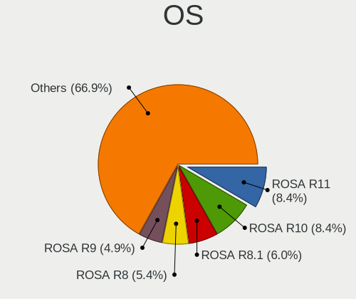
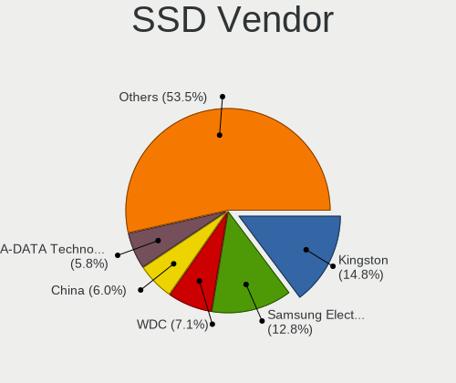
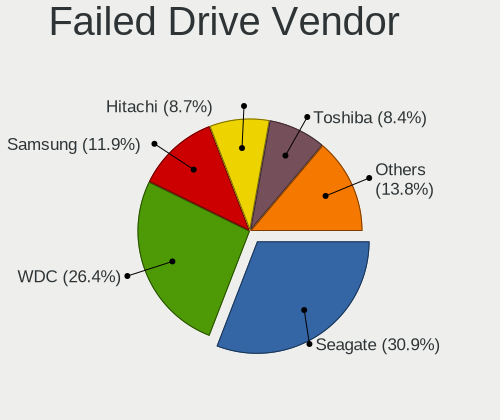
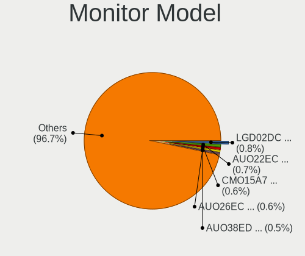
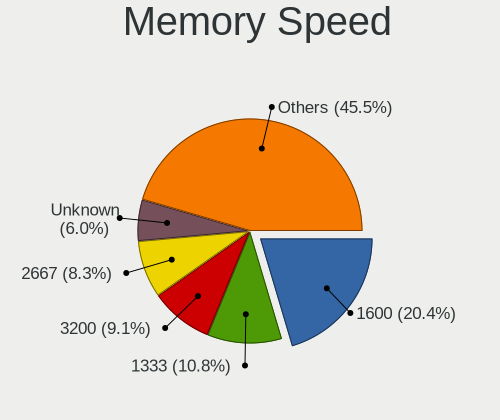
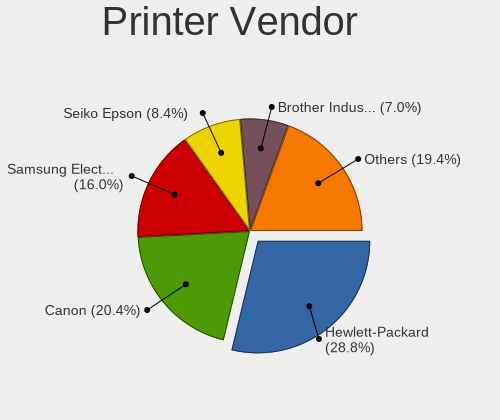
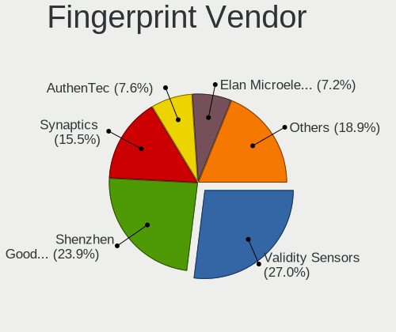
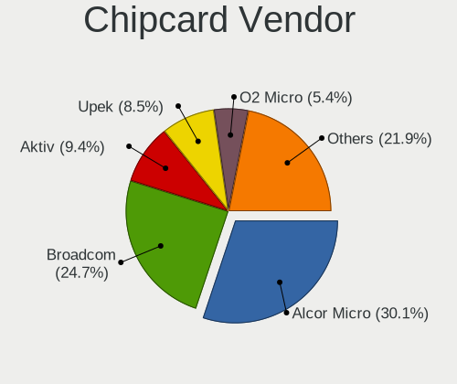

Linux in Russia - Tested Hardware & Statistics
----------------------------------------------

A project to collect tested hardware configurations for Linux in Russia.

Anyone can contribute to this report by the [hw-probe](https://github.com/linuxhw/hw-probe) tool:

    sudo -E hw-probe -all -upload

Please contribute! Especially if your hardware is rare.

This is a report for all computer types. See also reports for [desktops](/Location/Russia/Desktop/README.md) and [notebooks](/Location/Russia/Notebook/README.md).

Contents
--------

* [ Test Cases ](#test-cases)

* [ System ](#system)
  - [ OS                       ](#os)
  - [ OS Family                ](#os-family)
  - [ Kernel                   ](#kernel)
  - [ Kernel Family            ](#kernel-family)
  - [ Kernel Major Ver.        ](#kernel-major-ver)
  - [ Arch                     ](#arch)
  - [ DE                       ](#de)
  - [ Display Server           ](#display-server)
  - [ Display Manager          ](#display-manager)
  - [ OS Lang                  ](#os-lang)
  - [ Boot Mode                ](#boot-mode)
  - [ Filesystem               ](#filesystem)
  - [ Part. scheme             ](#part-scheme)
  - [ Dual Boot with Linux/BSD ](#dual-boot-with-linuxbsd)
  - [ Dual Boot (Win)          ](#dual-boot-win)

* [ Board ](#board)
  - [ Vendor                   ](#vendor)
  - [ Model                    ](#model)
  - [ Model Family             ](#model-family)
  - [ MFG Year                 ](#mfg-year)
  - [ Form Factor              ](#form-factor)
  - [ Secure Boot              ](#secure-boot)
  - [ Coreboot                 ](#coreboot)
  - [ RAM Size                 ](#ram-size)
  - [ RAM Used                 ](#ram-used)
  - [ Total Drives             ](#total-drives)
  - [ Has CD-ROM               ](#has-cd-rom)
  - [ Has Ethernet             ](#has-ethernet)
  - [ Has WiFi                 ](#has-wifi)
  - [ Has Bluetooth            ](#has-bluetooth)

* [ Location ](#location)
  - [ Country                  ](#country)
  - [ City                     ](#city)

* [ Drives ](#drives)
  - [ Drive Vendor             ](#drive-vendor)
  - [ Drive Model              ](#drive-model)
  - [ HDD Vendor               ](#hdd-vendor)
  - [ SSD Vendor               ](#ssd-vendor)
  - [ Drive Kind               ](#drive-kind)
  - [ Drive Connector          ](#drive-connector)
  - [ Drive Size               ](#drive-size)
  - [ Space Total              ](#space-total)
  - [ Space Used               ](#space-used)
  - [ Malfunc. Drives          ](#malfunc-drives)
  - [ Malfunc. Drive Vendor    ](#malfunc-drive-vendor)
  - [ Malfunc. HDD Vendor      ](#malfunc-hdd-vendor)
  - [ Malfunc. Drive Kind      ](#malfunc-drive-kind)
  - [ Failed Drives            ](#failed-drives)
  - [ Failed Drive Vendor      ](#failed-drive-vendor)
  - [ Drive Status             ](#drive-status)

* [ Storage controller ](#storage-controller)
  - [ Storage Vendor           ](#storage-vendor)
  - [ Storage Model            ](#storage-model)
  - [ Storage Kind             ](#storage-kind)

* [ Processor ](#processor)
  - [ CPU Vendor               ](#cpu-vendor)
  - [ CPU Model                ](#cpu-model)
  - [ CPU Model Family         ](#cpu-model-family)
  - [ CPU Cores                ](#cpu-cores)
  - [ CPU Sockets              ](#cpu-sockets)
  - [ CPU Threads              ](#cpu-threads)
  - [ CPU Op-Modes             ](#cpu-op-modes)
  - [ CPU Microcode            ](#cpu-microcode)
  - [ CPU Microarch            ](#cpu-microarch)

* [ Graphics ](#graphics)
  - [ GPU Vendor               ](#gpu-vendor)
  - [ GPU Model                ](#gpu-model)
  - [ GPU Combo                ](#gpu-combo)
  - [ GPU Driver               ](#gpu-driver)
  - [ GPU Memory               ](#gpu-memory)

* [ Monitor ](#monitor)
  - [ Monitor Vendor           ](#monitor-vendor)
  - [ Monitor Model            ](#monitor-model)
  - [ Monitor Resolution       ](#monitor-resolution)
  - [ Monitor Diagonal         ](#monitor-diagonal)
  - [ Monitor Width            ](#monitor-width)
  - [ Aspect Ratio             ](#aspect-ratio)
  - [ Monitor Area             ](#monitor-area)
  - [ Pixel Density            ](#pixel-density)
  - [ Multiple Monitors        ](#multiple-monitors)

* [ Network ](#network)
  - [ Net Controller Vendor    ](#net-controller-vendor)
  - [ Net Controller Model     ](#net-controller-model)
  - [ Wireless Vendor          ](#wireless-vendor)
  - [ Wireless Model           ](#wireless-model)
  - [ Ethernet Vendor          ](#ethernet-vendor)
  - [ Ethernet Model           ](#ethernet-model)
  - [ Net Controller Kind      ](#net-controller-kind)
  - [ Used Controller          ](#used-controller)
  - [ NICs                     ](#nics)
  - [ IPv6                     ](#ipv6)

* [ Bluetooth ](#bluetooth)
  - [ Bluetooth Vendor         ](#bluetooth-vendor)
  - [ Bluetooth Model          ](#bluetooth-model)

* [ Sound ](#sound)
  - [ Sound Vendor             ](#sound-vendor)
  - [ Sound Model              ](#sound-model)

* [ Memory ](#memory)
  - [ Memory Vendor            ](#memory-vendor)
  - [ Memory Model             ](#memory-model)
  - [ Memory Kind              ](#memory-kind)
  - [ Memory Form Factor       ](#memory-form-factor)
  - [ Memory Size              ](#memory-size)
  - [ Memory Speed             ](#memory-speed)

* [ Printers & scanners ](#printers--scanners)
  - [ Printer Vendor           ](#printer-vendor)
  - [ Printer Model            ](#printer-model)
  - [ Scanner Vendor           ](#scanner-vendor)
  - [ Scanner Model            ](#scanner-model)

* [ Camera ](#camera)
  - [ Camera Vendor            ](#camera-vendor)
  - [ Camera Model             ](#camera-model)

* [ Security ](#security)
  - [ Fingerprint Vendor       ](#fingerprint-vendor)
  - [ Fingerprint Model        ](#fingerprint-model)
  - [ Chipcard Vendor          ](#chipcard-vendor)
  - [ Chipcard Model           ](#chipcard-model)

* [ Unsupported ](#unsupported)
  - [ Unsupported Devices      ](#unsupported-devices)
  - [ Unsupported Device Types ](#unsupported-device-types)

Test Cases
----------

Total: 34548

| Vendor        | Model                       | Form-Factor | Probe                                                      | Date         |
|---------------|-----------------------------|-------------|------------------------------------------------------------|--------------|
| Acer          | Aspire TC-391               | Desktop     | [ec090fb244](https://linux-hardware.org/?probe=ec090fb244) | May 07, 2022 |
| Notebook      | NLx0MU                      | Notebook    | [addef0004e](https://linux-hardware.org/?probe=addef0004e) | May 06, 2022 |
| Lenovo        | 3000 G410                   | Notebook    | [1865fb9b1c](https://linux-hardware.org/?probe=1865fb9b1c) | May 06, 2022 |
| HUAWEI        | BOHK-WAX9X                  | Notebook    | [ec38b16f17](https://linux-hardware.org/?probe=ec38b16f17) | May 06, 2022 |
| Acer          | Extensa 2519                | Notebook    | [86f643f1bb](https://linux-hardware.org/?probe=86f643f1bb) | May 06, 2022 |
| Notebook      | NLx0MU                      | Notebook    | [eb70f159f4](https://linux-hardware.org/?probe=eb70f159f4) | May 06, 2022 |
| Lenovo        | MAHOBAY NO DPK              | Desktop     | [d58aad0813](https://linux-hardware.org/?probe=d58aad0813) | May 06, 2022 |
| ASUSTek       | Strix GL504GM_GL504GM       | Notebook    | [cf1b0002d6](https://linux-hardware.org/?probe=cf1b0002d6) | May 06, 2022 |
| Google        | Peppy                       | Notebook    | [03dc670128](https://linux-hardware.org/?probe=03dc670128) | May 06, 2022 |
| MSI           | GF63 Thin 10SCSR            | Notebook    | [ad8ee15b6d](https://linux-hardware.org/?probe=ad8ee15b6d) | May 06, 2022 |
| ASUSTek       | VivoBook S15 X530UF         | Notebook    | [3d6fe0b407](https://linux-hardware.org/?probe=3d6fe0b407) | May 06, 2022 |
| Acer          | Aspire C27-1655             | All in one  | [96e5d68181](https://linux-hardware.org/?probe=96e5d68181) | May 06, 2022 |
| KLLISRE       | X79 V2.72S                  | Desktop     | [4f3f76f020](https://linux-hardware.org/?probe=4f3f76f020) | May 06, 2022 |
| KLLISRE       | X79 V2.72S                  | Desktop     | [73d339904d](https://linux-hardware.org/?probe=73d339904d) | May 06, 2022 |
| Huanan        | X99-BD4 V1.1, NALEX         | Desktop     | [e69b3ef962](https://linux-hardware.org/?probe=e69b3ef962) | May 06, 2022 |
| ASUSTek       | X550LC                      | Notebook    | [169076b3fa](https://linux-hardware.org/?probe=169076b3fa) | May 06, 2022 |
| Lenovo        | B50-70 20384                | Notebook    | [a395b8eda0](https://linux-hardware.org/?probe=a395b8eda0) | May 06, 2022 |
| Acer          | Aspire A715-75G             | Notebook    | [d0e53387f7](https://linux-hardware.org/?probe=d0e53387f7) | May 05, 2022 |
| ASRock        | H61M-GE                     | Desktop     | [fefe67c0d4](https://linux-hardware.org/?probe=fefe67c0d4) | May 05, 2022 |
| Gigabyte      | GA-M55PLUS-S3G              | Desktop     | [ff948aad6c](https://linux-hardware.org/?probe=ff948aad6c) | May 05, 2022 |
| ICL           | H310SB-TM                   | All in one  | [8aca897292](https://linux-hardware.org/?probe=8aca897292) | May 05, 2022 |
| Lenovo        | IdeaPad L340-17IRH Gamin... | Notebook    | [24e9a90d68](https://linux-hardware.org/?probe=24e9a90d68) | May 05, 2022 |
| ASUSTek       | X551MA                      | Notebook    | [4a12d6b5d9](https://linux-hardware.org/?probe=4a12d6b5d9) | May 05, 2022 |
| ICL           | H310SB-TM                   | All in one  | [2ccde800a3](https://linux-hardware.org/?probe=2ccde800a3) | May 05, 2022 |
| Gigabyte      | B450 I AORUS PRO WIFI-CF    | Desktop     | [8f15e66f2d](https://linux-hardware.org/?probe=8f15e66f2d) | May 05, 2022 |
| Huanan        | X99-F8                      | Desktop     | [f9699aaa3e](https://linux-hardware.org/?probe=f9699aaa3e) | May 05, 2022 |
| MSI           | H410I PRO WIFI              | Desktop     | [bc1d89fabc](https://linux-hardware.org/?probe=bc1d89fabc) | May 05, 2022 |
| Acer          | Swift SF314-57              | Notebook    | [e533455f48](https://linux-hardware.org/?probe=e533455f48) | May 05, 2022 |
| Lenovo        | IdeaPad 100-15IBY 80MJ      | Notebook    | [0bbc6c64c2](https://linux-hardware.org/?probe=0bbc6c64c2) | May 05, 2022 |
| HP            | Pavilion Laptop 14-ce1xx... | Notebook    | [5c730dc365](https://linux-hardware.org/?probe=5c730dc365) | May 05, 2022 |
| MSI           | A520M-A PRO                 | Desktop     | [ab6c74c421](https://linux-hardware.org/?probe=ab6c74c421) | May 05, 2022 |
| ASUSTek       | 1005P                       | Notebook    | [ef0e05c7aa](https://linux-hardware.org/?probe=ef0e05c7aa) | May 05, 2022 |
| HP            | Pavilion Laptop 14-ce1xx... | Notebook    | [cc78e4f439](https://linux-hardware.org/?probe=cc78e4f439) | May 05, 2022 |
| ASUSTek       | X550LC                      | Notebook    | [61c02ee0e9](https://linux-hardware.org/?probe=61c02ee0e9) | May 04, 2022 |
| MSI           | 970A-G43                    | Desktop     | [8b6588eada](https://linux-hardware.org/?probe=8b6588eada) | May 04, 2022 |
| ASUSTek       | X550LC                      | Notebook    | [65bac27a1c](https://linux-hardware.org/?probe=65bac27a1c) | May 04, 2022 |
| MSI           | B360M PRO-VDH               | Desktop     | [23b80ec93e](https://linux-hardware.org/?probe=23b80ec93e) | May 04, 2022 |
| Pegatron      | IPPPV-D3G                   | Desktop     | [bf56539e57](https://linux-hardware.org/?probe=bf56539e57) | May 04, 2022 |
| HP            | ProBook 430 G1              | Notebook    | [280a764142](https://linux-hardware.org/?probe=280a764142) | May 04, 2022 |
| Panasonic     | CF-19THRAXF9                | Notebook    | [3e2d64f517](https://linux-hardware.org/?probe=3e2d64f517) | May 04, 2022 |
| Digma         | CITI 10 C402T CS1044EW      | Tablet      | [eefe92e281](https://linux-hardware.org/?probe=eefe92e281) | May 04, 2022 |
| ASUSTek       | P8H67-M LE                  | Desktop     | [302e27b974](https://linux-hardware.org/?probe=302e27b974) | May 04, 2022 |
| ASUSTek       | P8H67-M LE                  | Desktop     | [a9cf3bc268](https://linux-hardware.org/?probe=a9cf3bc268) | May 04, 2022 |
| Intel         | SKYBAY                      | Desktop     | [4891bdbd5c](https://linux-hardware.org/?probe=4891bdbd5c) | May 04, 2022 |
| Gigabyte      | G41MT-S2P                   | Desktop     | [c3ae8f35f9](https://linux-hardware.org/?probe=c3ae8f35f9) | May 04, 2022 |
| HP            | Laptop 17-ca0xxx            | Notebook    | [899a0e8999](https://linux-hardware.org/?probe=899a0e8999) | May 04, 2022 |
| Gigabyte      | P67A-D3-B3                  | Desktop     | [506ffac23c](https://linux-hardware.org/?probe=506ffac23c) | May 04, 2022 |
| ICL           | H310SB-TM                   | All in one  | [5e24e4a45d](https://linux-hardware.org/?probe=5e24e4a45d) | May 04, 2022 |
| Lenovo        | 3130 NOK                    | Mini pc     | [6e3858143b](https://linux-hardware.org/?probe=6e3858143b) | May 04, 2022 |
| Gigabyte      | H110M-DS2-CF                | Desktop     | [374070d210](https://linux-hardware.org/?probe=374070d210) | May 04, 2022 |
| Lenovo        | 3130 NOK                    | Mini pc     | [d1fb23854f](https://linux-hardware.org/?probe=d1fb23854f) | May 04, 2022 |
| ASUSTek       | X75A1                       | Notebook    | [78e4325ae6](https://linux-hardware.org/?probe=78e4325ae6) | May 04, 2022 |
| Gigabyte      | B550M AORUS PRO             | Desktop     | [dd95306834](https://linux-hardware.org/?probe=dd95306834) | May 04, 2022 |
| ASUSTek       | H81M-K                      | Desktop     | [c25a0f8526](https://linux-hardware.org/?probe=c25a0f8526) | May 04, 2022 |
| ASUSTek       | P8P67                       | Desktop     | [653adf4036](https://linux-hardware.org/?probe=653adf4036) | May 04, 2022 |
| Acer          | Aspire E1-532               | Notebook    | [c89b45b9ad](https://linux-hardware.org/?probe=c89b45b9ad) | May 04, 2022 |
| Lenovo        | ThinkCentre M55 8795B1G     | Desktop     | [295fe2b588](https://linux-hardware.org/?probe=295fe2b588) | May 04, 2022 |
| Lenovo        | ThinkCentre M55 8795B1G     | Desktop     | [b88ff00133](https://linux-hardware.org/?probe=b88ff00133) | May 04, 2022 |
| Unknown       | RS690-SB600                 | Desktop     | [a5a63d87df](https://linux-hardware.org/?probe=a5a63d87df) | May 04, 2022 |
| MSI           | B450M MORTAR MAX            | Desktop     | [5e1f408239](https://linux-hardware.org/?probe=5e1f408239) | May 04, 2022 |
| ASUSTek       | M5A97 EVO R2.0              | Desktop     | [256b7b7658](https://linux-hardware.org/?probe=256b7b7658) | May 03, 2022 |
| Lenovo        | ThinkPad T480 20L5000ART    | Notebook    | [f4cd0ce06c](https://linux-hardware.org/?probe=f4cd0ce06c) | May 03, 2022 |
| Lenovo        | ThinkPad T480 20L5000ART    | Notebook    | [4360d63d4a](https://linux-hardware.org/?probe=4360d63d4a) | May 03, 2022 |
| Acer          | Aspire V5-552G              | Notebook    | [caa6467c0e](https://linux-hardware.org/?probe=caa6467c0e) | May 03, 2022 |
| Acer          | Aspire V5-552G              | Notebook    | [c3255ca484](https://linux-hardware.org/?probe=c3255ca484) | May 03, 2022 |
| Unknown       | RS690-SB600                 | Desktop     | [cdda671470](https://linux-hardware.org/?probe=cdda671470) | May 03, 2022 |
| Irbis         | TW39                        | Notebook    | [38844a7f5e](https://linux-hardware.org/?probe=38844a7f5e) | May 03, 2022 |
| Lenovo        | G500 20236                  | Notebook    | [ee0d654e52](https://linux-hardware.org/?probe=ee0d654e52) | May 03, 2022 |
| Gigabyte      | X570 I AORUS PRO WIFI       | Desktop     | [9fa64d179d](https://linux-hardware.org/?probe=9fa64d179d) | May 03, 2022 |
| Gigabyte      | X570 I AORUS PRO WIFI       | Desktop     | [a134998640](https://linux-hardware.org/?probe=a134998640) | May 03, 2022 |
| ASRock        | B450 Gaming K4              | Desktop     | [2010f5f8cc](https://linux-hardware.org/?probe=2010f5f8cc) | May 03, 2022 |
| Gigabyte      | B550M AORUS PRO             | Desktop     | [6649f5164e](https://linux-hardware.org/?probe=6649f5164e) | May 03, 2022 |
| Unknown       | Unknown                     | Desktop     | [755bcaa97c](https://linux-hardware.org/?probe=755bcaa97c) | May 03, 2022 |
| ABIT          | F-I90HD                     | Desktop     | [a76a1e15a0](https://linux-hardware.org/?probe=a76a1e15a0) | May 03, 2022 |
| Gigabyte      | H110M-S2V-CF                | Desktop     | [73358636b6](https://linux-hardware.org/?probe=73358636b6) | May 03, 2022 |
| MSI           | Katana GF66 11UE            | Notebook    | [ca68b014a7](https://linux-hardware.org/?probe=ca68b014a7) | May 03, 2022 |
| MSI           | B550-A PRO                  | Desktop     | [6b961e699a](https://linux-hardware.org/?probe=6b961e699a) | May 03, 2022 |
| Acer          | Aspire A517-51G             | Notebook    | [1dc71986aa](https://linux-hardware.org/?probe=1dc71986aa) | May 03, 2022 |
| Acer          | Aspire A517-51G             | Notebook    | [d0ad1ff2fe](https://linux-hardware.org/?probe=d0ad1ff2fe) | May 03, 2022 |
| Lenovo        | Yoga C930-13IKB 81C4        | Convertible | [6a9e757624](https://linux-hardware.org/?probe=6a9e757624) | May 02, 2022 |
| MSI           | Z87-G43                     | Desktop     | [d5612db7ca](https://linux-hardware.org/?probe=d5612db7ca) | May 02, 2022 |
| ASUSTek       | B150-PRO D3                 | Desktop     | [1620040802](https://linux-hardware.org/?probe=1620040802) | May 02, 2022 |
| Gigabyte      | 970A-DS3P                   | Desktop     | [68a966265b](https://linux-hardware.org/?probe=68a966265b) | May 02, 2022 |
| ASUSTek       | VivoBook_ASUSLaptop X512... | Notebook    | [58ff4a1984](https://linux-hardware.org/?probe=58ff4a1984) | May 02, 2022 |
| ASUSTek       | P8H67-M PRO                 | Desktop     | [d874b5668c](https://linux-hardware.org/?probe=d874b5668c) | May 02, 2022 |
| ASUSTek       | X551CAP                     | Notebook    | [c4f8ae2abf](https://linux-hardware.org/?probe=c4f8ae2abf) | May 02, 2022 |
| MSI           | NF520T-C35                  | Desktop     | [626f45376a](https://linux-hardware.org/?probe=626f45376a) | May 02, 2022 |
| HUAWEI        | CREM-WXX9                   | Notebook    | [4e6ed2eaa3](https://linux-hardware.org/?probe=4e6ed2eaa3) | May 02, 2022 |
| ASUSTek       | TUF Gaming FX504GE_FX80G... | Notebook    | [ab4b021f1b](https://linux-hardware.org/?probe=ab4b021f1b) | May 02, 2022 |
| Samsung       | 300E4C/300E5C/300E7C        | Notebook    | [d9878767eb](https://linux-hardware.org/?probe=d9878767eb) | May 02, 2022 |
| Dell          | Vostro A860                 | Notebook    | [c314c4b269](https://linux-hardware.org/?probe=c314c4b269) | May 02, 2022 |
| Huanan        | X79 INTEL (INTEL Xeon E5... | Desktop     | [f776c43073](https://linux-hardware.org/?probe=f776c43073) | May 02, 2022 |
| Gigabyte      | GA-78LMT-S2P                | Desktop     | [e0983f2b8c](https://linux-hardware.org/?probe=e0983f2b8c) | May 02, 2022 |
| ASRock        | B450M-HDV                   | Desktop     | [1e0e1acbd3](https://linux-hardware.org/?probe=1e0e1acbd3) | May 02, 2022 |
| Gigabyte      | H77N-WIFI                   | Desktop     | [fa46d0866b](https://linux-hardware.org/?probe=fa46d0866b) | May 02, 2022 |
| Acer          | Aspire E5-573G              | Notebook    | [ccabd73c80](https://linux-hardware.org/?probe=ccabd73c80) | May 02, 2022 |
| Lenovo        | B71-80 80RJ                 | Notebook    | [e6a2ee3ec5](https://linux-hardware.org/?probe=e6a2ee3ec5) | May 02, 2022 |
| Gigabyte      | B560M D3H                   | Desktop     | [4a93a15de8](https://linux-hardware.org/?probe=4a93a15de8) | May 02, 2022 |
| MSI           | Z390-A PRO                  | Desktop     | [f77de23642](https://linux-hardware.org/?probe=f77de23642) | May 02, 2022 |
| Lenovo        | ThinkPad T480 20L50000RT    | Notebook    | [b636694d0c](https://linux-hardware.org/?probe=b636694d0c) | May 02, 2022 |
| Lenovo        | ThinkPad T480 20L50000RT    | Notebook    | [142fb350da](https://linux-hardware.org/?probe=142fb350da) | May 02, 2022 |
| Gigabyte      | B550M AORUS PRO-P           | Desktop     | [d13bc7aee3](https://linux-hardware.org/?probe=d13bc7aee3) | May 02, 2022 |
| Gigabyte      | A320M-S2H V2-CF             | Desktop     | [c19f2858f0](https://linux-hardware.org/?probe=c19f2858f0) | May 01, 2022 |
| MSI           | Z390-A PRO                  | Desktop     | [a5bc6c7df9](https://linux-hardware.org/?probe=a5bc6c7df9) | May 01, 2022 |
| ASUSTek       | K53SM                       | Notebook    | [69ea783c88](https://linux-hardware.org/?probe=69ea783c88) | May 01, 2022 |
| Lenovo        | IdeaPad 5 14ARE05 81YM      | Notebook    | [59e65b422b](https://linux-hardware.org/?probe=59e65b422b) | May 01, 2022 |
| ASUSTek       | SABERTOOTH 990FX R2.0       | Desktop     | [8532d4b88f](https://linux-hardware.org/?probe=8532d4b88f) | May 01, 2022 |
| ASRock        | Z270 Gaming K4              | Desktop     | [c497e3c5a9](https://linux-hardware.org/?probe=c497e3c5a9) | May 01, 2022 |
| Intel         | Unknown                     | Notebook    | [8353c6d487](https://linux-hardware.org/?probe=8353c6d487) | May 01, 2022 |
| ASUSTek       | M5A78L-M LE/USB3            | Desktop     | [57d77dbfdd](https://linux-hardware.org/?probe=57d77dbfdd) | May 01, 2022 |
| ASUSTek       | TUF Gaming FX504GE_FX80G... | Notebook    | [67404fab24](https://linux-hardware.org/?probe=67404fab24) | May 01, 2022 |
| Gigabyte      | F2A68HM-S1                  | Desktop     | [8112b0f67d](https://linux-hardware.org/?probe=8112b0f67d) | May 01, 2022 |
| ECS           | H61H2-M13                   | Desktop     | [c7ac6032f5](https://linux-hardware.org/?probe=c7ac6032f5) | May 01, 2022 |
| Acer          | Aspire TC-705               | Desktop     | [0e4b8cfff4](https://linux-hardware.org/?probe=0e4b8cfff4) | May 01, 2022 |
| Supermicro    | X11SSE-F                    | Mini pc     | [01c5f4fe66](https://linux-hardware.org/?probe=01c5f4fe66) | May 01, 2022 |
| HP            | Pavilion Gaming Laptop 1... | Notebook    | [8b3b1b4ced](https://linux-hardware.org/?probe=8b3b1b4ced) | May 01, 2022 |
| Lenovo        | H420                        | Desktop     | [2f22f32e19](https://linux-hardware.org/?probe=2f22f32e19) | May 01, 2022 |
| HP            | Pavilion Gaming Laptop 1... | Notebook    | [467c181d49](https://linux-hardware.org/?probe=467c181d49) | May 01, 2022 |
| ASUSTek       | X550LC                      | Notebook    | [d1bab6e2c7](https://linux-hardware.org/?probe=d1bab6e2c7) | May 01, 2022 |
| MSI           | 760GM-P23                   | Desktop     | [95d109769d](https://linux-hardware.org/?probe=95d109769d) | May 01, 2022 |
| ASUSTek       | P8H61-M LX3 R2.0            | Desktop     | [8538f5cbeb](https://linux-hardware.org/?probe=8538f5cbeb) | May 01, 2022 |
| Dell          | Vostro 3400                 | Notebook    | [da9df39f8c](https://linux-hardware.org/?probe=da9df39f8c) | Apr 30, 2022 |
| Dell          | Vostro 3400                 | Notebook    | [de3670cdd7](https://linux-hardware.org/?probe=de3670cdd7) | Apr 30, 2022 |
| Dell          | Vostro 3400                 | Notebook    | [29400ed868](https://linux-hardware.org/?probe=29400ed868) | Apr 30, 2022 |
| Dell          | Vostro 3400                 | Notebook    | [72ea7f5155](https://linux-hardware.org/?probe=72ea7f5155) | Apr 30, 2022 |
| Gigabyte      | F2A68HM-S1                  | Desktop     | [23a77acbe8](https://linux-hardware.org/?probe=23a77acbe8) | Apr 30, 2022 |
| Gigabyte      | H61M-S2PV                   | Desktop     | [6b213d6f7e](https://linux-hardware.org/?probe=6b213d6f7e) | Apr 30, 2022 |
| HP            | ProBook 440 G8 Notebook ... | Notebook    | [a4adaba544](https://linux-hardware.org/?probe=a4adaba544) | Apr 30, 2022 |
| ASRock        | B560 Pro4                   | Desktop     | [a788b08450](https://linux-hardware.org/?probe=a788b08450) | Apr 30, 2022 |
| Dell          | Vostro 5581                 | Notebook    | [cdcb310766](https://linux-hardware.org/?probe=cdcb310766) | Apr 30, 2022 |
| Lenovo        | Z50-70 20354                | Notebook    | [f253fe8221](https://linux-hardware.org/?probe=f253fe8221) | Apr 30, 2022 |
| Dell          | G7 7700                     | Notebook    | [462862ed56](https://linux-hardware.org/?probe=462862ed56) | Apr 30, 2022 |
| ASRock        | 880GM-LE FX                 | Desktop     | [f695420d7e](https://linux-hardware.org/?probe=f695420d7e) | Apr 30, 2022 |
| SLIMBOOK      | PROX15-AMD                  | Notebook    | [c934f2e590](https://linux-hardware.org/?probe=c934f2e590) | Apr 30, 2022 |
| MSI           | GP65 Leopard 10SFK          | Notebook    | [4523d433d4](https://linux-hardware.org/?probe=4523d433d4) | Apr 30, 2022 |
| MSI           | GP65 Leopard 10SFK          | Notebook    | [a30f4b3e9f](https://linux-hardware.org/?probe=a30f4b3e9f) | Apr 30, 2022 |
| ASUSTek       | PRIME Z490-P                | Desktop     | [b6658c2ada](https://linux-hardware.org/?probe=b6658c2ada) | Apr 30, 2022 |
| ASUSTek       | M5A78L LE                   | Desktop     | [9328531b5a](https://linux-hardware.org/?probe=9328531b5a) | Apr 30, 2022 |
| Acer          | Aspire A517-51G             | Notebook    | [a7e637b1af](https://linux-hardware.org/?probe=a7e637b1af) | Apr 30, 2022 |
| ASUSTek       | P5QL                        | Desktop     | [121da21f08](https://linux-hardware.org/?probe=121da21f08) | Apr 30, 2022 |
| MSI           | PS63 Modern 8M              | Notebook    | [06f3f7a100](https://linux-hardware.org/?probe=06f3f7a100) | Apr 30, 2022 |
| ASUSTek       | PRIME Z490-P                | Desktop     | [c6a75d1040](https://linux-hardware.org/?probe=c6a75d1040) | Apr 30, 2022 |
| Acer          | Aspire A315-53              | Notebook    | [24faa6d3b2](https://linux-hardware.org/?probe=24faa6d3b2) | Apr 30, 2022 |
| ASRock        | B75M-ITX                    | Desktop     | [dbc851e0d3](https://linux-hardware.org/?probe=dbc851e0d3) | Apr 30, 2022 |
| ASUSTek       | CROSSHAIR VI HERO           | Desktop     | [5220d21e84](https://linux-hardware.org/?probe=5220d21e84) | Apr 30, 2022 |
| Timi          | TM1701                      | Notebook    | [f81bb7efbe](https://linux-hardware.org/?probe=f81bb7efbe) | Apr 30, 2022 |
| ASUSTek       | H81M-K                      | Desktop     | [d5d92c2890](https://linux-hardware.org/?probe=d5d92c2890) | Apr 30, 2022 |
| HP            | ProBook 440 G7              | Notebook    | [6bba4f2274](https://linux-hardware.org/?probe=6bba4f2274) | Apr 30, 2022 |
| ASUSTek       | PRIME B450M-A               | Desktop     | [a53000596e](https://linux-hardware.org/?probe=a53000596e) | Apr 30, 2022 |
| ASUSTek       | X550LC                      | Notebook    | [be5992f617](https://linux-hardware.org/?probe=be5992f617) | Apr 30, 2022 |
| ASUSTek       | X553MA                      | Notebook    | [3d56136487](https://linux-hardware.org/?probe=3d56136487) | Apr 30, 2022 |
| Lenovo        | ThinkPad L15 Gen 1 20U4S... | Notebook    | [55e76f131d](https://linux-hardware.org/?probe=55e76f131d) | Apr 30, 2022 |
| Gigabyte      | H610I DDR4                  | Desktop     | [b9ee954651](https://linux-hardware.org/?probe=b9ee954651) | Apr 30, 2022 |
| Gigabyte      | H610I DDR4                  | Desktop     | [ead878ad96](https://linux-hardware.org/?probe=ead878ad96) | Apr 29, 2022 |
| Acer          | Aspire A315-42G             | Notebook    | [56fabb8cec](https://linux-hardware.org/?probe=56fabb8cec) | Apr 29, 2022 |
| Acer          | Aspire A715-71G             | Notebook    | [ec6c90818c](https://linux-hardware.org/?probe=ec6c90818c) | Apr 29, 2022 |
| HP            | Laptop 15-db1xxx            | Notebook    | [442670a18f](https://linux-hardware.org/?probe=442670a18f) | Apr 29, 2022 |
| ASUSTek       | K52N                        | Notebook    | [29f3f98ad0](https://linux-hardware.org/?probe=29f3f98ad0) | Apr 29, 2022 |
| ASUSTek       | X553MA                      | Notebook    | [2c284d0f8c](https://linux-hardware.org/?probe=2c284d0f8c) | Apr 29, 2022 |
| HP            | Pavilion Gaming Laptop 1... | Notebook    | [f842336794](https://linux-hardware.org/?probe=f842336794) | Apr 29, 2022 |
| MSI           | H110M PRO-VD                | Desktop     | [e750916955](https://linux-hardware.org/?probe=e750916955) | Apr 29, 2022 |
| ASUSTek       | M4N68T                      | Desktop     | [8113a96dff](https://linux-hardware.org/?probe=8113a96dff) | Apr 29, 2022 |
| HP            | ENVY dv7                    | Notebook    | [dbd8feaee0](https://linux-hardware.org/?probe=dbd8feaee0) | Apr 29, 2022 |
| Lenovo        | IdeaPad L340-15API 81LW     | Notebook    | [2614591cf9](https://linux-hardware.org/?probe=2614591cf9) | Apr 29, 2022 |
| MSI           | Katana GF76 11SC            | Notebook    | [15dcec28fc](https://linux-hardware.org/?probe=15dcec28fc) | Apr 29, 2022 |
| ASRock        | A300M-STX                   | Desktop     | [48af028244](https://linux-hardware.org/?probe=48af028244) | Apr 29, 2022 |
| ASUSTek       | TUF Gaming FX504GE_FX80G... | Notebook    | [d5828a8f9f](https://linux-hardware.org/?probe=d5828a8f9f) | Apr 29, 2022 |
| Dell          | Latitude 3420               | Notebook    | [d1239521b9](https://linux-hardware.org/?probe=d1239521b9) | Apr 29, 2022 |
| Acer          | Aspire ES1-311              | Notebook    | [aa4612575b](https://linux-hardware.org/?probe=aa4612575b) | Apr 29, 2022 |
| MSI           | GE66 Raider 11UH            | Notebook    | [9bdf866ebc](https://linux-hardware.org/?probe=9bdf866ebc) | Apr 29, 2022 |
| Toshiba       | Satellite P200              | Notebook    | [9b29aa0e0e](https://linux-hardware.org/?probe=9b29aa0e0e) | Apr 29, 2022 |
| Lite-On       | 08FCh E01                   | Desktop     | [876d70350c](https://linux-hardware.org/?probe=876d70350c) | Apr 29, 2022 |
| Gigabyte      | B550 AORUS PRO              | Desktop     | [9686556653](https://linux-hardware.org/?probe=9686556653) | Apr 29, 2022 |
| Gigabyte      | H55M-UD2H                   | Desktop     | [12e326fab8](https://linux-hardware.org/?probe=12e326fab8) | Apr 28, 2022 |
| ASUSTek       | CROSSHAIR VI HERO           | Desktop     | [c4fc81307d](https://linux-hardware.org/?probe=c4fc81307d) | Apr 28, 2022 |
| Acer          | Aspire A315-42G             | Notebook    | [03c0f64a6e](https://linux-hardware.org/?probe=03c0f64a6e) | Apr 28, 2022 |
| Gigabyte      | A320M-S2H V2-CF             | Desktop     | [02b4a9bd72](https://linux-hardware.org/?probe=02b4a9bd72) | Apr 28, 2022 |
| ASUSTek       | X550LC                      | Notebook    | [22369d04ff](https://linux-hardware.org/?probe=22369d04ff) | Apr 28, 2022 |
| Lenovo        | IdeaPad 330-15AST 81D6      | Notebook    | [f98b9b686e](https://linux-hardware.org/?probe=f98b9b686e) | Apr 28, 2022 |
| Acer          | Aspire E5-573G              | Notebook    | [aa3f9c5f30](https://linux-hardware.org/?probe=aa3f9c5f30) | Apr 28, 2022 |
| Lenovo        | IdeaPad 330-15AST 81D6      | Notebook    | [674c8c1bf3](https://linux-hardware.org/?probe=674c8c1bf3) | Apr 28, 2022 |
| ASUSTek       | P5KPL-AM                    | Desktop     | [7669e97557](https://linux-hardware.org/?probe=7669e97557) | Apr 28, 2022 |
| Lenovo        | NOK                         | Desktop     | [4ea735896c](https://linux-hardware.org/?probe=4ea735896c) | Apr 28, 2022 |
| ASUSTek       | M5A78L LE                   | Desktop     | [96739891ab](https://linux-hardware.org/?probe=96739891ab) | Apr 28, 2022 |
| Acer          | Veriton X2640G V:1.0        | Desktop     | [c75ef7f42d](https://linux-hardware.org/?probe=c75ef7f42d) | Apr 28, 2022 |
| Acer          | Veriton X2640G V:1.0        | Desktop     | [af1b36d1f6](https://linux-hardware.org/?probe=af1b36d1f6) | Apr 28, 2022 |
| Lenovo        | G570 20079                  | Notebook    | [9bf9254f54](https://linux-hardware.org/?probe=9bf9254f54) | Apr 28, 2022 |
| HP            | Laptop 15-db1xxx            | Notebook    | [7050d2a05f](https://linux-hardware.org/?probe=7050d2a05f) | Apr 28, 2022 |
| Gigabyte      | B450M DS3H V2               | Desktop     | [94a47b7e85](https://linux-hardware.org/?probe=94a47b7e85) | Apr 28, 2022 |
| Sony          | VPCEH3F1R                   | Notebook    | [2d78f4b2b5](https://linux-hardware.org/?probe=2d78f4b2b5) | Apr 28, 2022 |
| ECS           | A780LM-M2                   | Desktop     | [ae8fabafb3](https://linux-hardware.org/?probe=ae8fabafb3) | Apr 28, 2022 |
| ASUSTek       | ASUS TUF Gaming A17 FA70... | Notebook    | [ce4196dac6](https://linux-hardware.org/?probe=ce4196dac6) | Apr 28, 2022 |
| ASRock        | B550M Pro4                  | Desktop     | [1715307c13](https://linux-hardware.org/?probe=1715307c13) | Apr 28, 2022 |
| ASRock        | B550M Pro4                  | Desktop     | [31f358fdd0](https://linux-hardware.org/?probe=31f358fdd0) | Apr 28, 2022 |
| ECS           | GeForce7050M-M              | Desktop     | [7b99513a4a](https://linux-hardware.org/?probe=7b99513a4a) | Apr 27, 2022 |
| ECS           | GeForce7050M-M              | Desktop     | [d957db1716](https://linux-hardware.org/?probe=d957db1716) | Apr 27, 2022 |
| Dell          | Latitude 5310               | Notebook    | [1bfa3e6f27](https://linux-hardware.org/?probe=1bfa3e6f27) | Apr 27, 2022 |
| Lenovo        | G700 20251                  | Notebook    | [4dd8fa1d2f](https://linux-hardware.org/?probe=4dd8fa1d2f) | Apr 27, 2022 |
| ASUSTek       | X550LC                      | Notebook    | [c5f3191403](https://linux-hardware.org/?probe=c5f3191403) | Apr 27, 2022 |
| Acer          | Aspire 6930G                | Notebook    | [f0c8ad777d](https://linux-hardware.org/?probe=f0c8ad777d) | Apr 27, 2022 |
| Gigabyte      | B450 GAMING X               | Desktop     | [155297b5da](https://linux-hardware.org/?probe=155297b5da) | Apr 27, 2022 |
| ASUSTek       | PRIME H570-PLUS             | Desktop     | [217e24d827](https://linux-hardware.org/?probe=217e24d827) | Apr 27, 2022 |
| HP            | Laptop 15-da0xxx            | Notebook    | [8332dfca0b](https://linux-hardware.org/?probe=8332dfca0b) | Apr 27, 2022 |
| Lenovo        | SHARKBAY 31900059 STD       | All in one  | [910be59af9](https://linux-hardware.org/?probe=910be59af9) | Apr 27, 2022 |
| Acer          | Aspire 5625G                | Notebook    | [654e51fb7c](https://linux-hardware.org/?probe=654e51fb7c) | Apr 27, 2022 |
| Gigabyte      | F2A68HM-S1                  | Desktop     | [e1f76d9f38](https://linux-hardware.org/?probe=e1f76d9f38) | Apr 27, 2022 |
| HP            | 2000                        | Notebook    | [65891d90cc](https://linux-hardware.org/?probe=65891d90cc) | Apr 27, 2022 |
| ASUSTek       | K50IE                       | Notebook    | [5d8cdec08c](https://linux-hardware.org/?probe=5d8cdec08c) | Apr 27, 2022 |
| MSI           | B85M-P33                    | Desktop     | [b18d0beead](https://linux-hardware.org/?probe=b18d0beead) | Apr 27, 2022 |
| Lenovo        | G570 20079                  | Notebook    | [8bca69a0a8](https://linux-hardware.org/?probe=8bca69a0a8) | Apr 27, 2022 |
| Gigabyte      | H110M-S2H-CF                | Desktop     | [e612a2bab1](https://linux-hardware.org/?probe=e612a2bab1) | Apr 27, 2022 |
| HP            | ProBook 470 G0              | Notebook    | [d0c294728b](https://linux-hardware.org/?probe=d0c294728b) | Apr 27, 2022 |
| IBM           | 94Y7718 SIT                 | Server      | [074e80349e](https://linux-hardware.org/?probe=074e80349e) | Apr 27, 2022 |
| Lenovo        | NOK                         | Desktop     | [6d17068770](https://linux-hardware.org/?probe=6d17068770) | Apr 27, 2022 |
| Gigabyte      | H61M-S1                     | Desktop     | [32fd06793f](https://linux-hardware.org/?probe=32fd06793f) | Apr 27, 2022 |
| HP            | ZBook 17 G5                 | Notebook    | [6c1227313d](https://linux-hardware.org/?probe=6c1227313d) | Apr 27, 2022 |
| HP            | ZBook 17 G5                 | Notebook    | [4f49f3d6c2](https://linux-hardware.org/?probe=4f49f3d6c2) | Apr 27, 2022 |
| ASUSTek       | X505BA                      | Notebook    | [30972759d1](https://linux-hardware.org/?probe=30972759d1) | Apr 27, 2022 |
| Biostar       | H410MH S2                   | Desktop     | [2670b60f3c](https://linux-hardware.org/?probe=2670b60f3c) | Apr 27, 2022 |
| Biostar       | H410MH S2                   | Desktop     | [21763ed6a1](https://linux-hardware.org/?probe=21763ed6a1) | Apr 27, 2022 |
| ASUSTek       | PRIME H510M-K               | Desktop     | [31217e01e3](https://linux-hardware.org/?probe=31217e01e3) | Apr 27, 2022 |
| ASUSTek       | PRIME H510M-K               | Desktop     | [67c03df307](https://linux-hardware.org/?probe=67c03df307) | Apr 27, 2022 |
| MSI           | H510M-A PRO                 | Desktop     | [7630e097d9](https://linux-hardware.org/?probe=7630e097d9) | Apr 27, 2022 |
| ASRock        | B550M Pro4                  | Desktop     | [003eab04ae](https://linux-hardware.org/?probe=003eab04ae) | Apr 26, 2022 |
| Acer          | Aspire 5625G                | Notebook    | [6dfe24b002](https://linux-hardware.org/?probe=6dfe24b002) | Apr 26, 2022 |
| Acer          | Aspire V3-571               | Notebook    | [65d778f931](https://linux-hardware.org/?probe=65d778f931) | Apr 26, 2022 |
| Lenovo        | G700 20251                  | Notebook    | [fc283a78af](https://linux-hardware.org/?probe=fc283a78af) | Apr 26, 2022 |
| ASUSTek       | M5A78L-M LX3                | Desktop     | [9fc1163ba6](https://linux-hardware.org/?probe=9fc1163ba6) | Apr 26, 2022 |
| Lenovo        | B450 1S16800336100RT        | Notebook    | [ddaca02cbd](https://linux-hardware.org/?probe=ddaca02cbd) | Apr 26, 2022 |
| Lenovo        | G700 20251                  | Notebook    | [bbb54a4f60](https://linux-hardware.org/?probe=bbb54a4f60) | Apr 26, 2022 |
| Acer          | Aspire 7736                 | Notebook    | [a0b8522191](https://linux-hardware.org/?probe=a0b8522191) | Apr 26, 2022 |
| ASUSTek       | PRIME B450M-K               | Desktop     | [458eb421b9](https://linux-hardware.org/?probe=458eb421b9) | Apr 26, 2022 |
| ZoomSmart     | A8006                       | Tablet      | [988bb3eda7](https://linux-hardware.org/?probe=988bb3eda7) | Apr 26, 2022 |
| ASUSTek       | ZenBook UX434FQ_UX434FQ     | Notebook    | [9f8c80ed7d](https://linux-hardware.org/?probe=9f8c80ed7d) | Apr 26, 2022 |
| Apple         | Mac-FC02E91DDD3FA6A4 iMa... | All in one  | [26a7e61215](https://linux-hardware.org/?probe=26a7e61215) | Apr 26, 2022 |
| ZoomSmart     | A8006                       | Tablet      | [fcc5f522b3](https://linux-hardware.org/?probe=fcc5f522b3) | Apr 26, 2022 |
| HP            | Notebook                    | Notebook    | [975bc190a2](https://linux-hardware.org/?probe=975bc190a2) | Apr 26, 2022 |
| ASUSTek       | B85M-G                      | Desktop     | [a8934b94b8](https://linux-hardware.org/?probe=a8934b94b8) | Apr 26, 2022 |
| ASUSTek       | K50ID                       | Notebook    | [7d7776358b](https://linux-hardware.org/?probe=7d7776358b) | Apr 26, 2022 |
| Sony          | SVE1512H1RW                 | Notebook    | [d3007a4939](https://linux-hardware.org/?probe=d3007a4939) | Apr 26, 2022 |
| MSI           | H510M-A PRO                 | Desktop     | [6dcece8c55](https://linux-hardware.org/?probe=6dcece8c55) | Apr 26, 2022 |
| ASUSTek       | PRIME H510M-K               | Desktop     | [2b03d8c6f0](https://linux-hardware.org/?probe=2b03d8c6f0) | Apr 26, 2022 |
| Acer          | Aspire E5-575G              | Notebook    | [b48dc21646](https://linux-hardware.org/?probe=b48dc21646) | Apr 26, 2022 |
| ASUSTek       | ROG Strix G733QR_G733QR     | Notebook    | [e4c1fa069d](https://linux-hardware.org/?probe=e4c1fa069d) | Apr 26, 2022 |
| ASUSTek       | PRIME H510M-K               | Desktop     | [7e8c222029](https://linux-hardware.org/?probe=7e8c222029) | Apr 26, 2022 |
| Gigabyte      | B85M-D2V                    | Desktop     | [ca876d7b83](https://linux-hardware.org/?probe=ca876d7b83) | Apr 26, 2022 |
| ASRock        | B550M Pro4                  | Desktop     | [feea6c0d76](https://linux-hardware.org/?probe=feea6c0d76) | Apr 25, 2022 |
| Lenovo        | 3132 SDK0J40697 WIN 3305... | Desktop     | [c26bb7d11c](https://linux-hardware.org/?probe=c26bb7d11c) | Apr 25, 2022 |
| Gigabyte      | X570S AORUS MASTER          | Desktop     | [5ac12e226f](https://linux-hardware.org/?probe=5ac12e226f) | Apr 25, 2022 |
| Sony          | SVE1712V1RB                 | Notebook    | [e63891da73](https://linux-hardware.org/?probe=e63891da73) | Apr 25, 2022 |
| ASUSTek       | M5A78L-M LX3                | Desktop     | [5991a49238](https://linux-hardware.org/?probe=5991a49238) | Apr 25, 2022 |
| ASRock        | G31M-VS2                    | Desktop     | [912aa8341f](https://linux-hardware.org/?probe=912aa8341f) | Apr 25, 2022 |
| iRU           | LPGR.469559.001             | Notebook    | [3758808bc5](https://linux-hardware.org/?probe=3758808bc5) | Apr 25, 2022 |
| ASUSTek       | M2N-MX SE Plus              | Desktop     | [7c068a38f3](https://linux-hardware.org/?probe=7c068a38f3) | Apr 25, 2022 |
| ICL           | H310SB-TM                   | All in one  | [11db07be56](https://linux-hardware.org/?probe=11db07be56) | Apr 25, 2022 |
| ASUSTek       | UX303LN                     | Notebook    | [13a99f1912](https://linux-hardware.org/?probe=13a99f1912) | Apr 25, 2022 |
| ASUSTek       | H81M-C                      | Desktop     | [643eb9c031](https://linux-hardware.org/?probe=643eb9c031) | Apr 25, 2022 |
| HP            | EliteBook 840 G4            | Notebook    | [a1b9c91836](https://linux-hardware.org/?probe=a1b9c91836) | Apr 25, 2022 |
| ASUSTek       | P7P55 LX                    | Desktop     | [82c13f2b01](https://linux-hardware.org/?probe=82c13f2b01) | Apr 25, 2022 |
| HP            | EliteBook 845 G7 Noteboo... | Notebook    | [1b1bf8dddf](https://linux-hardware.org/?probe=1b1bf8dddf) | Apr 25, 2022 |
| Toshiba       | Satellite U300              | Notebook    | [1fa01f4156](https://linux-hardware.org/?probe=1fa01f4156) | Apr 25, 2022 |
| Acer          | Veriton X2640G V:1.0        | Desktop     | [f1e5d5715f](https://linux-hardware.org/?probe=f1e5d5715f) | Apr 25, 2022 |
| Acer          | Veriton X2640G V:1.0        | Desktop     | [a0e3085b4c](https://linux-hardware.org/?probe=a0e3085b4c) | Apr 25, 2022 |
| Acer          | Veriton X2640G V:1.0        | Desktop     | [9819b3fc78](https://linux-hardware.org/?probe=9819b3fc78) | Apr 25, 2022 |
| Acer          | Veriton X2640G V:1.0        | Desktop     | [d27d03b7e4](https://linux-hardware.org/?probe=d27d03b7e4) | Apr 25, 2022 |
| Acer          | Veriton X2640G V:1.0        | Desktop     | [a8784c861a](https://linux-hardware.org/?probe=a8784c861a) | Apr 25, 2022 |
| Acer          | Veriton X2640G V:1.0        | Desktop     | [b970feef75](https://linux-hardware.org/?probe=b970feef75) | Apr 25, 2022 |
| Acer          | Veriton X2640G V:1.0        | Desktop     | [6bfffcf96a](https://linux-hardware.org/?probe=6bfffcf96a) | Apr 25, 2022 |
| Dell          | G15 5510                    | Notebook    | [8cf81514fa](https://linux-hardware.org/?probe=8cf81514fa) | Apr 25, 2022 |
| Lenovo        | IdeaPad 100-15IBY 80MJ      | Notebook    | [bd286b124a](https://linux-hardware.org/?probe=bd286b124a) | Apr 25, 2022 |
| ASUSTek       | H81M-PLUS                   | Desktop     | [4479bed84f](https://linux-hardware.org/?probe=4479bed84f) | Apr 25, 2022 |
| ASUSTek       | H81M-PLUS                   | Desktop     | [4fd4202535](https://linux-hardware.org/?probe=4fd4202535) | Apr 25, 2022 |
| Gigabyte      | A320M-S2H V2-CF             | Desktop     | [4b41ff5fb9](https://linux-hardware.org/?probe=4b41ff5fb9) | Apr 24, 2022 |
| HP            | Pavilion dv6000             | Notebook    | [f41a09331b](https://linux-hardware.org/?probe=f41a09331b) | Apr 24, 2022 |
| ASUSTek       | PRIME H570-PLUS             | Desktop     | [deb39edb0a](https://linux-hardware.org/?probe=deb39edb0a) | Apr 24, 2022 |
| ASUSTek       | S400CA                      | Notebook    | [b9b3e314e5](https://linux-hardware.org/?probe=b9b3e314e5) | Apr 24, 2022 |
| Notebook      | W65_67SF                    | Notebook    | [37712c1d2b](https://linux-hardware.org/?probe=37712c1d2b) | Apr 24, 2022 |
| ASUSTek       | P8H61-M LE                  | Desktop     | [9d244bbdcc](https://linux-hardware.org/?probe=9d244bbdcc) | Apr 24, 2022 |
| Lenovo        | ThinkPad W520 4284BL9       | Notebook    | [a7dd5a566e](https://linux-hardware.org/?probe=a7dd5a566e) | Apr 24, 2022 |
| MSI           | G31TM-P35                   | Desktop     | [711f26a820](https://linux-hardware.org/?probe=711f26a820) | Apr 24, 2022 |
| ASUSTek       | VivoBook_ASUSLaptop M350... | Notebook    | [de4fb8782a](https://linux-hardware.org/?probe=de4fb8782a) | Apr 24, 2022 |
| HP            | Pavilion dv6000 (RE386EA... | Notebook    | [9d00048a2d](https://linux-hardware.org/?probe=9d00048a2d) | Apr 24, 2022 |
| ASUSTek       | VivoBook_ASUSLaptop M350... | Notebook    | [02a8ced4e4](https://linux-hardware.org/?probe=02a8ced4e4) | Apr 24, 2022 |
| ASUSTek       | UX32A                       | Notebook    | [0cbf3a6f80](https://linux-hardware.org/?probe=0cbf3a6f80) | Apr 24, 2022 |
| Toshiba       | Satellite L655              | Notebook    | [a4c9b28b0f](https://linux-hardware.org/?probe=a4c9b28b0f) | Apr 24, 2022 |
| Acer          | Aspire V3-571G              | Notebook    | [6dad6af75e](https://linux-hardware.org/?probe=6dad6af75e) | Apr 24, 2022 |
| MSI           | G31M3 V2                    | Desktop     | [4c1d75729a](https://linux-hardware.org/?probe=4c1d75729a) | Apr 24, 2022 |
| MSI           | G31TM-P35                   | Desktop     | [2c1b91769f](https://linux-hardware.org/?probe=2c1b91769f) | Apr 24, 2022 |
| HUAWEI        | MACHC-WAX9                  | Notebook    | [9cda67e701](https://linux-hardware.org/?probe=9cda67e701) | Apr 24, 2022 |
| ASRock        | B550 Taichi                 | Desktop     | [12060212f8](https://linux-hardware.org/?probe=12060212f8) | Apr 24, 2022 |
| Gigabyte      | X570S AORUS MASTER          | Desktop     | [fee9fe1263](https://linux-hardware.org/?probe=fee9fe1263) | Apr 24, 2022 |
| HP            | ProBook 430 G1              | Notebook    | [52259207bb](https://linux-hardware.org/?probe=52259207bb) | Apr 24, 2022 |
| ASUSTek       | SABERTOOTH 990FX            | Desktop     | [f82141025b](https://linux-hardware.org/?probe=f82141025b) | Apr 24, 2022 |
| ASRock        | B560 Pro4                   | Desktop     | [734fbc9db6](https://linux-hardware.org/?probe=734fbc9db6) | Apr 24, 2022 |
| Dell          | Latitude 7280               | Notebook    | [7ad22b030d](https://linux-hardware.org/?probe=7ad22b030d) | Apr 24, 2022 |
| Apple         | MacBookAir6,1               | Notebook    | [6c717bc636](https://linux-hardware.org/?probe=6c717bc636) | Apr 24, 2022 |
| MSI           | GF63 Thin 9SC               | Notebook    | [c3e874826b](https://linux-hardware.org/?probe=c3e874826b) | Apr 24, 2022 |
| Acer          | Aspire ES1-521              | Notebook    | [0d1857219f](https://linux-hardware.org/?probe=0d1857219f) | Apr 24, 2022 |
| Acer          | Aspire TC-390               | Desktop     | [69a7263b5a](https://linux-hardware.org/?probe=69a7263b5a) | Apr 24, 2022 |
| ASUSTek       | SABERTOOTH 990FX            | Desktop     | [6d624aee80](https://linux-hardware.org/?probe=6d624aee80) | Apr 24, 2022 |
| ASRock        | X300M-STX                   | Desktop     | [096a0bc434](https://linux-hardware.org/?probe=096a0bc434) | Apr 24, 2022 |
| ASRock        | X300M-STX                   | Desktop     | [3e5e1e7137](https://linux-hardware.org/?probe=3e5e1e7137) | Apr 24, 2022 |
| Gigabyte      | B560M H                     | Desktop     | [fa2c44bf71](https://linux-hardware.org/?probe=fa2c44bf71) | Apr 24, 2022 |
| Haier         | U1520SD                     | Notebook    | [a546af91bb](https://linux-hardware.org/?probe=a546af91bb) | Apr 24, 2022 |
| Acer          | AOD270                      | Notebook    | [50198f1c2f](https://linux-hardware.org/?probe=50198f1c2f) | Apr 24, 2022 |
| Haier         | S424                        | Notebook    | [9dcf76fcf7](https://linux-hardware.org/?probe=9dcf76fcf7) | Apr 24, 2022 |
| Dell          | XPS 15 9575                 | Convertible | [380fefab43](https://linux-hardware.org/?probe=380fefab43) | Apr 24, 2022 |
| ASUSTek       | M5A97 R2.0                  | Desktop     | [d68949ed95](https://linux-hardware.org/?probe=d68949ed95) | Apr 23, 2022 |
| HP            | ProBook 430 G5              | Notebook    | [9c45d7cb78](https://linux-hardware.org/?probe=9c45d7cb78) | Apr 23, 2022 |
| MSI           | Z390-A PRO                  | Desktop     | [ada0b8f67a](https://linux-hardware.org/?probe=ada0b8f67a) | Apr 23, 2022 |
| ASUSTek       | AM1I-A                      | Desktop     | [b041f2cde0](https://linux-hardware.org/?probe=b041f2cde0) | Apr 23, 2022 |
| Gigabyte      | A320M-S2H-CF                | Desktop     | [3d101a3380](https://linux-hardware.org/?probe=3d101a3380) | Apr 23, 2022 |
| Sony          | SVE1512H1RW                 | Notebook    | [0fc6ea9996](https://linux-hardware.org/?probe=0fc6ea9996) | Apr 23, 2022 |
| Gigabyte      | X570 AORUS PRO              | Desktop     | [187db4f8e4](https://linux-hardware.org/?probe=187db4f8e4) | Apr 23, 2022 |
| ASUSTek       | N550JV                      | Notebook    | [acbc0ffb3b](https://linux-hardware.org/?probe=acbc0ffb3b) | Apr 23, 2022 |
| Samsung       | 355V4C/355V4X/355V5C/355... | Notebook    | [5d81eb4631](https://linux-hardware.org/?probe=5d81eb4631) | Apr 23, 2022 |
| Acer          | TravelMate P259-MG          | Notebook    | [debe4697b9](https://linux-hardware.org/?probe=debe4697b9) | Apr 23, 2022 |
| Gigabyte      | 990XA-UD3                   | Desktop     | [d01bcb69ea](https://linux-hardware.org/?probe=d01bcb69ea) | Apr 23, 2022 |
| ASUSTek       | PRIME Z590-A                | Desktop     | [7f7ea99704](https://linux-hardware.org/?probe=7f7ea99704) | Apr 23, 2022 |
| MSI           | 770-G45                     | Desktop     | [5c1bce29f2](https://linux-hardware.org/?probe=5c1bce29f2) | Apr 23, 2022 |
| Acer          | AOD270                      | Notebook    | [b53cedd40c](https://linux-hardware.org/?probe=b53cedd40c) | Apr 23, 2022 |
| Gigabyte      | E2500N                      | Desktop     | [92784cd549](https://linux-hardware.org/?probe=92784cd549) | Apr 23, 2022 |
| ASUSTek       | PRIME H310M-R R2.0          | Desktop     | [661b8cc46d](https://linux-hardware.org/?probe=661b8cc46d) | Apr 23, 2022 |
| ASUSTek       | X401A1                      | Notebook    | [883c933519](https://linux-hardware.org/?probe=883c933519) | Apr 23, 2022 |
| Toshiba       | Satellite U300              | Notebook    | [9db41e52eb](https://linux-hardware.org/?probe=9db41e52eb) | Apr 23, 2022 |
| Gigabyte      | B560M H                     | Desktop     | [bb325bf209](https://linux-hardware.org/?probe=bb325bf209) | Apr 23, 2022 |
| ASUSTek       | X401A1                      | Notebook    | [9b960298ef](https://linux-hardware.org/?probe=9b960298ef) | Apr 23, 2022 |
| ASRock        | H410M-HVS                   | Desktop     | [5357a4e149](https://linux-hardware.org/?probe=5357a4e149) | Apr 23, 2022 |
| ASRock        | H410M-HVS                   | Desktop     | [97f2c666ff](https://linux-hardware.org/?probe=97f2c666ff) | Apr 23, 2022 |
| Gigabyte      | A320M-H-CF                  | Desktop     | [da2e3a603d](https://linux-hardware.org/?probe=da2e3a603d) | Apr 23, 2022 |
| Lenovo        | IdeaPad Z470                | Notebook    | [0033f5692b](https://linux-hardware.org/?probe=0033f5692b) | Apr 23, 2022 |
| Acer          | TravelMate P215-41-G2       | Notebook    | [dcfad64d9d](https://linux-hardware.org/?probe=dcfad64d9d) | Apr 23, 2022 |
| ASRock        | QC5000M                     | Desktop     | [b9341a0704](https://linux-hardware.org/?probe=b9341a0704) | Apr 23, 2022 |
| Acer          | Swift SF314-43              | Notebook    | [9ba9e35d88](https://linux-hardware.org/?probe=9ba9e35d88) | Apr 23, 2022 |
| Acer          | Aspire 7110                 | Notebook    | [6e46dbc582](https://linux-hardware.org/?probe=6e46dbc582) | Apr 22, 2022 |
| Lenovo        | ThinkPad X230 2325I63       | Notebook    | [22522f125f](https://linux-hardware.org/?probe=22522f125f) | Apr 22, 2022 |
| ASUSTek       | P8H61-M LX3 R2.0            | Desktop     | [1d8b10f388](https://linux-hardware.org/?probe=1d8b10f388) | Apr 22, 2022 |
| ASUSTek       | VivoBook_ASUSLaptop M350... | Notebook    | [e18efd2f6b](https://linux-hardware.org/?probe=e18efd2f6b) | Apr 22, 2022 |
| ASUSTek       | M5A78L-M/USB3               | Desktop     | [4033356f39](https://linux-hardware.org/?probe=4033356f39) | Apr 22, 2022 |
| ASRock        | H110M-DVS R2.0              | Desktop     | [f682ddf4ed](https://linux-hardware.org/?probe=f682ddf4ed) | Apr 22, 2022 |
| MSI           | B250M BAZOOKA               | Desktop     | [36386a3115](https://linux-hardware.org/?probe=36386a3115) | Apr 22, 2022 |
| ASUSTek       | P5B                         | Desktop     | [223154e54d](https://linux-hardware.org/?probe=223154e54d) | Apr 22, 2022 |
| Gigabyte      | B360M H                     | Desktop     | [ec4003c77d](https://linux-hardware.org/?probe=ec4003c77d) | Apr 22, 2022 |
| ASUSTek       | K54HR                       | Notebook    | [9d42053630](https://linux-hardware.org/?probe=9d42053630) | Apr 22, 2022 |
| HONOR         | NBD-WXX9                    | Notebook    | [135c98b96d](https://linux-hardware.org/?probe=135c98b96d) | Apr 22, 2022 |
| ASUSTek       | ROG Maximus XIII HERO       | Desktop     | [6ba25a4781](https://linux-hardware.org/?probe=6ba25a4781) | Apr 22, 2022 |
| ASUSTek       | H110M-K                     | Desktop     | [c80263e88a](https://linux-hardware.org/?probe=c80263e88a) | Apr 22, 2022 |
| Gigabyte      | A320M-S2H-CF                | Desktop     | [4bb685c310](https://linux-hardware.org/?probe=4bb685c310) | Apr 22, 2022 |
| ASUSTek       | P5B                         | Desktop     | [00f8e07a8d](https://linux-hardware.org/?probe=00f8e07a8d) | Apr 22, 2022 |
| Dell          | 0T10XW A00                  | Desktop     | [508d41c597](https://linux-hardware.org/?probe=508d41c597) | Apr 22, 2022 |
| ASUSTek       | Z87-A                       | Desktop     | [ef07d8d824](https://linux-hardware.org/?probe=ef07d8d824) | Apr 22, 2022 |
| ASUSTek       | H81M-K                      | Desktop     | [95a2757020](https://linux-hardware.org/?probe=95a2757020) | Apr 22, 2022 |
| Pegatron      | A15W8                       | Notebook    | [93ddbc3b82](https://linux-hardware.org/?probe=93ddbc3b82) | Apr 22, 2022 |
| Colorful T... | C.H81A-BTC V20              | Desktop     | [1f0dab0203](https://linux-hardware.org/?probe=1f0dab0203) | Apr 22, 2022 |
| Pegatron      | A15W8                       | Notebook    | [c02c5b8796](https://linux-hardware.org/?probe=c02c5b8796) | Apr 22, 2022 |
| Gigabyte      | U2152                       | Notebook    | [0226fcddee](https://linux-hardware.org/?probe=0226fcddee) | Apr 22, 2022 |
| ASUSTek       | M5A78L-M LX3                | Desktop     | [2b17dd2971](https://linux-hardware.org/?probe=2b17dd2971) | Apr 22, 2022 |
| Dell          | 0T10XW A00                  | Desktop     | [de27893552](https://linux-hardware.org/?probe=de27893552) | Apr 22, 2022 |
| ASUSTek       | P8H77-M                     | Desktop     | [1b5a8b5542](https://linux-hardware.org/?probe=1b5a8b5542) | Apr 21, 2022 |
| Gigabyte      | 970A-UD3P                   | Desktop     | [98eb9909d0](https://linux-hardware.org/?probe=98eb9909d0) | Apr 21, 2022 |
| HUAWEI        | CREM-WXX9                   | Notebook    | [2a7742c460](https://linux-hardware.org/?probe=2a7742c460) | Apr 21, 2022 |
| Gigabyte      | X570S AORUS MASTER          | Desktop     | [040fc5ac90](https://linux-hardware.org/?probe=040fc5ac90) | Apr 21, 2022 |
| Acer          | Aspire 7540                 | Notebook    | [0700a2eb31](https://linux-hardware.org/?probe=0700a2eb31) | Apr 21, 2022 |
| Samsung       | 300V3A/300V4A/300V5A/200... | Notebook    | [7ab5ec522c](https://linux-hardware.org/?probe=7ab5ec522c) | Apr 21, 2022 |
| Dell          | 02X6YT A01                  | Desktop     | [f672bdbf0e](https://linux-hardware.org/?probe=f672bdbf0e) | Apr 21, 2022 |
| KLLISRE       | X99-B5 V1.1                 | Desktop     | [14e557ad2d](https://linux-hardware.org/?probe=14e557ad2d) | Apr 21, 2022 |
| MSI           | 0A48                        | Desktop     | [1e73c16d0c](https://linux-hardware.org/?probe=1e73c16d0c) | Apr 21, 2022 |
| Gigabyte      | G41MT-USB3                  | Desktop     | [10f3a0eaae](https://linux-hardware.org/?probe=10f3a0eaae) | Apr 21, 2022 |
| ASRock        | H61M-VG4                    | Desktop     | [a2452e4824](https://linux-hardware.org/?probe=a2452e4824) | Apr 21, 2022 |
| Unknown       | Unknown                     | Desktop     | [c7c9ed4c0e](https://linux-hardware.org/?probe=c7c9ed4c0e) | Apr 21, 2022 |
| HP            | Laptop 15-db1xxx            | Notebook    | [725dad09bf](https://linux-hardware.org/?probe=725dad09bf) | Apr 21, 2022 |
| HP            | Laptop 15s-fq2xxx           | Notebook    | [cba42e1765](https://linux-hardware.org/?probe=cba42e1765) | Apr 21, 2022 |
| HP            | Laptop 15-bw0xx             | Notebook    | [bf030ccfa0](https://linux-hardware.org/?probe=bf030ccfa0) | Apr 21, 2022 |
| ASUSTek       | F5SL                        | Notebook    | [a5cf2fd4ca](https://linux-hardware.org/?probe=a5cf2fd4ca) | Apr 21, 2022 |
| MSI           | Sword 15 A11UE              | Notebook    | [c9316aedb8](https://linux-hardware.org/?probe=c9316aedb8) | Apr 21, 2022 |
| Gigabyte      | H310M S2                    | Desktop     | [0f18c98ee7](https://linux-hardware.org/?probe=0f18c98ee7) | Apr 21, 2022 |
| Gigabyte      | H61M-DS2 DVI                | Desktop     | [8ed5a0f97a](https://linux-hardware.org/?probe=8ed5a0f97a) | Apr 21, 2022 |
| MSI           | Z97-G43 GAMING              | Desktop     | [a4d2dc6c95](https://linux-hardware.org/?probe=a4d2dc6c95) | Apr 21, 2022 |
| HP            | Pavilion Gaming Laptop 1... | Notebook    | [eeaf97bb56](https://linux-hardware.org/?probe=eeaf97bb56) | Apr 20, 2022 |
| HUAWEI        | KLVL-WXXW                   | Notebook    | [aa8173a46a](https://linux-hardware.org/?probe=aa8173a46a) | Apr 20, 2022 |
| Gigabyte      | H110M-M2-CF                 | Desktop     | [089f66bac4](https://linux-hardware.org/?probe=089f66bac4) | Apr 20, 2022 |
| ASUSTek       | U35JC                       | Notebook    | [d5ba4e2fdf](https://linux-hardware.org/?probe=d5ba4e2fdf) | Apr 20, 2022 |
| MSI           | X470 GAMING PLUS            | Desktop     | [54084b1049](https://linux-hardware.org/?probe=54084b1049) | Apr 20, 2022 |
| Digma         | CITI 10 C402T CS1044EW      | Tablet      | [c9719f58e9](https://linux-hardware.org/?probe=c9719f58e9) | Apr 20, 2022 |
| Dell          | Precision M2300             | Notebook    | [05928bee5f](https://linux-hardware.org/?probe=05928bee5f) | Apr 20, 2022 |
| Gigabyte      | 945GCM-S2L                  | Desktop     | [76bcd3a380](https://linux-hardware.org/?probe=76bcd3a380) | Apr 20, 2022 |
| Samsung       | 530U3BI/530U4BI/530U4BH     | Notebook    | [1d8b7fa1f2](https://linux-hardware.org/?probe=1d8b7fa1f2) | Apr 20, 2022 |
| Gigabyte      | P31-ES3G                    | Desktop     | [96e7ccb1b4](https://linux-hardware.org/?probe=96e7ccb1b4) | Apr 20, 2022 |
| Unknown       | RS690-SB600                 | Desktop     | [0cb86e267f](https://linux-hardware.org/?probe=0cb86e267f) | Apr 20, 2022 |
| HP            | 250 G7 Notebook PC          | Notebook    | [a58503065e](https://linux-hardware.org/?probe=a58503065e) | Apr 20, 2022 |
| HP            | 250 G7 Notebook PC          | Notebook    | [c9f37aca9b](https://linux-hardware.org/?probe=c9f37aca9b) | Apr 20, 2022 |
| HP            | 250 G7 Notebook PC          | Notebook    | [4505d43267](https://linux-hardware.org/?probe=4505d43267) | Apr 20, 2022 |
| HP            | 250 G7 Notebook PC          | Notebook    | [bc8b33e0d2](https://linux-hardware.org/?probe=bc8b33e0d2) | Apr 20, 2022 |
| ASUSTek       | PRIME B450M-K               | Desktop     | [f1881dec46](https://linux-hardware.org/?probe=f1881dec46) | Apr 20, 2022 |
| HP            | Laptop 15-bw0xx             | Notebook    | [790b162fa0](https://linux-hardware.org/?probe=790b162fa0) | Apr 20, 2022 |
| HP            | Laptop 14s-fq0xxx           | Notebook    | [8794debb03](https://linux-hardware.org/?probe=8794debb03) | Apr 20, 2022 |
| ASUSTek       | M5A78L-M/USB3               | Desktop     | [b09a55b7ad](https://linux-hardware.org/?probe=b09a55b7ad) | Apr 19, 2022 |
| ASUSTek       | X301A1                      | Notebook    | [b935ecb34c](https://linux-hardware.org/?probe=b935ecb34c) | Apr 19, 2022 |
| Foxconn       | G41MXP/G41MXP-V             | Desktop     | [61c0639dae](https://linux-hardware.org/?probe=61c0639dae) | Apr 19, 2022 |
| HP            | 8437                        | Desktop     | [f359fffed7](https://linux-hardware.org/?probe=f359fffed7) | Apr 19, 2022 |
| HP            | Laptop 15s-eq1xxx           | Notebook    | [b1eb98dd6a](https://linux-hardware.org/?probe=b1eb98dd6a) | Apr 19, 2022 |
| Huanan        | X79 V2.47                   | Desktop     | [7441d98b6a](https://linux-hardware.org/?probe=7441d98b6a) | Apr 19, 2022 |
| Acer          | Swift SF314-42              | Notebook    | [6838edcb15](https://linux-hardware.org/?probe=6838edcb15) | Apr 19, 2022 |
| HP            | Pavilion Power Laptop 15... | Notebook    | [a15b921802](https://linux-hardware.org/?probe=a15b921802) | Apr 19, 2022 |
| ASUSTek       | H61M-K                      | Desktop     | [4fd2fa24e4](https://linux-hardware.org/?probe=4fd2fa24e4) | Apr 19, 2022 |
| MSI           | MS-7388                     | Desktop     | [2d133cd746](https://linux-hardware.org/?probe=2d133cd746) | Apr 19, 2022 |
| Gigabyte      | H77N-WIFI                   | Desktop     | [80950d86dc](https://linux-hardware.org/?probe=80950d86dc) | Apr 19, 2022 |
| Lenovo        | 312F NOK                    | Mini pc     | [98fdf4128a](https://linux-hardware.org/?probe=98fdf4128a) | Apr 19, 2022 |
| HP            | 250 G7 Notebook PC          | Notebook    | [fa53bb24d9](https://linux-hardware.org/?probe=fa53bb24d9) | Apr 19, 2022 |
| HP            | 250 G7 Notebook PC          | Notebook    | [9590ee5812](https://linux-hardware.org/?probe=9590ee5812) | Apr 19, 2022 |
| ASUSTek       | 1011PX                      | Notebook    | [264d31f34e](https://linux-hardware.org/?probe=264d31f34e) | Apr 19, 2022 |
| Gigabyte      | B250M-D3H-CF                | Desktop     | [72972fdcd8](https://linux-hardware.org/?probe=72972fdcd8) | Apr 19, 2022 |
| ICL           | RAYbook Si1512              | Notebook    | [ccf6fb39e5](https://linux-hardware.org/?probe=ccf6fb39e5) | Apr 19, 2022 |
| Gigabyte      | H77N-WIFI                   | Desktop     | [547f0a3baa](https://linux-hardware.org/?probe=547f0a3baa) | Apr 19, 2022 |
| ICL           | RAYbook Si1512              | Notebook    | [ca58a7218c](https://linux-hardware.org/?probe=ca58a7218c) | Apr 19, 2022 |
| Lenovo        | IdeaPad Gaming 3 15ARH05... | Notebook    | [b405ce3a31](https://linux-hardware.org/?probe=b405ce3a31) | Apr 19, 2022 |
| Acer          | Aspire A315-41G             | Notebook    | [a5ca05763e](https://linux-hardware.org/?probe=a5ca05763e) | Apr 19, 2022 |
| ICL           | RAYbook Si1512              | Notebook    | [2da4cb3427](https://linux-hardware.org/?probe=2da4cb3427) | Apr 19, 2022 |
| ICL           | RAYbook Si1512              | Notebook    | [77b103e672](https://linux-hardware.org/?probe=77b103e672) | Apr 19, 2022 |
| Intel         | SKYBAY                      | Desktop     | [ec99a4a73b](https://linux-hardware.org/?probe=ec99a4a73b) | Apr 19, 2022 |
| ICL           | RAYbook Si1512              | Notebook    | [25b490f8a8](https://linux-hardware.org/?probe=25b490f8a8) | Apr 19, 2022 |
| HP            | ProBook 450 G3              | Notebook    | [f31bad1291](https://linux-hardware.org/?probe=f31bad1291) | Apr 19, 2022 |
| ASRock        | FM2A88X Pro+                | Desktop     | [fecedeccaf](https://linux-hardware.org/?probe=fecedeccaf) | Apr 19, 2022 |
| ICL           | RAYbook Si1512              | Notebook    | [1f7e277528](https://linux-hardware.org/?probe=1f7e277528) | Apr 19, 2022 |
| HP            | 250 G7 Notebook PC          | Notebook    | [e03dec259a](https://linux-hardware.org/?probe=e03dec259a) | Apr 19, 2022 |
| Intel         | SKYBAY                      | Desktop     | [807bf178aa](https://linux-hardware.org/?probe=807bf178aa) | Apr 19, 2022 |
| ASUSTek       | M5A78L-M LX                 | Desktop     | [10f79ec4bc](https://linux-hardware.org/?probe=10f79ec4bc) | Apr 19, 2022 |
| ASRock        | B560 Pro4                   | Desktop     | [1c3459c038](https://linux-hardware.org/?probe=1c3459c038) | Apr 19, 2022 |
| Lenovo        | IdeaPad L340-17IRH Gamin... | Notebook    | [26c006e6e3](https://linux-hardware.org/?probe=26c006e6e3) | Apr 19, 2022 |
| Samsung       | 700T                        | Notebook    | [089fd14dad](https://linux-hardware.org/?probe=089fd14dad) | Apr 19, 2022 |
| ASUSTek       | M2N68-AM                    | Desktop     | [15c9b8ea76](https://linux-hardware.org/?probe=15c9b8ea76) | Apr 18, 2022 |
| Samsung       | 700T                        | Notebook    | [64407fe818](https://linux-hardware.org/?probe=64407fe818) | Apr 18, 2022 |
| MSI           | Z97-G43 GAMING              | Desktop     | [927a1a0b8d](https://linux-hardware.org/?probe=927a1a0b8d) | Apr 18, 2022 |
| Lenovo        | G780 20138                  | Notebook    | [ec0d75d365](https://linux-hardware.org/?probe=ec0d75d365) | Apr 18, 2022 |
| Acer          | Veriton Z4820G              | All in one  | [651d569b66](https://linux-hardware.org/?probe=651d569b66) | Apr 18, 2022 |
| HP            | Laptop 15-dw1xxx            | Notebook    | [f3b566f07e](https://linux-hardware.org/?probe=f3b566f07e) | Apr 18, 2022 |
| ASUSTek       | M4A87TD/USB3                | Desktop     | [bee196bace](https://linux-hardware.org/?probe=bee196bace) | Apr 18, 2022 |
| Lenovo        | ThinkBook 15 G2 ITL 20VE    | Notebook    | [8070a851f2](https://linux-hardware.org/?probe=8070a851f2) | Apr 18, 2022 |
| HP            | Laptop 15-dw1xxx            | Notebook    | [f94fb1535f](https://linux-hardware.org/?probe=f94fb1535f) | Apr 18, 2022 |
| MSI           | Modern 14 B10MW             | Notebook    | [3ad8717f9a](https://linux-hardware.org/?probe=3ad8717f9a) | Apr 18, 2022 |
| MSI           | Z390-A PRO                  | Desktop     | [3ebe403371](https://linux-hardware.org/?probe=3ebe403371) | Apr 18, 2022 |
| AMI           | Intel                       | Convertible | [ed2743ce85](https://linux-hardware.org/?probe=ed2743ce85) | Apr 18, 2022 |
| Acer          | P7YE0                       | Notebook    | [5e81ff3f2e](https://linux-hardware.org/?probe=5e81ff3f2e) | Apr 18, 2022 |
| HP            | EliteBook 840 G4            | Notebook    | [8d13032194](https://linux-hardware.org/?probe=8d13032194) | Apr 18, 2022 |
| ASUSTek       | ROG Zephyrus M16 GU603HE... | Notebook    | [f8696ef7df](https://linux-hardware.org/?probe=f8696ef7df) | Apr 18, 2022 |
| MSI           | G41M-P33 Combo              | Desktop     | [b3c127802c](https://linux-hardware.org/?probe=b3c127802c) | Apr 18, 2022 |
| ASUSTek       | N56VV                       | Notebook    | [2e4a4c394e](https://linux-hardware.org/?probe=2e4a4c394e) | Apr 18, 2022 |
| ASUSTek       | ZenBook UX425EA_UX425EA     | Notebook    | [2369e789c7](https://linux-hardware.org/?probe=2369e789c7) | Apr 18, 2022 |
| ASUSTek       | N56VV                       | Notebook    | [2ad328ebc8](https://linux-hardware.org/?probe=2ad328ebc8) | Apr 18, 2022 |
| 3Logic Gro... | DMB-H310-TMI01              | All in one  | [b97ab9e5ca](https://linux-hardware.org/?probe=b97ab9e5ca) | Apr 18, 2022 |
| ASUSTek       | H97M-PLUS                   | Desktop     | [71ace683c7](https://linux-hardware.org/?probe=71ace683c7) | Apr 18, 2022 |
| ICL           | H310SB-TM                   | All in one  | [75dab395ac](https://linux-hardware.org/?probe=75dab395ac) | Apr 18, 2022 |
| HP            | ProBook 440 G5              | Notebook    | [39189517e8](https://linux-hardware.org/?probe=39189517e8) | Apr 18, 2022 |
| HP            | 250 G7 Notebook PC          | Notebook    | [d0a06db2b3](https://linux-hardware.org/?probe=d0a06db2b3) | Apr 18, 2022 |
| ASUSTek       | M4A88T-I DELUXE             | Desktop     | [24d5e6293f](https://linux-hardware.org/?probe=24d5e6293f) | Apr 18, 2022 |
| HP            | 250 G7 Notebook PC          | Notebook    | [33a738be3b](https://linux-hardware.org/?probe=33a738be3b) | Apr 18, 2022 |
| Acer          | RS780HVF                    | Desktop     | [cfccb88227](https://linux-hardware.org/?probe=cfccb88227) | Apr 18, 2022 |
| HP            | 250 G6 Notebook PC          | Notebook    | [a5bb696691](https://linux-hardware.org/?probe=a5bb696691) | Apr 18, 2022 |
| HP            | 250 G7 Notebook PC          | Notebook    | [a6631d6c9a](https://linux-hardware.org/?probe=a6631d6c9a) | Apr 18, 2022 |
| HP            | 250 G7 Notebook PC          | Notebook    | [7b60ea8e45](https://linux-hardware.org/?probe=7b60ea8e45) | Apr 18, 2022 |
| HP            | ProBook 440 G5              | Notebook    | [d78747839a](https://linux-hardware.org/?probe=d78747839a) | Apr 18, 2022 |
| Lenovo        | 3145 No DPK                 | All in one  | [faeb46556e](https://linux-hardware.org/?probe=faeb46556e) | Apr 18, 2022 |
| HP            | Pavilion Gaming Laptop 1... | Notebook    | [65fa83d729](https://linux-hardware.org/?probe=65fa83d729) | Apr 18, 2022 |
| ICL           | RAYbook Si1512              | Notebook    | [aa2de26f4f](https://linux-hardware.org/?probe=aa2de26f4f) | Apr 18, 2022 |
| HP            | Pavilion Gaming Laptop 1... | Notebook    | [41a7060cbe](https://linux-hardware.org/?probe=41a7060cbe) | Apr 18, 2022 |
| Intel         | SKYBAY                      | Desktop     | [5ce5f89e30](https://linux-hardware.org/?probe=5ce5f89e30) | Apr 18, 2022 |
| Intel         | SKYBAY                      | Desktop     | [016707b662](https://linux-hardware.org/?probe=016707b662) | Apr 18, 2022 |
| HP            | 250 G7 Notebook PC          | Notebook    | [6225568c92](https://linux-hardware.org/?probe=6225568c92) | Apr 18, 2022 |
| Lenovo        | 3145 No DPK                 | All in one  | [1ec31e58eb](https://linux-hardware.org/?probe=1ec31e58eb) | Apr 18, 2022 |
| Lenovo        | 3145 No DPK                 | All in one  | [558e7d71c5](https://linux-hardware.org/?probe=558e7d71c5) | Apr 18, 2022 |
| Lenovo        | 3145 No DPK                 | All in one  | [58d8d12597](https://linux-hardware.org/?probe=58d8d12597) | Apr 18, 2022 |
| Lenovo        | 3145 No DPK                 | All in one  | [352ed8f1aa](https://linux-hardware.org/?probe=352ed8f1aa) | Apr 18, 2022 |
| Lenovo        | 3145 No DPK                 | All in one  | [f23db30412](https://linux-hardware.org/?probe=f23db30412) | Apr 18, 2022 |
| Lenovo        | 3145 No DPK                 | All in one  | [3fa8965015](https://linux-hardware.org/?probe=3fa8965015) | Apr 18, 2022 |
| Lenovo        | 3145 No DPK                 | All in one  | [287eb4cfbb](https://linux-hardware.org/?probe=287eb4cfbb) | Apr 18, 2022 |
| Lenovo        | 3145 No DPK                 | All in one  | [8c69097ae0](https://linux-hardware.org/?probe=8c69097ae0) | Apr 18, 2022 |
| HP            | ProBook 440 G5              | Notebook    | [be57c6ecd1](https://linux-hardware.org/?probe=be57c6ecd1) | Apr 18, 2022 |
| Acer          | Veriton X2640G V:1.0        | Desktop     | [472e946f77](https://linux-hardware.org/?probe=472e946f77) | Apr 18, 2022 |
| HP            | ProBook 440 G5              | Notebook    | [9202f2e9ef](https://linux-hardware.org/?probe=9202f2e9ef) | Apr 18, 2022 |
| HP            | ProBook 440 G5              | Notebook    | [f51e697243](https://linux-hardware.org/?probe=f51e697243) | Apr 18, 2022 |
| HP            | ZBook 17 G5                 | Notebook    | [7e24715646](https://linux-hardware.org/?probe=7e24715646) | Apr 18, 2022 |
| Intel         | SKYBAY                      | Desktop     | [f227fe1fc7](https://linux-hardware.org/?probe=f227fe1fc7) | Apr 18, 2022 |
| HP            | ProBook 440 G5              | Notebook    | [a739d61b7b](https://linux-hardware.org/?probe=a739d61b7b) | Apr 18, 2022 |
| HP            | ProBook 440 G5              | Notebook    | [86a59150d4](https://linux-hardware.org/?probe=86a59150d4) | Apr 18, 2022 |
| HP            | ZBook 17 G5                 | Notebook    | [e83eeef31e](https://linux-hardware.org/?probe=e83eeef31e) | Apr 18, 2022 |
| Intel         | SKYBAY                      | Desktop     | [49039d6324](https://linux-hardware.org/?probe=49039d6324) | Apr 18, 2022 |
| Intel         | SKYBAY                      | Desktop     | [39553516dd](https://linux-hardware.org/?probe=39553516dd) | Apr 18, 2022 |
| HP            | ProBook 440 G5              | Notebook    | [a0246c4b50](https://linux-hardware.org/?probe=a0246c4b50) | Apr 18, 2022 |
| Intel         | SKYBAY                      | Desktop     | [9f87ee8978](https://linux-hardware.org/?probe=9f87ee8978) | Apr 18, 2022 |
| ECS           | H61H2-M13                   | Desktop     | [f3d574e81e](https://linux-hardware.org/?probe=f3d574e81e) | Apr 18, 2022 |
| Biostar       | A320MH                      | Desktop     | [9beb151bac](https://linux-hardware.org/?probe=9beb151bac) | Apr 18, 2022 |
| Toshiba       | Satellite Pro L300          | Notebook    | [6b08a26a10](https://linux-hardware.org/?probe=6b08a26a10) | Apr 18, 2022 |
| ECS           | H310H5-M2                   | Desktop     | [653fae2086](https://linux-hardware.org/?probe=653fae2086) | Apr 18, 2022 |
| ASUSTek       | P5QL-E                      | Desktop     | [f5e7c2d5a1](https://linux-hardware.org/?probe=f5e7c2d5a1) | Apr 18, 2022 |
| Gigabyte      | G41MT-USB3                  | Desktop     | [4618c00b42](https://linux-hardware.org/?probe=4618c00b42) | Apr 17, 2022 |
| ASRock        | N68C-GS UCC                 | Desktop     | [444d0034c0](https://linux-hardware.org/?probe=444d0034c0) | Apr 17, 2022 |
| HP            | Laptop 14s-fq0xxx           | Notebook    | [0e97aa77b4](https://linux-hardware.org/?probe=0e97aa77b4) | Apr 17, 2022 |
| Packard Be... | EasyNote TS11HR             | Notebook    | [28836e512c](https://linux-hardware.org/?probe=28836e512c) | Apr 17, 2022 |
| HP            | Laptop 17-ca3xxx            | Notebook    | [3fa04a4195](https://linux-hardware.org/?probe=3fa04a4195) | Apr 17, 2022 |
| Acer          | Swift SF314-42              | Notebook    | [bdabebbafe](https://linux-hardware.org/?probe=bdabebbafe) | Apr 17, 2022 |
| ASUSTek       | X550EP                      | Notebook    | [fbc44882a3](https://linux-hardware.org/?probe=fbc44882a3) | Apr 17, 2022 |
| Gigabyte      | M61PME-S2P                  | Desktop     | [a245e4681b](https://linux-hardware.org/?probe=a245e4681b) | Apr 17, 2022 |
| HP            | Laptop 15-db1xxx            | Notebook    | [b3dd50d275](https://linux-hardware.org/?probe=b3dd50d275) | Apr 17, 2022 |
| Samsung       | R425D/R525D                 | Notebook    | [84fdb88779](https://linux-hardware.org/?probe=84fdb88779) | Apr 17, 2022 |
| MACHINIST     | B75 PRO V1.0                | Desktop     | [bc17af5881](https://linux-hardware.org/?probe=bc17af5881) | Apr 17, 2022 |
| ASUSTek       | P8Z77-V LX2                 | Desktop     | [a61fc6c54e](https://linux-hardware.org/?probe=a61fc6c54e) | Apr 17, 2022 |
| HP            | EliteBook 8560w             | Notebook    | [1c7ab231f3](https://linux-hardware.org/?probe=1c7ab231f3) | Apr 17, 2022 |
| ASUSTek       | TUF Gaming H570-PRO         | Desktop     | [94b69dd7bc](https://linux-hardware.org/?probe=94b69dd7bc) | Apr 17, 2022 |
| Lenovo        | 3714 NOK                    | Desktop     | [80ed454cc3](https://linux-hardware.org/?probe=80ed454cc3) | Apr 17, 2022 |
| ASRock        | N68-GS                      | Desktop     | [b2c1441699](https://linux-hardware.org/?probe=b2c1441699) | Apr 17, 2022 |
| Gigabyte      | A320M-S2H V2-CF             | Desktop     | [1675f1f8a1](https://linux-hardware.org/?probe=1675f1f8a1) | Apr 17, 2022 |
| Lenovo        | G780 20138                  | Notebook    | [8e0dc93ff2](https://linux-hardware.org/?probe=8e0dc93ff2) | Apr 17, 2022 |
| Acer          | Aspire F5-571G              | Notebook    | [16518ad895](https://linux-hardware.org/?probe=16518ad895) | Apr 17, 2022 |
| Gigabyte      | M61PME-S2P                  | Desktop     | [c354af5ec4](https://linux-hardware.org/?probe=c354af5ec4) | Apr 17, 2022 |
| ASUSTek       | M5A99X EVO R2.0             | Desktop     | [211859a28f](https://linux-hardware.org/?probe=211859a28f) | Apr 17, 2022 |
| Acer          | Aspire C24-865              | All in one  | [873c58a401](https://linux-hardware.org/?probe=873c58a401) | Apr 17, 2022 |
| ASUSTek       | M5A99X EVO R2.0             | Desktop     | [ae0700c71c](https://linux-hardware.org/?probe=ae0700c71c) | Apr 17, 2022 |
| Gigabyte      | GA-MA69VM-S2                | Desktop     | [5aa8ec8c7e](https://linux-hardware.org/?probe=5aa8ec8c7e) | Apr 17, 2022 |
| Acer          | Aspire 5720Z                | Notebook    | [e8155eac20](https://linux-hardware.org/?probe=e8155eac20) | Apr 16, 2022 |
| HP            | Laptop 15-bw0xx             | Notebook    | [4c505489d5](https://linux-hardware.org/?probe=4c505489d5) | Apr 16, 2022 |
| ASUSTek       | P8B75-M                     | Desktop     | [861c47b139](https://linux-hardware.org/?probe=861c47b139) | Apr 16, 2022 |
| ASUSTek       | H61M-K                      | Desktop     | [c2a4357527](https://linux-hardware.org/?probe=c2a4357527) | Apr 16, 2022 |
| Lenovo        | IdeaPad Z565 20066          | Notebook    | [258c94f58b](https://linux-hardware.org/?probe=258c94f58b) | Apr 16, 2022 |
| Acer          | IPISB-AG                    | All in one  | [e263b7e641](https://linux-hardware.org/?probe=e263b7e641) | Apr 16, 2022 |
| DNS           | W510LU                      | Notebook    | [b3f74317f2](https://linux-hardware.org/?probe=b3f74317f2) | Apr 16, 2022 |
| Dell          | Precision M6800             | Notebook    | [a632e8de16](https://linux-hardware.org/?probe=a632e8de16) | Apr 16, 2022 |
| ASUSTek       | H61M-K                      | Desktop     | [690867d18c](https://linux-hardware.org/?probe=690867d18c) | Apr 16, 2022 |
| ASRock        | B560M Pro4                  | Desktop     | [2fe297dc4b](https://linux-hardware.org/?probe=2fe297dc4b) | Apr 16, 2022 |
| Samsung       | NB30P                       | Notebook    | [a64bf01edf](https://linux-hardware.org/?probe=a64bf01edf) | Apr 16, 2022 |
| Dell          | 0Y5DDC A00                  | Desktop     | [c9510b64e8](https://linux-hardware.org/?probe=c9510b64e8) | Apr 16, 2022 |
| Acer          | IPISB-AG                    | All in one  | [88265ec5b6](https://linux-hardware.org/?probe=88265ec5b6) | Apr 16, 2022 |
| ASUSTek       | K53SD                       | Notebook    | [559213734d](https://linux-hardware.org/?probe=559213734d) | Apr 16, 2022 |
| Fujitsu       | LIFEBOOK P771               | Notebook    | [f9d5ba9c1c](https://linux-hardware.org/?probe=f9d5ba9c1c) | Apr 16, 2022 |
| Fujitsu       | LIFEBOOK P771               | Notebook    | [a6580631d1](https://linux-hardware.org/?probe=a6580631d1) | Apr 16, 2022 |
| Lenovo        | G780 20138                  | Notebook    | [c20f1de565](https://linux-hardware.org/?probe=c20f1de565) | Apr 16, 2022 |
| Gigabyte      | M61PME-S2P                  | Desktop     | [cb64383c99](https://linux-hardware.org/?probe=cb64383c99) | Apr 16, 2022 |
| MSI           | Z270-A PRO                  | Desktop     | [55c72a253b](https://linux-hardware.org/?probe=55c72a253b) | Apr 16, 2022 |
| Acer          | Aspire C24-865              | All in one  | [961f1373a2](https://linux-hardware.org/?probe=961f1373a2) | Apr 16, 2022 |
| ASUSTek       | P8H67-M LX                  | Desktop     | [65116c3b59](https://linux-hardware.org/?probe=65116c3b59) | Apr 16, 2022 |
| ASUSTek       | PRIME H410M-R               | Desktop     | [c8146beb84](https://linux-hardware.org/?probe=c8146beb84) | Apr 16, 2022 |
| Gigabyte      | B450M DS3H V2               | Desktop     | [b097841482](https://linux-hardware.org/?probe=b097841482) | Apr 16, 2022 |
| Gigabyte      | EP31-DS3L                   | Desktop     | [13324a7aea](https://linux-hardware.org/?probe=13324a7aea) | Apr 15, 2022 |
| HP            | ProBook 455 G8 Notebook ... | Notebook    | [5bff5642ba](https://linux-hardware.org/?probe=5bff5642ba) | Apr 15, 2022 |
| Gigabyte      | GA-MA785GM-US2H             | Desktop     | [3e7ec0a1bb](https://linux-hardware.org/?probe=3e7ec0a1bb) | Apr 15, 2022 |
| ASUSTek       | PRIME B450-PLUS             | Desktop     | [bf274bc0f4](https://linux-hardware.org/?probe=bf274bc0f4) | Apr 15, 2022 |
| Gigabyte      | 970A-DS3P                   | Desktop     | [a01b211bb4](https://linux-hardware.org/?probe=a01b211bb4) | Apr 15, 2022 |
| ASUSTek       | M2NPV-MX                    | Desktop     | [8192abd2c4](https://linux-hardware.org/?probe=8192abd2c4) | Apr 15, 2022 |
| Gigabyte      | H61M-S2PV                   | Desktop     | [83edb7e224](https://linux-hardware.org/?probe=83edb7e224) | Apr 15, 2022 |
| Gigabyte      | H61M-S2PV                   | Desktop     | [f149542bb7](https://linux-hardware.org/?probe=f149542bb7) | Apr 15, 2022 |
| Dell          | Precision 5760              | Notebook    | [ba2ce021d0](https://linux-hardware.org/?probe=ba2ce021d0) | Apr 15, 2022 |
| Gigabyte      | Z68P-DS3                    | Desktop     | [b9913d6c6b](https://linux-hardware.org/?probe=b9913d6c6b) | Apr 15, 2022 |
| Timi          | TM1701                      | Notebook    | [1eb7df8700](https://linux-hardware.org/?probe=1eb7df8700) | Apr 15, 2022 |
| ASUSTek       | TUF B450-PRO GAMING         | Desktop     | [c58a4b9726](https://linux-hardware.org/?probe=c58a4b9726) | Apr 15, 2022 |
| Lenovo        | IdeaPad 330-15IKB 81DE      | Notebook    | [cc6e57929e](https://linux-hardware.org/?probe=cc6e57929e) | Apr 15, 2022 |
| ASRock        | H110M-DGS R3.0              | Desktop     | [aa36281de8](https://linux-hardware.org/?probe=aa36281de8) | Apr 15, 2022 |
| HUAWEI        | BOD-WXX9                    | Notebook    | [e2e025dd4f](https://linux-hardware.org/?probe=e2e025dd4f) | Apr 15, 2022 |
| Insignia      | NS-P89W6100 V1.0            | Notebook    | [dabc8a93a8](https://linux-hardware.org/?probe=dabc8a93a8) | Apr 15, 2022 |
| MSI           | G31TM-P35                   | Desktop     | [f5aba83efe](https://linux-hardware.org/?probe=f5aba83efe) | Apr 15, 2022 |
| ASRock        | 960GM-GS3 FX                | Desktop     | [4cf37abd8d](https://linux-hardware.org/?probe=4cf37abd8d) | Apr 15, 2022 |
| ASRock        | G41M-VGS3                   | Desktop     | [62f424c896](https://linux-hardware.org/?probe=62f424c896) | Apr 15, 2022 |
| Unknown       | Unknown                     | Desktop     | [c9c0498d72](https://linux-hardware.org/?probe=c9c0498d72) | Apr 15, 2022 |
| Unknown       | Unknown                     | Desktop     | [0735862439](https://linux-hardware.org/?probe=0735862439) | Apr 15, 2022 |
| ASUSTek       | VivoBook_ASUSLaptop M350... | Notebook    | [25fe737be8](https://linux-hardware.org/?probe=25fe737be8) | Apr 15, 2022 |
| Gigabyte      | H77N-WIFI                   | Desktop     | [bafa818dea](https://linux-hardware.org/?probe=bafa818dea) | Apr 15, 2022 |
| Dell          | Inspiron 5567               | Notebook    | [a9e2d5e0ef](https://linux-hardware.org/?probe=a9e2d5e0ef) | Apr 15, 2022 |
| Dell          | XPS 15 9550                 | Notebook    | [8b4c83d150](https://linux-hardware.org/?probe=8b4c83d150) | Apr 15, 2022 |
| KREZ          | TY1103B                     | Tablet      | [cea21e2ae8](https://linux-hardware.org/?probe=cea21e2ae8) | Apr 15, 2022 |
| HP            | ProBook 440 G5              | Notebook    | [f9202afa63](https://linux-hardware.org/?probe=f9202afa63) | Apr 15, 2022 |
| HP            | ProBook 440 G5              | Notebook    | [c5048041ee](https://linux-hardware.org/?probe=c5048041ee) | Apr 15, 2022 |
| ASUSTek       | TUF B450M-PLUS GAMING       | Desktop     | [0b5246a205](https://linux-hardware.org/?probe=0b5246a205) | Apr 15, 2022 |
| Gigabyte      | B450 AORUS ELITE            | Desktop     | [90559719b1](https://linux-hardware.org/?probe=90559719b1) | Apr 15, 2022 |
| Biostar       | G31M+                       | Desktop     | [bbc349a405](https://linux-hardware.org/?probe=bbc349a405) | Apr 15, 2022 |
| ASUSTek       | PRIME B450M-A               | Desktop     | [2aac95b872](https://linux-hardware.org/?probe=2aac95b872) | Apr 15, 2022 |
| Unknown       | Unknown                     | Desktop     | [6476542bc7](https://linux-hardware.org/?probe=6476542bc7) | Apr 14, 2022 |
| Huanan        | X99-AD3 V4.0                | Desktop     | [186bccefad](https://linux-hardware.org/?probe=186bccefad) | Apr 14, 2022 |
| HP            | Compaq 8710w                | Notebook    | [cd5964d073](https://linux-hardware.org/?probe=cd5964d073) | Apr 14, 2022 |
| MSI           | Z390-A PRO                  | Desktop     | [1e26bb146f](https://linux-hardware.org/?probe=1e26bb146f) | Apr 14, 2022 |
| ASUSTek       | P5G41T-M LX                 | Desktop     | [3a0df7b88f](https://linux-hardware.org/?probe=3a0df7b88f) | Apr 14, 2022 |
| HP            | ENVY 6                      | Notebook    | [deb09d7d7c](https://linux-hardware.org/?probe=deb09d7d7c) | Apr 14, 2022 |
| HP            | ENVY 6                      | Notebook    | [6cde3d35d8](https://linux-hardware.org/?probe=6cde3d35d8) | Apr 14, 2022 |
| ASUSTek       | PRIME B450-PLUS             | Desktop     | [53137ae702](https://linux-hardware.org/?probe=53137ae702) | Apr 14, 2022 |
| MSI           | Z370-A PRO                  | Desktop     | [d23bd1d06f](https://linux-hardware.org/?probe=d23bd1d06f) | Apr 14, 2022 |
| ASUSTek       | VivoBook_ASUSLaptop X321... | Notebook    | [62c216e798](https://linux-hardware.org/?probe=62c216e798) | Apr 14, 2022 |
| HP            | EliteBook 840 G4            | Notebook    | [ee523553f4](https://linux-hardware.org/?probe=ee523553f4) | Apr 14, 2022 |
| Toshiba       | Satellite L655              | Notebook    | [3a04e2b5f2](https://linux-hardware.org/?probe=3a04e2b5f2) | Apr 14, 2022 |
| HP            | ProBook 440 G5              | Notebook    | [efa4160e79](https://linux-hardware.org/?probe=efa4160e79) | Apr 14, 2022 |
| HP            | ProBook 440 G5              | Notebook    | [d2c072abdf](https://linux-hardware.org/?probe=d2c072abdf) | Apr 14, 2022 |
| HP            | 250 G6 Notebook PC          | Notebook    | [3cde2f0fd5](https://linux-hardware.org/?probe=3cde2f0fd5) | Apr 14, 2022 |
| Acer          | TravelMate P215-53          | Notebook    | [124fdb3b64](https://linux-hardware.org/?probe=124fdb3b64) | Apr 14, 2022 |
| Gigabyte      | B450M S2H                   | Desktop     | [a98b8b4304](https://linux-hardware.org/?probe=a98b8b4304) | Apr 14, 2022 |
| Intel         | SKYBAY                      | Desktop     | [0d3978670a](https://linux-hardware.org/?probe=0d3978670a) | Apr 14, 2022 |
| Gigabyte      | B450M S2H                   | Desktop     | [3829d7dfca](https://linux-hardware.org/?probe=3829d7dfca) | Apr 14, 2022 |
| Intel         | SKYBAY                      | Desktop     | [13122b16be](https://linux-hardware.org/?probe=13122b16be) | Apr 14, 2022 |
| HP            | ProBook 440 G5              | Notebook    | [86164212e5](https://linux-hardware.org/?probe=86164212e5) | Apr 14, 2022 |
| HP            | ProBook 440 G5              | Notebook    | [37ebd7e15e](https://linux-hardware.org/?probe=37ebd7e15e) | Apr 14, 2022 |
| Samsung       | 350V5C/351V5C/3540VC/344... | Notebook    | [14eacf8520](https://linux-hardware.org/?probe=14eacf8520) | Apr 14, 2022 |
| Samsung       | R425D/R525D                 | Notebook    | [bd5a2f5943](https://linux-hardware.org/?probe=bd5a2f5943) | Apr 14, 2022 |
| ASUSTek       | ASUS TUF Gaming A17 FA70... | Notebook    | [a4da99355b](https://linux-hardware.org/?probe=a4da99355b) | Apr 14, 2022 |
| HP            | Pavilion m6                 | Notebook    | [2886b9d0c1](https://linux-hardware.org/?probe=2886b9d0c1) | Apr 13, 2022 |
| Acer          | Extensa 5620                | Notebook    | [b19ed102e0](https://linux-hardware.org/?probe=b19ed102e0) | Apr 13, 2022 |
| Gigabyte      | GA-A55M-S2HP                | Desktop     | [68c70673ef](https://linux-hardware.org/?probe=68c70673ef) | Apr 13, 2022 |
| ASUSTek       | ASUS TUF Gaming A17 FA70... | Notebook    | [080a434f1e](https://linux-hardware.org/?probe=080a434f1e) | Apr 13, 2022 |
| HPE           | ProLiant MicroServer Gen... | Server      | [3c0b8415b8](https://linux-hardware.org/?probe=3c0b8415b8) | Apr 13, 2022 |
| ASUSTek       | PRIME B550-PLUS             | Desktop     | [26a879283d](https://linux-hardware.org/?probe=26a879283d) | Apr 13, 2022 |
| Acer          | Veriton Z4820G              | All in one  | [567d83946c](https://linux-hardware.org/?probe=567d83946c) | Apr 13, 2022 |
| Acer          | AOA110                      | Notebook    | [cba10fc182](https://linux-hardware.org/?probe=cba10fc182) | Apr 13, 2022 |
| Dell          | Latitude 3420               | Notebook    | [f3278afeb0](https://linux-hardware.org/?probe=f3278afeb0) | Apr 13, 2022 |
| Acer          | Nitro AN515-44              | Notebook    | [dd7e61aef2](https://linux-hardware.org/?probe=dd7e61aef2) | Apr 13, 2022 |
| Dell          | Latitude 3420               | Notebook    | [2388ba39b8](https://linux-hardware.org/?probe=2388ba39b8) | Apr 13, 2022 |
| ASUSTek       | P8Z77-V LX                  | Desktop     | [fcc2e4ef69](https://linux-hardware.org/?probe=fcc2e4ef69) | Apr 13, 2022 |
| MSI           | B360M PRO-VDH               | Desktop     | [33af7f8008](https://linux-hardware.org/?probe=33af7f8008) | Apr 13, 2022 |
| ONDA          | OBOOK 20 PLUS               | Notebook    | [f4f58931b7](https://linux-hardware.org/?probe=f4f58931b7) | Apr 13, 2022 |
| ASUSTek       | H97M-PLUS                   | Desktop     | [f420769b88](https://linux-hardware.org/?probe=f420769b88) | Apr 13, 2022 |
| HP            | EliteBook 840 G4            | Notebook    | [87deb321d4](https://linux-hardware.org/?probe=87deb321d4) | Apr 13, 2022 |
| Intel         | SKYBAY                      | Desktop     | [82df5d5154](https://linux-hardware.org/?probe=82df5d5154) | Apr 13, 2022 |
| HP            | 250 G6 Notebook PC          | Notebook    | [2b8e6fdd29](https://linux-hardware.org/?probe=2b8e6fdd29) | Apr 13, 2022 |
| Intel         | SKYBAY                      | Desktop     | [c55e8d0780](https://linux-hardware.org/?probe=c55e8d0780) | Apr 13, 2022 |
| Intel         | SKYBAY                      | Desktop     | [46344da31f](https://linux-hardware.org/?probe=46344da31f) | Apr 13, 2022 |
| Intel         | SKYBAY                      | Desktop     | [906a9f0a46](https://linux-hardware.org/?probe=906a9f0a46) | Apr 13, 2022 |
| Intel         | SKYBAY                      | Desktop     | [482922befd](https://linux-hardware.org/?probe=482922befd) | Apr 13, 2022 |
| Intel         | SKYBAY                      | Desktop     | [2cb7352d17](https://linux-hardware.org/?probe=2cb7352d17) | Apr 13, 2022 |
| Intel         | SKYBAY                      | Desktop     | [54f3bbf0af](https://linux-hardware.org/?probe=54f3bbf0af) | Apr 13, 2022 |
| Intel         | SKYBAY                      | Desktop     | [f7d3604a6b](https://linux-hardware.org/?probe=f7d3604a6b) | Apr 13, 2022 |
| HP            | ProBook 440 G7              | Notebook    | [7c6efad935](https://linux-hardware.org/?probe=7c6efad935) | Apr 13, 2022 |
| Lenovo        | ThinkPad E480 20KN001VRT    | Notebook    | [43b93d84fd](https://linux-hardware.org/?probe=43b93d84fd) | Apr 13, 2022 |
| Intel         | SKYBAY                      | Desktop     | [40083e1990](https://linux-hardware.org/?probe=40083e1990) | Apr 13, 2022 |
| Intel         | SKYBAY                      | Desktop     | [ecf34aa4f0](https://linux-hardware.org/?probe=ecf34aa4f0) | Apr 13, 2022 |
| ASUSTek       | ZenBook UX431DA_UM431DA     | Notebook    | [c2e18d9346](https://linux-hardware.org/?probe=c2e18d9346) | Apr 13, 2022 |
| ASUSTek       | ZenBook UX431DA_UM431DA     | Notebook    | [0e2380e59d](https://linux-hardware.org/?probe=0e2380e59d) | Apr 13, 2022 |
| Intel         | SKYBAY                      | Desktop     | [baf8cdeb1a](https://linux-hardware.org/?probe=baf8cdeb1a) | Apr 13, 2022 |
| Intel         | X79 V1.3                    | Desktop     | [7f3431a44d](https://linux-hardware.org/?probe=7f3431a44d) | Apr 13, 2022 |
| MSI           | C847IS-P33                  | Desktop     | [1d421862e1](https://linux-hardware.org/?probe=1d421862e1) | Apr 13, 2022 |
| Gigabyte      | Z68XP-UD3                   | Desktop     | [e517f230fa](https://linux-hardware.org/?probe=e517f230fa) | Apr 13, 2022 |
| HP            | Notebook                    | Notebook    | [e15febc7e4](https://linux-hardware.org/?probe=e15febc7e4) | Apr 13, 2022 |
| ASUSTek       | P8H61-M LX3 PLUS R2.0       | Desktop     | [123febbcd2](https://linux-hardware.org/?probe=123febbcd2) | Apr 13, 2022 |
| ASUSTek       | M5A78L-M LX3                | Desktop     | [ce4447422d](https://linux-hardware.org/?probe=ce4447422d) | Apr 13, 2022 |
| Haier         | S424                        | Notebook    | [c0b23cd835](https://linux-hardware.org/?probe=c0b23cd835) | Apr 13, 2022 |
| Lenovo        | ThinkPad T440p              | Notebook    | [45a1ee6fbf](https://linux-hardware.org/?probe=45a1ee6fbf) | Apr 12, 2022 |
| ASRock        | B560 Steel Legend           | Desktop     | [2b96c77aae](https://linux-hardware.org/?probe=2b96c77aae) | Apr 12, 2022 |
| Gigabyte      | H97-HD3                     | Desktop     | [9d1d134940](https://linux-hardware.org/?probe=9d1d134940) | Apr 12, 2022 |
| Dell          | Latitude E6530              | Notebook    | [597013072b](https://linux-hardware.org/?probe=597013072b) | Apr 12, 2022 |
| Dell          | 0Y5DDC A00                  | Desktop     | [2e9b09349a](https://linux-hardware.org/?probe=2e9b09349a) | Apr 12, 2022 |
| ASUSTek       | N56VJ                       | Notebook    | [02581c1388](https://linux-hardware.org/?probe=02581c1388) | Apr 12, 2022 |
| Gigabyte      | U2152                       | Notebook    | [f668079691](https://linux-hardware.org/?probe=f668079691) | Apr 12, 2022 |
| ASUSTek       | PRIME Z490-P                | Desktop     | [c4aa65a809](https://linux-hardware.org/?probe=c4aa65a809) | Apr 12, 2022 |
| Intel         | DP43TF AAE34878-401         | Desktop     | [69a9b1705c](https://linux-hardware.org/?probe=69a9b1705c) | Apr 12, 2022 |
| Dell          | Vostro 14-5459              | Notebook    | [89d65f0a36](https://linux-hardware.org/?probe=89d65f0a36) | Apr 12, 2022 |
| ASUSTek       | VivoBook_ASUSLaptop M350... | Notebook    | [f81f2fc629](https://linux-hardware.org/?probe=f81f2fc629) | Apr 12, 2022 |
| Gigabyte      | G31M-ES2L                   | Desktop     | [1eacb6915d](https://linux-hardware.org/?probe=1eacb6915d) | Apr 12, 2022 |
| HP            | 250 G6 Notebook PC          | Notebook    | [deda69fa6d](https://linux-hardware.org/?probe=deda69fa6d) | Apr 12, 2022 |
| ASUSTek       | P5K Premium                 | Desktop     | [93ea12ef83](https://linux-hardware.org/?probe=93ea12ef83) | Apr 12, 2022 |
| ASUSTek       | H110M-R                     | Desktop     | [eaf3d1ac6f](https://linux-hardware.org/?probe=eaf3d1ac6f) | Apr 12, 2022 |
| Gigabyte      | B85M-D3H                    | Desktop     | [0622e51d45](https://linux-hardware.org/?probe=0622e51d45) | Apr 12, 2022 |
| Gigabyte      | H110M-S2-CF                 | Desktop     | [2ed1b1bd6f](https://linux-hardware.org/?probe=2ed1b1bd6f) | Apr 12, 2022 |
| 3Logic Gro... | DMB-H310-TMI01              | All in one  | [84e70046d5](https://linux-hardware.org/?probe=84e70046d5) | Apr 12, 2022 |
| ASUSTek       | P5G41T-M LX                 | Desktop     | [e7369dc30f](https://linux-hardware.org/?probe=e7369dc30f) | Apr 12, 2022 |
| 3Logic Gro... | DMB-H310-TMI01              | All in one  | [92f6d24bde](https://linux-hardware.org/?probe=92f6d24bde) | Apr 12, 2022 |
| ASUSTek       | PRIME H510M-A               | Desktop     | [3cd8b545ab](https://linux-hardware.org/?probe=3cd8b545ab) | Apr 12, 2022 |
| 3Logic Gro... | DMB-H310-TMI01              | All in one  | [8e924a50c1](https://linux-hardware.org/?probe=8e924a50c1) | Apr 12, 2022 |
| MSI           | A68HM-E33 V2                | Desktop     | [0fecbe6cdc](https://linux-hardware.org/?probe=0fecbe6cdc) | Apr 12, 2022 |
| 3Logic Gro... | DMB-H310-TMI01              | All in one  | [99d19658b8](https://linux-hardware.org/?probe=99d19658b8) | Apr 12, 2022 |
| 3Logic Gro... | DMB-H310-TMI01              | All in one  | [b6bcbc6a65](https://linux-hardware.org/?probe=b6bcbc6a65) | Apr 12, 2022 |
| Dell          | Latitude 3420               | Notebook    | [ecdf7b8de0](https://linux-hardware.org/?probe=ecdf7b8de0) | Apr 12, 2022 |
| Lenovo        | M5400 20281                 | Notebook    | [dd1a23fe3f](https://linux-hardware.org/?probe=dd1a23fe3f) | Apr 12, 2022 |
| Dell          | Latitude 3420               | Notebook    | [4361233072](https://linux-hardware.org/?probe=4361233072) | Apr 12, 2022 |
| Lenovo        | ThinkPad Z61m 94528QG       | Notebook    | [0da32925f1](https://linux-hardware.org/?probe=0da32925f1) | Apr 12, 2022 |
| ASUSTek       | VivoBook_ASUSLaptop M350... | Notebook    | [e41a749271](https://linux-hardware.org/?probe=e41a749271) | Apr 12, 2022 |
| ICL           | RAYbook Si1512              | Notebook    | [19f3a71bf4](https://linux-hardware.org/?probe=19f3a71bf4) | Apr 12, 2022 |
| HP            | 250 G7 Notebook PC          | Notebook    | [0860ee5a64](https://linux-hardware.org/?probe=0860ee5a64) | Apr 12, 2022 |
| Intel         | SKYBAY                      | Desktop     | [97d94278ea](https://linux-hardware.org/?probe=97d94278ea) | Apr 12, 2022 |
| ICL           | RAYbook Si1512              | Notebook    | [4f1aa9470b](https://linux-hardware.org/?probe=4f1aa9470b) | Apr 12, 2022 |
| ICL           | RAYbook Si1512              | Notebook    | [7537241f1d](https://linux-hardware.org/?probe=7537241f1d) | Apr 12, 2022 |
| ICL           | RAYbook Si1512              | Notebook    | [d6792fe869](https://linux-hardware.org/?probe=d6792fe869) | Apr 12, 2022 |
| ICL           | RAYbook Si1512              | Notebook    | [e3236de077](https://linux-hardware.org/?probe=e3236de077) | Apr 12, 2022 |
| Intel         | SKYBAY                      | Desktop     | [5ebaca158a](https://linux-hardware.org/?probe=5ebaca158a) | Apr 12, 2022 |
| Intel         | SKYBAY                      | Desktop     | [7e40f60767](https://linux-hardware.org/?probe=7e40f60767) | Apr 12, 2022 |
| Intel         | SKYBAY                      | Desktop     | [ce83b095fe](https://linux-hardware.org/?probe=ce83b095fe) | Apr 12, 2022 |
| Lenovo        | 3145 No DPK                 | All in one  | [3e7d8951a2](https://linux-hardware.org/?probe=3e7d8951a2) | Apr 12, 2022 |
| Gigabyte      | H110M-S2H-CF                | Desktop     | [105088d6de](https://linux-hardware.org/?probe=105088d6de) | Apr 12, 2022 |
| Gigabyte      | H110M-S2H-CF                | Desktop     | [126b987221](https://linux-hardware.org/?probe=126b987221) | Apr 12, 2022 |
| Lenovo        | ThinkPad E570 20H500BWRT    | Notebook    | [4a77c37654](https://linux-hardware.org/?probe=4a77c37654) | Apr 12, 2022 |
| Intel         | SKYBAY                      | Desktop     | [5d59afae00](https://linux-hardware.org/?probe=5d59afae00) | Apr 12, 2022 |
| Intel         | SKYBAY                      | Desktop     | [442de26b34](https://linux-hardware.org/?probe=442de26b34) | Apr 12, 2022 |
| Lenovo        | V570c HuronRiver Platfor... | Notebook    | [0858e6ff56](https://linux-hardware.org/?probe=0858e6ff56) | Apr 12, 2022 |
| Intel         | SKYBAY                      | Desktop     | [9f0b004c95](https://linux-hardware.org/?probe=9f0b004c95) | Apr 12, 2022 |
| Intel         | SKYBAY                      | Desktop     | [9d7fc26276](https://linux-hardware.org/?probe=9d7fc26276) | Apr 12, 2022 |
| Intel         | SKYBAY                      | Desktop     | [e07ab03ffb](https://linux-hardware.org/?probe=e07ab03ffb) | Apr 12, 2022 |
| Intel         | SKYBAY                      | Desktop     | [b4b977309d](https://linux-hardware.org/?probe=b4b977309d) | Apr 12, 2022 |
| Intel         | SKYBAY                      | Desktop     | [bff39744bc](https://linux-hardware.org/?probe=bff39744bc) | Apr 12, 2022 |
| Intel         | SKYBAY                      | Desktop     | [01cd534e80](https://linux-hardware.org/?probe=01cd534e80) | Apr 12, 2022 |
| HP            | ZBook 17 G5                 | Notebook    | [2d62dd7b61](https://linux-hardware.org/?probe=2d62dd7b61) | Apr 12, 2022 |
| HP            | ZBook 17 G5                 | Notebook    | [0eae0dfd04](https://linux-hardware.org/?probe=0eae0dfd04) | Apr 12, 2022 |
| Intel         | SKYBAY                      | Desktop     | [669e6289c0](https://linux-hardware.org/?probe=669e6289c0) | Apr 12, 2022 |
| Intel         | SKYBAY                      | Desktop     | [d49df4c170](https://linux-hardware.org/?probe=d49df4c170) | Apr 12, 2022 |
| Intel         | SKYBAY                      | Desktop     | [01aa1a4299](https://linux-hardware.org/?probe=01aa1a4299) | Apr 12, 2022 |
| HP            | ProBook 440 G5              | Notebook    | [65b8e561ab](https://linux-hardware.org/?probe=65b8e561ab) | Apr 12, 2022 |
| Intel         | SKYBAY                      | Desktop     | [a85817bb6d](https://linux-hardware.org/?probe=a85817bb6d) | Apr 12, 2022 |
| Intel         | SKYBAY                      | Desktop     | [25955c9bb1](https://linux-hardware.org/?probe=25955c9bb1) | Apr 12, 2022 |
| HP            | ProBook 440 G5              | Notebook    | [b95e628a8f](https://linux-hardware.org/?probe=b95e628a8f) | Apr 12, 2022 |
| Intel         | SKYBAY                      | Desktop     | [0c81aeca67](https://linux-hardware.org/?probe=0c81aeca67) | Apr 12, 2022 |
| Intel         | SKYBAY                      | Desktop     | [e72fe0a0a9](https://linux-hardware.org/?probe=e72fe0a0a9) | Apr 12, 2022 |
| Intel         | SKYBAY                      | Desktop     | [33b61b457e](https://linux-hardware.org/?probe=33b61b457e) | Apr 12, 2022 |
| Intel         | SKYBAY                      | Desktop     | [d6c6259cc0](https://linux-hardware.org/?probe=d6c6259cc0) | Apr 12, 2022 |
| Intel         | SKYBAY                      | Desktop     | [f2444b315d](https://linux-hardware.org/?probe=f2444b315d) | Apr 12, 2022 |
| Intel         | SKYBAY                      | Desktop     | [aa745aba70](https://linux-hardware.org/?probe=aa745aba70) | Apr 12, 2022 |
| HP            | ZBook 17 G5                 | Notebook    | [d05023771a](https://linux-hardware.org/?probe=d05023771a) | Apr 12, 2022 |
| HP            | ZBook 17 G5                 | Notebook    | [655584ea45](https://linux-hardware.org/?probe=655584ea45) | Apr 12, 2022 |
| HP            | ZBook 17 G5                 | Notebook    | [a6527519c6](https://linux-hardware.org/?probe=a6527519c6) | Apr 12, 2022 |
| Fujitsu       | D3062-A1 S26361-D3062-A1    | Desktop     | [6b70f0a384](https://linux-hardware.org/?probe=6b70f0a384) | Apr 12, 2022 |
| Acer          | TravelMate 5760             | Notebook    | [b6f41e002d](https://linux-hardware.org/?probe=b6f41e002d) | Apr 12, 2022 |
| HP            | ZBook 17 G5                 | Notebook    | [f8931a9e1e](https://linux-hardware.org/?probe=f8931a9e1e) | Apr 12, 2022 |
| Intel         | SKYBAY                      | Desktop     | [3b73c79a3c](https://linux-hardware.org/?probe=3b73c79a3c) | Apr 12, 2022 |
| Dell          | 0Y5DDC A00                  | Desktop     | [8c932197a5](https://linux-hardware.org/?probe=8c932197a5) | Apr 12, 2022 |
| Intel         | SKYBAY                      | Desktop     | [d1a4cd1698](https://linux-hardware.org/?probe=d1a4cd1698) | Apr 12, 2022 |
| Intel         | SKYBAY                      | Desktop     | [54713393ec](https://linux-hardware.org/?probe=54713393ec) | Apr 12, 2022 |
| Intel         | SKYBAY                      | Desktop     | [56d2022832](https://linux-hardware.org/?probe=56d2022832) | Apr 12, 2022 |
| MSI           | GS60 2QE                    | Notebook    | [e4d200b4fe](https://linux-hardware.org/?probe=e4d200b4fe) | Apr 12, 2022 |
| ASRock        | A320M-DVS R4.0              | Desktop     | [0025682d7d](https://linux-hardware.org/?probe=0025682d7d) | Apr 12, 2022 |
| Gigabyte      | M61PME-S2P                  | Desktop     | [de22e15378](https://linux-hardware.org/?probe=de22e15378) | Apr 12, 2022 |
| Gigabyte      | B450M DS3H-CF               | Desktop     | [d751a52423](https://linux-hardware.org/?probe=d751a52423) | Apr 11, 2022 |
| eMachines     | E725                        | Notebook    | [cd03638757](https://linux-hardware.org/?probe=cd03638757) | Apr 11, 2022 |
| Acer          | Aspire 5734Z                | Notebook    | [982dccf136](https://linux-hardware.org/?probe=982dccf136) | Apr 11, 2022 |
| Gigabyte      | A520 AORUS ELITE            | Desktop     | [a0ff638057](https://linux-hardware.org/?probe=a0ff638057) | Apr 11, 2022 |
| Lenovo        | IdeaPad Z570 HuronRiver ... | Notebook    | [3b949d56a9](https://linux-hardware.org/?probe=3b949d56a9) | Apr 11, 2022 |
| Acer          | Aspire A514-52K             | Notebook    | [085e03c893](https://linux-hardware.org/?probe=085e03c893) | Apr 11, 2022 |
| Acer          | Aspire A514-52K             | Notebook    | [0157eea2f6](https://linux-hardware.org/?probe=0157eea2f6) | Apr 11, 2022 |
| HP            | Laptop 15-bw0xx             | Notebook    | [1c15e67e64](https://linux-hardware.org/?probe=1c15e67e64) | Apr 11, 2022 |
| Intel         | DP43TF AAE34878-401         | Desktop     | [7ddb79a059](https://linux-hardware.org/?probe=7ddb79a059) | Apr 11, 2022 |
| MSI           | Z390-A PRO                  | Desktop     | [259f72f743](https://linux-hardware.org/?probe=259f72f743) | Apr 11, 2022 |
| HP            | Laptop 15-bw0xx             | Notebook    | [c2de5fcfd5](https://linux-hardware.org/?probe=c2de5fcfd5) | Apr 11, 2022 |
| ASUSTek       | PRIME H270-PRO              | Desktop     | [5cc893af9c](https://linux-hardware.org/?probe=5cc893af9c) | Apr 11, 2022 |
| ASUSTek       | M5A78L-M LE/USB3            | Desktop     | [816c91bfcd](https://linux-hardware.org/?probe=816c91bfcd) | Apr 11, 2022 |
| Intel         | Tiger Hill                  | Desktop     | [1fbea29754](https://linux-hardware.org/?probe=1fbea29754) | Apr 11, 2022 |
| MSI           | Z490-A PRO                  | Desktop     | [3e5dde6b49](https://linux-hardware.org/?probe=3e5dde6b49) | Apr 11, 2022 |
| 3Logic Gro... | DMB-H310-TMI01              | All in one  | [71dfb9a346](https://linux-hardware.org/?probe=71dfb9a346) | Apr 11, 2022 |
| 3Logic Gro... | DMB-H310-TMI01              | All in one  | [7cf5bcdb89](https://linux-hardware.org/?probe=7cf5bcdb89) | Apr 11, 2022 |
| Gigabyte      | GA-870A-UD3                 | Desktop     | [d43f5778b1](https://linux-hardware.org/?probe=d43f5778b1) | Apr 11, 2022 |
| Intel         | SKYBAY                      | Desktop     | [efbe0a9eca](https://linux-hardware.org/?probe=efbe0a9eca) | Apr 11, 2022 |
| Intel         | SKYBAY                      | Desktop     | [60fbf7929d](https://linux-hardware.org/?probe=60fbf7929d) | Apr 11, 2022 |
| Gigabyte      | GA-970A-DS3                 | Desktop     | [a52c5e98af](https://linux-hardware.org/?probe=a52c5e98af) | Apr 11, 2022 |
| 3Logic Gro... | DMB-H310-TMI01              | All in one  | [6aaab98810](https://linux-hardware.org/?probe=6aaab98810) | Apr 11, 2022 |
| Intel         | SKYBAY                      | Desktop     | [e9a0bae6e6](https://linux-hardware.org/?probe=e9a0bae6e6) | Apr 11, 2022 |
| Intel         | SKYBAY                      | Desktop     | [4fb63d6dfe](https://linux-hardware.org/?probe=4fb63d6dfe) | Apr 11, 2022 |
| 3Logic Gro... | DMB-H310-TMI01              | All in one  | [dde0916ae5](https://linux-hardware.org/?probe=dde0916ae5) | Apr 11, 2022 |
| Intel         | SKYBAY                      | Desktop     | [8ee5753b25](https://linux-hardware.org/?probe=8ee5753b25) | Apr 11, 2022 |
| Intel         | SKYBAY                      | Desktop     | [6fb5a857e1](https://linux-hardware.org/?probe=6fb5a857e1) | Apr 11, 2022 |
| Intel         | SKYBAY                      | Desktop     | [613ea0ab6b](https://linux-hardware.org/?probe=613ea0ab6b) | Apr 11, 2022 |
| Intel         | SKYBAY                      | Desktop     | [2aeec4566f](https://linux-hardware.org/?probe=2aeec4566f) | Apr 11, 2022 |
| HP            | ZBook 17 G5                 | Notebook    | [7289268e39](https://linux-hardware.org/?probe=7289268e39) | Apr 11, 2022 |
| Intel         | SKYBAY                      | Desktop     | [5751abaf6c](https://linux-hardware.org/?probe=5751abaf6c) | Apr 11, 2022 |
| Intel         | SKYBAY                      | Desktop     | [31b40a1aa0](https://linux-hardware.org/?probe=31b40a1aa0) | Apr 11, 2022 |
| Intel         | SKYBAY                      | Desktop     | [d3bbe595ba](https://linux-hardware.org/?probe=d3bbe595ba) | Apr 11, 2022 |
| Intel         | SKYBAY                      | Desktop     | [24d5b7f6c6](https://linux-hardware.org/?probe=24d5b7f6c6) | Apr 11, 2022 |
| Dell          | Latitude 3420               | Notebook    | [d436f78355](https://linux-hardware.org/?probe=d436f78355) | Apr 11, 2022 |
| Intel         | SKYBAY                      | Desktop     | [f94dbbfc1f](https://linux-hardware.org/?probe=f94dbbfc1f) | Apr 11, 2022 |
| Intel         | SKYBAY                      | Desktop     | [960168908f](https://linux-hardware.org/?probe=960168908f) | Apr 11, 2022 |
| Intel         | SKYBAY                      | Desktop     | [71610e6e10](https://linux-hardware.org/?probe=71610e6e10) | Apr 11, 2022 |
| Intel         | SKYBAY                      | Desktop     | [d2407bd778](https://linux-hardware.org/?probe=d2407bd778) | Apr 11, 2022 |
| Intel         | SKYBAY                      | Desktop     | [88fc4d57ec](https://linux-hardware.org/?probe=88fc4d57ec) | Apr 11, 2022 |
| Intel         | SKYBAY                      | Desktop     | [a1cbc192aa](https://linux-hardware.org/?probe=a1cbc192aa) | Apr 11, 2022 |
| Intel         | SKYBAY                      | Desktop     | [66d94b1220](https://linux-hardware.org/?probe=66d94b1220) | Apr 11, 2022 |
| Intel         | SKYBAY                      | Desktop     | [e8c2f02ba1](https://linux-hardware.org/?probe=e8c2f02ba1) | Apr 11, 2022 |
| Unknown       | Unknown                     | Desktop     | [7ef15ed6c9](https://linux-hardware.org/?probe=7ef15ed6c9) | Apr 11, 2022 |
| Intel         | SKYBAY                      | Desktop     | [8bcad9c229](https://linux-hardware.org/?probe=8bcad9c229) | Apr 11, 2022 |
| Acer          | TravelMate 5760             | Notebook    | [958de67015](https://linux-hardware.org/?probe=958de67015) | Apr 11, 2022 |
| ASRock        | FM2A55M-HD+                 | Desktop     | [a03ff53e01](https://linux-hardware.org/?probe=a03ff53e01) | Apr 11, 2022 |
| Intel         | SKYBAY                      | Desktop     | [5486388fa0](https://linux-hardware.org/?probe=5486388fa0) | Apr 11, 2022 |
| 3Logic Gro... | DMB-H310-TMI01              | All in one  | [68041f0a96](https://linux-hardware.org/?probe=68041f0a96) | Apr 11, 2022 |
| 3Logic Gro... | DMB-H310-TMI01              | All in one  | [87858c448c](https://linux-hardware.org/?probe=87858c448c) | Apr 11, 2022 |
| 3Logic Gro... | DMB-H310-TMI01              | All in one  | [a7e615a620](https://linux-hardware.org/?probe=a7e615a620) | Apr 11, 2022 |
| 3Logic Gro... | DMB-H310-TMI01              | All in one  | [5b340e2b7f](https://linux-hardware.org/?probe=5b340e2b7f) | Apr 11, 2022 |
| ASUSTek       | PRIME A320M-K               | Desktop     | [237634ce8d](https://linux-hardware.org/?probe=237634ce8d) | Apr 11, 2022 |
| Lenovo        | B590 20206                  | Notebook    | [e027a7672d](https://linux-hardware.org/?probe=e027a7672d) | Apr 11, 2022 |
| Intel         | SKYBAY                      | Desktop     | [83b01e222e](https://linux-hardware.org/?probe=83b01e222e) | Apr 11, 2022 |
| HP            | ZBook 17 G5                 | Notebook    | [5f90eb0f80](https://linux-hardware.org/?probe=5f90eb0f80) | Apr 11, 2022 |
| 3Logic Gro... | DMB-H310-TMI01              | All in one  | [a20cfb8d86](https://linux-hardware.org/?probe=a20cfb8d86) | Apr 11, 2022 |
| Intel         | SKYBAY                      | Desktop     | [c6f290816a](https://linux-hardware.org/?probe=c6f290816a) | Apr 11, 2022 |
| Unknown       | S074VI5R8                   | Desktop     | [60c4fc315b](https://linux-hardware.org/?probe=60c4fc315b) | Apr 11, 2022 |
| Unknown       | S074VI5R8                   | Desktop     | [faad64ac67](https://linux-hardware.org/?probe=faad64ac67) | Apr 11, 2022 |
| 3Logic Gro... | DMB-H310-TMI01              | All in one  | [19d0ee846e](https://linux-hardware.org/?probe=19d0ee846e) | Apr 11, 2022 |
| 3Logic Gro... | DMB-H310-TMI01              | All in one  | [9e2f7749b8](https://linux-hardware.org/?probe=9e2f7749b8) | Apr 11, 2022 |
| ASUSTek       | PRIME B450-PLUS             | Desktop     | [f3fe662dcb](https://linux-hardware.org/?probe=f3fe662dcb) | Apr 11, 2022 |
| ASUSTek       | PRIME B450-PLUS             | Desktop     | [5293db1b11](https://linux-hardware.org/?probe=5293db1b11) | Apr 11, 2022 |
| Intel         | SKYBAY                      | Desktop     | [7d3b364ff0](https://linux-hardware.org/?probe=7d3b364ff0) | Apr 11, 2022 |
| ASUSTek       | PRIME B450-PLUS             | Desktop     | [d8307a4138](https://linux-hardware.org/?probe=d8307a4138) | Apr 11, 2022 |
| Unknown       | S074VI5R8                   | Desktop     | [bffde28b59](https://linux-hardware.org/?probe=bffde28b59) | Apr 11, 2022 |
| ASUSTek       | PRIME B450-PLUS             | Desktop     | [7d31dd74d7](https://linux-hardware.org/?probe=7d31dd74d7) | Apr 11, 2022 |
| ASUSTek       | PRIME B450-PLUS             | Desktop     | [7d03a291a2](https://linux-hardware.org/?probe=7d03a291a2) | Apr 11, 2022 |
| ASUSTek       | PRIME B450-PLUS             | Desktop     | [91f33b247d](https://linux-hardware.org/?probe=91f33b247d) | Apr 11, 2022 |
| ASUSTek       | PRIME B450-PLUS             | Desktop     | [2628069096](https://linux-hardware.org/?probe=2628069096) | Apr 11, 2022 |
| Intel         | SKYBAY                      | Desktop     | [7c2a257e92](https://linux-hardware.org/?probe=7c2a257e92) | Apr 11, 2022 |
| ASUSTek       | PRIME B450-PLUS             | Desktop     | [868b030342](https://linux-hardware.org/?probe=868b030342) | Apr 11, 2022 |
| Intel         | SKYBAY                      | Desktop     | [4088112a18](https://linux-hardware.org/?probe=4088112a18) | Apr 11, 2022 |
| Unknown       | S074VI5R8                   | Desktop     | [68820282cb](https://linux-hardware.org/?probe=68820282cb) | Apr 11, 2022 |
| Unknown       | Unknown                     | Desktop     | [5a5a1a7ae6](https://linux-hardware.org/?probe=5a5a1a7ae6) | Apr 11, 2022 |
| Intel         | SKYBAY                      | Desktop     | [936252dfca](https://linux-hardware.org/?probe=936252dfca) | Apr 11, 2022 |
| ASUSTek       | PRIME B450-PLUS             | Desktop     | [67ed2ddd29](https://linux-hardware.org/?probe=67ed2ddd29) | Apr 11, 2022 |
| ASUSTek       | PRIME B450-PLUS             | Desktop     | [fde95ea3ed](https://linux-hardware.org/?probe=fde95ea3ed) | Apr 11, 2022 |
| Dell          | Latitude 3420               | Notebook    | [5dbdb89f95](https://linux-hardware.org/?probe=5dbdb89f95) | Apr 11, 2022 |
| ASUSTek       | PRIME B450-PLUS             | Desktop     | [de01821ecf](https://linux-hardware.org/?probe=de01821ecf) | Apr 11, 2022 |
| Intel         | SKYBAY                      | Desktop     | [67f41bf764](https://linux-hardware.org/?probe=67f41bf764) | Apr 11, 2022 |
| Intel         | SKYBAY                      | Desktop     | [77aadf6511](https://linux-hardware.org/?probe=77aadf6511) | Apr 11, 2022 |
| Intel         | SKYBAY                      | Desktop     | [cb9ae4e880](https://linux-hardware.org/?probe=cb9ae4e880) | Apr 11, 2022 |
| ASUSTek       | A68HM-K                     | Desktop     | [0199b0b388](https://linux-hardware.org/?probe=0199b0b388) | Apr 11, 2022 |
| Intel         | SKYBAY                      | Desktop     | [d2a24f0327](https://linux-hardware.org/?probe=d2a24f0327) | Apr 11, 2022 |
| Intel         | SKYBAY                      | Desktop     | [498dd8c409](https://linux-hardware.org/?probe=498dd8c409) | Apr 11, 2022 |
| Acer          | Veriton Z4820G              | All in one  | [a473baa2ff](https://linux-hardware.org/?probe=a473baa2ff) | Apr 11, 2022 |
| Acer          | Veriton Z4820G              | All in one  | [12009b21d8](https://linux-hardware.org/?probe=12009b21d8) | Apr 11, 2022 |
| Intel         | SKYBAY                      | Desktop     | [fa2978c8db](https://linux-hardware.org/?probe=fa2978c8db) | Apr 11, 2022 |
| Intel         | SKYBAY                      | Desktop     | [150ce1c4dd](https://linux-hardware.org/?probe=150ce1c4dd) | Apr 11, 2022 |
| Intel         | SKYBAY                      | Desktop     | [76e9ddaa30](https://linux-hardware.org/?probe=76e9ddaa30) | Apr 11, 2022 |
| Unknown       | Unknown                     | Desktop     | [43c08af7bf](https://linux-hardware.org/?probe=43c08af7bf) | Apr 11, 2022 |
| Intel         | SKYBAY                      | Desktop     | [093a6488c3](https://linux-hardware.org/?probe=093a6488c3) | Apr 11, 2022 |
| Unknown       | S074VI5R8                   | Desktop     | [730280aef1](https://linux-hardware.org/?probe=730280aef1) | Apr 11, 2022 |
| Gigabyte      | H77-DS3H                    | Desktop     | [cb60e697d1](https://linux-hardware.org/?probe=cb60e697d1) | Apr 11, 2022 |
| ASUSTek       | PRIME X370-PRO              | Desktop     | [1b2b5e921d](https://linux-hardware.org/?probe=1b2b5e921d) | Apr 11, 2022 |
| ASUSTek       | B85M-E                      | Desktop     | [95ae38af4e](https://linux-hardware.org/?probe=95ae38af4e) | Apr 11, 2022 |
| Gigabyte      | 970A-DS3P                   | Desktop     | [eb62b9de81](https://linux-hardware.org/?probe=eb62b9de81) | Apr 11, 2022 |
| MSI           | H510M-A PRO                 | Desktop     | [a32957f98c](https://linux-hardware.org/?probe=a32957f98c) | Apr 11, 2022 |
| 3Logic Gro... | DMB-H310-TMI01              | All in one  | [3f2bf77788](https://linux-hardware.org/?probe=3f2bf77788) | Apr 11, 2022 |
| KLLISRE       | X99-B5 V1.1                 | Desktop     | [5c1d47d9c9](https://linux-hardware.org/?probe=5c1d47d9c9) | Apr 11, 2022 |
| ASUSTek       | H81M-R                      | Desktop     | [34fa61f6bd](https://linux-hardware.org/?probe=34fa61f6bd) | Apr 11, 2022 |
| ASRock        | A320M-DVS R4.0              | Desktop     | [5de4abca91](https://linux-hardware.org/?probe=5de4abca91) | Apr 11, 2022 |
| Samsung       | 350V5C/351V5C/3540VC/344... | Notebook    | [ff52598916](https://linux-hardware.org/?probe=ff52598916) | Apr 11, 2022 |
| Gigabyte      | G41MT-S2P                   | Desktop     | [67018740b8](https://linux-hardware.org/?probe=67018740b8) | Apr 11, 2022 |
| HP            | Pavilion 15                 | Notebook    | [c913cb5a4a](https://linux-hardware.org/?probe=c913cb5a4a) | Apr 11, 2022 |
| ASUSTek       | ZenBook UX425EA_UX425EA     | Notebook    | [379db407c7](https://linux-hardware.org/?probe=379db407c7) | Apr 10, 2022 |
| Gigabyte      | B75-D3V                     | Desktop     | [ea939b5214](https://linux-hardware.org/?probe=ea939b5214) | Apr 10, 2022 |
| ASUSTek       | PRIME B450M-A               | Desktop     | [335125845e](https://linux-hardware.org/?probe=335125845e) | Apr 10, 2022 |
| Intel         | X99                         | Desktop     | [ecea2585e1](https://linux-hardware.org/?probe=ecea2585e1) | Apr 10, 2022 |
| Dell          | Inspiron 5759               | Notebook    | [315fcfc017](https://linux-hardware.org/?probe=315fcfc017) | Apr 10, 2022 |
| ASUSTek       | PRIME H310M-K R2.0          | Desktop     | [5abfaa2b99](https://linux-hardware.org/?probe=5abfaa2b99) | Apr 10, 2022 |
| Digma         | CITI 10 C402T CS1044EW      | Tablet      | [86b7cacae8](https://linux-hardware.org/?probe=86b7cacae8) | Apr 10, 2022 |
| MSI           | MPG Z390 GAMING EDGE AC     | Desktop     | [071e82f576](https://linux-hardware.org/?probe=071e82f576) | Apr 10, 2022 |
| Apple         | MacBookPro4,1               | Notebook    | [40dd641006](https://linux-hardware.org/?probe=40dd641006) | Apr 10, 2022 |
| Apple         | MacBookPro4,1               | Notebook    | [2e80786e39](https://linux-hardware.org/?probe=2e80786e39) | Apr 10, 2022 |
| HP            | 15                          | Notebook    | [43254accc2](https://linux-hardware.org/?probe=43254accc2) | Apr 10, 2022 |
| HP            | Pavilion 15                 | Notebook    | [f69f54968e](https://linux-hardware.org/?probe=f69f54968e) | Apr 10, 2022 |
| HONOR         | BMH-WCX9                    | Notebook    | [7bc4dfd917](https://linux-hardware.org/?probe=7bc4dfd917) | Apr 10, 2022 |
| Gigabyte      | M61PME-S2P                  | Desktop     | [f4b5ca3229](https://linux-hardware.org/?probe=f4b5ca3229) | Apr 10, 2022 |
| Gigabyte      | A320M-S2H V2-CF             | Desktop     | [63aaae3d92](https://linux-hardware.org/?probe=63aaae3d92) | Apr 10, 2022 |
| Gigabyte      | 945GCM-S2L                  | Desktop     | [8737781637](https://linux-hardware.org/?probe=8737781637) | Apr 10, 2022 |
| Samsung       | NC210/NC110                 | Notebook    | [a71131cba6](https://linux-hardware.org/?probe=a71131cba6) | Apr 10, 2022 |
| Lenovo        | Legion Y540-17IRH 81UJ      | Notebook    | [d29d125641](https://linux-hardware.org/?probe=d29d125641) | Apr 10, 2022 |
| MSI           | Sword 15 A11UE              | Notebook    | [48724e0f8c](https://linux-hardware.org/?probe=48724e0f8c) | Apr 10, 2022 |
| ASUSTek       | F5RL                        | Notebook    | [c4f44cce57](https://linux-hardware.org/?probe=c4f44cce57) | Apr 10, 2022 |
| ASUSTek       | P8H77-V                     | Desktop     | [9014595f74](https://linux-hardware.org/?probe=9014595f74) | Apr 10, 2022 |
| Gigabyte      | H61M-S2PV                   | Desktop     | [8760e3254a](https://linux-hardware.org/?probe=8760e3254a) | Apr 10, 2022 |
| Lenovo        | G505 20240                  | Notebook    | [dd55fda409](https://linux-hardware.org/?probe=dd55fda409) | Apr 10, 2022 |
| Gigabyte      | GA-MA770-UD3                | Desktop     | [18063bba4f](https://linux-hardware.org/?probe=18063bba4f) | Apr 10, 2022 |
| ASUSTek       | K50IN                       | Notebook    | [97e92ead43](https://linux-hardware.org/?probe=97e92ead43) | Apr 10, 2022 |
| HP            | Laptop 15-bw0xx             | Notebook    | [5b01fbbd28](https://linux-hardware.org/?probe=5b01fbbd28) | Apr 10, 2022 |
| Acer          | Aspire TC-705               | Desktop     | [d3ad458c45](https://linux-hardware.org/?probe=d3ad458c45) | Apr 10, 2022 |
| Sony          | VGN-TT31MR_N                | Notebook    | [d8eb5d22da](https://linux-hardware.org/?probe=d8eb5d22da) | Apr 10, 2022 |
| Acer          | Aspire 5742G                | Notebook    | [cff76ec96f](https://linux-hardware.org/?probe=cff76ec96f) | Apr 10, 2022 |
| Acer          | Aspire 5742G                | Notebook    | [d61b8a12b8](https://linux-hardware.org/?probe=d61b8a12b8) | Apr 10, 2022 |
| Lenovo        | B560                        | Notebook    | [276b375e4a](https://linux-hardware.org/?probe=276b375e4a) | Apr 09, 2022 |
| eMachines     | G525                        | Notebook    | [6ba45c519c](https://linux-hardware.org/?probe=6ba45c519c) | Apr 09, 2022 |
| Gigabyte      | X470 AORUS GAMING 7 WIFI... | Desktop     | [645fb7bb30](https://linux-hardware.org/?probe=645fb7bb30) | Apr 09, 2022 |
| Intel         | NUC5i3MYBE H47781-203       | Mini pc     | [0f2cd9d89c](https://linux-hardware.org/?probe=0f2cd9d89c) | Apr 09, 2022 |
| Acer          | Aspire TC-705               | Desktop     | [bb62851ef3](https://linux-hardware.org/?probe=bb62851ef3) | Apr 09, 2022 |
| Irbis         | NB211                       | Notebook    | [75ad10cc68](https://linux-hardware.org/?probe=75ad10cc68) | Apr 09, 2022 |
| HP            | Pavilion Gaming Laptop 1... | Notebook    | [60e7e30b4c](https://linux-hardware.org/?probe=60e7e30b4c) | Apr 09, 2022 |
| ASUSTek       | PRIME B250M-A               | Desktop     | [43c15ac73b](https://linux-hardware.org/?probe=43c15ac73b) | Apr 09, 2022 |
| Dell          | Latitude 7275               | Notebook    | [fe36710853](https://linux-hardware.org/?probe=fe36710853) | Apr 09, 2022 |
| Dell          | Latitude 7275               | Notebook    | [e6bc45d8d9](https://linux-hardware.org/?probe=e6bc45d8d9) | Apr 09, 2022 |
| HP            | Laptop 17-ca0xxx            | Notebook    | [00d95f7a3a](https://linux-hardware.org/?probe=00d95f7a3a) | Apr 09, 2022 |
| Dell          | XPS 13 9350                 | Notebook    | [f728cf4c2c](https://linux-hardware.org/?probe=f728cf4c2c) | Apr 09, 2022 |
| Acer          | Aspire E5-532               | Notebook    | [d2135748fe](https://linux-hardware.org/?probe=d2135748fe) | Apr 09, 2022 |
| Sony          | VGN-NR31ZR_S                | Notebook    | [aa9e4ae485](https://linux-hardware.org/?probe=aa9e4ae485) | Apr 09, 2022 |
| Unknown       | Unknown                     | Notebook    | [81955f7534](https://linux-hardware.org/?probe=81955f7534) | Apr 09, 2022 |
| ECS           | H61H2-M13                   | Desktop     | [d19ae9b1d5](https://linux-hardware.org/?probe=d19ae9b1d5) | Apr 09, 2022 |
| Lenovo        | B590 20206                  | Notebook    | [01bc8ef97c](https://linux-hardware.org/?probe=01bc8ef97c) | Apr 09, 2022 |
| ASUSTek       | H110M-C                     | Desktop     | [0326b913dd](https://linux-hardware.org/?probe=0326b913dd) | Apr 09, 2022 |
| ASUSTek       | PRIME X370-PRO              | Desktop     | [8984dcc316](https://linux-hardware.org/?probe=8984dcc316) | Apr 09, 2022 |
| Dell          | Vostro 15-3568              | Notebook    | [6f7d1fdcbf](https://linux-hardware.org/?probe=6f7d1fdcbf) | Apr 09, 2022 |
| ASRock        | P43DE3                      | Desktop     | [21eed63d16](https://linux-hardware.org/?probe=21eed63d16) | Apr 09, 2022 |
| Acer          | Nitro AN515-56              | Notebook    | [c46bf4b738](https://linux-hardware.org/?probe=c46bf4b738) | Apr 09, 2022 |
| Intel         | DP35DP AAD81073-206         | Desktop     | [b257e3cf76](https://linux-hardware.org/?probe=b257e3cf76) | Apr 09, 2022 |
| ASUSTek       | ROG STRIX B450-F GAMING ... | Desktop     | [272c9f107a](https://linux-hardware.org/?probe=272c9f107a) | Apr 09, 2022 |
| Acer          | Nitro AN515-56              | Notebook    | [3c444ad400](https://linux-hardware.org/?probe=3c444ad400) | Apr 09, 2022 |
| Gigabyte      | Z490 UD                     | Desktop     | [31ecc9c776](https://linux-hardware.org/?probe=31ecc9c776) | Apr 09, 2022 |
| ASUSTek       | TUF B450M-PRO GAMING        | Desktop     | [457adc950f](https://linux-hardware.org/?probe=457adc950f) | Apr 09, 2022 |
| HONOR         | BMH-WCX9                    | Notebook    | [a0b889a753](https://linux-hardware.org/?probe=a0b889a753) | Apr 09, 2022 |
| Gigabyte      | 970A-DS3P                   | Desktop     | [ea4da8fb23](https://linux-hardware.org/?probe=ea4da8fb23) | Apr 09, 2022 |
| ASUSTek       | SABERTOOTH 990FX            | Desktop     | [bb210a31b5](https://linux-hardware.org/?probe=bb210a31b5) | Apr 09, 2022 |
| MSI           | B450M PRO-VDH MAX           | Desktop     | [09946e9edf](https://linux-hardware.org/?probe=09946e9edf) | Apr 09, 2022 |
| Supermicro    | H12SSL-i                    | Server      | [7bdae699e5](https://linux-hardware.org/?probe=7bdae699e5) | Apr 09, 2022 |
| DNS           | Unknown                     | Notebook    | [ce4a6e5c43](https://linux-hardware.org/?probe=ce4a6e5c43) | Apr 09, 2022 |
| Gigabyte      | GA-MA785GM-US2H             | Desktop     | [387e498dfc](https://linux-hardware.org/?probe=387e498dfc) | Apr 09, 2022 |
| Acer          | Aspire 5740                 | Notebook    | [f5ee5fd187](https://linux-hardware.org/?probe=f5ee5fd187) | Apr 09, 2022 |
| Acer          | Swift SF314-42              | Notebook    | [10c3b376de](https://linux-hardware.org/?probe=10c3b376de) | Apr 09, 2022 |
| Acer          | Aspire A317-32              | Notebook    | [208930d29c](https://linux-hardware.org/?probe=208930d29c) | Apr 09, 2022 |
| ASUSTek       | ZenBook UX534FTC_UX534FT    | Notebook    | [b40816245c](https://linux-hardware.org/?probe=b40816245c) | Apr 09, 2022 |
| ASUSTek       | 1011PX                      | Notebook    | [3d06c8719d](https://linux-hardware.org/?probe=3d06c8719d) | Apr 08, 2022 |
| Acer          | Aspire C24-320              | All in one  | [54cb792966](https://linux-hardware.org/?probe=54cb792966) | Apr 08, 2022 |
| ASUSTek       | P8H61-M LE                  | Desktop     | [f2af37f520](https://linux-hardware.org/?probe=f2af37f520) | Apr 08, 2022 |
| Gigabyte      | B450M DS3H V2               | Desktop     | [32811d6cd7](https://linux-hardware.org/?probe=32811d6cd7) | Apr 08, 2022 |
| ASRock        | H61M-S                      | Desktop     | [7f0b28837f](https://linux-hardware.org/?probe=7f0b28837f) | Apr 08, 2022 |
| ASRock        | N68C-S UCC                  | Desktop     | [be7a7cb25f](https://linux-hardware.org/?probe=be7a7cb25f) | Apr 08, 2022 |
| Lenovo        | IdeaPad Z570 HuronRiver ... | Notebook    | [74c07daf2f](https://linux-hardware.org/?probe=74c07daf2f) | Apr 08, 2022 |
| Acer          | Aspire 1830T                | Notebook    | [b5348b2c70](https://linux-hardware.org/?probe=b5348b2c70) | Apr 08, 2022 |
| Acer          | Aspire A315-42              | Notebook    | [ac9ab2383f](https://linux-hardware.org/?probe=ac9ab2383f) | Apr 08, 2022 |
| HP            | Laptop 17-ca0xxx            | Notebook    | [9a2939bd71](https://linux-hardware.org/?probe=9a2939bd71) | Apr 08, 2022 |
| ASRock        | B450 Pro4                   | Desktop     | [16ac7687a0](https://linux-hardware.org/?probe=16ac7687a0) | Apr 08, 2022 |
| ASUSTek       | PRIME H510M-A               | Desktop     | [7a337eb0a8](https://linux-hardware.org/?probe=7a337eb0a8) | Apr 08, 2022 |
| Packard Be... | EasyNote LM85               | Notebook    | [56cf496cf2](https://linux-hardware.org/?probe=56cf496cf2) | Apr 08, 2022 |
| HP            | Pavilion 13 x360 PC         | Notebook    | [5da93676f7](https://linux-hardware.org/?probe=5da93676f7) | Apr 08, 2022 |
| MSI           | C847IS-P33                  | Desktop     | [fc21413487](https://linux-hardware.org/?probe=fc21413487) | Apr 08, 2022 |
| ASUSTek       | P5Q DELUXE                  | Desktop     | [8ab0db4e45](https://linux-hardware.org/?probe=8ab0db4e45) | Apr 08, 2022 |
| Packard Be... | EasyNote LM85               | Notebook    | [32140f5b90](https://linux-hardware.org/?probe=32140f5b90) | Apr 08, 2022 |
| ASUSTek       | ROG Zephyrus M16 GU603HE... | Notebook    | [bce81d50a8](https://linux-hardware.org/?probe=bce81d50a8) | Apr 08, 2022 |
| Gigabyte      | B550M DS3H                  | Desktop     | [0291e8b387](https://linux-hardware.org/?probe=0291e8b387) | Apr 08, 2022 |
| Gigabyte      | B75M-D2V                    | Desktop     | [256fd58a92](https://linux-hardware.org/?probe=256fd58a92) | Apr 08, 2022 |
| Gigabyte      | B550M AORUS PRO-P           | Desktop     | [8986d7abf1](https://linux-hardware.org/?probe=8986d7abf1) | Apr 08, 2022 |
| Gigabyte      | B550M S2H                   | Desktop     | [b90571d7db](https://linux-hardware.org/?probe=b90571d7db) | Apr 08, 2022 |
| Gigabyte      | B550M AORUS PRO-P           | Desktop     | [f4edf90f35](https://linux-hardware.org/?probe=f4edf90f35) | Apr 08, 2022 |
| HUAWEI        | CREM-WXX9                   | Notebook    | [b7b2d796d9](https://linux-hardware.org/?probe=b7b2d796d9) | Apr 08, 2022 |
| Supermicro    | H12SSL-i                    | Server      | [4f88fe663e](https://linux-hardware.org/?probe=4f88fe663e) | Apr 08, 2022 |
| ASUSTek       | P5G41T-M LX3                | Desktop     | [28371c08c2](https://linux-hardware.org/?probe=28371c08c2) | Apr 08, 2022 |
| Dell          | Latitude E7470              | Notebook    | [bf1da3bb88](https://linux-hardware.org/?probe=bf1da3bb88) | Apr 08, 2022 |
| eMachines     | eM355                       | Notebook    | [76ddd795cc](https://linux-hardware.org/?probe=76ddd795cc) | Apr 08, 2022 |
| Apple         | MacBook7,1                  | Notebook    | [304330a609](https://linux-hardware.org/?probe=304330a609) | Apr 08, 2022 |
| Fujitsu       | D3062-A1 S26361-D3062-A1    | Desktop     | [a2cb2571ee](https://linux-hardware.org/?probe=a2cb2571ee) | Apr 08, 2022 |
| Acer          | AOD255                      | Notebook    | [f1a5682c95](https://linux-hardware.org/?probe=f1a5682c95) | Apr 08, 2022 |
| MSI           | Z390-A PRO                  | Desktop     | [abd15de43e](https://linux-hardware.org/?probe=abd15de43e) | Apr 08, 2022 |
| Lenovo        | Legion 5 15ARH05 82B5       | Notebook    | [7e98fd7db9](https://linux-hardware.org/?probe=7e98fd7db9) | Apr 08, 2022 |
| Gigabyte      | A320M-H-CF                  | Desktop     | [256bfd0a56](https://linux-hardware.org/?probe=256bfd0a56) | Apr 08, 2022 |
| HP            | Laptop 15s-fq2xxx           | Notebook    | [b073554afc](https://linux-hardware.org/?probe=b073554afc) | Apr 08, 2022 |
| ASUSTek       | ZenBook UX534FTC_UX534FT    | Notebook    | [043d63cc06](https://linux-hardware.org/?probe=043d63cc06) | Apr 08, 2022 |
| Dell          | Latitude 7300               | Notebook    | [239c1feb38](https://linux-hardware.org/?probe=239c1feb38) | Apr 08, 2022 |
| ASUSTek       | N551JB                      | Notebook    | [edbf102771](https://linux-hardware.org/?probe=edbf102771) | Apr 08, 2022 |
| HUAWEI        | NBLK-WAX9X                  | Notebook    | [1ffbc3333e](https://linux-hardware.org/?probe=1ffbc3333e) | Apr 07, 2022 |
| MSI           | Z270 TOMAHAWK               | Desktop     | [4063e06462](https://linux-hardware.org/?probe=4063e06462) | Apr 07, 2022 |
| MSI           | MAG B550 TORPEDO            | Desktop     | [ce26da001a](https://linux-hardware.org/?probe=ce26da001a) | Apr 07, 2022 |
| ASUSTek       | ASUS TUF Gaming F15 FX50... | Notebook    | [bc8934f133](https://linux-hardware.org/?probe=bc8934f133) | Apr 07, 2022 |
| MSI           | Z87-G41 PC Mate             | Desktop     | [f1f94d1273](https://linux-hardware.org/?probe=f1f94d1273) | Apr 07, 2022 |
| HP            | 250 G6 Notebook PC          | Notebook    | [7b41cf9275](https://linux-hardware.org/?probe=7b41cf9275) | Apr 07, 2022 |
| ASUSTek       | P5G41T-M LX                 | Desktop     | [99867ab905](https://linux-hardware.org/?probe=99867ab905) | Apr 07, 2022 |
| Digma         | EVE 10 C301 ES1050EW        | Notebook    | [7db1a321e8](https://linux-hardware.org/?probe=7db1a321e8) | Apr 07, 2022 |
| MSI           | X370 GAMING PLUS            | Desktop     | [1c1830c301](https://linux-hardware.org/?probe=1c1830c301) | Apr 07, 2022 |
| ASUSTek       | ASUS TUF Gaming A15 FA50... | Notebook    | [2dce0bfd4f](https://linux-hardware.org/?probe=2dce0bfd4f) | Apr 07, 2022 |
| ASUSTek       | P5G41T-M LX                 | Desktop     | [d51c806d3e](https://linux-hardware.org/?probe=d51c806d3e) | Apr 07, 2022 |
| Acer          | Aspire 5560                 | Notebook    | [0e302a5bc7](https://linux-hardware.org/?probe=0e302a5bc7) | Apr 07, 2022 |
| Acer          | Swift SF314-43              | Notebook    | [0b8ce7d654](https://linux-hardware.org/?probe=0b8ce7d654) | Apr 07, 2022 |
| Lenovo        | IdeaPad 330-15IKB 81DC      | Notebook    | [0579a9b7d8](https://linux-hardware.org/?probe=0579a9b7d8) | Apr 07, 2022 |
| ASUSTek       | 1015B                       | Notebook    | [e271b0d0f3](https://linux-hardware.org/?probe=e271b0d0f3) | Apr 07, 2022 |
| ASUSTek       | H110M-K                     | Desktop     | [5d846383e8](https://linux-hardware.org/?probe=5d846383e8) | Apr 07, 2022 |
| Dell          | Inspiron 1525               | Notebook    | [9e7f22efa7](https://linux-hardware.org/?probe=9e7f22efa7) | Apr 07, 2022 |
| Maibenben     | DaMai E series              | Notebook    | [3a37c71f1e](https://linux-hardware.org/?probe=3a37c71f1e) | Apr 07, 2022 |
| Lenovo        | IdeaPad 330-15IKB 81DC      | Notebook    | [836464e693](https://linux-hardware.org/?probe=836464e693) | Apr 07, 2022 |
| ECS           | IC55H-A                     | Desktop     | [932ee208e2](https://linux-hardware.org/?probe=932ee208e2) | Apr 07, 2022 |
| HP            | ProBook 440 G4              | Notebook    | [49c1cb4d2b](https://linux-hardware.org/?probe=49c1cb4d2b) | Apr 07, 2022 |
| HP            | 550                         | Notebook    | [5b302acef8](https://linux-hardware.org/?probe=5b302acef8) | Apr 07, 2022 |
| ASUSTek       | VivoBook_ASUSLaptop M350... | Notebook    | [6e12ed717c](https://linux-hardware.org/?probe=6e12ed717c) | Apr 07, 2022 |
| Gigabyte      | GA-870A-UD3                 | Desktop     | [c049a4a3a5](https://linux-hardware.org/?probe=c049a4a3a5) | Apr 07, 2022 |
| HP            | ProBook 4520s               | Notebook    | [938de7402b](https://linux-hardware.org/?probe=938de7402b) | Apr 07, 2022 |
| MSI           | H81M-P33                    | Desktop     | [2dc40369ce](https://linux-hardware.org/?probe=2dc40369ce) | Apr 07, 2022 |
| Gigabyte      | B550M DS3H                  | Desktop     | [9f9fb57ade](https://linux-hardware.org/?probe=9f9fb57ade) | Apr 07, 2022 |
| Samsung       | N150/N210/N220              | Notebook    | [d431ef7f66](https://linux-hardware.org/?probe=d431ef7f66) | Apr 07, 2022 |
| ASUSTek       | TUF Gaming FX505DY_FX505... | Notebook    | [1097c7afa9](https://linux-hardware.org/?probe=1097c7afa9) | Apr 07, 2022 |
| Samsung       | R519/R719                   | Notebook    | [4bc0e89e19](https://linux-hardware.org/?probe=4bc0e89e19) | Apr 07, 2022 |
| Acer          | TravelMate 5620             | Notebook    | [fe6508476e](https://linux-hardware.org/?probe=fe6508476e) | Apr 07, 2022 |
| Lenovo        | ThinkPad W540 20BHS07808    | Notebook    | [3c88ca7afd](https://linux-hardware.org/?probe=3c88ca7afd) | Apr 07, 2022 |
| ASUSTek       | PRIME H510M-K               | Desktop     | [3b8c5ecec8](https://linux-hardware.org/?probe=3b8c5ecec8) | Apr 07, 2022 |
| HP            | 250 G6 Notebook PC          | Notebook    | [b30a3c00f9](https://linux-hardware.org/?probe=b30a3c00f9) | Apr 07, 2022 |
| Gigabyte      | X570 AORUS ULTRA            | Desktop     | [1b6a57154d](https://linux-hardware.org/?probe=1b6a57154d) | Apr 07, 2022 |
| Lenovo        | IdeaPad 300-15ISK 80Q7      | Notebook    | [632f031e00](https://linux-hardware.org/?probe=632f031e00) | Apr 07, 2022 |
| ASRock        | H61M-VS                     | Desktop     | [92e741954d](https://linux-hardware.org/?probe=92e741954d) | Apr 07, 2022 |
| Packard Be... | EasyNote TE69KB             | Notebook    | [db01c6669b](https://linux-hardware.org/?probe=db01c6669b) | Apr 07, 2022 |
| ASRock        | A520M Pro4                  | Desktop     | [28320f2e89](https://linux-hardware.org/?probe=28320f2e89) | Apr 07, 2022 |
| ASUSTek       | N551JB                      | Notebook    | [e1f0b15197](https://linux-hardware.org/?probe=e1f0b15197) | Apr 07, 2022 |
| Acer          | Aspire 1830T                | Notebook    | [934c4fd1d6](https://linux-hardware.org/?probe=934c4fd1d6) | Apr 07, 2022 |
| HP            | Pavilion Gaming Laptop 1... | Notebook    | [b8b32cb958](https://linux-hardware.org/?probe=b8b32cb958) | Apr 07, 2022 |
| Packard Be... | EasyNote TE69KB             | Notebook    | [57ca0df09e](https://linux-hardware.org/?probe=57ca0df09e) | Apr 07, 2022 |
| ASUSTek       | ROG Zephyrus M16 GU603HE... | Notebook    | [ba0958caab](https://linux-hardware.org/?probe=ba0958caab) | Apr 07, 2022 |
| Acer          | AOD255                      | Notebook    | [20bbc537d6](https://linux-hardware.org/?probe=20bbc537d6) | Apr 07, 2022 |
| ASUSTek       | PRIME H510M-K               | Desktop     | [311f56085c](https://linux-hardware.org/?probe=311f56085c) | Apr 07, 2022 |
| Acer          | Aspire 1830T                | Notebook    | [5517b27bee](https://linux-hardware.org/?probe=5517b27bee) | Apr 07, 2022 |
| Toshiba       | QOSMIO F60                  | Notebook    | [225135dedb](https://linux-hardware.org/?probe=225135dedb) | Apr 07, 2022 |
| ASRock        | A520M Pro4                  | Desktop     | [6d1749cb4b](https://linux-hardware.org/?probe=6d1749cb4b) | Apr 07, 2022 |
| ASRock        | A520M Pro4                  | Desktop     | [1eecc7b812](https://linux-hardware.org/?probe=1eecc7b812) | Apr 07, 2022 |
| Gigabyte      | B450 AORUS ELITE            | Desktop     | [b925472f54](https://linux-hardware.org/?probe=b925472f54) | Apr 07, 2022 |
| Acer          | Aspire E5-573G              | Notebook    | [a37ca3cd44](https://linux-hardware.org/?probe=a37ca3cd44) | Apr 07, 2022 |
| Acer          | Aspire A315-51              | Notebook    | [f488ae3a24](https://linux-hardware.org/?probe=f488ae3a24) | Apr 07, 2022 |
| Acer          | Aspire E5-573G              | Notebook    | [aa5806bcd5](https://linux-hardware.org/?probe=aa5806bcd5) | Apr 07, 2022 |
| Acer          | Aspire C24-320              | All in one  | [3357a46b73](https://linux-hardware.org/?probe=3357a46b73) | Apr 07, 2022 |
| Acer          | Aspire TC-705               | Desktop     | [6f1264f62e](https://linux-hardware.org/?probe=6f1264f62e) | Apr 07, 2022 |
| Gigabyte      | B450 AORUS ELITE            | Desktop     | [3cb9a7fe16](https://linux-hardware.org/?probe=3cb9a7fe16) | Apr 07, 2022 |
| Lenovo        | V570c HuronRiver Platfor... | Notebook    | [b39c0569bb](https://linux-hardware.org/?probe=b39c0569bb) | Apr 07, 2022 |
| Gigabyte      | B450 AORUS ELITE            | Desktop     | [43a479ebfa](https://linux-hardware.org/?probe=43a479ebfa) | Apr 07, 2022 |
| MSI           | B450 TOMAHAWK MAX           | Desktop     | [9f6e1da5bd](https://linux-hardware.org/?probe=9f6e1da5bd) | Apr 07, 2022 |
| Lenovo        | IdeaPad L340-15IRH Gamin... | Notebook    | [ba5fa5ac1d](https://linux-hardware.org/?probe=ba5fa5ac1d) | Apr 07, 2022 |
| Gigabyte      | AB350M-DS3H-CF              | Desktop     | [91c32e3a92](https://linux-hardware.org/?probe=91c32e3a92) | Apr 07, 2022 |
| Gigabyte      | B450 AORUS M                | Desktop     | [ff329f98b5](https://linux-hardware.org/?probe=ff329f98b5) | Apr 07, 2022 |
| ASUSTek       | P5BV-C/4L                   | Desktop     | [b1eba1811a](https://linux-hardware.org/?probe=b1eba1811a) | Apr 07, 2022 |
| Gigabyte      | H77N-WIFI                   | Desktop     | [e31d973f5e](https://linux-hardware.org/?probe=e31d973f5e) | Apr 07, 2022 |
| ASUSTek       | P5G41C-M                    | Desktop     | [438a8f1001](https://linux-hardware.org/?probe=438a8f1001) | Apr 07, 2022 |
| Dell          | Inspiron 5565               | Notebook    | [265b99f9a2](https://linux-hardware.org/?probe=265b99f9a2) | Apr 07, 2022 |
| Lenovo        | ThinkBook 14p Gen 2 20YN    | Notebook    | [1724b1c64e](https://linux-hardware.org/?probe=1724b1c64e) | Apr 07, 2022 |
| Lenovo        | IdeaPad 330-14IGM 81D0      | Notebook    | [d61b85b58c](https://linux-hardware.org/?probe=d61b85b58c) | Apr 07, 2022 |
| Clevo         | M1110M                      | Notebook    | [6094ad097f](https://linux-hardware.org/?probe=6094ad097f) | Apr 07, 2022 |
| MSI           | B450-A PRO                  | Desktop     | [682206ff84](https://linux-hardware.org/?probe=682206ff84) | Apr 07, 2022 |
| Acer          | Nitro AN515-42              | Notebook    | [8cf7fd2319](https://linux-hardware.org/?probe=8cf7fd2319) | Apr 07, 2022 |
| Gigabyte      | B450M DS3H V2               | Desktop     | [c5b2bc51dc](https://linux-hardware.org/?probe=c5b2bc51dc) | Apr 06, 2022 |
| Dell          | Latitude 7480               | Notebook    | [b088dbb113](https://linux-hardware.org/?probe=b088dbb113) | Apr 06, 2022 |
| MSI           | B360-A PRO                  | Desktop     | [9db9a23b5d](https://linux-hardware.org/?probe=9db9a23b5d) | Apr 06, 2022 |
| ASUSTek       | M51Vr                       | Notebook    | [8c372dbb91](https://linux-hardware.org/?probe=8c372dbb91) | Apr 06, 2022 |
| HP            | Notebook                    | Notebook    | [da11ce05fb](https://linux-hardware.org/?probe=da11ce05fb) | Apr 06, 2022 |
| MSI           | Z87I GAMING AC              | Desktop     | [f9596aa625](https://linux-hardware.org/?probe=f9596aa625) | Apr 06, 2022 |
| MSI           | MS-N0E1 Ver                 | Notebook    | [95f1378c78](https://linux-hardware.org/?probe=95f1378c78) | Apr 06, 2022 |
| ASUSTek       | M51Vr                       | Notebook    | [c59285fd20](https://linux-hardware.org/?probe=c59285fd20) | Apr 06, 2022 |
| MSI           | G41M-P28                    | Desktop     | [b19249859b](https://linux-hardware.org/?probe=b19249859b) | Apr 06, 2022 |
| HUAWEI        | CREM-WXX9                   | Notebook    | [6d57ed5e10](https://linux-hardware.org/?probe=6d57ed5e10) | Apr 06, 2022 |
| Lenovo        | IdeaPad Z580                | Notebook    | [f26f24743f](https://linux-hardware.org/?probe=f26f24743f) | Apr 06, 2022 |
| Supermicro    | X9DRW                       | Server      | [cbd2d7d7b8](https://linux-hardware.org/?probe=cbd2d7d7b8) | Apr 06, 2022 |
| Biostar       | H61MHV2                     | Desktop     | [c14aa9ce1a](https://linux-hardware.org/?probe=c14aa9ce1a) | Apr 06, 2022 |
| ASUSTek       | PRIME B450-PLUS             | Desktop     | [679df55359](https://linux-hardware.org/?probe=679df55359) | Apr 06, 2022 |
| Unknown       | S074VI5R8                   | Desktop     | [3fd567de05](https://linux-hardware.org/?probe=3fd567de05) | Apr 06, 2022 |
| HUAWEI        | CREM-WXX9                   | Notebook    | [2803fbf2ab](https://linux-hardware.org/?probe=2803fbf2ab) | Apr 06, 2022 |
| HP            | Pavilion g6                 | Notebook    | [24ebf3af72](https://linux-hardware.org/?probe=24ebf3af72) | Apr 06, 2022 |
| HP            | ProBook 440 G4              | Notebook    | [91224772eb](https://linux-hardware.org/?probe=91224772eb) | Apr 06, 2022 |
| Unknown       | H510I                       | Desktop     | [ff0188e03f](https://linux-hardware.org/?probe=ff0188e03f) | Apr 06, 2022 |
| Gigabyte      | H410M S2H                   | Desktop     | [eff608a49e](https://linux-hardware.org/?probe=eff608a49e) | Apr 06, 2022 |
| Gigabyte      | H410M S2H                   | Desktop     | [a2cbf77c20](https://linux-hardware.org/?probe=a2cbf77c20) | Apr 06, 2022 |
| ASUSTek       | ROG Zephyrus M16 GU603HE... | Notebook    | [0107774596](https://linux-hardware.org/?probe=0107774596) | Apr 06, 2022 |
| Samsung       | R19/R20/R21                 | Notebook    | [77b19cd7c5](https://linux-hardware.org/?probe=77b19cd7c5) | Apr 06, 2022 |
| Gigabyte      | H410M S2H                   | Desktop     | [281a36cc7d](https://linux-hardware.org/?probe=281a36cc7d) | Apr 06, 2022 |
| Gigabyte      | H410M S2H                   | Desktop     | [b498ef386c](https://linux-hardware.org/?probe=b498ef386c) | Apr 06, 2022 |
| ASUSTek       | X540YA                      | Notebook    | [f25aa95e78](https://linux-hardware.org/?probe=f25aa95e78) | Apr 06, 2022 |
| Gigabyte      | B550M AORUS PRO-P           | Desktop     | [fe9a1fff55](https://linux-hardware.org/?probe=fe9a1fff55) | Apr 06, 2022 |
| Gigabyte      | H410M S2H                   | Desktop     | [5f0fbae656](https://linux-hardware.org/?probe=5f0fbae656) | Apr 06, 2022 |
| Gigabyte      | H410M S2H                   | Desktop     | [e543d9b013](https://linux-hardware.org/?probe=e543d9b013) | Apr 06, 2022 |
| Gigabyte      | H410M S2H                   | Desktop     | [0bfc08cf7d](https://linux-hardware.org/?probe=0bfc08cf7d) | Apr 06, 2022 |
| Gigabyte      | B550M AORUS PRO-P           | Desktop     | [6e2067ac48](https://linux-hardware.org/?probe=6e2067ac48) | Apr 06, 2022 |
| 3Logic Gro... | DMB-H510-MCA01              | Desktop     | [7e10ceda79](https://linux-hardware.org/?probe=7e10ceda79) | Apr 06, 2022 |
| ASUSTek       | K8N-VM                      | Desktop     | [ec2a4f7170](https://linux-hardware.org/?probe=ec2a4f7170) | Apr 06, 2022 |
| Gigabyte      | H410M S2H                   | Desktop     | [9e22b32d6b](https://linux-hardware.org/?probe=9e22b32d6b) | Apr 06, 2022 |
| Gigabyte      | H410M S2H                   | Desktop     | [d11fa87811](https://linux-hardware.org/?probe=d11fa87811) | Apr 06, 2022 |
| Gigabyte      | H410M S2H                   | Desktop     | [01f4e56f26](https://linux-hardware.org/?probe=01f4e56f26) | Apr 06, 2022 |
| Gigabyte      | H410M S2H                   | Desktop     | [360473d244](https://linux-hardware.org/?probe=360473d244) | Apr 06, 2022 |
| Gigabyte      | H410M S2H                   | Desktop     | [7154fae7e4](https://linux-hardware.org/?probe=7154fae7e4) | Apr 06, 2022 |
| Gigabyte      | H410M S2H                   | Desktop     | [b5dcbdd4b0](https://linux-hardware.org/?probe=b5dcbdd4b0) | Apr 06, 2022 |
| Gigabyte      | H410M S2H                   | Desktop     | [22e3c6f830](https://linux-hardware.org/?probe=22e3c6f830) | Apr 06, 2022 |
| SYWZ          | S200 Series                 | Desktop     | [8c4c52cd9b](https://linux-hardware.org/?probe=8c4c52cd9b) | Apr 06, 2022 |
| MSI           | CX61 0OC/CX61 0OD/CX61 0... | Notebook    | [4aaa2a3959](https://linux-hardware.org/?probe=4aaa2a3959) | Apr 06, 2022 |
| ASUSTek       | P8B75-M                     | Desktop     | [39ab6f56fb](https://linux-hardware.org/?probe=39ab6f56fb) | Apr 06, 2022 |
| ASUSTek       | F5SL                        | Notebook    | [76272ce111](https://linux-hardware.org/?probe=76272ce111) | Apr 06, 2022 |
| ASUSTek       | Z170M-PLUS                  | Desktop     | [2ab4d273c1](https://linux-hardware.org/?probe=2ab4d273c1) | Apr 06, 2022 |
| MSI           | MPG B550 GAMING CARBON W... | Desktop     | [203b65a3f5](https://linux-hardware.org/?probe=203b65a3f5) | Apr 06, 2022 |
| ASUSTek       | Z87-K                       | Desktop     | [41f654dc20](https://linux-hardware.org/?probe=41f654dc20) | Apr 06, 2022 |
| Dell          | Vostro A860                 | Notebook    | [72c05fd9ee](https://linux-hardware.org/?probe=72c05fd9ee) | Apr 06, 2022 |
| ASUSTek       | P8B75-M LE                  | Desktop     | [e5cdfad4e6](https://linux-hardware.org/?probe=e5cdfad4e6) | Apr 06, 2022 |
| Acer          | Aspire C24-320              | All in one  | [953c744e33](https://linux-hardware.org/?probe=953c744e33) | Apr 05, 2022 |
| Gigabyte      | B550M DS3H                  | Desktop     | [0cca11beab](https://linux-hardware.org/?probe=0cca11beab) | Apr 05, 2022 |
| Unknown       | RS690-SB600                 | Desktop     | [19ae42107e](https://linux-hardware.org/?probe=19ae42107e) | Apr 05, 2022 |
| ASUSTek       | 1011CX                      | Notebook    | [39035efe16](https://linux-hardware.org/?probe=39035efe16) | Apr 05, 2022 |
| Gigabyte      | GA-970A-DS3                 | Desktop     | [200d7fafb9](https://linux-hardware.org/?probe=200d7fafb9) | Apr 05, 2022 |
| ASRock        | B365M-HDV                   | Desktop     | [55622262b1](https://linux-hardware.org/?probe=55622262b1) | Apr 05, 2022 |
| Maibenben     | MaiBook M                   | Notebook    | [0c0daddfa1](https://linux-hardware.org/?probe=0c0daddfa1) | Apr 05, 2022 |
| ASRock        | B365M-HDV                   | Desktop     | [9dda2b0575](https://linux-hardware.org/?probe=9dda2b0575) | Apr 05, 2022 |
| Biostar       | TB250-BTC                   | Desktop     | [d6ef15453d](https://linux-hardware.org/?probe=d6ef15453d) | Apr 05, 2022 |
| Gigabyte      | 970A-DS3P                   | Desktop     | [1a090182c2](https://linux-hardware.org/?probe=1a090182c2) | Apr 05, 2022 |
| ASUSTek       | Z170-A                      | Desktop     | [68512f2b49](https://linux-hardware.org/?probe=68512f2b49) | Apr 05, 2022 |
| ASUSTek       | VivoBook 15_ASUS Laptop ... | Notebook    | [011cc4e8f8](https://linux-hardware.org/?probe=011cc4e8f8) | Apr 05, 2022 |
| ASUSTek       | ASUS TUF Gaming F15 FX50... | Notebook    | [3403cf3b8a](https://linux-hardware.org/?probe=3403cf3b8a) | Apr 05, 2022 |
| ASUSTek       | M5A78L-M LX3                | Desktop     | [b642303f8e](https://linux-hardware.org/?probe=b642303f8e) | Apr 05, 2022 |
| ASUSTek       | ASUS TUF Gaming F15 FX50... | Notebook    | [4c7231b52a](https://linux-hardware.org/?probe=4c7231b52a) | Apr 05, 2022 |
| ASUSTek       | Z170-A                      | Desktop     | [a3d0521e54](https://linux-hardware.org/?probe=a3d0521e54) | Apr 05, 2022 |
| MSI           | G41M-P33 Combo              | Desktop     | [2290edabe7](https://linux-hardware.org/?probe=2290edabe7) | Apr 05, 2022 |
| ASUSTek       | B560M-A PRIME               | Desktop     | [1aff04b3de](https://linux-hardware.org/?probe=1aff04b3de) | Apr 05, 2022 |
| ASUSTek       | M2N-SLI DELUXE              | Desktop     | [6c25d1250d](https://linux-hardware.org/?probe=6c25d1250d) | Apr 05, 2022 |
| ASUSTek       | K8N-VM                      | Desktop     | [d914bc84e9](https://linux-hardware.org/?probe=d914bc84e9) | Apr 05, 2022 |
| Supermicro    | X11DDW-NT                   | Server      | [a593b1b67e](https://linux-hardware.org/?probe=a593b1b67e) | Apr 05, 2022 |
| HP            | ENVY 17                     | Notebook    | [060904cd87](https://linux-hardware.org/?probe=060904cd87) | Apr 05, 2022 |
| Unknown       | Unknown                     | Desktop     | [d57ec60736](https://linux-hardware.org/?probe=d57ec60736) | Apr 05, 2022 |
| Acer          | Aspire Z3730                | All in one  | [6fdf5d94d7](https://linux-hardware.org/?probe=6fdf5d94d7) | Apr 05, 2022 |
| Gigabyte      | H410M S2H                   | Desktop     | [0cf5e3004f](https://linux-hardware.org/?probe=0cf5e3004f) | Apr 05, 2022 |
| Lenovo        | V145-15AST 81MT             | Notebook    | [ee0a7bc711](https://linux-hardware.org/?probe=ee0a7bc711) | Apr 05, 2022 |
| ASUSTek       | PRIME H510M-A               | Desktop     | [1737ff348a](https://linux-hardware.org/?probe=1737ff348a) | Apr 05, 2022 |
| Lenovo        | ThinkBook 14-IIL 20SL       | Notebook    | [be41efbec8](https://linux-hardware.org/?probe=be41efbec8) | Apr 05, 2022 |
| MSI           | Sword 15 A11UE              | Notebook    | [be199a92be](https://linux-hardware.org/?probe=be199a92be) | Apr 05, 2022 |
| ONDA          | OBOOK 20 PLUS               | Notebook    | [1b39269806](https://linux-hardware.org/?probe=1b39269806) | Apr 05, 2022 |
| ONDA          | OBOOK 20 PLUS               | Notebook    | [279c2a3de8](https://linux-hardware.org/?probe=279c2a3de8) | Apr 05, 2022 |
| MSI           | Sword 15 A11UE              | Notebook    | [6007b339d0](https://linux-hardware.org/?probe=6007b339d0) | Apr 05, 2022 |
| ASUSTek       | H87-PRO                     | Desktop     | [0d18744bdf](https://linux-hardware.org/?probe=0d18744bdf) | Apr 05, 2022 |
| ASUSTek       | P5Q SE PLUS                 | Desktop     | [bb16122030](https://linux-hardware.org/?probe=bb16122030) | Apr 05, 2022 |
| Acer          | Aspire 5734Z                | Notebook    | [12ff3844f5](https://linux-hardware.org/?probe=12ff3844f5) | Apr 05, 2022 |
| Gigabyte      | F2A68HM-HD2                 | Desktop     | [cb0794850f](https://linux-hardware.org/?probe=cb0794850f) | Apr 05, 2022 |
| ASUSTek       | M3A78-EH                    | Desktop     | [4298b6c9dc](https://linux-hardware.org/?probe=4298b6c9dc) | Apr 05, 2022 |
| Packard Be... | EasyNote TJ71               | Notebook    | [9afad803e0](https://linux-hardware.org/?probe=9afad803e0) | Apr 05, 2022 |
| Dell          | Inspiron 5565               | Notebook    | [ec32d093d4](https://linux-hardware.org/?probe=ec32d093d4) | Apr 05, 2022 |
| ASUSTek       | P8Z77-V LX                  | Desktop     | [d7bf7b48a1](https://linux-hardware.org/?probe=d7bf7b48a1) | Apr 05, 2022 |
| HP            | Pavilion 15                 | Notebook    | [470ca0bc41](https://linux-hardware.org/?probe=470ca0bc41) | Apr 05, 2022 |
| Unknown       | Unknown                     | Desktop     | [8f491b9fc2](https://linux-hardware.org/?probe=8f491b9fc2) | Apr 05, 2022 |
| Lenovo        | IdeaPad 110S-11IBR 80WG     | Notebook    | [75da1802c3](https://linux-hardware.org/?probe=75da1802c3) | Apr 05, 2022 |
| ASUSTek       | P5Q DELUXE                  | Desktop     | [1c37d5b9ed](https://linux-hardware.org/?probe=1c37d5b9ed) | Apr 04, 2022 |
| ASRock        | B450 Pro4                   | Desktop     | [47ff657a18](https://linux-hardware.org/?probe=47ff657a18) | Apr 04, 2022 |
| Acer          | Aspire 5732Z                | Notebook    | [c474b8d1a2](https://linux-hardware.org/?probe=c474b8d1a2) | Apr 04, 2022 |
| ASUSTek       | H61M-D                      | Desktop     | [d22d7d52dc](https://linux-hardware.org/?probe=d22d7d52dc) | Apr 04, 2022 |
| ASRock        | G31M-VS2                    | Desktop     | [e618635f7e](https://linux-hardware.org/?probe=e618635f7e) | Apr 04, 2022 |
| Gigabyte      | X470 AORUS GAMING 7 WIFI... | Desktop     | [bc5ffea6a3](https://linux-hardware.org/?probe=bc5ffea6a3) | Apr 04, 2022 |
| Acer          | Aspire M1470                | Desktop     | [6612952747](https://linux-hardware.org/?probe=6612952747) | Apr 04, 2022 |
| ASUSTek       | P8H61-M LE                  | Desktop     | [1167744ae0](https://linux-hardware.org/?probe=1167744ae0) | Apr 04, 2022 |
| Dell          | Inspiron 5567               | Notebook    | [0134ef08d6](https://linux-hardware.org/?probe=0134ef08d6) | Apr 04, 2022 |
| Gigabyte      | H410M S2H                   | Desktop     | [02c8690b96](https://linux-hardware.org/?probe=02c8690b96) | Apr 04, 2022 |
| Gigabyte      | H410M S2H                   | Desktop     | [52cdca6be2](https://linux-hardware.org/?probe=52cdca6be2) | Apr 04, 2022 |
| Gigabyte      | H410M S2H                   | Desktop     | [04078826f9](https://linux-hardware.org/?probe=04078826f9) | Apr 04, 2022 |
| Gigabyte      | H410M S2H                   | Desktop     | [beff3d022a](https://linux-hardware.org/?probe=beff3d022a) | Apr 04, 2022 |
| Gigabyte      | H410M S2H                   | Desktop     | [b50bb2ee16](https://linux-hardware.org/?probe=b50bb2ee16) | Apr 04, 2022 |
| ASUSTek       | P8H67-M                     | Desktop     | [e49282700d](https://linux-hardware.org/?probe=e49282700d) | Apr 04, 2022 |
| ECS           | IC55H-A                     | Desktop     | [a0287a7cca](https://linux-hardware.org/?probe=a0287a7cca) | Apr 04, 2022 |
| Gigabyte      | H410M S2H                   | Desktop     | [b78fd6db36](https://linux-hardware.org/?probe=b78fd6db36) | Apr 04, 2022 |
| Gigabyte      | H410M S2H                   | Desktop     | [7482990555](https://linux-hardware.org/?probe=7482990555) | Apr 04, 2022 |
| Gigabyte      | H410M S2H                   | Desktop     | [8b9056398a](https://linux-hardware.org/?probe=8b9056398a) | Apr 04, 2022 |
| Gigabyte      | H410M S2H                   | Desktop     | [6243da846e](https://linux-hardware.org/?probe=6243da846e) | Apr 04, 2022 |
| Gigabyte      | H410M S2H                   | Desktop     | [42553daa02](https://linux-hardware.org/?probe=42553daa02) | Apr 04, 2022 |
| Gigabyte      | H410M S2H                   | Desktop     | [f8fa4a854a](https://linux-hardware.org/?probe=f8fa4a854a) | Apr 04, 2022 |
| Gigabyte      | H410M S2H                   | Desktop     | [5e53b0911d](https://linux-hardware.org/?probe=5e53b0911d) | Apr 04, 2022 |
| Gigabyte      | H410M S2H                   | Desktop     | [1029c094d5](https://linux-hardware.org/?probe=1029c094d5) | Apr 04, 2022 |
| Gigabyte      | H410M S2H                   | Desktop     | [fcc9bc2d30](https://linux-hardware.org/?probe=fcc9bc2d30) | Apr 04, 2022 |
| Acer          | Aspire M1470                | Desktop     | [d32d46984e](https://linux-hardware.org/?probe=d32d46984e) | Apr 04, 2022 |
| Gigabyte      | H67A-UD3H-B3                | Desktop     | [5ccef6f1fe](https://linux-hardware.org/?probe=5ccef6f1fe) | Apr 04, 2022 |
| Gigabyte      | H410M S2H                   | Desktop     | [a88a724049](https://linux-hardware.org/?probe=a88a724049) | Apr 04, 2022 |
| Lenovo        | ThinkPad P51s 20HB000URT    | Notebook    | [0f3902ac09](https://linux-hardware.org/?probe=0f3902ac09) | Apr 04, 2022 |
| Dell          | Precision M6800             | Notebook    | [d3510b5479](https://linux-hardware.org/?probe=d3510b5479) | Apr 04, 2022 |
| ASUSTek       | P5B                         | Desktop     | [fd9454ab7a](https://linux-hardware.org/?probe=fd9454ab7a) | Apr 04, 2022 |
| Acer          | AO725                       | Notebook    | [2dbcfcbab4](https://linux-hardware.org/?probe=2dbcfcbab4) | Apr 04, 2022 |
| Gigabyte      | G41M-ES2L                   | Desktop     | [864d69baab](https://linux-hardware.org/?probe=864d69baab) | Apr 04, 2022 |
| Apple         | MacBookPro10,1              | Notebook    | [7910aaf4cb](https://linux-hardware.org/?probe=7910aaf4cb) | Apr 04, 2022 |
| Acer          | Aspire A317-32              | Notebook    | [8980c8b316](https://linux-hardware.org/?probe=8980c8b316) | Apr 04, 2022 |
| MSI           | G41M-P28                    | Desktop     | [afb7898d63](https://linux-hardware.org/?probe=afb7898d63) | Apr 04, 2022 |
| Unknown       | Unknown                     | Desktop     | [214ae5185b](https://linux-hardware.org/?probe=214ae5185b) | Apr 04, 2022 |
| HP            | ProBook 4535s               | Notebook    | [89adb58230](https://linux-hardware.org/?probe=89adb58230) | Apr 04, 2022 |
| Gigabyte      | GA-78LMT-S2P                | Desktop     | [eae759532b](https://linux-hardware.org/?probe=eae759532b) | Apr 04, 2022 |
| Dell          | 0Y5DDC A00                  | Desktop     | [71fb489ab7](https://linux-hardware.org/?probe=71fb489ab7) | Apr 04, 2022 |
| MSI           | Sword 15 A11UE              | Notebook    | [dfc5aa7490](https://linux-hardware.org/?probe=dfc5aa7490) | Apr 04, 2022 |
| ASUSTek       | Maximus V EXTREME           | Desktop     | [01ef29c80a](https://linux-hardware.org/?probe=01ef29c80a) | Apr 04, 2022 |
| Raspberry ... | Raspberry Pi                | Soc         | [99f04e1724](https://linux-hardware.org/?probe=99f04e1724) | Apr 04, 2022 |
| MSI           | B75A-G41                    | Desktop     | [80ec6aed14](https://linux-hardware.org/?probe=80ec6aed14) | Apr 04, 2022 |
| Lenovo        | IdeaPad S145-15API 81UT     | Notebook    | [2904ae2343](https://linux-hardware.org/?probe=2904ae2343) | Apr 03, 2022 |
| ASUSTek       | Maximus V EXTREME           | Desktop     | [6e91f5c899](https://linux-hardware.org/?probe=6e91f5c899) | Apr 03, 2022 |
| EPoX Compu... | NF550/570 DDR2: AF550/57... | Desktop     | [2ad5eecadc](https://linux-hardware.org/?probe=2ad5eecadc) | Apr 03, 2022 |
| Gigabyte      | X470 AORUS GAMING 7 WIFI... | Desktop     | [fa6cd54c20](https://linux-hardware.org/?probe=fa6cd54c20) | Apr 03, 2022 |
| ASUSTek       | A55BM-K                     | Desktop     | [c0832d15d0](https://linux-hardware.org/?probe=c0832d15d0) | Apr 03, 2022 |
| ASUSTek       | ZenBook UX363EA_UX371EA     | Convertible | [ec65d243a5](https://linux-hardware.org/?probe=ec65d243a5) | Apr 03, 2022 |
| ASUSTek       | PRIME B450M-A               | Desktop     | [15f71ef2b6](https://linux-hardware.org/?probe=15f71ef2b6) | Apr 03, 2022 |
| ASUSTek       | ZenBook UX363EA_UX371EA     | Convertible | [c092681184](https://linux-hardware.org/?probe=c092681184) | Apr 03, 2022 |
| ASUSTek       | PRIME B450M-A               | Desktop     | [4368fb5c23](https://linux-hardware.org/?probe=4368fb5c23) | Apr 03, 2022 |
| Acer          | Aspire 7110                 | Notebook    | [eb141ad92d](https://linux-hardware.org/?probe=eb141ad92d) | Apr 03, 2022 |
| Acer          | Aspire 5739G                | Notebook    | [60bc55e587](https://linux-hardware.org/?probe=60bc55e587) | Apr 03, 2022 |
| Gigabyte      | P35C-DS3R                   | Desktop     | [e8ed38bd3d](https://linux-hardware.org/?probe=e8ed38bd3d) | Apr 03, 2022 |
| ASUSTek       | P5G41T-M LX                 | Desktop     | [2de94117ab](https://linux-hardware.org/?probe=2de94117ab) | Apr 03, 2022 |
| Samsung       | RV411/RV511/E3511/S3511/... | Notebook    | [68793d8d5a](https://linux-hardware.org/?probe=68793d8d5a) | Apr 03, 2022 |
| Gigabyte      | H310M S2H x.x               | Desktop     | [d2abd78cfc](https://linux-hardware.org/?probe=d2abd78cfc) | Apr 03, 2022 |
| Apple         | MacBook5,2                  | Notebook    | [03bf711ab6](https://linux-hardware.org/?probe=03bf711ab6) | Apr 03, 2022 |
| Gigabyte      | P41-ES3G                    | Desktop     | [3db559b0cb](https://linux-hardware.org/?probe=3db559b0cb) | Apr 03, 2022 |
| ASUSTek       | B85M-G                      | Desktop     | [c6cb4c0d83](https://linux-hardware.org/?probe=c6cb4c0d83) | Apr 03, 2022 |
| ASRock        | H61M-VS                     | Desktop     | [e000b33b40](https://linux-hardware.org/?probe=e000b33b40) | Apr 03, 2022 |
| Gigabyte      | P41-ES3G                    | Desktop     | [ba5297b664](https://linux-hardware.org/?probe=ba5297b664) | Apr 03, 2022 |
| ASRock        | B450M Pro4-F                | Desktop     | [45f577da9e](https://linux-hardware.org/?probe=45f577da9e) | Apr 03, 2022 |
| Biostar       | B450MH                      | Desktop     | [13317b700c](https://linux-hardware.org/?probe=13317b700c) | Apr 03, 2022 |
| Gigabyte      | H61M-S2PV                   | Desktop     | [eebc95dcb6](https://linux-hardware.org/?probe=eebc95dcb6) | Apr 03, 2022 |
| MSI           | B360M PRO-VDH               | Desktop     | [b2da2d7cc2](https://linux-hardware.org/?probe=b2da2d7cc2) | Apr 03, 2022 |
| Jumper        | EZpad                       | Notebook    | [4ebe3328db](https://linux-hardware.org/?probe=4ebe3328db) | Apr 03, 2022 |
| Lenovo        | IdeaPad 5 Pro 14ACN6 82L... | Notebook    | [bdb683ff40](https://linux-hardware.org/?probe=bdb683ff40) | Apr 03, 2022 |
| Acer          | Aspire C24-320              | All in one  | [366b2530b2](https://linux-hardware.org/?probe=366b2530b2) | Apr 03, 2022 |
| MSI           | H510M-A PRO                 | Desktop     | [b3dfc0ae31](https://linux-hardware.org/?probe=b3dfc0ae31) | Apr 02, 2022 |
| ASUSTek       | B75M-A                      | Desktop     | [06415c4f91](https://linux-hardware.org/?probe=06415c4f91) | Apr 02, 2022 |
| ASUSTek       | P5P41T-LE                   | Desktop     | [1ccfd166ec](https://linux-hardware.org/?probe=1ccfd166ec) | Apr 02, 2022 |
| Digma         | EVE 10 C301 ES1050EW        | Notebook    | [21b48c0c97](https://linux-hardware.org/?probe=21b48c0c97) | Apr 02, 2022 |
| Acer          | Swift SF314-43              | Notebook    | [49aec76409](https://linux-hardware.org/?probe=49aec76409) | Apr 02, 2022 |
| MSI           | GX70 3CC                    | Notebook    | [0b706f83d3](https://linux-hardware.org/?probe=0b706f83d3) | Apr 02, 2022 |
| HP            | ProBook 445 G8 Notebook ... | Notebook    | [736e44b59d](https://linux-hardware.org/?probe=736e44b59d) | Apr 02, 2022 |
| Dell          | Inspiron N5050              | Notebook    | [273eefb222](https://linux-hardware.org/?probe=273eefb222) | Apr 02, 2022 |
| ASUSTek       | P5KPL-AM EPU                | Desktop     | [9919bf1e95](https://linux-hardware.org/?probe=9919bf1e95) | Apr 02, 2022 |
| Lenovo        | G580 20157                  | Notebook    | [2b0ff22151](https://linux-hardware.org/?probe=2b0ff22151) | Apr 02, 2022 |
| Intel         | D2500CC AAG81477-401        | Desktop     | [5beb419727](https://linux-hardware.org/?probe=5beb419727) | Apr 02, 2022 |
| eMachines     | E625                        | Notebook    | [d2e61292e0](https://linux-hardware.org/?probe=d2e61292e0) | Apr 02, 2022 |
| Gigabyte      | H61M-S1                     | Desktop     | [4a26394306](https://linux-hardware.org/?probe=4a26394306) | Apr 02, 2022 |
| HP            | 250 G6 Notebook PC          | Notebook    | [86f6e0f757](https://linux-hardware.org/?probe=86f6e0f757) | Apr 02, 2022 |
| ASUSTek       | PRIME B250M-PLUS            | Desktop     | [77e2c60730](https://linux-hardware.org/?probe=77e2c60730) | Apr 02, 2022 |
| Lenovo        | IdeaPad 5 Pro 14ACN6 82L... | Notebook    | [e380073189](https://linux-hardware.org/?probe=e380073189) | Apr 02, 2022 |
| Acer          | Aspire 3820                 | Notebook    | [c7cc0b8ae7](https://linux-hardware.org/?probe=c7cc0b8ae7) | Apr 02, 2022 |
| ASUSTek       | M5A99X EVO                  | Desktop     | [9bc98bf38e](https://linux-hardware.org/?probe=9bc98bf38e) | Apr 02, 2022 |
| HP            | Laptop 15s-fq2xxx           | Notebook    | [c3dcb61dd5](https://linux-hardware.org/?probe=c3dcb61dd5) | Apr 02, 2022 |
| Gigabyte      | H87-HD3                     | Desktop     | [0a4247912e](https://linux-hardware.org/?probe=0a4247912e) | Apr 02, 2022 |
| Unknown       | Unknown                     | Notebook    | [110d7ffd9f](https://linux-hardware.org/?probe=110d7ffd9f) | Apr 02, 2022 |
| Dell          | Inspiron N5050              | Notebook    | [73d3ef24bb](https://linux-hardware.org/?probe=73d3ef24bb) | Apr 02, 2022 |
| HP            | 250 G6 Notebook PC          | Notebook    | [c21b993c86](https://linux-hardware.org/?probe=c21b993c86) | Apr 02, 2022 |
| Sony          | VGN-P688E                   | Notebook    | [bd0b916fe7](https://linux-hardware.org/?probe=bd0b916fe7) | Apr 02, 2022 |
| Lenovo        | IdeaPad 330S-15ARR 81FB     | Notebook    | [044dde3226](https://linux-hardware.org/?probe=044dde3226) | Apr 02, 2022 |
| Acer          | Aspire C24-320              | All in one  | [16867faa8d](https://linux-hardware.org/?probe=16867faa8d) | Apr 02, 2022 |
| MSI           | P55M-SD40                   | Desktop     | [3232f9fb77](https://linux-hardware.org/?probe=3232f9fb77) | Apr 02, 2022 |
| eMachines     | Unknown                     | Notebook    | [177156159a](https://linux-hardware.org/?probe=177156159a) | Apr 02, 2022 |
| Lenovo        | ThinkPad X1 Carbon 4th 2... | Notebook    | [db66abcb6a](https://linux-hardware.org/?probe=db66abcb6a) | Apr 02, 2022 |
| ASUSTek       | M5A99X EVO                  | Desktop     | [f5a5374d7f](https://linux-hardware.org/?probe=f5a5374d7f) | Apr 02, 2022 |
| ASUSTek       | 1005P                       | Notebook    | [df93928fb7](https://linux-hardware.org/?probe=df93928fb7) | Apr 02, 2022 |
| ASUSTek       | K40IJ                       | Notebook    | [f05cdebfd9](https://linux-hardware.org/?probe=f05cdebfd9) | Apr 02, 2022 |
| Samsung       | 350V5C/351V5C/3540VC/344... | Notebook    | [8ed3394de0](https://linux-hardware.org/?probe=8ed3394de0) | Apr 02, 2022 |
| ASUSTek       | P7P55D                      | Desktop     | [626d7d9cf9](https://linux-hardware.org/?probe=626d7d9cf9) | Apr 02, 2022 |
| ECS           | G31T-M7                     | Desktop     | [c6f5fbd8ff](https://linux-hardware.org/?probe=c6f5fbd8ff) | Apr 02, 2022 |
| HP            | Laptop 15s-eq1xxx           | Notebook    | [cd49e5d099](https://linux-hardware.org/?probe=cd49e5d099) | Apr 02, 2022 |
| ASUSTek       | PRIME H270-PRO              | Desktop     | [80007d3994](https://linux-hardware.org/?probe=80007d3994) | Apr 02, 2022 |
| Gigabyte      | B450M H                     | Desktop     | [ae5976d302](https://linux-hardware.org/?probe=ae5976d302) | Apr 01, 2022 |
| Supermicro    | X9DRW                       | Server      | [0ebc379f84](https://linux-hardware.org/?probe=0ebc379f84) | Apr 01, 2022 |
| ECS           | G31T-M7                     | Desktop     | [48d0830c85](https://linux-hardware.org/?probe=48d0830c85) | Apr 01, 2022 |
| ASUSTek       | N551ZU                      | Notebook    | [30a4ec4504](https://linux-hardware.org/?probe=30a4ec4504) | Apr 01, 2022 |
| HP            | Notebook                    | Notebook    | [81df1f83df](https://linux-hardware.org/?probe=81df1f83df) | Apr 01, 2022 |
| Dell          | Inspiron 1521               | Notebook    | [ddd74ed487](https://linux-hardware.org/?probe=ddd74ed487) | Apr 01, 2022 |
| Gigabyte      | AX370-Gaming K7             | Desktop     | [0b410c35cf](https://linux-hardware.org/?probe=0b410c35cf) | Apr 01, 2022 |
| HUAWEI        | KLVL-WXXW                   | Notebook    | [4246affe99](https://linux-hardware.org/?probe=4246affe99) | Apr 01, 2022 |
| HP            | Notebook                    | Notebook    | [dd28d6de9b](https://linux-hardware.org/?probe=dd28d6de9b) | Apr 01, 2022 |
| ASRock        | B450M Pro4                  | Desktop     | [fe5fe3040c](https://linux-hardware.org/?probe=fe5fe3040c) | Apr 01, 2022 |
| Gigabyte      | GA-A55M-S2HP                | Desktop     | [6655b05056](https://linux-hardware.org/?probe=6655b05056) | Apr 01, 2022 |
| Lenovo        | V510-15IKB 80WQ             | Notebook    | [dfdb44695a](https://linux-hardware.org/?probe=dfdb44695a) | Apr 01, 2022 |
| Gigabyte      | H81M-S1                     | Desktop     | [08db8019f3](https://linux-hardware.org/?probe=08db8019f3) | Apr 01, 2022 |
| Gigabyte      | B75M-D3V                    | Desktop     | [d648ac5ab2](https://linux-hardware.org/?probe=d648ac5ab2) | Apr 01, 2022 |
| Gigabyte      | B75M-D2V                    | Desktop     | [7b4861c8af](https://linux-hardware.org/?probe=7b4861c8af) | Apr 01, 2022 |
| Supermicro    | X9DRW                       | Server      | [30644d34ca](https://linux-hardware.org/?probe=30644d34ca) | Apr 01, 2022 |
| Packard Be... | EasyNote TE11HC             | Notebook    | [ce851fba8f](https://linux-hardware.org/?probe=ce851fba8f) | Apr 01, 2022 |
| Fujitsu       | D3062-A1 S26361-D3062-A1    | Desktop     | [198fed544f](https://linux-hardware.org/?probe=198fed544f) | Apr 01, 2022 |
| Gigabyte      | B250M-D3H-CF                | Desktop     | [cb91874b26](https://linux-hardware.org/?probe=cb91874b26) | Apr 01, 2022 |
| MSI           | MAG X570S TOMAHAWK MAX W... | Desktop     | [86b685b176](https://linux-hardware.org/?probe=86b685b176) | Apr 01, 2022 |
| ASUSTek       | VivoBook_ASUSLaptop X712... | Notebook    | [bd224d9eb3](https://linux-hardware.org/?probe=bd224d9eb3) | Apr 01, 2022 |
| Gigabyte      | H410M H V3                  | Desktop     | [9d86d8119a](https://linux-hardware.org/?probe=9d86d8119a) | Apr 01, 2022 |
| Samsung       | 3570R/370R/470R/450R/510... | Notebook    | [27836be76e](https://linux-hardware.org/?probe=27836be76e) | Apr 01, 2022 |
| Samsung       | 300V3A/300V4A/300V5A        | Notebook    | [0b475b4bac](https://linux-hardware.org/?probe=0b475b4bac) | Apr 01, 2022 |
| ASUSTek       | PRIME Z370-P                | Desktop     | [490eb434c1](https://linux-hardware.org/?probe=490eb434c1) | Apr 01, 2022 |
| ASUSTek       | TUF B450-PRO GAMING         | Desktop     | [ee8cf37d90](https://linux-hardware.org/?probe=ee8cf37d90) | Apr 01, 2022 |
| Dell          | Inspiron N5050              | Notebook    | [0eb7c0d9b2](https://linux-hardware.org/?probe=0eb7c0d9b2) | Apr 01, 2022 |
| ASUSTek       | PRIME H270-PRO              | Desktop     | [c0f39b75b9](https://linux-hardware.org/?probe=c0f39b75b9) | Apr 01, 2022 |
| Gigabyte      | B460M D3H                   | Desktop     | [7c159eefd8](https://linux-hardware.org/?probe=7c159eefd8) | Apr 01, 2022 |
| Acer          | Aspire C24-320              | All in one  | [9a3f9b9cf1](https://linux-hardware.org/?probe=9a3f9b9cf1) | Apr 01, 2022 |
| MSI           | Sword 15 A11UE              | Notebook    | [15b9215e25](https://linux-hardware.org/?probe=15b9215e25) | Apr 01, 2022 |
| ASUSTek       | K42F                        | Notebook    | [29766a27d6](https://linux-hardware.org/?probe=29766a27d6) | Apr 01, 2022 |
| ASRock        | H55M-LE                     | Desktop     | [6284bd7200](https://linux-hardware.org/?probe=6284bd7200) | Apr 01, 2022 |
| ASUSTek       | PRIME H270-PRO              | Desktop     | [7c61bf8ce7](https://linux-hardware.org/?probe=7c61bf8ce7) | Apr 01, 2022 |
| Fujitsu       | D3062-A1 S26361-D3062-A1    | Desktop     | [7cba7f428a](https://linux-hardware.org/?probe=7cba7f428a) | Apr 01, 2022 |
| ASUSTek       | P5K                         | Desktop     | [544e656548](https://linux-hardware.org/?probe=544e656548) | Apr 01, 2022 |
| Packard Be... | EasyNote TE11HC             | Notebook    | [1eb5ae94d5](https://linux-hardware.org/?probe=1eb5ae94d5) | Apr 01, 2022 |
| HUAWEI        | CREM-WXX9                   | Notebook    | [858142c2ab](https://linux-hardware.org/?probe=858142c2ab) | Apr 01, 2022 |
| ASUSTek       | P5KPL-AM                    | Desktop     | [0190cbbd27](https://linux-hardware.org/?probe=0190cbbd27) | Apr 01, 2022 |
| ASUSTek       | P5KPL/1600                  | Desktop     | [4da992cdb7](https://linux-hardware.org/?probe=4da992cdb7) | Apr 01, 2022 |
| ASUSTek       | M3A78-CM                    | Desktop     | [477f340ef4](https://linux-hardware.org/?probe=477f340ef4) | Mar 31, 2022 |
| ASUSTek       | X55VD                       | Notebook    | [36e2e9943a](https://linux-hardware.org/?probe=36e2e9943a) | Mar 31, 2022 |
| Chuwi         | GemiBook Pro                | Notebook    | [d8f7bd6e5d](https://linux-hardware.org/?probe=d8f7bd6e5d) | Mar 31, 2022 |
| ASUSTek       | PRIME Z490-P                | Desktop     | [667310c4b8](https://linux-hardware.org/?probe=667310c4b8) | Mar 31, 2022 |
| ASUSTek       | X550CL                      | Notebook    | [129c2eb6ed](https://linux-hardware.org/?probe=129c2eb6ed) | Mar 31, 2022 |
| ASUSTek       | K53SD                       | Notebook    | [391a692100](https://linux-hardware.org/?probe=391a692100) | Mar 31, 2022 |
| MSI           | P67A-C45                    | Desktop     | [5ec0cd08a4](https://linux-hardware.org/?probe=5ec0cd08a4) | Mar 31, 2022 |
| AMI           | Aptio CRB                   | Mini pc     | [18f5f3d92a](https://linux-hardware.org/?probe=18f5f3d92a) | Mar 31, 2022 |
| Intel         | ChiefRiver                  | Notebook    | [619464014d](https://linux-hardware.org/?probe=619464014d) | Mar 31, 2022 |
| HP            | 250 G6 Notebook PC          | Notebook    | [e4059f2c1d](https://linux-hardware.org/?probe=e4059f2c1d) | Mar 31, 2022 |
| Gigabyte      | H110M-S2V-CF                | Desktop     | [fe17eb0fec](https://linux-hardware.org/?probe=fe17eb0fec) | Mar 31, 2022 |
| ASUSTek       | P8H61-M PRO                 | Desktop     | [a30091eb45](https://linux-hardware.org/?probe=a30091eb45) | Mar 31, 2022 |
| ASRock        | B450M Pro4-F                | Desktop     | [96487ebeb0](https://linux-hardware.org/?probe=96487ebeb0) | Mar 31, 2022 |
| Gigabyte      | B450 AORUS ELITE            | Desktop     | [efae9a6cb7](https://linux-hardware.org/?probe=efae9a6cb7) | Mar 31, 2022 |
| Gigabyte      | B450 AORUS ELITE            | Desktop     | [31a9cc6d7f](https://linux-hardware.org/?probe=31a9cc6d7f) | Mar 31, 2022 |
| ASRock        | Z170 Pro4/D3                | Desktop     | [275edd1533](https://linux-hardware.org/?probe=275edd1533) | Mar 31, 2022 |
| MSI           | GT72 2QE                    | Notebook    | [ff49dc0593](https://linux-hardware.org/?probe=ff49dc0593) | Mar 31, 2022 |
| Lenovo        | IdeaPad S110 20126          | Notebook    | [9113320f2f](https://linux-hardware.org/?probe=9113320f2f) | Mar 31, 2022 |
| Gigabyte      | B360M H                     | Desktop     | [c6d64363b9](https://linux-hardware.org/?probe=c6d64363b9) | Mar 31, 2022 |
| Gigabyte      | H81M-S2V                    | Desktop     | [f2dc785121](https://linux-hardware.org/?probe=f2dc785121) | Mar 31, 2022 |
| Acer          | Aspire C24-320              | All in one  | [a4bef09c6b](https://linux-hardware.org/?probe=a4bef09c6b) | Mar 31, 2022 |
| HP            | 2AA6 PVT                    | Desktop     | [7fbf6dadb4](https://linux-hardware.org/?probe=7fbf6dadb4) | Mar 31, 2022 |
| Lenovo        | IdeaPad S110 20126          | Notebook    | [7c5086f8c0](https://linux-hardware.org/?probe=7c5086f8c0) | Mar 31, 2022 |
| ASUSTek       | PRIME H270-PRO              | Desktop     | [fd66ebbeee](https://linux-hardware.org/?probe=fd66ebbeee) | Mar 31, 2022 |
| Dell          | Latitude E6430              | Notebook    | [a045dc014b](https://linux-hardware.org/?probe=a045dc014b) | Mar 31, 2022 |
| MSI           | Sword 15 A11UE              | Notebook    | [173169ad3c](https://linux-hardware.org/?probe=173169ad3c) | Mar 31, 2022 |
| Lenovo        | ThinkPad T540p 20BEA00FR... | Notebook    | [c9323a9c40](https://linux-hardware.org/?probe=c9323a9c40) | Mar 31, 2022 |
| MSI           | H97 GAMING 3                | Desktop     | [97f38615e3](https://linux-hardware.org/?probe=97f38615e3) | Mar 31, 2022 |
| HP            | Pavilion g6                 | Notebook    | [a9a0826520](https://linux-hardware.org/?probe=a9a0826520) | Mar 31, 2022 |
| ASUSTek       | PRIME B450M-A               | Desktop     | [8781d04da2](https://linux-hardware.org/?probe=8781d04da2) | Mar 31, 2022 |
| Gigabyte      | AX370-Gaming K3             | Desktop     | [63f7d865d3](https://linux-hardware.org/?probe=63f7d865d3) | Mar 31, 2022 |
| Packard Be... | EasyNote TE11HC             | Notebook    | [1f74cc9211](https://linux-hardware.org/?probe=1f74cc9211) | Mar 31, 2022 |
| Lenovo        | E43                         | Notebook    | [356aa25045](https://linux-hardware.org/?probe=356aa25045) | Mar 30, 2022 |
| Lenovo        | G700 20251                  | Notebook    | [790d42fec8](https://linux-hardware.org/?probe=790d42fec8) | Mar 30, 2022 |
| Lenovo        | G700 20251                  | Notebook    | [d8166d09e9](https://linux-hardware.org/?probe=d8166d09e9) | Mar 30, 2022 |
| Acer          | Aspire E5-573G              | Notebook    | [e9508b7cce](https://linux-hardware.org/?probe=e9508b7cce) | Mar 30, 2022 |
| HP            | Pavilion dv6                | Notebook    | [b456c7a1a3](https://linux-hardware.org/?probe=b456c7a1a3) | Mar 30, 2022 |
| Acer          | Aspire A715-42G             | Notebook    | [9359d0549c](https://linux-hardware.org/?probe=9359d0549c) | Mar 30, 2022 |
| Lenovo        | IdeaPad S110 20126          | Notebook    | [d02cab0935](https://linux-hardware.org/?probe=d02cab0935) | Mar 30, 2022 |
| ASRock        | H61MV-ITX                   | Desktop     | [da935498ad](https://linux-hardware.org/?probe=da935498ad) | Mar 30, 2022 |
| ASUSTek       | P5Q-PRO                     | Desktop     | [75a190fb7c](https://linux-hardware.org/?probe=75a190fb7c) | Mar 30, 2022 |
| ASUSTek       | P5Q-PRO                     | Desktop     | [d09e4f35fa](https://linux-hardware.org/?probe=d09e4f35fa) | Mar 30, 2022 |
| MSI           | Z390-A PRO                  | Desktop     | [e2261987eb](https://linux-hardware.org/?probe=e2261987eb) | Mar 30, 2022 |
| MSI           | H110M PRO-VD                | Desktop     | [e299a5abe8](https://linux-hardware.org/?probe=e299a5abe8) | Mar 30, 2022 |
| ASUSTek       | H81M-K                      | Desktop     | [cefeb9762e](https://linux-hardware.org/?probe=cefeb9762e) | Mar 30, 2022 |
| Gigabyte      | B75M-D2V                    | Desktop     | [b8ff95c0f1](https://linux-hardware.org/?probe=b8ff95c0f1) | Mar 30, 2022 |
| ASUSTek       | M2N                         | Desktop     | [1d11c3c0f9](https://linux-hardware.org/?probe=1d11c3c0f9) | Mar 30, 2022 |
| HUAWEI        | CREM-WXX9                   | Notebook    | [83b60423e1](https://linux-hardware.org/?probe=83b60423e1) | Mar 30, 2022 |
| ASUSTek       | Z97-K                       | Desktop     | [34c82e4845](https://linux-hardware.org/?probe=34c82e4845) | Mar 30, 2022 |
| Gigabyte      | P35-DS3L                    | Desktop     | [8167ee62f2](https://linux-hardware.org/?probe=8167ee62f2) | Mar 30, 2022 |
| ASUSTek       | Z170-K                      | Desktop     | [d783ed375d](https://linux-hardware.org/?probe=d783ed375d) | Mar 30, 2022 |
| HONOR         | NBD-WXX9                    | Notebook    | [dd51589f73](https://linux-hardware.org/?probe=dd51589f73) | Mar 30, 2022 |
| HP            | EliteBook 840 G4            | Notebook    | [03f276b46f](https://linux-hardware.org/?probe=03f276b46f) | Mar 30, 2022 |
| ASUSTek       | H81M-K                      | Desktop     | [4374d376e6](https://linux-hardware.org/?probe=4374d376e6) | Mar 30, 2022 |
| ASUSTek       | P8Z77-V                     | Desktop     | [0fa8cd8737](https://linux-hardware.org/?probe=0fa8cd8737) | Mar 30, 2022 |
| MSI           | Sword 15 A11UE              | Notebook    | [8c5b2e9648](https://linux-hardware.org/?probe=8c5b2e9648) | Mar 30, 2022 |
| Fujitsu Si... | AMILO Pi 2550               | Notebook    | [2ab7c6e8e9](https://linux-hardware.org/?probe=2ab7c6e8e9) | Mar 30, 2022 |
| ASUSTek       | P8H67-M LX                  | Desktop     | [a30f5893f6](https://linux-hardware.org/?probe=a30f5893f6) | Mar 30, 2022 |
| eMachines     | E725                        | Notebook    | [b9538ae9f6](https://linux-hardware.org/?probe=b9538ae9f6) | Mar 30, 2022 |
| HP            | Pavilion dv6700             | Notebook    | [a1f8e27996](https://linux-hardware.org/?probe=a1f8e27996) | Mar 30, 2022 |
| Gigabyte      | B450 AORUS ELITE            | Desktop     | [759b8d297d](https://linux-hardware.org/?probe=759b8d297d) | Mar 30, 2022 |
| eMachines     | E725                        | Notebook    | [df552113fb](https://linux-hardware.org/?probe=df552113fb) | Mar 30, 2022 |
| Gigabyte      | B450 AORUS ELITE            | Desktop     | [5cdca2d9b2](https://linux-hardware.org/?probe=5cdca2d9b2) | Mar 30, 2022 |
| Toshiba       | Satellite Pro L300          | Notebook    | [ee5a484f5e](https://linux-hardware.org/?probe=ee5a484f5e) | Mar 30, 2022 |
| Samsung       | R519/R719                   | Notebook    | [2d46b53c07](https://linux-hardware.org/?probe=2d46b53c07) | Mar 29, 2022 |
| ASUSTek       | P5Q-PRO                     | Desktop     | [a220b7b7cc](https://linux-hardware.org/?probe=a220b7b7cc) | Mar 29, 2022 |
| ASUSTek       | M5A78L-M LE/USB3            | Desktop     | [c0d1cdbeaf](https://linux-hardware.org/?probe=c0d1cdbeaf) | Mar 29, 2022 |
| ASUSTek       | Z170-K                      | Desktop     | [1b4b237c62](https://linux-hardware.org/?probe=1b4b237c62) | Mar 29, 2022 |
| ASUSTek       | X550CL                      | Notebook    | [a015b46fec](https://linux-hardware.org/?probe=a015b46fec) | Mar 29, 2022 |
| Packard Be... | EasyNote TS11HR             | Notebook    | [c29c76ec93](https://linux-hardware.org/?probe=c29c76ec93) | Mar 29, 2022 |
| ASRock        | B450 Pro4                   | Desktop     | [c879b8be1c](https://linux-hardware.org/?probe=c879b8be1c) | Mar 29, 2022 |
| Gigabyte      | B250M-D3H-CF                | Desktop     | [8b6f847c8e](https://linux-hardware.org/?probe=8b6f847c8e) | Mar 29, 2022 |
| MSI           | Sword 15 A11UE              | Notebook    | [91e0a7a8cd](https://linux-hardware.org/?probe=91e0a7a8cd) | Mar 29, 2022 |
| eMachines     | E725                        | Notebook    | [b248c29df3](https://linux-hardware.org/?probe=b248c29df3) | Mar 29, 2022 |
| MSI           | H81M-P33                    | Desktop     | [853b5b2236](https://linux-hardware.org/?probe=853b5b2236) | Mar 29, 2022 |
| ASUSTek       | M5A78L-M LX3                | Desktop     | [5c10e8ed7d](https://linux-hardware.org/?probe=5c10e8ed7d) | Mar 29, 2022 |
| HUAWEI        | CREM-WXX9                   | Notebook    | [4626f2aeab](https://linux-hardware.org/?probe=4626f2aeab) | Mar 29, 2022 |
| Lenovo        | B50-30 20382                | Notebook    | [3c24d3510d](https://linux-hardware.org/?probe=3c24d3510d) | Mar 29, 2022 |
| Foxconn       | H61MXL-K                    | Desktop     | [50b743dab8](https://linux-hardware.org/?probe=50b743dab8) | Mar 29, 2022 |
| ASRock        | B365M-HDV                   | Desktop     | [ce8992d4dd](https://linux-hardware.org/?probe=ce8992d4dd) | Mar 29, 2022 |
| ASUSTek       | TUF Gaming FX505DT_FX505... | Notebook    | [16e1a01da4](https://linux-hardware.org/?probe=16e1a01da4) | Mar 29, 2022 |
| ASRock        | H470M-HDV                   | Desktop     | [19ee7b1fbc](https://linux-hardware.org/?probe=19ee7b1fbc) | Mar 29, 2022 |
| Dell          | Inspiron 3558               | Notebook    | [66daa065a8](https://linux-hardware.org/?probe=66daa065a8) | Mar 29, 2022 |
| ASUSTek       | PRIME H310M-R R2.0          | Desktop     | [0ff3da859e](https://linux-hardware.org/?probe=0ff3da859e) | Mar 29, 2022 |
| Hampoo        | C1W6_AP123C_6GB Reserved    | Notebook    | [ff622b910d](https://linux-hardware.org/?probe=ff622b910d) | Mar 29, 2022 |
| ASUSTek       | PRIME B250M-K               | Desktop     | [2812792752](https://linux-hardware.org/?probe=2812792752) | Mar 28, 2022 |
| MSI           | H110M PRO-VD                | Desktop     | [54f0933a0a](https://linux-hardware.org/?probe=54f0933a0a) | Mar 28, 2022 |
| ECS           | H67H2-M3                    | Desktop     | [d6abbba502](https://linux-hardware.org/?probe=d6abbba502) | Mar 28, 2022 |
| HP            | Laptop 15-bw0xx             | Notebook    | [6d4270f045](https://linux-hardware.org/?probe=6d4270f045) | Mar 28, 2022 |
| ASRock        | H110M-DGS R3.0              | Desktop     | [c785b6b54b](https://linux-hardware.org/?probe=c785b6b54b) | Mar 28, 2022 |
| Dell          | 500                         | Notebook    | [885884468f](https://linux-hardware.org/?probe=885884468f) | Mar 28, 2022 |
| Dell          | Vostro 3590                 | Notebook    | [30c6e7abd0](https://linux-hardware.org/?probe=30c6e7abd0) | Mar 28, 2022 |
| Intel         | DP965LT AAD41694-206        | Desktop     | [b6f8d31fa5](https://linux-hardware.org/?probe=b6f8d31fa5) | Mar 28, 2022 |
| Intel         | D2500HN AAG34776-402        | Desktop     | [990923b5a7](https://linux-hardware.org/?probe=990923b5a7) | Mar 28, 2022 |
| Gigabyte      | H97M-HD3                    | Desktop     | [9027088a52](https://linux-hardware.org/?probe=9027088a52) | Mar 28, 2022 |
| Gigabyte      | H97M-HD3                    | Desktop     | [fce2591fbd](https://linux-hardware.org/?probe=fce2591fbd) | Mar 28, 2022 |
| ASUSTek       | PRIME H310M-R R2.0          | Desktop     | [7fe672d3a9](https://linux-hardware.org/?probe=7fe672d3a9) | Mar 28, 2022 |
| Gigabyte      | A320M-S2H V2-CF             | Desktop     | [2b900adf8e](https://linux-hardware.org/?probe=2b900adf8e) | Mar 28, 2022 |
| HONOR         | HGE-WX6                     | Notebook    | [d59a8be353](https://linux-hardware.org/?probe=d59a8be353) | Mar 28, 2022 |
| ASRock        | P43DE3                      | Desktop     | [8207158d85](https://linux-hardware.org/?probe=8207158d85) | Mar 28, 2022 |
| HUAWEI        | CREM-WXX9                   | Notebook    | [dbdd71e8b8](https://linux-hardware.org/?probe=dbdd71e8b8) | Mar 28, 2022 |
| ECS           | G41T-M7                     | Desktop     | [9bd8c1ef5a](https://linux-hardware.org/?probe=9bd8c1ef5a) | Mar 28, 2022 |
| Gigabyte      | M68MT-D3P                   | Desktop     | [8d596570ed](https://linux-hardware.org/?probe=8d596570ed) | Mar 28, 2022 |
| ASUSTek       | X751LD                      | Notebook    | [6741a3f9dc](https://linux-hardware.org/?probe=6741a3f9dc) | Mar 28, 2022 |
| ASUSTek       | M4A88T-M                    | Desktop     | [4cfedd9c7a](https://linux-hardware.org/?probe=4cfedd9c7a) | Mar 28, 2022 |
| Lenovo        | ThinkBook 15 G2 ITL 20VE    | Notebook    | [59daa69177](https://linux-hardware.org/?probe=59daa69177) | Mar 28, 2022 |
| Lenovo        | H420                        | Desktop     | [3da1375d85](https://linux-hardware.org/?probe=3da1375d85) | Mar 28, 2022 |
| HP            | Laptop 15-bw0xx             | Notebook    | [c2ae1d8052](https://linux-hardware.org/?probe=c2ae1d8052) | Mar 28, 2022 |
| Lenovo        | ThinkBook 15 G2 ITL 20VE    | Notebook    | [cc14ce52f7](https://linux-hardware.org/?probe=cc14ce52f7) | Mar 28, 2022 |
| Gigabyte      | X470 AORUS GAMING 7 WIFI... | Desktop     | [45513b120d](https://linux-hardware.org/?probe=45513b120d) | Mar 28, 2022 |
| MSI           | Sword 15 A11UE              | Notebook    | [ff0d352ceb](https://linux-hardware.org/?probe=ff0d352ceb) | Mar 28, 2022 |
| MSI           | Sword 15 A11UE              | Notebook    | [dd77a201ac](https://linux-hardware.org/?probe=dd77a201ac) | Mar 28, 2022 |
| Acer          | Aspire ES1-531              | Notebook    | [915761391f](https://linux-hardware.org/?probe=915761391f) | Mar 28, 2022 |
| ASUSTek       | P8H61-M PRO                 | Desktop     | [870dc37754](https://linux-hardware.org/?probe=870dc37754) | Mar 28, 2022 |
| Acer          | Aspire 5560                 | Notebook    | [6c3b8c6e6c](https://linux-hardware.org/?probe=6c3b8c6e6c) | Mar 28, 2022 |
| ASRock        | AB350M-HDV R3.0             | Desktop     | [7024cc263a](https://linux-hardware.org/?probe=7024cc263a) | Mar 28, 2022 |
| Packard Be... | EasyNote TE69KB             | Notebook    | [c9368e5a4a](https://linux-hardware.org/?probe=c9368e5a4a) | Mar 28, 2022 |
| ASUSTek       | ROG STRIX B360-F GAMING     | Desktop     | [11d32dddf9](https://linux-hardware.org/?probe=11d32dddf9) | Mar 28, 2022 |
| ASRock        | G41C-GS R2.0                | Desktop     | [7829bdde58](https://linux-hardware.org/?probe=7829bdde58) | Mar 28, 2022 |
| ECS           | G41T-M7                     | Desktop     | [cdeda3b238](https://linux-hardware.org/?probe=cdeda3b238) | Mar 27, 2022 |
| ASUSTek       | H81M-R                      | Desktop     | [6fffff17df](https://linux-hardware.org/?probe=6fffff17df) | Mar 27, 2022 |
| HONOR         | NMH-WCX9                    | Notebook    | [b8f4b2750d](https://linux-hardware.org/?probe=b8f4b2750d) | Mar 27, 2022 |
| Acer          | Aspire Z3101                | All in one  | [180a248108](https://linux-hardware.org/?probe=180a248108) | Mar 27, 2022 |
| ASRock        | A785GXH/128M                | Desktop     | [e644d9e545](https://linux-hardware.org/?probe=e644d9e545) | Mar 27, 2022 |
| MSI           | 970A-G46                    | Desktop     | [c1543a34cf](https://linux-hardware.org/?probe=c1543a34cf) | Mar 27, 2022 |
| ASRock        | B250 Pro4                   | Desktop     | [052897615f](https://linux-hardware.org/?probe=052897615f) | Mar 27, 2022 |
| HP            | 250 G5 Notebook PC          | Notebook    | [a9ce7cfa0b](https://linux-hardware.org/?probe=a9ce7cfa0b) | Mar 27, 2022 |
| Gigabyte      | X470 AORUS ULTRA GAMING-... | Desktop     | [b2884ac582](https://linux-hardware.org/?probe=b2884ac582) | Mar 27, 2022 |
| ASUSTek       | K52F                        | Notebook    | [37baf143fa](https://linux-hardware.org/?probe=37baf143fa) | Mar 27, 2022 |
| ASUSTek       | P5G41T-M LX2/GB             | Desktop     | [1727b6bd44](https://linux-hardware.org/?probe=1727b6bd44) | Mar 27, 2022 |
| Acer          | Aspire C24-320              | All in one  | [65c9deadbf](https://linux-hardware.org/?probe=65c9deadbf) | Mar 27, 2022 |
| MSI           | B450M PRO-VDH MAX           | Desktop     | [7a70776029](https://linux-hardware.org/?probe=7a70776029) | Mar 27, 2022 |
| HP            | 09F8h                       | Desktop     | [dbfc9b9f29](https://linux-hardware.org/?probe=dbfc9b9f29) | Mar 27, 2022 |
| Gigabyte      | P55-USB3                    | Desktop     | [a79e7dc9c5](https://linux-hardware.org/?probe=a79e7dc9c5) | Mar 27, 2022 |
| Lenovo        | Legion 5 15ARH05 82B5       | Notebook    | [450dae5049](https://linux-hardware.org/?probe=450dae5049) | Mar 27, 2022 |
| ASUSTek       | N56VJ                       | Notebook    | [e5a80caf47](https://linux-hardware.org/?probe=e5a80caf47) | Mar 27, 2022 |
| Gigabyte      | Z77X-D3H                    | Desktop     | [6ca9c192ee](https://linux-hardware.org/?probe=6ca9c192ee) | Mar 27, 2022 |
| Gigabyte      | B450 AORUS ELITE            | Desktop     | [0a94255553](https://linux-hardware.org/?probe=0a94255553) | Mar 27, 2022 |
| ASUSTek       | N56VJ                       | Notebook    | [4457130ebb](https://linux-hardware.org/?probe=4457130ebb) | Mar 27, 2022 |
| Gigabyte      | 970A-DS3P                   | Desktop     | [4d4d8a247d](https://linux-hardware.org/?probe=4d4d8a247d) | Mar 27, 2022 |
| Gigabyte      | B450 AORUS M                | Desktop     | [e7211c8a24](https://linux-hardware.org/?probe=e7211c8a24) | Mar 27, 2022 |
| Gigabyte      | H61M-S2PV                   | Desktop     | [c5dac7978e](https://linux-hardware.org/?probe=c5dac7978e) | Mar 27, 2022 |
| HP            | Laptop 15-da0xxx            | Notebook    | [3c31c65e88](https://linux-hardware.org/?probe=3c31c65e88) | Mar 27, 2022 |
| Dell          | Inspiron 3537               | Notebook    | [bbb38ea950](https://linux-hardware.org/?probe=bbb38ea950) | Mar 27, 2022 |
| Gigabyte      | Z370M D3H-CF                | Desktop     | [ab14b95970](https://linux-hardware.org/?probe=ab14b95970) | Mar 27, 2022 |
| HP            | Laptop 15-da0xxx            | Notebook    | [ddd1434a1d](https://linux-hardware.org/?probe=ddd1434a1d) | Mar 27, 2022 |
| Acer          | Aspire V3-571G              | Notebook    | [2e240346e4](https://linux-hardware.org/?probe=2e240346e4) | Mar 27, 2022 |
| ECS           | H61H2-M2                    | Desktop     | [b055956ef9](https://linux-hardware.org/?probe=b055956ef9) | Mar 27, 2022 |
| Dell          | Latitude D630               | Notebook    | [1aef88fee8](https://linux-hardware.org/?probe=1aef88fee8) | Mar 27, 2022 |
| Gigabyte      | B450M DS3H-CF               | Desktop     | [a8f5aed110](https://linux-hardware.org/?probe=a8f5aed110) | Mar 27, 2022 |
| Gigabyte      | H110M-M2-CF                 | Desktop     | [0afecafd79](https://linux-hardware.org/?probe=0afecafd79) | Mar 27, 2022 |
| Gigabyte      | H110M-M2-CF                 | Desktop     | [1e41d02a44](https://linux-hardware.org/?probe=1e41d02a44) | Mar 27, 2022 |
| Gigabyte      | GA-E6010N                   | Desktop     | [92e299d57a](https://linux-hardware.org/?probe=92e299d57a) | Mar 27, 2022 |
| Gigabyte      | B450 AORUS M                | Desktop     | [9e095340f3](https://linux-hardware.org/?probe=9e095340f3) | Mar 27, 2022 |
| MSI           | PRO Z690-A WIFI             | Desktop     | [f4e7cba010](https://linux-hardware.org/?probe=f4e7cba010) | Mar 27, 2022 |
| ASUSTek       | ZenBook UX333FA_UX333FA     | Notebook    | [5b484e3ef3](https://linux-hardware.org/?probe=5b484e3ef3) | Mar 26, 2022 |
| Acer          | Aspire 5930                 | Notebook    | [0cfc174313](https://linux-hardware.org/?probe=0cfc174313) | Mar 26, 2022 |
| Acer          | Aspire C24-320              | All in one  | [34813dfad2](https://linux-hardware.org/?probe=34813dfad2) | Mar 26, 2022 |
| Acer          | Aspire 5930                 | Notebook    | [792fcd62f8](https://linux-hardware.org/?probe=792fcd62f8) | Mar 26, 2022 |
| MSI           | Sword 15 A11UE              | Notebook    | [ec03f245aa](https://linux-hardware.org/?probe=ec03f245aa) | Mar 26, 2022 |
| MSI           | Sword 15 A11UE              | Notebook    | [808c7cfa19](https://linux-hardware.org/?probe=808c7cfa19) | Mar 26, 2022 |
| Gigabyte      | P41T-D3P                    | Desktop     | [3952f72348](https://linux-hardware.org/?probe=3952f72348) | Mar 26, 2022 |
| Acer          | Aspire E5-575G              | Notebook    | [b47822d246](https://linux-hardware.org/?probe=b47822d246) | Mar 26, 2022 |
| Apple         | Mac-942B59F58194171B iMa... | All in one  | [65bf9736b3](https://linux-hardware.org/?probe=65bf9736b3) | Mar 26, 2022 |
| Haier         | U144S                       | Notebook    | [9a4827b852](https://linux-hardware.org/?probe=9a4827b852) | Mar 26, 2022 |
| HP            | Pavilion Gaming Laptop 1... | Notebook    | [01a39ed63c](https://linux-hardware.org/?probe=01a39ed63c) | Mar 26, 2022 |
| ASRock        | B560M Pro4                  | Desktop     | [0e02af9ab7](https://linux-hardware.org/?probe=0e02af9ab7) | Mar 26, 2022 |
| MSI           | Z390-A PRO                  | Desktop     | [bd6bc4d5d4](https://linux-hardware.org/?probe=bd6bc4d5d4) | Mar 26, 2022 |
| ASRock        | N68C-S UCC                  | Desktop     | [80db7a4eb7](https://linux-hardware.org/?probe=80db7a4eb7) | Mar 26, 2022 |
| Chuwi         | Hi10 X                      | Tablet      | [be693ce006](https://linux-hardware.org/?probe=be693ce006) | Mar 26, 2022 |
| Chuwi         | Hi10 X                      | Tablet      | [1aa66a62c4](https://linux-hardware.org/?probe=1aa66a62c4) | Mar 26, 2022 |
| ASUSTek       | K54C                        | Notebook    | [07db23bedc](https://linux-hardware.org/?probe=07db23bedc) | Mar 26, 2022 |
| HP            | ProBook 430 G4              | Notebook    | [e37db9015b](https://linux-hardware.org/?probe=e37db9015b) | Mar 26, 2022 |
| Lenovo        | G50-30 80G0                 | Notebook    | [733309bfe7](https://linux-hardware.org/?probe=733309bfe7) | Mar 26, 2022 |
| ASRock        | 970M Pro3                   | Desktop     | [5baa3973a9](https://linux-hardware.org/?probe=5baa3973a9) | Mar 26, 2022 |
| Lenovo        | IdeaPad 5 Pro 14ACN6 82L... | Notebook    | [01e83234d9](https://linux-hardware.org/?probe=01e83234d9) | Mar 26, 2022 |
| Gigabyte      | B550 AORUS ELITE V2         | Desktop     | [a1b46c124a](https://linux-hardware.org/?probe=a1b46c124a) | Mar 26, 2022 |
| ECS           | G31T-M7                     | Desktop     | [6ae60fc846](https://linux-hardware.org/?probe=6ae60fc846) | Mar 26, 2022 |
| Gigabyte      | EP31-DS3L                   | Desktop     | [349383626b](https://linux-hardware.org/?probe=349383626b) | Mar 26, 2022 |
| MSI           | Z390-A PRO                  | Desktop     | [61f204d151](https://linux-hardware.org/?probe=61f204d151) | Mar 26, 2022 |
| ASUSTek       | GL553VE                     | Notebook    | [819be626ab](https://linux-hardware.org/?probe=819be626ab) | Mar 26, 2022 |
| ASUSTek       | P5G41T-M LX3                | Desktop     | [10b27986c9](https://linux-hardware.org/?probe=10b27986c9) | Mar 26, 2022 |
| Gigabyte      | B450M DS3H-CF               | Desktop     | [6690115e22](https://linux-hardware.org/?probe=6690115e22) | Mar 25, 2022 |
| MSI           | H61M-P31                    | Desktop     | [0b50659b44](https://linux-hardware.org/?probe=0b50659b44) | Mar 25, 2022 |
| Lenovo        | IdeaPad 5 Pro 14ACN6 82L... | Notebook    | [4fb374e78b](https://linux-hardware.org/?probe=4fb374e78b) | Mar 25, 2022 |
| ASUSTek       | VivoBook_ASUSLaptop X540... | Notebook    | [fa8d5965d7](https://linux-hardware.org/?probe=fa8d5965d7) | Mar 25, 2022 |
| Lenovo        | B590 20208                  | Notebook    | [419c6047da](https://linux-hardware.org/?probe=419c6047da) | Mar 25, 2022 |
| ASUSTek       | F2A55-M LE                  | Desktop     | [e027562517](https://linux-hardware.org/?probe=e027562517) | Mar 25, 2022 |
| Infomash      | MS-163A                     | Notebook    | [90c92e916b](https://linux-hardware.org/?probe=90c92e916b) | Mar 25, 2022 |
| Gigabyte      | 990FXA-UD5                  | Desktop     | [9fb63e991c](https://linux-hardware.org/?probe=9fb63e991c) | Mar 25, 2022 |
| Lenovo        | B590 20208                  | Notebook    | [a955ba8b71](https://linux-hardware.org/?probe=a955ba8b71) | Mar 25, 2022 |
| Acer          | Aspire C24-320              | All in one  | [97238eb733](https://linux-hardware.org/?probe=97238eb733) | Mar 25, 2022 |
| ASUSTek       | P8H61-M LE                  | Desktop     | [77f39ed5ef](https://linux-hardware.org/?probe=77f39ed5ef) | Mar 25, 2022 |
| ASUSTek       | ROG Zephyrus G15 GA503QM... | Notebook    | [1d0229f697](https://linux-hardware.org/?probe=1d0229f697) | Mar 25, 2022 |
| Dell          | Inspiron 3558               | Notebook    | [b7b20fc2d5](https://linux-hardware.org/?probe=b7b20fc2d5) | Mar 25, 2022 |
| Haier         | U1520EM                     | Notebook    | [5fde1c39e9](https://linux-hardware.org/?probe=5fde1c39e9) | Mar 25, 2022 |
| ASRock        | B550M-HDV                   | Desktop     | [00e8da8c29](https://linux-hardware.org/?probe=00e8da8c29) | Mar 25, 2022 |
| Lenovo        | IdeaPad 330-15IKB 81DC      | Notebook    | [811ccad24d](https://linux-hardware.org/?probe=811ccad24d) | Mar 25, 2022 |
| Acer          | Aspire C24-320              | All in one  | [e71da009db](https://linux-hardware.org/?probe=e71da009db) | Mar 25, 2022 |
| Gigabyte      | X58A-UD3R                   | Desktop     | [40ec2200ee](https://linux-hardware.org/?probe=40ec2200ee) | Mar 25, 2022 |
| Gigabyte      | X58A-UD3R                   | Desktop     | [cb639d5f0a](https://linux-hardware.org/?probe=cb639d5f0a) | Mar 25, 2022 |
| Gigabyte      | A320M-S2H V2-CF             | Desktop     | [1381f81018](https://linux-hardware.org/?probe=1381f81018) | Mar 25, 2022 |
| Gigabyte      | Z77-DS3H                    | Desktop     | [f758ccfcbe](https://linux-hardware.org/?probe=f758ccfcbe) | Mar 25, 2022 |
| Acer          | Aspire E5-573G              | Notebook    | [3ff575d2e1](https://linux-hardware.org/?probe=3ff575d2e1) | Mar 25, 2022 |
| Acer          | Extensa 2540                | Notebook    | [15f6f446ee](https://linux-hardware.org/?probe=15f6f446ee) | Mar 25, 2022 |
| Unknown       | YL-J1900-V1                 | Desktop     | [835f68900c](https://linux-hardware.org/?probe=835f68900c) | Mar 25, 2022 |
| ASUSTek       | PRIME H270-PRO              | Desktop     | [d60719a932](https://linux-hardware.org/?probe=d60719a932) | Mar 25, 2022 |
| ASUSTek       | PRIME H270-PRO              | Desktop     | [36f716cd9b](https://linux-hardware.org/?probe=36f716cd9b) | Mar 25, 2022 |
| Gigabyte      | X470 AORUS GAMING 7 WIFI... | Desktop     | [1a9b30af2a](https://linux-hardware.org/?probe=1a9b30af2a) | Mar 25, 2022 |
| Infomash      | MS-163A                     | Notebook    | [d620350f18](https://linux-hardware.org/?probe=d620350f18) | Mar 25, 2022 |
| Supermicro    | X11SSH-F                    | Server      | [a50c6c203e](https://linux-hardware.org/?probe=a50c6c203e) | Mar 25, 2022 |
| ASRock        | A300M-STX                   | Desktop     | [2a059657b4](https://linux-hardware.org/?probe=2a059657b4) | Mar 24, 2022 |
| Apple         | MacBookPro14,1              | Notebook    | [a2db3c2cab](https://linux-hardware.org/?probe=a2db3c2cab) | Mar 24, 2022 |
| ASUSTek       | P9X79 PRO                   | Desktop     | [4f717acbaa](https://linux-hardware.org/?probe=4f717acbaa) | Mar 24, 2022 |
| Acer          | Aspire C22-760              | All in one  | [212ddc6fe7](https://linux-hardware.org/?probe=212ddc6fe7) | Mar 24, 2022 |
| Acer          | Aspire C24-320              | All in one  | [1915a34c79](https://linux-hardware.org/?probe=1915a34c79) | Mar 24, 2022 |
| ASUSTek       | VivoBook 15_ASUS Laptop ... | Notebook    | [150e438d6e](https://linux-hardware.org/?probe=150e438d6e) | Mar 24, 2022 |
| ASUSTek       | K53U                        | Notebook    | [71a6293088](https://linux-hardware.org/?probe=71a6293088) | Mar 24, 2022 |
| MSI           | Z390-A PRO                  | Desktop     | [337f4c12b3](https://linux-hardware.org/?probe=337f4c12b3) | Mar 24, 2022 |
| Intel         | B75                         | Desktop     | [e536726a62](https://linux-hardware.org/?probe=e536726a62) | Mar 24, 2022 |
| MSI           | Z390-A PRO                  | Desktop     | [a71c026397](https://linux-hardware.org/?probe=a71c026397) | Mar 24, 2022 |
| Irbis         | NB656                       | Notebook    | [b151b2e16e](https://linux-hardware.org/?probe=b151b2e16e) | Mar 24, 2022 |
| ASUSTek       | P5KPL-AM SE                 | Desktop     | [f1b11a1c3a](https://linux-hardware.org/?probe=f1b11a1c3a) | Mar 24, 2022 |
| Gigabyte      | X570S AORUS MASTER          | Desktop     | [b4c23c72de](https://linux-hardware.org/?probe=b4c23c72de) | Mar 24, 2022 |
| ASUSTek       | K53SM                       | Notebook    | [4e1401bc98](https://linux-hardware.org/?probe=4e1401bc98) | Mar 24, 2022 |
| Biostar       | H81MHV3                     | Desktop     | [66b47eae5d](https://linux-hardware.org/?probe=66b47eae5d) | Mar 24, 2022 |
| Unknown       | Unknown                     | Desktop     | [95628eab40](https://linux-hardware.org/?probe=95628eab40) | Mar 24, 2022 |
| Gigabyte      | B550M S2H                   | Desktop     | [29ede999bb](https://linux-hardware.org/?probe=29ede999bb) | Mar 24, 2022 |
| Gigabyte      | B450M DS3H-CF               | Desktop     | [c10b664e4e](https://linux-hardware.org/?probe=c10b664e4e) | Mar 24, 2022 |
| Gigabyte      | A320M-S2H V2-CF             | Desktop     | [3d513e3c6c](https://linux-hardware.org/?probe=3d513e3c6c) | Mar 24, 2022 |
| ASUSTek       | PRIME H510M-A               | Desktop     | [9590cc2288](https://linux-hardware.org/?probe=9590cc2288) | Mar 24, 2022 |
| Acer          | Aspire C24-320              | All in one  | [a41d66f593](https://linux-hardware.org/?probe=a41d66f593) | Mar 24, 2022 |
| ASUSTek       | P5Q SE                      | Desktop     | [926ae629bd](https://linux-hardware.org/?probe=926ae629bd) | Mar 24, 2022 |
| Gigabyte      | B450 AORUS ELITE            | Desktop     | [75c60aeaeb](https://linux-hardware.org/?probe=75c60aeaeb) | Mar 24, 2022 |
| Sony          | VPCF13E1R                   | Notebook    | [361546db94](https://linux-hardware.org/?probe=361546db94) | Mar 24, 2022 |
| MSI           | Z270-A PRO                  | Desktop     | [d9e98611b8](https://linux-hardware.org/?probe=d9e98611b8) | Mar 23, 2022 |
| ASUSTek       | VivoBook_ASUS Laptop E41... | Notebook    | [ebd44c18a4](https://linux-hardware.org/?probe=ebd44c18a4) | Mar 23, 2022 |
| ASRock        | H510M-HVS                   | Desktop     | [f47c9449b9](https://linux-hardware.org/?probe=f47c9449b9) | Mar 23, 2022 |
| Acer          | TravelMate B118-M           | Notebook    | [30b2718a46](https://linux-hardware.org/?probe=30b2718a46) | Mar 23, 2022 |
| MSI           | Z270-A PRO                  | Desktop     | [e0fefdb7c8](https://linux-hardware.org/?probe=e0fefdb7c8) | Mar 23, 2022 |
| Dell          | G3 3590                     | Notebook    | [2181ac62a9](https://linux-hardware.org/?probe=2181ac62a9) | Mar 23, 2022 |
| ASUSTek       | UX310UQ                     | Notebook    | [275534757b](https://linux-hardware.org/?probe=275534757b) | Mar 23, 2022 |
| MSI           | B350 PC MATE                | Desktop     | [4bef3efcae](https://linux-hardware.org/?probe=4bef3efcae) | Mar 23, 2022 |
| Dell          | G3 3590                     | Notebook    | [8081671504](https://linux-hardware.org/?probe=8081671504) | Mar 23, 2022 |
| Acer          | Aspire A315-51              | Notebook    | [8f801104d1](https://linux-hardware.org/?probe=8f801104d1) | Mar 23, 2022 |
| ASUSTek       | K84L                        | Notebook    | [4c12e53ed1](https://linux-hardware.org/?probe=4c12e53ed1) | Mar 23, 2022 |
| ASUSTek       | PRIME B360M-A               | Desktop     | [61a3132b66](https://linux-hardware.org/?probe=61a3132b66) | Mar 23, 2022 |
| ASRock        | N68-VS3 FX                  | Desktop     | [c675421a82](https://linux-hardware.org/?probe=c675421a82) | Mar 23, 2022 |
| Sony          | SVE1711G1RB                 | Notebook    | [f6c732711b](https://linux-hardware.org/?probe=f6c732711b) | Mar 23, 2022 |
| ASRock        | A320M-HDV R4.0              | Desktop     | [66d2a3d28a](https://linux-hardware.org/?probe=66d2a3d28a) | Mar 23, 2022 |
| HP            | EliteBook 840 G4            | Notebook    | [cc1efbead4](https://linux-hardware.org/?probe=cc1efbead4) | Mar 23, 2022 |
| Lenovo        | ThinkPad L450 20DT0013RT    | Notebook    | [3feee1f95c](https://linux-hardware.org/?probe=3feee1f95c) | Mar 23, 2022 |
| Lenovo        | IdeaPad 330-15IKB 81DC      | Notebook    | [42e6c66cbd](https://linux-hardware.org/?probe=42e6c66cbd) | Mar 23, 2022 |
| HP            | EliteBook 845 G7 Noteboo... | Notebook    | [57c001c06e](https://linux-hardware.org/?probe=57c001c06e) | Mar 23, 2022 |
| ASUSTek       | M5A97                       | Desktop     | [ea157e214f](https://linux-hardware.org/?probe=ea157e214f) | Mar 23, 2022 |
| Dell          | Studio 1558                 | Notebook    | [7004b83ddf](https://linux-hardware.org/?probe=7004b83ddf) | Mar 23, 2022 |
| Unknown       | Unknown                     | Notebook    | [e0dc423b2a](https://linux-hardware.org/?probe=e0dc423b2a) | Mar 23, 2022 |
| Gigabyte      | B450 AORUS ELITE            | Desktop     | [ae49c43f44](https://linux-hardware.org/?probe=ae49c43f44) | Mar 23, 2022 |
| Lenovo        | IdeaPad Gaming 3 15ARH05... | Notebook    | [0ac448a13f](https://linux-hardware.org/?probe=0ac448a13f) | Mar 23, 2022 |
| Samsung       | 530U3BI/530U4BI/530U4BH     | Notebook    | [d9fc74e94c](https://linux-hardware.org/?probe=d9fc74e94c) | Mar 23, 2022 |
| Lenovo        | 3000 G430 4153/200          | Notebook    | [19a8b8118b](https://linux-hardware.org/?probe=19a8b8118b) | Mar 23, 2022 |
| Lenovo        | IdeaPad L340-15IWL 81LG     | Notebook    | [6ae3b7ae99](https://linux-hardware.org/?probe=6ae3b7ae99) | Mar 23, 2022 |
| Lenovo        | 312D SDK0J40697 WIN 3305... | Mini pc     | [e76e5359b7](https://linux-hardware.org/?probe=e76e5359b7) | Mar 23, 2022 |
| ASUSTek       | P8B75-M LE                  | Desktop     | [a2055267ff](https://linux-hardware.org/?probe=a2055267ff) | Mar 23, 2022 |
| HP            | Laptop 15-bs1xx             | Notebook    | [1564427e82](https://linux-hardware.org/?probe=1564427e82) | Mar 23, 2022 |
| Unknown       | YL-J1900-V1                 | Desktop     | [add4b942ef](https://linux-hardware.org/?probe=add4b942ef) | Mar 23, 2022 |
| MSI           | H61M-P21                    | Desktop     | [99db7fcf53](https://linux-hardware.org/?probe=99db7fcf53) | Mar 23, 2022 |
| ASUSTek       | M5A78L-M LX3                | Desktop     | [305ac1dddd](https://linux-hardware.org/?probe=305ac1dddd) | Mar 23, 2022 |
| ASUSTek       | M2N-MX                      | Desktop     | [6d2cb7a6f5](https://linux-hardware.org/?probe=6d2cb7a6f5) | Mar 22, 2022 |
| Gigabyte      | AX370-Gaming K7             | Desktop     | [eddbf95bd8](https://linux-hardware.org/?probe=eddbf95bd8) | Mar 22, 2022 |
| Gigabyte      | AX370-Gaming K7             | Desktop     | [1cef860a0a](https://linux-hardware.org/?probe=1cef860a0a) | Mar 22, 2022 |
| Acer          | Aspire XC-885 V:1.1         | Desktop     | [3625536523](https://linux-hardware.org/?probe=3625536523) | Mar 22, 2022 |
| Gigabyte      | P55-UD3L                    | Desktop     | [ee3e9ec967](https://linux-hardware.org/?probe=ee3e9ec967) | Mar 22, 2022 |
| Gigabyte      | M61PME-S2P                  | Desktop     | [ccb3b312a1](https://linux-hardware.org/?probe=ccb3b312a1) | Mar 22, 2022 |
| ICL           | NJ50_70CU                   | Notebook    | [247859eb78](https://linux-hardware.org/?probe=247859eb78) | Mar 22, 2022 |
| ICL           | NJ50_70CU                   | Notebook    | [b9e82b8490](https://linux-hardware.org/?probe=b9e82b8490) | Mar 22, 2022 |
| ASRock        | Z370 Extreme4               | Desktop     | [f39b16204a](https://linux-hardware.org/?probe=f39b16204a) | Mar 22, 2022 |
| ASUSTek       | STRIX Z270H GAMING          | Desktop     | [1b06197c8b](https://linux-hardware.org/?probe=1b06197c8b) | Mar 22, 2022 |
| Lenovo        | IdeaPad L340-15IWL 81LG     | Notebook    | [56f9ebba91](https://linux-hardware.org/?probe=56f9ebba91) | Mar 22, 2022 |
| HP            | Pavilion Laptop 14-ce0xx... | Notebook    | [59daba0b8a](https://linux-hardware.org/?probe=59daba0b8a) | Mar 22, 2022 |
| HP            | Pavilion Laptop 14-ce0xx... | Notebook    | [2c8b1c9d69](https://linux-hardware.org/?probe=2c8b1c9d69) | Mar 22, 2022 |
| ASUSTek       | P8B75-M                     | Desktop     | [6788522a8a](https://linux-hardware.org/?probe=6788522a8a) | Mar 22, 2022 |
| HUAWEI        | HN-WX9X                     | Notebook    | [fbf5a85733](https://linux-hardware.org/?probe=fbf5a85733) | Mar 22, 2022 |
| Aquarius      | NS585                       | Notebook    | [2cc901ad54](https://linux-hardware.org/?probe=2cc901ad54) | Mar 22, 2022 |
| ASUSTek       | P8H61-M LX2 R2.0            | Desktop     | [91d5c07184](https://linux-hardware.org/?probe=91d5c07184) | Mar 22, 2022 |
| ASRock        | B550M-HDV                   | Desktop     | [22983e54a4](https://linux-hardware.org/?probe=22983e54a4) | Mar 22, 2022 |
| HP            | ProBook 430 G1              | Notebook    | [0a9892ebf9](https://linux-hardware.org/?probe=0a9892ebf9) | Mar 22, 2022 |
| HP            | 859C                        | Desktop     | [4c598fdb6d](https://linux-hardware.org/?probe=4c598fdb6d) | Mar 22, 2022 |
| Unknown       | YL-J1900-V1                 | Desktop     | [396ac36ac2](https://linux-hardware.org/?probe=396ac36ac2) | Mar 22, 2022 |
| Gigabyte      | A320M-H-CF                  | Desktop     | [1462cd20b7](https://linux-hardware.org/?probe=1462cd20b7) | Mar 22, 2022 |
| ASUSTek       | P5K                         | Desktop     | [da0019c5d0](https://linux-hardware.org/?probe=da0019c5d0) | Mar 22, 2022 |
| ASRock        | N68C-S UCC                  | Desktop     | [4346995b24](https://linux-hardware.org/?probe=4346995b24) | Mar 22, 2022 |
| MSI           | MS-7250                     | Desktop     | [c115855cc4](https://linux-hardware.org/?probe=c115855cc4) | Mar 22, 2022 |
| ASRock        | 970 Pro3 R2.0               | Desktop     | [7662478d56](https://linux-hardware.org/?probe=7662478d56) | Mar 22, 2022 |
| Lenovo        | B5400 20278                 | Notebook    | [ef29445841](https://linux-hardware.org/?probe=ef29445841) | Mar 22, 2022 |
| HP            | Laptop 15s-eq1xxx           | Notebook    | [416808d28d](https://linux-hardware.org/?probe=416808d28d) | Mar 22, 2022 |
| HP            | Laptop 15s-eq1xxx           | Notebook    | [8d1459408f](https://linux-hardware.org/?probe=8d1459408f) | Mar 22, 2022 |
| Acer          | Iconia W700                 | Notebook    | [e4ed6bd52d](https://linux-hardware.org/?probe=e4ed6bd52d) | Mar 22, 2022 |
| ASUSTek       | K40AD                       | Notebook    | [fb42294eb8](https://linux-hardware.org/?probe=fb42294eb8) | Mar 21, 2022 |
| ASUSTek       | H81M-E                      | Desktop     | [069849c461](https://linux-hardware.org/?probe=069849c461) | Mar 21, 2022 |
| Apple         | MacBookAir7,2               | Notebook    | [6f9fd785de](https://linux-hardware.org/?probe=6f9fd785de) | Mar 21, 2022 |
| ASRock        | G41C-GS R2.0                | Desktop     | [6cd511ea30](https://linux-hardware.org/?probe=6cd511ea30) | Mar 21, 2022 |
| Toshiba       | Satellite L40               | Notebook    | [273b204272](https://linux-hardware.org/?probe=273b204272) | Mar 21, 2022 |
| ASUSTek       | PRIME H510M-A               | Desktop     | [9c0d4c37d8](https://linux-hardware.org/?probe=9c0d4c37d8) | Mar 21, 2022 |
| Lenovo        | ThinkBook 15 G3 ACL 21A4    | Notebook    | [e18b80073c](https://linux-hardware.org/?probe=e18b80073c) | Mar 21, 2022 |
| Samsung       | 530U4E/540U4E               | Notebook    | [2a013dea90](https://linux-hardware.org/?probe=2a013dea90) | Mar 21, 2022 |
| ASRock        | H61M-VS                     | Desktop     | [c795f0ba68](https://linux-hardware.org/?probe=c795f0ba68) | Mar 21, 2022 |
| HP            | ProBook 430 G1              | Notebook    | [a9acd08c72](https://linux-hardware.org/?probe=a9acd08c72) | Mar 21, 2022 |
| Gigabyte      | H81M-S2V                    | Desktop     | [d8f482f916](https://linux-hardware.org/?probe=d8f482f916) | Mar 21, 2022 |
| Acer          | Aspire ES1-521              | Notebook    | [7c8de8440e](https://linux-hardware.org/?probe=7c8de8440e) | Mar 21, 2022 |
| ASUSTek       | M5A78L-M LX3                | Desktop     | [80ef8b623c](https://linux-hardware.org/?probe=80ef8b623c) | Mar 21, 2022 |
| ASUSTek       | Crosshair IV Formula        | Desktop     | [b379b1157c](https://linux-hardware.org/?probe=b379b1157c) | Mar 21, 2022 |
| Aquarius      | NS585                       | Notebook    | [c0f64e7b67](https://linux-hardware.org/?probe=c0f64e7b67) | Mar 21, 2022 |
| Aquarius      | NS585                       | Notebook    | [2bd62b79af](https://linux-hardware.org/?probe=2bd62b79af) | Mar 21, 2022 |
| Lenovo        | IdeaPad 520-15IKB 81BF      | Notebook    | [26545ed686](https://linux-hardware.org/?probe=26545ed686) | Mar 21, 2022 |
| Aquarius      | NS585                       | Notebook    | [77fe07b69f](https://linux-hardware.org/?probe=77fe07b69f) | Mar 21, 2022 |
| ASUSTek       | PRIME B560M-A               | Desktop     | [0b69dcafad](https://linux-hardware.org/?probe=0b69dcafad) | Mar 21, 2022 |
| IBM           | 94Y7718 SIT                 | Server      | [422f42233c](https://linux-hardware.org/?probe=422f42233c) | Mar 21, 2022 |
| IBM           | 94Y7718 SIT                 | Server      | [9c5faf3552](https://linux-hardware.org/?probe=9c5faf3552) | Mar 21, 2022 |
| Samsung       | 530U4E/540U4E               | Notebook    | [95b1b45b99](https://linux-hardware.org/?probe=95b1b45b99) | Mar 21, 2022 |
| Lenovo        | 3111 NOK                    | Mini pc     | [fe298dc766](https://linux-hardware.org/?probe=fe298dc766) | Mar 21, 2022 |
| Lenovo        | ThinkPad P51s 20HB000URT    | Notebook    | [595bf8f0af](https://linux-hardware.org/?probe=595bf8f0af) | Mar 21, 2022 |
| Lenovo        | ThinkPad X220 4291G26       | Notebook    | [c2f45496d1](https://linux-hardware.org/?probe=c2f45496d1) | Mar 21, 2022 |
| MSI           | Sword 15 A11UE              | Notebook    | [c9d9ef0d26](https://linux-hardware.org/?probe=c9d9ef0d26) | Mar 21, 2022 |
| ASUSTek       | B150 PRO GAMING             | Desktop     | [fce8e3cc98](https://linux-hardware.org/?probe=fce8e3cc98) | Mar 21, 2022 |
| HP            | Pavilion 17                 | Notebook    | [d09f6d15a2](https://linux-hardware.org/?probe=d09f6d15a2) | Mar 21, 2022 |
| ASUSTek       | X542UA                      | Notebook    | [37f9251b2d](https://linux-hardware.org/?probe=37f9251b2d) | Mar 20, 2022 |
| Gigabyte      | B560M H                     | Desktop     | [dad19ddec6](https://linux-hardware.org/?probe=dad19ddec6) | Mar 20, 2022 |
| ASRock        | G41C-GS                     | Desktop     | [baab4934ee](https://linux-hardware.org/?probe=baab4934ee) | Mar 20, 2022 |
| eMachines     | E525                        | Notebook    | [269a5e5794](https://linux-hardware.org/?probe=269a5e5794) | Mar 20, 2022 |
| HP            | Pavilion Power Laptop 15... | Notebook    | [d1cecead5b](https://linux-hardware.org/?probe=d1cecead5b) | Mar 20, 2022 |
| Pegatron      | A15                         | Notebook    | [624909f9a0](https://linux-hardware.org/?probe=624909f9a0) | Mar 20, 2022 |
| MSI           | Z390-A PRO                  | Desktop     | [bd978690a8](https://linux-hardware.org/?probe=bd978690a8) | Mar 20, 2022 |
| MSI           | B450 TOMAHAWK MAX           | Desktop     | [f8f92ef73d](https://linux-hardware.org/?probe=f8f92ef73d) | Mar 20, 2022 |
| Gigabyte      | Z77-DS3H                    | Desktop     | [d9a23e9bfb](https://linux-hardware.org/?probe=d9a23e9bfb) | Mar 20, 2022 |
| MSI           | MS-7388                     | Desktop     | [d68b981042](https://linux-hardware.org/?probe=d68b981042) | Mar 20, 2022 |
| Acer          | Swift SF314-43              | Notebook    | [b632c4a0c5](https://linux-hardware.org/?probe=b632c4a0c5) | Mar 20, 2022 |
| HP            | Pavilion 15                 | Notebook    | [dc84500611](https://linux-hardware.org/?probe=dc84500611) | Mar 20, 2022 |
| Gigabyte      | AX370-Gaming K7             | Desktop     | [37599ed869](https://linux-hardware.org/?probe=37599ed869) | Mar 20, 2022 |
| Lenovo        | B590 20206                  | Notebook    | [d54a831153](https://linux-hardware.org/?probe=d54a831153) | Mar 20, 2022 |
| Intel         | B75                         | Desktop     | [242c4cde30](https://linux-hardware.org/?probe=242c4cde30) | Mar 20, 2022 |
| HP            | Notebook                    | Notebook    | [e15e8a7e88](https://linux-hardware.org/?probe=e15e8a7e88) | Mar 20, 2022 |
| Acer          | Aspire E5-575G              | Notebook    | [739ed6ff81](https://linux-hardware.org/?probe=739ed6ff81) | Mar 20, 2022 |
| Lenovo        | V570c HuronRiver Platfor... | Notebook    | [bcbde01649](https://linux-hardware.org/?probe=bcbde01649) | Mar 20, 2022 |
| Dell          | Inspiron 7720               | Notebook    | [eed3c9f6e5](https://linux-hardware.org/?probe=eed3c9f6e5) | Mar 20, 2022 |
| HP            | Pavilion Laptop 14-ce0xx... | Notebook    | [7247904393](https://linux-hardware.org/?probe=7247904393) | Mar 20, 2022 |
| Unknown       | Unknown                     | Desktop     | [a9ac1b42ff](https://linux-hardware.org/?probe=a9ac1b42ff) | Mar 20, 2022 |
| ASUSTek       | N56VJ                       | Notebook    | [a1221086cf](https://linux-hardware.org/?probe=a1221086cf) | Mar 20, 2022 |
| Gigabyte      | B450 AORUS ELITE            | Desktop     | [15e53dcce2](https://linux-hardware.org/?probe=15e53dcce2) | Mar 20, 2022 |
| ASUSTek       | N56VJ                       | Notebook    | [5305311564](https://linux-hardware.org/?probe=5305311564) | Mar 20, 2022 |
| HP            | Laptop 15s-fq2xxx           | Notebook    | [bee5c791e6](https://linux-hardware.org/?probe=bee5c791e6) | Mar 20, 2022 |
| Gigabyte      | X470 AORUS GAMING 7 WIFI... | Desktop     | [daa5dd8024](https://linux-hardware.org/?probe=daa5dd8024) | Mar 20, 2022 |
| Prestigio     | PSB133S01ZFH                | Notebook    | [c1e54c7eab](https://linux-hardware.org/?probe=c1e54c7eab) | Mar 20, 2022 |
| HP            | Laptop 15s-fq2xxx           | Notebook    | [e6e5a08814](https://linux-hardware.org/?probe=e6e5a08814) | Mar 20, 2022 |
| HP            | ENVY x360 Convertible 13... | Convertible | [8847624b97](https://linux-hardware.org/?probe=8847624b97) | Mar 20, 2022 |
| Gigabyte      | GA-MA69VM-S2                | Desktop     | [5b7201b789](https://linux-hardware.org/?probe=5b7201b789) | Mar 20, 2022 |
| ASRock        | B560 Steel Legend           | Desktop     | [29e1abc7b1](https://linux-hardware.org/?probe=29e1abc7b1) | Mar 20, 2022 |
| Foxconn       | H67M-S/H67M-V/H67M          | Desktop     | [ced87dc2b5](https://linux-hardware.org/?probe=ced87dc2b5) | Mar 20, 2022 |
| MSI           | Z390-A PRO                  | Desktop     | [a6674cd472](https://linux-hardware.org/?probe=a6674cd472) | Mar 20, 2022 |
| ASUSTek       | PRIME Z590-A                | Desktop     | [bb400c5756](https://linux-hardware.org/?probe=bb400c5756) | Mar 20, 2022 |
| Lenovo        | B50-45 20388                | Notebook    | [ca3ab5bf1d](https://linux-hardware.org/?probe=ca3ab5bf1d) | Mar 20, 2022 |
| Lenovo        | B50-45 20388                | Notebook    | [5269284471](https://linux-hardware.org/?probe=5269284471) | Mar 20, 2022 |
| ASUSTek       | K53SC                       | Notebook    | [7f0fe8a60c](https://linux-hardware.org/?probe=7f0fe8a60c) | Mar 20, 2022 |
| Dell          | XPS 12-9Q33                 | Notebook    | [f4829632f8](https://linux-hardware.org/?probe=f4829632f8) | Mar 20, 2022 |
| Acer          | Nitro AN515-43              | Notebook    | [779e8733bd](https://linux-hardware.org/?probe=779e8733bd) | Mar 20, 2022 |
| Gigabyte      | Z590 VISION G               | Desktop     | [8740fa2680](https://linux-hardware.org/?probe=8740fa2680) | Mar 20, 2022 |
| Gigabyte      | B450 GAMING X               | Desktop     | [2fd6e0b6e8](https://linux-hardware.org/?probe=2fd6e0b6e8) | Mar 20, 2022 |
| Unknown       | Unknown                     | Desktop     | [ba50ffd3f8](https://linux-hardware.org/?probe=ba50ffd3f8) | Mar 20, 2022 |
| ASUSTek       | 1015BX                      | Notebook    | [e0b95ee4e6](https://linux-hardware.org/?probe=e0b95ee4e6) | Mar 19, 2022 |
| ASRock        | H55M-LE                     | Desktop     | [f789f4563a](https://linux-hardware.org/?probe=f789f4563a) | Mar 19, 2022 |
| Lenovo        | ThinkPad X250 20CLS2JX00    | Notebook    | [c70a6de9d2](https://linux-hardware.org/?probe=c70a6de9d2) | Mar 19, 2022 |
| Samsung       | R528/R728                   | Notebook    | [0c8e6339bc](https://linux-hardware.org/?probe=0c8e6339bc) | Mar 19, 2022 |
| HP            | OMEN by Laptop 16-c0xxx     | Notebook    | [2b2b775570](https://linux-hardware.org/?probe=2b2b775570) | Mar 19, 2022 |
| ASUSTek       | P8Z68-V LX                  | Desktop     | [2b99f73675](https://linux-hardware.org/?probe=2b99f73675) | Mar 19, 2022 |
| Acer          | Aspire A715-42G             | Notebook    | [29e36c8581](https://linux-hardware.org/?probe=29e36c8581) | Mar 19, 2022 |
| Dell          | Vostro 5481                 | Notebook    | [0b4c6544c1](https://linux-hardware.org/?probe=0b4c6544c1) | Mar 19, 2022 |
| Gigabyte      | Z170-Gaming K3-CF           | Desktop     | [fb3415d61d](https://linux-hardware.org/?probe=fb3415d61d) | Mar 19, 2022 |
| ASUSTek       | PRIME X570-PRO              | Desktop     | [90adc19337](https://linux-hardware.org/?probe=90adc19337) | Mar 19, 2022 |
| Acer          | Aspire A315-42G             | Notebook    | [3ca3cc710d](https://linux-hardware.org/?probe=3ca3cc710d) | Mar 19, 2022 |
| HP            | 8906 SMVB                   | Desktop     | [da9b5fc00d](https://linux-hardware.org/?probe=da9b5fc00d) | Mar 19, 2022 |
| ASRock        | Z270 Gaming K4              | Desktop     | [fd96a47e75](https://linux-hardware.org/?probe=fd96a47e75) | Mar 19, 2022 |
| HP            | 8906 SMVB                   | Desktop     | [b07f0b09c6](https://linux-hardware.org/?probe=b07f0b09c6) | Mar 19, 2022 |
| Acer          | Swift SF314-42              | Notebook    | [3e78d0dff1](https://linux-hardware.org/?probe=3e78d0dff1) | Mar 19, 2022 |
| ASUSTek       | B150M-PLUS D3               | Desktop     | [3ab8a178e9](https://linux-hardware.org/?probe=3ab8a178e9) | Mar 19, 2022 |
| Acer          | Aspire XC-885 V:1.1         | Desktop     | [97e0d86243](https://linux-hardware.org/?probe=97e0d86243) | Mar 19, 2022 |
| Lenovo        | G50-45 80E3                 | Notebook    | [db1d7d479d](https://linux-hardware.org/?probe=db1d7d479d) | Mar 19, 2022 |
| Gigabyte      | H97-HD3                     | Desktop     | [92215486d6](https://linux-hardware.org/?probe=92215486d6) | Mar 19, 2022 |
| ASUSTek       | Z170 PRO GAMING             | Desktop     | [6efb7791bb](https://linux-hardware.org/?probe=6efb7791bb) | Mar 19, 2022 |
| ASUSTek       | X551CAP                     | Notebook    | [c0a4d8f9b3](https://linux-hardware.org/?probe=c0a4d8f9b3) | Mar 19, 2022 |
| Gigabyte      | GA-78LMT-S2 R2              | Desktop     | [550ded7f81](https://linux-hardware.org/?probe=550ded7f81) | Mar 19, 2022 |
| ECS           | P4M900T-M2                  | Desktop     | [262211610d](https://linux-hardware.org/?probe=262211610d) | Mar 19, 2022 |
| Acer          | Aspire V5-572PG             | Notebook    | [71bde2a34c](https://linux-hardware.org/?probe=71bde2a34c) | Mar 19, 2022 |
| Lenovo        | 3000 G410                   | Notebook    | [4ed6a8bd15](https://linux-hardware.org/?probe=4ed6a8bd15) | Mar 19, 2022 |
| HP            | ZBook Fury 15.6 inch G8 ... | Notebook    | [85a667aa69](https://linux-hardware.org/?probe=85a667aa69) | Mar 19, 2022 |
| Gigabyte      | Z170-Gaming K3-CF           | Desktop     | [f7c5c30266](https://linux-hardware.org/?probe=f7c5c30266) | Mar 18, 2022 |
| Biostar       | H61MHV2                     | Desktop     | [7215b0c338](https://linux-hardware.org/?probe=7215b0c338) | Mar 18, 2022 |
| Gigabyte      | B560M GAMING HD             | Desktop     | [7fb3161cf4](https://linux-hardware.org/?probe=7fb3161cf4) | Mar 18, 2022 |
| Gigabyte      | H410M H V3                  | Desktop     | [4d4f3f2f75](https://linux-hardware.org/?probe=4d4f3f2f75) | Mar 18, 2022 |
| Acer          | Aspire A517-52              | Notebook    | [29db8ae2f8](https://linux-hardware.org/?probe=29db8ae2f8) | Mar 18, 2022 |
| Gigabyte      | B560M H                     | Desktop     | [e1abb8fa21](https://linux-hardware.org/?probe=e1abb8fa21) | Mar 18, 2022 |
| ASUSTek       | X751MD                      | Notebook    | [28ea617ca1](https://linux-hardware.org/?probe=28ea617ca1) | Mar 18, 2022 |
| HP            | Laptop 15s-fq0xxx           | Notebook    | [520707aa61](https://linux-hardware.org/?probe=520707aa61) | Mar 18, 2022 |
| Gigabyte      | H110M-H-CF                  | Desktop     | [a164112f8d](https://linux-hardware.org/?probe=a164112f8d) | Mar 18, 2022 |
| Gigabyte      | H81M-S2PV                   | Desktop     | [5f407ad359](https://linux-hardware.org/?probe=5f407ad359) | Mar 18, 2022 |
| Lenovo        | IdeaPad 330-15IGM 81D1      | Notebook    | [e9e34594e8](https://linux-hardware.org/?probe=e9e34594e8) | Mar 18, 2022 |
| Gigabyte      | F2A88XM-DS2                 | Desktop     | [b8ad1b22aa](https://linux-hardware.org/?probe=b8ad1b22aa) | Mar 18, 2022 |
| ASUSTek       | P8Z77-V LX                  | Desktop     | [4b2329edf6](https://linux-hardware.org/?probe=4b2329edf6) | Mar 18, 2022 |
| ASUSTek       | P50IJ                       | Notebook    | [1c1bbe3dad](https://linux-hardware.org/?probe=1c1bbe3dad) | Mar 18, 2022 |
| Gigabyte      | G31M-S2L                    | Desktop     | [b9822ea50b](https://linux-hardware.org/?probe=b9822ea50b) | Mar 18, 2022 |
| Dell          | G5 5590                     | Notebook    | [459123608b](https://linux-hardware.org/?probe=459123608b) | Mar 18, 2022 |
| Gigabyte      | P31-ES3G                    | Desktop     | [e2219e60ea](https://linux-hardware.org/?probe=e2219e60ea) | Mar 18, 2022 |
| Gigabyte      | P31-ES3G                    | Desktop     | [f2011ec78e](https://linux-hardware.org/?probe=f2011ec78e) | Mar 18, 2022 |
| Lenovo        | ThinkPad E470 20H2S17C00    | Notebook    | [10ad5ccfbe](https://linux-hardware.org/?probe=10ad5ccfbe) | Mar 18, 2022 |
| ASUSTek       | TUF Gaming FX705DT_FX705... | Notebook    | [0833c34819](https://linux-hardware.org/?probe=0833c34819) | Mar 18, 2022 |
| Lenovo        | IdeaPad 5 Pro 14ACN6 82L... | Notebook    | [dc42360c90](https://linux-hardware.org/?probe=dc42360c90) | Mar 18, 2022 |
| ASUSTek       | P7H55-M LE                  | Desktop     | [a3c7a555df](https://linux-hardware.org/?probe=a3c7a555df) | Mar 18, 2022 |
| Lenovo        | H420                        | Desktop     | [b6aa4d1454](https://linux-hardware.org/?probe=b6aa4d1454) | Mar 18, 2022 |
| Gigabyte      | GA-MA74GM-S2                | Desktop     | [af8d9c8c06](https://linux-hardware.org/?probe=af8d9c8c06) | Mar 18, 2022 |
| Samsung       | 300V3A/300V4A/300V5A/200... | Notebook    | [9f2b618c06](https://linux-hardware.org/?probe=9f2b618c06) | Mar 17, 2022 |
| MSI           | H81M-P33                    | Desktop     | [3cfbfd5eae](https://linux-hardware.org/?probe=3cfbfd5eae) | Mar 17, 2022 |
| Acer          | Veriton S2610G              | Desktop     | [f386a19d48](https://linux-hardware.org/?probe=f386a19d48) | Mar 17, 2022 |
| ASUSTek       | TUF Gaming FX705DY_FX705... | Notebook    | [6848ceabc3](https://linux-hardware.org/?probe=6848ceabc3) | Mar 17, 2022 |
| ASUSTek       | ROG CROSSHAIR VII HERO      | Desktop     | [b928348a02](https://linux-hardware.org/?probe=b928348a02) | Mar 17, 2022 |
| Biostar       | H61MHV2                     | Desktop     | [e35ee37a65](https://linux-hardware.org/?probe=e35ee37a65) | Mar 17, 2022 |
| Acer          | Veriton X2640G V:1.0        | Desktop     | [30bcf38da7](https://linux-hardware.org/?probe=30bcf38da7) | Mar 17, 2022 |
| MSI           | B450M PRO-VDH PLUS          | Desktop     | [a40f7ff51b](https://linux-hardware.org/?probe=a40f7ff51b) | Mar 17, 2022 |
| Gigabyte      | GA-78LMT-S2 R2              | Desktop     | [715a4f0c38](https://linux-hardware.org/?probe=715a4f0c38) | Mar 17, 2022 |
| ASRock        | A300M-STX                   | Desktop     | [1fb2262bcc](https://linux-hardware.org/?probe=1fb2262bcc) | Mar 17, 2022 |
| Dell          | Precision 7510              | Notebook    | [b245b3fbbe](https://linux-hardware.org/?probe=b245b3fbbe) | Mar 17, 2022 |
| Acer          | Veriton N4660G              | Desktop     | [d388b291e1](https://linux-hardware.org/?probe=d388b291e1) | Mar 17, 2022 |
| Acer          | TravelMate P259-MG          | Notebook    | [cff272c0eb](https://linux-hardware.org/?probe=cff272c0eb) | Mar 17, 2022 |
| Lenovo        | IdeaPad 330-15AST 81D6      | Notebook    | [c9c40c34bd](https://linux-hardware.org/?probe=c9c40c34bd) | Mar 17, 2022 |
| ASUSTek       | P5K/EPU                     | Desktop     | [38de085421](https://linux-hardware.org/?probe=38de085421) | Mar 17, 2022 |
| Intel         | DH67BL AAG10189-211         | Desktop     | [90b9116ab3](https://linux-hardware.org/?probe=90b9116ab3) | Mar 17, 2022 |
| Acer          | Aspire A315-23              | Notebook    | [45a830000a](https://linux-hardware.org/?probe=45a830000a) | Mar 17, 2022 |
| HUAWEI        | HBB-WX9                     | Notebook    | [2bc705b7f0](https://linux-hardware.org/?probe=2bc705b7f0) | Mar 17, 2022 |
| Gigabyte      | MZBSWMP-00                  | Desktop     | [7067f88bee](https://linux-hardware.org/?probe=7067f88bee) | Mar 17, 2022 |
| ASRock        | J3455-ITX                   | Desktop     | [9b36863bd5](https://linux-hardware.org/?probe=9b36863bd5) | Mar 17, 2022 |
| ASUSTek       | PRIME H510M-A               | Desktop     | [d71d1c794b](https://linux-hardware.org/?probe=d71d1c794b) | Mar 17, 2022 |
| Gigabyte      | B360M H                     | Desktop     | [3190c29544](https://linux-hardware.org/?probe=3190c29544) | Mar 17, 2022 |
| ASUSTek       | H170M-E D3                  | Desktop     | [167928d6e9](https://linux-hardware.org/?probe=167928d6e9) | Mar 17, 2022 |
| Dell          | 0V8F20 A01                  | Desktop     | [4ebf0529e9](https://linux-hardware.org/?probe=4ebf0529e9) | Mar 17, 2022 |
| HP            | 876C SMVB                   | Desktop     | [70e0a9f8cd](https://linux-hardware.org/?probe=70e0a9f8cd) | Mar 17, 2022 |
| ASUSTek       | ASUS EXPERTBOOK B1500CEA... | Notebook    | [58fdf49095](https://linux-hardware.org/?probe=58fdf49095) | Mar 17, 2022 |
| HP            | 876C SMVB                   | Desktop     | [f077c079e1](https://linux-hardware.org/?probe=f077c079e1) | Mar 17, 2022 |
| Lenovo        | IdeaPad 330-15IGM 81D1      | Notebook    | [d011070d04](https://linux-hardware.org/?probe=d011070d04) | Mar 17, 2022 |
| Lenovo        | ThinkBook 15 G2 ARE 20VG    | Notebook    | [b289d3d5b9](https://linux-hardware.org/?probe=b289d3d5b9) | Mar 17, 2022 |
| Apple         | MacBookAir7,2               | Notebook    | [fdc892fa82](https://linux-hardware.org/?probe=fdc892fa82) | Mar 16, 2022 |
| Lenovo        | ThinkPad T495 20NJ000XRT    | Notebook    | [54a5b7d556](https://linux-hardware.org/?probe=54a5b7d556) | Mar 16, 2022 |
| Toshiba       | Satellite A300              | Notebook    | [43a66e755d](https://linux-hardware.org/?probe=43a66e755d) | Mar 16, 2022 |
| ASUSTek       | PRIME H610M-K D4            | Desktop     | [5dc9563e82](https://linux-hardware.org/?probe=5dc9563e82) | Mar 16, 2022 |
| Lenovo        | Legion Y730-17ICH 81HG      | Notebook    | [f351aaa28f](https://linux-hardware.org/?probe=f351aaa28f) | Mar 16, 2022 |
| HUAWEI        | MACH-WX9                    | Notebook    | [a62b3060e7](https://linux-hardware.org/?probe=a62b3060e7) | Mar 16, 2022 |
| Acer          | AOD260                      | Notebook    | [a2c202021a](https://linux-hardware.org/?probe=a2c202021a) | Mar 16, 2022 |
| Gigabyte      | AX370-Gaming K7             | Desktop     | [bde043ea5f](https://linux-hardware.org/?probe=bde043ea5f) | Mar 16, 2022 |
| ASUSTek       | K53SM                       | Notebook    | [8b4b50fef2](https://linux-hardware.org/?probe=8b4b50fef2) | Mar 16, 2022 |
| ASUSTek       | M2N68-AM Plus               | Desktop     | [0a84cfb575](https://linux-hardware.org/?probe=0a84cfb575) | Mar 16, 2022 |
| Acer          | AOD260                      | Notebook    | [ad3082d89c](https://linux-hardware.org/?probe=ad3082d89c) | Mar 16, 2022 |
| ASRock        | M3A770DE                    | Desktop     | [5d198542ea](https://linux-hardware.org/?probe=5d198542ea) | Mar 16, 2022 |
| Dell          | Latitude E6330              | Notebook    | [860a9593af](https://linux-hardware.org/?probe=860a9593af) | Mar 16, 2022 |
| ASUSTek       | PRIME H510M-A               | Desktop     | [fedff7063c](https://linux-hardware.org/?probe=fedff7063c) | Mar 16, 2022 |
| Gigabyte      | H270-HD3-CF                 | Desktop     | [1137a7fe46](https://linux-hardware.org/?probe=1137a7fe46) | Mar 16, 2022 |
| Gigabyte      | H510M H                     | Desktop     | [58397d6bc1](https://linux-hardware.org/?probe=58397d6bc1) | Mar 16, 2022 |
| MSI           | H110M PRO-VD                | Desktop     | [c187336160](https://linux-hardware.org/?probe=c187336160) | Mar 16, 2022 |
| Gigabyte      | MZBSWMP-00                  | Desktop     | [8016ca75e5](https://linux-hardware.org/?probe=8016ca75e5) | Mar 16, 2022 |
| ASUSTek       | P8B75-V                     | Desktop     | [a72345ecaa](https://linux-hardware.org/?probe=a72345ecaa) | Mar 16, 2022 |
| Samsung       | N150P/N210P/N220P           | Notebook    | [1d88facac1](https://linux-hardware.org/?probe=1d88facac1) | Mar 16, 2022 |
| Apple         | Mac-942B59F58194171B iMa... | All in one  | [c0afeb0060](https://linux-hardware.org/?probe=c0afeb0060) | Mar 16, 2022 |
| HP            | Pavilion g7                 | Notebook    | [7b01e72658](https://linux-hardware.org/?probe=7b01e72658) | Mar 16, 2022 |
| Gigabyte      | H81M-S1                     | Desktop     | [d45d4a8339](https://linux-hardware.org/?probe=d45d4a8339) | Mar 15, 2022 |
| ASUSTek       | X75VD                       | Notebook    | [e4e91f90ab](https://linux-hardware.org/?probe=e4e91f90ab) | Mar 15, 2022 |
| Lenovo        | IdeaPad 5 Pro 16ACH6 82L... | Notebook    | [116bb6c003](https://linux-hardware.org/?probe=116bb6c003) | Mar 15, 2022 |
| Lenovo        | IdeaPad Gaming 3 15ARH05... | Notebook    | [6fb5a4b51e](https://linux-hardware.org/?probe=6fb5a4b51e) | Mar 15, 2022 |
| Gigabyte      | E3000N                      | Desktop     | [10118ff80d](https://linux-hardware.org/?probe=10118ff80d) | Mar 15, 2022 |
| Lenovo        | B50-70 20384                | Notebook    | [0d18f0227e](https://linux-hardware.org/?probe=0d18f0227e) | Mar 15, 2022 |
| HP            | Notebook                    | Notebook    | [2a54a0b644](https://linux-hardware.org/?probe=2a54a0b644) | Mar 15, 2022 |
| Lenovo        | G505 20240                  | Notebook    | [16371f42e1](https://linux-hardware.org/?probe=16371f42e1) | Mar 15, 2022 |
| Khadas        | VIM3                        | Soc         | [6ad73c849b](https://linux-hardware.org/?probe=6ad73c849b) | Mar 15, 2022 |
| Lenovo        | IdeaPad L3 15ITL6 82HL      | Notebook    | [c4ce1fa83f](https://linux-hardware.org/?probe=c4ce1fa83f) | Mar 15, 2022 |
| Gigabyte      | B365M DS3H                  | Desktop     | [84a794e739](https://linux-hardware.org/?probe=84a794e739) | Mar 15, 2022 |
| ECS           | GeForce6100PM-M2            | Desktop     | [ebabbc9e72](https://linux-hardware.org/?probe=ebabbc9e72) | Mar 15, 2022 |
| Samsung       | 300V3A/300V4A/300V5A        | Notebook    | [c0fcc559b7](https://linux-hardware.org/?probe=c0fcc559b7) | Mar 15, 2022 |
| ASUSTek       | K53U                        | Notebook    | [e2c08bf0fd](https://linux-hardware.org/?probe=e2c08bf0fd) | Mar 15, 2022 |
| ASUSTek       | VivoBook_ASUS Laptop E41... | Notebook    | [a10cf12536](https://linux-hardware.org/?probe=a10cf12536) | Mar 15, 2022 |
| ASUSTek       | P5K                         | Desktop     | [28f94dd7f7](https://linux-hardware.org/?probe=28f94dd7f7) | Mar 15, 2022 |
| ASUSTek       | X551CA                      | Notebook    | [9f824eb133](https://linux-hardware.org/?probe=9f824eb133) | Mar 15, 2022 |
| ASUSTek       | P5K                         | Desktop     | [b9e31e9e7f](https://linux-hardware.org/?probe=b9e31e9e7f) | Mar 15, 2022 |
| ASUSTek       | B85M-G                      | Desktop     | [aa7912e58f](https://linux-hardware.org/?probe=aa7912e58f) | Mar 15, 2022 |
| MSI           | A320M PRO-VD/S              | Desktop     | [f1844c7ecb](https://linux-hardware.org/?probe=f1844c7ecb) | Mar 15, 2022 |
| ASUSTek       | Z87M-PLUS                   | Desktop     | [2a0c9b98d8](https://linux-hardware.org/?probe=2a0c9b98d8) | Mar 15, 2022 |
| Lenovo        | ThinkBook 15 G2 ITL 20VE    | Notebook    | [b0f276ec2e](https://linux-hardware.org/?probe=b0f276ec2e) | Mar 15, 2022 |
| Lenovo        | ThinkBook 15 G2 ITL 20VE    | Notebook    | [08329ea1a9](https://linux-hardware.org/?probe=08329ea1a9) | Mar 15, 2022 |
| ASUSTek       | P5KPL-AM IN/GB              | Desktop     | [ccc391b2d8](https://linux-hardware.org/?probe=ccc391b2d8) | Mar 15, 2022 |
| ASUSTek       | STRIX Z270F GAMING          | Desktop     | [a0a0ba299e](https://linux-hardware.org/?probe=a0a0ba299e) | Mar 15, 2022 |
| ASUSTek       | P8H61-M LX3 R2.0            | Desktop     | [eda8848760](https://linux-hardware.org/?probe=eda8848760) | Mar 15, 2022 |
| Gigabyte      | X570 GAMING X               | Desktop     | [8e0a8d6f39](https://linux-hardware.org/?probe=8e0a8d6f39) | Mar 15, 2022 |
| Gigabyte      | X570 GAMING X               | Desktop     | [0bfaf3176d](https://linux-hardware.org/?probe=0bfaf3176d) | Mar 14, 2022 |
| Fujitsu       | LIFEBOOK A512               | Notebook    | [b7592d46e1](https://linux-hardware.org/?probe=b7592d46e1) | Mar 14, 2022 |
| ASUSTek       | ASUS EXPERTBOOK B1500CEA... | Notebook    | [eaa9fb6aad](https://linux-hardware.org/?probe=eaa9fb6aad) | Mar 14, 2022 |
| Gigabyte      | G31M-S2L                    | Desktop     | [834e2eaf27](https://linux-hardware.org/?probe=834e2eaf27) | Mar 14, 2022 |
| ASUSTek       | H170M-E D3                  | Desktop     | [937c0097ca](https://linux-hardware.org/?probe=937c0097ca) | Mar 14, 2022 |
| Samsung       | 300V3A/300V4A/300V5A        | Notebook    | [a503416ccd](https://linux-hardware.org/?probe=a503416ccd) | Mar 14, 2022 |
| ASUSTek       | B85M-G                      | Desktop     | [cc44f7c610](https://linux-hardware.org/?probe=cc44f7c610) | Mar 14, 2022 |
| Acer          | Calpella                    | Notebook    | [038e7b15ee](https://linux-hardware.org/?probe=038e7b15ee) | Mar 14, 2022 |
| ASUSTek       | PRIME H310M-R R2.0          | Desktop     | [7e9674d806](https://linux-hardware.org/?probe=7e9674d806) | Mar 14, 2022 |
| ASRock        | Z370 Gaming K6              | Desktop     | [90bedd5ff6](https://linux-hardware.org/?probe=90bedd5ff6) | Mar 14, 2022 |
| AQUARIUS      | AQH310CM                    | Desktop     | [e2d2a06fac](https://linux-hardware.org/?probe=e2d2a06fac) | Mar 14, 2022 |
| 3Logic Gro... | Graviton N15i-K2            | Notebook    | [72eefd2811](https://linux-hardware.org/?probe=72eefd2811) | Mar 14, 2022 |
| Gigabyte      | M68MT-S2                    | Desktop     | [7f4d5a9689](https://linux-hardware.org/?probe=7f4d5a9689) | Mar 14, 2022 |
| ASUSTek       | P9X79 PRO                   | Desktop     | [b511160401](https://linux-hardware.org/?probe=b511160401) | Mar 14, 2022 |
| Gigabyte      | GA-78LMT-S2P                | Desktop     | [893a0b24ad](https://linux-hardware.org/?probe=893a0b24ad) | Mar 14, 2022 |
| ASUSTek       | VivoBook_ASUSLaptop M350... | Notebook    | [9ec78dcd40](https://linux-hardware.org/?probe=9ec78dcd40) | Mar 14, 2022 |
| MSI           | P43T-C51                    | Desktop     | [62e6cbd351](https://linux-hardware.org/?probe=62e6cbd351) | Mar 14, 2022 |
| Gigabyte      | GA-78LMT-S2P                | Desktop     | [2720add6c2](https://linux-hardware.org/?probe=2720add6c2) | Mar 14, 2022 |
| ASUSTek       | Maximus IX FORMULA          | Desktop     | [29373ba448](https://linux-hardware.org/?probe=29373ba448) | Mar 14, 2022 |
| Gigabyte      | H110M-M2-CF                 | Desktop     | [e2a4afabeb](https://linux-hardware.org/?probe=e2a4afabeb) | Mar 14, 2022 |
| ASRock        | B75M-DGS                    | Desktop     | [2d0363d0ee](https://linux-hardware.org/?probe=2d0363d0ee) | Mar 14, 2022 |
| Sony          | VPCEJ3L1R                   | Notebook    | [dbe66e9e9c](https://linux-hardware.org/?probe=dbe66e9e9c) | Mar 14, 2022 |
| ASRock        | H470M-HDV                   | Desktop     | [72a6f7ef1b](https://linux-hardware.org/?probe=72a6f7ef1b) | Mar 13, 2022 |
| ASUSTek       | X542UA                      | Notebook    | [60343e7f21](https://linux-hardware.org/?probe=60343e7f21) | Mar 13, 2022 |
| Acer          | Swift SF113-31              | Notebook    | [52d4aeefe6](https://linux-hardware.org/?probe=52d4aeefe6) | Mar 13, 2022 |
| MSI           | B450 TOMAHAWK MAX           | Desktop     | [368bf3c9c6](https://linux-hardware.org/?probe=368bf3c9c6) | Mar 13, 2022 |
| ASUSTek       | S551LN                      | Notebook    | [801998f12b](https://linux-hardware.org/?probe=801998f12b) | Mar 13, 2022 |
| Dell          | Inspiron N4050              | Notebook    | [f4746b80f4](https://linux-hardware.org/?probe=f4746b80f4) | Mar 13, 2022 |
| Gigabyte      | P55-USB3                    | Desktop     | [a4e0cb6c6e](https://linux-hardware.org/?probe=a4e0cb6c6e) | Mar 13, 2022 |
| Lenovo        | IdeaPad 520-15IKB 81BF      | Notebook    | [739b74effe](https://linux-hardware.org/?probe=739b74effe) | Mar 13, 2022 |
| ASUSTek       | ASUSPRO P1440FAC_P1440FA    | Notebook    | [5ee92a3245](https://linux-hardware.org/?probe=5ee92a3245) | Mar 13, 2022 |
| ASRock        | M3A785GM-LE/128M            | Desktop     | [c975b33785](https://linux-hardware.org/?probe=c975b33785) | Mar 13, 2022 |
| HUAWEI        | NBLK-WAX9X                  | Notebook    | [35a45d8ad1](https://linux-hardware.org/?probe=35a45d8ad1) | Mar 13, 2022 |
| ASUSTek       | M5A78L LE                   | Desktop     | [a1d347d586](https://linux-hardware.org/?probe=a1d347d586) | Mar 13, 2022 |
| ASUSTek       | K43SJ                       | Notebook    | [e761c99715](https://linux-hardware.org/?probe=e761c99715) | Mar 13, 2022 |
| MSI           | X570-A PRO                  | Desktop     | [2012897e8d](https://linux-hardware.org/?probe=2012897e8d) | Mar 13, 2022 |
| ASRock        | M3A785GM-LE/128M            | Desktop     | [f53d1d8915](https://linux-hardware.org/?probe=f53d1d8915) | Mar 13, 2022 |
| ASRock        | A320M-HDV R4.0              | Desktop     | [84d1a5e923](https://linux-hardware.org/?probe=84d1a5e923) | Mar 13, 2022 |
| Dell          | Latitude 3490               | Notebook    | [1dba55d488](https://linux-hardware.org/?probe=1dba55d488) | Mar 13, 2022 |
| Q87IX-06 1... | Unknown                     | Desktop     | [76207bc752](https://linux-hardware.org/?probe=76207bc752) | Mar 13, 2022 |
| Gigabyte      | H110M-M2-CF                 | Desktop     | [4ff0a96ca0](https://linux-hardware.org/?probe=4ff0a96ca0) | Mar 13, 2022 |
| ASUSTek       | X542UQ                      | Notebook    | [420374cb35](https://linux-hardware.org/?probe=420374cb35) | Mar 13, 2022 |
| ASUSTek       | H81M-D PLUS                 | Desktop     | [ac0b0cf98a](https://linux-hardware.org/?probe=ac0b0cf98a) | Mar 13, 2022 |
| Intel         | NUC7i3DNB J57625-513        | Mini pc     | [d23d5b7f32](https://linux-hardware.org/?probe=d23d5b7f32) | Mar 13, 2022 |
| Gigabyte      | A320M-S2H V2-CF             | Desktop     | [91c5ac0437](https://linux-hardware.org/?probe=91c5ac0437) | Mar 13, 2022 |
| Lenovo        | IdeaPad 520-15IKB 81BF      | Notebook    | [8ab5133b14](https://linux-hardware.org/?probe=8ab5133b14) | Mar 13, 2022 |
| HP            | Pavilion Laptop 14-ec0xx... | Notebook    | [207cbc96ad](https://linux-hardware.org/?probe=207cbc96ad) | Mar 13, 2022 |
| Unknown       | Unknown                     | Notebook    | [65301eac1a](https://linux-hardware.org/?probe=65301eac1a) | Mar 13, 2022 |
| MSI           | MS-7388                     | Desktop     | [fdd664b3fe](https://linux-hardware.org/?probe=fdd664b3fe) | Mar 13, 2022 |
| Dell          | Latitude 5511               | Notebook    | [ec15afa8e7](https://linux-hardware.org/?probe=ec15afa8e7) | Mar 12, 2022 |
| Sony          | VPCSA3Z9R                   | Notebook    | [3a61548567](https://linux-hardware.org/?probe=3a61548567) | Mar 12, 2022 |
| HP            | Pavilion Laptop 14-ec0xx... | Notebook    | [8bef130be1](https://linux-hardware.org/?probe=8bef130be1) | Mar 12, 2022 |
| HP            | EliteBook 2170p             | Notebook    | [7e8c13d66a](https://linux-hardware.org/?probe=7e8c13d66a) | Mar 12, 2022 |
| MSI           | H510M-A PRO                 | Desktop     | [dc8b7b9927](https://linux-hardware.org/?probe=dc8b7b9927) | Mar 12, 2022 |
| HP            | Pavilion Power Laptop 15... | Notebook    | [0198690333](https://linux-hardware.org/?probe=0198690333) | Mar 12, 2022 |
| Acer          | Swift SF314-42              | Notebook    | [9bb5bb3bd4](https://linux-hardware.org/?probe=9bb5bb3bd4) | Mar 12, 2022 |
| MSI           | X570-A PRO                  | Desktop     | [2bb86501da](https://linux-hardware.org/?probe=2bb86501da) | Mar 12, 2022 |
| Lenovo        | ThinkPad W530 24472SU       | Notebook    | [caac8b7b3d](https://linux-hardware.org/?probe=caac8b7b3d) | Mar 12, 2022 |
| MSI           | H81M-P33                    | Desktop     | [95d1b63c52](https://linux-hardware.org/?probe=95d1b63c52) | Mar 12, 2022 |
| Sony          | VPCEB2M1R                   | Notebook    | [aa365b6983](https://linux-hardware.org/?probe=aa365b6983) | Mar 12, 2022 |
| ASUSTek       | M2A74-AM SE                 | Desktop     | [7b20c55003](https://linux-hardware.org/?probe=7b20c55003) | Mar 12, 2022 |
| ASUSTek       | H81M-R                      | Desktop     | [2894a9c0be](https://linux-hardware.org/?probe=2894a9c0be) | Mar 12, 2022 |
| ASUSTek       | X551CA                      | Notebook    | [6822444b1c](https://linux-hardware.org/?probe=6822444b1c) | Mar 12, 2022 |
| Dell          | Inspiron 3521               | Notebook    | [01c90d7554](https://linux-hardware.org/?probe=01c90d7554) | Mar 12, 2022 |
| MSI           | Z490-A PRO                  | Desktop     | [5f10f7d1af](https://linux-hardware.org/?probe=5f10f7d1af) | Mar 12, 2022 |
| Dell          | Inspiron M5040              | Notebook    | [d765287ece](https://linux-hardware.org/?probe=d765287ece) | Mar 12, 2022 |
| ASUSTek       | K50IJ                       | Notebook    | [c378755487](https://linux-hardware.org/?probe=c378755487) | Mar 12, 2022 |
| Gigabyte      | AB350M-DS3H-CF              | Desktop     | [33a860d059](https://linux-hardware.org/?probe=33a860d059) | Mar 12, 2022 |
| Lenovo        | ThinkPad E580 20KS004GRT    | Notebook    | [4b3ecbe68e](https://linux-hardware.org/?probe=4b3ecbe68e) | Mar 11, 2022 |
| ASUSTek       | Z170I PRO GAMING            | Desktop     | [30fd47f18c](https://linux-hardware.org/?probe=30fd47f18c) | Mar 11, 2022 |
| ASUSTek       | Z170I PRO GAMING            | Desktop     | [7297101144](https://linux-hardware.org/?probe=7297101144) | Mar 11, 2022 |
| ASUSTek       | P5G41-M LE                  | Desktop     | [b6f7044980](https://linux-hardware.org/?probe=b6f7044980) | Mar 11, 2022 |
| Unknown       | Intel X79                   | Desktop     | [c848063fc1](https://linux-hardware.org/?probe=c848063fc1) | Mar 11, 2022 |
| HP            | 2AA6 PVT                    | Desktop     | [69664fa477](https://linux-hardware.org/?probe=69664fa477) | Mar 11, 2022 |
| Acer          | Aspire A315-42G             | Notebook    | [5a356066ca](https://linux-hardware.org/?probe=5a356066ca) | Mar 11, 2022 |
| ASUSTek       | X551MA                      | Notebook    | [ba5f39003e](https://linux-hardware.org/?probe=ba5f39003e) | Mar 11, 2022 |
| ASUSTek       | P8H61-V                     | Desktop     | [566a8ae873](https://linux-hardware.org/?probe=566a8ae873) | Mar 11, 2022 |
| Lenovo        | 20208                       | Notebook    | [533a09b178](https://linux-hardware.org/?probe=533a09b178) | Mar 11, 2022 |
| ASUSTek       | P5KPL-AM IN/GB              | Desktop     | [927be27436](https://linux-hardware.org/?probe=927be27436) | Mar 11, 2022 |
| Acer          | Aspire V5-571G              | Notebook    | [10a01b6a76](https://linux-hardware.org/?probe=10a01b6a76) | Mar 11, 2022 |
| ASRock        | H110M-DGS R3.0              | Desktop     | [0da436fc26](https://linux-hardware.org/?probe=0da436fc26) | Mar 11, 2022 |
| Clevo         | M770SUA                     | Notebook    | [25b6849aa9](https://linux-hardware.org/?probe=25b6849aa9) | Mar 11, 2022 |
| AZW           | Gemini J45                  | Desktop     | [6705e1afd9](https://linux-hardware.org/?probe=6705e1afd9) | Mar 11, 2022 |
| MSI           | GP60 2OD                    | Notebook    | [14ec7ffbca](https://linux-hardware.org/?probe=14ec7ffbca) | Mar 11, 2022 |
| Gigabyte      | F2A75M-D3H                  | Desktop     | [093ff734b6](https://linux-hardware.org/?probe=093ff734b6) | Mar 11, 2022 |
| Toshiba       | Satellite C660              | Notebook    | [725cbb4998](https://linux-hardware.org/?probe=725cbb4998) | Mar 11, 2022 |
| Dell          | Latitude 5511               | Notebook    | [2372b12d5c](https://linux-hardware.org/?probe=2372b12d5c) | Mar 11, 2022 |
| Toshiba       | Satellite C660              | Notebook    | [f6068483ce](https://linux-hardware.org/?probe=f6068483ce) | Mar 11, 2022 |
| 3Logic Gro... | AMUR DMB-H310-MCA01         | All in one  | [83881d4eb6](https://linux-hardware.org/?probe=83881d4eb6) | Mar 11, 2022 |
| Gigabyte      | M61PME-S2P                  | Desktop     | [37c37094b9](https://linux-hardware.org/?probe=37c37094b9) | Mar 11, 2022 |
| HP            | Laptop 15s-fq0xxx           | Notebook    | [5c45b0b08a](https://linux-hardware.org/?probe=5c45b0b08a) | Mar 11, 2022 |
| ASUSTek       | P8H61-M LX                  | Desktop     | [2b68e9fabf](https://linux-hardware.org/?probe=2b68e9fabf) | Mar 11, 2022 |
| ASUSTek       | P8Z77-V LX                  | Desktop     | [cb8afcb315](https://linux-hardware.org/?probe=cb8afcb315) | Mar 11, 2022 |
| ASUSTek       | PRIME A520M-A               | Desktop     | [63d555c391](https://linux-hardware.org/?probe=63d555c391) | Mar 11, 2022 |
| Fujitsu       | D3221-A1 S26361-D3221-A1    | Desktop     | [2d3f5f0f14](https://linux-hardware.org/?probe=2d3f5f0f14) | Mar 11, 2022 |
| Acer          | Aspire V5-571G              | Notebook    | [e909e31559](https://linux-hardware.org/?probe=e909e31559) | Mar 11, 2022 |
| Fujitsu       | D3221-A1 S26361-D3221-A1    | Desktop     | [11b61d2b8a](https://linux-hardware.org/?probe=11b61d2b8a) | Mar 11, 2022 |
| ECS           | H61H2-M13                   | Desktop     | [c10003c041](https://linux-hardware.org/?probe=c10003c041) | Mar 11, 2022 |
| Acer          | IPISB-AG                    | All in one  | [520a9bc6a0](https://linux-hardware.org/?probe=520a9bc6a0) | Mar 11, 2022 |
| Gigabyte      | B550M AORUS PRO-P           | Desktop     | [dab731fd45](https://linux-hardware.org/?probe=dab731fd45) | Mar 11, 2022 |
| ASUSTek       | P8H61-MX R2.0               | Desktop     | [1a144a142f](https://linux-hardware.org/?probe=1a144a142f) | Mar 11, 2022 |
| HP            | Laptop 15-da2xxx            | Notebook    | [d82602f02f](https://linux-hardware.org/?probe=d82602f02f) | Mar 11, 2022 |
| HUAWEI        | BOD-WXX9                    | Notebook    | [cbfe261386](https://linux-hardware.org/?probe=cbfe261386) | Mar 11, 2022 |
| ASRock        | H110M-DGS R3.0              | Desktop     | [0a534cf272](https://linux-hardware.org/?probe=0a534cf272) | Mar 11, 2022 |
| ASUSTek       | P8H61-MX R2.0               | Desktop     | [f58bb47a42](https://linux-hardware.org/?probe=f58bb47a42) | Mar 11, 2022 |
| HP            | Notebook                    | Notebook    | [de3091d5d4](https://linux-hardware.org/?probe=de3091d5d4) | Mar 11, 2022 |
| ASUSTek       | M4N68T V2                   | Desktop     | [5b061fa374](https://linux-hardware.org/?probe=5b061fa374) | Mar 11, 2022 |
| ASUSTek       | P6T WS PRO                  | Desktop     | [4414e91602](https://linux-hardware.org/?probe=4414e91602) | Mar 11, 2022 |
| ASUSTek       | N56VJ                       | Notebook    | [a1d8d94b5f](https://linux-hardware.org/?probe=a1d8d94b5f) | Mar 11, 2022 |
| ASRock        | B75M-DGS                    | Desktop     | [01d3e72fe4](https://linux-hardware.org/?probe=01d3e72fe4) | Mar 11, 2022 |
| Apple         | MacBookPro9,2               | Notebook    | [2ab16bfcee](https://linux-hardware.org/?probe=2ab16bfcee) | Mar 10, 2022 |
| ASUSTek       | P8H77-M                     | Desktop     | [b5a4e6051e](https://linux-hardware.org/?probe=b5a4e6051e) | Mar 10, 2022 |
| ASUSTek       | P8H77-M                     | Desktop     | [95b79e0953](https://linux-hardware.org/?probe=95b79e0953) | Mar 10, 2022 |
| ASUSTek       | P8H61-M LX3 R2.0            | Desktop     | [8bbf7f5495](https://linux-hardware.org/?probe=8bbf7f5495) | Mar 10, 2022 |
| MSI           | B350 PC MATE                | Desktop     | [b4738fcf35](https://linux-hardware.org/?probe=b4738fcf35) | Mar 10, 2022 |
| ASUSTek       | X550CC                      | Notebook    | [0a1f5e9bed](https://linux-hardware.org/?probe=0a1f5e9bed) | Mar 10, 2022 |
| ASUSTek       | X200CA                      | Notebook    | [85c103c654](https://linux-hardware.org/?probe=85c103c654) | Mar 10, 2022 |
| ASUSTek       | X200CA                      | Notebook    | [25518274da](https://linux-hardware.org/?probe=25518274da) | Mar 10, 2022 |
| ASUSTek       | ROG STRIX X570-E GAMING     | Desktop     | [74aa64e60f](https://linux-hardware.org/?probe=74aa64e60f) | Mar 10, 2022 |
| Lenovo        | IdeaPad Z580                | Notebook    | [e8e38c1cf0](https://linux-hardware.org/?probe=e8e38c1cf0) | Mar 10, 2022 |
| HP            | Presario CQ58               | Notebook    | [2d71998513](https://linux-hardware.org/?probe=2d71998513) | Mar 10, 2022 |
| Gigabyte      | H81M-S2V                    | Desktop     | [db28c629ec](https://linux-hardware.org/?probe=db28c629ec) | Mar 10, 2022 |
| MSI           | Modern 14 B4MW              | Notebook    | [698af00b9c](https://linux-hardware.org/?probe=698af00b9c) | Mar 10, 2022 |
| ASUSTek       | X541UA                      | Notebook    | [629d92121b](https://linux-hardware.org/?probe=629d92121b) | Mar 10, 2022 |
| ASUSTek       | B85M-G                      | Desktop     | [45beec1b7c](https://linux-hardware.org/?probe=45beec1b7c) | Mar 10, 2022 |
| Acer          | Aspire C22-760              | All in one  | [8952d0f7d8](https://linux-hardware.org/?probe=8952d0f7d8) | Mar 10, 2022 |
| JW Technol... | JW-A61PM-D3 Ver1.0          | Desktop     | [36d5ff9438](https://linux-hardware.org/?probe=36d5ff9438) | Mar 10, 2022 |
| Lenovo        | ThinkPad T15 Gen 2i 20W4... | Notebook    | [9bb17a1c87](https://linux-hardware.org/?probe=9bb17a1c87) | Mar 10, 2022 |
| ASUSTek       | K53U                        | Notebook    | [262bd2b6b5](https://linux-hardware.org/?probe=262bd2b6b5) | Mar 10, 2022 |
| ASRock        | G31M-GS                     | Desktop     | [fffba31b29](https://linux-hardware.org/?probe=fffba31b29) | Mar 10, 2022 |
| Gigabyte      | G31M-S2C                    | Desktop     | [85d36fac37](https://linux-hardware.org/?probe=85d36fac37) | Mar 10, 2022 |
| Gigabyte      | M68MT-S2                    | Desktop     | [e3ff8d781a](https://linux-hardware.org/?probe=e3ff8d781a) | Mar 10, 2022 |
| Gigabyte      | B460M DS3H                  | Desktop     | [f07a9bd206](https://linux-hardware.org/?probe=f07a9bd206) | Mar 10, 2022 |
| Samsung       | 350V5C/350V5X/350V4C/350... | Notebook    | [57531c7393](https://linux-hardware.org/?probe=57531c7393) | Mar 10, 2022 |
| ASUSTek       | 1005P                       | Notebook    | [e138dde726](https://linux-hardware.org/?probe=e138dde726) | Mar 09, 2022 |
| Lenovo        | IdeaPad S340-15API 81NC     | Notebook    | [83dc415e28](https://linux-hardware.org/?probe=83dc415e28) | Mar 09, 2022 |
| KLLISRE       | X99-B5 V1.1                 | Desktop     | [d6c85ec83f](https://linux-hardware.org/?probe=d6c85ec83f) | Mar 09, 2022 |
| Dell          | Latitude E5550              | Notebook    | [38404c5760](https://linux-hardware.org/?probe=38404c5760) | Mar 09, 2022 |
| Toshiba       | Satellite A660              | Notebook    | [d52ba5f273](https://linux-hardware.org/?probe=d52ba5f273) | Mar 09, 2022 |
| Lenovo        | IdeaPad 5 Pro 14ACN6 82L... | Notebook    | [e168d8e955](https://linux-hardware.org/?probe=e168d8e955) | Mar 09, 2022 |
| Dell          | 0RJ291                      | Desktop     | [52526b4a77](https://linux-hardware.org/?probe=52526b4a77) | Mar 09, 2022 |
| Lenovo        | ThinkPad T410 2537VGY       | Notebook    | [4601c3aa77](https://linux-hardware.org/?probe=4601c3aa77) | Mar 09, 2022 |
| HONOR         | BMH-WCX9                    | Notebook    | [d3ad998dfa](https://linux-hardware.org/?probe=d3ad998dfa) | Mar 09, 2022 |
| ASUSTek       | PRIME A320M-K               | Desktop     | [8bb70cc1a1](https://linux-hardware.org/?probe=8bb70cc1a1) | Mar 09, 2022 |
| Gigabyte      | G31M-S2L                    | Desktop     | [17dd3a82ae](https://linux-hardware.org/?probe=17dd3a82ae) | Mar 09, 2022 |
| Dell          | Latitude E6430s             | Notebook    | [2af2bba8da](https://linux-hardware.org/?probe=2af2bba8da) | Mar 09, 2022 |
| 3Logic Gro... | APM Graviton A15i-K2        | Notebook    | [e93bcf2f42](https://linux-hardware.org/?probe=e93bcf2f42) | Mar 09, 2022 |
| Gigabyte      | H61M-S2PV                   | Desktop     | [e8e64665a6](https://linux-hardware.org/?probe=e8e64665a6) | Mar 09, 2022 |
| Acer          | Swift SF314-42              | Notebook    | [e323bc4a41](https://linux-hardware.org/?probe=e323bc4a41) | Mar 09, 2022 |
| HONOR         | NMH-WCX9                    | Notebook    | [fab21c122b](https://linux-hardware.org/?probe=fab21c122b) | Mar 09, 2022 |
| Gigabyte      | M68MT-S2                    | Desktop     | [0b30878d3e](https://linux-hardware.org/?probe=0b30878d3e) | Mar 09, 2022 |
| 3Logic Gro... | DMB-H310-TMI01              | All in one  | [2379c7546f](https://linux-hardware.org/?probe=2379c7546f) | Mar 09, 2022 |
| Gigabyte      | M61PME-S2P                  | Desktop     | [fcde4dafe3](https://linux-hardware.org/?probe=fcde4dafe3) | Mar 09, 2022 |
| MSI           | GP66 Leopard 11UG           | Notebook    | [ccbd207ebd](https://linux-hardware.org/?probe=ccbd207ebd) | Mar 09, 2022 |
| ASUSTek       | H110-PLUS                   | Desktop     | [5074891336](https://linux-hardware.org/?probe=5074891336) | Mar 09, 2022 |
| Dell          | Inspiron 15-3567            | Notebook    | [fc064cce68](https://linux-hardware.org/?probe=fc064cce68) | Mar 09, 2022 |
| Samsung       | R425D/R525D                 | Notebook    | [7e3a87a955](https://linux-hardware.org/?probe=7e3a87a955) | Mar 09, 2022 |
| MSI           | G41M-P26                    | Desktop     | [b6af52fe64](https://linux-hardware.org/?probe=b6af52fe64) | Mar 09, 2022 |
| ASUSTek       | P5K                         | Desktop     | [1232b6173b](https://linux-hardware.org/?probe=1232b6173b) | Mar 09, 2022 |
| Apple         | MacBookAir7,2               | Notebook    | [2f29bf2f45](https://linux-hardware.org/?probe=2f29bf2f45) | Mar 09, 2022 |
| Apple         | MacBookAir7,2               | Notebook    | [6f9fd5c747](https://linux-hardware.org/?probe=6f9fd5c747) | Mar 09, 2022 |
| HONOR         | NMH-WCX9                    | Notebook    | [9bd4914d8e](https://linux-hardware.org/?probe=9bd4914d8e) | Mar 08, 2022 |
| ASUSTek       | Z87-C                       | Desktop     | [50bb4c65ab](https://linux-hardware.org/?probe=50bb4c65ab) | Mar 08, 2022 |
| MSI           | H97 PC Mate                 | Desktop     | [0f042a9f94](https://linux-hardware.org/?probe=0f042a9f94) | Mar 08, 2022 |
| ASUSTek       | H81M-D                      | Desktop     | [4a77df037b](https://linux-hardware.org/?probe=4a77df037b) | Mar 08, 2022 |
| Acer          | Swift SF314-42              | Notebook    | [321af0eb17](https://linux-hardware.org/?probe=321af0eb17) | Mar 08, 2022 |
| Acer          | Aspire TC-391               | Desktop     | [146505adee](https://linux-hardware.org/?probe=146505adee) | Mar 08, 2022 |
| Dell          | Latitude 5520               | Notebook    | [2b53b85cd9](https://linux-hardware.org/?probe=2b53b85cd9) | Mar 08, 2022 |
| Lenovo        | H420                        | Desktop     | [79b5590711](https://linux-hardware.org/?probe=79b5590711) | Mar 08, 2022 |
| Lenovo        | G580                        | Notebook    | [b9824d8702](https://linux-hardware.org/?probe=b9824d8702) | Mar 08, 2022 |
| Gigabyte      | G41MT-D3                    | Desktop     | [92fc99440a](https://linux-hardware.org/?probe=92fc99440a) | Mar 08, 2022 |
| ASUSTek       | P5QPL-AM                    | Desktop     | [a16ebd0f29](https://linux-hardware.org/?probe=a16ebd0f29) | Mar 08, 2022 |
| Dell          | Vostro 5391                 | Notebook    | [2dddd7b8df](https://linux-hardware.org/?probe=2dddd7b8df) | Mar 08, 2022 |
| Dell          | Latitude 7400               | Notebook    | [85fb049c80](https://linux-hardware.org/?probe=85fb049c80) | Mar 08, 2022 |
| Gigabyte      | 970A-DS3P                   | Desktop     | [c28b8c26c1](https://linux-hardware.org/?probe=c28b8c26c1) | Mar 08, 2022 |
| ASRock        | H55M-LE                     | Desktop     | [e8067701ed](https://linux-hardware.org/?probe=e8067701ed) | Mar 08, 2022 |
| MSI           | G31M2                       | Desktop     | [b801fd62b9](https://linux-hardware.org/?probe=b801fd62b9) | Mar 08, 2022 |
| Intel         | Unknown                     | Notebook    | [9390bef13c](https://linux-hardware.org/?probe=9390bef13c) | Mar 08, 2022 |
| Gigabyte      | GA-970A-DS3                 | Desktop     | [21926a008c](https://linux-hardware.org/?probe=21926a008c) | Mar 08, 2022 |
| ASUSTek       | M2N-MX SE                   | Desktop     | [6b9596628e](https://linux-hardware.org/?probe=6b9596628e) | Mar 08, 2022 |
| ASUSTek       | P8B75-V                     | Desktop     | [ced72ee9f4](https://linux-hardware.org/?probe=ced72ee9f4) | Mar 08, 2022 |
| MSI           | B450 TOMAHAWK MAX           | Desktop     | [2704174c66](https://linux-hardware.org/?probe=2704174c66) | Mar 07, 2022 |
| Lenovo        | V15-ADA 82C7                | Notebook    | [ad52f27969](https://linux-hardware.org/?probe=ad52f27969) | Mar 07, 2022 |
| ASUSTek       | PRIME Z370-P                | Desktop     | [061074980c](https://linux-hardware.org/?probe=061074980c) | Mar 07, 2022 |
| ASUSTek       | PRIME Z370-P                | Desktop     | [826909597b](https://linux-hardware.org/?probe=826909597b) | Mar 07, 2022 |
| Toshiba       | Satellite L875              | Notebook    | [ad99a6a57b](https://linux-hardware.org/?probe=ad99a6a57b) | Mar 07, 2022 |
| HUAWEI        | NBLK-WAX9X                  | Notebook    | [6add82ce5c](https://linux-hardware.org/?probe=6add82ce5c) | Mar 07, 2022 |
| ASUSTek       | M5A97 LE R2.0               | Desktop     | [a013213da6](https://linux-hardware.org/?probe=a013213da6) | Mar 07, 2022 |
| Gigabyte      | P35C-DS3R                   | Desktop     | [20a55aa1f3](https://linux-hardware.org/?probe=20a55aa1f3) | Mar 07, 2022 |
| Lenovo        | G505 20240                  | Notebook    | [c42d057b96](https://linux-hardware.org/?probe=c42d057b96) | Mar 07, 2022 |
| Gigabyte      | P35C-DS3R                   | Desktop     | [c6197f1e38](https://linux-hardware.org/?probe=c6197f1e38) | Mar 07, 2022 |
| Lenovo        | IdeaPad 100-15IBD 80QQ      | Notebook    | [7d4fb351f4](https://linux-hardware.org/?probe=7d4fb351f4) | Mar 07, 2022 |
| ASUSTek       | M2N-MX SE                   | Desktop     | [439d12c6fc](https://linux-hardware.org/?probe=439d12c6fc) | Mar 07, 2022 |
| Gigabyte      | B550M S2H                   | Desktop     | [ba45148aae](https://linux-hardware.org/?probe=ba45148aae) | Mar 07, 2022 |
| Toshiba       | Satellite L875              | Notebook    | [a5487c84f8](https://linux-hardware.org/?probe=a5487c84f8) | Mar 07, 2022 |
| Acer          | Aspire 3650                 | Notebook    | [29dcfad748](https://linux-hardware.org/?probe=29dcfad748) | Mar 07, 2022 |
| Gigabyte      | 970A-DS3P                   | Desktop     | [7df453dfd2](https://linux-hardware.org/?probe=7df453dfd2) | Mar 07, 2022 |
| GTZS          | Unknown                     | Notebook    | [7fe0316acf](https://linux-hardware.org/?probe=7fe0316acf) | Mar 07, 2022 |
| GTZS          | Unknown                     | Notebook    | [969fe56e25](https://linux-hardware.org/?probe=969fe56e25) | Mar 07, 2022 |
| MSI           | Z77A-G43                    | Desktop     | [cca7575f29](https://linux-hardware.org/?probe=cca7575f29) | Mar 07, 2022 |
| Gigabyte      | F2A68HM-DS2                 | Desktop     | [1f42efe596](https://linux-hardware.org/?probe=1f42efe596) | Mar 07, 2022 |
| HP            | ENVY x360 Convertible 15... | Convertible | [160615bea7](https://linux-hardware.org/?probe=160615bea7) | Mar 07, 2022 |
| Gigabyte      | Z590 GAMING X               | Desktop     | [b3d65c3dfe](https://linux-hardware.org/?probe=b3d65c3dfe) | Mar 07, 2022 |
| ASUSTek       | ROG STRIX B450-F GAMING     | Desktop     | [9c45f031b3](https://linux-hardware.org/?probe=9c45f031b3) | Mar 07, 2022 |
| ASUSTek       | VivoBook_ASUSLaptop X515... | Notebook    | [07d3e9d934](https://linux-hardware.org/?probe=07d3e9d934) | Mar 06, 2022 |
| Gigabyte      | Z68P-DS3                    | Desktop     | [0bb1088899](https://linux-hardware.org/?probe=0bb1088899) | Mar 06, 2022 |
| Packard Be... | EasyNote TE11HC             | Notebook    | [7535a8d317](https://linux-hardware.org/?probe=7535a8d317) | Mar 06, 2022 |
| ASUSTek       | ROG CROSSHAIR VII HERO      | Desktop     | [a544689bd5](https://linux-hardware.org/?probe=a544689bd5) | Mar 06, 2022 |
| ASUSTek       | TUF GAMING X570-PLUS        | Desktop     | [4d84ed2405](https://linux-hardware.org/?probe=4d84ed2405) | Mar 06, 2022 |
| ASUSTek       | Z87-K                       | Desktop     | [4e3d7eb078](https://linux-hardware.org/?probe=4e3d7eb078) | Mar 06, 2022 |
| MSI           | B450 TOMAHAWK MAX           | Desktop     | [8170747d86](https://linux-hardware.org/?probe=8170747d86) | Mar 06, 2022 |
| Gigabyte      | U2442                       | Notebook    | [24abf055f8](https://linux-hardware.org/?probe=24abf055f8) | Mar 06, 2022 |
| ASRock        | P43DE                       | Desktop     | [08da43be7f](https://linux-hardware.org/?probe=08da43be7f) | Mar 06, 2022 |
| HP            | ProBook 445 G7              | Notebook    | [dff557f92e](https://linux-hardware.org/?probe=dff557f92e) | Mar 06, 2022 |
| DNS           | MB40IA1                     | Notebook    | [e2df5b5d37](https://linux-hardware.org/?probe=e2df5b5d37) | Mar 06, 2022 |
| Gigabyte      | H61M-D2H                    | Desktop     | [de63f89d08](https://linux-hardware.org/?probe=de63f89d08) | Mar 06, 2022 |
| GTZS          | Unknown                     | Notebook    | [c6cfedc194](https://linux-hardware.org/?probe=c6cfedc194) | Mar 06, 2022 |
| Gigabyte      | H55-UD3H                    | Desktop     | [d95c52bff7](https://linux-hardware.org/?probe=d95c52bff7) | Mar 06, 2022 |
| MSI           | GF63 Thin 9SCXR             | Notebook    | [b371240959](https://linux-hardware.org/?probe=b371240959) | Mar 06, 2022 |
| HP            | Laptop 15s-fq0xxx           | Notebook    | [80b844d396](https://linux-hardware.org/?probe=80b844d396) | Mar 06, 2022 |
| HP            | EliteBook 845 G7 Noteboo... | Notebook    | [c987ea2d88](https://linux-hardware.org/?probe=c987ea2d88) | Mar 06, 2022 |
| Lenovo        | 36FA No DPK                 | All in one  | [231da9915b](https://linux-hardware.org/?probe=231da9915b) | Mar 06, 2022 |
| HP            | Notebook                    | Notebook    | [57ce8d33b8](https://linux-hardware.org/?probe=57ce8d33b8) | Mar 06, 2022 |
| Gigabyte      | B450M S2H                   | Desktop     | [8a30ea3dc6](https://linux-hardware.org/?probe=8a30ea3dc6) | Mar 06, 2022 |
| Dell          | Vostro 3400                 | Notebook    | [3210667e8d](https://linux-hardware.org/?probe=3210667e8d) | Mar 06, 2022 |
| ASUSTek       | M5A78L-M LE/USB3            | Desktop     | [ee546897fd](https://linux-hardware.org/?probe=ee546897fd) | Mar 06, 2022 |
| Dell          | G5 5590                     | Notebook    | [9b95f2ae1d](https://linux-hardware.org/?probe=9b95f2ae1d) | Mar 06, 2022 |
| HP            | Laptop 15-bs0xx             | Notebook    | [bc59a5a32b](https://linux-hardware.org/?probe=bc59a5a32b) | Mar 06, 2022 |
| DNS           | MB40IA1                     | Notebook    | [b7e3afe5b7](https://linux-hardware.org/?probe=b7e3afe5b7) | Mar 06, 2022 |
| ASUSTek       | PRIME B360M-A               | Desktop     | [7301ac3b25](https://linux-hardware.org/?probe=7301ac3b25) | Mar 06, 2022 |
| HP            | 650                         | Notebook    | [7b018f66df](https://linux-hardware.org/?probe=7b018f66df) | Mar 06, 2022 |
| ASUSTek       | PRIME B250M-PLUS            | Desktop     | [85a405bce4](https://linux-hardware.org/?probe=85a405bce4) | Mar 06, 2022 |
| Dell          | Inspiron 3537               | Notebook    | [9a0f2a2848](https://linux-hardware.org/?probe=9a0f2a2848) | Mar 06, 2022 |
| Gigabyte      | M68MT-S2                    | Desktop     | [b57d637fce](https://linux-hardware.org/?probe=b57d637fce) | Mar 06, 2022 |
| ASRock        | 960GM-GS3 FX                | Desktop     | [8d2f324da4](https://linux-hardware.org/?probe=8d2f324da4) | Mar 06, 2022 |
| Sony          | SVS1512U1RW                 | Notebook    | [a8c9c44e7d](https://linux-hardware.org/?probe=a8c9c44e7d) | Mar 06, 2022 |
| MSI           | B450 TOMAHAWK MAX           | Desktop     | [8512aba5f1](https://linux-hardware.org/?probe=8512aba5f1) | Mar 05, 2022 |
| Lenovo        | IdeaPad S20-30              | Notebook    | [d1282ebbca](https://linux-hardware.org/?probe=d1282ebbca) | Mar 05, 2022 |
| Acer          | Swift SF314-42              | Notebook    | [31f37e7748](https://linux-hardware.org/?probe=31f37e7748) | Mar 05, 2022 |
| FIC           | GE2 Series                  | Desktop     | [9bb3496465](https://linux-hardware.org/?probe=9bb3496465) | Mar 05, 2022 |
| Sony          | SVS1512U1RW                 | Notebook    | [007a73bc6e](https://linux-hardware.org/?probe=007a73bc6e) | Mar 05, 2022 |
| Gigabyte      | H110M-S2-CF                 | Desktop     | [18b6ca38b8](https://linux-hardware.org/?probe=18b6ca38b8) | Mar 05, 2022 |
| ASUSTek       | Zenbook UP5401EA_UP5401E... | Convertible | [f23d0b2728](https://linux-hardware.org/?probe=f23d0b2728) | Mar 05, 2022 |
| AIO           | H61H-G11                    | All in one  | [0d7e8c7568](https://linux-hardware.org/?probe=0d7e8c7568) | Mar 05, 2022 |
| Gigabyte      | A320M-S2H V2-CF             | Desktop     | [d62cbb546d](https://linux-hardware.org/?probe=d62cbb546d) | Mar 05, 2022 |
| Lenovo        | G50-70 20351                | Notebook    | [eeb665e3dc](https://linux-hardware.org/?probe=eeb665e3dc) | Mar 05, 2022 |
| FIC           | GE2 Series                  | Desktop     | [0e3eefdbbd](https://linux-hardware.org/?probe=0e3eefdbbd) | Mar 05, 2022 |
| MSI           | A320M PRO-VD/S              | Desktop     | [fb109e5618](https://linux-hardware.org/?probe=fb109e5618) | Mar 05, 2022 |
| 3Logic Gro... | DMB-H310-TMI01              | All in one  | [4f93db2c52](https://linux-hardware.org/?probe=4f93db2c52) | Mar 05, 2022 |
| Gigabyte      | H110M-S2H-CF                | Desktop     | [2df5098230](https://linux-hardware.org/?probe=2df5098230) | Mar 05, 2022 |
| ASUSTek       | PRIME A320M-K               | Desktop     | [53b6a5c6bd](https://linux-hardware.org/?probe=53b6a5c6bd) | Mar 05, 2022 |
| ASUSTek       | P8H61-M LX2                 | Desktop     | [c972c35bde](https://linux-hardware.org/?probe=c972c35bde) | Mar 05, 2022 |
| ASRock        | FM2A68M-HD+                 | Desktop     | [30ff404b05](https://linux-hardware.org/?probe=30ff404b05) | Mar 05, 2022 |
| HP            | EliteBook 845 G7 Noteboo... | Notebook    | [53d13ef6bc](https://linux-hardware.org/?probe=53d13ef6bc) | Mar 05, 2022 |
| MSI           | Modern 14 B4MW              | Notebook    | [b52536f8a4](https://linux-hardware.org/?probe=b52536f8a4) | Mar 05, 2022 |
| HP            | EliteBook 845 G7 Noteboo... | Notebook    | [034f4d4131](https://linux-hardware.org/?probe=034f4d4131) | Mar 05, 2022 |
| ASUSTek       | TUF GAMING B450-PLUS II     | Desktop     | [88e2ccd4e5](https://linux-hardware.org/?probe=88e2ccd4e5) | Mar 05, 2022 |
| ASRock        | N68C-S UCC                  | Desktop     | [19345d9a81](https://linux-hardware.org/?probe=19345d9a81) | Mar 04, 2022 |
| ASRock        | Q370M vPro                  | Desktop     | [4f6fe9951a](https://linux-hardware.org/?probe=4f6fe9951a) | Mar 04, 2022 |
| ASRock        | H55M-LE                     | Desktop     | [7ba52b85fe](https://linux-hardware.org/?probe=7ba52b85fe) | Mar 04, 2022 |
| MSI           | H110M PRO-VD                | Desktop     | [015cea29f4](https://linux-hardware.org/?probe=015cea29f4) | Mar 04, 2022 |
| ASRock        | G31M-S                      | Desktop     | [f4f545a858](https://linux-hardware.org/?probe=f4f545a858) | Mar 04, 2022 |
| ASUSTek       | 1201T                       | Notebook    | [0c5ab272e7](https://linux-hardware.org/?probe=0c5ab272e7) | Mar 04, 2022 |
| Timi          | Mi Laptop Pro 15            | Notebook    | [5886b2f027](https://linux-hardware.org/?probe=5886b2f027) | Mar 04, 2022 |
| Samsung       | 300E4C/300E5C/300E7C        | Notebook    | [a93cb7c85e](https://linux-hardware.org/?probe=a93cb7c85e) | Mar 04, 2022 |
| Cube          | SurfTab twin 11.6           | Convertible | [d8659d7018](https://linux-hardware.org/?probe=d8659d7018) | Mar 03, 2022 |
| Cube          | SurfTab twin 11.6           | Convertible | [fde2a4b713](https://linux-hardware.org/?probe=fde2a4b713) | Mar 03, 2022 |
| Apple         | MacBookAir7,2               | Notebook    | [eb84a61b0d](https://linux-hardware.org/?probe=eb84a61b0d) | Mar 03, 2022 |
| ASUSTek       | B150M-D                     | Desktop     | [98291d2c13](https://linux-hardware.org/?probe=98291d2c13) | Mar 03, 2022 |
| Gigabyte      | H110M-S2V-CF                | Desktop     | [0d5303fc1a](https://linux-hardware.org/?probe=0d5303fc1a) | Mar 03, 2022 |
| MSI           | GF63 Thin 9SCXR             | Notebook    | [1dd9830ab5](https://linux-hardware.org/?probe=1dd9830ab5) | Mar 03, 2022 |
| Gigabyte      | F2A55-DS3                   | Desktop     | [a1086c2436](https://linux-hardware.org/?probe=a1086c2436) | Mar 03, 2022 |
| Apple         | MacBookPro9,2               | Notebook    | [957c478b74](https://linux-hardware.org/?probe=957c478b74) | Mar 03, 2022 |
| ASUSTek       | G752VSK                     | Notebook    | [f4e226bea7](https://linux-hardware.org/?probe=f4e226bea7) | Mar 03, 2022 |
| Biostar       | P4M90-M7 Ver:1.0            | Desktop     | [9e310a9389](https://linux-hardware.org/?probe=9e310a9389) | Mar 03, 2022 |
| Lenovo        | G505s 20255                 | Notebook    | [36cd8309bc](https://linux-hardware.org/?probe=36cd8309bc) | Mar 03, 2022 |
| ASUSTek       | PRIME H510M-A               | Desktop     | [0195fe9da4](https://linux-hardware.org/?probe=0195fe9da4) | Mar 03, 2022 |
| ASUSTek       | P5B-V                       | Desktop     | [2bca34990f](https://linux-hardware.org/?probe=2bca34990f) | Mar 03, 2022 |
| Dell          | 0RM5DR A00                  | Desktop     | [2a8f42bdc3](https://linux-hardware.org/?probe=2a8f42bdc3) | Mar 03, 2022 |
| Timi          | Mi Laptop Pro 15            | Notebook    | [43e046672b](https://linux-hardware.org/?probe=43e046672b) | Mar 03, 2022 |
| HP            | Laptop 15-bs0xx             | Notebook    | [fd7ea23a2a](https://linux-hardware.org/?probe=fd7ea23a2a) | Mar 03, 2022 |
| ASRock        | B550M Pro4                  | Desktop     | [c67a313947](https://linux-hardware.org/?probe=c67a313947) | Mar 03, 2022 |
| Intel         | NUC11PABi7 K90104-305       | Mini pc     | [ca53435b36](https://linux-hardware.org/?probe=ca53435b36) | Mar 03, 2022 |
| MSI           | B450-A PRO                  | Desktop     | [75a505dc2e](https://linux-hardware.org/?probe=75a505dc2e) | Mar 03, 2022 |
| Lenovo        | B590 20208                  | Notebook    | [4a4fd37e32](https://linux-hardware.org/?probe=4a4fd37e32) | Mar 02, 2022 |
| HP            | ENVY 6                      | Notebook    | [23f60a7428](https://linux-hardware.org/?probe=23f60a7428) | Mar 02, 2022 |
| Lenovo        | HuronRiver Platform         | Notebook    | [a34efebccf](https://linux-hardware.org/?probe=a34efebccf) | Mar 02, 2022 |
| Lenovo        | ThinkPad T15 Gen 1 20S7S... | Notebook    | [2861edc794](https://linux-hardware.org/?probe=2861edc794) | Mar 02, 2022 |
| ASUSTek       | VivoBook_ASUSLaptop X512... | Notebook    | [95296f29bb](https://linux-hardware.org/?probe=95296f29bb) | Mar 02, 2022 |
| Lenovo        | IdeaPad S340-15API 81NC     | Notebook    | [4fc1001606](https://linux-hardware.org/?probe=4fc1001606) | Mar 02, 2022 |
| Acer          | Acadia V1.45                | Notebook    | [3ff1cac0c2](https://linux-hardware.org/?probe=3ff1cac0c2) | Mar 02, 2022 |
| HP            | ENVY x360 Convertible 13... | Convertible | [f7989573c3](https://linux-hardware.org/?probe=f7989573c3) | Mar 02, 2022 |
| HP            | G62                         | Notebook    | [5cb594a70d](https://linux-hardware.org/?probe=5cb594a70d) | Mar 02, 2022 |
| Gigabyte      | Z77-DS3H                    | Desktop     | [9ab077cead](https://linux-hardware.org/?probe=9ab077cead) | Mar 02, 2022 |
| HUAWEI        | NBLK-WAX9X                  | Notebook    | [ca3fe9963a](https://linux-hardware.org/?probe=ca3fe9963a) | Mar 02, 2022 |
| Gigabyte      | GA-MA780G-UD3H              | Desktop     | [312b86f0cc](https://linux-hardware.org/?probe=312b86f0cc) | Mar 02, 2022 |
| AQUARIUS      | AQH410T                     | Desktop     | [f02c2d0259](https://linux-hardware.org/?probe=f02c2d0259) | Mar 02, 2022 |
| Lenovo        | ThinkPad W530 243857U       | Notebook    | [21c4433bf2](https://linux-hardware.org/?probe=21c4433bf2) | Mar 02, 2022 |
| Gigabyte      | B85M-D3H                    | Desktop     | [a90b7bb57e](https://linux-hardware.org/?probe=a90b7bb57e) | Mar 02, 2022 |
| ASUSTek       | P5BV-C/4L                   | Desktop     | [d05dbacfb2](https://linux-hardware.org/?probe=d05dbacfb2) | Mar 02, 2022 |
| HP            | ProBook 650 G1              | Notebook    | [89e589ec6b](https://linux-hardware.org/?probe=89e589ec6b) | Mar 02, 2022 |
| HP            | ProBook 650 G1              | Notebook    | [587195961c](https://linux-hardware.org/?probe=587195961c) | Mar 02, 2022 |
| Gigabyte      | AB350M-DS3H-CF              | Desktop     | [4dd2db58c8](https://linux-hardware.org/?probe=4dd2db58c8) | Mar 02, 2022 |
| HP            | Notebook PC                 | Notebook    | [2297e2813f](https://linux-hardware.org/?probe=2297e2813f) | Mar 02, 2022 |
| Acer          | Aspire C24-1650             | All in one  | [32ecaac328](https://linux-hardware.org/?probe=32ecaac328) | Mar 02, 2022 |
| Gigabyte      | H310M S2                    | Desktop     | [af747fddc7](https://linux-hardware.org/?probe=af747fddc7) | Mar 02, 2022 |
| Apple         | MacBookAir7,2               | Notebook    | [c272aff72c](https://linux-hardware.org/?probe=c272aff72c) | Mar 02, 2022 |
| Acer          | P5WE0                       | Notebook    | [c79056479e](https://linux-hardware.org/?probe=c79056479e) | Mar 01, 2022 |
| Irbis         | G04NB6602812000702          | Desktop     | [9aca90e6d5](https://linux-hardware.org/?probe=9aca90e6d5) | Mar 01, 2022 |
| Gigabyte      | GA-MA780G-UD3H              | Desktop     | [d200cdb05c](https://linux-hardware.org/?probe=d200cdb05c) | Mar 01, 2022 |
| Acer          | Extensa 5635ZG              | Notebook    | [f26f40aa50](https://linux-hardware.org/?probe=f26f40aa50) | Mar 01, 2022 |
| Gigabyte      | 970A-DS3P                   | Desktop     | [6708cd0723](https://linux-hardware.org/?probe=6708cd0723) | Mar 01, 2022 |
| ASUSTek       | M4A785D-M PRO               | Desktop     | [36e3089b38](https://linux-hardware.org/?probe=36e3089b38) | Mar 01, 2022 |
| ASUSTek       | VivoBook_ASUSLaptop E210... | Notebook    | [4fe25f775d](https://linux-hardware.org/?probe=4fe25f775d) | Mar 01, 2022 |
| ASUSTek       | F5SL                        | Notebook    | [f9f7087cdf](https://linux-hardware.org/?probe=f9f7087cdf) | Mar 01, 2022 |
| Gigabyte      | B85M-D3H                    | Desktop     | [6e98976f1a](https://linux-hardware.org/?probe=6e98976f1a) | Mar 01, 2022 |
| MSI           | H55M-P31                    | Desktop     | [cde1b92fdc](https://linux-hardware.org/?probe=cde1b92fdc) | Mar 01, 2022 |
| ASUSTek       | PRIME H510M-A               | Desktop     | [e683855566](https://linux-hardware.org/?probe=e683855566) | Mar 01, 2022 |
| Dell          | 0M5DCD A00                  | Desktop     | [884adfefd3](https://linux-hardware.org/?probe=884adfefd3) | Mar 01, 2022 |
| HP            | ENVY x360 Convertible 13... | Convertible | [14b646834e](https://linux-hardware.org/?probe=14b646834e) | Mar 01, 2022 |
| Aquarius      | AQB560M                     | All in one  | [4d3df118f0](https://linux-hardware.org/?probe=4d3df118f0) | Mar 01, 2022 |
| ASUSTek       | PRIME H510M-A               | Desktop     | [c5b8c08527](https://linux-hardware.org/?probe=c5b8c08527) | Mar 01, 2022 |
| ASUSTek       | PRIME H510M-A               | Desktop     | [e61dde5545](https://linux-hardware.org/?probe=e61dde5545) | Mar 01, 2022 |
| Aquarius      | AQB560M                     | Desktop     | [091fa6d697](https://linux-hardware.org/?probe=091fa6d697) | Mar 01, 2022 |
| Acer          | Aspire V3-771               | Notebook    | [6d5acc6be7](https://linux-hardware.org/?probe=6d5acc6be7) | Mar 01, 2022 |
| ASUSTek       | PRIME H270-PRO              | Desktop     | [a40ff918fe](https://linux-hardware.org/?probe=a40ff918fe) | Mar 01, 2022 |
| Samsung       | 940X5N                      | Convertible | [ff8e77c616](https://linux-hardware.org/?probe=ff8e77c616) | Mar 01, 2022 |
| Samsung       | 350V5C/350V5X/350V4C/350... | Notebook    | [693e94bdb6](https://linux-hardware.org/?probe=693e94bdb6) | Mar 01, 2022 |
| ASUSTek       | VivoBook 15_ASUS Laptop ... | Notebook    | [7b08a801d1](https://linux-hardware.org/?probe=7b08a801d1) | Mar 01, 2022 |
| Lenovo        | ThinkPad X270 20HNS0LW00    | Notebook    | [c781fc668f](https://linux-hardware.org/?probe=c781fc668f) | Mar 01, 2022 |
| Lenovo        | IdeaPad Gaming 3 15IMH05... | Notebook    | [87e1eb605a](https://linux-hardware.org/?probe=87e1eb605a) | Feb 28, 2022 |
| Lenovo        | B560                        | Notebook    | [a860ecebe5](https://linux-hardware.org/?probe=a860ecebe5) | Feb 28, 2022 |
| ASUSTek       | F5SL                        | Notebook    | [01accf63ad](https://linux-hardware.org/?probe=01accf63ad) | Feb 28, 2022 |
| HP            | ProBook 450 G7              | Notebook    | [a73f7ae919](https://linux-hardware.org/?probe=a73f7ae919) | Feb 28, 2022 |
| Acer          | Swift SF314-41              | Notebook    | [23c2a93047](https://linux-hardware.org/?probe=23c2a93047) | Feb 28, 2022 |
| ASUSTek       | P8H61-M LX3                 | Desktop     | [6cf3696f35](https://linux-hardware.org/?probe=6cf3696f35) | Feb 28, 2022 |
| Lenovo        | IdeaPad S145-15AST 81N3     | Notebook    | [4d274afb4a](https://linux-hardware.org/?probe=4d274afb4a) | Feb 28, 2022 |
| Gigabyte      | GA-78LMT-S2                 | Desktop     | [87083d1a0f](https://linux-hardware.org/?probe=87083d1a0f) | Feb 28, 2022 |
| Dell          | Inspiron 3558               | Notebook    | [e6b604b9dc](https://linux-hardware.org/?probe=e6b604b9dc) | Feb 28, 2022 |
| ASUSTek       | P8H61-M LX3                 | Desktop     | [dccdb6871d](https://linux-hardware.org/?probe=dccdb6871d) | Feb 28, 2022 |
| ASUSTek       | PRIME H510M-A               | Desktop     | [efcd8651f8](https://linux-hardware.org/?probe=efcd8651f8) | Feb 28, 2022 |
| ASUSTek       | PRIME H510M-A               | Desktop     | [a032cb00cd](https://linux-hardware.org/?probe=a032cb00cd) | Feb 28, 2022 |
| ASUSTek       | X751LD                      | Notebook    | [c2d198ab83](https://linux-hardware.org/?probe=c2d198ab83) | Feb 28, 2022 |
| HP            | ProBook 650 G1              | Notebook    | [d58011c0f8](https://linux-hardware.org/?probe=d58011c0f8) | Feb 28, 2022 |
| Acer          | TravelMate P215-41-G2       | Notebook    | [5485738b5a](https://linux-hardware.org/?probe=5485738b5a) | Feb 28, 2022 |
| 3Logic Gro... | AMUR DMB-H310-MCA01         | All in one  | [0256c0ab03](https://linux-hardware.org/?probe=0256c0ab03) | Feb 28, 2022 |
| 3Logic Gro... | AMUR DMB-H310-MCA01         | All in one  | [04a1a09e43](https://linux-hardware.org/?probe=04a1a09e43) | Feb 28, 2022 |
| ASUSTek       | P5LD2-X                     | Desktop     | [c8826083d1](https://linux-hardware.org/?probe=c8826083d1) | Feb 28, 2022 |
| HP            | ProBook 650 G1              | Notebook    | [6925ab1f20](https://linux-hardware.org/?probe=6925ab1f20) | Feb 28, 2022 |
| MSI           | Modern 14 B10MW             | Notebook    | [d4d9841cbe](https://linux-hardware.org/?probe=d4d9841cbe) | Feb 28, 2022 |
| ASRock        | 760GM-HDV                   | Desktop     | [7f7cbc5231](https://linux-hardware.org/?probe=7f7cbc5231) | Feb 28, 2022 |
| Lenovo        | ThinkPad L420 7829W8S       | Notebook    | [beb58a9384](https://linux-hardware.org/?probe=beb58a9384) | Feb 28, 2022 |
| Gigabyte      | H77-DS3H                    | Desktop     | [eb150521bc](https://linux-hardware.org/?probe=eb150521bc) | Feb 28, 2022 |
| Gigabyte      | H61M-DS2                    | Desktop     | [905f4927f5](https://linux-hardware.org/?probe=905f4927f5) | Feb 28, 2022 |
| Samsung       | Q310                        | Notebook    | [88aa731039](https://linux-hardware.org/?probe=88aa731039) | Feb 28, 2022 |
| Biostar       | A68MHE                      | Desktop     | [b2146327c4](https://linux-hardware.org/?probe=b2146327c4) | Feb 28, 2022 |
| Acer          | Aspire A114-33              | Notebook    | [cf0275bc41](https://linux-hardware.org/?probe=cf0275bc41) | Feb 28, 2022 |
| Intel         | NUC5PPYB H76558-102         | Mini pc     | [207e311cfc](https://linux-hardware.org/?probe=207e311cfc) | Feb 28, 2022 |
| Intel         | DN2820FYK H24582-203        | Desktop     | [a1f5264c5a](https://linux-hardware.org/?probe=a1f5264c5a) | Feb 28, 2022 |
| ASUSTek       | ROG Zephyrus G14 GA401II... | Notebook    | [ee935ed8be](https://linux-hardware.org/?probe=ee935ed8be) | Feb 28, 2022 |
| Dell          | XPS 15 9550                 | Notebook    | [f4a068f57c](https://linux-hardware.org/?probe=f4a068f57c) | Feb 27, 2022 |
| Dell          | Latitude E6540              | Notebook    | [cb7e492cd9](https://linux-hardware.org/?probe=cb7e492cd9) | Feb 27, 2022 |
| ASUSTek       | ROG CROSSHAIR VII HERO      | Desktop     | [78cc2173d9](https://linux-hardware.org/?probe=78cc2173d9) | Feb 27, 2022 |
| Foxconn       | 2ABF                        | Desktop     | [f8f7e8ac88](https://linux-hardware.org/?probe=f8f7e8ac88) | Feb 27, 2022 |
| Intel         | NUC11PABi7 K90104-305       | Mini pc     | [d9f33d26c5](https://linux-hardware.org/?probe=d9f33d26c5) | Feb 27, 2022 |
| Intel         | NUC11PABi7 K90104-305       | Mini pc     | [c97a79e04f](https://linux-hardware.org/?probe=c97a79e04f) | Feb 27, 2022 |
| Toshiba       | QOSMIO F60                  | Notebook    | [71e17539c9](https://linux-hardware.org/?probe=71e17539c9) | Feb 27, 2022 |
| ASUSTek       | X540SA                      | Notebook    | [b73a01ebca](https://linux-hardware.org/?probe=b73a01ebca) | Feb 27, 2022 |
| MSI           | B450 TOMAHAWK               | Desktop     | [9ae863d68c](https://linux-hardware.org/?probe=9ae863d68c) | Feb 27, 2022 |
| Lenovo        | ThinkPad T14 Gen 2i 20W0... | Notebook    | [abed4a5863](https://linux-hardware.org/?probe=abed4a5863) | Feb 27, 2022 |
| ASUSTek       | B85M-G                      | Desktop     | [ee2e8bab58](https://linux-hardware.org/?probe=ee2e8bab58) | Feb 27, 2022 |
| Fujitsu Si... | LIFEBOOK S7020              | Notebook    | [4bd308dadf](https://linux-hardware.org/?probe=4bd308dadf) | Feb 26, 2022 |
| Unknown       | Unknown                     | Notebook    | [ed1b593603](https://linux-hardware.org/?probe=ed1b593603) | Feb 26, 2022 |
| Samsung       | NC110P/NC108P/NC111P        | Notebook    | [fd3aa1b379](https://linux-hardware.org/?probe=fd3aa1b379) | Feb 26, 2022 |
| Fujitsu Si... | LIFEBOOK S7020              | Notebook    | [ec2491adc1](https://linux-hardware.org/?probe=ec2491adc1) | Feb 26, 2022 |
| HP            | Pavilion dv6                | Notebook    | [073fabe370](https://linux-hardware.org/?probe=073fabe370) | Feb 26, 2022 |
| Gigabyte      | H510M S2H                   | Desktop     | [1cddab051d](https://linux-hardware.org/?probe=1cddab051d) | Feb 26, 2022 |
| Gigabyte      | B560M H                     | Desktop     | [441141c87d](https://linux-hardware.org/?probe=441141c87d) | Feb 26, 2022 |
| Gigabyte      | N3160TN                     | Desktop     | [f080ac90fa](https://linux-hardware.org/?probe=f080ac90fa) | Feb 26, 2022 |
| ASUSTek       | PRIME B550M-K               | Desktop     | [dfcdd05598](https://linux-hardware.org/?probe=dfcdd05598) | Feb 26, 2022 |
| Lenovo        | G50-70 20351                | Notebook    | [4722b6373e](https://linux-hardware.org/?probe=4722b6373e) | Feb 26, 2022 |
| ASUSTek       | P8H61 R2.0                  | Desktop     | [e762babc96](https://linux-hardware.org/?probe=e762babc96) | Feb 26, 2022 |
| ASUSTek       | PRIME X570-P                | Desktop     | [8559bbe9c1](https://linux-hardware.org/?probe=8559bbe9c1) | Feb 26, 2022 |
| ASUSTek       | N53SV                       | Notebook    | [d7b0ae17c0](https://linux-hardware.org/?probe=d7b0ae17c0) | Feb 26, 2022 |
| Gigabyte      | H510M S2H                   | Desktop     | [9773c6c6bd](https://linux-hardware.org/?probe=9773c6c6bd) | Feb 26, 2022 |
| HUAWEI        | HVY-WXX9                    | Notebook    | [fb4c469104](https://linux-hardware.org/?probe=fb4c469104) | Feb 26, 2022 |
| ASUSTek       | ASUS TUF Gaming A17 FA70... | Notebook    | [ef592cb1a7](https://linux-hardware.org/?probe=ef592cb1a7) | Feb 26, 2022 |
| HUAWEI        | HVY-WXX9                    | Notebook    | [9013eb37ee](https://linux-hardware.org/?probe=9013eb37ee) | Feb 25, 2022 |
| ASUSTek       | B85M-G                      | Desktop     | [8e648c583a](https://linux-hardware.org/?probe=8e648c583a) | Feb 25, 2022 |
| Lenovo        | IdeaPad 5 15ARE05 81YQ      | Notebook    | [261cea53b5](https://linux-hardware.org/?probe=261cea53b5) | Feb 25, 2022 |
| ASRock        | N68-GS3 UCC                 | Desktop     | [b2ba0fabdc](https://linux-hardware.org/?probe=b2ba0fabdc) | Feb 25, 2022 |
| AIO           | H61H-G11                    | All in one  | [137ec871e7](https://linux-hardware.org/?probe=137ec871e7) | Feb 25, 2022 |
| Gigabyte      | H61M-DS2                    | Desktop     | [c4d875ab4f](https://linux-hardware.org/?probe=c4d875ab4f) | Feb 25, 2022 |
| HP            | 2AF7                        | Desktop     | [4487f8d05d](https://linux-hardware.org/?probe=4487f8d05d) | Feb 25, 2022 |
| MSI           | A320M-A PRO                 | Desktop     | [9f18f01c7a](https://linux-hardware.org/?probe=9f18f01c7a) | Feb 25, 2022 |
| ASUSTek       | PRIME H510M-A               | Desktop     | [50f19dd349](https://linux-hardware.org/?probe=50f19dd349) | Feb 25, 2022 |
| Gigabyte      | 8I945GZME-RH                | Desktop     | [4afdb1534e](https://linux-hardware.org/?probe=4afdb1534e) | Feb 25, 2022 |
| MSI           | Z97-G43 GAMING              | Desktop     | [c1d3cbc93c](https://linux-hardware.org/?probe=c1d3cbc93c) | Feb 25, 2022 |
| Lenovo        | B50-80 80LT                 | Notebook    | [b5dd44876a](https://linux-hardware.org/?probe=b5dd44876a) | Feb 25, 2022 |
| Lenovo        | B50-80 80LT                 | Notebook    | [d4775df51b](https://linux-hardware.org/?probe=d4775df51b) | Feb 25, 2022 |
| Gigabyte      | B250M-D2V-CF                | Desktop     | [e97bd26a11](https://linux-hardware.org/?probe=e97bd26a11) | Feb 25, 2022 |
| Gigabyte      | B75M-D3V                    | Desktop     | [b0edef9de9](https://linux-hardware.org/?probe=b0edef9de9) | Feb 25, 2022 |
| ASUSTek       | 1005PXD                     | Notebook    | [600a38a244](https://linux-hardware.org/?probe=600a38a244) | Feb 25, 2022 |
| Intel         | X79M-S                      | Desktop     | [a175e713d6](https://linux-hardware.org/?probe=a175e713d6) | Feb 25, 2022 |
| ECS           | G31T-M9                     | Desktop     | [4de828bf82](https://linux-hardware.org/?probe=4de828bf82) | Feb 25, 2022 |
| HP            | ENVY 6                      | Notebook    | [988417aaa7](https://linux-hardware.org/?probe=988417aaa7) | Feb 25, 2022 |
| Lenovo        | IdeaPad S145-15AST 81N3     | Notebook    | [c3347258f5](https://linux-hardware.org/?probe=c3347258f5) | Feb 24, 2022 |
| ASUSTek       | H170M-E D3                  | Desktop     | [11aee9d1c8](https://linux-hardware.org/?probe=11aee9d1c8) | Feb 24, 2022 |
| ASUSTek       | PRIME B450M-K               | Desktop     | [6f1958559b](https://linux-hardware.org/?probe=6f1958559b) | Feb 24, 2022 |
| ASUSTek       | PRIME H510M-A               | Desktop     | [0b5555f2ed](https://linux-hardware.org/?probe=0b5555f2ed) | Feb 24, 2022 |
| Gigabyte      | 8I945GZME-RH                | Desktop     | [a7414ad5c1](https://linux-hardware.org/?probe=a7414ad5c1) | Feb 24, 2022 |
| ASUSTek       | M4A785D-M PRO               | Desktop     | [cfb97398c6](https://linux-hardware.org/?probe=cfb97398c6) | Feb 24, 2022 |
| Gigabyte      | H81M-S1                     | Desktop     | [c5e6e53bf0](https://linux-hardware.org/?probe=c5e6e53bf0) | Feb 24, 2022 |
| MSI           | H110M PRO-VD                | Desktop     | [5e687a3ff4](https://linux-hardware.org/?probe=5e687a3ff4) | Feb 24, 2022 |
| ECS           | G31T-M9                     | Desktop     | [a5898e6474](https://linux-hardware.org/?probe=a5898e6474) | Feb 24, 2022 |
| ASUSTek       | B85M-G                      | Desktop     | [1c753ca45b](https://linux-hardware.org/?probe=1c753ca45b) | Feb 24, 2022 |
| ASUSTek       | A68HM-K                     | Desktop     | [e6c9e3133f](https://linux-hardware.org/?probe=e6c9e3133f) | Feb 24, 2022 |
| ASUSTek       | PRIME H510M-A               | Desktop     | [00e3cebb2f](https://linux-hardware.org/?probe=00e3cebb2f) | Feb 24, 2022 |
| ASUSTek       | PRIME H510M-A               | Desktop     | [cbf876b408](https://linux-hardware.org/?probe=cbf876b408) | Feb 24, 2022 |
| Lenovo        | IdeaPad S206 20154          | Notebook    | [8c712aa419](https://linux-hardware.org/?probe=8c712aa419) | Feb 24, 2022 |
| Unknown       | Unknown                     | Desktop     | [ff0c4fc3a1](https://linux-hardware.org/?probe=ff0c4fc3a1) | Feb 24, 2022 |
| Unknown       | Unknown                     | Desktop     | [604009e029](https://linux-hardware.org/?probe=604009e029) | Feb 24, 2022 |
| Dell          | 0Y5DDC A00                  | Desktop     | [db8b03c5b3](https://linux-hardware.org/?probe=db8b03c5b3) | Feb 23, 2022 |
| HP            | Laptop 15s-eq2xxx           | Notebook    | [5710ee5e2e](https://linux-hardware.org/?probe=5710ee5e2e) | Feb 23, 2022 |
| Acer          | Spin SP111-32N              | Convertible | [d7b0376061](https://linux-hardware.org/?probe=d7b0376061) | Feb 23, 2022 |
| HP            | Laptop 15s-eq2xxx           | Notebook    | [d271d58ebd](https://linux-hardware.org/?probe=d271d58ebd) | Feb 23, 2022 |
| Supermicro    | X10DAI                      | Desktop     | [4de85d4700](https://linux-hardware.org/?probe=4de85d4700) | Feb 23, 2022 |
| Acer          | Extensa 5620                | Notebook    | [d814497f9a](https://linux-hardware.org/?probe=d814497f9a) | Feb 23, 2022 |
| HP            | 15                          | Notebook    | [fa8d20b53f](https://linux-hardware.org/?probe=fa8d20b53f) | Feb 23, 2022 |
| Lenovo        | IdeaPad S10-2 20027         | Notebook    | [35ffcaed33](https://linux-hardware.org/?probe=35ffcaed33) | Feb 23, 2022 |
| Apple         | MacBookAir2,1               | Notebook    | [70a8d35e9e](https://linux-hardware.org/?probe=70a8d35e9e) | Feb 23, 2022 |
| Gigabyte      | H61M-DS2 DVI                | Desktop     | [90c43679f7](https://linux-hardware.org/?probe=90c43679f7) | Feb 23, 2022 |
| ASUSTek       | VivoBook_ASUSLaptop X421... | Notebook    | [f09566c9ee](https://linux-hardware.org/?probe=f09566c9ee) | Feb 23, 2022 |
| Gigabyte      | Z490 UD                     | Desktop     | [3f8ccee299](https://linux-hardware.org/?probe=3f8ccee299) | Feb 23, 2022 |
| Packard Be... | DOT S                       | Notebook    | [337bbf93b3](https://linux-hardware.org/?probe=337bbf93b3) | Feb 23, 2022 |
| HP            | Laptop 15-bw0xx             | Notebook    | [30a18704d2](https://linux-hardware.org/?probe=30a18704d2) | Feb 23, 2022 |
| ASUSTek       | X55A                        | Notebook    | [2549eae4a5](https://linux-hardware.org/?probe=2549eae4a5) | Feb 23, 2022 |
| ASUSTek       | PRIME X370-PRO              | Desktop     | [6cbbd9a058](https://linux-hardware.org/?probe=6cbbd9a058) | Feb 23, 2022 |
| Gigabyte      | B460M DS3H                  | Desktop     | [c2ed3df75c](https://linux-hardware.org/?probe=c2ed3df75c) | Feb 23, 2022 |
| ASUSTek       | PRIME A320M-K               | Desktop     | [f7f5346da6](https://linux-hardware.org/?probe=f7f5346da6) | Feb 23, 2022 |
| Lenovo        | IdeaPad Z580                | Notebook    | [c6aaa68e9c](https://linux-hardware.org/?probe=c6aaa68e9c) | Feb 23, 2022 |
| Acer          | Aspire M1470                | Desktop     | [1bbfd129de](https://linux-hardware.org/?probe=1bbfd129de) | Feb 23, 2022 |
| eMachines     | E725                        | Notebook    | [312a83e700](https://linux-hardware.org/?probe=312a83e700) | Feb 23, 2022 |
| Sony          | SVE1412E1RW                 | Notebook    | [3e0ba8aacd](https://linux-hardware.org/?probe=3e0ba8aacd) | Feb 23, 2022 |
| HP            | ProBook 4520s               | Notebook    | [c60e1c19e1](https://linux-hardware.org/?probe=c60e1c19e1) | Feb 23, 2022 |
| ASUSTek       | P8H61-M LX3                 | Desktop     | [03e3c857ce](https://linux-hardware.org/?probe=03e3c857ce) | Feb 23, 2022 |
| ASUSTek       | P8H61-M LX3                 | Desktop     | [d8a9c2e960](https://linux-hardware.org/?probe=d8a9c2e960) | Feb 23, 2022 |
| Dell          | 0JP3NX A01                  | Desktop     | [95b1251334](https://linux-hardware.org/?probe=95b1251334) | Feb 23, 2022 |
| ASUSTek       | M3A78-CM                    | Desktop     | [0327cb408a](https://linux-hardware.org/?probe=0327cb408a) | Feb 23, 2022 |
| ASUSTek       | M3A78-CM                    | Desktop     | [62807c5964](https://linux-hardware.org/?probe=62807c5964) | Feb 23, 2022 |
| ASUSTek       | VivoBook 15_ASUS Laptop ... | Notebook    | [2dc15462eb](https://linux-hardware.org/?probe=2dc15462eb) | Feb 23, 2022 |
| Lenovo        | 30D2 NOK                    | Desktop     | [108296cf9b](https://linux-hardware.org/?probe=108296cf9b) | Feb 22, 2022 |
| Samsung       | N150/N210/N220              | Notebook    | [c0ce4da770](https://linux-hardware.org/?probe=c0ce4da770) | Feb 22, 2022 |
| ASUSTek       | P5P800-VM                   | Desktop     | [134186f7a6](https://linux-hardware.org/?probe=134186f7a6) | Feb 22, 2022 |
| Acer          | Aspire M1470                | Desktop     | [216efdea1e](https://linux-hardware.org/?probe=216efdea1e) | Feb 22, 2022 |
| Lenovo        | 316E SDK0J40697 WIN 3305... | Mini pc     | [bf51c93832](https://linux-hardware.org/?probe=bf51c93832) | Feb 22, 2022 |
| Intel         | HuronRiver Platform         | Notebook    | [a2763becf2](https://linux-hardware.org/?probe=a2763becf2) | Feb 22, 2022 |
| ASUSTek       | H110M-K                     | Desktop     | [8dd91322d5](https://linux-hardware.org/?probe=8dd91322d5) | Feb 22, 2022 |
| Gigabyte      | G31M-S2L                    | Desktop     | [8580399323](https://linux-hardware.org/?probe=8580399323) | Feb 22, 2022 |
| Gigabyte      | B550 AORUS ELITE V2         | Desktop     | [b431a936fd](https://linux-hardware.org/?probe=b431a936fd) | Feb 22, 2022 |
| Lenovo        | 3130 NOK                    | Mini pc     | [cc222d78b9](https://linux-hardware.org/?probe=cc222d78b9) | Feb 22, 2022 |
| ASUSTek       | H110M-K                     | Desktop     | [d529f24512](https://linux-hardware.org/?probe=d529f24512) | Feb 22, 2022 |
| Lenovo        | 316E SDK0J40697 WIN 3305... | Mini pc     | [a831ba5c10](https://linux-hardware.org/?probe=a831ba5c10) | Feb 22, 2022 |
| ASUSTek       | P5QL-CM                     | Desktop     | [448c00878c](https://linux-hardware.org/?probe=448c00878c) | Feb 22, 2022 |
| Gigabyte      | Z390 GAMING X-CF            | Desktop     | [611cfcfbaa](https://linux-hardware.org/?probe=611cfcfbaa) | Feb 22, 2022 |
| Pegatron      | 2A99                        | Desktop     | [f6351515fa](https://linux-hardware.org/?probe=f6351515fa) | Feb 22, 2022 |
| ASUSTek       | P5QL                        | Desktop     | [2714d59901](https://linux-hardware.org/?probe=2714d59901) | Feb 22, 2022 |
| eMachines     | eM250                       | Notebook    | [ebd724598b](https://linux-hardware.org/?probe=ebd724598b) | Feb 21, 2022 |
| HP            | Laptop 15-bw0xx             | Notebook    | [c0e22044ea](https://linux-hardware.org/?probe=c0e22044ea) | Feb 21, 2022 |
| Acer          | Aspire V3-571G              | Notebook    | [035b0766cc](https://linux-hardware.org/?probe=035b0766cc) | Feb 21, 2022 |
| Lenovo        | ThinkPad P51s W10DG 20JY... | Notebook    | [9cb3e0a667](https://linux-hardware.org/?probe=9cb3e0a667) | Feb 21, 2022 |
| ASUSTek       | X555LD                      | Notebook    | [6921a2b793](https://linux-hardware.org/?probe=6921a2b793) | Feb 21, 2022 |
| ECS           | G31T-M9                     | Desktop     | [a1c64c22b2](https://linux-hardware.org/?probe=a1c64c22b2) | Feb 21, 2022 |
| Insyde        | N116                        | Notebook    | [a6dd43dfb4](https://linux-hardware.org/?probe=a6dd43dfb4) | Feb 21, 2022 |
| Gigabyte      | H81M-DS2V                   | Desktop     | [d4f94f7b98](https://linux-hardware.org/?probe=d4f94f7b98) | Feb 21, 2022 |
| Foxconn       | H61MXL-K                    | Desktop     | [2a9136e1ad](https://linux-hardware.org/?probe=2a9136e1ad) | Feb 21, 2022 |
| Gigabyte      | B250M-DS3H-CF               | Desktop     | [62161a1c28](https://linux-hardware.org/?probe=62161a1c28) | Feb 21, 2022 |
| Gigabyte      | B250M-DS3H-CF               | Desktop     | [aeba2103e0](https://linux-hardware.org/?probe=aeba2103e0) | Feb 21, 2022 |
| Lenovo        | MIIX 320-10ICR 80XF         | Tablet      | [debfe75b31](https://linux-hardware.org/?probe=debfe75b31) | Feb 21, 2022 |
| Gigabyte      | E2500N                      | Desktop     | [ca6fbcaf48](https://linux-hardware.org/?probe=ca6fbcaf48) | Feb 21, 2022 |
| ASUSTek       | Leonite2                    | Desktop     | [a90bf8db74](https://linux-hardware.org/?probe=a90bf8db74) | Feb 21, 2022 |
| ASUSTek       | P8H61-M LX3                 | Desktop     | [a4a377f7fe](https://linux-hardware.org/?probe=a4a377f7fe) | Feb 21, 2022 |
| Acer          | Extensa 2530                | Notebook    | [208565c7ea](https://linux-hardware.org/?probe=208565c7ea) | Feb 21, 2022 |
| Gigabyte      | H61M-DS2 DVI                | Desktop     | [03491eae09](https://linux-hardware.org/?probe=03491eae09) | Feb 21, 2022 |
| Gigabyte      | H61M-DS2                    | Desktop     | [c98a25e545](https://linux-hardware.org/?probe=c98a25e545) | Feb 21, 2022 |
| Gigabyte      | 970A-DS3P                   | Desktop     | [aabaad1b1e](https://linux-hardware.org/?probe=aabaad1b1e) | Feb 20, 2022 |
| ASUSTek       | U24E                        | Notebook    | [c11b6b6a56](https://linux-hardware.org/?probe=c11b6b6a56) | Feb 20, 2022 |
| DEXP          | NH5BT15                     | Notebook    | [c6ef26c1ae](https://linux-hardware.org/?probe=c6ef26c1ae) | Feb 20, 2022 |
| Intel         | AB2L .A001                  | All in one  | [be0c93c06e](https://linux-hardware.org/?probe=be0c93c06e) | Feb 20, 2022 |
| ASRock        | FM2A58M-DG3+                | Desktop     | [2164cfa14f](https://linux-hardware.org/?probe=2164cfa14f) | Feb 20, 2022 |
| MSI           | H81I                        | Desktop     | [c556e9c713](https://linux-hardware.org/?probe=c556e9c713) | Feb 20, 2022 |
| Timi          | TM1701                      | Notebook    | [587e166278](https://linux-hardware.org/?probe=587e166278) | Feb 20, 2022 |
| Gigabyte      | 970A-DS3P                   | Desktop     | [99514a7dd5](https://linux-hardware.org/?probe=99514a7dd5) | Feb 20, 2022 |
| Lenovo        | E43                         | Notebook    | [4af9ba3590](https://linux-hardware.org/?probe=4af9ba3590) | Feb 20, 2022 |
| Gigabyte      | C1037UN-EU                  | Desktop     | [9bdd0a91ca](https://linux-hardware.org/?probe=9bdd0a91ca) | Feb 20, 2022 |
| ASUSTek       | 1015BX                      | Notebook    | [9b3fb4a52b](https://linux-hardware.org/?probe=9b3fb4a52b) | Feb 20, 2022 |
| Acer          | Aspire ES1-522              | Notebook    | [51b531d8e7](https://linux-hardware.org/?probe=51b531d8e7) | Feb 20, 2022 |
| Notebook      | W65_W670SR                  | Notebook    | [53c885fa6e](https://linux-hardware.org/?probe=53c885fa6e) | Feb 20, 2022 |
| Biostar       | TB250-BTC                   | Desktop     | [90154b9001](https://linux-hardware.org/?probe=90154b9001) | Feb 20, 2022 |
| Biostar       | TB250-BTC                   | Desktop     | [b42d2ce48e](https://linux-hardware.org/?probe=b42d2ce48e) | Feb 20, 2022 |
| MSI           | H55M-P31                    | Desktop     | [f87bc52ff4](https://linux-hardware.org/?probe=f87bc52ff4) | Feb 20, 2022 |
| Gigabyte      | Z590M                       | Desktop     | [561cf3500e](https://linux-hardware.org/?probe=561cf3500e) | Feb 20, 2022 |
| ASUSTek       | K50IJ                       | Notebook    | [f20c485a7b](https://linux-hardware.org/?probe=f20c485a7b) | Feb 20, 2022 |
| Samsung       | R720                        | Notebook    | [c8a1e45c7f](https://linux-hardware.org/?probe=c8a1e45c7f) | Feb 20, 2022 |
| ASUSTek       | K50IJ                       | Notebook    | [4482b4bb18](https://linux-hardware.org/?probe=4482b4bb18) | Feb 20, 2022 |
| Acer          | Aspire 3820                 | Notebook    | [e12ba75c05](https://linux-hardware.org/?probe=e12ba75c05) | Feb 19, 2022 |
| ASUSTek       | P8H67-M PRO                 | Desktop     | [263d909f47](https://linux-hardware.org/?probe=263d909f47) | Feb 19, 2022 |
| ASUSTek       | TP401CA                     | Convertible | [47c03e4dee](https://linux-hardware.org/?probe=47c03e4dee) | Feb 19, 2022 |
| Intel         | D945GCLF2 AAE46416-101      | Desktop     | [4f5fc5f5da](https://linux-hardware.org/?probe=4f5fc5f5da) | Feb 19, 2022 |
| Acer          | Aspire M1470                | Desktop     | [ff70969c70](https://linux-hardware.org/?probe=ff70969c70) | Feb 19, 2022 |
| Dell          | 0Y5DDC A00                  | Desktop     | [8233027724](https://linux-hardware.org/?probe=8233027724) | Feb 19, 2022 |
| Lenovo        | Legion 5 15ARH05 82B5       | Notebook    | [f41ff1607c](https://linux-hardware.org/?probe=f41ff1607c) | Feb 19, 2022 |
| Lenovo        | V330-15IKB 81AX             | Notebook    | [3bc582ad91](https://linux-hardware.org/?probe=3bc582ad91) | Feb 19, 2022 |
| Lenovo        | ThinkPad P14s Gen 1 20Y1... | Notebook    | [bcb0d0c077](https://linux-hardware.org/?probe=bcb0d0c077) | Feb 19, 2022 |
| MSI           | MS-B1711                    | Desktop     | [24a0b63540](https://linux-hardware.org/?probe=24a0b63540) | Feb 19, 2022 |
| HP            | Pavilion dv6                | Notebook    | [5c76391813](https://linux-hardware.org/?probe=5c76391813) | Feb 19, 2022 |
| ASRock        | B450 Pro4                   | Desktop     | [859adc5b97](https://linux-hardware.org/?probe=859adc5b97) | Feb 19, 2022 |
| Lenovo        | IdeaPad Z580                | Notebook    | [124b030ac3](https://linux-hardware.org/?probe=124b030ac3) | Feb 19, 2022 |
| Digma         | CITI E401 ET4007EW          | Notebook    | [a4a57f2b26](https://linux-hardware.org/?probe=a4a57f2b26) | Feb 19, 2022 |
| Pegatron      | 2A73h                       | Desktop     | [018ca406e2](https://linux-hardware.org/?probe=018ca406e2) | Feb 19, 2022 |
| MSI           | 970A-G43 PLUS               | Desktop     | [c3c6ed6429](https://linux-hardware.org/?probe=c3c6ed6429) | Feb 19, 2022 |
| MSI           | PH61-P33                    | Desktop     | [1bddbbedba](https://linux-hardware.org/?probe=1bddbbedba) | Feb 18, 2022 |
| Acer          | Aspire E5-575G              | Notebook    | [4cbc6b81bf](https://linux-hardware.org/?probe=4cbc6b81bf) | Feb 18, 2022 |
| Gigabyte      | M52L-S3P                    | Desktop     | [b8aecf78e9](https://linux-hardware.org/?probe=b8aecf78e9) | Feb 18, 2022 |
| MSI           | H81M-P33                    | Desktop     | [ee22059bf7](https://linux-hardware.org/?probe=ee22059bf7) | Feb 18, 2022 |
| MSI           | X370 GAMING PLUS            | Desktop     | [63a5e1d0ad](https://linux-hardware.org/?probe=63a5e1d0ad) | Feb 18, 2022 |
| Lenovo        | IdeaPad 3 14ITL05 81X7      | Notebook    | [0c75e0962a](https://linux-hardware.org/?probe=0c75e0962a) | Feb 18, 2022 |
| ASRock        | H570M-ITX/ac                | Desktop     | [3eb9652b7e](https://linux-hardware.org/?probe=3eb9652b7e) | Feb 18, 2022 |
| Gigabyte      | B360M H                     | Desktop     | [17959e46ab](https://linux-hardware.org/?probe=17959e46ab) | Feb 18, 2022 |
| Acer          | Nitro AN517-41              | Notebook    | [14f6daa0b9](https://linux-hardware.org/?probe=14f6daa0b9) | Feb 18, 2022 |
| Huanan        | X99 F8D V2.2                | Desktop     | [b024b95162](https://linux-hardware.org/?probe=b024b95162) | Feb 18, 2022 |
| Gigabyte      | B560M DS3H                  | Desktop     | [9db1aef186](https://linux-hardware.org/?probe=9db1aef186) | Feb 18, 2022 |
| Gigabyte      | H110M-S2V-CF                | Desktop     | [37b0807b22](https://linux-hardware.org/?probe=37b0807b22) | Feb 18, 2022 |
| Gigabyte      | M61PME-S2                   | Desktop     | [c1b7bc8432](https://linux-hardware.org/?probe=c1b7bc8432) | Feb 18, 2022 |
| ECS           | G31T-M9                     | Desktop     | [c239ee9817](https://linux-hardware.org/?probe=c239ee9817) | Feb 17, 2022 |
| Gigabyte      | 970A-DS3P                   | Desktop     | [866eb72e69](https://linux-hardware.org/?probe=866eb72e69) | Feb 17, 2022 |
| Packard Be... | EasyNote TE69KB             | Notebook    | [ac7c6763e3](https://linux-hardware.org/?probe=ac7c6763e3) | Feb 17, 2022 |
| ASUSTek       | M5A78L-M LX3                | Desktop     | [42b94e096d](https://linux-hardware.org/?probe=42b94e096d) | Feb 17, 2022 |
| ASUSTek       | M5A78L                      | Desktop     | [5d05f6fc45](https://linux-hardware.org/?probe=5d05f6fc45) | Feb 17, 2022 |
| Gigabyte      | M61PME-S2                   | Desktop     | [9dca95891f](https://linux-hardware.org/?probe=9dca95891f) | Feb 17, 2022 |
| Gigabyte      | Z77-DS3H                    | Desktop     | [7652292ba2](https://linux-hardware.org/?probe=7652292ba2) | Feb 17, 2022 |
| Gigabyte      | F2A68HM-S1                  | Desktop     | [83e6228c44](https://linux-hardware.org/?probe=83e6228c44) | Feb 17, 2022 |
| ASRock        | N68C-S UCC                  | Desktop     | [87de36a11b](https://linux-hardware.org/?probe=87de36a11b) | Feb 17, 2022 |
| ASRock        | B450 Gaming K4              | Desktop     | [f7f470651e](https://linux-hardware.org/?probe=f7f470651e) | Feb 17, 2022 |
| Gigabyte      | Z77-DS3H                    | Desktop     | [0745be2eb0](https://linux-hardware.org/?probe=0745be2eb0) | Feb 17, 2022 |
| Samsung       | 300E4A/300E5A/300E7A/343... | Notebook    | [dc90cd578a](https://linux-hardware.org/?probe=dc90cd578a) | Feb 17, 2022 |
| ASUSTek       | H87-PRO                     | Desktop     | [2e068751d5](https://linux-hardware.org/?probe=2e068751d5) | Feb 17, 2022 |
| ASUSTek       | H61M-E                      | Desktop     | [8500cd1a03](https://linux-hardware.org/?probe=8500cd1a03) | Feb 17, 2022 |
| Pegatron      | 2ACF                        | Desktop     | [d0f6143b51](https://linux-hardware.org/?probe=d0f6143b51) | Feb 17, 2022 |
| HP            | 255 G4                      | Notebook    | [52e97dffc1](https://linux-hardware.org/?probe=52e97dffc1) | Feb 17, 2022 |
| ASUSTek       | H81M-K                      | Desktop     | [86257153d8](https://linux-hardware.org/?probe=86257153d8) | Feb 17, 2022 |
| ASUSTek       | M2A74-AM SE                 | Desktop     | [d8b6a265a1](https://linux-hardware.org/?probe=d8b6a265a1) | Feb 17, 2022 |
| ASUSTek       | ZenBook UX334FL_UX334FL     | Notebook    | [89c2a0f939](https://linux-hardware.org/?probe=89c2a0f939) | Feb 17, 2022 |
| Gigabyte      | H61M-S1                     | Desktop     | [1b648c8fc9](https://linux-hardware.org/?probe=1b648c8fc9) | Feb 16, 2022 |
| ASRock        | G41M-VGS3                   | Desktop     | [b0d8f9faed](https://linux-hardware.org/?probe=b0d8f9faed) | Feb 16, 2022 |
| Timi          | RedmiBook 14 II             | Notebook    | [9fdad76c68](https://linux-hardware.org/?probe=9fdad76c68) | Feb 16, 2022 |
| Lenovo        | IdeaPad 320-15IAP 80XR      | Notebook    | [b9aeffa5f3](https://linux-hardware.org/?probe=b9aeffa5f3) | Feb 16, 2022 |
| Notebook      | W54_W94_W955TU,-T,-C        | Notebook    | [6228810562](https://linux-hardware.org/?probe=6228810562) | Feb 16, 2022 |
| MSI           | X399 SLI PLUS               | Desktop     | [a1d172dbc0](https://linux-hardware.org/?probe=a1d172dbc0) | Feb 16, 2022 |
| Lenovo        | G580 20157                  | Notebook    | [0938ea75fa](https://linux-hardware.org/?probe=0938ea75fa) | Feb 16, 2022 |
| ASRock        | G31M-GS                     | Desktop     | [8968aa239b](https://linux-hardware.org/?probe=8968aa239b) | Feb 16, 2022 |
| ASUSTek       | 1005PXD                     | Notebook    | [b454702c84](https://linux-hardware.org/?probe=b454702c84) | Feb 16, 2022 |
| ASRock        | 760GM-HDV                   | Desktop     | [c561b5d4a6](https://linux-hardware.org/?probe=c561b5d4a6) | Feb 16, 2022 |
| HP            | ENVY dv7                    | Notebook    | [64d7869867](https://linux-hardware.org/?probe=64d7869867) | Feb 16, 2022 |
| Lenovo        | V580c 20160                 | Notebook    | [94bc64002a](https://linux-hardware.org/?probe=94bc64002a) | Feb 16, 2022 |
| Gigabyte      | A320M-H-CF                  | Desktop     | [e5e7379587](https://linux-hardware.org/?probe=e5e7379587) | Feb 16, 2022 |
| HP            | Laptop 14s-dq3xxx           | Notebook    | [357bc81fab](https://linux-hardware.org/?probe=357bc81fab) | Feb 16, 2022 |
| Intel         | DH61CR AAG14064-202         | Desktop     | [6a470e1659](https://linux-hardware.org/?probe=6a470e1659) | Feb 16, 2022 |
| ASRock        | B550 Taichi                 | Desktop     | [f0f81900f5](https://linux-hardware.org/?probe=f0f81900f5) | Feb 16, 2022 |
| HP            | Laptop 14s-dq3xxx           | Notebook    | [81c6849a8d](https://linux-hardware.org/?probe=81c6849a8d) | Feb 15, 2022 |
| ASUSTek       | F2A55-M LK                  | Desktop     | [131de7d020](https://linux-hardware.org/?probe=131de7d020) | Feb 15, 2022 |
| iRU           | J231                        | All in one  | [8259fb58ce](https://linux-hardware.org/?probe=8259fb58ce) | Feb 15, 2022 |
| ASUSTek       | M5A97 PRO                   | Desktop     | [28c2882750](https://linux-hardware.org/?probe=28c2882750) | Feb 15, 2022 |
| Lenovo        | ThinkPad X200T 7449G6G      | Notebook    | [9a9f646438](https://linux-hardware.org/?probe=9a9f646438) | Feb 15, 2022 |
| ASUSTek       | TUF Gaming FX705DT_FX705... | Notebook    | [227a2658d0](https://linux-hardware.org/?probe=227a2658d0) | Feb 15, 2022 |
| ASUSTek       | V221ID                      | All in one  | [ef42b78dc5](https://linux-hardware.org/?probe=ef42b78dc5) | Feb 15, 2022 |
| ASUSTek       | ROG CROSSHAIR VII HERO      | Desktop     | [890fea8813](https://linux-hardware.org/?probe=890fea8813) | Feb 15, 2022 |
| Acer          | E1-510                      | Notebook    | [0120aaf250](https://linux-hardware.org/?probe=0120aaf250) | Feb 15, 2022 |
| Acer          | E1-510                      | Notebook    | [7a3678f7d1](https://linux-hardware.org/?probe=7a3678f7d1) | Feb 15, 2022 |
| Acer          | Aspire A315-35              | Notebook    | [9986615814](https://linux-hardware.org/?probe=9986615814) | Feb 15, 2022 |
| ASUSTek       | ASUS TUF Gaming A15 FA50... | Notebook    | [3986a62bca](https://linux-hardware.org/?probe=3986a62bca) | Feb 15, 2022 |
| ASUSTek       | ASUS TUF Gaming A15 FA50... | Notebook    | [e8455d8225](https://linux-hardware.org/?probe=e8455d8225) | Feb 15, 2022 |
| ECS           | A740GM-M                    | Desktop     | [f8ac8fed60](https://linux-hardware.org/?probe=f8ac8fed60) | Feb 15, 2022 |
| HUAWEI        | KLVL-WXXW                   | Notebook    | [3a32b98a30](https://linux-hardware.org/?probe=3a32b98a30) | Feb 15, 2022 |
| MSI           | 970A-G43                    | Desktop     | [ee48ba78a8](https://linux-hardware.org/?probe=ee48ba78a8) | Feb 15, 2022 |
| MSI           | GP72M 7RDX                  | Notebook    | [2a55fc3b23](https://linux-hardware.org/?probe=2a55fc3b23) | Feb 15, 2022 |
| ASUSTek       | M4A785T-M                   | Desktop     | [f5e313fff6](https://linux-hardware.org/?probe=f5e313fff6) | Feb 14, 2022 |
| Fujitsu Si... | LIFEBOOK S7110              | Notebook    | [e9fdc5bbc4](https://linux-hardware.org/?probe=e9fdc5bbc4) | Feb 14, 2022 |
| ASRock        | J3455-ITX                   | Desktop     | [40f0863805](https://linux-hardware.org/?probe=40f0863805) | Feb 14, 2022 |
| Gigabyte      | A520M H                     | Desktop     | [6f8f7c786e](https://linux-hardware.org/?probe=6f8f7c786e) | Feb 14, 2022 |
| Gigabyte      | B250M-DS3H-CF               | Desktop     | [4fb06cfe97](https://linux-hardware.org/?probe=4fb06cfe97) | Feb 14, 2022 |
| Gigabyte      | A520M H                     | Desktop     | [b4c976a541](https://linux-hardware.org/?probe=b4c976a541) | Feb 14, 2022 |
| HUAWEI        | NBM-WXX9                    | Notebook    | [6c1363e7b7](https://linux-hardware.org/?probe=6c1363e7b7) | Feb 14, 2022 |
| MSI           | X470 GAMING PLUS            | Desktop     | [64f2e3e9ce](https://linux-hardware.org/?probe=64f2e3e9ce) | Feb 14, 2022 |
| ASUSTek       | P5E-VM SE                   | Desktop     | [bfadfad800](https://linux-hardware.org/?probe=bfadfad800) | Feb 14, 2022 |
| ASUSTek       | M5A97 LE R2.0               | Desktop     | [3496364e83](https://linux-hardware.org/?probe=3496364e83) | Feb 14, 2022 |
| ASUSTek       | Z97-PRO                     | Desktop     | [7da7e083a2](https://linux-hardware.org/?probe=7da7e083a2) | Feb 14, 2022 |
| ASUSTek       | M2NPV-VM                    | Desktop     | [1c60918a3d](https://linux-hardware.org/?probe=1c60918a3d) | Feb 14, 2022 |
| Gigabyte      | A320M-H-CF                  | Desktop     | [2effd1e9c6](https://linux-hardware.org/?probe=2effd1e9c6) | Feb 14, 2022 |
| Pegatron      | 2A73h                       | Desktop     | [ca29e05afe](https://linux-hardware.org/?probe=ca29e05afe) | Feb 14, 2022 |
| Pegatron      | 2A73h                       | Desktop     | [fa19ca0049](https://linux-hardware.org/?probe=fa19ca0049) | Feb 14, 2022 |
| Dell          | Inspiron 3558               | Notebook    | [9a70b72ce5](https://linux-hardware.org/?probe=9a70b72ce5) | Feb 13, 2022 |
| ASUSTek       | X540SA                      | Notebook    | [eba09c169c](https://linux-hardware.org/?probe=eba09c169c) | Feb 13, 2022 |
| ASUSTek       | 1011PX                      | Notebook    | [81437151b6](https://linux-hardware.org/?probe=81437151b6) | Feb 13, 2022 |
| Gigabyte      | H61M-S1                     | Desktop     | [7a19abc29f](https://linux-hardware.org/?probe=7a19abc29f) | Feb 13, 2022 |
| Acer          | Aspire 7250G                | Notebook    | [92eab3e301](https://linux-hardware.org/?probe=92eab3e301) | Feb 13, 2022 |
| HP            | G7000                       | Notebook    | [77d8f165c0](https://linux-hardware.org/?probe=77d8f165c0) | Feb 13, 2022 |
| Lenovo        | IdeaPad 730S-13IWL 81JB     | Notebook    | [98d7355c52](https://linux-hardware.org/?probe=98d7355c52) | Feb 13, 2022 |
| Gigabyte      | Z77-DS3H                    | Desktop     | [39b082fe06](https://linux-hardware.org/?probe=39b082fe06) | Feb 13, 2022 |
| Gigabyte      | Z77-DS3H                    | Desktop     | [085add9a8c](https://linux-hardware.org/?probe=085add9a8c) | Feb 13, 2022 |
| Samsung       | 355V4C/355V4X/355V5C/355... | Notebook    | [ab412a55d6](https://linux-hardware.org/?probe=ab412a55d6) | Feb 13, 2022 |
| ASUSTek       | M5A97 PRO                   | Desktop     | [cebe791ff7](https://linux-hardware.org/?probe=cebe791ff7) | Feb 13, 2022 |
| Gigabyte      | H510M S2H V2                | Desktop     | [25ae1cdef0](https://linux-hardware.org/?probe=25ae1cdef0) | Feb 13, 2022 |
| ASUSTek       | ROG STRIX Z590-E GAMING ... | Desktop     | [9078420067](https://linux-hardware.org/?probe=9078420067) | Feb 13, 2022 |
| Lenovo        | ThinkPad P50 20EQS0VV02     | Notebook    | [7a7b9fa959](https://linux-hardware.org/?probe=7a7b9fa959) | Feb 13, 2022 |
| HP            | ProBook 4535s               | Notebook    | [0d0cd13f8b](https://linux-hardware.org/?probe=0d0cd13f8b) | Feb 12, 2022 |
| Dell          | 0Y5DDC A00                  | Desktop     | [c970d00ddd](https://linux-hardware.org/?probe=c970d00ddd) | Feb 12, 2022 |
| ASUSTek       | P5K                         | Desktop     | [b6d1577be5](https://linux-hardware.org/?probe=b6d1577be5) | Feb 12, 2022 |
| HP            | Pavilion 15                 | Notebook    | [01960d4a72](https://linux-hardware.org/?probe=01960d4a72) | Feb 12, 2022 |
| Gigabyte      | H97M-HD3                    | Desktop     | [46b9019417](https://linux-hardware.org/?probe=46b9019417) | Feb 12, 2022 |
| Dell          | Vostro 5490                 | Notebook    | [39e19c2b14](https://linux-hardware.org/?probe=39e19c2b14) | Feb 12, 2022 |
| ASUSTek       | N751JK                      | Notebook    | [aed08889fc](https://linux-hardware.org/?probe=aed08889fc) | Feb 12, 2022 |
| ASUSTek       | K52F                        | Notebook    | [46e3780be8](https://linux-hardware.org/?probe=46e3780be8) | Feb 12, 2022 |
| ASUSTek       | N550JV                      | Notebook    | [e31651076d](https://linux-hardware.org/?probe=e31651076d) | Feb 12, 2022 |
| ASRock        | X370 Gaming X               | Desktop     | [44da109aed](https://linux-hardware.org/?probe=44da109aed) | Feb 12, 2022 |
| Lenovo        | G50-70 20351                | Notebook    | [5795d9b341](https://linux-hardware.org/?probe=5795d9b341) | Feb 12, 2022 |
| Acer          | Extensa 2511G               | Notebook    | [c1cd812a42](https://linux-hardware.org/?probe=c1cd812a42) | Feb 12, 2022 |
| ASUSTek       | ROG STRIX B560-E GAMING ... | Desktop     | [9b5ea5d470](https://linux-hardware.org/?probe=9b5ea5d470) | Feb 12, 2022 |
| Gigabyte      | X79-UD3                     | Desktop     | [452ebf6a67](https://linux-hardware.org/?probe=452ebf6a67) | Feb 12, 2022 |
| HP            | 09F8h                       | Desktop     | [a3d99bd1ad](https://linux-hardware.org/?probe=a3d99bd1ad) | Feb 12, 2022 |
| HP            | 255 G4                      | Notebook    | [9ee2c88cb4](https://linux-hardware.org/?probe=9ee2c88cb4) | Feb 12, 2022 |
| Dell          | Vostro 5490                 | Notebook    | [d601a2b4ee](https://linux-hardware.org/?probe=d601a2b4ee) | Feb 12, 2022 |
| ASUSTek       | PRIME B460M-A               | Desktop     | [92246486de](https://linux-hardware.org/?probe=92246486de) | Feb 12, 2022 |
| Acer          | Aspire E5-571G              | Notebook    | [2c41d85640](https://linux-hardware.org/?probe=2c41d85640) | Feb 12, 2022 |
| ASUSTek       | PRIME B550-PLUS             | Desktop     | [921e224ec5](https://linux-hardware.org/?probe=921e224ec5) | Feb 12, 2022 |
| ASUSTek       | X200MA                      | Notebook    | [b2f1d59884](https://linux-hardware.org/?probe=b2f1d59884) | Feb 12, 2022 |
| ASUSTek       | P5P43TD                     | Desktop     | [d1aaa12f3c](https://linux-hardware.org/?probe=d1aaa12f3c) | Feb 12, 2022 |
| ASUSTek       | P5P43TD                     | Desktop     | [48764167d3](https://linux-hardware.org/?probe=48764167d3) | Feb 12, 2022 |
| ASRock        | P43DE3                      | Desktop     | [a90b00597e](https://linux-hardware.org/?probe=a90b00597e) | Feb 12, 2022 |
| Gigabyte      | H61M-S1                     | Desktop     | [469a5d773b](https://linux-hardware.org/?probe=469a5d773b) | Feb 12, 2022 |
| HUAWEI        | HLY-WX9XX                   | Notebook    | [4e250e6a7e](https://linux-hardware.org/?probe=4e250e6a7e) | Feb 11, 2022 |
| Gigabyte      | GA-M56S-S3                  | Desktop     | [8a37ffb80e](https://linux-hardware.org/?probe=8a37ffb80e) | Feb 11, 2022 |
| MSI           | MS-7345                     | Desktop     | [3bbbb89ce1](https://linux-hardware.org/?probe=3bbbb89ce1) | Feb 11, 2022 |
| Pegatron      | E60                         | Desktop     | [ea6a720ebf](https://linux-hardware.org/?probe=ea6a720ebf) | Feb 11, 2022 |
| Pegatron      | E60                         | Desktop     | [cb064b517f](https://linux-hardware.org/?probe=cb064b517f) | Feb 11, 2022 |
| ASRock        | J4205-ITX                   | Desktop     | [1decffbafb](https://linux-hardware.org/?probe=1decffbafb) | Feb 11, 2022 |
| MSI           | B560M PRO-VDH               | Desktop     | [a814e7ba37](https://linux-hardware.org/?probe=a814e7ba37) | Feb 11, 2022 |
| ASRock        | 970 Pro3 R2.0               | Desktop     | [c8ff899a05](https://linux-hardware.org/?probe=c8ff899a05) | Feb 11, 2022 |
| Samsung       | 300E4A/300E5A/300E7A/343... | Notebook    | [9b7b4aa697](https://linux-hardware.org/?probe=9b7b4aa697) | Feb 11, 2022 |
| Dell          | Vostro 5490                 | Notebook    | [a8d3ef29f1](https://linux-hardware.org/?probe=a8d3ef29f1) | Feb 11, 2022 |
| Lenovo        | ThinkPad SL410 2842RN9      | Notebook    | [c0180c17d9](https://linux-hardware.org/?probe=c0180c17d9) | Feb 11, 2022 |
| ASUSTek       | N61Vn                       | Notebook    | [a933b77b15](https://linux-hardware.org/?probe=a933b77b15) | Feb 11, 2022 |
| Lenovo        | ThinkPad X230 2325V4D       | Notebook    | [a6d2aed78b](https://linux-hardware.org/?probe=a6d2aed78b) | Feb 11, 2022 |
| Gigabyte      | B360M H                     | Desktop     | [565dc78c67](https://linux-hardware.org/?probe=565dc78c67) | Feb 11, 2022 |
| Lenovo        | ThinkPad X230 2325V4D       | Notebook    | [48f266c11e](https://linux-hardware.org/?probe=48f266c11e) | Feb 11, 2022 |
| HP            | ProBook 450 G5              | Notebook    | [4c500fd383](https://linux-hardware.org/?probe=4c500fd383) | Feb 11, 2022 |
| Lenovo        | IdeaPad 320-17IKB 80XM      | Notebook    | [8b6707f9c9](https://linux-hardware.org/?probe=8b6707f9c9) | Feb 11, 2022 |
| MSI           | GP60 2OD                    | Notebook    | [dce2436e3a](https://linux-hardware.org/?probe=dce2436e3a) | Feb 11, 2022 |
| Samsung       | 350V5C/351V5C/3540VC/344... | Notebook    | [3055523150](https://linux-hardware.org/?probe=3055523150) | Feb 11, 2022 |
| MSI           | GP66 Leopard 11UG           | Notebook    | [3ac8f883ab](https://linux-hardware.org/?probe=3ac8f883ab) | Feb 11, 2022 |
| HONOR         | HLYL-WXX9                   | Notebook    | [56b8d26422](https://linux-hardware.org/?probe=56b8d26422) | Feb 11, 2022 |
| ASUSTek       | VivoBook_ASUSLaptop X421... | Notebook    | [046ea2d5dc](https://linux-hardware.org/?probe=046ea2d5dc) | Feb 10, 2022 |
| ASUSTek       | X555LA                      | Notebook    | [14ba525422](https://linux-hardware.org/?probe=14ba525422) | Feb 10, 2022 |
| ASUSTek       | B75M-A                      | Desktop     | [f9377b6de3](https://linux-hardware.org/?probe=f9377b6de3) | Feb 10, 2022 |
| ASUSTek       | A58M-K                      | Desktop     | [340256ddb2](https://linux-hardware.org/?probe=340256ddb2) | Feb 10, 2022 |
| ASUSTek       | PRO H410M-C                 | Desktop     | [e0619a1fd7](https://linux-hardware.org/?probe=e0619a1fd7) | Feb 10, 2022 |
| Dell          | Latitude 5511               | Notebook    | [7a45e17643](https://linux-hardware.org/?probe=7a45e17643) | Feb 10, 2022 |
| ASUSTek       | VivoBook_ASUS Laptop E51... | Notebook    | [3fe8db326e](https://linux-hardware.org/?probe=3fe8db326e) | Feb 10, 2022 |
| ASUSTek       | VivoBook_ASUS Laptop E51... | Notebook    | [b6494cc86c](https://linux-hardware.org/?probe=b6494cc86c) | Feb 10, 2022 |
| Dell          | Latitude 5511               | Notebook    | [bf3129ad00](https://linux-hardware.org/?probe=bf3129ad00) | Feb 10, 2022 |
| Timi          | RedmiBook 14 II             | Notebook    | [3c1248a9d9](https://linux-hardware.org/?probe=3c1248a9d9) | Feb 10, 2022 |
| ASUSTek       | P8H61-M LX3 R2.0            | Desktop     | [44a8558637](https://linux-hardware.org/?probe=44a8558637) | Feb 10, 2022 |
| Samsung       | 355V4C/355V4X/355V5C/355... | Notebook    | [6edb773462](https://linux-hardware.org/?probe=6edb773462) | Feb 10, 2022 |
| Gigabyte      | H77N-WIFI                   | Desktop     | [c010a2df07](https://linux-hardware.org/?probe=c010a2df07) | Feb 10, 2022 |
| ASUSTek       | P5B SE                      | Desktop     | [cf067d000a](https://linux-hardware.org/?probe=cf067d000a) | Feb 10, 2022 |
| ASUSTek       | H81M-E                      | Desktop     | [3643285f59](https://linux-hardware.org/?probe=3643285f59) | Feb 09, 2022 |
| ASUSTek       | PRIME B360M-K               | Desktop     | [698e174402](https://linux-hardware.org/?probe=698e174402) | Feb 09, 2022 |
| MSI           | 970A-G43                    | Desktop     | [9675bd9aaa](https://linux-hardware.org/?probe=9675bd9aaa) | Feb 09, 2022 |
| Acer          | Extensa 2540                | Notebook    | [f4d594d720](https://linux-hardware.org/?probe=f4d594d720) | Feb 09, 2022 |
| HONOR         | NBD-WXX9                    | Notebook    | [83ab33660d](https://linux-hardware.org/?probe=83ab33660d) | Feb 09, 2022 |
| HONOR         | NBD-WXX9                    | Notebook    | [52bec77385](https://linux-hardware.org/?probe=52bec77385) | Feb 09, 2022 |
| ASRock        | G31M-VS2                    | Desktop     | [9ec5d393d6](https://linux-hardware.org/?probe=9ec5d393d6) | Feb 09, 2022 |
| ASUSTek       | PRIME H510M-A               | Desktop     | [516754657f](https://linux-hardware.org/?probe=516754657f) | Feb 09, 2022 |
| ASUSTek       | VivoBook 15_ASUS Laptop ... | Notebook    | [d31f5e23d5](https://linux-hardware.org/?probe=d31f5e23d5) | Feb 09, 2022 |
| Huanan        | X99-F8                      | Desktop     | [b8d5df2c09](https://linux-hardware.org/?probe=b8d5df2c09) | Feb 09, 2022 |
| Lenovo        | Aptio CRB No DPK            | Mini pc     | [bd46c4bac3](https://linux-hardware.org/?probe=bd46c4bac3) | Feb 09, 2022 |
| HONOR         | BMH-WCX9                    | Notebook    | [ee510b7924](https://linux-hardware.org/?probe=ee510b7924) | Feb 09, 2022 |
| eMachines     | eME728                      | Notebook    | [345b9ef3cd](https://linux-hardware.org/?probe=345b9ef3cd) | Feb 09, 2022 |
| HONOR         | NMH-WCX9                    | Notebook    | [854a761f9f](https://linux-hardware.org/?probe=854a761f9f) | Feb 09, 2022 |
| ASUSTek       | P8H61-MX R2.0               | Desktop     | [ba54a33408](https://linux-hardware.org/?probe=ba54a33408) | Feb 09, 2022 |
| Prestigio     | Multipad Visconte V         | Notebook    | [2c20ec8149](https://linux-hardware.org/?probe=2c20ec8149) | Feb 09, 2022 |
| Toshiba       | Satellite A300              | Notebook    | [6dbb98f279](https://linux-hardware.org/?probe=6dbb98f279) | Feb 09, 2022 |
| eMachines     | D620                        | Notebook    | [db4b538b87](https://linux-hardware.org/?probe=db4b538b87) | Feb 09, 2022 |
| Acer          | Aspire E5-573G              | Notebook    | [40808dc413](https://linux-hardware.org/?probe=40808dc413) | Feb 08, 2022 |
| ASUSTek       | M5A78L-M LX3                | Desktop     | [5e040d4846](https://linux-hardware.org/?probe=5e040d4846) | Feb 08, 2022 |
| ASRock        | B450 Pro4                   | Desktop     | [9f05ddfb03](https://linux-hardware.org/?probe=9f05ddfb03) | Feb 08, 2022 |
| ASRock        | H55M-LE                     | Desktop     | [4d4434a1ae](https://linux-hardware.org/?probe=4d4434a1ae) | Feb 08, 2022 |
| ASUSTek       | X75VC                       | Notebook    | [55fda8de04](https://linux-hardware.org/?probe=55fda8de04) | Feb 08, 2022 |
| Acer          | Nitro AN515-54              | Notebook    | [2656f9019e](https://linux-hardware.org/?probe=2656f9019e) | Feb 08, 2022 |
| Lenovo        | IdeaPad Gaming 3 15ARH05... | Notebook    | [bf3e4dae03](https://linux-hardware.org/?probe=bf3e4dae03) | Feb 08, 2022 |
| ASUSTek       | Z170-A                      | Desktop     | [d0e07d420c](https://linux-hardware.org/?probe=d0e07d420c) | Feb 08, 2022 |
| ECS           | MCP61M-M3                   | Desktop     | [3e1e057d1f](https://linux-hardware.org/?probe=3e1e057d1f) | Feb 08, 2022 |
| Acer          | Aspire V5-121               | Notebook    | [d0e38ff5e5](https://linux-hardware.org/?probe=d0e38ff5e5) | Feb 08, 2022 |
| MSI           | G41M-P28                    | Desktop     | [bf1ae3ecc9](https://linux-hardware.org/?probe=bf1ae3ecc9) | Feb 08, 2022 |
| HUAWEI        | NBLK-WAX9X                  | Notebook    | [49cf4eba76](https://linux-hardware.org/?probe=49cf4eba76) | Feb 08, 2022 |
| ASUSTek       | VivoBook_ASUSLaptop X540... | Notebook    | [fc5afec8d7](https://linux-hardware.org/?probe=fc5afec8d7) | Feb 08, 2022 |
| HP            | Pavilion g6                 | Notebook    | [ea7fe617bc](https://linux-hardware.org/?probe=ea7fe617bc) | Feb 08, 2022 |
| MSI           | 760GM-P21                   | Desktop     | [2d1f440712](https://linux-hardware.org/?probe=2d1f440712) | Feb 08, 2022 |
| Intel         | D945GNT AAC96315-405        | Desktop     | [050a95af06](https://linux-hardware.org/?probe=050a95af06) | Feb 08, 2022 |
| Acer          | Aspire E1-571G              | Notebook    | [6db3ca9f6d](https://linux-hardware.org/?probe=6db3ca9f6d) | Feb 08, 2022 |
| MSI           | MPG B560I GAMING EDGE WI... | Desktop     | [0600816ba9](https://linux-hardware.org/?probe=0600816ba9) | Feb 08, 2022 |
| MSI           | MPG B560I GAMING EDGE WI... | Desktop     | [4b6abf8148](https://linux-hardware.org/?probe=4b6abf8148) | Feb 08, 2022 |
| HP            | ProBook 4520s               | Notebook    | [76f916dd4d](https://linux-hardware.org/?probe=76f916dd4d) | Feb 08, 2022 |
| eMachines     | eME728                      | Notebook    | [c04471203f](https://linux-hardware.org/?probe=c04471203f) | Feb 08, 2022 |
| Lenovo        | G580 20157                  | Notebook    | [e159605a22](https://linux-hardware.org/?probe=e159605a22) | Feb 08, 2022 |
| Gigabyte      | A320M-H-CF                  | Desktop     | [7c09c25b46](https://linux-hardware.org/?probe=7c09c25b46) | Feb 08, 2022 |
| HP            | 339A                        | Desktop     | [eccd4901fd](https://linux-hardware.org/?probe=eccd4901fd) | Feb 08, 2022 |
| ASUSTek       | A88XM-A/USB                 | Desktop     | [02fcb19f44](https://linux-hardware.org/?probe=02fcb19f44) | Feb 08, 2022 |
| Acer          | Aspire A515-52G             | Notebook    | [01b863976d](https://linux-hardware.org/?probe=01b863976d) | Feb 08, 2022 |
| ASUSTek       | PRIME B450M-K               | Desktop     | [24a7621237](https://linux-hardware.org/?probe=24a7621237) | Feb 08, 2022 |
| ASRock        | J4125M                      | Desktop     | [fa6797fc35](https://linux-hardware.org/?probe=fa6797fc35) | Feb 08, 2022 |
| Gigabyte      | EP43-DS3L                   | Desktop     | [869ae4b0e8](https://linux-hardware.org/?probe=869ae4b0e8) | Feb 08, 2022 |
| HP            | Laptop 15-db1xxx            | Notebook    | [5b8ad7499b](https://linux-hardware.org/?probe=5b8ad7499b) | Feb 07, 2022 |
| HP            | Pavilion Gaming Laptop 1... | Notebook    | [3ce22a5559](https://linux-hardware.org/?probe=3ce22a5559) | Feb 07, 2022 |
| Dell          | Inspiron 17-7778            | Notebook    | [5713c1770f](https://linux-hardware.org/?probe=5713c1770f) | Feb 07, 2022 |
| Gigabyte      | B660M GAMING DDR4           | Desktop     | [8291648326](https://linux-hardware.org/?probe=8291648326) | Feb 07, 2022 |
| MSI           | A320M-A PRO                 | Desktop     | [b21be94001](https://linux-hardware.org/?probe=b21be94001) | Feb 07, 2022 |
| ASUSTek       | AM1I-A                      | Desktop     | [5f6867fad7](https://linux-hardware.org/?probe=5f6867fad7) | Feb 07, 2022 |
| Lenovo        | G580 20157                  | Notebook    | [c0ddaf9205](https://linux-hardware.org/?probe=c0ddaf9205) | Feb 07, 2022 |
| Gigabyte      | Z170-HD3-CF                 | Desktop     | [f570e38ccd](https://linux-hardware.org/?probe=f570e38ccd) | Feb 07, 2022 |
| HP            | Pavilion Gaming Laptop 1... | Notebook    | [05e8132fd3](https://linux-hardware.org/?probe=05e8132fd3) | Feb 07, 2022 |
| Lenovo        | IdeaPad 330-15IGM 81D1      | Notebook    | [2e1512ed5d](https://linux-hardware.org/?probe=2e1512ed5d) | Feb 07, 2022 |
| MSI           | 970A-G46                    | Desktop     | [b31d6b3fdb](https://linux-hardware.org/?probe=b31d6b3fdb) | Feb 07, 2022 |
| Gigabyte      | B550M S2H                   | Desktop     | [9a0a4874ac](https://linux-hardware.org/?probe=9a0a4874ac) | Feb 07, 2022 |
| ASUSTek       | B85M-G                      | Desktop     | [7d8714b9f8](https://linux-hardware.org/?probe=7d8714b9f8) | Feb 07, 2022 |
| ASUSTek       | PRIME H510M-A               | Desktop     | [b2bc043c0b](https://linux-hardware.org/?probe=b2bc043c0b) | Feb 07, 2022 |
| ASUSTek       | B85M-G                      | Desktop     | [20b4867308](https://linux-hardware.org/?probe=20b4867308) | Feb 07, 2022 |
| ASUSTek       | TUF GAMING B550M-PLUS       | Desktop     | [292fa356f7](https://linux-hardware.org/?probe=292fa356f7) | Feb 07, 2022 |
| ASUSTek       | P7H55                       | Desktop     | [1ac17e6259](https://linux-hardware.org/?probe=1ac17e6259) | Feb 07, 2022 |
| Inventec      | DQ Class A02                | Desktop     | [07853bea89](https://linux-hardware.org/?probe=07853bea89) | Feb 07, 2022 |
| ASUSTek       | H97I-PLUS                   | Desktop     | [87ed1a4a22](https://linux-hardware.org/?probe=87ed1a4a22) | Feb 07, 2022 |
| ASUSTek       | 1225C                       | Notebook    | [b780589dd0](https://linux-hardware.org/?probe=b780589dd0) | Feb 07, 2022 |
| Gigabyte      | H77N-WIFI                   | Desktop     | [b1d68da487](https://linux-hardware.org/?probe=b1d68da487) | Feb 07, 2022 |
| Notebook      | WA50SRQ                     | Notebook    | [d7188c65fe](https://linux-hardware.org/?probe=d7188c65fe) | Feb 07, 2022 |
| ASUSTek       | B85M-G                      | Desktop     | [21b0ce3a44](https://linux-hardware.org/?probe=21b0ce3a44) | Feb 06, 2022 |
| ASUSTek       | P9X79                       | Desktop     | [2e55ebbf9f](https://linux-hardware.org/?probe=2e55ebbf9f) | Feb 06, 2022 |
| HP            | ProBook 4520s               | Notebook    | [4d0ca52180](https://linux-hardware.org/?probe=4d0ca52180) | Feb 06, 2022 |
| Samsung       | R59P/R60P/R61P              | Notebook    | [546b3e4c0b](https://linux-hardware.org/?probe=546b3e4c0b) | Feb 06, 2022 |
| HP            | ProBook 430 G5              | Notebook    | [88146657b7](https://linux-hardware.org/?probe=88146657b7) | Feb 06, 2022 |
| Lenovo        | Legion 5 15ARH05 82B5       | Notebook    | [87c57369ab](https://linux-hardware.org/?probe=87c57369ab) | Feb 06, 2022 |
| HP            | Laptop 15-bw0xx             | Notebook    | [dcdaeb15ce](https://linux-hardware.org/?probe=dcdaeb15ce) | Feb 06, 2022 |
| Unknown       | Unknown                     | Notebook    | [fcff45ddb4](https://linux-hardware.org/?probe=fcff45ddb4) | Feb 06, 2022 |
| Unknown       | Unknown                     | Notebook    | [b75541868b](https://linux-hardware.org/?probe=b75541868b) | Feb 06, 2022 |
| Lenovo        | B590 20206                  | Notebook    | [6d6a3d2ac4](https://linux-hardware.org/?probe=6d6a3d2ac4) | Feb 06, 2022 |
| Samsung       | 300E4Z/300E5Z/300E7Z        | Notebook    | [b9e58087b7](https://linux-hardware.org/?probe=b9e58087b7) | Feb 05, 2022 |
| Lenovo        | IdeaPad 3 17ALC6 82KV       | Notebook    | [cced3f9eec](https://linux-hardware.org/?probe=cced3f9eec) | Feb 05, 2022 |
| HP            | Pavilion dv6                | Notebook    | [9d6680df17](https://linux-hardware.org/?probe=9d6680df17) | Feb 05, 2022 |
| ASUSTek       | M4N68T                      | Desktop     | [5052fa9dac](https://linux-hardware.org/?probe=5052fa9dac) | Feb 05, 2022 |
| ASUSTek       | TUF B450-PLUS GAMING        | Desktop     | [cd81e5ce82](https://linux-hardware.org/?probe=cd81e5ce82) | Feb 05, 2022 |
| Acer          | Extensa 2519                | Notebook    | [6ac9948350](https://linux-hardware.org/?probe=6ac9948350) | Feb 05, 2022 |
| Timi          | TM1701                      | Notebook    | [4edeb14964](https://linux-hardware.org/?probe=4edeb14964) | Feb 05, 2022 |
| HUAWEI        | NBM-WXX9                    | Notebook    | [5256293dec](https://linux-hardware.org/?probe=5256293dec) | Feb 05, 2022 |
| Acer          | Aspire 5610                 | Notebook    | [fb5b6d4c90](https://linux-hardware.org/?probe=fb5b6d4c90) | Feb 05, 2022 |
| Gigabyte      | GA-78LMT-S2P                | Desktop     | [731f4c84e6](https://linux-hardware.org/?probe=731f4c84e6) | Feb 05, 2022 |
| Gigabyte      | B450M S2H                   | Desktop     | [b3ba3d3112](https://linux-hardware.org/?probe=b3ba3d3112) | Feb 04, 2022 |
| HP            | Mini 110-3500               | Notebook    | [c64c9ca5ce](https://linux-hardware.org/?probe=c64c9ca5ce) | Feb 04, 2022 |
| HUAWEI        | NBLK-WAX9X                  | Notebook    | [25fa8ea018](https://linux-hardware.org/?probe=25fa8ea018) | Feb 04, 2022 |
| Samsung       | R40/R41                     | Notebook    | [b53c8e5ef4](https://linux-hardware.org/?probe=b53c8e5ef4) | Feb 04, 2022 |
| ASUSTek       | P5P41D                      | Desktop     | [d7264306f6](https://linux-hardware.org/?probe=d7264306f6) | Feb 04, 2022 |
| Dell          | Inspiron 5521               | Notebook    | [8d4968c10a](https://linux-hardware.org/?probe=8d4968c10a) | Feb 04, 2022 |
| ASUSTek       | K53E                        | Notebook    | [7e4a0fcc49](https://linux-hardware.org/?probe=7e4a0fcc49) | Feb 04, 2022 |
| Apple         | Mac-77F17D7DA9285301 iMa... | All in one  | [84e2ee1e04](https://linux-hardware.org/?probe=84e2ee1e04) | Feb 04, 2022 |
| Apple         | Mac-77F17D7DA9285301 iMa... | All in one  | [1831792a32](https://linux-hardware.org/?probe=1831792a32) | Feb 04, 2022 |
| Apple         | MacBookPro5,5               | Notebook    | [6214ebbf3e](https://linux-hardware.org/?probe=6214ebbf3e) | Feb 04, 2022 |
| Intel         | NUC10i7FNB M38062-307       | Mini pc     | [5c841a935a](https://linux-hardware.org/?probe=5c841a935a) | Feb 04, 2022 |
| MSI           | B450M-A PRO MAX             | Desktop     | [fa05c49b58](https://linux-hardware.org/?probe=fa05c49b58) | Feb 04, 2022 |
| Samsung       | QX310/QX410/QX510/SF310/... | Notebook    | [adb5d9b8b9](https://linux-hardware.org/?probe=adb5d9b8b9) | Feb 04, 2022 |
| Gigabyte      | Z490 UD                     | Desktop     | [b571c22d4f](https://linux-hardware.org/?probe=b571c22d4f) | Feb 04, 2022 |
| Dell          | Latitude E4310              | Notebook    | [d4816ebcdc](https://linux-hardware.org/?probe=d4816ebcdc) | Feb 03, 2022 |
| ASUSTek       | VivoBook_ASUSLaptop X509... | Notebook    | [eed6d95df2](https://linux-hardware.org/?probe=eed6d95df2) | Feb 03, 2022 |
| Dell          | G7 7700                     | Notebook    | [1edff1ad2b](https://linux-hardware.org/?probe=1edff1ad2b) | Feb 03, 2022 |
| Intel         | NUC10i5FNB K61361-306       | Mini pc     | [0d9b753498](https://linux-hardware.org/?probe=0d9b753498) | Feb 03, 2022 |
| Gigabyte      | GA-78LMT-S2P                | Desktop     | [8c7268f192](https://linux-hardware.org/?probe=8c7268f192) | Feb 03, 2022 |
| DEPO Compu... | DPC156                      | Notebook    | [4fb49336e5](https://linux-hardware.org/?probe=4fb49336e5) | Feb 03, 2022 |
| Gigabyte      | H61M-S2PV                   | Desktop     | [075f4c7c9d](https://linux-hardware.org/?probe=075f4c7c9d) | Feb 03, 2022 |
| ASRock        | B450M Steel Legend          | Desktop     | [182aaf7542](https://linux-hardware.org/?probe=182aaf7542) | Feb 03, 2022 |
| Dell          | G7 7700                     | Notebook    | [4b9b8ca3cf](https://linux-hardware.org/?probe=4b9b8ca3cf) | Feb 02, 2022 |
| HP            | 872E                        | Mini pc     | [8366a84cdb](https://linux-hardware.org/?probe=8366a84cdb) | Feb 02, 2022 |
| HP            | 872E                        | Mini pc     | [533e06f8ac](https://linux-hardware.org/?probe=533e06f8ac) | Feb 02, 2022 |
| Fujitsu       | LIFEBOOK T734               | Notebook    | [652d71c771](https://linux-hardware.org/?probe=652d71c771) | Feb 02, 2022 |
| Lenovo        | IdeaPad L340-15API 81LW     | Notebook    | [7808ed67c3](https://linux-hardware.org/?probe=7808ed67c3) | Feb 02, 2022 |
| MSI           | B560M PRO-VDH               | Desktop     | [edcd28a541](https://linux-hardware.org/?probe=edcd28a541) | Feb 02, 2022 |
| Pegatron      | 2A73h                       | Desktop     | [b31d0806f5](https://linux-hardware.org/?probe=b31d0806f5) | Feb 02, 2022 |
| Lenovo        | ThinkBook 15p 20V3          | Notebook    | [dace307da3](https://linux-hardware.org/?probe=dace307da3) | Feb 02, 2022 |
| ASUSTek       | PRIME B460M-A R2.0          | Desktop     | [bb7c4c5854](https://linux-hardware.org/?probe=bb7c4c5854) | Feb 02, 2022 |
| HP            | ProBook 445 G7              | Notebook    | [1cb8567d5e](https://linux-hardware.org/?probe=1cb8567d5e) | Feb 02, 2022 |
| HP            | Pavilion g7                 | Notebook    | [520f4ed91f](https://linux-hardware.org/?probe=520f4ed91f) | Feb 02, 2022 |
| ASUSTek       | P8P67                       | Desktop     | [91c6112da4](https://linux-hardware.org/?probe=91c6112da4) | Feb 02, 2022 |
| HP            | Pavilion g7                 | Notebook    | [7ff4adf123](https://linux-hardware.org/?probe=7ff4adf123) | Feb 02, 2022 |
| Unknown       | X99H                        | Desktop     | [29bd27d08f](https://linux-hardware.org/?probe=29bd27d08f) | Feb 02, 2022 |
| Gigabyte      | Z87M-D3H                    | Desktop     | [71569beb05](https://linux-hardware.org/?probe=71569beb05) | Feb 02, 2022 |
| HP            | Victus by Laptop 16-e0xx... | Notebook    | [f267f7d8d6](https://linux-hardware.org/?probe=f267f7d8d6) | Feb 02, 2022 |
| Toshiba       | Satellite L850D-BJS         | Notebook    | [d3897cf605](https://linux-hardware.org/?probe=d3897cf605) | Feb 02, 2022 |
| Toshiba       | Satellite C850-C3K          | Notebook    | [9b7c25ddbc](https://linux-hardware.org/?probe=9b7c25ddbc) | Feb 02, 2022 |
| ASUSTek       | P8H67                       | Desktop     | [443b05e506](https://linux-hardware.org/?probe=443b05e506) | Feb 01, 2022 |
| ASUSTek       | P8H67                       | Desktop     | [5d4dc0566d](https://linux-hardware.org/?probe=5d4dc0566d) | Feb 01, 2022 |
| Lenovo        | MIIX 320-10ICR 80XF         | Tablet      | [f49bc45f96](https://linux-hardware.org/?probe=f49bc45f96) | Feb 01, 2022 |
| ASUSTek       | P8H67-M LX                  | Desktop     | [5e92f5c961](https://linux-hardware.org/?probe=5e92f5c961) | Feb 01, 2022 |
| ASUSTek       | PRIME H510M-K               | Desktop     | [c1f9ad0faf](https://linux-hardware.org/?probe=c1f9ad0faf) | Feb 01, 2022 |
| T-Platform... | TF307-MB                    | Soc         | [c34cd190e4](https://linux-hardware.org/?probe=c34cd190e4) | Feb 01, 2022 |
| MSI           | B560M PRO-VDH               | Desktop     | [6032216ba9](https://linux-hardware.org/?probe=6032216ba9) | Feb 01, 2022 |
| Lenovo        | IdeaPad Z470                | Notebook    | [63443cfe31](https://linux-hardware.org/?probe=63443cfe31) | Feb 01, 2022 |
| ASUSTek       | N82JV                       | Notebook    | [8a93115cc9](https://linux-hardware.org/?probe=8a93115cc9) | Feb 01, 2022 |
| ASUSTek       | N82JV                       | Notebook    | [1c29e0d77e](https://linux-hardware.org/?probe=1c29e0d77e) | Feb 01, 2022 |
| ASUSTek       | P8H61-M LX3                 | Desktop     | [6ab247def8](https://linux-hardware.org/?probe=6ab247def8) | Feb 01, 2022 |
| HP            | Victus by Laptop 16-e0xx... | Notebook    | [8c04fd970f](https://linux-hardware.org/?probe=8c04fd970f) | Feb 01, 2022 |
| ASUSTek       | N60Dp                       | Notebook    | [2ddb4635f8](https://linux-hardware.org/?probe=2ddb4635f8) | Jan 31, 2022 |
| Huanan        | X99-BD4 V1.31               | Desktop     | [a0bdb67b8a](https://linux-hardware.org/?probe=a0bdb67b8a) | Jan 31, 2022 |
| AQUARIUS      | AQH410T                     | Desktop     | [351b2e5344](https://linux-hardware.org/?probe=351b2e5344) | Jan 31, 2022 |
| Lenovo        | ThinkPad T430s 2356A89      | Notebook    | [98dc82b4af](https://linux-hardware.org/?probe=98dc82b4af) | Jan 31, 2022 |
| ASUSTek       | PRIME B365M-K               | Desktop     | [f4679f24ff](https://linux-hardware.org/?probe=f4679f24ff) | Jan 31, 2022 |
| Lenovo        | ThinkBook 13s-IML 20RR      | Notebook    | [b7796bb104](https://linux-hardware.org/?probe=b7796bb104) | Jan 31, 2022 |
| EPoX Compu... | nForce3 DDR: 8KDA3I Seri... | Desktop     | [29b8359b05](https://linux-hardware.org/?probe=29b8359b05) | Jan 31, 2022 |
| EPoX Compu... | nForce3 DDR: 8KDA3I Seri... | Desktop     | [c9e2f8c425](https://linux-hardware.org/?probe=c9e2f8c425) | Jan 31, 2022 |
| Lenovo        | IdeaPad 5 Pro 14ITL6 82L... | Notebook    | [8efcb72970](https://linux-hardware.org/?probe=8efcb72970) | Jan 31, 2022 |
| HP            | ProBook 450 G7              | Notebook    | [1e1667b837](https://linux-hardware.org/?probe=1e1667b837) | Jan 31, 2022 |
| ASUSTek       | VivoBook_ASUSLaptop X509... | Notebook    | [662c007223](https://linux-hardware.org/?probe=662c007223) | Jan 31, 2022 |
| Gigabyte      | B75M-D3V                    | Desktop     | [14d2075383](https://linux-hardware.org/?probe=14d2075383) | Jan 31, 2022 |
| Gigabyte      | B365M H                     | Desktop     | [a66c49ed35](https://linux-hardware.org/?probe=a66c49ed35) | Jan 31, 2022 |
| ASUSTek       | PRIME H510T2/CSM            | All in one  | [38ddf02b60](https://linux-hardware.org/?probe=38ddf02b60) | Jan 31, 2022 |
| ASUSTek       | VivoBook_ASUSLaptop X509... | Notebook    | [e0757efe25](https://linux-hardware.org/?probe=e0757efe25) | Jan 31, 2022 |
| Lenovo        | IdeaPad 5 Pro 14ITL6 82L... | Notebook    | [f9e76db452](https://linux-hardware.org/?probe=f9e76db452) | Jan 31, 2022 |
| Gigabyte      | B365M H                     | Desktop     | [c9af7240b9](https://linux-hardware.org/?probe=c9af7240b9) | Jan 31, 2022 |
| Prestigio     | PSB141C01BFH                | Notebook    | [5adcd620f6](https://linux-hardware.org/?probe=5adcd620f6) | Jan 30, 2022 |
| ASUSTek       | PRIME B550-PLUS             | Desktop     | [481e745592](https://linux-hardware.org/?probe=481e745592) | Jan 30, 2022 |
| Clevo         | W240EL/W250ELQ/W270ELQ      | Notebook    | [8ca99b238c](https://linux-hardware.org/?probe=8ca99b238c) | Jan 30, 2022 |
| HP            | Laptop 17-ca0xxx            | Notebook    | [373b062fd0](https://linux-hardware.org/?probe=373b062fd0) | Jan 30, 2022 |
| ASUSTek       | K54C                        | Notebook    | [aeaf750011](https://linux-hardware.org/?probe=aeaf750011) | Jan 30, 2022 |
| Unknown       | Unknown                     | Desktop     | [07e2f38566](https://linux-hardware.org/?probe=07e2f38566) | Jan 30, 2022 |
| YJKC          | vBOOK Plus RVP7             | Notebook    | [5d3328d8a8](https://linux-hardware.org/?probe=5d3328d8a8) | Jan 30, 2022 |
| HUAWEI        | NBLK-WAX9X                  | Notebook    | [2f36ebcc7e](https://linux-hardware.org/?probe=2f36ebcc7e) | Jan 30, 2022 |
| Acer          | Aspire ES1-522              | Notebook    | [eae7308d88](https://linux-hardware.org/?probe=eae7308d88) | Jan 30, 2022 |
| MSI           | B560M PRO-VDH               | Desktop     | [a38d8c6d64](https://linux-hardware.org/?probe=a38d8c6d64) | Jan 30, 2022 |
| ASUSTek       | P8H61-M LX3 PLUS R2.0       | Desktop     | [ef6879fe39](https://linux-hardware.org/?probe=ef6879fe39) | Jan 30, 2022 |
| HP            | Pavilion dv6                | Notebook    | [fbffc66434](https://linux-hardware.org/?probe=fbffc66434) | Jan 30, 2022 |
| Acer          | Aspire 7741                 | Notebook    | [900ca238e9](https://linux-hardware.org/?probe=900ca238e9) | Jan 29, 2022 |
| Acer          | Aspire 7741                 | Notebook    | [adf7e7a69f](https://linux-hardware.org/?probe=adf7e7a69f) | Jan 29, 2022 |
| Lenovo        | ThinkPad X1 Yoga 2nd 20J... | Convertible | [ecb2fdb4a3](https://linux-hardware.org/?probe=ecb2fdb4a3) | Jan 29, 2022 |
| ASUSTek       | P8H61-M LE R2.0             | Desktop     | [d4593f5f1c](https://linux-hardware.org/?probe=d4593f5f1c) | Jan 29, 2022 |
| Fujitsu       | LIFEBOOK T734               | Notebook    | [5a48d13c2d](https://linux-hardware.org/?probe=5a48d13c2d) | Jan 29, 2022 |
| HP            | Notebook                    | Notebook    | [f0fa0c4619](https://linux-hardware.org/?probe=f0fa0c4619) | Jan 29, 2022 |
| Dell          | Latitude 5511               | Notebook    | [94f621a74b](https://linux-hardware.org/?probe=94f621a74b) | Jan 29, 2022 |
| Lenovo        | ThinkPad SL500 27463ZG      | Notebook    | [b746a25ff1](https://linux-hardware.org/?probe=b746a25ff1) | Jan 28, 2022 |
| Gigabyte      | H61M-DS2                    | Desktop     | [efd35e8a46](https://linux-hardware.org/?probe=efd35e8a46) | Jan 28, 2022 |
| Gigabyte      | H61M-DS2                    | Desktop     | [b22a0ac0be](https://linux-hardware.org/?probe=b22a0ac0be) | Jan 28, 2022 |
| Lenovo        | IdeaPad 5 Pro 16ACH6 82L... | Notebook    | [a73b683284](https://linux-hardware.org/?probe=a73b683284) | Jan 28, 2022 |
| HP            | Pavilion 15                 | Notebook    | [952dbe0fcf](https://linux-hardware.org/?probe=952dbe0fcf) | Jan 28, 2022 |
| HUAWEI        | NBLK-WAX9X                  | Notebook    | [61d5b0014e](https://linux-hardware.org/?probe=61d5b0014e) | Jan 28, 2022 |
| Gigabyte      | GA-78LMT-S2P                | Desktop     | [d9fbc8195e](https://linux-hardware.org/?probe=d9fbc8195e) | Jan 28, 2022 |
| Lenovo        | ThinkBook 15 G2 ITL 20VE    | Notebook    | [a08b9de6fa](https://linux-hardware.org/?probe=a08b9de6fa) | Jan 28, 2022 |
| MSI           | MPG B560I GAMING EDGE WI... | Desktop     | [d2acef09e9](https://linux-hardware.org/?probe=d2acef09e9) | Jan 28, 2022 |
| Lenovo        | ThinkPad E14 Gen 3 20Y70... | Notebook    | [bab2021d07](https://linux-hardware.org/?probe=bab2021d07) | Jan 28, 2022 |
| Lenovo        | ThinkBook 15p 20V3          | Notebook    | [04a57a90f9](https://linux-hardware.org/?probe=04a57a90f9) | Jan 28, 2022 |
| Acer          | TravelMate B118-M           | Notebook    | [649bc8e7c0](https://linux-hardware.org/?probe=649bc8e7c0) | Jan 28, 2022 |
| ASUSTek       | P8H67-I PRO                 | Desktop     | [640b7e8450](https://linux-hardware.org/?probe=640b7e8450) | Jan 28, 2022 |
| Chuwi         | LarkBox                     | Desktop     | [8ddd1a7c4d](https://linux-hardware.org/?probe=8ddd1a7c4d) | Jan 28, 2022 |
| ASRock        | M3A UCC                     | Desktop     | [8ca7699b4c](https://linux-hardware.org/?probe=8ca7699b4c) | Jan 28, 2022 |
| Lenovo        | ThinkPad P50 20EQS0VV02     | Notebook    | [96577868b7](https://linux-hardware.org/?probe=96577868b7) | Jan 28, 2022 |
| Lenovo        | IdeaPad 5 Pro 14ITL6 82L... | Notebook    | [74533ff76f](https://linux-hardware.org/?probe=74533ff76f) | Jan 28, 2022 |
| Google        | Peppy                       | Notebook    | [15cd563f21](https://linux-hardware.org/?probe=15cd563f21) | Jan 27, 2022 |
| Gigabyte      | B450 AORUS PRO-CF           | Desktop     | [ae15cd3df6](https://linux-hardware.org/?probe=ae15cd3df6) | Jan 27, 2022 |
| ASUSTek       | PRIME H510M-A               | Desktop     | [fa25de8775](https://linux-hardware.org/?probe=fa25de8775) | Jan 27, 2022 |
| ASUSTek       | F5SL                        | Notebook    | [5c64f7d8d6](https://linux-hardware.org/?probe=5c64f7d8d6) | Jan 27, 2022 |
| Acer          | Extensa 215-32              | Notebook    | [7eae690bd4](https://linux-hardware.org/?probe=7eae690bd4) | Jan 27, 2022 |
| ASUSTek       | PRIME H510M-A               | Desktop     | [cf83c49673](https://linux-hardware.org/?probe=cf83c49673) | Jan 27, 2022 |
| Mediacom      | GTZS                        | Notebook    | [10a0d977b0](https://linux-hardware.org/?probe=10a0d977b0) | Jan 27, 2022 |
| Lenovo        | IdeaPad 100-15IBD 80QQ      | Notebook    | [742b413a15](https://linux-hardware.org/?probe=742b413a15) | Jan 27, 2022 |
| ECS           | G31T-M7                     | Desktop     | [7c1b175bd1](https://linux-hardware.org/?probe=7c1b175bd1) | Jan 27, 2022 |
| ASUSTek       | B85M-G                      | Desktop     | [b994601640](https://linux-hardware.org/?probe=b994601640) | Jan 27, 2022 |
| ASRock        | Z270M Pro4                  | Desktop     | [dcd0c78f98](https://linux-hardware.org/?probe=dcd0c78f98) | Jan 27, 2022 |
| ASUSTek       | Leonite2                    | Desktop     | [c63a40538a](https://linux-hardware.org/?probe=c63a40538a) | Jan 27, 2022 |
| MSI           | 870-C45                     | Desktop     | [7234642cde](https://linux-hardware.org/?probe=7234642cde) | Jan 26, 2022 |
| Timi          | RedmiBook 13                | Notebook    | [e20538f56a](https://linux-hardware.org/?probe=e20538f56a) | Jan 26, 2022 |
| HP            | Pavilion g6                 | Notebook    | [0030f5a26d](https://linux-hardware.org/?probe=0030f5a26d) | Jan 26, 2022 |
| Gigabyte      | GA-780T-D3L                 | Desktop     | [55f310b74b](https://linux-hardware.org/?probe=55f310b74b) | Jan 26, 2022 |
| HP            | EliteBook 745 G2            | Notebook    | [90543005e2](https://linux-hardware.org/?probe=90543005e2) | Jan 26, 2022 |
| Supermicro    | X11DPG-QTA                  | Server      | [cef31f1ce7](https://linux-hardware.org/?probe=cef31f1ce7) | Jan 26, 2022 |
| HUAWEI        | NBLK-WAX9X                  | Notebook    | [cd9e338125](https://linux-hardware.org/?probe=cd9e338125) | Jan 26, 2022 |
| ASUSTek       | ROG Zephyrus G14 GA401IV... | Notebook    | [738074142b](https://linux-hardware.org/?probe=738074142b) | Jan 26, 2022 |
| ASUSTek       | PRIME B350M-A               | Desktop     | [3ec0bf0bc0](https://linux-hardware.org/?probe=3ec0bf0bc0) | Jan 26, 2022 |
| Dell          | Latitude 5511               | Notebook    | [b65a06f5f8](https://linux-hardware.org/?probe=b65a06f5f8) | Jan 25, 2022 |
| Timi          | RedmiBook 13                | Notebook    | [b424ef43c2](https://linux-hardware.org/?probe=b424ef43c2) | Jan 25, 2022 |
| ASUSTek       | Z77-A                       | Desktop     | [310162f4cd](https://linux-hardware.org/?probe=310162f4cd) | Jan 25, 2022 |
| ASUSTek       | PRIME H510M-A               | Desktop     | [f2eb94b9ee](https://linux-hardware.org/?probe=f2eb94b9ee) | Jan 25, 2022 |
| Timi          | TM1801                      | Notebook    | [349fdb5215](https://linux-hardware.org/?probe=349fdb5215) | Jan 25, 2022 |
| Acer          | Aspire A515-56              | Notebook    | [718b441098](https://linux-hardware.org/?probe=718b441098) | Jan 25, 2022 |
| Gigabyte      | H81M-S2V                    | Desktop     | [7500a45a9c](https://linux-hardware.org/?probe=7500a45a9c) | Jan 25, 2022 |
| Sony          | VPCF13Z1R                   | Notebook    | [7aff0d5c29](https://linux-hardware.org/?probe=7aff0d5c29) | Jan 25, 2022 |
| Lenovo        | B475 Sabine                 | Notebook    | [2093f6f299](https://linux-hardware.org/?probe=2093f6f299) | Jan 25, 2022 |
| MSI           | B560M PRO-VDH               | Desktop     | [643130a7ca](https://linux-hardware.org/?probe=643130a7ca) | Jan 25, 2022 |
| Acer          | Aspire TC-391               | Desktop     | [bf81a4069a](https://linux-hardware.org/?probe=bf81a4069a) | Jan 25, 2022 |
| ASUSTek       | N61Vn                       | Notebook    | [7cffc1095f](https://linux-hardware.org/?probe=7cffc1095f) | Jan 25, 2022 |
| Gigabyte      | X570 AORUS ELITE            | Desktop     | [69a80bda4c](https://linux-hardware.org/?probe=69a80bda4c) | Jan 25, 2022 |
| Lenovo        | V15 G2 ALC 82KD             | Notebook    | [245774979e](https://linux-hardware.org/?probe=245774979e) | Jan 25, 2022 |
| MSI           | H81M-P33                    | Desktop     | [5906cdc7bb](https://linux-hardware.org/?probe=5906cdc7bb) | Jan 24, 2022 |
| Acer          | Aspire A515-56              | Notebook    | [bda0e1f7eb](https://linux-hardware.org/?probe=bda0e1f7eb) | Jan 24, 2022 |
| HONOR         | NMH-WCX9                    | Notebook    | [09346f1d27](https://linux-hardware.org/?probe=09346f1d27) | Jan 24, 2022 |
| HP            | Laptop 14s-dq0xxx           | Notebook    | [095fa0909e](https://linux-hardware.org/?probe=095fa0909e) | Jan 24, 2022 |
| ASUSTek       | H110M-C                     | Desktop     | [4235bc9196](https://linux-hardware.org/?probe=4235bc9196) | Jan 24, 2022 |
| ASUSTek       | P7P55-M                     | Desktop     | [a0462bc6a4](https://linux-hardware.org/?probe=a0462bc6a4) | Jan 24, 2022 |
| Lenovo        | V110-15ISK 80TL             | Notebook    | [826facb133](https://linux-hardware.org/?probe=826facb133) | Jan 24, 2022 |
| Lenovo        | V110-15ISK 80TL             | Notebook    | [a5f7c6ff55](https://linux-hardware.org/?probe=a5f7c6ff55) | Jan 24, 2022 |
| ASUSTek       | B85M-G                      | Desktop     | [d89e0eaac6](https://linux-hardware.org/?probe=d89e0eaac6) | Jan 24, 2022 |
| Gigabyte      | H61M-S1                     | Desktop     | [aff3eafa53](https://linux-hardware.org/?probe=aff3eafa53) | Jan 24, 2022 |
| Lenovo        | IdeaPad S145-15IWL 81MV     | Notebook    | [c07dc3a8ee](https://linux-hardware.org/?probe=c07dc3a8ee) | Jan 24, 2022 |
| ASUSTek       | P50IJ                       | Notebook    | [154348ae3a](https://linux-hardware.org/?probe=154348ae3a) | Jan 24, 2022 |
| ASUSTek       | ROG Strix G713QM_G713QM     | Notebook    | [9b0a73843e](https://linux-hardware.org/?probe=9b0a73843e) | Jan 24, 2022 |
| Lenovo        | ThinkPad T520 4242NS9       | Notebook    | [100812fcd9](https://linux-hardware.org/?probe=100812fcd9) | Jan 24, 2022 |
| Lenovo        | 1052 SDK0J40697 WIN 3305... | Desktop     | [a4b48a8427](https://linux-hardware.org/?probe=a4b48a8427) | Jan 23, 2022 |
| Unknown       | Unknown                     | Notebook    | [0010cd2ec4](https://linux-hardware.org/?probe=0010cd2ec4) | Jan 23, 2022 |
| HUAWEI        | NBLK-WAX9X                  | Notebook    | [56ec9cdd58](https://linux-hardware.org/?probe=56ec9cdd58) | Jan 23, 2022 |
| HP            | EliteBook Folio 1040 G2     | Notebook    | [4e3ef7a5a7](https://linux-hardware.org/?probe=4e3ef7a5a7) | Jan 23, 2022 |
| Unknown       | Unknown                     | Notebook    | [fa05e0f3ef](https://linux-hardware.org/?probe=fa05e0f3ef) | Jan 23, 2022 |
| Acer          | Aspire 7741                 | Notebook    | [d9a49dea29](https://linux-hardware.org/?probe=d9a49dea29) | Jan 23, 2022 |
| ASUSTek       | P7P55-M                     | Desktop     | [b46cd02e2e](https://linux-hardware.org/?probe=b46cd02e2e) | Jan 23, 2022 |
| Lenovo        | ThinkPad E15 Gen 2 20TD0... | Notebook    | [4a6810d5a7](https://linux-hardware.org/?probe=4a6810d5a7) | Jan 23, 2022 |
| ASRock        | A320M-DVS R3.0              | Desktop     | [e84d3eedbc](https://linux-hardware.org/?probe=e84d3eedbc) | Jan 23, 2022 |
| Irbis         | NB248                       | Notebook    | [3dce59fcf8](https://linux-hardware.org/?probe=3dce59fcf8) | Jan 23, 2022 |
| Lenovo        | ThinkPad E15 Gen 2 20TD0... | Notebook    | [ca09a3fe8f](https://linux-hardware.org/?probe=ca09a3fe8f) | Jan 23, 2022 |
| Lenovo        | G700 20251                  | Notebook    | [41f8a4a3fb](https://linux-hardware.org/?probe=41f8a4a3fb) | Jan 23, 2022 |
| ASUSTek       | VivoBook 15_ASUS Laptop ... | Notebook    | [e4b1312fe9](https://linux-hardware.org/?probe=e4b1312fe9) | Jan 23, 2022 |
| HP            | Pavilion dv6                | Notebook    | [a3d6058842](https://linux-hardware.org/?probe=a3d6058842) | Jan 23, 2022 |
| HUAWEI        | NBLK-WAX9X                  | Notebook    | [7e7edbe447](https://linux-hardware.org/?probe=7e7edbe447) | Jan 23, 2022 |
| HUAWEI        | HVY-WXX9                    | Notebook    | [3c430f09c4](https://linux-hardware.org/?probe=3c430f09c4) | Jan 23, 2022 |
| Timi          | TM1701                      | Notebook    | [009607599c](https://linux-hardware.org/?probe=009607599c) | Jan 23, 2022 |
| Timi          | TM1701                      | Notebook    | [970d4699a6](https://linux-hardware.org/?probe=970d4699a6) | Jan 23, 2022 |
| Gigabyte      | GA-78LMT-S2P                | Desktop     | [6728b7369a](https://linux-hardware.org/?probe=6728b7369a) | Jan 23, 2022 |
| Lenovo        | 1052 SDK0J40697 WIN 3305... | Desktop     | [622bf721f3](https://linux-hardware.org/?probe=622bf721f3) | Jan 23, 2022 |
| Acer          | Aspire TC-705               | Desktop     | [02c5cc533e](https://linux-hardware.org/?probe=02c5cc533e) | Jan 22, 2022 |
| MSI           | B560M PRO-VDH               | Desktop     | [f15cbbcef7](https://linux-hardware.org/?probe=f15cbbcef7) | Jan 22, 2022 |
| ASUSTek       | AM1I-A                      | Desktop     | [3928ad3bfc](https://linux-hardware.org/?probe=3928ad3bfc) | Jan 22, 2022 |
| ASUSTek       | AM1I-A                      | Desktop     | [fc51118bc1](https://linux-hardware.org/?probe=fc51118bc1) | Jan 22, 2022 |
| HP            | Pavilion dv6                | Notebook    | [6ff7329a99](https://linux-hardware.org/?probe=6ff7329a99) | Jan 22, 2022 |
| ASUSTek       | K42Jc                       | Notebook    | [a6a5772c7f](https://linux-hardware.org/?probe=a6a5772c7f) | Jan 22, 2022 |
| Lenovo        | ThinkPad E15 Gen 3 20YG0... | Notebook    | [fa90e37c2d](https://linux-hardware.org/?probe=fa90e37c2d) | Jan 22, 2022 |
| Acer          | Aspire TC-705               | Desktop     | [ccc17ff588](https://linux-hardware.org/?probe=ccc17ff588) | Jan 22, 2022 |
| Gigabyte      | B450M S2H                   | Desktop     | [5c8ac15198](https://linux-hardware.org/?probe=5c8ac15198) | Jan 22, 2022 |
| Gigabyte      | Z490 UD                     | Desktop     | [eac4639ad2](https://linux-hardware.org/?probe=eac4639ad2) | Jan 22, 2022 |
| Intel         | DG35EC AAE29266-203         | Desktop     | [de1f1438cb](https://linux-hardware.org/?probe=de1f1438cb) | Jan 22, 2022 |
| MACHINIST     | B75 PRO V1.0                | Desktop     | [93a2a7dea6](https://linux-hardware.org/?probe=93a2a7dea6) | Jan 22, 2022 |
| MSI           | GE73 Raider RGB 8RF         | Notebook    | [a5a825a072](https://linux-hardware.org/?probe=a5a825a072) | Jan 22, 2022 |
| Gigabyte      | B450M S2H                   | Desktop     | [8fd6a325ec](https://linux-hardware.org/?probe=8fd6a325ec) | Jan 21, 2022 |
| Intel         | DG35EC AAE29266-203         | Desktop     | [11f6273e6d](https://linux-hardware.org/?probe=11f6273e6d) | Jan 21, 2022 |
| Lenovo        | V370 HuronRiver Platform    | Notebook    | [4667fddae6](https://linux-hardware.org/?probe=4667fddae6) | Jan 21, 2022 |
| ASUSTek       | P7P55-M                     | Desktop     | [e2c220b8b7](https://linux-hardware.org/?probe=e2c220b8b7) | Jan 21, 2022 |
| ASUSTek       | P7P55-M                     | Desktop     | [863acf7553](https://linux-hardware.org/?probe=863acf7553) | Jan 21, 2022 |
| Lenovo        | V370 HuronRiver Platform    | Notebook    | [92822445bb](https://linux-hardware.org/?probe=92822445bb) | Jan 21, 2022 |
| Acer          | AOD260                      | Notebook    | [f6f4250ae1](https://linux-hardware.org/?probe=f6f4250ae1) | Jan 21, 2022 |
| ASUSTek       | PRIME B450M-A               | Desktop     | [e211c03111](https://linux-hardware.org/?probe=e211c03111) | Jan 21, 2022 |
| teleplatfo... | D4E4S16P8                   | Desktop     | [873cadc069](https://linux-hardware.org/?probe=873cadc069) | Jan 21, 2022 |
| MSI           | H410M PRO-VH                | Desktop     | [3f64c5903b](https://linux-hardware.org/?probe=3f64c5903b) | Jan 21, 2022 |
| Acer          | Aspire 3820                 | Notebook    | [ba082175be](https://linux-hardware.org/?probe=ba082175be) | Jan 21, 2022 |
| ECS           | H61H2-M13                   | Desktop     | [bb336e025c](https://linux-hardware.org/?probe=bb336e025c) | Jan 21, 2022 |
| ASUSTek       | M4A77TD                     | Desktop     | [def5a2ab70](https://linux-hardware.org/?probe=def5a2ab70) | Jan 21, 2022 |
| ASUSTek       | PRIME B450M-A               | Desktop     | [913bcfdde8](https://linux-hardware.org/?probe=913bcfdde8) | Jan 21, 2022 |
| ASUSTek       | PRIME B450M-A               | Desktop     | [0962dc3d31](https://linux-hardware.org/?probe=0962dc3d31) | Jan 21, 2022 |
| Lenovo        | IdeaPad S145-15IWL 81MV     | Notebook    | [d195d57aa4](https://linux-hardware.org/?probe=d195d57aa4) | Jan 21, 2022 |
| ASUSTek       | PRIME B450M-A               | Desktop     | [76589eb682](https://linux-hardware.org/?probe=76589eb682) | Jan 21, 2022 |
| Gigabyte      | GA-MA790FXT-UD5P            | Desktop     | [773f86769e](https://linux-hardware.org/?probe=773f86769e) | Jan 21, 2022 |
| HP            | G72                         | Notebook    | [c0a0b7ffd6](https://linux-hardware.org/?probe=c0a0b7ffd6) | Jan 20, 2022 |
| HP            | G72                         | Notebook    | [733121ba38](https://linux-hardware.org/?probe=733121ba38) | Jan 20, 2022 |
| ASRock        | B450 Gaming K4              | Desktop     | [8c31667834](https://linux-hardware.org/?probe=8c31667834) | Jan 20, 2022 |
| Lenovo        | IdeaPad Z580                | Notebook    | [ed04c0200e](https://linux-hardware.org/?probe=ed04c0200e) | Jan 20, 2022 |
| eMachines     | Rhine V1.44                 | Notebook    | [e786e6b325](https://linux-hardware.org/?probe=e786e6b325) | Jan 20, 2022 |
| ASUSTek       | P5KPL-AM                    | Desktop     | [a97bcb6c80](https://linux-hardware.org/?probe=a97bcb6c80) | Jan 20, 2022 |
| Gigabyte      | Z370P D3-CF                 | Desktop     | [5dc59f682d](https://linux-hardware.org/?probe=5dc59f682d) | Jan 20, 2022 |
| Dell          | Inspiron 3542               | Notebook    | [d787ff9850](https://linux-hardware.org/?probe=d787ff9850) | Jan 20, 2022 |
| Lenovo        | B475 Sabine                 | Notebook    | [4f40d723c5](https://linux-hardware.org/?probe=4f40d723c5) | Jan 20, 2022 |
| MSI           | A320M PRO-VD/S              | Desktop     | [62117934f0](https://linux-hardware.org/?probe=62117934f0) | Jan 20, 2022 |
| ASUSTek       | U31SD                       | Notebook    | [f0c1dbbf81](https://linux-hardware.org/?probe=f0c1dbbf81) | Jan 20, 2022 |
| ASUSTek       | PRIME H310-PLUS R2.0        | Desktop     | [bcd74bd272](https://linux-hardware.org/?probe=bcd74bd272) | Jan 20, 2022 |
| ASUSTek       | U31SD                       | Notebook    | [40dfca6e1b](https://linux-hardware.org/?probe=40dfca6e1b) | Jan 20, 2022 |
| ASUSTek       | H81M-C                      | Desktop     | [0b7b3544b2](https://linux-hardware.org/?probe=0b7b3544b2) | Jan 20, 2022 |
| Samsung       | 350V5C/351V5C/3540VC/344... | Notebook    | [d63cfb2c70](https://linux-hardware.org/?probe=d63cfb2c70) | Jan 20, 2022 |
| Supermicro    | C7Q67 V1.01                 | Desktop     | [0160b3ff00](https://linux-hardware.org/?probe=0160b3ff00) | Jan 20, 2022 |
| ASUSTek       | X201EP                      | Notebook    | [5bac2a4ba7](https://linux-hardware.org/?probe=5bac2a4ba7) | Jan 20, 2022 |
| HP            | Pavilion dv6                | Notebook    | [c4aa8264e3](https://linux-hardware.org/?probe=c4aa8264e3) | Jan 19, 2022 |
| ASUSTek       | F5Z                         | Notebook    | [a329bd2dfc](https://linux-hardware.org/?probe=a329bd2dfc) | Jan 19, 2022 |
| Gigabyte      | GA-78LMT-S2P                | Desktop     | [dc5f20ce86](https://linux-hardware.org/?probe=dc5f20ce86) | Jan 19, 2022 |
| Gigabyte      | 970A-DS3P                   | Desktop     | [d4e8219651](https://linux-hardware.org/?probe=d4e8219651) | Jan 19, 2022 |
| Acer          | eMachine V1.45              | Notebook    | [3ac730a19e](https://linux-hardware.org/?probe=3ac730a19e) | Jan 19, 2022 |
| AMI           | Aptio CRB                   | Mini pc     | [9d4c827f2f](https://linux-hardware.org/?probe=9d4c827f2f) | Jan 19, 2022 |
| HP            | ProBook 430 G8 Notebook ... | Notebook    | [ca34cbdf64](https://linux-hardware.org/?probe=ca34cbdf64) | Jan 19, 2022 |
| Acer          | Aspire TC-390               | Desktop     | [a6a7896071](https://linux-hardware.org/?probe=a6a7896071) | Jan 19, 2022 |
| ASRock        | A520M-HDVP/DASH             | Desktop     | [edd6464f18](https://linux-hardware.org/?probe=edd6464f18) | Jan 19, 2022 |
| HP            | Pavilion g6                 | Notebook    | [2acc56ff71](https://linux-hardware.org/?probe=2acc56ff71) | Jan 19, 2022 |
| Gigabyte      | H81M-S2V                    | Desktop     | [700b09fbb1](https://linux-hardware.org/?probe=700b09fbb1) | Jan 19, 2022 |
| ASRock        | A520M-HDVP/DASH             | Desktop     | [93fef2e073](https://linux-hardware.org/?probe=93fef2e073) | Jan 19, 2022 |
| MSI           | GF63 Thin 9RCX              | Notebook    | [c00b17efdc](https://linux-hardware.org/?probe=c00b17efdc) | Jan 19, 2022 |
| ASUSTek       | P5G41T-M LX2/GB             | Desktop     | [b8829db8e1](https://linux-hardware.org/?probe=b8829db8e1) | Jan 19, 2022 |
| Lenovo        | ThinkCentre Edge71 1583C... | Desktop     | [8f1ed70aa6](https://linux-hardware.org/?probe=8f1ed70aa6) | Jan 19, 2022 |
| ASUSTek       | P8H61-M LX2                 | Desktop     | [722709c052](https://linux-hardware.org/?probe=722709c052) | Jan 19, 2022 |
| Lenovo        | Legion Y540-17IRH 81Q4      | Notebook    | [3dc8b324bd](https://linux-hardware.org/?probe=3dc8b324bd) | Jan 18, 2022 |
| Dell          | Latitude 3590               | Notebook    | [e2a6ef3266](https://linux-hardware.org/?probe=e2a6ef3266) | Jan 18, 2022 |
| Lenovo        | B475 Sabine                 | Notebook    | [68b04eef9d](https://linux-hardware.org/?probe=68b04eef9d) | Jan 18, 2022 |
| ASUSTek       | P8P67 DELUXE                | Desktop     | [96b920990c](https://linux-hardware.org/?probe=96b920990c) | Jan 18, 2022 |
| Lenovo        | G580                        | Notebook    | [b575a14a10](https://linux-hardware.org/?probe=b575a14a10) | Jan 18, 2022 |
| Dell          | Latitude 7420               | Notebook    | [8cbb2600f9](https://linux-hardware.org/?probe=8cbb2600f9) | Jan 18, 2022 |
| HP            | ProBook 445 G7              | Notebook    | [07df55817b](https://linux-hardware.org/?probe=07df55817b) | Jan 18, 2022 |
| ASUSTek       | H81M-R                      | Desktop     | [ea01dd4007](https://linux-hardware.org/?probe=ea01dd4007) | Jan 18, 2022 |
| ASUSTek       | H81M-R                      | Desktop     | [f65a651e3c](https://linux-hardware.org/?probe=f65a651e3c) | Jan 18, 2022 |
| Samsung       | R410P                       | Notebook    | [7837bc7c5f](https://linux-hardware.org/?probe=7837bc7c5f) | Jan 17, 2022 |
| Lenovo        | IdeaPad 3 15IIL05 81WE      | Notebook    | [ff8f10a4f3](https://linux-hardware.org/?probe=ff8f10a4f3) | Jan 17, 2022 |
| Lenovo        | ThinkPad X1 Carbon Gen 9... | Notebook    | [84689bb51a](https://linux-hardware.org/?probe=84689bb51a) | Jan 17, 2022 |
| ASRock        | 970M Pro3                   | Desktop     | [402a4f960e](https://linux-hardware.org/?probe=402a4f960e) | Jan 17, 2022 |
| ASUSTek       | P5K-VM                      | Desktop     | [8b7c021ac4](https://linux-hardware.org/?probe=8b7c021ac4) | Jan 17, 2022 |
| Lenovo        | G580                        | Notebook    | [554ee0ef82](https://linux-hardware.org/?probe=554ee0ef82) | Jan 17, 2022 |
| MSI           | MS-AC16 100                 | All in one  | [3a3bfc48f7](https://linux-hardware.org/?probe=3a3bfc48f7) | Jan 17, 2022 |
| ASUSTek       | X555LJ                      | Notebook    | [9fbdf4dfc2](https://linux-hardware.org/?probe=9fbdf4dfc2) | Jan 17, 2022 |
| ASUSTek       | H81M-R                      | Desktop     | [d8e311c6cc](https://linux-hardware.org/?probe=d8e311c6cc) | Jan 17, 2022 |
| MSI           | A68HM-P33 V2                | Desktop     | [98e05db690](https://linux-hardware.org/?probe=98e05db690) | Jan 17, 2022 |
| ASUSTek       | H81M-C                      | Desktop     | [9ce428cfa8](https://linux-hardware.org/?probe=9ce428cfa8) | Jan 17, 2022 |
| Gigabyte      | B365M DS3H                  | Desktop     | [36db0c9260](https://linux-hardware.org/?probe=36db0c9260) | Jan 17, 2022 |
| Gigabyte      | H81M-S2V                    | Desktop     | [957331295f](https://linux-hardware.org/?probe=957331295f) | Jan 17, 2022 |
| ASUSTek       | H81M-R                      | Desktop     | [cf10bab7ad](https://linux-hardware.org/?probe=cf10bab7ad) | Jan 17, 2022 |
| HP            | ProBook 650 G1              | Notebook    | [8d78cc6770](https://linux-hardware.org/?probe=8d78cc6770) | Jan 16, 2022 |
| ASUSTek       | VivoBook_ASUSLaptop X509... | Notebook    | [2e60d849ec](https://linux-hardware.org/?probe=2e60d849ec) | Jan 16, 2022 |
| ASUSTek       | J1800I-C                    | Desktop     | [17e652ed06](https://linux-hardware.org/?probe=17e652ed06) | Jan 16, 2022 |
| Lenovo        | B570e HuronRiver Platfor... | Notebook    | [fd321a896a](https://linux-hardware.org/?probe=fd321a896a) | Jan 16, 2022 |
| ASUSTek       | K53U                        | Notebook    | [7e754deb91](https://linux-hardware.org/?probe=7e754deb91) | Jan 16, 2022 |
| Lenovo        | ThinkPad T420 4236LP7       | Notebook    | [92673f1d6e](https://linux-hardware.org/?probe=92673f1d6e) | Jan 16, 2022 |
| HP            | 09F8h                       | Desktop     | [9c088ae8dc](https://linux-hardware.org/?probe=9c088ae8dc) | Jan 16, 2022 |
| HP            | 09F8h                       | Desktop     | [a3769a7ca0](https://linux-hardware.org/?probe=a3769a7ca0) | Jan 16, 2022 |
| ASRock        | P43DE3                      | Desktop     | [40ef64d720](https://linux-hardware.org/?probe=40ef64d720) | Jan 16, 2022 |
| Lenovo        | B50-70 20384                | Notebook    | [5d6c02a6e1](https://linux-hardware.org/?probe=5d6c02a6e1) | Jan 16, 2022 |
| Lenovo        | B50-70 20384                | Notebook    | [a72e344e07](https://linux-hardware.org/?probe=a72e344e07) | Jan 16, 2022 |
| ASUSTek       | X541NA                      | Notebook    | [89459685e9](https://linux-hardware.org/?probe=89459685e9) | Jan 16, 2022 |
| Lenovo        | B590 20208                  | Notebook    | [44e656894a](https://linux-hardware.org/?probe=44e656894a) | Jan 16, 2022 |
| Toshiba       | Satellite A300              | Notebook    | [c3f3665555](https://linux-hardware.org/?probe=c3f3665555) | Jan 16, 2022 |
| Gigabyte      | P31-DS3L                    | Desktop     | [7d922415df](https://linux-hardware.org/?probe=7d922415df) | Jan 16, 2022 |
| Lenovo        | B590 20208                  | Notebook    | [649e14be7d](https://linux-hardware.org/?probe=649e14be7d) | Jan 16, 2022 |
| ASRock        | 760GM-S3                    | Desktop     | [effb341d7c](https://linux-hardware.org/?probe=effb341d7c) | Jan 16, 2022 |
| Gigabyte      | AX370-Gaming 3-CF           | Desktop     | [73773b7de6](https://linux-hardware.org/?probe=73773b7de6) | Jan 16, 2022 |
| Gigabyte      | P31-DS3L                    | Desktop     | [856f1716c9](https://linux-hardware.org/?probe=856f1716c9) | Jan 16, 2022 |
| MSI           | B450 GAMING PLUS MAX        | Desktop     | [7fd773a8f9](https://linux-hardware.org/?probe=7fd773a8f9) | Jan 15, 2022 |
| HP            | ProBook 650 G1              | Notebook    | [829a2b8221](https://linux-hardware.org/?probe=829a2b8221) | Jan 15, 2022 |
| ASUSTek       | M3A78-CM                    | Desktop     | [6b76ecc629](https://linux-hardware.org/?probe=6b76ecc629) | Jan 15, 2022 |
| ASUSTek       | N60Dp                       | Notebook    | [22c01925cc](https://linux-hardware.org/?probe=22c01925cc) | Jan 15, 2022 |
| ASUSTek       | P5P43TD                     | Desktop     | [d3bf3d7ad7](https://linux-hardware.org/?probe=d3bf3d7ad7) | Jan 15, 2022 |
| ASUSTek       | P5P43TD                     | Desktop     | [290161508a](https://linux-hardware.org/?probe=290161508a) | Jan 15, 2022 |
| ASUSTek       | P8Z77-V LX                  | Desktop     | [6e9098beb8](https://linux-hardware.org/?probe=6e9098beb8) | Jan 15, 2022 |
| Acer          | TravelMate B118-M           | Notebook    | [49fb79c000](https://linux-hardware.org/?probe=49fb79c000) | Jan 15, 2022 |
| Gigabyte      | B550M DS3H                  | Desktop     | [446a16b532](https://linux-hardware.org/?probe=446a16b532) | Jan 15, 2022 |
| HP            | 255 G8 Notebook PC          | Notebook    | [4981efd820](https://linux-hardware.org/?probe=4981efd820) | Jan 15, 2022 |
| MSI           | Z490-A PRO                  | Desktop     | [b2655bbd43](https://linux-hardware.org/?probe=b2655bbd43) | Jan 15, 2022 |
| Lenovo        | IdeaPad S145-15IWL 81MV     | Notebook    | [7edf924514](https://linux-hardware.org/?probe=7edf924514) | Jan 15, 2022 |
| Fujitsu       | LIFEBOOK UH572              | Notebook    | [b6e46bc4f5](https://linux-hardware.org/?probe=b6e46bc4f5) | Jan 15, 2022 |
| Fujitsu       | LIFEBOOK UH572              | Notebook    | [e82910b9d3](https://linux-hardware.org/?probe=e82910b9d3) | Jan 15, 2022 |
| MSI           | Z490-A PRO                  | Desktop     | [62d5c59aec](https://linux-hardware.org/?probe=62d5c59aec) | Jan 15, 2022 |
| ASUSTek       | P5G41T-M LX                 | Desktop     | [a0f722b3aa](https://linux-hardware.org/?probe=a0f722b3aa) | Jan 14, 2022 |
| ASRock        | B450 Gaming K4              | Desktop     | [0c802de596](https://linux-hardware.org/?probe=0c802de596) | Jan 14, 2022 |
| HP            | 255 G8 Notebook PC          | Notebook    | [0c8c377e5c](https://linux-hardware.org/?probe=0c8c377e5c) | Jan 14, 2022 |
| ASUSTek       | M4A77TD                     | Desktop     | [f9f3b0fe25](https://linux-hardware.org/?probe=f9f3b0fe25) | Jan 14, 2022 |
| Acer          | Aspire V3-772               | Notebook    | [79e884f81e](https://linux-hardware.org/?probe=79e884f81e) | Jan 14, 2022 |
| Gigabyte      | H61M-S1                     | Desktop     | [d06eaa03f6](https://linux-hardware.org/?probe=d06eaa03f6) | Jan 14, 2022 |
| Lex BayTra... | 3I380A                      | Notebook    | [7f59432801](https://linux-hardware.org/?probe=7f59432801) | Jan 14, 2022 |
| Dell          | 0RY007                      | Desktop     | [7c76fda071](https://linux-hardware.org/?probe=7c76fda071) | Jan 14, 2022 |
| Lenovo        | B50-45 20388                | Notebook    | [ccee69eba1](https://linux-hardware.org/?probe=ccee69eba1) | Jan 14, 2022 |
| MSI           | A320M-A PRO                 | Desktop     | [6b023312e7](https://linux-hardware.org/?probe=6b023312e7) | Jan 14, 2022 |
| Gigabyte      | GA-78LMT-S2PV               | Desktop     | [69ba359c54](https://linux-hardware.org/?probe=69ba359c54) | Jan 13, 2022 |
| ASRock        | B450M-HDV R4.0              | Desktop     | [2ee1f74170](https://linux-hardware.org/?probe=2ee1f74170) | Jan 13, 2022 |
| eMachines     | E625                        | Notebook    | [7ff6bcac68](https://linux-hardware.org/?probe=7ff6bcac68) | Jan 13, 2022 |
| Lenovo        | IdeaPad Y580                | Notebook    | [327b6c6601](https://linux-hardware.org/?probe=327b6c6601) | Jan 13, 2022 |
| ASUSTek       | M2N-MX SE Plus              | Desktop     | [4fae921f3e](https://linux-hardware.org/?probe=4fae921f3e) | Jan 13, 2022 |
| HP            | Pavilion Laptop 15-cs2xx... | Notebook    | [b0fa30c056](https://linux-hardware.org/?probe=b0fa30c056) | Jan 13, 2022 |
| HP            | ProBook 445 G7              | Notebook    | [0a3509dac7](https://linux-hardware.org/?probe=0a3509dac7) | Jan 13, 2022 |
| HP            | ProBook 445 G7              | Notebook    | [5672130e4e](https://linux-hardware.org/?probe=5672130e4e) | Jan 13, 2022 |
| Sony          | SVF13N2J4RS                 | Notebook    | [e0501f4bf8](https://linux-hardware.org/?probe=e0501f4bf8) | Jan 12, 2022 |
| Supermicro    | H12SSW-NT                   | Server      | [4798ac1234](https://linux-hardware.org/?probe=4798ac1234) | Jan 12, 2022 |
| Acer          | TravelMate B118-M           | Notebook    | [950b54f965](https://linux-hardware.org/?probe=950b54f965) | Jan 12, 2022 |
| Chuwi         | HeroBox Pro                 | Notebook    | [3044d6e134](https://linux-hardware.org/?probe=3044d6e134) | Jan 12, 2022 |
| Samsung       | 535U3C                      | Notebook    | [c18e5d660d](https://linux-hardware.org/?probe=c18e5d660d) | Jan 12, 2022 |
| Acer          | Aspire 5742G                | Notebook    | [b52aa0b2f9](https://linux-hardware.org/?probe=b52aa0b2f9) | Jan 12, 2022 |
| Acer          | Aspire 5742G                | Notebook    | [a3ae9a4799](https://linux-hardware.org/?probe=a3ae9a4799) | Jan 12, 2022 |
| ASUSTek       | P5P41D                      | Desktop     | [fda05ec433](https://linux-hardware.org/?probe=fda05ec433) | Jan 12, 2022 |
| Lenovo        | IdeaPad Y470 20090          | Notebook    | [29ff376953](https://linux-hardware.org/?probe=29ff376953) | Jan 11, 2022 |
| ASUSTek       | M5A99X EVO R2.0             | Desktop     | [894589da9f](https://linux-hardware.org/?probe=894589da9f) | Jan 11, 2022 |
| Dell          | Latitude E6530              | Notebook    | [80cfbed225](https://linux-hardware.org/?probe=80cfbed225) | Jan 11, 2022 |
| ASUSTek       | TUF GAMING X570-PLUS        | Desktop     | [b7c438c45a](https://linux-hardware.org/?probe=b7c438c45a) | Jan 11, 2022 |
| HP            | EliteBook 745 G2            | Notebook    | [c6fcec0f71](https://linux-hardware.org/?probe=c6fcec0f71) | Jan 11, 2022 |
| Acer          | ConceptD CT300-52A          | Desktop     | [c3ec9db0c9](https://linux-hardware.org/?probe=c3ec9db0c9) | Jan 11, 2022 |
| Aquarius      | NS585                       | Notebook    | [05fa3aee01](https://linux-hardware.org/?probe=05fa3aee01) | Jan 11, 2022 |
| Aquarius      | NS585                       | Notebook    | [00bdbd3175](https://linux-hardware.org/?probe=00bdbd3175) | Jan 11, 2022 |
| Aquarius      | NS585                       | Notebook    | [ff9e56cc49](https://linux-hardware.org/?probe=ff9e56cc49) | Jan 11, 2022 |
| Aquarius      | NS585                       | Notebook    | [4225f64fae](https://linux-hardware.org/?probe=4225f64fae) | Jan 11, 2022 |
| Aquarius      | NS585                       | Notebook    | [fc09ae03e2](https://linux-hardware.org/?probe=fc09ae03e2) | Jan 11, 2022 |
| Toshiba       | Satellite C660D             | Notebook    | [99758d2a73](https://linux-hardware.org/?probe=99758d2a73) | Jan 11, 2022 |
| Aquarius      | NS585                       | Notebook    | [e892be3b29](https://linux-hardware.org/?probe=e892be3b29) | Jan 11, 2022 |
| Gigabyte      | B450 GAMING X               | Desktop     | [4e745131e9](https://linux-hardware.org/?probe=4e745131e9) | Jan 11, 2022 |
| ASUSTek       | P5P43TD                     | Desktop     | [a904228b9d](https://linux-hardware.org/?probe=a904228b9d) | Jan 11, 2022 |
| Acer          | Aspire A717-71G             | Notebook    | [bccec75aff](https://linux-hardware.org/?probe=bccec75aff) | Jan 11, 2022 |
| Digma         | EVE 10 C301T ES1043EW       | Tablet      | [4fac8e2cb1](https://linux-hardware.org/?probe=4fac8e2cb1) | Jan 11, 2022 |
| Dell          | Inspiron M5110              | Notebook    | [6134209ad8](https://linux-hardware.org/?probe=6134209ad8) | Jan 11, 2022 |
| Acer          | ConceptD CT300-52A          | Desktop     | [115277b508](https://linux-hardware.org/?probe=115277b508) | Jan 11, 2022 |
| HUAWEI        | HVY-WXX9                    | Notebook    | [f6376ab7d5](https://linux-hardware.org/?probe=f6376ab7d5) | Jan 10, 2022 |
| ASRock        | H470M-HVS                   | Desktop     | [ec14408cbe](https://linux-hardware.org/?probe=ec14408cbe) | Jan 10, 2022 |
| ASRock        | H81M-DG4                    | Desktop     | [8e9dcd2eae](https://linux-hardware.org/?probe=8e9dcd2eae) | Jan 10, 2022 |
| MSI           | MS-7430 0A                  | Desktop     | [fc801d2c87](https://linux-hardware.org/?probe=fc801d2c87) | Jan 10, 2022 |
| Gigabyte      | X470 AORUS ULTRA GAMING-... | Desktop     | [9e18b9e49c](https://linux-hardware.org/?probe=9e18b9e49c) | Jan 10, 2022 |
| Gigabyte      | Z77X-D3H                    | Desktop     | [57fc8e39d7](https://linux-hardware.org/?probe=57fc8e39d7) | Jan 10, 2022 |
| Gigabyte      | G41MT-USB3                  | Desktop     | [e68dfeaed6](https://linux-hardware.org/?probe=e68dfeaed6) | Jan 10, 2022 |
| Lenovo        | 313E No DPK                 | All in one  | [b7ef217600](https://linux-hardware.org/?probe=b7ef217600) | Jan 10, 2022 |
| Acer          | Aspire V5-572G              | Notebook    | [9257745e1c](https://linux-hardware.org/?probe=9257745e1c) | Jan 10, 2022 |
| Gigabyte      | M52S-S3P                    | Desktop     | [5bdd85e9b5](https://linux-hardware.org/?probe=5bdd85e9b5) | Jan 10, 2022 |
| ASRock        | H470M-HVS                   | Desktop     | [b874d96145](https://linux-hardware.org/?probe=b874d96145) | Jan 10, 2022 |
| ASUSTek       | PRIME B360M-A               | Desktop     | [83b4312733](https://linux-hardware.org/?probe=83b4312733) | Jan 10, 2022 |
| ASUSTek       | P5Q SE2                     | Desktop     | [2ac94caa52](https://linux-hardware.org/?probe=2ac94caa52) | Jan 10, 2022 |
| ASUSTek       | ZenBook UX325EA_UX325EA     | Notebook    | [13f90b99ef](https://linux-hardware.org/?probe=13f90b99ef) | Jan 09, 2022 |
| Samsung       | R540/R580/R780/SA41/E452... | Notebook    | [e5c6656e15](https://linux-hardware.org/?probe=e5c6656e15) | Jan 09, 2022 |
| MSI           | 870-C45                     | Desktop     | [c93f681412](https://linux-hardware.org/?probe=c93f681412) | Jan 09, 2022 |
| Acer          | Ferrari5                    | Notebook    | [7381cf9c0f](https://linux-hardware.org/?probe=7381cf9c0f) | Jan 09, 2022 |
| ASUSTek       | M4A88T-M                    | Desktop     | [7f20d8ac9a](https://linux-hardware.org/?probe=7f20d8ac9a) | Jan 09, 2022 |
| Acer          | AOD260                      | Notebook    | [fbd7c92891](https://linux-hardware.org/?probe=fbd7c92891) | Jan 09, 2022 |
| MB            | A320-SF110                  | Desktop     | [a7e48dafce](https://linux-hardware.org/?probe=a7e48dafce) | Jan 09, 2022 |
| Chatreey      | AC1-DP                      | Desktop     | [fb4af3e7ac](https://linux-hardware.org/?probe=fb4af3e7ac) | Jan 09, 2022 |
| Acer          | Aspire V3-571G              | Notebook    | [1d54af3923](https://linux-hardware.org/?probe=1d54af3923) | Jan 09, 2022 |
| ASUSTek       | M5A99X EVO R2.0             | Desktop     | [980348cf8f](https://linux-hardware.org/?probe=980348cf8f) | Jan 09, 2022 |
| Unknown       | Intel X79                   | Desktop     | [fb3cd8e89f](https://linux-hardware.org/?probe=fb3cd8e89f) | Jan 09, 2022 |
| Unknown       | Intel X79                   | Desktop     | [f11e53c43f](https://linux-hardware.org/?probe=f11e53c43f) | Jan 09, 2022 |
| Dell          | Inspiron 5720               | Notebook    | [8c04c2517c](https://linux-hardware.org/?probe=8c04c2517c) | Jan 09, 2022 |
| Gigabyte      | H55M-S2                     | Desktop     | [cb569ecfe2](https://linux-hardware.org/?probe=cb569ecfe2) | Jan 09, 2022 |
| ASUSTek       | M2N32 WS Professional       | Desktop     | [55570a4caf](https://linux-hardware.org/?probe=55570a4caf) | Jan 09, 2022 |
| HP            | Pavilion Gaming Laptop 1... | Notebook    | [878bcd8595](https://linux-hardware.org/?probe=878bcd8595) | Jan 08, 2022 |
| HP            | Pavilion Gaming Laptop 1... | Notebook    | [c67e278bcc](https://linux-hardware.org/?probe=c67e278bcc) | Jan 08, 2022 |
| ASUSTek       | P7H55-M SI                  | Desktop     | [e5a3dd58b4](https://linux-hardware.org/?probe=e5a3dd58b4) | Jan 08, 2022 |
| MSI           | A68HM-P33 V2                | Desktop     | [6f850c21dd](https://linux-hardware.org/?probe=6f850c21dd) | Jan 08, 2022 |
| ASUSTek       | P5G41T-M LX                 | Desktop     | [5e34d82cf5](https://linux-hardware.org/?probe=5e34d82cf5) | Jan 08, 2022 |
| ASUSTek       | 1001PQD                     | Notebook    | [f820362ec8](https://linux-hardware.org/?probe=f820362ec8) | Jan 08, 2022 |
| Raspberry ... | Raspberry Pi Model B Rev... | Soc         | [973297c20f](https://linux-hardware.org/?probe=973297c20f) | Jan 08, 2022 |
| Lenovo        | IdeaPad 110-15ACL 80TJ      | Notebook    | [a338d9f2d1](https://linux-hardware.org/?probe=a338d9f2d1) | Jan 08, 2022 |
| Unknown       | Unknown                     | Notebook    | [b75e231fb3](https://linux-hardware.org/?probe=b75e231fb3) | Jan 08, 2022 |
| ASUSTek       | PRIME A320M-K               | Desktop     | [e540f5490c](https://linux-hardware.org/?probe=e540f5490c) | Jan 08, 2022 |
| ASUSTek       | PRIME A320M-K               | Desktop     | [63b2a5917e](https://linux-hardware.org/?probe=63b2a5917e) | Jan 08, 2022 |
| ASUSTek       | ROG CROSSHAIR VIII IMPAC... | Desktop     | [2ca9e42a3f](https://linux-hardware.org/?probe=2ca9e42a3f) | Jan 08, 2022 |
| Dell          | Latitude E6230              | Notebook    | [a46f46da47](https://linux-hardware.org/?probe=a46f46da47) | Jan 08, 2022 |
| Pegatron      | IPPPV-D3G                   | Desktop     | [7d91f4b386](https://linux-hardware.org/?probe=7d91f4b386) | Jan 08, 2022 |
| ASUSTek       | X201EP                      | Notebook    | [c7c03f84b3](https://linux-hardware.org/?probe=c7c03f84b3) | Jan 08, 2022 |
| ASUSTek       | K50IJ                       | Notebook    | [5121cfd7d6](https://linux-hardware.org/?probe=5121cfd7d6) | Jan 07, 2022 |
| Gigabyte      | B450M S2H                   | Desktop     | [858d718984](https://linux-hardware.org/?probe=858d718984) | Jan 07, 2022 |
| MSI           | B450 TOMAHAWK               | Desktop     | [0d375a3383](https://linux-hardware.org/?probe=0d375a3383) | Jan 07, 2022 |
| Lenovo        | IdeaPad 3 15IIL05 81WE      | Notebook    | [656596c5c0](https://linux-hardware.org/?probe=656596c5c0) | Jan 07, 2022 |
| Samsung       | NC210/NC110                 | Notebook    | [4f250b5f81](https://linux-hardware.org/?probe=4f250b5f81) | Jan 07, 2022 |
| HP            | 2AA6 PVT                    | Desktop     | [ebf581be9f](https://linux-hardware.org/?probe=ebf581be9f) | Jan 07, 2022 |
| MSI           | B450 TOMAHAWK               | Desktop     | [092869cacd](https://linux-hardware.org/?probe=092869cacd) | Jan 07, 2022 |
| ASUSTek       | ROG Strix G733QM_G733QM     | Notebook    | [232b0ed628](https://linux-hardware.org/?probe=232b0ed628) | Jan 07, 2022 |
| Gigabyte      | B75M-D3V                    | Desktop     | [faa71fac97](https://linux-hardware.org/?probe=faa71fac97) | Jan 06, 2022 |
| HP            | Pavilion dv5                | Notebook    | [5934fe650f](https://linux-hardware.org/?probe=5934fe650f) | Jan 06, 2022 |
| Gigabyte      | M68M-S2P                    | Desktop     | [b22747190b](https://linux-hardware.org/?probe=b22747190b) | Jan 06, 2022 |
| Acer          | Aspire A315-51              | Notebook    | [4f31432ca6](https://linux-hardware.org/?probe=4f31432ca6) | Jan 06, 2022 |
| ASUSTek       | P8H77-V                     | Desktop     | [4cffd63b02](https://linux-hardware.org/?probe=4cffd63b02) | Jan 06, 2022 |
| Unknown       | Intel X79                   | Desktop     | [68f9084f74](https://linux-hardware.org/?probe=68f9084f74) | Jan 06, 2022 |
| ASRock        | P43DE3                      | Desktop     | [b74d5d407b](https://linux-hardware.org/?probe=b74d5d407b) | Jan 06, 2022 |
| MB            | A320-SF110                  | Desktop     | [5b4aaeabc6](https://linux-hardware.org/?probe=5b4aaeabc6) | Jan 06, 2022 |
| Packard Be... | EasyNote TE11HC             | Notebook    | [75d88ef705](https://linux-hardware.org/?probe=75d88ef705) | Jan 06, 2022 |
| Notebook      | W65_67SJ                    | Notebook    | [606e2587dd](https://linux-hardware.org/?probe=606e2587dd) | Jan 06, 2022 |
| ASRock        | A320M-HDV R4.0              | Desktop     | [b1e07585c2](https://linux-hardware.org/?probe=b1e07585c2) | Jan 06, 2022 |
| Gigabyte      | B250M-D3H-CF                | Desktop     | [c2c863f82a](https://linux-hardware.org/?probe=c2c863f82a) | Jan 06, 2022 |
| Gigabyte      | A320M-S2H-CF                | Desktop     | [865394b031](https://linux-hardware.org/?probe=865394b031) | Jan 06, 2022 |
| ASUSTek       | VivoBook_ASUSLaptop X510... | Notebook    | [cf754c071b](https://linux-hardware.org/?probe=cf754c071b) | Jan 05, 2022 |
| ASUSTek       | VivoBook_ASUSLaptop X510... | Notebook    | [67487c4d3d](https://linux-hardware.org/?probe=67487c4d3d) | Jan 05, 2022 |
| Chuwi         | GemiBook Pro                | Notebook    | [fa21fce2a1](https://linux-hardware.org/?probe=fa21fce2a1) | Jan 05, 2022 |
| Lenovo        | IdeaPad 110-15ACL 80TJ      | Notebook    | [0e61f69494](https://linux-hardware.org/?probe=0e61f69494) | Jan 05, 2022 |
| ASUSTek       | X201EP                      | Notebook    | [236a69b72d](https://linux-hardware.org/?probe=236a69b72d) | Jan 05, 2022 |
| Sony          | VGN-SZ3XRP_C                | Notebook    | [2a2e07dcb4](https://linux-hardware.org/?probe=2a2e07dcb4) | Jan 05, 2022 |
| Dell          | System Inspiron N7110       | Notebook    | [41e93113b5](https://linux-hardware.org/?probe=41e93113b5) | Jan 05, 2022 |
| Dell          | System Inspiron N7110       | Notebook    | [c977f6d6af](https://linux-hardware.org/?probe=c977f6d6af) | Jan 05, 2022 |
| Unknown       | NF-CK804                    | Desktop     | [dc6287d017](https://linux-hardware.org/?probe=dc6287d017) | Jan 05, 2022 |
| Acer          | E1-510                      | Notebook    | [f5a0998e25](https://linux-hardware.org/?probe=f5a0998e25) | Jan 05, 2022 |
| ASUSTek       | Maximus IV GENE-Z/GEN3      | Desktop     | [a1e2cab707](https://linux-hardware.org/?probe=a1e2cab707) | Jan 05, 2022 |
| Lenovo        | ThinkBook 14 G3 ACL 21A2    | Notebook    | [8d492fa1d4](https://linux-hardware.org/?probe=8d492fa1d4) | Jan 05, 2022 |
| Acer          | Aspire V3-551G              | Notebook    | [ec9cd18ee2](https://linux-hardware.org/?probe=ec9cd18ee2) | Jan 04, 2022 |
| ASUSTek       | M50Vc                       | Notebook    | [4d89c46c4f](https://linux-hardware.org/?probe=4d89c46c4f) | Jan 04, 2022 |
| ASRock        | ALiveXFire-eSATA2           | Desktop     | [ecdbfe9b1d](https://linux-hardware.org/?probe=ecdbfe9b1d) | Jan 04, 2022 |
| HP            | ProBook 430 G2              | Notebook    | [513ea3a232](https://linux-hardware.org/?probe=513ea3a232) | Jan 04, 2022 |
| ASUSTek       | N550JV                      | Notebook    | [aefb321446](https://linux-hardware.org/?probe=aefb321446) | Jan 04, 2022 |
| Timi          | A35S                        | Notebook    | [2dafd53d09](https://linux-hardware.org/?probe=2dafd53d09) | Jan 04, 2022 |
| MB            | A320-SF110                  | Desktop     | [7c1330f6a5](https://linux-hardware.org/?probe=7c1330f6a5) | Jan 04, 2022 |
| Unknown       | Unknown                     | Soc         | [5649de254b](https://linux-hardware.org/?probe=5649de254b) | Jan 04, 2022 |
| HUAWEI        | NBLK-WAX9X                  | Notebook    | [9f6ca62b59](https://linux-hardware.org/?probe=9f6ca62b59) | Jan 04, 2022 |
| Gigabyte      | B85M-HD3                    | Desktop     | [a5cdfc2911](https://linux-hardware.org/?probe=a5cdfc2911) | Jan 03, 2022 |
| Maibenben     | XiaoMai6 Plus               | Notebook    | [55b0468f11](https://linux-hardware.org/?probe=55b0468f11) | Jan 03, 2022 |
| Lenovo        | IdeaPad 3 14ALC6 82KT       | Notebook    | [8cd52a2f8f](https://linux-hardware.org/?probe=8cd52a2f8f) | Jan 03, 2022 |
| Dell          | Latitude E5550              | Notebook    | [ad5349f18a](https://linux-hardware.org/?probe=ad5349f18a) | Jan 03, 2022 |
| ASUSTek       | H81T                        | Desktop     | [fb5cc5d8e3](https://linux-hardware.org/?probe=fb5cc5d8e3) | Jan 03, 2022 |
| ASRock        | P43DE3                      | Desktop     | [b5593246f1](https://linux-hardware.org/?probe=b5593246f1) | Jan 03, 2022 |
| Sony          | VGN-NW2SRF_S                | Notebook    | [e1e99e3e88](https://linux-hardware.org/?probe=e1e99e3e88) | Jan 03, 2022 |
| ASUSTek       | P5G41T-M LX                 | Desktop     | [667fd8b37d](https://linux-hardware.org/?probe=667fd8b37d) | Jan 03, 2022 |
| Gigabyte      | P67A-D3-B3                  | Desktop     | [ad4a117f64](https://linux-hardware.org/?probe=ad4a117f64) | Jan 03, 2022 |
| HONOR         | BMH-WCX9                    | Notebook    | [7c5499f8b4](https://linux-hardware.org/?probe=7c5499f8b4) | Jan 03, 2022 |
| Apple         | MacBookAir2,1               | Notebook    | [225c657246](https://linux-hardware.org/?probe=225c657246) | Jan 03, 2022 |
| ASUSTek       | B75M-PLUS                   | Desktop     | [7b813765f3](https://linux-hardware.org/?probe=7b813765f3) | Jan 03, 2022 |
| Unknown       | X79                         | Desktop     | [c3b10952db](https://linux-hardware.org/?probe=c3b10952db) | Jan 03, 2022 |
| Dell          | Vostro 3500                 | Notebook    | [da4d6def3d](https://linux-hardware.org/?probe=da4d6def3d) | Jan 03, 2022 |
| Lenovo        | Yoga Slim 7 14ITL05 82A3    | Notebook    | [896b348390](https://linux-hardware.org/?probe=896b348390) | Jan 03, 2022 |
| ASUSTek       | VivoBook_ASUSLaptop X513... | Notebook    | [e87dc26de6](https://linux-hardware.org/?probe=e87dc26de6) | Jan 02, 2022 |
| MSI           | C847IS-P33                  | Desktop     | [1ea085e13d](https://linux-hardware.org/?probe=1ea085e13d) | Jan 02, 2022 |
| ASUSTek       | H110M-A D3                  | Desktop     | [e97344283c](https://linux-hardware.org/?probe=e97344283c) | Jan 02, 2022 |
| Acer          | Aspire XC-830               | Desktop     | [ee050d2795](https://linux-hardware.org/?probe=ee050d2795) | Jan 02, 2022 |
| HP            | Pavilion Gaming Laptop 1... | Notebook    | [f6c8e7bdf4](https://linux-hardware.org/?probe=f6c8e7bdf4) | Jan 02, 2022 |
| MSI           | Z87-GD65 GAMING             | Desktop     | [795fb13dd3](https://linux-hardware.org/?probe=795fb13dd3) | Jan 02, 2022 |
| MSI           | Z87-GD65 GAMING             | Desktop     | [c21811fbcd](https://linux-hardware.org/?probe=c21811fbcd) | Jan 02, 2022 |
| ASUSTek       | P7H55-M SI                  | Desktop     | [d42022e33e](https://linux-hardware.org/?probe=d42022e33e) | Jan 02, 2022 |
| HONOR         | BMH-WCX9                    | Notebook    | [e99913f33f](https://linux-hardware.org/?probe=e99913f33f) | Jan 02, 2022 |
| HP            | 8184 X4                     | Desktop     | [3394545f42](https://linux-hardware.org/?probe=3394545f42) | Jan 02, 2022 |
| HP            | 8184 X4                     | Desktop     | [a5132121e1](https://linux-hardware.org/?probe=a5132121e1) | Jan 02, 2022 |
| ASUSTek       | H110M-A D3                  | Desktop     | [8259411656](https://linux-hardware.org/?probe=8259411656) | Jan 02, 2022 |
| Biostar       | A55MH                       | Desktop     | [3b3b92074f](https://linux-hardware.org/?probe=3b3b92074f) | Jan 02, 2022 |
| HP            | Laptop 15s-eq1xxx           | Notebook    | [393b7857f2](https://linux-hardware.org/?probe=393b7857f2) | Jan 02, 2022 |
| Timi          | RedmiBook 13                | Notebook    | [528d0d32b4](https://linux-hardware.org/?probe=528d0d32b4) | Jan 01, 2022 |
| ASUSTek       | VivoBook 15_ASUS Laptop ... | Notebook    | [188b0e95e0](https://linux-hardware.org/?probe=188b0e95e0) | Jan 01, 2022 |
| Irbis         | NB120                       | Notebook    | [82fdabd91d](https://linux-hardware.org/?probe=82fdabd91d) | Jan 01, 2022 |
| MSI           | MS-AC151 100                | All in one  | [76b99f17c7](https://linux-hardware.org/?probe=76b99f17c7) | Jan 01, 2022 |
| ASUSTek       | PRIME B360M-D               | Desktop     | [e3b3ac9f8b](https://linux-hardware.org/?probe=e3b3ac9f8b) | Jan 01, 2022 |
| Intel         | HuronRiver Platform         | Notebook    | [0fa4396ba9](https://linux-hardware.org/?probe=0fa4396ba9) | Jan 01, 2022 |
| HP            | Pavilion dv6                | Notebook    | [98ca2a9e3a](https://linux-hardware.org/?probe=98ca2a9e3a) | Jan 01, 2022 |
| ASRock        | 760GM-S3                    | Desktop     | [410f2a617f](https://linux-hardware.org/?probe=410f2a617f) | Jan 01, 2022 |
| Gigabyte      | P67A-D3-B3                  | Desktop     | [b832443a67](https://linux-hardware.org/?probe=b832443a67) | Dec 31, 2021 |
| ASRock        | G41C-GS                     | Desktop     | [2fe51370fe](https://linux-hardware.org/?probe=2fe51370fe) | Dec 31, 2021 |
| MSI           | MEG Z490 UNIFY              | Desktop     | [5a14bee075](https://linux-hardware.org/?probe=5a14bee075) | Dec 31, 2021 |
| ASUSTek       | PRIME B365M-K               | Desktop     | [428a598475](https://linux-hardware.org/?probe=428a598475) | Dec 31, 2021 |
| ASRock        | H97M-ITX/ac                 | Desktop     | [3753776fff](https://linux-hardware.org/?probe=3753776fff) | Dec 31, 2021 |
| HP            | OMEN Laptop 15-en0xxx       | Notebook    | [206e0d977a](https://linux-hardware.org/?probe=206e0d977a) | Dec 31, 2021 |
| AZW           | Gemini M                    | Desktop     | [25e63b737c](https://linux-hardware.org/?probe=25e63b737c) | Dec 31, 2021 |
| AZW           | Gemini M                    | Desktop     | [05ef59842c](https://linux-hardware.org/?probe=05ef59842c) | Dec 31, 2021 |
| ASUSTek       | TUF B450M-PRO GAMING        | Desktop     | [e333cc58cb](https://linux-hardware.org/?probe=e333cc58cb) | Dec 31, 2021 |
| MSI           | GS63 7RD                    | Notebook    | [1566fa00e5](https://linux-hardware.org/?probe=1566fa00e5) | Dec 31, 2021 |
| ASUSTek       | X541SA                      | Notebook    | [26f2eeeefc](https://linux-hardware.org/?probe=26f2eeeefc) | Dec 31, 2021 |
| HP            | Laptop 15-bw0xx             | Notebook    | [39f8879e40](https://linux-hardware.org/?probe=39f8879e40) | Dec 30, 2021 |
| Samsung       | R540/SA41/E452              | Notebook    | [5e1fcfa3a5](https://linux-hardware.org/?probe=5e1fcfa3a5) | Dec 30, 2021 |
| Lenovo        | IdeaPad 3 15ARE05 81W4      | Notebook    | [c5384c403d](https://linux-hardware.org/?probe=c5384c403d) | Dec 30, 2021 |
| Lenovo        | ZIWB2                       | Notebook    | [508a010438](https://linux-hardware.org/?probe=508a010438) | Dec 30, 2021 |
| Samsung       | NC210/NC110                 | Notebook    | [07cc3676cf](https://linux-hardware.org/?probe=07cc3676cf) | Dec 30, 2021 |
| ASUSTek       | P5L-MX                      | Desktop     | [7b75024026](https://linux-hardware.org/?probe=7b75024026) | Dec 30, 2021 |
| Lenovo        | IdeaPad 5 14ARE05 81YM      | Notebook    | [bfd79da0e0](https://linux-hardware.org/?probe=bfd79da0e0) | Dec 30, 2021 |
| ASUSTek       | VivoBook_ASUSLaptop X521... | Notebook    | [c14a0f6bed](https://linux-hardware.org/?probe=c14a0f6bed) | Dec 30, 2021 |
| Lenovo        | G580 20157                  | Notebook    | [881f6198e2](https://linux-hardware.org/?probe=881f6198e2) | Dec 30, 2021 |
| ASRock        | ALiveXFire-eSATA2           | Desktop     | [fd1407e384](https://linux-hardware.org/?probe=fd1407e384) | Dec 30, 2021 |
| Gigabyte      | MZGLKBP-00                  | Desktop     | [202ccac61c](https://linux-hardware.org/?probe=202ccac61c) | Dec 30, 2021 |
| Lenovo        | B590 20208                  | Notebook    | [da7dd95049](https://linux-hardware.org/?probe=da7dd95049) | Dec 29, 2021 |
| ASRock        | X370 Gaming X               | Desktop     | [4859c24519](https://linux-hardware.org/?probe=4859c24519) | Dec 29, 2021 |
| Unknown       | Unknown                     | Desktop     | [bc0c412ebb](https://linux-hardware.org/?probe=bc0c412ebb) | Dec 29, 2021 |
| QIYIDA        | X99-H9 V2.0                 | Desktop     | [56da257cb5](https://linux-hardware.org/?probe=56da257cb5) | Dec 29, 2021 |
| ECS           | G41T-M2                     | Desktop     | [6b4159a357](https://linux-hardware.org/?probe=6b4159a357) | Dec 29, 2021 |
| ASUSTek       | B85M-G                      | Desktop     | [425c6b168a](https://linux-hardware.org/?probe=425c6b168a) | Dec 29, 2021 |
| ASUSTek       | Pro H510M-C                 | Desktop     | [d2544fc8dc](https://linux-hardware.org/?probe=d2544fc8dc) | Dec 29, 2021 |
| HP            | Notebook                    | Notebook    | [398d69b2ac](https://linux-hardware.org/?probe=398d69b2ac) | Dec 29, 2021 |
| Acer          | Aspire XC-1660 V:1.1        | Desktop     | [22a2611b6f](https://linux-hardware.org/?probe=22a2611b6f) | Dec 29, 2021 |
| Biostar       | A960D+V2                    | Desktop     | [447fc7af58](https://linux-hardware.org/?probe=447fc7af58) | Dec 29, 2021 |
| MSI           | B450M-A PRO MAX             | Desktop     | [a6065f8e21](https://linux-hardware.org/?probe=a6065f8e21) | Dec 29, 2021 |
| Acer          | Aspire XC-830               | Desktop     | [01dc60df59](https://linux-hardware.org/?probe=01dc60df59) | Dec 29, 2021 |
| ASUSTek       | P7H55-M SI                  | Desktop     | [c863a88fdf](https://linux-hardware.org/?probe=c863a88fdf) | Dec 28, 2021 |

...

See full list of test cases in the file [Test_Cases.md](</Location/Russia/All/Test_Cases.md>).

System
------

OS
--

Installed operating systems

| Name              | Computers | Percent |
|-------------------|-----------|---------|
| ROSA R10          | 3146      | 13.82%  |
| ROSA R11          | 3134      | 13.77%  |
| ROSA R8.1         | 2226      | 9.78%   |
| ROSA R8           | 2021      | 8.88%   |
| ROSA R9           | 1814      | 7.97%   |
| ROSA R11.1        | 1551      | 6.81%   |
| Ubuntu 20.04      | 796       | 3.5%    |
| ROSA 12.2         | 698       | 3.07%   |
| Debian 11         | 538       | 2.36%   |
| Ubuntu 18.04      | 479       | 2.1%    |
| OpenMandriva 4.2  | 382       | 1.68%   |
| ROSA 12.1         | 230       | 1.01%   |
| KDE neon 20.04    | 173       | 0.76%   |
| Debian 10         | 167       | 0.73%   |
| Kometa P10        | 159       | 0.7%    |
| Arch              | 152       | 0.67%   |
| Arch Rolling      | 136       | 0.6%    |
| ROSA 12           | 131       | 0.58%   |
| Linux Mint 19.3   | 127       | 0.56%   |
| Linux Mint 18.3   | 111       | 0.49%   |
| Kubuntu 20.04     | 109       | 0.48%   |
| OpenMandriva 4.3  | 107       | 0.47%   |
| Linux Mint 19.1   | 106       | 0.47%   |
| Linux Mint 20.1   | 105       | 0.46%   |
| Fedora 35         | 102       | 0.45%   |
| Manjaro           | 101       | 0.44%   |
| Linux Mint 20     | 90        | 0.4%    |
| RED X3            | 87        | 0.38%   |
| Linux Mint 19.2   | 86        | 0.38%   |
| Fedora 34         | 82        | 0.36%   |
| Linux Mint 20.2   | 81        | 0.36%   |
| Ubuntu 19.10      | 80        | 0.35%   |
| Xubuntu 18.04     | 79        | 0.35%   |
| Linux Mint 19     | 77        | 0.34%   |
| Xubuntu 20.04     | 74        | 0.33%   |
| Ubuntu 21.10      | 72        | 0.32%   |
| Ubuntu 20.10      | 70        | 0.31%   |
| ROSA R7           | 70        | 0.31%   |
| Fedora 33         | 69        | 0.3%    |
| Ubuntu 21.04      | 68        | 0.3%    |
| RED X4            | 68        | 0.3%    |
| Fedora 32         | 68        | 0.3%    |
| ROSA R12          | 62        | 0.27%   |
| ALT Linux 9.1     | 60        | 0.26%   |
| Ubuntu 16.04      | 59        | 0.26%   |
| Ubuntu 19.04      | 57        | 0.25%   |
| Linux Mint 20.3   | 57        | 0.25%   |
| Gentoo 2.7        | 50        | 0.22%   |
| Manjaro 20.2.1    | 45        | 0.2%    |
| Manjaro 20.0      | 44        | 0.19%   |
| OpenMandriva 4.50 | 42        | 0.18%   |
| Debian 9          | 42        | 0.18%   |
| Fedora 31         | 38        | 0.17%   |
| ROSA R6           | 37        | 0.16%   |
| CentOS 7          | 37        | 0.16%   |
| Pop!_OS 20.04     | 36        | 0.16%   |
| Debian Testing    | 34        | 0.15%   |
| Manjaro 20.0.3    | 31        | 0.14%   |
| Gentoo 2.6        | 31        | 0.14%   |
| ALT Linux 9.0     | 30        | 0.13%   |

OS Family
---------

OS without a version

| Name          | Computers | Percent |
|---------------|-----------|---------|
| ROSA          | 12976     | 64.19%  |
| Ubuntu        | 1678      | 8.3%    |
| Linux Mint    | 832       | 4.12%   |
| Debian        | 786       | 3.89%   |
| OpenMandriva  | 530       | 2.62%   |
| Manjaro       | 465       | 2.3%    |
| Fedora        | 373       | 1.85%   |
| ALT Linux     | 314       | 1.55%   |
| Arch          | 282       | 1.4%    |
| Endless       | 278       | 1.38%   |
| KDE neon      | 202       | 1%      |
| Kubuntu       | 197       | 0.97%   |
| Xubuntu       | 178       | 0.88%   |
| RED           | 164       | 0.81%   |
| Pop!_OS       | 106       | 0.52%   |
| Gentoo        | 93        | 0.46%   |
| openSUSE      | 67        | 0.33%   |
| CentOS        | 52        | 0.26%   |
| Clear Linux   | 51        | 0.25%   |
| Ubuntu MATE   | 50        | 0.25%   |
| Elementary    | 50        | 0.25%   |
| Lubuntu       | 48        | 0.24%   |
| Red OS        | 43        | 0.21%   |
| RELS          | 41        | 0.2%    |
| Kali          | 40        | 0.2%    |
| Zorin         | 38        | 0.19%   |
| LMDE          | 25        | 0.12%   |
| ArcoLinux     | 21        | 0.1%    |
| Ubuntu Budgie | 13        | 0.06%   |
| Calculate     | 13        | 0.06%   |
| Astra Linux   | 12        | 0.06%   |
| PCS           | 11        | 0.05%   |
| MX            | 11        | 0.05%   |
| Artix         | 10        | 0.05%   |
| Parrot        | 9         | 0.04%   |
| Devuan        | 9         | 0.04%   |
| Virtuozzo     | 8         | 0.04%   |
| Raspbian      | 8         | 0.04%   |
| EndeavourOS   | 8         | 0.04%   |
| BlackPanther  | 8         | 0.04%   |
| Void Linux    | 7         | 0.03%   |
| Solus         | 7         | 0.03%   |
| Alpine        | 7         | 0.03%   |
| Reborn OS     | 6         | 0.03%   |
| Peppermint    | 6         | 0.03%   |
| antergos      | 6         | 0.03%   |
| NixOS         | 5         | 0.02%   |
| Garuda Linux  | 5         | 0.02%   |
| Deepin        | 5         | 0.02%   |
| antiX         | 5         | 0.02%   |
| Slackware     | 4         | 0.02%   |
| RHEL          | 3         | 0.01%   |
| Mageia        | 3         | 0.01%   |
| SLES          | 2         | 0.01%   |
| Rocky Linux   | 2         | 0.01%   |
| PureOS        | 2         | 0.01%   |
| PostmarketOS  | 2         | 0.01%   |
| Parabola      | 2         | 0.01%   |
| Maui          | 2         | 0.01%   |
| LinuxFX       | 2         | 0.01%   |

Kernel
------

Version of the Linux kernel

| Version                             | Computers | Percent |
|-------------------------------------|-----------|---------|
| 4.9.60-nrj-desktop-1rosa-x86_64     | 1382      | 5.55%   |
| 4.15.0-desktop-45.1rosa-x86_64      | 1353      | 5.44%   |
| 4.9.20-nrj-desktop-1rosa-x86_64     | 1283      | 5.16%   |
| 5.10.74-generic-2rosa2021.1-x86_64  | 836       | 3.36%   |
| 4.1.34-nrj-desktop-2rosa-x86_64     | 779       | 3.13%   |
| 4.9.124-nrj-desktop-1rosa-x86_64    | 641       | 2.58%   |
| 4.1.25-nrj-desktop-1rosa-x86_64     | 566       | 2.27%   |
| 4.9.9-nrj-desktop-1rosa-x86_64      | 552       | 2.22%   |
| 4.1.38-nrj-desktop-2rosa-x86_64     | 482       | 1.94%   |
| 4.9.76-nrj-desktop-1rosa-x86_64     | 412       | 1.66%   |
| 4.9.60-nrj-desktop-1rosa-i586       | 398       | 1.6%    |
| 4.9.41-nrj-desktop-1rosa-x86_64     | 387       | 1.56%   |
| 4.15.0-desktop-68.5rosa-x86_64      | 380       | 1.53%   |
| 5.10.14-desktop-1omv4002            | 368       | 1.48%   |
| 4.9.20-nrj-desktop-1rosa-i586       | 366       | 1.47%   |
| 4.9.155-nrj-desktop-1rosa-x86_64    | 352       | 1.41%   |
| 4.15.0-desktop-45.1rosa-i586        | 346       | 1.39%   |
| 5.10.0-7-amd64                      | 330       | 1.33%   |
| 4.15.0-desktop-47.2rosa-x86_64      | 322       | 1.29%   |
| 4.1.34-nrj-desktop-2rosa-i586       | 300       | 1.21%   |
| 4.15.0-desktop-122.124.1rosa-x86_64 | 299       | 1.2%    |
| 5.4.32-generic-2rosa-x86_64         | 295       | 1.19%   |
| 4.15.0-desktop-94.1rosa-x86_64      | 259       | 1.04%   |
| 5.4.83-generic-2rosa-x86_64         | 254       | 1.02%   |
| 4.9.9-nrj-desktop-1rosa-i586        | 252       | 1.01%   |
| 4.1.38-nrj-desktop-2rosa-i586       | 220       | 0.88%   |
| 4.9.95-nrj-desktop-2rosa-x86_64     | 209       | 0.84%   |
| 4.1.25-nrj-desktop-1rosa-i586       | 203       | 0.82%   |
| 4.15.0-desktop-60.7rosa-x86_64      | 177       | 0.71%   |
| 4.9.111-nrj-desktop-2rosa-x86_64    | 153       | 0.61%   |
| 4.9.124-nrj-desktop-1rosa-i586      | 149       | 0.6%    |
| 4.1.38-nrj-desktop-1rosa-x86_64     | 131       | 0.53%   |
| 5.4.0-42-generic                    | 126       | 0.51%   |
| 5.10.71-generic-1rosa2021.1-x86_64  | 125       | 0.5%    |
| 4.9.87-nrj-desktop-2rosa-x86_64     | 117       | 0.47%   |
| 4.9.41-nrj-desktop-1rosa-i586       | 117       | 0.47%   |
| 4.9.155-nrj-desktop-1rosa-i586      | 117       | 0.47%   |
| 5.16.7-desktop-1omv4003             | 106       | 0.43%   |
| 4.9.76-nrj-desktop-1rosa-i586       | 105       | 0.42%   |
| 5.4.32-generic-2rosa-i586           | 98        | 0.39%   |
| 5.10.0-2-amd64                      | 96        | 0.39%   |
| 4.15.0-desktop-51.4rosa-x86_64      | 96        | 0.39%   |
| 4.15.0-desktop-54.1rosa-x86_64      | 92        | 0.37%   |
| 4.15.0-desktop-68.5rosa-i586        | 84        | 0.34%   |
| 5.10.109-std-def-alt1               | 82        | 0.33%   |
| 5.10.102-std-def-alt1               | 74        | 0.3%    |
| 4.15.0-desktop-47.2rosa-i586        | 74        | 0.3%    |
| 5.4.0-52-generic                    | 73        | 0.29%   |
| 5.3.0-28-generic                    | 73        | 0.29%   |
| 5.4.0-58-generic                    | 71        | 0.29%   |
| 4.9.14-nrj-desktop-2rosa-x86_64     | 65        | 0.26%   |
| 5.4.83-generic-2rosa-i586           | 63        | 0.25%   |
| 5.4.40-generic-1rosa-x86_64         | 61        | 0.25%   |
| 4.9.95-nrj-desktop-2rosa-i586       | 59        | 0.24%   |
| 4.15.0-desktop-54.3rosa-x86_64      | 59        | 0.24%   |
| 5.4.0-48-generic                    | 58        | 0.23%   |
| 4.15.0-desktop-94.1rosa-i586        | 57        | 0.23%   |
| 4.15.0-desktop-122.124.1rosa-i586   | 56        | 0.23%   |
| 5.4.0-65-generic                    | 51        | 0.2%    |
| 4.9.34-nrj-desktop-1rosa-x86_64     | 47        | 0.19%   |

Kernel Family
-------------

Linux kernel without a distro release

| Version  | Computers | Percent |
|----------|-----------|---------|
| 4.15.0   | 3956      | 16.56%  |
| 4.9.60   | 1778      | 7.44%   |
| 4.9.20   | 1648      | 6.9%    |
| 5.4.0    | 1178      | 4.93%   |
| 4.1.34   | 1079      | 4.52%   |
| 5.10.74  | 858       | 3.59%   |
| 4.1.38   | 848       | 3.55%   |
| 4.9.9    | 802       | 3.36%   |
| 4.9.124  | 794       | 3.32%   |
| 4.1.25   | 770       | 3.22%   |
| 5.10.0   | 564       | 2.36%   |
| 4.9.76   | 520       | 2.18%   |
| 4.9.41   | 506       | 2.12%   |
| 4.9.155  | 476       | 1.99%   |
| 5.3.0    | 402       | 1.68%   |
| 5.4.32   | 392       | 1.64%   |
| 5.8.0    | 372       | 1.56%   |
| 5.10.14  | 372       | 1.56%   |
| 5.11.0   | 337       | 1.41%   |
| 5.4.83   | 321       | 1.34%   |
| 5.0.0    | 298       | 1.25%   |
| 4.9.95   | 270       | 1.13%   |
| 5.13.0   | 244       | 1.02%   |
| 4.9.111  | 197       | 0.82%   |
| 4.18.0   | 189       | 0.79%   |
| 4.19.0   | 153       | 0.64%   |
| 4.9.87   | 150       | 0.63%   |
| 4.13.0   | 149       | 0.62%   |
| 5.10.71  | 126       | 0.53%   |
| 5.16.7   | 109       | 0.46%   |
| 4.9.14   | 92        | 0.39%   |
| 5.10.109 | 82        | 0.34%   |
| 5.4.40   | 77        | 0.32%   |
| 5.10.102 | 74        | 0.31%   |
| 4.9.34   | 71        | 0.3%    |
| 3.10.0   | 70        | 0.29%   |
| 4.1.15   | 65        | 0.27%   |
| 5.15.0   | 53        | 0.22%   |
| 4.4.0    | 52        | 0.22%   |
| 5.15.32  | 48        | 0.2%    |
| 4.10.0   | 47        | 0.2%    |
| 3.14.44  | 38        | 0.16%   |
| 4.9.0    | 37        | 0.15%   |
| 5.11.6   | 34        | 0.14%   |
| 4.16.18  | 34        | 0.14%   |
| 5.9.16   | 29        | 0.12%   |
| 5.12.4   | 28        | 0.12%   |
| 5.4.72   | 27        | 0.11%   |
| 5.3.18   | 26        | 0.11%   |
| 4.16.0   | 26        | 0.11%   |
| 4.8.14   | 25        | 0.1%    |
| 5.6.0    | 24        | 0.1%    |
| 5.14.0   | 24        | 0.1%    |
| 5.11.12  | 24        | 0.1%    |
| 5.9.0    | 23        | 0.1%    |
| 5.4.28   | 21        | 0.09%   |
| 5.15.10  | 21        | 0.09%   |
| 5.13.19  | 21        | 0.09%   |
| 5.7.0    | 20        | 0.08%   |
| 5.14.10  | 20        | 0.08%   |

Kernel Major Ver.
-----------------

Linux kernel major version

| Version | Computers | Percent |
|---------|-----------|---------|
| 4.9     | 6243      | 28.14%  |
| 4.15    | 3996      | 18.01%  |
| 4.1     | 2622      | 11.82%  |
| 5.10    | 2338      | 10.54%  |
| 5.4     | 2226      | 10.03%  |
| 5.3     | 499       | 2.25%   |
| 5.8     | 497       | 2.24%   |
| 5.11    | 489       | 2.2%    |
| 5.13    | 341       | 1.54%   |
| 5.0     | 328       | 1.48%   |
| 5.15    | 264       | 1.19%   |
| 4.19    | 237       | 1.07%   |
| 5.16    | 224       | 1.01%   |
| 4.18    | 217       | 0.98%   |
| 4.13    | 185       | 0.83%   |
| 5.6     | 156       | 0.7%    |
| 5.14    | 138       | 0.62%   |
| 5.9     | 137       | 0.62%   |
| 4.4     | 104       | 0.47%   |
| 5.12    | 99        | 0.45%   |
| 5.7     | 93        | 0.42%   |
| 4.16    | 85        | 0.38%   |
| 4.8     | 82        | 0.37%   |
| 3.10    | 73        | 0.33%   |
| 5.5     | 70        | 0.32%   |
| 4.14    | 62        | 0.28%   |
| 4.10    | 60        | 0.27%   |
| 3.14    | 44        | 0.2%    |
| 5.2     | 43        | 0.19%   |
| 4.17    | 34        | 0.15%   |
| 5.17    | 33        | 0.15%   |
| 4.12    | 33        | 0.15%   |
| 4.11    | 30        | 0.14%   |
| 4.7     | 19        | 0.09%   |
| 5.1     | 18        | 0.08%   |
| 4.20    | 16        | 0.07%   |
| 2.6     | 14        | 0.06%   |
| 3.16    | 11        | 0.05%   |
| 4.5     | 7         | 0.03%   |
| 4.6     | 6         | 0.03%   |
| 3.13    | 4         | 0.02%   |
| 4.3     | 3         | 0.01%   |
| 3.2     | 3         | 0.01%   |
| 3.17    | 2         | 0.01%   |
| 4.2     | 1         | 0.005%  |
| 3.19    | 1         | 0.005%  |
| 3.18    | 1         | 0.005%  |
| 3.0     | 1         | 0.005%  |

Arch
----

OS architecture (x86_64, i586, etc.)

| Name    | Computers | Percent |
|---------|-----------|---------|
| x86_64  | 16762     | 83.77%  |
| i686    | 3196      | 15.97%  |
| aarch64 | 31        | 0.15%   |
| armv7l  | 10        | 0.05%   |
| armv6l  | 5         | 0.02%   |
| e2k     | 3         | 0.01%   |
| ppc64   | 1         | 0.005%  |
| mips    | 1         | 0.005%  |
| armv8l  | 1         | 0.005%  |

DE
--

Desktop Environment

| Name             | Computers | Percent |
|------------------|-----------|---------|
| KDE4             | 8981      | 42.62%  |
| KDE5             | 5058      | 24%     |
| GNOME            | 2544      | 12.07%  |
| Unknown          | 1525      | 7.24%   |
| XFCE             | 679       | 3.22%   |
| LXQt             | 523       | 2.48%   |
| MATE             | 489       | 2.32%   |
| Cinnamon         | 402       | 1.91%   |
| KDE              | 313       | 1.49%   |
| X-Cinnamon       | 275       | 1.3%    |
| LXDE             | 48        | 0.23%   |
| Pantheon         | 45        | 0.21%   |
| Unity            | 38        | 0.18%   |
| i3               | 32        | 0.15%   |
| Budgie           | 30        | 0.14%   |
| GNOME Flashback  | 21        | 0.1%    |
| Deepin           | 13        | 0.06%   |
| sway             | 9         | 0.04%   |
| GNOME Classic    | 8         | 0.04%   |
| openbox          | 7         | 0.03%   |
| awesome          | 7         | 0.03%   |
| fly              | 5         | 0.02%   |
| icewm            | 4         | 0.02%   |
| xmonad           | 3         | 0.01%   |
| lightdm-xsession | 3         | 0.01%   |
| DWM              | 3         | 0.01%   |
| Trinity          | 1         | 0.005%  |
| none+i3          | 1         | 0.005%  |
| Lumina           | 1         | 0.005%  |
| Lubuntu          | 1         | 0.005%  |
| fvwm2            | 1         | 0.005%  |
| fluxbox          | 1         | 0.005%  |
| Enlightenment    | 1         | 0.005%  |
| bspwm            | 1         | 0.005%  |

Display Server
--------------

X11 or Wayland

| Name    | Computers | Percent |
|---------|-----------|---------|
| X11     | 17611     | 87.6%   |
| Wayland | 1403      | 6.98%   |
| Unknown | 918       | 4.57%   |
| Tty     | 171       | 0.85%   |
| Web     | 1         | 0.005%  |

Display Manager
---------------

SDDM, LightDM, etc.

| Name    | Computers | Percent |
|---------|-----------|---------|
| KDM     | 9043      | 43.17%  |
| SDDM    | 5368      | 25.63%  |
| Unknown | 3292      | 15.72%  |
| GDM     | 1617      | 7.72%   |
| TDM     | 791       | 3.78%   |
| LightDM | 555       | 2.65%   |
| GDM3    | 186       | 0.89%   |
| MDM     | 44        | 0.21%   |
| XDM     | 24        | 0.11%   |
| SLiM    | 13        | 0.06%   |
| LXDM    | 6         | 0.03%   |
| Ly      | 4         | 0.02%   |
| NODM    | 3         | 0.01%   |
| LDM     | 1         | 0.005%  |

OS Lang
-------

Language

| Lang        | Computers | Percent |
|-------------|-----------|---------|
| Unknown     | 12248     | 59.56%  |
| ru_RU       | 6600      | 32.09%  |
| en_US       | 1467      | 7.13%   |
| C           | 86        | 0.42%   |
| en_GB       | 59        | 0.29%   |
| ru_RU.UTF_8 | 28        | 0.14%   |
| ru_UA       | 16        | 0.08%   |
| C.UTF8      | 9         | 0.04%   |
| ru_RU.UTF8  | 8         | 0.04%   |
| POSIX       | 8         | 0.04%   |
| cv_RU       | 6         | 0.03%   |
| zh_CN       | 5         | 0.02%   |
| en_CA       | 4         | 0.02%   |
| de_DE       | 4         | 0.02%   |
| tt_RU       | 3         | 0.01%   |
| uk_UA       | 2         | 0.01%   |
| tr_TR       | 2         | 0.01%   |
| myv_RU      | 2         | 0.01%   |
| en_DK       | 2         | 0.01%   |
| ja_JP       | 1         | 0.005%  |
| fr_FR       | 1         | 0.005%  |
| es_ES       | 1         | 0.005%  |
| en_NZ       | 1         | 0.005%  |
| en_GB.utf-8 | 1         | 0.005%  |
| ba_RU       | 1         | 0.005%  |

Boot Mode
---------

EFI or BIOS

| Mode | Computers | Percent |
|------|-----------|---------|
| BIOS | 13755     | 68.13%  |
| EFI  | 6433      | 31.87%  |

Filesystem
----------

Type of filesystem

| Type     | Computers | Percent |
|----------|-----------|---------|
| Ext4     | 11253     | 53.66%  |
| Unknown  | 7578      | 36.14%  |
| Overlay  | 1018      | 4.85%   |
| Btrfs    | 736       | 3.51%   |
| Xfs      | 149       | 0.71%   |
| Ext3     | 64        | 0.31%   |
| Zfs      | 56        | 0.27%   |
| Ext2     | 38        | 0.18%   |
| F2fs     | 26        | 0.12%   |
| Aufs     | 21        | 0.1%    |
| Tmpfs    | 5         | 0.02%   |
| Rootfs   | 5         | 0.02%   |
| Reiserfs | 5         | 0.02%   |
| XXXXXXX  | 4         | 0.02%   |
| Jfs      | 4         | 0.02%   |
| SAMSUNG  | 3         | 0.01%   |
| XXXXX    | 2         | 0.01%   |
| Ufs      | 1         | 0.005%  |
| Exfat    | 1         | 0.005%  |

Part. scheme
------------

Scheme of partitioning

| Type    | Computers | Percent |
|---------|-----------|---------|
| MBR     | 9312      | 44.39%  |
| Unknown | 6077      | 28.97%  |
| GPT     | 5591      | 26.65%  |

Dual Boot with Linux/BSD
------------------------

Hosting more than one Linux/BSD

| Dual boot | Computers | Percent |
|-----------|-----------|---------|
| No        | 17899     | 88.04%  |
| Yes       | 2432      | 11.96%  |

Dual Boot (Win)
---------------

Hosting Linux and Windows

| Dual boot | Computers | Percent |
|-----------|-----------|---------|
| No        | 14517     | 70.39%  |
| Yes       | 6106      | 29.61%  |

Board
-----

Vendor
------

Motherboard manufacturer

| Name                    | Computers | Percent |
|-------------------------|-----------|---------|
| ASUSTek Computer        | 5269      | 26.68%  |
| Gigabyte Technology     | 2358      | 11.94%  |
| Lenovo                  | 1916      | 9.7%    |
| Hewlett-Packard         | 1644      | 8.32%   |
| Acer                    | 1533      | 7.76%   |
| MSI                     | 1221      | 6.18%   |
| ASRock                  | 1063      | 5.38%   |
| Dell                    | 808       | 4.09%   |
| Samsung Electronics     | 589       | 2.98%   |
| Intel                   | 375       | 1.9%    |
| Toshiba                 | 257       | 1.3%    |
| Sony                    | 239       | 1.21%   |
| ECS                     | 223       | 1.13%   |
| Unknown                 | 211       | 1.07%   |
| Packard Bell            | 170       | 0.86%   |
| Pegatron                | 131       | 0.66%   |
| eMachines               | 109       | 0.55%   |
| Apple                   | 106       | 0.54%   |
| Foxconn                 | 105       | 0.53%   |
| Biostar                 | 100       | 0.51%   |
| HUAWEI                  | 92        | 0.47%   |
| Supermicro              | 85        | 0.43%   |
| Notebook                | 65        | 0.33%   |
| Clevo                   | 62        | 0.31%   |
| Timi                    | 51        | 0.26%   |
| Fujitsu Siemens         | 51        | 0.26%   |
| Huanan                  | 46        | 0.23%   |
| Fujitsu                 | 43        | 0.22%   |
| Digma                   | 43        | 0.22%   |
| Aquarius                | 38        | 0.19%   |
| DNS                     | 37        | 0.19%   |
| Quanta                  | 34        | 0.17%   |
| Irbis                   | 33        | 0.17%   |
| Prestigio               | 30        | 0.15%   |
| AMI                     | 30        | 0.15%   |
| DEXP                    | 29        | 0.15%   |
| DEPO Computers          | 21        | 0.11%   |
| 3Logic Group            | 21        | 0.11%   |
| WinFast                 | 20        | 0.1%    |
| EPoX Computer           | 20        | 0.1%    |
| IBM                     | 17        | 0.09%   |
| Raspberry Pi Foundation | 16        | 0.08%   |
| Chuwi                   | 16        | 0.08%   |
| ICL                     | 15        | 0.08%   |
| Nvidia                  | 14        | 0.07%   |
| HONOR                   | 13        | 0.07%   |
| Hampoo                  | 12        | 0.06%   |
| Maibenben               | 11        | 0.06%   |
| Insyde                  | 10        | 0.05%   |
| Infomash                | 10        | 0.05%   |
| AMD                     | 10        | 0.05%   |
| LG Electronics          | 9         | 0.05%   |
| Panasonic               | 8         | 0.04%   |
| JW Technology           | 8         | 0.04%   |
| iRU                     | 8         | 0.04%   |
| Compal                  | 8         | 0.04%   |
| ZOTAC                   | 7         | 0.04%   |
| SiS Technology          | 7         | 0.04%   |
| Shuttle                 | 7         | 0.04%   |
| Kraftway                | 7         | 0.04%   |

Model
-----

Motherboard model

| Name                                       | Computers | Percent |
|--------------------------------------------|-----------|---------|
| ASUS All Series                            | 302       | 1.53%   |
| Unknown                                    | 275       | 1.39%   |
| HP Pavilion g6                             | 110       | 0.56%   |
| HP Notebook                                | 72        | 0.36%   |
| HP Pavilion dv6                            | 69        | 0.35%   |
| HP Laptop 15-bw0xx                         | 69        | 0.35%   |
| Gigabyte 970A-DS3P                         | 63        | 0.32%   |
| ASUS M5A78L-M LX3                          | 61        | 0.31%   |
| MSI MS-7817                                | 58        | 0.29%   |
| ASUS P8H61-M LX3 R2.0                      | 51        | 0.26%   |
| Lenovo G570 20079                          | 50        | 0.25%   |
| Acer Aspire V3-571G                        | 50        | 0.25%   |
| Intel SKYBAY                               | 46        | 0.23%   |
| ASUS H110M-R                               | 46        | 0.23%   |
| ASRock G31M-S                              | 44        | 0.22%   |
| Gigabyte H61M-S1                           | 41        | 0.21%   |
| MSI MS-7996                                | 40        | 0.2%    |
| ASUS P5K                                   | 40        | 0.2%    |
| ASUS M5A97 R2.0                            | 40        | 0.2%    |
| Gigabyte G31M-ES2L                         | 39        | 0.2%    |
| ASUS P5KPL-AM                              | 38        | 0.19%   |
| MSI MS-7529                                | 37        | 0.19%   |
| ASUS P5G41T-M LX2/GB                       | 37        | 0.19%   |
| ASRock N68C-S UCC                          | 37        | 0.19%   |
| Packard Bell EasyNote TE11HC               | 36        | 0.18%   |
| MSI MS-7592                                | 36        | 0.18%   |
| Lenovo B590 20206                          | 36        | 0.18%   |
| ASUS M5A78L-M/USB3                         | 36        | 0.18%   |
| Lenovo B570e HuronRiver Platform           | 35        | 0.18%   |
| HP Pavilion dv7                            | 35        | 0.18%   |
| HP Pavilion 15                             | 35        | 0.18%   |
| Lenovo G50-45 80E3                         | 34        | 0.17%   |
| Gigabyte H61M-S2PV                         | 34        | 0.17%   |
| ASUS M5A97 LE R2.0                         | 34        | 0.17%   |
| Gigabyte Z77-DS3H                          | 32        | 0.16%   |
| Lenovo G500 20236                          | 31        | 0.16%   |
| HUAWEI NBLK-WAX9X                          | 31        | 0.16%   |
| ASUS VivoBook 15_ASUS Laptop X540BA        | 31        | 0.16%   |
| ASUS P5B                                   | 31        | 0.16%   |
| Lenovo G50-30 80G0                         | 30        | 0.15%   |
| Lenovo B590 20208                          | 30        | 0.15%   |
| HP Pavilion g7                             | 30        | 0.15%   |
| ASUS P5Q SE2                               | 30        | 0.15%   |
| Samsung 300V3A/300V4A/300V5A/200A4B/200A5B | 29        | 0.15%   |
| ASUS P8Z77-V LX                            | 29        | 0.15%   |
| ASUS P5KPL-AM IN/ROEM/SI                   | 29        | 0.15%   |
| ASRock G41M-VS3                            | 29        | 0.15%   |
| Toshiba Satellite C660                     | 28        | 0.14%   |
| MSI MS-7693                                | 28        | 0.14%   |
| Gigabyte GA-78LMT-S2P                      | 28        | 0.14%   |
| Dell Inspiron N5110                        | 28        | 0.14%   |
| ASUS PRIME A320M-K                         | 28        | 0.14%   |
| Acer Aspire 5750G                          | 28        | 0.14%   |
| Lenovo G580 20150                          | 27        | 0.14%   |
| Lenovo B560                                | 27        | 0.14%   |
| Gigabyte GA-78LMT-S2                       | 27        | 0.14%   |
| ASUS H110M-K                               | 26        | 0.13%   |
| ASUS A68HM-K                               | 26        | 0.13%   |
| MSI MS-7309                                | 25        | 0.13%   |
| Gigabyte B75M-D3V                          | 25        | 0.13%   |

Model Family
------------

Motherboard model prefix

| Name                  | Computers | Percent |
|-----------------------|-----------|---------|
| Acer Aspire           | 1048      | 5.31%   |
| Lenovo IdeaPad        | 494       | 2.5%    |
| HP Pavilion           | 448       | 2.27%   |
| Dell Inspiron         | 382       | 1.93%   |
| Lenovo ThinkPad       | 366       | 1.85%   |
| ASUS All              | 302       | 1.53%   |
| ASUS PRIME            | 285       | 1.44%   |
| Unknown               | 275       | 1.39%   |
| Toshiba Satellite     | 238       | 1.2%    |
| HP Laptop             | 238       | 1.2%    |
| ASUS VivoBook         | 231       | 1.17%   |
| HP ProBook            | 207       | 1.05%   |
| ASUS P8H61-M          | 162       | 0.82%   |
| ASUS M5A78L-M         | 158       | 0.8%    |
| HP Compaq             | 149       | 0.75%   |
| Dell Latitude         | 144       | 0.73%   |
| Packard Bell EasyNote | 143       | 0.72%   |
| Acer Extensa          | 134       | 0.68%   |
| ASUS P5KPL-AM         | 113       | 0.57%   |
| Dell Vostro           | 100       | 0.51%   |
| ASUS M5A97            | 98        | 0.5%    |
| ASUS P5G41T-M         | 94        | 0.48%   |
| ASUS P5K              | 87        | 0.44%   |
| ASUS P8Z77-V          | 79        | 0.4%    |
| Acer TravelMate       | 77        | 0.39%   |
| HP Notebook           | 73        | 0.37%   |
| ASUS ROG              | 71        | 0.36%   |
| ASUS P5Q              | 71        | 0.36%   |
| Lenovo G580           | 70        | 0.35%   |
| HP EliteBook          | 68        | 0.34%   |
| Lenovo B590           | 66        | 0.33%   |
| Gigabyte 970A-DS3P    | 64        | 0.32%   |
| ASUS TUF              | 64        | 0.32%   |
| Dell OptiPlex         | 61        | 0.31%   |
| MSI MS-7817           | 58        | 0.29%   |
| HP ENVY               | 55        | 0.28%   |
| Lenovo ThinkCentre    | 53        | 0.27%   |
| Lenovo G570           | 51        | 0.26%   |
| Intel SKYBAY          | 46        | 0.23%   |
| Dell XPS              | 46        | 0.23%   |
| ASUS P8H67-M          | 46        | 0.23%   |
| ASUS H110M-R          | 46        | 0.23%   |
| HP 250                | 44        | 0.22%   |
| ASRock G31M-S         | 44        | 0.22%   |
| ASUS SABERTOOTH       | 43        | 0.22%   |
| Acer Veriton          | 42        | 0.21%   |
| Gigabyte H61M-S1      | 41        | 0.21%   |
| Gigabyte B450M        | 41        | 0.21%   |
| MSI MS-7996           | 40        | 0.2%    |
| ASUS P8H77-V          | 40        | 0.2%    |
| Samsung 355V4C        | 39        | 0.2%    |
| Gigabyte G31M-ES2L    | 39        | 0.2%    |
| Samsung 300V3A        | 38        | 0.19%   |
| Lenovo IdeaCentre     | 38        | 0.19%   |
| ASRock N68C-S         | 38        | 0.19%   |
| Acer Swift            | 38        | 0.19%   |
| MSI MS-7529           | 37        | 0.19%   |
| ASUS P8B75-M          | 37        | 0.19%   |
| ASUS P5B              | 37        | 0.19%   |
| MSI MS-7592           | 36        | 0.18%   |

MFG Year
--------

Motherboard manufacture year

| Year    | Computers | Percent |
|---------|-----------|---------|
| 2012    | 2621      | 13.27%  |
| 2011    | 2259      | 11.44%  |
| 2010    | 1715      | 8.68%   |
| 2013    | 1487      | 7.53%   |
| 2009    | 1435      | 7.27%   |
| 2018    | 1260      | 6.38%   |
| 2008    | 1251      | 6.33%   |
| 2007    | 1081      | 5.47%   |
| 2017    | 992       | 5.02%   |
| 2019    | 941       | 4.76%   |
| 2016    | 919       | 4.65%   |
| 2014    | 898       | 4.55%   |
| 2015    | 791       | 4%      |
| 2020    | 707       | 3.58%   |
| 2006    | 600       | 3.04%   |
| 2021    | 370       | 1.87%   |
| 2005    | 234       | 1.18%   |
| 2004    | 74        | 0.37%   |
| Unknown | 57        | 0.29%   |
| 2003    | 41        | 0.21%   |
| 2022    | 8         | 0.04%   |
| 2002    | 7         | 0.04%   |
| 2001    | 4         | 0.02%   |

Form Factor
-----------

Physical design of the computer

| Name           | Computers | Percent |
|----------------|-----------|---------|
| Desktop        | 9585      | 48.53%  |
| Notebook       | 9446      | 47.82%  |
| All in one     | 256       | 1.3%    |
| Mini pc        | 137       | 0.69%   |
| Server         | 135       | 0.68%   |
| Convertible    | 81        | 0.41%   |
| Tablet         | 71        | 0.36%   |
| System on chip | 36        | 0.18%   |
| Phone          | 3         | 0.02%   |
| Stick pc       | 1         | 0.01%   |
| Firewall       | 1         | 0.01%   |

Secure Boot
-----------

Enabled or disabled

| State    | Computers | Percent |
|----------|-----------|---------|
| Disabled | 19375     | 97.84%  |
| Enabled  | 427       | 2.16%   |

Coreboot
--------

Have coreboot on board

| Used | Computers | Percent |
|------|-----------|---------|
| No   | 19738     | 99.93%  |
| Yes  | 14        | 0.07%   |

RAM Size
--------

Total RAM memory

| Size in GB      | Computers | Percent |
|-----------------|-----------|---------|
| 3.01-4.0        | 5940      | 29.07%  |
| 4.01-8.0        | 4103      | 20.08%  |
| 8.01-16.0       | 3578      | 17.51%  |
| 1.01-2.0        | 2288      | 11.2%   |
| 16.01-24.0      | 1896      | 9.28%   |
| 2.01-3.0        | 1350      | 6.61%   |
| 32.01-64.0      | 544       | 2.66%   |
| 0.51-1.0        | 397       | 1.94%   |
| 64.01-256.0     | 152       | 0.74%   |
| 24.01-32.0      | 134       | 0.66%   |
| 0.01-0.5        | 28        | 0.14%   |
| More than 256.0 | 16        | 0.08%   |
| Unknown         | 8         | 0.04%   |

RAM Used
--------

Used RAM memory

| Used GB         | Computers | Percent |
|-----------------|-----------|---------|
| 1.01-2.0        | 8627      | 38.53%  |
| 0.51-1.0        | 7812      | 34.89%  |
| 2.01-3.0        | 2711      | 12.11%  |
| 4.01-8.0        | 1147      | 5.12%   |
| 3.01-4.0        | 1116      | 4.98%   |
| 0.01-0.5        | 549       | 2.45%   |
| 8.01-16.0       | 294       | 1.31%   |
| 16.01-24.0      | 58        | 0.26%   |
| Unknown         | 33        | 0.15%   |
| 32.01-64.0      | 20        | 0.09%   |
| 24.01-32.0      | 19        | 0.08%   |
| 64.01-256.0     | 6         | 0.03%   |
| More than 256.0 | 1         | 0.004%  |

Total Drives
------------

Number of drives on board

| Drives  | Computers | Percent |
|---------|-----------|---------|
| 1       | 13163     | 63.89%  |
| 2       | 4791      | 23.26%  |
| 3       | 1528      | 7.42%   |
| 4       | 587       | 2.85%   |
| 5       | 229       | 1.11%   |
| 0       | 151       | 0.73%   |
| 6       | 72        | 0.35%   |
| 7       | 28        | 0.14%   |
| 8       | 21        | 0.1%    |
| Unknown | 10        | 0.05%   |
| 9       | 9         | 0.04%   |
| 17      | 2         | 0.01%   |
| 11      | 2         | 0.01%   |
| 10      | 2         | 0.01%   |
| 209     | 1         | 0.005%  |
| 18      | 1         | 0.005%  |
| 16      | 1         | 0.005%  |
| 15      | 1         | 0.005%  |
| 13      | 1         | 0.005%  |
| 12      | 1         | 0.005%  |

Has CD-ROM
----------

Has CD-ROM on board

| Presented | Computers | Percent |
|-----------|-----------|---------|
| Yes       | 10275     | 51.1%   |
| No        | 9833      | 48.9%   |

Has Ethernet
------------

Has Ethernet on board

| Presented | Computers | Percent |
|-----------|-----------|---------|
| Yes       | 18481     | 93.48%  |
| No        | 1288      | 6.52%   |

Has WiFi
--------

Has WiFi module

| Presented | Computers | Percent |
|-----------|-----------|---------|
| Yes       | 11934     | 59.91%  |
| No        | 7985      | 40.09%  |

Has Bluetooth
-------------

Has Bluetooth module

| Presented | Computers | Percent |
|-----------|-----------|---------|
| No        | 12068     | 60.32%  |
| Yes       | 7937      | 39.68%  |

Location
--------

Country
-------

Geographic location (country)

| Country | Computers | Percent |
|---------|-----------|---------|
| Russia  | 19752     | 100%    |

City
----

Geographic location (city)

| City              | Computers | Percent |
|-------------------|-----------|---------|
| Moscow            | 3890      | 18.27%  |
| St Petersburg     | 1637      | 7.69%   |
| Pecherskoye       | 766       | 3.6%    |
| Voronezh          | 713       | 3.35%   |
| Novosibirsk       | 615       | 2.89%   |
| Yekaterinburg     | 601       | 2.82%   |
| Krasnodar         | 500       | 2.35%   |
| Nizhniy Novgorod  | 416       | 1.95%   |
| Rostov-on-Don     | 402       | 1.89%   |
| Chelyabinsk       | 285       | 1.34%   |
| Perm              | 283       | 1.33%   |
| Srednyaya Akhtuba | 281       | 1.32%   |
| Krasnoyarsk       | 249       | 1.17%   |
| Omsk              | 220       | 1.03%   |
| Saratov           | 217       | 1.02%   |
| Kazan      | 198       | 0.93%   |
| Ufa               | 196       | 0.92%   |
| Tyumen            | 188       | 0.88%   |
| Volgograd         | 176       | 0.83%   |
| Khabarovsk        | 171       | 0.8%    |
| Barnaul           | 164       | 0.77%   |
| Vladivostok       | 157       | 0.74%   |
| Irkutsk           | 144       | 0.68%   |
| Tomsk             | 136       | 0.64%   |
| Kaliningrad       | 133       | 0.62%   |
| Yaroslavl         | 125       | 0.59%   |
| Orenburg          | 125       | 0.59%   |
| Kirov             | 124       | 0.58%   |
| Stavropol         | 119       | 0.56%   |
| Ulyanovsk         | 114       | 0.54%   |
| Novokuznetsk      | 114       | 0.54%   |
| Kemerovo          | 113       | 0.53%   |
| Izhevsk           | 113       | 0.53%   |
| Samara            | 111       | 0.52%   |
| Bryansk           | 110       | 0.52%   |
| Lipetsk           | 109       | 0.51%   |
| Tula              | 108       | 0.51%   |
| Tver              | 103       | 0.48%   |
| Ryazan            | 102       | 0.48%   |
| Tolyatti          | 101       | 0.47%   |
| Belgorod          | 100       | 0.47%   |
| Surgut            | 99        | 0.46%   |
| Penza             | 99        | 0.46%   |
| Ivanovo           | 97        | 0.46%   |
| Astrakhan         | 96        | 0.45%   |
| Murmansk          | 94        | 0.44%   |
| Smolensk          | 87        | 0.41%   |
| Abakan            | 84        | 0.39%   |
| Kaluga            | 79        | 0.37%   |
| Oryol             | 76        | 0.36%   |
| Cheboksary        | 75        | 0.35%   |
| Kurgan            | 74        | 0.35%   |
| Vladimir          | 69        | 0.32%   |
| Petrozavodsk      | 69        | 0.32%   |
| Sochi             | 68        | 0.32%   |
| Blagoveshchensk   | 66        | 0.31%   |
| Kostroma          | 65        | 0.31%   |
| Chita             | 62        | 0.29%   |
| Kursk             | 60        | 0.28%   |
| Yoshkar-Ola       | 59        | 0.28%   |

Drives
------

Drive Vendor
------------

Hard drive vendors

| Vendor                | Computers | Drives  | Percent |
|-----------------------|-----------|---------|---------|
| WDC                   | 6279      | 10577   | 22.58%  |
| Seagate               | 6181      | 9655    | 22.23%  |
| Samsung Electronics   | 2394      | 3533    | 8.61%   |
| Toshiba               | 2328      | 3282    | 8.37%   |
| Hitachi               | 1773      | 2435    | 6.38%   |
| Kingston              | 1343      | 1760    | 4.83%   |
| HGST                  | 686       | 1035    | 2.47%   |
| Unknown               | 626       | 838     | 2.25%   |
| SanDisk               | 549       | 737     | 1.97%   |
| Intel                 | 458       | 693     | 1.65%   |
| A-DATA Technology     | 389       | 540     | 1.4%    |
| China                 | 381       | 512     | 1.37%   |
| SPCC                  | 325       | 418     | 1.17%   |
| SK Hynix              | 290       | 358     | 1.04%   |
| OCZ                   | 285       | 380     | 1.02%   |
| Crucial               | 268       | 370     | 0.96%   |
| MAXTOR                | 256       | 334     | 0.92%   |
| PLEXTOR               | 234       | 408     | 0.84%   |
| Smartbuy              | 171       | 208     | 0.61%   |
| Fujitsu               | 161       | 195     | 0.58%   |
| Apacer                | 159       | 212     | 0.57%   |
| HUAWEI                | 155       | 199     | 0.56%   |
| Transcend             | 137       | 178     | 0.49%   |
| Micron Technology     | 119       | 158     | 0.43%   |
| KingSpec              | 111       | 143     | 0.4%    |
| Patriot               | 101       | 140     | 0.36%   |
| AMD                   | 101       | 116     | 0.36%   |
| Corsair               | 99        | 143     | 0.36%   |
| GOODRAM               | 83        | 108     | 0.3%    |
| KingDian              | 72        | 112     | 0.26%   |
| Silicon Motion        | 63        | 82      | 0.23%   |
| Phison                | 57        | 65      | 0.2%    |
| Netac                 | 56        | 96      | 0.2%    |
| KIOXIA                | 53        | 62      | 0.19%   |
| Apple                 | 53        | 68      | 0.19%   |
| JMicron               | 45        | 46      | 0.16%   |
| Kingmax               | 44        | 86      | 0.16%   |
| TF CARD               | 40        | 56      | 0.14%   |
| Gigabyte Technology   | 39        | 45      | 0.14%   |
| FOXLINE               | 36        | 40      | 0.13%   |
| XPG                   | 35        | 42      | 0.13%   |
| LITEON                | 35        | 43      | 0.13%   |
| Mass                  | 30        | Unknown | 0.11%   |
| ZTE                   | 29        | 32      | 0.1%    |
| AXIOMTEK              | 26        | 26      | 0.09%   |
| Hewlett-Packard       | 25        | 38      | 0.09%   |
| XrayDisk              | 24        | 30      | 0.09%   |
| LONDISK               | 24        | 26      | 0.09%   |
| LITEONIT              | 24        | 56      | 0.09%   |
| KingFast              | 24        | 32      | 0.09%   |
| Realtek Semiconductor | 17        | 18      | 0.06%   |
| IBM/Hitachi           | 17        | 20      | 0.06%   |
| Zheino                | 16        | 23      | 0.06%   |
| Union Memory          | 16        | 18      | 0.06%   |
| TO Exter              | 16        | 16      | 0.06%   |
| FORESEE               | 14        | 16      | 0.05%   |
| QUMO                  | 13        | 15      | 0.05%   |
| Lenovo                | 13        | 24      | 0.05%   |
| Unknown               | 13        | 14      | 0.05%   |
| SSSTC                 | 12        | 13      | 0.04%   |

Drive Model
-----------

Hard drive models

| Model                               | Computers | Percent |
|-------------------------------------|-----------|---------|
| Seagate ST500DM002-1BD142 500GB     | 336       | 1.1%    |
| Seagate ST1000LM024 HN-M101MBB 1TB  | 262       | 0.86%   |
| Seagate ST500LT012-1DG142 500GB     | 261       | 0.86%   |
| Toshiba MQ01ABF050 500GB            | 248       | 0.81%   |
| Seagate ST3500418AS 500GB           | 224       | 0.73%   |
| Toshiba DT01ACA050 500GB            | 214       | 0.7%    |
| Seagate ST9500325AS 500GB           | 212       | 0.7%    |
| Kingston SA400S37120G 120GB SSD     | 206       | 0.68%   |
| Seagate ST1000DM010-2EP102 1TB      | 191       | 0.63%   |
| Toshiba HDWD110 1TB                 | 188       | 0.62%   |
| Kingston SV300S37A120G 120GB SSD    | 187       | 0.61%   |
| WDC WD10EZEX-08WN4A0 1TB            | 179       | 0.59%   |
| Toshiba DT01ACA100 1TB              | 172       | 0.56%   |
| Kingston SA400S37240G 240GB SSD     | 172       | 0.56%   |
| Seagate ST1000DM003-1CH162 1TB      | 170       | 0.56%   |
| Seagate ST1000LM035-1RK172 1TB      | 168       | 0.55%   |
| HGST HTS545050A7E680 500GB          | 162       | 0.53%   |
| Seagate ST9320325AS 320GB           | 157       | 0.52%   |
| Samsung SSD 860 EVO 250GB           | 149       | 0.49%   |
| WDC WDS240G2G0A-00JH30 240GB SSD    | 148       | 0.49%   |
| Toshiba MQ01ABD100 1TB              | 134       | 0.44%   |
| WDC WD5000AAKX-001CA0 500GB         | 127       | 0.42%   |
| Seagate ST380011A 80GB              | 127       | 0.42%   |
| WDC WDS120G2G0A-00JH30 120GB SSD    | 124       | 0.41%   |
| Seagate ST3250410AS 250GB           | 121       | 0.4%    |
| Seagate ST380815AS 80GB             | 117       | 0.38%   |
| Seagate ST31000528AS 1TB            | 113       | 0.37%   |
| Hitachi HTS543232A7A384 320GB       | 112       | 0.37%   |
| Seagate ST31000524AS 1TB            | 111       | 0.36%   |
| Seagate ST9250315AS 250GB           | 106       | 0.35%   |
| Seagate ST3160815AS 160GB           | 106       | 0.35%   |
| Seagate ST500LT012-9WS142 500GB     | 105       | 0.34%   |
| HGST HTS545050A7E380 500GB          | 103       | 0.34%   |
| WDC WD5000LPVX-22V0TT0 500GB        | 101       | 0.33%   |
| HGST HTS721010A9E630 1TB            | 101       | 0.33%   |
| Seagate ST3250310AS 249GB           | 99        | 0.32%   |
| Toshiba MQ04ABF100 1TB              | 98        | 0.32%   |
| SPCC Solid State Disk 120GB         | 98        | 0.32%   |
| Seagate ST1000DM003-1ER162 1TB      | 97        | 0.32%   |
| Seagate ST1000DM003-9YN162 1TB      | 94        | 0.31%   |
| Samsung SSD 860 EVO 500GB           | 94        | 0.31%   |
| Seagate ST500LM012 HN-M500MBB 500GB | 93        | 0.31%   |
| Hitachi HDS721050CLA362 500GB       | 91        | 0.3%    |
| Seagate ST320LT020-9YG142 320GB     | 90        | 0.3%    |
| HGST HTS541010A9E680 1TB            | 88        | 0.29%   |
| Hitachi HTS545025B9A300 250GB       | 86        | 0.28%   |
| WDC WD3200BPVT-22JJ5T0 320GB        | 83        | 0.27%   |
| Hitachi HTS547550A9E384 500GB       | 83        | 0.27%   |
| Toshiba HDWD105 500GB               | 82        | 0.27%   |
| Samsung SSD 850 EVO 250GB           | 81        | 0.27%   |
| HUAWEI TF CARD Storage 16GB         | 81        | 0.27%   |
| Seagate ST3500413AS 500GB           | 80        | 0.26%   |
| SPCC Solid State Disk 64GB          | 78        | 0.26%   |
| WDC WD5000AAKX-00ERMA0 500GB        | 77        | 0.25%   |
| Smartbuy SSD 120GB                  | 77        | 0.25%   |
| Seagate ST250DM000-1BD141 250GB     | 77        | 0.25%   |
| Seagate ST2000DM001-1CH164 2TB      | 74        | 0.24%   |
| Hitachi HTS547575A9E384 752GB       | 74        | 0.24%   |
| WDC WD10JPVX-22JC3T0 1TB            | 73        | 0.24%   |
| Seagate ST3250318AS 250GB           | 73        | 0.24%   |

HDD Vendor
----------

Hard disk drive vendors

| Vendor              | Computers | Drives | Percent |
|---------------------|-----------|--------|---------|
| Seagate             | 6156      | 9600   | 34.23%  |
| WDC                 | 5756      | 9502   | 32.01%  |
| Toshiba             | 2155      | 3016   | 11.98%  |
| Hitachi             | 1773      | 2435   | 9.86%   |
| Samsung Electronics | 909       | 1332   | 5.06%   |
| HGST                | 686       | 1035   | 3.81%   |
| MAXTOR              | 255       | 333    | 1.42%   |
| Fujitsu             | 159       | 192    | 0.88%   |
| Unknown             | 38        | 55     | 0.21%   |
| Apple               | 19        | 24     | 0.11%   |
| IBM/Hitachi         | 17        | 20     | 0.09%   |
| Hewlett-Packard     | 9         | 12     | 0.05%   |
| IBM                 | 5         | 5      | 0.03%   |
| Asmedia             | 4         | 5      | 0.02%   |
| WD MediaMax         | 3         | 4      | 0.02%   |
| QUANTUM             | 3         | 3      | 0.02%   |
| PHD 3.0             | 3         | 3      | 0.02%   |
| KESU                | 3         | 3      | 0.02%   |
| CLOVER              | 3         | 3      | 0.02%   |
| Synology            | 2         | 3      | 0.01%   |
| Lenovo              | 2         | 9      | 0.01%   |
| HGST HTS            | 2         | 2      | 0.01%   |
| ExcelStor           | 2         | 2      | 0.01%   |
| ASMT106x            | 2         | 2      | 0.01%   |
| ZALMAN              | 1         | 1      | 0.01%   |
| USB 3.0             | 1         | 1      | 0.01%   |
| USB                 | 1         | 1      | 0.01%   |
| SILICONMOTION       | 1         | 1      | 0.01%   |
| SILICON             | 1         | 1      | 0.01%   |
| sage                | 1         | 1      | 0.01%   |
| QNAP                | 1         | 2      | 0.01%   |
| OEM                 | 1         | 2      | 0.01%   |
| MSCC                | 1         | 1      | 0.01%   |
| MR2020              | 1         | 1      | 0.01%   |
| MARVELL             | 1         | 1      | 0.01%   |
| MARSHAL             | 1         | 1      | 0.01%   |
| LIO-ORG             | 1         | 1      | 0.01%   |
| JMicron             | 1         | 1      | 0.01%   |
| IET                 | 1         | 2      | 0.01%   |
| Ext Hard            | 1         | 1      | 0.01%   |

SSD Vendor
----------

Solid state drive vendors

| Vendor              | Computers | Drives | Percent |
|---------------------|-----------|--------|---------|
| Kingston            | 1192      | 1566   | 16.93%  |
| Samsung Electronics | 953       | 1383   | 13.54%  |
| WDC                 | 525       | 678    | 7.46%   |
| SanDisk             | 387       | 540    | 5.5%    |
| China               | 379       | 510    | 5.38%   |
| A-DATA Technology   | 334       | 464    | 4.74%   |
| SPCC                | 312       | 400    | 4.43%   |
| OCZ                 | 284       | 379    | 4.03%   |
| Crucial             | 260       | 359    | 3.69%   |
| Intel               | 259       | 417    | 3.68%   |
| PLEXTOR             | 220       | 358    | 3.13%   |
| Smartbuy            | 164       | 199    | 2.33%   |
| Apacer              | 135       | 186    | 1.92%   |
| Transcend           | 130       | 169    | 1.85%   |
| Toshiba             | 111       | 172    | 1.58%   |
| KingSpec            | 111       | 143    | 1.58%   |
| Patriot             | 97        | 136    | 1.38%   |
| Corsair             | 94        | 137    | 1.34%   |
| AMD                 | 94        | 107    | 1.34%   |
| GOODRAM             | 80        | 105    | 1.14%   |
| KingDian            | 71        | 111    | 1.01%   |
| SK Hynix            | 70        | 88     | 0.99%   |
| Micron Technology   | 60        | 93     | 0.85%   |
| Netac               | 51        | 90     | 0.72%   |
| Kingmax             | 44        | 86     | 0.63%   |
| LITEON              | 29        | 37     | 0.41%   |
| JMicron             | 29        | 30     | 0.41%   |
| Gigabyte Technology | 29        | 33     | 0.41%   |
| Apple               | 29        | 35     | 0.41%   |
| FOXLINE             | 28        | 32     | 0.4%    |
| AXIOMTEK            | 26        | 26     | 0.37%   |
| LONDISK             | 24        | 26     | 0.34%   |
| LITEONIT            | 24        | 56     | 0.34%   |
| KingFast            | 19        | 24     | 0.27%   |
| XrayDisk            | 17        | 22     | 0.24%   |
| Zheino              | 16        | 23     | 0.23%   |
| TO Exter            | 16        | 16     | 0.23%   |
| Seagate             | 16        | 27     | 0.23%   |
| Hewlett-Packard     | 14        | 21     | 0.2%    |
| QUMO                | 13        | 15     | 0.18%   |
| PALIT               | 12        | 15     | 0.17%   |
| FORESEE             | 12        | 14     | 0.17%   |
| PNY                 | 11        | 12     | 0.16%   |
| Unknown             | 10        | 14     | 0.14%   |
| Team                | 10        | 12     | 0.14%   |
| OCZ-VERTEX3         | 9         | 13     | 0.13%   |
| e2e4                | 8         | 14     | 0.11%   |
| Lenovo              | 6         | 8      | 0.09%   |
| KINGRICH            | 6         | 8      | 0.09%   |
| faspeed             | 6         | 6      | 0.09%   |
| External            | 6         | 7      | 0.09%   |
| Verbatim            | 5         | 5      | 0.07%   |
| Teclast             | 5         | 6      | 0.07%   |
| GLOWAY              | 5         | 5      | 0.07%   |
| Dell                | 5         | 7      | 0.07%   |
| ASUS-PHISON         | 5         | 12     | 0.07%   |
| Xinhaike            | 4         | 6      | 0.06%   |
| OCZ-VERTEX2         | 4         | 4      | 0.06%   |
| FASTDISK            | 4         | 5      | 0.06%   |
| DREVO               | 4         | 5      | 0.06%   |

Drive Kind
----------

HDD or SSD

| Kind    | Computers | Drives | Percent |
|---------|-----------|--------|---------|
| HDD     | 15201     | 27619  | 62.33%  |
| SSD     | 6271      | 9695   | 25.71%  |
| NVMe    | 1957      | 2662   | 8.02%   |
| MMC     | 604       | 828    | 2.48%   |
| Unknown | 355       | 617    | 1.46%   |

Drive Connector
---------------

SATA, SAS, NVMe, etc.

| Type | Computers | Drives | Percent |
|------|-----------|--------|---------|
| SATA | 18054     | 36941  | 85.03%  |
| NVMe | 1957      | 2661   | 9.22%   |
| SAS  | 617       | 991    | 2.91%   |
| MMC  | 604       | 828    | 2.84%   |

Drive Size
----------

Size of hard drive

| Size in TB | Computers | Drives | Percent |
|------------|-----------|--------|---------|
| 0.01-0.5   | 15175     | 26155  | 69.7%   |
| 0.51-1.0   | 5211      | 8770   | 23.93%  |
| 1.01-2.0   | 946       | 1589   | 4.34%   |
| 2.01-3.0   | 213       | 362    | 0.98%   |
| 3.01-4.0   | 148       | 253    | 0.68%   |
| 4.01-10.0  | 67        | 161    | 0.31%   |
| 10.01-20.0 | 11        | 22     | 0.05%   |
| 20.01-50.0 | 1         | 1      | 0.005%  |
| 0          | 1         | 1      | 0.005%  |

Space Total
-----------

Amount of disk space available on the file system

| Size in GB     | Computers | Percent |
|----------------|-----------|---------|
| 101-250        | 5879      | 26.88%  |
| 251-500        | 4759      | 21.76%  |
| 501-1000       | 2512      | 11.49%  |
| 1-20           | 2425      | 11.09%  |
| 51-100         | 2259      | 10.33%  |
| 21-50          | 1586      | 7.25%   |
| 1001-2000      | 1146      | 5.24%   |
| Unknown        | 640       | 2.93%   |
| 2001-3000      | 358       | 1.64%   |
| More than 3000 | 308       | 1.41%   |

Space Used
----------

Amount of used disk space

| Used GB        | Computers | Percent |
|----------------|-----------|---------|
| 1-20           | 12577     | 56.58%  |
| 21-50          | 2558      | 11.51%  |
| 101-250        | 1911      | 8.6%    |
| 51-100         | 1727      | 7.77%   |
| 251-500        | 1312      | 5.9%    |
| 501-1000       | 841       | 3.78%   |
| Unknown        | 640       | 2.88%   |
| 1001-2000      | 409       | 1.84%   |
| More than 3000 | 132       | 0.59%   |
| 2001-3000      | 119       | 0.54%   |
| 0              | 2         | 0.01%   |

Malfunc. Drives
---------------

Drive models with a malfunction

| Model                               | Computers | Drives | Percent |
|-------------------------------------|-----------|--------|---------|
| Seagate ST9500325AS 500GB           | 143       | 197    | 1.91%   |
| Seagate ST500DM002-1BD142 500GB     | 122       | 161    | 1.63%   |
| Seagate ST500LT012-9WS142 500GB     | 95        | 118    | 1.27%   |
| Seagate ST3500418AS 500GB           | 95        | 127    | 1.27%   |
| Seagate ST9320325AS 320GB           | 87        | 111    | 1.16%   |
| Seagate ST3250410AS 250GB           | 81        | 104    | 1.08%   |
| Seagate ST9250315AS 250GB           | 76        | 98     | 1.01%   |
| Seagate ST500LT012-1DG142 500GB     | 72        | 92     | 0.96%   |
| Seagate ST1000LM024 HN-M101MBB 1TB  | 72        | 98     | 0.96%   |
| HGST HTS545050A7E680 500GB          | 71        | 108    | 0.95%   |
| WDC WD5000AAKX-001CA0 500GB         | 59        | 79     | 0.79%   |
| Seagate ST3250310AS 249GB           | 56        | 96     | 0.75%   |
| Seagate ST320LT020-9YG142 320GB     | 55        | 84     | 0.73%   |
| Seagate ST3320613AS 320GB           | 53        | 75     | 0.71%   |
| Seagate ST31000528AS 1TB            | 52        | 63     | 0.69%   |
| HGST HTS545050A7E380 500GB          | 51        | 87     | 0.68%   |
| Seagate ST1000DM003-9YN162 1TB      | 48        | 56     | 0.64%   |
| Seagate ST1000DM003-1CH162 1TB      | 45        | 66     | 0.6%    |
| Seagate ST380011A 80GB              | 44        | 47     | 0.59%   |
| Hitachi HTS543232A7A384 320GB       | 44        | 50     | 0.59%   |
| Hitachi HTS545025B9A300 250GB       | 43        | 51     | 0.57%   |
| WDC WD5000AADS-00S9B0 500GB         | 41        | 49     | 0.55%   |
| Seagate ST250DM000-1BD141 250GB     | 41        | 53     | 0.55%   |
| Seagate ST31000524AS 1TB            | 40        | 52     | 0.53%   |
| Seagate ST320LT012-9WS14C 320GB     | 39        | 47     | 0.52%   |
| Hitachi HDS721050CLA362 500GB       | 39        | 45     | 0.52%   |
| Seagate ST3160815AS 160GB           | 38        | 49     | 0.51%   |
| Hitachi HTS547550A9E384 500GB       | 36        | 47     | 0.48%   |
| WDC WD10EARS-00Y5B1 1TB             | 35        | 89     | 0.47%   |
| Seagate ST380815AS 80GB             | 35        | 48     | 0.47%   |
| WDC WD3200AAJS-00L7A0 320GB         | 33        | 38     | 0.44%   |
| Seagate ST3160811AS 160GB           | 33        | 50     | 0.44%   |
| Hitachi HTS547575A9E384 752GB       | 33        | 50     | 0.44%   |
| Seagate ST3250318AS 250GB           | 32        | 38     | 0.43%   |
| Samsung Electronics HD160JJ 160GB   | 32        | 62     | 0.43%   |
| Samsung Electronics HD080HJ 80GB    | 32        | 42     | 0.43%   |
| Hitachi HTS541612J9SA00 120GB       | 32        | 44     | 0.43%   |
| Toshiba MQ01ABD050 500GB            | 31        | 38     | 0.41%   |
| Hitachi HDS721616PLA380 160GB       | 31        | 46     | 0.41%   |
| Hitachi HDS721010CLA332 1TB         | 31        | 40     | 0.41%   |
| WDC WD5000AAKX-60U6AA0 500GB        | 30        | 37     | 0.4%    |
| MAXTOR STM3250310AS 250GB           | 30        | 40     | 0.4%    |
| Kingston SHFS37A120G 120GB SSD      | 30        | 40     | 0.4%    |
| Toshiba MQ01ABF050 500GB            | 28        | 32     | 0.37%   |
| Kingston SV300S37A120G 120GB SSD    | 28        | 28     | 0.37%   |
| Seagate ST31500341AS 1TB            | 27        | 34     | 0.36%   |
| Samsung Electronics HM160HI 160GB   | 27        | 29     | 0.36%   |
| WDC WD5000AAKX-00ERMA0 500GB        | 26        | 36     | 0.35%   |
| Hitachi HTS542512K9SA00 120GB       | 25        | 27     | 0.33%   |
| Hitachi HTS541680J9SA00 80GB        | 25        | 32     | 0.33%   |
| Hitachi HDP725050GLA360 500GB       | 25        | 37     | 0.33%   |
| WDC WD3200BPVT-22ZEST0 320GB        | 24        | 41     | 0.32%   |
| Toshiba MK3265GSX 320GB             | 24        | 30     | 0.32%   |
| Seagate ST500LM012 HN-M500MBB 500GB | 24        | 30     | 0.32%   |
| HGST HTS541010A9E680 1TB            | 24        | 38     | 0.32%   |
| WDC WD5000LPVX-22V0TT0 500GB        | 23        | 30     | 0.31%   |
| WDC WD5000AAKS-00V1A0 500GB         | 23        | 26     | 0.31%   |
| Toshiba MQ01ABD100 1TB              | 23        | 30     | 0.31%   |
| Seagate ST9500420AS 500GB           | 23        | 45     | 0.31%   |
| Seagate ST3500413AS 500GB           | 23        | 24     | 0.31%   |

Malfunc. Drive Vendor
---------------------

Vendors of faulty drives

| Vendor              | Computers | Drives | Percent |
|---------------------|-----------|--------|---------|
| Seagate             | 2514      | 3571   | 35.11%  |
| WDC                 | 1750      | 2561   | 24.44%  |
| Hitachi             | 880       | 1176   | 12.29%  |
| Toshiba             | 521       | 701    | 7.28%   |
| Samsung Electronics | 470       | 664    | 6.56%   |
| HGST                | 198       | 304    | 2.76%   |
| MAXTOR              | 148       | 184    | 2.07%   |
| Kingston            | 116       | 138    | 1.62%   |
| OCZ                 | 58        | 80     | 0.81%   |
| SanDisk             | 56        | 72     | 0.78%   |
| Fujitsu             | 46        | 60     | 0.64%   |
| SPCC                | 44        | 53     | 0.61%   |
| Intel               | 44        | 63     | 0.61%   |
| A-DATA Technology   | 43        | 62     | 0.6%    |
| Corsair             | 33        | 51     | 0.46%   |
| Kingmax             | 26        | 46     | 0.36%   |
| KingSpec            | 19        | 19     | 0.27%   |
| Crucial             | 19        | 36     | 0.27%   |
| SK Hynix            | 16        | 24     | 0.22%   |
| PLEXTOR             | 16        | 29     | 0.22%   |
| IBM/Hitachi         | 16        | 19     | 0.22%   |
| China               | 15        | 18     | 0.21%   |
| LITEON              | 11        | 13     | 0.15%   |
| AMD                 | 9         | 12     | 0.13%   |
| LITEONIT            | 8         | 27     | 0.11%   |
| Micron Technology   | 7         | 12     | 0.1%    |
| KingDian            | 6         | 11     | 0.08%   |
| Apple               | 5         | 6      | 0.07%   |
| Transcend           | 4         | 4      | 0.06%   |
| OCZ-VERTEX3         | 4         | 7      | 0.06%   |
| SSSTC               | 3         | 4      | 0.04%   |
| Smartbuy            | 3         | 3      | 0.04%   |
| QUMO                | 3         | 3      | 0.04%   |
| IBM                 | 3         | 3      | 0.04%   |
| Zheino              | 2         | 2      | 0.03%   |
| Verbatim            | 2         | 2      | 0.03%   |
| Unknown             | 2         | 2      | 0.03%   |
| Team                | 2         | 2      | 0.03%   |
| Silicon Motion      | 2         | 6      | 0.03%   |
| QUANTUM             | 2         | 2      | 0.03%   |
| Patriot             | 2         | 3      | 0.03%   |
| Mushkin             | 2         | 2      | 0.03%   |
| Hewlett-Packard     | 2         | 3      | 0.03%   |
| Espada              | 2         | 3      | 0.03%   |
| WD MediaMax         | 1         | 1      | 0.01%   |
| TopSunligt          | 1         | 1      | 0.01%   |
| SuperTalent         | 1         | 1      | 0.01%   |
| SandForce           | 1         | 1      | 0.01%   |
| Netac               | 1         | 1      | 0.01%   |
| MD300               | 1         | 1      | 0.01%   |
| MARSHAL             | 1         | 1      | 0.01%   |
| Kingrich            | 1         | 1      | 0.01%   |
| KingFast            | 1         | 1      | 0.01%   |
| Intenso             | 1         | 5      | 0.01%   |
| INDMEM              | 1         | 1      | 0.01%   |
| HYPERDISK           | 1         | 1      | 0.01%   |
| HGST HTS            | 1         | 1      | 0.01%   |
| GOWE                | 1         | 1      | 0.01%   |
| Goldenfir           | 1         | 2      | 0.01%   |
| GLOWAY              | 1         | 1      | 0.01%   |

Malfunc. HDD Vendor
-------------------

Vendors of faulty HDD drives

| Vendor              | Computers | Drives | Percent |
|---------------------|-----------|--------|---------|
| Seagate             | 2513      | 3568   | 38.67%  |
| WDC                 | 1721      | 2519   | 26.49%  |
| Hitachi             | 880       | 1176   | 13.54%  |
| Toshiba             | 516       | 696    | 7.94%   |
| Samsung Electronics | 446       | 639    | 6.86%   |
| HGST                | 198       | 304    | 3.05%   |
| MAXTOR              | 148       | 184    | 2.28%   |
| Fujitsu             | 46        | 60     | 0.71%   |
| IBM/Hitachi         | 16        | 19     | 0.25%   |
| IBM                 | 3         | 3      | 0.05%   |
| QUANTUM             | 2         | 2      | 0.03%   |
| Hewlett-Packard     | 2         | 3      | 0.03%   |
| Apple               | 2         | 3      | 0.03%   |
| WD MediaMax         | 1         | 1      | 0.02%   |
| MARSHAL             | 1         | 1      | 0.02%   |
| HGST HTS            | 1         | 1      | 0.02%   |
| ExcelStor           | 1         | 1      | 0.02%   |
| Asmedia             | 1         | 1      | 0.02%   |

Malfunc. Drive Kind
-------------------

Kinds of faulty drives

| Kind | Computers | Drives | Percent |
|------|-----------|--------|---------|
| HDD  | 5975      | 9181   | 90.07%  |
| SSD  | 640       | 884    | 9.65%   |
| NVMe | 19        | 32     | 0.29%   |

Failed Drives
-------------

Failed drive models

| Model                              | Computers | Drives | Percent |
|------------------------------------|-----------|--------|---------|
| Seagate ST31000528AS 1TB           | 7         | 9      | 2.83%   |
| Seagate ST31000524AS 1TB           | 7         | 9      | 2.83%   |
| Seagate ST3500418AS 500GB          | 5         | 6      | 2.02%   |
| Samsung Electronics HM321HI 320GB  | 5         | 7      | 2.02%   |
| Hitachi HDS721010DLE630 1TB        | 5         | 6      | 2.02%   |
| WDC WD1600BEVT-22ZCT0 160GB        | 4         | 5      | 1.62%   |
| Seagate ST9500325AS 500GB          | 4         | 4      | 1.62%   |
| Seagate ST9320325AS 320GB          | 4         | 5      | 1.62%   |
| Seagate ST3500412AS 500GB          | 4         | 5      | 1.62%   |
| HGST HTS721010A9E630 1TB           | 4         | 5      | 1.62%   |
| HGST HTS545050A7E680 500GB         | 4         | 4      | 1.62%   |
| WDC WD1600BEVS-22RST0 160GB        | 3         | 4      | 1.21%   |
| Toshiba MQ01ABD050 500GB           | 3         | 3      | 1.21%   |
| Toshiba MK6465GSX 640GB            | 3         | 3      | 1.21%   |
| Toshiba MK3265GSX 320GB            | 3         | 3      | 1.21%   |
| Seagate ST31000333AS 1TB           | 3         | 3      | 1.21%   |
| Seagate ST1000LM024 HN-M101MBB 1TB | 3         | 3      | 1.21%   |
| Samsung Electronics SP0411N 34GB   | 3         | 5      | 1.21%   |
| MAXTOR 6Y080L0 82GB                | 3         | 3      | 1.21%   |
| WDC WD5000AAKS-00V1A0 500GB        | 2         | 2      | 0.81%   |
| WDC WD3200BEVT-22ZCT0 320GB        | 2         | 3      | 0.81%   |
| WDC WD3200AAJS-00L7A0 320GB        | 2         | 2      | 0.81%   |
| WDC WD15EARS-00MVWB0 1TB           | 2         | 5      | 0.81%   |
| Toshiba MK3259GSXP 320GB           | 2         | 2      | 0.81%   |
| Seagate STM3500418AS 500GB         | 2         | 2      | 0.81%   |
| Seagate ST500LT012-1DG142 500GB    | 2         | 3      | 0.81%   |
| Seagate ST500DM005 HD502HJ 500GB   | 2         | 3      | 0.81%   |
| Seagate ST500DM002-1BC142 500GB    | 2         | 2      | 0.81%   |
| Seagate ST3750528AS 752GB          | 2         | 2      | 0.81%   |
| Seagate ST3320613AS 320GB          | 2         | 3      | 0.81%   |
| Seagate ST3250318AS 250GB          | 2         | 2      | 0.81%   |
| Seagate ST32000542AS 2TB           | 2         | 4      | 0.81%   |
| Seagate ST3160318AS 160GB          | 2         | 2      | 0.81%   |
| Samsung Electronics HM160HI 160GB  | 2         | 2      | 0.81%   |
| Samsung Electronics HD204UI 2TB    | 2         | 2      | 0.81%   |
| Samsung Electronics HD105SI 1TB    | 2         | 2      | 0.81%   |
| Hitachi HTS547550A9E384 500GB      | 2         | 2      | 0.81%   |
| Hitachi HTS543225A7A384 250GB      | 2         | 3      | 0.81%   |
| Hitachi HDT721032SLA380 320GB      | 2         | 2      | 0.81%   |
| Hitachi HDS721025CLA382 250GB      | 2         | 2      | 0.81%   |
| Hitachi HDS721010CLA332 1TB        | 2         | 2      | 0.81%   |
| HGST HTS725050A7E630 500GB         | 2         | 3      | 0.81%   |
| HGST HTS545050A7E380 500GB         | 2         | 2      | 0.81%   |
| HGST HTS541010A9E680 1TB           | 2         | 2      | 0.81%   |
| WDC WD800JD-22LSA0 80GB            | 1         | 1      | 0.4%    |
| WDC WD800BEVS-22RST0 80GB          | 1         | 1      | 0.4%    |
| WDC WD800BB-55JKC0 80GB            | 1         | 2      | 0.4%    |
| WDC WD800BB-00JKC0 80GB            | 1         | 2      | 0.4%    |
| WDC WD800BB-00JHC0 80GB            | 1         | 1      | 0.4%    |
| WDC WD7500BPVT-22HXZT3 752GB       | 1         | 1      | 0.4%    |
| WDC WD7500BPVT-22HXZT1 752GB       | 1         | 1      | 0.4%    |
| WDC WD6400AACS-00G8B0 640GB        | 1         | 1      | 0.4%    |
| WDC WD5001AALS-00E3A0 500GB        | 1         | 1      | 0.4%    |
| WDC WD5000M22K-24Z1LT0-SSHD-16GB   | 1         | 1      | 0.4%    |
| WDC WD5000BPVT-80HXZT1 500GB       | 1         | 1      | 0.4%    |
| WDC WD5000BPVT-24HXZT3 500GB       | 1         | 1      | 0.4%    |
| WDC WD5000BPVT-00HXZT1 500GB       | 1         | 1      | 0.4%    |
| WDC WD5000BEVT-22A0RT0 500GB       | 1         | 1      | 0.4%    |
| WDC WD5000BEVT-00ZAT0 500GB        | 1         | 2      | 0.4%    |
| WDC WD5000BEVT-00A0RT0 500GB       | 1         | 1      | 0.4%    |

Failed Drive Vendor
-------------------

Failed drive vendors

| Vendor              | Computers | Drives | Percent |
|---------------------|-----------|--------|---------|
| Seagate             | 78        | 96     | 31.71%  |
| WDC                 | 66        | 82     | 26.83%  |
| Samsung Electronics | 30        | 34     | 12.2%   |
| Hitachi             | 22        | 24     | 8.94%   |
| Toshiba             | 20        | 21     | 8.13%   |
| HGST                | 14        | 16     | 5.69%   |
| MAXTOR              | 7         | 7      | 2.85%   |
| Transcend           | 1         | 1      | 0.41%   |
| OCZ                 | 1         | 1      | 0.41%   |
| Hewlett-Packard     | 1         | 1      | 0.41%   |
| GOODRAM             | 1         | 1      | 0.41%   |
| Fujitsu             | 1         | 1      | 0.41%   |
| Crucial             | 1         | 1      | 0.41%   |
| Corsair             | 1         | 1      | 0.41%   |
| Apple               | 1         | 2      | 0.41%   |
| A-DATA Technology   | 1         | 1      | 0.41%   |

Drive Status
------------

Number of failed and malfunc. drives

| Status   | Computers | Drives | Percent |
|----------|-----------|--------|---------|
| Works    | 12526     | 23928  | 54%     |
| Malfunc  | 6472      | 10097  | 27.9%   |
| Detected | 3955      | 7105   | 17.05%  |
| Failed   | 244       | 290    | 1.05%   |
| Limited  | 1         | 1      | 0.004%  |

Storage controller
------------------

Storage Vendor
--------------

Storage controller vendors

| Vendor                           | Computers | Percent |
|----------------------------------|-----------|---------|
| Intel                            | 13744     | 60.74%  |
| AMD                              | 4289      | 18.95%  |
| Nvidia                           | 813       | 3.59%   |
| JMicron Technology               | 719       | 3.18%   |
| Samsung Electronics              | 630       | 2.78%   |
| Marvell Technology Group         | 379       | 1.67%   |
| ASMedia Technology               | 316       | 1.4%    |
| Sandisk                          | 238       | 1.05%   |
| VIA Technologies                 | 205       | 0.91%   |
| SK Hynix                         | 205       | 0.91%   |
| Kingston Technology Company      | 160       | 0.71%   |
| Phison Electronics               | 118       | 0.52%   |
| Silicon Integrated Systems [SiS] | 110       | 0.49%   |
| Silicon Motion                   | 99        | 0.44%   |
| Toshiba America Info Systems     | 80        | 0.35%   |
| KIOXIA                           | 65        | 0.29%   |
| Micron Technology                | 59        | 0.26%   |
| ADATA Technology                 | 56        | 0.25%   |
| Realtek Semiconductor            | 47        | 0.21%   |
| Union Memory (Shenzhen)          | 43        | 0.19%   |
| Silicon Image                    | 33        | 0.15%   |
| Lite-On Technology               | 32        | 0.14%   |
| Integrated Technology Express    | 29        | 0.13%   |
| Broadcom / LSI                   | 27        | 0.12%   |
| Solid State Storage Technology   | 21        | 0.09%   |
| LSI Logic / Symbios Logic        | 21        | 0.09%   |
| Adaptec                          | 14        | 0.06%   |
| Hewlett-Packard                  | 12        | 0.05%   |
| Micron/Crucial Technology        | 11        | 0.05%   |
| ULi Electronics                  | 6         | 0.03%   |
| Shenzhen Longsys Electronics     | 5         | 0.02%   |
| Lenovo                           | 5         | 0.02%   |
| Apple                            | 5         | 0.02%   |
| Promise Technology               | 4         | 0.02%   |
| Lite-On IT Corp. / Plextor       | 4         | 0.02%   |
| Huawei Technologies              | 4         | 0.02%   |
| Yangtze Memory Technologies      | 3         | 0.01%   |
| OCZ Technology Group             | 3         | 0.01%   |
| MCST                             | 3         | 0.01%   |
| 3ware                            | 3         | 0.01%   |
| Seagate Technology               | 2         | 0.01%   |
| Broadcom                         | 2         | 0.01%   |
| Biwin Storage Technology         | 2         | 0.01%   |
| ATI Technologies                 | 1         | 0.004%  |
| Artop Electronic                 | 1         | 0.004%  |

Storage Model
-------------

Storage controller models

| Model                                                                                   | Computers | Percent |
|-----------------------------------------------------------------------------------------|-----------|---------|
| AMD FCH SATA Controller [AHCI mode]                                                     | 2134      | 7.32%   |
| Intel NM10/ICH7 Family SATA Controller [IDE mode]                                       | 1312      | 4.5%    |
| Intel 7 Series Chipset Family 6-port SATA Controller [AHCI mode]                        | 1214      | 4.16%   |
| Intel 82801G (ICH7 Family) IDE Controller                                               | 1062      | 3.64%   |
| AMD SB7x0/SB8x0/SB9x0 IDE Controller                                                    | 1051      | 3.6%    |
| AMD SB7x0/SB8x0/SB9x0 SATA Controller [AHCI mode]                                       | 935       | 3.21%   |
| Intel 6 Series/C200 Series Chipset Family 6 port Mobile SATA AHCI Controller            | 821       | 2.82%   |
| Intel 8 Series/C220 Series Chipset Family 6-port SATA Controller 1 [AHCI mode]          | 801       | 2.75%   |
| AMD SB7x0/SB8x0/SB9x0 SATA Controller [IDE mode]                                        | 736       | 2.52%   |
| Intel Sunrise Point-LP SATA Controller [AHCI mode]                                      | 605       | 2.08%   |
| Intel 6 Series/C200 Series Chipset Family Desktop SATA Controller (IDE mode, ports 4-5) | 531       | 1.82%   |
| Intel Q170/Q150/B150/H170/H110/Z170/CM236 Chipset SATA Controller [AHCI Mode]           | 530       | 1.82%   |
| Intel 6 Series/C200 Series Chipset Family Desktop SATA Controller (IDE mode, ports 0-3) | 530       | 1.82%   |
| Intel 6 Series/C200 Series Chipset Family 6 port Desktop SATA AHCI Controller           | 517       | 1.77%   |
| Intel 82801IBM/IEM (ICH9M/ICH9M-E) 4 port SATA Controller [AHCI mode]                   | 473       | 1.62%   |
| Intel 5 Series/3400 Series Chipset 4 port SATA AHCI Controller                          | 457       | 1.57%   |
| Intel NM10/ICH7 Family SATA Controller [AHCI mode]                                      | 410       | 1.41%   |
| Intel 7 Series/C210 Series Chipset Family 6-port SATA Controller [AHCI mode]            | 398       | 1.37%   |
| Nvidia MCP61 SATA Controller                                                            | 362       | 1.24%   |
| Samsung NVMe SSD Controller SM981/PM981/PM983                                           | 360       | 1.23%   |
| Nvidia MCP61 IDE                                                                        | 339       | 1.16%   |
| JMicron JMB363 SATA/IDE Controller                                                      | 337       | 1.16%   |
| Intel 82801HM/HEM (ICH8M/ICH8M-E) IDE Controller                                        | 333       | 1.14%   |
| Intel 200 Series PCH SATA controller [AHCI mode]                                        | 306       | 1.05%   |
| ASMedia ASM1062 Serial ATA Controller                                                   | 302       | 1.04%   |
| Intel 8 Series SATA Controller 1 [AHCI mode]                                            | 288       | 0.99%   |
| AMD 400 Series Chipset SATA Controller                                                  | 285       | 0.98%   |
| Intel Atom Processor E3800 Series SATA AHCI Controller                                  | 272       | 0.93%   |
| Intel 82801 Mobile SATA Controller [RAID mode]                                          | 268       | 0.92%   |
| JMicron JMB368 IDE controller                                                           | 267       | 0.92%   |
| Intel 82801HM/HEM (ICH8M/ICH8M-E) SATA Controller [AHCI mode]                           | 266       | 0.91%   |
| Intel 82801JI (ICH10 Family) 4 port SATA IDE Controller #1                              | 255       | 0.87%   |
| Intel 82801JI (ICH10 Family) 2 port SATA IDE Controller #2                              | 254       | 0.87%   |
| Intel Atom/Celeron/Pentium Processor x5-E8000/J3xxx/N3xxx Series SATA Controller        | 237       | 0.81%   |
| Intel 82801I (ICH9 Family) 2 port SATA Controller [IDE mode]                            | 237       | 0.81%   |
| Intel 5 Series/3400 Series Chipset 6 port SATA AHCI Controller                          | 200       | 0.69%   |
| Intel 5 Series/3400 Series Chipset 4 port SATA IDE Controller                           | 197       | 0.68%   |
| Intel 5 Series/3400 Series Chipset 2 port SATA IDE Controller                           | 195       | 0.67%   |
| AMD SB600 Non-Raid-5 SATA                                                               | 190       | 0.65%   |
| AMD SB600 IDE                                                                           | 187       | 0.64%   |
| AMD FCH IDE Controller                                                                  | 187       | 0.64%   |
| Intel Cannon Lake PCH SATA AHCI Controller                                              | 177       | 0.61%   |
| Intel 7 Series/C210 Series Chipset Family 4-port SATA Controller [IDE mode]             | 162       | 0.56%   |
| Intel 7 Series/C210 Series Chipset Family 2-port SATA Controller [IDE mode]             | 162       | 0.56%   |
| Intel Wildcat Point-LP SATA Controller [AHCI Mode]                                      | 159       | 0.55%   |
| Intel Celeron/Pentium Silver Processor SATA Controller                                  | 159       | 0.55%   |
| Intel 82801GBM/GHM (ICH7-M Family) SATA Controller [IDE mode]                           | 158       | 0.54%   |
| Intel 82801IB (ICH9) 2 port SATA Controller [IDE mode]                                  | 149       | 0.51%   |
| AMD FCH SATA Controller [IDE mode]                                                      | 142       | 0.49%   |
| AMD FCH SATA Controller D                                                               | 139       | 0.48%   |
| Intel Celeron N3350/Pentium N4200/Atom E3900 Series SATA AHCI Controller                | 138       | 0.47%   |
| Intel Cannon Lake Mobile PCH SATA AHCI Controller                                       | 138       | 0.47%   |
| Intel 82801JI (ICH10 Family) SATA AHCI Controller                                       | 138       | 0.47%   |
| Samsung NVMe SSD Controller 980                                                         | 130       | 0.45%   |
| Intel Comet Lake SATA AHCI Controller                                                   | 112       | 0.38%   |
| AMD 300 Series Chipset SATA Controller                                                  | 111       | 0.38%   |
| Intel 82801HM/HEM (ICH8M/ICH8M-E) SATA Controller [IDE mode]                            | 110       | 0.38%   |
| Intel 82801H (ICH8 Family) 4 port SATA Controller [IDE mode]                            | 110       | 0.38%   |
| Intel 82801HR/HO/HH (ICH8R/DO/DH) 2 port SATA Controller [IDE mode]                     | 105       | 0.36%   |
| Intel Cannon Point-LP SATA Controller [AHCI Mode]                                       | 104       | 0.36%   |

Storage Kind
------------

Kind of storage controller (IDE, SATA, NVMe, SAS, ...)

| Kind | Computers | Percent |
|------|-----------|---------|
| SATA | 14142     | 60.21%  |
| IDE  | 6688      | 28.48%  |
| NVMe | 1987      | 8.46%   |
| RAID | 625       | 2.66%   |
| SAS  | 33        | 0.14%   |
| SCSI | 12        | 0.05%   |

Processor
---------

CPU Vendor
----------

Processor vendors

| Vendor       | Computers | Percent |
|--------------|-----------|---------|
| Intel        | 14521     | 73.51%  |
| AMD          | 5175      | 26.2%   |
| ARM          | 38        | 0.19%   |
| CentaurHauls | 6         | 0.03%   |
| Unknown      | 6         | 0.03%   |
| QUALCOMM     | 2         | 0.01%   |
| PowerMac7,2  | 1         | 0.01%   |
| MIPS         | 1         | 0.01%   |
| MBE8C-PC     | 1         | 0.01%   |
| E8C/EATX     | 1         | 0.01%   |
| E8C-SWTX     | 1         | 0.01%   |

CPU Model
---------

Processor models

| Model                                         | Computers | Percent |
|-----------------------------------------------|-----------|---------|
| Intel Core 2 Duo CPU E8400 @ 3.00GHz          | 154       | 0.77%   |
| Intel Core i5-3210M CPU @ 2.50GHz             | 143       | 0.72%   |
| Intel Core i5-3230M CPU @ 2.60GHz             | 127       | 0.64%   |
| Intel Core i5-8250U CPU @ 1.60GHz             | 121       | 0.61%   |
| AMD Ryzen 5 3500U with Radeon Vega Mobile Gfx | 119       | 0.6%    |
| Intel Pentium 4 CPU 3.00GHz                   | 113       | 0.57%   |
| Intel Pentium CPU B960 @ 2.20GHz              | 112       | 0.56%   |
| Intel Core i5-8265U CPU @ 1.60GHz             | 108       | 0.54%   |
| Intel Core i5-2410M CPU @ 2.30GHz             | 103       | 0.52%   |
| Intel Core i3-2120 CPU @ 3.30GHz              | 103       | 0.52%   |
| Intel Core i3-2350M CPU @ 2.30GHz             | 101       | 0.51%   |
| Intel Atom CPU N450 @ 1.66GHz                 | 101       | 0.51%   |
| Intel Core i5-2450M CPU @ 2.50GHz             | 100       | 0.5%    |
| Intel Core i3-2100 CPU @ 3.10GHz              | 100       | 0.5%    |
| Intel Celeron CPU N2840 @ 2.16GHz             | 99        | 0.5%    |
| Intel Atom x5-Z8350 CPU @ 1.44GHz             | 98        | 0.49%   |
| Intel Core 2 Duo CPU E7500 @ 2.93GHz          | 96        | 0.48%   |
| Intel Core i5-7200U CPU @ 2.50GHz             | 95        | 0.48%   |
| Intel Core i3-3220 CPU @ 3.30GHz              | 94        | 0.47%   |
| AMD FX-6300 Six-Core Processor                | 91        | 0.46%   |
| Intel Core i3-6006U CPU @ 2.00GHz             | 90        | 0.45%   |
| Intel Core i3-2310M CPU @ 2.10GHz             | 89        | 0.45%   |
| Intel Core i5-3470 CPU @ 3.20GHz              | 88        | 0.44%   |
| Intel Core i3 CPU M 370 @ 2.40GHz             | 88        | 0.44%   |
| Intel Core i5-2430M CPU @ 2.40GHz             | 85        | 0.43%   |
| AMD Athlon II X2 250 Processor                | 83        | 0.42%   |
| Intel Atom CPU N270 @ 1.60GHz                 | 82        | 0.41%   |
| Intel Core i3-3110M CPU @ 2.40GHz             | 81        | 0.41%   |
| AMD E-450 APU with Radeon HD Graphics         | 81        | 0.41%   |
| Intel Core i3 CPU M 380 @ 2.53GHz             | 79        | 0.4%    |
| AMD FX-8350 Eight-Core Processor              | 79        | 0.4%    |
| Intel Atom CPU N455 @ 1.66GHz                 | 78        | 0.39%   |
| Intel Core 2 Quad CPU Q6600 @ 2.40GHz         | 75        | 0.38%   |
| Intel Core i3-5005U CPU @ 2.00GHz             | 74        | 0.37%   |
| Intel Atom CPU N2600 @ 1.60GHz                | 74        | 0.37%   |
| Intel Pentium Dual-Core CPU E5300 @ 2.60GHz   | 70        | 0.35%   |
| AMD Ryzen 5 3600 6-Core Processor             | 69        | 0.35%   |
| Intel Core i5-4210U CPU @ 1.70GHz             | 68        | 0.34%   |
| AMD FX-4300 Quad-Core Processor               | 68        | 0.34%   |
| Intel Core i3-6100 CPU @ 3.70GHz              | 67        | 0.34%   |
| Intel Pentium CPU 2020M @ 2.40GHz             | 66        | 0.33%   |
| Intel Core i7-3630QM CPU @ 2.40GHz            | 66        | 0.33%   |
| Intel Celeron CPU N3060 @ 1.60GHz             | 65        | 0.33%   |
| Intel Core i3-3120M CPU @ 2.50GHz             | 64        | 0.32%   |
| AMD Ryzen 5 1600 Six-Core Processor           | 64        | 0.32%   |
| Intel Pentium CPU G4400 @ 3.30GHz             | 62        | 0.31%   |
| Intel Core i5-2400 CPU @ 3.10GHz              | 62        | 0.31%   |
| Intel Core i5-10210U CPU @ 1.60GHz            | 62        | 0.31%   |
| Intel Celeron CPU N3050 @ 1.60GHz             | 62        | 0.31%   |
| Intel Core 2 Duo CPU E6550 @ 2.33GHz          | 61        | 0.31%   |
| Intel Celeron CPU N3350 @ 1.10GHz             | 60        | 0.3%    |
| AMD A10-4600M APU with Radeon HD Graphics     | 60        | 0.3%    |
| Intel Pentium Dual-Core CPU E5700 @ 3.00GHz   | 59        | 0.3%    |
| Intel Core i7-8550U CPU @ 1.80GHz             | 59        | 0.3%    |
| Intel Core i7-2670QM CPU @ 2.20GHz            | 58        | 0.29%   |
| AMD FX-8320 Eight-Core Processor              | 58        | 0.29%   |
| Intel Core i5-4460 CPU @ 3.20GHz              | 57        | 0.29%   |
| Intel Core i5-2500 CPU @ 3.30GHz              | 55        | 0.28%   |
| Intel Atom CPU N570 @ 1.66GHz                 | 55        | 0.28%   |
| Intel Core i3 CPU M 350 @ 2.27GHz             | 54        | 0.27%   |

CPU Model Family
----------------

Processor model prefix

| Model                          | Computers | Percent |
|--------------------------------|-----------|---------|
| Intel Core i5                  | 3145      | 15.84%  |
| Intel Core i3                  | 2307      | 11.62%  |
| Intel Core i7                  | 1509      | 7.6%    |
| Intel Celeron                  | 1412      | 7.11%   |
| Intel Pentium                  | 1350      | 6.8%    |
| Intel Core 2 Duo               | 1245      | 6.27%   |
| Intel Atom                     | 808       | 4.07%   |
| AMD Ryzen 5                    | 625       | 3.15%   |
| AMD FX                         | 548       | 2.76%   |
| Intel Pentium Dual-Core        | 513       | 2.58%   |
| Intel Xeon                     | 465       | 2.34%   |
| AMD Athlon 64 X2               | 396       | 1.99%   |
| Intel Core 2 Quad              | 304       | 1.53%   |
| AMD Athlon II X2               | 299       | 1.51%   |
| AMD A6                         | 287       | 1.45%   |
| Other                          | 262       | 1.32%   |
| Intel Pentium 4                | 253       | 1.27%   |
| AMD Ryzen 7                    | 247       | 1.24%   |
| AMD A8                         | 239       | 1.2%    |
| AMD A4                         | 235       | 1.18%   |
| Intel Pentium Dual             | 223       | 1.12%   |
| AMD A10                        | 214       | 1.08%   |
| Intel Core 2                   | 212       | 1.07%   |
| AMD Ryzen 3                    | 202       | 1.02%   |
| AMD Phenom II X4               | 176       | 0.89%   |
| AMD E                          | 150       | 0.76%   |
| AMD Athlon II X4               | 139       | 0.7%    |
| Intel Genuine                  | 130       | 0.65%   |
| AMD E1                         | 114       | 0.57%   |
| AMD E2                         | 105       | 0.53%   |
| AMD Athlon II X3               | 105       | 0.53%   |
| Intel Pentium D                | 102       | 0.51%   |
| AMD Athlon                     | 91        | 0.46%   |
| AMD Phenom                     | 90        | 0.45%   |
| AMD Athlon 64                  | 85        | 0.43%   |
| Intel Celeron M                | 70        | 0.35%   |
| Intel Pentium Silver           | 67        | 0.34%   |
| AMD Phenom II X6               | 66        | 0.33%   |
| AMD Turion 64 X2 Mobile        | 65        | 0.33%   |
| AMD Athlon X4                  | 65        | 0.33%   |
| Intel Pentium Gold             | 64        | 0.32%   |
| Intel Celeron Dual-Core        | 64        | 0.32%   |
| AMD Phenom II                  | 64        | 0.32%   |
| AMD Sempron                    | 49        | 0.25%   |
| Intel Pentium M                | 47        | 0.24%   |
| AMD Ryzen 9                    | 39        | 0.2%    |
| AMD C-60                       | 37        | 0.19%   |
| AMD Athlon X2                  | 36        | 0.18%   |
| AMD Athlon II                  | 33        | 0.17%   |
| AMD Phenom II X2               | 32        | 0.16%   |
| Intel Celeron D                | 29        | 0.15%   |
| Intel Core i9                  | 27        | 0.14%   |
| AMD Ryzen 7 PRO                | 25        | 0.13%   |
| AMD C-50                       | 25        | 0.13%   |
| AMD Turion II Dual-Core        | 24        | 0.12%   |
| AMD Turion X2 Dual-Core Mobile | 21        | 0.11%   |
| Intel Core Duo                 | 19        | 0.1%    |
| AMD Phenom II X3               | 19        | 0.1%    |
| AMD Athlon II Dual-Core        | 18        | 0.09%   |
| Intel Core m3                  | 17        | 0.09%   |

CPU Cores
---------

Number of processor cores

| Number  | Computers | Percent |
|---------|-----------|---------|
| 2       | 10592     | 52.64%  |
| 4       | 5329      | 26.48%  |
| 1       | 1225      | 6.09%   |
| Unknown | 1091      | 5.42%   |
| 6       | 975       | 4.85%   |
| 8       | 454       | 2.26%   |
| 3       | 283       | 1.41%   |
| 12      | 68        | 0.34%   |
| 16      | 35        | 0.17%   |
| 10      | 21        | 0.1%    |
| 24      | 15        | 0.07%   |
| 20      | 10        | 0.05%   |
| 32      | 6         | 0.03%   |
| 96      | 4         | 0.02%   |
| 40      | 3         | 0.01%   |
| 28      | 2         | 0.01%   |
| 18      | 2         | 0.01%   |
| 14      | 2         | 0.01%   |
| 192     | 1         | 0.005%  |
| 72      | 1         | 0.005%  |
| 22      | 1         | 0.005%  |
| 15      | 1         | 0.005%  |
| 5       | 1         | 0.005%  |

CPU Sockets
-----------

Number of sockets

| Number  | Computers | Percent |
|---------|-----------|---------|
| 1       | 19587     | 99.07%  |
| 2       | 155       | 0.78%   |
| Unknown | 19        | 0.1%    |
| 4       | 6         | 0.03%   |
| 8       | 1         | 0.01%   |
| 3       | 1         | 0.01%   |
| 0       | 1         | 0.01%   |

CPU Threads
-----------

Threads per core (Hyper-Threading)

| Number  | Computers | Percent |
|---------|-----------|---------|
| 1       | 10241     | 50.89%  |
| 2       | 8790      | 43.68%  |
| Unknown | 1091      | 5.42%   |

CPU Op-Modes
------------

CPU Operation Modes (32-bit, 64-bit)

| Op mode        | Computers | Percent |
|----------------|-----------|---------|
| 32-bit, 64-bit | 19027     | 96.18%  |
| 32-bit         | 523       | 2.64%   |
| Unknown        | 223       | 1.13%   |
| 64-bit         | 10        | 0.05%   |

CPU Microcode
-------------

Microcode number

| Number     | Computers | Percent |
|------------|-----------|---------|
| 0x206a7    | 1988      | 9.84%   |
| Unknown    | 1814      | 8.98%   |
| 0x306a9    | 1671      | 8.27%   |
| 0x1067a    | 1326      | 6.56%   |
| 0x306c3    | 910       | 4.5%    |
| 0x010000c8 | 593       | 2.93%   |
| 0x6fd      | 559       | 2.77%   |
| 0x20655    | 511       | 2.53%   |
| 0x10676    | 394       | 1.95%   |
| 0x506e3    | 381       | 1.89%   |
| 0x06001119 | 357       | 1.77%   |
| 0x906ea    | 351       | 1.74%   |
| 0x106ca    | 334       | 1.65%   |
| 0x906e9    | 326       | 1.61%   |
| 0x30678    | 312       | 1.54%   |
| 0x40651    | 283       | 1.4%    |
| 0x6fb      | 253       | 1.25%   |
| 0x406c4    | 229       | 1.13%   |
| 0x806ea    | 226       | 1.12%   |
| 0x406e3    | 219       | 1.08%   |
| 0x806e9    | 214       | 1.06%   |
| 0x806ec    | 212       | 1.05%   |
| 0x06000852 | 205       | 1.01%   |
| 0x03000027 | 199       | 0.98%   |
| 0x08108109 | 194       | 0.96%   |
| 0x20652    | 190       | 0.94%   |
| 0x05000119 | 179       | 0.89%   |
| 0x0600084f | 172       | 0.85%   |
| 0x306d4    | 158       | 0.78%   |
| 0x6f6      | 146       | 0.72%   |
| 0x07030105 | 142       | 0.7%    |
| 0x010000db | 137       | 0.68%   |
| 0x30661    | 134       | 0.66%   |
| 0x106c2    | 132       | 0.65%   |
| 0x10661    | 131       | 0.65%   |
| 0x06006705 | 130       | 0.64%   |
| 0x106e5    | 128       | 0.63%   |
| 0x406c3    | 127       | 0.63%   |
| 0x506c9    | 123       | 0.61%   |
| 0x706a1    | 114       | 0.56%   |
| 0x0800820d | 112       | 0.55%   |
| 0x08108102 | 110       | 0.54%   |
| 0xa0653    | 109       | 0.54%   |
| 0x08701021 | 108       | 0.53%   |
| 0x806c1    | 97        | 0.48%   |
| 0x6f2      | 96        | 0.48%   |
| 0x06003106 | 91        | 0.45%   |
| 0x906eb    | 90        | 0.45%   |
| 0x0810100b | 87        | 0.43%   |
| 0x0700010f | 83        | 0.41%   |
| 0xf49      | 82        | 0.41%   |
| 0x6e8      | 74        | 0.37%   |
| 0x010000c7 | 74        | 0.37%   |
| 0xf41      | 72        | 0.36%   |
| 0x08600106 | 70        | 0.35%   |
| 0x06006704 | 69        | 0.34%   |
| 0x08001138 | 68        | 0.34%   |
| 0x0600063d | 68        | 0.34%   |
| 0x706e5    | 67        | 0.33%   |
| 0x05000029 | 67        | 0.33%   |

CPU Microarch
-------------

Microarchitecture

| Name             | Computers | Percent |
|------------------|-----------|---------|
| SandyBridge      | 2120      | 10.67%  |
| IvyBridge        | 1799      | 9.06%   |
| Penryn           | 1748      | 8.8%    |
| KabyLake         | 1712      | 8.62%   |
| Haswell          | 1311      | 6.6%    |
| Core             | 1309      | 6.59%   |
| K10              | 1110      | 5.59%   |
| Piledriver       | 799       | 4.02%   |
| Westmere         | 762       | 3.84%   |
| Silvermont       | 734       | 3.7%    |
| Skylake          | 689       | 3.47%   |
| K8 Hammer        | 603       | 3.04%   |
| Bonnell          | 566       | 2.85%   |
| NetBurst         | 467       | 2.35%   |
| Zen+             | 466       | 2.35%   |
| Zen 2            | 336       | 1.69%   |
| Unknown          | 321       | 1.62%   |
| Zen              | 307       | 1.55%   |
| Excavator        | 296       | 1.49%   |
| Bobcat           | 264       | 1.33%   |
| K10 Llano        | 216       | 1.09%   |
| CometLake        | 213       | 1.07%   |
| Broadwell        | 195       | 0.98%   |
| Puma             | 184       | 0.93%   |
| Nehalem          | 170       | 0.86%   |
| P6               | 166       | 0.84%   |
| Goldmont plus    | 162       | 0.82%   |
| Goldmont         | 139       | 0.7%    |
| Bulldozer        | 130       | 0.65%   |
| TigerLake        | 111       | 0.56%   |
| Jaguar           | 106       | 0.53%   |
| Steamroller      | 101       | 0.51%   |
| Icelake          | 97        | 0.49%   |
| Zen 3            | 71        | 0.36%   |
| K8 & K10 hybrid  | 64        | 0.32%   |
| K6               | 11        | 0.06%   |
| Tremont          | 5         | 0.03%   |
| Alderlake Hybrid | 2         | 0.01%   |

Graphics
--------

GPU Vendor
----------

Vendors of graphics cards

| Vendor                                       | Computers | Percent |
|----------------------------------------------|-----------|---------|
| Intel                                        | 9239      | 40.07%  |
| Nvidia                                       | 7813      | 33.88%  |
| AMD                                          | 5787      | 25.1%   |
| Matrox Electronics Systems                   | 79        | 0.34%   |
| ASPEED Technology                            | 60        | 0.26%   |
| Silicon Integrated Systems [SiS]             | 34        | 0.15%   |
| VIA Technologies                             | 27        | 0.12%   |
| ATI Technologies                             | 9         | 0.04%   |
| Huawei Technologies                          | 6         | 0.03%   |
| S3 Graphics                                  | 3         | 0.01%   |
| Silicon Motion                               | 2         | 0.01%   |
| XGI Technology (eXtreme Graphics Innovation) | 1         | 0.004%  |

GPU Model
---------

Graphics card models

| Model                                                                                    | Computers | Percent |
|------------------------------------------------------------------------------------------|-----------|---------|
| Intel 2nd Generation Core Processor Family Integrated Graphics Controller                | 1415      | 5.79%   |
| Intel 3rd Gen Core processor Graphics Controller                                         | 980       | 4.01%   |
| Intel Atom/Celeron/Pentium Processor x5-E8000/J3xxx/N3xxx Integrated Graphics Controller | 377       | 1.54%   |
| Intel Atom Processor Z36xxx/Z37xxx Series Graphics & Display                             | 354       | 1.45%   |
| Intel Core Processor Integrated Graphics Controller                                      | 344       | 1.41%   |
| Intel Atom Processor D4xx/D5xx/N4xx/N5xx Integrated Graphics Controller                  | 319       | 1.31%   |
| Intel Xeon E3-1200 v3/4th Gen Core Processor Integrated Graphics Controller              | 315       | 1.29%   |
| AMD Picasso/Raven 2 [Radeon Vega Series / Radeon Vega Mobile Series]                     | 315       | 1.29%   |
| Nvidia GF117M [GeForce 610M/710M/810M/820M / GT 620M/625M/630M/720M]                     | 305       | 1.25%   |
| Intel Haswell-ULT Integrated Graphics Controller                                         | 297       | 1.22%   |
| Intel Mobile 4 Series Chipset Integrated Graphics Controller                             | 294       | 1.2%    |
| Nvidia GP107 [GeForce GTX 1050 Ti]                                                       | 232       | 0.95%   |
| Nvidia GK208B [GeForce GT 710]                                                           | 228       | 0.93%   |
| Nvidia GT218 [GeForce 210]                                                               | 223       | 0.91%   |
| Intel 4th Gen Core Processor Integrated Graphics Controller                              | 222       | 0.91%   |
| Intel UHD Graphics 620                                                                   | 216       | 0.88%   |
| Intel Xeon E3-1200 v2/3rd Gen Core processor Graphics Controller                         | 213       | 0.87%   |
| Intel Mobile GM965/GL960 Integrated Graphics Controller (secondary)                      | 207       | 0.85%   |
| Intel Mobile GM965/GL960 Integrated Graphics Controller (primary)                        | 207       | 0.85%   |
| Intel HD Graphics 620                                                                    | 206       | 0.84%   |
| AMD Stoney [Radeon R2/R3/R4/R5 Graphics]                                                 | 205       | 0.84%   |
| Intel Mobile 945GM/GMS/GME, 943/940GML Express Integrated Graphics Controller            | 198       | 0.81%   |
| Intel Skylake GT2 [HD Graphics 520]                                                      | 197       | 0.81%   |
| AMD Ellesmere [Radeon RX 470/480/570/570X/580/580X/590]                                  | 195       | 0.8%    |
| Intel HD Graphics 630                                                                    | 194       | 0.79%   |
| AMD Seymour [Radeon HD 6400M/7400M Series]                                               | 187       | 0.77%   |
| Intel 4 Series Chipset Integrated Graphics Controller                                    | 182       | 0.75%   |
| Intel HD Graphics 530                                                                    | 178       | 0.73%   |
| Intel 82G33/G31 Express Integrated Graphics Controller                                   | 176       | 0.72%   |
| Intel WhiskeyLake-U GT2 [UHD Graphics 620]                                               | 175       | 0.72%   |
| Intel CoffeeLake-S GT2 [UHD Graphics 630]                                                | 172       | 0.7%    |
| AMD Thames [Radeon HD 7500M/7600M Series]                                                | 172       | 0.7%    |
| Intel CoffeeLake-H GT2 [UHD Graphics 630]                                                | 168       | 0.69%   |
| Nvidia GK107 [GeForce GTX 650]                                                           | 159       | 0.65%   |
| AMD Renoir                                                                               | 158       | 0.65%   |
| Nvidia G94 [GeForce 9600 GT]                                                             | 156       | 0.64%   |
| Nvidia GF108 [GeForce GT 630]                                                            | 154       | 0.63%   |
| AMD Raven Ridge [Radeon Vega Series / Radeon Vega Mobile Series]                         | 144       | 0.59%   |
| Intel HD Graphics 5500                                                                   | 141       | 0.58%   |
| AMD Park [Mobility Radeon HD 5430/5450/5470]                                             | 139       | 0.57%   |
| AMD Sun XT [Radeon HD 8670A/8670M/8690M / R5 M330 / M430 / Radeon 520 Mobile]            | 134       | 0.55%   |
| Nvidia GF119 [GeForce GT 610]                                                            | 133       | 0.54%   |
| Nvidia GM107 [GeForce GTX 750 Ti]                                                        | 130       | 0.53%   |
| Nvidia GF116 [GeForce GTX 550 Ti]                                                        | 129       | 0.53%   |
| Intel Atom Processor D2xxx/N2xxx Integrated Graphics Controller                          | 127       | 0.52%   |
| AMD Topaz XT [Radeon R7 M260/M265 / M340/M360 / M440/M445 / 530/535 / 620/625 Mobile]    | 123       | 0.5%    |
| Nvidia GF108M [GeForce GT 540M]                                                          | 113       | 0.46%   |
| Intel CometLake-U GT2 [UHD Graphics]                                                     | 111       | 0.45%   |
| Nvidia GF108 [GeForce GT 440]                                                            | 109       | 0.45%   |
| Nvidia GF108 [GeForce GT 430]                                                            | 109       | 0.45%   |
| Intel Mobile 945GM/GMS, 943/940GML Express Integrated Graphics Controller                | 109       | 0.45%   |
| Intel 82945G/GZ Integrated Graphics Controller                                           | 106       | 0.43%   |
| Nvidia G92 [GeForce GTS 250]                                                             | 103       | 0.42%   |
| Intel HD Graphics 500                                                                    | 102       | 0.42%   |
| AMD RS780L [Radeon 3000]                                                                 | 102       | 0.42%   |
| AMD RV710/M92 [Mobility Radeon HD 4530/4570/545v]                                        | 100       | 0.41%   |
| Nvidia GP106 [GeForce GTX 1060 6GB]                                                      | 99        | 0.41%   |
| Nvidia GF108M [GeForce GT 620M/630M/635M/640M LE]                                        | 99        | 0.41%   |
| Nvidia GK208B [GeForce GT 730]                                                           | 98        | 0.4%    |
| Intel GeminiLake [UHD Graphics 600]                                                      | 98        | 0.4%    |

GPU Combo
---------

Combinations of graphics cards

| Name                          | Computers | Percent |
|-------------------------------|-----------|---------|
| 1 x Intel                     | 6226      | 31.14%  |
| 1 x Nvidia                    | 5341      | 26.71%  |
| 1 x AMD                       | 4392      | 21.97%  |
| Intel + Nvidia                | 2320      | 11.6%   |
| 2 x AMD                       | 752       | 3.76%   |
| Intel + AMD                   | 537       | 2.69%   |
| AMD + Nvidia                  | 120       | 0.6%    |
| 1 x Matrox                    | 76        | 0.38%   |
| Other                         | 55        | 0.28%   |
| 1 x ASPEED                    | 50        | 0.25%   |
| 1 x SiS                       | 34        | 0.17%   |
| 2 x Nvidia                    | 28        | 0.14%   |
| 1 x VIA                       | 27        | 0.14%   |
| Nvidia + ASPEED               | 6         | 0.03%   |
| 1 x Huawei Technologies       | 6         | 0.03%   |
| AMD + ASPEED                  | 4         | 0.02%   |
| 3 x Nvidia                    | 3         | 0.02%   |
| Nvidia + Matrox               | 3         | 0.02%   |
| 3 x AMD                       | 2         | 0.01%   |
| 1 x Silicon Motion            | 2         | 0.01%   |
| 1 x S3 Graphics               | 2         | 0.01%   |
| 2 x AMD + 1 x Nvidia          | 1         | 0.01%   |
| 1 x XGI                       | 1         | 0.01%   |
| Intel + 2 x Nvidia            | 1         | 0.01%   |
| Intel + 2 x AMD               | 1         | 0.01%   |
| Intel + SiS + 1 x S3 Graphics | 1         | 0.01%   |
| Intel + AMD + 4 x Nvidia      | 1         | 0.01%   |
| AMD + 2 x Nvidia              | 1         | 0.01%   |

GPU Driver
----------

Free vs proprietary

| Driver      | Computers | Percent |
|-------------|-----------|---------|
| Free        | 16051     | 78.35%  |
| Proprietary | 2916      | 14.23%  |
| Unknown     | 1519      | 7.41%   |

GPU Memory
----------

Total video memory

| Size in GB | Computers | Percent |
|------------|-----------|---------|
| Unknown    | 5652      | 27.25%  |
| 1.01-2.0   | 5429      | 26.18%  |
| 0.01-0.5   | 4696      | 22.64%  |
| 0.51-1.0   | 2919      | 14.07%  |
| 3.01-4.0   | 1402      | 6.76%   |
| 7.01-8.0   | 269       | 1.3%    |
| 5.01-6.0   | 194       | 0.94%   |
| 2.01-3.0   | 139       | 0.67%   |
| 8.01-16.0  | 35        | 0.17%   |
| 16.01-24.0 | 4         | 0.02%   |
| 4.01-5.0   | 1         | 0.005%  |

Monitor
-------

Monitor Vendor
--------------

Monitor vendors

| Vendor                  | Computers | Percent |
|-------------------------|-----------|---------|
| Samsung Electronics     | 3758      | 19.37%  |
| AU Optronics            | 2162      | 11.14%  |
| LG Display              | 1560      | 8.04%   |
| Goldstar                | 1471      | 7.58%   |
| Acer                    | 1158      | 5.97%   |
| Chimei Innolux          | 1095      | 5.64%   |
| BOE                     | 943       | 4.86%   |
| BenQ                    | 911       | 4.7%    |
| Chi Mei Optoelectronics | 731       | 3.77%   |
| Philips                 | 658       | 3.39%   |
| Dell                    | 507       | 2.61%   |
| ViewSonic               | 505       | 2.6%    |
| AOC                     | 453       | 2.34%   |
| Ancor Communications    | 358       | 1.85%   |
| Hewlett-Packard         | 293       | 1.51%   |
| Lenovo                  | 270       | 1.39%   |
| NEC Computers           | 256       | 1.32%   |
| LG Philips              | 204       | 1.05%   |
| HannStar                | 177       | 0.91%   |
| Sony                    | 145       | 0.75%   |
| Iiyama                  | 137       | 0.71%   |
| CPT                     | 107       | 0.55%   |
| InfoVision              | 105       | 0.54%   |
| PANDA                   | 100       | 0.52%   |
| Apple                   | 96        | 0.49%   |
| Sharp                   | 87        | 0.45%   |
| Unknown                 | 75        | 0.39%   |
| Plain Tree Systems      | 55        | 0.28%   |
| Envision Peripherals    | 53        | 0.27%   |
| LG Electronics          | 47        | 0.24%   |
| HHT                     | 44        | 0.23%   |
| ASUSTek Computer        | 41        | 0.21%   |
| Toshiba                 | 40        | 0.21%   |
| Packard Bell            | 35        | 0.18%   |
| ___                     | 33        | 0.17%   |
| MiTAC                   | 28        | 0.14%   |
| InnoLux Display         | 28        | 0.14%   |
| Quanta Display          | 26        | 0.13%   |
| Panasonic               | 22        | 0.11%   |
| Fujitsu Siemens         | 22        | 0.11%   |
| ECS                     | 22        | 0.11%   |
| CHR                     | 20        | 0.1%    |
| MStar                   | 19        | 0.1%    |
| KTC                     | 17        | 0.09%   |
| JRY                     | 17        | 0.09%   |
| Mi                      | 15        | 0.08%   |
| HKC                     | 15        | 0.08%   |
| VIE                     | 14        | 0.07%   |
| S2-Tek                  | 14        | 0.07%   |
| Nvidia                  | 14        | 0.07%   |
| MSI                     | 14        | 0.07%   |
| Hitachi                 | 14        | 0.07%   |
| Haier                   | 13        | 0.07%   |
| BBK                     | 11        | 0.06%   |
| RTK                     | 10        | 0.05%   |
| CVT                     | 10        | 0.05%   |
| CSO                     | 10        | 0.05%   |
| Belinea                 | 10        | 0.05%   |
| AGO                     | 10        | 0.05%   |
| GDH                     | 9         | 0.05%   |

Monitor Model
-------------

Monitor models

| Model                                                                     | Computers | Percent |
|---------------------------------------------------------------------------|-----------|---------|
| LG Display LCD Monitor LGD02DC 1366x768 344x194mm 15.5-inch               | 213       | 1.07%   |
| AU Optronics LCD Monitor AUO22EC 1366x768 344x193mm 15.5-inch             | 169       | 0.85%   |
| Chi Mei Optoelectronics LCD Monitor CMO15A7 1366x768 344x193mm 15.5-inch  | 152       | 0.77%   |
| AU Optronics LCD Monitor AUO26EC 1366x768 344x193mm 15.5-inch             | 144       | 0.73%   |
| AU Optronics LCD Monitor AUO38ED 1920x1080 344x193mm 15.5-inch            | 136       | 0.69%   |
| Chimei Innolux LCD Monitor CMN15DB 1366x768 344x193mm 15.5-inch           | 92        | 0.46%   |
| Samsung Electronics LCD Monitor SEC3245 1366x768 344x194mm 15.5-inch      | 87        | 0.44%   |
| AU Optronics LCD Monitor AUO21EC 1366x768 344x194mm 15.5-inch             | 84        | 0.42%   |
| BOE LCD Monitor BOE06A5 1366x768 344x194mm 15.5-inch                      | 79        | 0.4%    |
| LG Display LCD Monitor LGD033A 1366x768 344x194mm 15.5-inch               | 78        | 0.39%   |
| AU Optronics LCD Monitor AUO21ED 1920x1080 344x193mm 15.5-inch            | 78        | 0.39%   |
| Samsung Electronics SyncMaster SAM01E1 1280x1024 376x301mm 19.0-inch      | 76        | 0.38%   |
| Samsung Electronics LCD Monitor SEC5441 1366x768 309x174mm 14.0-inch      | 76        | 0.38%   |
| HannStar HSD100IFW1 HSD03E9 1024x600 220x129mm 10.0-inch                  | 72        | 0.36%   |
| Samsung Electronics SyncMaster SAM011E 1280x1024 338x270mm 17.0-inch      | 69        | 0.35%   |
| Chi Mei Optoelectronics LCD Monitor CMO1592 1366x768 344x193mm 15.5-inch  | 67        | 0.34%   |
| AU Optronics LCD Monitor AUO61D2 1024x600 222x125mm 10.0-inch             | 66        | 0.33%   |
| AU Optronics LCD Monitor AUO20EC 1366x768 344x193mm 15.5-inch             | 64        | 0.32%   |
| Acer AL1716 ACRAD46 1280x1024 338x270mm 17.0-inch                         | 64        | 0.32%   |
| Samsung Electronics LCD Monitor SEC324A 1366x768 344x194mm 15.5-inch      | 61        | 0.31%   |
| LG Display LCD Monitor LGD038E 1366x768 344x194mm 15.5-inch               | 61        | 0.31%   |
| Samsung Electronics SyncMaster SAM036E 1280x1024 376x301mm 19.0-inch      | 58        | 0.29%   |
| AU Optronics LCD Monitor AUO61ED 1920x1080 344x194mm 15.5-inch            | 58        | 0.29%   |
| Lenovo LCD Monitor LEN40B0 1366x768 345x194mm 15.6-inch                   | 57        | 0.29%   |
| Chimei Innolux LCD Monitor CMN14D4 1920x1080 309x173mm 13.9-inch          | 57        | 0.29%   |
| AU Optronics LCD Monitor AUO45EC 1366x768 344x193mm 15.5-inch             | 57        | 0.29%   |
| Goldstar W1943 GSM4BAD 1360x768 410x230mm 18.5-inch                       | 56        | 0.28%   |
| Chimei Innolux LCD Monitor CMN15D5 1920x1080 344x193mm 15.5-inch          | 56        | 0.28%   |
| AU Optronics LCD Monitor AUO71EC 1366x768 344x193mm 15.5-inch             | 55        | 0.28%   |
| Samsung Electronics SyncMaster SAM01B7 1280x1024 338x270mm 17.0-inch      | 52        | 0.26%   |
| BOE LCD Monitor BOE0687 1920x1080 344x193mm 15.5-inch                     | 52        | 0.26%   |
| BOE LCD Monitor BOE069C 1920x1080 344x193mm 15.5-inch                     | 47        | 0.24%   |
| Chi Mei Optoelectronics LCD Monitor CMO15A3 1366x768 344x193mm 15.5-inch  | 46        | 0.23%   |
| LG Display LCD Monitor LGD02F2 1366x768 344x194mm 15.5-inch               | 45        | 0.23%   |
| Chimei Innolux LCD Monitor CMN15C9 1366x768 344x193mm 15.5-inch           | 45        | 0.23%   |
| AU Optronics LCD Monitor AUO8174 1280x800 331x207mm 15.4-inch             | 45        | 0.23%   |
| AU Optronics LCD Monitor AUO46EC 1366x768 344x193mm 15.5-inch             | 45        | 0.23%   |
| InfoVision LCD Monitor IVO03F4 1024x600 223x125mm 10.1-inch               | 44        | 0.22%   |
| HHT ActviPanel V5 HHT0030 3840x2160 944x398mm 40.3-inch                   | 43        | 0.22%   |
| Chimei Innolux LCD Monitor CMN15F5 1920x1080 344x193mm 15.5-inch          | 43        | 0.22%   |
| Samsung Electronics SyncMaster SAM02AD 1440x900 410x257mm 19.1-inch       | 42        | 0.21%   |
| Philips PHL 223V5 PHLC0CF 1920x1080 477x268mm 21.5-inch                   | 42        | 0.21%   |
| Chimei Innolux LCD Monitor CMN1728 1600x900 382x215mm 17.3-inch           | 42        | 0.21%   |
| Chi Mei Optoelectronics LCD Monitor CMO1720 1920x1080 382x215mm 17.3-inch | 42        | 0.21%   |
| Philips PHL 243V7 PHLC155 1920x1080 527x296mm 23.8-inch                   | 41        | 0.21%   |
| Samsung Electronics SME1920NR SAM06A4 1280x1024 376x301mm 19.0-inch       | 40        | 0.2%    |
| LG Display LCD Monitor LGD01E8 1366x768 344x194mm 15.5-inch               | 40        | 0.2%    |
| Goldstar FULL HD GSM5B55 1920x1080 480x270mm 21.7-inch                    | 40        | 0.2%    |
| Chi Mei Optoelectronics LCD Monitor CMO1526 1280x800 331x207mm 15.4-inch  | 40        | 0.2%    |
| Goldstar W2242 GSM4B6F 1680x1050 474x296mm 22.0-inch                      | 38        | 0.19%   |
| Goldstar LG ULTRAWIDE GSM59F1 2560x1080 800x340mm 34.2-inch               | 38        | 0.19%   |
| AU Optronics LCD Monitor AUO139E 1600x900 382x214mm 17.2-inch             | 38        | 0.19%   |
| LG Display LCD Monitor LGD039F 1366x768 345x194mm 15.6-inch               | 37        | 0.19%   |
| Chi Mei Optoelectronics LCD Monitor CMO15A2 1366x768 344x193mm 15.5-inch  | 37        | 0.19%   |
| Samsung Electronics LCD Monitor SEC4252 1366x768 344x194mm 15.5-inch      | 36        | 0.18%   |
| Samsung Electronics LCD Monitor SEC4542 1366x768 309x174mm 14.0-inch      | 33        | 0.17%   |
| Samsung Electronics LCD Monitor SEC4251 1366x768 344x194mm 15.5-inch      | 33        | 0.17%   |
| Samsung Electronics LCD Monitor SEC3945 1280x800 331x207mm 15.4-inch      | 33        | 0.17%   |
| Chimei Innolux LCD Monitor CMN1735 1920x1080 382x215mm 17.3-inch          | 33        | 0.17%   |
| Chimei Innolux LCD Monitor CMN15C4 1920x1080 344x193mm 15.5-inch          | 33        | 0.17%   |

Monitor Resolution
------------------

Monitor screen resolution

| Resolution         | Computers | Percent |
|--------------------|-----------|---------|
| 1920x1080 (FHD)    | 6707      | 35.21%  |
| 1366x768 (WXGA)    | 4667      | 24.5%   |
| 1280x1024 (SXGA)   | 2181      | 11.45%  |
| 1600x900 (HD+)     | 1044      | 5.48%   |
| 1280x800 (WXGA)    | 699       | 3.67%   |
| 1440x900 (WXGA+)   | 664       | 3.49%   |
| 1680x1050 (WSXGA+) | 639       | 3.35%   |
| 3840x2160 (4K)     | 402       | 2.11%   |
| 1024x600           | 355       | 1.86%   |
| 2560x1440 (QHD)    | 328       | 1.72%   |
| 1920x1200 (WUXGA)  | 276       | 1.45%   |
| 1360x768           | 189       | 0.99%   |
| 1024x768 (XGA)     | 186       | 0.98%   |
| 2560x1080          | 99        | 0.52%   |
| 1600x1200          | 90        | 0.47%   |
| Unknown            | 81        | 0.43%   |
| 1280x720 (HD)      | 46        | 0.24%   |
| 3440x1440          | 38        | 0.2%    |
| 1920x540           | 33        | 0.17%   |
| 1400x1050          | 33        | 0.17%   |
| 2160x1440          | 26        | 0.14%   |
| 2288x1287          | 23        | 0.12%   |
| 3840x1080          | 20        | 0.11%   |
| 2560x1600          | 17        | 0.09%   |
| 2880x1800          | 16        | 0.08%   |
| 2048x1536          | 14        | 0.07%   |
| 1680x945           | 14        | 0.07%   |
| 1152x864           | 13        | 0.07%   |
| 1280x960           | 11        | 0.06%   |
| 2048x1152          | 9         | 0.05%   |
| 1920x1440          | 8         | 0.04%   |
| 4480x1440          | 7         | 0.04%   |
| 3200x1800 (QHD+)   | 6         | 0.03%   |
| 3000x2000          | 6         | 0.03%   |
| 3840x2400          | 5         | 0.03%   |
| 2736x1824          | 5         | 0.03%   |
| 5760x1080          | 4         | 0.02%   |
| 3600x1080          | 4         | 0.02%   |
| 3200x1080          | 4         | 0.02%   |
| 2880x1920          | 4         | 0.02%   |
| 2256x1504          | 4         | 0.02%   |
| 2160x1200          | 4         | 0.02%   |
| 1280x768           | 4         | 0.02%   |
| 1024x576           | 4         | 0.02%   |
| 7680x2160          | 3         | 0.02%   |
| 5760x2160          | 3         | 0.02%   |
| 3840x1600          | 3         | 0.02%   |
| 3456x2160          | 3         | 0.02%   |
| 2240x1400          | 3         | 0.02%   |
| 4000x1440          | 2         | 0.01%   |
| 3840x1200          | 2         | 0.01%   |
| 3286x1080          | 2         | 0.01%   |
| 3200x900           | 2         | 0.01%   |
| 3200x2000          | 2         | 0.01%   |
| 2960x1050          | 2         | 0.01%   |
| 2560x1024          | 2         | 0.01%   |
| 2520x1680          | 2         | 0.01%   |
| 1920x1280          | 2         | 0.01%   |
| 8704x2160          | 1         | 0.01%   |
| 800x1280           | 1         | 0.01%   |

Monitor Diagonal
----------------

Diagonal size in inches

| Inches  | Computers | Percent |
|---------|-----------|---------|
| 15      | 5864      | 30.18%  |
| 17      | 1944      | 10.01%  |
| 21      | 1675      | 8.62%   |
| 19      | 1522      | 7.83%   |
| 23      | 1395      | 7.18%   |
| 24      | 1050      | 5.4%    |
| 13      | 787       | 4.05%   |
| 14      | 698       | 3.59%   |
| 27      | 659       | 3.39%   |
| 18      | 619       | 3.19%   |
| 20      | 515       | 2.65%   |
| Unknown | 414       | 2.13%   |
| 10      | 384       | 1.98%   |
| 22      | 371       | 1.91%   |
| 11      | 236       | 1.21%   |
| 12      | 196       | 1.01%   |
| 31      | 154       | 0.79%   |
| 34      | 112       | 0.58%   |
| 40      | 109       | 0.56%   |
| 54      | 92        | 0.47%   |
| 72      | 88        | 0.45%   |
| 32      | 83        | 0.43%   |
| 16      | 81        | 0.42%   |
| 26      | 50        | 0.26%   |
| 52      | 46        | 0.24%   |
| 25      | 36        | 0.19%   |
| 84      | 29        | 0.15%   |
| 48      | 28        | 0.14%   |
| 42      | 24        | 0.12%   |
| 8       | 22        | 0.11%   |
| 43      | 15        | 0.08%   |
| 28      | 14        | 0.07%   |
| 142     | 13        | 0.07%   |
| 46      | 10        | 0.05%   |
| 37      | 10        | 0.05%   |
| 65      | 8         | 0.04%   |
| 55      | 8         | 0.04%   |
| 33      | 8         | 0.04%   |
| 50      | 7         | 0.04%   |
| 47      | 7         | 0.04%   |
| 39      | 7         | 0.04%   |
| 29      | 7         | 0.04%   |
| 99      | 4         | 0.02%   |
| 60      | 4         | 0.02%   |
| 49      | 3         | 0.02%   |
| 9       | 3         | 0.02%   |
| 74      | 2         | 0.01%   |
| 57      | 2         | 0.01%   |
| 44      | 2         | 0.01%   |
| 41      | 2         | 0.01%   |
| 36      | 2         | 0.01%   |
| 115     | 1         | 0.01%   |
| 75      | 1         | 0.01%   |
| 66      | 1         | 0.01%   |
| 64      | 1         | 0.01%   |
| 59      | 1         | 0.01%   |
| 35      | 1         | 0.01%   |
| 3       | 1         | 0.01%   |

Monitor Width
-------------

Physical width

| Width in mm    | Computers | Percent |
|----------------|-----------|---------|
| 301-350        | 7835      | 40.71%  |
| 401-500        | 3637      | 18.9%   |
| 501-600        | 3025      | 15.72%  |
| 351-400        | 2106      | 10.94%  |
| 201-300        | 1272      | 6.61%   |
| Unknown        | 414       | 2.15%   |
| 1001-1500      | 215       | 1.12%   |
| 601-700        | 206       | 1.07%   |
| 701-800        | 202       | 1.05%   |
| 1501-2000      | 120       | 0.62%   |
| 801-900        | 86        | 0.45%   |
| 901-1000       | 85        | 0.44%   |
| 101-200        | 22        | 0.11%   |
| More than 2000 | 18        | 0.09%   |
| 1-100          | 1         | 0.01%   |

Aspect Ratio
------------

Proportional relationship between the width and the height

| Ratio   | Computers | Percent |
|---------|-----------|---------|
| 16/9    | 13071     | 70.49%  |
| 16/10   | 2253      | 12.15%  |
| 5/4     | 2052      | 11.07%  |
| 4/3     | 490       | 2.64%   |
| Unknown | 288       | 1.55%   |
| 21/9    | 162       | 0.87%   |
| 3/2     | 159       | 0.86%   |
| 6/5     | 41        | 0.22%   |
| 1.00    | 13        | 0.07%   |
| 32/9    | 8         | 0.04%   |
| 2.00    | 1         | 0.01%   |
| 1.96    | 1         | 0.01%   |
| 0.80    | 1         | 0.01%   |
| 0.62    | 1         | 0.01%   |
| 0.45    | 1         | 0.01%   |

Monitor Area
------------

Area in inch

| Area in inch | Computers | Percent |
|----------------|-----------|---------|
| 101-110        | 5738      | 29.69%  |
| 201-250        | 3816      | 19.75%  |
| 151-200        | 2517      | 13.02%  |
| 141-150        | 1530      | 7.92%   |
| 81-90          | 1083      | 5.6%    |
| 121-130        | 727       | 3.76%   |
| 301-350        | 705       | 3.65%   |
| Unknown        | 414       | 2.14%   |
| 71-80          | 391       | 2.02%   |
| 41-50          | 387       | 2%      |
| 351-500        | 363       | 1.88%   |
| More than 1000 | 331       | 1.71%   |
| 251-300        | 298       | 1.54%   |
| 51-60          | 236       | 1.22%   |
| 501-1000       | 195       | 1.01%   |
| 131-140        | 186       | 0.96%   |
| 61-70          | 168       | 0.87%   |
| 111-120        | 132       | 0.68%   |
| 91-100         | 86        | 0.44%   |
| 1-40           | 23        | 0.12%   |

Pixel Density
-------------

Pixels per inch

| Density       | Computers | Percent |
|---------------|-----------|---------|
| 51-100        | 8365      | 44.29%  |
| 101-120       | 6467      | 34.24%  |
| 121-160       | 2795      | 14.8%   |
| Unknown       | 414       | 2.19%   |
| 1-50          | 390       | 2.07%   |
| 161-240       | 366       | 1.94%   |
| More than 240 | 89        | 0.47%   |

Multiple Monitors
-----------------

Total monitors connected

| Total | Computers | Percent |
|-------|-----------|---------|
| 1     | 17500     | 87.08%  |
| 2     | 1493      | 7.43%   |
| 0     | 1016      | 5.06%   |
| 3     | 85        | 0.42%   |
| 4     | 3         | 0.01%   |

Network
-------

Net Controller Vendor
---------------------

Controller vendors

| Vendor                                 | Computers | Percent |
|----------------------------------------|-----------|---------|
| Realtek Semiconductor                  | 12587     | 42.75%  |
| Qualcomm Atheros                       | 5487      | 18.64%  |
| Intel                                  | 4202      | 14.27%  |
| Broadcom                               | 1772      | 6.02%   |
| Nvidia                                 | 670       | 2.28%   |
| Marvell Technology Group               | 635       | 2.16%   |
| Ralink                                 | 495       | 1.68%   |
| Broadcom Limited                       | 476       | 1.62%   |
| Huawei Technologies                    | 454       | 1.54%   |
| Ralink Technology                      | 389       | 1.32%   |
| TP-Link                                | 203       | 0.69%   |
| VIA Technologies                       | 177       | 0.6%    |
| D-Link                                 | 153       | 0.52%   |
| MEDIATEK                               | 136       | 0.46%   |
| D-Link System                          | 136       | 0.46%   |
| ASUSTek Computer                       | 123       | 0.42%   |
| JMicron Technology                     | 113       | 0.38%   |
| Qualcomm Atheros Communications        | 109       | 0.37%   |
| Xiaomi                                 | 107       | 0.36%   |
| Attansic Technology                    | 101       | 0.34%   |
| ZTE WCDMA Technologies MSM             | 95        | 0.32%   |
| Silicon Integrated Systems [SiS]       | 75        | 0.25%   |
| Samsung Electronics                    | 67        | 0.23%   |
| Gemtek                                 | 34        | 0.12%   |
| Sundance Technology Inc / IC Plus      | 31        | 0.11%   |
| 3Com                                   | 31        | 0.11%   |
| ASIX Electronics                       | 28        | 0.1%    |
| Qualcomm                               | 24        | 0.08%   |
| HTC (High Tech Computer)               | 23        | 0.08%   |
| Ericsson Business Mobile Networks      | 23        | 0.08%   |
| Hewlett-Packard                        | 22        | 0.07%   |
| Microsoft                              | 18        | 0.06%   |
| IBM                                    | 18        | 0.06%   |
| Vimtron Electronics                    | 17        | 0.06%   |
| Sierra Wireless                        | 17        | 0.06%   |
| NetGear                                | 16        | 0.05%   |
| Lenovo                                 | 16        | 0.05%   |
| Sony Ericsson Mobile Communications AB | 15        | 0.05%   |
| Mercucys                               | 15        | 0.05%   |
| ZyXEL Communications                   | 14        | 0.05%   |
| HMD Global                             | 14        | 0.05%   |
| Dell                                   | 14        | 0.05%   |
| Microchip Technology                   | 13        | 0.04%   |
| IMC Networks                           | 13        | 0.04%   |
| T & A Mobile Phones                    | 12        | 0.04%   |
| Spreadtrum Communications              | 12        | 0.04%   |
| GCT Semiconductor                      | 12        | 0.04%   |
| Fibocom                                | 12        | 0.04%   |
| U-Blox                                 | 10        | 0.03%   |
| Mellanox Technologies                  | 9         | 0.03%   |
| LSI                                    | 9         | 0.03%   |
| NTmore                                 | 8         | 0.03%   |
| Xilinx                                 | 7         | 0.02%   |
| Tenda                                  | 7         | 0.02%   |
| Android                                | 7         | 0.02%   |
| STMicroelectronics                     | 6         | 0.02%   |
| Micro Star International               | 6         | 0.02%   |
| ICS Advent                             | 6         | 0.02%   |
| Aquantia                               | 6         | 0.02%   |
| Apple                                  | 6         | 0.02%   |

Net Controller Model
--------------------

Controller models

| Model                                                                   | Computers | Percent |
|-------------------------------------------------------------------------|-----------|---------|
| Realtek RTL8111/8168/8411 PCI Express Gigabit Ethernet Controller       | 9248      | 28.08%  |
| Realtek RTL810xE PCI Express Fast Ethernet controller                   | 1876      | 5.7%    |
| Qualcomm Atheros AR9285 Wireless Network Adapter (PCI-Express)          | 1298      | 3.94%   |
| Qualcomm Atheros AR9485 Wireless Network Adapter                        | 782       | 2.37%   |
| Qualcomm Atheros QCA9565 / AR9565 Wireless Network Adapter              | 542       | 1.65%   |
| Broadcom BCM4313 802.11bgn Wireless Network Adapter                     | 507       | 1.54%   |
| Realtek RTL-8100/8101L/8139 PCI Fast Ethernet Adapter                   | 501       | 1.52%   |
| Qualcomm Atheros QCA9377 802.11ac Wireless Network Adapter              | 420       | 1.28%   |
| Qualcomm Atheros AR8151 v2.0 Gigabit Ethernet                           | 410       | 1.25%   |
| Realtek RTL8723BE PCIe Wireless Network Adapter                         | 384       | 1.17%   |
| Qualcomm Atheros AR242x / AR542x Wireless Network Adapter (PCI-Express) | 328       | 1%      |
| Nvidia MCP61 Ethernet                                                   | 321       | 0.97%   |
| Broadcom BCM43142 802.11b/g/n                                           | 274       | 0.83%   |
| Realtek RTL8821CE 802.11ac PCIe Wireless Network Adapter                | 264       | 0.8%    |
| Intel PRO/Wireless 3945ABG [Golan] Network Connection                   | 243       | 0.74%   |
| Huawei Modem/Networkcard                                                | 235       | 0.71%   |
| Ralink MT7601U Wireless Adapter                                         | 234       | 0.71%   |
| Qualcomm Atheros AR8131 Gigabit Ethernet                                | 217       | 0.66%   |
| Qualcomm Atheros AR8161 Gigabit Ethernet                                | 212       | 0.64%   |
| Broadcom NetLink BCM57785 Gigabit Ethernet PCIe                         | 212       | 0.64%   |
| Intel Wi-Fi 6 AX200                                                     | 206       | 0.63%   |
| Qualcomm Atheros AR8121/AR8113/AR8114 Gigabit or Fast Ethernet          | 202       | 0.61%   |
| Qualcomm Atheros AR9462 Wireless Network Adapter                        | 198       | 0.6%    |
| Intel Wireless 8265 / 8275                                              | 197       | 0.6%    |
| Qualcomm Atheros AR8152 v2.0 Fast Ethernet                              | 189       | 0.57%   |
| Qualcomm Atheros Attansic L1 Gigabit Ethernet                           | 178       | 0.54%   |
| Marvell Group 88E8040 PCI-E Fast Ethernet Controller                    | 177       | 0.54%   |
| Intel Ethernet Connection (2) I219-V                                    | 176       | 0.53%   |
| Realtek RTL8822CE 802.11ac PCIe Wireless Network Adapter                | 174       | 0.53%   |
| Realtek RTL8188EUS 802.11n Wireless Network Adapter                     | 174       | 0.53%   |
| Ralink RT3290 Wireless 802.11n 1T/1R PCIe                               | 173       | 0.53%   |
| Intel 82579LM Gigabit Network Connection (Lewisville)                   | 169       | 0.51%   |
| Realtek RTL8723DE Wireless Network Adapter                              | 166       | 0.5%    |
| Qualcomm Atheros AR8132 Fast Ethernet                                   | 163       | 0.5%    |
| Intel 82579V Gigabit Network Connection                                 | 163       | 0.5%    |
| Realtek RTL8188CE 802.11b/g/n WiFi Adapter                              | 156       | 0.47%   |
| Intel Wireless 3165                                                     | 151       | 0.46%   |
| Intel I211 Gigabit Network Connection                                   | 150       | 0.46%   |
| Intel Dual Band Wireless-AC 3168NGW [Stone Peak]                        | 142       | 0.43%   |
| Intel Wireless 7265                                                     | 139       | 0.42%   |
| Intel WiFi Link 5100                                                    | 136       | 0.41%   |
| Intel Cannon Lake PCH CNVi WiFi                                         | 132       | 0.4%    |
| Realtek RTL8723AE PCIe Wireless Network Adapter                         | 129       | 0.39%   |
| Broadcom BCM4312 802.11b/g LP-PHY                                       | 128       | 0.39%   |
| Intel Cannon Point-LP CNVi [Wireless-AC]                                | 118       | 0.36%   |
| Intel Centrino Wireless-N 130                                           | 114       | 0.35%   |
| VIA VT6105/VT6106S [Rhine-III]                                          | 112       | 0.34%   |
| Ralink RT3090 Wireless 802.11n 1T/1R PCIe                               | 112       | 0.34%   |
| Realtek RTL8188EE Wireless Network Adapter                              | 109       | 0.33%   |
| Qualcomm Atheros QCA8172 Fast Ethernet                                  | 109       | 0.33%   |
| Qualcomm Atheros QCA8171 Gigabit Ethernet                               | 109       | 0.33%   |
| Qualcomm Atheros AR9287 Wireless Network Adapter (PCI-Express)          | 109       | 0.33%   |
| Intel Comet Lake PCH-LP CNVi WiFi                                       | 108       | 0.33%   |
| Qualcomm Atheros AR8162 Fast Ethernet                                   | 106       | 0.32%   |
| Intel Wireless 7260                                                     | 103       | 0.31%   |
| Attansic AR8152 v2.0 Fast Ethernet                                      | 101       | 0.31%   |
| Broadcom NetLink BCM57780 Gigabit Ethernet PCIe                         | 98        | 0.3%    |
| Realtek RTL8192CU 802.11n WLAN Adapter                                  | 97        | 0.29%   |
| JMicron JMC250 PCI Express Gigabit Ethernet Controller                  | 94        | 0.29%   |
| Realtek RTL8152 Fast Ethernet Adapter                                   | 93        | 0.28%   |

Wireless Vendor
---------------

Wireless vendors

| Vendor                          | Computers | Percent |
|---------------------------------|-----------|---------|
| Qualcomm Atheros                | 3983      | 32.33%  |
| Intel                           | 2937      | 23.84%  |
| Realtek Semiconductor           | 2201      | 17.87%  |
| Broadcom                        | 1246      | 10.11%  |
| Ralink                          | 495       | 4.02%   |
| Ralink Technology               | 389       | 3.16%   |
| Broadcom Limited                | 232       | 1.88%   |
| TP-Link                         | 179       | 1.45%   |
| D-Link                          | 136       | 1.1%    |
| ASUSTek Computer                | 111       | 0.9%    |
| Qualcomm Atheros Communications | 109       | 0.88%   |
| MEDIATEK                        | 67        | 0.54%   |
| D-Link System                   | 61        | 0.5%    |
| Microsoft                       | 18        | 0.15%   |
| Sierra Wireless                 | 17        | 0.14%   |
| NetGear                         | 15        | 0.12%   |
| Mercucys                        | 15        | 0.12%   |
| IMC Networks                    | 13        | 0.11%   |
| ZyXEL Communications            | 12        | 0.1%    |
| Fibocom                         | 12        | 0.1%    |
| Xiaomi                          | 10        | 0.08%   |
| Dell                            | 8         | 0.06%   |
| Tenda                           | 7         | 0.06%   |
| Micro Star International        | 6         | 0.05%   |
| Marvell Technology Group        | 5         | 0.04%   |
| Edimax Technology               | 5         | 0.04%   |
| ZyDAS                           | 3         | 0.02%   |
| VIA Technologies                | 3         | 0.02%   |
| Texas Instruments               | 3         | 0.02%   |
| Hewlett-Packard                 | 3         | 0.02%   |
| TRENDnet                        | 2         | 0.02%   |
| Linksys                         | 2         | 0.02%   |
| Fujitsu Siemens Computers       | 2         | 0.02%   |
| ASUSTek Computer (wrong ID)     | 2         | 0.02%   |
| Z-Com                           | 1         | 0.01%   |
| Wilocity                        | 1         | 0.01%   |
| Wacom                           | 1         | 0.01%   |
| Qualcomm                        | 1         | 0.01%   |
| Qcom                            | 1         | 0.01%   |
| Chu Yuen Enterprise             | 1         | 0.01%   |
| BUFFALO                         | 1         | 0.01%   |
| Belkin Components               | 1         | 0.01%   |
| Askey Computer                  | 1         | 0.01%   |
| Accton Technology               | 1         | 0.01%   |
| AboCom Systems                  | 1         | 0.01%   |

Wireless Model
--------------

Wireless models

| Model                                                                   | Computers | Percent |
|-------------------------------------------------------------------------|-----------|---------|
| Qualcomm Atheros AR9285 Wireless Network Adapter (PCI-Express)          | 1298      | 10.45%  |
| Qualcomm Atheros AR9485 Wireless Network Adapter                        | 782       | 6.29%   |
| Qualcomm Atheros QCA9565 / AR9565 Wireless Network Adapter              | 542       | 4.36%   |
| Broadcom BCM4313 802.11bgn Wireless Network Adapter                     | 507       | 4.08%   |
| Qualcomm Atheros QCA9377 802.11ac Wireless Network Adapter              | 420       | 3.38%   |
| Realtek RTL8723BE PCIe Wireless Network Adapter                         | 384       | 3.09%   |
| Qualcomm Atheros AR242x / AR542x Wireless Network Adapter (PCI-Express) | 328       | 2.64%   |
| Broadcom BCM43142 802.11b/g/n                                           | 274       | 2.21%   |
| Realtek RTL8821CE 802.11ac PCIe Wireless Network Adapter                | 264       | 2.13%   |
| Intel PRO/Wireless 3945ABG [Golan] Network Connection                   | 243       | 1.96%   |
| Ralink MT7601U Wireless Adapter                                         | 234       | 1.88%   |
| Intel Wi-Fi 6 AX200                                                     | 206       | 1.66%   |
| Qualcomm Atheros AR9462 Wireless Network Adapter                        | 198       | 1.59%   |
| Intel Wireless 8265 / 8275                                              | 197       | 1.59%   |
| Realtek RTL8822CE 802.11ac PCIe Wireless Network Adapter                | 174       | 1.4%    |
| Realtek RTL8188EUS 802.11n Wireless Network Adapter                     | 174       | 1.4%    |
| Ralink RT3290 Wireless 802.11n 1T/1R PCIe                               | 173       | 1.39%   |
| Realtek RTL8723DE Wireless Network Adapter                              | 166       | 1.34%   |
| Realtek RTL8188CE 802.11b/g/n WiFi Adapter                              | 156       | 1.26%   |
| Intel Wireless 3165                                                     | 151       | 1.22%   |
| Intel Dual Band Wireless-AC 3168NGW [Stone Peak]                        | 142       | 1.14%   |
| Intel Wireless 7265                                                     | 139       | 1.12%   |
| Intel WiFi Link 5100                                                    | 136       | 1.09%   |
| Intel Cannon Lake PCH CNVi WiFi                                         | 132       | 1.06%   |
| Realtek RTL8723AE PCIe Wireless Network Adapter                         | 129       | 1.04%   |
| Broadcom BCM4312 802.11b/g LP-PHY                                       | 128       | 1.03%   |
| Intel Cannon Point-LP CNVi [Wireless-AC]                                | 118       | 0.95%   |
| Intel Centrino Wireless-N 130                                           | 114       | 0.92%   |
| Ralink RT3090 Wireless 802.11n 1T/1R PCIe                               | 112       | 0.9%    |
| Realtek RTL8188EE Wireless Network Adapter                              | 109       | 0.88%   |
| Qualcomm Atheros AR9287 Wireless Network Adapter (PCI-Express)          | 109       | 0.88%   |
| Intel Comet Lake PCH-LP CNVi WiFi                                       | 108       | 0.87%   |
| Intel Wireless 7260                                                     | 103       | 0.83%   |
| Realtek RTL8192CU 802.11n WLAN Adapter                                  | 97        | 0.78%   |
| Realtek RTL8822BE 802.11a/b/g/n/ac WiFi adapter                         | 92        | 0.74%   |
| Qualcomm Atheros AR9271 802.11n                                         | 90        | 0.72%   |
| Intel Wi-Fi 6 AX201                                                     | 87        | 0.7%    |
| Intel Centrino Wireless-N 2230                                          | 83        | 0.67%   |
| Intel Centrino Advanced-N 6205 [Taylor Peak]                            | 83        | 0.67%   |
| Qualcomm Atheros QCA6174 802.11ac Wireless Network Adapter              | 80        | 0.64%   |
| Intel PRO/Wireless 4965 AG or AGN [Kedron] Network Connection           | 78        | 0.63%   |
| Intel WiMAX/WiFi Link 5150                                              | 75        | 0.6%    |
| Intel Dual Band Wireless-AC 3165 Plus Bluetooth                         | 75        | 0.6%    |
| Broadcom Limited BCM4312 802.11b/g LP-PHY                               | 71        | 0.57%   |
| Ralink RT5370 Wireless Adapter                                          | 70        | 0.56%   |
| Broadcom BCM4311 802.11b/g WLAN                                         | 69        | 0.56%   |
| Intel Wireless 8260                                                     | 66        | 0.53%   |
| Qualcomm Atheros AR9227 Wireless Network Adapter                        | 61        | 0.49%   |
| Intel Wireless-AC 9260                                                  | 59        | 0.47%   |
| Intel Centrino Wireless-N 100                                           | 59        | 0.47%   |
| Broadcom BCM43228 802.11a/b/g/n                                         | 57        | 0.46%   |
| Intel Centrino Advanced-N 6235                                          | 54        | 0.43%   |
| Broadcom Limited BCM4313 802.11bgn Wireless Network Adapter             | 53        | 0.43%   |
| Realtek RTL8188CUS 802.11n WLAN Adapter                                 | 52        | 0.42%   |
| Ralink RT5390 Wireless 802.11n 1T/1R PCIe                               | 50        | 0.4%    |
| Realtek RTL8723BU 802.11b/g/n WLAN Adapter                              | 46        | 0.37%   |
| Ralink RT2870/RT3070 Wireless Adapter                                   | 46        | 0.37%   |
| Realtek RTL8821AE 802.11ac PCIe Wireless Network Adapter                | 45        | 0.36%   |
| Intel Comet Lake PCH CNVi WiFi                                          | 43        | 0.35%   |
| Intel WiMAX Connection 2400m                                            | 42        | 0.34%   |

Ethernet Vendor
---------------

Ethernet vendors

| Vendor                                 | Computers | Percent |
|----------------------------------------|-----------|---------|
| Realtek Semiconductor                  | 11868     | 60.34%  |
| Qualcomm Atheros                       | 2190      | 11.13%  |
| Intel                                  | 1928      | 9.8%    |
| Broadcom                               | 693       | 3.52%   |
| Nvidia                                 | 669       | 3.4%    |
| Marvell Technology Group               | 630       | 3.2%    |
| Broadcom Limited                       | 253       | 1.29%   |
| VIA Technologies                       | 172       | 0.87%   |
| Huawei Technologies                    | 131       | 0.67%   |
| JMicron Technology                     | 113       | 0.57%   |
| Attansic Technology                    | 101       | 0.51%   |
| Xiaomi                                 | 97        | 0.49%   |
| ZTE WCDMA Technologies MSM             | 91        | 0.46%   |
| D-Link System                          | 76        | 0.39%   |
| Silicon Integrated Systems [SiS]       | 74        | 0.38%   |
| MediaTek                               | 68        | 0.35%   |
| Samsung Electronics                    | 67        | 0.34%   |
| Gemtek                                 | 34        | 0.17%   |
| Sundance Technology Inc / IC Plus      | 31        | 0.16%   |
| 3Com                                   | 31        | 0.16%   |
| ASIX Electronics                       | 28        | 0.14%   |
| TP-Link                                | 24        | 0.12%   |
| Qualcomm                               | 23        | 0.12%   |
| HTC (High Tech Computer)               | 23        | 0.12%   |
| IBM                                    | 18        | 0.09%   |
| Vimtron Electronics                    | 17        | 0.09%   |
| D-Link                                 | 17        | 0.09%   |
| Lenovo                                 | 16        | 0.08%   |
| Sony Ericsson Mobile Communications AB | 15        | 0.08%   |
| HMD Global                             | 14        | 0.07%   |
| ASUSTek Computer                       | 13        | 0.07%   |
| Spreadtrum Communications              | 12        | 0.06%   |
| GCT Semiconductor                      | 12        | 0.06%   |
| T & A Mobile Phones                    | 10        | 0.05%   |
| NTmore                                 | 8         | 0.04%   |
| Microchip Technology                   | 8         | 0.04%   |
| Android                                | 7         | 0.04%   |
| ICS Advent                             | 6         | 0.03%   |
| Hewlett-Packard                        | 6         | 0.03%   |
| Aquantia                               | 6         | 0.03%   |
| Apple                                  | 6         | 0.03%   |
| Mellanox Technologies                  | 5         | 0.03%   |
| LG Electronics                         | 5         | 0.03%   |
| American Megatrends                    | 5         | 0.03%   |
| ULi Electronics                        | 4         | 0.02%   |
| OnePlus Technology (Shenzhen)          | 3         | 0.02%   |
| MCST                                   | 3         | 0.02%   |
| Emulex                                 | 3         | 0.02%   |
| DisplayLink                            | 3         | 0.02%   |
| Digitech Systems                       | 3         | 0.02%   |
| ZyXEL Communications                   | 2         | 0.01%   |
| OPPO Electronics                       | 2         | 0.01%   |
| National Semiconductor                 | 2         | 0.01%   |
| Motorola PCS                           | 2         | 0.01%   |
| Google                                 | 2         | 0.01%   |
| FS406                                  | 2         | 0.01%   |
| Davicom Semiconductor                  | 2         | 0.01%   |
| Yulong                                 | 1         | 0.01%   |
| SysKonnect                             | 1         | 0.01%   |
| Standard Microsystems                  | 1         | 0.01%   |

Ethernet Model
--------------

Ethernet models

| Model                                                                          | Computers | Percent |
|--------------------------------------------------------------------------------|-----------|---------|
| Realtek RTL8111/8168/8411 PCI Express Gigabit Ethernet Controller              | 9248      | 46.25%  |
| Realtek RTL810xE PCI Express Fast Ethernet controller                          | 1876      | 9.38%   |
| Realtek RTL-8100/8101L/8139 PCI Fast Ethernet Adapter                          | 501       | 2.51%   |
| Qualcomm Atheros AR8151 v2.0 Gigabit Ethernet                                  | 410       | 2.05%   |
| Nvidia MCP61 Ethernet                                                          | 321       | 1.61%   |
| Qualcomm Atheros AR8131 Gigabit Ethernet                                       | 217       | 1.09%   |
| Qualcomm Atheros AR8161 Gigabit Ethernet                                       | 212       | 1.06%   |
| Broadcom NetLink BCM57785 Gigabit Ethernet PCIe                                | 212       | 1.06%   |
| Qualcomm Atheros AR8121/AR8113/AR8114 Gigabit or Fast Ethernet                 | 202       | 1.01%   |
| Qualcomm Atheros AR8152 v2.0 Fast Ethernet                                     | 189       | 0.95%   |
| Qualcomm Atheros Attansic L1 Gigabit Ethernet                                  | 178       | 0.89%   |
| Marvell Group 88E8040 PCI-E Fast Ethernet Controller                           | 177       | 0.89%   |
| Intel Ethernet Connection (2) I219-V                                           | 176       | 0.88%   |
| Intel 82579LM Gigabit Network Connection (Lewisville)                          | 169       | 0.85%   |
| Qualcomm Atheros AR8132 Fast Ethernet                                          | 163       | 0.82%   |
| Intel 82579V Gigabit Network Connection                                        | 161       | 0.81%   |
| Intel I211 Gigabit Network Connection                                          | 150       | 0.75%   |
| VIA VT6105/VT6106S [Rhine-III]                                                 | 112       | 0.56%   |
| Qualcomm Atheros QCA8172 Fast Ethernet                                         | 109       | 0.55%   |
| Qualcomm Atheros QCA8171 Gigabit Ethernet                                      | 109       | 0.55%   |
| Qualcomm Atheros AR8162 Fast Ethernet                                          | 106       | 0.53%   |
| Attansic AR8152 v2.0 Fast Ethernet                                             | 101       | 0.51%   |
| Broadcom NetLink BCM57780 Gigabit Ethernet PCIe                                | 98        | 0.49%   |
| JMicron JMC250 PCI Express Gigabit Ethernet Controller                         | 94        | 0.47%   |
| Realtek RTL8152 Fast Ethernet Adapter                                          | 93        | 0.47%   |
| Marvell Group 88E8056 PCI-E Gigabit Ethernet Controller                        | 90        | 0.45%   |
| Realtek RTL8153 Gigabit Ethernet Adapter                                       | 84        | 0.42%   |
| Marvell Group 88E8055 PCI-E Gigabit Ethernet Controller                        | 79        | 0.4%    |
| Realtek RTL-8110SC/8169SC Gigabit Ethernet                                     | 78        | 0.39%   |
| ZTE WCDMA MSM ZTE MSM                                                          | 77        | 0.39%   |
| Marvell Group 88E8001 Gigabit Ethernet Controller                              | 77        | 0.39%   |
| Realtek RTL8169 PCI Gigabit Ethernet Controller                                | 74        | 0.37%   |
| Qualcomm Atheros Killer E220x Gigabit Ethernet Controller                      | 73        | 0.37%   |
| Xiaomi Mi/Redmi series (RNDIS)                                                 | 71        | 0.36%   |
| Qualcomm Atheros Attansic L2 Fast Ethernet                                     | 71        | 0.36%   |
| Intel Ethernet Connection I217-V                                               | 71        | 0.36%   |
| Nvidia MCP77 Ethernet                                                          | 70        | 0.35%   |
| Broadcom NetLink BCM5787M Gigabit Ethernet PCI Express                         | 68        | 0.34%   |
| Huawei JNY-LX1                                                                 | 66        | 0.33%   |
| Nvidia CK804 Ethernet Controller                                               | 63        | 0.32%   |
| Broadcom Limited NetLink BCM57780 Gigabit Ethernet PCIe                        | 63        | 0.32%   |
| Intel 82574L Gigabit Network Connection                                        | 62        | 0.31%   |
| VIA VT6102/VT6103 [Rhine-II]                                                   | 59        | 0.3%    |
| Realtek RTL8125 2.5GbE Controller                                              | 59        | 0.3%    |
| Broadcom BCM4401-B0 100Base-TX                                                 | 56        | 0.28%   |
| Qualcomm Atheros AR8151 v1.0 Gigabit Ethernet                                  | 55        | 0.28%   |
| Intel Ethernet Connection I219-LM                                              | 55        | 0.28%   |
| Huawei E353/E3131                                                              | 55        | 0.28%   |
| Samsung Galaxy series, misc. (tethering mode)                                  | 54        | 0.27%   |
| Intel I210 Gigabit Network Connection                                          | 54        | 0.27%   |
| MediaTek NOA N2                                                                | 52        | 0.26%   |
| Intel Ethernet Connection (2) I218-V                                           | 50        | 0.25%   |
| Broadcom NetLink BCM5906M Fast Ethernet PCI Express                            | 50        | 0.25%   |
| Nvidia MCP55 Ethernet                                                          | 48        | 0.24%   |
| Intel Ethernet Connection (7) I219-V                                           | 48        | 0.24%   |
| Nvidia MCP51 Ethernet Controller                                               | 47        | 0.24%   |
| Marvell Group Yukon Optima 88E8059 [PCIe Gigabit Ethernet Controller with AVB] | 47        | 0.24%   |
| D-Link System DGE-528T Gigabit Ethernet Adapter                                | 46        | 0.23%   |
| Silicon Integrated Systems [SiS] 191 Gigabit Ethernet Adapter                  | 45        | 0.23%   |
| Intel WiMAX Connection 2400m                                                   | 44        | 0.22%   |

Net Controller Kind
-------------------

Ethernet, WiFi or modem

| Kind     | Computers | Percent |
|----------|-----------|---------|
| Ethernet | 18445     | 59.73%  |
| WiFi     | 11930     | 38.63%  |
| Modem    | 475       | 1.54%   |
| Unknown  | 30        | 0.1%    |

Used Controller
---------------

Currently used network controller

| Kind     | Computers | Percent |
|----------|-----------|---------|
| Ethernet | 11799     | 54.67%  |
| WiFi     | 9772      | 45.27%  |
| Modem    | 11        | 0.05%   |
| Unknown  | 2         | 0.01%   |

NICs
----

Total network controllers on board

| Total | Computers | Percent |
|-------|-----------|---------|
| 2     | 10068     | 50.75%  |
| 1     | 9189      | 46.32%  |
| 0     | 359       | 1.81%   |
| 3     | 150       | 0.76%   |
| 4     | 38        | 0.19%   |
| 6     | 14        | 0.07%   |
| 8     | 7         | 0.04%   |
| 12    | 3         | 0.02%   |
| 5     | 3         | 0.02%   |
| 33    | 1         | 0.01%   |
| 20    | 1         | 0.01%   |
| 14    | 1         | 0.01%   |
| 13    | 1         | 0.01%   |
| 11    | 1         | 0.01%   |
| 7     | 1         | 0.01%   |

IPv6
----

IPv6 vs IPv4

| Used | Computers | Percent |
|------|-----------|---------|
| No   | 19590     | 98.9%   |
| Yes  | 217       | 1.1%    |

Bluetooth
---------

Bluetooth Vendor
----------------

Controller vendors

| Vendor                          | Computers | Percent |
|---------------------------------|-----------|---------|
| Intel                           | 1922      | 23.94%  |
| Qualcomm Atheros Communications | 1079      | 13.44%  |
| Realtek Semiconductor           | 921       | 11.47%  |
| Cambridge Silicon Radio         | 642       | 8%      |
| Broadcom                        | 615       | 7.66%   |
| IMC Networks                    | 564       | 7.02%   |
| Lite-On Technology              | 519       | 6.46%   |
| Foxconn / Hon Hai               | 432       | 5.38%   |
| ASUSTek Computer                | 296       | 3.69%   |
| Ralink                          | 173       | 2.15%   |
| Foxconn International           | 134       | 1.67%   |
| Toshiba                         | 126       | 1.57%   |
| Hewlett-Packard                 | 107       | 1.33%   |
| Apple                           | 105       | 1.31%   |
| Dell                            | 98        | 1.22%   |
| Realtek                         | 74        | 0.92%   |
| Alps Electric                   | 59        | 0.73%   |
| Ralink Technology               | 36        | 0.45%   |
| Integrated System Solution      | 26        | 0.32%   |
| Chicony Electronics             | 22        | 0.27%   |
| MediaTek                        | 15        | 0.19%   |
| Micro Star International        | 13        | 0.16%   |
| USI                             | 7         | 0.09%   |
| Conwise Technology              | 7         | 0.09%   |
| Askey Computer                  | 6         | 0.07%   |
| Roper                           | 5         | 0.06%   |
| Qcom                            | 5         | 0.06%   |
| Taiyo Yuden                     | 4         | 0.05%   |
| Logitech                        | 4         | 0.05%   |
| HTC (High Tech Computer)        | 4         | 0.05%   |
| D-Link System                   | 3         | 0.04%   |
| Samsung Electronics             | 2         | 0.02%   |
| Marvell Semiconductor           | 2         | 0.02%   |
| TRENDnet                        | 1         | 0.01%   |
| Syntek                          | 1         | 0.01%   |
| Edimax Technology               | 1         | 0.01%   |

Bluetooth Model
---------------

Controller models

| Model                                                                               | Computers | Percent |
|-------------------------------------------------------------------------------------|-----------|---------|
| Intel Bluetooth wireless interface                                                  | 712       | 8.86%   |
| Cambridge Silicon Radio Bluetooth Dongle (HCI mode)                                 | 642       | 7.99%   |
| Realtek Bluetooth Radio                                                             | 468       | 5.82%   |
| Qualcomm Atheros AR3011 Bluetooth                                                   | 356       | 4.43%   |
| Intel Bluetooth 9460/9560 Jefferson Peak (JfP)                                      | 331       | 4.12%   |
| Qualcomm Atheros  Bluetooth Device                                                  | 306       | 3.81%   |
| Qualcomm Atheros AR3012 Bluetooth 4.0                                               | 226       | 2.81%   |
| Intel AX200 Bluetooth                                                               | 203       | 2.53%   |
| Intel AX201 Bluetooth                                                               | 198       | 2.46%   |
| Ralink RT3290 Bluetooth                                                             | 173       | 2.15%   |
| Realtek 802.11n WLAN Adapter                                                        | 161       | 2%      |
| IMC Networks Bluetooth Radio                                                        | 160       | 1.99%   |
| IMC Networks Bluetooth Device                                                       | 151       | 1.88%   |
| Lite-On Atheros AR3012 Bluetooth                                                    | 141       | 1.75%   |
| Foxconn / Hon Hai Bluetooth Device                                                  | 141       | 1.75%   |
| Intel Wireless-AC 3168 Bluetooth                                                    | 137       | 1.7%    |
| Intel Bluetooth Device                                                              | 136       | 1.69%   |
| Intel Centrino Bluetooth Wireless Transceiver                                       | 135       | 1.68%   |
| Lite-On Qualcomm Atheros QCA9377 Bluetooth                                          | 132       | 1.64%   |
| Foxconn International BCM43142A0 Bluetooth module                                   | 132       | 1.64%   |
| Lite-On Bluetooth Device                                                            | 125       | 1.56%   |
| IMC Networks Atheros AR3012 Bluetooth 4.0 Adapter                                   | 111       | 1.38%   |
| Realtek  Bluetooth 4.2 Adapter                                                      | 102       | 1.27%   |
| Realtek RTL8723B Bluetooth                                                          | 100       | 1.24%   |
| Broadcom BCM2070 Bluetooth Device                                                   | 96        | 1.19%   |
| Broadcom BCM2070 Bluetooth 2.1 + EDR                                                | 88        | 1.1%    |
| Qualcomm Atheros Bluetooth USB Host Controller                                      | 83        | 1.03%   |
| Broadcom BCM2045 Bluetooth                                                          | 79        | 0.98%   |
| Realtek Bluetooth Radio                                                             | 74        | 0.92%   |
| HP Bluetooth 2.0 Interface [Broadcom BCM2045]                                       | 60        | 0.75%   |
| Foxconn / Hon Hai Broadcom Bluetooth 2.1 Device                                     | 60        | 0.75%   |
| ASUS Broadcom BCM20702A0 Bluetooth                                                  | 60        | 0.75%   |
| Broadcom HP Portable Valentine                                                      | 58        | 0.72%   |
| ASUS BT-183 Bluetooth 2.0+EDR adapter                                               | 55        | 0.68%   |
| Intel Wireless-AC 9260 Bluetooth Adapter                                            | 52        | 0.65%   |
| Foxconn / Hon Hai Foxconn T77H114 BCM2070 [Single-Chip Bluetooth 2.1 + EDR Adapter] | 52        | 0.65%   |
| ASUS BT-253 Bluetooth Adapter                                                       | 52        | 0.65%   |
| Lite-On Broadcom BCM43142A0 Bluetooth Device                                        | 49        | 0.61%   |
| Broadcom BCM2045B (BDC-2.1)                                                         | 48        | 0.6%    |
| ASUS BT-270 Bluetooth Adapter                                                       | 48        | 0.6%    |
| Foxconn / Hon Hai Bluetooth USB Host Controller                                     | 47        | 0.58%   |
| Realtek RTL8723A Bluetooth                                                          | 46        | 0.57%   |
| Toshiba Integrated Bluetooth HCI                                                    | 45        | 0.56%   |
| IMC Networks Bluetooth module                                                       | 45        | 0.56%   |
| Apple Bluetooth USB Host Controller                                                 | 44        | 0.55%   |
| HP Broadcom 2070 Bluetooth Combo                                                    | 40        | 0.5%    |
| Realtek RTL8821A Bluetooth                                                          | 38        | 0.47%   |
| Qualcomm Atheros AR9462 Bluetooth                                                   | 37        | 0.46%   |
| Apple Bluetooth Host Controller                                                     | 37        | 0.46%   |
| IMC Networks Bluetooth                                                              | 33        | 0.41%   |
| Broadcom BCM43142A0 Bluetooth 4.0                                                   | 30        | 0.37%   |
| Qualcomm Atheros QCA61x4 Bluetooth 4.0                                              | 29        | 0.36%   |
| Foxconn / Hon Hai BCM20702A0                                                        | 29        | 0.36%   |
| Toshiba RT Bluetooth Radio                                                          | 27        | 0.34%   |
| Ralink Motorola BC4 Bluetooth 3.0+HS Adapter                                        | 26        | 0.32%   |
| Foxconn / Hon Hai Broadcom BCM20702 Bluetooth                                       | 26        | 0.32%   |
| Alps Electric BCM2046 Bluetooth Device                                              | 26        | 0.32%   |
| Qualcomm Atheros Bluetooth (AR3011)                                                 | 25        | 0.31%   |
| IMC Networks Bluetooth USB Host Controller                                          | 25        | 0.31%   |
| Dell Wireless 360 Bluetooth                                                         | 25        | 0.31%   |

Sound
-----

Sound Vendor
------------

Sound card vendors

| Vendor                                          | Computers | Percent |
|-------------------------------------------------|-----------|---------|
| Intel                                           | 13650     | 51.8%   |
| AMD                                             | 5993      | 22.74%  |
| Nvidia                                          | 5032      | 19.1%   |
| C-Media Electronics                             | 434       | 1.65%   |
| Creative Labs                                   | 273       | 1.04%   |
| VIA Technologies                                | 127       | 0.48%   |
| Silicon Integrated Systems [SiS]                | 108       | 0.41%   |
| Creative Technology                             | 74        | 0.28%   |
| Logitech                                        | 69        | 0.26%   |
| JMTek                                           | 50        | 0.19%   |
| Texas Instruments                               | 36        | 0.14%   |
| Generalplus Technology                          | 33        | 0.13%   |
| Plantronics                                     | 27        | 0.1%    |
| Realtek Semiconductor                           | 20        | 0.08%   |
| ASUSTek Computer                                | 19        | 0.07%   |
| A4Tech                                          | 15        | 0.06%   |
| Yamaha                                          | 14        | 0.05%   |
| Samson Technologies                             | 12        | 0.05%   |
| Lenovo                                          | 12        | 0.05%   |
| Focusrite-Novation                              | 12        | 0.05%   |
| Pixart Imaging                                  | 11        | 0.04%   |
| SteelSeries ApS                                 | 10        | 0.04%   |
| Sony                                            | 10        | 0.04%   |
| M-Audio                                         | 10        | 0.04%   |
| Ensoniq                                         | 10        | 0.04%   |
| Razer USA                                       | 9         | 0.03%   |
| Kingston Technology                             | 9         | 0.03%   |
| GN Netcom                                       | 9         | 0.03%   |
| Conexant Systems                                | 8         | 0.03%   |
| XMOS                                            | 7         | 0.03%   |
| Thesycon Systemsoftware & Consulting            | 7         | 0.03%   |
| Sennheiser Communications                       | 7         | 0.03%   |
| ESS Technology                                  | 7         | 0.03%   |
| Elite Silicon                                   | 7         | 0.03%   |
| ULi Electronics                                 | 6         | 0.02%   |
| Shenzhen Rapoo Technology                       | 6         | 0.02%   |
| SAVITECH                                        | 6         | 0.02%   |
| Aureal Semiconductor                            | 6         | 0.02%   |
| ATI Technologies                                | 6         | 0.02%   |
| Tenx Technology                                 | 5         | 0.02%   |
| Microsoft                                       | 5         | 0.02%   |
| Licensed by Sony Computer Entertainment America | 5         | 0.02%   |
| GYROCOM C&C                                     | 5         | 0.02%   |
| Corsair                                         | 5         | 0.02%   |
| BEHRINGER International                         | 5         | 0.02%   |
| Philips (or NXP)                                | 4         | 0.02%   |
| Nordic Semiconductor ASA                        | 4         | 0.02%   |
| KORG                                            | 4         | 0.02%   |
| Fortemedia                                      | 4         | 0.02%   |
| DigiTech                                        | 4         | 0.02%   |
| Cambridge Silicon Radio                         | 4         | 0.02%   |
| Blue Microphones                                | 4         | 0.02%   |
| Apple                                           | 4         | 0.02%   |
| Yealink Network Technology                      | 3         | 0.01%   |
| Unknown                                         | 3         | 0.01%   |
| Shenzhen Riitek Technology                      | 3         | 0.01%   |
| Samsung Electronics                             | 3         | 0.01%   |
| Roland                                          | 3         | 0.01%   |
| Numark                                          | 3         | 0.01%   |
| MCST                                            | 3         | 0.01%   |

Sound Model
-----------

Sound card models

| Model                                                                                             | Computers | Percent |
|---------------------------------------------------------------------------------------------------|-----------|---------|
| Intel NM10/ICH7 Family High Definition Audio Controller                                           | 1934      | 6.32%   |
| Intel 6 Series/C200 Series Chipset Family High Definition Audio Controller                        | 1886      | 6.16%   |
| Intel 7 Series/C216 Chipset Family High Definition Audio Controller                               | 1864      | 6.09%   |
| AMD SBx00 Azalia (Intel HDA)                                                                      | 1792      | 5.85%   |
| AMD FCH Azalia Controller                                                                         | 1058      | 3.46%   |
| Intel 8 Series/C220 Series Chipset High Definition Audio Controller                               | 846       | 2.76%   |
| Intel 5 Series/3400 Series Chipset High Definition Audio                                          | 832       | 2.72%   |
| Intel 82801I (ICH9 Family) HD Audio Controller                                                    | 806       | 2.63%   |
| Intel Sunrise Point-LP HD Audio                                                                   | 741       | 2.42%   |
| AMD Family 17h/19h HD Audio Controller                                                            | 733       | 2.39%   |
| Nvidia GF108 High Definition Audio Controller                                                     | 654       | 2.14%   |
| Intel Xeon E3-1200 v3/4th Gen Core Processor HD Audio Controller                                  | 541       | 1.77%   |
| Intel 100 Series/C230 Series Chipset Family HD Audio Controller                                   | 533       | 1.74%   |
| Nvidia High Definition Audio Controller                                                           | 510       | 1.67%   |
| Intel 82801H (ICH8 Family) HD Audio Controller                                                    | 507       | 1.66%   |
| AMD Raven/Raven2/Fenghuang HDMI/DP Audio Controller                                               | 439       | 1.43%   |
| AMD Oland/Hainan/Cape Verde/Pitcairn HDMI Audio [Radeon HD 7000 Series]                           | 395       | 1.29%   |
| Nvidia GK208 HDMI/DP Audio Controller                                                             | 391       | 1.28%   |
| Nvidia GP107GL High Definition Audio Controller                                                   | 390       | 1.27%   |
| AMD Kabini HDMI/DP Audio                                                                          | 374       | 1.22%   |
| Nvidia MCP61 High Definition Audio                                                                | 351       | 1.15%   |
| Intel 82801JI (ICH10 Family) HD Audio Controller                                                  | 349       | 1.14%   |
| Intel Cannon Lake PCH cAVS                                                                        | 346       | 1.13%   |
| Intel 200 Series PCH HD Audio                                                                     | 316       | 1.03%   |
| Nvidia GK107 HDMI Audio Controller                                                                | 307       | 1%      |
| Intel Haswell-ULT HD Audio Controller                                                             | 299       | 0.98%   |
| Intel 8 Series HD Audio Controller                                                                | 299       | 0.98%   |
| AMD Family 15h (Models 60h-6fh) Audio Controller                                                  | 291       | 0.95%   |
| Intel Atom Processor Z36xxx/Z37xxx Series High Definition Audio Controller                        | 286       | 0.93%   |
| AMD Family 17h (Models 00h-0fh) HD Audio Controller                                               | 272       | 0.89%   |
| AMD Trinity HDMI Audio Controller                                                                 | 260       | 0.85%   |
| Intel Atom/Celeron/Pentium Processor x5-E8000/J3xxx/N3xxx Series High Definition Audio Controller | 255       | 0.83%   |
| Nvidia GF119 HDMI Audio Controller                                                                | 236       | 0.77%   |
| AMD RV710/730 HDMI Audio [Radeon HD 4000 series]                                                  | 231       | 0.75%   |
| AMD Wrestler HDMI Audio                                                                           | 227       | 0.74%   |
| AMD Cedar HDMI Audio [Radeon HD 5400/6300/7300 Series]                                            | 226       | 0.74%   |
| Nvidia GM107 High Definition Audio Controller [GeForce 940MX]                                     | 225       | 0.73%   |
| AMD Renoir Radeon High Definition Audio Controller                                                | 222       | 0.73%   |
| AMD High Definition Audio Controller                                                              | 205       | 0.67%   |
| Nvidia GK106 HDMI Audio Controller                                                                | 201       | 0.66%   |
| Intel Cannon Point-LP High Definition Audio Controller                                            | 200       | 0.65%   |
| AMD Ellesmere HDMI Audio [Radeon RX 470/480 / 570/580/590]                                        | 198       | 0.65%   |
| AMD Turks HDMI Audio [Radeon HD 6500/6600 / 6700M Series]                                         | 190       | 0.62%   |
| AMD Starship/Matisse HD Audio Controller                                                          | 185       | 0.6%    |
| Nvidia GF116 High Definition Audio Controller                                                     | 179       | 0.58%   |
| Nvidia GP106 High Definition Audio Controller                                                     | 175       | 0.57%   |
| Intel Broadwell-U Audio Controller                                                                | 172       | 0.56%   |
| Intel Wildcat Point-LP High Definition Audio Controller                                           | 170       | 0.56%   |
| AMD BeaverCreek HDMI Audio [Radeon HD 6500D and 6400G-6600G series]                               | 168       | 0.55%   |
| Intel Celeron/Pentium Silver Processor High Definition Audio                                      | 161       | 0.53%   |
| AMD Redwood HDMI Audio [Radeon HD 5000 Series]                                                    | 160       | 0.52%   |
| AMD Baffin HDMI/DP Audio [Radeon RX 550 640SP / RX 560/560X]                                      | 152       | 0.5%    |
| Nvidia GK104 HDMI Audio Controller                                                                | 151       | 0.49%   |
| AMD Caicos HDMI Audio [Radeon HD 6450 / 7450/8450/8490 OEM / R5 230/235/235X OEM]                 | 142       | 0.46%   |
| Intel Celeron N3350/Pentium N4200/Atom E3900 Series Audio Cluster                                 | 136       | 0.44%   |
| Intel Comet Lake PCH-LP cAVS                                                                      | 131       | 0.43%   |
| C-Media Electronics CMI8738/CMI8768 PCI Audio                                                     | 127       | 0.41%   |
| AMD Juniper HDMI Audio [Radeon HD 5700 Series]                                                    | 126       | 0.41%   |
| Nvidia GT216 HDMI Audio Controller                                                                | 122       | 0.4%    |
| C-Media Electronics CMI8788 [Oxygen HD Audio]                                                     | 116       | 0.38%   |

Memory
------

Memory Vendor
-------------

Memory module vendors

| Vendor                       | Computers | Percent |
|------------------------------|-----------|---------|
| Unknown                      | 5517      | 28.15%  |
| Kingston                     | 2931      | 14.96%  |
| Samsung Electronics          | 2914      | 14.87%  |
| SK Hynix                     | 2402      | 12.26%  |
| Crucial                      | 964       | 4.92%   |
| Micron Technology            | 912       | 4.65%   |
| Corsair                      | 475       | 2.42%   |
| Elpida                       | 448       | 2.29%   |
| Nanya Technology             | 420       | 2.14%   |
| Ramaxel Technology           | 344       | 1.76%   |
| A-DATA Technology            | 340       | 1.73%   |
| Patriot                      | 284       | 1.45%   |
| AMD                          | 269       | 1.37%   |
| ASint Technology             | 120       | 0.61%   |
| Goldkey                      | 118       | 0.6%    |
| GOODRAM                      | 84        | 0.43%   |
| 48spaces                     | 77        | 0.39%   |
| Transcend                    | 65        | 0.33%   |
| Qumo                         | 65        | 0.33%   |
| Unknown (ABCD)               | 61        | 0.31%   |
| Apacer                       | 61        | 0.31%   |
| G.Skill                      | 58        | 0.3%    |
| Kingmax                      | 57        | 0.29%   |
| Silicon Power                | 52        | 0.27%   |
| SHARETRONIC                  | 50        | 0.26%   |
| Kllisre                      | 50        | 0.26%   |
| Unifosa                      | 47        | 0.24%   |
| Foxline                      | 40        | 0.2%    |
| Qimonda                      | 36        | 0.18%   |
| GeIL                         | 25        | 0.13%   |
| KETECH                       | 21        | 0.11%   |
| Hikvision                    | 21        | 0.11%   |
| Unknown                      | 20        | 0.1%    |
| Toshiba                      | 17        | 0.09%   |
| Team                         | 17        | 0.09%   |
| atermiter                    | 13        | 0.07%   |
| Ramos Technology             | 12        | 0.06%   |
| Kingmax Semiconductor        | 11        | 0.06%   |
| HEXON                        | 9         | 0.05%   |
| TakeMS                       | 8         | 0.04%   |
| Neo Forza                    | 8         | 0.04%   |
| OCZ                          | 7         | 0.04%   |
| Wilk Elektronik              | 4         | 0.02%   |
| Veineda                      | 4         | 0.02%   |
| SGS/Thomson                  | 4         | 0.02%   |
| PLEXHD                       | 4         | 0.02%   |
| Patriot Memory (PDP Systems) | 4         | 0.02%   |
| MLLSE                        | 4         | 0.02%   |
| Hewlett-Packard              | 4         | 0.02%   |
| Unknown (094A)               | 3         | 0.02%   |
| Unknown (08AE)               | 3         | 0.02%   |
| Teikon                       | 3         | 0.02%   |
| Reboto                       | 3         | 0.02%   |
| KingTiger                    | 3         | 0.02%   |
| Kembona                      | 3         | 0.02%   |
| Infineon                     | 3         | 0.02%   |
| Hyundai lnc                  | 3         | 0.02%   |
| Golden Empire                | 3         | 0.02%   |
| Exceleram                    | 3         | 0.02%   |
| ZIFEI                        | 2         | 0.01%   |

Memory Model
------------

Memory module models

| Model                                                                        | Computers | Percent |
|------------------------------------------------------------------------------|-----------|---------|
| Unknown RAM Module 2048MB DIMM DDR2 800MT/s                                  | 286       | 1.3%    |
| Unknown RAM Module 2048MB DIMM SDRAM                                         | 269       | 1.22%   |
| Unknown RAM Module 2048MB DIMM 800MT/s                                       | 266       | 1.2%    |
| Unknown RAM Module 1024MB DIMM SDRAM                                         | 223       | 1.01%   |
| Unknown RAM Module 2048MB DIMM 1333MT/s                                      | 210       | 0.95%   |
| Samsung RAM M471B5273DH0-CH9 4GB SODIMM DDR3 1334MT/s                        | 204       | 0.92%   |
| Unknown RAM Module 4096MB DIMM 1333MT/s                                      | 199       | 0.9%    |
| Unknown RAM Module 1024MB DIMM DDR2 800MT/s                                  | 181       | 0.82%   |
| Unknown RAM Module 1024MB DIMM 800MT/s                                       | 141       | 0.64%   |
| Unknown RAM Module 1024MB DIMM DDR2 667MT/s                                  | 137       | 0.62%   |
| Samsung RAM M471B5773CHS-CH9 2GB SODIMM DDR3 4199MT/s                        | 131       | 0.59%   |
| Samsung RAM M471A5244CB0-CTD 4GB SODIMM DDR4 3266MT/s                        | 125       | 0.57%   |
| Unknown RAM Module 2048MB DIMM DDR2 667MT/s                                  | 121       | 0.55%   |
| Samsung RAM M471B5773DH0-CH9 2GB SODIMM DDR3 1600MT/s                        | 121       | 0.55%   |
| Samsung RAM M471B5173DB0-YK0 4096MB SODIMM DDR3 1600MT/s                     | 120       | 0.54%   |
| SK Hynix RAM HMT351S6CFR8C-PB 4GB SODIMM DDR3 1600MT/s                       | 118       | 0.53%   |
| Samsung RAM M471B5273CH0-CH9 4096MB SODIMM DDR3 1334MT/s                     | 116       | 0.53%   |
| Unknown RAM Module 2048MB SODIMM DDR2 667MT/s                                | 115       | 0.52%   |
| Samsung RAM M471B5273DH0-CK0 4GB SODIMM DDR3 1600MT/s                        | 113       | 0.51%   |
| Unknown RAM Module 2048MB SODIMM DDR2                                        | 112       | 0.51%   |
| Samsung RAM M471B5173QH0-YK0 4GB SODIMM DDR3 1600MT/s                        | 103       | 0.47%   |
| Unknown RAM Module 4096MB DIMM DDR3 1333MT/s                                 | 96        | 0.43%   |
| SK Hynix RAM HMT425S6AFR6A-PB 2GB SODIMM DDR3 1600MT/s                       | 96        | 0.43%   |
| Unknown RAM Module 1024MB SODIMM DDR2                                        | 95        | 0.43%   |
| Unknown RAM Module 2048MB DIMM 667MT/s                                       | 93        | 0.42%   |
| Unknown RAM Module 1024MB DIMM 667MT/s                                       | 87        | 0.39%   |
| Samsung RAM M471B5173EB0-YK0 4GB SODIMM DDR3 1600MT/s                        | 87        | 0.39%   |
| Unknown RAM Module 1024MB SODIMM DDR2 667MT/s                                | 86        | 0.39%   |
| Unknown RAM Module 2048MB DIMM DDR3 1333MT/s                                 | 85        | 0.38%   |
| Unknown RAM Module 2048MB DIMM 400MT/s                                       | 84        | 0.38%   |
| Samsung RAM M471A5244CB0-CRC 4096MB SODIMM DDR4 2667MT/s                     | 84        | 0.38%   |
| Unknown RAM Module 4096MB DIMM 1600MT/s                                      | 83        | 0.38%   |
| Elpida RAM EBJ41UF8BCS0-DJ-F 4096MB SODIMM DDR3 1334MT/s                     | 83        | 0.38%   |
| Kingston RAM KHX1600C9D3/4GX 4GB DIMM DDR3 2400MT/s                          | 81        | 0.37%   |
| Unknown RAM Module 4096MB SODIMM DDR3                                        | 78        | 0.35%   |
| Unknown RAM Module 512MB DIMM SDRAM                                          | 76        | 0.34%   |
| Samsung RAM M471B5673FH0-CH9 2048MB SODIMM DDR3 1334MT/s                     | 73        | 0.33%   |
| SK Hynix RAM HMT451S6BFR8A-PB 4GB SODIMM DDR3 1600MT/s                       | 72        | 0.33%   |
| 48spaces RAM 012345678901234567890123456789012345 2048MB SODIMM DDR2 667MT/s | 72        | 0.33%   |
| Unknown RAM Module 2048MB SODIMM DDR2 800MT/s                                | 71        | 0.32%   |
| Unknown RAM Module 1024MB DIMM                                               | 71        | 0.32%   |
| SK Hynix RAM HMA81GS6AFR8N-UH 8GB SODIMM DDR4 2667MT/s                       | 67        | 0.3%    |
| Unknown RAM Module 4096MB DIMM 400MT/s                                       | 64        | 0.29%   |
| Unknown RAM Module 1024MB DIMM DDR2 333MT/s                                  | 63        | 0.29%   |
| Nanya RAM NT2GC64B88B0NS-CG 2GB SODIMM DDR3 1334MT/s                         | 63        | 0.29%   |
| Unknown RAM Module 4096MB DIMM DDR3 1600MT/s                                 | 62        | 0.28%   |
| Unknown RAM Module 2048MB DIMM DDR 1333MT/s                                  | 62        | 0.28%   |
| SK Hynix RAM HMT451S6AFR8A-PB 4096MB SODIMM DDR3 1600MT/s                    | 62        | 0.28%   |
| SK Hynix RAM HMT325S6CFR8C-PB 2GB SODIMM DDR3 1600MT/s                       | 59        | 0.27%   |
| Samsung RAM M471B5773DH0-CK0 2GB SODIMM DDR3 1600MT/s                        | 58        | 0.26%   |
| SK Hynix RAM HMA851S6AFR6N-UH 4GB SODIMM DDR4 2667MT/s                       | 57        | 0.26%   |
| Unknown RAM Module 2048MB SODIMM SDRAM                                       | 53        | 0.24%   |
| Kingston RAM 99U5584-005.A00LF 4096MB DIMM DDR3 1600MT/s                     | 52        | 0.24%   |
| Kingston RAM 99U5471-012.A00LF 4GB DIMM DDR3 1600MT/s                        | 51        | 0.23%   |
| Unknown RAM Module 2048MB SODIMM DDR3 1333MT/s                               | 49        | 0.22%   |
| Unknown (ABCD) RAM 123456789012345678 2048MB SODIMM LPDDR4 2400MT/s          | 49        | 0.22%   |
| Samsung RAM M471B2873FHS-CH9 1GB SODIMM DDR3 1334MT/s                        | 49        | 0.22%   |
| Unknown RAM Module 2GB DIMM SDRAM                                            | 47        | 0.21%   |
| Unknown RAM Module 2048MB DIMM                                               | 47        | 0.21%   |
| Unknown RAM Module 1024MB DIMM DDR2                                          | 47        | 0.21%   |

Memory Kind
-----------

Memory module kinds

| Kind    | Computers | Percent |
|---------|-----------|---------|
| DDR3    | 7869      | 45.7%   |
| DDR4    | 3323      | 19.3%   |
| DDR2    | 2128      | 12.36%  |
| Unknown | 1863      | 10.82%  |
| SDRAM   | 1309      | 7.6%    |
| DDR     | 373       | 2.17%   |
| LPDDR4  | 167       | 0.97%   |
| DRAM    | 101       | 0.59%   |
| LPDDR3  | 82        | 0.48%   |
| SRAM    | 1         | 0.01%   |
| EEPROM  | 1         | 0.01%   |

Memory Form Factor
------------------

Physical design of the memory module

| Name         | Computers | Percent |
|--------------|-----------|---------|
| DIMM         | 8551      | 50.49%  |
| SODIMM       | 8132      | 48.02%  |
| Row Of Chips | 215       | 1.27%   |
| Chip         | 19        | 0.11%   |
| FB-DIMM      | 11        | 0.06%   |
| Unknown      | 7         | 0.04%   |

Memory Size
-----------

Memory module size

| Size    | Computers | Percent |
|---------|-----------|---------|
| 4096    | 6927      | 35.02%  |
| 2048    | 5802      | 29.33%  |
| 8192    | 3265      | 16.51%  |
| 1024    | 2453      | 12.4%   |
| 16384   | 627       | 3.17%   |
| 512     | 497       | 2.51%   |
| 256     | 98        | 0.5%    |
| 32768   | 85        | 0.43%   |
| 1536    | 6         | 0.03%   |
| 32      | 5         | 0.03%   |
| Unknown | 5         | 0.03%   |
| 65536   | 3         | 0.02%   |
| 128     | 2         | 0.01%   |
| 16      | 2         | 0.01%   |
| 258496  | 1         | 0.01%   |
| 129408  | 1         | 0.01%   |
| 1       | 1         | 0.01%   |

Memory Speed
------------

Memory module speed

| Speed   | Computers | Percent |
|---------|-----------|---------|
| 1600    | 4541      | 24.12%  |
| 1333    | 2403      | 12.76%  |
| Unknown | 1476      | 7.84%   |
| 800     | 1340      | 7.12%   |
| 2667    | 1246      | 6.62%   |
| 1334    | 1243      | 6.6%    |
| 667     | 1236      | 6.56%   |
| 2400    | 909       | 4.83%   |
| 3200    | 610       | 3.24%   |
| 2133    | 565       | 3%      |
| 1067    | 295       | 1.57%   |
| 400     | 280       | 1.49%   |
| 1066    | 275       | 1.46%   |
| 1867    | 254       | 1.35%   |
| 533     | 250       | 1.33%   |
| 4199    | 232       | 1.23%   |
| 1866    | 181       | 0.96%   |
| 333     | 160       | 0.85%   |
| 3266    | 125       | 0.66%   |
| 2048    | 107       | 0.57%   |
| 2933    | 102       | 0.54%   |
| 2666    | 81        | 0.43%   |
| 3600    | 71        | 0.38%   |
| 1800    | 62        | 0.33%   |
| 266     | 57        | 0.3%    |
| 975     | 56        | 0.3%    |
| 3466    | 54        | 0.29%   |
| 3000    | 43        | 0.23%   |
| 3400    | 40        | 0.21%   |
| 2134    | 33        | 0.18%   |
| 66      | 33        | 0.18%   |
| 2800    | 32        | 0.17%   |
| 1639    | 30        | 0.16%   |
| 3533    | 28        | 0.15%   |
| 2000    | 26        | 0.14%   |
| 1400    | 23        | 0.12%   |
| 200     | 21        | 0.11%   |
| 3334    | 18        | 0.1%    |
| 4267    | 17        | 0.09%   |
| 3733    | 15        | 0.08%   |
| 3333    | 13        | 0.07%   |
| 3066    | 13        | 0.07%   |
| 2866    | 13        | 0.07%   |
| 3151    | 12        | 0.06%   |
| 2934    | 11        | 0.06%   |
| 2733    | 11        | 0.06%   |
| 2187    | 11        | 0.06%   |
| 4333    | 10        | 0.05%   |
| 1648    | 10        | 0.05%   |
| 49926   | 9         | 0.05%   |
| 3500    | 9         | 0.05%   |
| 4266    | 8         | 0.04%   |
| 2200    | 8         | 0.04%   |
| 65535   | 7         | 0.04%   |
| 2747    | 6         | 0.03%   |
| 50410   | 5         | 0.03%   |
| 5354    | 5         | 0.03%   |
| 2176    | 5         | 0.03%   |
| 3467    | 4         | 0.02%   |
| 3100    | 4         | 0.02%   |

Printers & scanners
-------------------

Printer Vendor
--------------

Printer device vendors

| Vendor                          | Computers | Percent |
|---------------------------------|-----------|---------|
| Hewlett-Packard                 | 301       | 28.69%  |
| Canon                           | 220       | 20.97%  |
| Samsung Electronics             | 186       | 17.73%  |
| Seiko Epson                     | 104       | 9.91%   |
| Brother Industries              | 76        | 7.24%   |
| Xerox                           | 33        | 3.15%   |
| Panasonic (Matsushita)          | 33        | 3.15%   |
| Pantum                          | 23        | 2.19%   |
| Kyocera                         | 20        | 1.91%   |
| Ricoh                           | 18        | 1.72%   |
| QinHeng Electronics             | 11        | 1.05%   |
| Prolific Technology             | 6         | 0.57%   |
| Lexmark International           | 3         | 0.29%   |
| TSC Auto ID Technology          | 2         | 0.19%   |
| Konica Minolta                  | 2         | 0.19%   |
| Datamax-O'Neil                  | 2         | 0.19%   |
| cab Produkttechnik GmbH & Co KG | 2         | 0.19%   |
| STMicroelectronics              | 1         | 0.1%    |
| Sharp                           | 1         | 0.1%    |
| Samsung Info. Systems America   | 1         | 0.1%    |
| NXP Semiconductors              | 1         | 0.1%    |
| Kodak                           | 1         | 0.1%    |
| GODEX INTERNATIONAL             | 1         | 0.1%    |
| Fuji Xerox                      | 1         | 0.1%    |

Printer Model
-------------

Printer device models

| Model                                                        | Computers | Percent |
|--------------------------------------------------------------|-----------|---------|
| HP LaserJet 1020                                             | 36        | 3.41%   |
| Samsung SCX-4200 series                                      | 33        | 3.12%   |
| Canon LBP2900                                                | 28        | 2.65%   |
| HP LaserJet P1102                                            | 27        | 2.55%   |
| HP LaserJet 1018                                             | 25        | 2.37%   |
| Panasonic (Matsushita) KX-MB1500CX                           | 21        | 1.99%   |
| Samsung SCX-3400 Series                                      | 19        | 1.8%    |
| Seiko Epson Printer                                          | 17        | 1.61%   |
| Samsung SCX-3200 Series                                      | 17        | 1.61%   |
| HP LaserJet 1010                                             | 17        | 1.61%   |
| Seiko Epson USB2.0 Printer (Hi-speed)                        | 14        | 1.32%   |
| Canon MF3010                                                 | 13        | 1.23%   |
| HP LaserJet 1320                                             | 12        | 1.14%   |
| HP LaserJet 1200                                             | 12        | 1.14%   |
| Canon MF4010 series                                          | 12        | 1.14%   |
| Canon LBP3010/LBP3018/LBP3050                                | 12        | 1.14%   |
| Brother HL-1110 series                                       | 12        | 1.14%   |
| Seiko Epson L210 Series                                      | 11        | 1.04%   |
| Samsung ML-1210 Printer                                      | 11        | 1.04%   |
| Samsung M2070 Series                                         | 11        | 1.04%   |
| QinHeng CH340S                                               | 11        | 1.04%   |
| HP LaserJet P1005                                            | 11        | 1.04%   |
| Samsung ML-1640 Series Laser Printer                         | 10        | 0.95%   |
| Pantum P2200 series                                          | 10        | 0.95%   |
| HP LaserJet 1300                                             | 10        | 0.95%   |
| HP DeskJet 2130 series                                       | 10        | 0.95%   |
| Canon PIXMA MG2500 Series                                    | 10        | 0.95%   |
| Canon MF4410                                                 | 10        | 0.95%   |
| Samsung SCX-4100 Scanner                                     | 9         | 0.85%   |
| Samsung M2020 Series                                         | 9         | 0.85%   |
| Canon LBP810                                                 | 9         | 0.85%   |
| Canon LBP6000                                                | 9         | 0.85%   |
| Canon LaserShot LBP-1120 Printer                             | 9         | 0.85%   |
| Brother HL-2030 Laser Printer                                | 9         | 0.85%   |
| Xerox WorkCentre 3119 Series                                 | 8         | 0.76%   |
| Samsung ML-2010P Mono Laser Printer                          | 8         | 0.76%   |
| Pantum M6500 series                                          | 8         | 0.76%   |
| Panasonic (Matsushita) KX-MB2030 Multifunction Laser Printer | 8         | 0.76%   |
| HP LaserJet 1022                                             | 8         | 0.76%   |
| Canon MG2400 series                                          | 8         | 0.76%   |
| Xerox Phaser 3020                                            | 7         | 0.66%   |
| Samsung ML-1865                                              | 7         | 0.66%   |
| HP LaserJet 1000                                             | 7         | 0.66%   |
| Canon iP7200 series                                          | 7         | 0.66%   |
| Xerox Phaser 3140 and 3155                                   | 6         | 0.57%   |
| Seiko Epson ME 340 Series/Stylus NX130 Series                | 6         | 0.57%   |
| Seiko Epson L110 Series                                      | 6         | 0.57%   |
| Samsung ML-216x Series Laser Printer                         | 6         | 0.57%   |
| Samsung ML-1610 Mono Laser Printer                           | 6         | 0.57%   |
| Prolific PL2305 Parallel Port                                | 6         | 0.57%   |
| HP LaserJet P1006                                            | 6         | 0.57%   |
| Canon LBP7010C/7018C                                         | 6         | 0.57%   |
| Canon LBP6020                                                | 6         | 0.57%   |
| Brother DCP-7010                                             | 6         | 0.57%   |
| Seiko Epson L805 Series                                      | 5         | 0.47%   |
| Seiko Epson L312 Series                                      | 5         | 0.47%   |
| HP Deskjet 2050 J510                                         | 5         | 0.47%   |
| Canon MF3200 series                                          | 5         | 0.47%   |
| Canon iP2700 series                                          | 5         | 0.47%   |
| Brother DCP-7057 scanner/printer                             | 5         | 0.47%   |

Scanner Vendor
--------------

Scanner device vendors

| Vendor                      | Computers | Percent |
|-----------------------------|-----------|---------|
| Canon                       | 101       | 34.59%  |
| Seiko Epson                 | 77        | 26.37%  |
| Hewlett-Packard             | 52        | 17.81%  |
| Mustek Systems              | 32        | 10.96%  |
| Ultima Electronics          | 12        | 4.11%   |
| Acer Peripherals (now BenQ) | 10        | 3.42%   |
| KYE Systems (Mouse Systems) | 5         | 1.71%   |
| Avision                     | 2         | 0.68%   |
| Canon Electronics           | 1         | 0.34%   |

Scanner Model
-------------

Scanner device models

| Model                                                                                 | Computers | Percent |
|---------------------------------------------------------------------------------------|-----------|---------|
| Canon CanoScan LIDE 25                                                                | 19        | 6.48%   |
| HP ScanJet 2400c                                                                      | 18        | 6.14%   |
| Canon CanoScan LiDE 120                                                               | 17        | 5.8%    |
| Canon CanoScan LiDE 110                                                               | 17        | 5.8%    |
| Ultima Artec Ultima 2000 (GT6801 based)/Lifetec LT9385/ScanMagic 1200 UB Plus Scanner | 11        | 3.75%   |
| Seiko Epson GT-F650 [GT-S600/Perfection V10/V100]                                     | 11        | 3.75%   |
| Mustek Systems BearPaw 1200 CU Plus                                                   | 11        | 3.75%   |
| Seiko Epson GT-F730 [GT-S630/Perfection V33/V330 Photo]                               | 10        | 3.41%   |
| Seiko Epson GT-7400U [Perfection 1270]                                                | 10        | 3.41%   |
| Seiko Epson GT-F500/GT-F550 [Perfection 2480/2580 PHOTO]                              | 9         | 3.07%   |
| Canon CanoScan LiDE 210                                                               | 9         | 3.07%   |
| Canon CanoScan N670U/N676U/LiDE 20                                                    | 8         | 2.73%   |
| Seiko Epson GT-F670 [Perfection V200 Photo]                                           | 7         | 2.39%   |
| Seiko Epson GT-F520/GT-F570 [Perfection 3590 PHOTO]                                   | 6         | 2.05%   |
| Mustek Systems SNAPSCAN e22                                                           | 6         | 2.05%   |
| Mustek Systems BearPaw 2400 CU Plus                                                   | 6         | 2.05%   |
| Canon CanoScan LiDE 220                                                               | 5         | 1.71%   |
| Seiko Epson GT-8400UF [Perfection 1670/1670 PHOTO]                                    | 4         | 1.37%   |
| HP ScanJet 3800c                                                                      | 4         | 1.37%   |
| Canon CanoScan LiDE 70                                                                | 4         | 1.37%   |
| Canon CanoScan LiDE 60                                                                | 4         | 1.37%   |
| Canon CanoScan LiDE 100                                                               | 4         | 1.37%   |
| Seiko Epson GT-X770 [Perfection V500]                                                 | 3         | 1.02%   |
| HP ScanJet 3970c                                                                      | 3         | 1.02%   |
| HP ScanJet 3770                                                                       | 3         | 1.02%   |
| HP Scanjet 200                                                                        | 3         | 1.02%   |
| Canon CanoScan LiDE 50/LiDE 35/LiDE 40                                                | 3         | 1.02%   |
| Acer Peripherals (now BenQ) Benq 5560                                                 | 3         | 1.02%   |
| Seiko Epson Perfection 660                                                            | 2         | 0.68%   |
| Seiko Epson GT-X800 [Perfection 4990 PHOTO]                                           | 2         | 0.68%   |
| Seiko Epson GT-X750 [Perfection 4490 Photo]                                           | 2         | 0.68%   |
| Seiko Epson GT-9300UF [Perfection 2400 PHOTO]                                         | 2         | 0.68%   |
| Mustek Systems BearPaw 2448 TA Plus                                                   | 2         | 0.68%   |
| Mustek Systems BearPaw 2448 CU Pro                                                    | 2         | 0.68%   |
| Mustek Systems BearPaw 2400 TA Plus                                                   | 2         | 0.68%   |
| Mustek Systems BearPaw 1200 TA/CS                                                     | 2         | 0.68%   |
| KYE Systems (Mouse Systems) ColorPage-Vivid4                                          | 2         | 0.68%   |
| HP ScanJet G4050                                                                      | 2         | 0.68%   |
| HP ScanJet G3010                                                                      | 2         | 0.68%   |
| HP ScanJet 4300c                                                                      | 2         | 0.68%   |
| HP ScanJet 2300c                                                                      | 2         | 0.68%   |
| Canon CanoScan N1240U/LiDE 30                                                         | 2         | 0.68%   |
| Canon CanoScan LiDE 700F                                                              | 2         | 0.68%   |
| Canon CanoScan                                                                        | 2         | 0.68%   |
| Avision iVina FB1600/UMAX Astra 4500                                                  | 2         | 0.68%   |
| Acer Peripherals (now BenQ) Color FlatbedScanner39                                    | 2         | 0.68%   |
| Acer Peripherals (now BenQ) Benq 5150/5250                                            | 2         | 0.68%   |
| Ultima Umax Astraslim                                                                 | 1         | 0.34%   |
| Seiko Epson Stylus Photo RX500/510                                                    | 1         | 0.34%   |
| Seiko Epson Scanner                                                                   | 1         | 0.34%   |
| Seiko Epson GT-F720 [GT-S620/Perfection V30/V300 Photo]                               | 1         | 0.34%   |
| Seiko Epson GT-F700 [Perfection V350]                                                 | 1         | 0.34%   |
| Seiko Epson GT-9800F [Perfection 3200]                                                | 1         | 0.34%   |
| Seiko Epson GT-8300UF [Perfection 1660 PHOTO]                                         | 1         | 0.34%   |
| Seiko Epson GT-7300U [Perfection 1260/1260 PHOTO]                                     | 1         | 0.34%   |
| Seiko Epson GT-7200U [Perfection 1250/1250 PHOTO]                                     | 1         | 0.34%   |
| Seiko Epson ES-8500 [Expression 1640 XL]                                              | 1         | 0.34%   |
| Mustek Systems ScanExpress 1200 USB Plus                                              | 1         | 0.34%   |
| Mustek Systems BearPaw 2448 TA Pro                                                    | 1         | 0.34%   |
| KYE Systems (Mouse Systems) ColorPage-Vivid 1200 XE                                   | 1         | 0.34%   |

Camera
------

Camera Vendor
-------------

Camera device vendors

| Vendor                                 | Computers | Percent |
|----------------------------------------|-----------|---------|
| Chicony Electronics                    | 2302      | 21.66%  |
| IMC Networks                           | 989       | 9.3%    |
| Acer                                   | 791       | 7.44%   |
| Logitech                               | 711       | 6.69%   |
| Realtek Semiconductor                  | 667       | 6.28%   |
| Microdia                               | 594       | 5.59%   |
| Suyin                                  | 572       | 5.38%   |
| Z-Star Microelectronics                | 529       | 4.98%   |
| Sunplus Innovation Technology          | 396       | 3.73%   |
| Silicon Motion                         | 373       | 3.51%   |
| Alcor Micro                            | 334       | 3.14%   |
| Cheng Uei Precision Industry (Foxlink) | 327       | 3.08%   |
| Quanta                                 | 278       | 2.62%   |
| Syntek                                 | 269       | 2.53%   |
| Apple                                  | 128       | 1.2%    |
| Ricoh                                  | 109       | 1.03%   |
| Microsoft                              | 105       | 0.99%   |
| Lite-On Technology                     | 100       | 0.94%   |
| ALi                                    | 90        | 0.85%   |
| KYE Systems (Mouse Systems)            | 83        | 0.78%   |
| DigiTech                               | 77        | 0.72%   |
| GEMBIRD                                | 72        | 0.68%   |
| Arkmicro Technologies                  | 70        | 0.66%   |
| Aveo Technology                        | 59        | 0.56%   |
| Pixart Imaging                         | 53        | 0.5%    |
| Samsung Electronics                    | 51        | 0.48%   |
| Cubeternet                             | 47        | 0.44%   |
| Luxvisions Innotech Limited            | 46        | 0.43%   |
| Creative Technology                    | 38        | 0.36%   |
| Lenovo                                 | 36        | 0.34%   |
| Primax Electronics                     | 30        | 0.28%   |
| Genesys Logic                          | 25        | 0.24%   |
| Sunplus Technology                     | 20        | 0.19%   |
| Importek                               | 20        | 0.19%   |
| OmniVision Technologies                | 15        | 0.14%   |
| A4Tech                                 | 14        | 0.13%   |
| Guillemot                              | 13        | 0.12%   |
| Unknown                                | 12        | 0.11%   |
| Sonix Technology                       | 12        | 0.11%   |
| lihappe8                               | 12        | 0.11%   |
| Philips (or NXP)                       | 10        | 0.09%   |
| Nokia Mobile Phones                    | 9         | 0.08%   |
| Hewlett-Packard                        | 9         | 0.08%   |
| SiGma Micro                            | 8         | 0.08%   |
| Image Processor                        | 8         | 0.08%   |
| Generalplus Technology                 | 8         | 0.08%   |
| MacroSilicon                           | 7         | 0.07%   |
| Denron                                 | 6         | 0.06%   |
| Trust                                  | 5         | 0.05%   |
| AVerMedia Technologies                 | 5         | 0.05%   |
| Foxconn / Hon Hai                      | 4         | 0.04%   |
| YJX                                    | 3         | 0.03%   |
| Xiaomi                                 | 3         | 0.03%   |
| USB Camera                             | 3         | 0.03%   |
| Sony                                   | 3         | 0.03%   |
| O2 Micro                               | 3         | 0.03%   |
| Nebraska Furniture Mart                | 3         | 0.03%   |
| Fitipower Integrated Technology        | 3         | 0.03%   |
| DJJHFA1BIF5CB0                         | 3         | 0.03%   |
| Canon                                  | 3         | 0.03%   |

Camera Model
------------

Camera device models

| Model                                            | Computers | Percent |
|--------------------------------------------------|-----------|---------|
| Logitech Webcam C270                             | 249       | 2.34%   |
| Chicony HD WebCam                                | 244       | 2.29%   |
| IMC Networks USB2.0 VGA UVC WebCam               | 207       | 1.94%   |
| Chicony Lenovo EasyCamera                        | 198       | 1.86%   |
| Acer Lenovo Integrated Webcam                    | 180       | 1.69%   |
| Chicony Integrated Camera                        | 178       | 1.67%   |
| Z-Star Venus USB2.0 Camera                       | 165       | 1.55%   |
| IMC Networks UVC VGA Webcam                      | 129       | 1.21%   |
| Sunplus HD WebCam                                | 128       | 1.2%    |
| IMC Networks USB2.0 HD UVC WebCam                | 124       | 1.16%   |
| Acer Lenovo EasyCamera                           | 124       | 1.16%   |
| Acer BisonCam, NB Pro                            | 124       | 1.16%   |
| Microdia Integrated_Webcam_HD                    | 121       | 1.14%   |
| Chicony USB2.0 HD UVC WebCam                     | 113       | 1.06%   |
| Z-Star A4 TECH USB2.0 PC Camera J                | 108       | 1.01%   |
| Chicony USB 2.0 Camera                           | 107       | 1%      |
| IMC Networks Integrated Camera                   | 105       | 0.99%   |
| Microdia Camera                                  | 101       | 0.95%   |
| Realtek Integrated_Webcam_HD                     | 100       | 0.94%   |
| Chicony HP Webcam                                | 96        | 0.9%    |
| Realtek Lenovo EasyCamera                        | 95        | 0.89%   |
| Realtek USB Camera                               | 89        | 0.84%   |
| Alcor Micro USB 2.0 Camera                       | 87        | 0.82%   |
| Chicony VGA Webcam                               | 86        | 0.81%   |
| Chicony USB2.0 VGA UVC WebCam                    | 82        | 0.77%   |
| Acer Integrated Camera                           | 80        | 0.75%   |
| Silicon Motion WebCam SC-0311139N                | 79        | 0.74%   |
| IMC Networks Integrated Webcam                   | 76        | 0.71%   |
| Z-Star Vimicro USB Camera (Altair)               | 75        | 0.7%    |
| Alcor Micro Asus Integrated Webcam               | 75        | 0.7%    |
| Chicony 2.0M UVC Webcam / CNF7129                | 72        | 0.68%   |
| Quanta VGA WebCam                                | 71        | 0.67%   |
| DigiTech USB 2.0 PC Camera                       | 70        | 0.66%   |
| Syntek Lenovo EasyCamera                         | 69        | 0.65%   |
| Suyin Acer/HP Integrated Webcam [CN0314]         | 69        | 0.65%   |
| Sunplus Integrated_Webcam_HD                     | 65        | 0.61%   |
| Arkmicro USB2.0 PC CAMERA                        | 64        | 0.6%    |
| Chicony HP Truevision HD                         | 63        | 0.59%   |
| Logitech Webcam C170                             | 62        | 0.58%   |
| Cheng Uei Precision Industry (Foxlink) HP Webcam | 61        | 0.57%   |
| ALi Gateway Webcam                               | 61        | 0.57%   |
| Microdia Sonix USB 2.0 Camera                    | 60        | 0.56%   |
| Syntek Integrated Camera                         | 59        | 0.55%   |
| Suyin 1.3M HD WebCam                             | 59        | 0.55%   |
| Apple iPhone 5/5C/5S/6/SE                        | 59        | 0.55%   |
| Logitech HD Webcam C525                          | 57        | 0.54%   |
| Chicony 1.3M Webcam                              | 57        | 0.54%   |
| Silicon Motion WebCam SCB-1100N                  | 55        | 0.52%   |
| Alcor Micro USB 2.0 PC Camera                    | 55        | 0.52%   |
| Chicony EasyCamera                               | 54        | 0.51%   |
| Realtek Acer 640 x 480 laptop camera             | 53        | 0.5%    |
| Chicony USB2.0 0.3M UVC WebCam                   | 53        | 0.5%    |
| Acer EasyCamera                                  | 53        | 0.5%    |
| Logitech Webcam C310                             | 52        | 0.49%   |
| Suyin HP TrueVision HD                           | 51        | 0.48%   |
| IMC Networks USB 2.0 UVC VGA WebCam              | 51        | 0.48%   |
| Samsung Galaxy A5 (MTP)                          | 49        | 0.46%   |
| Quanta HP Webcam                                 | 49        | 0.46%   |
| Chicony HP HD Camera                             | 48        | 0.45%   |
| Silicon Motion WebCam SCB-0355N                  | 45        | 0.42%   |

Security
--------

Fingerprint Vendor
------------------

Fingerprint sensor vendors

| Vendor                     | Computers | Percent |
|----------------------------|-----------|---------|
| Validity Sensors           | 365       | 35.51%  |
| Synaptics                  | 151       | 14.69%  |
| AuthenTec                  | 120       | 11.67%  |
| Shenzhen Goodix Technology | 119       | 11.58%  |
| Upek                       | 99        | 9.63%   |
| LighTuning Technology      | 77        | 7.49%   |
| Elan Microelectronics      | 61        | 5.93%   |
| STMicroelectronics         | 32        | 3.11%   |
| Focal-systems.Corp         | 3         | 0.29%   |
| Samsung Electronics        | 1         | 0.1%    |

Fingerprint Model
-----------------

Fingerprint sensor models

| Model                                                                      | Computers | Percent |
|----------------------------------------------------------------------------|-----------|---------|
| Upek Biometric Touchchip/Touchstrip Fingerprint Sensor                     | 85        | 8.27%   |
| Validity Sensors Fingerprint scanner                                       | 83        | 8.07%   |
| Shenzhen Goodix  Fingerprint Device                                        | 83        | 8.07%   |
| Validity Sensors VFS5011 Fingerprint Reader                                | 78        | 7.59%   |
| Validity Sensors VFS495 Fingerprint Reader                                 | 61        | 5.93%   |
| Synaptics Prometheus MIS Touch Fingerprint Reader                          | 45        | 4.38%   |
| Elan ELAN:Fingerprint                                                      | 45        | 4.38%   |
| AuthenTec AES1600                                                          | 39        | 3.79%   |
| LighTuning Fingerprint Reader                                              | 34        | 3.31%   |
| STMicroelectronics Fingerprint Reader                                      | 32        | 3.11%   |
| Shenzhen Goodix Fingerprint Reader                                         | 31        | 3.02%   |
| AuthenTec AES2501 Fingerprint Sensor                                       | 31        | 3.02%   |
| Synaptics Metallica MOH Touch Fingerprint Reader                           | 27        | 2.63%   |
| LighTuning EgisTec Touch Fingerprint Sensor                                | 27        | 2.63%   |
| AuthenTec AES2810                                                          | 25        | 2.43%   |
| Validity Sensors VFS491                                                    | 22        | 2.14%   |
| Unknown                                                                    | 19        | 1.85%   |
| Validity Sensors VFS471 Fingerprint Reader                                 | 18        | 1.75%   |
| Validity Sensors VFS451 Fingerprint Reader                                 | 18        | 1.75%   |
| Validity Sensors VFS301 Fingerprint Reader                                 | 17        | 1.65%   |
| Validity Sensors VFS 5011 fingerprint sensor                               | 16        | 1.56%   |
| Synaptics Metallica MIS Touch Fingerprint Reader                           | 16        | 1.56%   |
| LighTuning ES603 Swipe Fingerprint Sensor                                  | 16        | 1.56%   |
| Synaptics  VFS7552 Touch Fingerprint Sensor with PurePrint                 | 15        | 1.46%   |
| Synaptics  FS7604 Touch Fingerprint Sensor with PurePrint                  | 15        | 1.46%   |
| Upek TCS5B Fingerprint sensor                                              | 14        | 1.36%   |
| Synaptics  WBDI                                                            | 14        | 1.36%   |
| AuthenTec AES1660 Fingerprint Sensor                                       | 14        | 1.36%   |
| Elan ELAN:ARM-M4                                                           | 13        | 1.26%   |
| Validity Sensors VFS101 Fingerprint Reader                                 | 12        | 1.17%   |
| Validity Sensors Synaptics WBDI                                            | 12        | 1.17%   |
| Validity Sensors VFS7500 Touch Fingerprint Sensor                          | 8         | 0.78%   |
| Validity Sensors Synaptics VFS7552 Touch Fingerprint Sensor with PurePrint | 8         | 0.78%   |
| AuthenTec AES2550 Fingerprint Sensor                                       | 7         | 0.68%   |
| Validity Sensors Swipe Fingerprint Sensor                                  | 6         | 0.58%   |
| Shenzhen Goodix FingerPrint                                                | 5         | 0.49%   |
| AuthenTec Fingerprint Sensor                                               | 4         | 0.39%   |
| Validity Sensors VFS300 Fingerprint Reader                                 | 3         | 0.29%   |
| Validity Sensors VFS Fingerprint sensor                                    | 3         | 0.29%   |
| Focal-systems.Corp FT9201Fingerprint.                                      | 3         | 0.29%   |
| Elan fingerprint sensor [FeinTech FPS00200]                                | 3         | 0.29%   |
| Samsung Fingerprint Sensor Device - 730B                                   | 1         | 0.1%    |

Chipcard Vendor
---------------

Chipcard module vendors

| Vendor                     | Computers | Percent |
|----------------------------|-----------|---------|
| Alcor Micro                | 81        | 32.02%  |
| Broadcom                   | 69        | 27.27%  |
| Upek                       | 21        | 8.3%    |
| O2 Micro                   | 21        | 8.3%    |
| Lenovo                     | 14        | 5.53%   |
| Aladdin Knowledge Systems  | 13        | 5.14%   |
| Aktiv                      | 8         | 3.16%   |
| ARDS                       | 6         | 2.37%   |
| Advanced Card Systems      | 6         | 2.37%   |
| Gemalto (was Gemplus)      | 4         | 1.58%   |
| Athena Smartcard Solutions | 4         | 1.58%   |
| Yubico.com                 | 3         | 1.19%   |
| OmniKey                    | 1         | 0.4%    |
| Microchip Technology       | 1         | 0.4%    |
| Castles Technology         | 1         | 0.4%    |

Chipcard Model
--------------

Chipcard module models

| Model                                                                        | Computers | Percent |
|------------------------------------------------------------------------------|-----------|---------|
| Alcor Micro AU9540 Smartcard Reader                                          | 77        | 30.43%  |
| Broadcom BCM5880 Secure Applications Processor                               | 30        | 11.86%  |
| Upek TouchChip Fingerprint Coprocessor (WBF advanced mode)                   | 21        | 8.3%    |
| O2 Micro OZ776 CCID Smartcard Reader                                         | 18        | 7.11%   |
| Broadcom 5880                                                                | 16        | 6.32%   |
| Lenovo Integrated Smart Card Reader                                          | 14        | 5.53%   |
| Broadcom BCM5880 Secure Applications Processor with fingerprint swipe sensor | 13        | 5.14%   |
| Aladdin Knowledge Systems Token JC                                           | 13        | 5.14%   |
| Broadcom 58200                                                               | 10        | 3.95%   |
| Aktiv Rutoken lite                                                           | 8         | 3.16%   |
| ARDS JaCarta                                                                 | 6         | 2.37%   |
| Athena Smartcard Solutions ASEDrive CCID                                     | 4         | 1.58%   |
| Alcor Micro Watchdata W 1981                                                 | 4         | 1.58%   |
| Yubico.com Yubikey 4/5 U2F+CCID                                              | 3         | 1.19%   |
| O2 Micro Oz776 SmartCard Reader                                              | 3         | 1.19%   |
| Gemalto (was Gemplus) GemPC Key SmartCard Reader                             | 2         | 0.79%   |
| Gemalto (was Gemplus) Compact Smart Card Reader Writer                       | 2         | 0.79%   |
| Advanced Card Systems ACR38 SmartCard Reader                                 | 2         | 0.79%   |
| OmniKey Smart Card Reader USB                                                | 1         | 0.4%    |
| Microchip Technology SMSC USX101x Reader                                     | 1         | 0.4%    |
| Castles Technology EZCCID Smart Card Reader                                  | 1         | 0.4%    |
| Advanced Card Systems Token USB 64K                                          | 1         | 0.4%    |
| Advanced Card Systems ACR39U                                                 | 1         | 0.4%    |
| Advanced Card Systems ACR3901U                                               | 1         | 0.4%    |
| Advanced Card Systems ACR1281 1S Dual Reader                                 | 1         | 0.4%    |

Unsupported
-----------

Unsupported Devices
-------------------

Total unsupported devices on board

| Total | Computers | Percent |
|-------|-----------|---------|
| 0     | 15445     | 75.69%  |
| 1     | 4063      | 19.91%  |
| 2     | 709       | 3.47%   |
| 3     | 126       | 0.62%   |
| 4     | 41        | 0.2%    |
| 5     | 11        | 0.05%   |
| 6     | 8         | 0.04%   |
| 7     | 2         | 0.01%   |

Unsupported Device Types
------------------------

Types of unsupported devices

| Type                     | Computers | Percent |
|--------------------------|-----------|---------|
| Graphics card            | 2474      | 44.04%  |
| Fingerprint reader       | 1023      | 18.21%  |
| Net/wireless             | 577       | 10.27%  |
| Multimedia controller    | 273       | 4.86%   |
| Communication controller | 257       | 4.57%   |
| Bluetooth                | 229       | 4.08%   |
| Chipcard                 | 228       | 4.06%   |
| Camera                   | 114       | 2.03%   |
| Unassigned class         | 103       | 1.83%   |
| Sound                    | 67        | 1.19%   |
| Storage                  | 62        | 1.1%    |
| Flash memory             | 55        | 0.98%   |
| Net/ethernet             | 30        | 0.53%   |
| Card reader              | 27        | 0.48%   |
| Modem                    | 26        | 0.46%   |
| Network                  | 20        | 0.36%   |
| Dvb card                 | 18        | 0.32%   |
| Storage/raid             | 11        | 0.2%    |
| Firewire controller      | 8         | 0.14%   |
| Storage/ide              | 6         | 0.11%   |
| Storage/ata              | 4         | 0.07%   |
| Unclassified device      | 2         | 0.04%   |
| Tv card                  | 2         | 0.04%   |
| Wireless                 | 1         | 0.02%   |
| Video                    | 1         | 0.02%   |

