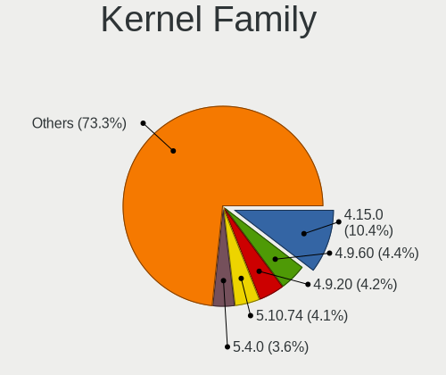
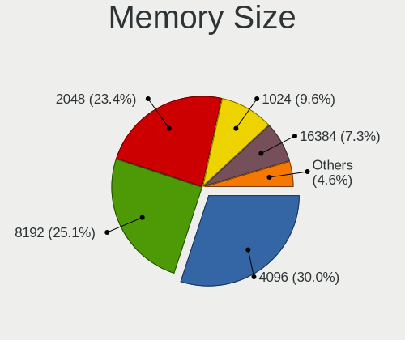

Linux in Russia - Tested Hardware & Statistics
----------------------------------------------

A project to collect tested hardware configurations for Linux in Russia.

Anyone can contribute to this report by the [hw-probe](https://github.com/linuxhw/hw-probe) tool:

    sudo -E hw-probe -all -upload

Please contribute! Especially if your hardware is rare.

This is a report for all computer types. See also reports for [desktops](/Location/Russia/Desktop/README.md) and [notebooks](/Location/Russia/Notebook/README.md).

Contents
--------

* [ Test Cases ](#test-cases)

* [ System ](#system)
  - [ OS                       ](#os)
  - [ OS Family                ](#os-family)
  - [ Kernel                   ](#kernel)
  - [ Kernel Family            ](#kernel-family)
  - [ Kernel Major Ver.        ](#kernel-major-ver)
  - [ Arch                     ](#arch)
  - [ DE                       ](#de)
  - [ Display Server           ](#display-server)
  - [ Display Manager          ](#display-manager)
  - [ OS Lang                  ](#os-lang)
  - [ Boot Mode                ](#boot-mode)
  - [ Filesystem               ](#filesystem)
  - [ Part. scheme             ](#part-scheme)
  - [ Dual Boot with Linux/BSD ](#dual-boot-with-linuxbsd)
  - [ Dual Boot (Win)          ](#dual-boot-win)

* [ Board ](#board)
  - [ Vendor                   ](#vendor)
  - [ Model                    ](#model)
  - [ Model Family             ](#model-family)
  - [ MFG Year                 ](#mfg-year)
  - [ Form Factor              ](#form-factor)
  - [ Secure Boot              ](#secure-boot)
  - [ Coreboot                 ](#coreboot)
  - [ RAM Size                 ](#ram-size)
  - [ RAM Used                 ](#ram-used)
  - [ Total Drives             ](#total-drives)
  - [ Has CD-ROM               ](#has-cd-rom)
  - [ Has Ethernet             ](#has-ethernet)
  - [ Has WiFi                 ](#has-wifi)
  - [ Has Bluetooth            ](#has-bluetooth)

* [ Location ](#location)
  - [ Country                  ](#country)
  - [ City                     ](#city)

* [ Drives ](#drives)
  - [ Drive Vendor             ](#drive-vendor)
  - [ Drive Model              ](#drive-model)
  - [ HDD Vendor               ](#hdd-vendor)
  - [ SSD Vendor               ](#ssd-vendor)
  - [ Drive Kind               ](#drive-kind)
  - [ Drive Connector          ](#drive-connector)
  - [ Drive Size               ](#drive-size)
  - [ Space Total              ](#space-total)
  - [ Space Used               ](#space-used)
  - [ Malfunc. Drives          ](#malfunc-drives)
  - [ Malfunc. Drive Vendor    ](#malfunc-drive-vendor)
  - [ Malfunc. HDD Vendor      ](#malfunc-hdd-vendor)
  - [ Malfunc. Drive Kind      ](#malfunc-drive-kind)
  - [ Failed Drives            ](#failed-drives)
  - [ Failed Drive Vendor      ](#failed-drive-vendor)
  - [ Drive Status             ](#drive-status)

* [ Storage controller ](#storage-controller)
  - [ Storage Vendor           ](#storage-vendor)
  - [ Storage Model            ](#storage-model)
  - [ Storage Kind             ](#storage-kind)

* [ Processor ](#processor)
  - [ CPU Vendor               ](#cpu-vendor)
  - [ CPU Model                ](#cpu-model)
  - [ CPU Model Family         ](#cpu-model-family)
  - [ CPU Cores                ](#cpu-cores)
  - [ CPU Sockets              ](#cpu-sockets)
  - [ CPU Threads              ](#cpu-threads)
  - [ CPU Op-Modes             ](#cpu-op-modes)
  - [ CPU Microcode            ](#cpu-microcode)
  - [ CPU Microarch            ](#cpu-microarch)

* [ Graphics ](#graphics)
  - [ GPU Vendor               ](#gpu-vendor)
  - [ GPU Model                ](#gpu-model)
  - [ GPU Combo                ](#gpu-combo)
  - [ GPU Driver               ](#gpu-driver)
  - [ GPU Memory               ](#gpu-memory)

* [ Monitor ](#monitor)
  - [ Monitor Vendor           ](#monitor-vendor)
  - [ Monitor Model            ](#monitor-model)
  - [ Monitor Resolution       ](#monitor-resolution)
  - [ Monitor Diagonal         ](#monitor-diagonal)
  - [ Monitor Width            ](#monitor-width)
  - [ Aspect Ratio             ](#aspect-ratio)
  - [ Monitor Area             ](#monitor-area)
  - [ Pixel Density            ](#pixel-density)
  - [ Multiple Monitors        ](#multiple-monitors)

* [ Network ](#network)
  - [ Net Controller Vendor    ](#net-controller-vendor)
  - [ Net Controller Model     ](#net-controller-model)
  - [ Wireless Vendor          ](#wireless-vendor)
  - [ Wireless Model           ](#wireless-model)
  - [ Ethernet Vendor          ](#ethernet-vendor)
  - [ Ethernet Model           ](#ethernet-model)
  - [ Net Controller Kind      ](#net-controller-kind)
  - [ Used Controller          ](#used-controller)
  - [ NICs                     ](#nics)
  - [ IPv6                     ](#ipv6)

* [ Bluetooth ](#bluetooth)
  - [ Bluetooth Vendor         ](#bluetooth-vendor)
  - [ Bluetooth Model          ](#bluetooth-model)

* [ Sound ](#sound)
  - [ Sound Vendor             ](#sound-vendor)
  - [ Sound Model              ](#sound-model)

* [ Memory ](#memory)
  - [ Memory Vendor            ](#memory-vendor)
  - [ Memory Model             ](#memory-model)
  - [ Memory Kind              ](#memory-kind)
  - [ Memory Form Factor       ](#memory-form-factor)
  - [ Memory Size              ](#memory-size)
  - [ Memory Speed             ](#memory-speed)

* [ Printers & scanners ](#printers--scanners)
  - [ Printer Vendor           ](#printer-vendor)
  - [ Printer Model            ](#printer-model)
  - [ Scanner Vendor           ](#scanner-vendor)
  - [ Scanner Model            ](#scanner-model)

* [ Camera ](#camera)
  - [ Camera Vendor            ](#camera-vendor)
  - [ Camera Model             ](#camera-model)

* [ Security ](#security)
  - [ Fingerprint Vendor       ](#fingerprint-vendor)
  - [ Fingerprint Model        ](#fingerprint-model)
  - [ Chipcard Vendor          ](#chipcard-vendor)
  - [ Chipcard Model           ](#chipcard-model)

* [ Unsupported ](#unsupported)
  - [ Unsupported Devices      ](#unsupported-devices)
  - [ Unsupported Device Types ](#unsupported-device-types)

Test Cases
----------

Total: 33697

| Vendor        | Model                       | Form-Factor | Probe                                                      | Date         |
|---------------|-----------------------------|-------------|------------------------------------------------------------|--------------|
| Dell          | 500                         | Notebook    | [83c01aa11f](https://linux-hardware.org/?probe=83c01aa11f) | Oct 01, 2022 |
| Acer          | Aspire A715-41G             | Notebook    | [1a473e9809](https://linux-hardware.org/?probe=1a473e9809) | Oct 01, 2022 |
| ASRock        | J5005-ITX                   | Desktop     | [783c72d32e](https://linux-hardware.org/?probe=783c72d32e) | Oct 01, 2022 |
| MSI           | MS-7235                     | Desktop     | [838e2c27f1](https://linux-hardware.org/?probe=838e2c27f1) | Oct 01, 2022 |
| HUAWEI        | HN-WX9X                     | Notebook    | [4168f641b5](https://linux-hardware.org/?probe=4168f641b5) | Oct 01, 2022 |
| HP            | 650                         | Notebook    | [162893e9ad](https://linux-hardware.org/?probe=162893e9ad) | Oct 01, 2022 |
| ONE-NETBOO... | ONE XPLAYER                 | Tablet      | [9bec9e1625](https://linux-hardware.org/?probe=9bec9e1625) | Oct 01, 2022 |
| Lenovo        | G770 20089                  | Notebook    | [e06e588d62](https://linux-hardware.org/?probe=e06e588d62) | Oct 01, 2022 |
| ONE-NETBOO... | ONE XPLAYER                 | Tablet      | [501a588f11](https://linux-hardware.org/?probe=501a588f11) | Oct 01, 2022 |
| HP            | ENVY x360 Convertible 15... | Convertible | [36aa510782](https://linux-hardware.org/?probe=36aa510782) | Oct 01, 2022 |
| MSI           | B450M-A PRO MAX             | Desktop     | [649f4ec8c6](https://linux-hardware.org/?probe=649f4ec8c6) | Oct 01, 2022 |
| Unknown       | Unknown                     | Desktop     | [0c82fc9806](https://linux-hardware.org/?probe=0c82fc9806) | Oct 01, 2022 |
| ASUSTek       | F5V                         | Notebook    | [463cd15493](https://linux-hardware.org/?probe=463cd15493) | Oct 01, 2022 |
| Dell          | Inspiron 5737               | Notebook    | [14113affa1](https://linux-hardware.org/?probe=14113affa1) | Oct 01, 2022 |
| Dell          | Inspiron 5737               | Notebook    | [6893292144](https://linux-hardware.org/?probe=6893292144) | Oct 01, 2022 |
| HP            | ENVY x360 Convertible 15... | Convertible | [3d7bdf258d](https://linux-hardware.org/?probe=3d7bdf258d) | Oct 01, 2022 |
| ASUSTek       | M5A87                       | Desktop     | [89ca067566](https://linux-hardware.org/?probe=89ca067566) | Oct 01, 2022 |
| Acer          | Aspire 5750G                | Notebook    | [8e87575f75](https://linux-hardware.org/?probe=8e87575f75) | Oct 01, 2022 |
| Acer          | Aspire A315-55G             | Notebook    | [77605e313d](https://linux-hardware.org/?probe=77605e313d) | Oct 01, 2022 |
| ASUSTek       | VivoBook_ASUSLaptop X340... | Notebook    | [d5407763a0](https://linux-hardware.org/?probe=d5407763a0) | Sep 30, 2022 |
| GPD           | G1621-02                    | Notebook    | [6ae9fc596e](https://linux-hardware.org/?probe=6ae9fc596e) | Sep 30, 2022 |
| ASUSTek       | H81-PLUS                    | Desktop     | [e251d6b8f7](https://linux-hardware.org/?probe=e251d6b8f7) | Sep 30, 2022 |
| Irbis         | NB121                       | Notebook    | [a2eb8c8af1](https://linux-hardware.org/?probe=a2eb8c8af1) | Sep 30, 2022 |
| Acer          | Extensa 4220                | Notebook    | [c35a0a579a](https://linux-hardware.org/?probe=c35a0a579a) | Sep 30, 2022 |
| ASRock        | B450M Pro4-F                | Desktop     | [75b0aa3c75](https://linux-hardware.org/?probe=75b0aa3c75) | Sep 30, 2022 |
| Irbis         | NB121                       | Notebook    | [90a0ae1cf9](https://linux-hardware.org/?probe=90a0ae1cf9) | Sep 30, 2022 |
| THUNDEROBO... | 911AirD                     | Notebook    | [448f04d201](https://linux-hardware.org/?probe=448f04d201) | Sep 30, 2022 |
| Lenovo        | G460 20041                  | Notebook    | [130c0489f9](https://linux-hardware.org/?probe=130c0489f9) | Sep 30, 2022 |
| Digma         | EVE 11 C408                 | Notebook    | [b5c7ac8ed3](https://linux-hardware.org/?probe=b5c7ac8ed3) | Sep 30, 2022 |
| ASUSTek       | P5KPL-AM EPU                | Desktop     | [66877298d4](https://linux-hardware.org/?probe=66877298d4) | Sep 30, 2022 |
| ASUSTek       | Q504UAK                     | Convertible | [062910424d](https://linux-hardware.org/?probe=062910424d) | Sep 30, 2022 |
| ASUSTek       | PRIME B660M-K D4            | Desktop     | [7efad28576](https://linux-hardware.org/?probe=7efad28576) | Sep 30, 2022 |
| HP            | Pavilion dv7                | Notebook    | [4d54db9389](https://linux-hardware.org/?probe=4d54db9389) | Sep 30, 2022 |
| Acer          | Aspire A514-54              | Notebook    | [b8b0da1194](https://linux-hardware.org/?probe=b8b0da1194) | Sep 30, 2022 |
| Gigabyte      | Z390 AORUS ULTRA-CF         | Desktop     | [8d8e54ed69](https://linux-hardware.org/?probe=8d8e54ed69) | Sep 30, 2022 |
| Lenovo        | IdeaPad S145-15API 81UT     | Notebook    | [9ccd242ca4](https://linux-hardware.org/?probe=9ccd242ca4) | Sep 30, 2022 |
| ASRock        | B360M-HDV                   | Desktop     | [fad5a877f5](https://linux-hardware.org/?probe=fad5a877f5) | Sep 30, 2022 |
| Lenovo        | G580 20150                  | Notebook    | [d057161e9d](https://linux-hardware.org/?probe=d057161e9d) | Sep 30, 2022 |
| HP            | 859C                        | Desktop     | [08161b9516](https://linux-hardware.org/?probe=08161b9516) | Sep 30, 2022 |
| MSI           | B450M MORTAR MAX            | Desktop     | [21028f343b](https://linux-hardware.org/?probe=21028f343b) | Sep 30, 2022 |
| Lenovo        | ThinkPad L380 20M5SSIN11    | Notebook    | [0cad79b1f7](https://linux-hardware.org/?probe=0cad79b1f7) | Sep 30, 2022 |
| ASRock        | N68C-S UCC                  | Desktop     | [90d8579454](https://linux-hardware.org/?probe=90d8579454) | Sep 30, 2022 |
| ASUSTek       | Maximus V GENE              | Desktop     | [7998f02578](https://linux-hardware.org/?probe=7998f02578) | Sep 29, 2022 |
| ASUSTek       | B85M-G                      | Desktop     | [a9983b2858](https://linux-hardware.org/?probe=a9983b2858) | Sep 29, 2022 |
| ASRock        | X399M Taichi                | Desktop     | [b7943d1645](https://linux-hardware.org/?probe=b7943d1645) | Sep 29, 2022 |
| Irbis         | NB61 WS001                  | Notebook    | [3fda78e356](https://linux-hardware.org/?probe=3fda78e356) | Sep 29, 2022 |
| THUNDEROBO... | 911AirD                     | Notebook    | [99f1b7e253](https://linux-hardware.org/?probe=99f1b7e253) | Sep 29, 2022 |
| Acer          | Aspire 5741G                | Notebook    | [837c4599cc](https://linux-hardware.org/?probe=837c4599cc) | Sep 29, 2022 |
| Dell          | Latitude 3410               | Notebook    | [0f7ad40255](https://linux-hardware.org/?probe=0f7ad40255) | Sep 29, 2022 |
| Lenovo        | Legion 5 17ACH6 82K0        | Notebook    | [18afdc2116](https://linux-hardware.org/?probe=18afdc2116) | Sep 29, 2022 |
| ASUSTek       | B85M-G                      | Desktop     | [ba607b91e0](https://linux-hardware.org/?probe=ba607b91e0) | Sep 29, 2022 |
| HP            | 805D                        | Desktop     | [84d451ab19](https://linux-hardware.org/?probe=84d451ab19) | Sep 29, 2022 |
| Lenovo        | IdeaPad L340-17IRH Gamin... | Notebook    | [f2f9ccf12b](https://linux-hardware.org/?probe=f2f9ccf12b) | Sep 29, 2022 |
| HP            | Laptop 15-db0xxx            | Notebook    | [8f42666f03](https://linux-hardware.org/?probe=8f42666f03) | Sep 29, 2022 |
| Acer          | AOD257                      | Notebook    | [87b7501836](https://linux-hardware.org/?probe=87b7501836) | Sep 29, 2022 |
| ASUSTek       | H81M-D                      | Desktop     | [a1580941c3](https://linux-hardware.org/?probe=a1580941c3) | Sep 29, 2022 |
| Fujitsu       | LIFEBOOK P771               | Notebook    | [7325511d27](https://linux-hardware.org/?probe=7325511d27) | Sep 29, 2022 |
| ECS           | G31T-M9                     | Desktop     | [45b25aaf8c](https://linux-hardware.org/?probe=45b25aaf8c) | Sep 29, 2022 |
| ASUSTek       | Q504UAK                     | Convertible | [a205e0ea70](https://linux-hardware.org/?probe=a205e0ea70) | Sep 29, 2022 |
| ASUSTek       | Q504UAK                     | Convertible | [0625d80195](https://linux-hardware.org/?probe=0625d80195) | Sep 29, 2022 |
| ASRock        | N68-GS4 FX                  | Desktop     | [3c4d5b4c65](https://linux-hardware.org/?probe=3c4d5b4c65) | Sep 29, 2022 |
| ASUSTek       | N53SV                       | Notebook    | [6652e85ddd](https://linux-hardware.org/?probe=6652e85ddd) | Sep 29, 2022 |
| HUAWEI        | KLVD-WXX9                   | Notebook    | [72d80e02c9](https://linux-hardware.org/?probe=72d80e02c9) | Sep 29, 2022 |
| HUAWEI        | KLVD-WXX9                   | Notebook    | [47b22afda2](https://linux-hardware.org/?probe=47b22afda2) | Sep 29, 2022 |
| Biostar       | IH61MF-Q5                   | Desktop     | [7a63314188](https://linux-hardware.org/?probe=7a63314188) | Sep 29, 2022 |
| ASUSTek       | TUF Gaming FX504GE_FX80G... | Notebook    | [4a8bc2a5e5](https://linux-hardware.org/?probe=4a8bc2a5e5) | Sep 28, 2022 |
| ASUSTek       | M4A785T-M                   | Desktop     | [03277d55bc](https://linux-hardware.org/?probe=03277d55bc) | Sep 28, 2022 |
| MSI           | G41M-P26                    | Desktop     | [45f0101515](https://linux-hardware.org/?probe=45f0101515) | Sep 28, 2022 |
| HP            | 339A                        | Desktop     | [5c961ef93f](https://linux-hardware.org/?probe=5c961ef93f) | Sep 28, 2022 |
| Acer          | Aspire A715-42G             | Notebook    | [44d8521e1d](https://linux-hardware.org/?probe=44d8521e1d) | Sep 28, 2022 |
| Acer          | Aspire A715-42G             | Notebook    | [ecbc8d9288](https://linux-hardware.org/?probe=ecbc8d9288) | Sep 28, 2022 |
| Gigabyte      | B560M H                     | Desktop     | [80e3cd655a](https://linux-hardware.org/?probe=80e3cd655a) | Sep 28, 2022 |
| Gigabyte      | B560M H                     | Desktop     | [0192951511](https://linux-hardware.org/?probe=0192951511) | Sep 28, 2022 |
| HP            | 339A                        | Desktop     | [ac9538b489](https://linux-hardware.org/?probe=ac9538b489) | Sep 28, 2022 |
| ASUSTek       | M5A97 R2.0                  | Desktop     | [2c82f3311d](https://linux-hardware.org/?probe=2c82f3311d) | Sep 28, 2022 |
| 3Logic Gro... | Graviton N15i-K2            | Notebook    | [6ce327114c](https://linux-hardware.org/?probe=6ce327114c) | Sep 28, 2022 |
| ASUSTek       | P8H61-M LX3 R2.0            | Desktop     | [82b108b3b8](https://linux-hardware.org/?probe=82b108b3b8) | Sep 28, 2022 |
| ASUSTek       | P8H61-MX R2.0               | Desktop     | [3def6cd1c2](https://linux-hardware.org/?probe=3def6cd1c2) | Sep 28, 2022 |
| Lenovo        | ThinkBook 14s Yoga ITL 2... | Convertible | [74faec9cb4](https://linux-hardware.org/?probe=74faec9cb4) | Sep 28, 2022 |
| ASUSTek       | H87-PLUS                    | Desktop     | [ccb24cd91e](https://linux-hardware.org/?probe=ccb24cd91e) | Sep 28, 2022 |
| Lenovo        | ThinkPad T420 4236WS7       | Notebook    | [ca9c7bf57b](https://linux-hardware.org/?probe=ca9c7bf57b) | Sep 28, 2022 |
| Gigabyte      | 970A-DS3P                   | Desktop     | [ada186ce05](https://linux-hardware.org/?probe=ada186ce05) | Sep 27, 2022 |
| HUAWEI        | NBLK-WAX9X                  | Notebook    | [f501591d1b](https://linux-hardware.org/?probe=f501591d1b) | Sep 27, 2022 |
| Gigabyte      | B550M AORUS PRO-P           | Desktop     | [3273908698](https://linux-hardware.org/?probe=3273908698) | Sep 27, 2022 |
| ASUSTek       | PRIME B560-PLUS             | Desktop     | [03fff6add6](https://linux-hardware.org/?probe=03fff6add6) | Sep 27, 2022 |
| MSI           | B365M PRO-VDH               | Desktop     | [45e07c7119](https://linux-hardware.org/?probe=45e07c7119) | Sep 27, 2022 |
| HUAWEI        | NBD-WXX9                    | Notebook    | [c1c976ba69](https://linux-hardware.org/?probe=c1c976ba69) | Sep 27, 2022 |
| HONOR         | HGE-WX6                     | Notebook    | [5c61df4d20](https://linux-hardware.org/?probe=5c61df4d20) | Sep 27, 2022 |
| Sony          | VPCEH1S1R                   | Notebook    | [5214bb023f](https://linux-hardware.org/?probe=5214bb023f) | Sep 27, 2022 |
| Unknown       | Apple MacBook Air (M1, 2... | Notebook    | [02c65b393f](https://linux-hardware.org/?probe=02c65b393f) | Sep 27, 2022 |
| Lenovo        | IdeaPad 310-15IAP 80TT      | Notebook    | [65f896ddab](https://linux-hardware.org/?probe=65f896ddab) | Sep 27, 2022 |
| Acer          | Aspire A515-45G             | Notebook    | [0e8bdd2e37](https://linux-hardware.org/?probe=0e8bdd2e37) | Sep 27, 2022 |
| ASUSTek       | P8H61-M LE                  | Desktop     | [0d9fdddd8a](https://linux-hardware.org/?probe=0d9fdddd8a) | Sep 27, 2022 |
| Raspberry ... | Raspberry Pi                | Soc         | [a3485b332a](https://linux-hardware.org/?probe=a3485b332a) | Sep 27, 2022 |
| Samsung       | R530/R730                   | Notebook    | [e6168a9f1a](https://linux-hardware.org/?probe=e6168a9f1a) | Sep 27, 2022 |
| ASUSTek       | ASUSPRO P3540FA_P3540FA     | Notebook    | [bb1530a50e](https://linux-hardware.org/?probe=bb1530a50e) | Sep 27, 2022 |
| Lenovo        | IdeaPad 5 15ARE05 81YQ      | Notebook    | [3d86bcf1b7](https://linux-hardware.org/?probe=3d86bcf1b7) | Sep 27, 2022 |
| HP            | 339A                        | Desktop     | [25ef7556cc](https://linux-hardware.org/?probe=25ef7556cc) | Sep 27, 2022 |
| Gigabyte      | B360M HD3                   | Desktop     | [1107ba42b7](https://linux-hardware.org/?probe=1107ba42b7) | Sep 27, 2022 |
| Dell          | 0Y5DDC A00                  | Desktop     | [a135b97045](https://linux-hardware.org/?probe=a135b97045) | Sep 27, 2022 |
| Lenovo        | IdeaPad Z580                | Notebook    | [a33ab40c8b](https://linux-hardware.org/?probe=a33ab40c8b) | Sep 27, 2022 |
| Lenovo        | IdeaPad S340-15IML 81NA     | Notebook    | [03d36518de](https://linux-hardware.org/?probe=03d36518de) | Sep 27, 2022 |
| Unknown       | Unknown                     | Desktop     | [128a8b6e2f](https://linux-hardware.org/?probe=128a8b6e2f) | Sep 27, 2022 |
| Gigabyte      | B450M S2H                   | Desktop     | [b5cc268970](https://linux-hardware.org/?probe=b5cc268970) | Sep 27, 2022 |
| ASUSTek       | Maximus V GENE              | Desktop     | [fc7a783877](https://linux-hardware.org/?probe=fc7a783877) | Sep 26, 2022 |
| Huanan        | X99-F8                      | Desktop     | [24c118fb0c](https://linux-hardware.org/?probe=24c118fb0c) | Sep 26, 2022 |
| Biostar       | TH67XE                      | Desktop     | [24df0079b5](https://linux-hardware.org/?probe=24df0079b5) | Sep 26, 2022 |
| HUAWEI        | NBLB-WAX9N                  | Notebook    | [3acb168799](https://linux-hardware.org/?probe=3acb168799) | Sep 26, 2022 |
| HUAWEI        | NBLB-WAX9N                  | Notebook    | [fd7e096a4b](https://linux-hardware.org/?probe=fd7e096a4b) | Sep 26, 2022 |
| HP            | Unknown                     | Notebook    | [e8906c977c](https://linux-hardware.org/?probe=e8906c977c) | Sep 26, 2022 |
| Huanan        | X99 F8D V2.2                | Desktop     | [7663168534](https://linux-hardware.org/?probe=7663168534) | Sep 26, 2022 |
| Lenovo        | IdeaPad 330-15IKB 81DC      | Notebook    | [95c0fd6047](https://linux-hardware.org/?probe=95c0fd6047) | Sep 26, 2022 |
| Lenovo        | ThinkPad T14 Gen 3 21AHA... | Notebook    | [bddfd15906](https://linux-hardware.org/?probe=bddfd15906) | Sep 26, 2022 |
| ASRock        | 960GM-VGS3 FX               | Desktop     | [45bf4d54bf](https://linux-hardware.org/?probe=45bf4d54bf) | Sep 26, 2022 |
| HP            | Laptop 17-cp0xxx            | Notebook    | [fa6a915235](https://linux-hardware.org/?probe=fa6a915235) | Sep 26, 2022 |
| ASUSTek       | H81M-K                      | Desktop     | [c449af2ab6](https://linux-hardware.org/?probe=c449af2ab6) | Sep 26, 2022 |
| Unknown       | Unknown                     | Desktop     | [4cff54bad3](https://linux-hardware.org/?probe=4cff54bad3) | Sep 26, 2022 |
| Gigabyte      | H81M-S2PV                   | Desktop     | [76a7224818](https://linux-hardware.org/?probe=76a7224818) | Sep 26, 2022 |
| HP            | 339A                        | Desktop     | [07986ca95e](https://linux-hardware.org/?probe=07986ca95e) | Sep 26, 2022 |
| Gigabyte      | H81M-DS2                    | Desktop     | [c8f6c9dd27](https://linux-hardware.org/?probe=c8f6c9dd27) | Sep 26, 2022 |
| Unknown       | Unknown                     | Desktop     | [681b9501bf](https://linux-hardware.org/?probe=681b9501bf) | Sep 26, 2022 |
| RDW           | MB-B450M V.1                | Desktop     | [8c3a565d43](https://linux-hardware.org/?probe=8c3a565d43) | Sep 26, 2022 |
| MSI           | 870-C45                     | Desktop     | [b110878f50](https://linux-hardware.org/?probe=b110878f50) | Sep 26, 2022 |
| IBM           | 69Y1006 SIT                 | Server      | [b1ab802cb1](https://linux-hardware.org/?probe=b1ab802cb1) | Sep 25, 2022 |
| ASUSTek       | PRIME B350-PLUS             | Desktop     | [a9c5aeb1f0](https://linux-hardware.org/?probe=a9c5aeb1f0) | Sep 25, 2022 |
| Gigabyte      | B550M DS3H                  | Desktop     | [4c7d9584fc](https://linux-hardware.org/?probe=4c7d9584fc) | Sep 25, 2022 |
| Gigabyte      | Z590 GAMING X               | Desktop     | [1adef3d977](https://linux-hardware.org/?probe=1adef3d977) | Sep 25, 2022 |
| Lenovo        | ThinkBook 16p Gen 2 20YM    | Notebook    | [efcbc52fcd](https://linux-hardware.org/?probe=efcbc52fcd) | Sep 25, 2022 |
| ASRock        | B550 Pro4                   | Desktop     | [d17f3c7447](https://linux-hardware.org/?probe=d17f3c7447) | Sep 25, 2022 |
| Gigabyte      | A520I AC                    | Desktop     | [61bf9d5e84](https://linux-hardware.org/?probe=61bf9d5e84) | Sep 25, 2022 |
| MSI           | MS-7253                     | Desktop     | [d697f7b879](https://linux-hardware.org/?probe=d697f7b879) | Sep 25, 2022 |
| Gigabyte      | B450 AORUS ELITE            | Desktop     | [8749a17d26](https://linux-hardware.org/?probe=8749a17d26) | Sep 25, 2022 |
| Huanan        | X99-8M-F V1.3               | Desktop     | [6e96f4620a](https://linux-hardware.org/?probe=6e96f4620a) | Sep 25, 2022 |
| Huanan        | X99-8M-F V1.3               | Desktop     | [acb677ddeb](https://linux-hardware.org/?probe=acb677ddeb) | Sep 25, 2022 |
| ASRock        | B450 Pro4                   | Desktop     | [fe99b8a461](https://linux-hardware.org/?probe=fe99b8a461) | Sep 25, 2022 |
| MSI           | GL65 Leopard 10SCSR         | Notebook    | [d1b60d3f52](https://linux-hardware.org/?probe=d1b60d3f52) | Sep 25, 2022 |
| Lenovo        | Legion Y-540-17IRH-PG0 8... | Notebook    | [29c967b4ec](https://linux-hardware.org/?probe=29c967b4ec) | Sep 25, 2022 |
| ASUSTek       | N45SF                       | Notebook    | [7461bd2562](https://linux-hardware.org/?probe=7461bd2562) | Sep 25, 2022 |
| MSI           | GL65 Leopard 10SCSR         | Notebook    | [1487715bc7](https://linux-hardware.org/?probe=1487715bc7) | Sep 25, 2022 |
| Lenovo        | IdeaPad Y700-15ACZ 80NY     | Notebook    | [b47b842550](https://linux-hardware.org/?probe=b47b842550) | Sep 25, 2022 |
| Unknown       | Unknown                     | Notebook    | [d5d8bdbf34](https://linux-hardware.org/?probe=d5d8bdbf34) | Sep 25, 2022 |
| Acer          | AO722                       | Notebook    | [f2c6378873](https://linux-hardware.org/?probe=f2c6378873) | Sep 25, 2022 |
| ASUSTek       | ZenBook UX325EA_UX325EA     | Notebook    | [2854d30785](https://linux-hardware.org/?probe=2854d30785) | Sep 25, 2022 |
| HP            | Pavilion g6                 | Notebook    | [915b5a320a](https://linux-hardware.org/?probe=915b5a320a) | Sep 25, 2022 |
| Lenovo        | ThinkBook 16p Gen 2 20YM    | Notebook    | [436bfa4c50](https://linux-hardware.org/?probe=436bfa4c50) | Sep 25, 2022 |
| HP            | 250 G5 Notebook PC          | Notebook    | [6c6ae30eba](https://linux-hardware.org/?probe=6c6ae30eba) | Sep 24, 2022 |
| HP            | ENVY x360 Convertible 15... | Convertible | [d3e3bfec3e](https://linux-hardware.org/?probe=d3e3bfec3e) | Sep 24, 2022 |
| HP            | Pavilion g6                 | Notebook    | [2c685dca1c](https://linux-hardware.org/?probe=2c685dca1c) | Sep 24, 2022 |
| Lenovo        | ThinkPad T420 4236WS7       | Notebook    | [23f425e425](https://linux-hardware.org/?probe=23f425e425) | Sep 24, 2022 |
| ASUSTek       | P8Z77-V LE PLUS             | Desktop     | [d58256a0f6](https://linux-hardware.org/?probe=d58256a0f6) | Sep 24, 2022 |
| HP            | ENVY x360 Convertible 15... | Convertible | [22c72262c4](https://linux-hardware.org/?probe=22c72262c4) | Sep 24, 2022 |
| Lenovo        | ThinkPad T420 4236WS7       | Notebook    | [f3527878e5](https://linux-hardware.org/?probe=f3527878e5) | Sep 24, 2022 |
| Huanan        | X99 F8D V2.2                | Desktop     | [6316c089eb](https://linux-hardware.org/?probe=6316c089eb) | Sep 24, 2022 |
| Gigabyte      | G31M-S2C                    | Desktop     | [d0aa96a903](https://linux-hardware.org/?probe=d0aa96a903) | Sep 24, 2022 |
| Toshiba       | Satellite A300              | Notebook    | [3f6203e550](https://linux-hardware.org/?probe=3f6203e550) | Sep 24, 2022 |
| Matsushita... | CF-29LTQGZBM                | Notebook    | [29f52f862c](https://linux-hardware.org/?probe=29f52f862c) | Sep 24, 2022 |
| Samsung       | R540/R580/R780/SA41/E452    | Notebook    | [fe4a71500c](https://linux-hardware.org/?probe=fe4a71500c) | Sep 24, 2022 |
| Lenovo        | ThinkBook 16p Gen 2 20YM    | Notebook    | [bf6e11dcf3](https://linux-hardware.org/?probe=bf6e11dcf3) | Sep 24, 2022 |
| HP            | ENVY x360 Convertible 15... | Convertible | [14bf8d86de](https://linux-hardware.org/?probe=14bf8d86de) | Sep 24, 2022 |
| HP            | Laptop 15-bw0xx             | Notebook    | [ea756ff16b](https://linux-hardware.org/?probe=ea756ff16b) | Sep 24, 2022 |
| HP            | Laptop 15s-eq1xxx           | Notebook    | [2bc6e102ef](https://linux-hardware.org/?probe=2bc6e102ef) | Sep 24, 2022 |
| ASRock        | H470M-HDV                   | Desktop     | [dc08f98ca5](https://linux-hardware.org/?probe=dc08f98ca5) | Sep 24, 2022 |
| ASUSTek       | X541NC                      | Notebook    | [226d4d741d](https://linux-hardware.org/?probe=226d4d741d) | Sep 24, 2022 |
| Acer          | Aspire 5253G                | Notebook    | [098f7ee3ed](https://linux-hardware.org/?probe=098f7ee3ed) | Sep 24, 2022 |
| Huanan        | X79 INTEL (INTEL Xeon E5... | Desktop     | [08a8ad598f](https://linux-hardware.org/?probe=08a8ad598f) | Sep 23, 2022 |
| Huanan        | X79 INTEL (INTEL Xeon E5... | Desktop     | [8e620e891f](https://linux-hardware.org/?probe=8e620e891f) | Sep 23, 2022 |
| Toshiba       | Satellite C660              | Notebook    | [2ab739cddb](https://linux-hardware.org/?probe=2ab739cddb) | Sep 23, 2022 |
| MECHREVO      | Jiaolong Series GM5ZG0O     | Notebook    | [077c05c78d](https://linux-hardware.org/?probe=077c05c78d) | Sep 23, 2022 |
| Lenovo        | ThinkPad P52s 20LCS03L38    | Notebook    | [5d9c8cd268](https://linux-hardware.org/?probe=5d9c8cd268) | Sep 23, 2022 |
| ASUSTek       | PRIME B250M-C               | Desktop     | [2e45736b42](https://linux-hardware.org/?probe=2e45736b42) | Sep 23, 2022 |
| Gigabyte      | H81M-S2V                    | Desktop     | [6c884d4968](https://linux-hardware.org/?probe=6c884d4968) | Sep 23, 2022 |
| ICL           | NLx0MU                      | Notebook    | [d8e7f39201](https://linux-hardware.org/?probe=d8e7f39201) | Sep 23, 2022 |
| Clevo         | NL41MU2                     | Notebook    | [226bbaa11e](https://linux-hardware.org/?probe=226bbaa11e) | Sep 23, 2022 |
| MECHREVO      | Jiaolong Series GM5ZG0O     | Notebook    | [d0dacface7](https://linux-hardware.org/?probe=d0dacface7) | Sep 23, 2022 |
| Gigabyte      | H81M-S2V                    | Desktop     | [39a94459dc](https://linux-hardware.org/?probe=39a94459dc) | Sep 23, 2022 |
| ASUSTek       | H110M-R                     | Desktop     | [c9f00bec8e](https://linux-hardware.org/?probe=c9f00bec8e) | Sep 23, 2022 |
| HONOR         | HGE-WX6                     | Notebook    | [337c1097ef](https://linux-hardware.org/?probe=337c1097ef) | Sep 23, 2022 |
| Gigabyte      | EP45-DS3                    | Desktop     | [7b827acac4](https://linux-hardware.org/?probe=7b827acac4) | Sep 23, 2022 |
| Acer          | Aspire 5733Z                | Notebook    | [c22d27a781](https://linux-hardware.org/?probe=c22d27a781) | Sep 23, 2022 |
| ASUSTek       | X550EA                      | Notebook    | [256620a993](https://linux-hardware.org/?probe=256620a993) | Sep 23, 2022 |
| Lenovo        | ThinkPad T420 4236WS7       | Notebook    | [c9457ee571](https://linux-hardware.org/?probe=c9457ee571) | Sep 23, 2022 |
| ASUSTek       | VivoBook_ASUSLaptop X512... | Notebook    | [6a0c80f635](https://linux-hardware.org/?probe=6a0c80f635) | Sep 22, 2022 |
| Lenovo        | ThinkPad T420 4236WS7       | Notebook    | [412296c83f](https://linux-hardware.org/?probe=412296c83f) | Sep 22, 2022 |
| Lenovo        | IdeaPad 3 14ALC6 82KT       | Notebook    | [2b37d81d4c](https://linux-hardware.org/?probe=2b37d81d4c) | Sep 22, 2022 |
| Lenovo        | ThinkPad T420 4236WS7       | Notebook    | [21ba0d8f46](https://linux-hardware.org/?probe=21ba0d8f46) | Sep 22, 2022 |
| Lenovo        | ThinkPad X220 4291G26       | Notebook    | [33654dfbfa](https://linux-hardware.org/?probe=33654dfbfa) | Sep 22, 2022 |
| Lenovo        | ThinkPad T420 4236WS7       | Notebook    | [0c4627555a](https://linux-hardware.org/?probe=0c4627555a) | Sep 22, 2022 |
| ASUSTek       | H61M-K                      | Desktop     | [682eb02d48](https://linux-hardware.org/?probe=682eb02d48) | Sep 22, 2022 |
| Haier         | GG1560XT                    | Notebook    | [fbdbeb0e82](https://linux-hardware.org/?probe=fbdbeb0e82) | Sep 22, 2022 |
| Gigabyte      | B550 AORUS ELITE V2         | Desktop     | [1748378749](https://linux-hardware.org/?probe=1748378749) | Sep 22, 2022 |
| Acer          | Aspire A315-51              | Notebook    | [29e3f57ef9](https://linux-hardware.org/?probe=29e3f57ef9) | Sep 22, 2022 |
| Acer          | Nitro AN515-31              | Notebook    | [9b451feb14](https://linux-hardware.org/?probe=9b451feb14) | Sep 22, 2022 |
| Lenovo        | ThinkCentre M58 8910A8U     | Desktop     | [e9028d165d](https://linux-hardware.org/?probe=e9028d165d) | Sep 22, 2022 |
| Dell          | Inspiron 5547               | Notebook    | [e3a9b82c15](https://linux-hardware.org/?probe=e3a9b82c15) | Sep 22, 2022 |
| Lenovo        | ThinkCentre M58 8910A8U     | Desktop     | [03a3a22c54](https://linux-hardware.org/?probe=03a3a22c54) | Sep 22, 2022 |
| ASUSTek       | X550LC                      | Notebook    | [03f4677430](https://linux-hardware.org/?probe=03f4677430) | Sep 22, 2022 |
| ASUSTek       | H110M-R                     | Desktop     | [0d2eec569a](https://linux-hardware.org/?probe=0d2eec569a) | Sep 22, 2022 |
| ASUSTek       | K50IJ                       | Notebook    | [a0d9805cbb](https://linux-hardware.org/?probe=a0d9805cbb) | Sep 22, 2022 |
| Unknown       | Unknown                     | Notebook    | [a3dbfe1076](https://linux-hardware.org/?probe=a3dbfe1076) | Sep 22, 2022 |
| Gigabyte      | B75M-D3V                    | Desktop     | [3888b56318](https://linux-hardware.org/?probe=3888b56318) | Sep 22, 2022 |
| Intel         | X99                         | Desktop     | [d751fcb309](https://linux-hardware.org/?probe=d751fcb309) | Sep 22, 2022 |
| Gigabyte      | Z370P D3-CF                 | Desktop     | [5513e351d9](https://linux-hardware.org/?probe=5513e351d9) | Sep 22, 2022 |
| Lenovo        | ThinkPad L13 20R3000CRT     | Notebook    | [cec261f5e2](https://linux-hardware.org/?probe=cec261f5e2) | Sep 22, 2022 |
| ASUSTek       | K53E                        | Notebook    | [dc270d21ac](https://linux-hardware.org/?probe=dc270d21ac) | Sep 22, 2022 |
| Huanan        | X99-TF                      | Desktop     | [1361d73bcd](https://linux-hardware.org/?probe=1361d73bcd) | Sep 22, 2022 |
| ASUSTek       | K70AD                       | Notebook    | [49dff3ffb5](https://linux-hardware.org/?probe=49dff3ffb5) | Sep 22, 2022 |
| ASUSTek       | ET2230I                     | Desktop     | [074ecf956a](https://linux-hardware.org/?probe=074ecf956a) | Sep 22, 2022 |
| MSI           | Katana GF66 11UE            | Notebook    | [b418d015a6](https://linux-hardware.org/?probe=b418d015a6) | Sep 22, 2022 |
| HONOR         | HLYL-WXX9                   | Notebook    | [1da06fd0ba](https://linux-hardware.org/?probe=1da06fd0ba) | Sep 21, 2022 |
| HP            | 255 G8 Notebook PC          | Notebook    | [20691b389b](https://linux-hardware.org/?probe=20691b389b) | Sep 21, 2022 |
| DEXP          | Notebook                    | Notebook    | [2caa8c0be4](https://linux-hardware.org/?probe=2caa8c0be4) | Sep 21, 2022 |
| Thecus        | N2810 0001                  | Desktop     | [f54df3994c](https://linux-hardware.org/?probe=f54df3994c) | Sep 21, 2022 |
| ECS           | G31T-M9                     | Desktop     | [6e67780df1](https://linux-hardware.org/?probe=6e67780df1) | Sep 21, 2022 |
| Gigabyte      | H61M-DS2                    | Desktop     | [a9e18191f7](https://linux-hardware.org/?probe=a9e18191f7) | Sep 21, 2022 |
| Haier         | GG1560XT                    | Notebook    | [85cb227779](https://linux-hardware.org/?probe=85cb227779) | Sep 21, 2022 |
| Lenovo        | ThinkPad E14 Gen 3 20Y70... | Notebook    | [52bb32a60c](https://linux-hardware.org/?probe=52bb32a60c) | Sep 21, 2022 |
| ASRock        | H470M-HVS                   | Desktop     | [e267d78b42](https://linux-hardware.org/?probe=e267d78b42) | Sep 21, 2022 |
| Acer          | Aspire A315-23              | Notebook    | [204980d2bd](https://linux-hardware.org/?probe=204980d2bd) | Sep 21, 2022 |
| Gigabyte      | H61M-S2PV                   | Desktop     | [65dc86f8d2](https://linux-hardware.org/?probe=65dc86f8d2) | Sep 21, 2022 |
| Gigabyte      | H61M-S2PV                   | Desktop     | [b905e8df57](https://linux-hardware.org/?probe=b905e8df57) | Sep 21, 2022 |
| ECS           | G31T-M9                     | Desktop     | [46fd18ee44](https://linux-hardware.org/?probe=46fd18ee44) | Sep 21, 2022 |
| ASUSTek       | M3N78-VM                    | Desktop     | [03e6d4f5bc](https://linux-hardware.org/?probe=03e6d4f5bc) | Sep 21, 2022 |
| ASUSTek       | M3N78-VM                    | Desktop     | [658141844b](https://linux-hardware.org/?probe=658141844b) | Sep 21, 2022 |
| ASUSTek       | X550LC                      | Notebook    | [018ca85503](https://linux-hardware.org/?probe=018ca85503) | Sep 21, 2022 |
| ASUSTek       | PRIME B350-PLUS             | Desktop     | [c03d31a1c5](https://linux-hardware.org/?probe=c03d31a1c5) | Sep 21, 2022 |
| HP            | 339A                        | Desktop     | [bc2a08f514](https://linux-hardware.org/?probe=bc2a08f514) | Sep 21, 2022 |
| MACHINIST     | B75 PRO V1.0                | Desktop     | [752cb8efae](https://linux-hardware.org/?probe=752cb8efae) | Sep 21, 2022 |
| Gigabyte      | B550 AORUS ELITE V2         | Desktop     | [66a228f8c5](https://linux-hardware.org/?probe=66a228f8c5) | Sep 21, 2022 |
| Gigabyte      | P85-D3                      | Desktop     | [d0b65afb41](https://linux-hardware.org/?probe=d0b65afb41) | Sep 20, 2022 |
| ASRock        | H55M-LE                     | Desktop     | [d361539e5a](https://linux-hardware.org/?probe=d361539e5a) | Sep 20, 2022 |
| ICL           | RAYbook Si1512              | Notebook    | [0b610b66a9](https://linux-hardware.org/?probe=0b610b66a9) | Sep 20, 2022 |
| Lenovo        | ThinkBook 15-IIL 20SM       | Notebook    | [824c786d4b](https://linux-hardware.org/?probe=824c786d4b) | Sep 20, 2022 |
| ASUSTek       | K50IJ                       | Notebook    | [3662255ac7](https://linux-hardware.org/?probe=3662255ac7) | Sep 20, 2022 |
| HP            | 871A                        | Mini pc     | [de7e44ecb7](https://linux-hardware.org/?probe=de7e44ecb7) | Sep 20, 2022 |
| ASUSTek       | BU401LG                     | Notebook    | [12d87b6cad](https://linux-hardware.org/?probe=12d87b6cad) | Sep 20, 2022 |
| Gigabyte      | P85-D3                      | Desktop     | [97849eb715](https://linux-hardware.org/?probe=97849eb715) | Sep 20, 2022 |
| Lenovo        | IdeaPad 110-15ACL 80TJ      | Notebook    | [1db8da5821](https://linux-hardware.org/?probe=1db8da5821) | Sep 20, 2022 |
| HP            | Pavilion g6                 | Notebook    | [930de8d94d](https://linux-hardware.org/?probe=930de8d94d) | Sep 20, 2022 |
| Supermicro    | X9DRi-LN4+/X9DR3-LN4+       | Server      | [6fc004b792](https://linux-hardware.org/?probe=6fc004b792) | Sep 20, 2022 |
| ASUSTek       | X550LC                      | Notebook    | [3683e3fd1b](https://linux-hardware.org/?probe=3683e3fd1b) | Sep 20, 2022 |
| ASUSTek       | TUF Gaming Z590-PLUS WIF... | Desktop     | [8886c62f6c](https://linux-hardware.org/?probe=8886c62f6c) | Sep 20, 2022 |
| HP            | EliteBook 830 G5            | Notebook    | [5d6c1cd007](https://linux-hardware.org/?probe=5d6c1cd007) | Sep 20, 2022 |
| ASUSTek       | B85M-G                      | Desktop     | [f9fa37f0d2](https://linux-hardware.org/?probe=f9fa37f0d2) | Sep 20, 2022 |
| Microsoft     | Surface with Windows 8 P... | Tablet      | [a491827753](https://linux-hardware.org/?probe=a491827753) | Sep 20, 2022 |
| Dell          | Inspiron 3542               | Notebook    | [7f7ef47d4b](https://linux-hardware.org/?probe=7f7ef47d4b) | Sep 20, 2022 |
| Intel         | ChiefRiver Platform         | Notebook    | [87cff551c8](https://linux-hardware.org/?probe=87cff551c8) | Sep 20, 2022 |
| Intel         | ChiefRiver Platform         | Notebook    | [ffaa34d0c1](https://linux-hardware.org/?probe=ffaa34d0c1) | Sep 20, 2022 |
| ECS           | A55F-M3                     | Desktop     | [4961be8414](https://linux-hardware.org/?probe=4961be8414) | Sep 20, 2022 |
| Gigabyte      | GA-M56S-S3                  | Desktop     | [ecd62e14f4](https://linux-hardware.org/?probe=ecd62e14f4) | Sep 20, 2022 |
| Gigabyte      | GA-780T-D3L                 | Desktop     | [3e0939e549](https://linux-hardware.org/?probe=3e0939e549) | Sep 20, 2022 |
| Gigabyte      | H61M-S2PV                   | Desktop     | [a82f4ceccc](https://linux-hardware.org/?probe=a82f4ceccc) | Sep 20, 2022 |
| Lenovo        | IdeaPad 5 15ARE05 81YQ      | Notebook    | [21617c5cff](https://linux-hardware.org/?probe=21617c5cff) | Sep 20, 2022 |
| Colorful T... | C.A68M-K PLUS V16           | Desktop     | [805edc36d5](https://linux-hardware.org/?probe=805edc36d5) | Sep 20, 2022 |
| Lenovo        | IdeaPad 5 15ARE05 81YQ      | Notebook    | [9d85bdedd3](https://linux-hardware.org/?probe=9d85bdedd3) | Sep 20, 2022 |
| Durabook      | R11AH                       | Notebook    | [73847e89cd](https://linux-hardware.org/?probe=73847e89cd) | Sep 20, 2022 |
| Lenovo        | ThinkPad T420 4180PBG       | Notebook    | [857b2acef0](https://linux-hardware.org/?probe=857b2acef0) | Sep 20, 2022 |
| MSI           | H67MS-E23                   | Desktop     | [5093a2b5b8](https://linux-hardware.org/?probe=5093a2b5b8) | Sep 20, 2022 |
| Acer          | Nitro AN515-54              | Notebook    | [d927d512ed](https://linux-hardware.org/?probe=d927d512ed) | Sep 20, 2022 |
| Acer          | Aspire 5750G                | Notebook    | [e32fb86913](https://linux-hardware.org/?probe=e32fb86913) | Sep 19, 2022 |
| HP            | ProBook 5330m               | Notebook    | [659bc725a3](https://linux-hardware.org/?probe=659bc725a3) | Sep 19, 2022 |
| HP            | EliteBook 840 G4            | Notebook    | [32b16880e2](https://linux-hardware.org/?probe=32b16880e2) | Sep 19, 2022 |
| Huanan        | X99-F8 Gaming 2021          | Desktop     | [8a290737bd](https://linux-hardware.org/?probe=8a290737bd) | Sep 19, 2022 |
| Gigabyte      | B550M AORUS PRO-P           | Desktop     | [25d7dc8f0d](https://linux-hardware.org/?probe=25d7dc8f0d) | Sep 19, 2022 |
| ASUSTek       | X550MJ                      | Notebook    | [8b3130c363](https://linux-hardware.org/?probe=8b3130c363) | Sep 19, 2022 |
| ASRock        | H470M-HVS                   | Desktop     | [ee235bf98c](https://linux-hardware.org/?probe=ee235bf98c) | Sep 19, 2022 |
| Lenovo        | Legion 5 Pro 16ITH6H 82J... | Notebook    | [bed329dab4](https://linux-hardware.org/?probe=bed329dab4) | Sep 19, 2022 |
| MSI           | B450 GAMING PLUS MAX        | Desktop     | [8072b6c0e0](https://linux-hardware.org/?probe=8072b6c0e0) | Sep 19, 2022 |
| ASUSTek       | T100TAM                     | Notebook    | [65a37e4802](https://linux-hardware.org/?probe=65a37e4802) | Sep 19, 2022 |
| Acer          | Nitro AN515-31              | Notebook    | [33e582251a](https://linux-hardware.org/?probe=33e582251a) | Sep 19, 2022 |
| ASUSTek       | P8Q77-M2                    | Desktop     | [1e067b7c4f](https://linux-hardware.org/?probe=1e067b7c4f) | Sep 19, 2022 |
| HONOR         | HLYL-WXX9                   | Notebook    | [1f91c596f5](https://linux-hardware.org/?probe=1f91c596f5) | Sep 19, 2022 |
| ASUSTek       | Z97-P                       | Desktop     | [37f0f7b888](https://linux-hardware.org/?probe=37f0f7b888) | Sep 19, 2022 |
| RuggedPC      | RuggedBookJ22               | Tablet      | [0fce5572a6](https://linux-hardware.org/?probe=0fce5572a6) | Sep 19, 2022 |
| ASUSTek       | H110T                       | Desktop     | [a9304d84fa](https://linux-hardware.org/?probe=a9304d84fa) | Sep 19, 2022 |
| HUAWEI        | NBLB-WAX9N                  | Notebook    | [0f049ae5d6](https://linux-hardware.org/?probe=0f049ae5d6) | Sep 19, 2022 |
| RuggedPC      | RuggedBookJ22               | Tablet      | [720bbb18a8](https://linux-hardware.org/?probe=720bbb18a8) | Sep 19, 2022 |
| Acer          | Nitro AN515-42              | Notebook    | [97e2956728](https://linux-hardware.org/?probe=97e2956728) | Sep 19, 2022 |
| Timi          | Redmi Book Pro 15 2022      | Notebook    | [1cbec0f70e](https://linux-hardware.org/?probe=1cbec0f70e) | Sep 19, 2022 |
| Dell          | Inspiron 7577               | Notebook    | [fe5d00b2c8](https://linux-hardware.org/?probe=fe5d00b2c8) | Sep 19, 2022 |
| MSI           | H67MS-E23                   | Desktop     | [2f819d4ed2](https://linux-hardware.org/?probe=2f819d4ed2) | Sep 19, 2022 |
| Aquarius      | NS685U R11                  | Notebook    | [f1f88e57c5](https://linux-hardware.org/?probe=f1f88e57c5) | Sep 19, 2022 |
| Lenovo        | Yoga Slim 7 Pro 14ACH5 8... | Notebook    | [3862ccf53f](https://linux-hardware.org/?probe=3862ccf53f) | Sep 19, 2022 |
| Samsung       | R530/R730/R540              | Notebook    | [3062da6263](https://linux-hardware.org/?probe=3062da6263) | Sep 19, 2022 |
| HP            | Pavilion g6                 | Notebook    | [4d623b8260](https://linux-hardware.org/?probe=4d623b8260) | Sep 19, 2022 |
| HP            | Laptop 15-bw0xx             | Notebook    | [94baca564e](https://linux-hardware.org/?probe=94baca564e) | Sep 19, 2022 |
| Gigabyte      | B550M AORUS PRO-P           | Desktop     | [f5a62dce47](https://linux-hardware.org/?probe=f5a62dce47) | Sep 19, 2022 |
| MSI           | B250M PRO-VDH               | Desktop     | [b0836f0c26](https://linux-hardware.org/?probe=b0836f0c26) | Sep 19, 2022 |
| ASUSTek       | P8Q77-M2                    | Desktop     | [171e24a5c1](https://linux-hardware.org/?probe=171e24a5c1) | Sep 19, 2022 |
| MSI           | H61M-P23                    | Desktop     | [8719bdc05a](https://linux-hardware.org/?probe=8719bdc05a) | Sep 18, 2022 |
| HP            | Notebook                    | Notebook    | [91f7c83215](https://linux-hardware.org/?probe=91f7c83215) | Sep 18, 2022 |
| ASUSTek       | PRIME H410M-K R2.0          | Desktop     | [7d18b85f33](https://linux-hardware.org/?probe=7d18b85f33) | Sep 18, 2022 |
| Gigabyte      | H61M-DS2                    | Desktop     | [3a2c9cfad3](https://linux-hardware.org/?probe=3a2c9cfad3) | Sep 18, 2022 |
| ASUSTek       | P8Z77-V LE PLUS             | Desktop     | [fbd2c2c234](https://linux-hardware.org/?probe=fbd2c2c234) | Sep 18, 2022 |
| ASUSTek       | F3Sa                        | Notebook    | [0950d9df40](https://linux-hardware.org/?probe=0950d9df40) | Sep 18, 2022 |
| MSI           | B250M PRO-VDH               | Desktop     | [3b6b90fee6](https://linux-hardware.org/?probe=3b6b90fee6) | Sep 18, 2022 |
| HUAWEI        | KLVL-WXXW                   | Notebook    | [37b4da9922](https://linux-hardware.org/?probe=37b4da9922) | Sep 18, 2022 |
| ASUSTek       | VivoBook_ASUS Laptop E41... | Notebook    | [13b23fabb7](https://linux-hardware.org/?probe=13b23fabb7) | Sep 18, 2022 |
| Gigabyte      | B550M AORUS PRO-P           | Desktop     | [d11c4e27df](https://linux-hardware.org/?probe=d11c4e27df) | Sep 18, 2022 |
| HUAWEI        | KLVL-WXXW                   | Notebook    | [e0e49d51d0](https://linux-hardware.org/?probe=e0e49d51d0) | Sep 18, 2022 |
| Samsung       | R430/P430                   | Notebook    | [50cf13ed55](https://linux-hardware.org/?probe=50cf13ed55) | Sep 18, 2022 |
| Acer          | Ferrari 3200                | Notebook    | [ca5401c49c](https://linux-hardware.org/?probe=ca5401c49c) | Sep 18, 2022 |
| ASUSTek       | PRIME B250M-A               | Desktop     | [082bdbb3a9](https://linux-hardware.org/?probe=082bdbb3a9) | Sep 18, 2022 |
| Samsung       | N150P/N210P/N220P           | Notebook    | [0dc99cefb4](https://linux-hardware.org/?probe=0dc99cefb4) | Sep 18, 2022 |
| ASUSTek       | A68HM-K                     | Desktop     | [eaccfe0b67](https://linux-hardware.org/?probe=eaccfe0b67) | Sep 18, 2022 |
| Lenovo        | ThinkPad T580 20L9001YRT    | Notebook    | [7ac55602e6](https://linux-hardware.org/?probe=7ac55602e6) | Sep 18, 2022 |
| Huanan        | H97-ZD3 V2.0                | Desktop     | [e54a1ee16e](https://linux-hardware.org/?probe=e54a1ee16e) | Sep 18, 2022 |
| HUAWEI        | KLVL-WXXW                   | Notebook    | [f527016efe](https://linux-hardware.org/?probe=f527016efe) | Sep 18, 2022 |
| HUAWEI        | KLVL-WXXW                   | Notebook    | [812ea842dc](https://linux-hardware.org/?probe=812ea842dc) | Sep 18, 2022 |
| ASUSTek       | 1011CX                      | Notebook    | [4ce8b4c2fe](https://linux-hardware.org/?probe=4ce8b4c2fe) | Sep 18, 2022 |
| Acer          | Aspire S3-391               | Notebook    | [5aadfd37c5](https://linux-hardware.org/?probe=5aadfd37c5) | Sep 17, 2022 |
| Samsung       | 355V4C/356V4C/3445VC/354... | Notebook    | [bf101b4985](https://linux-hardware.org/?probe=bf101b4985) | Sep 17, 2022 |
| ASUSTek       | M3A78-VM                    | Desktop     | [1a85e8ddb9](https://linux-hardware.org/?probe=1a85e8ddb9) | Sep 17, 2022 |
| Lenovo        | B50-45 20388                | Notebook    | [d55d9fad24](https://linux-hardware.org/?probe=d55d9fad24) | Sep 17, 2022 |
| ASUSTek       | C8HM70-I/HDMI               | Desktop     | [b8609443fe](https://linux-hardware.org/?probe=b8609443fe) | Sep 17, 2022 |
| Dell          | 0DJ7HC A00                  | Server      | [8936754ce4](https://linux-hardware.org/?probe=8936754ce4) | Sep 17, 2022 |
| Acer          | Aspire ES1-523              | Notebook    | [cf05d4169b](https://linux-hardware.org/?probe=cf05d4169b) | Sep 17, 2022 |
| Acer          | Aspire S3-391               | Notebook    | [82a1f45915](https://linux-hardware.org/?probe=82a1f45915) | Sep 17, 2022 |
| Gigabyte      | A520M H                     | Desktop     | [d75913fe94](https://linux-hardware.org/?probe=d75913fe94) | Sep 17, 2022 |
| ASUSTek       | K30AM-J                     | Desktop     | [c583746579](https://linux-hardware.org/?probe=c583746579) | Sep 17, 2022 |
| Gigabyte      | 945GCMX-S2                  | Desktop     | [fda56f277f](https://linux-hardware.org/?probe=fda56f277f) | Sep 17, 2022 |
| Gigabyte      | GA-78LMT-S2                 | Desktop     | [f75308c465](https://linux-hardware.org/?probe=f75308c465) | Sep 17, 2022 |
| ASUSTek       | ROG Zephyrus G14 GA401IU... | Notebook    | [3b0169723f](https://linux-hardware.org/?probe=3b0169723f) | Sep 17, 2022 |
| Irbis         | NB264                       | Notebook    | [e9361bf1c8](https://linux-hardware.org/?probe=e9361bf1c8) | Sep 17, 2022 |
| Gigabyte      | M61PME-S2P                  | Desktop     | [128b564017](https://linux-hardware.org/?probe=128b564017) | Sep 16, 2022 |
| Irbis         | NB264                       | Notebook    | [103ca2d20b](https://linux-hardware.org/?probe=103ca2d20b) | Sep 16, 2022 |
| HP            | Pavilion g6                 | Notebook    | [ba360b5712](https://linux-hardware.org/?probe=ba360b5712) | Sep 16, 2022 |
| Dell          | G3 3779                     | Notebook    | [5c24653999](https://linux-hardware.org/?probe=5c24653999) | Sep 16, 2022 |
| HP            | Laptop 15-bs1xx             | Notebook    | [5529c09c5e](https://linux-hardware.org/?probe=5529c09c5e) | Sep 16, 2022 |
| Lenovo        | MAHOBAY Win8 Pro DPK TPG    | Desktop     | [07d731bb3e](https://linux-hardware.org/?probe=07d731bb3e) | Sep 16, 2022 |
| Raspberry ... | Raspberry Pi Model B Rev... | Soc         | [6daef7cdb4](https://linux-hardware.org/?probe=6daef7cdb4) | Sep 16, 2022 |
| Aquarius      | NS585                       | Notebook    | [84054aaa40](https://linux-hardware.org/?probe=84054aaa40) | Sep 16, 2022 |
| ASUSTek       | ZenBook UX481FLY_UX481FL    | Notebook    | [0d2d8ca471](https://linux-hardware.org/?probe=0d2d8ca471) | Sep 16, 2022 |
| Aquarius      | NS685U R11                  | Notebook    | [3b687d6944](https://linux-hardware.org/?probe=3b687d6944) | Sep 16, 2022 |
| Lenovo        | G505s 20255                 | Notebook    | [a9e525c695](https://linux-hardware.org/?probe=a9e525c695) | Sep 16, 2022 |
| Lenovo        | MAHOBAY Win8 Pro DPK TPG    | Desktop     | [bf7824cf20](https://linux-hardware.org/?probe=bf7824cf20) | Sep 16, 2022 |
| Lenovo        | ThinkPad T15 Gen 2i 20W4... | Notebook    | [b0e6601fbf](https://linux-hardware.org/?probe=b0e6601fbf) | Sep 16, 2022 |
| Aquarius      | NS685U R11                  | Notebook    | [9e626224d3](https://linux-hardware.org/?probe=9e626224d3) | Sep 16, 2022 |
| Gigabyte      | H77N-WIFI                   | Desktop     | [4c524e3336](https://linux-hardware.org/?probe=4c524e3336) | Sep 16, 2022 |
| Aquarius      | NS585                       | Notebook    | [c4ad74720a](https://linux-hardware.org/?probe=c4ad74720a) | Sep 16, 2022 |
| Aquarius      | NS585                       | Notebook    | [400485718e](https://linux-hardware.org/?probe=400485718e) | Sep 16, 2022 |
| ASRock        | H470M-HVS                   | Desktop     | [205e3937a8](https://linux-hardware.org/?probe=205e3937a8) | Sep 16, 2022 |
| MACHINIST     | B75 PRO V1.0                | Desktop     | [ef89bf1d8c](https://linux-hardware.org/?probe=ef89bf1d8c) | Sep 16, 2022 |
| ASUSTek       | B75M-A                      | Desktop     | [2680627549](https://linux-hardware.org/?probe=2680627549) | Sep 16, 2022 |
| MSI           | GS66 Stealth 10SE           | Notebook    | [de4d4f5b61](https://linux-hardware.org/?probe=de4d4f5b61) | Sep 16, 2022 |
| Gigabyte      | H110M-S2-CF                 | Desktop     | [43a9184afe](https://linux-hardware.org/?probe=43a9184afe) | Sep 16, 2022 |
| ASRock        | P43DE3                      | Desktop     | [c1c1a13db0](https://linux-hardware.org/?probe=c1c1a13db0) | Sep 16, 2022 |
| Aquarius      | NS585                       | Notebook    | [249e3f9a7c](https://linux-hardware.org/?probe=249e3f9a7c) | Sep 16, 2022 |
| ASUSTek       | Z97-K                       | Desktop     | [3f362093da](https://linux-hardware.org/?probe=3f362093da) | Sep 16, 2022 |
| Gigabyte      | Z490 UD                     | Desktop     | [66c96720a1](https://linux-hardware.org/?probe=66c96720a1) | Sep 16, 2022 |
| Gigabyte      | G41M-Combo                  | Desktop     | [a4b02d9021](https://linux-hardware.org/?probe=a4b02d9021) | Sep 16, 2022 |
| Lenovo        | G505s 20255                 | Notebook    | [098440c05e](https://linux-hardware.org/?probe=098440c05e) | Sep 15, 2022 |
| ASRock        | H61M-VS                     | Desktop     | [6aef75c837](https://linux-hardware.org/?probe=6aef75c837) | Sep 15, 2022 |
| Acer          | Aspire A717-72G             | Notebook    | [b0f989d584](https://linux-hardware.org/?probe=b0f989d584) | Sep 15, 2022 |
| HP            | Laptop 15s-fq1xxx           | Notebook    | [dc870b4e8a](https://linux-hardware.org/?probe=dc870b4e8a) | Sep 15, 2022 |
| Gigabyte      | H410M S2H                   | Desktop     | [d852f09d43](https://linux-hardware.org/?probe=d852f09d43) | Sep 15, 2022 |
| Gigabyte      | H410M S2H                   | Desktop     | [a0bdfffa04](https://linux-hardware.org/?probe=a0bdfffa04) | Sep 15, 2022 |
| Gigabyte      | H410M S2H                   | Desktop     | [196e6b048b](https://linux-hardware.org/?probe=196e6b048b) | Sep 15, 2022 |
| Gigabyte      | H410M S2H                   | Desktop     | [8e95a850da](https://linux-hardware.org/?probe=8e95a850da) | Sep 15, 2022 |
| Gigabyte      | H410M S2H                   | Desktop     | [499d354033](https://linux-hardware.org/?probe=499d354033) | Sep 15, 2022 |
| Gigabyte      | H410M S2H                   | Desktop     | [a830a7b6e5](https://linux-hardware.org/?probe=a830a7b6e5) | Sep 15, 2022 |
| Gigabyte      | H410M S2H                   | Desktop     | [19ba71f923](https://linux-hardware.org/?probe=19ba71f923) | Sep 15, 2022 |
| Gigabyte      | H410M S2H                   | Desktop     | [ad888e4455](https://linux-hardware.org/?probe=ad888e4455) | Sep 15, 2022 |
| Gigabyte      | H410M S2H                   | Desktop     | [d35bf4c513](https://linux-hardware.org/?probe=d35bf4c513) | Sep 15, 2022 |
| Gigabyte      | H410M S2H                   | Desktop     | [dce51bb6d6](https://linux-hardware.org/?probe=dce51bb6d6) | Sep 15, 2022 |
| Gigabyte      | H410M S2H                   | Desktop     | [3bc232858d](https://linux-hardware.org/?probe=3bc232858d) | Sep 15, 2022 |
| Gigabyte      | H410M S2H                   | Desktop     | [ca79460771](https://linux-hardware.org/?probe=ca79460771) | Sep 15, 2022 |
| Gigabyte      | H410M S2H                   | Desktop     | [1e24243624](https://linux-hardware.org/?probe=1e24243624) | Sep 15, 2022 |
| Gigabyte      | H410M S2H                   | Desktop     | [b0625e01e3](https://linux-hardware.org/?probe=b0625e01e3) | Sep 15, 2022 |
| Gigabyte      | H410M S2H                   | Desktop     | [f97cd53683](https://linux-hardware.org/?probe=f97cd53683) | Sep 15, 2022 |
| Gigabyte      | H410M S2H                   | Desktop     | [cd3fc03204](https://linux-hardware.org/?probe=cd3fc03204) | Sep 15, 2022 |
| Intel         | D33217GKE G76540-204        | Desktop     | [cb5eb5c2c6](https://linux-hardware.org/?probe=cb5eb5c2c6) | Sep 15, 2022 |
| ASUSTek       | P8H61-M LE                  | Desktop     | [d8ecff6375](https://linux-hardware.org/?probe=d8ecff6375) | Sep 15, 2022 |
| Lenovo        | IdeaPad Gaming 3 15IMH05... | Notebook    | [e965de4ced](https://linux-hardware.org/?probe=e965de4ced) | Sep 15, 2022 |
| ASUSTek       | P8H61-M LX3                 | Desktop     | [b1e2832974](https://linux-hardware.org/?probe=b1e2832974) | Sep 15, 2022 |
| Samsung       | 350V5C/351V5C/3540VC/344... | Notebook    | [a49e02ebe7](https://linux-hardware.org/?probe=a49e02ebe7) | Sep 15, 2022 |
| Huanan        | X99-F8D V2.4                | Desktop     | [6f3638ecc6](https://linux-hardware.org/?probe=6f3638ecc6) | Sep 15, 2022 |
| MSI           | H110M PRO-VD                | Desktop     | [23194305f6](https://linux-hardware.org/?probe=23194305f6) | Sep 15, 2022 |
| Gigabyte      | H110M-S2-CF                 | Desktop     | [fd03d25b78](https://linux-hardware.org/?probe=fd03d25b78) | Sep 15, 2022 |
| Aquarius      | NS585                       | Notebook    | [e86929e9a3](https://linux-hardware.org/?probe=e86929e9a3) | Sep 15, 2022 |
| Aquarius      | NS585                       | Notebook    | [a1568949cd](https://linux-hardware.org/?probe=a1568949cd) | Sep 15, 2022 |
| Aquarius      | NS585                       | Notebook    | [feedc8a0ba](https://linux-hardware.org/?probe=feedc8a0ba) | Sep 15, 2022 |
| Aquarius      | NS585                       | Notebook    | [eb2906fdc5](https://linux-hardware.org/?probe=eb2906fdc5) | Sep 15, 2022 |
| ASUSTek       | B85M-G                      | Desktop     | [9f2a08c261](https://linux-hardware.org/?probe=9f2a08c261) | Sep 15, 2022 |
| Lenovo        | IdeaPad 5 Pro 16ACH6 82L... | Notebook    | [f632794c70](https://linux-hardware.org/?probe=f632794c70) | Sep 15, 2022 |
| Lenovo        | IdeaPad 5 Pro 16ACH6 82L... | Notebook    | [d99530ffd0](https://linux-hardware.org/?probe=d99530ffd0) | Sep 15, 2022 |
| ASUSTek       | P5QL-EM                     | Desktop     | [e4659f8ce4](https://linux-hardware.org/?probe=e4659f8ce4) | Sep 15, 2022 |
| Lenovo        | ThinkPad X1 Carbon 3rd 2... | Notebook    | [3bf32bc004](https://linux-hardware.org/?probe=3bf32bc004) | Sep 15, 2022 |
| Aquarius      | NS685U R11                  | Notebook    | [37cfe22203](https://linux-hardware.org/?probe=37cfe22203) | Sep 15, 2022 |
| Aquarius      | NS685U R11                  | Notebook    | [e8ba91b867](https://linux-hardware.org/?probe=e8ba91b867) | Sep 15, 2022 |
| MSI           | B450M PRO-VDH MAX           | Desktop     | [15d3d95ab2](https://linux-hardware.org/?probe=15d3d95ab2) | Sep 15, 2022 |
| Lenovo        | IdeaPad 320-15IKB 80XL      | Notebook    | [b731b95d0f](https://linux-hardware.org/?probe=b731b95d0f) | Sep 15, 2022 |
| Foxconn       | G41MD                       | Desktop     | [9b301e1ebe](https://linux-hardware.org/?probe=9b301e1ebe) | Sep 15, 2022 |
| ASUSTek       | H81M-K                      | Desktop     | [a6bc49b4f3](https://linux-hardware.org/?probe=a6bc49b4f3) | Sep 15, 2022 |
| ASUSTek       | PRIME Z690-P WIFI D4        | Desktop     | [f9b8b0731f](https://linux-hardware.org/?probe=f9b8b0731f) | Sep 15, 2022 |
| HP            | Notebook                    | Notebook    | [65621e9bea](https://linux-hardware.org/?probe=65621e9bea) | Sep 14, 2022 |
| HUAWEI        | CREM-WXX9                   | Notebook    | [3b8f2c7c86](https://linux-hardware.org/?probe=3b8f2c7c86) | Sep 14, 2022 |
| HP            | G72                         | Notebook    | [d00cd9a9bd](https://linux-hardware.org/?probe=d00cd9a9bd) | Sep 14, 2022 |
| Lenovo        | ThinkPad X1 Nano Gen 1 2... | Notebook    | [930ee68921](https://linux-hardware.org/?probe=930ee68921) | Sep 14, 2022 |
| ECS           | H510H6-M7                   | Desktop     | [1275257180](https://linux-hardware.org/?probe=1275257180) | Sep 14, 2022 |
| ASUSTek       | PRIME Z690-P WIFI D4        | Desktop     | [40448fe966](https://linux-hardware.org/?probe=40448fe966) | Sep 14, 2022 |
| ASRock        | H470M-HVS                   | Desktop     | [01d92ffc28](https://linux-hardware.org/?probe=01d92ffc28) | Sep 14, 2022 |
| ASRock        | H470M-HVS                   | Desktop     | [c04d19fe27](https://linux-hardware.org/?probe=c04d19fe27) | Sep 14, 2022 |
| ASRock        | H470M-HVS                   | Desktop     | [ad0ac85a1c](https://linux-hardware.org/?probe=ad0ac85a1c) | Sep 14, 2022 |
| ASRock        | H470M-HVS                   | Desktop     | [6cb46b9558](https://linux-hardware.org/?probe=6cb46b9558) | Sep 14, 2022 |
| ASRock        | H470M-HVS                   | Desktop     | [bec6da09ae](https://linux-hardware.org/?probe=bec6da09ae) | Sep 14, 2022 |
| ASRock        | H470M-HVS                   | Desktop     | [0366b6294c](https://linux-hardware.org/?probe=0366b6294c) | Sep 14, 2022 |
| ASRock        | H470M-HVS                   | Desktop     | [a914907c0f](https://linux-hardware.org/?probe=a914907c0f) | Sep 14, 2022 |
| ASRock        | H470M-HVS                   | Desktop     | [662117584a](https://linux-hardware.org/?probe=662117584a) | Sep 14, 2022 |
| ASRock        | H470M-HVS                   | Desktop     | [272b6ec971](https://linux-hardware.org/?probe=272b6ec971) | Sep 14, 2022 |
| ASRock        | H470M-HVS                   | Desktop     | [2528bbb7ac](https://linux-hardware.org/?probe=2528bbb7ac) | Sep 14, 2022 |
| ASRock        | H470M-HVS                   | Desktop     | [212a063241](https://linux-hardware.org/?probe=212a063241) | Sep 14, 2022 |
| ASRock        | H470M-HVS                   | Desktop     | [2b6d3fc6f0](https://linux-hardware.org/?probe=2b6d3fc6f0) | Sep 14, 2022 |
| ASRock        | H470M-HVS                   | Desktop     | [9bc2776801](https://linux-hardware.org/?probe=9bc2776801) | Sep 14, 2022 |
| ASRock        | H470M-HVS                   | Desktop     | [4048396126](https://linux-hardware.org/?probe=4048396126) | Sep 14, 2022 |
| ASRock        | H470M-HVS                   | Desktop     | [7036d4bc55](https://linux-hardware.org/?probe=7036d4bc55) | Sep 14, 2022 |
| ASRock        | H470M-HVS                   | Desktop     | [e4147da882](https://linux-hardware.org/?probe=e4147da882) | Sep 14, 2022 |
| ASRock        | H470M-HVS                   | Desktop     | [f85ab5e109](https://linux-hardware.org/?probe=f85ab5e109) | Sep 14, 2022 |
| Aquarius      | NS585                       | Notebook    | [8fb883495e](https://linux-hardware.org/?probe=8fb883495e) | Sep 14, 2022 |
| Aquarius      | NS585                       | Notebook    | [2c51e9e9c2](https://linux-hardware.org/?probe=2c51e9e9c2) | Sep 14, 2022 |
| Aquarius      | NS585                       | Notebook    | [54a3f9eec9](https://linux-hardware.org/?probe=54a3f9eec9) | Sep 14, 2022 |
| Aquarius      | NS585                       | Notebook    | [3760a35f01](https://linux-hardware.org/?probe=3760a35f01) | Sep 14, 2022 |
| Aquarius      | NS585                       | Notebook    | [7927c44ef0](https://linux-hardware.org/?probe=7927c44ef0) | Sep 14, 2022 |
| Aquarius      | NS585                       | Notebook    | [eaa0e46c9f](https://linux-hardware.org/?probe=eaa0e46c9f) | Sep 14, 2022 |
| MSI           | 760GM-P21                   | Desktop     | [172a6c16be](https://linux-hardware.org/?probe=172a6c16be) | Sep 14, 2022 |
| Aquarius      | NS585                       | Notebook    | [a904acc9e9](https://linux-hardware.org/?probe=a904acc9e9) | Sep 14, 2022 |
| Aquarius      | NS585                       | Notebook    | [7f883700cf](https://linux-hardware.org/?probe=7f883700cf) | Sep 14, 2022 |
| Aquarius      | NS585                       | Notebook    | [8ef03a6208](https://linux-hardware.org/?probe=8ef03a6208) | Sep 14, 2022 |
| Aquarius      | NS585                       | Notebook    | [c3f844b853](https://linux-hardware.org/?probe=c3f844b853) | Sep 14, 2022 |
| Aquarius      | NS585                       | Notebook    | [0a77a87395](https://linux-hardware.org/?probe=0a77a87395) | Sep 14, 2022 |
| Aquarius      | NS585                       | Notebook    | [344bf802ef](https://linux-hardware.org/?probe=344bf802ef) | Sep 14, 2022 |
| ASUSTek       | K54HR                       | Notebook    | [6be4965b4d](https://linux-hardware.org/?probe=6be4965b4d) | Sep 14, 2022 |
| Aquarius      | NS585                       | Notebook    | [f627c1d051](https://linux-hardware.org/?probe=f627c1d051) | Sep 14, 2022 |
| Aquarius      | NS585                       | Notebook    | [67eca2e394](https://linux-hardware.org/?probe=67eca2e394) | Sep 14, 2022 |
| Aquarius      | NS585                       | Notebook    | [8c8644f284](https://linux-hardware.org/?probe=8c8644f284) | Sep 14, 2022 |
| Aquarius      | NS585                       | Notebook    | [09ca233ab5](https://linux-hardware.org/?probe=09ca233ab5) | Sep 14, 2022 |
| Aquarius      | NS585                       | Notebook    | [df1a5c5ca1](https://linux-hardware.org/?probe=df1a5c5ca1) | Sep 14, 2022 |
| Acer          | Extensa 215-52              | Notebook    | [cb38a4efeb](https://linux-hardware.org/?probe=cb38a4efeb) | Sep 14, 2022 |
| Timi          | TM1612                      | Notebook    | [536fc04dcb](https://linux-hardware.org/?probe=536fc04dcb) | Sep 14, 2022 |
| Gigabyte      | X79-UD3                     | Desktop     | [e343c2470f](https://linux-hardware.org/?probe=e343c2470f) | Sep 14, 2022 |
| Gigabyte      | Z77M-D3H                    | Desktop     | [d4b7cae48f](https://linux-hardware.org/?probe=d4b7cae48f) | Sep 14, 2022 |
| Acer          | Extensa 215-32              | Notebook    | [b8665b7aed](https://linux-hardware.org/?probe=b8665b7aed) | Sep 14, 2022 |
| Huanan        | X99-F8D V2.4                | Desktop     | [c364778ad7](https://linux-hardware.org/?probe=c364778ad7) | Sep 14, 2022 |
| ASUSTek       | K54HR                       | Notebook    | [e65b9d439e](https://linux-hardware.org/?probe=e65b9d439e) | Sep 14, 2022 |
| ASRock        | B450M Pro4-F                | Desktop     | [af402f9448](https://linux-hardware.org/?probe=af402f9448) | Sep 14, 2022 |
| HP            | Laptop 17-cp0xxx            | Notebook    | [8d189da7a7](https://linux-hardware.org/?probe=8d189da7a7) | Sep 14, 2022 |
| Acer          | Extensa 215-32              | Notebook    | [22c2adf69b](https://linux-hardware.org/?probe=22c2adf69b) | Sep 14, 2022 |
| HP            | Laptop 17-cp0xxx            | Notebook    | [614b601d46](https://linux-hardware.org/?probe=614b601d46) | Sep 14, 2022 |
| ASUSTek       | X555LN                      | Notebook    | [64b85307ec](https://linux-hardware.org/?probe=64b85307ec) | Sep 14, 2022 |
| Gigabyte      | MZBSWMP-00                  | Desktop     | [92d4357c28](https://linux-hardware.org/?probe=92d4357c28) | Sep 14, 2022 |
| ASRock        | N68-S3 UCC                  | Desktop     | [5f3b320503](https://linux-hardware.org/?probe=5f3b320503) | Sep 14, 2022 |
| Acer          | Nitro AN515-54              | Notebook    | [c36c715af7](https://linux-hardware.org/?probe=c36c715af7) | Sep 14, 2022 |
| Acer          | Aspire 5742G                | Notebook    | [051893f147](https://linux-hardware.org/?probe=051893f147) | Sep 13, 2022 |
| ASUSTek       | Maximus IV Extreme-Z        | Desktop     | [1c7a238f26](https://linux-hardware.org/?probe=1c7a238f26) | Sep 13, 2022 |
| Gigabyte      | A320M-H-CF                  | Desktop     | [591cf6246a](https://linux-hardware.org/?probe=591cf6246a) | Sep 13, 2022 |
| ASUSTek       | PRIME H310M-E R2.0          | Desktop     | [377d466877](https://linux-hardware.org/?probe=377d466877) | Sep 13, 2022 |
| Lenovo        | Legion 5 15ACH6 82JW        | Notebook    | [c9df1f2514](https://linux-hardware.org/?probe=c9df1f2514) | Sep 13, 2022 |
| MSI           | 870-G45                     | Desktop     | [0245395372](https://linux-hardware.org/?probe=0245395372) | Sep 13, 2022 |
| Lenovo        | Legion 5 15ACH6 82JW        | Notebook    | [b62bd233c2](https://linux-hardware.org/?probe=b62bd233c2) | Sep 13, 2022 |
| ASUSTek       | X99-DELUXE II               | Desktop     | [8c9013ec12](https://linux-hardware.org/?probe=8c9013ec12) | Sep 13, 2022 |
| Aquarius      | NS585                       | Notebook    | [f76497447f](https://linux-hardware.org/?probe=f76497447f) | Sep 13, 2022 |
| Aquarius      | NS585                       | Notebook    | [0adf35b80f](https://linux-hardware.org/?probe=0adf35b80f) | Sep 13, 2022 |
| Aquarius      | NS585                       | Notebook    | [042a81998b](https://linux-hardware.org/?probe=042a81998b) | Sep 13, 2022 |
| Aquarius      | NS585                       | Notebook    | [e5078cd5f4](https://linux-hardware.org/?probe=e5078cd5f4) | Sep 13, 2022 |
| ASUSTek       | PRIME B450-PLUS             | Desktop     | [9b2a84cd02](https://linux-hardware.org/?probe=9b2a84cd02) | Sep 13, 2022 |
| ASUSTek       | PRIME B450-PLUS             | Desktop     | [1285ab4d66](https://linux-hardware.org/?probe=1285ab4d66) | Sep 13, 2022 |
| ASUSTek       | TUF Gaming B660M-PLUS WI... | Desktop     | [2adaf06b86](https://linux-hardware.org/?probe=2adaf06b86) | Sep 13, 2022 |
| Biostar       | NF560-A2G                   | Desktop     | [96c296c2f3](https://linux-hardware.org/?probe=96c296c2f3) | Sep 13, 2022 |
| Aquarius      | NS585                       | Notebook    | [adb7dadad9](https://linux-hardware.org/?probe=adb7dadad9) | Sep 13, 2022 |
| ASRock        | H470M-HDV                   | Desktop     | [41977548bc](https://linux-hardware.org/?probe=41977548bc) | Sep 13, 2022 |
| Gigabyte      | Z77M-D3H                    | Desktop     | [5f8b8dc32d](https://linux-hardware.org/?probe=5f8b8dc32d) | Sep 13, 2022 |
| ASUSTek       | H81M-K                      | Desktop     | [19ddc4ed5d](https://linux-hardware.org/?probe=19ddc4ed5d) | Sep 13, 2022 |
| Chuwi         | HeroBook Pro                | Notebook    | [aa99b0558b](https://linux-hardware.org/?probe=aa99b0558b) | Sep 13, 2022 |
| ASUSTek       | X550CC                      | Notebook    | [cb36241a3b](https://linux-hardware.org/?probe=cb36241a3b) | Sep 13, 2022 |
| Gigabyte      | H110M-D3H R2-CF             | Desktop     | [87971a36df](https://linux-hardware.org/?probe=87971a36df) | Sep 13, 2022 |
| ASRock        | N68-GS4 FX                  | Desktop     | [85daab087c](https://linux-hardware.org/?probe=85daab087c) | Sep 13, 2022 |
| Acer          | Nitro AN515-54              | Notebook    | [552b310540](https://linux-hardware.org/?probe=552b310540) | Sep 13, 2022 |
| AZW           | SER V01                     | Mini pc     | [77b14b11df](https://linux-hardware.org/?probe=77b14b11df) | Sep 12, 2022 |
| ASUSTek       | PRIME H310-PLUS             | Desktop     | [0937dcb89c](https://linux-hardware.org/?probe=0937dcb89c) | Sep 12, 2022 |
| Gigabyte      | AX370-Gaming K3             | Desktop     | [e3720a691a](https://linux-hardware.org/?probe=e3720a691a) | Sep 12, 2022 |
| HP            | Laptop 17-cp0xxx            | Notebook    | [78068a1338](https://linux-hardware.org/?probe=78068a1338) | Sep 12, 2022 |
| Lenovo        | ThinkPad P1 20MD0014RT      | Notebook    | [4935debbce](https://linux-hardware.org/?probe=4935debbce) | Sep 12, 2022 |
| ASUSTek       | P5LD2-VM DH                 | Desktop     | [a16bc87810](https://linux-hardware.org/?probe=a16bc87810) | Sep 12, 2022 |
| ASUSTek       | 1005HA                      | Notebook    | [93ee340172](https://linux-hardware.org/?probe=93ee340172) | Sep 12, 2022 |
| Aquarius      | win10 HOME rs10             | Notebook    | [988e1b3035](https://linux-hardware.org/?probe=988e1b3035) | Sep 12, 2022 |
| Lenovo        | IdeaPad 100-14IBY 80MH      | Notebook    | [0d14398a88](https://linux-hardware.org/?probe=0d14398a88) | Sep 12, 2022 |
| Gigabyte      | H410M S2H                   | Desktop     | [31ca5d0add](https://linux-hardware.org/?probe=31ca5d0add) | Sep 12, 2022 |
| Gigabyte      | H410M S2H                   | Desktop     | [d76d427a61](https://linux-hardware.org/?probe=d76d427a61) | Sep 12, 2022 |
| Gigabyte      | H410M S2H                   | Desktop     | [c996d652d3](https://linux-hardware.org/?probe=c996d652d3) | Sep 12, 2022 |
| Gigabyte      | H410M S2H                   | Desktop     | [d08cb8e35b](https://linux-hardware.org/?probe=d08cb8e35b) | Sep 12, 2022 |
| Gigabyte      | H410M S2H                   | Desktop     | [0c2d66313e](https://linux-hardware.org/?probe=0c2d66313e) | Sep 12, 2022 |
| Gigabyte      | H410M S2H                   | Desktop     | [5461cdbf3b](https://linux-hardware.org/?probe=5461cdbf3b) | Sep 12, 2022 |
| Gigabyte      | H410M S2H                   | Desktop     | [c055d82971](https://linux-hardware.org/?probe=c055d82971) | Sep 12, 2022 |
| Gigabyte      | H410M S2H                   | Desktop     | [8c0d419ac8](https://linux-hardware.org/?probe=8c0d419ac8) | Sep 12, 2022 |
| Huanan        | X99 F8D V2.2                | Desktop     | [ea2b1239e5](https://linux-hardware.org/?probe=ea2b1239e5) | Sep 12, 2022 |
| ASUSTek       | F5N                         | Notebook    | [343f77754d](https://linux-hardware.org/?probe=343f77754d) | Sep 12, 2022 |
| HP            | Laptop 17-cp0xxx            | Notebook    | [4005fc56a4](https://linux-hardware.org/?probe=4005fc56a4) | Sep 12, 2022 |
| Chuwi         | HeroBook Air                | Notebook    | [f944581a0f](https://linux-hardware.org/?probe=f944581a0f) | Sep 12, 2022 |
| Unknown       | Unknown                     | Notebook    | [b686d4f2b7](https://linux-hardware.org/?probe=b686d4f2b7) | Sep 12, 2022 |
| Unknown       | Unknown                     | Notebook    | [5b6bbb71d1](https://linux-hardware.org/?probe=5b6bbb71d1) | Sep 12, 2022 |
| ASUSTek       | PRIME B360-PLUS             | Desktop     | [c5b53f9f74](https://linux-hardware.org/?probe=c5b53f9f74) | Sep 12, 2022 |
| Dell          | 0DJ7HC A00                  | Server      | [f1f5f678c8](https://linux-hardware.org/?probe=f1f5f678c8) | Sep 12, 2022 |
| HP            | ProBook 4540s               | Notebook    | [1f46e342f0](https://linux-hardware.org/?probe=1f46e342f0) | Sep 12, 2022 |
| Huanan        | X99 F8D V2.2                | Desktop     | [a463708cda](https://linux-hardware.org/?probe=a463708cda) | Sep 12, 2022 |
| ASUSTek       | TUF Gaming Z590-PLUS WIF... | Desktop     | [1930cd2551](https://linux-hardware.org/?probe=1930cd2551) | Sep 12, 2022 |
| ASUSTek       | X550LC                      | Notebook    | [124bce938e](https://linux-hardware.org/?probe=124bce938e) | Sep 12, 2022 |
| ASUSTek       | TUF Gaming Z590-PLUS WIF... | Desktop     | [9062abaf37](https://linux-hardware.org/?probe=9062abaf37) | Sep 12, 2022 |
| ASUSTek       | PRIME H510M-K               | Desktop     | [19b674cc6d](https://linux-hardware.org/?probe=19b674cc6d) | Sep 12, 2022 |
| ASUSTek       | Zenbook UX535QE_UM535QE     | Notebook    | [c18f89b2bb](https://linux-hardware.org/?probe=c18f89b2bb) | Sep 11, 2022 |
| Lenovo        | IdeaPad S145-15AST 81N3     | Notebook    | [017c9c9f8f](https://linux-hardware.org/?probe=017c9c9f8f) | Sep 11, 2022 |
| ASUSTek       | N56VJ                       | Notebook    | [a67b781113](https://linux-hardware.org/?probe=a67b781113) | Sep 11, 2022 |
| ASUSTek       | Zenbook UX535QE_UM535QE     | Notebook    | [cd49377ddf](https://linux-hardware.org/?probe=cd49377ddf) | Sep 11, 2022 |
| ASRock        | H110M-DGS R3.0              | Desktop     | [451dab91c7](https://linux-hardware.org/?probe=451dab91c7) | Sep 11, 2022 |
| ASUSTek       | N56VJ                       | Notebook    | [c384cac71a](https://linux-hardware.org/?probe=c384cac71a) | Sep 11, 2022 |
| Gigabyte      | AORUS 17 KE4                | Notebook    | [d22756fbc1](https://linux-hardware.org/?probe=d22756fbc1) | Sep 11, 2022 |
| HP            | Pavilion g6                 | Notebook    | [15a646b1af](https://linux-hardware.org/?probe=15a646b1af) | Sep 11, 2022 |
| Gigabyte      | Z490 UD                     | Desktop     | [d7cbff0646](https://linux-hardware.org/?probe=d7cbff0646) | Sep 11, 2022 |
| Lenovo        | Legion Y540-17IRH 81UJ      | Notebook    | [404a01ee53](https://linux-hardware.org/?probe=404a01ee53) | Sep 11, 2022 |
| HP            | Pavilion g6                 | Notebook    | [abeefb9863](https://linux-hardware.org/?probe=abeefb9863) | Sep 11, 2022 |
| Lenovo        | IdeaPad Y510                | Notebook    | [460d140033](https://linux-hardware.org/?probe=460d140033) | Sep 11, 2022 |
| Intel         | D2500HN AAG81480-500        | Desktop     | [e78623b2a0](https://linux-hardware.org/?probe=e78623b2a0) | Sep 11, 2022 |
| ASRock        | 880GM-LE                    | Desktop     | [87e17aae81](https://linux-hardware.org/?probe=87e17aae81) | Sep 11, 2022 |
| MSI           | B450M PRO-VDH MAX           | Desktop     | [2944280488](https://linux-hardware.org/?probe=2944280488) | Sep 11, 2022 |
| HP            | Laptop 15s-eq1xxx           | Notebook    | [f8de7730b6](https://linux-hardware.org/?probe=f8de7730b6) | Sep 11, 2022 |
| Lenovo        | IdeaPad S12 20021,2959      | Notebook    | [d26f8478cf](https://linux-hardware.org/?probe=d26f8478cf) | Sep 10, 2022 |
| Unknown       | ARM5                        | Mini pc     | [dc7ec5fb1c](https://linux-hardware.org/?probe=dc7ec5fb1c) | Sep 10, 2022 |
| ASRock        | G41M-VS3                    | Desktop     | [ea9ac42e6d](https://linux-hardware.org/?probe=ea9ac42e6d) | Sep 10, 2022 |
| ASUSTek       | H87-PLUS                    | Desktop     | [76dd595c93](https://linux-hardware.org/?probe=76dd595c93) | Sep 10, 2022 |
| ASRock        | A320M-HDV R4.0              | Desktop     | [cbb786796b](https://linux-hardware.org/?probe=cbb786796b) | Sep 10, 2022 |
| Gigabyte      | A320M-H-CF                  | Desktop     | [9fe50985ad](https://linux-hardware.org/?probe=9fe50985ad) | Sep 10, 2022 |
| ASUSTek       | X705UQ                      | Notebook    | [8afcde5edb](https://linux-hardware.org/?probe=8afcde5edb) | Sep 10, 2022 |
| HP            | Presario CQ56               | Notebook    | [9ab1ac3d7d](https://linux-hardware.org/?probe=9ab1ac3d7d) | Sep 10, 2022 |
| ASUSTek       | VivoBook_ASUSLaptop X513... | Notebook    | [894e7133b8](https://linux-hardware.org/?probe=894e7133b8) | Sep 10, 2022 |
| ASUSTek       | VivoBook_ASUSLaptop X509... | Notebook    | [7d63a02b7a](https://linux-hardware.org/?probe=7d63a02b7a) | Sep 09, 2022 |
| ASUSTek       | X401A1                      | Notebook    | [8da7efe143](https://linux-hardware.org/?probe=8da7efe143) | Sep 09, 2022 |
| HUAWEI        | DRC-WXX                     | Tablet      | [57af13ca0e](https://linux-hardware.org/?probe=57af13ca0e) | Sep 09, 2022 |
| ASRock        | H510M-HVS                   | Desktop     | [0874eaca4c](https://linux-hardware.org/?probe=0874eaca4c) | Sep 09, 2022 |
| Lenovo        | G50-70 20351                | Notebook    | [633c0eae94](https://linux-hardware.org/?probe=633c0eae94) | Sep 09, 2022 |
| ASUSTek       | X55A                        | Notebook    | [3164e4194b](https://linux-hardware.org/?probe=3164e4194b) | Sep 09, 2022 |
| ASUSTek       | PRIME H310M-E R2.0          | Desktop     | [8f8a2cc0cb](https://linux-hardware.org/?probe=8f8a2cc0cb) | Sep 09, 2022 |
| ASRock        | H470M-HVS                   | Desktop     | [17e4855f90](https://linux-hardware.org/?probe=17e4855f90) | Sep 09, 2022 |
| Gigabyte      | B550M AORUS PRO-P           | Desktop     | [b699c5f701](https://linux-hardware.org/?probe=b699c5f701) | Sep 09, 2022 |
| ASUSTek       | K53U                        | Notebook    | [cea2c047b6](https://linux-hardware.org/?probe=cea2c047b6) | Sep 09, 2022 |
| Biostar       | NF560-A2G                   | Desktop     | [68ffa42095](https://linux-hardware.org/?probe=68ffa42095) | Sep 09, 2022 |
| Acer          | TravelMate P449-G3-MG       | Notebook    | [25d82e82b7](https://linux-hardware.org/?probe=25d82e82b7) | Sep 09, 2022 |
| ASUSTek       | ASUS TUF Gaming A15 FA50... | Notebook    | [4d3543d03f](https://linux-hardware.org/?probe=4d3543d03f) | Sep 09, 2022 |
| ASRock        | H310CM-HDV                  | Desktop     | [4f0ec780ee](https://linux-hardware.org/?probe=4f0ec780ee) | Sep 09, 2022 |
| Gigabyte      | A320M-S2H-CF                | Desktop     | [e4d2c1c120](https://linux-hardware.org/?probe=e4d2c1c120) | Sep 09, 2022 |
| Lenovo        | IdeaPad L340-15API 81LW     | Notebook    | [713797403a](https://linux-hardware.org/?probe=713797403a) | Sep 09, 2022 |
| Gigabyte      | A320M-S2H-CF                | Desktop     | [d28677add3](https://linux-hardware.org/?probe=d28677add3) | Sep 09, 2022 |
| ASUSTek       | TUF B365M-PLUS GAMING       | Desktop     | [c61b5df29b](https://linux-hardware.org/?probe=c61b5df29b) | Sep 09, 2022 |
| Gigabyte      | M61PME-S2                   | Desktop     | [2557dd83ce](https://linux-hardware.org/?probe=2557dd83ce) | Sep 09, 2022 |
| Apple         | MacBookPro9,2               | Notebook    | [9f2534b22e](https://linux-hardware.org/?probe=9f2534b22e) | Sep 09, 2022 |
| HP            | ProBook 445 G7              | Notebook    | [0bff612c28](https://linux-hardware.org/?probe=0bff612c28) | Sep 09, 2022 |
| Dell          | Inspiron N5110              | Notebook    | [6743b005a2](https://linux-hardware.org/?probe=6743b005a2) | Sep 09, 2022 |
| ASRock        | B550M Pro4                  | Desktop     | [e43ef549eb](https://linux-hardware.org/?probe=e43ef549eb) | Sep 08, 2022 |
| ASRock        | B550M Pro4                  | Desktop     | [ac6cb859ad](https://linux-hardware.org/?probe=ac6cb859ad) | Sep 08, 2022 |
| HP            | ProLiant DL585 G7           | Server      | [1dbd0517e3](https://linux-hardware.org/?probe=1dbd0517e3) | Sep 08, 2022 |
| HP            | ProLiant DL585 G7           | Server      | [1f46338236](https://linux-hardware.org/?probe=1f46338236) | Sep 08, 2022 |
| Acer          | Aspire 5742G                | Notebook    | [64789ba939](https://linux-hardware.org/?probe=64789ba939) | Sep 08, 2022 |
| ASRock        | X370 Professional Gaming    | Desktop     | [a4bbe3346b](https://linux-hardware.org/?probe=a4bbe3346b) | Sep 08, 2022 |
| ASRock        | X370 Professional Gaming    | Desktop     | [129011f0c7](https://linux-hardware.org/?probe=129011f0c7) | Sep 08, 2022 |
| HP            | OMEN Laptop 15-en1xxx       | Notebook    | [02df23c9c4](https://linux-hardware.org/?probe=02df23c9c4) | Sep 08, 2022 |
| Lenovo        | ThinkBook 15 G3 ACL 21A4    | Notebook    | [8242cc3cab](https://linux-hardware.org/?probe=8242cc3cab) | Sep 08, 2022 |
| ASUSTek       | TUF Gaming B450M-PRO S      | Desktop     | [97374173e6](https://linux-hardware.org/?probe=97374173e6) | Sep 08, 2022 |
| ASUSTek       | P8H61-MX R2.0               | Desktop     | [17675b7bc8](https://linux-hardware.org/?probe=17675b7bc8) | Sep 08, 2022 |
| Lenovo        | IdeaPad 320-15IKB 80XL      | Notebook    | [65ef8d235d](https://linux-hardware.org/?probe=65ef8d235d) | Sep 08, 2022 |
| Lenovo        | 31BF No DPK                 | All in one  | [3635a68361](https://linux-hardware.org/?probe=3635a68361) | Sep 08, 2022 |
| Gigabyte      | B550 AORUS PRO AC           | Desktop     | [0f0a18c852](https://linux-hardware.org/?probe=0f0a18c852) | Sep 08, 2022 |
| Acer          | Aspire 7530G                | Notebook    | [c60f3942b7](https://linux-hardware.org/?probe=c60f3942b7) | Sep 08, 2022 |
| Gigabyte      | B550 AORUS PRO AC           | Desktop     | [e06271e233](https://linux-hardware.org/?probe=e06271e233) | Sep 08, 2022 |
| MSI           | H61M-P23                    | Desktop     | [457a0bd32f](https://linux-hardware.org/?probe=457a0bd32f) | Sep 08, 2022 |
| Gigabyte      | M61PME-S2                   | Desktop     | [1c48e52b18](https://linux-hardware.org/?probe=1c48e52b18) | Sep 08, 2022 |
| Dell          | Inspiron 3521               | Notebook    | [684eb65731](https://linux-hardware.org/?probe=684eb65731) | Sep 08, 2022 |
| Aquarius      | win10 HOME rs10             | Notebook    | [6d31915653](https://linux-hardware.org/?probe=6d31915653) | Sep 08, 2022 |
| Lenovo        | IdeaPad 320-15IKB 80XL      | Notebook    | [74be767838](https://linux-hardware.org/?probe=74be767838) | Sep 08, 2022 |
| ASUSTek       | M5A78L-M LX3                | Desktop     | [82ea2a555b](https://linux-hardware.org/?probe=82ea2a555b) | Sep 08, 2022 |
| Gigabyte      | A520M DS3H                  | Desktop     | [036c262ad4](https://linux-hardware.org/?probe=036c262ad4) | Sep 08, 2022 |
| Gigabyte      | B550M AORUS PRO-P           | Desktop     | [70f5e3d77c](https://linux-hardware.org/?probe=70f5e3d77c) | Sep 08, 2022 |
| Lenovo        | ThinkPad E14 Gen 3 20Y70... | Notebook    | [a5fdc97073](https://linux-hardware.org/?probe=a5fdc97073) | Sep 07, 2022 |
| Apple         | MacBook4,1                  | Notebook    | [dcc65ebdf1](https://linux-hardware.org/?probe=dcc65ebdf1) | Sep 07, 2022 |
| MSI           | Z77IA-E53                   | Desktop     | [b906901dd1](https://linux-hardware.org/?probe=b906901dd1) | Sep 07, 2022 |
| MSI           | Z77IA-E53                   | Desktop     | [3f33f46a9f](https://linux-hardware.org/?probe=3f33f46a9f) | Sep 07, 2022 |
| Gigabyte      | GA-M56S-S3                  | Desktop     | [b090ccb8fe](https://linux-hardware.org/?probe=b090ccb8fe) | Sep 07, 2022 |
| ASUSTek       | VivoBook 15_ASUS Laptop ... | Notebook    | [c22457dc35](https://linux-hardware.org/?probe=c22457dc35) | Sep 07, 2022 |
| ASUSTek       | ROG CROSSHAIR VII HERO      | Desktop     | [068c169aa0](https://linux-hardware.org/?probe=068c169aa0) | Sep 07, 2022 |
| Dell          | Latitude E6420              | Notebook    | [8885f409d8](https://linux-hardware.org/?probe=8885f409d8) | Sep 07, 2022 |
| HUAWEI        | KLVL-WXXW                   | Notebook    | [a90b385c8e](https://linux-hardware.org/?probe=a90b385c8e) | Sep 07, 2022 |
| ASUSTek       | P5G41T-M LE                 | Desktop     | [6949fd04b7](https://linux-hardware.org/?probe=6949fd04b7) | Sep 07, 2022 |
| ASUSTek       | P8H77-V LE                  | Desktop     | [ae533c2bdf](https://linux-hardware.org/?probe=ae533c2bdf) | Sep 07, 2022 |
| ASUSTek       | PRIME B360-PLUS             | Desktop     | [d35810173c](https://linux-hardware.org/?probe=d35810173c) | Sep 07, 2022 |
| HUAWEI        | KLVL-WXXW                   | Notebook    | [7a3494a230](https://linux-hardware.org/?probe=7a3494a230) | Sep 07, 2022 |
| MSI           | H110M PRO-VD                | Desktop     | [754b9daf74](https://linux-hardware.org/?probe=754b9daf74) | Sep 07, 2022 |
| Samsung       | 3570R/370R/470R/450R/510... | Notebook    | [cf398ae303](https://linux-hardware.org/?probe=cf398ae303) | Sep 07, 2022 |
| Gigabyte      | H55M-S2                     | Desktop     | [4aaaeb3cc4](https://linux-hardware.org/?probe=4aaaeb3cc4) | Sep 07, 2022 |
| HP            | ProBook 430 G1              | Notebook    | [cca59cbb3c](https://linux-hardware.org/?probe=cca59cbb3c) | Sep 07, 2022 |
| Gigabyte      | P43T-ES3G                   | Desktop     | [9b62da0565](https://linux-hardware.org/?probe=9b62da0565) | Sep 07, 2022 |
| ASUSTek       | P8B75-V                     | Desktop     | [6848ab681b](https://linux-hardware.org/?probe=6848ab681b) | Sep 07, 2022 |
| ASUSTek       | P8B75-V                     | Desktop     | [cb3f77526b](https://linux-hardware.org/?probe=cb3f77526b) | Sep 06, 2022 |
| Toshiba       | Satellite Pro L630          | Notebook    | [9f20969845](https://linux-hardware.org/?probe=9f20969845) | Sep 06, 2022 |
| Gigabyte      | Z390 UD                     | Desktop     | [01ab1f5015](https://linux-hardware.org/?probe=01ab1f5015) | Sep 06, 2022 |
| HP            | ProBook 430 G3              | Notebook    | [f1b171fc10](https://linux-hardware.org/?probe=f1b171fc10) | Sep 06, 2022 |
| Acer          | TravelMate B118-M           | Notebook    | [614d44ff70](https://linux-hardware.org/?probe=614d44ff70) | Sep 06, 2022 |
| IP3 Techno... | ACN30                       | Notebook    | [af9694cea8](https://linux-hardware.org/?probe=af9694cea8) | Sep 06, 2022 |
| ASUSTek       | K53U                        | Notebook    | [14ba87da73](https://linux-hardware.org/?probe=14ba87da73) | Sep 06, 2022 |
| ASRock        | B550M-HDV                   | Desktop     | [c786c365d5](https://linux-hardware.org/?probe=c786c365d5) | Sep 06, 2022 |
| Gigabyte      | GA-M56S-S3                  | Desktop     | [9012dd4a5d](https://linux-hardware.org/?probe=9012dd4a5d) | Sep 06, 2022 |
| Foxconn       | H61MXL/H61MXL-K             | Desktop     | [92af2339e3](https://linux-hardware.org/?probe=92af2339e3) | Sep 06, 2022 |
| Aquarius      | NS585                       | Notebook    | [74e50c07d8](https://linux-hardware.org/?probe=74e50c07d8) | Sep 06, 2022 |
| ASUSTek       | X550CC                      | Notebook    | [ef103b9abb](https://linux-hardware.org/?probe=ef103b9abb) | Sep 06, 2022 |
| ASRock        | H110M-DVS R2.0              | Desktop     | [a47d0d40bf](https://linux-hardware.org/?probe=a47d0d40bf) | Sep 06, 2022 |
| ECS           | G31T-M9                     | Desktop     | [5005d8382e](https://linux-hardware.org/?probe=5005d8382e) | Sep 06, 2022 |
| ASUSTek       | P8H61-M LX3 R2.0            | Desktop     | [f7b09fb3e3](https://linux-hardware.org/?probe=f7b09fb3e3) | Sep 06, 2022 |
| Lenovo        | 3111 NOK                    | Mini pc     | [778f8bb16e](https://linux-hardware.org/?probe=778f8bb16e) | Sep 06, 2022 |
| Lenovo        | ThinkPad P51s 20HB000URT    | Notebook    | [8214e1ba30](https://linux-hardware.org/?probe=8214e1ba30) | Sep 06, 2022 |
| ASUSTek       | ROG CROSSHAIR VIII EXTRE... | Desktop     | [6e0984d7ff](https://linux-hardware.org/?probe=6e0984d7ff) | Sep 06, 2022 |
| ASUSTek       | X550CC                      | Notebook    | [264006f609](https://linux-hardware.org/?probe=264006f609) | Sep 06, 2022 |
| ASUSTek       | PRIME H310M-R R2.0          | Desktop     | [dacafc4729](https://linux-hardware.org/?probe=dacafc4729) | Sep 06, 2022 |
| Samsung       | 350V5C/351V5C/3540VC/344... | Notebook    | [c0933e083b](https://linux-hardware.org/?probe=c0933e083b) | Sep 06, 2022 |
| Gigabyte      | 970A-DS3P                   | Desktop     | [537708f71a](https://linux-hardware.org/?probe=537708f71a) | Sep 06, 2022 |
| HP            | Pavilion g6                 | Notebook    | [fe038c57a9](https://linux-hardware.org/?probe=fe038c57a9) | Sep 06, 2022 |
| Aquarius      | NS685U R11                  | Notebook    | [e4b0733994](https://linux-hardware.org/?probe=e4b0733994) | Sep 06, 2022 |
| Lenovo        | IdeaPad 330-15AST 81D6      | Notebook    | [edd9555b23](https://linux-hardware.org/?probe=edd9555b23) | Sep 06, 2022 |
| ASUSTek       | PRIME B350-PLUS             | Desktop     | [b86276ae55](https://linux-hardware.org/?probe=b86276ae55) | Sep 06, 2022 |
| Gigabyte      | 990XA-UD3                   | Desktop     | [307df0d230](https://linux-hardware.org/?probe=307df0d230) | Sep 05, 2022 |
| Gigabyte      | B450M DS3H V2               | Desktop     | [2049a5586c](https://linux-hardware.org/?probe=2049a5586c) | Sep 05, 2022 |
| Gigabyte      | H510M S2H V2                | Desktop     | [16567e6e92](https://linux-hardware.org/?probe=16567e6e92) | Sep 05, 2022 |
| Lenovo        | B50-10 80QR                 | Notebook    | [983c62f244](https://linux-hardware.org/?probe=983c62f244) | Sep 05, 2022 |
| HUAWEI        | KLVL-WXXW                   | Notebook    | [6c104bd56f](https://linux-hardware.org/?probe=6c104bd56f) | Sep 05, 2022 |
| ASUSTek       | Zenbook UX535QE_UM535QE     | Notebook    | [6bd37547d3](https://linux-hardware.org/?probe=6bd37547d3) | Sep 05, 2022 |
| ASRock        | N68-GS4 FX                  | Desktop     | [883f8c2b0c](https://linux-hardware.org/?probe=883f8c2b0c) | Sep 05, 2022 |
| ASUSTek       | Zenbook UX535QE_UM535QE     | Notebook    | [5df6bc21c7](https://linux-hardware.org/?probe=5df6bc21c7) | Sep 05, 2022 |
| ASUSTek       | ZenBook UX325EA_UX325EA     | Notebook    | [3969240177](https://linux-hardware.org/?probe=3969240177) | Sep 05, 2022 |
| Gigabyte      | G31M-ES2L                   | Desktop     | [49bd6dbb99](https://linux-hardware.org/?probe=49bd6dbb99) | Sep 05, 2022 |
| HP            | ProBook 650 G8 Notebook ... | Notebook    | [4c68e17f1a](https://linux-hardware.org/?probe=4c68e17f1a) | Sep 05, 2022 |
| ASUSTek       | K53BY                       | Notebook    | [efbc2be1a7](https://linux-hardware.org/?probe=efbc2be1a7) | Sep 05, 2022 |
| Gigabyte      | X79-UD3                     | Desktop     | [a3ebfb427d](https://linux-hardware.org/?probe=a3ebfb427d) | Sep 05, 2022 |
| HUAWEI        | BOD-WXX9                    | Notebook    | [8391d18411](https://linux-hardware.org/?probe=8391d18411) | Sep 05, 2022 |
| HUAWEI        | KLVL-WXXW                   | Notebook    | [093ecc4108](https://linux-hardware.org/?probe=093ecc4108) | Sep 05, 2022 |
| HUAWEI        | BOD-WXX9                    | Notebook    | [aee6f1bdbb](https://linux-hardware.org/?probe=aee6f1bdbb) | Sep 05, 2022 |
| Unknown       | Unknown                     | Soc         | [6e8246d8bc](https://linux-hardware.org/?probe=6e8246d8bc) | Sep 05, 2022 |
| IP3 Techno... | ACN30                       | Notebook    | [03f14a115d](https://linux-hardware.org/?probe=03f14a115d) | Sep 05, 2022 |
| Dell          | Inspiron N4050              | Notebook    | [343b6df180](https://linux-hardware.org/?probe=343b6df180) | Sep 05, 2022 |
| MSI           | GP60 2OD                    | Notebook    | [edfcc5eb89](https://linux-hardware.org/?probe=edfcc5eb89) | Sep 05, 2022 |
| Unknown       | Unknown                     | Desktop     | [40c1fd4544](https://linux-hardware.org/?probe=40c1fd4544) | Sep 05, 2022 |
| Lenovo        | ThinkPad X1 Carbon 34601... | Notebook    | [00e7f83f25](https://linux-hardware.org/?probe=00e7f83f25) | Sep 05, 2022 |
| ASUSTek       | Zenbook UX535QE_UM535QE     | Notebook    | [f85aa66b33](https://linux-hardware.org/?probe=f85aa66b33) | Sep 04, 2022 |
| Unknown       | ARM5                        | Mini pc     | [bad04c5d0d](https://linux-hardware.org/?probe=bad04c5d0d) | Sep 04, 2022 |
| Lenovo        | IdeaPad 320-15IKB 80XL      | Notebook    | [90f0d2a48d](https://linux-hardware.org/?probe=90f0d2a48d) | Sep 04, 2022 |
| Lenovo        | 30D2 SDK0J40697 WIN 3305... | Desktop     | [b4a71c0eff](https://linux-hardware.org/?probe=b4a71c0eff) | Sep 04, 2022 |
| Lenovo        | 3178 NOK                    | Desktop     | [9752c3bf3a](https://linux-hardware.org/?probe=9752c3bf3a) | Sep 04, 2022 |
| Lenovo        | IdeaPad 330-15AST 81D6      | Notebook    | [b6fb5f7cf3](https://linux-hardware.org/?probe=b6fb5f7cf3) | Sep 04, 2022 |
| ASUSTek       | P5G41T-M LX2/GB             | Desktop     | [792cbc3418](https://linux-hardware.org/?probe=792cbc3418) | Sep 04, 2022 |
| Gigabyte      | B450 AORUS PRO-CF           | Desktop     | [04b62ac6e3](https://linux-hardware.org/?probe=04b62ac6e3) | Sep 04, 2022 |
| Gigabyte      | B450 AORUS PRO-CF           | Desktop     | [a60315c259](https://linux-hardware.org/?probe=a60315c259) | Sep 04, 2022 |
| JGINYUE       | X99 TITANIUM D4             | Desktop     | [12ac2b2e8b](https://linux-hardware.org/?probe=12ac2b2e8b) | Sep 04, 2022 |
| HP            | ProBook 455 G5              | Notebook    | [c8e73af546](https://linux-hardware.org/?probe=c8e73af546) | Sep 04, 2022 |
| Lenovo        | G710 20252                  | Notebook    | [f43077f02f](https://linux-hardware.org/?probe=f43077f02f) | Sep 04, 2022 |
| ASUSTek       | ZenBook UX325EA_UX325EA     | Notebook    | [c4db289b99](https://linux-hardware.org/?probe=c4db289b99) | Sep 04, 2022 |
| HP            | Presario CQ61               | Notebook    | [5ef0184c8e](https://linux-hardware.org/?probe=5ef0184c8e) | Sep 04, 2022 |
| MACHINIST     | B75 PRO V1.0                | Desktop     | [5280e4d0ad](https://linux-hardware.org/?probe=5280e4d0ad) | Sep 04, 2022 |
| Gigabyte      | F2A68HM-DS2                 | Desktop     | [b5c65ceb22](https://linux-hardware.org/?probe=b5c65ceb22) | Sep 03, 2022 |
| Lenovo        | ThinkPad X200T 7449G6G      | Notebook    | [2667cd1609](https://linux-hardware.org/?probe=2667cd1609) | Sep 03, 2022 |
| Gigabyte      | B560 HD3                    | Desktop     | [35c081a440](https://linux-hardware.org/?probe=35c081a440) | Sep 03, 2022 |
| ASUSTek       | P8Z77-M                     | Desktop     | [fc29a8d6f0](https://linux-hardware.org/?probe=fc29a8d6f0) | Sep 03, 2022 |
| MSI           | MS-N051                     | Notebook    | [a7ae139021](https://linux-hardware.org/?probe=a7ae139021) | Sep 03, 2022 |
| Dell          | Inspiron N5110              | Notebook    | [5201cd643e](https://linux-hardware.org/?probe=5201cd643e) | Sep 03, 2022 |
| Gigabyte      | M57SLI-S4                   | Desktop     | [0384b171c7](https://linux-hardware.org/?probe=0384b171c7) | Sep 03, 2022 |
| MSI           | B450M BAZOOKA V2            | Desktop     | [6cb8a5dda5](https://linux-hardware.org/?probe=6cb8a5dda5) | Sep 03, 2022 |
| MSI           | FX610                       | Notebook    | [a822818a58](https://linux-hardware.org/?probe=a822818a58) | Sep 03, 2022 |
| ASUSTek       | U24E                        | Notebook    | [2b872b7fa8](https://linux-hardware.org/?probe=2b872b7fa8) | Sep 03, 2022 |
| Lenovo        | 3140 NOK                    | Desktop     | [15c11bff97](https://linux-hardware.org/?probe=15c11bff97) | Sep 03, 2022 |
| HP            | ProBook 455 G5              | Notebook    | [bb8be69e14](https://linux-hardware.org/?probe=bb8be69e14) | Sep 03, 2022 |
| ASUSTek       | K50IJ                       | Notebook    | [8fd7454abf](https://linux-hardware.org/?probe=8fd7454abf) | Sep 03, 2022 |
| MACHINIST     | B75 PRO V1.0                | Desktop     | [0f6c8f7249](https://linux-hardware.org/?probe=0f6c8f7249) | Sep 03, 2022 |
| ASRock        | G31M-S                      | Desktop     | [1adc4fd6b0](https://linux-hardware.org/?probe=1adc4fd6b0) | Sep 03, 2022 |
| ASUSTek       | A55BM-E                     | Desktop     | [69de391136](https://linux-hardware.org/?probe=69de391136) | Sep 03, 2022 |
| Gigabyte      | H81M-S1                     | Desktop     | [03a13ca37c](https://linux-hardware.org/?probe=03a13ca37c) | Sep 03, 2022 |
| Gigabyte      | B85-HD3                     | Desktop     | [3fdc9bf72e](https://linux-hardware.org/?probe=3fdc9bf72e) | Sep 03, 2022 |
| Lenovo        | H420                        | Desktop     | [becb9210d9](https://linux-hardware.org/?probe=becb9210d9) | Sep 03, 2022 |
| HP            | Compaq nx7300 (RU373ES#A... | Notebook    | [e32e503c04](https://linux-hardware.org/?probe=e32e503c04) | Sep 03, 2022 |
| Chuwi         | LarkBook                    | Notebook    | [351478ee65](https://linux-hardware.org/?probe=351478ee65) | Sep 03, 2022 |
| ASUSTek       | VivoBook_ASUSLaptop X415... | Notebook    | [6a91fe77a0](https://linux-hardware.org/?probe=6a91fe77a0) | Sep 03, 2022 |
| Intel         | X79M-S                      | Desktop     | [a435283f55](https://linux-hardware.org/?probe=a435283f55) | Sep 03, 2022 |
| Aquarius      | NS585                       | Notebook    | [b11a34556d](https://linux-hardware.org/?probe=b11a34556d) | Sep 03, 2022 |
| Pegatron      | 2A73h                       | Desktop     | [42b260ec6b](https://linux-hardware.org/?probe=42b260ec6b) | Sep 03, 2022 |
| Acer          | Nitro AN515-42              | Notebook    | [74cdbd53f7](https://linux-hardware.org/?probe=74cdbd53f7) | Sep 03, 2022 |
| ASUSTek       | P5K-E                       | Desktop     | [632cd1e47d](https://linux-hardware.org/?probe=632cd1e47d) | Sep 03, 2022 |
| Lenovo        | G780 20138                  | Notebook    | [4a452f0874](https://linux-hardware.org/?probe=4a452f0874) | Sep 03, 2022 |
| ASUSTek       | P5P43TD PRO                 | Desktop     | [f79c38f9ff](https://linux-hardware.org/?probe=f79c38f9ff) | Sep 02, 2022 |
| Lenovo        | IdeaPad 510-15ISK 80SR      | Notebook    | [006c26eaa0](https://linux-hardware.org/?probe=006c26eaa0) | Sep 02, 2022 |
| Unknown       | Intel X79                   | Desktop     | [9e666e1530](https://linux-hardware.org/?probe=9e666e1530) | Sep 02, 2022 |
| HUAWEI        | KLVD-WXX9                   | Notebook    | [ede97805ec](https://linux-hardware.org/?probe=ede97805ec) | Sep 02, 2022 |
| ASRock        | J3455-ITX                   | Desktop     | [262c6222d1](https://linux-hardware.org/?probe=262c6222d1) | Sep 02, 2022 |
| ECS           | G31T-M9                     | Desktop     | [c3212ee5a3](https://linux-hardware.org/?probe=c3212ee5a3) | Sep 02, 2022 |
| ECS           | G31T-M9                     | Desktop     | [673b33ac0c](https://linux-hardware.org/?probe=673b33ac0c) | Sep 02, 2022 |
| ECS           | G31T-M9                     | Desktop     | [18a2d69632](https://linux-hardware.org/?probe=18a2d69632) | Sep 02, 2022 |
| ECS           | G31T-M9                     | Desktop     | [965107cf86](https://linux-hardware.org/?probe=965107cf86) | Sep 02, 2022 |
| ECS           | G31T-M9                     | Desktop     | [d8f5734dd8](https://linux-hardware.org/?probe=d8f5734dd8) | Sep 02, 2022 |
| ECS           | G31T-M9                     | Desktop     | [b2f37a3080](https://linux-hardware.org/?probe=b2f37a3080) | Sep 02, 2022 |
| ECS           | G31T-M9                     | Desktop     | [91857942dd](https://linux-hardware.org/?probe=91857942dd) | Sep 02, 2022 |
| ECS           | G31T-M9                     | Desktop     | [940fb9c208](https://linux-hardware.org/?probe=940fb9c208) | Sep 02, 2022 |
| ECS           | G31T-M9                     | Desktop     | [10315fa577](https://linux-hardware.org/?probe=10315fa577) | Sep 02, 2022 |
| ECS           | G31T-M9                     | Desktop     | [aedc37e8e4](https://linux-hardware.org/?probe=aedc37e8e4) | Sep 02, 2022 |
| ASRock        | A520M-HVS                   | Desktop     | [69253a16ad](https://linux-hardware.org/?probe=69253a16ad) | Sep 02, 2022 |
| ASRock        | A320M-DVS R4.0              | Desktop     | [599f5e06cb](https://linux-hardware.org/?probe=599f5e06cb) | Sep 02, 2022 |
| Getac         | B300-X                      | Notebook    | [927b99c2e0](https://linux-hardware.org/?probe=927b99c2e0) | Sep 02, 2022 |
| ASUSTek       | PRIME H310M-R R2.0          | Desktop     | [3870423379](https://linux-hardware.org/?probe=3870423379) | Sep 02, 2022 |
| Dell          | Inspiron 3531               | Notebook    | [929b1f8bf4](https://linux-hardware.org/?probe=929b1f8bf4) | Sep 02, 2022 |
| Acer          | Aspire A315-34              | Notebook    | [35cbd90c30](https://linux-hardware.org/?probe=35cbd90c30) | Sep 02, 2022 |
| Gigabyte      | F2A88XN-WIFI                | Desktop     | [6ae1e9ad80](https://linux-hardware.org/?probe=6ae1e9ad80) | Sep 02, 2022 |
| Digma         | CITI E400                   | Tablet      | [a401f0251d](https://linux-hardware.org/?probe=a401f0251d) | Sep 02, 2022 |
| Gigabyte      | H77-DS3H                    | Desktop     | [11f9e9fa68](https://linux-hardware.org/?probe=11f9e9fa68) | Sep 02, 2022 |
| Dell          | Inspiron 5558               | Notebook    | [203baa4d7f](https://linux-hardware.org/?probe=203baa4d7f) | Sep 02, 2022 |
| Dell          | 0RY007                      | Desktop     | [29ee3bdaac](https://linux-hardware.org/?probe=29ee3bdaac) | Sep 02, 2022 |
| Aquarius      | NS585                       | Notebook    | [86de3c4954](https://linux-hardware.org/?probe=86de3c4954) | Sep 02, 2022 |
| ASRock        | N68-GS4 FX                  | Desktop     | [f222b860da](https://linux-hardware.org/?probe=f222b860da) | Sep 02, 2022 |
| HP            | Pavilion Gaming Laptop 1... | Notebook    | [cbab6ab08c](https://linux-hardware.org/?probe=cbab6ab08c) | Sep 02, 2022 |
| Chuwi         | HeroBook Air                | Notebook    | [1ac18273da](https://linux-hardware.org/?probe=1ac18273da) | Sep 02, 2022 |
| ASUSTek       | H87-PLUS                    | Desktop     | [04ccc2e007](https://linux-hardware.org/?probe=04ccc2e007) | Sep 02, 2022 |
| ASUSTek       | TUF Gaming Z490-PLUS        | Desktop     | [3a8803f198](https://linux-hardware.org/?probe=3a8803f198) | Sep 01, 2022 |
| ASRock        | 990FX Extreme3              | Desktop     | [1e75cefa31](https://linux-hardware.org/?probe=1e75cefa31) | Sep 01, 2022 |
| Packard Be... | DOT S                       | Notebook    | [b5b03f1cf7](https://linux-hardware.org/?probe=b5b03f1cf7) | Sep 01, 2022 |
| Acer          | Aspire 5742G                | Notebook    | [1ed15181cb](https://linux-hardware.org/?probe=1ed15181cb) | Sep 01, 2022 |
| Lenovo        | B570e HuronRiver Platfor... | Notebook    | [23e052db95](https://linux-hardware.org/?probe=23e052db95) | Sep 01, 2022 |
| ASUSTek       | P8Z77-V LE PLUS             | Desktop     | [0f7d76d65c](https://linux-hardware.org/?probe=0f7d76d65c) | Sep 01, 2022 |
| HP            | Pavilion dv6                | Notebook    | [25e9e892e7](https://linux-hardware.org/?probe=25e9e892e7) | Sep 01, 2022 |
| Gigabyte      | P55-US3L                    | Desktop     | [93e1829d36](https://linux-hardware.org/?probe=93e1829d36) | Sep 01, 2022 |
| ASUSTek       | PRIME H310M-R R2.0          | Desktop     | [b226dd8bc2](https://linux-hardware.org/?probe=b226dd8bc2) | Sep 01, 2022 |
| ASRock        | N68-VS3 FX                  | Desktop     | [b4c043c208](https://linux-hardware.org/?probe=b4c043c208) | Sep 01, 2022 |
| Gigabyte      | GA-E6010N                   | Desktop     | [8daf2205a5](https://linux-hardware.org/?probe=8daf2205a5) | Sep 01, 2022 |
| ASUSTek       | PRIME B350M-K               | Desktop     | [ae0450c52a](https://linux-hardware.org/?probe=ae0450c52a) | Sep 01, 2022 |
| Notebook      | W65_67SB                    | Notebook    | [38393a5559](https://linux-hardware.org/?probe=38393a5559) | Sep 01, 2022 |
| Lenovo        | IdeaPadFlex 3 11ADA05 82... | Convertible | [b99f4a264b](https://linux-hardware.org/?probe=b99f4a264b) | Sep 01, 2022 |
| ASUSTek       | PRIME H310M-R R2.0          | Desktop     | [c1ba9218de](https://linux-hardware.org/?probe=c1ba9218de) | Sep 01, 2022 |
| Gigabyte      | 970A-DS3P                   | Desktop     | [1bc16dc2be](https://linux-hardware.org/?probe=1bc16dc2be) | Sep 01, 2022 |
| ASRock        | A320M-DVS R4.0              | Desktop     | [c3ca58ba40](https://linux-hardware.org/?probe=c3ca58ba40) | Sep 01, 2022 |
| Lenovo        | IdeaPad 330-15AST 81D6      | Notebook    | [972c4cb608](https://linux-hardware.org/?probe=972c4cb608) | Sep 01, 2022 |
| ASUSTek       | VivoBook 15_ASUS Laptop ... | Notebook    | [57d535de2e](https://linux-hardware.org/?probe=57d535de2e) | Sep 01, 2022 |
| Lenovo        | IdeaPad 320-15IAP 80XR      | Notebook    | [6aba706c0c](https://linux-hardware.org/?probe=6aba706c0c) | Aug 31, 2022 |
| Lenovo        | G710 20252                  | Notebook    | [37b1f6e81c](https://linux-hardware.org/?probe=37b1f6e81c) | Aug 31, 2022 |
| ASUSTek       | P8H61-MX                    | Desktop     | [52e7588080](https://linux-hardware.org/?probe=52e7588080) | Aug 31, 2022 |
| ASUSTek       | K46CM                       | Notebook    | [742d7047ea](https://linux-hardware.org/?probe=742d7047ea) | Aug 31, 2022 |
| ASUSTek       | Zenbook UX535QE_UM535QE     | Notebook    | [0c62d097f0](https://linux-hardware.org/?probe=0c62d097f0) | Aug 31, 2022 |
| Intel         | X99                         | Desktop     | [8f4cdd5290](https://linux-hardware.org/?probe=8f4cdd5290) | Aug 31, 2022 |
| ASUSTek       | Zenbook UX535QE_UM535QE     | Notebook    | [7931f65300](https://linux-hardware.org/?probe=7931f65300) | Aug 31, 2022 |
| Gigabyte      | H55M-UD2H                   | Desktop     | [1a72b89675](https://linux-hardware.org/?probe=1a72b89675) | Aug 31, 2022 |
| Gigabyte      | B75M-D3H                    | Desktop     | [0146e0f5c8](https://linux-hardware.org/?probe=0146e0f5c8) | Aug 31, 2022 |
| Gigabyte      | M68MT-S2                    | Desktop     | [29b9669488](https://linux-hardware.org/?probe=29b9669488) | Aug 31, 2022 |
| ASUSTek       | M2A-VM HDMI                 | Desktop     | [9d9462f5a9](https://linux-hardware.org/?probe=9d9462f5a9) | Aug 31, 2022 |
| MSI           | H510M-A PRO                 | Desktop     | [120400698e](https://linux-hardware.org/?probe=120400698e) | Aug 31, 2022 |
| ASUSTek       | VivoBook_ASUS Laptop E51... | Notebook    | [b895a2ae7c](https://linux-hardware.org/?probe=b895a2ae7c) | Aug 31, 2022 |
| Lenovo        | ThinkPad X1 Carbon Gen 8... | Notebook    | [646afc5f72](https://linux-hardware.org/?probe=646afc5f72) | Aug 31, 2022 |
| Lenovo        | IdeaPad 330-15AST 81D6      | Notebook    | [f3877acbd2](https://linux-hardware.org/?probe=f3877acbd2) | Aug 31, 2022 |
| ASUSTek       | VivoBook_ASUSLaptop X512... | Notebook    | [3d7c0ee13d](https://linux-hardware.org/?probe=3d7c0ee13d) | Aug 30, 2022 |
| ASUSTek       | VivoBook 15_ASUS Laptop ... | Notebook    | [9da97f5dea](https://linux-hardware.org/?probe=9da97f5dea) | Aug 30, 2022 |
| Lenovo        | ThinkPad Helix 2nd 20CHS... | Tablet      | [d2d55164f0](https://linux-hardware.org/?probe=d2d55164f0) | Aug 30, 2022 |
| ASUSTek       | TUF Gaming X570-PLUS        | Desktop     | [858b04d480](https://linux-hardware.org/?probe=858b04d480) | Aug 30, 2022 |
| ASRock        | B550M-HDV                   | Desktop     | [61f310f2a2](https://linux-hardware.org/?probe=61f310f2a2) | Aug 30, 2022 |
| iRU           | J231                        | All in one  | [7a81465010](https://linux-hardware.org/?probe=7a81465010) | Aug 30, 2022 |
| Lenovo        | Y520-15IKBN 80WK            | Notebook    | [8036c3df64](https://linux-hardware.org/?probe=8036c3df64) | Aug 30, 2022 |
| Gigabyte      | M68MT-S2                    | Desktop     | [16b07a7497](https://linux-hardware.org/?probe=16b07a7497) | Aug 30, 2022 |
| Gigabyte      | B550M S2H                   | Desktop     | [73a8574652](https://linux-hardware.org/?probe=73a8574652) | Aug 30, 2022 |
| ASUSTek       | P5G41-M LX                  | Desktop     | [ecf64e8d47](https://linux-hardware.org/?probe=ecf64e8d47) | Aug 30, 2022 |
| Supermicro    | X11SSL-F                    | Server      | [2de30f0154](https://linux-hardware.org/?probe=2de30f0154) | Aug 30, 2022 |
| ASUSTek       | P5G41-M LX                  | Desktop     | [b7e2198026](https://linux-hardware.org/?probe=b7e2198026) | Aug 30, 2022 |
| Supermicro    | X11SSL-F                    | Server      | [252e3549cd](https://linux-hardware.org/?probe=252e3549cd) | Aug 30, 2022 |
| Supermicro    | X11SSL-F                    | Server      | [b10d7755ee](https://linux-hardware.org/?probe=b10d7755ee) | Aug 30, 2022 |
| Supermicro    | X11SSL-F                    | Server      | [3f8bec5c1b](https://linux-hardware.org/?probe=3f8bec5c1b) | Aug 30, 2022 |
| HP            | Laptop 17-cp0xxx            | Notebook    | [62c06b8d9c](https://linux-hardware.org/?probe=62c06b8d9c) | Aug 30, 2022 |
| Raspberry ... | Raspberry Pi Compute Mod... | Soc         | [475f3981cd](https://linux-hardware.org/?probe=475f3981cd) | Aug 30, 2022 |
| ASUSTek       | PRIME H310M-R R2.0          | Desktop     | [9d3e935355](https://linux-hardware.org/?probe=9d3e935355) | Aug 30, 2022 |
| Dell          | G3 3579                     | Notebook    | [fd78a1cf65](https://linux-hardware.org/?probe=fd78a1cf65) | Aug 30, 2022 |
| Supermicro    | X11SSM-F                    | Server      | [f715802815](https://linux-hardware.org/?probe=f715802815) | Aug 30, 2022 |
| Supermicro    | X11SSM-F                    | Server      | [a43842b263](https://linux-hardware.org/?probe=a43842b263) | Aug 30, 2022 |
| ASUSTek       | PRIME H310M-R R2.0          | Desktop     | [28f3abde34](https://linux-hardware.org/?probe=28f3abde34) | Aug 30, 2022 |
| Packard Be... | EasyNote LM85               | Notebook    | [4294f9bdaf](https://linux-hardware.org/?probe=4294f9bdaf) | Aug 30, 2022 |
| Gigabyte      | M68MT-S2                    | Desktop     | [cfd6369e5a](https://linux-hardware.org/?probe=cfd6369e5a) | Aug 30, 2022 |
| MACHINIST     | X99-RS9 V2.0                | Desktop     | [d972083fa3](https://linux-hardware.org/?probe=d972083fa3) | Aug 30, 2022 |
| Unknown       | Unknown                     | Desktop     | [3f51be2653](https://linux-hardware.org/?probe=3f51be2653) | Aug 30, 2022 |
| HUAWEI        | NBD-WXX9                    | Notebook    | [899d0fc360](https://linux-hardware.org/?probe=899d0fc360) | Aug 30, 2022 |
| ASUSTek       | Zenbook UX535QE_UM535QE     | Notebook    | [ca01260ab8](https://linux-hardware.org/?probe=ca01260ab8) | Aug 30, 2022 |
| ASUSTek       | VivoBook_ASUS Laptop E51... | Notebook    | [a2940c76f5](https://linux-hardware.org/?probe=a2940c76f5) | Aug 30, 2022 |
| Lenovo        | IdeaPad 330-15IKB 81DE      | Notebook    | [339b12ba13](https://linux-hardware.org/?probe=339b12ba13) | Aug 30, 2022 |
| HP            | 250 G7 Notebook PC          | Notebook    | [96a56c7cb9](https://linux-hardware.org/?probe=96a56c7cb9) | Aug 30, 2022 |
| Lenovo        | IdeaPad 330-15AST 81D6      | Notebook    | [3236ef3b00](https://linux-hardware.org/?probe=3236ef3b00) | Aug 30, 2022 |
| Acer          | Aspire V3-731               | Notebook    | [19d7285e0f](https://linux-hardware.org/?probe=19d7285e0f) | Aug 30, 2022 |
| Google        | Rammus                      | Notebook    | [cd31fc11aa](https://linux-hardware.org/?probe=cd31fc11aa) | Aug 29, 2022 |
| Raspberry ... | Raspberry Pi Compute Mod... | Soc         | [8665be15ec](https://linux-hardware.org/?probe=8665be15ec) | Aug 29, 2022 |
| Intel         | D525MWV AAE93081-401        | Desktop     | [985d906899](https://linux-hardware.org/?probe=985d906899) | Aug 29, 2022 |
| Sony          | VPCSB1V9R                   | Notebook    | [b54e74887f](https://linux-hardware.org/?probe=b54e74887f) | Aug 29, 2022 |
| HP            | Pavilion g6                 | Notebook    | [d127560ff3](https://linux-hardware.org/?probe=d127560ff3) | Aug 29, 2022 |
| ASUSTek       | Zenbook UX535QE_UM535QE     | Notebook    | [ddc175428b](https://linux-hardware.org/?probe=ddc175428b) | Aug 29, 2022 |
| Gigabyte      | B450 AORUS ELITE            | Desktop     | [a37d7cae28](https://linux-hardware.org/?probe=a37d7cae28) | Aug 29, 2022 |
| Gigabyte      | B550M S2H                   | Desktop     | [ac1d1ffdba](https://linux-hardware.org/?probe=ac1d1ffdba) | Aug 29, 2022 |
| Dell          | Latitude E5440              | Notebook    | [b0d92d186f](https://linux-hardware.org/?probe=b0d92d186f) | Aug 29, 2022 |
| ASUSTek       | X550LC                      | Notebook    | [3507f6f2ba](https://linux-hardware.org/?probe=3507f6f2ba) | Aug 29, 2022 |
| ASRock        | A320M-DVS R4.0              | Desktop     | [5140e742a9](https://linux-hardware.org/?probe=5140e742a9) | Aug 29, 2022 |
| Dell          | Vostro 1014                 | Notebook    | [bf43d87a11](https://linux-hardware.org/?probe=bf43d87a11) | Aug 29, 2022 |
| MSI           | B560M-A PRO                 | Desktop     | [a550031b1d](https://linux-hardware.org/?probe=a550031b1d) | Aug 28, 2022 |
| Gigabyte      | GA-870A-UD3                 | Desktop     | [809a84e36c](https://linux-hardware.org/?probe=809a84e36c) | Aug 28, 2022 |
| Gigabyte      | Z170-HD3P-CF                | Desktop     | [3ca98fc058](https://linux-hardware.org/?probe=3ca98fc058) | Aug 28, 2022 |
| Gigabyte      | GA-870A-UD3                 | Desktop     | [d037b5e961](https://linux-hardware.org/?probe=d037b5e961) | Aug 28, 2022 |
| ASRock        | 990FX Extreme3              | Desktop     | [ec517dabad](https://linux-hardware.org/?probe=ec517dabad) | Aug 28, 2022 |
| ASUSTek       | X542UA                      | Notebook    | [0bf776cdc1](https://linux-hardware.org/?probe=0bf776cdc1) | Aug 28, 2022 |
| Samsung       | R580/R590                   | Notebook    | [cb30537ee4](https://linux-hardware.org/?probe=cb30537ee4) | Aug 28, 2022 |
| Acer          | Nitro AN515-42              | Notebook    | [a82d7c03b0](https://linux-hardware.org/?probe=a82d7c03b0) | Aug 28, 2022 |
| Lenovo        | Legion 5 Pro 16ACH6H 82J... | Notebook    | [6cd83991d9](https://linux-hardware.org/?probe=6cd83991d9) | Aug 28, 2022 |
| MSI           | B360M PRO-VD                | Desktop     | [b5c030133e](https://linux-hardware.org/?probe=b5c030133e) | Aug 28, 2022 |
| ASUSTek       | P7P55D                      | Desktop     | [4476755d78](https://linux-hardware.org/?probe=4476755d78) | Aug 28, 2022 |
| HP            | Pavilion g6                 | Notebook    | [709d3e19e8](https://linux-hardware.org/?probe=709d3e19e8) | Aug 28, 2022 |
| HP            | Pavilion Laptop 14-ec0xx... | Notebook    | [04aec7a28a](https://linux-hardware.org/?probe=04aec7a28a) | Aug 28, 2022 |
| KupiDesheg... | Intel X79 lga 2011          | Desktop     | [92f097526f](https://linux-hardware.org/?probe=92f097526f) | Aug 28, 2022 |
| Acer          | Aspire E5-573G              | Notebook    | [70ea653c9c](https://linux-hardware.org/?probe=70ea653c9c) | Aug 28, 2022 |
| Lenovo        | ThinkBook 13s-IWL 20R9      | Notebook    | [98bb5817f6](https://linux-hardware.org/?probe=98bb5817f6) | Aug 27, 2022 |
| HP            | Laptop 15-bw0xx             | Notebook    | [90fa9c15ec](https://linux-hardware.org/?probe=90fa9c15ec) | Aug 27, 2022 |
| Lenovo        | V14-ADA 82C6                | Notebook    | [1d3dfbba56](https://linux-hardware.org/?probe=1d3dfbba56) | Aug 27, 2022 |
| ASRock        | B550M Pro4                  | Desktop     | [8c6b85a46c](https://linux-hardware.org/?probe=8c6b85a46c) | Aug 27, 2022 |
| Dell          | 0RY007                      | Desktop     | [8ff65ac056](https://linux-hardware.org/?probe=8ff65ac056) | Aug 27, 2022 |
| ASUSTek       | PRIME A320M-A               | Desktop     | [517c813c17](https://linux-hardware.org/?probe=517c813c17) | Aug 27, 2022 |
| Gigabyte      | GA-MA78LMT-S2               | Desktop     | [a18db0fafd](https://linux-hardware.org/?probe=a18db0fafd) | Aug 27, 2022 |
| Gigabyte      | GA-E6010N                   | Desktop     | [5a180519a2](https://linux-hardware.org/?probe=5a180519a2) | Aug 27, 2022 |
| Acer          | Aspire V3-571G              | Notebook    | [e584bee2db](https://linux-hardware.org/?probe=e584bee2db) | Aug 27, 2022 |
| Lenovo        | V14-ADA 82C6                | Notebook    | [46741f4613](https://linux-hardware.org/?probe=46741f4613) | Aug 27, 2022 |
| Lenovo        | IdeaPad 330-15IGM 81D1      | Notebook    | [029246a642](https://linux-hardware.org/?probe=029246a642) | Aug 27, 2022 |
| ASRock        | B560 Steel Legend           | Desktop     | [c64907de8d](https://linux-hardware.org/?probe=c64907de8d) | Aug 27, 2022 |
| ASRock        | A320M-HDV R4.0              | Desktop     | [67712f11d9](https://linux-hardware.org/?probe=67712f11d9) | Aug 27, 2022 |
| Gigabyte      | H77N-WIFI                   | Desktop     | [458442867e](https://linux-hardware.org/?probe=458442867e) | Aug 27, 2022 |
| Lenovo        | G50-45 80E3                 | Notebook    | [be9921e0e0](https://linux-hardware.org/?probe=be9921e0e0) | Aug 27, 2022 |
| ASUSTek       | Z170 PRO GAMING             | Desktop     | [e0fedafd62](https://linux-hardware.org/?probe=e0fedafd62) | Aug 27, 2022 |
| ASUSTek       | M5A97 EVO R2.0              | Desktop     | [0d6eddc581](https://linux-hardware.org/?probe=0d6eddc581) | Aug 27, 2022 |
| ASRock        | N68-GS4 FX                  | Desktop     | [cec8fd2c2a](https://linux-hardware.org/?probe=cec8fd2c2a) | Aug 27, 2022 |
| ASUSTek       | M5A78L-M PLUS/USB3          | Desktop     | [d745245f37](https://linux-hardware.org/?probe=d745245f37) | Aug 27, 2022 |
| Acer          | Nitro AN515-42              | Notebook    | [063eca4290](https://linux-hardware.org/?probe=063eca4290) | Aug 26, 2022 |
| Intel         | X99                         | Desktop     | [4acddafcc3](https://linux-hardware.org/?probe=4acddafcc3) | Aug 26, 2022 |
| MSI           | G31TM-P21                   | Desktop     | [cf0bc232f5](https://linux-hardware.org/?probe=cf0bc232f5) | Aug 26, 2022 |
| ASUSTek       | P5KPL-AM IN/ROEM/SI         | Desktop     | [8ca59c4893](https://linux-hardware.org/?probe=8ca59c4893) | Aug 26, 2022 |
| ASRock        | B560 Steel Legend           | Desktop     | [55ebdff357](https://linux-hardware.org/?probe=55ebdff357) | Aug 26, 2022 |
| Acer          | Nitro AN517-52              | Notebook    | [8732c0caef](https://linux-hardware.org/?probe=8732c0caef) | Aug 26, 2022 |
| DEPO Compu... | DPC156                      | Notebook    | [7c97a519fe](https://linux-hardware.org/?probe=7c97a519fe) | Aug 26, 2022 |
| MSI           | 760GM-P21                   | Desktop     | [7e45cde899](https://linux-hardware.org/?probe=7e45cde899) | Aug 26, 2022 |
| ASUSTek       | K52Dr                       | Notebook    | [aa74e72258](https://linux-hardware.org/?probe=aa74e72258) | Aug 26, 2022 |
| Gigabyte      | B250M-DS3H-CF               | Desktop     | [5d4e41a441](https://linux-hardware.org/?probe=5d4e41a441) | Aug 26, 2022 |
| Dell          | Latitude 5175               | Tablet      | [c751321ab1](https://linux-hardware.org/?probe=c751321ab1) | Aug 26, 2022 |
| ASUSTek       | P5QL-E                      | Desktop     | [f1c16cf6e7](https://linux-hardware.org/?probe=f1c16cf6e7) | Aug 26, 2022 |
| ASUSTek       | P5QL-E                      | Desktop     | [e69218ea58](https://linux-hardware.org/?probe=e69218ea58) | Aug 26, 2022 |
| Gigabyte      | B450 AORUS ELITE            | Desktop     | [bb51a9a03b](https://linux-hardware.org/?probe=bb51a9a03b) | Aug 26, 2022 |
| Lenovo        | IdeaPad 330-15IKB 81DE      | Notebook    | [619be9ede9](https://linux-hardware.org/?probe=619be9ede9) | Aug 26, 2022 |
| HP            | ENVY m7                     | Notebook    | [cf21038fd7](https://linux-hardware.org/?probe=cf21038fd7) | Aug 26, 2022 |
| ASUSTek       | X540LJ                      | Notebook    | [edac754e93](https://linux-hardware.org/?probe=edac754e93) | Aug 25, 2022 |
| Dell          | 0D4MD1 A02                  | Desktop     | [7a06622253](https://linux-hardware.org/?probe=7a06622253) | Aug 25, 2022 |
| Google        | Kip                         | Notebook    | [1283f3d283](https://linux-hardware.org/?probe=1283f3d283) | Aug 25, 2022 |
| HUAWEI        | BOM-WXX9                    | Notebook    | [06ba6b75b4](https://linux-hardware.org/?probe=06ba6b75b4) | Aug 25, 2022 |
| ASUSTek       | P8H67-M LE                  | Desktop     | [7bf3626764](https://linux-hardware.org/?probe=7bf3626764) | Aug 25, 2022 |
| Gigabyte      | Z170X-Gaming 3              | Desktop     | [d1ca2bc878](https://linux-hardware.org/?probe=d1ca2bc878) | Aug 25, 2022 |
| Unknown       | Unknown                     | Notebook    | [b9616ab32f](https://linux-hardware.org/?probe=b9616ab32f) | Aug 25, 2022 |
| Raspberry ... | Raspberry Pi Compute Mod... | Soc         | [a6aaf03cfe](https://linux-hardware.org/?probe=a6aaf03cfe) | Aug 25, 2022 |
| Dell          | 0RY007                      | Desktop     | [8dece84856](https://linux-hardware.org/?probe=8dece84856) | Aug 25, 2022 |
| Unknown       | Unknown                     | Notebook    | [3c18cd9208](https://linux-hardware.org/?probe=3c18cd9208) | Aug 25, 2022 |
| Lenovo        | G460 20041                  | Notebook    | [ac9bf296d8](https://linux-hardware.org/?probe=ac9bf296d8) | Aug 25, 2022 |
| Acer          | AO533                       | Notebook    | [5150a8b326](https://linux-hardware.org/?probe=5150a8b326) | Aug 25, 2022 |
| HP            | Victus by Laptop 16-e0xx... | Notebook    | [2b52864870](https://linux-hardware.org/?probe=2b52864870) | Aug 25, 2022 |
| HP            | Pavilion 17                 | Notebook    | [e252f6b16e](https://linux-hardware.org/?probe=e252f6b16e) | Aug 25, 2022 |
| Gigabyte      | Z170X-Gaming 3              | Desktop     | [8cb82a76c6](https://linux-hardware.org/?probe=8cb82a76c6) | Aug 25, 2022 |
| Gigabyte      | Z170X-Gaming 3              | Desktop     | [faf428d3aa](https://linux-hardware.org/?probe=faf428d3aa) | Aug 25, 2022 |
| HP            | Pavilion dv6                | Notebook    | [7fd7791035](https://linux-hardware.org/?probe=7fd7791035) | Aug 24, 2022 |
| ASRock        | Z87 Extreme4                | Desktop     | [c1c23ef82f](https://linux-hardware.org/?probe=c1c23ef82f) | Aug 24, 2022 |
| ASUSTek       | ROG Strix G513QY_G513QY     | Notebook    | [9e3b6f2140](https://linux-hardware.org/?probe=9e3b6f2140) | Aug 24, 2022 |
| ASUSTek       | ROG Strix G513QY_G513QY     | Notebook    | [15960dc164](https://linux-hardware.org/?probe=15960dc164) | Aug 24, 2022 |
| 3Logic Gro... | APM Graviton                | Notebook    | [03fd96a27c](https://linux-hardware.org/?probe=03fd96a27c) | Aug 24, 2022 |
| HP            | Pavilion g6                 | Notebook    | [4c027aa104](https://linux-hardware.org/?probe=4c027aa104) | Aug 24, 2022 |
| Raspberry ... | Raspberry Pi Compute Mod... | Soc         | [6f1c64ae10](https://linux-hardware.org/?probe=6f1c64ae10) | Aug 24, 2022 |
| ASUSTek       | ROG Flow X13 GV301QE_GV3... | Notebook    | [b008775e13](https://linux-hardware.org/?probe=b008775e13) | Aug 24, 2022 |
| ASUSTek       | PRIME H310M-E R2.0          | Desktop     | [bc06f151fa](https://linux-hardware.org/?probe=bc06f151fa) | Aug 24, 2022 |
| IP3 Tech      | TGLUP3                      | Notebook    | [a4f803f8a1](https://linux-hardware.org/?probe=a4f803f8a1) | Aug 24, 2022 |
| Samsung       | NC210/NC110                 | Notebook    | [8063d3ecff](https://linux-hardware.org/?probe=8063d3ecff) | Aug 24, 2022 |
| Lenovo        | IdeaPad Gaming 3 15IMH05... | Notebook    | [37c239f9d1](https://linux-hardware.org/?probe=37c239f9d1) | Aug 24, 2022 |
| HUAWEI        | BOD-WXX9                    | Notebook    | [fd6ff49314](https://linux-hardware.org/?probe=fd6ff49314) | Aug 24, 2022 |
| HP            | Laptop 15s-eq1xxx           | Notebook    | [a37633e1e2](https://linux-hardware.org/?probe=a37633e1e2) | Aug 24, 2022 |
| HP            | Pavilion g6                 | Notebook    | [96672b6762](https://linux-hardware.org/?probe=96672b6762) | Aug 24, 2022 |
| HP            | Laptop 15s-fq2xxx           | Notebook    | [3c37e04cf3](https://linux-hardware.org/?probe=3c37e04cf3) | Aug 24, 2022 |
| HUAWEI        | KLVD-WXX9                   | Notebook    | [b5dea99797](https://linux-hardware.org/?probe=b5dea99797) | Aug 24, 2022 |
| HP            | Laptop 15s-fq2xxx           | Notebook    | [f8213e35a4](https://linux-hardware.org/?probe=f8213e35a4) | Aug 24, 2022 |
| Dell          | 0D4MD1 A02                  | Desktop     | [b634bcdfa9](https://linux-hardware.org/?probe=b634bcdfa9) | Aug 24, 2022 |
| Lenovo        | IdeaPad 5 Pro 14ACN6 82L... | Notebook    | [eed44ba087](https://linux-hardware.org/?probe=eed44ba087) | Aug 24, 2022 |
| ASUSTek       | X751LD                      | Notebook    | [7ce95dab0a](https://linux-hardware.org/?probe=7ce95dab0a) | Aug 24, 2022 |
| ASUSTek       | TUF B450-PRO GAMING         | Desktop     | [e3d3a359b5](https://linux-hardware.org/?probe=e3d3a359b5) | Aug 24, 2022 |
| Huanan        | X99-F8D V2.4                | Desktop     | [11cfa7a502](https://linux-hardware.org/?probe=11cfa7a502) | Aug 24, 2022 |
| Gigabyte      | GA-MA770T-UD3               | Desktop     | [4ed5107048](https://linux-hardware.org/?probe=4ed5107048) | Aug 24, 2022 |
| ASUSTek       | Z170-A                      | Desktop     | [d3c0ea0334](https://linux-hardware.org/?probe=d3c0ea0334) | Aug 23, 2022 |
| ASUSTek       | Z170-A                      | Desktop     | [257425efde](https://linux-hardware.org/?probe=257425efde) | Aug 23, 2022 |
| ASUSTek       | P8B75-M LX PLUS             | Desktop     | [9f66ff50d5](https://linux-hardware.org/?probe=9f66ff50d5) | Aug 23, 2022 |
| ASUSTek       | TUF Gaming B550M-PLUS       | Desktop     | [a8eb4233e8](https://linux-hardware.org/?probe=a8eb4233e8) | Aug 23, 2022 |
| MSI           | Z390-A PRO                  | Desktop     | [f48d5a0a1c](https://linux-hardware.org/?probe=f48d5a0a1c) | Aug 23, 2022 |
| Gigabyte      | B550M S2H                   | Desktop     | [8b5fe2494e](https://linux-hardware.org/?probe=8b5fe2494e) | Aug 23, 2022 |
| Dell          | 0T1D10 A01                  | Desktop     | [c67ce079c7](https://linux-hardware.org/?probe=c67ce079c7) | Aug 23, 2022 |
| Aquarius      | AQH310CM                    | Desktop     | [5e7e2820f4](https://linux-hardware.org/?probe=5e7e2820f4) | Aug 23, 2022 |
| Lenovo        | IdeaPad L340-15API 81LW     | Notebook    | [17761aa8e3](https://linux-hardware.org/?probe=17761aa8e3) | Aug 23, 2022 |
| ASUSTek       | TUF X470-PLUS GAMING        | Desktop     | [ef940d86f4](https://linux-hardware.org/?probe=ef940d86f4) | Aug 23, 2022 |
| Gigabyte      | Z170-HD3P-CF                | Desktop     | [5a6911f8d2](https://linux-hardware.org/?probe=5a6911f8d2) | Aug 23, 2022 |
| Soyo          | SY-Classic B660M            | Desktop     | [7a2731c6bb](https://linux-hardware.org/?probe=7a2731c6bb) | Aug 23, 2022 |
| Soyo          | SY-Classic B660M            | Desktop     | [dcb41473bd](https://linux-hardware.org/?probe=dcb41473bd) | Aug 23, 2022 |
| ASUSTek       | P5QPL-AM                    | Desktop     | [1fdb1ad301](https://linux-hardware.org/?probe=1fdb1ad301) | Aug 23, 2022 |
| Lenovo        | B570e HuronRiver Platfor... | Notebook    | [0c5ed030a3](https://linux-hardware.org/?probe=0c5ed030a3) | Aug 23, 2022 |
| Gigabyte      | AB350M-DS3H-CF              | Desktop     | [f1947c5f8a](https://linux-hardware.org/?probe=f1947c5f8a) | Aug 23, 2022 |
| ASRock        | N68-GS4 FX                  | Desktop     | [026abd6a11](https://linux-hardware.org/?probe=026abd6a11) | Aug 23, 2022 |
| Gigabyte      | A320M-H-CF                  | Desktop     | [70d138aa2e](https://linux-hardware.org/?probe=70d138aa2e) | Aug 23, 2022 |
| HP            | EliteBook 820 G3            | Notebook    | [5cb6011138](https://linux-hardware.org/?probe=5cb6011138) | Aug 23, 2022 |
| Gigabyte      | F2A88XM-DS2                 | Desktop     | [6c91036286](https://linux-hardware.org/?probe=6c91036286) | Aug 22, 2022 |
| ASUSTek       | P9X79                       | Desktop     | [e279591136](https://linux-hardware.org/?probe=e279591136) | Aug 22, 2022 |
| HUAWEI        | BOHK-WAX9X                  | Notebook    | [c2f58df994](https://linux-hardware.org/?probe=c2f58df994) | Aug 22, 2022 |
| ASUSTek       | PRIME H310M-E R2.0          | Desktop     | [37af41aa76](https://linux-hardware.org/?probe=37af41aa76) | Aug 22, 2022 |
| Dell          | Latitude 7390               | Notebook    | [0d626db6e1](https://linux-hardware.org/?probe=0d626db6e1) | Aug 22, 2022 |
| Gigabyte      | 970A-DS3                    | Desktop     | [ae71518dcf](https://linux-hardware.org/?probe=ae71518dcf) | Aug 22, 2022 |
| MSI           | H110M PRO-VD                | Desktop     | [7652f87b3a](https://linux-hardware.org/?probe=7652f87b3a) | Aug 22, 2022 |
| MSI           | P41T-C31                    | Desktop     | [f8487b4fdb](https://linux-hardware.org/?probe=f8487b4fdb) | Aug 22, 2022 |
| Unknown       | Unknown                     | Notebook    | [40c763302e](https://linux-hardware.org/?probe=40c763302e) | Aug 22, 2022 |
| ASRock        | B365M Pro4-F                | Desktop     | [3b519201e2](https://linux-hardware.org/?probe=3b519201e2) | Aug 22, 2022 |
| ASUSTek       | VivoBook_ASUSLaptop X760... | Notebook    | [f1fa32b507](https://linux-hardware.org/?probe=f1fa32b507) | Aug 22, 2022 |
| Aquarius      | Cmp NS765                   | Notebook    | [991487a61b](https://linux-hardware.org/?probe=991487a61b) | Aug 22, 2022 |
| HP            | Laptop 17-ca0xxx            | Notebook    | [c956ba84ed](https://linux-hardware.org/?probe=c956ba84ed) | Aug 22, 2022 |
| Acer          | Aspire 5742G                | Notebook    | [546164ada0](https://linux-hardware.org/?probe=546164ada0) | Aug 22, 2022 |
| MSI           | MAG B550M MORTAR            | Desktop     | [441eb14634](https://linux-hardware.org/?probe=441eb14634) | Aug 21, 2022 |
| ASUSTek       | K55DR                       | Notebook    | [3620d3d416](https://linux-hardware.org/?probe=3620d3d416) | Aug 21, 2022 |
| Huanan        | X99 F8D V2.2                | Desktop     | [d12525038d](https://linux-hardware.org/?probe=d12525038d) | Aug 21, 2022 |
| Lenovo        | IdeaPad Gaming 3 15IMH05... | Notebook    | [0d73b91195](https://linux-hardware.org/?probe=0d73b91195) | Aug 21, 2022 |
| Lenovo        | IdeaPad 5 14ARE05 81YM      | Notebook    | [ada7663387](https://linux-hardware.org/?probe=ada7663387) | Aug 21, 2022 |
| Gigabyte      | G41MT-S2P                   | Desktop     | [6d96e92f0d](https://linux-hardware.org/?probe=6d96e92f0d) | Aug 21, 2022 |
| Gigabyte      | G41MT-S2P                   | Desktop     | [e47aa0a7b1](https://linux-hardware.org/?probe=e47aa0a7b1) | Aug 21, 2022 |
| HP            | Pavilion g6                 | Notebook    | [7e345d980f](https://linux-hardware.org/?probe=7e345d980f) | Aug 21, 2022 |
| Foxconn       | G31MX Series                | Desktop     | [a68130c719](https://linux-hardware.org/?probe=a68130c719) | Aug 21, 2022 |
| Acer          | Aspire E1-572G              | Notebook    | [d3d75b83d2](https://linux-hardware.org/?probe=d3d75b83d2) | Aug 21, 2022 |
| Unknown       | Unknown                     | Notebook    | [57d5700736](https://linux-hardware.org/?probe=57d5700736) | Aug 21, 2022 |
| HP            | Pavilion m6                 | Notebook    | [54fcf9b1b4](https://linux-hardware.org/?probe=54fcf9b1b4) | Aug 21, 2022 |
| HUAWEI        | HLY-WX9XX                   | Notebook    | [287788013b](https://linux-hardware.org/?probe=287788013b) | Aug 21, 2022 |
| Dell          | G5 5587                     | Notebook    | [327f035c11](https://linux-hardware.org/?probe=327f035c11) | Aug 21, 2022 |
| ASUSTek       | PRIME H510M-K               | Desktop     | [d52c203fc9](https://linux-hardware.org/?probe=d52c203fc9) | Aug 21, 2022 |
| ECS           | B75H2-M3                    | Desktop     | [c42410be8b](https://linux-hardware.org/?probe=c42410be8b) | Aug 21, 2022 |
| Lenovo        | IdeaPad 320-15IKB 80XL      | Notebook    | [8ab10bdcff](https://linux-hardware.org/?probe=8ab10bdcff) | Aug 21, 2022 |
| ASUSTek       | VM45                        | Desktop     | [7d7b99c7f4](https://linux-hardware.org/?probe=7d7b99c7f4) | Aug 21, 2022 |
| Lenovo        | Legion Y540-15IRH 81SX      | Notebook    | [08d6e2e6e8](https://linux-hardware.org/?probe=08d6e2e6e8) | Aug 21, 2022 |
| HUAWEI        | BOM-WXX9                    | Notebook    | [53f5ad0f1e](https://linux-hardware.org/?probe=53f5ad0f1e) | Aug 20, 2022 |
| ASUSTek       | VivoBook_ASUSLaptop X415... | Notebook    | [342bd47a5a](https://linux-hardware.org/?probe=342bd47a5a) | Aug 20, 2022 |
| HONOR         | NBD-WXX9                    | Notebook    | [1fdf41de8b](https://linux-hardware.org/?probe=1fdf41de8b) | Aug 20, 2022 |
| Acer          | Aspire A315-23              | Notebook    | [cedbeec8c7](https://linux-hardware.org/?probe=cedbeec8c7) | Aug 20, 2022 |
| HP            | ProBook 445 G7              | Notebook    | [898a635cdd](https://linux-hardware.org/?probe=898a635cdd) | Aug 20, 2022 |
| ASUSTek       | A88XM-A                     | Desktop     | [f8900d8840](https://linux-hardware.org/?probe=f8900d8840) | Aug 20, 2022 |
| Gigabyte      | B550M DS3H                  | Desktop     | [fd0604d0fb](https://linux-hardware.org/?probe=fd0604d0fb) | Aug 20, 2022 |
| Gigabyte      | H61M-S1                     | Desktop     | [a558a229d2](https://linux-hardware.org/?probe=a558a229d2) | Aug 20, 2022 |
| HP            | Pavilion g6                 | Notebook    | [8d5375bd39](https://linux-hardware.org/?probe=8d5375bd39) | Aug 20, 2022 |
| HP            | ProBook 445 G7              | Notebook    | [28e67ea5a7](https://linux-hardware.org/?probe=28e67ea5a7) | Aug 20, 2022 |
| Samsung       | 300E4A/300E5A/300E7A        | Notebook    | [c460e1207e](https://linux-hardware.org/?probe=c460e1207e) | Aug 20, 2022 |
| MSI           | Z590-A PRO                  | Desktop     | [8445aa0041](https://linux-hardware.org/?probe=8445aa0041) | Aug 20, 2022 |
| Acer          | Aspire A517-51              | Notebook    | [0cff943f6b](https://linux-hardware.org/?probe=0cff943f6b) | Aug 20, 2022 |
| MSI           | MPG X570 GAMING PRO CARB... | Desktop     | [8b871bcdc8](https://linux-hardware.org/?probe=8b871bcdc8) | Aug 20, 2022 |
| Gigabyte      | Z170-D3H-CF                 | Desktop     | [8b3ca4e7d1](https://linux-hardware.org/?probe=8b3ca4e7d1) | Aug 19, 2022 |
| Lenovo        | IdeaPad Gaming 3 15IMH05... | Notebook    | [0008792e11](https://linux-hardware.org/?probe=0008792e11) | Aug 19, 2022 |
| MSI           | Z390-A PRO                  | Desktop     | [4bb68951b6](https://linux-hardware.org/?probe=4bb68951b6) | Aug 19, 2022 |
| MSI           | B85I                        | Desktop     | [454972a062](https://linux-hardware.org/?probe=454972a062) | Aug 19, 2022 |
| Haier         | GG1560XT                    | Notebook    | [6498de51c5](https://linux-hardware.org/?probe=6498de51c5) | Aug 19, 2022 |
| HP            | 8184 X4                     | Desktop     | [2dcf653d17](https://linux-hardware.org/?probe=2dcf653d17) | Aug 19, 2022 |
| HP            | 8184 X4                     | Desktop     | [080aadafd7](https://linux-hardware.org/?probe=080aadafd7) | Aug 19, 2022 |
| Haier         | GG1560XT                    | Notebook    | [1918cb9aa0](https://linux-hardware.org/?probe=1918cb9aa0) | Aug 19, 2022 |
| ASRock        | B450M-HDV R4.0              | Desktop     | [2f99e182f6](https://linux-hardware.org/?probe=2f99e182f6) | Aug 19, 2022 |
| ASUSTek       | GL703VD                     | Notebook    | [54f9d46a7d](https://linux-hardware.org/?probe=54f9d46a7d) | Aug 19, 2022 |
| Gigabyte      | Z590 UD AC                  | Desktop     | [2709dfd2c3](https://linux-hardware.org/?probe=2709dfd2c3) | Aug 19, 2022 |
| ICL           | N7x0WU                      | Notebook    | [7b9c4ad6b1](https://linux-hardware.org/?probe=7b9c4ad6b1) | Aug 19, 2022 |
| ASUSTek       | P8H67-M LE                  | Desktop     | [ce8c93b28f](https://linux-hardware.org/?probe=ce8c93b28f) | Aug 19, 2022 |
| ASUSTek       | VivoBook_ASUSLaptop M350... | Notebook    | [8fd948229f](https://linux-hardware.org/?probe=8fd948229f) | Aug 19, 2022 |
| Fujitsu       | LIFEBOOK UH552              | Notebook    | [ad8ec93f74](https://linux-hardware.org/?probe=ad8ec93f74) | Aug 19, 2022 |
| ASUSTek       | P5KPL-VM                    | Desktop     | [803031cd3b](https://linux-hardware.org/?probe=803031cd3b) | Aug 19, 2022 |
| Gigabyte      | X58-USB3                    | Desktop     | [5119bcb630](https://linux-hardware.org/?probe=5119bcb630) | Aug 19, 2022 |
| Gigabyte      | B450 GAMING X               | Desktop     | [699e2fb2ee](https://linux-hardware.org/?probe=699e2fb2ee) | Aug 19, 2022 |
| Acer          | Nitro AN517-52              | Notebook    | [8a1b401faa](https://linux-hardware.org/?probe=8a1b401faa) | Aug 19, 2022 |
| ASUSTek       | M4A77TD PRO                 | Desktop     | [a93d70f67b](https://linux-hardware.org/?probe=a93d70f67b) | Aug 19, 2022 |
| Chuwi         | UBook X                     | Tablet      | [088a315adf](https://linux-hardware.org/?probe=088a315adf) | Aug 19, 2022 |
| Samsung       | RV411/RV511/E3511/S3511/... | Notebook    | [b1602685e4](https://linux-hardware.org/?probe=b1602685e4) | Aug 19, 2022 |
| MSI           | GF75 Thin 10SCXR            | Notebook    | [b75c38c8a5](https://linux-hardware.org/?probe=b75c38c8a5) | Aug 19, 2022 |
| eMachines     | E525                        | Notebook    | [90d5ce71fa](https://linux-hardware.org/?probe=90d5ce71fa) | Aug 19, 2022 |
| Lenovo        | ThinkPad E14 Gen 3 20Y70... | Notebook    | [81be616c6b](https://linux-hardware.org/?probe=81be616c6b) | Aug 19, 2022 |
| Acer          | TravelMate B118-M           | Notebook    | [e35887bbe0](https://linux-hardware.org/?probe=e35887bbe0) | Aug 18, 2022 |
| Gigabyte      | A320M-S2H V2-CF             | Desktop     | [38eed67854](https://linux-hardware.org/?probe=38eed67854) | Aug 18, 2022 |
| Gigabyte      | H310M H x.x                 | Desktop     | [67f253af6e](https://linux-hardware.org/?probe=67f253af6e) | Aug 18, 2022 |
| ASUSTek       | SABERTOOTH 990FX R2.0       | Desktop     | [334844dd8c](https://linux-hardware.org/?probe=334844dd8c) | Aug 18, 2022 |
| Prestigio     | PSB141C01BFH                | Notebook    | [37e5052027](https://linux-hardware.org/?probe=37e5052027) | Aug 18, 2022 |
| IP3 Techno... | ACN30                       | Notebook    | [e25ed534c0](https://linux-hardware.org/?probe=e25ed534c0) | Aug 18, 2022 |
| Lenovo        | ACLUAB                      | Notebook    | [3dcd5fa41c](https://linux-hardware.org/?probe=3dcd5fa41c) | Aug 18, 2022 |
| ASUSTek       | X551MA                      | Notebook    | [7baf2d8841](https://linux-hardware.org/?probe=7baf2d8841) | Aug 18, 2022 |
| Dell          | Latitude 7390               | Notebook    | [d726450b55](https://linux-hardware.org/?probe=d726450b55) | Aug 18, 2022 |
| 3Logic Gro... | Graviton N15i               | Notebook    | [cfa6cef53d](https://linux-hardware.org/?probe=cfa6cef53d) | Aug 18, 2022 |
| HUAWEI        | MACHC-WAX9                  | Notebook    | [95a5dd6af3](https://linux-hardware.org/?probe=95a5dd6af3) | Aug 18, 2022 |
| HUAWEI        | MACHC-WAX9                  | Notebook    | [0a9d130f45](https://linux-hardware.org/?probe=0a9d130f45) | Aug 18, 2022 |
| ECS           | H61H2-M13                   | Desktop     | [fb83ed3720](https://linux-hardware.org/?probe=fb83ed3720) | Aug 18, 2022 |
| 3Logic Gro... | Graviton N15i               | Notebook    | [840fa733f4](https://linux-hardware.org/?probe=840fa733f4) | Aug 18, 2022 |
| ECS           | G31T-M9                     | Desktop     | [d5b3edd559](https://linux-hardware.org/?probe=d5b3edd559) | Aug 18, 2022 |
| Gigabyte      | G5 GD                       | Notebook    | [ddea7f9305](https://linux-hardware.org/?probe=ddea7f9305) | Aug 18, 2022 |
| Lenovo        | G570 20079                  | Notebook    | [1dda2df118](https://linux-hardware.org/?probe=1dda2df118) | Aug 18, 2022 |
| Lenovo        | G570 20079                  | Notebook    | [59e3f96082](https://linux-hardware.org/?probe=59e3f96082) | Aug 18, 2022 |
| ASUSTek       | M5A88-V EVO                 | Desktop     | [e8b519c4de](https://linux-hardware.org/?probe=e8b519c4de) | Aug 18, 2022 |
| MSI           | MS-AA721 100                | All in one  | [97971415be](https://linux-hardware.org/?probe=97971415be) | Aug 18, 2022 |
| MSI           | MS-AA721 100                | All in one  | [596afef47d](https://linux-hardware.org/?probe=596afef47d) | Aug 18, 2022 |
| Lenovo        | B590 20206                  | Notebook    | [d2d8a01f80](https://linux-hardware.org/?probe=d2d8a01f80) | Aug 18, 2022 |

...

See full list of test cases in the file [Test_Cases.md](</Location/Russia/All/Test_Cases.md>).

System
------

OS
--

Installed operating systems

| Name             | Computers | Percent |
|------------------|-----------|---------|
| ROSA R10         | 3115      | 12.51%  |
| ROSA R11         | 3108      | 12.48%  |
| ROSA R8.1        | 2217      | 8.9%    |
| ROSA R8          | 1995      | 8.01%   |
| ROSA R9          | 1813      | 7.28%   |
| ROSA R11.1       | 1622      | 6.51%   |
| ROSA 12.2        | 1522      | 6.11%   |
| Ubuntu 20.04     | 836       | 3.36%   |
| Debian 11        | 809       | 3.25%   |
| Ubuntu 18.04     | 475       | 1.91%   |
| OpenMandriva 4.2 | 386       | 1.55%   |
| ROSA 12.1        | 249       | 1%      |
| OpenMandriva 4.3 | 197       | 0.79%   |
| KDE neon 20.04   | 195       | 0.78%   |
| Arch             | 175       | 0.7%    |
| Debian 10        | 167       | 0.67%   |
| Kometa P10       | 165       | 0.66%   |
| Arch Rolling     | 151       | 0.61%   |
| Ubuntu 22.04     | 136       | 0.55%   |
| ROSA 12          | 134       | 0.54%   |
| Linux Mint 19.3  | 129       | 0.52%   |
| Fedora 36        | 127       | 0.51%   |
| Manjaro          | 121       | 0.49%   |
| Linux Mint 20.3  | 117       | 0.47%   |
| Kubuntu 20.04    | 112       | 0.45%   |
| Linux Mint 18.3  | 111       | 0.45%   |
| Fedora 35        | 109       | 0.44%   |
| Linux Mint 20.1  | 107       | 0.43%   |
| Xubuntu 20.04    | 105       | 0.42%   |
| Linux Mint 19.1  | 105       | 0.42%   |
| Linux Mint 20    | 92        | 0.37%   |
| Linux Mint 19.2  | 87        | 0.35%   |
| RED X3           | 86        | 0.35%   |
| Fedora 34        | 85        | 0.34%   |
| Linux Mint 20.2  | 83        | 0.33%   |
| Xubuntu 18.04    | 81        | 0.33%   |
| Ubuntu 19.10     | 80        | 0.32%   |
| Linux Mint 19    | 76        | 0.31%   |
| Ubuntu 21.10     | 73        | 0.29%   |
| RED X4           | 71        | 0.29%   |

OS Family
---------

OS without a version

| Name          | Computers | Percent |
|---------------|-----------|---------|
| ROSA          | 13737     | 61.76%  |
| Ubuntu        | 1817      | 8.17%   |
| Debian        | 1063      | 4.78%   |
| Linux Mint    | 914       | 4.11%   |
| OpenMandriva  | 647       | 2.91%   |
| Manjaro       | 519       | 2.33%   |
| Fedora        | 498       | 2.24%   |
| ALT Linux     | 372       | 1.67%   |
| Arch          | 318       | 1.43%   |
| Endless       | 278       | 1.25%   |
| KDE neon      | 224       | 1.01%   |
| Kubuntu       | 220       | 0.99%   |
| Xubuntu       | 216       | 0.97%   |
| RED           | 166       | 0.75%   |
| Pop!_OS       | 125       | 0.56%   |
| Red OS        | 107       | 0.48%   |
| Gentoo        | 101       | 0.45%   |
| openSUSE      | 74        | 0.33%   |
| Elementary    | 62        | 0.28%   |
| Clear Linux   | 57        | 0.26%   |
| Ubuntu MATE   | 55        | 0.25%   |
| CentOS        | 55        | 0.25%   |
| Lubuntu       | 51        | 0.23%   |
| Kali          | 50        | 0.22%   |
| Zorin         | 45        | 0.2%    |
| Ubuntu Unity  | 43        | 0.19%   |
| RELS          | 42        | 0.19%   |
| LMDE          | 39        | 0.18%   |
| ArcoLinux     | 28        | 0.13%   |
| Astra Linux   | 21        | 0.09%   |
| EndeavourOS   | 15        | 0.07%   |
| Cyber Infra   | 15        | 0.07%   |
| Artix         | 15        | 0.07%   |
| Ubuntu Budgie | 13        | 0.06%   |
| MX            | 13        | 0.06%   |
| Calculate     | 13        | 0.06%   |
| PCS           | 11        | 0.05%   |
| Parrot        | 11        | 0.05%   |
| Void Linux    | 10        | 0.04%   |
| ACI           | 10        | 0.04%   |

Kernel
------

Version of the Linux kernel

| Version                             | Computers | Percent |
|-------------------------------------|-----------|---------|
| 4.9.60-nrj-desktop-1rosa-x86_64     | 1357      | 5.06%   |
| 5.10.74-generic-2rosa2021.1-x86_64  | 1346      | 5.02%   |
| 4.15.0-desktop-45.1rosa-x86_64      | 1345      | 5.02%   |
| 4.9.20-nrj-desktop-1rosa-x86_64     | 1279      | 4.77%   |
| 4.1.34-nrj-desktop-2rosa-x86_64     | 761       | 2.84%   |
| 4.9.124-nrj-desktop-1rosa-x86_64    | 619       | 2.31%   |
| 4.1.25-nrj-desktop-1rosa-x86_64     | 558       | 2.08%   |
| 5.10.0-7-amd64                      | 546       | 2.04%   |
| 4.9.9-nrj-desktop-1rosa-x86_64      | 545       | 2.03%   |
| 4.1.38-nrj-desktop-2rosa-x86_64     | 476       | 1.78%   |
| 4.9.60-nrj-desktop-1rosa-i586       | 395       | 1.47%   |
| 4.9.76-nrj-desktop-1rosa-x86_64     | 391       | 1.46%   |
| 4.9.41-nrj-desktop-1rosa-x86_64     | 377       | 1.41%   |
| 5.10.14-desktop-1omv4002            | 371       | 1.38%   |
| 4.15.0-desktop-68.5rosa-x86_64      | 369       | 1.38%   |
| 4.9.20-nrj-desktop-1rosa-i586       | 363       | 1.35%   |
| 4.9.155-nrj-desktop-1rosa-x86_64    | 348       | 1.3%    |
| 4.15.0-desktop-45.1rosa-i586        | 343       | 1.28%   |
| 4.15.0-desktop-122.124.1rosa-x86_64 | 312       | 1.16%   |
| 4.15.0-desktop-47.2rosa-x86_64      | 307       | 1.15%   |
| 5.4.32-generic-2rosa-x86_64         | 301       | 1.12%   |
| 4.1.34-nrj-desktop-2rosa-i586       | 297       | 1.11%   |
| 5.4.83-generic-2rosa-x86_64         | 277       | 1.03%   |
| 4.9.9-nrj-desktop-1rosa-i586        | 251       | 0.94%   |
| 4.15.0-desktop-94.1rosa-x86_64      | 251       | 0.94%   |
| 5.10.118-generic-2rosa2021.1-x86_64 | 241       | 0.9%    |
| 4.1.38-nrj-desktop-2rosa-i586       | 220       | 0.82%   |
| 4.1.25-nrj-desktop-1rosa-i586       | 204       | 0.76%   |
| 4.9.95-nrj-desktop-2rosa-x86_64     | 192       | 0.72%   |
| 5.16.7-desktop-1omv4003             | 188       | 0.7%    |
| 4.15.0-desktop-60.7rosa-x86_64      | 167       | 0.62%   |
| 4.9.124-nrj-desktop-1rosa-i586      | 143       | 0.53%   |
| 4.9.111-nrj-desktop-2rosa-x86_64    | 143       | 0.53%   |
| 5.10.71-generic-1rosa2021.1-x86_64  | 129       | 0.48%   |
| 5.4.0-42-generic                    | 125       | 0.47%   |
| 4.1.38-nrj-desktop-1rosa-x86_64     | 124       | 0.46%   |
| 4.9.155-nrj-desktop-1rosa-i586      | 118       | 0.44%   |
| 4.9.41-nrj-desktop-1rosa-i586       | 116       | 0.43%   |
| 5.4.32-generic-2rosa-i586           | 110       | 0.41%   |
| 4.9.87-nrj-desktop-2rosa-x86_64     | 109       | 0.41%   |

Kernel Family
-------------

Linux kernel without a distro release

| Version  | Computers | Percent |
|----------|-----------|---------|
| 4.15.0   | 3964      | 15.29%  |
| 4.9.60   | 1750      | 6.75%   |
| 4.9.20   | 1641      | 6.33%   |
| 5.10.74  | 1388      | 5.35%   |
| 5.4.0    | 1275      | 4.92%   |
| 4.1.34   | 1057      | 4.08%   |
| 5.10.0   | 843       | 3.25%   |
| 4.1.38   | 841       | 3.24%   |
| 4.9.9    | 792       | 3.05%   |
| 4.9.124  | 765       | 2.95%   |
| 4.1.25   | 763       | 2.94%   |
| 4.9.76   | 494       | 1.91%   |
| 4.9.41   | 493       | 1.9%    |
| 4.9.155  | 472       | 1.82%   |
| 5.4.32   | 410       | 1.58%   |
| 5.3.0    | 400       | 1.54%   |
| 5.10.14  | 375       | 1.45%   |
| 5.8.0    | 373       | 1.44%   |
| 5.4.83   | 354       | 1.37%   |
| 5.11.0   | 341       | 1.32%   |
| 5.0.0    | 295       | 1.14%   |
| 5.15.0   | 290       | 1.12%   |
| 5.13.0   | 284       | 1.1%    |
| 4.9.95   | 251       | 0.97%   |
| 5.10.118 | 249       | 0.96%   |
| 5.16.7   | 191       | 0.74%   |
| 4.18.0   | 190       | 0.73%   |
| 4.9.111  | 187       | 0.72%   |
| 4.19.0   | 150       | 0.58%   |
| 4.13.0   | 145       | 0.56%   |
| 4.9.87   | 142       | 0.55%   |
| 5.10.71  | 130       | 0.5%    |
| 3.10.0   | 95        | 0.37%   |
| 4.9.14   | 93        | 0.36%   |
| 5.10.109 | 86        | 0.33%   |
| 5.10.102 | 77        | 0.3%    |
| 5.4.40   | 71        | 0.27%   |
| 5.15.32  | 69        | 0.27%   |
| 4.9.34   | 67        | 0.26%   |
| 4.1.15   | 66        | 0.25%   |

Kernel Major Ver.
-----------------

Linux kernel major version

| Version | Computers | Percent |
|---------|-----------|---------|
| 4.9     | 6223      | 25.57%  |
| 4.15    | 4001      | 16.44%  |
| 5.10    | 3365      | 13.83%  |
| 4.1     | 2601      | 10.69%  |
| 5.4     | 2376      | 9.76%   |
| 5.15    | 706       | 2.9%    |
| 5.8     | 496       | 2.04%   |
| 5.11    | 496       | 2.04%   |
| 5.3     | 495       | 2.03%   |
| 5.13    | 383       | 1.57%   |
| 5.16    | 324       | 1.33%   |
| 5.0     | 324       | 1.33%   |
| 4.19    | 234       | 0.96%   |
| 5.18    | 227       | 0.93%   |
| 4.18    | 216       | 0.89%   |
| 4.13    | 175       | 0.72%   |
| 5.17    | 167       | 0.69%   |
| 5.6     | 156       | 0.64%   |
| 5.14    | 150       | 0.62%   |
| 5.9     | 137       | 0.56%   |
| 4.4     | 103       | 0.42%   |
| 5.12    | 99        | 0.41%   |
| 3.10    | 98        | 0.4%    |
| 5.7     | 91        | 0.37%   |
| 5.19    | 85        | 0.35%   |
| 4.8     | 76        | 0.31%   |
| 4.16    | 76        | 0.31%   |
| 5.5     | 70        | 0.29%   |
| 4.10    | 59        | 0.24%   |
| 4.14    | 49        | 0.2%    |
| 3.14    | 43        | 0.18%   |
| 5.2     | 40        | 0.16%   |
| 4.12    | 30        | 0.12%   |
| 4.17    | 27        | 0.11%   |
| 4.11    | 24        | 0.1%    |
| 5.1     | 18        | 0.07%   |
| 4.7     | 17        | 0.07%   |
| 4.20    | 16        | 0.07%   |
| 2.6     | 14        | 0.06%   |
| 3.16    | 11        | 0.05%   |

Arch
----

OS architecture (x86_64, i586, etc.)

| Name    | Computers | Percent |
|---------|-----------|---------|
| x86_64  | 18633     | 84.89%  |
| i686    | 3256      | 14.83%  |
| aarch64 | 38        | 0.17%   |
| armv7l  | 11        | 0.05%   |
| armv6l  | 5         | 0.02%   |
| e2k     | 3         | 0.01%   |
| ppc64   | 1         | 0.005%  |
| mips    | 1         | 0.005%  |
| armv8l  | 1         | 0.005%  |

DE
--

Desktop Environment

| Name               | Computers | Percent |
|--------------------|-----------|---------|
| KDE4               | 8996      | 38.82%  |
| KDE5               | 5700      | 24.6%   |
| GNOME              | 3294      | 14.22%  |
| Unknown            | 1816      | 7.84%   |
| XFCE               | 773       | 3.34%   |
| LXQt               | 616       | 2.66%   |
| MATE               | 569       | 2.46%   |
| Cinnamon           | 430       | 1.86%   |
| X-Cinnamon         | 341       | 1.47%   |
| KDE                | 311       | 1.34%   |
| Pantheon           | 57        | 0.25%   |
| LXDE               | 48        | 0.21%   |
| Unity              | 43        | 0.19%   |
| i3                 | 38        | 0.16%   |
| Budgie             | 31        | 0.13%   |
| GNOME Flashback    | 23        | 0.1%    |
| sway               | 12        | 0.05%   |
| fly                | 12        | 0.05%   |
| Deepin             | 12        | 0.05%   |
| openbox            | 9         | 0.04%   |
| GNOME Classic      | 9         | 0.04%   |
| awesome            | 8         | 0.03%   |
| ICEWM              | 4         | 0.02%   |
| xmonad             | 3         | 0.01%   |
| lightdm-xsession   | 3         | 0.01%   |
| DWM                | 3         | 0.01%   |
| bspwm              | 2         | 0.01%   |
| Trinity            | 1         | 0.004%  |
| pantheon-non-gnome | 1         | 0.004%  |
| none+i3            | 1         | 0.004%  |
| Lumina             | 1         | 0.004%  |
| Lubuntu            | 1         | 0.004%  |
| fvwm2              | 1         | 0.004%  |
| fluxbox            | 1         | 0.004%  |
| Enlightenment      | 1         | 0.004%  |

Display Server
--------------

X11 or Wayland

| Name    | Computers | Percent |
|---------|-----------|---------|
| X11     | 18488     | 83.33%  |
| Wayland | 2340      | 10.55%  |
| Unknown | 1151      | 5.19%   |
| Tty     | 206       | 0.93%   |
| Web     | 1         | 0.005%  |

Display Manager
---------------

SDDM, LightDM, etc.

| Name    | Computers | Percent |
|---------|-----------|---------|
| KDM     | 9058      | 39.28%  |
| SDDM    | 5944      | 25.78%  |
| Unknown | 3828      | 16.6%   |
| GDM     | 2239      | 9.71%   |
| TDM     | 795       | 3.45%   |
| LightDM | 754       | 3.27%   |
| GDM3    | 336       | 1.46%   |
| MDM     | 43        | 0.19%   |
| XDM     | 24        | 0.1%    |
| SLiM    | 15        | 0.07%   |
| FLY-DM  | 7         | 0.03%   |
| LXDM    | 6         | 0.03%   |
| Ly      | 5         | 0.02%   |
| NODM    | 3         | 0.01%   |
| LDM     | 1         | 0.004%  |
| GREETD  | 1         | 0.004%  |

OS Lang
-------

Language

| Lang        | Computers | Percent |
|-------------|-----------|---------|
| Unknown     | 12280     | 54.38%  |
| ru_RU       | 8246      | 36.52%  |
| en_US       | 1770      | 7.84%   |
| C           | 105       | 0.46%   |
| en_GB       | 65        | 0.29%   |
| ru_RU.UTF_8 | 28        | 0.12%   |
| ru_UA       | 15        | 0.07%   |
| C.UTF8      | 10        | 0.04%   |
| ru_RU.UTF8  | 8         | 0.04%   |
| POSIX       | 8         | 0.04%   |
| cv_RU       | 6         | 0.03%   |
| zh_CN       | 5         | 0.02%   |
| de_DE       | 5         | 0.02%   |
| en_CA       | 4         | 0.02%   |
| ba_RU       | 4         | 0.02%   |
| tt_RU       | 3         | 0.01%   |
| en_AG       | 3         | 0.01%   |
| uk_UA       | 2         | 0.01%   |
| tr_TR       | 2         | 0.01%   |
| myv_RU      | 2         | 0.01%   |
| fr_FR       | 2         | 0.01%   |
| en_DK       | 2         | 0.01%   |
| pt_BR       | 1         | 0.004%  |
| ja_JP       | 1         | 0.004%  |
| es_ES       | 1         | 0.004%  |
| en_NZ       | 1         | 0.004%  |
| en_GB.utf-8 | 1         | 0.004%  |
| en_AU       | 1         | 0.004%  |
| en-US       | 1         | 0.004%  |

Boot Mode
---------

EFI or BIOS

| Mode | Computers | Percent |
|------|-----------|---------|
| BIOS | 14666     | 66.2%   |
| EFI  | 7489      | 33.8%   |

Filesystem
----------

Type of filesystem

| Type     | Computers | Percent |
|----------|-----------|---------|
| Ext4     | 12716     | 55.3%   |
| Unknown  | 7576      | 32.95%  |
| Overlay  | 1362      | 5.92%   |
| Btrfs    | 935       | 4.07%   |
| Xfs      | 159       | 0.69%   |
| Zfs      | 65        | 0.28%   |
| Ext3     | 62        | 0.27%   |
| Ext2     | 38        | 0.17%   |
| F2fs     | 31        | 0.13%   |
| Aufs     | 21        | 0.09%   |
| Tmpfs    | 5         | 0.02%   |
| Rootfs   | 5         | 0.02%   |
| Reiserfs | 5         | 0.02%   |
| XXXXXXX  | 4         | 0.02%   |
| Jfs      | 4         | 0.02%   |
| SAMSUNG  | 3         | 0.01%   |
| XXXXX    | 2         | 0.01%   |
| Ufs      | 1         | 0.004%  |
| Exfat    | 1         | 0.004%  |

Part. scheme
------------

Scheme of partitioning

| Type    | Computers | Percent |
|---------|-----------|---------|
| MBR     | 9871      | 42.93%  |
| GPT     | 6728      | 29.26%  |
| Unknown | 6396      | 27.81%  |

Dual Boot with Linux/BSD
------------------------

Hosting more than one Linux/BSD

| Dual boot | Computers | Percent |
|-----------|-----------|---------|
| No        | 19448     | 86.94%  |
| Yes       | 2922      | 13.06%  |

Dual Boot (Win)
---------------

Hosting Linux and Windows

| Dual boot | Computers | Percent |
|-----------|-----------|---------|
| No        | 15601     | 68.96%  |
| Yes       | 7023      | 31.04%  |

Board
-----

Vendor
------

Motherboard manufacturer

| Name                | Computers | Percent |
|---------------------|-----------|---------|
| ASUSTek Computer    | 5729      | 26.42%  |
| Gigabyte Technology | 2592      | 11.96%  |
| Lenovo              | 2124      | 9.8%    |
| Hewlett-Packard     | 1779      | 8.21%   |
| Acer                | 1661      | 7.66%   |
| MSI                 | 1360      | 6.27%   |
| ASRock              | 1170      | 5.4%    |
| Dell                | 873       | 4.03%   |
| Samsung Electronics | 615       | 2.84%   |
| Intel               | 412       | 1.9%    |
| Toshiba             | 268       | 1.24%   |
| Sony                | 248       | 1.14%   |
| ECS                 | 248       | 1.14%   |
| Unknown             | 238       | 1.1%    |
| Packard Bell        | 176       | 0.81%   |
| Pegatron            | 136       | 0.63%   |
| HUAWEI              | 134       | 0.62%   |
| Apple               | 119       | 0.55%   |
| Supermicro          | 116       | 0.54%   |
| Foxconn             | 114       | 0.53%   |
| eMachines           | 111       | 0.51%   |
| Biostar             | 110       | 0.51%   |
| Aquarius            | 76        | 0.35%   |
| Notebook            | 68        | 0.31%   |
| Clevo               | 64        | 0.3%    |
| Huanan              | 63        | 0.29%   |
| Timi                | 60        | 0.28%   |
| Fujitsu Siemens     | 53        | 0.24%   |
| Fujitsu             | 50        | 0.23%   |
| Digma               | 49        | 0.23%   |
| Irbis               | 38        | 0.18%   |
| DNS                 | 38        | 0.18%   |
| Quanta              | 34        | 0.16%   |
| AMI                 | 32        | 0.15%   |
| Prestigio           | 31        | 0.14%   |
| 3Logic Group        | 30        | 0.14%   |
| DEXP                | 29        | 0.13%   |
| DEPO Computers      | 27        | 0.12%   |
| ICL                 | 23        | 0.11%   |
| Chuwi               | 22        | 0.1%    |

Model
-----

Motherboard model

| Name                             | Computers | Percent |
|----------------------------------|-----------|---------|
| ASUS All Series                  | 337       | 1.55%   |
| Unknown                          | 322       | 1.49%   |
| HP Pavilion g6                   | 119       | 0.55%   |
| HP Pavilion dv6                  | 73        | 0.34%   |
| HP Notebook                      | 73        | 0.34%   |
| HP Laptop 15-bw0xx               | 71        | 0.33%   |
| Gigabyte 970A-DS3P               | 69        | 0.32%   |
| MSI MS-7996                      | 67        | 0.31%   |
| ASUS M5A78L-M LX3                | 66        | 0.3%    |
| MSI MS-7817                      | 62        | 0.29%   |
| ASUS P8H61-M LX3 R2.0            | 57        | 0.26%   |
| Acer Aspire V3-571G              | 56        | 0.26%   |
| ASUS S20 K29                     | 55        | 0.25%   |
| ASUS H110M-R                     | 55        | 0.25%   |
| Lenovo G570 20079                | 52        | 0.24%   |
| Intel SKYBAY                     | 46        | 0.21%   |
| ASRock G31M-S                    | 46        | 0.21%   |
| Aquarius NS585                   | 45        | 0.21%   |
| ASUS M5A97 R2.0                  | 43        | 0.2%    |
| MSI MS-7529                      | 42        | 0.19%   |
| Gigabyte H61M-S1                 | 42        | 0.19%   |
| Lenovo B570e HuronRiver Platform | 41        | 0.19%   |
| Gigabyte G31M-ES2L               | 41        | 0.19%   |
| ASUS P5KPL-AM                    | 40        | 0.18%   |
| ASUS P5K                         | 40        | 0.18%   |
| ASUS P5G41T-M LX2/GB             | 40        | 0.18%   |
| ASRock N68C-S UCC                | 39        | 0.18%   |
| Packard Bell EasyNote TE11HC     | 38        | 0.18%   |
| HP Pavilion dv7                  | 38        | 0.18%   |
| ASUS M5A78L-M/USB3               | 38        | 0.18%   |
| MSI MS-7592                      | 37        | 0.17%   |
| Gigabyte H61M-S2PV               | 37        | 0.17%   |
| Lenovo G50-45 80E3               | 36        | 0.17%   |
| Lenovo B590 20206                | 36        | 0.17%   |
| HP Pavilion 15                   | 36        | 0.17%   |
| ASUS M5A97 LE R2.0               | 36        | 0.17%   |
| Supermicro Super Server          | 32        | 0.15%   |
| Lenovo G500 20236                | 32        | 0.15%   |
| Lenovo B590 20208                | 32        | 0.15%   |
| HUAWEI NBLK-WAX9X                | 32        | 0.15%   |

Model Family
------------

Motherboard model prefix

| Name                  | Computers | Percent |
|-----------------------|-----------|---------|
| Acer Aspire           | 1124      | 5.18%   |
| Lenovo IdeaPad        | 559       | 2.58%   |
| HP Pavilion           | 477       | 2.2%    |
| Lenovo ThinkPad       | 398       | 1.84%   |
| Dell Inspiron         | 394       | 1.82%   |
| ASUS All              | 337       | 1.55%   |
| ASUS PRIME            | 332       | 1.53%   |
| Unknown               | 322       | 1.49%   |
| ASUS VivoBook         | 259       | 1.19%   |
| HP Laptop             | 256       | 1.18%   |
| Toshiba Satellite     | 248       | 1.14%   |
| HP ProBook            | 225       | 1.04%   |
| ASUS P8H61-M          | 176       | 0.81%   |
| ASUS M5A78L-M         | 169       | 0.78%   |
| HP Compaq             | 156       | 0.72%   |
| Dell Latitude         | 155       | 0.71%   |
| Packard Bell EasyNote | 148       | 0.68%   |
| Acer Extensa          | 143       | 0.66%   |
| ASUS P5KPL-AM         | 119       | 0.55%   |
| Dell Vostro           | 112       | 0.52%   |
| ASUS M5A97            | 104       | 0.48%   |
| ASUS P5G41T-M         | 100       | 0.46%   |
| ASUS ROG              | 91        | 0.42%   |
| ASUS TUF              | 88        | 0.41%   |
| ASUS P5K              | 88        | 0.41%   |
| ASUS P8Z77-V          | 83        | 0.38%   |
| Acer TravelMate       | 83        | 0.38%   |
| Lenovo G580           | 75        | 0.35%   |
| HP EliteBook          | 75        | 0.35%   |
| HP Notebook           | 74        | 0.34%   |
| Gigabyte 970A-DS3P    | 70        | 0.32%   |
| ASUS P5Q              | 70        | 0.32%   |
| Lenovo B590           | 68        | 0.31%   |
| MSI MS-7996           | 67        | 0.31%   |
| Dell OptiPlex         | 66        | 0.3%    |
| MSI MS-7817           | 62        | 0.29%   |
| Lenovo ThinkCentre    | 60        | 0.28%   |
| HP ENVY               | 60        | 0.28%   |
| ASUS S20              | 55        | 0.25%   |
| ASUS H110M-R          | 55        | 0.25%   |

MFG Year
--------

Motherboard manufacture year

| Year    | Computers | Percent |
|---------|-----------|---------|
| 2012    | 2804      | 12.93%  |
| 2011    | 2355      | 10.86%  |
| 2010    | 1809      | 8.34%   |
| 2013    | 1601      | 7.38%   |
| 2009    | 1530      | 7.06%   |
| 2018    | 1424      | 6.57%   |
| 2008    | 1297      | 5.98%   |
| 2019    | 1135      | 5.23%   |
| 2007    | 1128      | 5.2%    |
| 2017    | 1067      | 4.92%   |
| 2016    | 1002      | 4.62%   |
| 2014    | 973       | 4.49%   |
| 2020    | 932       | 4.3%    |
| 2015    | 854       | 3.94%   |
| 2021    | 630       | 2.91%   |
| 2006    | 628       | 2.9%    |
| 2005    | 238       | 1.1%    |
| 2022    | 84        | 0.39%   |
| 2004    | 75        | 0.35%   |
| Unknown | 62        | 0.29%   |
| 2003    | 41        | 0.19%   |
| 2002    | 7         | 0.03%   |
| 2001    | 5         | 0.02%   |

Form Factor
-----------

Physical design of the computer

| Name           | Computers | Percent |
|----------------|-----------|---------|
| Desktop        | 10555     | 48.68%  |
| Notebook       | 10313     | 47.57%  |
| All in one     | 262       | 1.21%   |
| Server         | 175       | 0.81%   |
| Mini pc        | 155       | 0.71%   |
| Convertible    | 88        | 0.41%   |
| Tablet         | 84        | 0.39%   |
| System on chip | 43        | 0.2%    |
| Phone          | 3         | 0.01%   |
| Stick pc       | 2         | 0.01%   |
| Firewall       | 1         | 0.005%  |

Secure Boot
-----------

Enabled or disabled

| State    | Computers | Percent |
|----------|-----------|---------|
| Disabled | 21228     | 97.64%  |
| Enabled  | 512       | 2.36%   |

Coreboot
--------

Have coreboot on board

| Used | Computers | Percent |
|------|-----------|---------|
| No   | 21664     | 99.92%  |
| Yes  | 17        | 0.08%   |

RAM Size
--------

Total RAM memory

| Size in GB      | Computers | Percent |
|-----------------|-----------|---------|
| 3.01-4.0        | 6272      | 27.98%  |
| 4.01-8.0        | 4690      | 20.92%  |
| 8.01-16.0       | 3939      | 17.57%  |
| 1.01-2.0        | 2402      | 10.71%  |
| 16.01-24.0      | 2234      | 9.97%   |
| 2.01-3.0        | 1382      | 6.16%   |
| 32.01-64.0      | 673       | 3%      |
| 0.51-1.0        | 408       | 1.82%   |
| 64.01-256.0     | 201       | 0.9%    |
| 24.01-32.0      | 158       | 0.7%    |
| 0.01-0.5        | 29        | 0.13%   |
| More than 256.0 | 23        | 0.1%    |
| Unknown         | 7         | 0.03%   |

RAM Used
--------

Used RAM memory

| Used GB         | Computers | Percent |
|-----------------|-----------|---------|
| 1.01-2.0        | 9433      | 38.58%  |
| 0.51-1.0        | 8258      | 33.78%  |
| 2.01-3.0        | 3065      | 12.54%  |
| 4.01-8.0        | 1340      | 5.48%   |
| 3.01-4.0        | 1296      | 5.3%    |
| 0.01-0.5        | 568       | 2.32%   |
| 8.01-16.0       | 338       | 1.38%   |
| 16.01-24.0      | 61        | 0.25%   |
| Unknown         | 33        | 0.13%   |
| 32.01-64.0      | 21        | 0.09%   |
| 24.01-32.0      | 21        | 0.09%   |
| 64.01-256.0     | 10        | 0.04%   |
| More than 256.0 | 4         | 0.02%   |

Total Drives
------------

Number of drives on board

| Drives  | Computers | Percent |
|---------|-----------|---------|
| 1       | 14355     | 63.48%  |
| 2       | 5275      | 23.33%  |
| 3       | 1721      | 7.61%   |
| 4       | 657       | 2.91%   |
| 5       | 264       | 1.17%   |
| 0       | 163       | 0.72%   |
| 6       | 84        | 0.37%   |
| 7       | 34        | 0.15%   |
| 8       | 29        | 0.13%   |
| 9       | 9         | 0.04%   |
| Unknown | 9         | 0.04%   |
| 11      | 3         | 0.01%   |
| 10      | 3         | 0.01%   |
| 17      | 2         | 0.01%   |
| 209     | 1         | 0.004%  |
| 18      | 1         | 0.004%  |
| 16      | 1         | 0.004%  |
| 15      | 1         | 0.004%  |
| 13      | 1         | 0.004%  |
| 12      | 1         | 0.004%  |

Has CD-ROM
----------

Has CD-ROM on board

| Presented | Computers | Percent |
|-----------|-----------|---------|
| No        | 11282     | 51.13%  |
| Yes       | 10783     | 48.87%  |

Has Ethernet
------------

Has Ethernet on board

| Presented | Computers | Percent |
|-----------|-----------|---------|
| Yes       | 20171     | 92.95%  |
| No        | 1530      | 7.05%   |

Has WiFi
--------

Has WiFi module

| Presented | Computers | Percent |
|-----------|-----------|---------|
| Yes       | 13070     | 59.76%  |
| No        | 8800      | 40.24%  |

Has Bluetooth
-------------

Has Bluetooth module

| Presented | Computers | Percent |
|-----------|-----------|---------|
| No        | 13070     | 59.49%  |
| Yes       | 8901      | 40.51%  |

Location
--------

Country
-------

Geographic location (country)

| Country | Computers | Percent |
|---------|-----------|---------|
| Russia  | 21681     | 100%    |

City
----

Geographic location (city)

| City             | Computers | Percent |
|------------------|-----------|---------|
| Moscow           | 4249      | 18.33%  |
| St Petersburg    | 1814      | 7.83%   |
| Voronezh         | 977       | 4.21%   |
| Pecherskoye      | 765       | 3.3%    |
| Novosibirsk      | 695       | 3%      |
| Yekaterinburg    | 603       | 2.6%    |
| Krasnodar        | 591       | 2.55%   |
| Nizhniy Novgorod | 450       | 1.94%   |
| Samara           | 442       | 1.91%   |
| Rostov-on-Don    | 392       | 1.69%   |
| Perm             | 384       | 1.66%   |
| Chelyabinsk      | 370       | 1.6%    |
| Krasnoyarsk      | 281       | 1.21%   |
| Saratov          | 256       | 1.1%    |
| Kazan         | 253       | 1.09%   |
| Omsk             | 234       | 1.01%   |
| Ufa              | 224       | 0.97%   |
| Volgograd        | 197       | 0.85%   |
| Tyumen           | 193       | 0.83%   |
| Barnaul          | 193       | 0.83%   |
| Khabarovsk       | 191       | 0.82%   |
| Vladivostok      | 186       | 0.8%    |
| Irkutsk          | 175       | 0.75%   |
| Stavropol        | 170       | 0.73%   |
| Yaroslavl        | 144       | 0.62%   |
| Kaliningrad      | 140       | 0.6%    |
| Kemerovo         | 135       | 0.58%   |
| Tomsk            | 134       | 0.58%   |
| Belgorod         | 134       | 0.58%   |
| Ulyanovsk        | 133       | 0.57%   |
| Tula             | 132       | 0.57%   |
| Kirov            | 123       | 0.53%   |
| Ryazan           | 121       | 0.52%   |
| Orenburg         | 120       | 0.52%   |
| Bryansk          | 117       | 0.5%    |
| Novokuznetsk     | 113       | 0.49%   |
| Izhevsk          | 112       | 0.48%   |
| Surgut           | 111       | 0.48%   |
| Penza            | 109       | 0.47%   |
| Tolyatti         | 108       | 0.47%   |

Drives
------

Drive Vendor
------------

Hard drive vendors

| Vendor              | Computers | Drives | Percent |
|---------------------|-----------|--------|---------|
| WDC                 | 6791      | 10892  | 22.07%  |
| Seagate             | 6588      | 10005  | 21.41%  |
| Samsung Electronics | 2714      | 3875   | 8.82%   |
| Toshiba             | 2538      | 3530   | 8.25%   |
| Hitachi             | 1883      | 2493   | 6.12%   |
| Kingston            | 1511      | 1979   | 4.91%   |
| HGST                | 718       | 1052   | 2.33%   |
| Unknown             | 702       | 930    | 2.28%   |
| SanDisk             | 618       | 810    | 2.01%   |
| Intel               | 521       | 781    | 1.69%   |
| A-DATA Technology   | 504       | 732    | 1.64%   |
| China               | 443       | 602    | 1.44%   |
| SPCC                | 375       | 477    | 1.22%   |
| Crucial             | 356       | 472    | 1.16%   |
| SK hynix            | 343       | 426    | 1.11%   |
| OCZ                 | 307       | 392    | 1%      |
| Maxtor              | 265       | 337    | 0.86%   |
| Plextor             | 254       | 371    | 0.83%   |
| Apacer              | 219       | 283    | 0.71%   |
| Smartbuy            | 189       | 236    | 0.61%   |
| Fujitsu             | 166       | 199    | 0.54%   |
| HUAWEI              | 158       | 193    | 0.51%   |
| Micron Technology   | 157       | 210    | 0.51%   |
| Transcend           | 153       | 195    | 0.5%    |
| KingSpec            | 135       | 169    | 0.44%   |
| Patriot             | 120       | 153    | 0.39%   |
| AMD                 | 119       | 142    | 0.39%   |
| Corsair             | 105       | 146    | 0.34%   |
| GOODRAM             | 104       | 133    | 0.34%   |
| Phison              | 89        | 100    | 0.29%   |
| Silicon Motion      | 87        | 107    | 0.28%   |
| Netac               | 82        | 161    | 0.27%   |
| KingDian            | 73        | 108    | 0.24%   |
| Gigabyte Technology | 68        | 77     | 0.22%   |
| KIOXIA              | 66        | 77     | 0.21%   |
| Apple               | 57        | 75     | 0.19%   |
| JMicron Technology  | 51        | 53     | 0.17%   |
| XPG                 | 48        | 59     | 0.16%   |
| Kingmax             | 47        | 82     | 0.15%   |
| Foxline             | 43        | 47     | 0.14%   |

Drive Model
-----------

Hard drive models

| Model                              | Computers | Percent |
|------------------------------------|-----------|---------|
| Seagate ST500DM002-1BD142 500GB    | 372       | 1.1%    |
| Seagate ST1000LM024 HN-M101MBB 1TB | 278       | 0.82%   |
| Seagate ST500LT012-1DG142 500GB    | 272       | 0.81%   |
| Toshiba MQ01ABF050 500GB           | 258       | 0.77%   |
| Toshiba DT01ACA050 500GB           | 254       | 0.75%   |
| Seagate ST3500418AS 500GB          | 234       | 0.69%   |
| Kingston SA400S37120G 120GB SSD    | 222       | 0.66%   |
| Seagate ST1000DM010-2EP102 1TB     | 221       | 0.66%   |
| Seagate ST9500325AS 500GB          | 219       | 0.65%   |
| Toshiba HDWD110 1TB                | 212       | 0.63%   |
| Kingston SV300S37A120G 120GB SSD   | 208       | 0.62%   |
| Kingston SA400S37240G 240GB SSD    | 204       | 0.61%   |
| WDC WD10EZEX-08WN4A0 1TB           | 201       | 0.6%    |
| Seagate ST1000DM003-1CH162 1TB     | 189       | 0.56%   |
| Toshiba DT01ACA100 1TB             | 183       | 0.54%   |
| Seagate ST1000LM035-1RK172 1TB     | 178       | 0.53%   |
| WDC WDS240G2G0A-00JH30 240GB SSD   | 175       | 0.52%   |
| Samsung SSD 860 EVO 250GB          | 173       | 0.51%   |
| HGST HTS545050A7E680 500GB         | 168       | 0.5%    |
| Seagate ST9320325AS 320GB          | 166       | 0.49%   |
| WDC WDS120G2G0A-00JH30 120GB SSD   | 137       | 0.41%   |
| Toshiba MQ01ABD100 1TB             | 136       | 0.4%    |
| WDC WD5000AAKX-001CA0 500GB        | 134       | 0.4%    |
| Seagate ST380011A 80GB             | 126       | 0.37%   |
| Seagate ST3250410AS 250GB          | 126       | 0.37%   |
| Seagate ST380815AS 80GB            | 119       | 0.35%   |
| Seagate ST31000524AS 1TB           | 117       | 0.35%   |
| Hitachi HTS543232A7A384 320GB      | 117       | 0.35%   |
| Seagate ST31000528AS 1TB           | 116       | 0.34%   |
| SPCC Solid State Disk 120GB        | 112       | 0.33%   |
| Seagate ST3160815AS 160GB          | 112       | 0.33%   |
| Seagate ST500LT012-9WS142 500GB    | 110       | 0.33%   |
| Hitachi HDS721050CLA362 500GB      | 110       | 0.33%   |
| Seagate ST9250315AS 250GB          | 109       | 0.32%   |
| Seagate ST3250310AS 250GB          | 107       | 0.32%   |
| HGST HTS545050A7E380 500GB         | 107       | 0.32%   |
| Toshiba MQ04ABF100 1TB             | 106       | 0.31%   |
| Seagate ST1000DM003-1ER162 1TB     | 106       | 0.31%   |
| WDC WD5000LPVX-22V0TT0 500GB       | 105       | 0.31%   |
| Samsung SSD 860 EVO 500GB          | 105       | 0.31%   |

HDD Vendor
----------

Hard disk drive vendors

| Vendor              | Computers | Drives | Percent |
|---------------------|-----------|--------|---------|
| Seagate             | 6561      | 9948   | 34.24%  |
| WDC                 | 6150      | 9637   | 32.09%  |
| Toshiba             | 2332      | 3227   | 12.17%  |
| Hitachi             | 1883      | 2493   | 9.83%   |
| Samsung Electronics | 940       | 1305   | 4.91%   |
| HGST                | 718       | 1052   | 3.75%   |
| Maxtor              | 264       | 336    | 1.38%   |
| Fujitsu             | 164       | 197    | 0.86%   |
| Unknown             | 45        | 60     | 0.23%   |
| Apple               | 20        | 25     | 0.1%    |
| IBM/Hitachi         | 17        | 20     | 0.09%   |
| Hewlett-Packard     | 9         | 13     | 0.05%   |
| IBM                 | 5         | 5      | 0.03%   |
| PHD 3.0             | 4         | 4      | 0.02%   |
| WD MediaMax         | 3         | 4      | 0.02%   |
| USB3.0              | 3         | 3      | 0.02%   |
| Quantum             | 3         | 3      | 0.02%   |
| KESU                | 3         | 3      | 0.02%   |
| HGST HTS            | 3         | 3      | 0.02%   |
| CLOVER              | 3         | 3      | 0.02%   |
| ASMT                | 3         | 8      | 0.02%   |
| Synology            | 2         | 3      | 0.01%   |
| SCST_BIO            | 2         | 6      | 0.01%   |
| Lenovo              | 2         | 9      | 0.01%   |
| HPE                 | 2         | 2      | 0.01%   |
| ExcelStor           | 2         | 2      | 0.01%   |
| ASMT106x            | 2         | 3      | 0.01%   |
| ZALMAN              | 1         | 1      | 0.01%   |
| USB 3.0             | 1         | 1      | 0.01%   |
| USB                 | 1         | 1      | 0.01%   |
| SILICONMOTION       | 1         | 1      | 0.01%   |
| Silicon             | 1         | 1      | 0.01%   |
| SATAFIRM            | 1         | 1      | 0.01%   |
| SAGE                | 1         | 1      | 0.01%   |
| QNAP                | 1         | 2      | 0.01%   |
| OEM                 | 1         | 2      | 0.01%   |
| MSCC                | 1         | 1      | 0.01%   |
| MR2020              | 1         | 1      | 0.01%   |
| MARVELL             | 1         | 1      | 0.01%   |
| MARSHAL             | 1         | 1      | 0.01%   |

SSD Vendor
----------

Solid state drive vendors

| Vendor              | Computers | Drives | Percent |
|---------------------|-----------|--------|---------|
| Kingston            | 1313      | 1724   | 16.16%  |
| Samsung Electronics | 1084      | 1515   | 13.34%  |
| WDC                 | 628       | 795    | 7.73%   |
| China               | 441       | 600    | 5.43%   |
| A-DATA Technology   | 428       | 616    | 5.27%   |
| SanDisk             | 426       | 579    | 5.24%   |
| SPCC                | 358       | 456    | 4.41%   |
| Crucial             | 347       | 458    | 4.27%   |
| OCZ                 | 306       | 391    | 3.77%   |
| Intel               | 291       | 470    | 3.58%   |
| Plextor             | 239       | 336    | 2.94%   |
| Apacer              | 183       | 244    | 2.25%   |
| Smartbuy            | 182       | 227    | 2.24%   |
| Transcend           | 146       | 185    | 1.8%    |
| Toshiba             | 141       | 190    | 1.74%   |
| KingSpec            | 135       | 169    | 1.66%   |
| Patriot             | 116       | 148    | 1.43%   |
| AMD                 | 109       | 129    | 1.34%   |
| Corsair             | 100       | 138    | 1.23%   |
| GOODRAM             | 99        | 128    | 1.22%   |
| SK hynix            | 81        | 100    | 1%      |
| Micron Technology   | 81        | 122    | 1%      |
| Netac               | 74        | 152    | 0.91%   |
| KingDian            | 72        | 107    | 0.89%   |
| Kingmax             | 47        | 82     | 0.58%   |
| Gigabyte Technology | 44        | 49     | 0.54%   |
| Foxline             | 32        | 36     | 0.39%   |
| LITEON              | 30        | 37     | 0.37%   |
| Apple               | 30        | 37     | 0.37%   |
| AXIOMTEK            | 26        | 26     | 0.32%   |
| Londisk             | 25        | 29     | 0.31%   |
| LITEONIT            | 25        | 43     | 0.31%   |
| XrayDisk            | 21        | 31     | 0.26%   |
| KingFast            | 20        | 25     | 0.25%   |
| TO Exter            | 18        | 18     | 0.22%   |
| Zheino              | 17        | 22     | 0.21%   |
| Seagate             | 17        | 29     | 0.21%   |
| Hewlett-Packard     | 17        | 26     | 0.21%   |
| Qumo                | 16        | 20     | 0.2%    |
| Palit               | 14        | 18     | 0.17%   |

Drive Kind
----------

HDD or SSD

| Kind    | Computers | Drives | Percent |
|---------|-----------|--------|---------|
| HDD     | 16196     | 28396  | 59.91%  |
| SSD     | 7218      | 10958  | 26.7%   |
| NVMe    | 2561      | 3481   | 9.47%   |
| MMC     | 680       | 919    | 2.52%   |
| Unknown | 381       | 636    | 1.41%   |

Drive Connector
---------------

SATA, SAS, NVMe, etc.

| Type | Computers | Drives | Percent |
|------|-----------|--------|---------|
| SATA | 19567     | 38976  | 83.43%  |
| NVMe | 2525      | 3427   | 10.77%  |
| SAS  | 682       | 1068   | 2.91%   |
| MMC  | 680       | 919    | 2.9%    |

Drive Size
----------

Size of hard drive

| Size in TB      | Computers | Drives | Percent |
|-----------------|-----------|--------|---------|
| 0.01-0.5        | 16412     | 27488  | 69.29%  |
| 0.51-1.0        | 5764      | 9260   | 24.34%  |
| 1.01-2.0        | 1013      | 1679   | 4.28%   |
| 2.01-3.0        | 225       | 372    | 0.95%   |
| 3.01-4.0        | 167       | 285    | 0.71%   |
| 4.01-10.0       | 86        | 222    | 0.36%   |
| 10.01-20.0      | 16        | 45     | 0.07%   |
| More than 100.0 | 1         | 1      | 0.004%  |
| 20.01-50.0      | 1         | 1      | 0.004%  |
| 0               | 1         | 1      | 0.004%  |

Space Total
-----------

Amount of disk space available on the file system

| Size in GB     | Computers | Percent |
|----------------|-----------|---------|
| 101-250        | 6483      | 27.03%  |
| 251-500        | 5150      | 21.47%  |
| 501-1000       | 2769      | 11.54%  |
| 1-20           | 2636      | 10.99%  |
| 51-100         | 2370      | 9.88%   |
| 21-50          | 1654      | 6.9%    |
| 1001-2000      | 1271      | 5.3%    |
| Unknown        | 894       | 3.73%   |
| 2001-3000      | 405       | 1.69%   |
| More than 3000 | 353       | 1.47%   |

Space Used
----------

Amount of used disk space

| Used GB        | Computers | Percent |
|----------------|-----------|---------|
| 1-20           | 13596     | 55.99%  |
| 21-50          | 2802      | 11.54%  |
| 101-250        | 2071      | 8.53%   |
| 51-100         | 1871      | 7.7%    |
| 251-500        | 1413      | 5.82%   |
| 501-1000       | 917       | 3.78%   |
| Unknown        | 894       | 3.68%   |
| 1001-2000      | 446       | 1.84%   |
| More than 3000 | 146       | 0.6%    |
| 2001-3000      | 126       | 0.52%   |
| 0              | 2         | 0.01%   |

Malfunc. Drives
---------------

Drive models with a malfunction

| Model                              | Computers | Drives | Percent |
|------------------------------------|-----------|--------|---------|
| Seagate ST9500325AS 500GB          | 148       | 199    | 1.86%   |
| Seagate ST500DM002-1BD142 500GB    | 137       | 174    | 1.72%   |
| Seagate ST3500418AS 500GB          | 103       | 133    | 1.29%   |
| Seagate ST500LT012-9WS142 500GB    | 100       | 120    | 1.25%   |
| Seagate ST9320325AS 320GB          | 94        | 118    | 1.18%   |
| Seagate ST3250410AS 250GB          | 84        | 106    | 1.05%   |
| Seagate ST1000LM024 HN-M101MBB 1TB | 79        | 96     | 0.99%   |
| Seagate ST9250315AS 250GB          | 77        | 96     | 0.97%   |
| Seagate ST500LT012-1DG142 500GB    | 74        | 89     | 0.93%   |
| HGST HTS545050A7E680 500GB         | 74        | 108    | 0.93%   |
| WDC WD5000AAKX-001CA0 500GB        | 63        | 81     | 0.79%   |
| Seagate ST3250310AS 250GB          | 62        | 100    | 0.78%   |
| Seagate ST320LT020-9YG142 320GB    | 58        | 84     | 0.73%   |
| Seagate ST3320613AS 320GB          | 56        | 74     | 0.7%    |
| Seagate ST31000528AS 1TB           | 53        | 63     | 0.66%   |
| HGST HTS545050A7E380 500GB         | 52        | 81     | 0.65%   |
| Seagate ST1000DM003-1CH162 1TB     | 51        | 78     | 0.64%   |
| Seagate ST1000DM003-9YN162 1TB     | 50        | 60     | 0.63%   |
| Hitachi HTS545025B9A300 250GB      | 46        | 56     | 0.58%   |
| Hitachi HDS721050CLA362 500GB      | 45        | 52     | 0.56%   |
| WDC WD5000AADS-00S9B0 500GB        | 44        | 51     | 0.55%   |
| Seagate ST380011A 80GB             | 44        | 47     | 0.55%   |
| Hitachi HTS543232A7A384 320GB      | 44        | 50     | 0.55%   |
| Seagate ST31000524AS 1TB           | 42        | 55     | 0.53%   |
| Seagate ST320LT012-9WS14C 320GB    | 41        | 52     | 0.51%   |
| Seagate ST3160815AS 160GB          | 41        | 52     | 0.51%   |
| Seagate ST250DM000-1BD141 250GB    | 41        | 54     | 0.51%   |
| Hitachi HTS547550A9E384 500GB      | 37        | 51     | 0.46%   |
| Seagate ST3250318AS 250GB          | 36        | 43     | 0.45%   |
| Kingston SV300S37A120G 120GB SSD   | 36        | 37     | 0.45%   |
| Hitachi HDS721010CLA332 1TB        | 36        | 43     | 0.45%   |
| WDC WD3200AAJS-00L7A0 320GB        | 35        | 40     | 0.44%   |
| WDC WD10EARS-00Y5B1 1TB            | 35        | 59     | 0.44%   |
| Seagate ST380815AS 80GB            | 35        | 47     | 0.44%   |
| Seagate ST3160811AS 160GB          | 34        | 49     | 0.43%   |
| Hitachi HTS547575A9E384 752GB      | 34        | 49     | 0.43%   |
| Hitachi HTS541612J9SA00 120GB      | 34        | 44     | 0.43%   |
| Hitachi HDS721616PLA380 160GB      | 34        | 47     | 0.43%   |
| Toshiba MQ01ABD050 500GB           | 33        | 40     | 0.41%   |
| Samsung Electronics HD160JJ 160GB  | 33        | 53     | 0.41%   |

Malfunc. Drive Vendor
---------------------

Vendors of faulty drives

| Vendor              | Computers | Drives | Percent |
|---------------------|-----------|--------|---------|
| Seagate             | 2644      | 3653   | 34.73%  |
| WDC                 | 1879      | 2601   | 24.68%  |
| Hitachi             | 931       | 1208   | 12.23%  |
| Toshiba             | 547       | 715    | 7.19%   |
| Samsung Electronics | 493       | 667    | 6.48%   |
| HGST                | 205       | 301    | 2.69%   |
| Maxtor              | 153       | 183    | 2.01%   |
| Kingston            | 128       | 149    | 1.68%   |
| OCZ                 | 63        | 80     | 0.83%   |
| SanDisk             | 59        | 72     | 0.78%   |
| Fujitsu             | 48        | 64     | 0.63%   |
| A-DATA Technology   | 47        | 66     | 0.62%   |
| Intel               | 46        | 65     | 0.6%    |
| SPCC                | 45        | 53     | 0.59%   |
| Corsair             | 35        | 46     | 0.46%   |
| Kingmax             | 27        | 45     | 0.35%   |
| SK hynix            | 23        | 31     | 0.3%    |
| KingSpec            | 22        | 22     | 0.29%   |
| China               | 22        | 28     | 0.29%   |
| Crucial             | 20        | 33     | 0.26%   |
| Plextor             | 18        | 30     | 0.24%   |
| IBM/Hitachi         | 16        | 19     | 0.21%   |
| Micron Technology   | 11        | 17     | 0.14%   |
| LITEON              | 11        | 13     | 0.14%   |
| AMD                 | 11        | 15     | 0.14%   |
| LITEONIT            | 8         | 13     | 0.11%   |
| Transcend           | 6         | 6      | 0.08%   |
| OCZ-VERTEX3         | 6         | 10     | 0.08%   |
| KingDian            | 6         | 10     | 0.08%   |
| Smartbuy            | 5         | 5      | 0.07%   |
| Apple               | 5         | 6      | 0.07%   |
| SSSTC               | 3         | 4      | 0.04%   |
| Qumo                | 3         | 4      | 0.04%   |
| Netac               | 3         | 4      | 0.04%   |
| IBM                 | 3         | 3      | 0.04%   |
| Zheino              | 2         | 2      | 0.03%   |
| Verbatim            | 2         | 2      | 0.03%   |
| Unknown             | 2         | 2      | 0.03%   |
| Team                | 2         | 2      | 0.03%   |
| Silicon Motion      | 2         | 3      | 0.03%   |

Malfunc. HDD Vendor
-------------------

Vendors of faulty HDD drives

| Vendor              | Computers | Drives | Percent |
|---------------------|-----------|--------|---------|
| Seagate             | 2643      | 3650   | 38.56%  |
| WDC                 | 1842      | 2544   | 26.87%  |
| Hitachi             | 931       | 1208   | 13.58%  |
| Toshiba             | 542       | 710    | 7.91%   |
| Samsung Electronics | 459       | 631    | 6.7%    |
| HGST                | 205       | 301    | 2.99%   |
| Maxtor              | 153       | 183    | 2.23%   |
| Fujitsu             | 48        | 64     | 0.7%    |
| IBM/Hitachi         | 16        | 19     | 0.23%   |
| IBM                 | 3         | 3      | 0.04%   |
| Quantum             | 2         | 2      | 0.03%   |
| Hewlett-Packard     | 2         | 3      | 0.03%   |
| ASMT                | 2         | 4      | 0.03%   |
| Apple               | 2         | 3      | 0.03%   |
| WD MediaMax         | 1         | 1      | 0.01%   |
| MARSHAL             | 1         | 1      | 0.01%   |
| HGST HTS            | 1         | 1      | 0.01%   |
| ExcelStor           | 1         | 1      | 0.01%   |

Malfunc. Drive Kind
-------------------

Kinds of faulty drives

| Kind | Computers | Drives | Percent |
|------|-----------|--------|---------|
| HDD  | 6299      | 9329   | 89.31%  |
| SSD  | 724       | 944    | 10.27%  |
| NVMe | 30        | 42     | 0.43%   |

Failed Drives
-------------

Failed drive models

| Model                              | Computers | Drives | Percent |
|------------------------------------|-----------|--------|---------|
| Seagate ST31000528AS 1TB           | 7         | 9      | 2.68%   |
| Seagate ST31000524AS 1TB           | 7         | 9      | 2.68%   |
| Seagate ST9500325AS 500GB          | 5         | 5      | 1.92%   |
| Seagate ST3500418AS 500GB          | 5         | 6      | 1.92%   |
| Seagate ST3500412AS 500GB          | 5         | 6      | 1.92%   |
| Samsung Electronics HM321HI 320GB  | 5         | 7      | 1.92%   |
| Hitachi HDS721010DLE630 1TB        | 5         | 6      | 1.92%   |
| WDC WD1600BEVT-22ZCT0 160GB        | 4         | 5      | 1.53%   |
| Seagate ST9320325AS 320GB          | 4         | 5      | 1.53%   |
| HGST HTS721010A9E630 1TB           | 4         | 5      | 1.53%   |
| HGST HTS545050A7E680 500GB         | 4         | 4      | 1.53%   |
| WDC WD1600BEVS-22RST0 160GB        | 3         | 4      | 1.15%   |
| Toshiba MQ01ABD050 500GB           | 3         | 3      | 1.15%   |
| Toshiba MK6465GSX 640GB            | 3         | 3      | 1.15%   |
| Toshiba MK3265GSX 320GB            | 3         | 3      | 1.15%   |
| Seagate ST31000333AS 1TB           | 3         | 3      | 1.15%   |
| Seagate ST1000LM024 HN-M101MBB 1TB | 3         | 3      | 1.15%   |
| Samsung Electronics SP0411N 40GB   | 3         | 4      | 1.15%   |
| Maxtor 6Y080L0 81GB                | 3         | 3      | 1.15%   |
| Hitachi HDS721010CLA332 1TB        | 3         | 3      | 1.15%   |
| HGST HTS545050A7E380 500GB         | 3         | 3      | 1.15%   |
| WDC WD5000AAKS-00V1A0 500GB        | 2         | 2      | 0.77%   |
| WDC WD3200BEVT-22ZCT0 320GB        | 2         | 2      | 0.77%   |
| WDC WD3200AAJS-00L7A0 320GB        | 2         | 2      | 0.77%   |
| WDC WD20EARS-00MVWB0 2TB           | 2         | 2      | 0.77%   |
| WDC WD15EARS-00MVWB0 1TB           | 2         | 4      | 0.77%   |
| Toshiba MK3259GSXP 320GB           | 2         | 2      | 0.77%   |
| Seagate STM3500418AS 500GB         | 2         | 2      | 0.77%   |
| Seagate ST500LT012-1DG142 500GB    | 2         | 2      | 0.77%   |
| Seagate ST500DM005 HD502HJ 500GB   | 2         | 3      | 0.77%   |
| Seagate ST500DM002-1BD142 500GB    | 2         | 2      | 0.77%   |
| Seagate ST500DM002-1BC142 500GB    | 2         | 2      | 0.77%   |
| Seagate ST3750528AS 752GB          | 2         | 2      | 0.77%   |
| Seagate ST3320613AS 320GB          | 2         | 3      | 0.77%   |
| Seagate ST3250318AS 250GB          | 2         | 2      | 0.77%   |
| Seagate ST32000542AS 2TB           | 2         | 4      | 0.77%   |
| Seagate ST3160318AS 160GB          | 2         | 2      | 0.77%   |
| Samsung Electronics HM160HI 160GB  | 2         | 2      | 0.77%   |
| Samsung Electronics HD204UI 2TB    | 2         | 2      | 0.77%   |
| Samsung Electronics HD105SI 1TB    | 2         | 2      | 0.77%   |

Failed Drive Vendor
-------------------

Failed drive vendors

| Vendor              | Computers | Drives | Percent |
|---------------------|-----------|--------|---------|
| Seagate             | 81        | 98     | 31.15%  |
| WDC                 | 71        | 85     | 27.31%  |
| Samsung Electronics | 32        | 35     | 12.31%  |
| Hitachi             | 23        | 25     | 8.85%   |
| Toshiba             | 22        | 23     | 8.46%   |
| HGST                | 15        | 17     | 5.77%   |
| Maxtor              | 7         | 7      | 2.69%   |
| Transcend           | 1         | 1      | 0.38%   |
| OCZ                 | 1         | 1      | 0.38%   |
| Hewlett-Packard     | 1         | 1      | 0.38%   |
| GOODRAM             | 1         | 1      | 0.38%   |
| Fujitsu             | 1         | 1      | 0.38%   |
| Crucial             | 1         | 1      | 0.38%   |
| Corsair             | 1         | 1      | 0.38%   |
| Apple               | 1         | 2      | 0.38%   |
| A-DATA Technology   | 1         | 1      | 0.38%   |

Drive Status
------------

Number of failed and malfunc. drives

| Status   | Computers | Drives | Percent |
|----------|-----------|--------|---------|
| Works    | 13923     | 25930  | 54.71%  |
| Malfunc  | 6870      | 10315  | 27%     |
| Detected | 4397      | 7844   | 17.28%  |
| Failed   | 257       | 300    | 1.01%   |
| Limited  | 1         | 1      | 0.004%  |

Storage controller
------------------

Storage Vendor
--------------

Storage controller vendors

| Vendor                           | Computers | Percent |
|----------------------------------|-----------|---------|
| Intel                            | 15063     | 59.99%  |
| AMD                              | 4706      | 18.74%  |
| Nvidia                           | 852       | 3.39%   |
| Samsung Electronics              | 806       | 3.21%   |
| JMicron Technology               | 752       | 2.99%   |
| Marvell Technology Group         | 407       | 1.62%   |
| ASMedia Technology               | 345       | 1.37%   |
| SanDisk                          | 313       | 1.25%   |
| SK hynix                         | 247       | 0.98%   |
| VIA Technologies                 | 213       | 0.85%   |
| Kingston Technology Company      | 210       | 0.84%   |
| Phison Electronics               | 179       | 0.71%   |
| Silicon Motion                   | 145       | 0.58%   |
| Silicon Integrated Systems [SiS] | 111       | 0.44%   |
| Toshiba America Info Systems     | 97        | 0.39%   |
| Micron Technology                | 81        | 0.32%   |
| KIOXIA                           | 79        | 0.31%   |
| ADATA Technology                 | 76        | 0.3%    |
| Realtek Semiconductor            | 66        | 0.26%   |
| Union Memory (Shenzhen)          | 58        | 0.23%   |
| Silicon Image                    | 36        | 0.14%   |
| Broadcom / LSI                   | 36        | 0.14%   |
| Lite-On Technology               | 33        | 0.13%   |
| Integrated Technology Express    | 28        | 0.11%   |
| Solid State Storage Technology   | 25        | 0.1%    |
| LSI Logic / Symbios Logic        | 24        | 0.1%    |
| Micron/Crucial Technology        | 18        | 0.07%   |
| Adaptec                          | 17        | 0.07%   |
| Hewlett-Packard                  | 13        | 0.05%   |
| Shenzhen Longsys Electronics     | 9         | 0.04%   |
| Apple                            | 6         | 0.02%   |
| ULi Electronics                  | 5         | 0.02%   |
| MAXIO Technology (Hangzhou)      | 5         | 0.02%   |
| Lite-On IT Corp. / Plextor       | 5         | 0.02%   |
| Lenovo                           | 5         | 0.02%   |
| Yangtze Memory Technologies      | 4         | 0.02%   |
| Promise Technology               | 4         | 0.02%   |
| Huawei Technologies              | 4         | 0.02%   |
| Seagate Technology               | 3         | 0.01%   |
| OCZ Technology Group             | 3         | 0.01%   |

Storage Model
-------------

Storage controller models

| Model                                                                                   | Computers | Percent |
|-----------------------------------------------------------------------------------------|-----------|---------|
| AMD FCH SATA Controller [AHCI mode]                                                     | 2396      | 7.46%   |
| Intel NM10/ICH7 Family SATA Controller [IDE mode]                                       | 1392      | 4.34%   |
| Intel 7 Series Chipset Family 6-port SATA Controller [AHCI mode]                        | 1286      | 4.01%   |
| Intel 82801G (ICH7 Family) IDE Controller                                               | 1119      | 3.49%   |
| AMD SB7x0/SB8x0/SB9x0 IDE Controller                                                    | 1103      | 3.44%   |
| AMD SB7x0/SB8x0/SB9x0 SATA Controller [AHCI mode]                                       | 984       | 3.07%   |
| Intel 8 Series/C220 Series Chipset Family 6-port SATA Controller 1 [AHCI mode]          | 875       | 2.73%   |
| Intel 6 Series/C200 Series Chipset Family 6 port Mobile SATA AHCI Controller            | 864       | 2.69%   |
| AMD SB7x0/SB8x0/SB9x0 SATA Controller [IDE mode]                                        | 770       | 2.4%    |
| Intel Sunrise Point-LP SATA Controller [AHCI mode]                                      | 675       | 2.1%    |
| Intel Q170/Q150/B150/H170/H110/Z170/CM236 Chipset SATA Controller [AHCI Mode]           | 596       | 1.86%   |
| Intel 6 Series/C200 Series Chipset Family Desktop SATA Controller (IDE mode, ports 4-5) | 565       | 1.76%   |
| Intel 6 Series/C200 Series Chipset Family Desktop SATA Controller (IDE mode, ports 0-3) | 564       | 1.76%   |
| Intel 6 Series/C200 Series Chipset Family 6 port Desktop SATA AHCI Controller           | 563       | 1.75%   |
| Intel 82801IBM/IEM (ICH9M/ICH9M-E) 4 port SATA Controller [AHCI mode]                   | 489       | 1.52%   |
| Intel 5 Series/3400 Series Chipset 4 port SATA AHCI Controller                          | 477       | 1.49%   |
| Intel 7 Series/C210 Series Chipset Family 6-port SATA Controller [AHCI mode]            | 442       | 1.38%   |
| Samsung NVMe SSD Controller SM981/PM981/PM983                                           | 437       | 1.36%   |
| Intel NM10/ICH7 Family SATA Controller [AHCI mode]                                      | 432       | 1.35%   |
| Intel 200 Series PCH SATA controller [AHCI mode]                                        | 409       | 1.27%   |
| Nvidia MCP61 SATA Controller                                                            | 380       | 1.18%   |
| AMD 400 Series Chipset SATA Controller                                                  | 362       | 1.13%   |
| Nvidia MCP61 IDE                                                                        | 356       | 1.11%   |
| JMicron JMB363 SATA/IDE Controller                                                      | 355       | 1.11%   |
| Intel 82801HM/HEM (ICH8M/ICH8M-E) IDE Controller                                        | 350       | 1.09%   |
| ASMedia ASM1062 Serial ATA Controller                                                   | 331       | 1.03%   |
| Intel 8 Series SATA Controller 1 [AHCI mode]                                            | 300       | 0.93%   |
| Intel 82801 Mobile SATA Controller [RAID mode]                                          | 297       | 0.93%   |
| Intel Atom Processor E3800 Series SATA AHCI Controller                                  | 288       | 0.9%    |
| Intel 82801HM/HEM (ICH8M/ICH8M-E) SATA Controller [AHCI mode]                           | 280       | 0.87%   |
| JMicron JMB368 IDE controller                                                           | 277       | 0.86%   |
| Intel 82801JI (ICH10 Family) 4 port SATA IDE Controller #1                              | 267       | 0.83%   |
| Intel 82801JI (ICH10 Family) 2 port SATA IDE Controller #2                              | 266       | 0.83%   |
| Intel 82801I (ICH9 Family) 2 port SATA Controller [IDE mode]                            | 245       | 0.76%   |
| Intel Atom/Celeron/Pentium Processor x5-E8000/J3xxx/N3xxx Series SATA Controller        | 244       | 0.76%   |
| Intel Cannon Lake PCH SATA AHCI Controller                                              | 225       | 0.7%    |
| Intel 5 Series/3400 Series Chipset 6 port SATA AHCI Controller                          | 212       | 0.66%   |
| Intel 5 Series/3400 Series Chipset 4 port SATA IDE Controller                           | 207       | 0.64%   |
| Intel 5 Series/3400 Series Chipset 2 port SATA IDE Controller                           | 205       | 0.64%   |
| Samsung NVMe SSD Controller 980                                                         | 203       | 0.63%   |

Storage Kind
------------

Kind of storage controller (IDE, SATA, NVMe, SAS, ...)

| Kind | Computers | Percent |
|------|-----------|---------|
| SATA | 15634     | 60.21%  |
| IDE  | 7014      | 27.01%  |
| NVMe | 2557      | 9.85%   |
| RAID | 709       | 2.73%   |
| SAS  | 41        | 0.16%   |
| SCSI | 12        | 0.05%   |

Processor
---------

CPU Vendor
----------

Processor vendors

| Vendor       | Computers | Percent |
|--------------|-----------|---------|
| Intel        | 15910     | 73.38%  |
| AMD          | 5706      | 26.32%  |
| ARM          | 45        | 0.21%   |
| CentaurHauls | 7         | 0.03%   |
| HiSilicon    | 4         | 0.02%   |
| Unknown      | 4         | 0.02%   |
| QUALCOMM     | 2         | 0.01%   |
| PowerMac7,2  | 1         | 0.005%  |
| MIPS         | 1         | 0.005%  |
| MBE8C-PC     | 1         | 0.005%  |
| E8C/EATX     | 1         | 0.005%  |
| E8C-SWTX     | 1         | 0.005%  |

CPU Model
---------

Processor models

| Model                                         | Computers | Percent |
|-----------------------------------------------|-----------|---------|
| Intel Core 2 Duo CPU E8400 @ 3.00GHz          | 160       | 0.73%   |
| Intel Core i5-3210M CPU @ 2.50GHz             | 150       | 0.69%   |
| Intel Core i5-8250U CPU @ 1.60GHz             | 136       | 0.62%   |
| Intel Core i5-3230M CPU @ 2.60GHz             | 134       | 0.61%   |
| Intel Core i5-8265U CPU @ 1.60GHz             | 131       | 0.6%    |
| AMD Ryzen 5 3500U with Radeon Vega Mobile Gfx | 131       | 0.6%    |
| Intel Core i5-2410M CPU @ 2.30GHz             | 116       | 0.53%   |
| Intel Pentium CPU B960 @ 2.20GHz              | 115       | 0.53%   |
| Intel Pentium 4 CPU 3.00GHz                   | 112       | 0.51%   |
| Intel Core i5-9400 CPU @ 2.90GHz              | 112       | 0.51%   |
| Intel Atom CPU N450 @ 1.66GHz                 | 109       | 0.5%    |
| Intel Core i3-2120 CPU @ 3.30GHz              | 108       | 0.49%   |
| Intel Core i5-7200U CPU @ 2.50GHz             | 107       | 0.49%   |
| Intel Core i3-2100 CPU @ 3.10GHz              | 107       | 0.49%   |
| Intel Atom x5-Z8350 CPU @ 1.44GHz             | 105       | 0.48%   |
| Intel Core i5-2450M CPU @ 2.50GHz             | 103       | 0.47%   |
| Intel Core i3-2350M CPU @ 2.30GHz             | 102       | 0.47%   |
| Intel Core 2 Duo CPU E7500 @ 2.93GHz          | 102       | 0.47%   |
| Intel Celeron CPU N2840 @ 2.16GHz             | 102       | 0.47%   |
| Intel Core i3-6006U CPU @ 2.00GHz             | 98        | 0.45%   |
| Intel Core i3-3220 CPU @ 3.30GHz              | 98        | 0.45%   |
| AMD FX-6300 Six-Core Processor                | 97        | 0.44%   |
| Intel Core i3 CPU M 370 @ 2.40GHz             | 94        | 0.43%   |
| Intel Core i5-3470 CPU @ 3.20GHz              | 93        | 0.43%   |
| Intel Core i3-2310M CPU @ 2.10GHz             | 92        | 0.42%   |
| Intel Core i5-2430M CPU @ 2.40GHz             | 91        | 0.42%   |
| AMD FX-8350 Eight-Core Processor              | 89        | 0.41%   |
| AMD Athlon II X2 250 Processor                | 88        | 0.4%    |
| Intel Core i3-3110M CPU @ 2.40GHz             | 87        | 0.4%    |
| Intel Core i5-10210U CPU @ 1.60GHz            | 85        | 0.39%   |
| Intel Atom CPU N270 @ 1.60GHz                 | 84        | 0.38%   |
| AMD E-450 APU with Radeon HD Graphics         | 84        | 0.38%   |
| Intel Pentium CPU G4400 @ 3.30GHz             | 83        | 0.38%   |
| AMD Ryzen 5 3600 6-Core Processor             | 83        | 0.38%   |
| Intel Core i3 CPU M 380 @ 2.53GHz             | 81        | 0.37%   |
| Intel Core i3-6100 CPU @ 3.70GHz              | 79        | 0.36%   |
| Intel Core 2 Quad CPU Q6600 @ 2.40GHz         | 79        | 0.36%   |
| Intel Atom CPU N455 @ 1.66GHz                 | 79        | 0.36%   |
| Intel Atom CPU N2600 @ 1.60GHz                | 78        | 0.36%   |
| Intel Core i3-5005U CPU @ 2.00GHz             | 76        | 0.35%   |

CPU Model Family
----------------

Processor model prefix

| Model                   | Computers | Percent |
|-------------------------|-----------|---------|
| Intel Core i5           | 3530      | 16.19%  |
| Intel Core i3           | 2523      | 11.57%  |
| Intel Core i7           | 1643      | 7.54%   |
| Intel Celeron           | 1517      | 6.96%   |
| Intel Pentium           | 1452      | 6.66%   |
| Intel Core 2 Duo        | 1295      | 5.94%   |
| Intel Atom              | 851       | 3.9%    |
| AMD Ryzen 5             | 782       | 3.59%   |
| AMD FX                  | 591       | 2.71%   |
| Intel Xeon              | 556       | 2.55%   |
| Intel Pentium Dual-Core | 551       | 2.53%   |
| AMD Athlon 64 X2        | 418       | 1.92%   |
| Other                   | 391       | 1.79%   |
| Intel Core 2 Quad       | 329       | 1.51%   |
| AMD Ryzen 7             | 315       | 1.44%   |
| AMD Athlon II X2        | 308       | 1.41%   |
| AMD A6                  | 306       | 1.4%    |
| AMD A8                  | 256       | 1.17%   |
| Intel Pentium 4         | 253       | 1.16%   |
| AMD Ryzen 3             | 248       | 1.14%   |
| AMD A4                  | 246       | 1.13%   |
| AMD A10                 | 235       | 1.08%   |
| Intel Pentium Dual      | 232       | 1.06%   |
| Intel Core 2            | 221       | 1.01%   |
| AMD Phenom II X4        | 187       | 0.86%   |
| AMD E                   | 157       | 0.72%   |
| AMD Athlon II X4        | 145       | 0.67%   |
| Intel Genuine           | 131       | 0.6%    |
| AMD E1                  | 119       | 0.55%   |
| AMD Athlon II X3        | 110       | 0.5%    |
| AMD E2                  | 106       | 0.49%   |
| Intel Pentium D         | 104       | 0.48%   |
| AMD Athlon              | 101       | 0.46%   |
| AMD Phenom              | 94        | 0.43%   |
| AMD Athlon 64           | 87        | 0.4%    |
| Intel Pentium Gold      | 81        | 0.37%   |
| Intel Pentium Silver    | 80        | 0.37%   |
| Intel Celeron M         | 72        | 0.33%   |
| AMD Phenom II X6        | 71        | 0.33%   |
| AMD Athlon X4           | 70        | 0.32%   |

CPU Cores
---------

Number of processor cores

| Number  | Computers | Percent |
|---------|-----------|---------|
| 2       | 11326     | 51.32%  |
| 4       | 5969      | 27.05%  |
| 6       | 1275      | 5.78%   |
| 1       | 1269      | 5.75%   |
| Unknown | 1101      | 4.99%   |
| 8       | 585       | 2.65%   |
| 3       | 306       | 1.39%   |
| 12      | 91        | 0.41%   |
| 16      | 46        | 0.21%   |
| 10      | 32        | 0.15%   |
| 24      | 19        | 0.09%   |
| 32      | 14        | 0.06%   |
| 20      | 13        | 0.06%   |
| 96      | 4         | 0.02%   |
| 14      | 4         | 0.02%   |
| 40      | 3         | 0.01%   |
| 18      | 3         | 0.01%   |
| 28      | 2         | 0.01%   |
| 192     | 1         | 0.005%  |
| 72      | 1         | 0.005%  |
| 48      | 1         | 0.005%  |
| 22      | 1         | 0.005%  |
| 15      | 1         | 0.005%  |
| 5       | 1         | 0.005%  |

CPU Sockets
-----------

Number of sockets

| Number  | Computers | Percent |
|---------|-----------|---------|
| 1       | 21491     | 99.05%  |
| 2       | 163       | 0.75%   |
| Unknown | 33        | 0.15%   |
| 4       | 7         | 0.03%   |
| 8       | 1         | 0.005%  |
| 3       | 1         | 0.005%  |
| 0       | 1         | 0.005%  |

CPU Threads
-----------

Threads per core (Hyper-Threading)

| Number  | Computers | Percent |
|---------|-----------|---------|
| 1       | 10989     | 49.82%  |
| 2       | 9967      | 45.19%  |
| Unknown | 1101      | 4.99%   |
| 6       | 1         | 0.005%  |

CPU Op-Modes
------------

CPU Operation Modes (32-bit, 64-bit)

| Op mode        | Computers | Percent |
|----------------|-----------|---------|
| 32-bit, 64-bit | 20939     | 96.44%  |
| 32-bit         | 535       | 2.46%   |
| Unknown        | 226       | 1.04%   |
| 64-bit         | 13        | 0.06%   |

CPU Microcode
-------------

Microcode number

| Number     | Computers | Percent |
|------------|-----------|---------|
| 0x206a7    | 2100      | 9.47%   |
| Unknown    | 2044      | 9.22%   |
| 0x306a9    | 1781      | 8.03%   |
| 0x1067a    | 1410      | 6.36%   |
| 0x306c3    | 984       | 4.44%   |
| 0x010000c8 | 608       | 2.74%   |
| 0x6fd      | 585       | 2.64%   |
| 0x20655    | 528       | 2.38%   |
| 0x906ea    | 461       | 2.08%   |
| 0x506e3    | 431       | 1.94%   |
| 0x10676    | 406       | 1.83%   |
| 0x06001119 | 380       | 1.71%   |
| 0x906e9    | 365       | 1.65%   |
| 0x106ca    | 351       | 1.58%   |
| 0x30678    | 326       | 1.47%   |
| 0x40651    | 291       | 1.31%   |
| 0x806ec    | 271       | 1.22%   |
| 0x806ea    | 271       | 1.22%   |
| 0x6fb      | 261       | 1.18%   |
| 0x806e9    | 242       | 1.09%   |
| 0x406c4    | 240       | 1.08%   |
| 0x406e3    | 235       | 1.06%   |
| 0x06000852 | 228       | 1.03%   |
| 0x08108109 | 227       | 1.02%   |
| 0x03000027 | 205       | 0.92%   |
| 0x20652    | 199       | 0.9%    |
| 0x05000119 | 184       | 0.83%   |
| 0x0600084f | 171       | 0.77%   |
| 0x306d4    | 170       | 0.77%   |
| 0x6f6      | 154       | 0.69%   |
| 0x806c1    | 150       | 0.68%   |
| 0x07030105 | 150       | 0.68%   |
| 0x010000db | 144       | 0.65%   |
| 0x30661    | 143       | 0.64%   |
| 0x0800820d | 142       | 0.64%   |
| 0x106e5    | 139       | 0.63%   |
| 0x06006705 | 139       | 0.63%   |
| 0xa0653    | 136       | 0.61%   |
| 0x106c2    | 136       | 0.61%   |
| 0x10661    | 136       | 0.61%   |

CPU Microarch
-------------

Microarchitecture

| Name             | Computers | Percent |
|------------------|-----------|---------|
| SandyBridge      | 2263      | 10.38%  |
| KabyLake         | 2067      | 9.48%   |
| IvyBridge        | 1930      | 8.85%   |
| Penryn           | 1847      | 8.47%   |
| Haswell          | 1428      | 6.55%   |
| Core             | 1365      | 6.26%   |
| K10              | 1154      | 5.29%   |
| Piledriver       | 863       | 3.96%   |
| Westmere         | 797       | 3.66%   |
| Skylake          | 782       | 3.59%   |
| Silvermont       | 771       | 3.54%   |
| K8 Hammer        | 630       | 2.89%   |
| Bonnell          | 597       | 2.74%   |
| Zen+             | 542       | 2.49%   |
| NetBurst         | 468       | 2.15%   |
| Zen 2            | 419       | 1.92%   |
| Unknown          | 405       | 1.86%   |
| Zen              | 350       | 1.61%   |
| Excavator        | 313       | 1.44%   |
| Bobcat           | 273       | 1.25%   |
| CometLake        | 267       | 1.22%   |
| K10 Llano        | 226       | 1.04%   |
| Broadwell        | 215       | 0.99%   |
| Goldmont plus    | 199       | 0.91%   |
| Puma             | 194       | 0.89%   |
| Nehalem          | 188       | 0.86%   |
| P6               | 173       | 0.79%   |
| TigerLake        | 172       | 0.79%   |
| Goldmont         | 157       | 0.72%   |
| Zen 3            | 149       | 0.68%   |
| Bulldozer        | 135       | 0.62%   |
| IceLake          | 124       | 0.57%   |
| Steamroller      | 119       | 0.55%   |
| Jaguar           | 111       | 0.51%   |
| K8 & K10 hybrid  | 65        | 0.3%    |
| Tremont          | 15        | 0.07%   |
| Alderlake Hybrid | 15        | 0.07%   |
| K6               | 11        | 0.05%   |

Graphics
--------

GPU Vendor
----------

Vendors of graphics cards

| Vendor                                       | Computers | Percent |
|----------------------------------------------|-----------|---------|
| Intel                                        | 10200     | 40.35%  |
| Nvidia                                       | 8498      | 33.61%  |
| AMD                                          | 6323      | 25.01%  |
| ASPEED Technology                            | 91        | 0.36%   |
| Matrox Electronics Systems                   | 85        | 0.34%   |
| Silicon Integrated Systems [SiS]             | 35        | 0.14%   |
| VIA Technologies                             | 26        | 0.1%    |
| ATI Technologies                             | 10        | 0.04%   |
| Huawei Technologies                          | 6         | 0.02%   |
| S3 Graphics                                  | 3         | 0.01%   |
| Silicon Motion                               | 2         | 0.01%   |
| Zhaoxin                                      | 1         | 0.004%  |
| XGI Technology (eXtreme Graphics Innovation) | 1         | 0.004%  |

GPU Model
---------

Graphics card models

| Model                                                                                    | Computers | Percent |
|------------------------------------------------------------------------------------------|-----------|---------|
| Intel 2nd Generation Core Processor Family Integrated Graphics Controller                | 1500      | 5.61%   |
| Intel 3rd Gen Core processor Graphics Controller                                         | 1041      | 3.89%   |
| Intel Atom/Celeron/Pentium Processor x5-E8000/J3xxx/N3xxx Integrated Graphics Controller | 394       | 1.47%   |
| Intel Atom Processor Z36xxx/Z37xxx Series Graphics & Display                             | 374       | 1.4%    |
| Intel Core Processor Integrated Graphics Controller                                      | 360       | 1.35%   |
| AMD Picasso/Raven 2 [Radeon Vega Series / Radeon Vega Mobile Series]                     | 360       | 1.35%   |
| Intel Xeon E3-1200 v3/4th Gen Core Processor Integrated Graphics Controller              | 348       | 1.3%    |
| Intel Atom Processor D4xx/D5xx/N4xx/N5xx Integrated Graphics Controller                  | 334       | 1.25%   |
| Nvidia GF117M [GeForce 610M/710M/810M/820M / GT 620M/625M/630M/720M]                     | 322       | 1.2%    |
| Intel Haswell-ULT Integrated Graphics Controller                                         | 311       | 1.16%   |
| Intel Mobile 4 Series Chipset Integrated Graphics Controller                             | 307       | 1.15%   |
| Intel CoffeeLake-S GT2 [UHD Graphics 630]                                                | 274       | 1.02%   |
| Nvidia GP107 [GeForce GTX 1050 Ti]                                                       | 268       | 1%      |
| Nvidia GK208B [GeForce GT 710]                                                           | 252       | 0.94%   |
| Intel UHD Graphics 620                                                                   | 242       | 0.91%   |
| Nvidia GT218 [GeForce 210]                                                               | 240       | 0.9%    |
| AMD Ellesmere [Radeon RX 470/480/570/570X/580/580X/590]                                  | 234       | 0.88%   |
| Intel 4th Gen Core Processor Integrated Graphics Controller                              | 233       | 0.87%   |
| Intel Xeon E3-1200 v2/3rd Gen Core processor Graphics Controller                         | 232       | 0.87%   |
| Intel HD Graphics 620                                                                    | 232       | 0.87%   |
| Intel Mobile GM965/GL960 Integrated Graphics Controller (secondary)                      | 219       | 0.82%   |
| Intel Mobile GM965/GL960 Integrated Graphics Controller (primary)                        | 219       | 0.82%   |
| AMD Stoney [Radeon R2/R3/R4/R5 Graphics]                                                 | 215       | 0.8%    |
| Intel Skylake GT2 [HD Graphics 520]                                                      | 214       | 0.8%    |
| Intel HD Graphics 630                                                                    | 212       | 0.79%   |
| AMD Renoir                                                                               | 203       | 0.76%   |
| Intel WhiskeyLake-U GT2 [UHD Graphics 620]                                               | 202       | 0.76%   |
| Intel 82G33/G31 Express Integrated Graphics Controller                                   | 201       | 0.75%   |
| Intel Mobile 945GM/GMS/GME, 943/940GML Express Integrated Graphics Controller            | 200       | 0.75%   |
| Intel 4 Series Chipset Integrated Graphics Controller                                    | 200       | 0.75%   |
| AMD Seymour [Radeon HD 6400M/7400M Series]                                               | 197       | 0.74%   |
| Intel CoffeeLake-H GT2 [UHD Graphics 630]                                                | 193       | 0.72%   |
| Intel HD Graphics 530                                                                    | 189       | 0.71%   |
| AMD Thames [Radeon HD 7500M/7600M Series]                                                | 181       | 0.68%   |
| Nvidia GK107 [GeForce GTX 650]                                                           | 166       | 0.62%   |
| Nvidia GF108 [GeForce GT 630]                                                            | 166       | 0.62%   |
| AMD Raven Ridge [Radeon Vega Series / Radeon Vega Mobile Series]                         | 162       | 0.61%   |
| Nvidia G94 [GeForce 9600 GT]                                                             | 160       | 0.6%    |
| Intel CometLake-U GT2 [UHD Graphics]                                                     | 151       | 0.56%   |
| Intel HD Graphics 5500                                                                   | 150       | 0.56%   |

GPU Combo
---------

Combinations of graphics cards

| Name                          | Computers | Percent |
|-------------------------------|-----------|---------|
| 1 x Intel                     | 6954      | 31.69%  |
| 1 x Nvidia                    | 5787      | 26.37%  |
| 1 x AMD                       | 4803      | 21.88%  |
| Intel + Nvidia                | 2512      | 11.45%  |
| 2 x AMD                       | 802       | 3.65%   |
| Intel + AMD                   | 570       | 2.6%    |
| AMD + Nvidia                  | 161       | 0.73%   |
| 1 x Matrox                    | 80        | 0.36%   |
| 1 x ASPEED                    | 79        | 0.36%   |
| Other                         | 64        | 0.29%   |
| 1 x SiS                       | 35        | 0.16%   |
| 2 x Nvidia                    | 33        | 0.15%   |
| 1 x VIA                       | 26        | 0.12%   |
| Nvidia + ASPEED               | 7         | 0.03%   |
| 1 x Huawei Technologies       | 6         | 0.03%   |
| Nvidia + Matrox               | 5         | 0.02%   |
| AMD + ASPEED                  | 5         | 0.02%   |
| 3 x Nvidia                    | 3         | 0.01%   |
| 3 x AMD                       | 2         | 0.01%   |
| 1 x Silicon Motion            | 2         | 0.01%   |
| 1 x S3 Graphics               | 2         | 0.01%   |
| 2 x Intel                     | 1         | 0.005%  |
| 2 x AMD + 1 x Nvidia          | 1         | 0.005%  |
| 1 x XGI                       | 1         | 0.005%  |
| Nvidia + Zhaoxin              | 1         | 0.005%  |
| Intel + 2 x Nvidia            | 1         | 0.005%  |
| Intel + 2 x AMD               | 1         | 0.005%  |
| Intel + SiS + 1 x S3 Graphics | 1         | 0.005%  |
| Intel + AMD + 4 x Nvidia      | 1         | 0.005%  |
| AMD + 2 x Nvidia              | 1         | 0.005%  |

GPU Driver
----------

Free vs proprietary

| Driver      | Computers | Percent |
|-------------|-----------|---------|
| Free        | 17548     | 78.05%  |
| Proprietary | 3112      | 13.84%  |
| Unknown     | 1822      | 8.1%    |

GPU Memory
----------

Total video memory

| Size in GB | Computers | Percent |
|------------|-----------|---------|
| Unknown    | 6728      | 29.58%  |
| 1.01-2.0   | 5639      | 24.79%  |
| 0.01-0.5   | 4938      | 21.71%  |
| 0.51-1.0   | 3117      | 13.7%   |
| 3.01-4.0   | 1536      | 6.75%   |
| 7.01-8.0   | 339       | 1.49%   |
| 5.01-6.0   | 233       | 1.02%   |
| 2.01-3.0   | 159       | 0.7%    |
| 8.01-16.0  | 49        | 0.22%   |
| 4.01-5.0   | 5         | 0.02%   |
| 16.01-24.0 | 5         | 0.02%   |

Monitor
-------

Monitor Vendor
--------------

Monitor vendors

| Vendor                  | Computers | Percent |
|-------------------------|-----------|---------|
| Samsung Electronics     | 4007      | 18.95%  |
| AU Optronics            | 2341      | 11.07%  |
| LG Display              | 1675      | 7.92%   |
| Goldstar                | 1592      | 7.53%   |
| Acer                    | 1236      | 5.85%   |
| Chimei Innolux          | 1206      | 5.7%    |
| BOE                     | 1154      | 5.46%   |
| BenQ                    | 991       | 4.69%   |
| Chi Mei Optoelectronics | 749       | 3.54%   |
| Philips                 | 740       | 3.5%    |
| Dell                    | 552       | 2.61%   |
| ViewSonic               | 547       | 2.59%   |
| AOC                     | 534       | 2.53%   |
| Ancor Communications    | 379       | 1.79%   |
| Hewlett-Packard         | 329       | 1.56%   |
| Lenovo                  | 287       | 1.36%   |
| NEC Computers           | 263       | 1.24%   |
| LG Philips              | 211       | 1%      |
| HannStar                | 183       | 0.87%   |
| Iiyama                  | 167       | 0.79%   |
| Sony                    | 156       | 0.74%   |
| PANDA                   | 120       | 0.57%   |
| InfoVision              | 113       | 0.53%   |
| CPT                     | 112       | 0.53%   |
| Apple                   | 106       | 0.5%    |
| Sharp                   | 97        | 0.46%   |
| Unknown                 | 80        | 0.38%   |
| ASUSTek Computer        | 61        | 0.29%   |
| Envision Peripherals    | 59        | 0.28%   |
| Plain Tree Systems      | 57        | 0.27%   |
| LG Electronics          | 53        | 0.25%   |
| HHT                     | 44        | 0.21%   |
| Toshiba                 | 43        | 0.2%    |
| Packard Bell            | 40        | 0.19%   |
| ___                     | 34        | 0.16%   |
| InnoLux Display         | 30        | 0.14%   |
| Quanta Display          | 26        | 0.12%   |
| MiTAC                   | 26        | 0.12%   |
| Panasonic               | 24        | 0.11%   |
| Fujitsu Siemens         | 23        | 0.11%   |

Monitor Model
-------------

Monitor models

| Model                                                                    | Computers | Percent |
|--------------------------------------------------------------------------|-----------|---------|
| LG Display LCD Monitor LGD02DC 1366x768 344x194mm 15.5-inch              | 220       | 1.02%   |
| AU Optronics LCD Monitor AUO22EC 1366x768 344x193mm 15.5-inch            | 185       | 0.86%   |
| Chi Mei Optoelectronics LCD Monitor CMO15A7 1366x768 344x193mm 15.5-inch | 159       | 0.74%   |
| AU Optronics LCD Monitor AUO26EC 1366x768 344x193mm 15.5-inch            | 149       | 0.69%   |
| AU Optronics LCD Monitor AUO38ED 1920x1080 344x193mm 15.5-inch           | 142       | 0.66%   |
| Chimei Innolux LCD Monitor CMN15DB 1366x768 344x193mm 15.5-inch          | 100       | 0.46%   |
| Samsung Electronics LCD Monitor SEC3245 1366x768 344x194mm 15.5-inch     | 94        | 0.43%   |
| AU Optronics LCD Monitor AUO21EC 1366x768 344x193mm 15.5-inch            | 90        | 0.42%   |
| AU Optronics LCD Monitor AUO21ED 1920x1080 344x193mm 15.5-inch           | 89        | 0.41%   |
| LG Display LCD Monitor LGD033A 1366x768 344x194mm 15.5-inch              | 84        | 0.39%   |
| BOE LCD Monitor BOE06A5 1366x768 344x194mm 15.5-inch                     | 84        | 0.39%   |
| Samsung Electronics SyncMaster SAM01E1 1280x1024 376x301mm 19.0-inch     | 82        | 0.38%   |
| Samsung Electronics LCD Monitor SEC5441 1366x768 353x198mm 15.9-inch     | 81        | 0.37%   |
| Samsung Electronics SyncMaster SAM011E 1280x1024 338x270mm 17.0-inch     | 73        | 0.34%   |
| HannStar LCD Monitor HSD03E9 1024x600 220x129mm 10.0-inch                | 73        | 0.34%   |
| AU Optronics LCD Monitor AUO61D2 1024x600 222x125mm 10.0-inch            | 69        | 0.32%   |
| Chi Mei Optoelectronics LCD Monitor CMO1592 1366x768 344x193mm 15.5-inch | 68        | 0.31%   |
| AU Optronics LCD Monitor AUO20EC 1366x768 344x193mm 15.5-inch            | 68        | 0.31%   |
| Acer AL1716 ACRAD46 1280x1024 338x270mm 17.0-inch                        | 67        | 0.31%   |
| Samsung Electronics SyncMaster SAM036E 1280x1024 380x300mm 19.1-inch     | 65        | 0.3%    |
| LG Display LCD Monitor LGD038E 1366x768 344x194mm 15.5-inch              | 65        | 0.3%    |
| Chimei Innolux LCD Monitor CMN14D4 1920x1080 309x173mm 13.9-inch         | 64        | 0.3%    |
| Samsung Electronics LCD Monitor SEC324A 1366x768 344x194mm 15.5-inch     | 63        | 0.29%   |
| AU Optronics LCD Monitor AUO61ED 1920x1080 344x194mm 15.5-inch           | 63        | 0.29%   |
| Goldstar W1943 GSM4BAD 1360x768 406x229mm 18.4-inch                      | 62        | 0.29%   |
| Chimei Innolux LCD Monitor CMN15D5 1920x1080 344x193mm 15.5-inch         | 61        | 0.28%   |
| AU Optronics LCD Monitor AUO45EC 1366x768 344x193mm 15.5-inch            | 61        | 0.28%   |
| Lenovo LCD Monitor LEN40B0 1366x768 344x194mm 15.5-inch                  | 60        | 0.28%   |
| AU Optronics LCD Monitor AUO71EC 1366x768 344x193mm 15.5-inch            | 57        | 0.26%   |
| Goldstar FULL HD GSM5B55 1920x1080 480x270mm 21.7-inch                   | 55        | 0.25%   |
| Samsung Electronics SyncMaster SAM01B7 1280x1024 338x270mm 17.0-inch     | 54        | 0.25%   |
| BOE LCD Monitor BOE0687 1920x1080 344x193mm 15.5-inch                    | 54        | 0.25%   |
| BOE LCD Monitor BOE069C 1920x1080 344x193mm 15.5-inch                    | 51        | 0.24%   |
| Philips PHL 243V7 PHLC155 1920x1080 527x296mm 23.8-inch                  | 50        | 0.23%   |
| Chimei Innolux LCD Monitor CMN15F5 1920x1080 344x193mm 15.5-inch         | 50        | 0.23%   |
| AU Optronics LCD Monitor AUO8174 1280x800 331x207mm 15.4-inch            | 48        | 0.22%   |
| AU Optronics LCD Monitor AUO46EC 1366x768 344x193mm 15.5-inch            | 48        | 0.22%   |
| LG Display LCD Monitor LGD02F2 1366x768 344x194mm 15.5-inch              | 47        | 0.22%   |
| InfoVision LCD Monitor IVO03F4 1024x600 223x125mm 10.1-inch              | 47        | 0.22%   |
| Chimei Innolux LCD Monitor CMN1728 1600x900 382x215mm 17.3-inch          | 47        | 0.22%   |

Monitor Resolution
------------------

Monitor screen resolution

| Resolution         | Computers | Percent |
|--------------------|-----------|---------|
| 1920x1080 (FHD)    | 7564      | 36.5%   |
| 1366x768 (WXGA)    | 4927      | 23.77%  |
| 1280x1024 (SXGA)   | 2265      | 10.93%  |
| 1600x900 (HD+)     | 1095      | 5.28%   |
| 1280x800 (WXGA)    | 728       | 3.51%   |
| 1440x900 (WXGA+)   | 698       | 3.37%   |
| 1680x1050 (WSXGA+) | 682       | 3.29%   |
| 3840x2160 (4K)     | 488       | 2.35%   |
| 2560x1440 (QHD)    | 407       | 1.96%   |
| 1024x600           | 366       | 1.77%   |
| 1920x1200 (WUXGA)  | 297       | 1.43%   |
| 1360x768           | 201       | 0.97%   |
| 1024x768 (XGA)     | 193       | 0.93%   |
| 2560x1080          | 116       | 0.56%   |
| 1600x1200          | 92        | 0.44%   |
| Unknown            | 86        | 0.41%   |
| 3440x1440          | 50        | 0.24%   |
| 1280x720 (HD)      | 49        | 0.24%   |
| 2160x1440          | 41        | 0.2%    |
| 1920x540           | 35        | 0.17%   |
| 1400x1050          | 33        | 0.16%   |
| 2560x1600          | 28        | 0.14%   |
| 2288x1287          | 27        | 0.13%   |
| 3840x1080          | 22        | 0.11%   |
| 2880x1800          | 19        | 0.09%   |
| 1152x864           | 15        | 0.07%   |
| 2048x1536          | 14        | 0.07%   |
| 1680x945           | 14        | 0.07%   |
| 1280x960           | 12        | 0.06%   |
| 2048x1152          | 10        | 0.05%   |
| 4480x1440          | 8         | 0.04%   |
| 3000x2000          | 8         | 0.04%   |
| 1920x1440          | 8         | 0.04%   |
| 3840x2400          | 7         | 0.03%   |
| 3200x1800 (QHD+)   | 7         | 0.03%   |
| 2520x1680          | 7         | 0.03%   |
| 3200x2000          | 6         | 0.03%   |
| 3200x1080          | 5         | 0.02%   |
| 2880x1920          | 5         | 0.02%   |
| 2736x1824          | 5         | 0.02%   |

Monitor Diagonal
----------------

Diagonal size in inches

| Inches  | Computers | Percent |
|---------|-----------|---------|
| 15      | 6371      | 30.08%  |
| 17      | 2034      | 9.6%    |
| 21      | 1819      | 8.59%   |
| 19      | 1601      | 7.56%   |
| 23      | 1556      | 7.35%   |
| 24      | 1197      | 5.65%   |
| 13      | 883       | 4.17%   |
| 14      | 801       | 3.78%   |
| 27      | 788       | 3.72%   |
| 18      | 662       | 3.13%   |
| 20      | 540       | 2.55%   |
| Unknown | 449       | 2.12%   |
| 22      | 400       | 1.89%   |
| 10      | 379       | 1.79%   |
| 11      | 242       | 1.14%   |
| 12      | 212       | 1%      |
| 31      | 184       | 0.87%   |
| 34      | 136       | 0.64%   |
| 16      | 103       | 0.49%   |
| 54      | 100       | 0.47%   |
| 40      | 96        | 0.45%   |
| 72      | 94        | 0.44%   |
| 32      | 85        | 0.4%    |
| 26      | 59        | 0.28%   |
| 52      | 55        | 0.26%   |
| 25      | 39        | 0.18%   |
| 84      | 38        | 0.18%   |
| 48      | 30        | 0.14%   |
| 46      | 29        | 0.14%   |
| 42      | 25        | 0.12%   |
| 8       | 22        | 0.1%    |
| 43      | 18        | 0.08%   |
| 142     | 16        | 0.08%   |
| 28      | 15        | 0.07%   |
| 33      | 11        | 0.05%   |
| 37      | 10        | 0.05%   |
| 50      | 9         | 0.04%   |
| 29      | 9         | 0.04%   |
| 65      | 8         | 0.04%   |
| 60      | 7         | 0.03%   |

Monitor Width
-------------

Physical width

| Width in mm    | Computers | Percent |
|----------------|-----------|---------|
| 301-350        | 8526      | 40.66%  |
| 401-500        | 3904      | 18.62%  |
| 501-600        | 3445      | 16.43%  |
| 351-400        | 2221      | 10.59%  |
| 201-300        | 1346      | 6.42%   |
| Unknown        | 449       | 2.14%   |
| 1001-1500      | 255       | 1.22%   |
| 601-700        | 246       | 1.17%   |
| 701-800        | 232       | 1.11%   |
| 1501-2000      | 137       | 0.65%   |
| 901-1000       | 89        | 0.42%   |
| 801-900        | 73        | 0.35%   |
| 101-200        | 22        | 0.1%    |
| More than 2000 | 21        | 0.1%    |
| 1-100          | 1         | 0.005%  |

Aspect Ratio
------------

Proportional relationship between the width and the height

| Ratio   | Computers | Percent |
|---------|-----------|---------|
| 16/9    | 14362     | 71.19%  |
| 16/10   | 2406      | 11.93%  |
| 5/4     | 2137      | 10.59%  |
| 4/3     | 504       | 2.5%    |
| Unknown | 316       | 1.57%   |
| 21/9    | 188       | 0.93%   |
| 3/2     | 186       | 0.92%   |
| 6/5     | 43        | 0.21%   |
| 1.00    | 16        | 0.08%   |
| 32/9    | 8         | 0.04%   |
| 0.62    | 3         | 0.01%   |
| 3.73    | 1         | 0.005%  |
| 2.00    | 1         | 0.005%  |
| 1.96    | 1         | 0.005%  |
| 0.80    | 1         | 0.005%  |
| 0.45    | 1         | 0.005%  |

Monitor Area
------------

Area in inch

| Area in inch | Computers | Percent |
|----------------|-----------|---------|
| 101-110        | 6254      | 29.7%   |
| 201-250        | 4224      | 20.06%  |
| 151-200        | 2648      | 12.57%  |
| 141-150        | 1607      | 7.63%   |
| 81-90          | 1248      | 5.93%   |
| 301-350        | 840       | 3.99%   |
| 121-130        | 767       | 3.64%   |
| Unknown        | 449       | 2.13%   |
| 71-80          | 432       | 2.05%   |
| 351-500        | 423       | 2.01%   |
| 41-50          | 382       | 1.81%   |
| More than 1000 | 371       | 1.76%   |
| 251-300        | 337       | 1.6%    |
| 51-60          | 242       | 1.15%   |
| 501-1000       | 207       | 0.98%   |
| 131-140        | 196       | 0.93%   |
| 61-70          | 176       | 0.84%   |
| 111-120        | 145       | 0.69%   |
| 91-100         | 87        | 0.41%   |
| 1-40           | 23        | 0.11%   |

Pixel Density
-------------

Pixels per inch

| Density       | Computers | Percent |
|---------------|-----------|---------|
| 51-100        | 9037      | 43.89%  |
| 101-120       | 6927      | 33.65%  |
| 121-160       | 3197      | 15.53%  |
| Unknown       | 449       | 2.18%   |
| 1-50          | 438       | 2.13%   |
| 161-240       | 430       | 2.09%   |
| More than 240 | 110       | 0.53%   |

Multiple Monitors
-----------------

Total monitors connected

| Total | Computers | Percent |
|-------|-----------|---------|
| 1     | 18971     | 85.85%  |
| 2     | 1668      | 7.55%   |
| 0     | 1362      | 6.16%   |
| 3     | 93        | 0.42%   |
| 4     | 3         | 0.01%   |

Network
-------

Net Controller Vendor
---------------------

Controller vendors

| Vendor                                 | Computers | Percent |
|----------------------------------------|-----------|---------|
| Realtek Semiconductor                  | 13914     | 43.27%  |
| Qualcomm Atheros                       | 5792      | 18.01%  |
| Intel                                  | 4790      | 14.9%   |
| Broadcom                               | 1874      | 5.83%   |
| Nvidia                                 | 703       | 2.19%   |
| Marvell Technology Group               | 661       | 2.06%   |
| Ralink                                 | 523       | 1.63%   |
| Broadcom Limited                       | 498       | 1.55%   |
| Huawei Technologies                    | 466       | 1.45%   |
| Ralink Technology                      | 423       | 1.32%   |
| TP-Link                                | 241       | 0.75%   |
| VIA Technologies                       | 182       | 0.57%   |
| MediaTek                               | 175       | 0.54%   |
| D-Link                                 | 159       | 0.49%   |
| D-Link System                          | 145       | 0.45%   |
| ASUSTek Computer                       | 127       | 0.39%   |
| Xiaomi                                 | 126       | 0.39%   |
| Qualcomm Atheros Communications        | 113       | 0.35%   |
| JMicron Technology                     | 111       | 0.35%   |
| Attansic Technology                    | 104       | 0.32%   |
| ZTE WCDMA Technologies MSM             | 99        | 0.31%   |
| Samsung Electronics                    | 77        | 0.24%   |
| Silicon Integrated Systems [SiS]       | 76        | 0.24%   |
| Sundance Technology Inc / IC Plus      | 37        | 0.12%   |
| Gemtek                                 | 35        | 0.11%   |
| ASIX Electronics                       | 33        | 0.1%    |
| Qualcomm                               | 32        | 0.1%    |
| 3Com                                   | 32        | 0.1%    |
| Ericsson Business Mobile Networks      | 24        | 0.07%   |
| Sierra Wireless                        | 23        | 0.07%   |
| Microsoft                              | 23        | 0.07%   |
| HTC (High Tech Computer)               | 23        | 0.07%   |
| Hewlett-Packard                        | 23        | 0.07%   |
| Mellanox Technologies                  | 21        | 0.07%   |
| NetGear                                | 20        | 0.06%   |
| IBM                                    | 20        | 0.06%   |
| Vimtron Electronics                    | 18        | 0.06%   |
| Lenovo                                 | 17        | 0.05%   |
| Dell                                   | 17        | 0.05%   |
| Sony Ericsson Mobile Communications AB | 16        | 0.05%   |

Net Controller Model
--------------------

Controller models

| Model                                                                   | Computers | Percent |
|-------------------------------------------------------------------------|-----------|---------|
| Realtek RTL8111/8168/8411 PCI Express Gigabit Ethernet Controller       | 10240     | 28.47%  |
| Realtek RTL810xE PCI Express Fast Ethernet controller                   | 1989      | 5.53%   |
| Qualcomm Atheros AR9285 Wireless Network Adapter (PCI-Express)          | 1348      | 3.75%   |
| Qualcomm Atheros AR9485 Wireless Network Adapter                        | 823       | 2.29%   |
| Qualcomm Atheros QCA9565 / AR9565 Wireless Network Adapter              | 571       | 1.59%   |
| Broadcom BCM4313 802.11bgn Wireless Network Adapter                     | 534       | 1.48%   |
| Realtek RTL-8100/8101L/8139 PCI Fast Ethernet Adapter                   | 508       | 1.41%   |
| Qualcomm Atheros QCA9377 802.11ac Wireless Network Adapter              | 465       | 1.29%   |
| Qualcomm Atheros AR8151 v2.0 Gigabit Ethernet                           | 434       | 1.21%   |
| Realtek RTL8723BE PCIe Wireless Network Adapter                         | 401       | 1.11%   |
| Nvidia MCP61 Ethernet                                                   | 338       | 0.94%   |
| Realtek RTL8821CE 802.11ac PCIe Wireless Network Adapter                | 336       | 0.93%   |
| Qualcomm Atheros AR242x / AR542x Wireless Network Adapter (PCI-Express) | 330       | 0.92%   |
| Broadcom BCM43142 802.11b/g/n                                           | 283       | 0.79%   |
| Ralink MT7601U Wireless Adapter                                         | 258       | 0.72%   |
| Intel PRO/Wireless 3945ABG [Golan] Network Connection                   | 254       | 0.71%   |
| Intel Wi-Fi 6 AX200                                                     | 245       | 0.68%   |
| Realtek RTL8822CE 802.11ac PCIe Wireless Network Adapter                | 237       | 0.66%   |
| Huawei Modem/Networkcard                                                | 236       | 0.66%   |
| Qualcomm Atheros AR8131 Gigabit Ethernet                                | 232       | 0.64%   |
| Qualcomm Atheros AR8161 Gigabit Ethernet                                | 226       | 0.63%   |
| Broadcom NetLink BCM57785 Gigabit Ethernet PCIe                         | 226       | 0.63%   |
| Qualcomm Atheros AR9462 Wireless Network Adapter                        | 216       | 0.6%    |
| Intel Wireless 8265 / 8275                                              | 215       | 0.6%    |
| Qualcomm Atheros AR8121/AR8113/AR8114 Gigabit or Fast Ethernet          | 211       | 0.59%   |
| Intel Ethernet Connection (2) I219-V                                    | 199       | 0.55%   |
| Qualcomm Atheros AR8152 v2.0 Fast Ethernet                              | 198       | 0.55%   |
| Realtek RTL8188EUS 802.11n Wireless Network Adapter                     | 189       | 0.53%   |
| Qualcomm Atheros Attansic L1 Gigabit Ethernet                           | 184       | 0.51%   |
| Marvell Group 88E8040 PCI-E Fast Ethernet Controller                    | 184       | 0.51%   |
| Ralink RT3290 Wireless 802.11n 1T/1R PCIe                               | 183       | 0.51%   |
| Intel 82579LM Gigabit Network Connection (Lewisville)                   | 182       | 0.51%   |
| Intel Cannon Lake PCH CNVi WiFi                                         | 180       | 0.5%    |
| Intel Wireless 7265                                                     | 179       | 0.5%    |
| Intel 82579V Gigabit Network Connection                                 | 178       | 0.49%   |
| Realtek RTL8723DE Wireless Network Adapter                              | 175       | 0.49%   |
| Intel Wireless 3165                                                     | 173       | 0.48%   |
| Realtek RTL8188CE 802.11b/g/n WiFi Adapter                              | 172       | 0.48%   |
| Intel I211 Gigabit Network Connection                                   | 169       | 0.47%   |
| Qualcomm Atheros AR8132 Fast Ethernet                                   | 167       | 0.46%   |

Wireless Vendor
---------------

Wireless vendors

| Vendor                            | Computers | Percent |
|-----------------------------------|-----------|---------|
| Qualcomm Atheros                  | 4207      | 31.14%  |
| Intel                             | 3354      | 24.83%  |
| Realtek Semiconductor             | 2497      | 18.48%  |
| Broadcom                          | 1316      | 9.74%   |
| Ralink                            | 523       | 3.87%   |
| Ralink Technology                 | 423       | 3.13%   |
| Broadcom Limited                  | 246       | 1.82%   |
| TP-Link                           | 210       | 1.55%   |
| D-Link                            | 139       | 1.03%   |
| ASUSTek Computer                  | 116       | 0.86%   |
| Qualcomm Atheros Communications   | 113       | 0.84%   |
| MediaTek                          | 99        | 0.73%   |
| D-Link System                     | 64        | 0.47%   |
| Sierra Wireless                   | 23        | 0.17%   |
| Microsoft                         | 23        | 0.17%   |
| NetGear                           | 19        | 0.14%   |
| Mercucys                          | 16        | 0.12%   |
| IMC Networks                      | 14        | 0.1%    |
| ZyXEL Communications              | 13        | 0.1%    |
| FIBOCOM                           | 12        | 0.09%   |
| Xiaomi                            | 10        | 0.07%   |
| Dell                              | 10        | 0.07%   |
| Tenda                             | 8         | 0.06%   |
| Micro Star International          | 7         | 0.05%   |
| Marvell Technology Group          | 5         | 0.04%   |
| Edimax Technology                 | 5         | 0.04%   |
| Ericsson Business Mobile Networks | 4         | 0.03%   |
| ZyDAS                             | 3         | 0.02%   |
| VIA Technologies                  | 3         | 0.02%   |
| Texas Instruments                 | 3         | 0.02%   |
| Hewlett-Packard                   | 3         | 0.02%   |
| TRENDnet                          | 2         | 0.01%   |
| Qualcomm                          | 2         | 0.01%   |
| Linksys                           | 2         | 0.01%   |
| Fujitsu Siemens Computers         | 2         | 0.01%   |
| ASUSTek Computer (wrong ID)       | 2         | 0.01%   |
| Z-Com                             | 1         | 0.01%   |
| Wilocity                          | 1         | 0.01%   |
| Wacom                             | 1         | 0.01%   |
| Quectel Wireless Solutions        | 1         | 0.01%   |

Wireless Model
--------------

Wireless models

| Model                                                                   | Computers | Percent |
|-------------------------------------------------------------------------|-----------|---------|
| Qualcomm Atheros AR9285 Wireless Network Adapter (PCI-Express)          | 1348      | 9.93%   |
| Qualcomm Atheros AR9485 Wireless Network Adapter                        | 823       | 6.06%   |
| Qualcomm Atheros QCA9565 / AR9565 Wireless Network Adapter              | 571       | 4.21%   |
| Broadcom BCM4313 802.11bgn Wireless Network Adapter                     | 534       | 3.93%   |
| Qualcomm Atheros QCA9377 802.11ac Wireless Network Adapter              | 465       | 3.43%   |
| Realtek RTL8723BE PCIe Wireless Network Adapter                         | 401       | 2.95%   |
| Realtek RTL8821CE 802.11ac PCIe Wireless Network Adapter                | 336       | 2.47%   |
| Qualcomm Atheros AR242x / AR542x Wireless Network Adapter (PCI-Express) | 330       | 2.43%   |
| Broadcom BCM43142 802.11b/g/n                                           | 283       | 2.08%   |
| Ralink MT7601U Wireless Adapter                                         | 258       | 1.9%    |
| Intel PRO/Wireless 3945ABG [Golan] Network Connection                   | 254       | 1.87%   |
| Intel Wi-Fi 6 AX200                                                     | 245       | 1.8%    |
| Realtek RTL8822CE 802.11ac PCIe Wireless Network Adapter                | 237       | 1.75%   |
| Qualcomm Atheros AR9462 Wireless Network Adapter                        | 216       | 1.59%   |
| Intel Wireless 8265 / 8275                                              | 215       | 1.58%   |
| Realtek RTL8188EUS 802.11n Wireless Network Adapter                     | 189       | 1.39%   |
| Ralink RT3290 Wireless 802.11n 1T/1R PCIe                               | 183       | 1.35%   |
| Intel Cannon Lake PCH CNVi WiFi                                         | 180       | 1.33%   |
| Intel Wireless 7265                                                     | 179       | 1.32%   |
| Realtek RTL8723DE Wireless Network Adapter                              | 175       | 1.29%   |
| Intel Wireless 3165                                                     | 173       | 1.27%   |
| Realtek RTL8188CE 802.11b/g/n WiFi Adapter                              | 172       | 1.27%   |
| Intel Dual Band Wireless-AC 3168NGW [Stone Peak]                        | 155       | 1.14%   |
| Intel WiFi Link 5100                                                    | 140       | 1.03%   |
| Realtek RTL8723AE PCIe Wireless Network Adapter                         | 132       | 0.97%   |
| Intel Wi-Fi 6 AX201                                                     | 132       | 0.97%   |
| Broadcom BCM4312 802.11b/g LP-PHY                                       | 132       | 0.97%   |
| Intel Comet Lake PCH-LP CNVi WiFi                                       | 131       | 0.96%   |
| Intel Cannon Point-LP CNVi [Wireless-AC]                                | 128       | 0.94%   |
| Intel Wireless 7260                                                     | 119       | 0.88%   |
| Intel Centrino Wireless-N 130                                           | 117       | 0.86%   |
| Ralink RT3090 Wireless 802.11n 1T/1R PCIe                               | 113       | 0.83%   |
| Qualcomm Atheros AR9287 Wireless Network Adapter (PCI-Express)          | 113       | 0.83%   |
| Realtek RTL8188EE Wireless Network Adapter                              | 111       | 0.82%   |
| Realtek RTL8192CU 802.11n WLAN Adapter                                  | 103       | 0.76%   |
| Qualcomm Atheros QCA6174 802.11ac Wireless Network Adapter              | 101       | 0.74%   |
| Realtek RTL8822BE 802.11a/b/g/n/ac WiFi adapter                         | 99        | 0.73%   |
| Qualcomm Atheros AR9271 802.11n                                         | 92        | 0.68%   |
| Intel Centrino Advanced-N 6205 [Taylor Peak]                            | 91        | 0.67%   |
| Intel Centrino Wireless-N 2230                                          | 88        | 0.65%   |

Ethernet Vendor
---------------

Ethernet vendors

| Vendor                                 | Computers | Percent |
|----------------------------------------|-----------|---------|
| Realtek Semiconductor                  | 13036     | 60.6%   |
| Qualcomm Atheros                       | 2305      | 10.71%  |
| Intel                                  | 2248      | 10.45%  |
| Broadcom                               | 737       | 3.43%   |
| Nvidia                                 | 702       | 3.26%   |
| Marvell Technology Group               | 656       | 3.05%   |
| Broadcom Limited                       | 261       | 1.21%   |
| VIA Technologies                       | 177       | 0.82%   |
| Huawei Technologies                    | 141       | 0.66%   |
| Xiaomi                                 | 116       | 0.54%   |
| JMicron Technology                     | 111       | 0.52%   |
| Attansic Technology                    | 104       | 0.48%   |
| ZTE WCDMA Technologies MSM             | 94        | 0.44%   |
| D-Link System                          | 82        | 0.38%   |
| Samsung Electronics                    | 77        | 0.36%   |
| Silicon Integrated Systems [SiS]       | 75        | 0.35%   |
| MediaTek                               | 73        | 0.34%   |
| Sundance Technology Inc / IC Plus      | 37        | 0.17%   |
| Gemtek                                 | 34        | 0.16%   |
| ASIX Electronics                       | 33        | 0.15%   |
| 3Com                                   | 32        | 0.15%   |
| TP-Link                                | 31        | 0.14%   |
| Qualcomm                               | 30        | 0.14%   |
| HTC (High Tech Computer)               | 21        | 0.1%    |
| IBM                                    | 20        | 0.09%   |
| D-Link                                 | 20        | 0.09%   |
| Vimtron Electronics                    | 18        | 0.08%   |
| Lenovo                                 | 17        | 0.08%   |
| Sony Ericsson Mobile Communications AB | 15        | 0.07%   |
| Mellanox Technologies                  | 15        | 0.07%   |
| Spreadtrum Communications              | 14        | 0.07%   |
| HMD Global                             | 14        | 0.07%   |
| GCT Semiconductor                      | 12        | 0.06%   |
| ASUSTek Computer                       | 12        | 0.06%   |
| T & A Mobile Phones                    | 11        | 0.05%   |
| Aquantia                               | 10        | 0.05%   |
| NTmore                                 | 8         | 0.04%   |
| Microchip Technology                   | 8         | 0.04%   |
| ICS Advent                             | 8         | 0.04%   |
| Hewlett-Packard                        | 7         | 0.03%   |

Ethernet Model
--------------

Ethernet models

| Model                                                             | Computers | Percent |
|-------------------------------------------------------------------|-----------|---------|
| Realtek RTL8111/8168/8411 PCI Express Gigabit Ethernet Controller | 10240     | 46.83%  |
| Realtek RTL810xE PCI Express Fast Ethernet controller             | 1989      | 9.1%    |
| Realtek RTL-8100/8101L/8139 PCI Fast Ethernet Adapter             | 508       | 2.32%   |
| Qualcomm Atheros AR8151 v2.0 Gigabit Ethernet                     | 434       | 1.98%   |
| Nvidia MCP61 Ethernet                                             | 338       | 1.55%   |
| Qualcomm Atheros AR8131 Gigabit Ethernet                          | 232       | 1.06%   |
| Qualcomm Atheros AR8161 Gigabit Ethernet                          | 226       | 1.03%   |
| Broadcom NetLink BCM57785 Gigabit Ethernet PCIe                   | 226       | 1.03%   |
| Qualcomm Atheros AR8121/AR8113/AR8114 Gigabit or Fast Ethernet    | 211       | 0.96%   |
| Intel Ethernet Connection (2) I219-V                              | 199       | 0.91%   |
| Qualcomm Atheros AR8152 v2.0 Fast Ethernet                        | 198       | 0.91%   |
| Qualcomm Atheros Attansic L1 Gigabit Ethernet                     | 184       | 0.84%   |
| Marvell Group 88E8040 PCI-E Fast Ethernet Controller              | 184       | 0.84%   |
| Intel 82579LM Gigabit Network Connection (Lewisville)             | 182       | 0.83%   |
| Intel 82579V Gigabit Network Connection                           | 178       | 0.81%   |
| Intel I211 Gigabit Network Connection                             | 169       | 0.77%   |
| Qualcomm Atheros AR8132 Fast Ethernet                             | 167       | 0.76%   |
| VIA VT6105/VT6106S [Rhine-III]                                    | 117       | 0.54%   |
| Qualcomm Atheros QCA8171 Gigabit Ethernet                         | 117       | 0.54%   |
| Qualcomm Atheros QCA8172 Fast Ethernet                            | 114       | 0.52%   |
| Qualcomm Atheros AR8162 Fast Ethernet                             | 109       | 0.5%    |
| Attansic AR8152 v2.0 Fast Ethernet                                | 104       | 0.48%   |
| Broadcom NetLink BCM57780 Gigabit Ethernet PCIe                   | 102       | 0.47%   |
| Realtek RTL8152 Fast Ethernet Adapter                             | 99        | 0.45%   |
| Marvell Group 88E8056 PCI-E Gigabit Ethernet Controller           | 98        | 0.45%   |
| Realtek RTL8125 2.5GbE Controller                                 | 96        | 0.44%   |
| JMicron JMC250 PCI Express Gigabit Ethernet Controller            | 92        | 0.42%   |
| Realtek RTL8153 Gigabit Ethernet Adapter                          | 90        | 0.41%   |
| Intel WiMAX Connection 2400m                                      | 89        | 0.41%   |
| Xiaomi Mi/Redmi series (RNDIS)                                    | 86        | 0.39%   |
| Realtek RTL-8110SC/8169SC Gigabit Ethernet                        | 83        | 0.38%   |
| ZTE WCDMA MSM ZTE WCDMA MSM                                       | 80        | 0.37%   |
| Marvell Group 88E8055 PCI-E Gigabit Ethernet Controller           | 79        | 0.36%   |
| Marvell Group 88E8001 Gigabit Ethernet Controller                 | 78        | 0.36%   |
| Realtek RTL8169 PCI Gigabit Ethernet Controller                   | 77        | 0.35%   |
| Qualcomm Atheros Killer E220x Gigabit Ethernet Controller         | 77        | 0.35%   |
| Nvidia MCP77 Ethernet                                             | 75        | 0.34%   |
| Qualcomm Atheros Attansic L2 Fast Ethernet                        | 74        | 0.34%   |
| Intel Ethernet Connection I217-V                                  | 74        | 0.34%   |
| Intel 82574L Gigabit Network Connection                           | 74        | 0.34%   |

Net Controller Kind
-------------------

Ethernet, WiFi or modem

| Kind     | Computers | Percent |
|----------|-----------|---------|
| Ethernet | 20130     | 59.7%   |
| WiFi     | 13066     | 38.75%  |
| Modem    | 487       | 1.44%   |
| Unknown  | 36        | 0.11%   |

Used Controller
---------------

Currently used network controller

| Kind     | Computers | Percent |
|----------|-----------|---------|
| Ethernet | 11615     | 53.21%  |
| WiFi     | 10204     | 46.75%  |
| Modem    | 7         | 0.03%   |
| Unknown  | 2         | 0.01%   |

NICs
----

Total network controllers on board

| Total | Computers | Percent |
|-------|-----------|---------|
| 2     | 10902     | 50.06%  |
| 1     | 10211     | 46.88%  |
| 0     | 406       | 1.86%   |
| 3     | 167       | 0.77%   |
| 4     | 48        | 0.22%   |
| 6     | 23        | 0.11%   |
| 8     | 9         | 0.04%   |
| 5     | 4         | 0.02%   |
| 12    | 3         | 0.01%   |
| 33    | 1         | 0.005%  |
| 20    | 1         | 0.005%  |
| 14    | 1         | 0.005%  |
| 13    | 1         | 0.005%  |
| 11    | 1         | 0.005%  |
| 7     | 1         | 0.005%  |

IPv6
----

IPv6 vs IPv4

| Used | Computers | Percent |
|------|-----------|---------|
| No   | 21462     | 98.68%  |
| Yes  | 286       | 1.32%   |

Bluetooth
---------

Bluetooth Vendor
----------------

Controller vendors

| Vendor                          | Computers | Percent |
|---------------------------------|-----------|---------|
| Intel                           | 2294      | 25.47%  |
| Qualcomm Atheros Communications | 1152      | 12.79%  |
| Realtek Semiconductor           | 1084      | 12.03%  |
| Cambridge Silicon Radio         | 737       | 8.18%   |
| Broadcom                        | 656       | 7.28%   |
| IMC Networks                    | 615       | 6.83%   |
| Lite-On Technology              | 569       | 6.32%   |
| Foxconn / Hon Hai               | 463       | 5.14%   |
| ASUSTek Computer                | 302       | 3.35%   |
| Ralink                          | 183       | 2.03%   |
| Foxconn International           | 140       | 1.55%   |
| Toshiba                         | 135       | 1.5%    |
| Apple                           | 116       | 1.29%   |
| Hewlett-Packard                 | 112       | 1.24%   |
| Dell                            | 106       | 1.18%   |
| Realtek                         | 102       | 1.13%   |
| Alps Electric                   | 59        | 0.65%   |
| Ralink Technology               | 37        | 0.41%   |
| Integrated System Solution      | 29        | 0.32%   |
| Chicony Electronics             | 23        | 0.26%   |
| MediaTek                        | 19        | 0.21%   |
| Micro Star International        | 13        | 0.14%   |
| USI                             | 8         | 0.09%   |
| Conwise Technology              | 8         | 0.09%   |
| Askey Computer                  | 7         | 0.08%   |
| Roper                           | 5         | 0.06%   |
| Qcom                            | 5         | 0.06%   |
| Taiyo Yuden                     | 4         | 0.04%   |
| Logitech                        | 4         | 0.04%   |
| HTC (High Tech Computer)        | 4         | 0.04%   |
| TP-Link                         | 3         | 0.03%   |
| Marvell Semiconductor           | 3         | 0.03%   |
| D-Link System                   | 3         | 0.03%   |
| Samsung Electronics             | 2         | 0.02%   |
| Opticis                         | 2         | 0.02%   |
| TRENDnet                        | 1         | 0.01%   |
| Syntek                          | 1         | 0.01%   |
| Fujitsu                         | 1         | 0.01%   |
| Edimax Technology               | 1         | 0.01%   |

Bluetooth Model
---------------

Controller models

| Model                                                                               | Computers | Percent |
|-------------------------------------------------------------------------------------|-----------|---------|
| Intel Bluetooth wireless interface                                                  | 825       | 9.15%   |
| Cambridge Silicon Radio Bluetooth Dongle (HCI mode)                                 | 737       | 8.18%   |
| Realtek Bluetooth Radio                                                             | 627       | 6.96%   |
| Intel Bluetooth 9460/9560 Jefferson Peak (JfP)                                      | 422       | 4.68%   |
| Qualcomm Atheros AR3011 Bluetooth                                                   | 366       | 4.06%   |
| Qualcomm Atheros  Bluetooth Device                                                  | 336       | 3.73%   |
| Realtek  Bluetooth 4.2 Adapter                                                      | 283       | 3.14%   |
| Intel AX201 Bluetooth                                                               | 278       | 3.08%   |
| Intel AX200 Bluetooth                                                               | 242       | 2.68%   |
| Qualcomm Atheros AR3012 Bluetooth 4.0                                               | 238       | 2.64%   |
| Ralink RT3290 Bluetooth                                                             | 183       | 2.03%   |
| IMC Networks Bluetooth Radio                                                        | 175       | 1.94%   |
| IMC Networks Bluetooth Device                                                       | 162       | 1.8%    |
| Foxconn / Hon Hai Bluetooth Device                                                  | 154       | 1.71%   |
| Intel Wireless-AC 3168 Bluetooth                                                    | 149       | 1.65%   |
| Lite-On Atheros AR3012 Bluetooth                                                    | 147       | 1.63%   |
| Lite-On Qualcomm Atheros QCA9377 Bluetooth                                          | 145       | 1.61%   |
| Intel Centrino Bluetooth Wireless Transceiver                                       | 145       | 1.61%   |
| Lite-On Bluetooth Device                                                            | 140       | 1.55%   |
| Intel Centrino Advanced-N 6230 Bluetooth adapter                                    | 138       | 1.53%   |
| Foxconn International BCM43142A0 Bluetooth module                                   | 138       | 1.53%   |
| IMC Networks Atheros AR3012 Bluetooth 4.0 Adapter                                   | 120       | 1.33%   |
| Realtek Bluetooth Radio                                                             | 102       | 1.13%   |
| Realtek RTL8723B Bluetooth                                                          | 101       | 1.12%   |
| Broadcom BCM2070 Bluetooth Device                                                   | 101       | 1.12%   |
| Broadcom BCM2070 Bluetooth 2.1 + EDR                                                | 96        | 1.07%   |
| Broadcom BCM2045 Bluetooth                                                          | 88        | 0.98%   |
| Qualcomm Atheros Bluetooth                                                          | 70        | 0.78%   |
| ASUS Broadcom BCM20702A0 Bluetooth                                                  | 64        | 0.71%   |
| Foxconn / Hon Hai Broadcom Bluetooth 2.1 Device                                     | 63        | 0.7%    |
| HP Bluetooth 2.0 Interface [Broadcom BCM2045]                                       | 61        | 0.68%   |
| Broadcom HP Portable Valentine                                                      | 59        | 0.65%   |
| Intel Wireless-AC 9260 Bluetooth Adapter                                            | 58        | 0.64%   |
| ASUS BT-183 Bluetooth 2.0+EDR adapter                                               | 56        | 0.62%   |
| Foxconn / Hon Hai Foxconn T77H114 BCM2070 [Single-Chip Bluetooth 2.1 + EDR Adapter] | 54        | 0.6%    |
| Lite-On Broadcom BCM43142A0 Bluetooth Device                                        | 52        | 0.58%   |
| Broadcom BCM2045B (BDC-2.1)                                                         | 51        | 0.57%   |
| ASUS BT-253 Bluetooth Adapter                                                       | 51        | 0.57%   |
| Toshiba Integrated Bluetooth HCI                                                    | 49        | 0.54%   |
| Foxconn / Hon Hai Bluetooth USB Host Controller                                     | 49        | 0.54%   |

Sound
-----

Sound Vendor
------------

Sound card vendors

| Vendor                               | Computers | Percent |
|--------------------------------------|-----------|---------|
| Intel                                | 14970     | 51.54%  |
| AMD                                  | 6609      | 22.75%  |
| Nvidia                               | 5564      | 19.16%  |
| C-Media Electronics                  | 490       | 1.69%   |
| Creative Labs                        | 289       | 0.99%   |
| VIA Technologies                     | 128       | 0.44%   |
| Silicon Integrated Systems [SiS]     | 109       | 0.38%   |
| Creative Technology                  | 86        | 0.3%    |
| Logitech                             | 82        | 0.28%   |
| JMTek                                | 71        | 0.24%   |
| Texas Instruments                    | 45        | 0.15%   |
| Generalplus Technology               | 38        | 0.13%   |
| Plantronics                          | 28        | 0.1%    |
| ASUSTek Computer                     | 24        | 0.08%   |
| Realtek Semiconductor                | 22        | 0.08%   |
| Kingston Technology                  | 18        | 0.06%   |
| Yamaha                               | 17        | 0.06%   |
| A4Tech                               | 16        | 0.06%   |
| Razer USA                            | 15        | 0.05%   |
| SteelSeries ApS                      | 14        | 0.05%   |
| GN Netcom                            | 14        | 0.05%   |
| Samson Technologies                  | 13        | 0.04%   |
| Lenovo                               | 13        | 0.04%   |
| Focusrite-Novation                   | 13        | 0.04%   |
| Pixart Imaging                       | 12        | 0.04%   |
| Sony                                 | 11        | 0.04%   |
| M-Audio                              | 10        | 0.03%   |
| Ensoniq                              | 10        | 0.03%   |
| XMOS                                 | 9         | 0.03%   |
| Thesycon Systemsoftware & Consulting | 9         | 0.03%   |
| Conexant Systems                     | 9         | 0.03%   |
| Microsoft                            | 8         | 0.03%   |
| SAVITECH                             | 7         | 0.02%   |
| ESS Technology                       | 7         | 0.02%   |
| Elite Silicon                        | 7         | 0.02%   |
| BEHRINGER International              | 7         | 0.02%   |
| ATI Technologies                     | 7         | 0.02%   |
| Shenzhen Rapoo Technology            | 6         | 0.02%   |
| DSEA A/S                             | 6         | 0.02%   |
| DigiTech                             | 6         | 0.02%   |

Sound Model
-----------

Sound card models

| Model                                                                                             | Computers | Percent |
|---------------------------------------------------------------------------------------------------|-----------|---------|
| Intel NM10/ICH7 Family High Definition Audio Controller                                           | 2039      | 6.05%   |
| Intel 6 Series/C200 Series Chipset Family High Definition Audio Controller                        | 2012      | 5.97%   |
| Intel 7 Series/C216 Chipset Family High Definition Audio Controller                               | 1992      | 5.91%   |
| AMD SBx00 Azalia (Intel HDA)                                                                      | 1876      | 5.56%   |
| AMD FCH Azalia Controller                                                                         | 1129      | 3.35%   |
| AMD Family 17h/19h HD Audio Controller                                                            | 936       | 2.78%   |
| Intel 8 Series/C220 Series Chipset High Definition Audio Controller                               | 922       | 2.73%   |
| Intel 5 Series/3400 Series Chipset High Definition Audio                                          | 872       | 2.59%   |
| Intel 82801I (ICH9 Family) HD Audio Controller                                                    | 841       | 2.49%   |
| Intel Sunrise Point-LP HD Audio                                                                   | 825       | 2.45%   |
| Nvidia GF108 High Definition Audio Controller                                                     | 708       | 2.1%    |
| Intel 100 Series/C230 Series Chipset Family HD Audio Controller                                   | 593       | 1.76%   |
| Intel Xeon E3-1200 v3/4th Gen Core Processor HD Audio Controller                                  | 588       | 1.74%   |
| Nvidia High Definition Audio Controller                                                           | 533       | 1.58%   |
| Intel 82801H (ICH8 Family) HD Audio Controller                                                    | 531       | 1.57%   |
| AMD Raven/Raven2/Fenghuang HDMI/DP Audio Controller                                               | 500       | 1.48%   |
| Nvidia GP107GL High Definition Audio Controller                                                   | 451       | 1.34%   |
| Nvidia GK208 HDMI/DP Audio Controller                                                             | 431       | 1.28%   |
| AMD Oland/Hainan/Cape Verde/Pitcairn HDMI Audio [Radeon HD 7000 Series]                           | 426       | 1.26%   |
| Intel Cannon Lake PCH cAVS                                                                        | 425       | 1.26%   |
| Intel 200 Series PCH HD Audio                                                                     | 422       | 1.25%   |
| AMD Kabini HDMI/DP Audio                                                                          | 391       | 1.16%   |
| Intel 82801JI (ICH10 Family) HD Audio Controller                                                  | 368       | 1.09%   |
| Nvidia MCP61 High Definition Audio                                                                | 367       | 1.09%   |
| AMD Renoir Radeon High Definition Audio Controller                                                | 351       | 1.04%   |
| Nvidia GK107 HDMI Audio Controller                                                                | 325       | 0.96%   |
| AMD Family 17h (Models 00h-0fh) HD Audio Controller                                               | 320       | 0.95%   |
| Intel Haswell-ULT HD Audio Controller                                                             | 313       | 0.93%   |
| Intel 8 Series HD Audio Controller                                                                | 313       | 0.93%   |
| AMD Family 15h (Models 60h-6fh) Audio Controller                                                  | 308       | 0.91%   |
| Intel Atom Processor Z36xxx/Z37xxx Series High Definition Audio Controller                        | 303       | 0.9%    |
| AMD Trinity HDMI Audio Controller                                                                 | 283       | 0.84%   |
| Intel Atom/Celeron/Pentium Processor x5-E8000/J3xxx/N3xxx Series High Definition Audio Controller | 263       | 0.78%   |
| Nvidia GF119 HDMI Audio Controller                                                                | 251       | 0.74%   |
| Intel Cannon Point-LP High Definition Audio Controller                                            | 243       | 0.72%   |
| AMD Cedar HDMI Audio [Radeon HD 5400/6300/7300 Series]                                            | 240       | 0.71%   |
| Nvidia GM107 High Definition Audio Controller [GeForce 940MX]                                     | 239       | 0.71%   |
| AMD Starship/Matisse HD Audio Controller                                                          | 237       | 0.7%    |
| AMD Ellesmere HDMI Audio [Radeon RX 470/480 / 570/580/590]                                        | 237       | 0.7%    |
| AMD RV710/730 HDMI Audio [Radeon HD 4000 series]                                                  | 236       | 0.7%    |

Memory
------

Memory Vendor
-------------

Memory module vendors

| Vendor                | Computers | Percent |
|-----------------------|-----------|---------|
| Unknown               | 5812      | 27.03%  |
| Kingston              | 3222      | 14.98%  |
| Samsung Electronics   | 3210      | 14.93%  |
| SK hynix              | 2590      | 12.04%  |
| Crucial               | 1158      | 5.38%   |
| Micron Technology     | 1055      | 4.91%   |
| Corsair               | 525       | 2.44%   |
| Elpida                | 468       | 2.18%   |
| Nanya Technology      | 438       | 2.04%   |
| Ramaxel Technology    | 369       | 1.72%   |
| A-DATA Technology     | 369       | 1.72%   |
| AMD                   | 340       | 1.58%   |
| Patriot               | 337       | 1.57%   |
| Goldkey               | 121       | 0.56%   |
| ASint Technology      | 121       | 0.56%   |
| GOODRAM               | 109       | 0.51%   |
| Unknown (ABCD)        | 87        | 0.4%    |
| 48spaces              | 78        | 0.36%   |
| Apacer                | 76        | 0.35%   |
| Qumo                  | 71        | 0.33%   |
| Foxline               | 71        | 0.33%   |
| Transcend             | 70        | 0.33%   |
| Kingmax               | 67        | 0.31%   |
| G.Skill               | 67        | 0.31%   |
| Silicon Power         | 57        | 0.27%   |
| Kllisre               | 57        | 0.27%   |
| SHARETRONIC           | 50        | 0.23%   |
| Unifosa               | 49        | 0.23%   |
| Unknown               | 44        | 0.2%    |
| Qimonda               | 38        | 0.18%   |
| KETECH                | 29        | 0.13%   |
| GeIL                  | 27        | 0.13%   |
| Hikvision             | 21        | 0.1%    |
| Toshiba               | 19        | 0.09%   |
| Team                  | 19        | 0.09%   |
| Atermiter             | 18        | 0.08%   |
| Ramos Technology      | 14        | 0.07%   |
| Kingmax Semiconductor | 12        | 0.06%   |
| Hexon                 | 10        | 0.05%   |
| TakeMS                | 9         | 0.04%   |

Memory Model
------------

Memory module models

| Model                                                                     | Computers | Percent |
|---------------------------------------------------------------------------|-----------|---------|
| Unknown RAM Module 2048MB DIMM DDR2 800MT/s                               | 287       | 1.19%   |
| Unknown RAM Module 2048MB DIMM SDRAM                                      | 271       | 1.12%   |
| Unknown RAM Module 2048MB DIMM 800MT/s                                    | 264       | 1.09%   |
| Unknown RAM Module 1024MB DIMM SDRAM                                      | 222       | 0.92%   |
| Samsung RAM M471B5273DH0-CH9 4GB SODIMM DDR3 1334MT/s                     | 213       | 0.88%   |
| Unknown RAM Module 2048MB DIMM 1333MT/s                                   | 211       | 0.87%   |
| Unknown RAM Module 4096MB DIMM 1333MT/s                                   | 203       | 0.84%   |
| Unknown RAM Module 1024MB DIMM DDR2 800MT/s                               | 183       | 0.76%   |
| SK hynix RAM HMT351S6CFR8C-PB 4GB SODIMM DDR3 1600MT/s                    | 152       | 0.63%   |
| Unknown RAM Module 1024MB DIMM 800MT/s                                    | 141       | 0.58%   |
| Samsung RAM M471A5244CB0-CTD 4GB SODIMM DDR4 3266MT/s                     | 139       | 0.57%   |
| Samsung RAM M471B5773CHS-CH9 2GB SODIMM DDR3 4199MT/s                     | 138       | 0.57%   |
| Unknown RAM Module 1024MB DIMM DDR2 667MT/s                               | 137       | 0.57%   |
| Samsung RAM M471B5773DH0-CH9 2GB SODIMM DDR3 1600MT/s                     | 128       | 0.53%   |
| Unknown RAM Module 2048MB DIMM DDR2 667MT/s                               | 122       | 0.5%    |
| Samsung RAM M471B5173DB0-YK0 4GB SODIMM DDR3 1600MT/s                     | 120       | 0.5%    |
| Samsung RAM M471B5273DH0-CK0 4096MB SODIMM DDR3 1600MT/s                  | 119       | 0.49%   |
| Samsung RAM M471B5273CH0-CH9 4GB SODIMM DDR3 1334MT/s                     | 119       | 0.49%   |
| Unknown RAM Module 2048MB SODIMM DDR2 667MT/s                             | 118       | 0.49%   |
| Unknown RAM Module 2048MB SODIMM DDR2                                     | 112       | 0.46%   |
| Samsung RAM M471B5173QH0-YK0 4GB SODIMM DDR3 1600MT/s                     | 106       | 0.44%   |
| Unknown RAM Module 4096MB DIMM DDR3 1333MT/s                              | 97        | 0.4%    |
| Samsung RAM M471B5173EB0-YK0 4GB SODIMM DDR3 1600MT/s                     | 96        | 0.4%    |
| Unknown RAM Module 1024MB SODIMM DDR2                                     | 95        | 0.39%   |
| Unknown RAM Module 2048MB DIMM 667MT/s                                    | 94        | 0.39%   |
| Samsung RAM M471A5244CB0-CRC 4GB SODIMM DDR4 2667MT/s                     | 89        | 0.37%   |
| Unknown RAM Module 1024MB SODIMM DDR2 667MT/s                             | 87        | 0.36%   |
| Unknown RAM Module 1024MB DIMM 667MT/s                                    | 86        | 0.36%   |
| Unknown RAM Module 2048MB DIMM DDR3 1333MT/s                              | 85        | 0.35%   |
| Kingston RAM KHX1600C9D3/4GX 4GB DIMM DDR3 2400MT/s                       | 85        | 0.35%   |
| Elpida RAM EBJ41UF8BCS0-DJ-F 4GB SODIMM DDR3 1334MT/s                     | 85        | 0.35%   |
| Unknown RAM Module 4096MB DIMM 1600MT/s                                   | 84        | 0.35%   |
| Unknown RAM Module 2048MB DIMM 400MT/s                                    | 83        | 0.34%   |
| Unknown RAM Module 512MB DIMM SDRAM                                       | 78        | 0.32%   |
| Unknown RAM Module 2GB DIMM SDRAM                                         | 78        | 0.32%   |
| Unknown RAM Module 4096MB SODIMM DDR3                                     | 77        | 0.32%   |
| Samsung RAM M471B5673FH0-CH9 2GB SODIMM DDR3 1334MT/s                     | 76        | 0.31%   |
| A-DATA RAM AD73I1C1674EV 4GB SODIMM DDR3 1334MT/s                         | 76        | 0.31%   |
| 48spaces RAM 012345678901234567890123456789012345 2GB SODIMM DDR2 667MT/s | 73        | 0.3%    |
| Unknown RAM Module 1024MB DIMM                                            | 71        | 0.29%   |

Memory Kind
-----------

Memory module kinds

| Kind    | Computers | Percent |
|---------|-----------|---------|
| DDR3    | 8352      | 44.27%  |
| DDR4    | 4145      | 21.97%  |
| DDR2    | 2230      | 11.82%  |
| Unknown | 1959      | 10.38%  |
| SDRAM   | 1372      | 7.27%   |
| DDR     | 383       | 2.03%   |
| LPDDR4  | 216       | 1.14%   |
| DRAM    | 108       | 0.57%   |
| LPDDR3  | 96        | 0.51%   |
| LPDDR5  | 2         | 0.01%   |
| SRAM    | 1         | 0.01%   |
| EEPROM  | 1         | 0.01%   |
| DDR5    | 1         | 0.01%   |

Memory Form Factor
------------------

Physical design of the memory module

| Name         | Computers | Percent |
|--------------|-----------|---------|
| DIMM         | 9411      | 50.65%  |
| SODIMM       | 8832      | 47.53%  |
| Row Of Chips | 292       | 1.57%   |
| Chip         | 23        | 0.12%   |
| FB-DIMM      | 13        | 0.07%   |
| Unknown      | 8         | 0.04%   |
| RIMM         | 1         | 0.01%   |

Memory Size
-----------

Memory module size

| Size    | Computers | Percent |
|---------|-----------|---------|
| 4096    | 7497      | 34.71%  |
| 2048    | 6014      | 27.85%  |
| 8192    | 3987      | 18.46%  |
| 1024    | 2553      | 11.82%  |
| 16384   | 768       | 3.56%   |
| 512     | 511       | 2.37%   |
| 32768   | 132       | 0.61%   |
| 256     | 99        | 0.46%   |
| 65536   | 11        | 0.05%   |
| 1536    | 7         | 0.03%   |
| 32      | 5         | 0.02%   |
| Unknown | 5         | 0.02%   |
| 128     | 2         | 0.01%   |
| 16      | 2         | 0.01%   |
| 258496  | 1         | 0.005%  |
| 129408  | 1         | 0.005%  |
| 1       | 1         | 0.005%  |

Memory Speed
------------

Memory module speed

| Speed   | Computers | Percent |
|---------|-----------|---------|
| 1600    | 4855      | 23.47%  |
| 1333    | 2534      | 12.25%  |
| Unknown | 1540      | 7.45%   |
| 2667    | 1489      | 7.2%    |
| 800     | 1417      | 6.85%   |
| 667     | 1298      | 6.28%   |
| 1334    | 1287      | 6.22%   |
| 2400    | 1033      | 4.99%   |
| 3200    | 873       | 4.22%   |
| 2133    | 647       | 3.13%   |
| 1067    | 309       | 1.49%   |
| 1066    | 295       | 1.43%   |
| 400     | 290       | 1.4%    |
| 1867    | 278       | 1.34%   |
| 533     | 262       | 1.27%   |
| 4199    | 240       | 1.16%   |
| 1866    | 200       | 0.97%   |
| 333     | 167       | 0.81%   |
| 2933    | 140       | 0.68%   |
| 3266    | 139       | 0.67%   |
| 3600    | 137       | 0.66%   |
| 2666    | 113       | 0.55%   |
| 2048    | 106       | 0.51%   |
| 3400    | 73        | 0.35%   |
| 1800    | 67        | 0.32%   |
| 3466    | 66        | 0.32%   |
| 975     | 60        | 0.29%   |
| 266     | 60        | 0.29%   |
| 3000    | 55        | 0.27%   |
| 2866    | 51        | 0.25%   |
| 2800    | 39        | 0.19%   |
| 66      | 33        | 0.16%   |
| 3066    | 32        | 0.15%   |
| 1639    | 31        | 0.15%   |
| 2134    | 30        | 0.15%   |
| 2000    | 27        | 0.13%   |
| 3733    | 26        | 0.13%   |
| 1400    | 25        | 0.12%   |
| 3334    | 22        | 0.11%   |
| 4267    | 21        | 0.1%    |

Printers & scanners
-------------------

Printer Vendor
--------------

Printer device vendors

| Vendor                          | Computers | Percent |
|---------------------------------|-----------|---------|
| Hewlett-Packard                 | 317       | 28.58%  |
| Canon                           | 231       | 20.83%  |
| Samsung Electronics             | 194       | 17.49%  |
| Seiko Epson                     | 106       | 9.56%   |
| Brother Industries              | 80        | 7.21%   |
| Xerox                           | 40        | 3.61%   |
| Panasonic (Matsushita)          | 36        | 3.25%   |
| Pantum                          | 26        | 2.34%   |
| Kyocera                         | 20        | 1.8%    |
| Ricoh                           | 18        | 1.62%   |
| QinHeng Electronics             | 12        | 1.08%   |
| Prolific Technology             | 7         | 0.63%   |
| NXP Semiconductors              | 3         | 0.27%   |
| Lexmark International           | 3         | 0.27%   |
| TSC Auto ID Technology          | 2         | 0.18%   |
| Konica Minolta                  | 2         | 0.18%   |
| Datamax-O'Neil                  | 2         | 0.18%   |
| cab Produkttechnik GmbH & Co KG | 2         | 0.18%   |
| Xiaomi                          | 1         | 0.09%   |
| STMicroelectronics              | 1         | 0.09%   |
| Sharp                           | 1         | 0.09%   |
| Samsung Info. Systems America   | 1         | 0.09%   |
| KODAK                           | 1         | 0.09%   |
| GODEX INTERNATIONAL             | 1         | 0.09%   |
| Fuji Xerox                      | 1         | 0.09%   |
| Apple                           | 1         | 0.09%   |

Printer Model
-------------

Printer device models

| Model                                                        | Computers | Percent |
|--------------------------------------------------------------|-----------|---------|
| HP LaserJet 1020                                             | 38        | 3.4%    |
| Samsung SCX-4200 series                                      | 34        | 3.04%   |
| Canon LBP2900                                                | 30        | 2.69%   |
| HP LaserJet P1102                                            | 29        | 2.6%    |
| HP LaserJet 1018                                             | 26        | 2.33%   |
| Panasonic (Matsushita) KX-MB1500RU                           | 24        | 2.15%   |
| Samsung SCX-3400 Series                                      | 19        | 1.7%    |
| HP LaserJet 1010                                             | 19        | 1.7%    |
| Seiko Epson Printer                                          | 17        | 1.52%   |
| Samsung SCX-3200 Series                                      | 16        | 1.43%   |
| Seiko Epson USB2.0 Printer (Hi-speed)                        | 14        | 1.25%   |
| HP LaserJet P1005                                            | 14        | 1.25%   |
| HP LaserJet 1200                                             | 13        | 1.16%   |
| Canon MF3010                                                 | 13        | 1.16%   |
| Brother HL-1110 series                                       | 13        | 1.16%   |
| Samsung ML-1210 Printer                                      | 12        | 1.07%   |
| Samsung M2070 Series                                         | 12        | 1.07%   |
| QinHeng CH340S                                               | 12        | 1.07%   |
| HP LaserJet 1320                                             | 12        | 1.07%   |
| Canon MF4010 series                                          | 12        | 1.07%   |
| Canon LBP3010/LBP3018/LBP3050                                | 12        | 1.07%   |
| Pantum P2200 series                                          | 11        | 0.98%   |
| Canon PIXMA MG2500 Series                                    | 11        | 0.98%   |
| Canon MF4410                                                 | 11        | 0.98%   |
| Seiko Epson L210 Series                                      | 10        | 0.9%    |
| Samsung ML-2010P Mono Laser Printer                          | 10        | 0.9%    |
| Samsung ML-1640 Series Laser Printer                         | 10        | 0.9%    |
| Samsung M2020 Series                                         | 10        | 0.9%    |
| HP LaserJet 1300                                             | 10        | 0.9%    |
| HP DeskJet 2130 series                                       | 10        | 0.9%    |
| Canon LBP6000                                                | 10        | 0.9%    |
| Samsung SCX-4100 Scanner                                     | 9         | 0.81%   |
| Pantum M6500 series                                          | 9         | 0.81%   |
| HP LaserJet 1022                                             | 9         | 0.81%   |
| Canon LBP810                                                 | 9         | 0.81%   |
| Canon LaserShot LBP-1120 Printer                             | 9         | 0.81%   |
| Brother HL-2030 Laser Printer                                | 9         | 0.81%   |
| Xerox WorkCentre 3119 Series                                 | 8         | 0.72%   |
| Panasonic (Matsushita) KX-MB2030 Multifunction Laser Printer | 8         | 0.72%   |
| Canon MG2400 series                                          | 8         | 0.72%   |

Scanner Vendor
--------------

Scanner device vendors

| Vendor                      | Computers | Percent |
|-----------------------------|-----------|---------|
| Canon                       | 110       | 36.07%  |
| Seiko Epson                 | 79        | 25.9%   |
| Hewlett-Packard             | 52        | 17.05%  |
| Mustek Systems              | 32        | 10.49%  |
| Ultima Electronics          | 12        | 3.93%   |
| Acer Peripherals (now BenQ) | 12        | 3.93%   |
| KYE Systems (Mouse Systems) | 5         | 1.64%   |
| Avision                     | 2         | 0.66%   |
| Canon Electronics           | 1         | 0.33%   |

Scanner Model
-------------

Scanner device models

| Model                                                                                 | Computers | Percent |
|---------------------------------------------------------------------------------------|-----------|---------|
| Canon CanoScan LIDE 25                                                                | 20        | 6.54%   |
| HP ScanJet 2400c                                                                      | 18        | 5.88%   |
| Canon CanoScan LiDE 120                                                               | 17        | 5.56%   |
| Canon CanoScan LiDE 110                                                               | 17        | 5.56%   |
| Seiko Epson GT-F650 [GT-S600/Perfection V10/V100]                                     | 12        | 3.92%   |
| Ultima Artec Ultima 2000 (GT6801 based)/Lifetec LT9385/ScanMagic 1200 UB Plus Scanner | 11        | 3.59%   |
| Mustek Systems BearPaw 1200 CU Plus                                                   | 11        | 3.59%   |
| Seiko Epson GT-F730 [GT-S630/Perfection V33/V330 Photo]                               | 10        | 3.27%   |
| Seiko Epson GT-7400U [Perfection 1270]                                                | 10        | 3.27%   |
| Canon CanoScan LiDE 210                                                               | 10        | 3.27%   |
| Canon CanoScan N670U/N676U/LiDE 20                                                    | 9         | 2.94%   |
| Seiko Epson GT-F500/GT-F550 [Perfection 2480/2580 PHOTO]                              | 8         | 2.61%   |
| Seiko Epson GT-F670 [Perfection V200 Photo]                                           | 7         | 2.29%   |
| Seiko Epson GT-F520/GT-F570 [Perfection 3590 PHOTO]                                   | 6         | 1.96%   |
| Mustek Systems SNAPSCAN e22                                                           | 6         | 1.96%   |
| Mustek Systems BearPaw 2400 CU Plus                                                   | 6         | 1.96%   |
| Canon CanoScan LiDE 60                                                                | 6         | 1.96%   |
| Canon CanoScan LiDE 220                                                               | 6         | 1.96%   |
| Canon CanoScan LiDE 100                                                               | 6         | 1.96%   |
| Seiko Epson GT-8400UF [Perfection 1670/1670 PHOTO]                                    | 4         | 1.31%   |
| HP ScanJet 3800c                                                                      | 4         | 1.31%   |
| Canon CanoScan LiDE 70                                                                | 4         | 1.31%   |
| Seiko Epson Perfection 660                                                            | 3         | 0.98%   |
| Seiko Epson GT-X770 [Perfection V500]                                                 | 3         | 0.98%   |
| HP ScanJet 3970c                                                                      | 3         | 0.98%   |
| HP ScanJet 3770                                                                       | 3         | 0.98%   |
| HP Scanjet 200                                                                        | 3         | 0.98%   |
| Canon CanoScan LiDE 50/LiDE 35/LiDE 40                                                | 3         | 0.98%   |
| Acer Peripherals (now BenQ) Benq 5560                                                 | 3         | 0.98%   |
| Acer Peripherals (now BenQ) Benq 5000                                                 | 3         | 0.98%   |
| Seiko Epson GT-X800 [Perfection 4990 PHOTO]                                           | 2         | 0.65%   |
| Seiko Epson GT-X750 [Perfection 4490 Photo]                                           | 2         | 0.65%   |
| Seiko Epson GT-F720 [GT-S620/Perfection V30/V300 Photo]                               | 2         | 0.65%   |
| Seiko Epson GT-9300UF [Perfection 2400 PHOTO]                                         | 2         | 0.65%   |
| Mustek Systems BearPaw 2448 TA Plus                                                   | 2         | 0.65%   |
| Mustek Systems BearPaw 2448 CU Pro                                                    | 2         | 0.65%   |
| Mustek Systems BearPaw 2400 TA Plus                                                   | 2         | 0.65%   |
| Mustek Systems BearPaw 1200 TA/CS                                                     | 2         | 0.65%   |
| KYE Systems (Mouse Systems) ColorPage-Vivid4                                          | 2         | 0.65%   |
| HP ScanJet G4050                                                                      | 2         | 0.65%   |

Camera
------

Camera Vendor
-------------

Camera device vendors

| Vendor                                 | Computers | Percent |
|----------------------------------------|-----------|---------|
| Chicony Electronics                    | 2488      | 21.46%  |
| IMC Networks                           | 1105      | 9.53%   |
| Acer                                   | 881       | 7.6%    |
| Logitech                               | 765       | 6.6%    |
| Realtek Semiconductor                  | 713       | 6.15%   |
| Microdia                               | 644       | 5.55%   |
| Suyin                                  | 600       | 5.18%   |
| Z-Star Microelectronics                | 541       | 4.67%   |
| Sunplus Innovation Technology          | 430       | 3.71%   |
| Silicon Motion                         | 388       | 3.35%   |
| Cheng Uei Precision Industry (Foxlink) | 361       | 3.11%   |
| Alcor Micro                            | 349       | 3.01%   |
| Quanta                                 | 341       | 2.94%   |
| Syntek                                 | 311       | 2.68%   |
| Apple                                  | 141       | 1.22%   |
| Microsoft                              | 117       | 1.01%   |
| Ricoh                                  | 114       | 0.98%   |
| Lite-On Technology                     | 113       | 0.97%   |
| ALi                                    | 97        | 0.84%   |
| KYE Systems (Mouse Systems)            | 91        | 0.78%   |
| DigiTech                               | 81        | 0.7%    |
| GEMBIRD                                | 74        | 0.64%   |
| Arkmicro Technologies                  | 72        | 0.62%   |
| Luxvisions Innotech Limited            | 67        | 0.58%   |
| Aveo Technology                        | 62        | 0.53%   |
| Pixart Imaging                         | 57        | 0.49%   |
| Samsung Electronics                    | 53        | 0.46%   |
| Cubeternet                             | 49        | 0.42%   |
| Creative Technology                    | 42        | 0.36%   |
| Lenovo                                 | 38        | 0.33%   |
| Primax Electronics                     | 31        | 0.27%   |
| Genesys Logic                          | 26        | 0.22%   |
| Importek                               | 21        | 0.18%   |
| Sunplus Technology                     | 19        | 0.16%   |
| Sonix Technology                       | 18        | 0.16%   |
| OmniVision Technologies                | 16        | 0.14%   |
| A4Tech                                 | 16        | 0.14%   |
| Unknown                                | 14        | 0.12%   |
| SunplusIT                              | 13        | 0.11%   |
| Guillemot                              | 13        | 0.11%   |

Camera Model
------------

Camera device models

| Model                                    | Computers | Percent |
|------------------------------------------|-----------|---------|
| Logitech Webcam C270                     | 272       | 2.34%   |
| Chicony HD Webcam                        | 263       | 2.26%   |
| IMC Networks USB2.0 VGA UVC WebCam       | 224       | 1.93%   |
| Chicony Integrated Camera                | 219       | 1.88%   |
| Chicony Lenovo EasyCamera                | 209       | 1.8%    |
| Acer Lenovo Integrated Webcam            | 188       | 1.62%   |
| Z-Star Venus USB2.0 Camera               | 165       | 1.42%   |
| Acer BisonCam, NB Pro                    | 155       | 1.33%   |
| IMC Networks USB2.0 HD UVC WebCam        | 154       | 1.32%   |
| Microdia Integrated_Webcam_HD            | 144       | 1.24%   |
| Sunplus HD WebCam                        | 140       | 1.2%    |
| IMC Networks UVC VGA Webcam              | 133       | 1.14%   |
| Acer Lenovo EasyCamera                   | 133       | 1.14%   |
| Chicony USB2.0 HD UVC WebCam             | 122       | 1.05%   |
| IMC Networks Integrated Camera           | 120       | 1.03%   |
| Chicony USB 2.0 Camera                   | 116       | 1%      |
| Z-Star A4 TECH USB2.0 PC Camera J        | 110       | 0.95%   |
| Realtek Integrated_Webcam_HD             | 108       | 0.93%   |
| Chicony HP Webcam                        | 105       | 0.9%    |
| Microdia Camera                          | 104       | 0.89%   |
| Realtek USB Camera                       | 103       | 0.89%   |
| Acer Integrated Camera                   | 101       | 0.87%   |
| Alcor Micro SHUNCCM2MP                   | 93        | 0.8%    |
| Realtek Lenovo EasyCamera                | 92        | 0.79%   |
| Chicony VGA Webcam                       | 91        | 0.78%   |
| Syntek Integrated Camera                 | 89        | 0.77%   |
| Quanta VGA WebCam                        | 85        | 0.73%   |
| Chicony USB2.0 VGA UVC WebCam            | 82        | 0.71%   |
| Silicon Motion WebCam SC-0311139N        | 80        | 0.69%   |
| Alcor Micro Asus Integrated Webcam       | 78        | 0.67%   |
| Z-Star A4 TECH USB2.0 PC Camera E        | 77        | 0.66%   |
| Syntek Lenovo EasyCamera                 | 75        | 0.65%   |
| Suyin Acer/HP Integrated Webcam [CN0314] | 74        | 0.64%   |
| IMC Networks Integrated Webcam           | 74        | 0.64%   |
| DigiTech USB 2.0 PC Camera               | 73        | 0.63%   |
| Chicony 2.0M UVC Webcam / CNF7129        | 73        | 0.63%   |
| Chicony HP Truevision HD                 | 69        | 0.59%   |
| ALi Gateway Webcam                       | 67        | 0.58%   |
| Arkmicro USB2.0 PC CAMERA                | 66        | 0.57%   |
| Apple iPhone5/5C/5S/6                    | 66        | 0.57%   |

Security
--------

Fingerprint Vendor
------------------

Fingerprint sensor vendors

| Vendor                     | Computers | Percent |
|----------------------------|-----------|---------|
| Validity Sensors           | 397       | 34.11%  |
| Shenzhen Goodix Technology | 172       | 14.78%  |
| Synaptics                  | 171       | 14.69%  |
| AuthenTec                  | 125       | 10.74%  |
| Upek                       | 100       | 8.59%   |
| LighTuning Technology      | 84        | 7.22%   |
| Elan Microelectronics      | 74        | 6.36%   |
| STMicroelectronics         | 34        | 2.92%   |
| Focal-systems.Corp         | 6         | 0.52%   |
| Samsung Electronics        | 1         | 0.09%   |

Fingerprint Model
-----------------

Fingerprint sensor models

| Model                                                                      | Computers | Percent |
|----------------------------------------------------------------------------|-----------|---------|
| Shenzhen Goodix  Fingerprint Device                                        | 130       | 11.17%  |
| Validity Sensors Fingerprint scanner                                       | 93        | 7.99%   |
| Upek Biometric Touchchip/Touchstrip Fingerprint Sensor                     | 85        | 7.3%    |
| Validity Sensors VFS5011 Fingerprint Reader                                | 83        | 7.13%   |
| Validity Sensors VFS495 Fingerprint Reader                                 | 69        | 5.93%   |
| Elan ELAN:Fingerprint                                                      | 52        | 4.47%   |
| Synaptics Prometheus MIS Touch Fingerprint Reader                          | 49        | 4.21%   |
| AuthenTec AES1600                                                          | 38        | 3.26%   |
| Shenzhen Goodix Fingerprint Reader                                         | 37        | 3.18%   |
| LighTuning Fingerprint Reader                                              | 36        | 3.09%   |
| STMicroelectronics Fingerprint Reader                                      | 34        | 2.92%   |
| AuthenTec AES2501 Fingerprint Sensor                                       | 31        | 2.66%   |
| LighTuning EgisTec Touch Fingerprint Sensor                                | 30        | 2.58%   |
| Synaptics Metallica MOH Touch Fingerprint Reader                           | 28        | 2.41%   |
| Unknown                                                                    | 28        | 2.41%   |
| AuthenTec AES2810                                                          | 26        | 2.23%   |
| Validity Sensors VFS491                                                    | 25        | 2.15%   |
| Validity Sensors VFS471 Fingerprint Reader                                 | 19        | 1.63%   |
| Validity Sensors VFS451 Fingerprint Reader                                 | 19        | 1.63%   |
| Validity Sensors VFS 5011 fingerprint sensor                               | 19        | 1.63%   |
| Synaptics Metallica MIS Touch Fingerprint Reader                           | 19        | 1.63%   |
| Elan ELAN:ARM-M4                                                           | 19        | 1.63%   |
| LighTuning ES603 Swipe Fingerprint Sensor                                  | 18        | 1.55%   |
| Validity Sensors VFS301 Fingerprint Reader                                 | 17        | 1.46%   |
| AuthenTec AES1660 Fingerprint Sensor                                       | 17        | 1.46%   |
| Synaptics  WBDI                                                            | 16        | 1.37%   |
| Synaptics  FS7604 Touch Fingerprint Sensor with PurePrint                  | 16        | 1.37%   |
| Upek TCS5B Fingerprint sensor                                              | 15        | 1.29%   |
| Synaptics  VFS7552 Touch Fingerprint Sensor with PurePrint                 | 15        | 1.29%   |
| Validity Sensors Synaptics WBDI                                            | 13        | 1.12%   |
| Validity Sensors VFS101 Fingerprint Reader                                 | 12        | 1.03%   |
| Validity Sensors Synaptics VFS7552 Touch Fingerprint Sensor with PurePrint | 8         | 0.69%   |
| AuthenTec AES2550 Fingerprint Sensor                                       | 8         | 0.69%   |
| Validity Sensors VFS7500 Touch Fingerprint Sensor                          | 7         | 0.6%    |
| Validity Sensors Swipe Fingerprint Sensor                                  | 6         | 0.52%   |
| Focal-systems.Corp FT9201Fingerprint.                                      | 6         | 0.52%   |
| Shenzhen Goodix FingerPrint                                                | 5         | 0.43%   |
| AuthenTec Fingerprint Sensor                                               | 5         | 0.43%   |
| Validity Sensors VFS Fingerprint sensor                                    | 4         | 0.34%   |
| Validity Sensors VFS300 Fingerprint Reader                                 | 3         | 0.26%   |

Chipcard Vendor
---------------

Chipcard module vendors

| Vendor                     | Computers | Percent |
|----------------------------|-----------|---------|
| Alcor Micro                | 90        | 32.37%  |
| Broadcom                   | 75        | 26.98%  |
| Upek                       | 22        | 7.91%   |
| O2 Micro                   | 21        | 7.55%   |
| Lenovo                     | 15        | 5.4%    |
| Aladdin Knowledge Systems  | 13        | 4.68%   |
| Aktiv                      | 12        | 4.32%   |
| Aladdin R.D.               | 7         | 2.52%   |
| Advanced Card Systems      | 6         | 2.16%   |
| Yubico.com                 | 5         | 1.8%    |
| Gemalto (was Gemplus)      | 5         | 1.8%    |
| Athena Smartcard Solutions | 4         | 1.44%   |
| OmniKey                    | 1         | 0.36%   |
| Microchip Technology       | 1         | 0.36%   |
| Castles Technology         | 1         | 0.36%   |

Chipcard Model
--------------

Chipcard module models

| Model                                                                        | Computers | Percent |
|------------------------------------------------------------------------------|-----------|---------|
| Alcor Micro AU9540 Smartcard Reader                                          | 85        | 30.58%  |
| Broadcom BCM5880 Secure Applications Processor                               | 33        | 11.87%  |
| Upek TouchChip Fingerprint Coprocessor (WBF advanced mode)                   | 22        | 7.91%   |
| O2 Micro OZ776 CCID Smartcard Reader                                         | 18        | 6.47%   |
| Broadcom 5880                                                                | 17        | 6.12%   |
| Lenovo Integrated Smart Card Reader                                          | 15        | 5.4%    |
| Broadcom BCM5880 Secure Applications Processor with fingerprint swipe sensor | 14        | 5.04%   |
| Aladdin Knowledge Systems Token JC                                           | 13        | 4.68%   |
| Aktiv Rutoken lite                                                           | 12        | 4.32%   |
| Broadcom 58200                                                               | 11        | 3.96%   |
| Aladdin R.D. JaCarta                                                         | 7         | 2.52%   |
| Yubico.com Yubikey 4/5 U2F+CCID                                              | 5         | 1.8%    |
| Athena Smartcard Solutions ASEDrive CCID                                     | 4         | 1.44%   |
| Alcor Micro Watchdata W 1981                                                 | 4         | 1.44%   |
| O2 Micro Oz776 SmartCard Reader                                              | 3         | 1.08%   |
| Gemalto (was Gemplus) Compact Smart Card Reader Writer                       | 3         | 1.08%   |
| Gemalto (was Gemplus) GemPC Key SmartCard Reader                             | 2         | 0.72%   |
| Advanced Card Systems ACR38 SmartCard Reader                                 | 2         | 0.72%   |
| OmniKey Smart Card Reader USB                                                | 1         | 0.36%   |
| Microchip Technology SMSC USX101x Reader                                     | 1         | 0.36%   |
| Castles Technology EZCCID Smart Card Reader                                  | 1         | 0.36%   |
| Alcor Micro EMV Smartcard Reader                                             | 1         | 0.36%   |
| Advanced Card Systems Token USB 64K                                          | 1         | 0.36%   |
| Advanced Card Systems ACR39U                                                 | 1         | 0.36%   |
| Advanced Card Systems ACR3901U                                               | 1         | 0.36%   |
| Advanced Card Systems ACR1281 1S Dual Reader                                 | 1         | 0.36%   |

Unsupported
-----------

Unsupported Devices
-------------------

Total unsupported devices on board

| Total | Computers | Percent |
|-------|-----------|---------|
| 0     | 16782     | 74.96%  |
| 1     | 4602      | 20.56%  |
| 2     | 785       | 3.51%   |
| 3     | 140       | 0.63%   |
| 4     | 56        | 0.25%   |
| 5     | 11        | 0.05%   |
| 6     | 8         | 0.04%   |
| 7     | 2         | 0.01%   |
| 9     | 1         | 0.004%  |

Unsupported Device Types
------------------------

Types of unsupported devices

| Type                     | Computers | Percent |
|--------------------------|-----------|---------|
| Graphics card            | 2837      | 44.67%  |
| Fingerprint reader       | 1159      | 18.25%  |
| Net/wireless             | 608       | 9.57%   |
| Multimedia controller    | 303       | 4.77%   |
| Communication controller | 300       | 4.72%   |
| Bluetooth                | 249       | 3.92%   |
| Chipcard                 | 246       | 3.87%   |
| Unassigned class         | 153       | 2.41%   |
| Camera                   | 129       | 2.03%   |
| Sound                    | 70        | 1.1%    |
| Storage                  | 65        | 1.02%   |
| Flash memory             | 58        | 0.91%   |
| Net/ethernet             | 36        | 0.57%   |
| Modem                    | 28        | 0.44%   |
| Card reader              | 27        | 0.43%   |
| Network                  | 25        | 0.39%   |
| Dvb card                 | 18        | 0.28%   |
| Storage/raid             | 12        | 0.19%   |
| Storage/ide              | 8         | 0.13%   |
| Firewire controller      | 8         | 0.13%   |
| Storage/ata              | 5         | 0.08%   |
| Tv card                  | 3         | 0.05%   |
| Unclassified device      | 2         | 0.03%   |
| Wireless                 | 1         | 0.02%   |
| Video                    | 1         | 0.02%   |

