Linux in Russia - Tested Hardware & Statistics (Desktops)
---------------------------------------------------------

A project to collect tested hardware configurations for Linux in Russia.

Anyone can contribute to this report by the [hw-probe](https://github.com/linuxhw/hw-probe) tool:

    sudo -E hw-probe -all -upload

Please contribute! Especially if your hardware is rare.

Contents
--------

* [ Test Cases ](#test-cases)

* [ System ](#system)
  - [ OS                       ](#os)
  - [ OS Family                ](#os-family)
  - [ Kernel                   ](#kernel)
  - [ Kernel Family            ](#kernel-family)
  - [ Kernel Major Ver.        ](#kernel-major-ver)
  - [ Arch                     ](#arch)
  - [ DE                       ](#de)
  - [ Display Server           ](#display-server)
  - [ Display Manager          ](#display-manager)
  - [ OS Lang                  ](#os-lang)
  - [ Boot Mode                ](#boot-mode)
  - [ Filesystem               ](#filesystem)
  - [ Part. scheme             ](#part-scheme)
  - [ Dual Boot with Linux/BSD ](#dual-boot-with-linuxbsd)
  - [ Dual Boot (Win)          ](#dual-boot-win)

* [ Board ](#board)
  - [ Vendor                   ](#vendor)
  - [ Model                    ](#model)
  - [ Model Family             ](#model-family)
  - [ MFG Year                 ](#mfg-year)
  - [ Form Factor              ](#form-factor)
  - [ Secure Boot              ](#secure-boot)
  - [ Coreboot                 ](#coreboot)
  - [ RAM Size                 ](#ram-size)
  - [ RAM Used                 ](#ram-used)
  - [ Total Drives             ](#total-drives)
  - [ Has CD-ROM               ](#has-cd-rom)
  - [ Has Ethernet             ](#has-ethernet)
  - [ Has WiFi                 ](#has-wifi)
  - [ Has Bluetooth            ](#has-bluetooth)

* [ Location ](#location)
  - [ Country                  ](#country)
  - [ City                     ](#city)

* [ Drives ](#drives)
  - [ Drive Vendor             ](#drive-vendor)
  - [ Drive Model              ](#drive-model)
  - [ HDD Vendor               ](#hdd-vendor)
  - [ SSD Vendor               ](#ssd-vendor)
  - [ Drive Kind               ](#drive-kind)
  - [ Drive Connector          ](#drive-connector)
  - [ Drive Size               ](#drive-size)
  - [ Space Total              ](#space-total)
  - [ Space Used               ](#space-used)
  - [ Malfunc. Drives          ](#malfunc-drives)
  - [ Malfunc. Drive Vendor    ](#malfunc-drive-vendor)
  - [ Malfunc. HDD Vendor      ](#malfunc-hdd-vendor)
  - [ Malfunc. Drive Kind      ](#malfunc-drive-kind)
  - [ Failed Drives            ](#failed-drives)
  - [ Failed Drive Vendor      ](#failed-drive-vendor)
  - [ Drive Status             ](#drive-status)

* [ Storage controller ](#storage-controller)
  - [ Storage Vendor           ](#storage-vendor)
  - [ Storage Model            ](#storage-model)
  - [ Storage Kind             ](#storage-kind)

* [ Processor ](#processor)
  - [ CPU Vendor               ](#cpu-vendor)
  - [ CPU Model                ](#cpu-model)
  - [ CPU Model Family         ](#cpu-model-family)
  - [ CPU Cores                ](#cpu-cores)
  - [ CPU Sockets              ](#cpu-sockets)
  - [ CPU Threads              ](#cpu-threads)
  - [ CPU Op-Modes             ](#cpu-op-modes)
  - [ CPU Microcode            ](#cpu-microcode)
  - [ CPU Microarch            ](#cpu-microarch)

* [ Graphics ](#graphics)
  - [ GPU Vendor               ](#gpu-vendor)
  - [ GPU Model                ](#gpu-model)
  - [ GPU Combo                ](#gpu-combo)
  - [ GPU Driver               ](#gpu-driver)
  - [ GPU Memory               ](#gpu-memory)

* [ Monitor ](#monitor)
  - [ Monitor Vendor           ](#monitor-vendor)
  - [ Monitor Model            ](#monitor-model)
  - [ Monitor Resolution       ](#monitor-resolution)
  - [ Monitor Diagonal         ](#monitor-diagonal)
  - [ Monitor Width            ](#monitor-width)
  - [ Aspect Ratio             ](#aspect-ratio)
  - [ Monitor Area             ](#monitor-area)
  - [ Pixel Density            ](#pixel-density)
  - [ Multiple Monitors        ](#multiple-monitors)

* [ Network ](#network)
  - [ Net Controller Vendor    ](#net-controller-vendor)
  - [ Net Controller Model     ](#net-controller-model)
  - [ Wireless Vendor          ](#wireless-vendor)
  - [ Wireless Model           ](#wireless-model)
  - [ Ethernet Vendor          ](#ethernet-vendor)
  - [ Ethernet Model           ](#ethernet-model)
  - [ Net Controller Kind      ](#net-controller-kind)
  - [ Used Controller          ](#used-controller)
  - [ NICs                     ](#nics)
  - [ IPv6                     ](#ipv6)

* [ Bluetooth ](#bluetooth)
  - [ Bluetooth Vendor         ](#bluetooth-vendor)
  - [ Bluetooth Model          ](#bluetooth-model)

* [ Sound ](#sound)
  - [ Sound Vendor             ](#sound-vendor)
  - [ Sound Model              ](#sound-model)

* [ Memory ](#memory)
  - [ Memory Vendor            ](#memory-vendor)
  - [ Memory Model             ](#memory-model)
  - [ Memory Kind              ](#memory-kind)
  - [ Memory Form Factor       ](#memory-form-factor)
  - [ Memory Size              ](#memory-size)
  - [ Memory Speed             ](#memory-speed)

* [ Printers & scanners ](#printers--scanners)
  - [ Printer Vendor           ](#printer-vendor)
  - [ Printer Model            ](#printer-model)
  - [ Scanner Vendor           ](#scanner-vendor)
  - [ Scanner Model            ](#scanner-model)

* [ Camera ](#camera)
  - [ Camera Vendor            ](#camera-vendor)
  - [ Camera Model             ](#camera-model)

* [ Security ](#security)
  - [ Fingerprint Vendor       ](#fingerprint-vendor)
  - [ Fingerprint Model        ](#fingerprint-model)
  - [ Chipcard Vendor          ](#chipcard-vendor)
  - [ Chipcard Model           ](#chipcard-model)

* [ Unsupported ](#unsupported)
  - [ Unsupported Devices      ](#unsupported-devices)
  - [ Unsupported Device Types ](#unsupported-device-types)

Test Cases
----------

Total: 26178

| Vendor        | Model                       | Probe                                                      | Date         |
|---------------|-----------------------------|------------------------------------------------------------|--------------|
| Intel         | X99H                        | [c128e2c6eb](https://linux-hardware.org/?probe=c128e2c6eb) | Jan 03, 2026 |
| ASUSTek       | P8H61-M LX3 R2.0            | [6c0b6c148a](https://linux-hardware.org/?probe=6c0b6c148a) | Jan 03, 2026 |
| ASUSTek       | H110M-K                     | [8469e35f9e](https://linux-hardware.org/?probe=8469e35f9e) | Jan 03, 2026 |
| Supermicro    | X11SSL-F                    | [f72734eea5](https://linux-hardware.org/?probe=f72734eea5) | Jan 02, 2026 |
| Gigabyte      | B560M DS3H V3               | [4c4765d381](https://linux-hardware.org/?probe=4c4765d381) | Jan 02, 2026 |
| Gigabyte      | B550 AORUS ELITE AX V2      | [3a30112dd1](https://linux-hardware.org/?probe=3a30112dd1) | Jan 02, 2026 |
| Gigabyte      | X870 EAGLE WIFI7            | [339e452cdc](https://linux-hardware.org/?probe=339e452cdc) | Jan 02, 2026 |
| ASRock        | Z68 Professional Gen3       | [66c6c09a3f](https://linux-hardware.org/?probe=66c6c09a3f) | Jan 02, 2026 |
| ASUSTek       | H110M-K                     | [784cad61e6](https://linux-hardware.org/?probe=784cad61e6) | Jan 02, 2026 |
| HP            | ProLiant ML310e Gen8 v2     | [e928287a16](https://linux-hardware.org/?probe=e928287a16) | Jan 01, 2026 |
| Supermicro    | X9SCL/X9SCMA                | [cf4cd95cec](https://linux-hardware.org/?probe=cf4cd95cec) | Dec 31, 2025 |
| ECS           | H61H2-M6                    | [a3e3912b2c](https://linux-hardware.org/?probe=a3e3912b2c) | Dec 31, 2025 |
| Gigabyte      | P61A-D3                     | [7df0d15efc](https://linux-hardware.org/?probe=7df0d15efc) | Dec 31, 2025 |
| Gigabyte      | B75M-D3V                    | [edc62fad83](https://linux-hardware.org/?probe=edc62fad83) | Dec 31, 2025 |
| ASUSTek       | PRIME B840-PLUS WIFI        | [e2862c6d46](https://linux-hardware.org/?probe=e2862c6d46) | Dec 31, 2025 |
| Dell          | 0CRH6C A01                  | [0b0797155a](https://linux-hardware.org/?probe=0b0797155a) | Dec 31, 2025 |
| ASUSTek       | STRIX B250H GAMING          | [379fc63b3a](https://linux-hardware.org/?probe=379fc63b3a) | Dec 31, 2025 |
| ASRock        | G41M-VS3                    | [014d550326](https://linux-hardware.org/?probe=014d550326) | Dec 31, 2025 |
| Gigabyte      | B550 AORUS ELITE V2         | [d5e15416e3](https://linux-hardware.org/?probe=d5e15416e3) | Dec 30, 2025 |
| Gigabyte      | B560M DS3H V3               | [ad7e683061](https://linux-hardware.org/?probe=ad7e683061) | Dec 30, 2025 |
| Intel         | DH77EB AAG39073-304         | [da93cde201](https://linux-hardware.org/?probe=da93cde201) | Dec 30, 2025 |
| Unknown       | F8N100                      | [9b308e20b1](https://linux-hardware.org/?probe=9b308e20b1) | Dec 30, 2025 |
| RDW Comput... | B760 D5                     | [3a8ed47b61](https://linux-hardware.org/?probe=3a8ed47b61) | Dec 30, 2025 |
| Intel         | X99                         | [4b84291c2a](https://linux-hardware.org/?probe=4b84291c2a) | Dec 30, 2025 |
| Intel         | X99H                        | [b90f22103c](https://linux-hardware.org/?probe=b90f22103c) | Dec 30, 2025 |
| ASUSTek       | B150M-C                     | [c37140281a](https://linux-hardware.org/?probe=c37140281a) | Dec 30, 2025 |
| Gigabyte      | A320M-S2H-CF                | [89b17e6424](https://linux-hardware.org/?probe=89b17e6424) | Dec 30, 2025 |
| Gigabyte      | H61M-DS2 DVI                | [26114c408e](https://linux-hardware.org/?probe=26114c408e) | Dec 29, 2025 |
| Huanan        | X99-QD4 V0.1 693H           | [104e676226](https://linux-hardware.org/?probe=104e676226) | Dec 29, 2025 |
| ASUSTek       | Pro H610T D4                | [25797d3614](https://linux-hardware.org/?probe=25797d3614) | Dec 29, 2025 |
| AZW           | MINI S                      | [0a13f463cb](https://linux-hardware.org/?probe=0a13f463cb) | Dec 29, 2025 |
| Gigabyte      | H110M-S2H-CF                | [56fb39017b](https://linux-hardware.org/?probe=56fb39017b) | Dec 29, 2025 |
| MSI           | 970A-G43 PLUS               | [e2ea2589de](https://linux-hardware.org/?probe=e2ea2589de) | Dec 29, 2025 |
| MSI           | Z270 GAMING PLUS            | [d68c29fd9b](https://linux-hardware.org/?probe=d68c29fd9b) | Dec 29, 2025 |
| Gigabyte      | F2A88X-D3H                  | [4f39658e29](https://linux-hardware.org/?probe=4f39658e29) | Dec 28, 2025 |
| ASUSTek       | PRIME A320M-K               | [7abc6b4591](https://linux-hardware.org/?probe=7abc6b4591) | Dec 28, 2025 |
| ASUSTek       | P8H61-M LX3 R2.0            | [c2d4df5c8f](https://linux-hardware.org/?probe=c2d4df5c8f) | Dec 28, 2025 |
| Dell          | 0HX555                      | [4a7119f9df](https://linux-hardware.org/?probe=4a7119f9df) | Dec 28, 2025 |
| SHUANGWEI     | ST-X79M-2011 V2.0           | [1b1c37cdde](https://linux-hardware.org/?probe=1b1c37cdde) | Dec 28, 2025 |
| MSI           | B450M MORTAR MAX            | [5b65e114e2](https://linux-hardware.org/?probe=5b65e114e2) | Dec 28, 2025 |
| MSI           | MAG X670E TOMAHAWK WIFI     | [3e00f5b427](https://linux-hardware.org/?probe=3e00f5b427) | Dec 28, 2025 |
| MSI           | MAG X670E TOMAHAWK WIFI     | [1e4de995f8](https://linux-hardware.org/?probe=1e4de995f8) | Dec 28, 2025 |
| MSI           | PRO B660M-E DDR4            | [663c716b2e](https://linux-hardware.org/?probe=663c716b2e) | Dec 28, 2025 |
| ASRock        | M3A785GMH/128M              | [884c53d1c5](https://linux-hardware.org/?probe=884c53d1c5) | Dec 28, 2025 |
| ASRock        | J4125M                      | [73bf79c7ab](https://linux-hardware.org/?probe=73bf79c7ab) | Dec 28, 2025 |
| ASRock        | B450M-HDV R4.0              | [f84034415e](https://linux-hardware.org/?probe=f84034415e) | Dec 28, 2025 |
| ASUSTek       | H110M-K                     | [c50e050234](https://linux-hardware.org/?probe=c50e050234) | Dec 28, 2025 |
| Supermicro    | X11SSL-F                    | [2b66708a42](https://linux-hardware.org/?probe=2b66708a42) | Dec 27, 2025 |
| Gigabyte      | B660 GAMING X DDR4          | [0ccd57dd75](https://linux-hardware.org/?probe=0ccd57dd75) | Dec 27, 2025 |
| Delta Comp... | DCB-B560M                   | [aaf78aeebd](https://linux-hardware.org/?probe=aaf78aeebd) | Dec 27, 2025 |
| ASRock        | H61M-GS                     | [521d424360](https://linux-hardware.org/?probe=521d424360) | Dec 27, 2025 |
| Gigabyte      | B660 GAMING X DDR4          | [561a2a75ba](https://linux-hardware.org/?probe=561a2a75ba) | Dec 27, 2025 |
| Intel         | X99                         | [e37845b457](https://linux-hardware.org/?probe=e37845b457) | Dec 27, 2025 |
| Gigabyte      | Z77-D3H                     | [44852d518a](https://linux-hardware.org/?probe=44852d518a) | Dec 27, 2025 |
| SHUANGWEI     | ST-X79M-2011 V2.0           | [142ebdfac7](https://linux-hardware.org/?probe=142ebdfac7) | Dec 27, 2025 |
| MSI           | MPG B550I GAMING EDGE MA... | [1ebd54399c](https://linux-hardware.org/?probe=1ebd54399c) | Dec 27, 2025 |
| ASUSTek       | PRIME B850-PLUS WIFI        | [4f6a18b66c](https://linux-hardware.org/?probe=4f6a18b66c) | Dec 26, 2025 |
| Gigabyte      | B450M S2H                   | [bd2164c5a3](https://linux-hardware.org/?probe=bd2164c5a3) | Dec 26, 2025 |
| HP            | ProLiant ML310e Gen8 v2     | [4330164804](https://linux-hardware.org/?probe=4330164804) | Dec 26, 2025 |
| ASUSTek       | PRIME A320M-K               | [ee2ad31ec7](https://linux-hardware.org/?probe=ee2ad31ec7) | Dec 26, 2025 |
| ASRock        | H55M-LE                     | [4ef317d8bb](https://linux-hardware.org/?probe=4ef317d8bb) | Dec 26, 2025 |
| Gigabyte      | G31M-ES2L                   | [a82e460aa1](https://linux-hardware.org/?probe=a82e460aa1) | Dec 26, 2025 |
| MSI           | MPG B550I GAMING EDGE MA... | [d7316cf01d](https://linux-hardware.org/?probe=d7316cf01d) | Dec 25, 2025 |
| Supermicro    | X9SCL/X9SCMA                | [b353285ef4](https://linux-hardware.org/?probe=b353285ef4) | Dec 25, 2025 |
| MSI           | B850 GAMING PLUS WIFI       | [6dfbb2378f](https://linux-hardware.org/?probe=6dfbb2378f) | Dec 25, 2025 |
| MSI           | X470 GAMING PRO CARBON A... | [b9e41348de](https://linux-hardware.org/?probe=b9e41348de) | Dec 25, 2025 |
| Intel         | X99                         | [29bcb6daf4](https://linux-hardware.org/?probe=29bcb6daf4) | Dec 25, 2025 |
| MSI           | B150 PC MATE                | [4925414980](https://linux-hardware.org/?probe=4925414980) | Dec 25, 2025 |
| Gigabyte      | AB350-Gaming 3-CF           | [3ac58d1aa2](https://linux-hardware.org/?probe=3ac58d1aa2) | Dec 25, 2025 |
| MSI           | B350M MORTAR ARCTIC         | [04572f242c](https://linux-hardware.org/?probe=04572f242c) | Dec 25, 2025 |
| MSI           | A320M-A PRO                 | [de2944ad97](https://linux-hardware.org/?probe=de2944ad97) | Dec 24, 2025 |
| Unknown       | Unknown                     | [637befb0ae](https://linux-hardware.org/?probe=637befb0ae) | Dec 24, 2025 |
| Gigabyte      | GA-78LMT-S2P                | [14b6435a3a](https://linux-hardware.org/?probe=14b6435a3a) | Dec 24, 2025 |
| Gigabyte      | H410M H V2                  | [289c28f1c0](https://linux-hardware.org/?probe=289c28f1c0) | Dec 24, 2025 |
| Gigabyte      | P75-D3                      | [3620b638df](https://linux-hardware.org/?probe=3620b638df) | Dec 24, 2025 |
| Gigabyte      | B450M DS3H-CF               | [a6500b8179](https://linux-hardware.org/?probe=a6500b8179) | Dec 23, 2025 |
| MSI           | A520M-A PRO                 | [201be8a9ad](https://linux-hardware.org/?probe=201be8a9ad) | Dec 23, 2025 |
| Gigabyte      | X570 AORUS MASTER           | [8f3e1c0109](https://linux-hardware.org/?probe=8f3e1c0109) | Dec 23, 2025 |
| Gigabyte      | H410M H V2                  | [be24292e6b](https://linux-hardware.org/?probe=be24292e6b) | Dec 22, 2025 |
| ASUSTek       | TUF Gaming B550M-PLUS WI... | [4a4c262163](https://linux-hardware.org/?probe=4a4c262163) | Dec 22, 2025 |
| Lenovo        | Bantry CRB SDK0J40697 WI... | [1a96b2d677](https://linux-hardware.org/?probe=1a96b2d677) | Dec 22, 2025 |
| Gigabyte      | B550M DS3H                  | [8be9a42512](https://linux-hardware.org/?probe=8be9a42512) | Dec 22, 2025 |
| Gigabyte      | H77N-WIFI                   | [408a17f2c5](https://linux-hardware.org/?probe=408a17f2c5) | Dec 22, 2025 |
| ASUSTek       | PRIME B450M-K               | [9fa9278318](https://linux-hardware.org/?probe=9fa9278318) | Dec 22, 2025 |
| MSI           | MPG B550 GAMING PLUS        | [455996d16c](https://linux-hardware.org/?probe=455996d16c) | Dec 21, 2025 |
| ASRock        | B450M Steel Legend          | [988eb48329](https://linux-hardware.org/?probe=988eb48329) | Dec 21, 2025 |
| Gigabyte      | MZAPLCP-00                  | [08655dc25a](https://linux-hardware.org/?probe=08655dc25a) | Dec 21, 2025 |
| ASRock        | 970 Extreme4                | [0ce7088307](https://linux-hardware.org/?probe=0ce7088307) | Dec 20, 2025 |
| Biostar       | H110MGC                     | [e8c0a49d16](https://linux-hardware.org/?probe=e8c0a49d16) | Dec 20, 2025 |
| ASUSTek       | P5GZ-MX                     | [e776ee67c2](https://linux-hardware.org/?probe=e776ee67c2) | Dec 20, 2025 |
| Unknown       | Unknown                     | [ec859ede7b](https://linux-hardware.org/?probe=ec859ede7b) | Dec 19, 2025 |
| Lenovo        | Bantry CRB SDK0J40697 WI... | [ee2d8f3a79](https://linux-hardware.org/?probe=ee2d8f3a79) | Dec 19, 2025 |
| MSI           | PRO B650M-B                 | [87a12e220f](https://linux-hardware.org/?probe=87a12e220f) | Dec 19, 2025 |
| ASUSTek       | P8Z77-V LX                  | [ca62a8ae1a](https://linux-hardware.org/?probe=ca62a8ae1a) | Dec 19, 2025 |
| ASUSTek       | PRIME B250M-K               | [78e67b13c7](https://linux-hardware.org/?probe=78e67b13c7) | Dec 19, 2025 |
| ASUSTek       | P5K                         | [b70ab0b960](https://linux-hardware.org/?probe=b70ab0b960) | Dec 19, 2025 |
| Gigabyte      | F2A68HM-S1                  | [c467bbebde](https://linux-hardware.org/?probe=c467bbebde) | Dec 19, 2025 |
| MSI           | Z270 GAMING PLUS            | [c889a7254a](https://linux-hardware.org/?probe=c889a7254a) | Dec 18, 2025 |
| Intel         | X99                         | [caaa2bef16](https://linux-hardware.org/?probe=caaa2bef16) | Dec 18, 2025 |
| MAINBRD       | OPS72A-SHA                  | [14780fd9c2](https://linux-hardware.org/?probe=14780fd9c2) | Dec 18, 2025 |
| Inspur        | X10DRT-PS                   | [90bd582547](https://linux-hardware.org/?probe=90bd582547) | Dec 18, 2025 |
| Huanan        | B75                         | [fcf922ce7b](https://linux-hardware.org/?probe=fcf922ce7b) | Dec 18, 2025 |
| Unknown       | F8N100                      | [1968a0e4e9](https://linux-hardware.org/?probe=1968a0e4e9) | Dec 18, 2025 |
| ASRock        | B450M-HDV R4.0              | [7d7c75559c](https://linux-hardware.org/?probe=7d7c75559c) | Dec 18, 2025 |
| Intel         | SKYBAY                      | [332f4cea3e](https://linux-hardware.org/?probe=332f4cea3e) | Dec 18, 2025 |
| ASUSTek       | PRIME H510M-R               | [f01f9e46e7](https://linux-hardware.org/?probe=f01f9e46e7) | Dec 18, 2025 |
| Gigabyte      | Z890 EAGLE WIFI7            | [f8434dde22](https://linux-hardware.org/?probe=f8434dde22) | Dec 17, 2025 |
| Inspur        | X10DRT-PS                   | [484401f82f](https://linux-hardware.org/?probe=484401f82f) | Dec 17, 2025 |
| Inspur        | X10DRT-PS                   | [a3491a6394](https://linux-hardware.org/?probe=a3491a6394) | Dec 17, 2025 |
| Inspur        | X10DRT-PS                   | [09ba019174](https://linux-hardware.org/?probe=09ba019174) | Dec 17, 2025 |
| Inspur        | X10DRT-PS                   | [6bed482abc](https://linux-hardware.org/?probe=6bed482abc) | Dec 17, 2025 |
| MSI           | G31TM-P35                   | [f2656b168a](https://linux-hardware.org/?probe=f2656b168a) | Dec 17, 2025 |
| Unknown       | Unknown                     | [09735797de](https://linux-hardware.org/?probe=09735797de) | Dec 17, 2025 |
| MSI           | Z370-A PRO                  | [e30d63afb3](https://linux-hardware.org/?probe=e30d63afb3) | Dec 16, 2025 |
| ASUSTek       | PRIME Z790-P                | [fa96a2b502](https://linux-hardware.org/?probe=fa96a2b502) | Dec 16, 2025 |
| Inspur        | X10DRT-PS                   | [8b1fbbb8ef](https://linux-hardware.org/?probe=8b1fbbb8ef) | Dec 16, 2025 |
| ASUSTek       | P8H61-M LX3 R2.0            | [e38613d71b](https://linux-hardware.org/?probe=e38613d71b) | Dec 16, 2025 |
| ASUSTek       | PRIME H310M-R R2.0          | [4531165482](https://linux-hardware.org/?probe=4531165482) | Dec 16, 2025 |
| MSI           | MEG X570S UNIFY-X MAX       | [0aad518041](https://linux-hardware.org/?probe=0aad518041) | Dec 16, 2025 |
| Gigabyte      | H410M S2H V2                | [dc55be6862](https://linux-hardware.org/?probe=dc55be6862) | Dec 16, 2025 |
| Gigabyte      | Z170X-Gaming 5              | [ae44694b48](https://linux-hardware.org/?probe=ae44694b48) | Dec 16, 2025 |
| Gigabyte      | Z890 EAGLE WIFI7            | [6a90c2981e](https://linux-hardware.org/?probe=6a90c2981e) | Dec 16, 2025 |
| ASUSTek       | ROG STRIX B650E-I GAMING... | [2eeb9df547](https://linux-hardware.org/?probe=2eeb9df547) | Dec 16, 2025 |
| Inspur        | X10DRT-PS                   | [c18fea0aff](https://linux-hardware.org/?probe=c18fea0aff) | Dec 15, 2025 |
| ASRock        | B550 Pro4                   | [1a2b0a21c6](https://linux-hardware.org/?probe=1a2b0a21c6) | Dec 14, 2025 |
| ASRock        | B550 Pro4                   | [e2b4621330](https://linux-hardware.org/?probe=e2b4621330) | Dec 14, 2025 |
| Gigabyte      | B450M GAMING                | [1679c968c7](https://linux-hardware.org/?probe=1679c968c7) | Dec 14, 2025 |
| Supermicro    | X10DDW-i                    | [677ce10793](https://linux-hardware.org/?probe=677ce10793) | Dec 14, 2025 |
| Gigabyte      | F2A68HM-S1                  | [9842a53845](https://linux-hardware.org/?probe=9842a53845) | Dec 14, 2025 |
| MSI           | B350M GAMING PRO            | [cee2004a9e](https://linux-hardware.org/?probe=cee2004a9e) | Dec 14, 2025 |
| MSI           | MAG Z790 TOMAHAWK MAX WI... | [4b8d96bffc](https://linux-hardware.org/?probe=4b8d96bffc) | Dec 13, 2025 |
| ASUSTek       | P5K                         | [b872b65bdc](https://linux-hardware.org/?probe=b872b65bdc) | Dec 13, 2025 |
| ASUSTek       | P5KPL-AM IN/GB              | [87f8d65b8e](https://linux-hardware.org/?probe=87f8d65b8e) | Dec 13, 2025 |
| ASUSTek       | H97-PLUS                    | [863a9d49fa](https://linux-hardware.org/?probe=863a9d49fa) | Dec 13, 2025 |
| ASUSTek       | PRIME B760M-K               | [0fb3da10fd](https://linux-hardware.org/?probe=0fb3da10fd) | Dec 13, 2025 |
| Intel         | X99E V1.0                   | [e772fd09dc](https://linux-hardware.org/?probe=e772fd09dc) | Dec 12, 2025 |
| Gigabyte      | B85M-D3V                    | [393d2c833f](https://linux-hardware.org/?probe=393d2c833f) | Dec 12, 2025 |
| ASRock        | B450M Pro4 R2.0             | [e8fe4f3095](https://linux-hardware.org/?probe=e8fe4f3095) | Dec 12, 2025 |
| ASUSTek       | M5A78L-M/USB3               | [008646f27e](https://linux-hardware.org/?probe=008646f27e) | Dec 12, 2025 |
| Unknown       | Unknown                     | [9de551b072](https://linux-hardware.org/?probe=9de551b072) | Dec 12, 2025 |
| Gigabyte      | H110M-S2PV-CF               | [9f9817cbda](https://linux-hardware.org/?probe=9f9817cbda) | Dec 12, 2025 |
| J&W           | H81M-G2S                    | [44b61bb69a](https://linux-hardware.org/?probe=44b61bb69a) | Dec 12, 2025 |
| Machinist     | X99-D8 MAX V2.0             | [eb75f6c8a0](https://linux-hardware.org/?probe=eb75f6c8a0) | Dec 11, 2025 |
| ASRock        | B650M Pro RS WiFi           | [1c8d7599fe](https://linux-hardware.org/?probe=1c8d7599fe) | Dec 11, 2025 |
| ASUSTek       | P8H61-MX                    | [a640d9c8aa](https://linux-hardware.org/?probe=a640d9c8aa) | Dec 11, 2025 |
| Intel         | X99-K V7.0                  | [84b614470e](https://linux-hardware.org/?probe=84b614470e) | Dec 11, 2025 |
| Intel         | SKYBAY                      | [f886188f2e](https://linux-hardware.org/?probe=f886188f2e) | Dec 11, 2025 |
| Lenovo        | Bantry CRB NOK              | [eaa1f40b1a](https://linux-hardware.org/?probe=eaa1f40b1a) | Dec 11, 2025 |
| ASUSTek       | H110M-K                     | [6409038e27](https://linux-hardware.org/?probe=6409038e27) | Dec 11, 2025 |
| MAINBRD       | OPS72A-SHA                  | [7b262a5edd](https://linux-hardware.org/?probe=7b262a5edd) | Dec 11, 2025 |
| Intel         | SKYBAY                      | [14bec5c8e9](https://linux-hardware.org/?probe=14bec5c8e9) | Dec 11, 2025 |
| Intel         | SKYBAY                      | [c0fc5b333b](https://linux-hardware.org/?probe=c0fc5b333b) | Dec 11, 2025 |
| MocTex        | OPS6725-SHA                 | [02e7ca591e](https://linux-hardware.org/?probe=02e7ca591e) | Dec 11, 2025 |
| MocTex        | OPS6725-SHA                 | [aa27dfd571](https://linux-hardware.org/?probe=aa27dfd571) | Dec 11, 2025 |
| BESHTAU       | Q670D5RU002                 | [6e3268d82b](https://linux-hardware.org/?probe=6e3268d82b) | Dec 11, 2025 |
| Gigabyte      | H270-HD3-CF                 | [48fe400775](https://linux-hardware.org/?probe=48fe400775) | Dec 11, 2025 |
| Intel         | X79-VG2 V2.2                | [0220c5af5b](https://linux-hardware.org/?probe=0220c5af5b) | Dec 10, 2025 |
| MSI           | MPG B560I GAMING EDGE WI... | [fac68a3be2](https://linux-hardware.org/?probe=fac68a3be2) | Dec 10, 2025 |
| Dell          | 0M3F6C A01                  | [02ffff05b7](https://linux-hardware.org/?probe=02ffff05b7) | Dec 10, 2025 |
| Gigabyte      | Z68AP-D3                    | [6101aa9c3c](https://linux-hardware.org/?probe=6101aa9c3c) | Dec 10, 2025 |
| MSI           | MPG B560I GAMING EDGE WI... | [20f77c05f2](https://linux-hardware.org/?probe=20f77c05f2) | Dec 10, 2025 |
| Lenovo        | 3102 SDK0J40697 WIN 3305... | [19c2402143](https://linux-hardware.org/?probe=19c2402143) | Dec 10, 2025 |
| ASUSTek       | PRIME B850M-K               | [727c1168c2](https://linux-hardware.org/?probe=727c1168c2) | Dec 10, 2025 |
| Gigabyte      | H61M-S2PV                   | [ba10210688](https://linux-hardware.org/?probe=ba10210688) | Dec 10, 2025 |
| ASUSTek       | TUF Gaming B550M-PLUS WI... | [2c50a47420](https://linux-hardware.org/?probe=2c50a47420) | Dec 10, 2025 |
| ASUSTek       | TUF Gaming B650-PLUS        | [5ba8eff38f](https://linux-hardware.org/?probe=5ba8eff38f) | Dec 10, 2025 |
| HP            | 2AA6 PVT                    | [9af878e72a](https://linux-hardware.org/?probe=9af878e72a) | Dec 09, 2025 |
| Unknown       | Intel X79                   | [c21eb1bfec](https://linux-hardware.org/?probe=c21eb1bfec) | Dec 09, 2025 |
| Gigabyte      | H270-HD3-CF                 | [4e1955ef9f](https://linux-hardware.org/?probe=4e1955ef9f) | Dec 09, 2025 |
| Biostar       | H110MGC                     | [c085c63989](https://linux-hardware.org/?probe=c085c63989) | Dec 09, 2025 |
| ASUSTek       | PRIME B350-PLUS             | [cedac6048f](https://linux-hardware.org/?probe=cedac6048f) | Dec 09, 2025 |
| Intel         | Alpha lite                  | [39e4594fd2](https://linux-hardware.org/?probe=39e4594fd2) | Dec 09, 2025 |
| MAINBRD       | OPS72A-SHA                  | [2cf81d2ab7](https://linux-hardware.org/?probe=2cf81d2ab7) | Dec 09, 2025 |
| ASRock        | B450M Steel Legend          | [1532c65e66](https://linux-hardware.org/?probe=1532c65e66) | Dec 09, 2025 |
| Gigabyte      | F2A68HM-DS2                 | [d4eb91338c](https://linux-hardware.org/?probe=d4eb91338c) | Dec 09, 2025 |
| Intel         | Alpha lite                  | [38dc08f7f4](https://linux-hardware.org/?probe=38dc08f7f4) | Dec 09, 2025 |
| Gigabyte      | X870E AORUS PRO             | [7c2df5bee2](https://linux-hardware.org/?probe=7c2df5bee2) | Dec 09, 2025 |
| Gigabyte      | G31M-ES2L                   | [9dc9700ff8](https://linux-hardware.org/?probe=9dc9700ff8) | Dec 08, 2025 |
| MocTex        | OPS6725-SHA                 | [703be3177c](https://linux-hardware.org/?probe=703be3177c) | Dec 08, 2025 |
| Biostar       | A780LB                      | [1b822bce73](https://linux-hardware.org/?probe=1b822bce73) | Dec 08, 2025 |
| ASUSTek       | P8H61-MX                    | [3fc114c4c4](https://linux-hardware.org/?probe=3fc114c4c4) | Dec 07, 2025 |
| ASRock        | H510M-HDV R2.0              | [a4f8903c34](https://linux-hardware.org/?probe=a4f8903c34) | Dec 07, 2025 |
| ASUSTek       | P7H55-M                     | [eb39c00fe4](https://linux-hardware.org/?probe=eb39c00fe4) | Dec 07, 2025 |
| OEM           | X79G                        | [47a9ab491d](https://linux-hardware.org/?probe=47a9ab491d) | Dec 07, 2025 |
| MSI           | B560M PRO-E                 | [fa9ccc3ccf](https://linux-hardware.org/?probe=fa9ccc3ccf) | Dec 06, 2025 |
| Huanan        | X99-TF V2.0                 | [387436c4ff](https://linux-hardware.org/?probe=387436c4ff) | Dec 06, 2025 |
| Gigabyte      | B450 AORUS M                | [962dad17da](https://linux-hardware.org/?probe=962dad17da) | Dec 06, 2025 |
| MSI           | MEG Z790 GODLIKE MAX        | [317f8e1915](https://linux-hardware.org/?probe=317f8e1915) | Dec 06, 2025 |
| ASUSTek       | PRIME Z590M-PLUS            | [da6af253e9](https://linux-hardware.org/?probe=da6af253e9) | Dec 06, 2025 |
| Gigabyte      | H67MA-USB3-B3               | [c8857ee3f5](https://linux-hardware.org/?probe=c8857ee3f5) | Dec 06, 2025 |
| Lenovo        | Bantry CRB NOK              | [267c18bcce](https://linux-hardware.org/?probe=267c18bcce) | Dec 06, 2025 |
| Gigabyte      | H310M S2                    | [ce3fec88a2](https://linux-hardware.org/?probe=ce3fec88a2) | Dec 06, 2025 |
| ASUSTek       | P8H61-MX                    | [df6776add4](https://linux-hardware.org/?probe=df6776add4) | Dec 06, 2025 |
| Gigabyte      | Z370P D3-CF                 | [14b8be4995](https://linux-hardware.org/?probe=14b8be4995) | Dec 06, 2025 |
| 3Q            | TJ1900G-S Series V64.00.... | [ceb53d883f](https://linux-hardware.org/?probe=ceb53d883f) | Dec 06, 2025 |
| ASUSTek       | ROG CROSSHAIR X870E HERO    | [90b78afbc6](https://linux-hardware.org/?probe=90b78afbc6) | Dec 05, 2025 |
| ASUSTek       | H87M-E                      | [c8f464894d](https://linux-hardware.org/?probe=c8f464894d) | Dec 05, 2025 |
| ASRock        | H510M-HDV                   | [05b6a15536](https://linux-hardware.org/?probe=05b6a15536) | Dec 05, 2025 |
| Supermicro    | X10DRU-i+                   | [3f87897f7b](https://linux-hardware.org/?probe=3f87897f7b) | Dec 05, 2025 |
| Supermicro    | X10DRU-i+                   | [e5e8363c87](https://linux-hardware.org/?probe=e5e8363c87) | Dec 05, 2025 |
| Gigabyte      | H61M-DS2 DVI                | [c9ca14a0d7](https://linux-hardware.org/?probe=c9ca14a0d7) | Dec 05, 2025 |
| ASUSTek       | H61M-K                      | [8c937feb18](https://linux-hardware.org/?probe=8c937feb18) | Dec 05, 2025 |
| ASUSTek       | ROG STRIX B650E-I GAMING... | [e7346d94e1](https://linux-hardware.org/?probe=e7346d94e1) | Dec 05, 2025 |
| MSI           | B365M PRO-VDH               | [4da48078ad](https://linux-hardware.org/?probe=4da48078ad) | Dec 04, 2025 |
| Huanan        | X79 (INTEL Xeon E5/Core ... | [151120bd8f](https://linux-hardware.org/?probe=151120bd8f) | Dec 04, 2025 |
| Unknown       | Unknown                     | [dd85ddd5f7](https://linux-hardware.org/?probe=dd85ddd5f7) | Dec 04, 2025 |
| HP            | ProLiant ML310e Gen8 v2     | [7586cfc487](https://linux-hardware.org/?probe=7586cfc487) | Dec 04, 2025 |
| ASUSTek       | TUF Gaming B560-PLUS WIF... | [29ae9e9404](https://linux-hardware.org/?probe=29ae9e9404) | Dec 04, 2025 |
| HP            | 8055                        | [20f8526261](https://linux-hardware.org/?probe=20f8526261) | Dec 04, 2025 |
| MSI           | MAG H670 TOMAHAWK WIFI D... | [2216f869f3](https://linux-hardware.org/?probe=2216f869f3) | Dec 04, 2025 |
| ASUSTek       | P6TD DELUXE                 | [56d9b67f72](https://linux-hardware.org/?probe=56d9b67f72) | Dec 04, 2025 |
| ASUSTek       | H110M-K                     | [5987744aac](https://linux-hardware.org/?probe=5987744aac) | Dec 04, 2025 |
| Unknown       | Unknown                     | [1c515d8ebf](https://linux-hardware.org/?probe=1c515d8ebf) | Dec 04, 2025 |
| ASUSTek       | P5KPL-VM                    | [62467d2a73](https://linux-hardware.org/?probe=62467d2a73) | Dec 03, 2025 |
| MSI           | G31TM-P35                   | [692c4dbb88](https://linux-hardware.org/?probe=692c4dbb88) | Dec 03, 2025 |
| Gigabyte      | GA-78LMT-S2P                | [cd1dda25a5](https://linux-hardware.org/?probe=cd1dda25a5) | Dec 03, 2025 |
| ASUSTek       | PRIME B360M-D               | [a84befc265](https://linux-hardware.org/?probe=a84befc265) | Dec 03, 2025 |
| ASUSTek       | P5KPL-AM IN/GB              | [f4771c72b2](https://linux-hardware.org/?probe=f4771c72b2) | Dec 03, 2025 |
| MSI           | MAG B650M MORTAR WIFI       | [8eb078269f](https://linux-hardware.org/?probe=8eb078269f) | Dec 02, 2025 |
| MSI           | MAG B650M MORTAR WIFI       | [0476f462a4](https://linux-hardware.org/?probe=0476f462a4) | Dec 02, 2025 |
| ASUSTek       | P5W DH Deluxe               | [e42901afe8](https://linux-hardware.org/?probe=e42901afe8) | Dec 02, 2025 |
| Intel         | X79-VG2 V2.2                | [ae13fff232](https://linux-hardware.org/?probe=ae13fff232) | Dec 02, 2025 |
| Unknown       | Unknown                     | [d10b5289b6](https://linux-hardware.org/?probe=d10b5289b6) | Dec 02, 2025 |
| ASUSTek       | PRIME B450M-A II            | [9e77f10d86](https://linux-hardware.org/?probe=9e77f10d86) | Dec 02, 2025 |
| Gigabyte      | 970A-UD3P                   | [61b2c4eadc](https://linux-hardware.org/?probe=61b2c4eadc) | Dec 02, 2025 |
| ASUSTek       | PRIME B360M-C               | [056a5f0f10](https://linux-hardware.org/?probe=056a5f0f10) | Dec 02, 2025 |
| ASUSTek       | PRIME B450M-A II            | [a110c5abe4](https://linux-hardware.org/?probe=a110c5abe4) | Dec 02, 2025 |
| Supermicro    | X9SCL/X9SCMA                | [efd2d3dc35](https://linux-hardware.org/?probe=efd2d3dc35) | Dec 01, 2025 |
| ASRock        | X470 Taichi                 | [2d6436f2be](https://linux-hardware.org/?probe=2d6436f2be) | Dec 01, 2025 |
| ASUSTek       | Z87-C                       | [d53ed001f0](https://linux-hardware.org/?probe=d53ed001f0) | Dec 01, 2025 |
| Fujitsu Si... | D2608-A1 S26361-D2608-A1    | [64adaebd69](https://linux-hardware.org/?probe=64adaebd69) | Dec 01, 2025 |
| ASUSTek       | TUF Gaming X570-PLUS        | [e3daac098e](https://linux-hardware.org/?probe=e3daac098e) | Dec 01, 2025 |
| ASUSTek       | TUF Gaming X570-PLUS        | [7744c58738](https://linux-hardware.org/?probe=7744c58738) | Dec 01, 2025 |
| MSI           | A320M-A PRO M2              | [2706885c4f](https://linux-hardware.org/?probe=2706885c4f) | Dec 01, 2025 |
| Supermicro    | X11SSL-F                    | [d964f145fd](https://linux-hardware.org/?probe=d964f145fd) | Dec 01, 2025 |
| Dell          | 0CRH6C A01                  | [9d6f6251d5](https://linux-hardware.org/?probe=9d6f6251d5) | Dec 01, 2025 |
| MSI           | Z270-A PRO                  | [79a1425fe4](https://linux-hardware.org/?probe=79a1425fe4) | Nov 30, 2025 |
| MSI           | GF615M-P33                  | [37022c1097](https://linux-hardware.org/?probe=37022c1097) | Nov 30, 2025 |
| MSI           | GF615M-P33                  | [6568f5e280](https://linux-hardware.org/?probe=6568f5e280) | Nov 30, 2025 |
| ASRock        | H510M-HDV R2.0              | [9a1b15cdf5](https://linux-hardware.org/?probe=9a1b15cdf5) | Nov 30, 2025 |
| MSI           | X570-A PRO                  | [6eb05adb94](https://linux-hardware.org/?probe=6eb05adb94) | Nov 30, 2025 |
| Intel         | DH77EB AAG39073-304         | [ec19aafe06](https://linux-hardware.org/?probe=ec19aafe06) | Nov 30, 2025 |
| Gigabyte      | 970A-UD3P                   | [2789805eb9](https://linux-hardware.org/?probe=2789805eb9) | Nov 30, 2025 |
| ASUSTek       | PRIME H510M-K               | [c026dc8735](https://linux-hardware.org/?probe=c026dc8735) | Nov 30, 2025 |
| MSI           | MAG B850 TOMAHAWK MAX WI... | [8c9029efb0](https://linux-hardware.org/?probe=8c9029efb0) | Nov 30, 2025 |
| Gigabyte      | P85-D3                      | [61d368426e](https://linux-hardware.org/?probe=61d368426e) | Nov 29, 2025 |
| Gigabyte      | H61M-DS2 DVI                | [c23d395130](https://linux-hardware.org/?probe=c23d395130) | Nov 29, 2025 |
| Gigabyte      | 970A-UD3P                   | [c661f99483](https://linux-hardware.org/?probe=c661f99483) | Nov 29, 2025 |
| Gigabyte      | X870 AORUS ELITE WIFI7 I... | [73cc89de01](https://linux-hardware.org/?probe=73cc89de01) | Nov 29, 2025 |
| ASUSTek       | PRIME A320M-K               | [fdeea6e52b](https://linux-hardware.org/?probe=fdeea6e52b) | Nov 29, 2025 |
| Gigabyte      | H55M-S2                     | [2a89ead728](https://linux-hardware.org/?probe=2a89ead728) | Nov 29, 2025 |
| Gigabyte      | X870 AORUS ELITE WIFI7 I... | [51d4662da0](https://linux-hardware.org/?probe=51d4662da0) | Nov 29, 2025 |
| MSI           | MPG B560I GAMING EDGE WI... | [640981ff7e](https://linux-hardware.org/?probe=640981ff7e) | Nov 28, 2025 |
| ASUSTek       | M5A78L-M LX V2              | [67c1c77090](https://linux-hardware.org/?probe=67c1c77090) | Nov 28, 2025 |
| Fujitsu       | D3313-S2 S26361-D3313-S2    | [b183c19296](https://linux-hardware.org/?probe=b183c19296) | Nov 28, 2025 |
| Fujitsu       | D3313-S2 S26361-D3313-S2    | [1f777fae1f](https://linux-hardware.org/?probe=1f777fae1f) | Nov 28, 2025 |
| Unknown       | Unknown                     | [a42be21b9e](https://linux-hardware.org/?probe=a42be21b9e) | Nov 28, 2025 |
| HP            | ProLiant ML310e Gen8 v2     | [4c5dc9d36b](https://linux-hardware.org/?probe=4c5dc9d36b) | Nov 28, 2025 |
| ASRock        | B450M Steel Legend          | [e5aa4bcd7b](https://linux-hardware.org/?probe=e5aa4bcd7b) | Nov 28, 2025 |
| MSI           | MAG B660M BAZOOKA DDR4      | [893fe08a71](https://linux-hardware.org/?probe=893fe08a71) | Nov 28, 2025 |
| Gigabyte      | X870E AORUS PRO             | [743657cd79](https://linux-hardware.org/?probe=743657cd79) | Nov 28, 2025 |
| ASUSTek       | P9X79 DELUXE                | [eb40160fae](https://linux-hardware.org/?probe=eb40160fae) | Nov 28, 2025 |
| Gigabyte      | H87-D3H-CF                  | [0fb700fa69](https://linux-hardware.org/?probe=0fb700fa69) | Nov 27, 2025 |
| Gigabyte      | H61M-S2H                    | [1b3f4c7f34](https://linux-hardware.org/?probe=1b3f4c7f34) | Nov 27, 2025 |
| Supermicro    | X10DRU-i+                   | [bf87bf5077](https://linux-hardware.org/?probe=bf87bf5077) | Nov 27, 2025 |
| Inspur        | X10DRT-PS                   | [6514a639a8](https://linux-hardware.org/?probe=6514a639a8) | Nov 27, 2025 |
| MocTex        | OPS6725-SHA                 | [9fe3c04867](https://linux-hardware.org/?probe=9fe3c04867) | Nov 27, 2025 |
| MSI           | A520M-A PRO                 | [313d050138](https://linux-hardware.org/?probe=313d050138) | Nov 27, 2025 |
| Gigabyte      | PH67A-D3-B3                 | [6a9951d574](https://linux-hardware.org/?probe=6a9951d574) | Nov 27, 2025 |
| ASUSTek       | P5K Premium                 | [02a1690057](https://linux-hardware.org/?probe=02a1690057) | Nov 27, 2025 |
| ASUSTek       | PRIME A320M-K               | [72f6561cc5](https://linux-hardware.org/?probe=72f6561cc5) | Nov 27, 2025 |
| ASRock        | H470M-HDV                   | [de4fbe6f49](https://linux-hardware.org/?probe=de4fbe6f49) | Nov 27, 2025 |
| ASUSTek       | P5KPL-AM IN/GB              | [65e3db6008](https://linux-hardware.org/?probe=65e3db6008) | Nov 27, 2025 |
| Gigabyte      | N3150ND2H                   | [810c33cbdf](https://linux-hardware.org/?probe=810c33cbdf) | Nov 27, 2025 |
| ASUSTek       | PRIME B550-PLUS             | [df5ffecb07](https://linux-hardware.org/?probe=df5ffecb07) | Nov 27, 2025 |
| ASUSTek       | A68HM-K                     | [ad0241ea01](https://linux-hardware.org/?probe=ad0241ea01) | Nov 26, 2025 |
| ASUSTek       | Z170 PRO GAMING             | [f42fd613ed](https://linux-hardware.org/?probe=f42fd613ed) | Nov 26, 2025 |
| ASRock        | H61M-DGS                    | [570bc2c67d](https://linux-hardware.org/?probe=570bc2c67d) | Nov 26, 2025 |
| ASUSTek       | A68HM-K                     | [af9c01fda1](https://linux-hardware.org/?probe=af9c01fda1) | Nov 26, 2025 |
| Lenovo        | SHARKBAY 31900002 WIN       | [fe0d154118](https://linux-hardware.org/?probe=fe0d154118) | Nov 26, 2025 |
| ASUSTek       | P8H61-M LE R2.0             | [9115ab8bb2](https://linux-hardware.org/?probe=9115ab8bb2) | Nov 26, 2025 |
| MSI           | B760M GAMING PLUS WIFI      | [ea78d2ad92](https://linux-hardware.org/?probe=ea78d2ad92) | Nov 26, 2025 |
| MTR           | HN-469579.025 V1.0          | [c20b1f9918](https://linux-hardware.org/?probe=c20b1f9918) | Nov 26, 2025 |
| ASUSTek       | PRIME B550M-K               | [af5f370a3d](https://linux-hardware.org/?probe=af5f370a3d) | Nov 26, 2025 |
| ASUSTek       | M5A97 R2.0                  | [5f96b622f1](https://linux-hardware.org/?probe=5f96b622f1) | Nov 26, 2025 |
| Lenovo        | 30D0 NO DPK                 | [883b702add](https://linux-hardware.org/?probe=883b702add) | Nov 25, 2025 |
| Supermicro    | X9SCL/X9SCMA                | [63d8a38142](https://linux-hardware.org/?probe=63d8a38142) | Nov 25, 2025 |
| ASUSTek       | P8Z77-V LX                  | [a70d20edc8](https://linux-hardware.org/?probe=a70d20edc8) | Nov 25, 2025 |
| ASUSTek       | PRIME X470-PRO              | [3207b39944](https://linux-hardware.org/?probe=3207b39944) | Nov 25, 2025 |
| Intel         | Alpha lite                  | [584ee8c6cb](https://linux-hardware.org/?probe=584ee8c6cb) | Nov 25, 2025 |
| MSI           | 770-C45                     | [8088cc9ead](https://linux-hardware.org/?probe=8088cc9ead) | Nov 25, 2025 |
| ASUSTek       | P5QL                        | [b207ce710f](https://linux-hardware.org/?probe=b207ce710f) | Nov 25, 2025 |
| ASRock        | Z77 Extreme3                | [9cb7fed8a4](https://linux-hardware.org/?probe=9cb7fed8a4) | Nov 25, 2025 |
| Gigabyte      | F2A75M-HD2                  | [c003c0b24e](https://linux-hardware.org/?probe=c003c0b24e) | Nov 25, 2025 |
| ASRock        | 960GM-VGS3 FX               | [7b5214066a](https://linux-hardware.org/?probe=7b5214066a) | Nov 25, 2025 |
| Supermicro    | X11SSL-F                    | [0ad3265e88](https://linux-hardware.org/?probe=0ad3265e88) | Nov 25, 2025 |
| Dell          | 0CRH6C A01                  | [9bc5c63562](https://linux-hardware.org/?probe=9bc5c63562) | Nov 25, 2025 |
| Biostar       | B450NH                      | [0afa4a2a14](https://linux-hardware.org/?probe=0afa4a2a14) | Nov 25, 2025 |
| Gigabyte      | H410M H V2                  | [7bf0d747c3](https://linux-hardware.org/?probe=7bf0d747c3) | Nov 25, 2025 |
| Supermicro    | X10SLM-F                    | [83b1711ea5](https://linux-hardware.org/?probe=83b1711ea5) | Nov 24, 2025 |
| Intel         | DH77EB AAG39073-304         | [f0b523d5b2](https://linux-hardware.org/?probe=f0b523d5b2) | Nov 24, 2025 |
| Unknown       | Unknown                     | [864d58b3ee](https://linux-hardware.org/?probe=864d58b3ee) | Nov 24, 2025 |
| ASRock        | J3455M                      | [a1a44b430e](https://linux-hardware.org/?probe=a1a44b430e) | Nov 24, 2025 |
| Intel         | Alpha lite                  | [88e9236b1a](https://linux-hardware.org/?probe=88e9236b1a) | Nov 24, 2025 |
| ASUSTek       | PRIME H310M-C               | [50c202f1b8](https://linux-hardware.org/?probe=50c202f1b8) | Nov 24, 2025 |
| Gigabyte      | B550 AORUS ELITE AX V2      | [5d2bc435b0](https://linux-hardware.org/?probe=5d2bc435b0) | Nov 24, 2025 |
| ASUSTek       | TUF Gaming B550M-PLUS       | [78634af24e](https://linux-hardware.org/?probe=78634af24e) | Nov 24, 2025 |
| ASUSTek       | B85M-G                      | [eabd187d46](https://linux-hardware.org/?probe=eabd187d46) | Nov 24, 2025 |
| ASRock        | B450 Pro4                   | [698bd0ebee](https://linux-hardware.org/?probe=698bd0ebee) | Nov 23, 2025 |
| ASUSTek       | P5G41T-M LX2/GB             | [e6d77a74bb](https://linux-hardware.org/?probe=e6d77a74bb) | Nov 23, 2025 |
| MSI           | PRO B650M-P                 | [701fd2aa98](https://linux-hardware.org/?probe=701fd2aa98) | Nov 23, 2025 |
| ASRock        | B560M Pro4                  | [4e6b56e732](https://linux-hardware.org/?probe=4e6b56e732) | Nov 23, 2025 |
| ASUSTek       | H170M-PLUS                  | [ca1227ad1f](https://linux-hardware.org/?probe=ca1227ad1f) | Nov 22, 2025 |
| ASUSTek       | PRIME H310M-K R2.0          | [f904ad061c](https://linux-hardware.org/?probe=f904ad061c) | Nov 22, 2025 |
| ASUSTek       | P8P67                       | [3b1ac3d2cc](https://linux-hardware.org/?probe=3b1ac3d2cc) | Nov 22, 2025 |
| Gigabyte      | B550M AORUS ELITE           | [e3358da006](https://linux-hardware.org/?probe=e3358da006) | Nov 22, 2025 |
| Gigabyte      | B560M DS3H V2               | [23e3360974](https://linux-hardware.org/?probe=23e3360974) | Nov 21, 2025 |
| ASUSTek       | PRIME A320M-K               | [7ca780eccb](https://linux-hardware.org/?probe=7ca780eccb) | Nov 21, 2025 |
| Gigabyte      | F2A55M-S1                   | [13eabfad2a](https://linux-hardware.org/?probe=13eabfad2a) | Nov 21, 2025 |
| Unknown       | 1.0                         | [78c22a5b75](https://linux-hardware.org/?probe=78c22a5b75) | Nov 20, 2025 |
| ASUSTek       | P8B75-M                     | [faedae3fe9](https://linux-hardware.org/?probe=faedae3fe9) | Nov 20, 2025 |
| ASUSTek       | PRIME H310M-R R2.0          | [e4b0c85962](https://linux-hardware.org/?probe=e4b0c85962) | Nov 20, 2025 |
| ASUSTek       | ROG CROSSHAIR X670E GENE    | [17e8067692](https://linux-hardware.org/?probe=17e8067692) | Nov 20, 2025 |
| ASRock        | B450M-HDV R4.0              | [ed105188bf](https://linux-hardware.org/?probe=ed105188bf) | Nov 19, 2025 |
| MSI           | PRO B660M-E DDR4            | [49ab33590b](https://linux-hardware.org/?probe=49ab33590b) | Nov 19, 2025 |
| Gigabyte      | B550M AORUS ELITE           | [7b33285adc](https://linux-hardware.org/?probe=7b33285adc) | Nov 19, 2025 |
| MocTex        | OPS6725-SHA                 | [bf74998609](https://linux-hardware.org/?probe=bf74998609) | Nov 19, 2025 |
| Supermicro    | X11SSL-F                    | [2633168bb7](https://linux-hardware.org/?probe=2633168bb7) | Nov 19, 2025 |
| ASUSTek       | PRIME H610M-R               | [289d0723a0](https://linux-hardware.org/?probe=289d0723a0) | Nov 19, 2025 |
| Gigabyte      | X58A-UD3R                   | [f179e8687a](https://linux-hardware.org/?probe=f179e8687a) | Nov 19, 2025 |
| Lenovo        | Bantry CRB NOK              | [af17ce483d](https://linux-hardware.org/?probe=af17ce483d) | Nov 18, 2025 |
| MSI           | 770-C45                     | [6932331632](https://linux-hardware.org/?probe=6932331632) | Nov 18, 2025 |
| ASUSTek       | PRIME H370M-PLUS            | [0bca14114b](https://linux-hardware.org/?probe=0bca14114b) | Nov 18, 2025 |
| ASRock        | A320M-HDV R4.0              | [514186be9b](https://linux-hardware.org/?probe=514186be9b) | Nov 18, 2025 |
| ASRock        | H110M-DVS R2.0              | [b6a120e936](https://linux-hardware.org/?probe=b6a120e936) | Nov 18, 2025 |
| MSI           | B250M PRO-VDH               | [d14d3762ec](https://linux-hardware.org/?probe=d14d3762ec) | Nov 18, 2025 |
| ASUSTek       | H110M-K                     | [024f03adb4](https://linux-hardware.org/?probe=024f03adb4) | Nov 17, 2025 |
| MSI           | MAG B850M MORTAR WIFI       | [049e136079](https://linux-hardware.org/?probe=049e136079) | Nov 17, 2025 |
| MSI           | 970A-G43                    | [1cb4011c16](https://linux-hardware.org/?probe=1cb4011c16) | Nov 17, 2025 |
| Gigabyte      | H410M S2H V3                | [d6403a1ef2](https://linux-hardware.org/?probe=d6403a1ef2) | Nov 17, 2025 |
| MAINBRD       | OPS72A-SHA                  | [530087e81f](https://linux-hardware.org/?probe=530087e81f) | Nov 17, 2025 |
| DIO           | I610M4C Ver:                | [d574bef7e6](https://linux-hardware.org/?probe=d574bef7e6) | Nov 17, 2025 |
| MAINBRD       | OPS72A-SHA                  | [b1a9733369](https://linux-hardware.org/?probe=b1a9733369) | Nov 17, 2025 |
| ASUSTek       | PRIME B365M-C               | [0340f29144](https://linux-hardware.org/?probe=0340f29144) | Nov 16, 2025 |
| Supermicro    | X7DB8                       | [c04dde9b35](https://linux-hardware.org/?probe=c04dde9b35) | Nov 16, 2025 |
| MSI           | MPG X570 GAMING PRO CARB... | [152a7757ae](https://linux-hardware.org/?probe=152a7757ae) | Nov 16, 2025 |
| Huanan        | X99-QD4 V1.0                | [f070f26e5b](https://linux-hardware.org/?probe=f070f26e5b) | Nov 15, 2025 |
| Gigabyte      | Z87M-HD3                    | [eeb93782e8](https://linux-hardware.org/?probe=eeb93782e8) | Nov 15, 2025 |
| Gigabyte      | B650 GAMING X AX            | [a124e093b8](https://linux-hardware.org/?probe=a124e093b8) | Nov 15, 2025 |
| Pegatron      | 2AB5                        | [534d816bbf](https://linux-hardware.org/?probe=534d816bbf) | Nov 15, 2025 |
| Pegatron      | 2AB5                        | [18f71cdf83](https://linux-hardware.org/?probe=18f71cdf83) | Nov 15, 2025 |
| ASRock        | H110M-DVS R2.0              | [b4096012e2](https://linux-hardware.org/?probe=b4096012e2) | Nov 15, 2025 |
| ASUSTek       | M5A78L-M/USB3               | [c3895d22b2](https://linux-hardware.org/?probe=c3895d22b2) | Nov 14, 2025 |
| ASUSTek       | TUF Gaming B550-PLUS WIF... | [8e395e0f73](https://linux-hardware.org/?probe=8e395e0f73) | Nov 14, 2025 |
| Suqiao tec... | miniPC                      | [686a7b81a2](https://linux-hardware.org/?probe=686a7b81a2) | Nov 14, 2025 |
| HP            | 843C                        | [bd4ea3551d](https://linux-hardware.org/?probe=bd4ea3551d) | Nov 14, 2025 |
| MSI           | B650M GAMING PLUS WIFI      | [107e83fffa](https://linux-hardware.org/?probe=107e83fffa) | Nov 14, 2025 |
| Gigabyte      | B450 GAMING X               | [228e887ac3](https://linux-hardware.org/?probe=228e887ac3) | Nov 13, 2025 |
| MSI           | B650M GAMING PLUS WIFI      | [490ae75319](https://linux-hardware.org/?probe=490ae75319) | Nov 13, 2025 |
| ASRock        | B660M-HDV                   | [610a783542](https://linux-hardware.org/?probe=610a783542) | Nov 13, 2025 |
| LTD Delovo... | H610M-HVS/M.2 R2.0          | [923576b2b8](https://linux-hardware.org/?probe=923576b2b8) | Nov 13, 2025 |
| Gigabyte      | B550M DS3H AC               | [edd076134b](https://linux-hardware.org/?probe=edd076134b) | Nov 13, 2025 |
| Gigabyte      | Z77M-D3H                    | [b114721283](https://linux-hardware.org/?probe=b114721283) | Nov 12, 2025 |
| Gigabyte      | H410M S2H V2                | [ce64fa159b](https://linux-hardware.org/?probe=ce64fa159b) | Nov 12, 2025 |
| ASUSTek       | PRIME B350-PLUS             | [9e6647ffb1](https://linux-hardware.org/?probe=9e6647ffb1) | Nov 11, 2025 |
| GEEKOM        | Mini IT 8                   | [bb7720c0a8](https://linux-hardware.org/?probe=bb7720c0a8) | Nov 11, 2025 |
| GEEKOM        | Mini IT 8                   | [441bbf1dc0](https://linux-hardware.org/?probe=441bbf1dc0) | Nov 11, 2025 |
| Gigabyte      | H61M-DS2 DVI                | [6db39d0e00](https://linux-hardware.org/?probe=6db39d0e00) | Nov 11, 2025 |
| Gigabyte      | H55M-UD2H                   | [94c7b250db](https://linux-hardware.org/?probe=94c7b250db) | Nov 11, 2025 |
| Amentmen      | X99-A4 V5.1                 | [79db46ed5c](https://linux-hardware.org/?probe=79db46ed5c) | Nov 10, 2025 |
| ASRock        | X399 Taichi                 | [7fa055f6de](https://linux-hardware.org/?probe=7fa055f6de) | Nov 10, 2025 |
| Supermicro    | X10DRU-i+                   | [f62beb5086](https://linux-hardware.org/?probe=f62beb5086) | Nov 10, 2025 |
| Supermicro    | X10DRU-i+                   | [7a3170de5b](https://linux-hardware.org/?probe=7a3170de5b) | Nov 10, 2025 |
| BESHTAU       | H610RU001 V1.0              | [6259aba23b](https://linux-hardware.org/?probe=6259aba23b) | Nov 10, 2025 |
| BESHTAU       | H610RU001 V1.0              | [0738385a2b](https://linux-hardware.org/?probe=0738385a2b) | Nov 10, 2025 |
| Gigabyte      | B550 AORUS ELITE V2         | [9dccd6563d](https://linux-hardware.org/?probe=9dccd6563d) | Nov 10, 2025 |
| MSI           | B450M PRO-VDH               | [51796c0025](https://linux-hardware.org/?probe=51796c0025) | Nov 09, 2025 |
| ASUSTek       | H110-PLUS                   | [708010bdbd](https://linux-hardware.org/?probe=708010bdbd) | Nov 09, 2025 |
| ASRock        | H61M-VG3                    | [69c07cd14f](https://linux-hardware.org/?probe=69c07cd14f) | Nov 09, 2025 |
| HP            | ProLiant ML310e Gen8 v2     | [433017f700](https://linux-hardware.org/?probe=433017f700) | Nov 09, 2025 |
| ASUSTek       | PRIME Z490-A                | [0c8b0ef924](https://linux-hardware.org/?probe=0c8b0ef924) | Nov 09, 2025 |
| ASUSTek       | PRIME Z490-A                | [e4e14642b1](https://linux-hardware.org/?probe=e4e14642b1) | Nov 09, 2025 |
| ASUSTek       | P5KPL-AM IN/ROEM/SI         | [be340f70e7](https://linux-hardware.org/?probe=be340f70e7) | Nov 09, 2025 |
| Intel         | Alpha lite                  | [93be5c1af5](https://linux-hardware.org/?probe=93be5c1af5) | Nov 09, 2025 |
| Gigabyte      | Z87-D3HP-CF                 | [efac60d9cf](https://linux-hardware.org/?probe=efac60d9cf) | Nov 08, 2025 |
| Gigabyte      | E2500N                      | [87d9b594f0](https://linux-hardware.org/?probe=87d9b594f0) | Nov 08, 2025 |
| Huanan        | X99-BD4 V1.31               | [17bd5a9a08](https://linux-hardware.org/?probe=17bd5a9a08) | Nov 08, 2025 |
| Gigabyte      | GA-990XA-UD3                | [1e04b23612](https://linux-hardware.org/?probe=1e04b23612) | Nov 08, 2025 |
| ASUSTek       | P8Z77-V DELUXE              | [3001c1d2b5](https://linux-hardware.org/?probe=3001c1d2b5) | Nov 08, 2025 |
| ASUSTek       | TUF B450-PRO GAMING         | [c247788e95](https://linux-hardware.org/?probe=c247788e95) | Nov 08, 2025 |
| ASUSTek       | P8Z77-V DELUXE              | [361425e239](https://linux-hardware.org/?probe=361425e239) | Nov 08, 2025 |
| Supermicro    | X9SCL/X9SCMA                | [b996224b6d](https://linux-hardware.org/?probe=b996224b6d) | Nov 07, 2025 |
| ASUSTek       | Z87-A                       | [6445f7036a](https://linux-hardware.org/?probe=6445f7036a) | Nov 07, 2025 |
| Gigabyte      | B450M GAMING                | [985d0585da](https://linux-hardware.org/?probe=985d0585da) | Nov 07, 2025 |
| Dell          | 0CRH6C A01                  | [66cb6b9bd8](https://linux-hardware.org/?probe=66cb6b9bd8) | Nov 07, 2025 |
| MSI           | PRO B760-P DDR4 II          | [7936759f35](https://linux-hardware.org/?probe=7936759f35) | Nov 07, 2025 |
| Gigabyte      | B550 EAGLE                  | [c247a7d90d](https://linux-hardware.org/?probe=c247a7d90d) | Nov 07, 2025 |
| MSI           | A520M-A PRO                 | [2264628cc1](https://linux-hardware.org/?probe=2264628cc1) | Nov 07, 2025 |
| Gigabyte      | B550 EAGLE                  | [42c35862a1](https://linux-hardware.org/?probe=42c35862a1) | Nov 07, 2025 |
| MSI           | PRO B650M-P                 | [f32d72a609](https://linux-hardware.org/?probe=f32d72a609) | Nov 07, 2025 |
| MSI           | PRO B760M-P DDR4            | [c14f2229a6](https://linux-hardware.org/?probe=c14f2229a6) | Nov 07, 2025 |
| ASUSTek       | P8H67-M                     | [a729fc11d2](https://linux-hardware.org/?probe=a729fc11d2) | Nov 06, 2025 |
| MSI           | MPG X670E CARBON WIFI       | [e7bd325e49](https://linux-hardware.org/?probe=e7bd325e49) | Nov 06, 2025 |
| Gigabyte      | B550 AORUS ELITE V2         | [6453f03034](https://linux-hardware.org/?probe=6453f03034) | Nov 06, 2025 |
| Unknown       | Unknown                     | [58ba859b1f](https://linux-hardware.org/?probe=58ba859b1f) | Nov 06, 2025 |
| Huanan        | X99-QD4 V1.0                | [e3fe17b874](https://linux-hardware.org/?probe=e3fe17b874) | Nov 06, 2025 |
| Huanan        | X99-QD4 V1.0                | [5935eda82e](https://linux-hardware.org/?probe=5935eda82e) | Nov 06, 2025 |
| Lenovo        | 3708 NOK                    | [0e538657fa](https://linux-hardware.org/?probe=0e538657fa) | Nov 06, 2025 |
| Lenovo        | 3708 NOK                    | [cdae3735fd](https://linux-hardware.org/?probe=cdae3735fd) | Nov 06, 2025 |
| MSI           | PRO H610M-G WIFI DDR4       | [688a752ce9](https://linux-hardware.org/?probe=688a752ce9) | Nov 06, 2025 |
| Inspur        | X10DRT-PS                   | [dabb393837](https://linux-hardware.org/?probe=dabb393837) | Nov 06, 2025 |
| Inspur        | X10DRT-PS                   | [f9391b4d68](https://linux-hardware.org/?probe=f9391b4d68) | Nov 06, 2025 |
| Inspur        | X10DRT-PS                   | [1471558048](https://linux-hardware.org/?probe=1471558048) | Nov 06, 2025 |
| Inspur        | X10DRT-PS                   | [526c254235](https://linux-hardware.org/?probe=526c254235) | Nov 06, 2025 |
| Inspur        | X10DRT-PS                   | [3abc47fea6](https://linux-hardware.org/?probe=3abc47fea6) | Nov 06, 2025 |
| Inspur        | X10DRT-PS                   | [18c1420895](https://linux-hardware.org/?probe=18c1420895) | Nov 06, 2025 |
| Inspur        | X10DRT-PS                   | [5b69a199b4](https://linux-hardware.org/?probe=5b69a199b4) | Nov 06, 2025 |
| ASRock        | H310CM-DVS                  | [fed35d9a20](https://linux-hardware.org/?probe=fed35d9a20) | Nov 06, 2025 |
| ASRock        | H310CM-DVS                  | [ea9de9bd88](https://linux-hardware.org/?probe=ea9de9bd88) | Nov 06, 2025 |
| Gigabyte      | H110M-D3H R2-CF             | [648e771c75](https://linux-hardware.org/?probe=648e771c75) | Nov 05, 2025 |
| RAMEC         | RAMG.467145.009 V1.0        | [be3f6cc422](https://linux-hardware.org/?probe=be3f6cc422) | Nov 05, 2025 |
| Inspur        | X10DRT-PS                   | [439367a198](https://linux-hardware.org/?probe=439367a198) | Nov 05, 2025 |
| Gigabyte      | H110M-D3H R2-CF             | [64b2c967f1](https://linux-hardware.org/?probe=64b2c967f1) | Nov 05, 2025 |
| Inspur        | X10DRT-PS                   | [1f84833956](https://linux-hardware.org/?probe=1f84833956) | Nov 05, 2025 |
| Inspur        | X10DRT-PS                   | [c01d6bc2af](https://linux-hardware.org/?probe=c01d6bc2af) | Nov 05, 2025 |
| ASUSTek       | H110I-PLUS                  | [173ba24d57](https://linux-hardware.org/?probe=173ba24d57) | Nov 05, 2025 |
| ASRock        | B450M Steel Legend          | [2c4fd038e9](https://linux-hardware.org/?probe=2c4fd038e9) | Nov 05, 2025 |
| ASUSTek       | TUF Gaming B850-PLUS WIF... | [aa8d6ae3b6](https://linux-hardware.org/?probe=aa8d6ae3b6) | Nov 04, 2025 |
| Gigabyte      | B450M S2H                   | [a30469c9da](https://linux-hardware.org/?probe=a30469c9da) | Nov 04, 2025 |
| ASUSTek       | TUF Gaming B850-PLUS WIF... | [b362b137e4](https://linux-hardware.org/?probe=b362b137e4) | Nov 04, 2025 |
| MSI           | B850 GAMING PLUS WIFI       | [d323f6eb15](https://linux-hardware.org/?probe=d323f6eb15) | Nov 04, 2025 |
| Intel         | X99                         | [370906c45c](https://linux-hardware.org/?probe=370906c45c) | Nov 04, 2025 |
| Intel         | DH77EB AAG39073-304         | [509570617e](https://linux-hardware.org/?probe=509570617e) | Nov 04, 2025 |
| AMI           | Intel                       | [151811d015](https://linux-hardware.org/?probe=151811d015) | Nov 04, 2025 |
| HP            | ProLiant ML310e Gen8 v2     | [09cfc337e0](https://linux-hardware.org/?probe=09cfc337e0) | Nov 03, 2025 |
| Lenovo        | NOK                         | [4b6bcb2054](https://linux-hardware.org/?probe=4b6bcb2054) | Nov 02, 2025 |
| Intel         | X99                         | [ebc4a925c3](https://linux-hardware.org/?probe=ebc4a925c3) | Nov 02, 2025 |
| Gigabyte      | AB350M-DS3H V2-CF           | [21af7da1fe](https://linux-hardware.org/?probe=21af7da1fe) | Nov 02, 2025 |
| ASRock        | B550 Phantom Gaming 4       | [3e37929ed9](https://linux-hardware.org/?probe=3e37929ed9) | Nov 02, 2025 |
| MSI           | B550-A PRO                  | [2d97266767](https://linux-hardware.org/?probe=2d97266767) | Nov 02, 2025 |
| Atermiter     | X99 G658Q1.0                | [167a3a60e5](https://linux-hardware.org/?probe=167a3a60e5) | Nov 02, 2025 |
| ASUSTek       | TUF Gaming B650-PLUS        | [22cbd55445](https://linux-hardware.org/?probe=22cbd55445) | Nov 02, 2025 |
| Gigabyte      | B450M H                     | [d8c97de436](https://linux-hardware.org/?probe=d8c97de436) | Nov 02, 2025 |
| Intel         | X99                         | [601094322e](https://linux-hardware.org/?probe=601094322e) | Nov 01, 2025 |
| Supermicro    | X9SCL/X9SCMA                | [cd353c67ab](https://linux-hardware.org/?probe=cd353c67ab) | Nov 01, 2025 |
| ASUSTek       | TUF B450M-PLUS GAMING       | [9a5434fc48](https://linux-hardware.org/?probe=9a5434fc48) | Nov 01, 2025 |
| BESHTAU       | H610RU001 V1.0              | [12fd7fc8a0](https://linux-hardware.org/?probe=12fd7fc8a0) | Nov 01, 2025 |
| MSI           | MPG X570 GAMING PLUS        | [e9592ccd14](https://linux-hardware.org/?probe=e9592ccd14) | Nov 01, 2025 |
| ASUSTek       | M2A-MX                      | [42b7795454](https://linux-hardware.org/?probe=42b7795454) | Nov 01, 2025 |
| Gigabyte      | B550 AORUS ELITE V2         | [65e20cde54](https://linux-hardware.org/?probe=65e20cde54) | Nov 01, 2025 |
| Huanan        | X99 F8D V2.2                | [7dd080bdbe](https://linux-hardware.org/?probe=7dd080bdbe) | Nov 01, 2025 |
| Huanan        | X99-8M-F V1.2               | [59a397d9a8](https://linux-hardware.org/?probe=59a397d9a8) | Oct 31, 2025 |
| ASUSTek       | A88XM-PLUS                  | [9d005fba95](https://linux-hardware.org/?probe=9d005fba95) | Oct 31, 2025 |
| ASRock        | H310CM-HDV                  | [7d52d622b5](https://linux-hardware.org/?probe=7d52d622b5) | Oct 31, 2025 |
| ASUSTek       | PRIME B650M-K               | [755b4de923](https://linux-hardware.org/?probe=755b4de923) | Oct 30, 2025 |
| Gigabyte      | X670E AORUS MASTER          | [fc9d2dcf93](https://linux-hardware.org/?probe=fc9d2dcf93) | Oct 30, 2025 |
| Gigabyte      | Z390 D                      | [7dbe2e1ba0](https://linux-hardware.org/?probe=7dbe2e1ba0) | Oct 30, 2025 |
| MAINBRD       | OPS6725                     | [3e0ff9148a](https://linux-hardware.org/?probe=3e0ff9148a) | Oct 30, 2025 |
| ICL           | H410SB                      | [f56fd2d182](https://linux-hardware.org/?probe=f56fd2d182) | Oct 30, 2025 |
| MSI           | H81M-P33                    | [0779b0d3c1](https://linux-hardware.org/?probe=0779b0d3c1) | Oct 29, 2025 |
| ASUSTek       | PRIME B660M-K D4            | [2e44b6f581](https://linux-hardware.org/?probe=2e44b6f581) | Oct 29, 2025 |
| Gigabyte      | H61M-DS2 DVI                | [0f1ea8afe2](https://linux-hardware.org/?probe=0f1ea8afe2) | Oct 29, 2025 |
| Dell          | 0CRH6C A01                  | [266274b2ee](https://linux-hardware.org/?probe=266274b2ee) | Oct 29, 2025 |
| MSI           | 760GM-P34                   | [ca29303240](https://linux-hardware.org/?probe=ca29303240) | Oct 29, 2025 |
| Supermicro    | X10DRL-i                    | [d339727235](https://linux-hardware.org/?probe=d339727235) | Oct 29, 2025 |
| MSI           | A320M-A PRO MAX             | [773007ca31](https://linux-hardware.org/?probe=773007ca31) | Oct 29, 2025 |
| ASUSTek       | PRIME A320M-K               | [fa5bebce89](https://linux-hardware.org/?probe=fa5bebce89) | Oct 29, 2025 |
| ASUSTek       | H110M-K                     | [6cc87e7af9](https://linux-hardware.org/?probe=6cc87e7af9) | Oct 28, 2025 |
| HP            | 0A80h                       | [480823ca57](https://linux-hardware.org/?probe=480823ca57) | Oct 28, 2025 |
| HomeNET       | B660I-D Chipset             | [017c148d72](https://linux-hardware.org/?probe=017c148d72) | Oct 28, 2025 |
| MACHINIST     | X99-MR9A PRO MAX V5.1       | [de26146366](https://linux-hardware.org/?probe=de26146366) | Oct 28, 2025 |
| Gigabyte      | H55M-USB3                   | [df0c23894c](https://linux-hardware.org/?probe=df0c23894c) | Oct 27, 2025 |
| ASUSTek       | M5A78L-M/USB3               | [496c13be8d](https://linux-hardware.org/?probe=496c13be8d) | Oct 27, 2025 |
| MSI           | A520M-A PRO                 | [318230127e](https://linux-hardware.org/?probe=318230127e) | Oct 27, 2025 |
| MSI           | B75A-G43                    | [ab5b07eec5](https://linux-hardware.org/?probe=ab5b07eec5) | Oct 27, 2025 |
| AZW           | GK mini                     | [6c8af12c64](https://linux-hardware.org/?probe=6c8af12c64) | Oct 27, 2025 |
| ASUSTek       | Z170 PRO GAMING             | [dc6aa8923d](https://linux-hardware.org/?probe=dc6aa8923d) | Oct 26, 2025 |
| Foxconn       | P35A01                      | [25b8f1b497](https://linux-hardware.org/?probe=25b8f1b497) | Oct 26, 2025 |
| ASUSTek       | M5A78L-M/USB3               | [2caccbbdf3](https://linux-hardware.org/?probe=2caccbbdf3) | Oct 25, 2025 |
| Gigabyte      | Z77X-D3H                    | [c02b5b750f](https://linux-hardware.org/?probe=c02b5b750f) | Oct 25, 2025 |
| JINGSHA       | X99S D4 PLUS                | [69ce2c9af2](https://linux-hardware.org/?probe=69ce2c9af2) | Oct 25, 2025 |
| ASUSTek       | PRIME H610I-PLUS D4         | [75983175ac](https://linux-hardware.org/?probe=75983175ac) | Oct 25, 2025 |
| Foxconn       | P35A01                      | [f9c7e52318](https://linux-hardware.org/?probe=f9c7e52318) | Oct 25, 2025 |
| Gigabyte      | B450 AORUS PRO-CF           | [f8edd949be](https://linux-hardware.org/?probe=f8edd949be) | Oct 24, 2025 |
| ASRock        | B450M Steel Legend          | [7f5b670618](https://linux-hardware.org/?probe=7f5b670618) | Oct 24, 2025 |
| MSI           | Z77A-GD65                   | [7ff21bf294](https://linux-hardware.org/?probe=7ff21bf294) | Oct 24, 2025 |
| ASRock        | B450 Pro4 R2.0              | [5e7c0b425f](https://linux-hardware.org/?probe=5e7c0b425f) | Oct 24, 2025 |
| Supermicro    | X10DRL-i                    | [6ef503954a](https://linux-hardware.org/?probe=6ef503954a) | Oct 24, 2025 |
| KVADRA        | B560-DP                     | [104c736ab1](https://linux-hardware.org/?probe=104c736ab1) | Oct 24, 2025 |
| KVADRA        | B560-DP                     | [da7980bbd8](https://linux-hardware.org/?probe=da7980bbd8) | Oct 24, 2025 |
| ASUSTek       | Z87-K                       | [ffc431d0fa](https://linux-hardware.org/?probe=ffc431d0fa) | Oct 24, 2025 |
| Arsenal+      | B760ARS                     | [fda89abd8c](https://linux-hardware.org/?probe=fda89abd8c) | Oct 24, 2025 |
| OEM           | X79G                        | [41272495cf](https://linux-hardware.org/?probe=41272495cf) | Oct 24, 2025 |
| Gigabyte      | B450M DS3H-CF               | [d14bc40bb8](https://linux-hardware.org/?probe=d14bc40bb8) | Oct 23, 2025 |
| ASUSTek       | P8Z77-V LX                  | [4af8b09287](https://linux-hardware.org/?probe=4af8b09287) | Oct 23, 2025 |
| Unknown       | Lanner 1510                 | [c45228a487](https://linux-hardware.org/?probe=c45228a487) | Oct 23, 2025 |
| Gigabyte      | GA-78LMT-USB3 R2            | [cb8fafd02f](https://linux-hardware.org/?probe=cb8fafd02f) | Oct 23, 2025 |
| ASUSTek       | Maximus VIII HERO           | [7442c42267](https://linux-hardware.org/?probe=7442c42267) | Oct 23, 2025 |
| ASUSTek       | P5G41T-M LX2/GB             | [6048081a9c](https://linux-hardware.org/?probe=6048081a9c) | Oct 22, 2025 |
| MSI           | H510-A PRO                  | [3dc0a07009](https://linux-hardware.org/?probe=3dc0a07009) | Oct 22, 2025 |
| Intel         | DH77EB AAG39073-304         | [4697a48082](https://linux-hardware.org/?probe=4697a48082) | Oct 22, 2025 |
| Lenovo        | 30D0 SDK0J40697 WIN 3305... | [e52d899321](https://linux-hardware.org/?probe=e52d899321) | Oct 21, 2025 |
| ASUSTek       | TUF Gaming B550-PLUS WIF... | [7c03a867f4](https://linux-hardware.org/?probe=7c03a867f4) | Oct 21, 2025 |
| ASUSTek       | P8Z77-V LX                  | [9db24f4b2a](https://linux-hardware.org/?probe=9db24f4b2a) | Oct 21, 2025 |
| Unknown       | Unknown                     | [d9c4642b6d](https://linux-hardware.org/?probe=d9c4642b6d) | Oct 21, 2025 |
| Unknown       | Unknown                     | [1727f51317](https://linux-hardware.org/?probe=1727f51317) | Oct 21, 2025 |
| ASRock        | 960GM-VGS3 FX               | [71f794fa19](https://linux-hardware.org/?probe=71f794fa19) | Oct 21, 2025 |
| Gigabyte      | H410M H V2                  | [4078a09585](https://linux-hardware.org/?probe=4078a09585) | Oct 21, 2025 |
| Unknown       | Unknown                     | [9ec1ece9f0](https://linux-hardware.org/?probe=9ec1ece9f0) | Oct 21, 2025 |
| Gigabyte      | 970A-DS3P                   | [43bfc07b9d](https://linux-hardware.org/?probe=43bfc07b9d) | Oct 21, 2025 |
| Huanan        | X99-QD4 V1.0                | [48875eb3c8](https://linux-hardware.org/?probe=48875eb3c8) | Oct 21, 2025 |
| HP            | ProLiant ML310e Gen8 v2     | [d9879937c2](https://linux-hardware.org/?probe=d9879937c2) | Oct 20, 2025 |
| Gigabyte      | B760M DS3H DDR4             | [d47e2c04ff](https://linux-hardware.org/?probe=d47e2c04ff) | Oct 20, 2025 |
| KVADRA        | B560-DP                     | [4a4f5be25e](https://linux-hardware.org/?probe=4a4f5be25e) | Oct 20, 2025 |
| MSI           | A320M-A PRO MAX             | [9b5e997b77](https://linux-hardware.org/?probe=9b5e997b77) | Oct 19, 2025 |
| Gigabyte      | 970A-UD3P                   | [642c404333](https://linux-hardware.org/?probe=642c404333) | Oct 19, 2025 |
| Huanan        | X99-F8D PLUS V1.0           | [b102c9364d](https://linux-hardware.org/?probe=b102c9364d) | Oct 19, 2025 |
| Huanan        | X99-F8D PLUS V1.0           | [80d7b28a2e](https://linux-hardware.org/?probe=80d7b28a2e) | Oct 19, 2025 |
| Gigabyte      | AB350M-DS3H V2-CF           | [2346b11567](https://linux-hardware.org/?probe=2346b11567) | Oct 19, 2025 |
| MSI           | PRO H610M-G DDR5            | [b88486b8ef](https://linux-hardware.org/?probe=b88486b8ef) | Oct 18, 2025 |
| MSI           | PRO H610M-G DDR5            | [3225485fe4](https://linux-hardware.org/?probe=3225485fe4) | Oct 18, 2025 |
| ASUSTek       | TUF B360-PRO GAMING         | [d0aad06348](https://linux-hardware.org/?probe=d0aad06348) | Oct 18, 2025 |
| Gigabyte      | Z690 UD DDR4                | [e0680bc6b9](https://linux-hardware.org/?probe=e0680bc6b9) | Oct 18, 2025 |
| QIYIDA        | X99-H9 V2.0                 | [68a9b26d12](https://linux-hardware.org/?probe=68a9b26d12) | Oct 18, 2025 |
| MSI           | MS-7255                     | [9e1c810ba2](https://linux-hardware.org/?probe=9e1c810ba2) | Oct 18, 2025 |
| ASUSTek       | PRIME B350-PLUS             | [fd7e22a4c6](https://linux-hardware.org/?probe=fd7e22a4c6) | Oct 18, 2025 |
| MSI           | B450 GAMING PLUS MAX        | [cf9e9e18b0](https://linux-hardware.org/?probe=cf9e9e18b0) | Oct 18, 2025 |
| Gigabyte      | Z77X-D3H                    | [26c0207ffb](https://linux-hardware.org/?probe=26c0207ffb) | Oct 18, 2025 |
| ASUSTek       | H110-PLUS                   | [b4f1f3a0dd](https://linux-hardware.org/?probe=b4f1f3a0dd) | Oct 17, 2025 |
| Gigabyte      | 970A-UD3P                   | [aff9ad0691](https://linux-hardware.org/?probe=aff9ad0691) | Oct 17, 2025 |
| ASRock        | B850 Steel Legend WiFi      | [33b0097bba](https://linux-hardware.org/?probe=33b0097bba) | Oct 17, 2025 |
| ASRock        | B850 Steel Legend WiFi      | [7080e65869](https://linux-hardware.org/?probe=7080e65869) | Oct 17, 2025 |
| HP            | 86E9 A                      | [be341f0c37](https://linux-hardware.org/?probe=be341f0c37) | Oct 17, 2025 |
| Lenovo        | H420                        | [eedbd89eb5](https://linux-hardware.org/?probe=eedbd89eb5) | Oct 17, 2025 |
| MSI           | B450M MORTAR MAX            | [a4113dcd4b](https://linux-hardware.org/?probe=a4113dcd4b) | Oct 16, 2025 |
| Gigabyte      | Z590 VISION G               | [cdda603c25](https://linux-hardware.org/?probe=cdda603c25) | Oct 16, 2025 |
| MSI           | MPG Z890 EDGE TI WIFI       | [074d46d64a](https://linux-hardware.org/?probe=074d46d64a) | Oct 16, 2025 |
| Intel         | DH77EB AAG39073-304         | [6cc58dffd0](https://linux-hardware.org/?probe=6cc58dffd0) | Oct 16, 2025 |
| MSI           | H81M-P33                    | [131fb86792](https://linux-hardware.org/?probe=131fb86792) | Oct 16, 2025 |
| Gigabyte      | H410M H V3                  | [f37bb7d0ed](https://linux-hardware.org/?probe=f37bb7d0ed) | Oct 16, 2025 |
| ASUSTek       | H110M-K                     | [05fb86c6d9](https://linux-hardware.org/?probe=05fb86c6d9) | Oct 16, 2025 |
| ASUSTek       | P7P55D                      | [2289b2f93b](https://linux-hardware.org/?probe=2289b2f93b) | Oct 16, 2025 |
| MSI           | MPG X570 GAMING PLUS        | [60710b68df](https://linux-hardware.org/?probe=60710b68df) | Oct 16, 2025 |
| ASUSTek       | M2NPV-VM                    | [8203958e63](https://linux-hardware.org/?probe=8203958e63) | Oct 16, 2025 |
| Unknown       | Unknown                     | [b1b09b72cb](https://linux-hardware.org/?probe=b1b09b72cb) | Oct 16, 2025 |
| Unknown       | Unknown                     | [0df88cc072](https://linux-hardware.org/?probe=0df88cc072) | Oct 16, 2025 |
| ASUSTek       | PRIME B450M-K               | [b6134b3bcf](https://linux-hardware.org/?probe=b6134b3bcf) | Oct 15, 2025 |
| MSI           | B460M-A PRO                 | [742a031022](https://linux-hardware.org/?probe=742a031022) | Oct 15, 2025 |
| ASRock        | 960GM-VGS3 FX               | [218403f9fc](https://linux-hardware.org/?probe=218403f9fc) | Oct 15, 2025 |
| Gigabyte      | B450 GAMING X               | [afda0b56a6](https://linux-hardware.org/?probe=afda0b56a6) | Oct 15, 2025 |
| MSI           | B75A-G43                    | [132b305a08](https://linux-hardware.org/?probe=132b305a08) | Oct 15, 2025 |
| MSI           | PRO H610M-S DDR4            | [7cee4e9a2c](https://linux-hardware.org/?probe=7cee4e9a2c) | Oct 15, 2025 |
| Supermicro    | X9SCL/X9SCMA                | [6fc4ca6872](https://linux-hardware.org/?probe=6fc4ca6872) | Oct 14, 2025 |
| MSI           | G31TM-P21                   | [a6caa9171f](https://linux-hardware.org/?probe=a6caa9171f) | Oct 14, 2025 |
| MSI           | G31TM-P21                   | [c1cd302418](https://linux-hardware.org/?probe=c1cd302418) | Oct 14, 2025 |
| ASRock        | H570M Pro4                  | [246e173887](https://linux-hardware.org/?probe=246e173887) | Oct 14, 2025 |
| ASRock        | B450 Pro4                   | [5d880da3c9](https://linux-hardware.org/?probe=5d880da3c9) | Oct 13, 2025 |
| OEM           | Unknown                     | [7cf476e7d5](https://linux-hardware.org/?probe=7cf476e7d5) | Oct 13, 2025 |
| Supermicro    | X10DDW-i                    | [b3db9deedd](https://linux-hardware.org/?probe=b3db9deedd) | Oct 13, 2025 |
| Unknown       | GB01                        | [cc281352cd](https://linux-hardware.org/?probe=cc281352cd) | Oct 12, 2025 |
| ASUSTek       | PRIME X470-PRO              | [5f21bf372e](https://linux-hardware.org/?probe=5f21bf372e) | Oct 12, 2025 |
| ASRock        | B450M Steel Legend          | [3fb91731a3](https://linux-hardware.org/?probe=3fb91731a3) | Oct 12, 2025 |
| MSI           | A520M PRO-VH                | [0568b880aa](https://linux-hardware.org/?probe=0568b880aa) | Oct 12, 2025 |
| Intel         | X99                         | [a07af073b7](https://linux-hardware.org/?probe=a07af073b7) | Oct 12, 2025 |
| ASRock        | A320M-HDV R4.0              | [c54b55743f](https://linux-hardware.org/?probe=c54b55743f) | Oct 12, 2025 |
| HP            | ProLiant ML310e Gen8 v2     | [02673e2859](https://linux-hardware.org/?probe=02673e2859) | Oct 12, 2025 |
| ASUSTek       | P5K                         | [6e6eb4c112](https://linux-hardware.org/?probe=6e6eb4c112) | Oct 12, 2025 |
| ASUSTek       | PRIME B450M-K               | [6422edc492](https://linux-hardware.org/?probe=6422edc492) | Oct 11, 2025 |
| ASUSTek       | A68HM-K                     | [bbe674e6a2](https://linux-hardware.org/?probe=bbe674e6a2) | Oct 11, 2025 |
| Gigabyte      | AB350M-DS3H V2-CF           | [1b8c0fd308](https://linux-hardware.org/?probe=1b8c0fd308) | Oct 11, 2025 |
| ASUSTek       | M2N-MX SE Plus              | [d1cd7f3fd8](https://linux-hardware.org/?probe=d1cd7f3fd8) | Oct 11, 2025 |
| MSI           | B450M PRO-VDH MAX           | [ea95c78aa4](https://linux-hardware.org/?probe=ea95c78aa4) | Oct 11, 2025 |
| QIYIDA        | X99-H9 V2.0                 | [1b56a5d118](https://linux-hardware.org/?probe=1b56a5d118) | Oct 11, 2025 |
| ASUSTek       | PRIME B350M-K               | [9d272305ce](https://linux-hardware.org/?probe=9d272305ce) | Oct 10, 2025 |
| Pegatron      | IPPCR-SS                    | [4046f9ef46](https://linux-hardware.org/?probe=4046f9ef46) | Oct 10, 2025 |
| ASUSTek       | PRIME B350M-K               | [e08d445353](https://linux-hardware.org/?probe=e08d445353) | Oct 10, 2025 |
| Supermicro    | X10DDW-i                    | [f6ab36e236](https://linux-hardware.org/?probe=f6ab36e236) | Oct 10, 2025 |
| Foxconn       | P45A01                      | [24d889948f](https://linux-hardware.org/?probe=24d889948f) | Oct 10, 2025 |
| Intel         | DH77EB AAG39073-304         | [25e6cd4d6a](https://linux-hardware.org/?probe=25e6cd4d6a) | Oct 10, 2025 |
| ASUSTek       | H110M-K                     | [4ba9618896](https://linux-hardware.org/?probe=4ba9618896) | Oct 10, 2025 |
| ASRock        | H610M-HDV/M.2+ D5           | [8050996885](https://linux-hardware.org/?probe=8050996885) | Oct 10, 2025 |
| ECS           | IC43T-A2                    | [24e54ee3bb](https://linux-hardware.org/?probe=24e54ee3bb) | Oct 10, 2025 |
| ECS           | IC43T-A2                    | [504fa45ef9](https://linux-hardware.org/?probe=504fa45ef9) | Oct 10, 2025 |
| ASUSTek       | H81M-PLUS                   | [46ca4a55c1](https://linux-hardware.org/?probe=46ca4a55c1) | Oct 09, 2025 |
| Acer          | Veriton N4660G              | [87767e36b6](https://linux-hardware.org/?probe=87767e36b6) | Oct 09, 2025 |
| Acer          | Veriton N4660G              | [9eab775c5f](https://linux-hardware.org/?probe=9eab775c5f) | Oct 09, 2025 |
| MSI           | B75A-G43                    | [38afe117c3](https://linux-hardware.org/?probe=38afe117c3) | Oct 09, 2025 |
| Supermicro    | X9SCL/X9SCMA                | [6eaab37311](https://linux-hardware.org/?probe=6eaab37311) | Oct 08, 2025 |
| Gigabyte      | E2500N                      | [56e5db4f90](https://linux-hardware.org/?probe=56e5db4f90) | Oct 08, 2025 |
| ASRock        | Z68 Extreme4 Gen3           | [5521eaaa1c](https://linux-hardware.org/?probe=5521eaaa1c) | Oct 08, 2025 |
| ASUSTek       | PRIME H310M-E R2.0          | [78c6fb6573](https://linux-hardware.org/?probe=78c6fb6573) | Oct 08, 2025 |
| ASUSTek       | P5G41T-M LX2/GB             | [4b0bf240d9](https://linux-hardware.org/?probe=4b0bf240d9) | Oct 08, 2025 |
| Kraftway      | GEG                         | [3e73c744e3](https://linux-hardware.org/?probe=3e73c744e3) | Oct 08, 2025 |
| ASRock        | X870 Steel Legend WiFi      | [184b2ba862](https://linux-hardware.org/?probe=184b2ba862) | Oct 08, 2025 |
| MSI           | B760M BOMBER WIFI           | [7e1b3c4c71](https://linux-hardware.org/?probe=7e1b3c4c71) | Oct 07, 2025 |
| Dell          | 01TN68 A02                  | [f405a99fcd](https://linux-hardware.org/?probe=f405a99fcd) | Oct 07, 2025 |
| Gigabyte      | Z97M-D3H                    | [d31181eacd](https://linux-hardware.org/?probe=d31181eacd) | Oct 07, 2025 |
| Gigabyte      | H110M-S2-CF                 | [261705e25b](https://linux-hardware.org/?probe=261705e25b) | Oct 07, 2025 |
| ASRock        | B75M-GL R2.0                | [cef3130c78](https://linux-hardware.org/?probe=cef3130c78) | Oct 07, 2025 |
| ASRock        | B75M-GL R2.0                | [e97ce0f62c](https://linux-hardware.org/?probe=e97ce0f62c) | Oct 07, 2025 |
| Intel         | X99                         | [6f00466e02](https://linux-hardware.org/?probe=6f00466e02) | Oct 06, 2025 |
| Gigabyte      | B450 AORUS M                | [46ee4764bf](https://linux-hardware.org/?probe=46ee4764bf) | Oct 06, 2025 |
| Gigabyte      | B450 AORUS M                | [5d157389ce](https://linux-hardware.org/?probe=5d157389ce) | Oct 06, 2025 |
| HP            | ProLiant ML310e Gen8 v2     | [10eca84712](https://linux-hardware.org/?probe=10eca84712) | Oct 06, 2025 |
| ASUSTek       | TUF Gaming B550M-PLUS       | [ad7dcd0df7](https://linux-hardware.org/?probe=ad7dcd0df7) | Oct 06, 2025 |
| ASRock        | B650I Lightning WiFi        | [3fb21a7f94](https://linux-hardware.org/?probe=3fb21a7f94) | Oct 05, 2025 |
| Gigabyte      | Z790 AORUS MASTER           | [eb27ae7817](https://linux-hardware.org/?probe=eb27ae7817) | Oct 05, 2025 |
| Huanan        | X99-TF GAMING V3.0          | [47dd513974](https://linux-hardware.org/?probe=47dd513974) | Oct 05, 2025 |
| ASUSTek       | H97-PLUS                    | [bf26eb511d](https://linux-hardware.org/?probe=bf26eb511d) | Oct 05, 2025 |
| ASUSTek       | SABERTOOTH 990FX R2.0       | [d9616af67b](https://linux-hardware.org/?probe=d9616af67b) | Oct 05, 2025 |
| Gigabyte      | B550M K                     | [9e22a0c37e](https://linux-hardware.org/?probe=9e22a0c37e) | Oct 04, 2025 |
| Supermicro    | X10DDW-i                    | [5e9e1245ec](https://linux-hardware.org/?probe=5e9e1245ec) | Oct 04, 2025 |
| Gigabyte      | Z77-DS3H                    | [3f6da2419c](https://linux-hardware.org/?probe=3f6da2419c) | Oct 04, 2025 |
| ASUSTek       | M5A78L-M/USB3               | [ff1b80fe17](https://linux-hardware.org/?probe=ff1b80fe17) | Oct 04, 2025 |
| Gigabyte      | Z68AP-D3                    | [b4b409ec8a](https://linux-hardware.org/?probe=b4b409ec8a) | Oct 04, 2025 |
| ASUSTek       | TX GAMING B650EM WIFI W     | [ffe7230530](https://linux-hardware.org/?probe=ffe7230530) | Oct 04, 2025 |
| ASUSTek       | TUF Gaming B550M-E          | [7dc6abbaa9](https://linux-hardware.org/?probe=7dc6abbaa9) | Oct 03, 2025 |
| Gigabyte      | Q77M-D2H                    | [83fc4d4889](https://linux-hardware.org/?probe=83fc4d4889) | Oct 03, 2025 |
| ASUSTek       | P8H61-MX                    | [c33e7f39cc](https://linux-hardware.org/?probe=c33e7f39cc) | Oct 03, 2025 |
| ASUSTek       | P8H61-MX R2.0               | [c143ac1e52](https://linux-hardware.org/?probe=c143ac1e52) | Oct 03, 2025 |
| Gigabyte      | A320M-S2H V2-CF             | [d436888e9f](https://linux-hardware.org/?probe=d436888e9f) | Oct 03, 2025 |
| ASUSTek       | PRIME B450M-K II            | [6785540c09](https://linux-hardware.org/?probe=6785540c09) | Oct 03, 2025 |
| ASUSTek       | ProArt B650-CREATOR         | [3e125225ee](https://linux-hardware.org/?probe=3e125225ee) | Oct 02, 2025 |
| ASUSTek       | ROG STRIX B650E-E GAMING... | [fb8d5de1d2](https://linux-hardware.org/?probe=fb8d5de1d2) | Oct 02, 2025 |
| BESHTAU       | H610RU001 V1.0              | [c5fc6829e6](https://linux-hardware.org/?probe=c5fc6829e6) | Oct 02, 2025 |
| MSI           | MPG B560I GAMING EDGE WI... | [3eb111ed37](https://linux-hardware.org/?probe=3eb111ed37) | Oct 02, 2025 |
| MSI           | B760M BOMBER WIFI           | [2287f4299f](https://linux-hardware.org/?probe=2287f4299f) | Oct 02, 2025 |
| MSI           | PRO H610M-G DDR5            | [fa8e476e5b](https://linux-hardware.org/?probe=fa8e476e5b) | Oct 02, 2025 |
| MSI           | MPG B560I GAMING EDGE WI... | [097ceab4a4](https://linux-hardware.org/?probe=097ceab4a4) | Oct 01, 2025 |
| Manufact      | Pineview-D                  | [f6ab67808b](https://linux-hardware.org/?probe=f6ab67808b) | Oct 01, 2025 |
| ASRock        | H610M-HDV/M.2+ D5           | [7a5c82cf20](https://linux-hardware.org/?probe=7a5c82cf20) | Oct 01, 2025 |
| ASRock        | AQH410T                     | [030041b473](https://linux-hardware.org/?probe=030041b473) | Oct 01, 2025 |
| Intel         | X99-P3 V9.0                 | [256ac99da4](https://linux-hardware.org/?probe=256ac99da4) | Oct 01, 2025 |
| Unknown       | Unknown                     | [b6d0e001e7](https://linux-hardware.org/?probe=b6d0e001e7) | Sep 30, 2025 |
| Gigabyte      | P67A-D3-B3                  | [b5ef715972](https://linux-hardware.org/?probe=b5ef715972) | Sep 30, 2025 |
| ASUSTek       | N3050I-C                    | [bce7909f2b](https://linux-hardware.org/?probe=bce7909f2b) | Sep 30, 2025 |
| MocTex        | OPS6725-SHA                 | [9d81733afa](https://linux-hardware.org/?probe=9d81733afa) | Sep 30, 2025 |
| Intel         | SKYBAY                      | [d055c55a7d](https://linux-hardware.org/?probe=d055c55a7d) | Sep 30, 2025 |
| KVADRA        | B560-DP                     | [4d35c3b63a](https://linux-hardware.org/?probe=4d35c3b63a) | Sep 30, 2025 |
| KVADRA        | B560-DP                     | [cf445ebb7e](https://linux-hardware.org/?probe=cf445ebb7e) | Sep 30, 2025 |
| MSI           | MPG B560I GAMING EDGE WI... | [449df5fd24](https://linux-hardware.org/?probe=449df5fd24) | Sep 30, 2025 |
| MSI           | PRO B760M-P DDR4            | [6fdd3ff37b](https://linux-hardware.org/?probe=6fdd3ff37b) | Sep 30, 2025 |
| MSI           | X870 GAMING PLUS WIFI       | [56c26d3d0e](https://linux-hardware.org/?probe=56c26d3d0e) | Sep 30, 2025 |
| ASUSTek       | H110M-K                     | [6b8506bc8d](https://linux-hardware.org/?probe=6b8506bc8d) | Sep 30, 2025 |
| Gigabyte      | B450M H                     | [7ec39ced72](https://linux-hardware.org/?probe=7ec39ced72) | Sep 30, 2025 |
| MSI           | B850 GAMING PLUS WIFI       | [acbcc985d4](https://linux-hardware.org/?probe=acbcc985d4) | Sep 29, 2025 |
| Gigabyte      | GA-78LMT-S2 sex             | [2910994ab4](https://linux-hardware.org/?probe=2910994ab4) | Sep 29, 2025 |
| Unknown       | Unknown                     | [a2f33b21fc](https://linux-hardware.org/?probe=a2f33b21fc) | Sep 29, 2025 |
| Unknown       | Unknown                     | [0a006c121c](https://linux-hardware.org/?probe=0a006c121c) | Sep 29, 2025 |
| Gigabyte      | A520M K V2                  | [185c4624bd](https://linux-hardware.org/?probe=185c4624bd) | Sep 29, 2025 |
| Gigabyte      | GA-78LMT-S2 sex             | [ce9b33db50](https://linux-hardware.org/?probe=ce9b33db50) | Sep 29, 2025 |
| ASUSTek       | P8H61-M LE                  | [85a6d22667](https://linux-hardware.org/?probe=85a6d22667) | Sep 28, 2025 |
| ASUSTek       | TUF Gaming B550M-E          | [96c83878e2](https://linux-hardware.org/?probe=96c83878e2) | Sep 28, 2025 |
| Gigabyte      | B450M K-CF                  | [e1fe89b136](https://linux-hardware.org/?probe=e1fe89b136) | Sep 28, 2025 |
| ASRock        | H97 Pro4                    | [9f16d4e516](https://linux-hardware.org/?probe=9f16d4e516) | Sep 28, 2025 |
| Gigabyte      | A520M S2H                   | [d376dbe96d](https://linux-hardware.org/?probe=d376dbe96d) | Sep 27, 2025 |
| ASUSTek       | P5B                         | [e0a576cf2b](https://linux-hardware.org/?probe=e0a576cf2b) | Sep 27, 2025 |
| MSI           | B75A-G43                    | [f1831a49b8](https://linux-hardware.org/?probe=f1831a49b8) | Sep 27, 2025 |
| ASRock        | X300M-STX                   | [bdec712135](https://linux-hardware.org/?probe=bdec712135) | Sep 27, 2025 |
| Supermicro    | X9SCL/X9SCMA                | [44cce08194](https://linux-hardware.org/?probe=44cce08194) | Sep 26, 2025 |
| Gigabyte      | P67A-D3-B3                  | [7d8cf491b1](https://linux-hardware.org/?probe=7d8cf491b1) | Sep 26, 2025 |
| Gigabyte      | GA-MA770-S3                 | [67d3375f8a](https://linux-hardware.org/?probe=67d3375f8a) | Sep 26, 2025 |
| Intel         | DH77EB AAG39073-304         | [6bce2ec485](https://linux-hardware.org/?probe=6bce2ec485) | Sep 26, 2025 |
| ASUSTek       | H81M-C                      | [09aad44d5c](https://linux-hardware.org/?probe=09aad44d5c) | Sep 26, 2025 |
| MAXSUN        | MS-Challenger A620AG        | [a6c4fa714b](https://linux-hardware.org/?probe=a6c4fa714b) | Sep 25, 2025 |
| Gigabyte      | PA65-UD3-B3                 | [d1093122e1](https://linux-hardware.org/?probe=d1093122e1) | Sep 25, 2025 |
| Gigabyte      | GA-MA78LMT-S2               | [a0550e69f8](https://linux-hardware.org/?probe=a0550e69f8) | Sep 25, 2025 |
| Gigabyte      | H610M S2H V3 DDR4           | [6d41a26104](https://linux-hardware.org/?probe=6d41a26104) | Sep 25, 2025 |
| Unknown       | Unknown                     | [cb9881f009](https://linux-hardware.org/?probe=cb9881f009) | Sep 25, 2025 |
| Gigabyte      | H310M S2H                   | [5d5b46b3e5](https://linux-hardware.org/?probe=5d5b46b3e5) | Sep 25, 2025 |
| Gigabyte      | H61M-S1                     | [6feca09398](https://linux-hardware.org/?probe=6feca09398) | Sep 25, 2025 |
| Gigabyte      | B660M GAMING X DDR4         | [c2aaee1901](https://linux-hardware.org/?probe=c2aaee1901) | Sep 25, 2025 |
| Gigabyte      | H61M-S1                     | [24ed0f27ea](https://linux-hardware.org/?probe=24ed0f27ea) | Sep 25, 2025 |
| ASUSTek       | H61M-E                      | [90d7ad0c92](https://linux-hardware.org/?probe=90d7ad0c92) | Sep 25, 2025 |
| ASRock        | A320M-HDV R4.0              | [5733145cb6](https://linux-hardware.org/?probe=5733145cb6) | Sep 25, 2025 |
| ASRock        | B450M Steel Legend          | [518241f097](https://linux-hardware.org/?probe=518241f097) | Sep 24, 2025 |
| Gigabyte      | B75M-HD3                    | [e3675b3cf6](https://linux-hardware.org/?probe=e3675b3cf6) | Sep 24, 2025 |
| HP            | ProLiant ML310e Gen8 v2     | [986e6128ac](https://linux-hardware.org/?probe=986e6128ac) | Sep 24, 2025 |
| Biostar       | H110MDE                     | [e2f3154bca](https://linux-hardware.org/?probe=e2f3154bca) | Sep 24, 2025 |
| ASUSTek       | H110M-K                     | [1943218fb5](https://linux-hardware.org/?probe=1943218fb5) | Sep 24, 2025 |
| Intel         | HM65 Ver:5.4                | [d9e6b0d7ee](https://linux-hardware.org/?probe=d9e6b0d7ee) | Sep 24, 2025 |
| Pegatron      | 2AB5                        | [070833699c](https://linux-hardware.org/?probe=070833699c) | Sep 23, 2025 |
| MSI           | A520M-A PRO                 | [65b126b00d](https://linux-hardware.org/?probe=65b126b00d) | Sep 23, 2025 |
| ASUSTek       | P5KPL-AM IN/ROEM/SI         | [50ac567470](https://linux-hardware.org/?probe=50ac567470) | Sep 23, 2025 |
| ASUSTek       | M2NPV-VM                    | [f5ff2578b7](https://linux-hardware.org/?probe=f5ff2578b7) | Sep 23, 2025 |
| ASUSTek       | H110M-R                     | [a2aa5a7def](https://linux-hardware.org/?probe=a2aa5a7def) | Sep 23, 2025 |
| ASUSTek       | H110M-R                     | [c8522d2b76](https://linux-hardware.org/?probe=c8522d2b76) | Sep 23, 2025 |
| ASRock        | 970 Pro3 R2.0               | [690a59cd3b](https://linux-hardware.org/?probe=690a59cd3b) | Sep 22, 2025 |
| ASUSTek       | PRIME Z790-P WIFI           | [5e387505aa](https://linux-hardware.org/?probe=5e387505aa) | Sep 22, 2025 |
| ASUSTek       | H97-PLUS                    | [9ef9156716](https://linux-hardware.org/?probe=9ef9156716) | Sep 22, 2025 |
| KVADRA        | B560-DP                     | [88eeea5366](https://linux-hardware.org/?probe=88eeea5366) | Sep 22, 2025 |
| Gigabyte      | B450 GAMING X               | [9ad949db27](https://linux-hardware.org/?probe=9ad949db27) | Sep 22, 2025 |
| ASRock        | B450M-HDV R4.0              | [b4a73ebff3](https://linux-hardware.org/?probe=b4a73ebff3) | Sep 22, 2025 |
| MSI           | 2AE0                        | [de8d576375](https://linux-hardware.org/?probe=de8d576375) | Sep 22, 2025 |
| ASRock        | 880GM-LE FX                 | [2ad4145f62](https://linux-hardware.org/?probe=2ad4145f62) | Sep 22, 2025 |
| KVADRA        | B560-DP                     | [eb41d19584](https://linux-hardware.org/?probe=eb41d19584) | Sep 22, 2025 |
| Gigabyte      | H310M D3H                   | [186db14557](https://linux-hardware.org/?probe=186db14557) | Sep 22, 2025 |
| ASRock        | 880GM-LE FX                 | [2b249c14bb](https://linux-hardware.org/?probe=2b249c14bb) | Sep 21, 2025 |
| ASUSTek       | PRIME B850-PLUS             | [832906a177](https://linux-hardware.org/?probe=832906a177) | Sep 21, 2025 |
| MSI           | PRO H510M-B                 | [96a88961b2](https://linux-hardware.org/?probe=96a88961b2) | Sep 21, 2025 |
| ASUSTek       | A88XM-A                     | [af18bdfe68](https://linux-hardware.org/?probe=af18bdfe68) | Sep 21, 2025 |
| ASRock        | H470M-HDV                   | [ce0fababee](https://linux-hardware.org/?probe=ce0fababee) | Sep 21, 2025 |
| MSI           | B75A-G43                    | [ad9ed7c2de](https://linux-hardware.org/?probe=ad9ed7c2de) | Sep 21, 2025 |
| ASRock        | B450M Steel Legend          | [7623096757](https://linux-hardware.org/?probe=7623096757) | Sep 21, 2025 |
| AZW           | SER V1                      | [b5619b49f0](https://linux-hardware.org/?probe=b5619b49f0) | Sep 21, 2025 |
| Intel         | X99                         | [c4bebb3cde](https://linux-hardware.org/?probe=c4bebb3cde) | Sep 21, 2025 |
| MSI           | B550-A PRO                  | [a85de34181](https://linux-hardware.org/?probe=a85de34181) | Sep 20, 2025 |
| Gigabyte      | B550 AORUS ELITE AX V2      | [c89b673d90](https://linux-hardware.org/?probe=c89b673d90) | Sep 20, 2025 |
| ASUSTek       | P5KPL-AM IN/ROEM/SI         | [b00de3e053](https://linux-hardware.org/?probe=b00de3e053) | Sep 19, 2025 |
| Gigabyte      | G41M-Combo                  | [7c0dac7ee2](https://linux-hardware.org/?probe=7c0dac7ee2) | Sep 19, 2025 |
| LXY           | MN                          | [c7f9fe4864](https://linux-hardware.org/?probe=c7f9fe4864) | Sep 19, 2025 |
| KVADRA        | B560-DP                     | [edc292eefb](https://linux-hardware.org/?probe=edc292eefb) | Sep 18, 2025 |
| HP            | ProLiant ML310e Gen8 v2     | [57f1a46dd6](https://linux-hardware.org/?probe=57f1a46dd6) | Sep 18, 2025 |
| Gigabyte      | GA-78LMT-S2                 | [aa39508930](https://linux-hardware.org/?probe=aa39508930) | Sep 18, 2025 |
| KVADRA        | B560-DP                     | [6895a57590](https://linux-hardware.org/?probe=6895a57590) | Sep 18, 2025 |
| KVADRA        | B560-DP                     | [aa1b5b3f1a](https://linux-hardware.org/?probe=aa1b5b3f1a) | Sep 18, 2025 |
| MSI           | Z77A-G45 Thunderbolt        | [28c6c6c453](https://linux-hardware.org/?probe=28c6c6c453) | Sep 18, 2025 |
| Gigabyte      | 970A-UD3P                   | [ce9ef2bff1](https://linux-hardware.org/?probe=ce9ef2bff1) | Sep 18, 2025 |
| ASUSTek       | P5P41T-LE                   | [6ec284a6f0](https://linux-hardware.org/?probe=6ec284a6f0) | Sep 18, 2025 |
| Gigabyte      | P41T-D3P                    | [b39e01e98c](https://linux-hardware.org/?probe=b39e01e98c) | Sep 17, 2025 |
| Unknown       | Xilinx Zynq                 | [d85ee6a244](https://linux-hardware.org/?probe=d85ee6a244) | Sep 17, 2025 |
| ASUSTek       | ROG STRIX B550-A GAMING     | [152f73dd7a](https://linux-hardware.org/?probe=152f73dd7a) | Sep 17, 2025 |
| Gigabyte      | C246N-WU2-CF                | [03af4e1aa8](https://linux-hardware.org/?probe=03af4e1aa8) | Sep 17, 2025 |
| Huanan        | X79 (INTEL Xeon E5/Core ... | [3c49f599de](https://linux-hardware.org/?probe=3c49f599de) | Sep 16, 2025 |
| Unknown       | YL-J1900-V2                 | [9b4672a3c8](https://linux-hardware.org/?probe=9b4672a3c8) | Sep 16, 2025 |
| MTR           | HN-X730 V1.0                | [63e6468416](https://linux-hardware.org/?probe=63e6468416) | Sep 16, 2025 |
| ASRock        | B760M Pro RS/D4             | [e392b9f072](https://linux-hardware.org/?probe=e392b9f072) | Sep 16, 2025 |
| Lenovo        | Bantry CRB SDK0J40697 WI... | [2b3f39b9ef](https://linux-hardware.org/?probe=2b3f39b9ef) | Sep 16, 2025 |
| ASRock        | B450M-HDV R4.0              | [4e365a78f3](https://linux-hardware.org/?probe=4e365a78f3) | Sep 16, 2025 |
| ASUSTek       | M5A99X EVO R2.0             | [0e990feca8](https://linux-hardware.org/?probe=0e990feca8) | Sep 15, 2025 |
| Gigabyte      | G31M-S2C                    | [00126c9d5c](https://linux-hardware.org/?probe=00126c9d5c) | Sep 15, 2025 |
| Gigabyte      | Z390 GAMING X-CF            | [e46008f620](https://linux-hardware.org/?probe=e46008f620) | Sep 15, 2025 |
| ASUSTek       | P8H77-V LE                  | [e90b49ed14](https://linux-hardware.org/?probe=e90b49ed14) | Sep 15, 2025 |
| iEi           | B327 V1.0                   | [a21b581614](https://linux-hardware.org/?probe=a21b581614) | Sep 15, 2025 |
| iEi           | B327 V1.0                   | [62e4361bc0](https://linux-hardware.org/?probe=62e4361bc0) | Sep 15, 2025 |
| Graviton      | DMB-H510-MCA01              | [929f4f29c9](https://linux-hardware.org/?probe=929f4f29c9) | Sep 15, 2025 |
| QIYIDA        | X99-H9 V2.0                 | [fe536a841a](https://linux-hardware.org/?probe=fe536a841a) | Sep 15, 2025 |
| ASUSTek       | P7H55-M LE                  | [4176a267be](https://linux-hardware.org/?probe=4176a267be) | Sep 14, 2025 |
| Gigabyte      | B450M S2H                   | [f251e6d72d](https://linux-hardware.org/?probe=f251e6d72d) | Sep 14, 2025 |
| Gigabyte      | H81M-S2PV                   | [164679a2f1](https://linux-hardware.org/?probe=164679a2f1) | Sep 14, 2025 |
| ASUSTek       | P8B75-M LE                  | [be79413994](https://linux-hardware.org/?probe=be79413994) | Sep 14, 2025 |
| MSI           | X370 KRAIT GAMING           | [2d1a2f8bef](https://linux-hardware.org/?probe=2d1a2f8bef) | Sep 13, 2025 |
| AMI           | Cherry Trail CR             | [b858420cf6](https://linux-hardware.org/?probe=b858420cf6) | Sep 13, 2025 |
| Gigabyte      | Z68P-DS3                    | [deafdd95f1](https://linux-hardware.org/?probe=deafdd95f1) | Sep 13, 2025 |
| ASUSTek       | 970 PRO GAMING/AURA         | [f861f55414](https://linux-hardware.org/?probe=f861f55414) | Sep 13, 2025 |
| ASUSTek       | ROG STRIX X870-I GAMING ... | [83bce8df52](https://linux-hardware.org/?probe=83bce8df52) | Sep 13, 2025 |
| WeiBu         | WNFP7R110 V1.0              | [4c6a6d0892](https://linux-hardware.org/?probe=4c6a6d0892) | Sep 13, 2025 |
| OEM           | X79G                        | [2e94b20928](https://linux-hardware.org/?probe=2e94b20928) | Sep 13, 2025 |
| ASUSTek       | TUF Gaming B550M-PLUS       | [494e3c58da](https://linux-hardware.org/?probe=494e3c58da) | Sep 12, 2025 |
| Gigabyte      | X870E AORUS ELITE WIFI7     | [926f546c1e](https://linux-hardware.org/?probe=926f546c1e) | Sep 12, 2025 |
| MSI           | B550M PRO-VDH WIFI          | [fb142db400](https://linux-hardware.org/?probe=fb142db400) | Sep 12, 2025 |
| ASUSTek       | H110M-K                     | [02b6cb3b5b](https://linux-hardware.org/?probe=02b6cb3b5b) | Sep 12, 2025 |
| ASUSTek       | P7H55D-M PRO                | [8d9abf5e0b](https://linux-hardware.org/?probe=8d9abf5e0b) | Sep 12, 2025 |
| ASUSTek       | M5A97 R2.0                  | [4427d6cef3](https://linux-hardware.org/?probe=4427d6cef3) | Sep 12, 2025 |
| Intel         | DH61BF AAG81311-101         | [ca0411f0a9](https://linux-hardware.org/?probe=ca0411f0a9) | Sep 12, 2025 |
| Intel         | DH61BF AAG81311-101         | [2e2afd1d90](https://linux-hardware.org/?probe=2e2afd1d90) | Sep 12, 2025 |
| ASUSTek       | Z97M-PLUS                   | [bd95faf2aa](https://linux-hardware.org/?probe=bd95faf2aa) | Sep 11, 2025 |
| Intel         | SKYBAY                      | [5dbb5a049b](https://linux-hardware.org/?probe=5dbb5a049b) | Sep 11, 2025 |
| ASRock        | A520M Pro4                  | [baaf4f6da9](https://linux-hardware.org/?probe=baaf4f6da9) | Sep 11, 2025 |
| GMKtec        | NucBox K8 Plus              | [fd6dabadae](https://linux-hardware.org/?probe=fd6dabadae) | Sep 11, 2025 |
| MAINBRD       | OPS72A-SHA                  | [e7f965582e](https://linux-hardware.org/?probe=e7f965582e) | Sep 11, 2025 |
| MSI           | B560M BOMBER                | [aca815f6d3](https://linux-hardware.org/?probe=aca815f6d3) | Sep 11, 2025 |
| MACHINIST     | X99 RS9                     | [dd65a60e27](https://linux-hardware.org/?probe=dd65a60e27) | Sep 10, 2025 |
| Supermicro    | X10DDW-i                    | [44be0107b9](https://linux-hardware.org/?probe=44be0107b9) | Sep 10, 2025 |
| Gigabyte      | H410M H V2                  | [1014322d80](https://linux-hardware.org/?probe=1014322d80) | Sep 10, 2025 |
| Gigabyte      | P67A-D3-B3                  | [cd07c10946](https://linux-hardware.org/?probe=cd07c10946) | Sep 10, 2025 |
| ASUSTek       | H110M-K                     | [ac0b05784e](https://linux-hardware.org/?probe=ac0b05784e) | Sep 10, 2025 |
| MSI           | H510-A PRO                  | [0fb89f64d9](https://linux-hardware.org/?probe=0fb89f64d9) | Sep 10, 2025 |
| Intel         | DH77EB AAG39073-304         | [ededb6e46c](https://linux-hardware.org/?probe=ededb6e46c) | Sep 10, 2025 |
| Gigabyte      | H110M-S2H-CF                | [092fd3f15a](https://linux-hardware.org/?probe=092fd3f15a) | Sep 09, 2025 |
| Gigabyte      | H110M-S2H-CF                | [e5a8b0cccf](https://linux-hardware.org/?probe=e5a8b0cccf) | Sep 09, 2025 |
| GMKtec        | NucBox K8 Plus              | [bb17c85eca](https://linux-hardware.org/?probe=bb17c85eca) | Sep 09, 2025 |
| Gigabyte      | Z590M GAMING X              | [a5d64cf6a9](https://linux-hardware.org/?probe=a5d64cf6a9) | Sep 09, 2025 |
| MSI           | B75A-G43                    | [9810b2676b](https://linux-hardware.org/?probe=9810b2676b) | Sep 09, 2025 |
| ASRock        | B450M Steel Legend          | [3ac5f11781](https://linux-hardware.org/?probe=3ac5f11781) | Sep 09, 2025 |
| ASUSTek       | H110M-K                     | [3eb8ef7e59](https://linux-hardware.org/?probe=3eb8ef7e59) | Sep 09, 2025 |
| ASUSTek       | STRIX B250H GAMING          | [4d67170633](https://linux-hardware.org/?probe=4d67170633) | Sep 09, 2025 |
| Huanan        | X99-BD4 V1.1, NALEX         | [cabf83d32f](https://linux-hardware.org/?probe=cabf83d32f) | Sep 09, 2025 |
| Gigabyte      | B450 AORUS ELITE            | [8cb707893b](https://linux-hardware.org/?probe=8cb707893b) | Sep 08, 2025 |
| Supermicro    | X9SCL/X9SCMA                | [44c380813d](https://linux-hardware.org/?probe=44c380813d) | Sep 08, 2025 |
| Gigabyte      | Z690 AORUS ULTRA            | [32561a818a](https://linux-hardware.org/?probe=32561a818a) | Sep 08, 2025 |
| MSI           | A520M-A PRO                 | [7522019efa](https://linux-hardware.org/?probe=7522019efa) | Sep 08, 2025 |
| MSI           | A520M-A PRO                 | [5fbd740288](https://linux-hardware.org/?probe=5fbd740288) | Sep 08, 2025 |
| Supermicro    | X10DRU-i+                   | [610e497cdc](https://linux-hardware.org/?probe=610e497cdc) | Sep 08, 2025 |
| Unknown       | Unknown                     | [d24dccbf63](https://linux-hardware.org/?probe=d24dccbf63) | Sep 08, 2025 |
| Supermicro    | X10DRU-i+                   | [64ec028927](https://linux-hardware.org/?probe=64ec028927) | Sep 08, 2025 |
| Supermicro    | X10DRU-i+                   | [5febda5926](https://linux-hardware.org/?probe=5febda5926) | Sep 08, 2025 |
| Intel         | B75                         | [d2ecf11f2f](https://linux-hardware.org/?probe=d2ecf11f2f) | Sep 08, 2025 |
| Gigabyte      | Z790 S DDR4                 | [6244bf4474](https://linux-hardware.org/?probe=6244bf4474) | Sep 07, 2025 |
| Loongson      | 3A6000-7A2000-NUC QA612N... | [6e8c1d5a4b](https://linux-hardware.org/?probe=6e8c1d5a4b) | Sep 07, 2025 |
| Gigabyte      | 970A-DS3P                   | [6c44374bee](https://linux-hardware.org/?probe=6c44374bee) | Sep 07, 2025 |
| Gigabyte      | B550M S2H                   | [ce71c8f3ab](https://linux-hardware.org/?probe=ce71c8f3ab) | Sep 07, 2025 |
| Gigabyte      | P61-DS3-B3                  | [39894cf545](https://linux-hardware.org/?probe=39894cf545) | Sep 06, 2025 |
| Huanan        | X99-BD4 V1.33               | [22a9f1aaea](https://linux-hardware.org/?probe=22a9f1aaea) | Sep 06, 2025 |
| ASRock        | A320M-HDV R4.0              | [5cb22f8d4c](https://linux-hardware.org/?probe=5cb22f8d4c) | Sep 06, 2025 |
| ASUSTek       | PRIME B760M-K D4            | [3fa3e3ba4a](https://linux-hardware.org/?probe=3fa3e3ba4a) | Sep 06, 2025 |
| ASUSTek       | H81M-C                      | [0d7fb3af1f](https://linux-hardware.org/?probe=0d7fb3af1f) | Sep 06, 2025 |
| MSI           | B75IA-E33                   | [870f08754d](https://linux-hardware.org/?probe=870f08754d) | Sep 06, 2025 |
| Gigabyte      | F2A78M-D3H                  | [c030422290](https://linux-hardware.org/?probe=c030422290) | Sep 06, 2025 |
| ASUSTek       | H110M-K                     | [ede1286eba](https://linux-hardware.org/?probe=ede1286eba) | Sep 06, 2025 |
| HP            | 2ADC                        | [b54a21b5bb](https://linux-hardware.org/?probe=b54a21b5bb) | Sep 06, 2025 |
| ASRock        | B460 Phantom Gaming 4       | [065a416b77](https://linux-hardware.org/?probe=065a416b77) | Sep 06, 2025 |
| Foxconn       | 2A8C                        | [1a4debecc1](https://linux-hardware.org/?probe=1a4debecc1) | Sep 06, 2025 |
| Gigabyte      | GA-MA770T-UD3P              | [d94fdf0af3](https://linux-hardware.org/?probe=d94fdf0af3) | Sep 06, 2025 |
| MACHINIST     | X99-k9 V1.0                 | [5e78434b35](https://linux-hardware.org/?probe=5e78434b35) | Sep 05, 2025 |
| Gigabyte      | GA-MA770-UD3                | [ecf1be65b7](https://linux-hardware.org/?probe=ecf1be65b7) | Sep 05, 2025 |
| Gigabyte      | GA-MA770-UD3                | [aeb650ec77](https://linux-hardware.org/?probe=aeb650ec77) | Sep 05, 2025 |
| ASUSTek       | P10S-C Series               | [1e6335a216](https://linux-hardware.org/?probe=1e6335a216) | Sep 05, 2025 |
| Dell          | 0HX555                      | [6ba6fb0d33](https://linux-hardware.org/?probe=6ba6fb0d33) | Sep 05, 2025 |
| Biostar       | J4125NHU                    | [14baa3ab68](https://linux-hardware.org/?probe=14baa3ab68) | Sep 05, 2025 |
| BESHTAU       | H610RU001 V1.0              | [7b966f709f](https://linux-hardware.org/?probe=7b966f709f) | Sep 05, 2025 |
| BESHTAU       | H610RU001 V1.0              | [ea5a102283](https://linux-hardware.org/?probe=ea5a102283) | Sep 05, 2025 |
| ASUSTek       | TUF Gaming B550M-PLUS       | [37aebd72f2](https://linux-hardware.org/?probe=37aebd72f2) | Sep 05, 2025 |
| ASUSTek       | PRIME A520M-A               | [c9f13b216f](https://linux-hardware.org/?probe=c9f13b216f) | Sep 04, 2025 |
| AZW           | GK mini                     | [01f739f5dc](https://linux-hardware.org/?probe=01f739f5dc) | Sep 04, 2025 |
| Gigabyte      | P41T-D3P                    | [5f0365dbd4](https://linux-hardware.org/?probe=5f0365dbd4) | Sep 04, 2025 |
| Gigabyte      | P41T-D3P                    | [8bfab11283](https://linux-hardware.org/?probe=8bfab11283) | Sep 04, 2025 |
| MAINBRD       | OPS72A-SHA                  | [1a9f58a136](https://linux-hardware.org/?probe=1a9f58a136) | Sep 04, 2025 |
| MAINBRD       | OPS72A-SHA                  | [632cd516ce](https://linux-hardware.org/?probe=632cd516ce) | Sep 04, 2025 |
| Inspur        | X10DRT-PS                   | [d50e1461de](https://linux-hardware.org/?probe=d50e1461de) | Sep 04, 2025 |
| Inspur        | X10DRT-PS                   | [c0c625f030](https://linux-hardware.org/?probe=c0c625f030) | Sep 04, 2025 |
| Inspur        | X10DRT-PS                   | [ec8cbd87d7](https://linux-hardware.org/?probe=ec8cbd87d7) | Sep 04, 2025 |
| Lenovo        | 3140 SDK0J40697 WIN 3305... | [bb82c6aea0](https://linux-hardware.org/?probe=bb82c6aea0) | Sep 04, 2025 |
| Unknown       | Unknown                     | [d17a72ff83](https://linux-hardware.org/?probe=d17a72ff83) | Sep 03, 2025 |
| Intel         | X99-P3 V9.0                 | [64e180a3a2](https://linux-hardware.org/?probe=64e180a3a2) | Sep 03, 2025 |
| Unknown       | Lanner 1510                 | [ce9b5b3fb6](https://linux-hardware.org/?probe=ce9b5b3fb6) | Sep 03, 2025 |
| ASUSTek       | PRIME H610M-K D4 ARGB       | [c40d0caf0b](https://linux-hardware.org/?probe=c40d0caf0b) | Sep 03, 2025 |
| MSI           | B75A-G43                    | [c904877b81](https://linux-hardware.org/?probe=c904877b81) | Sep 03, 2025 |
| ASRock        | B450M Steel Legend          | [8c9e8d76a2](https://linux-hardware.org/?probe=8c9e8d76a2) | Sep 03, 2025 |
| Lenovo        | 3140 NOK                    | [bae8c7b5e6](https://linux-hardware.org/?probe=bae8c7b5e6) | Sep 03, 2025 |
| Supermicro    | X9SCL/X9SCMA                | [bd572184e7](https://linux-hardware.org/?probe=bd572184e7) | Sep 02, 2025 |
| Intel         | DH77EB AAG39073-304         | [27887b9653](https://linux-hardware.org/?probe=27887b9653) | Sep 02, 2025 |
| Gigabyte      | H610M S2H DDR4              | [7d697ffb98](https://linux-hardware.org/?probe=7d697ffb98) | Sep 02, 2025 |
| HP            | ProLiant ML310e Gen8 v2     | [cdc935bea7](https://linux-hardware.org/?probe=cdc935bea7) | Sep 02, 2025 |
| Selectel      | SSE-MB-201                  | [93f7d27b01](https://linux-hardware.org/?probe=93f7d27b01) | Sep 02, 2025 |
| Selectel      | SSE-MB-201                  | [b3b8cdb956](https://linux-hardware.org/?probe=b3b8cdb956) | Sep 02, 2025 |
| Graviton      | DMB-A620-MCA01              | [80dc13b375](https://linux-hardware.org/?probe=80dc13b375) | Sep 02, 2025 |
| ASUSTek       | Z97-PRO                     | [98d1445327](https://linux-hardware.org/?probe=98d1445327) | Sep 02, 2025 |
| Graviton      | DMB-A620-MCA01              | [64ac1947fc](https://linux-hardware.org/?probe=64ac1947fc) | Sep 02, 2025 |
| ASUSTek       | PRIME B460M-A R2.0          | [c7c8c193c9](https://linux-hardware.org/?probe=c7c8c193c9) | Sep 02, 2025 |
| Graviton      | DMB-H610-MCA01              | [5f42ea1439](https://linux-hardware.org/?probe=5f42ea1439) | Sep 02, 2025 |
| Gigabyte      | Z77X-D3H                    | [cad7e49dac](https://linux-hardware.org/?probe=cad7e49dac) | Sep 01, 2025 |
| ASRock        | B550M Pro4                  | [4e7d35aeda](https://linux-hardware.org/?probe=4e7d35aeda) | Sep 01, 2025 |
| Gigabyte      | Z370M D3H-CF                | [c48113afc0](https://linux-hardware.org/?probe=c48113afc0) | Sep 01, 2025 |
| ASRock        | B650 LiveMixer              | [3eb2a0c944](https://linux-hardware.org/?probe=3eb2a0c944) | Sep 01, 2025 |
| Gigabyte      | Z370M D3H-CF                | [a94a1f56f5](https://linux-hardware.org/?probe=a94a1f56f5) | Sep 01, 2025 |
| Biostar       | B650MP-E PRO                | [a8a9e86a8d](https://linux-hardware.org/?probe=a8a9e86a8d) | Sep 01, 2025 |
| ASRock        | B450 Gaming K4              | [c38202a87f](https://linux-hardware.org/?probe=c38202a87f) | Sep 01, 2025 |
| ASUSTek       | H110M-K                     | [defdd1a818](https://linux-hardware.org/?probe=defdd1a818) | Sep 01, 2025 |
| Gigabyte      | X299X AORUS MASTER          | [562962b855](https://linux-hardware.org/?probe=562962b855) | Aug 31, 2025 |
| Unknown       | Unknown                     | [59a9e6a9bc](https://linux-hardware.org/?probe=59a9e6a9bc) | Aug 31, 2025 |
| ASUSTek       | ROG STRIX B550-A GAMING     | [f7726f6206](https://linux-hardware.org/?probe=f7726f6206) | Aug 31, 2025 |
| MSI           | H61M-P20                    | [05b7be2152](https://linux-hardware.org/?probe=05b7be2152) | Aug 31, 2025 |
| ASUSTek       | P8H67-M                     | [6db63132a5](https://linux-hardware.org/?probe=6db63132a5) | Aug 30, 2025 |
| Intel         | X58                         | [e32e6a309b](https://linux-hardware.org/?probe=e32e6a309b) | Aug 30, 2025 |
| Gigabyte      | MD90-FS0-ZB V102            | [7a4288dd07](https://linux-hardware.org/?probe=7a4288dd07) | Aug 30, 2025 |
| Gigabyte      | MD90-FS0-ZB V102            | [1ddc1dc063](https://linux-hardware.org/?probe=1ddc1dc063) | Aug 30, 2025 |
| MSI           | H81M-E33                    | [0c25b0262f](https://linux-hardware.org/?probe=0c25b0262f) | Aug 30, 2025 |
| Lenovo        | Bantry CRB SDK0J40697 WI... | [a398925b58](https://linux-hardware.org/?probe=a398925b58) | Aug 30, 2025 |
| ASUSTek       | B85M-G                      | [16b4b61446](https://linux-hardware.org/?probe=16b4b61446) | Aug 29, 2025 |
| MAINBRD       | OPS62A-SHA                  | [22d874d657](https://linux-hardware.org/?probe=22d874d657) | Aug 29, 2025 |
| Supermicro    | X10DDW-i                    | [2723493ed4](https://linux-hardware.org/?probe=2723493ed4) | Aug 29, 2025 |
| MSI           | A320M-A PRO MAX             | [b601d4430f](https://linux-hardware.org/?probe=b601d4430f) | Aug 29, 2025 |
| Gigabyte      | H310M S2H                   | [366c7f7b62](https://linux-hardware.org/?probe=366c7f7b62) | Aug 29, 2025 |
| Gigabyte      | 970A-UD3P                   | [30835e6578](https://linux-hardware.org/?probe=30835e6578) | Aug 29, 2025 |
| ASUSTek       | M5A78L-M LX                 | [d95a82d051](https://linux-hardware.org/?probe=d95a82d051) | Aug 29, 2025 |
| Gigabyte      | A320M-H-CF                  | [59ec6c996b](https://linux-hardware.org/?probe=59ec6c996b) | Aug 29, 2025 |
| Unknown       | Unknown                     | [bf1b577e91](https://linux-hardware.org/?probe=bf1b577e91) | Aug 29, 2025 |
| ASUSTek       | P8B75-M                     | [3a6f5ec039](https://linux-hardware.org/?probe=3a6f5ec039) | Aug 29, 2025 |
| MAINBRD       | OPS72A-SHA                  | [303698315b](https://linux-hardware.org/?probe=303698315b) | Aug 29, 2025 |
| AZW           | SEi                         | [32ce74a11a](https://linux-hardware.org/?probe=32ce74a11a) | Aug 29, 2025 |
| Gigabyte      | B850M D3HP                  | [bc6a622017](https://linux-hardware.org/?probe=bc6a622017) | Aug 29, 2025 |
| MSI           | MAG B760M MORTAR WIFI II    | [0c8f05011b](https://linux-hardware.org/?probe=0c8f05011b) | Aug 28, 2025 |
| HJS           | OPSADLPA07                  | [3b10b27eab](https://linux-hardware.org/?probe=3b10b27eab) | Aug 28, 2025 |
| ASUSTek       | PRIME Z270-P                | [219b0f6f95](https://linux-hardware.org/?probe=219b0f6f95) | Aug 28, 2025 |
| AZW           | MINI S                      | [ee448ad0fb](https://linux-hardware.org/?probe=ee448ad0fb) | Aug 28, 2025 |
| Gigabyte      | B550 AORUS ELITE V2         | [9473559bd1](https://linux-hardware.org/?probe=9473559bd1) | Aug 27, 2025 |
| MSI           | PRO B650-S WIFI             | [c984453b4b](https://linux-hardware.org/?probe=c984453b4b) | Aug 27, 2025 |
| Gigabyte      | Z590 GAMING X               | [04fdba2c4a](https://linux-hardware.org/?probe=04fdba2c4a) | Aug 27, 2025 |
| AMUR          | AMUE.469559.202             | [fc43386b6c](https://linux-hardware.org/?probe=fc43386b6c) | Aug 27, 2025 |
| Gigabyte      | H61M-S2-B3                  | [b3930d3f65](https://linux-hardware.org/?probe=b3930d3f65) | Aug 27, 2025 |
| AMUR          | AMUE.469559.202             | [472b723c7e](https://linux-hardware.org/?probe=472b723c7e) | Aug 27, 2025 |
| OEM           | X99-Turbo                   | [d17354036a](https://linux-hardware.org/?probe=d17354036a) | Aug 26, 2025 |
| ASUSTek       | PRIME A320M-E               | [46d4378793](https://linux-hardware.org/?probe=46d4378793) | Aug 26, 2025 |
| Decenta       | S21-RKLS-OPSC12-A           | [e2ccd0c22a](https://linux-hardware.org/?probe=e2ccd0c22a) | Aug 26, 2025 |
| Biostar       | A68MDE                      | [a9087c8e0a](https://linux-hardware.org/?probe=a9087c8e0a) | Aug 26, 2025 |
| ASUSTek       | P8Z77-V LX2                 | [06494081a9](https://linux-hardware.org/?probe=06494081a9) | Aug 25, 2025 |
| ASUSTek       | P8H61-M LX3                 | [dcbfeb1d06](https://linux-hardware.org/?probe=dcbfeb1d06) | Aug 25, 2025 |
| Gigabyte      | A320M-H-CF                  | [2face34b92](https://linux-hardware.org/?probe=2face34b92) | Aug 25, 2025 |
| ASRock        | 880GM-LE FX                 | [8e1dd0b4e0](https://linux-hardware.org/?probe=8e1dd0b4e0) | Aug 25, 2025 |
| ASUSTek       | B75M-A                      | [f316f01599](https://linux-hardware.org/?probe=f316f01599) | Aug 25, 2025 |
| MSI           | H510-A PRO                  | [fb035d74ad](https://linux-hardware.org/?probe=fb035d74ad) | Aug 24, 2025 |
| MSI           | MAG B550 TOMAHAWK MAX WI... | [bb6b393a70](https://linux-hardware.org/?probe=bb6b393a70) | Aug 24, 2025 |
| Gigabyte      | B550 AORUS ELITE V2         | [8326c0f707](https://linux-hardware.org/?probe=8326c0f707) | Aug 24, 2025 |
| ASRock        | B450M Pro4 R2.0             | [f54a39dce2](https://linux-hardware.org/?probe=f54a39dce2) | Aug 24, 2025 |
| ASUSTek       | M5A78L-M/USB3               | [e8a1af491f](https://linux-hardware.org/?probe=e8a1af491f) | Aug 24, 2025 |
| Huanan        | X99-BD4 V1.34               | [6ae1aee884](https://linux-hardware.org/?probe=6ae1aee884) | Aug 24, 2025 |
| ASUSTek       | TUF Gaming Z690-PLUS D4     | [97aa54b2c4](https://linux-hardware.org/?probe=97aa54b2c4) | Aug 24, 2025 |
| Colorful T... | C.J2900M PLUS V20           | [a38cecfee2](https://linux-hardware.org/?probe=a38cecfee2) | Aug 24, 2025 |
| Gigabyte      | A320M-H-CF                  | [3ed3e8b8c8](https://linux-hardware.org/?probe=3ed3e8b8c8) | Aug 23, 2025 |
| Huanan        | X99-F8 NALEX, NALEX         | [a8f9cbaf05](https://linux-hardware.org/?probe=a8f9cbaf05) | Aug 22, 2025 |
| MSI           | J1900I                      | [0bee0738d1](https://linux-hardware.org/?probe=0bee0738d1) | Aug 22, 2025 |
| MSI           | PRO B760-VC WIFI            | [d556f6af5e](https://linux-hardware.org/?probe=d556f6af5e) | Aug 22, 2025 |
| MSI           | PRO B760-VC WIFI            | [25999492af](https://linux-hardware.org/?probe=25999492af) | Aug 22, 2025 |
| RAMEC         | RAMG.467145.010 V1.1        | [e5391eb7ec](https://linux-hardware.org/?probe=e5391eb7ec) | Aug 22, 2025 |
| RAMEC         | RAMG.467145.010 V1.1        | [9dd1b4f90f](https://linux-hardware.org/?probe=9dd1b4f90f) | Aug 22, 2025 |
| ASUSTek       | ROG STRIX B760-F GAMING ... | [5cb4631d7f](https://linux-hardware.org/?probe=5cb4631d7f) | Aug 22, 2025 |
| ASUSTek       | TUF Gaming B550M-PLUS       | [a3b1edcd66](https://linux-hardware.org/?probe=a3b1edcd66) | Aug 22, 2025 |
| ASUSTek       | TUF B450-PRO GAMING         | [38412a60c7](https://linux-hardware.org/?probe=38412a60c7) | Aug 22, 2025 |
| ASRock        | H310CM-DVS                  | [7a97ecee0a](https://linux-hardware.org/?probe=7a97ecee0a) | Aug 21, 2025 |
| MSI           | Z77A-G45 Thunderbolt        | [ed55333293](https://linux-hardware.org/?probe=ed55333293) | Aug 21, 2025 |
| HPE           | ProLiant MicroServer Gen... | [eba1b925c2](https://linux-hardware.org/?probe=eba1b925c2) | Aug 21, 2025 |
| KVADRA        | B560-DP                     | [2044eb873f](https://linux-hardware.org/?probe=2044eb873f) | Aug 21, 2025 |
| MSI           | PRO H610M-E DDR4            | [e6ee17e495](https://linux-hardware.org/?probe=e6ee17e495) | Aug 21, 2025 |
| HP            | 2B28                        | [94e8d82a31](https://linux-hardware.org/?probe=94e8d82a31) | Aug 21, 2025 |
| ASRock        | B650I Lightning WiFi        | [9a6dd1ef4d](https://linux-hardware.org/?probe=9a6dd1ef4d) | Aug 21, 2025 |
| ASUSTek       | PRIME H610I-PLUS D4         | [14bd904753](https://linux-hardware.org/?probe=14bd904753) | Aug 20, 2025 |
| MSI           | Z77A-GD65                   | [4a02284bd6](https://linux-hardware.org/?probe=4a02284bd6) | Aug 20, 2025 |
| Gigabyte      | GA-870A-UD3                 | [82f8c90eff](https://linux-hardware.org/?probe=82f8c90eff) | Aug 20, 2025 |
| Gigabyte      | A520M S2H                   | [ced22c8e85](https://linux-hardware.org/?probe=ced22c8e85) | Aug 20, 2025 |
| ASUSTek       | H110M-K                     | [21ec6d7737](https://linux-hardware.org/?probe=21ec6d7737) | Aug 19, 2025 |
| Supermicro    | X10DDW-i                    | [ac5e2a9bd4](https://linux-hardware.org/?probe=ac5e2a9bd4) | Aug 19, 2025 |
| Gigabyte      | B650M DS3H                  | [a6c5561135](https://linux-hardware.org/?probe=a6c5561135) | Aug 19, 2025 |
| ASUSTek       | H110M-K                     | [4daf9e79de](https://linux-hardware.org/?probe=4daf9e79de) | Aug 19, 2025 |
| Supermicro    | X11SSL-F                    | [dbdb7f905b](https://linux-hardware.org/?probe=dbdb7f905b) | Aug 19, 2025 |
| Gigabyte      | A520M S2H                   | [de295522f7](https://linux-hardware.org/?probe=de295522f7) | Aug 19, 2025 |
| ASRock        | B450 Pro4 R2.0              | [40b2426edf](https://linux-hardware.org/?probe=40b2426edf) | Aug 19, 2025 |
| Gigabyte      | Z77X-UD3H                   | [d97e41a80b](https://linux-hardware.org/?probe=d97e41a80b) | Aug 19, 2025 |
| MSI           | H110M PRO-VH                | [e23386359a](https://linux-hardware.org/?probe=e23386359a) | Aug 19, 2025 |
| Gigabyte      | H61M-S2PV                   | [f015b4236a](https://linux-hardware.org/?probe=f015b4236a) | Aug 18, 2025 |
| Intel         | Intel                       | [72d01e5ead](https://linux-hardware.org/?probe=72d01e5ead) | Aug 18, 2025 |
| ECS           | B75H2-M3                    | [c36fbf02bb](https://linux-hardware.org/?probe=c36fbf02bb) | Aug 18, 2025 |
| ASRock        | X570 Steel Legend           | [927f60edeb](https://linux-hardware.org/?probe=927f60edeb) | Aug 18, 2025 |
| QIYIDA        | X99-H9 V2.0                 | [3e8b093252](https://linux-hardware.org/?probe=3e8b093252) | Aug 17, 2025 |
| Gigabyte      | Z170X-Gaming 5              | [d0b3038490](https://linux-hardware.org/?probe=d0b3038490) | Aug 17, 2025 |
| ASRock        | Z590 Pro4                   | [44baa950a1](https://linux-hardware.org/?probe=44baa950a1) | Aug 17, 2025 |
| ASUSTek       | P8H61-M LX2                 | [0c107365e6](https://linux-hardware.org/?probe=0c107365e6) | Aug 16, 2025 |
| ASUSTek       | TUF Gaming B550M-PLUS       | [ba0c8cd65d](https://linux-hardware.org/?probe=ba0c8cd65d) | Aug 16, 2025 |
| Gigabyte      | X870E AORUS PRO ICE         | [27e2118ee5](https://linux-hardware.org/?probe=27e2118ee5) | Aug 16, 2025 |
| ASUSTek       | B85M-G                      | [617c2c371d](https://linux-hardware.org/?probe=617c2c371d) | Aug 15, 2025 |
| ASRock        | B450 Pro4 R2.0              | [0bfd9bd084](https://linux-hardware.org/?probe=0bfd9bd084) | Aug 15, 2025 |
| ASUSTek       | M4A77TD PRO                 | [850fc674e2](https://linux-hardware.org/?probe=850fc674e2) | Aug 15, 2025 |
| Intel         | B85                         | [97a3d87b97](https://linux-hardware.org/?probe=97a3d87b97) | Aug 14, 2025 |
| ASUSTek       | A88XM-A                     | [d53f3841eb](https://linux-hardware.org/?probe=d53f3841eb) | Aug 14, 2025 |
| ASRock        | B460 Pro4                   | [ff06fd9aa3](https://linux-hardware.org/?probe=ff06fd9aa3) | Aug 14, 2025 |
| Aquarius      | AQB560M                     | [da256febc7](https://linux-hardware.org/?probe=da256febc7) | Aug 14, 2025 |
| ASUSTek       | H110M-K                     | [b893a3ab42](https://linux-hardware.org/?probe=b893a3ab42) | Aug 14, 2025 |
| Lenovo        | 3140 NOK                    | [a83169bb48](https://linux-hardware.org/?probe=a83169bb48) | Aug 14, 2025 |
| GMKtec        | NucBox M6                   | [662b12cedc](https://linux-hardware.org/?probe=662b12cedc) | Aug 13, 2025 |
| ASUSTek       | WS C246 DC                  | [3e74550a47](https://linux-hardware.org/?probe=3e74550a47) | Aug 13, 2025 |
| Dell          | 0Y5DDC A00                  | [88448fba18](https://linux-hardware.org/?probe=88448fba18) | Aug 13, 2025 |
| ASUSTek       | STRIX Z270H GAMING          | [31b2063be8](https://linux-hardware.org/?probe=31b2063be8) | Aug 13, 2025 |
| Acer          | Aspire XC-1660 V:1.1        | [bde2af3346](https://linux-hardware.org/?probe=bde2af3346) | Aug 13, 2025 |
| ASUSTek       | P8H67-V                     | [859422fe9c](https://linux-hardware.org/?probe=859422fe9c) | Aug 13, 2025 |
| ASUSTek       | H110M-A D3                  | [54a4120a63](https://linux-hardware.org/?probe=54a4120a63) | Aug 13, 2025 |
| NCA Group     | Unknown                     | [bf8746fa93](https://linux-hardware.org/?probe=bf8746fa93) | Aug 13, 2025 |
| ASUSTek       | P8Z77-V LX2                 | [41b731609e](https://linux-hardware.org/?probe=41b731609e) | Aug 12, 2025 |
| Amentmen      | X99-K V7.1                  | [dd60d3c289](https://linux-hardware.org/?probe=dd60d3c289) | Aug 12, 2025 |
| ASRock        | 880GM-LE FX                 | [40cb3e160b](https://linux-hardware.org/?probe=40cb3e160b) | Aug 12, 2025 |
| Biostar       | H61MHV3                     | [4ee48aaaff](https://linux-hardware.org/?probe=4ee48aaaff) | Aug 12, 2025 |
| Unknown       | Unknown                     | [d16c30961b](https://linux-hardware.org/?probe=d16c30961b) | Aug 12, 2025 |
| JINGSHA       | Unknown                     | [b2726910c8](https://linux-hardware.org/?probe=b2726910c8) | Aug 12, 2025 |
| ASUSTek       | TUF Gaming B550-PLUS        | [c32de5574c](https://linux-hardware.org/?probe=c32de5574c) | Aug 11, 2025 |
| ASRock        | B460M-HDV                   | [9c58f55e4e](https://linux-hardware.org/?probe=9c58f55e4e) | Aug 11, 2025 |
| MSI           | X370 GAMING PLUS            | [a3bcd3aa53](https://linux-hardware.org/?probe=a3bcd3aa53) | Aug 11, 2025 |
| KVADRA        | B560-DP                     | [2b0e810aab](https://linux-hardware.org/?probe=2b0e810aab) | Aug 11, 2025 |
| Kraftway      | KWQ67                       | [a8e148a968](https://linux-hardware.org/?probe=a8e148a968) | Aug 11, 2025 |
| ASUSTek       | B85M-G                      | [d8f9bfe777](https://linux-hardware.org/?probe=d8f9bfe777) | Aug 11, 2025 |
| Gigabyte      | PA65-UD3-B3                 | [4fe9134768](https://linux-hardware.org/?probe=4fe9134768) | Aug 10, 2025 |
| ASRock        | B450M-HDV R4.0              | [e6c72c868d](https://linux-hardware.org/?probe=e6c72c868d) | Aug 10, 2025 |
| ASRock        | A620M Pro RS                | [dc128468e5](https://linux-hardware.org/?probe=dc128468e5) | Aug 09, 2025 |
| Gigabyte      | B75M-D3V                    | [bd5de2897f](https://linux-hardware.org/?probe=bd5de2897f) | Aug 09, 2025 |
| ASUSTek       | PRIME X570-P                | [d271de467e](https://linux-hardware.org/?probe=d271de467e) | Aug 09, 2025 |
| Lenovo        | 3140 NOK                    | [9d8e08ed7b](https://linux-hardware.org/?probe=9d8e08ed7b) | Aug 08, 2025 |
| Gigabyte      | PH67A-D3-B3                 | [60490003cb](https://linux-hardware.org/?probe=60490003cb) | Aug 08, 2025 |
| MSI           | H510-A PRO                  | [634015c440](https://linux-hardware.org/?probe=634015c440) | Aug 08, 2025 |
| Supermicro    | X10DRU-i+                   | [d8b2c17f2a](https://linux-hardware.org/?probe=d8b2c17f2a) | Aug 08, 2025 |
| ASRock        | B450M Pro4 R2.0             | [0e45e523e2](https://linux-hardware.org/?probe=0e45e523e2) | Aug 08, 2025 |
| Intel         | X99-H9S V1.1                | [a0b69aad96](https://linux-hardware.org/?probe=a0b69aad96) | Aug 08, 2025 |
| ASUSTek       | PRIME B365M-C               | [ddb58c7ef2](https://linux-hardware.org/?probe=ddb58c7ef2) | Aug 08, 2025 |
| ASUSTek       | PRIME B365M-C               | [bdb7482df0](https://linux-hardware.org/?probe=bdb7482df0) | Aug 08, 2025 |
| KVADRA        | B560-DP                     | [252feef67e](https://linux-hardware.org/?probe=252feef67e) | Aug 08, 2025 |
| Gigabyte      | B450M S2H V2                | [d8ee31d08f](https://linux-hardware.org/?probe=d8ee31d08f) | Aug 08, 2025 |
| AMUR          | AMUE.469559.201 752D3020... | [9d4d73a44d](https://linux-hardware.org/?probe=9d4d73a44d) | Aug 08, 2025 |
| LTD Delovo... | H610M-HVS/M.2 R2.0          | [6f941b0351](https://linux-hardware.org/?probe=6f941b0351) | Aug 08, 2025 |
| MSI           | MPG X570 GAMING PLUS        | [14cebf9824](https://linux-hardware.org/?probe=14cebf9824) | Aug 08, 2025 |
| ASUSTek       | H110M-R                     | [c8421b3923](https://linux-hardware.org/?probe=c8421b3923) | Aug 08, 2025 |
| ASUSTek       | PRIME H570M-PLUS            | [428287e336](https://linux-hardware.org/?probe=428287e336) | Aug 08, 2025 |
| Gigabyte      | B560M DS3H                  | [7354d29838](https://linux-hardware.org/?probe=7354d29838) | Aug 08, 2025 |
| MAXSUN        | MS-eSport B650ITX           | [3e999f1264](https://linux-hardware.org/?probe=3e999f1264) | Aug 07, 2025 |
| MSI           | Z77A-GD65                   | [0bc36aebe0](https://linux-hardware.org/?probe=0bc36aebe0) | Aug 07, 2025 |
| MSI           | PRO H510M-B ll              | [54c67a1f03](https://linux-hardware.org/?probe=54c67a1f03) | Aug 07, 2025 |
| ASUSTek       | PRIME H310M-E R2.0          | [6932b74acb](https://linux-hardware.org/?probe=6932b74acb) | Aug 07, 2025 |
| Gigabyte      | H610M H DDR4                | [b94f9091f6](https://linux-hardware.org/?probe=b94f9091f6) | Aug 07, 2025 |
| Gigabyte      | B550M DS3H                  | [0019415ecf](https://linux-hardware.org/?probe=0019415ecf) | Aug 07, 2025 |
| MSI           | G41M-P28                    | [43214a8103](https://linux-hardware.org/?probe=43214a8103) | Aug 07, 2025 |
| ASUSTek       | PRIME X370-PRO              | [6da742093f](https://linux-hardware.org/?probe=6da742093f) | Aug 07, 2025 |
| Gigabyte      | A320M-S2H-CF                | [fc98556ba0](https://linux-hardware.org/?probe=fc98556ba0) | Aug 06, 2025 |
| Biostar       | G41D3+                      | [6e077732f7](https://linux-hardware.org/?probe=6e077732f7) | Aug 06, 2025 |
| ASUSTek       | TUF Gaming B550M-PLUS       | [ac3bf860b4](https://linux-hardware.org/?probe=ac3bf860b4) | Aug 06, 2025 |
| MSI           | PRO B650-S WIFI             | [8d8aa4cf7b](https://linux-hardware.org/?probe=8d8aa4cf7b) | Aug 06, 2025 |

...

See full list of test cases in the file [Test_Cases.md](</Location/Russia/Desktop/Test_Cases.md>).

System
------

OS
--

Installed operating systems

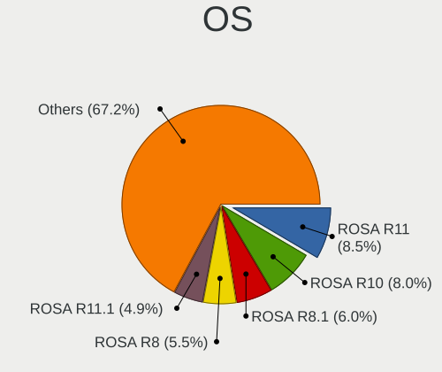

| Name               | Desktops | Percent |
|--------------------|----------|---------|
| ROSA R11           | 1623     | 8.47%   |
| ROSA R10           | 1543     | 8.05%   |
| ROSA R8.1          | 1144     | 5.97%   |
| ROSA R8            | 1049     | 5.47%   |
| ROSA R11.1         | 932      | 4.86%   |
| ROSA R9            | 931      | 4.86%   |
| ROSA 12.2          | 927      | 4.83%   |
| Debian 11          | 723      | 3.77%   |
| ROSA 12.4          | 690      | 3.6%    |
| ROSA 12.5.1        | 573      | 2.99%   |
| Debian 12          | 476      | 2.48%   |
| ROSA 12.3          | 459      | 2.39%   |
| Ubuntu 20.04       | 360      | 1.88%   |
| ROSA 13.0          | 338      | 1.76%   |
| Ubuntu 22.04       | 296      | 1.54%   |
| Arch Rolling       | 289      | 1.51%   |
| ROSA 12            | 254      | 1.32%   |
| OpenMandriva 4.2   | 243      | 1.27%   |
| Red OS 7.3         | 224      | 1.17%   |
| Ubuntu 18.04       | 206      | 1.07%   |
| OpenMandriva 4.3   | 191      | 1%      |
| ROSA 12.1          | 163      | 0.85%   |
| ROSA 12.5          | 137      | 0.71%   |
| Manjaro            | 113      | 0.59%   |
| Ubuntu 24.04       | 110      | 0.57%   |
| Debian 10          | 90       | 0.47%   |
| OpenMandriva 5.0   | 89       | 0.46%   |
| Xubuntu 20.04      | 87       | 0.45%   |
| KDE neon 20.04     | 87       | 0.45%   |
| Fedora 40          | 82       | 0.43%   |
| Kometa P10         | 81       | 0.42%   |
| ROSA 13.1          | 78       | 0.41%   |
| OpenMandriva 25.90 | 78       | 0.41%   |
| OpenMandriva 23.08 | 78       | 0.41%   |
| Red OS 8.0         | 75       | 0.39%   |
| OpenMandriva 23.03 | 75       | 0.39%   |
| OpenMandriva 23.01 | 75       | 0.39%   |
| OpenMandriva 24.12 | 72       | 0.38%   |
| Arch               | 68       | 0.35%   |
| Fedora 39          | 65       | 0.34%   |

OS Family
---------

OS without a version

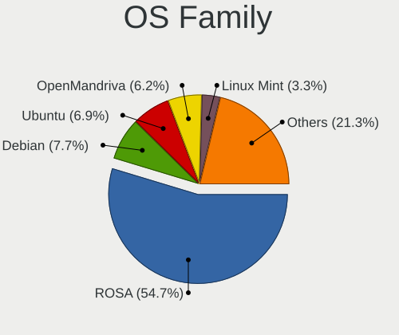

| Name             | Desktops | Percent |
|------------------|----------|---------|
| ROSA             | 9145     | 54.67%  |
| Debian           | 1288     | 7.7%    |
| Ubuntu           | 1153     | 6.89%   |
| OpenMandriva     | 1030     | 6.16%   |
| Linux Mint       | 553      | 3.31%   |
| Fedora           | 488      | 2.92%   |
| ALT Linux        | 450      | 2.69%   |
| Red OS           | 397      | 2.37%   |
| Arch             | 351      | 2.1%    |
| Manjaro          | 309      | 1.85%   |
| Kubuntu          | 152      | 0.91%   |
| Xubuntu          | 147      | 0.88%   |
| KDE neon         | 143      | 0.85%   |
| RED              | 115      | 0.69%   |
| Gentoo           | 86       | 0.51%   |
| Pop!_OS          | 75       | 0.45%   |
| openSUSE         | 71       | 0.42%   |
| Endless          | 54       | 0.32%   |
| ArcoLinux        | 50       | 0.3%    |
| Ubuntu MATE      | 42       | 0.25%   |
| Elementary       | 40       | 0.24%   |
| Zorin            | 38       | 0.23%   |
| EndeavourOS      | 34       | 0.2%    |
| Nobara           | 33       | 0.2%    |
| CentOS           | 31       | 0.19%   |
| Clear Linux      | 30       | 0.18%   |
| LMDE             | 28       | 0.17%   |
| NixOS            | 27       | 0.16%   |
| Lubuntu          | 24       | 0.14%   |
| RELS             | 23       | 0.14%   |
| Kali             | 22       | 0.13%   |
| Astra Linux      | 21       | 0.13%   |
| Ubuntu Unity     | 20       | 0.12%   |
| CachyOS          | 19       | 0.11%   |
| MX               | 15       | 0.09%   |
| org.kde.Platform | 14       | 0.08%   |
| Artix            | 13       | 0.08%   |
| SteamOS          | 11       | 0.07%   |
| Garuda Linux     | 10       | 0.06%   |
| Devuan           | 10       | 0.06%   |

Kernel
------

Version of the Linux kernel

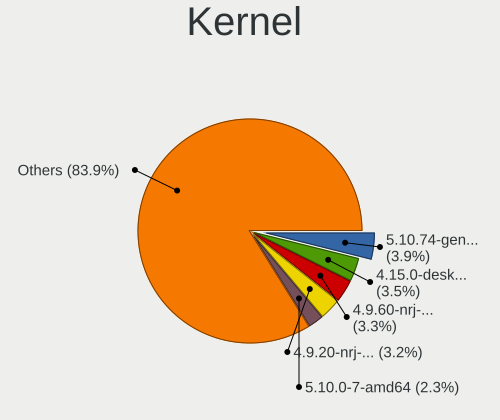

| Version                             | Desktops | Percent |
|-------------------------------------|----------|---------|
| 5.10.74-generic-2rosa2021.1-x86_64  | 811      | 3.9%    |
| 4.15.0-desktop-45.1rosa-x86_64      | 718      | 3.45%   |
| 4.9.60-nrj-desktop-1rosa-x86_64     | 691      | 3.32%   |
| 4.9.20-nrj-desktop-1rosa-x86_64     | 663      | 3.19%   |
| 5.10.0-7-amd64                      | 474      | 2.28%   |
| 4.1.34-nrj-desktop-2rosa-x86_64     | 401      | 1.93%   |
| 4.9.124-nrj-desktop-1rosa-x86_64    | 338      | 1.62%   |
| 6.1.20-generic-2rosa2021.1-x86_64   | 324      | 1.56%   |
| 4.1.25-nrj-desktop-1rosa-x86_64     | 313      | 1.5%    |
| 6.1.0-4-amd64                       | 286      | 1.37%   |
| 6.6.27-generic-3rosa2021.1-x86_64   | 270      | 1.3%    |
| 4.1.38-nrj-desktop-2rosa-x86_64     | 250      | 1.2%    |
| 4.9.9-nrj-desktop-1rosa-x86_64      | 248      | 1.19%   |
| 5.10.14-desktop-1omv4002            | 233      | 1.12%   |
| 6.6.47-generic-1rosa2021.1-x86_64   | 211      | 1.01%   |
| 4.9.76-nrj-desktop-1rosa-x86_64     | 208      | 1%      |
| 4.9.155-nrj-desktop-1rosa-x86_64    | 203      | 0.98%   |
| 4.9.41-nrj-desktop-1rosa-x86_64     | 202      | 0.97%   |
| 4.15.0-desktop-122.124.1rosa-x86_64 | 197      | 0.95%   |
| 6.1.58-generic-1rosa2021.1-x86_64   | 195      | 0.94%   |
| 4.15.0-desktop-68.5rosa-x86_64      | 195      | 0.94%   |
| 4.9.60-nrj-desktop-1rosa-i586       | 191      | 0.92%   |
| 4.9.20-nrj-desktop-1rosa-i586       | 181      | 0.87%   |
| 5.16.7-desktop-1omv4003             | 176      | 0.85%   |
| 4.15.0-desktop-45.1rosa-i586        | 174      | 0.84%   |
| 5.10.118-generic-2rosa2021.1-x86_64 | 172      | 0.83%   |
| 5.4.32-generic-2rosa-x86_64         | 168      | 0.81%   |
| 4.15.0-desktop-47.2rosa-x86_64      | 165      | 0.79%   |
| 5.15.75-generic-1rosa2021.1-x86_64  | 161      | 0.77%   |
| 5.4.83-generic-2rosa-x86_64         | 160      | 0.77%   |
| 4.9.9-nrj-desktop-1rosa-i586        | 147      | 0.71%   |
| 4.1.34-nrj-desktop-2rosa-i586       | 146      | 0.7%    |
| 5.15.79-generic-1rosa2021.1-x86_64  | 139      | 0.67%   |
| 4.15.0-desktop-94.1rosa-x86_64      | 137      | 0.66%   |
| 6.14.2-desktop-3omv2590             | 124      | 0.6%    |
| 4.1.38-nrj-desktop-2rosa-i586       | 113      | 0.54%   |
| 4.1.25-nrj-desktop-1rosa-i586       | 112      | 0.54%   |
| 5.10.0-2-amd64                      | 109      | 0.52%   |
| 6.6.2-desktop-1omv2390              | 99       | 0.48%   |
| 6.12.13-generic-4rosa13-x86_64      | 99       | 0.48%   |

Kernel Family
-------------

Linux kernel without a distro release

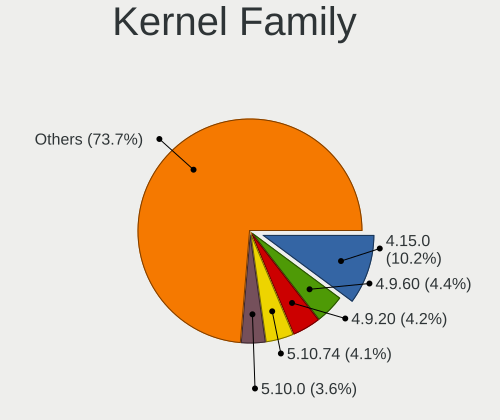

| Version  | Desktops | Percent |
|----------|----------|---------|
| 4.15.0   | 2051     | 10.15%  |
| 4.9.60   | 879      | 4.35%   |
| 4.9.20   | 840      | 4.16%   |
| 5.10.74  | 826      | 4.09%   |
| 5.10.0   | 719      | 3.56%   |
| 5.4.0    | 573      | 2.84%   |
| 4.1.34   | 544      | 2.69%   |
| 6.1.0    | 457      | 2.26%   |
| 5.15.0   | 439      | 2.17%   |
| 4.1.38   | 437      | 2.16%   |
| 4.1.25   | 425      | 2.1%    |
| 4.9.124  | 401      | 1.99%   |
| 4.9.9    | 392      | 1.94%   |
| 6.1.20   | 338      | 1.67%   |
| 6.6.27   | 281      | 1.39%   |
| 4.9.155  | 272      | 1.35%   |
| 4.9.41   | 258      | 1.28%   |
| 4.9.76   | 255      | 1.26%   |
| 5.10.14  | 233      | 1.15%   |
| 5.4.32   | 224      | 1.11%   |
| 6.6.47   | 213      | 1.05%   |
| 5.4.83   | 204      | 1.01%   |
| 6.1.58   | 200      | 0.99%   |
| 6.8.0    | 196      | 0.97%   |
| 5.10.118 | 178      | 0.88%   |
| 5.16.7   | 177      | 0.88%   |
| 5.15.75  | 175      | 0.87%   |
| 5.8.0    | 140      | 0.69%   |
| 5.15.79  | 140      | 0.69%   |
| 6.12.47  | 138      | 0.68%   |
| 5.3.0    | 137      | 0.68%   |
| 6.14.2   | 133      | 0.66%   |
| 5.11.0   | 131      | 0.65%   |
| 4.9.95   | 123      | 0.61%   |
| 6.12.34  | 120      | 0.59%   |
| 5.19.0   | 115      | 0.57%   |
| 5.0.0    | 112      | 0.55%   |
| 6.12.13  | 111      | 0.55%   |
| 4.9.111  | 107      | 0.53%   |
| 6.6.2    | 104      | 0.51%   |

Kernel Major Ver.
-----------------

Linux kernel major version

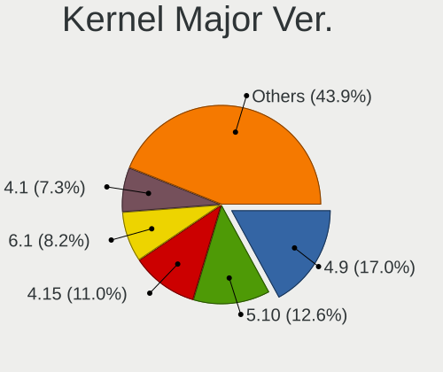

| Version | Desktops | Percent |
|---------|----------|---------|
| 4.9     | 3208     | 17.05%  |
| 5.10    | 2365     | 12.57%  |
| 4.15    | 2064     | 10.97%  |
| 6.1     | 1547     | 8.22%   |
| 4.1     | 1366     | 7.26%   |
| 5.4     | 1185     | 6.3%    |
| 5.15    | 1185     | 6.3%    |
| 6.6     | 905      | 4.81%   |
| 6.12    | 678      | 3.6%    |
| 6.8     | 324      | 1.72%   |
| 6.14    | 249      | 1.32%   |
| 5.16    | 248      | 1.32%   |
| 6.2     | 228      | 1.21%   |
| 5.11    | 211      | 1.12%   |
| 5.8     | 197      | 1.05%   |
| 6.5     | 195      | 1.04%   |
| 5.3     | 186      | 0.99%   |
| 5.19    | 163      | 0.87%   |
| 6.4     | 145      | 0.77%   |
| 5.0     | 131      | 0.7%    |
| 6.10    | 130      | 0.69%   |
| 6.11    | 128      | 0.68%   |
| 5.13    | 127      | 0.67%   |
| 5.18    | 124      | 0.66%   |
| 6.0     | 119      | 0.63%   |
| 4.19    | 113      | 0.6%    |
| 5.14    | 105      | 0.56%   |
| 4.18    | 96       | 0.51%   |
| 5.17    | 92       | 0.49%   |
| 6.7     | 80       | 0.43%   |
| 6.9     | 72       | 0.38%   |
| 5.6     | 61       | 0.32%   |
| 6.13    | 57       | 0.3%    |
| 5.9     | 57       | 0.3%    |
| 4.4     | 57       | 0.3%    |
| 6.17    | 52       | 0.28%   |
| 4.13    | 50       | 0.27%   |
| 6.15    | 48       | 0.26%   |
| 5.12    | 47       | 0.25%   |
| 6.3     | 46       | 0.24%   |

Arch
----

OS architecture (x86_64, i586, etc.)

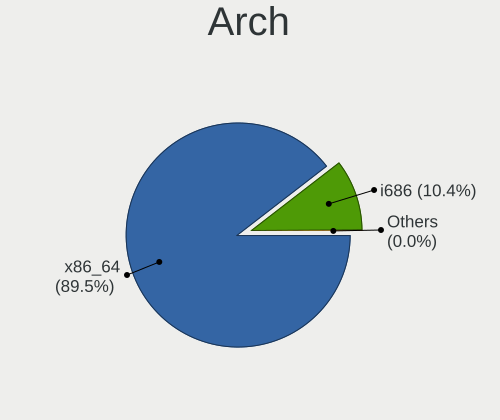

| Name        | Desktops | Percent |
|-------------|----------|---------|
| x86_64      | 14586    | 89.53%  |
| i686        | 1689     | 10.37%  |
| e2k         | 8        | 0.05%   |
| loongarch64 | 2        | 0.01%   |
| riscv64     | 1        | 0.01%   |
| ppc64       | 1        | 0.01%   |
| mips        | 1        | 0.01%   |
| i586        | 1        | 0.01%   |
| armv7l      | 1        | 0.01%   |
| armv6l      | 1        | 0.01%   |

DE
--

Desktop Environment

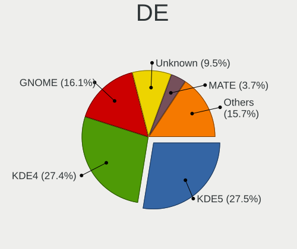

| Name              | Desktops | Percent |
|-------------------|----------|---------|
| KDE5              | 4810     | 27.53%  |
| KDE4              | 4788     | 27.41%  |
| GNOME             | 2814     | 16.11%  |
| Unknown           | 1667     | 9.54%   |
| MATE              | 651      | 3.73%   |
| KDE6              | 646      | 3.7%    |
| XFCE              | 590      | 3.38%   |
| LXQt              | 499      | 2.86%   |
| X-Cinnamon        | 333      | 1.91%   |
| Cinnamon          | 221      | 1.27%   |
| KDE               | 163      | 0.93%   |
| Pantheon          | 39       | 0.22%   |
| i3                | 33       | 0.19%   |
| Hyprland          | 30       | 0.17%   |
| LXDE              | 29       | 0.17%   |
| Unity             | 20       | 0.11%   |
| Budgie            | 19       | 0.11%   |
| fly               | 18       | 0.1%    |
| GNOME Flashback   | 13       | 0.07%   |
| GNOME Classic     | 11       | 0.06%   |
| Deepin            | 8        | 0.05%   |
| openbox           | 7        | 0.04%   |
| sway              | 6        | 0.03%   |
| icewm             | 6        | 0.03%   |
| bspwm             | 6        | 0.03%   |
| awesome           | 6        | 0.03%   |
| lightdm-xsession  | 5        | 0.03%   |
| KDE:KDE-Wayland   | 5        | 0.03%   |
| KDE:KDE-X11       | 4        | 0.02%   |
| dwm               | 4        | 0.02%   |
| Trinity           | 3        | 0.02%   |
| xmonad            | 2        | 0.01%   |
| niri              | 2        | 0.01%   |
| x-session-manager | 1        | 0.01%   |
| X-Generic         | 1        | 0.01%   |
| wlroots           | 1        | 0.01%   |
| steamos           | 1        | 0.01%   |
| none+bspwm        | 1        | 0.01%   |
| none+awesome      | 1        | 0.01%   |
| KDE:KDE-Wayland:  | 1        | 0.01%   |

Display Server
--------------

X11 or Wayland

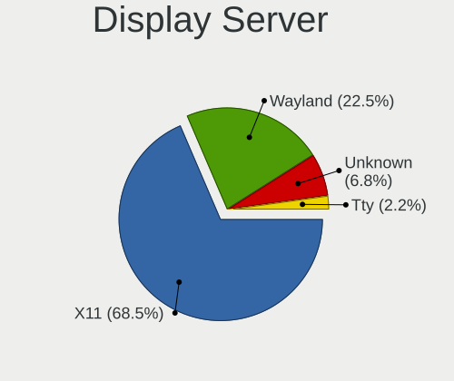

| Name    | Desktops | Percent |
|---------|----------|---------|
| X11     | 11534    | 68.55%  |
| Wayland | 3781     | 22.47%  |
| Unknown | 1144     | 6.8%    |
| Tty     | 367      | 2.18%   |

Display Manager
---------------

SDDM, LightDM, etc.

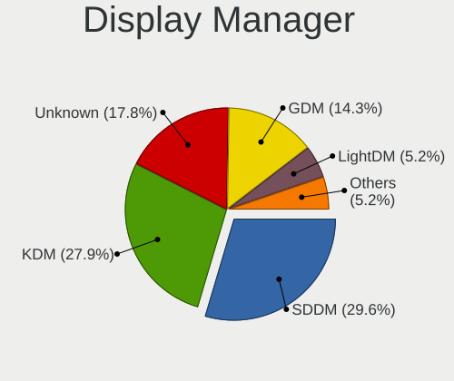

| Name                  | Desktops | Percent |
|-----------------------|----------|---------|
| SDDM                  | 5124     | 29.59%  |
| KDM                   | 4823     | 27.85%  |
| Unknown               | 3083     | 17.81%  |
| GDM                   | 2482     | 14.33%  |
| LightDM               | 898      | 5.19%   |
| GDM3                  | 494      | 2.85%   |
| TDM                   | 322      | 1.86%   |
| MDM                   | 22       | 0.13%   |
| SLiM                  | 12       | 0.07%   |
| XDM                   | 11       | 0.06%   |
| LXDM                  | 11       | 0.06%   |
| FLY-DM                | 10       | 0.06%   |
| GREETD                | 8        | 0.05%   |
| LY-DM                 | 6        | 0.03%   |
| Ly                    | 2        | 0.01%   |
| LDM                   | 2        | 0.01%   |
| WDM                   | 1        | 0.01%   |
| SLIMSKI               | 1        | 0.01%   |
| PLASMALOGIN           | 1        | 0.01%   |
| NODM                  | 1        | 0.01%   |
| DISPLAY-MANAGER-START | 1        | 0.01%   |

OS Lang
-------

Language

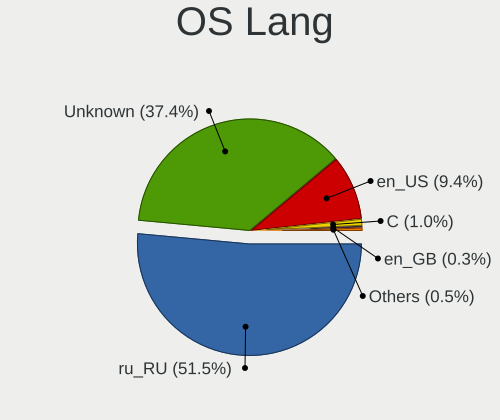

| Lang         | Desktops | Percent |
|--------------|----------|---------|
| ru_RU        | 8655     | 51.47%  |
| Unknown      | 6296     | 37.44%  |
| en_US        | 1574     | 9.36%   |
| C            | 166      | 0.99%   |
| en_GB        | 44       | 0.26%   |
| ru_UA        | 13       | 0.08%   |
| ru_RU.UTF_8  | 9        | 0.05%   |
| ru_RU.UTF8   | 9        | 0.05%   |
| POSIX        | 9        | 0.05%   |
| C.UTF8       | 9        | 0.05%   |
| cv_RU        | 4        | 0.02%   |
| ru           | 3        | 0.02%   |
| en_IE        | 3        | 0.02%   |
| en_DK        | 3        | 0.02%   |
| ba_RU        | 3        | 0.02%   |
| tt_RU        | 2        | 0.01%   |
| en_AU        | 2        | 0.01%   |
| zh_CN        | 1        | 0.01%   |
| uk_UA        | 1        | 0.01%   |
| ru_RU.KOI8-R | 1        | 0.01%   |
| myv_RU       | 1        | 0.01%   |
| it_IT        | 1        | 0.01%   |
| fr_FR        | 1        | 0.01%   |
| eo           | 1        | 0.01%   |
| en_RU        | 1        | 0.01%   |
| en_CA        | 1        | 0.01%   |
| en_AG        | 1        | 0.01%   |
| de_DE        | 1        | 0.01%   |
| Default      | 1        | 0.01%   |
| ce_RU        | 1        | 0.01%   |

Boot Mode
---------

EFI or BIOS

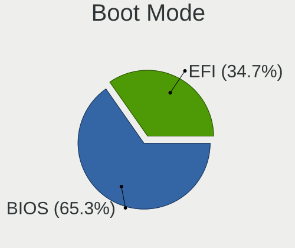

| Mode | Desktops | Percent |
|------|----------|---------|
| BIOS | 10829    | 65.27%  |
| EFI  | 5762     | 34.73%  |

Filesystem
----------

Type of filesystem

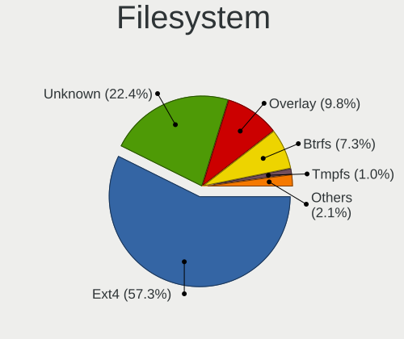

| Type     | Desktops | Percent |
|----------|----------|---------|
| Ext4     | 9822     | 57.34%  |
| Unknown  | 3833     | 22.38%  |
| Overlay  | 1673     | 9.77%   |
| Btrfs    | 1253     | 7.32%   |
| Tmpfs    | 179      | 1.05%   |
| Xfs      | 152      | 0.89%   |
| Zfs      | 70       | 0.41%   |
| Ext3     | 51       | 0.3%    |
| F2fs     | 43       | 0.25%   |
| Ext2     | 21       | 0.12%   |
| Reiserfs | 7        | 0.04%   |
| Aufs     | 7        | 0.04%   |
| SAMSUNG  | 4        | 0.02%   |
| Jfs      | 4        | 0.02%   |
| XXXXXXX  | 3        | 0.02%   |
| Rootfs   | 3        | 0.02%   |
| XXXXX    | 1        | 0.01%   |
| Udf      | 1        | 0.01%   |
| Exfat    | 1        | 0.01%   |

Part. scheme
------------

Scheme of partitioning

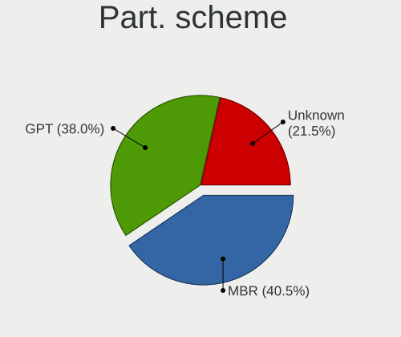

| Type    | Desktops | Percent |
|---------|----------|---------|
| MBR     | 6935     | 40.54%  |
| GPT     | 6496     | 37.97%  |
| Unknown | 3676     | 21.49%  |

Dual Boot with Linux/BSD
------------------------

Hosting more than one Linux/BSD

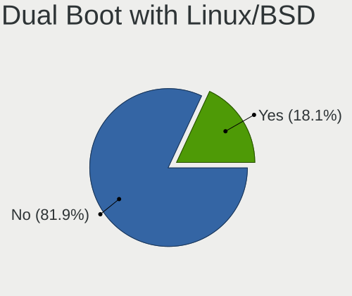

| Dual boot | Desktops | Percent |
|-----------|----------|---------|
| No        | 13831    | 81.95%  |
| Yes       | 3047     | 18.05%  |

Dual Boot (Win)
---------------

Hosting Linux and Windows

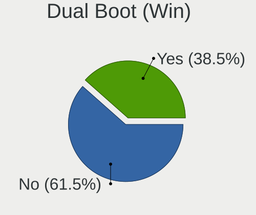

| Dual boot | Desktops | Percent |
|-----------|----------|---------|
| No        | 10438    | 61.53%  |
| Yes       | 6525     | 38.47%  |

Board
-----

Vendor
------

Motherboard manufacturer

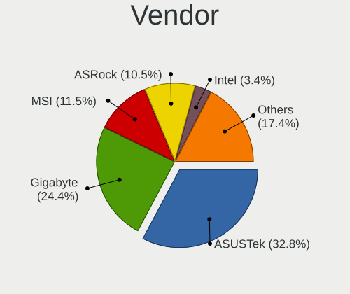

| Name                | Desktops | Percent |
|---------------------|----------|---------|
| ASUSTek Computer    | 5290     | 32.79%  |
| Gigabyte Technology | 3940     | 24.42%  |
| MSI                 | 1852     | 11.48%  |
| ASRock              | 1694     | 10.5%   |
| Intel               | 545      | 3.38%   |
| Unknown             | 341      | 2.11%   |
| ECS                 | 303      | 1.88%   |
| Hewlett-Packard     | 267      | 1.66%   |
| Acer                | 194      | 1.2%    |
| Biostar             | 187      | 1.16%   |
| Lenovo              | 171      | 1.06%   |
| Huanan              | 151      | 0.94%   |
| Foxconn             | 145      | 0.9%    |
| Dell                | 126      | 0.78%   |
| Pegatron            | 95       | 0.59%   |
| Supermicro          | 74       | 0.46%   |
| AZW                 | 56       | 0.35%   |
| MACHINIST           | 35       | 0.22%   |
| DEPO Computers      | 31       | 0.19%   |
| OEM                 | 29       | 0.18%   |
| EPoX Computer       | 27       | 0.17%   |
| Aquarius            | 27       | 0.17%   |
| Inspur              | 23       | 0.14%   |
| WinFast             | 21       | 0.13%   |
| Fujitsu             | 21       | 0.13%   |
| MAINBRD             | 20       | 0.12%   |
| Kraftway            | 15       | 0.09%   |
| BESHTAU             | 15       | 0.09%   |
| iRU                 | 14       | 0.09%   |
| Fujitsu Siemens     | 14       | 0.09%   |
| KVADRA              | 13       | 0.08%   |
| Graviton            | 12       | 0.07%   |
| AMD                 | 12       | 0.07%   |
| Nvidia              | 11       | 0.07%   |
| JGINYUE             | 11       | 0.07%   |
| ICL                 | 11       | 0.07%   |
| Shuttle             | 10       | 0.06%   |
| QIYIDA              | 9        | 0.06%   |
| Kllisre             | 9        | 0.06%   |
| SiS Technology      | 8        | 0.05%   |

Model
-----

Motherboard model

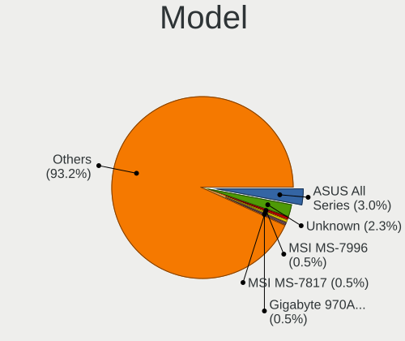

| Name                    | Desktops | Percent |
|-------------------------|----------|---------|
| ASUS All Series         | 477      | 2.96%   |
| Unknown                 | 365      | 2.26%   |
| MSI MS-7996             | 86       | 0.53%   |
| MSI MS-7817             | 83       | 0.51%   |
| Gigabyte 970A-DS3P      | 82       | 0.51%   |
| Intel SKYBAY            | 77       | 0.48%   |
| ASUS H110M-R            | 76       | 0.47%   |
| ASUS P8H61-M LX3 R2.0   | 73       | 0.45%   |
| ASUS M5A78L-M LX3       | 71       | 0.44%   |
| Intel X99               | 62       | 0.38%   |
| ASUS PRIME A320M-K      | 56       | 0.35%   |
| ASUS M5A97 R2.0         | 56       | 0.35%   |
| ASUS S20 K29            | 55       | 0.34%   |
| ASUS P5K                | 55       | 0.34%   |
| MSI MS-7529             | 54       | 0.33%   |
| Gigabyte H61M-S2PV      | 53       | 0.33%   |
| Gigabyte H61M-S1        | 53       | 0.33%   |
| ASUS P5G41T-M LX2/GB    | 50       | 0.31%   |
| Gigabyte G31M-ES2L      | 49       | 0.3%    |
| MSI MS-7592             | 48       | 0.3%    |
| ASRock G31M-S           | 47       | 0.29%   |
| ASUS P5KPL-AM           | 45       | 0.28%   |
| ASRock N68C-S UCC       | 45       | 0.28%   |
| ASUS M5A78L-M/USB3      | 43       | 0.27%   |
| Gigabyte A320M-S2H V2   | 42       | 0.26%   |
| ASUS H110M-K            | 42       | 0.26%   |
| MSI MS-7C56             | 41       | 0.25%   |
| Gigabyte H81M-S2V       | 41       | 0.25%   |
| ASUS P8Z77-V LX         | 40       | 0.25%   |
| ASUS M5A97 LE R2.0      | 40       | 0.25%   |
| ECS G31T-M9             | 39       | 0.24%   |
| ASUS H61M-K             | 39       | 0.24%   |
| ASUS A68HM-K            | 39       | 0.24%   |
| MSI MS-7A38             | 38       | 0.24%   |
| Gigabyte GA-78LMT-S2    | 38       | 0.24%   |
| Gigabyte B450M S2H      | 38       | 0.24%   |
| Gigabyte B450M DS3H     | 38       | 0.24%   |
| Gigabyte A320M-H        | 38       | 0.24%   |
| Gigabyte Z77-DS3H       | 37       | 0.23%   |
| ASUS PRIME H310M-R R2.0 | 37       | 0.23%   |

Model Family
------------

Motherboard model prefix

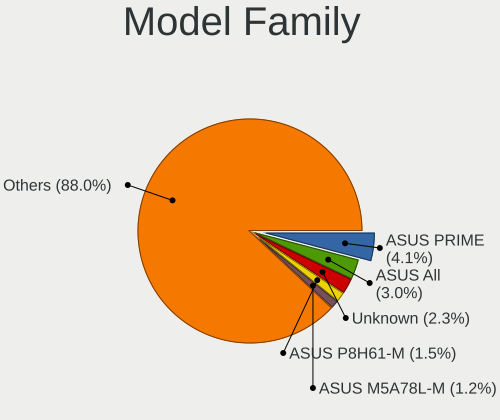

| Name               | Desktops | Percent |
|--------------------|----------|---------|
| ASUS PRIME         | 662      | 4.1%    |
| ASUS All           | 477      | 2.96%   |
| Unknown            | 365      | 2.26%   |
| ASUS P8H61-M       | 234      | 1.45%   |
| ASUS M5A78L-M      | 194      | 1.2%    |
| ASUS TUF           | 169      | 1.05%   |
| ASUS P5KPL-AM      | 138      | 0.86%   |
| Gigabyte B450M     | 133      | 0.82%   |
| ASUS ROG           | 128      | 0.79%   |
| ASUS M5A97         | 126      | 0.78%   |
| ASUS P5G41T-M      | 122      | 0.76%   |
| ASUS P5K           | 114      | 0.71%   |
| ASUS P8Z77-V       | 107      | 0.66%   |
| Acer Aspire        | 106      | 0.66%   |
| Lenovo ThinkCentre | 95       | 0.59%   |
| HP Compaq          | 91       | 0.56%   |
| Dell OptiPlex      | 90       | 0.56%   |
| MSI MS-7996        | 86       | 0.53%   |
| Gigabyte 970A-DS3P | 85       | 0.53%   |
| MSI MS-7817        | 83       | 0.51%   |
| Gigabyte B450      | 83       | 0.51%   |
| ASUS P5Q           | 83       | 0.51%   |
| Intel X99          | 79       | 0.49%   |
| Intel SKYBAY       | 77       | 0.48%   |
| ASUS H110M-R       | 76       | 0.47%   |
| Acer Veriton       | 73       | 0.45%   |
| Gigabyte B550M     | 71       | 0.44%   |
| Gigabyte H410M     | 70       | 0.43%   |
| Gigabyte A320M-S2H | 69       | 0.43%   |
| ASUS P8H77-V       | 64       | 0.4%    |
| Gigabyte B550      | 62       | 0.38%   |
| ASUS P8H67-M       | 62       | 0.38%   |
| ASUS P8H61-MX      | 61       | 0.38%   |
| Gigabyte H310M     | 60       | 0.37%   |
| ASRock B450M       | 59       | 0.37%   |
| ASUS SABERTOOTH    | 58       | 0.36%   |
| ASUS S20           | 55       | 0.34%   |
| ASUS P7H55-M       | 55       | 0.34%   |
| MSI MS-7529        | 54       | 0.33%   |
| Gigabyte H61M-S2PV | 53       | 0.33%   |

MFG Year
--------

Motherboard manufacture year

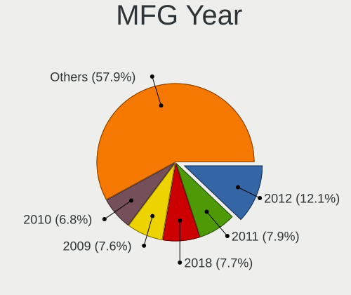

| Year    | Desktops | Percent |
|---------|----------|---------|
| 2012    | 1953     | 12.11%  |
| 2011    | 1269     | 7.87%   |
| 2018    | 1239     | 7.68%   |
| 2009    | 1221     | 7.57%   |
| 2010    | 1105     | 6.85%   |
| 2013    | 1078     | 6.68%   |
| 2008    | 871      | 5.4%    |
| 2007    | 836      | 5.18%   |
| 2020    | 800      | 4.96%   |
| 2021    | 734      | 4.55%   |
| 2019    | 681      | 4.22%   |
| 2014    | 638      | 3.95%   |
| 2016    | 634      | 3.93%   |
| 2017    | 615      | 3.81%   |
| 2015    | 550      | 3.41%   |
| 2006    | 527      | 3.27%   |
| 2022    | 511      | 3.17%   |
| 2023    | 310      | 1.92%   |
| 2005    | 204      | 1.26%   |
| 2024    | 149      | 0.92%   |
| 2004    | 76       | 0.47%   |
| 2003    | 46       | 0.29%   |
| 2025    | 42       | 0.26%   |
| Unknown | 30       | 0.19%   |
| 2002    | 8        | 0.05%   |
| 2001    | 4        | 0.02%   |
| 2000    | 1        | 0.01%   |

Form Factor
-----------

Physical design of the computer

| Name    | Desktops | Percent |
|---------|----------|---------|
| Desktop | 16132    | 100%    |

Secure Boot
-----------

Enabled or disabled

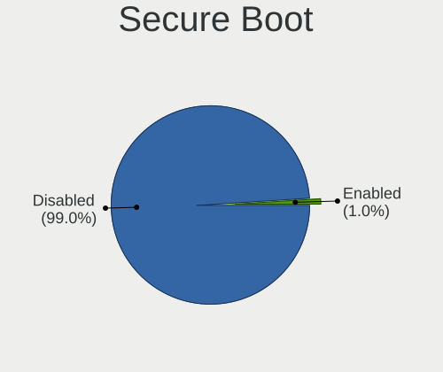

| State    | Desktops | Percent |
|----------|----------|---------|
| Disabled | 15983    | 98.98%  |
| Enabled  | 164      | 1.02%   |

Coreboot
--------

Have coreboot on board

| Used | Desktops | Percent |
|------|----------|---------|
| No   | 16128    | 99.98%  |
| Yes  | 4        | 0.02%   |

RAM Size
--------

Total RAM memory

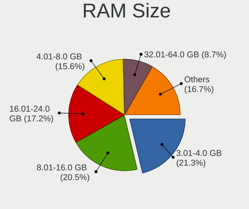

| Size in GB      | Desktops | Percent |
|-----------------|----------|---------|
| 3.01-4.0        | 3592     | 21.29%  |
| 8.01-16.0       | 3465     | 20.53%  |
| 16.01-24.0      | 2903     | 17.2%   |
| 4.01-8.0        | 2635     | 15.62%  |
| 32.01-64.0      | 1461     | 8.66%   |
| 1.01-2.0        | 1134     | 6.72%   |
| 2.01-3.0        | 705      | 4.18%   |
| 64.01-256.0     | 475      | 2.81%   |
| 24.01-32.0      | 296      | 1.75%   |
| 0.51-1.0        | 167      | 0.99%   |
| More than 256.0 | 23       | 0.14%   |
| 0.01-0.5        | 15       | 0.09%   |
| Unknown         | 3        | 0.02%   |

RAM Used
--------

Used RAM memory

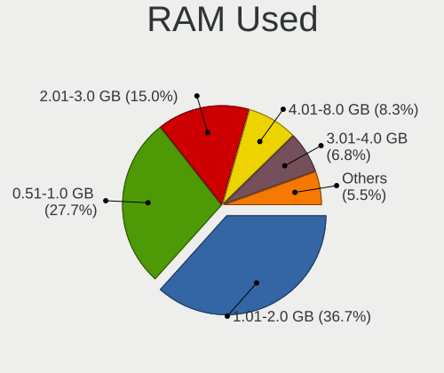

| Used GB         | Desktops | Percent |
|-----------------|----------|---------|
| 1.01-2.0        | 6794     | 36.66%  |
| 0.51-1.0        | 5138     | 27.73%  |
| 2.01-3.0        | 2785     | 15.03%  |
| 4.01-8.0        | 1531     | 8.26%   |
| 3.01-4.0        | 1261     | 6.8%    |
| 8.01-16.0       | 476      | 2.57%   |
| 0.01-0.5        | 336      | 1.81%   |
| 16.01-24.0      | 102      | 0.55%   |
| 24.01-32.0      | 47       | 0.25%   |
| 32.01-64.0      | 39       | 0.21%   |
| Unknown         | 12       | 0.06%   |
| 64.01-256.0     | 8        | 0.04%   |
| More than 256.0 | 3        | 0.02%   |

Total Drives
------------

Number of drives on board

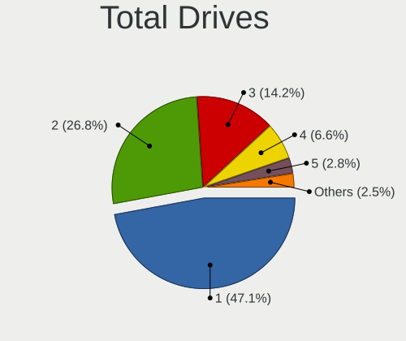

| Drives  | Desktops | Percent |
|---------|----------|---------|
| 1       | 8133     | 47.09%  |
| 2       | 4635     | 26.84%  |
| 3       | 2451     | 14.19%  |
| 4       | 1137     | 6.58%   |
| 5       | 481      | 2.79%   |
| 6       | 178      | 1.03%   |
| 0       | 118      | 0.68%   |
| 7       | 71       | 0.41%   |
| 8       | 31       | 0.18%   |
| 9       | 13       | 0.08%   |
| 10      | 9        | 0.05%   |
| 25      | 2        | 0.01%   |
| 18      | 2        | 0.01%   |
| 17      | 2        | 0.01%   |
| 12      | 2        | 0.01%   |
| 26      | 1        | 0.01%   |
| 16      | 1        | 0.01%   |
| 13      | 1        | 0.01%   |
| 11      | 1        | 0.01%   |
| Unknown | 1        | 0.01%   |

Has CD-ROM
----------

Has CD-ROM on board

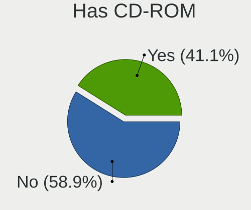

| Presented | Desktops | Percent |
|-----------|----------|---------|
| No        | 9745     | 58.94%  |
| Yes       | 6788     | 41.06%  |

Has Ethernet
------------

Has Ethernet on board

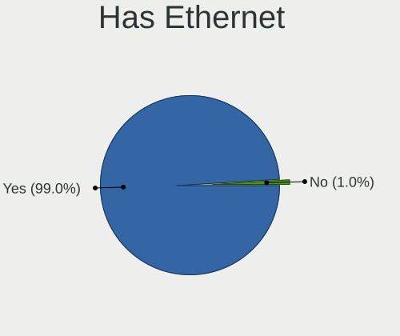

| Presented | Desktops | Percent |
|-----------|----------|---------|
| Yes       | 15979    | 99.04%  |
| No        | 155      | 0.96%   |

Has WiFi
--------

Has WiFi module

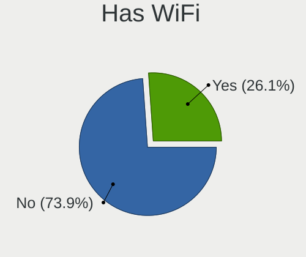

| Presented | Desktops | Percent |
|-----------|----------|---------|
| No        | 12147    | 73.89%  |
| Yes       | 4293     | 26.11%  |

Has Bluetooth
-------------

Has Bluetooth module

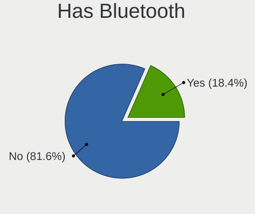

| Presented | Desktops | Percent |
|-----------|----------|---------|
| No        | 13413    | 81.57%  |
| Yes       | 3030     | 18.43%  |

Location
--------

Country
-------

Geographic location (country)

| Country | Desktops | Percent |
|---------|----------|---------|
| Russia  | 16132    | 100%    |

City
----

Geographic location (city)

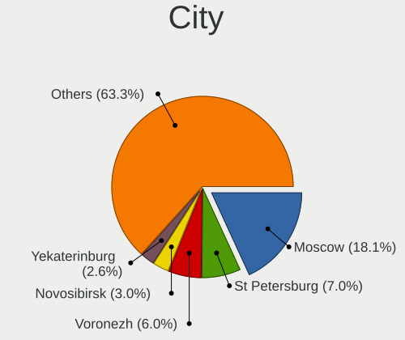

| City             | Desktops | Percent |
|------------------|----------|---------|
| Moscow           | 3129     | 18.14%  |
| St Petersburg    | 1213     | 7.03%   |
| Voronezh         | 1030     | 5.97%   |
| Novosibirsk      | 512      | 2.97%   |
| Yekaterinburg    | 445      | 2.58%   |
| Pecherskoye      | 418      | 2.42%   |
| Krasnodar        | 392      | 2.27%   |
| Rostov-on-Don    | 317      | 1.84%   |
| Samara           | 307      | 1.78%   |
| Nizhniy Novgorod | 294      | 1.7%    |
| Perm             | 271      | 1.57%   |
| Chelyabinsk      | 270      | 1.57%   |
| Krasnoyarsk      | 214      | 1.24%   |
| Omsk             | 190      | 1.1%    |
| Saratov          | 178      | 1.03%   |
| Volgograd        | 165      | 0.96%   |
| Ufa              | 165      | 0.96%   |
| Kazan’         | 164      | 0.95%   |
| Stavropol        | 147      | 0.85%   |
| Irkutsk          | 144      | 0.83%   |
| Vladivostok      | 139      | 0.81%   |
| Barnaul          | 138      | 0.8%    |
| Tyumen           | 131      | 0.76%   |
| Khabarovsk       | 124      | 0.72%   |
| Ulyanovsk        | 123      | 0.71%   |
| Tomsk            | 106      | 0.61%   |
| Orenburg         | 100      | 0.58%   |
| Yaroslavl        | 99       | 0.57%   |
| Bryansk          | 97       | 0.56%   |
| Tula             | 93       | 0.54%   |
| Lipetsk          | 92       | 0.53%   |
| Belgorod         | 91       | 0.53%   |
| Kemerovo         | 88       | 0.51%   |
| Tolyatti         | 86       | 0.5%    |
| Cheboksary       | 86       | 0.5%    |
| Smolensk         | 85       | 0.49%   |
| Penza            | 84       | 0.49%   |
| Novokuznetsk     | 83       | 0.48%   |
| Kaliningrad      | 82       | 0.48%   |
| Ryazan           | 80       | 0.46%   |

Drives
------

Drive Vendor
------------

Hard drive vendors

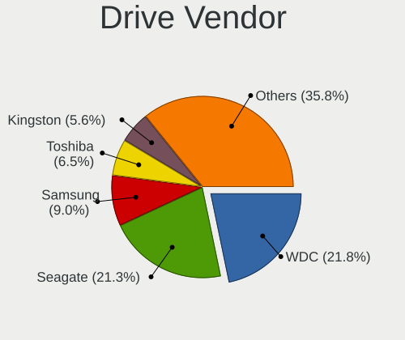

| Vendor                      | Desktops | Drives | Percent |
|-----------------------------|----------|--------|---------|
| WDC                         | 6082     | 10996  | 21.75%  |
| Seagate                     | 5960     | 9913   | 21.32%  |
| Samsung Electronics         | 2518     | 4042   | 9.01%   |
| Toshiba                     | 1824     | 2826   | 6.52%   |
| Kingston                    | 1565     | 2262   | 5.6%    |
| Hitachi                     | 1250     | 1843   | 4.47%   |
| A-DATA Technology           | 643      | 868    | 2.3%    |
| China                       | 547      | 766    | 1.96%   |
| Crucial                     | 456      | 622    | 1.63%   |
| Apacer                      | 419      | 588    | 1.5%    |
| SPCC                        | 398      | 519    | 1.42%   |
| Intel                       | 355      | 758    | 1.27%   |
| SanDisk                     | 349      | 558    | 1.25%   |
| Maxtor                      | 318      | 406    | 1.14%   |
| OCZ                         | 288      | 372    | 1.03%   |
| HGST                        | 271      | 454    | 0.97%   |
| Plextor                     | 238      | 372    | 0.85%   |
| Patriot                     | 230      | 310    | 0.82%   |
| Silicon Motion              | 225      | 298    | 0.8%    |
| AMD                         | 223      | 295    | 0.8%    |
| Netac                       | 213      | 359    | 0.76%   |
| KingSpec                    | 185      | 254    | 0.66%   |
| Smartbuy                    | 177      | 244    | 0.63%   |
| MAXIO Technology (Hangzhou) | 154      | 176    | 0.55%   |
| ADATA Technology            | 127      | 193    | 0.45%   |
| Transcend                   | 126      | 168    | 0.45%   |
| Unknown                     | 120      | 190    | 0.43%   |
| GOODRAM                     | 113      | 165    | 0.4%    |
| Phison Electronics          | 107      | 151    | 0.38%   |
| Gigabyte Technology         | 107      | 148    | 0.38%   |
| Corsair                     | 102      | 147    | 0.36%   |
| HUAWEI                      | 94       | 113    | 0.34%   |
| Phison                      | 85       | 105    | 0.3%    |
| Unknown                     | 84       | 103    | 0.3%    |
| XrayDisk                    | 83       | 114    | 0.3%    |
| Kingston Technology Company | 81       | 101    | 0.29%   |
| XPG                         | 76       | 106    | 0.27%   |
| Realtek Semiconductor       | 69       | 80     | 0.25%   |
| JMicron Technology          | 69       | 74     | 0.25%   |
| Hewlett-Packard             | 68       | 115    | 0.24%   |

Drive Model
-----------

Hard drive models

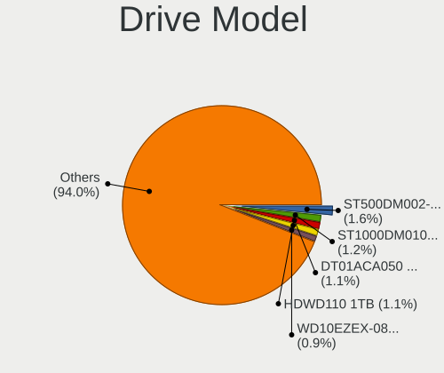

| Model                                                 | Desktops | Percent |
|-------------------------------------------------------|----------|---------|
| Seagate ST500DM002-1BD142 500GB                       | 496      | 1.55%   |
| Seagate ST1000DM010-2EP102 1TB                        | 378      | 1.18%   |
| Toshiba DT01ACA050 500GB                              | 365      | 1.14%   |
| Toshiba HDWD110 1TB                                   | 361      | 1.13%   |
| WDC WD10EZEX-08WN4A0 1TB                              | 303      | 0.95%   |
| Seagate ST3500418AS 500GB                             | 298      | 0.93%   |
| Kingston SA400S37240G 240GB SSD                       | 279      | 0.87%   |
| Toshiba DT01ACA100 1TB                                | 249      | 0.78%   |
| Seagate ST1000DM003-1CH162 1TB                        | 247      | 0.77%   |
| Kingston SA400S37120G 120GB SSD                       | 219      | 0.68%   |
| Samsung SSD 860 EVO 250GB                             | 194      | 0.61%   |
| WDC WDS240G2G0A-00JH30 240GB SSD                      | 184      | 0.58%   |
| Kingston SV300S37A120G 120GB SSD                      | 166      | 0.52%   |
| WDC WD5000AAKX-001CA0 500GB                           | 165      | 0.52%   |
| Kingston SA400S37480G 480GB SSD                       | 162      | 0.51%   |
| Seagate ST1000DM003-1ER162 1TB                        | 156      | 0.49%   |
| Samsung NVMe SSD Controller SM981/PM981/PM983 1TB     | 154      | 0.48%   |
| Seagate ST3250410AS 250GB                             | 152      | 0.48%   |
| Seagate ST31000524AS 1TB                              | 152      | 0.48%   |
| Seagate ST380815AS 80GB                               | 145      | 0.45%   |
| Seagate ST380011A 80GB                                | 141      | 0.44%   |
| Seagate ST3160815AS 160GB                             | 138      | 0.43%   |
| Hitachi HDS721050CLA362 500GB                         | 138      | 0.43%   |
| Seagate ST31000528AS 1TB                              | 133      | 0.42%   |
| Seagate ST3250310AS 250GB                             | 131      | 0.41%   |
| WDC WDS120G2G0A-00JH30 120GB SSD                      | 130      | 0.41%   |
| Toshiba HDWD105 500GB                                 | 130      | 0.41%   |
| Seagate ST1000DM003-9YN162 1TB                        | 120      | 0.38%   |
| Crucial CT480BX500SSD1 480GB                          | 120      | 0.38%   |
| Seagate ST3500413AS 500GB                             | 110      | 0.34%   |
| Crucial CT240BX500SSD1 240GB                          | 108      | 0.34%   |
| WDC WD5000AAKX-00ERMA0 500GB                          | 107      | 0.33%   |
| Seagate ST250DM000-1BD141 250GB                       | 106      | 0.33%   |
| Seagate ST2000DM008-2FR102 2TB                        | 106      | 0.33%   |
| Samsung SSD 860 EVO 500GB                             | 106      | 0.33%   |
| Seagate ST3250318AS 250GB                             | 104      | 0.33%   |
| MAXIO (Hangzhou) NVMe SSD Controller MAP1202 2TB      | 102      | 0.32%   |
| WDC WD10EZEX-00BN5A0 1TB                              | 101      | 0.32%   |
| Silicon Motion SM2263EN/SM2263XT SSD Controller 512GB | 100      | 0.31%   |
| Seagate ST2000DM001-1CH164 2TB                        | 100      | 0.31%   |

HDD Vendor
----------

Hard disk drive vendors

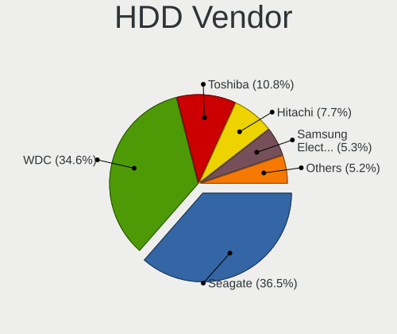

| Vendor              | Desktops | Drives | Percent |
|---------------------|----------|--------|---------|
| Seagate             | 5936     | 9844   | 36.45%  |
| WDC                 | 5633     | 9937   | 34.59%  |
| Toshiba             | 1757     | 2691   | 10.79%  |
| Hitachi             | 1249     | 1842   | 7.67%   |
| Samsung Electronics | 861      | 1244   | 5.29%   |
| Maxtor              | 313      | 400    | 1.92%   |
| HGST                | 271      | 454    | 1.66%   |
| Fujitsu             | 54       | 85     | 0.33%   |
| JMicron Technology  | 49       | 53     | 0.3%    |
| Unknown             | 30       | 54     | 0.18%   |
| Hewlett-Packard     | 16       | 41     | 0.1%    |
| IBM/Hitachi         | 12       | 15     | 0.07%   |
| TO Exter            | 11       | 12     | 0.07%   |
| External            | 9        | 11     | 0.06%   |
| ASMT                | 9        | 22     | 0.06%   |
| USB3.0              | 7        | 7      | 0.04%   |
| USB                 | 6        | 7      | 0.04%   |
| Apple               | 5        | 5      | 0.03%   |
| IBM                 | 4        | 4      | 0.02%   |
| ExcelStor           | 4        | 4      | 0.02%   |
| WD MediaMax         | 3        | 3      | 0.02%   |
| StoreJet            | 3        | 3      | 0.02%   |
| Quantum             | 3        | 3      | 0.02%   |
| HGST HTS            | 3        | 3      | 0.02%   |
| Unknown             | 3        | 3      | 0.02%   |
| Synology            | 2        | 3      | 0.01%   |
| SATAFIRM            | 2        | 2      | 0.01%   |
| SAGE                | 2        | 2      | 0.01%   |
| NVME USB            | 2        | 2      | 0.01%   |
| Min Yi U            | 2        | 2      | 0.01%   |
| JetFlash            | 2        | 2      | 0.01%   |
| CLOVER              | 2        | 2      | 0.01%   |
| BR                  | 2        | 2      | 0.01%   |
| ASMT106x            | 2        | 3      | 0.01%   |
| XrayDisk            | 1        | 1      | 0.01%   |
| USB 3.0             | 1        | 1      | 0.01%   |
| TDAS                | 1        | 4      | 0.01%   |
| Silicon             | 1        | 1      | 0.01%   |
| MR2020              | 1        | 1      | 0.01%   |
| MARVELL             | 1        | 1      | 0.01%   |

SSD Vendor
----------

Solid state drive vendors

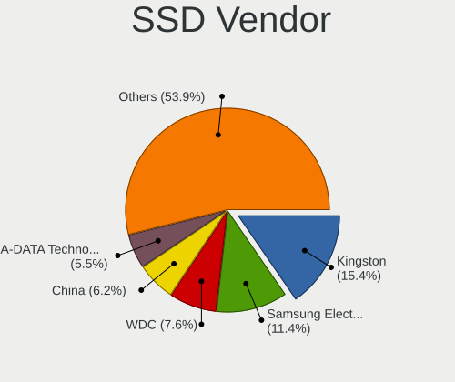

| Vendor              | Desktops | Drives | Percent |
|---------------------|----------|--------|---------|
| Kingston            | 1336     | 1909   | 15.4%   |
| Samsung Electronics | 986      | 1488   | 11.37%  |
| WDC                 | 660      | 942    | 7.61%   |
| China               | 540      | 758    | 6.23%   |
| A-DATA Technology   | 477      | 640    | 5.5%    |
| Crucial             | 435      | 580    | 5.01%   |
| Apacer              | 365      | 507    | 4.21%   |
| SPCC                | 363      | 469    | 4.18%   |
| OCZ                 | 287      | 371    | 3.31%   |
| Intel               | 255      | 536    | 2.94%   |
| SanDisk             | 217      | 358    | 2.5%    |
| Plextor             | 217      | 325    | 2.5%    |
| Patriot             | 204      | 281    | 2.35%   |
| AMD                 | 199      | 255    | 2.29%   |
| KingSpec            | 173      | 240    | 1.99%   |
| Smartbuy            | 163      | 225    | 1.88%   |
| Netac               | 145      | 265    | 1.67%   |
| Transcend           | 112      | 144    | 1.29%   |
| GOODRAM             | 106      | 158    | 1.22%   |
| Corsair             | 93       | 131    | 1.07%   |
| Toshiba             | 88       | 124    | 1.01%   |
| Gigabyte Technology | 81       | 99     | 0.93%   |
| XrayDisk            | 68       | 94     | 0.78%   |
| Unknown             | 61       | 75     | 0.7%    |
| KingDian            | 53       | 90     | 0.61%   |
| DEXP                | 52       | 66     | 0.6%    |
| Foxline             | 44       | 54     | 0.51%   |
| Kingmax             | 40       | 69     | 0.46%   |
| AXIOMTEK            | 36       | 41     | 0.42%   |
| Team                | 35       | 42     | 0.4%    |
| Qumo                | 32       | 43     | 0.37%   |
| Hewlett-Packard     | 30       | 40     | 0.35%   |
| Digma               | 28       | 33     | 0.32%   |
| AGI                 | 25       | 37     | 0.29%   |
| Micron Technology   | 23       | 28     | 0.27%   |
| Seagate             | 22       | 44     | 0.25%   |
| KingFast            | 19       | 24     | 0.22%   |
| Colorful            | 18       | 21     | 0.21%   |
| MSI                 | 16       | 18     | 0.18%   |
| Londisk             | 15       | 17     | 0.17%   |

Drive Kind
----------

HDD or SSD

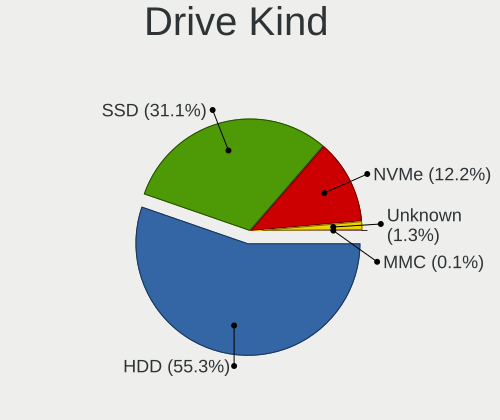

| Kind    | Desktops | Drives | Percent |
|---------|----------|--------|---------|
| HDD     | 12611    | 26789  | 55.3%   |
| SSD     | 7084     | 12395  | 31.07%  |
| NVMe    | 2789     | 4621   | 12.23%  |
| Unknown | 288      | 350    | 1.26%   |
| MMC     | 31       | 44     | 0.14%   |

Drive Connector
---------------

SATA, SAS, NVMe, etc.

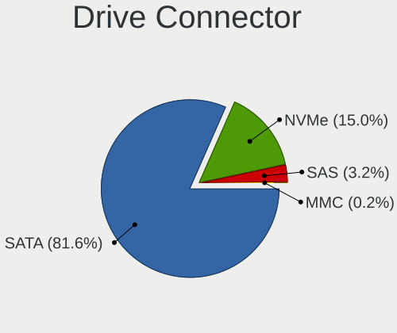

| Type | Desktops | Drives | Percent |
|------|----------|--------|---------|
| SATA | 15118    | 38709  | 81.59%  |
| NVMe | 2788     | 4608   | 15.05%  |
| SAS  | 593      | 838    | 3.2%    |
| MMC  | 31       | 44     | 0.17%   |

Drive Size
----------

Size of hard drive

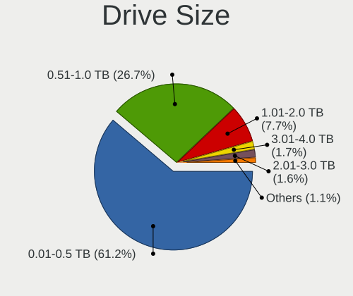

| Size in TB      | Desktops | Drives | Percent |
|-----------------|----------|--------|---------|
| 0.01-0.5        | 12666    | 24845  | 61.22%  |
| 0.51-1.0        | 5520     | 9805   | 26.68%  |
| 1.01-2.0        | 1585     | 2758   | 7.66%   |
| 3.01-4.0        | 356      | 718    | 1.72%   |
| 2.01-3.0        | 338      | 569    | 1.63%   |
| 4.01-10.0       | 172      | 393    | 0.83%   |
| 10.01-20.0      | 47       | 92     | 0.23%   |
| 20.01-50.0      | 2        | 2      | 0.01%   |
| More than 100.0 | 1        | 1      | 0.005%  |
| 0               | 1        | 1      | 0.005%  |

Space Total
-----------

Amount of disk space available on the file system

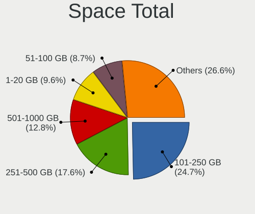

| Size in GB     | Desktops | Percent |
|----------------|----------|---------|
| 101-250        | 4504     | 24.69%  |
| 251-500        | 3218     | 17.64%  |
| 501-1000       | 2338     | 12.82%  |
| 1-20           | 1754     | 9.61%   |
| 51-100         | 1586     | 8.69%   |
| 1001-2000      | 1573     | 8.62%   |
| Unknown        | 1116     | 6.12%   |
| 21-50          | 885      | 4.85%   |
| More than 3000 | 679      | 3.72%   |
| 2001-3000      | 591      | 3.24%   |

Space Used
----------

Amount of used disk space

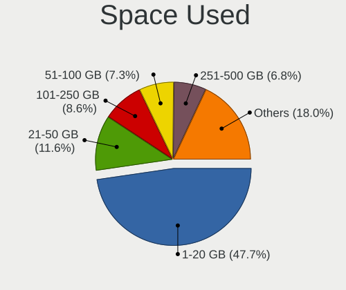

| Used GB        | Desktops | Percent |
|----------------|----------|---------|
| 1-20           | 8782     | 47.69%  |
| 21-50          | 2137     | 11.61%  |
| 101-250        | 1581     | 8.59%   |
| 51-100         | 1341     | 7.28%   |
| 251-500        | 1249     | 6.78%   |
| Unknown        | 1116     | 6.06%   |
| 501-1000       | 1061     | 5.76%   |
| 1001-2000      | 654      | 3.55%   |
| More than 3000 | 275      | 1.49%   |
| 2001-3000      | 206      | 1.12%   |
| 0              | 11       | 0.06%   |

Malfunc. Drives
---------------

Drive models with a malfunction

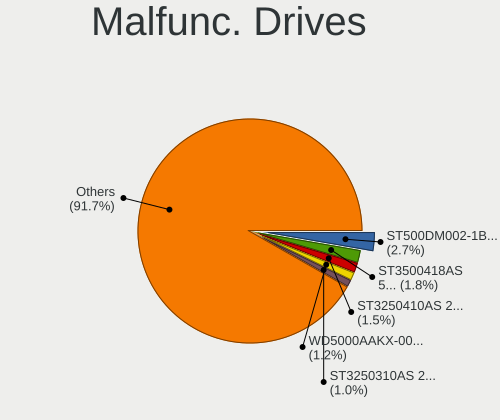

| Model                             | Desktops | Drives | Percent |
|-----------------------------------|----------|--------|---------|
| Seagate ST500DM002-1BD142 500GB   | 190      | 244    | 2.74%   |
| Seagate ST3500418AS 500GB         | 128      | 164    | 1.84%   |
| Seagate ST3250410AS 250GB         | 101      | 127    | 1.46%   |
| WDC WD5000AAKX-001CA0 500GB       | 82       | 105    | 1.18%   |
| Seagate ST3250310AS 250GB         | 72       | 117    | 1.04%   |
| Seagate ST3320613AS 320GB         | 68       | 92     | 0.98%   |
| Seagate ST1000DM003-9YN162 1TB    | 65       | 79     | 0.94%   |
| Seagate ST1000DM003-1CH162 1TB    | 63       | 95     | 0.91%   |
| Hitachi HDS721050CLA362 500GB     | 59       | 70     | 0.85%   |
| Seagate ST31000528AS 1TB          | 58       | 65     | 0.84%   |
| WDC WD3200AAJS-00L7A0 320GB       | 56       | 66     | 0.81%   |
| Seagate ST31000524AS 1TB          | 56       | 74     | 0.81%   |
| WDC WD5000AADS-00S9B0 500GB       | 54       | 62     | 0.78%   |
| Seagate ST250DM000-1BD141 250GB   | 50       | 68     | 0.72%   |
| Seagate ST3160815AS 160GB         | 49       | 60     | 0.71%   |
| Seagate ST3250318AS 250GB         | 48       | 63     | 0.69%   |
| WDC WD5000AAKX-60U6AA0 500GB      | 47       | 69     | 0.68%   |
| Seagate ST380011A 80GB            | 47       | 51     | 0.68%   |
| Hitachi HDS721616PLA380 160GB     | 47       | 62     | 0.68%   |
| WDC WD10EARS-00Y5B1 1TB           | 44       | 79     | 0.63%   |
| Hitachi HDS721010CLA332 1TB       | 44       | 52     | 0.63%   |
| Seagate ST3160811AS 160GB         | 42       | 58     | 0.61%   |
| Seagate ST380815AS 80GB           | 40       | 52     | 0.58%   |
| Kingston SV300S37A120G 120GB SSD  | 40       | 42     | 0.58%   |
| WDC WD5000AAKX-00ERMA0 500GB      | 39       | 56     | 0.56%   |
| Seagate ST3500413AS 500GB         | 38       | 41     | 0.55%   |
| WDC WDS240G2G0A-00JH30 240GB SSD  | 36       | 47     | 0.52%   |
| Toshiba DT01ACA050 500GB          | 35       | 53     | 0.5%    |
| WDC WD5000AAKS-00V1A0 500GB       | 34       | 39     | 0.49%   |
| Samsung Electronics HD160JJ 160GB | 34       | 55     | 0.49%   |
| Maxtor STM3250310AS 250GB         | 34       | 43     | 0.49%   |
| Samsung Electronics HD080HJ/ 80GB | 33       | 43     | 0.48%   |
| Seagate ST1000DM010-2EP102 1TB    | 32       | 48     | 0.46%   |
| Hitachi HDP725050GLA360 500GB     | 31       | 44     | 0.45%   |
| Seagate ST31500341AS 1TB          | 30       | 40     | 0.43%   |
| Samsung Electronics HD161HJ 160GB | 29       | 37     | 0.42%   |
| Hitachi HDS721050CLA360 500GB     | 28       | 33     | 0.4%    |
| Toshiba DT01ACA100 1TB            | 27       | 47     | 0.39%   |
| Seagate ST3320620AS 320GB         | 27       | 35     | 0.39%   |
| Seagate ST2000DM001-1CH164 2TB    | 27       | 42     | 0.39%   |

Malfunc. Drive Vendor
---------------------

Vendors of faulty drives

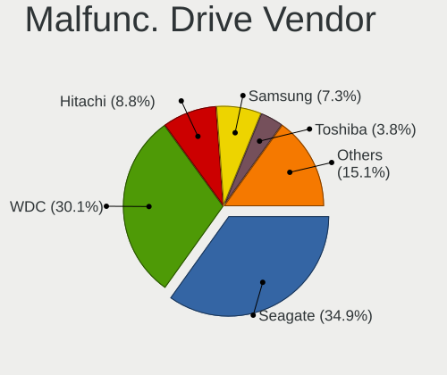

| Vendor                      | Desktops | Drives | Percent |
|-----------------------------|----------|--------|---------|
| Seagate                     | 2266     | 3254   | 34.87%  |
| WDC                         | 1959     | 2819   | 30.14%  |
| Hitachi                     | 574      | 768    | 8.83%   |
| Samsung Electronics         | 475      | 668    | 7.31%   |
| Toshiba                     | 245      | 341    | 3.77%   |
| Maxtor                      | 181      | 218    | 2.79%   |
| Kingston                    | 139      | 162    | 2.14%   |
| OCZ                         | 58       | 78     | 0.89%   |
| Intel                       | 54       | 91     | 0.83%   |
| A-DATA Technology           | 53       | 72     | 0.82%   |
| HGST                        | 52       | 65     | 0.8%    |
| SPCC                        | 45       | 53     | 0.69%   |
| Corsair                     | 34       | 50     | 0.52%   |
| China                       | 34       | 39     | 0.52%   |
| Kingmax                     | 25       | 48     | 0.38%   |
| AMD                         | 23       | 27     | 0.35%   |
| Netac                       | 19       | 23     | 0.29%   |
| KingSpec                    | 17       | 19     | 0.26%   |
| SanDisk                     | 15       | 21     | 0.23%   |
| Plextor                     | 15       | 33     | 0.23%   |
| Fujitsu                     | 14       | 26     | 0.22%   |
| Apacer                      | 13       | 14     | 0.2%    |
| Crucial                     | 12       | 22     | 0.18%   |
| IBM/Hitachi                 | 11       | 14     | 0.17%   |
| Neo                         | 10       | 26     | 0.15%   |
| Patriot                     | 7        | 7      | 0.11%   |
| OCZ-VERTEX3                 | 7        | 12     | 0.11%   |
| Unknown                     | 6        | 7      | 0.09%   |
| XrayDisk                    | 5        | 9      | 0.08%   |
| XPG                         | 5        | 10     | 0.08%   |
| MAXIO Technology (Hangzhou) | 5        | 5      | 0.08%   |
| Transcend                   | 4        | 4      | 0.06%   |
| Smartbuy                    | 4        | 5      | 0.06%   |
| PNY                         | 4        | 4      | 0.06%   |
| KingDian                    | 4        | 5      | 0.06%   |
| GS                          | 4        | 9      | 0.06%   |
| ExeGate                     | 4        | 4      | 0.06%   |
| DEXP                        | 4        | 6      | 0.06%   |
| ADATA Technology            | 4        | 7      | 0.06%   |
| Silicon Motion              | 3        | 6      | 0.05%   |

Malfunc. HDD Vendor
-------------------

Vendors of faulty HDD drives

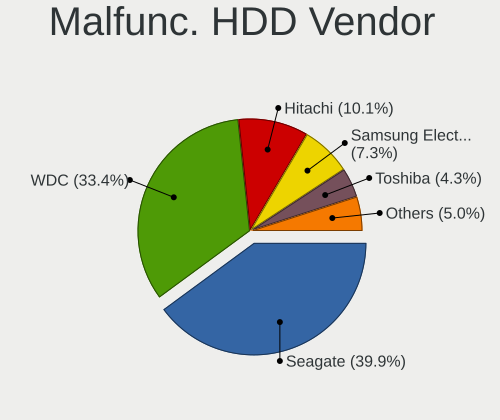

| Vendor              | Desktops | Drives | Percent |
|---------------------|----------|--------|---------|
| Seagate             | 2265     | 3251   | 39.91%  |
| WDC                 | 1897     | 2719   | 33.43%  |
| Hitachi             | 574      | 768    | 10.11%  |
| Samsung Electronics | 415      | 587    | 7.31%   |
| Toshiba             | 242      | 337    | 4.26%   |
| Maxtor              | 181      | 218    | 3.19%   |
| HGST                | 52       | 65     | 0.92%   |
| Fujitsu             | 14       | 26     | 0.25%   |
| IBM/Hitachi         | 11       | 14     | 0.19%   |
| IBM                 | 3        | 3      | 0.05%   |
| Hewlett-Packard     | 3        | 4      | 0.05%   |
| ExcelStor           | 3        | 3      | 0.05%   |
| ASMT                | 3        | 4      | 0.05%   |
| WD MediaMax         | 2        | 2      | 0.04%   |
| StoreJet            | 2        | 2      | 0.04%   |
| Quantum             | 2        | 2      | 0.04%   |
| Apple               | 2        | 2      | 0.04%   |
| Unknown             | 2        | 2      | 0.04%   |
| USB3.0              | 1        | 1      | 0.02%   |
| MARSHAL             | 1        | 1      | 0.02%   |

Malfunc. Drive Kind
-------------------

Kinds of faulty drives

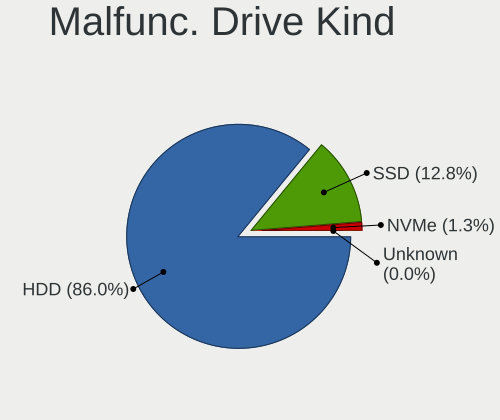

| Kind    | Desktops | Drives | Percent |
|---------|----------|--------|---------|
| HDD     | 4998     | 8011   | 85.95%  |
| SSD     | 742      | 1030   | 12.76%  |
| NVMe    | 74       | 115    | 1.27%   |
| Unknown | 1        | 1      | 0.02%   |

Failed Drives
-------------

Failed drive models

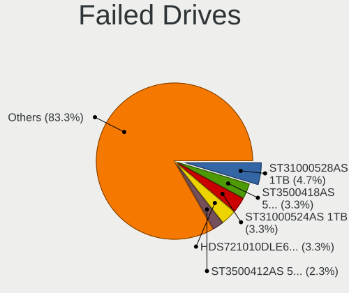

| Model                             | Desktops | Drives | Percent |
|-----------------------------------|----------|--------|---------|
| Seagate ST31000528AS 1TB          | 10       | 13     | 4.65%   |
| Seagate ST3500418AS 500GB         | 7        | 8      | 3.26%   |
| Seagate ST31000524AS 1TB          | 7        | 9      | 3.26%   |
| Hitachi HDS721010DLE630 1TB       | 7        | 9      | 3.26%   |
| Seagate ST3500412AS 500GB         | 5        | 6      | 2.33%   |
| Seagate ST3320613AS 320GB         | 4        | 5      | 1.86%   |
| Seagate ST31000333AS 1TB          | 3        | 3      | 1.4%    |
| Samsung Electronics SP0411N 40GB  | 3        | 4      | 1.4%    |
| Maxtor 6Y080L0 81GB               | 3        | 3      | 1.4%    |
| Hitachi HDS721010CLA332 1TB       | 3        | 3      | 1.4%    |
| HGST HTS545050A7E380 500GB        | 3        | 3      | 1.4%    |
| WDC WD5000BEVT-00ZAT0 500GB       | 2        | 3      | 0.93%   |
| WDC WD5000AAKS-00V1A0 500GB       | 2        | 2      | 0.93%   |
| WDC WD3200AAJS-00L7A0 320GB       | 2        | 2      | 0.93%   |
| WDC WD3200AAJS-00B4A0 320GB       | 2        | 2      | 0.93%   |
| WDC WD20EARS-00MVWB0 2TB          | 2        | 2      | 0.93%   |
| WDC WD15EARS-00MVWB0 1TB          | 2        | 4      | 0.93%   |
| Seagate STM3500418AS 500GB        | 2        | 2      | 0.93%   |
| Seagate ST500DM005 HD502HJ 500GB  | 2        | 3      | 0.93%   |
| Seagate ST500DM002-1BD142 500GB   | 2        | 2      | 0.93%   |
| Seagate ST500DM002-1BC142 500GB   | 2        | 2      | 0.93%   |
| Seagate ST3750528AS 752GB         | 2        | 2      | 0.93%   |
| Seagate ST3250318AS 250GB         | 2        | 2      | 0.93%   |
| Seagate ST32000542AS 2TB          | 2        | 4      | 0.93%   |
| Seagate ST3160318AS 160GB         | 2        | 2      | 0.93%   |
| Seagate ST250DM000-1BD141 250GB   | 2        | 2      | 0.93%   |
| Samsung Electronics HD503HI 500GB | 2        | 2      | 0.93%   |
| Samsung Electronics HD204UI 2TB   | 2        | 2      | 0.93%   |
| Samsung Electronics HD105SI 1TB   | 2        | 2      | 0.93%   |
| Hitachi HDT721032SLA380 320GB     | 2        | 2      | 0.93%   |
| Hitachi HDS721050DLE630 500GB     | 2        | 2      | 0.93%   |
| Hitachi HDS721025CLA382 250GB     | 2        | 2      | 0.93%   |
| WDC WD800JD-22LSA0 80GB           | 1        | 1      | 0.47%   |
| WDC WD800JB-00JJC0 80GB           | 1        | 1      | 0.47%   |
| WDC WD800JB-00FMA0 80GB           | 1        | 1      | 0.47%   |
| WDC WD800BB-55JKC0 80GB           | 1        | 2      | 0.47%   |
| WDC WD800BB-22JHA0 80GB           | 1        | 1      | 0.47%   |
| WDC WD800BB-00JKC0 80GB           | 1        | 2      | 0.47%   |
| WDC WD800BB-00JHC0 80GB           | 1        | 1      | 0.47%   |
| WDC WD7501AALS-00J7B0 752GB       | 1        | 2      | 0.47%   |

Failed Drive Vendor
-------------------

Failed drive vendors

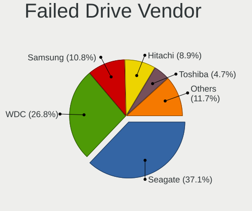

| Vendor              | Desktops | Drives | Percent |
|---------------------|----------|--------|---------|
| Seagate             | 79       | 93     | 37.09%  |
| WDC                 | 57       | 76     | 26.76%  |
| Samsung Electronics | 23       | 26     | 10.8%   |
| Hitachi             | 19       | 21     | 8.92%   |
| Toshiba             | 10       | 10     | 4.69%   |
| Maxtor              | 7        | 7      | 3.29%   |
| HGST                | 6        | 7      | 2.82%   |
| Intel               | 2        | 5      | 0.94%   |
| A-DATA Technology   | 2        | 4      | 0.94%   |
| Transcend           | 1        | 1      | 0.47%   |
| Phison Electronics  | 1        | 1      | 0.47%   |
| OCZ                 | 1        | 1      | 0.47%   |
| Hewlett-Packard     | 1        | 1      | 0.47%   |
| GOODRAM             | 1        | 1      | 0.47%   |
| Gigabyte Technology | 1        | 1      | 0.47%   |
| Crucial             | 1        | 1      | 0.47%   |
| Corsair             | 1        | 1      | 0.47%   |

Drive Status
------------

Number of failed and malfunc. drives

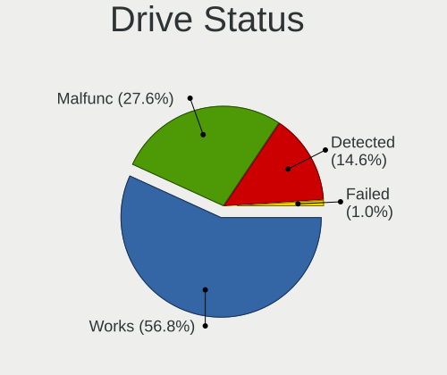

| Status   | Desktops | Drives | Percent |
|----------|----------|--------|---------|
| Works    | 11482    | 27694  | 56.82%  |
| Malfunc  | 5569     | 9157   | 27.56%  |
| Detected | 2947     | 7091   | 14.58%  |
| Failed   | 209      | 257    | 1.03%   |

Storage controller
------------------

Storage Vendor
--------------

Storage controller vendors

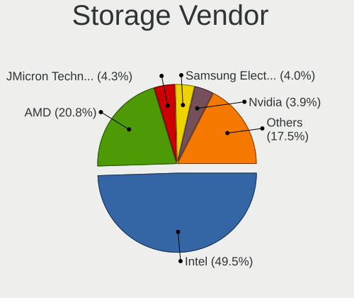

| Vendor                           | Desktops | Percent |
|----------------------------------|----------|---------|
| Intel                            | 10618    | 49.5%   |
| AMD                              | 4467     | 20.83%  |
| JMicron Technology               | 922      | 4.3%    |
| Samsung Electronics              | 849      | 3.96%   |
| Nvidia                           | 846      | 3.94%   |
| ASMedia Technology               | 545      | 2.54%   |
| Marvell Technology Group         | 517      | 2.41%   |
| Silicon Motion                   | 355      | 1.66%   |
| Kingston Technology Company      | 335      | 1.56%   |
| Phison Electronics               | 322      | 1.5%    |
| ADATA Technology                 | 293      | 1.37%   |
| VIA Technologies                 | 246      | 1.15%   |
| MAXIO Technology (Hangzhou)      | 226      | 1.05%   |
| SanDisk                          | 193      | 0.9%    |
| Realtek Semiconductor            | 143      | 0.67%   |
| Netac Technology                 | 65       | 0.3%    |
| Silicon Integrated Systems [SiS] | 44       | 0.21%   |
| Silicon Image                    | 44       | 0.21%   |
| Micron/Crucial Technology        | 39       | 0.18%   |
| Shenzhen Longsys Electronics     | 37       | 0.17%   |
| Lite-On Technology               | 36       | 0.17%   |
| Integrated Technology Express    | 35       | 0.16%   |
| SK hynix                         | 34       | 0.16%   |
| Adaptec                          | 32       | 0.15%   |
| INNOGRIT                         | 23       | 0.11%   |
| Broadcom / LSI                   | 20       | 0.09%   |
| Micron Technology                | 19       | 0.09%   |
| Hosin Global Electronics         | 18       | 0.08%   |
| LSI Logic / Symbios Logic        | 15       | 0.07%   |
| KIOXIA                           | 14       | 0.07%   |
| Biwin Storage Technology         | 10       | 0.05%   |
| Toshiba America Info Systems     | 9        | 0.04%   |
| Solid State Storage Technology   | 7        | 0.03%   |
| MCST                             | 7        | 0.03%   |
| Hewlett-Packard                  | 7        | 0.03%   |
| Transcend                        | 6        | 0.03%   |
| YEESTOR Microelectronics         | 5        | 0.02%   |
| ULi Electronics                  | 5        | 0.02%   |
| OCZ Technology Group             | 5        | 0.02%   |
| Lite-On IT Corp. / Plextor       | 5        | 0.02%   |

Storage Model
-------------

Storage controller models

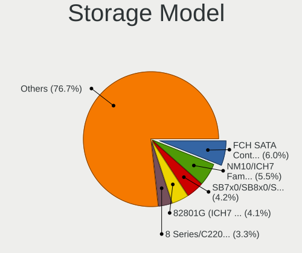

| Model                                                                                   | Desktops | Percent |
|-----------------------------------------------------------------------------------------|----------|---------|
| AMD FCH SATA Controller [AHCI mode]                                                     | 1748     | 6.04%   |
| Intel NM10/ICH7 Family SATA Controller [IDE mode]                                       | 1592     | 5.5%    |
| AMD SB7x0/SB8x0/SB9x0 IDE Controller                                                    | 1228     | 4.25%   |
| Intel 82801G (ICH7 Family) IDE Controller                                               | 1200     | 4.15%   |
| Intel 8 Series/C220 Series Chipset Family 6-port SATA Controller 1 [AHCI mode]          | 960      | 3.32%   |
| AMD SB7x0/SB8x0/SB9x0 SATA Controller [IDE mode]                                        | 870      | 3.01%   |
| Intel Q170/Q150/B150/H170/H110/Z170/CM236 Chipset SATA Controller [AHCI Mode]           | 788      | 2.72%   |
| Intel 6 Series/C200 Series Chipset Family 6 port Desktop SATA AHCI Controller           | 779      | 2.69%   |
| AMD SB7x0/SB8x0/SB9x0 SATA Controller [AHCI mode]                                       | 739      | 2.56%   |
| Intel 6 Series/C200 Series Chipset Family Desktop SATA Controller (IDE mode, ports 4-5) | 736      | 2.54%   |
| Intel 6 Series/C200 Series Chipset Family Desktop SATA Controller (IDE mode, ports 0-3) | 734      | 2.54%   |
| AMD 400 Series Chipset SATA Controller                                                  | 734      | 2.54%   |
| Intel 7 Series/C210 Series Chipset Family 6-port SATA Controller [AHCI mode]            | 609      | 2.11%   |
| Intel 200 Series PCH SATA controller [AHCI mode]                                        | 594      | 2.05%   |
| ASMedia ASM1061/ASM1062 Serial ATA Controller                                           | 506      | 1.75%   |
| AMD 500 Series Chipset SATA Controller                                                  | 470      | 1.63%   |
| JMicron JMB363 SATA/IDE Controller                                                      | 456      | 1.58%   |
| Samsung NVMe SSD Controller SM981/PM981/PM983                                           | 451      | 1.56%   |
| Nvidia MCP61 SATA Controller                                                            | 438      | 1.51%   |
| Intel 500 Series Chipset Family SATA AHCI Controller                                    | 415      | 1.43%   |
| Nvidia MCP61 IDE                                                                        | 409      | 1.41%   |
| JMicron JMB368 IDE controller                                                           | 353      | 1.22%   |
| Intel 82801JI (ICH10 Family) 2 port SATA IDE Controller #2                              | 331      | 1.14%   |
| Intel 82801JI (ICH10 Family) 4 port SATA IDE Controller #1                              | 329      | 1.14%   |
| Silicon Motion SM2263EN/SM2263XT (DRAM-less) NVMe SSD Controllers                       | 319      | 1.1%    |
| Intel Cannon Lake PCH SATA AHCI Controller                                              | 303      | 1.05%   |
| Intel 82801I (ICH9 Family) 2 port SATA Controller [IDE mode]                            | 298      | 1.03%   |
| AMD A320 Chipset SATA Controller [AHCI mode]                                            | 288      | 1%      |
| Intel Alder Lake-S PCH SATA Controller [AHCI Mode]                                      | 243      | 0.84%   |
| Intel 7 Series/C210 Series Chipset Family 4-port SATA Controller [IDE mode]             | 229      | 0.79%   |
| Intel 7 Series/C210 Series Chipset Family 2-port SATA Controller [IDE mode]             | 229      | 0.79%   |
| Intel 5 Series/3400 Series Chipset 4 port SATA IDE Controller                           | 222      | 0.77%   |
| Intel 5 Series/3400 Series Chipset 2 port SATA IDE Controller                           | 221      | 0.76%   |
| AMD 300 Series Chipset SATA Controller                                                  | 208      | 0.72%   |
| MAXIO (Hangzhou) NVMe SSD Controller MAP1202 (DRAM-less)                                | 193      | 0.67%   |
| Intel 82801IB (ICH9) 2 port SATA Controller [IDE mode]                                  | 189      | 0.65%   |
| AMD 600 Series Chipset SATA Controller                                                  | 182      | 0.63%   |
| Intel C610/X99 series chipset 6-Port SATA Controller [AHCI mode]                        | 177      | 0.61%   |
| Intel 82801JI (ICH10 Family) SATA AHCI Controller                                       | 174      | 0.6%    |
| AMD FCH IDE Controller                                                                  | 170      | 0.59%   |

Storage Kind
------------

Kind of storage controller (IDE, SATA, NVMe, SAS, ...)

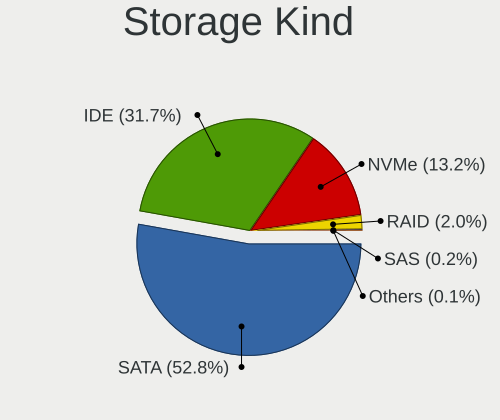

| Kind | Desktops | Percent |
|------|----------|---------|
| SATA | 11226    | 52.82%  |
| IDE  | 6742     | 31.72%  |
| NVMe | 2799     | 13.17%  |
| RAID | 435      | 2.05%   |
| SAS  | 40       | 0.19%   |
| SCSI | 13       | 0.06%   |

Processor
---------

CPU Vendor
----------

Processor vendors

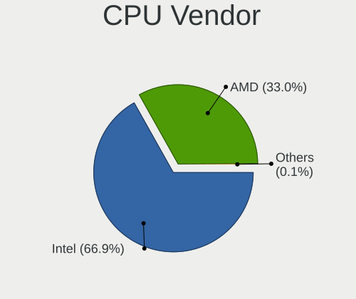

| Vendor       | Desktops | Percent |
|--------------|----------|---------|
| Intel        | 10787    | 66.86%  |
| AMD          | 5326     | 33.01%  |
| Unknown      | 5        | 0.03%   |
| Elbrus-MCST  | 3        | 0.02%   |
| Loongson     | 2        | 0.01%   |
| CentaurHauls | 2        | 0.01%   |
| Vortex86 SoC | 1        | 0.01%   |
| PowerMac7,2  | 1        | 0.01%   |
| MIPS         | 1        | 0.01%   |
| MBE8C-PC     | 1        | 0.01%   |
| EL2S4        | 1        | 0.01%   |
| E8C/EATX     | 1        | 0.01%   |
| E8C-SWTX     | 1        | 0.01%   |
| E8C-mITX     | 1        | 0.01%   |
| ARM          | 1        | 0.01%   |

CPU Model
---------

Processor models

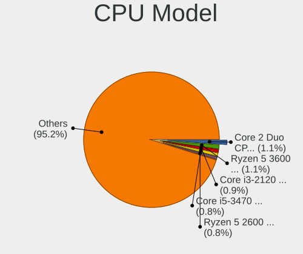

| Model                                       | Desktops | Percent |
|---------------------------------------------|----------|---------|
| Intel Core 2 Duo CPU E8400 @ 3.00GHz        | 187      | 1.14%   |
| AMD Ryzen 5 3600 6-Core Processor           | 180      | 1.1%    |
| Intel Core i3-2120 CPU @ 3.30GHz            | 145      | 0.89%   |
| Intel Core i5-3470 CPU @ 3.20GHz            | 139      | 0.85%   |
| AMD Ryzen 5 2600 Six-Core Processor         | 133      | 0.81%   |
| Intel Core i3-2100 CPU @ 3.10GHz            | 132      | 0.81%   |
| Intel Core i3-3220 CPU @ 3.30GHz            | 126      | 0.77%   |
| AMD FX-6300 Six-Core Processor              | 125      | 0.76%   |
| AMD Ryzen 5 5600G with Radeon Graphics      | 124      | 0.76%   |
| Intel Core 2 Duo CPU E7500 @ 2.93GHz        | 123      | 0.75%   |
| Intel Core i5-9400 CPU @ 2.90GHz            | 118      | 0.72%   |
| Intel Pentium 4 CPU 3.00GHz                 | 113      | 0.69%   |
| Intel Core i5-10400 CPU @ 2.90GHz           | 113      | 0.69%   |
| AMD Athlon II X2 250 Processor              | 113      | 0.69%   |
| AMD FX-8350 Eight-Core Processor            | 112      | 0.68%   |
| Intel Core i5-2400 CPU @ 3.10GHz            | 105      | 0.64%   |
| AMD Ryzen 5 1600 Six-Core Processor         | 103      | 0.63%   |
| Intel Core 2 Quad CPU Q6600 @ 2.40GHz       | 101      | 0.62%   |
| Intel Pentium CPU G4400 @ 3.30GHz           | 100      | 0.61%   |
| AMD Ryzen 5 5600X 6-Core Processor          | 100      | 0.61%   |
| AMD Ryzen 3 2200G with Radeon Vega Graphics | 98       | 0.6%    |
| Intel Core i3-6100 CPU @ 3.70GHz            | 96       | 0.59%   |
| Intel Core i3-10100 CPU @ 3.60GHz           | 96       | 0.59%   |
| Intel Core i7-3770 CPU @ 3.40GHz            | 89       | 0.54%   |
| AMD FX-4300 Quad-Core Processor             | 87       | 0.53%   |
| Intel Pentium Dual-Core CPU E5300 @ 2.60GHz | 86       | 0.53%   |
| Intel Core i3-4130 CPU @ 3.40GHz            | 83       | 0.51%   |
| Intel Core i5-4460 CPU @ 3.20GHz            | 82       | 0.5%    |
| Intel Core i5-8400 CPU @ 2.80GHz            | 81       | 0.5%    |
| Intel Core i5-7400 CPU @ 3.00GHz            | 81       | 0.5%    |
| Intel Core i3-7100 CPU @ 3.90GHz            | 81       | 0.5%    |
| Intel Core i3-3240 CPU @ 3.40GHz            | 81       | 0.5%    |
| Intel Pentium Dual-Core CPU E5700 @ 3.00GHz | 76       | 0.46%   |
| Intel Core i5-3570 CPU @ 3.40GHz            | 74       | 0.45%   |
| Intel Core i5-2500 CPU @ 3.30GHz            | 74       | 0.45%   |
| AMD FX-8320 Eight-Core Processor            | 74       | 0.45%   |
| Intel Core i3-8100 CPU @ 3.60GHz            | 71       | 0.43%   |
| Intel Core 2 Duo CPU E6550 @ 2.33GHz        | 71       | 0.43%   |
| Intel Pentium Dual-Core CPU E6500 @ 2.93GHz | 70       | 0.43%   |
| Intel Core i3-6100TE CPU @ 2.70GHz          | 70       | 0.43%   |

CPU Model Family
----------------

Processor model prefix

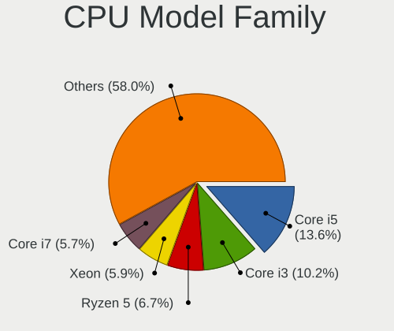

| Model                   | Desktops | Percent |
|-------------------------|----------|---------|
| Intel Core i5           | 2209     | 13.56%  |
| Intel Core i3           | 1666     | 10.23%  |
| AMD Ryzen 5             | 1088     | 6.68%   |
| Intel Xeon              | 955      | 5.86%   |
| Intel Core i7           | 932      | 5.72%   |
| Intel Celeron           | 875      | 5.37%   |
| Intel Core 2 Duo        | 858      | 5.27%   |
| Intel Pentium           | 819      | 5.03%   |
| AMD FX                  | 746      | 4.58%   |
| Other                   | 628      | 3.85%   |
| AMD Ryzen 7             | 464      | 2.85%   |
| Intel Pentium Dual-Core | 437      | 2.68%   |
| AMD Athlon 64 X2        | 436      | 2.68%   |
| Intel Core 2 Quad       | 417      | 2.56%   |
| AMD Athlon II X2        | 365      | 2.24%   |
| Intel Pentium 4         | 267      | 1.64%   |
| AMD Ryzen 3             | 238      | 1.46%   |
| AMD Phenom II X4        | 236      | 1.45%   |
| AMD Ryzen 9             | 182      | 1.12%   |
| AMD Athlon II X4        | 170      | 1.04%   |
| Intel Core 2            | 158      | 0.97%   |
| Intel Pentium Dual      | 156      | 0.96%   |
| Intel Atom              | 156      | 0.96%   |
| AMD A8                  | 137      | 0.84%   |
| AMD A10                 | 135      | 0.83%   |
| AMD Athlon II X3        | 126      | 0.77%   |
| Intel Pentium Gold      | 118      | 0.72%   |
| Intel Pentium D         | 115      | 0.71%   |
| AMD Phenom              | 106      | 0.65%   |
| AMD A4                  | 105      | 0.64%   |
| AMD Athlon              | 104      | 0.64%   |
| AMD Phenom II X6        | 100      | 0.61%   |
| AMD Athlon 64           | 96       | 0.59%   |
| AMD A6                  | 95       | 0.58%   |
| AMD Athlon X4           | 85       | 0.52%   |
| Intel Core i9           | 59       | 0.36%   |
| AMD Ryzen 5 PRO         | 47       | 0.29%   |
| AMD Sempron             | 44       | 0.27%   |
| Intel Genuine           | 40       | 0.25%   |
| AMD Phenom II X2        | 40       | 0.25%   |

CPU Cores
---------

Number of processor cores

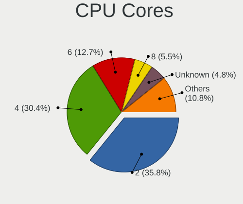

| Number  | Desktops | Percent |
|---------|----------|---------|
| 2       | 5930     | 35.84%  |
| 4       | 5025     | 30.37%  |
| 6       | 2107     | 12.73%  |
| 8       | 911      | 5.51%   |
| Unknown | 790      | 4.77%   |
| 1       | 710      | 4.29%   |
| 3       | 347      | 2.1%    |
| 12      | 241      | 1.46%   |
| 16      | 136      | 0.82%   |
| 10      | 121      | 0.73%   |
| 14      | 75       | 0.45%   |
| 28      | 48       | 0.29%   |
| 24      | 39       | 0.24%   |
| 20      | 25       | 0.15%   |
| 18      | 17       | 0.1%    |
| 32      | 10       | 0.06%   |
| 36      | 3        | 0.02%   |
| 22      | 3        | 0.02%   |
| 128     | 1        | 0.01%   |
| 115     | 1        | 0.01%   |
| 64      | 1        | 0.01%   |
| 50      | 1        | 0.01%   |
| 48      | 1        | 0.01%   |
| 44      | 1        | 0.01%   |
| 15      | 1        | 0.01%   |

CPU Sockets
-----------

Number of sockets

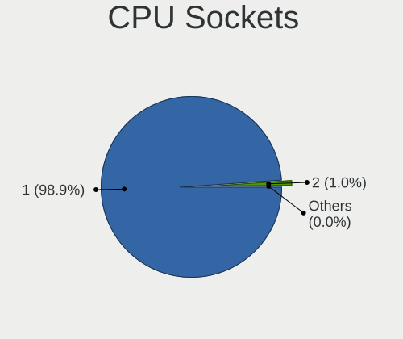

| Number  | Desktops | Percent |
|---------|----------|---------|
| 1       | 15960    | 98.88%  |
| 2       | 162      | 1%      |
| Unknown | 9        | 0.06%   |
| 4       | 6        | 0.04%   |
| 20      | 1        | 0.01%   |
| 6       | 1        | 0.01%   |
| 3       | 1        | 0.01%   |
| 0       | 1        | 0.01%   |

CPU Threads
-----------

Threads per core (Hyper-Threading)

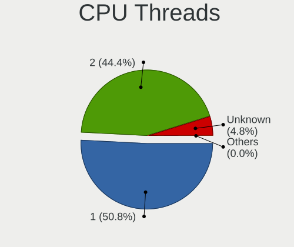

| Number  | Desktops | Percent |
|---------|----------|---------|
| 1       | 8369     | 50.8%   |
| 2       | 7310     | 44.38%  |
| Unknown | 789      | 4.79%   |
| 8       | 2        | 0.01%   |
| 6       | 2        | 0.01%   |
| 12      | 1        | 0.01%   |

CPU Op-Modes
------------

CPU Operation Modes (32-bit, 64-bit)

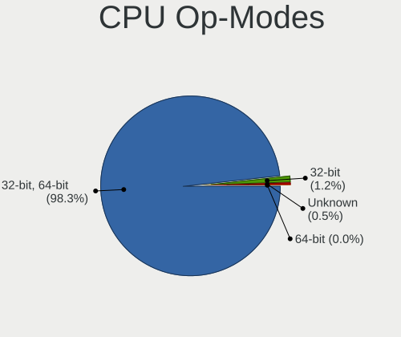

| Op mode        | Desktops | Percent |
|----------------|----------|---------|
| 32-bit, 64-bit | 15868    | 98.26%  |
| 32-bit         | 196      | 1.21%   |
| Unknown        | 78       | 0.48%   |
| 64-bit         | 7        | 0.04%   |

CPU Microcode
-------------

Microcode number

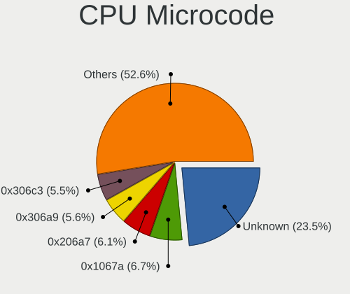

| Number     | Desktops | Percent |
|------------|----------|---------|
| Unknown    | 3967     | 23.49%  |
| 0x1067a    | 1138     | 6.74%   |
| 0x206a7    | 1028     | 6.09%   |
| 0x306a9    | 941      | 5.57%   |
| 0x306c3    | 935      | 5.54%   |
| 0x010000c8 | 536      | 3.17%   |
| 0x506e3    | 480      | 2.84%   |
| 0x906e9    | 349      | 2.07%   |
| 0x906ea    | 345      | 2.04%   |
| 0x6fd      | 303      | 1.79%   |
| 0x10676    | 277      | 1.64%   |
| 0xa0653    | 262      | 1.55%   |
| 0x6fb      | 252      | 1.49%   |
| 0x06000852 | 244      | 1.44%   |
| 0x06001119 | 241      | 1.43%   |
| 0x0800820d | 215      | 1.27%   |
| 0x08701021 | 211      | 1.25%   |
| 0x0600084f | 173      | 1.02%   |
| 0x010000db | 153      | 0.91%   |
| 0x106e5    | 137      | 0.81%   |
| 0x08108109 | 133      | 0.79%   |
| 0x06003106 | 129      | 0.76%   |
| 0x906eb    | 123      | 0.73%   |
| 0x20655    | 122      | 0.72%   |
| 0x306f2    | 118      | 0.7%    |
| 0x08001138 | 114      | 0.68%   |
| 0x08101016 | 105      | 0.62%   |
| 0x206d7    | 102      | 0.6%    |
| 0xa0671    | 93       | 0.55%   |
| 0x6f6      | 92       | 0.54%   |
| 0xf49      | 86       | 0.51%   |
| 0x6f2      | 84       | 0.5%    |
| 0x06000822 | 84       | 0.5%    |
| 0xa0655    | 82       | 0.49%   |
| 0x406f1    | 82       | 0.49%   |
| 0x20652    | 79       | 0.47%   |
| 0x90675    | 78       | 0.46%   |
| 0x010000c7 | 78       | 0.46%   |
| 0x0a50000d | 77       | 0.46%   |
| 0x03000027 | 77       | 0.46%   |

CPU Microarch
-------------

Microarchitecture

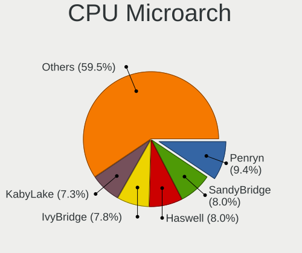

| Name             | Desktops | Percent |
|------------------|----------|---------|
| Penryn           | 1532     | 9.4%    |
| SandyBridge      | 1310     | 8.04%   |
| Haswell          | 1304     | 8%      |
| IvyBridge        | 1266     | 7.77%   |
| KabyLake         | 1194     | 7.33%   |
| K10              | 1174     | 7.21%   |
| Core             | 892      | 5.47%   |
| Piledriver       | 847      | 5.2%    |
| Skylake          | 599      | 3.68%   |
| Zen 3            | 555      | 3.41%   |
| K8 Hammer        | 548      | 3.36%   |
| CometLake        | 538      | 3.3%    |
| NetBurst         | 498      | 3.06%   |
| Zen+             | 490      | 3.01%   |
| Unknown          | 490      | 3.01%   |
| Zen 2            | 481      | 2.95%   |
| Zen              | 435      | 2.67%   |
| Alderlake Hybrid | 318      | 1.95%   |
| Westmere         | 267      | 1.64%   |
| Nehalem          | 223      | 1.37%   |
| Bulldozer        | 172      | 1.06%   |
| Steamroller      | 166      | 1.02%   |
| Broadwell        | 142      | 0.87%   |
| Silvermont       | 137      | 0.84%   |
| Bonnell          | 126      | 0.77%   |
| Icelake          | 116      | 0.71%   |
| K10 Llano        | 87       | 0.53%   |
| Excavator        | 79       | 0.48%   |
| Goldmont plus    | 76       | 0.47%   |
| Goldmont         | 44       | 0.27%   |
| Tremont          | 42       | 0.26%   |
| Gracemont        | 33       | 0.2%    |
| Bobcat           | 33       | 0.2%    |
| Jaguar           | 29       | 0.18%   |
| TigerLake        | 17       | 0.1%    |
| K6               | 12       | 0.07%   |
| Puma             | 9        | 0.06%   |
| P6               | 6        | 0.04%   |
| Lunarlake Hybrid | 4        | 0.02%   |
| K8 & K10 hybrid  | 1        | 0.01%   |

Graphics
--------

GPU Vendor
----------

Vendors of graphics cards

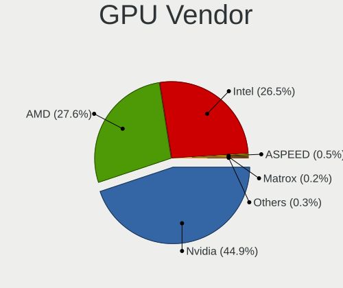

| Vendor                                       | Desktops | Percent |
|----------------------------------------------|----------|---------|
| Nvidia                                       | 7708     | 44.88%  |
| AMD                                          | 4747     | 27.64%  |
| Intel                                        | 4546     | 26.47%  |
| ASPEED Technology                            | 91       | 0.53%   |
| Matrox Electronics Systems                   | 32       | 0.19%   |
| VIA Technologies                             | 17       | 0.1%    |
| ATI Technologies                             | 13       | 0.08%   |
| Silicon Integrated Systems [SiS]             | 5        | 0.03%   |
| Silicon Motion                               | 4        | 0.02%   |
| S3 Graphics                                  | 4        | 0.02%   |
| XGI Technology (eXtreme Graphics Innovation) | 3        | 0.02%   |
| Red Hat                                      | 2        | 0.01%   |
| Loongson Technology                          | 2        | 0.01%   |
| Zhaoxin                                      | 1        | 0.01%   |
| MCST                                         | 1        | 0.01%   |

GPU Model
---------

Graphics card models

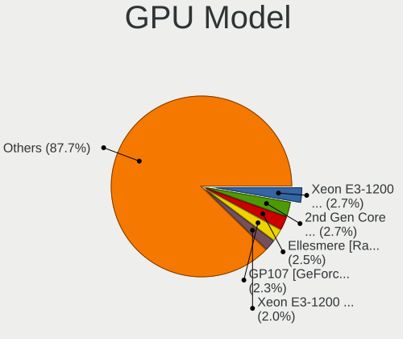

| Model                                                                       | Desktops | Percent |
|-----------------------------------------------------------------------------|----------|---------|
| Intel Xeon E3-1200 v3/4th Gen Core Processor Integrated Graphics Controller | 491      | 2.74%   |
| Intel 2nd Generation Core Processor Family Integrated Graphics Controller   | 483      | 2.69%   |
| AMD Ellesmere [Radeon RX 470/480/570/570X/580/580X/590]                     | 448      | 2.5%    |
| Nvidia GP107 [GeForce GTX 1050 Ti]                                          | 415      | 2.31%   |
| Intel Xeon E3-1200 v2/3rd Gen Core processor Graphics Controller            | 367      | 2.05%   |
| Nvidia GK208B [GeForce GT 710]                                              | 354      | 1.97%   |
| Nvidia GT218 [GeForce 210]                                                  | 313      | 1.75%   |
| Intel CoffeeLake-S GT2 [UHD Graphics 630]                                   | 306      | 1.71%   |
| Intel 4 Series Chipset Integrated Graphics Controller                       | 267      | 1.49%   |
| Intel CometLake-S GT2 [UHD Graphics 630]                                    | 263      | 1.47%   |
| Intel 82G33/G31 Express Integrated Graphics Controller                      | 252      | 1.41%   |
| Intel Skylake-S GT2 [HD Graphics 530]                                       | 234      | 1.31%   |
| Nvidia GK107 [GeForce GTX 650]                                              | 210      | 1.17%   |
| Nvidia GF108 [GeForce GT 630]                                               | 207      | 1.15%   |
| Nvidia GM107 [GeForce GTX 750 Ti]                                           | 194      | 1.08%   |
| Nvidia GF119 [GeForce GT 610]                                               | 182      | 1.02%   |
| Intel Kaby Lake-S GT2 [HD Graphics 630]                                     | 182      | 1.02%   |
| Nvidia GP108 [GeForce GT 1030]                                              | 181      | 1.01%   |
| Nvidia G94 [GeForce 9600 GT]                                                | 180      | 1%      |
| Nvidia GP106 [GeForce GTX 1060 6GB]                                         | 178      | 0.99%   |
| Nvidia GF116 [GeForce GTX 550 Ti]                                           | 168      | 0.94%   |
| AMD Raven Ridge [Radeon Vega Series / Radeon Vega Mobile Series]            | 168      | 0.94%   |
| AMD Cezanne [Radeon Vega Series / Radeon Vega Mobile Series]                | 165      | 0.92%   |
| Nvidia GK208B [GeForce GT 730]                                              | 164      | 0.91%   |
| AMD Picasso/Raven 2 [Radeon Vega Series / Radeon Vega Mobile Series]        | 152      | 0.85%   |
| Nvidia GF108 [GeForce GT 430]                                               | 143      | 0.8%    |
| Nvidia GF108 [GeForce GT 730]                                               | 142      | 0.79%   |
| AMD RS780L [Radeon 3000]                                                    | 141      | 0.79%   |
| AMD Lexa PRO [Radeon 540/540X/550/550X / RX 540X/550/550X]                  | 139      | 0.78%   |
| Nvidia GP107 [GeForce GTX 1050]                                             | 138      | 0.77%   |
| Intel 4th Generation Core Processor Family Integrated Graphics Controller   | 137      | 0.76%   |
| Intel 82945G/GZ Integrated Graphics Controller                              | 136      | 0.76%   |
| Nvidia GF108 [GeForce GT 440]                                               | 134      | 0.75%   |
| Nvidia G92 [GeForce GTS 250]                                                | 127      | 0.71%   |
| Nvidia GK106 [GeForce GTX 660]                                              | 125      | 0.7%    |
| Intel Alder Lake-S GT1 [UHD Graphics 730]                                   | 121      | 0.67%   |
| Nvidia GT215 [GeForce GT 240]                                               | 115      | 0.64%   |
| Nvidia GP106 [GeForce GTX 1060 3GB]                                         | 114      | 0.64%   |
| Nvidia TU117 [GeForce GTX 1650]                                             | 110      | 0.61%   |
| Nvidia GP104 [GeForce GTX 1070]                                             | 107      | 0.6%    |

GPU Combo
---------

Combinations of graphics cards

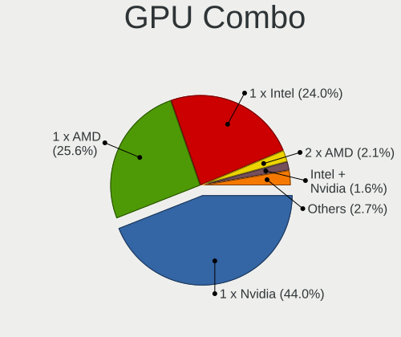

| Name                          | Desktops | Percent |
|-------------------------------|----------|---------|
| 1 x Nvidia                    | 7286     | 44.04%  |
| 1 x AMD                       | 4240     | 25.63%  |
| 1 x Intel                     | 3969     | 23.99%  |
| 2 x AMD                       | 347      | 2.1%    |
| Intel + Nvidia                | 257      | 1.55%   |
| AMD + Nvidia                  | 126      | 0.76%   |
| 1 x ASPEED                    | 83       | 0.5%    |
| Intel + AMD                   | 60       | 0.36%   |
| 2 x Nvidia                    | 42       | 0.25%   |
| 1 x Matrox                    | 29       | 0.18%   |
| Other                         | 22       | 0.13%   |
| 1 x VIA                       | 17       | 0.1%    |
| 2 x Intel                     | 13       | 0.08%   |
| Nvidia + ASPEED               | 8        | 0.05%   |
| 1 x SiS                       | 5        | 0.03%   |
| 3 x AMD                       | 4        | 0.02%   |
| 1 x Silicon Motion            | 4        | 0.02%   |
| 3 x Nvidia                    | 3        | 0.02%   |
| 1 x XGI                       | 3        | 0.02%   |
| Nvidia + Matrox               | 3        | 0.02%   |
| Intel + 2 x AMD               | 3        | 0.02%   |
| 2 x AMD + 1 x Nvidia          | 2        | 0.01%   |
| 1 x S3 Graphics               | 2        | 0.01%   |
| 1 x Red Hat                   | 2        | 0.01%   |
| 1 x Loongson Technology       | 2        | 0.01%   |
| Intel + 2 x Nvidia            | 2        | 0.01%   |
| Intel + AMD + 1 x Nvidia      | 2        | 0.01%   |
| 3 x Nvidia + 1 x ASPEED       | 1        | 0.01%   |
| Nvidia + Zhaoxin              | 1        | 0.01%   |
| 1 x MCST                      | 1        | 0.01%   |
| 1 x Intel + 3 x Nvidia        | 1        | 0.01%   |
| Intel + SiS + 1 x S3 Graphics | 1        | 0.01%   |
| Intel + S3 Graphics           | 1        | 0.01%   |
| Intel + AMD + 4 x Nvidia      | 1        | 0.01%   |
| AMD + 2 x Nvidia              | 1        | 0.01%   |
| AMD + ASPEED                  | 1        | 0.01%   |

GPU Driver
----------

Free vs proprietary

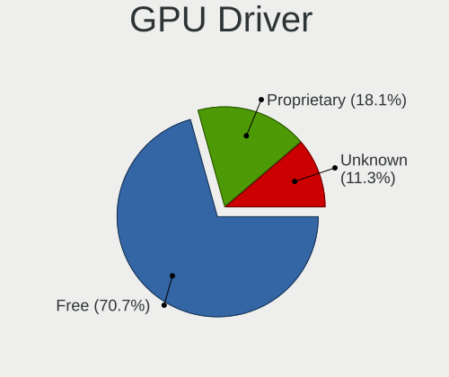

| Driver      | Desktops | Percent |
|-------------|----------|---------|
| Free        | 11980    | 70.7%   |
| Proprietary | 3059     | 18.05%  |
| Unknown     | 1907     | 11.25%  |

GPU Memory
----------

Total video memory

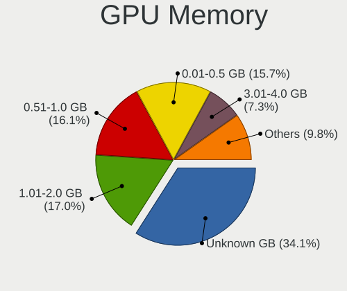

| Size in GB | Desktops | Percent |
|------------|----------|---------|
| Unknown    | 5854     | 34.05%  |
| 1.01-2.0   | 2924     | 17.01%  |
| 0.51-1.0   | 2768     | 16.1%   |
| 0.01-0.5   | 2704     | 15.73%  |
| 3.01-4.0   | 1255     | 7.3%    |
| 7.01-8.0   | 799      | 4.65%   |
| 5.01-6.0   | 336      | 1.95%   |
| 8.01-16.0  | 315      | 1.83%   |
| 2.01-3.0   | 192      | 1.12%   |
| 16.01-24.0 | 37       | 0.22%   |
| 4.01-5.0   | 7        | 0.04%   |

Monitor
-------

Monitor Vendor
--------------

Monitor vendors

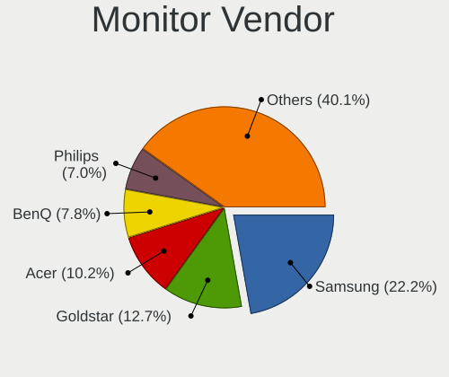

| Vendor               | Desktops | Percent |
|----------------------|----------|---------|
| Samsung Electronics  | 3475     | 22.22%  |
| Goldstar             | 1992     | 12.74%  |
| Acer                 | 1591     | 10.18%  |
| BenQ                 | 1214     | 7.76%   |
| Philips              | 1092     | 6.98%   |
| AOC                  | 788      | 5.04%   |
| ViewSonic            | 714      | 4.57%   |
| Dell                 | 693      | 4.43%   |
| Ancor Communications | 472      | 3.02%   |
| Hewlett-Packard      | 468      | 2.99%   |
| NEC Computers        | 319      | 2.04%   |
| Iiyama               | 204      | 1.3%    |
| ASUSTek Computer     | 163      | 1.04%   |
| Unknown              | 147      | 0.94%   |
| Sony                 | 146      | 0.93%   |
| Mi                   | 135      | 0.86%   |
| MSI                  | 113      | 0.72%   |
| LG Electronics       | 73       | 0.47%   |
| HHT                  | 72       | 0.46%   |
| SKG                  | 70       | 0.45%   |
| Envision Peripherals | 69       | 0.44%   |
| Lenovo               | 67       | 0.43%   |
| Plain Tree Systems   | 64       | 0.41%   |
| Packard Bell         | 63       | 0.4%    |
| HUAWEI               | 58       | 0.37%   |
| SAC                  | 45       | 0.29%   |
| RTK                  | 39       | 0.25%   |
| ___                  | 37       | 0.24%   |
| VIE                  | 35       | 0.22%   |
| Toshiba              | 33       | 0.21%   |
| MStar                | 30       | 0.19%   |
| Fujitsu Siemens      | 30       | 0.19%   |
| Unknown              | 30       | 0.19%   |
| SGT                  | 26       | 0.17%   |
| MiTAC                | 26       | 0.17%   |
| CHR                  | 26       | 0.17%   |
| JRY                  | 25       | 0.16%   |
| CHD                  | 25       | 0.16%   |
| KTC                  | 24       | 0.15%   |
| Hitachi              | 24       | 0.15%   |

Monitor Model
-------------

Monitor models

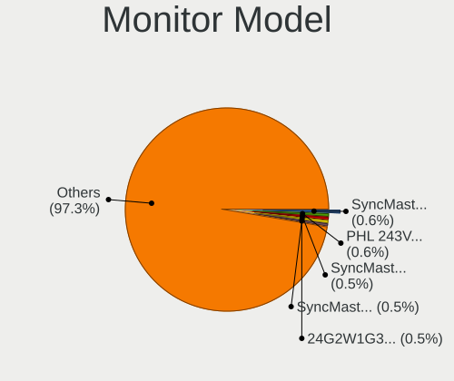

| Model                                                                | Desktops | Percent |
|----------------------------------------------------------------------|----------|---------|
| Samsung Electronics SyncMaster SAM01E1 1280x1024 376x301mm 19.0-inch | 95       | 0.58%   |
| Philips PHL 243V7 PHLC155 1920x1080 527x296mm 23.8-inch              | 90       | 0.55%   |
| Samsung Electronics SyncMaster SAM011E 1280x1024 338x270mm 17.0-inch | 85       | 0.52%   |
| Samsung Electronics SyncMaster SAM036E 1280x1024 376x301mm 19.0-inch | 84       | 0.52%   |
| AOC 24G2W1G3 AOC2402 1920x1080 527x296mm 23.8-inch                   | 80       | 0.49%   |
| Goldstar FULL HD GSM5B55 1920x1080 480x270mm 21.7-inch               | 79       | 0.49%   |
| Unknown LCD Monitor FFFF 2288x1287 2550x2550mm 142.0-inch            | 75       | 0.46%   |
| Acer AL1707 A ACRAD46 1280x1024 338x270mm 17.0-inch                  | 75       | 0.46%   |
| Samsung Electronics SyncMaster SAM01B7 1280x1024 340x270mm 17.1-inch | 73       | 0.45%   |
| Philips PHL 223V5 PHLC0CF 1920x1080 477x268mm 21.5-inch              | 71       | 0.44%   |
| HHT ActivPanel V6 HHT0030 3840x2160 944x398mm 40.3-inch              | 71       | 0.44%   |
| Goldstar W1943 GSM4BAD 1360x768 406x229mm 18.4-inch                  | 65       | 0.4%    |
| Samsung Electronics S24D300 SAM0B43 1920x1080 531x299mm 24.0-inch    | 58       | 0.36%   |
| AOC 27G2G4 AOC2702 1920x1080 598x336mm 27.0-inch                     | 57       | 0.35%   |
| BenQ GL2460 BNQ78CE 1920x1080 531x299mm 24.0-inch                    | 51       | 0.31%   |
| Samsung Electronics SME1920NR SAM06A4 1280x1024 376x301mm 19.0-inch  | 50       | 0.31%   |
| Goldstar LG ULTRAWIDE GSM59F1 2560x1080 670x280mm 28.6-inch          | 50       | 0.31%   |
| Samsung Electronics C24F390 SAM0D2C 1920x1080 521x293mm 23.5-inch    | 49       | 0.3%    |
| Goldstar W1942 GSM4B6F 1440x900 408x255mm 18.9-inch                  | 49       | 0.3%    |
| Samsung Electronics SyncMaster SAM02AD 1440x900 410x257mm 19.1-inch  | 47       | 0.29%   |
| Philips PHL 243V5 PHLC0D1 1920x1080 521x293mm 23.5-inch              | 47       | 0.29%   |
| BenQ GW2270 BNQ78DB 1920x1080 476x268mm 21.5-inch                    | 46       | 0.28%   |
| Goldstar LG IPS FULLHD GSM5AB8 1920x1080 480x270mm 21.7-inch         | 41       | 0.25%   |
| Samsung Electronics S24F350 SAM0D20 1920x1080 521x293mm 23.5-inch    | 39       | 0.24%   |
| Goldstar IPS FULLHD GSM5AB6 1920x1080 480x270mm 21.7-inch            | 37       | 0.23%   |
| Dell U2412M DELA07A 1920x1200 518x324mm 24.1-inch                    | 37       | 0.23%   |
| Philips PHL 273V7 PHLC156 1920x1080 598x336mm 27.0-inch              | 36       | 0.22%   |
| Samsung Electronics SyncMaster SAM036F 1440x900 428x255mm 19.6-inch  | 35       | 0.21%   |
| Samsung Electronics SyncMaster SAM011F 1280x1024 376x301mm 19.0-inch | 35       | 0.21%   |
| Samsung Electronics C27F390 SAM0D32 1920x1080 598x336mm 27.0-inch    | 35       | 0.21%   |
| Goldstar L1942 GSM4B85 1280x1024 376x301mm 19.0-inch                 | 34       | 0.21%   |
| Goldstar IPS FULLHD GSM5AB7 1920x1080 480x270mm 21.7-inch            | 34       | 0.21%   |
| Acer AL1916 ACRAD49 1280x1024 376x301mm 19.0-inch                    | 34       | 0.21%   |
| AOC 2270W AOC2270 1920x1080 477x268mm 21.5-inch                      | 33       | 0.2%    |
| AOC 2470W AOC2470 1920x1080 521x293mm 23.5-inch                      | 32       | 0.2%    |
| Goldstar L1730S GSM438D 1280x1024 338x270mm 17.0-inch                | 31       | 0.19%   |
| Unknown                                                              | 30       | 0.18%   |
| Philips 226VL PHLC081 1920x1080 480x268mm 21.6-inch                  | 29       | 0.18%   |
| AOC 2269WM AOC2269 1920x1080 477x268mm 21.5-inch                     | 29       | 0.18%   |
| Plain Tree Systems LCD Monitor PTS06A5 1280x1024 340x270mm 17.1-inch | 28       | 0.17%   |

Monitor Resolution
------------------

Monitor screen resolution

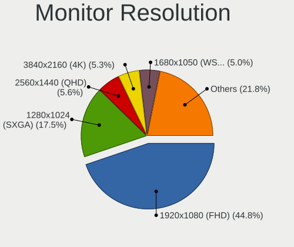

| Resolution         | Desktops | Percent |
|--------------------|----------|---------|
| 1920x1080 (FHD)    | 6846     | 44.79%  |
| 1280x1024 (SXGA)   | 2672     | 17.48%  |
| 2560x1440 (QHD)    | 856      | 5.6%    |
| 3840x2160 (4K)     | 806      | 5.27%   |
| 1680x1050 (WSXGA+) | 769      | 5.03%   |
| 1440x900 (WXGA+)   | 655      | 4.29%   |
| 1366x768 (WXGA)    | 564      | 3.69%   |
| 1600x900 (HD+)     | 471      | 3.08%   |
| 1920x1200 (WUXGA)  | 299      | 1.96%   |
| 1360x768           | 218      | 1.43%   |
| 1024x768 (XGA)     | 185      | 1.21%   |
| 2560x1080          | 157      | 1.03%   |
| 3440x1440          | 129      | 0.84%   |
| Unknown            | 114      | 0.75%   |
| 1600x1200          | 110      | 0.72%   |
| 2288x1287          | 77       | 0.5%    |
| 1920x540           | 53       | 0.35%   |
| 1280x720 (HD)      | 42       | 0.27%   |
| 3840x1080          | 35       | 0.23%   |
| 1400x1050          | 32       | 0.21%   |
| 1280x960           | 20       | 0.13%   |
| 2560x1600          | 14       | 0.09%   |
| 1152x864           | 14       | 0.09%   |
| 2048x1536          | 13       | 0.09%   |
| 4480x1440          | 12       | 0.08%   |
| 2048x1152          | 10       | 0.07%   |
| 1920x1440          | 10       | 0.07%   |
| 5760x2160          | 7        | 0.05%   |
| 3840x2560          | 7        | 0.05%   |
| 3200x1080          | 7        | 0.05%   |
| 3840x1600          | 6        | 0.04%   |
| 2160x1200          | 6        | 0.04%   |
| 5120x1440          | 5        | 0.03%   |
| 7680x2160          | 4        | 0.03%   |
| 5760x1080          | 4        | 0.03%   |
| 3600x1080          | 4        | 0.03%   |
| 1280x768           | 4        | 0.03%   |
| 3286x1080          | 3        | 0.02%   |
| 2160x1440          | 3        | 0.02%   |
| 6400x2160          | 2        | 0.01%   |

Monitor Diagonal
----------------

Diagonal size in inches

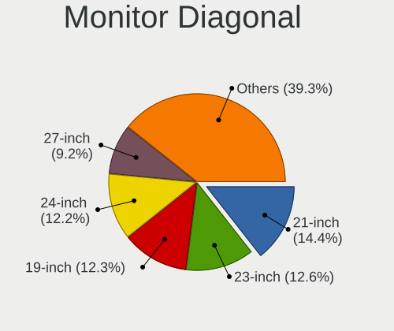

| Inches  | Desktops | Percent |
|---------|----------|---------|
| 21      | 2263     | 14.41%  |
| 23      | 1977     | 12.59%  |
| 19      | 1931     | 12.3%   |
| 24      | 1918     | 12.21%  |
| 27      | 1441     | 9.18%   |
| 17      | 1294     | 8.24%   |
| 18      | 744      | 4.74%   |
| 20      | 655      | 4.17%   |
| Unknown | 600      | 3.82%   |
| 22      | 499      | 3.18%   |
| 31      | 411      | 2.62%   |
| 15      | 338      | 2.15%   |
| 34      | 259      | 1.65%   |
| 40      | 175      | 1.11%   |
| 32      | 152      | 0.97%   |
| 54      | 122      | 0.78%   |
| 72      | 111      | 0.71%   |
| 142     | 75       | 0.48%   |
| 52      | 68       | 0.43%   |
| 84      | 58       | 0.37%   |
| 28      | 52       | 0.33%   |
| 46      | 51       | 0.32%   |
| 25      | 50       | 0.32%   |
| 16      | 50       | 0.32%   |
| 48      | 36       | 0.23%   |
| 26      | 34       | 0.22%   |
| 12      | 30       | 0.19%   |
| 42      | 28       | 0.18%   |
| 43      | 26       | 0.17%   |
| 63      | 25       | 0.16%   |
| 65      | 23       | 0.15%   |
| 29      | 23       | 0.15%   |
| 49      | 22       | 0.14%   |
| 14      | 22       | 0.14%   |
| 13      | 14       | 0.09%   |
| 33      | 13       | 0.08%   |
| 37      | 12       | 0.08%   |
| 58      | 10       | 0.06%   |
| 39      | 10       | 0.06%   |
| 60      | 9        | 0.06%   |

Monitor Width
-------------

Physical width

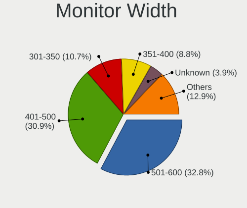

| Width in mm    | Desktops | Percent |
|----------------|----------|---------|
| 501-600        | 5041     | 32.79%  |
| 401-500        | 4745     | 30.86%  |
| 301-350        | 1652     | 10.74%  |
| 351-400        | 1360     | 8.85%   |
| Unknown        | 600      | 3.9%    |
| 601-700        | 565      | 3.67%   |
| 701-800        | 425      | 2.76%   |
| 1001-1500      | 387      | 2.52%   |
| 1501-2000      | 190      | 1.24%   |
| 801-900        | 136      | 0.88%   |
| 901-1000       | 129      | 0.84%   |
| More than 2000 | 80       | 0.52%   |
| 201-300        | 64       | 0.42%   |
| 1-100          | 1        | 0.01%   |

Aspect Ratio
------------

Proportional relationship between the width and the height

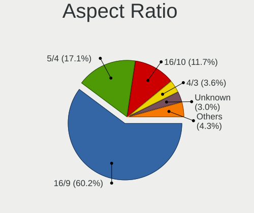

| Ratio   | Desktops | Percent |
|---------|----------|---------|
| 16/9    | 8922     | 60.21%  |
| 5/4     | 2540     | 17.14%  |
| 16/10   | 1736     | 11.72%  |
| 4/3     | 535      | 3.61%   |
| Unknown | 442      | 2.98%   |
| 21/9    | 353      | 2.38%   |
| 3/2     | 121      | 0.82%   |
| 1.00    | 75       | 0.51%   |
| 6/5     | 50       | 0.34%   |
| 32/9    | 37       | 0.25%   |
| 2.00    | 3        | 0.02%   |
| 0.56    | 3        | 0.02%   |

Monitor Area
------------

Area in inch²

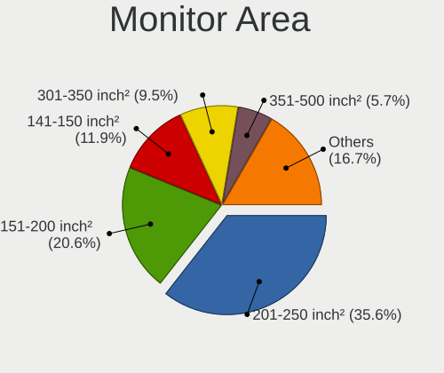

| Area in inch² | Desktops | Percent |
|----------------|----------|---------|
| 201-250        | 5508     | 35.58%  |
| 151-200        | 3187     | 20.59%  |
| 141-150        | 1847     | 11.93%  |
| 301-350        | 1472     | 9.51%   |
| 351-500        | 881      | 5.69%   |
| 251-300        | 601      | 3.88%   |
| Unknown        | 600      | 3.88%   |
| More than 1000 | 569      | 3.68%   |
| 501-1000       | 352      | 2.27%   |
| 101-110        | 233      | 1.51%   |
| 111-120        | 129      | 0.83%   |
| 71-80          | 32       | 0.21%   |
| 121-130        | 29       | 0.19%   |
| 131-140        | 19       | 0.12%   |
| 81-90          | 11       | 0.07%   |
| 91-100         | 6        | 0.04%   |
| 61-70          | 1        | 0.01%   |
| 51-60          | 1        | 0.01%   |
| 1-40           | 1        | 0.01%   |

Pixel Density
-------------

Pixels per inch

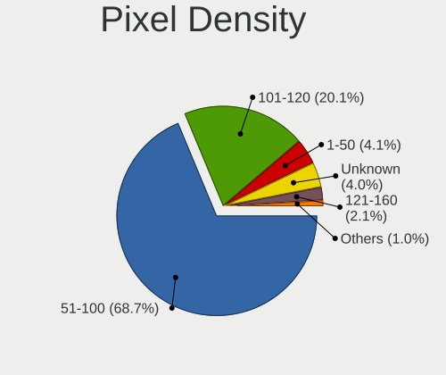

| Density       | Desktops | Percent |
|---------------|----------|---------|
| 51-100        | 10212    | 68.72%  |
| 101-120       | 2980     | 20.05%  |
| 1-50          | 608      | 4.09%   |
| Unknown       | 601      | 4.04%   |
| 121-160       | 315      | 2.12%   |
| 161-240       | 142      | 0.96%   |
| More than 240 | 3        | 0.02%   |

Multiple Monitors
-----------------

Total monitors connected

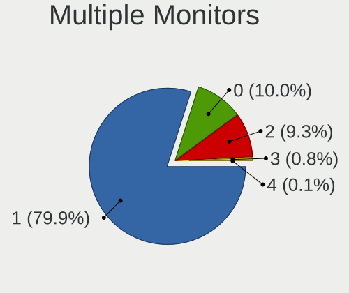

| Total | Desktops | Percent |
|-------|----------|---------|
| 1     | 13230    | 79.91%  |
| 0     | 1653     | 9.98%   |
| 2     | 1537     | 9.28%   |
| 3     | 125      | 0.76%   |
| 4     | 11       | 0.07%   |

Network
-------

Net Controller Vendor
---------------------

Controller vendors

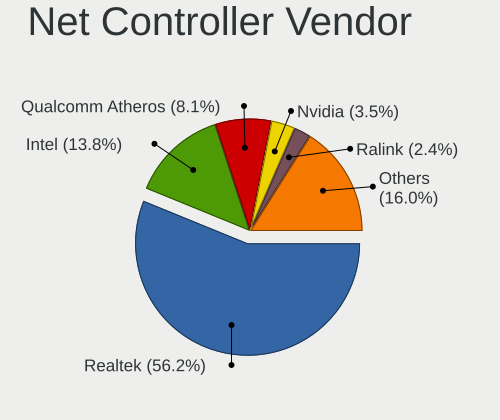

| Vendor                                 | Desktops | Percent |
|----------------------------------------|----------|---------|
| Realtek Semiconductor                  | 11787    | 56.17%  |
| Intel                                  | 2898     | 13.81%  |
| Qualcomm Atheros                       | 1696     | 8.08%   |
| Nvidia                                 | 727      | 3.46%   |
| Ralink Technology                      | 510      | 2.43%   |
| TP-Link                                | 335      | 1.6%    |
| Huawei Technologies                    | 297      | 1.42%   |
| Marvell Technology Group               | 266      | 1.27%   |
| Ralink                                 | 232      | 1.11%   |
| MediaTek                               | 228      | 1.09%   |
| VIA Technologies                       | 208      | 0.99%   |
| Broadcom                               | 196      | 0.93%   |
| D-Link System                          | 168      | 0.8%    |
| D-Link                                 | 148      | 0.71%   |
| ASUSTek Computer                       | 121      | 0.58%   |
| Qualcomm Atheros Communications        | 116      | 0.55%   |
| Xiaomi                                 | 96       | 0.46%   |
| Broadcom Limited                       | 79       | 0.38%   |
| ZTE WCDMA Technologies MSM             | 77       | 0.37%   |
| Samsung Electronics                    | 60       | 0.29%   |
| ASIX Electronics                       | 52       | 0.25%   |
| Microsoft                              | 45       | 0.21%   |
| Sundance Technology Inc / IC Plus      | 40       | 0.19%   |
| Mercucys                               | 35       | 0.17%   |
| Silicon Integrated Systems [SiS]       | 34       | 0.16%   |
| 3Com                                   | 34       | 0.16%   |
| Aquantia                               | 30       | 0.14%   |
| NetGear                                | 25       | 0.12%   |
| Qualcomm                               | 22       | 0.1%    |
| OPPO Electronics                       | 22       | 0.1%    |
| QinHeng Electronics                    | 19       | 0.09%   |
| IMC Networks                           | 19       | 0.09%   |
| ZyXEL Communications                   | 18       | 0.09%   |
| Spreadtrum Communications              | 18       | 0.09%   |
| HTC (High Tech Computer)               | 15       | 0.07%   |
| Gemtek                                 | 15       | 0.07%   |
| Sony Ericsson Mobile Communications AB | 14       | 0.07%   |
| T & A Mobile Phones                    | 13       | 0.06%   |
| Qualcomm Technologies                  | 12       | 0.06%   |
| LSI                                    | 10       | 0.05%   |

Net Controller Model
--------------------

Controller models

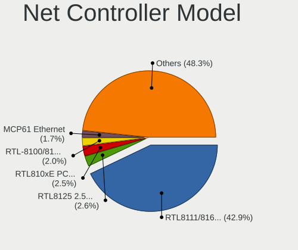

| Model                                                                  | Desktops | Percent |
|------------------------------------------------------------------------|----------|---------|
| Realtek RTL8111/8168/8211/8411 PCI Express Gigabit Ethernet Controller | 9755     | 42.91%  |
| Realtek RTL8125 2.5GbE Controller                                      | 587      | 2.58%   |
| Realtek RTL810xE PCI Express Fast Ethernet controller                  | 561      | 2.47%   |
| Realtek RTL-8100/8101L/8139 PCI Fast Ethernet Adapter                  | 452      | 1.99%   |
| Nvidia MCP61 Ethernet                                                  | 389      | 1.71%   |
| Ralink MT7601U Wireless Adapter                                        | 333      | 1.46%   |
| Intel Ethernet Connection (2) I219-V                                   | 312      | 1.37%   |
| Intel I211 Gigabit Network Connection                                  | 267      | 1.17%   |
| Qualcomm Atheros AR8151 v2.0 Gigabit Ethernet                          | 246      | 1.08%   |
| Realtek RTL8188EUS 802.11n Wireless Network Adapter                    | 215      | 0.95%   |
| Qualcomm Atheros Attansic L1 Gigabit Ethernet                          | 213      | 0.94%   |
| Intel Wi-Fi 6 AX200                                                    | 197      | 0.87%   |
| Intel 82579V Gigabit Network Connection                                | 191      | 0.84%   |
| Qualcomm Atheros AR8121/AR8113/AR8114 Gigabit or Fast Ethernet         | 171      | 0.75%   |
| Intel Ethernet Controller I225-V                                       | 161      | 0.71%   |
| Qualcomm Atheros AR8161 Gigabit Ethernet                               | 155      | 0.68%   |
| Intel Ethernet Connection (14) I219-V                                  | 149      | 0.66%   |
| VIA VT6105/VT6106S [Rhine-III]                                         | 147      | 0.65%   |
| Huawei Modem/Networkcard                                               | 141      | 0.62%   |
| Qualcomm Atheros AR8131 Gigabit Ethernet                               | 131      | 0.58%   |
| Intel Wi-Fi 6E(802.11ax) AX210/AX1675* 2x2 [Typhoon Peak]              | 128      | 0.56%   |
| Realtek 802.11ac NIC                                                   | 125      | 0.55%   |
| Marvell Group 88E8056 PCI-E Gigabit Ethernet Controller                | 124      | 0.55%   |
| Realtek RTL8192CU 802.11n WLAN Adapter                                 | 122      | 0.54%   |
| Qualcomm Atheros AR9485 Wireless Network Adapter                       | 121      | 0.53%   |
| Intel Ethernet Connection (7) I219-V                                   | 109      | 0.48%   |
| Intel Dual Band Wireless-AC 3168NGW [Stone Peak]                       | 99       | 0.44%   |
| Intel 82579LM Gigabit Network Connection (Lewisville)                  | 97       | 0.43%   |
| Realtek RTL-8110SC/8169SC Gigabit Ethernet                             | 96       | 0.42%   |
| Qualcomm Atheros AR9271 802.11n                                        | 96       | 0.42%   |
| Realtek RTL8152 Fast Ethernet Adapter                                  | 89       | 0.39%   |
| Intel 82574L Gigabit Network Connection                                | 87       | 0.38%   |
| Marvell Group 88E8001 Gigabit Ethernet Controller                      | 86       | 0.38%   |
| Realtek RTL8169 PCI Gigabit Ethernet Controller                        | 85       | 0.37%   |
| Intel Ethernet Connection I217-V                                       | 85       | 0.37%   |
| Qualcomm Atheros QCA8171 Gigabit Ethernet                              | 80       | 0.35%   |
| Realtek RTL8821CE 802.11ac PCIe Wireless Network Adapter               | 79       | 0.35%   |
| Qualcomm Atheros AR8152 v2.0 Fast Ethernet                             | 79       | 0.35%   |
| Ralink RT5370 Wireless Adapter                                         | 76       | 0.33%   |
| Intel Ethernet Connection (2) I218-V                                   | 76       | 0.33%   |

Wireless Vendor
---------------

Wireless vendors

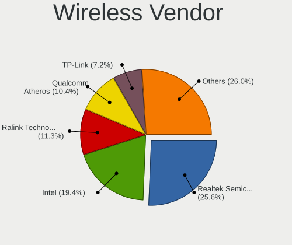

| Vendor                                | Desktops | Percent |
|---------------------------------------|----------|---------|
| Realtek Semiconductor                 | 1157     | 25.65%  |
| Intel                                 | 875      | 19.4%   |
| Ralink Technology                     | 510      | 11.31%  |
| Qualcomm Atheros                      | 469      | 10.4%   |
| TP-Link                               | 326      | 7.23%   |
| Ralink                                | 232      | 5.14%   |
| MediaTek                              | 156      | 3.46%   |
| D-Link                                | 144      | 3.19%   |
| Broadcom                              | 117      | 2.59%   |
| Qualcomm Atheros Communications       | 116      | 2.57%   |
| ASUSTek Computer                      | 115      | 2.55%   |
| D-Link System                         | 70       | 1.55%   |
| Microsoft                             | 45       | 1%      |
| Mercucys                              | 35       | 0.78%   |
| NetGear                               | 24       | 0.53%   |
| IMC Networks                          | 19       | 0.42%   |
| Broadcom Limited                      | 18       | 0.4%    |
| ZyXEL Communications                  | 15       | 0.33%   |
| Tenda                                 | 9        | 0.2%    |
| Xiaomi                                | 8        | 0.18%   |
| ZTopInc                               | 5        | 0.11%   |
| Edimax Technology                     | 5        | 0.11%   |
| ZyDAS                                 | 4        | 0.09%   |
| VIA Technologies                      | 4        | 0.09%   |
| Texas Instruments                     | 3        | 0.07%   |
| Micro Star International              | 3        | 0.07%   |
| Marvell Technology Group              | 3        | 0.07%   |
| Linksys                               | 3        | 0.07%   |
| Wilocity                              | 2        | 0.04%   |
| TRENDnet                              | 2        | 0.04%   |
| Qualcomm Technologies                 | 2        | 0.04%   |
| Belkin Components                     | 2        | 0.04%   |
| 802.11g Adapter [Linksys WUSB54GC v3] | 2        | 0.04%   |
| Z-Com                                 | 1        | 0.02%   |
| Sierra Wireless                       | 1        | 0.02%   |
| Realtek                               | 1        | 0.02%   |
| LG Electronics                        | 1        | 0.02%   |
| Gemtek                                | 1        | 0.02%   |
| Chu Yuen Enterprise                   | 1        | 0.02%   |
| BUFFALO                               | 1        | 0.02%   |

Wireless Model
--------------

Wireless models

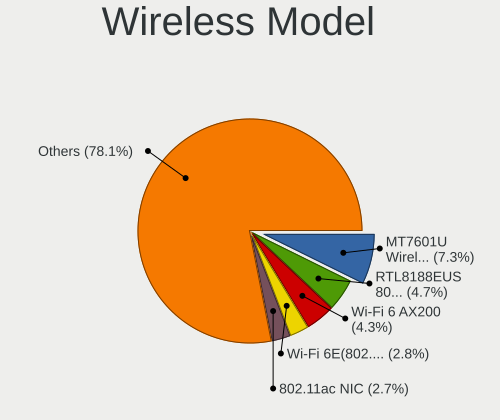

| Model                                                          | Desktops | Percent |
|----------------------------------------------------------------|----------|---------|
| Ralink MT7601U Wireless Adapter                                | 333      | 7.31%   |
| Realtek RTL8188EUS 802.11n Wireless Network Adapter            | 215      | 4.72%   |
| Intel Wi-Fi 6 AX200                                            | 197      | 4.32%   |
| Intel Wi-Fi 6E(802.11ax) AX210/AX1675* 2x2 [Typhoon Peak]      | 128      | 2.81%   |
| Realtek 802.11ac NIC                                           | 125      | 2.74%   |
| Realtek RTL8192CU 802.11n WLAN Adapter                         | 122      | 2.68%   |
| Qualcomm Atheros AR9485 Wireless Network Adapter               | 121      | 2.65%   |
| Intel Dual Band Wireless-AC 3168NGW [Stone Peak]               | 99       | 2.17%   |
| Qualcomm Atheros AR9271 802.11n                                | 96       | 2.11%   |
| Realtek RTL8821CE 802.11ac PCIe Wireless Network Adapter       | 79       | 1.73%   |
| Ralink RT5370 Wireless Adapter                                 | 76       | 1.67%   |
| Qualcomm Atheros AR9227 Wireless Network Adapter               | 74       | 1.62%   |
| Realtek RTL8188CE 802.11b/g/n WiFi Adapter                     | 71       | 1.56%   |
| MediaTek MT7922 802.11ax PCI Express Wireless Network Adapter  | 68       | 1.49%   |
| Intel Wireless 3165                                            | 65       | 1.43%   |
| Realtek RTL8188EE Wireless Network Adapter                     | 64       | 1.4%    |
| TP-Link TL-WN722N v2/v3 [Realtek RTL8188EUS]                   | 63       | 1.38%   |
| Qualcomm Atheros AR9285 Wireless Network Adapter (PCI-Express) | 63       | 1.38%   |
| Intel Wireless 7265                                            | 61       | 1.34%   |
| Realtek RTL8192EU 802.11b/g/n WLAN Adapter                     | 59       | 1.29%   |
| Ralink RT2870/RT3070 Wireless Adapter                          | 53       | 1.16%   |
| Realtek RTL8188CUS 802.11n WLAN Adapter                        | 52       | 1.14%   |
| Ralink RT3060 Wireless 802.11n 1T/1R                           | 52       | 1.14%   |
| Intel Wi-Fi 5(802.11ac) Wireless-AC 9x6x [Thunder Peak]        | 50       | 1.1%    |
| MediaTek MT7921K (RZ608) Wi-Fi 6E 80MHz                        | 47       | 1.03%   |
| TP-Link Archer T2U PLUS [RTL8821AU]                            | 45       | 0.99%   |
| Realtek RTL8192EE PCIe Wireless Network Adapter                | 44       | 0.97%   |
| TP-Link TL-WN821N v5/v6 [RTL8192EU]                            | 43       | 0.94%   |
| Ralink RT2561/RT61 rev B 802.11g                               | 43       | 0.94%   |
| Qualcomm Atheros AR5212/5213/2414 Wireless Network Adapter     | 43       | 0.94%   |
| Broadcom BCM4360 802.11ac Dual Band Wireless Network Adapter   | 43       | 0.94%   |
| Ralink RT5360 Wireless 802.11n 1T/1R                           | 40       | 0.88%   |
| Qualcomm Atheros AR9287 Wireless Network Adapter (PCI-Express) | 40       | 0.88%   |
| Intel 700 Series Chipset CNVi WiFi                             | 40       | 0.88%   |
| Realtek RTL88x2bu [AC1200 Techkey]                             | 38       | 0.83%   |
| TP-Link TL-WN823N v2/v3 [Realtek RTL8192EU]                    | 36       | 0.79%   |
| Realtek RTL8811AU 802.11a/b/g/n/ac WLAN Adapter                | 35       | 0.77%   |
| Qualcomm Atheros AR93xx Wireless Network Adapter               | 35       | 0.77%   |
| Intel Wireless 7260                                            | 32       | 0.7%    |
| D-Link 802.11 n WLAN                                           | 31       | 0.68%   |

Ethernet Vendor
---------------

Ethernet vendors

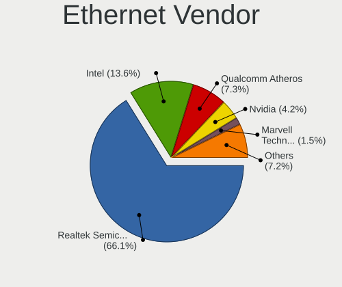

| Vendor                                 | Desktops | Percent |
|----------------------------------------|----------|---------|
| Realtek Semiconductor                  | 11460    | 66.15%  |
| Intel                                  | 2352     | 13.58%  |
| Qualcomm Atheros                       | 1273     | 7.35%   |
| Nvidia                                 | 727      | 4.2%    |
| Marvell Technology Group               | 263      | 1.52%   |
| VIA Technologies                       | 202      | 1.17%   |
| Huawei Technologies                    | 108      | 0.62%   |
| D-Link System                          | 99       | 0.57%   |
| Xiaomi                                 | 88       | 0.51%   |
| Broadcom                               | 80       | 0.46%   |
| MediaTek                               | 69       | 0.4%    |
| Broadcom Limited                       | 61       | 0.35%   |
| Samsung Electronics                    | 60       | 0.35%   |
| ASIX Electronics                       | 52       | 0.3%    |
| Sundance Technology Inc / IC Plus      | 40       | 0.23%   |
| Silicon Integrated Systems [SiS]       | 34       | 0.2%    |
| 3Com                                   | 34       | 0.2%    |
| Aquantia                               | 30       | 0.17%   |
| Qualcomm                               | 22       | 0.13%   |
| OPPO Electronics                       | 22       | 0.13%   |
| Spreadtrum Communications              | 18       | 0.1%    |
| HTC (High Tech Computer)               | 15       | 0.09%   |
| Sony Ericsson Mobile Communications AB | 14       | 0.08%   |
| Gemtek                                 | 14       | 0.08%   |
| ZTE WCDMA Technologies MSM             | 13       | 0.08%   |
| TP-Link                                | 10       | 0.06%   |
| T & A Mobile Phones                    | 10       | 0.06%   |
| Qualcomm Technologies                  | 10       | 0.06%   |
| Vimtron Electronics                    | 9        | 0.05%   |
| JMicron Technology                     | 9        | 0.05%   |
| Mellanox Technologies                  | 8        | 0.05%   |
| GCT Semiconductor                      | 8        | 0.05%   |
| MCST                                   | 7        | 0.04%   |
| Motorola PCS                           | 6        | 0.03%   |
| Lenovo                                 | 6        | 0.03%   |
| HMD Global                             | 6        | 0.03%   |
| ASUSTek Computer                       | 6        | 0.03%   |
| ICS Advent                             | 5        | 0.03%   |
| ULi Electronics                        | 4        | 0.02%   |
| Marvell Semiconductor                  | 4        | 0.02%   |

Ethernet Model
--------------

Ethernet models

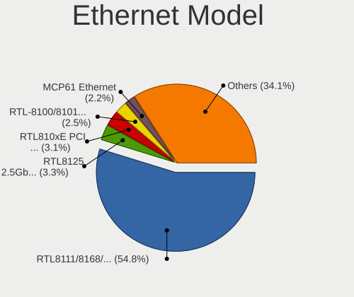

| Model                                                                  | Desktops | Percent |
|------------------------------------------------------------------------|----------|---------|
| Realtek RTL8111/8168/8211/8411 PCI Express Gigabit Ethernet Controller | 9755     | 54.77%  |
| Realtek RTL8125 2.5GbE Controller                                      | 587      | 3.3%    |
| Realtek RTL810xE PCI Express Fast Ethernet controller                  | 561      | 3.15%   |
| Realtek RTL-8100/8101L/8139 PCI Fast Ethernet Adapter                  | 452      | 2.54%   |
| Nvidia MCP61 Ethernet                                                  | 389      | 2.18%   |
| Intel Ethernet Connection (2) I219-V                                   | 312      | 1.75%   |
| Intel I211 Gigabit Network Connection                                  | 267      | 1.5%    |
| Qualcomm Atheros AR8151 v2.0 Gigabit Ethernet                          | 246      | 1.38%   |
| Qualcomm Atheros Attansic L1 Gigabit Ethernet                          | 213      | 1.2%    |
| Intel 82579V Gigabit Network Connection                                | 191      | 1.07%   |
| Qualcomm Atheros AR8121/AR8113/AR8114 Gigabit or Fast Ethernet         | 171      | 0.96%   |
| Intel Ethernet Controller I225-V                                       | 161      | 0.9%    |
| Qualcomm Atheros AR8161 Gigabit Ethernet                               | 155      | 0.87%   |
| Intel Ethernet Connection (14) I219-V                                  | 149      | 0.84%   |
| VIA VT6105/VT6106S [Rhine-III]                                         | 147      | 0.83%   |
| Qualcomm Atheros AR8131 Gigabit Ethernet                               | 131      | 0.74%   |
| Marvell Group 88E8056 PCI-E Gigabit Ethernet Controller                | 124      | 0.7%    |
| Intel Ethernet Connection (7) I219-V                                   | 109      | 0.61%   |
| Intel 82579LM Gigabit Network Connection (Lewisville)                  | 97       | 0.54%   |
| Realtek RTL-8110SC/8169SC Gigabit Ethernet                             | 96       | 0.54%   |
| Realtek RTL8152 Fast Ethernet Adapter                                  | 89       | 0.5%    |
| Intel 82574L Gigabit Network Connection                                | 87       | 0.49%   |
| Marvell Group 88E8001 Gigabit Ethernet Controller                      | 86       | 0.48%   |
| Realtek RTL8169 PCI Gigabit Ethernet Controller                        | 85       | 0.48%   |
| Intel Ethernet Connection I217-V                                       | 85       | 0.48%   |
| Qualcomm Atheros QCA8171 Gigabit Ethernet                              | 80       | 0.45%   |
| Qualcomm Atheros AR8152 v2.0 Fast Ethernet                             | 79       | 0.44%   |
| Intel Ethernet Connection (2) I218-V                                   | 76       | 0.43%   |
| Nvidia MCP77 Ethernet                                                  | 72       | 0.4%    |
| Qualcomm Atheros Attansic L2 Fast Ethernet                             | 71       | 0.4%    |
| Nvidia CK804 Ethernet Controller                                       | 71       | 0.4%    |
| Xiaomi Mi/Redmi series (RNDIS)                                         | 66       | 0.37%   |
| D-Link System DGE-528T Gigabit Ethernet Adapter                        | 65       | 0.36%   |
| Huawei FOA-LX9                                                         | 58       | 0.33%   |
| Intel I210 Gigabit Network Connection                                  | 57       | 0.32%   |
| Intel Ethernet Connection (2) I219-LM                                  | 55       | 0.31%   |
| VIA VT6102/VT6103 [Rhine-II]                                           | 54       | 0.3%    |
| Nvidia MCP55 Ethernet                                                  | 53       | 0.3%    |
| MediaTek Infinix HOT 50i                                               | 50       | 0.28%   |
| Intel 82567LM-3 Gigabit Network Connection                             | 49       | 0.28%   |

Net Controller Kind
-------------------

Ethernet, WiFi or modem

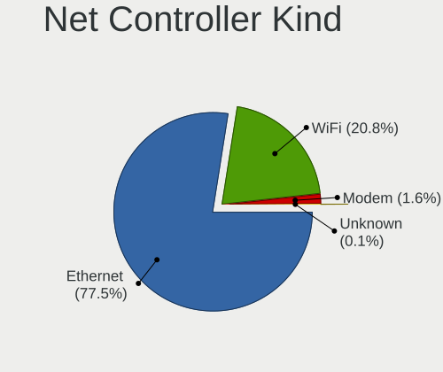

| Kind     | Desktops | Percent |
|----------|----------|---------|
| Ethernet | 15974    | 77.48%  |
| WiFi     | 4281     | 20.77%  |
| Modem    | 338      | 1.64%   |
| Unknown  | 23       | 0.11%   |

Used Controller
---------------

Currently used network controller

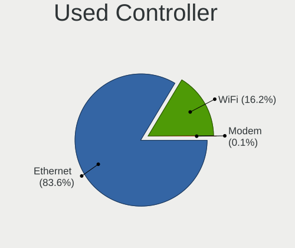

| Kind     | Desktops | Percent |
|----------|----------|---------|
| Ethernet | 13489    | 83.62%  |
| WiFi     | 2621     | 16.25%  |
| Modem    | 22       | 0.14%   |

NICs
----

Total network controllers on board

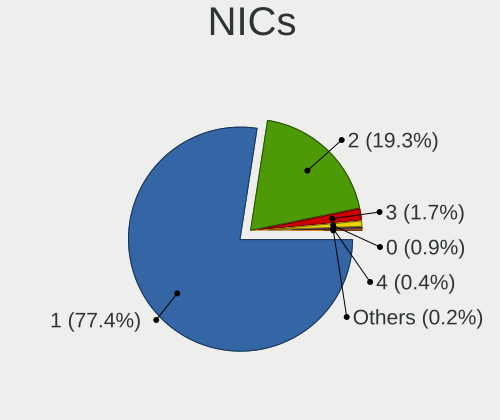

| Total | Desktops | Percent |
|-------|----------|---------|
| 1     | 12597    | 77.43%  |
| 2     | 3144     | 19.33%  |
| 3     | 283      | 1.74%   |
| 0     | 147      | 0.9%    |
| 4     | 62       | 0.38%   |
| 5     | 11       | 0.07%   |
| 6     | 9        | 0.06%   |
| 8     | 6        | 0.04%   |
| 7     | 4        | 0.02%   |
| 9     | 2        | 0.01%   |
| 33    | 1        | 0.01%   |
| 13    | 1        | 0.01%   |
| 10    | 1        | 0.01%   |

IPv6
----

IPv6 vs IPv4

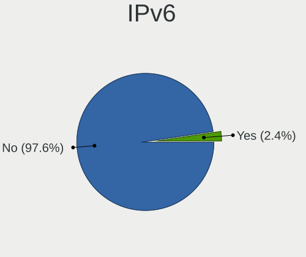

| Used | Desktops | Percent |
|------|----------|---------|
| No   | 15823    | 97.61%  |
| Yes  | 387      | 2.39%   |

Bluetooth
---------

Bluetooth Vendor
----------------

Controller vendors

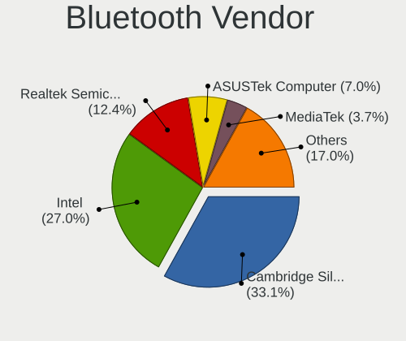

| Vendor                          | Desktops | Percent |
|---------------------------------|----------|---------|
| Cambridge Silicon Radio         | 1030     | 33.06%  |
| Intel                           | 840      | 26.96%  |
| Realtek Semiconductor           | 385      | 12.36%  |
| ASUSTek Computer                | 217      | 6.96%   |
| MediaTek                        | 115      | 3.69%   |
| Broadcom                        | 109      | 3.5%    |
| TP-Link                         | 74       | 2.37%   |
| IMC Networks                    | 64       | 2.05%   |
| Qualcomm Atheros Communications | 60       | 1.93%   |
| Foxconn / Hon Hai               | 41       | 1.32%   |
| Integrated System Solution      | 34       | 1.09%   |
| Unknown                         | 29       | 0.93%   |
| Actions                         | 24       | 0.77%   |
| Apple                           | 16       | 0.51%   |
| Lite-On Technology              | 14       | 0.45%   |
| Conwise Technology              | 11       | 0.35%   |
| SiW                             | 9        | 0.29%   |
| Roper                           | 6        | 0.19%   |
| Ralink                          | 6        | 0.19%   |
| HTC (High Tech Computer)        | 6        | 0.19%   |
| Hewlett-Packard                 | 5        | 0.16%   |
| Realtek                         | 4        | 0.13%   |
| Logitech                        | 4        | 0.13%   |
| D-Link System                   | 4        | 0.13%   |
| Micro Star International        | 2        | 0.06%   |
| Edimax Technology               | 2        | 0.06%   |
| AICSemi                         | 2        | 0.06%   |
| TRENDnet                        | 1        | 0.03%   |
| Toshiba                         | 1        | 0.03%   |
| Opticis                         | 1        | 0.03%   |

Bluetooth Model
---------------

Controller models

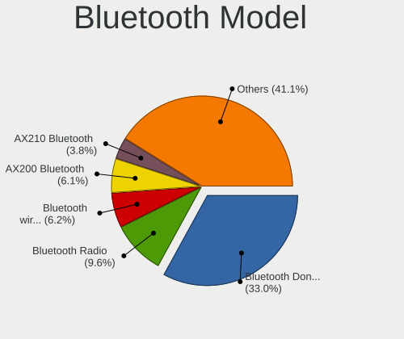

| Model                                                 | Desktops | Percent |
|-------------------------------------------------------|----------|---------|
| Cambridge Silicon Radio Bluetooth Dongle (HCI mode)   | 1030     | 32.98%  |
| Realtek Bluetooth Radio                               | 301      | 9.64%   |
| Intel Bluetooth wireless interface                    | 195      | 6.24%   |
| Intel AX200 Bluetooth                                 | 192      | 6.15%   |
| Intel AX210 Bluetooth                                 | 120      | 3.84%   |
| MediaTek Wireless_Device                              | 114      | 3.65%   |
| Intel Wireless-AC 3168 Bluetooth                      | 96       | 3.07%   |
| ASUS Broadcom BCM20702A0 Bluetooth                    | 75       | 2.4%    |
| TP-Link TP-T@- UB500 Adapter                          | 74       | 2.37%   |
| Intel AX201 Bluetooth                                 | 67       | 2.15%   |
| Intel Bluetooth Device                                | 64       | 2.05%   |
| Intel Bluetooth 9460/9560 Jefferson Peak (JfP)        | 48       | 1.54%   |
| Intel Wireless-AC 9260 Bluetooth Adapter              | 45       | 1.44%   |
| Realtek Bluetooth 5.3 Radio                           | 43       | 1.38%   |
| ASUS ASUS USB-BT500                                   | 38       | 1.22%   |
| Qualcomm Atheros AR3011 Bluetooth                     | 36       | 1.15%   |
| Unknown                                               | 29       | 0.93%   |
| IMC Networks Bluetooth Radio                          | 27       | 0.86%   |
| ASUS Bluetooth Adapter                                | 27       | 0.86%   |
| ASUS BCM20702A0                                       | 27       | 0.86%   |
| IMC Networks Wireless_Device                          | 24       | 0.77%   |
| Actions general adapter                               | 24       | 0.77%   |
| Broadcom BCM20702A0 Bluetooth 4.0                     | 23       | 0.74%   |
| Broadcom BCM2045 Bluetooth                            | 22       | 0.7%    |
| Foxconn / Hon Hai Wireless_Device                     | 20       | 0.64%   |
| Broadcom Bluetooth 3.0 USB Dongle                     | 20       | 0.64%   |
| Integrated System Solution Bluetooth Device           | 19       | 0.61%   |
| Foxconn / Hon Hai Bluetooth Device                    | 19       | 0.61%   |
| Realtek  Bluetooth 4.2 Adapter                        | 18       | 0.58%   |
| Realtek Bluetooth 5.4 Radio                           | 16       | 0.51%   |
| Intel Centrino Bluetooth Wireless Transceiver         | 15       | 0.48%   |
| Integrated System Solution KY-BT100 Bluetooth Adapter | 15       | 0.48%   |
| ASUS Qualcomm Bluetooth 4.1                           | 15       | 0.48%   |
| ASUS Bluetooth Radio                                  | 14       | 0.45%   |
| Apple Bluetooth Host Controller                       | 12       | 0.38%   |
| Lite-On Bluetooth Device                              | 11       | 0.35%   |
| Conwise CW6622                                        | 11       | 0.35%   |
| SiW SiW                                               | 9        | 0.29%   |
| ASUS 2045 Bluetooth 2.0 Device with trace filter      | 9        | 0.29%   |
| ASUS Bluetooth Device                                 | 8        | 0.26%   |

Sound
-----

Sound Vendor
------------

Sound card vendors

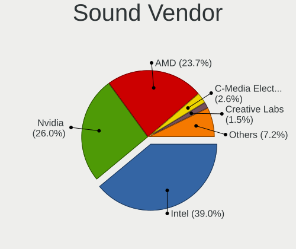

| Vendor                                       | Desktops | Percent |
|----------------------------------------------|----------|---------|
| Intel                                        | 10236    | 39%     |
| Nvidia                                       | 6817     | 25.97%  |
| AMD                                          | 6230     | 23.74%  |
| C-Media Electronics                          | 686      | 2.61%   |
| Creative Labs                                | 391      | 1.49%   |
| JMTek                                        | 170      | 0.65%   |
| VIA Technologies                             | 132      | 0.5%    |
| Creative Technology                          | 122      | 0.46%   |
| Logitech                                     | 112      | 0.43%   |
| Generalplus Technology                       | 110      | 0.42%   |
| Texas Instruments                            | 80       | 0.3%    |
| ASUSTek Computer                             | 64       | 0.24%   |
| Micro Star International                     | 57       | 0.22%   |
| Silicon Integrated Systems [SiS]             | 42       | 0.16%   |
| Unknown                                      | 42       | 0.16%   |
| Zoran Co. Personal Media Division (Nogatech) | 39       | 0.15%   |
| Kingston Technology                          | 39       | 0.15%   |
| Razer USA                                    | 38       | 0.14%   |
| KTMicro                                      | 36       | 0.14%   |
| Plantronics                                  | 28       | 0.11%   |
| fifine Microphones                           | 26       | 0.1%    |
| Focusrite-Novation                           | 25       | 0.1%    |
| Yamaha                                       | 24       | 0.09%   |
| Sony                                         | 24       | 0.09%   |
| Jieli Technology                             | 21       | 0.08%   |
| SteelSeries ApS                              | 19       | 0.07%   |
| Realtek Semiconductor                        | 17       | 0.06%   |
| M-Audio                                      | 16       | 0.06%   |
| GN Netcom                                    | 15       | 0.06%   |
| BEHRINGER International                      | 15       | 0.06%   |
| A4Tech                                       | 15       | 0.06%   |
| Samson Technologies                          | 14       | 0.05%   |
| XMOS                                         | 13       | 0.05%   |
| Thesycon Systemsoftware & Consulting         | 12       | 0.05%   |
| Pixart Imaging                               | 12       | 0.05%   |
| Nordic Semiconductor ASA                     | 12       | 0.05%   |
| Hewlett-Packard                              | 12       | 0.05%   |
| Giga-Byte Technology                         | 12       | 0.05%   |
| Ensoniq                                      | 12       | 0.05%   |
| MV-SILICON                                   | 11       | 0.04%   |

Sound Model
-----------

Sound card models

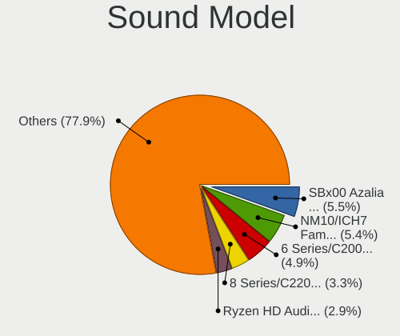

| Model                                                                      | Desktops | Percent |
|----------------------------------------------------------------------------|----------|---------|
| AMD SBx00 Azalia (Intel HDA)                                               | 1638     | 5.5%    |
| Intel NM10/ICH7 Family High Definition Audio Controller                    | 1610     | 5.4%    |
| Intel 6 Series/C200 Series Chipset Family High Definition Audio Controller | 1466     | 4.92%   |
| Intel 8 Series/C220 Series Chipset High Definition Audio Controller        | 998      | 3.35%   |
| AMD Ryzen HD Audio Controller                                              | 866      | 2.91%   |
| Intel 7 Series/C216 Chipset Family High Definition Audio Controller        | 863      | 2.9%    |
| Intel 100 Series/C230 Series Chipset Family HD Audio Controller            | 771      | 2.59%   |
| AMD Starship/Matisse HD Audio Controller                                   | 682      | 2.29%   |
| Nvidia GF108 High Definition Audio Controller                              | 665      | 2.23%   |
| Intel 200 Series PCH HD Audio                                              | 611      | 2.05%   |
| Nvidia GP107GL High Definition Audio Controller                            | 569      | 1.91%   |
| Nvidia GK208 HDMI/DP Audio Controller                                      | 563      | 1.89%   |
| AMD FCH Azalia Controller                                                  | 558      | 1.87%   |
| AMD Oland/Hainan/Cape Verde/Pitcairn HDMI Audio [Radeon HD 7000 Series]    | 536      | 1.8%    |
| Nvidia High Definition Audio Controller                                    | 522      | 1.75%   |
| AMD Ellesmere HDMI Audio [Radeon RX 470/480 / 570/580/590]                 | 517      | 1.74%   |
| AMD Family 17h (Models 00h-0fh) HD Audio Controller                        | 516      | 1.73%   |
| Intel Xeon E3-1200 v3/4th Gen Core Processor HD Audio Controller           | 492      | 1.65%   |
| Intel 82801JI (ICH10 Family) HD Audio Controller                           | 478      | 1.6%    |
| Nvidia MCP61 High Definition Audio                                         | 423      | 1.42%   |
| Nvidia GK107 HDMI Audio Controller                                         | 369      | 1.24%   |
| Intel 5 Series/3400 Series Chipset High Definition Audio                   | 365      | 1.23%   |
| Intel 82801I (ICH9 Family) HD Audio Controller                             | 361      | 1.21%   |
| Intel Cannon Lake PCH cAVS                                                 | 315      | 1.06%   |
| Nvidia GM107 High Definition Audio Controller [GeForce 940MX]              | 310      | 1.04%   |
| AMD Renoir/Cezanne HDMI/DP Audio Controller                                | 309      | 1.04%   |
| AMD Raven/Raven2/Fenghuang HDMI/DP Audio Controller                        | 302      | 1.01%   |
| Nvidia GP106 High Definition Audio Controller                              | 298      | 1%      |
| AMD Navi 21/23 HDMI/DP Audio Controller                                    | 298      | 1%      |
| AMD Baffin HDMI/DP Audio [Radeon RX 550 640SP / RX 560/560X]               | 288      | 0.97%   |
| Nvidia GF119 HDMI Audio Controller                                         | 277      | 0.93%   |
| Intel Smart Sound Technology (SST) Audio Controller                        | 277      | 0.93%   |
| Nvidia GK106 HDMI Audio Controller                                         | 254      | 0.85%   |
| Nvidia TU116 High Definition Audio Controller                              | 247      | 0.83%   |
| Nvidia GF116 High Definition Audio Controller                              | 243      | 0.82%   |
| Intel Alder Lake-S HD Audio Controller                                     | 241      | 0.81%   |
| Nvidia GK104 HDMI Audio Controller                                         | 199      | 0.67%   |
| Nvidia GP104 High Definition Audio Controller                              | 192      | 0.64%   |
| Nvidia GP108 High Definition Audio Controller                              | 181      | 0.61%   |
| Intel 82801H (ICH8 Family) HD Audio Controller                             | 169      | 0.57%   |

Memory
------

Memory Vendor
-------------

Memory module vendors

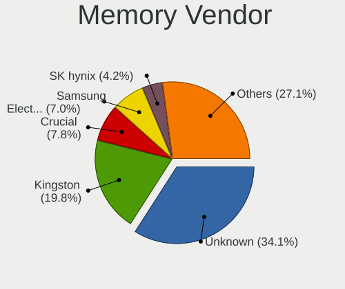

| Vendor                       | Desktops | Percent |
|------------------------------|----------|---------|
| Unknown                      | 5348     | 34.08%  |
| Kingston                     | 3115     | 19.85%  |
| Crucial                      | 1218     | 7.76%   |
| Samsung Electronics          | 1092     | 6.96%   |
| SK hynix                     | 666      | 4.24%   |
| Corsair                      | 583      | 3.71%   |
| AMD                          | 496      | 3.16%   |
| Patriot                      | 463      | 2.95%   |
| A-DATA Technology            | 301      | 1.92%   |
| Micron Technology            | 288      | 1.84%   |
| Unknown                      | 236      | 1.5%    |
| G.Skill                      | 188      | 1.2%    |
| Apacer                       | 157      | 1%      |
| GOODRAM                      | 130      | 0.83%   |
| Nanya Technology             | 98       | 0.62%   |
| Foxline                      | 89       | 0.57%   |
| Kingmax                      | 84       | 0.54%   |
| Qumo                         | 71       | 0.45%   |
| Silicon Power                | 63       | 0.4%    |
| Goldkey                      | 58       | 0.37%   |
| Atermiter                    | 56       | 0.36%   |
| Kllisre                      | 53       | 0.34%   |
| Elpida                       | 51       | 0.32%   |
| Transcend                    | 46       | 0.29%   |
| Patriot Memory (PDP Systems) | 39       | 0.25%   |
| GeIL                         | 37       | 0.24%   |
| Ramaxel Technology           | 36       | 0.23%   |
| Team                         | 35       | 0.22%   |
| Hikvision                    | 32       | 0.2%    |
| KETECH                       | 30       | 0.19%   |
| Unknown (ABCD)               | 28       | 0.18%   |
| KingSpec                     | 28       | 0.18%   |
| Patriot Memory               | 25       | 0.16%   |
| Unifosa                      | 24       | 0.15%   |
| Ramos Technology             | 21       | 0.13%   |
| Juhor                        | 18       | 0.11%   |
| Shenzhen Longsys             | 15       | 0.1%    |
| Qimonda                      | 15       | 0.1%    |
| Netac                        | 14       | 0.09%   |
| Neo Forza                    | 14       | 0.09%   |

Memory Model
------------

Memory module models

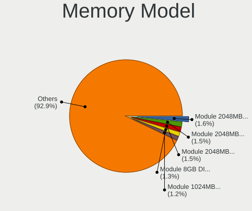

| Model                                                 | Desktops | Percent |
|-------------------------------------------------------|----------|---------|
| Unknown RAM Module 2048MB DIMM DDR2 800MT/s           | 294      | 1.62%   |
| Unknown RAM Module 2048MB DIMM SDRAM                  | 272      | 1.5%    |
| Unknown RAM Module 2048MB DIMM 800MT/s                | 266      | 1.47%   |
| Unknown                                               | 236      | 1.3%    |
| Unknown RAM Module 1024MB DIMM SDRAM                  | 225      | 1.24%   |
| Unknown RAM Module 2048MB DIMM 1333MT/s               | 214      | 1.18%   |
| Unknown RAM Module 4096MB DIMM 1333MT/s               | 210      | 1.16%   |
| Unknown RAM Module 1024MB DIMM DDR2 800MT/s           | 191      | 1.05%   |
| Unknown RAM Module 2GB DIMM SDRAM                     | 147      | 0.81%   |
| Unknown RAM Module 1024MB DIMM 800MT/s                | 144      | 0.79%   |
| Unknown RAM Module 1024MB DIMM DDR2 667MT/s           | 140      | 0.77%   |
| Unknown RAM Module 2GB DIMM DDR2 800MT/s              | 132      | 0.73%   |
| Unknown RAM Module 2048MB DIMM DDR2 667MT/s           | 124      | 0.68%   |
| Unknown RAM Module 4GB DIMM 1333MT/s                  | 115      | 0.63%   |
| Kingston RAM KHX1600C9D3/4GX 4GB DIMM DDR3 1867MT/s   | 110      | 0.61%   |
| Unknown RAM Module 2GB DIMM 800MT/s                   | 101      | 0.56%   |
| Unknown RAM Module 2GB DIMM 1333MT/s                  | 99       | 0.55%   |
| Unknown RAM Module 4096MB DIMM DDR3 1333MT/s          | 97       | 0.54%   |
| Unknown RAM Module 2048MB DIMM 667MT/s                | 90       | 0.5%    |
| Unknown RAM Module 4096MB DIMM 1600MT/s               | 88       | 0.49%   |
| Unknown RAM Module 512MB DIMM SDRAM                   | 86       | 0.47%   |
| Unknown RAM Module 1024MB DIMM 667MT/s                | 86       | 0.47%   |
| Kingston RAM 99U5584-005.A00LF 4GB DIMM DDR3 1600MT/s | 84       | 0.46%   |
| Unknown RAM Module 2048MB DIMM 400MT/s                | 83       | 0.46%   |
| Kingston RAM KHX1600C10D3/8G 8GB DIMM DDR3 2133MT/s   | 76       | 0.42%   |
| Unknown RAM Module 1024MB DIMM                        | 71       | 0.39%   |
| Unknown RAM Module 2048MB DIMM DDR3 1333MT/s          | 70       | 0.39%   |
| Unknown RAM Module 2048MB DIMM DDR 1333MT/s           | 65       | 0.36%   |
| Unknown RAM Module 1GB DIMM SDRAM                     | 65       | 0.36%   |
| Unknown RAM Module 4096MB DIMM 400MT/s                | 64       | 0.35%   |
| Kingston RAM KF3200C16D4/8GX 8GiB DIMM DDR4 3600MT/s  | 64       | 0.35%   |
| Kingston RAM 99U5471-012.A00LF 4GB DIMM DDR3 1333MT/s | 64       | 0.35%   |
| Unknown RAM Module 4GB DIMM DDR3 1333MT/s             | 61       | 0.34%   |
| Unknown RAM Module 4096MB DIMM DDR3 1600MT/s          | 61       | 0.34%   |
| Kingston RAM KHX2666C16/8G 8GiB DIMM DDR4 3466MT/s    | 61       | 0.34%   |
| Unknown RAM Module 1024MB DIMM DDR2 333MT/s           | 60       | 0.33%   |
| Kingston RAM KHX3200C16D4/8GX 8GB DIMM DDR4 3733MT/s  | 59       | 0.33%   |
| Unknown RAM Module 1GB DIMM 800MT/s                   | 57       | 0.31%   |
| Kingston RAM KHX1866C10D3/8G 8GB DIMM DDR3 1867MT/s   | 56       | 0.31%   |
| Kingston RAM 99U5584-010.A00LF 4GB DIMM DDR3 1866MT/s | 54       | 0.3%    |

Memory Kind
-----------

Memory module kinds

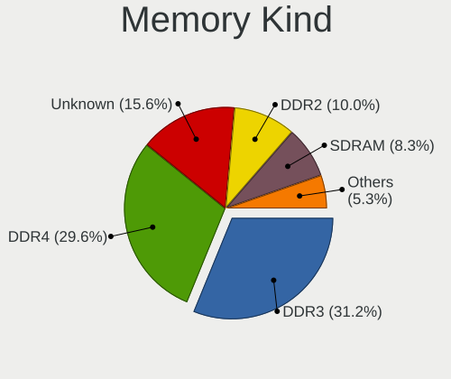

| Kind         | Desktops | Percent |
|--------------|----------|---------|
| DDR3         | 4432     | 31.18%  |
| DDR4         | 4213     | 29.64%  |
| Unknown      | 2218     | 15.61%  |
| DDR2         | 1417     | 9.97%   |
| SDRAM        | 1177     | 8.28%   |
| DDR          | 333      | 2.34%   |
| DDR5         | 289      | 2.03%   |
| DRAM         | 82       | 0.58%   |
| LPDDR4       | 40       | 0.28%   |
| LPDDR5       | 4        | 0.03%   |
| RAM          | 2        | 0.01%   |
| LPDDR3       | 2        | 0.01%   |
| EPROM        | 2        | 0.01%   |
| DDR2 FB-DIMM | 2        | 0.01%   |

Memory Form Factor
------------------

Physical design of the memory module

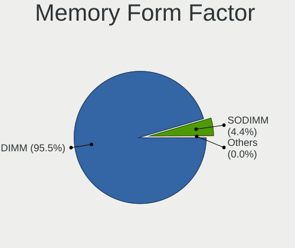

| Name         | Desktops | Percent |
|--------------|----------|---------|
| DIMM         | 13395    | 95.47%  |
| SODIMM       | 614      | 4.38%   |
| Row Of Chips | 9        | 0.06%   |
| FB-DIMM      | 7        | 0.05%   |
| RIMM         | 3        | 0.02%   |
| Unknown      | 2        | 0.01%   |
| Chip         | 1        | 0.01%   |

Memory Size
-----------

Memory module size

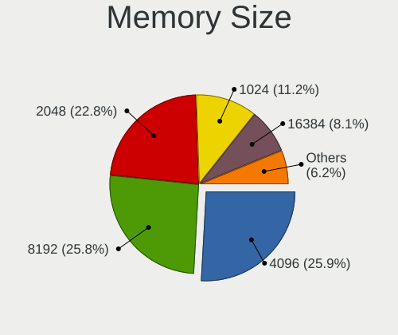

| Size  | Desktops | Percent |
|-------|----------|---------|
| 4096  | 4182     | 25.88%  |
| 8192  | 4161     | 25.75%  |
| 2048  | 3689     | 22.83%  |
| 1024  | 1811     | 11.21%  |
| 16384 | 1315     | 8.14%   |
| 32768 | 441      | 2.73%   |
| 512   | 435      | 2.69%   |
| 256   | 89       | 0.55%   |
| 49152 | 10       | 0.06%   |
| 65536 | 9        | 0.06%   |
| 32    | 5        | 0.03%   |
| 24576 | 4        | 0.02%   |
| 128   | 2        | 0.01%   |
| 16    | 2        | 0.01%   |
| 98304 | 1        | 0.01%   |
| 12536 | 1        | 0.01%   |

Memory Speed
------------

Memory module speed

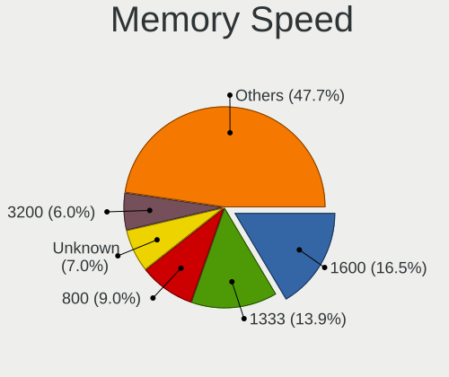

| Speed   | Desktops | Percent |
|---------|----------|---------|
| 1600    | 2562     | 16.45%  |
| 1333    | 2170     | 13.93%  |
| 800     | 1400     | 8.99%   |
| Unknown | 1084     | 6.96%   |
| 3200    | 936      | 6.01%   |
| 2400    | 831      | 5.34%   |
| 2667    | 830      | 5.33%   |
| 667     | 768      | 4.93%   |
| 2133    | 638      | 4.1%    |
| 3600    | 497      | 3.19%   |
| 1866    | 323      | 2.07%   |
| 400     | 304      | 1.95%   |
| 1066    | 222      | 1.43%   |
| 1867    | 199      | 1.28%   |
| 2666    | 195      | 1.25%   |
| 3400    | 190      | 1.22%   |
| 3733    | 159      | 1.02%   |
| 333     | 152      | 0.98%   |
| 533     | 151      | 0.97%   |
| 3000    | 136      | 0.87%   |
| 1800    | 121      | 0.78%   |
| 2933    | 109      | 0.7%    |
| 3466    | 95       | 0.61%   |
| 4800    | 91       | 0.58%   |
| 3333    | 74       | 0.48%   |
| 1067    | 67       | 0.43%   |
| 2800    | 65       | 0.42%   |
| 3266    | 64       | 0.41%   |
| 266     | 62       | 0.4%    |
| 6000    | 59       | 0.38%   |
| 3800    | 58       | 0.37%   |
| 5600    | 56       | 0.36%   |
| 1334    | 49       | 0.31%   |
| 1648    | 43       | 0.28%   |
| 3066    | 42       | 0.27%   |
| 4000    | 36       | 0.23%   |
| 2000    | 36       | 0.23%   |
| 3334    | 35       | 0.22%   |
| 66      | 34       | 0.22%   |
| 2134    | 31       | 0.2%    |

Printers & scanners
-------------------

Printer Vendor
--------------

Printer device vendors

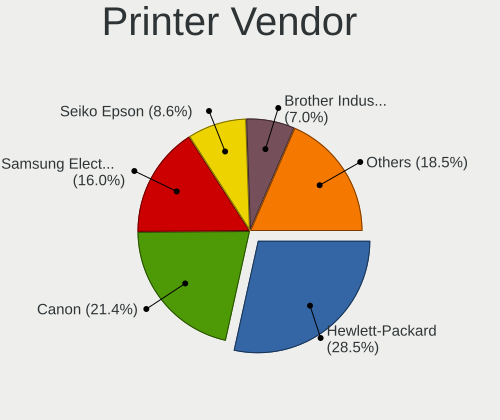

| Vendor                          | Desktops | Percent |
|---------------------------------|----------|---------|
| Hewlett-Packard                 | 352      | 28.46%  |
| Canon                           | 265      | 21.42%  |
| Samsung Electronics             | 198      | 16.01%  |
| Seiko Epson                     | 106      | 8.57%   |
| Brother Industries              | 87       | 7.03%   |
| Pantum                          | 56       | 4.53%   |
| Xerox                           | 44       | 3.56%   |
| Panasonic (Matsushita)          | 27       | 2.18%   |
| Kyocera                         | 24       | 1.94%   |
| Ricoh                           | 14       | 1.13%   |
| QinHeng Electronics             | 13       | 1.05%   |
| Prolific Technology             | 10       | 0.81%   |
| STMicroelectronics              | 5        | 0.4%    |
| Konica Minolta                  | 4        | 0.32%   |
| Custom Engineering SPA          | 4        | 0.32%   |
| NXP Semiconductors              | 3        | 0.24%   |
| Lexmark International           | 3        | 0.24%   |
| Zebra                           | 2        | 0.16%   |
| TSC Auto ID Technology          | 2        | 0.16%   |
| Samsung Info. Systems America   | 2        | 0.16%   |
| HIPER                           | 2        | 0.16%   |
| cab Produkttechnik GmbH & Co KG | 2        | 0.16%   |
| Apple                           | 2        | 0.16%   |
| Xiaomi                          | 1        | 0.08%   |
| Sharp                           | 1        | 0.08%   |
| NCR                             | 1        | 0.08%   |
| KODAK                           | 1        | 0.08%   |
| Intermec Technologies           | 1        | 0.08%   |
| GODEX INTERNATIONAL             | 1        | 0.08%   |
| Fuji Xerox                      | 1        | 0.08%   |
| Datamax-O'Neil                  | 1        | 0.08%   |
| CACTUS                          | 1        | 0.08%   |
| Avision                         | 1        | 0.08%   |

Printer Model
-------------

Printer device models

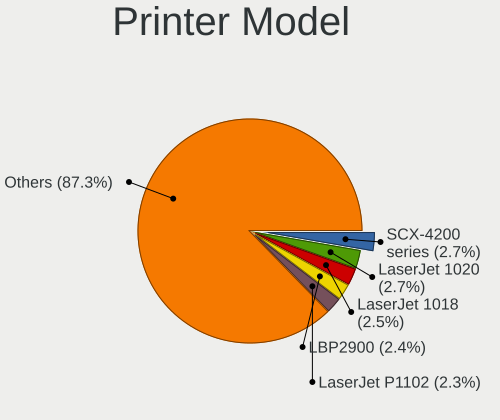

| Model                                 | Desktops | Percent |
|---------------------------------------|----------|---------|
| Samsung SCX-4200 series               | 34       | 2.73%   |
| HP LaserJet 1020                      | 34       | 2.73%   |
| HP LaserJet 1018                      | 31       | 2.49%   |
| Canon LBP2900                         | 30       | 2.41%   |
| HP LaserJet P1102                     | 29       | 2.33%   |
| HP LaserJet P1005                     | 21       | 1.69%   |
| HP LaserJet 1010                      | 21       | 1.69%   |
| Canon MF4010 series                   | 21       | 1.69%   |
| Panasonic (Matsushita) KX-MB1500RU    | 18       | 1.45%   |
| Seiko Epson Printer                   | 17       | 1.37%   |
| Samsung SCX-3400 Series               | 16       | 1.29%   |
| Samsung M2070 Series                  | 16       | 1.29%   |
| HP LaserJet 1320                      | 16       | 1.29%   |
| Pantum P2200 series                   | 15       | 1.21%   |
| Canon MF4410                          | 15       | 1.21%   |
| Canon MF3010                          | 15       | 1.21%   |
| Samsung SCX-3200 Series               | 14       | 1.13%   |
| HP DeskJet 2130 series                | 14       | 1.13%   |
| Seiko Epson USB2.0 Printer (Hi-speed) | 13       | 1.05%   |
| QinHeng CH340S                        | 13       | 1.05%   |
| Pantum M6500 series                   | 12       | 0.96%   |
| HP LaserJet 1200                      | 12       | 0.96%   |
| Brother DCP-7057 scanner/printer      | 12       | 0.96%   |
| Samsung ML-2010P Mono Laser Printer   | 11       | 0.88%   |
| HP LaserJet 1300                      | 11       | 0.88%   |
| Canon LiDE 300                        | 11       | 0.88%   |
| Canon LBP3010/LBP3018/LBP3050         | 11       | 0.88%   |
| Seiko Epson L210 Series               | 10       | 0.8%    |
| Samsung SCX-4100 Scanner              | 10       | 0.8%    |
| Samsung ML-216x Series Laser Printer  | 10       | 0.8%    |
| Samsung ML-1640 Series Laser Printer  | 10       | 0.8%    |
| Prolific PL2305 Parallel Port         | 10       | 0.8%    |
| HP LaserJet 1022                      | 10       | 0.8%    |
| Canon PIXMA MG2500 Series             | 10       | 0.8%    |
| Canon LBP810                          | 10       | 0.8%    |
| Xerox Phaser 3140 and 3155            | 9        | 0.72%   |
| Samsung M2020 Series                  | 9        | 0.72%   |
| Canon MG2400 series                   | 9        | 0.72%   |
| Canon LBP6000                         | 9        | 0.72%   |
| Samsung ML-1210 Printer               | 8        | 0.64%   |

Scanner Vendor
--------------

Scanner device vendors

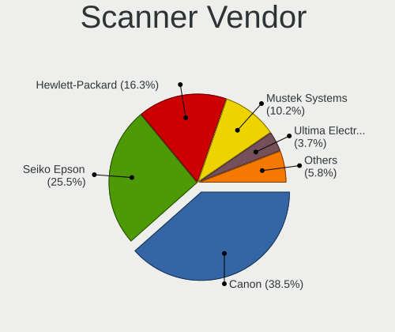

| Vendor                      | Desktops | Percent |
|-----------------------------|----------|---------|
| Canon                       | 125      | 38.46%  |
| Seiko Epson                 | 83       | 25.54%  |
| Hewlett-Packard             | 53       | 16.31%  |
| Mustek Systems              | 33       | 10.15%  |
| Ultima Electronics          | 12       | 3.69%   |
| Acer Peripherals (now BenQ) | 12       | 3.69%   |
| KYE Systems (Mouse Systems) | 3        | 0.92%   |
| Avision                     | 2        | 0.62%   |
| Plustek                     | 1        | 0.31%   |
| Canon Electronics           | 1        | 0.31%   |

Scanner Model
-------------

Scanner device models

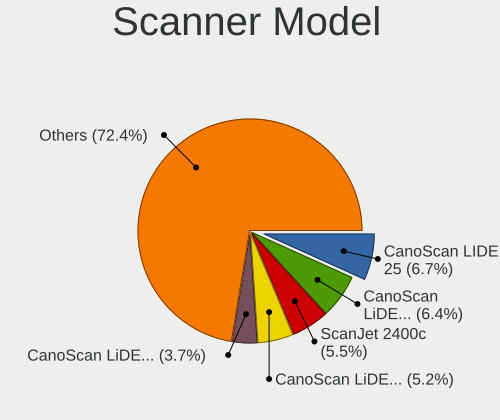

| Model                                                                                 | Desktops | Percent |
|---------------------------------------------------------------------------------------|----------|---------|
| Canon CanoScan LIDE 25                                                                | 22       | 6.75%   |
| Canon CanoScan LiDE 110                                                               | 21       | 6.44%   |
| HP ScanJet 2400c                                                                      | 18       | 5.52%   |
| Canon CanoScan LiDE 120                                                               | 17       | 5.21%   |
| Canon CanoScan LiDE 210                                                               | 12       | 3.68%   |
| Ultima Artec Ultima 2000 (GT6801 based)/Lifetec LT9385/ScanMagic 1200 UB Plus Scanner | 11       | 3.37%   |
| Mustek Systems BearPaw 1200 CU Plus                                                   | 11       | 3.37%   |
| Seiko Epson GT-F730 [GT-S630/Perfection V33/V330 Photo]                               | 10       | 3.07%   |
| Seiko Epson GT-F650 [GT-S600/Perfection V10/V100]                                     | 10       | 3.07%   |
| Seiko Epson GT-7400U [Perfection 1270]                                                | 10       | 3.07%   |
| Canon CanoScan N670U/N676U/LiDE 20                                                    | 10       | 3.07%   |
| Seiko Epson GT-F500/GT-F550 [Perfection 2480/2580 PHOTO]                              | 9        | 2.76%   |
| Canon CanoScan LiDE 60                                                                | 9        | 2.76%   |
| Seiko Epson GT-F520/GT-F570 [Perfection 3590 PHOTO]                                   | 7        | 2.15%   |
| Mustek Systems SNAPSCAN e22                                                           | 7        | 2.15%   |
| Mustek Systems BearPaw 2400 CU Plus                                                   | 7        | 2.15%   |
| Canon CanoScan LiDE 100                                                               | 6        | 1.84%   |
| Seiko Epson GT-F670 [Perfection V200 Photo]                                           | 5        | 1.53%   |
| Canon CanoScan LiDE 220                                                               | 5        | 1.53%   |
| Acer Peripherals (now BenQ) Benq 5560                                                 | 5        | 1.53%   |
| Seiko Epson Perfection V37/V370                                                       | 4        | 1.23%   |
| Seiko Epson GT-8400UF [Perfection 1670/1670 PHOTO]                                    | 4        | 1.23%   |
| HP Scanjet G2710                                                                      | 4        | 1.23%   |
| HP ScanJet 3800c                                                                      | 4        | 1.23%   |
| Canon CanoScan N1240U/LiDE 30                                                         | 4        | 1.23%   |
| Seiko Epson Perfection 660                                                            | 3        | 0.92%   |
| Seiko Epson GT-X750 [Perfection 4490 Photo]                                           | 3        | 0.92%   |
| Seiko Epson GT-9300UF [Perfection 2400 PHOTO]                                         | 3        | 0.92%   |
| Mustek Systems BearPaw 2448 TA Plus                                                   | 3        | 0.92%   |
| HP ScanJet 3970c                                                                      | 3        | 0.92%   |
| Canon CanoScan LiDE 70                                                                | 3        | 0.92%   |
| Canon CanoScan LiDE 50/LiDE 35/LiDE 40                                                | 3        | 0.92%   |
| Canon CanoScan LiDE 200                                                               | 3        | 0.92%   |
| Seiko Epson GT-X770 [Perfection V500]                                                 | 2        | 0.61%   |
| Seiko Epson GT-F720 [GT-S620/Perfection V30/V300 Photo]                               | 2        | 0.61%   |
| Seiko Epson GT-8300UF [Perfection 1660 PHOTO]                                         | 2        | 0.61%   |
| Mustek Systems ScanExpress 600 CU                                                     | 2        | 0.61%   |
| HP ScanJet G4050                                                                      | 2        | 0.61%   |
| HP ScanJet 4300c                                                                      | 2        | 0.61%   |
| HP ScanJet 2300c                                                                      | 2        | 0.61%   |

Camera
------

Camera Vendor
-------------

Camera device vendors

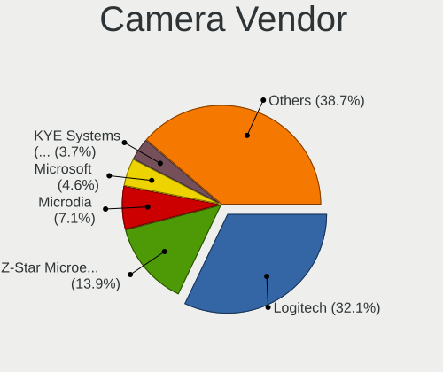

| Vendor                        | Desktops | Percent |
|-------------------------------|----------|---------|
| Logitech                      | 985      | 32.11%  |
| Z-Star Microelectronics       | 425      | 13.85%  |
| Microdia                      | 217      | 7.07%   |
| Microsoft                     | 140      | 4.56%   |
| KYE Systems (Mouse Systems)   | 113      | 3.68%   |
| Arkmicro Technologies         | 84       | 2.74%   |
| Sunplus Innovation Technology | 79       | 2.57%   |
| GEMBIRD                       | 77       | 2.51%   |
| Aveo Technology               | 72       | 2.35%   |
| Realtek Semiconductor         | 70       | 2.28%   |
| Creative Technology           | 62       | 2.02%   |
| Chicony Electronics           | 59       | 1.92%   |
| Cubeternet                    | 58       | 1.89%   |
| Pixart Imaging                | 55       | 1.79%   |
| Alcor Micro                   | 52       | 1.69%   |
| Apple                         | 44       | 1.43%   |
| A4Tech                        | 39       | 1.27%   |
| SunplusIT                     | 30       | 0.98%   |
| Samsung Electronics           | 29       | 0.95%   |
| Jieli Technology              | 22       | 0.72%   |
| Genesys Logic                 | 21       | 0.68%   |
| Generalplus Technology        | 18       | 0.59%   |
| CVT Electronics.Co.           | 17       | 0.55%   |
| Unknown                       | 17       | 0.55%   |
| lihappe8                      | 15       | 0.49%   |
| Guillemot                     | 15       | 0.49%   |
| AVerMedia Technologies        | 15       | 0.49%   |
| Hewlett-Packard               | 14       | 0.46%   |
| IMC Networks                  | 11       | 0.36%   |
| Philips (or NXP)              | 10       | 0.33%   |
| MacroSilicon                  | 10       | 0.33%   |
| Trust                         | 9        | 0.29%   |
| SiGma Micro                   | 8        | 0.26%   |
| Razer USA                     | 8        | 0.26%   |
| ANYKA                         | 8        | 0.26%   |
| YGTek                         | 6        | 0.2%    |
| Sunplus IT                    | 6        | 0.2%    |
| Sonix Technology              | 6        | 0.2%    |
| SeeVision                     | 5        | 0.16%   |
| OPPO Electronics              | 5        | 0.16%   |

Camera Model
------------

Camera device models

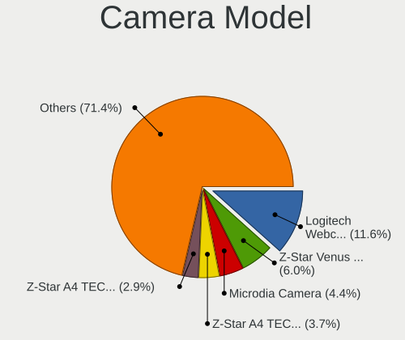

| Model                                             | Desktops | Percent |
|---------------------------------------------------|----------|---------|
| Logitech Webcam C270                              | 358      | 11.63%  |
| Z-Star Venus USB2.0 Camera                        | 184      | 5.98%   |
| Microdia Camera                                   | 134      | 4.35%   |
| Z-Star A4 TECH USB 2.0 Camera J                   | 115      | 3.74%   |
| Z-Star A4 TECH USB2.0 PC Camera E                 | 89       | 2.89%   |
| Arkmicro USB2.0 PC CAMERA                         | 78       | 2.53%   |
| Logitech Webcam C170                              | 77       | 2.5%    |
| Logitech Webcam C310                              | 76       | 2.47%   |
| Logitech HD Webcam C525                           | 69       | 2.24%   |
| Logitech Webcam C210                              | 52       | 1.69%   |
| Microsoft LifeCam HD-3000                         | 46       | 1.49%   |
| GEMBIRD USB2.0 PC CAMERA                          | 44       | 1.43%   |
| Pixart Imaging GE 1.3 MP MiniCam Pro              | 42       | 1.36%   |
| Sunplus Full HD webcam                            | 40       | 1.3%    |
| Logitech HD Pro Webcam C920                       | 38       | 1.23%   |
| Apple iPhone 5/5C/5S/6/SE/7/8/X                   | 38       | 1.23%   |
| Alcor Micro USB 2.0 PC Camera                     | 38       | 1.23%   |
| GEMBIRD Generic UVC 1.00 camera [AppoTech AX2311] | 32       | 1.04%   |
| Logitech Webcam C110                              | 30       | 0.97%   |
| Logitech HD Webcam C510                           | 30       | 0.97%   |
| Cubeternet GL-UPC822 UVC WebCam                   | 30       | 0.97%   |
| Aveo Camera                                       | 28       | 0.91%   |
| Samsung Galaxy series, misc. (MTP mode)           | 27       | 0.88%   |
| Logitech Logitech Webcam C160                     | 27       | 0.88%   |
| Realtek FULL HD 1080P Webcam                      | 23       | 0.75%   |
| Microsoft LifeCam VX-800                          | 23       | 0.75%   |
| Aveo USB2.0 Camera                                | 23       | 0.75%   |
| SunplusIT USB Camera                              | 22       | 0.71%   |
| Logitech HD Webcam C910                           | 21       | 0.68%   |
| Logitech HD Webcam C615                           | 21       | 0.68%   |
| Unknown                                           | 21       | 0.68%   |
| Microdia Sonix USB 2.0 Camera                     | 20       | 0.65%   |
| Cubeternet USB2.0 Camera                          | 20       | 0.65%   |
| Z-Star Full HD 1080P PC Camera                    | 19       | 0.62%   |
| A4Tech FHD 1080P PC Camera                        | 19       | 0.62%   |
| Microdia USB 2.0 Camera                           | 18       | 0.58%   |
| Logitech Logitech Webcam C100                     | 17       | 0.55%   |
| Logitech C922 Pro Stream Webcam                   | 17       | 0.55%   |
| CVT Electronics.Co. USB Camera                    | 17       | 0.55%   |
| Aveo UVC camera (Bresser microscope)              | 17       | 0.55%   |

Security
--------

Fingerprint Vendor
------------------

Fingerprint sensor vendors

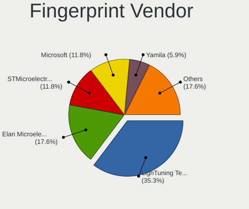

| Vendor                | Desktops | Percent |
|-----------------------|----------|---------|
| LighTuning Technology | 6        | 35.29%  |
| Elan Microelectronics | 3        | 17.65%  |
| STMicroelectronics    | 2        | 11.76%  |
| Microsoft             | 2        | 11.76%  |
| Yamila                | 1        | 5.88%   |
| Focal-systems.Corp    | 1        | 5.88%   |
| DigitalPersona        | 1        | 5.88%   |
| AuthenTec             | 1        | 5.88%   |

Fingerprint Model
-----------------

Fingerprint sensor models

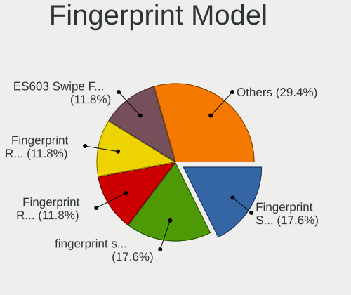

| Model                                       | Desktops | Percent |
|---------------------------------------------|----------|---------|
| LighTuning Fingerprint Sensor               | 3        | 17.65%  |
| Elan fingerprint sensor [FeinTech FPS00200] | 3        | 17.65%  |
| STMicroelectronics Fingerprint Reader       | 2        | 11.76%  |
| Microsoft Fingerprint Reader                | 2        | 11.76%  |
| LighTuning ES603 Swipe Fingerprint Sensor   | 2        | 11.76%  |
| Yamila Yamila Fingerprint Device            | 1        | 5.88%   |
| LighTuning EgisTec Touch Fingerprint Sensor | 1        | 5.88%   |
| Focal-systems.Corp FT9201Fingerprint.       | 1        | 5.88%   |
| DigitalPersona Fingerprint Reader           | 1        | 5.88%   |
| AuthenTec AES3500 TruePrint Sensor          | 1        | 5.88%   |

Chipcard Vendor
---------------

Chipcard module vendors

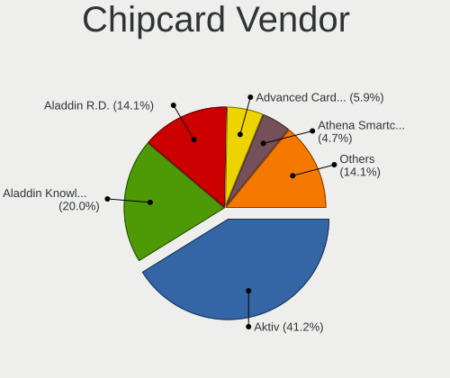

| Vendor                     | Desktops | Percent |
|----------------------------|----------|---------|
| Aktiv                      | 35       | 41.18%  |
| Aladdin Knowledge Systems  | 17       | 20%     |
| Aladdin R.D.               | 12       | 14.12%  |
| Advanced Card Systems      | 5        | 5.88%   |
| Athena Smartcard Solutions | 4        | 4.71%   |
| Alcor Micro                | 4        | 4.71%   |
| Yubico.com                 | 2        | 2.35%   |
| Gemalto (was Gemplus)      | 2        | 2.35%   |
| Realtek Semiconductor      | 1        | 1.18%   |
| OmniKey                    | 1        | 1.18%   |
| Feitian Technologies       | 1        | 1.18%   |
| Castles Technology         | 1        | 1.18%   |

Chipcard Model
--------------

Chipcard module models

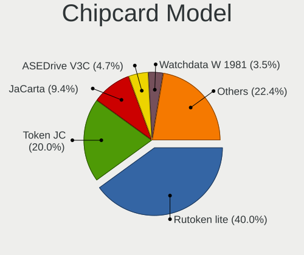

| Model                                             | Desktops | Percent |
|---------------------------------------------------|----------|---------|
| Aktiv Rutoken lite                                | 34       | 40%     |
| Aladdin Knowledge Systems Token JC                | 17       | 20%     |
| Aladdin R.D. JaCarta                              | 8        | 9.41%   |
| Athena Smartcard Solutions ASEDrive V3C           | 4        | 4.71%   |
| Alcor Micro Watchdata W 1981                      | 3        | 3.53%   |
| Aladdin R.D. JaCarta LT                           | 3        | 3.53%   |
| Yubico.com Yubikey 4/5 U2F+CCID                   | 2        | 2.35%   |
| Advanced Card Systems ACR38 SmartCard Reader      | 2        | 2.35%   |
| Realtek Semiconductor Smart Card Reader Interface | 1        | 1.18%   |
| OmniKey Smart Card Reader USB                     | 1        | 1.18%   |
| Gemalto (was Gemplus) GemPC433-Swap               | 1        | 1.18%   |
| Gemalto (was Gemplus) GemPC Key SmartCard Reader  | 1        | 1.18%   |
| Feitian Technologies SCR301                       | 1        | 1.18%   |
| Castles Technology EZCCID Smart Card Reader       | 1        | 1.18%   |
| Alcor Micro AU9540 Smartcard Reader               | 1        | 1.18%   |
| Aladdin R.D. Smart card reader JCR721             | 1        | 1.18%   |
| Aktiv Reader                                      | 1        | 1.18%   |
| Advanced Card Systems ACR39U                      | 1        | 1.18%   |
| Advanced Card Systems ACR3901U                    | 1        | 1.18%   |
| Advanced Card Systems ACR1281 1S Dual Reader      | 1        | 1.18%   |

Unsupported
-----------

Unsupported Devices
-------------------

Total unsupported devices on board

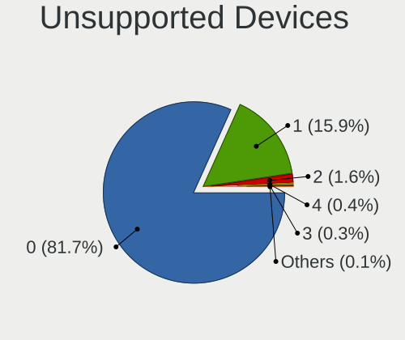

| Total | Desktops | Percent |
|-------|----------|---------|
| 0     | 13529    | 81.73%  |
| 1     | 2633     | 15.91%  |
| 2     | 267      | 1.61%   |
| 4     | 61       | 0.37%   |
| 3     | 48       | 0.29%   |
| 5     | 8        | 0.05%   |
| 6     | 5        | 0.03%   |
| 10    | 1        | 0.01%   |
| 9     | 1        | 0.01%   |
| 7     | 1        | 0.01%   |

Unsupported Device Types
------------------------

Types of unsupported devices

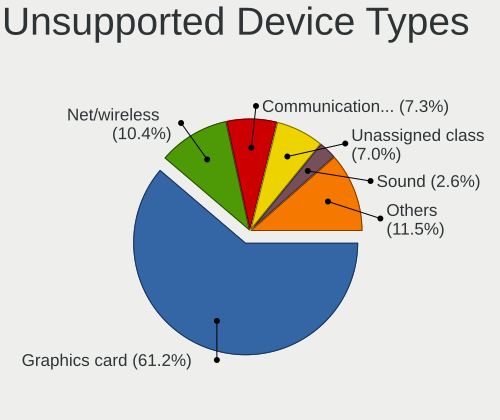

| Type                     | Desktops | Percent |
|--------------------------|----------|---------|
| Graphics card            | 2066     | 61.23%  |
| Net/wireless             | 350      | 10.37%  |
| Communication controller | 246      | 7.29%   |
| Unassigned class         | 236      | 6.99%   |
| Sound                    | 88       | 2.61%   |
| Multimedia controller    | 78       | 2.31%   |
| Chipcard                 | 51       | 1.51%   |
| Camera                   | 48       | 1.42%   |
| Net/ethernet             | 42       | 1.24%   |
| Bluetooth                | 40       | 1.19%   |
| Network                  | 24       | 0.71%   |
| Storage/raid             | 23       | 0.68%   |
| Modem                    | 18       | 0.53%   |
| Fingerprint reader       | 17       | 0.5%    |
| Dvb card                 | 11       | 0.33%   |
| Firewire controller      | 10       | 0.3%    |
| Storage/ata              | 8        | 0.24%   |
| Storage/ide              | 6        | 0.18%   |
| Tv card                  | 5        | 0.15%   |
| Storage                  | 4        | 0.12%   |
| Video                    | 1        | 0.03%   |
| Unclassified device      | 1        | 0.03%   |
| Card reader              | 1        | 0.03%   |

