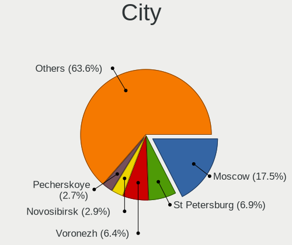
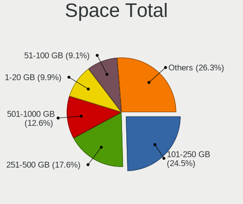
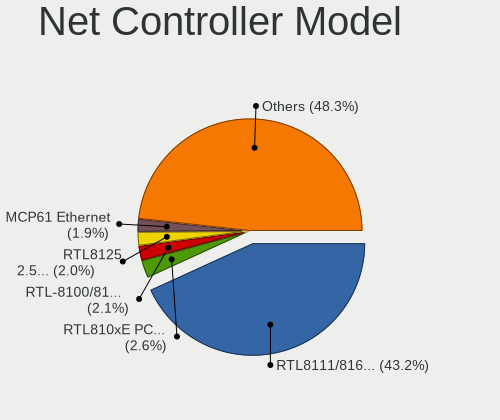

Linux in Russia - Tested Hardware & Statistics (Desktops)
---------------------------------------------------------

A project to collect tested hardware configurations for Linux in Russia.

Anyone can contribute to this report by the [hw-probe](https://github.com/linuxhw/hw-probe) tool:

    sudo -E hw-probe -all -upload

Please contribute! Especially if your hardware is rare.

Contents
--------

* [ Test Cases ](#test-cases)

* [ System ](#system)
  - [ OS                       ](#os)
  - [ OS Family                ](#os-family)
  - [ Kernel                   ](#kernel)
  - [ Kernel Family            ](#kernel-family)
  - [ Kernel Major Ver.        ](#kernel-major-ver)
  - [ Arch                     ](#arch)
  - [ DE                       ](#de)
  - [ Display Server           ](#display-server)
  - [ Display Manager          ](#display-manager)
  - [ OS Lang                  ](#os-lang)
  - [ Boot Mode                ](#boot-mode)
  - [ Filesystem               ](#filesystem)
  - [ Part. scheme             ](#part-scheme)
  - [ Dual Boot with Linux/BSD ](#dual-boot-with-linuxbsd)
  - [ Dual Boot (Win)          ](#dual-boot-win)

* [ Board ](#board)
  - [ Vendor                   ](#vendor)
  - [ Model                    ](#model)
  - [ Model Family             ](#model-family)
  - [ MFG Year                 ](#mfg-year)
  - [ Form Factor              ](#form-factor)
  - [ Secure Boot              ](#secure-boot)
  - [ Coreboot                 ](#coreboot)
  - [ RAM Size                 ](#ram-size)
  - [ RAM Used                 ](#ram-used)
  - [ Total Drives             ](#total-drives)
  - [ Has CD-ROM               ](#has-cd-rom)
  - [ Has Ethernet             ](#has-ethernet)
  - [ Has WiFi                 ](#has-wifi)
  - [ Has Bluetooth            ](#has-bluetooth)

* [ Location ](#location)
  - [ Country                  ](#country)
  - [ City                     ](#city)

* [ Drives ](#drives)
  - [ Drive Vendor             ](#drive-vendor)
  - [ Drive Model              ](#drive-model)
  - [ HDD Vendor               ](#hdd-vendor)
  - [ SSD Vendor               ](#ssd-vendor)
  - [ Drive Kind               ](#drive-kind)
  - [ Drive Connector          ](#drive-connector)
  - [ Drive Size               ](#drive-size)
  - [ Space Total              ](#space-total)
  - [ Space Used               ](#space-used)
  - [ Malfunc. Drives          ](#malfunc-drives)
  - [ Malfunc. Drive Vendor    ](#malfunc-drive-vendor)
  - [ Malfunc. HDD Vendor      ](#malfunc-hdd-vendor)
  - [ Malfunc. Drive Kind      ](#malfunc-drive-kind)
  - [ Failed Drives            ](#failed-drives)
  - [ Failed Drive Vendor      ](#failed-drive-vendor)
  - [ Drive Status             ](#drive-status)

* [ Storage controller ](#storage-controller)
  - [ Storage Vendor           ](#storage-vendor)
  - [ Storage Model            ](#storage-model)
  - [ Storage Kind             ](#storage-kind)

* [ Processor ](#processor)
  - [ CPU Vendor               ](#cpu-vendor)
  - [ CPU Model                ](#cpu-model)
  - [ CPU Model Family         ](#cpu-model-family)
  - [ CPU Cores                ](#cpu-cores)
  - [ CPU Sockets              ](#cpu-sockets)
  - [ CPU Threads              ](#cpu-threads)
  - [ CPU Op-Modes             ](#cpu-op-modes)
  - [ CPU Microcode            ](#cpu-microcode)
  - [ CPU Microarch            ](#cpu-microarch)

* [ Graphics ](#graphics)
  - [ GPU Vendor               ](#gpu-vendor)
  - [ GPU Model                ](#gpu-model)
  - [ GPU Combo                ](#gpu-combo)
  - [ GPU Driver               ](#gpu-driver)
  - [ GPU Memory               ](#gpu-memory)

* [ Monitor ](#monitor)
  - [ Monitor Vendor           ](#monitor-vendor)
  - [ Monitor Model            ](#monitor-model)
  - [ Monitor Resolution       ](#monitor-resolution)
  - [ Monitor Diagonal         ](#monitor-diagonal)
  - [ Monitor Width            ](#monitor-width)
  - [ Aspect Ratio             ](#aspect-ratio)
  - [ Monitor Area             ](#monitor-area)
  - [ Pixel Density            ](#pixel-density)
  - [ Multiple Monitors        ](#multiple-monitors)

* [ Network ](#network)
  - [ Net Controller Vendor    ](#net-controller-vendor)
  - [ Net Controller Model     ](#net-controller-model)
  - [ Wireless Vendor          ](#wireless-vendor)
  - [ Wireless Model           ](#wireless-model)
  - [ Ethernet Vendor          ](#ethernet-vendor)
  - [ Ethernet Model           ](#ethernet-model)
  - [ Net Controller Kind      ](#net-controller-kind)
  - [ Used Controller          ](#used-controller)
  - [ NICs                     ](#nics)
  - [ IPv6                     ](#ipv6)

* [ Bluetooth ](#bluetooth)
  - [ Bluetooth Vendor         ](#bluetooth-vendor)
  - [ Bluetooth Model          ](#bluetooth-model)

* [ Sound ](#sound)
  - [ Sound Vendor             ](#sound-vendor)
  - [ Sound Model              ](#sound-model)

* [ Memory ](#memory)
  - [ Memory Vendor            ](#memory-vendor)
  - [ Memory Model             ](#memory-model)
  - [ Memory Kind              ](#memory-kind)
  - [ Memory Form Factor       ](#memory-form-factor)
  - [ Memory Size              ](#memory-size)
  - [ Memory Speed             ](#memory-speed)

* [ Printers & scanners ](#printers--scanners)
  - [ Printer Vendor           ](#printer-vendor)
  - [ Printer Model            ](#printer-model)
  - [ Scanner Vendor           ](#scanner-vendor)
  - [ Scanner Model            ](#scanner-model)

* [ Camera ](#camera)
  - [ Camera Vendor            ](#camera-vendor)
  - [ Camera Model             ](#camera-model)

* [ Security ](#security)
  - [ Fingerprint Vendor       ](#fingerprint-vendor)
  - [ Fingerprint Model        ](#fingerprint-model)
  - [ Chipcard Vendor          ](#chipcard-vendor)
  - [ Chipcard Model           ](#chipcard-model)

* [ Unsupported ](#unsupported)
  - [ Unsupported Devices      ](#unsupported-devices)
  - [ Unsupported Device Types ](#unsupported-device-types)

Test Cases
----------

Total: 21014

| Vendor        | Model                       | Probe                                                      | Date         |
|---------------|-----------------------------|------------------------------------------------------------|--------------|
| Gigabyte      | B550M AORUS PRO-P           | [1f0ece5a8b](https://linux-hardware.org/?probe=1f0ece5a8b) | Feb 02, 2024 |
| Gigabyte      | B550M AORUS PRO-P           | [11b2f337e7](https://linux-hardware.org/?probe=11b2f337e7) | Feb 02, 2024 |
| Delovoy of... | LPGR.469559.018 V1.0        | [4ed2bd72be](https://linux-hardware.org/?probe=4ed2bd72be) | Feb 02, 2024 |
| ASUSTek       | H110M-R                     | [2902d23de2](https://linux-hardware.org/?probe=2902d23de2) | Feb 02, 2024 |
| ASUSTek       | B85M-G                      | [cd9f6ee87d](https://linux-hardware.org/?probe=cd9f6ee87d) | Feb 02, 2024 |
| ASUSTek       | PRIME H510M-R               | [4196d911d2](https://linux-hardware.org/?probe=4196d911d2) | Feb 02, 2024 |
| Gigabyte      | A320M-S2H V2-CF             | [f38bbe7c82](https://linux-hardware.org/?probe=f38bbe7c82) | Feb 02, 2024 |
| Biostar       | IH61MF-Q5                   | [1087f70019](https://linux-hardware.org/?probe=1087f70019) | Feb 01, 2024 |
| ASUSTek       | P5K                         | [1414d10ffb](https://linux-hardware.org/?probe=1414d10ffb) | Feb 01, 2024 |
| Gigabyte      | EP43T-UD3L                  | [934c3f974a](https://linux-hardware.org/?probe=934c3f974a) | Feb 01, 2024 |
| ASUSTek       | PRIME B450M-A               | [5befaf642f](https://linux-hardware.org/?probe=5befaf642f) | Feb 01, 2024 |
| Apple         | Mac-F4208DC8 PVT            | [bce380880a](https://linux-hardware.org/?probe=bce380880a) | Feb 01, 2024 |
| ASRock        | G41M-VS3                    | [df1c8c0da3](https://linux-hardware.org/?probe=df1c8c0da3) | Feb 01, 2024 |
| ASUSTek       | M4A78-VM                    | [cc37c1b937](https://linux-hardware.org/?probe=cc37c1b937) | Feb 01, 2024 |
| ASUSTek       | P5B-Deluxe                  | [b30373632d](https://linux-hardware.org/?probe=b30373632d) | Feb 01, 2024 |
| Gigabyte      | B760M GAMING X DDR4         | [855d31073a](https://linux-hardware.org/?probe=855d31073a) | Feb 01, 2024 |
| Supermicro    | X10DRU-i+A                  | [f2881b94b0](https://linux-hardware.org/?probe=f2881b94b0) | Jan 31, 2024 |
| ASUSTek       | P8Z77-V LX                  | [011fd25549](https://linux-hardware.org/?probe=011fd25549) | Jan 31, 2024 |
| Biostar       | H610MH                      | [fb0234d450](https://linux-hardware.org/?probe=fb0234d450) | Jan 31, 2024 |
| ASUSTek       | A68HM-PLUS                  | [6361608cec](https://linux-hardware.org/?probe=6361608cec) | Jan 31, 2024 |
| ASUSTek       | B85M-G                      | [c14af0c776](https://linux-hardware.org/?probe=c14af0c776) | Jan 31, 2024 |
| Biostar       | NF61S-M2A                   | [4b42e5cd37](https://linux-hardware.org/?probe=4b42e5cd37) | Jan 31, 2024 |
| Intel         | SKYBAY                      | [1e706b6589](https://linux-hardware.org/?probe=1e706b6589) | Jan 31, 2024 |
| Intel         | SKYBAY                      | [4420198abc](https://linux-hardware.org/?probe=4420198abc) | Jan 31, 2024 |
| MSI           | H110M PRO-VD                | [29fd183b3b](https://linux-hardware.org/?probe=29fd183b3b) | Jan 31, 2024 |
| Intel         | SKYBAY                      | [9d6bc7afb3](https://linux-hardware.org/?probe=9d6bc7afb3) | Jan 31, 2024 |
| ASUSTek       | P6T WS PRO                  | [21d91717a1](https://linux-hardware.org/?probe=21d91717a1) | Jan 31, 2024 |
| Unknown       | Unknown                     | [6928c8eb05](https://linux-hardware.org/?probe=6928c8eb05) | Jan 30, 2024 |
| Gigabyte      | B365M H                     | [ac7a22a8f4](https://linux-hardware.org/?probe=ac7a22a8f4) | Jan 30, 2024 |
| Gigabyte      | H81M-S1                     | [0770521f11](https://linux-hardware.org/?probe=0770521f11) | Jan 30, 2024 |
| Unknown       | Unknown                     | [a4eb1c6dda](https://linux-hardware.org/?probe=a4eb1c6dda) | Jan 30, 2024 |
| Unknown       | Unknown                     | [f8b5f64c1e](https://linux-hardware.org/?probe=f8b5f64c1e) | Jan 30, 2024 |
| ASRock        | B550 Phantom Gaming 4       | [9d98a77586](https://linux-hardware.org/?probe=9d98a77586) | Jan 30, 2024 |
| Unknown       | T360D11                     | [4f06f14ee6](https://linux-hardware.org/?probe=4f06f14ee6) | Jan 30, 2024 |
| Gigabyte      | B360HD3                     | [7a7e6d1518](https://linux-hardware.org/?probe=7a7e6d1518) | Jan 30, 2024 |
| Gigabyte      | B75M-D3V                    | [5628f77cd1](https://linux-hardware.org/?probe=5628f77cd1) | Jan 30, 2024 |
| ASUSTek       | P8H61-MX                    | [1d7356527b](https://linux-hardware.org/?probe=1d7356527b) | Jan 30, 2024 |
| ASUSTek       | P7H55                       | [21853e5c4a](https://linux-hardware.org/?probe=21853e5c4a) | Jan 30, 2024 |
| Intel         | X99 V1.0                    | [dee15911ba](https://linux-hardware.org/?probe=dee15911ba) | Jan 29, 2024 |
| MSI           | Z490M-S01                   | [ed7f213619](https://linux-hardware.org/?probe=ed7f213619) | Jan 29, 2024 |
| MSI           | B550M PRO-VDH WIFI          | [d0403669b9](https://linux-hardware.org/?probe=d0403669b9) | Jan 29, 2024 |
| ASRock        | AB350M-HDV R3.0             | [7b68f8ca63](https://linux-hardware.org/?probe=7b68f8ca63) | Jan 29, 2024 |
| SZMZ          | X99-S3                      | [acf24ed760](https://linux-hardware.org/?probe=acf24ed760) | Jan 29, 2024 |
| ASRock        | AB350M-HDV R3.0             | [5cc2818fe5](https://linux-hardware.org/?probe=5cc2818fe5) | Jan 29, 2024 |
| ASUSTek       | M5A78L-M LX                 | [8c79f36086](https://linux-hardware.org/?probe=8c79f36086) | Jan 29, 2024 |
| ASRock        | X300TM-ITX                  | [c3277a6c4c](https://linux-hardware.org/?probe=c3277a6c4c) | Jan 29, 2024 |
| Huanan        | X99-QD4 V1.0                | [2194293ede](https://linux-hardware.org/?probe=2194293ede) | Jan 28, 2024 |
| ASUSTek       | PRIME B250M-C               | [5c34879ea0](https://linux-hardware.org/?probe=5c34879ea0) | Jan 28, 2024 |
| Intel         | Unknown                     | [24ab2fdfbf](https://linux-hardware.org/?probe=24ab2fdfbf) | Jan 28, 2024 |
| Dell          | 0Y5DDC A00                  | [bad163ed53](https://linux-hardware.org/?probe=bad163ed53) | Jan 28, 2024 |
| Gigabyte      | H61M-D2-B3                  | [a177c22fb5](https://linux-hardware.org/?probe=a177c22fb5) | Jan 28, 2024 |
| MSI           | Z97 GAMING 3                | [5a4ad9cb67](https://linux-hardware.org/?probe=5a4ad9cb67) | Jan 28, 2024 |
| ASUSTek       | PRIME B450M-A II            | [1d4239bc71](https://linux-hardware.org/?probe=1d4239bc71) | Jan 27, 2024 |
| ASUSTek       | P5K                         | [9cadd6185d](https://linux-hardware.org/?probe=9cadd6185d) | Jan 27, 2024 |
| ASUSTek       | PRIME X370-A                | [e3c045bb8c](https://linux-hardware.org/?probe=e3c045bb8c) | Jan 27, 2024 |
| Gigabyte      | H67A-USB3-B3                | [e53ca59dec](https://linux-hardware.org/?probe=e53ca59dec) | Jan 27, 2024 |
| ECS           | A960M-MV                    | [3b0de09ab6](https://linux-hardware.org/?probe=3b0de09ab6) | Jan 27, 2024 |
| MSI           | MS-B1711                    | [8eec6cdde5](https://linux-hardware.org/?probe=8eec6cdde5) | Jan 27, 2024 |
| ASRock        | ION3D-HT                    | [393d01f3c9](https://linux-hardware.org/?probe=393d01f3c9) | Jan 27, 2024 |
| ASUSTek       | PRIME B450M-K II            | [531cd352a8](https://linux-hardware.org/?probe=531cd352a8) | Jan 27, 2024 |
| Gigabyte      | H410M H V3                  | [018db3f12a](https://linux-hardware.org/?probe=018db3f12a) | Jan 26, 2024 |
| Gigabyte      | H470M K                     | [644982a46f](https://linux-hardware.org/?probe=644982a46f) | Jan 26, 2024 |
| Lenovo        | 1052 SDK0J40697 WIN 3305... | [b0019abd70](https://linux-hardware.org/?probe=b0019abd70) | Jan 26, 2024 |
| Gigabyte      | GA-A55M-S2HP                | [2c061938f7](https://linux-hardware.org/?probe=2c061938f7) | Jan 26, 2024 |
| MSI           | MS-B0A21                    | [aebe283d41](https://linux-hardware.org/?probe=aebe283d41) | Jan 26, 2024 |
| ASUSTek       | PRIME B450M-A II            | [0554d57e37](https://linux-hardware.org/?probe=0554d57e37) | Jan 26, 2024 |
| Gigabyte      | Z170X-Gaming 3              | [70edc53219](https://linux-hardware.org/?probe=70edc53219) | Jan 26, 2024 |
| MSI           | 785G-E53                    | [81ee1ec28d](https://linux-hardware.org/?probe=81ee1ec28d) | Jan 26, 2024 |
| ECS           | G31T-M9                     | [8af1e631e7](https://linux-hardware.org/?probe=8af1e631e7) | Jan 26, 2024 |
| MSI           | G31M3 V2                    | [b98a012c0e](https://linux-hardware.org/?probe=b98a012c0e) | Jan 26, 2024 |
| Gigabyte      | H81M-S2V                    | [42abec13ac](https://linux-hardware.org/?probe=42abec13ac) | Jan 26, 2024 |
| ASUSTek       | PRIME B450M-K II            | [04feb5fc7d](https://linux-hardware.org/?probe=04feb5fc7d) | Jan 26, 2024 |
| Intel         | SKYBAY                      | [3d4350c03d](https://linux-hardware.org/?probe=3d4350c03d) | Jan 26, 2024 |
| Supermicro    | X10DDW-i                    | [6a9650896a](https://linux-hardware.org/?probe=6a9650896a) | Jan 26, 2024 |
| ASRock        | Z97 Anniversary             | [0973057025](https://linux-hardware.org/?probe=0973057025) | Jan 25, 2024 |
| Gigabyte      | H81M-S1                     | [b727252ca9](https://linux-hardware.org/?probe=b727252ca9) | Jan 25, 2024 |
| MSI           | B550-A PRO                  | [1f374d86d7](https://linux-hardware.org/?probe=1f374d86d7) | Jan 25, 2024 |
| Gigabyte      | EG41MF-US2H                 | [882d3605ed](https://linux-hardware.org/?probe=882d3605ed) | Jan 25, 2024 |
| ASUSTek       | X99-E WS                    | [92cb95eaef](https://linux-hardware.org/?probe=92cb95eaef) | Jan 25, 2024 |
| ASUSTek       | B150M-C                     | [f264367309](https://linux-hardware.org/?probe=f264367309) | Jan 25, 2024 |
| Gigabyte      | GA-78LMT-S2P                | [066f355824](https://linux-hardware.org/?probe=066f355824) | Jan 25, 2024 |
| MSI           | MAG X670E TOMAHAWK WIFI     | [89d705627b](https://linux-hardware.org/?probe=89d705627b) | Jan 24, 2024 |
| ECS           | G31T-M9                     | [87e9fbf4fd](https://linux-hardware.org/?probe=87e9fbf4fd) | Jan 24, 2024 |
| ASUSTek       | Z170 PRO GAMING             | [298f2d1380](https://linux-hardware.org/?probe=298f2d1380) | Jan 24, 2024 |
| Gigabyte      | H61M-USB3V                  | [6a5faff8dd](https://linux-hardware.org/?probe=6a5faff8dd) | Jan 24, 2024 |
| ASRock        | G31M-GS                     | [8c46163f5c](https://linux-hardware.org/?probe=8c46163f5c) | Jan 24, 2024 |
| ASRock        | G31M-GS                     | [dbe6d0fdd4](https://linux-hardware.org/?probe=dbe6d0fdd4) | Jan 24, 2024 |
| Foxconn       | G33M03                      | [dd33710847](https://linux-hardware.org/?probe=dd33710847) | Jan 24, 2024 |
| ASUSTek       | P7H55-M LE                  | [a864af0be4](https://linux-hardware.org/?probe=a864af0be4) | Jan 24, 2024 |
| Gigabyte      | H55M-UD2H                   | [10c2d49a41](https://linux-hardware.org/?probe=10c2d49a41) | Jan 24, 2024 |
| ASUSTek       | PRIME Z690-P D4             | [61635d9262](https://linux-hardware.org/?probe=61635d9262) | Jan 24, 2024 |
| Foxconn       | G33M03                      | [bd9087ac07](https://linux-hardware.org/?probe=bd9087ac07) | Jan 24, 2024 |
| ASUSTek       | H110M-R                     | [7ed41d411e](https://linux-hardware.org/?probe=7ed41d411e) | Jan 24, 2024 |
| ASUSTek       | P8H61-M LX3 PLUS R2.0       | [0dc2ae0570](https://linux-hardware.org/?probe=0dc2ae0570) | Jan 24, 2024 |
| ASRock        | N68C-GS FX                  | [ed8901f53b](https://linux-hardware.org/?probe=ed8901f53b) | Jan 24, 2024 |
| ASRock        | B365M-ITX/ac                | [1a48a2a936](https://linux-hardware.org/?probe=1a48a2a936) | Jan 24, 2024 |
| ASRock        | B365M-ITX/ac                | [e7719cba1d](https://linux-hardware.org/?probe=e7719cba1d) | Jan 24, 2024 |
| ASRock        | B365M-ITX/ac                | [b2abf616b0](https://linux-hardware.org/?probe=b2abf616b0) | Jan 24, 2024 |
| MSI           | MPG B650I EDGE WIFI         | [9e5edb123e](https://linux-hardware.org/?probe=9e5edb123e) | Jan 24, 2024 |
| ASUSTek       | PRIME Z690-P WIFI D4        | [069146509d](https://linux-hardware.org/?probe=069146509d) | Jan 24, 2024 |
| Intel         | X79 (INTEL Xeon E5/Corei... | [f19c285018](https://linux-hardware.org/?probe=f19c285018) | Jan 24, 2024 |
| Gigabyte      | 8IPE1000P-G                 | [052ba36722](https://linux-hardware.org/?probe=052ba36722) | Jan 24, 2024 |
| ASUSTek       | ROG Maximus Z690 HERO EV... | [340fdb1832](https://linux-hardware.org/?probe=340fdb1832) | Jan 24, 2024 |
| ASRock        | X570 Phantom Gaming 4       | [0d4e165d3f](https://linux-hardware.org/?probe=0d4e165d3f) | Jan 23, 2024 |
| ASRock        | H110M-DVS R2.0              | [68583ae434](https://linux-hardware.org/?probe=68583ae434) | Jan 23, 2024 |
| ASUSTek       | PRIME Z490-V                | [fe2523751b](https://linux-hardware.org/?probe=fe2523751b) | Jan 23, 2024 |
| ASUSTek       | TUF Gaming B660-PLUS WIF... | [6ae01879d8](https://linux-hardware.org/?probe=6ae01879d8) | Jan 23, 2024 |
| ASUSTek       | ROG STRIX B560-A GAMING ... | [6887beeb2a](https://linux-hardware.org/?probe=6887beeb2a) | Jan 23, 2024 |
| MSI           | PRO B660M-E DDR4            | [7357312922](https://linux-hardware.org/?probe=7357312922) | Jan 23, 2024 |
| HP            | 3399                        | [5126e6fb32](https://linux-hardware.org/?probe=5126e6fb32) | Jan 23, 2024 |
| ASUSTek       | M2N-E SLI                   | [113665efbe](https://linux-hardware.org/?probe=113665efbe) | Jan 23, 2024 |
| Gigabyte      | H61M-D2-B3                  | [a8315f32a0](https://linux-hardware.org/?probe=a8315f32a0) | Jan 23, 2024 |
| Huanan        | X99-BD4 V1.34               | [65794c873c](https://linux-hardware.org/?probe=65794c873c) | Jan 23, 2024 |
| Shuttle       | XS35V3                      | [af36ef4d08](https://linux-hardware.org/?probe=af36ef4d08) | Jan 23, 2024 |
| ASRock        | X370 Gaming-ITX/ac          | [af9215d3a5](https://linux-hardware.org/?probe=af9215d3a5) | Jan 23, 2024 |
| ASRock        | H110M-DGS R3.0              | [8d264d359b](https://linux-hardware.org/?probe=8d264d359b) | Jan 22, 2024 |
| ASUSTek       | E520                        | [948381dfd1](https://linux-hardware.org/?probe=948381dfd1) | Jan 22, 2024 |
| ASUSTek       | J1800I-C                    | [6adb9446f3](https://linux-hardware.org/?probe=6adb9446f3) | Jan 22, 2024 |
| ASUSTek       | H81M-R                      | [dd7840e283](https://linux-hardware.org/?probe=dd7840e283) | Jan 22, 2024 |
| Foxconn       | 2ABF                        | [4983fd3ab4](https://linux-hardware.org/?probe=4983fd3ab4) | Jan 22, 2024 |
| ASUSTek       | P5QL                        | [300924de5a](https://linux-hardware.org/?probe=300924de5a) | Jan 22, 2024 |
| Supermicro    | X11SSD-F                    | [a1b05dae9c](https://linux-hardware.org/?probe=a1b05dae9c) | Jan 22, 2024 |
| Intel         | X99                         | [f232e1ea07](https://linux-hardware.org/?probe=f232e1ea07) | Jan 21, 2024 |
| ASRock        | A770DE+                     | [280f9c65c0](https://linux-hardware.org/?probe=280f9c65c0) | Jan 21, 2024 |
| Gigabyte      | B550 AORUS PRO AC           | [d67daf2078](https://linux-hardware.org/?probe=d67daf2078) | Jan 21, 2024 |
| Biostar       | Z690GTA                     | [7beb190026](https://linux-hardware.org/?probe=7beb190026) | Jan 21, 2024 |
| Gigabyte      | B550M AORUS ELITE           | [f313b1c112](https://linux-hardware.org/?probe=f313b1c112) | Jan 21, 2024 |
| ASUSTek       | P5KPL-AM                    | [98dc47d431](https://linux-hardware.org/?probe=98dc47d431) | Jan 21, 2024 |
| Intel         | D525MW AAE93082-401         | [c1c97f080e](https://linux-hardware.org/?probe=c1c97f080e) | Jan 21, 2024 |
| Huanan        | X99 F8D V2.2                | [5a8ba8fd60](https://linux-hardware.org/?probe=5a8ba8fd60) | Jan 21, 2024 |
| ASRock        | B550 Phantom Gaming 4       | [f8f9f25c64](https://linux-hardware.org/?probe=f8f9f25c64) | Jan 21, 2024 |
| ASUSTek       | P5B-Deluxe                  | [b628671631](https://linux-hardware.org/?probe=b628671631) | Jan 21, 2024 |
| Gigabyte      | B550 AORUS ELITE AX V2      | [ac1d5f3aec](https://linux-hardware.org/?probe=ac1d5f3aec) | Jan 21, 2024 |
| ASRock        | B75 Pro3                    | [498caaba05](https://linux-hardware.org/?probe=498caaba05) | Jan 21, 2024 |
| ASRock        | N68C-GS FX                  | [6c88409266](https://linux-hardware.org/?probe=6c88409266) | Jan 21, 2024 |
| Intel         | X99                         | [93a5879bf4](https://linux-hardware.org/?probe=93a5879bf4) | Jan 21, 2024 |
| ECS           | A960M-MV                    | [7762cce94d](https://linux-hardware.org/?probe=7762cce94d) | Jan 21, 2024 |
| Gigabyte      | B550 AORUS ELITE AX V2      | [0dc11cbadf](https://linux-hardware.org/?probe=0dc11cbadf) | Jan 21, 2024 |
| ASRock        | FM2A85X-ITX                 | [30f6aa7ead](https://linux-hardware.org/?probe=30f6aa7ead) | Jan 20, 2024 |
| Dell          | 0Y5DDC A00                  | [a73f786be7](https://linux-hardware.org/?probe=a73f786be7) | Jan 20, 2024 |
| Aquarius      | AQH310CM                    | [6172ad2c5d](https://linux-hardware.org/?probe=6172ad2c5d) | Jan 20, 2024 |
| MSI           | H510M-A PRO                 | [d82c1229a9](https://linux-hardware.org/?probe=d82c1229a9) | Jan 20, 2024 |
| Gigabyte      | A320M-S2H-CF                | [39cd221e89](https://linux-hardware.org/?probe=39cd221e89) | Jan 20, 2024 |
| Gigabyte      | B450M S2H                   | [5333665ad1](https://linux-hardware.org/?probe=5333665ad1) | Jan 19, 2024 |
| ASUSTek       | F2A85-V PRO                 | [150d445de6](https://linux-hardware.org/?probe=150d445de6) | Jan 19, 2024 |
| ASUSTek       | F2A85-V PRO                 | [51b2474c14](https://linux-hardware.org/?probe=51b2474c14) | Jan 19, 2024 |
| Gigabyte      | B250M-DS3H-CF               | [b4073d28df](https://linux-hardware.org/?probe=b4073d28df) | Jan 19, 2024 |
| ASUSTek       | Pro WS WRX80E-SAGE SE WI... | [e62243f63a](https://linux-hardware.org/?probe=e62243f63a) | Jan 19, 2024 |
| Intel         | DH77EB AAG39073-304         | [6c6bbd8cc8](https://linux-hardware.org/?probe=6c6bbd8cc8) | Jan 19, 2024 |
| MSI           | MPG B650I EDGE WIFI         | [ba941d7a4e](https://linux-hardware.org/?probe=ba941d7a4e) | Jan 19, 2024 |
| Gigabyte      | EP45-DS3L                   | [c3a9225062](https://linux-hardware.org/?probe=c3a9225062) | Jan 19, 2024 |
| ASRock        | B365M-ITX/ac                | [45d94979a5](https://linux-hardware.org/?probe=45d94979a5) | Jan 19, 2024 |
| MSI           | PRO H610M-E DDR4            | [66e82c879d](https://linux-hardware.org/?probe=66e82c879d) | Jan 19, 2024 |
| MSI           | PRO H610M-E DDR4            | [af8a99bcf3](https://linux-hardware.org/?probe=af8a99bcf3) | Jan 19, 2024 |
| ASUSTek       | Z170 PRO GAMING             | [d64ba116db](https://linux-hardware.org/?probe=d64ba116db) | Jan 19, 2024 |
| ASUSTek       | P8H77-V LE                  | [d805f83d93](https://linux-hardware.org/?probe=d805f83d93) | Jan 19, 2024 |
| ASUSTek       | PRIME A320M-E               | [979cbe9fe0](https://linux-hardware.org/?probe=979cbe9fe0) | Jan 19, 2024 |
| ASUSTek       | P6T WS PRO                  | [d8c6804097](https://linux-hardware.org/?probe=d8c6804097) | Jan 18, 2024 |
| ASUSTek       | P5QL-CM                     | [a8adaf0c17](https://linux-hardware.org/?probe=a8adaf0c17) | Jan 18, 2024 |
| ASUSTek       | P5QL-CM                     | [26510e18f5](https://linux-hardware.org/?probe=26510e18f5) | Jan 18, 2024 |
| ASUSTek       | P5QL-CM                     | [4ca7c404f0](https://linux-hardware.org/?probe=4ca7c404f0) | Jan 18, 2024 |
| ASUSTek       | P5QL-CM                     | [a2967a1948](https://linux-hardware.org/?probe=a2967a1948) | Jan 18, 2024 |
| ASUSTek       | P5QL-CM                     | [a0c4c6c96a](https://linux-hardware.org/?probe=a0c4c6c96a) | Jan 18, 2024 |
| Grandstrea... | T3 MRD                      | [21c38a3719](https://linux-hardware.org/?probe=21c38a3719) | Jan 18, 2024 |
| ASUSTek       | P5QL-CM                     | [900d299461](https://linux-hardware.org/?probe=900d299461) | Jan 18, 2024 |
| ASUSTek       | P5QL-CM                     | [56d6cc2713](https://linux-hardware.org/?probe=56d6cc2713) | Jan 18, 2024 |
| ASUSTek       | P5QL-CM                     | [3bc6ca5cba](https://linux-hardware.org/?probe=3bc6ca5cba) | Jan 18, 2024 |
| ASUSTek       | P5QL-CM                     | [a71b94ef53](https://linux-hardware.org/?probe=a71b94ef53) | Jan 18, 2024 |
| Gigabyte      | P41T-D3P                    | [3470a0f79b](https://linux-hardware.org/?probe=3470a0f79b) | Jan 18, 2024 |
| ASUSTek       | P5QL-CM                     | [01d717f8fc](https://linux-hardware.org/?probe=01d717f8fc) | Jan 18, 2024 |
| ASUSTek       | P5QL-CM                     | [12129124f0](https://linux-hardware.org/?probe=12129124f0) | Jan 18, 2024 |
| ASUSTek       | P5QL-CM                     | [6ebd6d855d](https://linux-hardware.org/?probe=6ebd6d855d) | Jan 18, 2024 |
| ASUSTek       | P5QL-CM                     | [362052b28a](https://linux-hardware.org/?probe=362052b28a) | Jan 18, 2024 |
| Gigabyte      | H610M K DDR4                | [5c9e5ec7aa](https://linux-hardware.org/?probe=5c9e5ec7aa) | Jan 18, 2024 |
| OEM           | X79G                        | [992b83b632](https://linux-hardware.org/?probe=992b83b632) | Jan 18, 2024 |
| Unknown       | Unknown                     | [500e9e8fda](https://linux-hardware.org/?probe=500e9e8fda) | Jan 18, 2024 |
| Unknown       | Unknown                     | [17bd249685](https://linux-hardware.org/?probe=17bd249685) | Jan 18, 2024 |
| ASRock        | J3355M                      | [40caff1c3c](https://linux-hardware.org/?probe=40caff1c3c) | Jan 18, 2024 |
| MSI           | PRO B760M-A WIFI DDR4       | [a115913fe1](https://linux-hardware.org/?probe=a115913fe1) | Jan 18, 2024 |
| ASUSTek       | Z87-K                       | [199117128e](https://linux-hardware.org/?probe=199117128e) | Jan 17, 2024 |
| ASUSTek       | PRIME H310M-R R2.0          | [2b7eda6458](https://linux-hardware.org/?probe=2b7eda6458) | Jan 17, 2024 |
| MACHINIST     | E5-RS9 V1.11                | [2b48345368](https://linux-hardware.org/?probe=2b48345368) | Jan 17, 2024 |
| Gigabyte      | H61M-S2PV                   | [3baca805c4](https://linux-hardware.org/?probe=3baca805c4) | Jan 17, 2024 |
| Gigabyte      | GA-870A-UD3                 | [d274a17024](https://linux-hardware.org/?probe=d274a17024) | Jan 17, 2024 |
| EPoX Compu... | NF6100 + NF410 DDR2: MGF... | [ba08d6e05c](https://linux-hardware.org/?probe=ba08d6e05c) | Jan 17, 2024 |
| Intel         | DH77KC AAG39641-400         | [b9c3c9837d](https://linux-hardware.org/?probe=b9c3c9837d) | Jan 17, 2024 |
| ASUSTek       | P5GC-MX/1333                | [9aa4d8799f](https://linux-hardware.org/?probe=9aa4d8799f) | Jan 17, 2024 |
| ASUSTek       | P5GC-MX/1333                | [39f5fe6747](https://linux-hardware.org/?probe=39f5fe6747) | Jan 17, 2024 |
| ASUSTek       | F1A55-M LX R2.0             | [465eb048fe](https://linux-hardware.org/?probe=465eb048fe) | Jan 16, 2024 |
| HP            | ProLiant ML310e Gen8 v2     | [75c345abd6](https://linux-hardware.org/?probe=75c345abd6) | Jan 16, 2024 |
| ASUSTek       | H81M-C                      | [bcbb9c099f](https://linux-hardware.org/?probe=bcbb9c099f) | Jan 16, 2024 |
| Intel         | SKYBAY                      | [defbd49284](https://linux-hardware.org/?probe=defbd49284) | Jan 16, 2024 |
| ASUSTek       | P5Q SE2                     | [e357bf8b25](https://linux-hardware.org/?probe=e357bf8b25) | Jan 16, 2024 |
| ASRock        | A320M-HDV R3.0              | [de188c28b4](https://linux-hardware.org/?probe=de188c28b4) | Jan 16, 2024 |
| ASUSTek       | H110M-R                     | [3daca725a3](https://linux-hardware.org/?probe=3daca725a3) | Jan 16, 2024 |
| ASUSTek       | H110M-R                     | [cb598cde50](https://linux-hardware.org/?probe=cb598cde50) | Jan 16, 2024 |
| ASUSTek       | PRIME X570-PRO              | [fe59a3038f](https://linux-hardware.org/?probe=fe59a3038f) | Jan 16, 2024 |
| ASUSTek       | P5GC-MX/1333                | [17555d4d11](https://linux-hardware.org/?probe=17555d4d11) | Jan 15, 2024 |
| MSI           | Z68A-G43                    | [9ab9ae7952](https://linux-hardware.org/?probe=9ab9ae7952) | Jan 15, 2024 |
| Gigabyte      | B550M AORUS PRO-P           | [9d15ee6561](https://linux-hardware.org/?probe=9d15ee6561) | Jan 15, 2024 |
| Pegatron      | 2A94h                       | [1bb35b61cf](https://linux-hardware.org/?probe=1bb35b61cf) | Jan 15, 2024 |
| Gigabyte      | M720-US3                    | [3b0d0759b6](https://linux-hardware.org/?probe=3b0d0759b6) | Jan 15, 2024 |
| Gigabyte      | A320M-S2H V2-CF             | [f3ba9ee452](https://linux-hardware.org/?probe=f3ba9ee452) | Jan 15, 2024 |
| Gigabyte      | P41T-D3P                    | [1519e94620](https://linux-hardware.org/?probe=1519e94620) | Jan 15, 2024 |
| Gigabyte      | B550M AORUS PRO             | [a91d050e76](https://linux-hardware.org/?probe=a91d050e76) | Jan 15, 2024 |
| ASUSTek       | Z87-K                       | [46409c885e](https://linux-hardware.org/?probe=46409c885e) | Jan 15, 2024 |
| Intel         | H81                         | [b0fd4c7628](https://linux-hardware.org/?probe=b0fd4c7628) | Jan 15, 2024 |
| Gigabyte      | B650M GAMING X AX           | [655122ef53](https://linux-hardware.org/?probe=655122ef53) | Jan 14, 2024 |
| ASUSTek       | ET1610PT                    | [f71bcea580](https://linux-hardware.org/?probe=f71bcea580) | Jan 14, 2024 |
| Acer          | Aspire TC-705               | [52f5e7c5ef](https://linux-hardware.org/?probe=52f5e7c5ef) | Jan 14, 2024 |
| ASUSTek       | A88X-PLUS/USB               | [819679691a](https://linux-hardware.org/?probe=819679691a) | Jan 14, 2024 |
| Gigabyte      | GA-78LMT-S2 sex             | [6cbbe82d77](https://linux-hardware.org/?probe=6cbbe82d77) | Jan 14, 2024 |
| Gigabyte      | H61M-DS2                    | [f75904222c](https://linux-hardware.org/?probe=f75904222c) | Jan 13, 2024 |
| ASUSTek       | PRIME B450M-A II            | [8035c49f8f](https://linux-hardware.org/?probe=8035c49f8f) | Jan 13, 2024 |
| Gigabyte      | EX58-UD3R                   | [b62ae21449](https://linux-hardware.org/?probe=b62ae21449) | Jan 13, 2024 |
| ASRock        | H55M-LE                     | [30ce52798e](https://linux-hardware.org/?probe=30ce52798e) | Jan 13, 2024 |
| Huanan        | X79M-PRO V1.2               | [fbcae0c103](https://linux-hardware.org/?probe=fbcae0c103) | Jan 13, 2024 |
| Intel         | H81                         | [86da5a9776](https://linux-hardware.org/?probe=86da5a9776) | Jan 13, 2024 |
| Gigabyte      | B450M DS3H-CF               | [77546f522e](https://linux-hardware.org/?probe=77546f522e) | Jan 13, 2024 |
| MSI           | MS-B0A61                    | [cacdb6e6fe](https://linux-hardware.org/?probe=cacdb6e6fe) | Jan 13, 2024 |
| Intel         | X99                         | [6fff9c3661](https://linux-hardware.org/?probe=6fff9c3661) | Jan 13, 2024 |
| HP            | 1825                        | [2e88180c54](https://linux-hardware.org/?probe=2e88180c54) | Jan 13, 2024 |
| ASRock        | N68-GS                      | [d8f071018b](https://linux-hardware.org/?probe=d8f071018b) | Jan 13, 2024 |
| ASRock        | B760M-HDV/M.2 D4            | [a8d229af9d](https://linux-hardware.org/?probe=a8d229af9d) | Jan 12, 2024 |
| ASUSTek       | PRIME B560-PLUS             | [15e853a1d1](https://linux-hardware.org/?probe=15e853a1d1) | Jan 12, 2024 |
| ASUSTek       | PRIME B560-PLUS             | [3d9b7d2d2b](https://linux-hardware.org/?probe=3d9b7d2d2b) | Jan 12, 2024 |
| Intel         | SKYBAY                      | [a5f2ea79e9](https://linux-hardware.org/?probe=a5f2ea79e9) | Jan 12, 2024 |
| MSI           | H110M PRO-VD                | [10efa0c4e5](https://linux-hardware.org/?probe=10efa0c4e5) | Jan 12, 2024 |
| Intel         | DH67CL AAG10212-208         | [9e5c35a6b6](https://linux-hardware.org/?probe=9e5c35a6b6) | Jan 12, 2024 |
| Gigabyte      | B550M AORUS ELITE           | [b47717df63](https://linux-hardware.org/?probe=b47717df63) | Jan 12, 2024 |
| ASUSTek       | CM6330_CM6630_CM6730_CM6... | [11dd31f3c6](https://linux-hardware.org/?probe=11dd31f3c6) | Jan 12, 2024 |
| Gigabyte      | H77N-WIFI                   | [aeb566949b](https://linux-hardware.org/?probe=aeb566949b) | Jan 11, 2024 |
| ASRock        | B450M Pro4-F                | [99dfb1abed](https://linux-hardware.org/?probe=99dfb1abed) | Jan 11, 2024 |
| HP            | ProLiant ML310e Gen8 v2     | [d6e4987996](https://linux-hardware.org/?probe=d6e4987996) | Jan 11, 2024 |
| Supermicro    | X10DDW-i                    | [ce09e674db](https://linux-hardware.org/?probe=ce09e674db) | Jan 11, 2024 |
| Gigabyte      | GA-M56S-S3                  | [77af17feec](https://linux-hardware.org/?probe=77af17feec) | Jan 11, 2024 |
| Gigabyte      | H410M H V3                  | [eb21b0dd13](https://linux-hardware.org/?probe=eb21b0dd13) | Jan 11, 2024 |
| ASUSTek       | PRIME B450M-A               | [4bfba10e3f](https://linux-hardware.org/?probe=4bfba10e3f) | Jan 11, 2024 |
| ASUSTek       | Q87M-E                      | [22cbd96a3b](https://linux-hardware.org/?probe=22cbd96a3b) | Jan 11, 2024 |
| MSI           | B550-A PRO                  | [e658ae012b](https://linux-hardware.org/?probe=e658ae012b) | Jan 11, 2024 |
| BESHTAU       | B560RU V51                  | [dec20966d4](https://linux-hardware.org/?probe=dec20966d4) | Jan 11, 2024 |
| ASUSTek       | PRIME A320M-E               | [2be2d8a769](https://linux-hardware.org/?probe=2be2d8a769) | Jan 11, 2024 |
| ASUSTek       | TUF B450M-PLUS GAMING       | [47a7d3fa7c](https://linux-hardware.org/?probe=47a7d3fa7c) | Jan 10, 2024 |
| ASRock        | Z77 Pro3                    | [aeb12c2013](https://linux-hardware.org/?probe=aeb12c2013) | Jan 10, 2024 |
| MSI           | MPG B550 GAMING PLUS        | [e371e895ec](https://linux-hardware.org/?probe=e371e895ec) | Jan 10, 2024 |
| Gigabyte      | A520M K V2                  | [3485cdf9ff](https://linux-hardware.org/?probe=3485cdf9ff) | Jan 10, 2024 |
| Gigabyte      | H81M-S1                     | [e152d77865](https://linux-hardware.org/?probe=e152d77865) | Jan 10, 2024 |
| HP            | 339A                        | [07e0cfbca2](https://linux-hardware.org/?probe=07e0cfbca2) | Jan 10, 2024 |
| Aquarius      | AQH310CM                    | [64bd83e185](https://linux-hardware.org/?probe=64bd83e185) | Jan 10, 2024 |
| MAINBRD       | OPS62A-SHA                  | [7090d5973d](https://linux-hardware.org/?probe=7090d5973d) | Jan 10, 2024 |
| Gigabyte      | A520M K V2                  | [2f7bb41141](https://linux-hardware.org/?probe=2f7bb41141) | Jan 10, 2024 |
| MSI           | B550-A PRO                  | [4042af29a0](https://linux-hardware.org/?probe=4042af29a0) | Jan 10, 2024 |
| MACHINIST     | E5-MR9S V1.0                | [7e938e0f91](https://linux-hardware.org/?probe=7e938e0f91) | Jan 10, 2024 |
| Shenzhen M... | F7BFD                       | [ff12a04779](https://linux-hardware.org/?probe=ff12a04779) | Jan 10, 2024 |
| MSI           | H510M-A PRO                 | [625e6af2b6](https://linux-hardware.org/?probe=625e6af2b6) | Jan 09, 2024 |
| Gigabyte      | GA-MA69VM-S2                | [7caaae153c](https://linux-hardware.org/?probe=7caaae153c) | Jan 09, 2024 |
| SZMZ          | H61-ME V1.0                 | [4ca9bf9ced](https://linux-hardware.org/?probe=4ca9bf9ced) | Jan 09, 2024 |
| Supermicro    | X10DRU-i+A                  | [99d2afabde](https://linux-hardware.org/?probe=99d2afabde) | Jan 09, 2024 |
| Supermicro    | X10DDW-i                    | [04153850d2](https://linux-hardware.org/?probe=04153850d2) | Jan 09, 2024 |
| Supermicro    | X10DDW-i                    | [13fdb351eb](https://linux-hardware.org/?probe=13fdb351eb) | Jan 09, 2024 |
| Supermicro    | X10DDW-i                    | [3e1d916552](https://linux-hardware.org/?probe=3e1d916552) | Jan 09, 2024 |
| Supermicro    | X10DRL-i                    | [59f7acf7d1](https://linux-hardware.org/?probe=59f7acf7d1) | Jan 09, 2024 |
| Supermicro    | X10DDW-i                    | [f97c7d0615](https://linux-hardware.org/?probe=f97c7d0615) | Jan 09, 2024 |
| Supermicro    | X10DRL-i                    | [97ae6ae9d6](https://linux-hardware.org/?probe=97ae6ae9d6) | Jan 09, 2024 |
| ASUSTek       | A88XM-A                     | [50b476ac09](https://linux-hardware.org/?probe=50b476ac09) | Jan 09, 2024 |
| HJS           | OPSH110D4                   | [b604539d33](https://linux-hardware.org/?probe=b604539d33) | Jan 09, 2024 |
| newplatfor... | NP-1008i.1                  | [3da4bb5017](https://linux-hardware.org/?probe=3da4bb5017) | Jan 09, 2024 |
| ASUSTek       | B85M-G                      | [1d4ef9db6e](https://linux-hardware.org/?probe=1d4ef9db6e) | Jan 09, 2024 |
| ECS           | H61H2-M12                   | [a5b967dfc4](https://linux-hardware.org/?probe=a5b967dfc4) | Jan 09, 2024 |
| Gigabyte      | GA-A55M-S2HP                | [ca456b55a8](https://linux-hardware.org/?probe=ca456b55a8) | Jan 08, 2024 |
| Gigabyte      | B550I AORUS PRO AX          | [c832a7e8f5](https://linux-hardware.org/?probe=c832a7e8f5) | Jan 08, 2024 |
| ASUSTek       | M2N-VM HDMI                 | [ea20cecd28](https://linux-hardware.org/?probe=ea20cecd28) | Jan 08, 2024 |
| Gigabyte      | P41-ES3G                    | [84aa0a3ab2](https://linux-hardware.org/?probe=84aa0a3ab2) | Jan 08, 2024 |
| ASUSTek       | B85M-G                      | [9e3cd173d7](https://linux-hardware.org/?probe=9e3cd173d7) | Jan 08, 2024 |
| ASUSTek       | B85M-G                      | [22ef91bad9](https://linux-hardware.org/?probe=22ef91bad9) | Jan 08, 2024 |
| Gigabyte      | B450 GAMING X               | [4ee36f49f1](https://linux-hardware.org/?probe=4ee36f49f1) | Jan 07, 2024 |
| ASRock        | B450 Pro4 R2.0              | [9729786ea6](https://linux-hardware.org/?probe=9729786ea6) | Jan 07, 2024 |
| Dell          | 0FXD80 A00                  | [628772fa2d](https://linux-hardware.org/?probe=628772fa2d) | Jan 07, 2024 |
| Unknown       | C51PVGM-M                   | [a652ef8499](https://linux-hardware.org/?probe=a652ef8499) | Jan 07, 2024 |
| ASUSTek       | P5KPL-AM SE                 | [3d05259dfb](https://linux-hardware.org/?probe=3d05259dfb) | Jan 07, 2024 |
| Gigabyte      | B450M H                     | [1a3c2a5a40](https://linux-hardware.org/?probe=1a3c2a5a40) | Jan 07, 2024 |
| ASUSTek       | A88X-PLUS/USB               | [7eed61fd57](https://linux-hardware.org/?probe=7eed61fd57) | Jan 07, 2024 |
| ASUSTek       | A88X-PLUS/USB               | [69c24e28a0](https://linux-hardware.org/?probe=69c24e28a0) | Jan 07, 2024 |
| ASUSTek       | PRIME Z690-P WIFI D4        | [46a12dff06](https://linux-hardware.org/?probe=46a12dff06) | Jan 07, 2024 |
| newplatfor... | NP-1004i.1                  | [95788038c5](https://linux-hardware.org/?probe=95788038c5) | Jan 06, 2024 |
| ASUSTek       | P7H55-M                     | [36fc37c5b9](https://linux-hardware.org/?probe=36fc37c5b9) | Jan 06, 2024 |
| ASUSTek       | AT4NM10T-I                  | [7adc9b4d41](https://linux-hardware.org/?probe=7adc9b4d41) | Jan 06, 2024 |
| ASUSTek       | PRIME H410M-K               | [c16b44c1ce](https://linux-hardware.org/?probe=c16b44c1ce) | Jan 06, 2024 |
| ASUSTek       | P8H61-M LX3 R2.0            | [2f34cc5377](https://linux-hardware.org/?probe=2f34cc5377) | Jan 06, 2024 |
| ASUSTek       | PRIME H310M-E R2.0          | [62f182c46e](https://linux-hardware.org/?probe=62f182c46e) | Jan 06, 2024 |
| Unknown       | C51PVGM-M                   | [cfe5df72f8](https://linux-hardware.org/?probe=cfe5df72f8) | Jan 06, 2024 |
| HP            | 3047h                       | [37bc25aa54](https://linux-hardware.org/?probe=37bc25aa54) | Jan 06, 2024 |
| Unknown       | Unknown                     | [496c931b75](https://linux-hardware.org/?probe=496c931b75) | Jan 06, 2024 |
| MSI           | A520M-A PRO                 | [73e4418e17](https://linux-hardware.org/?probe=73e4418e17) | Jan 05, 2024 |
| TopStar       | V211 C                      | [d056c50760](https://linux-hardware.org/?probe=d056c50760) | Jan 05, 2024 |
| MSI           | H110M PRO-VD                | [bd9f1e7d54](https://linux-hardware.org/?probe=bd9f1e7d54) | Jan 05, 2024 |
| Huanan        | X99-TF GAMING V3.0          | [1d01b72d8c](https://linux-hardware.org/?probe=1d01b72d8c) | Jan 05, 2024 |
| ASRock        | H61M                        | [e4a7c28d85](https://linux-hardware.org/?probe=e4a7c28d85) | Jan 04, 2024 |
| ASRock        | X570 Phantom Gaming 4       | [26dd967e32](https://linux-hardware.org/?probe=26dd967e32) | Jan 04, 2024 |
| ASUSTek       | P5KPL-AM SE                 | [34a39f9113](https://linux-hardware.org/?probe=34a39f9113) | Jan 04, 2024 |
| Unknown       | Unknown                     | [293f3effa7](https://linux-hardware.org/?probe=293f3effa7) | Jan 04, 2024 |
| MSI           | H61M-P21                    | [7d4774aa97](https://linux-hardware.org/?probe=7d4774aa97) | Jan 04, 2024 |
| Gigabyte      | B560M DS3H                  | [dbf5b389e1](https://linux-hardware.org/?probe=dbf5b389e1) | Jan 04, 2024 |
| ASUSTek       | P8H61-MX R2.0               | [aeb9554ba6](https://linux-hardware.org/?probe=aeb9554ba6) | Jan 03, 2024 |
| AZW           | MINI S 10                   | [6f5bb65726](https://linux-hardware.org/?probe=6f5bb65726) | Jan 03, 2024 |
| Acer          | Veriton N4620G              | [f438d41562](https://linux-hardware.org/?probe=f438d41562) | Jan 03, 2024 |
| ASUSTek       | TUF Z390-PRO GAMING         | [e44e9a6818](https://linux-hardware.org/?probe=e44e9a6818) | Jan 03, 2024 |
| ASUSTek       | P7H55-M SI                  | [55390181a6](https://linux-hardware.org/?probe=55390181a6) | Jan 03, 2024 |
| Gigabyte      | 8PEMT4                      | [d07fa4ad02](https://linux-hardware.org/?probe=d07fa4ad02) | Jan 03, 2024 |
| MSI           | MAG B550 TOMAHAWK           | [5d528799c4](https://linux-hardware.org/?probe=5d528799c4) | Jan 03, 2024 |
| ASUSTek       | TUF B450M-PLUS GAMING       | [38b88634a4](https://linux-hardware.org/?probe=38b88634a4) | Jan 03, 2024 |
| ASUSTek       | P7H55-M SI                  | [63538d3917](https://linux-hardware.org/?probe=63538d3917) | Jan 02, 2024 |
| HP            | 8433 11                     | [7cb531e95b](https://linux-hardware.org/?probe=7cb531e95b) | Jan 02, 2024 |
| ASUSTek       | M5A78L-M LE/USB3            | [6a8af45aab](https://linux-hardware.org/?probe=6a8af45aab) | Jan 02, 2024 |
| Supermicro    | X11SSD-F                    | [765e93b62c](https://linux-hardware.org/?probe=765e93b62c) | Jan 02, 2024 |
| ASRock        | 970 Pro3 R2.0               | [508424d991](https://linux-hardware.org/?probe=508424d991) | Jan 02, 2024 |
| ASUSTek       | P5LD2                       | [19abe4bb6a](https://linux-hardware.org/?probe=19abe4bb6a) | Jan 02, 2024 |
| ASUSTek       | P8H77-M                     | [518d80f081](https://linux-hardware.org/?probe=518d80f081) | Jan 02, 2024 |
| MSI           | MAG B550M MORTAR            | [3fbea8cbf8](https://linux-hardware.org/?probe=3fbea8cbf8) | Jan 02, 2024 |
| ASUSTek       | P5QL                        | [723455abf9](https://linux-hardware.org/?probe=723455abf9) | Jan 02, 2024 |
| ECS           | GLKD-I2                     | [97247e0a90](https://linux-hardware.org/?probe=97247e0a90) | Jan 02, 2024 |
| Gigabyte      | B560M DS3H                  | [4ff670c80b](https://linux-hardware.org/?probe=4ff670c80b) | Jan 02, 2024 |
| Gigabyte      | B560M DS3H                  | [1529597f3c](https://linux-hardware.org/?probe=1529597f3c) | Jan 02, 2024 |
| ASRock        | J3355M                      | [305d025c0f](https://linux-hardware.org/?probe=305d025c0f) | Jan 01, 2024 |
| Gigabyte      | H470M K                     | [90b6ff9ff3](https://linux-hardware.org/?probe=90b6ff9ff3) | Jan 01, 2024 |
| HP            | ProLiant ML310e Gen8 v2     | [7271f244c2](https://linux-hardware.org/?probe=7271f244c2) | Jan 01, 2024 |
| Acer          | WMCP78M                     | [e2d232fa11](https://linux-hardware.org/?probe=e2d232fa11) | Dec 31, 2023 |
| Gigabyte      | B450M DS3H-CF               | [c341d04885](https://linux-hardware.org/?probe=c341d04885) | Dec 31, 2023 |
| ASUSTek       | H81M-K                      | [8262129320](https://linux-hardware.org/?probe=8262129320) | Dec 31, 2023 |
| ASUSTek       | PRIME B360M-K               | [d333516660](https://linux-hardware.org/?probe=d333516660) | Dec 31, 2023 |
| ASUSTek       | M2N-VM HDMI                 | [3429c969a5](https://linux-hardware.org/?probe=3429c969a5) | Dec 30, 2023 |
| ASUSTek       | M2N-VM HDMI                 | [e90dfa13e1](https://linux-hardware.org/?probe=e90dfa13e1) | Dec 30, 2023 |
| MSI           | B450M-A PRO MAX II          | [3698a044ca](https://linux-hardware.org/?probe=3698a044ca) | Dec 30, 2023 |
| DFI           | LP DK 790FXB-M2RS           | [8d0c82bedc](https://linux-hardware.org/?probe=8d0c82bedc) | Dec 30, 2023 |
| Gigabyte      | H61M-S2PV                   | [455d19da89](https://linux-hardware.org/?probe=455d19da89) | Dec 30, 2023 |
| ASUSTek       | A88XM-A                     | [175ef5b9a8](https://linux-hardware.org/?probe=175ef5b9a8) | Dec 30, 2023 |
| ASRock        | J4125M                      | [59f93c9ec4](https://linux-hardware.org/?probe=59f93c9ec4) | Dec 30, 2023 |
| HP            | 8949 11                     | [1add0bc0e2](https://linux-hardware.org/?probe=1add0bc0e2) | Dec 30, 2023 |
| Unknown       | X99                         | [cc4f5ea8e5](https://linux-hardware.org/?probe=cc4f5ea8e5) | Dec 29, 2023 |
| ASRock        | 970 Pro3 R2.0               | [2f24e45b02](https://linux-hardware.org/?probe=2f24e45b02) | Dec 29, 2023 |
| Supermicro    | X10DDW-i                    | [36b4cb3de7](https://linux-hardware.org/?probe=36b4cb3de7) | Dec 29, 2023 |
| Supermicro    | X10DDW-i                    | [7accaaedbb](https://linux-hardware.org/?probe=7accaaedbb) | Dec 29, 2023 |
| Supermicro    | X10DDW-i                    | [5d7ab2ff4b](https://linux-hardware.org/?probe=5d7ab2ff4b) | Dec 29, 2023 |
| Supermicro    | X10DDW-i                    | [be9b9577fd](https://linux-hardware.org/?probe=be9b9577fd) | Dec 29, 2023 |
| Supermicro    | X10DDW-i                    | [4f7ea59b94](https://linux-hardware.org/?probe=4f7ea59b94) | Dec 29, 2023 |
| Gigabyte      | B550 AORUS ELITE V2         | [7b33e176ed](https://linux-hardware.org/?probe=7b33e176ed) | Dec 29, 2023 |
| ASUSTek       | ROG STRIX Z390-E GAMING     | [51ab2c0529](https://linux-hardware.org/?probe=51ab2c0529) | Dec 29, 2023 |
| MSI           | 890FXA-GD70                 | [f97a148a6d](https://linux-hardware.org/?probe=f97a148a6d) | Dec 28, 2023 |
| Gigabyte      | GA-MA69G-S3H                | [25eaed96f5](https://linux-hardware.org/?probe=25eaed96f5) | Dec 28, 2023 |
| Gigabyte      | H77-D3H                     | [2fe4c01bc1](https://linux-hardware.org/?probe=2fe4c01bc1) | Dec 28, 2023 |
| Intel         | D410PT AAE76528-404         | [14f9de700a](https://linux-hardware.org/?probe=14f9de700a) | Dec 27, 2023 |
| ASUSTek       | M2NPV-VM                    | [98103e5513](https://linux-hardware.org/?probe=98103e5513) | Dec 27, 2023 |
| ASUSTek       | M5A78L-M PLUS/USB3          | [8319279670](https://linux-hardware.org/?probe=8319279670) | Dec 27, 2023 |
| ASUSTek       | P8Z68-V LX                  | [1d40495aae](https://linux-hardware.org/?probe=1d40495aae) | Dec 27, 2023 |
| ASUSTek       | P5K Premium                 | [b1c8bc2127](https://linux-hardware.org/?probe=b1c8bc2127) | Dec 26, 2023 |
| ASUSTek       | H170-PRO                    | [969aa3e243](https://linux-hardware.org/?probe=969aa3e243) | Dec 26, 2023 |
| MSI           | H510M-A PRO                 | [0260c1a342](https://linux-hardware.org/?probe=0260c1a342) | Dec 26, 2023 |
| MSI           | MPG B560I GAMING EDGE WI... | [36ca57b5f2](https://linux-hardware.org/?probe=36ca57b5f2) | Dec 26, 2023 |
| SZMZ          | X99-S3                      | [85c9abf0f3](https://linux-hardware.org/?probe=85c9abf0f3) | Dec 26, 2023 |
| Supermicro    | X8SIL                       | [16a2d27e0a](https://linux-hardware.org/?probe=16a2d27e0a) | Dec 26, 2023 |
| HJS           | OPSADLPA07                  | [2a502cf786](https://linux-hardware.org/?probe=2a502cf786) | Dec 26, 2023 |
| Lenovo        | 102F SDK0E50510 WIN 2625... | [9227fed37d](https://linux-hardware.org/?probe=9227fed37d) | Dec 26, 2023 |
| ASUSTek       | P5QL                        | [3e67d03984](https://linux-hardware.org/?probe=3e67d03984) | Dec 26, 2023 |
| ASUSTek       | PRIME Z370-A II             | [2013c4457a](https://linux-hardware.org/?probe=2013c4457a) | Dec 26, 2023 |
| ASUSTek       | P8H61-M LX3 R2.0            | [81d482c238](https://linux-hardware.org/?probe=81d482c238) | Dec 25, 2023 |
| ASUSTek       | PRIME X570-PRO              | [0867d19407](https://linux-hardware.org/?probe=0867d19407) | Dec 25, 2023 |
| ASUSTek       | M5A97 R2.0                  | [5775a72a93](https://linux-hardware.org/?probe=5775a72a93) | Dec 25, 2023 |
| Gigabyte      | GA-870A-UD3                 | [77da0ba60c](https://linux-hardware.org/?probe=77da0ba60c) | Dec 25, 2023 |
| ASUSTek       | PRIME B550-PLUS             | [f72b5c344b](https://linux-hardware.org/?probe=f72b5c344b) | Dec 25, 2023 |
| AZW           | T4 PRO                      | [2b34c0a2cc](https://linux-hardware.org/?probe=2b34c0a2cc) | Dec 25, 2023 |
| ASUSTek       | P5LD2                       | [d7be999894](https://linux-hardware.org/?probe=d7be999894) | Dec 25, 2023 |
| ASUSTek       | PRIME Z370-A II             | [57131068a4](https://linux-hardware.org/?probe=57131068a4) | Dec 25, 2023 |
| ASUSTek       | TUF Z390M-PRO GAMING        | [9007132e3a](https://linux-hardware.org/?probe=9007132e3a) | Dec 25, 2023 |
| ASUSTek       | PRIME A520M-K               | [c37ceeb88e](https://linux-hardware.org/?probe=c37ceeb88e) | Dec 24, 2023 |
| ASUSTek       | P5QL                        | [3f5460760f](https://linux-hardware.org/?probe=3f5460760f) | Dec 24, 2023 |
| MSI           | H510M-A PRO                 | [9f369b34fa](https://linux-hardware.org/?probe=9f369b34fa) | Dec 24, 2023 |
| ASUSTek       | A88XM-A                     | [34a574fc4f](https://linux-hardware.org/?probe=34a574fc4f) | Dec 24, 2023 |
| MSI           | 770-C45                     | [5aa1ef152a](https://linux-hardware.org/?probe=5aa1ef152a) | Dec 24, 2023 |
| ASUSTek       | P5B-VM SE                   | [7a453f721a](https://linux-hardware.org/?probe=7a453f721a) | Dec 24, 2023 |
| iRU           | LPGR.469559.012             | [0f955d2b87](https://linux-hardware.org/?probe=0f955d2b87) | Dec 24, 2023 |
| ASRock        | H610D4-P1                   | [88f9c52b47](https://linux-hardware.org/?probe=88f9c52b47) | Dec 24, 2023 |
| MSI           | 770-C45                     | [b627deabe4](https://linux-hardware.org/?probe=b627deabe4) | Dec 24, 2023 |
| MSI           | H510M-A PRO                 | [fe19f4de86](https://linux-hardware.org/?probe=fe19f4de86) | Dec 23, 2023 |
| MSI           | MPG B550 GAMING PLUS        | [9aa71593d4](https://linux-hardware.org/?probe=9aa71593d4) | Dec 23, 2023 |
| MSI           | MPG B550 GAMING PLUS        | [3819a04ddd](https://linux-hardware.org/?probe=3819a04ddd) | Dec 23, 2023 |
| MSI           | H110M PRO-D                 | [7a442e82cf](https://linux-hardware.org/?probe=7a442e82cf) | Dec 23, 2023 |
| ASUSTek       | P5B-VM SE                   | [4640d8f333](https://linux-hardware.org/?probe=4640d8f333) | Dec 23, 2023 |
| MSI           | H110M PRO-D                 | [10257919e4](https://linux-hardware.org/?probe=10257919e4) | Dec 23, 2023 |
| ASUSTek       | PRIME H310M-K R2.0          | [8decde512f](https://linux-hardware.org/?probe=8decde512f) | Dec 23, 2023 |
| ASUSTek       | P8H61-M LX                  | [29bb247885](https://linux-hardware.org/?probe=29bb247885) | Dec 23, 2023 |
| MSI           | 890FXA-GD70                 | [1093dc8236](https://linux-hardware.org/?probe=1093dc8236) | Dec 23, 2023 |
| Dell          | 0Y5DDC A00                  | [7ab5ac3907](https://linux-hardware.org/?probe=7ab5ac3907) | Dec 23, 2023 |
| HP            | 1495                        | [475715312b](https://linux-hardware.org/?probe=475715312b) | Dec 22, 2023 |
| ASUSTek       | SABERTOOTH 990FX R3.0       | [a1a6c29257](https://linux-hardware.org/?probe=a1a6c29257) | Dec 22, 2023 |
| ASUSTek       | P7P55D PRO                  | [ce940a8975](https://linux-hardware.org/?probe=ce940a8975) | Dec 22, 2023 |
| MSI           | B75A-G43                    | [70c44f3ff8](https://linux-hardware.org/?probe=70c44f3ff8) | Dec 22, 2023 |
| Gigabyte      | B550 AORUS PRO V2           | [be8f1bf021](https://linux-hardware.org/?probe=be8f1bf021) | Dec 22, 2023 |
| Gigabyte      | A320M-S2H-CF                | [7a1be2ed24](https://linux-hardware.org/?probe=7a1be2ed24) | Dec 21, 2023 |
| ASUSTek       | P5G41T-M LX                 | [8bc6ac892f](https://linux-hardware.org/?probe=8bc6ac892f) | Dec 21, 2023 |
| INTECH PRO    | H510-M2 v5.0                | [9d99caa058](https://linux-hardware.org/?probe=9d99caa058) | Dec 21, 2023 |
| Intel         | SKYBAY                      | [36f317de81](https://linux-hardware.org/?probe=36f317de81) | Dec 21, 2023 |
| ASUSTek       | H97M-E                      | [090fcf5a52](https://linux-hardware.org/?probe=090fcf5a52) | Dec 21, 2023 |
| ASUSTek       | M2NPV-VM                    | [312d56f544](https://linux-hardware.org/?probe=312d56f544) | Dec 21, 2023 |
| Gigabyte      | A320M-H-CF                  | [4294629777](https://linux-hardware.org/?probe=4294629777) | Dec 21, 2023 |
| MSI           | 770-C45                     | [cf5f865e2a](https://linux-hardware.org/?probe=cf5f865e2a) | Dec 21, 2023 |
| ASUSTek       | TUF Gaming B550M-PLUS       | [d5f60126bb](https://linux-hardware.org/?probe=d5f60126bb) | Dec 20, 2023 |
| ASUSTek       | VM40B                       | [8deb79e86e](https://linux-hardware.org/?probe=8deb79e86e) | Dec 20, 2023 |
| Lenovo        | ThinkCentre A70 7099L8G     | [9720608634](https://linux-hardware.org/?probe=9720608634) | Dec 20, 2023 |
| ASUSTek       | TUF Gaming B550M-PLUS       | [70aa06688c](https://linux-hardware.org/?probe=70aa06688c) | Dec 20, 2023 |
| MSI           | 760GM-P23                   | [cec4f5fa78](https://linux-hardware.org/?probe=cec4f5fa78) | Dec 20, 2023 |
| Intel         | DX58SO AAE29331-701         | [2d58e75a01](https://linux-hardware.org/?probe=2d58e75a01) | Dec 20, 2023 |
| Intel         | SKYBAY                      | [09a66cdc69](https://linux-hardware.org/?probe=09a66cdc69) | Dec 20, 2023 |
| ASUSTek       | P7P55D PRO                  | [15f5598650](https://linux-hardware.org/?probe=15f5598650) | Dec 20, 2023 |
| ASRock        | M3A UCC                     | [f28e499d94](https://linux-hardware.org/?probe=f28e499d94) | Dec 20, 2023 |
| Gigabyte      | Z77-DS3H                    | [6c1f758e88](https://linux-hardware.org/?probe=6c1f758e88) | Dec 19, 2023 |
| Gigabyte      | GA-78LMT-S2P                | [0e95772674](https://linux-hardware.org/?probe=0e95772674) | Dec 19, 2023 |
| Gigabyte      | GA-78LMT-S2P                | [f2d2625715](https://linux-hardware.org/?probe=f2d2625715) | Dec 19, 2023 |
| Gigabyte      | Z790 UD                     | [94a40a476d](https://linux-hardware.org/?probe=94a40a476d) | Dec 19, 2023 |
| AZW           | MINI S 10                   | [9fd8cc1993](https://linux-hardware.org/?probe=9fd8cc1993) | Dec 19, 2023 |
| ASUSTek       | H110M-R                     | [61211b72bb](https://linux-hardware.org/?probe=61211b72bb) | Dec 19, 2023 |
| MSI           | B360-A PRO                  | [a19733520c](https://linux-hardware.org/?probe=a19733520c) | Dec 19, 2023 |
| ASUSTek       | STRIX X99 GAMING            | [4becb790c2](https://linux-hardware.org/?probe=4becb790c2) | Dec 18, 2023 |
| Gigabyte      | H410M S2H V3                | [498141a78c](https://linux-hardware.org/?probe=498141a78c) | Dec 18, 2023 |
| ASUSTek       | P5LD2                       | [6b2cff0ab3](https://linux-hardware.org/?probe=6b2cff0ab3) | Dec 18, 2023 |
| ASUSTek       | PRIME B360M-K               | [d52ec68e39](https://linux-hardware.org/?probe=d52ec68e39) | Dec 18, 2023 |
| Biostar       | H610MH                      | [6a0d454360](https://linux-hardware.org/?probe=6a0d454360) | Dec 18, 2023 |
| ASUSTek       | ROG STRIX B550-I GAMING     | [0bedf3955a](https://linux-hardware.org/?probe=0bedf3955a) | Dec 17, 2023 |
| ASRock        | B460 Phantom Gaming 4       | [8a69294494](https://linux-hardware.org/?probe=8a69294494) | Dec 17, 2023 |
| Gigabyte      | A320M-H-CF                  | [d346ec3767](https://linux-hardware.org/?probe=d346ec3767) | Dec 17, 2023 |
| Gigabyte      | X570S UD                    | [058c14cd39](https://linux-hardware.org/?probe=058c14cd39) | Dec 17, 2023 |
| ASUSTek       | M4A87TD/USB3                | [df3eb3c253](https://linux-hardware.org/?probe=df3eb3c253) | Dec 17, 2023 |
| Unknown       | YL-J1900-V1                 | [257144f3a3](https://linux-hardware.org/?probe=257144f3a3) | Dec 17, 2023 |
| Unknown       | YL-J1900-V1                 | [c14e43b65f](https://linux-hardware.org/?probe=c14e43b65f) | Dec 17, 2023 |
| Gigabyte      | Z790 UD                     | [bfe9651fbd](https://linux-hardware.org/?probe=bfe9651fbd) | Dec 17, 2023 |
| Gigabyte      | B450 GAMING X               | [28f3e414e2](https://linux-hardware.org/?probe=28f3e414e2) | Dec 17, 2023 |
| ASUSTek       | PRIME A320M-K               | [65aee92c23](https://linux-hardware.org/?probe=65aee92c23) | Dec 17, 2023 |
| Gigabyte      | H77M-D3H                    | [de9dcb40ba](https://linux-hardware.org/?probe=de9dcb40ba) | Dec 17, 2023 |
| Foxconn       | G41MX/G41MX-K 2.0 1.0       | [cdebd77402](https://linux-hardware.org/?probe=cdebd77402) | Dec 16, 2023 |
| ASRock        | 970M Pro3                   | [1e7fb2b8d8](https://linux-hardware.org/?probe=1e7fb2b8d8) | Dec 16, 2023 |
| ASUSTek       | PRIME A320M-A               | [862ce85408](https://linux-hardware.org/?probe=862ce85408) | Dec 16, 2023 |
| AZW           | MINI S 10                   | [c3fcd194a9](https://linux-hardware.org/?probe=c3fcd194a9) | Dec 16, 2023 |
| Gigabyte      | H110M-S2H-CF                | [26e619e2e4](https://linux-hardware.org/?probe=26e619e2e4) | Dec 16, 2023 |
| AZW           | MINI S 10                   | [eae1cb11b4](https://linux-hardware.org/?probe=eae1cb11b4) | Dec 16, 2023 |
| AZW           | MINI S 10                   | [8d0d99e3ca](https://linux-hardware.org/?probe=8d0d99e3ca) | Dec 15, 2023 |
| MSI           | H61M-P21                    | [e452b4a816](https://linux-hardware.org/?probe=e452b4a816) | Dec 15, 2023 |
| ASUSTek       | M5A78L-M LX                 | [6225f2f85f](https://linux-hardware.org/?probe=6225f2f85f) | Dec 15, 2023 |
| Gigabyte      | Z790 UD                     | [77da8f68cd](https://linux-hardware.org/?probe=77da8f68cd) | Dec 15, 2023 |
| JUXIESHI      | X99-MR9A PRO MAX V5.0       | [9e2f9a2d1b](https://linux-hardware.org/?probe=9e2f9a2d1b) | Dec 14, 2023 |
| Gigabyte      | P35-DS4                     | [23e146afdc](https://linux-hardware.org/?probe=23e146afdc) | Dec 14, 2023 |
| Gigabyte      | 970A-DS3P                   | [35e6b7852f](https://linux-hardware.org/?probe=35e6b7852f) | Dec 14, 2023 |
| Gigabyte      | 970A-DS3P                   | [e3a708296c](https://linux-hardware.org/?probe=e3a708296c) | Dec 14, 2023 |
| MSI           | G41M-P26                    | [fea030b929](https://linux-hardware.org/?probe=fea030b929) | Dec 14, 2023 |
| Gigabyte      | X38-DQ6                     | [67c13b1f2a](https://linux-hardware.org/?probe=67c13b1f2a) | Dec 14, 2023 |
| MSI           | B550M PRO-VDH WIFI          | [7e77c20625](https://linux-hardware.org/?probe=7e77c20625) | Dec 14, 2023 |
| MSI           | B460M PRO-VDH               | [262206ab21](https://linux-hardware.org/?probe=262206ab21) | Dec 14, 2023 |
| Gigabyte      | H410M S2H V3                | [101f8237e0](https://linux-hardware.org/?probe=101f8237e0) | Dec 14, 2023 |
| ASUSTek       | P8H61-M LX                  | [f40c7514a6](https://linux-hardware.org/?probe=f40c7514a6) | Dec 14, 2023 |
| Gigabyte      | B85M-D3V-A                  | [004355ae40](https://linux-hardware.org/?probe=004355ae40) | Dec 13, 2023 |
| Gigabyte      | H410M S2H V3                | [e198c73fa2](https://linux-hardware.org/?probe=e198c73fa2) | Dec 13, 2023 |
| ASUSTek       | P5G41T-M LE                 | [e6205fb709](https://linux-hardware.org/?probe=e6205fb709) | Dec 13, 2023 |
| Intel         | DZ68DB AAG27985-105         | [7df70f0023](https://linux-hardware.org/?probe=7df70f0023) | Dec 13, 2023 |
| ASUSTek       | B85-PLUS                    | [0baafe2f04](https://linux-hardware.org/?probe=0baafe2f04) | Dec 13, 2023 |
| Biostar       | B560MHP                     | [51c947f8c6](https://linux-hardware.org/?probe=51c947f8c6) | Dec 12, 2023 |
| ASUSTek       | B75M-PLUS                   | [03dcd079c2](https://linux-hardware.org/?probe=03dcd079c2) | Dec 12, 2023 |
| ASUSTek       | PRIME Z790M-PLUS D4         | [eadc049e56](https://linux-hardware.org/?probe=eadc049e56) | Dec 12, 2023 |
| Gigabyte      | Z790 UD                     | [44f9c5ad81](https://linux-hardware.org/?probe=44f9c5ad81) | Dec 12, 2023 |
| ASUSTek       | P8H77-V                     | [6b62180e3e](https://linux-hardware.org/?probe=6b62180e3e) | Dec 12, 2023 |
| HP            | 859C                        | [2388872960](https://linux-hardware.org/?probe=2388872960) | Dec 12, 2023 |
| ASUSTek       | P8H61-M LX R2.0             | [2a6159034b](https://linux-hardware.org/?probe=2a6159034b) | Dec 12, 2023 |
| ASUSTek       | P7H55                       | [3642e15edd](https://linux-hardware.org/?probe=3642e15edd) | Dec 11, 2023 |
| MSI           | Z490-A PRO                  | [bd1772e0a0](https://linux-hardware.org/?probe=bd1772e0a0) | Dec 11, 2023 |
| ASUSTek       | A88X-PLUS/USB               | [0856a3d881](https://linux-hardware.org/?probe=0856a3d881) | Dec 11, 2023 |
| Gigabyte      | H610M H DDR4                | [88b93b571e](https://linux-hardware.org/?probe=88b93b571e) | Dec 11, 2023 |
| ASRock        | A320M-DVS R4.0              | [2349ef67ed](https://linux-hardware.org/?probe=2349ef67ed) | Dec 11, 2023 |
| Gigabyte      | A320M-S2H V2-CF             | [15409fd336](https://linux-hardware.org/?probe=15409fd336) | Dec 11, 2023 |
| MSI           | B450M-A PRO MAX             | [fa533e33bb](https://linux-hardware.org/?probe=fa533e33bb) | Dec 10, 2023 |
| MSI           | A320M-A PRO                 | [0542ba556a](https://linux-hardware.org/?probe=0542ba556a) | Dec 10, 2023 |
| ASRock        | N68C-GS FX                  | [a23bf3790b](https://linux-hardware.org/?probe=a23bf3790b) | Dec 10, 2023 |
| MSI           | B550-A PRO                  | [43b1cafae8](https://linux-hardware.org/?probe=43b1cafae8) | Dec 10, 2023 |
| Gigabyte      | F2A88XM-DS2                 | [0c5f882efd](https://linux-hardware.org/?probe=0c5f882efd) | Dec 10, 2023 |
| Lenovo        | SHARKBAY NOK                | [cdf1824579](https://linux-hardware.org/?probe=cdf1824579) | Dec 10, 2023 |
| MSI           | A88XM-E35                   | [c0bf97d7e0](https://linux-hardware.org/?probe=c0bf97d7e0) | Dec 09, 2023 |
| ASUSTek       | H170-PRO                    | [5e8d3ff468](https://linux-hardware.org/?probe=5e8d3ff468) | Dec 09, 2023 |
| MSI           | MPG Z790 CARBON WIFI        | [e8520b5d0c](https://linux-hardware.org/?probe=e8520b5d0c) | Dec 09, 2023 |
| Huanan        | X99-F8                      | [8c534cb0a4](https://linux-hardware.org/?probe=8c534cb0a4) | Dec 09, 2023 |
| Huanan        | X99-F8                      | [6d1bdd1b81](https://linux-hardware.org/?probe=6d1bdd1b81) | Dec 09, 2023 |
| Gigabyte      | M55S-S3                     | [bf362d71c7](https://linux-hardware.org/?probe=bf362d71c7) | Dec 09, 2023 |
| Gigabyte      | 970A-DS3P                   | [ea510ad39c](https://linux-hardware.org/?probe=ea510ad39c) | Dec 09, 2023 |
| MSI           | A88XM-E35                   | [b90d791132](https://linux-hardware.org/?probe=b90d791132) | Dec 08, 2023 |
| MSI           | MPG Z790 CARBON WIFI        | [dff716bcac](https://linux-hardware.org/?probe=dff716bcac) | Dec 08, 2023 |
| ASRock        | M3A UCC                     | [f73d6783e6](https://linux-hardware.org/?probe=f73d6783e6) | Dec 08, 2023 |
| Unknown       | Unknown                     | [85f36603e0](https://linux-hardware.org/?probe=85f36603e0) | Dec 07, 2023 |
| Biostar       | A68MHE                      | [28d5e46d68](https://linux-hardware.org/?probe=28d5e46d68) | Dec 07, 2023 |
| Biostar       | A68MHE                      | [adab01b31b](https://linux-hardware.org/?probe=adab01b31b) | Dec 07, 2023 |
| Gigabyte      | E350N WIN8                  | [b5f6aa3741](https://linux-hardware.org/?probe=b5f6aa3741) | Dec 07, 2023 |
| ASRock        | AB350M-HDV R3.0             | [d5c946c229](https://linux-hardware.org/?probe=d5c946c229) | Dec 06, 2023 |
| MSI           | H510M-A PRO                 | [6b2fb03fb3](https://linux-hardware.org/?probe=6b2fb03fb3) | Dec 06, 2023 |
| Supermicro    | X10DDW-i                    | [30c6080de4](https://linux-hardware.org/?probe=30c6080de4) | Dec 06, 2023 |
| Supermicro    | X10DDW-i                    | [0226f5545c](https://linux-hardware.org/?probe=0226f5545c) | Dec 06, 2023 |
| Supermicro    | X10DDW-i                    | [cf63284103](https://linux-hardware.org/?probe=cf63284103) | Dec 06, 2023 |
| Supermicro    | X10DDW-i                    | [6d0a010766](https://linux-hardware.org/?probe=6d0a010766) | Dec 06, 2023 |
| Gigabyte      | X570 GAMING X               | [b7070058fb](https://linux-hardware.org/?probe=b7070058fb) | Dec 06, 2023 |
| Supermicro    | X9DRW                       | [485f869e9b](https://linux-hardware.org/?probe=485f869e9b) | Dec 06, 2023 |
| Supermicro    | X10DRL-i                    | [f30d1a0a40](https://linux-hardware.org/?probe=f30d1a0a40) | Dec 06, 2023 |
| Supermicro    | X10DRL-i                    | [7f6c70bab0](https://linux-hardware.org/?probe=7f6c70bab0) | Dec 06, 2023 |
| Supermicro    | X9SCL/X9SCMA                | [c7a3277bfa](https://linux-hardware.org/?probe=c7a3277bfa) | Dec 06, 2023 |
| Gigabyte      | Z370 HD3-CF                 | [1b3a42caac](https://linux-hardware.org/?probe=1b3a42caac) | Dec 06, 2023 |
| Supermicro    | X9SCL/X9SCMA                | [3176cf1b45](https://linux-hardware.org/?probe=3176cf1b45) | Dec 06, 2023 |
| Lenovo        | 0x30F617AA NOK              | [c57e8b797a](https://linux-hardware.org/?probe=c57e8b797a) | Dec 06, 2023 |
| ASUSTek       | P7P55-M                     | [f19bc05960](https://linux-hardware.org/?probe=f19bc05960) | Dec 06, 2023 |
| ASRock        | B365M-ITX/ac                | [01d47685dd](https://linux-hardware.org/?probe=01d47685dd) | Dec 06, 2023 |
| ASUSTek       | M2NPV-VM                    | [63a226690c](https://linux-hardware.org/?probe=63a226690c) | Dec 06, 2023 |
| ASUSTek       | PRIME A320M-K               | [be8fd86ad0](https://linux-hardware.org/?probe=be8fd86ad0) | Dec 05, 2023 |
| Gigabyte      | EP45-UD3LR                  | [f6bc6674c6](https://linux-hardware.org/?probe=f6bc6674c6) | Dec 05, 2023 |
| Intel         | H81 V2.3                    | [708916ead2](https://linux-hardware.org/?probe=708916ead2) | Dec 05, 2023 |
| ASUSTek       | PRIME B450M-K               | [110604e0da](https://linux-hardware.org/?probe=110604e0da) | Dec 05, 2023 |
| MSI           | MS-B1711                    | [8c0247cf89](https://linux-hardware.org/?probe=8c0247cf89) | Dec 05, 2023 |
| Gigabyte      | F2A68HM-DS2                 | [6152f696ba](https://linux-hardware.org/?probe=6152f696ba) | Dec 05, 2023 |
| ASUSTek       | P8H61-M LX3 R2.0            | [7bd10d1922](https://linux-hardware.org/?probe=7bd10d1922) | Dec 05, 2023 |
| ASUSTek       | A88XM-A                     | [e91058f8a8](https://linux-hardware.org/?probe=e91058f8a8) | Dec 05, 2023 |
| Gigabyte      | GA-970A-UD3                 | [08a2ed40a1](https://linux-hardware.org/?probe=08a2ed40a1) | Dec 05, 2023 |
| ASRock        | AD2550B-ITX                 | [6e518f6d21](https://linux-hardware.org/?probe=6e518f6d21) | Dec 05, 2023 |
| Supermicro    | X10DRG-Q                    | [5844ee0f43](https://linux-hardware.org/?probe=5844ee0f43) | Dec 04, 2023 |
| Supermicro    | X10DRG-Q                    | [175bbb55cb](https://linux-hardware.org/?probe=175bbb55cb) | Dec 04, 2023 |
| Gigabyte      | GA-A55M-DS2                 | [479a8762cb](https://linux-hardware.org/?probe=479a8762cb) | Dec 04, 2023 |
| Gigabyte      | B660 GAMING X DDR4          | [8825d0fec5](https://linux-hardware.org/?probe=8825d0fec5) | Dec 04, 2023 |
| HP            | 0B4Ch D                     | [85c03e03e8](https://linux-hardware.org/?probe=85c03e03e8) | Dec 04, 2023 |
| ASUSTek       | Z87M-PLUS                   | [be471e354a](https://linux-hardware.org/?probe=be471e354a) | Dec 04, 2023 |
| ASUSTek       | Q87M-E                      | [df56e68ebc](https://linux-hardware.org/?probe=df56e68ebc) | Dec 04, 2023 |
| MSI           | B550-A PRO                  | [0f258ceffb](https://linux-hardware.org/?probe=0f258ceffb) | Dec 04, 2023 |
| ASUSTek       | P5P800-VM                   | [dff0c991af](https://linux-hardware.org/?probe=dff0c991af) | Dec 04, 2023 |
| ASUSTek       | P8H61-M LX R2.0             | [61163dcc3a](https://linux-hardware.org/?probe=61163dcc3a) | Dec 04, 2023 |
| Huanan        | X99-F8 GAMING V5.0          | [6e9e9a487a](https://linux-hardware.org/?probe=6e9e9a487a) | Dec 03, 2023 |
| Gigabyte      | GA-78LMT-S2 sex             | [9c9a12b12c](https://linux-hardware.org/?probe=9c9a12b12c) | Dec 03, 2023 |
| MSI           | X470 GAMING PLUS MAX        | [8d6b25d674](https://linux-hardware.org/?probe=8d6b25d674) | Dec 03, 2023 |
| MSI           | X470 GAMING PLUS MAX        | [595ed9849e](https://linux-hardware.org/?probe=595ed9849e) | Dec 03, 2023 |
| ASUSTek       | P5LD2                       | [427dcf0f2e](https://linux-hardware.org/?probe=427dcf0f2e) | Dec 03, 2023 |
| MSI           | PRO B650-VC WIFI            | [9e15f48c96](https://linux-hardware.org/?probe=9e15f48c96) | Dec 03, 2023 |
| Intel         | X99                         | [b1ae912db2](https://linux-hardware.org/?probe=b1ae912db2) | Dec 03, 2023 |
| ASRock        | N68C-S UCC                  | [d42ebb9252](https://linux-hardware.org/?probe=d42ebb9252) | Dec 03, 2023 |
| ASRock        | N68C-S UCC                  | [13d2b9187f](https://linux-hardware.org/?probe=13d2b9187f) | Dec 03, 2023 |
| Huanan        | X99-F8D PLUS V1.3           | [848f3c01c3](https://linux-hardware.org/?probe=848f3c01c3) | Dec 03, 2023 |
| ASUSTek       | P7P55 LX                    | [0d59473ae1](https://linux-hardware.org/?probe=0d59473ae1) | Dec 02, 2023 |
| Gigabyte      | B450M DS3H-CF               | [e830e69a5d](https://linux-hardware.org/?probe=e830e69a5d) | Dec 02, 2023 |
| Intel         | X99                         | [e96bed5f38](https://linux-hardware.org/?probe=e96bed5f38) | Dec 02, 2023 |
| MSI           | B350 GAMING PLUS            | [883665fb17](https://linux-hardware.org/?probe=883665fb17) | Dec 02, 2023 |
| Gigabyte      | B550M DS3H                  | [a7ab6a0555](https://linux-hardware.org/?probe=a7ab6a0555) | Dec 02, 2023 |
| ASUSTek       | P6X58D PREMIUM              | [28312db8a0](https://linux-hardware.org/?probe=28312db8a0) | Dec 02, 2023 |
| Gigabyte      | H97M-HD3                    | [aa52a8ceac](https://linux-hardware.org/?probe=aa52a8ceac) | Dec 02, 2023 |
| Gigabyte      | B450M DS3H-CF               | [5f195d4731](https://linux-hardware.org/?probe=5f195d4731) | Dec 02, 2023 |
| OEM           | X79G                        | [febfd97ad1](https://linux-hardware.org/?probe=febfd97ad1) | Dec 01, 2023 |
| ASRock        | B450M Pro4-F                | [d0911fd21c](https://linux-hardware.org/?probe=d0911fd21c) | Dec 01, 2023 |
| Gigabyte      | A320M-H-CF                  | [4172cccae3](https://linux-hardware.org/?probe=4172cccae3) | Dec 01, 2023 |
| ASUSTek       | H110M-K                     | [aaa13df3bd](https://linux-hardware.org/?probe=aaa13df3bd) | Dec 01, 2023 |
| ASRock        | B450M Steel Legend          | [7d88a4ceef](https://linux-hardware.org/?probe=7d88a4ceef) | Dec 01, 2023 |
| Gigabyte      | B150M-DS3H-CF               | [50332d509a](https://linux-hardware.org/?probe=50332d509a) | Dec 01, 2023 |
| Gigabyte      | B460M D3H                   | [b83f7a31ff](https://linux-hardware.org/?probe=b83f7a31ff) | Dec 01, 2023 |
| ASUSTek       | P5QL-VM EPU                 | [c70c2ff27f](https://linux-hardware.org/?probe=c70c2ff27f) | Dec 01, 2023 |
| MSI           | A68HM-P33 V2                | [b1131b7587](https://linux-hardware.org/?probe=b1131b7587) | Dec 01, 2023 |
| MSI           | MAG B550 TOMAHAWK MAX WI... | [a0e082b7d2](https://linux-hardware.org/?probe=a0e082b7d2) | Dec 01, 2023 |
| Gigabyte      | B450M H                     | [48d13cedfc](https://linux-hardware.org/?probe=48d13cedfc) | Dec 01, 2023 |
| Huanan        | X99 F8D V2.2                | [acc68bea5c](https://linux-hardware.org/?probe=acc68bea5c) | Nov 30, 2023 |
| MSI           | 770-C45                     | [59a879c475](https://linux-hardware.org/?probe=59a879c475) | Nov 30, 2023 |
| ASUSTek       | B85M-G                      | [97b2117c5e](https://linux-hardware.org/?probe=97b2117c5e) | Nov 30, 2023 |
| MSI           | B450M-A PRO MAX             | [9accd13cb5](https://linux-hardware.org/?probe=9accd13cb5) | Nov 30, 2023 |
| ASUSTek       | PRIME Z790M-PLUS D4         | [3630fd2945](https://linux-hardware.org/?probe=3630fd2945) | Nov 30, 2023 |
| Gigabyte      | H370 HD3-CF                 | [d7367e7072](https://linux-hardware.org/?probe=d7367e7072) | Nov 30, 2023 |
| ECS           | GLKD-I2                     | [05d3dc06a0](https://linux-hardware.org/?probe=05d3dc06a0) | Nov 30, 2023 |
| ASUSTek       | P5KPL-AM                    | [241a9d1cad](https://linux-hardware.org/?probe=241a9d1cad) | Nov 30, 2023 |
| Lenovo        | MAHOBAY NO DPK              | [bada3a056e](https://linux-hardware.org/?probe=bada3a056e) | Nov 30, 2023 |
| ASUSTek       | P5LD2                       | [7cc743250b](https://linux-hardware.org/?probe=7cc743250b) | Nov 30, 2023 |
| MSI           | B450M-A PRO MAX             | [a6ae767fad](https://linux-hardware.org/?probe=a6ae767fad) | Nov 30, 2023 |
| Kllisre       | X79 V2.72S                  | [cd66ba8786](https://linux-hardware.org/?probe=cd66ba8786) | Nov 30, 2023 |
| Gigabyte      | A320M-S2H-CF                | [01105932ac](https://linux-hardware.org/?probe=01105932ac) | Nov 30, 2023 |
| Gigabyte      | Z370 HD3-CF                 | [7a171ad95d](https://linux-hardware.org/?probe=7a171ad95d) | Nov 30, 2023 |
| ASUSTek       | P8Z77-I DELUXE              | [a139e1830c](https://linux-hardware.org/?probe=a139e1830c) | Nov 29, 2023 |
| MACHINIST     | X99 RS9                     | [722f516451](https://linux-hardware.org/?probe=722f516451) | Nov 29, 2023 |
| Acer          | Aspire XC-1660 V:1.1        | [509ae42a22](https://linux-hardware.org/?probe=509ae42a22) | Nov 29, 2023 |
| Gigabyte      | B85-HD3                     | [b64fc99109](https://linux-hardware.org/?probe=b64fc99109) | Nov 29, 2023 |
| Intel         | SKYBAY                      | [5734274ccd](https://linux-hardware.org/?probe=5734274ccd) | Nov 29, 2023 |
| MSI           | MAG Z690 TOMAHAWK WIFI      | [a418438d62](https://linux-hardware.org/?probe=a418438d62) | Nov 29, 2023 |
| MSI           | MPG X570 GAMING PLUS        | [2d7376da77](https://linux-hardware.org/?probe=2d7376da77) | Nov 29, 2023 |
| Gigabyte      | G41MT-S2P                   | [6a2c279391](https://linux-hardware.org/?probe=6a2c279391) | Nov 29, 2023 |
| Gigabyte      | Z270P-D3-CF                 | [9b31bd67fb](https://linux-hardware.org/?probe=9b31bd67fb) | Nov 29, 2023 |
| Gigabyte      | GA-780T-D3L                 | [b3dee75350](https://linux-hardware.org/?probe=b3dee75350) | Nov 29, 2023 |
| ASRock        | J4125M                      | [9e5951e82e](https://linux-hardware.org/?probe=9e5951e82e) | Nov 29, 2023 |
| ASUSTek       | PRIME B450-PLUS             | [cf46975c18](https://linux-hardware.org/?probe=cf46975c18) | Nov 28, 2023 |
| ASUSTek       | A88X-PLUS/USB               | [8603cdd73e](https://linux-hardware.org/?probe=8603cdd73e) | Nov 28, 2023 |
| Gigabyte      | B550M AORUS ELITE           | [82528116e5](https://linux-hardware.org/?probe=82528116e5) | Nov 28, 2023 |
| ASRock        | H61DE/S3                    | [50d5c63e0f](https://linux-hardware.org/?probe=50d5c63e0f) | Nov 28, 2023 |
| ASRock        | B450 Gaming K4              | [96ff1ae1f7](https://linux-hardware.org/?probe=96ff1ae1f7) | Nov 28, 2023 |
| MSI           | X299 GAMING PRO CARBON      | [07d105a830](https://linux-hardware.org/?probe=07d105a830) | Nov 28, 2023 |
| ASUSTek       | SABERTOOTH P67              | [8b5f96b606](https://linux-hardware.org/?probe=8b5f96b606) | Nov 28, 2023 |
| MSI           | MAG X570S TOMAHAWK MAX W... | [348a2974d6](https://linux-hardware.org/?probe=348a2974d6) | Nov 28, 2023 |
| ASRock        | H81M-DGS R2.0               | [2196f5ec5e](https://linux-hardware.org/?probe=2196f5ec5e) | Nov 28, 2023 |
| ASUSTek       | ROG STRIX B550-E GAMING     | [dcfc4409e2](https://linux-hardware.org/?probe=dcfc4409e2) | Nov 28, 2023 |
| Graviton      | DMB-A520-MCA01 1.o          | [f989b31edd](https://linux-hardware.org/?probe=f989b31edd) | Nov 28, 2023 |
| ASUSTek       | PRIME B450-PLUS             | [ebd9b385a7](https://linux-hardware.org/?probe=ebd9b385a7) | Nov 28, 2023 |
| Gigabyte      | A320M-S2H-CF                | [ae4263fce1](https://linux-hardware.org/?probe=ae4263fce1) | Nov 28, 2023 |
| Biostar       | H310MHP                     | [58282ae6c7](https://linux-hardware.org/?probe=58282ae6c7) | Nov 28, 2023 |
| Graviton      | DMB-A520-MCA01 1.o          | [1dce0a4738](https://linux-hardware.org/?probe=1dce0a4738) | Nov 28, 2023 |
| MSI           | A520M-A PRO                 | [2d9e2ea88b](https://linux-hardware.org/?probe=2d9e2ea88b) | Nov 28, 2023 |
| ASRock        | B450M Steel Legend          | [67a80483fe](https://linux-hardware.org/?probe=67a80483fe) | Nov 27, 2023 |
| Gigabyte      | P67A-D3-B3                  | [fc4a8c9532](https://linux-hardware.org/?probe=fc4a8c9532) | Nov 27, 2023 |
| Foxconn       | H67MP-S/-V/H67MP            | [c5f3edc9d1](https://linux-hardware.org/?probe=c5f3edc9d1) | Nov 27, 2023 |
| ASUSTek       | P5K                         | [d5cb9ac79b](https://linux-hardware.org/?probe=d5cb9ac79b) | Nov 27, 2023 |
| Huanan        | X99-T8 GAMING V2.0          | [f2a97cce30](https://linux-hardware.org/?probe=f2a97cce30) | Nov 27, 2023 |
| ECS           | GLKD-I2                     | [c1f9ed7186](https://linux-hardware.org/?probe=c1f9ed7186) | Nov 27, 2023 |
| ASRock        | H510M-HVS R2.0              | [e8867e4bb9](https://linux-hardware.org/?probe=e8867e4bb9) | Nov 27, 2023 |
| Supermicro    | X10DRL-i                    | [5ef70291dd](https://linux-hardware.org/?probe=5ef70291dd) | Nov 27, 2023 |
| Supermicro    | X10DRU-i+A                  | [1dc89f1473](https://linux-hardware.org/?probe=1dc89f1473) | Nov 27, 2023 |
| Supermicro    | X9DRW                       | [86356d229c](https://linux-hardware.org/?probe=86356d229c) | Nov 27, 2023 |
| MSI           | H310M PRO-VDH PLUS          | [68644f2689](https://linux-hardware.org/?probe=68644f2689) | Nov 27, 2023 |
| Supermicro    | X10DRL-i                    | [258e338541](https://linux-hardware.org/?probe=258e338541) | Nov 27, 2023 |
| Supermicro    | X10DDW-i                    | [dd750184ff](https://linux-hardware.org/?probe=dd750184ff) | Nov 27, 2023 |
| Supermicro    | X10DDW-i                    | [275dfaabe4](https://linux-hardware.org/?probe=275dfaabe4) | Nov 27, 2023 |
| Supermicro    | X10DDW-i                    | [7a9789da62](https://linux-hardware.org/?probe=7a9789da62) | Nov 27, 2023 |
| Supermicro    | X10DDW-i                    | [792780c033](https://linux-hardware.org/?probe=792780c033) | Nov 27, 2023 |
| Supermicro    | X9DRW                       | [c764c8a98e](https://linux-hardware.org/?probe=c764c8a98e) | Nov 27, 2023 |
| Gigabyte      | X570 GAMING X               | [4609a7f037](https://linux-hardware.org/?probe=4609a7f037) | Nov 27, 2023 |
| Gigabyte      | Z490 UD                     | [38d2e85b40](https://linux-hardware.org/?probe=38d2e85b40) | Nov 27, 2023 |
| MSI           | H310M PRO-VDH PLUS          | [6fcbd9b64c](https://linux-hardware.org/?probe=6fcbd9b64c) | Nov 27, 2023 |
| Gigabyte      | H410M S2H V2                | [07a85d20b8](https://linux-hardware.org/?probe=07a85d20b8) | Nov 27, 2023 |
| Gigabyte      | G31M-ES2L                   | [f3e5b85b92](https://linux-hardware.org/?probe=f3e5b85b92) | Nov 27, 2023 |
| Unknown       | Unknown                     | [2cd14cbfbd](https://linux-hardware.org/?probe=2cd14cbfbd) | Nov 27, 2023 |
| ECS           | G31T-M9                     | [fa44ca9239](https://linux-hardware.org/?probe=fa44ca9239) | Nov 27, 2023 |
| ASUSTek       | P5B-Deluxe                  | [1af8016aed](https://linux-hardware.org/?probe=1af8016aed) | Nov 27, 2023 |
| ASUSTek       | P5B-Deluxe                  | [668b258270](https://linux-hardware.org/?probe=668b258270) | Nov 27, 2023 |
| Gigabyte      | 970A-DS3P                   | [182a3875c4](https://linux-hardware.org/?probe=182a3875c4) | Nov 27, 2023 |
| Gigabyte      | 970A-DS3P                   | [196be5def7](https://linux-hardware.org/?probe=196be5def7) | Nov 27, 2023 |
| Intel         | X99H                        | [2cbd1213a8](https://linux-hardware.org/?probe=2cbd1213a8) | Nov 27, 2023 |
| MSI           | MPG Z790 CARBON WIFI        | [81c2675a1e](https://linux-hardware.org/?probe=81c2675a1e) | Nov 26, 2023 |
| Gigabyte      | GA-MA790X-DS4               | [5435d9e2ba](https://linux-hardware.org/?probe=5435d9e2ba) | Nov 26, 2023 |
| Huanan        | X99-BD4 V1.1, NALEX         | [751dbeae2c](https://linux-hardware.org/?probe=751dbeae2c) | Nov 26, 2023 |
| ASUSTek       | A88XM-A                     | [1431a6559b](https://linux-hardware.org/?probe=1431a6559b) | Nov 26, 2023 |
| Red Hat       | RHEL RHEL-9.2.0 PC          | [33dabf03ca](https://linux-hardware.org/?probe=33dabf03ca) | Nov 26, 2023 |
| ASUSTek       | P8Z77-I DELUXE              | [bb98eb3ce9](https://linux-hardware.org/?probe=bb98eb3ce9) | Nov 26, 2023 |
| MSI           | H310M PRO-VH PLUS           | [f21d57f728](https://linux-hardware.org/?probe=f21d57f728) | Nov 26, 2023 |
| HP            | ProLiant SL230s Gen8        | [a0b680d2ac](https://linux-hardware.org/?probe=a0b680d2ac) | Nov 26, 2023 |
| HP            | ProLiant SL230s Gen8        | [b1d3f26e5d](https://linux-hardware.org/?probe=b1d3f26e5d) | Nov 26, 2023 |
| HP            | ProLiant SL230s Gen8        | [800b1eab76](https://linux-hardware.org/?probe=800b1eab76) | Nov 26, 2023 |
| MSI           | B85M-G43                    | [c8c114c2df](https://linux-hardware.org/?probe=c8c114c2df) | Nov 26, 2023 |
| HP            | ProLiant SL230s Gen8        | [35b226a480](https://linux-hardware.org/?probe=35b226a480) | Nov 26, 2023 |
| Unknown       | Unknown                     | [72915fd0dd](https://linux-hardware.org/?probe=72915fd0dd) | Nov 26, 2023 |
| Gigabyte      | B560M D3H                   | [ecf8bf3010](https://linux-hardware.org/?probe=ecf8bf3010) | Nov 26, 2023 |
| MSI           | Z490-A PRO                  | [8fdcfb665c](https://linux-hardware.org/?probe=8fdcfb665c) | Nov 26, 2023 |
| Dell          | 0Y5DDC A00                  | [db9963f44a](https://linux-hardware.org/?probe=db9963f44a) | Nov 26, 2023 |
| ASRock        | H61M-GS                     | [b1448b5814](https://linux-hardware.org/?probe=b1448b5814) | Nov 25, 2023 |
| ASUSTek       | PRIME A520M-K               | [7514ce50b9](https://linux-hardware.org/?probe=7514ce50b9) | Nov 25, 2023 |
| ASUSTek       | P8H77-V                     | [73eebdebc2](https://linux-hardware.org/?probe=73eebdebc2) | Nov 25, 2023 |
| Unknown       | HX90                        | [b4eef50430](https://linux-hardware.org/?probe=b4eef50430) | Nov 25, 2023 |
| MSI           | MAG B550 TOMAHAWK           | [976fa4dff9](https://linux-hardware.org/?probe=976fa4dff9) | Nov 25, 2023 |
| MSI           | Z87-G41 PC Mate             | [cff699d67d](https://linux-hardware.org/?probe=cff699d67d) | Nov 25, 2023 |
| ASRock        | B450 Pro4                   | [1fb358fc57](https://linux-hardware.org/?probe=1fb358fc57) | Nov 25, 2023 |
| SZMZ          | X99 DUAL Z8                 | [d218c8ce18](https://linux-hardware.org/?probe=d218c8ce18) | Nov 25, 2023 |
| ASUSTek       | TUF Gaming B550M-E          | [5e32800db0](https://linux-hardware.org/?probe=5e32800db0) | Nov 24, 2023 |
| ASUSTek       | B85M-G                      | [6497745451](https://linux-hardware.org/?probe=6497745451) | Nov 24, 2023 |
| ASUSTek       | TUF X299 MARK 2             | [bb8bae6a59](https://linux-hardware.org/?probe=bb8bae6a59) | Nov 24, 2023 |
| ASUSTek       | ROG STRIX B650E-E GAMING... | [2a14b62cf5](https://linux-hardware.org/?probe=2a14b62cf5) | Nov 24, 2023 |
| ASUSTek       | ROG STRIX X299-E GAMING ... | [ebf074490a](https://linux-hardware.org/?probe=ebf074490a) | Nov 24, 2023 |
| Acer          | Veriton N4660G              | [2d59329fc6](https://linux-hardware.org/?probe=2d59329fc6) | Nov 24, 2023 |
| ASRock        | B450M Pro4                  | [bbd1246656](https://linux-hardware.org/?probe=bbd1246656) | Nov 23, 2023 |
| ASUSTek       | PRIME H510M-R               | [798ff06944](https://linux-hardware.org/?probe=798ff06944) | Nov 23, 2023 |
| SZMZ          | X99 DUAL Z8                 | [aaa9f78cd9](https://linux-hardware.org/?probe=aaa9f78cd9) | Nov 23, 2023 |
| MSI           | Z87-G41 PC Mate             | [ae2a4ee822](https://linux-hardware.org/?probe=ae2a4ee822) | Nov 23, 2023 |
| ASUSTek       | PRIME X670-P WIFI           | [9d776a8aa8](https://linux-hardware.org/?probe=9d776a8aa8) | Nov 23, 2023 |
| ASRock        | A320M-HDV R4.0              | [a67ae23c5a](https://linux-hardware.org/?probe=a67ae23c5a) | Nov 23, 2023 |
| ASRock        | 4Core1600-GLAN              | [d850b7a222](https://linux-hardware.org/?probe=d850b7a222) | Nov 23, 2023 |
| ASUSTek       | PRIME X370-A                | [27f6e938d0](https://linux-hardware.org/?probe=27f6e938d0) | Nov 23, 2023 |
| Biostar       | TF570 SLI A2+               | [50eb6f63d8](https://linux-hardware.org/?probe=50eb6f63d8) | Nov 23, 2023 |
| Biostar       | TF570 SLI A2+               | [052c9cc626](https://linux-hardware.org/?probe=052c9cc626) | Nov 23, 2023 |
| Unknown       | X79                         | [e66769bf5c](https://linux-hardware.org/?probe=e66769bf5c) | Nov 23, 2023 |
| Gigabyte      | A320M-H-CF                  | [fbce369e50](https://linux-hardware.org/?probe=fbce369e50) | Nov 23, 2023 |
| Huanan        | X99-F8 V2.0                 | [b4f7ce646b](https://linux-hardware.org/?probe=b4f7ce646b) | Nov 22, 2023 |
| MSI           | B350M PRO-VDH               | [b8a0ad5987](https://linux-hardware.org/?probe=b8a0ad5987) | Nov 22, 2023 |
| ASRock        | B450 Pro4                   | [5b63e87d07](https://linux-hardware.org/?probe=5b63e87d07) | Nov 22, 2023 |
| Biostar       | B550M-SILVER                | [d2502c76d5](https://linux-hardware.org/?probe=d2502c76d5) | Nov 22, 2023 |
| Huanan        | X99-F8D PLUS V1.2           | [2edde2bb35](https://linux-hardware.org/?probe=2edde2bb35) | Nov 22, 2023 |
| MSI           | B550-A PRO                  | [3914c7ac4f](https://linux-hardware.org/?probe=3914c7ac4f) | Nov 22, 2023 |
| Unknown       | Unknown                     | [f1a988f291](https://linux-hardware.org/?probe=f1a988f291) | Nov 22, 2023 |
| ASUSTek       | PRIME B250M-PLUS            | [aad08ec259](https://linux-hardware.org/?probe=aad08ec259) | Nov 22, 2023 |
| MSI           | A68HM-P33 V2                | [bee7ef1689](https://linux-hardware.org/?probe=bee7ef1689) | Nov 22, 2023 |
| ASUSTek       | P8H61 PRO                   | [f5ae04b987](https://linux-hardware.org/?probe=f5ae04b987) | Nov 22, 2023 |
| ASUSTek       | H97-PRO                     | [92e445a4fc](https://linux-hardware.org/?probe=92e445a4fc) | Nov 22, 2023 |
| Gigabyte      | A520M S2H                   | [450e29b3a9](https://linux-hardware.org/?probe=450e29b3a9) | Nov 21, 2023 |
| Supermicro    | X10DRU-i+A                  | [bcefaeb3bc](https://linux-hardware.org/?probe=bcefaeb3bc) | Nov 21, 2023 |
| Dell          | 0MGK50 A02                  | [44cca29f66](https://linux-hardware.org/?probe=44cca29f66) | Nov 21, 2023 |
| ASUSTek       | H110M-D                     | [c871779bc5](https://linux-hardware.org/?probe=c871779bc5) | Nov 21, 2023 |
| ASUSTek       | P5B-Premium                 | [53c5d42789](https://linux-hardware.org/?probe=53c5d42789) | Nov 21, 2023 |
| Huanan        | X99 F8D V2.2                | [793263f898](https://linux-hardware.org/?probe=793263f898) | Nov 21, 2023 |
| Gigabyte      | Z690 UD                     | [a0458c3220](https://linux-hardware.org/?probe=a0458c3220) | Nov 21, 2023 |
| ASUSTek       | P8H61 PRO                   | [e029a02461](https://linux-hardware.org/?probe=e029a02461) | Nov 21, 2023 |
| ASUSTek       | P8H61 PRO                   | [966108e5dc](https://linux-hardware.org/?probe=966108e5dc) | Nov 21, 2023 |
| Gigabyte      | PH67A-D3-B3                 | [b95aa31de0](https://linux-hardware.org/?probe=b95aa31de0) | Nov 21, 2023 |
| MSI           | H310M PRO-VD                | [aabdcbb08a](https://linux-hardware.org/?probe=aabdcbb08a) | Nov 20, 2023 |
| Gigabyte      | B85M-D3V                    | [5a04938662](https://linux-hardware.org/?probe=5a04938662) | Nov 20, 2023 |
| ASUSTek       | PRIME H310M-E R2.0          | [746b73efa5](https://linux-hardware.org/?probe=746b73efa5) | Nov 20, 2023 |
| MSI           | H110M PRO-VD                | [9fab1b4add](https://linux-hardware.org/?probe=9fab1b4add) | Nov 20, 2023 |
| ASUSTek       | P8H61-M LX3 R2.0            | [7d8f15f875](https://linux-hardware.org/?probe=7d8f15f875) | Nov 20, 2023 |
| Gigabyte      | B75M-D3V                    | [48a562a1b6](https://linux-hardware.org/?probe=48a562a1b6) | Nov 20, 2023 |
| Gigabyte      | H61M-S1                     | [5b55e90cd2](https://linux-hardware.org/?probe=5b55e90cd2) | Nov 20, 2023 |
| ASUSTek       | Z87-A                       | [ef419190cb](https://linux-hardware.org/?probe=ef419190cb) | Nov 20, 2023 |
| Gigabyte      | H270-HD3-CF                 | [c492bd0c05](https://linux-hardware.org/?probe=c492bd0c05) | Nov 20, 2023 |
| Gigabyte      | A320M-S2H-CF                | [05b1279d72](https://linux-hardware.org/?probe=05b1279d72) | Nov 20, 2023 |
| Gigabyte      | H270-HD3-CF                 | [d203bd1f2e](https://linux-hardware.org/?probe=d203bd1f2e) | Nov 20, 2023 |
| ASUSTek       | PRIME B350M-K               | [3fb45b3fae](https://linux-hardware.org/?probe=3fb45b3fae) | Nov 20, 2023 |
| ASUSTek       | PRIME B350M-K               | [1e85870bb4](https://linux-hardware.org/?probe=1e85870bb4) | Nov 20, 2023 |
| Gigabyte      | Z390 GAMING X-CF            | [8c04d88a1a](https://linux-hardware.org/?probe=8c04d88a1a) | Nov 20, 2023 |
| Gigabyte      | A320M-S2H-CF                | [d97ba119eb](https://linux-hardware.org/?probe=d97ba119eb) | Nov 20, 2023 |
| Unknown       | TA320 Series                | [2ba015f4da](https://linux-hardware.org/?probe=2ba015f4da) | Nov 20, 2023 |
| ASRock        | B365M-ITX/ac                | [d9aef8d62e](https://linux-hardware.org/?probe=d9aef8d62e) | Nov 20, 2023 |
| HP            | ProLiant ML310e Gen8 v2     | [eccc68d336](https://linux-hardware.org/?probe=eccc68d336) | Nov 20, 2023 |
| ONDA          | H410D4 IPC                  | [5ace66c92d](https://linux-hardware.org/?probe=5ace66c92d) | Nov 20, 2023 |
| BESHTAU       | B560RU V51                  | [188829d0c2](https://linux-hardware.org/?probe=188829d0c2) | Nov 20, 2023 |
| ASUSTek       | TUF Gaming B550M-E WIFI     | [f4f0cc26d8](https://linux-hardware.org/?probe=f4f0cc26d8) | Nov 20, 2023 |
| MSI           | B350M PRO-VDH               | [56cd0716d9](https://linux-hardware.org/?probe=56cd0716d9) | Nov 19, 2023 |
| ASUSTek       | P7P55-M                     | [7fd9d79c06](https://linux-hardware.org/?probe=7fd9d79c06) | Nov 19, 2023 |
| Intel         | X99H                        | [056d58d460](https://linux-hardware.org/?probe=056d58d460) | Nov 19, 2023 |
| Intel         | X99H                        | [409013cb66](https://linux-hardware.org/?probe=409013cb66) | Nov 19, 2023 |
| ASUSTek       | PRIME Z690-P D4             | [f12026549d](https://linux-hardware.org/?probe=f12026549d) | Nov 19, 2023 |
| Lenovo        | No DPK                      | [b569bd1d22](https://linux-hardware.org/?probe=b569bd1d22) | Nov 19, 2023 |
| ASRock        | B550 Phantom Gaming 4       | [fc7f2d74b8](https://linux-hardware.org/?probe=fc7f2d74b8) | Nov 19, 2023 |
| MSI           | A88XM-E35                   | [daa37d291c](https://linux-hardware.org/?probe=daa37d291c) | Nov 19, 2023 |
| EPoX Compu... | nF4/nF500 DDR2: MF5-J, M... | [e95c5e0c3f](https://linux-hardware.org/?probe=e95c5e0c3f) | Nov 19, 2023 |
| Intel         | X99                         | [c07799299c](https://linux-hardware.org/?probe=c07799299c) | Nov 19, 2023 |
| ASUSTek       | ROG STRIX B650E-F GAMING... | [8b59b311ca](https://linux-hardware.org/?probe=8b59b311ca) | Nov 18, 2023 |
| ASUSTek       | M2N68 Plus                  | [881ae0051a](https://linux-hardware.org/?probe=881ae0051a) | Nov 18, 2023 |
| ASRock        | AB350 Gaming K4             | [281925660d](https://linux-hardware.org/?probe=281925660d) | Nov 18, 2023 |
| ASUSTek       | ROG STRIX B650E-F GAMING... | [7d34e7f4b0](https://linux-hardware.org/?probe=7d34e7f4b0) | Nov 18, 2023 |
| Gigabyte      | B760M DS3H DDR4             | [dd65d07da5](https://linux-hardware.org/?probe=dd65d07da5) | Nov 17, 2023 |
| MSI           | MS-B0A91                    | [1fd5a38fea](https://linux-hardware.org/?probe=1fd5a38fea) | Nov 17, 2023 |
| ASRock        | 760GM-GS3                   | [bc38c966fd](https://linux-hardware.org/?probe=bc38c966fd) | Nov 17, 2023 |
| ASUSTek       | PRIME A320M-K               | [68aadf1f9b](https://linux-hardware.org/?probe=68aadf1f9b) | Nov 17, 2023 |
| ICL           | H410SB-TM2                  | [d63641c6e3](https://linux-hardware.org/?probe=d63641c6e3) | Nov 17, 2023 |
| ASUSTek       | P6X58D-E                    | [79c73471d5](https://linux-hardware.org/?probe=79c73471d5) | Nov 17, 2023 |
| Gigabyte      | B75M-D3V                    | [2ca3738c72](https://linux-hardware.org/?probe=2ca3738c72) | Nov 17, 2023 |
| Gigabyte      | B360M H                     | [05634e2369](https://linux-hardware.org/?probe=05634e2369) | Nov 17, 2023 |
| ASUSTek       | H81M-R                      | [a0617305eb](https://linux-hardware.org/?probe=a0617305eb) | Nov 17, 2023 |
| Gigabyte      | B360M H                     | [bea2b1a0b7](https://linux-hardware.org/?probe=bea2b1a0b7) | Nov 17, 2023 |
| ASRock        | H81M-DG4                    | [089b0f3839](https://linux-hardware.org/?probe=089b0f3839) | Nov 17, 2023 |
| Gigabyte      | B560 HD3                    | [161d0a2dd8](https://linux-hardware.org/?probe=161d0a2dd8) | Nov 17, 2023 |
| Gigabyte      | Z690 UD                     | [02ae7d47a1](https://linux-hardware.org/?probe=02ae7d47a1) | Nov 17, 2023 |
| Supermicro    | X10DRU-i+A                  | [507da23117](https://linux-hardware.org/?probe=507da23117) | Nov 16, 2023 |
| Gigabyte      | H410M S2H V2                | [821667100c](https://linux-hardware.org/?probe=821667100c) | Nov 16, 2023 |
| Gigabyte      | B450 I AORUS PRO WIFI-CF    | [bc84c6feed](https://linux-hardware.org/?probe=bc84c6feed) | Nov 16, 2023 |
| Gigabyte      | 970A-DS3P FX                | [5b960b8464](https://linux-hardware.org/?probe=5b960b8464) | Nov 16, 2023 |
| ASUSTek       | M5A78L-M LX                 | [7d69c8e446](https://linux-hardware.org/?probe=7d69c8e446) | Nov 15, 2023 |
| ASRock        | B550M Phantom Gaming 4      | [2bbb1aca78](https://linux-hardware.org/?probe=2bbb1aca78) | Nov 15, 2023 |
| HP            | 843B                        | [a7a209a2b6](https://linux-hardware.org/?probe=a7a209a2b6) | Nov 15, 2023 |
| ASUSTek       | H97-PRO                     | [c5890b8a51](https://linux-hardware.org/?probe=c5890b8a51) | Nov 15, 2023 |
| MSI           | 760GM-P23                   | [f6f9371495](https://linux-hardware.org/?probe=f6f9371495) | Nov 14, 2023 |
| Gigabyte      | EP43-DS3L                   | [acdeeb756d](https://linux-hardware.org/?probe=acdeeb756d) | Nov 14, 2023 |
| Pegatron      | 2AB5                        | [8d788a9b4d](https://linux-hardware.org/?probe=8d788a9b4d) | Nov 14, 2023 |
| MSI           | MAG B550 TOMAHAWK MAX WI... | [1105d135a2](https://linux-hardware.org/?probe=1105d135a2) | Nov 14, 2023 |
| ASUSTek       | P8B75-M LE                  | [4470b846a0](https://linux-hardware.org/?probe=4470b846a0) | Nov 14, 2023 |
| Gigabyte      | A320M-S2H V2-CF             | [fbaed4a09a](https://linux-hardware.org/?probe=fbaed4a09a) | Nov 14, 2023 |
| MSI           | MPG B650I EDGE WIFI         | [1c989dab38](https://linux-hardware.org/?probe=1c989dab38) | Nov 14, 2023 |
| Pegatron      | 2AB5                        | [c04b52c00e](https://linux-hardware.org/?probe=c04b52c00e) | Nov 14, 2023 |
| Intel         | H610-MIX v1.0               | [fef86e593d](https://linux-hardware.org/?probe=fef86e593d) | Nov 14, 2023 |
| INTECH PRO    | H510-M2 v5.0                | [9eb08d648d](https://linux-hardware.org/?probe=9eb08d648d) | Nov 14, 2023 |
| Gigabyte      | B85M-HD3                    | [6cd89560fd](https://linux-hardware.org/?probe=6cd89560fd) | Nov 14, 2023 |
| Intel         | X99 V1.0                    | [9f4eb05a5f](https://linux-hardware.org/?probe=9f4eb05a5f) | Nov 13, 2023 |
| ASUSTek       | P8H61                       | [0a801dd4f0](https://linux-hardware.org/?probe=0a801dd4f0) | Nov 13, 2023 |
| ASUSTek       | P8B75-M LE                  | [9290054f05](https://linux-hardware.org/?probe=9290054f05) | Nov 13, 2023 |
| ASUSTek       | Z170 PRO GAMING             | [63e36c8c1e](https://linux-hardware.org/?probe=63e36c8c1e) | Nov 13, 2023 |
| ASUSTek       | P7P55D PRO                  | [9d6ebd2770](https://linux-hardware.org/?probe=9d6ebd2770) | Nov 13, 2023 |
| Shenzhen M... | F7BSC                       | [dfed21c5c4](https://linux-hardware.org/?probe=dfed21c5c4) | Nov 13, 2023 |
| MSI           | MAG B550 TOMAHAWK MAX WI... | [ab65845e2f](https://linux-hardware.org/?probe=ab65845e2f) | Nov 12, 2023 |
| Gigabyte      | B560M DS3H                  | [9a83b08ba1](https://linux-hardware.org/?probe=9a83b08ba1) | Nov 12, 2023 |
| Gigabyte      | A320M-S2H V2-CF             | [02a5498c27](https://linux-hardware.org/?probe=02a5498c27) | Nov 12, 2023 |
| Gigabyte      | H410M H V2                  | [56a87ac439](https://linux-hardware.org/?probe=56a87ac439) | Nov 12, 2023 |
| Gigabyte      | X570 AORUS ULTRA            | [6525548dab](https://linux-hardware.org/?probe=6525548dab) | Nov 12, 2023 |
| ASUSTek       | Q87M-E                      | [2c0511f79f](https://linux-hardware.org/?probe=2c0511f79f) | Nov 12, 2023 |
| MSI           | B550-A PRO                  | [b0bc13f5f8](https://linux-hardware.org/?probe=b0bc13f5f8) | Nov 12, 2023 |
| AZW           | MINI S                      | [c7a46003d0](https://linux-hardware.org/?probe=c7a46003d0) | Nov 11, 2023 |
| ASUSTek       | SABERTOOTH 990FX            | [7b086dcc71](https://linux-hardware.org/?probe=7b086dcc71) | Nov 11, 2023 |
| Gigabyte      | H61M-S2PV                   | [4174372199](https://linux-hardware.org/?probe=4174372199) | Nov 11, 2023 |
| ASUSTek       | P8Z77-V LX                  | [dd321d1fb2](https://linux-hardware.org/?probe=dd321d1fb2) | Nov 11, 2023 |
| Unknown       | Intel X79                   | [42adc3c9ce](https://linux-hardware.org/?probe=42adc3c9ce) | Nov 11, 2023 |
| ASUSTek       | P8H67                       | [6703e993d2](https://linux-hardware.org/?probe=6703e993d2) | Nov 11, 2023 |
| AZW           | T4 PRO                      | [16bdb6f56c](https://linux-hardware.org/?probe=16bdb6f56c) | Nov 10, 2023 |
| Gigabyte      | B75M-HD3                    | [57548f89da](https://linux-hardware.org/?probe=57548f89da) | Nov 10, 2023 |
| Intel         | SKYBAY                      | [f5934c1986](https://linux-hardware.org/?probe=f5934c1986) | Nov 10, 2023 |
| Gigabyte      | B450M S2H V2                | [3a7e86a61d](https://linux-hardware.org/?probe=3a7e86a61d) | Nov 10, 2023 |
| Gigabyte      | H61M-D2-B3                  | [f63e590b7d](https://linux-hardware.org/?probe=f63e590b7d) | Nov 10, 2023 |
| ASUSTek       | P5B-Premium                 | [5a031990bf](https://linux-hardware.org/?probe=5a031990bf) | Nov 10, 2023 |
| MSI           | B75A-G43                    | [8dcfda3039](https://linux-hardware.org/?probe=8dcfda3039) | Nov 10, 2023 |
| Intel         | SKYBAY                      | [49d4fabd38](https://linux-hardware.org/?probe=49d4fabd38) | Nov 10, 2023 |
| Unknown       | Unknown                     | [2a03c8f49d](https://linux-hardware.org/?probe=2a03c8f49d) | Nov 10, 2023 |
| ASUSTek       | ROG STRIX B550-E GAMING     | [8db3107f3f](https://linux-hardware.org/?probe=8db3107f3f) | Nov 10, 2023 |
| Gigabyte      | B550M DS3H                  | [fa61fdff34](https://linux-hardware.org/?probe=fa61fdff34) | Nov 09, 2023 |
| ASRock        | A320M-HDV R4.0              | [9222374410](https://linux-hardware.org/?probe=9222374410) | Nov 09, 2023 |
| MSI           | B550M PRO-VDH WIFI          | [b5d7666605](https://linux-hardware.org/?probe=b5d7666605) | Nov 09, 2023 |
| Gigabyte      | B550M S2H                   | [b748728f16](https://linux-hardware.org/?probe=b748728f16) | Nov 09, 2023 |
| HP            | ProLiant ML310e Gen8 v2     | [280a15fb6e](https://linux-hardware.org/?probe=280a15fb6e) | Nov 09, 2023 |
| Gigabyte      | B450M S2H V2                | [983877d365](https://linux-hardware.org/?probe=983877d365) | Nov 09, 2023 |
| ASRock        | B365M Pro4-F                | [cc09f89cd0](https://linux-hardware.org/?probe=cc09f89cd0) | Nov 09, 2023 |
| ASRock        | B365M Pro4-F                | [17ec369170](https://linux-hardware.org/?probe=17ec369170) | Nov 09, 2023 |
| ASUSTek       | H110M-R                     | [0cfb1d6280](https://linux-hardware.org/?probe=0cfb1d6280) | Nov 09, 2023 |
| Gigabyte      | B450M S2H                   | [542759f111](https://linux-hardware.org/?probe=542759f111) | Nov 09, 2023 |
| Gigabyte      | B450M DS3H-CF               | [babe4865df](https://linux-hardware.org/?probe=babe4865df) | Nov 09, 2023 |
| Gigabyte      | B450 AORUS ELITE            | [406de45098](https://linux-hardware.org/?probe=406de45098) | Nov 09, 2023 |
| Gigabyte      | B450M S2H V2                | [41bf6a7181](https://linux-hardware.org/?probe=41bf6a7181) | Nov 09, 2023 |
| Gigabyte      | B450M S2H V2                | [606524d77e](https://linux-hardware.org/?probe=606524d77e) | Nov 09, 2023 |
| Gigabyte      | B450M H                     | [d52ce3ac0c](https://linux-hardware.org/?probe=d52ce3ac0c) | Nov 09, 2023 |
| MSI           | A320M-A PRO                 | [9f16fd11b7](https://linux-hardware.org/?probe=9f16fd11b7) | Nov 09, 2023 |
| ASUSTek       | PRIME A320M-E               | [51c5522570](https://linux-hardware.org/?probe=51c5522570) | Nov 09, 2023 |
| Gigabyte      | B550M S2H                   | [92f4499514](https://linux-hardware.org/?probe=92f4499514) | Nov 09, 2023 |
| Gigabyte      | H61M-S2PV                   | [749f236b5d](https://linux-hardware.org/?probe=749f236b5d) | Nov 09, 2023 |
| ASUSTek       | ROG STRIX Z490-F GAMING     | [c5f2735e94](https://linux-hardware.org/?probe=c5f2735e94) | Nov 08, 2023 |
| Supermicro    | X10DDW-i                    | [0e4c00f6cc](https://linux-hardware.org/?probe=0e4c00f6cc) | Nov 08, 2023 |
| Supermicro    | X10DDW-i                    | [a9857525ee](https://linux-hardware.org/?probe=a9857525ee) | Nov 08, 2023 |
| Supermicro    | X10DDW-i                    | [675f3cc7a6](https://linux-hardware.org/?probe=675f3cc7a6) | Nov 08, 2023 |
| Supermicro    | X10DDW-i                    | [5458cc44c1](https://linux-hardware.org/?probe=5458cc44c1) | Nov 08, 2023 |
| Supermicro    | X10DDW-i                    | [d303acb833](https://linux-hardware.org/?probe=d303acb833) | Nov 08, 2023 |
| Dell          | 0M860N A00                  | [9cf0cdf157](https://linux-hardware.org/?probe=9cf0cdf157) | Nov 08, 2023 |
| Gigabyte      | H61M-D2-B3                  | [ddf4e5c8ba](https://linux-hardware.org/?probe=ddf4e5c8ba) | Nov 08, 2023 |
| 3Logic Gro... | DMB-H510-MCA01              | [cddd4ac163](https://linux-hardware.org/?probe=cddd4ac163) | Nov 08, 2023 |
| Supermicro    | X10DDW-i                    | [9e7421405d](https://linux-hardware.org/?probe=9e7421405d) | Nov 08, 2023 |
| Supermicro    | X10DDW-i                    | [2dbce05146](https://linux-hardware.org/?probe=2dbce05146) | Nov 08, 2023 |
| Supermicro    | X10DDW-i                    | [72b1e3ca13](https://linux-hardware.org/?probe=72b1e3ca13) | Nov 08, 2023 |
| Supermicro    | X10DDW-i                    | [c0c649585d](https://linux-hardware.org/?probe=c0c649585d) | Nov 08, 2023 |
| Supermicro    | X10DDW-i                    | [9cdae7f88f](https://linux-hardware.org/?probe=9cdae7f88f) | Nov 08, 2023 |
| Gigabyte      | A320M-H-CF                  | [290c167538](https://linux-hardware.org/?probe=290c167538) | Nov 08, 2023 |
| ASUSTek       | P5K                         | [4870e13f93](https://linux-hardware.org/?probe=4870e13f93) | Nov 08, 2023 |
| AOpen         | i57QMx-HA R1.01 55ADE10A... | [061ce4d9ac](https://linux-hardware.org/?probe=061ce4d9ac) | Nov 08, 2023 |
| Gigabyte      | B75M-D3V                    | [a5d6a40643](https://linux-hardware.org/?probe=a5d6a40643) | Nov 08, 2023 |
| ASRock        | B450 Gaming K4              | [94dac5876f](https://linux-hardware.org/?probe=94dac5876f) | Nov 07, 2023 |
| ASRock        | B450 Gaming K4              | [77879ace29](https://linux-hardware.org/?probe=77879ace29) | Nov 07, 2023 |
| ASUSTek       | TUF Gaming B450-PLUS II     | [72e1e18d98](https://linux-hardware.org/?probe=72e1e18d98) | Nov 07, 2023 |
| ASUSTek       | P7H55                       | [62ecde0340](https://linux-hardware.org/?probe=62ecde0340) | Nov 07, 2023 |
| QBIC          | BXT-512-7100U               | [d43cd77f6f](https://linux-hardware.org/?probe=d43cd77f6f) | Nov 07, 2023 |
| Supermicro    | X10DRU-i+B                  | [5e4205720d](https://linux-hardware.org/?probe=5e4205720d) | Nov 07, 2023 |
| Gigabyte      | D525TUD                     | [19cffdb377](https://linux-hardware.org/?probe=19cffdb377) | Nov 06, 2023 |
| ASUSTek       | Z170 PRO GAMING             | [240fd7c644](https://linux-hardware.org/?probe=240fd7c644) | Nov 06, 2023 |
| MSI           | A88XM-E35                   | [c7d6ab1d5a](https://linux-hardware.org/?probe=c7d6ab1d5a) | Nov 06, 2023 |
| MSI           | A520M PRO                   | [b83b272494](https://linux-hardware.org/?probe=b83b272494) | Nov 06, 2023 |
| ASUSTek       | A68HM-K                     | [c3e5415128](https://linux-hardware.org/?probe=c3e5415128) | Nov 06, 2023 |
| Huanan        | X99-QD4 V1.0                | [3cedc8f704](https://linux-hardware.org/?probe=3cedc8f704) | Nov 05, 2023 |
| ASUSTek       | ROG STRIX B550-F GAMING     | [8ee603dbfc](https://linux-hardware.org/?probe=8ee603dbfc) | Nov 05, 2023 |
| ASUSTek       | P5K PRO                     | [7dd5e78310](https://linux-hardware.org/?probe=7dd5e78310) | Nov 05, 2023 |
| ASUSTek       | PRIME H310M-R R2.0          | [3d09b709c4](https://linux-hardware.org/?probe=3d09b709c4) | Nov 05, 2023 |
| ASUSTek       | PRIME H310M-R R2.0          | [e079b95148](https://linux-hardware.org/?probe=e079b95148) | Nov 05, 2023 |
| Gigabyte      | X570 UD                     | [287ceab4df](https://linux-hardware.org/?probe=287ceab4df) | Nov 05, 2023 |
| Gigabyte      | X570 UD                     | [1c9b1632b8](https://linux-hardware.org/?probe=1c9b1632b8) | Nov 05, 2023 |
| Pegatron      | IPMIP-H55-GEN               | [f87bf6e0dd](https://linux-hardware.org/?probe=f87bf6e0dd) | Nov 04, 2023 |
| Intel         | DG33BU AAD79951-407         | [734dafca4e](https://linux-hardware.org/?probe=734dafca4e) | Nov 04, 2023 |
| MSI           | H110M PRO-D                 | [9a7337554c](https://linux-hardware.org/?probe=9a7337554c) | Nov 04, 2023 |
| Gigabyte      | GA-870A-USB3L               | [d2412dfd7c](https://linux-hardware.org/?probe=d2412dfd7c) | Nov 04, 2023 |
| Lenovo        | 317E NOK                    | [1d038af880](https://linux-hardware.org/?probe=1d038af880) | Nov 04, 2023 |
| Gigabyte      | H470M K                     | [d69493b7d2](https://linux-hardware.org/?probe=d69493b7d2) | Nov 04, 2023 |
| Pegatron      | E60                         | [42e0c4ad61](https://linux-hardware.org/?probe=42e0c4ad61) | Nov 04, 2023 |
| MSI           | B550M PRO-VDH WIFI          | [cda17ca99b](https://linux-hardware.org/?probe=cda17ca99b) | Nov 04, 2023 |
| Gigabyte      | H470M K                     | [80085c7047](https://linux-hardware.org/?probe=80085c7047) | Nov 04, 2023 |
| ASUSTek       | P8H61-M LX3 R2.0            | [18bafa67dc](https://linux-hardware.org/?probe=18bafa67dc) | Nov 04, 2023 |
| Supermicro    | X9DRW                       | [d9bb198389](https://linux-hardware.org/?probe=d9bb198389) | Nov 03, 2023 |
| ASUSTek       | P5QD TURBO                  | [4a350b6fdb](https://linux-hardware.org/?probe=4a350b6fdb) | Nov 03, 2023 |
| ASRock        | A770DE+                     | [330e203c8a](https://linux-hardware.org/?probe=330e203c8a) | Nov 03, 2023 |
| Intel         | H610-MIX v1.0               | [eeaea55301](https://linux-hardware.org/?probe=eeaea55301) | Nov 03, 2023 |
| Supermicro    | X10DRL-i                    | [cada5224ab](https://linux-hardware.org/?probe=cada5224ab) | Nov 03, 2023 |
| ASRock        | H170M Pro4                  | [b87ccd7768](https://linux-hardware.org/?probe=b87ccd7768) | Nov 03, 2023 |
| MSI           | 760GM-P21                   | [f3b16a05ae](https://linux-hardware.org/?probe=f3b16a05ae) | Nov 03, 2023 |
| Supermicro    | X10DRU-i+B                  | [305ce5bbcc](https://linux-hardware.org/?probe=305ce5bbcc) | Nov 03, 2023 |
| Supermicro    | X10DDW-i                    | [8a0ff875f1](https://linux-hardware.org/?probe=8a0ff875f1) | Nov 03, 2023 |
| Supermicro    | X10DDW-i                    | [3138fbde8e](https://linux-hardware.org/?probe=3138fbde8e) | Nov 03, 2023 |
| Supermicro    | X10DDW-i                    | [f3023a2a6f](https://linux-hardware.org/?probe=f3023a2a6f) | Nov 03, 2023 |
| Supermicro    | X10DDW-i                    | [d9dcb6003e](https://linux-hardware.org/?probe=d9dcb6003e) | Nov 03, 2023 |
| Shenzhen M... | F7BFD                       | [f2b8e311c3](https://linux-hardware.org/?probe=f2b8e311c3) | Nov 02, 2023 |
| ASUSTek       | A88XM-E                     | [b828019cc1](https://linux-hardware.org/?probe=b828019cc1) | Nov 02, 2023 |
| Gigabyte      | B550 AORUS PRO AC           | [54a7f5d1fa](https://linux-hardware.org/?probe=54a7f5d1fa) | Nov 02, 2023 |
| Gigabyte      | B550 AORUS PRO AC           | [175020104d](https://linux-hardware.org/?probe=175020104d) | Nov 02, 2023 |
| Supermicro    | X10DRU-i+A                  | [2eee634512](https://linux-hardware.org/?probe=2eee634512) | Nov 02, 2023 |
| Supermicro    | X9DRW                       | [406a1425ae](https://linux-hardware.org/?probe=406a1425ae) | Nov 02, 2023 |
| Supermicro    | X10DRL-i                    | [7d77c86bc5](https://linux-hardware.org/?probe=7d77c86bc5) | Nov 02, 2023 |
| MSI           | 760GM-P21                   | [2d08e07e5d](https://linux-hardware.org/?probe=2d08e07e5d) | Nov 02, 2023 |
| ASRock        | H61M-VS                     | [677490b7c2](https://linux-hardware.org/?probe=677490b7c2) | Nov 02, 2023 |
| Gigabyte      | B560M AORUS ELITE           | [3de1d3a50f](https://linux-hardware.org/?probe=3de1d3a50f) | Nov 02, 2023 |
| Gigabyte      | B560M AORUS ELITE           | [64a57926cf](https://linux-hardware.org/?probe=64a57926cf) | Nov 02, 2023 |
| Gigabyte      | 945GCMX-S2                  | [9e43e8bb79](https://linux-hardware.org/?probe=9e43e8bb79) | Nov 01, 2023 |
| ASRock        | N68C-S UCC                  | [cc636af8e3](https://linux-hardware.org/?probe=cc636af8e3) | Nov 01, 2023 |
| ASUSTek       | PRIME B350M-K               | [bc9c6a8334](https://linux-hardware.org/?probe=bc9c6a8334) | Nov 01, 2023 |
| Gigabyte      | B550M AORUS ELITE           | [be72cba293](https://linux-hardware.org/?probe=be72cba293) | Nov 01, 2023 |
| Aquarius      | AQX300M                     | [b70a012245](https://linux-hardware.org/?probe=b70a012245) | Nov 01, 2023 |
| MAINBRD       | OPS62A-SHA                  | [41dc7afbc6](https://linux-hardware.org/?probe=41dc7afbc6) | Nov 01, 2023 |
| Gigabyte      | X570 GAMING X               | [fee5d3eded](https://linux-hardware.org/?probe=fee5d3eded) | Nov 01, 2023 |
| ASRock        | B450M-HDV R4.0              | [c962dd6f41](https://linux-hardware.org/?probe=c962dd6f41) | Nov 01, 2023 |
| Unknown       | Unknown                     | [ae244bf378](https://linux-hardware.org/?probe=ae244bf378) | Nov 01, 2023 |
| Gigabyte      | B760 GAMING X               | [a360fd740f](https://linux-hardware.org/?probe=a360fd740f) | Nov 01, 2023 |
| Unknown       | Unknown                     | [e135ca8165](https://linux-hardware.org/?probe=e135ca8165) | Oct 31, 2023 |
| Gigabyte      | AX370M-Gaming 3-CF          | [d271d2ae41](https://linux-hardware.org/?probe=d271d2ae41) | Oct 31, 2023 |
| Gigabyte      | EP43T-UD3L                  | [a3a25165b1](https://linux-hardware.org/?probe=a3a25165b1) | Oct 31, 2023 |
| Gigabyte      | A320M-S2H V2-CF             | [763630b66c](https://linux-hardware.org/?probe=763630b66c) | Oct 31, 2023 |
| Gigabyte      | B75M-D3V                    | [c6d1fc4965](https://linux-hardware.org/?probe=c6d1fc4965) | Oct 31, 2023 |
| Unknown       | Unknown                     | [4e9f4aa1ab](https://linux-hardware.org/?probe=4e9f4aa1ab) | Oct 31, 2023 |
| Gigabyte      | H510M H                     | [d89e17690d](https://linux-hardware.org/?probe=d89e17690d) | Oct 31, 2023 |
| Gigabyte      | H610M H DDR4                | [6e876b597c](https://linux-hardware.org/?probe=6e876b597c) | Oct 31, 2023 |
| Gigabyte      | H610M H DDR4                | [01f9a9c872](https://linux-hardware.org/?probe=01f9a9c872) | Oct 31, 2023 |
| MSI           | MAG X570S TOMAHAWK MAX W... | [b522c4b372](https://linux-hardware.org/?probe=b522c4b372) | Oct 31, 2023 |
| ASRock        | B450M-HDV R4.0              | [54a16261d5](https://linux-hardware.org/?probe=54a16261d5) | Oct 31, 2023 |
| Gigabyte      | Z590 D                      | [d986377165](https://linux-hardware.org/?probe=d986377165) | Oct 31, 2023 |
| ASUSTek       | P8Z77-M                     | [69cd55a4dc](https://linux-hardware.org/?probe=69cd55a4dc) | Oct 31, 2023 |
| Huanan        | X99-F8                      | [0bcf4adaf6](https://linux-hardware.org/?probe=0bcf4adaf6) | Oct 31, 2023 |
| ASUSTek       | M5A78L LE                   | [d7dd5dbdf7](https://linux-hardware.org/?probe=d7dd5dbdf7) | Oct 30, 2023 |
| Gigabyte      | H97M-HD3                    | [0d712d2765](https://linux-hardware.org/?probe=0d712d2765) | Oct 30, 2023 |
| Supermicro    | X10DRU-i+B                  | [516d10eb4d](https://linux-hardware.org/?probe=516d10eb4d) | Oct 30, 2023 |
| Supermicro    | X10DRU-i+A                  | [87881094e7](https://linux-hardware.org/?probe=87881094e7) | Oct 30, 2023 |
| Supermicro    | X10DDW-i                    | [175f00718f](https://linux-hardware.org/?probe=175f00718f) | Oct 30, 2023 |
| Supermicro    | X10DDW-i                    | [a3b51e3697](https://linux-hardware.org/?probe=a3b51e3697) | Oct 30, 2023 |
| MSI           | MPG B550 GAMING PLUS        | [c8b24699a5](https://linux-hardware.org/?probe=c8b24699a5) | Oct 30, 2023 |
| ASUSTek       | ROG STRIX Z390-E GAMING     | [102224106e](https://linux-hardware.org/?probe=102224106e) | Oct 30, 2023 |
| ASUSTek       | PRIME B250-PRO              | [ac060a5eb6](https://linux-hardware.org/?probe=ac060a5eb6) | Oct 29, 2023 |
| Gigabyte      | GA-890GPA-UD3H              | [0be3861a6a](https://linux-hardware.org/?probe=0be3861a6a) | Oct 29, 2023 |
| Intel         | H81 V2.3                    | [ad1b4d2589](https://linux-hardware.org/?probe=ad1b4d2589) | Oct 29, 2023 |
| Biostar       | H610MH                      | [82198b27e1](https://linux-hardware.org/?probe=82198b27e1) | Oct 29, 2023 |
| Dell          | 0Y5DDC A00                  | [537823e1ce](https://linux-hardware.org/?probe=537823e1ce) | Oct 29, 2023 |
| ASUSTek       | PRIME H410M-R               | [c9a6bd4217](https://linux-hardware.org/?probe=c9a6bd4217) | Oct 29, 2023 |
| ASUSTek       | M5A87                       | [7e4a0870d1](https://linux-hardware.org/?probe=7e4a0870d1) | Oct 29, 2023 |
| Shenzhen M... | F7BFD                       | [28096584b1](https://linux-hardware.org/?probe=28096584b1) | Oct 28, 2023 |
| MSI           | MS-7235                     | [a20f50ce09](https://linux-hardware.org/?probe=a20f50ce09) | Oct 28, 2023 |
| Gigabyte      | EG41MF-US2H                 | [e79e5c88a2](https://linux-hardware.org/?probe=e79e5c88a2) | Oct 28, 2023 |
| Gigabyte      | EG41MF-US2H                 | [54665c8266](https://linux-hardware.org/?probe=54665c8266) | Oct 28, 2023 |
| Gigabyte      | B75M-D3H                    | [97d8cfe6f0](https://linux-hardware.org/?probe=97d8cfe6f0) | Oct 28, 2023 |
| MSI           | A320M GRENADE               | [723b3a152b](https://linux-hardware.org/?probe=723b3a152b) | Oct 28, 2023 |
| Gigabyte      | B660M DS3H AX DDR4          | [7610254116](https://linux-hardware.org/?probe=7610254116) | Oct 27, 2023 |
| MSI           | B550M PRO-VDH WIFI          | [2cb1fb1ec9](https://linux-hardware.org/?probe=2cb1fb1ec9) | Oct 27, 2023 |
| Gigabyte      | Z370M D3H-CF                | [80b6c027b0](https://linux-hardware.org/?probe=80b6c027b0) | Oct 27, 2023 |
| ASUSTek       | TUF Gaming B550-PLUS        | [a8e35b3846](https://linux-hardware.org/?probe=a8e35b3846) | Oct 27, 2023 |
| Supermicro    | X10DDW-i                    | [4ae7cd098c](https://linux-hardware.org/?probe=4ae7cd098c) | Oct 27, 2023 |
| Supermicro    | X10DDW-i                    | [27eeb454c8](https://linux-hardware.org/?probe=27eeb454c8) | Oct 27, 2023 |
| Supermicro    | X10DDW-i                    | [a822fb4575](https://linux-hardware.org/?probe=a822fb4575) | Oct 27, 2023 |
| Supermicro    | X10DDW-i                    | [7b1a0dde51](https://linux-hardware.org/?probe=7b1a0dde51) | Oct 27, 2023 |
| Gigabyte      | Z590 Gaming X               | [86bb741092](https://linux-hardware.org/?probe=86bb741092) | Oct 27, 2023 |
| Acer          | Veriton N4660G              | [712511f568](https://linux-hardware.org/?probe=712511f568) | Oct 27, 2023 |
| Supermicro    | X10DDW-i                    | [6afb6d264d](https://linux-hardware.org/?probe=6afb6d264d) | Oct 27, 2023 |
| Supermicro    | X10DDW-i                    | [36fadbfb7a](https://linux-hardware.org/?probe=36fadbfb7a) | Oct 27, 2023 |
| Gigabyte      | B550M AORUS PRO-P           | [298718536d](https://linux-hardware.org/?probe=298718536d) | Oct 26, 2023 |
| ASRock        | G31M-GS                     | [362c4857dd](https://linux-hardware.org/?probe=362c4857dd) | Oct 26, 2023 |
| ASUSTek       | P5G41T-M LE                 | [ca332e91ff](https://linux-hardware.org/?probe=ca332e91ff) | Oct 26, 2023 |
| Intel         | X99                         | [c23c2dd478](https://linux-hardware.org/?probe=c23c2dd478) | Oct 26, 2023 |
| MSI           | A320M-A PRO                 | [5a0de31e5c](https://linux-hardware.org/?probe=5a0de31e5c) | Oct 26, 2023 |
| Gigabyte      | X670 AORUS ELITE AX         | [fff464540a](https://linux-hardware.org/?probe=fff464540a) | Oct 26, 2023 |
| Pegatron      | 2AC3                        | [1508d1c2f7](https://linux-hardware.org/?probe=1508d1c2f7) | Oct 26, 2023 |
| Unknown       | Unknown                     | [4631da3dbf](https://linux-hardware.org/?probe=4631da3dbf) | Oct 26, 2023 |
| Intel         | H81                         | [59ac163151](https://linux-hardware.org/?probe=59ac163151) | Oct 26, 2023 |
| MSI           | B450M PRO-VDH MAX           | [df61e58a34](https://linux-hardware.org/?probe=df61e58a34) | Oct 26, 2023 |
| Huanan        | X99-T8 GAMING V2.0          | [27d22c45c8](https://linux-hardware.org/?probe=27d22c45c8) | Oct 26, 2023 |
| Gigabyte      | B550M AORUS PRO-P           | [b74c61d287](https://linux-hardware.org/?probe=b74c61d287) | Oct 25, 2023 |
| Lenovo        | MAHOBAY NO DPK              | [7ed95a4707](https://linux-hardware.org/?probe=7ed95a4707) | Oct 25, 2023 |
| MSI           | H110M PRO-VD                | [b62701c032](https://linux-hardware.org/?probe=b62701c032) | Oct 25, 2023 |
| Huanan        | X99-F8                      | [69329218c9](https://linux-hardware.org/?probe=69329218c9) | Oct 25, 2023 |
| Gigabyte      | A320M-S2H-CF                | [b3e80c2dc5](https://linux-hardware.org/?probe=b3e80c2dc5) | Oct 25, 2023 |
| ASRock        | X570 Phantom Gaming 4       | [893389d935](https://linux-hardware.org/?probe=893389d935) | Oct 25, 2023 |
| ASUSTek       | P5KPL-AM IN/ROEM/SI         | [56826e6464](https://linux-hardware.org/?probe=56826e6464) | Oct 25, 2023 |
| ASUSTek       | P5KPL-AM IN/ROEM/SI         | [b4e2c4d9b6](https://linux-hardware.org/?probe=b4e2c4d9b6) | Oct 25, 2023 |
| MSI           | MPG B650I EDGE WIFI         | [7107e2ed21](https://linux-hardware.org/?probe=7107e2ed21) | Oct 25, 2023 |
| Gigabyte      | H77M-D3H                    | [1d3f58a610](https://linux-hardware.org/?probe=1d3f58a610) | Oct 25, 2023 |
| ECS           | A55F-M3                     | [6da483b400](https://linux-hardware.org/?probe=6da483b400) | Oct 25, 2023 |
| ASRock        | X570 Taichi                 | [e0a94cc59e](https://linux-hardware.org/?probe=e0a94cc59e) | Oct 25, 2023 |
| Gigabyte      | X570 GAMING X               | [78716080bb](https://linux-hardware.org/?probe=78716080bb) | Oct 24, 2023 |
| ASUSTek       | B85M-G                      | [a7463f3745](https://linux-hardware.org/?probe=a7463f3745) | Oct 24, 2023 |
| ASRock        | N68C-GS FX                  | [0c3142b94d](https://linux-hardware.org/?probe=0c3142b94d) | Oct 24, 2023 |
| ASUSTek       | M5A87                       | [273561af88](https://linux-hardware.org/?probe=273561af88) | Oct 24, 2023 |
| Gigabyte      | A320M-H-CF                  | [3d211c5277](https://linux-hardware.org/?probe=3d211c5277) | Oct 24, 2023 |
| Gigabyte      | B550M AORUS ELITE           | [4e13c711c7](https://linux-hardware.org/?probe=4e13c711c7) | Oct 24, 2023 |
| ASUSTek       | H81M-PLUS                   | [541d6f63b0](https://linux-hardware.org/?probe=541d6f63b0) | Oct 23, 2023 |
| ASUSTek       | P5G41-M LX2/GB              | [ffc0782186](https://linux-hardware.org/?probe=ffc0782186) | Oct 23, 2023 |
| ASUSTek       | P6X58D-E                    | [6af3baae7b](https://linux-hardware.org/?probe=6af3baae7b) | Oct 23, 2023 |
| MSI           | 770-C45                     | [9b5876d0eb](https://linux-hardware.org/?probe=9b5876d0eb) | Oct 23, 2023 |
| ASRock        | P67 Pro3                    | [93d23ddc07](https://linux-hardware.org/?probe=93d23ddc07) | Oct 23, 2023 |
| Gigabyte      | MZBSWAP-00                  | [1d274146ba](https://linux-hardware.org/?probe=1d274146ba) | Oct 23, 2023 |
| Gigabyte      | G41MT-S2                    | [3df6a3e3e4](https://linux-hardware.org/?probe=3df6a3e3e4) | Oct 23, 2023 |
| Gigabyte      | GA-870A-UD3                 | [e0cffa70b5](https://linux-hardware.org/?probe=e0cffa70b5) | Oct 23, 2023 |
| Lenovo        | 1052 SDK0J40697 WIN 3305... | [9bf87234d6](https://linux-hardware.org/?probe=9bf87234d6) | Oct 23, 2023 |
| Lenovo        | 1052 SDK0J40697 WIN 3305... | [d1f56e838d](https://linux-hardware.org/?probe=d1f56e838d) | Oct 23, 2023 |
| ASUSTek       | PRIME B450M-K II            | [4123085fec](https://linux-hardware.org/?probe=4123085fec) | Oct 22, 2023 |
| ASUSTek       | P5KPL-SE                    | [2a58496283](https://linux-hardware.org/?probe=2a58496283) | Oct 22, 2023 |
| Gigabyte      | B450M DS3H V2               | [7c81d548d6](https://linux-hardware.org/?probe=7c81d548d6) | Oct 22, 2023 |
| Gigabyte      | B360M AORUS Gaming 3-CF     | [7b963d7fff](https://linux-hardware.org/?probe=7b963d7fff) | Oct 21, 2023 |
| Gigabyte      | A320M-S2H-CF                | [53a0ed7609](https://linux-hardware.org/?probe=53a0ed7609) | Oct 21, 2023 |
| WinFast       | 761GXK8MC                   | [7b4f49eda5](https://linux-hardware.org/?probe=7b4f49eda5) | Oct 21, 2023 |
| ASRock        | D1800B-ITX                  | [c332512757](https://linux-hardware.org/?probe=c332512757) | Oct 21, 2023 |
| ASRock        | P45DE3                      | [2f9bd57442](https://linux-hardware.org/?probe=2f9bd57442) | Oct 21, 2023 |
| ASUSTek       | PRIME A320M-K               | [57a08b87d8](https://linux-hardware.org/?probe=57a08b87d8) | Oct 21, 2023 |
| ASRock        | B650E PG Riptide WiFi       | [3c5e76a975](https://linux-hardware.org/?probe=3c5e76a975) | Oct 21, 2023 |
| ASRock        | H61M                        | [b58eae7b88](https://linux-hardware.org/?probe=b58eae7b88) | Oct 21, 2023 |
| Gigabyte      | Z790 AORUS ELITE AX         | [0748fa3430](https://linux-hardware.org/?probe=0748fa3430) | Oct 21, 2023 |
| Gigabyte      | 970A-DS3P                   | [10fab00c5f](https://linux-hardware.org/?probe=10fab00c5f) | Oct 21, 2023 |
| ASUSTek       | PRIME H410M-R               | [e5362858a0](https://linux-hardware.org/?probe=e5362858a0) | Oct 20, 2023 |
| ASUSTek       | PRIME H410M-R               | [01544384cc](https://linux-hardware.org/?probe=01544384cc) | Oct 20, 2023 |
| ASUSTek       | P8H77-M PRO                 | [968efc7996](https://linux-hardware.org/?probe=968efc7996) | Oct 20, 2023 |
| ASUSTek       | PRIME B450M-K               | [a0b48d8a7e](https://linux-hardware.org/?probe=a0b48d8a7e) | Oct 20, 2023 |
| ASRock        | A320M-HDV R4.0              | [17f5bf3cef](https://linux-hardware.org/?probe=17f5bf3cef) | Oct 20, 2023 |
| ASUSTek       | P7H55-M                     | [ad3f143871](https://linux-hardware.org/?probe=ad3f143871) | Oct 20, 2023 |
| MSI           | 760GM-P23                   | [77ee2b1957](https://linux-hardware.org/?probe=77ee2b1957) | Oct 20, 2023 |
| ASRock        | J3455M                      | [9e627ef04c](https://linux-hardware.org/?probe=9e627ef04c) | Oct 20, 2023 |
| MSI           | A320M-A PRO                 | [6290cec60c](https://linux-hardware.org/?probe=6290cec60c) | Oct 20, 2023 |
| MSI           | A320M-A PRO                 | [287fa14302](https://linux-hardware.org/?probe=287fa14302) | Oct 20, 2023 |
| MACHINIST     | X79 Z9-D7 V1.2              | [7ad6760006](https://linux-hardware.org/?probe=7ad6760006) | Oct 19, 2023 |
| Supermicro    | X10DDW-i                    | [7f765cc00f](https://linux-hardware.org/?probe=7f765cc00f) | Oct 19, 2023 |
| Supermicro    | X10DDW-i                    | [fbe57c97ea](https://linux-hardware.org/?probe=fbe57c97ea) | Oct 19, 2023 |
| Supermicro    | X10DRL-i                    | [3ff4f4f39b](https://linux-hardware.org/?probe=3ff4f4f39b) | Oct 19, 2023 |

...

See full list of test cases in the file [Test_Cases.md](</Location/Russia/Desktop/Test_Cases.md>).

System
------

OS
--

Installed operating systems

| Name               | Desktops | Percent |
|--------------------|----------|---------|
| ROSA R11           | 1606     | 10.36%  |
| ROSA R10           | 1538     | 9.93%   |
| ROSA R8.1          | 1139     | 7.35%   |
| ROSA R8            | 1050     | 6.78%   |
| ROSA R9            | 928      | 5.99%   |
| ROSA 12.2          | 921      | 5.94%   |
| ROSA R11.1         | 896      | 5.78%   |
| Debian 11          | 707      | 4.56%   |
| ROSA 12.4          | 584      | 3.77%   |
| ROSA 12.3          | 447      | 2.88%   |
| Ubuntu 20.04       | 343      | 2.21%   |
| Debian 12          | 271      | 1.75%   |
| OpenMandriva 4.2   | 236      | 1.52%   |
| Ubuntu 22.04       | 208      | 1.34%   |
| Ubuntu 18.04       | 205      | 1.32%   |
| OpenMandriva 4.3   | 187      | 1.21%   |
| Arch Rolling       | 162      | 1.05%   |
| ROSA 12.1          | 157      | 1.01%   |
| ROSA 12            | 138      | 0.89%   |
| Red OS 7.3         | 105      | 0.68%   |
| KDE neon 20.04     | 87       | 0.56%   |
| Debian 10          | 86       | 0.56%   |
| Xubuntu 20.04      | 82       | 0.53%   |
| Kometa P10         | 81       | 0.52%   |
| Manjaro            | 80       | 0.52%   |
| OpenMandriva 23.01 | 74       | 0.48%   |
| OpenMandriva 23.03 | 72       | 0.46%   |
| Arch               | 68       | 0.44%   |
| ALT Linux 10.1     | 63       | 0.41%   |
| Linux Mint 20.3    | 59       | 0.38%   |
| RED X3             | 56       | 0.36%   |
| OpenMandriva 23.08 | 54       | 0.35%   |
| RED X4             | 52       | 0.34%   |
| Linux Mint 18.3    | 51       | 0.33%   |
| Kubuntu 20.04      | 51       | 0.33%   |
| Fedora 38          | 50       | 0.32%   |
| Red OS 7.3.1       | 49       | 0.32%   |
| Fedora 36          | 49       | 0.32%   |
| Linux Mint 21.1    | 48       | 0.31%   |
| Red OS 7.3.2       | 47       | 0.3%    |

OS Family
---------

OS without a version

| Name             | Desktops | Percent |
|------------------|----------|---------|
| ROSA             | 8051     | 59.18%  |
| Debian           | 1051     | 7.73%   |
| Ubuntu           | 912      | 6.7%    |
| OpenMandriva     | 695      | 5.11%   |
| Linux Mint       | 452      | 3.32%   |
| Fedora           | 299      | 2.2%    |
| ALT Linux        | 285      | 2.09%   |
| Manjaro          | 255      | 1.87%   |
| Arch             | 224      | 1.65%   |
| Red OS           | 199      | 1.46%   |
| Xubuntu          | 132      | 0.97%   |
| KDE neon         | 120      | 0.88%   |
| RED              | 114      | 0.84%   |
| Kubuntu          | 112      | 0.82%   |
| Gentoo           | 66       | 0.49%   |
| Pop!_OS          | 60       | 0.44%   |
| Endless          | 54       | 0.4%    |
| openSUSE         | 52       | 0.38%   |
| ArcoLinux        | 35       | 0.26%   |
| Ubuntu MATE      | 32       | 0.24%   |
| Elementary       | 31       | 0.23%   |
| Clear Linux      | 28       | 0.21%   |
| CentOS           | 25       | 0.18%   |
| RELS             | 23       | 0.17%   |
| Zorin            | 21       | 0.15%   |
| Ubuntu Unity     | 20       | 0.15%   |
| Lubuntu          | 19       | 0.14%   |
| LMDE             | 19       | 0.14%   |
| Kali             | 18       | 0.13%   |
| MX               | 13       | 0.1%    |
| Nobara           | 12       | 0.09%   |
| EndeavourOS      | 12       | 0.09%   |
| Artix            | 11       | 0.08%   |
| Astra Linux      | 10       | 0.07%   |
| org.kde.Platform | 8        | 0.06%   |
| NixOS            | 8        | 0.06%   |
| Xero             | 7        | 0.05%   |
| Solus            | 6        | 0.04%   |
| RELD             | 6        | 0.04%   |
| Rocky Linux      | 5        | 0.04%   |

Kernel
------

Version of the Linux kernel

| Version                             | Desktops | Percent |
|-------------------------------------|----------|---------|
| 5.10.74-generic-2rosa2021.1-x86_64  | 800      | 4.79%   |
| 4.15.0-desktop-45.1rosa-x86_64      | 702      | 4.21%   |
| 4.9.60-nrj-desktop-1rosa-x86_64     | 697      | 4.18%   |
| 4.9.20-nrj-desktop-1rosa-x86_64     | 667      | 4%      |
| 5.10.0-7-amd64                      | 472      | 2.83%   |
| 4.1.34-nrj-desktop-2rosa-x86_64     | 401      | 2.4%    |
| 4.9.124-nrj-desktop-1rosa-x86_64    | 332      | 1.99%   |
| 4.1.25-nrj-desktop-1rosa-x86_64     | 318      | 1.91%   |
| 6.1.20-generic-2rosa2021.1-x86_64   | 280      | 1.68%   |
| 4.9.9-nrj-desktop-1rosa-x86_64      | 255      | 1.53%   |
| 4.1.38-nrj-desktop-2rosa-x86_64     | 250      | 1.5%    |
| 5.10.14-desktop-1omv4002            | 226      | 1.35%   |
| 4.9.76-nrj-desktop-1rosa-x86_64     | 205      | 1.23%   |
| 6.1.0-4-amd64                       | 203      | 1.22%   |
| 4.9.155-nrj-desktop-1rosa-x86_64    | 200      | 1.2%    |
| 4.9.41-nrj-desktop-1rosa-x86_64     | 196      | 1.17%   |
| 4.15.0-desktop-68.5rosa-x86_64      | 195      | 1.17%   |
| 4.9.60-nrj-desktop-1rosa-i586       | 189      | 1.13%   |
| 4.15.0-desktop-122.124.1rosa-x86_64 | 186      | 1.11%   |
| 4.9.20-nrj-desktop-1rosa-i586       | 183      | 1.1%    |
| 5.16.7-desktop-1omv4003             | 172      | 1.03%   |
| 5.10.118-generic-2rosa2021.1-x86_64 | 169      | 1.01%   |
| 4.15.0-desktop-45.1rosa-i586        | 169      | 1.01%   |
| 4.15.0-desktop-47.2rosa-x86_64      | 165      | 0.99%   |
| 5.4.32-generic-2rosa-x86_64         | 161      | 0.96%   |
| 5.15.75-generic-1rosa2021.1-x86_64  | 154      | 0.92%   |
| 5.4.83-generic-2rosa-x86_64         | 153      | 0.92%   |
| 4.9.9-nrj-desktop-1rosa-i586        | 151      | 0.9%    |
| 4.1.34-nrj-desktop-2rosa-i586       | 148      | 0.89%   |
| 5.15.79-generic-1rosa2021.1-x86_64  | 138      | 0.83%   |
| 4.15.0-desktop-94.1rosa-x86_64      | 137      | 0.82%   |
| 6.1.58-generic-1rosa2021.1-x86_64   | 124      | 0.74%   |
| 4.1.38-nrj-desktop-2rosa-i586       | 112      | 0.67%   |
| 4.1.25-nrj-desktop-1rosa-i586       | 112      | 0.67%   |
| 5.10.0-2-amd64                      | 109      | 0.65%   |
| 5.10.71-generic-1rosa2021.1-x86_64  | 93       | 0.56%   |
| 4.15.0-desktop-60.7rosa-x86_64      | 92       | 0.55%   |
| 4.9.95-nrj-desktop-2rosa-x86_64     | 91       | 0.55%   |
| 6.1.46-generic-2rosa2021.1-x86_64   | 84       | 0.5%    |
| 4.9.111-nrj-desktop-2rosa-x86_64    | 83       | 0.5%    |

Kernel Family
-------------

Linux kernel without a distro release

| Version  | Desktops | Percent |
|----------|----------|---------|
| 4.15.0   | 2019     | 12.47%  |
| 4.9.60   | 884      | 5.46%   |
| 4.9.20   | 846      | 5.22%   |
| 5.10.74  | 814      | 5.03%   |
| 5.10.0   | 705      | 4.35%   |
| 5.4.0    | 563      | 3.48%   |
| 4.1.34   | 546      | 3.37%   |
| 4.1.38   | 434      | 2.68%   |
| 4.1.25   | 430      | 2.66%   |
| 4.9.9    | 402      | 2.48%   |
| 4.9.124  | 395      | 2.44%   |
| 5.15.0   | 333      | 2.06%   |
| 6.1.20   | 292      | 1.8%    |
| 6.1.0    | 278      | 1.72%   |
| 4.9.155  | 265      | 1.64%   |
| 4.9.76   | 251      | 1.55%   |
| 4.9.41   | 250      | 1.54%   |
| 5.10.14  | 226      | 1.4%    |
| 5.4.32   | 215      | 1.33%   |
| 5.4.83   | 196      | 1.21%   |
| 5.10.118 | 175      | 1.08%   |
| 5.16.7   | 173      | 1.07%   |
| 5.15.75  | 167      | 1.03%   |
| 5.8.0    | 139      | 0.86%   |
| 5.15.79  | 138      | 0.85%   |
| 5.3.0    | 137      | 0.85%   |
| 5.11.0   | 130      | 0.8%    |
| 6.1.58   | 129      | 0.8%    |
| 4.9.95   | 120      | 0.74%   |
| 5.0.0    | 111      | 0.69%   |
| 5.19.0   | 109      | 0.67%   |
| 4.9.111  | 104      | 0.64%   |
| 5.10.71  | 94       | 0.58%   |
| 5.13.0   | 89       | 0.55%   |
| 6.1.46   | 86       | 0.53%   |
| 4.18.0   | 84       | 0.52%   |
| 4.9.87   | 82       | 0.51%   |
| 6.2.6    | 78       | 0.48%   |
| 4.19.0   | 76       | 0.47%   |
| 6.1.1    | 72       | 0.44%   |

Kernel Major Ver.
-----------------

Linux kernel major version

| Version | Desktops | Percent |
|---------|----------|---------|
| 4.9     | 3196     | 21.16%  |
| 5.10    | 2289     | 15.15%  |
| 4.15    | 2031     | 13.45%  |
| 4.1     | 1369     | 9.06%   |
| 5.4     | 1152     | 7.63%   |
| 5.15    | 1012     | 6.7%    |
| 6.1     | 1008     | 6.67%   |
| 5.16    | 244      | 1.62%   |
| 6.2     | 214      | 1.42%   |
| 5.11    | 208      | 1.38%   |
| 5.8     | 196      | 1.3%    |
| 5.3     | 186      | 1.23%   |
| 5.19    | 155      | 1.03%   |
| 5.0     | 130      | 0.86%   |
| 5.13    | 125      | 0.83%   |
| 5.18    | 124      | 0.82%   |
| 6.0     | 118      | 0.78%   |
| 4.19    | 112      | 0.74%   |
| 6.5     | 110      | 0.73%   |
| 6.4     | 110      | 0.73%   |
| 6.6     | 101      | 0.67%   |
| 4.18    | 94       | 0.62%   |
| 5.17    | 86       | 0.57%   |
| 5.14    | 76       | 0.5%    |
| 5.6     | 61       | 0.4%    |
| 5.9     | 57       | 0.38%   |
| 4.4     | 52       | 0.34%   |
| 4.13    | 51       | 0.34%   |
| 5.12    | 47       | 0.31%   |
| 6.3     | 44       | 0.29%   |
| 3.10    | 39       | 0.26%   |
| 5.7     | 38       | 0.25%   |
| 4.8     | 36       | 0.24%   |
| 5.5     | 27       | 0.18%   |
| 4.14    | 26       | 0.17%   |
| 4.16    | 25       | 0.17%   |
| 3.14    | 23       | 0.15%   |
| 5.2     | 21       | 0.14%   |
| 4.10    | 20       | 0.13%   |
| 4.20    | 13       | 0.09%   |

Arch
----

OS architecture (x86_64, i586, etc.)

| Name        | Desktops | Percent |
|-------------|----------|---------|
| x86_64      | 11646    | 87.54%  |
| i686        | 1648     | 12.39%  |
| e2k         | 6        | 0.05%   |
| ppc64       | 1        | 0.01%   |
| loongarch64 | 1        | 0.01%   |
| armv6l      | 1        | 0.01%   |

DE
--

Desktop Environment

| Name              | Desktops | Percent |
|-------------------|----------|---------|
| KDE4              | 4733     | 33.53%  |
| KDE5              | 3981     | 28.2%   |
| GNOME             | 2028     | 14.37%  |
| Unknown           | 1344     | 9.52%   |
| XFCE              | 451      | 3.19%   |
| MATE              | 444      | 3.15%   |
| LXQt              | 377      | 2.67%   |
| X-Cinnamon        | 240      | 1.7%    |
| Cinnamon          | 205      | 1.45%   |
| KDE               | 137      | 0.97%   |
| Pantheon          | 30       | 0.21%   |
| LXDE              | 25       | 0.18%   |
| Unity             | 20       | 0.14%   |
| i3                | 19       | 0.13%   |
| Budgie            | 11       | 0.08%   |
| GNOME Flashback   | 8        | 0.06%   |
| Deepin            | 8        | 0.06%   |
| GNOME Classic     | 7        | 0.05%   |
| fly               | 7        | 0.05%   |
| openbox           | 6        | 0.04%   |
| awesome           | 6        | 0.04%   |
| Hyprland          | 5        | 0.04%   |
| sway              | 4        | 0.03%   |
| lightdm-xsession  | 3        | 0.02%   |
| icewm             | 3        | 0.02%   |
| DWM               | 3        | 0.02%   |
| bspwm             | 3        | 0.02%   |
| xmonad            | 2        | 0.01%   |
| x-session-manager | 1        | 0.01%   |
| X-Generic         | 1        | 0.01%   |
| Trinity           | 1        | 0.01%   |
| steamos           | 1        | 0.01%   |
| KDE6              | 1        | 0.01%   |
| i3-with-shmlog    | 1        | 0.01%   |
| /etc/X11/Xsession | 1        | 0.01%   |

Display Server
--------------

X11 or Wayland

| Name    | Desktops | Percent |
|---------|----------|---------|
| X11     | 10258    | 75.29%  |
| Wayland | 2197     | 16.12%  |
| Unknown | 962      | 7.06%   |
| Tty     | 208      | 1.53%   |

Display Manager
---------------

SDDM, LightDM, etc.

| Name    | Desktops | Percent |
|---------|----------|---------|
| KDM     | 4775     | 33.91%  |
| SDDM    | 3993     | 28.35%  |
| Unknown | 2421     | 17.19%  |
| GDM     | 1640     | 11.65%  |
| LightDM | 560      | 3.98%   |
| TDM     | 320      | 2.27%   |
| GDM3    | 310      | 2.2%    |
| MDM     | 22       | 0.16%   |
| XDM     | 11       | 0.08%   |
| LXDM    | 9        | 0.06%   |
| SLiM    | 8        | 0.06%   |
| FLY-DM  | 7        | 0.05%   |
| Ly      | 2        | 0.01%   |
| LDM     | 2        | 0.01%   |
| WDM     | 1        | 0.01%   |
| NODM    | 1        | 0.01%   |
| GREETD  | 1        | 0.01%   |

OS Lang
-------

Language

| Lang        | Desktops | Percent |
|-------------|----------|---------|
| Unknown     | 6251     | 45.53%  |
| ru_RU       | 6237     | 45.43%  |
| en_US       | 1066     | 7.76%   |
| C           | 84       | 0.61%   |
| en_GB       | 29       | 0.21%   |
| ru_UA       | 10       | 0.07%   |
| ru_RU.UTF_8 | 9        | 0.07%   |
| ru_RU.UTF8  | 9        | 0.07%   |
| C.UTF8      | 8        | 0.06%   |
| POSIX       | 4        | 0.03%   |
| cv_RU       | 4        | 0.03%   |
| en_DK       | 3        | 0.02%   |
| tt_RU       | 2        | 0.01%   |
| ru          | 2        | 0.01%   |
| ba_RU       | 2        | 0.01%   |
| zh_CN       | 1        | 0.01%   |
| uk_UA       | 1        | 0.01%   |
| myv_RU      | 1        | 0.01%   |
| fr_FR       | 1        | 0.01%   |
| en_RU       | 1        | 0.01%   |
| en_CA       | 1        | 0.01%   |
| en_AU       | 1        | 0.01%   |
| en_AG       | 1        | 0.01%   |
| de_DE       | 1        | 0.01%   |
| ce_RU       | 1        | 0.01%   |

Boot Mode
---------

EFI or BIOS

| Mode | Desktops | Percent |
|------|----------|---------|
| BIOS | 9462     | 70.11%  |
| EFI  | 4034     | 29.89%  |

Filesystem
----------

Type of filesystem

| Type     | Desktops | Percent |
|----------|----------|---------|
| Ext4     | 7741     | 55.36%  |
| Unknown  | 3833     | 27.41%  |
| Overlay  | 1359     | 9.72%   |
| Btrfs    | 707      | 5.06%   |
| Xfs      | 111      | 0.79%   |
| Tmpfs    | 62       | 0.44%   |
| Zfs      | 48       | 0.34%   |
| Ext3     | 46       | 0.33%   |
| F2fs     | 31       | 0.22%   |
| Ext2     | 20       | 0.14%   |
| Aufs     | 6        | 0.04%   |
| Reiserfs | 5        | 0.04%   |
| Jfs      | 4        | 0.03%   |
| XXXXXXX  | 3        | 0.02%   |
| SAMSUNG  | 3        | 0.02%   |
| Rootfs   | 2        | 0.01%   |
| XXXXX    | 1        | 0.01%   |
| Exfat    | 1        | 0.01%   |

Part. scheme
------------

Scheme of partitioning

| Type    | Desktops | Percent |
|---------|----------|---------|
| MBR     | 6304     | 45.03%  |
| GPT     | 4464     | 31.89%  |
| Unknown | 3231     | 23.08%  |

Dual Boot with Linux/BSD
------------------------

Hosting more than one Linux/BSD

| Dual boot | Desktops | Percent |
|-----------|----------|---------|
| No        | 11370    | 82.93%  |
| Yes       | 2340     | 17.07%  |

Dual Boot (Win)
---------------

Hosting Linux and Windows

| Dual boot | Desktops | Percent |
|-----------|----------|---------|
| No        | 8627     | 62.32%  |
| Yes       | 5216     | 37.68%  |

Board
-----

Vendor
------

Motherboard manufacturer

| Name                | Desktops | Percent |
|---------------------|----------|---------|
| ASUSTek Computer    | 4593     | 34.91%  |
| Gigabyte Technology | 3217     | 24.45%  |
| MSI                 | 1428     | 10.85%  |
| ASRock              | 1419     | 10.79%  |
| Intel               | 416      | 3.16%   |
| ECS                 | 280      | 2.13%   |
| Unknown             | 221      | 1.68%   |
| Hewlett-Packard     | 210      | 1.6%    |
| Acer                | 160      | 1.22%   |
| Biostar             | 148      | 1.12%   |
| Foxconn             | 132      | 1%      |
| Lenovo              | 116      | 0.88%   |
| Huanan              | 105      | 0.8%    |
| Dell                | 102      | 0.78%   |
| Pegatron            | 87       | 0.66%   |
| Supermicro          | 58       | 0.44%   |
| AZW                 | 32       | 0.24%   |
| EPoX Computer       | 27       | 0.21%   |
| DEPO Computers      | 27       | 0.21%   |
| WinFast             | 21       | 0.16%   |
| Fujitsu             | 19       | 0.14%   |
| MACHINIST           | 18       | 0.14%   |
| Aquarius            | 18       | 0.14%   |
| OEM                 | 14       | 0.11%   |
| Fujitsu Siemens     | 13       | 0.1%    |
| Nvidia              | 10       | 0.08%   |
| iRU                 | 10       | 0.08%   |
| AMD                 | 10       | 0.08%   |
| Shuttle             | 9        | 0.07%   |
| Kraftway            | 9        | 0.07%   |
| SiS Technology      | 8        | 0.06%   |
| JW Technology       | 8        | 0.06%   |
| Kllisre             | 7        | 0.05%   |
| MAINBRD             | 6        | 0.05%   |
| ABIT                | 6        | 0.05%   |
| 3Logic Group        | 6        | 0.05%   |
| Packard Bell        | 5        | 0.04%   |
| Lite-On             | 5        | 0.04%   |
| IBM                 | 5        | 0.04%   |
| eMachines           | 5        | 0.04%   |

Model
-----

Motherboard model

| Name                     | Desktops | Percent |
|--------------------------|----------|---------|
| ASUS All Series          | 419      | 3.18%   |
| Unknown                  | 240      | 1.82%   |
| MSI MS-7996              | 81       | 0.62%   |
| Gigabyte 970A-DS3P       | 74       | 0.56%   |
| MSI MS-7817              | 72       | 0.55%   |
| ASUS M5A78L-M LX3        | 69       | 0.52%   |
| ASUS H110M-R             | 69       | 0.52%   |
| ASUS P8H61-M LX3 R2.0    | 63       | 0.48%   |
| Intel SKYBAY             | 62       | 0.47%   |
| ASUS S20 K29             | 55       | 0.42%   |
| ASUS P5K                 | 53       | 0.4%    |
| ASUS M5A97 R2.0          | 51       | 0.39%   |
| MSI MS-7529              | 47       | 0.36%   |
| Gigabyte H61M-S1         | 47       | 0.36%   |
| ASRock G31M-S            | 47       | 0.36%   |
| Gigabyte G31M-ES2L       | 46       | 0.35%   |
| ASUS PRIME A320M-K       | 45       | 0.34%   |
| ASUS P5KPL-AM            | 45       | 0.34%   |
| ASUS P5G41T-M LX2/GB     | 45       | 0.34%   |
| Gigabyte H61M-S2PV       | 43       | 0.33%   |
| MSI MS-7592              | 42       | 0.32%   |
| ASRock N68C-S UCC        | 41       | 0.31%   |
| Gigabyte H81M-S2V        | 40       | 0.3%    |
| ASUS M5A78L-M/USB3       | 39       | 0.3%    |
| ASUS M5A97 LE R2.0       | 38       | 0.29%   |
| Gigabyte A320M-S2H V2    | 37       | 0.28%   |
| ECS G31T-M9              | 37       | 0.28%   |
| Gigabyte Z77-DS3H        | 36       | 0.27%   |
| ASUS P8Z77-V LX          | 34       | 0.26%   |
| ASUS P5Q SE2             | 34       | 0.26%   |
| ASUS P5B                 | 34       | 0.26%   |
| ASUS A68HM-K             | 34       | 0.26%   |
| ASUS PRIME H310M-R R2.0  | 33       | 0.25%   |
| ASUS P5KPL-AM IN/ROEM/SI | 33       | 0.25%   |
| ASUS H110M-K             | 33       | 0.25%   |
| ASRock G41M-VS3          | 33       | 0.25%   |
| MSI MS-7721              | 32       | 0.24%   |
| Gigabyte GA-78LMT-S2     | 32       | 0.24%   |
| Gigabyte GA-78LMT-S2P    | 31       | 0.24%   |
| MSI MS-7641              | 30       | 0.23%   |

Model Family
------------

Motherboard model prefix

| Name               | Desktops | Percent |
|--------------------|----------|---------|
| ASUS PRIME         | 494      | 3.75%   |
| ASUS All           | 419      | 3.18%   |
| Unknown            | 240      | 1.82%   |
| ASUS P8H61-M       | 204      | 1.55%   |
| ASUS M5A78L-M      | 183      | 1.39%   |
| ASUS P5KPL-AM      | 132      | 1%      |
| ASUS M5A97         | 119      | 0.9%    |
| ASUS P5G41T-M      | 114      | 0.87%   |
| ASUS P5K           | 108      | 0.82%   |
| ASUS TUF           | 103      | 0.78%   |
| ASUS ROG           | 97       | 0.74%   |
| Acer Aspire        | 94       | 0.71%   |
| ASUS P8Z77-V       | 93       | 0.71%   |
| Gigabyte B450M     | 87       | 0.66%   |
| MSI MS-7996        | 81       | 0.62%   |
| HP Compaq          | 77       | 0.59%   |
| Gigabyte 970A-DS3P | 76       | 0.58%   |
| ASUS P5Q           | 75       | 0.57%   |
| MSI MS-7817        | 72       | 0.55%   |
| Dell OptiPlex      | 71       | 0.54%   |
| ASUS H110M-R       | 69       | 0.52%   |
| Intel SKYBAY       | 62       | 0.47%   |
| Gigabyte B450      | 61       | 0.46%   |
| Gigabyte A320M-S2H | 61       | 0.46%   |
| ASUS P8H77-V       | 57       | 0.43%   |
| Lenovo ThinkCentre | 56       | 0.43%   |
| ASUS P8H61-MX      | 56       | 0.43%   |
| ASUS S20           | 55       | 0.42%   |
| ASUS P8H67-M       | 55       | 0.42%   |
| ASUS SABERTOOTH    | 52       | 0.4%    |
| Acer Veriton       | 52       | 0.4%    |
| ASUS P7H55-M       | 50       | 0.38%   |
| MSI MS-7529        | 47       | 0.36%   |
| Gigabyte H61M-S1   | 47       | 0.36%   |
| Gigabyte H410M     | 47       | 0.36%   |
| ASRock G31M-S      | 47       | 0.36%   |
| Gigabyte H310M     | 46       | 0.35%   |
| Gigabyte G31M-ES2L | 46       | 0.35%   |
| ASUS P8B75-M       | 46       | 0.35%   |
| ASRock B450M       | 45       | 0.34%   |

MFG Year
--------

Motherboard manufacture year

| Year    | Desktops | Percent |
|---------|----------|---------|
| 2012    | 1728     | 13.13%  |
| 2011    | 1102     | 8.38%   |
| 2009    | 1102     | 8.38%   |
| 2018    | 1003     | 7.62%   |
| 2010    | 994      | 7.55%   |
| 2013    | 919      | 6.98%   |
| 2008    | 818      | 6.22%   |
| 2007    | 770      | 5.85%   |
| 2020    | 549      | 4.17%   |
| 2014    | 543      | 4.13%   |
| 2016    | 530      | 4.03%   |
| 2019    | 509      | 3.87%   |
| 2006    | 496      | 3.77%   |
| 2021    | 490      | 3.72%   |
| 2017    | 486      | 3.69%   |
| 2015    | 465      | 3.53%   |
| 2022    | 245      | 1.86%   |
| 2005    | 200      | 1.52%   |
| 2004    | 72       | 0.55%   |
| 2023    | 56       | 0.43%   |
| 2003    | 45       | 0.34%   |
| Unknown | 22       | 0.17%   |
| 2002    | 8        | 0.06%   |
| 2001    | 4        | 0.03%   |
| 2000    | 1        | 0.01%   |

Form Factor
-----------

Physical design of the computer

| Name    | Desktops | Percent |
|---------|----------|---------|
| Desktop | 13157    | 100%    |

Secure Boot
-----------

Enabled or disabled

| State    | Desktops | Percent |
|----------|----------|---------|
| Disabled | 13058    | 99.19%  |
| Enabled  | 107      | 0.81%   |

Coreboot
--------

Have coreboot on board

| Used | Desktops | Percent |
|------|----------|---------|
| No   | 13153    | 99.97%  |
| Yes  | 4        | 0.03%   |

RAM Size
--------

Total RAM memory

| Size in GB      | Desktops | Percent |
|-----------------|----------|---------|
| 3.01-4.0        | 3268     | 23.81%  |
| 8.01-16.0       | 2963     | 21.59%  |
| 4.01-8.0        | 2196     | 16%     |
| 16.01-24.0      | 2099     | 15.3%   |
| 1.01-2.0        | 1080     | 7.87%   |
| 32.01-64.0      | 833      | 6.07%   |
| 2.01-3.0        | 673      | 4.9%    |
| 64.01-256.0     | 251      | 1.83%   |
| 24.01-32.0      | 174      | 1.27%   |
| 0.51-1.0        | 161      | 1.17%   |
| 0.01-0.5        | 13       | 0.09%   |
| More than 256.0 | 9        | 0.07%   |
| Unknown         | 3        | 0.02%   |

RAM Used
--------

Used RAM memory

| Used GB     | Desktops | Percent |
|-------------|----------|---------|
| 1.01-2.0    | 5673     | 37.85%  |
| 0.51-1.0    | 4831     | 32.23%  |
| 2.01-3.0    | 1976     | 13.18%  |
| 4.01-8.0    | 953      | 6.36%   |
| 3.01-4.0    | 818      | 5.46%   |
| 0.01-0.5    | 315      | 2.1%    |
| 8.01-16.0   | 296      | 1.97%   |
| 16.01-24.0  | 64       | 0.43%   |
| 32.01-64.0  | 24       | 0.16%   |
| 24.01-32.0  | 21       | 0.14%   |
| Unknown     | 11       | 0.07%   |
| 64.01-256.0 | 6        | 0.04%   |

Total Drives
------------

Number of drives on board

| Drives  | Desktops | Percent |
|---------|----------|---------|
| 1       | 6860     | 49.01%  |
| 2       | 3758     | 26.85%  |
| 3       | 1876     | 13.4%   |
| 4       | 838      | 5.99%   |
| 5       | 348      | 2.49%   |
| 6       | 120      | 0.86%   |
| 0       | 94       | 0.67%   |
| 7       | 51       | 0.36%   |
| 8       | 23       | 0.16%   |
| 9       | 10       | 0.07%   |
| 10      | 6        | 0.04%   |
| 17      | 2        | 0.01%   |
| 12      | 2        | 0.01%   |
| Unknown | 2        | 0.01%   |
| 26      | 1        | 0.01%   |
| 25      | 1        | 0.01%   |
| 18      | 1        | 0.01%   |
| 16      | 1        | 0.01%   |
| 13      | 1        | 0.01%   |
| 11      | 1        | 0.01%   |

Has CD-ROM
----------

Has CD-ROM on board

| Presented | Desktops | Percent |
|-----------|----------|---------|
| No        | 7352     | 54.58%  |
| Yes       | 6119     | 45.42%  |

Has Ethernet
------------

Has Ethernet on board

| Presented | Desktops | Percent |
|-----------|----------|---------|
| Yes       | 13036    | 99.07%  |
| No        | 122      | 0.93%   |

Has WiFi
--------

Has WiFi module

| Presented | Desktops | Percent |
|-----------|----------|---------|
| No        | 10122    | 75.59%  |
| Yes       | 3269     | 24.41%  |

Has Bluetooth
-------------

Has Bluetooth module

| Presented | Desktops | Percent |
|-----------|----------|---------|
| No        | 11377    | 85.19%  |
| Yes       | 1978     | 14.81%  |

Location
--------

Country
-------

Geographic location (country)

| Country | Desktops | Percent |
|---------|----------|---------|
| Russia  | 13157    | 100%    |

City
----

Geographic location (city)

| City             | Desktops | Percent |
|------------------|----------|---------|
| Moscow           | 2343     | 16.68%  |
| St Petersburg    | 929      | 6.61%   |
| Voronezh         | 923      | 6.57%   |
| Pecherskoye      | 422      | 3%      |
| Novosibirsk      | 421      | 3%      |
| Yekaterinburg    | 359      | 2.56%   |
| Krasnodar        | 311      | 2.21%   |
| Samara           | 270      | 1.92%   |
| Nizhniy Novgorod | 259      | 1.84%   |
| Rostov-on-Don    | 252      | 1.79%   |
| Perm             | 225      | 1.6%    |
| Chelyabinsk      | 217      | 1.55%   |
| Krasnoyarsk      | 171      | 1.22%   |
| Saratov          | 153      | 1.09%   |
| Omsk             | 148      | 1.05%   |
| Volgograd        | 142      | 1.01%   |
| Ufa              | 141      | 1%      |
| Kazan         | 136      | 0.97%   |
| Vladivostok      | 119      | 0.85%   |
| Stavropol        | 118      | 0.84%   |
| Barnaul          | 114      | 0.81%   |
| Tyumen           | 108      | 0.77%   |
| Irkutsk          | 108      | 0.77%   |
| Khabarovsk       | 103      | 0.73%   |
| Ulyanovsk        | 92       | 0.66%   |
| Tomsk            | 86       | 0.61%   |
| Bryansk          | 86       | 0.61%   |
| Orenburg         | 83       | 0.59%   |
| Kemerovo         | 81       | 0.58%   |
| Yaroslavl        | 79       | 0.56%   |
| Tolyatti         | 79       | 0.56%   |
| Belgorod         | 79       | 0.56%   |
| Novokuznetsk     | 77       | 0.55%   |
| Tula             | 74       | 0.53%   |
| Cheboksary       | 73       | 0.52%   |
| Lipetsk          | 70       | 0.5%    |
| Penza            | 69       | 0.49%   |
| Izhevsk          | 68       | 0.48%   |
| Kirov            | 66       | 0.47%   |
| Ryazan           | 65       | 0.46%   |

Drives
------

Drive Vendor
------------

Hard drive vendors

| Vendor              | Desktops | Drives | Percent |
|---------------------|----------|--------|---------|
| WDC                 | 5179     | 9039   | 23.51%  |
| Seagate             | 5162     | 8449   | 23.43%  |
| Samsung Electronics | 1962     | 3029   | 8.91%   |
| Toshiba             | 1486     | 2262   | 6.75%   |
| Kingston            | 1189     | 1650   | 5.4%    |
| Hitachi             | 1113     | 1607   | 5.05%   |
| A-DATA Technology   | 429      | 597    | 1.95%   |
| China               | 379      | 539    | 1.72%   |
| Crucial             | 373      | 502    | 1.69%   |
| SPCC                | 323      | 416    | 1.47%   |
| Maxtor              | 296      | 378    | 1.34%   |
| Intel               | 259      | 493    | 1.18%   |
| OCZ                 | 256      | 330    | 1.16%   |
| Apacer              | 252      | 344    | 1.14%   |
| SanDisk             | 250      | 381    | 1.13%   |
| HGST                | 219      | 357    | 0.99%   |
| Plextor             | 210      | 325    | 0.95%   |
| Patriot             | 154      | 206    | 0.7%    |
| AMD                 | 151      | 195    | 0.69%   |
| Smartbuy            | 138      | 194    | 0.63%   |
| Netac               | 123      | 226    | 0.56%   |
| Silicon Motion      | 122      | 154    | 0.55%   |
| KingSpec            | 106      | 133    | 0.48%   |
| Transcend           | 95       | 122    | 0.43%   |
| GOODRAM             | 93       | 131    | 0.42%   |
| HUAWEI              | 90       | 106    | 0.41%   |
| Corsair             | 89       | 129    | 0.4%    |
| Unknown             | 84       | 139    | 0.38%   |
| Gigabyte Technology | 72       | 90     | 0.33%   |
| Phison              | 61       | 71     | 0.28%   |
| XrayDisk            | 55       | 72     | 0.25%   |
| XPG                 | 55       | 73     | 0.25%   |
| KingDian            | 48       | 75     | 0.22%   |
| JMicron Technology  | 48       | 49     | 0.22%   |
| Fujitsu             | 46       | 64     | 0.21%   |
| Unknown             | 42       | 46     | 0.19%   |
| Hewlett-Packard     | 41       | 65     | 0.19%   |
| Foxline             | 40       | 49     | 0.18%   |
| Kingmax             | 37       | 66     | 0.17%   |
| AXIOMTEK            | 32       | 34     | 0.15%   |

Drive Model
-----------

Hard drive models

| Model                            | Desktops | Percent |
|----------------------------------|----------|---------|
| Seagate ST500DM002-1BD142 500GB  | 417      | 1.65%   |
| Toshiba DT01ACA050 500GB         | 316      | 1.25%   |
| Seagate ST1000DM010-2EP102 1TB   | 289      | 1.14%   |
| Toshiba HDWD110 1TB              | 278      | 1.1%    |
| Seagate ST3500418AS 500GB        | 265      | 1.05%   |
| WDC WD10EZEX-08WN4A0 1TB         | 249      | 0.99%   |
| Toshiba DT01ACA100 1TB           | 214      | 0.85%   |
| Seagate ST1000DM003-1CH162 1TB   | 214      | 0.85%   |
| Kingston SA400S37240G 240GB SSD  | 193      | 0.76%   |
| Kingston SA400S37120G 120GB SSD  | 176      | 0.7%    |
| Samsung SSD 860 EVO 250GB        | 165      | 0.65%   |
| Kingston SV300S37A120G 120GB SSD | 153      | 0.61%   |
| WDC WDS240G2G0A-00JH30 240GB SSD | 149      | 0.59%   |
| WDC WD5000AAKX-001CA0 500GB      | 146      | 0.58%   |
| Seagate ST3250410AS 250GB        | 141      | 0.56%   |
| Seagate ST1000DM003-1ER162 1TB   | 140      | 0.55%   |
| Seagate ST380815AS 80GB          | 135      | 0.53%   |
| Seagate ST380011A 80GB           | 134      | 0.53%   |
| Seagate ST3160815AS 160GB        | 128      | 0.51%   |
| Seagate ST31000524AS 1TB         | 128      | 0.51%   |
| Hitachi HDS721050CLA362 500GB    | 124      | 0.49%   |
| Seagate ST31000528AS 1TB         | 123      | 0.49%   |
| Seagate ST3250310AS 250GB        | 120      | 0.47%   |
| WDC WDS120G2G0A-00JH30 120GB SSD | 114      | 0.45%   |
| Toshiba HDWD105 500GB            | 113      | 0.45%   |
| Crucial CT480BX500SSD1 480GB     | 111      | 0.44%   |
| Seagate ST1000DM003-9YN162 1TB   | 108      | 0.43%   |
| WDC WD5000AAKX-00ERMA0 500GB     | 96       | 0.38%   |
| Seagate ST250DM000-1BD141 250GB  | 96       | 0.38%   |
| Seagate ST3500413AS 500GB        | 95       | 0.38%   |
| Seagate ST3250318AS 250GB        | 93       | 0.37%   |
| Kingston SA400S37480G 480GB SSD  | 93       | 0.37%   |
| WDC WD10EZEX-00BN5A0 1TB         | 90       | 0.36%   |
| Samsung SSD 860 EVO 500GB        | 86       | 0.34%   |
| Seagate ST3320613AS 320GB        | 85       | 0.34%   |
| SPCC Solid State Disk 120GB      | 84       | 0.33%   |
| Crucial CT240BX500SSD1 240GB     | 83       | 0.33%   |
| Seagate ST2000DM001-1CH164 2TB   | 82       | 0.32%   |
| Seagate ST3320620AS 320GB        | 79       | 0.31%   |
| WDC WD5000AADS-00S9B0 500GB      | 78       | 0.31%   |

HDD Vendor
----------

Hard disk drive vendors

| Vendor              | Desktops | Drives | Percent |
|---------------------|----------|--------|---------|
| Seagate             | 5143     | 8401   | 36.74%  |
| WDC                 | 4820     | 8224   | 34.44%  |
| Toshiba             | 1427     | 2140   | 10.2%   |
| Hitachi             | 1112     | 1606   | 7.94%   |
| Samsung Electronics | 795      | 1150   | 5.68%   |
| Maxtor              | 293      | 375    | 2.09%   |
| HGST                | 219      | 357    | 1.56%   |
| Fujitsu             | 45       | 63     | 0.32%   |
| JMicron Technology  | 36       | 36     | 0.26%   |
| Unknown             | 22       | 37     | 0.16%   |
| IBM/Hitachi         | 12       | 15     | 0.09%   |
| Hewlett-Packard     | 11       | 22     | 0.08%   |
| TO Exter            | 10       | 11     | 0.07%   |
| External            | 9        | 11     | 0.06%   |
| StoreJet            | 4        | 4      | 0.03%   |
| IBM                 | 4        | 4      | 0.03%   |
| Quantum             | 3        | 3      | 0.02%   |
| WD MediaMax         | 2        | 2      | 0.01%   |
| Synology            | 2        | 3      | 0.01%   |
| ExcelStor           | 2        | 2      | 0.01%   |
| CLOVER              | 2        | 2      | 0.01%   |
| ASMT106x            | 2        | 3      | 0.01%   |
| ASMT                | 2        | 13     | 0.01%   |
| Apple               | 2        | 2      | 0.01%   |
| Unknown             | 2        | 2      | 0.01%   |
| USB 3.0             | 1        | 1      | 0.01%   |
| Unknown (CF)        | 1        | 1      | 0.01%   |
| TDAS                | 1        | 4      | 0.01%   |
| Silicon             | 1        | 1      | 0.01%   |
| SAGE                | 1        | 1      | 0.01%   |
| MR2020              | 1        | 1      | 0.01%   |
| Min Yi U            | 1        | 1      | 0.01%   |
| MARVELL             | 1        | 1      | 0.01%   |
| MARSHAL             | 1        | 1      | 0.01%   |
| LIO-ORG             | 1        | 1      | 0.01%   |
| KESU                | 1        | 1      | 0.01%   |
| IET                 | 1        | 2      | 0.01%   |
| HPE                 | 1        | 2      | 0.01%   |
| HGST HTS            | 1        | 1      | 0.01%   |
| FC-1307             | 1        | 1      | 0.01%   |

SSD Vendor
----------

Solid state drive vendors

| Vendor              | Desktops | Drives | Percent |
|---------------------|----------|--------|---------|
| Kingston            | 1044     | 1436   | 16.14%  |
| Samsung Electronics | 753      | 1105   | 11.64%  |
| WDC                 | 536      | 735    | 8.29%   |
| China               | 376      | 536    | 5.81%   |
| Crucial             | 361      | 480    | 5.58%   |
| A-DATA Technology   | 341      | 457    | 5.27%   |
| SPCC                | 300      | 385    | 4.64%   |
| OCZ                 | 255      | 329    | 3.94%   |
| Apacer              | 221      | 298    | 3.42%   |
| Plextor             | 191      | 282    | 2.95%   |
| SanDisk             | 188      | 291    | 2.91%   |
| Intel               | 185      | 371    | 2.86%   |
| Patriot             | 141      | 192    | 2.18%   |
| AMD                 | 138      | 171    | 2.13%   |
| Smartbuy            | 128      | 179    | 1.98%   |
| KingSpec            | 103      | 130    | 1.59%   |
| Netac               | 94       | 190    | 1.45%   |
| GOODRAM             | 87       | 125    | 1.35%   |
| Transcend           | 83       | 103    | 1.28%   |
| Corsair             | 83       | 119    | 1.28%   |
| Toshiba             | 81       | 114    | 1.25%   |
| Gigabyte Technology | 53       | 60     | 0.82%   |
| KingDian            | 48       | 75     | 0.74%   |
| XrayDisk            | 44       | 60     | 0.68%   |
| Foxline             | 38       | 47     | 0.59%   |
| Kingmax             | 37       | 66     | 0.57%   |
| AXIOMTEK            | 32       | 34     | 0.49%   |
| Unknown             | 28       | 32     | 0.43%   |
| Qumo                | 24       | 33     | 0.37%   |
| Team                | 20       | 24     | 0.31%   |
| Hewlett-Packard     | 19       | 26     | 0.29%   |
| Micron Technology   | 16       | 20     | 0.25%   |
| KingFast            | 14       | 18     | 0.22%   |
| Seagate             | 13       | 25     | 0.2%    |
| Londisk             | 13       | 15     | 0.2%    |
| Palit               | 11       | 16     | 0.17%   |
| OCZ-VERTEX3         | 11       | 16     | 0.17%   |
| Digma               | 11       | 14     | 0.17%   |
| Zheino              | 10       | 14     | 0.15%   |
| PNY                 | 10       | 12     | 0.15%   |

Drive Kind
----------

HDD or SSD

| Kind    | Desktops | Drives | Percent |
|---------|----------|--------|---------|
| HDD     | 10819    | 22509  | 60.1%   |
| SSD     | 5387     | 9076   | 29.92%  |
| NVMe    | 1526     | 2375   | 8.48%   |
| Unknown | 249      | 304    | 1.38%   |
| MMC     | 21       | 28     | 0.12%   |

Drive Connector
---------------

SATA, SAS, NVMe, etc.

| Type | Desktops | Drives | Percent |
|------|----------|--------|---------|
| SATA | 12616    | 31242  | 86.27%  |
| NVMe | 1525     | 2369   | 10.43%  |
| SAS  | 462      | 653    | 3.16%   |
| MMC  | 21       | 28     | 0.14%   |

Drive Size
----------

Size of hard drive

| Size in TB      | Desktops | Drives | Percent |
|-----------------|----------|--------|---------|
| 0.01-0.5        | 10715    | 20674  | 63.03%  |
| 0.51-1.0        | 4458     | 7733   | 26.22%  |
| 1.01-2.0        | 1176     | 2003   | 6.92%   |
| 2.01-3.0        | 272      | 460    | 1.6%    |
| 3.01-4.0        | 221      | 382    | 1.3%    |
| 4.01-10.0       | 123      | 267    | 0.72%   |
| 10.01-20.0      | 27       | 56     | 0.16%   |
| More than 100.0 | 7        | 8      | 0.04%   |
| 20.01-50.0      | 1        | 1      | 0.01%   |
| 0               | 1        | 1      | 0.01%   |

Space Total
-----------

Amount of disk space available on the file system

| Size in GB     | Desktops | Percent |
|----------------|----------|---------|
| 101-250        | 3719     | 25.02%  |
| 251-500        | 2585     | 17.39%  |
| 501-1000       | 1866     | 12.56%  |
| 1-20           | 1503     | 10.11%  |
| 51-100         | 1416     | 9.53%   |
| 1001-2000      | 1175     | 7.91%   |
| Unknown        | 914      | 6.15%   |
| 21-50          | 809      | 5.44%   |
| More than 3000 | 447      | 3.01%   |
| 2001-3000      | 428      | 2.88%   |

Space Used
----------

Amount of used disk space

| Used GB        | Desktops | Percent |
|----------------|----------|---------|
| 1-20           | 7566     | 50.73%  |
| 21-50          | 1584     | 10.62%  |
| 101-250        | 1230     | 8.25%   |
| 51-100         | 1027     | 6.89%   |
| 251-500        | 977      | 6.55%   |
| Unknown        | 914      | 6.13%   |
| 501-1000       | 802      | 5.38%   |
| 1001-2000      | 484      | 3.25%   |
| More than 3000 | 185      | 1.24%   |
| 2001-3000      | 143      | 0.96%   |
| 0              | 3        | 0.02%   |

Malfunc. Drives
---------------

Drive models with a malfunction

| Model                             | Desktops | Drives | Percent |
|-----------------------------------|----------|--------|---------|
| Seagate ST500DM002-1BD142 500GB   | 160      | 200    | 2.67%   |
| Seagate ST3500418AS 500GB         | 116      | 150    | 1.94%   |
| Seagate ST3250410AS 250GB         | 94       | 120    | 1.57%   |
| WDC WD5000AAKX-001CA0 500GB       | 72       | 93     | 1.2%    |
| Seagate ST3250310AS 250GB         | 70       | 115    | 1.17%   |
| Seagate ST3320613AS 320GB         | 64       | 86     | 1.07%   |
| Seagate ST1000DM003-1CH162 1TB    | 58       | 89     | 0.97%   |
| Seagate ST31000528AS 1TB          | 56       | 63     | 0.93%   |
| Seagate ST1000DM003-9YN162 1TB    | 55       | 65     | 0.92%   |
| WDC WD3200AAJS-00L7A0 320GB       | 51       | 57     | 0.85%   |
| Hitachi HDS721050CLA362 500GB     | 51       | 61     | 0.85%   |
| WDC WD5000AADS-00S9B0 500GB       | 47       | 54     | 0.78%   |
| Seagate ST3160815AS 160GB         | 47       | 58     | 0.78%   |
| Seagate ST380011A 80GB            | 46       | 49     | 0.77%   |
| Seagate ST31000524AS 1TB          | 45       | 61     | 0.75%   |
| Seagate ST250DM000-1BD141 250GB   | 45       | 61     | 0.75%   |
| Seagate ST3250318AS 250GB         | 42       | 54     | 0.7%    |
| WDC WD5000AAKX-60U6AA0 500GB      | 40       | 61     | 0.67%   |
| Hitachi HDS721616PLA380 160GB     | 40       | 54     | 0.67%   |
| Hitachi HDS721010CLA332 1TB       | 40       | 47     | 0.67%   |
| WDC WD10EARS-00Y5B1 1TB           | 38       | 64     | 0.63%   |
| Seagate ST380815AS 80GB           | 38       | 50     | 0.63%   |
| Seagate ST3160811AS 160GB         | 37       | 53     | 0.62%   |
| WDC WD5000AAKX-00ERMA0 500GB      | 35       | 46     | 0.58%   |
| Kingston SV300S37A120G 120GB SSD  | 35       | 37     | 0.58%   |
| Seagate ST3500413AS 500GB         | 34       | 37     | 0.57%   |
| Samsung Electronics HD160JJ 160GB | 34       | 54     | 0.57%   |
| Samsung Electronics HD080HJ 80GB  | 32       | 42     | 0.53%   |
| Maxtor STM3250310AS 250GB         | 32       | 41     | 0.53%   |
| Seagate ST31500341AS 1TB          | 29       | 38     | 0.48%   |
| Hitachi HDP725050GLA360 500GB     | 28       | 40     | 0.47%   |
| WDC WD5000AAKS-00V1A0 500GB       | 27       | 32     | 0.45%   |
| Toshiba DT01ACA050 500GB          | 27       | 40     | 0.45%   |
| Samsung Electronics HD161HJ 160GB | 27       | 33     | 0.45%   |
| Seagate ST3320620AS 320GB         | 26       | 34     | 0.43%   |
| Hitachi HDS721050CLA360 500GB     | 25       | 30     | 0.42%   |
| Toshiba DT01ACA100 1TB            | 24       | 38     | 0.4%    |
| WDC WDS240G2G0A-00JH30 240GB SSD  | 23       | 33     | 0.38%   |
| Seagate ST3500320AS 500GB         | 23       | 27     | 0.38%   |
| Seagate ST3320418AS 320GB         | 23       | 27     | 0.38%   |

Malfunc. Drive Vendor
---------------------

Vendors of faulty drives

| Vendor              | Desktops | Drives | Percent |
|---------------------|----------|--------|---------|
| Seagate             | 2036     | 2918   | 36.41%  |
| WDC                 | 1678     | 2375   | 30.01%  |
| Hitachi             | 507      | 677    | 9.07%   |
| Samsung Electronics | 420      | 589    | 7.51%   |
| Toshiba             | 196      | 262    | 3.51%   |
| Maxtor              | 170      | 205    | 3.04%   |
| Kingston            | 107      | 121    | 1.91%   |
| OCZ                 | 56       | 74     | 1%      |
| A-DATA Technology   | 39       | 55     | 0.7%    |
| SPCC                | 38       | 45     | 0.68%   |
| HGST                | 38       | 45     | 0.68%   |
| Intel               | 34       | 56     | 0.61%   |
| Corsair             | 31       | 46     | 0.55%   |
| Kingmax             | 24       | 47     | 0.43%   |
| China               | 17       | 21     | 0.3%    |
| AMD                 | 16       | 19     | 0.29%   |
| KingSpec            | 15       | 17     | 0.27%   |
| SanDisk             | 14       | 19     | 0.25%   |
| Plextor             | 14       | 27     | 0.25%   |
| Netac               | 12       | 12     | 0.21%   |
| IBM/Hitachi         | 11       | 14     | 0.2%    |
| Fujitsu             | 11       | 16     | 0.2%    |
| Crucial             | 11       | 21     | 0.2%    |
| Neo                 | 8        | 16     | 0.14%   |
| OCZ-VERTEX3         | 6        | 11     | 0.11%   |
| Apacer              | 5        | 5      | 0.09%   |
| Unknown             | 5        | 6      | 0.09%   |
| KingDian            | 4        | 5      | 0.07%   |
| XrayDisk            | 3        | 5      | 0.05%   |
| XPG                 | 3        | 7      | 0.05%   |
| Silicon Motion      | 3        | 5      | 0.05%   |
| Qumo                | 3        | 7      | 0.05%   |
| PNY                 | 3        | 3      | 0.05%   |
| LITEONIT            | 3        | 3      | 0.05%   |
| IBM                 | 3        | 3      | 0.05%   |
| Hewlett-Packard     | 3        | 4      | 0.05%   |
| Verbatim            | 2        | 2      | 0.04%   |
| Smartbuy            | 2        | 3      | 0.04%   |
| Quantum             | 2        | 2      | 0.04%   |
| Patriot             | 2        | 2      | 0.04%   |

Malfunc. HDD Vendor
-------------------

Vendors of faulty HDD drives

| Vendor              | Desktops | Drives | Percent |
|---------------------|----------|--------|---------|
| Seagate             | 2035     | 2915   | 40.71%  |
| WDC                 | 1636     | 2307   | 32.73%  |
| Hitachi             | 507      | 677    | 10.14%  |
| Samsung Electronics | 384      | 545    | 7.68%   |
| Toshiba             | 193      | 259    | 3.86%   |
| Maxtor              | 170      | 205    | 3.4%    |
| HGST                | 38       | 45     | 0.76%   |
| IBM/Hitachi         | 11       | 14     | 0.22%   |
| Fujitsu             | 11       | 16     | 0.22%   |
| IBM                 | 3        | 3      | 0.06%   |
| Hewlett-Packard     | 3        | 4      | 0.06%   |
| Quantum             | 2        | 2      | 0.04%   |
| WD MediaMax         | 1        | 1      | 0.02%   |
| StoreJet            | 1        | 1      | 0.02%   |
| MARSHAL             | 1        | 1      | 0.02%   |
| ExcelStor           | 1        | 1      | 0.02%   |
| ASMT                | 1        | 2      | 0.02%   |
| Unknown             | 1        | 1      | 0.02%   |

Malfunc. Drive Kind
-------------------

Kinds of faulty drives

| Kind | Desktops | Drives | Percent |
|------|----------|--------|---------|
| HDD  | 4393     | 6999   | 88.16%  |
| SSD  | 556      | 763    | 11.16%  |
| NVMe | 34       | 54     | 0.68%   |

Failed Drives
-------------

Failed drive models

| Model                             | Desktops | Drives | Percent |
|-----------------------------------|----------|--------|---------|
| Seagate ST31000528AS 1TB          | 8        | 10     | 4.19%   |
| Seagate ST31000524AS 1TB          | 7        | 9      | 3.66%   |
| Hitachi HDS721010DLE630 1TB       | 6        | 7      | 3.14%   |
| Seagate ST3500418AS 500GB         | 5        | 6      | 2.62%   |
| Seagate ST3500412AS 500GB         | 5        | 6      | 2.62%   |
| Seagate ST3320613AS 320GB         | 4        | 5      | 2.09%   |
| Seagate ST31000333AS 1TB          | 3        | 3      | 1.57%   |
| Samsung Electronics SP0411N 40GB  | 3        | 4      | 1.57%   |
| Maxtor 6Y080L0 82GB               | 3        | 3      | 1.57%   |
| Hitachi HDS721010CLA332 1TB       | 3        | 3      | 1.57%   |
| HGST HTS545050A7E380 500GB        | 3        | 3      | 1.57%   |
| WDC WD5000AAKS-00V1A0 500GB       | 2        | 2      | 1.05%   |
| WDC WD3200AAJS-00L7A0 320GB       | 2        | 2      | 1.05%   |
| WDC WD20EARS-00MVWB0 2TB          | 2        | 2      | 1.05%   |
| WDC WD15EARS-00MVWB0 1TB          | 2        | 4      | 1.05%   |
| Seagate STM3500418AS 500GB        | 2        | 2      | 1.05%   |
| Seagate ST500DM005 HD502HJ 500GB  | 2        | 3      | 1.05%   |
| Seagate ST500DM002-1BD142 500GB   | 2        | 2      | 1.05%   |
| Seagate ST500DM002-1BC142 500GB   | 2        | 2      | 1.05%   |
| Seagate ST3750528AS 752GB         | 2        | 2      | 1.05%   |
| Seagate ST3250318AS 250GB         | 2        | 2      | 1.05%   |
| Seagate ST32000542AS 2TB          | 2        | 4      | 1.05%   |
| Seagate ST3160318AS 160GB         | 2        | 2      | 1.05%   |
| Seagate ST250DM000-1BD141 250GB   | 2        | 2      | 1.05%   |
| Samsung Electronics HD503HI 500GB | 2        | 2      | 1.05%   |
| Samsung Electronics HD204UI 2TB   | 2        | 2      | 1.05%   |
| Samsung Electronics HD105SI 1TB   | 2        | 2      | 1.05%   |
| Hitachi HDT721032SLA380 320GB     | 2        | 2      | 1.05%   |
| Hitachi HDS721050DLE630 500GB     | 2        | 2      | 1.05%   |
| Hitachi HDS721025CLA382 250GB     | 2        | 2      | 1.05%   |
| WDC WD800JD-22LSA0 80GB           | 1        | 1      | 0.52%   |
| WDC WD800JB-00JJC0 80GB           | 1        | 1      | 0.52%   |
| WDC WD800JB-00FMA0 80GB           | 1        | 1      | 0.52%   |
| WDC WD800BB-55JKC0 80GB           | 1        | 2      | 0.52%   |
| WDC WD800BB-22JHA0 80GB           | 1        | 1      | 0.52%   |
| WDC WD800BB-00JKC0 80GB           | 1        | 2      | 0.52%   |
| WDC WD800BB-00JHC0 80GB           | 1        | 1      | 0.52%   |
| WDC WD7501AALS-00J7B0 752GB       | 1        | 2      | 0.52%   |
| WDC WD6400AACS-00G8B0 640GB       | 1        | 1      | 0.52%   |
| WDC WD5001AALS-00E3A0 500GB       | 1        | 1      | 0.52%   |

Failed Drive Vendor
-------------------

Failed drive vendors

| Vendor              | Desktops | Drives | Percent |
|---------------------|----------|--------|---------|
| Seagate             | 71       | 83     | 37.57%  |
| WDC                 | 48       | 64     | 25.4%   |
| Samsung Electronics | 23       | 25     | 12.17%  |
| Hitachi             | 18       | 19     | 9.52%   |
| Toshiba             | 7        | 7      | 3.7%    |
| Maxtor              | 7        | 7      | 3.7%    |
| HGST                | 6        | 7      | 3.17%   |
| Intel               | 2        | 5      | 1.06%   |
| Transcend           | 1        | 1      | 0.53%   |
| OCZ                 | 1        | 1      | 0.53%   |
| Hewlett-Packard     | 1        | 1      | 0.53%   |
| GOODRAM             | 1        | 1      | 0.53%   |
| Crucial             | 1        | 1      | 0.53%   |
| Corsair             | 1        | 1      | 0.53%   |
| A-DATA Technology   | 1        | 1      | 0.53%   |

Drive Status
------------

Number of failed and malfunc. drives

| Status   | Desktops | Drives | Percent |
|----------|----------|--------|---------|
| Works    | 9254     | 21089  | 56.19%  |
| Malfunc  | 4799     | 7816   | 29.14%  |
| Detected | 2231     | 5163   | 13.55%  |
| Failed   | 185      | 224    | 1.12%   |

Storage controller
------------------

Storage Vendor
--------------

Storage controller vendors

| Vendor                           | Desktops | Percent |
|----------------------------------|----------|---------|
| Intel                            | 8725     | 51.97%  |
| AMD                              | 3481     | 20.73%  |
| JMicron Technology               | 842      | 5.02%   |
| Nvidia                           | 803      | 4.78%   |
| Samsung Electronics              | 530      | 3.16%   |
| Marvell Technology Group         | 466      | 2.78%   |
| ASMedia Technology               | 431      | 2.57%   |
| VIA Technologies                 | 223      | 1.33%   |
| Silicon Motion                   | 209      | 1.24%   |
| Kingston Technology Company      | 187      | 1.11%   |
| Phison Electronics               | 173      | 1.03%   |
| SanDisk                          | 117      | 0.7%    |
| ADATA Technology                 | 112      | 0.67%   |
| Realtek Semiconductor            | 82       | 0.49%   |
| MAXIO Technology (Hangzhou)      | 56       | 0.33%   |
| Silicon Integrated Systems [SiS] | 41       | 0.24%   |
| Silicon Image                    | 36       | 0.21%   |
| Lite-On Technology               | 31       | 0.18%   |
| Integrated Technology Express    | 31       | 0.18%   |
| Netac Technology                 | 27       | 0.16%   |
| Adaptec                          | 25       | 0.15%   |
| Micron/Crucial Technology        | 22       | 0.13%   |
| SK hynix                         | 18       | 0.11%   |
| Broadcom / LSI                   | 17       | 0.1%    |
| LSI Logic / Symbios Logic        | 11       | 0.07%   |
| INNOGRIT                         | 8        | 0.05%   |
| Toshiba America Info Systems     | 7        | 0.04%   |
| Micron Technology                | 7        | 0.04%   |
| KIOXIA                           | 7        | 0.04%   |
| Shenzhen Longsys Electronics     | 6        | 0.04%   |
| Hewlett-Packard                  | 6        | 0.04%   |
| MCST                             | 5        | 0.03%   |
| Lite-On IT Corp. / Plextor       | 5        | 0.03%   |
| ULi Electronics                  | 4        | 0.02%   |
| Seagate Technology               | 4        | 0.02%   |
| Promise Technology               | 4        | 0.02%   |
| Biwin Storage Technology         | 4        | 0.02%   |
| Union Memory (Shenzhen)          | 3        | 0.02%   |
| Transcend                        | 3        | 0.02%   |
| Solid State Storage Technology   | 3        | 0.02%   |

Storage Model
-------------

Storage controller models

| Model                                                                                   | Desktops | Percent |
|-----------------------------------------------------------------------------------------|----------|---------|
| Intel NM10/ICH7 Family SATA Controller [IDE mode]                                       | 1478     | 6.33%   |
| AMD FCH SATA Controller [AHCI mode]                                                     | 1387     | 5.94%   |
| AMD SB7x0/SB8x0/SB9x0 IDE Controller                                                    | 1118     | 4.79%   |
| Intel 82801G (ICH7 Family) IDE Controller                                               | 1111     | 4.76%   |
| Intel 8 Series/C220 Series Chipset Family 6-port SATA Controller 1 [AHCI mode]          | 792      | 3.39%   |
| AMD SB7x0/SB8x0/SB9x0 SATA Controller [IDE mode]                                        | 791      | 3.39%   |
| Intel Q170/Q150/B150/H170/H110/Z170/CM236 Chipset SATA Controller [AHCI Mode]           | 675      | 2.89%   |
| AMD SB7x0/SB8x0/SB9x0 SATA Controller [AHCI mode]                                       | 662      | 2.84%   |
| Intel 6 Series/C200 Series Chipset Family Desktop SATA Controller (IDE mode, ports 4-5) | 645      | 2.76%   |
| Intel 6 Series/C200 Series Chipset Family Desktop SATA Controller (IDE mode, ports 0-3) | 643      | 2.75%   |
| Intel 6 Series/C200 Series Chipset Family 6 port Desktop SATA AHCI Controller           | 639      | 2.74%   |
| AMD 400 Series Chipset SATA Controller                                                  | 532      | 2.28%   |
| Intel 7 Series/C210 Series Chipset Family 6-port SATA Controller [AHCI mode]            | 514      | 2.2%    |
| Intel 200 Series PCH SATA controller [AHCI mode]                                        | 488      | 2.09%   |
| ASMedia ASM1061/ASM1062 Serial ATA Controller                                           | 412      | 1.76%   |
| Nvidia MCP61 SATA Controller                                                            | 411      | 1.76%   |
| JMicron JMB363 SATA/IDE Controller                                                      | 409      | 1.75%   |
| Nvidia MCP61 IDE                                                                        | 384      | 1.64%   |
| JMicron JMB368 IDE controller                                                           | 330      | 1.41%   |
| Intel 82801JI (ICH10 Family) 2 port SATA IDE Controller #2                              | 309      | 1.32%   |
| Intel 82801JI (ICH10 Family) 4 port SATA IDE Controller #1                              | 307      | 1.31%   |
| Samsung NVMe SSD Controller SM981/PM981/PM983                                           | 306      | 1.31%   |
| Intel 82801I (ICH9 Family) 2 port SATA Controller [IDE mode]                            | 280      | 1.2%    |
| Intel 500 Series Chipset Family SATA AHCI Controller                                    | 272      | 1.16%   |
| AMD 500 Series Chipset SATA Controller                                                  | 261      | 1.12%   |
| AMD FCH SATA Controller D                                                               | 234      | 1%      |
| Intel Cannon Lake PCH SATA AHCI Controller                                              | 231      | 0.99%   |
| Intel 7 Series/C210 Series Chipset Family 4-port SATA Controller [IDE mode]             | 203      | 0.87%   |
| Intel 7 Series/C210 Series Chipset Family 2-port SATA Controller [IDE mode]             | 203      | 0.87%   |
| Intel 5 Series/3400 Series Chipset 4 port SATA IDE Controller                           | 200      | 0.86%   |
| Intel 5 Series/3400 Series Chipset 2 port SATA IDE Controller                           | 199      | 0.85%   |
| Silicon Motion SM2263EN/SM2263XT (DRAM-less) NVMe SSD Controllers                       | 186      | 0.8%    |
| Intel 82801IB (ICH9) 2 port SATA Controller [IDE mode]                                  | 182      | 0.78%   |
| AMD 300 Series Chipset SATA Controller                                                  | 164      | 0.7%    |
| Intel 82801JI (ICH10 Family) SATA AHCI Controller                                       | 154      | 0.66%   |
| AMD FCH IDE Controller                                                                  | 151      | 0.65%   |
| Intel 9 Series Chipset Family SATA Controller [AHCI Mode]                               | 143      | 0.61%   |
| Intel 5 Series/3400 Series Chipset 6 port SATA AHCI Controller                          | 138      | 0.59%   |
| Intel 82801H (ICH8 Family) 4 port SATA Controller [IDE mode]                            | 129      | 0.55%   |
| AMD FCH SATA Controller [IDE mode]                                                      | 126      | 0.54%   |

Storage Kind
------------

Kind of storage controller (IDE, SATA, NVMe, SAS, ...)

| Kind | Desktops | Percent |
|------|----------|---------|
| SATA | 8701     | 51.8%   |
| IDE  | 6177     | 36.77%  |
| NVMe | 1534     | 9.13%   |
| RAID | 343      | 2.04%   |
| SAS  | 35       | 0.21%   |
| SCSI | 8        | 0.05%   |

Processor
---------

CPU Vendor
----------

Processor vendors

| Vendor       | Desktops | Percent |
|--------------|----------|---------|
| Intel        | 8871     | 67.42%  |
| AMD          | 4275     | 32.49%  |
| CentaurHauls | 2        | 0.02%   |
| Unknown      | 2        | 0.02%   |
| PowerMac7,2  | 1        | 0.01%   |
| MBE8C-PC     | 1        | 0.01%   |
| Loongson     | 1        | 0.01%   |
| Elbrus-MCST  | 1        | 0.01%   |
| EL2S4        | 1        | 0.01%   |
| E8C/EATX     | 1        | 0.01%   |
| E8C-SWTX     | 1        | 0.01%   |
| E8C-mITX     | 1        | 0.01%   |

CPU Model
---------

Processor models

| Model                                       | Desktops | Percent |
|---------------------------------------------|----------|---------|
| Intel Core 2 Duo CPU E8400 @ 3.00GHz        | 174      | 1.31%   |
| AMD Ryzen 5 3600 6-Core Processor           | 131      | 0.98%   |
| Intel Core i3-2120 CPU @ 3.30GHz            | 127      | 0.95%   |
| Intel Core i3-2100 CPU @ 3.10GHz            | 118      | 0.89%   |
| Intel Core 2 Duo CPU E7500 @ 2.93GHz        | 116      | 0.87%   |
| Intel Pentium 4 CPU 3.00GHz                 | 113      | 0.85%   |
| AMD FX-6300 Six-Core Processor              | 113      | 0.85%   |
| Intel Core i5-3470 CPU @ 3.20GHz            | 112      | 0.84%   |
| Intel Core i3-3220 CPU @ 3.30GHz            | 112      | 0.84%   |
| Intel Core i5-9400 CPU @ 2.90GHz            | 107      | 0.8%    |
| AMD Athlon II X2 250 Processor              | 100      | 0.75%   |
| Intel Pentium CPU G4400 @ 3.30GHz           | 97       | 0.73%   |
| AMD FX-8350 Eight-Core Processor            | 94       | 0.71%   |
| Intel Core 2 Quad CPU Q6600 @ 2.40GHz       | 92       | 0.69%   |
| AMD Ryzen 5 2600 Six-Core Processor         | 92       | 0.69%   |
| Intel Core i3-6100 CPU @ 3.70GHz            | 88       | 0.66%   |
| Intel Core i5-2400 CPU @ 3.10GHz            | 87       | 0.65%   |
| AMD Ryzen 5 1600 Six-Core Processor         | 86       | 0.65%   |
| AMD Ryzen 3 2200G with Radeon Vega Graphics | 81       | 0.61%   |
| Intel Pentium Dual-Core CPU E5300 @ 2.60GHz | 78       | 0.59%   |
| AMD FX-4300 Quad-Core Processor             | 78       | 0.59%   |
| Intel Core i5-4460 CPU @ 3.20GHz            | 76       | 0.57%   |
| Intel Core i3-4130 CPU @ 3.40GHz            | 75       | 0.56%   |
| Intel Core i3-10100 CPU @ 3.60GHz           | 74       | 0.56%   |
| Intel Core i5-10400 CPU @ 2.90GHz           | 73       | 0.55%   |
| Intel Pentium Dual-Core CPU E5700 @ 3.00GHz | 71       | 0.53%   |
| AMD FX-8320 Eight-Core Processor            | 68       | 0.51%   |
| Intel Core 2 Duo CPU E6550 @ 2.33GHz        | 67       | 0.5%    |
| Intel Pentium Dual-Core CPU E6500 @ 2.93GHz | 66       | 0.5%    |
| Intel Core i7-3770 CPU @ 3.40GHz            | 65       | 0.49%   |
| Intel Core i5-7400 CPU @ 3.00GHz            | 65       | 0.49%   |
| Intel Core i5-2500 CPU @ 3.30GHz            | 65       | 0.49%   |
| Intel Core i3-7100 CPU @ 3.90GHz            | 65       | 0.49%   |
| Intel Core i3-3240 CPU @ 3.40GHz            | 65       | 0.49%   |
| Intel Core 2 Duo CPU E7400 @ 2.80GHz        | 65       | 0.49%   |
| Intel Core i5-8400 CPU @ 2.80GHz            | 64       | 0.48%   |
| Intel Core i5-3570 CPU @ 3.40GHz            | 64       | 0.48%   |
| Intel Core 2 Duo CPU E8500 @ 3.16GHz        | 63       | 0.47%   |
| AMD Ryzen 5 5600G with Radeon Graphics      | 63       | 0.47%   |
| AMD Ryzen 5 5600X 6-Core Processor          | 62       | 0.47%   |

CPU Model Family
----------------

Processor model prefix

| Model                   | Desktops | Percent |
|-------------------------|----------|---------|
| Intel Core i5           | 1817     | 13.69%  |
| Intel Core i3           | 1390     | 10.47%  |
| Intel Core 2 Duo        | 804      | 6.06%   |
| Intel Celeron           | 762      | 5.74%   |
| Intel Core i7           | 742      | 5.59%   |
| Intel Pentium           | 739      | 5.57%   |
| AMD Ryzen 5             | 688      | 5.18%   |
| Intel Xeon              | 671      | 5.05%   |
| AMD FX                  | 655      | 4.93%   |
| AMD Athlon 64 X2        | 421      | 3.17%   |
| Intel Pentium Dual-Core | 408      | 3.07%   |
| Intel Core 2 Quad       | 370      | 2.79%   |
| AMD Athlon II X2        | 340      | 2.56%   |
| AMD Ryzen 7             | 279      | 2.1%    |
| Intel Pentium 4         | 264      | 1.99%   |
| Other                   | 258      | 1.94%   |
| AMD Phenom II X4        | 219      | 1.65%   |
| AMD Ryzen 3             | 196      | 1.48%   |
| AMD Athlon II X4        | 155      | 1.17%   |
| Intel Pentium Dual      | 147      | 1.11%   |
| Intel Core 2            | 141      | 1.06%   |
| Intel Atom              | 131      | 0.99%   |
| AMD Athlon II X3        | 122      | 0.92%   |
| AMD A8                  | 119      | 0.9%    |
| AMD A10                 | 111      | 0.84%   |
| Intel Pentium D         | 109      | 0.82%   |
| AMD Phenom              | 103      | 0.78%   |
| AMD A4                  | 99       | 0.75%   |
| AMD Ryzen 9             | 96       | 0.72%   |
| AMD Athlon 64           | 94       | 0.71%   |
| Intel Pentium Gold      | 89       | 0.67%   |
| AMD Phenom II X6        | 88       | 0.66%   |
| AMD Athlon              | 87       | 0.66%   |
| AMD A6                  | 82       | 0.62%   |
| AMD Athlon X4           | 75       | 0.56%   |
| Intel Core i9           | 45       | 0.34%   |
| AMD Sempron             | 44       | 0.33%   |
| Intel Genuine           | 38       | 0.29%   |
| AMD Ryzen 5 PRO         | 33       | 0.25%   |
| AMD Phenom II X2        | 33       | 0.25%   |

CPU Cores
---------

Number of processor cores

| Number  | Desktops | Percent |
|---------|----------|---------|
| 2       | 5309     | 39.34%  |
| 4       | 4078     | 30.22%  |
| 6       | 1380     | 10.23%  |
| Unknown | 794      | 5.88%   |
| 1       | 670      | 4.96%   |
| 8       | 586      | 4.34%   |
| 3       | 330      | 2.45%   |
| 12      | 138      | 1.02%   |
| 16      | 70       | 0.52%   |
| 10      | 68       | 0.5%    |
| 24      | 27       | 0.2%    |
| 14      | 14       | 0.1%    |
| 18      | 10       | 0.07%   |
| 28      | 9        | 0.07%   |
| 32      | 4        | 0.03%   |
| 20      | 4        | 0.03%   |
| 22      | 2        | 0.01%   |
| 36      | 1        | 0.01%   |
| 15      | 1        | 0.01%   |
| 5       | 1        | 0.01%   |

CPU Sockets
-----------

Number of sockets

| Number  | Desktops | Percent |
|---------|----------|---------|
| 1       | 13046    | 99.12%  |
| 2       | 105      | 0.8%    |
| Unknown | 7        | 0.05%   |
| 4       | 2        | 0.02%   |
| 6       | 1        | 0.01%   |
| 0       | 1        | 0.01%   |

CPU Threads
-----------

Threads per core (Hyper-Threading)

| Number  | Desktops | Percent |
|---------|----------|---------|
| 1       | 7301     | 54.26%  |
| 2       | 5356     | 39.81%  |
| Unknown | 794      | 5.9%    |
| 8       | 2        | 0.01%   |
| 6       | 2        | 0.01%   |

CPU Op-Modes
------------

CPU Operation Modes (32-bit, 64-bit)

| Op mode        | Desktops | Percent |
|----------------|----------|---------|
| 32-bit, 64-bit | 12903    | 97.97%  |
| 32-bit         | 190      | 1.44%   |
| Unknown        | 72       | 0.55%   |
| 64-bit         | 5        | 0.04%   |

CPU Microcode
-------------

Microcode number

| Number     | Desktops | Percent |
|------------|----------|---------|
| Unknown    | 1673     | 12.3%   |
| 0x1067a    | 1089     | 8.01%   |
| 0x206a7    | 978      | 7.19%   |
| 0x306c3    | 890      | 6.55%   |
| 0x306a9    | 887      | 6.52%   |
| 0x010000c8 | 515      | 3.79%   |
| 0x506e3    | 453      | 3.33%   |
| 0x906e9    | 336      | 2.47%   |
| 0x906ea    | 322      | 2.37%   |
| 0x6fd      | 287      | 2.11%   |
| 0x10676    | 276      | 2.03%   |
| 0x6fb      | 238      | 1.75%   |
| 0x06000852 | 236      | 1.74%   |
| 0xa0653    | 232      | 1.71%   |
| 0x06001119 | 232      | 1.71%   |
| 0x0800820d | 197      | 1.45%   |
| 0x08701021 | 191      | 1.4%    |
| 0x0600084f | 171      | 1.26%   |
| 0x010000db | 150      | 1.1%    |
| 0x106e5    | 131      | 0.96%   |
| 0x08108109 | 121      | 0.89%   |
| 0x20655    | 119      | 0.88%   |
| 0x306f2    | 111      | 0.82%   |
| 0x06003106 | 107      | 0.79%   |
| 0x906eb    | 103      | 0.76%   |
| 0x08001138 | 101      | 0.74%   |
| 0x206d7    | 98       | 0.72%   |
| 0x08101016 | 92       | 0.68%   |
| 0xf49      | 86       | 0.63%   |
| 0x6f6      | 86       | 0.63%   |
| 0x6f2      | 82       | 0.6%    |
| 0xa0671    | 80       | 0.59%   |
| 0x010000c7 | 76       | 0.56%   |
| 0x20652    | 75       | 0.55%   |
| 0xf41      | 74       | 0.54%   |
| 0x03000027 | 74       | 0.54%   |
| 0x010000dc | 73       | 0.54%   |
| 0x906ed    | 72       | 0.53%   |
| 0x0600063d | 69       | 0.51%   |
| 0x06000822 | 67       | 0.49%   |

CPU Microarch
-------------

Microarchitecture

| Name             | Desktops | Percent |
|------------------|----------|---------|
| Penryn           | 1413     | 10.64%  |
| SandyBridge      | 1137     | 8.56%   |
| Haswell          | 1094     | 8.24%   |
| K10              | 1088     | 8.19%   |
| IvyBridge        | 1037     | 7.81%   |
| KabyLake         | 966      | 7.28%   |
| Core             | 827      | 6.23%   |
| Piledriver       | 748      | 5.63%   |
| K8 Hammer        | 530      | 3.99%   |
| Skylake          | 515      | 3.88%   |
| NetBurst         | 488      | 3.68%   |
| Zen+             | 374      | 2.82%   |
| CometLake        | 365      | 2.75%   |
| Zen              | 363      | 2.73%   |
| Zen 2            | 361      | 2.72%   |
| Zen 3            | 269      | 2.03%   |
| Westmere         | 230      | 1.73%   |
| Unknown          | 228      | 1.72%   |
| Nehalem          | 198      | 1.49%   |
| Bulldozer        | 149      | 1.12%   |
| Steamroller      | 119      | 0.9%    |
| Silvermont       | 112      | 0.84%   |
| Bonnell          | 105      | 0.79%   |
| Alderlake Hybrid | 98       | 0.74%   |
| K10 Llano        | 80       | 0.6%    |
| Excavator        | 68       | 0.51%   |
| Icelake          | 59       | 0.44%   |
| Goldmont plus    | 58       | 0.44%   |
| Broadwell        | 50       | 0.38%   |
| Goldmont         | 35       | 0.26%   |
| Bobcat           | 26       | 0.2%    |
| Jaguar           | 25       | 0.19%   |
| Tremont          | 23       | 0.17%   |
| TigerLake        | 11       | 0.08%   |
| K6               | 11       | 0.08%   |
| Puma             | 7        | 0.05%   |
| P6               | 5        | 0.04%   |
| Gracemont        | 4        | 0.03%   |
| K8 & K10 hybrid  | 1        | 0.01%   |

Graphics
--------

GPU Vendor
----------

Vendors of graphics cards

| Vendor                                       | Desktops | Percent |
|----------------------------------------------|----------|---------|
| Nvidia                                       | 6471     | 46.36%  |
| AMD                                          | 3746     | 26.84%  |
| Intel                                        | 3626     | 25.98%  |
| ASPEED Technology                            | 44       | 0.32%   |
| Matrox Electronics Systems                   | 29       | 0.21%   |
| VIA Technologies                             | 16       | 0.11%   |
| ATI Technologies                             | 10       | 0.07%   |
| S3 Graphics                                  | 4        | 0.03%   |
| Silicon Motion                               | 3        | 0.02%   |
| Silicon Integrated Systems [SiS]             | 3        | 0.02%   |
| XGI Technology (eXtreme Graphics Innovation) | 2        | 0.01%   |
| Zhaoxin                                      | 1        | 0.01%   |
| Red Hat                                      | 1        | 0.01%   |
| Loongson Technology                          | 1        | 0.01%   |

GPU Model
---------

Graphics card models

| Model                                                                       | Desktops | Percent |
|-----------------------------------------------------------------------------|----------|---------|
| Intel Xeon E3-1200 v3/4th Gen Core Processor Integrated Graphics Controller | 422      | 2.9%    |
| Intel 2nd Generation Core Processor Family Integrated Graphics Controller   | 410      | 2.82%   |
| Nvidia GP107 [GeForce GTX 1050 Ti]                                          | 344      | 2.37%   |
| AMD Ellesmere [Radeon RX 470/480/570/570X/580/580X/590]                     | 323      | 2.22%   |
| Nvidia GK208B [GeForce GT 710]                                              | 295      | 2.03%   |
| Intel Xeon E3-1200 v2/3rd Gen Core processor Graphics Controller            | 295      | 2.03%   |
| Nvidia GT218 [GeForce 210]                                                  | 273      | 1.88%   |
| Intel CoffeeLake-S GT2 [UHD Graphics 630]                                   | 247      | 1.7%    |
| Intel 4 Series Chipset Integrated Graphics Controller                       | 236      | 1.62%   |
| Intel 82G33/G31 Express Integrated Graphics Controller                      | 235      | 1.62%   |
| Intel HD Graphics 530                                                       | 194      | 1.33%   |
| Intel CometLake-S GT2 [UHD Graphics 630]                                    | 188      | 1.29%   |
| Nvidia GF108 [GeForce GT 630]                                               | 187      | 1.29%   |
| Nvidia GK107 [GeForce GTX 650]                                              | 185      | 1.27%   |
| Nvidia G94 [GeForce 9600 GT]                                                | 172      | 1.18%   |
| Nvidia GM107 [GeForce GTX 750 Ti]                                           | 163      | 1.12%   |
| Nvidia GF119 [GeForce GT 610]                                               | 157      | 1.08%   |
| Intel HD Graphics 630                                                       | 156      | 1.07%   |
| Nvidia GF116 [GeForce GTX 550 Ti]                                           | 154      | 1.06%   |
| Nvidia GP108 [GeForce GT 1030]                                              | 149      | 1.02%   |
| Nvidia GP106 [GeForce GTX 1060 6GB]                                         | 149      | 1.02%   |
| AMD Raven Ridge [Radeon Vega Series / Radeon Vega Mobile Series]            | 142      | 0.98%   |
| Nvidia GK208B [GeForce GT 730]                                              | 137      | 0.94%   |
| Nvidia GF108 [GeForce GT 430]                                               | 136      | 0.94%   |
| AMD RS780L [Radeon 3000]                                                    | 129      | 0.89%   |
| Intel 4th Generation Core Processor Family Integrated Graphics Controller   | 124      | 0.85%   |
| Nvidia GF108 [GeForce GT 730]                                               | 121      | 0.83%   |
| Nvidia GF108 [GeForce GT 440]                                               | 121      | 0.83%   |
| Nvidia G92 [GeForce GTS 250]                                                | 121      | 0.83%   |
| AMD Picasso/Raven 2 [Radeon Vega Series / Radeon Vega Mobile Series]        | 120      | 0.83%   |
| Intel 82945G/GZ Integrated Graphics Controller                              | 117      | 0.8%    |
| Nvidia GK106 [GeForce GTX 660]                                              | 116      | 0.8%    |
| Nvidia GP107 [GeForce GTX 1050]                                             | 115      | 0.79%   |
| Nvidia GT215 [GeForce GT 240]                                               | 105      | 0.72%   |
| Nvidia G96C [GeForce 9500 GT]                                               | 102      | 0.7%    |
| Intel HD Graphics 510                                                       | 102      | 0.7%    |
| Nvidia GP106 [GeForce GTX 1060 3GB]                                         | 98       | 0.67%   |
| Nvidia G92 [GeForce 9800 GT]                                                | 98       | 0.67%   |
| AMD Lexa PRO [Radeon 540/540X/550/550X / RX 540X/550/550X]                  | 97       | 0.67%   |
| Nvidia G84 [GeForce 8600 GT]                                                | 95       | 0.65%   |

GPU Combo
---------

Combinations of graphics cards

| Name                          | Desktops | Percent |
|-------------------------------|----------|---------|
| 1 x Nvidia                    | 6176     | 45.88%  |
| 1 x AMD                       | 3366     | 25%     |
| 1 x Intel                     | 3165     | 23.51%  |
| 2 x AMD                       | 280      | 2.08%   |
| Intel + Nvidia                | 190      | 1.41%   |
| AMD + Nvidia                  | 68       | 0.51%   |
| Intel + AMD                   | 46       | 0.34%   |
| 1 x ASPEED                    | 41       | 0.3%    |
| 2 x Nvidia                    | 35       | 0.26%   |
| 1 x Matrox                    | 26       | 0.19%   |
| 1 x VIA                       | 16       | 0.12%   |
| Other                         | 13       | 0.1%    |
| 3 x AMD                       | 4        | 0.03%   |
| 2 x Intel                     | 4        | 0.03%   |
| 3 x Nvidia                    | 3        | 0.02%   |
| 1 x SiS                       | 3        | 0.02%   |
| 1 x Silicon Motion            | 3        | 0.02%   |
| Nvidia + Matrox               | 3        | 0.02%   |
| Intel + 2 x AMD               | 3        | 0.02%   |
| 1 x XGI                       | 2        | 0.01%   |
| 1 x S3 Graphics               | 2        | 0.01%   |
| Nvidia + ASPEED               | 2        | 0.01%   |
| 3 x Nvidia + 1 x ASPEED       | 1        | 0.01%   |
| 2 x AMD + 1 x Nvidia          | 1        | 0.01%   |
| 1 x Red Hat                   | 1        | 0.01%   |
| Nvidia + Zhaoxin              | 1        | 0.01%   |
| 1 x Loongson Technology       | 1        | 0.01%   |
| 1 x Intel + 3 x Nvidia        | 1        | 0.01%   |
| Intel + 2 x Nvidia            | 1        | 0.01%   |
| Intel + SiS + 1 x S3 Graphics | 1        | 0.01%   |
| Intel + S3 Graphics           | 1        | 0.01%   |
| Intel + AMD + 4 x Nvidia      | 1        | 0.01%   |
| AMD + 2 x Nvidia              | 1        | 0.01%   |

GPU Driver
----------

Free vs proprietary

| Driver      | Desktops | Percent |
|-------------|----------|---------|
| Free        | 9600     | 69.39%  |
| Proprietary | 2663     | 19.25%  |
| Unknown     | 1571     | 11.36%  |

GPU Memory
----------

Total video memory

| Size in GB | Desktops | Percent |
|------------|----------|---------|
| Unknown    | 4136     | 29.63%  |
| 1.01-2.0   | 2647     | 18.96%  |
| 0.51-1.0   | 2528     | 18.11%  |
| 0.01-0.5   | 2468     | 17.68%  |
| 3.01-4.0   | 1051     | 7.53%   |
| 7.01-8.0   | 527      | 3.78%   |
| 5.01-6.0   | 271      | 1.94%   |
| 2.01-3.0   | 170      | 1.22%   |
| 8.01-16.0  | 142      | 1.02%   |
| 16.01-24.0 | 14       | 0.1%    |
| 4.01-5.0   | 6        | 0.04%   |

Monitor
-------

Monitor Vendor
--------------

Monitor vendors

| Vendor               | Desktops | Percent |
|----------------------|----------|---------|
| Samsung Electronics  | 2948     | 23.56%  |
| Goldstar             | 1702     | 13.6%   |
| Acer                 | 1345     | 10.75%  |
| BenQ                 | 1046     | 8.36%   |
| Philips              | 860      | 6.87%   |
| AOC                  | 603      | 4.82%   |
| ViewSonic            | 600      | 4.8%    |
| Dell                 | 556      | 4.44%   |
| Ancor Communications | 403      | 3.22%   |
| Hewlett-Packard      | 356      | 2.85%   |
| NEC Computers        | 267      | 2.13%   |
| Iiyama               | 167      | 1.33%   |
| Sony                 | 112      | 0.9%    |
| ASUSTek Computer     | 101      | 0.81%   |
| Unknown              | 90       | 0.72%   |
| LG Electronics       | 68       | 0.54%   |
| Envision Peripherals | 64       | 0.51%   |
| Plain Tree Systems   | 58       | 0.46%   |
| HHT                  | 58       | 0.46%   |
| Packard Bell         | 54       | 0.43%   |
| Lenovo               | 50       | 0.4%    |
| Mi                   | 46       | 0.37%   |
| MSI                  | 36       | 0.29%   |
| ___                  | 34       | 0.27%   |
| HUAWEI               | 30       | 0.24%   |
| Toshiba              | 27       | 0.22%   |
| Fujitsu Siemens      | 26       | 0.21%   |
| CHR                  | 26       | 0.21%   |
| MStar                | 23       | 0.18%   |
| VIE                  | 22       | 0.18%   |
| MiTAC                | 22       | 0.18%   |
| KTC                  | 22       | 0.18%   |
| SGT                  | 20       | 0.16%   |
| RTK                  | 20       | 0.16%   |
| JRY                  | 20       | 0.16%   |
| Unknown              | 20       | 0.16%   |
| HannStar             | 19       | 0.15%   |
| HKC                  | 16       | 0.13%   |
| Haier                | 16       | 0.13%   |
| Panasonic            | 15       | 0.12%   |

Monitor Model
-------------

Monitor models

| Model                                                                | Desktops | Percent |
|----------------------------------------------------------------------|----------|---------|
| Samsung Electronics SyncMaster SAM01E1 1280x1024 380x300mm 19.1-inch | 85       | 0.65%   |
| Samsung Electronics SyncMaster SAM011E 1280x1024 338x270mm 17.0-inch | 76       | 0.58%   |
| Acer AL1716A ACRAD46 1280x1024 338x270mm 17.0-inch                   | 73       | 0.56%   |
| Samsung Electronics SyncMaster SAM036E 1280x1024 376x301mm 19.0-inch | 69       | 0.53%   |
| Goldstar FULL HD GSM5B55 1920x1080 480x270mm 21.7-inch               | 65       | 0.5%    |
| Samsung Electronics SyncMaster SAM01B7 1280x1024 338x270mm 17.0-inch | 64       | 0.49%   |
| Goldstar W1943 GSM4BAD 1360x768 406x229mm 18.4-inch                  | 62       | 0.48%   |
| HHT ActivPanel V6 HHT0030 3840x2160 944x398mm 40.3-inch              | 57       | 0.44%   |
| Philips PHL 243V7 PHLC155 1920x1080 527x296mm 23.8-inch              | 56       | 0.43%   |
| Philips PHL 223V5 PHLC0CF 1920x1080 477x268mm 21.5-inch              | 55       | 0.42%   |
| BenQ GL2460 BNQ78CE 1920x1080 531x299mm 24.0-inch                    | 48       | 0.37%   |
| Samsung Electronics SME1920NR SAM06A4 1280x1024 376x301mm 19.0-inch  | 46       | 0.35%   |
| Samsung Electronics SyncMaster SAM02AD 1440x900 410x257mm 19.1-inch  | 42       | 0.32%   |
| Goldstar W1942 GSM4B6F 1440x900 408x255mm 18.9-inch                  | 42       | 0.32%   |
| AOC 24G2W1G4 AOC2402 1920x1080 527x296mm 23.8-inch                   | 42       | 0.32%   |
| Goldstar ULTRAWIDE GSM59F1 2560x1080 673x284mm 28.8-inch             | 40       | 0.31%   |
| Samsung Electronics S24D300 SAM0B43 1920x1080 531x299mm 24.0-inch    | 39       | 0.3%    |
| BenQ GW2270 BNQ78DB 1920x1080 480x270mm 21.7-inch                    | 39       | 0.3%    |
| Philips PHL 243V5 PHLC0D1 1920x1080 521x293mm 23.5-inch              | 35       | 0.27%   |
| Goldstar IPS FULLHD GSM5AB8 1920x1080 480x270mm 21.7-inch            | 35       | 0.27%   |
| AOC 27G2G8 AOC2702 1920x1080 598x336mm 27.0-inch                     | 35       | 0.27%   |
| Samsung Electronics C24F390 SAM0D2C 1920x1080 521x293mm 23.5-inch    | 34       | 0.26%   |
| Acer AL1916 ACRAD49 1280x1024 376x301mm 19.0-inch                    | 33       | 0.25%   |
| Samsung Electronics SyncMaster SAM036F 1440x900 428x255mm 19.6-inch  | 32       | 0.25%   |
| Goldstar L1942 GSM4B85 1280x1024 376x301mm 19.0-inch                 | 31       | 0.24%   |
| Goldstar IPS FULLHD GSM5AB6 1920x1080 480x270mm 21.7-inch            | 31       | 0.24%   |
| Dell U2412M DELA07A 1920x1200 518x324mm 24.1-inch                    | 31       | 0.24%   |
| Samsung Electronics SyncMaster SAM011F 1280x1024 376x301mm 19.0-inch | 30       | 0.23%   |
| Goldstar IPS FULLHD GSM5AB7 1920x1080 480x270mm 21.7-inch            | 30       | 0.23%   |
| AOC 2470W AOC2470 1920x1080 521x293mm 23.5-inch                      | 29       | 0.22%   |
| AOC 2269W AOC2269 1920x1080 477x268mm 21.5-inch                      | 28       | 0.21%   |
| Samsung Electronics S24F350 SAM0D20 1920x1080 521x293mm 23.5-inch    | 27       | 0.21%   |
| Samsung Electronics C27F390 SAM0D32 1920x1080 598x336mm 27.0-inch    | 27       | 0.21%   |
| Goldstar L1730S GSM438D 1280x1024 338x270mm 17.0-inch                | 27       | 0.21%   |
| Goldstar W2043 GSM4E9D 1600x900 443x249mm 20.0-inch                  | 26       | 0.2%    |
| Goldstar L1952S GSM4AE0 1280x1024 376x301mm 19.0-inch                | 26       | 0.2%    |
| Unknown LCD Monitor FFFF 2288x1287 2550x2550mm 142.0-inch            | 25       | 0.19%   |
| Plain Tree Systems Monitor PTS06A5 1280x1024 337x270mm 17.0-inch     | 25       | 0.19%   |
| Philips PHL 273V7 PHLC156 1920x1080 598x336mm 27.0-inch              | 25       | 0.19%   |
| Samsung Electronics SyncMaster SAM0580 1280x1024 376x301mm 19.0-inch | 24       | 0.18%   |

Monitor Resolution
------------------

Monitor screen resolution

| Resolution         | Desktops | Percent |
|--------------------|----------|---------|
| 1920x1080 (FHD)    | 5410     | 44%     |
| 1280x1024 (SXGA)   | 2394     | 19.47%  |
| 1680x1050 (WSXGA+) | 672      | 5.47%   |
| 1440x900 (WXGA+)   | 587      | 4.77%   |
| 2560x1440 (QHD)    | 515      | 4.19%   |
| 3840x2160 (4K)     | 511      | 4.16%   |
| 1366x768 (WXGA)    | 484      | 3.94%   |
| 1600x900 (HD+)     | 418      | 3.4%    |
| 1920x1200 (WUXGA)  | 231      | 1.88%   |
| 1360x768           | 203      | 1.65%   |
| 1024x768 (XGA)     | 167      | 1.36%   |
| 2560x1080          | 108      | 0.88%   |
| Unknown            | 104      | 0.85%   |
| 1600x1200          | 94       | 0.76%   |
| 3440x1440          | 76       | 0.62%   |
| 1280x720 (HD)      | 39       | 0.32%   |
| 1920x540           | 35       | 0.28%   |
| 3840x1080          | 30       | 0.24%   |
| 2288x1287          | 27       | 0.22%   |
| 1400x1050          | 27       | 0.22%   |
| 1280x960           | 14       | 0.11%   |
| 1152x864           | 14       | 0.11%   |
| 2048x1536          | 13       | 0.11%   |
| 4480x1440          | 11       | 0.09%   |
| 2048x1152          | 11       | 0.09%   |
| 2560x1600          | 10       | 0.08%   |
| 1920x1440          | 8        | 0.07%   |
| 5760x2160          | 6        | 0.05%   |
| 3200x1080          | 5        | 0.04%   |
| 2160x1200          | 5        | 0.04%   |
| 7680x2160          | 4        | 0.03%   |
| 5760x1080          | 4        | 0.03%   |
| 5120x1440          | 4        | 0.03%   |
| 3840x2560          | 4        | 0.03%   |
| 3600x1080          | 4        | 0.03%   |
| 1280x768           | 4        | 0.03%   |
| 3840x1600          | 3        | 0.02%   |
| 5120x1080          | 2        | 0.02%   |
| 4093x4093          | 2        | 0.02%   |
| 4000x1440          | 2        | 0.02%   |

Monitor Diagonal
----------------

Diagonal size in inches

| Inches  | Desktops | Percent |
|---------|----------|---------|
| 21      | 2016     | 16.03%  |
| 19      | 1699     | 13.51%  |
| 23      | 1635     | 13%     |
| 24      | 1342     | 10.67%  |
| 17      | 1170     | 9.3%    |
| 27      | 921      | 7.32%   |
| 18      | 661      | 5.26%   |
| 20      | 563      | 4.48%   |
| Unknown | 525      | 4.17%   |
| 22      | 410      | 3.26%   |
| 15      | 304      | 2.42%   |
| 31      | 218      | 1.73%   |
| 34      | 164      | 1.3%    |
| 40      | 140      | 1.11%   |
| 32      | 97       | 0.77%   |
| 72      | 96       | 0.76%   |
| 54      | 95       | 0.76%   |
| 52      | 54       | 0.43%   |
| 16      | 45       | 0.36%   |
| 25      | 41       | 0.33%   |
| 84      | 39       | 0.31%   |
| 46      | 31       | 0.25%   |
| 48      | 28       | 0.22%   |
| 142     | 25       | 0.2%    |
| 28      | 24       | 0.19%   |
| 12      | 24       | 0.19%   |
| 42      | 23       | 0.18%   |
| 26      | 23       | 0.18%   |
| 43      | 20       | 0.16%   |
| 14      | 17       | 0.14%   |
| 29      | 14       | 0.11%   |
| 33      | 13       | 0.1%    |
| 65      | 12       | 0.1%    |
| 13      | 12       | 0.1%    |
| 39      | 9        | 0.07%   |
| 58      | 8        | 0.06%   |
| 37      | 7        | 0.06%   |
| 60      | 6        | 0.05%   |
| 50      | 6        | 0.05%   |
| 99      | 5        | 0.04%   |

Monitor Width
-------------

Physical width

| Width in mm    | Desktops | Percent |
|----------------|----------|---------|
| 401-500        | 4161     | 33.67%  |
| 501-600        | 3713     | 30.04%  |
| 301-350        | 1490     | 12.06%  |
| 351-400        | 1204     | 9.74%   |
| Unknown        | 525      | 4.25%   |
| 601-700        | 308      | 2.49%   |
| 701-800        | 277      | 2.24%   |
| 1001-1500      | 254      | 2.06%   |
| 1501-2000      | 141      | 1.14%   |
| 901-1000       | 103      | 0.83%   |
| 801-900        | 102      | 0.83%   |
| 201-300        | 51       | 0.41%   |
| More than 2000 | 30       | 0.24%   |
| 1-100          | 1        | 0.01%   |

Aspect Ratio
------------

Proportional relationship between the width and the height

| Ratio   | Desktops | Percent |
|---------|----------|---------|
| 16/9    | 6992     | 58.31%  |
| 5/4     | 2276     | 18.98%  |
| 16/10   | 1419     | 11.83%  |
| 4/3     | 481      | 4.01%   |
| Unknown | 402      | 3.35%   |
| 21/9    | 235      | 1.96%   |
| 3/2     | 107      | 0.89%   |
| 6/5     | 38       | 0.32%   |
| 1.00    | 25       | 0.21%   |
| 32/9    | 13       | 0.11%   |
| 2.00    | 2        | 0.02%   |
| 0.56    | 1        | 0.01%   |

Monitor Area
------------

Area in inch

| Area in inch | Desktops | Percent |
|----------------|----------|---------|
| 201-250        | 4589     | 37.03%  |
| 151-200        | 2768     | 22.34%  |
| 141-150        | 1663     | 13.42%  |
| 301-350        | 942      | 7.6%    |
| Unknown        | 525      | 4.24%   |
| 351-500        | 507      | 4.09%   |
| More than 1000 | 381      | 3.07%   |
| 251-300        | 359      | 2.9%    |
| 501-1000       | 251      | 2.03%   |
| 101-110        | 199      | 1.61%   |
| 111-120        | 124      | 1%      |
| 71-80          | 26       | 0.21%   |
| 121-130        | 25       | 0.2%    |
| 131-140        | 16       | 0.13%   |
| 81-90          | 9        | 0.07%   |
| 91-100         | 5        | 0.04%   |
| 61-70          | 1        | 0.01%   |
| 51-60          | 1        | 0.01%   |
| 1-40           | 1        | 0.01%   |

Pixel Density
-------------

Pixels per inch

| Density       | Desktops | Percent |
|---------------|----------|---------|
| 51-100        | 8249     | 68.87%  |
| 101-120       | 2455     | 20.5%   |
| Unknown       | 525      | 4.38%   |
| 1-50          | 436      | 3.64%   |
| 121-160       | 209      | 1.75%   |
| 161-240       | 101      | 0.84%   |
| More than 240 | 2        | 0.02%   |

Multiple Monitors
-----------------

Total monitors connected

| Total | Desktops | Percent |
|-------|----------|---------|
| 1     | 10920    | 81.11%  |
| 0     | 1347     | 10%     |
| 2     | 1118     | 8.3%    |
| 3     | 74       | 0.55%   |
| 4     | 5        | 0.04%   |

Network
-------

Net Controller Vendor
---------------------

Controller vendors

| Vendor                                 | Desktops | Percent |
|----------------------------------------|----------|---------|
| Realtek Semiconductor                  | 9465     | 55.74%  |
| Intel                                  | 2128     | 12.53%  |
| Qualcomm Atheros                       | 1542     | 9.08%   |
| Nvidia                                 | 692      | 4.07%   |
| Ralink Technology                      | 435      | 2.56%   |
| Huawei Technologies                    | 274      | 1.61%   |
| TP-Link                                | 254      | 1.5%    |
| Marvell Technology Group               | 237      | 1.4%    |
| Ralink                                 | 207      | 1.22%   |
| VIA Technologies                       | 189      | 1.11%   |
| D-Link System                          | 156      | 0.92%   |
| Broadcom                               | 149      | 0.88%   |
| D-Link                                 | 133      | 0.78%   |
| ASUSTek Computer                       | 109      | 0.64%   |
| MediaTek                               | 106      | 0.62%   |
| Qualcomm Atheros Communications        | 101      | 0.59%   |
| Xiaomi                                 | 77       | 0.45%   |
| Broadcom Limited                       | 73       | 0.43%   |
| ZTE WCDMA Technologies MSM             | 71       | 0.42%   |
| Samsung Electronics                    | 48       | 0.28%   |
| Sundance Technology Inc / IC Plus      | 38       | 0.22%   |
| 3Com                                   | 33       | 0.19%   |
| Silicon Integrated Systems [SiS]       | 31       | 0.18%   |
| Microsoft                              | 30       | 0.18%   |
| NetGear                                | 22       | 0.13%   |
| Mercucys                               | 22       | 0.13%   |
| Qualcomm                               | 18       | 0.11%   |
| Aquantia                               | 17       | 0.1%    |
| IMC Networks                           | 16       | 0.09%   |
| ZyXEL Communications                   | 15       | 0.09%   |
| HTC (High Tech Computer)               | 15       | 0.09%   |
| Gemtek                                 | 15       | 0.09%   |
| ASIX Electronics                       | 15       | 0.09%   |
| Spreadtrum Communications              | 14       | 0.08%   |
| OPPO Electronics                       | 13       | 0.08%   |
| T & A Mobile Phones                    | 10       | 0.06%   |
| Sony Ericsson Mobile Communications AB | 10       | 0.06%   |
| LSI                                    | 10       | 0.06%   |
| Tenda                                  | 9        | 0.05%   |
| JMicron Technology                     | 9        | 0.05%   |

Net Controller Model
--------------------

Controller models

| Model                                                                  | Desktops | Percent |
|------------------------------------------------------------------------|----------|---------|
| Realtek RTL8111/8168/8211/8411 PCI Express Gigabit Ethernet Controller | 7941     | 43.53%  |
| Realtek RTL810xE PCI Express Fast Ethernet controller                  | 501      | 2.75%   |
| Realtek RTL-8100/8101L/8139 PCI Fast Ethernet Adapter                  | 429      | 2.35%   |
| Nvidia MCP61 Ethernet                                                  | 366      | 2.01%   |
| Ralink MT7601U Wireless Adapter                                        | 276      | 1.51%   |
| Intel Ethernet Connection (2) I219-V                                   | 257      | 1.41%   |
| Realtek RTL8125 2.5GbE Controller                                      | 248      | 1.36%   |
| Qualcomm Atheros AR8151 v2.0 Gigabit Ethernet                          | 222      | 1.22%   |
| Intel I211 Gigabit Network Connection                                  | 214      | 1.17%   |
| Qualcomm Atheros Attansic L1 Gigabit Ethernet                          | 190      | 1.04%   |
| Realtek RTL8188EUS 802.11n Wireless Network Adapter                    | 181      | 0.99%   |
| Intel 82579V Gigabit Network Connection                                | 169      | 0.93%   |
| Qualcomm Atheros AR8121/AR8113/AR8114 Gigabit or Fast Ethernet         | 155      | 0.85%   |
| Qualcomm Atheros AR8161 Gigabit Ethernet                               | 143      | 0.78%   |
| Huawei Modem/Networkcard                                               | 135      | 0.74%   |
| VIA VT6105/VT6106S [Rhine-III]                                         | 131      | 0.72%   |
| Qualcomm Atheros AR8131 Gigabit Ethernet                               | 124      | 0.68%   |
| Intel Wi-Fi 6 AX200                                                    | 116      | 0.64%   |
| Marvell Group 88E8056 PCI-E Gigabit Ethernet Controller                | 112      | 0.61%   |
| Qualcomm Atheros AR9485 Wireless Network Adapter                       | 111      | 0.61%   |
| Intel Ethernet Connection (14) I219-V                                  | 103      | 0.56%   |
| Realtek RTL8192CU 802.11n WLAN Adapter                                 | 101      | 0.55%   |
| Intel Ethernet Controller I225-V                                       | 101      | 0.55%   |
| Realtek RTL-8110SC/8169SC Gigabit Ethernet                             | 90       | 0.49%   |
| Intel Ethernet Connection (7) I219-V                                   | 84       | 0.46%   |
| Qualcomm Atheros AR9271 802.11n                                        | 82       | 0.45%   |
| Realtek 802.11ac NIC                                                   | 80       | 0.44%   |
| Realtek RTL8169 PCI Gigabit Ethernet Controller                        | 79       | 0.43%   |
| Marvell Group 88E8001 Gigabit Ethernet Controller                      | 79       | 0.43%   |
| Intel Ethernet Connection I217-V                                       | 79       | 0.43%   |
| Intel Dual Band Wireless-AC 3168NGW [Stone Peak]                       | 78       | 0.43%   |
| Qualcomm Atheros QCA8171 Gigabit Ethernet                              | 74       | 0.41%   |
| Qualcomm Atheros AR8152 v2.0 Fast Ethernet                             | 73       | 0.4%    |
| Intel 82574L Gigabit Network Connection                                | 72       | 0.39%   |
| Nvidia MCP77 Ethernet                                                  | 71       | 0.39%   |
| Nvidia CK804 Ethernet Controller                                       | 70       | 0.38%   |
| Intel 82579LM Gigabit Network Connection (Lewisville)                  | 70       | 0.38%   |
| Qualcomm Atheros Attansic L2 Fast Ethernet                             | 69       | 0.38%   |
| Ralink RT5370 Wireless Adapter                                         | 68       | 0.37%   |
| Qualcomm Atheros AR9227 Wireless Network Adapter                       | 68       | 0.37%   |

Wireless Vendor
---------------

Wireless vendors

| Vendor                                | Desktops | Percent |
|---------------------------------------|----------|---------|
| Realtek Semiconductor                 | 860      | 24.96%  |
| Intel                                 | 570      | 16.55%  |
| Ralink Technology                     | 435      | 12.63%  |
| Qualcomm Atheros                      | 418      | 12.13%  |
| TP-Link                               | 248      | 7.2%    |
| Ralink                                | 207      | 6.01%   |
| D-Link                                | 129      | 3.74%   |
| ASUSTek Computer                      | 103      | 2.99%   |
| Qualcomm Atheros Communications       | 101      | 2.93%   |
| Broadcom                              | 84       | 2.44%   |
| D-Link System                         | 64       | 1.86%   |
| MediaTek                              | 59       | 1.71%   |
| Microsoft                             | 30       | 0.87%   |
| Mercucys                              | 22       | 0.64%   |
| NetGear                               | 21       | 0.61%   |
| IMC Networks                          | 16       | 0.46%   |
| Broadcom Limited                      | 14       | 0.41%   |
| ZyXEL Communications                  | 13       | 0.38%   |
| Tenda                                 | 9        | 0.26%   |
| Xiaomi                                | 8        | 0.23%   |
| ZyDAS                                 | 3        | 0.09%   |
| VIA Technologies                      | 3        | 0.09%   |
| Texas Instruments                     | 3        | 0.09%   |
| Micro Star International              | 3        | 0.09%   |
| Marvell Technology Group              | 3        | 0.09%   |
| Edimax Technology                     | 3        | 0.09%   |
| TRENDnet                              | 2        | 0.06%   |
| Linksys                               | 2        | 0.06%   |
| Z-Com                                 | 1        | 0.03%   |
| Wilocity                              | 1        | 0.03%   |
| Sierra Wireless                       | 1        | 0.03%   |
| Gemtek                                | 1        | 0.03%   |
| Chu Yuen Enterprise                   | 1        | 0.03%   |
| BUFFALO                               | 1        | 0.03%   |
| Belkin Components                     | 1        | 0.03%   |
| ASUSTek Computer (wrong ID)           | 1        | 0.03%   |
| AirTies Wireless Networks             | 1        | 0.03%   |
| Accton Technology                     | 1        | 0.03%   |
| AboCom Systems                        | 1        | 0.03%   |
| 802.11g Adapter [Linksys WUSB54GC v3] | 1        | 0.03%   |

Wireless Model
--------------

Wireless models

| Model                                                          | Desktops | Percent |
|----------------------------------------------------------------|----------|---------|
| Ralink MT7601U Wireless Adapter                                | 276      | 7.93%   |
| Realtek RTL8188EUS 802.11n Wireless Network Adapter            | 181      | 5.2%    |
| Intel Wi-Fi 6 AX200                                            | 116      | 3.33%   |
| Qualcomm Atheros AR9485 Wireless Network Adapter               | 111      | 3.19%   |
| Realtek RTL8192CU 802.11n WLAN Adapter                         | 101      | 2.9%    |
| Qualcomm Atheros AR9271 802.11n                                | 82       | 2.36%   |
| Realtek 802.11ac NIC                                           | 80       | 2.3%    |
| Intel Dual Band Wireless-AC 3168NGW [Stone Peak]               | 78       | 2.24%   |
| Ralink RT5370 Wireless Adapter                                 | 68       | 1.95%   |
| Qualcomm Atheros AR9227 Wireless Network Adapter               | 68       | 1.95%   |
| Realtek RTL8188CE 802.11b/g/n WiFi Adapter                     | 66       | 1.9%    |
| Intel Wi-Fi 6E(802.11ax) AX210/AX1675* 2x2 [Typhoon Peak]      | 61       | 1.75%   |
| TP-Link TL-WN722N v2/v3 [Realtek RTL8188EUS]                   | 55       | 1.58%   |
| Realtek RTL8188EE Wireless Network Adapter                     | 54       | 1.55%   |
| Qualcomm Atheros AR9285 Wireless Network Adapter (PCI-Express) | 52       | 1.49%   |
| Intel Wireless 3165                                            | 51       | 1.47%   |
| Ralink RT2870/RT3070 Wireless Adapter                          | 49       | 1.41%   |
| Realtek RTL8188CUS 802.11n WLAN Adapter                        | 47       | 1.35%   |
| Ralink RT3060 Wireless 802.11n 1T/1R                           | 44       | 1.26%   |
| Intel Wi-Fi 5(802.11ac) Wireless-AC 9x6x [Thunder Peak]        | 43       | 1.24%   |
| Intel Wireless 7265                                            | 41       | 1.18%   |
| Realtek RTL8192EU 802.11b/g/n WLAN Adapter                     | 40       | 1.15%   |
| Ralink RT2561/RT61 rev B 802.11g                               | 40       | 1.15%   |
| Qualcomm Atheros AR5212/5213/2414 Wireless Network Adapter     | 37       | 1.06%   |
| Realtek RTL8821CE 802.11ac PCIe Wireless Network Adapter       | 36       | 1.03%   |
| Qualcomm Atheros AR9287 Wireless Network Adapter (PCI-Express) | 36       | 1.03%   |
| TP-Link TL-WN821N v5/v6 [RTL8192EU]                            | 34       | 0.98%   |
| Ralink RT5360 Wireless 802.11n 1T/1R                           | 34       | 0.98%   |
| TP-Link TL-WN823N v2/v3 [Realtek RTL8192EU]                    | 33       | 0.95%   |
| Realtek RTL8192EE PCIe Wireless Network Adapter                | 33       | 0.95%   |
| Qualcomm Atheros AR93xx Wireless Network Adapter               | 33       | 0.95%   |
| Realtek RTL8811AU 802.11a/b/g/n/ac WLAN Adapter                | 29       | 0.83%   |
| Broadcom BCM4360 802.11ac Dual Band Wireless Network Adapter   | 29       | 0.83%   |
| ASUS N10 Nano 802.11n Network Adapter [Realtek RTL8192CU]      | 29       | 0.83%   |
| D-Link 802.11 n WLAN                                           | 28       | 0.8%    |
| TP-Link Archer T2U PLUS [RTL8821AU]                            | 27       | 0.78%   |
| MediaTek MT7921K (RZ608) Wi-Fi 6E 80MHz                        | 27       | 0.78%   |
| Intel Cannon Lake PCH CNVi WiFi                                | 25       | 0.72%   |
| Ralink RT5390 Wireless 802.11n 1T/1R PCIe                      | 24       | 0.69%   |
| Intel Alder Lake-S PCH CNVi WiFi                               | 23       | 0.66%   |

Ethernet Vendor
---------------

Ethernet vendors

| Vendor                                 | Desktops | Percent |
|----------------------------------------|----------|---------|
| Realtek Semiconductor                  | 9195     | 64.99%  |
| Intel                                  | 1798     | 12.71%  |
| Qualcomm Atheros                       | 1166     | 8.24%   |
| Nvidia                                 | 692      | 4.89%   |
| Marvell Technology Group               | 234      | 1.65%   |
| VIA Technologies                       | 184      | 1.3%    |
| Huawei Technologies                    | 93       | 0.66%   |
| D-Link System                          | 93       | 0.66%   |
| Xiaomi                                 | 69       | 0.49%   |
| ZTE WCDMA Technologies MSM             | 66       | 0.47%   |
| Broadcom                               | 65       | 0.46%   |
| Broadcom Limited                       | 59       | 0.42%   |
| Samsung Electronics                    | 48       | 0.34%   |
| MediaTek                               | 46       | 0.33%   |
| Sundance Technology Inc / IC Plus      | 38       | 0.27%   |
| 3Com                                   | 33       | 0.23%   |
| Silicon Integrated Systems [SiS]       | 31       | 0.22%   |
| Qualcomm                               | 18       | 0.13%   |
| Aquantia                               | 17       | 0.12%   |
| HTC (High Tech Computer)               | 15       | 0.11%   |
| ASIX Electronics                       | 15       | 0.11%   |
| Spreadtrum Communications              | 14       | 0.1%    |
| Gemtek                                 | 14       | 0.1%    |
| OPPO Electronics                       | 13       | 0.09%   |
| Sony Ericsson Mobile Communications AB | 10       | 0.07%   |
| T & A Mobile Phones                    | 9        | 0.06%   |
| JMicron Technology                     | 9        | 0.06%   |
| Vimtron Electronics                    | 8        | 0.06%   |
| GCT Semiconductor                      | 8        | 0.06%   |
| TP-Link                                | 7        | 0.05%   |
| HMD Global                             | 6        | 0.04%   |
| ASUSTek Computer                       | 6        | 0.04%   |
| MCST                                   | 5        | 0.04%   |
| Lenovo                                 | 5        | 0.04%   |
| ICS Advent                             | 5        | 0.04%   |
| ULi Electronics                        | 4        | 0.03%   |
| Mellanox Technologies                  | 4        | 0.03%   |
| D-Link                                 | 4        | 0.03%   |
| OnePlus Technology (Shenzhen)          | 3        | 0.02%   |
| Davicom Semiconductor                  | 3        | 0.02%   |

Ethernet Model
--------------

Ethernet models

| Model                                                                  | Desktops | Percent |
|------------------------------------------------------------------------|----------|---------|
| Realtek RTL8111/8168/8211/8411 PCI Express Gigabit Ethernet Controller | 7941     | 54.79%  |
| Realtek RTL810xE PCI Express Fast Ethernet controller                  | 501      | 3.46%   |
| Realtek RTL-8100/8101L/8139 PCI Fast Ethernet Adapter                  | 429      | 2.96%   |
| Nvidia MCP61 Ethernet                                                  | 366      | 2.53%   |
| Intel Ethernet Connection (2) I219-V                                   | 257      | 1.77%   |
| Realtek RTL8125 2.5GbE Controller                                      | 248      | 1.71%   |
| Qualcomm Atheros AR8151 v2.0 Gigabit Ethernet                          | 222      | 1.53%   |
| Intel I211 Gigabit Network Connection                                  | 214      | 1.48%   |
| Qualcomm Atheros Attansic L1 Gigabit Ethernet                          | 190      | 1.31%   |
| Intel 82579V Gigabit Network Connection                                | 169      | 1.17%   |
| Qualcomm Atheros AR8121/AR8113/AR8114 Gigabit or Fast Ethernet         | 155      | 1.07%   |
| Qualcomm Atheros AR8161 Gigabit Ethernet                               | 143      | 0.99%   |
| VIA VT6105/VT6106S [Rhine-III]                                         | 131      | 0.9%    |
| Qualcomm Atheros AR8131 Gigabit Ethernet                               | 124      | 0.86%   |
| Marvell Group 88E8056 PCI-E Gigabit Ethernet Controller                | 112      | 0.77%   |
| Intel Ethernet Connection (14) I219-V                                  | 103      | 0.71%   |
| Intel Ethernet Controller I225-V                                       | 101      | 0.7%    |
| Realtek RTL-8110SC/8169SC Gigabit Ethernet                             | 90       | 0.62%   |
| Intel Ethernet Connection (7) I219-V                                   | 84       | 0.58%   |
| Realtek RTL8169 PCI Gigabit Ethernet Controller                        | 79       | 0.55%   |
| Marvell Group 88E8001 Gigabit Ethernet Controller                      | 79       | 0.55%   |
| Intel Ethernet Connection I217-V                                       | 79       | 0.55%   |
| Qualcomm Atheros QCA8171 Gigabit Ethernet                              | 74       | 0.51%   |
| Qualcomm Atheros AR8152 v2.0 Fast Ethernet                             | 73       | 0.5%    |
| Intel 82574L Gigabit Network Connection                                | 72       | 0.5%    |
| Nvidia MCP77 Ethernet                                                  | 71       | 0.49%   |
| Nvidia CK804 Ethernet Controller                                       | 70       | 0.48%   |
| Intel 82579LM Gigabit Network Connection (Lewisville)                  | 70       | 0.48%   |
| Qualcomm Atheros Attansic L2 Fast Ethernet                             | 69       | 0.48%   |
| Intel Ethernet Connection (2) I218-V                                   | 67       | 0.46%   |
| Realtek RTL8152 Fast Ethernet Adapter                                  | 65       | 0.45%   |
| D-Link System DGE-528T Gigabit Ethernet Adapter                        | 60       | 0.41%   |
| ZTE WCDMA MSM USB SCSI CD-ROM                                          | 53       | 0.37%   |
| Xiaomi Mi/Redmi series (RNDIS)                                         | 52       | 0.36%   |
| VIA VT6102/VT6103 [Rhine-II]                                           | 52       | 0.36%   |
| Nvidia MCP55 Ethernet                                                  | 52       | 0.36%   |
| Huawei STG-LX1                                                         | 51       | 0.35%   |
| Qualcomm Atheros Killer E220x Gigabit Ethernet Controller              | 45       | 0.31%   |
| Intel I210 Gigabit Network Connection                                  | 42       | 0.29%   |
| Intel 82566DM-2 Gigabit Network Connection                             | 42       | 0.29%   |

Net Controller Kind
-------------------

Ethernet, WiFi or modem

| Kind     | Desktops | Percent |
|----------|----------|---------|
| Ethernet | 13030    | 78.65%  |
| WiFi     | 3268     | 19.73%  |
| Modem    | 249      | 1.5%    |
| Unknown  | 20       | 0.12%   |

Used Controller
---------------

Currently used network controller

| Kind     | Desktops | Percent |
|----------|----------|---------|
| Ethernet | 11036    | 84.26%  |
| WiFi     | 2060     | 15.73%  |
| Modem    | 1        | 0.01%   |

NICs
----

Total network controllers on board

| Total | Desktops | Percent |
|-------|----------|---------|
| 1     | 10517    | 79.34%  |
| 2     | 2375     | 17.92%  |
| 3     | 193      | 1.46%   |
| 0     | 112      | 0.84%   |
| 4     | 44       | 0.33%   |
| 8     | 4        | 0.03%   |
| 6     | 4        | 0.03%   |
| 5     | 4        | 0.03%   |
| 33    | 1        | 0.01%   |
| 13    | 1        | 0.01%   |
| 7     | 1        | 0.01%   |

IPv6
----

IPv6 vs IPv4

| Used | Desktops | Percent |
|------|----------|---------|
| No   | 12967    | 98.21%  |
| Yes  | 237      | 1.79%   |

Bluetooth
---------

Bluetooth Vendor
----------------

Controller vendors

| Vendor                          | Desktops | Percent |
|---------------------------------|----------|---------|
| Cambridge Silicon Radio         | 807      | 39.75%  |
| Intel                           | 521      | 25.67%  |
| Realtek Semiconductor           | 171      | 8.42%   |
| ASUSTek Computer                | 163      | 8.03%   |
| Broadcom                        | 103      | 5.07%   |
| Qualcomm Atheros Communications | 53       | 2.61%   |
| MediaTek                        | 46       | 2.27%   |
| TP-Link                         | 31       | 1.53%   |
| Integrated System Solution      | 30       | 1.48%   |
| IMC Networks                    | 24       | 1.18%   |
| Lite-On Technology              | 14       | 0.69%   |
| Apple                           | 11       | 0.54%   |
| Conwise Technology              | 9        | 0.44%   |
| Foxconn / Hon Hai               | 7        | 0.34%   |
| Ralink                          | 6        | 0.3%    |
| Roper                           | 5        | 0.25%   |
| HTC (High Tech Computer)        | 5        | 0.25%   |
| Actions                         | 5        | 0.25%   |
| Logitech                        | 4        | 0.2%    |
| D-Link System                   | 4        | 0.2%    |
| Realtek                         | 3        | 0.15%   |
| Hewlett-Packard                 | 3        | 0.15%   |
| Micro Star International        | 2        | 0.1%    |
| TRENDnet                        | 1        | 0.05%   |
| Toshiba                         | 1        | 0.05%   |
| Edimax Technology               | 1        | 0.05%   |

Bluetooth Model
---------------

Controller models

| Model                                                                | Desktops | Percent |
|----------------------------------------------------------------------|----------|---------|
| Cambridge Silicon Radio Bluetooth Dongle (HCI mode)                  | 807      | 39.66%  |
| Realtek Bluetooth Radio                                              | 155      | 7.62%   |
| Intel Bluetooth wireless interface                                   | 141      | 6.93%   |
| Intel AX200 Bluetooth                                                | 113      | 5.55%   |
| Intel Wireless-AC 3168 Bluetooth                                     | 76       | 3.73%   |
| ASUS Broadcom BCM20702A0 Bluetooth                                   | 67       | 3.29%   |
| Intel AX210 Bluetooth                                                | 56       | 2.75%   |
| MediaTek Wireless_Device                                             | 46       | 2.26%   |
| Intel Wireless-AC 9260 Bluetooth Adapter                             | 38       | 1.87%   |
| Intel Bluetooth 9460/9560 Jefferson Peak (JfP)                       | 36       | 1.77%   |
| Qualcomm Atheros AR3011 Bluetooth                                    | 32       | 1.57%   |
| TP-Link UB500 Adapter                                                | 31       | 1.52%   |
| Intel AX201 Bluetooth                                                | 28       | 1.38%   |
| Intel Bluetooth Device                                               | 24       | 1.18%   |
| ASUS Bluetooth Adapter                                               | 23       | 1.13%   |
| Broadcom BCM20702A0 Bluetooth 4.0                                    | 21       | 1.03%   |
| Broadcom BCM2045 Bluetooth                                           | 20       | 0.98%   |
| ASUS BCM20702A0                                                      | 20       | 0.98%   |
| ASUS ASUS USB-BT500                                                  | 19       | 0.93%   |
| Integrated System Solution Bluetooth Device                          | 18       | 0.88%   |
| Broadcom Bluetooth 3.0 Dongle                                        | 17       | 0.84%   |
| ASUS Bluetooth Radio                                                 | 13       | 0.64%   |
| Realtek  Bluetooth 4.2 Adapter                                       | 12       | 0.59%   |
| Integrated System Solution KY-BT100 Bluetooth Adapter                | 12       | 0.59%   |
| Lite-On Bluetooth Device                                             | 11       | 0.54%   |
| Intel Centrino Bluetooth Wireless Transceiver                        | 11       | 0.54%   |
| ASUS Qualcomm Bluetooth 4.1                                          | 11       | 0.54%   |
| Conwise CW6622                                                       | 9        | 0.44%   |
| Broadcom BCM92045B3 ROM                                              | 9        | 0.44%   |
| IMC Networks Bluetooth Radio                                         | 8        | 0.39%   |
| Qualcomm Atheros  Bluetooth Device                                   | 7        | 0.34%   |
| Apple Bluetooth Host Controller                                      | 7        | 0.34%   |
| Ralink RT3290 Bluetooth                                              | 6        | 0.29%   |
| IMC Networks Wireless_Device                                         | 6        | 0.29%   |
| Broadcom BCM920702 Bluetooth 4.0 Zero Touch Dongle                   | 6        | 0.29%   |
| ASUS Bluetooth Device                                                | 6        | 0.29%   |
| Roper Class 1 Bluetooth Dongle                                       | 5        | 0.25%   |
| Qualcomm Atheros Bluetooth (AR3011)                                  | 5        | 0.25%   |
| HTC (High Tech Computer) Vive Hub Bluetooth 4.1 (Broadcom BCM920703) | 5        | 0.25%   |
| Broadcom Bluetooth 2.0+eDR dongle                                    | 5        | 0.25%   |

Sound
-----

Sound Vendor
------------

Sound card vendors

| Vendor                                       | Desktops | Percent |
|----------------------------------------------|----------|---------|
| Intel                                        | 8401     | 39.92%  |
| Nvidia                                       | 5637     | 26.79%  |
| AMD                                          | 4918     | 23.37%  |
| C-Media Electronics                          | 552      | 2.62%   |
| Creative Labs                                | 336      | 1.6%    |
| VIA Technologies                             | 123      | 0.58%   |
| JMTek                                        | 91       | 0.43%   |
| Creative Technology                          | 90       | 0.43%   |
| Logitech                                     | 81       | 0.38%   |
| Generalplus Technology                       | 61       | 0.29%   |
| Texas Instruments                            | 55       | 0.26%   |
| Silicon Integrated Systems [SiS]             | 39       | 0.19%   |
| ASUSTek Computer                             | 36       | 0.17%   |
| Kingston Technology                          | 28       | 0.13%   |
| Micro Star International                     | 23       | 0.11%   |
| KTMicro                                      | 23       | 0.11%   |
| Razer USA                                    | 21       | 0.1%    |
| Plantronics                                  | 21       | 0.1%    |
| Sony                                         | 17       | 0.08%   |
| Yamaha                                       | 16       | 0.08%   |
| Focusrite-Novation                           | 14       | 0.07%   |
| A4Tech                                       | 14       | 0.07%   |
| SteelSeries ApS                              | 13       | 0.06%   |
| Pixart Imaging                               | 12       | 0.06%   |
| GN Netcom                                    | 12       | 0.06%   |
| Samson Technologies                          | 11       | 0.05%   |
| M-Audio                                      | 11       | 0.05%   |
| Ensoniq                                      | 11       | 0.05%   |
| XMOS                                         | 9        | 0.04%   |
| FIFINE Microphones                           | 9        | 0.04%   |
| BEHRINGER International                      | 9        | 0.04%   |
| Zoran Co. Personal Media Division (Nogatech) | 8        | 0.04%   |
| Realtek Semiconductor                        | 8        | 0.04%   |
| Microsoft                                    | 8        | 0.04%   |
| Conexant Systems                             | 8        | 0.04%   |
| ATI Technologies                             | 8        | 0.04%   |
| Unknown                                      | 8        | 0.04%   |
| Tenx Technology                              | 7        | 0.03%   |
| Sennheiser Communications                    | 7        | 0.03%   |
| Nordic Semiconductor ASA                     | 7        | 0.03%   |

Sound Model
-----------

Sound card models

| Model                                                                      | Desktops | Percent |
|----------------------------------------------------------------------------|----------|---------|
| Intel NM10/ICH7 Family High Definition Audio Controller                    | 1491     | 6.29%   |
| AMD SBx00 Azalia (Intel HDA)                                               | 1478     | 6.24%   |
| Intel 6 Series/C200 Series Chipset Family High Definition Audio Controller | 1242     | 5.24%   |
| Intel 8 Series/C220 Series Chipset High Definition Audio Controller        | 831      | 3.51%   |
| Intel 7 Series/C216 Chipset Family High Definition Audio Controller        | 735      | 3.1%    |
| Intel 100 Series/C230 Series Chipset Family HD Audio Controller            | 661      | 2.79%   |
| Nvidia GF108 High Definition Audio Controller                              | 599      | 2.53%   |
| AMD Family 17h/19h HD Audio Controller                                     | 506      | 2.14%   |
| Intel 200 Series PCH HD Audio                                              | 503      | 2.12%   |
| AMD Oland/Hainan/Cape Verde/Pitcairn HDMI Audio [Radeon HD 7000 Series]    | 480      | 2.03%   |
| Nvidia GK208 HDMI/DP Audio Controller                                      | 471      | 1.99%   |
| AMD FCH Azalia Controller                                                  | 470      | 1.98%   |
| Nvidia GP107GL High Definition Audio Controller                            | 466      | 1.97%   |
| Nvidia High Definition Audio Controller                                    | 465      | 1.96%   |
| Intel 82801JI (ICH10 Family) HD Audio Controller                           | 433      | 1.83%   |
| Intel Xeon E3-1200 v3/4th Gen Core Processor HD Audio Controller           | 430      | 1.82%   |
| AMD Starship/Matisse HD Audio Controller                                   | 425      | 1.79%   |
| AMD Family 17h (Models 00h-0fh) HD Audio Controller                        | 412      | 1.74%   |
| Nvidia MCP61 High Definition Audio                                         | 396      | 1.67%   |
| AMD Ellesmere HDMI Audio [Radeon RX 470/480 / 570/580/590]                 | 344      | 1.45%   |
| Intel 82801I (ICH9 Family) HD Audio Controller                             | 335      | 1.41%   |
| Nvidia GK107 HDMI Audio Controller                                         | 327      | 1.38%   |
| Intel 5 Series/3400 Series Chipset High Definition Audio                   | 319      | 1.35%   |
| Nvidia GM107 High Definition Audio Controller [GeForce 940MX]              | 260      | 1.1%    |
| Nvidia GP106 High Definition Audio Controller                              | 252      | 1.06%   |
| AMD Raven/Raven2/Fenghuang HDMI/DP Audio Controller                        | 247      | 1.04%   |
| Intel Cannon Lake PCH cAVS                                                 | 242      | 1.02%   |
| Nvidia GK106 HDMI Audio Controller                                         | 236      | 1%      |
| Nvidia GF119 HDMI Audio Controller                                         | 233      | 0.98%   |
| AMD Baffin HDMI/DP Audio [Radeon RX 550 640SP / RX 560/560X]               | 223      | 0.94%   |
| Nvidia GF116 High Definition Audio Controller                              | 221      | 0.93%   |
| Intel Smart Sound Technology (SST) Audio Controller                        | 188      | 0.79%   |
| Nvidia GK104 HDMI Audio Controller                                         | 173      | 0.73%   |
| AMD Renoir Radeon High Definition Audio Controller                         | 172      | 0.73%   |
| Nvidia TU116 High Definition Audio Controller                              | 163      | 0.69%   |
| Nvidia GP104 High Definition Audio Controller                              | 154      | 0.65%   |
| Intel 82801H (ICH8 Family) HD Audio Controller                             | 152      | 0.64%   |
| Nvidia GP108 High Definition Audio Controller                              | 149      | 0.63%   |
| AMD Turks HDMI Audio [Radeon HD 6500/6600 / 6700M Series]                  | 149      | 0.63%   |
| AMD Navi 21/23 HDMI/DP Audio Controller                                    | 148      | 0.62%   |

Memory
------

Memory Vendor
-------------

Memory module vendors

| Vendor                       | Desktops | Percent |
|------------------------------|----------|---------|
| Unknown                      | 4899     | 38.13%  |
| Kingston                     | 2490     | 19.38%  |
| Crucial                      | 1034     | 8.05%   |
| Samsung Electronics          | 843      | 6.56%   |
| SK hynix                     | 533      | 4.15%   |
| Corsair                      | 498      | 3.88%   |
| Patriot                      | 362      | 2.82%   |
| AMD                          | 355      | 2.76%   |
| Micron Technology            | 204      | 1.59%   |
| A-DATA Technology            | 164      | 1.28%   |
| G.Skill                      | 114      | 0.89%   |
| GOODRAM                      | 109      | 0.85%   |
| Unknown                      | 97       | 0.75%   |
| Apacer                       | 91       | 0.71%   |
| Nanya Technology             | 85       | 0.66%   |
| Kingmax                      | 72       | 0.56%   |
| Foxline                      | 68       | 0.53%   |
| Qumo                         | 64       | 0.5%    |
| Silicon Power                | 56       | 0.44%   |
| Goldkey                      | 52       | 0.4%    |
| Elpida                       | 46       | 0.36%   |
| Kllisre                      | 40       | 0.31%   |
| Transcend                    | 39       | 0.3%    |
| Atermiter                    | 33       | 0.26%   |
| KETECH                       | 30       | 0.23%   |
| GeIL                         | 30       | 0.23%   |
| Ramaxel Technology           | 27       | 0.21%   |
| Hikvision                    | 27       | 0.21%   |
| Unifosa                      | 23       | 0.18%   |
| Team                         | 22       | 0.17%   |
| Patriot Memory (PDP Systems) | 21       | 0.16%   |
| Unknown (ABCD)               | 20       | 0.16%   |
| Ramos Technology             | 17       | 0.13%   |
| Qimonda                      | 14       | 0.11%   |
| Patriot Memory               | 14       | 0.11%   |
| Neo Forza                    | 11       | 0.09%   |
| KingSpec                     | 10       | 0.08%   |
| Juhor                        | 10       | 0.08%   |
| TakeMS                       | 9        | 0.07%   |
| Hexon                        | 8        | 0.06%   |

Memory Model
------------

Memory module models

| Model                                                    | Desktops | Percent |
|----------------------------------------------------------|----------|---------|
| Unknown RAM Module 2048MB DIMM DDR2 800MT/s              | 291      | 1.95%   |
| Unknown RAM Module 2048MB DIMM SDRAM                     | 270      | 1.81%   |
| Unknown RAM Module 2048MB DIMM 800MT/s                   | 264      | 1.77%   |
| Unknown RAM Module 1024MB DIMM SDRAM                     | 223      | 1.49%   |
| Unknown RAM Module 2048MB DIMM 1333MT/s                  | 214      | 1.43%   |
| Unknown RAM Module 4096MB DIMM 1333MT/s                  | 206      | 1.38%   |
| Unknown RAM Module 1024MB DIMM DDR2 800MT/s              | 188      | 1.26%   |
| Unknown RAM Module 1024MB DIMM 800MT/s                   | 142      | 0.95%   |
| Unknown RAM Module 1024MB DIMM DDR2 667MT/s              | 138      | 0.92%   |
| Unknown RAM Module 2048MB DIMM DDR2 667MT/s              | 124      | 0.83%   |
| Unknown RAM Module 2GB DIMM SDRAM                        | 117      | 0.78%   |
| Unknown RAM Module 2GB DIMM DDR2 800MT/s                 | 107      | 0.72%   |
| Kingston RAM KHX1600C9D3/4GX 4GB DIMM DDR3 1600MT/s      | 101      | 0.68%   |
| Unknown RAM Module 4096MB DIMM DDR3 1333MT/s             | 97       | 0.65%   |
| Unknown                                                  | 97       | 0.65%   |
| Unknown RAM Module 2048MB DIMM 667MT/s                   | 89       | 0.6%    |
| Unknown RAM Module 4096MB DIMM 1600MT/s                  | 86       | 0.58%   |
| Unknown RAM Module 1024MB DIMM 667MT/s                   | 86       | 0.58%   |
| Unknown RAM Module 512MB DIMM SDRAM                      | 85       | 0.57%   |
| Unknown RAM Module 2048MB DIMM 400MT/s                   | 83       | 0.56%   |
| Unknown RAM Module 2GB DIMM 800MT/s                      | 82       | 0.55%   |
| Unknown RAM Module 4GB DIMM 1333MT/s                     | 81       | 0.54%   |
| Unknown RAM Module 1024MB DIMM                           | 71       | 0.48%   |
| Kingston RAM 99U5584-005.A00LF 4GB DIMM DDR3 1600MT/s    | 71       | 0.48%   |
| Unknown RAM Module 2048MB DIMM DDR3 1333MT/s             | 70       | 0.47%   |
| Unknown RAM Module 2GB DIMM 1333MT/s                     | 68       | 0.46%   |
| Unknown RAM Module 2048MB DIMM DDR 1333MT/s              | 65       | 0.44%   |
| Unknown RAM Module 4096MB DIMM 400MT/s                   | 64       | 0.43%   |
| Kingston RAM KHX1600C10D3/8G 8GB DIMM DDR3 1648MT/s      | 63       | 0.42%   |
| Unknown RAM Module 4096MB DIMM DDR3 1600MT/s             | 61       | 0.41%   |
| Kingston RAM 99U5471-012.A00LF 4GB DIMM DDR3 1600MT/s    | 61       | 0.41%   |
| Unknown RAM Module 1024MB DIMM DDR2 333MT/s              | 60       | 0.4%    |
| Unknown RAM Module 1GB DIMM SDRAM                        | 53       | 0.35%   |
| Kingston RAM KHX2666C16/8G 8GB DIMM DDR4 3466MT/s        | 51       | 0.34%   |
| Kingston RAM 99U5584-010.A00LF 4096MB DIMM DDR3 1866MT/s | 51       | 0.34%   |
| Unknown RAM Module 512MB DIMM                            | 50       | 0.33%   |
| Unknown RAM Module 4096MB DIMM SDRAM                     | 48       | 0.32%   |
| Kingston RAM KHX3200C16D4/8GX 8GB DIMM DDR4 3733MT/s     | 48       | 0.32%   |
| Unknown RAM Module 2048MB DIMM                           | 47       | 0.31%   |
| Kingston RAM 99U5471-020.A00LF 4GB DIMM DDR3 1600MT/s    | 47       | 0.31%   |

Memory Kind
-----------

Memory module kinds

| Kind         | Desktops | Percent |
|--------------|----------|---------|
| DDR3         | 3854     | 33.05%  |
| DDR4         | 2987     | 25.62%  |
| Unknown      | 2043     | 17.52%  |
| DDR2         | 1324     | 11.35%  |
| SDRAM        | 1020     | 8.75%   |
| DDR          | 308      | 2.64%   |
| DDR5         | 60       | 0.51%   |
| DRAM         | 30       | 0.26%   |
| LPDDR4       | 29       | 0.25%   |
| EPROM        | 2        | 0.02%   |
| DDR2 FB-DIMM | 2        | 0.02%   |
| RAM          | 1        | 0.01%   |
| LPDDR3       | 1        | 0.01%   |

Memory Form Factor
------------------

Physical design of the memory module

| Name         | Desktops | Percent |
|--------------|----------|---------|
| DIMM         | 11150    | 96.52%  |
| SODIMM       | 388      | 3.36%   |
| FB-DIMM      | 7        | 0.06%   |
| Row Of Chips | 4        | 0.03%   |
| Unknown      | 2        | 0.02%   |
| RIMM         | 1        | 0.01%   |

Memory Size
-----------

Memory module size

| Size  | Desktops | Percent |
|-------|----------|---------|
| 4096  | 3736     | 28%     |
| 2048  | 3373     | 25.28%  |
| 8192  | 3047     | 22.84%  |
| 1024  | 1719     | 12.88%  |
| 16384 | 723      | 5.42%   |
| 512   | 425      | 3.19%   |
| 32768 | 219      | 1.64%   |
| 256   | 89       | 0.67%   |
| 32    | 5        | 0.04%   |
| 128   | 2        | 0.01%   |
| 16    | 2        | 0.01%   |
| 65536 | 1        | 0.01%   |
| 24576 | 1        | 0.01%   |
| 12536 | 1        | 0.01%   |

Memory Speed
------------

Memory module speed

| Speed   | Desktops | Percent |
|---------|----------|---------|
| 1600    | 2174     | 17.07%  |
| 1333    | 1946     | 15.28%  |
| 800     | 1321     | 10.37%  |
| Unknown | 1018     | 7.99%   |
| 667     | 721      | 5.66%   |
| 2400    | 632      | 4.96%   |
| 2667    | 562      | 4.41%   |
| 3200    | 521      | 4.09%   |
| 2133    | 486      | 3.82%   |
| 400     | 290      | 2.28%   |
| 3600    | 262      | 2.06%   |
| 1866    | 251      | 1.97%   |
| 1867    | 239      | 1.88%   |
| 1066    | 189      | 1.48%   |
| 2666    | 165      | 1.3%    |
| 3400    | 151      | 1.19%   |
| 333     | 140      | 1.1%    |
| 533     | 137      | 1.08%   |
| 2933    | 136      | 1.07%   |
| 1800    | 108      | 0.85%   |
| 3733    | 80       | 0.63%   |
| 3466    | 76       | 0.6%    |
| 3000    | 69       | 0.54%   |
| 1067    | 61       | 0.48%   |
| 266     | 59       | 0.46%   |
| 1334    | 48       | 0.38%   |
| 2800    | 47       | 0.37%   |
| 3266    | 46       | 0.36%   |
| 2866    | 44       | 0.35%   |
| 3333    | 43       | 0.34%   |
| 1648    | 37       | 0.29%   |
| 3066    | 34       | 0.27%   |
| 66      | 33       | 0.26%   |
| 3800    | 32       | 0.25%   |
| 2000    | 31       | 0.24%   |
| 3334    | 29       | 0.23%   |
| 1400    | 29       | 0.23%   |
| 2134    | 28       | 0.22%   |
| 4800    | 25       | 0.2%    |
| 4333    | 21       | 0.16%   |

Printers & scanners
-------------------

Printer Vendor
--------------

Printer device vendors

| Vendor                          | Desktops | Percent |
|---------------------------------|----------|---------|
| Hewlett-Packard                 | 309      | 29.43%  |
| Canon                           | 223      | 21.24%  |
| Samsung Electronics             | 175      | 16.67%  |
| Seiko Epson                     | 92       | 8.76%   |
| Brother Industries              | 74       | 7.05%   |
| Pantum                          | 40       | 3.81%   |
| Xerox                           | 37       | 3.52%   |
| Panasonic (Matsushita)          | 25       | 2.38%   |
| Kyocera                         | 21       | 2%      |
| QinHeng Electronics             | 13       | 1.24%   |
| Ricoh                           | 10       | 0.95%   |
| Prolific Technology             | 7        | 0.67%   |
| TSC Auto ID Technology          | 2        | 0.19%   |
| STMicroelectronics              | 2        | 0.19%   |
| NXP Semiconductors              | 2        | 0.19%   |
| Lexmark International           | 2        | 0.19%   |
| Konica Minolta                  | 2        | 0.19%   |
| Custom Engineering SPA          | 2        | 0.19%   |
| cab Produkttechnik GmbH & Co KG | 2        | 0.19%   |
| Apple                           | 2        | 0.19%   |
| Sharp                           | 1        | 0.1%    |
| Samsung Info. Systems America   | 1        | 0.1%    |
| NCR                             | 1        | 0.1%    |
| KODAK                           | 1        | 0.1%    |
| HIPER                           | 1        | 0.1%    |
| GODEX INTERNATIONAL             | 1        | 0.1%    |
| Fuji Xerox                      | 1        | 0.1%    |
| Datamax-O'Neil                  | 1        | 0.1%    |

Printer Model
-------------

Printer device models

| Model                                | Desktops | Percent |
|--------------------------------------|----------|---------|
| HP LaserJet 1020                     | 32       | 3.03%   |
| HP LaserJet 1018                     | 30       | 2.84%   |
| Samsung SCX-4200 series              | 29       | 2.74%   |
| Canon LBP2900                        | 29       | 2.74%   |
| HP LaserJet P1102                    | 28       | 2.65%   |
| HP LaserJet 1010                     | 19       | 1.8%    |
| Panasonic (Matsushita) KX-MB1500RU   | 18       | 1.7%    |
| HP LaserJet P1005                    | 16       | 1.51%   |
| Samsung SCX-3400 Series              | 15       | 1.42%   |
| Seiko Epson Printer                  | 14       | 1.32%   |
| Samsung SCX-3200 Series              | 14       | 1.32%   |
| Canon MF4410                         | 14       | 1.32%   |
| Canon MF4010 series                  | 14       | 1.32%   |
| Samsung M2070 Series                 | 13       | 1.23%   |
| QinHeng CH340S                       | 13       | 1.23%   |
| Pantum P2200 series                  | 13       | 1.23%   |
| HP LaserJet 1320                     | 13       | 1.23%   |
| Canon MF3010                         | 13       | 1.23%   |
| Seiko Epson USB2.0 Printer           | 12       | 1.14%   |
| HP DeskJet 2130 series               | 12       | 1.14%   |
| Samsung ML-2010P Mono Laser Printer  | 11       | 1.04%   |
| Pantum M6500 series                  | 10       | 0.95%   |
| HP LaserJet 1300                     | 10       | 0.95%   |
| HP LaserJet 1200                     | 10       | 0.95%   |
| Canon LBP810                         | 10       | 0.95%   |
| Canon LBP3010/LBP3018/LBP3050        | 10       | 0.95%   |
| Seiko Epson L210 Series              | 9        | 0.85%   |
| Samsung SCX-4100 Scanner             | 9        | 0.85%   |
| Samsung ML-1640 Series Laser Printer | 9        | 0.85%   |
| HP LaserJet 1022                     | 9        | 0.85%   |
| Canon PIXMA MG2500 Series            | 9        | 0.85%   |
| Xerox Phaser 3140 and 3155           | 8        | 0.76%   |
| Samsung ML-216x Series Laser Printer | 8        | 0.76%   |
| Samsung ML-1210 Printer              | 8        | 0.76%   |
| Canon LBP6000                        | 8        | 0.76%   |
| Brother HL-2030 Laser Printer        | 8        | 0.76%   |
| Brother HL-1110 series               | 8        | 0.76%   |
| Brother DCP-7057 scanner/printer     | 8        | 0.76%   |
| Xerox WorkCentre 3119 Series         | 7        | 0.66%   |
| Xerox Phaser 3020                    | 7        | 0.66%   |

Scanner Vendor
--------------

Scanner device vendors

| Vendor                      | Desktops | Percent |
|-----------------------------|----------|---------|
| Canon                       | 107      | 37.54%  |
| Seiko Epson                 | 70       | 24.56%  |
| Hewlett-Packard             | 49       | 17.19%  |
| Mustek Systems              | 30       | 10.53%  |
| Acer Peripherals (now BenQ) | 12       | 4.21%   |
| Ultima Electronics          | 10       | 3.51%   |
| KYE Systems (Mouse Systems) | 3        | 1.05%   |
| Avision                     | 2        | 0.7%    |
| Plustek                     | 1        | 0.35%   |
| Canon Electronics           | 1        | 0.35%   |

Scanner Model
-------------

Scanner device models

| Model                                                                                 | Desktops | Percent |
|---------------------------------------------------------------------------------------|----------|---------|
| Canon CanoScan LiDE 110                                                               | 19       | 6.64%   |
| HP ScanJet 2400c                                                                      | 18       | 6.29%   |
| Canon CanoScan LIDE 25                                                                | 18       | 6.29%   |
| Canon CanoScan LiDE 120                                                               | 16       | 5.59%   |
| Mustek Systems BearPaw 1200 CU Plus                                                   | 11       | 3.85%   |
| Canon CanoScan LiDE 210                                                               | 11       | 3.85%   |
| Ultima Artec Ultima 2000 (GT6801 based)/Lifetec LT9385/ScanMagic 1200 UB Plus Scanner | 9        | 3.15%   |
| Seiko Epson GT-F730 [GT-S630/Perfection V33/V330 Photo]                               | 9        | 3.15%   |
| Seiko Epson GT-F650 [GT-S600/Perfection V10/V100]                                     | 9        | 3.15%   |
| Seiko Epson GT-F500/GT-F550 [Perfection 2480/2580 PHOTO]                              | 8        | 2.8%    |
| Seiko Epson GT-7400U [Perfection 1270]                                                | 8        | 2.8%    |
| Canon CanoScan N670U/N676U/LiDE 20                                                    | 8        | 2.8%    |
| Mustek Systems SNAPSCAN e22                                                           | 7        | 2.45%   |
| Mustek Systems BearPaw 2400 CU Plus                                                   | 6        | 2.1%    |
| Seiko Epson GT-F670 [Perfection V200 Photo]                                           | 5        | 1.75%   |
| Seiko Epson GT-F520/GT-F570 [Perfection 3590 PHOTO]                                   | 5        | 1.75%   |
| Canon CanoScan LiDE 60                                                                | 5        | 1.75%   |
| Canon CanoScan LiDE 220                                                               | 5        | 1.75%   |
| Canon CanoScan LiDE 100                                                               | 5        | 1.75%   |
| Acer Peripherals (now BenQ) Benq 5560                                                 | 5        | 1.75%   |
| Seiko Epson GT-8400UF [Perfection 1670/1670 PHOTO]                                    | 4        | 1.4%    |
| HP ScanJet 3800c                                                                      | 4        | 1.4%    |
| Seiko Epson Perfection 660                                                            | 3        | 1.05%   |
| Seiko Epson GT-9300UF [Perfection 2400 PHOTO]                                         | 3        | 1.05%   |
| Mustek Systems BearPaw 2448 TA Plus                                                   | 3        | 1.05%   |
| HP ScanJet 3970c                                                                      | 3        | 1.05%   |
| Canon CanoScan N1240U/LiDE 30                                                         | 3        | 1.05%   |
| Canon CanoScan LiDE 70                                                                | 3        | 1.05%   |
| Canon CanoScan LiDE 50/LiDE 35/LiDE 40                                                | 3        | 1.05%   |
| Seiko Epson GT-X770 [Perfection V500]                                                 | 2        | 0.7%    |
| Seiko Epson GT-X750 [Perfection 4490 Photo]                                           | 2        | 0.7%    |
| Seiko Epson GT-F720 [GT-S620/Perfection V30/V300 Photo]                               | 2        | 0.7%    |
| HP ScanJet G4050                                                                      | 2        | 0.7%    |
| HP Scanjet G2710                                                                      | 2        | 0.7%    |
| HP ScanJet 4300c                                                                      | 2        | 0.7%    |
| HP ScanJet 2300c                                                                      | 2        | 0.7%    |
| Canon CanoScan LiDE 700F                                                              | 2        | 0.7%    |
| Canon CanoScan LiDE 200                                                               | 2        | 0.7%    |
| Canon CanoScan                                                                        | 2        | 0.7%    |
| Avision iVina FB1600/UMAX Astra 4500                                                  | 2        | 0.7%    |

Camera
------

Camera Vendor
-------------

Camera device vendors

| Vendor                                 | Desktops | Percent |
|----------------------------------------|----------|---------|
| Logitech                               | 832      | 32.85%  |
| Z-Star Microelectronics                | 397      | 15.67%  |
| Microdia                               | 189      | 7.46%   |
| Microsoft                              | 126      | 4.97%   |
| KYE Systems (Mouse Systems)            | 98       | 3.87%   |
| Arkmicro Technologies                  | 77       | 3.04%   |
| GEMBIRD                                | 70       | 2.76%   |
| Aveo Technology                        | 65       | 2.57%   |
| Cubeternet                             | 53       | 2.09%   |
| Pixart Imaging                         | 52       | 2.05%   |
| Chicony Electronics                    | 52       | 2.05%   |
| Creative Technology                    | 49       | 1.93%   |
| Realtek Semiconductor                  | 48       | 1.89%   |
| Sunplus Innovation Technology          | 47       | 1.86%   |
| Alcor Micro                            | 43       | 1.7%    |
| Apple                                  | 35       | 1.38%   |
| Samsung Electronics                    | 24       | 0.95%   |
| A4Tech                                 | 22       | 0.87%   |
| SunplusIT                              | 19       | 0.75%   |
| Genesys Logic                          | 18       | 0.71%   |
| lihappe8                               | 14       | 0.55%   |
| Guillemot                              | 14       | 0.55%   |
| Hewlett-Packard                        | 13       | 0.51%   |
| Generalplus Technology                 | 11       | 0.43%   |
| AVerMedia Technologies                 | 11       | 0.43%   |
| Philips (or NXP)                       | 10       | 0.39%   |
| IMC Networks                           | 9        | 0.36%   |
| SiGma Micro                            | 8        | 0.32%   |
| Jieli Technology                       | 8        | 0.32%   |
| Trust                                  | 7        | 0.28%   |
| Sonix Technology                       | 5        | 0.2%    |
| Xiaomi                                 | 4        | 0.16%   |
| Unknown                                | 4        | 0.16%   |
| Silicon Motion                         | 4        | 0.16%   |
| Cheng Uei Precision Industry (Foxlink) | 4        | 0.16%   |
| ANYKA                                  | 4        | 0.16%   |
| YGTek                                  | 3        | 0.12%   |
| Suyin                                  | 3        | 0.12%   |
| Sony                                   | 3        | 0.12%   |
| SJ-180517-N                            | 3        | 0.12%   |

Camera Model
------------

Camera device models

| Model                                             | Desktops | Percent |
|---------------------------------------------------|----------|---------|
| Logitech Webcam C270                              | 298      | 11.74%  |
| Z-Star Venus USB2.0 Camera                        | 171      | 6.74%   |
| Microdia Camera                                   | 120      | 4.73%   |
| Z-Star A4 TECH USB2.0 PC Camera J                 | 112      | 4.41%   |
| Z-Star A4 TECH USB2.0 PC Camera E                 | 82       | 3.23%   |
| Arkmicro USB2.0 PC CAMERA                         | 71       | 2.8%    |
| Logitech Webcam C170                              | 67       | 2.64%   |
| Logitech Webcam C310                              | 65       | 2.56%   |
| Logitech HD Webcam C525                           | 60       | 2.36%   |
| Logitech Webcam C210                              | 48       | 1.89%   |
| Microsoft LifeCam HD-3000                         | 40       | 1.58%   |
| Pixart Imaging GE 1.3 MP MiniCam Pro              | 39       | 1.54%   |
| GEMBIRD USB2.0 PC CAMERA                          | 38       | 1.5%    |
| Logitech HD Pro Webcam C920                       | 32       | 1.26%   |
| GEMBIRD Generic UVC 1.00 camera [AppoTech AX2311] | 31       | 1.22%   |
| Cubeternet GL-UPC822 UVC WebCam                   | 30       | 1.18%   |
| Apple iPhone 5/5C/5S/6/SE/7/8/X/XR                | 29       | 1.14%   |
| Alcor Micro USB 2.0 PC Camera                     | 29       | 1.14%   |
| Logitech Webcam C110                              | 28       | 1.1%    |
| Logitech HD Webcam C510                           | 26       | 1.02%   |
| Aveo Camera                                       | 25       | 0.99%   |
| Samsung Galaxy series, misc. (MTP mode)           | 23       | 0.91%   |
| Microsoft LifeCam VX-800                          | 22       | 0.87%   |
| Logitech Logitech Webcam C160                     | 22       | 0.87%   |
| Logitech HD Webcam C615                           | 21       | 0.83%   |
| Aveo USB2.0 Camera                                | 21       | 0.83%   |
| Sunplus Full HD webcam                            | 20       | 0.79%   |
| Logitech HD Webcam C910                           | 19       | 0.75%   |
| Realtek Full HD webcam                            | 18       | 0.71%   |
| SunplusIT USB Camera                              | 17       | 0.67%   |
| Microdia USB 2.0 Camera                           | 17       | 0.67%   |
| Z-Star A4 TECH HD PC Camera                       | 16       | 0.63%   |
| Microdia Sonix USB 2.0 Camera                     | 16       | 0.63%   |
| Cubeternet USB2.0 Camera                          | 16       | 0.63%   |
| Logitech Logitech Webcam C100                     | 15       | 0.59%   |
| Aveo UVC camera (Bresser microscope)              | 15       | 0.59%   |
| Microsoft LifeCam VX-2000                         | 14       | 0.55%   |
| Microsoft LifeCam HD-5000                         | 14       | 0.55%   |
| lihappe8 USB 2.0 Camera                           | 14       | 0.55%   |
| Microsoft LifeCam Cinema                          | 13       | 0.51%   |

Security
--------

Fingerprint Vendor
------------------

Fingerprint sensor vendors

| Vendor                | Desktops | Percent |
|-----------------------|----------|---------|
| LighTuning Technology | 5        | 50%     |
| STMicroelectronics    | 2        | 20%     |
| Microsoft             | 2        | 20%     |
| Elan Microelectronics | 1        | 10%     |

Fingerprint Model
-----------------

Fingerprint sensor models

| Model                                       | Desktops | Percent |
|---------------------------------------------|----------|---------|
| LighTuning Fingerprint Sensor               | 3        | 30%     |
| STMicroelectronics Fingerprint Reader       | 2        | 20%     |
| Microsoft Fingerprint Reader                | 2        | 20%     |
| LighTuning ES603 Swipe Fingerprint Sensor   | 1        | 10%     |
| LighTuning EgisTec Touch Fingerprint Sensor | 1        | 10%     |
| Elan fingerprint sensor [FeinTech FPS00200] | 1        | 10%     |

Chipcard Vendor
---------------

Chipcard module vendors

| Vendor                     | Desktops | Percent |
|----------------------------|----------|---------|
| Aktiv                      | 18       | 32.14%  |
| Aladdin Knowledge Systems  | 12       | 21.43%  |
| Aladdin R.D.               | 8        | 14.29%  |
| Athena Smartcard Solutions | 4        | 7.14%   |
| Alcor Micro                | 4        | 7.14%   |
| Advanced Card Systems      | 4        | 7.14%   |
| Yubico.com                 | 2        | 3.57%   |
| Realtek Semiconductor      | 1        | 1.79%   |
| OmniKey                    | 1        | 1.79%   |
| Gemalto (was Gemplus)      | 1        | 1.79%   |
| Castles Technology         | 1        | 1.79%   |

Chipcard Model
--------------

Chipcard module models

| Model                                             | Desktops | Percent |
|---------------------------------------------------|----------|---------|
| Aktiv Rutoken lite                                | 18       | 32.14%  |
| Aladdin Knowledge Systems Token JC                | 12       | 21.43%  |
| Aladdin R.D. JaCarta                              | 6        | 10.71%  |
| Athena Smartcard Solutions ASEDrive CCID          | 4        | 7.14%   |
| Alcor Micro Watchdata W 1981                      | 3        | 5.36%   |
| Yubico.com Yubikey 4/5 U2F+CCID                   | 2        | 3.57%   |
| Realtek Semiconductor Smart Card Reader Interface | 1        | 1.79%   |
| OmniKey Smart Card Reader USB                     | 1        | 1.79%   |
| Gemalto (was Gemplus) GemPC Key SmartCard Reader  | 1        | 1.79%   |
| Castles Technology EZCCID Smart Card Reader       | 1        | 1.79%   |
| Alcor Micro AU9540 Smartcard Reader               | 1        | 1.79%   |
| Aladdin R.D. Smart card reader JCR721             | 1        | 1.79%   |
| Aladdin R.D. JaCarta LT                           | 1        | 1.79%   |
| Advanced Card Systems ACR39U                      | 1        | 1.79%   |
| Advanced Card Systems ACR3901U                    | 1        | 1.79%   |
| Advanced Card Systems ACR38 SmartCard Reader      | 1        | 1.79%   |
| Advanced Card Systems ACR1281 1S Dual Reader      | 1        | 1.79%   |

Unsupported
-----------

Unsupported Devices
-------------------

Total unsupported devices on board

| Total | Desktops | Percent |
|-------|----------|---------|
| 0     | 11006    | 81.53%  |
| 1     | 2204     | 16.33%  |
| 2     | 215      | 1.59%   |
| 3     | 34       | 0.25%   |
| 4     | 32       | 0.24%   |
| 6     | 3        | 0.02%   |
| 5     | 3        | 0.02%   |
| 10    | 1        | 0.01%   |
| 9     | 1        | 0.01%   |
| 7     | 1        | 0.01%   |

Unsupported Device Types
------------------------

Types of unsupported devices

| Type                     | Desktops | Percent |
|--------------------------|----------|---------|
| Graphics card            | 1769     | 64.82%  |
| Net/wireless             | 264      | 9.67%   |
| Communication controller | 185      | 6.78%   |
| Unassigned class         | 143      | 5.24%   |
| Multimedia controller    | 71       | 2.6%    |
| Sound                    | 63       | 2.31%   |
| Camera                   | 40       | 1.47%   |
| Chipcard                 | 36       | 1.32%   |
| Net/ethernet             | 30       | 1.1%    |
| Bluetooth                | 25       | 0.92%   |
| Network                  | 21       | 0.77%   |
| Modem                    | 17       | 0.62%   |
| Storage/raid             | 16       | 0.59%   |
| Fingerprint reader       | 10       | 0.37%   |
| Dvb card                 | 9        | 0.33%   |
| Firewire controller      | 8        | 0.29%   |
| Storage/ide              | 6        | 0.22%   |
| Storage/ata              | 6        | 0.22%   |
| Tv card                  | 4        | 0.15%   |
| Storage                  | 3        | 0.11%   |
| Video                    | 1        | 0.04%   |
| Unclassified device      | 1        | 0.04%   |
| Card reader              | 1        | 0.04%   |

