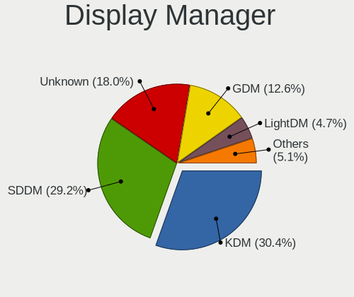
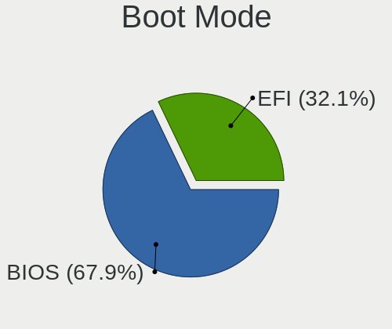
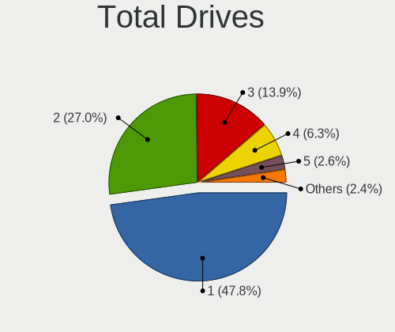
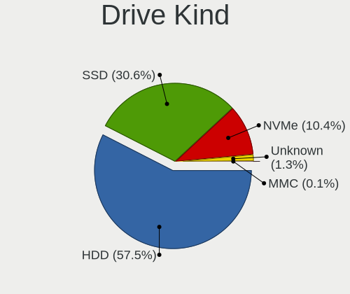
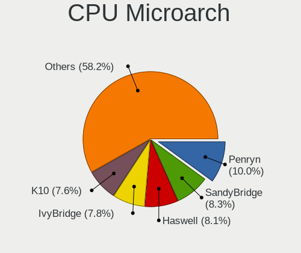
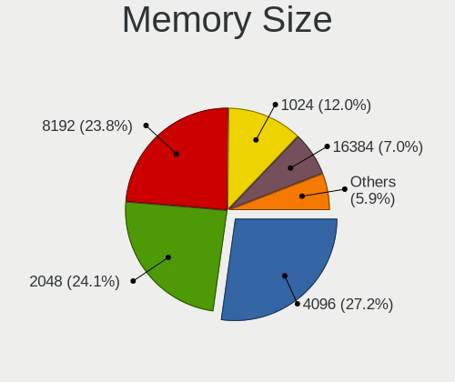
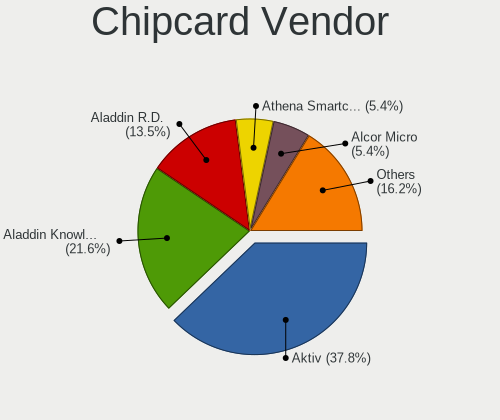
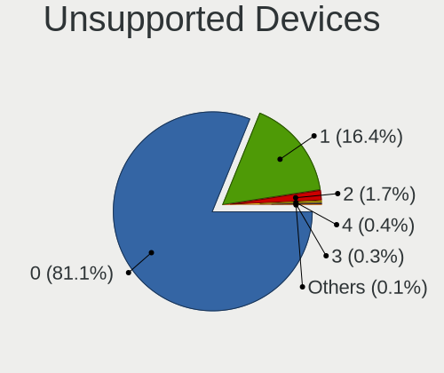

Linux in Russia - Tested Hardware & Statistics (Desktops)
---------------------------------------------------------

A project to collect tested hardware configurations for Linux in Russia.

Anyone can contribute to this report by the [hw-probe](https://github.com/linuxhw/hw-probe) tool:

    sudo -E hw-probe -all -upload

Please contribute! Especially if your hardware is rare.

Contents
--------

* [ Test Cases ](#test-cases)

* [ System ](#system)
  - [ OS                       ](#os)
  - [ OS Family                ](#os-family)
  - [ Kernel                   ](#kernel)
  - [ Kernel Family            ](#kernel-family)
  - [ Kernel Major Ver.        ](#kernel-major-ver)
  - [ Arch                     ](#arch)
  - [ DE                       ](#de)
  - [ Display Server           ](#display-server)
  - [ Display Manager          ](#display-manager)
  - [ OS Lang                  ](#os-lang)
  - [ Boot Mode                ](#boot-mode)
  - [ Filesystem               ](#filesystem)
  - [ Part. scheme             ](#part-scheme)
  - [ Dual Boot with Linux/BSD ](#dual-boot-with-linuxbsd)
  - [ Dual Boot (Win)          ](#dual-boot-win)

* [ Board ](#board)
  - [ Vendor                   ](#vendor)
  - [ Model                    ](#model)
  - [ Model Family             ](#model-family)
  - [ MFG Year                 ](#mfg-year)
  - [ Form Factor              ](#form-factor)
  - [ Secure Boot              ](#secure-boot)
  - [ Coreboot                 ](#coreboot)
  - [ RAM Size                 ](#ram-size)
  - [ RAM Used                 ](#ram-used)
  - [ Total Drives             ](#total-drives)
  - [ Has CD-ROM               ](#has-cd-rom)
  - [ Has Ethernet             ](#has-ethernet)
  - [ Has WiFi                 ](#has-wifi)
  - [ Has Bluetooth            ](#has-bluetooth)

* [ Location ](#location)
  - [ Country                  ](#country)
  - [ City                     ](#city)

* [ Drives ](#drives)
  - [ Drive Vendor             ](#drive-vendor)
  - [ Drive Model              ](#drive-model)
  - [ HDD Vendor               ](#hdd-vendor)
  - [ SSD Vendor               ](#ssd-vendor)
  - [ Drive Kind               ](#drive-kind)
  - [ Drive Connector          ](#drive-connector)
  - [ Drive Size               ](#drive-size)
  - [ Space Total              ](#space-total)
  - [ Space Used               ](#space-used)
  - [ Malfunc. Drives          ](#malfunc-drives)
  - [ Malfunc. Drive Vendor    ](#malfunc-drive-vendor)
  - [ Malfunc. HDD Vendor      ](#malfunc-hdd-vendor)
  - [ Malfunc. Drive Kind      ](#malfunc-drive-kind)
  - [ Failed Drives            ](#failed-drives)
  - [ Failed Drive Vendor      ](#failed-drive-vendor)
  - [ Drive Status             ](#drive-status)

* [ Storage controller ](#storage-controller)
  - [ Storage Vendor           ](#storage-vendor)
  - [ Storage Model            ](#storage-model)
  - [ Storage Kind             ](#storage-kind)

* [ Processor ](#processor)
  - [ CPU Vendor               ](#cpu-vendor)
  - [ CPU Model                ](#cpu-model)
  - [ CPU Model Family         ](#cpu-model-family)
  - [ CPU Cores                ](#cpu-cores)
  - [ CPU Sockets              ](#cpu-sockets)
  - [ CPU Threads              ](#cpu-threads)
  - [ CPU Op-Modes             ](#cpu-op-modes)
  - [ CPU Microcode            ](#cpu-microcode)
  - [ CPU Microarch            ](#cpu-microarch)

* [ Graphics ](#graphics)
  - [ GPU Vendor               ](#gpu-vendor)
  - [ GPU Model                ](#gpu-model)
  - [ GPU Combo                ](#gpu-combo)
  - [ GPU Driver               ](#gpu-driver)
  - [ GPU Memory               ](#gpu-memory)

* [ Monitor ](#monitor)
  - [ Monitor Vendor           ](#monitor-vendor)
  - [ Monitor Model            ](#monitor-model)
  - [ Monitor Resolution       ](#monitor-resolution)
  - [ Monitor Diagonal         ](#monitor-diagonal)
  - [ Monitor Width            ](#monitor-width)
  - [ Aspect Ratio             ](#aspect-ratio)
  - [ Monitor Area             ](#monitor-area)
  - [ Pixel Density            ](#pixel-density)
  - [ Multiple Monitors        ](#multiple-monitors)

* [ Network ](#network)
  - [ Net Controller Vendor    ](#net-controller-vendor)
  - [ Net Controller Model     ](#net-controller-model)
  - [ Wireless Vendor          ](#wireless-vendor)
  - [ Wireless Model           ](#wireless-model)
  - [ Ethernet Vendor          ](#ethernet-vendor)
  - [ Ethernet Model           ](#ethernet-model)
  - [ Net Controller Kind      ](#net-controller-kind)
  - [ Used Controller          ](#used-controller)
  - [ NICs                     ](#nics)
  - [ IPv6                     ](#ipv6)

* [ Bluetooth ](#bluetooth)
  - [ Bluetooth Vendor         ](#bluetooth-vendor)
  - [ Bluetooth Model          ](#bluetooth-model)

* [ Sound ](#sound)
  - [ Sound Vendor             ](#sound-vendor)
  - [ Sound Model              ](#sound-model)

* [ Memory ](#memory)
  - [ Memory Vendor            ](#memory-vendor)
  - [ Memory Model             ](#memory-model)
  - [ Memory Kind              ](#memory-kind)
  - [ Memory Form Factor       ](#memory-form-factor)
  - [ Memory Size              ](#memory-size)
  - [ Memory Speed             ](#memory-speed)

* [ Printers & scanners ](#printers--scanners)
  - [ Printer Vendor           ](#printer-vendor)
  - [ Printer Model            ](#printer-model)
  - [ Scanner Vendor           ](#scanner-vendor)
  - [ Scanner Model            ](#scanner-model)

* [ Camera ](#camera)
  - [ Camera Vendor            ](#camera-vendor)
  - [ Camera Model             ](#camera-model)

* [ Security ](#security)
  - [ Fingerprint Vendor       ](#fingerprint-vendor)
  - [ Fingerprint Model        ](#fingerprint-model)
  - [ Chipcard Vendor          ](#chipcard-vendor)
  - [ Chipcard Model           ](#chipcard-model)

* [ Unsupported ](#unsupported)
  - [ Unsupported Devices      ](#unsupported-devices)
  - [ Unsupported Device Types ](#unsupported-device-types)

Test Cases
----------

Total: 17040

| Vendor        | Model                       | Probe                                                      | Date         |
|---------------|-----------------------------|------------------------------------------------------------|--------------|
| 3Q            | TD2500G-P-Q3 A01            | [46626558f6](https://linux-hardware.org/?probe=46626558f6) | Dec 01, 2022 |
| ASUSTek       | AT3IONT-I DELUXE            | [16680c5211](https://linux-hardware.org/?probe=16680c5211) | Dec 01, 2022 |
| Gigabyte      | B450 I AORUS PRO WIFI-CF    | [9866b7f07f](https://linux-hardware.org/?probe=9866b7f07f) | Dec 01, 2022 |
| Gigabyte      | B450 GAMING X               | [ff5aef2f59](https://linux-hardware.org/?probe=ff5aef2f59) | Dec 01, 2022 |
| ASUSTek       | M5A97 PLUS                  | [63820e3937](https://linux-hardware.org/?probe=63820e3937) | Dec 01, 2022 |
| MSI           | H81M-E33                    | [aa874580d3](https://linux-hardware.org/?probe=aa874580d3) | Dec 01, 2022 |
| Gigabyte      | GA-MA790FXT-UD5P            | [010349b87b](https://linux-hardware.org/?probe=010349b87b) | Dec 01, 2022 |
| Gigabyte      | GA-990FXA-UD7               | [e300be2b5e](https://linux-hardware.org/?probe=e300be2b5e) | Dec 01, 2022 |
| ASUSTek       | P5B                         | [44f13beada](https://linux-hardware.org/?probe=44f13beada) | Dec 01, 2022 |
| ASUSTek       | PRIME Z690-P WIFI D4        | [42932dd5fd](https://linux-hardware.org/?probe=42932dd5fd) | Dec 01, 2022 |
| ASUSTek       | P8H77-V LE                  | [d82ed03dd9](https://linux-hardware.org/?probe=d82ed03dd9) | Dec 01, 2022 |
| ASUSTek       | SABERTOOTH X58              | [4ae619c728](https://linux-hardware.org/?probe=4ae619c728) | Dec 01, 2022 |
| Graviton      | DMB-H510-MCA01              | [4dbcbc3b7a](https://linux-hardware.org/?probe=4dbcbc3b7a) | Nov 30, 2022 |
| Gigabyte      | B450M DS3H-CF               | [952c3681c0](https://linux-hardware.org/?probe=952c3681c0) | Nov 30, 2022 |
| ASUSTek       | H81M-C                      | [458ea4bd06](https://linux-hardware.org/?probe=458ea4bd06) | Nov 29, 2022 |
| ASUSTek       | M5A78L/USB3                 | [99c33f6741](https://linux-hardware.org/?probe=99c33f6741) | Nov 29, 2022 |
| HP            | 8437                        | [c5bbfc32f6](https://linux-hardware.org/?probe=c5bbfc32f6) | Nov 29, 2022 |
| Lenovo        | 3162 SDK0J40697 WIN 3305... | [296ceaab80](https://linux-hardware.org/?probe=296ceaab80) | Nov 29, 2022 |
| Gigabyte      | B450M DS3H-CF               | [eae94e440a](https://linux-hardware.org/?probe=eae94e440a) | Nov 29, 2022 |
| ASRock        | N68C-S UCC                  | [c7bff3d908](https://linux-hardware.org/?probe=c7bff3d908) | Nov 29, 2022 |
| ASUSTek       | P5KPL-CM                    | [a20e18af73](https://linux-hardware.org/?probe=a20e18af73) | Nov 29, 2022 |
| Dell          | 0Y5DDC A00                  | [5d4811b390](https://linux-hardware.org/?probe=5d4811b390) | Nov 29, 2022 |
| ASRock        | H510M-HDV                   | [03a1675c85](https://linux-hardware.org/?probe=03a1675c85) | Nov 29, 2022 |
| Gigabyte      | A320M-H-CF                  | [66fe0c3ddf](https://linux-hardware.org/?probe=66fe0c3ddf) | Nov 29, 2022 |
| ECS           | 945P/PL-A                   | [ff47651dd8](https://linux-hardware.org/?probe=ff47651dd8) | Nov 29, 2022 |
| ECS           | BSWI-D2                     | [b7e4fbdd31](https://linux-hardware.org/?probe=b7e4fbdd31) | Nov 29, 2022 |
| ASUSTek       | PRIME Z690-P WIFI D4        | [262228b1fb](https://linux-hardware.org/?probe=262228b1fb) | Nov 29, 2022 |
| Gigabyte      | GA-MA770-UD3                | [be98ffe55b](https://linux-hardware.org/?probe=be98ffe55b) | Nov 28, 2022 |
| ECS           | H61H2-M13                   | [88988d4d0d](https://linux-hardware.org/?probe=88988d4d0d) | Nov 28, 2022 |
| Intel         | X79G V2.x                   | [6b229554fc](https://linux-hardware.org/?probe=6b229554fc) | Nov 28, 2022 |
| Gigabyte      | B365M DS3H                  | [4b9ee0ef6a](https://linux-hardware.org/?probe=4b9ee0ef6a) | Nov 28, 2022 |
| MSI           | MPG Z390 GAMING EDGE AC     | [245ea45167](https://linux-hardware.org/?probe=245ea45167) | Nov 28, 2022 |
| Gigabyte      | H410M S2H V3                | [8882bfe4f8](https://linux-hardware.org/?probe=8882bfe4f8) | Nov 28, 2022 |
| Gigabyte      | B550 GAMING X               | [f8979201eb](https://linux-hardware.org/?probe=f8979201eb) | Nov 27, 2022 |
| ASUSTek       | P7H55-M                     | [e5ac492508](https://linux-hardware.org/?probe=e5ac492508) | Nov 27, 2022 |
| Unknown       | Unknown                     | [1a24753132](https://linux-hardware.org/?probe=1a24753132) | Nov 27, 2022 |
| Gigabyte      | B450 AORUS ELITE            | [3fda27c7b6](https://linux-hardware.org/?probe=3fda27c7b6) | Nov 27, 2022 |
| Gigabyte      | B450 AORUS ELITE            | [e6a6d0affd](https://linux-hardware.org/?probe=e6a6d0affd) | Nov 27, 2022 |
| ASUSTek       | PRIME B450M-A               | [2a77cd8415](https://linux-hardware.org/?probe=2a77cd8415) | Nov 27, 2022 |
| ASUSTek       | PRIME B250M-K               | [73b4c53383](https://linux-hardware.org/?probe=73b4c53383) | Nov 27, 2022 |
| Koloe         | X58                         | [8b80e1a74c](https://linux-hardware.org/?probe=8b80e1a74c) | Nov 27, 2022 |
| ASUSTek       | P7H55-USB3                  | [ff31791cfb](https://linux-hardware.org/?probe=ff31791cfb) | Nov 27, 2022 |
| ASUSTek       | P7H55-USB3                  | [e09f910876](https://linux-hardware.org/?probe=e09f910876) | Nov 27, 2022 |
| ASRock        | H110M-DGS                   | [6667ba2bc2](https://linux-hardware.org/?probe=6667ba2bc2) | Nov 27, 2022 |
| MACHINIST     | X99-RS9 V3.1                | [86cead0335](https://linux-hardware.org/?probe=86cead0335) | Nov 27, 2022 |
| ASUSTek       | M5A97 LE R2.0               | [4fa4184bfd](https://linux-hardware.org/?probe=4fa4184bfd) | Nov 26, 2022 |
| MSI           | J1800I                      | [156269ae8c](https://linux-hardware.org/?probe=156269ae8c) | Nov 26, 2022 |
| Gigabyte      | GA-MA770-UD3                | [0f4c0786c2](https://linux-hardware.org/?probe=0f4c0786c2) | Nov 26, 2022 |
| ASUSTek       | H110M-R                     | [f35782a773](https://linux-hardware.org/?probe=f35782a773) | Nov 26, 2022 |
| ASUSTek       | PRIME B450M-A               | [f368bfcbe2](https://linux-hardware.org/?probe=f368bfcbe2) | Nov 26, 2022 |
| Gigabyte      | B560 HD3                    | [f7915b54fb](https://linux-hardware.org/?probe=f7915b54fb) | Nov 26, 2022 |
| ASUSTek       | M4A88TD-V EVO/USB3          | [9419d2017e](https://linux-hardware.org/?probe=9419d2017e) | Nov 26, 2022 |
| ASUSTek       | P8H77-V LE                  | [c17b2fcd65](https://linux-hardware.org/?probe=c17b2fcd65) | Nov 26, 2022 |
| ASUSTek       | PRIME B360M-D               | [67a7943b8d](https://linux-hardware.org/?probe=67a7943b8d) | Nov 25, 2022 |
| MSI           | K9AG Neo2                   | [a57a6f079b](https://linux-hardware.org/?probe=a57a6f079b) | Nov 25, 2022 |
| ASRock        | H55M-LE                     | [75b9a8fb03](https://linux-hardware.org/?probe=75b9a8fb03) | Nov 25, 2022 |
| Gigabyte      | X570S UD                    | [381b3c892d](https://linux-hardware.org/?probe=381b3c892d) | Nov 25, 2022 |
| Biostar       | H310MHC2                    | [49e09047c4](https://linux-hardware.org/?probe=49e09047c4) | Nov 25, 2022 |
| JGINYUE       | B660M-VDH                   | [bd879c87f8](https://linux-hardware.org/?probe=bd879c87f8) | Nov 25, 2022 |
| ASUSTek       | P5K                         | [87e7a3c0d0](https://linux-hardware.org/?probe=87e7a3c0d0) | Nov 25, 2022 |
| ASUSTek       | P8H61-MX                    | [d2e3977693](https://linux-hardware.org/?probe=d2e3977693) | Nov 25, 2022 |
| ASRock        | H110 Pro BTC+               | [db556f793b](https://linux-hardware.org/?probe=db556f793b) | Nov 25, 2022 |
| Gigabyte      | B250-FinTech-CF             | [fcc81ea02b](https://linux-hardware.org/?probe=fcc81ea02b) | Nov 24, 2022 |
| ASUSTek       | PRIME Z590-P                | [7d6cf8c81f](https://linux-hardware.org/?probe=7d6cf8c81f) | Nov 24, 2022 |
| MSI           | TRX40 PRO WIFI              | [3617f324a2](https://linux-hardware.org/?probe=3617f324a2) | Nov 24, 2022 |
| ASUSTek       | P5Q3                        | [655065ee03](https://linux-hardware.org/?probe=655065ee03) | Nov 24, 2022 |
| ASUSTek       | P5P43TD                     | [324669845a](https://linux-hardware.org/?probe=324669845a) | Nov 24, 2022 |
| ASUSTek       | PRIME X370-PRO              | [8a5a155a45](https://linux-hardware.org/?probe=8a5a155a45) | Nov 24, 2022 |
| ASRock        | B560M-ITX/ac                | [3e1bbe410c](https://linux-hardware.org/?probe=3e1bbe410c) | Nov 24, 2022 |
| ASUSTek       | P5KPL-VM                    | [4e15e21f75](https://linux-hardware.org/?probe=4e15e21f75) | Nov 24, 2022 |
| ASUSTek       | H81M-C                      | [e892605084](https://linux-hardware.org/?probe=e892605084) | Nov 24, 2022 |
| ASUSTek       | P5K Premium                 | [5ff50a49ba](https://linux-hardware.org/?probe=5ff50a49ba) | Nov 23, 2022 |
| Gigabyte      | GA-78LMT-S2                 | [a17992aaa3](https://linux-hardware.org/?probe=a17992aaa3) | Nov 23, 2022 |
| Gigabyte      | H77N-WIFI                   | [4617b6803a](https://linux-hardware.org/?probe=4617b6803a) | Nov 23, 2022 |
| MSI           | MAG X570 TOMAHAWK WIFI      | [e83d79d385](https://linux-hardware.org/?probe=e83d79d385) | Nov 23, 2022 |
| ASUSTek       | P8Z68-V LX                  | [7153762b68](https://linux-hardware.org/?probe=7153762b68) | Nov 23, 2022 |
| ASUSTek       | P5KPL-AM IN/ROEM/SI         | [64728372e9](https://linux-hardware.org/?probe=64728372e9) | Nov 23, 2022 |
| Gigabyte      | G31M-ES2L                   | [e8ab5ad410](https://linux-hardware.org/?probe=e8ab5ad410) | Nov 23, 2022 |
| Gigabyte      | X470 AORUS GAMING 7 WIFI... | [3a36391d83](https://linux-hardware.org/?probe=3a36391d83) | Nov 22, 2022 |
| Gigabyte      | B450 GAMING X               | [c427f12dca](https://linux-hardware.org/?probe=c427f12dca) | Nov 22, 2022 |
| Gigabyte      | 970A-UD3P                   | [2cd736b247](https://linux-hardware.org/?probe=2cd736b247) | Nov 22, 2022 |
| ASUSTek       | PRIME B450M-A               | [49cb3f2e52](https://linux-hardware.org/?probe=49cb3f2e52) | Nov 22, 2022 |
| Biostar       | G41D3+                      | [6ce48937fe](https://linux-hardware.org/?probe=6ce48937fe) | Nov 22, 2022 |
| ECS           | H61H2-M13                   | [6d50058ef8](https://linux-hardware.org/?probe=6d50058ef8) | Nov 22, 2022 |
| ECS           | H61H2-M13                   | [f6a783a27a](https://linux-hardware.org/?probe=f6a783a27a) | Nov 22, 2022 |
| ECS           | H61H2-M13                   | [423fbc1fa0](https://linux-hardware.org/?probe=423fbc1fa0) | Nov 22, 2022 |
| ECS           | H61H2-M13                   | [debc5b7ab9](https://linux-hardware.org/?probe=debc5b7ab9) | Nov 22, 2022 |
| ECS           | H61H2-M13                   | [dc53077baa](https://linux-hardware.org/?probe=dc53077baa) | Nov 22, 2022 |
| ECS           | H61H2-M13                   | [856bb3def2](https://linux-hardware.org/?probe=856bb3def2) | Nov 22, 2022 |
| Foxconn       | H61MXL/H61MXL-K             | [d140a0f503](https://linux-hardware.org/?probe=d140a0f503) | Nov 22, 2022 |
| ECS           | H61H2-M13                   | [ee55108218](https://linux-hardware.org/?probe=ee55108218) | Nov 22, 2022 |
| ECS           | H61H2-M13                   | [ec03d1b050](https://linux-hardware.org/?probe=ec03d1b050) | Nov 22, 2022 |
| ECS           | H61H2-M13                   | [1f2a4089cc](https://linux-hardware.org/?probe=1f2a4089cc) | Nov 22, 2022 |
| Intel         | JSL MRD                     | [31ffd9d911](https://linux-hardware.org/?probe=31ffd9d911) | Nov 22, 2022 |
| ECS           | H61H2-M13                   | [4190bbb2d8](https://linux-hardware.org/?probe=4190bbb2d8) | Nov 22, 2022 |
| ECS           | H61H2-M13                   | [570a11d74b](https://linux-hardware.org/?probe=570a11d74b) | Nov 22, 2022 |
| Gigabyte      | G41M-ES2L                   | [404927f4cc](https://linux-hardware.org/?probe=404927f4cc) | Nov 22, 2022 |
| Dell          | 0Y5DDC A00                  | [37808c6686](https://linux-hardware.org/?probe=37808c6686) | Nov 22, 2022 |
| ASRock        | H55M-LE                     | [206082ac3f](https://linux-hardware.org/?probe=206082ac3f) | Nov 22, 2022 |
| ASUSTek       | SABERTOOTH 990FX            | [2575d2aab2](https://linux-hardware.org/?probe=2575d2aab2) | Nov 22, 2022 |
| Gigabyte      | B75M-D3V                    | [06396e3088](https://linux-hardware.org/?probe=06396e3088) | Nov 21, 2022 |
| Gigabyte      | B550M AORUS PRO-P           | [a22e271ac2](https://linux-hardware.org/?probe=a22e271ac2) | Nov 21, 2022 |
| Gigabyte      | B365M DS3H                  | [e48d26b26f](https://linux-hardware.org/?probe=e48d26b26f) | Nov 21, 2022 |
| MSI           | PRO H410M-B                 | [a81c612515](https://linux-hardware.org/?probe=a81c612515) | Nov 21, 2022 |
| MSI           | PRO H410M-B                 | [ebc5b13d4e](https://linux-hardware.org/?probe=ebc5b13d4e) | Nov 21, 2022 |
| Biostar       | G41D3+                      | [d1d42fec13](https://linux-hardware.org/?probe=d1d42fec13) | Nov 21, 2022 |
| Gigabyte      | H310M S2H x.x               | [97ea29ed26](https://linux-hardware.org/?probe=97ea29ed26) | Nov 20, 2022 |
| ASUSTek       | H81M-PLUS                   | [880e6565e8](https://linux-hardware.org/?probe=880e6565e8) | Nov 20, 2022 |
| Intel         | DG45ID AAE27729-310         | [81ecca3cd1](https://linux-hardware.org/?probe=81ecca3cd1) | Nov 20, 2022 |
| ASUSTek       | M4A785T-M                   | [451b8a6b52](https://linux-hardware.org/?probe=451b8a6b52) | Nov 20, 2022 |
| Gigabyte      | Z77X-D3H                    | [1702f14317](https://linux-hardware.org/?probe=1702f14317) | Nov 20, 2022 |
| MSI           | X470 GAMING PLUS MAX        | [122a37af55](https://linux-hardware.org/?probe=122a37af55) | Nov 20, 2022 |
| Gigabyte      | B450 AORUS ELITE            | [910d921a9d](https://linux-hardware.org/?probe=910d921a9d) | Nov 20, 2022 |
| ASUSTek       | M5A78L-M LX3                | [b133dcd886](https://linux-hardware.org/?probe=b133dcd886) | Nov 20, 2022 |
| ASUSTek       | P7H55                       | [aaaefec31e](https://linux-hardware.org/?probe=aaaefec31e) | Nov 20, 2022 |
| Gigabyte      | AB350M-DS3H-CF              | [64953143a6](https://linux-hardware.org/?probe=64953143a6) | Nov 20, 2022 |
| ASRock        | P43ME                       | [3b90870750](https://linux-hardware.org/?probe=3b90870750) | Nov 20, 2022 |
| Gigabyte      | B560M AORUS PRO AX          | [5cf9d6d04e](https://linux-hardware.org/?probe=5cf9d6d04e) | Nov 20, 2022 |
| Intel         | JSL MRD                     | [e8171566d3](https://linux-hardware.org/?probe=e8171566d3) | Nov 19, 2022 |
| ASUSTek       | P5K                         | [44b338a17d](https://linux-hardware.org/?probe=44b338a17d) | Nov 19, 2022 |
| Gigabyte      | G31M-ES2L                   | [3e3d8f727c](https://linux-hardware.org/?probe=3e3d8f727c) | Nov 19, 2022 |
| ASRock        | B450 Pro4                   | [cd0f63540b](https://linux-hardware.org/?probe=cd0f63540b) | Nov 19, 2022 |
| ASUSTek       | ROG STRIX B660-F GAMING ... | [ecceccb3b7](https://linux-hardware.org/?probe=ecceccb3b7) | Nov 19, 2022 |
| MSI           | H510M-A PRO                 | [1755321c80](https://linux-hardware.org/?probe=1755321c80) | Nov 19, 2022 |
| ASUSTek       | P5KPL/1600                  | [b2e20d7f28](https://linux-hardware.org/?probe=b2e20d7f28) | Nov 19, 2022 |
| ASUSTek       | Z97-P                       | [75748e49d9](https://linux-hardware.org/?probe=75748e49d9) | Nov 19, 2022 |
| Dell          | 0RY007                      | [d11a712f82](https://linux-hardware.org/?probe=d11a712f82) | Nov 18, 2022 |
| ASUSTek       | PRIME Z370-P                | [65abbfb38e](https://linux-hardware.org/?probe=65abbfb38e) | Nov 18, 2022 |
| Gigabyte      | M720-US3                    | [299b2cd745](https://linux-hardware.org/?probe=299b2cd745) | Nov 18, 2022 |
| Unknown       | Unknown                     | [53f563177d](https://linux-hardware.org/?probe=53f563177d) | Nov 18, 2022 |
| ASUSTek       | PRIME H510M-K               | [c695addaa3](https://linux-hardware.org/?probe=c695addaa3) | Nov 18, 2022 |
| HP            | 8906 SMVB                   | [f644eba622](https://linux-hardware.org/?probe=f644eba622) | Nov 18, 2022 |
| Gigabyte      | B550 AORUS PRO              | [ceafbe876d](https://linux-hardware.org/?probe=ceafbe876d) | Nov 18, 2022 |
| Gigabyte      | B550 AORUS PRO              | [f6f8ae996d](https://linux-hardware.org/?probe=f6f8ae996d) | Nov 18, 2022 |
| Unknown       | P43Twins1600                | [1db44f50c4](https://linux-hardware.org/?probe=1db44f50c4) | Nov 18, 2022 |
| ASUSTek       | P8B75-V                     | [6f3b172132](https://linux-hardware.org/?probe=6f3b172132) | Nov 18, 2022 |
| MSI           | H110M PRO-VH PLUS           | [54f40f8c4b](https://linux-hardware.org/?probe=54f40f8c4b) | Nov 18, 2022 |
| Gigabyte      | H81M-S1                     | [4498bc64bc](https://linux-hardware.org/?probe=4498bc64bc) | Nov 18, 2022 |
| Dell          | 0Y5DDC A00                  | [99aed6e6d2](https://linux-hardware.org/?probe=99aed6e6d2) | Nov 17, 2022 |
| Gigabyte      | B550M AORUS PRO-P           | [312da35b57](https://linux-hardware.org/?probe=312da35b57) | Nov 17, 2022 |
| Gigabyte      | A520M H                     | [d353571eef](https://linux-hardware.org/?probe=d353571eef) | Nov 17, 2022 |
| ASUSTek       | P5KPL-AM EPU                | [814b71a20c](https://linux-hardware.org/?probe=814b71a20c) | Nov 17, 2022 |
| Intel         | X79 (INTEL Xeon E5/Corei... | [f9da339cc7](https://linux-hardware.org/?probe=f9da339cc7) | Nov 17, 2022 |
| ASUSTek       | H81M-R                      | [cd129bebe1](https://linux-hardware.org/?probe=cd129bebe1) | Nov 17, 2022 |
| ASUSTek       | Z170-P                      | [735035876a](https://linux-hardware.org/?probe=735035876a) | Nov 17, 2022 |
| MSI           | B450M MORTAR MAX            | [2ea755455d](https://linux-hardware.org/?probe=2ea755455d) | Nov 16, 2022 |
| Biostar       | TH67XE                      | [47da767a5a](https://linux-hardware.org/?probe=47da767a5a) | Nov 16, 2022 |
| MSI           | H61M-P32/W8                 | [82cba9e87c](https://linux-hardware.org/?probe=82cba9e87c) | Nov 16, 2022 |
| Gigabyte      | H61M-DS2                    | [757a1066ff](https://linux-hardware.org/?probe=757a1066ff) | Nov 16, 2022 |
| ASRock        | H310CM-DVS                  | [23194fe7d9](https://linux-hardware.org/?probe=23194fe7d9) | Nov 16, 2022 |
| Gigabyte      | P75-D3                      | [02bdf99508](https://linux-hardware.org/?probe=02bdf99508) | Nov 16, 2022 |
| ASRock        | J3455-ITX                   | [71c99edeb1](https://linux-hardware.org/?probe=71c99edeb1) | Nov 16, 2022 |
| ASUSTek       | TUF B450-PRO GAMING         | [b0c0ad46de](https://linux-hardware.org/?probe=b0c0ad46de) | Nov 16, 2022 |
| ASUSTek       | B75M-A                      | [087a904af2](https://linux-hardware.org/?probe=087a904af2) | Nov 16, 2022 |
| ASUSTek       | TUF Gaming B550-PLUS        | [ccf8236d38](https://linux-hardware.org/?probe=ccf8236d38) | Nov 16, 2022 |
| ASUSTek       | Z87-K                       | [39078e426c](https://linux-hardware.org/?probe=39078e426c) | Nov 16, 2022 |
| Gigabyte      | H110M-S2V-CF                | [74cdb80f42](https://linux-hardware.org/?probe=74cdb80f42) | Nov 16, 2022 |
| ASRock        | N68C-GS FX                  | [e7d93e8540](https://linux-hardware.org/?probe=e7d93e8540) | Nov 15, 2022 |
| MACHINIST     | X99-RS9 V2.0                | [c9a4863d1f](https://linux-hardware.org/?probe=c9a4863d1f) | Nov 15, 2022 |
| ASRock        | N68C-GS FX                  | [c67fea651e](https://linux-hardware.org/?probe=c67fea651e) | Nov 15, 2022 |
| ASRock        | N68-GS4 FX                  | [c651e62593](https://linux-hardware.org/?probe=c651e62593) | Nov 15, 2022 |
| ASRock        | H470M-HVS                   | [e69c2f0da4](https://linux-hardware.org/?probe=e69c2f0da4) | Nov 15, 2022 |
| ASRock        | B150M-HDS                   | [032d8f7c3c](https://linux-hardware.org/?probe=032d8f7c3c) | Nov 15, 2022 |
| ASUSTek       | TUF Gaming B450-PLUS II     | [1a0674de42](https://linux-hardware.org/?probe=1a0674de42) | Nov 14, 2022 |
| Unknown       | Intel X79                   | [61483ea15b](https://linux-hardware.org/?probe=61483ea15b) | Nov 14, 2022 |
| Graviton      | DMB-A520-MCA01              | [1a09a9bb5c](https://linux-hardware.org/?probe=1a09a9bb5c) | Nov 14, 2022 |
| Gigabyte      | B450M DS3H V2               | [dc808c4131](https://linux-hardware.org/?probe=dc808c4131) | Nov 14, 2022 |
| Gigabyte      | P75-D3                      | [37f9da1b7f](https://linux-hardware.org/?probe=37f9da1b7f) | Nov 14, 2022 |
| HP            | 2179                        | [3407225f33](https://linux-hardware.org/?probe=3407225f33) | Nov 14, 2022 |
| ASUSTek       | PRIME H510M-K               | [191fa275ad](https://linux-hardware.org/?probe=191fa275ad) | Nov 14, 2022 |
| ASUSTek       | PRIME H510M-K               | [0f8a90fef7](https://linux-hardware.org/?probe=0f8a90fef7) | Nov 14, 2022 |
| Gigabyte      | H77-DS3H                    | [f28540c049](https://linux-hardware.org/?probe=f28540c049) | Nov 14, 2022 |
| ASRock        | H310CM-DVS                  | [86932d2426](https://linux-hardware.org/?probe=86932d2426) | Nov 14, 2022 |
| ASUSTek       | PRIME H310M-R R2.0          | [53a532435e](https://linux-hardware.org/?probe=53a532435e) | Nov 14, 2022 |
| Pegatron      | 2A94h                       | [5ebd2a4bf4](https://linux-hardware.org/?probe=5ebd2a4bf4) | Nov 13, 2022 |
| Gigabyte      | H110M-M2-CF                 | [aedb84820e](https://linux-hardware.org/?probe=aedb84820e) | Nov 13, 2022 |
| MSI           | B85M-P33 V2                 | [d633461307](https://linux-hardware.org/?probe=d633461307) | Nov 13, 2022 |
| ASUSTek       | F2A85-V PRO                 | [0127d7b1cd](https://linux-hardware.org/?probe=0127d7b1cd) | Nov 12, 2022 |
| MSI           | A320M-A PRO                 | [6b77cc7062](https://linux-hardware.org/?probe=6b77cc7062) | Nov 12, 2022 |
| ASUSTek       | M5A97 EVO R2.0              | [2677116eee](https://linux-hardware.org/?probe=2677116eee) | Nov 12, 2022 |
| ASUSTek       | P5K-VM                      | [8d1ad25443](https://linux-hardware.org/?probe=8d1ad25443) | Nov 12, 2022 |
| ASUSTek       | M5A78L-M LE/USB3            | [7fe6789365](https://linux-hardware.org/?probe=7fe6789365) | Nov 12, 2022 |
| MSI           | Z97-G43                     | [f5946a94b0](https://linux-hardware.org/?probe=f5946a94b0) | Nov 12, 2022 |
| Gigabyte      | B450 AORUS ELITE            | [a8d2d850a5](https://linux-hardware.org/?probe=a8d2d850a5) | Nov 12, 2022 |
| ASUSTek       | Z170 PRO GAMING             | [c1103d767e](https://linux-hardware.org/?probe=c1103d767e) | Nov 12, 2022 |
| ASUSTek       | M5A97 EVO R2.0              | [0d1333128b](https://linux-hardware.org/?probe=0d1333128b) | Nov 11, 2022 |
| ASUSTek       | M4A88T-M                    | [ff49e5ddb5](https://linux-hardware.org/?probe=ff49e5ddb5) | Nov 11, 2022 |
| Sapphire      | IPC-E350M1                  | [58a5544fb4](https://linux-hardware.org/?probe=58a5544fb4) | Nov 11, 2022 |
| Gigabyte      | A320M-H-CF                  | [af490e0878](https://linux-hardware.org/?probe=af490e0878) | Nov 11, 2022 |
| ASUSTek       | M4A88T-M                    | [b152665a17](https://linux-hardware.org/?probe=b152665a17) | Nov 11, 2022 |
| ASUSTek       | H81M-PLUS                   | [12d6552ded](https://linux-hardware.org/?probe=12d6552ded) | Nov 11, 2022 |
| ASRock        | B550M-HDV                   | [277c219cef](https://linux-hardware.org/?probe=277c219cef) | Nov 11, 2022 |
| ASUSTek       | M5A99X EVO R2.0             | [a37ca89eae](https://linux-hardware.org/?probe=a37ca89eae) | Nov 11, 2022 |
| ASUSTek       | PRIME H510T2/CSM            | [ef983bc60e](https://linux-hardware.org/?probe=ef983bc60e) | Nov 11, 2022 |
| ASUSTek       | PRIME B450M-K               | [ccd759a684](https://linux-hardware.org/?probe=ccd759a684) | Nov 11, 2022 |
| Intel         | DP965LT AAD41694-206        | [72773d35e0](https://linux-hardware.org/?probe=72773d35e0) | Nov 11, 2022 |
| ASRock        | H470M-HVS                   | [b81b19a472](https://linux-hardware.org/?probe=b81b19a472) | Nov 11, 2022 |
| Gigabyte      | B550 AORUS PRO AC           | [b5965fce49](https://linux-hardware.org/?probe=b5965fce49) | Nov 11, 2022 |
| MSI           | B150 GAMING M3              | [13f42af580](https://linux-hardware.org/?probe=13f42af580) | Nov 11, 2022 |
| Gigabyte      | H61M-D2-B3                  | [46ee069dd8](https://linux-hardware.org/?probe=46ee069dd8) | Nov 11, 2022 |
| MSI           | B450M GAMING PLUS           | [dd56553c17](https://linux-hardware.org/?probe=dd56553c17) | Nov 11, 2022 |
| Unknown       | NF-CK804                    | [6bda1f2345](https://linux-hardware.org/?probe=6bda1f2345) | Nov 10, 2022 |
| ASRock        | H410M-HDV                   | [985b9b55e2](https://linux-hardware.org/?probe=985b9b55e2) | Nov 10, 2022 |
| Acer          | H11H4-AI V:1.0              | [0873e8bf70](https://linux-hardware.org/?probe=0873e8bf70) | Nov 10, 2022 |
| Apple         | Mac-F4208DC8 PVT            | [45dc316bea](https://linux-hardware.org/?probe=45dc316bea) | Nov 10, 2022 |
| ASUSTek       | P5K/EPU                     | [4bd9a2de61](https://linux-hardware.org/?probe=4bd9a2de61) | Nov 10, 2022 |
| Gigabyte      | H55M-S2H                    | [8af42c3646](https://linux-hardware.org/?probe=8af42c3646) | Nov 10, 2022 |
| ASUSTek       | P5K/EPU                     | [cd3706107a](https://linux-hardware.org/?probe=cd3706107a) | Nov 10, 2022 |
| ASUSTek       | H110M-K                     | [4d6af313f5](https://linux-hardware.org/?probe=4d6af313f5) | Nov 10, 2022 |
| Gigabyte      | H55M-S2H                    | [18d013bbc8](https://linux-hardware.org/?probe=18d013bbc8) | Nov 10, 2022 |
| ASUSTek       | P7H55-M/USB3                | [d3d30c473e](https://linux-hardware.org/?probe=d3d30c473e) | Nov 10, 2022 |
| Gigabyte      | 8I915GMF                    | [76f5cb17ad](https://linux-hardware.org/?probe=76f5cb17ad) | Nov 10, 2022 |
| ASUSTek       | M5A78L-M LE/USB3            | [b5ce55106f](https://linux-hardware.org/?probe=b5ce55106f) | Nov 10, 2022 |
| Gigabyte      | A320M-H-CF                  | [4cf7d8ea41](https://linux-hardware.org/?probe=4cf7d8ea41) | Nov 10, 2022 |
| ASUSTek       | M4A78T-E                    | [a885b61478](https://linux-hardware.org/?probe=a885b61478) | Nov 10, 2022 |
| Intel         | X79                         | [f806dcc4da](https://linux-hardware.org/?probe=f806dcc4da) | Nov 10, 2022 |
| ASUSTek       | M4A78T-E                    | [475ad820cd](https://linux-hardware.org/?probe=475ad820cd) | Nov 10, 2022 |
| Pegatron      | 2A73h                       | [dc035c362e](https://linux-hardware.org/?probe=dc035c362e) | Nov 10, 2022 |
| Gigabyte      | Z690 AORUS PRO              | [8dcd548e89](https://linux-hardware.org/?probe=8dcd548e89) | Nov 10, 2022 |
| ASUSTek       | P8Z77-V LK                  | [640d78b1e4](https://linux-hardware.org/?probe=640d78b1e4) | Nov 10, 2022 |
| ASUSTek       | M4N68T-M-LE-V2              | [d9d004077a](https://linux-hardware.org/?probe=d9d004077a) | Nov 10, 2022 |
| Gigabyte      | Z690 AORUS PRO              | [e95608162f](https://linux-hardware.org/?probe=e95608162f) | Nov 10, 2022 |
| MSI           | MS-B1711                    | [a80911f521](https://linux-hardware.org/?probe=a80911f521) | Nov 09, 2022 |
| Gigabyte      | A520M H                     | [50b86d41a2](https://linux-hardware.org/?probe=50b86d41a2) | Nov 09, 2022 |
| MSI           | Z370 TOMAHAWK               | [0763a922c8](https://linux-hardware.org/?probe=0763a922c8) | Nov 09, 2022 |
| ASRock        | H97 Pro4                    | [bdd79e7a9e](https://linux-hardware.org/?probe=bdd79e7a9e) | Nov 09, 2022 |
| Gigabyte      | 990XA-UD3                   | [c92f8d8b22](https://linux-hardware.org/?probe=c92f8d8b22) | Nov 09, 2022 |
| HP            | 806A                        | [e8bee1d38a](https://linux-hardware.org/?probe=e8bee1d38a) | Nov 08, 2022 |
| MSI           | X370 GAMING PLUS            | [ae91098674](https://linux-hardware.org/?probe=ae91098674) | Nov 08, 2022 |
| Huanan        | X99-BD4 V1.3                | [e50441190a](https://linux-hardware.org/?probe=e50441190a) | Nov 08, 2022 |
| Gigabyte      | GA-A75M-UD2H                | [c8383aa811](https://linux-hardware.org/?probe=c8383aa811) | Nov 08, 2022 |
| Gigabyte      | GA-A75M-UD2H                | [7f6cff35d7](https://linux-hardware.org/?probe=7f6cff35d7) | Nov 08, 2022 |
| Gigabyte      | Z77X-D3H                    | [09e3734a06](https://linux-hardware.org/?probe=09e3734a06) | Nov 08, 2022 |
| Gigabyte      | A320M-H-CF                  | [137958160c](https://linux-hardware.org/?probe=137958160c) | Nov 08, 2022 |
| ASUSTek       | P8H67-M LX                  | [277212bfc3](https://linux-hardware.org/?probe=277212bfc3) | Nov 08, 2022 |
| Gigabyte      | EP45-UD3L                   | [2b3eb32895](https://linux-hardware.org/?probe=2b3eb32895) | Nov 07, 2022 |
| Unknown       | Unknown                     | [37226d7d92](https://linux-hardware.org/?probe=37226d7d92) | Nov 07, 2022 |
| MSI           | X370 GAMING PLUS            | [cda3bef0bc](https://linux-hardware.org/?probe=cda3bef0bc) | Nov 07, 2022 |
| Fujitsu       | D3061-B1 S26361-D3061-B1    | [731ce5b944](https://linux-hardware.org/?probe=731ce5b944) | Nov 07, 2022 |
| ASRock        | D1800M                      | [4935d67430](https://linux-hardware.org/?probe=4935d67430) | Nov 07, 2022 |
| ASUSTek       | P5KPL-AM EPU                | [dd30cc2e63](https://linux-hardware.org/?probe=dd30cc2e63) | Nov 07, 2022 |
| ASRock        | N68C-GS FX                  | [c7b8fac7e2](https://linux-hardware.org/?probe=c7b8fac7e2) | Nov 07, 2022 |
| Gigabyte      | A320M-H-CF                  | [16b37f0b80](https://linux-hardware.org/?probe=16b37f0b80) | Nov 07, 2022 |
| ASUSTek       | F2A55-M LK                  | [0c888d2b1f](https://linux-hardware.org/?probe=0c888d2b1f) | Nov 07, 2022 |
| MSI           | B450M MORTAR MAX            | [eae2553adf](https://linux-hardware.org/?probe=eae2553adf) | Nov 06, 2022 |
| MSI           | H81M-P33                    | [00cb3af126](https://linux-hardware.org/?probe=00cb3af126) | Nov 06, 2022 |
| ASRock        | H370M-ITX/ac                | [fe29240874](https://linux-hardware.org/?probe=fe29240874) | Nov 06, 2022 |
| Acer          | EG31M R01-C2                | [1c541d28e0](https://linux-hardware.org/?probe=1c541d28e0) | Nov 06, 2022 |
| ASUSTek       | PRIME H270-PRO              | [a60e7d1961](https://linux-hardware.org/?probe=a60e7d1961) | Nov 06, 2022 |
| ASUSTek       | P8Z68-M PRO                 | [905a8c9fee](https://linux-hardware.org/?probe=905a8c9fee) | Nov 06, 2022 |
| ASRock        | B550 Extreme4               | [16154018bb](https://linux-hardware.org/?probe=16154018bb) | Nov 06, 2022 |
| MSI           | B150 GAMING M3              | [38a85b01ad](https://linux-hardware.org/?probe=38a85b01ad) | Nov 06, 2022 |
| MSI           | MPG X570 GAMING PRO CARB... | [b6a4d355bc](https://linux-hardware.org/?probe=b6a4d355bc) | Nov 06, 2022 |
| ASUSTek       | H110-PLUS                   | [4d260267d7](https://linux-hardware.org/?probe=4d260267d7) | Nov 06, 2022 |
| ASUSTek       | H110-PLUS                   | [789df18cfb](https://linux-hardware.org/?probe=789df18cfb) | Nov 06, 2022 |
| ASUSTek       | TUF Gaming B550M-PLUS WI... | [ba495c1631](https://linux-hardware.org/?probe=ba495c1631) | Nov 06, 2022 |
| Gigabyte      | F2A55M-DS2                  | [4cadf85e6e](https://linux-hardware.org/?probe=4cadf85e6e) | Nov 06, 2022 |
| ASUSTek       | M5A78L-M LX3 PLUS           | [4a3eefaf16](https://linux-hardware.org/?probe=4a3eefaf16) | Nov 06, 2022 |
| ASUSTek       | Z97-C                       | [ce7c45a3d9](https://linux-hardware.org/?probe=ce7c45a3d9) | Nov 06, 2022 |
| Biostar       | A78LR-M3S                   | [8e8da94ddb](https://linux-hardware.org/?probe=8e8da94ddb) | Nov 06, 2022 |
| Gigabyte      | H61M-S2PV                   | [5db0a08b25](https://linux-hardware.org/?probe=5db0a08b25) | Nov 06, 2022 |
| ASRock        | B660M PG Riptide            | [2fb2a2e140](https://linux-hardware.org/?probe=2fb2a2e140) | Nov 05, 2022 |
| Gigabyte      | B365M D3H-CF                | [53d09fc292](https://linux-hardware.org/?probe=53d09fc292) | Nov 05, 2022 |
| MSI           | MPG X570 GAMING PRO CARB... | [5d6951212b](https://linux-hardware.org/?probe=5d6951212b) | Nov 05, 2022 |
| ASUSTek       | PRIME H510M-R               | [922e24a1a0](https://linux-hardware.org/?probe=922e24a1a0) | Nov 05, 2022 |
| Gigabyte      | H110M-M2-CF                 | [40ef04163d](https://linux-hardware.org/?probe=40ef04163d) | Nov 05, 2022 |
| ASUSTek       | M5A78L-M LX                 | [d7512f31a3](https://linux-hardware.org/?probe=d7512f31a3) | Nov 05, 2022 |
| Gigabyte      | H61M-S2PV                   | [1c2a17391f](https://linux-hardware.org/?probe=1c2a17391f) | Nov 05, 2022 |
| Intel         | X79 (INTEL Xeon E5/Corei... | [a8926fce15](https://linux-hardware.org/?probe=a8926fce15) | Nov 05, 2022 |
| MSI           | P67A-C43                    | [a5e86512d1](https://linux-hardware.org/?probe=a5e86512d1) | Nov 05, 2022 |
| Gigabyte      | H110M-S2HP-CF               | [94004d5828](https://linux-hardware.org/?probe=94004d5828) | Nov 05, 2022 |
| Gigabyte      | B75-D3V                     | [a562aef0c3](https://linux-hardware.org/?probe=a562aef0c3) | Nov 05, 2022 |
| Dell          | 0MN1TX A01                  | [a788e75812](https://linux-hardware.org/?probe=a788e75812) | Nov 05, 2022 |
| ASUSTek       | M4A77TD PRO                 | [b5fa37b726](https://linux-hardware.org/?probe=b5fa37b726) | Nov 04, 2022 |
| ASUSTek       | M5A78L LE                   | [edf9105fc5](https://linux-hardware.org/?probe=edf9105fc5) | Nov 04, 2022 |
| Unknown       | X79-P3                      | [f069ed7bd9](https://linux-hardware.org/?probe=f069ed7bd9) | Nov 04, 2022 |
| Gigabyte      | Z87-HD3                     | [f67d642096](https://linux-hardware.org/?probe=f67d642096) | Nov 04, 2022 |
| MSI           | B360M PRO-VDH               | [2a801a9792](https://linux-hardware.org/?probe=2a801a9792) | Nov 04, 2022 |
| ASUSTek       | H170I-PLUS D3               | [74df37995c](https://linux-hardware.org/?probe=74df37995c) | Nov 04, 2022 |
| ASUSTek       | P5K                         | [ebc4a23dcc](https://linux-hardware.org/?probe=ebc4a23dcc) | Nov 04, 2022 |
| MSI           | X370 GAMING PLUS            | [db81c87a42](https://linux-hardware.org/?probe=db81c87a42) | Nov 04, 2022 |
| ASUSTek       | M5A78L LE                   | [95729b1578](https://linux-hardware.org/?probe=95729b1578) | Nov 04, 2022 |
| ASRock        | H61M-VG4                    | [63f5fe9444](https://linux-hardware.org/?probe=63f5fe9444) | Nov 04, 2022 |
| Dell          | 0GY6Y8 A03                  | [7ff8f0aecd](https://linux-hardware.org/?probe=7ff8f0aecd) | Nov 03, 2022 |
| Huanan        | X99-BD4 V1.3                | [3eccdb8ba1](https://linux-hardware.org/?probe=3eccdb8ba1) | Nov 03, 2022 |
| Gigabyte      | Z87-HD3                     | [ef71fa8dd6](https://linux-hardware.org/?probe=ef71fa8dd6) | Nov 03, 2022 |
| Gigabyte      | Z490 UD                     | [c560dfaab4](https://linux-hardware.org/?probe=c560dfaab4) | Nov 03, 2022 |
| ASUSTek       | P8H77-V LE                  | [d5c39748e3](https://linux-hardware.org/?probe=d5c39748e3) | Nov 03, 2022 |
| MSI           | X370 GAMING PLUS            | [749d91dfd4](https://linux-hardware.org/?probe=749d91dfd4) | Nov 03, 2022 |
| ASUSTek       | H61M-K                      | [4b580ecb2b](https://linux-hardware.org/?probe=4b580ecb2b) | Nov 03, 2022 |
| ASUSTek       | H61M-K                      | [c47ee488a5](https://linux-hardware.org/?probe=c47ee488a5) | Nov 03, 2022 |
| Gigabyte      | Z490 UD                     | [eb3812d5ce](https://linux-hardware.org/?probe=eb3812d5ce) | Nov 03, 2022 |
| Gigabyte      | H310M S2H                   | [521297d21c](https://linux-hardware.org/?probe=521297d21c) | Nov 03, 2022 |
| ECS           | MCP61M-M3                   | [fe5e87a9ef](https://linux-hardware.org/?probe=fe5e87a9ef) | Nov 03, 2022 |
| MSI           | B85M PRO-VD                 | [46a3742fd3](https://linux-hardware.org/?probe=46a3742fd3) | Nov 03, 2022 |
| ASUSTek       | Z97-C                       | [be4968a790](https://linux-hardware.org/?probe=be4968a790) | Nov 03, 2022 |
| ASRock        | A320D4-P1                   | [8e453f4158](https://linux-hardware.org/?probe=8e453f4158) | Nov 03, 2022 |
| MSI           | H510M PRO-E                 | [23fa7a2cf8](https://linux-hardware.org/?probe=23fa7a2cf8) | Nov 03, 2022 |
| ASUSTek       | M5A78L-M LX3 PLUS           | [80dbb62739](https://linux-hardware.org/?probe=80dbb62739) | Nov 03, 2022 |
| ASUSTek       | M5A78L-M LX3 PLUS           | [f942b801f7](https://linux-hardware.org/?probe=f942b801f7) | Nov 03, 2022 |
| Gigabyte      | Z690 AORUS MASTER           | [2c9714bc6b](https://linux-hardware.org/?probe=2c9714bc6b) | Nov 02, 2022 |
| ASRock        | N68-GS4 FX                  | [da7a70afe1](https://linux-hardware.org/?probe=da7a70afe1) | Nov 02, 2022 |
| Shenzhen a... | AC1-DP                      | [754335ffe9](https://linux-hardware.org/?probe=754335ffe9) | Nov 02, 2022 |
| MSI           | MS-7392                     | [d453f89064](https://linux-hardware.org/?probe=d453f89064) | Nov 02, 2022 |
| ASUSTek       | M5A78L-M LX3 PLUS           | [23a62c3509](https://linux-hardware.org/?probe=23a62c3509) | Nov 02, 2022 |
| ASUSTek       | M5A78L-M LX3 PLUS           | [d34ccf5e7a](https://linux-hardware.org/?probe=d34ccf5e7a) | Nov 02, 2022 |
| ASUSTek       | M5A78L-M LX3 PLUS           | [eb06593b9e](https://linux-hardware.org/?probe=eb06593b9e) | Nov 02, 2022 |
| Gigabyte      | H77N-WIFI                   | [d8b066edcd](https://linux-hardware.org/?probe=d8b066edcd) | Nov 02, 2022 |
| MSI           | H110M PRO-VD                | [1fb0a79791](https://linux-hardware.org/?probe=1fb0a79791) | Nov 02, 2022 |
| ASUSTek       | H61M-K                      | [3773260366](https://linux-hardware.org/?probe=3773260366) | Nov 02, 2022 |
| Gigabyte      | A520M DS3H                  | [8fe13e2165](https://linux-hardware.org/?probe=8fe13e2165) | Nov 02, 2022 |
| ASRock        | H510M-HVS R2.0              | [562f466f8d](https://linux-hardware.org/?probe=562f466f8d) | Nov 02, 2022 |
| ASRock        | B450M Pro4                  | [38b68c6946](https://linux-hardware.org/?probe=38b68c6946) | Nov 02, 2022 |
| ASRock        | H510M-HVS R2.0              | [b68271c648](https://linux-hardware.org/?probe=b68271c648) | Nov 02, 2022 |
| Lenovo        | H420                        | [3e3f04d875](https://linux-hardware.org/?probe=3e3f04d875) | Nov 02, 2022 |
| Gigabyte      | EP45-DS4                    | [fa96a26c5a](https://linux-hardware.org/?probe=fa96a26c5a) | Nov 02, 2022 |
| ECS           | H61H2-M2                    | [b70c0aa20d](https://linux-hardware.org/?probe=b70c0aa20d) | Nov 01, 2022 |
| Gigabyte      | H610M H DDR4                | [b726668f90](https://linux-hardware.org/?probe=b726668f90) | Nov 01, 2022 |
| Gigabyte      | EP45-DS4                    | [2eb78b1c3d](https://linux-hardware.org/?probe=2eb78b1c3d) | Nov 01, 2022 |
| ASUSTek       | CROSSBLADE RANGER           | [5f92247b16](https://linux-hardware.org/?probe=5f92247b16) | Nov 01, 2022 |
| Gigabyte      | B450M H                     | [06bbc75ef0](https://linux-hardware.org/?probe=06bbc75ef0) | Nov 01, 2022 |
| ASUSTek       | PRIME H310M-K               | [9efd2724b2](https://linux-hardware.org/?probe=9efd2724b2) | Nov 01, 2022 |
| ASRock        | B365M-HDV                   | [29a6bce4c0](https://linux-hardware.org/?probe=29a6bce4c0) | Nov 01, 2022 |
| ASUSTek       | H81M-C                      | [76052b7756](https://linux-hardware.org/?probe=76052b7756) | Nov 01, 2022 |
| Gigabyte      | X570S AERO G                | [92fccb6716](https://linux-hardware.org/?probe=92fccb6716) | Nov 01, 2022 |
| MSI           | H61M-P32/W8                 | [14df9c3c14](https://linux-hardware.org/?probe=14df9c3c14) | Nov 01, 2022 |
| MSI           | 0A90                        | [47fa407c02](https://linux-hardware.org/?probe=47fa407c02) | Nov 01, 2022 |
| MSI           | Z390-A PRO                  | [3eea020596](https://linux-hardware.org/?probe=3eea020596) | Nov 01, 2022 |
| ASRock        | N68C-GS FX                  | [f7a9c5f382](https://linux-hardware.org/?probe=f7a9c5f382) | Nov 01, 2022 |
| MSI           | MEG X570 UNIFY              | [1a88842782](https://linux-hardware.org/?probe=1a88842782) | Nov 01, 2022 |
| MSI           | H81M-P33                    | [29e4a4ec52](https://linux-hardware.org/?probe=29e4a4ec52) | Oct 31, 2022 |
| ASUSTek       | PRIME Z690M-PLUS D4         | [96d61ed3e1](https://linux-hardware.org/?probe=96d61ed3e1) | Oct 31, 2022 |
| MSI           | B450-A PRO MAX              | [8e480ded02](https://linux-hardware.org/?probe=8e480ded02) | Oct 31, 2022 |
| ASRock        | 960GM-VGS3 FX               | [f31f613901](https://linux-hardware.org/?probe=f31f613901) | Oct 31, 2022 |
| ASUSTek       | H81M-C                      | [2fdcf19b6d](https://linux-hardware.org/?probe=2fdcf19b6d) | Oct 31, 2022 |
| Foxconn       | RS690M2MA 0A                | [29605bcad9](https://linux-hardware.org/?probe=29605bcad9) | Oct 31, 2022 |
| Gigabyte      | B660M GAMING X AX           | [d48fe55211](https://linux-hardware.org/?probe=d48fe55211) | Oct 31, 2022 |
| ASRock        | H470M-HDV                   | [a4e522270c](https://linux-hardware.org/?probe=a4e522270c) | Oct 31, 2022 |
| Biostar       | H310MHC2                    | [5ad5ba772f](https://linux-hardware.org/?probe=5ad5ba772f) | Oct 31, 2022 |
| Intel         | DG41AN AAE92991-401         | [cd670cef3d](https://linux-hardware.org/?probe=cd670cef3d) | Oct 31, 2022 |
| Gigabyte      | A520M H                     | [0a8043d206](https://linux-hardware.org/?probe=0a8043d206) | Oct 31, 2022 |
| ASRock        | B550 Phantom Gaming 4       | [5e87d391a3](https://linux-hardware.org/?probe=5e87d391a3) | Oct 31, 2022 |
| Intel         | D946GZAB AAD66610-300       | [33c41323a3](https://linux-hardware.org/?probe=33c41323a3) | Oct 31, 2022 |
| ASUSTek       | M5A78L/USB3                 | [b5098e9fe5](https://linux-hardware.org/?probe=b5098e9fe5) | Oct 31, 2022 |
| ASRock        | N68C-GS FX                  | [e24bf2e31f](https://linux-hardware.org/?probe=e24bf2e31f) | Oct 31, 2022 |
| Gigabyte      | H77N-WIFI                   | [d4340d8d66](https://linux-hardware.org/?probe=d4340d8d66) | Oct 31, 2022 |
| ASUSTek       | Leonite2                    | [955ce84cf2](https://linux-hardware.org/?probe=955ce84cf2) | Oct 30, 2022 |
| ASRock        | N68C-GS FX                  | [bf96e5a0a1](https://linux-hardware.org/?probe=bf96e5a0a1) | Oct 30, 2022 |
| ASRock        | H410M-HVS                   | [2d540e06b9](https://linux-hardware.org/?probe=2d540e06b9) | Oct 30, 2022 |
| ASUSTek       | PRIME A320M-K               | [6bbea41ce5](https://linux-hardware.org/?probe=6bbea41ce5) | Oct 30, 2022 |
| Gigabyte      | G41M-Combo                  | [180622c3be](https://linux-hardware.org/?probe=180622c3be) | Oct 30, 2022 |
| ASRock        | B450M Pro4-F R2.0           | [5fb37123e0](https://linux-hardware.org/?probe=5fb37123e0) | Oct 30, 2022 |
| ASUSTek       | P7H55-M/USB3                | [8983159779](https://linux-hardware.org/?probe=8983159779) | Oct 30, 2022 |
| ASUSTek       | ROG STRIX B365-G GAMING     | [7f78f3451e](https://linux-hardware.org/?probe=7f78f3451e) | Oct 29, 2022 |
| Gigabyte      | B450M DS3H-CF               | [47b5907eec](https://linux-hardware.org/?probe=47b5907eec) | Oct 29, 2022 |
| MSI           | B450M MORTAR MAX            | [d8321f617e](https://linux-hardware.org/?probe=d8321f617e) | Oct 29, 2022 |
| Gigabyte      | Z690 AORUS MASTER           | [2a7d6b757b](https://linux-hardware.org/?probe=2a7d6b757b) | Oct 29, 2022 |
| MSI           | B450M MORTAR MAX            | [7f67023fa9](https://linux-hardware.org/?probe=7f67023fa9) | Oct 29, 2022 |
| Gigabyte      | GA-790XTA-UD4               | [a750edc641](https://linux-hardware.org/?probe=a750edc641) | Oct 29, 2022 |
| ASRock        | H410M-HVS                   | [9371d71f6d](https://linux-hardware.org/?probe=9371d71f6d) | Oct 29, 2022 |
| Gigabyte      | H110M-M2-CF                 | [34c4f594c4](https://linux-hardware.org/?probe=34c4f594c4) | Oct 29, 2022 |
| Dell          | 0Y5DDC A00                  | [e3421b1908](https://linux-hardware.org/?probe=e3421b1908) | Oct 29, 2022 |
| ASRock        | N68-GS4 FX                  | [04334f2930](https://linux-hardware.org/?probe=04334f2930) | Oct 29, 2022 |
| Gigabyte      | B550 GAMING X V2            | [7b3b808198](https://linux-hardware.org/?probe=7b3b808198) | Oct 29, 2022 |
| Techvision    | TVI7309X B0                 | [65b5280dd1](https://linux-hardware.org/?probe=65b5280dd1) | Oct 29, 2022 |
| ASUSTek       | P5K                         | [6d87562df6](https://linux-hardware.org/?probe=6d87562df6) | Oct 28, 2022 |
| ASRock        | Z370 Pro4                   | [04e898b2f6](https://linux-hardware.org/?probe=04e898b2f6) | Oct 28, 2022 |
| MSI           | MAG B560 TOMAHAWK WIFI      | [429fd34d64](https://linux-hardware.org/?probe=429fd34d64) | Oct 28, 2022 |
| ASUSTek       | H81M-C                      | [c96189c44c](https://linux-hardware.org/?probe=c96189c44c) | Oct 28, 2022 |
| Gigabyte      | B560M H                     | [00766db60b](https://linux-hardware.org/?probe=00766db60b) | Oct 28, 2022 |
| ASUSTek       | M5A87                       | [88e6b582c9](https://linux-hardware.org/?probe=88e6b582c9) | Oct 28, 2022 |
| Gigabyte      | PH67-UD3-B3                 | [c66fb514ab](https://linux-hardware.org/?probe=c66fb514ab) | Oct 28, 2022 |
| ASUSTek       | P8B75-V                     | [4783ed1083](https://linux-hardware.org/?probe=4783ed1083) | Oct 28, 2022 |
| MSI           | 0A90                        | [a15ab9db5e](https://linux-hardware.org/?probe=a15ab9db5e) | Oct 28, 2022 |
| Gigabyte      | GA-880GM-D2H                | [cacdacb3ad](https://linux-hardware.org/?probe=cacdacb3ad) | Oct 28, 2022 |
| MSI           | Z97 GAMING 3                | [4488ff5b26](https://linux-hardware.org/?probe=4488ff5b26) | Oct 28, 2022 |
| Gigabyte      | A320M-S2H-CF                | [594b16e254](https://linux-hardware.org/?probe=594b16e254) | Oct 28, 2022 |
| ASUSTek       | PRIME Z690-P WIFI D4        | [327ee3d5b0](https://linux-hardware.org/?probe=327ee3d5b0) | Oct 28, 2022 |
| Gigabyte      | F2A88X-D3H                  | [dc1e16bba1](https://linux-hardware.org/?probe=dc1e16bba1) | Oct 27, 2022 |
| ASUSTek       | P8B75-V                     | [ca5c26654a](https://linux-hardware.org/?probe=ca5c26654a) | Oct 27, 2022 |
| ASUSTek       | M5A97 PRO                   | [de99c600e5](https://linux-hardware.org/?probe=de99c600e5) | Oct 27, 2022 |
| Gigabyte      | H110M-S2V-CF                | [1d4dfc3e06](https://linux-hardware.org/?probe=1d4dfc3e06) | Oct 27, 2022 |
| ASRock        | Z77 Pro4-M                  | [b388ac6776](https://linux-hardware.org/?probe=b388ac6776) | Oct 27, 2022 |
| Fujitsu       | D2990-A2 S26361-D2990-A2    | [6de2b1229f](https://linux-hardware.org/?probe=6de2b1229f) | Oct 27, 2022 |
| ASRock        | B550M-HDV                   | [4d5068a3be](https://linux-hardware.org/?probe=4d5068a3be) | Oct 27, 2022 |
| ASUSTek       | P8H61-M LE R2.0             | [6b01f2f498](https://linux-hardware.org/?probe=6b01f2f498) | Oct 27, 2022 |
| MSI           | H110M PRO-VD                | [175f39979c](https://linux-hardware.org/?probe=175f39979c) | Oct 27, 2022 |
| Lenovo        | 3188 SDK0J40697 WIN 3305... | [9c429fe90c](https://linux-hardware.org/?probe=9c429fe90c) | Oct 27, 2022 |
| Biostar       | TB250-BTC                   | [89e7931244](https://linux-hardware.org/?probe=89e7931244) | Oct 27, 2022 |
| Intel         | D34010WYK H14771-301        | [cea24a780a](https://linux-hardware.org/?probe=cea24a780a) | Oct 26, 2022 |
| MSI           | H81M-P33                    | [e4f38c5519](https://linux-hardware.org/?probe=e4f38c5519) | Oct 26, 2022 |
| AMI           | Cherry Trail CR             | [8cf0d29214](https://linux-hardware.org/?probe=8cf0d29214) | Oct 26, 2022 |
| HP            | 8717                        | [c2fcc7119a](https://linux-hardware.org/?probe=c2fcc7119a) | Oct 26, 2022 |
| AMI           | Cherry Trail CR             | [e8f64c2c8c](https://linux-hardware.org/?probe=e8f64c2c8c) | Oct 26, 2022 |
| ASUSTek       | B85M-G                      | [0d3545c6aa](https://linux-hardware.org/?probe=0d3545c6aa) | Oct 26, 2022 |
| ASUSTek       | B85M-G                      | [0b8dc998a9](https://linux-hardware.org/?probe=0b8dc998a9) | Oct 26, 2022 |
| ASRock        | 970 Pro3 R2.0               | [c2b4882963](https://linux-hardware.org/?probe=c2b4882963) | Oct 26, 2022 |
| MiTAC         | E220 E220AQ-601             | [1ee0c036f8](https://linux-hardware.org/?probe=1ee0c036f8) | Oct 26, 2022 |
| ASUSTek       | PRIME H310M-R R2.0          | [c1067e423b](https://linux-hardware.org/?probe=c1067e423b) | Oct 26, 2022 |
| Gigabyte      | AB350M-Gaming 3-CF          | [926be6d85b](https://linux-hardware.org/?probe=926be6d85b) | Oct 25, 2022 |
| Gigabyte      | AB350M-Gaming 3-CF          | [94a393835b](https://linux-hardware.org/?probe=94a393835b) | Oct 25, 2022 |
| Gigabyte      | G41MT-S2PT                  | [2fb43f4be2](https://linux-hardware.org/?probe=2fb43f4be2) | Oct 25, 2022 |
| ASUSTek       | H81M-K                      | [92dbe47379](https://linux-hardware.org/?probe=92dbe47379) | Oct 25, 2022 |
| Gigabyte      | P41T-D3                     | [fa69e3fada](https://linux-hardware.org/?probe=fa69e3fada) | Oct 25, 2022 |
| Gigabyte      | P41T-D3                     | [c96d8030a6](https://linux-hardware.org/?probe=c96d8030a6) | Oct 25, 2022 |
| MSI           | H110M PRO-VD                | [f8466185a4](https://linux-hardware.org/?probe=f8466185a4) | Oct 25, 2022 |
| ASRock        | G41C-GS                     | [218d55e0ca](https://linux-hardware.org/?probe=218d55e0ca) | Oct 25, 2022 |
| ASUSTek       | H81M-K                      | [247782b262](https://linux-hardware.org/?probe=247782b262) | Oct 25, 2022 |
| MSI           | B450M-A PRO MAX             | [9f404fe6b4](https://linux-hardware.org/?probe=9f404fe6b4) | Oct 25, 2022 |
| Dell          | 0Y5DDC A00                  | [bc39e0cfd6](https://linux-hardware.org/?probe=bc39e0cfd6) | Oct 25, 2022 |
| Huanan        | X79 (INTEL Xeon E5/Core ... | [601e080563](https://linux-hardware.org/?probe=601e080563) | Oct 25, 2022 |
| ASUSTek       | PRIME B550-PLUS             | [b8b23daad5](https://linux-hardware.org/?probe=b8b23daad5) | Oct 25, 2022 |
| ASUSTek       | PRIME H510M-A               | [83f5d2034b](https://linux-hardware.org/?probe=83f5d2034b) | Oct 24, 2022 |
| Gigabyte      | B550M AORUS PRO-P           | [4b88876126](https://linux-hardware.org/?probe=4b88876126) | Oct 24, 2022 |
| Gigabyte      | H410M H V3                  | [b4c5ed92b7](https://linux-hardware.org/?probe=b4c5ed92b7) | Oct 24, 2022 |
| MSI           | B450M GAMING PLUS           | [e3041ae2eb](https://linux-hardware.org/?probe=e3041ae2eb) | Oct 24, 2022 |
| Gigabyte      | H61M-S2PV                   | [a876af89ec](https://linux-hardware.org/?probe=a876af89ec) | Oct 24, 2022 |
| Gigabyte      | B450 AORUS M                | [08c2a2abf9](https://linux-hardware.org/?probe=08c2a2abf9) | Oct 24, 2022 |
| Gigabyte      | X58A-UD7                    | [8b0cff9259](https://linux-hardware.org/?probe=8b0cff9259) | Oct 24, 2022 |
| ASUSTek       | P8H77-V                     | [fdb1bce84a](https://linux-hardware.org/?probe=fdb1bce84a) | Oct 24, 2022 |
| ECS           | H310CH5-M2                  | [e9d2a5becb](https://linux-hardware.org/?probe=e9d2a5becb) | Oct 24, 2022 |
| Gigabyte      | G41M-ES2L                   | [a995e58f10](https://linux-hardware.org/?probe=a995e58f10) | Oct 24, 2022 |
| MSI           | PRO H610M-B DDR4            | [25db5739b7](https://linux-hardware.org/?probe=25db5739b7) | Oct 24, 2022 |
| Gigabyte      | Z690 UD DDR4                | [8cc3ca1253](https://linux-hardware.org/?probe=8cc3ca1253) | Oct 24, 2022 |
| Intel         | D34010WYK H14771-301        | [18d8d35afa](https://linux-hardware.org/?probe=18d8d35afa) | Oct 24, 2022 |
| Gigabyte      | B450M DS3H V2               | [a159a5720e](https://linux-hardware.org/?probe=a159a5720e) | Oct 23, 2022 |
| Biostar       | TH67XE                      | [b523b997f6](https://linux-hardware.org/?probe=b523b997f6) | Oct 23, 2022 |
| ASUSTek       | Z97I-PLUS                   | [d7c07287bd](https://linux-hardware.org/?probe=d7c07287bd) | Oct 23, 2022 |
| Gigabyte      | Z690 AORUS PRO              | [7cb3500943](https://linux-hardware.org/?probe=7cb3500943) | Oct 22, 2022 |
| ASUSTek       | M4A77T/USB3                 | [2df43ccc5d](https://linux-hardware.org/?probe=2df43ccc5d) | Oct 22, 2022 |
| Unknown       | NF-CK804                    | [4df3f7c7e6](https://linux-hardware.org/?probe=4df3f7c7e6) | Oct 22, 2022 |
| ASUSTek       | P7H55-M PRO                 | [0b306aaddf](https://linux-hardware.org/?probe=0b306aaddf) | Oct 22, 2022 |
| MSI           | A320M GRENADE               | [30bcc61268](https://linux-hardware.org/?probe=30bcc61268) | Oct 21, 2022 |
| Gigabyte      | H81M-S1                     | [8168ea4028](https://linux-hardware.org/?probe=8168ea4028) | Oct 21, 2022 |
| Lenovo        | 3708 NOK                    | [f48f731517](https://linux-hardware.org/?probe=f48f731517) | Oct 21, 2022 |
| Gigabyte      | H310M H x.x                 | [a0a8fc6cb0](https://linux-hardware.org/?probe=a0a8fc6cb0) | Oct 21, 2022 |
| Gigabyte      | B360HD3                     | [bbbdee0883](https://linux-hardware.org/?probe=bbbdee0883) | Oct 21, 2022 |
| Gigabyte      | B75M-D3V                    | [71c9391b8b](https://linux-hardware.org/?probe=71c9391b8b) | Oct 21, 2022 |
| MSI           | A320M GRENADE               | [73112f41f7](https://linux-hardware.org/?probe=73112f41f7) | Oct 21, 2022 |
| MSI           | H81M-P33                    | [a59f545a7b](https://linux-hardware.org/?probe=a59f545a7b) | Oct 21, 2022 |
| Gigabyte      | GA-78LMT-S2 sex             | [95ddb7c758](https://linux-hardware.org/?probe=95ddb7c758) | Oct 21, 2022 |
| ASUSTek       | B85-PLUS                    | [a057e410d0](https://linux-hardware.org/?probe=a057e410d0) | Oct 21, 2022 |
| ASUSTek       | B85-PLUS                    | [72c61d8c50](https://linux-hardware.org/?probe=72c61d8c50) | Oct 21, 2022 |
| ASUSTek       | M5A78L LE                   | [88b0f5d5c3](https://linux-hardware.org/?probe=88b0f5d5c3) | Oct 21, 2022 |
| Gigabyte      | H61M-S2PV                   | [f60716afd0](https://linux-hardware.org/?probe=f60716afd0) | Oct 20, 2022 |
| ASUSTek       | M5A78L-M PLUS/USB3          | [6c32002395](https://linux-hardware.org/?probe=6c32002395) | Oct 20, 2022 |
| ASRock        | H81M-HDS R2.0               | [6161a12f13](https://linux-hardware.org/?probe=6161a12f13) | Oct 20, 2022 |
| ASUSTek       | P5Q SE                      | [c223e518c9](https://linux-hardware.org/?probe=c223e518c9) | Oct 20, 2022 |
| Dell          | 0D4MD1 A02                  | [becbded076](https://linux-hardware.org/?probe=becbded076) | Oct 20, 2022 |
| ASUSTek       | PRIME B360M-A               | [444b923209](https://linux-hardware.org/?probe=444b923209) | Oct 20, 2022 |
| Gigabyte      | EP41-UD3L                   | [d82763649b](https://linux-hardware.org/?probe=d82763649b) | Oct 20, 2022 |
| Gigabyte      | H77N-WIFI                   | [fffc0ab985](https://linux-hardware.org/?probe=fffc0ab985) | Oct 20, 2022 |
| ASRock        | H110M-DVS R3.0              | [86b7c01699](https://linux-hardware.org/?probe=86b7c01699) | Oct 19, 2022 |
| ASRock        | H81M-HDS R2.0               | [b27f916880](https://linux-hardware.org/?probe=b27f916880) | Oct 19, 2022 |
| MSI           | Z97 GAMING 5                | [980d0d7bb2](https://linux-hardware.org/?probe=980d0d7bb2) | Oct 19, 2022 |
| Acer          | FMCP7A-ION                  | [e7646c8fe4](https://linux-hardware.org/?probe=e7646c8fe4) | Oct 19, 2022 |
| Gigabyte      | EP41-UD3L                   | [31867fb669](https://linux-hardware.org/?probe=31867fb669) | Oct 19, 2022 |
| ECS           | H61H2-M12                   | [7c4ae7b4ab](https://linux-hardware.org/?probe=7c4ae7b4ab) | Oct 19, 2022 |
| ASUSTek       | Leonite2                    | [717cc412e5](https://linux-hardware.org/?probe=717cc412e5) | Oct 19, 2022 |
| MSI           | PRO H410M-B                 | [549eeb915c](https://linux-hardware.org/?probe=549eeb915c) | Oct 19, 2022 |
| MSI           | H81M-P33                    | [784b068521](https://linux-hardware.org/?probe=784b068521) | Oct 19, 2022 |
| ASUSTek       | B85M-G                      | [42a1bedb35](https://linux-hardware.org/?probe=42a1bedb35) | Oct 19, 2022 |
| Gigabyte      | H510M S2H                   | [e75a8830af](https://linux-hardware.org/?probe=e75a8830af) | Oct 19, 2022 |
| ASUSTek       | H81M-K                      | [a4a1d563b5](https://linux-hardware.org/?probe=a4a1d563b5) | Oct 19, 2022 |
| ASUSTek       | PRIME B550M-K               | [41d2e6298d](https://linux-hardware.org/?probe=41d2e6298d) | Oct 19, 2022 |
| ASRock        | H61M-GE                     | [6149e0c478](https://linux-hardware.org/?probe=6149e0c478) | Oct 18, 2022 |
| Intel         | X99                         | [4217ddeb6b](https://linux-hardware.org/?probe=4217ddeb6b) | Oct 18, 2022 |
| MSI           | Z490-A PRO                  | [db93de2ab4](https://linux-hardware.org/?probe=db93de2ab4) | Oct 18, 2022 |
| Gigabyte      | B450M DS3H-CF               | [3b1ce3ab08](https://linux-hardware.org/?probe=3b1ce3ab08) | Oct 18, 2022 |
| MSI           | B360M GAMING PLUS           | [df2e89c571](https://linux-hardware.org/?probe=df2e89c571) | Oct 18, 2022 |
| Gigabyte      | H77N-WIFI                   | [1e8b0c8279](https://linux-hardware.org/?probe=1e8b0c8279) | Oct 18, 2022 |
| Giga-Byte ... | i440BX-W977                 | [018daa60e1](https://linux-hardware.org/?probe=018daa60e1) | Oct 18, 2022 |
| Biostar       | A320MD PRO                  | [0497b12091](https://linux-hardware.org/?probe=0497b12091) | Oct 18, 2022 |
| ASUSTek       | B85M-G                      | [86b92cdc50](https://linux-hardware.org/?probe=86b92cdc50) | Oct 18, 2022 |
| Gigabyte      | H510M S2H                   | [b8303261ad](https://linux-hardware.org/?probe=b8303261ad) | Oct 18, 2022 |
| ASUSTek       | P5KPL-E                     | [2f1e1cbbf4](https://linux-hardware.org/?probe=2f1e1cbbf4) | Oct 18, 2022 |
| ASRock        | H310CM-HDV/M.2              | [f2112b8b74](https://linux-hardware.org/?probe=f2112b8b74) | Oct 18, 2022 |
| ASUSTek       | PRIME Z690-P WIFI D4        | [e4769fb9e0](https://linux-hardware.org/?probe=e4769fb9e0) | Oct 18, 2022 |
| ASUSTek       | PRIME Z690-P WIFI D4        | [76bb60e5ee](https://linux-hardware.org/?probe=76bb60e5ee) | Oct 17, 2022 |
| MACHINIST     | X99-RS9 V2.0                | [9d4d455bb2](https://linux-hardware.org/?probe=9d4d455bb2) | Oct 17, 2022 |
| ASRock        | H61M-GE                     | [873932f557](https://linux-hardware.org/?probe=873932f557) | Oct 17, 2022 |
| ASUSTek       | M5A97 R2.0                  | [b85a76dd7f](https://linux-hardware.org/?probe=b85a76dd7f) | Oct 17, 2022 |
| Biostar       | H61MLV                      | [c2fb8ebaac](https://linux-hardware.org/?probe=c2fb8ebaac) | Oct 17, 2022 |
| Dell          | 0HY553                      | [08f05b94e6](https://linux-hardware.org/?probe=08f05b94e6) | Oct 17, 2022 |
| Gigabyte      | C246N-WU2-CF                | [cb7ca4eb5a](https://linux-hardware.org/?probe=cb7ca4eb5a) | Oct 16, 2022 |
| HP            | 81B3                        | [e303e50785](https://linux-hardware.org/?probe=e303e50785) | Oct 16, 2022 |
| Gigabyte      | B75M-D2V                    | [20ac585859](https://linux-hardware.org/?probe=20ac585859) | Oct 16, 2022 |
| ASUSTek       | P8H61-M LE                  | [cf76898812](https://linux-hardware.org/?probe=cf76898812) | Oct 16, 2022 |
| ASUSTek       | PRIME B450M-K II            | [d1d815635a](https://linux-hardware.org/?probe=d1d815635a) | Oct 16, 2022 |
| Gigabyte      | GA-770TA-UD3                | [82f436a99c](https://linux-hardware.org/?probe=82f436a99c) | Oct 16, 2022 |
| ASUSTek       | P5E                         | [747e4c7a68](https://linux-hardware.org/?probe=747e4c7a68) | Oct 16, 2022 |
| Gigabyte      | X470 AORUS ULTRA GAMING-... | [59a0225889](https://linux-hardware.org/?probe=59a0225889) | Oct 16, 2022 |
| ASUSTek       | PRIME Z690-P WIFI D4        | [f26592e956](https://linux-hardware.org/?probe=f26592e956) | Oct 16, 2022 |
| ASRock        | A55 Pro3                    | [0b3e7a1cd2](https://linux-hardware.org/?probe=0b3e7a1cd2) | Oct 16, 2022 |
| ASUSTek       | PRIME B450M-K               | [288b9fadfe](https://linux-hardware.org/?probe=288b9fadfe) | Oct 15, 2022 |
| Gigabyte      | H61M-S2PV                   | [f9568da63c](https://linux-hardware.org/?probe=f9568da63c) | Oct 15, 2022 |
| Gigabyte      | H61M-S2PV                   | [b226135430](https://linux-hardware.org/?probe=b226135430) | Oct 15, 2022 |
| Gigabyte      | B250M-D3H-CF                | [c351e0fae6](https://linux-hardware.org/?probe=c351e0fae6) | Oct 15, 2022 |
| Gigabyte      | H610M H DDR4                | [985b192440](https://linux-hardware.org/?probe=985b192440) | Oct 15, 2022 |
| ASUSTek       | PRIME B250-PLUS             | [00ab764924](https://linux-hardware.org/?probe=00ab764924) | Oct 15, 2022 |
| Gigabyte      | H610M H DDR4                | [05fa96288f](https://linux-hardware.org/?probe=05fa96288f) | Oct 15, 2022 |
| ASUSTek       | P7H55-M/USB3                | [8a98e44bee](https://linux-hardware.org/?probe=8a98e44bee) | Oct 15, 2022 |
| Huanan        | H97-ZD3 V2.0                | [d0d194fbdc](https://linux-hardware.org/?probe=d0d194fbdc) | Oct 15, 2022 |
| ASUSTek       | P5P43TD PRO                 | [a29fae2a74](https://linux-hardware.org/?probe=a29fae2a74) | Oct 14, 2022 |
| MSI           | G31TM-P21                   | [ea0fc2d497](https://linux-hardware.org/?probe=ea0fc2d497) | Oct 14, 2022 |
| MSI           | B85M-P33                    | [83d476e3d7](https://linux-hardware.org/?probe=83d476e3d7) | Oct 14, 2022 |
| Gigabyte      | H77N-WIFI                   | [d1f08d0589](https://linux-hardware.org/?probe=d1f08d0589) | Oct 14, 2022 |
| ASUSTek       | H81M-K                      | [c6958291bd](https://linux-hardware.org/?probe=c6958291bd) | Oct 14, 2022 |
| Gigabyte      | Z77-D3H                     | [06edc1eef1](https://linux-hardware.org/?probe=06edc1eef1) | Oct 14, 2022 |
| ASUSTek       | P5QL-CM                     | [34c01c8045](https://linux-hardware.org/?probe=34c01c8045) | Oct 14, 2022 |
| HP            | 802E                        | [6231a344aa](https://linux-hardware.org/?probe=6231a344aa) | Oct 14, 2022 |
| HP            | 339A                        | [f7dd678058](https://linux-hardware.org/?probe=f7dd678058) | Oct 14, 2022 |
| ASUSTek       | P8H77-V                     | [9c98c411c5](https://linux-hardware.org/?probe=9c98c411c5) | Oct 14, 2022 |
| Kraftway      | KWQ67                       | [8346fc15e3](https://linux-hardware.org/?probe=8346fc15e3) | Oct 13, 2022 |
| Kraftway      | KWQ67                       | [d57d34be64](https://linux-hardware.org/?probe=d57d34be64) | Oct 13, 2022 |
| ASRock        | G41M-VS3                    | [7fa0f82664](https://linux-hardware.org/?probe=7fa0f82664) | Oct 13, 2022 |
| Gigabyte      | H77N-WIFI                   | [6597eea759](https://linux-hardware.org/?probe=6597eea759) | Oct 13, 2022 |
| HP            | 1495                        | [b1523ff4a6](https://linux-hardware.org/?probe=b1523ff4a6) | Oct 13, 2022 |
| Founder       | H61H2-AM V1.1               | [4d558904f5](https://linux-hardware.org/?probe=4d558904f5) | Oct 13, 2022 |
| Lenovo        | ThinkCentre M71z 1782RP4    | [bee14a3740](https://linux-hardware.org/?probe=bee14a3740) | Oct 13, 2022 |
| ASUSTek       | PRIME H510T2/CSM            | [087d1975e1](https://linux-hardware.org/?probe=087d1975e1) | Oct 12, 2022 |
| Graviton      | DMB-H510-MCA01              | [355974871d](https://linux-hardware.org/?probe=355974871d) | Oct 12, 2022 |
| ASUSTek       | P8B75-M                     | [98ea718793](https://linux-hardware.org/?probe=98ea718793) | Oct 12, 2022 |
| ASUSTek       | P8H61-M LX3                 | [be3020e232](https://linux-hardware.org/?probe=be3020e232) | Oct 12, 2022 |
| ASUSTek       | P8H77-M PRO                 | [16bee4f203](https://linux-hardware.org/?probe=16bee4f203) | Oct 12, 2022 |
| Gigabyte      | Z170-HD3-CF                 | [3e93bb51b9](https://linux-hardware.org/?probe=3e93bb51b9) | Oct 11, 2022 |
| ASUSTek       | PRIME B560M-A               | [15cc45253b](https://linux-hardware.org/?probe=15cc45253b) | Oct 11, 2022 |
| ASRock        | H570M-ITX/ac                | [eac6add22e](https://linux-hardware.org/?probe=eac6add22e) | Oct 11, 2022 |
| ASRock        | D1800B-ITX                  | [a44ef4b82f](https://linux-hardware.org/?probe=a44ef4b82f) | Oct 11, 2022 |
| Gigabyte      | GA-78LMT-S2P                | [8ec5da3fb1](https://linux-hardware.org/?probe=8ec5da3fb1) | Oct 10, 2022 |
| ASRock        | D1800B-ITX                  | [7b33424235](https://linux-hardware.org/?probe=7b33424235) | Oct 10, 2022 |
| Gigabyte      | GA-880GM-D2H                | [6a9fe776d8](https://linux-hardware.org/?probe=6a9fe776d8) | Oct 10, 2022 |
| ECS           | H61H2-M6                    | [c3c43a35d0](https://linux-hardware.org/?probe=c3c43a35d0) | Oct 10, 2022 |
| Fujitsu       | D3062-A1 S26361-D3062-A1    | [899c4a1231](https://linux-hardware.org/?probe=899c4a1231) | Oct 10, 2022 |
| MSI           | H310M PRO-VDH PLUS          | [1ba5f65f98](https://linux-hardware.org/?probe=1ba5f65f98) | Oct 10, 2022 |
| MSI           | MS-7430 0A                  | [ac3040f9c3](https://linux-hardware.org/?probe=ac3040f9c3) | Oct 10, 2022 |
| ASUSTek       | B150M-C                     | [1d936352ea](https://linux-hardware.org/?probe=1d936352ea) | Oct 10, 2022 |
| ECS           | G31T-M9                     | [6f9e74945f](https://linux-hardware.org/?probe=6f9e74945f) | Oct 10, 2022 |
| MSI           | B450M-A PRO MAX             | [cac41cb816](https://linux-hardware.org/?probe=cac41cb816) | Oct 10, 2022 |
| MSI           | H310M PRO-VDH PLUS          | [41dd35ae5f](https://linux-hardware.org/?probe=41dd35ae5f) | Oct 10, 2022 |
| ASUSTek       | P5K-V                       | [62de8ffd0e](https://linux-hardware.org/?probe=62de8ffd0e) | Oct 09, 2022 |
| Gigabyte      | GA-78LMT-S2P                | [b4dd4f4043](https://linux-hardware.org/?probe=b4dd4f4043) | Oct 09, 2022 |
| ASUSTek       | M4A78T-E                    | [0d574bf35b](https://linux-hardware.org/?probe=0d574bf35b) | Oct 09, 2022 |
| Gigabyte      | H110M-S2-CF                 | [e799b41d70](https://linux-hardware.org/?probe=e799b41d70) | Oct 09, 2022 |
| ASUSTek       | P5QL PRO                    | [93af7ecaf6](https://linux-hardware.org/?probe=93af7ecaf6) | Oct 09, 2022 |
| Gigabyte      | B550M DS3H                  | [1f344c3f2f](https://linux-hardware.org/?probe=1f344c3f2f) | Oct 09, 2022 |
| AZW           | MINI S                      | [c5be5052a0](https://linux-hardware.org/?probe=c5be5052a0) | Oct 09, 2022 |
| Pegatron      | 2A73h                       | [a5b4cd2cda](https://linux-hardware.org/?probe=a5b4cd2cda) | Oct 09, 2022 |
| Huanan        | H97-ZD3 V2.0                | [c6106f322e](https://linux-hardware.org/?probe=c6106f322e) | Oct 09, 2022 |
| ECS           | BSWI-D2                     | [97c824abf6](https://linux-hardware.org/?probe=97c824abf6) | Oct 09, 2022 |
| ASUSTek       | PRIME Z370-P                | [9f88a01ecd](https://linux-hardware.org/?probe=9f88a01ecd) | Oct 08, 2022 |
| MSI           | MAG B550M MORTAR WIFI       | [c21c4e0c90](https://linux-hardware.org/?probe=c21c4e0c90) | Oct 08, 2022 |
| ASRock        | A320M-HDV R4.0              | [5793d73ce0](https://linux-hardware.org/?probe=5793d73ce0) | Oct 08, 2022 |
| ECS           | BSWI-D2                     | [d717be733f](https://linux-hardware.org/?probe=d717be733f) | Oct 08, 2022 |
| ASRock        | M3N78D FX                   | [e40ba3988f](https://linux-hardware.org/?probe=e40ba3988f) | Oct 08, 2022 |
| Colorful T... | B85M-G PRO V21              | [b41a5ff649](https://linux-hardware.org/?probe=b41a5ff649) | Oct 07, 2022 |
| MSI           | H55M-E33                    | [95423ecdbe](https://linux-hardware.org/?probe=95423ecdbe) | Oct 07, 2022 |
| HP            | 0A60h                       | [8d9a2bf124](https://linux-hardware.org/?probe=8d9a2bf124) | Oct 07, 2022 |
| Gigabyte      | P35-S3                      | [bfd38fc1aa](https://linux-hardware.org/?probe=bfd38fc1aa) | Oct 07, 2022 |
| Gigabyte      | P35-S3                      | [45acd19412](https://linux-hardware.org/?probe=45acd19412) | Oct 07, 2022 |
| Graviton      | DMB-H510-MCA01              | [02395d2c6f](https://linux-hardware.org/?probe=02395d2c6f) | Oct 07, 2022 |
| eMachines     | ER1401                      | [ee4504d60f](https://linux-hardware.org/?probe=ee4504d60f) | Oct 07, 2022 |
| Fujitsu       | D3161-A1 S26361-D3161-A1    | [ec9fd4936c](https://linux-hardware.org/?probe=ec9fd4936c) | Oct 07, 2022 |
| ASRock        | B460M Pro4                  | [9fd01561ce](https://linux-hardware.org/?probe=9fd01561ce) | Oct 07, 2022 |
| ASRock        | B460M Pro4                  | [4c0bb83f01](https://linux-hardware.org/?probe=4c0bb83f01) | Oct 07, 2022 |
| ASUSTek       | PRIME Z690-P WIFI D4        | [b8f7c25d91](https://linux-hardware.org/?probe=b8f7c25d91) | Oct 07, 2022 |
| ASRock        | Z68 Extreme4                | [6b96459f0a](https://linux-hardware.org/?probe=6b96459f0a) | Oct 07, 2022 |
| MSI           | H55M-E33                    | [7af53a4dee](https://linux-hardware.org/?probe=7af53a4dee) | Oct 06, 2022 |
| Kllisre       | X79 V1.2                    | [30966c572c](https://linux-hardware.org/?probe=30966c572c) | Oct 06, 2022 |
| Gigabyte      | H410M S2 V2                 | [ab20fa33ac](https://linux-hardware.org/?probe=ab20fa33ac) | Oct 06, 2022 |
| ASUSTek       | P5GDC Pro                   | [25ac480f76](https://linux-hardware.org/?probe=25ac480f76) | Oct 06, 2022 |
| ASUSTek       | M4A88TD-M/USB3              | [ba05383ec5](https://linux-hardware.org/?probe=ba05383ec5) | Oct 06, 2022 |
| ASUSTek       | PRIME H510M-R               | [1b770a47f7](https://linux-hardware.org/?probe=1b770a47f7) | Oct 06, 2022 |
| Biostar       | TF570 SLI A2+               | [f7cacc2b3d](https://linux-hardware.org/?probe=f7cacc2b3d) | Oct 06, 2022 |
| Gigabyte      | H110M-S2V-CF                | [a2dd3b08ba](https://linux-hardware.org/?probe=a2dd3b08ba) | Oct 06, 2022 |
| Unknown       | X79                         | [be112e773d](https://linux-hardware.org/?probe=be112e773d) | Oct 06, 2022 |
| Lenovo        | 0B98401 PRO                 | [6d338f36ef](https://linux-hardware.org/?probe=6d338f36ef) | Oct 06, 2022 |
| ASUSTek       | PRIME B550-PLUS             | [ebe4e45d60](https://linux-hardware.org/?probe=ebe4e45d60) | Oct 05, 2022 |
| ASUSTek       | ROG STRIX B660-F GAMING ... | [7f2b63950d](https://linux-hardware.org/?probe=7f2b63950d) | Oct 05, 2022 |
| Gigabyte      | GA-78LMT-S2P                | [f92b06fc20](https://linux-hardware.org/?probe=f92b06fc20) | Oct 05, 2022 |
| ASUSTek       | P8H77-V                     | [0b3b1d97f8](https://linux-hardware.org/?probe=0b3b1d97f8) | Oct 05, 2022 |
| Gigabyte      | H110M-S2-CF                 | [79b160283f](https://linux-hardware.org/?probe=79b160283f) | Oct 05, 2022 |
| Gigabyte      | B450M S2H                   | [9d214ef1da](https://linux-hardware.org/?probe=9d214ef1da) | Oct 05, 2022 |
| Gigabyte      | B450 AORUS ELITE            | [7bf87b89f8](https://linux-hardware.org/?probe=7bf87b89f8) | Oct 05, 2022 |
| MSI           | MPG B560I GAMING EDGE WI... | [8e3ee86b79](https://linux-hardware.org/?probe=8e3ee86b79) | Oct 05, 2022 |
| Gigabyte      | H110M-S2V-CF                | [20673d8f1e](https://linux-hardware.org/?probe=20673d8f1e) | Oct 05, 2022 |
| ASUSTek       | TUF Gaming Z590-PLUS WIF... | [a3e1169060](https://linux-hardware.org/?probe=a3e1169060) | Oct 05, 2022 |
| MSI           | PRO H410M-B                 | [e85d76f196](https://linux-hardware.org/?probe=e85d76f196) | Oct 05, 2022 |
| Fujitsu       | D3221-A1 S26361-D3221-A1    | [bbea875fdc](https://linux-hardware.org/?probe=bbea875fdc) | Oct 05, 2022 |
| Lenovo        | 3188 SDK0J40697 WIN 3305... | [b90de94f3d](https://linux-hardware.org/?probe=b90de94f3d) | Oct 05, 2022 |
| ASRock        | D1800M                      | [f8f6e6c8f2](https://linux-hardware.org/?probe=f8f6e6c8f2) | Oct 05, 2022 |
| ASRock        | A320M-HDV R4.0              | [b340ade9c9](https://linux-hardware.org/?probe=b340ade9c9) | Oct 05, 2022 |
| MSI           | B350 TOMAHAWK ARCTIC        | [afcf9c151f](https://linux-hardware.org/?probe=afcf9c151f) | Oct 05, 2022 |
| Gigabyte      | AX370-Gaming K3             | [5ae0d33f23](https://linux-hardware.org/?probe=5ae0d33f23) | Oct 05, 2022 |
| Biostar       | B550T-SILVER                | [8e11b54005](https://linux-hardware.org/?probe=8e11b54005) | Oct 04, 2022 |
| ASUSTek       | Maximus IX CODE             | [da694ad588](https://linux-hardware.org/?probe=da694ad588) | Oct 04, 2022 |
| OEM           | Unknown                     | [ab6e21774c](https://linux-hardware.org/?probe=ab6e21774c) | Oct 04, 2022 |
| ASUSTek       | P6T WS PRO                  | [fb442877c5](https://linux-hardware.org/?probe=fb442877c5) | Oct 04, 2022 |
| ASUSTek       | Z87-DELUXE                  | [59bc735625](https://linux-hardware.org/?probe=59bc735625) | Oct 04, 2022 |
| Sapphire      | IPC-E350M1                  | [e9a9db8e30](https://linux-hardware.org/?probe=e9a9db8e30) | Oct 04, 2022 |
| Gigabyte      | A320M-S2H-CF                | [c8e379037f](https://linux-hardware.org/?probe=c8e379037f) | Oct 03, 2022 |
| ASUSTek       | D300TA                      | [7c175e4db4](https://linux-hardware.org/?probe=7c175e4db4) | Oct 03, 2022 |
| ASUSTek       | A68HM-K                     | [80f73c9aa8](https://linux-hardware.org/?probe=80f73c9aa8) | Oct 03, 2022 |
| ASUSTek       | Leonite2                    | [45ac930d40](https://linux-hardware.org/?probe=45ac930d40) | Oct 03, 2022 |
| Gigabyte      | Z97-HD3                     | [eccf4c45f5](https://linux-hardware.org/?probe=eccf4c45f5) | Oct 03, 2022 |
| ASRock        | G41C-GS R2.0                | [c6e6708366](https://linux-hardware.org/?probe=c6e6708366) | Oct 03, 2022 |
| Gigabyte      | P67X-UD3-B3                 | [a63ce26ce2](https://linux-hardware.org/?probe=a63ce26ce2) | Oct 02, 2022 |
| Gigabyte      | EP41-UD3L                   | [30464f2c62](https://linux-hardware.org/?probe=30464f2c62) | Oct 02, 2022 |
| Gigabyte      | B460M DS3H                  | [1f51daf0c8](https://linux-hardware.org/?probe=1f51daf0c8) | Oct 02, 2022 |
| Gigabyte      | B450 AORUS ELITE            | [77a9b37139](https://linux-hardware.org/?probe=77a9b37139) | Oct 02, 2022 |
| Gigabyte      | B450M DS3H-CF               | [00b0117f9a](https://linux-hardware.org/?probe=00b0117f9a) | Oct 02, 2022 |
| Gigabyte      | B550 AORUS ELITE V2         | [54c3aa5cc5](https://linux-hardware.org/?probe=54c3aa5cc5) | Oct 02, 2022 |
| MSI           | H61M-P21                    | [f2f4c990bb](https://linux-hardware.org/?probe=f2f4c990bb) | Oct 02, 2022 |
| Gigabyte      | Z490 AORUS ELITE AC         | [391941d8b5](https://linux-hardware.org/?probe=391941d8b5) | Oct 02, 2022 |
| ASRock        | B550 Pro4                   | [6b42ddfd47](https://linux-hardware.org/?probe=6b42ddfd47) | Oct 02, 2022 |
| Gigabyte      | Z97-HD3                     | [0085eb8249](https://linux-hardware.org/?probe=0085eb8249) | Oct 02, 2022 |
| Gigabyte      | X470 AORUS ULTRA GAMING-... | [ade6e8d765](https://linux-hardware.org/?probe=ade6e8d765) | Oct 02, 2022 |
| Huanan        | H97-ZD3 V2.0                | [283a2e4ee5](https://linux-hardware.org/?probe=283a2e4ee5) | Oct 02, 2022 |
| ASRock        | J5005-ITX                   | [783c72d32e](https://linux-hardware.org/?probe=783c72d32e) | Oct 01, 2022 |
| MSI           | MS-7235                     | [838e2c27f1](https://linux-hardware.org/?probe=838e2c27f1) | Oct 01, 2022 |
| MSI           | B450M-A PRO MAX             | [649f4ec8c6](https://linux-hardware.org/?probe=649f4ec8c6) | Oct 01, 2022 |
| Unknown       | Unknown                     | [0c82fc9806](https://linux-hardware.org/?probe=0c82fc9806) | Oct 01, 2022 |
| ASUSTek       | M5A87                       | [89ca067566](https://linux-hardware.org/?probe=89ca067566) | Oct 01, 2022 |
| ASUSTek       | H81-PLUS                    | [e251d6b8f7](https://linux-hardware.org/?probe=e251d6b8f7) | Sep 30, 2022 |
| ASRock        | B450M Pro4-F                | [75b0aa3c75](https://linux-hardware.org/?probe=75b0aa3c75) | Sep 30, 2022 |
| ASUSTek       | P5KPL-AM EPU                | [66877298d4](https://linux-hardware.org/?probe=66877298d4) | Sep 30, 2022 |
| ASUSTek       | PRIME B660M-K D4            | [7efad28576](https://linux-hardware.org/?probe=7efad28576) | Sep 30, 2022 |
| Gigabyte      | Z390 AORUS ULTRA-CF         | [8d8e54ed69](https://linux-hardware.org/?probe=8d8e54ed69) | Sep 30, 2022 |
| ASRock        | B360M-HDV                   | [fad5a877f5](https://linux-hardware.org/?probe=fad5a877f5) | Sep 30, 2022 |
| HP            | 859C                        | [08161b9516](https://linux-hardware.org/?probe=08161b9516) | Sep 30, 2022 |
| MSI           | B450M MORTAR MAX            | [21028f343b](https://linux-hardware.org/?probe=21028f343b) | Sep 30, 2022 |
| ASRock        | N68C-S UCC                  | [90d8579454](https://linux-hardware.org/?probe=90d8579454) | Sep 30, 2022 |
| ASUSTek       | Maximus V GENE              | [7998f02578](https://linux-hardware.org/?probe=7998f02578) | Sep 29, 2022 |
| ASUSTek       | B85M-G                      | [a9983b2858](https://linux-hardware.org/?probe=a9983b2858) | Sep 29, 2022 |
| ASRock        | X399M Taichi                | [b7943d1645](https://linux-hardware.org/?probe=b7943d1645) | Sep 29, 2022 |
| ASUSTek       | B85M-G                      | [ba607b91e0](https://linux-hardware.org/?probe=ba607b91e0) | Sep 29, 2022 |
| HP            | 805D                        | [84d451ab19](https://linux-hardware.org/?probe=84d451ab19) | Sep 29, 2022 |
| ASUSTek       | H81M-D                      | [a1580941c3](https://linux-hardware.org/?probe=a1580941c3) | Sep 29, 2022 |
| ECS           | G31T-M9                     | [45b25aaf8c](https://linux-hardware.org/?probe=45b25aaf8c) | Sep 29, 2022 |
| Biostar       | IH61MF-Q5                   | [7a63314188](https://linux-hardware.org/?probe=7a63314188) | Sep 29, 2022 |
| ASUSTek       | M4A785T-M                   | [03277d55bc](https://linux-hardware.org/?probe=03277d55bc) | Sep 28, 2022 |
| MSI           | G41M-P26                    | [45f0101515](https://linux-hardware.org/?probe=45f0101515) | Sep 28, 2022 |
| HP            | 339A                        | [5c961ef93f](https://linux-hardware.org/?probe=5c961ef93f) | Sep 28, 2022 |
| Gigabyte      | B560M H                     | [80e3cd655a](https://linux-hardware.org/?probe=80e3cd655a) | Sep 28, 2022 |
| Gigabyte      | B560M H                     | [0192951511](https://linux-hardware.org/?probe=0192951511) | Sep 28, 2022 |
| HP            | 339A                        | [ac9538b489](https://linux-hardware.org/?probe=ac9538b489) | Sep 28, 2022 |
| ASUSTek       | M5A97 R2.0                  | [2c82f3311d](https://linux-hardware.org/?probe=2c82f3311d) | Sep 28, 2022 |
| ASUSTek       | P8H61-M LX3 R2.0            | [82b108b3b8](https://linux-hardware.org/?probe=82b108b3b8) | Sep 28, 2022 |
| ASUSTek       | P8H61-MX R2.0               | [3def6cd1c2](https://linux-hardware.org/?probe=3def6cd1c2) | Sep 28, 2022 |
| ASUSTek       | H87-PLUS                    | [ccb24cd91e](https://linux-hardware.org/?probe=ccb24cd91e) | Sep 28, 2022 |
| Gigabyte      | 970A-DS3P                   | [ada186ce05](https://linux-hardware.org/?probe=ada186ce05) | Sep 27, 2022 |
| ASUSTek       | PRIME B560-PLUS             | [03fff6add6](https://linux-hardware.org/?probe=03fff6add6) | Sep 27, 2022 |
| MSI           | B365M PRO-VDH               | [45e07c7119](https://linux-hardware.org/?probe=45e07c7119) | Sep 27, 2022 |
| ASUSTek       | P8H61-M LE                  | [0d9fdddd8a](https://linux-hardware.org/?probe=0d9fdddd8a) | Sep 27, 2022 |
| HP            | 339A                        | [25ef7556cc](https://linux-hardware.org/?probe=25ef7556cc) | Sep 27, 2022 |
| Gigabyte      | B360M HD3                   | [1107ba42b7](https://linux-hardware.org/?probe=1107ba42b7) | Sep 27, 2022 |
| Dell          | 0Y5DDC A00                  | [a135b97045](https://linux-hardware.org/?probe=a135b97045) | Sep 27, 2022 |
| Unknown       | Unknown                     | [128a8b6e2f](https://linux-hardware.org/?probe=128a8b6e2f) | Sep 27, 2022 |
| Gigabyte      | B450M S2H                   | [b5cc268970](https://linux-hardware.org/?probe=b5cc268970) | Sep 27, 2022 |
| ASUSTek       | Maximus V GENE              | [fc7a783877](https://linux-hardware.org/?probe=fc7a783877) | Sep 26, 2022 |
| Huanan        | X99-F8                      | [24c118fb0c](https://linux-hardware.org/?probe=24c118fb0c) | Sep 26, 2022 |
| Biostar       | TH67XE                      | [24df0079b5](https://linux-hardware.org/?probe=24df0079b5) | Sep 26, 2022 |
| Huanan        | X99 F8D V2.2                | [7663168534](https://linux-hardware.org/?probe=7663168534) | Sep 26, 2022 |
| ASRock        | 960GM-VGS3 FX               | [45bf4d54bf](https://linux-hardware.org/?probe=45bf4d54bf) | Sep 26, 2022 |
| ASUSTek       | H81M-K                      | [c449af2ab6](https://linux-hardware.org/?probe=c449af2ab6) | Sep 26, 2022 |
| Unknown       | Unknown                     | [4cff54bad3](https://linux-hardware.org/?probe=4cff54bad3) | Sep 26, 2022 |
| Gigabyte      | H81M-S2PV                   | [76a7224818](https://linux-hardware.org/?probe=76a7224818) | Sep 26, 2022 |
| HP            | 339A                        | [07986ca95e](https://linux-hardware.org/?probe=07986ca95e) | Sep 26, 2022 |
| Gigabyte      | H81M-DS2                    | [c8f6c9dd27](https://linux-hardware.org/?probe=c8f6c9dd27) | Sep 26, 2022 |
| Unknown       | Unknown                     | [681b9501bf](https://linux-hardware.org/?probe=681b9501bf) | Sep 26, 2022 |
| RDW           | MB-B450M V.1                | [8c3a565d43](https://linux-hardware.org/?probe=8c3a565d43) | Sep 26, 2022 |
| MSI           | 870-C45                     | [b110878f50](https://linux-hardware.org/?probe=b110878f50) | Sep 26, 2022 |
| ASUSTek       | PRIME B350-PLUS             | [a9c5aeb1f0](https://linux-hardware.org/?probe=a9c5aeb1f0) | Sep 25, 2022 |
| Gigabyte      | B550M DS3H                  | [4c7d9584fc](https://linux-hardware.org/?probe=4c7d9584fc) | Sep 25, 2022 |
| Gigabyte      | Z590 GAMING X               | [1adef3d977](https://linux-hardware.org/?probe=1adef3d977) | Sep 25, 2022 |
| ASRock        | B550 Pro4                   | [d17f3c7447](https://linux-hardware.org/?probe=d17f3c7447) | Sep 25, 2022 |
| Gigabyte      | A520I AC                    | [61bf9d5e84](https://linux-hardware.org/?probe=61bf9d5e84) | Sep 25, 2022 |
| MSI           | MS-7253                     | [d697f7b879](https://linux-hardware.org/?probe=d697f7b879) | Sep 25, 2022 |
| Gigabyte      | B450 AORUS ELITE            | [8749a17d26](https://linux-hardware.org/?probe=8749a17d26) | Sep 25, 2022 |
| Huanan        | X99-8M-F V1.3               | [6e96f4620a](https://linux-hardware.org/?probe=6e96f4620a) | Sep 25, 2022 |
| Huanan        | X99-8M-F V1.3               | [acb677ddeb](https://linux-hardware.org/?probe=acb677ddeb) | Sep 25, 2022 |
| ASRock        | B450 Pro4                   | [fe99b8a461](https://linux-hardware.org/?probe=fe99b8a461) | Sep 25, 2022 |
| ASUSTek       | P8Z77-V LE PLUS             | [d58256a0f6](https://linux-hardware.org/?probe=d58256a0f6) | Sep 24, 2022 |
| Huanan        | X99 F8D V2.2                | [6316c089eb](https://linux-hardware.org/?probe=6316c089eb) | Sep 24, 2022 |
| Gigabyte      | G31M-S2C                    | [d0aa96a903](https://linux-hardware.org/?probe=d0aa96a903) | Sep 24, 2022 |
| ASRock        | H470M-HDV                   | [dc08f98ca5](https://linux-hardware.org/?probe=dc08f98ca5) | Sep 24, 2022 |
| Huanan        | X79 INTEL (INTEL Xeon E5... | [08a8ad598f](https://linux-hardware.org/?probe=08a8ad598f) | Sep 23, 2022 |
| Huanan        | X79 INTEL (INTEL Xeon E5... | [8e620e891f](https://linux-hardware.org/?probe=8e620e891f) | Sep 23, 2022 |
| ASUSTek       | PRIME B250M-C               | [2e45736b42](https://linux-hardware.org/?probe=2e45736b42) | Sep 23, 2022 |
| Gigabyte      | H81M-S2V                    | [6c884d4968](https://linux-hardware.org/?probe=6c884d4968) | Sep 23, 2022 |
| Gigabyte      | H81M-S2V                    | [39a94459dc](https://linux-hardware.org/?probe=39a94459dc) | Sep 23, 2022 |
| ASUSTek       | H110M-R                     | [c9f00bec8e](https://linux-hardware.org/?probe=c9f00bec8e) | Sep 23, 2022 |
| Gigabyte      | EP45-DS3                    | [7b827acac4](https://linux-hardware.org/?probe=7b827acac4) | Sep 23, 2022 |
| ASUSTek       | H61M-K                      | [682eb02d48](https://linux-hardware.org/?probe=682eb02d48) | Sep 22, 2022 |
| Gigabyte      | B550 AORUS ELITE V2         | [1748378749](https://linux-hardware.org/?probe=1748378749) | Sep 22, 2022 |
| Lenovo        | ThinkCentre M58 8910A8U     | [e9028d165d](https://linux-hardware.org/?probe=e9028d165d) | Sep 22, 2022 |
| Lenovo        | ThinkCentre M58 8910A8U     | [03a3a22c54](https://linux-hardware.org/?probe=03a3a22c54) | Sep 22, 2022 |
| ASUSTek       | H110M-R                     | [0d2eec569a](https://linux-hardware.org/?probe=0d2eec569a) | Sep 22, 2022 |
| Gigabyte      | B75M-D3V                    | [3888b56318](https://linux-hardware.org/?probe=3888b56318) | Sep 22, 2022 |
| Intel         | X99                         | [d751fcb309](https://linux-hardware.org/?probe=d751fcb309) | Sep 22, 2022 |
| Gigabyte      | Z370P D3-CF                 | [5513e351d9](https://linux-hardware.org/?probe=5513e351d9) | Sep 22, 2022 |
| Huanan        | X99-TF                      | [1361d73bcd](https://linux-hardware.org/?probe=1361d73bcd) | Sep 22, 2022 |
| ASUSTek       | ET2230I                     | [074ecf956a](https://linux-hardware.org/?probe=074ecf956a) | Sep 22, 2022 |
| Thecus        | N2810 0001                  | [f54df3994c](https://linux-hardware.org/?probe=f54df3994c) | Sep 21, 2022 |
| ECS           | G31T-M9                     | [6e67780df1](https://linux-hardware.org/?probe=6e67780df1) | Sep 21, 2022 |
| Gigabyte      | H61M-DS2                    | [a9e18191f7](https://linux-hardware.org/?probe=a9e18191f7) | Sep 21, 2022 |
| ASRock        | H470M-HVS                   | [e267d78b42](https://linux-hardware.org/?probe=e267d78b42) | Sep 21, 2022 |
| Gigabyte      | H61M-S2PV                   | [65dc86f8d2](https://linux-hardware.org/?probe=65dc86f8d2) | Sep 21, 2022 |
| Gigabyte      | H61M-S2PV                   | [b905e8df57](https://linux-hardware.org/?probe=b905e8df57) | Sep 21, 2022 |
| ECS           | G31T-M9                     | [46fd18ee44](https://linux-hardware.org/?probe=46fd18ee44) | Sep 21, 2022 |
| ASUSTek       | M3N78-VM                    | [03e6d4f5bc](https://linux-hardware.org/?probe=03e6d4f5bc) | Sep 21, 2022 |
| ASUSTek       | M3N78-VM                    | [658141844b](https://linux-hardware.org/?probe=658141844b) | Sep 21, 2022 |
| ASUSTek       | PRIME B350-PLUS             | [c03d31a1c5](https://linux-hardware.org/?probe=c03d31a1c5) | Sep 21, 2022 |
| HP            | 339A                        | [bc2a08f514](https://linux-hardware.org/?probe=bc2a08f514) | Sep 21, 2022 |
| MACHINIST     | B75 PRO V1.0                | [752cb8efae](https://linux-hardware.org/?probe=752cb8efae) | Sep 21, 2022 |
| Gigabyte      | B550 AORUS ELITE V2         | [66a228f8c5](https://linux-hardware.org/?probe=66a228f8c5) | Sep 21, 2022 |
| Gigabyte      | P85-D3                      | [d0b65afb41](https://linux-hardware.org/?probe=d0b65afb41) | Sep 20, 2022 |
| ASRock        | H55M-LE                     | [d361539e5a](https://linux-hardware.org/?probe=d361539e5a) | Sep 20, 2022 |
| Gigabyte      | P85-D3                      | [97849eb715](https://linux-hardware.org/?probe=97849eb715) | Sep 20, 2022 |
| ASUSTek       | TUF Gaming Z590-PLUS WIF... | [8886c62f6c](https://linux-hardware.org/?probe=8886c62f6c) | Sep 20, 2022 |
| ASUSTek       | B85M-G                      | [f9fa37f0d2](https://linux-hardware.org/?probe=f9fa37f0d2) | Sep 20, 2022 |
| ECS           | A55F-M3                     | [4961be8414](https://linux-hardware.org/?probe=4961be8414) | Sep 20, 2022 |
| Gigabyte      | GA-M56S-S3                  | [ecd62e14f4](https://linux-hardware.org/?probe=ecd62e14f4) | Sep 20, 2022 |
| Gigabyte      | GA-780T-D3L                 | [3e0939e549](https://linux-hardware.org/?probe=3e0939e549) | Sep 20, 2022 |
| Gigabyte      | H61M-S2PV                   | [a82f4ceccc](https://linux-hardware.org/?probe=a82f4ceccc) | Sep 20, 2022 |
| Colorful T... | C.A68M-K PLUS V16           | [805edc36d5](https://linux-hardware.org/?probe=805edc36d5) | Sep 20, 2022 |
| MSI           | H67MS-E23                   | [5093a2b5b8](https://linux-hardware.org/?probe=5093a2b5b8) | Sep 20, 2022 |
| Huanan        | X99-F8 Gaming 2021          | [8a290737bd](https://linux-hardware.org/?probe=8a290737bd) | Sep 19, 2022 |
| Gigabyte      | B550M AORUS PRO-P           | [25d7dc8f0d](https://linux-hardware.org/?probe=25d7dc8f0d) | Sep 19, 2022 |
| ASRock        | H470M-HVS                   | [ee235bf98c](https://linux-hardware.org/?probe=ee235bf98c) | Sep 19, 2022 |
| MSI           | B450 GAMING PLUS MAX        | [8072b6c0e0](https://linux-hardware.org/?probe=8072b6c0e0) | Sep 19, 2022 |
| ASUSTek       | P8Q77-M2                    | [1e067b7c4f](https://linux-hardware.org/?probe=1e067b7c4f) | Sep 19, 2022 |
| ASUSTek       | Z97-P                       | [37f0f7b888](https://linux-hardware.org/?probe=37f0f7b888) | Sep 19, 2022 |
| ASUSTek       | H110T                       | [a9304d84fa](https://linux-hardware.org/?probe=a9304d84fa) | Sep 19, 2022 |
| MSI           | H67MS-E23                   | [2f819d4ed2](https://linux-hardware.org/?probe=2f819d4ed2) | Sep 19, 2022 |
| MSI           | B250M PRO-VDH               | [b0836f0c26](https://linux-hardware.org/?probe=b0836f0c26) | Sep 19, 2022 |
| ASUSTek       | P8Q77-M2                    | [171e24a5c1](https://linux-hardware.org/?probe=171e24a5c1) | Sep 19, 2022 |
| MSI           | H61M-P23                    | [8719bdc05a](https://linux-hardware.org/?probe=8719bdc05a) | Sep 18, 2022 |
| ASUSTek       | PRIME H410M-K R2.0          | [7d18b85f33](https://linux-hardware.org/?probe=7d18b85f33) | Sep 18, 2022 |
| Gigabyte      | H61M-DS2                    | [3a2c9cfad3](https://linux-hardware.org/?probe=3a2c9cfad3) | Sep 18, 2022 |
| MSI           | B250M PRO-VDH               | [3b6b90fee6](https://linux-hardware.org/?probe=3b6b90fee6) | Sep 18, 2022 |
| Gigabyte      | B550M AORUS PRO-P           | [d11c4e27df](https://linux-hardware.org/?probe=d11c4e27df) | Sep 18, 2022 |
| ASUSTek       | PRIME B250M-A               | [082bdbb3a9](https://linux-hardware.org/?probe=082bdbb3a9) | Sep 18, 2022 |
| ASUSTek       | A68HM-K                     | [eaccfe0b67](https://linux-hardware.org/?probe=eaccfe0b67) | Sep 18, 2022 |
| Huanan        | H97-ZD3 V2.0                | [e54a1ee16e](https://linux-hardware.org/?probe=e54a1ee16e) | Sep 18, 2022 |
| ASUSTek       | M3A78-VM                    | [1a85e8ddb9](https://linux-hardware.org/?probe=1a85e8ddb9) | Sep 17, 2022 |
| ASUSTek       | C8HM70-I/HDMI               | [b8609443fe](https://linux-hardware.org/?probe=b8609443fe) | Sep 17, 2022 |
| Gigabyte      | A520M H                     | [d75913fe94](https://linux-hardware.org/?probe=d75913fe94) | Sep 17, 2022 |
| ASUSTek       | K30AM-J                     | [c583746579](https://linux-hardware.org/?probe=c583746579) | Sep 17, 2022 |
| Gigabyte      | 945GCMX-S2                  | [fda56f277f](https://linux-hardware.org/?probe=fda56f277f) | Sep 17, 2022 |
| Gigabyte      | GA-78LMT-S2                 | [f75308c465](https://linux-hardware.org/?probe=f75308c465) | Sep 17, 2022 |
| Gigabyte      | M61PME-S2P                  | [128b564017](https://linux-hardware.org/?probe=128b564017) | Sep 16, 2022 |
| Lenovo        | MAHOBAY Win8 Pro DPK TPG    | [07d731bb3e](https://linux-hardware.org/?probe=07d731bb3e) | Sep 16, 2022 |
| Lenovo        | MAHOBAY Win8 Pro DPK TPG    | [bf7824cf20](https://linux-hardware.org/?probe=bf7824cf20) | Sep 16, 2022 |
| Gigabyte      | H77N-WIFI                   | [4c524e3336](https://linux-hardware.org/?probe=4c524e3336) | Sep 16, 2022 |
| ASRock        | H470M-HVS                   | [205e3937a8](https://linux-hardware.org/?probe=205e3937a8) | Sep 16, 2022 |
| MACHINIST     | B75 PRO V1.0                | [ef89bf1d8c](https://linux-hardware.org/?probe=ef89bf1d8c) | Sep 16, 2022 |
| ASUSTek       | B75M-A                      | [2680627549](https://linux-hardware.org/?probe=2680627549) | Sep 16, 2022 |
| Gigabyte      | H110M-S2-CF                 | [43a9184afe](https://linux-hardware.org/?probe=43a9184afe) | Sep 16, 2022 |
| ASRock        | P43DE3                      | [c1c1a13db0](https://linux-hardware.org/?probe=c1c1a13db0) | Sep 16, 2022 |
| ASUSTek       | Z97-K                       | [3f362093da](https://linux-hardware.org/?probe=3f362093da) | Sep 16, 2022 |
| Gigabyte      | Z490 UD                     | [66c96720a1](https://linux-hardware.org/?probe=66c96720a1) | Sep 16, 2022 |
| Gigabyte      | G41M-Combo                  | [a4b02d9021](https://linux-hardware.org/?probe=a4b02d9021) | Sep 16, 2022 |
| ASRock        | H61M-VS                     | [6aef75c837](https://linux-hardware.org/?probe=6aef75c837) | Sep 15, 2022 |
| Gigabyte      | H410M S2H                   | [d852f09d43](https://linux-hardware.org/?probe=d852f09d43) | Sep 15, 2022 |
| Gigabyte      | H410M S2H                   | [a0bdfffa04](https://linux-hardware.org/?probe=a0bdfffa04) | Sep 15, 2022 |
| Gigabyte      | H410M S2H                   | [196e6b048b](https://linux-hardware.org/?probe=196e6b048b) | Sep 15, 2022 |
| Gigabyte      | H410M S2H                   | [8e95a850da](https://linux-hardware.org/?probe=8e95a850da) | Sep 15, 2022 |
| Gigabyte      | H410M S2H                   | [499d354033](https://linux-hardware.org/?probe=499d354033) | Sep 15, 2022 |
| Gigabyte      | H410M S2H                   | [a830a7b6e5](https://linux-hardware.org/?probe=a830a7b6e5) | Sep 15, 2022 |
| Gigabyte      | H410M S2H                   | [19ba71f923](https://linux-hardware.org/?probe=19ba71f923) | Sep 15, 2022 |
| Gigabyte      | H410M S2H                   | [ad888e4455](https://linux-hardware.org/?probe=ad888e4455) | Sep 15, 2022 |
| Gigabyte      | H410M S2H                   | [d35bf4c513](https://linux-hardware.org/?probe=d35bf4c513) | Sep 15, 2022 |
| Gigabyte      | H410M S2H                   | [dce51bb6d6](https://linux-hardware.org/?probe=dce51bb6d6) | Sep 15, 2022 |
| Gigabyte      | H410M S2H                   | [3bc232858d](https://linux-hardware.org/?probe=3bc232858d) | Sep 15, 2022 |
| Gigabyte      | H410M S2H                   | [ca79460771](https://linux-hardware.org/?probe=ca79460771) | Sep 15, 2022 |
| Gigabyte      | H410M S2H                   | [1e24243624](https://linux-hardware.org/?probe=1e24243624) | Sep 15, 2022 |
| Gigabyte      | H410M S2H                   | [b0625e01e3](https://linux-hardware.org/?probe=b0625e01e3) | Sep 15, 2022 |
| Gigabyte      | H410M S2H                   | [f97cd53683](https://linux-hardware.org/?probe=f97cd53683) | Sep 15, 2022 |
| Gigabyte      | H410M S2H                   | [cd3fc03204](https://linux-hardware.org/?probe=cd3fc03204) | Sep 15, 2022 |
| Intel         | D33217GKE G76540-204        | [cb5eb5c2c6](https://linux-hardware.org/?probe=cb5eb5c2c6) | Sep 15, 2022 |
| ASUSTek       | P8H61-M LE                  | [d8ecff6375](https://linux-hardware.org/?probe=d8ecff6375) | Sep 15, 2022 |
| ASUSTek       | P8H61-M LX3                 | [b1e2832974](https://linux-hardware.org/?probe=b1e2832974) | Sep 15, 2022 |
| Huanan        | X99-F8D V2.4                | [6f3638ecc6](https://linux-hardware.org/?probe=6f3638ecc6) | Sep 15, 2022 |
| MSI           | H110M PRO-VD                | [23194305f6](https://linux-hardware.org/?probe=23194305f6) | Sep 15, 2022 |
| Gigabyte      | H110M-S2-CF                 | [fd03d25b78](https://linux-hardware.org/?probe=fd03d25b78) | Sep 15, 2022 |
| ASUSTek       | B85M-G                      | [9f2a08c261](https://linux-hardware.org/?probe=9f2a08c261) | Sep 15, 2022 |
| ASUSTek       | P5QL-EM                     | [e4659f8ce4](https://linux-hardware.org/?probe=e4659f8ce4) | Sep 15, 2022 |
| MSI           | B450M PRO-VDH MAX           | [15d3d95ab2](https://linux-hardware.org/?probe=15d3d95ab2) | Sep 15, 2022 |
| Foxconn       | G41MD                       | [9b301e1ebe](https://linux-hardware.org/?probe=9b301e1ebe) | Sep 15, 2022 |
| ASUSTek       | H81M-K                      | [a6bc49b4f3](https://linux-hardware.org/?probe=a6bc49b4f3) | Sep 15, 2022 |
| ASUSTek       | PRIME Z690-P WIFI D4        | [f9b8b0731f](https://linux-hardware.org/?probe=f9b8b0731f) | Sep 15, 2022 |
| ECS           | H510H6-M7                   | [1275257180](https://linux-hardware.org/?probe=1275257180) | Sep 14, 2022 |
| ASUSTek       | PRIME Z690-P WIFI D4        | [40448fe966](https://linux-hardware.org/?probe=40448fe966) | Sep 14, 2022 |
| ASRock        | H470M-HVS                   | [01d92ffc28](https://linux-hardware.org/?probe=01d92ffc28) | Sep 14, 2022 |
| ASRock        | H470M-HVS                   | [c04d19fe27](https://linux-hardware.org/?probe=c04d19fe27) | Sep 14, 2022 |
| ASRock        | H470M-HVS                   | [ad0ac85a1c](https://linux-hardware.org/?probe=ad0ac85a1c) | Sep 14, 2022 |
| ASRock        | H470M-HVS                   | [6cb46b9558](https://linux-hardware.org/?probe=6cb46b9558) | Sep 14, 2022 |
| ASRock        | H470M-HVS                   | [bec6da09ae](https://linux-hardware.org/?probe=bec6da09ae) | Sep 14, 2022 |
| ASRock        | H470M-HVS                   | [0366b6294c](https://linux-hardware.org/?probe=0366b6294c) | Sep 14, 2022 |
| ASRock        | H470M-HVS                   | [a914907c0f](https://linux-hardware.org/?probe=a914907c0f) | Sep 14, 2022 |
| ASRock        | H470M-HVS                   | [662117584a](https://linux-hardware.org/?probe=662117584a) | Sep 14, 2022 |
| ASRock        | H470M-HVS                   | [272b6ec971](https://linux-hardware.org/?probe=272b6ec971) | Sep 14, 2022 |
| ASRock        | H470M-HVS                   | [2528bbb7ac](https://linux-hardware.org/?probe=2528bbb7ac) | Sep 14, 2022 |
| ASRock        | H470M-HVS                   | [212a063241](https://linux-hardware.org/?probe=212a063241) | Sep 14, 2022 |
| ASRock        | H470M-HVS                   | [2b6d3fc6f0](https://linux-hardware.org/?probe=2b6d3fc6f0) | Sep 14, 2022 |
| ASRock        | H470M-HVS                   | [9bc2776801](https://linux-hardware.org/?probe=9bc2776801) | Sep 14, 2022 |
| ASRock        | H470M-HVS                   | [4048396126](https://linux-hardware.org/?probe=4048396126) | Sep 14, 2022 |
| ASRock        | H470M-HVS                   | [7036d4bc55](https://linux-hardware.org/?probe=7036d4bc55) | Sep 14, 2022 |
| ASRock        | H470M-HVS                   | [e4147da882](https://linux-hardware.org/?probe=e4147da882) | Sep 14, 2022 |
| ASRock        | H470M-HVS                   | [f85ab5e109](https://linux-hardware.org/?probe=f85ab5e109) | Sep 14, 2022 |
| MSI           | 760GM-P21                   | [172a6c16be](https://linux-hardware.org/?probe=172a6c16be) | Sep 14, 2022 |
| Gigabyte      | X79-UD3                     | [e343c2470f](https://linux-hardware.org/?probe=e343c2470f) | Sep 14, 2022 |
| Gigabyte      | Z77M-D3H                    | [d4b7cae48f](https://linux-hardware.org/?probe=d4b7cae48f) | Sep 14, 2022 |
| Huanan        | X99-F8D V2.4                | [c364778ad7](https://linux-hardware.org/?probe=c364778ad7) | Sep 14, 2022 |
| ASRock        | B450M Pro4-F                | [af402f9448](https://linux-hardware.org/?probe=af402f9448) | Sep 14, 2022 |
| Gigabyte      | MZBSWMP-00                  | [92d4357c28](https://linux-hardware.org/?probe=92d4357c28) | Sep 14, 2022 |
| ASRock        | N68-S3 UCC                  | [5f3b320503](https://linux-hardware.org/?probe=5f3b320503) | Sep 14, 2022 |
| ASUSTek       | Maximus IV Extreme-Z        | [1c7a238f26](https://linux-hardware.org/?probe=1c7a238f26) | Sep 13, 2022 |
| Gigabyte      | A320M-H-CF                  | [591cf6246a](https://linux-hardware.org/?probe=591cf6246a) | Sep 13, 2022 |
| ASUSTek       | PRIME H310M-E R2.0          | [377d466877](https://linux-hardware.org/?probe=377d466877) | Sep 13, 2022 |
| MSI           | 870-G45                     | [0245395372](https://linux-hardware.org/?probe=0245395372) | Sep 13, 2022 |
| ASUSTek       | X99-DELUXE II               | [8c9013ec12](https://linux-hardware.org/?probe=8c9013ec12) | Sep 13, 2022 |
| ASUSTek       | PRIME B450-PLUS             | [9b2a84cd02](https://linux-hardware.org/?probe=9b2a84cd02) | Sep 13, 2022 |
| ASUSTek       | PRIME B450-PLUS             | [1285ab4d66](https://linux-hardware.org/?probe=1285ab4d66) | Sep 13, 2022 |
| ASUSTek       | TUF Gaming B660M-PLUS WI... | [2adaf06b86](https://linux-hardware.org/?probe=2adaf06b86) | Sep 13, 2022 |
| Biostar       | NF560-A2G                   | [96c296c2f3](https://linux-hardware.org/?probe=96c296c2f3) | Sep 13, 2022 |
| ASRock        | H470M-HDV                   | [41977548bc](https://linux-hardware.org/?probe=41977548bc) | Sep 13, 2022 |
| Gigabyte      | Z77M-D3H                    | [5f8b8dc32d](https://linux-hardware.org/?probe=5f8b8dc32d) | Sep 13, 2022 |
| ASUSTek       | H81M-K                      | [19ddc4ed5d](https://linux-hardware.org/?probe=19ddc4ed5d) | Sep 13, 2022 |
| Gigabyte      | H110M-D3H R2-CF             | [87971a36df](https://linux-hardware.org/?probe=87971a36df) | Sep 13, 2022 |
| ASRock        | N68-GS4 FX                  | [85daab087c](https://linux-hardware.org/?probe=85daab087c) | Sep 13, 2022 |
| ASUSTek       | PRIME H310-PLUS             | [0937dcb89c](https://linux-hardware.org/?probe=0937dcb89c) | Sep 12, 2022 |
| Gigabyte      | AX370-Gaming K3             | [e3720a691a](https://linux-hardware.org/?probe=e3720a691a) | Sep 12, 2022 |
| ASUSTek       | P5LD2-VM DH                 | [a16bc87810](https://linux-hardware.org/?probe=a16bc87810) | Sep 12, 2022 |
| Gigabyte      | H410M S2H                   | [31ca5d0add](https://linux-hardware.org/?probe=31ca5d0add) | Sep 12, 2022 |
| Gigabyte      | H410M S2H                   | [d76d427a61](https://linux-hardware.org/?probe=d76d427a61) | Sep 12, 2022 |
| Gigabyte      | H410M S2H                   | [c996d652d3](https://linux-hardware.org/?probe=c996d652d3) | Sep 12, 2022 |
| Gigabyte      | H410M S2H                   | [d08cb8e35b](https://linux-hardware.org/?probe=d08cb8e35b) | Sep 12, 2022 |
| Gigabyte      | H410M S2H                   | [0c2d66313e](https://linux-hardware.org/?probe=0c2d66313e) | Sep 12, 2022 |
| Gigabyte      | H410M S2H                   | [5461cdbf3b](https://linux-hardware.org/?probe=5461cdbf3b) | Sep 12, 2022 |
| Gigabyte      | H410M S2H                   | [c055d82971](https://linux-hardware.org/?probe=c055d82971) | Sep 12, 2022 |
| Gigabyte      | H410M S2H                   | [8c0d419ac8](https://linux-hardware.org/?probe=8c0d419ac8) | Sep 12, 2022 |
| Huanan        | X99 F8D V2.2                | [ea2b1239e5](https://linux-hardware.org/?probe=ea2b1239e5) | Sep 12, 2022 |
| ASUSTek       | PRIME B360-PLUS             | [c5b53f9f74](https://linux-hardware.org/?probe=c5b53f9f74) | Sep 12, 2022 |
| Huanan        | X99 F8D V2.2                | [a463708cda](https://linux-hardware.org/?probe=a463708cda) | Sep 12, 2022 |
| ASUSTek       | TUF Gaming Z590-PLUS WIF... | [1930cd2551](https://linux-hardware.org/?probe=1930cd2551) | Sep 12, 2022 |
| ASUSTek       | TUF Gaming Z590-PLUS WIF... | [9062abaf37](https://linux-hardware.org/?probe=9062abaf37) | Sep 12, 2022 |
| ASUSTek       | PRIME H510M-K               | [19b674cc6d](https://linux-hardware.org/?probe=19b674cc6d) | Sep 12, 2022 |
| ASRock        | H110M-DGS R3.0              | [451dab91c7](https://linux-hardware.org/?probe=451dab91c7) | Sep 11, 2022 |
| Gigabyte      | Z490 UD                     | [d7cbff0646](https://linux-hardware.org/?probe=d7cbff0646) | Sep 11, 2022 |
| Intel         | D2500HN AAG81480-500        | [e78623b2a0](https://linux-hardware.org/?probe=e78623b2a0) | Sep 11, 2022 |
| ASRock        | 880GM-LE                    | [87e17aae81](https://linux-hardware.org/?probe=87e17aae81) | Sep 11, 2022 |
| MSI           | B450M PRO-VDH MAX           | [2944280488](https://linux-hardware.org/?probe=2944280488) | Sep 11, 2022 |
| ASRock        | G41M-VS3                    | [ea9ac42e6d](https://linux-hardware.org/?probe=ea9ac42e6d) | Sep 10, 2022 |
| ASUSTek       | H87-PLUS                    | [76dd595c93](https://linux-hardware.org/?probe=76dd595c93) | Sep 10, 2022 |
| ASRock        | A320M-HDV R4.0              | [cbb786796b](https://linux-hardware.org/?probe=cbb786796b) | Sep 10, 2022 |
| Gigabyte      | A320M-H-CF                  | [9fe50985ad](https://linux-hardware.org/?probe=9fe50985ad) | Sep 10, 2022 |
| ASRock        | H510M-HVS                   | [0874eaca4c](https://linux-hardware.org/?probe=0874eaca4c) | Sep 09, 2022 |
| ASUSTek       | PRIME H310M-E R2.0          | [8f8a2cc0cb](https://linux-hardware.org/?probe=8f8a2cc0cb) | Sep 09, 2022 |
| ASRock        | H470M-HVS                   | [17e4855f90](https://linux-hardware.org/?probe=17e4855f90) | Sep 09, 2022 |
| Biostar       | NF560-A2G                   | [68ffa42095](https://linux-hardware.org/?probe=68ffa42095) | Sep 09, 2022 |
| ASRock        | H310CM-HDV                  | [4f0ec780ee](https://linux-hardware.org/?probe=4f0ec780ee) | Sep 09, 2022 |
| Gigabyte      | A320M-S2H-CF                | [e4d2c1c120](https://linux-hardware.org/?probe=e4d2c1c120) | Sep 09, 2022 |
| Gigabyte      | A320M-S2H-CF                | [d28677add3](https://linux-hardware.org/?probe=d28677add3) | Sep 09, 2022 |
| ASUSTek       | TUF B365M-PLUS GAMING       | [c61b5df29b](https://linux-hardware.org/?probe=c61b5df29b) | Sep 09, 2022 |
| Gigabyte      | M61PME-S2                   | [2557dd83ce](https://linux-hardware.org/?probe=2557dd83ce) | Sep 09, 2022 |
| ASRock        | B550M Pro4                  | [e43ef549eb](https://linux-hardware.org/?probe=e43ef549eb) | Sep 08, 2022 |
| ASRock        | B550M Pro4                  | [ac6cb859ad](https://linux-hardware.org/?probe=ac6cb859ad) | Sep 08, 2022 |
| ASRock        | X370 Professional Gaming    | [a4bbe3346b](https://linux-hardware.org/?probe=a4bbe3346b) | Sep 08, 2022 |
| ASRock        | X370 Professional Gaming    | [129011f0c7](https://linux-hardware.org/?probe=129011f0c7) | Sep 08, 2022 |
| ASUSTek       | TUF Gaming B450M-PRO S      | [97374173e6](https://linux-hardware.org/?probe=97374173e6) | Sep 08, 2022 |
| ASUSTek       | P8H61-MX R2.0               | [17675b7bc8](https://linux-hardware.org/?probe=17675b7bc8) | Sep 08, 2022 |
| Gigabyte      | B550 AORUS PRO AC           | [0f0a18c852](https://linux-hardware.org/?probe=0f0a18c852) | Sep 08, 2022 |
| Gigabyte      | B550 AORUS PRO AC           | [e06271e233](https://linux-hardware.org/?probe=e06271e233) | Sep 08, 2022 |
| MSI           | H61M-P23                    | [457a0bd32f](https://linux-hardware.org/?probe=457a0bd32f) | Sep 08, 2022 |
| Gigabyte      | M61PME-S2                   | [1c48e52b18](https://linux-hardware.org/?probe=1c48e52b18) | Sep 08, 2022 |
| ASUSTek       | M5A78L-M LX3                | [82ea2a555b](https://linux-hardware.org/?probe=82ea2a555b) | Sep 08, 2022 |
| Gigabyte      | A520M DS3H                  | [036c262ad4](https://linux-hardware.org/?probe=036c262ad4) | Sep 08, 2022 |
| Gigabyte      | B550M AORUS PRO-P           | [70f5e3d77c](https://linux-hardware.org/?probe=70f5e3d77c) | Sep 08, 2022 |
| MSI           | Z77IA-E53                   | [b906901dd1](https://linux-hardware.org/?probe=b906901dd1) | Sep 07, 2022 |
| MSI           | Z77IA-E53                   | [3f33f46a9f](https://linux-hardware.org/?probe=3f33f46a9f) | Sep 07, 2022 |
| Gigabyte      | GA-M56S-S3                  | [b090ccb8fe](https://linux-hardware.org/?probe=b090ccb8fe) | Sep 07, 2022 |
| ASUSTek       | ROG CROSSHAIR VII HERO      | [068c169aa0](https://linux-hardware.org/?probe=068c169aa0) | Sep 07, 2022 |
| ASUSTek       | P5G41T-M LE                 | [6949fd04b7](https://linux-hardware.org/?probe=6949fd04b7) | Sep 07, 2022 |
| ASUSTek       | P8H77-V LE                  | [ae533c2bdf](https://linux-hardware.org/?probe=ae533c2bdf) | Sep 07, 2022 |
| ASUSTek       | PRIME B360-PLUS             | [d35810173c](https://linux-hardware.org/?probe=d35810173c) | Sep 07, 2022 |
| MSI           | H110M PRO-VD                | [754b9daf74](https://linux-hardware.org/?probe=754b9daf74) | Sep 07, 2022 |
| Gigabyte      | H55M-S2                     | [4aaaeb3cc4](https://linux-hardware.org/?probe=4aaaeb3cc4) | Sep 07, 2022 |
| Gigabyte      | P43T-ES3G                   | [9b62da0565](https://linux-hardware.org/?probe=9b62da0565) | Sep 07, 2022 |
| ASUSTek       | P8B75-V                     | [6848ab681b](https://linux-hardware.org/?probe=6848ab681b) | Sep 07, 2022 |
| ASUSTek       | P8B75-V                     | [cb3f77526b](https://linux-hardware.org/?probe=cb3f77526b) | Sep 06, 2022 |
| Gigabyte      | Z390 UD                     | [01ab1f5015](https://linux-hardware.org/?probe=01ab1f5015) | Sep 06, 2022 |
| ASRock        | B550M-HDV                   | [c786c365d5](https://linux-hardware.org/?probe=c786c365d5) | Sep 06, 2022 |
| Gigabyte      | GA-M56S-S3                  | [9012dd4a5d](https://linux-hardware.org/?probe=9012dd4a5d) | Sep 06, 2022 |
| Foxconn       | H61MXL/H61MXL-K             | [92af2339e3](https://linux-hardware.org/?probe=92af2339e3) | Sep 06, 2022 |
| ASRock        | H110M-DVS R2.0              | [a47d0d40bf](https://linux-hardware.org/?probe=a47d0d40bf) | Sep 06, 2022 |
| ECS           | G31T-M9                     | [5005d8382e](https://linux-hardware.org/?probe=5005d8382e) | Sep 06, 2022 |
| ASUSTek       | P8H61-M LX3 R2.0            | [f7b09fb3e3](https://linux-hardware.org/?probe=f7b09fb3e3) | Sep 06, 2022 |
| ASUSTek       | ROG CROSSHAIR VIII EXTRE... | [6e0984d7ff](https://linux-hardware.org/?probe=6e0984d7ff) | Sep 06, 2022 |
| ASUSTek       | PRIME H310M-R R2.0          | [dacafc4729](https://linux-hardware.org/?probe=dacafc4729) | Sep 06, 2022 |
| Gigabyte      | 970A-DS3P                   | [537708f71a](https://linux-hardware.org/?probe=537708f71a) | Sep 06, 2022 |
| ASUSTek       | PRIME B350-PLUS             | [b86276ae55](https://linux-hardware.org/?probe=b86276ae55) | Sep 06, 2022 |
| Gigabyte      | 990XA-UD3                   | [307df0d230](https://linux-hardware.org/?probe=307df0d230) | Sep 05, 2022 |
| Gigabyte      | H510M S2H V2                | [16567e6e92](https://linux-hardware.org/?probe=16567e6e92) | Sep 05, 2022 |
| Gigabyte      | G31M-ES2L                   | [49bd6dbb99](https://linux-hardware.org/?probe=49bd6dbb99) | Sep 05, 2022 |
| Gigabyte      | X79-UD3                     | [a3ebfb427d](https://linux-hardware.org/?probe=a3ebfb427d) | Sep 05, 2022 |
| Unknown       | Unknown                     | [40c1fd4544](https://linux-hardware.org/?probe=40c1fd4544) | Sep 05, 2022 |
| Lenovo        | 30D2 SDK0J40697 WIN 3305... | [b4a71c0eff](https://linux-hardware.org/?probe=b4a71c0eff) | Sep 04, 2022 |
| Lenovo        | 3178 NOK                    | [9752c3bf3a](https://linux-hardware.org/?probe=9752c3bf3a) | Sep 04, 2022 |
| ASUSTek       | P5G41T-M LX2/GB             | [792cbc3418](https://linux-hardware.org/?probe=792cbc3418) | Sep 04, 2022 |
| Gigabyte      | B450 AORUS PRO-CF           | [04b62ac6e3](https://linux-hardware.org/?probe=04b62ac6e3) | Sep 04, 2022 |
| Gigabyte      | B450 AORUS PRO-CF           | [a60315c259](https://linux-hardware.org/?probe=a60315c259) | Sep 04, 2022 |
| JGINYUE       | X99 TITANIUM D4             | [12ac2b2e8b](https://linux-hardware.org/?probe=12ac2b2e8b) | Sep 04, 2022 |
| Gigabyte      | F2A68HM-DS2                 | [b5c65ceb22](https://linux-hardware.org/?probe=b5c65ceb22) | Sep 03, 2022 |
| Gigabyte      | B560 HD3                    | [35c081a440](https://linux-hardware.org/?probe=35c081a440) | Sep 03, 2022 |
| ASUSTek       | P8Z77-M                     | [fc29a8d6f0](https://linux-hardware.org/?probe=fc29a8d6f0) | Sep 03, 2022 |
| Gigabyte      | M57SLI-S4                   | [0384b171c7](https://linux-hardware.org/?probe=0384b171c7) | Sep 03, 2022 |
| MSI           | B450M BAZOOKA V2            | [6cb8a5dda5](https://linux-hardware.org/?probe=6cb8a5dda5) | Sep 03, 2022 |
| Lenovo        | 3140 NOK                    | [15c11bff97](https://linux-hardware.org/?probe=15c11bff97) | Sep 03, 2022 |
| MACHINIST     | B75 PRO V1.0                | [0f6c8f7249](https://linux-hardware.org/?probe=0f6c8f7249) | Sep 03, 2022 |
| ASRock        | G31M-S                      | [1adc4fd6b0](https://linux-hardware.org/?probe=1adc4fd6b0) | Sep 03, 2022 |
| ASUSTek       | A55BM-E                     | [69de391136](https://linux-hardware.org/?probe=69de391136) | Sep 03, 2022 |
| Gigabyte      | H81M-S1                     | [03a13ca37c](https://linux-hardware.org/?probe=03a13ca37c) | Sep 03, 2022 |
| Gigabyte      | B85-HD3                     | [3fdc9bf72e](https://linux-hardware.org/?probe=3fdc9bf72e) | Sep 03, 2022 |
| Lenovo        | H420                        | [becb9210d9](https://linux-hardware.org/?probe=becb9210d9) | Sep 03, 2022 |
| Intel         | X79M-S                      | [a435283f55](https://linux-hardware.org/?probe=a435283f55) | Sep 03, 2022 |
| Pegatron      | 2A73h                       | [42b260ec6b](https://linux-hardware.org/?probe=42b260ec6b) | Sep 03, 2022 |
| ASUSTek       | P5K-E                       | [632cd1e47d](https://linux-hardware.org/?probe=632cd1e47d) | Sep 03, 2022 |
| ASUSTek       | P5P43TD PRO                 | [f79c38f9ff](https://linux-hardware.org/?probe=f79c38f9ff) | Sep 02, 2022 |
| Unknown       | Intel X79                   | [9e666e1530](https://linux-hardware.org/?probe=9e666e1530) | Sep 02, 2022 |
| ASRock        | J3455-ITX                   | [262c6222d1](https://linux-hardware.org/?probe=262c6222d1) | Sep 02, 2022 |
| ECS           | G31T-M9                     | [c3212ee5a3](https://linux-hardware.org/?probe=c3212ee5a3) | Sep 02, 2022 |
| ECS           | G31T-M9                     | [673b33ac0c](https://linux-hardware.org/?probe=673b33ac0c) | Sep 02, 2022 |
| ECS           | G31T-M9                     | [18a2d69632](https://linux-hardware.org/?probe=18a2d69632) | Sep 02, 2022 |
| ECS           | G31T-M9                     | [965107cf86](https://linux-hardware.org/?probe=965107cf86) | Sep 02, 2022 |
| ECS           | G31T-M9                     | [d8f5734dd8](https://linux-hardware.org/?probe=d8f5734dd8) | Sep 02, 2022 |
| ECS           | G31T-M9                     | [b2f37a3080](https://linux-hardware.org/?probe=b2f37a3080) | Sep 02, 2022 |
| ECS           | G31T-M9                     | [91857942dd](https://linux-hardware.org/?probe=91857942dd) | Sep 02, 2022 |
| ECS           | G31T-M9                     | [940fb9c208](https://linux-hardware.org/?probe=940fb9c208) | Sep 02, 2022 |
| ECS           | G31T-M9                     | [10315fa577](https://linux-hardware.org/?probe=10315fa577) | Sep 02, 2022 |
| ECS           | G31T-M9                     | [aedc37e8e4](https://linux-hardware.org/?probe=aedc37e8e4) | Sep 02, 2022 |
| ASRock        | A520M-HVS                   | [69253a16ad](https://linux-hardware.org/?probe=69253a16ad) | Sep 02, 2022 |
| ASRock        | A320M-DVS R4.0              | [599f5e06cb](https://linux-hardware.org/?probe=599f5e06cb) | Sep 02, 2022 |
| ASUSTek       | PRIME H310M-R R2.0          | [3870423379](https://linux-hardware.org/?probe=3870423379) | Sep 02, 2022 |
| Gigabyte      | F2A88XN-WIFI                | [6ae1e9ad80](https://linux-hardware.org/?probe=6ae1e9ad80) | Sep 02, 2022 |
| Gigabyte      | H77-DS3H                    | [11f9e9fa68](https://linux-hardware.org/?probe=11f9e9fa68) | Sep 02, 2022 |
| Dell          | 0RY007                      | [29ee3bdaac](https://linux-hardware.org/?probe=29ee3bdaac) | Sep 02, 2022 |
| ASRock        | N68-GS4 FX                  | [f222b860da](https://linux-hardware.org/?probe=f222b860da) | Sep 02, 2022 |
| ASUSTek       | H87-PLUS                    | [04ccc2e007](https://linux-hardware.org/?probe=04ccc2e007) | Sep 02, 2022 |
| ASUSTek       | TUF Gaming Z490-PLUS        | [3a8803f198](https://linux-hardware.org/?probe=3a8803f198) | Sep 01, 2022 |
| ASRock        | 990FX Extreme3              | [1e75cefa31](https://linux-hardware.org/?probe=1e75cefa31) | Sep 01, 2022 |
| ASUSTek       | P8Z77-V LE PLUS             | [0f7d76d65c](https://linux-hardware.org/?probe=0f7d76d65c) | Sep 01, 2022 |
| Gigabyte      | P55-US3L                    | [93e1829d36](https://linux-hardware.org/?probe=93e1829d36) | Sep 01, 2022 |
| ASUSTek       | PRIME H310M-R R2.0          | [b226dd8bc2](https://linux-hardware.org/?probe=b226dd8bc2) | Sep 01, 2022 |
| ASRock        | N68-VS3 FX                  | [b4c043c208](https://linux-hardware.org/?probe=b4c043c208) | Sep 01, 2022 |
| Gigabyte      | GA-E6010N                   | [8daf2205a5](https://linux-hardware.org/?probe=8daf2205a5) | Sep 01, 2022 |
| ASUSTek       | PRIME B350M-K               | [ae0450c52a](https://linux-hardware.org/?probe=ae0450c52a) | Sep 01, 2022 |
| ASUSTek       | PRIME H310M-R R2.0          | [c1ba9218de](https://linux-hardware.org/?probe=c1ba9218de) | Sep 01, 2022 |
| Gigabyte      | 970A-DS3P                   | [1bc16dc2be](https://linux-hardware.org/?probe=1bc16dc2be) | Sep 01, 2022 |
| ASRock        | A320M-DVS R4.0              | [c3ca58ba40](https://linux-hardware.org/?probe=c3ca58ba40) | Sep 01, 2022 |
| ASUSTek       | P8H61-MX                    | [52e7588080](https://linux-hardware.org/?probe=52e7588080) | Aug 31, 2022 |
| Intel         | X99                         | [8f4cdd5290](https://linux-hardware.org/?probe=8f4cdd5290) | Aug 31, 2022 |
| Gigabyte      | H55M-UD2H                   | [1a72b89675](https://linux-hardware.org/?probe=1a72b89675) | Aug 31, 2022 |
| Gigabyte      | B75M-D3H                    | [0146e0f5c8](https://linux-hardware.org/?probe=0146e0f5c8) | Aug 31, 2022 |
| Gigabyte      | M68MT-S2                    | [29b9669488](https://linux-hardware.org/?probe=29b9669488) | Aug 31, 2022 |
| ASUSTek       | M2A-VM HDMI                 | [9d9462f5a9](https://linux-hardware.org/?probe=9d9462f5a9) | Aug 31, 2022 |
| MSI           | H510M-A PRO                 | [120400698e](https://linux-hardware.org/?probe=120400698e) | Aug 31, 2022 |
| ASUSTek       | TUF Gaming X570-PLUS        | [858b04d480](https://linux-hardware.org/?probe=858b04d480) | Aug 30, 2022 |
| ASRock        | B550M-HDV                   | [61f310f2a2](https://linux-hardware.org/?probe=61f310f2a2) | Aug 30, 2022 |
| Gigabyte      | B550M S2H                   | [73a8574652](https://linux-hardware.org/?probe=73a8574652) | Aug 30, 2022 |
| ASUSTek       | P5G41-M LX                  | [ecf64e8d47](https://linux-hardware.org/?probe=ecf64e8d47) | Aug 30, 2022 |
| ASUSTek       | P5G41-M LX                  | [b7e2198026](https://linux-hardware.org/?probe=b7e2198026) | Aug 30, 2022 |
| ASUSTek       | PRIME H310M-R R2.0          | [9d3e935355](https://linux-hardware.org/?probe=9d3e935355) | Aug 30, 2022 |
| ASUSTek       | PRIME H310M-R R2.0          | [28f3abde34](https://linux-hardware.org/?probe=28f3abde34) | Aug 30, 2022 |
| MACHINIST     | X99-RS9 V2.0                | [d972083fa3](https://linux-hardware.org/?probe=d972083fa3) | Aug 30, 2022 |
| Unknown       | Unknown                     | [3f51be2653](https://linux-hardware.org/?probe=3f51be2653) | Aug 30, 2022 |
| Intel         | D525MWV AAE93081-401        | [985d906899](https://linux-hardware.org/?probe=985d906899) | Aug 29, 2022 |
| Gigabyte      | B450 AORUS ELITE            | [a37d7cae28](https://linux-hardware.org/?probe=a37d7cae28) | Aug 29, 2022 |
| Gigabyte      | B550M S2H                   | [ac1d1ffdba](https://linux-hardware.org/?probe=ac1d1ffdba) | Aug 29, 2022 |
| ASRock        | A320M-DVS R4.0              | [5140e742a9](https://linux-hardware.org/?probe=5140e742a9) | Aug 29, 2022 |
| MSI           | B560M-A PRO                 | [a550031b1d](https://linux-hardware.org/?probe=a550031b1d) | Aug 28, 2022 |
| Gigabyte      | GA-870A-UD3                 | [809a84e36c](https://linux-hardware.org/?probe=809a84e36c) | Aug 28, 2022 |
| Gigabyte      | Z170-HD3P-CF                | [3ca98fc058](https://linux-hardware.org/?probe=3ca98fc058) | Aug 28, 2022 |
| Gigabyte      | GA-870A-UD3                 | [d037b5e961](https://linux-hardware.org/?probe=d037b5e961) | Aug 28, 2022 |
| ASRock        | 990FX Extreme3              | [ec517dabad](https://linux-hardware.org/?probe=ec517dabad) | Aug 28, 2022 |
| MSI           | B360M PRO-VD                | [b5c030133e](https://linux-hardware.org/?probe=b5c030133e) | Aug 28, 2022 |
| ASUSTek       | P7P55D                      | [4476755d78](https://linux-hardware.org/?probe=4476755d78) | Aug 28, 2022 |
| KupiDesheg... | Intel X79 lga 2011          | [92f097526f](https://linux-hardware.org/?probe=92f097526f) | Aug 28, 2022 |
| ASRock        | B550M Pro4                  | [8c6b85a46c](https://linux-hardware.org/?probe=8c6b85a46c) | Aug 27, 2022 |
| Dell          | 0RY007                      | [8ff65ac056](https://linux-hardware.org/?probe=8ff65ac056) | Aug 27, 2022 |
| ASUSTek       | PRIME A320M-A               | [517c813c17](https://linux-hardware.org/?probe=517c813c17) | Aug 27, 2022 |
| Gigabyte      | GA-MA78LMT-S2               | [a18db0fafd](https://linux-hardware.org/?probe=a18db0fafd) | Aug 27, 2022 |
| Gigabyte      | GA-E6010N                   | [5a180519a2](https://linux-hardware.org/?probe=5a180519a2) | Aug 27, 2022 |
| ASRock        | B560 Steel Legend           | [c64907de8d](https://linux-hardware.org/?probe=c64907de8d) | Aug 27, 2022 |
| ASRock        | A320M-HDV R4.0              | [67712f11d9](https://linux-hardware.org/?probe=67712f11d9) | Aug 27, 2022 |
| Gigabyte      | H77N-WIFI                   | [458442867e](https://linux-hardware.org/?probe=458442867e) | Aug 27, 2022 |
| ASUSTek       | Z170 PRO GAMING             | [e0fedafd62](https://linux-hardware.org/?probe=e0fedafd62) | Aug 27, 2022 |
| ASUSTek       | M5A97 EVO R2.0              | [0d6eddc581](https://linux-hardware.org/?probe=0d6eddc581) | Aug 27, 2022 |
| ASUSTek       | M5A78L-M PLUS/USB3          | [d745245f37](https://linux-hardware.org/?probe=d745245f37) | Aug 27, 2022 |
| Intel         | X99                         | [4acddafcc3](https://linux-hardware.org/?probe=4acddafcc3) | Aug 26, 2022 |

...

See full list of test cases in the file [Test_Cases.md](</Location/Russia/Desktop/Test_Cases.md>).

System
------

OS
--

Installed operating systems

| Name              | Desktops | Percent |
|-------------------|----------|---------|
| ROSA R11          | 1602     | 12.69%  |
| ROSA R10          | 1538     | 12.18%  |
| ROSA R8.1         | 1139     | 9.02%   |
| ROSA R8           | 1050     | 8.32%   |
| ROSA R9           | 928      | 7.35%   |
| ROSA 12.2         | 898      | 7.11%   |
| ROSA R11.1        | 855      | 6.77%   |
| Debian 11         | 616      | 4.88%   |
| Ubuntu 20.04      | 324      | 2.57%   |
| OpenMandriva 4.2  | 223      | 1.77%   |
| Ubuntu 18.04      | 197      | 1.56%   |
| OpenMandriva 4.3  | 144      | 1.14%   |
| ROSA 12.1         | 143      | 1.13%   |
| ROSA 12.3         | 111      | 0.88%   |
| ROSA 12           | 90       | 0.71%   |
| KDE neon 20.04    | 87       | 0.69%   |
| Arch Rolling      | 86       | 0.68%   |
| Kometa P10        | 81       | 0.64%   |
| Debian 10         | 81       | 0.64%   |
| Ubuntu 22.04      | 79       | 0.63%   |
| Arch              | 68       | 0.54%   |
| Xubuntu 20.04     | 59       | 0.47%   |
| RED X3            | 56       | 0.44%   |
| Linux Mint 20.3   | 54       | 0.43%   |
| RED X4            | 51       | 0.4%    |
| Linux Mint 18.3   | 51       | 0.4%    |
| Manjaro           | 50       | 0.4%    |
| Kubuntu 20.04     | 50       | 0.4%    |
| Fedora 36         | 46       | 0.36%   |
| Linux Mint 19.1   | 43       | 0.34%   |
| Red OS 7.3.1      | 41       | 0.32%   |
| Linux Mint 19.3   | 41       | 0.32%   |
| ROSA R12          | 38       | 0.3%    |
| Linux Mint 20     | 38       | 0.3%    |
| OpenMandriva 4.50 | 33       | 0.26%   |
| Linux Mint 20.1   | 33       | 0.26%   |
| Fedora 35         | 33       | 0.26%   |
| ROSA R7           | 32       | 0.25%   |
| Linux Mint 20.2   | 32       | 0.25%   |
| Linux Mint 19     | 32       | 0.25%   |

OS Family
---------

OS without a version

| Name         | Desktops | Percent |
|--------------|----------|---------|
| ROSA         | 7254     | 64.71%  |
| Debian       | 748      | 6.67%   |
| Ubuntu       | 722      | 6.44%   |
| OpenMandriva | 415      | 3.7%    |
| Linux Mint   | 365      | 3.26%   |
| Manjaro      | 212      | 1.89%   |
| Fedora       | 193      | 1.72%   |
| ALT Linux    | 184      | 1.64%   |
| Arch         | 150      | 1.34%   |
| RED          | 113      | 1.01%   |
| KDE neon     | 105      | 0.94%   |
| Xubuntu      | 98       | 0.87%   |
| Kubuntu      | 87       | 0.78%   |
| Red OS       | 73       | 0.65%   |
| Gentoo       | 54       | 0.48%   |
| Endless      | 53       | 0.47%   |
| Pop!_OS      | 44       | 0.39%   |
| openSUSE     | 32       | 0.29%   |
| Ubuntu MATE  | 27       | 0.24%   |
| Clear Linux  | 24       | 0.21%   |
| RELS         | 22       | 0.2%    |
| CentOS       | 21       | 0.19%   |
| Ubuntu Unity | 18       | 0.16%   |
| Elementary   | 18       | 0.16%   |
| Lubuntu      | 17       | 0.15%   |
| Zorin        | 15       | 0.13%   |
| ArcoLinux    | 15       | 0.13%   |
| LMDE         | 14       | 0.12%   |
| Kali         | 7        | 0.06%   |
| EndeavourOS  | 6        | 0.05%   |
| Astra Linux  | 6        | 0.05%   |
| Artix        | 6        | 0.05%   |
| Solus        | 5        | 0.04%   |
| Void Linux   | 4        | 0.04%   |
| Virtuozzo    | 4        | 0.04%   |
| MX           | 4        | 0.04%   |
| Devuan       | 4        | 0.04%   |
| Calculate    | 4        | 0.04%   |
| Alpine       | 4        | 0.04%   |
| Slackware    | 3        | 0.03%   |

Kernel
------

Version of the Linux kernel

| Version                             | Desktops | Percent |
|-------------------------------------|----------|---------|
| 5.10.74-generic-2rosa2021.1-x86_64  | 768      | 5.64%   |
| 4.15.0-desktop-45.1rosa-x86_64      | 698      | 5.13%   |
| 4.9.60-nrj-desktop-1rosa-x86_64     | 697      | 5.12%   |
| 4.9.20-nrj-desktop-1rosa-x86_64     | 667      | 4.9%    |
| 5.10.0-7-amd64                      | 464      | 3.41%   |
| 4.1.34-nrj-desktop-2rosa-x86_64     | 401      | 2.95%   |
| 4.9.124-nrj-desktop-1rosa-x86_64    | 332      | 2.44%   |
| 4.1.25-nrj-desktop-1rosa-x86_64     | 318      | 2.34%   |
| 4.9.9-nrj-desktop-1rosa-x86_64      | 255      | 1.87%   |
| 4.1.38-nrj-desktop-2rosa-x86_64     | 250      | 1.84%   |
| 5.10.14-desktop-1omv4002            | 212      | 1.56%   |
| 4.9.76-nrj-desktop-1rosa-x86_64     | 205      | 1.51%   |
| 4.9.41-nrj-desktop-1rosa-x86_64     | 196      | 1.44%   |
| 4.9.155-nrj-desktop-1rosa-x86_64    | 196      | 1.44%   |
| 4.15.0-desktop-68.5rosa-x86_64      | 195      | 1.43%   |
| 4.9.60-nrj-desktop-1rosa-i586       | 189      | 1.39%   |
| 4.9.20-nrj-desktop-1rosa-i586       | 183      | 1.34%   |
| 4.15.0-desktop-122.124.1rosa-x86_64 | 175      | 1.29%   |
| 4.15.0-desktop-45.1rosa-i586        | 168      | 1.23%   |
| 4.15.0-desktop-47.2rosa-x86_64      | 165      | 1.21%   |
| 5.10.118-generic-2rosa2021.1-x86_64 | 162      | 1.19%   |
| 5.4.32-generic-2rosa-x86_64         | 156      | 1.15%   |
| 4.9.9-nrj-desktop-1rosa-i586        | 151      | 1.11%   |
| 4.1.34-nrj-desktop-2rosa-i586       | 148      | 1.09%   |
| 5.4.83-generic-2rosa-x86_64         | 145      | 1.07%   |
| 5.16.7-desktop-1omv4003             | 141      | 1.04%   |
| 4.15.0-desktop-94.1rosa-x86_64      | 137      | 1.01%   |
| 4.1.38-nrj-desktop-2rosa-i586       | 112      | 0.82%   |
| 4.1.25-nrj-desktop-1rosa-i586       | 112      | 0.82%   |
| 4.15.0-desktop-60.7rosa-x86_64      | 92       | 0.68%   |
| 4.9.95-nrj-desktop-2rosa-x86_64     | 91       | 0.67%   |
| 5.10.71-generic-1rosa2021.1-x86_64  | 88       | 0.65%   |
| 4.9.111-nrj-desktop-2rosa-x86_64    | 83       | 0.61%   |
| 5.10.0-2-amd64                      | 71       | 0.52%   |
| 4.1.38-nrj-desktop-1rosa-x86_64     | 65       | 0.48%   |
| 4.9.87-nrj-desktop-2rosa-x86_64     | 64       | 0.47%   |
| 4.9.155-nrj-desktop-1rosa-i586      | 64       | 0.47%   |
| 4.9.124-nrj-desktop-1rosa-i586      | 64       | 0.47%   |
| 4.9.41-nrj-desktop-1rosa-i586       | 56       | 0.41%   |
| 5.4.32-generic-2rosa-i586           | 52       | 0.38%   |

Kernel Family
-------------

Linux kernel without a distro release

| Version  | Desktops | Percent |
|----------|----------|---------|
| 4.15.0   | 1996     | 15.16%  |
| 4.9.60   | 884      | 6.72%   |
| 4.9.20   | 846      | 6.43%   |
| 5.10.74  | 781      | 5.93%   |
| 5.10.0   | 614      | 4.66%   |
| 4.1.34   | 546      | 4.15%   |
| 5.4.0    | 519      | 3.94%   |
| 4.1.38   | 434      | 3.3%    |
| 4.1.25   | 430      | 3.27%   |
| 4.9.9    | 402      | 3.05%   |
| 4.9.124  | 395      | 3%      |
| 4.9.155  | 260      | 1.98%   |
| 4.9.76   | 251      | 1.91%   |
| 4.9.41   | 250      | 1.9%    |
| 5.10.14  | 212      | 1.61%   |
| 5.4.32   | 207      | 1.57%   |
| 5.4.83   | 184      | 1.4%    |
| 5.15.0   | 167      | 1.27%   |
| 5.10.118 | 165      | 1.25%   |
| 5.16.7   | 142      | 1.08%   |
| 5.8.0    | 139      | 1.06%   |
| 5.3.0    | 137      | 1.04%   |
| 5.11.0   | 125      | 0.95%   |
| 4.9.95   | 120      | 0.91%   |
| 5.0.0    | 110      | 0.84%   |
| 4.9.111  | 104      | 0.79%   |
| 5.13.0   | 90       | 0.68%   |
| 5.10.71  | 89       | 0.68%   |
| 4.9.87   | 82       | 0.62%   |
| 4.18.0   | 80       | 0.61%   |
| 4.19.0   | 71       | 0.54%   |
| 5.10.109 | 51       | 0.39%   |
| 4.9.14   | 48       | 0.36%   |
| 5.15.75  | 44       | 0.33%   |
| 5.4.40   | 39       | 0.3%    |
| 4.13.0   | 38       | 0.29%   |
| 4.9.34   | 37       | 0.28%   |
| 3.10.0   | 37       | 0.28%   |
| 5.15.32  | 35       | 0.27%   |
| 5.17.11  | 31       | 0.24%   |

Kernel Major Ver.
-----------------

Linux kernel major version

| Version | Desktops | Percent |
|---------|----------|---------|
| 4.9     | 3194     | 25.98%  |
| 5.10    | 2033     | 16.54%  |
| 4.15    | 2007     | 16.33%  |
| 4.1     | 1369     | 11.14%  |
| 5.4     | 1081     | 8.79%   |
| 5.15    | 442      | 3.6%    |
| 5.11    | 203      | 1.65%   |
| 5.16    | 199      | 1.62%   |
| 5.8     | 196      | 1.59%   |
| 5.3     | 185      | 1.51%   |
| 5.0     | 129      | 1.05%   |
| 5.13    | 126      | 1.03%   |
| 5.18    | 119      | 0.97%   |
| 4.19    | 104      | 0.85%   |
| 4.18    | 90       | 0.73%   |
| 5.17    | 66       | 0.54%   |
| 5.6     | 60       | 0.49%   |
| 5.9     | 57       | 0.46%   |
| 5.14    | 55       | 0.45%   |
| 5.19    | 52       | 0.42%   |
| 4.4     | 52       | 0.42%   |
| 4.13    | 51       | 0.41%   |
| 5.12    | 47       | 0.38%   |
| 6.0     | 43       | 0.35%   |
| 5.7     | 38       | 0.31%   |
| 3.10    | 37       | 0.3%    |
| 4.8     | 36       | 0.29%   |
| 5.5     | 26       | 0.21%   |
| 4.14    | 26       | 0.21%   |
| 4.16    | 25       | 0.2%    |
| 3.14    | 23       | 0.19%   |
| 5.2     | 21       | 0.17%   |
| 4.10    | 20       | 0.16%   |
| 4.20    | 13       | 0.11%   |
| 4.17    | 13       | 0.11%   |
| 4.12    | 13       | 0.11%   |
| 4.11    | 11       | 0.09%   |
| 4.7     | 8        | 0.07%   |
| 5.1     | 4        | 0.03%   |
| 6.1     | 3        | 0.02%   |

Arch
----

OS architecture (x86_64, i586, etc.)

| Name   | Desktops | Percent |
|--------|----------|---------|
| x86_64 | 9422     | 85.41%  |
| i686   | 1604     | 14.54%  |
| e2k    | 3        | 0.03%   |
| ppc64  | 1        | 0.01%   |
| armv6l | 1        | 0.01%   |

DE
--

Desktop Environment

| Name             | Desktops | Percent |
|------------------|----------|---------|
| KDE4             | 4707     | 40.32%  |
| KDE5             | 3016     | 25.84%  |
| GNOME            | 1414     | 12.11%  |
| Unknown          | 1027     | 8.8%    |
| XFCE             | 332      | 2.84%   |
| MATE             | 288      | 2.47%   |
| LXQt             | 285      | 2.44%   |
| Cinnamon         | 182      | 1.56%   |
| X-Cinnamon       | 156      | 1.34%   |
| KDE              | 137      | 1.17%   |
| LXDE             | 22       | 0.19%   |
| Unity            | 18       | 0.15%   |
| Pantheon         | 17       | 0.15%   |
| Budgie           | 11       | 0.09%   |
| i3               | 9        | 0.08%   |
| GNOME Flashback  | 8        | 0.07%   |
| Deepin           | 8        | 0.07%   |
| GNOME Classic    | 7        | 0.06%   |
| Openbox          | 6        | 0.05%   |
| awesome          | 5        | 0.04%   |
| fly              | 4        | 0.03%   |
| xmonad           | 2        | 0.02%   |
| sway             | 2        | 0.02%   |
| lightdm-xsession | 2        | 0.02%   |
| ICEWM            | 2        | 0.02%   |
| bspwm            | 2        | 0.02%   |
| Trinity          | 1        | 0.01%   |
| i3-with-shmlog   | 1        | 0.01%   |
| Hyprland         | 1        | 0.01%   |
| DWM              | 1        | 0.01%   |

Display Server
--------------

X11 or Wayland

| Name    | Desktops | Percent |
|---------|----------|---------|
| X11     | 9135     | 81.64%  |
| Wayland | 1237     | 11.06%  |
| Unknown | 713      | 6.37%   |
| Tty     | 104      | 0.93%   |

Display Manager
---------------

SDDM, LightDM, etc.

| Name    | Desktops | Percent |
|---------|----------|---------|
| KDM     | 4749     | 40.88%  |
| SDDM    | 3102     | 26.7%   |
| Unknown | 1809     | 15.57%  |
| GDM     | 1116     | 9.61%   |
| TDM     | 320      | 2.75%   |
| LightDM | 310      | 2.67%   |
| GDM3    | 160      | 1.38%   |
| MDM     | 22       | 0.19%   |
| XDM     | 9        | 0.08%   |
| SLiM    | 7        | 0.06%   |
| LXDM    | 5        | 0.04%   |
| FLY-DM  | 4        | 0.03%   |
| Ly      | 2        | 0.02%   |
| LDM     | 1        | 0.01%   |

OS Lang
-------

Language

| Lang        | Desktops | Percent |
|-------------|----------|---------|
| Unknown     | 6207     | 54.6%   |
| ru_RU       | 4365     | 38.4%   |
| en_US       | 698      | 6.14%   |
| C           | 37       | 0.33%   |
| en_GB       | 15       | 0.13%   |
| ru_RU.UTF_8 | 9        | 0.08%   |
| ru_UA       | 6        | 0.05%   |
| ru_RU.UTF8  | 6        | 0.05%   |
| C.UTF8      | 6        | 0.05%   |
| POSIX       | 3        | 0.03%   |
| cv_RU       | 3        | 0.03%   |
| tt_RU       | 2        | 0.02%   |
| en_DK       | 2        | 0.02%   |
| ba_RU       | 2        | 0.02%   |
| zh_CN       | 1        | 0.01%   |
| uk_UA       | 1        | 0.01%   |
| myv_RU      | 1        | 0.01%   |
| fr_FR       | 1        | 0.01%   |
| en_CA       | 1        | 0.01%   |
| en_AG       | 1        | 0.01%   |
| de_DE       | 1        | 0.01%   |

Boot Mode
---------

EFI or BIOS

| Mode | Desktops | Percent |
|------|----------|---------|
| BIOS | 8232     | 73.7%   |
| EFI  | 2937     | 26.3%   |

Filesystem
----------

Type of filesystem

| Type     | Desktops | Percent |
|----------|----------|---------|
| Ext4     | 6150     | 53.11%  |
| Unknown  | 3833     | 33.1%   |
| Overlay  | 953      | 8.23%   |
| Btrfs    | 425      | 3.67%   |
| Xfs      | 87       | 0.75%   |
| Ext3     | 41       | 0.35%   |
| Zfs      | 31       | 0.27%   |
| F2fs     | 20       | 0.17%   |
| Ext2     | 18       | 0.16%   |
| Aufs     | 5        | 0.04%   |
| XXXXXXX  | 3        | 0.03%   |
| SAMSUNG  | 3        | 0.03%   |
| Jfs      | 3        | 0.03%   |
| Tmpfs    | 2        | 0.02%   |
| Rootfs   | 2        | 0.02%   |
| Reiserfs | 2        | 0.02%   |
| XXXXX    | 1        | 0.01%   |
| Exfat    | 1        | 0.01%   |

Part. scheme
------------

Scheme of partitioning

| Type    | Desktops | Percent |
|---------|----------|---------|
| MBR     | 5564     | 47.88%  |
| GPT     | 3162     | 27.21%  |
| Unknown | 2894     | 24.91%  |

Dual Boot with Linux/BSD
------------------------

Hosting more than one Linux/BSD

| Dual boot | Desktops | Percent |
|-----------|----------|---------|
| No        | 9531     | 84.25%  |
| Yes       | 1782     | 15.75%  |

Dual Boot (Win)
---------------

Hosting Linux and Windows

| Dual boot | Desktops | Percent |
|-----------|----------|---------|
| No        | 7320     | 63.95%  |
| Yes       | 4126     | 36.05%  |

Board
-----

Vendor
------

Motherboard manufacturer

| Name                | Desktops | Percent |
|---------------------|----------|---------|
| ASUSTek Computer    | 3929     | 36.06%  |
| Gigabyte Technology | 2665     | 24.46%  |
| ASRock              | 1205     | 11.06%  |
| MSI                 | 1149     | 10.55%  |
| Intel               | 326      | 2.99%   |
| ECS                 | 252      | 2.31%   |
| Hewlett-Packard     | 166      | 1.52%   |
| Unknown             | 164      | 1.51%   |
| Acer                | 142      | 1.3%    |
| Biostar             | 117      | 1.07%   |
| Foxconn             | 115      | 1.06%   |
| Lenovo              | 95       | 0.87%   |
| Dell                | 91       | 0.84%   |
| Pegatron            | 79       | 0.73%   |
| Huanan              | 67       | 0.61%   |
| EPoX Computer       | 21       | 0.19%   |
| WinFast             | 20       | 0.18%   |
| DEPO Computers      | 19       | 0.17%   |
| Fujitsu             | 18       | 0.17%   |
| Supermicro          | 17       | 0.16%   |
| Fujitsu Siemens     | 12       | 0.11%   |
| Nvidia              | 10       | 0.09%   |
| AMD                 | 10       | 0.09%   |
| MACHINIST           | 9        | 0.08%   |
| Kraftway            | 8        | 0.07%   |
| JW Technology       | 8        | 0.07%   |
| Aquarius            | 8        | 0.07%   |
| SiS Technology      | 7        | 0.06%   |
| Shuttle             | 7        | 0.06%   |
| AZW                 | 7        | 0.06%   |
| OEM                 | 6        | 0.06%   |
| Kllisre             | 6        | 0.06%   |
| ABIT                | 6        | 0.06%   |
| Packard Bell        | 5        | 0.05%   |
| Lite-On             | 5        | 0.05%   |
| IBM                 | 5        | 0.05%   |
| AMI                 | 5        | 0.05%   |
| Koloe               | 4        | 0.04%   |
| iRU                 | 4        | 0.04%   |
| eMachines           | 4        | 0.04%   |

Model
-----

Motherboard model

| Name                       | Desktops | Percent |
|----------------------------|----------|---------|
| ASUS All Series            | 347      | 3.18%   |
| Unknown                    | 180      | 1.65%   |
| Gigabyte 970A-DS3P         | 69       | 0.63%   |
| MSI MS-7996                | 68       | 0.62%   |
| ASUS M5A78L-M LX3          | 67       | 0.61%   |
| MSI MS-7817                | 65       | 0.6%    |
| ASUS P8H61-M LX3 R2.0      | 57       | 0.52%   |
| ASUS H110M-R               | 56       | 0.51%   |
| ASUS S20 K29               | 55       | 0.5%    |
| Intel SKYBAY               | 46       | 0.42%   |
| ASRock G31M-S              | 46       | 0.42%   |
| ASUS P5K                   | 44       | 0.4%    |
| ASUS M5A97 R2.0            | 44       | 0.4%    |
| MSI MS-7529                | 43       | 0.39%   |
| Gigabyte G31M-ES2L         | 43       | 0.39%   |
| Gigabyte H61M-S1           | 42       | 0.39%   |
| ASUS P5KPL-AM              | 40       | 0.37%   |
| ASUS P5G41T-M LX2/GB       | 40       | 0.37%   |
| ASRock N68C-S UCC          | 39       | 0.36%   |
| Gigabyte H61M-S2PV         | 38       | 0.35%   |
| ASUS M5A78L-M/USB3         | 38       | 0.35%   |
| MSI MS-7592                | 37       | 0.34%   |
| ASUS M5A97 LE R2.0         | 37       | 0.34%   |
| ASUS P5B                   | 33       | 0.3%    |
| ASUS A68HM-K               | 33       | 0.3%    |
| Gigabyte Z77-DS3H          | 32       | 0.29%   |
| ASUS PRIME A320M-K         | 32       | 0.29%   |
| ASUS P5KPL-AM IN/ROEM/SI   | 32       | 0.29%   |
| ECS G31T-M9                | 31       | 0.28%   |
| ASRock G41M-VS3            | 31       | 0.28%   |
| MSI MS-7721                | 30       | 0.28%   |
| Gigabyte GA-78LMT-S2       | 30       | 0.28%   |
| ASUS P8Z77-V LX            | 30       | 0.28%   |
| ASUS P5Q SE2               | 30       | 0.28%   |
| MSI MS-7693                | 29       | 0.27%   |
| Gigabyte GA-78LMT-S2P      | 29       | 0.27%   |
| ASUS PRIME H310M-R R2.0    | 28       | 0.26%   |
| ASUS H110M-K               | 28       | 0.26%   |
| ASUS SABERTOOTH 990FX R2.0 | 27       | 0.25%   |
| MSI MS-7309                | 26       | 0.24%   |

Model Family
------------

Motherboard model prefix

| Name               | Desktops | Percent |
|--------------------|----------|---------|
| ASUS All           | 347      | 3.18%   |
| ASUS PRIME         | 345      | 3.17%   |
| Unknown            | 180      | 1.65%   |
| ASUS P8H61-M       | 179      | 1.64%   |
| ASUS M5A78L-M      | 173      | 1.59%   |
| ASUS P5KPL-AM      | 122      | 1.12%   |
| ASUS M5A97         | 110      | 1.01%   |
| ASUS P5G41T-M      | 100      | 0.92%   |
| ASUS P5K           | 93       | 0.85%   |
| Acer Aspire        | 89       | 0.82%   |
| ASUS P8Z77-V       | 83       | 0.76%   |
| Gigabyte 970A-DS3P | 70       | 0.64%   |
| ASUS P5Q           | 70       | 0.64%   |
| MSI MS-7996        | 68       | 0.62%   |
| MSI MS-7817        | 65       | 0.6%    |
| HP Compaq          | 64       | 0.59%   |
| Dell OptiPlex      | 63       | 0.58%   |
| ASUS ROG           | 63       | 0.58%   |
| ASUS TUF           | 61       | 0.56%   |
| Gigabyte B450M     | 59       | 0.54%   |
| ASUS H110M-R       | 56       | 0.51%   |
| ASUS S20           | 55       | 0.5%    |
| Gigabyte B450      | 51       | 0.47%   |
| ASUS P8H67-M       | 51       | 0.47%   |
| ASUS SABERTOOTH    | 47       | 0.43%   |
| ASUS P8H77-V       | 47       | 0.43%   |
| Intel SKYBAY       | 46       | 0.42%   |
| ASRock G31M-S      | 46       | 0.42%   |
| MSI MS-7529        | 43       | 0.39%   |
| Lenovo ThinkCentre | 43       | 0.39%   |
| Gigabyte G31M-ES2L | 43       | 0.39%   |
| ASUS P8H61-MX      | 43       | 0.39%   |
| Gigabyte H61M-S1   | 42       | 0.39%   |
| ASUS P8B75-M       | 41       | 0.38%   |
| Gigabyte A320M-S2H | 40       | 0.37%   |
| ASRock N68C-S      | 40       | 0.37%   |
| Acer Veriton       | 40       | 0.37%   |
| ASUS P5B           | 39       | 0.36%   |
| Gigabyte H61M-S2PV | 38       | 0.35%   |
| Gigabyte H310M     | 38       | 0.35%   |

MFG Year
--------

Motherboard manufacture year

| Year    | Desktops | Percent |
|---------|----------|---------|
| 2012    | 1546     | 14.19%  |
| 2009    | 969      | 8.89%   |
| 2011    | 964      | 8.85%   |
| 2010    | 874      | 8.02%   |
| 2013    | 803      | 7.37%   |
| 2018    | 760      | 6.98%   |
| 2008    | 741      | 6.8%    |
| 2007    | 706      | 6.48%   |
| 2016    | 488      | 4.48%   |
| 2006    | 460      | 4.22%   |
| 2014    | 430      | 3.95%   |
| 2017    | 408      | 3.74%   |
| 2019    | 384      | 3.52%   |
| 2015    | 366      | 3.36%   |
| 2020    | 355      | 3.26%   |
| 2021    | 264      | 2.42%   |
| 2005    | 192      | 1.76%   |
| 2004    | 68       | 0.62%   |
| 2022    | 49       | 0.45%   |
| 2003    | 40       | 0.37%   |
| Unknown | 17       | 0.16%   |
| 2002    | 7        | 0.06%   |
| 2001    | 4        | 0.04%   |
| 2000    | 1        | 0.01%   |

Form Factor
-----------

Physical design of the computer

| Name    | Desktops | Percent |
|---------|----------|---------|
| Desktop | 10896    | 100%    |

Secure Boot
-----------

Enabled or disabled

| State    | Desktops | Percent |
|----------|----------|---------|
| Disabled | 10841    | 99.46%  |
| Enabled  | 59       | 0.54%   |

Coreboot
--------

Have coreboot on board

| Used | Desktops | Percent |
|------|----------|---------|
| No   | 10894    | 99.98%  |
| Yes  | 2        | 0.02%   |

RAM Size
--------

Total RAM memory

| Size in GB      | Desktops | Percent |
|-----------------|----------|---------|
| 3.01-4.0        | 2925     | 25.76%  |
| 8.01-16.0       | 2539     | 22.36%  |
| 4.01-8.0        | 1791     | 15.78%  |
| 16.01-24.0      | 1546     | 13.62%  |
| 1.01-2.0        | 986      | 8.68%   |
| 2.01-3.0        | 635      | 5.59%   |
| 32.01-64.0      | 518      | 4.56%   |
| 0.51-1.0        | 155      | 1.37%   |
| 64.01-256.0     | 125      | 1.1%    |
| 24.01-32.0      | 114      | 1%      |
| 0.01-0.5        | 13       | 0.11%   |
| More than 256.0 | 3        | 0.03%   |
| Unknown         | 3        | 0.03%   |

RAM Used
--------

Used RAM memory

| Used GB     | Desktops | Percent |
|-------------|----------|---------|
| 1.01-2.0    | 4721     | 38.3%   |
| 0.51-1.0    | 4404     | 35.73%  |
| 2.01-3.0    | 1415     | 11.48%  |
| 4.01-8.0    | 667      | 5.41%   |
| 3.01-4.0    | 571      | 4.63%   |
| 0.01-0.5    | 278      | 2.26%   |
| 8.01-16.0   | 189      | 1.53%   |
| 16.01-24.0  | 46       | 0.37%   |
| 32.01-64.0  | 14       | 0.11%   |
| 24.01-32.0  | 11       | 0.09%   |
| Unknown     | 9        | 0.07%   |
| 64.01-256.0 | 2        | 0.02%   |

Total Drives
------------

Number of drives on board

| Drives  | Desktops | Percent |
|---------|----------|---------|
| 1       | 5773     | 50.1%   |
| 2       | 3111     | 27%     |
| 3       | 1517     | 13.16%  |
| 4       | 634      | 5.5%    |
| 5       | 263      | 2.28%   |
| 6       | 86       | 0.75%   |
| 0       | 73       | 0.63%   |
| 7       | 32       | 0.28%   |
| 8       | 17       | 0.15%   |
| 9       | 8        | 0.07%   |
| 10      | 2        | 0.02%   |
| Unknown | 2        | 0.02%   |
| 18      | 1        | 0.01%   |
| 17      | 1        | 0.01%   |
| 13      | 1        | 0.01%   |
| 12      | 1        | 0.01%   |
| 11      | 1        | 0.01%   |

Has CD-ROM
----------

Has CD-ROM on board

| Presented | Desktops | Percent |
|-----------|----------|---------|
| Yes       | 5578     | 50%     |
| No        | 5578     | 50%     |

Has Ethernet
------------

Has Ethernet on board

| Presented | Desktops | Percent |
|-----------|----------|---------|
| Yes       | 10793    | 99.05%  |
| No        | 104      | 0.95%   |

Has WiFi
--------

Has WiFi module

| Presented | Desktops | Percent |
|-----------|----------|---------|
| No        | 8531     | 77.04%  |
| Yes       | 2543     | 22.96%  |

Has Bluetooth
-------------

Has Bluetooth module

| Presented | Desktops | Percent |
|-----------|----------|---------|
| No        | 9648     | 87.45%  |
| Yes       | 1385     | 12.55%  |

Location
--------

Country
-------

Geographic location (country)

| Country | Desktops | Percent |
|---------|----------|---------|
| Russia  | 10896    | 100%    |

City
----

Geographic location (city)

| City             | Desktops | Percent |
|------------------|----------|---------|
| Moscow           | 1842     | 15.88%  |
| St Petersburg    | 750      | 6.47%   |
| Voronezh         | 702      | 6.05%   |
| Pecherskoye      | 421      | 3.63%   |
| Novosibirsk      | 352      | 3.03%   |
| Yekaterinburg    | 295      | 2.54%   |
| Krasnodar        | 249      | 2.15%   |
| Samara           | 229      | 1.97%   |
| Nizhniy Novgorod | 224      | 1.93%   |
| Rostov-on-Don    | 214      | 1.84%   |
| Chelyabinsk      | 187      | 1.61%   |
| Perm             | 185      | 1.59%   |
| Krasnoyarsk      | 143      | 1.23%   |
| Omsk             | 132      | 1.14%   |
| Saratov          | 131      | 1.13%   |
| Kazan         | 109      | 0.94%   |
| Ufa              | 107      | 0.92%   |
| Volgograd        | 105      | 0.91%   |
| Vladivostok      | 101      | 0.87%   |
| Barnaul          | 100      | 0.86%   |
| Stavropol        | 97       | 0.84%   |
| Tyumen           | 93       | 0.8%    |
| Irkutsk          | 92       | 0.79%   |
| Khabarovsk       | 91       | 0.78%   |
| Ulyanovsk        | 78       | 0.67%   |
| Orenburg         | 75       | 0.65%   |
| Tomsk            | 73       | 0.63%   |
| Bryansk          | 71       | 0.61%   |
| Belgorod         | 71       | 0.61%   |
| Kemerovo         | 68       | 0.59%   |
| Novokuznetsk     | 67       | 0.58%   |
| Tula             | 66       | 0.57%   |
| Tolyatti         | 65       | 0.56%   |
| Yaroslavl        | 64       | 0.55%   |
| Cheboksary       | 63       | 0.54%   |
| Kaliningrad      | 61       | 0.53%   |
| Lipetsk          | 60       | 0.52%   |
| Izhevsk          | 59       | 0.51%   |
| Ryazan           | 58       | 0.5%    |
| Murmansk         | 57       | 0.49%   |

Drives
------

Drive Vendor
------------

Hard drive vendors

| Vendor              | Desktops | Drives | Percent |
|---------------------|----------|--------|---------|
| Seagate             | 4513     | 7316   | 25.37%  |
| WDC                 | 4381     | 7493   | 24.63%  |
| Samsung Electronics | 1581     | 2373   | 8.89%   |
| Toshiba             | 1210     | 1789   | 6.8%    |
| Hitachi             | 993      | 1351   | 5.58%   |
| Kingston            | 904      | 1229   | 5.08%   |
| A-DATA Technology   | 292      | 402    | 1.64%   |
| SPCC                | 278      | 353    | 1.56%   |
| China               | 272      | 388    | 1.53%   |
| Maxtor              | 271      | 344    | 1.52%   |
| Crucial             | 264      | 354    | 1.48%   |
| OCZ                 | 222      | 292    | 1.25%   |
| Intel               | 197      | 328    | 1.11%   |
| SanDisk             | 191      | 273    | 1.07%   |
| Plextor             | 180      | 280    | 1.01%   |
| HGST                | 172      | 259    | 0.97%   |
| Apacer              | 144      | 201    | 0.81%   |
| Smartbuy            | 109      | 146    | 0.61%   |
| Patriot             | 93       | 123    | 0.52%   |
| AMD                 | 93       | 116    | 0.52%   |
| HUAWEI              | 88       | 103    | 0.49%   |
| GOODRAM             | 76       | 103    | 0.43%   |
| Corsair             | 76       | 113    | 0.43%   |
| Transcend           | 72       | 90     | 0.4%    |
| KingSpec            | 65       | 83     | 0.37%   |
| Silicon Motion      | 64       | 81     | 0.36%   |
| Unknown             | 57       | 91     | 0.32%   |
| Netac               | 56       | 122    | 0.31%   |
| Phison              | 48       | 55     | 0.27%   |
| Gigabyte Technology | 45       | 52     | 0.25%   |
| KingDian            | 43       | 69     | 0.24%   |
| XPG                 | 40       | 49     | 0.22%   |
| Fujitsu             | 37       | 43     | 0.21%   |
| Kingmax             | 35       | 61     | 0.2%    |
| JMicron Technology  | 28       | 29     | 0.16%   |
| Foxline             | 28       | 33     | 0.16%   |
| AXIOMTEK            | 26       | 26     | 0.15%   |
| ZTE                 | 22       | 26     | 0.12%   |
| Hewlett-Packard     | 21       | 30     | 0.12%   |
| XrayDisk            | 20       | 28     | 0.11%   |

Drive Model
-----------

Hard drive models

| Model                            | Desktops | Percent |
|----------------------------------|----------|---------|
| Seagate ST500DM002-1BD142 500GB  | 361      | 1.76%   |
| Toshiba DT01ACA050 500GB         | 254      | 1.24%   |
| Seagate ST3500418AS 500GB        | 236      | 1.15%   |
| Seagate ST1000DM010-2EP102 1TB   | 233      | 1.14%   |
| Toshiba HDWD110 1TB              | 222      | 1.08%   |
| WDC WD10EZEX-08WN4A0 1TB         | 204      | 1%      |
| Seagate ST1000DM003-1CH162 1TB   | 189      | 0.92%   |
| Toshiba DT01ACA100 1TB           | 185      | 0.9%    |
| Kingston SV300S37A120G 120GB SSD | 144      | 0.7%    |
| Kingston SA400S37120G 120GB SSD  | 140      | 0.68%   |
| WDC WD5000AAKX-001CA0 500GB      | 136      | 0.66%   |
| Samsung SSD 860 EVO 250GB        | 136      | 0.66%   |
| Kingston SA400S37240G 240GB SSD  | 131      | 0.64%   |
| Seagate ST3250410AS 250GB        | 129      | 0.63%   |
| Seagate ST380011A 80GB           | 126      | 0.62%   |
| WDC WDS240G2G0A-00JH30 240GB SSD | 121      | 0.59%   |
| Seagate ST380815AS 80GB          | 121      | 0.59%   |
| Seagate ST31000524AS 1TB         | 117      | 0.57%   |
| Seagate ST3160815AS 160GB        | 116      | 0.57%   |
| Seagate ST31000528AS 1TB         | 112      | 0.55%   |
| Hitachi HDS721050CLA362 500GB    | 112      | 0.55%   |
| Seagate ST3250310AS 250GB        | 110      | 0.54%   |
| Seagate ST1000DM003-1ER162 1TB   | 109      | 0.53%   |
| Seagate ST1000DM003-9YN162 1TB   | 99       | 0.48%   |
| Toshiba HDWD105 500GB            | 93       | 0.45%   |
| WDC WDS120G2G0A-00JH30 120GB SSD | 92       | 0.45%   |
| Seagate ST3250318AS 250GB        | 87       | 0.43%   |
| Seagate ST250DM000-1BD141 250GB  | 86       | 0.42%   |
| Seagate ST3500413AS 500GB        | 83       | 0.41%   |
| Crucial CT480BX500SSD1 480GB     | 83       | 0.41%   |
| WDC WD5000AAKX-00ERMA0 500GB     | 80       | 0.39%   |
| SPCC Solid State Disk 120GB      | 79       | 0.39%   |
| Seagate ST2000DM001-1CH164 2TB   | 78       | 0.38%   |
| WDC WD10EZEX-00BN5A0 1TB         | 77       | 0.38%   |
| Seagate ST3320613AS 320GB        | 75       | 0.37%   |
| Seagate ST3320620AS 320GB        | 74       | 0.36%   |
| WDC WD5000AADS-00S9B0 500GB      | 70       | 0.34%   |
| Samsung SSD 860 EVO 500GB        | 68       | 0.33%   |
| Hitachi HDS721616PLA380 164GB    | 67       | 0.33%   |
| SPCC Solid State Disk 64GB       | 66       | 0.32%   |

HDD Vendor
----------

Hard disk drive vendors

| Vendor              | Desktops | Drives | Percent |
|---------------------|----------|--------|---------|
| Seagate             | 4495     | 7276   | 37.33%  |
| WDC                 | 4111     | 6895   | 34.14%  |
| Toshiba             | 1159     | 1685   | 9.62%   |
| Hitachi             | 993      | 1351   | 8.25%   |
| Samsung Electronics | 730      | 1052   | 6.06%   |
| Maxtor              | 270      | 343    | 2.24%   |
| HGST                | 172      | 259    | 1.43%   |
| Fujitsu             | 36       | 42     | 0.3%    |
| Unknown             | 19       | 25     | 0.16%   |
| IBM/Hitachi         | 12       | 15     | 0.1%    |
| Hewlett-Packard     | 8        | 11     | 0.07%   |
| IBM                 | 4        | 4      | 0.03%   |
| Quantum             | 3        | 3      | 0.02%   |
| WD MediaMax         | 2        | 2      | 0.02%   |
| Synology            | 2        | 3      | 0.02%   |
| PHD 3.0             | 2        | 2      | 0.02%   |
| ExcelStor           | 2        | 2      | 0.02%   |
| CLOVER              | 2        | 2      | 0.02%   |
| ASMT106x            | 2        | 3      | 0.02%   |
| ASMT                | 2        | 10     | 0.02%   |
| Apple               | 2        | 2      | 0.02%   |
| Unknown             | 2        | 2      | 0.02%   |
| USB 3.0             | 1        | 1      | 0.01%   |
| USB                 | 1        | 1      | 0.01%   |
| Silicon             | 1        | 1      | 0.01%   |
| SAGE                | 1        | 1      | 0.01%   |
| MR2020              | 1        | 1      | 0.01%   |
| MARVELL             | 1        | 1      | 0.01%   |
| LIO-ORG             | 1        | 1      | 0.01%   |
| KESU                | 1        | 1      | 0.01%   |
| JMicron Technology  | 1        | 1      | 0.01%   |
| IET                 | 1        | 2      | 0.01%   |
| HGST HTS            | 1        | 1      | 0.01%   |
| ASMedia             | 1        | 2      | 0.01%   |

SSD Vendor
----------

Solid state drive vendors

| Vendor              | Desktops | Drives | Percent |
|---------------------|----------|--------|---------|
| Kingston            | 825      | 1118   | 16.97%  |
| Samsung Electronics | 596      | 858    | 12.26%  |
| WDC                 | 414      | 550    | 8.52%   |
| China               | 270      | 386    | 5.55%   |
| SPCC                | 262      | 333    | 5.39%   |
| Crucial             | 257      | 342    | 5.29%   |
| A-DATA Technology   | 242      | 314    | 4.98%   |
| OCZ                 | 221      | 291    | 4.55%   |
| SanDisk             | 165      | 238    | 3.39%   |
| Plextor             | 165      | 244    | 3.39%   |
| Intel               | 143      | 246    | 2.94%   |
| Apacer              | 129      | 183    | 2.65%   |
| Smartbuy            | 103      | 138    | 2.12%   |
| Patriot             | 89       | 118    | 1.83%   |
| AMD                 | 83       | 102    | 1.71%   |
| Toshiba             | 74       | 102    | 1.52%   |
| Corsair             | 72       | 105    | 1.48%   |
| GOODRAM             | 71       | 98     | 1.46%   |
| Transcend           | 66       | 82     | 1.36%   |
| KingSpec            | 64       | 82     | 1.32%   |
| Netac               | 49       | 114    | 1.01%   |
| KingDian            | 43       | 69     | 0.88%   |
| Kingmax             | 35       | 61     | 0.72%   |
| Gigabyte Technology | 34       | 37     | 0.7%    |
| Foxline             | 28       | 33     | 0.58%   |
| AXIOMTEK            | 26       | 26     | 0.53%   |
| JMicron Technology  | 17       | 17     | 0.35%   |
| XrayDisk            | 14       | 21     | 0.29%   |
| Qumo                | 13       | 17     | 0.27%   |
| Seagate             | 12       | 21     | 0.25%   |
| Londisk             | 12       | 13     | 0.25%   |
| Zheino              | 10       | 12     | 0.21%   |
| Team                | 10       | 11     | 0.21%   |
| KingFast            | 10       | 13     | 0.21%   |
| Hewlett-Packard     | 10       | 15     | 0.21%   |
| Unknown             | 9        | 13     | 0.19%   |
| Palit               | 9        | 13     | 0.19%   |
| OCZ-VERTEX3         | 9        | 14     | 0.19%   |
| Micron Technology   | 9        | 13     | 0.19%   |
| PNY                 | 8        | 10     | 0.16%   |

Drive Kind
----------

HDD or SSD

| Kind    | Desktops | Drives | Percent |
|---------|----------|--------|---------|
| HDD     | 9313     | 19003  | 64.12%  |
| SSD     | 4107     | 6718   | 28.28%  |
| NVMe    | 875      | 1296   | 6.02%   |
| Unknown | 217      | 251    | 1.49%   |
| MMC     | 13       | 19     | 0.09%   |

Drive Connector
---------------

SATA, SAS, NVMe, etc.

| Type | Desktops | Drives | Percent |
|------|----------|--------|---------|
| SATA | 10587    | 25532  | 89.46%  |
| NVMe | 870      | 1288   | 7.35%   |
| SAS  | 365      | 448    | 3.08%   |
| MMC  | 13       | 19     | 0.11%   |

Drive Size
----------

Size of hard drive

| Size in TB      | Desktops | Drives | Percent |
|-----------------|----------|--------|---------|
| 0.01-0.5        | 9037     | 17087  | 63.8%   |
| 0.51-1.0        | 3701     | 6261   | 26.13%  |
| 1.01-2.0        | 953      | 1563   | 6.73%   |
| 2.01-3.0        | 215      | 346    | 1.52%   |
| 3.01-4.0        | 154      | 250    | 1.09%   |
| 4.01-10.0       | 86       | 185    | 0.61%   |
| 10.01-20.0      | 16       | 27     | 0.11%   |
| More than 100.0 | 1        | 1      | 0.01%   |
| 20.01-50.0      | 1        | 1      | 0.01%   |

Space Total
-----------

Amount of disk space available on the file system

| Size in GB     | Desktops | Percent |
|----------------|----------|---------|
| 101-250        | 3086     | 25.22%  |
| 251-500        | 2107     | 17.22%  |
| 501-1000       | 1540     | 12.59%  |
| 1-20           | 1280     | 10.46%  |
| 51-100         | 1254     | 10.25%  |
| 1001-2000      | 929      | 7.59%   |
| 21-50          | 738      | 6.03%   |
| Unknown        | 659      | 5.39%   |
| 2001-3000      | 330      | 2.7%    |
| More than 3000 | 313      | 2.56%   |

Space Used
----------

Amount of used disk space

| Used GB        | Desktops | Percent |
|----------------|----------|---------|
| 1-20           | 6544     | 53.33%  |
| 21-50          | 1216     | 9.91%   |
| 101-250        | 954      | 7.78%   |
| 251-500        | 808      | 6.59%   |
| 51-100         | 804      | 6.55%   |
| 501-1000       | 664      | 5.41%   |
| Unknown        | 659      | 5.37%   |
| 1001-2000      | 379      | 3.09%   |
| More than 3000 | 131      | 1.07%   |
| 2001-3000      | 110      | 0.9%    |
| 0              | 1        | 0.01%   |

Malfunc. Drives
---------------

Drive models with a malfunction

| Model                             | Desktops | Drives | Percent |
|-----------------------------------|----------|--------|---------|
| Seagate ST500DM002-1BD142 500GB   | 134      | 171    | 2.56%   |
| Seagate ST3500418AS 500GB         | 105      | 134    | 2%      |
| Seagate ST3250410AS 250GB         | 86       | 108    | 1.64%   |
| WDC WD5000AAKX-001CA0 500GB       | 66       | 84     | 1.26%   |
| Seagate ST3250310AS 250GB         | 63       | 104    | 1.2%    |
| Seagate ST3320613AS 320GB         | 57       | 75     | 1.09%   |
| Seagate ST31000528AS 1TB          | 53       | 60     | 1.01%   |
| Seagate ST1000DM003-9YN162 1TB    | 51       | 61     | 0.97%   |
| Seagate ST1000DM003-1CH162 1TB    | 49       | 77     | 0.93%   |
| Hitachi HDS721050CLA362 500GB     | 46       | 53     | 0.88%   |
| WDC WD5000AADS-00S9B0 500GB       | 44       | 51     | 0.84%   |
| Seagate ST380011A 80GB            | 44       | 47     | 0.84%   |
| Seagate ST3160815AS 160GB         | 42       | 53     | 0.8%    |
| Seagate ST250DM000-1BD141 250GB   | 42       | 56     | 0.8%    |
| Seagate ST31000524AS 1TB          | 40       | 53     | 0.76%   |
| WDC WD3200AAJS-00L7A0 320GB       | 37       | 42     | 0.71%   |
| Seagate ST3250318AS 250GB         | 37       | 44     | 0.71%   |
| Hitachi HDS721010CLA332 1TB       | 37       | 44     | 0.71%   |
| WDC WD10EARS-00Y5B1 1TB           | 36       | 60     | 0.69%   |
| WDC WD5000AAKX-60U6AA0 500GB      | 35       | 43     | 0.67%   |
| Seagate ST380815AS 80GB           | 34       | 46     | 0.65%   |
| Seagate ST3160811AS 160GB         | 34       | 49     | 0.65%   |
| Hitachi HDS721616PLA380 164GB     | 34       | 47     | 0.65%   |
| Samsung Electronics HD160JJ 160GB | 33       | 53     | 0.63%   |
| Samsung Electronics HD080HJ/ 80GB | 32       | 42     | 0.61%   |
| Kingston SV300S37A120G 120GB SSD  | 32       | 33     | 0.61%   |
| Maxtor STM3250310AS 250GB         | 30       | 39     | 0.57%   |
| WDC WD5000AAKX-00ERMA0 500GB      | 28       | 37     | 0.53%   |
| Seagate ST31500341AS 1TB          | 28       | 36     | 0.53%   |
| Seagate ST3500413AS 500GB         | 27       | 29     | 0.51%   |
| WDC WD5000AAKS-00V1A0 500GB       | 26       | 30     | 0.5%    |
| Hitachi HDP725050GLA360 500GB     | 26       | 38     | 0.5%    |
| Seagate ST3320620AS 320GB         | 25       | 32     | 0.48%   |
| Samsung Electronics HD161HJ 160GB | 25       | 31     | 0.48%   |
| WDC WD5000AAKS-00UU3A0 500GB      | 21       | 26     | 0.4%    |
| Toshiba DT01ACA100 1TB            | 21       | 31     | 0.4%    |
| Toshiba DT01ACA050 500GB          | 21       | 32     | 0.4%    |
| Seagate ST3500320AS 500GB         | 21       | 25     | 0.4%    |
| Seagate ST3320418AS 320GB         | 21       | 24     | 0.4%    |
| Samsung Electronics HD321KJ 320GB | 21       | 26     | 0.4%    |

Malfunc. Drive Vendor
---------------------

Vendors of faulty drives

| Vendor              | Desktops | Drives | Percent |
|---------------------|----------|--------|---------|
| Seagate             | 1812     | 2608   | 37.11%  |
| WDC                 | 1469     | 2062   | 30.08%  |
| Hitachi             | 451      | 600    | 9.24%   |
| Samsung Electronics | 384      | 540    | 7.86%   |
| Maxtor              | 159      | 190    | 3.26%   |
| Toshiba             | 155      | 209    | 3.17%   |
| Kingston            | 89       | 100    | 1.82%   |
| OCZ                 | 47       | 63     | 0.96%   |
| SPCC                | 37       | 44     | 0.76%   |
| HGST                | 30       | 36     | 0.61%   |
| A-DATA Technology   | 29       | 42     | 0.59%   |
| Corsair             | 27       | 40     | 0.55%   |
| Intel               | 25       | 30     | 0.51%   |
| Kingmax             | 24       | 44     | 0.49%   |
| Plextor             | 12       | 23     | 0.25%   |
| SanDisk             | 11       | 16     | 0.23%   |
| KingSpec            | 11       | 12     | 0.23%   |
| IBM/Hitachi         | 11       | 14     | 0.23%   |
| Crucial             | 10       | 20     | 0.2%    |
| Fujitsu             | 9        | 10     | 0.18%   |
| China               | 9        | 11     | 0.18%   |
| AMD                 | 8        | 10     | 0.16%   |
| OCZ-VERTEX3         | 5        | 10     | 0.1%    |
| Qumo                | 3        | 4      | 0.06%   |
| Netac               | 3        | 3      | 0.06%   |
| Neo                 | 3        | 5      | 0.06%   |
| KingDian            | 3        | 4      | 0.06%   |
| IBM                 | 3        | 3      | 0.06%   |
| XPG                 | 2        | 2      | 0.04%   |
| Verbatim            | 2        | 2      | 0.04%   |
| Smartbuy            | 2        | 2      | 0.04%   |
| Silicon Motion      | 2        | 3      | 0.04%   |
| Quantum             | 2        | 2      | 0.04%   |
| Patriot             | 2        | 2      | 0.04%   |
| LITEONIT            | 2        | 2      | 0.04%   |
| Intenso             | 2        | 7      | 0.04%   |
| Hewlett-Packard     | 2        | 3      | 0.04%   |
| Apacer              | 2        | 2      | 0.04%   |
| Unknown             | 2        | 2      | 0.04%   |
| WD MediaMax         | 1        | 1      | 0.02%   |

Malfunc. HDD Vendor
-------------------

Vendors of faulty HDD drives

| Vendor              | Desktops | Drives | Percent |
|---------------------|----------|--------|---------|
| Seagate             | 1811     | 2605   | 40.77%  |
| WDC                 | 1445     | 2018   | 32.53%  |
| Hitachi             | 451      | 600    | 10.15%  |
| Samsung Electronics | 362      | 515    | 8.15%   |
| Maxtor              | 159      | 190    | 3.58%   |
| Toshiba             | 153      | 207    | 3.44%   |
| HGST                | 30       | 36     | 0.68%   |
| IBM/Hitachi         | 11       | 14     | 0.25%   |
| Fujitsu             | 9        | 10     | 0.2%    |
| IBM                 | 3        | 3      | 0.07%   |
| Quantum             | 2        | 2      | 0.05%   |
| Hewlett-Packard     | 2        | 3      | 0.05%   |
| WD MediaMax         | 1        | 1      | 0.02%   |
| ExcelStor           | 1        | 1      | 0.02%   |
| ASMT                | 1        | 2      | 0.02%   |
| Unknown             | 1        | 1      | 0.02%   |

Malfunc. Drive Kind
-------------------

Kinds of faulty drives

| Kind | Desktops | Drives | Percent |
|------|----------|--------|---------|
| HDD  | 3904     | 6208   | 89.91%  |
| SSD  | 420      | 570    | 9.67%   |
| NVMe | 18       | 29     | 0.41%   |

Failed Drives
-------------

Failed drive models

| Model                            | Desktops | Drives | Percent |
|----------------------------------|----------|--------|---------|
| Seagate ST31000528AS 1TB         | 7        | 9      | 4.02%   |
| Seagate ST31000524AS 1TB         | 7        | 9      | 4.02%   |
| Seagate ST3500418AS 500GB        | 5        | 6      | 2.87%   |
| Seagate ST3500412AS 500GB        | 5        | 6      | 2.87%   |
| Hitachi HDS721010DLE630 1TB      | 5        | 6      | 2.87%   |
| Seagate ST31000333AS 1TB         | 3        | 3      | 1.72%   |
| Samsung Electronics SP0411N 40GB | 3        | 4      | 1.72%   |
| Maxtor 6Y080L0 81GB              | 3        | 3      | 1.72%   |
| Hitachi HDS721010CLA332 1TB      | 3        | 3      | 1.72%   |
| WDC WD5000AAKS-00V1A0 500GB      | 2        | 2      | 1.15%   |
| WDC WD3200AAJS-00L7A0 320GB      | 2        | 2      | 1.15%   |
| WDC WD20EARS-00MVWB0 2TB         | 2        | 2      | 1.15%   |
| WDC WD15EARS-00MVWB0 1TB         | 2        | 4      | 1.15%   |
| Seagate STM3500418AS 500GB       | 2        | 2      | 1.15%   |
| Seagate ST500DM005 HD502HJ 500GB | 2        | 3      | 1.15%   |
| Seagate ST500DM002-1BD142 500GB  | 2        | 2      | 1.15%   |
| Seagate ST500DM002-1BC142 500GB  | 2        | 2      | 1.15%   |
| Seagate ST3750528AS 752GB        | 2        | 2      | 1.15%   |
| Seagate ST3320613AS 320GB        | 2        | 3      | 1.15%   |
| Seagate ST3250318AS 250GB        | 2        | 2      | 1.15%   |
| Seagate ST32000542AS 2TB         | 2        | 4      | 1.15%   |
| Seagate ST3160318AS 160GB        | 2        | 2      | 1.15%   |
| Samsung Electronics HD204UI 2TB  | 2        | 2      | 1.15%   |
| Samsung Electronics HD105SI 1TB  | 2        | 2      | 1.15%   |
| Hitachi HDT721032SLA380 320GB    | 2        | 2      | 1.15%   |
| Hitachi HDS721050DLE630 500GB    | 2        | 2      | 1.15%   |
| Hitachi HDS721025CLA382 250GB    | 2        | 2      | 1.15%   |
| HGST HTS545050A7E380 500GB       | 2        | 2      | 1.15%   |
| WDC WD800JD-22LSA0 80GB          | 1        | 1      | 0.57%   |
| WDC WD800BB-55JKC0 80GB          | 1        | 2      | 0.57%   |
| WDC WD800BB-22JHA0 80GB          | 1        | 1      | 0.57%   |
| WDC WD800BB-00JKC0 80GB          | 1        | 2      | 0.57%   |
| WDC WD800BB-00JHC0 80GB          | 1        | 1      | 0.57%   |
| WDC WD6400AACS-00G8B0 640GB      | 1        | 1      | 0.57%   |
| WDC WD5001AALS-00E3A0 500GB      | 1        | 1      | 0.57%   |
| WDC WD5000BPVT-00HXZT1 500GB     | 1        | 1      | 0.57%   |
| WDC WD5000BEVT-00ZAT0 500GB      | 1        | 2      | 0.57%   |
| WDC WD5000BEVT-00A0RT0 500GB     | 1        | 1      | 0.57%   |
| WDC WD5000AAKX-001CA0 500GB      | 1        | 1      | 0.57%   |
| WDC WD5000AAKS-22A7B2 500GB      | 1        | 2      | 0.57%   |

Failed Drive Vendor
-------------------

Failed drive vendors

| Vendor              | Desktops | Drives | Percent |
|---------------------|----------|--------|---------|
| Seagate             | 65       | 77     | 37.57%  |
| WDC                 | 46       | 59     | 26.59%  |
| Samsung Electronics | 21       | 23     | 12.14%  |
| Hitachi             | 17       | 18     | 9.83%   |
| Maxtor              | 7        | 7      | 4.05%   |
| Toshiba             | 6        | 6      | 3.47%   |
| HGST                | 4        | 4      | 2.31%   |
| Transcend           | 1        | 1      | 0.58%   |
| OCZ                 | 1        | 1      | 0.58%   |
| Hewlett-Packard     | 1        | 1      | 0.58%   |
| GOODRAM             | 1        | 1      | 0.58%   |
| Crucial             | 1        | 1      | 0.58%   |
| Corsair             | 1        | 1      | 0.58%   |
| A-DATA Technology   | 1        | 1      | 0.58%   |

Drive Status
------------

Number of failed and malfunc. drives

| Status   | Desktops | Drives | Percent |
|----------|----------|--------|---------|
| Works    | 7608     | 16500  | 55.64%  |
| Malfunc  | 4194     | 6807   | 30.67%  |
| Detected | 1701     | 3779   | 12.44%  |
| Failed   | 170      | 201    | 1.24%   |

Storage controller
------------------

Storage Vendor
--------------

Storage controller vendors

| Vendor                           | Desktops | Percent |
|----------------------------------|----------|---------|
| Intel                            | 7217     | 53.38%  |
| AMD                              | 2814     | 20.82%  |
| JMicron Technology               | 740      | 5.47%   |
| Nvidia                           | 739      | 5.47%   |
| Marvell Technology Group         | 413      | 3.05%   |
| ASMedia Technology               | 349      | 2.58%   |
| Samsung Electronics              | 333      | 2.46%   |
| VIA Technologies                 | 201      | 1.49%   |
| Silicon Motion                   | 112      | 0.83%   |
| Phison Electronics               | 101      | 0.75%   |
| Kingston Technology Company      | 92       | 0.68%   |
| SanDisk                          | 63       | 0.47%   |
| ADATA Technology                 | 57       | 0.42%   |
| Realtek Semiconductor            | 47       | 0.35%   |
| Silicon Integrated Systems [SiS] | 39       | 0.29%   |
| Silicon Image                    | 34       | 0.25%   |
| Integrated Technology Express    | 29       | 0.21%   |
| Lite-On Technology               | 28       | 0.21%   |
| SK hynix                         | 14       | 0.1%    |
| Micron/Crucial Technology        | 10       | 0.07%   |
| Broadcom / LSI                   | 9        | 0.07%   |
| Adaptec                          | 9        | 0.07%   |
| MAXIO Technology (Hangzhou)      | 7        | 0.05%   |
| Micron Technology                | 5        | 0.04%   |
| LSI Logic / Symbios Logic        | 5        | 0.04%   |
| Lite-On IT Corp. / Plextor       | 5        | 0.04%   |
| ULi Electronics                  | 4        | 0.03%   |
| Promise Technology               | 4        | 0.03%   |
| Netac Technology                 | 4        | 0.03%   |
| KIOXIA                           | 4        | 0.03%   |
| Hewlett-Packard                  | 4        | 0.03%   |
| Shenzhen Longsys Electronics     | 3        | 0.02%   |
| Seagate Technology               | 3        | 0.02%   |
| OCZ Technology Group             | 3        | 0.02%   |
| MCST                             | 3        | 0.02%   |
| Union Memory (Shenzhen)          | 2        | 0.01%   |
| Toshiba America Info Systems     | 2        | 0.01%   |
| Solid State Storage Technology   | 2        | 0.01%   |
| Broadcom                         | 2        | 0.01%   |
| 3ware                            | 2        | 0.01%   |

Storage Model
-------------

Storage controller models

| Model                                                                                   | Desktops | Percent |
|-----------------------------------------------------------------------------------------|----------|---------|
| Intel NM10/ICH7 Family SATA Controller [IDE mode]                                       | 1360     | 7.05%   |
| AMD FCH SATA Controller [AHCI mode]                                                     | 1095     | 5.68%   |
| Intel 82801G (ICH7 Family) IDE Controller                                               | 1022     | 5.3%    |
| AMD SB7x0/SB8x0/SB9x0 IDE Controller                                                    | 1019     | 5.29%   |
| AMD SB7x0/SB8x0/SB9x0 SATA Controller [IDE mode]                                        | 732      | 3.8%    |
| Intel 8 Series/C220 Series Chipset Family 6-port SATA Controller 1 [AHCI mode]          | 643      | 3.34%   |
| AMD SB7x0/SB8x0/SB9x0 SATA Controller [AHCI mode]                                       | 588      | 3.05%   |
| Intel Q170/Q150/B150/H170/H110/Z170/CM236 Chipset SATA Controller [AHCI Mode]           | 572      | 2.97%   |
| Intel 6 Series/C200 Series Chipset Family Desktop SATA Controller (IDE mode, ports 4-5) | 572      | 2.97%   |
| Intel 6 Series/C200 Series Chipset Family Desktop SATA Controller (IDE mode, ports 0-3) | 571      | 2.96%   |
| Intel 6 Series/C200 Series Chipset Family 6 port Desktop SATA AHCI Controller           | 540      | 2.8%    |
| Intel 7 Series/C210 Series Chipset Family 6-port SATA Controller [AHCI mode]            | 450      | 2.33%   |
| Intel 200 Series PCH SATA controller [AHCI mode]                                        | 396      | 2.05%   |
| AMD 400 Series Chipset SATA Controller                                                  | 388      | 2.01%   |
| Nvidia MCP61 SATA Controller                                                            | 383      | 1.99%   |
| JMicron JMB363 SATA/IDE Controller                                                      | 363      | 1.88%   |
| Nvidia MCP61 IDE                                                                        | 359      | 1.86%   |
| ASMedia ASM1062 Serial ATA Controller                                                   | 334      | 1.73%   |
| JMicron JMB368 IDE controller                                                           | 284      | 1.47%   |
| Intel 82801JI (ICH10 Family) 2 port SATA IDE Controller #2                              | 267      | 1.38%   |
| Intel 82801JI (ICH10 Family) 4 port SATA IDE Controller #1                              | 266      | 1.38%   |
| Intel 82801I (ICH9 Family) 2 port SATA Controller [IDE mode]                            | 253      | 1.31%   |
| Samsung NVMe SSD Controller SM981/PM981/PM983                                           | 212      | 1.1%    |
| Intel 7 Series/C210 Series Chipset Family 4-port SATA Controller [IDE mode]             | 177      | 0.92%   |
| Intel 7 Series/C210 Series Chipset Family 2-port SATA Controller [IDE mode]             | 177      | 0.92%   |
| Intel 5 Series/3400 Series Chipset 4 port SATA IDE Controller                           | 174      | 0.9%    |
| Intel 5 Series/3400 Series Chipset 2 port SATA IDE Controller                           | 173      | 0.9%    |
| AMD FCH SATA Controller D                                                               | 168      | 0.87%   |
| Intel Cannon Lake PCH SATA AHCI Controller                                              | 163      | 0.85%   |
| Intel 82801IB (ICH9) 2 port SATA Controller [IDE mode]                                  | 161      | 0.84%   |
| Intel 500 Series Chipset Family SATA AHCI Controller                                    | 144      | 0.75%   |
| AMD FCH IDE Controller                                                                  | 138      | 0.72%   |
| Intel 82801JI (ICH10 Family) SATA AHCI Controller                                       | 131      | 0.68%   |
| AMD 300 Series Chipset SATA Controller                                                  | 125      | 0.65%   |
| AMD 500 Series Chipset SATA Controller                                                  | 118      | 0.61%   |
| Intel 82801H (ICH8 Family) 4 port SATA Controller [IDE mode]                            | 117      | 0.61%   |
| AMD FCH SATA Controller [IDE mode]                                                      | 116      | 0.6%    |
| Intel 9 Series Chipset Family SATA Controller [AHCI Mode]                               | 115      | 0.6%    |
| Intel 5 Series/3400 Series Chipset 6 port SATA AHCI Controller                          | 113      | 0.59%   |
| Intel 82801HR/HO/HH (ICH8R/DO/DH) 2 port SATA Controller [IDE mode]                     | 112      | 0.58%   |

Storage Kind
------------

Kind of storage controller (IDE, SATA, NVMe, SAS, ...)

| Kind | Desktops | Percent |
|------|----------|---------|
| SATA | 6873     | 50.27%  |
| IDE  | 5605     | 41%     |
| NVMe | 879      | 6.43%   |
| RAID | 292      | 2.14%   |
| SAS  | 17       | 0.12%   |
| SCSI | 6        | 0.04%   |

Processor
---------

CPU Vendor
----------

Processor vendors

| Vendor       | Desktops | Percent |
|--------------|----------|---------|
| Intel        | 7360     | 67.55%  |
| AMD          | 3529     | 32.39%  |
| CentaurHauls | 2        | 0.02%   |
| PowerMac7,2  | 1        | 0.01%   |
| MBE8C-PC     | 1        | 0.01%   |
| E8C/EATX     | 1        | 0.01%   |
| E8C-SWTX     | 1        | 0.01%   |
| Unknown      | 1        | 0.01%   |

CPU Model
---------

Processor models

| Model                                       | Desktops | Percent |
|---------------------------------------------|----------|---------|
| Intel Core 2 Duo CPU E8400 @ 3.00GHz        | 164      | 1.49%   |
| Intel Pentium 4 CPU 3.00GHz                 | 112      | 1.02%   |
| Intel Core i3-2120 CPU @ 3.30GHz            | 108      | 0.98%   |
| Intel Core i3-2100 CPU @ 3.10GHz            | 106      | 0.96%   |
| Intel Core 2 Duo CPU E7500 @ 2.93GHz        | 103      | 0.94%   |
| AMD FX-6300 Six-Core Processor              | 101      | 0.92%   |
| Intel Core i5-3470 CPU @ 3.20GHz            | 100      | 0.91%   |
| Intel Core i3-3220 CPU @ 3.30GHz            | 98       | 0.89%   |
| Intel Core i5-9400 CPU @ 2.90GHz            | 94       | 0.85%   |
| AMD Ryzen 5 3600 6-Core Processor           | 89       | 0.81%   |
| AMD FX-8350 Eight-Core Processor            | 89       | 0.81%   |
| AMD Athlon II X2 250 Processor              | 89       | 0.81%   |
| Intel Pentium CPU G4400 @ 3.30GHz           | 82       | 0.74%   |
| Intel Core 2 Quad CPU Q6600 @ 2.40GHz       | 81       | 0.74%   |
| Intel Core i3-6100 CPU @ 3.70GHz            | 80       | 0.73%   |
| AMD Ryzen 5 1600 Six-Core Processor         | 74       | 0.67%   |
| AMD FX-4300 Quad-Core Processor             | 74       | 0.67%   |
| Intel Pentium Dual-Core CPU E5300 @ 2.60GHz | 70       | 0.64%   |
| Intel Core i5-4460 CPU @ 3.20GHz            | 68       | 0.62%   |
| Intel Core i5-2400 CPU @ 3.10GHz            | 68       | 0.62%   |
| AMD Ryzen 5 2600 Six-Core Processor         | 68       | 0.62%   |
| Intel Core 2 Duo CPU E6550 @ 2.33GHz        | 64       | 0.58%   |
| AMD FX-8320 Eight-Core Processor            | 64       | 0.58%   |
| Intel Pentium Dual-Core CPU E5700 @ 3.00GHz | 63       | 0.57%   |
| AMD Ryzen 3 2200G with Radeon Vega Graphics | 60       | 0.54%   |
| Intel Core i5-2500 CPU @ 3.30GHz            | 58       | 0.53%   |
| Intel Pentium Dual-Core CPU E6500 @ 2.93GHz | 56       | 0.51%   |
| Intel Pentium Dual-Core CPU E5200 @ 2.50GHz | 56       | 0.51%   |
| Intel Core 2 Duo CPU E8500 @ 3.16GHz        | 56       | 0.51%   |
| Intel Core i3-4130 CPU @ 3.40GHz            | 55       | 0.5%    |
| Intel Core i7-3770 CPU @ 3.40GHz            | 54       | 0.49%   |
| Intel Core i3-3240 CPU @ 3.40GHz            | 54       | 0.49%   |
| Intel Core i5-7400 CPU @ 3.00GHz            | 53       | 0.48%   |
| Intel Core 2 Duo CPU E4500 @ 2.20GHz        | 53       | 0.48%   |
| Intel Xeon CPU E5450 @ 3.00GHz              | 52       | 0.47%   |
| Intel Pentium CPU G630 @ 2.70GHz            | 52       | 0.47%   |
| Intel Pentium CPU G3420 @ 3.20GHz           | 52       | 0.47%   |
| Intel Core i3-7100 CPU @ 3.90GHz            | 52       | 0.47%   |
| Intel Core i5-3570 CPU @ 3.40GHz            | 51       | 0.46%   |
| Intel Core i5-3330 CPU @ 3.00GHz            | 51       | 0.46%   |

CPU Model Family
----------------

Processor model prefix

| Model                   | Desktops | Percent |
|-------------------------|----------|---------|
| Intel Core i5           | 1509     | 13.73%  |
| Intel Core i3           | 1112     | 10.12%  |
| Intel Core 2 Duo        | 722      | 6.57%   |
| Intel Pentium           | 654      | 5.95%   |
| Intel Celeron           | 652      | 5.93%   |
| Intel Core i7           | 606      | 5.51%   |
| AMD FX                  | 605      | 5.51%   |
| Intel Xeon              | 466      | 4.24%   |
| AMD Ryzen 5             | 453      | 4.12%   |
| AMD Athlon 64 X2        | 396      | 3.6%    |
| Intel Pentium Dual-Core | 366      | 3.33%   |
| Intel Core 2 Quad       | 332      | 3.02%   |
| AMD Athlon II X2        | 310      | 2.82%   |
| Intel Pentium 4         | 253      | 2.3%    |
| AMD Phenom II X4        | 196      | 1.78%   |
| AMD Ryzen 7             | 165      | 1.5%    |
| AMD Ryzen 3             | 148      | 1.35%   |
| AMD Athlon II X4        | 143      | 1.3%    |
| Intel Pentium Dual      | 138      | 1.26%   |
| Intel Core 2            | 130      | 1.18%   |
| Other                   | 116      | 1.06%   |
| AMD Athlon II X3        | 113      | 1.03%   |
| Intel Atom              | 110      | 1%      |
| Intel Pentium D         | 104      | 0.95%   |
| AMD A8                  | 101      | 0.92%   |
| AMD A10                 | 95       | 0.86%   |
| AMD Phenom              | 94       | 0.86%   |
| AMD A4                  | 94       | 0.86%   |
| AMD Athlon 64           | 87       | 0.79%   |
| AMD Phenom II X6        | 73       | 0.66%   |
| AMD A6                  | 71       | 0.65%   |
| AMD Athlon X4           | 70       | 0.64%   |
| AMD Athlon              | 66       | 0.6%    |
| Intel Pentium Gold      | 65       | 0.59%   |
| AMD Ryzen 9             | 42       | 0.38%   |
| AMD Sempron             | 41       | 0.37%   |
| Intel Genuine           | 33       | 0.3%    |
| AMD Phenom II X2        | 32       | 0.29%   |
| Intel Core i9           | 28       | 0.25%   |
| AMD Ryzen 5 PRO         | 20       | 0.18%   |

CPU Cores
---------

Number of processor cores

| Number  | Desktops | Percent |
|---------|----------|---------|
| 2       | 4654     | 41.53%  |
| 4       | 3352     | 29.91%  |
| 6       | 964      | 8.6%    |
| Unknown | 794      | 7.09%   |
| 1       | 610      | 5.44%   |
| 8       | 381      | 3.4%    |
| 3       | 289      | 2.58%   |
| 12      | 72       | 0.64%   |
| 16      | 33       | 0.29%   |
| 10      | 33       | 0.29%   |
| 24      | 11       | 0.1%    |
| 18      | 4        | 0.04%   |
| 32      | 2        | 0.02%   |
| 20      | 2        | 0.02%   |
| 14      | 2        | 0.02%   |
| 22      | 1        | 0.01%   |
| 15      | 1        | 0.01%   |
| 5       | 1        | 0.01%   |

CPU Sockets
-----------

Number of sockets

| Number  | Desktops | Percent |
|---------|----------|---------|
| 1       | 10836    | 99.42%  |
| 2       | 54       | 0.5%    |
| Unknown | 7        | 0.06%   |
| 4       | 1        | 0.01%   |
| 0       | 1        | 0.01%   |

CPU Threads
-----------

Threads per core (Hyper-Threading)

| Number  | Desktops | Percent |
|---------|----------|---------|
| 1       | 6373     | 57.02%  |
| 2       | 4009     | 35.87%  |
| Unknown | 794      | 7.1%    |
| 6       | 1        | 0.01%   |

CPU Op-Modes
------------

CPU Operation Modes (32-bit, 64-bit)

| Op mode        | Desktops | Percent |
|----------------|----------|---------|
| 32-bit, 64-bit | 10656    | 97.68%  |
| 32-bit         | 180      | 1.65%   |
| Unknown        | 68       | 0.62%   |
| 64-bit         | 5        | 0.05%   |

CPU Microcode
-------------

Microcode number

| Number     | Desktops | Percent |
|------------|----------|---------|
| Unknown    | 1079     | 9.65%   |
| 0x1067a    | 976      | 8.73%   |
| 0x206a7    | 884      | 7.91%   |
| 0x306a9    | 791      | 7.07%   |
| 0x306c3    | 761      | 6.81%   |
| 0x010000c8 | 488      | 4.36%   |
| 0x506e3    | 397      | 3.55%   |
| 0x906e9    | 284      | 2.54%   |
| 0x906ea    | 270      | 2.41%   |
| 0x6fd      | 265      | 2.37%   |
| 0x10676    | 257      | 2.3%    |
| 0x06000852 | 230      | 2.06%   |
| 0x6fb      | 223      | 1.99%   |
| 0x06001119 | 210      | 1.88%   |
| 0x0600084f | 171      | 1.53%   |
| 0x0800820d | 148      | 1.32%   |
| 0xa0653    | 147      | 1.31%   |
| 0x010000db | 145      | 1.3%    |
| 0x08701021 | 144      | 1.29%   |
| 0x106e5    | 115      | 1.03%   |
| 0x20655    | 101      | 0.9%    |
| 0x06003106 | 96       | 0.86%   |
| 0x08108109 | 87       | 0.78%   |
| 0x08001138 | 87       | 0.78%   |
| 0xf49      | 82       | 0.73%   |
| 0x906eb    | 81       | 0.72%   |
| 0x6f6      | 81       | 0.72%   |
| 0x6f2      | 77       | 0.69%   |
| 0x206d7    | 76       | 0.68%   |
| 0x010000c7 | 75       | 0.67%   |
| 0x306f2    | 74       | 0.66%   |
| 0xf41      | 73       | 0.65%   |
| 0x0600063d | 68       | 0.61%   |
| 0x010000dc | 68       | 0.61%   |
| 0x20652    | 66       | 0.59%   |
| 0x03000027 | 66       | 0.59%   |
| 0x0600063e | 65       | 0.58%   |
| 0x08101016 | 63       | 0.56%   |
| 0x10677    | 61       | 0.55%   |
| 0xf65      | 58       | 0.52%   |

CPU Microarch
-------------

Microarchitecture

| Name             | Desktops | Percent |
|------------------|----------|---------|
| Penryn           | 1259     | 11.45%  |
| SandyBridge      | 990      | 9.01%   |
| K10              | 981      | 8.93%   |
| IvyBridge        | 882      | 8.02%   |
| Haswell          | 879      | 8%      |
| Core             | 767      | 6.98%   |
| KabyLake         | 760      | 6.91%   |
| Piledriver       | 685      | 6.23%   |
| K8 Hammer        | 493      | 4.49%   |
| NetBurst         | 466      | 4.24%   |
| Skylake          | 438      | 3.99%   |
| Zen              | 290      | 2.64%   |
| Zen+             | 281      | 2.56%   |
| Zen 2            | 255      | 2.32%   |
| CometLake        | 208      | 1.89%   |
| Westmere         | 197      | 1.79%   |
| Nehalem          | 162      | 1.47%   |
| Unknown          | 153      | 1.39%   |
| Bulldozer        | 139      | 1.26%   |
| Steamroller      | 107      | 0.97%   |
| Silvermont       | 90       | 0.82%   |
| Bonnell          | 88       | 0.8%    |
| Zen 3            | 85       | 0.77%   |
| K10 Llano        | 72       | 0.66%   |
| Excavator        | 52       | 0.47%   |
| Goldmont plus    | 46       | 0.42%   |
| Icelake          | 29       | 0.26%   |
| Jaguar           | 24       | 0.22%   |
| Goldmont         | 24       | 0.22%   |
| Bobcat           | 21       | 0.19%   |
| Broadwell        | 19       | 0.17%   |
| Alderlake Hybrid | 19       | 0.17%   |
| K6               | 11       | 0.1%    |
| Puma             | 6        | 0.05%   |
| Tremont          | 5        | 0.05%   |
| P6               | 5        | 0.05%   |
| TigerLake        | 2        | 0.02%   |
| K8 & K10 hybrid  | 1        | 0.01%   |

Graphics
--------

GPU Vendor
----------

Vendors of graphics cards

| Vendor                                       | Desktops | Percent |
|----------------------------------------------|----------|---------|
| Nvidia                                       | 5536     | 48.09%  |
| AMD                                          | 3011     | 26.16%  |
| Intel                                        | 2906     | 25.24%  |
| VIA Technologies                             | 15       | 0.13%   |
| ASPEED Technology                            | 15       | 0.13%   |
| Matrox Electronics Systems                   | 12       | 0.1%    |
| ATI Technologies                             | 7        | 0.06%   |
| Silicon Integrated Systems [SiS]             | 3        | 0.03%   |
| S3 Graphics                                  | 3        | 0.03%   |
| Silicon Motion                               | 2        | 0.02%   |
| Zhaoxin                                      | 1        | 0.01%   |
| XGI Technology (eXtreme Graphics Innovation) | 1        | 0.01%   |

GPU Model
---------

Graphics card models

| Model                                                                       | Desktops | Percent |
|-----------------------------------------------------------------------------|----------|---------|
| Intel 2nd Generation Core Processor Family Integrated Graphics Controller   | 360      | 3%      |
| Intel Xeon E3-1200 v3/4th Gen Core Processor Integrated Graphics Controller | 351      | 2.93%   |
| Nvidia GP107 [GeForce GTX 1050 Ti]                                          | 282      | 2.35%   |
| Nvidia GK208B [GeForce GT 710]                                              | 254      | 2.12%   |
| Nvidia GT218 [GeForce 210]                                                  | 241      | 2.01%   |
| AMD Ellesmere [Radeon RX 470/480/570/570X/580/580X/590]                     | 240      | 2%      |
| Intel Xeon E3-1200 v2/3rd Gen Core processor Graphics Controller            | 237      | 1.98%   |
| Intel 82G33/G31 Express Integrated Graphics Controller                      | 207      | 1.73%   |
| Intel 4 Series Chipset Integrated Graphics Controller                       | 204      | 1.7%    |
| Intel CoffeeLake-S GT2 [UHD Graphics 630]                                   | 197      | 1.64%   |
| Nvidia GF108 [GeForce GT 630]                                               | 169      | 1.41%   |
| Nvidia GK107 [GeForce GTX 650]                                              | 167      | 1.39%   |
| Nvidia G94 [GeForce 9600 GT]                                                | 164      | 1.37%   |
| Intel HD Graphics 530                                                       | 161      | 1.34%   |
| Nvidia GF116 [GeForce GTX 550 Ti]                                           | 145      | 1.21%   |
| Nvidia GM107 [GeForce GTX 750 Ti]                                           | 142      | 1.18%   |
| Nvidia GF119 [GeForce GT 610]                                               | 142      | 1.18%   |
| Intel HD Graphics 630                                                       | 131      | 1.09%   |
| Nvidia GF108 [GeForce GT 430]                                               | 118      | 0.98%   |
| Nvidia GP106 [GeForce GTX 1060 6GB]                                         | 117      | 0.98%   |
| Nvidia GK208B [GeForce GT 730]                                              | 117      | 0.98%   |
| Nvidia G92 [GeForce GTS 250]                                                | 115      | 0.96%   |
| AMD RS780L [Radeon 3000]                                                    | 115      | 0.96%   |
| Nvidia GF108 [GeForce GT 440]                                               | 112      | 0.93%   |
| Intel CometLake-S GT2 [UHD Graphics 630]                                    | 112      | 0.93%   |
| Nvidia GP108 [GeForce GT 1030]                                              | 108      | 0.9%    |
| Intel 82945G/GZ Integrated Graphics Controller                              | 107      | 0.89%   |
| Nvidia GK106 [GeForce GTX 660]                                              | 104      | 0.87%   |
| Nvidia GP107 [GeForce GTX 1050]                                             | 102      | 0.85%   |
| AMD Raven Ridge [Radeon Vega Series / Radeon Vega Mobile Series]            | 101      | 0.84%   |
| Nvidia GT215 [GeForce GT 240]                                               | 96       | 0.8%    |
| Nvidia GF108 [GeForce GT 730]                                               | 94       | 0.78%   |
| Intel 4th Generation Core Processor Family Integrated Graphics Controller   | 93       | 0.78%   |
| Nvidia G96C [GeForce 9500 GT]                                               | 92       | 0.77%   |
| Nvidia G92 [GeForce 9800 GT]                                                | 91       | 0.76%   |
| Nvidia G84 [GeForce 8600 GT]                                                | 88       | 0.73%   |
| Intel HD Graphics 510                                                       | 87       | 0.73%   |
| Nvidia GP106 [GeForce GTX 1060 3GB]                                         | 86       | 0.72%   |
| Nvidia GF106 [GeForce GTS 450]                                              | 86       | 0.72%   |
| AMD Picasso/Raven 2 [Radeon Vega Series / Radeon Vega Mobile Series]        | 84       | 0.7%    |

GPU Combo
---------

Combinations of graphics cards

| Name                          | Desktops | Percent |
|-------------------------------|----------|---------|
| 1 x Nvidia                    | 5316     | 47.73%  |
| 1 x AMD                       | 2702     | 24.26%  |
| 1 x Intel                     | 2554     | 22.93%  |
| 2 x AMD                       | 250      | 2.24%   |
| Intel + Nvidia                | 146      | 1.31%   |
| AMD + Nvidia                  | 42       | 0.38%   |
| 2 x Nvidia                    | 30       | 0.27%   |
| Intel + AMD                   | 30       | 0.27%   |
| 1 x VIA                       | 15       | 0.13%   |
| 1 x ASPEED                    | 13       | 0.12%   |
| 1 x Matrox                    | 10       | 0.09%   |
| Other                         | 7        | 0.06%   |
| 3 x Nvidia                    | 3        | 0.03%   |
| 1 x SiS                       | 3        | 0.03%   |
| 3 x AMD                       | 2        | 0.02%   |
| 1 x Silicon Motion            | 2        | 0.02%   |
| 1 x S3 Graphics               | 2        | 0.02%   |
| Nvidia + Matrox               | 2        | 0.02%   |
| Nvidia + ASPEED               | 2        | 0.02%   |
| 2 x AMD + 1 x Nvidia          | 1        | 0.01%   |
| 1 x XGI                       | 1        | 0.01%   |
| Nvidia + Zhaoxin              | 1        | 0.01%   |
| Intel + 2 x AMD               | 1        | 0.01%   |
| Intel + SiS + 1 x S3 Graphics | 1        | 0.01%   |
| Intel + AMD + 4 x Nvidia      | 1        | 0.01%   |
| AMD + 2 x Nvidia              | 1        | 0.01%   |

GPU Driver
----------

Free vs proprietary

| Driver      | Desktops | Percent |
|-------------|----------|---------|
| Free        | 7965     | 69.41%  |
| Proprietary | 2265     | 19.74%  |
| Unknown     | 1246     | 10.86%  |

GPU Memory
----------

Total video memory

| Size in GB | Desktops | Percent |
|------------|----------|---------|
| Unknown    | 3012     | 26.13%  |
| 1.01-2.0   | 2361     | 20.48%  |
| 0.51-1.0   | 2300     | 19.95%  |
| 0.01-0.5   | 2235     | 19.39%  |
| 3.01-4.0   | 868      | 7.53%   |
| 7.01-8.0   | 344      | 2.98%   |
| 5.01-6.0   | 192      | 1.67%   |
| 2.01-3.0   | 148      | 1.28%   |
| 8.01-16.0  | 57       | 0.49%   |
| 4.01-5.0   | 5        | 0.04%   |
| 16.01-24.0 | 5        | 0.04%   |

Monitor
-------

Monitor Vendor
--------------

Monitor vendors

| Vendor               | Desktops | Percent |
|----------------------|----------|---------|
| Samsung Electronics  | 2556     | 24.57%  |
| Goldstar             | 1493     | 14.35%  |
| Acer                 | 1145     | 11.01%  |
| BenQ                 | 911      | 8.76%   |
| Philips              | 690      | 6.63%   |
| ViewSonic            | 520      | 5%      |
| AOC                  | 483      | 4.64%   |
| Dell                 | 445      | 4.28%   |
| Ancor Communications | 346      | 3.33%   |
| Hewlett-Packard      | 269      | 2.59%   |
| NEC Computers        | 234      | 2.25%   |
| Iiyama               | 139      | 1.34%   |
| Sony                 | 93       | 0.89%   |
| Unknown              | 72       | 0.69%   |
| Envision Peripherals | 60       | 0.58%   |
| Plain Tree Systems   | 56       | 0.54%   |
| ASUSTek Computer     | 52       | 0.5%    |
| LG Electronics       | 51       | 0.49%   |
| HHT                  | 44       | 0.42%   |
| Lenovo               | 43       | 0.41%   |
| Packard Bell         | 38       | 0.37%   |
| ___                  | 32       | 0.31%   |
| Toshiba              | 24       | 0.23%   |
| Fujitsu Siemens      | 22       | 0.21%   |
| CHR                  | 20       | 0.19%   |
| MiTAC                | 19       | 0.18%   |
| KTC                  | 18       | 0.17%   |
| HannStar             | 17       | 0.16%   |
| VIE                  | 16       | 0.15%   |
| Mi                   | 16       | 0.15%   |
| HKC                  | 15       | 0.14%   |
| Panasonic            | 14       | 0.13%   |
| MStar                | 14       | 0.13%   |
| JRY                  | 14       | 0.13%   |
| Haier                | 14       | 0.13%   |
| AGO                  | 14       | 0.13%   |
| MSI                  | 12       | 0.12%   |
| Hitachi              | 11       | 0.11%   |
| BBK                  | 11       | 0.11%   |
| HUAWEI               | 10       | 0.1%    |

Monitor Model
-------------

Monitor models

| Model                                                                | Desktops | Percent |
|----------------------------------------------------------------------|----------|---------|
| Samsung Electronics SyncMaster SAM01E1 1280x1024 380x300mm 19.1-inch | 76       | 0.7%    |
| Samsung Electronics SyncMaster SAM011E 1280x1024 338x270mm 17.0-inch | 70       | 0.65%   |
| Acer AL1716A ACRAD46 1280x1024 338x270mm 17.0-inch                   | 68       | 0.63%   |
| Samsung Electronics SyncMaster SAM036E 1280x1024 380x300mm 19.1-inch | 61       | 0.56%   |
| Goldstar W1943 GSM4BAD 1360x768 406x229mm 18.4-inch                  | 60       | 0.55%   |
| Samsung Electronics SyncMaster SAM01B7 1280x1024 338x270mm 17.0-inch | 53       | 0.49%   |
| Goldstar FULL HD GSM5B55 1920x1080 480x270mm 21.7-inch               | 51       | 0.47%   |
| Philips PHL 223V5 PHLC0CF 1920x1080 477x268mm 21.5-inch              | 44       | 0.41%   |
| HHT ActviPanel V5 HHT0030 3840x2160 944x398mm 40.3-inch              | 43       | 0.4%    |
| BenQ GL2460 BNQ78CE 1920x1080 531x299mm 24.0-inch                    | 43       | 0.4%    |
| Samsung Electronics SME1920NR SAM06A4 1280x1024 376x301mm 19.0-inch  | 42       | 0.39%   |
| Philips PHL 243V7 PHLC155 1920x1080 527x296mm 23.8-inch              | 42       | 0.39%   |
| Samsung Electronics SyncMaster SAM02AD 1440x900 410x257mm 19.1-inch  | 39       | 0.36%   |
| Goldstar W1942 GSM4B6F 1440x900 408x255mm 18.9-inch                  | 38       | 0.35%   |
| Goldstar LG ULTRAWIDE GSM59F1 2560x1080 670x280mm 28.6-inch          | 36       | 0.33%   |
| Samsung Electronics S24D300 SAM0B43 1920x1080 531x299mm 24.0-inch    | 33       | 0.31%   |
| BenQ GW2270 BNQ78DB 1920x1080 480x270mm 21.7-inch                    | 32       | 0.3%    |
| Acer AL1916 ACRAD49 1280x1024 376x301mm 19.0-inch                    | 32       | 0.3%    |
| AOC 24V2W1G5 AOC2402 1920x1080 527x296mm 23.8-inch                   | 31       | 0.29%   |
| Goldstar L1942 GSM4B85 1280x1024 376x301mm 19.0-inch                 | 28       | 0.26%   |
| Samsung Electronics SyncMaster SAM036F 1440x900 428x255mm 19.6-inch  | 27       | 0.25%   |
| Goldstar IPS FULLHD GSM5AB8 1920x1080 480x270mm 21.7-inch            | 26       | 0.24%   |
| Dell U2412M DELA07A 1920x1200 518x324mm 24.1-inch                    | 26       | 0.24%   |
| AOC 2470W AOC2470 1920x1080 521x293mm 23.5-inch                      | 26       | 0.24%   |
| Plain Tree Systems LCD Monitor PTS06A5 1280x1024 337x270mm 17.0-inch | 25       | 0.23%   |
| Philips PHL 243V5 PHLC0D1 1920x1080 521x293mm 23.5-inch              | 25       | 0.23%   |
| Goldstar W2043 GSM4E9D 1600x900 443x249mm 20.0-inch                  | 25       | 0.23%   |
| Samsung Electronics SyncMaster SAM011F 1280x1024 376x301mm 19.0-inch | 24       | 0.22%   |
| Samsung Electronics C24F390 SAM0D2C 1920x1080 520x290mm 23.4-inch    | 24       | 0.22%   |
| Goldstar IPS FULLHD GSM5AB7 1920x1080 480x270mm 21.7-inch            | 24       | 0.22%   |
| Goldstar IPS FULLHD GSM5AB6 1920x1080 480x270mm 21.7-inch            | 24       | 0.22%   |
| AOC 2269W AOC2269 1920x1080 477x268mm 21.5-inch                      | 24       | 0.22%   |
| Goldstar L1952S GSM4AE0 1280x1024 376x301mm 19.0-inch                | 23       | 0.21%   |
| Goldstar L1918S GSM4B31 1280x1024 376x301mm 19.0-inch                | 23       | 0.21%   |
| Goldstar L1730S GSM438D 1280x1024 338x270mm 17.0-inch                | 23       | 0.21%   |
| Samsung Electronics C27F390 SAM0D32 1920x1080 598x336mm 27.0-inch    | 22       | 0.2%    |
| Goldstar W2242 GSM5677 1680x1050 474x296mm 22.0-inch                 | 22       | 0.2%    |
| Samsung Electronics SyncMaster SAM0580 1280x1024 376x301mm 19.0-inch | 21       | 0.19%   |
| Goldstar L1718S GSM443C 1280x1024 338x270mm 17.0-inch                | 21       | 0.19%   |
| ___ LCDTV16 ___0101 1360x768                                         | 20       | 0.18%   |

Monitor Resolution
------------------

Monitor screen resolution

| Resolution         | Desktops | Percent |
|--------------------|----------|---------|
| 1920x1080 (FHD)    | 4415     | 43.1%   |
| 1280x1024 (SXGA)   | 2157     | 21.06%  |
| 1680x1050 (WSXGA+) | 597      | 5.83%   |
| 1440x900 (WXGA+)   | 532      | 5.19%   |
| 1366x768 (WXGA)    | 421      | 4.11%   |
| 1600x900 (HD+)     | 368      | 3.59%   |
| 3840x2160 (4K)     | 348      | 3.4%    |
| 2560x1440 (QHD)    | 329      | 3.21%   |
| 1920x1200 (WUXGA)  | 192      | 1.87%   |
| 1360x768           | 184      | 1.8%    |
| 1024x768 (XGA)     | 154      | 1.5%    |
| 1600x1200          | 86       | 0.84%   |
| 2560x1080          | 84       | 0.82%   |
| Unknown            | 79       | 0.77%   |
| 3440x1440          | 44       | 0.43%   |
| 1280x720 (HD)      | 36       | 0.35%   |
| 1920x540           | 31       | 0.3%    |
| 1400x1050          | 24       | 0.23%   |
| 3840x1080          | 22       | 0.21%   |
| 2288x1287          | 13       | 0.13%   |
| 2048x1536          | 13       | 0.13%   |
| 1152x864           | 13       | 0.13%   |
| 1280x960           | 12       | 0.12%   |
| 2048x1152          | 8        | 0.08%   |
| 1920x1440          | 8        | 0.08%   |
| 4480x1440          | 7        | 0.07%   |
| 3200x1080          | 5        | 0.05%   |
| 5760x1080          | 4        | 0.04%   |
| 3600x1080          | 4        | 0.04%   |
| 2560x1600          | 4        | 0.04%   |
| 2160x1200          | 4        | 0.04%   |
| 7680x2160          | 3        | 0.03%   |
| 5760x2160          | 3        | 0.03%   |
| 5120x1440          | 2        | 0.02%   |
| 4093x4093          | 2        | 0.02%   |
| 4000x1440          | 2        | 0.02%   |
| 3840x2560          | 2        | 0.02%   |
| 3840x1600          | 2        | 0.02%   |
| 3840x1200          | 2        | 0.02%   |
| 3286x1080          | 2        | 0.02%   |

Monitor Diagonal
----------------

Diagonal size in inches

| Inches  | Desktops | Percent |
|---------|----------|---------|
| 21      | 1682     | 16.09%  |
| 19      | 1517     | 14.51%  |
| 23      | 1329     | 12.71%  |
| 17      | 1070     | 10.24%  |
| 24      | 1046     | 10.01%  |
| 27      | 684      | 6.54%   |
| 18      | 589      | 5.63%   |
| 20      | 493      | 4.72%   |
| Unknown | 406      | 3.88%   |
| 22      | 370      | 3.54%   |
| 15      | 276      | 2.64%   |
| 31      | 157      | 1.5%    |
| 34      | 115      | 1.1%    |
| 72      | 85       | 0.81%   |
| 40      | 85       | 0.81%   |
| 54      | 83       | 0.79%   |
| 32      | 69       | 0.66%   |
| 52      | 41       | 0.39%   |
| 16      | 38       | 0.36%   |
| 25      | 34       | 0.33%   |
| 84      | 29       | 0.28%   |
| 48      | 26       | 0.25%   |
| 46      | 24       | 0.23%   |
| 43      | 19       | 0.18%   |
| 26      | 18       | 0.17%   |
| 12      | 17       | 0.16%   |
| 42      | 16       | 0.15%   |
| 14      | 15       | 0.14%   |
| 28      | 13       | 0.12%   |
| 13      | 12       | 0.11%   |
| 142     | 11       | 0.11%   |
| 33      | 11       | 0.11%   |
| 29      | 8        | 0.08%   |
| 58      | 7        | 0.07%   |
| 50      | 7        | 0.07%   |
| 37      | 7        | 0.07%   |
| 60      | 6        | 0.06%   |
| 39      | 6        | 0.06%   |
| 47      | 5        | 0.05%   |
| 99      | 4        | 0.04%   |

Monitor Width
-------------

Physical width

| Width in mm    | Desktops | Percent |
|----------------|----------|---------|
| 401-500        | 3591     | 34.9%   |
| 501-600        | 2928     | 28.46%  |
| 301-350        | 1360     | 13.22%  |
| 351-400        | 1072     | 10.42%  |
| Unknown        | 406      | 3.95%   |
| 601-700        | 213      | 2.07%   |
| 1001-1500      | 209      | 2.03%   |
| 701-800        | 196      | 1.91%   |
| 1501-2000      | 118      | 1.15%   |
| 901-1000       | 80       | 0.78%   |
| 801-900        | 57       | 0.55%   |
| 201-300        | 42       | 0.41%   |
| More than 2000 | 15       | 0.15%   |
| 1-100          | 1        | 0.01%   |

Aspect Ratio
------------

Proportional relationship between the width and the height

| Ratio   | Desktops | Percent |
|---------|----------|---------|
| 16/9    | 5668     | 56.61%  |
| 5/4     | 2047     | 20.44%  |
| 16/10   | 1244     | 12.42%  |
| 4/3     | 432      | 4.31%   |
| Unknown | 298      | 2.98%   |
| 21/9    | 166      | 1.66%   |
| 3/2     | 100      | 1%      |
| 6/5     | 37       | 0.37%   |
| 1.00    | 11       | 0.11%   |
| 32/9    | 9        | 0.09%   |
| 2.00    | 1        | 0.01%   |

Monitor Area
------------

Area in inch

| Area in inch | Desktops | Percent |
|----------------|----------|---------|
| 201-250        | 3773     | 36.54%  |
| 151-200        | 2468     | 23.9%   |
| 141-150        | 1502     | 14.54%  |
| 301-350        | 700      | 6.78%   |
| Unknown        | 406      | 3.93%   |
| 351-500        | 355      | 3.44%   |
| More than 1000 | 306      | 2.96%   |
| 251-300        | 276      | 2.67%   |
| 501-1000       | 178      | 1.72%   |
| 101-110        | 174      | 1.68%   |
| 111-120        | 116      | 1.12%   |
| 121-130        | 24       | 0.23%   |
| 71-80          | 19       | 0.18%   |
| 131-140        | 13       | 0.13%   |
| 81-90          | 9        | 0.09%   |
| 91-100         | 5        | 0.05%   |
| 61-70          | 1        | 0.01%   |
| 51-60          | 1        | 0.01%   |
| 1-40           | 1        | 0.01%   |

Pixel Density
-------------

Pixels per inch

| Density       | Desktops | Percent |
|---------------|----------|---------|
| 51-100        | 6966     | 69.8%   |
| 101-120       | 1994     | 19.98%  |
| Unknown       | 406      | 4.07%   |
| 1-50          | 367      | 3.68%   |
| 121-160       | 165      | 1.65%   |
| 161-240       | 80       | 0.8%    |
| More than 240 | 2        | 0.02%   |

Multiple Monitors
-----------------

Total monitors connected

| Total | Desktops | Percent |
|-------|----------|---------|
| 1     | 9238     | 82.96%  |
| 0     | 975      | 8.76%   |
| 2     | 861      | 7.73%   |
| 3     | 59       | 0.53%   |
| 4     | 3        | 0.03%   |

Network
-------

Net Controller Vendor
---------------------

Controller vendors

| Vendor                                 | Desktops | Percent |
|----------------------------------------|----------|---------|
| Realtek Semiconductor                  | 7793     | 55.66%  |
| Intel                                  | 1526     | 10.9%   |
| Qualcomm Atheros                       | 1385     | 9.89%   |
| Nvidia                                 | 639      | 4.56%   |
| Ralink Technology                      | 357      | 2.55%   |
| Huawei Technologies                    | 255      | 1.82%   |
| Marvell Technology Group               | 215      | 1.54%   |
| Ralink                                 | 183      | 1.31%   |
| VIA Technologies                       | 179      | 1.28%   |
| TP-Link                                | 171      | 1.22%   |
| D-Link System                          | 141      | 1.01%   |
| D-Link                                 | 126      | 0.9%    |
| Broadcom                               | 123      | 0.88%   |
| ASUSTek Computer                       | 99       | 0.71%   |
| Qualcomm Atheros Communications        | 94       | 0.67%   |
| ZTE WCDMA Technologies MSM             | 67       | 0.48%   |
| Broadcom Limited                       | 65       | 0.46%   |
| Xiaomi                                 | 63       | 0.45%   |
| MediaTek                               | 47       | 0.34%   |
| Samsung Electronics                    | 41       | 0.29%   |
| Sundance Technology Inc / IC Plus      | 37       | 0.26%   |
| 3Com                                   | 30       | 0.21%   |
| Silicon Integrated Systems [SiS]       | 29       | 0.21%   |
| Microsoft                              | 22       | 0.16%   |
| NetGear                                | 18       | 0.13%   |
| ZyXEL Communications                   | 15       | 0.11%   |
| HTC (High Tech Computer)               | 15       | 0.11%   |
| Gemtek                                 | 15       | 0.11%   |
| IMC Networks                           | 14       | 0.1%    |
| ASIX Electronics                       | 14       | 0.1%    |
| Mercucys                               | 13       | 0.09%   |
| Spreadtrum Communications              | 12       | 0.09%   |
| Aquantia                               | 12       | 0.09%   |
| Sony Ericsson Mobile Communications AB | 10       | 0.07%   |
| Qualcomm                               | 9        | 0.06%   |
| LSI                                    | 9        | 0.06%   |
| GCT Semiconductor                      | 8        | 0.06%   |
| Xilinx                                 | 7        | 0.05%   |
| T & A Mobile Phones                    | 7        | 0.05%   |
| Vimtron Electronics                    | 6        | 0.04%   |

Net Controller Model
--------------------

Controller models

| Model                                                             | Desktops | Percent |
|-------------------------------------------------------------------|----------|---------|
| Realtek RTL8111/8168/8411 PCI Express Gigabit Ethernet Controller | 6568     | 43.92%  |
| Realtek RTL810xE PCI Express Fast Ethernet controller             | 452      | 3.02%   |
| Realtek RTL-8100/8101L/8139 PCI Fast Ethernet Adapter             | 394      | 2.63%   |
| Nvidia MCP61 Ethernet                                             | 341      | 2.28%   |
| Ralink MT7601U Wireless Adapter                                   | 215      | 1.44%   |
| Intel Ethernet Connection (2) I219-V                              | 202      | 1.35%   |
| Qualcomm Atheros AR8151 v2.0 Gigabit Ethernet                     | 198      | 1.32%   |
| Qualcomm Atheros Attansic L1 Gigabit Ethernet                     | 173      | 1.16%   |
| Intel I211 Gigabit Network Connection                             | 172      | 1.15%   |
| Intel 82579V Gigabit Network Connection                           | 156      | 1.04%   |
| Realtek RTL8188EUS 802.11n Wireless Network Adapter               | 151      | 1.01%   |
| Qualcomm Atheros AR8121/AR8113/AR8114 Gigabit or Fast Ethernet    | 146      | 0.98%   |
| Huawei Modem/Networkcard                                          | 134      | 0.9%    |
| Qualcomm Atheros AR8161 Gigabit Ethernet                          | 132      | 0.88%   |
| VIA VT6105/VT6106S [Rhine-III]                                    | 122      | 0.82%   |
| Qualcomm Atheros AR8131 Gigabit Ethernet                          | 110      | 0.74%   |
| Qualcomm Atheros AR9485 Wireless Network Adapter                  | 103      | 0.69%   |
| Marvell Group 88E8056 PCI-E Gigabit Ethernet Controller           | 101      | 0.68%   |
| Realtek RTL8125 2.5GbE Controller                                 | 99       | 0.66%   |
| Realtek RTL8192CU 802.11n WLAN Adapter                            | 90       | 0.6%    |
| Realtek RTL-8110SC/8169SC Gigabit Ethernet                        | 80       | 0.53%   |
| Qualcomm Atheros AR9271 802.11n                                   | 77       | 0.51%   |
| Marvell Group 88E8001 Gigabit Ethernet Controller                 | 77       | 0.51%   |
| Realtek RTL8169 PCI Gigabit Ethernet Controller                   | 73       | 0.49%   |
| Intel Wi-Fi 6 AX200                                               | 72       | 0.48%   |
| Intel Ethernet Connection I217-V                                  | 71       | 0.47%   |
| Qualcomm Atheros QCA8171 Gigabit Ethernet                         | 67       | 0.45%   |
| Qualcomm Atheros AR9227 Wireless Network Adapter                  | 64       | 0.43%   |
| Qualcomm Atheros Attansic L2 Fast Ethernet                        | 63       | 0.42%   |
| Qualcomm Atheros AR8152 v2.0 Fast Ethernet                        | 63       | 0.42%   |
| Nvidia MCP77 Ethernet                                             | 63       | 0.42%   |
| Nvidia CK804 Ethernet Controller                                  | 63       | 0.42%   |
| Intel Ethernet Connection (14) I219-V                             | 62       | 0.41%   |
| Ralink RT5370 Wireless Adapter                                    | 60       | 0.4%    |
| Intel 82574L Gigabit Network Connection                           | 58       | 0.39%   |
| Intel 82579LM Gigabit Network Connection (Lewisville)             | 57       | 0.38%   |
| Realtek RTL8188CE 802.11b/g/n WiFi Adapter                        | 56       | 0.37%   |
| Intel Ethernet Connection (2) I218-V                              | 56       | 0.37%   |
| Intel Ethernet Connection (7) I219-V                              | 53       | 0.35%   |
| ZTE WCDMA MSM USB SCSI CD-ROM                                     | 52       | 0.35%   |

Wireless Vendor
---------------

Wireless vendors

| Vendor                          | Desktops | Percent |
|---------------------------------|----------|---------|
| Realtek Semiconductor           | 673      | 25.19%  |
| Qualcomm Atheros                | 376      | 14.07%  |
| Ralink Technology               | 357      | 13.36%  |
| Intel                           | 334      | 12.5%   |
| Ralink                          | 183      | 6.85%   |
| TP-Link                         | 167      | 6.25%   |
| D-Link                          | 122      | 4.57%   |
| Qualcomm Atheros Communications | 94       | 3.52%   |
| ASUSTek Computer                | 93       | 3.48%   |
| Broadcom                        | 73       | 2.73%   |
| D-Link System                   | 60       | 2.25%   |
| Microsoft                       | 22       | 0.82%   |
| NetGear                         | 17       | 0.64%   |
| IMC Networks                    | 14       | 0.52%   |
| ZyXEL Communications            | 13       | 0.49%   |
| Mercucys                        | 13       | 0.49%   |
| Broadcom Limited                | 10       | 0.37%   |
| Xiaomi                          | 7        | 0.26%   |
| MediaTek                        | 7        | 0.26%   |
| Tenda                           | 6        | 0.22%   |
| ZyDAS                           | 3        | 0.11%   |
| VIA Technologies                | 3        | 0.11%   |
| Texas Instruments               | 3        | 0.11%   |
| Micro Star International        | 3        | 0.11%   |
| Marvell Technology Group        | 3        | 0.11%   |
| TRENDnet                        | 2        | 0.07%   |
| Edimax Technology               | 2        | 0.07%   |
| Z-Com                           | 1        | 0.04%   |
| Wilocity                        | 1        | 0.04%   |
| Sierra Wireless                 | 1        | 0.04%   |
| Linksys                         | 1        | 0.04%   |
| Gemtek                          | 1        | 0.04%   |
| Chu Yuen Enterprise             | 1        | 0.04%   |
| BUFFALO                         | 1        | 0.04%   |
| Belkin Components               | 1        | 0.04%   |
| ASUSTek Computer (wrong ID)     | 1        | 0.04%   |
| AirTies Wireless Networks       | 1        | 0.04%   |
| Accton Technology               | 1        | 0.04%   |
| AboCom Systems                  | 1        | 0.04%   |

Wireless Model
--------------

Wireless models

| Model                                                              | Desktops | Percent |
|--------------------------------------------------------------------|----------|---------|
| Ralink MT7601U Wireless Adapter                                    | 215      | 7.96%   |
| Realtek RTL8188EUS 802.11n Wireless Network Adapter                | 151      | 5.59%   |
| Qualcomm Atheros AR9485 Wireless Network Adapter                   | 103      | 3.81%   |
| Realtek RTL8192CU 802.11n WLAN Adapter                             | 90       | 3.33%   |
| Qualcomm Atheros AR9271 802.11n                                    | 77       | 2.85%   |
| Intel Wi-Fi 6 AX200                                                | 72       | 2.67%   |
| Qualcomm Atheros AR9227 Wireless Network Adapter                   | 64       | 2.37%   |
| Ralink RT5370 Wireless Adapter                                     | 60       | 2.22%   |
| Realtek RTL8188CE 802.11b/g/n WiFi Adapter                         | 56       | 2.07%   |
| Intel Dual Band Wireless-AC 3168NGW [Stone Peak]                   | 48       | 1.78%   |
| Realtek RTL8188CUS 802.11n WLAN Adapter                            | 46       | 1.7%    |
| Ralink RT2870/RT3070 Wireless Adapter                              | 46       | 1.7%    |
| Realtek RTL8188EE Wireless Network Adapter                         | 44       | 1.63%   |
| Qualcomm Atheros AR9285 Wireless Network Adapter (PCI-Express)     | 43       | 1.59%   |
| Realtek 802.11ac NIC                                               | 41       | 1.52%   |
| TP-Link TL-WN722N v2/v3 [Realtek RTL8188EUS]                       | 40       | 1.48%   |
| Ralink RT3060 Wireless 802.11n 1T/1R                               | 37       | 1.37%   |
| Ralink RT2561/RT61 rev B 802.11g                                   | 36       | 1.33%   |
| Intel Wireless-AC 9260                                             | 34       | 1.26%   |
| Qualcomm Atheros AR9287 Wireless Network Adapter (PCI-Express)     | 33       | 1.22%   |
| Qualcomm Atheros AR5212/5213/2414 Wireless Network Adapter         | 31       | 1.15%   |
| Realtek RTL8192EU 802.11b/g/n WLAN Adapter                         | 29       | 1.07%   |
| Ralink RT5360 Wireless 802.11n 1T/1R                               | 29       | 1.07%   |
| Qualcomm Atheros AR93xx Wireless Network Adapter                   | 29       | 1.07%   |
| Intel Wi-Fi 6 AX210/AX211/AX411 160MHz                             | 28       | 1.04%   |
| D-Link 802.11 n WLAN                                               | 27       | 1%      |
| TP-Link TL-WN823N v2/v3 [Realtek RTL8192EU]                        | 26       | 0.96%   |
| Realtek RTL8192EE PCIe Wireless Network Adapter                    | 26       | 0.96%   |
| ASUS N10 Nano 802.11n Network Adapter [Realtek RTL8192CU]          | 26       | 0.96%   |
| TP-Link TL-WN821N v5/v6 [RTL8192EU]                                | 25       | 0.93%   |
| Realtek RTL8821CE 802.11ac PCIe Wireless Network Adapter           | 25       | 0.93%   |
| Intel Wireless 3165                                                | 25       | 0.93%   |
| Broadcom BCM4360 802.11ac Wireless Network Adapter                 | 24       | 0.89%   |
| Realtek RTL8811AU 802.11a/b/g/n/ac WLAN Adapter                    | 23       | 0.85%   |
| Ralink RT5390 Wireless 802.11n 1T/1R PCIe                          | 20       | 0.74%   |
| Intel Wireless 7265                                                | 20       | 0.74%   |
| ASUS USB-N13 802.11n Network Adapter (rev. B1) [Realtek RTL8192CU] | 20       | 0.74%   |
| Qualcomm Atheros AR9462 Wireless Network Adapter                   | 19       | 0.7%    |
| Realtek RTL-8185 IEEE 802.11a/b/g Wireless LAN Controller          | 18       | 0.67%   |
| Intel Cannon Lake PCH CNVi WiFi                                    | 17       | 0.63%   |

Ethernet Vendor
---------------

Ethernet vendors

| Vendor                                 | Desktops | Percent |
|----------------------------------------|----------|---------|
| Realtek Semiconductor                  | 7573     | 64.49%  |
| Intel                                  | 1349     | 11.49%  |
| Qualcomm Atheros                       | 1050     | 8.94%   |
| Nvidia                                 | 639      | 5.44%   |
| Marvell Technology Group               | 212      | 1.81%   |
| VIA Technologies                       | 174      | 1.48%   |
| D-Link System                          | 82       | 0.7%    |
| Huawei Technologies                    | 76       | 0.65%   |
| ZTE WCDMA Technologies MSM             | 62       | 0.53%   |
| Xiaomi                                 | 56       | 0.48%   |
| Broadcom Limited                       | 55       | 0.47%   |
| Broadcom                               | 50       | 0.43%   |
| Samsung Electronics                    | 41       | 0.35%   |
| MediaTek                               | 39       | 0.33%   |
| Sundance Technology Inc / IC Plus      | 37       | 0.32%   |
| 3Com                                   | 30       | 0.26%   |
| Silicon Integrated Systems [SiS]       | 29       | 0.25%   |
| Gemtek                                 | 14       | 0.12%   |
| ASIX Electronics                       | 14       | 0.12%   |
| HTC (High Tech Computer)               | 13       | 0.11%   |
| Spreadtrum Communications              | 12       | 0.1%    |
| Aquantia                               | 12       | 0.1%    |
| Sony Ericsson Mobile Communications AB | 10       | 0.09%   |
| Qualcomm                               | 9        | 0.08%   |
| GCT Semiconductor                      | 8        | 0.07%   |
| T & A Mobile Phones                    | 7        | 0.06%   |
| Vimtron Electronics                    | 6        | 0.05%   |
| OPPO Electronics                       | 6        | 0.05%   |
| JMicron Technology                     | 6        | 0.05%   |
| HMD Global                             | 6        | 0.05%   |
| ASUSTek Computer                       | 6        | 0.05%   |
| TP-Link                                | 5        | 0.04%   |
| Lenovo                                 | 5        | 0.04%   |
| ULi Electronics                        | 4        | 0.03%   |
| D-Link                                 | 4        | 0.03%   |
| OnePlus Technology (Shenzhen)          | 3        | 0.03%   |
| MCST                                   | 3        | 0.03%   |
| ICS Advent                             | 3        | 0.03%   |
| ZyXEL Communications                   | 2        | 0.02%   |
| NTmore                                 | 2        | 0.02%   |

Ethernet Model
--------------

Ethernet models

| Model                                                             | Desktops | Percent |
|-------------------------------------------------------------------|----------|---------|
| Realtek RTL8111/8168/8411 PCI Express Gigabit Ethernet Controller | 6568     | 54.7%   |
| Realtek RTL810xE PCI Express Fast Ethernet controller             | 452      | 3.76%   |
| Realtek RTL-8100/8101L/8139 PCI Fast Ethernet Adapter             | 394      | 3.28%   |
| Nvidia MCP61 Ethernet                                             | 341      | 2.84%   |
| Intel Ethernet Connection (2) I219-V                              | 202      | 1.68%   |
| Qualcomm Atheros AR8151 v2.0 Gigabit Ethernet                     | 198      | 1.65%   |
| Qualcomm Atheros Attansic L1 Gigabit Ethernet                     | 173      | 1.44%   |
| Intel I211 Gigabit Network Connection                             | 172      | 1.43%   |
| Intel 82579V Gigabit Network Connection                           | 156      | 1.3%    |
| Qualcomm Atheros AR8121/AR8113/AR8114 Gigabit or Fast Ethernet    | 146      | 1.22%   |
| Qualcomm Atheros AR8161 Gigabit Ethernet                          | 132      | 1.1%    |
| VIA VT6105/VT6106S [Rhine-III]                                    | 122      | 1.02%   |
| Qualcomm Atheros AR8131 Gigabit Ethernet                          | 110      | 0.92%   |
| Marvell Group 88E8056 PCI-E Gigabit Ethernet Controller           | 101      | 0.84%   |
| Realtek RTL8125 2.5GbE Controller                                 | 99       | 0.82%   |
| Realtek RTL-8110SC/8169SC Gigabit Ethernet                        | 80       | 0.67%   |
| Marvell Group 88E8001 Gigabit Ethernet Controller                 | 77       | 0.64%   |
| Realtek RTL8169 PCI Gigabit Ethernet Controller                   | 73       | 0.61%   |
| Intel Ethernet Connection I217-V                                  | 71       | 0.59%   |
| Qualcomm Atheros QCA8171 Gigabit Ethernet                         | 67       | 0.56%   |
| Qualcomm Atheros Attansic L2 Fast Ethernet                        | 63       | 0.52%   |
| Qualcomm Atheros AR8152 v2.0 Fast Ethernet                        | 63       | 0.52%   |
| Nvidia MCP77 Ethernet                                             | 63       | 0.52%   |
| Nvidia CK804 Ethernet Controller                                  | 63       | 0.52%   |
| Intel Ethernet Connection (14) I219-V                             | 62       | 0.52%   |
| Intel 82574L Gigabit Network Connection                           | 58       | 0.48%   |
| Intel 82579LM Gigabit Network Connection (Lewisville)             | 57       | 0.47%   |
| Intel Ethernet Connection (2) I218-V                              | 56       | 0.47%   |
| Intel Ethernet Connection (7) I219-V                              | 53       | 0.44%   |
| ZTE WCDMA MSM USB SCSI CD-ROM                                     | 52       | 0.43%   |
| VIA VT6102/VT6103 [Rhine-II]                                      | 51       | 0.42%   |
| Nvidia MCP55 Ethernet                                             | 51       | 0.42%   |
| D-Link System DGE-528T Gigabit Ethernet Adapter                   | 51       | 0.42%   |
| Realtek RTL8152 Fast Ethernet Adapter                             | 48       | 0.4%    |
| Intel Ethernet Controller I225-V                                  | 43       | 0.36%   |
| Huawei SNE-LX1                                                    | 42       | 0.35%   |
| Xiaomi Mi/Redmi series (RNDIS)                                    | 41       | 0.34%   |
| Intel 82567LM-3 Gigabit Network Connection                        | 39       | 0.32%   |
| Intel 82566DM-2 Gigabit Network Connection                        | 39       | 0.32%   |
| Qualcomm Atheros Killer E220x Gigabit Ethernet Controller         | 37       | 0.31%   |

Net Controller Kind
-------------------

Ethernet, WiFi or modem

| Kind     | Desktops | Percent |
|----------|----------|---------|
| Ethernet | 10787    | 79.44%  |
| WiFi     | 2544     | 18.74%  |
| Modem    | 229      | 1.69%   |
| Unknown  | 18       | 0.13%   |

Used Controller
---------------

Currently used network controller

| Kind     | Desktops | Percent |
|----------|----------|---------|
| Ethernet | 9142     | 84.7%   |
| WiFi     | 1649     | 15.28%  |
| Modem    | 3        | 0.03%   |

NICs
----

Total network controllers on board

| Total | Desktops | Percent |
|-------|----------|---------|
| 1     | 8860     | 80.75%  |
| 2     | 1841     | 16.78%  |
| 3     | 146      | 1.33%   |
| 0     | 93       | 0.85%   |
| 4     | 23       | 0.21%   |
| 5     | 3        | 0.03%   |
| 8     | 2        | 0.02%   |
| 6     | 2        | 0.02%   |
| 33    | 1        | 0.01%   |
| 13    | 1        | 0.01%   |

IPv6
----

IPv6 vs IPv4

| Used | Desktops | Percent |
|------|----------|---------|
| No   | 10787    | 98.75%  |
| Yes  | 137      | 1.25%   |

Bluetooth
---------

Bluetooth Vendor
----------------

Controller vendors

| Vendor                          | Desktops | Percent |
|---------------------------------|----------|---------|
| Cambridge Silicon Radio         | 641      | 45.3%   |
| Intel                           | 296      | 20.92%  |
| ASUSTek Computer                | 137      | 9.68%   |
| Realtek Semiconductor           | 97       | 6.86%   |
| Broadcom                        | 87       | 6.15%   |
| Qualcomm Atheros Communications | 46       | 3.25%   |
| Integrated System Solution      | 27       | 1.91%   |
| IMC Networks                    | 17       | 1.2%    |
| Lite-On Technology              | 12       | 0.85%   |
| Conwise Technology              | 8        | 0.57%   |
| TP-Link                         | 7        | 0.49%   |
| Ralink                          | 6        | 0.42%   |
| Apple                           | 6        | 0.42%   |
| Roper                           | 5        | 0.35%   |
| Logitech                        | 4        | 0.28%   |
| HTC (High Tech Computer)        | 4        | 0.28%   |
| Hewlett-Packard                 | 3        | 0.21%   |
| Foxconn / Hon Hai               | 3        | 0.21%   |
| D-Link System                   | 3        | 0.21%   |
| Micro Star International        | 2        | 0.14%   |
| MediaTek                        | 2        | 0.14%   |
| TRENDnet                        | 1        | 0.07%   |
| Edimax Technology               | 1        | 0.07%   |

Bluetooth Model
---------------

Controller models

| Model                                                                | Desktops | Percent |
|----------------------------------------------------------------------|----------|---------|
| Cambridge Silicon Radio Bluetooth Dongle (HCI mode)                  | 641      | 45.24%  |
| Realtek Bluetooth Radio                                              | 82       | 5.79%   |
| Intel Bluetooth wireless interface                                   | 81       | 5.72%   |
| Intel AX200 Bluetooth                                                | 69       | 4.87%   |
| ASUS Broadcom BCM20702A0 Bluetooth                                   | 59       | 4.16%   |
| Intel Wireless-AC 3168 Bluetooth                                     | 46       | 3.25%   |
| Intel Wireless-AC 9260 Bluetooth Adapter                             | 29       | 2.05%   |
| Qualcomm Atheros AR3011 Bluetooth                                    | 28       | 1.98%   |
| Intel AX210 Bluetooth                                                | 25       | 1.76%   |
| ASUS Bluetooth Adapter                                               | 23       | 1.62%   |
| Intel Bluetooth 9460/9560 Jefferson Peak (JfP)                       | 21       | 1.48%   |
| Broadcom BCM20702A0 Bluetooth 4.0                                    | 19       | 1.34%   |
| Broadcom BCM2045 Bluetooth                                           | 17       | 1.2%    |
| Integrated System Solution Bluetooth Device                          | 15       | 1.06%   |
| ASUS BCM20702A0                                                      | 15       | 1.06%   |
| Broadcom Bluetooth 3.0 Dongle                                        | 13       | 0.92%   |
| Intel AX201 Bluetooth                                                | 12       | 0.85%   |
| Integrated System Solution KY-BT100 Bluetooth Adapter                | 12       | 0.85%   |
| ASUS Bluetooth Radio                                                 | 12       | 0.85%   |
| ASUS Qualcomm Bluetooth 4.1                                          | 11       | 0.78%   |
| Realtek  Bluetooth 4.2 Adapter                                       | 10       | 0.71%   |
| Lite-On Bluetooth Device                                             | 10       | 0.71%   |
| Intel Centrino Bluetooth Wireless Transceiver                        | 9        | 0.64%   |
| Broadcom BCM92045B3 ROM                                              | 9        | 0.64%   |
| Conwise CW6622                                                       | 8        | 0.56%   |
| ASUS ASUS USB-BT500                                                  | 8        | 0.56%   |
| TP-Link UB500 Adapter                                                | 7        | 0.49%   |
| Ralink RT3290 Bluetooth                                              | 6        | 0.42%   |
| ASUS Bluetooth Device                                                | 6        | 0.42%   |
| Roper Class 1 Bluetooth Dongle                                       | 5        | 0.35%   |
| Qualcomm Atheros  Bluetooth Device                                   | 5        | 0.35%   |
| Qualcomm Atheros Bluetooth (AR3011)                                  | 5        | 0.35%   |
| Logitech BT Mini-Receiver (HCI mode)                                 | 4        | 0.28%   |
| Intel Bluetooth Device                                               | 4        | 0.28%   |
| IMC Networks Bluetooth Radio                                         | 4        | 0.28%   |
| IMC Networks Bluetooth Module                                        | 4        | 0.28%   |
| HTC (High Tech Computer) Vive Hub Bluetooth 4.1 (Broadcom BCM920703) | 4        | 0.28%   |
| Broadcom Bluetooth dongle                                            | 4        | 0.28%   |
| Broadcom Bluetooth 2.0+eDR dongle                                    | 4        | 0.28%   |
| Broadcom BCM920702 Bluetooth 4.0 Zero Touch Dongle                   | 4        | 0.28%   |

Sound
-----

Sound Vendor
------------

Sound card vendors

| Vendor                                          | Desktops | Percent |
|-------------------------------------------------|----------|---------|
| Intel                                           | 6985     | 40.31%  |
| Nvidia                                          | 4753     | 27.43%  |
| AMD                                             | 4004     | 23.11%  |
| C-Media Electronics                             | 447      | 2.58%   |
| Creative Labs                                   | 289      | 1.67%   |
| VIA Technologies                                | 114      | 0.66%   |
| Creative Technology                             | 70       | 0.4%    |
| JMTek                                           | 63       | 0.36%   |
| Logitech                                        | 62       | 0.36%   |
| Texas Instruments                               | 39       | 0.23%   |
| Silicon Integrated Systems [SiS]                | 37       | 0.21%   |
| Generalplus Technology                          | 35       | 0.2%    |
| ASUSTek Computer                                | 21       | 0.12%   |
| Kingston Technology                             | 19       | 0.11%   |
| Plantronics                                     | 18       | 0.1%    |
| Yamaha                                          | 13       | 0.08%   |
| Razer USA                                       | 12       | 0.07%   |
| Sony                                            | 11       | 0.06%   |
| Pixart Imaging                                  | 11       | 0.06%   |
| A4Tech                                          | 11       | 0.06%   |
| Ensoniq                                         | 10       | 0.06%   |
| SteelSeries ApS                                 | 9        | 0.05%   |
| Focusrite-Novation                              | 9        | 0.05%   |
| M-Audio                                         | 8        | 0.05%   |
| GN Netcom                                       | 8        | 0.05%   |
| Samson Technologies                             | 7        | 0.04%   |
| Microsoft                                       | 7        | 0.04%   |
| ESS Technology                                  | 7        | 0.04%   |
| Conexant Systems                                | 7        | 0.04%   |
| BEHRINGER International                         | 7        | 0.04%   |
| ATI Technologies                                | 7        | 0.04%   |
| XMOS                                            | 6        | 0.03%   |
| Tenx Technology                                 | 6        | 0.03%   |
| Shenzhen Rapoo Technology                       | 6        | 0.03%   |
| Aureal Semiconductor                            | 6        | 0.03%   |
| Thesycon Systemsoftware & Consulting            | 5        | 0.03%   |
| SAVITECH                                        | 5        | 0.03%   |
| Realtek Semiconductor                           | 5        | 0.03%   |
| Nordic Semiconductor ASA                        | 5        | 0.03%   |
| Licensed by Sony Computer Entertainment America | 5        | 0.03%   |

Sound Model
-----------

Sound card models

| Model                                                                      | Desktops | Percent |
|----------------------------------------------------------------------------|----------|---------|
| Intel NM10/ICH7 Family High Definition Audio Controller                    | 1365     | 7.05%   |
| AMD SBx00 Azalia (Intel HDA)                                               | 1346     | 6.95%   |
| Intel 6 Series/C200 Series Chipset Family High Definition Audio Controller | 1074     | 5.55%   |
| Intel 8 Series/C220 Series Chipset High Definition Audio Controller        | 675      | 3.49%   |
| Intel 7 Series/C216 Chipset Family High Definition Audio Controller        | 641      | 3.31%   |
| Intel 100 Series/C230 Series Chipset Family HD Audio Controller            | 564      | 2.91%   |
| Nvidia GF108 High Definition Audio Controller                              | 526      | 2.72%   |
| AMD FCH Azalia Controller                                                  | 428      | 2.21%   |
| AMD Oland/Hainan/Cape Verde/Pitcairn HDMI Audio [Radeon HD 7000 Series]    | 420      | 2.17%   |
| Nvidia High Definition Audio Controller                                    | 414      | 2.14%   |
| Intel 200 Series PCH HD Audio                                              | 408      | 2.11%   |
| Nvidia GK208 HDMI/DP Audio Controller                                      | 407      | 2.1%    |
| Nvidia GP107GL High Definition Audio Controller                            | 389      | 2.01%   |
| Intel 82801JI (ICH10 Family) HD Audio Controller                           | 372      | 1.92%   |
| Nvidia MCP61 High Definition Audio                                         | 370      | 1.91%   |
| Intel Xeon E3-1200 v3/4th Gen Core Processor HD Audio Controller           | 349      | 1.8%    |
| AMD Family 17h (Models 00h-0fh) HD Audio Controller                        | 334      | 1.73%   |
| Intel 82801I (ICH9 Family) HD Audio Controller                             | 303      | 1.57%   |
| Nvidia GK107 HDMI Audio Controller                                         | 293      | 1.51%   |
| AMD Family 17h/19h HD Audio Controller                                     | 288      | 1.49%   |
| Intel 5 Series/3400 Series Chipset High Definition Audio                   | 272      | 1.4%    |
| AMD Starship/Matisse HD Audio Controller                                   | 255      | 1.32%   |
| AMD Ellesmere HDMI Audio [Radeon RX 470/480 / 570/580/590]                 | 244      | 1.26%   |
| Nvidia GM107 High Definition Audio Controller [GeForce 940MX]              | 226      | 1.17%   |
| Nvidia GK106 HDMI Audio Controller                                         | 214      | 1.11%   |
| Nvidia GF119 HDMI Audio Controller                                         | 210      | 1.08%   |
| Nvidia GP106 High Definition Audio Controller                              | 206      | 1.06%   |
| Nvidia GF116 High Definition Audio Controller                              | 199      | 1.03%   |
| AMD Raven/Raven2/Fenghuang HDMI/DP Audio Controller                        | 181      | 0.93%   |
| AMD Baffin HDMI/DP Audio [Radeon RX 550 640SP / RX 560/560X]               | 179      | 0.92%   |
| Intel Cannon Lake PCH cAVS                                                 | 170      | 0.88%   |
| Nvidia GK104 HDMI Audio Controller                                         | 158      | 0.82%   |
| Intel 82801H (ICH8 Family) HD Audio Controller                             | 138      | 0.71%   |
| AMD Turks HDMI Audio [Radeon HD 6500/6600 / 6700M Series]                  | 132      | 0.68%   |
| C-Media Electronics CMI8738/CMI8768 PCI Audio                              | 131      | 0.68%   |
| C-Media Electronics CMI8788 [Oxygen HD Audio]                              | 128      | 0.66%   |
| AMD Juniper HDMI Audio [Radeon HD 5700 Series]                             | 125      | 0.65%   |
| Nvidia GP104 High Definition Audio Controller                              | 122      | 0.63%   |
| Intel 9 Series Chipset Family HD Audio Controller                          | 113      | 0.58%   |
| AMD RV710/730 HDMI Audio [Radeon HD 4000 series]                           | 110      | 0.57%   |

Memory
------

Memory Vendor
-------------

Memory module vendors

| Vendor                       | Desktops | Percent |
|------------------------------|----------|---------|
| Unknown                      | 4442     | 41.64%  |
| Kingston                     | 2028     | 19.01%  |
| Crucial                      | 850      | 7.97%   |
| Samsung Electronics          | 659      | 6.18%   |
| Corsair                      | 446      | 4.18%   |
| SK hynix                     | 443      | 4.15%   |
| Patriot                      | 271      | 2.54%   |
| AMD                          | 252      | 2.36%   |
| Micron Technology            | 151      | 1.42%   |
| Goodram                      | 84       | 0.79%   |
| A-DATA Technology            | 81       | 0.76%   |
| Nanya Technology             | 77       | 0.72%   |
| G.Skill                      | 70       | 0.66%   |
| Kingmax                      | 63       | 0.59%   |
| Qumo                         | 58       | 0.54%   |
| Apacer                       | 54       | 0.51%   |
| Silicon Power                | 46       | 0.43%   |
| Goldkey                      | 46       | 0.43%   |
| Foxline                      | 45       | 0.42%   |
| Elpida                       | 40       | 0.37%   |
| Kllisre                      | 38       | 0.36%   |
| Transcend                    | 37       | 0.35%   |
| Unknown                      | 36       | 0.34%   |
| KETECH                       | 29       | 0.27%   |
| GeIL                         | 27       | 0.25%   |
| Ramaxel Technology           | 24       | 0.22%   |
| Hikvision                    | 23       | 0.22%   |
| Unifosa                      | 21       | 0.2%    |
| Team                         | 19       | 0.18%   |
| Atermiter                    | 17       | 0.16%   |
| Ramos Technology             | 14       | 0.13%   |
| Unknown (ABCD)               | 11       | 0.1%    |
| Neo Forza                    | 10       | 0.09%   |
| Qimonda                      | 9        | 0.08%   |
| TakeMS                       | 8        | 0.07%   |
| Hexon                        | 7        | 0.07%   |
| Wilk Elektronik              | 6        | 0.06%   |
| Patriot Memory (PDP Systems) | 6        | 0.06%   |
| PLEXHD                       | 5        | 0.05%   |
| OCZ                          | 5        | 0.05%   |

Memory Model
------------

Memory module models

| Model                                                  | Desktops | Percent |
|--------------------------------------------------------|----------|---------|
| Unknown RAM Module 2048MB DIMM DDR2 800MT/s            | 289      | 2.32%   |
| Unknown RAM Module 2048MB DIMM SDRAM                   | 268      | 2.15%   |
| Unknown RAM Module 2048MB DIMM 800MT/s                 | 263      | 2.11%   |
| Unknown RAM Module 1024MB DIMM SDRAM                   | 221      | 1.77%   |
| Unknown RAM Module 2048MB DIMM 1333MT/s                | 212      | 1.7%    |
| Unknown RAM Module 4096MB DIMM 1333MT/s                | 205      | 1.64%   |
| Unknown RAM Module 1024MB DIMM DDR2 800MT/s            | 185      | 1.48%   |
| Unknown RAM Module 1024MB DIMM 800MT/s                 | 142      | 1.14%   |
| Unknown RAM Module 1024MB DIMM DDR2 667MT/s            | 137      | 1.1%    |
| Unknown RAM Module 2048MB DIMM DDR2 667MT/s            | 122      | 0.98%   |
| Unknown RAM Module 4096MB DIMM DDR3 1333MT/s           | 97       | 0.78%   |
| Unknown RAM Module 2048MB DIMM 667MT/s                 | 89       | 0.71%   |
| Unknown RAM Module 1024MB DIMM 667MT/s                 | 86       | 0.69%   |
| Kingston RAM KHX1600C9D3/4GX 4GB DIMM DDR3 2400MT/s    | 86       | 0.69%   |
| Unknown RAM Module 2GB DIMM SDRAM                      | 85       | 0.68%   |
| Unknown RAM Module 4096MB DIMM 1600MT/s                | 84       | 0.67%   |
| Unknown RAM Module 2048MB DIMM 400MT/s                 | 83       | 0.67%   |
| Unknown RAM Module 512MB DIMM SDRAM                    | 78       | 0.63%   |
| Unknown RAM Module 1024MB DIMM                         | 71       | 0.57%   |
| Unknown RAM Module 2048MB DIMM DDR3 1333MT/s           | 69       | 0.55%   |
| Unknown RAM Module 4096MB DIMM 400MT/s                 | 63       | 0.51%   |
| Unknown RAM Module 2048MB DIMM DDR 1333MT/s            | 63       | 0.51%   |
| Unknown RAM Module 4096MB DIMM DDR3 1600MT/s           | 61       | 0.49%   |
| Unknown RAM Module 1024MB DIMM DDR2 333MT/s            | 60       | 0.48%   |
| Kingston RAM 99U5584-005.A00LF 4GB DIMM DDR3 1600MT/s  | 57       | 0.46%   |
| Unknown RAM Module 4GB DIMM 1333MT/s                   | 56       | 0.45%   |
| Kingston RAM 99U5471-012.A00LF 4GB DIMM DDR3 1600MT/s  | 55       | 0.44%   |
| Unknown RAM Module 2GB DIMM 800MT/s                    | 52       | 0.42%   |
| Kingston RAM KHX1600C10D3/8G 8192MB DIMM DDR3 1600MT/s | 52       | 0.42%   |
| Unknown RAM Module 2GB DIMM DDR2 800MT/s               | 51       | 0.41%   |
| Unknown RAM Module 2048MB DIMM                         | 47       | 0.38%   |
| Unknown RAM Module 512MB DIMM                          | 46       | 0.37%   |
| Unknown RAM Module 4096MB DIMM SDRAM                   | 46       | 0.37%   |
| Unknown RAM Module 2GB DIMM 1333MT/s                   | 46       | 0.37%   |
| Unknown RAM Module 1024MB DIMM DDR2                    | 46       | 0.37%   |
| Unknown RAM Module 2048MB DIMM DDR2                    | 45       | 0.36%   |
| Kingston RAM KHX2666C16/8G 8GB DIMM DDR4 3466MT/s      | 45       | 0.36%   |
| Unknown RAM Module 2048MB DIMM 1066MT/s                | 44       | 0.35%   |
| Unknown RAM Module 4096MB DIMM 667MT/s                 | 43       | 0.34%   |
| Kingston RAM 99U5471-020.A00LF 4GB DIMM DDR3 1600MT/s  | 43       | 0.34%   |

Memory Kind
-----------

Memory module kinds

| Kind    | Desktops | Percent |
|---------|----------|---------|
| DDR3    | 3359     | 34.52%  |
| DDR4    | 2077     | 21.34%  |
| Unknown | 1855     | 19.06%  |
| DDR2    | 1203     | 12.36%  |
| SDRAM   | 928      | 9.54%   |
| DDR     | 273      | 2.81%   |
| LPDDR4  | 16       | 0.16%   |
| DRAM    | 14       | 0.14%   |
| DDR5    | 6        | 0.06%   |

Memory Form Factor
------------------

Physical design of the memory module

| Name         | Desktops | Percent |
|--------------|----------|---------|
| DIMM         | 9387     | 97.35%  |
| SODIMM       | 249      | 2.58%   |
| FB-DIMM      | 5        | 0.05%   |
| Row Of Chips | 1        | 0.01%   |
| RIMM         | 1        | 0.01%   |

Memory Size
-----------

Memory module size

| Size  | Desktops | Percent |
|-------|----------|---------|
| 4096  | 3249     | 29.08%  |
| 2048  | 3046     | 27.26%  |
| 8192  | 2267     | 20.29%  |
| 1024  | 1609     | 14.4%   |
| 16384 | 431      | 3.86%   |
| 512   | 393      | 3.52%   |
| 32768 | 85       | 0.76%   |
| 256   | 85       | 0.76%   |
| 32    | 5        | 0.04%   |
| 128   | 2        | 0.02%   |
| 16    | 2        | 0.02%   |

Memory Speed
------------

Memory module speed

| Speed   | Desktops | Percent |
|---------|----------|---------|
| 1600    | 1909     | 18.09%  |
| 1333    | 1709     | 16.19%  |
| 800     | 1189     | 11.27%  |
| Unknown | 947      | 8.97%   |
| 667     | 667      | 6.32%   |
| 2400    | 531      | 5.03%   |
| 2133    | 406      | 3.85%   |
| 2667    | 378      | 3.58%   |
| 3200    | 315      | 2.98%   |
| 400     | 266      | 2.52%   |
| 1867    | 210      | 1.99%   |
| 1866    | 190      | 1.8%    |
| 1066    | 163      | 1.54%   |
| 3600    | 149      | 1.41%   |
| 333     | 130      | 1.23%   |
| 533     | 124      | 1.17%   |
| 2666    | 107      | 1.01%   |
| 3400    | 104      | 0.99%   |
| 2933    | 95       | 0.9%    |
| 3466    | 70       | 0.66%   |
| 1800    | 69       | 0.65%   |
| 1067    | 58       | 0.55%   |
| 3000    | 57       | 0.54%   |
| 266     | 57       | 0.54%   |
| 2866    | 51       | 0.48%   |
| 1334    | 44       | 0.42%   |
| 2800    | 40       | 0.38%   |
| 3066    | 34       | 0.32%   |
| 66      | 33       | 0.31%   |
| 1648    | 31       | 0.29%   |
| 2134    | 29       | 0.27%   |
| 2000    | 28       | 0.27%   |
| 1400    | 25       | 0.24%   |
| 3334    | 23       | 0.22%   |
| 200     | 18       | 0.17%   |
| 3733    | 17       | 0.16%   |
| 3333    | 17       | 0.16%   |
| 2048    | 16       | 0.15%   |
| 2733    | 15       | 0.14%   |
| 2187    | 15       | 0.14%   |

Printers & scanners
-------------------

Printer Vendor
--------------

Printer device vendors

| Vendor                          | Desktops | Percent |
|---------------------------------|----------|---------|
| Hewlett-Packard                 | 262      | 28.89%  |
| Canon                           | 191      | 21.06%  |
| Samsung Electronics             | 163      | 17.97%  |
| Seiko Epson                     | 83       | 9.15%   |
| Brother Industries              | 62       | 6.84%   |
| Xerox                           | 33       | 3.64%   |
| Pantum                          | 27       | 2.98%   |
| Panasonic (Matsushita)          | 25       | 2.76%   |
| Kyocera                         | 17       | 1.87%   |
| QinHeng Electronics             | 11       | 1.21%   |
| Ricoh                           | 9        | 0.99%   |
| Prolific Technology             | 6        | 0.66%   |
| TSC Auto ID Technology          | 2        | 0.22%   |
| NXP Semiconductors              | 2        | 0.22%   |
| Lexmark International           | 2        | 0.22%   |
| Konica Minolta                  | 2        | 0.22%   |
| cab Produkttechnik GmbH & Co KG | 2        | 0.22%   |
| STMicroelectronics              | 1        | 0.11%   |
| Sharp                           | 1        | 0.11%   |
| Samsung Info. Systems America   | 1        | 0.11%   |
| KODAK                           | 1        | 0.11%   |
| GODEX INTERNATIONAL             | 1        | 0.11%   |
| Fuji Xerox                      | 1        | 0.11%   |
| Datamax-O'Neil                  | 1        | 0.11%   |
| Apple                           | 1        | 0.11%   |

Printer Model
-------------

Printer device models

| Model                                 | Desktops | Percent |
|---------------------------------------|----------|---------|
| HP LaserJet 1020                      | 29       | 3.17%   |
| Canon LBP2900                         | 29       | 3.17%   |
| Samsung SCX-4200 series               | 28       | 3.06%   |
| HP LaserJet P1102                     | 24       | 2.63%   |
| HP LaserJet 1018                      | 24       | 2.63%   |
| Panasonic (Matsushita) KX-MB1500RU    | 18       | 1.97%   |
| HP LaserJet 1010                      | 16       | 1.75%   |
| Samsung SCX-3400 Series               | 15       | 1.64%   |
| HP LaserJet P1005                     | 15       | 1.64%   |
| Seiko Epson Printer                   | 14       | 1.53%   |
| Seiko Epson USB2.0 Printer (Hi-speed) | 12       | 1.31%   |
| Samsung SCX-3200 Series               | 12       | 1.31%   |
| QinHeng CH340S                        | 11       | 1.2%    |
| HP LaserJet 1320                      | 11       | 1.2%    |
| Canon MF4410                          | 11       | 1.2%    |
| Canon MF3010                          | 11       | 1.2%    |
| Pantum P2200 series                   | 10       | 1.09%   |
| HP LaserJet 1300                      | 10       | 1.09%   |
| Samsung SCX-4100 Scanner              | 9        | 0.98%   |
| Samsung ML-2010P Mono Laser Printer   | 9        | 0.98%   |
| Samsung M2070 Series                  | 9        | 0.98%   |
| HP LaserJet 1200                      | 9        | 0.98%   |
| HP DeskJet 2130 series                | 9        | 0.98%   |
| Canon MF4010 series                   | 9        | 0.98%   |
| Canon LBP3010/LBP3018/LBP3050         | 9        | 0.98%   |
| Xerox Phaser 3140 and 3155            | 8        | 0.88%   |
| Samsung ML-216x Series Laser Printer  | 8        | 0.88%   |
| Samsung ML-1640 Series Laser Printer  | 8        | 0.88%   |
| Samsung ML-1210 Printer               | 8        | 0.88%   |
| Pantum M6500 series                   | 8        | 0.88%   |
| HP LaserJet 1022                      | 8        | 0.88%   |
| Canon PIXMA MG2500 Series             | 8        | 0.88%   |
| Canon LBP810                          | 8        | 0.88%   |
| Xerox WorkCentre 3119 Series          | 7        | 0.77%   |
| Seiko Epson L210 Series               | 7        | 0.77%   |
| HP LaserJet 1000                      | 7        | 0.77%   |
| Canon MG2400 series                   | 7        | 0.77%   |
| Canon LBP6000                         | 7        | 0.77%   |
| Brother HL-2030 Laser Printer         | 7        | 0.77%   |
| Brother HL-1110 series                | 7        | 0.77%   |

Scanner Vendor
--------------

Scanner device vendors

| Vendor                      | Desktops | Percent |
|-----------------------------|----------|---------|
| Canon                       | 99       | 37.79%  |
| Seiko Epson                 | 64       | 24.43%  |
| Hewlett-Packard             | 45       | 17.18%  |
| Mustek Systems              | 28       | 10.69%  |
| Ultima Electronics          | 10       | 3.82%   |
| Acer Peripherals (now BenQ) | 10       | 3.82%   |
| KYE Systems (Mouse Systems) | 3        | 1.15%   |
| Avision                     | 2        | 0.76%   |
| Canon Electronics           | 1        | 0.38%   |

Scanner Model
-------------

Scanner device models

| Model                                                                                 | Desktops | Percent |
|---------------------------------------------------------------------------------------|----------|---------|
| HP ScanJet 2400c                                                                      | 17       | 6.46%   |
| Canon CanoScan LIDE 25                                                                | 17       | 6.46%   |
| Canon CanoScan LiDE 120                                                               | 16       | 6.08%   |
| Canon CanoScan LiDE 110                                                               | 16       | 6.08%   |
| Mustek Systems BearPaw 1200 CU Plus                                                   | 11       | 4.18%   |
| Canon CanoScan LiDE 210                                                               | 10       | 3.8%    |
| Ultima Artec Ultima 2000 (GT6801 based)/Lifetec LT9385/ScanMagic 1200 UB Plus Scanner | 9        | 3.42%   |
| Seiko Epson GT-F730 [GT-S630/Perfection V33/V330 Photo]                               | 9        | 3.42%   |
| Seiko Epson GT-7400U [Perfection 1270]                                                | 8        | 3.04%   |
| Canon CanoScan N670U/N676U/LiDE 20                                                    | 8        | 3.04%   |
| Seiko Epson GT-F650 [GT-S600/Perfection V10/V100]                                     | 7        | 2.66%   |
| Seiko Epson GT-F500/GT-F550 [Perfection 2480/2580 PHOTO]                              | 6        | 2.28%   |
| Mustek Systems SNAPSCAN e22                                                           | 6        | 2.28%   |
| Mustek Systems BearPaw 2400 CU Plus                                                   | 6        | 2.28%   |
| Seiko Epson GT-F670 [Perfection V200 Photo]                                           | 5        | 1.9%    |
| Seiko Epson GT-F520/GT-F570 [Perfection 3590 PHOTO]                                   | 5        | 1.9%    |
| Canon CanoScan LiDE 60                                                                | 5        | 1.9%    |
| Canon CanoScan LiDE 220                                                               | 5        | 1.9%    |
| Canon CanoScan LiDE 100                                                               | 5        | 1.9%    |
| Seiko Epson GT-8400UF [Perfection 1670/1670 PHOTO]                                    | 4        | 1.52%   |
| HP ScanJet 3800c                                                                      | 4        | 1.52%   |
| Seiko Epson Perfection 660                                                            | 3        | 1.14%   |
| HP ScanJet 3970c                                                                      | 3        | 1.14%   |
| Canon CanoScan LiDE 70                                                                | 3        | 1.14%   |
| Canon CanoScan LiDE 50/LiDE 35/LiDE 40                                                | 3        | 1.14%   |
| Acer Peripherals (now BenQ) Benq 5560                                                 | 3        | 1.14%   |
| Seiko Epson GT-X770 [Perfection V500]                                                 | 2        | 0.76%   |
| Seiko Epson GT-X750 [Perfection 4490 Photo]                                           | 2        | 0.76%   |
| Seiko Epson GT-F720 [GT-S620/Perfection V30/V300 Photo]                               | 2        | 0.76%   |
| Seiko Epson GT-9300UF [Perfection 2400 PHOTO]                                         | 2        | 0.76%   |
| Mustek Systems BearPaw 2448 TA Plus                                                   | 2        | 0.76%   |
| HP ScanJet G4050                                                                      | 2        | 0.76%   |
| HP ScanJet 4300c                                                                      | 2        | 0.76%   |
| HP ScanJet 2300c                                                                      | 2        | 0.76%   |
| Canon CanoScan N1240U/LiDE 30                                                         | 2        | 0.76%   |
| Canon CanoScan LiDE 700F                                                              | 2        | 0.76%   |
| Canon CanoScan                                                                        | 2        | 0.76%   |
| Avision iVina FB1600/UMAX Astra 4500                                                  | 2        | 0.76%   |
| Acer Peripherals (now BenQ) Color FlatbedScanner39                                    | 2        | 0.76%   |
| Acer Peripherals (now BenQ) Benq 5000                                                 | 2        | 0.76%   |

Camera
------

Camera Vendor
-------------

Camera device vendors

| Vendor                                 | Desktops | Percent |
|----------------------------------------|----------|---------|
| Logitech                               | 728      | 33.49%  |
| Z-Star Microelectronics                | 369      | 16.97%  |
| Microdia                               | 165      | 7.59%   |
| Microsoft                              | 111      | 5.11%   |
| KYE Systems (Mouse Systems)            | 87       | 4%      |
| Arkmicro Technologies                  | 72       | 3.31%   |
| GEMBIRD                                | 62       | 2.85%   |
| Aveo Technology                        | 60       | 2.76%   |
| Pixart Imaging                         | 50       | 2.3%    |
| Cubeternet                             | 48       | 2.21%   |
| Chicony Electronics                    | 44       | 2.02%   |
| Creative Technology                    | 42       | 1.93%   |
| Alcor Micro                            | 39       | 1.79%   |
| Realtek Semiconductor                  | 36       | 1.66%   |
| Apple                                  | 27       | 1.24%   |
| Samsung Electronics                    | 21       | 0.97%   |
| Genesys Logic                          | 18       | 0.83%   |
| Sunplus Innovation Technology          | 16       | 0.74%   |
| A4Tech                                 | 16       | 0.74%   |
| Guillemot                              | 13       | 0.6%    |
| Philips (or NXP)                       | 10       | 0.46%   |
| Hewlett-Packard                        | 10       | 0.46%   |
| SiGma Micro                            | 8        | 0.37%   |
| IMC Networks                           | 8        | 0.37%   |
| Generalplus Technology                 | 8        | 0.37%   |
| AVerMedia Technologies                 | 8        | 0.37%   |
| lihappe8                               | 7        | 0.32%   |
| Trust                                  | 6        | 0.28%   |
| Unknown                                | 4        | 0.18%   |
| SunplusIT                              | 4        | 0.18%   |
| Suyin                                  | 3        | 0.14%   |
| Sony                                   | 3        | 0.14%   |
| Sonix Technology                       | 3        | 0.14%   |
| Silicon Motion                         | 3        | 0.14%   |
| Nokia Mobile Phones                    | 3        | 0.14%   |
| MacroSilicon                           | 3        | 0.14%   |
| Jieli Technology                       | 3        | 0.14%   |
| Cheng Uei Precision Industry (Foxlink) | 3        | 0.14%   |
| Canon                                  | 3        | 0.14%   |
| ANYKA                                  | 3        | 0.14%   |

Camera Model
------------

Camera device models

| Model                                             | Desktops | Percent |
|---------------------------------------------------|----------|---------|
| Logitech Webcam C270                              | 265      | 12.17%  |
| Z-Star Venus USB2.0 Camera                        | 156      | 7.17%   |
| Z-Star A4 TECH USB2.0 PC Camera J                 | 107      | 4.92%   |
| Microdia Camera                                   | 103      | 4.73%   |
| Z-Star Vimicro USB Camera (Altair)                | 77       | 3.54%   |
| Arkmicro USB2.0 PC CAMERA                         | 66       | 3.03%   |
| Logitech Webcam C170                              | 60       | 2.76%   |
| Logitech Webcam C310                              | 56       | 2.57%   |
| Logitech HD Webcam C525                           | 54       | 2.48%   |
| Logitech Webcam C210                              | 46       | 2.11%   |
| Pixart Imaging GE 1.3 MP MiniCam Pro              | 37       | 1.7%    |
| Microsoft LifeCam HD-3000                         | 33       | 1.52%   |
| GEMBIRD USB2.0 PC CAMERA                          | 31       | 1.42%   |
| GEMBIRD Generic UVC 1.00 camera [AppoTech AX2311] | 30       | 1.38%   |
| Logitech HD Pro Webcam C920                       | 29       | 1.33%   |
| Cubeternet GL-UPC822 UVC WebCam                   | 26       | 1.19%   |
| Alcor Micro USB 2.0 PC Camera                     | 26       | 1.19%   |
| Logitech Webcam C110                              | 24       | 1.1%    |
| Logitech HD Webcam C510                           | 24       | 1.1%    |
| Microsoft LifeCam VX-800                          | 22       | 1.01%   |
| Aveo Camera                                       | 22       | 1.01%   |
| Apple iPhone 5/5C/5S/6/SE                         | 22       | 1.01%   |
| Samsung Galaxy series, misc. (MTP mode)           | 20       | 0.92%   |
| Logitech Logitech Webcam C160                     | 19       | 0.87%   |
| Aveo USB2.0 Camera                                | 19       | 0.87%   |
| Realtek HD webcam                                 | 16       | 0.73%   |
| Logitech HD Webcam C615                           | 16       | 0.73%   |
| Microdia USB 2.0 Camera                           | 15       | 0.69%   |
| Logitech HD Webcam C910                           | 15       | 0.69%   |
| Cubeternet USB2.0 Camera                          | 15       | 0.69%   |
| Aveo UVC camera (Bresser microscope)              | 15       | 0.69%   |
| Z-Star A4 TECH HD PC Camera                       | 14       | 0.64%   |
| Microsoft LifeCam VX-2000                         | 13       | 0.6%    |
| Microsoft LifeCam HD-5000                         | 13       | 0.6%    |
| Microsoft LifeCam Cinema                          | 13       | 0.6%    |
| Microdia Sonix USB 2.0 Camera                     | 13       | 0.6%    |
| Logitech Logitech Webcam C100                     | 13       | 0.6%    |
| Genesys Logic Camera                              | 12       | 0.55%   |
| Microdia MSI Starcam Racer                        | 11       | 0.51%   |
| Logitech Webcam C250                              | 10       | 0.46%   |

Security
--------

Fingerprint Vendor
------------------

Fingerprint sensor vendors

| Vendor                | Desktops | Percent |
|-----------------------|----------|---------|
| STMicroelectronics    | 2        | 40%     |
| LighTuning Technology | 2        | 40%     |
| Elan Microelectronics | 1        | 20%     |

Fingerprint Model
-----------------

Fingerprint sensor models

| Model                                       | Desktops | Percent |
|---------------------------------------------|----------|---------|
| STMicroelectronics Fingerprint Reader       | 2        | 40%     |
| LighTuning ES603 Swipe Fingerprint Sensor   | 1        | 20%     |
| LighTuning EgisTec Touch Fingerprint Sensor | 1        | 20%     |
| Elan fingerprint sensor [FeinTech FPS00200] | 1        | 20%     |

Chipcard Vendor
---------------

Chipcard module vendors

| Vendor                     | Desktops | Percent |
|----------------------------|----------|---------|
| Aktiv                      | 10       | 23.81%  |
| Aladdin Knowledge Systems  | 9        | 21.43%  |
| Aladdin R.D.               | 6        | 14.29%  |
| Athena Smartcard Solutions | 4        | 9.52%   |
| Alcor Micro                | 4        | 9.52%   |
| Advanced Card Systems      | 4        | 9.52%   |
| Yubico.com                 | 2        | 4.76%   |
| OmniKey                    | 1        | 2.38%   |
| Gemalto (was Gemplus)      | 1        | 2.38%   |
| Castles Technology         | 1        | 2.38%   |

Chipcard Model
--------------

Chipcard module models

| Model                                            | Desktops | Percent |
|--------------------------------------------------|----------|---------|
| Aktiv Rutoken lite                               | 10       | 23.81%  |
| Aladdin Knowledge Systems Token JC               | 9        | 21.43%  |
| Aladdin R.D. JaCarta                             | 6        | 14.29%  |
| Athena Smartcard Solutions ASEDrive CCID         | 4        | 9.52%   |
| Alcor Micro Watchdata W 1981                     | 3        | 7.14%   |
| Yubico.com Yubikey 4/5 U2F+CCID                  | 2        | 4.76%   |
| OmniKey Smart Card Reader USB                    | 1        | 2.38%   |
| Gemalto (was Gemplus) GemPC Key SmartCard Reader | 1        | 2.38%   |
| Castles Technology EZCCID Smart Card Reader      | 1        | 2.38%   |
| Alcor Micro AU9540 Smartcard Reader              | 1        | 2.38%   |
| Advanced Card Systems ACR39U                     | 1        | 2.38%   |
| Advanced Card Systems ACR3901U                   | 1        | 2.38%   |
| Advanced Card Systems ACR38 SmartCard Reader     | 1        | 2.38%   |
| Advanced Card Systems ACR1281 1S Dual Reader     | 1        | 2.38%   |

Unsupported
-----------

Unsupported Devices
-------------------

Total unsupported devices on board

| Total | Desktops | Percent |
|-------|----------|---------|
| 0     | 9193     | 82.25%  |
| 1     | 1791     | 16.02%  |
| 2     | 157      | 1.4%    |
| 3     | 21       | 0.19%   |
| 4     | 8        | 0.07%   |
| 6     | 3        | 0.03%   |
| 5     | 2        | 0.02%   |
| 9     | 1        | 0.01%   |
| 7     | 1        | 0.01%   |

Unsupported Device Types
------------------------

Types of unsupported devices

| Type                     | Desktops | Percent |
|--------------------------|----------|---------|
| Graphics card            | 1411     | 66.34%  |
| Net/wireless             | 209      | 9.83%   |
| Communication controller | 131      | 6.16%   |
| Unassigned class         | 82       | 3.86%   |
| Multimedia controller    | 66       | 3.1%    |
| Sound                    | 49       | 2.3%    |
| Chipcard                 | 33       | 1.55%   |
| Camera                   | 31       | 1.46%   |
| Net/ethernet             | 19       | 0.89%   |
| Network                  | 18       | 0.85%   |
| Bluetooth                | 17       | 0.8%    |
| Modem                    | 15       | 0.71%   |
| Storage/raid             | 10       | 0.47%   |
| Dvb card                 | 7        | 0.33%   |
| Firewire controller      | 6        | 0.28%   |
| Storage/ide              | 5        | 0.24%   |
| Storage/ata              | 5        | 0.24%   |
| Fingerprint reader       | 5        | 0.24%   |
| Tv card                  | 3        | 0.14%   |
| Storage                  | 2        | 0.09%   |
| Video                    | 1        | 0.05%   |
| Unclassified device      | 1        | 0.05%   |
| Card reader              | 1        | 0.05%   |

