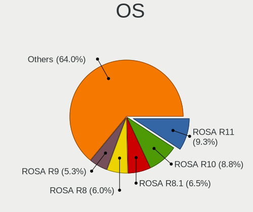
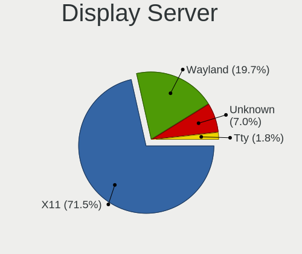
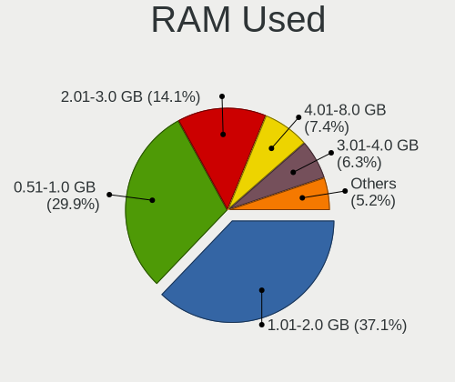
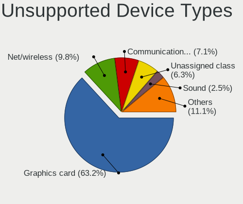

Linux in Russia - Tested Hardware & Statistics (Desktops)
---------------------------------------------------------

A project to collect tested hardware configurations for Linux in Russia.

Anyone can contribute to this report by the [hw-probe](https://github.com/linuxhw/hw-probe) tool:

    sudo -E hw-probe -all -upload

Please contribute! Especially if your hardware is rare.

Contents
--------

* [ Test Cases ](#test-cases)

* [ System ](#system)
  - [ OS                       ](#os)
  - [ OS Family                ](#os-family)
  - [ Kernel                   ](#kernel)
  - [ Kernel Family            ](#kernel-family)
  - [ Kernel Major Ver.        ](#kernel-major-ver)
  - [ Arch                     ](#arch)
  - [ DE                       ](#de)
  - [ Display Server           ](#display-server)
  - [ Display Manager          ](#display-manager)
  - [ OS Lang                  ](#os-lang)
  - [ Boot Mode                ](#boot-mode)
  - [ Filesystem               ](#filesystem)
  - [ Part. scheme             ](#part-scheme)
  - [ Dual Boot with Linux/BSD ](#dual-boot-with-linuxbsd)
  - [ Dual Boot (Win)          ](#dual-boot-win)

* [ Board ](#board)
  - [ Vendor                   ](#vendor)
  - [ Model                    ](#model)
  - [ Model Family             ](#model-family)
  - [ MFG Year                 ](#mfg-year)
  - [ Form Factor              ](#form-factor)
  - [ Secure Boot              ](#secure-boot)
  - [ Coreboot                 ](#coreboot)
  - [ RAM Size                 ](#ram-size)
  - [ RAM Used                 ](#ram-used)
  - [ Total Drives             ](#total-drives)
  - [ Has CD-ROM               ](#has-cd-rom)
  - [ Has Ethernet             ](#has-ethernet)
  - [ Has WiFi                 ](#has-wifi)
  - [ Has Bluetooth            ](#has-bluetooth)

* [ Location ](#location)
  - [ Country                  ](#country)
  - [ City                     ](#city)

* [ Drives ](#drives)
  - [ Drive Vendor             ](#drive-vendor)
  - [ Drive Model              ](#drive-model)
  - [ HDD Vendor               ](#hdd-vendor)
  - [ SSD Vendor               ](#ssd-vendor)
  - [ Drive Kind               ](#drive-kind)
  - [ Drive Connector          ](#drive-connector)
  - [ Drive Size               ](#drive-size)
  - [ Space Total              ](#space-total)
  - [ Space Used               ](#space-used)
  - [ Malfunc. Drives          ](#malfunc-drives)
  - [ Malfunc. Drive Vendor    ](#malfunc-drive-vendor)
  - [ Malfunc. HDD Vendor      ](#malfunc-hdd-vendor)
  - [ Malfunc. Drive Kind      ](#malfunc-drive-kind)
  - [ Failed Drives            ](#failed-drives)
  - [ Failed Drive Vendor      ](#failed-drive-vendor)
  - [ Drive Status             ](#drive-status)

* [ Storage controller ](#storage-controller)
  - [ Storage Vendor           ](#storage-vendor)
  - [ Storage Model            ](#storage-model)
  - [ Storage Kind             ](#storage-kind)

* [ Processor ](#processor)
  - [ CPU Vendor               ](#cpu-vendor)
  - [ CPU Model                ](#cpu-model)
  - [ CPU Model Family         ](#cpu-model-family)
  - [ CPU Cores                ](#cpu-cores)
  - [ CPU Sockets              ](#cpu-sockets)
  - [ CPU Threads              ](#cpu-threads)
  - [ CPU Op-Modes             ](#cpu-op-modes)
  - [ CPU Microcode            ](#cpu-microcode)
  - [ CPU Microarch            ](#cpu-microarch)

* [ Graphics ](#graphics)
  - [ GPU Vendor               ](#gpu-vendor)
  - [ GPU Model                ](#gpu-model)
  - [ GPU Combo                ](#gpu-combo)
  - [ GPU Driver               ](#gpu-driver)
  - [ GPU Memory               ](#gpu-memory)

* [ Monitor ](#monitor)
  - [ Monitor Vendor           ](#monitor-vendor)
  - [ Monitor Model            ](#monitor-model)
  - [ Monitor Resolution       ](#monitor-resolution)
  - [ Monitor Diagonal         ](#monitor-diagonal)
  - [ Monitor Width            ](#monitor-width)
  - [ Aspect Ratio             ](#aspect-ratio)
  - [ Monitor Area             ](#monitor-area)
  - [ Pixel Density            ](#pixel-density)
  - [ Multiple Monitors        ](#multiple-monitors)

* [ Network ](#network)
  - [ Net Controller Vendor    ](#net-controller-vendor)
  - [ Net Controller Model     ](#net-controller-model)
  - [ Wireless Vendor          ](#wireless-vendor)
  - [ Wireless Model           ](#wireless-model)
  - [ Ethernet Vendor          ](#ethernet-vendor)
  - [ Ethernet Model           ](#ethernet-model)
  - [ Net Controller Kind      ](#net-controller-kind)
  - [ Used Controller          ](#used-controller)
  - [ NICs                     ](#nics)
  - [ IPv6                     ](#ipv6)

* [ Bluetooth ](#bluetooth)
  - [ Bluetooth Vendor         ](#bluetooth-vendor)
  - [ Bluetooth Model          ](#bluetooth-model)

* [ Sound ](#sound)
  - [ Sound Vendor             ](#sound-vendor)
  - [ Sound Model              ](#sound-model)

* [ Memory ](#memory)
  - [ Memory Vendor            ](#memory-vendor)
  - [ Memory Model             ](#memory-model)
  - [ Memory Kind              ](#memory-kind)
  - [ Memory Form Factor       ](#memory-form-factor)
  - [ Memory Size              ](#memory-size)
  - [ Memory Speed             ](#memory-speed)

* [ Printers & scanners ](#printers--scanners)
  - [ Printer Vendor           ](#printer-vendor)
  - [ Printer Model            ](#printer-model)
  - [ Scanner Vendor           ](#scanner-vendor)
  - [ Scanner Model            ](#scanner-model)

* [ Camera ](#camera)
  - [ Camera Vendor            ](#camera-vendor)
  - [ Camera Model             ](#camera-model)

* [ Security ](#security)
  - [ Fingerprint Vendor       ](#fingerprint-vendor)
  - [ Fingerprint Model        ](#fingerprint-model)
  - [ Chipcard Vendor          ](#chipcard-vendor)
  - [ Chipcard Model           ](#chipcard-model)

* [ Unsupported ](#unsupported)
  - [ Unsupported Devices      ](#unsupported-devices)
  - [ Unsupported Device Types ](#unsupported-device-types)

Test Cases
----------

Total: 23685

| Vendor        | Model                       | Probe                                                      | Date         |
|---------------|-----------------------------|------------------------------------------------------------|--------------|
| MSI           | 760GM-P21                   | [93d5fbc0a8](https://linux-hardware.org/?probe=93d5fbc0a8) | Jan 06, 2025 |
| MSI           | B75IA-E33                   | [f12ded84f2](https://linux-hardware.org/?probe=f12ded84f2) | Jan 06, 2025 |
| ASUSTek       | PRIME B450-PLUS             | [4233786e9f](https://linux-hardware.org/?probe=4233786e9f) | Jan 06, 2025 |
| Unknown       | Unknown                     | [bfe6d86060](https://linux-hardware.org/?probe=bfe6d86060) | Jan 05, 2025 |
| Unknown       | Unknown                     | [bafe044b60](https://linux-hardware.org/?probe=bafe044b60) | Jan 05, 2025 |
| Acer          | Aspire XC-830               | [1a9f6c2b88](https://linux-hardware.org/?probe=1a9f6c2b88) | Jan 05, 2025 |
| Gigabyte      | B450 AORUS M                | [65b4884505](https://linux-hardware.org/?probe=65b4884505) | Jan 04, 2025 |
| Gigabyte      | 965GM-S2                    | [7d033b5974](https://linux-hardware.org/?probe=7d033b5974) | Jan 04, 2025 |
| Biostar       | H61MHV3                     | [d5f3c84801](https://linux-hardware.org/?probe=d5f3c84801) | Jan 04, 2025 |
| Gigabyte      | B460M D3H                   | [644e6e2e4e](https://linux-hardware.org/?probe=644e6e2e4e) | Jan 04, 2025 |
| MSI           | MAG Z390 TOMAHAWK           | [7e8f8f5c09](https://linux-hardware.org/?probe=7e8f8f5c09) | Jan 04, 2025 |
| Intel         | D510MO AAE76523-401         | [70f66209d4](https://linux-hardware.org/?probe=70f66209d4) | Jan 04, 2025 |
| Gigabyte      | B550M DS3H                  | [a917c66504](https://linux-hardware.org/?probe=a917c66504) | Jan 04, 2025 |
| AZW           | MINI S                      | [0f7bb17346](https://linux-hardware.org/?probe=0f7bb17346) | Jan 04, 2025 |
| MSI           | 970A-G43                    | [4da1f27374](https://linux-hardware.org/?probe=4da1f27374) | Jan 03, 2025 |
| Gigabyte      | B450 GAMING X               | [faa23f32b2](https://linux-hardware.org/?probe=faa23f32b2) | Jan 03, 2025 |
| MSI           | PRO B760M-E DDR4            | [4768eb71cc](https://linux-hardware.org/?probe=4768eb71cc) | Jan 03, 2025 |
| MSI           | P41T-C31                    | [c6bfdbb4ac](https://linux-hardware.org/?probe=c6bfdbb4ac) | Jan 03, 2025 |
| MSI           | MAG Z390 TOMAHAWK           | [de008cdc23](https://linux-hardware.org/?probe=de008cdc23) | Jan 03, 2025 |
| Gigabyte      | GA-78LMT-S2                 | [cf902d875a](https://linux-hardware.org/?probe=cf902d875a) | Jan 03, 2025 |
| Acer          | WMCP78M                     | [194dd31946](https://linux-hardware.org/?probe=194dd31946) | Jan 03, 2025 |
| Huanan        | X99-QD4 V1.0                | [6f4fe3e17b](https://linux-hardware.org/?probe=6f4fe3e17b) | Jan 02, 2025 |
| Gigabyte      | F2A88XM-D3H                 | [0af9e3885f](https://linux-hardware.org/?probe=0af9e3885f) | Jan 02, 2025 |
| ICL           | H410SB                      | [a75155cf86](https://linux-hardware.org/?probe=a75155cf86) | Jan 02, 2025 |
| ASUSTek       | P5B-E Plus                  | [1026f82971](https://linux-hardware.org/?probe=1026f82971) | Jan 02, 2025 |
| MSI           | PRO H610M-G DDR4            | [da076eeaf3](https://linux-hardware.org/?probe=da076eeaf3) | Jan 02, 2025 |
| ASRock        | H55M-LE                     | [341c5d1d0a](https://linux-hardware.org/?probe=341c5d1d0a) | Jan 02, 2025 |
| MSI           | PRO B760-P WIFI DDR4        | [5b2124b8e7](https://linux-hardware.org/?probe=5b2124b8e7) | Jan 01, 2025 |
| Unknown       | Unknown                     | [209186df09](https://linux-hardware.org/?probe=209186df09) | Jan 01, 2025 |
| ASUSTek       | A68HM-K                     | [800e2716b1](https://linux-hardware.org/?probe=800e2716b1) | Jan 01, 2025 |
| ASUSTek       | P8Z77-V LX                  | [69679c9a35](https://linux-hardware.org/?probe=69679c9a35) | Dec 31, 2024 |
| AZW           | MINI S                      | [e05536561b](https://linux-hardware.org/?probe=e05536561b) | Dec 31, 2024 |
| Gigabyte      | GA-MA770-DS3                | [d18eb4cf0d](https://linux-hardware.org/?probe=d18eb4cf0d) | Dec 31, 2024 |
| Huanan        | X99-F8 GAMING V5.0          | [b1dbf7b873](https://linux-hardware.org/?probe=b1dbf7b873) | Dec 31, 2024 |
| ASUSTek       | PRIME Z490-A                | [f1762af529](https://linux-hardware.org/?probe=f1762af529) | Dec 31, 2024 |
| Lenovo        | MAHOBAY NOK                 | [00c630c63a](https://linux-hardware.org/?probe=00c630c63a) | Dec 30, 2024 |
| MSI           | MAG Z390 TOMAHAWK           | [f457b3f670](https://linux-hardware.org/?probe=f457b3f670) | Dec 30, 2024 |
| MSI           | MAG Z390 TOMAHAWK           | [c51b4b60fd](https://linux-hardware.org/?probe=c51b4b60fd) | Dec 30, 2024 |
| MSI           | A68HM-E33                   | [8054416839](https://linux-hardware.org/?probe=8054416839) | Dec 30, 2024 |
| Intel         | E5-A99 V1.0                 | [08bc3d7b5d](https://linux-hardware.org/?probe=08bc3d7b5d) | Dec 30, 2024 |
| MSI           | PRO B660-A DDR4             | [1760e67766](https://linux-hardware.org/?probe=1760e67766) | Dec 30, 2024 |
| HP            | 339A                        | [ad1a9035e9](https://linux-hardware.org/?probe=ad1a9035e9) | Dec 30, 2024 |
| ASUSTek       | PRIME H510M-K               | [884ad79ee5](https://linux-hardware.org/?probe=884ad79ee5) | Dec 29, 2024 |
| ASUSTek       | ROG STRIX B550-E GAMING     | [8c5acc63ea](https://linux-hardware.org/?probe=8c5acc63ea) | Dec 29, 2024 |
| ICP / iEi     | SA16 V1.00                  | [6c89b49dd8](https://linux-hardware.org/?probe=6c89b49dd8) | Dec 29, 2024 |
| ASUSTek       | SABERTOOTH 990FX            | [3beafb5cad](https://linux-hardware.org/?probe=3beafb5cad) | Dec 29, 2024 |
| MSI           | A320M-A PRO MAX             | [97b1ee7487](https://linux-hardware.org/?probe=97b1ee7487) | Dec 29, 2024 |
| Foxconn       | 2ABF                        | [e4568577bd](https://linux-hardware.org/?probe=e4568577bd) | Dec 29, 2024 |
| MSI           | B450M MORTAR MAX            | [f5c01dc687](https://linux-hardware.org/?probe=f5c01dc687) | Dec 28, 2024 |
| ASUSTek       | P8Z77-V LX                  | [a4c88acd7f](https://linux-hardware.org/?probe=a4c88acd7f) | Dec 28, 2024 |
| MSI           | B450M MORTAR MAX            | [fbaccf3c9e](https://linux-hardware.org/?probe=fbaccf3c9e) | Dec 28, 2024 |
| Unknown       | Unknown                     | [09a3128900](https://linux-hardware.org/?probe=09a3128900) | Dec 28, 2024 |
| ASUSTek       | TUF Gaming B450M-PRO II     | [8012f9a21d](https://linux-hardware.org/?probe=8012f9a21d) | Dec 28, 2024 |
| Lenovo        | MAHOBAY NOK                 | [9fd12e619e](https://linux-hardware.org/?probe=9fd12e619e) | Dec 28, 2024 |
| Foxconn       | H61MXE/-S/-V/-K             | [7297c64739](https://linux-hardware.org/?probe=7297c64739) | Dec 28, 2024 |
| Maibenben     | PC34 V1.0                   | [1994f8536a](https://linux-hardware.org/?probe=1994f8536a) | Dec 27, 2024 |
| Colorful T... | CVN B650M GAMING FROZEN ... | [f4259d10b6](https://linux-hardware.org/?probe=f4259d10b6) | Dec 27, 2024 |
| Unknown       | X79                         | [d721436769](https://linux-hardware.org/?probe=d721436769) | Dec 27, 2024 |
| Gigabyte      | 970A-DS3P                   | [127d67d58a](https://linux-hardware.org/?probe=127d67d58a) | Dec 27, 2024 |
| ASUSTek       | PRIME B760-PLUS D4          | [aea60b12c3](https://linux-hardware.org/?probe=aea60b12c3) | Dec 27, 2024 |
| ASUSTek       | TUF B450-PRO GAMING         | [9978434d74](https://linux-hardware.org/?probe=9978434d74) | Dec 27, 2024 |
| CBR           | A320M.2-VH Challenger       | [1f5e2840d1](https://linux-hardware.org/?probe=1f5e2840d1) | Dec 27, 2024 |
| ASRock        | H510M-HDV                   | [3b9f735c39](https://linux-hardware.org/?probe=3b9f735c39) | Dec 26, 2024 |
| ASUSTek       | P8H67-M PRO                 | [9fe5377380](https://linux-hardware.org/?probe=9fe5377380) | Dec 26, 2024 |
| ASUSTek       | P8H67-M PRO                 | [a9a7e396c0](https://linux-hardware.org/?probe=a9a7e396c0) | Dec 26, 2024 |
| Gigabyte      | 970A-DS3P                   | [5178ebb1f5](https://linux-hardware.org/?probe=5178ebb1f5) | Dec 26, 2024 |
| Graviton      | DMB-Q670-TMI01              | [c609b9c45c](https://linux-hardware.org/?probe=c609b9c45c) | Dec 26, 2024 |
| Graviton      | DMB-Q670-TMI01              | [425c41687c](https://linux-hardware.org/?probe=425c41687c) | Dec 26, 2024 |
| ASRock        | G31M-GS                     | [655a9a77aa](https://linux-hardware.org/?probe=655a9a77aa) | Dec 26, 2024 |
| Biostar       | A780LB                      | [50a42b0b06](https://linux-hardware.org/?probe=50a42b0b06) | Dec 25, 2024 |
| MSI           | G41TM-E43                   | [0d099148c3](https://linux-hardware.org/?probe=0d099148c3) | Dec 25, 2024 |
| MSI           | PRO B650-P WIFI             | [0a8d8bc701](https://linux-hardware.org/?probe=0a8d8bc701) | Dec 25, 2024 |
| Huanan        | B75 G376-V6.0               | [fcecd9dab0](https://linux-hardware.org/?probe=fcecd9dab0) | Dec 25, 2024 |
| ASUSTek       | P8Z77-V LE PLUS             | [6d145d17f1](https://linux-hardware.org/?probe=6d145d17f1) | Dec 25, 2024 |
| Gigabyte      | B550M S2H                   | [84d7a6faa5](https://linux-hardware.org/?probe=84d7a6faa5) | Dec 25, 2024 |
| Dell          | 0GM819                      | [bb31438b8d](https://linux-hardware.org/?probe=bb31438b8d) | Dec 25, 2024 |
| MSI           | 760G-P43                    | [faf4279015](https://linux-hardware.org/?probe=faf4279015) | Dec 25, 2024 |
| Acer          | Aspire XC-830               | [35a7b3f08c](https://linux-hardware.org/?probe=35a7b3f08c) | Dec 25, 2024 |
| Biostar       | H61MGC                      | [41e894b300](https://linux-hardware.org/?probe=41e894b300) | Dec 24, 2024 |
| MSI           | A68HM-E33                   | [3744f7d334](https://linux-hardware.org/?probe=3744f7d334) | Dec 24, 2024 |
| Gigabyte      | B360M DS3H                  | [d606dfb509](https://linux-hardware.org/?probe=d606dfb509) | Dec 24, 2024 |
| Gigabyte      | GA-MA770-DS3                | [d3c2067fd5](https://linux-hardware.org/?probe=d3c2067fd5) | Dec 24, 2024 |
| Intel         | AvenueCityM                 | [18f894cdc8](https://linux-hardware.org/?probe=18f894cdc8) | Dec 24, 2024 |
| ASUSTek       | PRIME A320M-K               | [cc7b12fc35](https://linux-hardware.org/?probe=cc7b12fc35) | Dec 24, 2024 |
| ASUSTek       | M3A78-CM                    | [2d4194f76b](https://linux-hardware.org/?probe=2d4194f76b) | Dec 23, 2024 |
| ASRock        | B450 Gaming K4              | [6e86ec71a9](https://linux-hardware.org/?probe=6e86ec71a9) | Dec 23, 2024 |
| Alder lake    | Intel RVP                   | [c7e725fe89](https://linux-hardware.org/?probe=c7e725fe89) | Dec 23, 2024 |
| Alder lake    | Intel RVP                   | [e0b0a8851c](https://linux-hardware.org/?probe=e0b0a8851c) | Dec 23, 2024 |
| Gigabyte      | 970A-DS3P                   | [82a3f44796](https://linux-hardware.org/?probe=82a3f44796) | Dec 23, 2024 |
| Gigabyte      | H410M H V3                  | [38db6d3960](https://linux-hardware.org/?probe=38db6d3960) | Dec 23, 2024 |
| ASUSTek       | TUF Gaming B450-PLUS II     | [7cc80d8aba](https://linux-hardware.org/?probe=7cc80d8aba) | Dec 23, 2024 |
| ASUSTek       | ROG STRIX B650E-E GAMING... | [33885a73d2](https://linux-hardware.org/?probe=33885a73d2) | Dec 23, 2024 |
| Gigabyte      | Z390 AORUS PRO WIFI-CF      | [8ccb1a5d52](https://linux-hardware.org/?probe=8ccb1a5d52) | Dec 23, 2024 |
| Gigabyte      | A620M DS3H                  | [2993fdb631](https://linux-hardware.org/?probe=2993fdb631) | Dec 23, 2024 |
| ASRock        | A320D4-P1                   | [9fd8b4c5ab](https://linux-hardware.org/?probe=9fd8b4c5ab) | Dec 23, 2024 |
| ASUSTek       | PRIME H610M-R D4            | [2a762556a1](https://linux-hardware.org/?probe=2a762556a1) | Dec 23, 2024 |
| ASUSTek       | PRIME H270-PLUS             | [1ca103ad2a](https://linux-hardware.org/?probe=1ca103ad2a) | Dec 23, 2024 |
| ASUSTek       | B85M-K                      | [0978d9437e](https://linux-hardware.org/?probe=0978d9437e) | Dec 22, 2024 |
| ASRock        | H110M-HDV R3.0              | [43e003f874](https://linux-hardware.org/?probe=43e003f874) | Dec 22, 2024 |
| ASUSTek       | P5LD2-VM                    | [03bb592c4a](https://linux-hardware.org/?probe=03bb592c4a) | Dec 22, 2024 |
| Gigabyte      | B650M AORUS ELITE AX ICE    | [2cfcbe46ea](https://linux-hardware.org/?probe=2cfcbe46ea) | Dec 22, 2024 |
| MSI           | PRO B650-A WIFI             | [4c3d8d6732](https://linux-hardware.org/?probe=4c3d8d6732) | Dec 21, 2024 |
| ASUSTek       | Z170 PRO GAMING             | [7e6e91ee61](https://linux-hardware.org/?probe=7e6e91ee61) | Dec 21, 2024 |
| Gigabyte      | B650M AORUS ELITE           | [35a7c56bfe](https://linux-hardware.org/?probe=35a7c56bfe) | Dec 21, 2024 |
| Unknown       | Unknown                     | [97ee68a841](https://linux-hardware.org/?probe=97ee68a841) | Dec 21, 2024 |
| ASUSTek       | P5G41T-M LX2/GB             | [3ba1da1476](https://linux-hardware.org/?probe=3ba1da1476) | Dec 20, 2024 |
| ASRock        | B450M-HDV R4.0              | [0f8384fde3](https://linux-hardware.org/?probe=0f8384fde3) | Dec 20, 2024 |
| ASUSTek       | STRIX Z270H GAMING          | [b38a7837c5](https://linux-hardware.org/?probe=b38a7837c5) | Dec 20, 2024 |
| MSI           | B450-A PRO MAX              | [697b67cc2a](https://linux-hardware.org/?probe=697b67cc2a) | Dec 20, 2024 |
| ASRock        | H670M Pro RS                | [becb70cb39](https://linux-hardware.org/?probe=becb70cb39) | Dec 20, 2024 |
| ASUSTek       | Z97-K                       | [05b8112082](https://linux-hardware.org/?probe=05b8112082) | Dec 19, 2024 |
| ASUSTek       | H110M-K                     | [a20b5ae9f0](https://linux-hardware.org/?probe=a20b5ae9f0) | Dec 19, 2024 |
| MSI           | H110M PRO-VD                | [0b9173adf1](https://linux-hardware.org/?probe=0b9173adf1) | Dec 19, 2024 |
| ASUSTek       | ROG STRIX B650E-I GAMING... | [059108072c](https://linux-hardware.org/?probe=059108072c) | Dec 19, 2024 |
| Gigabyte      | Z590 GAMING X               | [254ce873f6](https://linux-hardware.org/?probe=254ce873f6) | Dec 19, 2024 |
| Gigabyte      | H110M-S2H-CF                | [89c03187e1](https://linux-hardware.org/?probe=89c03187e1) | Dec 19, 2024 |
| Gigabyte      | A620M H                     | [bef78fc714](https://linux-hardware.org/?probe=bef78fc714) | Dec 19, 2024 |
| MSI           | Z77A-GD65                   | [b928d00615](https://linux-hardware.org/?probe=b928d00615) | Dec 19, 2024 |
| MACHINIST     | E5-K9 V1.0                  | [0454705976](https://linux-hardware.org/?probe=0454705976) | Dec 19, 2024 |
| ASRock        | H81M-HDS R2.0               | [7b753c30c2](https://linux-hardware.org/?probe=7b753c30c2) | Dec 18, 2024 |
| AZW           | MINI S                      | [bb9a63ad1b](https://linux-hardware.org/?probe=bb9a63ad1b) | Dec 18, 2024 |
| MSI           | PRO B760M-A WIFI DDR4       | [bf182b776d](https://linux-hardware.org/?probe=bf182b776d) | Dec 18, 2024 |
| Biostar       | N68S3B                      | [9b0517b1c6](https://linux-hardware.org/?probe=9b0517b1c6) | Dec 18, 2024 |
| MSI           | G31TM-P21                   | [f8e605fd2a](https://linux-hardware.org/?probe=f8e605fd2a) | Dec 18, 2024 |
| Biostar       | Hi-Fi H77S                  | [920915dc5e](https://linux-hardware.org/?probe=920915dc5e) | Dec 18, 2024 |
| ASUSTek       | PRIME H510M-K               | [7cf5f17079](https://linux-hardware.org/?probe=7cf5f17079) | Dec 18, 2024 |
| ASRock        | H510M-HDV                   | [5b34b8b9bd](https://linux-hardware.org/?probe=5b34b8b9bd) | Dec 18, 2024 |
| Gigabyte      | H310M S2H                   | [2fe012a888](https://linux-hardware.org/?probe=2fe012a888) | Dec 18, 2024 |
| Gigabyte      | A620M H                     | [a48a1efcc8](https://linux-hardware.org/?probe=a48a1efcc8) | Dec 18, 2024 |
| Intel         | DH61BF AAG81311-101         | [4d21569356](https://linux-hardware.org/?probe=4d21569356) | Dec 18, 2024 |
| Unknown       | Unknown                     | [0653c463df](https://linux-hardware.org/?probe=0653c463df) | Dec 17, 2024 |
| ASUSTek       | PRIME H310M-E R2.0          | [7b274f7500](https://linux-hardware.org/?probe=7b274f7500) | Dec 17, 2024 |
| ASUSTek       | M4A88TD-V EVO/USB3          | [6f3a9094fe](https://linux-hardware.org/?probe=6f3a9094fe) | Dec 17, 2024 |
| Intel         | AvenueCityM                 | [03c9379895](https://linux-hardware.org/?probe=03c9379895) | Dec 17, 2024 |
| MSI           | B365M PRO-VDH               | [f9eeaab8b3](https://linux-hardware.org/?probe=f9eeaab8b3) | Dec 17, 2024 |
| Unknown       | Unknown                     | [57ac1cff4f](https://linux-hardware.org/?probe=57ac1cff4f) | Dec 17, 2024 |
| Unknown       | Unknown                     | [ca877e7bea](https://linux-hardware.org/?probe=ca877e7bea) | Dec 17, 2024 |
| MSI           | B760M BOMBER                | [0b6ed644f3](https://linux-hardware.org/?probe=0b6ed644f3) | Dec 17, 2024 |
| MSI           | B760M BOMBER                | [c181449dfb](https://linux-hardware.org/?probe=c181449dfb) | Dec 17, 2024 |
| Gigabyte      | H610M H DDR4                | [6f57b82832](https://linux-hardware.org/?probe=6f57b82832) | Dec 16, 2024 |
| Gigabyte      | Z170X-Ultra Gaming-CF       | [7e6a2bb396](https://linux-hardware.org/?probe=7e6a2bb396) | Dec 16, 2024 |
| ASUSTek       | TUF Gaming B760M-PLUS       | [2735aaa5fb](https://linux-hardware.org/?probe=2735aaa5fb) | Dec 16, 2024 |
| ASUSTek       | PRIME H510M-K R2.0          | [6c43b12a79](https://linux-hardware.org/?probe=6c43b12a79) | Dec 16, 2024 |
| ASUSTek       | Rampage II GENE             | [92edcfef77](https://linux-hardware.org/?probe=92edcfef77) | Dec 16, 2024 |
| ASUSTek       | PRIME B760-PLUS D4          | [379d336bc2](https://linux-hardware.org/?probe=379d336bc2) | Dec 16, 2024 |
| Unknown       | Unknown                     | [d64bb975dd](https://linux-hardware.org/?probe=d64bb975dd) | Dec 16, 2024 |
| Unknown       | Unknown                     | [add57541c1](https://linux-hardware.org/?probe=add57541c1) | Dec 16, 2024 |
| ASUSTek       | P5G41T-M LX2/GB             | [3e5a1f7df2](https://linux-hardware.org/?probe=3e5a1f7df2) | Dec 16, 2024 |
| ASUSTek       | P8Z77-V LX                  | [40c4cef0ef](https://linux-hardware.org/?probe=40c4cef0ef) | Dec 16, 2024 |
| Gigabyte      | B450M DS3H V2               | [0d17c2a875](https://linux-hardware.org/?probe=0d17c2a875) | Dec 15, 2024 |
| ASUSTek       | M4A785D-M PRO               | [ce740f709b](https://linux-hardware.org/?probe=ce740f709b) | Dec 15, 2024 |
| MSI           | IONA                        | [75d9a648eb](https://linux-hardware.org/?probe=75d9a648eb) | Dec 15, 2024 |
| MSI           | IONA                        | [573484d141](https://linux-hardware.org/?probe=573484d141) | Dec 15, 2024 |
| ASUSTek       | ROG STRIX B650E-E GAMING... | [be06a1068f](https://linux-hardware.org/?probe=be06a1068f) | Dec 15, 2024 |
| ASRock        | Z97 Pro4                    | [1aa9e4d9eb](https://linux-hardware.org/?probe=1aa9e4d9eb) | Dec 15, 2024 |
| Unknown       | Unknown                     | [e066e43d11](https://linux-hardware.org/?probe=e066e43d11) | Dec 15, 2024 |
| Gigabyte      | H510M H                     | [a49d561fb0](https://linux-hardware.org/?probe=a49d561fb0) | Dec 15, 2024 |
| ASRock        | B550 PG Riptide             | [100f0afa3e](https://linux-hardware.org/?probe=100f0afa3e) | Dec 15, 2024 |
| Gigabyte      | M720-US3                    | [20f9b09742](https://linux-hardware.org/?probe=20f9b09742) | Dec 14, 2024 |
| HP            | 2B29                        | [9216921849](https://linux-hardware.org/?probe=9216921849) | Dec 14, 2024 |
| ASUSTek       | P8Z77-V LX                  | [e1c4faae76](https://linux-hardware.org/?probe=e1c4faae76) | Dec 14, 2024 |
| Lenovo        | Tiger Hill                  | [82f654c54b](https://linux-hardware.org/?probe=82f654c54b) | Dec 14, 2024 |
| Intel         | X99                         | [fca6609fa5](https://linux-hardware.org/?probe=fca6609fa5) | Dec 14, 2024 |
| ASRock        | H510M-HVS R2.0              | [2a3e145431](https://linux-hardware.org/?probe=2a3e145431) | Dec 14, 2024 |
| ASUSTek       | TUF B450-PRO GAMING         | [5f5311c4b3](https://linux-hardware.org/?probe=5f5311c4b3) | Dec 14, 2024 |
| Gigabyte      | 8PEMT4                      | [0d17183be5](https://linux-hardware.org/?probe=0d17183be5) | Dec 14, 2024 |
| ASUSTek       | P8Z77-V LE PLUS             | [d410612c72](https://linux-hardware.org/?probe=d410612c72) | Dec 14, 2024 |
| Acer          | FIH57                       | [0e1335494a](https://linux-hardware.org/?probe=0e1335494a) | Dec 14, 2024 |
| Gigabyte      | AB350M-DS3H-CF              | [2c834ce7a7](https://linux-hardware.org/?probe=2c834ce7a7) | Dec 13, 2024 |
| OEM           | X79G                        | [54ea7ee329](https://linux-hardware.org/?probe=54ea7ee329) | Dec 13, 2024 |
| DEPO Compu... | DPH110S                     | [bf9bb46070](https://linux-hardware.org/?probe=bf9bb46070) | Dec 13, 2024 |
| BESHTAU       | Q670D5RU002 V1.0            | [59e2adb673](https://linux-hardware.org/?probe=59e2adb673) | Dec 13, 2024 |
| Gigabyte      | A520M S2H                   | [5fc4416068](https://linux-hardware.org/?probe=5fc4416068) | Dec 13, 2024 |
| MSI           | A520M-A PRO                 | [4035532469](https://linux-hardware.org/?probe=4035532469) | Dec 13, 2024 |
| MSI           | A520M-A PRO                 | [b35d0ef2a9](https://linux-hardware.org/?probe=b35d0ef2a9) | Dec 13, 2024 |
| ASRock        | G31M-GS                     | [ba92b331f9](https://linux-hardware.org/?probe=ba92b331f9) | Dec 12, 2024 |
| Gigabyte      | EP31-DS3L                   | [a2d6582306](https://linux-hardware.org/?probe=a2d6582306) | Dec 12, 2024 |
| Intel         | DH61CR AAG14064-203         | [2acdad4c78](https://linux-hardware.org/?probe=2acdad4c78) | Dec 12, 2024 |
| Gigabyte      | H410M H V3                  | [37d81caea8](https://linux-hardware.org/?probe=37d81caea8) | Dec 12, 2024 |
| ASUSTek       | X99-DELUXE                  | [d27995c12e](https://linux-hardware.org/?probe=d27995c12e) | Dec 12, 2024 |
| ASUSTek       | H87M-E                      | [b2f1a524d5](https://linux-hardware.org/?probe=b2f1a524d5) | Dec 11, 2024 |
| ASRock        | H310CM-HDV                  | [6415ed92bc](https://linux-hardware.org/?probe=6415ed92bc) | Dec 11, 2024 |
| Gigabyte      | H77N-WIFI                   | [b1ff81f4b0](https://linux-hardware.org/?probe=b1ff81f4b0) | Dec 11, 2024 |
| Intel         | X99H                        | [5e8c6d50b0](https://linux-hardware.org/?probe=5e8c6d50b0) | Dec 11, 2024 |
| Graviton      | DMB-H510-MCA01              | [b4a81ce6eb](https://linux-hardware.org/?probe=b4a81ce6eb) | Dec 11, 2024 |
| ASUSTek       | TUF Z390M-PRO GAMING        | [f55cefc4aa](https://linux-hardware.org/?probe=f55cefc4aa) | Dec 11, 2024 |
| DEPO Compu... | DPH410S                     | [a986fc28d0](https://linux-hardware.org/?probe=a986fc28d0) | Dec 11, 2024 |
| Gigabyte      | B550 AORUS PRO AC           | [9d331af926](https://linux-hardware.org/?probe=9d331af926) | Dec 11, 2024 |
| ASRock        | H310CM-HDV                  | [af2d33d4ec](https://linux-hardware.org/?probe=af2d33d4ec) | Dec 10, 2024 |
| Gigabyte      | H470 HD3                    | [d6ad9179a1](https://linux-hardware.org/?probe=d6ad9179a1) | Dec 10, 2024 |
| ASUSTek       | PRIME B360M-C               | [5110e95caf](https://linux-hardware.org/?probe=5110e95caf) | Dec 10, 2024 |
| ASUSTek       | PRIME B360M-C               | [b08f5fe789](https://linux-hardware.org/?probe=b08f5fe789) | Dec 10, 2024 |
| Supermicro    | X10DRU-i+                   | [cdfc73f6f1](https://linux-hardware.org/?probe=cdfc73f6f1) | Dec 09, 2024 |
| MSI           | MAG X670E TOMAHAWK WIFI     | [19b5724bcf](https://linux-hardware.org/?probe=19b5724bcf) | Dec 09, 2024 |
| Gigabyte      | H77N-WIFI                   | [e0e8469dce](https://linux-hardware.org/?probe=e0e8469dce) | Dec 09, 2024 |
| Unknown       | Unknown                     | [1d6a060c4b](https://linux-hardware.org/?probe=1d6a060c4b) | Dec 09, 2024 |
| MSI           | MS-7250                     | [2b89ec0eee](https://linux-hardware.org/?probe=2b89ec0eee) | Dec 09, 2024 |
| Unknown       | Unknown                     | [4260dec262](https://linux-hardware.org/?probe=4260dec262) | Dec 09, 2024 |
| Intel         | DH61CR AAG14064-203         | [c4751390a8](https://linux-hardware.org/?probe=c4751390a8) | Dec 09, 2024 |
| Gigabyte      | B75-D3V                     | [01d3d78d8c](https://linux-hardware.org/?probe=01d3d78d8c) | Dec 09, 2024 |
| Gigabyte      | B760M DS3H DDR4             | [c21fd522d6](https://linux-hardware.org/?probe=c21fd522d6) | Dec 09, 2024 |
| Unknown       | Unknown                     | [47b0853442](https://linux-hardware.org/?probe=47b0853442) | Dec 09, 2024 |
| Supermicro    | X10DRU-i+                   | [63381979ef](https://linux-hardware.org/?probe=63381979ef) | Dec 09, 2024 |
| Supermicro    | X10DRU-i+                   | [5fc1009aa8](https://linux-hardware.org/?probe=5fc1009aa8) | Dec 09, 2024 |
| Supermicro    | X10DRU-i+                   | [2809cf44de](https://linux-hardware.org/?probe=2809cf44de) | Dec 09, 2024 |
| Gigabyte      | AB350M-DS3H V2-CF           | [53d86bd60f](https://linux-hardware.org/?probe=53d86bd60f) | Dec 09, 2024 |
| Unknown       | Unknown                     | [3ca90936ec](https://linux-hardware.org/?probe=3ca90936ec) | Dec 08, 2024 |
| ASUSTek       | TUF Gaming B450M-PRO II     | [1c11421588](https://linux-hardware.org/?probe=1c11421588) | Dec 08, 2024 |
| Intel         | DP35DP AAD81073-206         | [495382b328](https://linux-hardware.org/?probe=495382b328) | Dec 08, 2024 |
| ASUSTek       | H81M-K                      | [4c7c8cc298](https://linux-hardware.org/?probe=4c7c8cc298) | Dec 08, 2024 |
| ASRock        | G31M-GS                     | [94e1ac3253](https://linux-hardware.org/?probe=94e1ac3253) | Dec 08, 2024 |
| MACHINIST     | X99-RS9 V3.1                | [fe7be85a71](https://linux-hardware.org/?probe=fe7be85a71) | Dec 08, 2024 |
| MSI           | Z97-G43 GAMING              | [cc56df5570](https://linux-hardware.org/?probe=cc56df5570) | Dec 07, 2024 |
| ASUSTek       | M2N-X Plus                  | [ee0520cc79](https://linux-hardware.org/?probe=ee0520cc79) | Dec 07, 2024 |
| Gigabyte      | 970A-UD3P                   | [80b281101e](https://linux-hardware.org/?probe=80b281101e) | Dec 07, 2024 |
| Gigabyte      | GA-MA770T-UD3               | [0645b251b4](https://linux-hardware.org/?probe=0645b251b4) | Dec 07, 2024 |
| Lenovo        | Bantry CRB SDK0J40697 WI... | [8b5005227c](https://linux-hardware.org/?probe=8b5005227c) | Dec 07, 2024 |
| Lenovo        | 3111 NOK                    | [be49e79017](https://linux-hardware.org/?probe=be49e79017) | Dec 07, 2024 |
| Foxconn       | G43M01                      | [05764150cd](https://linux-hardware.org/?probe=05764150cd) | Dec 07, 2024 |
| ASUSTek       | TUF Gaming Z490-PLUS        | [781388db83](https://linux-hardware.org/?probe=781388db83) | Dec 06, 2024 |
| Gigabyte      | 970A-UD3P                   | [5bc1e6a705](https://linux-hardware.org/?probe=5bc1e6a705) | Dec 06, 2024 |
| DEPO Compu... | DPA520S                     | [5231e4d20b](https://linux-hardware.org/?probe=5231e4d20b) | Dec 06, 2024 |
| Intel         | X99                         | [1a747b74f7](https://linux-hardware.org/?probe=1a747b74f7) | Dec 06, 2024 |
| MSI           | A320M-A PRO MAX             | [c578d9f1c3](https://linux-hardware.org/?probe=c578d9f1c3) | Dec 06, 2024 |
| ECS           | H81H3-M4                    | [bc47715809](https://linux-hardware.org/?probe=bc47715809) | Dec 06, 2024 |
| ASRock        | B650 Pro RS                 | [bd0c55951c](https://linux-hardware.org/?probe=bd0c55951c) | Dec 06, 2024 |
| Gigabyte      | B560 HD3                    | [b22f963519](https://linux-hardware.org/?probe=b22f963519) | Dec 06, 2024 |
| ASUSTek       | M4A78-VM                    | [6b8d8c80f7](https://linux-hardware.org/?probe=6b8d8c80f7) | Dec 06, 2024 |
| ASUSTek       | M5A78L LE                   | [a38ce39707](https://linux-hardware.org/?probe=a38ce39707) | Dec 06, 2024 |
| Gigabyte      | A320M-H-CF                  | [3ebaecad1b](https://linux-hardware.org/?probe=3ebaecad1b) | Dec 05, 2024 |
| ASUSTek       | TUF Z390M-PRO GAMING        | [1a76c2d721](https://linux-hardware.org/?probe=1a76c2d721) | Dec 05, 2024 |
| Fujitsu       | D3062-A1 S26361-D3062-A1    | [fcb75ca2c4](https://linux-hardware.org/?probe=fcb75ca2c4) | Dec 05, 2024 |
| Intel         | B75A                        | [974983efed](https://linux-hardware.org/?probe=974983efed) | Dec 05, 2024 |
| Intel         | B75A                        | [bb9185a4b6](https://linux-hardware.org/?probe=bb9185a4b6) | Dec 04, 2024 |
| Gigabyte      | H67M-D2                     | [5dae972ce2](https://linux-hardware.org/?probe=5dae972ce2) | Dec 04, 2024 |
| MSI           | B350M PRO-VDH               | [c287832149](https://linux-hardware.org/?probe=c287832149) | Dec 04, 2024 |
| ASUSTek       | PRIME H510M-R               | [3dd5eb18d7](https://linux-hardware.org/?probe=3dd5eb18d7) | Dec 04, 2024 |
| Intel         | DQ67SW AAG12527-310         | [acb85c645e](https://linux-hardware.org/?probe=acb85c645e) | Dec 04, 2024 |
| Gigabyte      | B75M-HD3                    | [8e3012cc10](https://linux-hardware.org/?probe=8e3012cc10) | Dec 04, 2024 |
| INFERIT       | IFMBH510MKPR G10a           | [48fdaa7cd0](https://linux-hardware.org/?probe=48fdaa7cd0) | Dec 04, 2024 |
| Aquarius      | AQH310CM                    | [48fdb906d0](https://linux-hardware.org/?probe=48fdb906d0) | Dec 04, 2024 |
| Kraftway      | KWH510                      | [1f385fb7ae](https://linux-hardware.org/?probe=1f385fb7ae) | Dec 04, 2024 |
| Gigabyte      | H410M H V3                  | [5ed6ba9b9c](https://linux-hardware.org/?probe=5ed6ba9b9c) | Dec 04, 2024 |
| Unknown       | Unknown                     | [0af040879a](https://linux-hardware.org/?probe=0af040879a) | Dec 03, 2024 |
| ASUSTek       | A68HM-K                     | [89d399cdc0](https://linux-hardware.org/?probe=89d399cdc0) | Dec 03, 2024 |
| Gigabyte      | B550M AORUS PRO-P           | [3baa420a3f](https://linux-hardware.org/?probe=3baa420a3f) | Dec 03, 2024 |
| Intel         | B75 V1.1                    | [d6aad9d651](https://linux-hardware.org/?probe=d6aad9d651) | Dec 03, 2024 |
| MSI           | B450M MORTAR MAX            | [5ff5a0db06](https://linux-hardware.org/?probe=5ff5a0db06) | Dec 03, 2024 |
| Gigabyte      | GA-MA770T-UD3               | [01e4659eed](https://linux-hardware.org/?probe=01e4659eed) | Dec 03, 2024 |
| ASRock        | B450 Gaming K4              | [ce617f14e9](https://linux-hardware.org/?probe=ce617f14e9) | Dec 03, 2024 |
| MSI           | PRO H610M-E DDR4            | [009d15e28b](https://linux-hardware.org/?probe=009d15e28b) | Dec 03, 2024 |
| Gigabyte      | B550M K                     | [6483d852ee](https://linux-hardware.org/?probe=6483d852ee) | Dec 02, 2024 |
| ASUSTek       | PRIME B360M-D               | [5bdb93a154](https://linux-hardware.org/?probe=5bdb93a154) | Dec 02, 2024 |
| Intel         | X99-P4 V5.11                | [b5079a1a8d](https://linux-hardware.org/?probe=b5079a1a8d) | Dec 02, 2024 |
| Unknown       | Unknown                     | [c6604dc6a1](https://linux-hardware.org/?probe=c6604dc6a1) | Dec 02, 2024 |
| Unknown       | Unknown                     | [3405878ab6](https://linux-hardware.org/?probe=3405878ab6) | Dec 01, 2024 |
| MSI           | MAG B650M MORTAR WIFI       | [dfd3710904](https://linux-hardware.org/?probe=dfd3710904) | Dec 01, 2024 |
| Bochs         | Unknown                     | [79ec6f96e4](https://linux-hardware.org/?probe=79ec6f96e4) | Dec 01, 2024 |
| Intel         | B75                         | [a8fc962dbe](https://linux-hardware.org/?probe=a8fc962dbe) | Dec 01, 2024 |
| AZW           | MINI S                      | [6b1e7b76ae](https://linux-hardware.org/?probe=6b1e7b76ae) | Dec 01, 2024 |
| Acer          | Veriton N4660G              | [2c0d5d89b6](https://linux-hardware.org/?probe=2c0d5d89b6) | Dec 01, 2024 |
| Gigabyte      | AB350M-DS3H V2-CF           | [08860bb0e8](https://linux-hardware.org/?probe=08860bb0e8) | Dec 01, 2024 |
| Acer          | Aspire XC-830               | [3129a0d3da](https://linux-hardware.org/?probe=3129a0d3da) | Dec 01, 2024 |
| ASRock        | A520M Pro4                  | [9b40494a18](https://linux-hardware.org/?probe=9b40494a18) | Nov 30, 2024 |
| ASRock        | B450M Pro4                  | [c865d51386](https://linux-hardware.org/?probe=c865d51386) | Nov 30, 2024 |
| ASUSTek       | TUF Gaming B550M-PLUS WI... | [b3a7fc5d30](https://linux-hardware.org/?probe=b3a7fc5d30) | Nov 30, 2024 |
| Gigabyte      | A520M H                     | [e31c869571](https://linux-hardware.org/?probe=e31c869571) | Nov 30, 2024 |
| MSI           | MPG Z490 GAMING EDGE WIF... | [a9d455e4cb](https://linux-hardware.org/?probe=a9d455e4cb) | Nov 29, 2024 |
| ASRock        | H510M-HDV R2.0              | [947d8af601](https://linux-hardware.org/?probe=947d8af601) | Nov 29, 2024 |
| Inspur        | X10DRT-PS                   | [e33d406712](https://linux-hardware.org/?probe=e33d406712) | Nov 29, 2024 |
| Inspur        | X10DRT-PS                   | [db389cfbf7](https://linux-hardware.org/?probe=db389cfbf7) | Nov 29, 2024 |
| INTECH PRO    | H510-M2 v5.0                | [63013e9984](https://linux-hardware.org/?probe=63013e9984) | Nov 29, 2024 |
| Unknown       | QADL03                      | [c2aaa4505e](https://linux-hardware.org/?probe=c2aaa4505e) | Nov 29, 2024 |
| MSI           | MPG Z490 GAMING EDGE WIF... | [c602a79e72](https://linux-hardware.org/?probe=c602a79e72) | Nov 29, 2024 |
| MSI           | A68HM-E33 V2                | [ce52274660](https://linux-hardware.org/?probe=ce52274660) | Nov 29, 2024 |
| ASUSTek       | H110M-K                     | [c7e128e7ec](https://linux-hardware.org/?probe=c7e128e7ec) | Nov 28, 2024 |
| ASUSTek       | M5A78L-M LX3                | [0acc2613ad](https://linux-hardware.org/?probe=0acc2613ad) | Nov 28, 2024 |
| MSI           | MPG B550 GAMING PLUS        | [7e2cca4ada](https://linux-hardware.org/?probe=7e2cca4ada) | Nov 28, 2024 |
| Gigabyte      | B550M AORUS ELITE           | [1c69901961](https://linux-hardware.org/?probe=1c69901961) | Nov 28, 2024 |
| MSI           | B450M MORTAR MAX            | [ae63e42996](https://linux-hardware.org/?probe=ae63e42996) | Nov 28, 2024 |
| MSI           | B450M MORTAR MAX            | [72317f91a8](https://linux-hardware.org/?probe=72317f91a8) | Nov 28, 2024 |
| Gigabyte      | A520M S2H                   | [1f167af92b](https://linux-hardware.org/?probe=1f167af92b) | Nov 28, 2024 |
| Gigabyte      | A520M S2H                   | [08a50a8073](https://linux-hardware.org/?probe=08a50a8073) | Nov 28, 2024 |
| Gigabyte      | Z690 UD AX                  | [880222f8da](https://linux-hardware.org/?probe=880222f8da) | Nov 28, 2024 |
| Gigabyte      | Z690 UD DDR4                | [367385929b](https://linux-hardware.org/?probe=367385929b) | Nov 28, 2024 |
| MSI           | B250M PRO-VDH               | [95c02414bb](https://linux-hardware.org/?probe=95c02414bb) | Nov 27, 2024 |
| ASUSTek       | ROG STRIX B650E-I GAMING... | [107f6ec159](https://linux-hardware.org/?probe=107f6ec159) | Nov 27, 2024 |
| Gigabyte      | H110M-S2-CF                 | [61e673309f](https://linux-hardware.org/?probe=61e673309f) | Nov 27, 2024 |
| MSI           | B450M PRO-VDH MAX           | [eebf56fc6a](https://linux-hardware.org/?probe=eebf56fc6a) | Nov 27, 2024 |
| Gigabyte      | H110M-S2-CF                 | [0d40b44d15](https://linux-hardware.org/?probe=0d40b44d15) | Nov 27, 2024 |
| MSI           | B75A-G43                    | [a9332beaaa](https://linux-hardware.org/?probe=a9332beaaa) | Nov 27, 2024 |
| Intel         | SKYBAY                      | [063640fbc9](https://linux-hardware.org/?probe=063640fbc9) | Nov 27, 2024 |
| Gigabyte      | B450 AORUS M                | [58f017f1d5](https://linux-hardware.org/?probe=58f017f1d5) | Nov 27, 2024 |
| MSI           | B450M PRO-VDH MAX           | [4a7b0a2801](https://linux-hardware.org/?probe=4a7b0a2801) | Nov 27, 2024 |
| Intel         | DH77EB AAG39073-304         | [b5be392211](https://linux-hardware.org/?probe=b5be392211) | Nov 27, 2024 |
| ASUSTek       | H110M-K                     | [e5b975c393](https://linux-hardware.org/?probe=e5b975c393) | Nov 27, 2024 |
| Gigabyte      | H55M-USB3                   | [9edb44801f](https://linux-hardware.org/?probe=9edb44801f) | Nov 27, 2024 |
| HP            | 18E4                        | [839d381895](https://linux-hardware.org/?probe=839d381895) | Nov 26, 2024 |
| Dell          | 0VNM11 A01                  | [40eccd6be6](https://linux-hardware.org/?probe=40eccd6be6) | Nov 26, 2024 |
| Supermicro    | X8ST3                       | [4aaef2841b](https://linux-hardware.org/?probe=4aaef2841b) | Nov 26, 2024 |
| Supermicro    | X8ST3                       | [7de9f2f802](https://linux-hardware.org/?probe=7de9f2f802) | Nov 26, 2024 |
| Gigabyte      | A320M-S2H V2-CF             | [5050024ce1](https://linux-hardware.org/?probe=5050024ce1) | Nov 26, 2024 |
| Intel         | SKYBAY                      | [06db9f0788](https://linux-hardware.org/?probe=06db9f0788) | Nov 26, 2024 |
| OEM           | X79G                        | [a95d8577a5](https://linux-hardware.org/?probe=a95d8577a5) | Nov 26, 2024 |
| MSI           | MPG B550 GAMING PLUS        | [9f23908f61](https://linux-hardware.org/?probe=9f23908f61) | Nov 26, 2024 |
| MSI           | MPG B550 GAMING PLUS        | [140d3172c1](https://linux-hardware.org/?probe=140d3172c1) | Nov 26, 2024 |
| MSI           | PRO H610M-E DDR4            | [e429c117e8](https://linux-hardware.org/?probe=e429c117e8) | Nov 26, 2024 |
| Gigabyte      | GA-MA790X-UD3P              | [b8e87faae4](https://linux-hardware.org/?probe=b8e87faae4) | Nov 25, 2024 |
| BESHTAU       | B560M-D V51                 | [80976d2cf4](https://linux-hardware.org/?probe=80976d2cf4) | Nov 25, 2024 |
| Gigabyte      | GA-78LMT-USB3 R2 sex        | [472dab88cd](https://linux-hardware.org/?probe=472dab88cd) | Nov 25, 2024 |
| Gigabyte      | H410M H V3                  | [adf7334713](https://linux-hardware.org/?probe=adf7334713) | Nov 25, 2024 |
| Acer          | Aspire TC-895 V:1.0         | [2db4d4ac5e](https://linux-hardware.org/?probe=2db4d4ac5e) | Nov 25, 2024 |
| ASRock        | N68-GS4 FX                  | [34007a1ee6](https://linux-hardware.org/?probe=34007a1ee6) | Nov 25, 2024 |
| Supermicro    | X10DRiB                     | [b00821a487](https://linux-hardware.org/?probe=b00821a487) | Nov 25, 2024 |
| Gigabyte      | GA-MA785GT-UD3H             | [351d6d8f7e](https://linux-hardware.org/?probe=351d6d8f7e) | Nov 24, 2024 |
| ASRock        | B550M-HDV/AR                | [bea5bb0acc](https://linux-hardware.org/?probe=bea5bb0acc) | Nov 24, 2024 |
| ASUSTek       | A88XM-A                     | [80653601c3](https://linux-hardware.org/?probe=80653601c3) | Nov 24, 2024 |
| MSI           | PRO H610M-E DDR4            | [a1fb499d45](https://linux-hardware.org/?probe=a1fb499d45) | Nov 24, 2024 |
| Gigabyte      | 970A-UD3P                   | [0d7994849a](https://linux-hardware.org/?probe=0d7994849a) | Nov 24, 2024 |
| ASRock        | H55M-LE                     | [d6661a1b7e](https://linux-hardware.org/?probe=d6661a1b7e) | Nov 24, 2024 |
| ASUSTek       | PRIME A520M-K               | [db71db68e5](https://linux-hardware.org/?probe=db71db68e5) | Nov 23, 2024 |
| ASUSTek       | H81M-K                      | [78abfebb85](https://linux-hardware.org/?probe=78abfebb85) | Nov 23, 2024 |
| Gigabyte      | H510M H V2                  | [a9d59f6f5f](https://linux-hardware.org/?probe=a9d59f6f5f) | Nov 23, 2024 |
| ASUSTek       | H110M-R                     | [852cf08f03](https://linux-hardware.org/?probe=852cf08f03) | Nov 23, 2024 |
| ASRock        | X470 Taichi                 | [260ec842ae](https://linux-hardware.org/?probe=260ec842ae) | Nov 23, 2024 |
| Gigabyte      | F2A85X-UP4                  | [4869ab5bf7](https://linux-hardware.org/?probe=4869ab5bf7) | Nov 23, 2024 |
| Gigabyte      | F2A85X-UP4                  | [ecbe62cdcf](https://linux-hardware.org/?probe=ecbe62cdcf) | Nov 23, 2024 |
| Biostar       | Hi-Fi A70U3P                | [4a275d3651](https://linux-hardware.org/?probe=4a275d3651) | Nov 23, 2024 |
| Biostar       | Hi-Fi A70U3P                | [05ea90a550](https://linux-hardware.org/?probe=05ea90a550) | Nov 23, 2024 |
| AZW           | MINI S 10                   | [fb35de03e8](https://linux-hardware.org/?probe=fb35de03e8) | Nov 23, 2024 |
| Gigabyte      | B550M AORUS PRO-P           | [b8fc63e921](https://linux-hardware.org/?probe=b8fc63e921) | Nov 22, 2024 |
| MSI           | MAG B550 TOMAHAWK MAX WI... | [7da7291a21](https://linux-hardware.org/?probe=7da7291a21) | Nov 22, 2024 |
| PLEXHD        | X79 Turbo                   | [e1891a209b](https://linux-hardware.org/?probe=e1891a209b) | Nov 22, 2024 |
| MSI           | B450M PRO-VDH MAX           | [451e240ca8](https://linux-hardware.org/?probe=451e240ca8) | Nov 22, 2024 |
| MSI           | B450M PRO-VDH MAX           | [2daa1c603a](https://linux-hardware.org/?probe=2daa1c603a) | Nov 22, 2024 |
| AZW           | MINI S                      | [0fc266941c](https://linux-hardware.org/?probe=0fc266941c) | Nov 22, 2024 |
| Huanan        | X99-F8                      | [8c601c199e](https://linux-hardware.org/?probe=8c601c199e) | Nov 22, 2024 |
| HP            | 8184 X4                     | [519d419a64](https://linux-hardware.org/?probe=519d419a64) | Nov 21, 2024 |
| Shenzhen M... | AHWSA                       | [c245718761](https://linux-hardware.org/?probe=c245718761) | Nov 21, 2024 |
| Gigabyte      | GA-770TA-UD3                | [07af7e1835](https://linux-hardware.org/?probe=07af7e1835) | Nov 21, 2024 |
| Pegatron      | IPPPV-D3G                   | [a36f9a6cde](https://linux-hardware.org/?probe=a36f9a6cde) | Nov 21, 2024 |
| MSI           | MAG B550 TOMAHAWK MAX WI... | [b3c2dde2d2](https://linux-hardware.org/?probe=b3c2dde2d2) | Nov 21, 2024 |
| Inspur        | X10DRT-PS                   | [55ed1c5998](https://linux-hardware.org/?probe=55ed1c5998) | Nov 20, 2024 |
| Inspur        | X10DRT-PS                   | [66fb0d5e95](https://linux-hardware.org/?probe=66fb0d5e95) | Nov 20, 2024 |
| Inspur        | X10DRT-PS                   | [c3803ea131](https://linux-hardware.org/?probe=c3803ea131) | Nov 20, 2024 |
| Inspur        | X10DRT-PS                   | [210d8cddac](https://linux-hardware.org/?probe=210d8cddac) | Nov 20, 2024 |
| Inspur        | X10DRT-PS                   | [46d3e305a4](https://linux-hardware.org/?probe=46d3e305a4) | Nov 20, 2024 |
| Inspur        | X10DRT-PS                   | [ab7fd49023](https://linux-hardware.org/?probe=ab7fd49023) | Nov 20, 2024 |
| Inspur        | X10DRT-PS                   | [61b12a729b](https://linux-hardware.org/?probe=61b12a729b) | Nov 20, 2024 |
| Inspur        | X10DRT-PS                   | [784f81364f](https://linux-hardware.org/?probe=784f81364f) | Nov 20, 2024 |
| Inspur        | X10DRT-PS                   | [af71788184](https://linux-hardware.org/?probe=af71788184) | Nov 20, 2024 |
| Inspur        | X10DRT-PS                   | [1aeacccc05](https://linux-hardware.org/?probe=1aeacccc05) | Nov 20, 2024 |
| Inspur        | X10DRT-PS                   | [b034ca3835](https://linux-hardware.org/?probe=b034ca3835) | Nov 20, 2024 |
| Inspur        | X10DRT-PS                   | [d8f173ccb4](https://linux-hardware.org/?probe=d8f173ccb4) | Nov 20, 2024 |
| ASRock        | B550 Pro4                   | [7cd54fba60](https://linux-hardware.org/?probe=7cd54fba60) | Nov 20, 2024 |
| ASRock        | B550 Pro4                   | [af8b3db309](https://linux-hardware.org/?probe=af8b3db309) | Nov 20, 2024 |
| Gigabyte      | B550M AORUS PRO-P           | [66053712ff](https://linux-hardware.org/?probe=66053712ff) | Nov 19, 2024 |
| Unknown       | Intel X79                   | [b2b00e0a3d](https://linux-hardware.org/?probe=b2b00e0a3d) | Nov 19, 2024 |
| Lenovo        | SHARKBAY 0B98401 PRO        | [b41f2a3d7d](https://linux-hardware.org/?probe=b41f2a3d7d) | Nov 19, 2024 |
| Intel         | X99H                        | [b11643d70a](https://linux-hardware.org/?probe=b11643d70a) | Nov 19, 2024 |
| MAINBRD       | OPS72A-SHA                  | [e504d80c3f](https://linux-hardware.org/?probe=e504d80c3f) | Nov 19, 2024 |
| ASRock        | ALiveXFire-eSATA2           | [22476669aa](https://linux-hardware.org/?probe=22476669aa) | Nov 19, 2024 |
| AMI           | Intel                       | [c3bded7d6e](https://linux-hardware.org/?probe=c3bded7d6e) | Nov 19, 2024 |
| Gigabyte      | EG41MFT-US2H                | [b4c078505a](https://linux-hardware.org/?probe=b4c078505a) | Nov 18, 2024 |
| ASUSTek       | P8B75-M LE                  | [9843d05d79](https://linux-hardware.org/?probe=9843d05d79) | Nov 18, 2024 |
| Gigabyte      | Z97-D3H-CF                  | [da3c0f73b4](https://linux-hardware.org/?probe=da3c0f73b4) | Nov 18, 2024 |
| ASUSTek       | M5A97 R2.0                  | [29fe62e310](https://linux-hardware.org/?probe=29fe62e310) | Nov 18, 2024 |
| ASUSTek       | PRIME B450M-K               | [578f7f03df](https://linux-hardware.org/?probe=578f7f03df) | Nov 18, 2024 |
| ASUSTek       | Z97-PRO                     | [a10a6eb890](https://linux-hardware.org/?probe=a10a6eb890) | Nov 18, 2024 |
| Gigabyte      | X870E AORUS ELITE WIFI7     | [791be084eb](https://linux-hardware.org/?probe=791be084eb) | Nov 17, 2024 |
| Lenovo        | 36D9 SDK0J40679 WIN 3273... | [6bd48ece04](https://linux-hardware.org/?probe=6bd48ece04) | Nov 17, 2024 |
| ASUSTek       | P7P55D-E LX                 | [efc0963dc9](https://linux-hardware.org/?probe=efc0963dc9) | Nov 17, 2024 |
| ASUSTek       | PRIME Z270-K                | [5812ed00f3](https://linux-hardware.org/?probe=5812ed00f3) | Nov 17, 2024 |
| MSI           | PRO H610M-E DDR4            | [71bc94afe4](https://linux-hardware.org/?probe=71bc94afe4) | Nov 17, 2024 |
| ASUSTek       | A88XM-PLUS                  | [089f454020](https://linux-hardware.org/?probe=089f454020) | Nov 16, 2024 |
| ASUSTek       | P8Z77-V LX2                 | [5d4b0318a0](https://linux-hardware.org/?probe=5d4b0318a0) | Nov 16, 2024 |
| ASUSTek       | PRIME H610M-R               | [7e2fc2ccdd](https://linux-hardware.org/?probe=7e2fc2ccdd) | Nov 16, 2024 |
| Gigabyte      | B360M D3H-CF                | [c281cec2c4](https://linux-hardware.org/?probe=c281cec2c4) | Nov 16, 2024 |
| Gigabyte      | B75M-D3V                    | [9497c69481](https://linux-hardware.org/?probe=9497c69481) | Nov 16, 2024 |
| ASUSTek       | PRIME X470-PRO              | [747ee0e632](https://linux-hardware.org/?probe=747ee0e632) | Nov 16, 2024 |
| ASUSTek       | P8H61-MX USB3               | [7b361ec797](https://linux-hardware.org/?probe=7b361ec797) | Nov 15, 2024 |
| Gigabyte      | Z97-D3H-CF                  | [508795271f](https://linux-hardware.org/?probe=508795271f) | Nov 15, 2024 |
| Gigabyte      | H170-HD3 DDR3-CF            | [135575ce87](https://linux-hardware.org/?probe=135575ce87) | Nov 15, 2024 |
| Gigabyte      | B560M H                     | [78f07f91db](https://linux-hardware.org/?probe=78f07f91db) | Nov 15, 2024 |
| ASUSTek       | H87M-PRO                    | [4cfc3ae5e0](https://linux-hardware.org/?probe=4cfc3ae5e0) | Nov 15, 2024 |
| MSI           | MAG X570S TOMAHAWK MAX W... | [fb4fe07675](https://linux-hardware.org/?probe=fb4fe07675) | Nov 15, 2024 |
| Unknown       | Unknown                     | [77682b9a37](https://linux-hardware.org/?probe=77682b9a37) | Nov 15, 2024 |
| Inspur        | X10DRT-PS                   | [22bfd62e89](https://linux-hardware.org/?probe=22bfd62e89) | Nov 14, 2024 |
| Inspur        | X10DRT-PS                   | [164cdf52b1](https://linux-hardware.org/?probe=164cdf52b1) | Nov 14, 2024 |
| Inspur        | X10DRT-PS                   | [283ef0a4bf](https://linux-hardware.org/?probe=283ef0a4bf) | Nov 14, 2024 |
| Inspur        | X10DRT-PS                   | [9f0b0f1484](https://linux-hardware.org/?probe=9f0b0f1484) | Nov 14, 2024 |
| ASRock        | AB350 Pro4                  | [1785564eb0](https://linux-hardware.org/?probe=1785564eb0) | Nov 14, 2024 |
| Inspur        | X10DRT-PS                   | [0e6f53aa8d](https://linux-hardware.org/?probe=0e6f53aa8d) | Nov 14, 2024 |
| Inspur        | X10DRT-PS                   | [496fd27313](https://linux-hardware.org/?probe=496fd27313) | Nov 14, 2024 |
| Inspur        | X10DRT-PS                   | [470a6803e8](https://linux-hardware.org/?probe=470a6803e8) | Nov 14, 2024 |
| Inspur        | X10DRT-PS                   | [8c33a02767](https://linux-hardware.org/?probe=8c33a02767) | Nov 14, 2024 |
| Acer          | Veriton M4610G              | [a0fbf72095](https://linux-hardware.org/?probe=a0fbf72095) | Nov 14, 2024 |
| ASRock        | B550M-HDV                   | [91cb099862](https://linux-hardware.org/?probe=91cb099862) | Nov 14, 2024 |
| Inspur        | X10DRT-PS                   | [d9ecf6c301](https://linux-hardware.org/?probe=d9ecf6c301) | Nov 14, 2024 |
| Inspur        | X10DRT-PS                   | [a6cf1ac288](https://linux-hardware.org/?probe=a6cf1ac288) | Nov 14, 2024 |
| Inspur        | X10DRT-PS                   | [bd0af372d3](https://linux-hardware.org/?probe=bd0af372d3) | Nov 14, 2024 |
| Inspur        | X10DRT-PS                   | [8bd87cd004](https://linux-hardware.org/?probe=8bd87cd004) | Nov 14, 2024 |
| Inspur        | X10DRT-PS                   | [a64d99385c](https://linux-hardware.org/?probe=a64d99385c) | Nov 14, 2024 |
| Inspur        | X10DRT-PS                   | [460061951d](https://linux-hardware.org/?probe=460061951d) | Nov 14, 2024 |
| Inspur        | X10DRT-PS                   | [399e1d2661](https://linux-hardware.org/?probe=399e1d2661) | Nov 14, 2024 |
| Gigabyte      | H510M S2H                   | [4592fba95e](https://linux-hardware.org/?probe=4592fba95e) | Nov 14, 2024 |
| Gigabyte      | P31-ES3G                    | [1e5662dbe7](https://linux-hardware.org/?probe=1e5662dbe7) | Nov 14, 2024 |
| Intel         | JSL MRD                     | [156614a3d2](https://linux-hardware.org/?probe=156614a3d2) | Nov 13, 2024 |
| Gigabyte      | B450M S2H                   | [f9529df16b](https://linux-hardware.org/?probe=f9529df16b) | Nov 13, 2024 |
| MSI           | PRO H610M-E DDR4            | [76febb5b12](https://linux-hardware.org/?probe=76febb5b12) | Nov 13, 2024 |
| HP            | 8184 X4                     | [700869774e](https://linux-hardware.org/?probe=700869774e) | Nov 13, 2024 |
| Intel         | B75 V1.6A                   | [519c1654d2](https://linux-hardware.org/?probe=519c1654d2) | Nov 13, 2024 |
| ASUSTek       | ProArt X670E-CREATOR WIF... | [d8aeb9e84d](https://linux-hardware.org/?probe=d8aeb9e84d) | Nov 13, 2024 |
| ASUSTek       | ProArt X670E-CREATOR WIF... | [aceb94369e](https://linux-hardware.org/?probe=aceb94369e) | Nov 13, 2024 |
| ASUSTek       | B85M-E                      | [ed48355526](https://linux-hardware.org/?probe=ed48355526) | Nov 13, 2024 |
| Gigabyte      | B365M DS3H                  | [8690967d76](https://linux-hardware.org/?probe=8690967d76) | Nov 13, 2024 |
| Biostar       | A68MHE                      | [0d3e4beafb](https://linux-hardware.org/?probe=0d3e4beafb) | Nov 13, 2024 |
| ASUSTek       | Z170 PRO GAMING             | [90c9056652](https://linux-hardware.org/?probe=90c9056652) | Nov 13, 2024 |
| iRU           | LPGR.469559.017             | [de9966820f](https://linux-hardware.org/?probe=de9966820f) | Nov 13, 2024 |
| MSI           | MAG B760M MORTAR WIFI       | [ab2d6d51bb](https://linux-hardware.org/?probe=ab2d6d51bb) | Nov 12, 2024 |
| iRU           | LPGR.469559.017             | [ea882be205](https://linux-hardware.org/?probe=ea882be205) | Nov 12, 2024 |
| MSI           | B760M BOMBER WIFI           | [653d59d9ec](https://linux-hardware.org/?probe=653d59d9ec) | Nov 12, 2024 |
| MSI           | B760M BOMBER WIFI           | [308420348f](https://linux-hardware.org/?probe=308420348f) | Nov 12, 2024 |
| ASRock        | Z790 Taichi Lite            | [e7cb401b41](https://linux-hardware.org/?probe=e7cb401b41) | Nov 12, 2024 |
| Gigabyte      | B365M D3H-CF                | [a5838abf59](https://linux-hardware.org/?probe=a5838abf59) | Nov 12, 2024 |
| MSI           | PRO Z790-P WIFI             | [4a30303850](https://linux-hardware.org/?probe=4a30303850) | Nov 12, 2024 |
| ASRock        | Z790 Taichi Lite            | [409cc3e69a](https://linux-hardware.org/?probe=409cc3e69a) | Nov 12, 2024 |
| Unknown       | Unknown                     | [9d805536a6](https://linux-hardware.org/?probe=9d805536a6) | Nov 12, 2024 |
| ASUSTek       | P8H61-M LE/USB3             | [3c297ff15f](https://linux-hardware.org/?probe=3c297ff15f) | Nov 12, 2024 |
| MSI           | PRO B660M-E DDR4            | [9da6d685c2](https://linux-hardware.org/?probe=9da6d685c2) | Nov 12, 2024 |
| MSI           | Z97-G43 GAMING              | [3e78b409a0](https://linux-hardware.org/?probe=3e78b409a0) | Nov 12, 2024 |
| BESHTAU       | H610RU001 V1.0              | [50a3234041](https://linux-hardware.org/?probe=50a3234041) | Nov 12, 2024 |
| ASUSTek       | TUF Gaming X570-PLUS        | [bea19b9d42](https://linux-hardware.org/?probe=bea19b9d42) | Nov 11, 2024 |
| Gigabyte      | B550I AORUS PRO AX          | [01bb6068ce](https://linux-hardware.org/?probe=01bb6068ce) | Nov 11, 2024 |
| Gigabyte      | B75M-HD3                    | [c594c0e00c](https://linux-hardware.org/?probe=c594c0e00c) | Nov 11, 2024 |
| ASRock        | H170 Pro4/D3                | [cd8e37a1c5](https://linux-hardware.org/?probe=cd8e37a1c5) | Nov 11, 2024 |
| ASUSTek       | P8H67-M PRO                 | [c694929d4d](https://linux-hardware.org/?probe=c694929d4d) | Nov 11, 2024 |
| ASUSTek       | H61M-K                      | [caea237027](https://linux-hardware.org/?probe=caea237027) | Nov 11, 2024 |
| ASUSTek       | B85M-G                      | [8057418501](https://linux-hardware.org/?probe=8057418501) | Nov 11, 2024 |
| Gigabyte      | H81M-S2VP                   | [30e754b191](https://linux-hardware.org/?probe=30e754b191) | Nov 11, 2024 |
| Gigabyte      | F2A55M-S1                   | [b1994169b0](https://linux-hardware.org/?probe=b1994169b0) | Nov 11, 2024 |
| Gigabyte      | H81M-S2VP                   | [0bd4b5605c](https://linux-hardware.org/?probe=0bd4b5605c) | Nov 11, 2024 |
| Gigabyte      | F2A55M-S1                   | [44d2040a89](https://linux-hardware.org/?probe=44d2040a89) | Nov 11, 2024 |
| MSI           | A520M-A PRO                 | [d5bdcf81dd](https://linux-hardware.org/?probe=d5bdcf81dd) | Nov 11, 2024 |
| ASUSTek       | M5A78L-M LX V2              | [024ecaa0c9](https://linux-hardware.org/?probe=024ecaa0c9) | Nov 11, 2024 |
| ASUSTek       | P5Q                         | [9e6cca17b9](https://linux-hardware.org/?probe=9e6cca17b9) | Nov 10, 2024 |
| ASRock        | D1800B-ITX                  | [402fd3b060](https://linux-hardware.org/?probe=402fd3b060) | Nov 10, 2024 |
| ASUSTek       | P5Q                         | [3b2b10209b](https://linux-hardware.org/?probe=3b2b10209b) | Nov 10, 2024 |
| ASUSTek       | P5G41T-M LX                 | [0120fa81dd](https://linux-hardware.org/?probe=0120fa81dd) | Nov 10, 2024 |
| Gigabyte      | B450 GAMING X               | [f898051323](https://linux-hardware.org/?probe=f898051323) | Nov 10, 2024 |
| Gigabyte      | AX370M-DS3H-CF              | [d80efa6fb0](https://linux-hardware.org/?probe=d80efa6fb0) | Nov 10, 2024 |
| ASRock        | A320M-HDV R4.0              | [9b07ca2601](https://linux-hardware.org/?probe=9b07ca2601) | Nov 10, 2024 |
| ASUSTek       | P8H77-V                     | [1e0862d374](https://linux-hardware.org/?probe=1e0862d374) | Nov 10, 2024 |
| ASUSTek       | P8H77-V                     | [df0cd7adfc](https://linux-hardware.org/?probe=df0cd7adfc) | Nov 10, 2024 |
| ASUSTek       | M5A99X EVO                  | [cd6375dd12](https://linux-hardware.org/?probe=cd6375dd12) | Nov 10, 2024 |
| ASUSTek       | P5KC                        | [f89ad17e82](https://linux-hardware.org/?probe=f89ad17e82) | Nov 10, 2024 |
| ASUSTek       | ROG STRIX B550-F GAMING     | [ce729ae5b6](https://linux-hardware.org/?probe=ce729ae5b6) | Nov 09, 2024 |
| ASUSTek       | ROG STRIX B650E-F GAMING... | [5a370e8829](https://linux-hardware.org/?probe=5a370e8829) | Nov 09, 2024 |
| ASUSTek       | Z8PE-D12-EMBEDDED           | [a71b3adfe4](https://linux-hardware.org/?probe=a71b3adfe4) | Nov 09, 2024 |
| Unknown       | Unknown                     | [7a23316b12](https://linux-hardware.org/?probe=7a23316b12) | Nov 09, 2024 |
| ASUSTek       | P5Q SE                      | [9a55b96173](https://linux-hardware.org/?probe=9a55b96173) | Nov 09, 2024 |
| Gigabyte      | B660 DS3H AX DDR4           | [980e65b389](https://linux-hardware.org/?probe=980e65b389) | Nov 09, 2024 |
| ASUSTek       | Z8PE-D12-EMBEDDED           | [03ca590abe](https://linux-hardware.org/?probe=03ca590abe) | Nov 09, 2024 |
| ASUSTek       | PRIME H410M-K               | [68f6785aa0](https://linux-hardware.org/?probe=68f6785aa0) | Nov 09, 2024 |
| ASUSTek       | PRIME X570-P                | [bd81a29143](https://linux-hardware.org/?probe=bd81a29143) | Nov 09, 2024 |
| ASUSTek       | H61M-K                      | [479dbe74b1](https://linux-hardware.org/?probe=479dbe74b1) | Nov 08, 2024 |
| HP            | 3397                        | [04fa6a24ee](https://linux-hardware.org/?probe=04fa6a24ee) | Nov 08, 2024 |
| ASRock        | N68C-S UCC                  | [181eb8f901](https://linux-hardware.org/?probe=181eb8f901) | Nov 08, 2024 |
| Gigabyte      | B650 AORUS ELITE AX         | [64576d25c5](https://linux-hardware.org/?probe=64576d25c5) | Nov 08, 2024 |
| Gigabyte      | B650 AORUS ELITE AX         | [cbc56f07d9](https://linux-hardware.org/?probe=cbc56f07d9) | Nov 08, 2024 |
| ASRock        | H510M-HDV R2.0              | [b07723cee5](https://linux-hardware.org/?probe=b07723cee5) | Nov 07, 2024 |
| ASRock        | H610M-HVS                   | [b304feae94](https://linux-hardware.org/?probe=b304feae94) | Nov 07, 2024 |
| Supermicro    | X11SSL-F                    | [aab98c60ce](https://linux-hardware.org/?probe=aab98c60ce) | Nov 07, 2024 |
| ASUSTek       | PRIME B450M-K               | [289f527cde](https://linux-hardware.org/?probe=289f527cde) | Nov 07, 2024 |
| Gigabyte      | H55M-UD2H                   | [961478c114](https://linux-hardware.org/?probe=961478c114) | Nov 07, 2024 |
| MSI           | Z77A-GD65                   | [e2b5959d46](https://linux-hardware.org/?probe=e2b5959d46) | Nov 07, 2024 |
| Intel         | X99                         | [f0cabc7488](https://linux-hardware.org/?probe=f0cabc7488) | Nov 07, 2024 |
| Intel         | X99                         | [ed83ab92ae](https://linux-hardware.org/?probe=ed83ab92ae) | Nov 07, 2024 |
| MSI           | B450M PRO-VDH MAX           | [ce1c922dc4](https://linux-hardware.org/?probe=ce1c922dc4) | Nov 07, 2024 |
| ASRock        | H310CM-DVS                  | [a1ad62188e](https://linux-hardware.org/?probe=a1ad62188e) | Nov 07, 2024 |
| MSI           | Z77A-GD65                   | [4581494303](https://linux-hardware.org/?probe=4581494303) | Nov 06, 2024 |
| ASUSTek       | H110M-K                     | [2feced0fea](https://linux-hardware.org/?probe=2feced0fea) | Nov 06, 2024 |
| Gigabyte      | F2A78M-D3H                  | [96caff7901](https://linux-hardware.org/?probe=96caff7901) | Nov 05, 2024 |
| Gigabyte      | F2A78M-D3H                  | [428e0567d4](https://linux-hardware.org/?probe=428e0567d4) | Nov 05, 2024 |
| ASUSTek       | P8B75-M                     | [2a0cc67f21](https://linux-hardware.org/?probe=2a0cc67f21) | Nov 05, 2024 |
| ASUSTek       | TUF B450-PRO GAMING         | [97a524736d](https://linux-hardware.org/?probe=97a524736d) | Nov 05, 2024 |
| Unknown       | Unknown                     | [bae2e095ec](https://linux-hardware.org/?probe=bae2e095ec) | Nov 05, 2024 |
| MSI           | H270 GAMING M3              | [143575ac5b](https://linux-hardware.org/?probe=143575ac5b) | Nov 05, 2024 |
| ASRock        | B365M-HDV                   | [cf11d9dbfc](https://linux-hardware.org/?probe=cf11d9dbfc) | Nov 05, 2024 |
| HP            | 83EE                        | [491546c0fe](https://linux-hardware.org/?probe=491546c0fe) | Nov 05, 2024 |
| AZW           | MINI S                      | [7d27553dea](https://linux-hardware.org/?probe=7d27553dea) | Nov 05, 2024 |
| ASUSTek       | B85M-G                      | [82ce3ae514](https://linux-hardware.org/?probe=82ce3ae514) | Nov 05, 2024 |
| Lenovo        | MAHOBAY NO DPK              | [d32cfbf998](https://linux-hardware.org/?probe=d32cfbf998) | Nov 05, 2024 |
| MSI           | B550-A PRO                  | [b04dd94b4f](https://linux-hardware.org/?probe=b04dd94b4f) | Nov 04, 2024 |
| ASUSTek       | PRIME H510M-K               | [3cfb0d0974](https://linux-hardware.org/?probe=3cfb0d0974) | Nov 04, 2024 |
| PLEXHD        | X79 Turbo                   | [898dc2c319](https://linux-hardware.org/?probe=898dc2c319) | Nov 04, 2024 |
| Acer          | Aspire XC-330               | [a4b3ad723c](https://linux-hardware.org/?probe=a4b3ad723c) | Nov 04, 2024 |
| Acer          | Veriton S2611G v1.0         | [d381182b97](https://linux-hardware.org/?probe=d381182b97) | Nov 04, 2024 |
| Gigabyte      | P85-D3                      | [99621729a8](https://linux-hardware.org/?probe=99621729a8) | Nov 04, 2024 |
| MSI           | B460M PRO-VDH WIFI          | [0534e8d28b](https://linux-hardware.org/?probe=0534e8d28b) | Nov 03, 2024 |
| ASUSTek       | PRIME Z790-P WIFI           | [4efb84b996](https://linux-hardware.org/?probe=4efb84b996) | Nov 03, 2024 |
| ASUSTek       | PRIME Z790-P WIFI           | [2a18db9500](https://linux-hardware.org/?probe=2a18db9500) | Nov 03, 2024 |
| ASUSTek       | TUF Gaming Z590-PLUS WIF... | [5d83e2d34b](https://linux-hardware.org/?probe=5d83e2d34b) | Nov 03, 2024 |
| ASUSTek       | TUF Gaming Z590-PLUS WIF... | [31591737ed](https://linux-hardware.org/?probe=31591737ed) | Nov 03, 2024 |
| Kraftway      | KWH310                      | [241aef9d60](https://linux-hardware.org/?probe=241aef9d60) | Nov 03, 2024 |
| ASRock        | ConRoe1333-GLAN             | [d04b2b5697](https://linux-hardware.org/?probe=d04b2b5697) | Nov 03, 2024 |
| MSI           | B460M PRO-VDH WIFI          | [0d8aa1a8a0](https://linux-hardware.org/?probe=0d8aa1a8a0) | Nov 03, 2024 |
| MSI           | A520M PRO-VH                | [60c1f743a0](https://linux-hardware.org/?probe=60c1f743a0) | Nov 02, 2024 |
| ASUSTek       | TUF Gaming B550M-PLUS WI... | [fe40215b9e](https://linux-hardware.org/?probe=fe40215b9e) | Nov 02, 2024 |
| ASUSTek       | PRIME B450M-K               | [fb7f564c95](https://linux-hardware.org/?probe=fb7f564c95) | Nov 02, 2024 |
| Gigabyte      | P75-D3                      | [7ba3b8a5aa](https://linux-hardware.org/?probe=7ba3b8a5aa) | Nov 02, 2024 |
| ASUSTek       | TUF Gaming B550-PLUS        | [093697ee27](https://linux-hardware.org/?probe=093697ee27) | Nov 02, 2024 |
| MSI           | PRO H610M-G DDR4            | [46821e691a](https://linux-hardware.org/?probe=46821e691a) | Nov 02, 2024 |
| MSI           | Z370-A PRO                  | [2d669b54c9](https://linux-hardware.org/?probe=2d669b54c9) | Nov 02, 2024 |
| MSI           | B360M PRO-VDH               | [7991e1acba](https://linux-hardware.org/?probe=7991e1acba) | Nov 02, 2024 |
| Lenovo        | MAHOBAY NO DPK              | [74c2014e44](https://linux-hardware.org/?probe=74c2014e44) | Nov 02, 2024 |
| Lenovo        | SHARKBAY 0B98401 PRO        | [68a4038e60](https://linux-hardware.org/?probe=68a4038e60) | Nov 01, 2024 |
| ASRock        | B450 Pro4 R2.0              | [9db603450a](https://linux-hardware.org/?probe=9db603450a) | Nov 01, 2024 |
| ASUSTek       | M5A97 LE R2.0               | [e3a1dc6823](https://linux-hardware.org/?probe=e3a1dc6823) | Nov 01, 2024 |
| ASUSTek       | P4P800-VM                   | [efd9b7cc32](https://linux-hardware.org/?probe=efd9b7cc32) | Nov 01, 2024 |
| MSI           | MS-7210 100                 | [f0008e9932](https://linux-hardware.org/?probe=f0008e9932) | Nov 01, 2024 |
| Gigabyte      | H410M H V3                  | [236dc53d9f](https://linux-hardware.org/?probe=236dc53d9f) | Nov 01, 2024 |
| ASUSTek       | PRIME Z490-A                | [cf5b3a300a](https://linux-hardware.org/?probe=cf5b3a300a) | Oct 31, 2024 |
| Biostar       | H410MH                      | [bc65308166](https://linux-hardware.org/?probe=bc65308166) | Oct 31, 2024 |
| Gigabyte      | P31-ES3G                    | [cecda20fcc](https://linux-hardware.org/?probe=cecda20fcc) | Oct 31, 2024 |
| HP            | 86E9 A                      | [3cdb636ab2](https://linux-hardware.org/?probe=3cdb636ab2) | Oct 31, 2024 |
| ASRock        | Z68M/USB3                   | [f39d49f78f](https://linux-hardware.org/?probe=f39d49f78f) | Oct 31, 2024 |
| AZW           | MINI S                      | [ef5dd645e7](https://linux-hardware.org/?probe=ef5dd645e7) | Oct 31, 2024 |
| MSI           | MAG B650M MORTAR WIFI       | [8c96dadaba](https://linux-hardware.org/?probe=8c96dadaba) | Oct 30, 2024 |
| ASRock        | B450M-HDV R4.0              | [33fa6601c8](https://linux-hardware.org/?probe=33fa6601c8) | Oct 30, 2024 |
| Gigabyte      | H61M-DS2                    | [44fdf5d894](https://linux-hardware.org/?probe=44fdf5d894) | Oct 30, 2024 |
| ASUSTek       | Z97-PRO                     | [10ba885229](https://linux-hardware.org/?probe=10ba885229) | Oct 29, 2024 |
| Intel         | E5-A99 V1.0                 | [dde18fbb28](https://linux-hardware.org/?probe=dde18fbb28) | Oct 29, 2024 |
| ASUSTek       | VC60V                       | [96cc8de44b](https://linux-hardware.org/?probe=96cc8de44b) | Oct 29, 2024 |
| ASUSTek       | P8H77-V                     | [d702f4da22](https://linux-hardware.org/?probe=d702f4da22) | Oct 29, 2024 |
| AZW           | MINI S                      | [25901cc388](https://linux-hardware.org/?probe=25901cc388) | Oct 29, 2024 |
| ASRock        | H67M-ITX                    | [60bce98447](https://linux-hardware.org/?probe=60bce98447) | Oct 29, 2024 |
| ASRock        | N68C-GS FX                  | [2465088bf3](https://linux-hardware.org/?probe=2465088bf3) | Oct 28, 2024 |
| OEM           | X79G                        | [3ae4c25ee7](https://linux-hardware.org/?probe=3ae4c25ee7) | Oct 28, 2024 |
| ASUSTek       | M4A89GTD-PRO                | [49f3ef7f7c](https://linux-hardware.org/?probe=49f3ef7f7c) | Oct 28, 2024 |
| ASRock        | H510M-HDV R2.0              | [9e3d14b8ec](https://linux-hardware.org/?probe=9e3d14b8ec) | Oct 28, 2024 |
| ASRock        | Z370 Pro4-IB                | [5d075536f8](https://linux-hardware.org/?probe=5d075536f8) | Oct 27, 2024 |
| Gigabyte      | H61M-DS2                    | [b389d0c635](https://linux-hardware.org/?probe=b389d0c635) | Oct 27, 2024 |
| Shenzhen s... | miniPC                      | [7b9a3921b7](https://linux-hardware.org/?probe=7b9a3921b7) | Oct 27, 2024 |
| Gigabyte      | B550M K                     | [dde963874f](https://linux-hardware.org/?probe=dde963874f) | Oct 27, 2024 |
| Gigabyte      | Z77X-D3H                    | [91631ac2c3](https://linux-hardware.org/?probe=91631ac2c3) | Oct 27, 2024 |
| MSI           | B150 PC MATE                | [93034e1644](https://linux-hardware.org/?probe=93034e1644) | Oct 26, 2024 |
| Gigabyte      | B450M S2H                   | [d05dc21a14](https://linux-hardware.org/?probe=d05dc21a14) | Oct 26, 2024 |
| Gigabyte      | G31M-S2L                    | [2f5b4354b5](https://linux-hardware.org/?probe=2f5b4354b5) | Oct 26, 2024 |
| Gigabyte      | 8PEMT4                      | [98b613d764](https://linux-hardware.org/?probe=98b613d764) | Oct 26, 2024 |
| Huanan        | X99-QD4 V0.1 693H           | [2a206ed000](https://linux-hardware.org/?probe=2a206ed000) | Oct 26, 2024 |
| MSI           | B550-A PRO                  | [ee26c48295](https://linux-hardware.org/?probe=ee26c48295) | Oct 26, 2024 |
| Lenovo        | SHARKBAY 0B98401 PRO        | [549a437583](https://linux-hardware.org/?probe=549a437583) | Oct 26, 2024 |
| Supermicro    | X9SCL/X9SCMA                | [1bd5aa89f3](https://linux-hardware.org/?probe=1bd5aa89f3) | Oct 26, 2024 |
| MSI           | MAG B550 TOMAHAWK           | [df98d752dd](https://linux-hardware.org/?probe=df98d752dd) | Oct 26, 2024 |
| ASRock        | P67 Pro                     | [18ccf68e14](https://linux-hardware.org/?probe=18ccf68e14) | Oct 26, 2024 |
| Intel         | X99                         | [607bd3a20b](https://linux-hardware.org/?probe=607bd3a20b) | Oct 25, 2024 |
| ASUSTek       | M5A78L-M LX3                | [732f68bcdb](https://linux-hardware.org/?probe=732f68bcdb) | Oct 25, 2024 |
| ASUSTek       | P7P55D PRO                  | [d85165218e](https://linux-hardware.org/?probe=d85165218e) | Oct 24, 2024 |
| Intel         | E5-A99 V1.0                 | [70d9570cde](https://linux-hardware.org/?probe=70d9570cde) | Oct 24, 2024 |
| Gigabyte      | MZBAYAB-00                  | [bcf2f99772](https://linux-hardware.org/?probe=bcf2f99772) | Oct 24, 2024 |
| Gigabyte      | B450 AORUS M                | [bbb7263070](https://linux-hardware.org/?probe=bbb7263070) | Oct 24, 2024 |
| Gigabyte      | H61N-USB3                   | [70a705b7cd](https://linux-hardware.org/?probe=70a705b7cd) | Oct 24, 2024 |
| Gigabyte      | P35-S3G                     | [c38dd7e7f6](https://linux-hardware.org/?probe=c38dd7e7f6) | Oct 24, 2024 |
| Gigabyte      | P35-S3G                     | [fc78d0d762](https://linux-hardware.org/?probe=fc78d0d762) | Oct 24, 2024 |
| ECS           | G41T-M2                     | [30d3e2b4ff](https://linux-hardware.org/?probe=30d3e2b4ff) | Oct 23, 2024 |
| Gigabyte      | H97M-D3H                    | [11ce6b20b1](https://linux-hardware.org/?probe=11ce6b20b1) | Oct 23, 2024 |
| ASUSTek       | PRIME X470-PRO              | [367e496bd2](https://linux-hardware.org/?probe=367e496bd2) | Oct 23, 2024 |
| Unknown       | Unknown                     | [889d99381a](https://linux-hardware.org/?probe=889d99381a) | Oct 23, 2024 |
| ASRock        | X570 Phantom Gaming 4       | [b2e144b65a](https://linux-hardware.org/?probe=b2e144b65a) | Oct 22, 2024 |
| ASUSTek       | P5G41T-M LX2/GB             | [e7f82fd427](https://linux-hardware.org/?probe=e7f82fd427) | Oct 22, 2024 |
| ASUSTek       | P8H61-M LX3 R2.0            | [fadc6eb1c5](https://linux-hardware.org/?probe=fadc6eb1c5) | Oct 22, 2024 |
| ASRock        | B450 Steel Legend           | [ca46c5b67a](https://linux-hardware.org/?probe=ca46c5b67a) | Oct 22, 2024 |
| OEM           | X79G                        | [c7b397916e](https://linux-hardware.org/?probe=c7b397916e) | Oct 22, 2024 |
| ASUSTek       | Z87-K                       | [3f0f3b4113](https://linux-hardware.org/?probe=3f0f3b4113) | Oct 22, 2024 |
| ASUSTek       | PRIME J4005I-C              | [325b7fe4b7](https://linux-hardware.org/?probe=325b7fe4b7) | Oct 22, 2024 |
| ASRock        | N68C-GS FX                  | [bb15af1438](https://linux-hardware.org/?probe=bb15af1438) | Oct 22, 2024 |
| MSI           | IONA                        | [7978cc0c2d](https://linux-hardware.org/?probe=7978cc0c2d) | Oct 21, 2024 |
| Gigabyte      | B550 AORUS MASTER           | [1a73f640f1](https://linux-hardware.org/?probe=1a73f640f1) | Oct 21, 2024 |
| Dell          | 07WP95 A01                  | [d663d878bc](https://linux-hardware.org/?probe=d663d878bc) | Oct 21, 2024 |
| Lenovo        | H420                        | [e293d23e57](https://linux-hardware.org/?probe=e293d23e57) | Oct 21, 2024 |
| Lenovo        | 3178 SDK0J40697 WIN 3305... | [e2785d8d28](https://linux-hardware.org/?probe=e2785d8d28) | Oct 21, 2024 |
| HP            | 83EE                        | [8cbf62fc9b](https://linux-hardware.org/?probe=8cbf62fc9b) | Oct 21, 2024 |
| Gigabyte      | H77N-WIFI                   | [dade84dc29](https://linux-hardware.org/?probe=dade84dc29) | Oct 21, 2024 |
| Gigabyte      | GA-A75M-UD2H                | [198fa42a00](https://linux-hardware.org/?probe=198fa42a00) | Oct 21, 2024 |
| ASUSTek       | P5K PRO                     | [25212e9ebd](https://linux-hardware.org/?probe=25212e9ebd) | Oct 20, 2024 |
| ASUSTek       | A55BM-E                     | [48d05db7e4](https://linux-hardware.org/?probe=48d05db7e4) | Oct 20, 2024 |
| Fujitsu Si... | D2608-A1 S26361-D2608-A1    | [6b5e3965f8](https://linux-hardware.org/?probe=6b5e3965f8) | Oct 20, 2024 |
| Unknown       | Unknown                     | [7614985cc1](https://linux-hardware.org/?probe=7614985cc1) | Oct 20, 2024 |
| ASUSTek       | PRIME B450M-A II            | [d48e67ef98](https://linux-hardware.org/?probe=d48e67ef98) | Oct 20, 2024 |
| MSI           | B450M PRO-VDH MAX           | [6d016ec789](https://linux-hardware.org/?probe=6d016ec789) | Oct 20, 2024 |
| Lenovo        | Bantry CRB NOK              | [bc080f7861](https://linux-hardware.org/?probe=bc080f7861) | Oct 20, 2024 |
| MSI           | B760M BOMBER                | [491f19edf4](https://linux-hardware.org/?probe=491f19edf4) | Oct 20, 2024 |
| Gigabyte      | B760M GAMING DDR4           | [017f341080](https://linux-hardware.org/?probe=017f341080) | Oct 19, 2024 |
| Gigabyte      | B760M GAMING DDR4           | [498ce2e3d8](https://linux-hardware.org/?probe=498ce2e3d8) | Oct 19, 2024 |
| Acer          | FRX780M                     | [ab21275eae](https://linux-hardware.org/?probe=ab21275eae) | Oct 19, 2024 |
| ASUSTek       | P7Q57-M DO                  | [f22bf6ab4c](https://linux-hardware.org/?probe=f22bf6ab4c) | Oct 19, 2024 |
| Biostar       | H61MHV3                     | [03f4106810](https://linux-hardware.org/?probe=03f4106810) | Oct 19, 2024 |
| MSI           | MPG B550 GAMING PLUS        | [00e3458bd8](https://linux-hardware.org/?probe=00e3458bd8) | Oct 19, 2024 |
| ASUSTek       | PRIME J4005I-C              | [f50a53ac93](https://linux-hardware.org/?probe=f50a53ac93) | Oct 18, 2024 |
| ASUSTek       | P5K-E                       | [034970d3a2](https://linux-hardware.org/?probe=034970d3a2) | Oct 18, 2024 |
| Foxconn       | 2AA9                        | [c978588023](https://linux-hardware.org/?probe=c978588023) | Oct 18, 2024 |
| Aquarius      | AQH310CM                    | [cf03695b5e](https://linux-hardware.org/?probe=cf03695b5e) | Oct 18, 2024 |
| Gigabyte      | 945GCM-S2L                  | [c5a425f78f](https://linux-hardware.org/?probe=c5a425f78f) | Oct 18, 2024 |
| Gigabyte      | 945GCM-S2L                  | [ff900837b9](https://linux-hardware.org/?probe=ff900837b9) | Oct 18, 2024 |
| ASUSTek       | P5KPL-AM IN/ROEM/SI         | [329c63f2f5](https://linux-hardware.org/?probe=329c63f2f5) | Oct 18, 2024 |
| ASUSTek       | P5KPL-AM IN/ROEM/SI         | [5db2421d97](https://linux-hardware.org/?probe=5db2421d97) | Oct 18, 2024 |
| ASUSTek       | PRIME Z790-P                | [d92a8e7d89](https://linux-hardware.org/?probe=d92a8e7d89) | Oct 18, 2024 |
| Gigabyte      | 990FXA-UD3                  | [bd34289413](https://linux-hardware.org/?probe=bd34289413) | Oct 18, 2024 |
| MSI           | PRO B660M-P DDR4            | [7f1c983e8d](https://linux-hardware.org/?probe=7f1c983e8d) | Oct 18, 2024 |
| ASUSTek       | Z170 PRO GAMING             | [a5709cc637](https://linux-hardware.org/?probe=a5709cc637) | Oct 18, 2024 |
| MSI           | A520M-A PRO                 | [1560c4ac35](https://linux-hardware.org/?probe=1560c4ac35) | Oct 18, 2024 |
| ASRock        | H61M-VG3                    | [6e0c8954c4](https://linux-hardware.org/?probe=6e0c8954c4) | Oct 18, 2024 |
| ASRock        | H61M-VG3                    | [689b8ad5f4](https://linux-hardware.org/?probe=689b8ad5f4) | Oct 18, 2024 |
| MSI           | B450M PRO-VDH MAX           | [6e94d50561](https://linux-hardware.org/?probe=6e94d50561) | Oct 18, 2024 |
| ASUSTek       | P5Q                         | [1ad174b306](https://linux-hardware.org/?probe=1ad174b306) | Oct 17, 2024 |
| ASUSTek       | M4A785TD-M EVO              | [39469c8f6e](https://linux-hardware.org/?probe=39469c8f6e) | Oct 17, 2024 |
| ASUSTek       | P5K                         | [56eb64e12e](https://linux-hardware.org/?probe=56eb64e12e) | Oct 17, 2024 |
| Intel         | B560-AIO T5V E1.0G          | [b1aab7dcb2](https://linux-hardware.org/?probe=b1aab7dcb2) | Oct 17, 2024 |
| Intel         | B560-AIO T5V E1.0G          | [0b038153a1](https://linux-hardware.org/?probe=0b038153a1) | Oct 17, 2024 |
| ASUSTek       | P8B75-V                     | [cba4649eb8](https://linux-hardware.org/?probe=cba4649eb8) | Oct 17, 2024 |
| Lenovo        | H420                        | [23ce69d637](https://linux-hardware.org/?probe=23ce69d637) | Oct 16, 2024 |
| Foxconn       | G33M03                      | [ee2e6b6c74](https://linux-hardware.org/?probe=ee2e6b6c74) | Oct 16, 2024 |
| ASUSTek       | P5QPL-AM                    | [c318a321d9](https://linux-hardware.org/?probe=c318a321d9) | Oct 16, 2024 |
| Foxconn       | G31MXP FAB:1.1              | [4ba7db2ebd](https://linux-hardware.org/?probe=4ba7db2ebd) | Oct 15, 2024 |
| MSI           | MPG B550 GAMING PLUS        | [80de2d9f80](https://linux-hardware.org/?probe=80de2d9f80) | Oct 15, 2024 |
| MSI           | B550M PRO-VDH               | [8d5f54a866](https://linux-hardware.org/?probe=8d5f54a866) | Oct 15, 2024 |
| HP            | 1497                        | [81bc95c34c](https://linux-hardware.org/?probe=81bc95c34c) | Oct 15, 2024 |
| ASUSTek       | ROG STRIX B650E-I GAMING... | [e758ec6e6d](https://linux-hardware.org/?probe=e758ec6e6d) | Oct 15, 2024 |
| MSI           | B450M PRO-VDH MAX           | [e4eac64915](https://linux-hardware.org/?probe=e4eac64915) | Oct 15, 2024 |
| ASRock        | A520M-ITX/ac                | [f0ccf0627b](https://linux-hardware.org/?probe=f0ccf0627b) | Oct 15, 2024 |
| ASRock        | B450 Gaming K4              | [dbd72f6f7d](https://linux-hardware.org/?probe=dbd72f6f7d) | Oct 15, 2024 |
| Gigabyte      | X670 AORUS ELITE AX         | [bf8a04a93c](https://linux-hardware.org/?probe=bf8a04a93c) | Oct 15, 2024 |
| Gigabyte      | X570 AORUS MASTER           | [dabfdbd413](https://linux-hardware.org/?probe=dabfdbd413) | Oct 14, 2024 |
| MSI           | MAG B550 TOMAHAWK           | [8c7b150516](https://linux-hardware.org/?probe=8c7b150516) | Oct 14, 2024 |
| Huanan        | X99 F8D V2.2                | [f2b8f30b23](https://linux-hardware.org/?probe=f2b8f30b23) | Oct 14, 2024 |
| Gigabyte      | B250M-D3H-CF                | [0f368d8a79](https://linux-hardware.org/?probe=0f368d8a79) | Oct 14, 2024 |
| ASUSTek       | P7H55-M LX                  | [4f331593c4](https://linux-hardware.org/?probe=4f331593c4) | Oct 14, 2024 |
| ASRock        | X570 Phantom Gaming 4       | [04dc61a88e](https://linux-hardware.org/?probe=04dc61a88e) | Oct 14, 2024 |
| Huanan        | X99 F8D V2.2                | [c537d14cf8](https://linux-hardware.org/?probe=c537d14cf8) | Oct 14, 2024 |
| ASRock        | A520M Pro4                  | [043372fbe5](https://linux-hardware.org/?probe=043372fbe5) | Oct 14, 2024 |
| MSI           | MAG Z690 TOMAHAWK WIFI      | [a5a01f0c1d](https://linux-hardware.org/?probe=a5a01f0c1d) | Oct 14, 2024 |
| ASUSTek       | H110M-R                     | [9516d0e6b1](https://linux-hardware.org/?probe=9516d0e6b1) | Oct 14, 2024 |
| Koloe         | X58                         | [53ff53a4cc](https://linux-hardware.org/?probe=53ff53a4cc) | Oct 14, 2024 |
| PELADN        | HA-4                        | [b92e7e5045](https://linux-hardware.org/?probe=b92e7e5045) | Oct 14, 2024 |
| PELADN        | HA-4                        | [f0ef35cb16](https://linux-hardware.org/?probe=f0ef35cb16) | Oct 13, 2024 |
| MSI           | MPG B550 GAMING PLUS        | [c41946b549](https://linux-hardware.org/?probe=c41946b549) | Oct 13, 2024 |
| ASUSTek       | PRIME Z270-K                | [1ce10f21fa](https://linux-hardware.org/?probe=1ce10f21fa) | Oct 13, 2024 |
| PELADN        | HA-4                        | [c614f1c3d9](https://linux-hardware.org/?probe=c614f1c3d9) | Oct 13, 2024 |
| MSI           | MPG B550 GAMING PLUS        | [13ed7109ab](https://linux-hardware.org/?probe=13ed7109ab) | Oct 13, 2024 |
| ASUSTek       | P5G41T-M LX2/GB             | [de9a27fe03](https://linux-hardware.org/?probe=de9a27fe03) | Oct 13, 2024 |
| ASUSTek       | Z87-PRO                     | [07d27ff3f5](https://linux-hardware.org/?probe=07d27ff3f5) | Oct 13, 2024 |
| ASUSTek       | P8H61-M LE                  | [47c431b170](https://linux-hardware.org/?probe=47c431b170) | Oct 13, 2024 |
| ASRock        | AB350M-HDV R3.0             | [0caee97f69](https://linux-hardware.org/?probe=0caee97f69) | Oct 13, 2024 |
| Gigabyte      | B450M H                     | [38131eb758](https://linux-hardware.org/?probe=38131eb758) | Oct 13, 2024 |
| Gigabyte      | 970A-DS3P                   | [128e6b0d77](https://linux-hardware.org/?probe=128e6b0d77) | Oct 13, 2024 |
| ASUSTek       | PRIME H310M-K               | [1262ec1491](https://linux-hardware.org/?probe=1262ec1491) | Oct 13, 2024 |
| Gigabyte      | 970A-DS3P                   | [abe642abc6](https://linux-hardware.org/?probe=abe642abc6) | Oct 13, 2024 |
| Gigabyte      | G41M-Combo                  | [d556ea018c](https://linux-hardware.org/?probe=d556ea018c) | Oct 12, 2024 |
| ASRock        | A520M Pro4                  | [39565d5f66](https://linux-hardware.org/?probe=39565d5f66) | Oct 12, 2024 |
| HP            | 0ACCh                       | [93a5e18dd3](https://linux-hardware.org/?probe=93a5e18dd3) | Oct 12, 2024 |
| Gigabyte      | B550 GAMING X V2            | [c523a5d005](https://linux-hardware.org/?probe=c523a5d005) | Oct 12, 2024 |
| Gigabyte      | A320M-S2H-CF                | [394bacc9ee](https://linux-hardware.org/?probe=394bacc9ee) | Oct 12, 2024 |
| ASUSTek       | M5A78L-M/USB3               | [0f8eccba56](https://linux-hardware.org/?probe=0f8eccba56) | Oct 12, 2024 |
| ASUSTek       | PRIME B250M-PLUS            | [8e00234742](https://linux-hardware.org/?probe=8e00234742) | Oct 12, 2024 |
| Gigabyte      | B450M H                     | [ff4f1bc13d](https://linux-hardware.org/?probe=ff4f1bc13d) | Oct 12, 2024 |
| ASUSTek       | M5A78L-M LX3                | [1e12bb1b07](https://linux-hardware.org/?probe=1e12bb1b07) | Oct 12, 2024 |
| Gigabyte      | B450 AORUS ELITE V2         | [ec8157db29](https://linux-hardware.org/?probe=ec8157db29) | Oct 12, 2024 |
| Gigabyte      | B450M K-CF                  | [68ac9defff](https://linux-hardware.org/?probe=68ac9defff) | Oct 11, 2024 |
| ASUSTek       | P5QL/EPU                    | [74442cfb6e](https://linux-hardware.org/?probe=74442cfb6e) | Oct 11, 2024 |
| Dell          | 0GXM1W A02                  | [a2cf89ee38](https://linux-hardware.org/?probe=a2cf89ee38) | Oct 11, 2024 |
| ASUSTek       | H81M-E                      | [65e0af231d](https://linux-hardware.org/?probe=65e0af231d) | Oct 11, 2024 |
| ASUSTek       | PRIME A320M-K               | [63c83d3500](https://linux-hardware.org/?probe=63c83d3500) | Oct 11, 2024 |
| ASRock        | G31M-S                      | [f93f01b150](https://linux-hardware.org/?probe=f93f01b150) | Oct 11, 2024 |
| Gigabyte      | GA-780T-D3L                 | [842feba0ee](https://linux-hardware.org/?probe=842feba0ee) | Oct 10, 2024 |
| Gigabyte      | A55M-DS2                    | [fd7b57604a](https://linux-hardware.org/?probe=fd7b57604a) | Oct 10, 2024 |
| MSI           | X470 GAMING PLUS MAX        | [4c0a4510fc](https://linux-hardware.org/?probe=4c0a4510fc) | Oct 10, 2024 |
| ASUSTek       | P8H61-M LX3 R2.0            | [8c8eabd7b6](https://linux-hardware.org/?probe=8c8eabd7b6) | Oct 10, 2024 |
| Lenovo        | 0x36C017AA NOK              | [435957e3d2](https://linux-hardware.org/?probe=435957e3d2) | Oct 10, 2024 |
| ASUSTek       | M4A785TD-M EVO              | [f2ee2c3936](https://linux-hardware.org/?probe=f2ee2c3936) | Oct 10, 2024 |
| Intel         | SKYBAY                      | [6b0ddacc5d](https://linux-hardware.org/?probe=6b0ddacc5d) | Oct 10, 2024 |
| Gigabyte      | B450M DS3H-CF               | [63db295d2e](https://linux-hardware.org/?probe=63db295d2e) | Oct 09, 2024 |
| ASRock        | B650M-H/M.2+                | [55cc97e29f](https://linux-hardware.org/?probe=55cc97e29f) | Oct 09, 2024 |
| ASUSTek       | PRIME H510M-K               | [6c153457c0](https://linux-hardware.org/?probe=6c153457c0) | Oct 09, 2024 |
| Dell          | 0Y5DDC A00                  | [9e2406500b](https://linux-hardware.org/?probe=9e2406500b) | Oct 09, 2024 |
| Gigabyte      | P61-DS3-B3                  | [0719bae372](https://linux-hardware.org/?probe=0719bae372) | Oct 09, 2024 |
| Lenovo        | 102F SDK0E50510 WIN 2625... | [23a2a79e21](https://linux-hardware.org/?probe=23a2a79e21) | Oct 09, 2024 |
| Soyo          | SY-B250 BTC                 | [30772955da](https://linux-hardware.org/?probe=30772955da) | Oct 09, 2024 |
| MSI           | 770-C45                     | [136a8eeb00](https://linux-hardware.org/?probe=136a8eeb00) | Oct 09, 2024 |
| ASUSTek       | PRIME Z790-P                | [eb71d9b887](https://linux-hardware.org/?probe=eb71d9b887) | Oct 09, 2024 |
| Huanan        | X99-F8D PLUS V1.3           | [e25332b251](https://linux-hardware.org/?probe=e25332b251) | Oct 08, 2024 |
| Huanan        | X99-F8D PLUS V1.3           | [64611726d0](https://linux-hardware.org/?probe=64611726d0) | Oct 08, 2024 |
| ASUSTek       | TUF Gaming B550-PLUS WIF... | [cb1915dacc](https://linux-hardware.org/?probe=cb1915dacc) | Oct 08, 2024 |
| Gigabyte      | H81M-DS2                    | [93b1a991ad](https://linux-hardware.org/?probe=93b1a991ad) | Oct 08, 2024 |
| Intel         | SKYBAY                      | [a5e4539d2a](https://linux-hardware.org/?probe=a5e4539d2a) | Oct 08, 2024 |
| Gigabyte      | B75M-D3V                    | [3360dc0f64](https://linux-hardware.org/?probe=3360dc0f64) | Oct 08, 2024 |
| Unknown       | YL-J1900-V2                 | [c095fc1d28](https://linux-hardware.org/?probe=c095fc1d28) | Oct 08, 2024 |
| Intel         | D945GCLF AAE27042-407       | [32a164e321](https://linux-hardware.org/?probe=32a164e321) | Oct 07, 2024 |
| ASUSTek       | P5K                         | [3c9825ba0b](https://linux-hardware.org/?probe=3c9825ba0b) | Oct 07, 2024 |
| Gigabyte      | H61M-D2-B3                  | [38a70753bb](https://linux-hardware.org/?probe=38a70753bb) | Oct 07, 2024 |
| ASUSTek       | SABERTOOTH 990FX R2.0       | [31edb24cd9](https://linux-hardware.org/?probe=31edb24cd9) | Oct 07, 2024 |
| ASUSTek       | A88XM-PLUS                  | [403f851561](https://linux-hardware.org/?probe=403f851561) | Oct 07, 2024 |
| Gigabyte      | B360M DS3H                  | [0c7e673d03](https://linux-hardware.org/?probe=0c7e673d03) | Oct 07, 2024 |
| Lenovo        | 1048 SDK0Q40104 WIN 3915... | [8e7794b5e5](https://linux-hardware.org/?probe=8e7794b5e5) | Oct 07, 2024 |
| ASUSTek       | M5A99X EVO                  | [7a8a1a6470](https://linux-hardware.org/?probe=7a8a1a6470) | Oct 07, 2024 |
| ASUSTek       | P8H77-M LE                  | [ee126ee7ab](https://linux-hardware.org/?probe=ee126ee7ab) | Oct 06, 2024 |
| Gigabyte      | H510M S2H V3                | [26015b3c5d](https://linux-hardware.org/?probe=26015b3c5d) | Oct 06, 2024 |
| Gigabyte      | H510M S2H V3                | [1160b119cc](https://linux-hardware.org/?probe=1160b119cc) | Oct 06, 2024 |
| Gigabyte      | B550M DS3H                  | [8630d9455c](https://linux-hardware.org/?probe=8630d9455c) | Oct 06, 2024 |
| MAXSUN        | MS-Challenger A620AG        | [4c63ef80ba](https://linux-hardware.org/?probe=4c63ef80ba) | Oct 06, 2024 |
| Gigabyte      | B85M-D2V                    | [1a1262fa5a](https://linux-hardware.org/?probe=1a1262fa5a) | Oct 06, 2024 |
| MSI           | A320M PRO-M2 V2             | [d7e5adaf38](https://linux-hardware.org/?probe=d7e5adaf38) | Oct 06, 2024 |
| Shenzhen C... | AK1PLUS                     | [9e08e7a714](https://linux-hardware.org/?probe=9e08e7a714) | Oct 06, 2024 |
| Gigabyte      | PH67A-D3-B3                 | [8028e13215](https://linux-hardware.org/?probe=8028e13215) | Oct 06, 2024 |
| ASUSTek       | P5Q                         | [b684528be4](https://linux-hardware.org/?probe=b684528be4) | Oct 05, 2024 |
| Intel         | X99                         | [024e45c366](https://linux-hardware.org/?probe=024e45c366) | Oct 05, 2024 |
| ASUSTek       | PRIME H310M-E R2.0          | [af162eaf18](https://linux-hardware.org/?probe=af162eaf18) | Oct 05, 2024 |
| ASUSTek       | TUF H310-PLUS GAMING        | [4dba56f120](https://linux-hardware.org/?probe=4dba56f120) | Oct 05, 2024 |
| Gigabyte      | E3000N                      | [f526f84c19](https://linux-hardware.org/?probe=f526f84c19) | Oct 05, 2024 |
| Gigabyte      | H470 HD3                    | [71a35019a1](https://linux-hardware.org/?probe=71a35019a1) | Oct 05, 2024 |
| ASUSTek       | P8Z77-M PRO                 | [90e0d5c265](https://linux-hardware.org/?probe=90e0d5c265) | Oct 05, 2024 |
| ASRock        | H55M                        | [bde61215cc](https://linux-hardware.org/?probe=bde61215cc) | Oct 05, 2024 |
| Gigabyte      | 970A-UD3P                   | [ca8820f14c](https://linux-hardware.org/?probe=ca8820f14c) | Oct 05, 2024 |
| Intel         | X99                         | [6c948199eb](https://linux-hardware.org/?probe=6c948199eb) | Oct 05, 2024 |
| Gigabyte      | GA-990FXA-D3                | [70089c55a3](https://linux-hardware.org/?probe=70089c55a3) | Oct 04, 2024 |
| Unknown       | 865PE-ICH5                  | [e5be96fdcb](https://linux-hardware.org/?probe=e5be96fdcb) | Oct 04, 2024 |
| Machinist     | X99-D8 MAX V2.0             | [9a5b86e8a1](https://linux-hardware.org/?probe=9a5b86e8a1) | Oct 04, 2024 |
| Gigabyte      | H55M-S2H                    | [7836fb9735](https://linux-hardware.org/?probe=7836fb9735) | Oct 04, 2024 |
| Gigabyte      | H55M-S2H                    | [d9a9b54757](https://linux-hardware.org/?probe=d9a9b54757) | Oct 04, 2024 |
| ASRock        | H310CM-HDV/M.2              | [797e92230b](https://linux-hardware.org/?probe=797e92230b) | Oct 04, 2024 |
| Gigabyte      | H110M-S2H-CF                | [2b44169001](https://linux-hardware.org/?probe=2b44169001) | Oct 04, 2024 |
| Biostar       | H81MHV3                     | [aff9793e29](https://linux-hardware.org/?probe=aff9793e29) | Oct 04, 2024 |
| ASUSTek       | H81M-K                      | [40614a35ba](https://linux-hardware.org/?probe=40614a35ba) | Oct 04, 2024 |
| DFI           | SD106                       | [0c28fd0268](https://linux-hardware.org/?probe=0c28fd0268) | Oct 04, 2024 |
| Unknown       | Unknown                     | [68755125f3](https://linux-hardware.org/?probe=68755125f3) | Oct 03, 2024 |
| Gigabyte      | H110M-S2H-CF                | [4f6ca20563](https://linux-hardware.org/?probe=4f6ca20563) | Oct 03, 2024 |
| ASRock        | Q270 Pro BTC+               | [e702d3fb0f](https://linux-hardware.org/?probe=e702d3fb0f) | Oct 03, 2024 |
| Pegatron      | IPPCR-SS                    | [e3cd42cada](https://linux-hardware.org/?probe=e3cd42cada) | Oct 03, 2024 |
| ASRock        | B550 Phantom Gaming 4       | [f50ad49fcc](https://linux-hardware.org/?probe=f50ad49fcc) | Oct 03, 2024 |
| Dell          | 0HX555                      | [3de617dca3](https://linux-hardware.org/?probe=3de617dca3) | Oct 02, 2024 |
| Inspur        | X10DRT-PS                   | [8f5e5c3b52](https://linux-hardware.org/?probe=8f5e5c3b52) | Oct 02, 2024 |
| eMachines     | ET1350                      | [7620a88ca7](https://linux-hardware.org/?probe=7620a88ca7) | Oct 02, 2024 |
| Inspur        | X10DRT-PS                   | [aece7f90b6](https://linux-hardware.org/?probe=aece7f90b6) | Oct 02, 2024 |
| Inspur        | X10DRT-PS                   | [ce55d6c5c5](https://linux-hardware.org/?probe=ce55d6c5c5) | Oct 02, 2024 |
| Inspur        | X10DRT-PS                   | [41cb00efe2](https://linux-hardware.org/?probe=41cb00efe2) | Oct 02, 2024 |
| Inspur        | X10DRT-PS                   | [8bac77acff](https://linux-hardware.org/?probe=8bac77acff) | Oct 02, 2024 |
| Inspur        | X10DRT-PS                   | [b50ff58397](https://linux-hardware.org/?probe=b50ff58397) | Oct 02, 2024 |
| Inspur        | X10DRT-PS                   | [8946db44f5](https://linux-hardware.org/?probe=8946db44f5) | Oct 02, 2024 |
| Inspur        | X10DRT-PS                   | [e4472bb6d8](https://linux-hardware.org/?probe=e4472bb6d8) | Oct 02, 2024 |
| ASUSTek       | SABERTOOTH 990FX R2.0       | [f00cf36078](https://linux-hardware.org/?probe=f00cf36078) | Oct 02, 2024 |
| Biostar       | A68MHE                      | [247bb9b4e1](https://linux-hardware.org/?probe=247bb9b4e1) | Oct 02, 2024 |
| ASUSTek       | M4A785TD-M EVO              | [2e4383d46d](https://linux-hardware.org/?probe=2e4383d46d) | Oct 02, 2024 |
| Gigabyte      | B75M-D2V                    | [f101a1bc47](https://linux-hardware.org/?probe=f101a1bc47) | Oct 02, 2024 |
| ASRock        | B650E PG-ITX WiFi           | [d23633905e](https://linux-hardware.org/?probe=d23633905e) | Oct 02, 2024 |
| Dell          | 0KYWH7 A03                  | [c029d50cdd](https://linux-hardware.org/?probe=c029d50cdd) | Oct 02, 2024 |
| Dell          | 0V4W66 A00                  | [7f9fd4c1c2](https://linux-hardware.org/?probe=7f9fd4c1c2) | Oct 01, 2024 |
| MSI           | PRO B650M-B                 | [e2d4b7be2a](https://linux-hardware.org/?probe=e2d4b7be2a) | Oct 01, 2024 |
| ASUSTek       | P8Z77-V LX2                 | [51cf9b603f](https://linux-hardware.org/?probe=51cf9b603f) | Oct 01, 2024 |
| Gigabyte      | B760 DS3H DDR4              | [cf2789324a](https://linux-hardware.org/?probe=cf2789324a) | Oct 01, 2024 |
| Gigabyte      | 8PEMT4                      | [3489bc7323](https://linux-hardware.org/?probe=3489bc7323) | Oct 01, 2024 |
| Gigabyte      | B560M DS3H V3               | [4cfc8d5444](https://linux-hardware.org/?probe=4cfc8d5444) | Oct 01, 2024 |
| ASUSTek       | H61M-K                      | [634a831e43](https://linux-hardware.org/?probe=634a831e43) | Sep 30, 2024 |
| MSI           | MAG B550 TOMAHAWK           | [d53e38a726](https://linux-hardware.org/?probe=d53e38a726) | Sep 30, 2024 |
| ASUSTek       | P8H61-M LX                  | [b4e101625b](https://linux-hardware.org/?probe=b4e101625b) | Sep 30, 2024 |
| ASUSTek       | TUF B360-PLUS GAMING        | [8d7aa55717](https://linux-hardware.org/?probe=8d7aa55717) | Sep 30, 2024 |
| ASUSTek       | B85M-G                      | [589fc59a83](https://linux-hardware.org/?probe=589fc59a83) | Sep 30, 2024 |
| Gigabyte      | H410M S2H V3                | [a548600a2a](https://linux-hardware.org/?probe=a548600a2a) | Sep 30, 2024 |
| Gigabyte      | H310M S2H x.x               | [bd2ebeb7e0](https://linux-hardware.org/?probe=bd2ebeb7e0) | Sep 30, 2024 |
| Dell          | 0V4W66 A00                  | [fbe88e537a](https://linux-hardware.org/?probe=fbe88e537a) | Sep 30, 2024 |
| Gigabyte      | H81M-S2H                    | [8625bedef9](https://linux-hardware.org/?probe=8625bedef9) | Sep 30, 2024 |
| Gigabyte      | Z77X-D3H                    | [e9bbaa808d](https://linux-hardware.org/?probe=e9bbaa808d) | Sep 30, 2024 |
| MSI           | Z77A-GD65                   | [c6a943cb51](https://linux-hardware.org/?probe=c6a943cb51) | Sep 29, 2024 |
| Gigabyte      | H97M-HD3                    | [2ee8e56ba7](https://linux-hardware.org/?probe=2ee8e56ba7) | Sep 29, 2024 |
| Gigabyte      | Z77X-D3H                    | [51fe2ae08f](https://linux-hardware.org/?probe=51fe2ae08f) | Sep 29, 2024 |
| Gigabyte      | B650 EAGLE AX               | [cd08535089](https://linux-hardware.org/?probe=cd08535089) | Sep 29, 2024 |
| AZW           | EQ                          | [c7f8d51a00](https://linux-hardware.org/?probe=c7f8d51a00) | Sep 29, 2024 |
| MSI           | MPG Z690 FORCE WIFI         | [18420e07e6](https://linux-hardware.org/?probe=18420e07e6) | Sep 29, 2024 |
| Gigabyte      | B650 EAGLE AX               | [bf07083b8a](https://linux-hardware.org/?probe=bf07083b8a) | Sep 29, 2024 |
| Dell          | 0Y5DDC A00                  | [00cbefad3f](https://linux-hardware.org/?probe=00cbefad3f) | Sep 28, 2024 |
| ASUSTek       | P8H61-M LE/USB3             | [d54528d520](https://linux-hardware.org/?probe=d54528d520) | Sep 28, 2024 |
| ASUSTek       | TUF Z390M-PRO GAMING        | [fcecd07bfe](https://linux-hardware.org/?probe=fcecd07bfe) | Sep 28, 2024 |
| MSI           | B460M-A PRO                 | [4035608161](https://linux-hardware.org/?probe=4035608161) | Sep 28, 2024 |
| Gigabyte      | GA-A55M-S2V                 | [bcc33ab691](https://linux-hardware.org/?probe=bcc33ab691) | Sep 28, 2024 |
| Dell          | 0HX555                      | [0513f8ec44](https://linux-hardware.org/?probe=0513f8ec44) | Sep 28, 2024 |
| MSI           | Z490-A PRO                  | [a3288b9327](https://linux-hardware.org/?probe=a3288b9327) | Sep 28, 2024 |
| Dell          | 0JGM7F A00                  | [b7edac6094](https://linux-hardware.org/?probe=b7edac6094) | Sep 28, 2024 |
| Intel         | X99                         | [34141dbb25](https://linux-hardware.org/?probe=34141dbb25) | Sep 28, 2024 |
| MSI           | Z97 GAMING 5                | [553e7afab8](https://linux-hardware.org/?probe=553e7afab8) | Sep 27, 2024 |
| Gigabyte      | H61M-S1                     | [eb58e769af](https://linux-hardware.org/?probe=eb58e769af) | Sep 27, 2024 |
| HP            | 2B29                        | [f803e78e04](https://linux-hardware.org/?probe=f803e78e04) | Sep 27, 2024 |
| ASRock        | Z370 Extreme4               | [e22942f154](https://linux-hardware.org/?probe=e22942f154) | Sep 27, 2024 |
| Gigabyte      | H61M-D2-B3                  | [103106cfc2](https://linux-hardware.org/?probe=103106cfc2) | Sep 27, 2024 |
| Inspur        | X10DRT-PS                   | [632436a345](https://linux-hardware.org/?probe=632436a345) | Sep 27, 2024 |
| Pegatron      | NM70-P1/ODM                 | [6a2f74fa01](https://linux-hardware.org/?probe=6a2f74fa01) | Sep 27, 2024 |
| Gigabyte      | H410M S2H V3                | [54b5b08a2b](https://linux-hardware.org/?probe=54b5b08a2b) | Sep 26, 2024 |
| Huanan        | X99-8M                      | [47f6061056](https://linux-hardware.org/?probe=47f6061056) | Sep 26, 2024 |
| Huanan        | X99-QD4 V1.0                | [c19c83f1f1](https://linux-hardware.org/?probe=c19c83f1f1) | Sep 25, 2024 |
| Inspur        | X10DRT-PS                   | [db9b3adbce](https://linux-hardware.org/?probe=db9b3adbce) | Sep 25, 2024 |
| Inspur        | X10DRT-PS                   | [923606ae39](https://linux-hardware.org/?probe=923606ae39) | Sep 25, 2024 |
| Inspur        | X10DRT-PS                   | [8750ebb561](https://linux-hardware.org/?probe=8750ebb561) | Sep 25, 2024 |
| Inspur        | X10DRT-PS                   | [c9f488111a](https://linux-hardware.org/?probe=c9f488111a) | Sep 25, 2024 |
| Inspur        | X10DRT-PS                   | [63c31becaa](https://linux-hardware.org/?probe=63c31becaa) | Sep 25, 2024 |
| Inspur        | X10DRT-PS                   | [911222c42c](https://linux-hardware.org/?probe=911222c42c) | Sep 25, 2024 |
| Inspur        | X10DRT-PS                   | [e6ffa4bfa1](https://linux-hardware.org/?probe=e6ffa4bfa1) | Sep 25, 2024 |
| Gigabyte      | A520M DS3H V2               | [5d70dd443f](https://linux-hardware.org/?probe=5d70dd443f) | Sep 25, 2024 |
| Unknown       | Unknown                     | [eea8a806f2](https://linux-hardware.org/?probe=eea8a806f2) | Sep 25, 2024 |
| Intel         | SKYBAY                      | [6a9daa0f8c](https://linux-hardware.org/?probe=6a9daa0f8c) | Sep 25, 2024 |
| Intel         | SKYBAY                      | [2432bd6ce9](https://linux-hardware.org/?probe=2432bd6ce9) | Sep 25, 2024 |
| ASUSTek       | ROG STRIX B650E-I GAMING... | [323b76ce48](https://linux-hardware.org/?probe=323b76ce48) | Sep 25, 2024 |
| ASUSTek       | PRIME A320M-K               | [4ce1438bb6](https://linux-hardware.org/?probe=4ce1438bb6) | Sep 24, 2024 |
| ASUSTek       | P7H55                       | [c473e4980f](https://linux-hardware.org/?probe=c473e4980f) | Sep 24, 2024 |
| Intel         | X79 V2.82A                  | [f599feaaac](https://linux-hardware.org/?probe=f599feaaac) | Sep 24, 2024 |
| ECS           | G31T-M3                     | [cac0c289e6](https://linux-hardware.org/?probe=cac0c289e6) | Sep 24, 2024 |
| BESHTAU       | H610RU001 V1.0              | [20e32cddef](https://linux-hardware.org/?probe=20e32cddef) | Sep 24, 2024 |
| ASUSTek       | P8H61-M LX3 R2.0            | [3cb35029ac](https://linux-hardware.org/?probe=3cb35029ac) | Sep 24, 2024 |
| ASUSTek       | P6TD DELUXE                 | [ea7379d7b8](https://linux-hardware.org/?probe=ea7379d7b8) | Sep 24, 2024 |
| Gigabyte      | A520M K V2                  | [252d984741](https://linux-hardware.org/?probe=252d984741) | Sep 24, 2024 |
| ASUSTek       | P5G41T-M LX2/GB             | [199c1cb792](https://linux-hardware.org/?probe=199c1cb792) | Sep 23, 2024 |
| Gigabyte      | Z68AP-D3                    | [246f839f55](https://linux-hardware.org/?probe=246f839f55) | Sep 23, 2024 |
| ASUSTek       | PRIME A320M-R               | [9c76fb35ed](https://linux-hardware.org/?probe=9c76fb35ed) | Sep 23, 2024 |
| Gigabyte      | A320M-H-CF                  | [6e739c85e0](https://linux-hardware.org/?probe=6e739c85e0) | Sep 23, 2024 |
| ASRock        | B760M PG Lightning          | [5ae751375f](https://linux-hardware.org/?probe=5ae751375f) | Sep 22, 2024 |
| ASUSTek       | P5QL/EPU                    | [a35f980f02](https://linux-hardware.org/?probe=a35f980f02) | Sep 22, 2024 |
| Gigabyte      | H61M-S2PV                   | [d9a3ad4a6e](https://linux-hardware.org/?probe=d9a3ad4a6e) | Sep 21, 2024 |
| Gigabyte      | 945GCMX-S2                  | [6df67706c1](https://linux-hardware.org/?probe=6df67706c1) | Sep 21, 2024 |
| Gigabyte      | G31M-ES2L                   | [d621fa79d7](https://linux-hardware.org/?probe=d621fa79d7) | Sep 20, 2024 |
| Gigabyte      | Z590 VISION G               | [e711388bf1](https://linux-hardware.org/?probe=e711388bf1) | Sep 20, 2024 |
| Lenovo        | NO DPK                      | [48c251435f](https://linux-hardware.org/?probe=48c251435f) | Sep 20, 2024 |
| MiTAC         | PH11SI_mPCIE_HDin AAPH11... | [a1817438e7](https://linux-hardware.org/?probe=a1817438e7) | Sep 20, 2024 |
| ASRock        | B550 Phantom Gaming 4       | [72a91bafc0](https://linux-hardware.org/?probe=72a91bafc0) | Sep 20, 2024 |
| Aquarius      | AQH410T                     | [3f1488fec0](https://linux-hardware.org/?probe=3f1488fec0) | Sep 20, 2024 |
| Gigabyte      | Z590 VISION G               | [e8e7230a25](https://linux-hardware.org/?probe=e8e7230a25) | Sep 20, 2024 |
| ASUSTek       | P8H61-M LE/USB3             | [40b6d846fa](https://linux-hardware.org/?probe=40b6d846fa) | Sep 19, 2024 |
| MSI           | Z87I GAMING AC              | [6abae0d363](https://linux-hardware.org/?probe=6abae0d363) | Sep 19, 2024 |
| ASUSTek       | PRIME X370-PRO              | [4eb9594398](https://linux-hardware.org/?probe=4eb9594398) | Sep 19, 2024 |
| Biostar       | H61MHV3                     | [43259673c2](https://linux-hardware.org/?probe=43259673c2) | Sep 19, 2024 |
| HP            | 0ACCh                       | [55a1298155](https://linux-hardware.org/?probe=55a1298155) | Sep 19, 2024 |
| Gigabyte      | H310N                       | [d1452d296c](https://linux-hardware.org/?probe=d1452d296c) | Sep 19, 2024 |
| Gigabyte      | 8PEMT4                      | [4da528d948](https://linux-hardware.org/?probe=4da528d948) | Sep 18, 2024 |
| Intel         | DQ45CB AAE30148-206         | [4dc34bde04](https://linux-hardware.org/?probe=4dc34bde04) | Sep 18, 2024 |
| AZW           | MINI S                      | [26fedf82a8](https://linux-hardware.org/?probe=26fedf82a8) | Sep 18, 2024 |
| ASRock        | B450M-HDV R4.0              | [11fe29956f](https://linux-hardware.org/?probe=11fe29956f) | Sep 18, 2024 |
| ASRock        | N68C-GS FX                  | [60aa912da7](https://linux-hardware.org/?probe=60aa912da7) | Sep 18, 2024 |
| MSI           | B550-A PRO                  | [5ec247a89c](https://linux-hardware.org/?probe=5ec247a89c) | Sep 18, 2024 |
| MSI           | 970A-G43                    | [9b0cbfd3ba](https://linux-hardware.org/?probe=9b0cbfd3ba) | Sep 17, 2024 |
| MSI           | 970A-G43                    | [01d399050d](https://linux-hardware.org/?probe=01d399050d) | Sep 17, 2024 |
| Gigabyte      | GA-78LMT-S2                 | [67fc8cd128](https://linux-hardware.org/?probe=67fc8cd128) | Sep 17, 2024 |
| Gigabyte      | 990FXA-UD3                  | [1352aef267](https://linux-hardware.org/?probe=1352aef267) | Sep 17, 2024 |
| Gigabyte      | H170-HD3-CF                 | [ac8da357aa](https://linux-hardware.org/?probe=ac8da357aa) | Sep 17, 2024 |
| Gigabyte      | H170-HD3-CF                 | [9f031d26a8](https://linux-hardware.org/?probe=9f031d26a8) | Sep 17, 2024 |
| MSI           | A320M PRO-VD/S              | [45b9067808](https://linux-hardware.org/?probe=45b9067808) | Sep 17, 2024 |
| Gigabyte      | H510M S2H                   | [1d54f6e730](https://linux-hardware.org/?probe=1d54f6e730) | Sep 17, 2024 |
| MSI           | Z77A-G43                    | [b64c2b6d7c](https://linux-hardware.org/?probe=b64c2b6d7c) | Sep 17, 2024 |
| Unknown       | Unknown                     | [052c972821](https://linux-hardware.org/?probe=052c972821) | Sep 17, 2024 |
| Gigabyte      | 990FXA-UD3                  | [31343f7cc1](https://linux-hardware.org/?probe=31343f7cc1) | Sep 16, 2024 |
| Gigabyte      | P31-ES3G                    | [cd5e737520](https://linux-hardware.org/?probe=cd5e737520) | Sep 16, 2024 |
| Fujitsu       | D2991-A1 S26361-D2991-A1    | [4a01efc0f3](https://linux-hardware.org/?probe=4a01efc0f3) | Sep 16, 2024 |
| MSI           | A320M-A PRO                 | [9615a6c40c](https://linux-hardware.org/?probe=9615a6c40c) | Sep 16, 2024 |
| MAINBRD       | OPS72A-SHA                  | [de56df58e1](https://linux-hardware.org/?probe=de56df58e1) | Sep 16, 2024 |
| ASUSTek       | TUF X299 MARK 2             | [417f7e4d44](https://linux-hardware.org/?probe=417f7e4d44) | Sep 16, 2024 |
| ASRock        | B760M Pro RS/D4             | [f2695e2361](https://linux-hardware.org/?probe=f2695e2361) | Sep 16, 2024 |
| ASRock        | B760M Pro RS/D4             | [55db0155e5](https://linux-hardware.org/?probe=55db0155e5) | Sep 16, 2024 |
| ASRock        | B760M Pro RS/D4             | [a49e2150c4](https://linux-hardware.org/?probe=a49e2150c4) | Sep 16, 2024 |
| ASRock        | B760M Pro RS/D4             | [edd867a72d](https://linux-hardware.org/?probe=edd867a72d) | Sep 16, 2024 |
| ASRock        | B760M Pro RS/D4             | [0cfe20df3e](https://linux-hardware.org/?probe=0cfe20df3e) | Sep 16, 2024 |
| ASRock        | B760M Pro RS/D4             | [960702ea5f](https://linux-hardware.org/?probe=960702ea5f) | Sep 16, 2024 |
| iRU           | LPGR.469559.017             | [b4250f0964](https://linux-hardware.org/?probe=b4250f0964) | Sep 16, 2024 |
| MSI           | Z590-A PRO                  | [d80feeae57](https://linux-hardware.org/?probe=d80feeae57) | Sep 16, 2024 |
| GoWin Solu... | R86S-N                      | [d952b78a22](https://linux-hardware.org/?probe=d952b78a22) | Sep 15, 2024 |
| ZOTAC         | NM10                        | [d75d2e7290](https://linux-hardware.org/?probe=d75d2e7290) | Sep 15, 2024 |
| Gigabyte      | Z68X-UD3H-B3                | [eaf3fc9b61](https://linux-hardware.org/?probe=eaf3fc9b61) | Sep 14, 2024 |
| ASUSTek       | P8Z77-V LX                  | [9a2d30b238](https://linux-hardware.org/?probe=9a2d30b238) | Sep 14, 2024 |
| AMD           | A88DA                       | [3ba9937736](https://linux-hardware.org/?probe=3ba9937736) | Sep 14, 2024 |
| MSI           | MPG B550 GAMING PLUS        | [01cb5754ba](https://linux-hardware.org/?probe=01cb5754ba) | Sep 14, 2024 |
| ASRock        | B450M-HDV                   | [32548e2ba1](https://linux-hardware.org/?probe=32548e2ba1) | Sep 14, 2024 |
| Huanan        | X79 249PC V2.2              | [2287dd3e0d](https://linux-hardware.org/?probe=2287dd3e0d) | Sep 14, 2024 |
| ASRock        | B650M-H/M.2+                | [2d0746dac2](https://linux-hardware.org/?probe=2d0746dac2) | Sep 14, 2024 |
| ASUSTek       | PRIME Z270-K                | [4c250c98d0](https://linux-hardware.org/?probe=4c250c98d0) | Sep 14, 2024 |
| Gigabyte      | GA-990FXA-D3                | [9ba22e112b](https://linux-hardware.org/?probe=9ba22e112b) | Sep 14, 2024 |
| Huanan        | X79 V7.1                    | [04c1497612](https://linux-hardware.org/?probe=04c1497612) | Sep 14, 2024 |
| Intel         | B75                         | [95c46ed60c](https://linux-hardware.org/?probe=95c46ed60c) | Sep 14, 2024 |
| ASUSTek       | Z97-K/USB                   | [5b3bbf6f3b](https://linux-hardware.org/?probe=5b3bbf6f3b) | Sep 14, 2024 |
| ASUSTek       | P8Q77-M                     | [0d5accb346](https://linux-hardware.org/?probe=0d5accb346) | Sep 14, 2024 |
| Supermicro    | X8SIE                       | [ce62794e88](https://linux-hardware.org/?probe=ce62794e88) | Sep 13, 2024 |
| Huanan        | X79 249PC V2.2              | [e7b4f238fa](https://linux-hardware.org/?probe=e7b4f238fa) | Sep 13, 2024 |
| Gigabyte      | 970A-UD3P                   | [1e8c223ea8](https://linux-hardware.org/?probe=1e8c223ea8) | Sep 13, 2024 |
| ASUSTek       | P5Q SE PLUS                 | [630945bcd0](https://linux-hardware.org/?probe=630945bcd0) | Sep 13, 2024 |
| Acer          | Aspire TC-705               | [a88c422673](https://linux-hardware.org/?probe=a88c422673) | Sep 13, 2024 |
| Intel         | X99                         | [4c01ae2413](https://linux-hardware.org/?probe=4c01ae2413) | Sep 13, 2024 |
| ASUSTek       | P8H67-M PRO                 | [e9786cb167](https://linux-hardware.org/?probe=e9786cb167) | Sep 13, 2024 |
| MSI           | B450M MORTAR MAX            | [bb918f244c](https://linux-hardware.org/?probe=bb918f244c) | Sep 13, 2024 |
| Gigabyte      | 970A-UD3P                   | [9c587a6b4b](https://linux-hardware.org/?probe=9c587a6b4b) | Sep 12, 2024 |
| ASUSTek       | ROG STRIX B650E-F GAMING... | [1b8754b04c](https://linux-hardware.org/?probe=1b8754b04c) | Sep 12, 2024 |
| ASRock        | B450M-HDV R4.0              | [4f50406774](https://linux-hardware.org/?probe=4f50406774) | Sep 12, 2024 |
| MSI           | X570-A PRO                  | [5a87525fbd](https://linux-hardware.org/?probe=5a87525fbd) | Sep 12, 2024 |
| Gigabyte      | B450M DS3H-CF               | [d93b2a5052](https://linux-hardware.org/?probe=d93b2a5052) | Sep 12, 2024 |
| ASUSTek       | TUF X299 MARK 2             | [0b32d063b3](https://linux-hardware.org/?probe=0b32d063b3) | Sep 12, 2024 |
| Gigabyte      | H110M-S2V-CF                | [cf9b0a64ff](https://linux-hardware.org/?probe=cf9b0a64ff) | Sep 12, 2024 |
| Gigabyte      | B660 GAMING X DDR4          | [c79afc188d](https://linux-hardware.org/?probe=c79afc188d) | Sep 11, 2024 |
| Foxconn       | H55MXV-LE                   | [896739d1f1](https://linux-hardware.org/?probe=896739d1f1) | Sep 11, 2024 |
| ASRock        | B550M Pro4                  | [1b9b6f6650](https://linux-hardware.org/?probe=1b9b6f6650) | Sep 11, 2024 |
| Gigabyte      | B650 GAMING X AX            | [c5eb3e1ba6](https://linux-hardware.org/?probe=c5eb3e1ba6) | Sep 11, 2024 |
| MSI           | Z97-G43 GAMING              | [6d80d0a15f](https://linux-hardware.org/?probe=6d80d0a15f) | Sep 11, 2024 |
| MSI           | PRO B650M-P                 | [54b0cf29c7](https://linux-hardware.org/?probe=54b0cf29c7) | Sep 11, 2024 |
| ASRock        | AB350M Pro4                 | [008f24f663](https://linux-hardware.org/?probe=008f24f663) | Sep 11, 2024 |
| ASRock        | AB350M Pro4                 | [37ef8fea58](https://linux-hardware.org/?probe=37ef8fea58) | Sep 11, 2024 |
| ASUSTek       | PRIME B550M-A               | [607347fc6d](https://linux-hardware.org/?probe=607347fc6d) | Sep 10, 2024 |
| ASUSTek       | P8Z77-V LX2                 | [4f332df976](https://linux-hardware.org/?probe=4f332df976) | Sep 10, 2024 |
| ASUSTek       | P8Z68-V GEN3                | [f40d8d35c0](https://linux-hardware.org/?probe=f40d8d35c0) | Sep 10, 2024 |
| ASUSTek       | H110M-K                     | [ff593c19ff](https://linux-hardware.org/?probe=ff593c19ff) | Sep 10, 2024 |
| ASRock        | A320M-HDV R4.0              | [8a76355708](https://linux-hardware.org/?probe=8a76355708) | Sep 10, 2024 |
| MSI           | A520M-A PRO                 | [b21564eddf](https://linux-hardware.org/?probe=b21564eddf) | Sep 10, 2024 |
| ASUSTek       | P5G41T-M LX2/GB             | [96a3d94685](https://linux-hardware.org/?probe=96a3d94685) | Sep 09, 2024 |
| ASRock        | B760M Pro RS/D4             | [43d326e337](https://linux-hardware.org/?probe=43d326e337) | Sep 09, 2024 |
| MSI           | MPG B560I GAMING EDGE WI... | [ce5072b6a9](https://linux-hardware.org/?probe=ce5072b6a9) | Sep 09, 2024 |
| AZW           | EQ MINI 10                  | [1581f7590a](https://linux-hardware.org/?probe=1581f7590a) | Sep 09, 2024 |
| AZW           | MINI S 10                   | [bf05beae43](https://linux-hardware.org/?probe=bf05beae43) | Sep 09, 2024 |
| ASUSTek       | PRIME H310M-K               | [4a801900e1](https://linux-hardware.org/?probe=4a801900e1) | Sep 09, 2024 |
| ASUSTek       | PRIME H310M-K               | [1c6ee65d7a](https://linux-hardware.org/?probe=1c6ee65d7a) | Sep 09, 2024 |
| ASUSTek       | TUF Gaming X570-PLUS        | [2ca68fb7e5](https://linux-hardware.org/?probe=2ca68fb7e5) | Sep 09, 2024 |
| Gigabyte      | Z390 GAMING SLI-CF          | [bf278d3e6f](https://linux-hardware.org/?probe=bf278d3e6f) | Sep 09, 2024 |
| Huanan        | X99 F8D V2.2                | [232107db67](https://linux-hardware.org/?probe=232107db67) | Sep 08, 2024 |
| ASUSTek       | Z97-K/USB                   | [f819af2272](https://linux-hardware.org/?probe=f819af2272) | Sep 08, 2024 |
| ASUSTek       | P8H61-M LX3 R2.0            | [0a1c0c9aa2](https://linux-hardware.org/?probe=0a1c0c9aa2) | Sep 08, 2024 |
| ASUSTek       | P8Q77-M                     | [aa4513dd2f](https://linux-hardware.org/?probe=aa4513dd2f) | Sep 08, 2024 |
| Nvidia        | MCP79                       | [63778ac6e1](https://linux-hardware.org/?probe=63778ac6e1) | Sep 08, 2024 |
| Acer          | FIH57                       | [9d21d90f00](https://linux-hardware.org/?probe=9d21d90f00) | Sep 08, 2024 |
| Acer          | FIH57                       | [906f903a04](https://linux-hardware.org/?probe=906f903a04) | Sep 08, 2024 |
| ASUSTek       | PRIME A320M-K               | [94f3061483](https://linux-hardware.org/?probe=94f3061483) | Sep 07, 2024 |
| MSI           | B450M PRO-VDH MAX           | [6b2d7ca861](https://linux-hardware.org/?probe=6b2d7ca861) | Sep 07, 2024 |
| ASUSTek       | PRIME A320I-K               | [bb57103d6c](https://linux-hardware.org/?probe=bb57103d6c) | Sep 07, 2024 |
| ASUSTek       | PRIME B350-PLUS             | [b0d4a213c6](https://linux-hardware.org/?probe=b0d4a213c6) | Sep 07, 2024 |
| ASUSTek       | PRIME B350-PLUS             | [930913e794](https://linux-hardware.org/?probe=930913e794) | Sep 07, 2024 |
| Kraftway      | KWH310                      | [14063d22e1](https://linux-hardware.org/?probe=14063d22e1) | Sep 07, 2024 |
| ASUSTek       | B85M-E                      | [e24860a964](https://linux-hardware.org/?probe=e24860a964) | Sep 07, 2024 |
| ASUSTek       | STRIX B250F GAMING          | [99aad6f00f](https://linux-hardware.org/?probe=99aad6f00f) | Sep 07, 2024 |
| MSI           | MS-B0A81                    | [dad65c6ba5](https://linux-hardware.org/?probe=dad65c6ba5) | Sep 07, 2024 |
| ASUSTek       | H61M-K                      | [994c8510c9](https://linux-hardware.org/?probe=994c8510c9) | Sep 06, 2024 |
| ASRock        | P43Twins1600                | [26954bb858](https://linux-hardware.org/?probe=26954bb858) | Sep 06, 2024 |
| ASUSTek       | TUF B450M-PRO GAMING        | [5a7048fbe0](https://linux-hardware.org/?probe=5a7048fbe0) | Sep 06, 2024 |
| ASUSTek       | A88X-PRO                    | [8162d57622](https://linux-hardware.org/?probe=8162d57622) | Sep 06, 2024 |
| ASUSTek       | A88X-PRO                    | [397c9cafae](https://linux-hardware.org/?probe=397c9cafae) | Sep 06, 2024 |
| Gigabyte      | B550M AORUS PRO-P           | [57e3c4bbdf](https://linux-hardware.org/?probe=57e3c4bbdf) | Sep 05, 2024 |
| ASUSTek       | PRIME H310M-E R2.0          | [d61cc32673](https://linux-hardware.org/?probe=d61cc32673) | Sep 05, 2024 |
| ASUSTek       | P5QL/EPU                    | [0c84f9eec0](https://linux-hardware.org/?probe=0c84f9eec0) | Sep 05, 2024 |
| MSI           | B560M BOMBER                | [27f5955e6a](https://linux-hardware.org/?probe=27f5955e6a) | Sep 05, 2024 |
| Intel         | H61                         | [d7173c0b12](https://linux-hardware.org/?probe=d7173c0b12) | Sep 05, 2024 |
| Gigabyte      | E3000N                      | [12e20b1e7b](https://linux-hardware.org/?probe=12e20b1e7b) | Sep 05, 2024 |
| Gigabyte      | 945GM-S2                    | [4a006c1ccb](https://linux-hardware.org/?probe=4a006c1ccb) | Sep 05, 2024 |
| MSI           | Z490-A PRO                  | [ea2a0d680a](https://linux-hardware.org/?probe=ea2a0d680a) | Sep 05, 2024 |
| MSI           | Z490-A PRO                  | [67191a1212](https://linux-hardware.org/?probe=67191a1212) | Sep 04, 2024 |
| ASUSTek       | PRIME B450M-K               | [9bb76ce7bf](https://linux-hardware.org/?probe=9bb76ce7bf) | Sep 04, 2024 |
| Unknown       | Unknown                     | [b174d99f62](https://linux-hardware.org/?probe=b174d99f62) | Sep 04, 2024 |
| Biostar       | H510MHP                     | [d59e403621](https://linux-hardware.org/?probe=d59e403621) | Sep 04, 2024 |
| ASRock        | B450 Gaming-ITX/ac          | [d171604007](https://linux-hardware.org/?probe=d171604007) | Sep 03, 2024 |
| ASUSTek       | H110M-R                     | [27131910d0](https://linux-hardware.org/?probe=27131910d0) | Sep 03, 2024 |
| AZW           | MINI S                      | [f9c5011b08](https://linux-hardware.org/?probe=f9c5011b08) | Sep 03, 2024 |
| AZW           | MINI S                      | [7a6ffcc519](https://linux-hardware.org/?probe=7a6ffcc519) | Sep 03, 2024 |
| ASUSTek       | P5Q                         | [b6ad01da23](https://linux-hardware.org/?probe=b6ad01da23) | Sep 03, 2024 |
| Gigabyte      | B660 GAMING X DDR4          | [a397255a91](https://linux-hardware.org/?probe=a397255a91) | Sep 03, 2024 |
| Gigabyte      | B660 GAMING X DDR4          | [1bc5545626](https://linux-hardware.org/?probe=1bc5545626) | Sep 03, 2024 |
| ASUSTek       | H61M-F                      | [3625bd9b41](https://linux-hardware.org/?probe=3625bd9b41) | Sep 02, 2024 |
| ASRock        | B660M-HDV                   | [6f707cc76d](https://linux-hardware.org/?probe=6f707cc76d) | Sep 02, 2024 |
| HP            | 18E7                        | [dbea31ed81](https://linux-hardware.org/?probe=dbea31ed81) | Sep 02, 2024 |
| HJS           | OPSH110D4                   | [cfb49fa314](https://linux-hardware.org/?probe=cfb49fa314) | Sep 02, 2024 |
| ASUSTek       | PRIME A320I-K               | [2f92969afe](https://linux-hardware.org/?probe=2f92969afe) | Sep 02, 2024 |
| ASRock        | Q1900M                      | [dba245cf06](https://linux-hardware.org/?probe=dba245cf06) | Sep 02, 2024 |
| ASRock        | B450 Pro4                   | [8d92d396b1](https://linux-hardware.org/?probe=8d92d396b1) | Sep 02, 2024 |
| Gigabyte      | H410M S2H V3                | [47b3c8ff2f](https://linux-hardware.org/?probe=47b3c8ff2f) | Sep 02, 2024 |
| ASUSTek       | H87M-E                      | [e133499b2b](https://linux-hardware.org/?probe=e133499b2b) | Sep 02, 2024 |
| ASUSTek       | P8H61-M LX2 R2.0            | [13903d8509](https://linux-hardware.org/?probe=13903d8509) | Sep 01, 2024 |
| Gigabyte      | Z590I VISION D              | [b830b9815c](https://linux-hardware.org/?probe=b830b9815c) | Sep 01, 2024 |
| Gigabyte      | B450M S2H                   | [62aca49212](https://linux-hardware.org/?probe=62aca49212) | Sep 01, 2024 |
| Gigabyte      | B660M GAMING X DDR4         | [3072db1d14](https://linux-hardware.org/?probe=3072db1d14) | Sep 01, 2024 |
| ASUSTek       | P5QC                        | [3d12ded1d9](https://linux-hardware.org/?probe=3d12ded1d9) | Sep 01, 2024 |
| MSI           | B550M PRO-VDH               | [45c360722e](https://linux-hardware.org/?probe=45c360722e) | Sep 01, 2024 |
| MSI           | MAG B560M MORTAR WIFI       | [8937712ad3](https://linux-hardware.org/?probe=8937712ad3) | Sep 01, 2024 |
| ASUSTek       | N3050T                      | [9c852a30a0](https://linux-hardware.org/?probe=9c852a30a0) | Sep 01, 2024 |
| ASRock        | B460 Phantom Gaming 4       | [b9e426949f](https://linux-hardware.org/?probe=b9e426949f) | Sep 01, 2024 |
| ASUSTek       | ROG STRIX B650E-F GAMING... | [e16ddfe2d3](https://linux-hardware.org/?probe=e16ddfe2d3) | Sep 01, 2024 |
| MSI           | B550-A PRO                  | [92dbdd19e8](https://linux-hardware.org/?probe=92dbdd19e8) | Aug 31, 2024 |
| ASUSTek       | M5A78L-M/USB3               | [05cc58d3ef](https://linux-hardware.org/?probe=05cc58d3ef) | Aug 31, 2024 |
| Gigabyte      | GA-78LMT-USB3               | [c6fda98d07](https://linux-hardware.org/?probe=c6fda98d07) | Aug 30, 2024 |
| Gigabyte      | 8I945P-G-RH                 | [e490f49513](https://linux-hardware.org/?probe=e490f49513) | Aug 30, 2024 |
| Gigabyte      | 8I945P-G-RH                 | [22866cdc46](https://linux-hardware.org/?probe=22866cdc46) | Aug 30, 2024 |
| ASUSTek       | H81M-E                      | [9dec794b7f](https://linux-hardware.org/?probe=9dec794b7f) | Aug 30, 2024 |
| MSI           | B350M GAMING PRO            | [f20a2b9e41](https://linux-hardware.org/?probe=f20a2b9e41) | Aug 29, 2024 |
| ASUSTek       | Rampage II Extreme          | [67d1d290a8](https://linux-hardware.org/?probe=67d1d290a8) | Aug 29, 2024 |
| Biostar       | H410MH S2                   | [7f9a0e2e20](https://linux-hardware.org/?probe=7f9a0e2e20) | Aug 29, 2024 |
| ASUSTek       | Rampage II Extreme          | [d73edfc920](https://linux-hardware.org/?probe=d73edfc920) | Aug 29, 2024 |
| HP            | 198E                        | [a262b5e280](https://linux-hardware.org/?probe=a262b5e280) | Aug 29, 2024 |
| ASRock        | B450 Pro4                   | [9ecf0164c0](https://linux-hardware.org/?probe=9ecf0164c0) | Aug 29, 2024 |
| MSI           | B760M BOMBER WIFI           | [af9817b83c](https://linux-hardware.org/?probe=af9817b83c) | Aug 29, 2024 |
| Gigabyte      | 970A-DS3P                   | [4ce4efa31e](https://linux-hardware.org/?probe=4ce4efa31e) | Aug 29, 2024 |
| ASUSTek       | P5B SE                      | [d545ce5d36](https://linux-hardware.org/?probe=d545ce5d36) | Aug 28, 2024 |
| Intel         | X99                         | [94f83e713e](https://linux-hardware.org/?probe=94f83e713e) | Aug 28, 2024 |
| ASUSTek       | PRIME B250M-A               | [91228a363f](https://linux-hardware.org/?probe=91228a363f) | Aug 28, 2024 |
| Gigabyte      | H61M-S1                     | [7a185a60f6](https://linux-hardware.org/?probe=7a185a60f6) | Aug 28, 2024 |
| Intel         | X99                         | [d4f1ee030f](https://linux-hardware.org/?probe=d4f1ee030f) | Aug 28, 2024 |
| ASUSTek       | M5A78L-M LX                 | [774adc25e7](https://linux-hardware.org/?probe=774adc25e7) | Aug 28, 2024 |
| ASUSTek       | PRIME H310M-R R2.0          | [48b0c5c099](https://linux-hardware.org/?probe=48b0c5c099) | Aug 28, 2024 |

...

See full list of test cases in the file [Test_Cases.md](</Location/Russia/Desktop/Test_Cases.md>).

System
------

OS
--

Installed operating systems

| Name               | Desktops | Percent |
|--------------------|----------|---------|
| ROSA R11           | 1615     | 9.25%   |
| ROSA R10           | 1541     | 8.83%   |
| ROSA R8.1          | 1141     | 6.54%   |
| ROSA R8            | 1049     | 6.01%   |
| ROSA R9            | 930      | 5.33%   |
| ROSA 12.2          | 924      | 5.29%   |
| ROSA R11.1         | 919      | 5.27%   |
| Debian 11          | 720      | 4.13%   |
| ROSA 12.4          | 682      | 3.91%   |
| ROSA 12.3          | 456      | 2.61%   |
| Debian 12          | 432      | 2.48%   |
| ROSA 12.5.1        | 391      | 2.24%   |
| Ubuntu 20.04       | 359      | 2.06%   |
| Ubuntu 22.04       | 271      | 1.55%   |
| OpenMandriva 4.2   | 241      | 1.38%   |
| Arch Rolling       | 229      | 1.31%   |
| Ubuntu 18.04       | 205      | 1.17%   |
| OpenMandriva 4.3   | 191      | 1.09%   |
| ROSA 12            | 182      | 1.04%   |
| Red OS 7.3         | 169      | 0.97%   |
| ROSA 12.1          | 162      | 0.93%   |
| ROSA 12.5          | 132      | 0.76%   |
| Manjaro            | 101      | 0.58%   |
| Debian 10          | 88       | 0.5%    |
| Xubuntu 20.04      | 87       | 0.5%    |
| KDE neon 20.04     | 87       | 0.5%    |
| Kometa P10         | 81       | 0.46%   |
| OpenMandriva 5.0   | 78       | 0.45%   |
| OpenMandriva 23.08 | 77       | 0.44%   |
| Fedora 40          | 77       | 0.44%   |
| OpenMandriva 23.03 | 75       | 0.43%   |
| OpenMandriva 23.01 | 75       | 0.43%   |
| Arch               | 68       | 0.39%   |
| Fedora 39          | 63       | 0.36%   |
| ALT Linux 10.1     | 63       | 0.36%   |
| Linux Mint 20.3    | 61       | 0.35%   |
| RED X3             | 56       | 0.32%   |
| Fedora 38          | 53       | 0.3%    |
| RED X4             | 52       | 0.3%    |
| OpenMandriva 24.07 | 52       | 0.3%    |

OS Family
---------

OS without a version

| Name             | Desktops | Percent |
|------------------|----------|---------|
| ROSA             | 8613     | 56.4%   |
| Debian           | 1219     | 7.98%   |
| Ubuntu           | 1049     | 6.87%   |
| OpenMandriva     | 838      | 5.49%   |
| Linux Mint       | 508      | 3.33%   |
| Fedora           | 421      | 2.76%   |
| ALT Linux        | 365      | 2.39%   |
| Arch             | 291      | 1.91%   |
| Manjaro          | 287      | 1.88%   |
| Red OS           | 284      | 1.86%   |
| Xubuntu          | 141      | 0.92%   |
| KDE neon         | 134      | 0.88%   |
| Kubuntu          | 131      | 0.86%   |
| RED              | 114      | 0.75%   |
| Gentoo           | 75       | 0.49%   |
| Pop!_OS          | 71       | 0.46%   |
| openSUSE         | 65       | 0.43%   |
| Endless          | 54       | 0.35%   |
| ArcoLinux        | 46       | 0.3%    |
| Ubuntu MATE      | 37       | 0.24%   |
| Elementary       | 35       | 0.23%   |
| Clear Linux      | 30       | 0.2%    |
| Zorin            | 28       | 0.18%   |
| EndeavourOS      | 28       | 0.18%   |
| CentOS           | 28       | 0.18%   |
| Nobara           | 27       | 0.18%   |
| LMDE             | 25       | 0.16%   |
| RELS             | 23       | 0.15%   |
| Kali             | 21       | 0.14%   |
| Ubuntu Unity     | 20       | 0.13%   |
| NixOS            | 20       | 0.13%   |
| Lubuntu          | 19       | 0.12%   |
| Astra Linux      | 16       | 0.1%    |
| MX               | 15       | 0.1%    |
| Artix            | 12       | 0.08%   |
| org.kde.Platform | 11       | 0.07%   |
| Devuan           | 9        | 0.06%   |
| Xero             | 8        | 0.05%   |
| Rocky Linux      | 8        | 0.05%   |
| CachyOS          | 7        | 0.05%   |

Kernel
------

Version of the Linux kernel

| Version                             | Desktops | Percent |
|-------------------------------------|----------|---------|
| 5.10.74-generic-2rosa2021.1-x86_64  | 808      | 4.29%   |
| 4.15.0-desktop-45.1rosa-x86_64      | 709      | 3.77%   |
| 4.9.60-nrj-desktop-1rosa-x86_64     | 690      | 3.67%   |
| 4.9.20-nrj-desktop-1rosa-x86_64     | 662      | 3.52%   |
| 5.10.0-7-amd64                      | 474      | 2.52%   |
| 4.1.34-nrj-desktop-2rosa-x86_64     | 401      | 2.13%   |
| 4.9.124-nrj-desktop-1rosa-x86_64    | 337      | 1.79%   |
| 6.1.20-generic-2rosa2021.1-x86_64   | 317      | 1.68%   |
| 4.1.25-nrj-desktop-1rosa-x86_64     | 313      | 1.66%   |
| 6.1.0-4-amd64                       | 286      | 1.52%   |
| 4.1.38-nrj-desktop-2rosa-x86_64     | 250      | 1.33%   |
| 4.9.9-nrj-desktop-1rosa-x86_64      | 248      | 1.32%   |
| 5.10.14-desktop-1omv4002            | 231      | 1.23%   |
| 6.6.27-generic-3rosa2021.1-x86_64   | 221      | 1.17%   |
| 4.9.76-nrj-desktop-1rosa-x86_64     | 208      | 1.1%    |
| 4.9.41-nrj-desktop-1rosa-x86_64     | 202      | 1.07%   |
| 4.9.155-nrj-desktop-1rosa-x86_64    | 202      | 1.07%   |
| 4.15.0-desktop-68.5rosa-x86_64      | 195      | 1.04%   |
| 6.1.58-generic-1rosa2021.1-x86_64   | 194      | 1.03%   |
| 4.15.0-desktop-122.124.1rosa-x86_64 | 191      | 1.01%   |
| 4.9.60-nrj-desktop-1rosa-i586       | 190      | 1.01%   |
| 4.9.20-nrj-desktop-1rosa-i586       | 181      | 0.96%   |
| 5.16.7-desktop-1omv4003             | 176      | 0.93%   |
| 4.15.0-desktop-45.1rosa-i586        | 173      | 0.92%   |
| 5.10.118-generic-2rosa2021.1-x86_64 | 171      | 0.91%   |
| 5.4.32-generic-2rosa-x86_64         | 167      | 0.89%   |
| 4.15.0-desktop-47.2rosa-x86_64      | 165      | 0.88%   |
| 5.15.75-generic-1rosa2021.1-x86_64  | 158      | 0.84%   |
| 5.4.83-generic-2rosa-x86_64         | 157      | 0.83%   |
| 4.9.9-nrj-desktop-1rosa-i586        | 147      | 0.78%   |
| 4.1.34-nrj-desktop-2rosa-i586       | 146      | 0.78%   |
| 5.15.79-generic-1rosa2021.1-x86_64  | 139      | 0.74%   |
| 6.6.47-generic-1rosa2021.1-x86_64   | 138      | 0.73%   |
| 4.15.0-desktop-94.1rosa-x86_64      | 137      | 0.73%   |
| 4.1.38-nrj-desktop-2rosa-i586       | 112      | 0.59%   |
| 4.1.25-nrj-desktop-1rosa-i586       | 112      | 0.59%   |
| 5.10.0-2-amd64                      | 109      | 0.58%   |
| 5.10.71-generic-1rosa2021.1-x86_64  | 93       | 0.49%   |
| 4.9.95-nrj-desktop-2rosa-x86_64     | 92       | 0.49%   |
| 4.15.0-desktop-60.7rosa-x86_64      | 92       | 0.49%   |

Kernel Family
-------------

Linux kernel without a distro release

| Version  | Desktops | Percent |
|----------|----------|---------|
| 4.15.0   | 2035     | 11.13%  |
| 4.9.60   | 877      | 4.8%    |
| 4.9.20   | 839      | 4.59%   |
| 5.10.74  | 823      | 4.5%    |
| 5.10.0   | 718      | 3.93%   |
| 5.4.0    | 571      | 3.12%   |
| 4.1.34   | 544      | 2.98%   |
| 4.1.38   | 436      | 2.39%   |
| 4.1.25   | 425      | 2.33%   |
| 6.1.0    | 420      | 2.3%    |
| 5.15.0   | 419      | 2.29%   |
| 4.9.124  | 400      | 2.19%   |
| 4.9.9    | 392      | 2.14%   |
| 6.1.20   | 331      | 1.81%   |
| 4.9.155  | 269      | 1.47%   |
| 4.9.41   | 258      | 1.41%   |
| 4.9.76   | 255      | 1.4%    |
| 6.6.27   | 232      | 1.27%   |
| 5.10.14  | 231      | 1.26%   |
| 5.4.32   | 223      | 1.22%   |
| 5.4.83   | 201      | 1.1%    |
| 6.1.58   | 199      | 1.09%   |
| 5.16.7   | 177      | 0.97%   |
| 5.10.118 | 177      | 0.97%   |
| 5.15.75  | 172      | 0.94%   |
| 6.6.47   | 141      | 0.77%   |
| 5.8.0    | 140      | 0.77%   |
| 5.15.79  | 140      | 0.77%   |
| 5.3.0    | 137      | 0.75%   |
| 5.11.0   | 131      | 0.72%   |
| 4.9.95   | 123      | 0.67%   |
| 5.19.0   | 114      | 0.62%   |
| 5.0.0    | 112      | 0.61%   |
| 6.8.0    | 111      | 0.61%   |
| 4.9.111  | 107      | 0.59%   |
| 6.5.0    | 97       | 0.53%   |
| 5.10.71  | 94       | 0.51%   |
| 6.6.2    | 93       | 0.51%   |
| 5.13.0   | 91       | 0.5%    |
| 6.1.46   | 85       | 0.47%   |

Kernel Major Ver.
-----------------

Linux kernel major version

| Version | Desktops | Percent |
|---------|----------|---------|
| 4.9     | 3202     | 18.76%  |
| 5.10    | 2346     | 13.74%  |
| 4.15    | 2048     | 12%     |
| 6.1     | 1416     | 8.29%   |
| 4.1     | 1365     | 8%      |
| 5.4     | 1177     | 6.89%   |
| 5.15    | 1142     | 6.69%   |
| 6.6     | 664      | 3.89%   |
| 5.16    | 248      | 1.45%   |
| 6.2     | 226      | 1.32%   |
| 6.8     | 221      | 1.29%   |
| 5.11    | 211      | 1.24%   |
| 5.8     | 197      | 1.15%   |
| 6.5     | 193      | 1.13%   |
| 5.3     | 186      | 1.09%   |
| 5.19    | 161      | 0.94%   |
| 6.4     | 142      | 0.83%   |
| 5.0     | 131      | 0.77%   |
| 5.13    | 127      | 0.74%   |
| 6.10    | 124      | 0.73%   |
| 5.18    | 124      | 0.73%   |
| 6.0     | 119      | 0.7%    |
| 4.19    | 112      | 0.66%   |
| 4.18    | 95       | 0.56%   |
| 5.17    | 92       | 0.54%   |
| 5.14    | 84       | 0.49%   |
| 6.7     | 77       | 0.45%   |
| 6.9     | 70       | 0.41%   |
| 6.11    | 65       | 0.38%   |
| 5.6     | 61       | 0.36%   |
| 5.9     | 57       | 0.33%   |
| 4.4     | 56       | 0.33%   |
| 6.12    | 50       | 0.29%   |
| 4.13    | 50       | 0.29%   |
| 5.12    | 47       | 0.28%   |
| 6.3     | 46       | 0.27%   |
| 3.10    | 39       | 0.23%   |
| 5.7     | 38       | 0.22%   |
| 4.8     | 35       | 0.21%   |
| 4.14    | 28       | 0.16%   |

Arch
----

OS architecture (x86_64, i586, etc.)

| Name        | Desktops | Percent |
|-------------|----------|---------|
| x86_64      | 13210    | 88.68%  |
| i686        | 1674     | 11.24%  |
| e2k         | 7        | 0.05%   |
| riscv64     | 1        | 0.01%   |
| ppc64       | 1        | 0.01%   |
| mips        | 1        | 0.01%   |
| loongarch64 | 1        | 0.01%   |
| i586        | 1        | 0.01%   |
| armv6l      | 1        | 0.01%   |

DE
--

Desktop Environment

| Name              | Desktops | Percent |
|-------------------|----------|---------|
| KDE4              | 4762     | 30.02%  |
| KDE5              | 4528     | 28.54%  |
| GNOME             | 2467     | 15.55%  |
| Unknown           | 1586     | 10%     |
| MATE              | 554      | 3.49%   |
| XFCE              | 534      | 3.37%   |
| LXQt              | 459      | 2.89%   |
| X-Cinnamon        | 292      | 1.84%   |
| Cinnamon          | 208      | 1.31%   |
| KDE               | 148      | 0.93%   |
| KDE6              | 100      | 0.63%   |
| Pantheon          | 34       | 0.21%   |
| LXDE              | 29       | 0.18%   |
| i3                | 25       | 0.16%   |
| Unity             | 20       | 0.13%   |
| Hyprland          | 18       | 0.11%   |
| Budgie            | 14       | 0.09%   |
| fly               | 13       | 0.08%   |
| GNOME Classic     | 11       | 0.07%   |
| GNOME Flashback   | 10       | 0.06%   |
| Deepin            | 8        | 0.05%   |
| Openbox           | 6        | 0.04%   |
| awesome           | 6        | 0.04%   |
| sway              | 5        | 0.03%   |
| bspwm             | 5        | 0.03%   |
| lightdm-xsession  | 4        | 0.03%   |
| icewm             | 4        | 0.03%   |
| DWM               | 4        | 0.03%   |
| xmonad            | 2        | 0.01%   |
| x-session-manager | 1        | 0.01%   |
| X-Generic         | 1        | 0.01%   |
| wlroots           | 1        | 0.01%   |
| Trinity           | 1        | 0.01%   |
| steamos           | 1        | 0.01%   |
| i3-with-shmlog    | 1        | 0.01%   |
| Endless:GNOME     | 1        | 0.01%   |
| DDE               | 1        | 0.01%   |
| /etc/X11/Xsession | 1        | 0.01%   |

Display Server
--------------

X11 or Wayland

| Name    | Desktops | Percent |
|---------|----------|---------|
| X11     | 10959    | 71.5%   |
| Wayland | 3017     | 19.68%  |
| Unknown | 1078     | 7.03%   |
| Tty     | 274      | 1.79%   |

Display Manager
---------------

SDDM, LightDM, etc.

| Name    | Desktops | Percent |
|---------|----------|---------|
| KDM     | 4803     | 30.43%  |
| SDDM    | 4602     | 29.16%  |
| Unknown | 2844     | 18.02%  |
| GDM     | 1985     | 12.58%  |
| LightDM | 739      | 4.68%   |
| GDM3    | 411      | 2.6%    |
| TDM     | 321      | 2.03%   |
| MDM     | 22       | 0.14%   |
| XDM     | 11       | 0.07%   |
| LXDM    | 11       | 0.07%   |
| SLiM    | 10       | 0.06%   |
| FLY-DM  | 7        | 0.04%   |
| LY-DM   | 5        | 0.03%   |
| GREETD  | 5        | 0.03%   |
| Ly      | 2        | 0.01%   |
| LDM     | 2        | 0.01%   |
| WDM     | 1        | 0.01%   |
| NODM    | 1        | 0.01%   |

OS Lang
-------

Language

| Lang        | Desktops | Percent |
|-------------|----------|---------|
| ru_RU       | 7523     | 48.94%  |
| Unknown     | 6276     | 40.83%  |
| en_US       | 1330     | 8.65%   |
| C           | 134      | 0.87%   |
| en_GB       | 36       | 0.23%   |
| ru_UA       | 11       | 0.07%   |
| ru_RU.UTF_8 | 9        | 0.06%   |
| ru_RU.UTF8  | 9        | 0.06%   |
| C.UTF8      | 9        | 0.06%   |
| POSIX       | 5        | 0.03%   |
| cv_RU       | 4        | 0.03%   |
| ru          | 3        | 0.02%   |
| en_DK       | 3        | 0.02%   |
| tt_RU       | 2        | 0.01%   |
| en_IE       | 2        | 0.01%   |
| ba_RU       | 2        | 0.01%   |
| zh_CN       | 1        | 0.01%   |
| uk_UA       | 1        | 0.01%   |
| myv_RU      | 1        | 0.01%   |
| it_IT       | 1        | 0.01%   |
| fr_FR       | 1        | 0.01%   |
| eo          | 1        | 0.01%   |
| en_RU       | 1        | 0.01%   |
| en_CA       | 1        | 0.01%   |
| en_AU       | 1        | 0.01%   |
| en_AG       | 1        | 0.01%   |
| de_DE       | 1        | 0.01%   |
| Default     | 1        | 0.01%   |
| ce_RU       | 1        | 0.01%   |

Boot Mode
---------

EFI or BIOS

| Mode | Desktops | Percent |
|------|----------|---------|
| BIOS | 10281    | 67.88%  |
| EFI  | 4864     | 32.12%  |

Filesystem
----------

Type of filesystem

| Type     | Desktops | Percent |
|----------|----------|---------|
| Ext4     | 8798     | 56.19%  |
| Unknown  | 3833     | 24.48%  |
| Overlay  | 1564     | 9.99%   |
| Btrfs    | 1004     | 6.41%   |
| Xfs      | 136      | 0.87%   |
| Tmpfs    | 125      | 0.8%    |
| Zfs      | 62       | 0.4%    |
| Ext3     | 50       | 0.32%   |
| F2fs     | 36       | 0.23%   |
| Ext2     | 21       | 0.13%   |
| Aufs     | 7        | 0.04%   |
| Reiserfs | 6        | 0.04%   |
| SAMSUNG  | 4        | 0.03%   |
| Jfs      | 4        | 0.03%   |
| XXXXXXX  | 3        | 0.02%   |
| Rootfs   | 2        | 0.01%   |
| XXXXX    | 1        | 0.01%   |
| Udf      | 1        | 0.01%   |
| Exfat    | 1        | 0.01%   |

Part. scheme
------------

Scheme of partitioning

| Type    | Desktops | Percent |
|---------|----------|---------|
| MBR     | 6713     | 42.89%  |
| GPT     | 5446     | 34.79%  |
| Unknown | 3493     | 22.32%  |

Dual Boot with Linux/BSD
------------------------

Hosting more than one Linux/BSD

| Dual boot | Desktops | Percent |
|-----------|----------|---------|
| No        | 12699    | 82.5%   |
| Yes       | 2694     | 17.5%   |

Dual Boot (Win)
---------------

Hosting Linux and Windows

| Dual boot | Desktops | Percent |
|-----------|----------|---------|
| No        | 9559     | 61.66%  |
| Yes       | 5945     | 38.34%  |

Board
-----

Vendor
------

Motherboard manufacturer

| Name                                 | Desktops | Percent |
|--------------------------------------|----------|---------|
| ASUSTek Computer                     | 4961     | 33.65%  |
| Gigabyte Technology                  | 3614     | 24.52%  |
| MSI                                  | 1656     | 11.23%  |
| ASRock                               | 1558     | 10.57%  |
| Intel                                | 491      | 3.33%   |
| ECS                                  | 295      | 2%      |
| Unknown                              | 273      | 1.85%   |
| Hewlett-Packard                      | 242      | 1.64%   |
| Acer                                 | 186      | 1.26%   |
| Biostar                              | 169      | 1.15%   |
| Lenovo                               | 144      | 0.98%   |
| Foxconn                              | 144      | 0.98%   |
| Huanan                               | 125      | 0.85%   |
| Dell                                 | 116      | 0.79%   |
| Pegatron                             | 92       | 0.62%   |
| Supermicro                           | 69       | 0.47%   |
| AZW                                  | 49       | 0.33%   |
| DEPO Computers                       | 30       | 0.2%    |
| MACHINIST                            | 28       | 0.19%   |
| EPoX Computer                        | 27       | 0.18%   |
| Aquarius                             | 24       | 0.16%   |
| WinFast                              | 21       | 0.14%   |
| OEM                                  | 21       | 0.14%   |
| Fujitsu                              | 20       | 0.14%   |
| Inspur                               | 19       | 0.13%   |
| iRU                                  | 14       | 0.09%   |
| Fujitsu Siemens                      | 14       | 0.09%   |
| Kraftway                             | 13       | 0.09%   |
| AMD                                  | 12       | 0.08%   |
| Nvidia                               | 11       | 0.07%   |
| Shuttle                              | 10       | 0.07%   |
| MAINBRD                              | 9        | 0.06%   |
| JGINYUE                              | 9        | 0.06%   |
| SiS Technology                       | 8        | 0.05%   |
| Shenzhen Meigao Electronic Equipment | 8        | 0.05%   |
| Kllisre                              | 8        | 0.05%   |
| JW Technology                        | 8        | 0.05%   |
| BESHTAU                              | 8        | 0.05%   |
| ICL                                  | 7        | 0.05%   |
| Colorful Technology                  | 7        | 0.05%   |

Model
-----

Motherboard model

| Name                    | Desktops | Percent |
|-------------------------|----------|---------|
| ASUS All Series         | 450      | 3.05%   |
| Unknown                 | 293      | 1.99%   |
| MSI MS-7996             | 82       | 0.56%   |
| Gigabyte 970A-DS3P      | 78       | 0.53%   |
| MSI MS-7817             | 74       | 0.5%    |
| ASUS H110M-R            | 73       | 0.5%    |
| Intel SKYBAY            | 71       | 0.48%   |
| ASUS M5A78L-M LX3       | 71       | 0.48%   |
| ASUS P8H61-M LX3 R2.0   | 68       | 0.46%   |
| ASUS S20 K29            | 55       | 0.37%   |
| ASUS P5K                | 54       | 0.37%   |
| ASUS M5A97 R2.0         | 54       | 0.37%   |
| Gigabyte H61M-S1        | 52       | 0.35%   |
| MSI MS-7529             | 50       | 0.34%   |
| ASUS PRIME A320M-K      | 50       | 0.34%   |
| Gigabyte H61M-S2PV      | 48       | 0.33%   |
| Gigabyte G31M-ES2L      | 47       | 0.32%   |
| ASUS P5G41T-M LX2/GB    | 47       | 0.32%   |
| ASRock G31M-S           | 47       | 0.32%   |
| MSI MS-7592             | 46       | 0.31%   |
| Intel X99               | 45       | 0.31%   |
| ASUS P5KPL-AM           | 45       | 0.31%   |
| ASRock N68C-S UCC       | 44       | 0.3%    |
| Gigabyte H81M-S2V       | 41       | 0.28%   |
| ASUS M5A78L-M/USB3      | 41       | 0.28%   |
| ASUS P8Z77-V LX         | 40       | 0.27%   |
| ASUS M5A97 LE R2.0      | 40       | 0.27%   |
| Gigabyte A320M-S2H V2   | 39       | 0.26%   |
| ECS G31T-M9             | 39       | 0.26%   |
| ASUS H110M-K            | 38       | 0.26%   |
| Gigabyte Z77-DS3H       | 37       | 0.25%   |
| ASUS P5B                | 36       | 0.24%   |
| ASUS A68HM-K            | 36       | 0.24%   |
| MSI MS-7A38             | 35       | 0.24%   |
| MSI MS-7641             | 35       | 0.24%   |
| ASUS PRIME H310M-R R2.0 | 35       | 0.24%   |
| MSI MS-7721             | 34       | 0.23%   |
| Gigabyte GA-78LMT-S2    | 34       | 0.23%   |
| Gigabyte B450M S2H      | 34       | 0.23%   |
| ASUS PRIME B450M-K      | 34       | 0.23%   |

Model Family
------------

Motherboard model prefix

| Name               | Desktops | Percent |
|--------------------|----------|---------|
| ASUS PRIME         | 574      | 3.89%   |
| ASUS All           | 450      | 3.05%   |
| Unknown            | 293      | 1.99%   |
| ASUS P8H61-M       | 222      | 1.51%   |
| ASUS M5A78L-M      | 191      | 1.3%    |
| ASUS TUF           | 138      | 0.94%   |
| ASUS P5KPL-AM      | 134      | 0.91%   |
| ASUS M5A97         | 124      | 0.84%   |
| ASUS P5G41T-M      | 118      | 0.8%    |
| ASUS ROG           | 115      | 0.78%   |
| ASUS P5K           | 112      | 0.76%   |
| Gigabyte B450M     | 110      | 0.75%   |
| ASUS P8Z77-V       | 105      | 0.71%   |
| Acer Aspire        | 104      | 0.71%   |
| HP Compaq          | 84       | 0.57%   |
| Dell OptiPlex      | 83       | 0.56%   |
| ASUS P5Q           | 83       | 0.56%   |
| MSI MS-7996        | 82       | 0.56%   |
| Gigabyte 970A-DS3P | 80       | 0.54%   |
| Lenovo ThinkCentre | 78       | 0.53%   |
| Gigabyte B450      | 75       | 0.51%   |
| MSI MS-7817        | 74       | 0.5%    |
| ASUS H110M-R       | 73       | 0.5%    |
| Intel SKYBAY       | 71       | 0.48%   |
| Acer Veriton       | 67       | 0.45%   |
| Gigabyte A320M-S2H | 64       | 0.43%   |
| Intel X99          | 62       | 0.42%   |
| ASUS P8H77-V       | 61       | 0.41%   |
| ASUS P8H67-M       | 59       | 0.4%    |
| Gigabyte B550M     | 57       | 0.39%   |
| ASUS P8H61-MX      | 57       | 0.39%   |
| Gigabyte H410M     | 56       | 0.38%   |
| ASUS SABERTOOTH    | 56       | 0.38%   |
| ASUS S20           | 55       | 0.37%   |
| Gigabyte H310M     | 53       | 0.36%   |
| ASUS P7H55-M       | 53       | 0.36%   |
| Gigabyte H61M-S1   | 52       | 0.35%   |
| ASRock B450M       | 52       | 0.35%   |
| ASUS P8B75-M       | 51       | 0.35%   |
| MSI MS-7529        | 50       | 0.34%   |

MFG Year
--------

Motherboard manufacture year

| Year    | Desktops | Percent |
|---------|----------|---------|
| 2012    | 1853     | 12.57%  |
| 2011    | 1194     | 8.1%    |
| 2009    | 1183     | 8.03%   |
| 2018    | 1117     | 7.58%   |
| 2010    | 1067     | 7.24%   |
| 2013    | 1004     | 6.81%   |
| 2008    | 857      | 5.81%   |
| 2007    | 801      | 5.43%   |
| 2020    | 693      | 4.7%    |
| 2021    | 613      | 4.16%   |
| 2019    | 609      | 4.13%   |
| 2014    | 603      | 4.09%   |
| 2016    | 601      | 4.08%   |
| 2017    | 557      | 3.78%   |
| 2006    | 518      | 3.51%   |
| 2015    | 496      | 3.36%   |
| 2022    | 385      | 2.61%   |
| 2005    | 204      | 1.38%   |
| 2023    | 195      | 1.32%   |
| 2004    | 71       | 0.48%   |
| 2003    | 46       | 0.31%   |
| 2024    | 35       | 0.24%   |
| Unknown | 26       | 0.18%   |
| 2002    | 8        | 0.05%   |
| 2001    | 4        | 0.03%   |
| 2000    | 1        | 0.01%   |

Form Factor
-----------

Physical design of the computer

| Name    | Desktops | Percent |
|---------|----------|---------|
| Desktop | 14741    | 100%    |

Secure Boot
-----------

Enabled or disabled

| State    | Desktops | Percent |
|----------|----------|---------|
| Disabled | 14622    | 99.11%  |
| Enabled  | 131      | 0.89%   |

Coreboot
--------

Have coreboot on board

| Used | Desktops | Percent |
|------|----------|---------|
| No   | 14737    | 99.97%  |
| Yes  | 4        | 0.03%   |

RAM Size
--------

Total RAM memory

| Size in GB      | Desktops | Percent |
|-----------------|----------|---------|
| 3.01-4.0        | 3456     | 22.45%  |
| 8.01-16.0       | 3212     | 20.87%  |
| 16.01-24.0      | 2529     | 16.43%  |
| 4.01-8.0        | 2443     | 15.87%  |
| 32.01-64.0      | 1159     | 7.53%   |
| 1.01-2.0        | 1118     | 7.26%   |
| 2.01-3.0        | 689      | 4.48%   |
| 64.01-256.0     | 366      | 2.38%   |
| 24.01-32.0      | 225      | 1.46%   |
| 0.51-1.0        | 164      | 1.07%   |
| More than 256.0 | 15       | 0.1%    |
| 0.01-0.5        | 14       | 0.09%   |
| Unknown         | 3        | 0.02%   |

RAM Used
--------

Used RAM memory

| Used GB     | Desktops | Percent |
|-------------|----------|---------|
| 1.01-2.0    | 6256     | 37.13%  |
| 0.51-1.0    | 5034     | 29.88%  |
| 2.01-3.0    | 2379     | 14.12%  |
| 4.01-8.0    | 1251     | 7.43%   |
| 3.01-4.0    | 1057     | 6.27%   |
| 8.01-16.0   | 382      | 2.27%   |
| 0.01-0.5    | 324      | 1.92%   |
| 16.01-24.0  | 81       | 0.48%   |
| 32.01-64.0  | 33       | 0.2%    |
| 24.01-32.0  | 33       | 0.2%    |
| Unknown     | 11       | 0.07%   |
| 64.01-256.0 | 6        | 0.04%   |

Total Drives
------------

Number of drives on board

| Drives  | Desktops | Percent |
|---------|----------|---------|
| 1       | 7523     | 47.82%  |
| 2       | 4248     | 27%     |
| 3       | 2180     | 13.86%  |
| 4       | 994      | 6.32%   |
| 5       | 408      | 2.59%   |
| 6       | 146      | 0.93%   |
| 0       | 108      | 0.69%   |
| 7       | 61       | 0.39%   |
| 8       | 28       | 0.18%   |
| 9       | 13       | 0.08%   |
| 10      | 9        | 0.06%   |
| 25      | 2        | 0.01%   |
| 18      | 2        | 0.01%   |
| 17      | 2        | 0.01%   |
| 12      | 2        | 0.01%   |
| 26      | 1        | 0.01%   |
| 16      | 1        | 0.01%   |
| 13      | 1        | 0.01%   |
| 11      | 1        | 0.01%   |
| Unknown | 1        | 0.01%   |

Has CD-ROM
----------

Has CD-ROM on board

| Presented | Desktops | Percent |
|-----------|----------|---------|
| No        | 8623     | 57.1%   |
| Yes       | 6479     | 42.9%   |

Has Ethernet
------------

Has Ethernet on board

| Presented | Desktops | Percent |
|-----------|----------|---------|
| Yes       | 14602    | 99.04%  |
| No        | 141      | 0.96%   |

Has WiFi
--------

Has WiFi module

| Presented | Desktops | Percent |
|-----------|----------|---------|
| No        | 11202    | 74.59%  |
| Yes       | 3817     | 25.41%  |

Has Bluetooth
-------------

Has Bluetooth module

| Presented | Desktops | Percent |
|-----------|----------|---------|
| No        | 12501    | 83.36%  |
| Yes       | 2496     | 16.64%  |

Location
--------

Country
-------

Geographic location (country)

| Country | Desktops | Percent |
|---------|----------|---------|
| Russia  | 14741    | 100%    |

City
----

Geographic location (city)

| City             | Desktops | Percent |
|------------------|----------|---------|
| Moscow           | 2753     | 17.48%  |
| St Petersburg    | 1085     | 6.89%   |
| Voronezh         | 1011     | 6.42%   |
| Novosibirsk      | 462      | 2.93%   |
| Pecherskoye      | 418      | 2.65%   |
| Yekaterinburg    | 396      | 2.51%   |
| Krasnodar        | 357      | 2.27%   |
| Rostov-on-Don    | 291      | 1.85%   |
| Samara           | 285      | 1.81%   |
| Nizhniy Novgorod | 279      | 1.77%   |
| Perm             | 249      | 1.58%   |
| Chelyabinsk      | 247      | 1.57%   |
| Krasnoyarsk      | 200      | 1.27%   |
| Omsk             | 164      | 1.04%   |
| Saratov          | 162      | 1.03%   |
| Ufa              | 155      | 0.98%   |
| Volgograd        | 154      | 0.98%   |
| Kazan         | 151      | 0.96%   |
| Barnaul          | 133      | 0.84%   |
| Vladivostok      | 130      | 0.83%   |
| Stavropol        | 129      | 0.82%   |
| Irkutsk          | 127      | 0.81%   |
| Tyumen           | 120      | 0.76%   |
| Khabarovsk       | 114      | 0.72%   |
| Ulyanovsk        | 106      | 0.67%   |
| Tomsk            | 94       | 0.6%    |
| Yaroslavl        | 90       | 0.57%   |
| Bryansk          | 90       | 0.57%   |
| Orenburg         | 89       | 0.57%   |
| Lipetsk          | 87       | 0.55%   |
| Belgorod         | 85       | 0.54%   |
| Kemerovo         | 84       | 0.53%   |
| Tula             | 83       | 0.53%   |
| Tolyatti         | 82       | 0.52%   |
| Novokuznetsk     | 80       | 0.51%   |
| Cheboksary       | 78       | 0.5%    |
| Penza            | 76       | 0.48%   |
| Kaliningrad      | 76       | 0.48%   |
| Smolensk         | 75       | 0.48%   |
| Kirov            | 73       | 0.46%   |

Drives
------

Drive Vendor
------------

Hard drive vendors

| Vendor                      | Desktops | Drives | Percent |
|-----------------------------|----------|--------|---------|
| WDC                         | 5680     | 10061  | 22.62%  |
| Seagate                     | 5606     | 9250   | 22.33%  |
| Samsung Electronics         | 2269     | 3558   | 9.04%   |
| Toshiba                     | 1666     | 2546   | 6.64%   |
| Kingston                    | 1385     | 1951   | 5.52%   |
| Hitachi                     | 1184     | 1731   | 4.72%   |
| A-DATA Technology           | 542      | 732    | 2.16%   |
| China                       | 460      | 645    | 1.83%   |
| Crucial                     | 418      | 569    | 1.66%   |
| SPCC                        | 362      | 470    | 1.44%   |
| Apacer                      | 345      | 467    | 1.37%   |
| Intel                       | 325      | 634    | 1.29%   |
| Maxtor                      | 310      | 395    | 1.23%   |
| SanDisk                     | 299      | 474    | 1.19%   |
| OCZ                         | 272      | 351    | 1.08%   |
| HGST                        | 244      | 407    | 0.97%   |
| Plextor                     | 224      | 349    | 0.89%   |
| Patriot                     | 187      | 253    | 0.74%   |
| AMD                         | 183      | 234    | 0.73%   |
| Silicon Motion              | 170      | 225    | 0.68%   |
| Netac                       | 169      | 296    | 0.67%   |
| Smartbuy                    | 157      | 218    | 0.63%   |
| KingSpec                    | 148      | 191    | 0.59%   |
| Unknown                     | 111      | 178    | 0.44%   |
| Transcend                   | 109      | 145    | 0.43%   |
| GOODRAM                     | 107      | 153    | 0.43%   |
| Corsair                     | 96       | 139    | 0.38%   |
| HUAWEI                      | 93       | 110    | 0.37%   |
| Gigabyte Technology         | 89       | 122    | 0.35%   |
| MAXIO Technology (Hangzhou) | 79       | 89     | 0.31%   |
| Unknown                     | 74       | 87     | 0.29%   |
| XrayDisk                    | 72       | 97     | 0.29%   |
| XPG                         | 70       | 97     | 0.28%   |
| Phison                      | 70       | 86     | 0.28%   |
| Phison Electronics          | 66       | 96     | 0.26%   |
| JMicron Technology          | 62       | 64     | 0.25%   |
| ADATA Technology            | 60       | 83     | 0.24%   |
| Hewlett-Packard             | 57       | 104    | 0.23%   |
| Realtek Semiconductor       | 52       | 58     | 0.21%   |
| KingDian                    | 51       | 84     | 0.2%    |

Drive Model
-----------

Hard drive models

| Model                                               | Desktops | Percent |
|-----------------------------------------------------|----------|---------|
| Seagate ST500DM002-1BD142 500GB                     | 462      | 1.61%   |
| Seagate ST1000DM010-2EP102 1TB                      | 350      | 1.22%   |
| Toshiba DT01ACA050 500GB                            | 342      | 1.19%   |
| Toshiba HDWD110 1TB                                 | 323      | 1.12%   |
| Seagate ST3500418AS 500GB                           | 281      | 0.98%   |
| WDC WD10EZEX-08WN4A0 1TB                            | 278      | 0.97%   |
| Kingston SA400S37240G 240GB SSD                     | 234      | 0.81%   |
| Toshiba DT01ACA100 1TB                              | 231      | 0.8%    |
| Seagate ST1000DM003-1CH162 1TB                      | 231      | 0.8%    |
| Kingston SA400S37120G 120GB SSD                     | 195      | 0.68%   |
| Samsung SSD 860 EVO 250GB                           | 180      | 0.63%   |
| WDC WDS240G2G0A-00JH30 240GB SSD                    | 167      | 0.58%   |
| WDC WD5000AAKX-001CA0 500GB                         | 158      | 0.55%   |
| Kingston SV300S37A120G 120GB SSD                    | 158      | 0.55%   |
| Seagate ST3250410AS 250GB                           | 150      | 0.52%   |
| Seagate ST1000DM003-1ER162 1TB                      | 146      | 0.51%   |
| Seagate ST380815AS 80GB                             | 144      | 0.5%    |
| Seagate ST31000524AS 1TB                            | 140      | 0.49%   |
| Seagate ST380011A 80GB                              | 137      | 0.48%   |
| Seagate ST3160815AS 160GB                           | 135      | 0.47%   |
| Hitachi HDS721050CLA362 500GB                       | 134      | 0.47%   |
| Seagate ST31000528AS 1TB                            | 128      | 0.44%   |
| Kingston SA400S37480G 480GB SSD                     | 125      | 0.43%   |
| WDC WDS120G2G0A-00JH30 120GB SSD                    | 123      | 0.43%   |
| Toshiba HDWD105 500GB                               | 122      | 0.42%   |
| Seagate ST3250310AS 250GB                           | 122      | 0.42%   |
| Crucial CT480BX500SSD1 480GB                        | 116      | 0.4%    |
| Seagate ST1000DM003-9YN162 1TB                      | 114      | 0.4%    |
| Seagate ST250DM000-1BD141 250GB                     | 103      | 0.36%   |
| Seagate ST3500413AS 500GB                           | 101      | 0.35%   |
| WDC WD5000AAKX-00ERMA0 500GB                        | 100      | 0.35%   |
| Seagate ST3250318AS 250GB                           | 100      | 0.35%   |
| Seagate ST2000DM008-2FR102 2TB                      | 96       | 0.33%   |
| Samsung NVMe SSD Controller SM981/PM981/PM983 512GB | 96       | 0.33%   |
| Crucial CT240BX500SSD1 240GB                        | 96       | 0.33%   |
| WDC WD10EZEX-00BN5A0 1TB                            | 95       | 0.33%   |
| Samsung SSD 860 EVO 500GB                           | 95       | 0.33%   |
| Seagate ST2000DM001-1CH164 2TB                      | 89       | 0.31%   |
| Toshiba HDWD120 2TB                                 | 87       | 0.3%    |
| SPCC Solid State Disk 120GB                         | 87       | 0.3%    |

HDD Vendor
----------

Hard disk drive vendors

| Vendor              | Desktops | Drives | Percent |
|---------------------|----------|--------|---------|
| Seagate             | 5583     | 9192   | 36.6%   |
| WDC                 | 5274     | 9118   | 34.58%  |
| Toshiba             | 1600     | 2417   | 10.49%  |
| Hitachi             | 1183     | 1730   | 7.76%   |
| Samsung Electronics | 835      | 1203   | 5.47%   |
| Maxtor              | 306      | 391    | 2.01%   |
| HGST                | 244      | 407    | 1.6%    |
| Fujitsu             | 50       | 79     | 0.33%   |
| JMicron Technology  | 47       | 48     | 0.31%   |
| Unknown             | 25       | 46     | 0.16%   |
| Hewlett-Packard     | 16       | 41     | 0.1%    |
| IBM/Hitachi         | 12       | 15     | 0.08%   |
| TO Exter            | 10       | 11     | 0.07%   |
| External            | 9        | 11     | 0.06%   |
| USB                 | 6        | 6      | 0.04%   |
| ASMT                | 6        | 17     | 0.04%   |
| IBM                 | 4        | 4      | 0.03%   |
| StoreJet            | 3        | 3      | 0.02%   |
| Quantum             | 3        | 3      | 0.02%   |
| ExcelStor           | 3        | 3      | 0.02%   |
| Apple               | 3        | 3      | 0.02%   |
| Unknown             | 3        | 3      | 0.02%   |
| WD MediaMax         | 2        | 2      | 0.01%   |
| Synology            | 2        | 3      | 0.01%   |
| HGST HTS            | 2        | 2      | 0.01%   |
| CLOVER              | 2        | 2      | 0.01%   |
| ASMT106x            | 2        | 3      | 0.01%   |
| XrayDisk            | 1        | 1      | 0.01%   |
| USB 3.0             | 1        | 1      | 0.01%   |
| Unknown (CF)        | 1        | 1      | 0.01%   |
| TDAS                | 1        | 4      | 0.01%   |
| Silicon             | 1        | 1      | 0.01%   |
| SAGE                | 1        | 1      | 0.01%   |
| MR2020              | 1        | 1      | 0.01%   |
| Min Yi U            | 1        | 1      | 0.01%   |
| MARVELL             | 1        | 1      | 0.01%   |
| MARSHAL             | 1        | 1      | 0.01%   |
| LIO-ORG             | 1        | 1      | 0.01%   |
| KESU                | 1        | 1      | 0.01%   |
| IET                 | 1        | 2      | 0.01%   |

SSD Vendor
----------

Solid state drive vendors

| Vendor              | Desktops | Drives | Percent |
|---------------------|----------|--------|---------|
| Kingston            | 1191     | 1660   | 15.64%  |
| Samsung Electronics | 872      | 1300   | 11.45%  |
| WDC                 | 602      | 840    | 7.91%   |
| China               | 457      | 642    | 6%      |
| A-DATA Technology   | 417      | 551    | 5.48%   |
| Crucial             | 403      | 538    | 5.29%   |
| SPCC                | 331      | 428    | 4.35%   |
| Apacer              | 299      | 398    | 3.93%   |
| OCZ                 | 271      | 350    | 3.56%   |
| Intel               | 236      | 455    | 3.1%    |
| SanDisk             | 206      | 334    | 2.71%   |
| Plextor             | 204      | 303    | 2.68%   |
| AMD                 | 168      | 206    | 2.21%   |
| Patriot             | 167      | 231    | 2.19%   |
| Smartbuy            | 146      | 202    | 1.92%   |
| KingSpec            | 145      | 188    | 1.9%    |
| Netac               | 121      | 229    | 1.59%   |
| GOODRAM             | 101      | 147    | 1.33%   |
| Transcend           | 96       | 124    | 1.26%   |
| Corsair             | 88       | 126    | 1.16%   |
| Toshiba             | 86       | 119    | 1.13%   |
| Gigabyte Technology | 67       | 82     | 0.88%   |
| XrayDisk            | 58       | 79     | 0.76%   |
| Unknown             | 52       | 62     | 0.68%   |
| KingDian            | 50       | 83     | 0.66%   |
| Foxline             | 42       | 52     | 0.55%   |
| Kingmax             | 39       | 68     | 0.51%   |
| AXIOMTEK            | 33       | 35     | 0.43%   |
| Team                | 29       | 35     | 0.38%   |
| DEXP                | 29       | 36     | 0.38%   |
| Qumo                | 28       | 38     | 0.37%   |
| Hewlett-Packard     | 24       | 34     | 0.32%   |
| Digma               | 20       | 24     | 0.26%   |
| Micron Technology   | 18       | 22     | 0.24%   |
| Seagate             | 17       | 34     | 0.22%   |
| AGI                 | 17       | 22     | 0.22%   |
| KingFast            | 15       | 19     | 0.2%    |
| Londisk             | 14       | 16     | 0.18%   |
| Palit               | 13       | 18     | 0.17%   |
| Unknown             | 12       | 17     | 0.16%   |

Drive Kind
----------

HDD or SSD

| Kind    | Desktops | Drives | Percent |
|---------|----------|--------|---------|
| HDD     | 11810    | 24787  | 57.52%  |
| SSD     | 6279     | 10731  | 30.58%  |
| NVMe    | 2141     | 3450   | 10.43%  |
| Unknown | 276      | 334    | 1.34%   |
| MMC     | 27       | 37     | 0.13%   |

Drive Connector
---------------

SATA, SAS, NVMe, etc.

| Type | Desktops | Drives | Percent |
|------|----------|--------|---------|
| SATA | 13984    | 35105  | 83.81%  |
| NVMe | 2139     | 3437   | 12.82%  |
| SAS  | 536      | 760    | 3.21%   |
| MMC  | 27       | 37     | 0.16%   |

Drive Size
----------

Size of hard drive

| Size in TB      | Desktops | Drives | Percent |
|-----------------|----------|--------|---------|
| 0.01-0.5        | 11789    | 22931  | 62.14%  |
| 0.51-1.0        | 5019     | 8808   | 26.45%  |
| 1.01-2.0        | 1383     | 2339   | 7.29%   |
| 2.01-3.0        | 304      | 520    | 1.6%    |
| 3.01-4.0        | 289      | 531    | 1.52%   |
| 4.01-10.0       | 142      | 310    | 0.75%   |
| 10.01-20.0      | 43       | 76     | 0.23%   |
| More than 100.0 | 1        | 1      | 0.01%   |
| 20.01-50.0      | 1        | 1      | 0.01%   |
| 0               | 1        | 1      | 0.01%   |

Space Total
-----------

Amount of disk space available on the file system

| Size in GB     | Desktops | Percent |
|----------------|----------|---------|
| 101-250        | 4086     | 24.54%  |
| 251-500        | 2925     | 17.57%  |
| 501-1000       | 2105     | 12.64%  |
| 1-20           | 1646     | 9.89%   |
| 51-100         | 1509     | 9.06%   |
| 1001-2000      | 1392     | 8.36%   |
| Unknown        | 1049     | 6.3%    |
| 21-50          | 851      | 5.11%   |
| More than 3000 | 575      | 3.45%   |
| 2001-3000      | 511      | 3.07%   |

Space Used
----------

Amount of used disk space

| Used GB        | Desktops | Percent |
|----------------|----------|---------|
| 1-20           | 8171     | 48.74%  |
| 21-50          | 1866     | 11.13%  |
| 101-250        | 1426     | 8.51%   |
| 51-100         | 1195     | 7.13%   |
| 251-500        | 1131     | 6.75%   |
| Unknown        | 1049     | 6.26%   |
| 501-1000       | 941      | 5.61%   |
| 1001-2000      | 570      | 3.4%    |
| More than 3000 | 229      | 1.37%   |
| 2001-3000      | 178      | 1.06%   |
| 0              | 8        | 0.05%   |

Malfunc. Drives
---------------

Drive models with a malfunction

| Model                             | Desktops | Drives | Percent |
|-----------------------------------|----------|--------|---------|
| Seagate ST500DM002-1BD142 500GB   | 178      | 224    | 2.74%   |
| Seagate ST3500418AS 500GB         | 121      | 156    | 1.87%   |
| Seagate ST3250410AS 250GB         | 100      | 126    | 1.54%   |
| WDC WD5000AAKX-001CA0 500GB       | 76       | 97     | 1.17%   |
| Seagate ST3250310AS 250GB         | 71       | 116    | 1.09%   |
| Seagate ST3320613AS 320GB         | 65       | 89     | 1%      |
| Seagate ST1000DM003-9YN162 1TB    | 60       | 70     | 0.93%   |
| Seagate ST1000DM003-1CH162 1TB    | 60       | 91     | 0.93%   |
| Seagate ST31000528AS 1TB          | 57       | 64     | 0.88%   |
| Hitachi HDS721050CLA362 500GB     | 56       | 66     | 0.86%   |
| WDC WD3200AAJS-00L7A0 320GB       | 54       | 63     | 0.83%   |
| WDC WD5000AADS-00S9B0 500GB       | 51       | 58     | 0.79%   |
| Seagate ST3160815AS 160GB         | 49       | 60     | 0.76%   |
| Seagate ST250DM000-1BD141 250GB   | 48       | 64     | 0.74%   |
| Seagate ST31000524AS 1TB          | 47       | 63     | 0.72%   |
| Seagate ST380011A 80GB            | 46       | 49     | 0.71%   |
| Seagate ST3250318AS 250GB         | 46       | 59     | 0.71%   |
| WDC WD5000AAKX-60U6AA0 500GB      | 45       | 67     | 0.69%   |
| WDC WD10EARS-00Y5B1 1TB           | 43       | 72     | 0.66%   |
| Hitachi HDS721616PLA380 160GB     | 43       | 58     | 0.66%   |
| Hitachi HDS721010CLA332 1TB       | 42       | 50     | 0.65%   |
| Seagate ST3160811AS 160GB         | 41       | 57     | 0.63%   |
| Seagate ST380815AS 80GB           | 40       | 52     | 0.62%   |
| WDC WD5000AAKX-00ERMA0 500GB      | 38       | 51     | 0.59%   |
| Kingston SV300S37A120G 120GB SSD  | 37       | 39     | 0.57%   |
| Seagate ST3500413AS 500GB         | 36       | 39     | 0.56%   |
| Samsung Electronics HD160JJ 160GB | 34       | 54     | 0.52%   |
| Maxtor STM3250310AS 250GB         | 33       | 42     | 0.51%   |
| WDC WD5000AAKS-00V1A0 500GB       | 32       | 37     | 0.49%   |
| Samsung Electronics HD080HJ/ 80GB | 32       | 42     | 0.49%   |
| Toshiba DT01ACA050 500GB          | 31       | 44     | 0.48%   |
| Seagate ST31500341AS 1TB          | 30       | 40     | 0.46%   |
| WDC WDS240G2G0A-00JH30 240GB SSD  | 29       | 39     | 0.45%   |
| Hitachi HDP725050GLA360 500GB     | 29       | 41     | 0.45%   |
| Samsung Electronics HD161HJ 160GB | 28       | 34     | 0.43%   |
| Seagate ST3320620AS 320GB         | 27       | 35     | 0.42%   |
| Hitachi HDS721050CLA360 500GB     | 27       | 32     | 0.42%   |
| Toshiba DT01ACA100 1TB            | 26       | 44     | 0.4%    |
| Seagate ST1000DM010-2EP102 1TB    | 26       | 37     | 0.4%    |
| WDC WD3200AAKS-00L9A0 320GB       | 24       | 27     | 0.37%   |

Malfunc. Drive Vendor
---------------------

Vendors of faulty drives

| Vendor              | Desktops | Drives | Percent |
|---------------------|----------|--------|---------|
| Seagate             | 2161     | 3097   | 35.64%  |
| WDC                 | 1833     | 2621   | 30.23%  |
| Hitachi             | 537      | 719    | 8.86%   |
| Samsung Electronics | 450      | 631    | 7.42%   |
| Toshiba             | 220      | 304    | 3.63%   |
| Maxtor              | 176      | 213    | 2.9%    |
| Kingston            | 125      | 142    | 2.06%   |
| OCZ                 | 57       | 75     | 0.94%   |
| Intel               | 45       | 70     | 0.74%   |
| HGST                | 45       | 53     | 0.74%   |
| A-DATA Technology   | 45       | 62     | 0.74%   |
| SPCC                | 40       | 47     | 0.66%   |
| Corsair             | 32       | 48     | 0.53%   |
| Kingmax             | 24       | 47     | 0.4%    |
| China               | 23       | 27     | 0.38%   |
| AMD                 | 21       | 24     | 0.35%   |
| KingSpec            | 17       | 19     | 0.28%   |
| SanDisk             | 15       | 21     | 0.25%   |
| Plextor             | 15       | 31     | 0.25%   |
| Netac               | 15       | 17     | 0.25%   |
| Fujitsu             | 12       | 24     | 0.2%    |
| Apacer              | 12       | 13     | 0.2%    |
| IBM/Hitachi         | 11       | 14     | 0.18%   |
| Crucial             | 11       | 21     | 0.18%   |
| Neo                 | 9        | 22     | 0.15%   |
| OCZ-VERTEX3         | 6        | 11     | 0.1%    |
| Unknown             | 6        | 7      | 0.1%    |
| XPG                 | 5        | 10     | 0.08%   |
| Patriot             | 5        | 5      | 0.08%   |
| XrayDisk            | 4        | 6      | 0.07%   |
| KingDian            | 4        | 5      | 0.07%   |
| Smartbuy            | 3        | 4      | 0.05%   |
| Silicon Motion      | 3        | 6      | 0.05%   |
| Qumo                | 3        | 8      | 0.05%   |
| PNY                 | 3        | 3      | 0.05%   |
| LITEONIT            | 3        | 3      | 0.05%   |
| IBM                 | 3        | 3      | 0.05%   |
| Hewlett-Packard     | 3        | 4      | 0.05%   |
| Espada              | 3        | 4      | 0.05%   |
| walram              | 2        | 2      | 0.03%   |

Malfunc. HDD Vendor
-------------------

Vendors of faulty HDD drives

| Vendor              | Desktops | Drives | Percent |
|---------------------|----------|--------|---------|
| Seagate             | 2160     | 3094   | 40.31%  |
| WDC                 | 1781     | 2536   | 33.23%  |
| Hitachi             | 537      | 719    | 10.02%  |
| Samsung Electronics | 402      | 567    | 7.5%    |
| Toshiba             | 217      | 301    | 4.05%   |
| Maxtor              | 176      | 213    | 3.28%   |
| HGST                | 45       | 53     | 0.84%   |
| Fujitsu             | 12       | 24     | 0.22%   |
| IBM/Hitachi         | 11       | 14     | 0.21%   |
| IBM                 | 3        | 3      | 0.06%   |
| Hewlett-Packard     | 3        | 4      | 0.06%   |
| StoreJet            | 2        | 2      | 0.04%   |
| Quantum             | 2        | 2      | 0.04%   |
| ExcelStor           | 2        | 2      | 0.04%   |
| Unknown             | 2        | 2      | 0.04%   |
| WD MediaMax         | 1        | 1      | 0.02%   |
| MARSHAL             | 1        | 1      | 0.02%   |
| ASMT                | 1        | 2      | 0.02%   |
| Apple               | 1        | 1      | 0.02%   |

Malfunc. Drive Kind
-------------------

Kinds of faulty drives

| Kind    | Desktops | Drives | Percent |
|---------|----------|--------|---------|
| HDD     | 4714     | 7541   | 87.1%   |
| SSD     | 645      | 890    | 11.92%  |
| NVMe    | 52       | 81     | 0.96%   |
| Unknown | 1        | 1      | 0.02%   |

Failed Drives
-------------

Failed drive models

| Model                             | Desktops | Drives | Percent |
|-----------------------------------|----------|--------|---------|
| Seagate ST31000528AS 1TB          | 9        | 11     | 4.37%   |
| Seagate ST31000524AS 1TB          | 7        | 9      | 3.4%    |
| Seagate ST3500418AS 500GB         | 6        | 7      | 2.91%   |
| Hitachi HDS721010DLE630 1TB       | 6        | 7      | 2.91%   |
| Seagate ST3500412AS 500GB         | 5        | 6      | 2.43%   |
| Seagate ST3320613AS 320GB         | 4        | 5      | 1.94%   |
| Seagate ST31000333AS 1TB          | 3        | 3      | 1.46%   |
| Samsung Electronics SP0411N 40GB  | 3        | 4      | 1.46%   |
| Maxtor 6Y080L0 82GB               | 3        | 3      | 1.46%   |
| Hitachi HDS721010CLA332 1TB       | 3        | 3      | 1.46%   |
| HGST HTS545050A7E380 500GB        | 3        | 3      | 1.46%   |
| WDC WD5000BEVT-00ZAT0 500GB       | 2        | 3      | 0.97%   |
| WDC WD5000AAKS-00V1A0 500GB       | 2        | 2      | 0.97%   |
| WDC WD3200AAJS-00L7A0 320GB       | 2        | 2      | 0.97%   |
| WDC WD3200AAJS-00B4A0 320GB       | 2        | 2      | 0.97%   |
| WDC WD20EARS-00MVWB0 2TB          | 2        | 2      | 0.97%   |
| WDC WD15EARS-00MVWB0 1TB          | 2        | 4      | 0.97%   |
| Seagate STM3500418AS 500GB        | 2        | 2      | 0.97%   |
| Seagate ST500DM005 HD502HJ 500GB  | 2        | 3      | 0.97%   |
| Seagate ST500DM002-1BD142 500GB   | 2        | 2      | 0.97%   |
| Seagate ST500DM002-1BC142 500GB   | 2        | 2      | 0.97%   |
| Seagate ST3750528AS 752GB         | 2        | 2      | 0.97%   |
| Seagate ST3250318AS 250GB         | 2        | 2      | 0.97%   |
| Seagate ST32000542AS 2TB          | 2        | 4      | 0.97%   |
| Seagate ST3160318AS 160GB         | 2        | 2      | 0.97%   |
| Seagate ST250DM000-1BD141 250GB   | 2        | 2      | 0.97%   |
| Samsung Electronics HD503HI 500GB | 2        | 2      | 0.97%   |
| Samsung Electronics HD204UI 2TB   | 2        | 2      | 0.97%   |
| Samsung Electronics HD105SI 1TB   | 2        | 2      | 0.97%   |
| Hitachi HDT721032SLA380 320GB     | 2        | 2      | 0.97%   |
| Hitachi HDS721050DLE630 500GB     | 2        | 2      | 0.97%   |
| Hitachi HDS721025CLA382 250GB     | 2        | 2      | 0.97%   |
| WDC WD800JD-22LSA0 80GB           | 1        | 1      | 0.49%   |
| WDC WD800JB-00JJC0 80GB           | 1        | 1      | 0.49%   |
| WDC WD800JB-00FMA0 80GB           | 1        | 1      | 0.49%   |
| WDC WD800BB-55JKC0 80GB           | 1        | 2      | 0.49%   |
| WDC WD800BB-22JHA0 80GB           | 1        | 1      | 0.49%   |
| WDC WD800BB-00JKC0 80GB           | 1        | 2      | 0.49%   |
| WDC WD800BB-00JHC0 80GB           | 1        | 1      | 0.49%   |
| WDC WD7501AALS-00J7B0 752GB       | 1        | 2      | 0.49%   |

Failed Drive Vendor
-------------------

Failed drive vendors

| Vendor              | Desktops | Drives | Percent |
|---------------------|----------|--------|---------|
| Seagate             | 76       | 88     | 37.25%  |
| WDC                 | 54       | 70     | 26.47%  |
| Samsung Electronics | 23       | 26     | 11.27%  |
| Hitachi             | 18       | 19     | 8.82%   |
| Toshiba             | 9        | 9      | 4.41%   |
| Maxtor              | 7        | 7      | 3.43%   |
| HGST                | 6        | 7      | 2.94%   |
| Intel               | 2        | 5      | 0.98%   |
| A-DATA Technology   | 2        | 2      | 0.98%   |
| Transcend           | 1        | 1      | 0.49%   |
| Phison Electronics  | 1        | 1      | 0.49%   |
| OCZ                 | 1        | 1      | 0.49%   |
| Hewlett-Packard     | 1        | 1      | 0.49%   |
| GOODRAM             | 1        | 1      | 0.49%   |
| Crucial             | 1        | 1      | 0.49%   |
| Corsair             | 1        | 1      | 0.49%   |

Drive Status
------------

Number of failed and malfunc. drives

| Status   | Desktops | Drives | Percent |
|----------|----------|--------|---------|
| Works    | 10389    | 24284  | 56.27%  |
| Malfunc  | 5196     | 8513   | 28.14%  |
| Detected | 2678     | 6302   | 14.5%   |
| Failed   | 200      | 240    | 1.08%   |

Storage controller
------------------

Storage Vendor
--------------

Storage controller vendors

| Vendor                           | Desktops | Percent |
|----------------------------------|----------|---------|
| Intel                            | 9748     | 50.73%  |
| AMD                              | 3998     | 20.81%  |
| JMicron Technology               | 898      | 4.67%   |
| Nvidia                           | 831      | 4.32%   |
| Samsung Electronics              | 710      | 3.7%    |
| Marvell Technology Group         | 497      | 2.59%   |
| ASMedia Technology               | 491      | 2.56%   |
| Silicon Motion                   | 272      | 1.42%   |
| Kingston Technology Company      | 255      | 1.33%   |
| Phison Electronics               | 253      | 1.32%   |
| VIA Technologies                 | 231      | 1.2%    |
| ADATA Technology                 | 191      | 0.99%   |
| SanDisk                          | 154      | 0.8%    |
| MAXIO Technology (Hangzhou)      | 131      | 0.68%   |
| Realtek Semiconductor            | 120      | 0.62%   |
| Netac Technology                 | 47       | 0.24%   |
| Silicon Integrated Systems [SiS] | 42       | 0.22%   |
| Silicon Image                    | 40       | 0.21%   |
| Lite-On Technology               | 34       | 0.18%   |
| Integrated Technology Express    | 33       | 0.17%   |
| Adaptec                          | 28       | 0.15%   |
| Micron/Crucial Technology        | 25       | 0.13%   |
| SK hynix                         | 24       | 0.12%   |
| Broadcom / LSI                   | 19       | 0.1%    |
| LSI Logic / Symbios Logic        | 13       | 0.07%   |
| INNOGRIT                         | 13       | 0.07%   |
| Shenzhen Longsys Electronics     | 12       | 0.06%   |
| Micron Technology                | 12       | 0.06%   |
| KIOXIA                           | 10       | 0.05%   |
| Hosin Global Electronics         | 8        | 0.04%   |
| Toshiba America Info Systems     | 7        | 0.04%   |
| MCST                             | 6        | 0.03%   |
| Hewlett-Packard                  | 6        | 0.03%   |
| Solid State Storage Technology   | 5        | 0.03%   |
| OCZ Technology Group             | 5        | 0.03%   |
| Lite-On IT Corp. / Plextor       | 5        | 0.03%   |
| Biwin Storage Technology         | 5        | 0.03%   |
| ULi Electronics                  | 4        | 0.02%   |
| Transcend                        | 4        | 0.02%   |
| Seagate Technology               | 4        | 0.02%   |

Storage Model
-------------

Storage controller models

| Model                                                                                   | Desktops | Percent |
|-----------------------------------------------------------------------------------------|----------|---------|
| AMD FCH SATA Controller [AHCI mode]                                                     | 1586     | 6.03%   |
| Intel NM10/ICH7 Family SATA Controller [IDE mode]                                       | 1538     | 5.85%   |
| AMD SB7x0/SB8x0/SB9x0 IDE Controller                                                    | 1184     | 4.5%    |
| Intel 82801G (ICH7 Family) IDE Controller                                               | 1154     | 4.39%   |
| Intel 8 Series/C220 Series Chipset Family 6-port SATA Controller 1 [AHCI mode]          | 874      | 3.32%   |
| AMD SB7x0/SB8x0/SB9x0 SATA Controller [IDE mode]                                        | 838      | 3.19%   |
| Intel Q170/Q150/B150/H170/H110/Z170/CM236 Chipset SATA Controller [AHCI Mode]           | 733      | 2.79%   |
| Intel 6 Series/C200 Series Chipset Family 6 port Desktop SATA AHCI Controller           | 716      | 2.72%   |
| AMD SB7x0/SB8x0/SB9x0 SATA Controller [AHCI mode]                                       | 709      | 2.7%    |
| Intel 6 Series/C200 Series Chipset Family Desktop SATA Controller (IDE mode, ports 4-5) | 697      | 2.65%   |
| Intel 6 Series/C200 Series Chipset Family Desktop SATA Controller (IDE mode, ports 0-3) | 695      | 2.64%   |
| AMD 400 Series Chipset SATA Controller                                                  | 641      | 2.44%   |
| Intel 7 Series/C210 Series Chipset Family 6-port SATA Controller [AHCI mode]            | 568      | 2.16%   |
| Intel 200 Series PCH SATA controller [AHCI mode]                                        | 549      | 2.09%   |
| ASMedia ASM1061/ASM1062 Serial ATA Controller                                           | 466      | 1.77%   |
| JMicron JMB363 SATA/IDE Controller                                                      | 438      | 1.67%   |
| Nvidia MCP61 SATA Controller                                                            | 429      | 1.63%   |
| Nvidia MCP61 IDE                                                                        | 400      | 1.52%   |
| Samsung NVMe SSD Controller SM981/PM981/PM983                                           | 389      | 1.48%   |
| AMD 500 Series Chipset SATA Controller                                                  | 375      | 1.43%   |
| JMicron JMB368 IDE controller                                                           | 348      | 1.32%   |
| Intel 500 Series Chipset Family SATA AHCI Controller                                    | 341      | 1.3%    |
| Intel 82801JI (ICH10 Family) 2 port SATA IDE Controller #2                              | 329      | 1.25%   |
| Intel 82801JI (ICH10 Family) 4 port SATA IDE Controller #1                              | 327      | 1.24%   |
| Intel 82801I (ICH9 Family) 2 port SATA Controller [IDE mode]                            | 293      | 1.11%   |
| Intel Cannon Lake PCH SATA AHCI Controller                                              | 271      | 1.03%   |
| AMD A320 Chipset SATA Controller [AHCI mode]                                            | 263      | 1%      |
| Silicon Motion SM2263EN/SM2263XT (DRAM-less) NVMe SSD Controllers                       | 245      | 0.93%   |
| Intel 7 Series/C210 Series Chipset Family 4-port SATA Controller [IDE mode]             | 220      | 0.84%   |
| Intel 7 Series/C210 Series Chipset Family 2-port SATA Controller [IDE mode]             | 220      | 0.84%   |
| Intel 5 Series/3400 Series Chipset 4 port SATA IDE Controller                           | 212      | 0.81%   |
| Intel 5 Series/3400 Series Chipset 2 port SATA IDE Controller                           | 211      | 0.8%    |
| AMD 300 Series Chipset SATA Controller                                                  | 187      | 0.71%   |
| Intel 82801IB (ICH9) 2 port SATA Controller [IDE mode]                                  | 186      | 0.71%   |
| Intel 82801JI (ICH10 Family) SATA AHCI Controller                                       | 169      | 0.64%   |
| Intel Alder Lake-S PCH SATA Controller [AHCI Mode]                                      | 162      | 0.62%   |
| AMD FCH IDE Controller                                                                  | 161      | 0.61%   |
| Intel 9 Series Chipset Family SATA Controller [AHCI Mode]                               | 154      | 0.59%   |
| Intel 5 Series/3400 Series Chipset 6 port SATA AHCI Controller                          | 151      | 0.57%   |
| Intel C610/X99 series chipset 6-Port SATA Controller [AHCI mode]                        | 150      | 0.57%   |

Storage Kind
------------

Kind of storage controller (IDE, SATA, NVMe, SAS, ...)

| Kind | Desktops | Percent |
|------|----------|---------|
| SATA | 10026    | 52.42%  |
| IDE  | 6515     | 34.06%  |
| NVMe | 2149     | 11.24%  |
| RAID | 388      | 2.03%   |
| SAS  | 37       | 0.19%   |
| SCSI | 11       | 0.06%   |

Processor
---------

CPU Vendor
----------

Processor vendors

| Vendor       | Desktops | Percent |
|--------------|----------|---------|
| Intel        | 9902     | 67.16%  |
| AMD          | 4823     | 32.71%  |
| Unknown      | 5        | 0.03%   |
| Elbrus-MCST  | 2        | 0.01%   |
| CentaurHauls | 2        | 0.01%   |
| Vortex86 SoC | 1        | 0.01%   |
| PowerMac7,2  | 1        | 0.01%   |
| MIPS         | 1        | 0.01%   |
| MBE8C-PC     | 1        | 0.01%   |
| Loongson     | 1        | 0.01%   |
| EL2S4        | 1        | 0.01%   |
| E8C/EATX     | 1        | 0.01%   |
| E8C-SWTX     | 1        | 0.01%   |
| E8C-mITX     | 1        | 0.01%   |

CPU Model
---------

Processor models

| Model                                       | Desktops | Percent |
|---------------------------------------------|----------|---------|
| Intel Core 2 Duo CPU E8400 @ 3.00GHz        | 180      | 1.2%    |
| AMD Ryzen 5 3600 6-Core Processor           | 158      | 1.06%   |
| Intel Core i3-2120 CPU @ 3.30GHz            | 141      | 0.94%   |
| Intel Core i5-3470 CPU @ 3.20GHz            | 129      | 0.86%   |
| Intel Core i3-2100 CPU @ 3.10GHz            | 126      | 0.84%   |
| Intel Core 2 Duo CPU E7500 @ 2.93GHz        | 121      | 0.81%   |
| Intel Core i3-3220 CPU @ 3.30GHz            | 120      | 0.8%    |
| AMD FX-6300 Six-Core Processor              | 119      | 0.8%    |
| AMD Ryzen 5 2600 Six-Core Processor         | 114      | 0.76%   |
| Intel Pentium 4 CPU 3.00GHz                 | 113      | 0.76%   |
| Intel Core i5-9400 CPU @ 2.90GHz            | 113      | 0.76%   |
| AMD Athlon II X2 250 Processor              | 107      | 0.72%   |
| AMD FX-8350 Eight-Core Processor            | 104      | 0.7%    |
| AMD Ryzen 5 5600G with Radeon Graphics      | 100      | 0.67%   |
| Intel Pentium CPU G4400 @ 3.30GHz           | 99       | 0.66%   |
| Intel Core i5-2400 CPU @ 3.10GHz            | 99       | 0.66%   |
| Intel Core 2 Quad CPU Q6600 @ 2.40GHz       | 97       | 0.65%   |
| Intel Core i5-10400 CPU @ 2.90GHz           | 96       | 0.64%   |
| AMD Ryzen 5 1600 Six-Core Processor         | 95       | 0.64%   |
| Intel Core i3-6100 CPU @ 3.70GHz            | 93       | 0.62%   |
| AMD Ryzen 3 2200G with Radeon Vega Graphics | 90       | 0.6%    |
| Intel Pentium Dual-Core CPU E5300 @ 2.60GHz | 84       | 0.56%   |
| Intel Core i3-10100 CPU @ 3.60GHz           | 84       | 0.56%   |
| AMD FX-4300 Quad-Core Processor             | 83       | 0.56%   |
| AMD Ryzen 5 5600X 6-Core Processor          | 82       | 0.55%   |
| Intel Core i5-4460 CPU @ 3.20GHz            | 79       | 0.53%   |
| Intel Core i7-3770 CPU @ 3.40GHz            | 78       | 0.52%   |
| Intel Core i5-8400 CPU @ 2.80GHz            | 78       | 0.52%   |
| Intel Core i3-4130 CPU @ 3.40GHz            | 77       | 0.52%   |
| Intel Core i3-7100 CPU @ 3.90GHz            | 76       | 0.51%   |
| Intel Pentium Dual-Core CPU E5700 @ 3.00GHz | 73       | 0.49%   |
| AMD FX-8320 Eight-Core Processor            | 73       | 0.49%   |
| Intel Core i5-7400 CPU @ 3.00GHz            | 72       | 0.48%   |
| Intel Core i5-3570 CPU @ 3.40GHz            | 71       | 0.48%   |
| Intel Core 2 Duo CPU E6550 @ 2.33GHz        | 70       | 0.47%   |
| Intel Pentium Dual-Core CPU E6500 @ 2.93GHz | 69       | 0.46%   |
| Intel Core i3-3240 CPU @ 3.40GHz            | 69       | 0.46%   |
| Intel Core i5-2500 CPU @ 3.30GHz            | 68       | 0.46%   |
| Intel Core 2 Duo CPU E7400 @ 2.80GHz        | 67       | 0.45%   |
| Intel Core 2 Duo CPU E8500 @ 3.16GHz        | 66       | 0.44%   |

CPU Model Family
----------------

Processor model prefix

| Model                   | Desktops | Percent |
|-------------------------|----------|---------|
| Intel Core i5           | 2025     | 13.61%  |
| Intel Core i3           | 1534     | 10.31%  |
| AMD Ryzen 5             | 890      | 5.98%   |
| Intel Core i7           | 856      | 5.75%   |
| Intel Core 2 Duo        | 836      | 5.62%   |
| Intel Celeron           | 823      | 5.53%   |
| Intel Xeon              | 822      | 5.52%   |
| Intel Pentium           | 788      | 5.3%    |
| AMD FX                  | 711      | 4.78%   |
| Other                   | 431      | 2.9%    |
| AMD Athlon 64 X2        | 430      | 2.89%   |
| Intel Pentium Dual-Core | 428      | 2.88%   |
| Intel Core 2 Quad       | 403      | 2.71%   |
| AMD Ryzen 7             | 368      | 2.47%   |
| AMD Athlon II X2        | 354      | 2.38%   |
| Intel Pentium 4         | 265      | 1.78%   |
| AMD Phenom II X4        | 229      | 1.54%   |
| AMD Ryzen 3             | 219      | 1.47%   |
| AMD Athlon II X4        | 165      | 1.11%   |
| Intel Core 2            | 152      | 1.02%   |
| Intel Pentium Dual      | 150      | 1.01%   |
| Intel Atom              | 149      | 1%      |
| AMD Ryzen 9             | 142      | 0.95%   |
| AMD A8                  | 127      | 0.85%   |
| AMD Athlon II X3        | 125      | 0.84%   |
| AMD A10                 | 123      | 0.83%   |
| Intel Pentium D         | 113      | 0.76%   |
| Intel Pentium Gold      | 105      | 0.71%   |
| AMD Phenom              | 105      | 0.71%   |
| AMD A4                  | 103      | 0.69%   |
| AMD Athlon 64           | 95       | 0.64%   |
| AMD Phenom II X6        | 94       | 0.63%   |
| AMD Athlon              | 93       | 0.62%   |
| AMD A6                  | 91       | 0.61%   |
| AMD Athlon X4           | 77       | 0.52%   |
| Intel Core i9           | 53       | 0.36%   |
| AMD Sempron             | 43       | 0.29%   |
| AMD Ryzen 5 PRO         | 40       | 0.27%   |
| Intel Genuine           | 38       | 0.26%   |
| AMD Phenom II X2        | 37       | 0.25%   |

CPU Cores
---------

Number of processor cores

| Number  | Desktops | Percent |
|---------|----------|---------|
| 2       | 5674     | 37.54%  |
| 4       | 4576     | 30.28%  |
| 6       | 1747     | 11.56%  |
| Unknown | 790      | 5.23%   |
| 8       | 748      | 4.95%   |
| 1       | 696      | 4.61%   |
| 3       | 343      | 2.27%   |
| 12      | 187      | 1.24%   |
| 16      | 107      | 0.71%   |
| 10      | 96       | 0.64%   |
| 14      | 37       | 0.24%   |
| 28      | 35       | 0.23%   |
| 24      | 32       | 0.21%   |
| 20      | 17       | 0.11%   |
| 18      | 13       | 0.09%   |
| 32      | 6        | 0.04%   |
| 22      | 3        | 0.02%   |
| 36      | 2        | 0.01%   |
| 128     | 1        | 0.01%   |
| 115     | 1        | 0.01%   |
| 50      | 1        | 0.01%   |
| 44      | 1        | 0.01%   |
| 15      | 1        | 0.01%   |

CPU Sockets
-----------

Number of sockets

| Number  | Desktops | Percent |
|---------|----------|---------|
| 1       | 14590    | 98.94%  |
| 2       | 142      | 0.96%   |
| Unknown | 9        | 0.06%   |
| 4       | 2        | 0.01%   |
| 6       | 1        | 0.01%   |
| 3       | 1        | 0.01%   |
| 0       | 1        | 0.01%   |

CPU Threads
-----------

Threads per core (Hyper-Threading)

| Number  | Desktops | Percent |
|---------|----------|---------|
| 1       | 7874     | 52.3%   |
| 2       | 6387     | 42.42%  |
| Unknown | 789      | 5.24%   |
| 8       | 2        | 0.01%   |
| 6       | 2        | 0.01%   |
| 12      | 1        | 0.01%   |

CPU Op-Modes
------------

CPU Operation Modes (32-bit, 64-bit)

| Op mode        | Desktops | Percent |
|----------------|----------|---------|
| 32-bit, 64-bit | 14483    | 98.14%  |
| 32-bit         | 193      | 1.31%   |
| Unknown        | 76       | 0.52%   |
| 64-bit         | 5        | 0.03%   |

CPU Microcode
-------------

Microcode number

| Number     | Desktops | Percent |
|------------|----------|---------|
| Unknown    | 2694     | 17.55%  |
| 0x1067a    | 1123     | 7.31%   |
| 0x206a7    | 1019     | 6.64%   |
| 0x306c3    | 923      | 6.01%   |
| 0x306a9    | 921      | 6%      |
| 0x010000c8 | 531      | 3.46%   |
| 0x506e3    | 472      | 3.07%   |
| 0x906e9    | 345      | 2.25%   |
| 0x906ea    | 339      | 2.21%   |
| 0x6fd      | 295      | 1.92%   |
| 0x10676    | 277      | 1.8%    |
| 0xa0653    | 250      | 1.63%   |
| 0x6fb      | 246      | 1.6%    |
| 0x06001119 | 241      | 1.57%   |
| 0x06000852 | 241      | 1.57%   |
| 0x0800820d | 214      | 1.39%   |
| 0x08701021 | 208      | 1.35%   |
| 0x0600084f | 173      | 1.13%   |
| 0x010000db | 153      | 1%      |
| 0x106e5    | 136      | 0.89%   |
| 0x08108109 | 131      | 0.85%   |
| 0x06003106 | 126      | 0.82%   |
| 0x20655    | 121      | 0.79%   |
| 0x906eb    | 118      | 0.77%   |
| 0x306f2    | 116      | 0.76%   |
| 0x08001138 | 112      | 0.73%   |
| 0x08101016 | 103      | 0.67%   |
| 0x206d7    | 102      | 0.66%   |
| 0x6f6      | 91       | 0.59%   |
| 0xa0671    | 88       | 0.57%   |
| 0xf49      | 86       | 0.56%   |
| 0x6f2      | 83       | 0.54%   |
| 0xa0655    | 80       | 0.52%   |
| 0x06000822 | 80       | 0.52%   |
| 0x20652    | 79       | 0.51%   |
| 0x010000c7 | 77       | 0.5%    |
| 0x906ed    | 76       | 0.49%   |
| 0xf41      | 75       | 0.49%   |
| 0x406f1    | 75       | 0.49%   |
| 0x03000027 | 74       | 0.48%   |

CPU Microarch
-------------

Microarchitecture

| Name             | Desktops | Percent |
|------------------|----------|---------|
| Penryn           | 1492     | 10.02%  |
| SandyBridge      | 1237     | 8.31%   |
| Haswell          | 1199     | 8.05%   |
| IvyBridge        | 1165     | 7.83%   |
| K10              | 1136     | 7.63%   |
| KabyLake         | 1095     | 7.36%   |
| Core             | 860      | 5.78%   |
| Piledriver       | 805      | 5.41%   |
| Skylake          | 560      | 3.76%   |
| K8 Hammer        | 541      | 3.63%   |
| NetBurst         | 494      | 3.32%   |
| CometLake        | 459      | 3.08%   |
| Zen+             | 435      | 2.92%   |
| Zen 3            | 424      | 2.85%   |
| Zen 2            | 423      | 2.84%   |
| Zen              | 402      | 2.7%    |
| Unknown          | 339      | 2.28%   |
| Westmere         | 252      | 1.69%   |
| Nehalem          | 210      | 1.41%   |
| Alderlake Hybrid | 190      | 1.28%   |
| Bulldozer        | 165      | 1.11%   |
| Steamroller      | 144      | 0.97%   |
| Silvermont       | 125      | 0.84%   |
| Bonnell          | 121      | 0.81%   |
| Broadwell        | 109      | 0.73%   |
| Icelake          | 87       | 0.58%   |
| K10 Llano        | 84       | 0.56%   |
| Excavator        | 74       | 0.5%    |
| Goldmont plus    | 68       | 0.46%   |
| Goldmont         | 39       | 0.26%   |
| Tremont          | 34       | 0.23%   |
| Bobcat           | 32       | 0.21%   |
| Jaguar           | 27       | 0.18%   |
| Gracemont        | 20       | 0.13%   |
| TigerLake        | 12       | 0.08%   |
| K6               | 11       | 0.07%   |
| Puma             | 9        | 0.06%   |
| P6               | 6        | 0.04%   |
| K8 & K10 hybrid  | 1        | 0.01%   |
| Crestmont        | 1        | 0.01%   |

Graphics
--------

GPU Vendor
----------

Vendors of graphics cards

| Vendor                                       | Desktops | Percent |
|----------------------------------------------|----------|---------|
| Nvidia                                       | 7141     | 45.6%   |
| AMD                                          | 4265     | 27.24%  |
| Intel                                        | 4097     | 26.16%  |
| ASPEED Technology                            | 78       | 0.5%    |
| Matrox Electronics Systems                   | 32       | 0.2%    |
| VIA Technologies                             | 16       | 0.1%    |
| ATI Technologies                             | 11       | 0.07%   |
| Silicon Motion                               | 4        | 0.03%   |
| Silicon Integrated Systems [SiS]             | 4        | 0.03%   |
| S3 Graphics                                  | 4        | 0.03%   |
| XGI Technology (eXtreme Graphics Innovation) | 3        | 0.02%   |
| Red Hat                                      | 2        | 0.01%   |
| Zhaoxin                                      | 1        | 0.01%   |
| Loongson Technology                          | 1        | 0.01%   |

GPU Model
---------

Graphics card models

| Model                                                                       | Desktops | Percent |
|-----------------------------------------------------------------------------|----------|---------|
| Intel Xeon E3-1200 v3/4th Gen Core Processor Integrated Graphics Controller | 463      | 2.83%   |
| Intel 2nd Generation Core Processor Family Integrated Graphics Controller   | 456      | 2.79%   |
| Nvidia GP107 [GeForce GTX 1050 Ti]                                          | 389      | 2.38%   |
| AMD Ellesmere [Radeon RX 470/480/570/570X/580/580X/590]                     | 388      | 2.38%   |
| Nvidia GK208B [GeForce GT 710]                                              | 330      | 2.02%   |
| Intel Xeon E3-1200 v2/3rd Gen Core processor Graphics Controller            | 327      | 2%      |
| Nvidia GT218 [GeForce 210]                                                  | 291      | 1.78%   |
| Intel CoffeeLake-S GT2 [UHD Graphics 630]                                   | 285      | 1.75%   |
| Intel 4 Series Chipset Integrated Graphics Controller                       | 259      | 1.59%   |
| Intel 82G33/G31 Express Integrated Graphics Controller                      | 244      | 1.49%   |
| Intel CometLake-S GT2 [UHD Graphics 630]                                    | 223      | 1.37%   |
| Intel HD Graphics 530                                                       | 216      | 1.32%   |
| Nvidia GK107 [GeForce GTX 650]                                              | 196      | 1.2%    |
| Nvidia GF108 [GeForce GT 630]                                               | 194      | 1.19%   |
| Nvidia GM107 [GeForce GTX 750 Ti]                                           | 179      | 1.1%    |
| Nvidia G94 [GeForce 9600 GT]                                                | 179      | 1.1%    |
| Intel HD Graphics 630                                                       | 176      | 1.08%   |
| Nvidia GF119 [GeForce GT 610]                                               | 170      | 1.04%   |
| Nvidia GP106 [GeForce GTX 1060 6GB]                                         | 168      | 1.03%   |
| Nvidia GP108 [GeForce GT 1030]                                              | 165      | 1.01%   |
| Nvidia GF116 [GeForce GTX 550 Ti]                                           | 161      | 0.99%   |
| AMD Raven Ridge [Radeon Vega Series / Radeon Vega Mobile Series]            | 155      | 0.95%   |
| Nvidia GK208B [GeForce GT 730]                                              | 146      | 0.89%   |
| Nvidia GF108 [GeForce GT 430]                                               | 139      | 0.85%   |
| AMD Cezanne [Radeon Vega Series / Radeon Vega Mobile Series]                | 134      | 0.82%   |
| AMD RS780L [Radeon 3000]                                                    | 133      | 0.81%   |
| AMD Picasso/Raven 2 [Radeon Vega Series / Radeon Vega Mobile Series]        | 133      | 0.81%   |
| Nvidia GF108 [GeForce GT 730]                                               | 129      | 0.79%   |
| Intel 4th Generation Core Processor Family Integrated Graphics Controller   | 128      | 0.78%   |
| Nvidia GF108 [GeForce GT 440]                                               | 127      | 0.78%   |
| Nvidia G92 [GeForce GTS 250]                                                | 125      | 0.77%   |
| Nvidia GP107 [GeForce GTX 1050]                                             | 124      | 0.76%   |
| Intel 82945G/GZ Integrated Graphics Controller                              | 123      | 0.75%   |
| Nvidia GK106 [GeForce GTX 660]                                              | 122      | 0.75%   |
| AMD Lexa PRO [Radeon 540/540X/550/550X / RX 540X/550/550X]                  | 116      | 0.71%   |
| Nvidia GT215 [GeForce GT 240]                                               | 113      | 0.69%   |
| Intel HD Graphics 510                                                       | 107      | 0.66%   |
| Nvidia GP106 [GeForce GTX 1060 3GB]                                         | 106      | 0.65%   |
| Nvidia G96C [GeForce 9500 GT]                                               | 106      | 0.65%   |
| Nvidia G92 [GeForce 9800 GT]                                                | 102      | 0.62%   |

GPU Combo
---------

Combinations of graphics cards

| Name                          | Desktops | Percent |
|-------------------------------|----------|---------|
| 1 x Nvidia                    | 6792     | 45%     |
| 1 x AMD                       | 3819     | 25.3%   |
| 1 x Intel                     | 3578     | 23.71%  |
| 2 x AMD                       | 314      | 2.08%   |
| Intel + Nvidia                | 210      | 1.39%   |
| AMD + Nvidia                  | 96       | 0.64%   |
| 1 x ASPEED                    | 72       | 0.48%   |
| Intel + AMD                   | 53       | 0.35%   |
| 2 x Nvidia                    | 38       | 0.25%   |
| 1 x Matrox                    | 29       | 0.19%   |
| Other                         | 19       | 0.13%   |
| 1 x VIA                       | 16       | 0.11%   |
| 2 x Intel                     | 10       | 0.07%   |
| Nvidia + ASPEED               | 5        | 0.03%   |
| 3 x AMD                       | 4        | 0.03%   |
| 1 x SiS                       | 4        | 0.03%   |
| 1 x Silicon Motion            | 4        | 0.03%   |
| 3 x Nvidia                    | 3        | 0.02%   |
| 1 x XGI                       | 3        | 0.02%   |
| Nvidia + Matrox               | 3        | 0.02%   |
| Intel + 2 x AMD               | 3        | 0.02%   |
| 1 x S3 Graphics               | 2        | 0.01%   |
| 1 x Red Hat                   | 2        | 0.01%   |
| Intel + 2 x Nvidia            | 2        | 0.01%   |
| Intel + AMD + 1 x Nvidia      | 2        | 0.01%   |
| 3 x Nvidia + 1 x ASPEED       | 1        | 0.01%   |
| 2 x AMD + 1 x Nvidia          | 1        | 0.01%   |
| Nvidia + Zhaoxin              | 1        | 0.01%   |
| 1 x Loongson Technology       | 1        | 0.01%   |
| 1 x Intel + 3 x Nvidia        | 1        | 0.01%   |
| Intel + SiS + 1 x S3 Graphics | 1        | 0.01%   |
| Intel + S3 Graphics           | 1        | 0.01%   |
| Intel + AMD + 4 x Nvidia      | 1        | 0.01%   |
| AMD + 2 x Nvidia              | 1        | 0.01%   |
| AMD + ASPEED                  | 1        | 0.01%   |

GPU Driver
----------

Free vs proprietary

| Driver      | Desktops | Percent |
|-------------|----------|---------|
| Free        | 10760    | 69.48%  |
| Proprietary | 2956     | 19.09%  |
| Unknown     | 1770     | 11.43%  |

GPU Memory
----------

Total video memory

| Size in GB | Desktops | Percent |
|------------|----------|---------|
| Unknown    | 4962     | 31.66%  |
| 1.01-2.0   | 2812     | 17.94%  |
| 0.51-1.0   | 2672     | 17.05%  |
| 0.01-0.5   | 2604     | 16.62%  |
| 3.01-4.0   | 1183     | 7.55%   |
| 7.01-8.0   | 668      | 4.26%   |
| 5.01-6.0   | 319      | 2.04%   |
| 8.01-16.0  | 233      | 1.49%   |
| 2.01-3.0   | 182      | 1.16%   |
| 16.01-24.0 | 29       | 0.19%   |
| 4.01-5.0   | 7        | 0.04%   |

Monitor
-------

Monitor Vendor
--------------

Monitor vendors

| Vendor               | Desktops | Percent |
|----------------------|----------|---------|
| Samsung Electronics  | 3243     | 22.98%  |
| Goldstar             | 1848     | 13.09%  |
| Acer                 | 1473     | 10.44%  |
| BenQ                 | 1134     | 8.04%   |
| Philips              | 984      | 6.97%   |
| AOC                  | 705      | 5%      |
| ViewSonic            | 658      | 4.66%   |
| Dell                 | 630      | 4.46%   |
| Ancor Communications | 445      | 3.15%   |
| Hewlett-Packard      | 411      | 2.91%   |
| NEC Computers        | 293      | 2.08%   |
| Iiyama               | 187      | 1.33%   |
| ASUSTek Computer     | 130      | 0.92%   |
| Unknown              | 128      | 0.91%   |
| Sony                 | 124      | 0.88%   |
| Mi                   | 76       | 0.54%   |
| LG Electronics       | 73       | 0.52%   |
| MSI                  | 71       | 0.5%    |
| Envision Peripherals | 69       | 0.49%   |
| HHT                  | 66       | 0.47%   |
| Plain Tree Systems   | 63       | 0.45%   |
| Lenovo               | 61       | 0.43%   |
| Packard Bell         | 60       | 0.43%   |
| HUAWEI               | 48       | 0.34%   |
| ___                  | 35       | 0.25%   |
| SKG                  | 35       | 0.25%   |
| RTK                  | 31       | 0.22%   |
| Toshiba              | 30       | 0.21%   |
| MStar                | 27       | 0.19%   |
| Fujitsu Siemens      | 27       | 0.19%   |
| VIE                  | 26       | 0.18%   |
| CHR                  | 26       | 0.18%   |
| Unknown              | 26       | 0.18%   |
| SAC                  | 25       | 0.18%   |
| JRY                  | 25       | 0.18%   |
| MiTAC                | 24       | 0.17%   |
| SGT                  | 23       | 0.16%   |
| KTC                  | 22       | 0.16%   |
| Haier                | 21       | 0.15%   |
| HannStar             | 20       | 0.14%   |

Monitor Model
-------------

Monitor models

| Model                                                                | Desktops | Percent |
|----------------------------------------------------------------------|----------|---------|
| Samsung Electronics SyncMaster SAM01E1 1280x1024 376x301mm 19.0-inch | 90       | 0.61%   |
| Samsung Electronics SyncMaster SAM011E 1280x1024 338x270mm 17.0-inch | 79       | 0.54%   |
| Philips PHL 243V7 PHLC155 1920x1080 527x296mm 23.8-inch              | 74       | 0.5%    |
| Acer AL1716A ACRAD46 1280x1024 338x270mm 17.0-inch                   | 74       | 0.5%    |
| Goldstar FULL HD GSM5B55 1920x1080 480x270mm 21.7-inch               | 72       | 0.49%   |
| Samsung Electronics SyncMaster SAM036E 1280x1024 376x301mm 19.0-inch | 70       | 0.48%   |
| Samsung Electronics SyncMaster SAM01B7 1280x1024 338x270mm 17.0-inch | 68       | 0.46%   |
| Philips PHL 223V5 PHLC0CF 1920x1080 480x270mm 21.7-inch              | 66       | 0.45%   |
| HHT ActivPanel V6 HHT0030 3840x2160 944x398mm 40.3-inch              | 65       | 0.44%   |
| Goldstar W1943 GSM4BAD 1360x768 406x229mm 18.4-inch                  | 64       | 0.44%   |
| AOC 24G2W1G5 AOC2402 1920x1080 527x296mm 23.8-inch                   | 64       | 0.44%   |
| Unknown LCD Monitor FFFF 2288x1287 2550x2550mm 142.0-inch            | 59       | 0.4%    |
| BenQ GL2460 BNQ78CE 1920x1080 531x299mm 24.0-inch                    | 50       | 0.34%   |
| Samsung Electronics SME1920NR SAM06A4 1280x1024 376x301mm 19.0-inch  | 48       | 0.33%   |
| AOC Q27G2WG4 AOC2702 2560x1440 597x336mm 27.0-inch                   | 48       | 0.33%   |
| Samsung Electronics SyncMaster SAM02AD 1440x900 410x257mm 19.1-inch  | 47       | 0.32%   |
| Samsung Electronics S24D300 SAM0B43 1920x1080 531x299mm 24.0-inch    | 47       | 0.32%   |
| Goldstar ULTRAWIDE GSM59F1 2560x1080 677x290mm 29.0-inch             | 46       | 0.31%   |
| Goldstar W1942 GSM4B6F 1440x900 408x255mm 18.9-inch                  | 45       | 0.31%   |
| Philips PHL 243V5 PHLC0D1 1920x1080 521x293mm 23.5-inch              | 43       | 0.29%   |
| BenQ GW2270 BNQ78DB 1920x1080 476x268mm 21.5-inch                    | 43       | 0.29%   |
| Samsung Electronics C24F390 SAM0D2C 1920x1080 521x293mm 23.5-inch    | 42       | 0.29%   |
| Goldstar IPS FULLHD GSM5AB8 1920x1080 480x270mm 21.7-inch            | 38       | 0.26%   |
| Dell U2412M DELA07A 1920x1200 518x324mm 24.1-inch                    | 35       | 0.24%   |
| Goldstar IPS FULLHD GSM5AB6 1920x1080 480x270mm 21.7-inch            | 34       | 0.23%   |
| Acer AL1916 ACRAD49 1280x1024 376x301mm 19.0-inch                    | 34       | 0.23%   |
| Samsung Electronics SyncMaster SAM036F 1440x900 428x255mm 19.6-inch  | 33       | 0.22%   |
| Samsung Electronics S24F350 SAM0D20 1920x1080 521x293mm 23.5-inch    | 33       | 0.22%   |
| Goldstar L1942 GSM4B85 1280x1024 376x301mm 19.0-inch                 | 33       | 0.22%   |
| Samsung Electronics SyncMaster SAM011F 1280x1024 376x301mm 19.0-inch | 32       | 0.22%   |
| Goldstar IPS FULLHD GSM5AB7 1920x1080 480x270mm 21.7-inch            | 32       | 0.22%   |
| Samsung Electronics C27F390 SAM0D32 1920x1080 600x340mm 27.2-inch    | 30       | 0.2%    |
| Philips PHL 273V7 PHLC156 1920x1080 598x336mm 27.0-inch              | 30       | 0.2%    |
| Goldstar L1730S GSM438D 1280x1024 338x270mm 17.0-inch                | 30       | 0.2%    |
| AOC 2470W AOC2470 1920x1080 521x293mm 23.5-inch                      | 29       | 0.2%    |
| AOC 2269WM AOC2269 1920x1080 477x268mm 21.5-inch                     | 29       | 0.2%    |
| Plain Tree Systems Monitor PTS06A5 1280x1024 337x270mm 17.0-inch     | 27       | 0.18%   |
| Goldstar MP59G GSM5B34 1920x1080 480x270mm 21.7-inch                 | 27       | 0.18%   |
| Goldstar L1952S GSM4AE0 1280x1024 376x301mm 19.0-inch                | 27       | 0.18%   |
| AOC 2270W AOC2270 1920x1080 477x268mm 21.5-inch                      | 27       | 0.18%   |

Monitor Resolution
------------------

Monitor screen resolution

| Resolution         | Desktops | Percent |
|--------------------|----------|---------|
| 1920x1080 (FHD)    | 6145     | 44.41%  |
| 1280x1024 (SXGA)   | 2539     | 18.35%  |
| 1680x1050 (WSXGA+) | 715      | 5.17%   |
| 2560x1440 (QHD)    | 676      | 4.89%   |
| 3840x2160 (4K)     | 670      | 4.84%   |
| 1440x900 (WXGA+)   | 614      | 4.44%   |
| 1366x768 (WXGA)    | 535      | 3.87%   |
| 1600x900 (HD+)     | 445      | 3.22%   |
| 1920x1200 (WUXGA)  | 274      | 1.98%   |
| 1360x768           | 215      | 1.55%   |
| 1024x768 (XGA)     | 174      | 1.26%   |
| 2560x1080          | 136      | 0.98%   |
| Unknown            | 111      | 0.8%    |
| 1600x1200          | 105      | 0.76%   |
| 3440x1440          | 99       | 0.72%   |
| 2288x1287          | 61       | 0.44%   |
| 1920x540           | 43       | 0.31%   |
| 1280x720 (HD)      | 40       | 0.29%   |
| 3840x1080          | 33       | 0.24%   |
| 1400x1050          | 29       | 0.21%   |
| 1280x960           | 19       | 0.14%   |
| 1152x864           | 14       | 0.1%    |
| 2048x1536          | 13       | 0.09%   |
| 4480x1440          | 12       | 0.09%   |
| 2048x1152          | 12       | 0.09%   |
| 2560x1600          | 10       | 0.07%   |
| 1920x1440          | 9        | 0.07%   |
| 5760x2160          | 7        | 0.05%   |
| 3200x1080          | 7        | 0.05%   |
| 5120x1440          | 5        | 0.04%   |
| 3840x2560          | 5        | 0.04%   |
| 2160x1200          | 5        | 0.04%   |
| 7680x2160          | 4        | 0.03%   |
| 5760x1080          | 4        | 0.03%   |
| 3600x1080          | 4        | 0.03%   |
| 1280x768           | 4        | 0.03%   |
| 3840x1600          | 3        | 0.02%   |
| 5120x1080          | 2        | 0.01%   |
| 4093x4093          | 2        | 0.01%   |
| 4000x1440          | 2        | 0.01%   |

Monitor Diagonal
----------------

Diagonal size in inches

| Inches  | Desktops | Percent |
|---------|----------|---------|
| 21      | 2114     | 14.9%   |
| 19      | 1817     | 12.81%  |
| 23      | 1787     | 12.6%   |
| 24      | 1677     | 11.82%  |
| 17      | 1237     | 8.72%   |
| 27      | 1173     | 8.27%   |
| 18      | 709      | 5%      |
| 20      | 598      | 4.22%   |
| Unknown | 575      | 4.05%   |
| 22      | 453      | 3.19%   |
| 31      | 351      | 2.47%   |
| 15      | 320      | 2.26%   |
| 34      | 216      | 1.52%   |
| 40      | 157      | 1.11%   |
| 32      | 125      | 0.88%   |
| 54      | 113      | 0.8%    |
| 72      | 103      | 0.73%   |
| 52      | 66       | 0.47%   |
| 142     | 59       | 0.42%   |
| 16      | 48       | 0.34%   |
| 84      | 47       | 0.33%   |
| 25      | 47       | 0.33%   |
| 46      | 44       | 0.31%   |
| 48      | 32       | 0.23%   |
| 28      | 32       | 0.23%   |
| 26      | 29       | 0.2%    |
| 42      | 27       | 0.19%   |
| 12      | 26       | 0.18%   |
| 43      | 22       | 0.16%   |
| 14      | 19       | 0.13%   |
| 29      | 17       | 0.12%   |
| 65      | 16       | 0.11%   |
| 49      | 13       | 0.09%   |
| 33      | 13       | 0.09%   |
| 13      | 13       | 0.09%   |
| 58      | 9        | 0.06%   |
| 39      | 9        | 0.06%   |
| 37      | 8        | 0.06%   |
| 60      | 6        | 0.04%   |
| 50      | 6        | 0.04%   |

Monitor Width
-------------

Physical width

| Width in mm    | Desktops | Percent |
|----------------|----------|---------|
| 401-500        | 4428     | 31.82%  |
| 501-600        | 4398     | 31.61%  |
| 301-350        | 1577     | 11.33%  |
| 351-400        | 1277     | 9.18%   |
| Unknown        | 575      | 4.13%   |
| 601-700        | 467      | 3.36%   |
| 701-800        | 358      | 2.57%   |
| 1001-1500      | 322      | 2.31%   |
| 1501-2000      | 161      | 1.16%   |
| 901-1000       | 117      | 0.84%   |
| 801-900        | 113      | 0.81%   |
| More than 2000 | 64       | 0.46%   |
| 201-300        | 56       | 0.4%    |
| 1-100          | 1        | 0.01%   |

Aspect Ratio
------------

Proportional relationship between the width and the height

| Ratio   | Desktops | Percent |
|---------|----------|---------|
| 16/9    | 7979     | 59.31%  |
| 5/4     | 2413     | 17.94%  |
| 16/10   | 1573     | 11.69%  |
| 4/3     | 507      | 3.77%   |
| Unknown | 433      | 3.22%   |
| 21/9    | 298      | 2.22%   |
| 3/2     | 114      | 0.85%   |
| 1.00    | 59       | 0.44%   |
| 6/5     | 45       | 0.33%   |
| 32/9    | 26       | 0.19%   |
| 2.00    | 3        | 0.02%   |
| 0.56    | 3        | 0.02%   |

Monitor Area
------------

Area in inch

| Area in inch | Desktops | Percent |
|----------------|----------|---------|
| 201-250        | 5029     | 35.95%  |
| 151-200        | 2960     | 21.16%  |
| 141-150        | 1769     | 12.65%  |
| 301-350        | 1200     | 8.58%   |
| 351-500        | 727      | 5.2%    |
| Unknown        | 575      | 4.11%   |
| 251-300        | 514      | 3.67%   |
| More than 1000 | 477      | 3.41%   |
| 501-1000       | 304      | 2.17%   |
| 101-110        | 213      | 1.52%   |
| 111-120        | 129      | 0.92%   |
| 71-80          | 28       | 0.2%    |
| 121-130        | 27       | 0.19%   |
| 131-140        | 17       | 0.12%   |
| 81-90          | 10       | 0.07%   |
| 91-100         | 5        | 0.04%   |
| 61-70          | 1        | 0.01%   |
| 51-60          | 1        | 0.01%   |
| 1-40           | 1        | 0.01%   |

Pixel Density
-------------

Pixels per inch

| Density       | Desktops | Percent |
|---------------|----------|---------|
| 51-100        | 9310     | 69.09%  |
| 101-120       | 2665     | 19.78%  |
| Unknown       | 576      | 4.27%   |
| 1-50          | 537      | 3.98%   |
| 121-160       | 265      | 1.97%   |
| 161-240       | 121      | 0.9%    |
| More than 240 | 2        | 0.01%   |

Multiple Monitors
-----------------

Total monitors connected

| Total | Desktops | Percent |
|-------|----------|---------|
| 1     | 12143    | 80.34%  |
| 0     | 1546     | 10.23%  |
| 2     | 1325     | 8.77%   |
| 3     | 93       | 0.62%   |
| 4     | 7        | 0.05%   |

Network
-------

Net Controller Vendor
---------------------

Controller vendors

| Vendor                                 | Desktops | Percent |
|----------------------------------------|----------|---------|
| Realtek Semiconductor                  | 10677    | 55.94%  |
| Intel                                  | 2542     | 13.32%  |
| Qualcomm Atheros                       | 1622     | 8.5%    |
| Nvidia                                 | 716      | 3.75%   |
| Ralink Technology                      | 475      | 2.49%   |
| TP-Link                                | 294      | 1.54%   |
| Huawei Technologies                    | 290      | 1.52%   |
| Marvell Technology Group               | 261      | 1.37%   |
| Ralink                                 | 222      | 1.16%   |
| VIA Technologies                       | 202      | 1.06%   |
| Broadcom                               | 173      | 0.91%   |
| MediaTek                               | 170      | 0.89%   |
| D-Link System                          | 163      | 0.85%   |
| D-Link                                 | 136      | 0.71%   |
| ASUSTek Computer                       | 117      | 0.61%   |
| Qualcomm Atheros Communications        | 109      | 0.57%   |
| Xiaomi                                 | 89       | 0.47%   |
| Broadcom Limited                       | 77       | 0.4%    |
| ZTE WCDMA Technologies MSM             | 75       | 0.39%   |
| Samsung Electronics                    | 55       | 0.29%   |
| Sundance Technology Inc / IC Plus      | 39       | 0.2%    |
| Microsoft                              | 38       | 0.2%    |
| 3Com                                   | 33       | 0.17%   |
| Silicon Integrated Systems [SiS]       | 32       | 0.17%   |
| Mercucys                               | 30       | 0.16%   |
| ASIX Electronics                       | 29       | 0.15%   |
| NetGear                                | 24       | 0.13%   |
| Aquantia                               | 23       | 0.12%   |
| Qualcomm                               | 19       | 0.1%    |
| OPPO Electronics                       | 18       | 0.09%   |
| IMC Networks                           | 18       | 0.09%   |
| ZyXEL Communications                   | 17       | 0.09%   |
| Spreadtrum Communications              | 15       | 0.08%   |
| HTC (High Tech Computer)               | 15       | 0.08%   |
| Gemtek                                 | 15       | 0.08%   |
| Sony Ericsson Mobile Communications AB | 13       | 0.07%   |
| T & A Mobile Phones                    | 12       | 0.06%   |
| QinHeng Electronics                    | 11       | 0.06%   |
| LSI                                    | 10       | 0.05%   |
| Tenda                                  | 9        | 0.05%   |

Net Controller Model
--------------------

Controller models

| Model                                                                  | Desktops | Percent |
|------------------------------------------------------------------------|----------|---------|
| Realtek RTL8111/8168/8211/8411 PCI Express Gigabit Ethernet Controller | 8901     | 43.18%  |
| Realtek RTL810xE PCI Express Fast Ethernet controller                  | 533      | 2.59%   |
| Realtek RTL-8100/8101L/8139 PCI Fast Ethernet Adapter                  | 438      | 2.12%   |
| Realtek RTL8125 2.5GbE Controller                                      | 411      | 1.99%   |
| Nvidia MCP61 Ethernet                                                  | 382      | 1.85%   |
| Ralink MT7601U Wireless Adapter                                        | 311      | 1.51%   |
| Intel Ethernet Connection (2) I219-V                                   | 290      | 1.41%   |
| Intel I211 Gigabit Network Connection                                  | 241      | 1.17%   |
| Qualcomm Atheros AR8151 v2.0 Gigabit Ethernet                          | 232      | 1.13%   |
| Realtek RTL8188EUS 802.11n Wireless Network Adapter                    | 202      | 0.98%   |
| Qualcomm Atheros Attansic L1 Gigabit Ethernet                          | 196      | 0.95%   |
| Intel 82579V Gigabit Network Connection                                | 184      | 0.89%   |
| Qualcomm Atheros AR8121/AR8113/AR8114 Gigabit or Fast Ethernet         | 168      | 0.82%   |
| Qualcomm Atheros AR8161 Gigabit Ethernet                               | 149      | 0.72%   |
| Intel Wi-Fi 6 AX200                                                    | 149      | 0.72%   |
| VIA VT6105/VT6106S [Rhine-III]                                         | 143      | 0.69%   |
| Intel Ethernet Controller I225-V                                       | 140      | 0.68%   |
| Huawei Modem/Networkcard                                               | 139      | 0.67%   |
| Qualcomm Atheros AR8131 Gigabit Ethernet                               | 128      | 0.62%   |
| Marvell Group 88E8056 PCI-E Gigabit Ethernet Controller                | 123      | 0.6%    |
| Qualcomm Atheros AR9485 Wireless Network Adapter                       | 119      | 0.58%   |
| Intel Ethernet Connection (14) I219-V                                  | 118      | 0.57%   |
| Realtek RTL8192CU 802.11n WLAN Adapter                                 | 112      | 0.54%   |
| Realtek 802.11ac NIC                                                   | 107      | 0.52%   |
| Intel Ethernet Connection (7) I219-V                                   | 98       | 0.48%   |
| Realtek RTL-8110SC/8169SC Gigabit Ethernet                             | 95       | 0.46%   |
| Intel Wi-Fi 6E(802.11ax) AX210/AX1675* 2x2 [Typhoon Peak]              | 90       | 0.44%   |
| Qualcomm Atheros AR9271 802.11n                                        | 89       | 0.43%   |
| Intel 82579LM Gigabit Network Connection (Lewisville)                  | 87       | 0.42%   |
| Intel Dual Band Wireless-AC 3168NGW [Stone Peak]                       | 86       | 0.42%   |
| Realtek RTL8169 PCI Gigabit Ethernet Controller                        | 84       | 0.41%   |
| Marvell Group 88E8001 Gigabit Ethernet Controller                      | 84       | 0.41%   |
| Intel 82574L Gigabit Network Connection                                | 84       | 0.41%   |
| Intel Ethernet Connection I217-V                                       | 81       | 0.39%   |
| Realtek RTL8152 Fast Ethernet Adapter                                  | 79       | 0.38%   |
| Qualcomm Atheros QCA8171 Gigabit Ethernet                              | 79       | 0.38%   |
| Qualcomm Atheros AR8152 v2.0 Fast Ethernet                             | 76       | 0.37%   |
| Qualcomm Atheros AR9227 Wireless Network Adapter                       | 72       | 0.35%   |
| Nvidia MCP77 Ethernet                                                  | 72       | 0.35%   |
| Realtek RTL8188CE 802.11b/g/n WiFi Adapter                             | 71       | 0.34%   |

Wireless Vendor
---------------

Wireless vendors

| Vendor                          | Desktops | Percent |
|---------------------------------|----------|---------|
| Realtek Semiconductor           | 1032     | 25.71%  |
| Intel                           | 720      | 17.94%  |
| Ralink Technology               | 475      | 11.83%  |
| Qualcomm Atheros                | 452      | 11.26%  |
| TP-Link                         | 288      | 7.17%   |
| Ralink                          | 222      | 5.53%   |
| D-Link                          | 132      | 3.29%   |
| ASUSTek Computer                | 111      | 2.77%   |
| Qualcomm Atheros Communications | 109      | 2.72%   |
| MediaTek                        | 103      | 2.57%   |
| Broadcom                        | 103      | 2.57%   |
| D-Link System                   | 66       | 1.64%   |
| Microsoft                       | 38       | 0.95%   |
| Mercucys                        | 30       | 0.75%   |
| NetGear                         | 23       | 0.57%   |
| IMC Networks                    | 18       | 0.45%   |
| Broadcom Limited                | 17       | 0.42%   |
| ZyXEL Communications            | 14       | 0.35%   |
| Tenda                           | 9        | 0.22%   |
| Xiaomi                          | 8        | 0.2%    |
| ZyDAS                           | 4        | 0.1%    |
| ZTopInc                         | 4        | 0.1%    |
| VIA Technologies                | 4        | 0.1%    |
| Edimax Technology               | 4        | 0.1%    |
| Texas Instruments               | 3        | 0.07%   |
| Micro Star International        | 3        | 0.07%   |
| Marvell Technology Group        | 3        | 0.07%   |
| Wilocity                        | 2        | 0.05%   |
| TRENDnet                        | 2        | 0.05%   |
| Qualcomm Technologies           | 2        | 0.05%   |
| Linksys                         | 2        | 0.05%   |
| Z-Com                           | 1        | 0.02%   |
| Sierra Wireless                 | 1        | 0.02%   |
| Gemtek                          | 1        | 0.02%   |
| Chu Yuen Enterprise             | 1        | 0.02%   |
| BUFFALO                         | 1        | 0.02%   |
| Belkin Components               | 1        | 0.02%   |
| ASUSTek Computer (wrong ID)     | 1        | 0.02%   |
| AirTies Wireless Networks       | 1        | 0.02%   |
| Accton Technology               | 1        | 0.02%   |

Wireless Model
--------------

Wireless models

| Model                                                          | Desktops | Percent |
|----------------------------------------------------------------|----------|---------|
| Ralink MT7601U Wireless Adapter                                | 311      | 7.67%   |
| Realtek RTL8188EUS 802.11n Wireless Network Adapter            | 202      | 4.98%   |
| Intel Wi-Fi 6 AX200                                            | 149      | 3.67%   |
| Qualcomm Atheros AR9485 Wireless Network Adapter               | 119      | 2.93%   |
| Realtek RTL8192CU 802.11n WLAN Adapter                         | 112      | 2.76%   |
| Realtek 802.11ac NIC                                           | 107      | 2.64%   |
| Intel Wi-Fi 6E(802.11ax) AX210/AX1675* 2x2 [Typhoon Peak]      | 90       | 2.22%   |
| Qualcomm Atheros AR9271 802.11n                                | 89       | 2.19%   |
| Intel Dual Band Wireless-AC 3168NGW [Stone Peak]               | 86       | 2.12%   |
| Qualcomm Atheros AR9227 Wireless Network Adapter               | 72       | 1.78%   |
| Realtek RTL8188CE 802.11b/g/n WiFi Adapter                     | 71       | 1.75%   |
| Ralink RT5370 Wireless Adapter                                 | 68       | 1.68%   |
| TP-Link TL-WN722N v2/v3 [Realtek RTL8188EUS]                   | 61       | 1.5%    |
| Realtek RTL8188EE Wireless Network Adapter                     | 60       | 1.48%   |
| Qualcomm Atheros AR9285 Wireless Network Adapter (PCI-Express) | 60       | 1.48%   |
| Intel Wireless 3165                                            | 57       | 1.41%   |
| Intel Wireless 7265                                            | 55       | 1.36%   |
| Realtek RTL8192EU 802.11b/g/n WLAN Adapter                     | 51       | 1.26%   |
| Realtek RTL8188CUS 802.11n WLAN Adapter                        | 51       | 1.26%   |
| Ralink RT2870/RT3070 Wireless Adapter                          | 51       | 1.26%   |
| Realtek RTL8821CE 802.11ac PCIe Wireless Network Adapter       | 50       | 1.23%   |
| Ralink RT3060 Wireless 802.11n 1T/1R                           | 47       | 1.16%   |
| Intel Wi-Fi 5(802.11ac) Wireless-AC 9x6x [Thunder Peak]        | 45       | 1.11%   |
| Ralink RT2561/RT61 rev B 802.11g                               | 43       | 1.06%   |
| Qualcomm Atheros AR5212/5213/2414 Wireless Network Adapter     | 43       | 1.06%   |
| MediaTek MT7922 802.11ax PCI Express Wireless Network Adapter  | 41       | 1.01%   |
| Ralink RT5360 Wireless 802.11n 1T/1R                           | 38       | 0.94%   |
| MediaTek MT7921K (RZ608) Wi-Fi 6E 80MHz                        | 38       | 0.94%   |
| TP-Link TL-WN821N v5/v6 [RTL8192EU]                            | 37       | 0.91%   |
| Realtek RTL8192EE PCIe Wireless Network Adapter                | 37       | 0.91%   |
| Qualcomm Atheros AR9287 Wireless Network Adapter (PCI-Express) | 37       | 0.91%   |
| Broadcom BCM4360 802.11ac Dual Band Wireless Network Adapter   | 36       | 0.89%   |
| TP-Link TL-WN823N v2/v3 [Realtek RTL8192EU]                    | 35       | 0.86%   |
| TP-Link Archer T2U PLUS [RTL8821AU]                            | 34       | 0.84%   |
| Realtek RTL8811AU 802.11a/b/g/n/ac WLAN Adapter                | 33       | 0.81%   |
| Qualcomm Atheros AR93xx Wireless Network Adapter               | 33       | 0.81%   |
| Microsoft Xbox Wireless Adapter for Windows                    | 29       | 0.71%   |
| Intel Alder Lake-S PCH CNVi WiFi                               | 29       | 0.71%   |
| D-Link 802.11 n WLAN                                           | 29       | 0.71%   |
| ASUS N10 Nano 802.11n Network Adapter [Realtek RTL8192CU]      | 29       | 0.71%   |

Ethernet Vendor
---------------

Ethernet vendors

| Vendor                                 | Desktops | Percent |
|----------------------------------------|----------|---------|
| Realtek Semiconductor                  | 10373    | 65.68%  |
| Intel                                  | 2112     | 13.37%  |
| Qualcomm Atheros                       | 1216     | 7.7%    |
| Nvidia                                 | 716      | 4.53%   |
| Marvell Technology Group               | 258      | 1.63%   |
| VIA Technologies                       | 196      | 1.24%   |
| Huawei Technologies                    | 104      | 0.66%   |
| D-Link System                          | 98       | 0.62%   |
| Xiaomi                                 | 81       | 0.51%   |
| Broadcom                               | 71       | 0.45%   |
| MediaTek                               | 65       | 0.41%   |
| Broadcom Limited                       | 60       | 0.38%   |
| Samsung Electronics                    | 45       | 0.28%   |
| Sundance Technology Inc / IC Plus      | 39       | 0.25%   |
| 3Com                                   | 33       | 0.21%   |
| Silicon Integrated Systems [SiS]       | 32       | 0.2%    |
| ASIX Electronics                       | 29       | 0.18%   |
| Aquantia                               | 23       | 0.15%   |
| Qualcomm                               | 19       | 0.12%   |
| OPPO Electronics                       | 18       | 0.11%   |
| Spreadtrum Communications              | 15       | 0.09%   |
| HTC (High Tech Computer)               | 15       | 0.09%   |
| Gemtek                                 | 14       | 0.09%   |
| ZTE WCDMA Technologies MSM             | 13       | 0.08%   |
| Sony Ericsson Mobile Communications AB | 13       | 0.08%   |
| T & A Mobile Phones                    | 10       | 0.06%   |
| JMicron Technology                     | 9        | 0.06%   |
| Vimtron Electronics                    | 8        | 0.05%   |
| GCT Semiconductor                      | 8        | 0.05%   |
| TP-Link                                | 7        | 0.04%   |
| MCST                                   | 6        | 0.04%   |
| HMD Global                             | 6        | 0.04%   |
| ASUSTek Computer                       | 6        | 0.04%   |
| Mellanox Technologies                  | 5        | 0.03%   |
| Lenovo                                 | 5        | 0.03%   |
| ICS Advent                             | 5        | 0.03%   |
| ULi Electronics                        | 4        | 0.03%   |
| D-Link                                 | 4        | 0.03%   |
| ZyXEL Communications                   | 3        | 0.02%   |
| OnePlus Technology (Shenzhen)          | 3        | 0.02%   |

Ethernet Model
--------------

Ethernet models

| Model                                                                  | Desktops | Percent |
|------------------------------------------------------------------------|----------|---------|
| Realtek RTL8111/8168/8211/8411 PCI Express Gigabit Ethernet Controller | 8901     | 54.93%  |
| Realtek RTL810xE PCI Express Fast Ethernet controller                  | 533      | 3.29%   |
| Realtek RTL-8100/8101L/8139 PCI Fast Ethernet Adapter                  | 438      | 2.7%    |
| Realtek RTL8125 2.5GbE Controller                                      | 411      | 2.54%   |
| Nvidia MCP61 Ethernet                                                  | 382      | 2.36%   |
| Intel Ethernet Connection (2) I219-V                                   | 290      | 1.79%   |
| Intel I211 Gigabit Network Connection                                  | 241      | 1.49%   |
| Qualcomm Atheros AR8151 v2.0 Gigabit Ethernet                          | 232      | 1.43%   |
| Qualcomm Atheros Attansic L1 Gigabit Ethernet                          | 196      | 1.21%   |
| Intel 82579V Gigabit Network Connection                                | 184      | 1.14%   |
| Qualcomm Atheros AR8121/AR8113/AR8114 Gigabit or Fast Ethernet         | 168      | 1.04%   |
| Qualcomm Atheros AR8161 Gigabit Ethernet                               | 149      | 0.92%   |
| VIA VT6105/VT6106S [Rhine-III]                                         | 143      | 0.88%   |
| Intel Ethernet Controller I225-V                                       | 140      | 0.86%   |
| Qualcomm Atheros AR8131 Gigabit Ethernet                               | 128      | 0.79%   |
| Marvell Group 88E8056 PCI-E Gigabit Ethernet Controller                | 123      | 0.76%   |
| Intel Ethernet Connection (14) I219-V                                  | 118      | 0.73%   |
| Intel Ethernet Connection (7) I219-V                                   | 98       | 0.6%    |
| Realtek RTL-8110SC/8169SC Gigabit Ethernet                             | 95       | 0.59%   |
| Intel 82579LM Gigabit Network Connection (Lewisville)                  | 87       | 0.54%   |
| Realtek RTL8169 PCI Gigabit Ethernet Controller                        | 84       | 0.52%   |
| Marvell Group 88E8001 Gigabit Ethernet Controller                      | 84       | 0.52%   |
| Intel 82574L Gigabit Network Connection                                | 84       | 0.52%   |
| Intel Ethernet Connection I217-V                                       | 81       | 0.5%    |
| Realtek RTL8152 Fast Ethernet Adapter                                  | 79       | 0.49%   |
| Qualcomm Atheros QCA8171 Gigabit Ethernet                              | 79       | 0.49%   |
| Qualcomm Atheros AR8152 v2.0 Fast Ethernet                             | 76       | 0.47%   |
| Nvidia MCP77 Ethernet                                                  | 72       | 0.44%   |
| Nvidia CK804 Ethernet Controller                                       | 71       | 0.44%   |
| Intel Ethernet Connection (2) I218-V                                   | 71       | 0.44%   |
| Qualcomm Atheros Attansic L2 Fast Ethernet                             | 69       | 0.43%   |
| D-Link System DGE-528T Gigabit Ethernet Adapter                        | 64       | 0.39%   |
| Xiaomi Mi/Redmi series (RNDIS)                                         | 63       | 0.39%   |
| Huawei FOA-LX9                                                         | 56       | 0.35%   |
| Nvidia MCP55 Ethernet                                                  | 53       | 0.33%   |
| VIA VT6102/VT6103 [Rhine-II]                                           | 52       | 0.32%   |
| Intel I210 Gigabit Network Connection                                  | 50       | 0.31%   |
| Intel Ethernet Connection (2) I219-LM                                  | 49       | 0.3%    |
| Intel 82567LM-3 Gigabit Network Connection                             | 49       | 0.3%    |
| Intel 82566DM-2 Gigabit Network Connection                             | 47       | 0.29%   |

Net Controller Kind
-------------------

Ethernet, WiFi or modem

| Kind     | Desktops | Percent |
|----------|----------|---------|
| Ethernet | 14598    | 77.82%  |
| WiFi     | 3810     | 20.31%  |
| Modem    | 329      | 1.75%   |
| Unknown  | 22       | 0.12%   |

Used Controller
---------------

Currently used network controller

| Kind     | Desktops | Percent |
|----------|----------|---------|
| Ethernet | 12322    | 83.73%  |
| WiFi     | 2370     | 16.1%   |
| Modem    | 24       | 0.16%   |

NICs
----

Total network controllers on board

| Total | Desktops | Percent |
|-------|----------|---------|
| 1     | 11633    | 78.3%   |
| 2     | 2771     | 18.65%  |
| 3     | 238      | 1.6%    |
| 0     | 133      | 0.9%    |
| 4     | 51       | 0.34%   |
| 5     | 11       | 0.07%   |
| 6     | 9        | 0.06%   |
| 8     | 5        | 0.03%   |
| 7     | 3        | 0.02%   |
| 33    | 1        | 0.01%   |
| 13    | 1        | 0.01%   |
| 9     | 1        | 0.01%   |

IPv6
----

IPv6 vs IPv4

| Used | Desktops | Percent |
|------|----------|---------|
| No   | 14492    | 97.89%  |
| Yes  | 313      | 2.11%   |

Bluetooth
---------

Bluetooth Vendor
----------------

Controller vendors

| Vendor                          | Desktops | Percent |
|---------------------------------|----------|---------|
| Cambridge Silicon Radio         | 928      | 36.18%  |
| Intel                           | 670      | 26.12%  |
| Realtek Semiconductor           | 256      | 9.98%   |
| ASUSTek Computer                | 198      | 7.72%   |
| Broadcom                        | 103      | 4.02%   |
| MediaTek                        | 85       | 3.31%   |
| Qualcomm Atheros Communications | 58       | 2.26%   |
| TP-Link                         | 55       | 2.14%   |
| IMC Networks                    | 46       | 1.79%   |
| Integrated System Solution      | 31       | 1.21%   |
| Actions                         | 21       | 0.82%   |
| Foxconn / Hon Hai               | 16       | 0.62%   |
| Apple                           | 16       | 0.62%   |
| Lite-On Technology              | 14       | 0.55%   |
| Conwise Technology              | 10       | 0.39%   |
| Unknown                         | 10       | 0.39%   |
| SiW                             | 9        | 0.35%   |
| Ralink                          | 6        | 0.23%   |
| Roper                           | 5        | 0.19%   |
| HTC (High Tech Computer)        | 5        | 0.19%   |
| Realtek                         | 4        | 0.16%   |
| Logitech                        | 4        | 0.16%   |
| Hewlett-Packard                 | 4        | 0.16%   |
| D-Link System                   | 4        | 0.16%   |
| Micro Star International        | 2        | 0.08%   |
| Edimax Technology               | 2        | 0.08%   |
| TRENDnet                        | 1        | 0.04%   |
| Toshiba                         | 1        | 0.04%   |
| Opticis                         | 1        | 0.04%   |

Bluetooth Model
---------------

Controller models

| Model                                                 | Desktops | Percent |
|-------------------------------------------------------|----------|---------|
| Cambridge Silicon Radio Bluetooth Dongle (HCI mode)   | 928      | 36.09%  |
| Realtek Bluetooth Radio                               | 222      | 8.63%   |
| Intel Bluetooth wireless interface                    | 172      | 6.69%   |
| Intel AX200 Bluetooth                                 | 144      | 5.6%    |
| MediaTek Wireless_Device                              | 84       | 3.27%   |
| Intel Wireless-AC 3168 Bluetooth                      | 84       | 3.27%   |
| Intel AX210 Bluetooth                                 | 82       | 3.19%   |
| ASUS Broadcom BCM20702A0 Bluetooth                    | 72       | 2.8%    |
| TP-Link TP-Link Bluetooth USB Adapter                 | 55       | 2.14%   |
| Intel AX201 Bluetooth                                 | 51       | 1.98%   |
| Intel AX211 Bluetooth                                 | 43       | 1.67%   |
| Intel Wireless-AC 9260 Bluetooth Adapter              | 40       | 1.56%   |
| Intel Bluetooth 9460/9560 Jefferson Peak (JfP)        | 40       | 1.56%   |
| Qualcomm Atheros AR3011 Bluetooth                     | 35       | 1.36%   |
| ASUS ASUS USB-BT500                                   | 32       | 1.24%   |
| ASUS Bluetooth Adapter                                | 26       | 1.01%   |
| ASUS BCM20702A0                                       | 24       | 0.93%   |
| Broadcom BCM20702A0 Bluetooth 4.0                     | 22       | 0.86%   |
| Broadcom BCM2045 Bluetooth                            | 21       | 0.82%   |
| Actions general adapter                               | 21       | 0.82%   |
| Integrated System Solution Bluetooth Device           | 18       | 0.7%    |
| Broadcom Bluetooth 3.0 Dongle                         | 18       | 0.7%    |
| IMC Networks Wireless_Device                          | 17       | 0.66%   |
| IMC Networks Bluetooth Radio                          | 17       | 0.66%   |
| Realtek Bluetooth 5.3 Radio                           | 16       | 0.62%   |
| Realtek  Bluetooth 4.2 Adapter                        | 14       | 0.54%   |
| ASUS Bluetooth Radio                                  | 14       | 0.54%   |
| Intel Centrino Bluetooth Wireless Transceiver         | 13       | 0.51%   |
| Integrated System Solution KY-BT100 Bluetooth Adapter | 13       | 0.51%   |
| ASUS Qualcomm Bluetooth 4.1                           | 13       | 0.51%   |
| Apple Bluetooth Host Controller                       | 12       | 0.47%   |
| Lite-On Bluetooth Device                              | 11       | 0.43%   |
| Foxconn / Hon Hai Wireless_Device                     | 10       | 0.39%   |
| Conwise CW6622                                        | 10       | 0.39%   |
| Unknown                                               | 10       | 0.39%   |
| SiW SiW                                               | 9        | 0.35%   |
| ASUS Bluetooth Device                                 | 8        | 0.31%   |
| Qualcomm Atheros  Bluetooth Device                    | 7        | 0.27%   |
| ASUS 2045 Bluetooth 2.0 Device with trace filter      | 7        | 0.27%   |
| Ralink RT3290 Bluetooth                               | 6        | 0.23%   |

Sound
-----

Sound Vendor
------------

Sound card vendors

| Vendor                                          | Desktops | Percent |
|-------------------------------------------------|----------|---------|
| Intel                                           | 9374     | 39.38%  |
| Nvidia                                          | 6262     | 26.31%  |
| AMD                                             | 5600     | 23.53%  |
| C-Media Electronics                             | 617      | 2.59%   |
| Creative Labs                                   | 376      | 1.58%   |
| JMTek                                           | 130      | 0.55%   |
| VIA Technologies                                | 127      | 0.53%   |
| Creative Technology                             | 106      | 0.45%   |
| Logitech                                        | 96       | 0.4%    |
| Generalplus Technology                          | 89       | 0.37%   |
| Texas Instruments                               | 73       | 0.31%   |
| ASUSTek Computer                                | 52       | 0.22%   |
| Micro Star International                        | 42       | 0.18%   |
| Silicon Integrated Systems [SiS]                | 40       | 0.17%   |
| Razer USA                                       | 34       | 0.14%   |
| Kingston Technology                             | 34       | 0.14%   |
| KTMicro                                         | 31       | 0.13%   |
| Plantronics                                     | 25       | 0.11%   |
| Unknown                                         | 25       | 0.11%   |
| Zoran Co. Personal Media Division (Nogatech)    | 24       | 0.1%    |
| Sony                                            | 23       | 0.1%    |
| Focusrite-Novation                              | 21       | 0.09%   |
| FIFINE Microphones                              | 20       | 0.08%   |
| Yamaha                                          | 18       | 0.08%   |
| SteelSeries ApS                                 | 16       | 0.07%   |
| Realtek Semiconductor                           | 16       | 0.07%   |
| M-Audio                                         | 14       | 0.06%   |
| GN Netcom                                       | 14       | 0.06%   |
| A4Tech                                          | 14       | 0.06%   |
| Samson Technologies                             | 13       | 0.05%   |
| XMOS                                            | 12       | 0.05%   |
| Pixart Imaging                                  | 12       | 0.05%   |
| Jieli Technology                                | 12       | 0.05%   |
| Ensoniq                                         | 12       | 0.05%   |
| BEHRINGER International                         | 11       | 0.05%   |
| DSEA A/S                                        | 10       | 0.04%   |
| Nordic Semiconductor ASA                        | 9        | 0.04%   |
| Licensed by Sony Computer Entertainment America | 9        | 0.04%   |
| Giga-Byte Technology                            | 9        | 0.04%   |
| ATI Technologies                                | 9        | 0.04%   |

Sound Model
-----------

Sound card models

| Model                                                                      | Desktops | Percent |
|----------------------------------------------------------------------------|----------|---------|
| AMD SBx00 Azalia (Intel HDA)                                               | 1575     | 5.85%   |
| Intel NM10/ICH7 Family High Definition Audio Controller                    | 1554     | 5.77%   |
| Intel 6 Series/C200 Series Chipset Family High Definition Audio Controller | 1366     | 5.07%   |
| Intel 8 Series/C220 Series Chipset High Definition Audio Controller        | 914      | 3.4%    |
| Intel 7 Series/C216 Chipset Family High Definition Audio Controller        | 810      | 3.01%   |
| Intel 100 Series/C230 Series Chipset Family HD Audio Controller            | 717      | 2.66%   |
| AMD Family 17h/19h/1ah HD Audio Controller                                 | 672      | 2.5%    |
| Nvidia GF108 High Definition Audio Controller                              | 625      | 2.32%   |
| Intel 200 Series PCH HD Audio                                              | 564      | 2.1%    |
| AMD Starship/Matisse HD Audio Controller                                   | 558      | 2.07%   |
| Nvidia GP107GL High Definition Audio Controller                            | 524      | 1.95%   |
| Nvidia GK208 HDMI/DP Audio Controller                                      | 517      | 1.92%   |
| AMD FCH Azalia Controller                                                  | 517      | 1.92%   |
| AMD Oland/Hainan/Cape Verde/Pitcairn HDMI Audio [Radeon HD 7000 Series]    | 512      | 1.9%    |
| Nvidia High Definition Audio Controller                                    | 495      | 1.84%   |
| AMD Family 17h (Models 00h-0fh) HD Audio Controller                        | 472      | 1.75%   |
| Intel 82801JI (ICH10 Family) HD Audio Controller                           | 470      | 1.75%   |
| Intel Xeon E3-1200 v3/4th Gen Core Processor HD Audio Controller           | 463      | 1.72%   |
| AMD Ellesmere HDMI Audio [Radeon RX 470/480 / 570/580/590]                 | 431      | 1.6%    |
| Nvidia MCP61 High Definition Audio                                         | 414      | 1.54%   |
| Intel 82801I (ICH9 Family) HD Audio Controller                             | 354      | 1.32%   |
| Nvidia GK107 HDMI Audio Controller                                         | 347      | 1.29%   |
| Intel 5 Series/3400 Series Chipset High Definition Audio                   | 342      | 1.27%   |
| Nvidia GM107 High Definition Audio Controller [GeForce 940MX]              | 285      | 1.06%   |
| Intel Cannon Lake PCH cAVS                                                 | 285      | 1.06%   |
| Nvidia GP106 High Definition Audio Controller                              | 280      | 1.04%   |
| AMD Raven/Raven2/Fenghuang HDMI/DP Audio Controller                        | 270      | 1%      |
| AMD Baffin HDMI/DP Audio [Radeon RX 550 640SP / RX 560/560X]               | 259      | 0.96%   |
| Nvidia GF119 HDMI Audio Controller                                         | 254      | 0.94%   |
| AMD Renoir Radeon High Definition Audio Controller                         | 249      | 0.92%   |
| Nvidia GK106 HDMI Audio Controller                                         | 247      | 0.92%   |
| Nvidia GF116 High Definition Audio Controller                              | 232      | 0.86%   |
| Intel Smart Sound Technology (SST) Audio Controller                        | 231      | 0.86%   |
| AMD Navi 21/23 HDMI/DP Audio Controller                                    | 225      | 0.84%   |
| Nvidia TU116 High Definition Audio Controller                              | 219      | 0.81%   |
| Nvidia GK104 HDMI Audio Controller                                         | 190      | 0.71%   |
| Nvidia GP104 High Definition Audio Controller                              | 172      | 0.64%   |
| Nvidia GP108 High Definition Audio Controller                              | 165      | 0.61%   |
| Intel 82801H (ICH8 Family) HD Audio Controller                             | 161      | 0.6%    |
| Intel Alder Lake-S HD Audio Controller                                     | 159      | 0.59%   |

Memory
------

Memory Vendor
-------------

Memory module vendors

| Vendor                       | Desktops | Percent |
|------------------------------|----------|---------|
| Unknown                      | 5152     | 35.9%   |
| Kingston                     | 2819     | 19.64%  |
| Crucial                      | 1138     | 7.93%   |
| Samsung Electronics          | 978      | 6.81%   |
| SK hynix                     | 608      | 4.24%   |
| Corsair                      | 543      | 3.78%   |
| AMD                          | 422      | 2.94%   |
| Patriot                      | 419      | 2.92%   |
| Micron Technology            | 245      | 1.71%   |
| A-DATA Technology            | 232      | 1.62%   |
| Unknown                      | 166      | 1.16%   |
| G.Skill                      | 157      | 1.09%   |
| GOODRAM                      | 124      | 0.86%   |
| Apacer                       | 122      | 0.85%   |
| Nanya Technology             | 95       | 0.66%   |
| Foxline                      | 81       | 0.56%   |
| Kingmax                      | 77       | 0.54%   |
| Qumo                         | 68       | 0.47%   |
| Silicon Power                | 59       | 0.41%   |
| Goldkey                      | 56       | 0.39%   |
| Elpida                       | 50       | 0.35%   |
| Kllisre                      | 49       | 0.34%   |
| Atermiter                    | 48       | 0.33%   |
| Transcend                    | 44       | 0.31%   |
| GeIL                         | 34       | 0.24%   |
| Ramaxel Technology           | 32       | 0.22%   |
| KETECH                       | 30       | 0.21%   |
| Team                         | 28       | 0.2%    |
| Patriot Memory (PDP Systems) | 28       | 0.2%    |
| Hikvision                    | 27       | 0.19%   |
| Unknown (ABCD)               | 25       | 0.17%   |
| Unifosa                      | 24       | 0.17%   |
| Patriot Memory               | 22       | 0.15%   |
| Ramos Technology             | 18       | 0.13%   |
| KingSpec                     | 16       | 0.11%   |
| Qimonda                      | 15       | 0.1%    |
| Neo Forza                    | 14       | 0.1%    |
| Juhor                        | 13       | 0.09%   |
| TakeMS                       | 9        | 0.06%   |
| Netac                        | 8        | 0.06%   |

Memory Model
------------

Memory module models

| Model                                                 | Desktops | Percent |
|-------------------------------------------------------|----------|---------|
| Unknown RAM Module 2048MB DIMM DDR2 800MT/s           | 293      | 1.76%   |
| Unknown RAM Module 2048MB DIMM SDRAM                  | 270      | 1.62%   |
| Unknown RAM Module 2048MB DIMM 800MT/s                | 264      | 1.59%   |
| Unknown RAM Module 1024MB DIMM SDRAM                  | 224      | 1.35%   |
| Unknown RAM Module 2048MB DIMM 1333MT/s               | 214      | 1.29%   |
| Unknown RAM Module 4096MB DIMM 1333MT/s               | 209      | 1.26%   |
| Unknown RAM Module 1024MB DIMM DDR2 800MT/s           | 189      | 1.14%   |
| Unknown                                               | 166      | 1%      |
| Unknown RAM Module 1024MB DIMM 800MT/s                | 143      | 0.86%   |
| Unknown RAM Module 1024MB DIMM DDR2 667MT/s           | 139      | 0.84%   |
| Unknown RAM Module 2GB DIMM SDRAM                     | 136      | 0.82%   |
| Unknown RAM Module 2048MB DIMM DDR2 667MT/s           | 124      | 0.75%   |
| Unknown RAM Module 2GB DIMM DDR2 800MT/s              | 123      | 0.74%   |
| Kingston RAM KHX1600C9D3/4GX 4GB DIMM DDR3 1800MT/s   | 108      | 0.65%   |
| Unknown RAM Module 4GB DIMM 1333MT/s                  | 100      | 0.6%    |
| Unknown RAM Module 4096MB DIMM DDR3 1333MT/s          | 97       | 0.58%   |
| Unknown RAM Module 2GB DIMM 800MT/s                   | 94       | 0.57%   |
| Unknown RAM Module 2048MB DIMM 667MT/s                | 90       | 0.54%   |
| Unknown RAM Module 4096MB DIMM 1600MT/s               | 88       | 0.53%   |
| Unknown RAM Module 2GB DIMM 1333MT/s                  | 86       | 0.52%   |
| Unknown RAM Module 1024MB DIMM 667MT/s                | 86       | 0.52%   |
| Unknown RAM Module 512MB DIMM SDRAM                   | 85       | 0.51%   |
| Unknown RAM Module 2048MB DIMM 400MT/s                | 83       | 0.5%    |
| Kingston RAM 99U5584-005.A00LF 4GB DIMM DDR3 1600MT/s | 80       | 0.48%   |
| Unknown RAM Module 1024MB DIMM                        | 71       | 0.43%   |
| Unknown RAM Module 2048MB DIMM DDR3 1333MT/s          | 70       | 0.42%   |
| Kingston RAM KHX1600C10D3/8G 8GB DIMM DDR3 1600MT/s   | 67       | 0.4%    |
| Unknown RAM Module 2048MB DIMM DDR 1333MT/s           | 65       | 0.39%   |
| Unknown RAM Module 4096MB DIMM 400MT/s                | 64       | 0.38%   |
| Unknown RAM Module 1GB DIMM SDRAM                     | 64       | 0.38%   |
| Kingston RAM 99U5471-012.A00LF 4GB DIMM DDR3 1333MT/s | 62       | 0.37%   |
| Unknown RAM Module 4096MB DIMM DDR3 1600MT/s          | 61       | 0.37%   |
| Unknown RAM Module 1024MB DIMM DDR2 333MT/s           | 60       | 0.36%   |
| Unknown RAM Module 4GB DIMM DDR3 1333MT/s             | 55       | 0.33%   |
| Unknown RAM Module 1GB DIMM 800MT/s                   | 55       | 0.33%   |
| Kingston RAM KHX3200C16D4/8GX 8GB DIMM DDR4 3733MT/s  | 55       | 0.33%   |
| Kingston RAM KHX2666C16/8G 8GB DIMM DDR4 3466MT/s     | 54       | 0.32%   |
| Kingston RAM 99U5584-010.A00LF 4GB DIMM DDR3 1866MT/s | 53       | 0.32%   |
| Kingston RAM 99U5471-020.A00LF 4GB DIMM DDR3 1600MT/s | 51       | 0.31%   |
| Unknown RAM Module 512MB DIMM                         | 50       | 0.3%    |

Memory Kind
-----------

Memory module kinds

| Kind         | Desktops | Percent |
|--------------|----------|---------|
| DDR3         | 4191     | 32.29%  |
| DDR4         | 3609     | 27.8%   |
| Unknown      | 2150     | 16.56%  |
| DDR2         | 1375     | 10.59%  |
| SDRAM        | 1067     | 8.22%   |
| DDR          | 322      | 2.48%   |
| DDR5         | 150      | 1.16%   |
| DRAM         | 71       | 0.55%   |
| LPDDR4       | 36       | 0.28%   |
| LPDDR5       | 3        | 0.02%   |
| RAM          | 2        | 0.02%   |
| EPROM        | 2        | 0.02%   |
| DDR2 FB-DIMM | 2        | 0.02%   |
| LPDDR3       | 1        | 0.01%   |

Memory Form Factor
------------------

Physical design of the memory module

| Name         | Desktops | Percent |
|--------------|----------|---------|
| DIMM         | 12346    | 96.09%  |
| SODIMM       | 484      | 3.77%   |
| Row Of Chips | 8        | 0.06%   |
| FB-DIMM      | 7        | 0.05%   |
| RIMM         | 2        | 0.02%   |
| Unknown      | 2        | 0.02%   |

Memory Size
-----------

Memory module size

| Size  | Desktops | Percent |
|-------|----------|---------|
| 4096  | 4033     | 27.21%  |
| 2048  | 3575     | 24.12%  |
| 8192  | 3528     | 23.8%   |
| 1024  | 1777     | 11.99%  |
| 16384 | 1039     | 7.01%   |
| 512   | 431      | 2.91%   |
| 32768 | 328      | 2.21%   |
| 256   | 89       | 0.6%    |
| 49152 | 5        | 0.03%   |
| 32    | 5        | 0.03%   |
| 65536 | 4        | 0.03%   |
| 24576 | 2        | 0.01%   |
| 128   | 2        | 0.01%   |
| 16    | 2        | 0.01%   |
| 12536 | 1        | 0.01%   |

Memory Speed
------------

Memory module speed

| Speed   | Desktops | Percent |
|---------|----------|---------|
| 1600    | 2396     | 16.84%  |
| 1333    | 2075     | 14.58%  |
| 800     | 1373     | 9.65%   |
| Unknown | 1057     | 7.43%   |
| 2400    | 762      | 5.36%   |
| 667     | 753      | 5.29%   |
| 3200    | 707      | 4.97%   |
| 2667    | 699      | 4.91%   |
| 2133    | 517      | 3.63%   |
| 3600    | 348      | 2.45%   |
| 400     | 297      | 2.09%   |
| 1866    | 274      | 1.93%   |
| 1867    | 260      | 1.83%   |
| 1066    | 214      | 1.5%    |
| 3400    | 191      | 1.34%   |
| 2666    | 174      | 1.22%   |
| 533     | 144      | 1.01%   |
| 333     | 142      | 1%      |
| 2933    | 137      | 0.96%   |
| 3000    | 119      | 0.84%   |
| 1800    | 116      | 0.82%   |
| 3733    | 104      | 0.73%   |
| 3466    | 86       | 0.6%    |
| 1067    | 66       | 0.46%   |
| 266     | 60       | 0.42%   |
| 2800    | 57       | 0.4%    |
| 3333    | 56       | 0.39%   |
| 3266    | 52       | 0.37%   |
| 1334    | 51       | 0.36%   |
| 4800    | 48       | 0.34%   |
| 2866    | 47       | 0.33%   |
| 3800    | 46       | 0.32%   |
| 1648    | 39       | 0.27%   |
| 3066    | 38       | 0.27%   |
| 2000    | 34       | 0.24%   |
| 66      | 34       | 0.24%   |
| 5600    | 32       | 0.22%   |
| 4000    | 32       | 0.22%   |
| 3334    | 31       | 0.22%   |
| 2134    | 30       | 0.21%   |

Printers & scanners
-------------------

Printer Vendor
--------------

Printer device vendors

| Vendor                          | Desktops | Percent |
|---------------------------------|----------|---------|
| Hewlett-Packard                 | 334      | 28.94%  |
| Canon                           | 243      | 21.06%  |
| Samsung Electronics             | 190      | 16.46%  |
| Seiko Epson                     | 98       | 8.49%   |
| Brother Industries              | 80       | 6.93%   |
| Pantum                          | 52       | 4.51%   |
| Xerox                           | 40       | 3.47%   |
| Panasonic (Matsushita)          | 26       | 2.25%   |
| Kyocera                         | 22       | 1.91%   |
| Ricoh                           | 13       | 1.13%   |
| QinHeng Electronics             | 13       | 1.13%   |
| Prolific Technology             | 8        | 0.69%   |
| STMicroelectronics              | 4        | 0.35%   |
| NXP Semiconductors              | 3        | 0.26%   |
| Lexmark International           | 3        | 0.26%   |
| Custom Engineering SPA          | 3        | 0.26%   |
| Zebra                           | 2        | 0.17%   |
| TSC Auto ID Technology          | 2        | 0.17%   |
| Samsung Info. Systems America   | 2        | 0.17%   |
| Konica Minolta                  | 2        | 0.17%   |
| HIPER                           | 2        | 0.17%   |
| cab Produkttechnik GmbH & Co KG | 2        | 0.17%   |
| Apple                           | 2        | 0.17%   |
| Xiaomi                          | 1        | 0.09%   |
| Sharp                           | 1        | 0.09%   |
| NCR                             | 1        | 0.09%   |
| KODAK                           | 1        | 0.09%   |
| GODEX INTERNATIONAL             | 1        | 0.09%   |
| Fuji Xerox                      | 1        | 0.09%   |
| Datamax-O'Neil                  | 1        | 0.09%   |
| CACTUS                          | 1        | 0.09%   |

Printer Model
-------------

Printer device models

| Model                                | Desktops | Percent |
|--------------------------------------|----------|---------|
| Samsung SCX-4200 series              | 33       | 2.84%   |
| HP LaserJet 1020                     | 33       | 2.84%   |
| HP LaserJet 1018                     | 30       | 2.58%   |
| Canon LBP2900                        | 30       | 2.58%   |
| HP LaserJet P1102                    | 29       | 2.5%    |
| HP LaserJet 1010                     | 19       | 1.64%   |
| Panasonic (Matsushita) KX-MB1500RU   | 18       | 1.55%   |
| Canon MF4010 series                  | 18       | 1.55%   |
| HP LaserJet P1005                    | 17       | 1.46%   |
| Samsung SCX-3400 Series              | 16       | 1.38%   |
| Samsung M2070 Series                 | 16       | 1.38%   |
| HP LaserJet 1320                     | 16       | 1.38%   |
| Seiko Epson Printer                  | 15       | 1.29%   |
| Pantum P2200 series                  | 15       | 1.29%   |
| Samsung SCX-3200 Series              | 14       | 1.21%   |
| HP DeskJet 2130 series               | 14       | 1.21%   |
| Canon MF4410                         | 14       | 1.21%   |
| Canon MF3010                         | 14       | 1.21%   |
| QinHeng CH340S                       | 13       | 1.12%   |
| Seiko Epson USB2.0 Printer           | 12       | 1.03%   |
| HP LaserJet 1200                     | 12       | 1.03%   |
| Samsung ML-2010P Mono Laser Printer  | 11       | 0.95%   |
| Pantum M6500 series                  | 11       | 0.95%   |
| Canon LBP3010/LBP3018/LBP3050        | 11       | 0.95%   |
| Seiko Epson L210 Series              | 10       | 0.86%   |
| Samsung ML-1640 Series Laser Printer | 10       | 0.86%   |
| HP LaserJet 1300                     | 10       | 0.86%   |
| Canon LBP810                         | 10       | 0.86%   |
| Samsung SCX-4100 Scanner             | 9        | 0.78%   |
| Samsung ML-216x Series Laser Printer | 9        | 0.78%   |
| HP LaserJet 1022                     | 9        | 0.78%   |
| Canon PIXMA MG2500 Series            | 9        | 0.78%   |
| Canon LBP6000                        | 9        | 0.78%   |
| Brother DCP-7057 scanner/printer     | 9        | 0.78%   |
| Xerox Phaser 3140 and 3155           | 8        | 0.69%   |
| Samsung ML-1210 Printer              | 8        | 0.69%   |
| Samsung M2020 Series                 | 8        | 0.69%   |
| Prolific PL2305 Parallel Port        | 8        | 0.69%   |
| Brother HL-2030 Laser Printer        | 8        | 0.69%   |
| Brother HL-1110 series               | 8        | 0.69%   |

Scanner Vendor
--------------

Scanner device vendors

| Vendor                      | Desktops | Percent |
|-----------------------------|----------|---------|
| Canon                       | 118      | 37.58%  |
| Seiko Epson                 | 81       | 25.8%   |
| Hewlett-Packard             | 52       | 16.56%  |
| Mustek Systems              | 32       | 10.19%  |
| Ultima Electronics          | 12       | 3.82%   |
| Acer Peripherals (now BenQ) | 12       | 3.82%   |
| KYE Systems (Mouse Systems) | 3        | 0.96%   |
| Avision                     | 2        | 0.64%   |
| Plustek                     | 1        | 0.32%   |
| Canon Electronics           | 1        | 0.32%   |

Scanner Model
-------------

Scanner device models

| Model                                                                                 | Desktops | Percent |
|---------------------------------------------------------------------------------------|----------|---------|
| Canon CanoScan LIDE 25                                                                | 20       | 6.35%   |
| Canon CanoScan LiDE 110                                                               | 19       | 6.03%   |
| HP ScanJet 2400c                                                                      | 18       | 5.71%   |
| Canon CanoScan LiDE 120                                                               | 17       | 5.4%    |
| Canon CanoScan LiDE 210                                                               | 12       | 3.81%   |
| Ultima Artec Ultima 2000 (GT6801 based)/Lifetec LT9385/ScanMagic 1200 UB Plus Scanner | 11       | 3.49%   |
| Mustek Systems BearPaw 1200 CU Plus                                                   | 11       | 3.49%   |
| Seiko Epson GT-F730 [GT-S630/Perfection V33/V330 Photo]                               | 10       | 3.17%   |
| Seiko Epson GT-F650 [GT-S600/Perfection V10/V100]                                     | 10       | 3.17%   |
| Seiko Epson GT-7400U [Perfection 1270]                                                | 10       | 3.17%   |
| Canon CanoScan N670U/N676U/LiDE 20                                                    | 9        | 2.86%   |
| Seiko Epson GT-F500/GT-F550 [Perfection 2480/2580 PHOTO]                              | 8        | 2.54%   |
| Canon CanoScan LiDE 60                                                                | 8        | 2.54%   |
| Seiko Epson GT-F520/GT-F570 [Perfection 3590 PHOTO]                                   | 7        | 2.22%   |
| Mustek Systems SNAPSCAN e22                                                           | 7        | 2.22%   |
| Mustek Systems BearPaw 2400 CU Plus                                                   | 6        | 1.9%    |
| Canon CanoScan LiDE 100                                                               | 6        | 1.9%    |
| Seiko Epson GT-F670 [Perfection V200 Photo]                                           | 5        | 1.59%   |
| Canon CanoScan LiDE 220                                                               | 5        | 1.59%   |
| Acer Peripherals (now BenQ) Benq 5560                                                 | 5        | 1.59%   |
| Seiko Epson Perfection V37/V370                                                       | 4        | 1.27%   |
| Seiko Epson GT-8400UF [Perfection 1670/1670 PHOTO]                                    | 4        | 1.27%   |
| HP Scanjet G2710                                                                      | 4        | 1.27%   |
| HP ScanJet 3800c                                                                      | 4        | 1.27%   |
| Seiko Epson Perfection 660                                                            | 3        | 0.95%   |
| Seiko Epson GT-9300UF [Perfection 2400 PHOTO]                                         | 3        | 0.95%   |
| Mustek Systems BearPaw 2448 TA Plus                                                   | 3        | 0.95%   |
| HP ScanJet 3970c                                                                      | 3        | 0.95%   |
| Canon CanoScan N1240U/LiDE 30                                                         | 3        | 0.95%   |
| Canon CanoScan LiDE 70                                                                | 3        | 0.95%   |
| Canon CanoScan LiDE 50/LiDE 35/LiDE 40                                                | 3        | 0.95%   |
| Canon CanoScan LiDE 200                                                               | 3        | 0.95%   |
| Seiko Epson GT-X770 [Perfection V500]                                                 | 2        | 0.63%   |
| Seiko Epson GT-X750 [Perfection 4490 Photo]                                           | 2        | 0.63%   |
| Seiko Epson GT-F720 [GT-S620/Perfection V30/V300 Photo]                               | 2        | 0.63%   |
| Seiko Epson GT-8300UF [Perfection 1660 PHOTO]                                         | 2        | 0.63%   |
| Mustek Systems ScanExpress 600 CU                                                     | 2        | 0.63%   |
| HP ScanJet G4050                                                                      | 2        | 0.63%   |
| HP ScanJet 4300c                                                                      | 2        | 0.63%   |
| HP Scanjet 300                                                                        | 2        | 0.63%   |

Camera
------

Camera Vendor
-------------

Camera device vendors

| Vendor                        | Desktops | Percent |
|-------------------------------|----------|---------|
| Logitech                      | 910      | 32.38%  |
| Z-Star Microelectronics       | 416      | 14.8%   |
| Microdia                      | 205      | 7.3%    |
| Microsoft                     | 135      | 4.8%    |
| KYE Systems (Mouse Systems)   | 106      | 3.77%   |
| Arkmicro Technologies         | 80       | 2.85%   |
| GEMBIRD                       | 74       | 2.63%   |
| Aveo Technology               | 68       | 2.42%   |
| Realtek Semiconductor         | 65       | 2.31%   |
| Sunplus Innovation Technology | 61       | 2.17%   |
| Chicony Electronics           | 57       | 2.03%   |
| Cubeternet                    | 55       | 1.96%   |
| Pixart Imaging                | 54       | 1.92%   |
| Creative Technology           | 54       | 1.92%   |
| Alcor Micro                   | 46       | 1.64%   |
| Apple                         | 42       | 1.49%   |
| A4Tech                        | 33       | 1.17%   |
| Samsung Electronics           | 28       | 1%      |
| SunplusIT                     | 27       | 0.96%   |
| Genesys Logic                 | 20       | 0.71%   |
| Generalplus Technology        | 16       | 0.57%   |
| lihappe8                      | 14       | 0.5%    |
| Jieli Technology              | 14       | 0.5%    |
| Guillemot                     | 14       | 0.5%    |
| AVerMedia Technologies        | 14       | 0.5%    |
| Hewlett-Packard               | 13       | 0.46%   |
| IMC Networks                  | 11       | 0.39%   |
| Philips (or NXP)              | 10       | 0.36%   |
| Trust                         | 9        | 0.32%   |
| SiGma Micro                   | 8        | 0.28%   |
| Razer USA                     | 8        | 0.28%   |
| ANYKA                         | 8        | 0.28%   |
| YGTek                         | 5        | 0.18%   |
| Sonix Technology              | 5        | 0.18%   |
| MacroSilicon                  | 5        | 0.18%   |
| Xiaomi                        | 4        | 0.14%   |
| Unknown                       | 4        | 0.14%   |
| Silicon Motion                | 4        | 0.14%   |
| KYE Systems                   | 4        | 0.14%   |
| Google                        | 4        | 0.14%   |

Camera Model
------------

Camera device models

| Model                                             | Desktops | Percent |
|---------------------------------------------------|----------|---------|
| Logitech Webcam C270                              | 328      | 11.65%  |
| Z-Star Venus USB2.0 Camera                        | 178      | 6.32%   |
| Microdia Camera                                   | 128      | 4.55%   |
| Z-Star A4 TECH USB2.0 PC Camera J                 | 115      | 4.08%   |
| Z-Star Vimicro USB Camera (Altair)                | 86       | 3.05%   |
| Arkmicro USB2.0 PC CAMERA                         | 74       | 2.63%   |
| Logitech Webcam C170                              | 72       | 2.56%   |
| Logitech Webcam C310                              | 69       | 2.45%   |
| Logitech HD Webcam C525                           | 65       | 2.31%   |
| Logitech Webcam C210                              | 50       | 1.78%   |
| Microsoft LifeCam HD-3000                         | 44       | 1.56%   |
| Pixart Imaging GE 1.3 MP MiniCam Pro              | 41       | 1.46%   |
| GEMBIRD USB2.0 PC CAMERA                          | 41       | 1.46%   |
| Logitech HD Pro Webcam C920                       | 38       | 1.35%   |
| Apple iPhone 5/5C/5S/6/SE/7/8/X/XR                | 36       | 1.28%   |
| GEMBIRD Generic UVC 1.00 camera [AppoTech AX2311] | 32       | 1.14%   |
| Alcor Micro USB 2.0 PC Camera                     | 32       | 1.14%   |
| Cubeternet GL-UPC822 UVC WebCam                   | 30       | 1.07%   |
| Logitech Webcam C110                              | 29       | 1.03%   |
| Logitech HD Webcam C510                           | 28       | 0.99%   |
| Sunplus Full HD webcam                            | 27       | 0.96%   |
| Logitech Logitech Webcam C160                     | 27       | 0.96%   |
| Samsung Galaxy series, misc. (MTP mode)           | 26       | 0.92%   |
| Aveo Camera                                       | 26       | 0.92%   |
| Aveo USB2.0 Camera                                | 25       | 0.89%   |
| Realtek FULL HD 1080P Webcam                      | 23       | 0.82%   |
| Microsoft LifeCam VX-800                          | 23       | 0.82%   |
| SunplusIT USB Camera                              | 22       | 0.78%   |
| Logitech HD Webcam C615                           | 21       | 0.75%   |
| Logitech HD Webcam C910                           | 20       | 0.71%   |
| Z-Star A4 TECH HD PC Camera                       | 19       | 0.67%   |
| Microdia USB 2.0 Camera                           | 18       | 0.64%   |
| Microdia Sonix USB 2.0 Camera                     | 18       | 0.64%   |
| Cubeternet USB2.0 Camera                          | 18       | 0.64%   |
| A4Tech A4tech FHD 1080P PC Camera                 | 18       | 0.64%   |
| Logitech Logitech Webcam C100                     | 16       | 0.57%   |
| Logitech C922 Pro Stream Webcam                   | 16       | 0.57%   |
| Aveo UVC camera (Bresser microscope)              | 16       | 0.57%   |
| Microsoft LifeCam Cinema                          | 15       | 0.53%   |
| KYE Systems (Mouse Systems) FaceCam 1000X         | 15       | 0.53%   |

Security
--------

Fingerprint Vendor
------------------

Fingerprint sensor vendors

| Vendor                | Desktops | Percent |
|-----------------------|----------|---------|
| LighTuning Technology | 5        | 41.67%  |
| Elan Microelectronics | 3        | 25%     |
| STMicroelectronics    | 2        | 16.67%  |
| Microsoft             | 2        | 16.67%  |

Fingerprint Model
-----------------

Fingerprint sensor models

| Model                                       | Desktops | Percent |
|---------------------------------------------|----------|---------|
| LighTuning Fingerprint Sensor               | 3        | 25%     |
| Elan fingerprint sensor [FeinTech FPS00200] | 3        | 25%     |
| STMicroelectronics Fingerprint Reader       | 2        | 16.67%  |
| Microsoft Fingerprint Reader                | 2        | 16.67%  |
| LighTuning ES603 Swipe Fingerprint Sensor   | 1        | 8.33%   |
| LighTuning EgisTec Touch Fingerprint Sensor | 1        | 8.33%   |

Chipcard Vendor
---------------

Chipcard module vendors

| Vendor                     | Desktops | Percent |
|----------------------------|----------|---------|
| Aktiv                      | 28       | 37.84%  |
| Aladdin Knowledge Systems  | 16       | 21.62%  |
| Aladdin R.D.               | 10       | 13.51%  |
| Athena Smartcard Solutions | 4        | 5.41%   |
| Alcor Micro                | 4        | 5.41%   |
| Advanced Card Systems      | 4        | 5.41%   |
| Yubico.com                 | 2        | 2.7%    |
| Gemalto (was Gemplus)      | 2        | 2.7%    |
| Realtek Semiconductor      | 1        | 1.35%   |
| OmniKey                    | 1        | 1.35%   |
| Feitian Technologies       | 1        | 1.35%   |
| Castles Technology         | 1        | 1.35%   |

Chipcard Model
--------------

Chipcard module models

| Model                                             | Desktops | Percent |
|---------------------------------------------------|----------|---------|
| Aktiv Rutoken lite                                | 27       | 36.49%  |
| Aladdin Knowledge Systems Token JC                | 16       | 21.62%  |
| Aladdin R.D. JaCarta                              | 7        | 9.46%   |
| Athena Smartcard Solutions ASEDrive V3C           | 4        | 5.41%   |
| Alcor Micro Watchdata W 1981                      | 3        | 4.05%   |
| Yubico.com Yubikey 4/5 U2F+CCID                   | 2        | 2.7%    |
| Aladdin R.D. JaCarta LT                           | 2        | 2.7%    |
| Realtek Semiconductor Smart Card Reader Interface | 1        | 1.35%   |
| OmniKey Smart Card Reader USB                     | 1        | 1.35%   |
| Gemalto (was Gemplus) GemPC433-Swap               | 1        | 1.35%   |
| Gemalto (was Gemplus) GemPC Key SmartCard Reader  | 1        | 1.35%   |
| Feitian Technologies SCR301                       | 1        | 1.35%   |
| Castles Technology EZCCID Smart Card Reader       | 1        | 1.35%   |
| Alcor Micro AU9540 Smartcard Reader               | 1        | 1.35%   |
| Aladdin R.D. Smart card reader JCR721             | 1        | 1.35%   |
| Aktiv Reader                                      | 1        | 1.35%   |
| Advanced Card Systems ACR39U                      | 1        | 1.35%   |
| Advanced Card Systems ACR3901U                    | 1        | 1.35%   |
| Advanced Card Systems ACR38 SmartCard Reader      | 1        | 1.35%   |
| Advanced Card Systems ACR1281 1S Dual Reader      | 1        | 1.35%   |

Unsupported
-----------

Unsupported Devices
-------------------

Total unsupported devices on board

| Total | Desktops | Percent |
|-------|----------|---------|
| 0     | 12273    | 81.14%  |
| 1     | 2484     | 16.42%  |
| 2     | 255      | 1.69%   |
| 4     | 56       | 0.37%   |
| 3     | 43       | 0.28%   |
| 5     | 7        | 0.05%   |
| 6     | 5        | 0.03%   |
| 10    | 1        | 0.01%   |
| 9     | 1        | 0.01%   |
| 7     | 1        | 0.01%   |

Unsupported Device Types
------------------------

Types of unsupported devices

| Type                     | Desktops | Percent |
|--------------------------|----------|---------|
| Graphics card            | 2009     | 63.16%  |
| Net/wireless             | 313      | 9.84%   |
| Communication controller | 227      | 7.14%   |
| Unassigned class         | 200      | 6.29%   |
| Sound                    | 80       | 2.51%   |
| Multimedia controller    | 74       | 2.33%   |
| Camera                   | 46       | 1.45%   |
| Chipcard                 | 45       | 1.41%   |
| Net/ethernet             | 36       | 1.13%   |
| Bluetooth                | 33       | 1.04%   |
| Storage/raid             | 22       | 0.69%   |
| Network                  | 21       | 0.66%   |
| Modem                    | 18       | 0.57%   |
| Fingerprint reader       | 12       | 0.38%   |
| Firewire controller      | 10       | 0.31%   |
| Dvb card                 | 9        | 0.28%   |
| Storage/ata              | 8        | 0.25%   |
| Storage/ide              | 6        | 0.19%   |
| Tv card                  | 5        | 0.16%   |
| Storage                  | 4        | 0.13%   |
| Video                    | 1        | 0.03%   |
| Unclassified device      | 1        | 0.03%   |
| Card reader              | 1        | 0.03%   |

