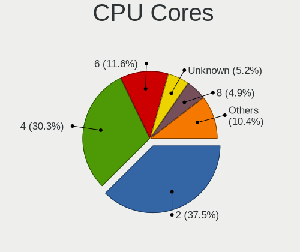
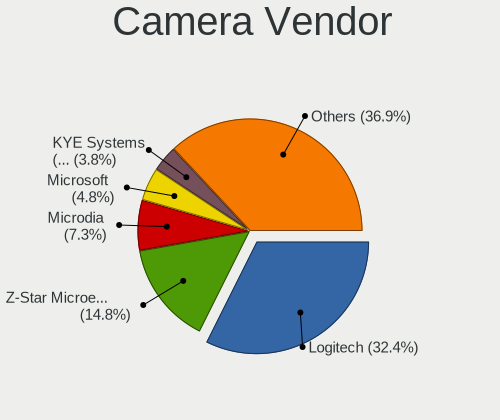

Linux in Russia - Tested Hardware & Statistics (Desktops)
---------------------------------------------------------

A project to collect tested hardware configurations for Linux in Russia.

Anyone can contribute to this report by the [hw-probe](https://github.com/linuxhw/hw-probe) tool:

    sudo -E hw-probe -all -upload

Please contribute! Especially if your hardware is rare.

Contents
--------

* [ Test Cases ](#test-cases)

* [ System ](#system)
  - [ OS                       ](#os)
  - [ OS Family                ](#os-family)
  - [ Kernel                   ](#kernel)
  - [ Kernel Family            ](#kernel-family)
  - [ Kernel Major Ver.        ](#kernel-major-ver)
  - [ Arch                     ](#arch)
  - [ DE                       ](#de)
  - [ Display Server           ](#display-server)
  - [ Display Manager          ](#display-manager)
  - [ OS Lang                  ](#os-lang)
  - [ Boot Mode                ](#boot-mode)
  - [ Filesystem               ](#filesystem)
  - [ Part. scheme             ](#part-scheme)
  - [ Dual Boot with Linux/BSD ](#dual-boot-with-linuxbsd)
  - [ Dual Boot (Win)          ](#dual-boot-win)

* [ Board ](#board)
  - [ Vendor                   ](#vendor)
  - [ Model                    ](#model)
  - [ Model Family             ](#model-family)
  - [ MFG Year                 ](#mfg-year)
  - [ Form Factor              ](#form-factor)
  - [ Secure Boot              ](#secure-boot)
  - [ Coreboot                 ](#coreboot)
  - [ RAM Size                 ](#ram-size)
  - [ RAM Used                 ](#ram-used)
  - [ Total Drives             ](#total-drives)
  - [ Has CD-ROM               ](#has-cd-rom)
  - [ Has Ethernet             ](#has-ethernet)
  - [ Has WiFi                 ](#has-wifi)
  - [ Has Bluetooth            ](#has-bluetooth)

* [ Location ](#location)
  - [ Country                  ](#country)
  - [ City                     ](#city)

* [ Drives ](#drives)
  - [ Drive Vendor             ](#drive-vendor)
  - [ Drive Model              ](#drive-model)
  - [ HDD Vendor               ](#hdd-vendor)
  - [ SSD Vendor               ](#ssd-vendor)
  - [ Drive Kind               ](#drive-kind)
  - [ Drive Connector          ](#drive-connector)
  - [ Drive Size               ](#drive-size)
  - [ Space Total              ](#space-total)
  - [ Space Used               ](#space-used)
  - [ Malfunc. Drives          ](#malfunc-drives)
  - [ Malfunc. Drive Vendor    ](#malfunc-drive-vendor)
  - [ Malfunc. HDD Vendor      ](#malfunc-hdd-vendor)
  - [ Malfunc. Drive Kind      ](#malfunc-drive-kind)
  - [ Failed Drives            ](#failed-drives)
  - [ Failed Drive Vendor      ](#failed-drive-vendor)
  - [ Drive Status             ](#drive-status)

* [ Storage controller ](#storage-controller)
  - [ Storage Vendor           ](#storage-vendor)
  - [ Storage Model            ](#storage-model)
  - [ Storage Kind             ](#storage-kind)

* [ Processor ](#processor)
  - [ CPU Vendor               ](#cpu-vendor)
  - [ CPU Model                ](#cpu-model)
  - [ CPU Model Family         ](#cpu-model-family)
  - [ CPU Cores                ](#cpu-cores)
  - [ CPU Sockets              ](#cpu-sockets)
  - [ CPU Threads              ](#cpu-threads)
  - [ CPU Op-Modes             ](#cpu-op-modes)
  - [ CPU Microcode            ](#cpu-microcode)
  - [ CPU Microarch            ](#cpu-microarch)

* [ Graphics ](#graphics)
  - [ GPU Vendor               ](#gpu-vendor)
  - [ GPU Model                ](#gpu-model)
  - [ GPU Combo                ](#gpu-combo)
  - [ GPU Driver               ](#gpu-driver)
  - [ GPU Memory               ](#gpu-memory)

* [ Monitor ](#monitor)
  - [ Monitor Vendor           ](#monitor-vendor)
  - [ Monitor Model            ](#monitor-model)
  - [ Monitor Resolution       ](#monitor-resolution)
  - [ Monitor Diagonal         ](#monitor-diagonal)
  - [ Monitor Width            ](#monitor-width)
  - [ Aspect Ratio             ](#aspect-ratio)
  - [ Monitor Area             ](#monitor-area)
  - [ Pixel Density            ](#pixel-density)
  - [ Multiple Monitors        ](#multiple-monitors)

* [ Network ](#network)
  - [ Net Controller Vendor    ](#net-controller-vendor)
  - [ Net Controller Model     ](#net-controller-model)
  - [ Wireless Vendor          ](#wireless-vendor)
  - [ Wireless Model           ](#wireless-model)
  - [ Ethernet Vendor          ](#ethernet-vendor)
  - [ Ethernet Model           ](#ethernet-model)
  - [ Net Controller Kind      ](#net-controller-kind)
  - [ Used Controller          ](#used-controller)
  - [ NICs                     ](#nics)
  - [ IPv6                     ](#ipv6)

* [ Bluetooth ](#bluetooth)
  - [ Bluetooth Vendor         ](#bluetooth-vendor)
  - [ Bluetooth Model          ](#bluetooth-model)

* [ Sound ](#sound)
  - [ Sound Vendor             ](#sound-vendor)
  - [ Sound Model              ](#sound-model)

* [ Memory ](#memory)
  - [ Memory Vendor            ](#memory-vendor)
  - [ Memory Model             ](#memory-model)
  - [ Memory Kind              ](#memory-kind)
  - [ Memory Form Factor       ](#memory-form-factor)
  - [ Memory Size              ](#memory-size)
  - [ Memory Speed             ](#memory-speed)

* [ Printers & scanners ](#printers--scanners)
  - [ Printer Vendor           ](#printer-vendor)
  - [ Printer Model            ](#printer-model)
  - [ Scanner Vendor           ](#scanner-vendor)
  - [ Scanner Model            ](#scanner-model)

* [ Camera ](#camera)
  - [ Camera Vendor            ](#camera-vendor)
  - [ Camera Model             ](#camera-model)

* [ Security ](#security)
  - [ Fingerprint Vendor       ](#fingerprint-vendor)
  - [ Fingerprint Model        ](#fingerprint-model)
  - [ Chipcard Vendor          ](#chipcard-vendor)
  - [ Chipcard Model           ](#chipcard-model)

* [ Unsupported ](#unsupported)
  - [ Unsupported Devices      ](#unsupported-devices)
  - [ Unsupported Device Types ](#unsupported-device-types)

Test Cases
----------

Total: 18615

| Vendor        | Model                       | Probe                                                      | Date         |
|---------------|-----------------------------|------------------------------------------------------------|--------------|
| Dell          | 0Y5DDC A00                  | [9a9a57dd2b](https://linux-hardware.org/?probe=9a9a57dd2b) | May 01, 2023 |
| ASUSTek       | SABERTOOTH 990FX R2.0       | [41e9bb9584](https://linux-hardware.org/?probe=41e9bb9584) | May 01, 2023 |
| ASRock        | A520M-ITX/ac                | [5a9f58bcc0](https://linux-hardware.org/?probe=5a9f58bcc0) | Apr 30, 2023 |
| ASUSTek       | TUF Gaming B550-PLUS        | [0bf0b828d4](https://linux-hardware.org/?probe=0bf0b828d4) | Apr 30, 2023 |
| ASRock        | B650M PG Riptide            | [236258bd78](https://linux-hardware.org/?probe=236258bd78) | Apr 30, 2023 |
| ASUSTek       | P7Q57-M DO                  | [897fc61b8c](https://linux-hardware.org/?probe=897fc61b8c) | Apr 30, 2023 |
| ASUSTek       | P7Q57-M DO                  | [4f502dcb59](https://linux-hardware.org/?probe=4f502dcb59) | Apr 30, 2023 |
| ASUSTek       | P5K                         | [ea70f7298c](https://linux-hardware.org/?probe=ea70f7298c) | Apr 30, 2023 |
| ASUSTek       | PRIME A320M-K               | [4587583e6a](https://linux-hardware.org/?probe=4587583e6a) | Apr 30, 2023 |
| MSI           | P67A-C43                    | [68f0d09abd](https://linux-hardware.org/?probe=68f0d09abd) | Apr 30, 2023 |
| Gigabyte      | GA-A55M-S2HP                | [4a478780d6](https://linux-hardware.org/?probe=4a478780d6) | Apr 29, 2023 |
| ECS           | A740GM-M                    | [9e69523c9f](https://linux-hardware.org/?probe=9e69523c9f) | Apr 28, 2023 |
| ASRock        | Z77 Extreme3                | [b0c7bac447](https://linux-hardware.org/?probe=b0c7bac447) | Apr 28, 2023 |
| Gigabyte      | B550 AORUS MASTER           | [93cf85eecd](https://linux-hardware.org/?probe=93cf85eecd) | Apr 28, 2023 |
| HP            | 0B54h D                     | [49c56c77af](https://linux-hardware.org/?probe=49c56c77af) | Apr 28, 2023 |
| ASUSTek       | PRIME H310M-R R2.0          | [41d545e4d7](https://linux-hardware.org/?probe=41d545e4d7) | Apr 28, 2023 |
| ASUSTek       | B150-PRO D3                 | [35fa6f9a33](https://linux-hardware.org/?probe=35fa6f9a33) | Apr 28, 2023 |
| ASRock        | H510M-HDV R2.0              | [91930613cb](https://linux-hardware.org/?probe=91930613cb) | Apr 27, 2023 |
| Unknown       | Unknown                     | [59d18b7284](https://linux-hardware.org/?probe=59d18b7284) | Apr 27, 2023 |
| ASRock        | A320M-HDV R3.0              | [d395c6168d](https://linux-hardware.org/?probe=d395c6168d) | Apr 27, 2023 |
| Unknown       | Unknown                     | [8599268159](https://linux-hardware.org/?probe=8599268159) | Apr 27, 2023 |
| ASRock        | B365M-ITX/ac                | [e4c8218911](https://linux-hardware.org/?probe=e4c8218911) | Apr 27, 2023 |
| ASUSTek       | M4A785D-M PRO               | [ac2a21023c](https://linux-hardware.org/?probe=ac2a21023c) | Apr 27, 2023 |
| MSI           | MS-B0A21                    | [646d14f7b0](https://linux-hardware.org/?probe=646d14f7b0) | Apr 26, 2023 |
| Gigabyte      | P75-D3                      | [f9cf28acb8](https://linux-hardware.org/?probe=f9cf28acb8) | Apr 26, 2023 |
| MSI           | A320M PRO-VD/S              | [f147a5df1c](https://linux-hardware.org/?probe=f147a5df1c) | Apr 26, 2023 |
| MSI           | H110M PRO-VD PLUS           | [95bac1f720](https://linux-hardware.org/?probe=95bac1f720) | Apr 26, 2023 |
| ASUSTek       | ROG STRIX X470-F GAMING     | [62996d1f05](https://linux-hardware.org/?probe=62996d1f05) | Apr 26, 2023 |
| Gigabyte      | A320M-H-CF                  | [a1ddcc0d4a](https://linux-hardware.org/?probe=a1ddcc0d4a) | Apr 26, 2023 |
| MSI           | PRO Z690-A WIFI             | [23c9be7614](https://linux-hardware.org/?probe=23c9be7614) | Apr 26, 2023 |
| X79P mothe... | KLLISRE V1.0                | [a7a0059437](https://linux-hardware.org/?probe=a7a0059437) | Apr 26, 2023 |
| ASUSTek       | PRIME H270-PLUS             | [8a0cd0bb6e](https://linux-hardware.org/?probe=8a0cd0bb6e) | Apr 26, 2023 |
| Huanan        | X79 INTEL (INTEL Xeon E5... | [8c9b08bcab](https://linux-hardware.org/?probe=8c9b08bcab) | Apr 26, 2023 |
| Acer          | Extensa M2610 V:1.0         | [4a85453666](https://linux-hardware.org/?probe=4a85453666) | Apr 26, 2023 |
| ASUSTek       | M5A78L-M LX3 PLUS           | [8093a43498](https://linux-hardware.org/?probe=8093a43498) | Apr 25, 2023 |
| ASRock        | B450 Pro4                   | [bd406c08f8](https://linux-hardware.org/?probe=bd406c08f8) | Apr 25, 2023 |
| Huanan        | X79 INTEL (INTEL Xeon E5... | [6007547b60](https://linux-hardware.org/?probe=6007547b60) | Apr 25, 2023 |
| ASUSTek       | A68HM-K                     | [ae90303c3a](https://linux-hardware.org/?probe=ae90303c3a) | Apr 25, 2023 |
| ASUSTek       | J1800I-C                    | [0a58f3fa51](https://linux-hardware.org/?probe=0a58f3fa51) | Apr 25, 2023 |
| ASUSTek       | P5QL/EPU                    | [a84428c233](https://linux-hardware.org/?probe=a84428c233) | Apr 25, 2023 |
| Lenovo        | H420                        | [265f943a61](https://linux-hardware.org/?probe=265f943a61) | Apr 25, 2023 |
| HP            | 2B43                        | [aa5fb69f7e](https://linux-hardware.org/?probe=aa5fb69f7e) | Apr 25, 2023 |
| Gigabyte      | F2A68HM-DS2                 | [b9b8640409](https://linux-hardware.org/?probe=b9b8640409) | Apr 25, 2023 |
| ASRock        | H61M-VG3                    | [3427383977](https://linux-hardware.org/?probe=3427383977) | Apr 24, 2023 |
| ASUSTek       | P5Q                         | [57e3cfa7dc](https://linux-hardware.org/?probe=57e3cfa7dc) | Apr 24, 2023 |
| Gigabyte      | B365M DS3H                  | [90747b3b70](https://linux-hardware.org/?probe=90747b3b70) | Apr 24, 2023 |
| AZW           | MINI S                      | [d71153ae6e](https://linux-hardware.org/?probe=d71153ae6e) | Apr 24, 2023 |
| ASUSTek       | B85M-G                      | [4819635121](https://linux-hardware.org/?probe=4819635121) | Apr 24, 2023 |
| Intel         | SE7320EP2 D11950-402        | [ad1a126878](https://linux-hardware.org/?probe=ad1a126878) | Apr 24, 2023 |
| ASUSTek       | PRIME Z390M-PLUS            | [cac96b2cc9](https://linux-hardware.org/?probe=cac96b2cc9) | Apr 24, 2023 |
| Gigabyte      | H410M H V3                  | [8fd18554d1](https://linux-hardware.org/?probe=8fd18554d1) | Apr 24, 2023 |
| Gigabyte      | B550M AORUS ELITE           | [39fd6ad31f](https://linux-hardware.org/?probe=39fd6ad31f) | Apr 24, 2023 |
| ASUSTek       | M5A78L LE                   | [df70910ec6](https://linux-hardware.org/?probe=df70910ec6) | Apr 23, 2023 |
| ASUSTek       | PRIME Z390M-PLUS            | [1a7a3be03e](https://linux-hardware.org/?probe=1a7a3be03e) | Apr 23, 2023 |
| ASUSTek       | ROG STRIX X470-F GAMING     | [88036a75ec](https://linux-hardware.org/?probe=88036a75ec) | Apr 23, 2023 |
| ASUSTek       | Z170-K                      | [538ebf1f96](https://linux-hardware.org/?probe=538ebf1f96) | Apr 23, 2023 |
| AZW           | U59                         | [8921a6910d](https://linux-hardware.org/?probe=8921a6910d) | Apr 23, 2023 |
| ASRock        | A320M-DVS R4.0              | [ba7ae1ec90](https://linux-hardware.org/?probe=ba7ae1ec90) | Apr 23, 2023 |
| Intel         | DH61BE AAG14062-206         | [c1817da6ab](https://linux-hardware.org/?probe=c1817da6ab) | Apr 23, 2023 |
| Gigabyte      | H61M-HD2                    | [dd548a2be5](https://linux-hardware.org/?probe=dd548a2be5) | Apr 23, 2023 |
| Gigabyte      | AB350-Gaming 3-CF           | [2f62c287fc](https://linux-hardware.org/?probe=2f62c287fc) | Apr 22, 2023 |
| HP            | 0A60h                       | [e705150840](https://linux-hardware.org/?probe=e705150840) | Apr 22, 2023 |
| ASUSTek       | F1A75-V                     | [ac602a38ec](https://linux-hardware.org/?probe=ac602a38ec) | Apr 22, 2023 |
| Gigabyte      | E3000N                      | [a6d7a7356a](https://linux-hardware.org/?probe=a6d7a7356a) | Apr 22, 2023 |
| Gigabyte      | B365M H                     | [aca220e594](https://linux-hardware.org/?probe=aca220e594) | Apr 22, 2023 |
| ASUSTek       | M4A785D-M PRO               | [09791c0d84](https://linux-hardware.org/?probe=09791c0d84) | Apr 22, 2023 |
| ASUSTek       | M4A785D-M PRO               | [62dfd33592](https://linux-hardware.org/?probe=62dfd33592) | Apr 22, 2023 |
| Techvision    | TVI7309X B0                 | [26e981dab3](https://linux-hardware.org/?probe=26e981dab3) | Apr 22, 2023 |
| ASUSTek       | PRIME A320M-K               | [fb1f9f0d16](https://linux-hardware.org/?probe=fb1f9f0d16) | Apr 21, 2023 |
| Gigabyte      | P31-S3G                     | [cec5cd32e8](https://linux-hardware.org/?probe=cec5cd32e8) | Apr 21, 2023 |
| Gigabyte      | AB350-Gaming 3-CF           | [ebd7a2d70a](https://linux-hardware.org/?probe=ebd7a2d70a) | Apr 21, 2023 |
| ASUSTek       | F2A85-V                     | [422eb87f07](https://linux-hardware.org/?probe=422eb87f07) | Apr 21, 2023 |
| Gigabyte      | H110-D3-CF                  | [bbf67462c7](https://linux-hardware.org/?probe=bbf67462c7) | Apr 21, 2023 |
| ASUSTek       | M5A78L LE                   | [3d241113f4](https://linux-hardware.org/?probe=3d241113f4) | Apr 21, 2023 |
| ASUSTek       | P8H61-M LX R2.0             | [ebc4b3095d](https://linux-hardware.org/?probe=ebc4b3095d) | Apr 21, 2023 |
| ASRock        | H310M-HDV                   | [ee492f099b](https://linux-hardware.org/?probe=ee492f099b) | Apr 21, 2023 |
| ASUSTek       | M4N68T-M LE                 | [4f1e6c6ce7](https://linux-hardware.org/?probe=4f1e6c6ce7) | Apr 21, 2023 |
| ASRock        | P43DE                       | [8f2c0ecc69](https://linux-hardware.org/?probe=8f2c0ecc69) | Apr 21, 2023 |
| ASRock        | H61M-GE                     | [615c74338c](https://linux-hardware.org/?probe=615c74338c) | Apr 21, 2023 |
| Intel         | DG965RY AAD41691-301        | [0a153df418](https://linux-hardware.org/?probe=0a153df418) | Apr 20, 2023 |
| ASUSTek       | ROG STRIX B550-I GAMING     | [d3cfdb3436](https://linux-hardware.org/?probe=d3cfdb3436) | Apr 20, 2023 |
| Aquarius      | AQH410T                     | [ecb27c0ff7](https://linux-hardware.org/?probe=ecb27c0ff7) | Apr 20, 2023 |
| Huanan        | X99 F8D V2.2                | [b8c2462ada](https://linux-hardware.org/?probe=b8c2462ada) | Apr 20, 2023 |
| Gigabyte      | A320M-S2H V2-CF             | [7ac787a4fa](https://linux-hardware.org/?probe=7ac787a4fa) | Apr 20, 2023 |
| Aquarius      | AQH410T                     | [29e8b5bd74](https://linux-hardware.org/?probe=29e8b5bd74) | Apr 20, 2023 |
| Gigabyte      | H310M S2H x.x               | [eec2055c19](https://linux-hardware.org/?probe=eec2055c19) | Apr 20, 2023 |
| ASUSTek       | P5K SE                      | [eeff4cd84c](https://linux-hardware.org/?probe=eeff4cd84c) | Apr 20, 2023 |
| Biostar       | H61MHV                      | [7b3d591e47](https://linux-hardware.org/?probe=7b3d591e47) | Apr 20, 2023 |
| Gigabyte      | A320M-H-CF                  | [51afdddffc](https://linux-hardware.org/?probe=51afdddffc) | Apr 20, 2023 |
| EPoX Compu... | nForce3 DDR: 8KDA3I Seri... | [ba684478b5](https://linux-hardware.org/?probe=ba684478b5) | Apr 20, 2023 |
| ASRock        | B250M Pro4                  | [5d27011671](https://linux-hardware.org/?probe=5d27011671) | Apr 19, 2023 |
| MACHINIST     | X99-RS9 V3.1                | [492b8bb4d0](https://linux-hardware.org/?probe=492b8bb4d0) | Apr 19, 2023 |
| MSI           | MPG B550 GAMING PLUS        | [ea69ff8c8b](https://linux-hardware.org/?probe=ea69ff8c8b) | Apr 19, 2023 |
| ASRock        | N68-GS4 FX                  | [b01bc53af9](https://linux-hardware.org/?probe=b01bc53af9) | Apr 19, 2023 |
| ASRock        | N68C-GS FX                  | [fc16ea346a](https://linux-hardware.org/?probe=fc16ea346a) | Apr 19, 2023 |
| Intel         | DH61BF AAG81311-101         | [a9329736fb](https://linux-hardware.org/?probe=a9329736fb) | Apr 19, 2023 |
| ASRock        | J3455-ITX                   | [895abaa15e](https://linux-hardware.org/?probe=895abaa15e) | Apr 19, 2023 |
| ASRock        | J3455-ITX                   | [f70d811bbd](https://linux-hardware.org/?probe=f70d811bbd) | Apr 19, 2023 |
| MSI           | H110M PRO-VD                | [d04a1b7f36](https://linux-hardware.org/?probe=d04a1b7f36) | Apr 19, 2023 |
| ASUSTek       | B75M-PLUS                   | [33cd5127f2](https://linux-hardware.org/?probe=33cd5127f2) | Apr 19, 2023 |
| Gigabyte      | H61M-S1                     | [e2ed275252](https://linux-hardware.org/?probe=e2ed275252) | Apr 19, 2023 |
| Dell          | 0Y5DDC A00                  | [daff249988](https://linux-hardware.org/?probe=daff249988) | Apr 19, 2023 |
| MSI           | PRO Z690-A WIFI             | [26c96a2c4b](https://linux-hardware.org/?probe=26c96a2c4b) | Apr 19, 2023 |
| MSI           | MPG B550 GAMING EDGE WIF... | [2822b1a8c3](https://linux-hardware.org/?probe=2822b1a8c3) | Apr 19, 2023 |
| Gigabyte      | H61M-S1                     | [a6aaf5f17a](https://linux-hardware.org/?probe=a6aaf5f17a) | Apr 19, 2023 |
| MSI           | G41M-P33 Combo              | [55ead22ec0](https://linux-hardware.org/?probe=55ead22ec0) | Apr 18, 2023 |
| MSI           | G41M-P33 Combo              | [9fc5380d7a](https://linux-hardware.org/?probe=9fc5380d7a) | Apr 18, 2023 |
| Gigabyte      | B550M AORUS PRO-P           | [023e96a6fd](https://linux-hardware.org/?probe=023e96a6fd) | Apr 18, 2023 |
| Gigabyte      | H310M S2                    | [02a81434f0](https://linux-hardware.org/?probe=02a81434f0) | Apr 18, 2023 |
| Biostar       | A960D+V2                    | [34c47b4141](https://linux-hardware.org/?probe=34c47b4141) | Apr 18, 2023 |
| Gigabyte      | 970A-UD3P                   | [38275208cc](https://linux-hardware.org/?probe=38275208cc) | Apr 18, 2023 |
| ASRock        | 970 Pro3 R2.0               | [e816e4de38](https://linux-hardware.org/?probe=e816e4de38) | Apr 18, 2023 |
| Graviton      | DMB-A520-MCA01              | [d0c1433d54](https://linux-hardware.org/?probe=d0c1433d54) | Apr 18, 2023 |
| Gigabyte      | F2A68HM-DS2                 | [d7ebec50bf](https://linux-hardware.org/?probe=d7ebec50bf) | Apr 18, 2023 |
| ASL           | BayTrail JHS773             | [3a5977ad04](https://linux-hardware.org/?probe=3a5977ad04) | Apr 18, 2023 |
| ASUSTek       | Pro WS X570-ACE             | [8944559c50](https://linux-hardware.org/?probe=8944559c50) | Apr 17, 2023 |
| ASRock        | H310M-STX                   | [438e774de5](https://linux-hardware.org/?probe=438e774de5) | Apr 17, 2023 |
| MSI           | PRO X670-P WIFI             | [3fdb4f34e0](https://linux-hardware.org/?probe=3fdb4f34e0) | Apr 17, 2023 |
| ASRock        | A320M-DVS R4.0              | [b715989fc4](https://linux-hardware.org/?probe=b715989fc4) | Apr 16, 2023 |
| ASRock        | A320M-DVS R4.0              | [213ac87204](https://linux-hardware.org/?probe=213ac87204) | Apr 16, 2023 |
| Biostar       | H81MHV3                     | [384b42f2e6](https://linux-hardware.org/?probe=384b42f2e6) | Apr 16, 2023 |
| ASRock        | B650M PG Riptide            | [e138e763eb](https://linux-hardware.org/?probe=e138e763eb) | Apr 16, 2023 |
| ASRock        | B650M PG Riptide            | [71643d03ec](https://linux-hardware.org/?probe=71643d03ec) | Apr 16, 2023 |
| Gigabyte      | A320M-S2H-CF                | [badd20d374](https://linux-hardware.org/?probe=badd20d374) | Apr 16, 2023 |
| Lenovo        | 367D 31900059 STD           | [e3ebbe3950](https://linux-hardware.org/?probe=e3ebbe3950) | Apr 16, 2023 |
| ASUSTek       | P5K-VM                      | [2c8298a0a8](https://linux-hardware.org/?probe=2c8298a0a8) | Apr 16, 2023 |
| Acer          | Aspire TC-705               | [80bfa42512](https://linux-hardware.org/?probe=80bfa42512) | Apr 16, 2023 |
| MSI           | B450M PRO-M2                | [05ae2ac6e6](https://linux-hardware.org/?probe=05ae2ac6e6) | Apr 16, 2023 |
| ASRock        | 970 Pro3 R2.0               | [a70cf56038](https://linux-hardware.org/?probe=a70cf56038) | Apr 15, 2023 |
| ASUSTek       | P8H61-MX                    | [4ad2b2bcdc](https://linux-hardware.org/?probe=4ad2b2bcdc) | Apr 15, 2023 |
| ASUSTek       | STRIX Z270H GAMING          | [7ac461b735](https://linux-hardware.org/?probe=7ac461b735) | Apr 15, 2023 |
| MSI           | MPG B550 GAMING CARBON W... | [4f8d3b46f5](https://linux-hardware.org/?probe=4f8d3b46f5) | Apr 15, 2023 |
| ASUSTek       | P5KPL-AM                    | [f48937493d](https://linux-hardware.org/?probe=f48937493d) | Apr 15, 2023 |
| MSI           | H81M-P33                    | [e0d66aee3a](https://linux-hardware.org/?probe=e0d66aee3a) | Apr 14, 2023 |
| MSI           | MAG B650 TOMAHAWK WIFI      | [f6a652b68d](https://linux-hardware.org/?probe=f6a652b68d) | Apr 14, 2023 |
| MSI           | B550M PRO-VDH WIFI          | [57e42e5107](https://linux-hardware.org/?probe=57e42e5107) | Apr 14, 2023 |
| ASUSTek       | M4A78LT-M                   | [64e92bd20f](https://linux-hardware.org/?probe=64e92bd20f) | Apr 14, 2023 |
| Gigabyte      | GA-990XA-UD3                | [d5669e92ed](https://linux-hardware.org/?probe=d5669e92ed) | Apr 14, 2023 |
| MSI           | B550M PRO-VDH WIFI          | [9e1d9ff252](https://linux-hardware.org/?probe=9e1d9ff252) | Apr 14, 2023 |
| ASUSTek       | P11C-X Series               | [2ab6f2745c](https://linux-hardware.org/?probe=2ab6f2745c) | Apr 14, 2023 |
| ASUSTek       | P11C-X Series               | [55f8d9f172](https://linux-hardware.org/?probe=55f8d9f172) | Apr 14, 2023 |
| Gigabyte      | G31M-S2L                    | [eaccdb6a68](https://linux-hardware.org/?probe=eaccdb6a68) | Apr 14, 2023 |
| Gigabyte      | A320M-H-CF                  | [ae3ba04308](https://linux-hardware.org/?probe=ae3ba04308) | Apr 14, 2023 |
| MSI           | MAG B650 TOMAHAWK WIFI      | [f1f1661f59](https://linux-hardware.org/?probe=f1f1661f59) | Apr 13, 2023 |
| ASUSTek       | P5KPL-AM IN/GB              | [c7c00c395f](https://linux-hardware.org/?probe=c7c00c395f) | Apr 13, 2023 |
| DEPO Compu... | MS-7846                     | [bf72733735](https://linux-hardware.org/?probe=bf72733735) | Apr 13, 2023 |
| ASUSTek       | PRIME B650-PLUS             | [d05eccd5c7](https://linux-hardware.org/?probe=d05eccd5c7) | Apr 13, 2023 |
| Biostar       | G41D3C                      | [96bf9b40ac](https://linux-hardware.org/?probe=96bf9b40ac) | Apr 13, 2023 |
| ASUSTek       | P8H61-M LE R2.0             | [507f555919](https://linux-hardware.org/?probe=507f555919) | Apr 13, 2023 |
| Intel         | SKYBAY                      | [ec2b541d85](https://linux-hardware.org/?probe=ec2b541d85) | Apr 13, 2023 |
| Foxconn       | 2ABF                        | [35a1f24f18](https://linux-hardware.org/?probe=35a1f24f18) | Apr 13, 2023 |
| Gigabyte      | B550 GAMING X V2            | [67fa6790f3](https://linux-hardware.org/?probe=67fa6790f3) | Apr 13, 2023 |
| MSI           | MPG B550 GAMING PLUS        | [71542ed659](https://linux-hardware.org/?probe=71542ed659) | Apr 13, 2023 |
| Gigabyte      | H61M-DS2 DVI                | [fe00316c95](https://linux-hardware.org/?probe=fe00316c95) | Apr 12, 2023 |
| Gigabyte      | A520M DS3H                  | [9a85729d53](https://linux-hardware.org/?probe=9a85729d53) | Apr 12, 2023 |
| ASRock        | M3N78D FX                   | [618073d9e9](https://linux-hardware.org/?probe=618073d9e9) | Apr 12, 2023 |
| ASRock        | H410D4-P1                   | [3f7d6e5bfb](https://linux-hardware.org/?probe=3f7d6e5bfb) | Apr 12, 2023 |
| Gigabyte      | M68MT-D3P                   | [695e9c2a36](https://linux-hardware.org/?probe=695e9c2a36) | Apr 12, 2023 |
| HP            | 3048h                       | [c16e3c4fdc](https://linux-hardware.org/?probe=c16e3c4fdc) | Apr 12, 2023 |
| ASUSTek       | ROG STRIX B450-F GAMING     | [1429799ca6](https://linux-hardware.org/?probe=1429799ca6) | Apr 11, 2023 |
| Gigabyte      | H61M-DS2                    | [e0b6eda111](https://linux-hardware.org/?probe=e0b6eda111) | Apr 11, 2023 |
| Intel         | B85 V2.2A                   | [1ca186850c](https://linux-hardware.org/?probe=1ca186850c) | Apr 11, 2023 |
| ASUSTek       | ROG STRIX B450-F GAMING     | [8b8b7e1e4e](https://linux-hardware.org/?probe=8b8b7e1e4e) | Apr 11, 2023 |
| Gigabyte      | GA-78LMT-S2PV               | [a2ddbc2eee](https://linux-hardware.org/?probe=a2ddbc2eee) | Apr 11, 2023 |
| ASUSTek       | P7H55                       | [8ee190d352](https://linux-hardware.org/?probe=8ee190d352) | Apr 11, 2023 |
| Gigabyte      | B450 AORUS M                | [e6f7aa90ab](https://linux-hardware.org/?probe=e6f7aa90ab) | Apr 11, 2023 |
| ASUSTek       | Z97-K                       | [8e04d8c50e](https://linux-hardware.org/?probe=8e04d8c50e) | Apr 11, 2023 |
| MSI           | X470 GAMING PRO MAX         | [068934f572](https://linux-hardware.org/?probe=068934f572) | Apr 10, 2023 |
| Gigabyte      | GA-78LMT-S2P                | [6cff2537ae](https://linux-hardware.org/?probe=6cff2537ae) | Apr 10, 2023 |
| MSI           | G41M-P33 Combo              | [d2623477d9](https://linux-hardware.org/?probe=d2623477d9) | Apr 10, 2023 |
| Gigabyte      | H110M-D3H R2-CF             | [4cb2e51f7d](https://linux-hardware.org/?probe=4cb2e51f7d) | Apr 10, 2023 |
| Gigabyte      | A320M-S2H V2-CF             | [d2e041bd92](https://linux-hardware.org/?probe=d2e041bd92) | Apr 10, 2023 |
| Biostar       | B250MHC                     | [4fee7821ab](https://linux-hardware.org/?probe=4fee7821ab) | Apr 09, 2023 |
| MACHINIST     | X99-k9 V1.0                 | [650acc25ef](https://linux-hardware.org/?probe=650acc25ef) | Apr 09, 2023 |
| ECS           | H61H2-M17                   | [a2860baaee](https://linux-hardware.org/?probe=a2860baaee) | Apr 09, 2023 |
| ASUSTek       | P5K                         | [00a17a60bf](https://linux-hardware.org/?probe=00a17a60bf) | Apr 09, 2023 |
| ECS           | H67H2-M3                    | [613fd53405](https://linux-hardware.org/?probe=613fd53405) | Apr 09, 2023 |
| ASUSTek       | M4A785TD-V EVO              | [3af0783523](https://linux-hardware.org/?probe=3af0783523) | Apr 09, 2023 |
| Intel         | X79M-S                      | [3cec74aa9d](https://linux-hardware.org/?probe=3cec74aa9d) | Apr 09, 2023 |
| MSI           | 2A9C                        | [91d20791c3](https://linux-hardware.org/?probe=91d20791c3) | Apr 09, 2023 |
| ASUSTek       | PRIME H310M-K               | [e443fd6926](https://linux-hardware.org/?probe=e443fd6926) | Apr 08, 2023 |
| MSI           | PRO H610M-E DDR4            | [64fbe95b80](https://linux-hardware.org/?probe=64fbe95b80) | Apr 08, 2023 |
| ASRock        | H87 Performance             | [bcf217db06](https://linux-hardware.org/?probe=bcf217db06) | Apr 08, 2023 |
| Gigabyte      | GA-73PVM-S2                 | [2149d942b3](https://linux-hardware.org/?probe=2149d942b3) | Apr 08, 2023 |
| ASUSTek       | P5KPL-AM SE                 | [4b4e5dfe24](https://linux-hardware.org/?probe=4b4e5dfe24) | Apr 08, 2023 |
| ASRock        | B550 Extreme4               | [26350ccd3f](https://linux-hardware.org/?probe=26350ccd3f) | Apr 08, 2023 |
| ASUSTek       | VM40B                       | [f371d84955](https://linux-hardware.org/?probe=f371d84955) | Apr 07, 2023 |
| ASRock        | N68PV-GS                    | [bd8595032e](https://linux-hardware.org/?probe=bd8595032e) | Apr 07, 2023 |
| ASRock        | N68-GS4 FX                  | [347c879912](https://linux-hardware.org/?probe=347c879912) | Apr 07, 2023 |
| ECS           | GLKD-I2                     | [ee23104ef2](https://linux-hardware.org/?probe=ee23104ef2) | Apr 07, 2023 |
| Intel         | D945GNT AAC96315-405        | [cdfdfbcda4](https://linux-hardware.org/?probe=cdfdfbcda4) | Apr 07, 2023 |
| ASUSTek       | P7H55                       | [89966b216e](https://linux-hardware.org/?probe=89966b216e) | Apr 07, 2023 |
| Gigabyte      | H310M A-CF x.x              | [e37377d08b](https://linux-hardware.org/?probe=e37377d08b) | Apr 07, 2023 |
| MSI           | B450M MORTAR MAX            | [e9281d0364](https://linux-hardware.org/?probe=e9281d0364) | Apr 06, 2023 |
| MSI           | Z68A-GD65                   | [a8939164e7](https://linux-hardware.org/?probe=a8939164e7) | Apr 06, 2023 |
| Intel         | DH61BF AAG81311-101         | [49921908d1](https://linux-hardware.org/?probe=49921908d1) | Apr 06, 2023 |
| Biostar       | G31D-M7                     | [9d1a5129bd](https://linux-hardware.org/?probe=9d1a5129bd) | Apr 06, 2023 |
| Huanan        | X99-F8D PLUS V1.1           | [6d7db3d917](https://linux-hardware.org/?probe=6d7db3d917) | Apr 06, 2023 |
| Gigabyte      | F2A55M-DS2                  | [fea5792a8b](https://linux-hardware.org/?probe=fea5792a8b) | Apr 06, 2023 |
| ASUSTek       | H170-PRO                    | [8756f8891c](https://linux-hardware.org/?probe=8756f8891c) | Apr 06, 2023 |
| Huanan        | X99-F8D PLUS V1.1           | [9c6a3de994](https://linux-hardware.org/?probe=9c6a3de994) | Apr 05, 2023 |
| Gigabyte      | C51-MCP51                   | [64a51d5df8](https://linux-hardware.org/?probe=64a51d5df8) | Apr 05, 2023 |
| Gigabyte      | A320M-S2H-CF                | [495ddacc93](https://linux-hardware.org/?probe=495ddacc93) | Apr 05, 2023 |
| Dinson        | Unknown                     | [2cb920a0bd](https://linux-hardware.org/?probe=2cb920a0bd) | Apr 05, 2023 |
| Acer          | Veriton X4110G              | [0acd5d08f8](https://linux-hardware.org/?probe=0acd5d08f8) | Apr 05, 2023 |
| Unknown       | X79M2-Q                     | [d985b7fa11](https://linux-hardware.org/?probe=d985b7fa11) | Apr 05, 2023 |
| ASUSTek       | P8P67 LE                    | [aea33c89a1](https://linux-hardware.org/?probe=aea33c89a1) | Apr 05, 2023 |
| Gigabyte      | C51-MCP51                   | [31ee5c7a85](https://linux-hardware.org/?probe=31ee5c7a85) | Apr 05, 2023 |
| Gigabyte      | A320M-S2H-CF                | [bec5bda3bd](https://linux-hardware.org/?probe=bec5bda3bd) | Apr 05, 2023 |
| ECS           | GLKD-I2                     | [392f907879](https://linux-hardware.org/?probe=392f907879) | Apr 05, 2023 |
| Gigabyte      | H410M H V3                  | [3a3f22e8aa](https://linux-hardware.org/?probe=3a3f22e8aa) | Apr 05, 2023 |
| ASUSTek       | Z97-K                       | [32f708c916](https://linux-hardware.org/?probe=32f708c916) | Apr 05, 2023 |
| ASUSTek       | PRIME B360M-K               | [caa685db91](https://linux-hardware.org/?probe=caa685db91) | Apr 05, 2023 |
| ASRock        | H61MV-ITX                   | [c721707e0a](https://linux-hardware.org/?probe=c721707e0a) | Apr 05, 2023 |
| Gigabyte      | B550 AORUS ELITE AX V2      | [a97a7f6fa5](https://linux-hardware.org/?probe=a97a7f6fa5) | Apr 04, 2023 |
| Acer          | Aspire M1470                | [d0120a6452](https://linux-hardware.org/?probe=d0120a6452) | Apr 04, 2023 |
| Gigabyte      | H61M-DS2                    | [5a83d4ef1e](https://linux-hardware.org/?probe=5a83d4ef1e) | Apr 04, 2023 |
| Lenovo        | 3140 NOK                    | [207d400267](https://linux-hardware.org/?probe=207d400267) | Apr 04, 2023 |
| ASUSTek       | Z97-K                       | [6e750dfaa5](https://linux-hardware.org/?probe=6e750dfaa5) | Apr 04, 2023 |
| ASRock        | N68-GS4 FX                  | [96928ca8af](https://linux-hardware.org/?probe=96928ca8af) | Apr 04, 2023 |
| ASRock        | B450 Gaming K4              | [86b0411adf](https://linux-hardware.org/?probe=86b0411adf) | Apr 03, 2023 |
| MSI           | PRO Z790-A WIFI             | [5fd883493a](https://linux-hardware.org/?probe=5fd883493a) | Apr 03, 2023 |
| Foxconn       | H67MP-S/-V/H67MP            | [08612f7258](https://linux-hardware.org/?probe=08612f7258) | Apr 03, 2023 |
| MSI           | G41M-P33 Combo              | [44b5c81131](https://linux-hardware.org/?probe=44b5c81131) | Apr 03, 2023 |
| ASUSTek       | P7H55-USB3                  | [e6ed8a0215](https://linux-hardware.org/?probe=e6ed8a0215) | Apr 03, 2023 |
| ASUSTek       | PRIME B450M-A               | [1b35a0e9f7](https://linux-hardware.org/?probe=1b35a0e9f7) | Apr 03, 2023 |
| Unknown       | Unknown                     | [02a35c15b7](https://linux-hardware.org/?probe=02a35c15b7) | Apr 03, 2023 |
| ASRock        | X570 Phantom Gaming 4       | [c9cd8b0217](https://linux-hardware.org/?probe=c9cd8b0217) | Apr 03, 2023 |
| MSI           | B450M MORTAR MAX            | [53ace0533c](https://linux-hardware.org/?probe=53ace0533c) | Apr 03, 2023 |
| HP            | 81C5 MVB                    | [554be8c07b](https://linux-hardware.org/?probe=554be8c07b) | Apr 03, 2023 |
| Huanan        | X99-BD4 V1.33               | [b11d91c675](https://linux-hardware.org/?probe=b11d91c675) | Apr 02, 2023 |
| MSI           | MAG B550M MORTAR MAX WIF... | [36947e0f6f](https://linux-hardware.org/?probe=36947e0f6f) | Apr 02, 2023 |
| MSI           | H510M-A PRO                 | [f580fda8f1](https://linux-hardware.org/?probe=f580fda8f1) | Apr 02, 2023 |
| ASRock        | H510M-HDV                   | [2cb8a6e1c5](https://linux-hardware.org/?probe=2cb8a6e1c5) | Apr 02, 2023 |
| ASUSTek       | P5KPL-AM                    | [a4e100811d](https://linux-hardware.org/?probe=a4e100811d) | Apr 02, 2023 |
| MSI           | B550M PRO-VDH WIFI          | [2a898637e8](https://linux-hardware.org/?probe=2a898637e8) | Apr 02, 2023 |
| ASUSTek       | P8Z77-M PRO                 | [c2a49fdbe4](https://linux-hardware.org/?probe=c2a49fdbe4) | Apr 02, 2023 |
| MSI           | H81M-P33                    | [cad337e1e8](https://linux-hardware.org/?probe=cad337e1e8) | Apr 02, 2023 |
| ASUSTek       | P8H67-V                     | [3a488490ce](https://linux-hardware.org/?probe=3a488490ce) | Apr 02, 2023 |
| Gigabyte      | EP45T-DS3                   | [9639c79ad5](https://linux-hardware.org/?probe=9639c79ad5) | Apr 02, 2023 |
| ASRock        | X570 Phantom Gaming 4       | [f3b1797500](https://linux-hardware.org/?probe=f3b1797500) | Apr 02, 2023 |
| Gigabyte      | Z590M                       | [0d5e6857b8](https://linux-hardware.org/?probe=0d5e6857b8) | Apr 02, 2023 |
| ASUSTek       | H110M-R                     | [589fd53791](https://linux-hardware.org/?probe=589fd53791) | Apr 02, 2023 |
| ASUSTek       | ROG CROSSHAIR X670E HERO    | [9c34c50ec4](https://linux-hardware.org/?probe=9c34c50ec4) | Apr 02, 2023 |
| Nvidia        | MCP7A 2                     | [26ab83ffcb](https://linux-hardware.org/?probe=26ab83ffcb) | Apr 01, 2023 |
| ASUSTek       | PRIME X670-P WIFI           | [2a597d7a33](https://linux-hardware.org/?probe=2a597d7a33) | Apr 01, 2023 |
| Gigabyte      | Z68X-UD4-B3                 | [79bcb88c5b](https://linux-hardware.org/?probe=79bcb88c5b) | Apr 01, 2023 |
| HP            | 8906 SMVB                   | [74430f2160](https://linux-hardware.org/?probe=74430f2160) | Apr 01, 2023 |
| Gigabyte      | B550 AORUS ELITE V2         | [978a5e2579](https://linux-hardware.org/?probe=978a5e2579) | Apr 01, 2023 |
| Gigabyte      | G41M-Combo                  | [ac658bcb80](https://linux-hardware.org/?probe=ac658bcb80) | Apr 01, 2023 |
| MSI           | MAG B660M MORTAR WIFI DD... | [c512f4cdd9](https://linux-hardware.org/?probe=c512f4cdd9) | Apr 01, 2023 |
| Gigabyte      | MZGLKDP-00                  | [c9427f4873](https://linux-hardware.org/?probe=c9427f4873) | Apr 01, 2023 |
| MSI           | MAG B660M MORTAR WIFI DD... | [e615755655](https://linux-hardware.org/?probe=e615755655) | Apr 01, 2023 |
| ASUSTek       | M5A78L LE                   | [af64a32a09](https://linux-hardware.org/?probe=af64a32a09) | Apr 01, 2023 |
| MSI           | H510M-A PRO                 | [a6953d3b96](https://linux-hardware.org/?probe=a6953d3b96) | Apr 01, 2023 |
| Unknown       | X79                         | [d0592836a5](https://linux-hardware.org/?probe=d0592836a5) | Apr 01, 2023 |
| Gigabyte      | A320M-H-CF                  | [a5c21e7892](https://linux-hardware.org/?probe=a5c21e7892) | Apr 01, 2023 |
| Gigabyte      | A320M-H-CF                  | [4b873550ab](https://linux-hardware.org/?probe=4b873550ab) | Apr 01, 2023 |
| ASUSTek       | P8B75-V                     | [5ed3be8dbc](https://linux-hardware.org/?probe=5ed3be8dbc) | Mar 31, 2023 |
| ASUSTek       | M5A78L LE                   | [7a23362aac](https://linux-hardware.org/?probe=7a23362aac) | Mar 31, 2023 |
| Gigabyte      | H61M-DS2                    | [35e4f876ca](https://linux-hardware.org/?probe=35e4f876ca) | Mar 31, 2023 |
| Gigabyte      | H61M-DS2                    | [fca09d31a2](https://linux-hardware.org/?probe=fca09d31a2) | Mar 31, 2023 |
| ASUSTek       | PRIME B660-PLUS D4          | [1ac381c18f](https://linux-hardware.org/?probe=1ac381c18f) | Mar 31, 2023 |
| Gigabyte      | Z77-DS3H                    | [79e2cfa0f1](https://linux-hardware.org/?probe=79e2cfa0f1) | Mar 31, 2023 |
| ASUSTek       | PRIME Z690M-PLUS D4         | [51c601477f](https://linux-hardware.org/?probe=51c601477f) | Mar 31, 2023 |
| Gigabyte      | Z77X-UD5H                   | [323d8881a5](https://linux-hardware.org/?probe=323d8881a5) | Mar 31, 2023 |
| ASRock        | N68-GS4 FX                  | [573f5db37d](https://linux-hardware.org/?probe=573f5db37d) | Mar 31, 2023 |
| Quanta        | 2AC5 100                    | [7f253a82dc](https://linux-hardware.org/?probe=7f253a82dc) | Mar 31, 2023 |
| ASUSTek       | P8H67-M                     | [3806b33cae](https://linux-hardware.org/?probe=3806b33cae) | Mar 31, 2023 |
| ASUSTek       | TUF Z270 MARK 2             | [6bd60aa5f0](https://linux-hardware.org/?probe=6bd60aa5f0) | Mar 31, 2023 |
| Gigabyte      | 965P-DS4                    | [ddebc735da](https://linux-hardware.org/?probe=ddebc735da) | Mar 31, 2023 |
| Intel         | X79                         | [c06125262b](https://linux-hardware.org/?probe=c06125262b) | Mar 31, 2023 |
| MSI           | H510M PRO-E                 | [9ec66a8f48](https://linux-hardware.org/?probe=9ec66a8f48) | Mar 31, 2023 |
| MSI           | G31TM-P21                   | [7404d94ca4](https://linux-hardware.org/?probe=7404d94ca4) | Mar 31, 2023 |
| ASUSTek       | TUF Gaming B550M-PLUS       | [7a0f5608b2](https://linux-hardware.org/?probe=7a0f5608b2) | Mar 31, 2023 |
| ECS           | H61H2-M6                    | [6c33ee7e15](https://linux-hardware.org/?probe=6c33ee7e15) | Mar 31, 2023 |
| ASRock        | H61M                        | [29327171c4](https://linux-hardware.org/?probe=29327171c4) | Mar 31, 2023 |
| Gigabyte      | EP43-DS3L                   | [b7594db73b](https://linux-hardware.org/?probe=b7594db73b) | Mar 31, 2023 |
| ASUSTek       | M5A78L-M LX3                | [6ff0a3cb3f](https://linux-hardware.org/?probe=6ff0a3cb3f) | Mar 31, 2023 |
| ASUSTek       | PRIME A320M-K               | [3670f0a6ed](https://linux-hardware.org/?probe=3670f0a6ed) | Mar 30, 2023 |
| ASRock        | X570 Phantom Gaming 4       | [1417777bbc](https://linux-hardware.org/?probe=1417777bbc) | Mar 30, 2023 |
| AZW           | U59                         | [c87edfe3b6](https://linux-hardware.org/?probe=c87edfe3b6) | Mar 30, 2023 |
| ASRock        | X570 Phantom Gaming 4       | [2ac52b4538](https://linux-hardware.org/?probe=2ac52b4538) | Mar 30, 2023 |
| Gigabyte      | P41T-D3P                    | [c8cadc8a94](https://linux-hardware.org/?probe=c8cadc8a94) | Mar 30, 2023 |
| Intel         | B75A                        | [b7b1423f34](https://linux-hardware.org/?probe=b7b1423f34) | Mar 30, 2023 |
| Gigabyte      | H410M S2H V2                | [cf13162657](https://linux-hardware.org/?probe=cf13162657) | Mar 30, 2023 |
| MSI           | H510M-A PRO                 | [49a4903c58](https://linux-hardware.org/?probe=49a4903c58) | Mar 30, 2023 |
| ASUSTek       | P5G41T-M LX2/GB             | [f310910b0e](https://linux-hardware.org/?probe=f310910b0e) | Mar 30, 2023 |
| Foxconn       | 2ABF                        | [8e1750d5e4](https://linux-hardware.org/?probe=8e1750d5e4) | Mar 30, 2023 |
| Fujitsu Si... | D2764-A1 S26361-D2764-A1    | [08af010307](https://linux-hardware.org/?probe=08af010307) | Mar 30, 2023 |
| ASUSTek       | P8H77-V                     | [1869e23c56](https://linux-hardware.org/?probe=1869e23c56) | Mar 30, 2023 |
| MSI           | H97 PC Mate                 | [37c098e51a](https://linux-hardware.org/?probe=37c098e51a) | Mar 30, 2023 |
| Gigabyte      | Z390 UD                     | [558d551d9a](https://linux-hardware.org/?probe=558d551d9a) | Mar 30, 2023 |
| Gigabyte      | GA-A55M-S2V                 | [6bb5f276cd](https://linux-hardware.org/?probe=6bb5f276cd) | Mar 30, 2023 |
| Gigabyte      | H77N-WIFI                   | [fecc161428](https://linux-hardware.org/?probe=fecc161428) | Mar 30, 2023 |
| Gigabyte      | B75M-D3V                    | [d3ae118e3b](https://linux-hardware.org/?probe=d3ae118e3b) | Mar 30, 2023 |
| ASUSTek       | PRIME H310M-R R2.0          | [3ad3c5e45c](https://linux-hardware.org/?probe=3ad3c5e45c) | Mar 30, 2023 |
| Huanan        | X99-QD4 V1.0                | [d88393be26](https://linux-hardware.org/?probe=d88393be26) | Mar 30, 2023 |
| Gigabyte      | H81M-S2V                    | [5a16920bc0](https://linux-hardware.org/?probe=5a16920bc0) | Mar 30, 2023 |
| Acer          | Aspire TC-605               | [5938e606b6](https://linux-hardware.org/?probe=5938e606b6) | Mar 30, 2023 |
| ASRock        | H110M-DGS R3.0              | [0580e11b2f](https://linux-hardware.org/?probe=0580e11b2f) | Mar 29, 2023 |
| ASRock        | B650M PG Riptide            | [f019265109](https://linux-hardware.org/?probe=f019265109) | Mar 29, 2023 |
| Unknown       | Unknown                     | [e62607df55](https://linux-hardware.org/?probe=e62607df55) | Mar 29, 2023 |
| ASRock        | N68PV-GS                    | [1c473cd5c6](https://linux-hardware.org/?probe=1c473cd5c6) | Mar 29, 2023 |
| Gigabyte      | 945P-S3                     | [8aa985b6fa](https://linux-hardware.org/?probe=8aa985b6fa) | Mar 29, 2023 |
| ASUSTek       | ProArt Z690-CREATOR WIFI    | [55a22382cc](https://linux-hardware.org/?probe=55a22382cc) | Mar 29, 2023 |
| ASRock        | 990FX Extreme3              | [ca172328f1](https://linux-hardware.org/?probe=ca172328f1) | Mar 29, 2023 |
| Gigabyte      | B550 AORUS ELITE V2         | [599577c3b4](https://linux-hardware.org/?probe=599577c3b4) | Mar 29, 2023 |
| ASRock        | H81M-HDS R2.0               | [1f333c98e1](https://linux-hardware.org/?probe=1f333c98e1) | Mar 29, 2023 |
| Graviton      | DMB-A520-MCA01              | [9d7a43d81f](https://linux-hardware.org/?probe=9d7a43d81f) | Mar 29, 2023 |
| Gigabyte      | B550M DS3H                  | [612dd1dba2](https://linux-hardware.org/?probe=612dd1dba2) | Mar 29, 2023 |
| ASUSTek       | PRIME H310M-R R2.0          | [8400d48ed0](https://linux-hardware.org/?probe=8400d48ed0) | Mar 29, 2023 |
| Gigabyte      | P55-UD6-C                   | [7c56c30e23](https://linux-hardware.org/?probe=7c56c30e23) | Mar 29, 2023 |
| Gigabyte      | P55-UD6-C                   | [010ed7a818](https://linux-hardware.org/?probe=010ed7a818) | Mar 29, 2023 |
| Gigabyte      | H410M H V3                  | [10fd7d1526](https://linux-hardware.org/?probe=10fd7d1526) | Mar 28, 2023 |
| MSI           | X370 GAMING PLUS            | [53543ce276](https://linux-hardware.org/?probe=53543ce276) | Mar 28, 2023 |
| Supermicro    | X9DRi-LN4+/X9DR3-LN4+       | [3c3474d69b](https://linux-hardware.org/?probe=3c3474d69b) | Mar 28, 2023 |
| Supermicro    | X9DRi-LN4+/X9DR3-LN4+       | [21f6af6f50](https://linux-hardware.org/?probe=21f6af6f50) | Mar 28, 2023 |
| Gigabyte      | GA-780T-D3L                 | [4f523c6409](https://linux-hardware.org/?probe=4f523c6409) | Mar 28, 2023 |
| Gigabyte      | 946GMX-S2                   | [41f98f54fd](https://linux-hardware.org/?probe=41f98f54fd) | Mar 28, 2023 |
| ASUSTek       | P8Z77-V LK                  | [b097373c25](https://linux-hardware.org/?probe=b097373c25) | Mar 28, 2023 |
| MSI           | 770-C45                     | [9b23a7e2d0](https://linux-hardware.org/?probe=9b23a7e2d0) | Mar 28, 2023 |
| MSI           | MPG B550 GAMING PLUS        | [23438353bb](https://linux-hardware.org/?probe=23438353bb) | Mar 28, 2023 |
| MSI           | MPG B550 GAMING PLUS        | [c49cc33482](https://linux-hardware.org/?probe=c49cc33482) | Mar 28, 2023 |
| Huanan        | X99-F8D V2.6                | [65f96586ec](https://linux-hardware.org/?probe=65f96586ec) | Mar 27, 2023 |
| Intel         | X79v2.72 KD V2.0            | [7b9dfca8cc](https://linux-hardware.org/?probe=7b9dfca8cc) | Mar 27, 2023 |
| Foxconn       | 2AA9                        | [97192fc35b](https://linux-hardware.org/?probe=97192fc35b) | Mar 27, 2023 |
| ASUSTek       | P7H55                       | [40158bca43](https://linux-hardware.org/?probe=40158bca43) | Mar 27, 2023 |
| MSI           | G41M-P33 Combo              | [ea8ce90ed5](https://linux-hardware.org/?probe=ea8ce90ed5) | Mar 27, 2023 |
| Gigabyte      | H110M-S2PV DDR3-CF          | [022acc16f7](https://linux-hardware.org/?probe=022acc16f7) | Mar 27, 2023 |
| Unknown       | Unknown                     | [ecf55ab179](https://linux-hardware.org/?probe=ecf55ab179) | Mar 27, 2023 |
| ASUSTek       | Maximus VIII HERO           | [23ee1856bc](https://linux-hardware.org/?probe=23ee1856bc) | Mar 27, 2023 |
| Gigabyte      | MRHM3AP                     | [27ac802035](https://linux-hardware.org/?probe=27ac802035) | Mar 26, 2023 |
| Gigabyte      | H77-DS3H                    | [36d80a146f](https://linux-hardware.org/?probe=36d80a146f) | Mar 26, 2023 |
| Foxconn       | G41MXE-V                    | [38d87a8061](https://linux-hardware.org/?probe=38d87a8061) | Mar 26, 2023 |
| ASUSTek       | TUF Gaming B550-PLUS        | [bbfe5423c9](https://linux-hardware.org/?probe=bbfe5423c9) | Mar 26, 2023 |
| ASUSTek       | P5W DH Deluxe               | [781cafa540](https://linux-hardware.org/?probe=781cafa540) | Mar 26, 2023 |
| ASUSTek       | M5A78L/USB3                 | [732b7b7fab](https://linux-hardware.org/?probe=732b7b7fab) | Mar 26, 2023 |
| Gigabyte      | F2A55M-S1                   | [fff8f87d2a](https://linux-hardware.org/?probe=fff8f87d2a) | Mar 25, 2023 |
| MSI           | PRO H610M-E DDR4            | [c33415cb2b](https://linux-hardware.org/?probe=c33415cb2b) | Mar 25, 2023 |
| Gigabyte      | B75M-D2V                    | [c98eac375f](https://linux-hardware.org/?probe=c98eac375f) | Mar 25, 2023 |
| ASUSTek       | P5G41T-M LX2/GB             | [8f04388ab5](https://linux-hardware.org/?probe=8f04388ab5) | Mar 25, 2023 |
| MSI           | A520M PRO                   | [c27ea21be5](https://linux-hardware.org/?probe=c27ea21be5) | Mar 25, 2023 |
| Gigabyte      | GA-78LMT-S2P                | [3ce94dae13](https://linux-hardware.org/?probe=3ce94dae13) | Mar 25, 2023 |
| HP            | 0AA4h                       | [a77b084eba](https://linux-hardware.org/?probe=a77b084eba) | Mar 25, 2023 |
| Intel         | D2700DC AAG32420-602        | [0d20e81321](https://linux-hardware.org/?probe=0d20e81321) | Mar 25, 2023 |
| ASUSTek       | P5KPL-AM SE                 | [357a52fe14](https://linux-hardware.org/?probe=357a52fe14) | Mar 25, 2023 |
| ASRock        | X99 Professional Gaming ... | [1cafadad17](https://linux-hardware.org/?probe=1cafadad17) | Mar 25, 2023 |
| ASRock        | X99 Professional Gaming ... | [38cead30d5](https://linux-hardware.org/?probe=38cead30d5) | Mar 25, 2023 |
| Gigabyte      | H310N                       | [33a905038c](https://linux-hardware.org/?probe=33a905038c) | Mar 24, 2023 |
| Gigabyte      | X470 AORUS ULTRA GAMING-... | [f185ea819d](https://linux-hardware.org/?probe=f185ea819d) | Mar 24, 2023 |
| Gigabyte      | H61M-DS2                    | [cea1787057](https://linux-hardware.org/?probe=cea1787057) | Mar 24, 2023 |
| MACHINIST     | X99-RS9 V3.1                | [c1e2b5e7fb](https://linux-hardware.org/?probe=c1e2b5e7fb) | Mar 24, 2023 |
| ASRock        | Z370M Pro4                  | [765602e7bf](https://linux-hardware.org/?probe=765602e7bf) | Mar 24, 2023 |
| ASRock        | 990FX Extreme3              | [c310b97b8d](https://linux-hardware.org/?probe=c310b97b8d) | Mar 24, 2023 |
| Gigabyte      | H410M S2                    | [08b36ebc25](https://linux-hardware.org/?probe=08b36ebc25) | Mar 24, 2023 |
| Intel         | D945GNT AAC96315-405        | [fcc7a18f89](https://linux-hardware.org/?probe=fcc7a18f89) | Mar 24, 2023 |
| HP            | 8906 SMVB                   | [ae7d4327f5](https://linux-hardware.org/?probe=ae7d4327f5) | Mar 24, 2023 |
| Unknown       | X79M2-Q                     | [f517d6c26d](https://linux-hardware.org/?probe=f517d6c26d) | Mar 23, 2023 |
| ASRock        | N68C-GS FX                  | [03da177044](https://linux-hardware.org/?probe=03da177044) | Mar 23, 2023 |
| Gigabyte      | B85M-D2V                    | [afba39d63c](https://linux-hardware.org/?probe=afba39d63c) | Mar 23, 2023 |
| Gigabyte      | 970-GAMING                  | [f16afa095b](https://linux-hardware.org/?probe=f16afa095b) | Mar 23, 2023 |
| ECS           | G31T-M9                     | [e314bf5403](https://linux-hardware.org/?probe=e314bf5403) | Mar 23, 2023 |
| Gigabyte      | G1.Sniper A88X-CF           | [ea6d900647](https://linux-hardware.org/?probe=ea6d900647) | Mar 23, 2023 |
| Gigabyte      | G1.Sniper A88X-CF           | [86d12b640c](https://linux-hardware.org/?probe=86d12b640c) | Mar 23, 2023 |
| Gigabyte      | B450M S2H                   | [73d22216c2](https://linux-hardware.org/?probe=73d22216c2) | Mar 23, 2023 |
| MSI           | MPG X670E CARBON WIFI       | [a36464850a](https://linux-hardware.org/?probe=a36464850a) | Mar 23, 2023 |
| MSI           | 760GM-P23                   | [f170457555](https://linux-hardware.org/?probe=f170457555) | Mar 23, 2023 |
| ASUSTek       | H97-PLUS                    | [577716237d](https://linux-hardware.org/?probe=577716237d) | Mar 22, 2023 |
| Gigabyte      | H97M-HD3                    | [ab4dce8483](https://linux-hardware.org/?probe=ab4dce8483) | Mar 22, 2023 |
| Graviton      | DMB-A520-MCA01              | [123e95cee1](https://linux-hardware.org/?probe=123e95cee1) | Mar 22, 2023 |
| ASUSTek       | H97-PLUS                    | [32fa1d46e2](https://linux-hardware.org/?probe=32fa1d46e2) | Mar 22, 2023 |
| DEPO Compu... | MS-7846                     | [baaaef2394](https://linux-hardware.org/?probe=baaaef2394) | Mar 22, 2023 |
| Unknown       | Unknown                     | [5d06af8741](https://linux-hardware.org/?probe=5d06af8741) | Mar 22, 2023 |
| MACHINIST     | X99-k9 V2.0                 | [24377b0218](https://linux-hardware.org/?probe=24377b0218) | Mar 22, 2023 |
| ASUSTek       | M2N-MX                      | [7eead8bd18](https://linux-hardware.org/?probe=7eead8bd18) | Mar 22, 2023 |
| ASUSTek       | ROG STRIX B650E-E GAMING... | [3308202939](https://linux-hardware.org/?probe=3308202939) | Mar 21, 2023 |
| Graviton      | DMB-A520-MCA01              | [24b07c4402](https://linux-hardware.org/?probe=24b07c4402) | Mar 21, 2023 |
| Gigabyte      | H77N-WIFI                   | [3a70b6918f](https://linux-hardware.org/?probe=3a70b6918f) | Mar 21, 2023 |
| ASRock        | H470M-HDV                   | [52b14963e3](https://linux-hardware.org/?probe=52b14963e3) | Mar 21, 2023 |
| ASUSTek       | PRIME H310M-R R2.0          | [6b25c70b9f](https://linux-hardware.org/?probe=6b25c70b9f) | Mar 21, 2023 |
| ASRock        | AB350 Pro4                  | [7336ce9057](https://linux-hardware.org/?probe=7336ce9057) | Mar 21, 2023 |
| ASRock        | AB350 Pro4                  | [01e06fb483](https://linux-hardware.org/?probe=01e06fb483) | Mar 21, 2023 |
| MSI           | B350 GAMING PLUS            | [2d82cffc81](https://linux-hardware.org/?probe=2d82cffc81) | Mar 20, 2023 |
| Gigabyte      | P31-DS3L                    | [7fb5a2f07e](https://linux-hardware.org/?probe=7fb5a2f07e) | Mar 20, 2023 |
| Unknown       | X79M2-Q                     | [11e2caa120](https://linux-hardware.org/?probe=11e2caa120) | Mar 20, 2023 |
| Gigabyte      | B550 AORUS PRO AC           | [e128423a13](https://linux-hardware.org/?probe=e128423a13) | Mar 20, 2023 |
| Gigabyte      | B360M DS3H                  | [4df457f6bb](https://linux-hardware.org/?probe=4df457f6bb) | Mar 20, 2023 |
| ASUSTek       | P5KPL-AM SE                 | [9a5bfcc056](https://linux-hardware.org/?probe=9a5bfcc056) | Mar 20, 2023 |
| Unknown       | Unknown                     | [dfcc73f24d](https://linux-hardware.org/?probe=dfcc73f24d) | Mar 20, 2023 |
| Gigabyte      | B360 AORUS GAMING 3 WIFI... | [e897657a4e](https://linux-hardware.org/?probe=e897657a4e) | Mar 20, 2023 |
| ASRock        | H310CM-DVS                  | [2ef180bad0](https://linux-hardware.org/?probe=2ef180bad0) | Mar 20, 2023 |
| Gigabyte      | X470 AORUS ULTRA GAMING-... | [f9c84aa26c](https://linux-hardware.org/?probe=f9c84aa26c) | Mar 20, 2023 |
| ASUSTek       | PRIME H310M-R R2.0          | [e49b9e39d5](https://linux-hardware.org/?probe=e49b9e39d5) | Mar 20, 2023 |
| ASUSTek       | Z97-K                       | [a48a2fbdd0](https://linux-hardware.org/?probe=a48a2fbdd0) | Mar 19, 2023 |
| ASUSTek       | PRIME H270-PLUS             | [4f56864a63](https://linux-hardware.org/?probe=4f56864a63) | Mar 19, 2023 |
| Soyo          | SY-Classic B660M            | [cebe1d8722](https://linux-hardware.org/?probe=cebe1d8722) | Mar 19, 2023 |
| HP            | 0A54h                       | [6ec15582a7](https://linux-hardware.org/?probe=6ec15582a7) | Mar 19, 2023 |
| ASRock        | N68C-GS FX                  | [4d50b47e95](https://linux-hardware.org/?probe=4d50b47e95) | Mar 19, 2023 |
| MB            | A320-SF110                  | [588c8f3fe5](https://linux-hardware.org/?probe=588c8f3fe5) | Mar 19, 2023 |
| ASUSTek       | PRIME H310M-R R2.0          | [99096c6a78](https://linux-hardware.org/?probe=99096c6a78) | Mar 19, 2023 |
| ASUSTek       | PRIME B550M-A               | [783a968012](https://linux-hardware.org/?probe=783a968012) | Mar 18, 2023 |
| Gigabyte      | H110M-S2V-CF                | [1bedc9be7e](https://linux-hardware.org/?probe=1bedc9be7e) | Mar 18, 2023 |
| MSI           | MS-B0A21                    | [7b5c0f63da](https://linux-hardware.org/?probe=7b5c0f63da) | Mar 18, 2023 |
| Gigabyte      | GA-870A-UD3                 | [caf54bddb9](https://linux-hardware.org/?probe=caf54bddb9) | Mar 18, 2023 |
| Gigabyte      | 945GCM-S2L                  | [4b484ab326](https://linux-hardware.org/?probe=4b484ab326) | Mar 18, 2023 |
| ASRock        | B550M Phantom Gaming 4      | [c399d3fbf5](https://linux-hardware.org/?probe=c399d3fbf5) | Mar 18, 2023 |
| Gigabyte      | B550 AORUS ELITE AX V2      | [b33066c1b7](https://linux-hardware.org/?probe=b33066c1b7) | Mar 18, 2023 |
| ASRock        | N68C-GS FX                  | [94b8c06fdd](https://linux-hardware.org/?probe=94b8c06fdd) | Mar 18, 2023 |
| Gigabyte      | G41M-Combo                  | [877608b32b](https://linux-hardware.org/?probe=877608b32b) | Mar 18, 2023 |
| ASRock        | QC6000M                     | [b897493246](https://linux-hardware.org/?probe=b897493246) | Mar 18, 2023 |
| Unknown       | X79M2-Q                     | [fe58227748](https://linux-hardware.org/?probe=fe58227748) | Mar 17, 2023 |
| Biostar       | G41-M7                      | [7109205ef0](https://linux-hardware.org/?probe=7109205ef0) | Mar 17, 2023 |
| ZOTAC         | H67ITX-C-E                  | [1da59d5440](https://linux-hardware.org/?probe=1da59d5440) | Mar 17, 2023 |
| ASUSTek       | P8H61-M LE                  | [bb43961724](https://linux-hardware.org/?probe=bb43961724) | Mar 17, 2023 |
| ASRock        | N68C-GS FX                  | [814c2e63c6](https://linux-hardware.org/?probe=814c2e63c6) | Mar 17, 2023 |
| Gigabyte      | AB350M-DS3H V2-CF           | [0125449b9f](https://linux-hardware.org/?probe=0125449b9f) | Mar 17, 2023 |
| Biostar       | G41-M7                      | [b1fe372b7d](https://linux-hardware.org/?probe=b1fe372b7d) | Mar 17, 2023 |
| Gigabyte      | M52L-S3P                    | [89660a09c2](https://linux-hardware.org/?probe=89660a09c2) | Mar 17, 2023 |
| Intel         | X99 V1.0                    | [1b993725aa](https://linux-hardware.org/?probe=1b993725aa) | Mar 17, 2023 |
| Gigabyte      | H410M H V3                  | [be0d148aa6](https://linux-hardware.org/?probe=be0d148aa6) | Mar 17, 2023 |
| Gigabyte      | H410M H V3                  | [3b591bcb12](https://linux-hardware.org/?probe=3b591bcb12) | Mar 17, 2023 |
| Intel         | D945GNT AAC96315-405        | [58c99c07a6](https://linux-hardware.org/?probe=58c99c07a6) | Mar 17, 2023 |
| Gigabyte      | H410M H V3                  | [97ef9205b5](https://linux-hardware.org/?probe=97ef9205b5) | Mar 17, 2023 |
| ASUSTek       | PRIME B250M-K               | [244382a7f5](https://linux-hardware.org/?probe=244382a7f5) | Mar 17, 2023 |
| Gigabyte      | B550M AORUS PRO-P           | [e41f82bcfd](https://linux-hardware.org/?probe=e41f82bcfd) | Mar 16, 2023 |
| Gigabyte      | B550M AORUS PRO-P           | [d6def0b0aa](https://linux-hardware.org/?probe=d6def0b0aa) | Mar 16, 2023 |
| Gigabyte      | B550M AORUS ELITE           | [1a4e62a4a5](https://linux-hardware.org/?probe=1a4e62a4a5) | Mar 16, 2023 |
| Gigabyte      | 970A-DS3P                   | [fd875a6058](https://linux-hardware.org/?probe=fd875a6058) | Mar 16, 2023 |
| Dell          | 0VRWRC A00                  | [2159ca2389](https://linux-hardware.org/?probe=2159ca2389) | Mar 16, 2023 |
| ASUSTek       | P7H57D-V EVO                | [f93f85e76d](https://linux-hardware.org/?probe=f93f85e76d) | Mar 16, 2023 |
| Biostar       | H610MH                      | [6b367d747d](https://linux-hardware.org/?probe=6b367d747d) | Mar 16, 2023 |
| Gigabyte      | B550 AORUS ELITE AX V2      | [9e172b266b](https://linux-hardware.org/?probe=9e172b266b) | Mar 16, 2023 |
| Gigabyte      | B550 AORUS ELITE AX V2      | [e6d8cd5424](https://linux-hardware.org/?probe=e6d8cd5424) | Mar 16, 2023 |
| ASUSTek       | PRIME X670-P WIFI           | [0b9755873a](https://linux-hardware.org/?probe=0b9755873a) | Mar 16, 2023 |
| MSI           | B450 TOMAHAWK MAX II        | [4e61f760cb](https://linux-hardware.org/?probe=4e61f760cb) | Mar 16, 2023 |
| MSI           | B450 TOMAHAWK MAX II        | [b7671cbae5](https://linux-hardware.org/?probe=b7671cbae5) | Mar 16, 2023 |
| Gigabyte      | H410M H V3                  | [6023b7ce1d](https://linux-hardware.org/?probe=6023b7ce1d) | Mar 16, 2023 |
| Gigabyte      | A320M-S2H V2-CF             | [dfe927cc13](https://linux-hardware.org/?probe=dfe927cc13) | Mar 15, 2023 |
| ASRock        | Z77 Extreme3                | [e128413357](https://linux-hardware.org/?probe=e128413357) | Mar 15, 2023 |
| ECS           | K8M890M-M                   | [f38e796f51](https://linux-hardware.org/?probe=f38e796f51) | Mar 15, 2023 |
| Cincoze       | P1101.01.001                | [9443379d5e](https://linux-hardware.org/?probe=9443379d5e) | Mar 15, 2023 |
| iEi           | SAT3 V1.03                  | [2d3c739ac5](https://linux-hardware.org/?probe=2d3c739ac5) | Mar 15, 2023 |
| Gigabyte      | H55-UD3H                    | [bd69e8e59c](https://linux-hardware.org/?probe=bd69e8e59c) | Mar 15, 2023 |
| iEi           | SAT3 V1.03                  | [f6f29a0f8a](https://linux-hardware.org/?probe=f6f29a0f8a) | Mar 15, 2023 |
| ASUSTek       | B85M-G                      | [ea280402ca](https://linux-hardware.org/?probe=ea280402ca) | Mar 15, 2023 |
| ASUSTek       | B85M-G                      | [513385d981](https://linux-hardware.org/?probe=513385d981) | Mar 15, 2023 |
| ASUSTek       | PRIME Z370-P                | [82e7940a77](https://linux-hardware.org/?probe=82e7940a77) | Mar 15, 2023 |
| Gigabyte      | B450M DS3H V2               | [b952483e9a](https://linux-hardware.org/?probe=b952483e9a) | Mar 15, 2023 |
| ASUSTek       | P5Q SE2                     | [4f76198c2d](https://linux-hardware.org/?probe=4f76198c2d) | Mar 15, 2023 |
| MSI           | H61M-P20                    | [8129a4f5a4](https://linux-hardware.org/?probe=8129a4f5a4) | Mar 15, 2023 |
| Gigabyte      | B450M S2H                   | [31a56518c3](https://linux-hardware.org/?probe=31a56518c3) | Mar 14, 2023 |
| Gigabyte      | GA-A55M-S2V                 | [25f7fa6e96](https://linux-hardware.org/?probe=25f7fa6e96) | Mar 14, 2023 |
| ASRock        | H55M Pro                    | [fe7531d450](https://linux-hardware.org/?probe=fe7531d450) | Mar 14, 2023 |
| MSI           | 770-C45                     | [ec1fc57db4](https://linux-hardware.org/?probe=ec1fc57db4) | Mar 14, 2023 |
| ASUSTek       | P5K                         | [2257feac11](https://linux-hardware.org/?probe=2257feac11) | Mar 14, 2023 |
| Intel         | D945GCPE AAD97209-201       | [7733f89d7d](https://linux-hardware.org/?probe=7733f89d7d) | Mar 14, 2023 |
| HP            | 0B4Ch D                     | [a26dff699b](https://linux-hardware.org/?probe=a26dff699b) | Mar 14, 2023 |
| Gigabyte      | B550 AORUS ELITE V2         | [ac3240d021](https://linux-hardware.org/?probe=ac3240d021) | Mar 14, 2023 |
| ASUSTek       | E2KM1I-DELUXE               | [11056484c3](https://linux-hardware.org/?probe=11056484c3) | Mar 13, 2023 |
| Gigabyte      | B550 GAMING X V2            | [72f5663d9d](https://linux-hardware.org/?probe=72f5663d9d) | Mar 13, 2023 |
| Intel         | X79                         | [ae742c13ae](https://linux-hardware.org/?probe=ae742c13ae) | Mar 13, 2023 |
| Gigabyte      | X570 GAMING X               | [d4ebb8d458](https://linux-hardware.org/?probe=d4ebb8d458) | Mar 13, 2023 |
| ASRock        | H61M-DGS                    | [47b6690dc8](https://linux-hardware.org/?probe=47b6690dc8) | Mar 13, 2023 |
| ASRock        | H61M-DGS                    | [7c7bdc15fe](https://linux-hardware.org/?probe=7c7bdc15fe) | Mar 13, 2023 |
| ASUSTek       | H110M-K                     | [d0e82a7ba0](https://linux-hardware.org/?probe=d0e82a7ba0) | Mar 13, 2023 |
| ASRock        | X570 Phantom Gaming 4       | [c59a00db09](https://linux-hardware.org/?probe=c59a00db09) | Mar 13, 2023 |
| ASUSTek       | B75M-A                      | [8ca3a8801d](https://linux-hardware.org/?probe=8ca3a8801d) | Mar 13, 2023 |
| MSI           | H61M-P32/W8                 | [9eefe8ac8e](https://linux-hardware.org/?probe=9eefe8ac8e) | Mar 13, 2023 |
| Fujitsu       | D3221-A1 S26361-D3221-A1    | [9793c62af0](https://linux-hardware.org/?probe=9793c62af0) | Mar 13, 2023 |
| Gigabyte      | H61M-DS2                    | [0cee087c15](https://linux-hardware.org/?probe=0cee087c15) | Mar 13, 2023 |
| Foxconn       | nT-330i                     | [e4b99289c7](https://linux-hardware.org/?probe=e4b99289c7) | Mar 13, 2023 |
| Gigabyte      | B450 AORUS M                | [94a2a9b97a](https://linux-hardware.org/?probe=94a2a9b97a) | Mar 13, 2023 |
| ASUSTek       | PRIME B450M-A               | [881e48f258](https://linux-hardware.org/?probe=881e48f258) | Mar 13, 2023 |
| ASUSTek       | PRIME B450M-A               | [6ddc564b5d](https://linux-hardware.org/?probe=6ddc564b5d) | Mar 12, 2023 |
| ECS           | K8M890M-M                   | [5adfeea7d1](https://linux-hardware.org/?probe=5adfeea7d1) | Mar 12, 2023 |
| ASUSTek       | PRIME B450M-K               | [d5a4dbf55c](https://linux-hardware.org/?probe=d5a4dbf55c) | Mar 12, 2023 |
| MSI           | MPG B550 GAMING PLUS        | [3103d0f0c2](https://linux-hardware.org/?probe=3103d0f0c2) | Mar 12, 2023 |
| Fujitsu       | D2778-D1 S26361-D2778-D1    | [092aec6abe](https://linux-hardware.org/?probe=092aec6abe) | Mar 12, 2023 |
| Gigabyte      | 8IR533                      | [ee9bb6485a](https://linux-hardware.org/?probe=ee9bb6485a) | Mar 12, 2023 |
| Gigabyte      | 8IR533                      | [9e5837ddaf](https://linux-hardware.org/?probe=9e5837ddaf) | Mar 12, 2023 |
| Gigabyte      | B365M H                     | [1f3f97f186](https://linux-hardware.org/?probe=1f3f97f186) | Mar 12, 2023 |
| ASUSTek       | P8B75-M LE                  | [cb6d3a8371](https://linux-hardware.org/?probe=cb6d3a8371) | Mar 12, 2023 |
| MSI           | MPG B550 GAMING PLUS        | [b1df269b3c](https://linux-hardware.org/?probe=b1df269b3c) | Mar 12, 2023 |
| ASRock        | AB350M-HDV                  | [45a5fbc5e7](https://linux-hardware.org/?probe=45a5fbc5e7) | Mar 12, 2023 |
| Gigabyte      | H55M-USB3                   | [3633c704cc](https://linux-hardware.org/?probe=3633c704cc) | Mar 11, 2023 |
| Gigabyte      | H55M-USB3                   | [c249ea9094](https://linux-hardware.org/?probe=c249ea9094) | Mar 11, 2023 |
| ASUSTek       | SABERTOOTH 990FX            | [70fe849438](https://linux-hardware.org/?probe=70fe849438) | Mar 11, 2023 |
| Biostar       | TB250-BTC                   | [59d148cedc](https://linux-hardware.org/?probe=59d148cedc) | Mar 11, 2023 |
| ASRock        | X570 Phantom Gaming 4       | [1d552cfca2](https://linux-hardware.org/?probe=1d552cfca2) | Mar 11, 2023 |
| MSI           | MPG B550 GAMING PLUS        | [c3c00e99aa](https://linux-hardware.org/?probe=c3c00e99aa) | Mar 11, 2023 |
| Gigabyte      | 970A-UD3P                   | [2da8e75f5c](https://linux-hardware.org/?probe=2da8e75f5c) | Mar 11, 2023 |
| ASUSTek       | P5QL/EPU                    | [ccd888c89f](https://linux-hardware.org/?probe=ccd888c89f) | Mar 10, 2023 |
| MSI           | B450I GAMING PLUS AC        | [502bf5911c](https://linux-hardware.org/?probe=502bf5911c) | Mar 10, 2023 |
| Gigabyte      | A520I AC                    | [f1e983c2dc](https://linux-hardware.org/?probe=f1e983c2dc) | Mar 10, 2023 |
| Gigabyte      | B360M D2V                   | [dd67a26e98](https://linux-hardware.org/?probe=dd67a26e98) | Mar 10, 2023 |
| ASUSTek       | PRIME H510M-R               | [058f4d66e2](https://linux-hardware.org/?probe=058f4d66e2) | Mar 10, 2023 |
| Gigabyte      | X470 AORUS ULTRA GAMING-... | [c59f1b8832](https://linux-hardware.org/?probe=c59f1b8832) | Mar 10, 2023 |
| Gigabyte      | B650 AORUS ELITE AX         | [fb2f4741e9](https://linux-hardware.org/?probe=fb2f4741e9) | Mar 10, 2023 |
| Gigabyte      | 965GM-S2                    | [8a58676b8d](https://linux-hardware.org/?probe=8a58676b8d) | Mar 10, 2023 |
| Gigabyte      | B650 AORUS ELITE AX         | [9260aaddc7](https://linux-hardware.org/?probe=9260aaddc7) | Mar 10, 2023 |
| Gigabyte      | 965GM-S2                    | [e514c2892e](https://linux-hardware.org/?probe=e514c2892e) | Mar 10, 2023 |
| ASUSTek       | PRIME B450M-A               | [ceb2734b56](https://linux-hardware.org/?probe=ceb2734b56) | Mar 09, 2023 |
| ASRock        | G31M-VS2                    | [c098fa3ee0](https://linux-hardware.org/?probe=c098fa3ee0) | Mar 09, 2023 |
| Gigabyte      | B560M AORUS PRO             | [9442ced293](https://linux-hardware.org/?probe=9442ced293) | Mar 09, 2023 |
| Intel         | SKYBAY                      | [226b8468d4](https://linux-hardware.org/?probe=226b8468d4) | Mar 09, 2023 |
| EPoX Compu... | nForce3 DDR: 8KDA3I Seri... | [271d259059](https://linux-hardware.org/?probe=271d259059) | Mar 08, 2023 |
| EPoX Compu... | nForce3 DDR: 8KDA3I Seri... | [4cb9932b91](https://linux-hardware.org/?probe=4cb9932b91) | Mar 08, 2023 |
| ASUSTek       | TUF Gaming B550M-PLUS       | [cefdfde063](https://linux-hardware.org/?probe=cefdfde063) | Mar 08, 2023 |
| ASRock        | B450 Gaming K4              | [ef22a14cc5](https://linux-hardware.org/?probe=ef22a14cc5) | Mar 08, 2023 |
| ASUSTek       | TUF Gaming B550M-PLUS       | [a84a348f29](https://linux-hardware.org/?probe=a84a348f29) | Mar 08, 2023 |
| Gigabyte      | GA-M55PLUS-S3G              | [dfd0b3e3de](https://linux-hardware.org/?probe=dfd0b3e3de) | Mar 08, 2023 |
| Gigabyte      | H170-HD3-CF                 | [5785eede0a](https://linux-hardware.org/?probe=5785eede0a) | Mar 08, 2023 |
| Gigabyte      | 8IPE1000-G                  | [58d94793e2](https://linux-hardware.org/?probe=58d94793e2) | Mar 08, 2023 |
| Gigabyte      | A320M-S2H V2-CF             | [38c0ccd72e](https://linux-hardware.org/?probe=38c0ccd72e) | Mar 08, 2023 |
| Gigabyte      | P35-DS3L                    | [246f8d46b3](https://linux-hardware.org/?probe=246f8d46b3) | Mar 08, 2023 |
| MSI           | MAG B460M MORTAR            | [233700c52d](https://linux-hardware.org/?probe=233700c52d) | Mar 08, 2023 |
| MSI           | B550M PRO-VDH WIFI          | [c4c9827316](https://linux-hardware.org/?probe=c4c9827316) | Mar 08, 2023 |
| ASUSTek       | P5Q-EM                      | [371913da58](https://linux-hardware.org/?probe=371913da58) | Mar 08, 2023 |
| ASRock        | 890GX Extreme3              | [4d59bfb158](https://linux-hardware.org/?probe=4d59bfb158) | Mar 08, 2023 |
| MSI           | A320M-A PRO                 | [ce2373e31a](https://linux-hardware.org/?probe=ce2373e31a) | Mar 07, 2023 |
| ASRock        | B450M-HDV                   | [cca3440ed3](https://linux-hardware.org/?probe=cca3440ed3) | Mar 07, 2023 |
| MSI           | B450-A PRO MAX              | [55883b5a5d](https://linux-hardware.org/?probe=55883b5a5d) | Mar 07, 2023 |
| Gigabyte      | B550 AORUS PRO AC           | [887c698c7d](https://linux-hardware.org/?probe=887c698c7d) | Mar 07, 2023 |
| MSI           | X470 GAMING PRO MAX         | [eada75807b](https://linux-hardware.org/?probe=eada75807b) | Mar 07, 2023 |
| ASUSTek       | H110M-R                     | [d62a6bc830](https://linux-hardware.org/?probe=d62a6bc830) | Mar 07, 2023 |
| Dell          | 0Y5DDC A00                  | [46fa342e07](https://linux-hardware.org/?probe=46fa342e07) | Mar 07, 2023 |
| HP            | 8599                        | [2b9bd0b4a7](https://linux-hardware.org/?probe=2b9bd0b4a7) | Mar 07, 2023 |
| ASUSTek       | Z97-PRO                     | [3cd613e991](https://linux-hardware.org/?probe=3cd613e991) | Mar 07, 2023 |
| ASUSTek       | Z97-PRO                     | [37e53b9cd0](https://linux-hardware.org/?probe=37e53b9cd0) | Mar 07, 2023 |
| DEPO Compu... | DPH410S                     | [5fb80da27b](https://linux-hardware.org/?probe=5fb80da27b) | Mar 07, 2023 |
| ASUSTek       | P5GC-MX/1333                | [ccb99906a8](https://linux-hardware.org/?probe=ccb99906a8) | Mar 06, 2023 |
| ASUSTek       | M4N68T-M-LE-V2              | [a0bccf2d2b](https://linux-hardware.org/?probe=a0bccf2d2b) | Mar 06, 2023 |
| MSI           | G41M-P33 Combo              | [a78a4114e6](https://linux-hardware.org/?probe=a78a4114e6) | Mar 06, 2023 |
| ASRock        | H61M-DGS                    | [388d4b38c1](https://linux-hardware.org/?probe=388d4b38c1) | Mar 06, 2023 |
| ASUSTek       | P5GC-MX/1333                | [6d97e48a7e](https://linux-hardware.org/?probe=6d97e48a7e) | Mar 06, 2023 |
| ASRock        | H61M-DGS                    | [8741c0e2f1](https://linux-hardware.org/?probe=8741c0e2f1) | Mar 06, 2023 |
| EPoX Compu... | MCP61S DDR2: AGF6110-M S... | [537087cc72](https://linux-hardware.org/?probe=537087cc72) | Mar 06, 2023 |
| MSI           | MAG B460M MORTAR            | [de44275a2c](https://linux-hardware.org/?probe=de44275a2c) | Mar 06, 2023 |
| ASUSTek       | PRIME B560M-K               | [9e1f0243d7](https://linux-hardware.org/?probe=9e1f0243d7) | Mar 06, 2023 |
| Gigabyte      | B650 AORUS ELITE AX         | [2c8192e064](https://linux-hardware.org/?probe=2c8192e064) | Mar 06, 2023 |
| ASUSTek       | M4N68T-M-LE-V2              | [2f63b318f6](https://linux-hardware.org/?probe=2f63b318f6) | Mar 06, 2023 |
| ASRock        | AB350 Gaming K4             | [896ea5798f](https://linux-hardware.org/?probe=896ea5798f) | Mar 06, 2023 |
| ASUSTek       | M5A78L-M LE/USB3            | [2891c31951](https://linux-hardware.org/?probe=2891c31951) | Mar 06, 2023 |
| EPoX Compu... | NF550/570 DDR2: AF550/57... | [de616ef63b](https://linux-hardware.org/?probe=de616ef63b) | Mar 06, 2023 |
| Huanan        | X99-TF                      | [99a3729e53](https://linux-hardware.org/?probe=99a3729e53) | Mar 05, 2023 |
| ASRock        | H110M-DGS R3.0              | [4b3689dc5c](https://linux-hardware.org/?probe=4b3689dc5c) | Mar 05, 2023 |
| ASRock        | X470 Gaming K4              | [3884dbf23c](https://linux-hardware.org/?probe=3884dbf23c) | Mar 05, 2023 |
| ASRock        | X470 Gaming K4              | [36b6cd2a7e](https://linux-hardware.org/?probe=36b6cd2a7e) | Mar 05, 2023 |
| Shuttle       | XS35V3                      | [1f391b4852](https://linux-hardware.org/?probe=1f391b4852) | Mar 05, 2023 |
| Gigabyte      | P41-ES3G                    | [ae657140ba](https://linux-hardware.org/?probe=ae657140ba) | Mar 05, 2023 |
| ASUSTek       | PRIME H270-PLUS             | [93b1720fa7](https://linux-hardware.org/?probe=93b1720fa7) | Mar 05, 2023 |
| ASUSTek       | P8H61                       | [a5212119dc](https://linux-hardware.org/?probe=a5212119dc) | Mar 05, 2023 |
| Gigabyte      | H510M H                     | [9eeb7d071e](https://linux-hardware.org/?probe=9eeb7d071e) | Mar 05, 2023 |
| Biostar       | A320MH                      | [f4701d1a66](https://linux-hardware.org/?probe=f4701d1a66) | Mar 05, 2023 |
| Dell          | 0T1D10 A01                  | [e42a2e580a](https://linux-hardware.org/?probe=e42a2e580a) | Mar 05, 2023 |
| ASUSTek       | STRIX B250F GAMING          | [8555857264](https://linux-hardware.org/?probe=8555857264) | Mar 05, 2023 |
| ASUSTek       | P8H61-M LX3 R2.0            | [17da5ff761](https://linux-hardware.org/?probe=17da5ff761) | Mar 05, 2023 |
| ASUSTek       | PRIME B550-PLUS             | [b51b70bc1a](https://linux-hardware.org/?probe=b51b70bc1a) | Mar 05, 2023 |
| Gigabyte      | Z370M D3H-CF                | [d000dc6718](https://linux-hardware.org/?probe=d000dc6718) | Mar 04, 2023 |
| Gigabyte      | H110M-D3H R2-CF             | [35866f074d](https://linux-hardware.org/?probe=35866f074d) | Mar 04, 2023 |
| ASUSTek       | H81M-K                      | [05507dab01](https://linux-hardware.org/?probe=05507dab01) | Mar 04, 2023 |
| Gigabyte      | H55M-S2H                    | [545e7119e9](https://linux-hardware.org/?probe=545e7119e9) | Mar 04, 2023 |
| ASUSTek       | P5G41-M LX2/GB              | [b00bb9faf9](https://linux-hardware.org/?probe=b00bb9faf9) | Mar 04, 2023 |
| ASUSTek       | ROG STRIX B550-F GAMING     | [9627dbdadf](https://linux-hardware.org/?probe=9627dbdadf) | Mar 04, 2023 |
| Huanan        | X99-QD4 V1.0                | [17889079ab](https://linux-hardware.org/?probe=17889079ab) | Mar 04, 2023 |
| Gigabyte      | P41-ES3G                    | [dfd94da97c](https://linux-hardware.org/?probe=dfd94da97c) | Mar 03, 2023 |
| Gigabyte      | B450 AORUS M                | [3603a535a3](https://linux-hardware.org/?probe=3603a535a3) | Mar 03, 2023 |
| Gigabyte      | B450 AORUS M                | [b43557ffd3](https://linux-hardware.org/?probe=b43557ffd3) | Mar 03, 2023 |
| ASUSTek       | PRIME B450M-A               | [dd9492dd43](https://linux-hardware.org/?probe=dd9492dd43) | Mar 03, 2023 |
| Gigabyte      | H410M H V3                  | [fdee05953f](https://linux-hardware.org/?probe=fdee05953f) | Mar 03, 2023 |
| ASUSTek       | P5KPL-AM                    | [7471275fc7](https://linux-hardware.org/?probe=7471275fc7) | Mar 03, 2023 |
| ASRock        | Z68 Extreme7 Gen3           | [133f8a8bef](https://linux-hardware.org/?probe=133f8a8bef) | Mar 03, 2023 |
| ASUSTek       | M4N68T-M-LE-V2              | [31fc7e49b2](https://linux-hardware.org/?probe=31fc7e49b2) | Mar 03, 2023 |
| ASUSTek       | PRIME B250-PLUS             | [ae8815c871](https://linux-hardware.org/?probe=ae8815c871) | Mar 03, 2023 |
| Fujitsu       | D3221-A1 S26361-D3221-A1    | [7adf1c211e](https://linux-hardware.org/?probe=7adf1c211e) | Mar 03, 2023 |
| Gigabyte      | B75M-HD3                    | [c76495f7b0](https://linux-hardware.org/?probe=c76495f7b0) | Mar 03, 2023 |
| ASUSTek       | F2A55-M LE                  | [47c7f6e38d](https://linux-hardware.org/?probe=47c7f6e38d) | Mar 03, 2023 |
| MSI           | 970A SLI Krait Edition      | [55b187db64](https://linux-hardware.org/?probe=55b187db64) | Mar 03, 2023 |
| Intel         | D945GNT AAC96315-405        | [0d02616013](https://linux-hardware.org/?probe=0d02616013) | Mar 03, 2023 |
| ASUSTek       | PRIME B250M-K               | [e9b7260885](https://linux-hardware.org/?probe=e9b7260885) | Mar 03, 2023 |
| MSI           | 970A SLI Krait Edition      | [db674213ce](https://linux-hardware.org/?probe=db674213ce) | Mar 03, 2023 |
| Huanan        | X99-F8D V2.4                | [e260724901](https://linux-hardware.org/?probe=e260724901) | Mar 03, 2023 |
| ASUSTek       | PRIME Z370-P II             | [771fd25f9d](https://linux-hardware.org/?probe=771fd25f9d) | Mar 02, 2023 |
| ECS           | G31T-M9                     | [88447490cb](https://linux-hardware.org/?probe=88447490cb) | Mar 02, 2023 |
| ASUSTek       | PRIME H310M-K               | [8c7ab87113](https://linux-hardware.org/?probe=8c7ab87113) | Mar 02, 2023 |
| Gigabyte      | A320M-S2H V2-CF             | [2485632618](https://linux-hardware.org/?probe=2485632618) | Mar 02, 2023 |
| ASRock        | H510M-HVS R2.0              | [9acee9d7d4](https://linux-hardware.org/?probe=9acee9d7d4) | Mar 02, 2023 |
| AZW           | SEi                         | [eb876ab2f4](https://linux-hardware.org/?probe=eb876ab2f4) | Mar 02, 2023 |
| AZW           | SEi                         | [7184a124c7](https://linux-hardware.org/?probe=7184a124c7) | Mar 02, 2023 |
| MSI           | MPG X570 GAMING PLUS        | [ea9a7523dc](https://linux-hardware.org/?probe=ea9a7523dc) | Mar 01, 2023 |
| ASUSTek       | AT4NM10T-I                  | [ca09a29082](https://linux-hardware.org/?probe=ca09a29082) | Mar 01, 2023 |
| MSI           | MPG X570 GAMING PLUS        | [0a096e93c1](https://linux-hardware.org/?probe=0a096e93c1) | Mar 01, 2023 |
| Gigabyte      | GA-78LMT-S2 sex             | [ee3aeec484](https://linux-hardware.org/?probe=ee3aeec484) | Mar 01, 2023 |
| Biostar       | A320MH                      | [d1f48d6cab](https://linux-hardware.org/?probe=d1f48d6cab) | Mar 01, 2023 |
| HP            | 83F3                        | [67f6266111](https://linux-hardware.org/?probe=67f6266111) | Mar 01, 2023 |
| Gigabyte      | H61M-S1                     | [a37a935237](https://linux-hardware.org/?probe=a37a935237) | Mar 01, 2023 |
| Aquarius      | AQB560M                     | [fedd6483cd](https://linux-hardware.org/?probe=fedd6483cd) | Mar 01, 2023 |
| ASRock        | 760GM-HDV                   | [c420a55609](https://linux-hardware.org/?probe=c420a55609) | Feb 28, 2023 |
| ASRock        | B550M Steel Legend          | [8fd450db03](https://linux-hardware.org/?probe=8fd450db03) | Feb 28, 2023 |
| ASUSTek       | P8H61-M LE                  | [69713a19ea](https://linux-hardware.org/?probe=69713a19ea) | Feb 28, 2023 |
| HP            | ProLiant ML350 G5           | [073427bc3c](https://linux-hardware.org/?probe=073427bc3c) | Feb 28, 2023 |
| HP            | ProLiant ML350 Gen9         | [bbad31d175](https://linux-hardware.org/?probe=bbad31d175) | Feb 28, 2023 |
| Gigabyte      | A320M-S2H-CF                | [19fd766ea6](https://linux-hardware.org/?probe=19fd766ea6) | Feb 28, 2023 |
| ASUSTek       | P8B75-V                     | [17fcfc2758](https://linux-hardware.org/?probe=17fcfc2758) | Feb 28, 2023 |
| Aquarius      | AQB560M                     | [ee0c530562](https://linux-hardware.org/?probe=ee0c530562) | Feb 28, 2023 |
| AZW           | MINI S                      | [e65b0d1ef6](https://linux-hardware.org/?probe=e65b0d1ef6) | Feb 28, 2023 |
| Gigabyte      | P31-ES3G                    | [5ab1863f2b](https://linux-hardware.org/?probe=5ab1863f2b) | Feb 28, 2023 |
| Gigabyte      | H61M-DS2                    | [49205269e7](https://linux-hardware.org/?probe=49205269e7) | Feb 28, 2023 |
| ASUSTek       | P8B75-V                     | [cf4c7357eb](https://linux-hardware.org/?probe=cf4c7357eb) | Feb 28, 2023 |
| Foxconn       | 2ABF                        | [d6eb6b4839](https://linux-hardware.org/?probe=d6eb6b4839) | Feb 28, 2023 |
| MSI           | MS-7210 100                 | [5cb2d5ea2c](https://linux-hardware.org/?probe=5cb2d5ea2c) | Feb 28, 2023 |
| MSI           | MS-7210 100                 | [a541b48e4d](https://linux-hardware.org/?probe=a541b48e4d) | Feb 28, 2023 |
| ASRock        | X370 Professional Gaming    | [3a670fbd63](https://linux-hardware.org/?probe=3a670fbd63) | Feb 27, 2023 |
| MSI           | MPG B560I GAMING EDGE WI... | [882168458c](https://linux-hardware.org/?probe=882168458c) | Feb 27, 2023 |
| Gigabyte      | GA-970A-UD3                 | [e4bb117847](https://linux-hardware.org/?probe=e4bb117847) | Feb 27, 2023 |
| Gigabyte      | GA-970A-UD3                 | [732f6c8c00](https://linux-hardware.org/?probe=732f6c8c00) | Feb 27, 2023 |
| MSI           | NF750-G55                   | [f279251ffa](https://linux-hardware.org/?probe=f279251ffa) | Feb 27, 2023 |
| ASUSTek       | P7H55                       | [394ad3d24f](https://linux-hardware.org/?probe=394ad3d24f) | Feb 27, 2023 |
| Aquarius      | AQH310CM                    | [a2f4d0f77e](https://linux-hardware.org/?probe=a2f4d0f77e) | Feb 27, 2023 |
| Gigabyte      | B365M D2V                   | [aa39313621](https://linux-hardware.org/?probe=aa39313621) | Feb 27, 2023 |
| ASUSTek       | P8B75-V                     | [7a8e478900](https://linux-hardware.org/?probe=7a8e478900) | Feb 27, 2023 |
| Gigabyte      | B365M H                     | [dbb3e73c89](https://linux-hardware.org/?probe=dbb3e73c89) | Feb 27, 2023 |
| Dell          | 0Y5DDC A00                  | [e3090d9725](https://linux-hardware.org/?probe=e3090d9725) | Feb 27, 2023 |
| ASUSTek       | H61M-E                      | [ee5b36d127](https://linux-hardware.org/?probe=ee5b36d127) | Feb 27, 2023 |
| Gigabyte      | B550M AORUS PRO             | [ffdac8fa88](https://linux-hardware.org/?probe=ffdac8fa88) | Feb 27, 2023 |
| Kllisre       | X79 V2.72S                  | [eb7e4b521c](https://linux-hardware.org/?probe=eb7e4b521c) | Feb 26, 2023 |
| ASUSTek       | PRIME B450M-K               | [575e6a8c55](https://linux-hardware.org/?probe=575e6a8c55) | Feb 26, 2023 |
| ASUSTek       | PRIME B250-PLUS             | [49b1cd5754](https://linux-hardware.org/?probe=49b1cd5754) | Feb 26, 2023 |
| ASUSTek       | Z97-K                       | [77a5832b3f](https://linux-hardware.org/?probe=77a5832b3f) | Feb 26, 2023 |
| MSI           | Z77A-G43                    | [2fe5c30b13](https://linux-hardware.org/?probe=2fe5c30b13) | Feb 26, 2023 |
| MSI           | Z77A-G43                    | [4b96538701](https://linux-hardware.org/?probe=4b96538701) | Feb 26, 2023 |
| ASRock        | 880GM-LE                    | [32366172e4](https://linux-hardware.org/?probe=32366172e4) | Feb 26, 2023 |
| Unknown       | Intel X79                   | [0f7920afd6](https://linux-hardware.org/?probe=0f7920afd6) | Feb 26, 2023 |
| ASUSTek       | PRIME A320M-K               | [c204192a4b](https://linux-hardware.org/?probe=c204192a4b) | Feb 26, 2023 |
| Gigabyte      | H310M D3H                   | [058fac57c2](https://linux-hardware.org/?probe=058fac57c2) | Feb 25, 2023 |
| Unknown       | Unknown                     | [b4e0540b00](https://linux-hardware.org/?probe=b4e0540b00) | Feb 25, 2023 |
| Gigabyte      | GA-78LMT-USB3 R2 sex        | [585e02a6dc](https://linux-hardware.org/?probe=585e02a6dc) | Feb 25, 2023 |
| ASUSTek       | H81M-E                      | [25a3002df1](https://linux-hardware.org/?probe=25a3002df1) | Feb 25, 2023 |
| MSI           | B350M PRO-VDH               | [748d109cb3](https://linux-hardware.org/?probe=748d109cb3) | Feb 24, 2023 |
| HP            | 1497                        | [ebf580cb5d](https://linux-hardware.org/?probe=ebf580cb5d) | Feb 24, 2023 |
| ASUSTek       | P5B                         | [60cb8319db](https://linux-hardware.org/?probe=60cb8319db) | Feb 24, 2023 |
| ASUSTek       | P5Q-EM                      | [3fef9c126a](https://linux-hardware.org/?probe=3fef9c126a) | Feb 24, 2023 |
| ASRock        | 760GM-GS3                   | [5440ad3270](https://linux-hardware.org/?probe=5440ad3270) | Feb 24, 2023 |
| ASRock        | N68C-GS FX                  | [6b7b16645d](https://linux-hardware.org/?probe=6b7b16645d) | Feb 24, 2023 |
| Seeed Stud... | ODYSSEY-X86J4105 SD-BS-C... | [1989031eb6](https://linux-hardware.org/?probe=1989031eb6) | Feb 24, 2023 |
| ASUSTek       | P8H61-M LX R2.0             | [b410c9f493](https://linux-hardware.org/?probe=b410c9f493) | Feb 24, 2023 |
| ASUSTek       | M2N-MX SE Plus              | [21aa20cd64](https://linux-hardware.org/?probe=21aa20cd64) | Feb 24, 2023 |
| MSI           | Z170A PC MATE               | [5ee58b9271](https://linux-hardware.org/?probe=5ee58b9271) | Feb 24, 2023 |
| Gigabyte      | B660M DS3H DDR4             | [4cddc9362b](https://linux-hardware.org/?probe=4cddc9362b) | Feb 23, 2023 |
| MSI           | B450M GAMING PLUS           | [accb966ada](https://linux-hardware.org/?probe=accb966ada) | Feb 23, 2023 |
| ASUSTek       | P5K                         | [f564dd9ac5](https://linux-hardware.org/?probe=f564dd9ac5) | Feb 23, 2023 |
| Gigabyte      | GA-970A-D3                  | [8b1222a755](https://linux-hardware.org/?probe=8b1222a755) | Feb 23, 2023 |
| Gigabyte      | G1.Sniper A88X-CF           | [cfe5ecec44](https://linux-hardware.org/?probe=cfe5ecec44) | Feb 23, 2023 |
| Gigabyte      | H61M-S1                     | [ca76e62a1e](https://linux-hardware.org/?probe=ca76e62a1e) | Feb 23, 2023 |
| ASUSTek       | P5K                         | [1769888b2b](https://linux-hardware.org/?probe=1769888b2b) | Feb 23, 2023 |
| MSI           | G31TM-P21                   | [7d6e4cd766](https://linux-hardware.org/?probe=7d6e4cd766) | Feb 23, 2023 |
| ASUSTek       | TUF Gaming X570-PLUS        | [640957cabe](https://linux-hardware.org/?probe=640957cabe) | Feb 23, 2023 |
| ASUSTek       | PRIME H510M-K               | [3dab1052d4](https://linux-hardware.org/?probe=3dab1052d4) | Feb 22, 2023 |
| Unknown       | NF-CK804                    | [3dd6239815](https://linux-hardware.org/?probe=3dd6239815) | Feb 22, 2023 |
| MSI           | MPG X570 GAMING EDGE WIF... | [feea587fef](https://linux-hardware.org/?probe=feea587fef) | Feb 22, 2023 |
| ASUSTek       | P7H55-M/USB3                | [472721d72c](https://linux-hardware.org/?probe=472721d72c) | Feb 22, 2023 |
| ASUSTek       | P8H61-M LX3                 | [af3c7b2459](https://linux-hardware.org/?probe=af3c7b2459) | Feb 22, 2023 |
| ASUSTek       | P8B75-V                     | [fb050eaf3c](https://linux-hardware.org/?probe=fb050eaf3c) | Feb 22, 2023 |
| ASRock        | B450M Pro4                  | [f245e79c04](https://linux-hardware.org/?probe=f245e79c04) | Feb 22, 2023 |
| ASRock        | B450M Pro4                  | [2e1d1c3117](https://linux-hardware.org/?probe=2e1d1c3117) | Feb 22, 2023 |
| MSI           | GF615M-P33                  | [c9cad5f4fa](https://linux-hardware.org/?probe=c9cad5f4fa) | Feb 22, 2023 |
| ASUSTek       | P8B75-M LE                  | [fa3e62fdef](https://linux-hardware.org/?probe=fa3e62fdef) | Feb 22, 2023 |
| ASRock        | AB350 Pro4                  | [aaad317fe4](https://linux-hardware.org/?probe=aaad317fe4) | Feb 22, 2023 |
| ASUSTek       | P8B75-V                     | [de56e36164](https://linux-hardware.org/?probe=de56e36164) | Feb 21, 2023 |
| Intel         | DH61CR AAG14064-204         | [f511e61852](https://linux-hardware.org/?probe=f511e61852) | Feb 21, 2023 |
| Lenovo        | ThinkCentre M91p 4524PL4    | [5cda5522e8](https://linux-hardware.org/?probe=5cda5522e8) | Feb 21, 2023 |
| Intel         | DH61CR AAG14064-204         | [eec6e2f905](https://linux-hardware.org/?probe=eec6e2f905) | Feb 21, 2023 |
| ASUSTek       | B75M-A                      | [c0c41ca089](https://linux-hardware.org/?probe=c0c41ca089) | Feb 21, 2023 |
| ASUSTek       | B75M-A                      | [2ea45a0d80](https://linux-hardware.org/?probe=2ea45a0d80) | Feb 21, 2023 |
| ASUSTek       | Z97-K                       | [132a805814](https://linux-hardware.org/?probe=132a805814) | Feb 20, 2023 |
| ASUSTek       | Z97-K                       | [59931c7434](https://linux-hardware.org/?probe=59931c7434) | Feb 20, 2023 |
| MSI           | A320M PRO-E                 | [3e441c86f1](https://linux-hardware.org/?probe=3e441c86f1) | Feb 20, 2023 |
| ASUSTek       | B85M-G                      | [501a95ac36](https://linux-hardware.org/?probe=501a95ac36) | Feb 20, 2023 |
| Huanan        | X99 F8D V2.2                | [c9d8617e08](https://linux-hardware.org/?probe=c9d8617e08) | Feb 20, 2023 |
| Gigabyte      | GA-78LMT-S2                 | [29758ea823](https://linux-hardware.org/?probe=29758ea823) | Feb 20, 2023 |
| Intel         | X79M-S                      | [89ac8fc3ce](https://linux-hardware.org/?probe=89ac8fc3ce) | Feb 20, 2023 |
| ASUSTek       | P8H61-M LX3                 | [509f76c7ec](https://linux-hardware.org/?probe=509f76c7ec) | Feb 20, 2023 |
| ASUSTek       | M5A99FX PRO R2.0            | [45e185354c](https://linux-hardware.org/?probe=45e185354c) | Feb 20, 2023 |
| Gigabyte      | MRHM3AP                     | [9f4978d79f](https://linux-hardware.org/?probe=9f4978d79f) | Feb 19, 2023 |
| Gigabyte      | H61M-S1                     | [82ab7aabe2](https://linux-hardware.org/?probe=82ab7aabe2) | Feb 19, 2023 |
| AZW           | GK55                        | [e8376dbc54](https://linux-hardware.org/?probe=e8376dbc54) | Feb 19, 2023 |
| ASRock        | 870 Extreme3 R2.0           | [68c2299161](https://linux-hardware.org/?probe=68c2299161) | Feb 19, 2023 |
| Gigabyte      | P85-D3                      | [970f04658e](https://linux-hardware.org/?probe=970f04658e) | Feb 19, 2023 |
| Gigabyte      | P85-D3                      | [331f606733](https://linux-hardware.org/?probe=331f606733) | Feb 19, 2023 |
| ASRock        | AB350 Pro4                  | [0f1365d8d8](https://linux-hardware.org/?probe=0f1365d8d8) | Feb 19, 2023 |
| Dell          | 0Y5DDC A00                  | [87c921a93a](https://linux-hardware.org/?probe=87c921a93a) | Feb 19, 2023 |
| MSI           | B85M-P33 V2                 | [b78aee1c5a](https://linux-hardware.org/?probe=b78aee1c5a) | Feb 19, 2023 |
| Gigabyte      | B550 AORUS ELITE V2         | [6eda9f2592](https://linux-hardware.org/?probe=6eda9f2592) | Feb 19, 2023 |
| ASUSTek       | ROG STRIX B550-F GAMING     | [0c6f21a56e](https://linux-hardware.org/?probe=0c6f21a56e) | Feb 18, 2023 |
| ASUSTek       | P5Q SE2                     | [37b0d0609f](https://linux-hardware.org/?probe=37b0d0609f) | Feb 18, 2023 |
| Gigabyte      | H410M S2H                   | [bdb8c0094b](https://linux-hardware.org/?probe=bdb8c0094b) | Feb 18, 2023 |
| OEM           | Intel H81                   | [2dc44e8ff2](https://linux-hardware.org/?probe=2dc44e8ff2) | Feb 18, 2023 |
| ASRock        | B550M Steel Legend          | [b3c5c043ea](https://linux-hardware.org/?probe=b3c5c043ea) | Feb 18, 2023 |
| ASRock        | B550M Steel Legend          | [1c1470c8a2](https://linux-hardware.org/?probe=1c1470c8a2) | Feb 18, 2023 |
| Intel         | DP965LT AAD41694-206        | [2744ec3c4a](https://linux-hardware.org/?probe=2744ec3c4a) | Feb 18, 2023 |
| Gigabyte      | B550 AORUS ELITE            | [13a132516b](https://linux-hardware.org/?probe=13a132516b) | Feb 18, 2023 |
| ASUSTek       | H170 PRO GAMING             | [e85ff6e5c3](https://linux-hardware.org/?probe=e85ff6e5c3) | Feb 18, 2023 |
| Gigabyte      | MRHM3AP                     | [a427da167b](https://linux-hardware.org/?probe=a427da167b) | Feb 18, 2023 |
| ASRock        | Z690 Pro RS                 | [68dcf39492](https://linux-hardware.org/?probe=68dcf39492) | Feb 18, 2023 |
| Biostar       | H61MLB                      | [b79584c7c9](https://linux-hardware.org/?probe=b79584c7c9) | Feb 18, 2023 |
| MSI           | B450-A PRO MAX              | [13485dcee3](https://linux-hardware.org/?probe=13485dcee3) | Feb 18, 2023 |
| MSI           | MAG B550 TOMAHAWK           | [46289356fa](https://linux-hardware.org/?probe=46289356fa) | Feb 18, 2023 |
| OEM           | Unknown                     | [90c705ee6b](https://linux-hardware.org/?probe=90c705ee6b) | Feb 17, 2023 |
| Gigabyte      | G31M-S2L                    | [78e184862a](https://linux-hardware.org/?probe=78e184862a) | Feb 17, 2023 |
| ASRock        | 970 Pro3 R2.0               | [55a53738ee](https://linux-hardware.org/?probe=55a53738ee) | Feb 17, 2023 |
| MSI           | B460M PRO-VDH               | [38f8f579be](https://linux-hardware.org/?probe=38f8f579be) | Feb 17, 2023 |
| MSI           | MAG B560 TOMAHAWK WIFI      | [6538791548](https://linux-hardware.org/?probe=6538791548) | Feb 17, 2023 |
| MSI           | MAG B560 TOMAHAWK WIFI      | [2da59271fe](https://linux-hardware.org/?probe=2da59271fe) | Feb 17, 2023 |
| MSI           | MPG X570 GAMING PLUS        | [0d5eded653](https://linux-hardware.org/?probe=0d5eded653) | Feb 17, 2023 |
| ASUSTek       | P5G41-M LX                  | [0a174dcd20](https://linux-hardware.org/?probe=0a174dcd20) | Feb 17, 2023 |
| ASUSTek       | H110M-R                     | [bd6636c99d](https://linux-hardware.org/?probe=bd6636c99d) | Feb 17, 2023 |
| HP            | 18E7                        | [2c779d2395](https://linux-hardware.org/?probe=2c779d2395) | Feb 17, 2023 |
| Gigabyte      | B360M DS3H                  | [1ceaa9af7d](https://linux-hardware.org/?probe=1ceaa9af7d) | Feb 17, 2023 |
| iRU           | v1.0                        | [9d70818485](https://linux-hardware.org/?probe=9d70818485) | Feb 17, 2023 |
| ASRock        | 760GM-GS3                   | [88433e4e24](https://linux-hardware.org/?probe=88433e4e24) | Feb 16, 2023 |
| ASRock        | X370 Gaming X               | [cda38b5b9b](https://linux-hardware.org/?probe=cda38b5b9b) | Feb 16, 2023 |
| Gigabyte      | H410M S2 V3                 | [0dbeeea38c](https://linux-hardware.org/?probe=0dbeeea38c) | Feb 16, 2023 |
| ASUSTek       | P7H55-M SI                  | [387881f288](https://linux-hardware.org/?probe=387881f288) | Feb 16, 2023 |
| Intel         | DP67BA AAG10219-300         | [8fc0c69640](https://linux-hardware.org/?probe=8fc0c69640) | Feb 16, 2023 |
| ASUSTek       | H81T                        | [51aa090e9a](https://linux-hardware.org/?probe=51aa090e9a) | Feb 16, 2023 |
| MSI           | G41M-P28                    | [85efceb14b](https://linux-hardware.org/?probe=85efceb14b) | Feb 16, 2023 |
| Gigabyte      | A320M-S2H V2-CF             | [b19c73e236](https://linux-hardware.org/?probe=b19c73e236) | Feb 15, 2023 |
| ASUSTek       | TUF Z390-PLUS GAMING        | [ca54397755](https://linux-hardware.org/?probe=ca54397755) | Feb 15, 2023 |
| Gigabyte      | EP43-S3L                    | [82730ed699](https://linux-hardware.org/?probe=82730ed699) | Feb 15, 2023 |
| ASRock        | N68C-GS FX                  | [bc0fe319be](https://linux-hardware.org/?probe=bc0fe319be) | Feb 15, 2023 |
| ASUSTek       | Z170-PRO                    | [bd408485b0](https://linux-hardware.org/?probe=bd408485b0) | Feb 15, 2023 |
| ASRock        | Z77 Pro3                    | [095671c1c9](https://linux-hardware.org/?probe=095671c1c9) | Feb 15, 2023 |
| ASRock        | H61M-DGS                    | [9716d5ed72](https://linux-hardware.org/?probe=9716d5ed72) | Feb 15, 2023 |
| MSI           | MS-7357                     | [84cadfbabc](https://linux-hardware.org/?probe=84cadfbabc) | Feb 15, 2023 |
| ASUSTek       | PRIME B365M-K               | [20b88dda19](https://linux-hardware.org/?probe=20b88dda19) | Feb 15, 2023 |
| Dell          | 0Y5DDC A00                  | [261e3ca363](https://linux-hardware.org/?probe=261e3ca363) | Feb 15, 2023 |
| MSI           | Z390-A PRO                  | [713f522b92](https://linux-hardware.org/?probe=713f522b92) | Feb 14, 2023 |
| Unknown       | X79A                        | [4cf2d15d70](https://linux-hardware.org/?probe=4cf2d15d70) | Feb 14, 2023 |
| ASUSTek       | P9X79                       | [d7f1d6a937](https://linux-hardware.org/?probe=d7f1d6a937) | Feb 14, 2023 |
| MAINBRD       | OPS62A-SHA                  | [a9267dffac](https://linux-hardware.org/?probe=a9267dffac) | Feb 14, 2023 |
| Gigabyte      | Z87-HD3                     | [e856a4629d](https://linux-hardware.org/?probe=e856a4629d) | Feb 14, 2023 |
| Gigabyte      | B450M H                     | [5ebd73227b](https://linux-hardware.org/?probe=5ebd73227b) | Feb 14, 2023 |
| ASRock        | AQH410T                     | [9ca03a8dcd](https://linux-hardware.org/?probe=9ca03a8dcd) | Feb 14, 2023 |
| Intel         | X99 V1.0                    | [0bfbfe2876](https://linux-hardware.org/?probe=0bfbfe2876) | Feb 14, 2023 |
| Gigabyte      | GA-990XA-UD3                | [da50295fcc](https://linux-hardware.org/?probe=da50295fcc) | Feb 14, 2023 |
| ICL           | H410SB                      | [e994f10643](https://linux-hardware.org/?probe=e994f10643) | Feb 14, 2023 |
| Gigabyte      | B450M S2H                   | [2120a2f3b5](https://linux-hardware.org/?probe=2120a2f3b5) | Feb 13, 2023 |
| Gigabyte      | B450M DS3H V2               | [6338542845](https://linux-hardware.org/?probe=6338542845) | Feb 13, 2023 |
| ASUSTek       | P7P55D-E EVO                | [f1ec250753](https://linux-hardware.org/?probe=f1ec250753) | Feb 13, 2023 |
| MSI           | PRO B660M-E DDR4            | [aab30259f8](https://linux-hardware.org/?probe=aab30259f8) | Feb 13, 2023 |
| Gigabyte      | H510M S2H V2                | [e3580e73af](https://linux-hardware.org/?probe=e3580e73af) | Feb 13, 2023 |
| ASUSTek       | PRIME H510M-A               | [8583704242](https://linux-hardware.org/?probe=8583704242) | Feb 13, 2023 |
| MSI           | H97 GAMING 3                | [855634fadc](https://linux-hardware.org/?probe=855634fadc) | Feb 13, 2023 |
| Biostar       | A320MH                      | [d51405079c](https://linux-hardware.org/?probe=d51405079c) | Feb 13, 2023 |
| ASUSTek       | M2N-E SLI                   | [8bf6aedf43](https://linux-hardware.org/?probe=8bf6aedf43) | Feb 12, 2023 |
| Huanan        | X99 F8D V2.2                | [7b98ade6b1](https://linux-hardware.org/?probe=7b98ade6b1) | Feb 12, 2023 |
| ASRock        | B450M Pro4                  | [8f60713f8a](https://linux-hardware.org/?probe=8f60713f8a) | Feb 12, 2023 |
| Gigabyte      | B550M DS3H                  | [06dc671402](https://linux-hardware.org/?probe=06dc671402) | Feb 12, 2023 |
| Gigabyte      | B450M H                     | [124d65cd04](https://linux-hardware.org/?probe=124d65cd04) | Feb 12, 2023 |
| MSI           | MS-7369                     | [f2d9a7a428](https://linux-hardware.org/?probe=f2d9a7a428) | Feb 12, 2023 |
| MSI           | Z97 U3 PLUS                 | [12ed284f81](https://linux-hardware.org/?probe=12ed284f81) | Feb 12, 2023 |
| MSI           | 770-C45                     | [80cd4311f5](https://linux-hardware.org/?probe=80cd4311f5) | Feb 12, 2023 |
| ASRock        | B460 Phantom Gaming 4       | [785e6e2876](https://linux-hardware.org/?probe=785e6e2876) | Feb 12, 2023 |
| ASUSTek       | M4N78-AM                    | [26ecdbcf90](https://linux-hardware.org/?probe=26ecdbcf90) | Feb 12, 2023 |
| OEM           | Intel H81                   | [89ca7b56ce](https://linux-hardware.org/?probe=89ca7b56ce) | Feb 12, 2023 |
| Unknown       | X79A                        | [d2cdf88906](https://linux-hardware.org/?probe=d2cdf88906) | Feb 12, 2023 |
| ASRock        | X99 Professional Gaming ... | [56a6b8bb0f](https://linux-hardware.org/?probe=56a6b8bb0f) | Feb 11, 2023 |
| ASRock        | X99 Professional Gaming ... | [975e99c02f](https://linux-hardware.org/?probe=975e99c02f) | Feb 11, 2023 |
| ASUSTek       | P5B-E                       | [92bf62be3c](https://linux-hardware.org/?probe=92bf62be3c) | Feb 11, 2023 |
| ASRock        | B460M-HDV                   | [cb5573dd52](https://linux-hardware.org/?probe=cb5573dd52) | Feb 11, 2023 |
| Gigabyte      | Z370M DS3H-CF               | [2194ea605a](https://linux-hardware.org/?probe=2194ea605a) | Feb 11, 2023 |
| Acer          | RS880M05                    | [c585589925](https://linux-hardware.org/?probe=c585589925) | Feb 11, 2023 |
| Gigabyte      | B550 AORUS PRO AC           | [0207d4f5eb](https://linux-hardware.org/?probe=0207d4f5eb) | Feb 11, 2023 |
| MSI           | MAG X570S TOMAHAWK MAX W... | [4a3b0fd844](https://linux-hardware.org/?probe=4a3b0fd844) | Feb 11, 2023 |
| MSI           | H110M PRO-VD                | [5483d83053](https://linux-hardware.org/?probe=5483d83053) | Feb 11, 2023 |
| Huanan        | X99 F8D V2.2                | [226310e919](https://linux-hardware.org/?probe=226310e919) | Feb 10, 2023 |
| MSI           | MAG X570S TOMAHAWK MAX W... | [d88dcef939](https://linux-hardware.org/?probe=d88dcef939) | Feb 10, 2023 |
| ASUSTek       | PRIME H510M-K               | [ad01ef1c97](https://linux-hardware.org/?probe=ad01ef1c97) | Feb 10, 2023 |
| Gigabyte      | B560M DS3H V2               | [2512d8d9ab](https://linux-hardware.org/?probe=2512d8d9ab) | Feb 10, 2023 |
| MSI           | PH61-SP35                   | [ffd100018d](https://linux-hardware.org/?probe=ffd100018d) | Feb 10, 2023 |
| EPoX Compu... | nForce4 DDR: 9NPA3I / 9N... | [978c5bad53](https://linux-hardware.org/?probe=978c5bad53) | Feb 10, 2023 |
| Gigabyte      | H310M S2V x.x               | [e87d8bc37e](https://linux-hardware.org/?probe=e87d8bc37e) | Feb 10, 2023 |
| MSI           | MAG B550 TOMAHAWK           | [2cfb05371e](https://linux-hardware.org/?probe=2cfb05371e) | Feb 09, 2023 |
| Gigabyte      | Z690 AORUS PRO              | [7a116a53c6](https://linux-hardware.org/?probe=7a116a53c6) | Feb 09, 2023 |
| MSI           | MAG B550 TOMAHAWK           | [4468518165](https://linux-hardware.org/?probe=4468518165) | Feb 09, 2023 |
| MSI           | PH61-SP35                   | [579c7bc265](https://linux-hardware.org/?probe=579c7bc265) | Feb 09, 2023 |
| MSI           | H510M-A PRO                 | [dea6a1a077](https://linux-hardware.org/?probe=dea6a1a077) | Feb 09, 2023 |
| ASUSTek       | M4A785TD-M EVO              | [31d8a68d71](https://linux-hardware.org/?probe=31d8a68d71) | Feb 09, 2023 |
| ASUSTek       | ROG STRIX B550-A GAMING     | [2a366ac100](https://linux-hardware.org/?probe=2a366ac100) | Feb 09, 2023 |
| MSI           | X470 GAMING PRO             | [7b972f1e58](https://linux-hardware.org/?probe=7b972f1e58) | Feb 09, 2023 |
| MSI           | H97 GAMING 3                | [209d4693fe](https://linux-hardware.org/?probe=209d4693fe) | Feb 09, 2023 |
| Gigabyte      | H61M-S2PV                   | [6cd301542b](https://linux-hardware.org/?probe=6cd301542b) | Feb 09, 2023 |
| Unknown       | X99H                        | [722aafff41](https://linux-hardware.org/?probe=722aafff41) | Feb 09, 2023 |
| Huanan        | B75 V10.1 376               | [f501974f04](https://linux-hardware.org/?probe=f501974f04) | Feb 09, 2023 |
| AZW           | GTR V02                     | [739c44358c](https://linux-hardware.org/?probe=739c44358c) | Feb 08, 2023 |
| MSI           | MS-B1711                    | [9a5096ba48](https://linux-hardware.org/?probe=9a5096ba48) | Feb 08, 2023 |
| ASRock        | B460M-HDV                   | [dd0daa720e](https://linux-hardware.org/?probe=dd0daa720e) | Feb 08, 2023 |
| ASRock        | B460M-HDV                   | [4684c0511e](https://linux-hardware.org/?probe=4684c0511e) | Feb 08, 2023 |
| Gigabyte      | H61M-S2V-B3                 | [e533f4d15f](https://linux-hardware.org/?probe=e533f4d15f) | Feb 08, 2023 |
| MSI           | H110M PRO-VD PLUS           | [c296dedf74](https://linux-hardware.org/?probe=c296dedf74) | Feb 08, 2023 |
| ASUSTek       | Z170-P                      | [b0e0ac8815](https://linux-hardware.org/?probe=b0e0ac8815) | Feb 08, 2023 |
| Intel         | DH67CL AAG10212-208         | [e53a89d83d](https://linux-hardware.org/?probe=e53a89d83d) | Feb 08, 2023 |
| ASUSTek       | H61M-K                      | [5fc600ad0c](https://linux-hardware.org/?probe=5fc600ad0c) | Feb 08, 2023 |
| ASUSTek       | P7H55-USB3                  | [0c02735e75](https://linux-hardware.org/?probe=0c02735e75) | Feb 08, 2023 |
| ASRock        | A320M-DVS R4.0              | [8fb4060e1f](https://linux-hardware.org/?probe=8fb4060e1f) | Feb 08, 2023 |
| Gigabyte      | B85M-D3V                    | [21e3210daa](https://linux-hardware.org/?probe=21e3210daa) | Feb 08, 2023 |
| ASRock        | B450M Pro4-F                | [133f0c845d](https://linux-hardware.org/?probe=133f0c845d) | Feb 07, 2023 |
| ECS           | GF8100VM-M5                 | [9b536f16be](https://linux-hardware.org/?probe=9b536f16be) | Feb 07, 2023 |
| ASUSTek       | P7H55-USB3                  | [8d7cca4218](https://linux-hardware.org/?probe=8d7cca4218) | Feb 07, 2023 |
| Dell          | 0Y5DDC A00                  | [35c52844f5](https://linux-hardware.org/?probe=35c52844f5) | Feb 07, 2023 |
| Gigabyte      | B550 AORUS ELITE V2         | [b6c83b73c5](https://linux-hardware.org/?probe=b6c83b73c5) | Feb 07, 2023 |
| Pegatron      | 2A73h                       | [6745d62f6e](https://linux-hardware.org/?probe=6745d62f6e) | Feb 07, 2023 |
| Gigabyte      | B365M DS3H                  | [4bc9beae71](https://linux-hardware.org/?probe=4bc9beae71) | Feb 07, 2023 |
| Gigabyte      | B450M S2H V2                | [62a01ed1f1](https://linux-hardware.org/?probe=62a01ed1f1) | Feb 07, 2023 |
| ASUSTek       | P8B75-V                     | [04d1d12416](https://linux-hardware.org/?probe=04d1d12416) | Feb 07, 2023 |
| Gigabyte      | B560 HD3                    | [ab4ab47498](https://linux-hardware.org/?probe=ab4ab47498) | Feb 06, 2023 |
| ASUSTek       | P5QL/EPU                    | [32c834326a](https://linux-hardware.org/?probe=32c834326a) | Feb 06, 2023 |
| Gigabyte      | M61SME-S2                   | [395b6fa893](https://linux-hardware.org/?probe=395b6fa893) | Feb 06, 2023 |
| Lenovo        | 3708 NOK                    | [b306f4c9dc](https://linux-hardware.org/?probe=b306f4c9dc) | Feb 06, 2023 |
| Acer          | FMCP7A-ION-LE               | [4567c6a09c](https://linux-hardware.org/?probe=4567c6a09c) | Feb 06, 2023 |
| Compal        | DIP00                       | [fc6de899ba](https://linux-hardware.org/?probe=fc6de899ba) | Feb 06, 2023 |
| Compal        | DIP00                       | [632d4c313a](https://linux-hardware.org/?probe=632d4c313a) | Feb 06, 2023 |
| ASRock        | FM2A78 Pro4+                | [788d1d408b](https://linux-hardware.org/?probe=788d1d408b) | Feb 06, 2023 |
| ASRock        | FM2A88X Extreme4+           | [97252e199d](https://linux-hardware.org/?probe=97252e199d) | Feb 06, 2023 |
| ASRock        | K10N78D                     | [f8bf09228c](https://linux-hardware.org/?probe=f8bf09228c) | Feb 06, 2023 |
| ASRock        | K10N78D                     | [8ac073e470](https://linux-hardware.org/?probe=8ac073e470) | Feb 06, 2023 |
| Gigabyte      | B85M-D3H                    | [fcf0932318](https://linux-hardware.org/?probe=fcf0932318) | Feb 06, 2023 |
| Gigabyte      | B450M DS3H-CF               | [ebe7e665d6](https://linux-hardware.org/?probe=ebe7e665d6) | Feb 05, 2023 |
| Huanan        | X79 VAA1                    | [62888124bd](https://linux-hardware.org/?probe=62888124bd) | Feb 05, 2023 |
| ASRock        | H61M-VG4                    | [b2fec94855](https://linux-hardware.org/?probe=b2fec94855) | Feb 05, 2023 |
| Quanta        | 2AC5 101                    | [fbf7122883](https://linux-hardware.org/?probe=fbf7122883) | Feb 05, 2023 |
| ASUSTek       | ROG STRIX B550-E GAMING     | [bdd3224e6c](https://linux-hardware.org/?probe=bdd3224e6c) | Feb 05, 2023 |
| ASUSTek       | M2N                         | [cc5d457ca6](https://linux-hardware.org/?probe=cc5d457ca6) | Feb 05, 2023 |
| ECS           | H61H2-MV                    | [e0a93d257b](https://linux-hardware.org/?probe=e0a93d257b) | Feb 05, 2023 |
| ASRock        | A75M-HVS                    | [74c7bde15c](https://linux-hardware.org/?probe=74c7bde15c) | Feb 05, 2023 |
| ASUSTek       | M4A785T-M                   | [5402edfed1](https://linux-hardware.org/?probe=5402edfed1) | Feb 04, 2023 |
| Unknown       | MZ-B75-S                    | [ed6041df37](https://linux-hardware.org/?probe=ed6041df37) | Feb 04, 2023 |
| Intel         | X99 V1.0                    | [b8de53522e](https://linux-hardware.org/?probe=b8de53522e) | Feb 04, 2023 |
| JGINYUE       | H97I GAMING V1.0            | [d83687e8ea](https://linux-hardware.org/?probe=d83687e8ea) | Feb 03, 2023 |
| Biostar       | A320MH                      | [61f708d874](https://linux-hardware.org/?probe=61f708d874) | Feb 03, 2023 |
| ASUSTek       | M5A78L LE                   | [96181fd904](https://linux-hardware.org/?probe=96181fd904) | Feb 03, 2023 |
| Gigabyte      | 990XA-UD3                   | [f26da18faa](https://linux-hardware.org/?probe=f26da18faa) | Feb 02, 2023 |
| MSI           | 770-C45                     | [fa06564503](https://linux-hardware.org/?probe=fa06564503) | Feb 02, 2023 |
| MSI           | Z87-GD65 GAMING             | [0021264c10](https://linux-hardware.org/?probe=0021264c10) | Feb 02, 2023 |
| Gigabyte      | X58A-UD3R                   | [e29b47f46f](https://linux-hardware.org/?probe=e29b47f46f) | Feb 02, 2023 |
| ASUSTek       | M5A78L-M LE                 | [dab3550ce4](https://linux-hardware.org/?probe=dab3550ce4) | Feb 02, 2023 |
| MSI           | B450M MORTAR MAX            | [4b8bbc4d84](https://linux-hardware.org/?probe=4b8bbc4d84) | Feb 02, 2023 |
| Gigabyte      | A320M-S2H-CF                | [3b016839cd](https://linux-hardware.org/?probe=3b016839cd) | Feb 02, 2023 |
| Biostar       | G41-M7                      | [862afd5a70](https://linux-hardware.org/?probe=862afd5a70) | Feb 01, 2023 |
| Gigabyte      | B560 HD3                    | [477504bfc6](https://linux-hardware.org/?probe=477504bfc6) | Feb 01, 2023 |
| ASUSTek       | ROG STRIX B660-I GAMING ... | [19d65de9b6](https://linux-hardware.org/?probe=19d65de9b6) | Jan 31, 2023 |
| Gigabyte      | B560M H                     | [65f58e4e39](https://linux-hardware.org/?probe=65f58e4e39) | Jan 31, 2023 |
| Gigabyte      | P85-D3                      | [7e25d19fae](https://linux-hardware.org/?probe=7e25d19fae) | Jan 31, 2023 |
| Gigabyte      | B450 AORUS ELITE            | [a2c87504d6](https://linux-hardware.org/?probe=a2c87504d6) | Jan 31, 2023 |
| MSI           | G41M-P28                    | [7f37c4b40e](https://linux-hardware.org/?probe=7f37c4b40e) | Jan 31, 2023 |
| ASRock        | G31M-VS2                    | [e12dd528ea](https://linux-hardware.org/?probe=e12dd528ea) | Jan 31, 2023 |
| MSI           | H81M-E34                    | [19b8f90522](https://linux-hardware.org/?probe=19b8f90522) | Jan 31, 2023 |
| Gigabyte      | A320M-H-CF                  | [f5379a55ea](https://linux-hardware.org/?probe=f5379a55ea) | Jan 31, 2023 |
| ASUSTek       | B85M-G                      | [44c2ca8150](https://linux-hardware.org/?probe=44c2ca8150) | Jan 31, 2023 |
| HP            | 8599                        | [3ffedfbc62](https://linux-hardware.org/?probe=3ffedfbc62) | Jan 31, 2023 |
| HP            | 8599                        | [759d3a0829](https://linux-hardware.org/?probe=759d3a0829) | Jan 31, 2023 |
| ASUSTek       | H110-PLUS                   | [c20a43e3e5](https://linux-hardware.org/?probe=c20a43e3e5) | Jan 31, 2023 |
| ASRock        | B650M PG Riptide            | [260d257a0c](https://linux-hardware.org/?probe=260d257a0c) | Jan 30, 2023 |
| ASUSTek       | P8H61-MX                    | [4830eacf5e](https://linux-hardware.org/?probe=4830eacf5e) | Jan 30, 2023 |
| ASUSTek       | P8H61-MX                    | [0b59b68d55](https://linux-hardware.org/?probe=0b59b68d55) | Jan 30, 2023 |
| ASUSTek       | M4A89GTD-PRO/USB3           | [10c275723f](https://linux-hardware.org/?probe=10c275723f) | Jan 30, 2023 |
| Gigabyte      | B365M H                     | [89d336f0b7](https://linux-hardware.org/?probe=89d336f0b7) | Jan 30, 2023 |
| MSI           | H81M-P33                    | [32149d3b64](https://linux-hardware.org/?probe=32149d3b64) | Jan 30, 2023 |
| ASUSTek       | P8H61-MX                    | [f13f4da766](https://linux-hardware.org/?probe=f13f4da766) | Jan 30, 2023 |
| HP            | 8526 MVB, A                 | [eaa1bf595f](https://linux-hardware.org/?probe=eaa1bf595f) | Jan 30, 2023 |
| MSI           | B450M-A PRO MAX             | [a7232f4811](https://linux-hardware.org/?probe=a7232f4811) | Jan 30, 2023 |
| ASUSTek       | P8Q77-M                     | [be0ebca5cc](https://linux-hardware.org/?probe=be0ebca5cc) | Jan 29, 2023 |
| HC            | HCAR357-MI V1.0             | [986dd858ba](https://linux-hardware.org/?probe=986dd858ba) | Jan 29, 2023 |
| Gigabyte      | B550 GAMING X V2            | [868269808a](https://linux-hardware.org/?probe=868269808a) | Jan 29, 2023 |
| ASRock        | P45DE3                      | [e4c2e737f7](https://linux-hardware.org/?probe=e4c2e737f7) | Jan 29, 2023 |
| EVGA          | E689 $                      | [9d4b1aeaa9](https://linux-hardware.org/?probe=9d4b1aeaa9) | Jan 29, 2023 |
| ASRock        | Z77M                        | [83a27ed2b5](https://linux-hardware.org/?probe=83a27ed2b5) | Jan 29, 2023 |
| Gigabyte      | X570 AORUS PRO              | [ab13127567](https://linux-hardware.org/?probe=ab13127567) | Jan 29, 2023 |
| Gigabyte      | 8IPE1000-G/L                | [6f83e8b57d](https://linux-hardware.org/?probe=6f83e8b57d) | Jan 29, 2023 |
| ASRock        | G41M-S3                     | [2196343afa](https://linux-hardware.org/?probe=2196343afa) | Jan 29, 2023 |
| ASUSTek       | P7P55D LE                   | [943a02b7e9](https://linux-hardware.org/?probe=943a02b7e9) | Jan 29, 2023 |
| ASUSTek       | P6T SE                      | [c52b5b3357](https://linux-hardware.org/?probe=c52b5b3357) | Jan 29, 2023 |
| ASRock        | B450 Gaming K4              | [e768563b42](https://linux-hardware.org/?probe=e768563b42) | Jan 29, 2023 |
| ASUSTek       | TUF Gaming X570-PLUS        | [97aa61aba5](https://linux-hardware.org/?probe=97aa61aba5) | Jan 29, 2023 |
| ASRock        | B450 Gaming K4              | [000203af81](https://linux-hardware.org/?probe=000203af81) | Jan 29, 2023 |
| MSI           | B450M MORTAR MAX            | [017467452c](https://linux-hardware.org/?probe=017467452c) | Jan 29, 2023 |
| Intel         | X79G V2.x                   | [40bc764c73](https://linux-hardware.org/?probe=40bc764c73) | Jan 28, 2023 |
| EVGA          | E689 $                      | [be99ae882b](https://linux-hardware.org/?probe=be99ae882b) | Jan 28, 2023 |
| ASRock        | X570 Taichi                 | [3b1c5df727](https://linux-hardware.org/?probe=3b1c5df727) | Jan 28, 2023 |
| AZW           | Gemini M                    | [5534667621](https://linux-hardware.org/?probe=5534667621) | Jan 28, 2023 |
| AZW           | GTR V02                     | [b1b34f10a2](https://linux-hardware.org/?probe=b1b34f10a2) | Jan 28, 2023 |
| Unknown       | X79                         | [164508bcb4](https://linux-hardware.org/?probe=164508bcb4) | Jan 28, 2023 |
| Gigabyte      | AB350M-DS3H V2-CF           | [8492e549e2](https://linux-hardware.org/?probe=8492e549e2) | Jan 28, 2023 |
| Gigabyte      | GA-MA770-UD3                | [554aa8592c](https://linux-hardware.org/?probe=554aa8592c) | Jan 28, 2023 |
| ASUSTek       | ROG STRIX B460-G GAMING     | [836e9a9809](https://linux-hardware.org/?probe=836e9a9809) | Jan 28, 2023 |
| DEPO Compu... | DPH410S                     | [d380c83ebf](https://linux-hardware.org/?probe=d380c83ebf) | Jan 28, 2023 |
| ASUSTek       | P8Z77-M                     | [22d53e86e0](https://linux-hardware.org/?probe=22d53e86e0) | Jan 28, 2023 |
| Acer          | Aspire TC-705               | [be48644835](https://linux-hardware.org/?probe=be48644835) | Jan 27, 2023 |
| ASUSTek       | M2N-MX                      | [0920c10a0e](https://linux-hardware.org/?probe=0920c10a0e) | Jan 27, 2023 |
| Gigabyte      | B85M-D3H-A                  | [8289da39ca](https://linux-hardware.org/?probe=8289da39ca) | Jan 27, 2023 |
| Gigabyte      | 970A-DS3P                   | [547e171057](https://linux-hardware.org/?probe=547e171057) | Jan 27, 2023 |
| ASUSTek       | B85M-G                      | [4a83dc2dc2](https://linux-hardware.org/?probe=4a83dc2dc2) | Jan 27, 2023 |
| ASUSTek       | H81M-K                      | [13f23afb38](https://linux-hardware.org/?probe=13f23afb38) | Jan 27, 2023 |
| ASRock        | B450 Gaming K4              | [7ce2ff0443](https://linux-hardware.org/?probe=7ce2ff0443) | Jan 27, 2023 |
| Gigabyte      | G41MT-S2                    | [774f8eb27f](https://linux-hardware.org/?probe=774f8eb27f) | Jan 27, 2023 |
| Aquarius      | AQB560M                     | [1187e4d240](https://linux-hardware.org/?probe=1187e4d240) | Jan 27, 2023 |
| Intel         | X99                         | [1fbd6cf5bd](https://linux-hardware.org/?probe=1fbd6cf5bd) | Jan 27, 2023 |
| Loongson      | LS3A5000-7A2000-1w-EVB-V... | [2fea9476f5](https://linux-hardware.org/?probe=2fea9476f5) | Jan 26, 2023 |
| MSI           | 770-C45                     | [3da3ee46c2](https://linux-hardware.org/?probe=3da3ee46c2) | Jan 26, 2023 |
| Gigabyte      | G41MT-S2                    | [06cd0f5943](https://linux-hardware.org/?probe=06cd0f5943) | Jan 26, 2023 |
| ASUSTek       | P6T SE                      | [1033fae7e9](https://linux-hardware.org/?probe=1033fae7e9) | Jan 26, 2023 |
| ASRock        | B650M PG Riptide            | [e9f4894d6d](https://linux-hardware.org/?probe=e9f4894d6d) | Jan 26, 2023 |
| ASUSTek       | P8B75-V                     | [1f8bd6b38e](https://linux-hardware.org/?probe=1f8bd6b38e) | Jan 26, 2023 |
| ASRock        | H610M-HDV/M.2               | [2936bb8fec](https://linux-hardware.org/?probe=2936bb8fec) | Jan 26, 2023 |
| ASUSTek       | ROG STRIX B650E-E GAMING... | [4ad0b3594f](https://linux-hardware.org/?probe=4ad0b3594f) | Jan 26, 2023 |
| ASUSTek       | P7H55-M                     | [34c55ab8ae](https://linux-hardware.org/?probe=34c55ab8ae) | Jan 26, 2023 |
| iRU           | v1.0                        | [5dfa804f74](https://linux-hardware.org/?probe=5dfa804f74) | Jan 26, 2023 |
| ASUSTek       | P5E-VM SE                   | [0b25483160](https://linux-hardware.org/?probe=0b25483160) | Jan 26, 2023 |
| Intel         | X99 V1.0                    | [560cc09a5a](https://linux-hardware.org/?probe=560cc09a5a) | Jan 26, 2023 |
| Gigabyte      | AB350M-DS3H V2-CF           | [883b4a1c39](https://linux-hardware.org/?probe=883b4a1c39) | Jan 26, 2023 |
| Intel         | H61M-DS2V                   | [0591a32a07](https://linux-hardware.org/?probe=0591a32a07) | Jan 25, 2023 |
| ASUSTek       | P8H61-M LX2                 | [dee0143024](https://linux-hardware.org/?probe=dee0143024) | Jan 25, 2023 |
| MSI           | 770-C45                     | [42ffd24c35](https://linux-hardware.org/?probe=42ffd24c35) | Jan 25, 2023 |
| Lenovo        | ThinkCentre M70e 0851RZ3    | [23b8d711f4](https://linux-hardware.org/?probe=23b8d711f4) | Jan 25, 2023 |
| MSI           | 770-C45                     | [1991e96ff2](https://linux-hardware.org/?probe=1991e96ff2) | Jan 25, 2023 |
| Gigabyte      | B450M DS3H V2               | [90d383c54e](https://linux-hardware.org/?probe=90d383c54e) | Jan 25, 2023 |
| ASUSTek       | H110M-R                     | [e4b50b33a2](https://linux-hardware.org/?probe=e4b50b33a2) | Jan 25, 2023 |
| Gigabyte      | B365 M AORUS ELITE-CF       | [28effc69e6](https://linux-hardware.org/?probe=28effc69e6) | Jan 25, 2023 |
| ASRock        | H110 Pro BTC+               | [4fab0cb4c4](https://linux-hardware.org/?probe=4fab0cb4c4) | Jan 25, 2023 |
| MSI           | PRO H610M-E DDR4            | [8a06b2350d](https://linux-hardware.org/?probe=8a06b2350d) | Jan 25, 2023 |
| MSI           | H110M PRO-VD                | [e0eefbde94](https://linux-hardware.org/?probe=e0eefbde94) | Jan 25, 2023 |
| Gigabyte      | H61M-DS2                    | [347446f16f](https://linux-hardware.org/?probe=347446f16f) | Jan 25, 2023 |
| Gigabyte      | B560M AORUS PRO             | [a145217706](https://linux-hardware.org/?probe=a145217706) | Jan 25, 2023 |
| ASRock        | H310CM-DVS                  | [41b1ad4545](https://linux-hardware.org/?probe=41b1ad4545) | Jan 25, 2023 |
| Gigabyte      | B550 GAMING X V2            | [8a7a7f6b72](https://linux-hardware.org/?probe=8a7a7f6b72) | Jan 25, 2023 |
| ASRock        | X99 Professional Gaming ... | [74054f4cb8](https://linux-hardware.org/?probe=74054f4cb8) | Jan 24, 2023 |
| ASRock        | X99 Professional Gaming ... | [2a89d751e1](https://linux-hardware.org/?probe=2a89d751e1) | Jan 24, 2023 |
| MSI           | G41M-P28                    | [465a715dc7](https://linux-hardware.org/?probe=465a715dc7) | Jan 24, 2023 |
| Gigabyte      | B450M S2H V2                | [e8e7a44a2a](https://linux-hardware.org/?probe=e8e7a44a2a) | Jan 24, 2023 |
| MSI           | B560M PRO-VDH               | [8cb2b45267](https://linux-hardware.org/?probe=8cb2b45267) | Jan 24, 2023 |
| Biostar       | G41-M7                      | [3f66a61637](https://linux-hardware.org/?probe=3f66a61637) | Jan 24, 2023 |
| Pegatron      | IPPPV-D3G                   | [770e25fefd](https://linux-hardware.org/?probe=770e25fefd) | Jan 24, 2023 |
| ASRock        | H110 Pro BTC+               | [f4a90a48ec](https://linux-hardware.org/?probe=f4a90a48ec) | Jan 24, 2023 |
| ECS           | G31T-M9                     | [59747c81ca](https://linux-hardware.org/?probe=59747c81ca) | Jan 24, 2023 |
| ASUSTek       | M5A97 R2.0                  | [e2d597c046](https://linux-hardware.org/?probe=e2d597c046) | Jan 24, 2023 |
| Gigabyte      | B650 AORUS ELITE AX         | [416a11089a](https://linux-hardware.org/?probe=416a11089a) | Jan 23, 2023 |
| ASRock        | B450 Gaming K4              | [0a7ef9990f](https://linux-hardware.org/?probe=0a7ef9990f) | Jan 23, 2023 |
| ASUSTek       | P8Z77-M                     | [06d41872a9](https://linux-hardware.org/?probe=06d41872a9) | Jan 23, 2023 |
| ASUSTek       | P8Z77-M                     | [f965d9b5b1](https://linux-hardware.org/?probe=f965d9b5b1) | Jan 23, 2023 |
| ASUSTek       | P5KPL-AM SE                 | [257f3b320c](https://linux-hardware.org/?probe=257f3b320c) | Jan 23, 2023 |
| Gigabyte      | H81M-S1                     | [ab746d7557](https://linux-hardware.org/?probe=ab746d7557) | Jan 23, 2023 |
| Intel         | SKYBAY                      | [0d2187e1bd](https://linux-hardware.org/?probe=0d2187e1bd) | Jan 23, 2023 |
| Intel         | SKYBAY                      | [1781c6451f](https://linux-hardware.org/?probe=1781c6451f) | Jan 23, 2023 |
| Gigabyte      | A320M-S2H V2-CF             | [10fa3eeed2](https://linux-hardware.org/?probe=10fa3eeed2) | Jan 23, 2023 |
| ASUSTek       | P5K SE                      | [6d55940af7](https://linux-hardware.org/?probe=6d55940af7) | Jan 23, 2023 |
| ASUSTek       | H81M-K                      | [3c25197bac](https://linux-hardware.org/?probe=3c25197bac) | Jan 23, 2023 |
| ASRock        | X300M-STX                   | [13ce0469f3](https://linux-hardware.org/?probe=13ce0469f3) | Jan 23, 2023 |
| Dell          | 0JP3NX A01                  | [f75ac14e70](https://linux-hardware.org/?probe=f75ac14e70) | Jan 23, 2023 |
| Gigabyte      | B75M-HD3                    | [77d58eb890](https://linux-hardware.org/?probe=77d58eb890) | Jan 23, 2023 |
| ASUSTek       | P5Q SE2                     | [8618810acb](https://linux-hardware.org/?probe=8618810acb) | Jan 23, 2023 |
| Gigabyte      | P85-D3                      | [69164f2a61](https://linux-hardware.org/?probe=69164f2a61) | Jan 23, 2023 |
| ASUSTek       | A88X-PRO                    | [659f4bf9b1](https://linux-hardware.org/?probe=659f4bf9b1) | Jan 23, 2023 |
| Biostar       | H510MHP                     | [be134c4160](https://linux-hardware.org/?probe=be134c4160) | Jan 23, 2023 |
| ASUSTek       | Z97-C                       | [3a89f39a8f](https://linux-hardware.org/?probe=3a89f39a8f) | Jan 23, 2023 |
| Biostar       | H510MHP                     | [2df96ea9cf](https://linux-hardware.org/?probe=2df96ea9cf) | Jan 23, 2023 |
| MSI           | PRO H610M-E DDR4            | [d5c4129361](https://linux-hardware.org/?probe=d5c4129361) | Jan 23, 2023 |
| ASRock        | X99 Professional Gaming ... | [04f06d8d99](https://linux-hardware.org/?probe=04f06d8d99) | Jan 23, 2023 |
| ASUSTek       | J1800I-C                    | [ec7d450cb0](https://linux-hardware.org/?probe=ec7d450cb0) | Jan 23, 2023 |
| ASUSTek       | J1800I-C                    | [d55b2b9507](https://linux-hardware.org/?probe=d55b2b9507) | Jan 23, 2023 |
| ASUSTek       | J1800I-C                    | [8716ca07da](https://linux-hardware.org/?probe=8716ca07da) | Jan 23, 2023 |
| ASUSTek       | J1800I-C                    | [21e1d557cc](https://linux-hardware.org/?probe=21e1d557cc) | Jan 23, 2023 |
| ASUSTek       | J1800I-C                    | [33c845f3a4](https://linux-hardware.org/?probe=33c845f3a4) | Jan 23, 2023 |
| ASUSTek       | J1800I-C                    | [24d2721a00](https://linux-hardware.org/?probe=24d2721a00) | Jan 23, 2023 |
| ASUSTek       | J1800I-C                    | [1e1066bd8b](https://linux-hardware.org/?probe=1e1066bd8b) | Jan 23, 2023 |
| ASUSTek       | J1800I-C                    | [7e636906b9](https://linux-hardware.org/?probe=7e636906b9) | Jan 23, 2023 |
| ASUSTek       | J1800I-C                    | [5aa076d0a5](https://linux-hardware.org/?probe=5aa076d0a5) | Jan 23, 2023 |
| ASUSTek       | H81M-E                      | [2a20dabdd7](https://linux-hardware.org/?probe=2a20dabdd7) | Jan 23, 2023 |
| Biostar       | N61PB-M2S                   | [bce8692808](https://linux-hardware.org/?probe=bce8692808) | Jan 22, 2023 |
| ASUSTek       | PRIME B450M-K               | [8a68388e16](https://linux-hardware.org/?probe=8a68388e16) | Jan 22, 2023 |
| ASUSTek       | P5Q                         | [9e3b6b7075](https://linux-hardware.org/?probe=9e3b6b7075) | Jan 22, 2023 |
| Gigabyte      | F2A55M-DS2                  | [0e1605a304](https://linux-hardware.org/?probe=0e1605a304) | Jan 22, 2023 |
| ASUSTek       | PRIME A320M-K               | [4c4a17a3cf](https://linux-hardware.org/?probe=4c4a17a3cf) | Jan 22, 2023 |
| Gigabyte      | H310M H                     | [bd85a7e96e](https://linux-hardware.org/?probe=bd85a7e96e) | Jan 22, 2023 |
| MSI           | B350 TOMAHAWK               | [91ef58d8a0](https://linux-hardware.org/?probe=91ef58d8a0) | Jan 22, 2023 |
| Huanan        | X99-F8 GAMING V5.0          | [ecfd1795a0](https://linux-hardware.org/?probe=ecfd1795a0) | Jan 22, 2023 |
| ASRock        | B75M-GL R2.0                | [19b61442fe](https://linux-hardware.org/?probe=19b61442fe) | Jan 22, 2023 |
| ASRock        | B360 Pro4                   | [9cd508a59c](https://linux-hardware.org/?probe=9cd508a59c) | Jan 22, 2023 |
| ASUSTek       | P5E-VM SE                   | [a0b3d87534](https://linux-hardware.org/?probe=a0b3d87534) | Jan 22, 2023 |
| Dell          | 0JP3NX A01                  | [7189416b97](https://linux-hardware.org/?probe=7189416b97) | Jan 22, 2023 |
| Huanan        | H97-ZD3 V2.0                | [afb82fa3cf](https://linux-hardware.org/?probe=afb82fa3cf) | Jan 22, 2023 |
| MSI           | H97 GAMING 3                | [c861b7e450](https://linux-hardware.org/?probe=c861b7e450) | Jan 22, 2023 |
| Loongson      | LS3A5000-7A2000-1w-EVB-V... | [e967d42f1b](https://linux-hardware.org/?probe=e967d42f1b) | Jan 22, 2023 |
| ASUSTek       | TUF X470-PLUS GAMING        | [77a744c052](https://linux-hardware.org/?probe=77a744c052) | Jan 22, 2023 |
| ASUSTek       | P5KPL-AM SE                 | [9672c4222a](https://linux-hardware.org/?probe=9672c4222a) | Jan 21, 2023 |
| ASUSTek       | P7H55-M                     | [18efa12cb2](https://linux-hardware.org/?probe=18efa12cb2) | Jan 21, 2023 |
| Biostar       | H310MHP                     | [21de314a44](https://linux-hardware.org/?probe=21de314a44) | Jan 21, 2023 |
| MSI           | B75MA-E33                   | [df4c3bb4d2](https://linux-hardware.org/?probe=df4c3bb4d2) | Jan 21, 2023 |
| ASUSTek       | Z87M-PLUS                   | [3a1d7fb570](https://linux-hardware.org/?probe=3a1d7fb570) | Jan 21, 2023 |
| ASUSTek       | P7H55-USB3                  | [3f270588f4](https://linux-hardware.org/?probe=3f270588f4) | Jan 21, 2023 |
| ASRock        | 880GMH/U3S3                 | [f2dff18301](https://linux-hardware.org/?probe=f2dff18301) | Jan 21, 2023 |

...

See full list of test cases in the file [Test_Cases.md](</Location/Russia/Desktop/Test_Cases.md>).

System
------

OS
--

Installed operating systems

| Name               | Desktops | Percent |
|--------------------|----------|---------|
| ROSA R11           | 1604     | 11.65%  |
| ROSA R10           | 1538     | 11.17%  |
| ROSA R8.1          | 1139     | 8.27%   |
| ROSA R8            | 1050     | 7.63%   |
| ROSA R9            | 928      | 6.74%   |
| ROSA 12.2          | 914      | 6.64%   |
| ROSA R11.1         | 873      | 6.34%   |
| Debian 11          | 687      | 4.99%   |
| ROSA 12.3          | 431      | 3.13%   |
| Ubuntu 20.04       | 335      | 2.43%   |
| OpenMandriva 4.2   | 232      | 1.68%   |
| Ubuntu 18.04       | 203      | 1.47%   |
| OpenMandriva 4.3   | 171      | 1.24%   |
| ROSA 12.1          | 150      | 1.09%   |
| Ubuntu 22.04       | 123      | 0.89%   |
| Arch Rolling       | 115      | 0.84%   |
| ROSA 12.4          | 103      | 0.75%   |
| ROSA 12            | 96       | 0.7%    |
| KDE neon 20.04     | 87       | 0.63%   |
| Debian 10          | 84       | 0.61%   |
| Kometa P10         | 81       | 0.59%   |
| Xubuntu 20.04      | 73       | 0.53%   |
| OpenMandriva 23.01 | 72       | 0.52%   |
| Arch               | 68       | 0.49%   |
| Manjaro            | 60       | 0.44%   |
| RED X3             | 56       | 0.41%   |
| Linux Mint 20.3    | 56       | 0.41%   |
| Red OS 7.3         | 55       | 0.4%    |
| RED X4             | 51       | 0.37%   |
| Linux Mint 18.3    | 51       | 0.37%   |
| Kubuntu 20.04      | 51       | 0.37%   |
| Fedora 36          | 47       | 0.34%   |
| Red OS 7.3.1       | 46       | 0.33%   |
| Linux Mint 19.3    | 44       | 0.32%   |
| Linux Mint 19.1    | 43       | 0.31%   |
| OpenMandriva 23.03 | 41       | 0.3%    |
| ALT Linux 10.1     | 41       | 0.3%    |
| Fedora 37          | 39       | 0.28%   |
| ROSA R12           | 38       | 0.28%   |
| OpenMandriva 4.50  | 38       | 0.28%   |

OS Family
---------

OS without a version

| Name         | Desktops | Percent |
|--------------|----------|---------|
| ROSA         | 7589     | 62.43%  |
| Debian       | 836      | 6.88%   |
| Ubuntu       | 790      | 6.5%    |
| OpenMandriva | 554      | 4.56%   |
| Linux Mint   | 402      | 3.31%   |
| Fedora       | 230      | 1.89%   |
| Manjaro      | 227      | 1.87%   |
| ALT Linux    | 217      | 1.79%   |
| Arch         | 178      | 1.46%   |
| Red OS       | 135      | 1.11%   |
| Xubuntu      | 116      | 0.95%   |
| RED          | 113      | 0.93%   |
| KDE neon     | 110      | 0.9%    |
| Kubuntu      | 97       | 0.8%    |
| Gentoo       | 59       | 0.49%   |
| Endless      | 53       | 0.44%   |
| Pop!_OS      | 46       | 0.38%   |
| openSUSE     | 38       | 0.31%   |
| Ubuntu MATE  | 28       | 0.23%   |
| Elementary   | 25       | 0.21%   |
| Clear Linux  | 25       | 0.21%   |
| RELS         | 22       | 0.18%   |
| Zorin        | 21       | 0.17%   |
| CentOS       | 21       | 0.17%   |
| Ubuntu Unity | 19       | 0.16%   |
| Lubuntu      | 17       | 0.14%   |
| LMDE         | 17       | 0.14%   |
| ArcoLinux    | 17       | 0.14%   |
| Kali         | 12       | 0.1%    |
| Astra Linux  | 8        | 0.07%   |
| MX           | 7        | 0.06%   |
| EndeavourOS  | 7        | 0.06%   |
| Artix        | 7        | 0.06%   |
| Solus        | 6        | 0.05%   |
| Rocky Linux  | 5        | 0.04%   |
| Devuan       | 5        | 0.04%   |
| Calculate    | 5        | 0.04%   |
| Void Linux   | 4        | 0.03%   |
| Virtuozzo    | 4        | 0.03%   |
| Slackware    | 4        | 0.03%   |

Kernel
------

Version of the Linux kernel

| Version                             | Desktops | Percent |
|-------------------------------------|----------|---------|
| 5.10.74-generic-2rosa2021.1-x86_64  | 787      | 5.31%   |
| 4.15.0-desktop-45.1rosa-x86_64      | 700      | 4.72%   |
| 4.9.60-nrj-desktop-1rosa-x86_64     | 697      | 4.7%    |
| 4.9.20-nrj-desktop-1rosa-x86_64     | 667      | 4.5%    |
| 5.10.0-7-amd64                      | 472      | 3.18%   |
| 4.1.34-nrj-desktop-2rosa-x86_64     | 401      | 2.7%    |
| 4.9.124-nrj-desktop-1rosa-x86_64    | 332      | 2.24%   |
| 4.1.25-nrj-desktop-1rosa-x86_64     | 318      | 2.14%   |
| 4.9.9-nrj-desktop-1rosa-x86_64      | 255      | 1.72%   |
| 4.1.38-nrj-desktop-2rosa-x86_64     | 250      | 1.69%   |
| 5.10.14-desktop-1omv4002            | 222      | 1.5%    |
| 4.9.76-nrj-desktop-1rosa-x86_64     | 205      | 1.38%   |
| 4.9.155-nrj-desktop-1rosa-x86_64    | 197      | 1.33%   |
| 4.9.41-nrj-desktop-1rosa-x86_64     | 196      | 1.32%   |
| 4.15.0-desktop-68.5rosa-x86_64      | 195      | 1.31%   |
| 4.9.60-nrj-desktop-1rosa-i586       | 189      | 1.27%   |
| 4.9.20-nrj-desktop-1rosa-i586       | 183      | 1.23%   |
| 4.15.0-desktop-122.124.1rosa-x86_64 | 181      | 1.22%   |
| 4.15.0-desktop-45.1rosa-i586        | 169      | 1.14%   |
| 5.10.118-generic-2rosa2021.1-x86_64 | 167      | 1.13%   |
| 4.15.0-desktop-47.2rosa-x86_64      | 165      | 1.11%   |
| 5.16.7-desktop-1omv4003             | 161      | 1.09%   |
| 5.4.32-generic-2rosa-x86_64         | 160      | 1.08%   |
| 4.9.9-nrj-desktop-1rosa-i586        | 151      | 1.02%   |
| 5.4.83-generic-2rosa-x86_64         | 148      | 1%      |
| 4.1.34-nrj-desktop-2rosa-i586       | 148      | 1%      |
| 5.15.75-generic-1rosa2021.1-x86_64  | 143      | 0.96%   |
| 4.15.0-desktop-94.1rosa-x86_64      | 137      | 0.92%   |
| 5.15.79-generic-1rosa2021.1-x86_64  | 136      | 0.92%   |
| 4.1.38-nrj-desktop-2rosa-i586       | 112      | 0.76%   |
| 4.1.25-nrj-desktop-1rosa-i586       | 112      | 0.76%   |
| 5.10.0-2-amd64                      | 110      | 0.74%   |
| 5.10.71-generic-1rosa2021.1-x86_64  | 92       | 0.62%   |
| 4.15.0-desktop-60.7rosa-x86_64      | 92       | 0.62%   |
| 4.9.95-nrj-desktop-2rosa-x86_64     | 91       | 0.61%   |
| 4.9.111-nrj-desktop-2rosa-x86_64    | 83       | 0.56%   |
| 6.1.20-generic-2rosa2021.1-x86_64   | 67       | 0.45%   |
| 4.1.38-nrj-desktop-1rosa-x86_64     | 65       | 0.44%   |
| 6.1.1-desktop-1omv2290              | 64       | 0.43%   |
| 4.9.87-nrj-desktop-2rosa-x86_64     | 64       | 0.43%   |

Kernel Family
-------------

Linux kernel without a distro release

| Version  | Desktops | Percent |
|----------|----------|---------|
| 4.15.0   | 2005     | 13.96%  |
| 4.9.60   | 884      | 6.16%   |
| 4.9.20   | 846      | 5.89%   |
| 5.10.74  | 801      | 5.58%   |
| 5.10.0   | 688      | 4.79%   |
| 4.1.34   | 546      | 3.8%    |
| 5.4.0    | 545      | 3.8%    |
| 4.1.38   | 434      | 3.02%   |
| 4.1.25   | 430      | 2.99%   |
| 4.9.9    | 402      | 2.8%    |
| 4.9.124  | 395      | 2.75%   |
| 4.9.155  | 261      | 1.82%   |
| 5.15.0   | 255      | 1.78%   |
| 4.9.76   | 251      | 1.75%   |
| 4.9.41   | 250      | 1.74%   |
| 5.10.14  | 222      | 1.55%   |
| 5.4.32   | 212      | 1.48%   |
| 5.4.83   | 188      | 1.31%   |
| 5.10.118 | 173      | 1.2%    |
| 5.16.7   | 162      | 1.13%   |
| 5.15.75  | 155      | 1.08%   |
| 5.8.0    | 139      | 0.97%   |
| 5.3.0    | 137      | 0.95%   |
| 5.15.79  | 136      | 0.95%   |
| 5.11.0   | 129      | 0.9%    |
| 4.9.95   | 120      | 0.84%   |
| 5.0.0    | 110      | 0.77%   |
| 4.9.111  | 104      | 0.72%   |
| 5.10.71  | 93       | 0.65%   |
| 5.13.0   | 89       | 0.62%   |
| 4.9.87   | 82       | 0.57%   |
| 4.18.0   | 82       | 0.57%   |
| 6.1.20   | 75       | 0.52%   |
| 4.19.0   | 75       | 0.52%   |
| 6.1.1    | 69       | 0.48%   |
| 5.19.0   | 56       | 0.39%   |
| 5.10.109 | 51       | 0.36%   |
| 4.9.14   | 48       | 0.33%   |
| 5.17.11  | 47       | 0.33%   |
| 5.10.155 | 43       | 0.3%    |

Kernel Major Ver.
-----------------

Linux kernel major version

| Version | Desktops | Percent |
|---------|----------|---------|
| 4.9     | 3195     | 23.84%  |
| 5.10    | 2197     | 16.39%  |
| 4.15    | 2017     | 15.05%  |
| 4.1     | 1369     | 10.21%  |
| 5.4     | 1118     | 8.34%   |
| 5.15    | 844      | 6.3%    |
| 6.1     | 230      | 1.72%   |
| 5.16    | 228      | 1.7%    |
| 5.11    | 207      | 1.54%   |
| 5.8     | 196      | 1.46%   |
| 5.3     | 186      | 1.39%   |
| 5.0     | 129      | 0.96%   |
| 5.13    | 125      | 0.93%   |
| 5.18    | 124      | 0.93%   |
| 6.0     | 113      | 0.84%   |
| 4.19    | 110      | 0.82%   |
| 5.19    | 101      | 0.75%   |
| 4.18    | 92       | 0.69%   |
| 5.17    | 82       | 0.61%   |
| 6.2     | 73       | 0.54%   |
| 5.14    | 65       | 0.48%   |
| 5.6     | 60       | 0.45%   |
| 5.9     | 57       | 0.43%   |
| 4.4     | 52       | 0.39%   |
| 4.13    | 51       | 0.38%   |
| 5.12    | 47       | 0.35%   |
| 5.7     | 38       | 0.28%   |
| 3.10    | 38       | 0.28%   |
| 4.8     | 36       | 0.27%   |
| 5.5     | 27       | 0.2%    |
| 4.14    | 26       | 0.19%   |
| 4.16    | 25       | 0.19%   |
| 3.14    | 23       | 0.17%   |
| 5.2     | 21       | 0.16%   |
| 4.10    | 20       | 0.15%   |
| 4.20    | 13       | 0.1%    |
| 4.17    | 13       | 0.1%    |
| 4.12    | 13       | 0.1%    |
| 4.11    | 11       | 0.08%   |
| 4.7     | 8        | 0.06%   |

Arch
----

OS architecture (x86_64, i586, etc.)

| Name        | Desktops | Percent |
|-------------|----------|---------|
| x86_64      | 10303    | 86.35%  |
| i686        | 1622     | 13.59%  |
| e2k         | 4        | 0.03%   |
| ppc64       | 1        | 0.01%   |
| loongarch64 | 1        | 0.01%   |
| armv6l      | 1        | 0.01%   |

DE
--

Desktop Environment

| Name              | Desktops | Percent |
|-------------------|----------|---------|
| KDE4              | 4717     | 37.29%  |
| KDE5              | 3424     | 27.07%  |
| GNOME             | 1662     | 13.14%  |
| Unknown           | 1112     | 8.79%   |
| XFCE              | 378      | 2.99%   |
| MATE              | 359      | 2.84%   |
| LXQt              | 326      | 2.58%   |
| X-Cinnamon        | 193      | 1.53%   |
| Cinnamon          | 193      | 1.53%   |
| KDE               | 137      | 1.08%   |
| Pantheon          | 24       | 0.19%   |
| LXDE              | 24       | 0.19%   |
| Unity             | 19       | 0.15%   |
| i3                | 11       | 0.09%   |
| Budgie            | 11       | 0.09%   |
| GNOME Flashback   | 8        | 0.06%   |
| Deepin            | 8        | 0.06%   |
| GNOME Classic     | 7        | 0.06%   |
| Openbox           | 6        | 0.05%   |
| fly               | 5        | 0.04%   |
| awesome           | 5        | 0.04%   |
| lightdm-xsession  | 3        | 0.02%   |
| Hyprland          | 3        | 0.02%   |
| bspwm             | 3        | 0.02%   |
| xmonad            | 2        | 0.02%   |
| sway              | 2        | 0.02%   |
| ICEWM             | 2        | 0.02%   |
| DWM               | 2        | 0.02%   |
| X-Generic         | 1        | 0.01%   |
| Trinity           | 1        | 0.01%   |
| steamos           | 1        | 0.01%   |
| i3-with-shmlog    | 1        | 0.01%   |
| /etc/X11/Xsession | 1        | 0.01%   |

Display Server
--------------

X11 or Wayland

| Name    | Desktops | Percent |
|---------|----------|---------|
| X11     | 9647     | 79.33%  |
| Wayland | 1601     | 13.17%  |
| Unknown | 782      | 6.43%   |
| Tty     | 131      | 1.08%   |

Display Manager
---------------

SDDM, LightDM, etc.

| Name    | Desktops | Percent |
|---------|----------|---------|
| KDM     | 4759     | 37.76%  |
| SDDM    | 3491     | 27.7%   |
| Unknown | 1995     | 15.83%  |
| GDM     | 1350     | 10.71%  |
| LightDM | 406      | 3.22%   |
| TDM     | 320      | 2.54%   |
| GDM3    | 223      | 1.77%   |
| MDM     | 22       | 0.17%   |
| XDM     | 10       | 0.08%   |
| SLiM    | 8        | 0.06%   |
| LXDM    | 6        | 0.05%   |
| FLY-DM  | 6        | 0.05%   |
| Ly      | 2        | 0.02%   |
| WDM     | 1        | 0.01%   |
| NODM    | 1        | 0.01%   |
| LDM     | 1        | 0.01%   |
| GREETD  | 1        | 0.01%   |

OS Lang
-------

Language

| Lang        | Desktops | Percent |
|-------------|----------|---------|
| Unknown     | 6239     | 50.68%  |
| ru_RU       | 5115     | 41.55%  |
| en_US       | 835      | 6.78%   |
| C           | 46       | 0.37%   |
| en_GB       | 21       | 0.17%   |
| ru_RU.UTF_8 | 9        | 0.07%   |
| ru_UA       | 8        | 0.06%   |
| C.UTF8      | 7        | 0.06%   |
| ru_RU.UTF8  | 6        | 0.05%   |
| POSIX       | 4        | 0.03%   |
| cv_RU       | 4        | 0.03%   |
| en_DK       | 3        | 0.02%   |
| tt_RU       | 2        | 0.02%   |
| ba_RU       | 2        | 0.02%   |
| zh_CN       | 1        | 0.01%   |
| uk_UA       | 1        | 0.01%   |
| myv_RU      | 1        | 0.01%   |
| fr_FR       | 1        | 0.01%   |
| en_RU       | 1        | 0.01%   |
| en_CA       | 1        | 0.01%   |
| en_AG       | 1        | 0.01%   |
| de_DE       | 1        | 0.01%   |
| ce_RU       | 1        | 0.01%   |

Boot Mode
---------

EFI or BIOS

| Mode | Desktops | Percent |
|------|----------|---------|
| BIOS | 8712     | 72.05%  |
| EFI  | 3379     | 27.95%  |

Filesystem
----------

Type of filesystem

| Type     | Desktops | Percent |
|----------|----------|---------|
| Ext4     | 6831     | 54.5%   |
| Unknown  | 3833     | 30.58%  |
| Overlay  | 1112     | 8.87%   |
| Btrfs    | 512      | 4.08%   |
| Xfs      | 96       | 0.77%   |
| Ext3     | 45       | 0.36%   |
| Zfs      | 35       | 0.28%   |
| F2fs     | 24       | 0.19%   |
| Ext2     | 19       | 0.15%   |
| Tmpfs    | 5        | 0.04%   |
| Aufs     | 5        | 0.04%   |
| Jfs      | 4        | 0.03%   |
| XXXXXXX  | 3        | 0.02%   |
| SAMSUNG  | 3        | 0.02%   |
| Reiserfs | 3        | 0.02%   |
| Rootfs   | 2        | 0.02%   |
| XXXXX    | 1        | 0.01%   |
| Exfat    | 1        | 0.01%   |

Part. scheme
------------

Scheme of partitioning

| Type    | Desktops | Percent |
|---------|----------|---------|
| MBR     | 5857     | 46.6%   |
| GPT     | 3707     | 29.49%  |
| Unknown | 3006     | 23.91%  |

Dual Boot with Linux/BSD
------------------------

Hosting more than one Linux/BSD

| Dual boot | Desktops | Percent |
|-----------|----------|---------|
| No        | 10249    | 83.59%  |
| Yes       | 2012     | 16.41%  |

Dual Boot (Win)
---------------

Hosting Linux and Windows

| Dual boot | Desktops | Percent |
|-----------|----------|---------|
| No        | 7837     | 63.2%   |
| Yes       | 4564     | 36.8%   |

Board
-----

Vendor
------

Motherboard manufacturer

| Name                | Desktops | Percent |
|---------------------|----------|---------|
| ASUSTek Computer    | 4199     | 35.61%  |
| Gigabyte Technology | 2898     | 24.58%  |
| ASRock              | 1296     | 10.99%  |
| MSI                 | 1247     | 10.57%  |
| Intel               | 362      | 3.07%   |
| ECS                 | 266      | 2.26%   |
| Hewlett-Packard     | 186      | 1.58%   |
| Unknown             | 182      | 1.54%   |
| Acer                | 148      | 1.26%   |
| Biostar             | 129      | 1.09%   |
| Foxconn             | 123      | 1.04%   |
| Lenovo              | 99       | 0.84%   |
| Dell                | 96       | 0.81%   |
| Pegatron            | 82       | 0.7%    |
| Huanan              | 81       | 0.69%   |
| EPoX Computer       | 24       | 0.2%    |
| DEPO Computers      | 23       | 0.2%    |
| WinFast             | 20       | 0.17%   |
| Supermicro          | 19       | 0.16%   |
| Fujitsu             | 19       | 0.16%   |
| AZW                 | 19       | 0.16%   |
| Fujitsu Siemens     | 13       | 0.11%   |
| Aquarius            | 13       | 0.11%   |
| MACHINIST           | 12       | 0.1%    |
| Nvidia              | 10       | 0.08%   |
| AMD                 | 10       | 0.08%   |
| OEM                 | 9        | 0.08%   |
| Shuttle             | 8        | 0.07%   |
| Kraftway            | 8        | 0.07%   |
| JW Technology       | 8        | 0.07%   |
| SiS Technology      | 7        | 0.06%   |
| Kllisre             | 7        | 0.06%   |
| iRU                 | 6        | 0.05%   |
| ABIT                | 6        | 0.05%   |
| Packard Bell        | 5        | 0.04%   |
| Lite-On             | 5        | 0.04%   |
| IBM                 | 5        | 0.04%   |
| eMachines           | 5        | 0.04%   |
| Colorful Technology | 5        | 0.04%   |
| AMI                 | 5        | 0.04%   |

Model
-----

Motherboard model

| Name                     | Desktops | Percent |
|--------------------------|----------|---------|
| ASUS All Series          | 376      | 3.19%   |
| Unknown                  | 200      | 1.7%    |
| MSI MS-7996              | 71       | 0.6%    |
| Gigabyte 970A-DS3P       | 71       | 0.6%    |
| ASUS M5A78L-M LX3        | 68       | 0.58%   |
| MSI MS-7817              | 67       | 0.57%   |
| ASUS H110M-R             | 60       | 0.51%   |
| ASUS P8H61-M LX3 R2.0    | 59       | 0.5%    |
| ASUS S20 K29             | 55       | 0.47%   |
| Intel SKYBAY             | 49       | 0.42%   |
| ASUS P5K                 | 48       | 0.41%   |
| ASUS M5A97 R2.0          | 46       | 0.39%   |
| ASRock G31M-S            | 46       | 0.39%   |
| MSI MS-7529              | 45       | 0.38%   |
| Gigabyte H61M-S1         | 45       | 0.38%   |
| Gigabyte G31M-ES2L       | 43       | 0.36%   |
| ASUS P5KPL-AM            | 43       | 0.36%   |
| ASUS P5G41T-M LX2/GB     | 43       | 0.36%   |
| Gigabyte H61M-S2PV       | 40       | 0.34%   |
| ASUS PRIME A320M-K       | 40       | 0.34%   |
| ASRock N68C-S UCC        | 40       | 0.34%   |
| MSI MS-7592              | 39       | 0.33%   |
| ASUS M5A78L-M/USB3       | 39       | 0.33%   |
| ASUS M5A97 LE R2.0       | 37       | 0.31%   |
| ECS G31T-M9              | 34       | 0.29%   |
| ASUS P5B                 | 34       | 0.29%   |
| ASUS A68HM-K             | 34       | 0.29%   |
| Gigabyte Z77-DS3H        | 33       | 0.28%   |
| ASUS P5Q SE2             | 32       | 0.27%   |
| ASUS P5KPL-AM IN/ROEM/SI | 32       | 0.27%   |
| Gigabyte GA-78LMT-S2     | 31       | 0.26%   |
| ASRock G41M-VS3          | 31       | 0.26%   |
| MSI MS-7721              | 30       | 0.25%   |
| Gigabyte GA-78LMT-S2P    | 30       | 0.25%   |
| ASUS PRIME H310M-R R2.0  | 30       | 0.25%   |
| ASUS P8Z77-V LX          | 30       | 0.25%   |
| MSI MS-7693              | 29       | 0.25%   |
| ASUS P8B75-V             | 29       | 0.25%   |
| ASUS H110M-K             | 29       | 0.25%   |
| MSI MS-7A15              | 27       | 0.23%   |

Model Family
------------

Motherboard model prefix

| Name               | Desktops | Percent |
|--------------------|----------|---------|
| ASUS PRIME         | 400      | 3.39%   |
| ASUS All           | 376      | 3.19%   |
| Unknown            | 200      | 1.7%    |
| ASUS P8H61-M       | 190      | 1.61%   |
| ASUS M5A78L-M      | 179      | 1.52%   |
| ASUS P5KPL-AM      | 127      | 1.08%   |
| ASUS M5A97         | 112      | 0.95%   |
| ASUS P5G41T-M      | 106      | 0.9%    |
| ASUS P5K           | 99       | 0.84%   |
| Acer Aspire        | 91       | 0.77%   |
| ASUS P8Z77-V       | 86       | 0.73%   |
| ASUS ROG           | 77       | 0.65%   |
| ASUS TUF           | 74       | 0.63%   |
| ASUS P5Q           | 73       | 0.62%   |
| Gigabyte 970A-DS3P | 72       | 0.61%   |
| MSI MS-7996        | 71       | 0.6%    |
| HP Compaq          | 70       | 0.59%   |
| Gigabyte B450M     | 68       | 0.58%   |
| MSI MS-7817        | 67       | 0.57%   |
| Dell OptiPlex      | 65       | 0.55%   |
| ASUS H110M-R       | 60       | 0.51%   |
| Gigabyte B450      | 55       | 0.47%   |
| ASUS S20           | 55       | 0.47%   |
| ASUS P8H77-V       | 53       | 0.45%   |
| ASUS P8H67-M       | 53       | 0.45%   |
| Intel SKYBAY       | 49       | 0.42%   |
| ASUS SABERTOOTH    | 48       | 0.41%   |
| ASUS P8H61-MX      | 48       | 0.41%   |
| Lenovo ThinkCentre | 46       | 0.39%   |
| Gigabyte A320M-S2H | 46       | 0.39%   |
| ASRock G31M-S      | 46       | 0.39%   |
| MSI MS-7529        | 45       | 0.38%   |
| Gigabyte H61M-S1   | 45       | 0.38%   |
| ASUS P7H55-M       | 45       | 0.38%   |
| Gigabyte H310M     | 44       | 0.37%   |
| Gigabyte G31M-ES2L | 43       | 0.36%   |
| ASUS P8B75-M       | 43       | 0.36%   |
| Acer Veriton       | 43       | 0.36%   |
| ASRock N68C-S      | 41       | 0.35%   |
| Gigabyte H61M-S2PV | 40       | 0.34%   |

MFG Year
--------

Motherboard manufacture year

| Year    | Desktops | Percent |
|---------|----------|---------|
| 2012    | 1615     | 13.7%   |
| 2009    | 1029     | 8.73%   |
| 2011    | 1009     | 8.56%   |
| 2010    | 935      | 7.93%   |
| 2013    | 859      | 7.28%   |
| 2018    | 851      | 7.22%   |
| 2008    | 767      | 6.5%    |
| 2007    | 731      | 6.2%    |
| 2016    | 484      | 4.1%    |
| 2006    | 481      | 4.08%   |
| 2014    | 469      | 3.98%   |
| 2019    | 446      | 3.78%   |
| 2017    | 444      | 3.77%   |
| 2020    | 434      | 3.68%   |
| 2015    | 421      | 3.57%   |
| 2021    | 366      | 3.1%    |
| 2005    | 199      | 1.69%   |
| 2022    | 109      | 0.92%   |
| 2004    | 69       | 0.59%   |
| 2003    | 41       | 0.35%   |
| Unknown | 19       | 0.16%   |
| 2002    | 8        | 0.07%   |
| 2001    | 4        | 0.03%   |
| 2023    | 1        | 0.01%   |
| 2000    | 1        | 0.01%   |

Form Factor
-----------

Physical design of the computer

| Name    | Desktops | Percent |
|---------|----------|---------|
| Desktop | 11792    | 100%    |

Secure Boot
-----------

Enabled or disabled

| State    | Desktops | Percent |
|----------|----------|---------|
| Disabled | 11723    | 99.38%  |
| Enabled  | 73       | 0.62%   |

Coreboot
--------

Have coreboot on board

| Used | Desktops | Percent |
|------|----------|---------|
| No   | 11790    | 99.98%  |
| Yes  | 2        | 0.02%   |

RAM Size
--------

Total RAM memory

| Size in GB      | Desktops | Percent |
|-----------------|----------|---------|
| 3.01-4.0        | 3084     | 25.1%   |
| 8.01-16.0       | 2713     | 22.08%  |
| 4.01-8.0        | 1934     | 15.74%  |
| 16.01-24.0      | 1775     | 14.44%  |
| 1.01-2.0        | 1027     | 8.36%   |
| 2.01-3.0        | 650      | 5.29%   |
| 32.01-64.0      | 636      | 5.18%   |
| 64.01-256.0     | 158      | 1.29%   |
| 0.51-1.0        | 157      | 1.28%   |
| 24.01-32.0      | 136      | 1.11%   |
| 0.01-0.5        | 13       | 0.11%   |
| More than 256.0 | 3        | 0.02%   |
| Unknown         | 3        | 0.02%   |

RAM Used
--------

Used RAM memory

| Used GB     | Desktops | Percent |
|-------------|----------|---------|
| 1.01-2.0    | 5119     | 38.24%  |
| 0.51-1.0    | 4586     | 34.26%  |
| 2.01-3.0    | 1638     | 12.24%  |
| 4.01-8.0    | 766      | 5.72%   |
| 3.01-4.0    | 662      | 4.95%   |
| 0.01-0.5    | 290      | 2.17%   |
| 8.01-16.0   | 228      | 1.7%    |
| 16.01-24.0  | 53       | 0.4%    |
| 32.01-64.0  | 15       | 0.11%   |
| 24.01-32.0  | 14       | 0.1%    |
| Unknown     | 11       | 0.08%   |
| 64.01-256.0 | 3        | 0.02%   |

Total Drives
------------

Number of drives on board

| Drives  | Desktops | Percent |
|---------|----------|---------|
| 1       | 6188     | 49.52%  |
| 2       | 3371     | 26.97%  |
| 3       | 1662     | 13.3%   |
| 4       | 722      | 5.78%   |
| 5       | 294      | 2.35%   |
| 6       | 100      | 0.8%    |
| 0       | 84       | 0.67%   |
| 7       | 38       | 0.3%    |
| 8       | 19       | 0.15%   |
| 9       | 8        | 0.06%   |
| 10      | 3        | 0.02%   |
| Unknown | 2        | 0.02%   |
| 25      | 1        | 0.01%   |
| 18      | 1        | 0.01%   |
| 17      | 1        | 0.01%   |
| 13      | 1        | 0.01%   |
| 12      | 1        | 0.01%   |
| 11      | 1        | 0.01%   |

Has CD-ROM
----------

Has CD-ROM on board

| Presented | Desktops | Percent |
|-----------|----------|---------|
| No        | 6281     | 52%     |
| Yes       | 5797     | 48%     |

Has Ethernet
------------

Has Ethernet on board

| Presented | Desktops | Percent |
|-----------|----------|---------|
| Yes       | 11682    | 99.06%  |
| No        | 111      | 0.94%   |

Has WiFi
--------

Has WiFi module

| Presented | Desktops | Percent |
|-----------|----------|---------|
| No        | 9152     | 76.3%   |
| Yes       | 2842     | 23.7%   |

Has Bluetooth
-------------

Has Bluetooth module

| Presented | Desktops | Percent |
|-----------|----------|---------|
| No        | 10333    | 86.43%  |
| Yes       | 1623     | 13.57%  |

Location
--------

Country
-------

Geographic location (country)

| Country | Desktops | Percent |
|---------|----------|---------|
| Russia  | 11792    | 100%    |

City
----

Geographic location (city)

| City             | Desktops | Percent |
|------------------|----------|---------|
| Moscow           | 2021     | 16.07%  |
| St Petersburg    | 821      | 6.53%   |
| Voronezh         | 771      | 6.13%   |
| Pecherskoye      | 421      | 3.35%   |
| Novosibirsk      | 385      | 3.06%   |
| Yekaterinburg    | 320      | 2.54%   |
| Krasnodar        | 281      | 2.23%   |
| Samara           | 255      | 2.03%   |
| Nizhniy Novgorod | 245      | 1.95%   |
| Rostov-on-Don    | 223      | 1.77%   |
| Perm             | 200      | 1.59%   |
| Chelyabinsk      | 200      | 1.59%   |
| Krasnoyarsk      | 156      | 1.24%   |
| Saratov          | 140      | 1.11%   |
| Omsk             | 137      | 1.09%   |
| Volgograd        | 119      | 0.95%   |
| Ufa              | 119      | 0.95%   |
| Kazan         | 117      | 0.93%   |
| Vladivostok      | 107      | 0.85%   |
| Barnaul          | 107      | 0.85%   |
| Stavropol        | 105      | 0.83%   |
| Tyumen           | 98       | 0.78%   |
| Irkutsk          | 98       | 0.78%   |
| Khabarovsk       | 96       | 0.76%   |
| Ulyanovsk        | 83       | 0.66%   |
| Orenburg         | 80       | 0.64%   |
| Tomsk            | 76       | 0.6%    |
| Bryansk          | 74       | 0.59%   |
| Belgorod         | 74       | 0.59%   |
| Novokuznetsk     | 73       | 0.58%   |
| Kemerovo         | 72       | 0.57%   |
| Yaroslavl        | 70       | 0.56%   |
| Tolyatti         | 70       | 0.56%   |
| Cheboksary       | 69       | 0.55%   |
| Tula             | 68       | 0.54%   |
| Lipetsk          | 64       | 0.51%   |
| Izhevsk          | 64       | 0.51%   |
| Kaliningrad      | 62       | 0.49%   |
| Ryazan           | 60       | 0.48%   |
| Penza            | 59       | 0.47%   |

Drives
------

Drive Vendor
------------

Hard drive vendors

| Vendor              | Desktops | Drives | Percent |
|---------------------|----------|--------|---------|
| Seagate             | 4799     | 7807   | 24.64%  |
| WDC                 | 4711     | 8105   | 24.19%  |
| Samsung Electronics | 1715     | 2609   | 8.81%   |
| Toshiba             | 1322     | 1966   | 6.79%   |
| Hitachi             | 1043     | 1467   | 5.36%   |
| Kingston            | 1020     | 1399   | 5.24%   |
| A-DATA Technology   | 340      | 471    | 1.75%   |
| China               | 325      | 462    | 1.67%   |
| SPCC                | 304      | 386    | 1.56%   |
| Crucial             | 293      | 392    | 1.5%    |
| Maxtor              | 279      | 352    | 1.43%   |
| OCZ                 | 232      | 303    | 1.19%   |
| Intel               | 222      | 376    | 1.14%   |
| SanDisk             | 220      | 325    | 1.13%   |
| Plextor             | 194      | 300    | 1%      |
| Apacer              | 189      | 254    | 0.97%   |
| HGST                | 186      | 283    | 0.96%   |
| Smartbuy            | 124      | 169    | 0.64%   |
| Patriot             | 114      | 151    | 0.59%   |
| AMD                 | 110      | 145    | 0.56%   |
| Silicon Motion      | 93       | 115    | 0.48%   |
| HUAWEI              | 89       | 104    | 0.46%   |
| GOODRAM             | 82       | 117    | 0.42%   |
| Transcend           | 81       | 103    | 0.42%   |
| Corsair             | 81       | 120    | 0.42%   |
| KingSpec            | 80       | 99     | 0.41%   |
| Netac               | 78       | 152    | 0.4%    |
| Unknown             | 66       | 104    | 0.34%   |
| Gigabyte Technology | 60       | 73     | 0.31%   |
| Phison              | 53       | 62     | 0.27%   |
| XPG                 | 47       | 59     | 0.24%   |
| KingDian            | 45       | 72     | 0.23%   |
| Fujitsu             | 40       | 48     | 0.21%   |
| XrayDisk            | 35       | 45     | 0.18%   |
| Kingmax             | 35       | 62     | 0.18%   |
| JMicron Technology  | 33       | 34     | 0.17%   |
| Foxline             | 31       | 38     | 0.16%   |
| AXIOMTEK            | 28       | 30     | 0.14%   |
| Unknown             | 28       | 30     | 0.14%   |
| Hewlett-Packard     | 26       | 44     | 0.13%   |

Drive Model
-----------

Hard drive models

| Model                            | Desktops | Percent |
|----------------------------------|----------|---------|
| Seagate ST500DM002-1BD142 500GB  | 391      | 1.75%   |
| Toshiba DT01ACA050 500GB         | 279      | 1.25%   |
| Seagate ST3500418AS 500GB        | 253      | 1.13%   |
| Seagate ST1000DM010-2EP102 1TB   | 253      | 1.13%   |
| Toshiba HDWD110 1TB              | 248      | 1.11%   |
| WDC WD10EZEX-08WN4A0 1TB         | 228      | 1.02%   |
| Seagate ST1000DM003-1CH162 1TB   | 200      | 0.89%   |
| Toshiba DT01ACA100 1TB           | 197      | 0.88%   |
| Kingston SA400S37240G 240GB SSD  | 158      | 0.71%   |
| Kingston SA400S37120G 120GB SSD  | 158      | 0.71%   |
| Samsung SSD 860 EVO 250GB        | 148      | 0.66%   |
| Kingston SV300S37A120G 120GB SSD | 146      | 0.65%   |
| WDC WD5000AAKX-001CA0 500GB      | 138      | 0.62%   |
| WDC WDS240G2G0A-00JH30 240GB SSD | 136      | 0.61%   |
| Seagate ST3250410AS 250GB        | 134      | 0.6%    |
| Seagate ST380011A 80GB           | 129      | 0.58%   |
| Seagate ST380815AS 80GB          | 127      | 0.57%   |
| Seagate ST31000524AS 1TB         | 121      | 0.54%   |
| Seagate ST3160815AS 160GB        | 119      | 0.53%   |
| Hitachi HDS721050CLA362 500GB    | 118      | 0.53%   |
| Seagate ST31000528AS 1TB         | 117      | 0.52%   |
| Seagate ST3250310AS 250GB        | 115      | 0.51%   |
| Seagate ST1000DM003-1ER162 1TB   | 113      | 0.5%    |
| Seagate ST1000DM003-9YN162 1TB   | 105      | 0.47%   |
| Toshiba HDWD105 500GB            | 102      | 0.46%   |
| WDC WDS120G2G0A-00JH30 120GB SSD | 100      | 0.45%   |
| Seagate ST3250318AS 250GB        | 91       | 0.41%   |
| Seagate ST250DM000-1BD141 250GB  | 91       | 0.41%   |
| Crucial CT480BX500SSD1 480GB     | 91       | 0.41%   |
| Seagate ST3500413AS 500GB        | 90       | 0.4%    |
| WDC WD5000AAKX-00ERMA0 500GB     | 88       | 0.39%   |
| SPCC Solid State Disk 120GB      | 82       | 0.37%   |
| WDC WD10EZEX-00BN5A0 1TB         | 80       | 0.36%   |
| Seagate ST3320613AS 320GB        | 80       | 0.36%   |
| Seagate ST2000DM001-1CH164 2TB   | 79       | 0.35%   |
| Samsung SSD 860 EVO 500GB        | 78       | 0.35%   |
| WDC WD5000AADS-00S9B0 500GB      | 76       | 0.34%   |
| Seagate ST3320620AS 320GB        | 76       | 0.34%   |
| Hitachi HDS721616PLA380 160GB    | 72       | 0.32%   |
| SPCC Solid State Disk 64GB       | 69       | 0.31%   |

HDD Vendor
----------

Hard disk drive vendors

| Vendor              | Desktops | Drives | Percent |
|---------------------|----------|--------|---------|
| Seagate             | 4781     | 7764   | 37.15%  |
| WDC                 | 4405     | 7418   | 34.23%  |
| Toshiba             | 1266     | 1852   | 9.84%   |
| Hitachi             | 1043     | 1467   | 8.1%    |
| Samsung Electronics | 761      | 1096   | 5.91%   |
| Maxtor              | 278      | 351    | 2.16%   |
| HGST                | 186      | 283    | 1.45%   |
| Fujitsu             | 39       | 47     | 0.3%    |
| JMicron Technology  | 23       | 23     | 0.18%   |
| Unknown             | 20       | 29     | 0.16%   |
| IBM/Hitachi         | 12       | 15     | 0.09%   |
| Hewlett-Packard     | 10       | 20     | 0.08%   |
| IBM                 | 4        | 4      | 0.03%   |
| USB3.0              | 3        | 3      | 0.02%   |
| Quantum             | 3        | 3      | 0.02%   |
| ASMedia             | 3        | 4      | 0.02%   |
| WD MediaMax         | 2        | 2      | 0.02%   |
| Synology            | 2        | 3      | 0.02%   |
| PHD 3.0             | 2        | 2      | 0.02%   |
| ExcelStor           | 2        | 2      | 0.02%   |
| CLOVER              | 2        | 2      | 0.02%   |
| ASMT106x            | 2        | 3      | 0.02%   |
| ASMT                | 2        | 12     | 0.02%   |
| Apple               | 2        | 2      | 0.02%   |
| Unknown             | 2        | 2      | 0.02%   |
| USB 3.0             | 1        | 1      | 0.01%   |
| StoreJet            | 1        | 1      | 0.01%   |
| Silicon             | 1        | 1      | 0.01%   |
| SAGE                | 1        | 1      | 0.01%   |
| Pioneer             | 1        | 1      | 0.01%   |
| MR2020              | 1        | 1      | 0.01%   |
| MARVELL             | 1        | 1      | 0.01%   |
| LIO-ORG             | 1        | 1      | 0.01%   |
| KESU                | 1        | 1      | 0.01%   |
| IET                 | 1        | 2      | 0.01%   |
| HGST HTS            | 1        | 1      | 0.01%   |
| FreeBSD             | 1        | 1      | 0.01%   |
| External            | 1        | 1      | 0.01%   |
| AFAYA               | 1        | 1      | 0.01%   |

SSD Vendor
----------

Solid state drive vendors

| Vendor              | Desktops | Drives | Percent |
|---------------------|----------|--------|---------|
| Kingston            | 913      | 1247   | 16.66%  |
| Samsung Electronics | 650      | 947    | 11.86%  |
| WDC                 | 463      | 624    | 8.45%   |
| China               | 322      | 459    | 5.88%   |
| SPCC                | 286      | 363    | 5.22%   |
| Crucial             | 284      | 378    | 5.18%   |
| A-DATA Technology   | 280      | 368    | 5.11%   |
| OCZ                 | 231      | 302    | 4.22%   |
| SanDisk             | 179      | 269    | 3.27%   |
| Plextor             | 177      | 261    | 3.23%   |
| Apacer              | 168      | 226    | 3.07%   |
| Intel               | 159      | 276    | 2.9%    |
| Smartbuy            | 115      | 158    | 2.1%    |
| Patriot             | 107      | 143    | 1.95%   |
| AMD                 | 98       | 125    | 1.79%   |
| Toshiba             | 79       | 110    | 1.44%   |
| KingSpec            | 79       | 98     | 1.44%   |
| GOODRAM             | 77       | 112    | 1.41%   |
| Corsair             | 76       | 111    | 1.39%   |
| Transcend           | 72       | 90     | 1.31%   |
| Netac               | 64       | 135    | 1.17%   |
| KingDian            | 45       | 72     | 0.82%   |
| Gigabyte Technology | 44       | 49     | 0.8%    |
| Kingmax             | 35       | 62     | 0.64%   |
| Foxline             | 30       | 37     | 0.55%   |
| XrayDisk            | 28       | 37     | 0.51%   |
| AXIOMTEK            | 28       | 30     | 0.51%   |
| Qumo                | 20       | 27     | 0.36%   |
| Unknown             | 18       | 20     | 0.33%   |
| Team                | 14       | 16     | 0.26%   |
| Seagate             | 13       | 23     | 0.24%   |
| Londisk             | 13       | 14     | 0.24%   |
| KingFast            | 12       | 16     | 0.22%   |
| Hewlett-Packard     | 12       | 18     | 0.22%   |
| Micron Technology   | 11       | 15     | 0.2%    |
| Zheino              | 10       | 13     | 0.18%   |
| PNY                 | 10       | 12     | 0.18%   |
| Palit               | 10       | 15     | 0.18%   |
| OCZ-VERTEX3         | 10       | 15     | 0.18%   |
| Unknown             | 9        | 13     | 0.16%   |

Drive Kind
----------

HDD or SSD

| Kind    | Desktops | Drives | Percent |
|---------|----------|--------|---------|
| HDD     | 9952     | 20424  | 62.54%  |
| SSD     | 4599     | 7612   | 28.9%   |
| NVMe    | 1118     | 1679   | 7.03%   |
| Unknown | 228      | 266    | 1.43%   |
| MMC     | 16       | 22     | 0.1%    |

Drive Connector
---------------

SATA, SAS, NVMe, etc.

| Type | Desktops | Drives | Percent |
|------|----------|--------|---------|
| SATA | 11400    | 27786  | 88.19%  |
| NVMe | 1117     | 1677   | 8.64%   |
| SAS  | 393      | 518    | 3.04%   |
| MMC  | 16       | 22     | 0.12%   |

Drive Size
----------

Size of hard drive

| Size in TB      | Desktops | Drives | Percent |
|-----------------|----------|--------|---------|
| 0.01-0.5        | 9720     | 18542  | 63.45%  |
| 0.51-1.0        | 3996     | 6810   | 26.08%  |
| 1.01-2.0        | 1024     | 1693   | 6.68%   |
| 2.01-3.0        | 238      | 409    | 1.55%   |
| 3.01-4.0        | 218      | 334    | 1.42%   |
| 4.01-10.0       | 96       | 206    | 0.63%   |
| 10.01-20.0      | 25       | 39     | 0.16%   |
| More than 100.0 | 1        | 1      | 0.01%   |
| 20.01-50.0      | 1        | 1      | 0.01%   |
| 0               | 1        | 1      | 0.01%   |

Space Total
-----------

Amount of disk space available on the file system

| Size in GB     | Desktops | Percent |
|----------------|----------|---------|
| 101-250        | 3351     | 25.23%  |
| 251-500        | 2299     | 17.31%  |
| 501-1000       | 1672     | 12.59%  |
| 1-20           | 1375     | 10.35%  |
| 51-100         | 1333     | 10.04%  |
| 1001-2000      | 1028     | 7.74%   |
| 21-50          | 776      | 5.84%   |
| Unknown        | 723      | 5.44%   |
| 2001-3000      | 367      | 2.76%   |
| More than 3000 | 357      | 2.69%   |

Space Used
----------

Amount of used disk space

| Used GB        | Desktops | Percent |
|----------------|----------|---------|
| 1-20           | 6989     | 52.47%  |
| 21-50          | 1362     | 10.23%  |
| 101-250        | 1067     | 8.01%   |
| 51-100         | 899      | 6.75%   |
| 251-500        | 868      | 6.52%   |
| Unknown        | 723      | 5.43%   |
| 501-1000       | 712      | 5.35%   |
| 1001-2000      | 426      | 3.2%    |
| More than 3000 | 148      | 1.11%   |
| 2001-3000      | 125      | 0.94%   |
| 0              | 1        | 0.01%   |

Malfunc. Drives
---------------

Drive models with a malfunction

| Model                              | Desktops | Drives | Percent |
|------------------------------------|----------|--------|---------|
| Seagate ST500DM002-1BD142 500GB    | 152      | 190    | 2.73%   |
| Seagate ST3500418AS 500GB          | 113      | 144    | 2.03%   |
| Seagate ST3250410AS 250GB          | 88       | 113    | 1.58%   |
| WDC WD5000AAKX-001CA0 500GB        | 68       | 86     | 1.22%   |
| Seagate ST3250310AS 250GB          | 67       | 111    | 1.2%    |
| Seagate ST3320613AS 320GB          | 62       | 82     | 1.11%   |
| Seagate ST31000528AS 1TB           | 56       | 63     | 1%      |
| Seagate ST1000DM003-9YN162 1TB     | 55       | 65     | 0.99%   |
| Seagate ST1000DM003-1CH162 1TB     | 54       | 84     | 0.97%   |
| Hitachi HDS721050CLA362 500GB      | 47       | 55     | 0.84%   |
| WDC WD5000AADS-00S9B0 500GB        | 46       | 53     | 0.82%   |
| Seagate ST380011A 80GB             | 45       | 48     | 0.81%   |
| Seagate ST250DM000-1BD141 250GB    | 44       | 59     | 0.79%   |
| Seagate ST3160815AS 160GB          | 42       | 53     | 0.75%   |
| Seagate ST31000524AS 1TB           | 42       | 55     | 0.75%   |
| Seagate ST3250318AS 250GB          | 40       | 50     | 0.72%   |
| Hitachi HDS721010CLA332 1TB        | 39       | 46     | 0.7%    |
| WDC WD3200AAJS-00L7A0 320GB        | 38       | 43     | 0.68%   |
| Hitachi HDS721616PLA380 160GB      | 38       | 52     | 0.68%   |
| WDC WD5000AAKX-60U6AA0 500GB       | 37       | 46     | 0.66%   |
| WDC WD10EARS-00Y5B1 1TB            | 37       | 61     | 0.66%   |
| Seagate ST3160811AS 160GB          | 36       | 52     | 0.65%   |
| Seagate ST380815AS 80GB            | 34       | 46     | 0.61%   |
| Samsung Electronics HD160JJ/ 160GB | 34       | 54     | 0.61%   |
| Kingston SV300S37A120G 120GB SSD   | 33       | 34     | 0.59%   |
| Samsung Electronics HD080HJ 80GB   | 32       | 42     | 0.57%   |
| WDC WD5000AAKX-00ERMA0 500GB       | 31       | 40     | 0.56%   |
| Seagate ST3500413AS 500GB          | 31       | 34     | 0.56%   |
| Maxtor STM3250310AS 250GB          | 30       | 39     | 0.54%   |
| Seagate ST31500341AS 1TB           | 29       | 37     | 0.52%   |
| Hitachi HDP725050GLA360 500GB      | 28       | 40     | 0.5%    |
| WDC WD5000AAKS-00V1A0 500GB        | 26       | 31     | 0.47%   |
| Seagate ST3320620AS 320GB          | 26       | 34     | 0.47%   |
| Toshiba DT01ACA050 500GB           | 25       | 36     | 0.45%   |
| Samsung Electronics HD161HJ 160GB  | 25       | 31     | 0.45%   |
| WDC WD5000AAKS-00UU3A0 500GB       | 22       | 27     | 0.39%   |
| Toshiba DT01ACA100 1TB             | 22       | 33     | 0.39%   |
| Seagate ST3500320AS 500GB          | 22       | 26     | 0.39%   |
| Samsung Electronics HD321KJ 320GB  | 22       | 27     | 0.39%   |
| Hitachi HDS721050CLA360 500GB      | 22       | 27     | 0.39%   |

Malfunc. Drive Vendor
---------------------

Vendors of faulty drives

| Vendor              | Desktops | Drives | Percent |
|---------------------|----------|--------|---------|
| Seagate             | 1929     | 2773   | 37.12%  |
| WDC                 | 1549     | 2171   | 29.81%  |
| Hitachi             | 476      | 639    | 9.16%   |
| Samsung Electronics | 397      | 558    | 7.64%   |
| Toshiba             | 175      | 232    | 3.37%   |
| Maxtor              | 161      | 192    | 3.1%    |
| Kingston            | 98       | 109    | 1.89%   |
| OCZ                 | 51       | 68     | 0.98%   |
| SPCC                | 37       | 44     | 0.71%   |
| A-DATA Technology   | 33       | 47     | 0.63%   |
| HGST                | 31       | 38     | 0.6%    |
| Corsair             | 29       | 44     | 0.56%   |
| Intel               | 26       | 31     | 0.5%    |
| Kingmax             | 24       | 45     | 0.46%   |
| KingSpec            | 14       | 16     | 0.27%   |
| SanDisk             | 13       | 18     | 0.25%   |
| Plextor             | 12       | 23     | 0.23%   |
| China               | 12       | 14     | 0.23%   |
| IBM/Hitachi         | 11       | 14     | 0.21%   |
| AMD                 | 11       | 14     | 0.21%   |
| Fujitsu             | 10       | 11     | 0.19%   |
| Crucial             | 10       | 20     | 0.19%   |
| Netac               | 7        | 7      | 0.13%   |
| OCZ-VERTEX3         | 6        | 11     | 0.12%   |
| Neo                 | 5        | 10     | 0.1%    |
| Apacer              | 5        | 5      | 0.1%    |
| KingDian            | 4        | 5      | 0.08%   |
| Unknown             | 4        | 5      | 0.08%   |
| XPG                 | 3        | 5      | 0.06%   |
| Silicon Motion      | 3        | 4      | 0.06%   |
| Qumo                | 3        | 6      | 0.06%   |
| PNY                 | 3        | 3      | 0.06%   |
| LITEONIT            | 3        | 3      | 0.06%   |
| IBM                 | 3        | 3      | 0.06%   |
| Hewlett-Packard     | 3        | 4      | 0.06%   |
| Verbatim            | 2        | 2      | 0.04%   |
| Smartbuy            | 2        | 2      | 0.04%   |
| Quantum             | 2        | 2      | 0.04%   |
| Patriot             | 2        | 2      | 0.04%   |
| Intenso             | 2        | 7      | 0.04%   |

Malfunc. HDD Vendor
-------------------

Vendors of faulty HDD drives

| Vendor              | Desktops | Drives | Percent |
|---------------------|----------|--------|---------|
| Seagate             | 1928     | 2770   | 41.08%  |
| WDC                 | 1519     | 2119   | 32.37%  |
| Hitachi             | 476      | 639    | 10.14%  |
| Samsung Electronics | 372      | 527    | 7.93%   |
| Toshiba             | 172      | 229    | 3.67%   |
| Maxtor              | 161      | 192    | 3.43%   |
| HGST                | 31       | 38     | 0.66%   |
| IBM/Hitachi         | 11       | 14     | 0.23%   |
| Fujitsu             | 10       | 11     | 0.21%   |
| IBM                 | 3        | 3      | 0.06%   |
| Hewlett-Packard     | 3        | 4      | 0.06%   |
| Quantum             | 2        | 2      | 0.04%   |
| WD MediaMax         | 1        | 1      | 0.02%   |
| ExcelStor           | 1        | 1      | 0.02%   |
| ASMT                | 1        | 2      | 0.02%   |
| ASMedia             | 1        | 1      | 0.02%   |
| Unknown             | 1        | 1      | 0.02%   |

Malfunc. Drive Kind
-------------------

Kinds of faulty drives

| Kind | Desktops | Drives | Percent |
|------|----------|--------|---------|
| HDD  | 4120     | 6554   | 89.16%  |
| SSD  | 476      | 643    | 10.3%   |
| NVMe | 25       | 40     | 0.54%   |

Failed Drives
-------------

Failed drive models

| Model                             | Desktops | Drives | Percent |
|-----------------------------------|----------|--------|---------|
| Seagate ST31000528AS 1TB          | 7        | 9      | 3.85%   |
| Seagate ST31000524AS 1TB          | 7        | 9      | 3.85%   |
| Seagate ST3500418AS 500GB         | 5        | 6      | 2.75%   |
| Seagate ST3500412AS 500GB         | 5        | 6      | 2.75%   |
| Hitachi HDS721010DLE630 1TB       | 5        | 6      | 2.75%   |
| Seagate ST31000333AS 1TB          | 3        | 3      | 1.65%   |
| Samsung Electronics SP0411N 40GB  | 3        | 4      | 1.65%   |
| Maxtor 6Y080L0 82GB               | 3        | 3      | 1.65%   |
| Hitachi HDS721010CLA332 1TB       | 3        | 3      | 1.65%   |
| HGST HTS545050A7E380 500GB        | 3        | 3      | 1.65%   |
| WDC WD5000AAKS-00V1A0 500GB       | 2        | 2      | 1.1%    |
| WDC WD3200AAJS-00L7A0 320GB       | 2        | 2      | 1.1%    |
| WDC WD20EARS-00MVWB0 2TB          | 2        | 2      | 1.1%    |
| WDC WD15EARS-00MVWB0 1TB          | 2        | 4      | 1.1%    |
| Seagate STM3500418AS 500GB        | 2        | 2      | 1.1%    |
| Seagate ST500DM005 HD502HJ 500GB  | 2        | 3      | 1.1%    |
| Seagate ST500DM002-1BD142 500GB   | 2        | 2      | 1.1%    |
| Seagate ST500DM002-1BC142 500GB   | 2        | 2      | 1.1%    |
| Seagate ST3750528AS 752GB         | 2        | 2      | 1.1%    |
| Seagate ST3320613AS 320GB         | 2        | 3      | 1.1%    |
| Seagate ST3250318AS 250GB         | 2        | 2      | 1.1%    |
| Seagate ST32000542AS 2TB          | 2        | 4      | 1.1%    |
| Seagate ST3160318AS 160GB         | 2        | 2      | 1.1%    |
| Seagate ST250DM000-1BD141 250GB   | 2        | 2      | 1.1%    |
| Samsung Electronics HD503HI 500GB | 2        | 2      | 1.1%    |
| Samsung Electronics HD204UI 2TB   | 2        | 2      | 1.1%    |
| Samsung Electronics HD105SI 1TB   | 2        | 2      | 1.1%    |
| Hitachi HDT721032SLA380 320GB     | 2        | 2      | 1.1%    |
| Hitachi HDS721050DLE630 500GB     | 2        | 2      | 1.1%    |
| Hitachi HDS721025CLA382 250GB     | 2        | 2      | 1.1%    |
| WDC WD800JD-22LSA0 80GB           | 1        | 1      | 0.55%   |
| WDC WD800JB-00JJC0 80GB           | 1        | 1      | 0.55%   |
| WDC WD800JB-00FMA0 80GB           | 1        | 1      | 0.55%   |
| WDC WD800BB-55JKC0 80GB           | 1        | 2      | 0.55%   |
| WDC WD800BB-22JHA0 80GB           | 1        | 1      | 0.55%   |
| WDC WD800BB-00JKC0 80GB           | 1        | 2      | 0.55%   |
| WDC WD800BB-00JHC0 80GB           | 1        | 1      | 0.55%   |
| WDC WD7501AALS-00J7B0 752GB       | 1        | 2      | 0.55%   |
| WDC WD6400AACS-00G8B0 640GB       | 1        | 1      | 0.55%   |
| WDC WD5001AALS-00E3A0 500GB       | 1        | 1      | 0.55%   |

Failed Drive Vendor
-------------------

Failed drive vendors

| Vendor              | Desktops | Drives | Percent |
|---------------------|----------|--------|---------|
| Seagate             | 67       | 79     | 37.22%  |
| WDC                 | 48       | 63     | 26.67%  |
| Samsung Electronics | 22       | 24     | 12.22%  |
| Hitachi             | 17       | 18     | 9.44%   |
| Maxtor              | 7        | 7      | 3.89%   |
| Toshiba             | 6        | 6      | 3.33%   |
| HGST                | 5        | 5      | 2.78%   |
| Transcend           | 1        | 1      | 0.56%   |
| OCZ                 | 1        | 1      | 0.56%   |
| Intel               | 1        | 1      | 0.56%   |
| Hewlett-Packard     | 1        | 1      | 0.56%   |
| GOODRAM             | 1        | 1      | 0.56%   |
| Crucial             | 1        | 1      | 0.56%   |
| Corsair             | 1        | 1      | 0.56%   |
| A-DATA Technology   | 1        | 1      | 0.56%   |

Drive Status
------------

Number of failed and malfunc. drives

| Status   | Desktops | Drives | Percent |
|----------|----------|--------|---------|
| Works    | 8260     | 18277  | 55.83%  |
| Malfunc  | 4451     | 7237   | 30.09%  |
| Detected | 1907     | 4279   | 12.89%  |
| Failed   | 176      | 210    | 1.19%   |

Storage controller
------------------

Storage Vendor
--------------

Storage controller vendors

| Vendor                           | Desktops | Percent |
|----------------------------------|----------|---------|
| Intel                            | 7801     | 52.76%  |
| AMD                              | 3092     | 20.91%  |
| JMicron Technology               | 779      | 5.27%   |
| Nvidia                           | 773      | 5.23%   |
| Marvell Technology Group         | 438      | 2.96%   |
| Samsung Electronics              | 394      | 2.66%   |
| ASMedia Technology               | 377      | 2.55%   |
| VIA Technologies                 | 209      | 1.41%   |
| Silicon Motion                   | 162      | 1.1%    |
| Kingston Technology Company      | 131      | 0.89%   |
| Phison Electronics               | 125      | 0.85%   |
| SanDisk                          | 86       | 0.58%   |
| ADATA Technology                 | 72       | 0.49%   |
| Realtek Semiconductor            | 60       | 0.41%   |
| Silicon Integrated Systems [SiS] | 39       | 0.26%   |
| Silicon Image                    | 36       | 0.24%   |
| Integrated Technology Express    | 31       | 0.21%   |
| Lite-On Technology               | 30       | 0.2%    |
| MAXIO Technology (Hangzhou)      | 23       | 0.16%   |
| SK hynix                         | 15       | 0.1%    |
| Micron/Crucial Technology        | 13       | 0.09%   |
| Netac Technology                 | 12       | 0.08%   |
| Adaptec                          | 10       | 0.07%   |
| Broadcom / LSI                   | 9        | 0.06%   |
| LSI Logic / Symbios Logic        | 7        | 0.05%   |
| Hewlett-Packard                  | 6        | 0.04%   |
| Micron Technology                | 5        | 0.03%   |
| Lite-On IT Corp. / Plextor       | 5        | 0.03%   |
| ULi Electronics                  | 4        | 0.03%   |
| Toshiba America Info Systems     | 4        | 0.03%   |
| Shenzhen Longsys Electronics     | 4        | 0.03%   |
| Promise Technology               | 4        | 0.03%   |
| MCST                             | 4        | 0.03%   |
| KIOXIA                           | 4        | 0.03%   |
| Seagate Technology               | 3        | 0.02%   |
| OCZ Technology Group             | 3        | 0.02%   |
| Union Memory (Shenzhen)          | 2        | 0.01%   |
| Solid State Storage Technology   | 2        | 0.01%   |
| INNOGRIT                         | 2        | 0.01%   |
| Broadcom                         | 2        | 0.01%   |

Storage Model
-------------

Storage controller models

| Model                                                                                   | Desktops | Percent |
|-----------------------------------------------------------------------------------------|----------|---------|
| Intel NM10/ICH7 Family SATA Controller [IDE mode]                                       | 1412     | 6.76%   |
| AMD FCH SATA Controller [AHCI mode]                                                     | 1231     | 5.9%    |
| Intel 82801G (ICH7 Family) IDE Controller                                               | 1064     | 5.1%    |
| AMD SB7x0/SB8x0/SB9x0 IDE Controller                                                    | 1064     | 5.1%    |
| AMD SB7x0/SB8x0/SB9x0 SATA Controller [IDE mode]                                        | 761      | 3.65%   |
| Intel 8 Series/C220 Series Chipset Family 6-port SATA Controller 1 [AHCI mode]          | 695      | 3.33%   |
| AMD SB7x0/SB8x0/SB9x0 SATA Controller [AHCI mode]                                       | 619      | 2.97%   |
| Intel Q170/Q150/B150/H170/H110/Z170/CM236 Chipset SATA Controller [AHCI Mode]           | 605      | 2.9%    |
| Intel 6 Series/C200 Series Chipset Family Desktop SATA Controller (IDE mode, ports 4-5) | 600      | 2.87%   |
| Intel 6 Series/C200 Series Chipset Family Desktop SATA Controller (IDE mode, ports 0-3) | 599      | 2.87%   |
| Intel 6 Series/C200 Series Chipset Family 6 port Desktop SATA AHCI Controller           | 591      | 2.83%   |
| Intel 7 Series/C210 Series Chipset Family 6-port SATA Controller [AHCI mode]            | 476      | 2.28%   |
| AMD 400 Series Chipset SATA Controller                                                  | 446      | 2.14%   |
| Intel 200 Series PCH SATA controller [AHCI mode]                                        | 430      | 2.06%   |
| Nvidia MCP61 SATA Controller                                                            | 401      | 1.92%   |
| JMicron JMB363 SATA/IDE Controller                                                      | 383      | 1.83%   |
| Nvidia MCP61 IDE                                                                        | 376      | 1.8%    |
| ASMedia ASM1062 Serial ATA Controller                                                   | 363      | 1.74%   |
| JMicron JMB368 IDE controller                                                           | 297      | 1.42%   |
| Intel 82801JI (ICH10 Family) 2 port SATA IDE Controller #2                              | 277      | 1.33%   |
| Intel 82801JI (ICH10 Family) 4 port SATA IDE Controller #1                              | 276      | 1.32%   |
| Intel 82801I (ICH9 Family) 2 port SATA Controller [IDE mode]                            | 264      | 1.26%   |
| Samsung NVMe SSD Controller SM981/PM981/PM983                                           | 247      | 1.18%   |
| Intel 500 Series Chipset Family SATA AHCI Controller                                    | 196      | 0.94%   |
| AMD FCH SATA Controller D                                                               | 195      | 0.93%   |
| Intel Cannon Lake PCH SATA AHCI Controller                                              | 191      | 0.91%   |
| Intel 7 Series/C210 Series Chipset Family 4-port SATA Controller [IDE mode]             | 189      | 0.91%   |
| Intel 7 Series/C210 Series Chipset Family 2-port SATA Controller [IDE mode]             | 189      | 0.91%   |
| Intel 5 Series/3400 Series Chipset 4 port SATA IDE Controller                           | 187      | 0.9%    |
| Intel 5 Series/3400 Series Chipset 2 port SATA IDE Controller                           | 186      | 0.89%   |
| AMD 500 Series Chipset SATA Controller                                                  | 175      | 0.84%   |
| Intel 82801IB (ICH9) 2 port SATA Controller [IDE mode]                                  | 171      | 0.82%   |
| AMD FCH IDE Controller                                                                  | 145      | 0.69%   |
| Silicon Motion SM2263EN/SM2263XT SSD Controller                                         | 144      | 0.69%   |
| AMD 300 Series Chipset SATA Controller                                                  | 141      | 0.68%   |
| Intel 82801JI (ICH10 Family) SATA AHCI Controller                                       | 139      | 0.67%   |
| Intel 9 Series Chipset Family SATA Controller [AHCI Mode]                               | 128      | 0.61%   |
| Intel 82801H (ICH8 Family) 4 port SATA Controller [IDE mode]                            | 124      | 0.59%   |
| AMD FCH SATA Controller [IDE mode]                                                      | 122      | 0.58%   |
| Intel 5 Series/3400 Series Chipset 6 port SATA AHCI Controller                          | 119      | 0.57%   |

Storage Kind
------------

Kind of storage controller (IDE, SATA, NVMe, SAS, ...)

| Kind | Desktops | Percent |
|------|----------|---------|
| SATA | 7575     | 50.91%  |
| IDE  | 5854     | 39.34%  |
| NVMe | 1126     | 7.57%   |
| RAID | 297      | 2%      |
| SAS  | 21       | 0.14%   |
| SCSI | 6        | 0.04%   |

Processor
---------

CPU Vendor
----------

Processor vendors

| Vendor       | Desktops | Percent |
|--------------|----------|---------|
| Intel        | 7941     | 67.34%  |
| AMD          | 3842     | 32.58%  |
| CentaurHauls | 2        | 0.02%   |
| PowerMac7,2  | 1        | 0.01%   |
| MBE8C-PC     | 1        | 0.01%   |
| Loongson     | 1        | 0.01%   |
| Elbrus-MCST  | 1        | 0.01%   |
| E8C/EATX     | 1        | 0.01%   |
| E8C-SWTX     | 1        | 0.01%   |
| Unknown      | 1        | 0.01%   |

CPU Model
---------

Processor models

| Model                                       | Desktops | Percent |
|---------------------------------------------|----------|---------|
| Intel Core 2 Duo CPU E8400 @ 3.00GHz        | 168      | 1.41%   |
| Intel Core i3-2120 CPU @ 3.30GHz            | 114      | 0.96%   |
| Intel Pentium 4 CPU 3.00GHz                 | 113      | 0.95%   |
| Intel Core i3-2100 CPU @ 3.10GHz            | 113      | 0.95%   |
| Intel Core 2 Duo CPU E7500 @ 2.93GHz        | 108      | 0.91%   |
| Intel Core i3-3220 CPU @ 3.30GHz            | 106      | 0.89%   |
| AMD Ryzen 5 3600 6-Core Processor           | 106      | 0.89%   |
| AMD FX-6300 Six-Core Processor              | 106      | 0.89%   |
| Intel Core i5-3470 CPU @ 3.20GHz            | 103      | 0.86%   |
| Intel Core i5-9400 CPU @ 2.90GHz            | 100      | 0.84%   |
| AMD Athlon II X2 250 Processor              | 92       | 0.77%   |
| AMD FX-8350 Eight-Core Processor            | 91       | 0.76%   |
| Intel Pentium CPU G4400 @ 3.30GHz           | 88       | 0.74%   |
| Intel Core 2 Quad CPU Q6600 @ 2.40GHz       | 86       | 0.72%   |
| Intel Core i3-6100 CPU @ 3.70GHz            | 83       | 0.7%    |
| AMD Ryzen 5 1600 Six-Core Processor         | 81       | 0.68%   |
| Intel Core i5-2400 CPU @ 3.10GHz            | 78       | 0.65%   |
| AMD Ryzen 5 2600 Six-Core Processor         | 78       | 0.65%   |
| AMD FX-4300 Quad-Core Processor             | 77       | 0.65%   |
| Intel Core i5-4460 CPU @ 3.20GHz            | 74       | 0.62%   |
| Intel Pentium Dual-Core CPU E5300 @ 2.60GHz | 71       | 0.6%    |
| AMD FX-8320 Eight-Core Processor            | 67       | 0.56%   |
| Intel Pentium Dual-Core CPU E5700 @ 3.00GHz | 66       | 0.55%   |
| Intel Core 2 Duo CPU E6550 @ 2.33GHz        | 65       | 0.55%   |
| AMD Ryzen 3 2200G with Radeon Vega Graphics | 64       | 0.54%   |
| Intel Pentium Dual-Core CPU E6500 @ 2.93GHz | 60       | 0.5%    |
| Intel Core i5-2500 CPU @ 3.30GHz            | 60       | 0.5%    |
| Intel Core i3-10100 CPU @ 3.60GHz           | 60       | 0.5%    |
| Intel Core i3-4130 CPU @ 3.40GHz            | 59       | 0.49%   |
| Intel Core 2 Duo CPU E8500 @ 3.16GHz        | 59       | 0.49%   |
| Intel Pentium Dual-Core CPU E5200 @ 2.50GHz | 58       | 0.49%   |
| Intel Core i3-3240 CPU @ 3.40GHz            | 58       | 0.49%   |
| Intel Core i7-3770 CPU @ 3.40GHz            | 57       | 0.48%   |
| Intel Core i5-7400 CPU @ 3.00GHz            | 57       | 0.48%   |
| Intel Core i3-7100 CPU @ 3.90GHz            | 57       | 0.48%   |
| Intel Core 2 Duo CPU E4500 @ 2.20GHz        | 57       | 0.48%   |
| Intel Core i5-3570 CPU @ 3.40GHz            | 56       | 0.47%   |
| Intel Core i5-8400 CPU @ 2.80GHz            | 55       | 0.46%   |
| Intel Core i5-10400 CPU @ 2.90GHz           | 55       | 0.46%   |
| Intel Xeon CPU E5450 @ 3.00GHz              | 54       | 0.45%   |

CPU Model Family
----------------

Processor model prefix

| Model                   | Desktops | Percent |
|-------------------------|----------|---------|
| Intel Core i5           | 1643     | 13.81%  |
| Intel Core i3           | 1224     | 10.29%  |
| Intel Core 2 Duo        | 758      | 6.37%   |
| Intel Celeron           | 706      | 5.94%   |
| Intel Pentium           | 682      | 5.73%   |
| Intel Core i7           | 652      | 5.48%   |
| AMD FX                  | 629      | 5.29%   |
| AMD Ryzen 5             | 555      | 4.67%   |
| Intel Xeon              | 528      | 4.44%   |
| AMD Athlon 64 X2        | 407      | 3.42%   |
| Intel Pentium Dual-Core | 382      | 3.21%   |
| Intel Core 2 Quad       | 348      | 2.93%   |
| AMD Athlon II X2        | 326      | 2.74%   |
| Intel Pentium 4         | 258      | 2.17%   |
| AMD Ryzen 7             | 215      | 1.81%   |
| AMD Phenom II X4        | 204      | 1.72%   |
| AMD Ryzen 3             | 163      | 1.37%   |
| Other                   | 158      | 1.33%   |
| AMD Athlon II X4        | 147      | 1.24%   |
| Intel Pentium Dual      | 144      | 1.21%   |
| Intel Core 2            | 134      | 1.13%   |
| Intel Atom              | 119      | 1%      |
| AMD Athlon II X3        | 117      | 0.98%   |
| Intel Pentium D         | 106      | 0.89%   |
| AMD A8                  | 106      | 0.89%   |
| AMD A10                 | 102      | 0.86%   |
| AMD Phenom              | 100      | 0.84%   |
| AMD A4                  | 97       | 0.82%   |
| AMD Athlon 64           | 90       | 0.76%   |
| AMD Phenom II X6        | 82       | 0.69%   |
| AMD A6                  | 77       | 0.65%   |
| Intel Pentium Gold      | 75       | 0.63%   |
| AMD Athlon              | 75       | 0.63%   |
| AMD Athlon X4           | 74       | 0.62%   |
| AMD Ryzen 9             | 56       | 0.47%   |
| AMD Sempron             | 42       | 0.35%   |
| Intel Genuine           | 36       | 0.3%    |
| AMD Phenom II X2        | 33       | 0.28%   |
| Intel Core i9           | 29       | 0.24%   |
| AMD Phenom II X3        | 23       | 0.19%   |

CPU Cores
---------

Number of processor cores

| Number  | Desktops | Percent |
|---------|----------|---------|
| 2       | 4924     | 40.65%  |
| 4       | 3642     | 30.07%  |
| 6       | 1142     | 9.43%   |
| Unknown | 794      | 6.55%   |
| 1       | 639      | 5.28%   |
| 8       | 462      | 3.81%   |
| 3       | 307      | 2.53%   |
| 12      | 89       | 0.73%   |
| 16      | 41       | 0.34%   |
| 10      | 40       | 0.33%   |
| 24      | 14       | 0.12%   |
| 18      | 5        | 0.04%   |
| 20      | 4        | 0.03%   |
| 14      | 3        | 0.02%   |
| 32      | 2        | 0.02%   |
| 36      | 1        | 0.01%   |
| 28      | 1        | 0.01%   |
| 22      | 1        | 0.01%   |
| 15      | 1        | 0.01%   |
| 5       | 1        | 0.01%   |

CPU Sockets
-----------

Number of sockets

| Number  | Desktops | Percent |
|---------|----------|---------|
| 1       | 11722    | 99.37%  |
| 2       | 65       | 0.55%   |
| Unknown | 7        | 0.06%   |
| 4       | 1        | 0.01%   |
| 0       | 1        | 0.01%   |

CPU Threads
-----------

Threads per core (Hyper-Threading)

| Number  | Desktops | Percent |
|---------|----------|---------|
| 1       | 6765     | 56.01%  |
| 2       | 4516     | 37.39%  |
| Unknown | 794      | 6.57%   |
| 8       | 2        | 0.02%   |
| 6       | 2        | 0.02%   |

CPU Op-Modes
------------

CPU Operation Modes (32-bit, 64-bit)

| Op mode        | Desktops | Percent |
|----------------|----------|---------|
| 32-bit, 64-bit | 11546    | 97.81%  |
| 32-bit         | 184      | 1.56%   |
| Unknown        | 70       | 0.59%   |
| 64-bit         | 5        | 0.04%   |

CPU Microcode
-------------

Microcode number

| Number     | Desktops | Percent |
|------------|----------|---------|
| Unknown    | 1238     | 10.2%   |
| 0x1067a    | 1017     | 8.38%   |
| 0x206a7    | 930      | 7.66%   |
| 0x306a9    | 837      | 6.9%    |
| 0x306c3    | 817      | 6.73%   |
| 0x010000c8 | 498      | 4.1%    |
| 0x506e3    | 417      | 3.44%   |
| 0x906e9    | 300      | 2.47%   |
| 0x906ea    | 298      | 2.46%   |
| 0x6fd      | 278      | 2.29%   |
| 0x10676    | 265      | 2.18%   |
| 0x06000852 | 233      | 1.92%   |
| 0x6fb      | 232      | 1.91%   |
| 0x06001119 | 222      | 1.83%   |
| 0xa0653    | 189      | 1.56%   |
| 0x0800820d | 171      | 1.41%   |
| 0x0600084f | 171      | 1.41%   |
| 0x08701021 | 167      | 1.38%   |
| 0x010000db | 146      | 1.2%    |
| 0x106e5    | 121      | 1%      |
| 0x20655    | 108      | 0.89%   |
| 0x06003106 | 101      | 0.83%   |
| 0x906eb    | 93       | 0.77%   |
| 0x08108109 | 93       | 0.77%   |
| 0x08001138 | 93       | 0.77%   |
| 0x206d7    | 88       | 0.73%   |
| 0xf49      | 86       | 0.71%   |
| 0x306f2    | 86       | 0.71%   |
| 0x6f6      | 82       | 0.68%   |
| 0x6f2      | 81       | 0.67%   |
| 0x08101016 | 77       | 0.63%   |
| 0x010000c7 | 76       | 0.63%   |
| 0xf41      | 74       | 0.61%   |
| 0x03000027 | 71       | 0.58%   |
| 0x20652    | 70       | 0.58%   |
| 0x010000dc | 70       | 0.58%   |
| 0x0600063d | 69       | 0.57%   |
| 0xa0671    | 66       | 0.54%   |
| 0x0600063e | 65       | 0.54%   |
| 0x10677    | 64       | 0.53%   |

CPU Microarch
-------------

Microarchitecture

| Name             | Desktops | Percent |
|------------------|----------|---------|
| Penryn           | 1317     | 11.07%  |
| SandyBridge      | 1058     | 8.89%   |
| K10              | 1032     | 8.67%   |
| Haswell          | 954      | 8.02%   |
| IvyBridge        | 944      | 7.93%   |
| KabyLake         | 840      | 7.06%   |
| Core             | 796      | 6.69%   |
| Piledriver       | 717      | 6.03%   |
| K8 Hammer        | 508      | 4.27%   |
| NetBurst         | 477      | 4.01%   |
| Skylake          | 466      | 3.92%   |
| Zen              | 322      | 2.71%   |
| Zen+             | 318      | 2.67%   |
| Zen 2            | 296      | 2.49%   |
| CometLake        | 269      | 2.26%   |
| Westmere         | 211      | 1.77%   |
| Unknown          | 180      | 1.51%   |
| Nehalem          | 171      | 1.44%   |
| Zen 3            | 160      | 1.34%   |
| Bulldozer        | 143      | 1.2%    |
| Steamroller      | 113      | 0.95%   |
| Silvermont       | 102      | 0.86%   |
| Bonnell          | 97       | 0.82%   |
| K10 Llano        | 77       | 0.65%   |
| Excavator        | 56       | 0.47%   |
| Goldmont plus    | 54       | 0.45%   |
| Alderlake Hybrid | 42       | 0.35%   |
| Icelake          | 39       | 0.33%   |
| Goldmont         | 26       | 0.22%   |
| Jaguar           | 25       | 0.21%   |
| Broadwell        | 24       | 0.2%    |
| Bobcat           | 22       | 0.18%   |
| Tremont          | 15       | 0.13%   |
| K6               | 11       | 0.09%   |
| Puma             | 7        | 0.06%   |
| P6               | 5        | 0.04%   |
| TigerLake        | 3        | 0.03%   |
| K8 & K10 hybrid  | 1        | 0.01%   |

Graphics
--------

GPU Vendor
----------

Vendors of graphics cards

| Vendor                                       | Desktops | Percent |
|----------------------------------------------|----------|---------|
| Nvidia                                       | 5901     | 47.29%  |
| AMD                                          | 3328     | 26.67%  |
| Intel                                        | 3185     | 25.52%  |
| ASPEED Technology                            | 16       | 0.13%   |
| VIA Technologies                             | 15       | 0.12%   |
| Matrox Electronics Systems                   | 15       | 0.12%   |
| ATI Technologies                             | 7        | 0.06%   |
| Silicon Integrated Systems [SiS]             | 3        | 0.02%   |
| S3 Graphics                                  | 3        | 0.02%   |
| Silicon Motion                               | 2        | 0.02%   |
| Zhaoxin                                      | 1        | 0.01%   |
| XGI Technology (eXtreme Graphics Innovation) | 1        | 0.01%   |
| Loongson Technology                          | 1        | 0.01%   |

GPU Model
---------

Graphics card models

| Model                                                                       | Desktops | Percent |
|-----------------------------------------------------------------------------|----------|---------|
| Intel 2nd Generation Core Processor Family Integrated Graphics Controller   | 387      | 2.98%   |
| Intel Xeon E3-1200 v3/4th Gen Core Processor Integrated Graphics Controller | 375      | 2.88%   |
| Nvidia GP107 [GeForce GTX 1050 Ti]                                          | 311      | 2.39%   |
| AMD Ellesmere [Radeon RX 470/480/570/570X/580/580X/590]                     | 281      | 2.16%   |
| Nvidia GK208B [GeForce GT 710]                                              | 273      | 2.1%    |
| Intel Xeon E3-1200 v2/3rd Gen Core processor Graphics Controller            | 261      | 2.01%   |
| Nvidia GT218 [GeForce 210]                                                  | 254      | 1.95%   |
| Intel CoffeeLake-S GT2 [UHD Graphics 630]                                   | 216      | 1.66%   |
| Intel 82G33/G31 Express Integrated Graphics Controller                      | 216      | 1.66%   |
| Intel 4 Series Chipset Integrated Graphics Controller                       | 216      | 1.66%   |
| Nvidia GF108 [GeForce GT 630]                                               | 179      | 1.38%   |
| Nvidia GK107 [GeForce GTX 650]                                              | 176      | 1.35%   |
| Intel HD Graphics 530                                                       | 171      | 1.31%   |
| Nvidia G94 [GeForce 9600 GT]                                                | 169      | 1.3%    |
| Nvidia GM107 [GeForce GTX 750 Ti]                                           | 151      | 1.16%   |
| Nvidia GF116 [GeForce GTX 550 Ti]                                           | 149      | 1.15%   |
| Nvidia GF119 [GeForce GT 610]                                               | 147      | 1.13%   |
| Intel CometLake-S GT2 [UHD Graphics 630]                                    | 144      | 1.11%   |
| Intel HD Graphics 630                                                       | 136      | 1.05%   |
| Nvidia GP108 [GeForce GT 1030]                                              | 131      | 1.01%   |
| Nvidia GP106 [GeForce GTX 1060 6GB]                                         | 130      | 1%      |
| Nvidia GK208B [GeForce GT 730]                                              | 127      | 0.98%   |
| Nvidia GF108 [GeForce GT 430]                                               | 127      | 0.98%   |
| AMD RS780L [Radeon 3000]                                                    | 121      | 0.93%   |
| Nvidia G92 [GeForce GTS 250]                                                | 120      | 0.92%   |
| Nvidia GF108 [GeForce GT 440]                                               | 119      | 0.92%   |
| AMD Raven Ridge [Radeon Vega Series / Radeon Vega Mobile Series]            | 118      | 0.91%   |
| Intel 82945G/GZ Integrated Graphics Controller                              | 113      | 0.87%   |
| Nvidia GK106 [GeForce GTX 660]                                              | 109      | 0.84%   |
| Nvidia GP107 [GeForce GTX 1050]                                             | 107      | 0.82%   |
| Intel 4th Generation Core Processor Family Integrated Graphics Controller   | 102      | 0.78%   |
| Nvidia GT215 [GeForce GT 240]                                               | 98       | 0.75%   |
| Nvidia GF108 [GeForce GT 730]                                               | 98       | 0.75%   |
| Nvidia G96C [GeForce 9500 GT]                                               | 96       | 0.74%   |
| AMD Picasso/Raven 2 [Radeon Vega Series / Radeon Vega Mobile Series]        | 94       | 0.72%   |
| Nvidia GP106 [GeForce GTX 1060 3GB]                                         | 92       | 0.71%   |
| Nvidia G92 [GeForce 9800 GT]                                                | 92       | 0.71%   |
| Intel HD Graphics 510                                                       | 92       | 0.71%   |
| Nvidia G84 [GeForce 8600 GT]                                                | 90       | 0.69%   |
| Nvidia GF106 [GeForce GTS 450]                                              | 88       | 0.68%   |

GPU Combo
---------

Combinations of graphics cards

| Name                          | Desktops | Percent |
|-------------------------------|----------|---------|
| 1 x Nvidia                    | 5664     | 46.95%  |
| 1 x AMD                       | 2987     | 24.76%  |
| 1 x Intel                     | 2795     | 23.17%  |
| 2 x AMD                       | 261      | 2.16%   |
| Intel + Nvidia                | 154      | 1.28%   |
| AMD + Nvidia                  | 49       | 0.41%   |
| Intel + AMD                   | 42       | 0.35%   |
| 2 x Nvidia                    | 33       | 0.27%   |
| 1 x VIA                       | 15       | 0.12%   |
| 1 x ASPEED                    | 14       | 0.12%   |
| 1 x Matrox                    | 13       | 0.11%   |
| Other                         | 8        | 0.07%   |
| 3 x AMD                       | 4        | 0.03%   |
| 3 x Nvidia                    | 3        | 0.02%   |
| 1 x SiS                       | 3        | 0.02%   |
| 1 x Silicon Motion            | 2        | 0.02%   |
| 1 x S3 Graphics               | 2        | 0.02%   |
| Nvidia + Matrox               | 2        | 0.02%   |
| Nvidia + ASPEED               | 2        | 0.02%   |
| Intel + 2 x AMD               | 2        | 0.02%   |
| 2 x Intel                     | 1        | 0.01%   |
| 2 x AMD + 1 x Nvidia          | 1        | 0.01%   |
| 1 x XGI                       | 1        | 0.01%   |
| Nvidia + Zhaoxin              | 1        | 0.01%   |
| 1 x Loongson Technology       | 1        | 0.01%   |
| Intel + 2 x Nvidia            | 1        | 0.01%   |
| Intel + SiS + 1 x S3 Graphics | 1        | 0.01%   |
| Intel + AMD + 4 x Nvidia      | 1        | 0.01%   |
| AMD + 2 x Nvidia              | 1        | 0.01%   |

GPU Driver
----------

Free vs proprietary

| Driver      | Desktops | Percent |
|-------------|----------|---------|
| Free        | 8662     | 69.77%  |
| Proprietary | 2401     | 19.34%  |
| Unknown     | 1352     | 10.89%  |

GPU Memory
----------

Total video memory

| Size in GB | Desktops | Percent |
|------------|----------|---------|
| Unknown    | 3428     | 27.41%  |
| 1.01-2.0   | 2483     | 19.86%  |
| 0.51-1.0   | 2404     | 19.22%  |
| 0.01-0.5   | 2345     | 18.75%  |
| 3.01-4.0   | 951      | 7.6%    |
| 7.01-8.0   | 414      | 3.31%   |
| 5.01-6.0   | 220      | 1.76%   |
| 2.01-3.0   | 161      | 1.29%   |
| 8.01-16.0  | 86       | 0.69%   |
| 16.01-24.0 | 7        | 0.06%   |
| 4.01-5.0   | 6        | 0.05%   |

Monitor
-------

Monitor Vendor
--------------

Monitor vendors

| Vendor               | Desktops | Percent |
|----------------------|----------|---------|
| Samsung Electronics  | 2724     | 24.23%  |
| Goldstar             | 1569     | 13.96%  |
| Acer                 | 1225     | 10.9%   |
| BenQ                 | 973      | 8.66%   |
| Philips              | 758      | 6.74%   |
| ViewSonic            | 555      | 4.94%   |
| AOC                  | 529      | 4.71%   |
| Dell                 | 483      | 4.3%    |
| Ancor Communications | 369      | 3.28%   |
| Hewlett-Packard      | 305      | 2.71%   |
| NEC Computers        | 248      | 2.21%   |
| Iiyama               | 150      | 1.33%   |
| Sony                 | 107      | 0.95%   |
| Unknown              | 77       | 0.68%   |
| ASUSTek Computer     | 74       | 0.66%   |
| Envision Peripherals | 61       | 0.54%   |
| LG Electronics       | 59       | 0.52%   |
| Plain Tree Systems   | 56       | 0.5%    |
| HHT                  | 47       | 0.42%   |
| Lenovo               | 46       | 0.41%   |
| Packard Bell         | 39       | 0.35%   |
| ___                  | 32       | 0.28%   |
| Toshiba              | 26       | 0.23%   |
| Mi                   | 26       | 0.23%   |
| Fujitsu Siemens      | 24       | 0.21%   |
| CHR                  | 22       | 0.2%    |
| KTC                  | 21       | 0.19%   |
| VIE                  | 20       | 0.18%   |
| MiTAC                | 20       | 0.18%   |
| JRY                  | 19       | 0.17%   |
| HUAWEI               | 18       | 0.16%   |
| HannStar             | 18       | 0.16%   |
| MSI                  | 17       | 0.15%   |
| MStar                | 15       | 0.13%   |
| HKC                  | 15       | 0.13%   |
| Haier                | 15       | 0.13%   |
| AGO                  | 15       | 0.13%   |
| Panasonic            | 14       | 0.12%   |
| Hitachi              | 13       | 0.12%   |
| CTV                  | 13       | 0.12%   |

Monitor Model
-------------

Monitor models

| Model                                                                | Desktops | Percent |
|----------------------------------------------------------------------|----------|---------|
| Samsung Electronics SyncMaster SAM01E1 1280x1024 376x301mm 19.0-inch | 81       | 0.69%   |
| Samsung Electronics SyncMaster SAM011E 1280x1024 338x270mm 17.0-inch | 71       | 0.61%   |
| Acer AL1716A ACRAD46 1280x1024 338x270mm 17.0-inch                   | 71       | 0.61%   |
| Samsung Electronics SyncMaster SAM036E 1280x1024 376x301mm 19.0-inch | 65       | 0.56%   |
| Goldstar W1943 GSM4BAD 1360x768 406x229mm 18.4-inch                  | 61       | 0.52%   |
| Samsung Electronics SyncMaster SAM01B7 1280x1024 338x270mm 17.0-inch | 57       | 0.49%   |
| Goldstar FULL HD GSM5B55 1920x1080 480x270mm 21.7-inch               | 57       | 0.49%   |
| Philips PHL 223V5 PHLC0CF 1920x1080 477x268mm 21.5-inch              | 48       | 0.41%   |
| BenQ GL2460 BNQ78CE 1920x1080 531x299mm 24.0-inch                    | 47       | 0.4%    |
| Philips PHL 243V7 PHLC155 1920x1080 527x296mm 23.8-inch              | 46       | 0.39%   |
| HHT ActivPanel V6 HHT0030 3840x2160 944x398mm 40.3-inch              | 46       | 0.39%   |
| Samsung Electronics SME1920NR SAM06A4 1280x1024 376x301mm 19.0-inch  | 43       | 0.37%   |
| Samsung Electronics SyncMaster SAM02AD 1440x900 410x257mm 19.1-inch  | 40       | 0.34%   |
| Goldstar W1942 GSM4B6F 1440x900 408x255mm 18.9-inch                  | 40       | 0.34%   |
| Goldstar ULTRAWIDE GSM59F1 2560x1080 673x284mm 28.8-inch             | 38       | 0.32%   |
| BenQ GW2270 BNQ78DB 1920x1080 476x268mm 21.5-inch                    | 37       | 0.32%   |
| Samsung Electronics S24D300 SAM0B43 1920x1080 531x299mm 24.0-inch    | 36       | 0.31%   |
| AOC 24P2W1DG5 AOC2402 1920x1080 527x296mm 23.8-inch                  | 34       | 0.29%   |
| Acer AL1916 ACRAD49 1280x1024 376x301mm 19.0-inch                    | 32       | 0.27%   |
| Samsung Electronics C24F390 SAM0D2C 1920x1080 521x293mm 23.5-inch    | 31       | 0.27%   |
| Goldstar IPS FULLHD GSM5AB8 1920x1080 480x270mm 21.7-inch            | 31       | 0.27%   |
| Dell U2412M DELA07A 1920x1200 518x324mm 24.1-inch                    | 29       | 0.25%   |
| Goldstar L1942 GSM4B85 1280x1024 376x301mm 19.0-inch                 | 28       | 0.24%   |
| AOC 2470W AOC2470 1920x1080 521x293mm 23.5-inch                      | 28       | 0.24%   |
| Samsung Electronics SyncMaster SAM036F 1440x900 428x255mm 19.6-inch  | 27       | 0.23%   |
| Goldstar IPS FULLHD GSM5AB6 1920x1080 480x270mm 21.7-inch            | 27       | 0.23%   |
| AOC 2269WM AOC2269 1920x1080 477x268mm 21.5-inch                     | 27       | 0.23%   |
| Philips PHL 243V5 PHLC0D1 1920x1080 521x293mm 23.5-inch              | 26       | 0.22%   |
| Goldstar IPS FULLHD GSM5AB7 1920x1080 480x270mm 21.7-inch            | 26       | 0.22%   |
| AOC 27G2G4 AOC2702 1920x1080 598x336mm 27.0-inch                     | 26       | 0.22%   |
| Samsung Electronics SyncMaster SAM011F 1280x1024 376x301mm 19.0-inch | 25       | 0.21%   |
| Plain Tree Systems Monitor PTS06A5 1280x1024 337x270mm 17.0-inch     | 25       | 0.21%   |
| Goldstar W2043 GSM4E9D 1600x900 443x249mm 20.0-inch                  | 25       | 0.21%   |
| Samsung Electronics C27F390 SAM0D32 1920x1080 598x336mm 27.0-inch    | 24       | 0.21%   |
| Goldstar L1952S GSM4AE0 1280x1024 376x301mm 19.0-inch                | 24       | 0.21%   |
| Samsung Electronics SyncMaster SAM0580 1280x1024 376x301mm 19.0-inch | 23       | 0.2%    |
| Samsung Electronics S24F350 SAM0D20 1920x1080 521x293mm 23.5-inch    | 23       | 0.2%    |
| Goldstar L1918S GSM4B31 1280x1024 376x301mm 19.0-inch                | 23       | 0.2%    |
| Goldstar L1730S GSM438D 1280x1024 338x270mm 17.0-inch                | 23       | 0.2%    |
| Goldstar W2242 GSM5677 1680x1050 474x296mm 22.0-inch                 | 22       | 0.19%   |

Monitor Resolution
------------------

Monitor screen resolution

| Resolution         | Desktops | Percent |
|--------------------|----------|---------|
| 1920x1080 (FHD)    | 4828     | 43.64%  |
| 1280x1024 (SXGA)   | 2268     | 20.5%   |
| 1680x1050 (WSXGA+) | 634      | 5.73%   |
| 1440x900 (WXGA+)   | 549      | 4.96%   |
| 1366x768 (WXGA)    | 453      | 4.09%   |
| 3840x2160 (4K)     | 397      | 3.59%   |
| 1600x900 (HD+)     | 391      | 3.53%   |
| 2560x1440 (QHD)    | 389      | 3.52%   |
| 1920x1200 (WUXGA)  | 211      | 1.91%   |
| 1360x768           | 192      | 1.74%   |
| 1024x768 (XGA)     | 157      | 1.42%   |
| 2560x1080          | 90       | 0.81%   |
| Unknown            | 90       | 0.81%   |
| 1600x1200          | 85       | 0.77%   |
| 3440x1440          | 55       | 0.5%    |
| 1280x720 (HD)      | 37       | 0.33%   |
| 1920x540           | 31       | 0.28%   |
| 1400x1050          | 25       | 0.23%   |
| 3840x1080          | 24       | 0.22%   |
| 2288x1287          | 17       | 0.15%   |
| 2048x1536          | 13       | 0.12%   |
| 1280x960           | 13       | 0.12%   |
| 1152x864           | 13       | 0.12%   |
| 2048x1152          | 9        | 0.08%   |
| 4480x1440          | 8        | 0.07%   |
| 1920x1440          | 8        | 0.07%   |
| 2560x1600          | 6        | 0.05%   |
| 5760x2160          | 5        | 0.05%   |
| 3200x1080          | 5        | 0.05%   |
| 7680x2160          | 4        | 0.04%   |
| 5760x1080          | 4        | 0.04%   |
| 3600x1080          | 4        | 0.04%   |
| 2160x1200          | 4        | 0.04%   |
| 1280x768           | 3        | 0.03%   |
| 5120x1440          | 2        | 0.02%   |
| 5120x1080          | 2        | 0.02%   |
| 4093x4093          | 2        | 0.02%   |
| 4000x1440          | 2        | 0.02%   |
| 3840x2560          | 2        | 0.02%   |
| 3840x1600          | 2        | 0.02%   |

Monitor Diagonal
----------------

Diagonal size in inches

| Inches  | Desktops | Percent |
|---------|----------|---------|
| 21      | 1810     | 16.02%  |
| 19      | 1590     | 14.07%  |
| 23      | 1448     | 12.82%  |
| 24      | 1159     | 10.26%  |
| 17      | 1113     | 9.85%   |
| 27      | 760      | 6.73%   |
| 18      | 627      | 5.55%   |
| 20      | 520      | 4.6%    |
| Unknown | 459      | 4.06%   |
| 22      | 390      | 3.45%   |
| 15      | 285      | 2.52%   |
| 31      | 178      | 1.58%   |
| 34      | 131      | 1.16%   |
| 40      | 121      | 1.07%   |
| 72      | 91       | 0.81%   |
| 32      | 87       | 0.77%   |
| 54      | 81       | 0.72%   |
| 52      | 46       | 0.41%   |
| 16      | 42       | 0.37%   |
| 25      | 40       | 0.35%   |
| 84      | 34       | 0.3%    |
| 48      | 27       | 0.24%   |
| 46      | 27       | 0.24%   |
| 42      | 21       | 0.19%   |
| 12      | 21       | 0.19%   |
| 26      | 18       | 0.16%   |
| 43      | 17       | 0.15%   |
| 28      | 16       | 0.14%   |
| 14      | 16       | 0.14%   |
| 142     | 15       | 0.13%   |
| 33      | 12       | 0.11%   |
| 13      | 12       | 0.11%   |
| 65      | 9        | 0.08%   |
| 29      | 9        | 0.08%   |
| 58      | 8        | 0.07%   |
| 37      | 7        | 0.06%   |
| 60      | 6        | 0.05%   |
| 50      | 6        | 0.05%   |
| 39      | 6        | 0.05%   |
| 99      | 5        | 0.04%   |

Monitor Width
-------------

Physical width

| Width in mm    | Desktops | Percent |
|----------------|----------|---------|
| 401-500        | 3819     | 34.36%  |
| 501-600        | 3216     | 28.93%  |
| 301-350        | 1415     | 12.73%  |
| 351-400        | 1132     | 10.18%  |
| Unknown        | 459      | 4.13%   |
| 601-700        | 246      | 2.21%   |
| 701-800        | 231      | 2.08%   |
| 1001-1500      | 224      | 2.02%   |
| 1501-2000      | 129      | 1.16%   |
| 801-900        | 91       | 0.82%   |
| 901-1000       | 86       | 0.77%   |
| 201-300        | 47       | 0.42%   |
| More than 2000 | 20       | 0.18%   |
| 1-100          | 1        | 0.01%   |

Aspect Ratio
------------

Proportional relationship between the width and the height

| Ratio   | Desktops | Percent |
|---------|----------|---------|
| 16/9    | 6187     | 57.25%  |
| 5/4     | 2150     | 19.89%  |
| 16/10   | 1325     | 12.26%  |
| 4/3     | 451      | 4.17%   |
| Unknown | 346      | 3.2%    |
| 21/9    | 186      | 1.72%   |
| 3/2     | 100      | 0.93%   |
| 6/5     | 37       | 0.34%   |
| 1.00    | 15       | 0.14%   |
| 32/9    | 9        | 0.08%   |
| 2.00    | 1        | 0.01%   |

Monitor Area
------------

Area in inch

| Area in inch | Desktops | Percent |
|----------------|----------|---------|
| 201-250        | 4086     | 36.63%  |
| 151-200        | 2596     | 23.27%  |
| 141-150        | 1577     | 14.14%  |
| 301-350        | 777      | 6.97%   |
| Unknown        | 459      | 4.12%   |
| 351-500        | 415      | 3.72%   |
| More than 1000 | 334      | 2.99%   |
| 251-300        | 311      | 2.79%   |
| 501-1000       | 218      | 1.95%   |
| 101-110        | 181      | 1.62%   |
| 111-120        | 119      | 1.07%   |
| 121-130        | 25       | 0.22%   |
| 71-80          | 23       | 0.21%   |
| 131-140        | 16       | 0.14%   |
| 81-90          | 9        | 0.08%   |
| 91-100         | 5        | 0.04%   |
| 61-70          | 1        | 0.01%   |
| 51-60          | 1        | 0.01%   |
| 1-40           | 1        | 0.01%   |

Pixel Density
-------------

Pixels per inch

| Density       | Desktops | Percent |
|---------------|----------|---------|
| 51-100        | 7501     | 69.6%   |
| 101-120       | 2167     | 20.11%  |
| Unknown       | 459      | 4.26%   |
| 1-50          | 395      | 3.66%   |
| 121-160       | 175      | 1.62%   |
| 161-240       | 79       | 0.73%   |
| More than 240 | 2        | 0.02%   |

Multiple Monitors
-----------------

Total monitors connected

| Total | Desktops | Percent |
|-------|----------|---------|
| 1     | 9921     | 82.26%  |
| 0     | 1107     | 9.18%   |
| 2     | 965      | 8%      |
| 3     | 65       | 0.54%   |
| 4     | 3        | 0.02%   |

Network
-------

Net Controller Vendor
---------------------

Controller vendors

| Vendor                                 | Desktops | Percent |
|----------------------------------------|----------|---------|
| Realtek Semiconductor                  | 8458     | 55.65%  |
| Intel                                  | 1744     | 11.47%  |
| Qualcomm Atheros                       | 1457     | 9.59%   |
| Nvidia                                 | 669      | 4.4%    |
| Ralink Technology                      | 389      | 2.56%   |
| Huawei Technologies                    | 263      | 1.73%   |
| Marvell Technology Group               | 226      | 1.49%   |
| TP-Link                                | 212      | 1.39%   |
| Ralink                                 | 194      | 1.28%   |
| VIA Technologies                       | 185      | 1.22%   |
| D-Link System                          | 148      | 0.97%   |
| Broadcom                               | 134      | 0.88%   |
| D-Link                                 | 127      | 0.84%   |
| ASUSTek Computer                       | 106      | 0.7%    |
| Qualcomm Atheros Communications        | 98       | 0.64%   |
| Xiaomi                                 | 69       | 0.45%   |
| ZTE WCDMA Technologies MSM             | 68       | 0.45%   |
| Broadcom Limited                       | 68       | 0.45%   |
| MediaTek                               | 65       | 0.43%   |
| Samsung Electronics                    | 46       | 0.3%    |
| Sundance Technology Inc / IC Plus      | 37       | 0.24%   |
| 3Com                                   | 31       | 0.2%    |
| Silicon Integrated Systems [SiS]       | 29       | 0.19%   |
| Microsoft                              | 23       | 0.15%   |
| NetGear                                | 19       | 0.13%   |
| Mercucys                               | 17       | 0.11%   |
| IMC Networks                           | 16       | 0.11%   |
| ZyXEL Communications                   | 15       | 0.1%    |
| HTC (High Tech Computer)               | 15       | 0.1%    |
| Gemtek                                 | 15       | 0.1%    |
| Aquantia                               | 15       | 0.1%    |
| ASIX Electronics                       | 14       | 0.09%   |
| Spreadtrum Communications              | 12       | 0.08%   |
| Qualcomm                               | 12       | 0.08%   |
| OPPO Electronics                       | 11       | 0.07%   |
| Sony Ericsson Mobile Communications AB | 10       | 0.07%   |
| LSI                                    | 10       | 0.07%   |
| Tenda                                  | 9        | 0.06%   |
| T & A Mobile Phones                    | 8        | 0.05%   |
| GCT Semiconductor                      | 8        | 0.05%   |

Net Controller Model
--------------------

Controller models

| Model                                                             | Desktops | Percent |
|-------------------------------------------------------------------|----------|---------|
| Realtek RTL8111/8168/8411 PCI Express Gigabit Ethernet Controller | 7122     | 43.78%  |
| Realtek RTL810xE PCI Express Fast Ethernet controller             | 475      | 2.92%   |
| Realtek RTL-8100/8101L/8139 PCI Fast Ethernet Adapter             | 405      | 2.49%   |
| Nvidia MCP61 Ethernet                                             | 358      | 2.2%    |
| Ralink MT7601U Wireless Adapter                                   | 240      | 1.48%   |
| Intel Ethernet Connection (2) I219-V                              | 219      | 1.35%   |
| Qualcomm Atheros AR8151 v2.0 Gigabit Ethernet                     | 207      | 1.27%   |
| Intel I211 Gigabit Network Connection                             | 189      | 1.16%   |
| Qualcomm Atheros Attansic L1 Gigabit Ethernet                     | 182      | 1.12%   |
| Realtek RTL8188EUS 802.11n Wireless Network Adapter               | 164      | 1.01%   |
| Intel 82579V Gigabit Network Connection                           | 163      | 1%      |
| Realtek RTL8125 2.5GbE Controller                                 | 157      | 0.97%   |
| Qualcomm Atheros AR8121/AR8113/AR8114 Gigabit or Fast Ethernet    | 151      | 0.93%   |
| Qualcomm Atheros AR8161 Gigabit Ethernet                          | 139      | 0.85%   |
| Huawei Modem/Networkcard                                          | 134      | 0.82%   |
| VIA VT6105/VT6106S [Rhine-III]                                    | 127      | 0.78%   |
| Qualcomm Atheros AR8131 Gigabit Ethernet                          | 116      | 0.71%   |
| Qualcomm Atheros AR9485 Wireless Network Adapter                  | 107      | 0.66%   |
| Marvell Group 88E8056 PCI-E Gigabit Ethernet Controller           | 104      | 0.64%   |
| Realtek RTL8192CU 802.11n WLAN Adapter                            | 95       | 0.58%   |
| Intel Wi-Fi 6 AX200                                               | 92       | 0.57%   |
| Realtek RTL-8110SC/8169SC Gigabit Ethernet                        | 83       | 0.51%   |
| Qualcomm Atheros AR9271 802.11n                                   | 80       | 0.49%   |
| Intel Ethernet Connection (14) I219-V                             | 78       | 0.48%   |
| Realtek RTL8169 PCI Gigabit Ethernet Controller                   | 77       | 0.47%   |
| Marvell Group 88E8001 Gigabit Ethernet Controller                 | 77       | 0.47%   |
| Intel Ethernet Connection I217-V                                  | 74       | 0.45%   |
| Qualcomm Atheros QCA8171 Gigabit Ethernet                         | 70       | 0.43%   |
| Intel Ethernet Controller I225-V                                  | 70       | 0.43%   |
| Nvidia MCP77 Ethernet                                             | 68       | 0.42%   |
| Nvidia CK804 Ethernet Controller                                  | 67       | 0.41%   |
| Qualcomm Atheros AR9227 Wireless Network Adapter                  | 66       | 0.41%   |
| Qualcomm Atheros AR8152 v2.0 Fast Ethernet                        | 66       | 0.41%   |
| Qualcomm Atheros Attansic L2 Fast Ethernet                        | 64       | 0.39%   |
| Intel Ethernet Connection (7) I219-V                              | 64       | 0.39%   |
| Intel Dual Band Wireless-AC 3168NGW [Stone Peak]                  | 64       | 0.39%   |
| Intel 82574L Gigabit Network Connection                           | 63       | 0.39%   |
| Ralink RT5370 Wireless Adapter                                    | 62       | 0.38%   |
| Intel 82579LM Gigabit Network Connection (Lewisville)             | 60       | 0.37%   |
| Realtek RTL8188CE 802.11b/g/n WiFi Adapter                        | 59       | 0.36%   |

Wireless Vendor
---------------

Wireless vendors

| Vendor                          | Desktops | Percent |
|---------------------------------|----------|---------|
| Realtek Semiconductor           | 747      | 24.96%  |
| Intel                           | 430      | 14.37%  |
| Qualcomm Atheros                | 399      | 13.33%  |
| Ralink Technology               | 389      | 13%     |
| TP-Link                         | 208      | 6.95%   |
| Ralink                          | 194      | 6.48%   |
| D-Link                          | 123      | 4.11%   |
| ASUSTek Computer                | 100      | 3.34%   |
| Qualcomm Atheros Communications | 98       | 3.27%   |
| Broadcom                        | 77       | 2.57%   |
| D-Link System                   | 61       | 2.04%   |
| Microsoft                       | 23       | 0.77%   |
| MediaTek                        | 23       | 0.77%   |
| NetGear                         | 18       | 0.6%    |
| Mercucys                        | 17       | 0.57%   |
| IMC Networks                    | 16       | 0.53%   |
| ZyXEL Communications            | 13       | 0.43%   |
| Broadcom Limited                | 10       | 0.33%   |
| Tenda                           | 9        | 0.3%    |
| Xiaomi                          | 7        | 0.23%   |
| ZyDAS                           | 3        | 0.1%    |
| VIA Technologies                | 3        | 0.1%    |
| Texas Instruments               | 3        | 0.1%    |
| Micro Star International        | 3        | 0.1%    |
| Marvell Technology Group        | 3        | 0.1%    |
| TRENDnet                        | 2        | 0.07%   |
| Edimax Technology               | 2        | 0.07%   |
| Z-Com                           | 1        | 0.03%   |
| Wilocity                        | 1        | 0.03%   |
| Sierra Wireless                 | 1        | 0.03%   |
| Linksys                         | 1        | 0.03%   |
| Gemtek                          | 1        | 0.03%   |
| Chu Yuen Enterprise             | 1        | 0.03%   |
| BUFFALO                         | 1        | 0.03%   |
| Belkin Components               | 1        | 0.03%   |
| ASUSTek Computer (wrong ID)     | 1        | 0.03%   |
| AirTies Wireless Networks       | 1        | 0.03%   |
| Accton Technology               | 1        | 0.03%   |
| AboCom Systems                  | 1        | 0.03%   |

Wireless Model
--------------

Wireless models

| Model                                                              | Desktops | Percent |
|--------------------------------------------------------------------|----------|---------|
| Ralink MT7601U Wireless Adapter                                    | 240      | 7.94%   |
| Realtek RTL8188EUS 802.11n Wireless Network Adapter                | 164      | 5.42%   |
| Qualcomm Atheros AR9485 Wireless Network Adapter                   | 107      | 3.54%   |
| Realtek RTL8192CU 802.11n WLAN Adapter                             | 95       | 3.14%   |
| Intel Wi-Fi 6 AX200                                                | 92       | 3.04%   |
| Qualcomm Atheros AR9271 802.11n                                    | 80       | 2.65%   |
| Qualcomm Atheros AR9227 Wireless Network Adapter                   | 66       | 2.18%   |
| Intel Dual Band Wireless-AC 3168NGW [Stone Peak]                   | 64       | 2.12%   |
| Ralink RT5370 Wireless Adapter                                     | 62       | 2.05%   |
| Realtek RTL8188CE 802.11b/g/n WiFi Adapter                         | 59       | 1.95%   |
| Realtek 802.11ac NIC                                               | 58       | 1.92%   |
| TP-Link TL-WN722N v2/v3 [Realtek RTL8188EUS]                       | 50       | 1.65%   |
| Qualcomm Atheros AR9285 Wireless Network Adapter (PCI-Express)     | 48       | 1.59%   |
| Realtek RTL8188EE Wireless Network Adapter                         | 47       | 1.55%   |
| Realtek RTL8188CUS 802.11n WLAN Adapter                            | 47       | 1.55%   |
| Ralink RT2870/RT3070 Wireless Adapter                              | 47       | 1.55%   |
| Intel Wi-Fi 6 AX210/AX211/AX411 160MHz                             | 42       | 1.39%   |
| Ralink RT3060 Wireless 802.11n 1T/1R                               | 40       | 1.32%   |
| Realtek RTL8192EU 802.11b/g/n WLAN Adapter                         | 37       | 1.22%   |
| Ralink RT2561/RT61 rev B 802.11g                                   | 37       | 1.22%   |
| Intel Wireless-AC 9260                                             | 37       | 1.22%   |
| Intel Wireless 3165                                                | 37       | 1.22%   |
| Qualcomm Atheros AR9287 Wireless Network Adapter (PCI-Express)     | 36       | 1.19%   |
| Qualcomm Atheros AR5212/5213/2414 Wireless Network Adapter         | 33       | 1.09%   |
| TP-Link TL-WN823N v2/v3 [Realtek RTL8192EU]                        | 32       | 1.06%   |
| Qualcomm Atheros AR93xx Wireless Network Adapter                   | 32       | 1.06%   |
| TP-Link TL-WN821N v5/v6 [RTL8192EU]                                | 31       | 1.03%   |
| Ralink RT5360 Wireless 802.11n 1T/1R                               | 31       | 1.03%   |
| Realtek RTL8821CE 802.11ac PCIe Wireless Network Adapter           | 29       | 0.96%   |
| Realtek RTL8192EE PCIe Wireless Network Adapter                    | 29       | 0.96%   |
| D-Link 802.11 n WLAN                                               | 27       | 0.89%   |
| Intel Wireless 7265                                                | 26       | 0.86%   |
| ASUS N10 Nano 802.11n Network Adapter [Realtek RTL8192CU]          | 26       | 0.86%   |
| Broadcom BCM4360 802.11ac Wireless Network Adapter                 | 25       | 0.83%   |
| Realtek RTL8811AU 802.11a/b/g/n/ac WLAN Adapter                    | 24       | 0.79%   |
| Ralink RT5390 Wireless 802.11n 1T/1R PCIe                          | 22       | 0.73%   |
| TP-Link Archer T2U PLUS [RTL8821AU]                                | 21       | 0.69%   |
| ASUS USB-N13 802.11n Network Adapter (rev. B1) [Realtek RTL8192CU] | 20       | 0.66%   |
| Qualcomm Atheros AR9462 Wireless Network Adapter                   | 19       | 0.63%   |
| Realtek RTL-8185 IEEE 802.11a/b/g Wireless LAN Controller          | 18       | 0.6%    |

Ethernet Vendor
---------------

Ethernet vendors

| Vendor                                 | Desktops | Percent |
|----------------------------------------|----------|---------|
| Realtek Semiconductor                  | 8218     | 64.77%  |
| Intel                                  | 1500     | 11.82%  |
| Qualcomm Atheros                       | 1100     | 8.67%   |
| Nvidia                                 | 669      | 5.27%   |
| Marvell Technology Group               | 223      | 1.76%   |
| VIA Technologies                       | 180      | 1.42%   |
| D-Link System                          | 88       | 0.69%   |
| Huawei Technologies                    | 83       | 0.65%   |
| ZTE WCDMA Technologies MSM             | 63       | 0.5%    |
| Xiaomi                                 | 62       | 0.49%   |
| Broadcom Limited                       | 58       | 0.46%   |
| Broadcom                               | 57       | 0.45%   |
| MediaTek                               | 41       | 0.32%   |
| Samsung Electronics                    | 38       | 0.3%    |
| Sundance Technology Inc / IC Plus      | 37       | 0.29%   |
| 3Com                                   | 31       | 0.24%   |
| Silicon Integrated Systems [SiS]       | 29       | 0.23%   |
| HTC (High Tech Computer)               | 15       | 0.12%   |
| Aquantia                               | 15       | 0.12%   |
| Gemtek                                 | 14       | 0.11%   |
| ASIX Electronics                       | 14       | 0.11%   |
| Spreadtrum Communications              | 12       | 0.09%   |
| Qualcomm                               | 12       | 0.09%   |
| OPPO Electronics                       | 11       | 0.09%   |
| Sony Ericsson Mobile Communications AB | 10       | 0.08%   |
| T & A Mobile Phones                    | 8        | 0.06%   |
| GCT Semiconductor                      | 8        | 0.06%   |
| Vimtron Electronics                    | 7        | 0.06%   |
| JMicron Technology                     | 7        | 0.06%   |
| HMD Global                             | 6        | 0.05%   |
| ASUSTek Computer                       | 6        | 0.05%   |
| TP-Link                                | 5        | 0.04%   |
| Lenovo                                 | 5        | 0.04%   |
| ULi Electronics                        | 4        | 0.03%   |
| MCST                                   | 4        | 0.03%   |
| D-Link                                 | 4        | 0.03%   |
| OnePlus Technology (Shenzhen)          | 3        | 0.02%   |
| ICS Advent                             | 3        | 0.02%   |
| Davicom Semiconductor                  | 3        | 0.02%   |
| ZyXEL Communications                   | 2        | 0.02%   |

Ethernet Model
--------------

Ethernet models

| Model                                                             | Desktops | Percent |
|-------------------------------------------------------------------|----------|---------|
| Realtek RTL8111/8168/8411 PCI Express Gigabit Ethernet Controller | 7122     | 54.88%  |
| Realtek RTL810xE PCI Express Fast Ethernet controller             | 475      | 3.66%   |
| Realtek RTL-8100/8101L/8139 PCI Fast Ethernet Adapter             | 405      | 3.12%   |
| Nvidia MCP61 Ethernet                                             | 358      | 2.76%   |
| Intel Ethernet Connection (2) I219-V                              | 219      | 1.69%   |
| Qualcomm Atheros AR8151 v2.0 Gigabit Ethernet                     | 207      | 1.6%    |
| Intel I211 Gigabit Network Connection                             | 189      | 1.46%   |
| Qualcomm Atheros Attansic L1 Gigabit Ethernet                     | 182      | 1.4%    |
| Intel 82579V Gigabit Network Connection                           | 163      | 1.26%   |
| Realtek RTL8125 2.5GbE Controller                                 | 157      | 1.21%   |
| Qualcomm Atheros AR8121/AR8113/AR8114 Gigabit or Fast Ethernet    | 151      | 1.16%   |
| Qualcomm Atheros AR8161 Gigabit Ethernet                          | 139      | 1.07%   |
| VIA VT6105/VT6106S [Rhine-III]                                    | 127      | 0.98%   |
| Qualcomm Atheros AR8131 Gigabit Ethernet                          | 116      | 0.89%   |
| Marvell Group 88E8056 PCI-E Gigabit Ethernet Controller           | 104      | 0.8%    |
| Realtek RTL-8110SC/8169SC Gigabit Ethernet                        | 83       | 0.64%   |
| Intel Ethernet Connection (14) I219-V                             | 78       | 0.6%    |
| Realtek RTL8169 PCI Gigabit Ethernet Controller                   | 77       | 0.59%   |
| Marvell Group 88E8001 Gigabit Ethernet Controller                 | 77       | 0.59%   |
| Intel Ethernet Connection I217-V                                  | 74       | 0.57%   |
| Qualcomm Atheros QCA8171 Gigabit Ethernet                         | 70       | 0.54%   |
| Intel Ethernet Controller I225-V                                  | 70       | 0.54%   |
| Nvidia MCP77 Ethernet                                             | 68       | 0.52%   |
| Nvidia CK804 Ethernet Controller                                  | 67       | 0.52%   |
| Qualcomm Atheros AR8152 v2.0 Fast Ethernet                        | 66       | 0.51%   |
| Qualcomm Atheros Attansic L2 Fast Ethernet                        | 64       | 0.49%   |
| Intel Ethernet Connection (7) I219-V                              | 64       | 0.49%   |
| Intel 82574L Gigabit Network Connection                           | 63       | 0.49%   |
| Intel 82579LM Gigabit Network Connection (Lewisville)             | 60       | 0.46%   |
| Intel Ethernet Connection (2) I218-V                              | 59       | 0.45%   |
| D-Link System DGE-528T Gigabit Ethernet Adapter                   | 56       | 0.43%   |
| ZTE WCDMA MSM DEMO Mobile Boardband                               | 53       | 0.41%   |
| VIA VT6102/VT6103 [Rhine-II]                                      | 52       | 0.4%    |
| Realtek RTL8152 Fast Ethernet Adapter                             | 52       | 0.4%    |
| Nvidia MCP55 Ethernet                                             | 51       | 0.39%   |
| Xiaomi Mi/Redmi series (RNDIS)                                    | 47       | 0.36%   |
| Huawei ATU-L21                                                    | 47       | 0.36%   |
| Qualcomm Atheros Killer E220x Gigabit Ethernet Controller         | 41       | 0.32%   |
| Intel 82567LM-3 Gigabit Network Connection                        | 40       | 0.31%   |
| Intel 82566DM-2 Gigabit Network Connection                        | 40       | 0.31%   |

Net Controller Kind
-------------------

Ethernet, WiFi or modem

| Kind     | Desktops | Percent |
|----------|----------|---------|
| Ethernet | 11676    | 78.99%  |
| WiFi     | 2843     | 19.23%  |
| Modem    | 243      | 1.64%   |
| Unknown  | 20       | 0.14%   |

Used Controller
---------------

Currently used network controller

| Kind     | Desktops | Percent |
|----------|----------|---------|
| Ethernet | 9895     | 84.49%  |
| WiFi     | 1814     | 15.49%  |
| Modem    | 2        | 0.02%   |

NICs
----

Total network controllers on board

| Total | Desktops | Percent |
|-------|----------|---------|
| 1     | 9543     | 80.35%  |
| 2     | 2028     | 17.08%  |
| 3     | 167      | 1.41%   |
| 0     | 97       | 0.82%   |
| 4     | 33       | 0.28%   |
| 5     | 3        | 0.03%   |
| 8     | 2        | 0.02%   |
| 6     | 2        | 0.02%   |
| 33    | 1        | 0.01%   |
| 13    | 1        | 0.01%   |

IPv6
----

IPv6 vs IPv4

| Used | Desktops | Percent |
|------|----------|---------|
| No   | 11653    | 98.53%  |
| Yes  | 174      | 1.47%   |

Bluetooth
---------

Bluetooth Vendor
----------------

Controller vendors

| Vendor                          | Desktops | Percent |
|---------------------------------|----------|---------|
| Cambridge Silicon Radio         | 718      | 43.33%  |
| Intel                           | 386      | 23.3%   |
| ASUSTek Computer                | 148      | 8.93%   |
| Realtek Semiconductor           | 122      | 7.36%   |
| Broadcom                        | 94       | 5.67%   |
| Qualcomm Atheros Communications | 49       | 2.96%   |
| Integrated System Solution      | 28       | 1.69%   |
| IMC Networks                    | 20       | 1.21%   |
| MediaTek                        | 15       | 0.91%   |
| TP-Link                         | 14       | 0.84%   |
| Lite-On Technology              | 12       | 0.72%   |
| Conwise Technology              | 9        | 0.54%   |
| Apple                           | 7        | 0.42%   |
| Ralink                          | 6        | 0.36%   |
| Roper                           | 5        | 0.3%    |
| Logitech                        | 4        | 0.24%   |
| HTC (High Tech Computer)        | 4        | 0.24%   |
| Foxconn / Hon Hai               | 4        | 0.24%   |
| D-Link System                   | 4        | 0.24%   |
| Hewlett-Packard                 | 3        | 0.18%   |
| Micro Star International        | 2        | 0.12%   |
| TRENDnet                        | 1        | 0.06%   |
| Edimax Technology               | 1        | 0.06%   |
| Actions                         | 1        | 0.06%   |

Bluetooth Model
---------------

Controller models

| Model                                                 | Desktops | Percent |
|-------------------------------------------------------|----------|---------|
| Cambridge Silicon Radio Bluetooth Dongle (HCI mode)   | 718      | 43.28%  |
| Realtek Bluetooth Radio                               | 105      | 6.33%   |
| Intel Bluetooth wireless interface                    | 104      | 6.27%   |
| Intel AX200 Bluetooth                                 | 88       | 5.3%    |
| ASUS Broadcom BCM20702A0 Bluetooth                    | 64       | 3.86%   |
| Intel Wireless-AC 3168 Bluetooth                      | 62       | 3.74%   |
| Intel AX210 Bluetooth                                 | 39       | 2.35%   |
| Intel Wireless-AC 9260 Bluetooth Adapter              | 32       | 1.93%   |
| Qualcomm Atheros AR3011 Bluetooth                     | 29       | 1.75%   |
| Intel Bluetooth 9460/9560 Jefferson Peak (JfP)        | 25       | 1.51%   |
| ASUS Bluetooth Adapter                                | 23       | 1.39%   |
| Broadcom BCM20702A0 Bluetooth 4.0                     | 20       | 1.21%   |
| Intel AX201 Bluetooth                                 | 18       | 1.08%   |
| Broadcom BCM2045 Bluetooth                            | 18       | 1.08%   |
| ASUS BCM20702A0                                       | 17       | 1.02%   |
| Integrated System Solution Bluetooth Device           | 16       | 0.96%   |
| Broadcom Bluetooth 3.0 Dongle                         | 16       | 0.96%   |
| MediaTek Wireless_Device                              | 15       | 0.9%    |
| TP-Link UB500 Adapter                                 | 14       | 0.84%   |
| Integrated System Solution KY-BT100 Bluetooth Adapter | 12       | 0.72%   |
| ASUS Bluetooth Radio                                  | 12       | 0.72%   |
| ASUS Qualcomm Bluetooth 4.1                           | 11       | 0.66%   |
| ASUS ASUS USB-BT500                                   | 11       | 0.66%   |
| Realtek  Bluetooth 4.2 Adapter                        | 10       | 0.6%    |
| Lite-On Bluetooth Device                              | 10       | 0.6%    |
| Intel Centrino Bluetooth Wireless Transceiver         | 9        | 0.54%   |
| Intel Bluetooth Device                                | 9        | 0.54%   |
| Conwise CW6622                                        | 9        | 0.54%   |
| Broadcom BCM92045B3 ROM                               | 9        | 0.54%   |
| Qualcomm Atheros  Bluetooth Device                    | 8        | 0.48%   |
| Ralink RT3290 Bluetooth                               | 6        | 0.36%   |
| IMC Networks Bluetooth Radio                          | 6        | 0.36%   |
| ASUS Bluetooth Device                                 | 6        | 0.36%   |
| Roper Class 1 Bluetooth Dongle                        | 5        | 0.3%    |
| Qualcomm Atheros Bluetooth (AR3011)                   | 5        | 0.3%    |
| Broadcom Bluetooth 2.0+eDR dongle                     | 5        | 0.3%    |
| Apple Bluetooth Host Controller                       | 5        | 0.3%    |
| Realtek Bluetooth 5.1 Radio                           | 4        | 0.24%   |
| Logitech BT Mini-Receiver (HCI mode)                  | 4        | 0.24%   |
| IMC Networks Bluetooth Module                         | 4        | 0.24%   |

Sound
-----

Sound Vendor
------------

Sound card vendors

| Vendor                               | Desktops | Percent |
|--------------------------------------|----------|---------|
| Intel                                | 7549     | 40.12%  |
| Nvidia                               | 5097     | 27.09%  |
| AMD                                  | 4389     | 23.32%  |
| C-Media Electronics                  | 497      | 2.64%   |
| Creative Labs                        | 309      | 1.64%   |
| VIA Technologies                     | 117      | 0.62%   |
| Creative Technology                  | 80       | 0.43%   |
| Logitech                             | 70       | 0.37%   |
| JMTek                                | 70       | 0.37%   |
| Texas Instruments                    | 48       | 0.26%   |
| Generalplus Technology               | 44       | 0.23%   |
| Silicon Integrated Systems [SiS]     | 37       | 0.2%    |
| ASUSTek Computer                     | 26       | 0.14%   |
| Kingston Technology                  | 24       | 0.13%   |
| Plantronics                          | 19       | 0.1%    |
| Sony                                 | 16       | 0.09%   |
| Razer USA                            | 14       | 0.07%   |
| Yamaha                               | 13       | 0.07%   |
| Pixart Imaging                       | 11       | 0.06%   |
| GN Netcom                            | 11       | 0.06%   |
| Focusrite-Novation                   | 11       | 0.06%   |
| A4Tech                               | 11       | 0.06%   |
| KTMicro                              | 10       | 0.05%   |
| Ensoniq                              | 10       | 0.05%   |
| SteelSeries ApS                      | 9        | 0.05%   |
| Samson Technologies                  | 9        | 0.05%   |
| M-Audio                              | 9        | 0.05%   |
| XMOS                                 | 8        | 0.04%   |
| Microsoft                            | 7        | 0.04%   |
| Micro Star International             | 7        | 0.04%   |
| ESS Technology                       | 7        | 0.04%   |
| Conexant Systems                     | 7        | 0.04%   |
| BEHRINGER International              | 7        | 0.04%   |
| ATI Technologies                     | 7        | 0.04%   |
| Tenx Technology                      | 6        | 0.03%   |
| Shenzhen Rapoo Technology            | 6        | 0.03%   |
| Realtek Semiconductor                | 6        | 0.03%   |
| Nordic Semiconductor ASA             | 6        | 0.03%   |
| Aureal Semiconductor                 | 6        | 0.03%   |
| Thesycon Systemsoftware & Consulting | 5        | 0.03%   |

Sound Model
-----------

Sound card models

| Model                                                                      | Desktops | Percent |
|----------------------------------------------------------------------------|----------|---------|
| Intel NM10/ICH7 Family High Definition Audio Controller                    | 1421     | 6.73%   |
| AMD SBx00 Azalia (Intel HDA)                                               | 1404     | 6.65%   |
| Intel 6 Series/C200 Series Chipset Family High Definition Audio Controller | 1153     | 5.46%   |
| Intel 8 Series/C220 Series Chipset High Definition Audio Controller        | 729      | 3.45%   |
| Intel 7 Series/C216 Chipset Family High Definition Audio Controller        | 679      | 3.22%   |
| Intel 100 Series/C230 Series Chipset Family HD Audio Controller            | 597      | 2.83%   |
| Nvidia GF108 High Definition Audio Controller                              | 554      | 2.62%   |
| AMD FCH Azalia Controller                                                  | 451      | 2.14%   |
| Intel 200 Series PCH HD Audio                                              | 446      | 2.11%   |
| AMD Oland/Hainan/Cape Verde/Pitcairn HDMI Audio [Radeon HD 7000 Series]    | 443      | 2.1%    |
| Nvidia GK208 HDMI/DP Audio Controller                                      | 439      | 2.08%   |
| Nvidia High Definition Audio Controller                                    | 434      | 2.06%   |
| Nvidia GP107GL High Definition Audio Controller                            | 424      | 2.01%   |
| Intel 82801JI (ICH10 Family) HD Audio Controller                           | 391      | 1.85%   |
| Nvidia MCP61 High Definition Audio                                         | 387      | 1.83%   |
| Intel Xeon E3-1200 v3/4th Gen Core Processor HD Audio Controller           | 374      | 1.77%   |
| AMD Family 17h (Models 00h-0fh) HD Audio Controller                        | 370      | 1.75%   |
| AMD Family 17h/19h HD Audio Controller                                     | 367      | 1.74%   |
| AMD Starship/Matisse HD Audio Controller                                   | 322      | 1.52%   |
| Intel 82801I (ICH9 Family) HD Audio Controller                             | 316      | 1.5%    |
| Nvidia GK107 HDMI Audio Controller                                         | 306      | 1.45%   |
| AMD Ellesmere HDMI Audio [Radeon RX 470/480 / 570/580/590]                 | 292      | 1.38%   |
| Intel 5 Series/3400 Series Chipset High Definition Audio                   | 290      | 1.37%   |
| Nvidia GM107 High Definition Audio Controller [GeForce 940MX]              | 242      | 1.15%   |
| Nvidia GP106 High Definition Audio Controller                              | 227      | 1.07%   |
| Nvidia GK106 HDMI Audio Controller                                         | 224      | 1.06%   |
| Nvidia GF119 HDMI Audio Controller                                         | 216      | 1.02%   |
| AMD Raven/Raven2/Fenghuang HDMI/DP Audio Controller                        | 207      | 0.98%   |
| Nvidia GF116 High Definition Audio Controller                              | 205      | 0.97%   |
| Intel Cannon Lake PCH cAVS                                                 | 199      | 0.94%   |
| AMD Baffin HDMI/DP Audio [Radeon RX 550 640SP / RX 560/560X]               | 196      | 0.93%   |
| Nvidia GK104 HDMI Audio Controller                                         | 167      | 0.79%   |
| Intel 82801H (ICH8 Family) HD Audio Controller                             | 146      | 0.69%   |
| AMD Turks HDMI Audio [Radeon HD 6500/6600 / 6700M Series]                  | 145      | 0.69%   |
| C-Media Electronics CMI8788 [Oxygen HD Audio]                              | 136      | 0.64%   |
| C-Media Electronics CMI8738/CMI8768 PCI Audio                              | 135      | 0.64%   |
| AMD Juniper HDMI Audio [Radeon HD 5700 Series]                             | 134      | 0.63%   |
| Nvidia GP108 High Definition Audio Controller                              | 131      | 0.62%   |
| Intel Smart Sound Technology (SST) Audio Controller                        | 130      | 0.62%   |
| Nvidia GP104 High Definition Audio Controller                              | 128      | 0.61%   |

Memory
------

Memory Vendor
-------------

Memory module vendors

| Vendor                       | Desktops | Percent |
|------------------------------|----------|---------|
| Unknown                      | 4635     | 40.17%  |
| Kingston                     | 2210     | 19.15%  |
| Crucial                      | 926      | 8.03%   |
| Samsung Electronics          | 733      | 6.35%   |
| SK hynix                     | 472      | 4.09%   |
| Corsair                      | 467      | 4.05%   |
| Patriot                      | 304      | 2.63%   |
| AMD                          | 303      | 2.63%   |
| Micron Technology            | 170      | 1.47%   |
| A-DATA Technology            | 111      | 0.96%   |
| Goodram                      | 96       | 0.83%   |
| G.Skill                      | 83       | 0.72%   |
| Nanya Technology             | 82       | 0.71%   |
| Apacer                       | 69       | 0.6%    |
| Kingmax                      | 66       | 0.57%   |
| Qumo                         | 63       | 0.55%   |
| Foxline                      | 58       | 0.5%    |
| Unknown                      | 53       | 0.46%   |
| Goldkey                      | 51       | 0.44%   |
| Silicon Power                | 49       | 0.42%   |
| Elpida                       | 44       | 0.38%   |
| Kllisre                      | 39       | 0.34%   |
| Transcend                    | 37       | 0.32%   |
| KETECH                       | 30       | 0.26%   |
| GeIL                         | 27       | 0.23%   |
| Ramaxel Technology           | 26       | 0.23%   |
| Hikvision                    | 24       | 0.21%   |
| Atermiter                    | 24       | 0.21%   |
| Unifosa                      | 22       | 0.19%   |
| Team                         | 19       | 0.16%   |
| Unknown (ABCD)               | 16       | 0.14%   |
| Ramos Technology             | 16       | 0.14%   |
| Qimonda                      | 12       | 0.1%    |
| Neo Forza                    | 10       | 0.09%   |
| Patriot Memory (PDP Systems) | 9        | 0.08%   |
| TakeMS                       | 8        | 0.07%   |
| Juhor                        | 8        | 0.07%   |
| Hexon                        | 7        | 0.06%   |
| Wilk Elektronik              | 6        | 0.05%   |
| Patriot Memory               | 6        | 0.05%   |

Memory Model
------------

Memory module models

| Model                                                 | Desktops | Percent |
|-------------------------------------------------------|----------|---------|
| Unknown RAM Module 2048MB DIMM DDR2 800MT/s           | 291      | 2.16%   |
| Unknown RAM Module 2048MB DIMM SDRAM                  | 268      | 1.99%   |
| Unknown RAM Module 2048MB DIMM 800MT/s                | 263      | 1.95%   |
| Unknown RAM Module 1024MB DIMM SDRAM                  | 223      | 1.66%   |
| Unknown RAM Module 2048MB DIMM 1333MT/s               | 213      | 1.58%   |
| Unknown RAM Module 4096MB DIMM 1333MT/s               | 206      | 1.53%   |
| Unknown RAM Module 1024MB DIMM DDR2 800MT/s           | 186      | 1.38%   |
| Unknown RAM Module 1024MB DIMM 800MT/s                | 142      | 1.05%   |
| Unknown RAM Module 1024MB DIMM DDR2 667MT/s           | 137      | 1.02%   |
| Unknown RAM Module 2048MB DIMM DDR2 667MT/s           | 122      | 0.91%   |
| Unknown RAM Module 4096MB DIMM DDR3 1333MT/s          | 97       | 0.72%   |
| Unknown RAM Module 2GB DIMM SDRAM                     | 97       | 0.72%   |
| Kingston RAM KHX1600C9D3/4GX 4GB DIMM DDR3 1600MT/s   | 91       | 0.68%   |
| Unknown RAM Module 2048MB DIMM 667MT/s                | 89       | 0.66%   |
| Unknown RAM Module 4096MB DIMM 1600MT/s               | 86       | 0.64%   |
| Unknown RAM Module 1024MB DIMM 667MT/s                | 86       | 0.64%   |
| Unknown RAM Module 2048MB DIMM 400MT/s                | 83       | 0.62%   |
| Unknown RAM Module 512MB DIMM SDRAM                   | 82       | 0.61%   |
| Unknown RAM Module 2GB DIMM DDR2 800MT/s              | 74       | 0.55%   |
| Unknown RAM Module 1024MB DIMM                        | 71       | 0.53%   |
| Unknown RAM Module 2048MB DIMM DDR3 1333MT/s          | 69       | 0.51%   |
| Unknown RAM Module 4GB DIMM 1333MT/s                  | 68       | 0.5%    |
| Unknown RAM Module 2GB DIMM 800MT/s                   | 67       | 0.5%    |
| Kingston RAM 99U5584-005.A00LF 4GB DIMM DDR3 1600MT/s | 66       | 0.49%   |
| Unknown RAM Module 4096MB DIMM 400MT/s                | 64       | 0.48%   |
| Unknown RAM Module 2048MB DIMM DDR 1333MT/s           | 64       | 0.48%   |
| Unknown RAM Module 4096MB DIMM DDR3 1600MT/s          | 61       | 0.45%   |
| Unknown RAM Module 1024MB DIMM DDR2 333MT/s           | 60       | 0.45%   |
| Kingston RAM 99U5471-012.A00LF 4GB DIMM DDR3 1600MT/s | 58       | 0.43%   |
| Kingston RAM KHX1600C10D3/8G 8GB DIMM DDR3 1600MT/s   | 55       | 0.41%   |
| Unknown RAM Module 2GB DIMM 1333MT/s                  | 53       | 0.39%   |
| Unknown                                               | 53       | 0.39%   |
| Kingston RAM KHX2666C16/8G 8GB DIMM DDR4 3466MT/s     | 49       | 0.36%   |
| Unknown RAM Module 512MB DIMM                         | 48       | 0.36%   |
| Unknown RAM Module 4096MB DIMM SDRAM                  | 47       | 0.35%   |
| Unknown RAM Module 2048MB DIMM                        | 47       | 0.35%   |
| Unknown RAM Module 2048MB DIMM DDR2                   | 46       | 0.34%   |
| Unknown RAM Module 1024MB DIMM DDR2                   | 46       | 0.34%   |
| Kingston RAM 99U5584-010.A00LF 4GB DIMM DDR3 1866MT/s | 45       | 0.33%   |
| Kingston RAM 99U5471-020.A00LF 4GB DIMM DDR3 1600MT/s | 45       | 0.33%   |

Memory Kind
-----------

Memory module kinds

| Kind    | Desktops | Percent |
|---------|----------|---------|
| DDR3    | 3575     | 34.06%  |
| DDR4    | 2421     | 23.06%  |
| Unknown | 1932     | 18.41%  |
| DDR2    | 1253     | 11.94%  |
| SDRAM   | 969      | 9.23%   |
| DDR     | 289      | 2.75%   |
| LPDDR4  | 23       | 0.22%   |
| DDR5    | 21       | 0.2%    |
| DRAM    | 14       | 0.13%   |

Memory Form Factor
------------------

Physical design of the memory module

| Name         | Desktops | Percent |
|--------------|----------|---------|
| DIMM         | 10091    | 97%     |
| SODIMM       | 302      | 2.9%    |
| FB-DIMM      | 6        | 0.06%   |
| Row Of Chips | 3        | 0.03%   |
| RIMM         | 1        | 0.01%   |

Memory Size
-----------

Memory module size

| Size  | Desktops | Percent |
|-------|----------|---------|
| 4096  | 3467     | 28.81%  |
| 2048  | 3179     | 26.41%  |
| 8192  | 2563     | 21.3%   |
| 1024  | 1654     | 13.74%  |
| 16384 | 542      | 4.5%    |
| 512   | 407      | 3.38%   |
| 32768 | 126      | 1.05%   |
| 256   | 88       | 0.73%   |
| 32    | 5        | 0.04%   |
| 128   | 2        | 0.02%   |
| 16    | 2        | 0.02%   |

Memory Speed
------------

Memory module speed

| Speed   | Desktops | Percent |
|---------|----------|---------|
| 1600    | 2061     | 18.02%  |
| 1333    | 1794     | 15.68%  |
| 800     | 1250     | 10.93%  |
| Unknown | 973      | 8.51%   |
| 667     | 689      | 6.02%   |
| 2400    | 571      | 4.99%   |
| 2667    | 434      | 3.79%   |
| 2133    | 429      | 3.75%   |
| 3200    | 364      | 3.18%   |
| 400     | 276      | 2.41%   |
| 1867    | 221      | 1.93%   |
| 3600    | 220      | 1.92%   |
| 1866    | 220      | 1.92%   |
| 1066    | 172      | 1.5%    |
| 333     | 135      | 1.18%   |
| 533     | 133      | 1.16%   |
| 3400    | 126      | 1.1%    |
| 2666    | 125      | 1.09%   |
| 2933    | 113      | 0.99%   |
| 3466    | 78       | 0.68%   |
| 1800    | 71       | 0.62%   |
| 3000    | 63       | 0.55%   |
| 1067    | 61       | 0.53%   |
| 266     | 59       | 0.52%   |
| 3266    | 58       | 0.51%   |
| 2800    | 51       | 0.45%   |
| 1334    | 48       | 0.42%   |
| 2866    | 42       | 0.37%   |
| 3333    | 37       | 0.32%   |
| 1648    | 33       | 0.29%   |
| 66      | 33       | 0.29%   |
| 2000    | 29       | 0.25%   |
| 2134    | 27       | 0.24%   |
| 3334    | 26       | 0.23%   |
| 3066    | 25       | 0.22%   |
| 1400    | 25       | 0.22%   |
| 3733    | 21       | 0.18%   |
| 200     | 19       | 0.17%   |
| 2048    | 18       | 0.16%   |
| 2934    | 17       | 0.15%   |

Printers & scanners
-------------------

Printer Vendor
--------------

Printer device vendors

| Vendor                          | Desktops | Percent |
|---------------------------------|----------|---------|
| Hewlett-Packard                 | 277      | 28.91%  |
| Canon                           | 206      | 21.5%   |
| Samsung Electronics             | 164      | 17.12%  |
| Seiko Epson                     | 89       | 9.29%   |
| Brother Industries              | 67       | 6.99%   |
| Xerox                           | 34       | 3.55%   |
| Pantum                          | 28       | 2.92%   |
| Panasonic (Matsushita)          | 25       | 2.61%   |
| Kyocera                         | 20       | 2.09%   |
| QinHeng Electronics             | 12       | 1.25%   |
| Ricoh                           | 10       | 1.04%   |
| Prolific Technology             | 6        | 0.63%   |
| TSC Auto ID Technology          | 2        | 0.21%   |
| STMicroelectronics              | 2        | 0.21%   |
| NXP Semiconductors              | 2        | 0.21%   |
| Lexmark International           | 2        | 0.21%   |
| Konica Minolta                  | 2        | 0.21%   |
| cab Produkttechnik GmbH & Co KG | 2        | 0.21%   |
| Apple                           | 2        | 0.21%   |
| Sharp                           | 1        | 0.1%    |
| Samsung Info. Systems America   | 1        | 0.1%    |
| KODAK                           | 1        | 0.1%    |
| GODEX INTERNATIONAL             | 1        | 0.1%    |
| Fuji Xerox                      | 1        | 0.1%    |
| Datamax-O'Neil                  | 1        | 0.1%    |

Printer Model
-------------

Printer device models

| Model                                 | Desktops | Percent |
|---------------------------------------|----------|---------|
| HP LaserJet 1020                      | 29       | 3.01%   |
| Canon LBP2900                         | 29       | 3.01%   |
| Samsung SCX-4200 series               | 28       | 2.9%    |
| HP LaserJet 1018                      | 28       | 2.9%    |
| HP LaserJet P1102                     | 24       | 2.49%   |
| Panasonic (Matsushita) KX-MB1500RU    | 18       | 1.87%   |
| HP LaserJet 1010                      | 17       | 1.76%   |
| HP LaserJet P1005                     | 16       | 1.66%   |
| Samsung SCX-3400 Series               | 15       | 1.55%   |
| Seiko Epson Printer                   | 14       | 1.45%   |
| Canon MF4410                          | 13       | 1.35%   |
| Seiko Epson USB2.0 Printer (Hi-speed) | 12       | 1.24%   |
| Samsung SCX-3200 Series               | 12       | 1.24%   |
| QinHeng CH340S                        | 12       | 1.24%   |
| HP LaserJet 1320                      | 12       | 1.24%   |
| Canon MF4010 series                   | 11       | 1.14%   |
| Canon MF3010                          | 11       | 1.14%   |
| Samsung M2070 Series                  | 10       | 1.04%   |
| Pantum P2200 series                   | 10       | 1.04%   |
| HP LaserJet 1300                      | 10       | 1.04%   |
| HP LaserJet 1200                      | 10       | 1.04%   |
| Samsung SCX-4100 Scanner              | 9        | 0.93%   |
| Samsung ML-2010P Mono Laser Printer   | 9        | 0.93%   |
| HP DeskJet 2130 series                | 9        | 0.93%   |
| Canon LBP3010/LBP3018/LBP3050         | 9        | 0.93%   |
| Xerox Phaser 3140 and 3155            | 8        | 0.83%   |
| Seiko Epson L210 Series               | 8        | 0.83%   |
| Samsung ML-216x Series Laser Printer  | 8        | 0.83%   |
| Samsung ML-1640 Series Laser Printer  | 8        | 0.83%   |
| Samsung ML-1210 Printer               | 8        | 0.83%   |
| Pantum M6500 series                   | 8        | 0.83%   |
| HP LaserJet 1022                      | 8        | 0.83%   |
| Canon PIXMA MG2500 Series             | 8        | 0.83%   |
| Canon LBP810                          | 8        | 0.83%   |
| Canon LBP6000                         | 8        | 0.83%   |
| Brother HL-2030 Laser Printer         | 8        | 0.83%   |
| Brother HL-1110 series                | 8        | 0.83%   |
| Brother DCP-7057 scanner/printer      | 8        | 0.83%   |
| Xerox WorkCentre 3119 Series          | 7        | 0.73%   |
| HP LaserJet 1000                      | 7        | 0.73%   |

Scanner Vendor
--------------

Scanner device vendors

| Vendor                      | Desktops | Percent |
|-----------------------------|----------|---------|
| Canon                       | 101      | 37.55%  |
| Seiko Epson                 | 67       | 24.91%  |
| Hewlett-Packard             | 46       | 17.1%   |
| Mustek Systems              | 28       | 10.41%  |
| Acer Peripherals (now BenQ) | 11       | 4.09%   |
| Ultima Electronics          | 10       | 3.72%   |
| KYE Systems (Mouse Systems) | 3        | 1.12%   |
| Avision                     | 2        | 0.74%   |
| Canon Electronics           | 1        | 0.37%   |

Scanner Model
-------------

Scanner device models

| Model                                                                                 | Desktops | Percent |
|---------------------------------------------------------------------------------------|----------|---------|
| HP ScanJet 2400c                                                                      | 17       | 6.3%    |
| Canon CanoScan LIDE 25                                                                | 17       | 6.3%    |
| Canon CanoScan LiDE 110                                                               | 17       | 6.3%    |
| Canon CanoScan LiDE 120                                                               | 16       | 5.93%   |
| Mustek Systems BearPaw 1200 CU Plus                                                   | 11       | 4.07%   |
| Canon CanoScan LiDE 210                                                               | 11       | 4.07%   |
| Ultima Artec Ultima 2000 (GT6801 based)/Lifetec LT9385/ScanMagic 1200 UB Plus Scanner | 9        | 3.33%   |
| Seiko Epson GT-F730 [GT-S630/Perfection V33/V330 Photo]                               | 9        | 3.33%   |
| Seiko Epson GT-F650 [GT-S600/Perfection V10/V100]                                     | 8        | 2.96%   |
| Seiko Epson GT-F500/GT-F550 [Perfection 2480/2580 PHOTO]                              | 8        | 2.96%   |
| Seiko Epson GT-7400U [Perfection 1270]                                                | 8        | 2.96%   |
| Canon CanoScan N670U/N676U/LiDE 20                                                    | 8        | 2.96%   |
| Mustek Systems SNAPSCAN e22                                                           | 6        | 2.22%   |
| Mustek Systems BearPaw 2400 CU Plus                                                   | 6        | 2.22%   |
| Seiko Epson GT-F670 [Perfection V200 Photo]                                           | 5        | 1.85%   |
| Seiko Epson GT-F520/GT-F570 [Perfection 3590 PHOTO]                                   | 5        | 1.85%   |
| Canon CanoScan LiDE 60                                                                | 5        | 1.85%   |
| Canon CanoScan LiDE 220                                                               | 5        | 1.85%   |
| Canon CanoScan LiDE 100                                                               | 5        | 1.85%   |
| Seiko Epson GT-8400UF [Perfection 1670/1670 PHOTO]                                    | 4        | 1.48%   |
| HP ScanJet 3800c                                                                      | 4        | 1.48%   |
| Acer Peripherals (now BenQ) Benq 5560                                                 | 4        | 1.48%   |
| Seiko Epson Perfection 660                                                            | 3        | 1.11%   |
| HP ScanJet 3970c                                                                      | 3        | 1.11%   |
| Canon CanoScan LiDE 70                                                                | 3        | 1.11%   |
| Canon CanoScan LiDE 50/LiDE 35/LiDE 40                                                | 3        | 1.11%   |
| Seiko Epson GT-X770 [Perfection V500]                                                 | 2        | 0.74%   |
| Seiko Epson GT-X750 [Perfection 4490 Photo]                                           | 2        | 0.74%   |
| Seiko Epson GT-F720 [GT-S620/Perfection V30/V300 Photo]                               | 2        | 0.74%   |
| Seiko Epson GT-9300UF [Perfection 2400 PHOTO]                                         | 2        | 0.74%   |
| Mustek Systems BearPaw 2448 TA Plus                                                   | 2        | 0.74%   |
| HP ScanJet G4050                                                                      | 2        | 0.74%   |
| HP ScanJet 4300c                                                                      | 2        | 0.74%   |
| HP ScanJet 2300c                                                                      | 2        | 0.74%   |
| Canon CanoScan N1240U/LiDE 30                                                         | 2        | 0.74%   |
| Canon CanoScan LiDE 700F                                                              | 2        | 0.74%   |
| Canon CanoScan                                                                        | 2        | 0.74%   |
| Avision iVina FB1600/UMAX Astra 4500                                                  | 2        | 0.74%   |
| Acer Peripherals (now BenQ) Color FlatbedScanner39                                    | 2        | 0.74%   |
| Acer Peripherals (now BenQ) Benq 5000                                                 | 2        | 0.74%   |

Camera
------

Camera Vendor
-------------

Camera device vendors

| Vendor                                 | Desktops | Percent |
|----------------------------------------|----------|---------|
| Logitech                               | 775      | 33.49%  |
| Z-Star Microelectronics                | 377      | 16.29%  |
| Microdia                               | 178      | 7.69%   |
| Microsoft                              | 117      | 5.06%   |
| KYE Systems (Mouse Systems)            | 91       | 3.93%   |
| Arkmicro Technologies                  | 73       | 3.15%   |
| GEMBIRD                                | 65       | 2.81%   |
| Aveo Technology                        | 62       | 2.68%   |
| Cubeternet                             | 52       | 2.25%   |
| Pixart Imaging                         | 51       | 2.2%    |
| Chicony Electronics                    | 48       | 2.07%   |
| Creative Technology                    | 42       | 1.82%   |
| Realtek Semiconductor                  | 40       | 1.73%   |
| Alcor Micro                            | 40       | 1.73%   |
| Apple                                  | 30       | 1.3%    |
| Sunplus Innovation Technology          | 26       | 1.12%   |
| Samsung Electronics                    | 23       | 0.99%   |
| A4Tech                                 | 19       | 0.82%   |
| Genesys Logic                          | 18       | 0.78%   |
| Guillemot                              | 13       | 0.56%   |
| Hewlett-Packard                        | 11       | 0.48%   |
| SunplusIT                              | 10       | 0.43%   |
| Philips (or NXP)                       | 10       | 0.43%   |
| lihappe8                               | 9        | 0.39%   |
| SiGma Micro                            | 8        | 0.35%   |
| IMC Networks                           | 8        | 0.35%   |
| Generalplus Technology                 | 8        | 0.35%   |
| AVerMedia Technologies                 | 8        | 0.35%   |
| Trust                                  | 7        | 0.3%    |
| Xiaomi                                 | 4        | 0.17%   |
| Unknown                                | 4        | 0.17%   |
| Sunplus IT                             | 4        | 0.17%   |
| Silicon Motion                         | 4        | 0.17%   |
| Jieli Technology                       | 4        | 0.17%   |
| Cheng Uei Precision Industry (Foxlink) | 4        | 0.17%   |
| ANYKA                                  | 4        | 0.17%   |
| Suyin                                  | 3        | 0.13%   |
| Sony                                   | 3        | 0.13%   |
| Sonix Technology                       | 3        | 0.13%   |
| Nokia Mobile Phones                    | 3        | 0.13%   |

Camera Model
------------

Camera device models

| Model                                   | Desktops | Percent |
|-----------------------------------------|----------|---------|
| Logitech Webcam C270                    | 282      | 12.17%  |
| Z-Star Venus USB2.0 Camera              | 159      | 6.86%   |
| Microdia Camera                         | 113      | 4.87%   |
| Z-Star A4 TECH USB2.0 PC Camera J       | 108      | 4.66%   |
| Z-Star Vimicro USB Camera (Altair)      | 79       | 3.41%   |
| Arkmicro USB2.0 PC CAMERA               | 67       | 2.89%   |
| GEMBIRD USB2.0 PC CAMERA                | 64       | 2.76%   |
| Logitech Webcam C170                    | 63       | 2.72%   |
| Logitech Webcam C310                    | 60       | 2.59%   |
| Logitech HD Webcam C525                 | 56       | 2.42%   |
| Logitech Webcam C210                    | 47       | 2.03%   |
| Pixart Imaging GE 1.3 MP MiniCam Pro    | 38       | 1.64%   |
| Microsoft LifeCam HD-3000               | 35       | 1.51%   |
| Logitech HD Pro Webcam C920             | 32       | 1.38%   |
| Cubeternet GL-UPC822 UVC WebCam         | 30       | 1.29%   |
| Logitech Webcam C110                    | 26       | 1.12%   |
| Alcor Micro USB 2.0 PC Camera           | 26       | 1.12%   |
| Apple iPhone 5/5C/5S/6/SE/7/8/X         | 25       | 1.08%   |
| Logitech HD Webcam C510                 | 24       | 1.04%   |
| Aveo Camera                             | 24       | 1.04%   |
| Samsung Galaxy series, misc. (MTP mode) | 22       | 0.95%   |
| Microsoft LifeCam VX-800                | 22       | 0.95%   |
| Logitech Logitech Webcam C160           | 19       | 0.82%   |
| Logitech HD Webcam C615                 | 19       | 0.82%   |
| Aveo USB2.0 Camera                      | 19       | 0.82%   |
| Realtek Full HD webcam                  | 17       | 0.73%   |
| Logitech HD Webcam C910                 | 17       | 0.73%   |
| Z-Star A4 TECH HD PC Camera             | 16       | 0.69%   |
| Microdia USB 2.0 Camera                 | 16       | 0.69%   |
| Microdia Sonix USB 2.0 Camera           | 15       | 0.65%   |
| Cubeternet USB2.0 Camera                | 15       | 0.65%   |
| Aveo UVC camera (Bresser microscope)    | 15       | 0.65%   |
| Microsoft LifeCam VX-2000               | 14       | 0.6%    |
| Microsoft LifeCam HD-5000               | 14       | 0.6%    |
| Logitech Logitech Webcam C100           | 14       | 0.6%    |
| Sunplus Canyon CNS-CWC5 Webcam          | 13       | 0.56%   |
| Microsoft LifeCam Cinema                | 13       | 0.56%   |
| Genesys Logic Camera                    | 12       | 0.52%   |
| A4Tech FHD 1080P PC Camera              | 12       | 0.52%   |
| Microdia MSI Starcam Racer              | 11       | 0.47%   |

Security
--------

Fingerprint Vendor
------------------

Fingerprint sensor vendors

| Vendor                | Desktops | Percent |
|-----------------------|----------|---------|
| LighTuning Technology | 4        | 44.44%  |
| STMicroelectronics    | 2        | 22.22%  |
| Microsoft             | 2        | 22.22%  |
| Elan Microelectronics | 1        | 11.11%  |

Fingerprint Model
-----------------

Fingerprint sensor models

| Model                                       | Desktops | Percent |
|---------------------------------------------|----------|---------|
| STMicroelectronics Fingerprint Reader       | 2        | 22.22%  |
| Microsoft Fingerprint Reader                | 2        | 22.22%  |
| LighTuning Fingerprint Sensor               | 2        | 22.22%  |
| LighTuning ES603 Swipe Fingerprint Sensor   | 1        | 11.11%  |
| LighTuning EgisTec Touch Fingerprint Sensor | 1        | 11.11%  |
| Elan fingerprint sensor [FeinTech FPS00200] | 1        | 11.11%  |

Chipcard Vendor
---------------

Chipcard module vendors

| Vendor                     | Desktops | Percent |
|----------------------------|----------|---------|
| Aktiv                      | 13       | 27.66%  |
| Aladdin Knowledge Systems  | 10       | 21.28%  |
| Aladdin R.D.               | 7        | 14.89%  |
| Athena Smartcard Solutions | 4        | 8.51%   |
| Alcor Micro                | 4        | 8.51%   |
| Advanced Card Systems      | 4        | 8.51%   |
| Yubico.com                 | 2        | 4.26%   |
| OmniKey                    | 1        | 2.13%   |
| Gemalto (was Gemplus)      | 1        | 2.13%   |
| Castles Technology         | 1        | 2.13%   |

Chipcard Model
--------------

Chipcard module models

| Model                                            | Desktops | Percent |
|--------------------------------------------------|----------|---------|
| Aktiv Rutoken lite                               | 13       | 27.66%  |
| Aladdin Knowledge Systems Token JC               | 10       | 21.28%  |
| Aladdin R.D. JaCarta                             | 6        | 12.77%  |
| Athena Smartcard Solutions ASEDrive CCID         | 4        | 8.51%   |
| Alcor Micro Watchdata W 1981                     | 3        | 6.38%   |
| Yubico.com Yubikey 4 U2F+CCID                    | 2        | 4.26%   |
| OmniKey Smart Card Reader USB                    | 1        | 2.13%   |
| Gemalto (was Gemplus) GemPC Key SmartCard Reader | 1        | 2.13%   |
| Castles Technology EZC                           | 1        | 2.13%   |
| Alcor Micro AU9540 Smartcard Reader              | 1        | 2.13%   |
| Aladdin R.D. Smart card reader JCR721            | 1        | 2.13%   |
| Advanced Card Systems ACR39U                     | 1        | 2.13%   |
| Advanced Card Systems ACR3901U                   | 1        | 2.13%   |
| Advanced Card Systems ACR38 SmartCard Reader     | 1        | 2.13%   |
| Advanced Card Systems ACR1281 1S Dual Reader     | 1        | 2.13%   |

Unsupported
-----------

Unsupported Devices
-------------------

Total unsupported devices on board

| Total | Desktops | Percent |
|-------|----------|---------|
| 0     | 9982     | 82.48%  |
| 1     | 1886     | 15.58%  |
| 2     | 189      | 1.56%   |
| 3     | 28       | 0.23%   |
| 4     | 10       | 0.08%   |
| 6     | 3        | 0.02%   |
| 5     | 3        | 0.02%   |
| 9     | 1        | 0.01%   |
| 7     | 1        | 0.01%   |

Unsupported Device Types
------------------------

Types of unsupported devices

| Type                     | Desktops | Percent |
|--------------------------|----------|---------|
| Graphics card            | 1482     | 64.52%  |
| Net/wireless             | 233      | 10.14%  |
| Communication controller | 146      | 6.36%   |
| Unassigned class         | 98       | 4.27%   |
| Multimedia controller    | 66       | 2.87%   |
| Sound                    | 60       | 2.61%   |
| Camera                   | 39       | 1.7%    |
| Chipcard                 | 36       | 1.57%   |
| Net/ethernet             | 25       | 1.09%   |
| Network                  | 19       | 0.83%   |
| Bluetooth                | 19       | 0.83%   |
| Modem                    | 17       | 0.74%   |
| Storage/raid             | 14       | 0.61%   |
| Fingerprint reader       | 9        | 0.39%   |
| Dvb card                 | 8        | 0.35%   |
| Storage/ata              | 6        | 0.26%   |
| Firewire controller      | 6        | 0.26%   |
| Storage/ide              | 5        | 0.22%   |
| Tv card                  | 4        | 0.17%   |
| Storage                  | 2        | 0.09%   |
| Video                    | 1        | 0.04%   |
| Unclassified device      | 1        | 0.04%   |
| Card reader              | 1        | 0.04%   |

