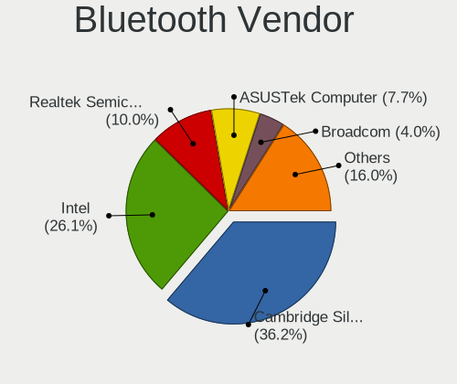
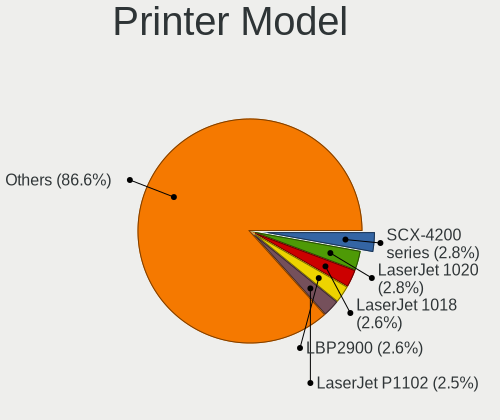
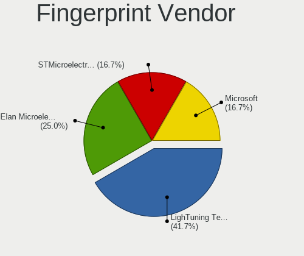

Linux in Russia - Tested Hardware & Statistics (Desktops)
---------------------------------------------------------

A project to collect tested hardware configurations for Linux in Russia.

Anyone can contribute to this report by the [hw-probe](https://github.com/linuxhw/hw-probe) tool:

    sudo -E hw-probe -all -upload

Please contribute! Especially if your hardware is rare.

Contents
--------

* [ Test Cases ](#test-cases)

* [ System ](#system)
  - [ OS                       ](#os)
  - [ OS Family                ](#os-family)
  - [ Kernel                   ](#kernel)
  - [ Kernel Family            ](#kernel-family)
  - [ Kernel Major Ver.        ](#kernel-major-ver)
  - [ Arch                     ](#arch)
  - [ DE                       ](#de)
  - [ Display Server           ](#display-server)
  - [ Display Manager          ](#display-manager)
  - [ OS Lang                  ](#os-lang)
  - [ Boot Mode                ](#boot-mode)
  - [ Filesystem               ](#filesystem)
  - [ Part. scheme             ](#part-scheme)
  - [ Dual Boot with Linux/BSD ](#dual-boot-with-linuxbsd)
  - [ Dual Boot (Win)          ](#dual-boot-win)

* [ Board ](#board)
  - [ Vendor                   ](#vendor)
  - [ Model                    ](#model)
  - [ Model Family             ](#model-family)
  - [ MFG Year                 ](#mfg-year)
  - [ Form Factor              ](#form-factor)
  - [ Secure Boot              ](#secure-boot)
  - [ Coreboot                 ](#coreboot)
  - [ RAM Size                 ](#ram-size)
  - [ RAM Used                 ](#ram-used)
  - [ Total Drives             ](#total-drives)
  - [ Has CD-ROM               ](#has-cd-rom)
  - [ Has Ethernet             ](#has-ethernet)
  - [ Has WiFi                 ](#has-wifi)
  - [ Has Bluetooth            ](#has-bluetooth)

* [ Location ](#location)
  - [ Country                  ](#country)
  - [ City                     ](#city)

* [ Drives ](#drives)
  - [ Drive Vendor             ](#drive-vendor)
  - [ Drive Model              ](#drive-model)
  - [ HDD Vendor               ](#hdd-vendor)
  - [ SSD Vendor               ](#ssd-vendor)
  - [ Drive Kind               ](#drive-kind)
  - [ Drive Connector          ](#drive-connector)
  - [ Drive Size               ](#drive-size)
  - [ Space Total              ](#space-total)
  - [ Space Used               ](#space-used)
  - [ Malfunc. Drives          ](#malfunc-drives)
  - [ Malfunc. Drive Vendor    ](#malfunc-drive-vendor)
  - [ Malfunc. HDD Vendor      ](#malfunc-hdd-vendor)
  - [ Malfunc. Drive Kind      ](#malfunc-drive-kind)
  - [ Failed Drives            ](#failed-drives)
  - [ Failed Drive Vendor      ](#failed-drive-vendor)
  - [ Drive Status             ](#drive-status)

* [ Storage controller ](#storage-controller)
  - [ Storage Vendor           ](#storage-vendor)
  - [ Storage Model            ](#storage-model)
  - [ Storage Kind             ](#storage-kind)

* [ Processor ](#processor)
  - [ CPU Vendor               ](#cpu-vendor)
  - [ CPU Model                ](#cpu-model)
  - [ CPU Model Family         ](#cpu-model-family)
  - [ CPU Cores                ](#cpu-cores)
  - [ CPU Sockets              ](#cpu-sockets)
  - [ CPU Threads              ](#cpu-threads)
  - [ CPU Op-Modes             ](#cpu-op-modes)
  - [ CPU Microcode            ](#cpu-microcode)
  - [ CPU Microarch            ](#cpu-microarch)

* [ Graphics ](#graphics)
  - [ GPU Vendor               ](#gpu-vendor)
  - [ GPU Model                ](#gpu-model)
  - [ GPU Combo                ](#gpu-combo)
  - [ GPU Driver               ](#gpu-driver)
  - [ GPU Memory               ](#gpu-memory)

* [ Monitor ](#monitor)
  - [ Monitor Vendor           ](#monitor-vendor)
  - [ Monitor Model            ](#monitor-model)
  - [ Monitor Resolution       ](#monitor-resolution)
  - [ Monitor Diagonal         ](#monitor-diagonal)
  - [ Monitor Width            ](#monitor-width)
  - [ Aspect Ratio             ](#aspect-ratio)
  - [ Monitor Area             ](#monitor-area)
  - [ Pixel Density            ](#pixel-density)
  - [ Multiple Monitors        ](#multiple-monitors)

* [ Network ](#network)
  - [ Net Controller Vendor    ](#net-controller-vendor)
  - [ Net Controller Model     ](#net-controller-model)
  - [ Wireless Vendor          ](#wireless-vendor)
  - [ Wireless Model           ](#wireless-model)
  - [ Ethernet Vendor          ](#ethernet-vendor)
  - [ Ethernet Model           ](#ethernet-model)
  - [ Net Controller Kind      ](#net-controller-kind)
  - [ Used Controller          ](#used-controller)
  - [ NICs                     ](#nics)
  - [ IPv6                     ](#ipv6)

* [ Bluetooth ](#bluetooth)
  - [ Bluetooth Vendor         ](#bluetooth-vendor)
  - [ Bluetooth Model          ](#bluetooth-model)

* [ Sound ](#sound)
  - [ Sound Vendor             ](#sound-vendor)
  - [ Sound Model              ](#sound-model)

* [ Memory ](#memory)
  - [ Memory Vendor            ](#memory-vendor)
  - [ Memory Model             ](#memory-model)
  - [ Memory Kind              ](#memory-kind)
  - [ Memory Form Factor       ](#memory-form-factor)
  - [ Memory Size              ](#memory-size)
  - [ Memory Speed             ](#memory-speed)

* [ Printers & scanners ](#printers--scanners)
  - [ Printer Vendor           ](#printer-vendor)
  - [ Printer Model            ](#printer-model)
  - [ Scanner Vendor           ](#scanner-vendor)
  - [ Scanner Model            ](#scanner-model)

* [ Camera ](#camera)
  - [ Camera Vendor            ](#camera-vendor)
  - [ Camera Model             ](#camera-model)

* [ Security ](#security)
  - [ Fingerprint Vendor       ](#fingerprint-vendor)
  - [ Fingerprint Model        ](#fingerprint-model)
  - [ Chipcard Vendor          ](#chipcard-vendor)
  - [ Chipcard Model           ](#chipcard-model)

* [ Unsupported ](#unsupported)
  - [ Unsupported Devices      ](#unsupported-devices)
  - [ Unsupported Device Types ](#unsupported-device-types)

Test Cases
----------

Total: 15077

| Vendor        | Model                       | Probe                                                      | Date         |
|---------------|-----------------------------|------------------------------------------------------------|--------------|
| Intel         | D2700DC AAG32420-602        | [a55bb5f425](https://linux-hardware.org/?probe=a55bb5f425) | Jun 01, 2022 |
| ASRock        | B365M Pro4-F                | [3a12e41029](https://linux-hardware.org/?probe=3a12e41029) | Jun 01, 2022 |
| Gigabyte      | N3160TN                     | [e2f44a8274](https://linux-hardware.org/?probe=e2f44a8274) | May 31, 2022 |
| Gigabyte      | P31-S3L                     | [329c96c5af](https://linux-hardware.org/?probe=329c96c5af) | May 31, 2022 |
| ASUSTek       | P8Z68-V GEN3                | [139f0688be](https://linux-hardware.org/?probe=139f0688be) | May 31, 2022 |
| ASUSTek       | PRIME H310M-R R2.0          | [4dad4a323a](https://linux-hardware.org/?probe=4dad4a323a) | May 31, 2022 |
| 3Logic Gro... | DMB-H510-MCA01              | [acc0a6ae9c](https://linux-hardware.org/?probe=acc0a6ae9c) | May 31, 2022 |
| Foxconn       | 2ABF                        | [8188c1e0a8](https://linux-hardware.org/?probe=8188c1e0a8) | May 31, 2022 |
| Intel         | MAHOBAY                     | [2d6ef8ef23](https://linux-hardware.org/?probe=2d6ef8ef23) | May 31, 2022 |
| ASUSTek       | PRIME H310M-R R2.0          | [c60a969370](https://linux-hardware.org/?probe=c60a969370) | May 31, 2022 |
| 3Logic Gro... | DMB-H510-MCA01              | [4ad9ca01bd](https://linux-hardware.org/?probe=4ad9ca01bd) | May 31, 2022 |
| ASUSTek       | P8H61-M LX3 R2.0            | [7bd2b1490a](https://linux-hardware.org/?probe=7bd2b1490a) | May 31, 2022 |
| ASUSTek       | P7H55-M SI                  | [bd7e895652](https://linux-hardware.org/?probe=bd7e895652) | May 31, 2022 |
| MSI           | G31TM-P21                   | [3ddbd38a08](https://linux-hardware.org/?probe=3ddbd38a08) | May 31, 2022 |
| ASUSTek       | B85M-G                      | [451572720e](https://linux-hardware.org/?probe=451572720e) | May 31, 2022 |
| Gigabyte      | M61PME-S2P                  | [6960eaa85b](https://linux-hardware.org/?probe=6960eaa85b) | May 31, 2022 |
| MSI           | B250M PRO-VDH               | [eede963720](https://linux-hardware.org/?probe=eede963720) | May 31, 2022 |
| MSI           | B250M PRO-VDH               | [e2dd690b16](https://linux-hardware.org/?probe=e2dd690b16) | May 31, 2022 |
| ASUSTek       | P5L-VM 1394                 | [5f44d47258](https://linux-hardware.org/?probe=5f44d47258) | May 31, 2022 |
| Gigabyte      | B450 AORUS M                | [eec83e91f0](https://linux-hardware.org/?probe=eec83e91f0) | May 31, 2022 |
| MSI           | B450M PRO-VDH MAX           | [ece9950c65](https://linux-hardware.org/?probe=ece9950c65) | May 31, 2022 |
| ASUSTek       | P8Z77-V LX                  | [0368b3543a](https://linux-hardware.org/?probe=0368b3543a) | May 31, 2022 |
| ASRock        | B460 Phantom Gaming 4       | [b450673fc0](https://linux-hardware.org/?probe=b450673fc0) | May 31, 2022 |
| MSI           | MPG Z390 GAMING PRO CARB... | [6f8785bd56](https://linux-hardware.org/?probe=6f8785bd56) | May 30, 2022 |
| Gigabyte      | X570 AORUS PRO              | [c39f904361](https://linux-hardware.org/?probe=c39f904361) | May 30, 2022 |
| Gigabyte      | H77-DS3H                    | [d593c93e62](https://linux-hardware.org/?probe=d593c93e62) | May 30, 2022 |
| ASUSTek       | M5A78L LE                   | [8eda28a8d4](https://linux-hardware.org/?probe=8eda28a8d4) | May 30, 2022 |
| ASUSTek       | TUF Gaming Z690-PLUS WIF... | [2c33cbbbe2](https://linux-hardware.org/?probe=2c33cbbbe2) | May 30, 2022 |
| Gigabyte      | H61M-S2-B3                  | [3de5695c62](https://linux-hardware.org/?probe=3de5695c62) | May 30, 2022 |
| Gigabyte      | H61M-S2PV                   | [b002ab0fe8](https://linux-hardware.org/?probe=b002ab0fe8) | May 30, 2022 |
| Dell          | 0Y5DDC A00                  | [1a67c11533](https://linux-hardware.org/?probe=1a67c11533) | May 30, 2022 |
| ASRock        | B550M Pro4                  | [a5eee874a5](https://linux-hardware.org/?probe=a5eee874a5) | May 30, 2022 |
| Huanan        | X99-TF                      | [cb08cd42a9](https://linux-hardware.org/?probe=cb08cd42a9) | May 30, 2022 |
| Intel         | MAHOBAY                     | [90c386e917](https://linux-hardware.org/?probe=90c386e917) | May 30, 2022 |
| Gigabyte      | M52L-S3                     | [1add8e904e](https://linux-hardware.org/?probe=1add8e904e) | May 30, 2022 |
| ASUSTek       | VM40B                       | [7ca55e50b4](https://linux-hardware.org/?probe=7ca55e50b4) | May 30, 2022 |
| Intel         | DH55TC AAE70932-204         | [774da6cf18](https://linux-hardware.org/?probe=774da6cf18) | May 30, 2022 |
| Gigabyte      | H61M-S2PV                   | [990a8757b8](https://linux-hardware.org/?probe=990a8757b8) | May 30, 2022 |
| Gigabyte      | M52L-S3                     | [e49b2962df](https://linux-hardware.org/?probe=e49b2962df) | May 30, 2022 |
| ASRock        | H470M-HVS                   | [b7404d28e0](https://linux-hardware.org/?probe=b7404d28e0) | May 30, 2022 |
| ASUSTek       | M5A78L LE                   | [44e2ec7714](https://linux-hardware.org/?probe=44e2ec7714) | May 30, 2022 |
| ASUSTek       | AT4NM10T-I                  | [c70d152830](https://linux-hardware.org/?probe=c70d152830) | May 29, 2022 |
| Lenovo        | 3129 SDK0J40679 WIN 3273... | [0314182c7f](https://linux-hardware.org/?probe=0314182c7f) | May 29, 2022 |
| ASUSTek       | PRIME H310M-K R2.0          | [1a8dbccc21](https://linux-hardware.org/?probe=1a8dbccc21) | May 29, 2022 |
| Gigabyte      | G31M-S2C                    | [458bf7fd6d](https://linux-hardware.org/?probe=458bf7fd6d) | May 29, 2022 |
| ASUSTek       | PRIME A320M-R               | [70e20c1143](https://linux-hardware.org/?probe=70e20c1143) | May 29, 2022 |
| Gigabyte      | B250-HD3-CF                 | [75d42068ac](https://linux-hardware.org/?probe=75d42068ac) | May 29, 2022 |
| Gigabyte      | B250-HD3-CF                 | [f4a35d313c](https://linux-hardware.org/?probe=f4a35d313c) | May 29, 2022 |
| Gigabyte      | GA-MA770-UD3                | [d1c4685112](https://linux-hardware.org/?probe=d1c4685112) | May 29, 2022 |
| KLLISRE       | X99-B5 V1.1                 | [a4e80143d1](https://linux-hardware.org/?probe=a4e80143d1) | May 29, 2022 |
| ASRock        | B550M Pro4                  | [4e2d37a90d](https://linux-hardware.org/?probe=4e2d37a90d) | May 29, 2022 |
| ASUSTek       | P5KPL-AM IN/ROEM/SI         | [4647f374ee](https://linux-hardware.org/?probe=4647f374ee) | May 28, 2022 |
| ASUSTek       | TUF B450M-PRO GAMING        | [7e68528d56](https://linux-hardware.org/?probe=7e68528d56) | May 28, 2022 |
| Gigabyte      | 965P-S3                     | [2058a25c1e](https://linux-hardware.org/?probe=2058a25c1e) | May 28, 2022 |
| ASRock        | B550M Pro4                  | [b861a73ade](https://linux-hardware.org/?probe=b861a73ade) | May 28, 2022 |
| Intel         | X79 V2.72B                  | [15d19c724b](https://linux-hardware.org/?probe=15d19c724b) | May 28, 2022 |
| Gigabyte      | AB350M-DS3H V2-CF           | [c7eceb86c2](https://linux-hardware.org/?probe=c7eceb86c2) | May 28, 2022 |
| MSI           | MAG B550 TOMAHAWK           | [b78390767c](https://linux-hardware.org/?probe=b78390767c) | May 28, 2022 |
| Gigabyte      | B450M DS3H-CF               | [c3d1916e14](https://linux-hardware.org/?probe=c3d1916e14) | May 28, 2022 |
| ASRock        | H87 Pro4                    | [c2bbd20120](https://linux-hardware.org/?probe=c2bbd20120) | May 28, 2022 |
| MACHINIST     | X99-K9 V2.0                 | [6c8e83728c](https://linux-hardware.org/?probe=6c8e83728c) | May 28, 2022 |
| ASUSTek       | P7H55-M LE                  | [4f55b87c44](https://linux-hardware.org/?probe=4f55b87c44) | May 28, 2022 |
| MACHINIST     | X99-K9 V2.0                 | [11bdd69dc0](https://linux-hardware.org/?probe=11bdd69dc0) | May 28, 2022 |
| ASUSTek       | P8H61                       | [45ec66aa68](https://linux-hardware.org/?probe=45ec66aa68) | May 28, 2022 |
| Intel         | X79 V2.72B                  | [a1a4ad8594](https://linux-hardware.org/?probe=a1a4ad8594) | May 28, 2022 |
| MSI           | B450-A PRO                  | [a634794de3](https://linux-hardware.org/?probe=a634794de3) | May 28, 2022 |
| ASRock        | B450M Pro4-F                | [f67fdd8166](https://linux-hardware.org/?probe=f67fdd8166) | May 28, 2022 |
| Gigabyte      | GA-870A-USB3                | [f61c44c7b4](https://linux-hardware.org/?probe=f61c44c7b4) | May 28, 2022 |
| Gigabyte      | MCMLUCB-00                  | [90c886e471](https://linux-hardware.org/?probe=90c886e471) | May 27, 2022 |
| Acer          | Veriton X2665G              | [b07be0c2aa](https://linux-hardware.org/?probe=b07be0c2aa) | May 27, 2022 |
| ASUSTek       | PRIME A320M-R               | [93de227774](https://linux-hardware.org/?probe=93de227774) | May 27, 2022 |
| AMI           | PCHK-Z83 Poslab_ECO         | [a3d73b70b2](https://linux-hardware.org/?probe=a3d73b70b2) | May 27, 2022 |
| MSI           | H110M PRO-VD                | [6c505927be](https://linux-hardware.org/?probe=6c505927be) | May 27, 2022 |
| Dell          | 0Y5DDC A00                  | [e5dd5ddffe](https://linux-hardware.org/?probe=e5dd5ddffe) | May 27, 2022 |
| Gigabyte      | B85M-D3H                    | [dc5f3161bd](https://linux-hardware.org/?probe=dc5f3161bd) | May 27, 2022 |
| ASRock        | 970M Pro3                   | [7c13c36e57](https://linux-hardware.org/?probe=7c13c36e57) | May 27, 2022 |
| ECS           | H61H2-M13                   | [6c5eea6e0a](https://linux-hardware.org/?probe=6c5eea6e0a) | May 27, 2022 |
| ASRock        | FM2A75M-DGS                 | [73260214ee](https://linux-hardware.org/?probe=73260214ee) | May 27, 2022 |
| ASUSTek       | PRIME H310M-R R2.0          | [e28ecda6a9](https://linux-hardware.org/?probe=e28ecda6a9) | May 27, 2022 |
| ASUSTek       | PRIME H310M-R R2.0          | [5b4a1a0b2d](https://linux-hardware.org/?probe=5b4a1a0b2d) | May 27, 2022 |
| ASUSTek       | PRIME H310M-R R2.0          | [8a9debf1da](https://linux-hardware.org/?probe=8a9debf1da) | May 27, 2022 |
| ASUSTek       | PRIME H310M-R R2.0          | [c34cf96051](https://linux-hardware.org/?probe=c34cf96051) | May 27, 2022 |
| Intel         | DX58SO AAE29331-501         | [c574de14a5](https://linux-hardware.org/?probe=c574de14a5) | May 27, 2022 |
| Intel         | DX58SO AAE29331-501         | [7bbcdf39b4](https://linux-hardware.org/?probe=7bbcdf39b4) | May 27, 2022 |
| MSI           | MPG X570 GAMING PRO CARB... | [2cca2a7979](https://linux-hardware.org/?probe=2cca2a7979) | May 27, 2022 |
| HP            | 0B54h D                     | [d36988a09b](https://linux-hardware.org/?probe=d36988a09b) | May 26, 2022 |
| Gigabyte      | H110M-S2H-CF                | [305a4aa2be](https://linux-hardware.org/?probe=305a4aa2be) | May 26, 2022 |
| ASRock        | B85M Pro3                   | [661f30003c](https://linux-hardware.org/?probe=661f30003c) | May 26, 2022 |
| ASRock        | B460 Phantom Gaming 4       | [e692b2a091](https://linux-hardware.org/?probe=e692b2a091) | May 26, 2022 |
| Intel         | DH55TC AAE70932-204         | [63c6e6a359](https://linux-hardware.org/?probe=63c6e6a359) | May 26, 2022 |
| MSI           | A520M PRO                   | [3eb8006c14](https://linux-hardware.org/?probe=3eb8006c14) | May 26, 2022 |
| MSI           | H110M PRO-VD                | [f50e4f5314](https://linux-hardware.org/?probe=f50e4f5314) | May 26, 2022 |
| ASRock        | H470M-HVS                   | [134bd88895](https://linux-hardware.org/?probe=134bd88895) | May 26, 2022 |
| ASUSTek       | H81M-K                      | [3fc005308d](https://linux-hardware.org/?probe=3fc005308d) | May 26, 2022 |
| ASUSTek       | H87-PLUS                    | [b3abdcf25f](https://linux-hardware.org/?probe=b3abdcf25f) | May 26, 2022 |
| Gigabyte      | P61A-D3                     | [2ec61142d0](https://linux-hardware.org/?probe=2ec61142d0) | May 26, 2022 |
| ASUSTek       | P5KPL/1600                  | [4198598e6f](https://linux-hardware.org/?probe=4198598e6f) | May 26, 2022 |
| ASRock        | B550M Pro4                  | [d5df82a4ce](https://linux-hardware.org/?probe=d5df82a4ce) | May 25, 2022 |
| ASUSTek       | P8H77-M                     | [a34b43d64c](https://linux-hardware.org/?probe=a34b43d64c) | May 25, 2022 |
| Gigabyte      | Z590 AORUS ULTRA            | [544888143f](https://linux-hardware.org/?probe=544888143f) | May 25, 2022 |
| ECS           | G31T-M9                     | [cbc52e0724](https://linux-hardware.org/?probe=cbc52e0724) | May 25, 2022 |
| Gigabyte      | H67M-UD2H-B3                | [e355a95cfd](https://linux-hardware.org/?probe=e355a95cfd) | May 25, 2022 |
| Foxconn       | H61MXL/H61MXL-K             | [c44b877046](https://linux-hardware.org/?probe=c44b877046) | May 25, 2022 |
| ASUSTek       | PRO H410T                   | [7d7a4c7536](https://linux-hardware.org/?probe=7d7a4c7536) | May 25, 2022 |
| Gigabyte      | P75-D3                      | [becf8cce19](https://linux-hardware.org/?probe=becf8cce19) | May 25, 2022 |
| MSI           | A520M PRO                   | [9766bbe4c0](https://linux-hardware.org/?probe=9766bbe4c0) | May 25, 2022 |
| Gigabyte      | GA-MA78GM-S2H               | [93d4bd3b14](https://linux-hardware.org/?probe=93d4bd3b14) | May 25, 2022 |
| Unknown       | Unknown                     | [dd0ffbf45b](https://linux-hardware.org/?probe=dd0ffbf45b) | May 25, 2022 |
| ASUSTek       | M4A78-EM                    | [37a8e41d00](https://linux-hardware.org/?probe=37a8e41d00) | May 25, 2022 |
| Unknown       | Unknown                     | [213e81318d](https://linux-hardware.org/?probe=213e81318d) | May 25, 2022 |
| ASRock        | G41M-GS3                    | [85e26d9b09](https://linux-hardware.org/?probe=85e26d9b09) | May 25, 2022 |
| ASUSTek       | H97-PLUS                    | [cab2025064](https://linux-hardware.org/?probe=cab2025064) | May 24, 2022 |
| ASRock        | B550M Pro4                  | [35ba2b5a7a](https://linux-hardware.org/?probe=35ba2b5a7a) | May 24, 2022 |
| Foxconn       | G31MXP FAB:1.1              | [64552194de](https://linux-hardware.org/?probe=64552194de) | May 24, 2022 |
| Gigabyte      | H510M H                     | [4bf981574e](https://linux-hardware.org/?probe=4bf981574e) | May 24, 2022 |
| Acer          | Aspire TC-705               | [57bd3c5501](https://linux-hardware.org/?probe=57bd3c5501) | May 24, 2022 |
| ASUSTek       | ROG STRIX B550-I GAMING     | [f680d813d7](https://linux-hardware.org/?probe=f680d813d7) | May 24, 2022 |
| Gigabyte      | EP45-UD3LR                  | [ea7f269697](https://linux-hardware.org/?probe=ea7f269697) | May 24, 2022 |
| MSI           | H110M PRO-VD                | [5f3d17f133](https://linux-hardware.org/?probe=5f3d17f133) | May 24, 2022 |
| Intel         | D2500HN AAG81480-500        | [bc39db0484](https://linux-hardware.org/?probe=bc39db0484) | May 24, 2022 |
| ASRock        | N68-S3 UCC                  | [068b759d6e](https://linux-hardware.org/?probe=068b759d6e) | May 24, 2022 |
| ASUSTek       | P8H61                       | [5514e95c95](https://linux-hardware.org/?probe=5514e95c95) | May 24, 2022 |
| HP            | 0B54h D                     | [9dc982847a](https://linux-hardware.org/?probe=9dc982847a) | May 24, 2022 |
| ASUSTek       | P8H61                       | [873dd31f8e](https://linux-hardware.org/?probe=873dd31f8e) | May 23, 2022 |
| Gigabyte      | H61M-DS2                    | [1613ab8b42](https://linux-hardware.org/?probe=1613ab8b42) | May 23, 2022 |
| ASRock        | H470M-HVS                   | [0e8f0ed773](https://linux-hardware.org/?probe=0e8f0ed773) | May 23, 2022 |
| Gigabyte      | A320M-H-CF                  | [13c83f5c47](https://linux-hardware.org/?probe=13c83f5c47) | May 23, 2022 |
| ASUSTek       | C60M1-I                     | [169d96b73b](https://linux-hardware.org/?probe=169d96b73b) | May 23, 2022 |
| ASRock        | H470M-HVS                   | [193d7daf36](https://linux-hardware.org/?probe=193d7daf36) | May 23, 2022 |
| ASRock        | H470M-HVS                   | [0d1907cc6f](https://linux-hardware.org/?probe=0d1907cc6f) | May 23, 2022 |
| ASRock        | H470M-HVS                   | [ea8294c786](https://linux-hardware.org/?probe=ea8294c786) | May 23, 2022 |
| ASRock        | H470M-HVS                   | [a888bc633f](https://linux-hardware.org/?probe=a888bc633f) | May 23, 2022 |
| ASRock        | H470M-HVS                   | [4277ebe7e7](https://linux-hardware.org/?probe=4277ebe7e7) | May 23, 2022 |
| ASRock        | H470M-HVS                   | [6bfc4ef24f](https://linux-hardware.org/?probe=6bfc4ef24f) | May 23, 2022 |
| ASRock        | H470M-HVS                   | [3629d7c796](https://linux-hardware.org/?probe=3629d7c796) | May 23, 2022 |
| ASRock        | H470M-HVS                   | [9938056162](https://linux-hardware.org/?probe=9938056162) | May 23, 2022 |
| ASRock        | H470M-HVS                   | [02393f8ed7](https://linux-hardware.org/?probe=02393f8ed7) | May 23, 2022 |
| ASRock        | H470M-HVS                   | [f8257427c6](https://linux-hardware.org/?probe=f8257427c6) | May 23, 2022 |
| ASRock        | H470M-HVS                   | [3c545f2940](https://linux-hardware.org/?probe=3c545f2940) | May 23, 2022 |
| MAINBRD       | OPS62A-SHA                  | [9450237ae3](https://linux-hardware.org/?probe=9450237ae3) | May 23, 2022 |
| ASRock        | B365M Pro4-F                | [b3b2ee08af](https://linux-hardware.org/?probe=b3b2ee08af) | May 23, 2022 |
| ASUSTek       | PRIME B460M-K               | [765d22e752](https://linux-hardware.org/?probe=765d22e752) | May 23, 2022 |
| ASUSTek       | Z87-A                       | [861da6e999](https://linux-hardware.org/?probe=861da6e999) | May 23, 2022 |
| Gigabyte      | H55M-USB3                   | [08e7d1f0d2](https://linux-hardware.org/?probe=08e7d1f0d2) | May 22, 2022 |
| ASUSTek       | M4A88TD-V EVO/USB3          | [ed2bf9256c](https://linux-hardware.org/?probe=ed2bf9256c) | May 22, 2022 |
| Intel         | X79                         | [904bf5297c](https://linux-hardware.org/?probe=904bf5297c) | May 22, 2022 |
| ASRock        | B460 Phantom Gaming 4       | [2a6ba92f67](https://linux-hardware.org/?probe=2a6ba92f67) | May 22, 2022 |
| Unknown       | Intel X79                   | [52d19fdb12](https://linux-hardware.org/?probe=52d19fdb12) | May 22, 2022 |
| ASUSTek       | P8P67-M                     | [83917315b7](https://linux-hardware.org/?probe=83917315b7) | May 22, 2022 |
| ASRock        | B550M-HDV                   | [b64b85418b](https://linux-hardware.org/?probe=b64b85418b) | May 22, 2022 |
| Gigabyte      | GA-MA770-UD3                | [58dcd147b7](https://linux-hardware.org/?probe=58dcd147b7) | May 22, 2022 |
| Gigabyte      | GA-MA770-UD3                | [aeb22efb30](https://linux-hardware.org/?probe=aeb22efb30) | May 22, 2022 |
| Gigabyte      | B365M DS3H                  | [092f8be315](https://linux-hardware.org/?probe=092f8be315) | May 22, 2022 |
| ASUSTek       | P5KPL-AM IN/ROEM/SI         | [0e14154fc0](https://linux-hardware.org/?probe=0e14154fc0) | May 22, 2022 |
| ASUSTek       | P5KPL-AM IN/ROEM/SI         | [a94464dc7e](https://linux-hardware.org/?probe=a94464dc7e) | May 21, 2022 |
| ASRock        | B550M Pro4                  | [85974104c5](https://linux-hardware.org/?probe=85974104c5) | May 21, 2022 |
| ASRock        | B460 Phantom Gaming 4       | [f697c39b33](https://linux-hardware.org/?probe=f697c39b33) | May 21, 2022 |
| Gigabyte      | H61M-S2PV                   | [4dce3bdb3a](https://linux-hardware.org/?probe=4dce3bdb3a) | May 21, 2022 |
| MSI           | 970 GAMING                  | [082a1ac531](https://linux-hardware.org/?probe=082a1ac531) | May 21, 2022 |
| ASRock        | B460 Phantom Gaming 4       | [280302cc7b](https://linux-hardware.org/?probe=280302cc7b) | May 20, 2022 |
| Gigabyte      | G41MT-S2                    | [0245a34484](https://linux-hardware.org/?probe=0245a34484) | May 20, 2022 |
| ASUSTek       | H81M-R                      | [d29d7ee0ad](https://linux-hardware.org/?probe=d29d7ee0ad) | May 20, 2022 |
| ASRock        | B460 Phantom Gaming 4       | [6e8eed720d](https://linux-hardware.org/?probe=6e8eed720d) | May 20, 2022 |
| Gigabyte      | B560M H                     | [193e7d05a0](https://linux-hardware.org/?probe=193e7d05a0) | May 20, 2022 |
| Chatreey      | AC1-DP                      | [aefe90ce82](https://linux-hardware.org/?probe=aefe90ce82) | May 20, 2022 |
| Apple         | Mac-F4208DC8 PVT            | [9330599ada](https://linux-hardware.org/?probe=9330599ada) | May 20, 2022 |
| MSI           | H110M PRO-VD                | [a9d54e08c9](https://linux-hardware.org/?probe=a9d54e08c9) | May 20, 2022 |
| MAINBRD       | OPS62A-SHA                  | [ad85836549](https://linux-hardware.org/?probe=ad85836549) | May 20, 2022 |
| ASRock        | A320M-HDV R4.0              | [71797f9336](https://linux-hardware.org/?probe=71797f9336) | May 20, 2022 |
| ASUSTek       | H110M-K                     | [25cf1b1ec9](https://linux-hardware.org/?probe=25cf1b1ec9) | May 20, 2022 |
| Gigabyte      | GA-MA770-UD3                | [afce6e6cee](https://linux-hardware.org/?probe=afce6e6cee) | May 20, 2022 |
| ASUSTek       | P8H67-M PRO                 | [da744c49fd](https://linux-hardware.org/?probe=da744c49fd) | May 20, 2022 |
| Gigabyte      | X570S AORUS MASTER          | [d26b453c29](https://linux-hardware.org/?probe=d26b453c29) | May 20, 2022 |
| ASUSTek       | M5A97 LE R2.0               | [696932f291](https://linux-hardware.org/?probe=696932f291) | May 20, 2022 |
| ASUSTek       | M5A97 LE R2.0               | [be0659ce93](https://linux-hardware.org/?probe=be0659ce93) | May 20, 2022 |
| MSI           | H510TI-S01                  | [efe42ef07a](https://linux-hardware.org/?probe=efe42ef07a) | May 19, 2022 |
| ASRock        | H470M-HVS                   | [b78055bf57](https://linux-hardware.org/?probe=b78055bf57) | May 19, 2022 |
| iRU           | LPGR.469559.012             | [9163b267bc](https://linux-hardware.org/?probe=9163b267bc) | May 19, 2022 |
| ASUSTek       | P6T WS PRO                  | [1064f07721](https://linux-hardware.org/?probe=1064f07721) | May 19, 2022 |
| Gigabyte      | B365 HD3                    | [82bd3dbfe9](https://linux-hardware.org/?probe=82bd3dbfe9) | May 18, 2022 |
| HP            | 2820h                       | [af311c3a41](https://linux-hardware.org/?probe=af311c3a41) | May 18, 2022 |
| Gigabyte      | H55-UD3H                    | [e766ad4581](https://linux-hardware.org/?probe=e766ad4581) | May 18, 2022 |
| Gigabyte      | B75-D3V                     | [81bd72f465](https://linux-hardware.org/?probe=81bd72f465) | May 18, 2022 |
| ASUSTek       | P5E                         | [4038be4f49](https://linux-hardware.org/?probe=4038be4f49) | May 18, 2022 |
| Gigabyte      | AB350M-DS3H-CF              | [cc38925ca1](https://linux-hardware.org/?probe=cc38925ca1) | May 18, 2022 |
| Gigabyte      | E350N WIN8                  | [31923a075f](https://linux-hardware.org/?probe=31923a075f) | May 18, 2022 |
| Gigabyte      | P61A-D3                     | [dd4b8bf4e7](https://linux-hardware.org/?probe=dd4b8bf4e7) | May 18, 2022 |
| Gigabyte      | H61M-DS2                    | [01dc038814](https://linux-hardware.org/?probe=01dc038814) | May 18, 2022 |
| ASRock        | N68-S3 UCC                  | [5f2fb2e8bd](https://linux-hardware.org/?probe=5f2fb2e8bd) | May 17, 2022 |
| ASUSTek       | Z97M-PLUS                   | [a54f021132](https://linux-hardware.org/?probe=a54f021132) | May 17, 2022 |
| ASUSTek       | Z97M-PLUS                   | [5feb18b37b](https://linux-hardware.org/?probe=5feb18b37b) | May 17, 2022 |
| EPoX Compu... | nForce3 DDR: 8KDA3I Seri... | [4b38991c7a](https://linux-hardware.org/?probe=4b38991c7a) | May 17, 2022 |
| Gigabyte      | B75M-D2V                    | [6eba5e9bf2](https://linux-hardware.org/?probe=6eba5e9bf2) | May 17, 2022 |
| Foxconn       | 945 7MD Series              | [523af6afbd](https://linux-hardware.org/?probe=523af6afbd) | May 17, 2022 |
| ASUSTek       | P8H67-M LE                  | [ef70fd2699](https://linux-hardware.org/?probe=ef70fd2699) | May 17, 2022 |
| MSI           | H310M PRO-VDH PLUS          | [7fe3dc4301](https://linux-hardware.org/?probe=7fe3dc4301) | May 17, 2022 |
| HP            | ProLiant MicroServer        | [eb3f9d541e](https://linux-hardware.org/?probe=eb3f9d541e) | May 17, 2022 |
| HP            | ProLiant MicroServer Gen... | [2a8a53c628](https://linux-hardware.org/?probe=2a8a53c628) | May 17, 2022 |
| ASRock        | H470M-HVS                   | [d71e59e4ef](https://linux-hardware.org/?probe=d71e59e4ef) | May 17, 2022 |
| ASUSTek       | A68HM-K                     | [a3b4c84c89](https://linux-hardware.org/?probe=a3b4c84c89) | May 17, 2022 |
| ASUSTek       | P5L-VM 1394                 | [1589892eec](https://linux-hardware.org/?probe=1589892eec) | May 17, 2022 |
| ASUSTek       | A68HM-K                     | [a38bac0479](https://linux-hardware.org/?probe=a38bac0479) | May 17, 2022 |
| Gigabyte      | G31M-ES2L                   | [1ab7586d5f](https://linux-hardware.org/?probe=1ab7586d5f) | May 17, 2022 |
| Gigabyte      | H67N-USB3-B3                | [8feeed71b7](https://linux-hardware.org/?probe=8feeed71b7) | May 17, 2022 |
| ASUSTek       | P5L-VM 1394                 | [aee504bd13](https://linux-hardware.org/?probe=aee504bd13) | May 17, 2022 |
| Gigabyte      | P61A-D3                     | [d495e3aa63](https://linux-hardware.org/?probe=d495e3aa63) | May 17, 2022 |
| ASUSTek       | M4A78-EM                    | [ac65146c38](https://linux-hardware.org/?probe=ac65146c38) | May 17, 2022 |
| ASRock        | B550M Pro4                  | [acd5c94fc8](https://linux-hardware.org/?probe=acd5c94fc8) | May 16, 2022 |
| Gigabyte      | B75M-D2V                    | [86de85c736](https://linux-hardware.org/?probe=86de85c736) | May 16, 2022 |
| Acer          | Aspire TC-705               | [b0873a64d2](https://linux-hardware.org/?probe=b0873a64d2) | May 16, 2022 |
| Gigabyte      | H81M-S2V                    | [9646d7027f](https://linux-hardware.org/?probe=9646d7027f) | May 16, 2022 |
| ASUSTek       | PRO H410T                   | [8ededa12ef](https://linux-hardware.org/?probe=8ededa12ef) | May 16, 2022 |
| ASUSTek       | M5A78L LE                   | [697a89162e](https://linux-hardware.org/?probe=697a89162e) | May 16, 2022 |
| Gigabyte      | H81M-S2V                    | [f5817a11ec](https://linux-hardware.org/?probe=f5817a11ec) | May 16, 2022 |
| Gigabyte      | MCMLUCB-00                  | [1ad57be6ad](https://linux-hardware.org/?probe=1ad57be6ad) | May 16, 2022 |
| Gigabyte      | X570S AORUS MASTER          | [e12a8b383f](https://linux-hardware.org/?probe=e12a8b383f) | May 16, 2022 |
| Gigabyte      | B450M S2H                   | [44da55727f](https://linux-hardware.org/?probe=44da55727f) | May 16, 2022 |
| ASUSTek       | P8H61-MX R2.0               | [45da577bc5](https://linux-hardware.org/?probe=45da577bc5) | May 15, 2022 |
| ECS           | BSWI-D2                     | [f5ad79fb60](https://linux-hardware.org/?probe=f5ad79fb60) | May 15, 2022 |
| ASRock        | 880GMH/U3S3                 | [57c85dd37a](https://linux-hardware.org/?probe=57c85dd37a) | May 15, 2022 |
| MSI           | B450-A PRO                  | [e5121153f7](https://linux-hardware.org/?probe=e5121153f7) | May 15, 2022 |
| MSI           | J1900I                      | [86f37a71f5](https://linux-hardware.org/?probe=86f37a71f5) | May 15, 2022 |
| MSI           | J1900I                      | [5a48d83596](https://linux-hardware.org/?probe=5a48d83596) | May 15, 2022 |
| MSI           | X570-A PRO                  | [28b47bc364](https://linux-hardware.org/?probe=28b47bc364) | May 15, 2022 |
| ASUSTek       | TUF Gaming X570-PLUS        | [021f95ce24](https://linux-hardware.org/?probe=021f95ce24) | May 15, 2022 |
| ASUSTek       | TUF Gaming X570-PLUS        | [9ce2f8b28b](https://linux-hardware.org/?probe=9ce2f8b28b) | May 15, 2022 |
| ASUSTek       | M4A78-EM                    | [bedc08df5b](https://linux-hardware.org/?probe=bedc08df5b) | May 15, 2022 |
| ASUSTek       | M5A97 PRO                   | [18cf20e9a2](https://linux-hardware.org/?probe=18cf20e9a2) | May 15, 2022 |
| ASUSTek       | M5A97 PRO                   | [15d32c7578](https://linux-hardware.org/?probe=15d32c7578) | May 15, 2022 |
| ASUSTek       | PRIME H310-PLUS             | [770fbfefd3](https://linux-hardware.org/?probe=770fbfefd3) | May 15, 2022 |
| Gigabyte      | Z370M D3H-CF                | [eab1bcc17e](https://linux-hardware.org/?probe=eab1bcc17e) | May 15, 2022 |
| ASUSTek       | PRIME H310-PLUS             | [8baee6f2e6](https://linux-hardware.org/?probe=8baee6f2e6) | May 14, 2022 |
| ASRock        | B550M Pro4                  | [289c04b1dd](https://linux-hardware.org/?probe=289c04b1dd) | May 14, 2022 |
| ECS           | P43T-A2                     | [d3be091ef5](https://linux-hardware.org/?probe=d3be091ef5) | May 14, 2022 |
| ECS           | P43T-A2                     | [412be434c0](https://linux-hardware.org/?probe=412be434c0) | May 14, 2022 |
| ASUSTek       | PRIME Z370-P                | [5fb1304e59](https://linux-hardware.org/?probe=5fb1304e59) | May 14, 2022 |
| Gigabyte      | P61A-D3                     | [5abe5033c6](https://linux-hardware.org/?probe=5abe5033c6) | May 14, 2022 |
| ASRock        | G41M-VS2                    | [9cf93ac497](https://linux-hardware.org/?probe=9cf93ac497) | May 14, 2022 |
| ASUSTek       | M2A-VM                      | [7708e385fb](https://linux-hardware.org/?probe=7708e385fb) | May 14, 2022 |
| ASRock        | B75M-DGS R2.0               | [1d61892cb0](https://linux-hardware.org/?probe=1d61892cb0) | May 14, 2022 |
| MSI           | B350M PRO-VDH               | [a8033573ef](https://linux-hardware.org/?probe=a8033573ef) | May 14, 2022 |
| Gigabyte      | AB350-Gaming-CF             | [30085d6f41](https://linux-hardware.org/?probe=30085d6f41) | May 13, 2022 |
| ASRock        | B550M Pro4                  | [9f9e071e39](https://linux-hardware.org/?probe=9f9e071e39) | May 12, 2022 |
| Gigabyte      | X470 AORUS GAMING 7 WIFI... | [531749d46b](https://linux-hardware.org/?probe=531749d46b) | May 12, 2022 |
| ASRock        | B550M Pro4                  | [fad48ff5dd](https://linux-hardware.org/?probe=fad48ff5dd) | May 12, 2022 |
| MSI           | 870S-C45                    | [eefd6f4979](https://linux-hardware.org/?probe=eefd6f4979) | May 12, 2022 |
| ASUSTek       | P8P67 DELUXE                | [4293bc4b1c](https://linux-hardware.org/?probe=4293bc4b1c) | May 12, 2022 |
| Gigabyte      | F2A68HM-S1                  | [5674fc5620](https://linux-hardware.org/?probe=5674fc5620) | May 12, 2022 |
| ASRock        | 970 Pro3 R2.0               | [0b80003bf8](https://linux-hardware.org/?probe=0b80003bf8) | May 12, 2022 |
| ASUSTek       | H110-PLUS                   | [56b6d0f154](https://linux-hardware.org/?probe=56b6d0f154) | May 12, 2022 |
| ASRock        | H310CM-HDV                  | [319f70da4e](https://linux-hardware.org/?probe=319f70da4e) | May 12, 2022 |
| ASUSTek       | H110-PLUS                   | [cf7ae5c07b](https://linux-hardware.org/?probe=cf7ae5c07b) | May 12, 2022 |
| Gigabyte      | B550M S2H                   | [41c7fd7bcc](https://linux-hardware.org/?probe=41c7fd7bcc) | May 12, 2022 |
| ASUSTek       | PRIME B250M-PLUS            | [a4f4e7c199](https://linux-hardware.org/?probe=a4f4e7c199) | May 12, 2022 |
| ASUSTek       | H110M-R                     | [e4107f3e84](https://linux-hardware.org/?probe=e4107f3e84) | May 12, 2022 |
| ASRock        | Z370 Professional Gaming... | [658347ec76](https://linux-hardware.org/?probe=658347ec76) | May 12, 2022 |
| ASUSTek       | M5A78L-M LE/USB3            | [3494019436](https://linux-hardware.org/?probe=3494019436) | May 11, 2022 |
| MSI           | B450 TOMAHAWK               | [d14b68d592](https://linux-hardware.org/?probe=d14b68d592) | May 11, 2022 |
| HP            | 2AA6 PVT                    | [18fb552bc2](https://linux-hardware.org/?probe=18fb552bc2) | May 11, 2022 |
| Gigabyte      | B365M H                     | [e405d209d4](https://linux-hardware.org/?probe=e405d209d4) | May 11, 2022 |
| 3Logic Gro... | AMUR DMB-H310-MCA01         | [cfb12880a5](https://linux-hardware.org/?probe=cfb12880a5) | May 11, 2022 |
| ASRock        | B450 Gaming K4              | [a6873c7d7b](https://linux-hardware.org/?probe=a6873c7d7b) | May 11, 2022 |
| ASUSTek       | B75M-A                      | [70ef1387b3](https://linux-hardware.org/?probe=70ef1387b3) | May 11, 2022 |
| ASUSTek       | H81M-K                      | [66bb3248d5](https://linux-hardware.org/?probe=66bb3248d5) | May 11, 2022 |
| ASRock        | H570M-ITX/ac                | [74f198b961](https://linux-hardware.org/?probe=74f198b961) | May 11, 2022 |
| ASRock        | FM2A68M-DG3+                | [4060102b0d](https://linux-hardware.org/?probe=4060102b0d) | May 11, 2022 |
| ASRock        | B365M-HDV                   | [06a97b74c2](https://linux-hardware.org/?probe=06a97b74c2) | May 11, 2022 |
| ASRock        | B365M-HDV                   | [e118437b55](https://linux-hardware.org/?probe=e118437b55) | May 11, 2022 |
| ASRock        | N68-S3 UCC                  | [083ee33b93](https://linux-hardware.org/?probe=083ee33b93) | May 11, 2022 |
| ASUSTek       | A68HM-K                     | [657c27be04](https://linux-hardware.org/?probe=657c27be04) | May 10, 2022 |
| Huanan        | X99 F8D V2.2                | [af98aacde1](https://linux-hardware.org/?probe=af98aacde1) | May 10, 2022 |
| MSI           | Z370 TOMAHAWK               | [89222d6d5a](https://linux-hardware.org/?probe=89222d6d5a) | May 10, 2022 |
| ASRock        | 880GMH/U3S3                 | [73e6cb3b6b](https://linux-hardware.org/?probe=73e6cb3b6b) | May 10, 2022 |
| ASRock        | B550 Steel Legend           | [a940d31b37](https://linux-hardware.org/?probe=a940d31b37) | May 10, 2022 |
| ASUSTek       | M4A88TD-V EVO/USB3          | [38838b0da0](https://linux-hardware.org/?probe=38838b0da0) | May 10, 2022 |
| ASUSTek       | P5L-VM 1394                 | [b0a089f59e](https://linux-hardware.org/?probe=b0a089f59e) | May 10, 2022 |
| ASUSTek       | M5A78L-M LE/USB3            | [21b06f22da](https://linux-hardware.org/?probe=21b06f22da) | May 09, 2022 |
| Lenovo        | Kabini CRB 31900059 STD ... | [a862dd454d](https://linux-hardware.org/?probe=a862dd454d) | May 09, 2022 |
| ASUSTek       | M2N-VM HDMI                 | [28ef8fe01d](https://linux-hardware.org/?probe=28ef8fe01d) | May 09, 2022 |
| ASRock        | 960GM-GS3 FX                | [36fe76c490](https://linux-hardware.org/?probe=36fe76c490) | May 09, 2022 |
| ASRock        | H81M-ITX                    | [7da59c1f4c](https://linux-hardware.org/?probe=7da59c1f4c) | May 09, 2022 |
| Gigabyte      | P31-S3G                     | [98c00acfd0](https://linux-hardware.org/?probe=98c00acfd0) | May 08, 2022 |
| ASRock        | B560M Pro4                  | [c7e61a8776](https://linux-hardware.org/?probe=c7e61a8776) | May 08, 2022 |
| ASRock        | B560M Pro4                  | [b532438c73](https://linux-hardware.org/?probe=b532438c73) | May 08, 2022 |
| KLLISRE       | X79 V2.72S                  | [24c5f93b26](https://linux-hardware.org/?probe=24c5f93b26) | May 08, 2022 |
| ASRock        | 960GM-GS3 FX                | [ee12f03755](https://linux-hardware.org/?probe=ee12f03755) | May 08, 2022 |
| MSI           | 970A-G43                    | [3338da03cc](https://linux-hardware.org/?probe=3338da03cc) | May 07, 2022 |
| Gigabyte      | H77-DS3H                    | [7a595e57da](https://linux-hardware.org/?probe=7a595e57da) | May 07, 2022 |
| ASUSTek       | P8B75-M                     | [6371d77b5d](https://linux-hardware.org/?probe=6371d77b5d) | May 07, 2022 |
| MSI           | MAG Z690 TOMAHAWK WIFI D... | [38c0346cf7](https://linux-hardware.org/?probe=38c0346cf7) | May 07, 2022 |
| ASUSTek       | F1A55-M LX                  | [b8505af5d6](https://linux-hardware.org/?probe=b8505af5d6) | May 07, 2022 |
| Gigabyte      | EP45-UD3LR                  | [1f6748931c](https://linux-hardware.org/?probe=1f6748931c) | May 07, 2022 |
| ASUSTek       | H110M-R                     | [720be5218f](https://linux-hardware.org/?probe=720be5218f) | May 07, 2022 |
| ASUSTek       | P5QL-E                      | [7847a3091b](https://linux-hardware.org/?probe=7847a3091b) | May 07, 2022 |
| Acer          | Aspire TC-391               | [ec090fb244](https://linux-hardware.org/?probe=ec090fb244) | May 07, 2022 |
| Lenovo        | MAHOBAY NO DPK              | [d58aad0813](https://linux-hardware.org/?probe=d58aad0813) | May 06, 2022 |
| KLLISRE       | X79 V2.72S                  | [4f3f76f020](https://linux-hardware.org/?probe=4f3f76f020) | May 06, 2022 |
| KLLISRE       | X79 V2.72S                  | [73d339904d](https://linux-hardware.org/?probe=73d339904d) | May 06, 2022 |
| Huanan        | X99-BD4 V1.1, NALEX         | [e69b3ef962](https://linux-hardware.org/?probe=e69b3ef962) | May 06, 2022 |
| ASRock        | H61M-GE                     | [fefe67c0d4](https://linux-hardware.org/?probe=fefe67c0d4) | May 05, 2022 |
| Gigabyte      | GA-M55PLUS-S3G              | [ff948aad6c](https://linux-hardware.org/?probe=ff948aad6c) | May 05, 2022 |
| Gigabyte      | B450 I AORUS PRO WIFI-CF    | [8f15e66f2d](https://linux-hardware.org/?probe=8f15e66f2d) | May 05, 2022 |
| Huanan        | X99-F8                      | [f9699aaa3e](https://linux-hardware.org/?probe=f9699aaa3e) | May 05, 2022 |
| MSI           | H410I PRO WIFI              | [bc1d89fabc](https://linux-hardware.org/?probe=bc1d89fabc) | May 05, 2022 |
| MSI           | A520M-A PRO                 | [ab6c74c421](https://linux-hardware.org/?probe=ab6c74c421) | May 05, 2022 |
| MSI           | 970A-G43                    | [8b6588eada](https://linux-hardware.org/?probe=8b6588eada) | May 04, 2022 |
| MSI           | B360M PRO-VDH               | [23b80ec93e](https://linux-hardware.org/?probe=23b80ec93e) | May 04, 2022 |
| Pegatron      | IPPPV-D3G                   | [bf56539e57](https://linux-hardware.org/?probe=bf56539e57) | May 04, 2022 |
| ASUSTek       | P8H67-M LE                  | [302e27b974](https://linux-hardware.org/?probe=302e27b974) | May 04, 2022 |
| ASUSTek       | P8H67-M LE                  | [a9cf3bc268](https://linux-hardware.org/?probe=a9cf3bc268) | May 04, 2022 |
| Intel         | SKYBAY                      | [4891bdbd5c](https://linux-hardware.org/?probe=4891bdbd5c) | May 04, 2022 |
| Gigabyte      | G41MT-S2P                   | [c3ae8f35f9](https://linux-hardware.org/?probe=c3ae8f35f9) | May 04, 2022 |
| Gigabyte      | P67A-D3-B3                  | [506ffac23c](https://linux-hardware.org/?probe=506ffac23c) | May 04, 2022 |
| Gigabyte      | H110M-DS2-CF                | [374070d210](https://linux-hardware.org/?probe=374070d210) | May 04, 2022 |
| Gigabyte      | B550M AORUS PRO             | [dd95306834](https://linux-hardware.org/?probe=dd95306834) | May 04, 2022 |
| ASUSTek       | H81M-K                      | [c25a0f8526](https://linux-hardware.org/?probe=c25a0f8526) | May 04, 2022 |
| ASUSTek       | P8P67                       | [653adf4036](https://linux-hardware.org/?probe=653adf4036) | May 04, 2022 |
| Lenovo        | ThinkCentre M55 8795B1G     | [295fe2b588](https://linux-hardware.org/?probe=295fe2b588) | May 04, 2022 |
| Lenovo        | ThinkCentre M55 8795B1G     | [b88ff00133](https://linux-hardware.org/?probe=b88ff00133) | May 04, 2022 |
| Unknown       | RS690-SB600                 | [a5a63d87df](https://linux-hardware.org/?probe=a5a63d87df) | May 04, 2022 |
| MSI           | B450M MORTAR MAX            | [5e1f408239](https://linux-hardware.org/?probe=5e1f408239) | May 04, 2022 |
| ASUSTek       | M5A97 EVO R2.0              | [256b7b7658](https://linux-hardware.org/?probe=256b7b7658) | May 03, 2022 |
| Unknown       | RS690-SB600                 | [cdda671470](https://linux-hardware.org/?probe=cdda671470) | May 03, 2022 |
| Gigabyte      | X570 I AORUS PRO WIFI       | [9fa64d179d](https://linux-hardware.org/?probe=9fa64d179d) | May 03, 2022 |
| Gigabyte      | X570 I AORUS PRO WIFI       | [a134998640](https://linux-hardware.org/?probe=a134998640) | May 03, 2022 |
| ASRock        | B450 Gaming K4              | [2010f5f8cc](https://linux-hardware.org/?probe=2010f5f8cc) | May 03, 2022 |
| Gigabyte      | B550M AORUS PRO             | [6649f5164e](https://linux-hardware.org/?probe=6649f5164e) | May 03, 2022 |
| Unknown       | Unknown                     | [755bcaa97c](https://linux-hardware.org/?probe=755bcaa97c) | May 03, 2022 |
| ABIT          | F-I90HD                     | [a76a1e15a0](https://linux-hardware.org/?probe=a76a1e15a0) | May 03, 2022 |
| Gigabyte      | H110M-S2V-CF                | [73358636b6](https://linux-hardware.org/?probe=73358636b6) | May 03, 2022 |
| MSI           | B550-A PRO                  | [6b961e699a](https://linux-hardware.org/?probe=6b961e699a) | May 03, 2022 |
| MSI           | Z87-G43                     | [d5612db7ca](https://linux-hardware.org/?probe=d5612db7ca) | May 02, 2022 |
| ASUSTek       | B150-PRO D3                 | [1620040802](https://linux-hardware.org/?probe=1620040802) | May 02, 2022 |
| Gigabyte      | 970A-DS3P                   | [68a966265b](https://linux-hardware.org/?probe=68a966265b) | May 02, 2022 |
| ASUSTek       | P8H67-M PRO                 | [d874b5668c](https://linux-hardware.org/?probe=d874b5668c) | May 02, 2022 |
| MSI           | NF520T-C35                  | [626f45376a](https://linux-hardware.org/?probe=626f45376a) | May 02, 2022 |
| Huanan        | X79 INTEL (INTEL Xeon E5... | [f776c43073](https://linux-hardware.org/?probe=f776c43073) | May 02, 2022 |
| Gigabyte      | GA-78LMT-S2P                | [e0983f2b8c](https://linux-hardware.org/?probe=e0983f2b8c) | May 02, 2022 |
| ASRock        | B450M-HDV                   | [1e0e1acbd3](https://linux-hardware.org/?probe=1e0e1acbd3) | May 02, 2022 |
| Gigabyte      | H77N-WIFI                   | [fa46d0866b](https://linux-hardware.org/?probe=fa46d0866b) | May 02, 2022 |
| Gigabyte      | B560M D3H                   | [4a93a15de8](https://linux-hardware.org/?probe=4a93a15de8) | May 02, 2022 |
| MSI           | Z390-A PRO                  | [f77de23642](https://linux-hardware.org/?probe=f77de23642) | May 02, 2022 |
| Gigabyte      | B550M AORUS PRO-P           | [d13bc7aee3](https://linux-hardware.org/?probe=d13bc7aee3) | May 02, 2022 |
| Gigabyte      | A320M-S2H V2-CF             | [c19f2858f0](https://linux-hardware.org/?probe=c19f2858f0) | May 01, 2022 |
| ASUSTek       | SABERTOOTH 990FX R2.0       | [8532d4b88f](https://linux-hardware.org/?probe=8532d4b88f) | May 01, 2022 |
| ASRock        | Z270 Gaming K4              | [c497e3c5a9](https://linux-hardware.org/?probe=c497e3c5a9) | May 01, 2022 |
| ASUSTek       | M5A78L-M LE/USB3            | [57d77dbfdd](https://linux-hardware.org/?probe=57d77dbfdd) | May 01, 2022 |
| ECS           | H61H2-M13                   | [c7ac6032f5](https://linux-hardware.org/?probe=c7ac6032f5) | May 01, 2022 |
| Acer          | Aspire TC-705               | [0e4b8cfff4](https://linux-hardware.org/?probe=0e4b8cfff4) | May 01, 2022 |
| Lenovo        | H420                        | [2f22f32e19](https://linux-hardware.org/?probe=2f22f32e19) | May 01, 2022 |
| MSI           | 760GM-P23                   | [95d109769d](https://linux-hardware.org/?probe=95d109769d) | May 01, 2022 |
| ASUSTek       | P8H61-M LX3 R2.0            | [8538f5cbeb](https://linux-hardware.org/?probe=8538f5cbeb) | May 01, 2022 |
| Gigabyte      | F2A68HM-S1                  | [23a77acbe8](https://linux-hardware.org/?probe=23a77acbe8) | Apr 30, 2022 |
| ASRock        | B560 Pro4                   | [a788b08450](https://linux-hardware.org/?probe=a788b08450) | Apr 30, 2022 |
| ASRock        | 880GM-LE FX                 | [f695420d7e](https://linux-hardware.org/?probe=f695420d7e) | Apr 30, 2022 |
| ASUSTek       | PRIME Z490-P                | [b6658c2ada](https://linux-hardware.org/?probe=b6658c2ada) | Apr 30, 2022 |
| ASUSTek       | M5A78L LE                   | [9328531b5a](https://linux-hardware.org/?probe=9328531b5a) | Apr 30, 2022 |
| ASUSTek       | P5QL                        | [121da21f08](https://linux-hardware.org/?probe=121da21f08) | Apr 30, 2022 |
| ASRock        | B75M-ITX                    | [dbc851e0d3](https://linux-hardware.org/?probe=dbc851e0d3) | Apr 30, 2022 |
| ASUSTek       | CROSSHAIR VI HERO           | [5220d21e84](https://linux-hardware.org/?probe=5220d21e84) | Apr 30, 2022 |
| ASUSTek       | H81M-K                      | [d5d92c2890](https://linux-hardware.org/?probe=d5d92c2890) | Apr 30, 2022 |
| ASUSTek       | PRIME B450M-A               | [a53000596e](https://linux-hardware.org/?probe=a53000596e) | Apr 30, 2022 |
| Gigabyte      | H610I DDR4                  | [b9ee954651](https://linux-hardware.org/?probe=b9ee954651) | Apr 30, 2022 |
| Gigabyte      | H610I DDR4                  | [ead878ad96](https://linux-hardware.org/?probe=ead878ad96) | Apr 29, 2022 |
| MSI           | H110M PRO-VD                | [e750916955](https://linux-hardware.org/?probe=e750916955) | Apr 29, 2022 |
| ASUSTek       | M4N68T                      | [8113a96dff](https://linux-hardware.org/?probe=8113a96dff) | Apr 29, 2022 |
| ASRock        | A300M-STX                   | [48af028244](https://linux-hardware.org/?probe=48af028244) | Apr 29, 2022 |
| Lite-On       | 08FCh E01                   | [876d70350c](https://linux-hardware.org/?probe=876d70350c) | Apr 29, 2022 |
| Gigabyte      | B550 AORUS PRO              | [9686556653](https://linux-hardware.org/?probe=9686556653) | Apr 29, 2022 |
| Gigabyte      | H55M-UD2H                   | [12e326fab8](https://linux-hardware.org/?probe=12e326fab8) | Apr 28, 2022 |
| ASUSTek       | CROSSHAIR VI HERO           | [c4fc81307d](https://linux-hardware.org/?probe=c4fc81307d) | Apr 28, 2022 |
| Gigabyte      | A320M-S2H V2-CF             | [02b4a9bd72](https://linux-hardware.org/?probe=02b4a9bd72) | Apr 28, 2022 |
| ASUSTek       | P5KPL-AM                    | [7669e97557](https://linux-hardware.org/?probe=7669e97557) | Apr 28, 2022 |
| Lenovo        | NOK                         | [4ea735896c](https://linux-hardware.org/?probe=4ea735896c) | Apr 28, 2022 |
| ASUSTek       | M5A78L LE                   | [96739891ab](https://linux-hardware.org/?probe=96739891ab) | Apr 28, 2022 |
| Acer          | Veriton X2640G V:1.0        | [c75ef7f42d](https://linux-hardware.org/?probe=c75ef7f42d) | Apr 28, 2022 |
| Acer          | Veriton X2640G V:1.0        | [af1b36d1f6](https://linux-hardware.org/?probe=af1b36d1f6) | Apr 28, 2022 |
| Gigabyte      | B450M DS3H V2               | [94a47b7e85](https://linux-hardware.org/?probe=94a47b7e85) | Apr 28, 2022 |
| ECS           | A780LM-M2                   | [ae8fabafb3](https://linux-hardware.org/?probe=ae8fabafb3) | Apr 28, 2022 |
| ASRock        | B550M Pro4                  | [31f358fdd0](https://linux-hardware.org/?probe=31f358fdd0) | Apr 28, 2022 |
| ECS           | GeForce7050M-M              | [7b99513a4a](https://linux-hardware.org/?probe=7b99513a4a) | Apr 27, 2022 |
| ECS           | GeForce7050M-M              | [d957db1716](https://linux-hardware.org/?probe=d957db1716) | Apr 27, 2022 |
| Gigabyte      | B450 GAMING X               | [155297b5da](https://linux-hardware.org/?probe=155297b5da) | Apr 27, 2022 |
| ASUSTek       | PRIME H570-PLUS             | [217e24d827](https://linux-hardware.org/?probe=217e24d827) | Apr 27, 2022 |
| Gigabyte      | F2A68HM-S1                  | [e1f76d9f38](https://linux-hardware.org/?probe=e1f76d9f38) | Apr 27, 2022 |
| MSI           | B85M-P33                    | [b18d0beead](https://linux-hardware.org/?probe=b18d0beead) | Apr 27, 2022 |
| Gigabyte      | H110M-S2H-CF                | [e612a2bab1](https://linux-hardware.org/?probe=e612a2bab1) | Apr 27, 2022 |
| Lenovo        | NOK                         | [6d17068770](https://linux-hardware.org/?probe=6d17068770) | Apr 27, 2022 |
| Gigabyte      | H61M-S1                     | [32fd06793f](https://linux-hardware.org/?probe=32fd06793f) | Apr 27, 2022 |
| Biostar       | H410MH S2                   | [2670b60f3c](https://linux-hardware.org/?probe=2670b60f3c) | Apr 27, 2022 |
| Biostar       | H410MH S2                   | [21763ed6a1](https://linux-hardware.org/?probe=21763ed6a1) | Apr 27, 2022 |
| ASUSTek       | PRIME H510M-K               | [31217e01e3](https://linux-hardware.org/?probe=31217e01e3) | Apr 27, 2022 |
| ASUSTek       | PRIME H510M-K               | [67c03df307](https://linux-hardware.org/?probe=67c03df307) | Apr 27, 2022 |
| MSI           | H510M-A PRO                 | [7630e097d9](https://linux-hardware.org/?probe=7630e097d9) | Apr 27, 2022 |
| ASRock        | B550M Pro4                  | [003eab04ae](https://linux-hardware.org/?probe=003eab04ae) | Apr 26, 2022 |
| ASUSTek       | M5A78L-M LX3                | [9fc1163ba6](https://linux-hardware.org/?probe=9fc1163ba6) | Apr 26, 2022 |
| ASUSTek       | PRIME B450M-K               | [458eb421b9](https://linux-hardware.org/?probe=458eb421b9) | Apr 26, 2022 |
| ASUSTek       | B85M-G                      | [a8934b94b8](https://linux-hardware.org/?probe=a8934b94b8) | Apr 26, 2022 |
| MSI           | H510M-A PRO                 | [6dcece8c55](https://linux-hardware.org/?probe=6dcece8c55) | Apr 26, 2022 |
| ASUSTek       | PRIME H510M-K               | [7e8c222029](https://linux-hardware.org/?probe=7e8c222029) | Apr 26, 2022 |
| Gigabyte      | B85M-D2V                    | [ca876d7b83](https://linux-hardware.org/?probe=ca876d7b83) | Apr 26, 2022 |
| ASRock        | B550M Pro4                  | [feea6c0d76](https://linux-hardware.org/?probe=feea6c0d76) | Apr 25, 2022 |
| Lenovo        | 3132 SDK0J40697 WIN 3305... | [c26bb7d11c](https://linux-hardware.org/?probe=c26bb7d11c) | Apr 25, 2022 |
| Gigabyte      | X570S AORUS MASTER          | [5ac12e226f](https://linux-hardware.org/?probe=5ac12e226f) | Apr 25, 2022 |
| ASUSTek       | M5A78L-M LX3                | [5991a49238](https://linux-hardware.org/?probe=5991a49238) | Apr 25, 2022 |
| ASRock        | G31M-VS2                    | [912aa8341f](https://linux-hardware.org/?probe=912aa8341f) | Apr 25, 2022 |
| ASUSTek       | M2N-MX SE Plus              | [7c068a38f3](https://linux-hardware.org/?probe=7c068a38f3) | Apr 25, 2022 |
| ASUSTek       | H81M-C                      | [643eb9c031](https://linux-hardware.org/?probe=643eb9c031) | Apr 25, 2022 |
| ASUSTek       | P7P55 LX                    | [82c13f2b01](https://linux-hardware.org/?probe=82c13f2b01) | Apr 25, 2022 |
| Acer          | Veriton X2640G V:1.0        | [f1e5d5715f](https://linux-hardware.org/?probe=f1e5d5715f) | Apr 25, 2022 |
| Acer          | Veriton X2640G V:1.0        | [a0e3085b4c](https://linux-hardware.org/?probe=a0e3085b4c) | Apr 25, 2022 |
| Acer          | Veriton X2640G V:1.0        | [9819b3fc78](https://linux-hardware.org/?probe=9819b3fc78) | Apr 25, 2022 |
| Acer          | Veriton X2640G V:1.0        | [d27d03b7e4](https://linux-hardware.org/?probe=d27d03b7e4) | Apr 25, 2022 |
| Acer          | Veriton X2640G V:1.0        | [a8784c861a](https://linux-hardware.org/?probe=a8784c861a) | Apr 25, 2022 |
| Acer          | Veriton X2640G V:1.0        | [b970feef75](https://linux-hardware.org/?probe=b970feef75) | Apr 25, 2022 |
| Acer          | Veriton X2640G V:1.0        | [6bfffcf96a](https://linux-hardware.org/?probe=6bfffcf96a) | Apr 25, 2022 |
| ASUSTek       | H81M-PLUS                   | [4479bed84f](https://linux-hardware.org/?probe=4479bed84f) | Apr 25, 2022 |
| ASUSTek       | H81M-PLUS                   | [4fd4202535](https://linux-hardware.org/?probe=4fd4202535) | Apr 25, 2022 |
| Gigabyte      | A320M-S2H V2-CF             | [4b41ff5fb9](https://linux-hardware.org/?probe=4b41ff5fb9) | Apr 24, 2022 |
| ASUSTek       | PRIME H570-PLUS             | [deb39edb0a](https://linux-hardware.org/?probe=deb39edb0a) | Apr 24, 2022 |
| ASUSTek       | P8H61-M LE                  | [9d244bbdcc](https://linux-hardware.org/?probe=9d244bbdcc) | Apr 24, 2022 |
| MSI           | G31TM-P35                   | [711f26a820](https://linux-hardware.org/?probe=711f26a820) | Apr 24, 2022 |
| MSI           | G31M3 V2                    | [4c1d75729a](https://linux-hardware.org/?probe=4c1d75729a) | Apr 24, 2022 |
| MSI           | G31TM-P35                   | [2c1b91769f](https://linux-hardware.org/?probe=2c1b91769f) | Apr 24, 2022 |
| ASRock        | B550 Taichi                 | [12060212f8](https://linux-hardware.org/?probe=12060212f8) | Apr 24, 2022 |
| Gigabyte      | X570S AORUS MASTER          | [fee9fe1263](https://linux-hardware.org/?probe=fee9fe1263) | Apr 24, 2022 |
| ASUSTek       | SABERTOOTH 990FX            | [f82141025b](https://linux-hardware.org/?probe=f82141025b) | Apr 24, 2022 |
| ASRock        | B560 Pro4                   | [734fbc9db6](https://linux-hardware.org/?probe=734fbc9db6) | Apr 24, 2022 |
| Acer          | Aspire TC-390               | [69a7263b5a](https://linux-hardware.org/?probe=69a7263b5a) | Apr 24, 2022 |
| ASUSTek       | SABERTOOTH 990FX            | [6d624aee80](https://linux-hardware.org/?probe=6d624aee80) | Apr 24, 2022 |
| ASRock        | X300M-STX                   | [096a0bc434](https://linux-hardware.org/?probe=096a0bc434) | Apr 24, 2022 |
| ASRock        | X300M-STX                   | [3e5e1e7137](https://linux-hardware.org/?probe=3e5e1e7137) | Apr 24, 2022 |
| Gigabyte      | B560M H                     | [fa2c44bf71](https://linux-hardware.org/?probe=fa2c44bf71) | Apr 24, 2022 |
| ASUSTek       | M5A97 R2.0                  | [d68949ed95](https://linux-hardware.org/?probe=d68949ed95) | Apr 23, 2022 |
| ASUSTek       | AM1I-A                      | [b041f2cde0](https://linux-hardware.org/?probe=b041f2cde0) | Apr 23, 2022 |
| Gigabyte      | A320M-S2H-CF                | [3d101a3380](https://linux-hardware.org/?probe=3d101a3380) | Apr 23, 2022 |
| Gigabyte      | X570 AORUS PRO              | [187db4f8e4](https://linux-hardware.org/?probe=187db4f8e4) | Apr 23, 2022 |
| Gigabyte      | 990XA-UD3                   | [d01bcb69ea](https://linux-hardware.org/?probe=d01bcb69ea) | Apr 23, 2022 |
| ASUSTek       | PRIME Z590-A                | [7f7ea99704](https://linux-hardware.org/?probe=7f7ea99704) | Apr 23, 2022 |
| MSI           | 770-G45                     | [5c1bce29f2](https://linux-hardware.org/?probe=5c1bce29f2) | Apr 23, 2022 |
| Gigabyte      | E2500N                      | [92784cd549](https://linux-hardware.org/?probe=92784cd549) | Apr 23, 2022 |
| ASUSTek       | PRIME H310M-R R2.0          | [661b8cc46d](https://linux-hardware.org/?probe=661b8cc46d) | Apr 23, 2022 |
| ASRock        | H410M-HVS                   | [5357a4e149](https://linux-hardware.org/?probe=5357a4e149) | Apr 23, 2022 |
| ASRock        | H410M-HVS                   | [97f2c666ff](https://linux-hardware.org/?probe=97f2c666ff) | Apr 23, 2022 |
| Gigabyte      | A320M-H-CF                  | [da2e3a603d](https://linux-hardware.org/?probe=da2e3a603d) | Apr 23, 2022 |
| ASRock        | QC5000M                     | [b9341a0704](https://linux-hardware.org/?probe=b9341a0704) | Apr 23, 2022 |
| ASUSTek       | P8H61-M LX3 R2.0            | [1d8b10f388](https://linux-hardware.org/?probe=1d8b10f388) | Apr 22, 2022 |
| ASUSTek       | M5A78L-M/USB3               | [4033356f39](https://linux-hardware.org/?probe=4033356f39) | Apr 22, 2022 |
| ASRock        | H110M-DVS R2.0              | [f682ddf4ed](https://linux-hardware.org/?probe=f682ddf4ed) | Apr 22, 2022 |
| MSI           | B250M BAZOOKA               | [36386a3115](https://linux-hardware.org/?probe=36386a3115) | Apr 22, 2022 |
| ASUSTek       | P5B                         | [223154e54d](https://linux-hardware.org/?probe=223154e54d) | Apr 22, 2022 |
| Gigabyte      | B360M H                     | [ec4003c77d](https://linux-hardware.org/?probe=ec4003c77d) | Apr 22, 2022 |
| ASUSTek       | ROG Maximus XIII HERO       | [6ba25a4781](https://linux-hardware.org/?probe=6ba25a4781) | Apr 22, 2022 |
| ASUSTek       | H110M-K                     | [c80263e88a](https://linux-hardware.org/?probe=c80263e88a) | Apr 22, 2022 |
| Gigabyte      | A320M-S2H-CF                | [4bb685c310](https://linux-hardware.org/?probe=4bb685c310) | Apr 22, 2022 |
| ASUSTek       | P5B                         | [00f8e07a8d](https://linux-hardware.org/?probe=00f8e07a8d) | Apr 22, 2022 |
| Dell          | 0T10XW A00                  | [508d41c597](https://linux-hardware.org/?probe=508d41c597) | Apr 22, 2022 |
| ASUSTek       | Z87-A                       | [ef07d8d824](https://linux-hardware.org/?probe=ef07d8d824) | Apr 22, 2022 |
| ASUSTek       | H81M-K                      | [95a2757020](https://linux-hardware.org/?probe=95a2757020) | Apr 22, 2022 |
| Colorful T... | C.H81A-BTC V20              | [1f0dab0203](https://linux-hardware.org/?probe=1f0dab0203) | Apr 22, 2022 |
| ASUSTek       | M5A78L-M LX3                | [2b17dd2971](https://linux-hardware.org/?probe=2b17dd2971) | Apr 22, 2022 |
| Dell          | 0T10XW A00                  | [de27893552](https://linux-hardware.org/?probe=de27893552) | Apr 22, 2022 |
| ASUSTek       | P8H77-M                     | [1b5a8b5542](https://linux-hardware.org/?probe=1b5a8b5542) | Apr 21, 2022 |
| Gigabyte      | 970A-UD3P                   | [98eb9909d0](https://linux-hardware.org/?probe=98eb9909d0) | Apr 21, 2022 |
| Dell          | 02X6YT A01                  | [f672bdbf0e](https://linux-hardware.org/?probe=f672bdbf0e) | Apr 21, 2022 |
| KLLISRE       | X99-B5 V1.1                 | [14e557ad2d](https://linux-hardware.org/?probe=14e557ad2d) | Apr 21, 2022 |
| MSI           | 0A48                        | [1e73c16d0c](https://linux-hardware.org/?probe=1e73c16d0c) | Apr 21, 2022 |
| Gigabyte      | G41MT-USB3                  | [10f3a0eaae](https://linux-hardware.org/?probe=10f3a0eaae) | Apr 21, 2022 |
| ASRock        | H61M-VG4                    | [a2452e4824](https://linux-hardware.org/?probe=a2452e4824) | Apr 21, 2022 |
| Unknown       | Unknown                     | [c7c9ed4c0e](https://linux-hardware.org/?probe=c7c9ed4c0e) | Apr 21, 2022 |
| Gigabyte      | H310M S2                    | [0f18c98ee7](https://linux-hardware.org/?probe=0f18c98ee7) | Apr 21, 2022 |
| Gigabyte      | H61M-DS2 DVI                | [8ed5a0f97a](https://linux-hardware.org/?probe=8ed5a0f97a) | Apr 21, 2022 |
| MSI           | Z97-G43 GAMING              | [a4d2dc6c95](https://linux-hardware.org/?probe=a4d2dc6c95) | Apr 21, 2022 |
| Gigabyte      | H110M-M2-CF                 | [089f66bac4](https://linux-hardware.org/?probe=089f66bac4) | Apr 20, 2022 |
| MSI           | X470 GAMING PLUS            | [54084b1049](https://linux-hardware.org/?probe=54084b1049) | Apr 20, 2022 |
| Gigabyte      | 945GCM-S2L                  | [76bcd3a380](https://linux-hardware.org/?probe=76bcd3a380) | Apr 20, 2022 |
| Gigabyte      | P31-ES3G                    | [96e7ccb1b4](https://linux-hardware.org/?probe=96e7ccb1b4) | Apr 20, 2022 |
| Unknown       | RS690-SB600                 | [0cb86e267f](https://linux-hardware.org/?probe=0cb86e267f) | Apr 20, 2022 |
| ASUSTek       | PRIME B450M-K               | [f1881dec46](https://linux-hardware.org/?probe=f1881dec46) | Apr 20, 2022 |
| ASUSTek       | M5A78L-M/USB3               | [b09a55b7ad](https://linux-hardware.org/?probe=b09a55b7ad) | Apr 19, 2022 |
| Foxconn       | G41MXP/G41MXP-V             | [61c0639dae](https://linux-hardware.org/?probe=61c0639dae) | Apr 19, 2022 |
| HP            | 8437                        | [f359fffed7](https://linux-hardware.org/?probe=f359fffed7) | Apr 19, 2022 |
| Huanan        | X79 V2.47                   | [7441d98b6a](https://linux-hardware.org/?probe=7441d98b6a) | Apr 19, 2022 |
| ASUSTek       | H61M-K                      | [4fd2fa24e4](https://linux-hardware.org/?probe=4fd2fa24e4) | Apr 19, 2022 |
| MSI           | MS-7388                     | [2d133cd746](https://linux-hardware.org/?probe=2d133cd746) | Apr 19, 2022 |
| Gigabyte      | H77N-WIFI                   | [80950d86dc](https://linux-hardware.org/?probe=80950d86dc) | Apr 19, 2022 |
| Gigabyte      | B250M-D3H-CF                | [72972fdcd8](https://linux-hardware.org/?probe=72972fdcd8) | Apr 19, 2022 |
| Intel         | SKYBAY                      | [ec99a4a73b](https://linux-hardware.org/?probe=ec99a4a73b) | Apr 19, 2022 |
| ASRock        | FM2A88X Pro+                | [fecedeccaf](https://linux-hardware.org/?probe=fecedeccaf) | Apr 19, 2022 |
| Intel         | SKYBAY                      | [807bf178aa](https://linux-hardware.org/?probe=807bf178aa) | Apr 19, 2022 |
| ASUSTek       | M5A78L-M LX                 | [10f79ec4bc](https://linux-hardware.org/?probe=10f79ec4bc) | Apr 19, 2022 |
| ASRock        | B560 Pro4                   | [1c3459c038](https://linux-hardware.org/?probe=1c3459c038) | Apr 19, 2022 |
| ASUSTek       | M2N68-AM                    | [15c9b8ea76](https://linux-hardware.org/?probe=15c9b8ea76) | Apr 18, 2022 |
| MSI           | Z97-G43 GAMING              | [927a1a0b8d](https://linux-hardware.org/?probe=927a1a0b8d) | Apr 18, 2022 |
| ASUSTek       | M4A87TD/USB3                | [bee196bace](https://linux-hardware.org/?probe=bee196bace) | Apr 18, 2022 |
| MSI           | Z390-A PRO                  | [3ebe403371](https://linux-hardware.org/?probe=3ebe403371) | Apr 18, 2022 |
| MSI           | G41M-P33 Combo              | [b3c127802c](https://linux-hardware.org/?probe=b3c127802c) | Apr 18, 2022 |
| ASUSTek       | H97M-PLUS                   | [71ace683c7](https://linux-hardware.org/?probe=71ace683c7) | Apr 18, 2022 |
| ASUSTek       | M4A88T-I DELUXE             | [24d5e6293f](https://linux-hardware.org/?probe=24d5e6293f) | Apr 18, 2022 |
| Acer          | RS780HVF                    | [cfccb88227](https://linux-hardware.org/?probe=cfccb88227) | Apr 18, 2022 |
| Intel         | SKYBAY                      | [5ce5f89e30](https://linux-hardware.org/?probe=5ce5f89e30) | Apr 18, 2022 |
| Intel         | SKYBAY                      | [016707b662](https://linux-hardware.org/?probe=016707b662) | Apr 18, 2022 |
| Acer          | Veriton X2640G V:1.0        | [472e946f77](https://linux-hardware.org/?probe=472e946f77) | Apr 18, 2022 |
| Intel         | SKYBAY                      | [f227fe1fc7](https://linux-hardware.org/?probe=f227fe1fc7) | Apr 18, 2022 |
| Intel         | SKYBAY                      | [49039d6324](https://linux-hardware.org/?probe=49039d6324) | Apr 18, 2022 |
| Intel         | SKYBAY                      | [39553516dd](https://linux-hardware.org/?probe=39553516dd) | Apr 18, 2022 |
| Intel         | SKYBAY                      | [9f87ee8978](https://linux-hardware.org/?probe=9f87ee8978) | Apr 18, 2022 |
| ECS           | H61H2-M13                   | [f3d574e81e](https://linux-hardware.org/?probe=f3d574e81e) | Apr 18, 2022 |
| Biostar       | A320MH                      | [9beb151bac](https://linux-hardware.org/?probe=9beb151bac) | Apr 18, 2022 |
| ECS           | H310H5-M2                   | [653fae2086](https://linux-hardware.org/?probe=653fae2086) | Apr 18, 2022 |
| ASUSTek       | P5QL-E                      | [f5e7c2d5a1](https://linux-hardware.org/?probe=f5e7c2d5a1) | Apr 18, 2022 |
| Gigabyte      | G41MT-USB3                  | [4618c00b42](https://linux-hardware.org/?probe=4618c00b42) | Apr 17, 2022 |
| ASRock        | N68C-GS UCC                 | [444d0034c0](https://linux-hardware.org/?probe=444d0034c0) | Apr 17, 2022 |
| Gigabyte      | M61PME-S2P                  | [a245e4681b](https://linux-hardware.org/?probe=a245e4681b) | Apr 17, 2022 |
| MACHINIST     | B75 PRO V1.0                | [bc17af5881](https://linux-hardware.org/?probe=bc17af5881) | Apr 17, 2022 |
| ASUSTek       | P8Z77-V LX2                 | [a61fc6c54e](https://linux-hardware.org/?probe=a61fc6c54e) | Apr 17, 2022 |
| ASUSTek       | TUF Gaming H570-PRO         | [94b69dd7bc](https://linux-hardware.org/?probe=94b69dd7bc) | Apr 17, 2022 |
| Lenovo        | 3714 NOK                    | [80ed454cc3](https://linux-hardware.org/?probe=80ed454cc3) | Apr 17, 2022 |
| ASRock        | N68-GS                      | [b2c1441699](https://linux-hardware.org/?probe=b2c1441699) | Apr 17, 2022 |
| Gigabyte      | A320M-S2H V2-CF             | [1675f1f8a1](https://linux-hardware.org/?probe=1675f1f8a1) | Apr 17, 2022 |
| Gigabyte      | M61PME-S2P                  | [c354af5ec4](https://linux-hardware.org/?probe=c354af5ec4) | Apr 17, 2022 |
| ASUSTek       | M5A99X EVO R2.0             | [211859a28f](https://linux-hardware.org/?probe=211859a28f) | Apr 17, 2022 |
| ASUSTek       | M5A99X EVO R2.0             | [ae0700c71c](https://linux-hardware.org/?probe=ae0700c71c) | Apr 17, 2022 |
| Gigabyte      | GA-MA69VM-S2                | [5aa8ec8c7e](https://linux-hardware.org/?probe=5aa8ec8c7e) | Apr 17, 2022 |
| ASUSTek       | P8B75-M                     | [861c47b139](https://linux-hardware.org/?probe=861c47b139) | Apr 16, 2022 |
| ASUSTek       | H61M-K                      | [c2a4357527](https://linux-hardware.org/?probe=c2a4357527) | Apr 16, 2022 |
| ASUSTek       | H61M-K                      | [690867d18c](https://linux-hardware.org/?probe=690867d18c) | Apr 16, 2022 |
| ASRock        | B560M Pro4                  | [2fe297dc4b](https://linux-hardware.org/?probe=2fe297dc4b) | Apr 16, 2022 |
| Dell          | 0Y5DDC A00                  | [c9510b64e8](https://linux-hardware.org/?probe=c9510b64e8) | Apr 16, 2022 |
| Gigabyte      | M61PME-S2P                  | [cb64383c99](https://linux-hardware.org/?probe=cb64383c99) | Apr 16, 2022 |
| MSI           | Z270-A PRO                  | [55c72a253b](https://linux-hardware.org/?probe=55c72a253b) | Apr 16, 2022 |
| ASUSTek       | P8H67-M LX                  | [65116c3b59](https://linux-hardware.org/?probe=65116c3b59) | Apr 16, 2022 |
| ASUSTek       | PRIME H410M-R               | [c8146beb84](https://linux-hardware.org/?probe=c8146beb84) | Apr 16, 2022 |
| Gigabyte      | B450M DS3H V2               | [b097841482](https://linux-hardware.org/?probe=b097841482) | Apr 16, 2022 |
| Gigabyte      | EP31-DS3L                   | [13324a7aea](https://linux-hardware.org/?probe=13324a7aea) | Apr 15, 2022 |
| Gigabyte      | GA-MA785GM-US2H             | [3e7ec0a1bb](https://linux-hardware.org/?probe=3e7ec0a1bb) | Apr 15, 2022 |
| ASUSTek       | PRIME B450-PLUS             | [bf274bc0f4](https://linux-hardware.org/?probe=bf274bc0f4) | Apr 15, 2022 |
| Gigabyte      | 970A-DS3P                   | [a01b211bb4](https://linux-hardware.org/?probe=a01b211bb4) | Apr 15, 2022 |
| ASUSTek       | M2NPV-MX                    | [8192abd2c4](https://linux-hardware.org/?probe=8192abd2c4) | Apr 15, 2022 |
| Gigabyte      | H61M-S2PV                   | [83edb7e224](https://linux-hardware.org/?probe=83edb7e224) | Apr 15, 2022 |
| Gigabyte      | Z68P-DS3                    | [b9913d6c6b](https://linux-hardware.org/?probe=b9913d6c6b) | Apr 15, 2022 |
| ASUSTek       | TUF B450-PRO GAMING         | [c58a4b9726](https://linux-hardware.org/?probe=c58a4b9726) | Apr 15, 2022 |
| ASRock        | H110M-DGS R3.0              | [aa36281de8](https://linux-hardware.org/?probe=aa36281de8) | Apr 15, 2022 |
| MSI           | G31TM-P35                   | [f5aba83efe](https://linux-hardware.org/?probe=f5aba83efe) | Apr 15, 2022 |
| ASRock        | 960GM-GS3 FX                | [4cf37abd8d](https://linux-hardware.org/?probe=4cf37abd8d) | Apr 15, 2022 |
| ASRock        | G41M-VGS3                   | [62f424c896](https://linux-hardware.org/?probe=62f424c896) | Apr 15, 2022 |
| Unknown       | Unknown                     | [c9c0498d72](https://linux-hardware.org/?probe=c9c0498d72) | Apr 15, 2022 |
| Unknown       | Unknown                     | [0735862439](https://linux-hardware.org/?probe=0735862439) | Apr 15, 2022 |
| ASUSTek       | TUF B450M-PLUS GAMING       | [0b5246a205](https://linux-hardware.org/?probe=0b5246a205) | Apr 15, 2022 |
| Gigabyte      | B450 AORUS ELITE            | [90559719b1](https://linux-hardware.org/?probe=90559719b1) | Apr 15, 2022 |
| Biostar       | G31M+                       | [bbc349a405](https://linux-hardware.org/?probe=bbc349a405) | Apr 15, 2022 |
| ASUSTek       | PRIME B450M-A               | [2aac95b872](https://linux-hardware.org/?probe=2aac95b872) | Apr 15, 2022 |
| Unknown       | Unknown                     | [6476542bc7](https://linux-hardware.org/?probe=6476542bc7) | Apr 14, 2022 |
| Huanan        | X99-AD3 V4.0                | [186bccefad](https://linux-hardware.org/?probe=186bccefad) | Apr 14, 2022 |
| MSI           | Z390-A PRO                  | [1e26bb146f](https://linux-hardware.org/?probe=1e26bb146f) | Apr 14, 2022 |
| ASUSTek       | P5G41T-M LX                 | [3a0df7b88f](https://linux-hardware.org/?probe=3a0df7b88f) | Apr 14, 2022 |
| ASUSTek       | PRIME B450-PLUS             | [53137ae702](https://linux-hardware.org/?probe=53137ae702) | Apr 14, 2022 |
| MSI           | Z370-A PRO                  | [d23bd1d06f](https://linux-hardware.org/?probe=d23bd1d06f) | Apr 14, 2022 |
| Gigabyte      | B450M S2H                   | [a98b8b4304](https://linux-hardware.org/?probe=a98b8b4304) | Apr 14, 2022 |
| Intel         | SKYBAY                      | [0d3978670a](https://linux-hardware.org/?probe=0d3978670a) | Apr 14, 2022 |
| Gigabyte      | B450M S2H                   | [3829d7dfca](https://linux-hardware.org/?probe=3829d7dfca) | Apr 14, 2022 |
| Intel         | SKYBAY                      | [13122b16be](https://linux-hardware.org/?probe=13122b16be) | Apr 14, 2022 |
| Gigabyte      | GA-A55M-S2HP                | [68c70673ef](https://linux-hardware.org/?probe=68c70673ef) | Apr 13, 2022 |
| ASUSTek       | PRIME B550-PLUS             | [26a879283d](https://linux-hardware.org/?probe=26a879283d) | Apr 13, 2022 |
| ASUSTek       | P8Z77-V LX                  | [fcc2e4ef69](https://linux-hardware.org/?probe=fcc2e4ef69) | Apr 13, 2022 |
| MSI           | B360M PRO-VDH               | [33af7f8008](https://linux-hardware.org/?probe=33af7f8008) | Apr 13, 2022 |
| ASUSTek       | H97M-PLUS                   | [f420769b88](https://linux-hardware.org/?probe=f420769b88) | Apr 13, 2022 |
| Intel         | SKYBAY                      | [82df5d5154](https://linux-hardware.org/?probe=82df5d5154) | Apr 13, 2022 |
| Intel         | SKYBAY                      | [c55e8d0780](https://linux-hardware.org/?probe=c55e8d0780) | Apr 13, 2022 |
| Intel         | SKYBAY                      | [46344da31f](https://linux-hardware.org/?probe=46344da31f) | Apr 13, 2022 |
| Intel         | SKYBAY                      | [906a9f0a46](https://linux-hardware.org/?probe=906a9f0a46) | Apr 13, 2022 |
| Intel         | SKYBAY                      | [482922befd](https://linux-hardware.org/?probe=482922befd) | Apr 13, 2022 |
| Intel         | SKYBAY                      | [2cb7352d17](https://linux-hardware.org/?probe=2cb7352d17) | Apr 13, 2022 |
| Intel         | SKYBAY                      | [54f3bbf0af](https://linux-hardware.org/?probe=54f3bbf0af) | Apr 13, 2022 |
| Intel         | SKYBAY                      | [f7d3604a6b](https://linux-hardware.org/?probe=f7d3604a6b) | Apr 13, 2022 |
| Intel         | SKYBAY                      | [40083e1990](https://linux-hardware.org/?probe=40083e1990) | Apr 13, 2022 |
| Intel         | SKYBAY                      | [ecf34aa4f0](https://linux-hardware.org/?probe=ecf34aa4f0) | Apr 13, 2022 |
| Intel         | SKYBAY                      | [baf8cdeb1a](https://linux-hardware.org/?probe=baf8cdeb1a) | Apr 13, 2022 |
| Intel         | X79 V1.3                    | [7f3431a44d](https://linux-hardware.org/?probe=7f3431a44d) | Apr 13, 2022 |
| MSI           | C847IS-P33                  | [1d421862e1](https://linux-hardware.org/?probe=1d421862e1) | Apr 13, 2022 |
| Gigabyte      | Z68XP-UD3                   | [e517f230fa](https://linux-hardware.org/?probe=e517f230fa) | Apr 13, 2022 |
| ASUSTek       | P8H61-M LX3 PLUS R2.0       | [123febbcd2](https://linux-hardware.org/?probe=123febbcd2) | Apr 13, 2022 |
| ASUSTek       | M5A78L-M LX3                | [ce4447422d](https://linux-hardware.org/?probe=ce4447422d) | Apr 13, 2022 |
| ASRock        | B560 Steel Legend           | [2b96c77aae](https://linux-hardware.org/?probe=2b96c77aae) | Apr 12, 2022 |
| Gigabyte      | H97-HD3                     | [9d1d134940](https://linux-hardware.org/?probe=9d1d134940) | Apr 12, 2022 |
| Intel         | DP43TF AAE34878-401         | [69a9b1705c](https://linux-hardware.org/?probe=69a9b1705c) | Apr 12, 2022 |
| Gigabyte      | G31M-ES2L                   | [1eacb6915d](https://linux-hardware.org/?probe=1eacb6915d) | Apr 12, 2022 |
| ASUSTek       | P5K Premium                 | [93ea12ef83](https://linux-hardware.org/?probe=93ea12ef83) | Apr 12, 2022 |
| ASUSTek       | H110M-R                     | [eaf3d1ac6f](https://linux-hardware.org/?probe=eaf3d1ac6f) | Apr 12, 2022 |
| Gigabyte      | B85M-D3H                    | [0622e51d45](https://linux-hardware.org/?probe=0622e51d45) | Apr 12, 2022 |
| Gigabyte      | H110M-S2-CF                 | [2ed1b1bd6f](https://linux-hardware.org/?probe=2ed1b1bd6f) | Apr 12, 2022 |
| ASUSTek       | PRIME H510M-A               | [3cd8b545ab](https://linux-hardware.org/?probe=3cd8b545ab) | Apr 12, 2022 |
| MSI           | A68HM-E33 V2                | [0fecbe6cdc](https://linux-hardware.org/?probe=0fecbe6cdc) | Apr 12, 2022 |
| Intel         | SKYBAY                      | [97d94278ea](https://linux-hardware.org/?probe=97d94278ea) | Apr 12, 2022 |
| Intel         | SKYBAY                      | [5ebaca158a](https://linux-hardware.org/?probe=5ebaca158a) | Apr 12, 2022 |
| Intel         | SKYBAY                      | [7e40f60767](https://linux-hardware.org/?probe=7e40f60767) | Apr 12, 2022 |
| Intel         | SKYBAY                      | [ce83b095fe](https://linux-hardware.org/?probe=ce83b095fe) | Apr 12, 2022 |
| Gigabyte      | H110M-S2H-CF                | [105088d6de](https://linux-hardware.org/?probe=105088d6de) | Apr 12, 2022 |
| Gigabyte      | H110M-S2H-CF                | [126b987221](https://linux-hardware.org/?probe=126b987221) | Apr 12, 2022 |
| Intel         | SKYBAY                      | [5d59afae00](https://linux-hardware.org/?probe=5d59afae00) | Apr 12, 2022 |
| Intel         | SKYBAY                      | [442de26b34](https://linux-hardware.org/?probe=442de26b34) | Apr 12, 2022 |
| Intel         | SKYBAY                      | [9d7fc26276](https://linux-hardware.org/?probe=9d7fc26276) | Apr 12, 2022 |
| Intel         | SKYBAY                      | [e07ab03ffb](https://linux-hardware.org/?probe=e07ab03ffb) | Apr 12, 2022 |
| Intel         | SKYBAY                      | [b4b977309d](https://linux-hardware.org/?probe=b4b977309d) | Apr 12, 2022 |
| Intel         | SKYBAY                      | [bff39744bc](https://linux-hardware.org/?probe=bff39744bc) | Apr 12, 2022 |
| Intel         | SKYBAY                      | [01cd534e80](https://linux-hardware.org/?probe=01cd534e80) | Apr 12, 2022 |
| Intel         | SKYBAY                      | [669e6289c0](https://linux-hardware.org/?probe=669e6289c0) | Apr 12, 2022 |
| Intel         | SKYBAY                      | [d49df4c170](https://linux-hardware.org/?probe=d49df4c170) | Apr 12, 2022 |
| Intel         | SKYBAY                      | [01aa1a4299](https://linux-hardware.org/?probe=01aa1a4299) | Apr 12, 2022 |
| Intel         | SKYBAY                      | [a85817bb6d](https://linux-hardware.org/?probe=a85817bb6d) | Apr 12, 2022 |
| Intel         | SKYBAY                      | [25955c9bb1](https://linux-hardware.org/?probe=25955c9bb1) | Apr 12, 2022 |
| Intel         | SKYBAY                      | [0c81aeca67](https://linux-hardware.org/?probe=0c81aeca67) | Apr 12, 2022 |
| Intel         | SKYBAY                      | [e72fe0a0a9](https://linux-hardware.org/?probe=e72fe0a0a9) | Apr 12, 2022 |
| Intel         | SKYBAY                      | [33b61b457e](https://linux-hardware.org/?probe=33b61b457e) | Apr 12, 2022 |
| Intel         | SKYBAY                      | [d6c6259cc0](https://linux-hardware.org/?probe=d6c6259cc0) | Apr 12, 2022 |
| Intel         | SKYBAY                      | [f2444b315d](https://linux-hardware.org/?probe=f2444b315d) | Apr 12, 2022 |
| Intel         | SKYBAY                      | [aa745aba70](https://linux-hardware.org/?probe=aa745aba70) | Apr 12, 2022 |
| Fujitsu       | D3062-A1 S26361-D3062-A1    | [6b70f0a384](https://linux-hardware.org/?probe=6b70f0a384) | Apr 12, 2022 |
| Intel         | SKYBAY                      | [3b73c79a3c](https://linux-hardware.org/?probe=3b73c79a3c) | Apr 12, 2022 |
| Intel         | SKYBAY                      | [d1a4cd1698](https://linux-hardware.org/?probe=d1a4cd1698) | Apr 12, 2022 |
| Intel         | SKYBAY                      | [54713393ec](https://linux-hardware.org/?probe=54713393ec) | Apr 12, 2022 |
| Intel         | SKYBAY                      | [56d2022832](https://linux-hardware.org/?probe=56d2022832) | Apr 12, 2022 |
| ASRock        | A320M-DVS R4.0              | [0025682d7d](https://linux-hardware.org/?probe=0025682d7d) | Apr 12, 2022 |
| Gigabyte      | B450M DS3H-CF               | [d751a52423](https://linux-hardware.org/?probe=d751a52423) | Apr 11, 2022 |
| Gigabyte      | A520 AORUS ELITE            | [a0ff638057](https://linux-hardware.org/?probe=a0ff638057) | Apr 11, 2022 |
| Intel         | DP43TF AAE34878-401         | [7ddb79a059](https://linux-hardware.org/?probe=7ddb79a059) | Apr 11, 2022 |
| MSI           | Z390-A PRO                  | [259f72f743](https://linux-hardware.org/?probe=259f72f743) | Apr 11, 2022 |
| ASUSTek       | PRIME H270-PRO              | [5cc893af9c](https://linux-hardware.org/?probe=5cc893af9c) | Apr 11, 2022 |
| ASUSTek       | M5A78L-M LE/USB3            | [816c91bfcd](https://linux-hardware.org/?probe=816c91bfcd) | Apr 11, 2022 |
| Intel         | Tiger Hill                  | [1fbea29754](https://linux-hardware.org/?probe=1fbea29754) | Apr 11, 2022 |
| MSI           | Z490-A PRO                  | [3e5dde6b49](https://linux-hardware.org/?probe=3e5dde6b49) | Apr 11, 2022 |
| Gigabyte      | GA-870A-UD3                 | [d43f5778b1](https://linux-hardware.org/?probe=d43f5778b1) | Apr 11, 2022 |
| Intel         | SKYBAY                      | [efbe0a9eca](https://linux-hardware.org/?probe=efbe0a9eca) | Apr 11, 2022 |
| Intel         | SKYBAY                      | [60fbf7929d](https://linux-hardware.org/?probe=60fbf7929d) | Apr 11, 2022 |
| Gigabyte      | GA-970A-DS3                 | [a52c5e98af](https://linux-hardware.org/?probe=a52c5e98af) | Apr 11, 2022 |
| Intel         | SKYBAY                      | [e9a0bae6e6](https://linux-hardware.org/?probe=e9a0bae6e6) | Apr 11, 2022 |
| Intel         | SKYBAY                      | [4fb63d6dfe](https://linux-hardware.org/?probe=4fb63d6dfe) | Apr 11, 2022 |
| Intel         | SKYBAY                      | [8ee5753b25](https://linux-hardware.org/?probe=8ee5753b25) | Apr 11, 2022 |
| Intel         | SKYBAY                      | [6fb5a857e1](https://linux-hardware.org/?probe=6fb5a857e1) | Apr 11, 2022 |
| Intel         | SKYBAY                      | [613ea0ab6b](https://linux-hardware.org/?probe=613ea0ab6b) | Apr 11, 2022 |
| Intel         | SKYBAY                      | [2aeec4566f](https://linux-hardware.org/?probe=2aeec4566f) | Apr 11, 2022 |
| Intel         | SKYBAY                      | [5751abaf6c](https://linux-hardware.org/?probe=5751abaf6c) | Apr 11, 2022 |
| Intel         | SKYBAY                      | [31b40a1aa0](https://linux-hardware.org/?probe=31b40a1aa0) | Apr 11, 2022 |
| Intel         | SKYBAY                      | [d3bbe595ba](https://linux-hardware.org/?probe=d3bbe595ba) | Apr 11, 2022 |
| Intel         | SKYBAY                      | [24d5b7f6c6](https://linux-hardware.org/?probe=24d5b7f6c6) | Apr 11, 2022 |
| Intel         | SKYBAY                      | [f94dbbfc1f](https://linux-hardware.org/?probe=f94dbbfc1f) | Apr 11, 2022 |
| Intel         | SKYBAY                      | [960168908f](https://linux-hardware.org/?probe=960168908f) | Apr 11, 2022 |
| Intel         | SKYBAY                      | [71610e6e10](https://linux-hardware.org/?probe=71610e6e10) | Apr 11, 2022 |
| Intel         | SKYBAY                      | [d2407bd778](https://linux-hardware.org/?probe=d2407bd778) | Apr 11, 2022 |
| Intel         | SKYBAY                      | [88fc4d57ec](https://linux-hardware.org/?probe=88fc4d57ec) | Apr 11, 2022 |
| Intel         | SKYBAY                      | [a1cbc192aa](https://linux-hardware.org/?probe=a1cbc192aa) | Apr 11, 2022 |
| Intel         | SKYBAY                      | [66d94b1220](https://linux-hardware.org/?probe=66d94b1220) | Apr 11, 2022 |
| Intel         | SKYBAY                      | [e8c2f02ba1](https://linux-hardware.org/?probe=e8c2f02ba1) | Apr 11, 2022 |
| Unknown       | Unknown                     | [7ef15ed6c9](https://linux-hardware.org/?probe=7ef15ed6c9) | Apr 11, 2022 |
| Intel         | SKYBAY                      | [8bcad9c229](https://linux-hardware.org/?probe=8bcad9c229) | Apr 11, 2022 |
| Intel         | SKYBAY                      | [5486388fa0](https://linux-hardware.org/?probe=5486388fa0) | Apr 11, 2022 |
| ASRock        | FM2A55M-HD+                 | [a03ff53e01](https://linux-hardware.org/?probe=a03ff53e01) | Apr 11, 2022 |
| ASUSTek       | PRIME A320M-K               | [237634ce8d](https://linux-hardware.org/?probe=237634ce8d) | Apr 11, 2022 |
| Intel         | SKYBAY                      | [83b01e222e](https://linux-hardware.org/?probe=83b01e222e) | Apr 11, 2022 |
| Intel         | SKYBAY                      | [c6f290816a](https://linux-hardware.org/?probe=c6f290816a) | Apr 11, 2022 |
| Unknown       | S074VI5R8                   | [60c4fc315b](https://linux-hardware.org/?probe=60c4fc315b) | Apr 11, 2022 |
| Unknown       | S074VI5R8                   | [faad64ac67](https://linux-hardware.org/?probe=faad64ac67) | Apr 11, 2022 |
| ASUSTek       | PRIME B450-PLUS             | [f3fe662dcb](https://linux-hardware.org/?probe=f3fe662dcb) | Apr 11, 2022 |
| ASUSTek       | PRIME B450-PLUS             | [5293db1b11](https://linux-hardware.org/?probe=5293db1b11) | Apr 11, 2022 |
| Intel         | SKYBAY                      | [7d3b364ff0](https://linux-hardware.org/?probe=7d3b364ff0) | Apr 11, 2022 |
| ASUSTek       | PRIME B450-PLUS             | [d8307a4138](https://linux-hardware.org/?probe=d8307a4138) | Apr 11, 2022 |
| Unknown       | S074VI5R8                   | [bffde28b59](https://linux-hardware.org/?probe=bffde28b59) | Apr 11, 2022 |
| ASUSTek       | PRIME B450-PLUS             | [7d31dd74d7](https://linux-hardware.org/?probe=7d31dd74d7) | Apr 11, 2022 |
| ASUSTek       | PRIME B450-PLUS             | [7d03a291a2](https://linux-hardware.org/?probe=7d03a291a2) | Apr 11, 2022 |
| ASUSTek       | PRIME B450-PLUS             | [91f33b247d](https://linux-hardware.org/?probe=91f33b247d) | Apr 11, 2022 |
| ASUSTek       | PRIME B450-PLUS             | [2628069096](https://linux-hardware.org/?probe=2628069096) | Apr 11, 2022 |
| Intel         | SKYBAY                      | [7c2a257e92](https://linux-hardware.org/?probe=7c2a257e92) | Apr 11, 2022 |
| ASUSTek       | PRIME B450-PLUS             | [868b030342](https://linux-hardware.org/?probe=868b030342) | Apr 11, 2022 |
| Intel         | SKYBAY                      | [4088112a18](https://linux-hardware.org/?probe=4088112a18) | Apr 11, 2022 |
| Unknown       | S074VI5R8                   | [68820282cb](https://linux-hardware.org/?probe=68820282cb) | Apr 11, 2022 |
| Unknown       | Unknown                     | [5a5a1a7ae6](https://linux-hardware.org/?probe=5a5a1a7ae6) | Apr 11, 2022 |
| Intel         | SKYBAY                      | [936252dfca](https://linux-hardware.org/?probe=936252dfca) | Apr 11, 2022 |
| ASUSTek       | PRIME B450-PLUS             | [67ed2ddd29](https://linux-hardware.org/?probe=67ed2ddd29) | Apr 11, 2022 |
| ASUSTek       | PRIME B450-PLUS             | [fde95ea3ed](https://linux-hardware.org/?probe=fde95ea3ed) | Apr 11, 2022 |
| ASUSTek       | PRIME B450-PLUS             | [de01821ecf](https://linux-hardware.org/?probe=de01821ecf) | Apr 11, 2022 |
| Intel         | SKYBAY                      | [67f41bf764](https://linux-hardware.org/?probe=67f41bf764) | Apr 11, 2022 |
| Intel         | SKYBAY                      | [77aadf6511](https://linux-hardware.org/?probe=77aadf6511) | Apr 11, 2022 |
| Intel         | SKYBAY                      | [cb9ae4e880](https://linux-hardware.org/?probe=cb9ae4e880) | Apr 11, 2022 |
| ASUSTek       | A68HM-K                     | [0199b0b388](https://linux-hardware.org/?probe=0199b0b388) | Apr 11, 2022 |
| Intel         | SKYBAY                      | [d2a24f0327](https://linux-hardware.org/?probe=d2a24f0327) | Apr 11, 2022 |
| Intel         | SKYBAY                      | [498dd8c409](https://linux-hardware.org/?probe=498dd8c409) | Apr 11, 2022 |
| Intel         | SKYBAY                      | [fa2978c8db](https://linux-hardware.org/?probe=fa2978c8db) | Apr 11, 2022 |
| Intel         | SKYBAY                      | [150ce1c4dd](https://linux-hardware.org/?probe=150ce1c4dd) | Apr 11, 2022 |
| Intel         | SKYBAY                      | [76e9ddaa30](https://linux-hardware.org/?probe=76e9ddaa30) | Apr 11, 2022 |
| Unknown       | Unknown                     | [43c08af7bf](https://linux-hardware.org/?probe=43c08af7bf) | Apr 11, 2022 |
| Intel         | SKYBAY                      | [093a6488c3](https://linux-hardware.org/?probe=093a6488c3) | Apr 11, 2022 |
| Unknown       | S074VI5R8                   | [730280aef1](https://linux-hardware.org/?probe=730280aef1) | Apr 11, 2022 |
| Gigabyte      | H77-DS3H                    | [cb60e697d1](https://linux-hardware.org/?probe=cb60e697d1) | Apr 11, 2022 |
| ASUSTek       | PRIME X370-PRO              | [1b2b5e921d](https://linux-hardware.org/?probe=1b2b5e921d) | Apr 11, 2022 |
| ASUSTek       | B85M-E                      | [95ae38af4e](https://linux-hardware.org/?probe=95ae38af4e) | Apr 11, 2022 |
| Gigabyte      | 970A-DS3P                   | [eb62b9de81](https://linux-hardware.org/?probe=eb62b9de81) | Apr 11, 2022 |
| MSI           | H510M-A PRO                 | [a32957f98c](https://linux-hardware.org/?probe=a32957f98c) | Apr 11, 2022 |
| KLLISRE       | X99-B5 V1.1                 | [5c1d47d9c9](https://linux-hardware.org/?probe=5c1d47d9c9) | Apr 11, 2022 |
| ASUSTek       | H81M-R                      | [34fa61f6bd](https://linux-hardware.org/?probe=34fa61f6bd) | Apr 11, 2022 |
| ASRock        | A320M-DVS R4.0              | [5de4abca91](https://linux-hardware.org/?probe=5de4abca91) | Apr 11, 2022 |
| Gigabyte      | G41MT-S2P                   | [67018740b8](https://linux-hardware.org/?probe=67018740b8) | Apr 11, 2022 |
| Gigabyte      | B75-D3V                     | [ea939b5214](https://linux-hardware.org/?probe=ea939b5214) | Apr 10, 2022 |
| ASUSTek       | PRIME B450M-A               | [335125845e](https://linux-hardware.org/?probe=335125845e) | Apr 10, 2022 |
| Intel         | X99                         | [ecea2585e1](https://linux-hardware.org/?probe=ecea2585e1) | Apr 10, 2022 |
| ASUSTek       | PRIME H310M-K R2.0          | [5abfaa2b99](https://linux-hardware.org/?probe=5abfaa2b99) | Apr 10, 2022 |
| MSI           | MPG Z390 GAMING EDGE AC     | [071e82f576](https://linux-hardware.org/?probe=071e82f576) | Apr 10, 2022 |
| Gigabyte      | M61PME-S2P                  | [f4b5ca3229](https://linux-hardware.org/?probe=f4b5ca3229) | Apr 10, 2022 |
| Gigabyte      | A320M-S2H V2-CF             | [63aaae3d92](https://linux-hardware.org/?probe=63aaae3d92) | Apr 10, 2022 |
| Gigabyte      | 945GCM-S2L                  | [8737781637](https://linux-hardware.org/?probe=8737781637) | Apr 10, 2022 |
| ASUSTek       | P8H77-V                     | [9014595f74](https://linux-hardware.org/?probe=9014595f74) | Apr 10, 2022 |
| Gigabyte      | H61M-S2PV                   | [8760e3254a](https://linux-hardware.org/?probe=8760e3254a) | Apr 10, 2022 |
| Gigabyte      | GA-MA770-UD3                | [18063bba4f](https://linux-hardware.org/?probe=18063bba4f) | Apr 10, 2022 |
| Gigabyte      | X470 AORUS GAMING 7 WIFI... | [645fb7bb30](https://linux-hardware.org/?probe=645fb7bb30) | Apr 09, 2022 |
| ASUSTek       | PRIME B250M-A               | [43c15ac73b](https://linux-hardware.org/?probe=43c15ac73b) | Apr 09, 2022 |
| ECS           | H61H2-M13                   | [d19ae9b1d5](https://linux-hardware.org/?probe=d19ae9b1d5) | Apr 09, 2022 |
| ASUSTek       | H110M-C                     | [0326b913dd](https://linux-hardware.org/?probe=0326b913dd) | Apr 09, 2022 |
| ASRock        | P43DE3                      | [21eed63d16](https://linux-hardware.org/?probe=21eed63d16) | Apr 09, 2022 |
| Intel         | DP35DP AAD81073-206         | [b257e3cf76](https://linux-hardware.org/?probe=b257e3cf76) | Apr 09, 2022 |
| ASUSTek       | ROG STRIX B450-F GAMING ... | [272c9f107a](https://linux-hardware.org/?probe=272c9f107a) | Apr 09, 2022 |
| Gigabyte      | Z490 UD                     | [31ecc9c776](https://linux-hardware.org/?probe=31ecc9c776) | Apr 09, 2022 |
| ASUSTek       | TUF B450M-PRO GAMING        | [457adc950f](https://linux-hardware.org/?probe=457adc950f) | Apr 09, 2022 |
| Gigabyte      | 970A-DS3P                   | [ea4da8fb23](https://linux-hardware.org/?probe=ea4da8fb23) | Apr 09, 2022 |
| ASUSTek       | SABERTOOTH 990FX            | [bb210a31b5](https://linux-hardware.org/?probe=bb210a31b5) | Apr 09, 2022 |
| MSI           | B450M PRO-VDH MAX           | [09946e9edf](https://linux-hardware.org/?probe=09946e9edf) | Apr 09, 2022 |
| Gigabyte      | GA-MA785GM-US2H             | [387e498dfc](https://linux-hardware.org/?probe=387e498dfc) | Apr 09, 2022 |
| ASUSTek       | P8H61-M LE                  | [f2af37f520](https://linux-hardware.org/?probe=f2af37f520) | Apr 08, 2022 |
| ASRock        | H61M-S                      | [7f0b28837f](https://linux-hardware.org/?probe=7f0b28837f) | Apr 08, 2022 |
| ASRock        | N68C-S UCC                  | [be7a7cb25f](https://linux-hardware.org/?probe=be7a7cb25f) | Apr 08, 2022 |
| ASRock        | B450 Pro4                   | [16ac7687a0](https://linux-hardware.org/?probe=16ac7687a0) | Apr 08, 2022 |
| ASUSTek       | PRIME H510M-A               | [7a337eb0a8](https://linux-hardware.org/?probe=7a337eb0a8) | Apr 08, 2022 |
| ASUSTek       | P5Q DELUXE                  | [8ab0db4e45](https://linux-hardware.org/?probe=8ab0db4e45) | Apr 08, 2022 |
| Gigabyte      | B550M DS3H                  | [0291e8b387](https://linux-hardware.org/?probe=0291e8b387) | Apr 08, 2022 |
| Gigabyte      | B75M-D2V                    | [256fd58a92](https://linux-hardware.org/?probe=256fd58a92) | Apr 08, 2022 |
| Gigabyte      | B550M AORUS PRO-P           | [8986d7abf1](https://linux-hardware.org/?probe=8986d7abf1) | Apr 08, 2022 |
| ASUSTek       | P5G41T-M LX3                | [28371c08c2](https://linux-hardware.org/?probe=28371c08c2) | Apr 08, 2022 |
| Gigabyte      | A320M-H-CF                  | [256bfd0a56](https://linux-hardware.org/?probe=256bfd0a56) | Apr 08, 2022 |
| MSI           | Z270 TOMAHAWK               | [4063e06462](https://linux-hardware.org/?probe=4063e06462) | Apr 07, 2022 |
| MSI           | MAG B550 TORPEDO            | [ce26da001a](https://linux-hardware.org/?probe=ce26da001a) | Apr 07, 2022 |
| MSI           | Z87-G41 PC Mate             | [f1f94d1273](https://linux-hardware.org/?probe=f1f94d1273) | Apr 07, 2022 |
| MSI           | X370 GAMING PLUS            | [1c1830c301](https://linux-hardware.org/?probe=1c1830c301) | Apr 07, 2022 |
| ASUSTek       | H110M-K                     | [5d846383e8](https://linux-hardware.org/?probe=5d846383e8) | Apr 07, 2022 |
| ECS           | IC55H-A                     | [932ee208e2](https://linux-hardware.org/?probe=932ee208e2) | Apr 07, 2022 |
| Gigabyte      | GA-870A-UD3                 | [c049a4a3a5](https://linux-hardware.org/?probe=c049a4a3a5) | Apr 07, 2022 |
| MSI           | H81M-P33                    | [2dc40369ce](https://linux-hardware.org/?probe=2dc40369ce) | Apr 07, 2022 |
| ASUSTek       | PRIME H510M-K               | [3b8c5ecec8](https://linux-hardware.org/?probe=3b8c5ecec8) | Apr 07, 2022 |
| Gigabyte      | X570 AORUS ULTRA            | [1b6a57154d](https://linux-hardware.org/?probe=1b6a57154d) | Apr 07, 2022 |
| ASRock        | H61M-VS                     | [92e741954d](https://linux-hardware.org/?probe=92e741954d) | Apr 07, 2022 |
| ASRock        | A520M Pro4                  | [28320f2e89](https://linux-hardware.org/?probe=28320f2e89) | Apr 07, 2022 |
| ASUSTek       | PRIME H510M-K               | [311f56085c](https://linux-hardware.org/?probe=311f56085c) | Apr 07, 2022 |
| ASRock        | A520M Pro4                  | [1eecc7b812](https://linux-hardware.org/?probe=1eecc7b812) | Apr 07, 2022 |
| Gigabyte      | B450 AORUS ELITE            | [b925472f54](https://linux-hardware.org/?probe=b925472f54) | Apr 07, 2022 |
| Gigabyte      | B450 AORUS ELITE            | [3cb9a7fe16](https://linux-hardware.org/?probe=3cb9a7fe16) | Apr 07, 2022 |
| MSI           | B450 TOMAHAWK MAX           | [9f6e1da5bd](https://linux-hardware.org/?probe=9f6e1da5bd) | Apr 07, 2022 |
| Gigabyte      | AB350M-DS3H-CF              | [91c32e3a92](https://linux-hardware.org/?probe=91c32e3a92) | Apr 07, 2022 |
| Gigabyte      | B450 AORUS M                | [ff329f98b5](https://linux-hardware.org/?probe=ff329f98b5) | Apr 07, 2022 |
| ASUSTek       | P5BV-C/4L                   | [b1eba1811a](https://linux-hardware.org/?probe=b1eba1811a) | Apr 07, 2022 |
| ASUSTek       | P5G41C-M                    | [438a8f1001](https://linux-hardware.org/?probe=438a8f1001) | Apr 07, 2022 |
| MSI           | B450-A PRO                  | [682206ff84](https://linux-hardware.org/?probe=682206ff84) | Apr 07, 2022 |
| Gigabyte      | B450M DS3H V2               | [c5b2bc51dc](https://linux-hardware.org/?probe=c5b2bc51dc) | Apr 06, 2022 |
| MSI           | B360-A PRO                  | [9db9a23b5d](https://linux-hardware.org/?probe=9db9a23b5d) | Apr 06, 2022 |
| MSI           | Z87I GAMING AC              | [f9596aa625](https://linux-hardware.org/?probe=f9596aa625) | Apr 06, 2022 |
| MSI           | G41M-P28                    | [b19249859b](https://linux-hardware.org/?probe=b19249859b) | Apr 06, 2022 |
| Biostar       | H61MHV2                     | [c14aa9ce1a](https://linux-hardware.org/?probe=c14aa9ce1a) | Apr 06, 2022 |
| ASUSTek       | PRIME B450-PLUS             | [679df55359](https://linux-hardware.org/?probe=679df55359) | Apr 06, 2022 |
| Unknown       | S074VI5R8                   | [3fd567de05](https://linux-hardware.org/?probe=3fd567de05) | Apr 06, 2022 |
| Unknown       | H510I                       | [ff0188e03f](https://linux-hardware.org/?probe=ff0188e03f) | Apr 06, 2022 |
| Gigabyte      | H410M S2H                   | [eff608a49e](https://linux-hardware.org/?probe=eff608a49e) | Apr 06, 2022 |
| Gigabyte      | H410M S2H                   | [a2cbf77c20](https://linux-hardware.org/?probe=a2cbf77c20) | Apr 06, 2022 |
| Gigabyte      | H410M S2H                   | [281a36cc7d](https://linux-hardware.org/?probe=281a36cc7d) | Apr 06, 2022 |
| Gigabyte      | H410M S2H                   | [b498ef386c](https://linux-hardware.org/?probe=b498ef386c) | Apr 06, 2022 |
| Gigabyte      | H410M S2H                   | [5f0fbae656](https://linux-hardware.org/?probe=5f0fbae656) | Apr 06, 2022 |
| Gigabyte      | H410M S2H                   | [e543d9b013](https://linux-hardware.org/?probe=e543d9b013) | Apr 06, 2022 |
| Gigabyte      | H410M S2H                   | [0bfc08cf7d](https://linux-hardware.org/?probe=0bfc08cf7d) | Apr 06, 2022 |
| Gigabyte      | B550M AORUS PRO-P           | [6e2067ac48](https://linux-hardware.org/?probe=6e2067ac48) | Apr 06, 2022 |
| 3Logic Gro... | DMB-H510-MCA01              | [7e10ceda79](https://linux-hardware.org/?probe=7e10ceda79) | Apr 06, 2022 |
| ASUSTek       | K8N-VM                      | [ec2a4f7170](https://linux-hardware.org/?probe=ec2a4f7170) | Apr 06, 2022 |
| Gigabyte      | H410M S2H                   | [9e22b32d6b](https://linux-hardware.org/?probe=9e22b32d6b) | Apr 06, 2022 |
| Gigabyte      | H410M S2H                   | [d11fa87811](https://linux-hardware.org/?probe=d11fa87811) | Apr 06, 2022 |
| Gigabyte      | H410M S2H                   | [01f4e56f26](https://linux-hardware.org/?probe=01f4e56f26) | Apr 06, 2022 |
| Gigabyte      | H410M S2H                   | [360473d244](https://linux-hardware.org/?probe=360473d244) | Apr 06, 2022 |
| Gigabyte      | H410M S2H                   | [7154fae7e4](https://linux-hardware.org/?probe=7154fae7e4) | Apr 06, 2022 |
| Gigabyte      | H410M S2H                   | [b5dcbdd4b0](https://linux-hardware.org/?probe=b5dcbdd4b0) | Apr 06, 2022 |
| Gigabyte      | H410M S2H                   | [22e3c6f830](https://linux-hardware.org/?probe=22e3c6f830) | Apr 06, 2022 |
| SYWZ          | S200 Series                 | [8c4c52cd9b](https://linux-hardware.org/?probe=8c4c52cd9b) | Apr 06, 2022 |
| ASUSTek       | P8B75-M                     | [39ab6f56fb](https://linux-hardware.org/?probe=39ab6f56fb) | Apr 06, 2022 |
| ASUSTek       | Z170M-PLUS                  | [2ab4d273c1](https://linux-hardware.org/?probe=2ab4d273c1) | Apr 06, 2022 |
| MSI           | MPG B550 GAMING CARBON W... | [203b65a3f5](https://linux-hardware.org/?probe=203b65a3f5) | Apr 06, 2022 |
| ASUSTek       | Z87-K                       | [41f654dc20](https://linux-hardware.org/?probe=41f654dc20) | Apr 06, 2022 |
| ASUSTek       | P8B75-M LE                  | [e5cdfad4e6](https://linux-hardware.org/?probe=e5cdfad4e6) | Apr 06, 2022 |
| Gigabyte      | B550M DS3H                  | [0cca11beab](https://linux-hardware.org/?probe=0cca11beab) | Apr 05, 2022 |
| Unknown       | RS690-SB600                 | [19ae42107e](https://linux-hardware.org/?probe=19ae42107e) | Apr 05, 2022 |
| Gigabyte      | GA-970A-DS3                 | [200d7fafb9](https://linux-hardware.org/?probe=200d7fafb9) | Apr 05, 2022 |
| ASRock        | B365M-HDV                   | [55622262b1](https://linux-hardware.org/?probe=55622262b1) | Apr 05, 2022 |
| Biostar       | TB250-BTC                   | [d6ef15453d](https://linux-hardware.org/?probe=d6ef15453d) | Apr 05, 2022 |
| Gigabyte      | 970A-DS3P                   | [1a090182c2](https://linux-hardware.org/?probe=1a090182c2) | Apr 05, 2022 |
| ASUSTek       | Z170-A                      | [68512f2b49](https://linux-hardware.org/?probe=68512f2b49) | Apr 05, 2022 |
| ASUSTek       | M5A78L-M LX3                | [b642303f8e](https://linux-hardware.org/?probe=b642303f8e) | Apr 05, 2022 |
| ASUSTek       | Z170-A                      | [a3d0521e54](https://linux-hardware.org/?probe=a3d0521e54) | Apr 05, 2022 |
| MSI           | G41M-P33 Combo              | [2290edabe7](https://linux-hardware.org/?probe=2290edabe7) | Apr 05, 2022 |
| ASUSTek       | B560M-A PRIME               | [1aff04b3de](https://linux-hardware.org/?probe=1aff04b3de) | Apr 05, 2022 |
| ASUSTek       | M2N-SLI DELUXE              | [6c25d1250d](https://linux-hardware.org/?probe=6c25d1250d) | Apr 05, 2022 |
| ASUSTek       | K8N-VM                      | [d914bc84e9](https://linux-hardware.org/?probe=d914bc84e9) | Apr 05, 2022 |
| Unknown       | Unknown                     | [d57ec60736](https://linux-hardware.org/?probe=d57ec60736) | Apr 05, 2022 |
| ASUSTek       | PRIME H510M-A               | [1737ff348a](https://linux-hardware.org/?probe=1737ff348a) | Apr 05, 2022 |
| ASUSTek       | H87-PRO                     | [0d18744bdf](https://linux-hardware.org/?probe=0d18744bdf) | Apr 05, 2022 |
| ASUSTek       | P5Q SE PLUS                 | [bb16122030](https://linux-hardware.org/?probe=bb16122030) | Apr 05, 2022 |
| Gigabyte      | F2A68HM-HD2                 | [cb0794850f](https://linux-hardware.org/?probe=cb0794850f) | Apr 05, 2022 |
| ASUSTek       | M3A78-EH                    | [4298b6c9dc](https://linux-hardware.org/?probe=4298b6c9dc) | Apr 05, 2022 |
| ASUSTek       | P8Z77-V LX                  | [d7bf7b48a1](https://linux-hardware.org/?probe=d7bf7b48a1) | Apr 05, 2022 |
| Unknown       | Unknown                     | [8f491b9fc2](https://linux-hardware.org/?probe=8f491b9fc2) | Apr 05, 2022 |
| ASUSTek       | P5Q DELUXE                  | [1c37d5b9ed](https://linux-hardware.org/?probe=1c37d5b9ed) | Apr 04, 2022 |
| ASRock        | B450 Pro4                   | [47ff657a18](https://linux-hardware.org/?probe=47ff657a18) | Apr 04, 2022 |
| ASUSTek       | H61M-D                      | [d22d7d52dc](https://linux-hardware.org/?probe=d22d7d52dc) | Apr 04, 2022 |
| ASRock        | G31M-VS2                    | [e618635f7e](https://linux-hardware.org/?probe=e618635f7e) | Apr 04, 2022 |
| Gigabyte      | X470 AORUS GAMING 7 WIFI... | [bc5ffea6a3](https://linux-hardware.org/?probe=bc5ffea6a3) | Apr 04, 2022 |
| Acer          | Aspire M1470                | [6612952747](https://linux-hardware.org/?probe=6612952747) | Apr 04, 2022 |
| ASUSTek       | P8H61-M LE                  | [1167744ae0](https://linux-hardware.org/?probe=1167744ae0) | Apr 04, 2022 |
| Gigabyte      | H410M S2H                   | [02c8690b96](https://linux-hardware.org/?probe=02c8690b96) | Apr 04, 2022 |
| Gigabyte      | H410M S2H                   | [52cdca6be2](https://linux-hardware.org/?probe=52cdca6be2) | Apr 04, 2022 |
| Gigabyte      | H410M S2H                   | [04078826f9](https://linux-hardware.org/?probe=04078826f9) | Apr 04, 2022 |
| Gigabyte      | H410M S2H                   | [beff3d022a](https://linux-hardware.org/?probe=beff3d022a) | Apr 04, 2022 |
| Gigabyte      | H410M S2H                   | [b50bb2ee16](https://linux-hardware.org/?probe=b50bb2ee16) | Apr 04, 2022 |
| ASUSTek       | P8H67-M                     | [e49282700d](https://linux-hardware.org/?probe=e49282700d) | Apr 04, 2022 |
| ECS           | IC55H-A                     | [a0287a7cca](https://linux-hardware.org/?probe=a0287a7cca) | Apr 04, 2022 |
| Gigabyte      | H410M S2H                   | [b78fd6db36](https://linux-hardware.org/?probe=b78fd6db36) | Apr 04, 2022 |
| Gigabyte      | H410M S2H                   | [7482990555](https://linux-hardware.org/?probe=7482990555) | Apr 04, 2022 |
| Gigabyte      | H410M S2H                   | [8b9056398a](https://linux-hardware.org/?probe=8b9056398a) | Apr 04, 2022 |
| Gigabyte      | H410M S2H                   | [6243da846e](https://linux-hardware.org/?probe=6243da846e) | Apr 04, 2022 |
| Gigabyte      | H410M S2H                   | [42553daa02](https://linux-hardware.org/?probe=42553daa02) | Apr 04, 2022 |
| Gigabyte      | H410M S2H                   | [f8fa4a854a](https://linux-hardware.org/?probe=f8fa4a854a) | Apr 04, 2022 |
| Gigabyte      | H410M S2H                   | [1029c094d5](https://linux-hardware.org/?probe=1029c094d5) | Apr 04, 2022 |
| Gigabyte      | H410M S2H                   | [5e53b0911d](https://linux-hardware.org/?probe=5e53b0911d) | Apr 04, 2022 |
| Gigabyte      | H410M S2H                   | [fcc9bc2d30](https://linux-hardware.org/?probe=fcc9bc2d30) | Apr 04, 2022 |
| Acer          | Aspire M1470                | [d32d46984e](https://linux-hardware.org/?probe=d32d46984e) | Apr 04, 2022 |
| Gigabyte      | H67A-UD3H-B3                | [5ccef6f1fe](https://linux-hardware.org/?probe=5ccef6f1fe) | Apr 04, 2022 |
| Gigabyte      | H410M S2H                   | [a88a724049](https://linux-hardware.org/?probe=a88a724049) | Apr 04, 2022 |
| ASUSTek       | P5B                         | [fd9454ab7a](https://linux-hardware.org/?probe=fd9454ab7a) | Apr 04, 2022 |
| Gigabyte      | G41M-ES2L                   | [864d69baab](https://linux-hardware.org/?probe=864d69baab) | Apr 04, 2022 |
| MSI           | G41M-P28                    | [afb7898d63](https://linux-hardware.org/?probe=afb7898d63) | Apr 04, 2022 |
| Unknown       | Unknown                     | [214ae5185b](https://linux-hardware.org/?probe=214ae5185b) | Apr 04, 2022 |
| Gigabyte      | GA-78LMT-S2P                | [eae759532b](https://linux-hardware.org/?probe=eae759532b) | Apr 04, 2022 |
| ASUSTek       | Maximus V EXTREME           | [01ef29c80a](https://linux-hardware.org/?probe=01ef29c80a) | Apr 04, 2022 |
| MSI           | B75A-G41                    | [80ec6aed14](https://linux-hardware.org/?probe=80ec6aed14) | Apr 04, 2022 |
| ASUSTek       | Maximus V EXTREME           | [6e91f5c899](https://linux-hardware.org/?probe=6e91f5c899) | Apr 03, 2022 |
| EPoX Compu... | NF550/570 DDR2: AF550/57... | [2ad5eecadc](https://linux-hardware.org/?probe=2ad5eecadc) | Apr 03, 2022 |
| ASUSTek       | A55BM-K                     | [c0832d15d0](https://linux-hardware.org/?probe=c0832d15d0) | Apr 03, 2022 |
| ASUSTek       | PRIME B450M-A               | [4368fb5c23](https://linux-hardware.org/?probe=4368fb5c23) | Apr 03, 2022 |
| Gigabyte      | P35C-DS3R                   | [e8ed38bd3d](https://linux-hardware.org/?probe=e8ed38bd3d) | Apr 03, 2022 |
| ASUSTek       | P5G41T-M LX                 | [2de94117ab](https://linux-hardware.org/?probe=2de94117ab) | Apr 03, 2022 |
| Gigabyte      | H310M S2H x.x               | [d2abd78cfc](https://linux-hardware.org/?probe=d2abd78cfc) | Apr 03, 2022 |
| Gigabyte      | P41-ES3G                    | [3db559b0cb](https://linux-hardware.org/?probe=3db559b0cb) | Apr 03, 2022 |
| ASUSTek       | B85M-G                      | [c6cb4c0d83](https://linux-hardware.org/?probe=c6cb4c0d83) | Apr 03, 2022 |
| Gigabyte      | P41-ES3G                    | [ba5297b664](https://linux-hardware.org/?probe=ba5297b664) | Apr 03, 2022 |
| ASRock        | B450M Pro4-F                | [45f577da9e](https://linux-hardware.org/?probe=45f577da9e) | Apr 03, 2022 |
| Biostar       | B450MH                      | [13317b700c](https://linux-hardware.org/?probe=13317b700c) | Apr 03, 2022 |
| MSI           | B360M PRO-VDH               | [b2da2d7cc2](https://linux-hardware.org/?probe=b2da2d7cc2) | Apr 03, 2022 |
| MSI           | H510M-A PRO                 | [b3dfc0ae31](https://linux-hardware.org/?probe=b3dfc0ae31) | Apr 02, 2022 |
| ASUSTek       | B75M-A                      | [06415c4f91](https://linux-hardware.org/?probe=06415c4f91) | Apr 02, 2022 |
| ASUSTek       | P5P41T-LE                   | [1ccfd166ec](https://linux-hardware.org/?probe=1ccfd166ec) | Apr 02, 2022 |
| ASUSTek       | P5KPL-AM EPU                | [9919bf1e95](https://linux-hardware.org/?probe=9919bf1e95) | Apr 02, 2022 |
| Intel         | D2500CC AAG81477-401        | [5beb419727](https://linux-hardware.org/?probe=5beb419727) | Apr 02, 2022 |
| Gigabyte      | H61M-S1                     | [4a26394306](https://linux-hardware.org/?probe=4a26394306) | Apr 02, 2022 |
| ASUSTek       | PRIME B250M-PLUS            | [77e2c60730](https://linux-hardware.org/?probe=77e2c60730) | Apr 02, 2022 |
| ASUSTek       | M5A99X EVO                  | [9bc98bf38e](https://linux-hardware.org/?probe=9bc98bf38e) | Apr 02, 2022 |
| Gigabyte      | H87-HD3                     | [0a4247912e](https://linux-hardware.org/?probe=0a4247912e) | Apr 02, 2022 |
| MSI           | P55M-SD40                   | [3232f9fb77](https://linux-hardware.org/?probe=3232f9fb77) | Apr 02, 2022 |
| ASUSTek       | M5A99X EVO                  | [f5a5374d7f](https://linux-hardware.org/?probe=f5a5374d7f) | Apr 02, 2022 |
| ASUSTek       | P7P55D                      | [626d7d9cf9](https://linux-hardware.org/?probe=626d7d9cf9) | Apr 02, 2022 |
| ECS           | G31T-M7                     | [c6f5fbd8ff](https://linux-hardware.org/?probe=c6f5fbd8ff) | Apr 02, 2022 |
| ASUSTek       | PRIME H270-PRO              | [80007d3994](https://linux-hardware.org/?probe=80007d3994) | Apr 02, 2022 |
| Gigabyte      | B450M H                     | [ae5976d302](https://linux-hardware.org/?probe=ae5976d302) | Apr 01, 2022 |
| Gigabyte      | AX370-Gaming K7             | [0b410c35cf](https://linux-hardware.org/?probe=0b410c35cf) | Apr 01, 2022 |
| ASRock        | B450M Pro4                  | [fe5fe3040c](https://linux-hardware.org/?probe=fe5fe3040c) | Apr 01, 2022 |
| Gigabyte      | GA-A55M-S2HP                | [6655b05056](https://linux-hardware.org/?probe=6655b05056) | Apr 01, 2022 |
| Gigabyte      | H81M-S1                     | [08db8019f3](https://linux-hardware.org/?probe=08db8019f3) | Apr 01, 2022 |
| Gigabyte      | B75M-D3V                    | [d648ac5ab2](https://linux-hardware.org/?probe=d648ac5ab2) | Apr 01, 2022 |
| Gigabyte      | B75M-D2V                    | [7b4861c8af](https://linux-hardware.org/?probe=7b4861c8af) | Apr 01, 2022 |
| Fujitsu       | D3062-A1 S26361-D3062-A1    | [198fed544f](https://linux-hardware.org/?probe=198fed544f) | Apr 01, 2022 |
| MSI           | MAG X570S TOMAHAWK MAX W... | [86b685b176](https://linux-hardware.org/?probe=86b685b176) | Apr 01, 2022 |
| Gigabyte      | H410M H V3                  | [9d86d8119a](https://linux-hardware.org/?probe=9d86d8119a) | Apr 01, 2022 |
| ASUSTek       | TUF B450-PRO GAMING         | [ee8cf37d90](https://linux-hardware.org/?probe=ee8cf37d90) | Apr 01, 2022 |
| Gigabyte      | B460M D3H                   | [7c159eefd8](https://linux-hardware.org/?probe=7c159eefd8) | Apr 01, 2022 |
| ASRock        | H55M-LE                     | [6284bd7200](https://linux-hardware.org/?probe=6284bd7200) | Apr 01, 2022 |
| ASUSTek       | PRIME H270-PRO              | [7c61bf8ce7](https://linux-hardware.org/?probe=7c61bf8ce7) | Apr 01, 2022 |
| Fujitsu       | D3062-A1 S26361-D3062-A1    | [7cba7f428a](https://linux-hardware.org/?probe=7cba7f428a) | Apr 01, 2022 |
| ASUSTek       | P5K                         | [544e656548](https://linux-hardware.org/?probe=544e656548) | Apr 01, 2022 |
| ASUSTek       | P5KPL-AM                    | [0190cbbd27](https://linux-hardware.org/?probe=0190cbbd27) | Apr 01, 2022 |
| ASUSTek       | P5KPL/1600                  | [4da992cdb7](https://linux-hardware.org/?probe=4da992cdb7) | Apr 01, 2022 |
| ASUSTek       | M3A78-CM                    | [477f340ef4](https://linux-hardware.org/?probe=477f340ef4) | Mar 31, 2022 |
| ASUSTek       | PRIME Z490-P                | [667310c4b8](https://linux-hardware.org/?probe=667310c4b8) | Mar 31, 2022 |
| MSI           | P67A-C45                    | [5ec0cd08a4](https://linux-hardware.org/?probe=5ec0cd08a4) | Mar 31, 2022 |
| Gigabyte      | H110M-S2V-CF                | [fe17eb0fec](https://linux-hardware.org/?probe=fe17eb0fec) | Mar 31, 2022 |
| ASUSTek       | P8H61-M PRO                 | [a30091eb45](https://linux-hardware.org/?probe=a30091eb45) | Mar 31, 2022 |
| ASRock        | B450M Pro4-F                | [96487ebeb0](https://linux-hardware.org/?probe=96487ebeb0) | Mar 31, 2022 |
| Gigabyte      | B450 AORUS ELITE            | [efae9a6cb7](https://linux-hardware.org/?probe=efae9a6cb7) | Mar 31, 2022 |
| ASRock        | Z170 Pro4/D3                | [275edd1533](https://linux-hardware.org/?probe=275edd1533) | Mar 31, 2022 |
| Gigabyte      | B360M H                     | [c6d64363b9](https://linux-hardware.org/?probe=c6d64363b9) | Mar 31, 2022 |
| Gigabyte      | H81M-S2V                    | [f2dc785121](https://linux-hardware.org/?probe=f2dc785121) | Mar 31, 2022 |
| ASUSTek       | PRIME H270-PRO              | [fd66ebbeee](https://linux-hardware.org/?probe=fd66ebbeee) | Mar 31, 2022 |
| MSI           | H97 GAMING 3                | [97f38615e3](https://linux-hardware.org/?probe=97f38615e3) | Mar 31, 2022 |
| ASUSTek       | PRIME B450M-A               | [8781d04da2](https://linux-hardware.org/?probe=8781d04da2) | Mar 31, 2022 |
| Gigabyte      | AX370-Gaming K3             | [63f7d865d3](https://linux-hardware.org/?probe=63f7d865d3) | Mar 31, 2022 |
| ASRock        | H61MV-ITX                   | [da935498ad](https://linux-hardware.org/?probe=da935498ad) | Mar 30, 2022 |
| ASUSTek       | P5Q-PRO                     | [75a190fb7c](https://linux-hardware.org/?probe=75a190fb7c) | Mar 30, 2022 |
| MSI           | H110M PRO-VD                | [e299a5abe8](https://linux-hardware.org/?probe=e299a5abe8) | Mar 30, 2022 |
| ASUSTek       | H81M-K                      | [cefeb9762e](https://linux-hardware.org/?probe=cefeb9762e) | Mar 30, 2022 |
| Gigabyte      | B75M-D2V                    | [b8ff95c0f1](https://linux-hardware.org/?probe=b8ff95c0f1) | Mar 30, 2022 |
| ASUSTek       | M2N                         | [1d11c3c0f9](https://linux-hardware.org/?probe=1d11c3c0f9) | Mar 30, 2022 |
| ASUSTek       | Z97-K                       | [34c82e4845](https://linux-hardware.org/?probe=34c82e4845) | Mar 30, 2022 |
| Gigabyte      | P35-DS3L                    | [8167ee62f2](https://linux-hardware.org/?probe=8167ee62f2) | Mar 30, 2022 |
| ASUSTek       | Z170-K                      | [d783ed375d](https://linux-hardware.org/?probe=d783ed375d) | Mar 30, 2022 |
| ASUSTek       | H81M-K                      | [4374d376e6](https://linux-hardware.org/?probe=4374d376e6) | Mar 30, 2022 |
| ASUSTek       | P8Z77-V                     | [0fa8cd8737](https://linux-hardware.org/?probe=0fa8cd8737) | Mar 30, 2022 |
| ASUSTek       | P8H67-M LX                  | [a30f5893f6](https://linux-hardware.org/?probe=a30f5893f6) | Mar 30, 2022 |
| Gigabyte      | B450 AORUS ELITE            | [759b8d297d](https://linux-hardware.org/?probe=759b8d297d) | Mar 30, 2022 |
| Gigabyte      | B450 AORUS ELITE            | [5cdca2d9b2](https://linux-hardware.org/?probe=5cdca2d9b2) | Mar 30, 2022 |
| ASUSTek       | P5Q-PRO                     | [a220b7b7cc](https://linux-hardware.org/?probe=a220b7b7cc) | Mar 29, 2022 |
| ASUSTek       | M5A78L-M LE/USB3            | [c0d1cdbeaf](https://linux-hardware.org/?probe=c0d1cdbeaf) | Mar 29, 2022 |
| ASUSTek       | Z170-K                      | [1b4b237c62](https://linux-hardware.org/?probe=1b4b237c62) | Mar 29, 2022 |
| ASRock        | B450 Pro4                   | [c879b8be1c](https://linux-hardware.org/?probe=c879b8be1c) | Mar 29, 2022 |
| Gigabyte      | B250M-D3H-CF                | [8b6f847c8e](https://linux-hardware.org/?probe=8b6f847c8e) | Mar 29, 2022 |
| MSI           | H81M-P33                    | [853b5b2236](https://linux-hardware.org/?probe=853b5b2236) | Mar 29, 2022 |
| ASUSTek       | M5A78L-M LX3                | [5c10e8ed7d](https://linux-hardware.org/?probe=5c10e8ed7d) | Mar 29, 2022 |
| Foxconn       | H61MXL-K                    | [50b743dab8](https://linux-hardware.org/?probe=50b743dab8) | Mar 29, 2022 |
| ASRock        | B365M-HDV                   | [ce8992d4dd](https://linux-hardware.org/?probe=ce8992d4dd) | Mar 29, 2022 |
| ASRock        | H470M-HDV                   | [19ee7b1fbc](https://linux-hardware.org/?probe=19ee7b1fbc) | Mar 29, 2022 |
| ASUSTek       | PRIME H310M-R R2.0          | [0ff3da859e](https://linux-hardware.org/?probe=0ff3da859e) | Mar 29, 2022 |
| ASUSTek       | PRIME B250M-K               | [2812792752](https://linux-hardware.org/?probe=2812792752) | Mar 28, 2022 |
| MSI           | H110M PRO-VD                | [54f0933a0a](https://linux-hardware.org/?probe=54f0933a0a) | Mar 28, 2022 |
| ECS           | H67H2-M3                    | [d6abbba502](https://linux-hardware.org/?probe=d6abbba502) | Mar 28, 2022 |
| ASRock        | H110M-DGS R3.0              | [c785b6b54b](https://linux-hardware.org/?probe=c785b6b54b) | Mar 28, 2022 |
| Intel         | DP965LT AAD41694-206        | [b6f8d31fa5](https://linux-hardware.org/?probe=b6f8d31fa5) | Mar 28, 2022 |
| Intel         | D2500HN AAG34776-402        | [990923b5a7](https://linux-hardware.org/?probe=990923b5a7) | Mar 28, 2022 |
| Gigabyte      | H97M-HD3                    | [9027088a52](https://linux-hardware.org/?probe=9027088a52) | Mar 28, 2022 |
| ASUSTek       | PRIME H310M-R R2.0          | [7fe672d3a9](https://linux-hardware.org/?probe=7fe672d3a9) | Mar 28, 2022 |
| Gigabyte      | A320M-S2H V2-CF             | [2b900adf8e](https://linux-hardware.org/?probe=2b900adf8e) | Mar 28, 2022 |
| ECS           | G41T-M7                     | [9bd8c1ef5a](https://linux-hardware.org/?probe=9bd8c1ef5a) | Mar 28, 2022 |
| Gigabyte      | M68MT-D3P                   | [8d596570ed](https://linux-hardware.org/?probe=8d596570ed) | Mar 28, 2022 |
| ASUSTek       | M4A88T-M                    | [4cfedd9c7a](https://linux-hardware.org/?probe=4cfedd9c7a) | Mar 28, 2022 |
| Lenovo        | H420                        | [3da1375d85](https://linux-hardware.org/?probe=3da1375d85) | Mar 28, 2022 |
| Gigabyte      | X470 AORUS GAMING 7 WIFI... | [45513b120d](https://linux-hardware.org/?probe=45513b120d) | Mar 28, 2022 |
| ASUSTek       | P8H61-M PRO                 | [870dc37754](https://linux-hardware.org/?probe=870dc37754) | Mar 28, 2022 |
| ASRock        | AB350M-HDV R3.0             | [7024cc263a](https://linux-hardware.org/?probe=7024cc263a) | Mar 28, 2022 |
| ASUSTek       | ROG STRIX B360-F GAMING     | [11d32dddf9](https://linux-hardware.org/?probe=11d32dddf9) | Mar 28, 2022 |
| ASRock        | G41C-GS R2.0                | [7829bdde58](https://linux-hardware.org/?probe=7829bdde58) | Mar 28, 2022 |
| ECS           | G41T-M7                     | [cdeda3b238](https://linux-hardware.org/?probe=cdeda3b238) | Mar 27, 2022 |
| ASUSTek       | H81M-R                      | [6fffff17df](https://linux-hardware.org/?probe=6fffff17df) | Mar 27, 2022 |
| ASRock        | A785GXH/128M                | [e644d9e545](https://linux-hardware.org/?probe=e644d9e545) | Mar 27, 2022 |
| MSI           | 970A-G46                    | [c1543a34cf](https://linux-hardware.org/?probe=c1543a34cf) | Mar 27, 2022 |
| ASRock        | B250 Pro4                   | [052897615f](https://linux-hardware.org/?probe=052897615f) | Mar 27, 2022 |
| Gigabyte      | X470 AORUS ULTRA GAMING-... | [b2884ac582](https://linux-hardware.org/?probe=b2884ac582) | Mar 27, 2022 |
| ASUSTek       | P5G41T-M LX2/GB             | [1727b6bd44](https://linux-hardware.org/?probe=1727b6bd44) | Mar 27, 2022 |
| MSI           | B450M PRO-VDH MAX           | [7a70776029](https://linux-hardware.org/?probe=7a70776029) | Mar 27, 2022 |
| HP            | 09F8h                       | [dbfc9b9f29](https://linux-hardware.org/?probe=dbfc9b9f29) | Mar 27, 2022 |
| Gigabyte      | P55-USB3                    | [a79e7dc9c5](https://linux-hardware.org/?probe=a79e7dc9c5) | Mar 27, 2022 |
| Gigabyte      | Z77X-D3H                    | [6ca9c192ee](https://linux-hardware.org/?probe=6ca9c192ee) | Mar 27, 2022 |
| Gigabyte      | B450 AORUS ELITE            | [0a94255553](https://linux-hardware.org/?probe=0a94255553) | Mar 27, 2022 |
| Gigabyte      | 970A-DS3P                   | [4d4d8a247d](https://linux-hardware.org/?probe=4d4d8a247d) | Mar 27, 2022 |
| Gigabyte      | B450 AORUS M                | [e7211c8a24](https://linux-hardware.org/?probe=e7211c8a24) | Mar 27, 2022 |
| Gigabyte      | H61M-S2PV                   | [c5dac7978e](https://linux-hardware.org/?probe=c5dac7978e) | Mar 27, 2022 |
| Gigabyte      | Z370M D3H-CF                | [ab14b95970](https://linux-hardware.org/?probe=ab14b95970) | Mar 27, 2022 |
| ECS           | H61H2-M2                    | [b055956ef9](https://linux-hardware.org/?probe=b055956ef9) | Mar 27, 2022 |
| Gigabyte      | B450M DS3H-CF               | [a8f5aed110](https://linux-hardware.org/?probe=a8f5aed110) | Mar 27, 2022 |
| Gigabyte      | GA-E6010N                   | [92e299d57a](https://linux-hardware.org/?probe=92e299d57a) | Mar 27, 2022 |
| Gigabyte      | B450 AORUS M                | [9e095340f3](https://linux-hardware.org/?probe=9e095340f3) | Mar 27, 2022 |
| MSI           | PRO Z690-A WIFI             | [f4e7cba010](https://linux-hardware.org/?probe=f4e7cba010) | Mar 27, 2022 |
| Gigabyte      | P41T-D3P                    | [3952f72348](https://linux-hardware.org/?probe=3952f72348) | Mar 26, 2022 |
| ASRock        | B560M Pro4                  | [0e02af9ab7](https://linux-hardware.org/?probe=0e02af9ab7) | Mar 26, 2022 |
| ASRock        | N68C-S UCC                  | [80db7a4eb7](https://linux-hardware.org/?probe=80db7a4eb7) | Mar 26, 2022 |
| ASRock        | 970M Pro3                   | [5baa3973a9](https://linux-hardware.org/?probe=5baa3973a9) | Mar 26, 2022 |
| Gigabyte      | B550 AORUS ELITE V2         | [a1b46c124a](https://linux-hardware.org/?probe=a1b46c124a) | Mar 26, 2022 |
| ECS           | G31T-M7                     | [6ae60fc846](https://linux-hardware.org/?probe=6ae60fc846) | Mar 26, 2022 |
| Gigabyte      | EP31-DS3L                   | [349383626b](https://linux-hardware.org/?probe=349383626b) | Mar 26, 2022 |
| ASUSTek       | P5G41T-M LX3                | [10b27986c9](https://linux-hardware.org/?probe=10b27986c9) | Mar 26, 2022 |
| Gigabyte      | B450M DS3H-CF               | [6690115e22](https://linux-hardware.org/?probe=6690115e22) | Mar 25, 2022 |
| MSI           | H61M-P31                    | [0b50659b44](https://linux-hardware.org/?probe=0b50659b44) | Mar 25, 2022 |
| ASUSTek       | F2A55-M LE                  | [e027562517](https://linux-hardware.org/?probe=e027562517) | Mar 25, 2022 |
| Gigabyte      | 990FXA-UD5                  | [9fb63e991c](https://linux-hardware.org/?probe=9fb63e991c) | Mar 25, 2022 |
| ASUSTek       | P8H61-M LE                  | [77f39ed5ef](https://linux-hardware.org/?probe=77f39ed5ef) | Mar 25, 2022 |
| ASRock        | B550M-HDV                   | [00e8da8c29](https://linux-hardware.org/?probe=00e8da8c29) | Mar 25, 2022 |
| Gigabyte      | X58A-UD3R                   | [40ec2200ee](https://linux-hardware.org/?probe=40ec2200ee) | Mar 25, 2022 |
| Gigabyte      | X58A-UD3R                   | [cb639d5f0a](https://linux-hardware.org/?probe=cb639d5f0a) | Mar 25, 2022 |
| Gigabyte      | A320M-S2H V2-CF             | [1381f81018](https://linux-hardware.org/?probe=1381f81018) | Mar 25, 2022 |
| Gigabyte      | Z77-DS3H                    | [f758ccfcbe](https://linux-hardware.org/?probe=f758ccfcbe) | Mar 25, 2022 |
| Unknown       | YL-J1900-V1                 | [835f68900c](https://linux-hardware.org/?probe=835f68900c) | Mar 25, 2022 |
| ASUSTek       | PRIME H270-PRO              | [d60719a932](https://linux-hardware.org/?probe=d60719a932) | Mar 25, 2022 |
| ASUSTek       | PRIME H270-PRO              | [36f716cd9b](https://linux-hardware.org/?probe=36f716cd9b) | Mar 25, 2022 |
| Gigabyte      | X470 AORUS GAMING 7 WIFI... | [1a9b30af2a](https://linux-hardware.org/?probe=1a9b30af2a) | Mar 25, 2022 |
| ASRock        | A300M-STX                   | [2a059657b4](https://linux-hardware.org/?probe=2a059657b4) | Mar 24, 2022 |
| ASUSTek       | P9X79 PRO                   | [4f717acbaa](https://linux-hardware.org/?probe=4f717acbaa) | Mar 24, 2022 |
| Intel         | B75                         | [e536726a62](https://linux-hardware.org/?probe=e536726a62) | Mar 24, 2022 |
| ASUSTek       | P5KPL-AM SE                 | [f1b11a1c3a](https://linux-hardware.org/?probe=f1b11a1c3a) | Mar 24, 2022 |
| Gigabyte      | X570S AORUS MASTER          | [b4c23c72de](https://linux-hardware.org/?probe=b4c23c72de) | Mar 24, 2022 |
| Biostar       | H81MHV3                     | [66b47eae5d](https://linux-hardware.org/?probe=66b47eae5d) | Mar 24, 2022 |
| Unknown       | Unknown                     | [95628eab40](https://linux-hardware.org/?probe=95628eab40) | Mar 24, 2022 |
| Gigabyte      | B550M S2H                   | [29ede999bb](https://linux-hardware.org/?probe=29ede999bb) | Mar 24, 2022 |
| Gigabyte      | B450M DS3H-CF               | [c10b664e4e](https://linux-hardware.org/?probe=c10b664e4e) | Mar 24, 2022 |
| Gigabyte      | A320M-S2H V2-CF             | [3d513e3c6c](https://linux-hardware.org/?probe=3d513e3c6c) | Mar 24, 2022 |
| ASUSTek       | PRIME H510M-A               | [9590cc2288](https://linux-hardware.org/?probe=9590cc2288) | Mar 24, 2022 |
| ASUSTek       | P5Q SE                      | [926ae629bd](https://linux-hardware.org/?probe=926ae629bd) | Mar 24, 2022 |
| MSI           | Z270-A PRO                  | [d9e98611b8](https://linux-hardware.org/?probe=d9e98611b8) | Mar 23, 2022 |
| ASRock        | H510M-HVS                   | [f47c9449b9](https://linux-hardware.org/?probe=f47c9449b9) | Mar 23, 2022 |
| MSI           | Z270-A PRO                  | [e0fefdb7c8](https://linux-hardware.org/?probe=e0fefdb7c8) | Mar 23, 2022 |
| MSI           | B350 PC MATE                | [4bef3efcae](https://linux-hardware.org/?probe=4bef3efcae) | Mar 23, 2022 |
| ASUSTek       | PRIME B360M-A               | [61a3132b66](https://linux-hardware.org/?probe=61a3132b66) | Mar 23, 2022 |
| ASRock        | N68-VS3 FX                  | [c675421a82](https://linux-hardware.org/?probe=c675421a82) | Mar 23, 2022 |
| ASRock        | A320M-HDV R4.0              | [66d2a3d28a](https://linux-hardware.org/?probe=66d2a3d28a) | Mar 23, 2022 |
| ASUSTek       | M5A97                       | [ea157e214f](https://linux-hardware.org/?probe=ea157e214f) | Mar 23, 2022 |
| Gigabyte      | B450 AORUS ELITE            | [ae49c43f44](https://linux-hardware.org/?probe=ae49c43f44) | Mar 23, 2022 |
| ASUSTek       | P8B75-M LE                  | [a2055267ff](https://linux-hardware.org/?probe=a2055267ff) | Mar 23, 2022 |
| Unknown       | YL-J1900-V1                 | [add4b942ef](https://linux-hardware.org/?probe=add4b942ef) | Mar 23, 2022 |
| MSI           | H61M-P21                    | [99db7fcf53](https://linux-hardware.org/?probe=99db7fcf53) | Mar 23, 2022 |
| ASUSTek       | M5A78L-M LX3                | [305ac1dddd](https://linux-hardware.org/?probe=305ac1dddd) | Mar 23, 2022 |
| ASUSTek       | M2N-MX                      | [6d2cb7a6f5](https://linux-hardware.org/?probe=6d2cb7a6f5) | Mar 22, 2022 |
| Acer          | Aspire XC-885 V:1.1         | [3625536523](https://linux-hardware.org/?probe=3625536523) | Mar 22, 2022 |
| Gigabyte      | P55-UD3L                    | [ee3e9ec967](https://linux-hardware.org/?probe=ee3e9ec967) | Mar 22, 2022 |
| ASRock        | Z370 Extreme4               | [f39b16204a](https://linux-hardware.org/?probe=f39b16204a) | Mar 22, 2022 |
| ASUSTek       | STRIX Z270H GAMING          | [1b06197c8b](https://linux-hardware.org/?probe=1b06197c8b) | Mar 22, 2022 |
| ASUSTek       | P8B75-M                     | [6788522a8a](https://linux-hardware.org/?probe=6788522a8a) | Mar 22, 2022 |
| ASUSTek       | P8H61-M LX2 R2.0            | [91d5c07184](https://linux-hardware.org/?probe=91d5c07184) | Mar 22, 2022 |
| ASRock        | B550M-HDV                   | [22983e54a4](https://linux-hardware.org/?probe=22983e54a4) | Mar 22, 2022 |
| HP            | 859C                        | [4c598fdb6d](https://linux-hardware.org/?probe=4c598fdb6d) | Mar 22, 2022 |
| Unknown       | YL-J1900-V1                 | [396ac36ac2](https://linux-hardware.org/?probe=396ac36ac2) | Mar 22, 2022 |
| Gigabyte      | A320M-H-CF                  | [1462cd20b7](https://linux-hardware.org/?probe=1462cd20b7) | Mar 22, 2022 |
| ASUSTek       | P5K                         | [da0019c5d0](https://linux-hardware.org/?probe=da0019c5d0) | Mar 22, 2022 |
| ASRock        | N68C-S UCC                  | [4346995b24](https://linux-hardware.org/?probe=4346995b24) | Mar 22, 2022 |
| MSI           | MS-7250                     | [c115855cc4](https://linux-hardware.org/?probe=c115855cc4) | Mar 22, 2022 |
| ASRock        | 970 Pro3 R2.0               | [7662478d56](https://linux-hardware.org/?probe=7662478d56) | Mar 22, 2022 |
| ASUSTek       | H81M-E                      | [069849c461](https://linux-hardware.org/?probe=069849c461) | Mar 21, 2022 |
| ASRock        | G41C-GS R2.0                | [6cd511ea30](https://linux-hardware.org/?probe=6cd511ea30) | Mar 21, 2022 |
| ASUSTek       | PRIME H510M-A               | [9c0d4c37d8](https://linux-hardware.org/?probe=9c0d4c37d8) | Mar 21, 2022 |
| ASRock        | H61M-VS                     | [c795f0ba68](https://linux-hardware.org/?probe=c795f0ba68) | Mar 21, 2022 |
| Gigabyte      | H81M-S2V                    | [d8f482f916](https://linux-hardware.org/?probe=d8f482f916) | Mar 21, 2022 |
| ASUSTek       | M5A78L-M LX3                | [80ef8b623c](https://linux-hardware.org/?probe=80ef8b623c) | Mar 21, 2022 |
| ASUSTek       | Crosshair IV Formula        | [b379b1157c](https://linux-hardware.org/?probe=b379b1157c) | Mar 21, 2022 |
| ASUSTek       | PRIME B560M-A               | [0b69dcafad](https://linux-hardware.org/?probe=0b69dcafad) | Mar 21, 2022 |
| ASUSTek       | B150 PRO GAMING             | [fce8e3cc98](https://linux-hardware.org/?probe=fce8e3cc98) | Mar 21, 2022 |
| Gigabyte      | B560M H                     | [dad19ddec6](https://linux-hardware.org/?probe=dad19ddec6) | Mar 20, 2022 |
| ASRock        | G41C-GS                     | [baab4934ee](https://linux-hardware.org/?probe=baab4934ee) | Mar 20, 2022 |
| MSI           | B450 TOMAHAWK MAX           | [f8f92ef73d](https://linux-hardware.org/?probe=f8f92ef73d) | Mar 20, 2022 |
| Gigabyte      | Z77-DS3H                    | [d9a23e9bfb](https://linux-hardware.org/?probe=d9a23e9bfb) | Mar 20, 2022 |
| Intel         | B75                         | [242c4cde30](https://linux-hardware.org/?probe=242c4cde30) | Mar 20, 2022 |
| Unknown       | Unknown                     | [a9ac1b42ff](https://linux-hardware.org/?probe=a9ac1b42ff) | Mar 20, 2022 |
| Gigabyte      | B450 AORUS ELITE            | [15e53dcce2](https://linux-hardware.org/?probe=15e53dcce2) | Mar 20, 2022 |
| Gigabyte      | X470 AORUS GAMING 7 WIFI... | [daa5dd8024](https://linux-hardware.org/?probe=daa5dd8024) | Mar 20, 2022 |
| Gigabyte      | GA-MA69VM-S2                | [5b7201b789](https://linux-hardware.org/?probe=5b7201b789) | Mar 20, 2022 |
| ASRock        | B560 Steel Legend           | [29e1abc7b1](https://linux-hardware.org/?probe=29e1abc7b1) | Mar 20, 2022 |
| Foxconn       | H67M-S/H67M-V/H67M          | [ced87dc2b5](https://linux-hardware.org/?probe=ced87dc2b5) | Mar 20, 2022 |
| MSI           | Z390-A PRO                  | [a6674cd472](https://linux-hardware.org/?probe=a6674cd472) | Mar 20, 2022 |
| ASUSTek       | PRIME Z590-A                | [bb400c5756](https://linux-hardware.org/?probe=bb400c5756) | Mar 20, 2022 |
| Gigabyte      | Z590 VISION G               | [8740fa2680](https://linux-hardware.org/?probe=8740fa2680) | Mar 20, 2022 |
| Gigabyte      | B450 GAMING X               | [2fd6e0b6e8](https://linux-hardware.org/?probe=2fd6e0b6e8) | Mar 20, 2022 |
| Unknown       | Unknown                     | [ba50ffd3f8](https://linux-hardware.org/?probe=ba50ffd3f8) | Mar 20, 2022 |
| ASRock        | H55M-LE                     | [f789f4563a](https://linux-hardware.org/?probe=f789f4563a) | Mar 19, 2022 |
| ASUSTek       | P8Z68-V LX                  | [2b99f73675](https://linux-hardware.org/?probe=2b99f73675) | Mar 19, 2022 |
| Gigabyte      | Z170-Gaming K3-CF           | [fb3415d61d](https://linux-hardware.org/?probe=fb3415d61d) | Mar 19, 2022 |
| ASUSTek       | PRIME X570-PRO              | [90adc19337](https://linux-hardware.org/?probe=90adc19337) | Mar 19, 2022 |
| HP            | 8906 SMVB                   | [da9b5fc00d](https://linux-hardware.org/?probe=da9b5fc00d) | Mar 19, 2022 |
| ASRock        | Z270 Gaming K4              | [fd96a47e75](https://linux-hardware.org/?probe=fd96a47e75) | Mar 19, 2022 |
| HP            | 8906 SMVB                   | [b07f0b09c6](https://linux-hardware.org/?probe=b07f0b09c6) | Mar 19, 2022 |
| ASUSTek       | B150M-PLUS D3               | [3ab8a178e9](https://linux-hardware.org/?probe=3ab8a178e9) | Mar 19, 2022 |
| Acer          | Aspire XC-885 V:1.1         | [97e0d86243](https://linux-hardware.org/?probe=97e0d86243) | Mar 19, 2022 |
| Gigabyte      | H97-HD3                     | [92215486d6](https://linux-hardware.org/?probe=92215486d6) | Mar 19, 2022 |
| ASUSTek       | Z170 PRO GAMING             | [6efb7791bb](https://linux-hardware.org/?probe=6efb7791bb) | Mar 19, 2022 |
| Gigabyte      | GA-78LMT-S2 R2              | [550ded7f81](https://linux-hardware.org/?probe=550ded7f81) | Mar 19, 2022 |
| ECS           | P4M900T-M2                  | [262211610d](https://linux-hardware.org/?probe=262211610d) | Mar 19, 2022 |
| Gigabyte      | Z170-Gaming K3-CF           | [f7c5c30266](https://linux-hardware.org/?probe=f7c5c30266) | Mar 18, 2022 |
| Biostar       | H61MHV2                     | [7215b0c338](https://linux-hardware.org/?probe=7215b0c338) | Mar 18, 2022 |
| Gigabyte      | B560M GAMING HD             | [7fb3161cf4](https://linux-hardware.org/?probe=7fb3161cf4) | Mar 18, 2022 |
| Gigabyte      | H410M H V3                  | [4d4f3f2f75](https://linux-hardware.org/?probe=4d4f3f2f75) | Mar 18, 2022 |
| Gigabyte      | B560M H                     | [e1abb8fa21](https://linux-hardware.org/?probe=e1abb8fa21) | Mar 18, 2022 |
| Gigabyte      | H110M-H-CF                  | [a164112f8d](https://linux-hardware.org/?probe=a164112f8d) | Mar 18, 2022 |
| Gigabyte      | H81M-S2PV                   | [5f407ad359](https://linux-hardware.org/?probe=5f407ad359) | Mar 18, 2022 |
| Gigabyte      | F2A88XM-DS2                 | [b8ad1b22aa](https://linux-hardware.org/?probe=b8ad1b22aa) | Mar 18, 2022 |
| ASUSTek       | P8Z77-V LX                  | [4b2329edf6](https://linux-hardware.org/?probe=4b2329edf6) | Mar 18, 2022 |
| Gigabyte      | G31M-S2L                    | [b9822ea50b](https://linux-hardware.org/?probe=b9822ea50b) | Mar 18, 2022 |
| Gigabyte      | P31-ES3G                    | [f2011ec78e](https://linux-hardware.org/?probe=f2011ec78e) | Mar 18, 2022 |
| ASUSTek       | P7H55-M LE                  | [a3c7a555df](https://linux-hardware.org/?probe=a3c7a555df) | Mar 18, 2022 |
| Lenovo        | H420                        | [b6aa4d1454](https://linux-hardware.org/?probe=b6aa4d1454) | Mar 18, 2022 |
| Gigabyte      | GA-MA74GM-S2                | [af8d9c8c06](https://linux-hardware.org/?probe=af8d9c8c06) | Mar 18, 2022 |
| MSI           | H81M-P33                    | [3cfbfd5eae](https://linux-hardware.org/?probe=3cfbfd5eae) | Mar 17, 2022 |
| Acer          | Veriton S2610G              | [f386a19d48](https://linux-hardware.org/?probe=f386a19d48) | Mar 17, 2022 |
| ASUSTek       | ROG CROSSHAIR VII HERO      | [b928348a02](https://linux-hardware.org/?probe=b928348a02) | Mar 17, 2022 |
| Biostar       | H61MHV2                     | [e35ee37a65](https://linux-hardware.org/?probe=e35ee37a65) | Mar 17, 2022 |
| Acer          | Veriton X2640G V:1.0        | [30bcf38da7](https://linux-hardware.org/?probe=30bcf38da7) | Mar 17, 2022 |
| MSI           | B450M PRO-VDH PLUS          | [a40f7ff51b](https://linux-hardware.org/?probe=a40f7ff51b) | Mar 17, 2022 |
| Gigabyte      | GA-78LMT-S2 R2              | [715a4f0c38](https://linux-hardware.org/?probe=715a4f0c38) | Mar 17, 2022 |
| ASRock        | A300M-STX                   | [1fb2262bcc](https://linux-hardware.org/?probe=1fb2262bcc) | Mar 17, 2022 |
| Acer          | Veriton N4660G              | [d388b291e1](https://linux-hardware.org/?probe=d388b291e1) | Mar 17, 2022 |
| ASUSTek       | P5K/EPU                     | [38de085421](https://linux-hardware.org/?probe=38de085421) | Mar 17, 2022 |
| Intel         | DH67BL AAG10189-211         | [90b9116ab3](https://linux-hardware.org/?probe=90b9116ab3) | Mar 17, 2022 |
| Gigabyte      | MZBSWMP-00                  | [7067f88bee](https://linux-hardware.org/?probe=7067f88bee) | Mar 17, 2022 |
| ASRock        | J3455-ITX                   | [9b36863bd5](https://linux-hardware.org/?probe=9b36863bd5) | Mar 17, 2022 |
| ASUSTek       | PRIME H510M-A               | [d71d1c794b](https://linux-hardware.org/?probe=d71d1c794b) | Mar 17, 2022 |
| Gigabyte      | B360M H                     | [3190c29544](https://linux-hardware.org/?probe=3190c29544) | Mar 17, 2022 |
| ASUSTek       | H170M-E D3                  | [167928d6e9](https://linux-hardware.org/?probe=167928d6e9) | Mar 17, 2022 |
| Dell          | 0V8F20 A01                  | [4ebf0529e9](https://linux-hardware.org/?probe=4ebf0529e9) | Mar 17, 2022 |
| HP            | 876C SMVB                   | [70e0a9f8cd](https://linux-hardware.org/?probe=70e0a9f8cd) | Mar 17, 2022 |
| HP            | 876C SMVB                   | [f077c079e1](https://linux-hardware.org/?probe=f077c079e1) | Mar 17, 2022 |
| ASUSTek       | PRIME H610M-K D4            | [5dc9563e82](https://linux-hardware.org/?probe=5dc9563e82) | Mar 16, 2022 |
| Gigabyte      | AX370-Gaming K7             | [bde043ea5f](https://linux-hardware.org/?probe=bde043ea5f) | Mar 16, 2022 |
| ASUSTek       | M2N68-AM Plus               | [0a84cfb575](https://linux-hardware.org/?probe=0a84cfb575) | Mar 16, 2022 |
| ASRock        | M3A770DE                    | [5d198542ea](https://linux-hardware.org/?probe=5d198542ea) | Mar 16, 2022 |
| ASUSTek       | PRIME H510M-A               | [fedff7063c](https://linux-hardware.org/?probe=fedff7063c) | Mar 16, 2022 |
| Gigabyte      | H270-HD3-CF                 | [1137a7fe46](https://linux-hardware.org/?probe=1137a7fe46) | Mar 16, 2022 |
| Gigabyte      | H510M H                     | [58397d6bc1](https://linux-hardware.org/?probe=58397d6bc1) | Mar 16, 2022 |
| MSI           | H110M PRO-VD                | [c187336160](https://linux-hardware.org/?probe=c187336160) | Mar 16, 2022 |
| Gigabyte      | MZBSWMP-00                  | [8016ca75e5](https://linux-hardware.org/?probe=8016ca75e5) | Mar 16, 2022 |
| ASUSTek       | P8B75-V                     | [a72345ecaa](https://linux-hardware.org/?probe=a72345ecaa) | Mar 16, 2022 |
| Gigabyte      | H81M-S1                     | [d45d4a8339](https://linux-hardware.org/?probe=d45d4a8339) | Mar 15, 2022 |
| Gigabyte      | E3000N                      | [10118ff80d](https://linux-hardware.org/?probe=10118ff80d) | Mar 15, 2022 |
| Gigabyte      | B365M DS3H                  | [84a794e739](https://linux-hardware.org/?probe=84a794e739) | Mar 15, 2022 |
| ECS           | GeForce6100PM-M2            | [ebabbc9e72](https://linux-hardware.org/?probe=ebabbc9e72) | Mar 15, 2022 |
| ASUSTek       | P5K                         | [28f94dd7f7](https://linux-hardware.org/?probe=28f94dd7f7) | Mar 15, 2022 |
| ASUSTek       | B85M-G                      | [aa7912e58f](https://linux-hardware.org/?probe=aa7912e58f) | Mar 15, 2022 |
| MSI           | A320M PRO-VD/S              | [f1844c7ecb](https://linux-hardware.org/?probe=f1844c7ecb) | Mar 15, 2022 |
| ASUSTek       | Z87M-PLUS                   | [2a0c9b98d8](https://linux-hardware.org/?probe=2a0c9b98d8) | Mar 15, 2022 |
| ASUSTek       | P5KPL-AM IN/GB              | [ccc391b2d8](https://linux-hardware.org/?probe=ccc391b2d8) | Mar 15, 2022 |
| ASUSTek       | STRIX Z270F GAMING          | [a0a0ba299e](https://linux-hardware.org/?probe=a0a0ba299e) | Mar 15, 2022 |
| ASUSTek       | P8H61-M LX3 R2.0            | [eda8848760](https://linux-hardware.org/?probe=eda8848760) | Mar 15, 2022 |
| Gigabyte      | X570 GAMING X               | [8e0a8d6f39](https://linux-hardware.org/?probe=8e0a8d6f39) | Mar 15, 2022 |
| Gigabyte      | X570 GAMING X               | [0bfaf3176d](https://linux-hardware.org/?probe=0bfaf3176d) | Mar 14, 2022 |
| Gigabyte      | G31M-S2L                    | [834e2eaf27](https://linux-hardware.org/?probe=834e2eaf27) | Mar 14, 2022 |
| ASUSTek       | H170M-E D3                  | [937c0097ca](https://linux-hardware.org/?probe=937c0097ca) | Mar 14, 2022 |
| ASUSTek       | B85M-G                      | [cc44f7c610](https://linux-hardware.org/?probe=cc44f7c610) | Mar 14, 2022 |
| ASUSTek       | PRIME H310M-R R2.0          | [7e9674d806](https://linux-hardware.org/?probe=7e9674d806) | Mar 14, 2022 |
| ASRock        | Z370 Gaming K6              | [90bedd5ff6](https://linux-hardware.org/?probe=90bedd5ff6) | Mar 14, 2022 |
| AQUARIUS      | AQH310CM                    | [e2d2a06fac](https://linux-hardware.org/?probe=e2d2a06fac) | Mar 14, 2022 |
| Gigabyte      | M68MT-S2                    | [7f4d5a9689](https://linux-hardware.org/?probe=7f4d5a9689) | Mar 14, 2022 |
| ASUSTek       | P9X79 PRO                   | [b511160401](https://linux-hardware.org/?probe=b511160401) | Mar 14, 2022 |
| Gigabyte      | GA-78LMT-S2P                | [893a0b24ad](https://linux-hardware.org/?probe=893a0b24ad) | Mar 14, 2022 |
| MSI           | P43T-C51                    | [62e6cbd351](https://linux-hardware.org/?probe=62e6cbd351) | Mar 14, 2022 |
| Gigabyte      | GA-78LMT-S2P                | [2720add6c2](https://linux-hardware.org/?probe=2720add6c2) | Mar 14, 2022 |
| ASUSTek       | Maximus IX FORMULA          | [29373ba448](https://linux-hardware.org/?probe=29373ba448) | Mar 14, 2022 |
| ASRock        | B75M-DGS                    | [2d0363d0ee](https://linux-hardware.org/?probe=2d0363d0ee) | Mar 14, 2022 |
| ASRock        | H470M-HDV                   | [72a6f7ef1b](https://linux-hardware.org/?probe=72a6f7ef1b) | Mar 13, 2022 |
| MSI           | B450 TOMAHAWK MAX           | [368bf3c9c6](https://linux-hardware.org/?probe=368bf3c9c6) | Mar 13, 2022 |
| Gigabyte      | P55-USB3                    | [a4e0cb6c6e](https://linux-hardware.org/?probe=a4e0cb6c6e) | Mar 13, 2022 |
| ASRock        | M3A785GM-LE/128M            | [c975b33785](https://linux-hardware.org/?probe=c975b33785) | Mar 13, 2022 |
| ASUSTek       | M5A78L LE                   | [a1d347d586](https://linux-hardware.org/?probe=a1d347d586) | Mar 13, 2022 |
| MSI           | X570-A PRO                  | [2012897e8d](https://linux-hardware.org/?probe=2012897e8d) | Mar 13, 2022 |
| ASRock        | M3A785GM-LE/128M            | [f53d1d8915](https://linux-hardware.org/?probe=f53d1d8915) | Mar 13, 2022 |
| ASRock        | A320M-HDV R4.0              | [84d1a5e923](https://linux-hardware.org/?probe=84d1a5e923) | Mar 13, 2022 |
| Q87IX-06 1... | Unknown                     | [76207bc752](https://linux-hardware.org/?probe=76207bc752) | Mar 13, 2022 |
| Gigabyte      | H110M-M2-CF                 | [4ff0a96ca0](https://linux-hardware.org/?probe=4ff0a96ca0) | Mar 13, 2022 |
| ASUSTek       | H81M-D PLUS                 | [ac0b0cf98a](https://linux-hardware.org/?probe=ac0b0cf98a) | Mar 13, 2022 |
| Gigabyte      | A320M-S2H V2-CF             | [91c5ac0437](https://linux-hardware.org/?probe=91c5ac0437) | Mar 13, 2022 |
| MSI           | MS-7388                     | [fdd664b3fe](https://linux-hardware.org/?probe=fdd664b3fe) | Mar 13, 2022 |
| MSI           | H510M-A PRO                 | [dc8b7b9927](https://linux-hardware.org/?probe=dc8b7b9927) | Mar 12, 2022 |
| MSI           | X570-A PRO                  | [2bb86501da](https://linux-hardware.org/?probe=2bb86501da) | Mar 12, 2022 |
| MSI           | H81M-P33                    | [95d1b63c52](https://linux-hardware.org/?probe=95d1b63c52) | Mar 12, 2022 |
| ASUSTek       | M2A74-AM SE                 | [7b20c55003](https://linux-hardware.org/?probe=7b20c55003) | Mar 12, 2022 |
| ASUSTek       | H81M-R                      | [2894a9c0be](https://linux-hardware.org/?probe=2894a9c0be) | Mar 12, 2022 |
| MSI           | Z490-A PRO                  | [5f10f7d1af](https://linux-hardware.org/?probe=5f10f7d1af) | Mar 12, 2022 |
| Gigabyte      | AB350M-DS3H-CF              | [33a860d059](https://linux-hardware.org/?probe=33a860d059) | Mar 12, 2022 |
| ASUSTek       | Z170I PRO GAMING            | [30fd47f18c](https://linux-hardware.org/?probe=30fd47f18c) | Mar 11, 2022 |
| ASUSTek       | Z170I PRO GAMING            | [7297101144](https://linux-hardware.org/?probe=7297101144) | Mar 11, 2022 |
| ASUSTek       | P5G41-M LE                  | [b6f7044980](https://linux-hardware.org/?probe=b6f7044980) | Mar 11, 2022 |
| Unknown       | Intel X79                   | [c848063fc1](https://linux-hardware.org/?probe=c848063fc1) | Mar 11, 2022 |
| ASUSTek       | P8H61-V                     | [566a8ae873](https://linux-hardware.org/?probe=566a8ae873) | Mar 11, 2022 |
| ASUSTek       | P5KPL-AM IN/GB              | [927be27436](https://linux-hardware.org/?probe=927be27436) | Mar 11, 2022 |
| ASRock        | H110M-DGS R3.0              | [0da436fc26](https://linux-hardware.org/?probe=0da436fc26) | Mar 11, 2022 |
| AZW           | Gemini J45                  | [6705e1afd9](https://linux-hardware.org/?probe=6705e1afd9) | Mar 11, 2022 |
| Gigabyte      | F2A75M-D3H                  | [093ff734b6](https://linux-hardware.org/?probe=093ff734b6) | Mar 11, 2022 |
| Gigabyte      | M61PME-S2P                  | [37c37094b9](https://linux-hardware.org/?probe=37c37094b9) | Mar 11, 2022 |
| ASUSTek       | P8H61-M LX                  | [2b68e9fabf](https://linux-hardware.org/?probe=2b68e9fabf) | Mar 11, 2022 |
| ASUSTek       | P8Z77-V LX                  | [cb8afcb315](https://linux-hardware.org/?probe=cb8afcb315) | Mar 11, 2022 |
| ASUSTek       | PRIME A520M-A               | [63d555c391](https://linux-hardware.org/?probe=63d555c391) | Mar 11, 2022 |
| Fujitsu       | D3221-A1 S26361-D3221-A1    | [2d3f5f0f14](https://linux-hardware.org/?probe=2d3f5f0f14) | Mar 11, 2022 |
| Fujitsu       | D3221-A1 S26361-D3221-A1    | [11b61d2b8a](https://linux-hardware.org/?probe=11b61d2b8a) | Mar 11, 2022 |
| ECS           | H61H2-M13                   | [c10003c041](https://linux-hardware.org/?probe=c10003c041) | Mar 11, 2022 |
| Gigabyte      | B550M AORUS PRO-P           | [dab731fd45](https://linux-hardware.org/?probe=dab731fd45) | Mar 11, 2022 |
| ASUSTek       | P8H61-MX R2.0               | [1a144a142f](https://linux-hardware.org/?probe=1a144a142f) | Mar 11, 2022 |
| ASRock        | H110M-DGS R3.0              | [0a534cf272](https://linux-hardware.org/?probe=0a534cf272) | Mar 11, 2022 |
| ASUSTek       | P8H61-MX R2.0               | [f58bb47a42](https://linux-hardware.org/?probe=f58bb47a42) | Mar 11, 2022 |
| ASUSTek       | M4N68T V2                   | [5b061fa374](https://linux-hardware.org/?probe=5b061fa374) | Mar 11, 2022 |
| ASUSTek       | P6T WS PRO                  | [4414e91602](https://linux-hardware.org/?probe=4414e91602) | Mar 11, 2022 |
| ASRock        | B75M-DGS                    | [01d3e72fe4](https://linux-hardware.org/?probe=01d3e72fe4) | Mar 11, 2022 |
| ASUSTek       | P8H77-M                     | [b5a4e6051e](https://linux-hardware.org/?probe=b5a4e6051e) | Mar 10, 2022 |
| ASUSTek       | P8H77-M                     | [95b79e0953](https://linux-hardware.org/?probe=95b79e0953) | Mar 10, 2022 |
| ASUSTek       | P8H61-M LX3 R2.0            | [8bbf7f5495](https://linux-hardware.org/?probe=8bbf7f5495) | Mar 10, 2022 |
| MSI           | B350 PC MATE                | [b4738fcf35](https://linux-hardware.org/?probe=b4738fcf35) | Mar 10, 2022 |
| ASUSTek       | ROG STRIX X570-E GAMING     | [74aa64e60f](https://linux-hardware.org/?probe=74aa64e60f) | Mar 10, 2022 |
| Gigabyte      | H81M-S2V                    | [db28c629ec](https://linux-hardware.org/?probe=db28c629ec) | Mar 10, 2022 |
| ASUSTek       | B85M-G                      | [45beec1b7c](https://linux-hardware.org/?probe=45beec1b7c) | Mar 10, 2022 |
| JW Technol... | JW-A61PM-D3 Ver1.0          | [36d5ff9438](https://linux-hardware.org/?probe=36d5ff9438) | Mar 10, 2022 |
| ASRock        | G31M-GS                     | [fffba31b29](https://linux-hardware.org/?probe=fffba31b29) | Mar 10, 2022 |
| Gigabyte      | G31M-S2C                    | [85d36fac37](https://linux-hardware.org/?probe=85d36fac37) | Mar 10, 2022 |
| Gigabyte      | M68MT-S2                    | [e3ff8d781a](https://linux-hardware.org/?probe=e3ff8d781a) | Mar 10, 2022 |
| Gigabyte      | B460M DS3H                  | [f07a9bd206](https://linux-hardware.org/?probe=f07a9bd206) | Mar 10, 2022 |
| KLLISRE       | X99-B5 V1.1                 | [d6c85ec83f](https://linux-hardware.org/?probe=d6c85ec83f) | Mar 09, 2022 |
| Dell          | 0RJ291                      | [52526b4a77](https://linux-hardware.org/?probe=52526b4a77) | Mar 09, 2022 |
| ASUSTek       | PRIME A320M-K               | [8bb70cc1a1](https://linux-hardware.org/?probe=8bb70cc1a1) | Mar 09, 2022 |
| Gigabyte      | G31M-S2L                    | [17dd3a82ae](https://linux-hardware.org/?probe=17dd3a82ae) | Mar 09, 2022 |
| Gigabyte      | H61M-S2PV                   | [e8e64665a6](https://linux-hardware.org/?probe=e8e64665a6) | Mar 09, 2022 |
| ASUSTek       | H110-PLUS                   | [5074891336](https://linux-hardware.org/?probe=5074891336) | Mar 09, 2022 |
| MSI           | G41M-P26                    | [b6af52fe64](https://linux-hardware.org/?probe=b6af52fe64) | Mar 09, 2022 |
| ASUSTek       | P5K                         | [1232b6173b](https://linux-hardware.org/?probe=1232b6173b) | Mar 09, 2022 |
| ASUSTek       | Z87-C                       | [50bb4c65ab](https://linux-hardware.org/?probe=50bb4c65ab) | Mar 08, 2022 |
| MSI           | H97 PC Mate                 | [0f042a9f94](https://linux-hardware.org/?probe=0f042a9f94) | Mar 08, 2022 |
| ASUSTek       | H81M-D                      | [4a77df037b](https://linux-hardware.org/?probe=4a77df037b) | Mar 08, 2022 |
| Acer          | Aspire TC-391               | [146505adee](https://linux-hardware.org/?probe=146505adee) | Mar 08, 2022 |
| Lenovo        | H420                        | [79b5590711](https://linux-hardware.org/?probe=79b5590711) | Mar 08, 2022 |
| Gigabyte      | G41MT-D3                    | [92fc99440a](https://linux-hardware.org/?probe=92fc99440a) | Mar 08, 2022 |
| ASUSTek       | P5QPL-AM                    | [a16ebd0f29](https://linux-hardware.org/?probe=a16ebd0f29) | Mar 08, 2022 |
| Gigabyte      | 970A-DS3P                   | [c28b8c26c1](https://linux-hardware.org/?probe=c28b8c26c1) | Mar 08, 2022 |
| ASRock        | H55M-LE                     | [e8067701ed](https://linux-hardware.org/?probe=e8067701ed) | Mar 08, 2022 |
| MSI           | G31M2                       | [b801fd62b9](https://linux-hardware.org/?probe=b801fd62b9) | Mar 08, 2022 |
| Gigabyte      | GA-970A-DS3                 | [21926a008c](https://linux-hardware.org/?probe=21926a008c) | Mar 08, 2022 |
| ASUSTek       | M2N-MX SE                   | [6b9596628e](https://linux-hardware.org/?probe=6b9596628e) | Mar 08, 2022 |
| ASUSTek       | P8B75-V                     | [ced72ee9f4](https://linux-hardware.org/?probe=ced72ee9f4) | Mar 08, 2022 |
| MSI           | B450 TOMAHAWK MAX           | [2704174c66](https://linux-hardware.org/?probe=2704174c66) | Mar 07, 2022 |
| ASUSTek       | PRIME Z370-P                | [061074980c](https://linux-hardware.org/?probe=061074980c) | Mar 07, 2022 |
| ASUSTek       | PRIME Z370-P                | [826909597b](https://linux-hardware.org/?probe=826909597b) | Mar 07, 2022 |
| ASUSTek       | M5A97 LE R2.0               | [a013213da6](https://linux-hardware.org/?probe=a013213da6) | Mar 07, 2022 |
| Gigabyte      | P35C-DS3R                   | [20a55aa1f3](https://linux-hardware.org/?probe=20a55aa1f3) | Mar 07, 2022 |
| ASUSTek       | M2N-MX SE                   | [439d12c6fc](https://linux-hardware.org/?probe=439d12c6fc) | Mar 07, 2022 |
| Gigabyte      | B550M S2H                   | [ba45148aae](https://linux-hardware.org/?probe=ba45148aae) | Mar 07, 2022 |
| Gigabyte      | 970A-DS3P                   | [7df453dfd2](https://linux-hardware.org/?probe=7df453dfd2) | Mar 07, 2022 |
| MSI           | Z77A-G43                    | [cca7575f29](https://linux-hardware.org/?probe=cca7575f29) | Mar 07, 2022 |
| Gigabyte      | F2A68HM-DS2                 | [1f42efe596](https://linux-hardware.org/?probe=1f42efe596) | Mar 07, 2022 |
| Gigabyte      | Z590 GAMING X               | [b3d65c3dfe](https://linux-hardware.org/?probe=b3d65c3dfe) | Mar 07, 2022 |
| ASUSTek       | ROG STRIX B450-F GAMING     | [9c45f031b3](https://linux-hardware.org/?probe=9c45f031b3) | Mar 07, 2022 |
| Gigabyte      | Z68P-DS3                    | [0bb1088899](https://linux-hardware.org/?probe=0bb1088899) | Mar 06, 2022 |
| ASUSTek       | ROG CROSSHAIR VII HERO      | [a544689bd5](https://linux-hardware.org/?probe=a544689bd5) | Mar 06, 2022 |
| ASUSTek       | TUF Gaming X570-PLUS        | [4d84ed2405](https://linux-hardware.org/?probe=4d84ed2405) | Mar 06, 2022 |
| ASUSTek       | Z87-K                       | [4e3d7eb078](https://linux-hardware.org/?probe=4e3d7eb078) | Mar 06, 2022 |
| MSI           | B450 TOMAHAWK MAX           | [8170747d86](https://linux-hardware.org/?probe=8170747d86) | Mar 06, 2022 |
| ASRock        | P43DE                       | [08da43be7f](https://linux-hardware.org/?probe=08da43be7f) | Mar 06, 2022 |
| Gigabyte      | H61M-D2H                    | [de63f89d08](https://linux-hardware.org/?probe=de63f89d08) | Mar 06, 2022 |
| Gigabyte      | H55-UD3H                    | [d95c52bff7](https://linux-hardware.org/?probe=d95c52bff7) | Mar 06, 2022 |
| Gigabyte      | B450M S2H                   | [8a30ea3dc6](https://linux-hardware.org/?probe=8a30ea3dc6) | Mar 06, 2022 |
| ASUSTek       | M5A78L-M LE/USB3            | [ee546897fd](https://linux-hardware.org/?probe=ee546897fd) | Mar 06, 2022 |
| ASUSTek       | PRIME B360M-A               | [7301ac3b25](https://linux-hardware.org/?probe=7301ac3b25) | Mar 06, 2022 |
| ASUSTek       | PRIME B250M-PLUS            | [85a405bce4](https://linux-hardware.org/?probe=85a405bce4) | Mar 06, 2022 |
| Gigabyte      | M68MT-S2                    | [b57d637fce](https://linux-hardware.org/?probe=b57d637fce) | Mar 06, 2022 |
| ASRock        | 960GM-GS3 FX                | [8d2f324da4](https://linux-hardware.org/?probe=8d2f324da4) | Mar 06, 2022 |
| MSI           | B450 TOMAHAWK MAX           | [8512aba5f1](https://linux-hardware.org/?probe=8512aba5f1) | Mar 05, 2022 |
| FIC           | GE2 Series                  | [9bb3496465](https://linux-hardware.org/?probe=9bb3496465) | Mar 05, 2022 |
| Gigabyte      | H110M-S2-CF                 | [18b6ca38b8](https://linux-hardware.org/?probe=18b6ca38b8) | Mar 05, 2022 |
| AIO           | H61H-G11                    | [0d7e8c7568](https://linux-hardware.org/?probe=0d7e8c7568) | Mar 05, 2022 |
| Gigabyte      | A320M-S2H V2-CF             | [d62cbb546d](https://linux-hardware.org/?probe=d62cbb546d) | Mar 05, 2022 |
| FIC           | GE2 Series                  | [0e3eefdbbd](https://linux-hardware.org/?probe=0e3eefdbbd) | Mar 05, 2022 |
| MSI           | A320M PRO-VD/S              | [fb109e5618](https://linux-hardware.org/?probe=fb109e5618) | Mar 05, 2022 |
| Gigabyte      | H110M-S2H-CF                | [2df5098230](https://linux-hardware.org/?probe=2df5098230) | Mar 05, 2022 |
| ASUSTek       | PRIME A320M-K               | [53b6a5c6bd](https://linux-hardware.org/?probe=53b6a5c6bd) | Mar 05, 2022 |
| ASUSTek       | P8H61-M LX2                 | [c972c35bde](https://linux-hardware.org/?probe=c972c35bde) | Mar 05, 2022 |
| ASRock        | FM2A68M-HD+                 | [30ff404b05](https://linux-hardware.org/?probe=30ff404b05) | Mar 05, 2022 |
| ASUSTek       | TUF Gaming B450-PLUS II     | [88e2ccd4e5](https://linux-hardware.org/?probe=88e2ccd4e5) | Mar 05, 2022 |
| ASRock        | N68C-S UCC                  | [19345d9a81](https://linux-hardware.org/?probe=19345d9a81) | Mar 04, 2022 |
| ASRock        | Q370M vPro                  | [4f6fe9951a](https://linux-hardware.org/?probe=4f6fe9951a) | Mar 04, 2022 |
| ASRock        | H55M-LE                     | [7ba52b85fe](https://linux-hardware.org/?probe=7ba52b85fe) | Mar 04, 2022 |
| MSI           | H110M PRO-VD                | [015cea29f4](https://linux-hardware.org/?probe=015cea29f4) | Mar 04, 2022 |
| ASRock        | G31M-S                      | [f4f545a858](https://linux-hardware.org/?probe=f4f545a858) | Mar 04, 2022 |
| ASUSTek       | B150M-D                     | [98291d2c13](https://linux-hardware.org/?probe=98291d2c13) | Mar 03, 2022 |
| Gigabyte      | H110M-S2V-CF                | [0d5303fc1a](https://linux-hardware.org/?probe=0d5303fc1a) | Mar 03, 2022 |
| Gigabyte      | F2A55-DS3                   | [a1086c2436](https://linux-hardware.org/?probe=a1086c2436) | Mar 03, 2022 |
| Biostar       | P4M90-M7 Ver:1.0            | [9e310a9389](https://linux-hardware.org/?probe=9e310a9389) | Mar 03, 2022 |
| ASUSTek       | PRIME H510M-A               | [0195fe9da4](https://linux-hardware.org/?probe=0195fe9da4) | Mar 03, 2022 |
| ASUSTek       | P5B-V                       | [2bca34990f](https://linux-hardware.org/?probe=2bca34990f) | Mar 03, 2022 |
| Dell          | 0RM5DR A00                  | [2a8f42bdc3](https://linux-hardware.org/?probe=2a8f42bdc3) | Mar 03, 2022 |
| ASRock        | B550M Pro4                  | [c67a313947](https://linux-hardware.org/?probe=c67a313947) | Mar 03, 2022 |
| MSI           | B450-A PRO                  | [75a505dc2e](https://linux-hardware.org/?probe=75a505dc2e) | Mar 03, 2022 |
| Gigabyte      | Z77-DS3H                    | [9ab077cead](https://linux-hardware.org/?probe=9ab077cead) | Mar 02, 2022 |
| Gigabyte      | GA-MA780G-UD3H              | [312b86f0cc](https://linux-hardware.org/?probe=312b86f0cc) | Mar 02, 2022 |
| AQUARIUS      | AQH410T                     | [f02c2d0259](https://linux-hardware.org/?probe=f02c2d0259) | Mar 02, 2022 |
| Gigabyte      | B85M-D3H                    | [a90b7bb57e](https://linux-hardware.org/?probe=a90b7bb57e) | Mar 02, 2022 |
| ASUSTek       | P5BV-C/4L                   | [d05dbacfb2](https://linux-hardware.org/?probe=d05dbacfb2) | Mar 02, 2022 |
| Gigabyte      | AB350M-DS3H-CF              | [4dd2db58c8](https://linux-hardware.org/?probe=4dd2db58c8) | Mar 02, 2022 |
| Gigabyte      | H310M S2                    | [af747fddc7](https://linux-hardware.org/?probe=af747fddc7) | Mar 02, 2022 |
| Irbis         | G04NB6602812000702          | [9aca90e6d5](https://linux-hardware.org/?probe=9aca90e6d5) | Mar 01, 2022 |
| Gigabyte      | GA-MA780G-UD3H              | [d200cdb05c](https://linux-hardware.org/?probe=d200cdb05c) | Mar 01, 2022 |
| Gigabyte      | 970A-DS3P                   | [6708cd0723](https://linux-hardware.org/?probe=6708cd0723) | Mar 01, 2022 |
| ASUSTek       | M4A785D-M PRO               | [36e3089b38](https://linux-hardware.org/?probe=36e3089b38) | Mar 01, 2022 |
| Gigabyte      | B85M-D3H                    | [6e98976f1a](https://linux-hardware.org/?probe=6e98976f1a) | Mar 01, 2022 |
| MSI           | H55M-P31                    | [cde1b92fdc](https://linux-hardware.org/?probe=cde1b92fdc) | Mar 01, 2022 |
| ASUSTek       | PRIME H510M-A               | [e683855566](https://linux-hardware.org/?probe=e683855566) | Mar 01, 2022 |
| Dell          | 0M5DCD A00                  | [884adfefd3](https://linux-hardware.org/?probe=884adfefd3) | Mar 01, 2022 |
| ASUSTek       | PRIME H510M-A               | [c5b8c08527](https://linux-hardware.org/?probe=c5b8c08527) | Mar 01, 2022 |
| ASUSTek       | PRIME H510M-A               | [e61dde5545](https://linux-hardware.org/?probe=e61dde5545) | Mar 01, 2022 |
| Aquarius      | AQB560M                     | [091fa6d697](https://linux-hardware.org/?probe=091fa6d697) | Mar 01, 2022 |
| ASUSTek       | PRIME H270-PRO              | [a40ff918fe](https://linux-hardware.org/?probe=a40ff918fe) | Mar 01, 2022 |
| ASUSTek       | P8H61-M LX3                 | [6cf3696f35](https://linux-hardware.org/?probe=6cf3696f35) | Feb 28, 2022 |
| Gigabyte      | GA-78LMT-S2                 | [87083d1a0f](https://linux-hardware.org/?probe=87083d1a0f) | Feb 28, 2022 |
| ASUSTek       | P8H61-M LX3                 | [dccdb6871d](https://linux-hardware.org/?probe=dccdb6871d) | Feb 28, 2022 |
| ASUSTek       | PRIME H510M-A               | [efcd8651f8](https://linux-hardware.org/?probe=efcd8651f8) | Feb 28, 2022 |
| ASUSTek       | PRIME H510M-A               | [a032cb00cd](https://linux-hardware.org/?probe=a032cb00cd) | Feb 28, 2022 |
| ASUSTek       | P5LD2-X                     | [c8826083d1](https://linux-hardware.org/?probe=c8826083d1) | Feb 28, 2022 |
| ASRock        | 760GM-HDV                   | [7f7cbc5231](https://linux-hardware.org/?probe=7f7cbc5231) | Feb 28, 2022 |
| Gigabyte      | H77-DS3H                    | [eb150521bc](https://linux-hardware.org/?probe=eb150521bc) | Feb 28, 2022 |
| Gigabyte      | H61M-DS2                    | [905f4927f5](https://linux-hardware.org/?probe=905f4927f5) | Feb 28, 2022 |
| Biostar       | A68MHE                      | [b2146327c4](https://linux-hardware.org/?probe=b2146327c4) | Feb 28, 2022 |
| Intel         | DN2820FYK H24582-203        | [a1f5264c5a](https://linux-hardware.org/?probe=a1f5264c5a) | Feb 28, 2022 |
| ASUSTek       | ROG CROSSHAIR VII HERO      | [78cc2173d9](https://linux-hardware.org/?probe=78cc2173d9) | Feb 27, 2022 |
| Foxconn       | 2ABF                        | [f8f7e8ac88](https://linux-hardware.org/?probe=f8f7e8ac88) | Feb 27, 2022 |
| MSI           | B450 TOMAHAWK               | [9ae863d68c](https://linux-hardware.org/?probe=9ae863d68c) | Feb 27, 2022 |
| ASUSTek       | B85M-G                      | [ee2e8bab58](https://linux-hardware.org/?probe=ee2e8bab58) | Feb 27, 2022 |
| Gigabyte      | H510M S2H                   | [1cddab051d](https://linux-hardware.org/?probe=1cddab051d) | Feb 26, 2022 |
| Gigabyte      | B560M H                     | [441141c87d](https://linux-hardware.org/?probe=441141c87d) | Feb 26, 2022 |
| Gigabyte      | N3160TN                     | [f080ac90fa](https://linux-hardware.org/?probe=f080ac90fa) | Feb 26, 2022 |
| ASUSTek       | PRIME B550M-K               | [dfcdd05598](https://linux-hardware.org/?probe=dfcdd05598) | Feb 26, 2022 |
| ASUSTek       | P8H61 R2.0                  | [e762babc96](https://linux-hardware.org/?probe=e762babc96) | Feb 26, 2022 |
| ASUSTek       | PRIME X570-P                | [8559bbe9c1](https://linux-hardware.org/?probe=8559bbe9c1) | Feb 26, 2022 |
| Gigabyte      | H510M S2H                   | [9773c6c6bd](https://linux-hardware.org/?probe=9773c6c6bd) | Feb 26, 2022 |
| ASUSTek       | B85M-G                      | [8e648c583a](https://linux-hardware.org/?probe=8e648c583a) | Feb 25, 2022 |
| ASRock        | N68-GS3 UCC                 | [b2ba0fabdc](https://linux-hardware.org/?probe=b2ba0fabdc) | Feb 25, 2022 |
| AIO           | H61H-G11                    | [137ec871e7](https://linux-hardware.org/?probe=137ec871e7) | Feb 25, 2022 |
| Gigabyte      | H61M-DS2                    | [c4d875ab4f](https://linux-hardware.org/?probe=c4d875ab4f) | Feb 25, 2022 |
| HP            | 2AF7                        | [4487f8d05d](https://linux-hardware.org/?probe=4487f8d05d) | Feb 25, 2022 |
| MSI           | A320M-A PRO                 | [9f18f01c7a](https://linux-hardware.org/?probe=9f18f01c7a) | Feb 25, 2022 |
| ASUSTek       | PRIME H510M-A               | [50f19dd349](https://linux-hardware.org/?probe=50f19dd349) | Feb 25, 2022 |
| Gigabyte      | 8I945GZME-RH                | [4afdb1534e](https://linux-hardware.org/?probe=4afdb1534e) | Feb 25, 2022 |
| MSI           | Z97-G43 GAMING              | [c1d3cbc93c](https://linux-hardware.org/?probe=c1d3cbc93c) | Feb 25, 2022 |
| Gigabyte      | B250M-D2V-CF                | [e97bd26a11](https://linux-hardware.org/?probe=e97bd26a11) | Feb 25, 2022 |
| Intel         | X79M-S                      | [a175e713d6](https://linux-hardware.org/?probe=a175e713d6) | Feb 25, 2022 |
| ECS           | G31T-M9                     | [4de828bf82](https://linux-hardware.org/?probe=4de828bf82) | Feb 25, 2022 |
| ASUSTek       | H170M-E D3                  | [11aee9d1c8](https://linux-hardware.org/?probe=11aee9d1c8) | Feb 24, 2022 |
| ASUSTek       | PRIME B450M-K               | [6f1958559b](https://linux-hardware.org/?probe=6f1958559b) | Feb 24, 2022 |
| ASUSTek       | PRIME H510M-A               | [0b5555f2ed](https://linux-hardware.org/?probe=0b5555f2ed) | Feb 24, 2022 |
| Gigabyte      | 8I945GZME-RH                | [a7414ad5c1](https://linux-hardware.org/?probe=a7414ad5c1) | Feb 24, 2022 |
| ASUSTek       | M4A785D-M PRO               | [cfb97398c6](https://linux-hardware.org/?probe=cfb97398c6) | Feb 24, 2022 |
| Gigabyte      | H81M-S1                     | [c5e6e53bf0](https://linux-hardware.org/?probe=c5e6e53bf0) | Feb 24, 2022 |
| MSI           | H110M PRO-VD                | [5e687a3ff4](https://linux-hardware.org/?probe=5e687a3ff4) | Feb 24, 2022 |
| ECS           | G31T-M9                     | [a5898e6474](https://linux-hardware.org/?probe=a5898e6474) | Feb 24, 2022 |
| ASUSTek       | B85M-G                      | [1c753ca45b](https://linux-hardware.org/?probe=1c753ca45b) | Feb 24, 2022 |
| ASUSTek       | A68HM-K                     | [e6c9e3133f](https://linux-hardware.org/?probe=e6c9e3133f) | Feb 24, 2022 |
| ASUSTek       | PRIME H510M-A               | [00e3cebb2f](https://linux-hardware.org/?probe=00e3cebb2f) | Feb 24, 2022 |
| ASUSTek       | PRIME H510M-A               | [cbf876b408](https://linux-hardware.org/?probe=cbf876b408) | Feb 24, 2022 |
| Unknown       | Unknown                     | [ff0c4fc3a1](https://linux-hardware.org/?probe=ff0c4fc3a1) | Feb 24, 2022 |
| Unknown       | Unknown                     | [604009e029](https://linux-hardware.org/?probe=604009e029) | Feb 24, 2022 |
| Dell          | 0Y5DDC A00                  | [db8b03c5b3](https://linux-hardware.org/?probe=db8b03c5b3) | Feb 23, 2022 |
| Supermicro    | X10DAI                      | [4de85d4700](https://linux-hardware.org/?probe=4de85d4700) | Feb 23, 2022 |
| Gigabyte      | H61M-DS2 DVI                | [90c43679f7](https://linux-hardware.org/?probe=90c43679f7) | Feb 23, 2022 |
| Gigabyte      | Z490 UD                     | [3f8ccee299](https://linux-hardware.org/?probe=3f8ccee299) | Feb 23, 2022 |
| ASUSTek       | PRIME X370-PRO              | [6cbbd9a058](https://linux-hardware.org/?probe=6cbbd9a058) | Feb 23, 2022 |
| Gigabyte      | B460M DS3H                  | [c2ed3df75c](https://linux-hardware.org/?probe=c2ed3df75c) | Feb 23, 2022 |
| ASUSTek       | PRIME A320M-K               | [f7f5346da6](https://linux-hardware.org/?probe=f7f5346da6) | Feb 23, 2022 |
| Acer          | Aspire M1470                | [1bbfd129de](https://linux-hardware.org/?probe=1bbfd129de) | Feb 23, 2022 |
| ASUSTek       | P8H61-M LX3                 | [03e3c857ce](https://linux-hardware.org/?probe=03e3c857ce) | Feb 23, 2022 |
| ASUSTek       | P8H61-M LX3                 | [d8a9c2e960](https://linux-hardware.org/?probe=d8a9c2e960) | Feb 23, 2022 |
| Dell          | 0JP3NX A01                  | [95b1251334](https://linux-hardware.org/?probe=95b1251334) | Feb 23, 2022 |
| ASUSTek       | M3A78-CM                    | [0327cb408a](https://linux-hardware.org/?probe=0327cb408a) | Feb 23, 2022 |
| Lenovo        | 30D2 NOK                    | [108296cf9b](https://linux-hardware.org/?probe=108296cf9b) | Feb 22, 2022 |
| ASUSTek       | P5P800-VM                   | [134186f7a6](https://linux-hardware.org/?probe=134186f7a6) | Feb 22, 2022 |
| Acer          | Aspire M1470                | [216efdea1e](https://linux-hardware.org/?probe=216efdea1e) | Feb 22, 2022 |
| ASUSTek       | H110M-K                     | [8dd91322d5](https://linux-hardware.org/?probe=8dd91322d5) | Feb 22, 2022 |
| Gigabyte      | G31M-S2L                    | [8580399323](https://linux-hardware.org/?probe=8580399323) | Feb 22, 2022 |
| Gigabyte      | B550 AORUS ELITE V2         | [b431a936fd](https://linux-hardware.org/?probe=b431a936fd) | Feb 22, 2022 |
| ASUSTek       | H110M-K                     | [d529f24512](https://linux-hardware.org/?probe=d529f24512) | Feb 22, 2022 |
| ASUSTek       | P5QL-CM                     | [448c00878c](https://linux-hardware.org/?probe=448c00878c) | Feb 22, 2022 |
| Gigabyte      | Z390 GAMING X-CF            | [611cfcfbaa](https://linux-hardware.org/?probe=611cfcfbaa) | Feb 22, 2022 |
| Pegatron      | 2A99                        | [f6351515fa](https://linux-hardware.org/?probe=f6351515fa) | Feb 22, 2022 |
| ASUSTek       | P5QL                        | [2714d59901](https://linux-hardware.org/?probe=2714d59901) | Feb 22, 2022 |
| ECS           | G31T-M9                     | [a1c64c22b2](https://linux-hardware.org/?probe=a1c64c22b2) | Feb 21, 2022 |
| Gigabyte      | H81M-DS2V                   | [d4f94f7b98](https://linux-hardware.org/?probe=d4f94f7b98) | Feb 21, 2022 |
| Foxconn       | H61MXL-K                    | [2a9136e1ad](https://linux-hardware.org/?probe=2a9136e1ad) | Feb 21, 2022 |
| Gigabyte      | B250M-DS3H-CF               | [62161a1c28](https://linux-hardware.org/?probe=62161a1c28) | Feb 21, 2022 |
| Gigabyte      | B250M-DS3H-CF               | [aeba2103e0](https://linux-hardware.org/?probe=aeba2103e0) | Feb 21, 2022 |
| Gigabyte      | E2500N                      | [ca6fbcaf48](https://linux-hardware.org/?probe=ca6fbcaf48) | Feb 21, 2022 |
| ASUSTek       | Leonite2                    | [a90bf8db74](https://linux-hardware.org/?probe=a90bf8db74) | Feb 21, 2022 |
| ASUSTek       | P8H61-M LX3                 | [a4a377f7fe](https://linux-hardware.org/?probe=a4a377f7fe) | Feb 21, 2022 |
| Gigabyte      | H61M-DS2 DVI                | [03491eae09](https://linux-hardware.org/?probe=03491eae09) | Feb 21, 2022 |
| Gigabyte      | H61M-DS2                    | [c98a25e545](https://linux-hardware.org/?probe=c98a25e545) | Feb 21, 2022 |
| Gigabyte      | 970A-DS3P                   | [aabaad1b1e](https://linux-hardware.org/?probe=aabaad1b1e) | Feb 20, 2022 |
| ASRock        | FM2A58M-DG3+                | [2164cfa14f](https://linux-hardware.org/?probe=2164cfa14f) | Feb 20, 2022 |
| MSI           | H81I                        | [c556e9c713](https://linux-hardware.org/?probe=c556e9c713) | Feb 20, 2022 |
| Gigabyte      | 970A-DS3P                   | [99514a7dd5](https://linux-hardware.org/?probe=99514a7dd5) | Feb 20, 2022 |
| Gigabyte      | C1037UN-EU                  | [9bdd0a91ca](https://linux-hardware.org/?probe=9bdd0a91ca) | Feb 20, 2022 |
| Biostar       | TB250-BTC                   | [90154b9001](https://linux-hardware.org/?probe=90154b9001) | Feb 20, 2022 |
| Biostar       | TB250-BTC                   | [b42d2ce48e](https://linux-hardware.org/?probe=b42d2ce48e) | Feb 20, 2022 |
| MSI           | H55M-P31                    | [f87bc52ff4](https://linux-hardware.org/?probe=f87bc52ff4) | Feb 20, 2022 |
| Gigabyte      | Z590M                       | [561cf3500e](https://linux-hardware.org/?probe=561cf3500e) | Feb 20, 2022 |
| ASUSTek       | P8H67-M PRO                 | [263d909f47](https://linux-hardware.org/?probe=263d909f47) | Feb 19, 2022 |
| Intel         | D945GCLF2 AAE46416-101      | [4f5fc5f5da](https://linux-hardware.org/?probe=4f5fc5f5da) | Feb 19, 2022 |
| Acer          | Aspire M1470                | [ff70969c70](https://linux-hardware.org/?probe=ff70969c70) | Feb 19, 2022 |
| Dell          | 0Y5DDC A00                  | [8233027724](https://linux-hardware.org/?probe=8233027724) | Feb 19, 2022 |
| MSI           | MS-B1711                    | [24a0b63540](https://linux-hardware.org/?probe=24a0b63540) | Feb 19, 2022 |
| ASRock        | B450 Pro4                   | [859adc5b97](https://linux-hardware.org/?probe=859adc5b97) | Feb 19, 2022 |
| Pegatron      | 2A73h                       | [018ca406e2](https://linux-hardware.org/?probe=018ca406e2) | Feb 19, 2022 |
| MSI           | 970A-G43 PLUS               | [c3c6ed6429](https://linux-hardware.org/?probe=c3c6ed6429) | Feb 19, 2022 |
| MSI           | PH61-P33                    | [1bddbbedba](https://linux-hardware.org/?probe=1bddbbedba) | Feb 18, 2022 |
| Gigabyte      | M52L-S3P                    | [b8aecf78e9](https://linux-hardware.org/?probe=b8aecf78e9) | Feb 18, 2022 |
| MSI           | H81M-P33                    | [ee22059bf7](https://linux-hardware.org/?probe=ee22059bf7) | Feb 18, 2022 |
| MSI           | X370 GAMING PLUS            | [63a5e1d0ad](https://linux-hardware.org/?probe=63a5e1d0ad) | Feb 18, 2022 |
| ASRock        | H570M-ITX/ac                | [3eb9652b7e](https://linux-hardware.org/?probe=3eb9652b7e) | Feb 18, 2022 |
| Gigabyte      | B360M H                     | [17959e46ab](https://linux-hardware.org/?probe=17959e46ab) | Feb 18, 2022 |
| Huanan        | X99 F8D V2.2                | [b024b95162](https://linux-hardware.org/?probe=b024b95162) | Feb 18, 2022 |
| Gigabyte      | B560M DS3H                  | [9db1aef186](https://linux-hardware.org/?probe=9db1aef186) | Feb 18, 2022 |
| Gigabyte      | H110M-S2V-CF                | [37b0807b22](https://linux-hardware.org/?probe=37b0807b22) | Feb 18, 2022 |
| Gigabyte      | M61PME-S2                   | [c1b7bc8432](https://linux-hardware.org/?probe=c1b7bc8432) | Feb 18, 2022 |
| ECS           | G31T-M9                     | [c239ee9817](https://linux-hardware.org/?probe=c239ee9817) | Feb 17, 2022 |
| Gigabyte      | 970A-DS3P                   | [866eb72e69](https://linux-hardware.org/?probe=866eb72e69) | Feb 17, 2022 |
| ASUSTek       | M5A78L-M LX3                | [42b94e096d](https://linux-hardware.org/?probe=42b94e096d) | Feb 17, 2022 |
| ASUSTek       | M5A78L                      | [5d05f6fc45](https://linux-hardware.org/?probe=5d05f6fc45) | Feb 17, 2022 |
| Gigabyte      | M61PME-S2                   | [9dca95891f](https://linux-hardware.org/?probe=9dca95891f) | Feb 17, 2022 |
| Gigabyte      | Z77-DS3H                    | [7652292ba2](https://linux-hardware.org/?probe=7652292ba2) | Feb 17, 2022 |
| Gigabyte      | F2A68HM-S1                  | [83e6228c44](https://linux-hardware.org/?probe=83e6228c44) | Feb 17, 2022 |
| ASRock        | N68C-S UCC                  | [87de36a11b](https://linux-hardware.org/?probe=87de36a11b) | Feb 17, 2022 |
| ASRock        | B450 Gaming K4              | [f7f470651e](https://linux-hardware.org/?probe=f7f470651e) | Feb 17, 2022 |
| ASUSTek       | H87-PRO                     | [2e068751d5](https://linux-hardware.org/?probe=2e068751d5) | Feb 17, 2022 |
| ASUSTek       | H61M-E                      | [8500cd1a03](https://linux-hardware.org/?probe=8500cd1a03) | Feb 17, 2022 |
| Pegatron      | 2ACF                        | [d0f6143b51](https://linux-hardware.org/?probe=d0f6143b51) | Feb 17, 2022 |
| ASUSTek       | H81M-K                      | [86257153d8](https://linux-hardware.org/?probe=86257153d8) | Feb 17, 2022 |
| ASUSTek       | M2A74-AM SE                 | [d8b6a265a1](https://linux-hardware.org/?probe=d8b6a265a1) | Feb 17, 2022 |
| Gigabyte      | H61M-S1                     | [1b648c8fc9](https://linux-hardware.org/?probe=1b648c8fc9) | Feb 16, 2022 |
| ASRock        | G41M-VGS3                   | [b0d8f9faed](https://linux-hardware.org/?probe=b0d8f9faed) | Feb 16, 2022 |
| MSI           | X399 SLI PLUS               | [a1d172dbc0](https://linux-hardware.org/?probe=a1d172dbc0) | Feb 16, 2022 |
| ASRock        | G31M-GS                     | [8968aa239b](https://linux-hardware.org/?probe=8968aa239b) | Feb 16, 2022 |
| ASRock        | 760GM-HDV                   | [c561b5d4a6](https://linux-hardware.org/?probe=c561b5d4a6) | Feb 16, 2022 |
| Gigabyte      | A320M-H-CF                  | [e5e7379587](https://linux-hardware.org/?probe=e5e7379587) | Feb 16, 2022 |
| Intel         | DH61CR AAG14064-202         | [6a470e1659](https://linux-hardware.org/?probe=6a470e1659) | Feb 16, 2022 |
| ASRock        | B550 Taichi                 | [f0f81900f5](https://linux-hardware.org/?probe=f0f81900f5) | Feb 16, 2022 |
| ASUSTek       | F2A55-M LK                  | [131de7d020](https://linux-hardware.org/?probe=131de7d020) | Feb 15, 2022 |
| ASUSTek       | M5A97 PRO                   | [28c2882750](https://linux-hardware.org/?probe=28c2882750) | Feb 15, 2022 |
| ASUSTek       | ROG CROSSHAIR VII HERO      | [890fea8813](https://linux-hardware.org/?probe=890fea8813) | Feb 15, 2022 |
| ECS           | A740GM-M                    | [f8ac8fed60](https://linux-hardware.org/?probe=f8ac8fed60) | Feb 15, 2022 |
| MSI           | 970A-G43                    | [ee48ba78a8](https://linux-hardware.org/?probe=ee48ba78a8) | Feb 15, 2022 |
| ASUSTek       | M4A785T-M                   | [f5e313fff6](https://linux-hardware.org/?probe=f5e313fff6) | Feb 14, 2022 |
| ASRock        | J3455-ITX                   | [40f0863805](https://linux-hardware.org/?probe=40f0863805) | Feb 14, 2022 |
| Gigabyte      | A520M H                     | [6f8f7c786e](https://linux-hardware.org/?probe=6f8f7c786e) | Feb 14, 2022 |
| Gigabyte      | B250M-DS3H-CF               | [4fb06cfe97](https://linux-hardware.org/?probe=4fb06cfe97) | Feb 14, 2022 |
| Gigabyte      | A520M H                     | [b4c976a541](https://linux-hardware.org/?probe=b4c976a541) | Feb 14, 2022 |
| MSI           | X470 GAMING PLUS            | [64f2e3e9ce](https://linux-hardware.org/?probe=64f2e3e9ce) | Feb 14, 2022 |
| ASUSTek       | P5E-VM SE                   | [bfadfad800](https://linux-hardware.org/?probe=bfadfad800) | Feb 14, 2022 |
| ASUSTek       | M5A97 LE R2.0               | [3496364e83](https://linux-hardware.org/?probe=3496364e83) | Feb 14, 2022 |
| ASUSTek       | Z97-PRO                     | [7da7e083a2](https://linux-hardware.org/?probe=7da7e083a2) | Feb 14, 2022 |
| ASUSTek       | M2NPV-VM                    | [1c60918a3d](https://linux-hardware.org/?probe=1c60918a3d) | Feb 14, 2022 |
| Gigabyte      | A320M-H-CF                  | [2effd1e9c6](https://linux-hardware.org/?probe=2effd1e9c6) | Feb 14, 2022 |
| Pegatron      | 2A73h                       | [ca29e05afe](https://linux-hardware.org/?probe=ca29e05afe) | Feb 14, 2022 |
| Pegatron      | 2A73h                       | [fa19ca0049](https://linux-hardware.org/?probe=fa19ca0049) | Feb 14, 2022 |
| Gigabyte      | H61M-S1                     | [7a19abc29f](https://linux-hardware.org/?probe=7a19abc29f) | Feb 13, 2022 |
| Gigabyte      | Z77-DS3H                    | [39b082fe06](https://linux-hardware.org/?probe=39b082fe06) | Feb 13, 2022 |
| Gigabyte      | Z77-DS3H                    | [085add9a8c](https://linux-hardware.org/?probe=085add9a8c) | Feb 13, 2022 |
| ASUSTek       | M5A97 PRO                   | [cebe791ff7](https://linux-hardware.org/?probe=cebe791ff7) | Feb 13, 2022 |
| Gigabyte      | H510M S2H V2                | [25ae1cdef0](https://linux-hardware.org/?probe=25ae1cdef0) | Feb 13, 2022 |
| ASUSTek       | ROG STRIX Z590-E GAMING ... | [9078420067](https://linux-hardware.org/?probe=9078420067) | Feb 13, 2022 |
| Dell          | 0Y5DDC A00                  | [c970d00ddd](https://linux-hardware.org/?probe=c970d00ddd) | Feb 12, 2022 |
| ASUSTek       | P5K                         | [b6d1577be5](https://linux-hardware.org/?probe=b6d1577be5) | Feb 12, 2022 |
| Gigabyte      | H97M-HD3                    | [46b9019417](https://linux-hardware.org/?probe=46b9019417) | Feb 12, 2022 |
| ASRock        | X370 Gaming X               | [44da109aed](https://linux-hardware.org/?probe=44da109aed) | Feb 12, 2022 |
| ASUSTek       | ROG STRIX B560-E GAMING ... | [9b5ea5d470](https://linux-hardware.org/?probe=9b5ea5d470) | Feb 12, 2022 |
| Gigabyte      | X79-UD3                     | [452ebf6a67](https://linux-hardware.org/?probe=452ebf6a67) | Feb 12, 2022 |
| HP            | 09F8h                       | [a3d99bd1ad](https://linux-hardware.org/?probe=a3d99bd1ad) | Feb 12, 2022 |
| ASUSTek       | PRIME B460M-A               | [92246486de](https://linux-hardware.org/?probe=92246486de) | Feb 12, 2022 |
| ASUSTek       | PRIME B550-PLUS             | [921e224ec5](https://linux-hardware.org/?probe=921e224ec5) | Feb 12, 2022 |
| ASUSTek       | P5P43TD                     | [d1aaa12f3c](https://linux-hardware.org/?probe=d1aaa12f3c) | Feb 12, 2022 |
| ASRock        | P43DE3                      | [a90b00597e](https://linux-hardware.org/?probe=a90b00597e) | Feb 12, 2022 |
| Gigabyte      | H61M-S1                     | [469a5d773b](https://linux-hardware.org/?probe=469a5d773b) | Feb 12, 2022 |
| Gigabyte      | GA-M56S-S3                  | [8a37ffb80e](https://linux-hardware.org/?probe=8a37ffb80e) | Feb 11, 2022 |
| MSI           | MS-7345                     | [3bbbb89ce1](https://linux-hardware.org/?probe=3bbbb89ce1) | Feb 11, 2022 |
| Pegatron      | E60                         | [ea6a720ebf](https://linux-hardware.org/?probe=ea6a720ebf) | Feb 11, 2022 |
| Pegatron      | E60                         | [cb064b517f](https://linux-hardware.org/?probe=cb064b517f) | Feb 11, 2022 |
| ASRock        | J4205-ITX                   | [1decffbafb](https://linux-hardware.org/?probe=1decffbafb) | Feb 11, 2022 |
| MSI           | B560M PRO-VDH               | [a814e7ba37](https://linux-hardware.org/?probe=a814e7ba37) | Feb 11, 2022 |
| ASRock        | 970 Pro3 R2.0               | [c8ff899a05](https://linux-hardware.org/?probe=c8ff899a05) | Feb 11, 2022 |
| Gigabyte      | B360M H                     | [565dc78c67](https://linux-hardware.org/?probe=565dc78c67) | Feb 11, 2022 |
| ASUSTek       | B75M-A                      | [f9377b6de3](https://linux-hardware.org/?probe=f9377b6de3) | Feb 10, 2022 |
| ASUSTek       | A58M-K                      | [340256ddb2](https://linux-hardware.org/?probe=340256ddb2) | Feb 10, 2022 |
| ASUSTek       | PRO H410M-C                 | [e0619a1fd7](https://linux-hardware.org/?probe=e0619a1fd7) | Feb 10, 2022 |
| ASUSTek       | P8H61-M LX3 R2.0            | [44a8558637](https://linux-hardware.org/?probe=44a8558637) | Feb 10, 2022 |
| Gigabyte      | H77N-WIFI                   | [c010a2df07](https://linux-hardware.org/?probe=c010a2df07) | Feb 10, 2022 |
| ASUSTek       | P5B SE                      | [cf067d000a](https://linux-hardware.org/?probe=cf067d000a) | Feb 10, 2022 |
| ASUSTek       | H81M-E                      | [3643285f59](https://linux-hardware.org/?probe=3643285f59) | Feb 09, 2022 |
| ASUSTek       | PRIME B360M-K               | [698e174402](https://linux-hardware.org/?probe=698e174402) | Feb 09, 2022 |
| MSI           | 970A-G43                    | [9675bd9aaa](https://linux-hardware.org/?probe=9675bd9aaa) | Feb 09, 2022 |
| ASRock        | G31M-VS2                    | [9ec5d393d6](https://linux-hardware.org/?probe=9ec5d393d6) | Feb 09, 2022 |
| ASUSTek       | PRIME H510M-A               | [516754657f](https://linux-hardware.org/?probe=516754657f) | Feb 09, 2022 |
| Huanan        | X99-F8                      | [b8d5df2c09](https://linux-hardware.org/?probe=b8d5df2c09) | Feb 09, 2022 |
| ASUSTek       | P8H61-MX R2.0               | [ba54a33408](https://linux-hardware.org/?probe=ba54a33408) | Feb 09, 2022 |
| ASUSTek       | M5A78L-M LX3                | [5e040d4846](https://linux-hardware.org/?probe=5e040d4846) | Feb 08, 2022 |
| ASRock        | B450 Pro4                   | [9f05ddfb03](https://linux-hardware.org/?probe=9f05ddfb03) | Feb 08, 2022 |
| ASRock        | H55M-LE                     | [4d4434a1ae](https://linux-hardware.org/?probe=4d4434a1ae) | Feb 08, 2022 |
| ASUSTek       | Z170-A                      | [d0e07d420c](https://linux-hardware.org/?probe=d0e07d420c) | Feb 08, 2022 |
| ECS           | MCP61M-M3                   | [3e1e057d1f](https://linux-hardware.org/?probe=3e1e057d1f) | Feb 08, 2022 |
| MSI           | G41M-P28                    | [bf1ae3ecc9](https://linux-hardware.org/?probe=bf1ae3ecc9) | Feb 08, 2022 |
| MSI           | 760GM-P21                   | [2d1f440712](https://linux-hardware.org/?probe=2d1f440712) | Feb 08, 2022 |
| Intel         | D945GNT AAC96315-405        | [050a95af06](https://linux-hardware.org/?probe=050a95af06) | Feb 08, 2022 |
| MSI           | MPG B560I GAMING EDGE WI... | [0600816ba9](https://linux-hardware.org/?probe=0600816ba9) | Feb 08, 2022 |
| MSI           | MPG B560I GAMING EDGE WI... | [4b6abf8148](https://linux-hardware.org/?probe=4b6abf8148) | Feb 08, 2022 |
| Gigabyte      | A320M-H-CF                  | [7c09c25b46](https://linux-hardware.org/?probe=7c09c25b46) | Feb 08, 2022 |
| HP            | 339A                        | [eccd4901fd](https://linux-hardware.org/?probe=eccd4901fd) | Feb 08, 2022 |
| ASUSTek       | A88XM-A/USB                 | [02fcb19f44](https://linux-hardware.org/?probe=02fcb19f44) | Feb 08, 2022 |
| ASUSTek       | PRIME B450M-K               | [24a7621237](https://linux-hardware.org/?probe=24a7621237) | Feb 08, 2022 |
| ASRock        | J4125M                      | [fa6797fc35](https://linux-hardware.org/?probe=fa6797fc35) | Feb 08, 2022 |
| Gigabyte      | EP43-DS3L                   | [869ae4b0e8](https://linux-hardware.org/?probe=869ae4b0e8) | Feb 08, 2022 |
| Gigabyte      | B660M GAMING DDR4           | [8291648326](https://linux-hardware.org/?probe=8291648326) | Feb 07, 2022 |
| MSI           | A320M-A PRO                 | [b21be94001](https://linux-hardware.org/?probe=b21be94001) | Feb 07, 2022 |
| ASUSTek       | AM1I-A                      | [5f6867fad7](https://linux-hardware.org/?probe=5f6867fad7) | Feb 07, 2022 |
| Gigabyte      | Z170-HD3-CF                 | [f570e38ccd](https://linux-hardware.org/?probe=f570e38ccd) | Feb 07, 2022 |
| MSI           | 970A-G46                    | [b31d6b3fdb](https://linux-hardware.org/?probe=b31d6b3fdb) | Feb 07, 2022 |
| Gigabyte      | B550M S2H                   | [9a0a4874ac](https://linux-hardware.org/?probe=9a0a4874ac) | Feb 07, 2022 |
| ASUSTek       | B85M-G                      | [7d8714b9f8](https://linux-hardware.org/?probe=7d8714b9f8) | Feb 07, 2022 |
| ASUSTek       | PRIME H510M-A               | [b2bc043c0b](https://linux-hardware.org/?probe=b2bc043c0b) | Feb 07, 2022 |
| ASUSTek       | B85M-G                      | [20b4867308](https://linux-hardware.org/?probe=20b4867308) | Feb 07, 2022 |
| ASUSTek       | TUF Gaming B550M-PLUS       | [292fa356f7](https://linux-hardware.org/?probe=292fa356f7) | Feb 07, 2022 |
| ASUSTek       | P7H55                       | [1ac17e6259](https://linux-hardware.org/?probe=1ac17e6259) | Feb 07, 2022 |
| Inventec      | DQ Class A02                | [07853bea89](https://linux-hardware.org/?probe=07853bea89) | Feb 07, 2022 |
| ASUSTek       | H97I-PLUS                   | [87ed1a4a22](https://linux-hardware.org/?probe=87ed1a4a22) | Feb 07, 2022 |
| Gigabyte      | H77N-WIFI                   | [b1d68da487](https://linux-hardware.org/?probe=b1d68da487) | Feb 07, 2022 |
| ASUSTek       | B85M-G                      | [21b0ce3a44](https://linux-hardware.org/?probe=21b0ce3a44) | Feb 06, 2022 |
| ASUSTek       | P9X79                       | [2e55ebbf9f](https://linux-hardware.org/?probe=2e55ebbf9f) | Feb 06, 2022 |
| ASUSTek       | M4N68T                      | [5052fa9dac](https://linux-hardware.org/?probe=5052fa9dac) | Feb 05, 2022 |
| ASUSTek       | TUF B450-PLUS GAMING        | [cd81e5ce82](https://linux-hardware.org/?probe=cd81e5ce82) | Feb 05, 2022 |
| Gigabyte      | GA-78LMT-S2P                | [731f4c84e6](https://linux-hardware.org/?probe=731f4c84e6) | Feb 05, 2022 |
| Gigabyte      | B450M S2H                   | [b3ba3d3112](https://linux-hardware.org/?probe=b3ba3d3112) | Feb 04, 2022 |
| ASUSTek       | P5P41D                      | [d7264306f6](https://linux-hardware.org/?probe=d7264306f6) | Feb 04, 2022 |
| MSI           | B450M-A PRO MAX             | [fa05c49b58](https://linux-hardware.org/?probe=fa05c49b58) | Feb 04, 2022 |
| Gigabyte      | Z490 UD                     | [b571c22d4f](https://linux-hardware.org/?probe=b571c22d4f) | Feb 04, 2022 |
| Gigabyte      | GA-78LMT-S2P                | [8c7268f192](https://linux-hardware.org/?probe=8c7268f192) | Feb 03, 2022 |
| Gigabyte      | H61M-S2PV                   | [075f4c7c9d](https://linux-hardware.org/?probe=075f4c7c9d) | Feb 03, 2022 |
| ASRock        | B450M Steel Legend          | [182aaf7542](https://linux-hardware.org/?probe=182aaf7542) | Feb 03, 2022 |
| MSI           | B560M PRO-VDH               | [edcd28a541](https://linux-hardware.org/?probe=edcd28a541) | Feb 02, 2022 |
| Pegatron      | 2A73h                       | [b31d0806f5](https://linux-hardware.org/?probe=b31d0806f5) | Feb 02, 2022 |
| ASUSTek       | PRIME B460M-A R2.0          | [bb7c4c5854](https://linux-hardware.org/?probe=bb7c4c5854) | Feb 02, 2022 |
| ASUSTek       | P8P67                       | [91c6112da4](https://linux-hardware.org/?probe=91c6112da4) | Feb 02, 2022 |
| Unknown       | X99H                        | [29bd27d08f](https://linux-hardware.org/?probe=29bd27d08f) | Feb 02, 2022 |
| Gigabyte      | Z87M-D3H                    | [71569beb05](https://linux-hardware.org/?probe=71569beb05) | Feb 02, 2022 |
| ASUSTek       | P8H67                       | [443b05e506](https://linux-hardware.org/?probe=443b05e506) | Feb 01, 2022 |
| ASUSTek       | P8H67                       | [5d4dc0566d](https://linux-hardware.org/?probe=5d4dc0566d) | Feb 01, 2022 |
| ASUSTek       | P8H67-M LX                  | [5e92f5c961](https://linux-hardware.org/?probe=5e92f5c961) | Feb 01, 2022 |
| ASUSTek       | PRIME H510M-K               | [c1f9ad0faf](https://linux-hardware.org/?probe=c1f9ad0faf) | Feb 01, 2022 |
| ASUSTek       | P8H61-M LX3                 | [6ab247def8](https://linux-hardware.org/?probe=6ab247def8) | Feb 01, 2022 |
| Huanan        | X99-BD4 V1.31               | [a0bdb67b8a](https://linux-hardware.org/?probe=a0bdb67b8a) | Jan 31, 2022 |
| AQUARIUS      | AQH410T                     | [351b2e5344](https://linux-hardware.org/?probe=351b2e5344) | Jan 31, 2022 |
| ASUSTek       | PRIME B365M-K               | [f4679f24ff](https://linux-hardware.org/?probe=f4679f24ff) | Jan 31, 2022 |
| EPoX Compu... | nForce3 DDR: 8KDA3I Seri... | [29b8359b05](https://linux-hardware.org/?probe=29b8359b05) | Jan 31, 2022 |
| EPoX Compu... | nForce3 DDR: 8KDA3I Seri... | [c9e2f8c425](https://linux-hardware.org/?probe=c9e2f8c425) | Jan 31, 2022 |
| Gigabyte      | B75M-D3V                    | [14d2075383](https://linux-hardware.org/?probe=14d2075383) | Jan 31, 2022 |
| Gigabyte      | B365M H                     | [a66c49ed35](https://linux-hardware.org/?probe=a66c49ed35) | Jan 31, 2022 |
| ASUSTek       | PRIME H510T2/CSM            | [38ddf02b60](https://linux-hardware.org/?probe=38ddf02b60) | Jan 31, 2022 |
| Gigabyte      | B365M H                     | [c9af7240b9](https://linux-hardware.org/?probe=c9af7240b9) | Jan 31, 2022 |
| ASUSTek       | PRIME B550-PLUS             | [481e745592](https://linux-hardware.org/?probe=481e745592) | Jan 30, 2022 |
| Unknown       | Unknown                     | [07e2f38566](https://linux-hardware.org/?probe=07e2f38566) | Jan 30, 2022 |
| ASUSTek       | P8H61-M LX3 PLUS R2.0       | [ef6879fe39](https://linux-hardware.org/?probe=ef6879fe39) | Jan 30, 2022 |
| ASUSTek       | P8H61-M LE R2.0             | [d4593f5f1c](https://linux-hardware.org/?probe=d4593f5f1c) | Jan 29, 2022 |
| MSI           | MPG B560I GAMING EDGE WI... | [d2acef09e9](https://linux-hardware.org/?probe=d2acef09e9) | Jan 28, 2022 |
| ASUSTek       | P8H67-I PRO                 | [640b7e8450](https://linux-hardware.org/?probe=640b7e8450) | Jan 28, 2022 |
| ASRock        | M3A UCC                     | [8ca7699b4c](https://linux-hardware.org/?probe=8ca7699b4c) | Jan 28, 2022 |
| Gigabyte      | B450 AORUS PRO-CF           | [ae15cd3df6](https://linux-hardware.org/?probe=ae15cd3df6) | Jan 27, 2022 |
| ASUSTek       | PRIME H510M-A               | [fa25de8775](https://linux-hardware.org/?probe=fa25de8775) | Jan 27, 2022 |
| ASUSTek       | PRIME H510M-A               | [cf83c49673](https://linux-hardware.org/?probe=cf83c49673) | Jan 27, 2022 |
| ECS           | G31T-M7                     | [7c1b175bd1](https://linux-hardware.org/?probe=7c1b175bd1) | Jan 27, 2022 |
| ASUSTek       | B85M-G                      | [b994601640](https://linux-hardware.org/?probe=b994601640) | Jan 27, 2022 |
| ASRock        | Z270M Pro4                  | [dcd0c78f98](https://linux-hardware.org/?probe=dcd0c78f98) | Jan 27, 2022 |
| ASUSTek       | Leonite2                    | [c63a40538a](https://linux-hardware.org/?probe=c63a40538a) | Jan 27, 2022 |
| MSI           | 870-C45                     | [7234642cde](https://linux-hardware.org/?probe=7234642cde) | Jan 26, 2022 |
| Gigabyte      | GA-780T-D3L                 | [55f310b74b](https://linux-hardware.org/?probe=55f310b74b) | Jan 26, 2022 |
| ASUSTek       | PRIME B350M-A               | [3ec0bf0bc0](https://linux-hardware.org/?probe=3ec0bf0bc0) | Jan 26, 2022 |
| ASUSTek       | Z77-A                       | [310162f4cd](https://linux-hardware.org/?probe=310162f4cd) | Jan 25, 2022 |
| ASUSTek       | PRIME H510M-A               | [f2eb94b9ee](https://linux-hardware.org/?probe=f2eb94b9ee) | Jan 25, 2022 |
| Gigabyte      | H81M-S2V                    | [7500a45a9c](https://linux-hardware.org/?probe=7500a45a9c) | Jan 25, 2022 |
| Acer          | Aspire TC-391               | [bf81a4069a](https://linux-hardware.org/?probe=bf81a4069a) | Jan 25, 2022 |
| Gigabyte      | X570 AORUS ELITE            | [69a80bda4c](https://linux-hardware.org/?probe=69a80bda4c) | Jan 25, 2022 |
| MSI           | H81M-P33                    | [5906cdc7bb](https://linux-hardware.org/?probe=5906cdc7bb) | Jan 24, 2022 |
| ASUSTek       | H110M-C                     | [4235bc9196](https://linux-hardware.org/?probe=4235bc9196) | Jan 24, 2022 |
| ASUSTek       | P7P55-M                     | [a0462bc6a4](https://linux-hardware.org/?probe=a0462bc6a4) | Jan 24, 2022 |
| ASUSTek       | B85M-G                      | [d89e0eaac6](https://linux-hardware.org/?probe=d89e0eaac6) | Jan 24, 2022 |
| Gigabyte      | H61M-S1                     | [aff3eafa53](https://linux-hardware.org/?probe=aff3eafa53) | Jan 24, 2022 |
| Lenovo        | 1052 SDK0J40697 WIN 3305... | [a4b48a8427](https://linux-hardware.org/?probe=a4b48a8427) | Jan 23, 2022 |
| ASRock        | A320M-DVS R3.0              | [e84d3eedbc](https://linux-hardware.org/?probe=e84d3eedbc) | Jan 23, 2022 |
| Gigabyte      | GA-78LMT-S2P                | [6728b7369a](https://linux-hardware.org/?probe=6728b7369a) | Jan 23, 2022 |
| Lenovo        | 1052 SDK0J40697 WIN 3305... | [622bf721f3](https://linux-hardware.org/?probe=622bf721f3) | Jan 23, 2022 |
| MSI           | B560M PRO-VDH               | [f15cbbcef7](https://linux-hardware.org/?probe=f15cbbcef7) | Jan 22, 2022 |
| ASUSTek       | AM1I-A                      | [3928ad3bfc](https://linux-hardware.org/?probe=3928ad3bfc) | Jan 22, 2022 |
| ASUSTek       | AM1I-A                      | [fc51118bc1](https://linux-hardware.org/?probe=fc51118bc1) | Jan 22, 2022 |
| Gigabyte      | B450M S2H                   | [5c8ac15198](https://linux-hardware.org/?probe=5c8ac15198) | Jan 22, 2022 |
| Gigabyte      | Z490 UD                     | [eac4639ad2](https://linux-hardware.org/?probe=eac4639ad2) | Jan 22, 2022 |
| Intel         | DG35EC AAE29266-203         | [de1f1438cb](https://linux-hardware.org/?probe=de1f1438cb) | Jan 22, 2022 |
| MACHINIST     | B75 PRO V1.0                | [93a2a7dea6](https://linux-hardware.org/?probe=93a2a7dea6) | Jan 22, 2022 |
| Gigabyte      | B450M S2H                   | [8fd6a325ec](https://linux-hardware.org/?probe=8fd6a325ec) | Jan 21, 2022 |
| Intel         | DG35EC AAE29266-203         | [11f6273e6d](https://linux-hardware.org/?probe=11f6273e6d) | Jan 21, 2022 |
| ASUSTek       | P7P55-M                     | [e2c220b8b7](https://linux-hardware.org/?probe=e2c220b8b7) | Jan 21, 2022 |
| ASUSTek       | P7P55-M                     | [863acf7553](https://linux-hardware.org/?probe=863acf7553) | Jan 21, 2022 |
| ASUSTek       | PRIME B450M-A               | [e211c03111](https://linux-hardware.org/?probe=e211c03111) | Jan 21, 2022 |
| teleplatfo... | D4E4S16P8                   | [873cadc069](https://linux-hardware.org/?probe=873cadc069) | Jan 21, 2022 |
| MSI           | H410M PRO-VH                | [3f64c5903b](https://linux-hardware.org/?probe=3f64c5903b) | Jan 21, 2022 |
| ECS           | H61H2-M13                   | [bb336e025c](https://linux-hardware.org/?probe=bb336e025c) | Jan 21, 2022 |
| ASUSTek       | M4A77TD                     | [def5a2ab70](https://linux-hardware.org/?probe=def5a2ab70) | Jan 21, 2022 |
| ASUSTek       | PRIME B450M-A               | [913bcfdde8](https://linux-hardware.org/?probe=913bcfdde8) | Jan 21, 2022 |
| ASUSTek       | PRIME B450M-A               | [0962dc3d31](https://linux-hardware.org/?probe=0962dc3d31) | Jan 21, 2022 |
| ASUSTek       | PRIME B450M-A               | [76589eb682](https://linux-hardware.org/?probe=76589eb682) | Jan 21, 2022 |
| Gigabyte      | GA-MA790FXT-UD5P            | [773f86769e](https://linux-hardware.org/?probe=773f86769e) | Jan 21, 2022 |
| ASRock        | B450 Gaming K4              | [8c31667834](https://linux-hardware.org/?probe=8c31667834) | Jan 20, 2022 |
| ASUSTek       | P5KPL-AM                    | [a97bcb6c80](https://linux-hardware.org/?probe=a97bcb6c80) | Jan 20, 2022 |
| Gigabyte      | Z370P D3-CF                 | [5dc59f682d](https://linux-hardware.org/?probe=5dc59f682d) | Jan 20, 2022 |
| MSI           | A320M PRO-VD/S              | [62117934f0](https://linux-hardware.org/?probe=62117934f0) | Jan 20, 2022 |
| ASUSTek       | PRIME H310-PLUS R2.0        | [bcd74bd272](https://linux-hardware.org/?probe=bcd74bd272) | Jan 20, 2022 |
| ASUSTek       | H81M-C                      | [0b7b3544b2](https://linux-hardware.org/?probe=0b7b3544b2) | Jan 20, 2022 |
| Supermicro    | C7Q67 V1.01                 | [0160b3ff00](https://linux-hardware.org/?probe=0160b3ff00) | Jan 20, 2022 |
| Gigabyte      | GA-78LMT-S2P                | [dc5f20ce86](https://linux-hardware.org/?probe=dc5f20ce86) | Jan 19, 2022 |
| Gigabyte      | 970A-DS3P                   | [d4e8219651](https://linux-hardware.org/?probe=d4e8219651) | Jan 19, 2022 |
| Acer          | Aspire TC-390               | [a6a7896071](https://linux-hardware.org/?probe=a6a7896071) | Jan 19, 2022 |
| ASRock        | A520M-HDVP/DASH             | [edd6464f18](https://linux-hardware.org/?probe=edd6464f18) | Jan 19, 2022 |
| Gigabyte      | H81M-S2V                    | [700b09fbb1](https://linux-hardware.org/?probe=700b09fbb1) | Jan 19, 2022 |
| ASRock        | A520M-HDVP/DASH             | [93fef2e073](https://linux-hardware.org/?probe=93fef2e073) | Jan 19, 2022 |
| ASUSTek       | P5G41T-M LX2/GB             | [b8829db8e1](https://linux-hardware.org/?probe=b8829db8e1) | Jan 19, 2022 |
| Lenovo        | ThinkCentre Edge71 1583C... | [8f1ed70aa6](https://linux-hardware.org/?probe=8f1ed70aa6) | Jan 19, 2022 |
| ASUSTek       | P8H61-M LX2                 | [722709c052](https://linux-hardware.org/?probe=722709c052) | Jan 19, 2022 |
| ASUSTek       | P8P67 DELUXE                | [96b920990c](https://linux-hardware.org/?probe=96b920990c) | Jan 18, 2022 |
| ASUSTek       | H81M-R                      | [ea01dd4007](https://linux-hardware.org/?probe=ea01dd4007) | Jan 18, 2022 |
| ASRock        | 970M Pro3                   | [402a4f960e](https://linux-hardware.org/?probe=402a4f960e) | Jan 17, 2022 |
| ASUSTek       | P5K-VM                      | [8b7c021ac4](https://linux-hardware.org/?probe=8b7c021ac4) | Jan 17, 2022 |
| MSI           | A68HM-P33 V2                | [98e05db690](https://linux-hardware.org/?probe=98e05db690) | Jan 17, 2022 |
| Gigabyte      | B365M DS3H                  | [36db0c9260](https://linux-hardware.org/?probe=36db0c9260) | Jan 17, 2022 |
| Gigabyte      | H81M-S2V                    | [957331295f](https://linux-hardware.org/?probe=957331295f) | Jan 17, 2022 |
| ASUSTek       | H81M-R                      | [cf10bab7ad](https://linux-hardware.org/?probe=cf10bab7ad) | Jan 17, 2022 |
| ASUSTek       | J1800I-C                    | [17e652ed06](https://linux-hardware.org/?probe=17e652ed06) | Jan 16, 2022 |
| HP            | 09F8h                       | [9c088ae8dc](https://linux-hardware.org/?probe=9c088ae8dc) | Jan 16, 2022 |
| HP            | 09F8h                       | [a3769a7ca0](https://linux-hardware.org/?probe=a3769a7ca0) | Jan 16, 2022 |
| ASRock        | P43DE3                      | [40ef64d720](https://linux-hardware.org/?probe=40ef64d720) | Jan 16, 2022 |
| Gigabyte      | P31-DS3L                    | [7d922415df](https://linux-hardware.org/?probe=7d922415df) | Jan 16, 2022 |
| ASRock        | 760GM-S3                    | [effb341d7c](https://linux-hardware.org/?probe=effb341d7c) | Jan 16, 2022 |
| Gigabyte      | AX370-Gaming 3-CF           | [73773b7de6](https://linux-hardware.org/?probe=73773b7de6) | Jan 16, 2022 |
| Gigabyte      | P31-DS3L                    | [856f1716c9](https://linux-hardware.org/?probe=856f1716c9) | Jan 16, 2022 |
| MSI           | B450 GAMING PLUS MAX        | [7fd773a8f9](https://linux-hardware.org/?probe=7fd773a8f9) | Jan 15, 2022 |
| ASUSTek       | M3A78-CM                    | [6b76ecc629](https://linux-hardware.org/?probe=6b76ecc629) | Jan 15, 2022 |
| ASUSTek       | P5P43TD                     | [d3bf3d7ad7](https://linux-hardware.org/?probe=d3bf3d7ad7) | Jan 15, 2022 |
| ASUSTek       | P5P43TD                     | [290161508a](https://linux-hardware.org/?probe=290161508a) | Jan 15, 2022 |
| ASUSTek       | P8Z77-V LX                  | [6e9098beb8](https://linux-hardware.org/?probe=6e9098beb8) | Jan 15, 2022 |
| Gigabyte      | B550M DS3H                  | [446a16b532](https://linux-hardware.org/?probe=446a16b532) | Jan 15, 2022 |
| MSI           | Z490-A PRO                  | [b2655bbd43](https://linux-hardware.org/?probe=b2655bbd43) | Jan 15, 2022 |
| MSI           | Z490-A PRO                  | [62d5c59aec](https://linux-hardware.org/?probe=62d5c59aec) | Jan 15, 2022 |
| ASUSTek       | P5G41T-M LX                 | [a0f722b3aa](https://linux-hardware.org/?probe=a0f722b3aa) | Jan 14, 2022 |
| ASRock        | B450 Gaming K4              | [0c802de596](https://linux-hardware.org/?probe=0c802de596) | Jan 14, 2022 |
| ASUSTek       | M4A77TD                     | [f9f3b0fe25](https://linux-hardware.org/?probe=f9f3b0fe25) | Jan 14, 2022 |
| Gigabyte      | H61M-S1                     | [d06eaa03f6](https://linux-hardware.org/?probe=d06eaa03f6) | Jan 14, 2022 |
| Dell          | 0RY007                      | [7c76fda071](https://linux-hardware.org/?probe=7c76fda071) | Jan 14, 2022 |
| MSI           | A320M-A PRO                 | [6b023312e7](https://linux-hardware.org/?probe=6b023312e7) | Jan 14, 2022 |
| Gigabyte      | GA-78LMT-S2PV               | [69ba359c54](https://linux-hardware.org/?probe=69ba359c54) | Jan 13, 2022 |
| ASRock        | B450M-HDV R4.0              | [2ee1f74170](https://linux-hardware.org/?probe=2ee1f74170) | Jan 13, 2022 |
| ASUSTek       | M2N-MX SE Plus              | [4fae921f3e](https://linux-hardware.org/?probe=4fae921f3e) | Jan 13, 2022 |
| ASUSTek       | P5P41D                      | [fda05ec433](https://linux-hardware.org/?probe=fda05ec433) | Jan 12, 2022 |
| ASUSTek       | M5A99X EVO R2.0             | [894589da9f](https://linux-hardware.org/?probe=894589da9f) | Jan 11, 2022 |
| ASUSTek       | TUF Gaming X570-PLUS        | [b7c438c45a](https://linux-hardware.org/?probe=b7c438c45a) | Jan 11, 2022 |
| Acer          | ConceptD CT300-52A          | [c3ec9db0c9](https://linux-hardware.org/?probe=c3ec9db0c9) | Jan 11, 2022 |
| Gigabyte      | B450 GAMING X               | [4e745131e9](https://linux-hardware.org/?probe=4e745131e9) | Jan 11, 2022 |
| ASUSTek       | P5P43TD                     | [a904228b9d](https://linux-hardware.org/?probe=a904228b9d) | Jan 11, 2022 |
| Acer          | ConceptD CT300-52A          | [115277b508](https://linux-hardware.org/?probe=115277b508) | Jan 11, 2022 |
| ASRock        | H470M-HVS                   | [ec14408cbe](https://linux-hardware.org/?probe=ec14408cbe) | Jan 10, 2022 |
| ASRock        | H81M-DG4                    | [8e9dcd2eae](https://linux-hardware.org/?probe=8e9dcd2eae) | Jan 10, 2022 |
| MSI           | MS-7430 0A                  | [fc801d2c87](https://linux-hardware.org/?probe=fc801d2c87) | Jan 10, 2022 |
| Gigabyte      | X470 AORUS ULTRA GAMING-... | [9e18b9e49c](https://linux-hardware.org/?probe=9e18b9e49c) | Jan 10, 2022 |
| Gigabyte      | Z77X-D3H                    | [57fc8e39d7](https://linux-hardware.org/?probe=57fc8e39d7) | Jan 10, 2022 |
| Gigabyte      | G41MT-USB3                  | [e68dfeaed6](https://linux-hardware.org/?probe=e68dfeaed6) | Jan 10, 2022 |
| Gigabyte      | M52S-S3P                    | [5bdd85e9b5](https://linux-hardware.org/?probe=5bdd85e9b5) | Jan 10, 2022 |
| ASRock        | H470M-HVS                   | [b874d96145](https://linux-hardware.org/?probe=b874d96145) | Jan 10, 2022 |
| ASUSTek       | PRIME B360M-A               | [83b4312733](https://linux-hardware.org/?probe=83b4312733) | Jan 10, 2022 |
| ASUSTek       | P5Q SE2                     | [2ac94caa52](https://linux-hardware.org/?probe=2ac94caa52) | Jan 10, 2022 |
| MSI           | 870-C45                     | [c93f681412](https://linux-hardware.org/?probe=c93f681412) | Jan 09, 2022 |
| ASUSTek       | M4A88T-M                    | [7f20d8ac9a](https://linux-hardware.org/?probe=7f20d8ac9a) | Jan 09, 2022 |
| MB            | A320-SF110                  | [a7e48dafce](https://linux-hardware.org/?probe=a7e48dafce) | Jan 09, 2022 |
| Chatreey      | AC1-DP                      | [fb4af3e7ac](https://linux-hardware.org/?probe=fb4af3e7ac) | Jan 09, 2022 |
| ASUSTek       | M5A99X EVO R2.0             | [980348cf8f](https://linux-hardware.org/?probe=980348cf8f) | Jan 09, 2022 |
| Unknown       | Intel X79                   | [fb3cd8e89f](https://linux-hardware.org/?probe=fb3cd8e89f) | Jan 09, 2022 |
| Unknown       | Intel X79                   | [f11e53c43f](https://linux-hardware.org/?probe=f11e53c43f) | Jan 09, 2022 |
| Gigabyte      | H55M-S2                     | [cb569ecfe2](https://linux-hardware.org/?probe=cb569ecfe2) | Jan 09, 2022 |
| ASUSTek       | M2N32 WS Professional       | [55570a4caf](https://linux-hardware.org/?probe=55570a4caf) | Jan 09, 2022 |
| ASUSTek       | P7H55-M SI                  | [e5a3dd58b4](https://linux-hardware.org/?probe=e5a3dd58b4) | Jan 08, 2022 |
| MSI           | A68HM-P33 V2                | [6f850c21dd](https://linux-hardware.org/?probe=6f850c21dd) | Jan 08, 2022 |
| ASUSTek       | P5G41T-M LX                 | [5e34d82cf5](https://linux-hardware.org/?probe=5e34d82cf5) | Jan 08, 2022 |
| ASUSTek       | PRIME A320M-K               | [e540f5490c](https://linux-hardware.org/?probe=e540f5490c) | Jan 08, 2022 |
| ASUSTek       | ROG CROSSHAIR VIII IMPAC... | [2ca9e42a3f](https://linux-hardware.org/?probe=2ca9e42a3f) | Jan 08, 2022 |
| Pegatron      | IPPPV-D3G                   | [7d91f4b386](https://linux-hardware.org/?probe=7d91f4b386) | Jan 08, 2022 |
| Gigabyte      | B450M S2H                   | [858d718984](https://linux-hardware.org/?probe=858d718984) | Jan 07, 2022 |
| MSI           | B450 TOMAHAWK               | [0d375a3383](https://linux-hardware.org/?probe=0d375a3383) | Jan 07, 2022 |
| HP            | 2AA6 PVT                    | [ebf581be9f](https://linux-hardware.org/?probe=ebf581be9f) | Jan 07, 2022 |
| MSI           | B450 TOMAHAWK               | [092869cacd](https://linux-hardware.org/?probe=092869cacd) | Jan 07, 2022 |
| Gigabyte      | B75M-D3V                    | [faa71fac97](https://linux-hardware.org/?probe=faa71fac97) | Jan 06, 2022 |
| Gigabyte      | M68M-S2P                    | [b22747190b](https://linux-hardware.org/?probe=b22747190b) | Jan 06, 2022 |
| ASUSTek       | P8H77-V                     | [4cffd63b02](https://linux-hardware.org/?probe=4cffd63b02) | Jan 06, 2022 |
| Unknown       | Intel X79                   | [68f9084f74](https://linux-hardware.org/?probe=68f9084f74) | Jan 06, 2022 |
| ASRock        | A320M-HDV R4.0              | [b1e07585c2](https://linux-hardware.org/?probe=b1e07585c2) | Jan 06, 2022 |
| Gigabyte      | B250M-D3H-CF                | [c2c863f82a](https://linux-hardware.org/?probe=c2c863f82a) | Jan 06, 2022 |
| Gigabyte      | A320M-S2H-CF                | [865394b031](https://linux-hardware.org/?probe=865394b031) | Jan 06, 2022 |
| Unknown       | NF-CK804                    | [dc6287d017](https://linux-hardware.org/?probe=dc6287d017) | Jan 05, 2022 |
| ASUSTek       | Maximus IV GENE-Z/GEN3      | [a1e2cab707](https://linux-hardware.org/?probe=a1e2cab707) | Jan 05, 2022 |
| ASRock        | ALiveXFire-eSATA2           | [ecdbfe9b1d](https://linux-hardware.org/?probe=ecdbfe9b1d) | Jan 04, 2022 |
| MB            | A320-SF110                  | [7c1330f6a5](https://linux-hardware.org/?probe=7c1330f6a5) | Jan 04, 2022 |
| Gigabyte      | B85M-HD3                    | [a5cdfc2911](https://linux-hardware.org/?probe=a5cdfc2911) | Jan 03, 2022 |
| ASUSTek       | H81T                        | [fb5cc5d8e3](https://linux-hardware.org/?probe=fb5cc5d8e3) | Jan 03, 2022 |
| ASRock        | P43DE3                      | [b5593246f1](https://linux-hardware.org/?probe=b5593246f1) | Jan 03, 2022 |
| ASUSTek       | P5G41T-M LX                 | [667fd8b37d](https://linux-hardware.org/?probe=667fd8b37d) | Jan 03, 2022 |
| Gigabyte      | P67A-D3-B3                  | [ad4a117f64](https://linux-hardware.org/?probe=ad4a117f64) | Jan 03, 2022 |
| ASUSTek       | B75M-PLUS                   | [7b813765f3](https://linux-hardware.org/?probe=7b813765f3) | Jan 03, 2022 |
| Unknown       | X79                         | [c3b10952db](https://linux-hardware.org/?probe=c3b10952db) | Jan 03, 2022 |
| MSI           | C847IS-P33                  | [1ea085e13d](https://linux-hardware.org/?probe=1ea085e13d) | Jan 02, 2022 |
| ASUSTek       | H110M-A D3                  | [e97344283c](https://linux-hardware.org/?probe=e97344283c) | Jan 02, 2022 |
| Acer          | Aspire XC-830               | [ee050d2795](https://linux-hardware.org/?probe=ee050d2795) | Jan 02, 2022 |
| MSI           | Z87-GD65 GAMING             | [795fb13dd3](https://linux-hardware.org/?probe=795fb13dd3) | Jan 02, 2022 |
| MSI           | Z87-GD65 GAMING             | [c21811fbcd](https://linux-hardware.org/?probe=c21811fbcd) | Jan 02, 2022 |
| ASUSTek       | P7H55-M SI                  | [d42022e33e](https://linux-hardware.org/?probe=d42022e33e) | Jan 02, 2022 |
| HP            | 8184 X4                     | [3394545f42](https://linux-hardware.org/?probe=3394545f42) | Jan 02, 2022 |
| HP            | 8184 X4                     | [a5132121e1](https://linux-hardware.org/?probe=a5132121e1) | Jan 02, 2022 |
| ASUSTek       | H110M-A D3                  | [8259411656](https://linux-hardware.org/?probe=8259411656) | Jan 02, 2022 |
| Biostar       | A55MH                       | [3b3b92074f](https://linux-hardware.org/?probe=3b3b92074f) | Jan 02, 2022 |
| ASUSTek       | PRIME B360M-D               | [e3b3ac9f8b](https://linux-hardware.org/?probe=e3b3ac9f8b) | Jan 01, 2022 |
| ASRock        | 760GM-S3                    | [410f2a617f](https://linux-hardware.org/?probe=410f2a617f) | Jan 01, 2022 |
| ASRock        | G41C-GS                     | [2fe51370fe](https://linux-hardware.org/?probe=2fe51370fe) | Dec 31, 2021 |
| MSI           | MEG Z490 UNIFY              | [5a14bee075](https://linux-hardware.org/?probe=5a14bee075) | Dec 31, 2021 |
| ASUSTek       | PRIME B365M-K               | [428a598475](https://linux-hardware.org/?probe=428a598475) | Dec 31, 2021 |
| ASRock        | H97M-ITX/ac                 | [3753776fff](https://linux-hardware.org/?probe=3753776fff) | Dec 31, 2021 |
| AZW           | Gemini M                    | [25e63b737c](https://linux-hardware.org/?probe=25e63b737c) | Dec 31, 2021 |
| AZW           | Gemini M                    | [05ef59842c](https://linux-hardware.org/?probe=05ef59842c) | Dec 31, 2021 |
| ASUSTek       | TUF B450M-PRO GAMING        | [e333cc58cb](https://linux-hardware.org/?probe=e333cc58cb) | Dec 31, 2021 |
| ASUSTek       | P5L-MX                      | [7b75024026](https://linux-hardware.org/?probe=7b75024026) | Dec 30, 2021 |
| ASRock        | ALiveXFire-eSATA2           | [fd1407e384](https://linux-hardware.org/?probe=fd1407e384) | Dec 30, 2021 |
| Gigabyte      | MZGLKBP-00                  | [202ccac61c](https://linux-hardware.org/?probe=202ccac61c) | Dec 30, 2021 |
| ASRock        | X370 Gaming X               | [4859c24519](https://linux-hardware.org/?probe=4859c24519) | Dec 29, 2021 |
| Unknown       | Unknown                     | [bc0c412ebb](https://linux-hardware.org/?probe=bc0c412ebb) | Dec 29, 2021 |
| QIYIDA        | X99-H9 V2.0                 | [56da257cb5](https://linux-hardware.org/?probe=56da257cb5) | Dec 29, 2021 |
| ECS           | G41T-M2                     | [6b4159a357](https://linux-hardware.org/?probe=6b4159a357) | Dec 29, 2021 |
| ASUSTek       | B85M-G                      | [425c6b168a](https://linux-hardware.org/?probe=425c6b168a) | Dec 29, 2021 |
| ASUSTek       | Pro H510M-C                 | [d2544fc8dc](https://linux-hardware.org/?probe=d2544fc8dc) | Dec 29, 2021 |
| Acer          | Aspire XC-1660 V:1.1        | [22a2611b6f](https://linux-hardware.org/?probe=22a2611b6f) | Dec 29, 2021 |
| Biostar       | A960D+V2                    | [447fc7af58](https://linux-hardware.org/?probe=447fc7af58) | Dec 29, 2021 |
| MSI           | B450M-A PRO MAX             | [a6065f8e21](https://linux-hardware.org/?probe=a6065f8e21) | Dec 29, 2021 |
| ASUSTek       | P7H55-M SI                  | [c863a88fdf](https://linux-hardware.org/?probe=c863a88fdf) | Dec 28, 2021 |
| MSI           | C847MS-E33                  | [e5b32b3444](https://linux-hardware.org/?probe=e5b32b3444) | Dec 28, 2021 |
| ASRock        | H61MV-ITX                   | [be772b3f4a](https://linux-hardware.org/?probe=be772b3f4a) | Dec 28, 2021 |
| Fujitsu Si... | D2584-A1 S26361-D2584-A1    | [01df3a24cd](https://linux-hardware.org/?probe=01df3a24cd) | Dec 28, 2021 |
| HP            | 843C                        | [f822738421](https://linux-hardware.org/?probe=f822738421) | Dec 28, 2021 |
| Gigabyte      | B85M-D3H                    | [4a40c7a706](https://linux-hardware.org/?probe=4a40c7a706) | Dec 28, 2021 |
| ASRock        | X370 Pro4                   | [701f9ae732](https://linux-hardware.org/?probe=701f9ae732) | Dec 28, 2021 |
| ECS           | GF8100VM-M5                 | [674ce5ec9c](https://linux-hardware.org/?probe=674ce5ec9c) | Dec 28, 2021 |
| ASRock        | X370 Pro4                   | [d6585bd061](https://linux-hardware.org/?probe=d6585bd061) | Dec 28, 2021 |
| MSI           | 970A SLI Krait Edition      | [af3c225e1b](https://linux-hardware.org/?probe=af3c225e1b) | Dec 28, 2021 |
| ASUSTek       | PRIME A320M-K               | [4fd8febea4](https://linux-hardware.org/?probe=4fd8febea4) | Dec 27, 2021 |
| ASUSTek       | PRIME A320M-A               | [bee2c521b1](https://linux-hardware.org/?probe=bee2c521b1) | Dec 27, 2021 |
| ASUSTek       | H170 PRO GAMING             | [41f329f7d3](https://linux-hardware.org/?probe=41f329f7d3) | Dec 27, 2021 |
| Gigabyte      | H81M-S2V                    | [eb08ea9851](https://linux-hardware.org/?probe=eb08ea9851) | Dec 27, 2021 |
| ASUSTek       | P7H55-M SI                  | [267bc3ffbd](https://linux-hardware.org/?probe=267bc3ffbd) | Dec 27, 2021 |
| Gigabyte      | B75M-D3V                    | [1c15b6b3c7](https://linux-hardware.org/?probe=1c15b6b3c7) | Dec 26, 2021 |
| Gigabyte      | N3050ND3H                   | [3b5551f0df](https://linux-hardware.org/?probe=3b5551f0df) | Dec 26, 2021 |
| EPoX Compu... | i915PL DDR : 5ELA3I         | [eed50d7d0b](https://linux-hardware.org/?probe=eed50d7d0b) | Dec 26, 2021 |
| ASUSTek       | PRIME A320M-A               | [61630a987b](https://linux-hardware.org/?probe=61630a987b) | Dec 25, 2021 |
| ASRock        | J5040-ITX                   | [a3599c2da5](https://linux-hardware.org/?probe=a3599c2da5) | Dec 25, 2021 |
| ASUSTek       | M3A78-CM                    | [770a77451f](https://linux-hardware.org/?probe=770a77451f) | Dec 25, 2021 |
| ASRock        | N68-S3 UCC                  | [ae1acd8bbe](https://linux-hardware.org/?probe=ae1acd8bbe) | Dec 24, 2021 |
| ASUSTek       | ROG STRIX B360-G GAMING     | [ee1cb83947](https://linux-hardware.org/?probe=ee1cb83947) | Dec 24, 2021 |
| ASRock        | G31M-S                      | [a9a5a44f67](https://linux-hardware.org/?probe=a9a5a44f67) | Dec 24, 2021 |
| ASRock        | H470M-HDV                   | [1f95a18db2](https://linux-hardware.org/?probe=1f95a18db2) | Dec 24, 2021 |
| ASRock        | H470M-HDV                   | [65a6c91940](https://linux-hardware.org/?probe=65a6c91940) | Dec 24, 2021 |
| Gigabyte      | H77M-D3H                    | [c8ff16f0ed](https://linux-hardware.org/?probe=c8ff16f0ed) | Dec 24, 2021 |
| ASUSTek       | M5A78L-M PLUS/USB3          | [89ec1bd8e6](https://linux-hardware.org/?probe=89ec1bd8e6) | Dec 24, 2021 |
| ASUSTek       | P5G41T-M LX2/GB             | [7d0eeda884](https://linux-hardware.org/?probe=7d0eeda884) | Dec 24, 2021 |
| ASRock        | H61M                        | [6326fff611](https://linux-hardware.org/?probe=6326fff611) | Dec 24, 2021 |
| ASUSTek       | M5A97 PRO                   | [d8aa2ff291](https://linux-hardware.org/?probe=d8aa2ff291) | Dec 23, 2021 |
| Gigabyte      | GA-78LMT-S2P                | [870a0913ee](https://linux-hardware.org/?probe=870a0913ee) | Dec 23, 2021 |
| Supermicro    | X11SDW-14CNT-TP13F          | [4d8499f8ba](https://linux-hardware.org/?probe=4d8499f8ba) | Dec 23, 2021 |
| Gigabyte      | Z77X-D3H                    | [1dbb28ea7e](https://linux-hardware.org/?probe=1dbb28ea7e) | Dec 23, 2021 |
| ASRock        | 970M Pro3                   | [d14dc298c0](https://linux-hardware.org/?probe=d14dc298c0) | Dec 23, 2021 |
| ASRock        | A320M-HDV R4.0              | [9180a824d8](https://linux-hardware.org/?probe=9180a824d8) | Dec 23, 2021 |
| Gigabyte      | Z390 M-CF                   | [6efc5bede0](https://linux-hardware.org/?probe=6efc5bede0) | Dec 23, 2021 |
| MSI           | 870S-C45                    | [ac4454681e](https://linux-hardware.org/?probe=ac4454681e) | Dec 23, 2021 |
| ASUSTek       | PRIME B450M-K               | [3d2f9b7cc6](https://linux-hardware.org/?probe=3d2f9b7cc6) | Dec 22, 2021 |
| ASUSTek       | PRIME B450M-K               | [ec93b29eb2](https://linux-hardware.org/?probe=ec93b29eb2) | Dec 22, 2021 |
| ASUSTek       | H81M-PLUS                   | [66cd7cb6e5](https://linux-hardware.org/?probe=66cd7cb6e5) | Dec 22, 2021 |
| Acer          | Aspire XC-830               | [ed3434147c](https://linux-hardware.org/?probe=ed3434147c) | Dec 22, 2021 |
| ASRock        | B450 Pro4                   | [0832f6d0fd](https://linux-hardware.org/?probe=0832f6d0fd) | Dec 22, 2021 |
| Lenovo        | 3140 NOK                    | [016ae577ec](https://linux-hardware.org/?probe=016ae577ec) | Dec 22, 2021 |
| Huanan        | X99-8M-F V1.1               | [c56f06be0f](https://linux-hardware.org/?probe=c56f06be0f) | Dec 22, 2021 |
| Gigabyte      | G41MT-D3                    | [c575f5fc18](https://linux-hardware.org/?probe=c575f5fc18) | Dec 22, 2021 |
| Huanan        | X99-8M-F V1.1               | [11c6b9c8f3](https://linux-hardware.org/?probe=11c6b9c8f3) | Dec 22, 2021 |
| ASUSTek       | P5LD2-SE                    | [28771b0751](https://linux-hardware.org/?probe=28771b0751) | Dec 21, 2021 |
| ASRock        | H410D4-P1                   | [ba673049cb](https://linux-hardware.org/?probe=ba673049cb) | Dec 21, 2021 |
| ASUSTek       | P8H67-M LX                  | [e1fb64a7cd](https://linux-hardware.org/?probe=e1fb64a7cd) | Dec 20, 2021 |
| ASRock        | H470M-HVS                   | [a48a676fb3](https://linux-hardware.org/?probe=a48a676fb3) | Dec 20, 2021 |
| ASRock        | H470M-HVS                   | [655f1beaae](https://linux-hardware.org/?probe=655f1beaae) | Dec 20, 2021 |
| ASRock        | H470M-HVS                   | [ba03646dce](https://linux-hardware.org/?probe=ba03646dce) | Dec 20, 2021 |
| ASRock        | H470M-HVS                   | [18425a0c0d](https://linux-hardware.org/?probe=18425a0c0d) | Dec 20, 2021 |
| MSI           | B450-A PRO MAX              | [f14eef1ae6](https://linux-hardware.org/?probe=f14eef1ae6) | Dec 20, 2021 |
| MSI           | X370 GAMING PLUS            | [79ff299ff3](https://linux-hardware.org/?probe=79ff299ff3) | Dec 19, 2021 |
| ASUSTek       | H61M-K                      | [8f53f4e97c](https://linux-hardware.org/?probe=8f53f4e97c) | Dec 19, 2021 |
| ASUSTek       | SABERTOOTH 990FX R2.0       | [9f1ab29552](https://linux-hardware.org/?probe=9f1ab29552) | Dec 19, 2021 |
| ASUSTek       | P7H55-M SI                  | [b7f81353b8](https://linux-hardware.org/?probe=b7f81353b8) | Dec 19, 2021 |
| MSI           | MEG B550 UNIFY-X            | [4371d24300](https://linux-hardware.org/?probe=4371d24300) | Dec 19, 2021 |
| Lenovo        | 367D NOK                    | [8f43fc0047](https://linux-hardware.org/?probe=8f43fc0047) | Dec 18, 2021 |
| JINGSHA       | Unknown                     | [13da82798c](https://linux-hardware.org/?probe=13da82798c) | Dec 18, 2021 |
| ASUSTek       | ROG STRIX X570-I GAMING     | [bee0b80356](https://linux-hardware.org/?probe=bee0b80356) | Dec 18, 2021 |
| ASUSTek       | ROG STRIX X570-I GAMING     | [bc4e465833](https://linux-hardware.org/?probe=bc4e465833) | Dec 18, 2021 |
| Unknown       | SKYBAY                      | [19694f0921](https://linux-hardware.org/?probe=19694f0921) | Dec 18, 2021 |
| Gigabyte      | H61M-DS2 DVI                | [13bfd7bbd2](https://linux-hardware.org/?probe=13bfd7bbd2) | Dec 18, 2021 |
| ASUSTek       | P5LD2                       | [64809c7cee](https://linux-hardware.org/?probe=64809c7cee) | Dec 17, 2021 |
| Huanan        | X99-F8                      | [3d3a49ce43](https://linux-hardware.org/?probe=3d3a49ce43) | Dec 17, 2021 |
| ASRock        | B450 Gaming K4              | [7ef05a32a9](https://linux-hardware.org/?probe=7ef05a32a9) | Dec 17, 2021 |
| Huanan        | X99-F8                      | [ffd502b8dc](https://linux-hardware.org/?probe=ffd502b8dc) | Dec 17, 2021 |
| ASUSTek       | Pro H510M-C                 | [1e938fa2cb](https://linux-hardware.org/?probe=1e938fa2cb) | Dec 17, 2021 |
| ASRock        | H310CM-DVS                  | [17e733167d](https://linux-hardware.org/?probe=17e733167d) | Dec 17, 2021 |
| ASUSTek       | Pro H510M-C                 | [28d02842a6](https://linux-hardware.org/?probe=28d02842a6) | Dec 17, 2021 |
| Foxconn       | H61MXV/H67MXV               | [dd2a38b869](https://linux-hardware.org/?probe=dd2a38b869) | Dec 17, 2021 |
| Foxconn       | H61MXV/H67MXV               | [218235b0b1](https://linux-hardware.org/?probe=218235b0b1) | Dec 17, 2021 |
| ASRock        | H470M-HVS                   | [0470e28c02](https://linux-hardware.org/?probe=0470e28c02) | Dec 17, 2021 |
| ASUSTek       | H81M-K                      | [8ba18843cb](https://linux-hardware.org/?probe=8ba18843cb) | Dec 17, 2021 |
| MSI           | G31TM-P35                   | [320ad12871](https://linux-hardware.org/?probe=320ad12871) | Dec 17, 2021 |
| ASUSTek       | H81M-R                      | [d7d3f52f65](https://linux-hardware.org/?probe=d7d3f52f65) | Dec 17, 2021 |
| MSI           | A320M-A PRO                 | [23ea4933bf](https://linux-hardware.org/?probe=23ea4933bf) | Dec 17, 2021 |
| ASRock        | AB350M Pro4                 | [4738ccac47](https://linux-hardware.org/?probe=4738ccac47) | Dec 16, 2021 |
| ASRock        | AB350M Pro4                 | [5e55084c3e](https://linux-hardware.org/?probe=5e55084c3e) | Dec 16, 2021 |
| Gigabyte      | GA-78LMT-S2P                | [082bd4283a](https://linux-hardware.org/?probe=082bd4283a) | Dec 16, 2021 |
| Pegatron      | H110-P1                     | [4ba766f851](https://linux-hardware.org/?probe=4ba766f851) | Dec 16, 2021 |
| Gigabyte      | B460M DS3H                  | [83c339b963](https://linux-hardware.org/?probe=83c339b963) | Dec 16, 2021 |
| ASUSTek       | PRIME H310I-PLUS R2.0       | [c1dac87021](https://linux-hardware.org/?probe=c1dac87021) | Dec 16, 2021 |
| Gigabyte      | H81M-S2V                    | [0a7ab91f41](https://linux-hardware.org/?probe=0a7ab91f41) | Dec 16, 2021 |
| MSI           | MPG B560I GAMING EDGE WI... | [2aff2121af](https://linux-hardware.org/?probe=2aff2121af) | Dec 16, 2021 |
| Fujitsu       | D3221-A1 S26361-D3221-A1    | [ab117d0139](https://linux-hardware.org/?probe=ab117d0139) | Dec 16, 2021 |
| ASUSTek       | AM1I-A                      | [fd350b52da](https://linux-hardware.org/?probe=fd350b52da) | Dec 16, 2021 |
| Fujitsu       | D3221-A1 S26361-D3221-A1    | [14467dd4b9](https://linux-hardware.org/?probe=14467dd4b9) | Dec 15, 2021 |
| Fujitsu       | D3221-A1 S26361-D3221-A1    | [8b1901d7dc](https://linux-hardware.org/?probe=8b1901d7dc) | Dec 15, 2021 |
| MSI           | MPG B560I GAMING EDGE WI... | [30eab5f54f](https://linux-hardware.org/?probe=30eab5f54f) | Dec 15, 2021 |
| HP            | 2AA6 PVT                    | [e2c989bfdb](https://linux-hardware.org/?probe=e2c989bfdb) | Dec 15, 2021 |
| ASUSTek       | P5G41T-M LX                 | [466da9344c](https://linux-hardware.org/?probe=466da9344c) | Dec 15, 2021 |
| ASUSTek       | M5A78L-M/USB3               | [2297b49962](https://linux-hardware.org/?probe=2297b49962) | Dec 15, 2021 |
| MSI           | B75MA-E33                   | [bcd1e4cb29](https://linux-hardware.org/?probe=bcd1e4cb29) | Dec 15, 2021 |
| Unknown       | Unknown                     | [21e1829e7a](https://linux-hardware.org/?probe=21e1829e7a) | Dec 14, 2021 |
| Lenovo        | MAHOBAY 0B98401 PRO         | [c38b4574db](https://linux-hardware.org/?probe=c38b4574db) | Dec 14, 2021 |
| ASRock        | B450 Gaming K4              | [ab6de59887](https://linux-hardware.org/?probe=ab6de59887) | Dec 14, 2021 |
| ASUSTek       | H110M-R                     | [4f0b004478](https://linux-hardware.org/?probe=4f0b004478) | Dec 14, 2021 |
| ASRock        | B450 Gaming K4              | [1192a0862d](https://linux-hardware.org/?probe=1192a0862d) | Dec 14, 2021 |
| Gigabyte      | B450 AORUS ELITE V2         | [5b22d90ef7](https://linux-hardware.org/?probe=5b22d90ef7) | Dec 14, 2021 |
| ASUSTek       | P8H67-M LX                  | [620a5a9fb4](https://linux-hardware.org/?probe=620a5a9fb4) | Dec 14, 2021 |
| ASUSTek       | H110M-K                     | [9ea51b7d26](https://linux-hardware.org/?probe=9ea51b7d26) | Dec 13, 2021 |
| MSI           | H110M PRO-VH PLUS           | [cb886a82aa](https://linux-hardware.org/?probe=cb886a82aa) | Dec 13, 2021 |
| Foxconn       | NT-A2400&NT-A3500 FAB       | [99e69bc018](https://linux-hardware.org/?probe=99e69bc018) | Dec 13, 2021 |
| Intel         | Eaglelake Fab D             | [354a223fbd](https://linux-hardware.org/?probe=354a223fbd) | Dec 13, 2021 |
| ASUSTek       | M5A78L-M/USB3               | [a85c1b3793](https://linux-hardware.org/?probe=a85c1b3793) | Dec 13, 2021 |
| System76      | Thelio thelio-r1            | [4d84c05d5a](https://linux-hardware.org/?probe=4d84c05d5a) | Dec 12, 2021 |
| Gigabyte      | B560M DS3H V2               | [169e6793c2](https://linux-hardware.org/?probe=169e6793c2) | Dec 12, 2021 |
| ASUSTek       | ROG CROSSHAIR VII HERO      | [021525201e](https://linux-hardware.org/?probe=021525201e) | Dec 12, 2021 |
| Huanan        | X58 V1.0                    | [6cb5c8da29](https://linux-hardware.org/?probe=6cb5c8da29) | Dec 12, 2021 |
| ASUSTek       | H87-PLUS                    | [bb93c7406e](https://linux-hardware.org/?probe=bb93c7406e) | Dec 12, 2021 |
| ASUSTek       | H170-PRO                    | [635d2063bf](https://linux-hardware.org/?probe=635d2063bf) | Dec 12, 2021 |
| ASUSTek       | P8H61-M LX                  | [48325242e3](https://linux-hardware.org/?probe=48325242e3) | Dec 12, 2021 |
| ASUSTek       | H110M-R                     | [cc66463e42](https://linux-hardware.org/?probe=cc66463e42) | Dec 12, 2021 |
| Acer          | Aspire XC-830               | [a8e3e0e9d5](https://linux-hardware.org/?probe=a8e3e0e9d5) | Dec 12, 2021 |
| Gigabyte      | A320M-S2H V2-CF             | [4a558bf6f1](https://linux-hardware.org/?probe=4a558bf6f1) | Dec 11, 2021 |
| Huanan        | X79                         | [86c899a9ae](https://linux-hardware.org/?probe=86c899a9ae) | Dec 11, 2021 |
| ASUSTek       | P5G41T-M LX2/GB             | [f4c075a2d2](https://linux-hardware.org/?probe=f4c075a2d2) | Dec 11, 2021 |
| ASUSTek       | H81M-R                      | [290e60c451](https://linux-hardware.org/?probe=290e60c451) | Dec 11, 2021 |
| Gigabyte      | X570 AORUS PRO              | [8ae1043ce6](https://linux-hardware.org/?probe=8ae1043ce6) | Dec 10, 2021 |
| Supermicro    | X9SCL/X9SCM                 | [9c415e153b](https://linux-hardware.org/?probe=9c415e153b) | Dec 10, 2021 |
| ASUSTek       | PRIME B360-PLUS             | [2c0128c587](https://linux-hardware.org/?probe=2c0128c587) | Dec 10, 2021 |
| Gigabyte      | H61M-S1                     | [9815e03f0d](https://linux-hardware.org/?probe=9815e03f0d) | Dec 10, 2021 |
| ASUSTek       | H61M-K                      | [3cd23b929b](https://linux-hardware.org/?probe=3cd23b929b) | Dec 10, 2021 |
| ASRock        | B450M Pro4-F                | [877095541e](https://linux-hardware.org/?probe=877095541e) | Dec 09, 2021 |
| MSI           | MS-7238                     | [05583cce99](https://linux-hardware.org/?probe=05583cce99) | Dec 09, 2021 |
| Gigabyte      | Z690 UD DDR4                | [d0070c39c4](https://linux-hardware.org/?probe=d0070c39c4) | Dec 09, 2021 |
| Gigabyte      | H81M-S2V                    | [d1d8529d39](https://linux-hardware.org/?probe=d1d8529d39) | Dec 09, 2021 |
| Gigabyte      | Z77-D3H                     | [c486c9645b](https://linux-hardware.org/?probe=c486c9645b) | Dec 09, 2021 |
| Gigabyte      | 8I945GZME-RH                | [2cdee48749](https://linux-hardware.org/?probe=2cdee48749) | Dec 09, 2021 |
| ASRock        | N68C-S                      | [ea417e042a](https://linux-hardware.org/?probe=ea417e042a) | Dec 09, 2021 |
| MSI           | B560M PRO-VDH               | [ba2880686f](https://linux-hardware.org/?probe=ba2880686f) | Dec 08, 2021 |
| Gigabyte      | G41M-ES2L                   | [fe423d9f2d](https://linux-hardware.org/?probe=fe423d9f2d) | Dec 08, 2021 |
| ASRock        | B450M Pro4-F                | [6eab211fad](https://linux-hardware.org/?probe=6eab211fad) | Dec 08, 2021 |
| ASRock        | H55DE3                      | [30f7ecb27c](https://linux-hardware.org/?probe=30f7ecb27c) | Dec 08, 2021 |
| Gigabyte      | B450M S2H                   | [d111b1da0d](https://linux-hardware.org/?probe=d111b1da0d) | Dec 08, 2021 |
| ECS           | G31T-M9                     | [ec3bb13ae2](https://linux-hardware.org/?probe=ec3bb13ae2) | Dec 08, 2021 |
| ASUSTek       | ET2321I                     | [a464e64057](https://linux-hardware.org/?probe=a464e64057) | Dec 08, 2021 |
| MSI           | A320M-A PRO                 | [0ad46680b2](https://linux-hardware.org/?probe=0ad46680b2) | Dec 07, 2021 |
| Gigabyte      | B75M-D2V                    | [4f0e1458f2](https://linux-hardware.org/?probe=4f0e1458f2) | Dec 07, 2021 |
| ASUSTek       | H81M-K                      | [d7c59ade1e](https://linux-hardware.org/?probe=d7c59ade1e) | Dec 07, 2021 |
| Gigabyte      | GA-MA78LM-S2                | [43317bd67f](https://linux-hardware.org/?probe=43317bd67f) | Dec 07, 2021 |
| MSI           | H270M BAZOOKA               | [336585da89](https://linux-hardware.org/?probe=336585da89) | Dec 07, 2021 |
| Gigabyte      | B550 GAMING X               | [c853f62ddd](https://linux-hardware.org/?probe=c853f62ddd) | Dec 06, 2021 |
| ASRock        | A520M Pro4                  | [5a00aff0fc](https://linux-hardware.org/?probe=5a00aff0fc) | Dec 06, 2021 |
| ASUSTek       | H61M-K                      | [0f3fd91a00](https://linux-hardware.org/?probe=0f3fd91a00) | Dec 06, 2021 |
| ASRock        | H55M Pro                    | [6a4ccca36d](https://linux-hardware.org/?probe=6a4ccca36d) | Dec 05, 2021 |
| Gigabyte      | H61M-S1                     | [c44fa77c0e](https://linux-hardware.org/?probe=c44fa77c0e) | Dec 05, 2021 |
| ASUSTek       | P8H61-M LX2 R2.0            | [641a9747b5](https://linux-hardware.org/?probe=641a9747b5) | Dec 05, 2021 |
| Gigabyte      | M68M-S2P                    | [351056300d](https://linux-hardware.org/?probe=351056300d) | Dec 05, 2021 |
| Gigabyte      | B250M-DS3H-CF               | [c39160cbba](https://linux-hardware.org/?probe=c39160cbba) | Dec 05, 2021 |
| ASRock        | N68-GS3 UCC                 | [66c631fa19](https://linux-hardware.org/?probe=66c631fa19) | Dec 04, 2021 |
| ASRock        | H55M-LE                     | [350e86d2a2](https://linux-hardware.org/?probe=350e86d2a2) | Dec 04, 2021 |
| ECS           | H310H5-M2                   | [a308733c0a](https://linux-hardware.org/?probe=a308733c0a) | Dec 04, 2021 |
| MSI           | B350 TOMAHAWK PLUS          | [a718308a13](https://linux-hardware.org/?probe=a718308a13) | Dec 04, 2021 |
| Acer          | Aspire TC-605               | [6737d1ed9d](https://linux-hardware.org/?probe=6737d1ed9d) | Dec 04, 2021 |
| ASUSTek       | PRIME A320M-K               | [f8286e866e](https://linux-hardware.org/?probe=f8286e866e) | Dec 04, 2021 |
| ASUSTek       | H81M-K                      | [4e5949da98](https://linux-hardware.org/?probe=4e5949da98) | Dec 03, 2021 |
| ASUSTek       | PRIME B450M-K               | [a94e228ed4](https://linux-hardware.org/?probe=a94e228ed4) | Dec 03, 2021 |
| ASUSTek       | P5K SE                      | [89a5a0d5ac](https://linux-hardware.org/?probe=89a5a0d5ac) | Dec 03, 2021 |
| Gigabyte      | F2A68HM-DS2                 | [dba1ac491b](https://linux-hardware.org/?probe=dba1ac491b) | Dec 03, 2021 |
| Gigabyte      | B450M S2H                   | [4029822099](https://linux-hardware.org/?probe=4029822099) | Dec 03, 2021 |
| Lenovo        | 1048 SDK0T08861 WIN 3305... | [c8b48bd2a7](https://linux-hardware.org/?probe=c8b48bd2a7) | Dec 03, 2021 |
| Gigabyte      | H77N-WIFI                   | [bd730964e5](https://linux-hardware.org/?probe=bd730964e5) | Dec 02, 2021 |
| ASUSTek       | B85M-G                      | [b7ed830b09](https://linux-hardware.org/?probe=b7ed830b09) | Dec 02, 2021 |
| ASUSTek       | H81M-C                      | [ffecd77f3a](https://linux-hardware.org/?probe=ffecd77f3a) | Dec 02, 2021 |
| ASUSTek       | H81M-R                      | [7daf865e1c](https://linux-hardware.org/?probe=7daf865e1c) | Dec 02, 2021 |
| ASRock        | G31M-VS2                    | [477e2949fe](https://linux-hardware.org/?probe=477e2949fe) | Dec 01, 2021 |
| ASRock        | B450M Pro4-F                | [a193d7ccae](https://linux-hardware.org/?probe=a193d7ccae) | Dec 01, 2021 |
| ASUSTek       | B85M-G                      | [8289b6f249](https://linux-hardware.org/?probe=8289b6f249) | Dec 01, 2021 |
| ASUSTek       | Z170-K                      | [803ac222f4](https://linux-hardware.org/?probe=803ac222f4) | Dec 01, 2021 |
| Gigabyte      | G31M-S2L                    | [b12e3b7ad0](https://linux-hardware.org/?probe=b12e3b7ad0) | Dec 01, 2021 |
| ASUSTek       | PRIME A320M-K               | [fe6b093555](https://linux-hardware.org/?probe=fe6b093555) | Dec 01, 2021 |
| ASUSTek       | H81M-C                      | [209e43a42c](https://linux-hardware.org/?probe=209e43a42c) | Dec 01, 2021 |
| ASUSTek       | PRIME B250-PLUS             | [d319a0f393](https://linux-hardware.org/?probe=d319a0f393) | Dec 01, 2021 |
| Gigabyte      | X470 AORUS GAMING 7 WIFI... | [57587ffa8e](https://linux-hardware.org/?probe=57587ffa8e) | Dec 01, 2021 |
| Unknown       | Unknown                     | [0f5c69902a](https://linux-hardware.org/?probe=0f5c69902a) | Dec 01, 2021 |
| Gigabyte      | H77N-WIFI                   | [791569d6e8](https://linux-hardware.org/?probe=791569d6e8) | Nov 30, 2021 |
| MSI           | H110M PRO-VD                | [915ab51632](https://linux-hardware.org/?probe=915ab51632) | Nov 30, 2021 |
| ECS           | G31T-M9                     | [54a394adb1](https://linux-hardware.org/?probe=54a394adb1) | Nov 30, 2021 |
| ASUSTek       | ROG STRIX B450-F GAMING     | [6762543fa8](https://linux-hardware.org/?probe=6762543fa8) | Nov 30, 2021 |
| ECS           | B85H3-M4R                   | [fb85d32462](https://linux-hardware.org/?probe=fb85d32462) | Nov 30, 2021 |
| ASUSTek       | H81M-R                      | [604d0028d2](https://linux-hardware.org/?probe=604d0028d2) | Nov 30, 2021 |
| ASUSTek       | Rampage III GENE            | [8967a333fa](https://linux-hardware.org/?probe=8967a333fa) | Nov 29, 2021 |
| Foxconn       | H61MXL-K                    | [271670f758](https://linux-hardware.org/?probe=271670f758) | Nov 29, 2021 |
| ASUSTek       | P8H61-M LX3 R2.0            | [592b77242d](https://linux-hardware.org/?probe=592b77242d) | Nov 29, 2021 |
| ASUSTek       | P8H61-M LX3 R2.0            | [d5aae23742](https://linux-hardware.org/?probe=d5aae23742) | Nov 29, 2021 |
| ASUSTek       | P8H61-M LX3 R2.0            | [593d86b4d2](https://linux-hardware.org/?probe=593d86b4d2) | Nov 29, 2021 |
| ASUSTek       | P8H61-M LX3 R2.0            | [70954353f3](https://linux-hardware.org/?probe=70954353f3) | Nov 29, 2021 |
| ASUSTek       | P8H61-M LX2                 | [b0c19bcc93](https://linux-hardware.org/?probe=b0c19bcc93) | Nov 29, 2021 |
| Gigabyte      | H81M-S2V                    | [4f34b82346](https://linux-hardware.org/?probe=4f34b82346) | Nov 29, 2021 |
| Lenovo        | H420                        | [46b2e4c604](https://linux-hardware.org/?probe=46b2e4c604) | Nov 29, 2021 |
| Gigabyte      | EP45C-DS3R                  | [7229f8da38](https://linux-hardware.org/?probe=7229f8da38) | Nov 28, 2021 |
| Gigabyte      | EP45C-DS3R                  | [4d539399e2](https://linux-hardware.org/?probe=4d539399e2) | Nov 28, 2021 |
| ASUSTek       | P5G41T-M LX2/GB/LPT         | [402d467e5c](https://linux-hardware.org/?probe=402d467e5c) | Nov 28, 2021 |
| ECS           | G31T-M7                     | [6c5f9af439](https://linux-hardware.org/?probe=6c5f9af439) | Nov 28, 2021 |
| ASUSTek       | P5KPL                       | [5770f2e744](https://linux-hardware.org/?probe=5770f2e744) | Nov 28, 2021 |
| ASRock        | B450M Pro4                  | [68a1f83b4f](https://linux-hardware.org/?probe=68a1f83b4f) | Nov 28, 2021 |
| ASUSTek       | M4A77                       | [1ae1f0835d](https://linux-hardware.org/?probe=1ae1f0835d) | Nov 28, 2021 |
| ASRock        | X570 Steel Legend           | [66c0369c95](https://linux-hardware.org/?probe=66c0369c95) | Nov 27, 2021 |
| ASUSTek       | M5A78L-M PLUS/USB3          | [a37391d012](https://linux-hardware.org/?probe=a37391d012) | Nov 27, 2021 |
| OEM           | Intel H81                   | [751a43c7b2](https://linux-hardware.org/?probe=751a43c7b2) | Nov 27, 2021 |
| Gigabyte      | 945GCMX-S2                  | [7280b29922](https://linux-hardware.org/?probe=7280b29922) | Nov 27, 2021 |
| ASUSTek       | A68HM-K                     | [a60ff3baf4](https://linux-hardware.org/?probe=a60ff3baf4) | Nov 27, 2021 |
| Gigabyte      | B550M AORUS PRO-P           | [503d7ece7a](https://linux-hardware.org/?probe=503d7ece7a) | Nov 27, 2021 |
| ASRock        | H470M-HVS                   | [921493c5de](https://linux-hardware.org/?probe=921493c5de) | Nov 26, 2021 |
| ASRock        | H470M-HVS                   | [372ecff863](https://linux-hardware.org/?probe=372ecff863) | Nov 26, 2021 |
| ASRock        | H470M-HVS                   | [c2e9888262](https://linux-hardware.org/?probe=c2e9888262) | Nov 26, 2021 |
| ASRock        | H470M-HVS                   | [e993ed0b0f](https://linux-hardware.org/?probe=e993ed0b0f) | Nov 26, 2021 |
| ASRock        | H470M-HVS                   | [47f77bc2b9](https://linux-hardware.org/?probe=47f77bc2b9) | Nov 26, 2021 |
| ASRock        | H470M-HVS                   | [d6812643cf](https://linux-hardware.org/?probe=d6812643cf) | Nov 26, 2021 |
| ASRock        | H470M-HVS                   | [96558bdade](https://linux-hardware.org/?probe=96558bdade) | Nov 26, 2021 |
| ASRock        | H470M-HVS                   | [699315cb63](https://linux-hardware.org/?probe=699315cb63) | Nov 26, 2021 |
| ASRock        | H470M-HVS                   | [d792605965](https://linux-hardware.org/?probe=d792605965) | Nov 26, 2021 |
| ASRock        | H470M-HVS                   | [30a358041c](https://linux-hardware.org/?probe=30a358041c) | Nov 26, 2021 |
| ASRock        | H470M-HVS                   | [f5d837e417](https://linux-hardware.org/?probe=f5d837e417) | Nov 26, 2021 |
| ASRock        | H470M-HVS                   | [d500b1e29f](https://linux-hardware.org/?probe=d500b1e29f) | Nov 26, 2021 |
| ASUSTek       | M3A78-VM                    | [3796a07da9](https://linux-hardware.org/?probe=3796a07da9) | Nov 26, 2021 |
| ASRock        | H470M-HVS                   | [474255a405](https://linux-hardware.org/?probe=474255a405) | Nov 26, 2021 |
| Huanan        | X99 F8D V2.2                | [58a93e8a00](https://linux-hardware.org/?probe=58a93e8a00) | Nov 26, 2021 |
| Gigabyte      | Z170-HD3P-CF                | [75c7366fc8](https://linux-hardware.org/?probe=75c7366fc8) | Nov 26, 2021 |
| ASUSTek       | H81M-C                      | [85726cbe49](https://linux-hardware.org/?probe=85726cbe49) | Nov 25, 2021 |
| Gigabyte      | G31M-S2C                    | [0598f63a64](https://linux-hardware.org/?probe=0598f63a64) | Nov 25, 2021 |
| Gigabyte      | G31M-S2C                    | [4528ddf31d](https://linux-hardware.org/?probe=4528ddf31d) | Nov 25, 2021 |
| ASRock        | H470M-HVS                   | [88af62cd43](https://linux-hardware.org/?probe=88af62cd43) | Nov 25, 2021 |
| ASRock        | B450M-HDV                   | [fda09c85eb](https://linux-hardware.org/?probe=fda09c85eb) | Nov 25, 2021 |
| Aquarius      | AQB560M                     | [ff20437ae0](https://linux-hardware.org/?probe=ff20437ae0) | Nov 25, 2021 |
| ASRock        | B450M Pro4-F R2.0           | [34f8237b63](https://linux-hardware.org/?probe=34f8237b63) | Nov 25, 2021 |
| ASUSTek       | B150M-C D3                  | [43c99a0146](https://linux-hardware.org/?probe=43c99a0146) | Nov 25, 2021 |
| Huanan        | X99-F8 V2.0                 | [9e07dfb03d](https://linux-hardware.org/?probe=9e07dfb03d) | Nov 25, 2021 |
| ASRock        | H470M-HVS                   | [8fad7fe107](https://linux-hardware.org/?probe=8fad7fe107) | Nov 25, 2021 |
| Gigabyte      | H81-D3                      | [6a4a93bc26](https://linux-hardware.org/?probe=6a4a93bc26) | Nov 25, 2021 |
| Gigabyte      | H410M H V3                  | [7c367c256c](https://linux-hardware.org/?probe=7c367c256c) | Nov 25, 2021 |
| Gigabyte      | Z690 UD DDR4                | [b6ffc90d4e](https://linux-hardware.org/?probe=b6ffc90d4e) | Nov 25, 2021 |
| Intel         | DG41RQ AAE54511-205         | [cd148d2d45](https://linux-hardware.org/?probe=cd148d2d45) | Nov 25, 2021 |
| ASUSTek       | PRIME H310M-K               | [90d994abcd](https://linux-hardware.org/?probe=90d994abcd) | Nov 24, 2021 |
| Intel         | D53427RKE G87790-405        | [0474890332](https://linux-hardware.org/?probe=0474890332) | Nov 24, 2021 |
| ASUSTek       | M3A78-CM                    | [013a418252](https://linux-hardware.org/?probe=013a418252) | Nov 24, 2021 |
| Gigabyte      | B560 HD3                    | [6d3791ee95](https://linux-hardware.org/?probe=6d3791ee95) | Nov 24, 2021 |
| OEM           | Intel H81                   | [2e1f87c49e](https://linux-hardware.org/?probe=2e1f87c49e) | Nov 24, 2021 |
| ASUSTek       | PRIME H310M-R R2.0          | [ef54a544fc](https://linux-hardware.org/?probe=ef54a544fc) | Nov 24, 2021 |
| ASUSTek       | H81M-C                      | [982ff7fc5f](https://linux-hardware.org/?probe=982ff7fc5f) | Nov 24, 2021 |
| ASUSTek       | M5A97 R2.0                  | [e558eb1777](https://linux-hardware.org/?probe=e558eb1777) | Nov 24, 2021 |
| MSI           | MEG X570 UNIFY              | [4492677869](https://linux-hardware.org/?probe=4492677869) | Nov 24, 2021 |
| ASUSTek       | M3A78-CM                    | [eb3aadd5a6](https://linux-hardware.org/?probe=eb3aadd5a6) | Nov 24, 2021 |
| ASUSTek       | P8H61-M LE                  | [4e07143fc9](https://linux-hardware.org/?probe=4e07143fc9) | Nov 23, 2021 |
| Gigabyte      | EP45-DS3L                   | [719ce542c2](https://linux-hardware.org/?probe=719ce542c2) | Nov 23, 2021 |
| ASUSTek       | P5G41T-M LX2/GB             | [bf541402c8](https://linux-hardware.org/?probe=bf541402c8) | Nov 23, 2021 |
| ASUSTek       | B85M-G                      | [b01da81848](https://linux-hardware.org/?probe=b01da81848) | Nov 23, 2021 |
| ASUSTek       | P5K/EPU                     | [4b0e227f6f](https://linux-hardware.org/?probe=4b0e227f6f) | Nov 22, 2021 |
| ASUSTek       | P5K/EPU                     | [44ed7fe92e](https://linux-hardware.org/?probe=44ed7fe92e) | Nov 22, 2021 |
| Aquarius      | AQB560M                     | [4656a05904](https://linux-hardware.org/?probe=4656a05904) | Nov 22, 2021 |
| Intel         | X99 V1.0                    | [2b05d167b7](https://linux-hardware.org/?probe=2b05d167b7) | Nov 22, 2021 |
| ASUSTek       | B85M-G                      | [4f0dc5afbf](https://linux-hardware.org/?probe=4f0dc5afbf) | Nov 22, 2021 |
| Gigabyte      | H61M-DS2 DVI                | [bc6d62f60a](https://linux-hardware.org/?probe=bc6d62f60a) | Nov 22, 2021 |
| ASRock        | H61M-VS                     | [646c8dd3dd](https://linux-hardware.org/?probe=646c8dd3dd) | Nov 22, 2021 |
| Intel         | X99 V1.0                    | [fc700f01a9](https://linux-hardware.org/?probe=fc700f01a9) | Nov 21, 2021 |
| Gigabyte      | B460M GAMING HD             | [b15ec9f086](https://linux-hardware.org/?probe=b15ec9f086) | Nov 21, 2021 |
| ASUSTek       | M3A78-EM                    | [d87aa63f87](https://linux-hardware.org/?probe=d87aa63f87) | Nov 21, 2021 |
| Gigabyte      | X470 AORUS GAMING 7 WIFI... | [c239a2a68f](https://linux-hardware.org/?probe=c239a2a68f) | Nov 21, 2021 |
| Gigabyte      | X470 AORUS GAMING 7 WIFI... | [f9ca6a2f97](https://linux-hardware.org/?probe=f9ca6a2f97) | Nov 21, 2021 |
| ASUSTek       | M3A78-EM                    | [1ed97ae220](https://linux-hardware.org/?probe=1ed97ae220) | Nov 21, 2021 |
| Gigabyte      | 970A-DS3P                   | [49b2de162d](https://linux-hardware.org/?probe=49b2de162d) | Nov 21, 2021 |
| Gigabyte      | F2A88X-D3HP                 | [1966eaf4c2](https://linux-hardware.org/?probe=1966eaf4c2) | Nov 21, 2021 |
| Fujitsu       | D3041-A1 S26361-D3041-A1    | [cfd88fe187](https://linux-hardware.org/?probe=cfd88fe187) | Nov 21, 2021 |
| ASUSTek       | M5A97 R2.0                  | [0cf346d7e2](https://linux-hardware.org/?probe=0cf346d7e2) | Nov 20, 2021 |
| Gigabyte      | J1800N-D2H                  | [0ec755606d](https://linux-hardware.org/?probe=0ec755606d) | Nov 20, 2021 |
| ASRock        | J3455-ITX                   | [f89a82d2d3](https://linux-hardware.org/?probe=f89a82d2d3) | Nov 20, 2021 |
| ASUSTek       | M5A78L-M LX3                | [96f99ce226](https://linux-hardware.org/?probe=96f99ce226) | Nov 20, 2021 |
| Gigabyte      | F2A55M-DS2                  | [c40447abe8](https://linux-hardware.org/?probe=c40447abe8) | Nov 20, 2021 |
| Gigabyte      | Z77-D3H                     | [d7701c2053](https://linux-hardware.org/?probe=d7701c2053) | Nov 20, 2021 |
| Gigabyte      | B560M DS3H                  | [89ea080ce0](https://linux-hardware.org/?probe=89ea080ce0) | Nov 20, 2021 |
| Gigabyte      | B550 GAMING X               | [058d8a0404](https://linux-hardware.org/?probe=058d8a0404) | Nov 19, 2021 |
| ASRock        | J5040-ITX                   | [0c072ca601](https://linux-hardware.org/?probe=0c072ca601) | Nov 19, 2021 |
| ASUSTek       | A68HM-K                     | [8bf7660808](https://linux-hardware.org/?probe=8bf7660808) | Nov 19, 2021 |
| ASUSTek       | PRIME B350M-A               | [bb0e4fcf00](https://linux-hardware.org/?probe=bb0e4fcf00) | Nov 19, 2021 |
| Unknown       | NF-CK804                    | [ad5962b940](https://linux-hardware.org/?probe=ad5962b940) | Nov 19, 2021 |
| ASUSTek       | H87-PRO                     | [02b2e4cb00](https://linux-hardware.org/?probe=02b2e4cb00) | Nov 19, 2021 |
| ASUSTek       | H87-PRO                     | [181c56512d](https://linux-hardware.org/?probe=181c56512d) | Nov 19, 2021 |
| Gigabyte      | EP45-DS3L                   | [7334fe69b4](https://linux-hardware.org/?probe=7334fe69b4) | Nov 18, 2021 |
| MSI           | B85-G43                     | [d09af779e6](https://linux-hardware.org/?probe=d09af779e6) | Nov 18, 2021 |
| ASUSTek       | A68HM-K                     | [b4b709eb1b](https://linux-hardware.org/?probe=b4b709eb1b) | Nov 18, 2021 |
| ASUSTek       | PRIME B250-PLUS             | [6590ce45fe](https://linux-hardware.org/?probe=6590ce45fe) | Nov 18, 2021 |
| ASUSTek       | M5A78L-M LX3                | [f1e260cc78](https://linux-hardware.org/?probe=f1e260cc78) | Nov 18, 2021 |
| Gigabyte      | B450M DS3H-CF               | [abeaeb3a7d](https://linux-hardware.org/?probe=abeaeb3a7d) | Nov 18, 2021 |
| ASRock        | X370 Gaming X               | [ca1990401c](https://linux-hardware.org/?probe=ca1990401c) | Nov 18, 2021 |
| ASUSTek       | PRIME B360M-K               | [3b2165faa8](https://linux-hardware.org/?probe=3b2165faa8) | Nov 18, 2021 |
| Gigabyte      | H110M-S2H-CF                | [b97a7f7688](https://linux-hardware.org/?probe=b97a7f7688) | Nov 18, 2021 |
| ASUSTek       | PRIME H310M-R R2.0          | [f3bd0e1fa6](https://linux-hardware.org/?probe=f3bd0e1fa6) | Nov 18, 2021 |
| Gigabyte      | H110M-S2H-CF                | [2b3ac03929](https://linux-hardware.org/?probe=2b3ac03929) | Nov 18, 2021 |
| ASRock        | G31M-GS                     | [63290c282b](https://linux-hardware.org/?probe=63290c282b) | Nov 18, 2021 |
| ASUSTek       | A68HM-K                     | [18236d5a16](https://linux-hardware.org/?probe=18236d5a16) | Nov 18, 2021 |
| ASUSTek       | M2N                         | [959cdba098](https://linux-hardware.org/?probe=959cdba098) | Nov 17, 2021 |
| Gigabyte      | B550M S2H                   | [b242137617](https://linux-hardware.org/?probe=b242137617) | Nov 17, 2021 |
| ASUSTek       | P5L-VM 1394                 | [44fcd8b12a](https://linux-hardware.org/?probe=44fcd8b12a) | Nov 17, 2021 |
| ASUSTek       | P7P55D PRO                  | [1103284e51](https://linux-hardware.org/?probe=1103284e51) | Nov 17, 2021 |
| MSI           | A320M PRO-E                 | [18dfc2b1a3](https://linux-hardware.org/?probe=18dfc2b1a3) | Nov 17, 2021 |
| Gigabyte      | Z170M-D3H DDR3-CF           | [729de8e04c](https://linux-hardware.org/?probe=729de8e04c) | Nov 17, 2021 |
| Gigabyte      | H81M-S1                     | [1707b7e52b](https://linux-hardware.org/?probe=1707b7e52b) | Nov 17, 2021 |
| Acer          | Aspire XC-1660 V:1.1        | [48f06c0d20](https://linux-hardware.org/?probe=48f06c0d20) | Nov 17, 2021 |
| Gigabyte      | Z690 UD DDR4                | [8435741705](https://linux-hardware.org/?probe=8435741705) | Nov 17, 2021 |
| ASUSTek       | P5KPL-AM                    | [0cae2ebf49](https://linux-hardware.org/?probe=0cae2ebf49) | Nov 16, 2021 |
| ASUSTek       | P8H61-M LX3 R2.0            | [198dd099be](https://linux-hardware.org/?probe=198dd099be) | Nov 16, 2021 |
| ASRock        | Z87 Extreme4                | [ba664af95d](https://linux-hardware.org/?probe=ba664af95d) | Nov 16, 2021 |
| ASRock        | B450M Steel Legend          | [afe4b63ce8](https://linux-hardware.org/?probe=afe4b63ce8) | Nov 16, 2021 |
| MSI           | MEG B550 UNIFY-X            | [c50d253bab](https://linux-hardware.org/?probe=c50d253bab) | Nov 16, 2021 |
| MSI           | MS-7369                     | [2cb32c313d](https://linux-hardware.org/?probe=2cb32c313d) | Nov 16, 2021 |
| MSI           | MEG B550 UNIFY-X            | [d9142d6737](https://linux-hardware.org/?probe=d9142d6737) | Nov 16, 2021 |
| MSI           | B85-G43                     | [74b5f59138](https://linux-hardware.org/?probe=74b5f59138) | Nov 16, 2021 |
| MSI           | G31M3-F V2                  | [d8fd50a08b](https://linux-hardware.org/?probe=d8fd50a08b) | Nov 16, 2021 |
| ASUSTek       | P8Z77-V PRO                 | [add0711cbf](https://linux-hardware.org/?probe=add0711cbf) | Nov 16, 2021 |
| Gigabyte      | 970A-DS3P                   | [5c83563aec](https://linux-hardware.org/?probe=5c83563aec) | Nov 15, 2021 |
| ASRock        | H110 Pro BTC+               | [5e1df477d7](https://linux-hardware.org/?probe=5e1df477d7) | Nov 15, 2021 |
| Gigabyte      | B560M DS3H                  | [97ed26b846](https://linux-hardware.org/?probe=97ed26b846) | Nov 15, 2021 |
| Gigabyte      | EP43T-USB3                  | [a24bb09910](https://linux-hardware.org/?probe=a24bb09910) | Nov 15, 2021 |
| MSI           | MS-7250                     | [84c50a42f3](https://linux-hardware.org/?probe=84c50a42f3) | Nov 15, 2021 |
| Gigabyte      | B450M S2H                   | [f59ce2e29b](https://linux-hardware.org/?probe=f59ce2e29b) | Nov 15, 2021 |
| ASUSTek       | AM1I-A                      | [c9936f4f25](https://linux-hardware.org/?probe=c9936f4f25) | Nov 15, 2021 |
| ASUSTek       | M5A78L-M LX3                | [9bc9b5743c](https://linux-hardware.org/?probe=9bc9b5743c) | Nov 15, 2021 |
| ASUSTek       | P8Z77-V                     | [5fc521fe4b](https://linux-hardware.org/?probe=5fc521fe4b) | Nov 15, 2021 |
| ASRock        | H470M-HDV                   | [09b482f622](https://linux-hardware.org/?probe=09b482f622) | Nov 15, 2021 |
| ASRock        | Z97 Pro3                    | [1426da30d1](https://linux-hardware.org/?probe=1426da30d1) | Nov 14, 2021 |
| ASUSTek       | TUF GAMING B550-PLUS        | [2900821ed3](https://linux-hardware.org/?probe=2900821ed3) | Nov 14, 2021 |
| Dell          | 0M5DCD A00                  | [53d7c922d9](https://linux-hardware.org/?probe=53d7c922d9) | Nov 14, 2021 |
| MSI           | B350 TOMAHAWK PLUS          | [a11982a380](https://linux-hardware.org/?probe=a11982a380) | Nov 14, 2021 |
| Dell          | 0M5DCD A00                  | [388566b417](https://linux-hardware.org/?probe=388566b417) | Nov 14, 2021 |
| ASUSTek       | P5KPL-AM                    | [4565c94d5a](https://linux-hardware.org/?probe=4565c94d5a) | Nov 13, 2021 |
| Gigabyte      | H77-DS3H                    | [b21ac5cce6](https://linux-hardware.org/?probe=b21ac5cce6) | Nov 13, 2021 |
| ASUSTek       | M4A88T-M                    | [90c25fdd8c](https://linux-hardware.org/?probe=90c25fdd8c) | Nov 13, 2021 |
| ASUSTek       | H110M-C                     | [594c61d37a](https://linux-hardware.org/?probe=594c61d37a) | Nov 13, 2021 |
| Foxconn       | H61MXV/H67MXV               | [42c27f6732](https://linux-hardware.org/?probe=42c27f6732) | Nov 13, 2021 |
| ASUSTek       | M3A78-EM                    | [e1cc8b1ee3](https://linux-hardware.org/?probe=e1cc8b1ee3) | Nov 13, 2021 |
| IBM           | 9210D7G                     | [c699acdcf7](https://linux-hardware.org/?probe=c699acdcf7) | Nov 13, 2021 |
| HP            | 821D                        | [4227f76ab4](https://linux-hardware.org/?probe=4227f76ab4) | Nov 12, 2021 |
| Gigabyte      | B550M DS3H                  | [56dd47d979](https://linux-hardware.org/?probe=56dd47d979) | Nov 12, 2021 |
| Gigabyte      | B450M DS3H V2               | [2574fae667](https://linux-hardware.org/?probe=2574fae667) | Nov 12, 2021 |
| Gigabyte      | H81M-S1                     | [df6d9da79f](https://linux-hardware.org/?probe=df6d9da79f) | Nov 12, 2021 |
| ASRock        | A520M Pro4                  | [ea53d31af0](https://linux-hardware.org/?probe=ea53d31af0) | Nov 12, 2021 |
| ASRock        | A520M Pro4                  | [d39fac3260](https://linux-hardware.org/?probe=d39fac3260) | Nov 12, 2021 |
| ASRock        | H55M-LE                     | [38d555d601](https://linux-hardware.org/?probe=38d555d601) | Nov 12, 2021 |
| Gigabyte      | Z87M-HD3                    | [4c178046b8](https://linux-hardware.org/?probe=4c178046b8) | Nov 12, 2021 |
| Gigabyte      | B85M-D3H                    | [be11374c4b](https://linux-hardware.org/?probe=be11374c4b) | Nov 12, 2021 |
| Gigabyte      | Z690 UD DDR4                | [7f1c2cfc0b](https://linux-hardware.org/?probe=7f1c2cfc0b) | Nov 12, 2021 |
| Apple         | Mac-F4208DC8 PVT            | [dde2f42474](https://linux-hardware.org/?probe=dde2f42474) | Nov 12, 2021 |
| Gigabyte      | A320M-H-CF                  | [3dff717d1e](https://linux-hardware.org/?probe=3dff717d1e) | Nov 12, 2021 |
| ASRock        | Z87 Extreme4                | [cf98142879](https://linux-hardware.org/?probe=cf98142879) | Nov 12, 2021 |
| Gigabyte      | B365M DS3H                  | [f143724787](https://linux-hardware.org/?probe=f143724787) | Nov 12, 2021 |
| Gigabyte      | GA-E6010N                   | [7bd45525ce](https://linux-hardware.org/?probe=7bd45525ce) | Nov 12, 2021 |
| MSI           | Z370M GAMING PRO AC         | [e1f6f187d7](https://linux-hardware.org/?probe=e1f6f187d7) | Nov 11, 2021 |
| MSI           | G41M-P28                    | [2586b84980](https://linux-hardware.org/?probe=2586b84980) | Nov 11, 2021 |
| ASUSTek       | P5G41-M LX                  | [05de777705](https://linux-hardware.org/?probe=05de777705) | Nov 10, 2021 |
| Huanan        | X99 F8D V2.2                | [c7d2dc593b](https://linux-hardware.org/?probe=c7d2dc593b) | Nov 10, 2021 |
| ASUSTek       | PRIME H310M-R R2.0          | [e41c568cf3](https://linux-hardware.org/?probe=e41c568cf3) | Nov 10, 2021 |
| ASUSTek       | P8H61-M LX3 R2.0            | [689a981891](https://linux-hardware.org/?probe=689a981891) | Nov 10, 2021 |
| ASUSTek       | P8H61-M LX3 R2.0            | [d7635d487f](https://linux-hardware.org/?probe=d7635d487f) | Nov 10, 2021 |
| ASUSTek       | P8H61-M LX3 R2.0            | [2acec5d06c](https://linux-hardware.org/?probe=2acec5d06c) | Nov 10, 2021 |
| Biostar       | G41D3C                      | [dca74215d7](https://linux-hardware.org/?probe=dca74215d7) | Nov 10, 2021 |
| ASUSTek       | PRIME H310M-R R2.0          | [e67fcb38c6](https://linux-hardware.org/?probe=e67fcb38c6) | Nov 10, 2021 |
| ASUSTek       | PRIME H310M-R R2.0          | [ed50a31f1a](https://linux-hardware.org/?probe=ed50a31f1a) | Nov 10, 2021 |
| MSI           | GF615M-P33                  | [2cab5edfa7](https://linux-hardware.org/?probe=2cab5edfa7) | Nov 09, 2021 |
| ASUSTek       | B85-PLUS                    | [c98055d3a7](https://linux-hardware.org/?probe=c98055d3a7) | Nov 09, 2021 |
| MSI           | MAG B560 TOMAHAWK WIFI      | [9b7fba5c1a](https://linux-hardware.org/?probe=9b7fba5c1a) | Nov 09, 2021 |
| ASUSTek       | P5Q-PRO                     | [2f4f76e796](https://linux-hardware.org/?probe=2f4f76e796) | Nov 09, 2021 |
| Acer          | Aspire XC-1660 V:1.1        | [6298d11a27](https://linux-hardware.org/?probe=6298d11a27) | Nov 09, 2021 |
| MSI           | H81M-P33                    | [091f7e066b](https://linux-hardware.org/?probe=091f7e066b) | Nov 09, 2021 |
| ASUSTek       | H97-PLUS                    | [f27ce2e38a](https://linux-hardware.org/?probe=f27ce2e38a) | Nov 09, 2021 |
| ASUSTek       | H110M-C                     | [59297c3b23](https://linux-hardware.org/?probe=59297c3b23) | Nov 09, 2021 |
| ASUSTek       | P8H67-M PRO                 | [66654fe284](https://linux-hardware.org/?probe=66654fe284) | Nov 09, 2021 |
| HP            | 3033h                       | [1bb7802aff](https://linux-hardware.org/?probe=1bb7802aff) | Nov 08, 2021 |
| MSI           | 970A-G43                    | [19714dd1a0](https://linux-hardware.org/?probe=19714dd1a0) | Nov 08, 2021 |
| ASRock        | A300M-STX                   | [a7510caa6d](https://linux-hardware.org/?probe=a7510caa6d) | Nov 08, 2021 |
| ASRock        | A300M-STX                   | [2eebb6842a](https://linux-hardware.org/?probe=2eebb6842a) | Nov 08, 2021 |
| ASUSTek       | B85M-G                      | [142203c854](https://linux-hardware.org/?probe=142203c854) | Nov 08, 2021 |
| ASUSTek       | B85M-G                      | [e34b11f673](https://linux-hardware.org/?probe=e34b11f673) | Nov 08, 2021 |
| ASUSTek       | M5A99X EVO R2.0             | [38ce19b0a2](https://linux-hardware.org/?probe=38ce19b0a2) | Nov 08, 2021 |
| ASUSTek       | B85M-G                      | [87e5aa3c2c](https://linux-hardware.org/?probe=87e5aa3c2c) | Nov 08, 2021 |
| ASUSTek       | B85M-G                      | [58f187feb7](https://linux-hardware.org/?probe=58f187feb7) | Nov 08, 2021 |
| ASUSTek       | B85M-G                      | [2229fe93fb](https://linux-hardware.org/?probe=2229fe93fb) | Nov 08, 2021 |
| Supermicro    | X9SCL/X9SCMA                | [84f842950b](https://linux-hardware.org/?probe=84f842950b) | Nov 08, 2021 |
| MSI           | G41M-P33 Combo              | [935a16fe22](https://linux-hardware.org/?probe=935a16fe22) | Nov 08, 2021 |
| MSI           | Z77A-G43                    | [e2b0275b48](https://linux-hardware.org/?probe=e2b0275b48) | Nov 08, 2021 |
| ASUSTek       | P5K-VM                      | [8dbda1ce8f](https://linux-hardware.org/?probe=8dbda1ce8f) | Nov 08, 2021 |
| ASUSTek       | P5Q PRO TURBO               | [abea647afe](https://linux-hardware.org/?probe=abea647afe) | Nov 08, 2021 |
| Gigabyte      | B250M-DS3H-CF               | [46a1751e4c](https://linux-hardware.org/?probe=46a1751e4c) | Nov 07, 2021 |
| ASUSTek       | P5G41T-M LX2/GB/LPT         | [3722e4de1a](https://linux-hardware.org/?probe=3722e4de1a) | Nov 07, 2021 |
| Lenovo        | H420                        | [4a3b12d8f9](https://linux-hardware.org/?probe=4a3b12d8f9) | Nov 07, 2021 |
| MSI           | 760GM -E51                  | [945b3dc58b](https://linux-hardware.org/?probe=945b3dc58b) | Nov 06, 2021 |
| ASRock        | G31M-S                      | [5c3725202d](https://linux-hardware.org/?probe=5c3725202d) | Nov 06, 2021 |
| Gigabyte      | B75M-D2V                    | [0bcdb10009](https://linux-hardware.org/?probe=0bcdb10009) | Nov 06, 2021 |
| Gigabyte      | GA-MA78GM-UD2H              | [ed6d77fb5b](https://linux-hardware.org/?probe=ed6d77fb5b) | Nov 06, 2021 |
| ASUSTek       | P5WD2                       | [e82d0dced2](https://linux-hardware.org/?probe=e82d0dced2) | Nov 06, 2021 |
| ASUSTek       | PRIME B350-PLUS             | [1b7032f3a3](https://linux-hardware.org/?probe=1b7032f3a3) | Nov 06, 2021 |
| MSI           | MS-7367                     | [6fcb312c9f](https://linux-hardware.org/?probe=6fcb312c9f) | Nov 05, 2021 |
| ASUSTek       | AT5NM10-I                   | [e6cac9c72b](https://linux-hardware.org/?probe=e6cac9c72b) | Nov 05, 2021 |
| ASUSTek       | AT5NM10-I                   | [ddf81d4dd0](https://linux-hardware.org/?probe=ddf81d4dd0) | Nov 05, 2021 |
| HP            | 82F2                        | [f8e717ec61](https://linux-hardware.org/?probe=f8e717ec61) | Nov 05, 2021 |
| ASRock        | H61M-VS                     | [50bd83cf05](https://linux-hardware.org/?probe=50bd83cf05) | Nov 05, 2021 |
| ASRock        | A320M-HDV R4.0              | [7fcae404cf](https://linux-hardware.org/?probe=7fcae404cf) | Nov 04, 2021 |
| ASRock        | N68-S                       | [49d6a34547](https://linux-hardware.org/?probe=49d6a34547) | Nov 04, 2021 |
| Biostar       | H81MHV3                     | [e7d8efbecf](https://linux-hardware.org/?probe=e7d8efbecf) | Nov 04, 2021 |
| ASUSTek       | P5LD2-X                     | [856557708b](https://linux-hardware.org/?probe=856557708b) | Nov 04, 2021 |
| Gigabyte      | H61M-S2V-B3                 | [5baf0ce3af](https://linux-hardware.org/?probe=5baf0ce3af) | Nov 04, 2021 |
| Gigabyte      | Z270X-Gaming K5             | [443126a197](https://linux-hardware.org/?probe=443126a197) | Nov 04, 2021 |
| Gigabyte      | Z270X-Gaming K5             | [5ac710a245](https://linux-hardware.org/?probe=5ac710a245) | Nov 04, 2021 |
| MSI           | MS-7238                     | [8b91670469](https://linux-hardware.org/?probe=8b91670469) | Nov 03, 2021 |
| ASUSTek       | 2A73h                       | [a6c46734c1](https://linux-hardware.org/?probe=a6c46734c1) | Nov 03, 2021 |
| ASUSTek       | P8H77-I                     | [28430e2739](https://linux-hardware.org/?probe=28430e2739) | Nov 03, 2021 |
| ASUSTek       | P8H61-M LX3 PLUS R2.0       | [de6899e4dc](https://linux-hardware.org/?probe=de6899e4dc) | Nov 03, 2021 |
| Gigabyte      | B85-HD3                     | [05eee3d7f5](https://linux-hardware.org/?probe=05eee3d7f5) | Nov 03, 2021 |
| MSI           | Z370M MORTAR                | [b6d4cdb6b9](https://linux-hardware.org/?probe=b6d4cdb6b9) | Nov 03, 2021 |
| MSI           | Z370M MORTAR                | [af4e356569](https://linux-hardware.org/?probe=af4e356569) | Nov 03, 2021 |
| Gigabyte      | F2A55-DS3                   | [aae253ddac](https://linux-hardware.org/?probe=aae253ddac) | Nov 02, 2021 |
| HP            | 2AA6 PVT                    | [6e3e85588f](https://linux-hardware.org/?probe=6e3e85588f) | Nov 02, 2021 |
| Gigabyte      | 970A-DS3P                   | [189d6ecf8f](https://linux-hardware.org/?probe=189d6ecf8f) | Nov 02, 2021 |
| Gigabyte      | H61M-S1                     | [50e58a14b9](https://linux-hardware.org/?probe=50e58a14b9) | Nov 02, 2021 |
| ASRock        | A320M-HDV R4.0              | [e1ac7165ee](https://linux-hardware.org/?probe=e1ac7165ee) | Nov 02, 2021 |
| Gigabyte      | H55M-S2                     | [a28dd690ca](https://linux-hardware.org/?probe=a28dd690ca) | Nov 02, 2021 |
| ASUSTek       | P5L-MX                      | [746067cde3](https://linux-hardware.org/?probe=746067cde3) | Nov 02, 2021 |
| Pegatron      | Unknown                     | [70a179a6f2](https://linux-hardware.org/?probe=70a179a6f2) | Nov 02, 2021 |
| Pegatron      | Unknown                     | [3d9547b803](https://linux-hardware.org/?probe=3d9547b803) | Nov 02, 2021 |
| MSI           | H110M PRO-D                 | [cb3dcdd186](https://linux-hardware.org/?probe=cb3dcdd186) | Nov 02, 2021 |
| MSI           | H110M PRO-D                 | [b53420c26a](https://linux-hardware.org/?probe=b53420c26a) | Nov 02, 2021 |
| Pegatron      | SKLD4-P1                    | [c4b1d5c274](https://linux-hardware.org/?probe=c4b1d5c274) | Nov 01, 2021 |
| ASUSTek       | M5A97 PRO                   | [a45bbdd2d0](https://linux-hardware.org/?probe=a45bbdd2d0) | Nov 01, 2021 |
| Pegatron      | SKLD4-P1                    | [715a0f960e](https://linux-hardware.org/?probe=715a0f960e) | Nov 01, 2021 |
| ASUSTek       | Z97-C                       | [b061e6ba62](https://linux-hardware.org/?probe=b061e6ba62) | Nov 01, 2021 |
| ASUSTek       | P8Z77-V LE PLUS             | [7dc6485880](https://linux-hardware.org/?probe=7dc6485880) | Nov 01, 2021 |
| ASUSTek       | PRIME B450M-K               | [5a555f8617](https://linux-hardware.org/?probe=5a555f8617) | Nov 01, 2021 |
| ASUSTek       | M5A78L LE                   | [9458cd71ea](https://linux-hardware.org/?probe=9458cd71ea) | Nov 01, 2021 |
| ASUSTek       | P8H67                       | [4e56cc0e91](https://linux-hardware.org/?probe=4e56cc0e91) | Nov 01, 2021 |
| Gigabyte      | PH67A-UD3-B3                | [91347848ea](https://linux-hardware.org/?probe=91347848ea) | Nov 01, 2021 |
| MSI           | B450M PRO-VDH MAX           | [4ecaef699b](https://linux-hardware.org/?probe=4ecaef699b) | Nov 01, 2021 |
| ASUSTek       | PRIME B550M-A               | [68e47ae715](https://linux-hardware.org/?probe=68e47ae715) | Nov 01, 2021 |
| Acer          | Aspire M3420                | [369cd6d226](https://linux-hardware.org/?probe=369cd6d226) | Nov 01, 2021 |
| Acer          | Batman A01                  | [707f27e3e8](https://linux-hardware.org/?probe=707f27e3e8) | Oct 31, 2021 |
| Lenovo        | ThinkCentre A55 89857DG     | [de9d0646da](https://linux-hardware.org/?probe=de9d0646da) | Oct 31, 2021 |
| Acer          | Aspire M3420                | [dc91801e45](https://linux-hardware.org/?probe=dc91801e45) | Oct 31, 2021 |
| Acer          | Aspire M3420                | [80d5c21f57](https://linux-hardware.org/?probe=80d5c21f57) | Oct 31, 2021 |
| Gigabyte      | H97M-D3H                    | [5ead0ca3ad](https://linux-hardware.org/?probe=5ead0ca3ad) | Oct 31, 2021 |
| Gigabyte      | H97M-D3H                    | [ef99fc6a0f](https://linux-hardware.org/?probe=ef99fc6a0f) | Oct 31, 2021 |
| ASUSTek       | H110M-R                     | [51862605ef](https://linux-hardware.org/?probe=51862605ef) | Oct 31, 2021 |
| ASUSTek       | P5Q SE PLUS                 | [a0bd55a486](https://linux-hardware.org/?probe=a0bd55a486) | Oct 31, 2021 |
| ASUSTek       | M4A88T-M                    | [b820b810c9](https://linux-hardware.org/?probe=b820b810c9) | Oct 31, 2021 |
| ASUSTek       | P5G41T-M LE                 | [4e4e73ba37](https://linux-hardware.org/?probe=4e4e73ba37) | Oct 30, 2021 |
| Gigabyte      | H61M-S2PH                   | [863c87266b](https://linux-hardware.org/?probe=863c87266b) | Oct 30, 2021 |
| ASUSTek       | ROG STRIX Z590-E GAMING ... | [b9c2fec8aa](https://linux-hardware.org/?probe=b9c2fec8aa) | Oct 30, 2021 |
| MSI           | A320M PRO-VD/S              | [da176384c5](https://linux-hardware.org/?probe=da176384c5) | Oct 30, 2021 |
| Gigabyte      | F2A88X-D3HP                 | [15946036b1](https://linux-hardware.org/?probe=15946036b1) | Oct 30, 2021 |
| MSI           | G31TM-P35                   | [1157c2a82c](https://linux-hardware.org/?probe=1157c2a82c) | Oct 30, 2021 |
| MSI           | MS-7222                     | [ed7c7ab87d](https://linux-hardware.org/?probe=ed7c7ab87d) | Oct 30, 2021 |
| ASRock        | A780LM-S                    | [c96a2aa7a8](https://linux-hardware.org/?probe=c96a2aa7a8) | Oct 30, 2021 |
| ASUSTek       | P5K SE/EPU                  | [80adff7646](https://linux-hardware.org/?probe=80adff7646) | Oct 30, 2021 |
| Gigabyte      | GA-78LMT-S2                 | [9cf8898973](https://linux-hardware.org/?probe=9cf8898973) | Oct 29, 2021 |
| ASUSTek       | PRIME B450M-K               | [84968f77f9](https://linux-hardware.org/?probe=84968f77f9) | Oct 29, 2021 |
| ASUSTek       | PRIME B450M-K               | [454c9921d4](https://linux-hardware.org/?probe=454c9921d4) | Oct 29, 2021 |
| Shuttle       | FN78S V10                   | [6b6d198b0d](https://linux-hardware.org/?probe=6b6d198b0d) | Oct 29, 2021 |
| ASUSTek       | P5Q-EM                      | [ce2c332b33](https://linux-hardware.org/?probe=ce2c332b33) | Oct 29, 2021 |
| HP            | 1497                        | [9f4091c7ee](https://linux-hardware.org/?probe=9f4091c7ee) | Oct 29, 2021 |
| Gigabyte      | H310M S2H x.x               | [83c276ae69](https://linux-hardware.org/?probe=83c276ae69) | Oct 29, 2021 |
| Gigabyte      | B550I AORUS PRO AX          | [1e61cc1252](https://linux-hardware.org/?probe=1e61cc1252) | Oct 28, 2021 |
| Gigabyte      | X79-UD3                     | [853e99eee4](https://linux-hardware.org/?probe=853e99eee4) | Oct 28, 2021 |
| ASUSTek       | H170-PRO                    | [d988f8d295](https://linux-hardware.org/?probe=d988f8d295) | Oct 28, 2021 |
| Gigabyte      | P75-D3                      | [a223391bc0](https://linux-hardware.org/?probe=a223391bc0) | Oct 28, 2021 |
| ASUSTek       | P5Q                         | [70ee05a53e](https://linux-hardware.org/?probe=70ee05a53e) | Oct 28, 2021 |
| HP            | 3048h                       | [8473fdedb7](https://linux-hardware.org/?probe=8473fdedb7) | Oct 27, 2021 |
| ASRock        | Z370 Pro4                   | [1ac48c620e](https://linux-hardware.org/?probe=1ac48c620e) | Oct 27, 2021 |
| ASUSTek       | M4A77T                      | [07942589ae](https://linux-hardware.org/?probe=07942589ae) | Oct 27, 2021 |
| ASRock        | H61M                        | [625a58f05c](https://linux-hardware.org/?probe=625a58f05c) | Oct 27, 2021 |
| MSI           | H110M PRO-VD PLUS           | [059a06e95c](https://linux-hardware.org/?probe=059a06e95c) | Oct 27, 2021 |
| MSI           | H110M PRO-VD PLUS           | [ce48b79fe7](https://linux-hardware.org/?probe=ce48b79fe7) | Oct 27, 2021 |
| ASRock        | X300M-STX                   | [5750588053](https://linux-hardware.org/?probe=5750588053) | Oct 27, 2021 |
| Gigabyte      | Z87-HD3                     | [3934a7e59d](https://linux-hardware.org/?probe=3934a7e59d) | Oct 27, 2021 |
| ASUSTek       | P5L-MX                      | [d7fbb47c8b](https://linux-hardware.org/?probe=d7fbb47c8b) | Oct 27, 2021 |
| ASUSTek       | ROG STRIX Z390-H GAMING     | [1f0c766b1c](https://linux-hardware.org/?probe=1f0c766b1c) | Oct 27, 2021 |
| Nvidia        | MCP7A 2                     | [5ca23cf3f6](https://linux-hardware.org/?probe=5ca23cf3f6) | Oct 26, 2021 |
| ASUSTek       | Z87-PLUS                    | [f6de3176e5](https://linux-hardware.org/?probe=f6de3176e5) | Oct 26, 2021 |
| Intel         | X99                         | [f432ba24e0](https://linux-hardware.org/?probe=f432ba24e0) | Oct 26, 2021 |
| ASRock        | B460 Phantom Gaming 4       | [b9dec327ee](https://linux-hardware.org/?probe=b9dec327ee) | Oct 26, 2021 |
| Lenovo        | ThinkCentre M71e 3157RV2    | [6d4dc3e8af](https://linux-hardware.org/?probe=6d4dc3e8af) | Oct 26, 2021 |
| Gigabyte      | Z77X-UD5H                   | [8d74dd99c7](https://linux-hardware.org/?probe=8d74dd99c7) | Oct 26, 2021 |
| ASRock        | A320M-ITX                   | [44d0559b06](https://linux-hardware.org/?probe=44d0559b06) | Oct 26, 2021 |
| Gigabyte      | 945GZM-S2                   | [f00a0a0903](https://linux-hardware.org/?probe=f00a0a0903) | Oct 26, 2021 |
| ASRock        | Z590M-ITX/ax                | [1fcc4e6895](https://linux-hardware.org/?probe=1fcc4e6895) | Oct 26, 2021 |
| MSI           | H81M-P33                    | [0420edf711](https://linux-hardware.org/?probe=0420edf711) | Oct 25, 2021 |
| ICL           | H410SB                      | [d6ae31e8d8](https://linux-hardware.org/?probe=d6ae31e8d8) | Oct 25, 2021 |
| ASUSTek       | P8H61-MX USB3               | [92c666666a](https://linux-hardware.org/?probe=92c666666a) | Oct 25, 2021 |
| ASUSTek       | P8H61-MX USB3               | [b85af42301](https://linux-hardware.org/?probe=b85af42301) | Oct 25, 2021 |
| ASRock        | H61M-VS                     | [c4df2d99ff](https://linux-hardware.org/?probe=c4df2d99ff) | Oct 25, 2021 |
| ASUSTek       | PRIME H310M-K               | [fd2f79c5fc](https://linux-hardware.org/?probe=fd2f79c5fc) | Oct 24, 2021 |
| MSI           | 970A-G43                    | [e7042308e9](https://linux-hardware.org/?probe=e7042308e9) | Oct 24, 2021 |
| Dell          | 0V5HMK A00                  | [006026259f](https://linux-hardware.org/?probe=006026259f) | Oct 24, 2021 |
| ASUSTek       | P7P55D PRO                  | [8a6b85a2d2](https://linux-hardware.org/?probe=8a6b85a2d2) | Oct 24, 2021 |
| Huanan        | X79-8D VAA31                | [c720033d3a](https://linux-hardware.org/?probe=c720033d3a) | Oct 24, 2021 |
| MSI           | H81M-E33                    | [33eafc06a0](https://linux-hardware.org/?probe=33eafc06a0) | Oct 24, 2021 |
| ASUSTek       | ROG STRIX Z390-H GAMING     | [51c82ff556](https://linux-hardware.org/?probe=51c82ff556) | Oct 24, 2021 |
| MSI           | H81M-E33                    | [24cc401b63](https://linux-hardware.org/?probe=24cc401b63) | Oct 24, 2021 |
| ASRock        | Z590M-ITX/ax                | [bcb48851fa](https://linux-hardware.org/?probe=bcb48851fa) | Oct 23, 2021 |
| ASRock        | G31M-GS                     | [522367965d](https://linux-hardware.org/?probe=522367965d) | Oct 23, 2021 |
| HP            | 1905                        | [99b9973f19](https://linux-hardware.org/?probe=99b9973f19) | Oct 23, 2021 |
| MB            | A320-SF110                  | [e201a7d2d4](https://linux-hardware.org/?probe=e201a7d2d4) | Oct 23, 2021 |
| Gigabyte      | GA-M55PLUS-S3G              | [38589cb724](https://linux-hardware.org/?probe=38589cb724) | Oct 23, 2021 |
| Gigabyte      | H61M-DS2 x.x                | [41e623bd85](https://linux-hardware.org/?probe=41e623bd85) | Oct 22, 2021 |
| ASUSTek       | M5A78L LE                   | [5282a1c293](https://linux-hardware.org/?probe=5282a1c293) | Oct 22, 2021 |
| MSI           | MPG X570 GAMING PLUS        | [8e1fa1f2af](https://linux-hardware.org/?probe=8e1fa1f2af) | Oct 22, 2021 |
| ASUSTek       | P8H61-M LE                  | [10c1e2b304](https://linux-hardware.org/?probe=10c1e2b304) | Oct 22, 2021 |
| MSI           | Z390-A PRO                  | [fc6f79950a](https://linux-hardware.org/?probe=fc6f79950a) | Oct 21, 2021 |
| ASUSTek       | P5P41T-LE                   | [97a2c9d098](https://linux-hardware.org/?probe=97a2c9d098) | Oct 21, 2021 |
| Gigabyte      | GA-990FXA-D3                | [166334966a](https://linux-hardware.org/?probe=166334966a) | Oct 21, 2021 |
| ASRock        | G31M-VS2                    | [c36147b6a6](https://linux-hardware.org/?probe=c36147b6a6) | Oct 21, 2021 |
| ASUSTek       | P7H55                       | [22f632dfe5](https://linux-hardware.org/?probe=22f632dfe5) | Oct 21, 2021 |
| ASRock        | G31M-VS2                    | [0c016119e3](https://linux-hardware.org/?probe=0c016119e3) | Oct 21, 2021 |
| ASUSTek       | P7H55                       | [db15940c21](https://linux-hardware.org/?probe=db15940c21) | Oct 21, 2021 |
| HP            | 2820h                       | [eaa60f7610](https://linux-hardware.org/?probe=eaa60f7610) | Oct 21, 2021 |
| Dell          | 0V5HMK A00                  | [6449e0e3f0](https://linux-hardware.org/?probe=6449e0e3f0) | Oct 21, 2021 |
| ASUSTek       | PRIME B460M-A               | [3cdf9d520e](https://linux-hardware.org/?probe=3cdf9d520e) | Oct 21, 2021 |
| Gigabyte      | P41T-D3P                    | [830837b611](https://linux-hardware.org/?probe=830837b611) | Oct 21, 2021 |
| Dell          | 0V5HMK A00                  | [0985398b3d](https://linux-hardware.org/?probe=0985398b3d) | Oct 21, 2021 |
| ASUSTek       | P8H77-V LE                  | [2e510be170](https://linux-hardware.org/?probe=2e510be170) | Oct 20, 2021 |
| HP            | 1497                        | [802f5fc90e](https://linux-hardware.org/?probe=802f5fc90e) | Oct 20, 2021 |
| ASUSTek       | P5G41T-M LX2/GB             | [c64672a543](https://linux-hardware.org/?probe=c64672a543) | Oct 20, 2021 |
| Gigabyte      | A320M-S2H V2-CF             | [a031bfbdbf](https://linux-hardware.org/?probe=a031bfbdbf) | Oct 20, 2021 |
| Gigabyte      | H61M-DS2 x.x                | [505be452fd](https://linux-hardware.org/?probe=505be452fd) | Oct 20, 2021 |
| ASUSTek       | P8Z77-V PRO                 | [96ecc9f1bd](https://linux-hardware.org/?probe=96ecc9f1bd) | Oct 20, 2021 |
| ASUSTek       | P5KPL-AM SE                 | [1d5227420f](https://linux-hardware.org/?probe=1d5227420f) | Oct 20, 2021 |
| ASRock        | Q1900B-ITX                  | [1410d0ffb5](https://linux-hardware.org/?probe=1410d0ffb5) | Oct 20, 2021 |
| ASUSTek       | PRIME H570-PLUS             | [da8850dc6a](https://linux-hardware.org/?probe=da8850dc6a) | Oct 19, 2021 |
| MSI           | X370 GAMING PLUS            | [4574e23b8d](https://linux-hardware.org/?probe=4574e23b8d) | Oct 19, 2021 |
| Gigabyte      | B75M-D2V                    | [ef54320d4b](https://linux-hardware.org/?probe=ef54320d4b) | Oct 19, 2021 |
| Gigabyte      | B560M DS3H                  | [5a071f96dd](https://linux-hardware.org/?probe=5a071f96dd) | Oct 19, 2021 |
| Acer          | Aspire TC-885 V:1.1         | [0eefebb1a4](https://linux-hardware.org/?probe=0eefebb1a4) | Oct 19, 2021 |
| ASUSTek       | PRIME B460M-A               | [4899fa0cab](https://linux-hardware.org/?probe=4899fa0cab) | Oct 19, 2021 |
| Gigabyte      | H77N-WIFI                   | [f1633c1e6c](https://linux-hardware.org/?probe=f1633c1e6c) | Oct 19, 2021 |
| Gigabyte      | M68MT-D3P                   | [701ee8ce26](https://linux-hardware.org/?probe=701ee8ce26) | Oct 19, 2021 |
| ASRock        | G31M-VS2                    | [555bb7179c](https://linux-hardware.org/?probe=555bb7179c) | Oct 19, 2021 |
| MSI           | G41M-P28                    | [4ddbec0c08](https://linux-hardware.org/?probe=4ddbec0c08) | Oct 19, 2021 |
| ASUSTek       | P5BV-M/RS100-E5             | [13134022df](https://linux-hardware.org/?probe=13134022df) | Oct 19, 2021 |
| ASUSTek       | PRIME H570-PLUS             | [658f8f2fd1](https://linux-hardware.org/?probe=658f8f2fd1) | Oct 19, 2021 |
| ASRock        | B450M-HDV                   | [112c9b533b](https://linux-hardware.org/?probe=112c9b533b) | Oct 19, 2021 |
| Intel         | X58 V1608                   | [0409a5bd94](https://linux-hardware.org/?probe=0409a5bd94) | Oct 18, 2021 |
| ASUSTek       | PRIME H310M-R R2.0          | [891ec5c214](https://linux-hardware.org/?probe=891ec5c214) | Oct 18, 2021 |
| Gigabyte      | H77N-WIFI                   | [b49fe0761b](https://linux-hardware.org/?probe=b49fe0761b) | Oct 18, 2021 |
| ASRock        | B450 Pro4                   | [b5f275b4c4](https://linux-hardware.org/?probe=b5f275b4c4) | Oct 17, 2021 |
| ASUSTek       | ET2311I                     | [7600b0715d](https://linux-hardware.org/?probe=7600b0715d) | Oct 17, 2021 |
| Huanan        | X99 F8D V2.2                | [f41f68a362](https://linux-hardware.org/?probe=f41f68a362) | Oct 17, 2021 |
| MSI           | FM2-A75IA-E53               | [0f0caf4618](https://linux-hardware.org/?probe=0f0caf4618) | Oct 17, 2021 |
| ASUSTek       | ET2311I                     | [405d2507d7](https://linux-hardware.org/?probe=405d2507d7) | Oct 17, 2021 |
| ASRock        | H410M-HVS                   | [e8b2ffaf8b](https://linux-hardware.org/?probe=e8b2ffaf8b) | Oct 17, 2021 |
| Unknown       | X99-D8                      | [e335225bdb](https://linux-hardware.org/?probe=e335225bdb) | Oct 17, 2021 |
| ASUSTek       | H110M-C                     | [1e404b0056](https://linux-hardware.org/?probe=1e404b0056) | Oct 17, 2021 |
| ASRock        | H61M-VS                     | [4520566497](https://linux-hardware.org/?probe=4520566497) | Oct 16, 2021 |
| Gigabyte      | GB-BLPD-5005R               | [a973c7f319](https://linux-hardware.org/?probe=a973c7f319) | Oct 16, 2021 |
| Lenovo        | MAHOBAY Win8 Pro DPK TPG    | [4ea9ae9f30](https://linux-hardware.org/?probe=4ea9ae9f30) | Oct 16, 2021 |
| ASRock        | G31M-GS                     | [595e5715a4](https://linux-hardware.org/?probe=595e5715a4) | Oct 16, 2021 |
| HP            | 82F2                        | [fef1d213b4](https://linux-hardware.org/?probe=fef1d213b4) | Oct 16, 2021 |
| HP            | 2B17                        | [e1d8985621](https://linux-hardware.org/?probe=e1d8985621) | Oct 16, 2021 |
| Gigabyte      | A320M-S2H V2-CF             | [f570a4d64a](https://linux-hardware.org/?probe=f570a4d64a) | Oct 15, 2021 |
| Lenovo        | 30C7 SDK0J40679 WIN 3273... | [f5a166e6a5](https://linux-hardware.org/?probe=f5a166e6a5) | Oct 15, 2021 |
| Colorful T... | C.A68M-K PLUS V16           | [2b49043eeb](https://linux-hardware.org/?probe=2b49043eeb) | Oct 15, 2021 |
| Gigabyte      | B450 AORUS ELITE            | [29e604d7dc](https://linux-hardware.org/?probe=29e604d7dc) | Oct 15, 2021 |
| Intel         | D945GCNL AAD97184-103       | [3a35b86aaa](https://linux-hardware.org/?probe=3a35b86aaa) | Oct 15, 2021 |
| Intel         | D945GCNL AAD97184-103       | [26d3e48a34](https://linux-hardware.org/?probe=26d3e48a34) | Oct 15, 2021 |
| MSI           | A320M PRO-VD/S              | [0699d95b3a](https://linux-hardware.org/?probe=0699d95b3a) | Oct 15, 2021 |
| ASRock        | H77 Pro4-M                  | [0ffe725912](https://linux-hardware.org/?probe=0ffe725912) | Oct 15, 2021 |
| ASRock        | AB350 Pro4                  | [3b31ebd53c](https://linux-hardware.org/?probe=3b31ebd53c) | Oct 15, 2021 |
| ASRock        | H510M-HDV/M.2               | [3d41f5d139](https://linux-hardware.org/?probe=3d41f5d139) | Oct 14, 2021 |
| ASUSTek       | B85M-G                      | [7facc39e0e](https://linux-hardware.org/?probe=7facc39e0e) | Oct 14, 2021 |
| ASUSTek       | B85M-G                      | [65477965f4](https://linux-hardware.org/?probe=65477965f4) | Oct 14, 2021 |
| ASRock        | B550M Pro4                  | [6847e8306e](https://linux-hardware.org/?probe=6847e8306e) | Oct 14, 2021 |
| Dell          | 0HN7XN A00                  | [5c50e307a8](https://linux-hardware.org/?probe=5c50e307a8) | Oct 14, 2021 |
| Gigabyte      | AB350M-DS3H V2-CF           | [6bd5cc2d9b](https://linux-hardware.org/?probe=6bd5cc2d9b) | Oct 14, 2021 |
| Dell          | 091WRN A03                  | [476f78a010](https://linux-hardware.org/?probe=476f78a010) | Oct 14, 2021 |
| MSI           | B350M PRO-VD PLUS           | [ee0feeeab4](https://linux-hardware.org/?probe=ee0feeeab4) | Oct 13, 2021 |
| Huanan        | X99-8M-F V1.1               | [889fddb7d8](https://linux-hardware.org/?probe=889fddb7d8) | Oct 13, 2021 |
| MSI           | A320M-A PRO                 | [987e9d49e0](https://linux-hardware.org/?probe=987e9d49e0) | Oct 13, 2021 |
| ASUSTek       | TUF Gaming B550-PLUS        | [3c6b489f05](https://linux-hardware.org/?probe=3c6b489f05) | Oct 13, 2021 |
| MSI           | 2A78h                       | [65ae698183](https://linux-hardware.org/?probe=65ae698183) | Oct 13, 2021 |
| ASUSTek       | Maximus V GENE              | [ee9c5bf09d](https://linux-hardware.org/?probe=ee9c5bf09d) | Oct 13, 2021 |
| Gigabyte      | GA-MA78GM-UD2H              | [5384254f8b](https://linux-hardware.org/?probe=5384254f8b) | Oct 13, 2021 |
| ECS           | G31T-M7                     | [0f15dcbaa1](https://linux-hardware.org/?probe=0f15dcbaa1) | Oct 13, 2021 |
| ASUSTek       | B85M-G                      | [9e2728d4b4](https://linux-hardware.org/?probe=9e2728d4b4) | Oct 13, 2021 |
| ASUSTek       | M5A99X EVO R2.0             | [2ae59d9d7f](https://linux-hardware.org/?probe=2ae59d9d7f) | Oct 13, 2021 |
| ASUSTek       | PRIME A320M-K               | [82de48bc60](https://linux-hardware.org/?probe=82de48bc60) | Oct 13, 2021 |
| Pegatron      | IPXCR-VN1                   | [695f542c6c](https://linux-hardware.org/?probe=695f542c6c) | Oct 13, 2021 |
| ASUSTek       | PRIME A320M-K               | [e3a92a65f5](https://linux-hardware.org/?probe=e3a92a65f5) | Oct 13, 2021 |
| Intel         | D946GZAB AAD66610-300       | [364790b01e](https://linux-hardware.org/?probe=364790b01e) | Oct 13, 2021 |
| ASRock        | H81M-HDS R2.0               | [573399db2f](https://linux-hardware.org/?probe=573399db2f) | Oct 13, 2021 |
| ASUSTek       | M2N-E                       | [7fd3ba10d1](https://linux-hardware.org/?probe=7fd3ba10d1) | Oct 12, 2021 |
| ASRock        | H55M-GE                     | [c58660c18b](https://linux-hardware.org/?probe=c58660c18b) | Oct 12, 2021 |
| Gigabyte      | P31-ES3G                    | [473d89ea1a](https://linux-hardware.org/?probe=473d89ea1a) | Oct 12, 2021 |
| ASUSTek       | B85M-G                      | [34fe4b38c7](https://linux-hardware.org/?probe=34fe4b38c7) | Oct 12, 2021 |
| MSI           | P43 Neo-F                   | [d79f0f85c1](https://linux-hardware.org/?probe=d79f0f85c1) | Oct 12, 2021 |
| Gigabyte      | M68MT-D3P                   | [023195c0f7](https://linux-hardware.org/?probe=023195c0f7) | Oct 12, 2021 |
| Gigabyte      | M68MT-D3P                   | [e751114673](https://linux-hardware.org/?probe=e751114673) | Oct 12, 2021 |
| ASUSTek       | P8Z77-V LK                  | [64861e0fdd](https://linux-hardware.org/?probe=64861e0fdd) | Oct 11, 2021 |
| ASUSTek       | P8Z77-V LK                  | [0813ceeeca](https://linux-hardware.org/?probe=0813ceeeca) | Oct 11, 2021 |
| ASUSTek       | P8H77-M LE                  | [faf35cb112](https://linux-hardware.org/?probe=faf35cb112) | Oct 11, 2021 |
| Unknown       | P4VM800                     | [a89ce27a40](https://linux-hardware.org/?probe=a89ce27a40) | Oct 11, 2021 |
| MSI           | G31M3-F V2                  | [df4ad3c0a7](https://linux-hardware.org/?probe=df4ad3c0a7) | Oct 11, 2021 |
| Gigabyte      | X570 GAMING X               | [251c4b666f](https://linux-hardware.org/?probe=251c4b666f) | Oct 11, 2021 |
| ASRock        | A520M Pro4                  | [e8beb09c69](https://linux-hardware.org/?probe=e8beb09c69) | Oct 11, 2021 |
| ASUSTek       | P5WDG2-WS                   | [7e4e158b65](https://linux-hardware.org/?probe=7e4e158b65) | Oct 11, 2021 |
| ASRock        | H410M-HVS                   | [179cd83878](https://linux-hardware.org/?probe=179cd83878) | Oct 11, 2021 |
| AQUARIUS      | AQH310CM                    | [c68ea41dca](https://linux-hardware.org/?probe=c68ea41dca) | Oct 11, 2021 |
| ASUSTek       | M4A87TD EVO                 | [b2aa6b2d66](https://linux-hardware.org/?probe=b2aa6b2d66) | Oct 11, 2021 |
| Intel         | X58 V1608                   | [3a26f7535e](https://linux-hardware.org/?probe=3a26f7535e) | Oct 11, 2021 |
| ASUSTek       | ROG ZENITH EXTREME          | [646446de66](https://linux-hardware.org/?probe=646446de66) | Oct 10, 2021 |
| ASRock        | 960GM-GS3 FX                | [a35ba70698](https://linux-hardware.org/?probe=a35ba70698) | Oct 10, 2021 |
| Gigabyte      | AB350M-DS3H-CF              | [a421b58ebc](https://linux-hardware.org/?probe=a421b58ebc) | Oct 10, 2021 |
| Acer          | Veriton S2610G              | [88de86b5ff](https://linux-hardware.org/?probe=88de86b5ff) | Oct 10, 2021 |
| Gigabyte      | A320M-H-CF                  | [5db93c72ad](https://linux-hardware.org/?probe=5db93c72ad) | Oct 10, 2021 |
| Gigabyte      | A320M-H-CF                  | [0d8ca4adc7](https://linux-hardware.org/?probe=0d8ca4adc7) | Oct 10, 2021 |
| Dell          | 0Y5DDC A00                  | [fc9f6541dd](https://linux-hardware.org/?probe=fc9f6541dd) | Oct 09, 2021 |
| ASUSTek       | M4N68T V2                   | [202302262c](https://linux-hardware.org/?probe=202302262c) | Oct 09, 2021 |
| MSI           | B75MA-E33                   | [025212c8d0](https://linux-hardware.org/?probe=025212c8d0) | Oct 09, 2021 |
| MB            | A320-SF110                  | [d8fd0b4675](https://linux-hardware.org/?probe=d8fd0b4675) | Oct 09, 2021 |
| Gigabyte      | GA-MA78GM-S2H               | [270399bf0d](https://linux-hardware.org/?probe=270399bf0d) | Oct 09, 2021 |
| MSI           | A320M PRO-E                 | [2d1a36e7fe](https://linux-hardware.org/?probe=2d1a36e7fe) | Oct 09, 2021 |
| Unknown       | P4VM800                     | [7f085cdc02](https://linux-hardware.org/?probe=7f085cdc02) | Oct 08, 2021 |
| Gigabyte      | B450 AORUS M                | [d9dd1b763b](https://linux-hardware.org/?probe=d9dd1b763b) | Oct 08, 2021 |
| Foxconn       | H61MXL/H61MXL-K             | [d6391c098d](https://linux-hardware.org/?probe=d6391c098d) | Oct 08, 2021 |
| MSI           | MEG X570 UNIFY              | [2e312a734f](https://linux-hardware.org/?probe=2e312a734f) | Oct 08, 2021 |
| Huanan        | X79                         | [3532bbed3d](https://linux-hardware.org/?probe=3532bbed3d) | Oct 08, 2021 |
| Huanan        | X79                         | [6638a35363](https://linux-hardware.org/?probe=6638a35363) | Oct 08, 2021 |
| ASUSTek       | M4A79XTD EVO                | [08e695107b](https://linux-hardware.org/?probe=08e695107b) | Oct 08, 2021 |
| Unknown       | Unknown                     | [5df5253cb3](https://linux-hardware.org/?probe=5df5253cb3) | Oct 08, 2021 |
| Gigabyte      | H57M-USB3                   | [abb284fc25](https://linux-hardware.org/?probe=abb284fc25) | Oct 08, 2021 |
| MSI           | Z170M MORTAR                | [f0c8db4bdb](https://linux-hardware.org/?probe=f0c8db4bdb) | Oct 07, 2021 |
| Gigabyte      | GA-78LMT-S2 sex             | [54824f8998](https://linux-hardware.org/?probe=54824f8998) | Oct 07, 2021 |
| ASRock        | H410M-HVS                   | [746dd1395d](https://linux-hardware.org/?probe=746dd1395d) | Oct 07, 2021 |
| MSI           | MPG X570 GAMING PLUS        | [37b9009c4f](https://linux-hardware.org/?probe=37b9009c4f) | Oct 07, 2021 |
| Lenovo        | H420                        | [846e0be845](https://linux-hardware.org/?probe=846e0be845) | Oct 07, 2021 |
| ASRock        | M3A790GXH/128M              | [98e0f3b4f7](https://linux-hardware.org/?probe=98e0f3b4f7) | Oct 06, 2021 |
| MSI           | A68H PC Mate                | [15e5ef3b0e](https://linux-hardware.org/?probe=15e5ef3b0e) | Oct 06, 2021 |
| ASRock        | B450M-HDV                   | [7513f2e656](https://linux-hardware.org/?probe=7513f2e656) | Oct 06, 2021 |
| ASUSTek       | H81M-C                      | [4ff1c6afd0](https://linux-hardware.org/?probe=4ff1c6afd0) | Oct 06, 2021 |
| ASRock        | A320M-HDV R4.0              | [62b5cc6d0f](https://linux-hardware.org/?probe=62b5cc6d0f) | Oct 06, 2021 |
| ASUSTek       | P5G41T-M LE                 | [9578e01f5b](https://linux-hardware.org/?probe=9578e01f5b) | Oct 06, 2021 |
| Gigabyte      | M68MT-D3P                   | [e114537b7c](https://linux-hardware.org/?probe=e114537b7c) | Oct 06, 2021 |
| Unknown       | Intel X79                   | [ecc9cf68cd](https://linux-hardware.org/?probe=ecc9cf68cd) | Oct 06, 2021 |
| IBM           | 9210D7G                     | [2e1244832b](https://linux-hardware.org/?probe=2e1244832b) | Oct 05, 2021 |
| Gigabyte      | B450M S2H                   | [fe1c549ed6](https://linux-hardware.org/?probe=fe1c549ed6) | Oct 05, 2021 |
| ASRock        | H97 Anniversary             | [a73dde5e98](https://linux-hardware.org/?probe=a73dde5e98) | Oct 05, 2021 |
| Unknown       | X79M2-Q                     | [c864ea2ab2](https://linux-hardware.org/?probe=c864ea2ab2) | Oct 05, 2021 |
| ASRock        | A520M Pro4                  | [afedcb10fd](https://linux-hardware.org/?probe=afedcb10fd) | Oct 05, 2021 |
| ASUSTek       | P5WDG2-WS                   | [1db50356c0](https://linux-hardware.org/?probe=1db50356c0) | Oct 05, 2021 |
| ASRock        | 960GM-VGS3 FX               | [39482e36d6](https://linux-hardware.org/?probe=39482e36d6) | Oct 05, 2021 |
| R-StyleCom... | MS-7395                     | [b26ee5a888](https://linux-hardware.org/?probe=b26ee5a888) | Oct 05, 2021 |
| ASUSTek       | ROG CROSSHAIR VII HERO      | [d720268b28](https://linux-hardware.org/?probe=d720268b28) | Oct 05, 2021 |
| ASUSTek       | ROG CROSSHAIR VII HERO      | [3be1453b82](https://linux-hardware.org/?probe=3be1453b82) | Oct 05, 2021 |
| ASUSTek       | Z97-PRO                     | [615e3ad531](https://linux-hardware.org/?probe=615e3ad531) | Oct 05, 2021 |
| Gigabyte      | B75M-D2V                    | [dca9b0f592](https://linux-hardware.org/?probe=dca9b0f592) | Oct 05, 2021 |
| ASUSTek       | Z97-PRO                     | [4fc7246db5](https://linux-hardware.org/?probe=4fc7246db5) | Oct 05, 2021 |
| MSI           | G41M-P28                    | [0fe41602c0](https://linux-hardware.org/?probe=0fe41602c0) | Oct 04, 2021 |
| ASUSTek       | H110M-R                     | [95f6633ea0](https://linux-hardware.org/?probe=95f6633ea0) | Oct 04, 2021 |
| MSI           | H81M-P33                    | [a0fffdb381](https://linux-hardware.org/?probe=a0fffdb381) | Oct 04, 2021 |
| ASUSTek       | M2N68-AM SE2                | [b978be9281](https://linux-hardware.org/?probe=b978be9281) | Oct 04, 2021 |
| ASUSTek       | P8H61-M LX2                 | [69ac6e6156](https://linux-hardware.org/?probe=69ac6e6156) | Oct 04, 2021 |
| ASUSTek       | P5Q SE2                     | [36c4b84f94](https://linux-hardware.org/?probe=36c4b84f94) | Oct 04, 2021 |
| ASUSTek       | Leonite2                    | [48cebcd10c](https://linux-hardware.org/?probe=48cebcd10c) | Oct 03, 2021 |
| ASUSTek       | P8Z77-V LX                  | [c7c7306c5b](https://linux-hardware.org/?probe=c7c7306c5b) | Oct 03, 2021 |
| ASUSTek       | P8H61-M LX3 R2.0            | [d1b6f9621a](https://linux-hardware.org/?probe=d1b6f9621a) | Oct 03, 2021 |
| ASRock        | G41M-VS3                    | [8db9070723](https://linux-hardware.org/?probe=8db9070723) | Oct 03, 2021 |
| Biostar       | A68MHE                      | [672dad98b1](https://linux-hardware.org/?probe=672dad98b1) | Oct 03, 2021 |
| Biostar       | A68MHE                      | [545c387e6a](https://linux-hardware.org/?probe=545c387e6a) | Oct 03, 2021 |
| Gigabyte      | F2A68HM-DS2                 | [7a7dd8eed3](https://linux-hardware.org/?probe=7a7dd8eed3) | Oct 02, 2021 |
| ASUSTek       | P5K                         | [585bfd5e2a](https://linux-hardware.org/?probe=585bfd5e2a) | Oct 02, 2021 |
| MSI           | X570-A PRO                  | [96868e511e](https://linux-hardware.org/?probe=96868e511e) | Oct 02, 2021 |
| MSI           | B75MA-E33                   | [8a0438f443](https://linux-hardware.org/?probe=8a0438f443) | Oct 02, 2021 |
| ASUSTek       | PRIME B460M-K               | [33a2f5f274](https://linux-hardware.org/?probe=33a2f5f274) | Oct 02, 2021 |
| Unknown       | Intel X79                   | [f60e96e04a](https://linux-hardware.org/?probe=f60e96e04a) | Oct 02, 2021 |
| Gigabyte      | A520 AORUS ELITE            | [86984a7eb0](https://linux-hardware.org/?probe=86984a7eb0) | Oct 02, 2021 |
| Gigabyte      | X570S AORUS PRO AX          | [6f1d9b0f92](https://linux-hardware.org/?probe=6f1d9b0f92) | Oct 02, 2021 |
| ASUSTek       | ROG STRIX X570-F GAMING     | [54e1584270](https://linux-hardware.org/?probe=54e1584270) | Oct 01, 2021 |
| Gigabyte      | GA-MA790GP-DS4H             | [0614d7cbfc](https://linux-hardware.org/?probe=0614d7cbfc) | Oct 01, 2021 |
| Intel         | DG31PR AAD97573-203         | [c4a761604c](https://linux-hardware.org/?probe=c4a761604c) | Oct 01, 2021 |
| Unknown       | Unknown                     | [2148763a00](https://linux-hardware.org/?probe=2148763a00) | Oct 01, 2021 |
| ASRock        | H110TM-ITX R2.0             | [af0271e034](https://linux-hardware.org/?probe=af0271e034) | Oct 01, 2021 |
| ASRock        | H81M-VG4 R3.0               | [998d6ccfcf](https://linux-hardware.org/?probe=998d6ccfcf) | Oct 01, 2021 |
| Intel         | SHARKBAY                    | [595dfc4330](https://linux-hardware.org/?probe=595dfc4330) | Oct 01, 2021 |
| ASRock        | B85M-DGS                    | [299add512a](https://linux-hardware.org/?probe=299add512a) | Oct 01, 2021 |
| ASRock        | H81M-VG4 R3.0               | [c860b514f5](https://linux-hardware.org/?probe=c860b514f5) | Oct 01, 2021 |
| ASRock        | H81M-VG4 R3.0               | [71e9d09c76](https://linux-hardware.org/?probe=71e9d09c76) | Oct 01, 2021 |
| MSI           | H110M PRO-VH PLUS           | [9eeafbd07e](https://linux-hardware.org/?probe=9eeafbd07e) | Oct 01, 2021 |
| Gigabyte      | H97M-HD3                    | [6412034a70](https://linux-hardware.org/?probe=6412034a70) | Oct 01, 2021 |
| Gigabyte      | H97M-HD3                    | [388d0b61c8](https://linux-hardware.org/?probe=388d0b61c8) | Oct 01, 2021 |
| ASUSTek       | PRIME A320M-K               | [14323f4223](https://linux-hardware.org/?probe=14323f4223) | Oct 01, 2021 |
| ASUSTek       | B85M-G                      | [0228744a56](https://linux-hardware.org/?probe=0228744a56) | Oct 01, 2021 |
| Unknown       | Unknown                     | [53ca37cad5](https://linux-hardware.org/?probe=53ca37cad5) | Sep 30, 2021 |
| Unknown       | Unknown                     | [7b53076230](https://linux-hardware.org/?probe=7b53076230) | Sep 30, 2021 |
| ASUSTek       | M4A77TD                     | [b50bdc7fc8](https://linux-hardware.org/?probe=b50bdc7fc8) | Sep 30, 2021 |
| Gigabyte      | Z77X-UD5H                   | [c11a9afdbc](https://linux-hardware.org/?probe=c11a9afdbc) | Sep 30, 2021 |
| ASUSTek       | P8H61-M LX3 PLUS R2.0       | [201d45c8e0](https://linux-hardware.org/?probe=201d45c8e0) | Sep 30, 2021 |
| ASUSTek       | P8H61-M LX3 PLUS R2.0       | [508593e110](https://linux-hardware.org/?probe=508593e110) | Sep 30, 2021 |
| ASUSTek       | P8H61-M LX3 PLUS R2.0       | [0a0b3ced3f](https://linux-hardware.org/?probe=0a0b3ced3f) | Sep 30, 2021 |
| ASUSTek       | P8H61-M LX3 PLUS R2.0       | [b083b87cc1](https://linux-hardware.org/?probe=b083b87cc1) | Sep 30, 2021 |
| ASUSTek       | P8H61-M LX3 PLUS R2.0       | [6bf4c617bf](https://linux-hardware.org/?probe=6bf4c617bf) | Sep 30, 2021 |
| ASUSTek       | P8H61-M LX3 PLUS R2.0       | [2891a2fc4e](https://linux-hardware.org/?probe=2891a2fc4e) | Sep 30, 2021 |
| ASUSTek       | P8H61-M LX3 PLUS R2.0       | [1969de09f1](https://linux-hardware.org/?probe=1969de09f1) | Sep 30, 2021 |
| ASUSTek       | P8H61-M LE/USB3             | [f13e4bf411](https://linux-hardware.org/?probe=f13e4bf411) | Sep 30, 2021 |
| MSI           | MEG X570 UNIFY              | [98852179e1](https://linux-hardware.org/?probe=98852179e1) | Sep 30, 2021 |
| Gigabyte      | H61M-S2PV                   | [0ae8b1a33a](https://linux-hardware.org/?probe=0ae8b1a33a) | Sep 30, 2021 |
| Gigabyte      | M68MT-D3P                   | [e3263a11a6](https://linux-hardware.org/?probe=e3263a11a6) | Sep 30, 2021 |
| Gigabyte      | M68MT-D3P                   | [95630064bf](https://linux-hardware.org/?probe=95630064bf) | Sep 30, 2021 |
| MSI           | H81M-P33                    | [c7540ecd61](https://linux-hardware.org/?probe=c7540ecd61) | Sep 29, 2021 |
| Gigabyte      | G1.Sniper A88X-CF           | [8a06541d1e](https://linux-hardware.org/?probe=8a06541d1e) | Sep 29, 2021 |
| MSI           | B450M-A PRO MAX             | [01291b303d](https://linux-hardware.org/?probe=01291b303d) | Sep 29, 2021 |
| Gigabyte      | AB350M-DS3H V2-CF           | [584658e9c3](https://linux-hardware.org/?probe=584658e9c3) | Sep 29, 2021 |
| ASUSTek       | P5Q-PRO                     | [6e7d6bc0e7](https://linux-hardware.org/?probe=6e7d6bc0e7) | Sep 29, 2021 |
| Gigabyte      | 990FXA-UD5                  | [c3bb6d3afa](https://linux-hardware.org/?probe=c3bb6d3afa) | Sep 29, 2021 |
| ASUSTek       | H81M-K                      | [42cfc0c15a](https://linux-hardware.org/?probe=42cfc0c15a) | Sep 29, 2021 |
| ASRock        | Z97 Anniversary             | [c2e1c947ca](https://linux-hardware.org/?probe=c2e1c947ca) | Sep 28, 2021 |
| ASRock        | B450M Pro4-F                | [997cfe39d2](https://linux-hardware.org/?probe=997cfe39d2) | Sep 28, 2021 |
| ASUSTek       | PRIME H310M-R R2.0          | [27d8484dcf](https://linux-hardware.org/?probe=27d8484dcf) | Sep 28, 2021 |
| ASUSTek       | P5KPL-AM SE                 | [2c58c0502c](https://linux-hardware.org/?probe=2c58c0502c) | Sep 28, 2021 |
| ASUSTek       | P8H61-M LE                  | [53a17a1e4a](https://linux-hardware.org/?probe=53a17a1e4a) | Sep 28, 2021 |
| ASUSTek       | PRIME X570-PRO              | [299d4c5a32](https://linux-hardware.org/?probe=299d4c5a32) | Sep 28, 2021 |
| ASUSTek       | PRIME X570-PRO              | [150644b98c](https://linux-hardware.org/?probe=150644b98c) | Sep 28, 2021 |
| HP            | 1905                        | [5c8416c157](https://linux-hardware.org/?probe=5c8416c157) | Sep 27, 2021 |
| Acer          | F690GVM                     | [13957ded6b](https://linux-hardware.org/?probe=13957ded6b) | Sep 27, 2021 |
| ASUSTek       | P8H61-M LE                  | [11cc7b69b3](https://linux-hardware.org/?probe=11cc7b69b3) | Sep 27, 2021 |
| ASUSTek       | A88X-PLUS/USB               | [ad21355553](https://linux-hardware.org/?probe=ad21355553) | Sep 27, 2021 |
| Gigabyte      | M68MT-D3P                   | [ca2d8e0470](https://linux-hardware.org/?probe=ca2d8e0470) | Sep 27, 2021 |
| ASRock        | A520M Pro4                  | [59abf22963](https://linux-hardware.org/?probe=59abf22963) | Sep 27, 2021 |
| Gigabyte      | GA-MA790X-UD4               | [59d57fe423](https://linux-hardware.org/?probe=59d57fe423) | Sep 26, 2021 |
| Unknown       | Unknown                     | [d9560e08b8](https://linux-hardware.org/?probe=d9560e08b8) | Sep 26, 2021 |
| ASUSTek       | PRIME B450M-A II            | [899c764193](https://linux-hardware.org/?probe=899c764193) | Sep 26, 2021 |
| MSI           | 870-C45                     | [097e0980e6](https://linux-hardware.org/?probe=097e0980e6) | Sep 25, 2021 |
| ASUSTek       | P8H61-M LX2 R2.0            | [a20f0c2015](https://linux-hardware.org/?probe=a20f0c2015) | Sep 25, 2021 |
| MSI           | H310M PRO-VDH PLUS          | [2ebf1f2bec](https://linux-hardware.org/?probe=2ebf1f2bec) | Sep 25, 2021 |
| ECS           | G31T-M9                     | [e0cdbe10a3](https://linux-hardware.org/?probe=e0cdbe10a3) | Sep 25, 2021 |
| MSI           | H61M-P31                    | [182415c8b2](https://linux-hardware.org/?probe=182415c8b2) | Sep 25, 2021 |
| ASUSTek       | P8H67                       | [2e2134c3f2](https://linux-hardware.org/?probe=2e2134c3f2) | Sep 25, 2021 |
| Gigabyte      | EX58-UD5                    | [0623fe57da](https://linux-hardware.org/?probe=0623fe57da) | Sep 25, 2021 |
| Gigabyte      | EX58-UD5                    | [e45c27d6ae](https://linux-hardware.org/?probe=e45c27d6ae) | Sep 25, 2021 |
| Dell          | 0U649C                      | [80e138d949](https://linux-hardware.org/?probe=80e138d949) | Sep 24, 2021 |
| Intel         | DH67CL AAG10212-205         | [652a4e63cd](https://linux-hardware.org/?probe=652a4e63cd) | Sep 24, 2021 |
| Acer          | Revo 70                     | [beb207e679](https://linux-hardware.org/?probe=beb207e679) | Sep 24, 2021 |
| Intel         | DH67CL AAG10212-210         | [5e1a7fc6bc](https://linux-hardware.org/?probe=5e1a7fc6bc) | Sep 24, 2021 |
| ASRock        | H470M-HDV                   | [30313cc200](https://linux-hardware.org/?probe=30313cc200) | Sep 24, 2021 |
| Huanan        | X99-8M-F V1.1               | [eec2ab619d](https://linux-hardware.org/?probe=eec2ab619d) | Sep 23, 2021 |
| Gigabyte      | G31M-S2C                    | [b1b87c83d5](https://linux-hardware.org/?probe=b1b87c83d5) | Sep 23, 2021 |
| Supermicro    | X9SCL/X9SCM                 | [eb152f6d8d](https://linux-hardware.org/?probe=eb152f6d8d) | Sep 23, 2021 |
| Acer          | Revo 70                     | [138db946a6](https://linux-hardware.org/?probe=138db946a6) | Sep 23, 2021 |
| Unknown       | Unknown                     | [052a0c2ee7](https://linux-hardware.org/?probe=052a0c2ee7) | Sep 23, 2021 |
| MSI           | H61M-P31                    | [ad7fa9f2af](https://linux-hardware.org/?probe=ad7fa9f2af) | Sep 23, 2021 |
| ASUSTek       | P8H67-M                     | [b77c25619c](https://linux-hardware.org/?probe=b77c25619c) | Sep 23, 2021 |
| ASUSTek       | P8H67-M                     | [8d162e55d8](https://linux-hardware.org/?probe=8d162e55d8) | Sep 23, 2021 |
| Huanan        | X99 F8D V2.2                | [3ad631da18](https://linux-hardware.org/?probe=3ad631da18) | Sep 23, 2021 |
| ASRock        | X370 Professional Gaming    | [546f692061](https://linux-hardware.org/?probe=546f692061) | Sep 23, 2021 |
| Gigabyte      | B450M DS3H V2               | [1aa6ac8ca9](https://linux-hardware.org/?probe=1aa6ac8ca9) | Sep 23, 2021 |
| ASRock        | X570 Taichi                 | [43ef493aa3](https://linux-hardware.org/?probe=43ef493aa3) | Sep 23, 2021 |
| Gigabyte      | A520 AORUS ELITE            | [917a4dc027](https://linux-hardware.org/?probe=917a4dc027) | Sep 22, 2021 |
| HP            | 1905                        | [1c85499a51](https://linux-hardware.org/?probe=1c85499a51) | Sep 22, 2021 |
| ASUSTek       | P8Z77-M PRO                 | [78d7ad575a](https://linux-hardware.org/?probe=78d7ad575a) | Sep 22, 2021 |
| ASUSTek       | P8H67-M                     | [259707c0a4](https://linux-hardware.org/?probe=259707c0a4) | Sep 22, 2021 |
| ASUSTek       | P8H67-M                     | [50f1e050a8](https://linux-hardware.org/?probe=50f1e050a8) | Sep 22, 2021 |
| ASUSTek       | P8H67-M                     | [37c5e8334c](https://linux-hardware.org/?probe=37c5e8334c) | Sep 22, 2021 |
| ASUSTek       | P8H67-M                     | [581dba008c](https://linux-hardware.org/?probe=581dba008c) | Sep 22, 2021 |
| ASUSTek       | P8H67-M                     | [635bf47b02](https://linux-hardware.org/?probe=635bf47b02) | Sep 22, 2021 |
| ASUSTek       | P8H67-M                     | [8a38fba20f](https://linux-hardware.org/?probe=8a38fba20f) | Sep 22, 2021 |
| ASUSTek       | P8B75-V                     | [84fc3eb5f2](https://linux-hardware.org/?probe=84fc3eb5f2) | Sep 22, 2021 |
| ASUSTek       | H110M-R                     | [09083b7dad](https://linux-hardware.org/?probe=09083b7dad) | Sep 22, 2021 |
| ASUSTek       | P8B75-V                     | [cf5436e8a1](https://linux-hardware.org/?probe=cf5436e8a1) | Sep 22, 2021 |
| ECS           | G31T-M9                     | [92ecc52d2f](https://linux-hardware.org/?probe=92ecc52d2f) | Sep 22, 2021 |
| MSI           | A320M PRO-E                 | [e3843e92d8](https://linux-hardware.org/?probe=e3843e92d8) | Sep 22, 2021 |
| Intel         | Eaglelake Fab D             | [acd05f91f6](https://linux-hardware.org/?probe=acd05f91f6) | Sep 21, 2021 |
| ASRock        | P43DE3                      | [98b11d2398](https://linux-hardware.org/?probe=98b11d2398) | Sep 21, 2021 |
| ASUSTek       | M4N78-AM                    | [3d8e0efc00](https://linux-hardware.org/?probe=3d8e0efc00) | Sep 21, 2021 |
| ASRock        | P43DE3                      | [8fe21cf133](https://linux-hardware.org/?probe=8fe21cf133) | Sep 21, 2021 |
| ASRock        | B550M Pro4                  | [d6e37b9488](https://linux-hardware.org/?probe=d6e37b9488) | Sep 21, 2021 |
| ASUSTek       | GRYPHON Z87                 | [f3e34adf0a](https://linux-hardware.org/?probe=f3e34adf0a) | Sep 20, 2021 |
| Gigabyte      | F2A68HM-DS2                 | [6930297e24](https://linux-hardware.org/?probe=6930297e24) | Sep 20, 2021 |
| Gigabyte      | M68MT-D3P                   | [74fd2912fb](https://linux-hardware.org/?probe=74fd2912fb) | Sep 20, 2021 |
| ASRock        | G31M-S                      | [987e142046](https://linux-hardware.org/?probe=987e142046) | Sep 19, 2021 |
| ASUSTek       | GRYPHON Z87                 | [464949f239](https://linux-hardware.org/?probe=464949f239) | Sep 19, 2021 |
| Gigabyte      | B450M S2H                   | [13298e0f6b](https://linux-hardware.org/?probe=13298e0f6b) | Sep 19, 2021 |
| ASUSTek       | P5G41T-M LX3                | [b10cd9626b](https://linux-hardware.org/?probe=b10cd9626b) | Sep 19, 2021 |
| ASUSTek       | PRIME B360M-K               | [294804a35d](https://linux-hardware.org/?probe=294804a35d) | Sep 18, 2021 |
| Gigabyte      | B550 AORUS PRO AC           | [662822cbbe](https://linux-hardware.org/?probe=662822cbbe) | Sep 18, 2021 |
| ASUSTek       | P8C WS                      | [e1dce50aa6](https://linux-hardware.org/?probe=e1dce50aa6) | Sep 18, 2021 |
| ECS           | H61H2-M13                   | [ebc7aac8d2](https://linux-hardware.org/?probe=ebc7aac8d2) | Sep 17, 2021 |
| ECS           | H61H2-M13                   | [cc91d3d293](https://linux-hardware.org/?probe=cc91d3d293) | Sep 17, 2021 |
| ECS           | H61H2-M13                   | [cf7b743325](https://linux-hardware.org/?probe=cf7b743325) | Sep 17, 2021 |
| ECS           | H61H2-M13                   | [58efd773fc](https://linux-hardware.org/?probe=58efd773fc) | Sep 17, 2021 |
| ECS           | H61H2-M13                   | [6f61a4bed1](https://linux-hardware.org/?probe=6f61a4bed1) | Sep 17, 2021 |
| ECS           | H61H2-M13                   | [2847b27014](https://linux-hardware.org/?probe=2847b27014) | Sep 17, 2021 |
| Foxconn       | H61MXL/H61MXL-K             | [f6cde497b4](https://linux-hardware.org/?probe=f6cde497b4) | Sep 17, 2021 |
| ECS           | H61H2-M13                   | [ca5062256b](https://linux-hardware.org/?probe=ca5062256b) | Sep 17, 2021 |
| ECS           | H61H2-M13                   | [8b0908956f](https://linux-hardware.org/?probe=8b0908956f) | Sep 17, 2021 |
| ECS           | H61H2-M13                   | [35b84b3b23](https://linux-hardware.org/?probe=35b84b3b23) | Sep 17, 2021 |
| ECS           | H61H2-M13                   | [fd3abf36d9](https://linux-hardware.org/?probe=fd3abf36d9) | Sep 17, 2021 |
| ECS           | H61H2-M13                   | [49001d8064](https://linux-hardware.org/?probe=49001d8064) | Sep 17, 2021 |
| ASUSTek       | H81M-C                      | [d0c64b1828](https://linux-hardware.org/?probe=d0c64b1828) | Sep 17, 2021 |
| ECS           | G31T-M9                     | [ba4a294b69](https://linux-hardware.org/?probe=ba4a294b69) | Sep 16, 2021 |
| HP            | 339A                        | [973b7c1b1f](https://linux-hardware.org/?probe=973b7c1b1f) | Sep 16, 2021 |
| ASRock        | X300M-STX                   | [da7d22c384](https://linux-hardware.org/?probe=da7d22c384) | Sep 16, 2021 |
| ASUSTek       | P4P800-VM                   | [4284f4a0f3](https://linux-hardware.org/?probe=4284f4a0f3) | Sep 16, 2021 |
| ASUSTek       | B75M-PLUS                   | [6056c96428](https://linux-hardware.org/?probe=6056c96428) | Sep 16, 2021 |
| ASUSTek       | P5KPL-AM EPU                | [1d25062113](https://linux-hardware.org/?probe=1d25062113) | Sep 16, 2021 |
| ASUSTek       | PRIME B450M-A               | [4bb2af8998](https://linux-hardware.org/?probe=4bb2af8998) | Sep 16, 2021 |
| ASUSTek       | P5KPL/1600                  | [4a92fad651](https://linux-hardware.org/?probe=4a92fad651) | Sep 15, 2021 |
| ASUSTek       | X99-E WS                    | [00a96acb33](https://linux-hardware.org/?probe=00a96acb33) | Sep 15, 2021 |
| ASUSTek       | P5G41T-M LX2/GB             | [3100e4c8bf](https://linux-hardware.org/?probe=3100e4c8bf) | Sep 15, 2021 |
| ASRock        | P43DE3                      | [a9ff01ecdd](https://linux-hardware.org/?probe=a9ff01ecdd) | Sep 15, 2021 |
| ASRock        | P43DE3                      | [dd167235b9](https://linux-hardware.org/?probe=dd167235b9) | Sep 15, 2021 |
| ASRock        | B450M Steel Legend          | [cc958e62b8](https://linux-hardware.org/?probe=cc958e62b8) | Sep 14, 2021 |
| Pegatron      | IPMSB-H61A                  | [a9ed94aa19](https://linux-hardware.org/?probe=a9ed94aa19) | Sep 14, 2021 |
| ASUSTek       | M5A78L-M LX3                | [af6ae24a4e](https://linux-hardware.org/?probe=af6ae24a4e) | Sep 14, 2021 |
| ASUSTek       | M5A78L-M LX3                | [e26c0c5591](https://linux-hardware.org/?probe=e26c0c5591) | Sep 14, 2021 |
| Supermicro    | X9SCL/X9SCM                 | [69bf0feb2e](https://linux-hardware.org/?probe=69bf0feb2e) | Sep 14, 2021 |
| Gigabyte      | H77-DS3H                    | [5f504899b8](https://linux-hardware.org/?probe=5f504899b8) | Sep 14, 2021 |
| ASUSTek       | P5GL-MX                     | [e5161b0f36](https://linux-hardware.org/?probe=e5161b0f36) | Sep 14, 2021 |
| ASUSTek       | PRIME A320M-K               | [f6f26d4c8e](https://linux-hardware.org/?probe=f6f26d4c8e) | Sep 14, 2021 |
| ASUSTek       | PRIME A320M-K               | [54e89a0f5a](https://linux-hardware.org/?probe=54e89a0f5a) | Sep 14, 2021 |
| ASUSTek       | P8H61-M LX3                 | [ee506588ee](https://linux-hardware.org/?probe=ee506588ee) | Sep 13, 2021 |
| Gigabyte      | H310M S2P x.x               | [4ddee10d83](https://linux-hardware.org/?probe=4ddee10d83) | Sep 13, 2021 |
| ASRock        | P43DE3                      | [6dec7059f1](https://linux-hardware.org/?probe=6dec7059f1) | Sep 12, 2021 |
| HP            | 18E4                        | [a862f30d46](https://linux-hardware.org/?probe=a862f30d46) | Sep 12, 2021 |
| Unknown       | G41                         | [0ac983ecc1](https://linux-hardware.org/?probe=0ac983ecc1) | Sep 12, 2021 |
| Gigabyte      | H61M-DS2 DVI                | [0385e56112](https://linux-hardware.org/?probe=0385e56112) | Sep 11, 2021 |
| ASUSTek       | M2N68-AM SE2                | [7120a5bd54](https://linux-hardware.org/?probe=7120a5bd54) | Sep 11, 2021 |
| ASUSTek       | TUF Gaming X570-PLUS        | [bda34579b0](https://linux-hardware.org/?probe=bda34579b0) | Sep 10, 2021 |
| Acer          | Aspire M3420                | [dfd381db06](https://linux-hardware.org/?probe=dfd381db06) | Sep 10, 2021 |
| Dell          | 0NDYHG A00                  | [7941c3d067](https://linux-hardware.org/?probe=7941c3d067) | Sep 10, 2021 |
| Acer          | Aspire M3420                | [7a4ab56f68](https://linux-hardware.org/?probe=7a4ab56f68) | Sep 10, 2021 |
| ASUSTek       | M2N-MX                      | [d0d33b6647](https://linux-hardware.org/?probe=d0d33b6647) | Sep 10, 2021 |
| ASUSTek       | H81M-C                      | [d8d5c45fb5](https://linux-hardware.org/?probe=d8d5c45fb5) | Sep 10, 2021 |
| Dell          | 0Y5DDC A00                  | [8f5d2dc657](https://linux-hardware.org/?probe=8f5d2dc657) | Sep 10, 2021 |
| Gigabyte      | H61M-DS2                    | [c2b2ebce62](https://linux-hardware.org/?probe=c2b2ebce62) | Sep 09, 2021 |
| ASUSTek       | P8H61-M LX3 R2.0            | [05acf7ad74](https://linux-hardware.org/?probe=05acf7ad74) | Sep 09, 2021 |
| ASUSTek       | P6T DELUXE V2               | [3fa68fe391](https://linux-hardware.org/?probe=3fa68fe391) | Sep 09, 2021 |
| ASUSTek       | P6T DELUXE V2               | [488fd18d85](https://linux-hardware.org/?probe=488fd18d85) | Sep 09, 2021 |
| Intel         | X79 V2.72B                  | [f49030c61c](https://linux-hardware.org/?probe=f49030c61c) | Sep 09, 2021 |
| Gigabyte      | Z77X-UD5H                   | [df5ddcca8a](https://linux-hardware.org/?probe=df5ddcca8a) | Sep 09, 2021 |
| ASRock        | N68C-GS UCC                 | [4448771bff](https://linux-hardware.org/?probe=4448771bff) | Sep 09, 2021 |
| ASUSTek       | P5KC                        | [3e18f7e5bb](https://linux-hardware.org/?probe=3e18f7e5bb) | Sep 08, 2021 |
| Gigabyte      | M61PME-S2P                  | [0baa540bf5](https://linux-hardware.org/?probe=0baa540bf5) | Sep 08, 2021 |
| MSI           | A68HM-P33 V2                | [8cf59588a3](https://linux-hardware.org/?probe=8cf59588a3) | Sep 08, 2021 |
| ASUSTek       | P6T DELUXE V2               | [f8aae7ade2](https://linux-hardware.org/?probe=f8aae7ade2) | Sep 08, 2021 |
| ASUSTek       | B85M-G                      | [a826f2f4c9](https://linux-hardware.org/?probe=a826f2f4c9) | Sep 08, 2021 |
| Gigabyte      | H61M-DS2                    | [5aa6e46608](https://linux-hardware.org/?probe=5aa6e46608) | Sep 08, 2021 |
| Intel         | HASWELLREFRESHDT            | [16682309c1](https://linux-hardware.org/?probe=16682309c1) | Sep 08, 2021 |
| ASUSTek       | B85M-G                      | [b521805956](https://linux-hardware.org/?probe=b521805956) | Sep 08, 2021 |
| ASUSTek       | B85M-G                      | [c4f6c7da11](https://linux-hardware.org/?probe=c4f6c7da11) | Sep 08, 2021 |
| ASUSTek       | B85M-G                      | [a4acb4b4d7](https://linux-hardware.org/?probe=a4acb4b4d7) | Sep 08, 2021 |
| ASUSTek       | B85M-G                      | [33ae3adcc6](https://linux-hardware.org/?probe=33ae3adcc6) | Sep 08, 2021 |
| Gigabyte      | H81M-S2V                    | [cb2158566c](https://linux-hardware.org/?probe=cb2158566c) | Sep 08, 2021 |
| ASRock        | B460 Phantom Gaming 4       | [6bac02757b](https://linux-hardware.org/?probe=6bac02757b) | Sep 07, 2021 |
| Gigabyte      | H170-D3H-CF                 | [12d9fdbda1](https://linux-hardware.org/?probe=12d9fdbda1) | Sep 07, 2021 |
| Gigabyte      | M61PME-S2P                  | [41ab6b2f21](https://linux-hardware.org/?probe=41ab6b2f21) | Sep 07, 2021 |
| ASUSTek       | B85M-G                      | [5acaf42867](https://linux-hardware.org/?probe=5acaf42867) | Sep 07, 2021 |
| ASUSTek       | B85M-G                      | [4d6ad821df](https://linux-hardware.org/?probe=4d6ad821df) | Sep 07, 2021 |
| ASUSTek       | B85M-G                      | [511d2e120b](https://linux-hardware.org/?probe=511d2e120b) | Sep 07, 2021 |
| Gigabyte      | H81M-S2V                    | [13256468d1](https://linux-hardware.org/?probe=13256468d1) | Sep 07, 2021 |
| ASUSTek       | P5Q3                        | [3f08e7bf37](https://linux-hardware.org/?probe=3f08e7bf37) | Sep 07, 2021 |
| ASUSTek       | B85M-G                      | [bcd1f7553d](https://linux-hardware.org/?probe=bcd1f7553d) | Sep 07, 2021 |
| ASUSTek       | B85M-G                      | [0c0ccb21d8](https://linux-hardware.org/?probe=0c0ccb21d8) | Sep 07, 2021 |
| ASUSTek       | H81M-C                      | [cf59508b79](https://linux-hardware.org/?probe=cf59508b79) | Sep 07, 2021 |
| ASUSTek       | B85M-G                      | [1c85c31f57](https://linux-hardware.org/?probe=1c85c31f57) | Sep 07, 2021 |
| ASUSTek       | B85M-G                      | [6cf8ebc24c](https://linux-hardware.org/?probe=6cf8ebc24c) | Sep 07, 2021 |
| ASUSTek       | B85M-G                      | [bf328adcb8](https://linux-hardware.org/?probe=bf328adcb8) | Sep 07, 2021 |
| ASUSTek       | B85M-G                      | [09e28c958c](https://linux-hardware.org/?probe=09e28c958c) | Sep 07, 2021 |
| Gigabyte      | B450M S2H                   | [4fb11f7572](https://linux-hardware.org/?probe=4fb11f7572) | Sep 06, 2021 |
| ECS           | H61H2-M13                   | [4aec08beef](https://linux-hardware.org/?probe=4aec08beef) | Sep 06, 2021 |
| Gigabyte      | B550I AORUS PRO AX          | [8647bf375d](https://linux-hardware.org/?probe=8647bf375d) | Sep 06, 2021 |
| Dell          | 0Y5DDC A00                  | [fded231b38](https://linux-hardware.org/?probe=fded231b38) | Sep 06, 2021 |
| Gigabyte      | B550I AORUS PRO AX          | [129a34a37f](https://linux-hardware.org/?probe=129a34a37f) | Sep 06, 2021 |
| JW Technol... | JW-A61PM-D3 Ver1.0          | [298389c63c](https://linux-hardware.org/?probe=298389c63c) | Sep 06, 2021 |
| Gigabyte      | M61PME-S2P                  | [d9c403ba71](https://linux-hardware.org/?probe=d9c403ba71) | Sep 06, 2021 |
| Gigabyte      | H61M-S1                     | [7804dfb86b](https://linux-hardware.org/?probe=7804dfb86b) | Sep 05, 2021 |
| ASRock        | A520M Pro4                  | [5a93a4f276](https://linux-hardware.org/?probe=5a93a4f276) | Sep 05, 2021 |
| ASUSTek       | ROG STRIX B450-F GAMING     | [e61af3ac08](https://linux-hardware.org/?probe=e61af3ac08) | Sep 05, 2021 |
| ASRock        | H61M-HVGS                   | [c0aee1b8a4](https://linux-hardware.org/?probe=c0aee1b8a4) | Sep 05, 2021 |
| Gigabyte      | H110M-S2V-CF                | [c26ea54abd](https://linux-hardware.org/?probe=c26ea54abd) | Sep 04, 2021 |
| ASRock        | 970 Pro3 R2.0               | [8777411d8d](https://linux-hardware.org/?probe=8777411d8d) | Sep 04, 2021 |
| ASRock        | H470M-HDV                   | [ba7bdac2dd](https://linux-hardware.org/?probe=ba7bdac2dd) | Sep 04, 2021 |
| ASUSTek       | Maximus VIII RANGER         | [ebdc750d23](https://linux-hardware.org/?probe=ebdc750d23) | Sep 04, 2021 |
| Gigabyte      | M52LT-D3P                   | [09cbb5b50e](https://linux-hardware.org/?probe=09cbb5b50e) | Sep 03, 2021 |
| Huanan        | X99 F8D V2.2                | [8125a944df](https://linux-hardware.org/?probe=8125a944df) | Sep 03, 2021 |
| ASUSTek       | H81M-C                      | [737644b609](https://linux-hardware.org/?probe=737644b609) | Sep 03, 2021 |
| MB            | A320-SF110                  | [51c7f8a1a1](https://linux-hardware.org/?probe=51c7f8a1a1) | Sep 03, 2021 |
| OEM           | BayTrail JHS365             | [e82d82c85b](https://linux-hardware.org/?probe=e82d82c85b) | Sep 03, 2021 |
| ASUSTek       | ROG STRIX B550-F GAMING     | [8a7408ca6d](https://linux-hardware.org/?probe=8a7408ca6d) | Sep 03, 2021 |
| ASUSTek       | ROG STRIX B550-F GAMING     | [1ca71be399](https://linux-hardware.org/?probe=1ca71be399) | Sep 03, 2021 |
| Gigabyte      | B250M-D3H-CF                | [00349ed993](https://linux-hardware.org/?probe=00349ed993) | Sep 02, 2021 |
| ECS           | G31T-M9                     | [0757de543d](https://linux-hardware.org/?probe=0757de543d) | Sep 02, 2021 |
| Gigabyte      | 8I945P-G                    | [a1eb33a5f1](https://linux-hardware.org/?probe=a1eb33a5f1) | Sep 02, 2021 |
| ASUSTek       | PRIME B450M-A               | [e754e82729](https://linux-hardware.org/?probe=e754e82729) | Sep 02, 2021 |
| Pegatron      | 2A73h                       | [1704e285e7](https://linux-hardware.org/?probe=1704e285e7) | Sep 02, 2021 |
| ASUSTek       | P5LD2-SE                    | [dc8736b161](https://linux-hardware.org/?probe=dc8736b161) | Sep 02, 2021 |
| Gigabyte      | 8I915P Pro                  | [7bcb8565d4](https://linux-hardware.org/?probe=7bcb8565d4) | Sep 01, 2021 |
| ECS           | H61H2-M13                   | [e96ab5fb39](https://linux-hardware.org/?probe=e96ab5fb39) | Sep 01, 2021 |
| MSI           | H110M PRO-VD                | [78fafc3314](https://linux-hardware.org/?probe=78fafc3314) | Sep 01, 2021 |
| ASUSTek       | M5A78L-M LX3 PLUS           | [b163ffceaa](https://linux-hardware.org/?probe=b163ffceaa) | Sep 01, 2021 |
| Gigabyte      | AB350M-DS3H V2-CF           | [d2f0fba8f9](https://linux-hardware.org/?probe=d2f0fba8f9) | Sep 01, 2021 |
| MB            | A320-SF110                  | [0ed6f00c34](https://linux-hardware.org/?probe=0ed6f00c34) | Sep 01, 2021 |
| Intel         | DH77KC AAG39641-400         | [dadb397ef1](https://linux-hardware.org/?probe=dadb397ef1) | Sep 01, 2021 |
| Gigabyte      | H77N-WIFI                   | [ab7db0a674](https://linux-hardware.org/?probe=ab7db0a674) | Sep 01, 2021 |
| ASRock        | H61M-VG4                    | [6521e0d6be](https://linux-hardware.org/?probe=6521e0d6be) | Aug 31, 2021 |
| Gigabyte      | MCMLUAB-00                  | [ba6aa808a1](https://linux-hardware.org/?probe=ba6aa808a1) | Aug 31, 2021 |
| ASRock        | H470M-HVS                   | [9c31643811](https://linux-hardware.org/?probe=9c31643811) | Aug 31, 2021 |
| ASUSTek       | P8H77-V LE                  | [b96bbfe2d7](https://linux-hardware.org/?probe=b96bbfe2d7) | Aug 31, 2021 |
| ASRock        | M3N78D                      | [731f8a2b99](https://linux-hardware.org/?probe=731f8a2b99) | Aug 31, 2021 |
| ASRock        | H470M-HVS                   | [37c3e457bc](https://linux-hardware.org/?probe=37c3e457bc) | Aug 31, 2021 |
| ASRock        | H470M-HVS                   | [0d38048f46](https://linux-hardware.org/?probe=0d38048f46) | Aug 31, 2021 |
| Intel         | DH77KC AAG39641-400         | [d7eaf975a0](https://linux-hardware.org/?probe=d7eaf975a0) | Aug 31, 2021 |
| ASRock        | H470M-HVS                   | [df9b303eec](https://linux-hardware.org/?probe=df9b303eec) | Aug 31, 2021 |
| ASRock        | H470M-HVS                   | [d9af23fb86](https://linux-hardware.org/?probe=d9af23fb86) | Aug 31, 2021 |
| ASUSTek       | B85M-G                      | [1470c8cc7f](https://linux-hardware.org/?probe=1470c8cc7f) | Aug 31, 2021 |
| ASRock        | H470M-HVS                   | [ba7144c0dc](https://linux-hardware.org/?probe=ba7144c0dc) | Aug 31, 2021 |
| ASRock        | H470M-HVS                   | [7204a77b38](https://linux-hardware.org/?probe=7204a77b38) | Aug 31, 2021 |
| ASUSTek       | P5KPL-AM                    | [fd0ac9d6b1](https://linux-hardware.org/?probe=fd0ac9d6b1) | Aug 31, 2021 |
| ASUSTek       | A8N-E                       | [d2b8571b71](https://linux-hardware.org/?probe=d2b8571b71) | Aug 30, 2021 |
| ASRock        | H470M-HVS                   | [c6a754129a](https://linux-hardware.org/?probe=c6a754129a) | Aug 30, 2021 |
| ASRock        | H470M-HVS                   | [a251dca266](https://linux-hardware.org/?probe=a251dca266) | Aug 30, 2021 |
| Intel         | DH67BL AAG10189-206         | [b7b3f489f2](https://linux-hardware.org/?probe=b7b3f489f2) | Aug 30, 2021 |
| Gigabyte      | Z170-HD3P-CF                | [25278e9320](https://linux-hardware.org/?probe=25278e9320) | Aug 30, 2021 |
| Gigabyte      | H81M-S2V                    | [d255f48a39](https://linux-hardware.org/?probe=d255f48a39) | Aug 30, 2021 |
| ASRock        | H61M-VG4                    | [dc0abe4fcd](https://linux-hardware.org/?probe=dc0abe4fcd) | Aug 30, 2021 |
| ASRock        | H61M-VG4                    | [fc61c24624](https://linux-hardware.org/?probe=fc61c24624) | Aug 30, 2021 |
| Gigabyte      | B360M DS3H                  | [6d244818b4](https://linux-hardware.org/?probe=6d244818b4) | Aug 30, 2021 |
| MSI           | P67A-C45                    | [5f5d217d7b](https://linux-hardware.org/?probe=5f5d217d7b) | Aug 30, 2021 |
| MSI           | P67A-C45                    | [8f1d2c8ca0](https://linux-hardware.org/?probe=8f1d2c8ca0) | Aug 30, 2021 |
| Gigabyte      | B550 AORUS PRO AC           | [be3b65a81d](https://linux-hardware.org/?probe=be3b65a81d) | Aug 29, 2021 |
| ASUSTek       | M4A77T                      | [5854aabe6a](https://linux-hardware.org/?probe=5854aabe6a) | Aug 29, 2021 |
| ASUSTek       | M4A77T                      | [f59dbf2475](https://linux-hardware.org/?probe=f59dbf2475) | Aug 29, 2021 |
| MSI           | H510M-A PRO                 | [229e89f193](https://linux-hardware.org/?probe=229e89f193) | Aug 29, 2021 |
| MSI           | 970A SLI Krait Edition      | [7b8f7d0fb9](https://linux-hardware.org/?probe=7b8f7d0fb9) | Aug 29, 2021 |
| MSI           | A320M-A PRO                 | [b14353bdc2](https://linux-hardware.org/?probe=b14353bdc2) | Aug 28, 2021 |
| MSI           | 0A48                        | [c3443c43ee](https://linux-hardware.org/?probe=c3443c43ee) | Aug 28, 2021 |
| Gigabyte      | B450M DS3H-CF               | [4331eedde2](https://linux-hardware.org/?probe=4331eedde2) | Aug 28, 2021 |
| ASUSTek       | AM1I-A                      | [a854efaa0c](https://linux-hardware.org/?probe=a854efaa0c) | Aug 28, 2021 |
| Gigabyte      | GA-A75M-UD2H                | [456241c002](https://linux-hardware.org/?probe=456241c002) | Aug 28, 2021 |
| MSI           | B150A GAMING PRO            | [06de6cd826](https://linux-hardware.org/?probe=06de6cd826) | Aug 27, 2021 |
| ASRock        | H470M-HVS                   | [46eacf8d5c](https://linux-hardware.org/?probe=46eacf8d5c) | Aug 27, 2021 |
| ASUSTek       | H110M-R                     | [b98982700d](https://linux-hardware.org/?probe=b98982700d) | Aug 27, 2021 |
| Gigabyte      | H110M-M2-CF                 | [54a20af366](https://linux-hardware.org/?probe=54a20af366) | Aug 27, 2021 |
| ASRock        | H470M-HVS                   | [2737cfb67d](https://linux-hardware.org/?probe=2737cfb67d) | Aug 27, 2021 |
| MSI           | B460M-A PRO                 | [7e0298067e](https://linux-hardware.org/?probe=7e0298067e) | Aug 27, 2021 |
| ASRock        | H470M-HVS                   | [dc9428d8b4](https://linux-hardware.org/?probe=dc9428d8b4) | Aug 27, 2021 |
| Gigabyte      | H310M S2V x.x               | [5df25320dd](https://linux-hardware.org/?probe=5df25320dd) | Aug 27, 2021 |
| ASUSTek       | P5K SE                      | [04d08cb6d2](https://linux-hardware.org/?probe=04d08cb6d2) | Aug 27, 2021 |
| MSI           | A320M-A PRO                 | [08f2cd37aa](https://linux-hardware.org/?probe=08f2cd37aa) | Aug 26, 2021 |
| ASUSTek       | M2N68 Plus                  | [e8580758c1](https://linux-hardware.org/?probe=e8580758c1) | Aug 26, 2021 |
| ASUSTek       | P9X79 WS                    | [0569365ea0](https://linux-hardware.org/?probe=0569365ea0) | Aug 26, 2021 |
| Gigabyte      | P41T-D3P                    | [4a3d9122f8](https://linux-hardware.org/?probe=4a3d9122f8) | Aug 26, 2021 |
| Gigabyte      | EP45-UD3R                   | [85e6f51a23](https://linux-hardware.org/?probe=85e6f51a23) | Aug 26, 2021 |
| ASRock        | H470M-HVS                   | [d37f13917f](https://linux-hardware.org/?probe=d37f13917f) | Aug 25, 2021 |
| Gigabyte      | GA-990FXA-UD3               | [8c95579fba](https://linux-hardware.org/?probe=8c95579fba) | Aug 25, 2021 |
| Gigabyte      | Z170-D3H-CF                 | [3e39cc51a8](https://linux-hardware.org/?probe=3e39cc51a8) | Aug 25, 2021 |
| ASUSTek       | P5KPL-CM                    | [feed9e2921](https://linux-hardware.org/?probe=feed9e2921) | Aug 25, 2021 |
| Gigabyte      | Z170-D3H-CF                 | [11d9254c35](https://linux-hardware.org/?probe=11d9254c35) | Aug 25, 2021 |
| ASUSTek       | M4A89GTD-PRO/USB3           | [f521a0c69c](https://linux-hardware.org/?probe=f521a0c69c) | Aug 25, 2021 |
| MSI           | B450 TOMAHAWK MAX           | [0d242cffb6](https://linux-hardware.org/?probe=0d242cffb6) | Aug 25, 2021 |
| Gigabyte      | P55-USB3                    | [6c827139ab](https://linux-hardware.org/?probe=6c827139ab) | Aug 24, 2021 |
| ASRock        | H470M-HVS                   | [e5c92fe4ad](https://linux-hardware.org/?probe=e5c92fe4ad) | Aug 24, 2021 |
| ASRock        | H470M-HVS                   | [441b8b892e](https://linux-hardware.org/?probe=441b8b892e) | Aug 24, 2021 |
| ASRock        | B460 Phantom Gaming 4       | [a7c4764ef4](https://linux-hardware.org/?probe=a7c4764ef4) | Aug 24, 2021 |
| Packard Be... | IMEDIA S3810                | [b3ad71ba9e](https://linux-hardware.org/?probe=b3ad71ba9e) | Aug 24, 2021 |
| Packard Be... | IMEDIA S3810                | [b531cbde2d](https://linux-hardware.org/?probe=b531cbde2d) | Aug 24, 2021 |
| MSI           | G41M4                       | [84a631b3d1](https://linux-hardware.org/?probe=84a631b3d1) | Aug 24, 2021 |
| MSI           | B450M PRO-M2 MAX            | [c09944da60](https://linux-hardware.org/?probe=c09944da60) | Aug 24, 2021 |
| ASRock        | H470M-HVS                   | [e92004f46a](https://linux-hardware.org/?probe=e92004f46a) | Aug 23, 2021 |
| ASRock        | H470M-HVS                   | [06c9a1ed3a](https://linux-hardware.org/?probe=06c9a1ed3a) | Aug 23, 2021 |
| Gigabyte      | 8IPE1000-G                  | [68aa921622](https://linux-hardware.org/?probe=68aa921622) | Aug 23, 2021 |
| Unknown       | Intel X79                   | [ba70931b17](https://linux-hardware.org/?probe=ba70931b17) | Aug 23, 2021 |
| ASUSTek       | P5KPL-CM                    | [06234ebe05](https://linux-hardware.org/?probe=06234ebe05) | Aug 23, 2021 |
| Gigabyte      | B360M DS3H                  | [6434d4871e](https://linux-hardware.org/?probe=6434d4871e) | Aug 23, 2021 |
| Huanan        | X99 F8D V2.2                | [baa9f58e33](https://linux-hardware.org/?probe=baa9f58e33) | Aug 22, 2021 |
| ASRock        | AD510PV                     | [439a096e82](https://linux-hardware.org/?probe=439a096e82) | Aug 22, 2021 |
| Dell          | 0WK833                      | [10d0e02196](https://linux-hardware.org/?probe=10d0e02196) | Aug 22, 2021 |
| ASUSTek       | PRIME B365M-A               | [ecee18882d](https://linux-hardware.org/?probe=ecee18882d) | Aug 21, 2021 |
| Gigabyte      | B250M-D3H-CF                | [e7cb77014b](https://linux-hardware.org/?probe=e7cb77014b) | Aug 21, 2021 |
| Gigabyte      | Z170N-WIFI-CF               | [e44d2d75b8](https://linux-hardware.org/?probe=e44d2d75b8) | Aug 21, 2021 |
| ASRock        | Z97 Pro3                    | [0f9abf9c63](https://linux-hardware.org/?probe=0f9abf9c63) | Aug 21, 2021 |
| Gigabyte      | H270-HD3-CF                 | [9bc00c1a22](https://linux-hardware.org/?probe=9bc00c1a22) | Aug 21, 2021 |
| ASRock        | B460 Phantom Gaming 4       | [e44f0af93a](https://linux-hardware.org/?probe=e44f0af93a) | Aug 21, 2021 |
| ASRock        | H470M-HVS                   | [62068f391f](https://linux-hardware.org/?probe=62068f391f) | Aug 20, 2021 |
| Supermicro    | X10SRW-FB                   | [115f0bc999](https://linux-hardware.org/?probe=115f0bc999) | Aug 20, 2021 |
| ASRock        | H470M-HVS                   | [c980f2d201](https://linux-hardware.org/?probe=c980f2d201) | Aug 20, 2021 |
| ASUSTek       | M4A78LT-M-LE                | [3f52a340fb](https://linux-hardware.org/?probe=3f52a340fb) | Aug 20, 2021 |
| Gigabyte      | GA-780T-D3L                 | [5f22b29100](https://linux-hardware.org/?probe=5f22b29100) | Aug 20, 2021 |
| ASRock        | X370 Pro4                   | [dc49506a36](https://linux-hardware.org/?probe=dc49506a36) | Aug 20, 2021 |
| ASRock        | X370 Pro4                   | [49cad49af6](https://linux-hardware.org/?probe=49cad49af6) | Aug 20, 2021 |
| Gigabyte      | H61M-S1                     | [0223d6864b](https://linux-hardware.org/?probe=0223d6864b) | Aug 19, 2021 |
| ASUSTek       | P8H61-M LX3                 | [51750fd3ff](https://linux-hardware.org/?probe=51750fd3ff) | Aug 19, 2021 |
| ASRock        | H470M-HVS                   | [0489699bc4](https://linux-hardware.org/?probe=0489699bc4) | Aug 19, 2021 |
| ASRock        | H470M-HVS                   | [757e261c56](https://linux-hardware.org/?probe=757e261c56) | Aug 19, 2021 |
| ASUSTek       | H81M-R                      | [8598ad2248](https://linux-hardware.org/?probe=8598ad2248) | Aug 18, 2021 |
| ASUSTek       | B150M-K                     | [3f706a2a69](https://linux-hardware.org/?probe=3f706a2a69) | Aug 18, 2021 |
| ASRock        | B460 Phantom Gaming 4       | [ed9ed9276f](https://linux-hardware.org/?probe=ed9ed9276f) | Aug 18, 2021 |
| ASUSTek       | P7H55-M SI                  | [9f3381d34c](https://linux-hardware.org/?probe=9f3381d34c) | Aug 18, 2021 |
| Gigabyte      | H97M-HD3                    | [ab21753ce9](https://linux-hardware.org/?probe=ab21753ce9) | Aug 18, 2021 |
| ASRock        | B460 Phantom Gaming 4       | [85cfabd795](https://linux-hardware.org/?probe=85cfabd795) | Aug 18, 2021 |
| ASUSTek       | P7H55-M SI                  | [765f5d340e](https://linux-hardware.org/?probe=765f5d340e) | Aug 18, 2021 |
| ASUSTek       | M5A99X EVO R2.0             | [132286ab64](https://linux-hardware.org/?probe=132286ab64) | Aug 17, 2021 |
| Gigabyte      | H77M-D3H                    | [85ce2f74c4](https://linux-hardware.org/?probe=85ce2f74c4) | Aug 17, 2021 |
| ASUSTek       | M2N                         | [dc19fc7fd2](https://linux-hardware.org/?probe=dc19fc7fd2) | Aug 17, 2021 |
| MSI           | A68HM-P33 V2                | [50147690d8](https://linux-hardware.org/?probe=50147690d8) | Aug 17, 2021 |
| ASRock        | B460 Phantom Gaming 4       | [8ab43136e8](https://linux-hardware.org/?probe=8ab43136e8) | Aug 17, 2021 |
| MSI           | ZH77A-G41                   | [3a87b575a4](https://linux-hardware.org/?probe=3a87b575a4) | Aug 17, 2021 |
| MSI           | ZH77A-G41                   | [9eb8d9150f](https://linux-hardware.org/?probe=9eb8d9150f) | Aug 17, 2021 |
| Gigabyte      | A320M-H-CF                  | [6f7d488d10](https://linux-hardware.org/?probe=6f7d488d10) | Aug 16, 2021 |
| Gigabyte      | A320M-S2H V2-CF             | [41fdc1fb70](https://linux-hardware.org/?probe=41fdc1fb70) | Aug 16, 2021 |
| ASRock        | P67 Pro3                    | [fd006189bc](https://linux-hardware.org/?probe=fd006189bc) | Aug 16, 2021 |
| Unknown       | T360D11                     | [ff09241a08](https://linux-hardware.org/?probe=ff09241a08) | Aug 16, 2021 |
| ASUSTek       | PRIME A320M-A               | [e1326f812e](https://linux-hardware.org/?probe=e1326f812e) | Aug 16, 2021 |
| ASRock        | B460 Phantom Gaming 4       | [51f9388874](https://linux-hardware.org/?probe=51f9388874) | Aug 15, 2021 |
| MSI           | 870-C45                     | [d93f0fd195](https://linux-hardware.org/?probe=d93f0fd195) | Aug 15, 2021 |
| Gigabyte      | GA-78LMT-S2 sex             | [931c0ec7c3](https://linux-hardware.org/?probe=931c0ec7c3) | Aug 15, 2021 |
| ASUSTek       | PRIME B365M-A               | [3c340a79fc](https://linux-hardware.org/?probe=3c340a79fc) | Aug 15, 2021 |
| ASUSTek       | Pro WS X570-ACE             | [987ab1f3bf](https://linux-hardware.org/?probe=987ab1f3bf) | Aug 15, 2021 |
| ASUSTek       | PRIME H310M-R R2.0          | [1e977555fc](https://linux-hardware.org/?probe=1e977555fc) | Aug 14, 2021 |
| ASUSTek       | M5A99FX PRO R2.0            | [aba8c8d0c4](https://linux-hardware.org/?probe=aba8c8d0c4) | Aug 14, 2021 |
| ASUSTek       | SABERTOOTH 990FX R2.0       | [d3ae7571c2](https://linux-hardware.org/?probe=d3ae7571c2) | Aug 14, 2021 |
| Gigabyte      | A320M-S2H V2-CF             | [b1bb6bfcaf](https://linux-hardware.org/?probe=b1bb6bfcaf) | Aug 14, 2021 |
| Intel         | DG31PR AAD97573-206         | [9c87bd51d2](https://linux-hardware.org/?probe=9c87bd51d2) | Aug 13, 2021 |
| ASUSTek       | P5B-MX/WiFi-AP              | [0036a1ec28](https://linux-hardware.org/?probe=0036a1ec28) | Aug 13, 2021 |
| Gigabyte      | X570 AORUS ELITE            | [37acc42413](https://linux-hardware.org/?probe=37acc42413) | Aug 13, 2021 |
| Gigabyte      | A320M-S2H V2-CF             | [62faddbfaa](https://linux-hardware.org/?probe=62faddbfaa) | Aug 13, 2021 |
| Gigabyte      | Z390 D                      | [8bfd432fba](https://linux-hardware.org/?probe=8bfd432fba) | Aug 13, 2021 |
| ASUSTek       | P8H61-I                     | [df9f6bf9df](https://linux-hardware.org/?probe=df9f6bf9df) | Aug 13, 2021 |
| Gigabyte      | A320M-S2H V2-CF             | [5d136cb09b](https://linux-hardware.org/?probe=5d136cb09b) | Aug 13, 2021 |
| Acer          | Aspire M1470                | [8f0a148530](https://linux-hardware.org/?probe=8f0a148530) | Aug 12, 2021 |
| Acer          | Aspire M1470                | [09b92e343f](https://linux-hardware.org/?probe=09b92e343f) | Aug 12, 2021 |
| Unknown       | Intel X79                   | [48fca9d39d](https://linux-hardware.org/?probe=48fca9d39d) | Aug 12, 2021 |
| Gigabyte      | B450 AORUS ELITE V2         | [704537df18](https://linux-hardware.org/?probe=704537df18) | Aug 12, 2021 |
| Gigabyte      | B450 AORUS ELITE V2         | [470372db2c](https://linux-hardware.org/?probe=470372db2c) | Aug 12, 2021 |
| ASRock        | P67 Pro3                    | [e03db50d11](https://linux-hardware.org/?probe=e03db50d11) | Aug 12, 2021 |
| ASRock        | P67 Pro3                    | [a9d6d51216](https://linux-hardware.org/?probe=a9d6d51216) | Aug 12, 2021 |
| ASUSTek       | M4A87TD                     | [4b86ebd4ba](https://linux-hardware.org/?probe=4b86ebd4ba) | Aug 11, 2021 |
| ASUSTek       | PRIME A320M-K               | [09c956727f](https://linux-hardware.org/?probe=09c956727f) | Aug 11, 2021 |
| ASUSTek       | M4A87TD                     | [c5c19a5f46](https://linux-hardware.org/?probe=c5c19a5f46) | Aug 11, 2021 |
| ASUSTek       | PRIME B550-PLUS             | [624e92e15e](https://linux-hardware.org/?probe=624e92e15e) | Aug 11, 2021 |
| ASUSTek       | ROG STRIX B350-F GAMING     | [74f3efe9f6](https://linux-hardware.org/?probe=74f3efe9f6) | Aug 11, 2021 |
| Gigabyte      | A320M-H-CF                  | [3f414f0c0c](https://linux-hardware.org/?probe=3f414f0c0c) | Aug 10, 2021 |
| Gigabyte      | P31-DS3L                    | [6b6744a8d3](https://linux-hardware.org/?probe=6b6744a8d3) | Aug 10, 2021 |
| Gigabyte      | B450M DS3H-CF               | [933815fbfc](https://linux-hardware.org/?probe=933815fbfc) | Aug 10, 2021 |
| HP            | 2AF7                        | [649ed7df8e](https://linux-hardware.org/?probe=649ed7df8e) | Aug 10, 2021 |
| Intel         | DQ45CB AAE30148-207         | [56a573eeed](https://linux-hardware.org/?probe=56a573eeed) | Aug 10, 2021 |
| ASUSTek       | P7H55-M/USB3                | [6f4ad31000](https://linux-hardware.org/?probe=6f4ad31000) | Aug 10, 2021 |
| MSI           | B250M PRO-VDH               | [d6be998202](https://linux-hardware.org/?probe=d6be998202) | Aug 10, 2021 |
| ASUSTek       | P7H55-M/USB3                | [7ca1257064](https://linux-hardware.org/?probe=7ca1257064) | Aug 09, 2021 |
| Gigabyte      | A320M-S2H V2-CF             | [fffaf4c700](https://linux-hardware.org/?probe=fffaf4c700) | Aug 09, 2021 |
| Gigabyte      | 945GCM-S2C                  | [20990b5e3f](https://linux-hardware.org/?probe=20990b5e3f) | Aug 09, 2021 |
| Gigabyte      | 945GCM-S2C                  | [6ca0293f8e](https://linux-hardware.org/?probe=6ca0293f8e) | Aug 09, 2021 |
| Gigabyte      | EP45-DS3L                   | [577b639654](https://linux-hardware.org/?probe=577b639654) | Aug 08, 2021 |
| ASRock        | B75M-DGS                    | [b2b190475e](https://linux-hardware.org/?probe=b2b190475e) | Aug 08, 2021 |
| ASRock        | H110M-DGS R3.0              | [abd20255c2](https://linux-hardware.org/?probe=abd20255c2) | Aug 08, 2021 |
| Gigabyte      | P41T-D3P                    | [f2d55166d5](https://linux-hardware.org/?probe=f2d55166d5) | Aug 08, 2021 |
| Gigabyte      | H170-HD3-CF                 | [71aeb24115](https://linux-hardware.org/?probe=71aeb24115) | Aug 08, 2021 |
| Huanan        | X99 F8D V2.1                | [f50d1dc59f](https://linux-hardware.org/?probe=f50d1dc59f) | Aug 08, 2021 |
| Unknown       | NF-CK804                    | [8df4832d94](https://linux-hardware.org/?probe=8df4832d94) | Aug 07, 2021 |
| Gigabyte      | B450M DS3H V2               | [f7efc4e4e9](https://linux-hardware.org/?probe=f7efc4e4e9) | Aug 07, 2021 |
| MSI           | B250M PRO-VDH               | [187e4dd872](https://linux-hardware.org/?probe=187e4dd872) | Aug 07, 2021 |
| ASUSTek       | M5A78L-M LE/USB3            | [a149a51fb4](https://linux-hardware.org/?probe=a149a51fb4) | Aug 07, 2021 |
| Gigabyte      | H61M-S2PV                   | [08d1639600](https://linux-hardware.org/?probe=08d1639600) | Aug 07, 2021 |
| ASRock        | A320M-HDV R4.0              | [e1f688f6d5](https://linux-hardware.org/?probe=e1f688f6d5) | Aug 06, 2021 |
| ASUSTek       | H110M-R                     | [8dbfe8f85a](https://linux-hardware.org/?probe=8dbfe8f85a) | Aug 06, 2021 |
| MSI           | X399 SLI PLUS               | [128ae965a7](https://linux-hardware.org/?probe=128ae965a7) | Aug 06, 2021 |
| ASRock        | H470M-HVS                   | [545f7195ab](https://linux-hardware.org/?probe=545f7195ab) | Aug 06, 2021 |
| Gigabyte      | H81M-S2V                    | [9ec5eaeaf9](https://linux-hardware.org/?probe=9ec5eaeaf9) | Aug 06, 2021 |
| HP            | 2AF7                        | [c504247f44](https://linux-hardware.org/?probe=c504247f44) | Aug 06, 2021 |
| ASRock        | B360 Pro4                   | [07d79a872f](https://linux-hardware.org/?probe=07d79a872f) | Aug 06, 2021 |
| ASRock        | B360 Pro4                   | [60bfcc2278](https://linux-hardware.org/?probe=60bfcc2278) | Aug 06, 2021 |
| Foxconn       | 2ABF                        | [605fe34818](https://linux-hardware.org/?probe=605fe34818) | Aug 06, 2021 |
| Gigabyte      | H110M-DS2 DDR3-CF           | [1e17007509](https://linux-hardware.org/?probe=1e17007509) | Aug 06, 2021 |
| Gigabyte      | H110M-S2 DDR3-CF            | [7b9adbf809](https://linux-hardware.org/?probe=7b9adbf809) | Aug 06, 2021 |
| Gigabyte      | H110M-S2PV DDR3-CF          | [ee55d78771](https://linux-hardware.org/?probe=ee55d78771) | Aug 06, 2021 |
| Foxconn       | 2ABF                        | [236eefa6a3](https://linux-hardware.org/?probe=236eefa6a3) | Aug 06, 2021 |
| Gigabyte      | H310M H                     | [7e19e19043](https://linux-hardware.org/?probe=7e19e19043) | Aug 06, 2021 |
| Gigabyte      | A320M-H-CF                  | [1b2ddec9fd](https://linux-hardware.org/?probe=1b2ddec9fd) | Aug 05, 2021 |
| HPE           | ProLiant MicroServer Gen... | [9ac798b737](https://linux-hardware.org/?probe=9ac798b737) | Aug 05, 2021 |
| ASUSTek       | PRIME A320M-K               | [eb60e18ee8](https://linux-hardware.org/?probe=eb60e18ee8) | Aug 05, 2021 |
| ASUSTek       | P5E                         | [4689d6c169](https://linux-hardware.org/?probe=4689d6c169) | Aug 05, 2021 |
| Gigabyte      | H81M-S2V                    | [10e9ef3d45](https://linux-hardware.org/?probe=10e9ef3d45) | Aug 05, 2021 |
| Gigabyte      | GA-MA790FXT-UD5P            | [14780d67bc](https://linux-hardware.org/?probe=14780d67bc) | Aug 05, 2021 |
| ASUSTek       | P8H61-M LX3 R2.0            | [8a70054744](https://linux-hardware.org/?probe=8a70054744) | Aug 04, 2021 |
| Unknown       | NF-CK804                    | [b99a60f54b](https://linux-hardware.org/?probe=b99a60f54b) | Aug 04, 2021 |
| Gigabyte      | H510M S2H                   | [db68dde16d](https://linux-hardware.org/?probe=db68dde16d) | Aug 04, 2021 |
| Gigabyte      | H97M-D3H                    | [d2ec597e7d](https://linux-hardware.org/?probe=d2ec597e7d) | Aug 04, 2021 |
| Gigabyte      | H370M DS3H-CF               | [3f8af0d225](https://linux-hardware.org/?probe=3f8af0d225) | Aug 04, 2021 |
| ASRock        | X570 Pro4                   | [eb9b4845c3](https://linux-hardware.org/?probe=eb9b4845c3) | Aug 04, 2021 |
| ASUSTek       | P5GC-MX/1333                | [98fa6e0d50](https://linux-hardware.org/?probe=98fa6e0d50) | Aug 03, 2021 |
| ZOTAC         | Unknown                     | [0324aff0a3](https://linux-hardware.org/?probe=0324aff0a3) | Aug 03, 2021 |
| ZOTAC         | Unknown                     | [c1a9e01bd7](https://linux-hardware.org/?probe=c1a9e01bd7) | Aug 03, 2021 |
| MSI           | Z97-G43 GAMING              | [282ecb40ca](https://linux-hardware.org/?probe=282ecb40ca) | Aug 03, 2021 |
| MSI           | Z97-G43 GAMING              | [ce156e88b0](https://linux-hardware.org/?probe=ce156e88b0) | Aug 03, 2021 |
| ASUSTek       | PRIME X470-PRO              | [39919aab55](https://linux-hardware.org/?probe=39919aab55) | Aug 02, 2021 |
| Gigabyte      | B365 HD3                    | [9345da9bb1](https://linux-hardware.org/?probe=9345da9bb1) | Aug 02, 2021 |
| ASUSTek       | PRIME A320M-K               | [744c8e8d0b](https://linux-hardware.org/?probe=744c8e8d0b) | Aug 02, 2021 |
| Intel         | DP67BG AAG10491-306         | [dd9c81ab1b](https://linux-hardware.org/?probe=dd9c81ab1b) | Aug 02, 2021 |
| ASRock        | H310CM-DVS                  | [f84e5eba5a](https://linux-hardware.org/?probe=f84e5eba5a) | Aug 02, 2021 |
| ASUSTek       | M4A785TD-M EVO              | [e90a873ad0](https://linux-hardware.org/?probe=e90a873ad0) | Aug 02, 2021 |
| Gigabyte      | GA-990XA-UD3                | [515d1e0a9a](https://linux-hardware.org/?probe=515d1e0a9a) | Aug 02, 2021 |
| ASUSTek       | P5K                         | [c3fc0fa844](https://linux-hardware.org/?probe=c3fc0fa844) | Aug 02, 2021 |
| ASUSTek       | P5GC-MX/1333                | [f4572f52ba](https://linux-hardware.org/?probe=f4572f52ba) | Aug 01, 2021 |
| ASUSTek       | P5GC-MX/1333                | [4f034fa5e5](https://linux-hardware.org/?probe=4f034fa5e5) | Aug 01, 2021 |
| Gigabyte      | 970A-DS3P                   | [61886d812f](https://linux-hardware.org/?probe=61886d812f) | Aug 01, 2021 |
| ASRock        | H81M-HDS                    | [37e5e76ea0](https://linux-hardware.org/?probe=37e5e76ea0) | Aug 01, 2021 |
| ECS           | H61H2-M12                   | [ac8b80768e](https://linux-hardware.org/?probe=ac8b80768e) | Aug 01, 2021 |
| ASRock        | H410M-HVS                   | [730c16f8df](https://linux-hardware.org/?probe=730c16f8df) | Aug 01, 2021 |
| ECS           | G41T-M5                     | [5298d7a72e](https://linux-hardware.org/?probe=5298d7a72e) | Jul 31, 2021 |
| MSI           | G31M3-F V2                  | [db236f6287](https://linux-hardware.org/?probe=db236f6287) | Jul 31, 2021 |
| ASUSTek       | P8H61-M LE                  | [f4bfa36a7c](https://linux-hardware.org/?probe=f4bfa36a7c) | Jul 31, 2021 |
| ASUSTek       | TUF Z370-PLUS GAMING II     | [1219c874c4](https://linux-hardware.org/?probe=1219c874c4) | Jul 30, 2021 |
| Supermicro    | X10SRW-FB                   | [be3e1efd8c](https://linux-hardware.org/?probe=be3e1efd8c) | Jul 30, 2021 |
| ASRock        | H81M-HDS                    | [9dd43d1e7a](https://linux-hardware.org/?probe=9dd43d1e7a) | Jul 30, 2021 |
| MSI           | H110M PRO-VH PLUS           | [d50da9843f](https://linux-hardware.org/?probe=d50da9843f) | Jul 30, 2021 |
| MSI           | B450 TOMAHAWK MAX           | [b5a0d25d72](https://linux-hardware.org/?probe=b5a0d25d72) | Jul 30, 2021 |
| ASUSTek       | TUF B450M-PLUS GAMING       | [e88e18fcca](https://linux-hardware.org/?probe=e88e18fcca) | Jul 30, 2021 |
| MSI           | B450 TOMAHAWK MAX           | [e842eefc11](https://linux-hardware.org/?probe=e842eefc11) | Jul 29, 2021 |
| ASRock        | B460 Phantom Gaming 4       | [9ef7d90586](https://linux-hardware.org/?probe=9ef7d90586) | Jul 29, 2021 |
| ASRock        | B460 Phantom Gaming 4       | [20f550f120](https://linux-hardware.org/?probe=20f550f120) | Jul 29, 2021 |
| Gigabyte      | Z87-HD3                     | [c680f1b861](https://linux-hardware.org/?probe=c680f1b861) | Jul 29, 2021 |
| ASUSTek       | SABERTOOTH 990FX R2.0       | [1aebb2e2f7](https://linux-hardware.org/?probe=1aebb2e2f7) | Jul 29, 2021 |
| MSI           | A320M-A PRO                 | [5675901640](https://linux-hardware.org/?probe=5675901640) | Jul 29, 2021 |
| ASRock        | A520M Pro4                  | [f7d5fd707c](https://linux-hardware.org/?probe=f7d5fd707c) | Jul 29, 2021 |
| ASRock        | A520M Pro4                  | [ed45765bdf](https://linux-hardware.org/?probe=ed45765bdf) | Jul 29, 2021 |
| ASUSTek       | PRIME B450-PLUS             | [2d6df73c81](https://linux-hardware.org/?probe=2d6df73c81) | Jul 29, 2021 |
| MSI           | Q45MDO                      | [ab547f0047](https://linux-hardware.org/?probe=ab547f0047) | Jul 29, 2021 |
| MSI           | Q45MDO                      | [6b5aaa6969](https://linux-hardware.org/?probe=6b5aaa6969) | Jul 29, 2021 |
| ASRock        | P67 Extreme6                | [d14c8cf475](https://linux-hardware.org/?probe=d14c8cf475) | Jul 29, 2021 |
| MSI           | H110M PRO-VD                | [b7fec1807a](https://linux-hardware.org/?probe=b7fec1807a) | Jul 29, 2021 |
| ASUSTek       | P5Q-E                       | [0904b136a3](https://linux-hardware.org/?probe=0904b136a3) | Jul 29, 2021 |
| ASUSTek       | P5Q-E                       | [35206ac976](https://linux-hardware.org/?probe=35206ac976) | Jul 29, 2021 |
| Gigabyte      | H61M-DS2                    | [21c6bb9dde](https://linux-hardware.org/?probe=21c6bb9dde) | Jul 28, 2021 |
| ASUSTek       | PRIME A320M-E               | [e9dcf43428](https://linux-hardware.org/?probe=e9dcf43428) | Jul 28, 2021 |
| HP            | 8299                        | [48455294be](https://linux-hardware.org/?probe=48455294be) | Jul 28, 2021 |
| Lenovo        | H420                        | [620b47fb12](https://linux-hardware.org/?probe=620b47fb12) | Jul 28, 2021 |
| ASUSTek       | PRIME A320M-K               | [64b86da0e0](https://linux-hardware.org/?probe=64b86da0e0) | Jul 28, 2021 |
| Lenovo        | H420                        | [c5fb5791b7](https://linux-hardware.org/?probe=c5fb5791b7) | Jul 28, 2021 |
| ASRock        | B450M-HDV R4.0              | [72032bc046](https://linux-hardware.org/?probe=72032bc046) | Jul 27, 2021 |
| ASUSTek       | A88X-PLUS/USB               | [57b54cc925](https://linux-hardware.org/?probe=57b54cc925) | Jul 27, 2021 |
| ASUSTek       | PRIME B350-PLUS             | [4bb9a0e968](https://linux-hardware.org/?probe=4bb9a0e968) | Jul 27, 2021 |
| ASUSTek       | P8H61-M LX3 R2.0            | [6eb1ea7268](https://linux-hardware.org/?probe=6eb1ea7268) | Jul 27, 2021 |
| ASUSTek       | PRIME H310M-R R2.0          | [dc4a709a3b](https://linux-hardware.org/?probe=dc4a709a3b) | Jul 27, 2021 |
| ASUSTek       | PRIME H310M-K R2.0          | [1e69873301](https://linux-hardware.org/?probe=1e69873301) | Jul 27, 2021 |
| ASUSTek       | M4A79XTD EVO                | [2495c9ce20](https://linux-hardware.org/?probe=2495c9ce20) | Jul 26, 2021 |
| ASUSTek       | M5A97 R2.0                  | [00b00de719](https://linux-hardware.org/?probe=00b00de719) | Jul 26, 2021 |
| ASRock        | Z97 Pro3                    | [8cd14c1874](https://linux-hardware.org/?probe=8cd14c1874) | Jul 26, 2021 |
| ASRock        | X470 Taichi                 | [c78533d1c9](https://linux-hardware.org/?probe=c78533d1c9) | Jul 26, 2021 |
| ASUSTek       | PRIME X370-PRO              | [eb6369aac9](https://linux-hardware.org/?probe=eb6369aac9) | Jul 26, 2021 |
| ASRock        | B450 Pro4                   | [0de4a63af4](https://linux-hardware.org/?probe=0de4a63af4) | Jul 26, 2021 |
| ASRock        | 970 Pro3 R2.0               | [9fd8d25e24](https://linux-hardware.org/?probe=9fd8d25e24) | Jul 26, 2021 |
| MSI           | B560M PRO                   | [ebecfc93de](https://linux-hardware.org/?probe=ebecfc93de) | Jul 26, 2021 |
| ASRock        | N68-S3 UCC                  | [81310aad54](https://linux-hardware.org/?probe=81310aad54) | Jul 26, 2021 |
| ASUSTek       | PRIME X570-P                | [076f12ebe9](https://linux-hardware.org/?probe=076f12ebe9) | Jul 26, 2021 |
| ASUSTek       | H110M-R                     | [87ca1f0bda](https://linux-hardware.org/?probe=87ca1f0bda) | Jul 26, 2021 |
| Intel         | DQ67SW AAG12527-310         | [36a4037b9d](https://linux-hardware.org/?probe=36a4037b9d) | Jul 26, 2021 |
| ASRock        | FM2A85X Extreme4-M          | [aa0030f094](https://linux-hardware.org/?probe=aa0030f094) | Jul 26, 2021 |
| Gigabyte      | B550I AORUS PRO AX          | [98c5796dae](https://linux-hardware.org/?probe=98c5796dae) | Jul 26, 2021 |
| ASUSTek       | PRIME H310M-R R2.0          | [c3b2be0c4a](https://linux-hardware.org/?probe=c3b2be0c4a) | Jul 26, 2021 |
| Gigabyte      | B450M DS3H-CF               | [64b4d84778](https://linux-hardware.org/?probe=64b4d84778) | Jul 26, 2021 |
| ASUSTek       | PRIME H270M-PLUS            | [21b43b8718](https://linux-hardware.org/?probe=21b43b8718) | Jul 25, 2021 |
| ASUSTek       | PRIME B550-PLUS             | [b01641d467](https://linux-hardware.org/?probe=b01641d467) | Jul 25, 2021 |
| Gigabyte      | B450 AORUS M                | [d65c559072](https://linux-hardware.org/?probe=d65c559072) | Jul 25, 2021 |
| Gigabyte      | H87-HD3                     | [a102014ef0](https://linux-hardware.org/?probe=a102014ef0) | Jul 25, 2021 |
| ASUSTek       | ROG STRIX B450-I GAMING     | [dcff1a4a95](https://linux-hardware.org/?probe=dcff1a4a95) | Jul 25, 2021 |
| ASUSTek       | Maximus IV GENE-Z/GEN3      | [55e20e7b26](https://linux-hardware.org/?probe=55e20e7b26) | Jul 25, 2021 |
| ASUSTek       | M5A99X EVO R2.0             | [c2407dc36c](https://linux-hardware.org/?probe=c2407dc36c) | Jul 25, 2021 |
| Dell          | 0HGFJM A00                  | [3913d7874b](https://linux-hardware.org/?probe=3913d7874b) | Jul 25, 2021 |
| Koloe         | X58                         | [8412204eaf](https://linux-hardware.org/?probe=8412204eaf) | Jul 24, 2021 |
| MSI           | B360-A PRO                  | [91540c6fa9](https://linux-hardware.org/?probe=91540c6fa9) | Jul 24, 2021 |
| HP            | 1497                        | [56ad46b70d](https://linux-hardware.org/?probe=56ad46b70d) | Jul 24, 2021 |
| ASUSTek       | H81M-R                      | [4b99423aa2](https://linux-hardware.org/?probe=4b99423aa2) | Jul 24, 2021 |
| Gigabyte      | Z370 HD3-CF                 | [881292ae79](https://linux-hardware.org/?probe=881292ae79) | Jul 23, 2021 |
| Gigabyte      | J1800N-D2H                  | [f162513c41](https://linux-hardware.org/?probe=f162513c41) | Jul 23, 2021 |
| MSI           | NF750-G55                   | [9fc0813ddd](https://linux-hardware.org/?probe=9fc0813ddd) | Jul 23, 2021 |
| ASRock        | FM2A75M-DGS                 | [3b7b9e608f](https://linux-hardware.org/?probe=3b7b9e608f) | Jul 23, 2021 |
| ASUSTek       | H170-PRO/USB                | [7b40c3baee](https://linux-hardware.org/?probe=7b40c3baee) | Jul 23, 2021 |
| ASUSTek       | A68HM-K                     | [589b72e249](https://linux-hardware.org/?probe=589b72e249) | Jul 23, 2021 |
| ASUSTek       | M5A97                       | [10fe81d8f9](https://linux-hardware.org/?probe=10fe81d8f9) | Jul 23, 2021 |
| MSI           | P67S-C43                    | [f0eb1cc19d](https://linux-hardware.org/?probe=f0eb1cc19d) | Jul 22, 2021 |
| Gigabyte      | 990FXA-UD5                  | [5a32ec902e](https://linux-hardware.org/?probe=5a32ec902e) | Jul 22, 2021 |
| Fujitsu       | D3221-A1 S26361-D3221-A1    | [d3a887bf62](https://linux-hardware.org/?probe=d3a887bf62) | Jul 22, 2021 |
| Fujitsu       | D3221-A1 S26361-D3221-A1    | [c3aac7e847](https://linux-hardware.org/?probe=c3aac7e847) | Jul 22, 2021 |
| ASUSTek       | P5Q-E                       | [1c195bc48a](https://linux-hardware.org/?probe=1c195bc48a) | Jul 22, 2021 |
| Acer          | Aspire XC-895 V:1.0         | [d8fcd18345](https://linux-hardware.org/?probe=d8fcd18345) | Jul 22, 2021 |
| Fujitsu       | D3221-A1 S26361-D3221-A1    | [eeb04ca8d9](https://linux-hardware.org/?probe=eeb04ca8d9) | Jul 22, 2021 |
| ASUSTek       | SABERTOOTH X79              | [1232705d62](https://linux-hardware.org/?probe=1232705d62) | Jul 22, 2021 |
| Acer          | MCP73PV NVIDIA MCP73        | [4aec616b4d](https://linux-hardware.org/?probe=4aec616b4d) | Jul 22, 2021 |
| ASRock        | B450M Pro4-F                | [4efed9a6e8](https://linux-hardware.org/?probe=4efed9a6e8) | Jul 21, 2021 |
| MSI           | MS-7309                     | [9be4d2f6ee](https://linux-hardware.org/?probe=9be4d2f6ee) | Jul 21, 2021 |
| Gigabyte      | B85M-D3H                    | [372e6d3ef9](https://linux-hardware.org/?probe=372e6d3ef9) | Jul 21, 2021 |
| Gigabyte      | 965P-S3                     | [27fef98e18](https://linux-hardware.org/?probe=27fef98e18) | Jul 21, 2021 |
| ASUSTek       | P8H77-V LE                  | [699c0fe618](https://linux-hardware.org/?probe=699c0fe618) | Jul 21, 2021 |
| Gigabyte      | B450M S2H V2                | [650e0a4954](https://linux-hardware.org/?probe=650e0a4954) | Jul 21, 2021 |
| Gigabyte      | F2A55M-S1                   | [a4666f4227](https://linux-hardware.org/?probe=a4666f4227) | Jul 21, 2021 |
| MSI           | H110M PRO-VH PLUS           | [24899222b9](https://linux-hardware.org/?probe=24899222b9) | Jul 20, 2021 |
| Dell          | 0Y5DDC A00                  | [36840dc5d4](https://linux-hardware.org/?probe=36840dc5d4) | Jul 20, 2021 |
| ASRock        | A320M Pro4-F                | [c98085d169](https://linux-hardware.org/?probe=c98085d169) | Jul 20, 2021 |
| MSI           | B450M MORTAR TITANIUM       | [428cc9abbb](https://linux-hardware.org/?probe=428cc9abbb) | Jul 20, 2021 |
| ASUSTek       | P8H77-V LE                  | [09398ee4c6](https://linux-hardware.org/?probe=09398ee4c6) | Jul 20, 2021 |
| ASUSTek       | B85-PLUS                    | [a417ccc064](https://linux-hardware.org/?probe=a417ccc064) | Jul 20, 2021 |
| ASUSTek       | P8Z77-V PRO                 | [995e947961](https://linux-hardware.org/?probe=995e947961) | Jul 19, 2021 |
| MSI           | H61M-P23                    | [4a4add18d1](https://linux-hardware.org/?probe=4a4add18d1) | Jul 19, 2021 |
| Gigabyte      | P35C-DS3R                   | [1509516abe](https://linux-hardware.org/?probe=1509516abe) | Jul 19, 2021 |
| ASUSTek       | P6T SE                      | [9319f360bf](https://linux-hardware.org/?probe=9319f360bf) | Jul 19, 2021 |
| ASUSTek       | B85M-G                      | [59a5d00285](https://linux-hardware.org/?probe=59a5d00285) | Jul 18, 2021 |
| Gigabyte      | H55M-UD2H                   | [7b9ae97fe8](https://linux-hardware.org/?probe=7b9ae97fe8) | Jul 18, 2021 |
| Gigabyte      | H61M-DS2                    | [eda44f6d7c](https://linux-hardware.org/?probe=eda44f6d7c) | Jul 18, 2021 |
| ASUSTek       | B75M-PLUS                   | [3c8fe5e284](https://linux-hardware.org/?probe=3c8fe5e284) | Jul 18, 2021 |
| ASUSTek       | H81M-C                      | [df4440b455](https://linux-hardware.org/?probe=df4440b455) | Jul 18, 2021 |
| MSI           | A320M-A PRO                 | [8ecc4ba8fc](https://linux-hardware.org/?probe=8ecc4ba8fc) | Jul 17, 2021 |
| ASUSTek       | M2N-MX                      | [ccf35bc529](https://linux-hardware.org/?probe=ccf35bc529) | Jul 17, 2021 |
| Gigabyte      | H310M S2                    | [16f992ae46](https://linux-hardware.org/?probe=16f992ae46) | Jul 16, 2021 |
| ASUSTek       | M2N-MX                      | [2808a8e2ed](https://linux-hardware.org/?probe=2808a8e2ed) | Jul 16, 2021 |
| Gigabyte      | H310M S2 x.x                | [33706dadff](https://linux-hardware.org/?probe=33706dadff) | Jul 16, 2021 |
| Gigabyte      | X299 AORUS Gaming 9         | [81e89e334a](https://linux-hardware.org/?probe=81e89e334a) | Jul 15, 2021 |
| ASUSTek       | M5A78L-M LE/USB3            | [7d86c66df2](https://linux-hardware.org/?probe=7d86c66df2) | Jul 15, 2021 |
| Gigabyte      | X299 AORUS Gaming 9         | [6775c9572f](https://linux-hardware.org/?probe=6775c9572f) | Jul 15, 2021 |
| ASRock        | N68C-S UCC                  | [06af94ba2d](https://linux-hardware.org/?probe=06af94ba2d) | Jul 15, 2021 |
| ECS           | B85H3-M4R                   | [9042426ca4](https://linux-hardware.org/?probe=9042426ca4) | Jul 15, 2021 |
| Gigabyte      | H61M-DS2                    | [be4679a65b](https://linux-hardware.org/?probe=be4679a65b) | Jul 14, 2021 |
| Gigabyte      | EP43-S3L                    | [24512abe49](https://linux-hardware.org/?probe=24512abe49) | Jul 14, 2021 |
| ASUSTek       | P8H61-I LX R2.0             | [35646d4996](https://linux-hardware.org/?probe=35646d4996) | Jul 14, 2021 |
| Gigabyte      | H110M-S2V-CF                | [8687a8809b](https://linux-hardware.org/?probe=8687a8809b) | Jul 14, 2021 |
| ASRock        | X570 Taichi                 | [d93a80d973](https://linux-hardware.org/?probe=d93a80d973) | Jul 14, 2021 |
| ASRock        | X570 Taichi                 | [59a699d357](https://linux-hardware.org/?probe=59a699d357) | Jul 14, 2021 |
| Lenovo        | 3140 NOK                    | [550dad499f](https://linux-hardware.org/?probe=550dad499f) | Jul 13, 2021 |
| ASUSTek       | PRIME A320M-R               | [53ccd50e56](https://linux-hardware.org/?probe=53ccd50e56) | Jul 13, 2021 |
| ASUSTek       | M5A78L-M LE                 | [7970cb8db9](https://linux-hardware.org/?probe=7970cb8db9) | Jul 13, 2021 |
| Dell          | 0Y5DDC A00                  | [b394b8edd3](https://linux-hardware.org/?probe=b394b8edd3) | Jul 12, 2021 |
| ASUSTek       | P6X58D PREMIUM              | [2a79148e7f](https://linux-hardware.org/?probe=2a79148e7f) | Jul 12, 2021 |
| Huanan        | X99-F8 V2.0                 | [76e94683d3](https://linux-hardware.org/?probe=76e94683d3) | Jul 12, 2021 |
| Gigabyte      | A320M-S2H V2-CF             | [c6bbd65386](https://linux-hardware.org/?probe=c6bbd65386) | Jul 12, 2021 |
| ASUSTek       | PRIME B450M-K               | [8691cb3cb9](https://linux-hardware.org/?probe=8691cb3cb9) | Jul 12, 2021 |
| MSI           | Z370M GAMING PRO AC         | [a1b5fd80ed](https://linux-hardware.org/?probe=a1b5fd80ed) | Jul 12, 2021 |
| ASUSTek       | PRIME B360M-K               | [9589b44795](https://linux-hardware.org/?probe=9589b44795) | Jul 12, 2021 |
| Gigabyte      | H61M-DS2 DVI                | [abde1921e9](https://linux-hardware.org/?probe=abde1921e9) | Jul 12, 2021 |
| ASUSTek       | P5QPL-AM                    | [d87a7c8a0e](https://linux-hardware.org/?probe=d87a7c8a0e) | Jul 12, 2021 |
| ECS           | A320-SF110                  | [0956a85675](https://linux-hardware.org/?probe=0956a85675) | Jul 11, 2021 |
| ASUSTek       | M5A97 R2.0                  | [ae86521e87](https://linux-hardware.org/?probe=ae86521e87) | Jul 11, 2021 |
| ECS           | A785GM-AD3                  | [255365e2bc](https://linux-hardware.org/?probe=255365e2bc) | Jul 11, 2021 |
| Gigabyte      | AB350M-DS3H V2-CF           | [6c2c692062](https://linux-hardware.org/?probe=6c2c692062) | Jul 11, 2021 |
| ECS           | G43T-WM                     | [fdd73f0829](https://linux-hardware.org/?probe=fdd73f0829) | Jul 11, 2021 |
| ASUSTek       | M5A78L-M LX3                | [2a107b60a0](https://linux-hardware.org/?probe=2a107b60a0) | Jul 11, 2021 |
| ASRock        | Z68 Extreme3 Gen3           | [33377199b8](https://linux-hardware.org/?probe=33377199b8) | Jul 10, 2021 |
| ASUSTek       | Z170-P                      | [7cf3c84036](https://linux-hardware.org/?probe=7cf3c84036) | Jul 10, 2021 |
| Gigabyte      | Z270-Gaming K3              | [731361283a](https://linux-hardware.org/?probe=731361283a) | Jul 10, 2021 |
| ASRock        | AB350M-HDV R3.0             | [9c9a2262f1](https://linux-hardware.org/?probe=9c9a2262f1) | Jul 10, 2021 |
| ASUSTek       | P8H61 R2.0                  | [a10024926d](https://linux-hardware.org/?probe=a10024926d) | Jul 10, 2021 |
| ASUSTek       | P5WD2-Premium               | [9633075f87](https://linux-hardware.org/?probe=9633075f87) | Jul 10, 2021 |
| ASUSTek       | M5A99X EVO R2.0             | [e4a82a9774](https://linux-hardware.org/?probe=e4a82a9774) | Jul 09, 2021 |
| Foxconn       | RS690M2MA 0A                | [300bc10d1b](https://linux-hardware.org/?probe=300bc10d1b) | Jul 09, 2021 |
| ASRock        | H470M-HVS                   | [145ca872cf](https://linux-hardware.org/?probe=145ca872cf) | Jul 09, 2021 |
| ASRock        | H470M-HVS                   | [5ab6c73674](https://linux-hardware.org/?probe=5ab6c73674) | Jul 08, 2021 |
| ASRock        | B450M-HDV                   | [a642e5421d](https://linux-hardware.org/?probe=a642e5421d) | Jul 08, 2021 |
| ASRock        | B450M-HDV                   | [5b75337fc1](https://linux-hardware.org/?probe=5b75337fc1) | Jul 08, 2021 |
| ASUSTek       | PRIME A320M-K               | [09b9141e21](https://linux-hardware.org/?probe=09b9141e21) | Jul 08, 2021 |
| ASUSTek       | PRIME B450M-A II            | [caade73501](https://linux-hardware.org/?probe=caade73501) | Jul 07, 2021 |
| Gigabyte      | Z170X-Gaming 5              | [3ae7f41cf9](https://linux-hardware.org/?probe=3ae7f41cf9) | Jul 07, 2021 |
| ASUSTek       | B75M-A                      | [a972404c15](https://linux-hardware.org/?probe=a972404c15) | Jul 07, 2021 |
| MSI           | 760GM-P23                   | [c8375fb45e](https://linux-hardware.org/?probe=c8375fb45e) | Jul 07, 2021 |
| ASUSTek       | M4N68T-M-LE-V2              | [9b0cadb81e](https://linux-hardware.org/?probe=9b0cadb81e) | Jul 07, 2021 |
| ASUSTek       | P6T WS PRO                  | [1b2467601e](https://linux-hardware.org/?probe=1b2467601e) | Jul 07, 2021 |
| ASUSTek       | P5KPL-VM                    | [d4df40e320](https://linux-hardware.org/?probe=d4df40e320) | Jul 07, 2021 |
| Gigabyte      | Z170X-Designare-CF          | [c3a7ab4cbf](https://linux-hardware.org/?probe=c3a7ab4cbf) | Jul 06, 2021 |
| HPE           | ProLiant MicroServer Gen... | [095745e5fb](https://linux-hardware.org/?probe=095745e5fb) | Jul 06, 2021 |
| ASUSTek       | F2A55-M LK2                 | [80fca82644](https://linux-hardware.org/?probe=80fca82644) | Jul 06, 2021 |
| ASRock        | B450 Pro4                   | [21fd81b60e](https://linux-hardware.org/?probe=21fd81b60e) | Jul 05, 2021 |
| ASRock        | B450 Pro4                   | [fdf3438b25](https://linux-hardware.org/?probe=fdf3438b25) | Jul 05, 2021 |
| ASUSTek       | M5A97 R2.0                  | [4d1b1ed48f](https://linux-hardware.org/?probe=4d1b1ed48f) | Jul 05, 2021 |
| ASUSTek       | M5A78L-M LX3                | [8ee329f5cf](https://linux-hardware.org/?probe=8ee329f5cf) | Jul 05, 2021 |
| ASRock        | FM2A55M-DGS                 | [fdc648f3e4](https://linux-hardware.org/?probe=fdc648f3e4) | Jul 05, 2021 |
| ASUSTek       | H87-PRO                     | [97d710a9e8](https://linux-hardware.org/?probe=97d710a9e8) | Jul 05, 2021 |
| Gigabyte      | H61M-DS2                    | [c80bd2ff96](https://linux-hardware.org/?probe=c80bd2ff96) | Jul 05, 2021 |
| ASUSTek       | F2A55-M LK2                 | [2c8bb3dc25](https://linux-hardware.org/?probe=2c8bb3dc25) | Jul 05, 2021 |
| Gigabyte      | B85M-D3H                    | [e8da9b3b84](https://linux-hardware.org/?probe=e8da9b3b84) | Jul 05, 2021 |
| Gigabyte      | X570 GAMING X               | [17324b42ba](https://linux-hardware.org/?probe=17324b42ba) | Jul 05, 2021 |
| Gigabyte      | X570 GAMING X               | [6286fa3d66](https://linux-hardware.org/?probe=6286fa3d66) | Jul 05, 2021 |
| Gigabyte      | 945PLM-S2                   | [b3b4ebb5dd](https://linux-hardware.org/?probe=b3b4ebb5dd) | Jul 05, 2021 |
| Dell          | 0Y5DDC A00                  | [d7eba01877](https://linux-hardware.org/?probe=d7eba01877) | Jul 05, 2021 |
| Gigabyte      | H110M-S2V DDR3-CF           | [9eac8917f1](https://linux-hardware.org/?probe=9eac8917f1) | Jul 04, 2021 |
| Gigabyte      | 8I915P Duo                  | [c68136f956](https://linux-hardware.org/?probe=c68136f956) | Jul 04, 2021 |
| ASUSTek       | P7P55-M                     | [f78850b2d2](https://linux-hardware.org/?probe=f78850b2d2) | Jul 04, 2021 |
| ASUSTek       | P5G41T-M LX2/GB/LPT         | [05be9fcdec](https://linux-hardware.org/?probe=05be9fcdec) | Jul 03, 2021 |
| MSI           | H110M PRO-VD                | [55cdedffc2](https://linux-hardware.org/?probe=55cdedffc2) | Jul 03, 2021 |
| MSI           | H81M-E33                    | [0357196534](https://linux-hardware.org/?probe=0357196534) | Jul 03, 2021 |
| ASUSTek       | P5KPL-AM IN/ROEM/SI         | [a344d87bc0](https://linux-hardware.org/?probe=a344d87bc0) | Jul 02, 2021 |
| ASUSTek       | P8Z68-V GEN3                | [ca23fa50aa](https://linux-hardware.org/?probe=ca23fa50aa) | Jul 02, 2021 |

...

See full list of test cases in the file [Test_Cases.md](</Location/Russia/Desktop/Test_Cases.md>).

System
------

OS
--

Installed operating systems

| Name              | Desktops | Percent |
|-------------------|----------|---------|
| ROSA R11          | 1594     | 14.19%  |
| ROSA R10          | 1537     | 13.68%  |
| ROSA R8.1         | 1139     | 10.14%  |
| ROSA R8           | 1050     | 9.34%   |
| ROSA R9           | 928      | 8.26%   |
| ROSA R11.1        | 811      | 7.22%   |
| ROSA 12.2         | 449      | 4%      |
| Debian 11         | 408      | 3.63%   |
| Ubuntu 20.04      | 308      | 2.74%   |
| OpenMandriva 4.2  | 219      | 1.95%   |
| Ubuntu 18.04      | 199      | 1.77%   |
| ROSA 12.1         | 128      | 1.14%   |
| ROSA 12           | 86       | 0.77%   |
| Kometa P10        | 81       | 0.72%   |
| OpenMandriva 4.3  | 80       | 0.71%   |
| Debian 10         | 80       | 0.71%   |
| KDE neon 20.04    | 76       | 0.68%   |
| Arch Rolling      | 70       | 0.62%   |
| Arch              | 63       | 0.56%   |
| RED X3            | 56       | 0.5%    |
| Linux Mint 18.3   | 50       | 0.44%   |
| RED X4            | 49       | 0.44%   |
| Kubuntu 20.04     | 48       | 0.43%   |
| Linux Mint 19.1   | 43       | 0.38%   |
| Manjaro           | 40       | 0.36%   |
| Linux Mint 19.3   | 39       | 0.35%   |
| ROSA R12          | 38       | 0.34%   |
| Linux Mint 20     | 37       | 0.33%   |
| Linux Mint 20.1   | 33       | 0.29%   |
| ROSA R7           | 32       | 0.28%   |
| Linux Mint 19     | 32       | 0.28%   |
| Fedora 35         | 32       | 0.28%   |
| Fedora 32         | 32       | 0.28%   |
| ALT Linux 9.1     | 32       | 0.28%   |
| Ubuntu 19.10      | 31       | 0.28%   |
| Linux Mint 20.2   | 31       | 0.28%   |
| Xubuntu 20.04     | 30       | 0.27%   |
| Xubuntu 18.04     | 29       | 0.26%   |
| Linux Mint 19.2   | 29       | 0.26%   |
| Fedora 33         | 28       | 0.25%   |
| Linux Mint 20.3   | 27       | 0.24%   |
| Fedora 34         | 27       | 0.24%   |
| OpenMandriva 4.50 | 26       | 0.23%   |
| Debian 9          | 25       | 0.22%   |
| Ubuntu 20.10      | 24       | 0.21%   |
| Manjaro 20.0      | 24       | 0.21%   |
| Ubuntu 19.04      | 23       | 0.2%    |
| Ubuntu 16.04      | 23       | 0.2%    |
| Gentoo 2.7        | 23       | 0.2%    |
| Ubuntu 21.04      | 20       | 0.18%   |
| ROSA R6           | 19       | 0.17%   |
| Red OS 7.3        | 17       | 0.15%   |
| Ubuntu 21.10      | 16       | 0.14%   |
| Pop!_OS 20.04     | 16       | 0.14%   |
| KDE neon 18.04    | 16       | 0.14%   |
| Manjaro 20.2.1    | 15       | 0.13%   |
| Linux Mint 18.2   | 15       | 0.13%   |
| Gentoo 2.6        | 15       | 0.13%   |
| Fedora 31         | 15       | 0.13%   |
| RELS 7.3          | 14       | 0.12%   |

OS Family
---------

OS without a version

| Name             | Desktops | Percent |
|------------------|----------|---------|
| ROSA             | 6731     | 67.59%  |
| Ubuntu           | 639      | 6.42%   |
| Debian           | 533      | 5.35%   |
| OpenMandriva     | 325      | 3.26%   |
| Linux Mint       | 316      | 3.17%   |
| Manjaro          | 191      | 1.92%   |
| ALT Linux        | 158      | 1.59%   |
| Fedora           | 147      | 1.48%   |
| Arch             | 130      | 1.31%   |
| RED              | 111      | 1.11%   |
| KDE neon         | 91       | 0.91%   |
| Kubuntu          | 80       | 0.8%    |
| Xubuntu          | 67       | 0.67%   |
| Endless          | 53       | 0.53%   |
| Gentoo           | 47       | 0.47%   |
| Pop!_OS          | 41       | 0.41%   |
| openSUSE         | 29       | 0.29%   |
| Red OS           | 28       | 0.28%   |
| Ubuntu MATE      | 24       | 0.24%   |
| RELS             | 22       | 0.22%   |
| Clear Linux      | 22       | 0.22%   |
| CentOS           | 20       | 0.2%    |
| Lubuntu          | 17       | 0.17%   |
| Zorin            | 14       | 0.14%   |
| Elementary       | 14       | 0.14%   |
| LMDE             | 10       | 0.1%    |
| ArcoLinux        | 10       | 0.1%    |
| Solus            | 5        | 0.05%   |
| Kali             | 5        | 0.05%   |
| Virtuozzo        | 4        | 0.04%   |
| Devuan           | 4        | 0.04%   |
| Calculate        | 4        | 0.04%   |
| Alpine           | 4        | 0.04%   |
| Void Linux       | 3        | 0.03%   |
| Slackware        | 3        | 0.03%   |
| RHEL             | 3        | 0.03%   |
| Parrot           | 3        | 0.03%   |
| Parabola         | 3        | 0.03%   |
| MX               | 3        | 0.03%   |
| Garuda Linux     | 3        | 0.03%   |
| Astra Linux      | 3        | 0.03%   |
| Artix            | 3        | 0.03%   |
| antergos         | 3        | 0.03%   |
| Rocky Linux      | 2        | 0.02%   |
| Peppermint       | 2        | 0.02%   |
| NixOS            | 2        | 0.02%   |
| Maui             | 2        | 0.02%   |
| Mageia           | 2        | 0.02%   |
| BlackPanther     | 2        | 0.02%   |
| Ubuntu Budgie    | 1        | 0.01%   |
| SLES             | 1        | 0.01%   |
| Redcore          | 1        | 0.01%   |
| Reborn OS        | 1        | 0.01%   |
| PureOS           | 1        | 0.01%   |
| PuppyRus-A       | 1        | 0.01%   |
| Progress Linux   | 1        | 0.01%   |
| org.kde.Platform | 1        | 0.01%   |
| Oracle Linux     | 1        | 0.01%   |
| LinuxFX          | 1        | 0.01%   |
| Hyperbola        | 1        | 0.01%   |

Kernel
------

Version of the Linux kernel

| Version                             | Desktops | Percent |
|-------------------------------------|----------|---------|
| 4.9.60-nrj-desktop-1rosa-x86_64     | 696      | 5.75%   |
| 4.15.0-desktop-45.1rosa-x86_64      | 694      | 5.74%   |
| 4.9.20-nrj-desktop-1rosa-x86_64     | 667      | 5.51%   |
| 5.10.74-generic-2rosa2021.1-x86_64  | 527      | 4.36%   |
| 4.1.34-nrj-desktop-2rosa-x86_64     | 401      | 3.31%   |
| 4.9.124-nrj-desktop-1rosa-x86_64    | 332      | 2.74%   |
| 4.1.25-nrj-desktop-1rosa-x86_64     | 318      | 2.63%   |
| 5.10.0-7-amd64                      | 286      | 2.36%   |
| 4.9.9-nrj-desktop-1rosa-x86_64      | 255      | 2.11%   |
| 4.1.38-nrj-desktop-2rosa-x86_64     | 250      | 2.07%   |
| 5.10.14-desktop-1omv4002            | 209      | 1.73%   |
| 4.9.76-nrj-desktop-1rosa-x86_64     | 205      | 1.69%   |
| 4.9.41-nrj-desktop-1rosa-x86_64     | 196      | 1.62%   |
| 4.9.155-nrj-desktop-1rosa-x86_64    | 195      | 1.61%   |
| 4.15.0-desktop-68.5rosa-x86_64      | 195      | 1.61%   |
| 4.9.60-nrj-desktop-1rosa-i586       | 189      | 1.56%   |
| 4.9.20-nrj-desktop-1rosa-i586       | 183      | 1.51%   |
| 4.15.0-desktop-47.2rosa-x86_64      | 165      | 1.36%   |
| 4.15.0-desktop-45.1rosa-i586        | 164      | 1.36%   |
| 4.15.0-desktop-122.124.1rosa-x86_64 | 163      | 1.35%   |
| 4.9.9-nrj-desktop-1rosa-i586        | 151      | 1.25%   |
| 5.4.32-generic-2rosa-x86_64         | 150      | 1.24%   |
| 4.1.34-nrj-desktop-2rosa-i586       | 148      | 1.22%   |
| 5.4.83-generic-2rosa-x86_64         | 140      | 1.16%   |
| 4.15.0-desktop-94.1rosa-x86_64      | 137      | 1.13%   |
| 4.1.38-nrj-desktop-2rosa-i586       | 112      | 0.93%   |
| 4.1.25-nrj-desktop-1rosa-i586       | 112      | 0.93%   |
| 4.15.0-desktop-60.7rosa-x86_64      | 92       | 0.76%   |
| 4.9.95-nrj-desktop-2rosa-x86_64     | 91       | 0.75%   |
| 4.9.111-nrj-desktop-2rosa-x86_64    | 83       | 0.69%   |
| 5.10.71-generic-1rosa2021.1-x86_64  | 81       | 0.67%   |
| 5.16.7-desktop-1omv4003             | 79       | 0.65%   |
| 5.10.0-2-amd64                      | 71       | 0.59%   |
| 4.1.38-nrj-desktop-1rosa-x86_64     | 65       | 0.54%   |
| 4.9.87-nrj-desktop-2rosa-x86_64     | 64       | 0.53%   |
| 4.9.124-nrj-desktop-1rosa-i586      | 64       | 0.53%   |
| 4.9.155-nrj-desktop-1rosa-i586      | 61       | 0.5%    |
| 4.9.41-nrj-desktop-1rosa-i586       | 56       | 0.46%   |
| 5.10.109-std-def-alt1               | 51       | 0.42%   |
| 5.4.0-42-generic                    | 48       | 0.4%    |
| 4.9.76-nrj-desktop-1rosa-i586       | 47       | 0.39%   |
| 5.4.32-generic-2rosa-i586           | 44       | 0.36%   |
| 4.15.0-desktop-54.1rosa-x86_64      | 42       | 0.35%   |
| 4.15.0-desktop-51.4rosa-x86_64      | 42       | 0.35%   |
| 4.15.0-desktop-47.2rosa-i586        | 42       | 0.35%   |
| 4.15.0-desktop-68.5rosa-i586        | 36       | 0.3%    |
| 4.9.14-nrj-desktop-2rosa-x86_64     | 35       | 0.29%   |
| 5.4.40-generic-1rosa-x86_64         | 31       | 0.26%   |
| 5.4.83-generic-2rosa-i586           | 29       | 0.24%   |
| 4.9.95-nrj-desktop-2rosa-i586       | 29       | 0.24%   |
| 4.15.0-desktop-54.3rosa-x86_64      | 29       | 0.24%   |
| 4.15.0-desktop-122.124.1rosa-i586   | 29       | 0.24%   |
| 5.4.0-52-generic                    | 28       | 0.23%   |
| 5.4.0-58-generic                    | 27       | 0.22%   |
| 5.10.102-std-def-alt1               | 27       | 0.22%   |
| 4.9.34-nrj-desktop-1rosa-x86_64     | 27       | 0.22%   |
| 4.15.0-desktop-94.1rosa-i586        | 27       | 0.22%   |
| 5.4.0-48-generic                    | 24       | 0.2%    |
| 5.3.0-28-generic                    | 22       | 0.18%   |
| 5.4.0-65-generic                    | 21       | 0.17%   |

Kernel Family
-------------

Linux kernel without a distro release

| Version  | Desktops | Percent |
|----------|----------|---------|
| 4.15.0   | 1970     | 16.87%  |
| 4.9.60   | 883      | 7.56%   |
| 4.9.20   | 846      | 7.24%   |
| 4.1.34   | 546      | 4.67%   |
| 5.10.74  | 535      | 4.58%   |
| 5.4.0    | 459      | 3.93%   |
| 4.1.38   | 434      | 3.72%   |
| 4.1.25   | 430      | 3.68%   |
| 5.10.0   | 405      | 3.47%   |
| 4.9.9    | 402      | 3.44%   |
| 4.9.124  | 395      | 3.38%   |
| 4.9.155  | 256      | 2.19%   |
| 4.9.76   | 251      | 2.15%   |
| 4.9.41   | 250      | 2.14%   |
| 5.10.14  | 209      | 1.79%   |
| 5.4.32   | 193      | 1.65%   |
| 5.4.83   | 172      | 1.47%   |
| 5.8.0    | 138      | 1.18%   |
| 5.3.0    | 137      | 1.17%   |
| 5.11.0   | 122      | 1.04%   |
| 4.9.95   | 120      | 1.03%   |
| 5.0.0    | 110      | 0.94%   |
| 4.9.111  | 104      | 0.89%   |
| 5.13.0   | 85       | 0.73%   |
| 5.10.71  | 82       | 0.7%    |
| 4.9.87   | 82       | 0.7%    |
| 5.16.7   | 80       | 0.68%   |
| 4.18.0   | 79       | 0.68%   |
| 4.19.0   | 70       | 0.6%    |
| 5.10.109 | 51       | 0.44%   |
| 4.9.14   | 48       | 0.41%   |
| 5.4.40   | 39       | 0.33%   |
| 4.13.0   | 38       | 0.33%   |
| 4.9.34   | 37       | 0.32%   |
| 3.10.0   | 36       | 0.31%   |
| 5.15.32  | 34       | 0.29%   |
| 5.15.0   | 31       | 0.27%   |
| 5.10.102 | 27       | 0.23%   |
| 4.1.15   | 27       | 0.23%   |
| 4.9.0    | 23       | 0.2%    |
| 4.4.0    | 22       | 0.19%   |
| 5.11.6   | 21       | 0.18%   |
| 3.14.44  | 20       | 0.17%   |
| 5.12.4   | 18       | 0.15%   |
| 4.10.0   | 17       | 0.15%   |
| 4.16.18  | 15       | 0.13%   |
| 5.3.18   | 14       | 0.12%   |
| 5.9.16   | 13       | 0.11%   |
| 5.4.60   | 12       | 0.1%    |
| 5.4.33   | 12       | 0.1%    |
| 5.4.28   | 12       | 0.1%    |
| 5.11.12  | 12       | 0.1%    |
| 4.4.16   | 12       | 0.1%    |
| 5.4.72   | 11       | 0.09%   |
| 5.15.10  | 11       | 0.09%   |
| 5.10.56  | 11       | 0.09%   |
| 5.10.29  | 11       | 0.09%   |
| 4.8.14   | 11       | 0.09%   |
| 5.9.11   | 10       | 0.09%   |
| 5.5.19   | 10       | 0.09%   |

Kernel Major Ver.
-----------------

Linux kernel major version

| Version | Desktops | Percent |
|---------|----------|---------|
| 4.9     | 3189     | 29.26%  |
| 4.15    | 1981     | 18.17%  |
| 5.10    | 1413     | 12.96%  |
| 4.1     | 1369     | 12.56%  |
| 5.4     | 993      | 9.11%   |
| 5.11    | 198      | 1.82%   |
| 5.8     | 195      | 1.79%   |
| 5.3     | 185      | 1.7%    |
| 5.15    | 136      | 1.25%   |
| 5.16    | 131      | 1.2%    |
| 5.0     | 129      | 1.18%   |
| 5.13    | 120      | 1.1%    |
| 4.19    | 101      | 0.93%   |
| 4.18    | 89       | 0.82%   |
| 5.6     | 60       | 0.55%   |
| 5.9     | 57       | 0.52%   |
| 4.4     | 52       | 0.48%   |
| 5.14    | 51       | 0.47%   |
| 4.13    | 51       | 0.47%   |
| 5.12    | 47       | 0.43%   |
| 5.7     | 38       | 0.35%   |
| 4.8     | 36       | 0.33%   |
| 3.10    | 36       | 0.33%   |
| 5.5     | 25       | 0.23%   |
| 5.17    | 25       | 0.23%   |
| 4.16    | 25       | 0.23%   |
| 4.14    | 25       | 0.23%   |
| 3.14    | 23       | 0.21%   |
| 5.2     | 21       | 0.19%   |
| 4.10    | 20       | 0.18%   |
| 4.20    | 13       | 0.12%   |
| 4.17    | 13       | 0.12%   |
| 4.12    | 13       | 0.12%   |
| 4.11    | 11       | 0.1%    |
| 4.7     | 8        | 0.07%   |
| 5.1     | 4        | 0.04%   |
| 3.16    | 3        | 0.03%   |
| 3.13    | 3        | 0.03%   |
| 5.18    | 2        | 0.02%   |
| 4.5     | 2        | 0.02%   |
| 3.2     | 2        | 0.02%   |
| 4.6     | 1        | 0.01%   |
| 4.2     | 1        | 0.01%   |
| 3.19    | 1        | 0.01%   |
| 3.17    | 1        | 0.01%   |
| 2.6     | 1        | 0.01%   |

Arch
----

OS architecture (x86_64, i586, etc.)

| Name   | Desktops | Percent |
|--------|----------|---------|
| x86_64 | 8273     | 84.05%  |
| i686   | 1565     | 15.9%   |
| e2k    | 3        | 0.03%   |
| ppc64  | 1        | 0.01%   |
| armv6l | 1        | 0.01%   |

DE
--

Desktop Environment

| Name             | Desktops | Percent |
|------------------|----------|---------|
| KDE4             | 4671     | 45.07%  |
| KDE5             | 2587     | 24.96%  |
| GNOME            | 1013     | 9.77%   |
| Unknown          | 823      | 7.94%   |
| XFCE             | 268      | 2.59%   |
| MATE             | 238      | 2.3%    |
| LXQt             | 238      | 2.3%    |
| Cinnamon         | 164      | 1.58%   |
| KDE              | 135      | 1.3%    |
| X-Cinnamon       | 120      | 1.16%   |
| LXDE             | 22       | 0.21%   |
| Unity            | 15       | 0.14%   |
| Pantheon         | 13       | 0.13%   |
| Budgie           | 10       | 0.1%    |
| GNOME Flashback  | 7        | 0.07%   |
| Deepin           | 7        | 0.07%   |
| openbox          | 6        | 0.06%   |
| GNOME Classic    | 6        | 0.06%   |
| i3               | 5        | 0.05%   |
| awesome          | 4        | 0.04%   |
| xmonad           | 2        | 0.02%   |
| sway             | 2        | 0.02%   |
| lightdm-xsession | 2        | 0.02%   |
| ICEWM            | 2        | 0.02%   |
| fly              | 2        | 0.02%   |
| Trinity          | 1        | 0.01%   |
| dwm              | 1        | 0.01%   |

Display Server
--------------

X11 or Wayland

| Name    | Desktops | Percent |
|---------|----------|---------|
| X11     | 8580     | 86.72%  |
| Wayland | 695      | 7.02%   |
| Unknown | 533      | 5.39%   |
| Tty     | 86       | 0.87%   |

Display Manager
---------------

SDDM, LightDM, etc.

| Name    | Desktops | Percent |
|---------|----------|---------|
| KDM     | 4713     | 45.68%  |
| SDDM    | 2713     | 26.3%   |
| Unknown | 1500     | 14.54%  |
| GDM     | 755      | 7.32%   |
| TDM     | 321      | 3.11%   |
| LightDM | 190      | 1.84%   |
| GDM3    | 79       | 0.77%   |
| MDM     | 22       | 0.21%   |
| XDM     | 9        | 0.09%   |
| SLiM    | 6        | 0.06%   |
| LXDM    | 5        | 0.05%   |
| Ly      | 2        | 0.02%   |
| LDM     | 1        | 0.01%   |
| FLY-DM  | 1        | 0.01%   |

OS Lang
-------

Language

| Lang        | Desktops | Percent |
|-------------|----------|---------|
| Unknown     | 6151     | 60.62%  |
| ru_RU       | 3357     | 33.09%  |
| en_US       | 556      | 5.48%   |
| C           | 29       | 0.29%   |
| en_GB       | 12       | 0.12%   |
| ru_RU.UTF_8 | 9        | 0.09%   |
| ru_UA       | 6        | 0.06%   |
| ru_RU.UTF8  | 6        | 0.06%   |
| C.UTF8      | 5        | 0.05%   |
| POSIX       | 3        | 0.03%   |
| cv_RU       | 3        | 0.03%   |
| tt_RU       | 2        | 0.02%   |
| en_DK       | 2        | 0.02%   |
| zh_CN       | 1        | 0.01%   |
| myv_RU      | 1        | 0.01%   |
| fr_FR       | 1        | 0.01%   |
| en_CA       | 1        | 0.01%   |
| de_DE       | 1        | 0.01%   |

Boot Mode
---------

EFI or BIOS

| Mode | Desktops | Percent |
|------|----------|---------|
| BIOS | 7535     | 75.7%   |
| EFI  | 2419     | 24.3%   |

Filesystem
----------

Type of filesystem

| Type     | Desktops | Percent |
|----------|----------|---------|
| Ext4     | 5285     | 51.14%  |
| Unknown  | 3833     | 37.09%  |
| Overlay  | 688      | 6.66%   |
| Btrfs    | 329      | 3.18%   |
| Xfs      | 78       | 0.75%   |
| Ext3     | 39       | 0.38%   |
| Zfs      | 27       | 0.26%   |
| Ext2     | 17       | 0.16%   |
| F2fs     | 16       | 0.15%   |
| Aufs     | 5        | 0.05%   |
| XXXXXXX  | 3        | 0.03%   |
| SAMSUNG  | 3        | 0.03%   |
| Jfs      | 3        | 0.03%   |
| Tmpfs    | 2        | 0.02%   |
| Rootfs   | 2        | 0.02%   |
| Reiserfs | 2        | 0.02%   |
| XXXXX    | 1        | 0.01%   |
| Exfat    | 1        | 0.01%   |

Part. scheme
------------

Scheme of partitioning

| Type    | Desktops | Percent |
|---------|----------|---------|
| MBR     | 5126     | 49.35%  |
| Unknown | 2744     | 26.42%  |
| GPT     | 2516     | 24.22%  |

Dual Boot with Linux/BSD
------------------------

Hosting more than one Linux/BSD

| Dual boot | Desktops | Percent |
|-----------|----------|---------|
| No        | 8565     | 85.11%  |
| Yes       | 1498     | 14.89%  |

Dual Boot (Win)
---------------

Hosting Linux and Windows

| Dual boot | Desktops | Percent |
|-----------|----------|---------|
| No        | 6748     | 66.17%  |
| Yes       | 3450     | 33.83%  |

Board
-----

Vendor
------

Motherboard manufacturer

| Name                | Desktops | Percent |
|---------------------|----------|---------|
| ASUSTek Computer    | 3534     | 36.39%  |
| Gigabyte Technology | 2377     | 24.48%  |
| ASRock              | 1081     | 11.13%  |
| MSI                 | 998      | 10.28%  |
| Intel               | 298      | 3.07%   |
| ECS                 | 224      | 2.31%   |
| Hewlett-Packard     | 146      | 1.5%    |
| Unknown             | 146      | 1.5%    |
| Acer                | 133      | 1.37%   |
| Foxconn             | 108      | 1.11%   |
| Biostar             | 101      | 1.04%   |
| Lenovo              | 83       | 0.85%   |
| Dell                | 79       | 0.81%   |
| Pegatron            | 75       | 0.77%   |
| Huanan              | 47       | 0.48%   |
| EPoX Computer       | 21       | 0.22%   |
| WinFast             | 20       | 0.21%   |
| Supermicro          | 16       | 0.16%   |
| Fujitsu             | 15       | 0.15%   |
| DEPO Computers      | 15       | 0.15%   |
| Fujitsu Siemens     | 12       | 0.12%   |
| Nvidia              | 10       | 0.1%    |
| AMD                 | 10       | 0.1%    |
| JW Technology       | 8        | 0.08%   |
| SiS Technology      | 7        | 0.07%   |
| Shuttle             | 7        | 0.07%   |
| AQUARIUS            | 7        | 0.07%   |
| Kraftway            | 6        | 0.06%   |
| Packard Bell        | 5        | 0.05%   |
| Lite-On             | 5        | 0.05%   |
| KLLISRE             | 5        | 0.05%   |
| IBM                 | 5        | 0.05%   |
| ABIT                | 5        | 0.05%   |
| OEM                 | 4        | 0.04%   |
| iRU                 | 4        | 0.04%   |
| AMI                 | 4        | 0.04%   |
| AIO                 | 4        | 0.04%   |
| TONK                | 3        | 0.03%   |
| MACHINIST           | 3        | 0.03%   |
| K-Systems           | 3        | 0.03%   |
| eMachines           | 3        | 0.03%   |
| Colorful Technology | 3        | 0.03%   |
| AZW                 | 3        | 0.03%   |
| ASRockRack          | 3        | 0.03%   |
| Apple               | 3        | 0.03%   |
| 3Logic Group        | 3        | 0.03%   |
| Wibtek              | 2        | 0.02%   |
| Trinity             | 2        | 0.02%   |
| SYWZ                | 2        | 0.02%   |
| QIYIDA              | 2        | 0.02%   |
| PCChips             | 2        | 0.02%   |
| Medion              | 2        | 0.02%   |
| Koloe               | 2        | 0.02%   |
| JINGSHA             | 2        | 0.02%   |
| Irbis               | 2        | 0.02%   |
| iEi                 | 2        | 0.02%   |
| FIC                 | 2        | 0.02%   |
| EVGA                | 2        | 0.02%   |
| ELSA                | 2        | 0.02%   |
| Compaq              | 2        | 0.02%   |

Model
-----

Motherboard model

| Name                       | Desktops | Percent |
|----------------------------|----------|---------|
| ASUS All Series            | 308      | 3.17%   |
| Unknown                    | 161      | 1.66%   |
| Gigabyte 970A-DS3P         | 63       | 0.65%   |
| ASUS M5A78L-M LX3          | 61       | 0.63%   |
| MSI MS-7817                | 57       | 0.59%   |
| ASUS P8H61-M LX3 R2.0      | 52       | 0.54%   |
| ASUS H110M-R               | 48       | 0.49%   |
| Intel SKYBAY               | 46       | 0.47%   |
| MSI MS-7996                | 44       | 0.45%   |
| ASRock G31M-S              | 44       | 0.45%   |
| Gigabyte H61M-S1           | 41       | 0.42%   |
| Gigabyte G31M-ES2L         | 40       | 0.41%   |
| ASUS M5A97 R2.0            | 40       | 0.41%   |
| ASUS P5K                   | 39       | 0.4%    |
| MSI MS-7529                | 38       | 0.39%   |
| ASUS P5KPL-AM              | 38       | 0.39%   |
| ASRock N68C-S UCC          | 37       | 0.38%   |
| MSI MS-7592                | 36       | 0.37%   |
| ASUS P5G41T-M LX2/GB       | 36       | 0.37%   |
| ASUS M5A78L-M/USB3         | 36       | 0.37%   |
| Gigabyte H61M-S2PV         | 35       | 0.36%   |
| ASUS M5A97 LE R2.0         | 35       | 0.36%   |
| Gigabyte Z77-DS3H          | 32       | 0.33%   |
| ASUS P8Z77-V LX            | 30       | 0.31%   |
| ASUS P5KPL-AM IN/ROEM/SI   | 30       | 0.31%   |
| ASUS P5B                   | 30       | 0.31%   |
| MSI MS-7693                | 29       | 0.3%    |
| ASUS P5Q SE2               | 29       | 0.3%    |
| ASRock G41M-VS3            | 29       | 0.3%    |
| Gigabyte GA-78LMT-S2P      | 28       | 0.29%   |
| ASUS PRIME A320M-K         | 28       | 0.29%   |
| ASUS A68HM-K               | 28       | 0.29%   |
| Gigabyte GA-78LMT-S2       | 27       | 0.28%   |
| ASUS H110M-K               | 27       | 0.28%   |
| MSI MS-7309                | 25       | 0.26%   |
| Gigabyte B75M-D3V          | 25       | 0.26%   |
| ASUS SABERTOOTH 990FX R2.0 | 25       | 0.26%   |
| ASUS PRIME H310M-R R2.0    | 24       | 0.25%   |
| ASRock G31M-VS2            | 24       | 0.25%   |
| MSI MS-7A15                | 23       | 0.24%   |
| MSI MS-7788                | 23       | 0.24%   |
| MSI MS-7721                | 23       | 0.24%   |
| Gigabyte G41M-Combo        | 23       | 0.24%   |
| ASUS P8H61-M LE            | 23       | 0.24%   |
| ASUS P5GC-MX/1333          | 23       | 0.24%   |
| MSI MS-7758                | 22       | 0.23%   |
| Gigabyte H81M-S1           | 22       | 0.23%   |
| Gigabyte A320M-S2H V2      | 22       | 0.23%   |
| ASUS P5KPL-AM SE           | 22       | 0.23%   |
| MSI MS-7641                | 21       | 0.22%   |
| ECS H61H2-M13              | 21       | 0.22%   |
| ASUS M5A78L LE             | 21       | 0.22%   |
| ASUS M2N                   | 21       | 0.22%   |
| ASUS H61M-K                | 21       | 0.22%   |
| MSI MS-7680                | 20       | 0.21%   |
| Gigabyte B450M DS3H        | 20       | 0.21%   |
| ASUS P8H77-V LE            | 20       | 0.21%   |
| ASUS P8H77-V               | 20       | 0.21%   |
| ASUS P8H61-M LX2           | 20       | 0.21%   |
| ASUS P8B75-V               | 20       | 0.21%   |

Model Family
------------

Motherboard model prefix

| Name                  | Desktops | Percent |
|-----------------------|----------|---------|
| ASUS All              | 308      | 3.17%   |
| ASUS PRIME            | 290      | 2.99%   |
| ASUS P8H61-M          | 164      | 1.69%   |
| Unknown               | 161      | 1.66%   |
| ASUS M5A78L-M         | 158      | 1.63%   |
| ASUS P5KPL-AM         | 114      | 1.17%   |
| ASUS M5A97            | 99       | 1.02%   |
| ASUS P5G41T-M         | 91       | 0.94%   |
| ASUS P5K              | 86       | 0.89%   |
| Acer Aspire           | 84       | 0.86%   |
| ASUS P8Z77-V          | 80       | 0.82%   |
| ASUS P5Q              | 69       | 0.71%   |
| Gigabyte 970A-DS3P    | 64       | 0.66%   |
| HP Compaq             | 58       | 0.6%    |
| MSI MS-7817           | 57       | 0.59%   |
| Dell OptiPlex         | 57       | 0.59%   |
| ASUS ROG              | 52       | 0.54%   |
| ASUS H110M-R          | 48       | 0.49%   |
| ASUS P8H67-M          | 47       | 0.48%   |
| Intel SKYBAY          | 46       | 0.47%   |
| MSI MS-7996           | 44       | 0.45%   |
| ASRock G31M-S         | 44       | 0.45%   |
| Gigabyte B450M        | 43       | 0.44%   |
| ASUS SABERTOOTH       | 43       | 0.44%   |
| Gigabyte H61M-S1      | 41       | 0.42%   |
| Gigabyte G31M-ES2L    | 40       | 0.41%   |
| ASUS P8H77-V          | 40       | 0.41%   |
| ASUS TUF              | 39       | 0.4%    |
| MSI MS-7529           | 38       | 0.39%   |
| ASUS P8B75-M          | 38       | 0.39%   |
| ASRock N68C-S         | 38       | 0.39%   |
| Acer Veriton          | 38       | 0.39%   |
| Lenovo ThinkCentre    | 37       | 0.38%   |
| MSI MS-7592           | 36       | 0.37%   |
| Gigabyte B450         | 36       | 0.37%   |
| Gigabyte A320M-S2H    | 36       | 0.37%   |
| ASUS P8H61-MX         | 36       | 0.37%   |
| ASUS P5B              | 36       | 0.37%   |
| Gigabyte H61M-S2PV    | 35       | 0.36%   |
| Gigabyte H310M        | 33       | 0.34%   |
| Gigabyte Z77-DS3H     | 32       | 0.33%   |
| Gigabyte GA-78LMT-S2  | 32       | 0.33%   |
| ASUS P7H55-M          | 32       | 0.33%   |
| ASUS P5GC-MX          | 32       | 0.33%   |
| ASRock 970            | 30       | 0.31%   |
| MSI MS-7693           | 29       | 0.3%    |
| ASRock G41M-VS3       | 29       | 0.3%    |
| Gigabyte GA-78LMT-S2P | 28       | 0.29%   |
| ASUS M5A78L           | 28       | 0.29%   |
| ASUS H110M-K          | 28       | 0.29%   |
| ASUS A68HM-K          | 28       | 0.29%   |
| ASRock B450M          | 28       | 0.29%   |
| ASUS P5QL             | 27       | 0.28%   |
| ASUS M2N-MX           | 26       | 0.27%   |
| ASRock B450           | 26       | 0.27%   |
| MSI MS-7309           | 25       | 0.26%   |
| Gigabyte B75M-D3V     | 25       | 0.26%   |
| ASUS Pro              | 25       | 0.26%   |
| ASUS M2N68-AM         | 25       | 0.26%   |
| ASUS P8Z68-V          | 24       | 0.25%   |

MFG Year
--------

Motherboard manufacture year

| Year    | Desktops | Percent |
|---------|----------|---------|
| 2012    | 1412     | 14.54%  |
| 2011    | 900      | 9.27%   |
| 2009    | 884      | 9.1%    |
| 2010    | 814      | 8.38%   |
| 2013    | 731      | 7.53%   |
| 2008    | 698      | 7.19%   |
| 2007    | 687      | 7.07%   |
| 2018    | 639      | 6.58%   |
| 2016    | 427      | 4.4%    |
| 2006    | 424      | 4.37%   |
| 2014    | 376      | 3.87%   |
| 2017    | 367      | 3.78%   |
| 2015    | 320      | 3.3%    |
| 2019    | 306      | 3.15%   |
| 2020    | 230      | 2.37%   |
| 2005    | 189      | 1.95%   |
| 2021    | 164      | 1.69%   |
| 2004    | 67       | 0.69%   |
| 2003    | 40       | 0.41%   |
| Unknown | 17       | 0.18%   |
| 2022    | 9        | 0.09%   |
| 2002    | 7        | 0.07%   |
| 2001    | 3        | 0.03%   |

Form Factor
-----------

Physical design of the computer

| Name    | Desktops | Percent |
|---------|----------|---------|
| Desktop | 9711     | 100%    |

Secure Boot
-----------

Enabled or disabled

| State    | Desktops | Percent |
|----------|----------|---------|
| Disabled | 9670     | 99.57%  |
| Enabled  | 42       | 0.43%   |

Coreboot
--------

Have coreboot on board

| Used | Desktops | Percent |
|------|----------|---------|
| No   | 9709     | 99.98%  |
| Yes  | 2        | 0.02%   |

RAM Size
--------

Total RAM memory

| Size in GB      | Desktops | Percent |
|-----------------|----------|---------|
| 3.01-4.0        | 2727     | 26.94%  |
| 8.01-16.0       | 2315     | 22.87%  |
| 4.01-8.0        | 1536     | 15.17%  |
| 16.01-24.0      | 1263     | 12.48%  |
| 1.01-2.0        | 921      | 9.1%    |
| 2.01-3.0        | 611      | 6.04%   |
| 32.01-64.0      | 398      | 3.93%   |
| 0.51-1.0        | 150      | 1.48%   |
| 64.01-256.0     | 96       | 0.95%   |
| 24.01-32.0      | 92       | 0.91%   |
| 0.01-0.5        | 11       | 0.11%   |
| Unknown         | 3        | 0.03%   |
| More than 256.0 | 1        | 0.01%   |

RAM Used
--------

Used RAM memory

| Used GB    | Desktops | Percent |
|------------|----------|---------|
| 1.01-2.0   | 4177     | 38.03%  |
| 0.51-1.0   | 4064     | 37%     |
| 2.01-3.0   | 1209     | 11.01%  |
| 4.01-8.0   | 558      | 5.08%   |
| 3.01-4.0   | 475      | 4.32%   |
| 0.01-0.5   | 267      | 2.43%   |
| 8.01-16.0  | 161      | 1.47%   |
| 16.01-24.0 | 42       | 0.38%   |
| 32.01-64.0 | 14       | 0.13%   |
| Unknown    | 9        | 0.08%   |
| 24.01-32.0 | 7        | 0.06%   |

Total Drives
------------

Number of drives on board

| Drives  | Desktops | Percent |
|---------|----------|---------|
| 1       | 5201     | 50.6%   |
| 2       | 2787     | 27.11%  |
| 3       | 1318     | 12.82%  |
| 4       | 557      | 5.42%   |
| 5       | 222      | 2.16%   |
| 6       | 72       | 0.7%    |
| 0       | 66       | 0.64%   |
| 7       | 25       | 0.24%   |
| 8       | 14       | 0.14%   |
| 9       | 8        | 0.08%   |
| 10      | 2        | 0.02%   |
| Unknown | 2        | 0.02%   |
| 18      | 1        | 0.01%   |
| 17      | 1        | 0.01%   |
| 13      | 1        | 0.01%   |
| 12      | 1        | 0.01%   |
| 11      | 1        | 0.01%   |

Has CD-ROM
----------

Has CD-ROM on board

| Presented | Desktops | Percent |
|-----------|----------|---------|
| Yes       | 5229     | 52.57%  |
| No        | 4718     | 47.43%  |

Has Ethernet
------------

Has Ethernet on board

| Presented | Desktops | Percent |
|-----------|----------|---------|
| Yes       | 9618     | 99.03%  |
| No        | 94       | 0.97%   |

Has WiFi
--------

Has WiFi module

| Presented | Desktops | Percent |
|-----------|----------|---------|
| No        | 7644     | 77.46%  |
| Yes       | 2224     | 22.54%  |

Has Bluetooth
-------------

Has Bluetooth module

| Presented | Desktops | Percent |
|-----------|----------|---------|
| No        | 8697     | 88.53%  |
| Yes       | 1127     | 11.47%  |

Location
--------

Country
-------

Geographic location (country)

| Country | Desktops | Percent |
|---------|----------|---------|
| Russia  | 9711     | 100%    |

City
----

Geographic location (city)

| City             | Desktops | Percent |
|------------------|----------|---------|
| Moscow           | 1644     | 15.88%  |
| St Petersburg    | 672      | 6.49%   |
| Voronezh         | 509      | 4.92%   |
| Pecherskoye      | 421      | 4.07%   |
| Novosibirsk      | 312      | 3.01%   |
| Yekaterinburg    | 261      | 2.52%   |
| Krasnodar        | 217      | 2.1%    |
| Samara           | 213      | 2.06%   |
| Nizhniy Novgorod | 206      | 1.99%   |
| Rostov-on-Don    | 196      | 1.89%   |
| Perm             | 169      | 1.63%   |
| Chelyabinsk      | 166      | 1.6%    |
| Krasnoyarsk      | 128      | 1.24%   |
| Saratov          | 123      | 1.19%   |
| Omsk             | 120      | 1.16%   |
| Kazan         | 101      | 0.98%   |
| Volgograd        | 97       | 0.94%   |
| Barnaul          | 93       | 0.9%    |
| Ufa              | 91       | 0.88%   |
| Vladivostok      | 85       | 0.82%   |
| Irkutsk          | 85       | 0.82%   |
| Tyumen           | 84       | 0.81%   |
| Stavropol        | 83       | 0.8%    |
| Khabarovsk       | 81       | 0.78%   |
| Orenburg         | 71       | 0.69%   |
| Ulyanovsk        | 68       | 0.66%   |
| Belgorod         | 68       | 0.66%   |
| Tomsk            | 67       | 0.65%   |
| Bryansk          | 67       | 0.65%   |
| Kemerovo         | 63       | 0.61%   |
| Tula             | 58       | 0.56%   |
| Tolyatti         | 58       | 0.56%   |
| Yaroslavl        | 56       | 0.54%   |
| Novokuznetsk     | 56       | 0.54%   |
| Lipetsk          | 56       | 0.54%   |
| Kaliningrad      | 56       | 0.54%   |
| Izhevsk          | 55       | 0.53%   |
| Ryazan           | 54       | 0.52%   |
| Astrakhan        | 52       | 0.5%    |
| Murmansk         | 51       | 0.49%   |
| Kirov            | 50       | 0.48%   |
| Penza            | 49       | 0.47%   |
| Smolensk         | 48       | 0.46%   |
| Ivanovo          | 45       | 0.43%   |
| Kurgan           | 44       | 0.42%   |
| Surgut           | 43       | 0.42%   |
| Kaluga           | 43       | 0.42%   |
| Abakan           | 43       | 0.42%   |
| Vladimir         | 39       | 0.38%   |
| Pskov            | 37       | 0.36%   |
| Yoshkar-Ola      | 36       | 0.35%   |
| Cheboksary       | 35       | 0.34%   |
| Oryol            | 34       | 0.33%   |
| Kostroma         | 34       | 0.33%   |
| Chita            | 34       | 0.33%   |
| Tver             | 33       | 0.32%   |
| Blagoveshchensk  | 33       | 0.32%   |
| Veliky Novgorod  | 32       | 0.31%   |
| Sochi            | 31       | 0.3%    |
| Kursk            | 30       | 0.29%   |

Drives
------

Drive Vendor
------------

Hard drive vendors

| Vendor                | Desktops | Drives  | Percent |
|-----------------------|----------|---------|---------|
| Seagate               | 4120     | 6628    | 26.32%  |
| WDC                   | 3957     | 6733    | 25.27%  |
| Samsung Electronics   | 1386     | 2055    | 8.85%   |
| Toshiba               | 1042     | 1518    | 6.66%   |
| Hitachi               | 910      | 1212    | 5.81%   |
| Kingston              | 753      | 1012    | 4.81%   |
| MAXTOR                | 255      | 324     | 1.63%   |
| A-DATA Technology     | 231      | 306     | 1.48%   |
| SPCC                  | 228      | 281     | 1.46%   |
| China                 | 223      | 307     | 1.42%   |
| OCZ                   | 205      | 271     | 1.31%   |
| Crucial               | 190      | 257     | 1.21%   |
| Intel                 | 181      | 293     | 1.16%   |
| PLEXTOR               | 163      | 255     | 1.04%   |
| SanDisk               | 160      | 222     | 1.02%   |
| HGST                  | 156      | 224     | 1%      |
| Smartbuy              | 98       | 123     | 0.63%   |
| Apacer                | 96       | 137     | 0.61%   |
| HUAWEI                | 85       | 100     | 0.54%   |
| Corsair               | 70       | 101     | 0.45%   |
| Patriot               | 69       | 94      | 0.44%   |
| AMD                   | 67       | 78      | 0.43%   |
| GOODRAM               | 65       | 87      | 0.42%   |
| Transcend             | 57       | 73      | 0.36%   |
| Silicon Motion        | 53       | 64      | 0.34%   |
| Unknown               | 51       | 80      | 0.33%   |
| KingSpec              | 49       | 65      | 0.31%   |
| Phison                | 41       | 47      | 0.26%   |
| KingDian              | 40       | 63      | 0.26%   |
| Netac                 | 36       | 77      | 0.23%   |
| Kingmax               | 35       | 58      | 0.22%   |
| Fujitsu               | 35       | 40      | 0.22%   |
| XPG                   | 29       | 33      | 0.19%   |
| Gigabyte Technology   | 26       | 31      | 0.17%   |
| AXIOMTEK              | 26       | 26      | 0.17%   |
| FOXLINE               | 25       | 29      | 0.16%   |
| ZTE                   | 22       | 25      | 0.14%   |
| JMicron               | 22       | 23      | 0.14%   |
| TF CARD               | 20       | 24      | 0.13%   |
| Hewlett-Packard       | 18       | 24      | 0.11%   |
| SK Hynix              | 16       | 17      | 0.1%    |
| Mass                  | 16       | Unknown | 0.1%    |
| XrayDisk              | 15       | 21      | 0.1%    |
| QUMO                  | 13       | 15      | 0.08%   |
| Realtek Semiconductor | 12       | 13      | 0.08%   |
| LONDISK               | 12       | 13      | 0.08%   |
| IBM/Hitachi           | 12       | 15      | 0.08%   |
| Micron Technology     | 11       | 14      | 0.07%   |
| KingFast              | 11       | 15      | 0.07%   |
| Zheino                | 8        | 10      | 0.05%   |
| Team                  | 8        | 9       | 0.05%   |
| Palit                 | 8        | 10      | 0.05%   |
| Lite-On               | 8        | 10      | 0.05%   |
| e2e4                  | 8        | 12      | 0.05%   |
| TO Exter              | 7        | 7       | 0.04%   |
| PNY                   | 7        | 8       | 0.04%   |
| OCZ-VERTEX3           | 7        | 10      | 0.04%   |
| LITEON                | 6        | 7       | 0.04%   |
| LITEONIT              | 5        | 10      | 0.03%   |
| Unknown               | 5        | 5       | 0.03%   |

Drive Model
-----------

Hard drive models

| Model                            | Desktops | Percent |
|----------------------------------|----------|---------|
| Seagate ST500DM002-1BD142 500GB  | 333      | 1.85%   |
| Seagate ST3500418AS 500GB        | 223      | 1.24%   |
| Toshiba DT01ACA050 500GB         | 212      | 1.17%   |
| Toshiba HDWD110 1TB              | 193      | 1.07%   |
| Seagate ST1000DM010-2EP102 1TB   | 193      | 1.07%   |
| WDC WD10EZEX-08WN4A0 1TB         | 179      | 0.99%   |
| Seagate ST1000DM003-1CH162 1TB   | 168      | 0.93%   |
| Toshiba DT01ACA100 1TB           | 166      | 0.92%   |
| WDC WD5000AAKX-001CA0 500GB      | 128      | 0.71%   |
| Seagate ST380011A 80GB           | 125      | 0.69%   |
| Kingston SA400S37120G 120GB SSD  | 125      | 0.69%   |
| Kingston SV300S37A120G 120GB SSD | 123      | 0.68%   |
| Seagate ST3250410AS 250GB        | 119      | 0.66%   |
| Seagate ST380815AS 80GB          | 115      | 0.64%   |
| Samsung SSD 860 EVO 250GB        | 114      | 0.63%   |
| Seagate ST31000524AS 1TB         | 108      | 0.6%    |
| Kingston SA400S37240G 240GB SSD  | 107      | 0.59%   |
| Seagate ST3160815AS 160GB        | 106      | 0.59%   |
| Seagate ST31000528AS 1TB         | 106      | 0.59%   |
| Seagate ST3250310AS 250GB        | 100      | 0.55%   |
| Seagate ST1000DM003-1ER162 1TB   | 98       | 0.54%   |
| WDC WDS240G2G0A-00JH30 240GB SSD | 96       | 0.53%   |
| Seagate ST1000DM003-9YN162 1TB   | 95       | 0.53%   |
| Hitachi HDS721050CLA362 500GB    | 95       | 0.53%   |
| Toshiba HDWD105 500GB            | 80       | 0.44%   |
| WDC WDS120G2G0A-00JH30 120GB SSD | 77       | 0.43%   |
| Seagate ST3500413AS 500GB        | 76       | 0.42%   |
| Seagate ST3250318AS 250GB        | 76       | 0.42%   |
| Seagate ST250DM000-1BD141 250GB  | 76       | 0.42%   |
| WDC WD5000AAKX-00ERMA0 500GB     | 75       | 0.42%   |
| Seagate ST2000DM001-1CH164 2TB   | 74       | 0.41%   |
| WDC WD10EZEX-00BN5A0 1TB         | 70       | 0.39%   |
| Seagate ST3320613AS 320GB        | 70       | 0.39%   |
| Seagate ST3320620AS 320GB        | 67       | 0.37%   |
| WDC WD5000AADS-00S9B0 500GB      | 66       | 0.37%   |
| SPCC Solid State Disk 120GB      | 66       | 0.37%   |
| WDC WD10EARS-00Y5B1 1TB          | 62       | 0.34%   |
| Seagate ST340014A 40GB           | 62       | 0.34%   |
| Hitachi HDS721616PLA380 164GB    | 62       | 0.34%   |
| SPCC Solid State Disk 64GB       | 61       | 0.34%   |
| Seagate ST3160811AS 160GB        | 60       | 0.33%   |
| Samsung HD080HJ 80GB             | 56       | 0.31%   |
| WDC WD10EZEX-00RKKA0 1TB         | 55       | 0.3%    |
| Samsung SSD 850 EVO 250GB        | 55       | 0.3%    |
| Hitachi HDS721010CLA332 1TB      | 55       | 0.3%    |
| Samsung SSD 860 EVO 500GB        | 54       | 0.3%    |
| WDC WD5000AAKX-60U6AA0 500GB     | 52       | 0.29%   |
| WDC WD3200AAJS-00L7A0 320GB      | 51       | 0.28%   |
| Toshiba HDWD120 2TB              | 51       | 0.28%   |
| Seagate ST3320418AS 320GB        | 51       | 0.28%   |
| Kingston SV300S37A60G 64GB SSD   | 51       | 0.28%   |
| WDC WD5000AZRX-00A8LB0 500GB     | 50       | 0.28%   |
| WDC WD20EARX-00PASB0 2TB         | 50       | 0.28%   |
| WDC WD10EZEX-08M2NA0 1TB         | 50       | 0.28%   |
| Toshiba DT01ACA200 2TB           | 48       | 0.27%   |
| Hitachi HDS721050CLA360 500GB    | 48       | 0.27%   |
| Seagate ST380811AS 80GB          | 46       | 0.25%   |
| Seagate ST2000DM008-2FR102 2TB   | 44       | 0.24%   |
| Seagate ST2000DM006-2DM164 2TB   | 44       | 0.24%   |
| Samsung HD160JJ 160GB            | 44       | 0.24%   |

HDD Vendor
----------

Hard disk drive vendors

| Vendor              | Desktops | Drives | Percent |
|---------------------|----------|--------|---------|
| Seagate             | 4105     | 6593   | 37.42%  |
| WDC                 | 3749     | 6279   | 34.18%  |
| Toshiba             | 1005     | 1445   | 9.16%   |
| Hitachi             | 910      | 1212   | 8.3%    |
| Samsung Electronics | 689      | 996    | 6.28%   |
| MAXTOR              | 254      | 323    | 2.32%   |
| HGST                | 156      | 224    | 1.42%   |
| Fujitsu             | 34       | 39     | 0.31%   |
| Unknown             | 17       | 22     | 0.15%   |
| IBM/Hitachi         | 12       | 15     | 0.11%   |
| Hewlett-Packard     | 8        | 11     | 0.07%   |
| IBM                 | 4        | 4      | 0.04%   |
| QUANTUM             | 3        | 3      | 0.03%   |
| asmedia             | 3        | 4      | 0.03%   |
| WD MediaMax         | 2        | 2      | 0.02%   |
| Synology            | 2        | 3      | 0.02%   |
| ExcelStor           | 2        | 2      | 0.02%   |
| CLOVER              | 2        | 2      | 0.02%   |
| ASMT106x            | 2        | 2      | 0.02%   |
| USB 3.0             | 1        | 1      | 0.01%   |
| USB                 | 1        | 1      | 0.01%   |
| SILICON             | 1        | 1      | 0.01%   |
| sage                | 1        | 1      | 0.01%   |
| PHD 3.0             | 1        | 1      | 0.01%   |
| MR2020              | 1        | 1      | 0.01%   |
| MARVELL             | 1        | 1      | 0.01%   |
| LIO-ORG             | 1        | 1      | 0.01%   |
| KESU                | 1        | 1      | 0.01%   |
| IET                 | 1        | 2      | 0.01%   |
| Apple               | 1        | 1      | 0.01%   |

SSD Vendor
----------

Solid state drive vendors

| Vendor              | Desktops | Drives | Percent |
|---------------------|----------|--------|---------|
| Kingston            | 707      | 947    | 17.59%  |
| Samsung Electronics | 505      | 722    | 12.56%  |
| WDC                 | 326      | 425    | 8.11%   |
| China               | 221      | 305    | 5.5%    |
| SPCC                | 217      | 266    | 5.4%    |
| OCZ                 | 204      | 270    | 5.07%   |
| A-DATA Technology   | 190      | 246    | 4.73%   |
| Crucial             | 184      | 246    | 4.58%   |
| PLEXTOR             | 149      | 221    | 3.71%   |
| SanDisk             | 145      | 207    | 3.61%   |
| Intel               | 132      | 221    | 3.28%   |
| Smartbuy            | 92       | 115    | 2.29%   |
| Apacer              | 91       | 131    | 2.26%   |
| Corsair             | 67       | 97     | 1.67%   |
| Patriot             | 66       | 90     | 1.64%   |
| AMD                 | 62       | 72     | 1.54%   |
| GOODRAM             | 61       | 83     | 1.52%   |
| Transcend           | 53       | 68     | 1.32%   |
| KingSpec            | 49       | 65     | 1.22%   |
| Toshiba             | 46       | 72     | 1.14%   |
| KingDian            | 40       | 63     | 1%      |
| Kingmax             | 35       | 58     | 0.87%   |
| Netac               | 34       | 75     | 0.85%   |
| AXIOMTEK            | 26       | 26     | 0.65%   |
| FOXLINE             | 25       | 29     | 0.62%   |
| Gigabyte Technology | 20       | 23     | 0.5%    |
| JMicron             | 14       | 14     | 0.35%   |
| QUMO                | 13       | 15     | 0.32%   |
| LONDISK             | 12       | 13     | 0.3%    |
| XrayDisk            | 11       | 17     | 0.27%   |
| Seagate             | 11       | 19     | 0.27%   |
| KingFast            | 9        | 12     | 0.22%   |
| Zheino              | 8        | 10     | 0.2%    |
| Unknown             | 8        | 12     | 0.2%    |
| PALIT               | 8        | 10     | 0.2%    |
| Micron Technology   | 8        | 11     | 0.2%    |
| Hewlett-Packard     | 8        | 10     | 0.2%    |
| TO Exter            | 7        | 7      | 0.17%   |
| Team                | 7        | 7      | 0.17%   |
| PNY                 | 7        | 8      | 0.17%   |
| OCZ-VERTEX3         | 7        | 10     | 0.17%   |
| e2e4                | 7        | 11     | 0.17%   |
| LITEONIT            | 5        | 10     | 0.12%   |
| Xinhaike            | 4        | 6      | 0.1%    |
| Verbatim            | 4        | 4      | 0.1%    |
| SK Hynix            | 4        | 5      | 0.1%    |
| OCZ-VERTEX2         | 4        | 4      | 0.1%    |
| LITEON              | 4        | 5      | 0.1%    |
| Kingrich            | 4        | 6      | 0.1%    |
| USB3.0              | 3        | 3      | 0.07%   |
| Pioneer             | 3        | 3      | 0.07%   |
| OCZ-VERTEX          | 3        | 6      | 0.07%   |
| KIOXIA-EXCERIA      | 3        | 3      | 0.07%   |
| GLOWAY              | 3        | 3      | 0.07%   |
| FORESEE             | 3        | 3      | 0.07%   |
| faspeed             | 3        | 3      | 0.07%   |
| SSD                 | 2        | 2      | 0.05%   |
| LuminouTek          | 2        | 2      | 0.05%   |
| Lite-On             | 2        | 3      | 0.05%   |
| Lenovo              | 2        | 4      | 0.05%   |

Drive Kind
----------

HDD or SSD

| Kind    | Desktops | Drives | Percent |
|---------|----------|--------|---------|
| HDD     | 8453     | 17193  | 66.46%  |
| SSD     | 3430     | 5507   | 26.97%  |
| NVMe    | 632      | 900    | 4.97%   |
| Unknown | 194      | 222    | 1.53%   |
| MMC     | 10       | 15     | 0.08%   |

Drive Connector
---------------

SATA, SAS, NVMe, etc.

| Type | Desktops | Drives | Percent |
|------|----------|--------|---------|
| SATA | 9464     | 22535  | 90.71%  |
| NVMe | 632      | 900    | 6.06%   |
| SAS  | 327      | 387    | 3.13%   |
| MMC  | 10       | 15     | 0.1%    |

Drive Size
----------

Size of hard drive

| Size in TB | Desktops | Drives | Percent |
|------------|----------|--------|---------|
| 0.01-0.5   | 8079     | 15151  | 64.21%  |
| 0.51-1.0   | 3251     | 5505   | 25.84%  |
| 1.01-2.0   | 819      | 1321   | 6.51%   |
| 2.01-3.0   | 185      | 299    | 1.47%   |
| 3.01-4.0   | 166      | 248    | 1.32%   |
| 4.01-10.0  | 71       | 159    | 0.56%   |
| 10.01-20.0 | 10       | 16     | 0.08%   |
| 20.01-50.0 | 1        | 1      | 0.01%   |

Space Total
-----------

Amount of disk space available on the file system

| Size in GB     | Desktops | Percent |
|----------------|----------|---------|
| 101-250        | 2743     | 25.2%   |
| 251-500        | 1908     | 17.53%  |
| 501-1000       | 1358     | 12.48%  |
| 51-100         | 1186     | 10.9%   |
| 1-20           | 1141     | 10.48%  |
| 1001-2000      | 816      | 7.5%    |
| 21-50          | 707      | 6.5%    |
| Unknown        | 470      | 4.32%   |
| 2001-3000      | 282      | 2.59%   |
| More than 3000 | 274      | 2.52%   |

Space Used
----------

Amount of used disk space

| Used GB        | Desktops | Percent |
|----------------|----------|---------|
| 1-20           | 5947     | 54.48%  |
| 21-50          | 1090     | 9.99%   |
| 101-250        | 846      | 7.75%   |
| 251-500        | 725      | 6.64%   |
| 51-100         | 704      | 6.45%   |
| 501-1000       | 580      | 5.31%   |
| Unknown        | 470      | 4.31%   |
| 1001-2000      | 337      | 3.09%   |
| More than 3000 | 117      | 1.07%   |
| 2001-3000      | 99       | 0.91%   |
| 0              | 1        | 0.01%   |

Malfunc. Drives
---------------

Drive models with a malfunction

| Model                             | Desktops | Drives | Percent |
|-----------------------------------|----------|--------|---------|
| Seagate ST500DM002-1BD142 500GB   | 121      | 152    | 2.52%   |
| Seagate ST3500418AS 500GB         | 95       | 121    | 1.98%   |
| Seagate ST3250410AS 250GB         | 80       | 102    | 1.67%   |
| WDC WD5000AAKX-001CA0 500GB       | 60       | 78     | 1.25%   |
| Seagate ST3250310AS 250GB         | 56       | 91     | 1.17%   |
| Seagate ST3320613AS 320GB         | 53       | 71     | 1.1%    |
| Seagate ST31000528AS 1TB          | 50       | 57     | 1.04%   |
| Seagate ST1000DM003-9YN162 1TB    | 48       | 56     | 1%      |
| Seagate ST380011A 80GB            | 44       | 47     | 0.92%   |
| Seagate ST1000DM003-1CH162 1TB    | 44       | 65     | 0.92%   |
| WDC WD5000AADS-00S9B0 500GB       | 40       | 45     | 0.83%   |
| Hitachi HDS721050CLA362 500GB     | 40       | 46     | 0.83%   |
| Seagate ST3160815AS 160GB         | 39       | 50     | 0.81%   |
| Seagate ST250DM000-1BD141 250GB   | 39       | 49     | 0.81%   |
| Seagate ST31000524AS 1TB          | 37       | 49     | 0.77%   |
| WDC WD10EARS-00Y5B1 1TB           | 35       | 58     | 0.73%   |
| Seagate ST3160811AS 160GB         | 34       | 48     | 0.71%   |
| WDC WD3200AAJS-00L7A0 320GB       | 33       | 38     | 0.69%   |
| Seagate ST380815AS 80GB           | 33       | 45     | 0.69%   |
| Seagate ST3250318AS 250GB         | 33       | 38     | 0.69%   |
| Samsung Electronics HD160JJ 160GB | 32       | 52     | 0.67%   |
| Samsung Electronics HD080HJ 80GB  | 31       | 41     | 0.65%   |
| Hitachi HDS721616PLA380 164GB     | 31       | 44     | 0.65%   |
| Hitachi HDS721010CLA332 1TB       | 31       | 38     | 0.65%   |
| WDC WD5000AAKX-60U6AA0 500GB      | 30       | 37     | 0.63%   |
| MAXTOR STM3250310AS 250GB         | 30       | 39     | 0.63%   |
| Seagate ST31500341AS 1TB          | 27       | 34     | 0.56%   |
| WDC WD5000AAKX-00ERMA0 500GB      | 26       | 35     | 0.54%   |
| Kingston SV300S37A120G 120GB SSD  | 26       | 27     | 0.54%   |
| Hitachi HDP725050GLA360 500GB     | 25       | 37     | 0.52%   |
| WDC WD5000AAKS-00V1A0 500GB       | 23       | 26     | 0.48%   |
| Seagate ST3320620AS 320GB         | 23       | 30     | 0.48%   |
| Samsung Electronics HD161HJ 160GB | 23       | 29     | 0.48%   |
| Seagate ST3500413AS 500GB         | 22       | 23     | 0.46%   |
| Seagate ST3500320AS 500GB         | 21       | 25     | 0.44%   |
| Kingston SHFS37A120G 120GB SSD    | 21       | 26     | 0.44%   |
| Toshiba DT01ACA050 500GB          | 20       | 28     | 0.42%   |
| Samsung Electronics HD321KJ 320GB | 20       | 25     | 0.42%   |
| WDC WD1002FAEX-00Z3A0 1TB         | 19       | 19     | 0.4%    |
| Seagate ST380811AS 80GB           | 19       | 23     | 0.4%    |
| Seagate ST3320418AS 320GB         | 19       | 22     | 0.4%    |
| Hitachi HDS721050CLA360 500GB     | 19       | 22     | 0.4%    |
| Hitachi HDS721032CLA362 320GB     | 19       | 25     | 0.4%    |
| WDC WD5000AAKS-00UU3A0 500GB      | 18       | 23     | 0.38%   |
| WDC WD15EARS-00Z5B1 1TB           | 18       | 22     | 0.38%   |
| Seagate ST3750528AS 752GB         | 18       | 30     | 0.38%   |
| Seagate ST1000DL002-9TT153 1TB    | 18       | 19     | 0.38%   |
| Hitachi HDS721680PLA380 80GB      | 18       | 18     | 0.38%   |
| WDC WD3200AAKS-00L9A0 320GB       | 17       | 19     | 0.35%   |
| WDC WD1600AAJS-00L7A0 160GB       | 17       | 24     | 0.35%   |
| Toshiba DT01ACA100 1TB            | 17       | 27     | 0.35%   |
| Seagate ST3160813AS 160GB         | 17       | 23     | 0.35%   |
| Seagate ST2000DM001-1CH164 2TB    | 17       | 27     | 0.35%   |
| Samsung Electronics SP2504C 250GB | 17       | 34     | 0.35%   |
| Seagate ST9250315AS 250GB         | 16       | 19     | 0.33%   |
| Seagate ST3120827AS 120GB         | 16       | 21     | 0.33%   |
| Hitachi HDS721050DLE630 500GB     | 16       | 19     | 0.33%   |
| WDC WD10EARS-00MVWB0 1TB          | 15       | 18     | 0.31%   |
| WDC WD10EALX-009BA0 1TB           | 15       | 20     | 0.31%   |
| Seagate ST500LT012-9WS142 500GB   | 15       | 17     | 0.31%   |

Malfunc. Drive Vendor
---------------------

Vendors of faulty drives

| Vendor              | Desktops | Drives | Percent |
|---------------------|----------|--------|---------|
| Seagate             | 1679     | 2386   | 37.57%  |
| WDC                 | 1334     | 1871   | 29.85%  |
| Hitachi             | 412      | 546    | 9.22%   |
| Samsung Electronics | 361      | 508    | 8.08%   |
| MAXTOR              | 149      | 179    | 3.33%   |
| Toshiba             | 135      | 184    | 3.02%   |
| Kingston            | 82       | 93     | 1.83%   |
| OCZ                 | 43       | 57     | 0.96%   |
| SPCC                | 32       | 38     | 0.72%   |
| HGST                | 27       | 33     | 0.6%    |
| A-DATA Technology   | 27       | 38     | 0.6%    |
| Corsair             | 26       | 37     | 0.58%   |
| Kingmax             | 24       | 41     | 0.54%   |
| Intel               | 23       | 26     | 0.51%   |
| PLEXTOR             | 11       | 21     | 0.25%   |
| IBM/Hitachi         | 11       | 14     | 0.25%   |
| SanDisk             | 9        | 14     | 0.2%    |
| Crucial             | 9        | 19     | 0.2%    |
| KingSpec            | 8        | 8      | 0.18%   |
| Fujitsu             | 7        | 7      | 0.16%   |
| China               | 6        | 7      | 0.13%   |
| AMD                 | 6        | 8      | 0.13%   |
| QUMO                | 3        | 3      | 0.07%   |
| OCZ-VERTEX3         | 3        | 6      | 0.07%   |
| KingDian            | 3        | 4      | 0.07%   |
| IBM                 | 3        | 3      | 0.07%   |
| Verbatim            | 2        | 2      | 0.04%   |
| Smartbuy            | 2        | 2      | 0.04%   |
| Silicon Motion      | 2        | 3      | 0.04%   |
| QUANTUM             | 2        | 2      | 0.04%   |
| Patriot             | 2        | 2      | 0.04%   |
| LITEONIT            | 2        | 2      | 0.04%   |
| Intenso             | 2        | 6      | 0.04%   |
| Hewlett-Packard     | 2        | 3      | 0.04%   |
| XPG                 | 1        | 1      | 0.02%   |
| WD MediaMax         | 1        | 1      | 0.02%   |
| Unknown             | 1        | 1      | 0.02%   |
| Team                | 1        | 1      | 0.02%   |
| SuperTalent         | 1        | 1      | 0.02%   |
| SK Hynix            | 1        | 2      | 0.02%   |
| Netac               | 1        | 1      | 0.02%   |
| Kingrich            | 1        | 1      | 0.02%   |
| HYPERDISK           | 1        | 1      | 0.02%   |
| GLOWAY              | 1        | 1      | 0.02%   |
| Foxline             | 1        | 1      | 0.02%   |
| FORESEE             | 1        | 1      | 0.02%   |
| ExcelStor           | 1        | 1      | 0.02%   |
| Espada              | 1        | 2      | 0.02%   |
| EK60HYXTFY176       | 1        | 1      | 0.02%   |
| DEPO                | 1        | 1      | 0.02%   |
| Centerm             | 1        | 1      | 0.02%   |
| ASMT                | 1        | 2      | 0.02%   |
| Asmedia             | 1        | 1      | 0.02%   |
| Apacer              | 1        | 1      | 0.02%   |

Malfunc. HDD Vendor
-------------------

Vendors of faulty HDD drives

| Vendor              | Desktops | Drives | Percent |
|---------------------|----------|--------|---------|
| Seagate             | 1678     | 2383   | 41.01%  |
| WDC                 | 1318     | 1842   | 32.21%  |
| Hitachi             | 412      | 546    | 10.07%  |
| Samsung Electronics | 347      | 493    | 8.48%   |
| MAXTOR              | 149      | 179    | 3.64%   |
| Toshiba             | 133      | 182    | 3.25%   |
| HGST                | 27       | 33     | 0.66%   |
| IBM/Hitachi         | 11       | 14     | 0.27%   |
| Fujitsu             | 7        | 7      | 0.17%   |
| IBM                 | 3        | 3      | 0.07%   |
| QUANTUM             | 2        | 2      | 0.05%   |
| Hewlett-Packard     | 2        | 3      | 0.05%   |
| WD MediaMax         | 1        | 1      | 0.02%   |
| ExcelStor           | 1        | 1      | 0.02%   |
| Asmedia             | 1        | 1      | 0.02%   |

Malfunc. Drive Kind
-------------------

Kinds of faulty drives

| Kind | Desktops | Drives | Percent |
|------|----------|--------|---------|
| HDD  | 3595     | 5690   | 90.58%  |
| SSD  | 362      | 485    | 9.12%   |
| NVMe | 12       | 21     | 0.3%    |

Failed Drives
-------------

Failed drive models

| Model                            | Desktops | Drives | Percent |
|----------------------------------|----------|--------|---------|
| Seagate ST31000528AS 1TB         | 7        | 9      | 4.29%   |
| Seagate ST31000524AS 1TB         | 7        | 9      | 4.29%   |
| Seagate ST3500418AS 500GB        | 5        | 6      | 3.07%   |
| Seagate ST3500412AS 500GB        | 5        | 6      | 3.07%   |
| Hitachi HDS721010DLE630 1TB      | 5        | 6      | 3.07%   |
| Seagate ST31000333AS 1TB         | 3        | 3      | 1.84%   |
| Samsung Electronics SP0411N 34GB | 3        | 4      | 1.84%   |
| MAXTOR 6Y080L0 82GB              | 3        | 3      | 1.84%   |
| WDC WD5000AAKS-00V1A0 500GB      | 2        | 2      | 1.23%   |
| WDC WD3200AAJS-00L7A0 320GB      | 2        | 2      | 1.23%   |
| WDC WD15EARS-00MVWB0 1TB         | 2        | 4      | 1.23%   |
| Seagate STM3500418AS 500GB       | 2        | 2      | 1.23%   |
| Seagate ST500DM005 HD502HJ 500GB | 2        | 3      | 1.23%   |
| Seagate ST500DM002-1BC142 500GB  | 2        | 2      | 1.23%   |
| Seagate ST3750528AS 752GB        | 2        | 2      | 1.23%   |
| Seagate ST3320613AS 320GB        | 2        | 3      | 1.23%   |
| Seagate ST3250318AS 250GB        | 2        | 2      | 1.23%   |
| Seagate ST32000542AS 2TB         | 2        | 4      | 1.23%   |
| Seagate ST3160318AS 160GB        | 2        | 2      | 1.23%   |
| Samsung Electronics HD204UI 2TB  | 2        | 2      | 1.23%   |
| Samsung Electronics HD105SI 1TB  | 2        | 2      | 1.23%   |
| Hitachi HDT721032SLA380 320GB    | 2        | 2      | 1.23%   |
| Hitachi HDS721025CLA382 250GB    | 2        | 2      | 1.23%   |
| Hitachi HDS721010CLA332 1TB      | 2        | 2      | 1.23%   |
| HGST HTS545050A7E380 500GB       | 2        | 2      | 1.23%   |
| WDC WD800JD-22LSA0 80GB          | 1        | 1      | 0.61%   |
| WDC WD800BB-55JKC0 80GB          | 1        | 2      | 0.61%   |
| WDC WD800BB-00JKC0 80GB          | 1        | 2      | 0.61%   |
| WDC WD800BB-00JHC0 80GB          | 1        | 1      | 0.61%   |
| WDC WD6400AACS-00G8B0 640GB      | 1        | 1      | 0.61%   |
| WDC WD5001AALS-00E3A0 500GB      | 1        | 1      | 0.61%   |
| WDC WD5000BPVT-00HXZT1 500GB     | 1        | 1      | 0.61%   |
| WDC WD5000BEVT-00ZAT0 500GB      | 1        | 2      | 0.61%   |
| WDC WD5000BEVT-00A0RT0 500GB     | 1        | 1      | 0.61%   |
| WDC WD5000AAKX-001CA0 500GB      | 1        | 1      | 0.61%   |
| WDC WD5000AAKS-22A7B2 500GB      | 1        | 2      | 0.61%   |
| WDC WD5000AAKS-00M9A0 500GB      | 1        | 1      | 0.61%   |
| WDC WD5000AAJS-22YFA0 500GB      | 1        | 1      | 0.61%   |
| WDC WD5000AAJS-00TKA0 500GB      | 1        | 1      | 0.61%   |
| WDC WD5000AADS-00M2B0 500GB      | 1        | 2      | 0.61%   |
| WDC WD3200BPVT-22ZEST0 320GB     | 1        | 1      | 0.61%   |
| WDC WD3200BEVT-80A0RT0 320GB     | 1        | 1      | 0.61%   |
| WDC WD3200BEKT-60PVMT0 320GB     | 1        | 1      | 0.61%   |
| WDC WD3200AAJS-60M0A1 320GB      | 1        | 2      | 0.61%   |
| WDC WD3200AAJS-00B4A0 320GB      | 1        | 1      | 0.61%   |
| WDC WD30EZRS-00J99B0 3TB         | 1        | 2      | 0.61%   |
| WDC WD3000HLFS-01MZUV0 304GB     | 1        | 1      | 0.61%   |
| WDC WD2500JS-22NCB1 250GB        | 1        | 2      | 0.61%   |
| WDC WD2500AAKX-00ERMA0 250GB     | 1        | 1      | 0.61%   |
| WDC WD2500AAKS-00F0A0 250GB      | 1        | 1      | 0.61%   |
| WDC WD2500AAJS-00VTA0 250GB      | 1        | 1      | 0.61%   |
| WDC WD2500AAJS-00B4A0 250GB      | 1        | 1      | 0.61%   |
| WDC WD20EARX-00PASB0 2TB         | 1        | 1      | 0.61%   |
| WDC WD20EARS-00MVWB0 2TB         | 1        | 1      | 0.61%   |
| WDC WD1600JS-00MHB0 160GB        | 1        | 1      | 0.61%   |
| WDC WD1600JB-00REA0 160GB        | 1        | 2      | 0.61%   |
| WDC WD1600BEVS-22RST0 160GB      | 1        | 2      | 0.61%   |
| WDC WD1600AAJS-65WAA0 160GB      | 1        | 1      | 0.61%   |
| WDC WD1600AAJS-07WAA0 160GB      | 1        | 1      | 0.61%   |
| WDC WD1600AAJS-00B4A0 160GB      | 1        | 1      | 0.61%   |

Failed Drive Vendor
-------------------

Failed drive vendors

| Vendor              | Desktops | Drives | Percent |
|---------------------|----------|--------|---------|
| Seagate             | 62       | 74     | 38.27%  |
| WDC                 | 43       | 56     | 26.54%  |
| Samsung Electronics | 19       | 21     | 11.73%  |
| Hitachi             | 15       | 16     | 9.26%   |
| MAXTOR              | 7        | 7      | 4.32%   |
| Toshiba             | 5        | 5      | 3.09%   |
| HGST                | 4        | 4      | 2.47%   |
| Transcend           | 1        | 1      | 0.62%   |
| OCZ                 | 1        | 1      | 0.62%   |
| Hewlett-Packard     | 1        | 1      | 0.62%   |
| GOODRAM             | 1        | 1      | 0.62%   |
| Crucial             | 1        | 1      | 0.62%   |
| Corsair             | 1        | 1      | 0.62%   |
| A-DATA Technology   | 1        | 1      | 0.62%   |

Drive Status
------------

Number of failed and malfunc. drives

| Status   | Desktops | Drives | Percent |
|----------|----------|--------|---------|
| Works    | 6718     | 14188  | 55.02%  |
| Malfunc  | 3838     | 6196   | 31.44%  |
| Detected | 1493     | 3263   | 12.23%  |
| Failed   | 160      | 190    | 1.31%   |

Storage controller
------------------

Storage Vendor
--------------

Storage controller vendors

| Vendor                           | Desktops | Percent |
|----------------------------------|----------|---------|
| Intel                            | 6415     | 53.69%  |
| AMD                              | 2479     | 20.75%  |
| Nvidia                           | 700      | 5.86%   |
| JMicron Technology               | 692      | 5.79%   |
| Marvell Technology Group         | 378      | 3.16%   |
| ASMedia Technology               | 311      | 2.6%    |
| Samsung Electronics              | 255      | 2.13%   |
| VIA Technologies                 | 192      | 1.61%   |
| Silicon Motion                   | 82       | 0.69%   |
| Phison Electronics               | 72       | 0.6%    |
| Kingston Technology Company      | 54       | 0.45%   |
| ADATA Technology                 | 45       | 0.38%   |
| Silicon Integrated Systems [SiS] | 39       | 0.33%   |
| Sandisk                          | 38       | 0.32%   |
| Realtek Semiconductor            | 35       | 0.29%   |
| Silicon Image                    | 30       | 0.25%   |
| Integrated Technology Express    | 28       | 0.23%   |
| Lite-On Technology               | 25       | 0.21%   |
| SK Hynix                         | 11       | 0.09%   |
| Adaptec                          | 9        | 0.08%   |
| Micron/Crucial Technology        | 8        | 0.07%   |
| Broadcom / LSI                   | 6        | 0.05%   |
| Lite-On IT Corp. / Plextor       | 5        | 0.04%   |
| ULi Electronics                  | 4        | 0.03%   |
| Promise Technology               | 4        | 0.03%   |
| LSI Logic / Symbios Logic        | 4        | 0.03%   |
| Hewlett-Packard                  | 4        | 0.03%   |
| OCZ Technology Group             | 3        | 0.03%   |
| Micron Technology                | 3        | 0.03%   |
| MCST                             | 3        | 0.03%   |
| Solid State Storage Technology   | 2        | 0.02%   |
| Seagate Technology               | 2        | 0.02%   |
| KIOXIA                           | 2        | 0.02%   |
| Broadcom                         | 2        | 0.02%   |
| 3ware                            | 2        | 0.02%   |
| Union Memory (Shenzhen)          | 1        | 0.01%   |
| Toshiba America Info Systems     | 1        | 0.01%   |
| Biwin Storage Technology         | 1        | 0.01%   |
| ATI Technologies                 | 1        | 0.01%   |
| Artop Electronic                 | 1        | 0.01%   |

Storage Model
-------------

Storage controller models

| Model                                                                                   | Desktops | Percent |
|-----------------------------------------------------------------------------------------|----------|---------|
| Intel NM10/ICH7 Family SATA Controller [IDE mode]                                       | 1266     | 7.34%   |
| Intel 82801G (ICH7 Family) IDE Controller                                               | 952      | 5.52%   |
| AMD SB7x0/SB8x0/SB9x0 IDE Controller                                                    | 950      | 5.51%   |
| AMD FCH SATA Controller [AHCI mode]                                                     | 941      | 5.46%   |
| AMD SB7x0/SB8x0/SB9x0 SATA Controller [IDE mode]                                        | 688      | 3.99%   |
| Intel 8 Series/C220 Series Chipset Family 6-port SATA Controller 1 [AHCI mode]          | 569      | 3.3%    |
| AMD SB7x0/SB8x0/SB9x0 SATA Controller [AHCI mode]                                       | 538      | 3.12%   |
| Intel 6 Series/C200 Series Chipset Family Desktop SATA Controller (IDE mode, ports 4-5) | 535      | 3.1%    |
| Intel 6 Series/C200 Series Chipset Family Desktop SATA Controller (IDE mode, ports 0-3) | 534      | 3.1%    |
| Intel Q170/Q150/B150/H170/H110/Z170/CM236 Chipset SATA Controller [AHCI Mode]           | 499      | 2.89%   |
| Intel 6 Series/C200 Series Chipset Family 6 port Desktop SATA AHCI Controller           | 493      | 2.86%   |
| Intel 7 Series/C210 Series Chipset Family 6-port SATA Controller [AHCI mode]            | 401      | 2.33%   |
| Nvidia MCP61 SATA Controller                                                            | 364      | 2.11%   |
| Nvidia MCP61 IDE                                                                        | 341      | 1.98%   |
| JMicron JMB363 SATA/IDE Controller                                                      | 334      | 1.94%   |
| Intel 200 Series PCH SATA controller [AHCI mode]                                        | 298      | 1.73%   |
| ASMedia ASM1062 Serial ATA Controller                                                   | 297      | 1.72%   |
| AMD 400 Series Chipset SATA Controller                                                  | 294      | 1.71%   |
| JMicron JMB368 IDE controller                                                           | 266      | 1.54%   |
| Intel 82801JI (ICH10 Family) 4 port SATA IDE Controller #1                              | 247      | 1.43%   |
| Intel 82801JI (ICH10 Family) 2 port SATA IDE Controller #2                              | 247      | 1.43%   |
| Intel 82801I (ICH9 Family) 2 port SATA Controller [IDE mode]                            | 235      | 1.36%   |
| Samsung NVMe SSD Controller SM981/PM981/PM983                                           | 169      | 0.98%   |
| Intel 7 Series/C210 Series Chipset Family 4-port SATA Controller [IDE mode]             | 163      | 0.95%   |
| Intel 7 Series/C210 Series Chipset Family 2-port SATA Controller [IDE mode]             | 163      | 0.95%   |
| Intel 5 Series/3400 Series Chipset 4 port SATA IDE Controller                           | 163      | 0.95%   |
| Intel 5 Series/3400 Series Chipset 2 port SATA IDE Controller                           | 162      | 0.94%   |
| Intel 82801IB (ICH9) 2 port SATA Controller [IDE mode]                                  | 148      | 0.86%   |
| AMD FCH SATA Controller D                                                               | 140      | 0.81%   |
| Intel Cannon Lake PCH SATA AHCI Controller                                              | 133      | 0.77%   |
| AMD FCH IDE Controller                                                                  | 130      | 0.75%   |
| Intel 82801JI (ICH10 Family) SATA AHCI Controller                                       | 121      | 0.7%    |
| AMD 300 Series Chipset SATA Controller                                                  | 112      | 0.65%   |
| Intel 82801H (ICH8 Family) 4 port SATA Controller [IDE mode]                            | 110      | 0.64%   |
| AMD FCH SATA Controller [IDE mode]                                                      | 107      | 0.62%   |
| Intel 82801HR/HO/HH (ICH8R/DO/DH) 2 port SATA Controller [IDE mode]                     | 105      | 0.61%   |
| Intel 5 Series/3400 Series Chipset 6 port SATA AHCI Controller                          | 104      | 0.6%    |
| Marvell Group 88SE6101/6102 single-port PATA133 interface                               | 102      | 0.59%   |
| VIA VT6415 PATA IDE Host Controller                                                     | 100      | 0.58%   |
| Intel 9 Series Chipset Family SATA Controller [AHCI Mode]                               | 100      | 0.58%   |
| Intel 500 Series Chipset Family SATA AHCI Controller                                    | 92       | 0.53%   |
| Marvell Group 88SE6111/6121 SATA II / PATA Controller                                   | 91       | 0.53%   |
| AMD SB600 Non-Raid-5 SATA                                                               | 88       | 0.51%   |
| AMD SB600 IDE                                                                           | 88       | 0.51%   |
| Intel 82801IR/IO/IH (ICH9R/DO/DH) 4 port SATA Controller [IDE mode]                     | 86       | 0.5%    |
| Intel 82801EB/ER (ICH5/ICH5R) IDE Controller                                            | 86       | 0.5%    |
| Silicon Motion SM2263EN/SM2263XT SSD Controller                                         | 74       | 0.43%   |
| AMD 500 Series Chipset SATA Controller                                                  | 73       | 0.42%   |
| Intel C600/X79 series chipset 6-Port SATA AHCI Controller                               | 72       | 0.42%   |
| Intel SATA Controller [RAID mode]                                                       | 71       | 0.41%   |
| VIA VT82C586A/B/VT82C686/A/B/VT823x/A/C PIPC Bus Master IDE                             | 66       | 0.38%   |
| Nvidia CK804 Serial ATA Controller                                                      | 66       | 0.38%   |
| Nvidia CK804 IDE                                                                        | 66       | 0.38%   |
| Nvidia MCP78S [GeForce 8200] IDE                                                        | 63       | 0.37%   |
| Intel 82801FB/FW (ICH6/ICH6W) SATA Controller                                           | 55       | 0.32%   |
| Nvidia MCP55 SATA Controller                                                            | 54       | 0.31%   |
| Nvidia MCP55 IDE                                                                        | 54       | 0.31%   |
| Marvell Group 88SE9172 SATA 6Gb/s Controller                                            | 54       | 0.31%   |
| JMicron JMB362 SATA Controller                                                          | 53       | 0.31%   |
| Intel 82801EB (ICH5) SATA Controller                                                    | 52       | 0.3%    |

Storage Kind
------------

Kind of storage controller (IDE, SATA, NVMe, SAS, ...)

| Kind | Desktops | Percent |
|------|----------|---------|
| SATA | 5951     | 49.12%  |
| IDE  | 5245     | 43.29%  |
| NVMe | 640      | 5.28%   |
| RAID | 261      | 2.15%   |
| SAS  | 12       | 0.1%    |
| SCSI | 6        | 0.05%   |

Processor
---------

CPU Vendor
----------

Processor vendors

| Vendor       | Desktops | Percent |
|--------------|----------|---------|
| Intel        | 6549     | 67.44%  |
| AMD          | 3156     | 32.5%   |
| PowerMac7,2  | 1        | 0.01%   |
| MBE8C-PC     | 1        | 0.01%   |
| E8C/EATX     | 1        | 0.01%   |
| E8C-SWTX     | 1        | 0.01%   |
| CentaurHauls | 1        | 0.01%   |
| Unknown      | 1        | 0.01%   |

CPU Model
---------

Processor models

| Model                                       | Desktops | Percent |
|---------------------------------------------|----------|---------|
| Intel Core 2 Duo CPU E8400 @ 3.00GHz        | 153      | 1.56%   |
| Intel Pentium 4 CPU 3.00GHz                 | 112      | 1.14%   |
| Intel Core i3-2120 CPU @ 3.30GHz            | 101      | 1.03%   |
| Intel Core i3-2100 CPU @ 3.10GHz            | 98       | 1%      |
| Intel Core i3-3220 CPU @ 3.30GHz            | 93       | 0.95%   |
| Intel Core 2 Duo CPU E7500 @ 2.93GHz        | 93       | 0.95%   |
| AMD FX-6300 Six-Core Processor              | 92       | 0.94%   |
| Intel Core i5-3470 CPU @ 3.20GHz            | 89       | 0.91%   |
| AMD Athlon II X2 250 Processor              | 82       | 0.84%   |
| AMD FX-8350 Eight-Core Processor            | 79       | 0.8%    |
| Intel Core 2 Quad CPU Q6600 @ 2.40GHz       | 75       | 0.76%   |
| Intel Pentium Dual-Core CPU E5300 @ 2.60GHz | 69       | 0.7%    |
| AMD Ryzen 5 3600 6-Core Processor           | 69       | 0.7%    |
| AMD FX-4300 Quad-Core Processor             | 68       | 0.69%   |
| AMD Ryzen 5 1600 Six-Core Processor         | 66       | 0.67%   |
| Intel Pentium CPU G4400 @ 3.30GHz           | 65       | 0.66%   |
| Intel Core i3-6100 CPU @ 3.70GHz            | 65       | 0.66%   |
| Intel Core i5-2400 CPU @ 3.10GHz            | 64       | 0.65%   |
| Intel Core 2 Duo CPU E6550 @ 2.33GHz        | 62       | 0.63%   |
| Intel Pentium Dual-Core CPU E5700 @ 3.00GHz | 59       | 0.6%    |
| AMD FX-8320 Eight-Core Processor            | 59       | 0.6%    |
| Intel Core i5-4460 CPU @ 3.20GHz            | 57       | 0.58%   |
| Intel Core i5-2500 CPU @ 3.30GHz            | 55       | 0.56%   |
| Intel Pentium Dual-Core CPU E5200 @ 2.50GHz | 52       | 0.53%   |
| AMD Ryzen 5 2600 Six-Core Processor         | 52       | 0.53%   |
| Intel Core 2 Duo CPU E8500 @ 3.16GHz        | 51       | 0.52%   |
| AMD Ryzen 3 2200G with Radeon Vega Graphics | 51       | 0.52%   |
| Intel Core i7-3770 CPU @ 3.40GHz            | 50       | 0.51%   |
| Intel Core 2 Duo CPU E4500 @ 2.20GHz        | 50       | 0.51%   |
| Intel Core i3-4130 CPU @ 3.40GHz            | 49       | 0.5%    |
| Intel Xeon CPU E5450 @ 3.00GHz              | 48       | 0.49%   |
| AMD Athlon II X2 240 Processor              | 48       | 0.49%   |
| Intel Pentium CPU G630 @ 2.70GHz            | 47       | 0.48%   |
| Intel Core i5-7400 CPU @ 3.00GHz            | 47       | 0.48%   |
| Intel Core i3-7100 CPU @ 3.90GHz            | 47       | 0.48%   |
| Intel Core i3-3240 CPU @ 3.40GHz            | 47       | 0.48%   |
| Intel Core i3 CPU 540 @ 3.07GHz             | 47       | 0.48%   |
| Intel Pentium CPU G3420 @ 3.20GHz           | 46       | 0.47%   |
| Intel Core i5-3570 CPU @ 3.40GHz            | 46       | 0.47%   |
| Intel Core i5-3330 CPU @ 3.00GHz            | 46       | 0.47%   |
| Intel Core i5-3570K CPU @ 3.40GHz           | 45       | 0.46%   |
| Intel Core i7-3770K CPU @ 3.50GHz           | 44       | 0.45%   |
| Intel Core i3-10100 CPU @ 3.60GHz           | 44       | 0.45%   |
| AMD Athlon 64 X2 Dual Core Processor 5600+  | 44       | 0.45%   |
| AMD Athlon 64 X2 Dual Core Processor 5200+  | 44       | 0.45%   |
| Intel Core i5-3450 CPU @ 3.10GHz            | 43       | 0.44%   |
| Intel Core i3-6100TE CPU @ 2.70GHz          | 43       | 0.44%   |
| Intel Core i7-2600 CPU @ 3.40GHz            | 42       | 0.43%   |
| Intel Core i5-9400 CPU @ 2.90GHz            | 42       | 0.43%   |
| Intel Core 2 Duo CPU E7400 @ 2.80GHz        | 42       | 0.43%   |
| Intel Core 2 Duo CPU E7200 @ 2.53GHz        | 42       | 0.43%   |
| AMD Athlon 64 X2 Dual Core Processor 6000+  | 42       | 0.43%   |
| Intel Pentium Dual-Core CPU E6500 @ 2.93GHz | 41       | 0.42%   |
| Intel Pentium Dual CPU E2200 @ 2.20GHz      | 41       | 0.42%   |
| Intel Core i5-2320 CPU @ 3.00GHz            | 41       | 0.42%   |
| Intel Core 2 Quad CPU Q8300 @ 2.50GHz       | 41       | 0.42%   |
| Intel Pentium CPU G4560 @ 3.50GHz           | 40       | 0.41%   |
| Intel Core i5-8400 CPU @ 2.80GHz            | 40       | 0.41%   |
| AMD Athlon II X2 245 Processor              | 40       | 0.41%   |
| Intel Core i5-2500K CPU @ 3.30GHz           | 39       | 0.4%    |

CPU Model Family
----------------

Processor model prefix

| Model                   | Desktops | Percent |
|-------------------------|----------|---------|
| Intel Core i5           | 1301     | 13.28%  |
| Intel Core i3           | 995      | 10.16%  |
| Intel Core 2 Duo        | 674      | 6.88%   |
| Intel Celeron           | 601      | 6.14%   |
| Intel Pentium           | 582      | 5.94%   |
| AMD FX                  | 552      | 5.63%   |
| Intel Core i7           | 532      | 5.43%   |
| Intel Xeon              | 383      | 3.91%   |
| AMD Athlon 64 X2        | 377      | 3.85%   |
| AMD Ryzen 5             | 357      | 3.64%   |
| Intel Pentium Dual-Core | 337      | 3.44%   |
| Intel Core 2 Quad       | 304      | 3.1%    |
| AMD Athlon II X2        | 295      | 3.01%   |
| Intel Pentium 4         | 250      | 2.55%   |
| AMD Phenom II X4        | 176      | 1.8%    |
| AMD Athlon II X4        | 137      | 1.4%    |
| Intel Pentium Dual      | 132      | 1.35%   |
| AMD Ryzen 7             | 131      | 1.34%   |
| Intel Core 2            | 123      | 1.26%   |
| AMD Ryzen 3             | 121      | 1.24%   |
| AMD Athlon II X3        | 104      | 1.06%   |
| Intel Pentium D         | 101      | 1.03%   |
| Intel Atom              | 99       | 1.01%   |
| AMD A8                  | 94       | 0.96%   |
| AMD Phenom              | 90       | 0.92%   |
| AMD A4                  | 86       | 0.88%   |
| AMD Athlon 64           | 85       | 0.87%   |
| AMD A10                 | 80       | 0.82%   |
| Other                   | 66       | 0.67%   |
| AMD Phenom II X6        | 66       | 0.67%   |
| AMD Athlon X4           | 66       | 0.67%   |
| AMD A6                  | 65       | 0.66%   |
| AMD Athlon              | 61       | 0.62%   |
| Intel Pentium Gold      | 53       | 0.54%   |
| AMD Sempron             | 41       | 0.42%   |
| AMD Ryzen 9             | 33       | 0.34%   |
| Intel Genuine           | 32       | 0.33%   |
| AMD Phenom II X2        | 32       | 0.33%   |
| Intel Core i9           | 21       | 0.21%   |
| AMD Phenom II X3        | 19       | 0.19%   |
| AMD Ryzen 7 PRO         | 14       | 0.14%   |
| AMD E                   | 14       | 0.14%   |
| Intel Celeron D         | 13       | 0.13%   |
| AMD E2                  | 13       | 0.13%   |
| AMD Athlon X2           | 12       | 0.12%   |
| Intel Pentium Silver    | 11       | 0.11%   |
| AMD Ryzen 3 PRO         | 9        | 0.09%   |
| AMD Ryzen 5 PRO         | 8        | 0.08%   |
| AMD G                   | 5        | 0.05%   |
| AMD E1                  | 5        | 0.05%   |
| AMD Athlon XP           | 5        | 0.05%   |
| AMD Athlon Dual Core    | 5        | 0.05%   |
| Intel Core 2 Extreme    | 3        | 0.03%   |
| AMD Ryzen Threadripper  | 3        | 0.03%   |
| AMD A12                 | 3        | 0.03%   |
| Intel Pentium III       | 2        | 0.02%   |
| Intel Celeron M         | 2        | 0.02%   |
| AMD Turion II Neo       | 2        | 0.02%   |
| AMD Sempron X2          | 2        | 0.02%   |
| Intel Xeon Bronze       | 1        | 0.01%   |

CPU Cores
---------

Number of processor cores

| Number  | Desktops | Percent |
|---------|----------|---------|
| 2       | 4255     | 42.51%  |
| 4       | 2974     | 29.71%  |
| Unknown | 794      | 7.93%   |
| 6       | 722      | 7.21%   |
| 1       | 584      | 5.83%   |
| 8       | 306      | 3.06%   |
| 3       | 265      | 2.65%   |
| 12      | 51       | 0.51%   |
| 16      | 22       | 0.22%   |
| 10      | 19       | 0.19%   |
| 24      | 8        | 0.08%   |
| 18      | 2        | 0.02%   |
| 14      | 2        | 0.02%   |
| 32      | 1        | 0.01%   |
| 22      | 1        | 0.01%   |
| 20      | 1        | 0.01%   |
| 15      | 1        | 0.01%   |
| 5       | 1        | 0.01%   |

CPU Sockets
-----------

Number of sockets

| Number  | Desktops | Percent |
|---------|----------|---------|
| 1       | 9657     | 99.41%  |
| 2       | 48       | 0.49%   |
| Unknown | 7        | 0.07%   |
| 4       | 1        | 0.01%   |
| 0       | 1        | 0.01%   |

CPU Threads
-----------

Threads per core (Hyper-Threading)

| Number  | Desktops | Percent |
|---------|----------|---------|
| 1       | 5794     | 58.02%  |
| 2       | 3399     | 34.03%  |
| Unknown | 794      | 7.95%   |

CPU Op-Modes
------------

CPU Operation Modes (32-bit, 64-bit)

| Op mode        | Desktops | Percent |
|----------------|----------|---------|
| 32-bit, 64-bit | 9474     | 97.43%  |
| 32-bit         | 177      | 1.82%   |
| Unknown        | 68       | 0.7%    |
| 64-bit         | 5        | 0.05%   |

CPU Microcode
-------------

Microcode number

| Number     | Desktops | Percent |
|------------|----------|---------|
| Unknown    | 958      | 9.61%   |
| 0x1067a    | 888      | 8.91%   |
| 0x206a7    | 827      | 8.3%    |
| 0x306a9    | 723      | 7.25%   |
| 0x306c3    | 684      | 6.86%   |
| 0x010000c8 | 465      | 4.67%   |
| 0x506e3    | 342      | 3.43%   |
| 0x6fd      | 252      | 2.53%   |
| 0x906e9    | 250      | 2.51%   |
| 0x10676    | 244      | 2.45%   |
| 0x6fb      | 211      | 2.12%   |
| 0x06000852 | 207      | 2.08%   |
| 0x06001119 | 196      | 1.97%   |
| 0x906ea    | 187      | 1.88%   |
| 0x0600084f | 171      | 1.72%   |
| 0x010000db | 136      | 1.36%   |
| 0x0800820d | 117      | 1.17%   |
| 0x08701021 | 111      | 1.11%   |
| 0x106e5    | 108      | 1.08%   |
| 0xa0653    | 106      | 1.06%   |
| 0x20655    | 96       | 0.96%   |
| 0xf49      | 82       | 0.82%   |
| 0x06003106 | 81       | 0.81%   |
| 0x6f2      | 76       | 0.76%   |
| 0x6f6      | 75       | 0.75%   |
| 0xf41      | 72       | 0.72%   |
| 0x08108109 | 72       | 0.72%   |
| 0x08001138 | 71       | 0.71%   |
| 0x010000c7 | 71       | 0.71%   |
| 0x906eb    | 70       | 0.7%    |
| 0x0600063d | 68       | 0.68%   |
| 0x03000027 | 63       | 0.63%   |
| 0x010000dc | 63       | 0.63%   |
| 0x206d7    | 61       | 0.61%   |
| 0x20652    | 60       | 0.6%    |
| 0x0600063e | 59       | 0.59%   |
| 0x10677    | 58       | 0.58%   |
| 0xf65      | 55       | 0.55%   |
| 0x306f2    | 51       | 0.51%   |
| 0x08101016 | 51       | 0.51%   |
| 0x106ca    | 49       | 0.49%   |
| 0x08701013 | 49       | 0.49%   |
| 0xf43      | 47       | 0.47%   |
| 0x906ed    | 44       | 0.44%   |
| 0xf64      | 42       | 0.42%   |
| 0x0810100b | 42       | 0.42%   |
| 0x01000095 | 42       | 0.42%   |
| 0xf29      | 41       | 0.41%   |
| 0x0600611a | 40       | 0.4%    |
| 0x01000083 | 40       | 0.4%    |
| 0xa0671    | 37       | 0.37%   |
| 0xa0655    | 37       | 0.37%   |
| 0x10661    | 37       | 0.37%   |
| 0x106a5    | 35       | 0.35%   |
| 0x08001137 | 35       | 0.35%   |
| 0x306e4    | 34       | 0.34%   |
| 0x06000822 | 33       | 0.33%   |
| 0xf34      | 30       | 0.3%    |
| 0x30678    | 30       | 0.3%    |
| 0x706a1    | 26       | 0.26%   |

CPU Microarch
-------------

Microarchitecture

| Name             | Desktops | Percent |
|------------------|----------|---------|
| Penryn           | 1152     | 11.76%  |
| K10              | 921      | 9.4%    |
| SandyBridge      | 909      | 9.28%   |
| IvyBridge        | 797      | 8.14%   |
| Haswell          | 767      | 7.83%   |
| Core             | 732      | 7.47%   |
| Piledriver       | 625      | 6.38%   |
| KabyLake         | 610      | 6.23%   |
| K8 Hammer        | 471      | 4.81%   |
| NetBurst         | 458      | 4.68%   |
| Skylake          | 378      | 3.86%   |
| Zen              | 250      | 2.55%   |
| Zen+             | 233      | 2.38%   |
| Zen 2            | 193      | 1.97%   |
| Westmere         | 181      | 1.85%   |
| CometLake        | 154      | 1.57%   |
| Nehalem          | 150      | 1.53%   |
| Bulldozer        | 132      | 1.35%   |
| Unknown          | 127      | 1.3%    |
| Steamroller      | 89       | 0.91%   |
| Silvermont       | 82       | 0.84%   |
| Bonnell          | 78       | 0.8%    |
| K10 Llano        | 67       | 0.68%   |
| Excavator        | 47       | 0.48%   |
| Zen 3            | 39       | 0.4%    |
| Goldmont plus    | 34       | 0.35%   |
| Jaguar           | 24       | 0.24%   |
| Goldmont         | 22       | 0.22%   |
| Bobcat           | 20       | 0.2%    |
| Icelake          | 16       | 0.16%   |
| Broadwell        | 13       | 0.13%   |
| K6               | 11       | 0.11%   |
| Puma             | 4        | 0.04%   |
| P6               | 4        | 0.04%   |
| Alderlake Hybrid | 4        | 0.04%   |
| TigerLake        | 1        | 0.01%   |
| K8 & K10 hybrid  | 1        | 0.01%   |

Graphics
--------

GPU Vendor
----------

Vendors of graphics cards

| Vendor                                       | Desktops | Percent |
|----------------------------------------------|----------|---------|
| Nvidia                                       | 4974     | 48.52%  |
| AMD                                          | 2696     | 26.3%   |
| Intel                                        | 2527     | 24.65%  |
| VIA Technologies                             | 15       | 0.15%   |
| ASPEED Technology                            | 13       | 0.13%   |
| Matrox Electronics Systems                   | 11       | 0.11%   |
| ATI Technologies                             | 7        | 0.07%   |
| Silicon Integrated Systems [SiS]             | 3        | 0.03%   |
| S3 Graphics                                  | 3        | 0.03%   |
| Silicon Motion                               | 2        | 0.02%   |
| XGI Technology (eXtreme Graphics Innovation) | 1        | 0.01%   |

GPU Model
---------

Graphics card models

| Model                                                                       | Desktops | Percent |
|-----------------------------------------------------------------------------|----------|---------|
| Intel 2nd Generation Core Processor Family Integrated Graphics Controller   | 332      | 3.11%   |
| Intel Xeon E3-1200 v3/4th Gen Core Processor Integrated Graphics Controller | 310      | 2.9%    |
| Nvidia GP107 [GeForce GTX 1050 Ti]                                          | 239      | 2.24%   |
| Nvidia GK208B [GeForce GT 710]                                              | 227      | 2.12%   |
| Nvidia GT218 [GeForce 210]                                                  | 224      | 2.1%    |
| Intel Xeon E3-1200 v2/3rd Gen Core processor Graphics Controller            | 212      | 1.98%   |
| AMD Ellesmere [Radeon RX 470/480/570/570X/580/580X/590]                     | 195      | 1.82%   |
| Intel 4 Series Chipset Integrated Graphics Controller                       | 183      | 1.71%   |
| Intel 82G33/G31 Express Integrated Graphics Controller                      | 181      | 1.69%   |
| Nvidia GK107 [GeForce GTX 650]                                              | 158      | 1.48%   |
| Nvidia GF108 [GeForce GT 630]                                               | 156      | 1.46%   |
| Nvidia G94 [GeForce 9600 GT]                                                | 154      | 1.44%   |
| Intel HD Graphics 530                                                       | 142      | 1.33%   |
| Nvidia GM107 [GeForce GTX 750 Ti]                                           | 132      | 1.23%   |
| Nvidia GF119 [GeForce GT 610]                                               | 131      | 1.23%   |
| Nvidia GF116 [GeForce GTX 550 Ti]                                           | 131      | 1.23%   |
| Intel CoffeeLake-S GT2 [UHD Graphics 630]                                   | 131      | 1.23%   |
| Intel HD Graphics 630                                                       | 119      | 1.11%   |
| Nvidia GF108 [GeForce GT 440]                                               | 109      | 1.02%   |
| Nvidia GF108 [GeForce GT 430]                                               | 108      | 1.01%   |
| Intel 82945G/GZ Integrated Graphics Controller                              | 106      | 0.99%   |
| Nvidia G92 [GeForce GTS 250]                                                | 102      | 0.95%   |
| AMD RS780L [Radeon 3000]                                                    | 102      | 0.95%   |
| Nvidia GP106 [GeForce GTX 1060 6GB]                                         | 99       | 0.93%   |
| Nvidia GK208B [GeForce GT 730]                                              | 98       | 0.92%   |
| Nvidia GP108 [GeForce GT 1030]                                              | 97       | 0.91%   |
| Nvidia GK106 [GeForce GTX 660]                                              | 97       | 0.91%   |
| Nvidia GT215 [GeForce GT 240]                                               | 92       | 0.86%   |
| Nvidia GP107 [GeForce GTX 1050]                                             | 89       | 0.83%   |
| AMD Raven Ridge [Radeon Vega Series / Radeon Vega Mobile Series]            | 89       | 0.83%   |
| Intel CometLake-S GT2 [UHD Graphics 630]                                    | 88       | 0.82%   |
| Nvidia G92 [GeForce 9800 GT]                                                | 87       | 0.81%   |
| Nvidia G84 [GeForce 8600 GT]                                                | 85       | 0.79%   |
| Nvidia GF108 [GeForce GT 730]                                               | 84       | 0.79%   |
| Nvidia G96C [GeForce 9500 GT]                                               | 84       | 0.79%   |
| Intel 4th Generation Core Processor Family Integrated Graphics Controller   | 83       | 0.78%   |
| Nvidia GF106 [GeForce GTS 450]                                              | 78       | 0.73%   |
| Nvidia GK107 [GeForce GT 640]                                               | 77       | 0.72%   |
| Nvidia GK106 [GeForce GTX 650 Ti]                                           | 77       | 0.72%   |
| Nvidia GK104 [GeForce GTX 760]                                              | 75       | 0.7%    |
| AMD Cape Verde XT [Radeon HD 7770/8760 / R7 250X]                           | 73       | 0.68%   |
| AMD Cape Verde PRO [Radeon HD 7750/8740 / R7 250E]                          | 72       | 0.67%   |
| AMD Picasso/Raven 2 [Radeon Vega Series / Radeon Vega Mobile Series]        | 71       | 0.66%   |
| Intel HD Graphics 510                                                       | 70       | 0.65%   |
| AMD Caicos [Radeon HD 6450/7450/8450 / R5 230 OEM]                          | 67       | 0.63%   |
| Nvidia GP106 [GeForce GTX 1060 3GB]                                         | 65       | 0.61%   |
| Nvidia GM107 [GeForce GTX 750]                                              | 64       | 0.6%    |
| Nvidia G86 [GeForce 8500 GT]                                                | 64       | 0.6%    |
| AMD Turks XT [Radeon HD 6670/7670]                                          | 63       | 0.59%   |
| AMD Cedar [Radeon HD 5000/6000/7350/8350 Series]                            | 63       | 0.59%   |
| Nvidia GF119 [GeForce GT 520]                                               | 59       | 0.55%   |
| Nvidia GP104 [GeForce GTX 1070]                                             | 58       | 0.54%   |
| Nvidia GT216 [GeForce GT 220]                                               | 55       | 0.51%   |
| AMD Oland PRO [Radeon R7 240/340 / Radeon 520]                              | 54       | 0.51%   |
| AMD Lexa PRO [Radeon 540/540X/550/550X / RX 540X/550/550X]                  | 53       | 0.5%    |
| AMD Baffin [Radeon RX 550 640SP / RX 560/560X]                              | 53       | 0.5%    |
| Nvidia GF114 [GeForce GTX 560]                                              | 51       | 0.48%   |
| Nvidia GM206 [GeForce GTX 960]                                              | 50       | 0.47%   |
| Nvidia C61 [GeForce 7025 / nForce 630a]                                     | 50       | 0.47%   |
| AMD Pitcairn PRO [Radeon HD 7850 / R7 265 / R9 270 1024SP]                  | 49       | 0.46%   |

GPU Combo
---------

Combinations of graphics cards

| Name                          | Desktops | Percent |
|-------------------------------|----------|---------|
| 1 x Nvidia                    | 4789     | 48.25%  |
| 1 x AMD                       | 2409     | 24.27%  |
| 1 x Intel                     | 2216     | 22.33%  |
| 2 x AMD                       | 237      | 2.39%   |
| Intel + Nvidia                | 121      | 1.22%   |
| AMD + Nvidia                  | 36       | 0.36%   |
| 2 x Nvidia                    | 27       | 0.27%   |
| Intel + AMD                   | 27       | 0.27%   |
| 1 x VIA                       | 15       | 0.15%   |
| 1 x ASPEED                    | 12       | 0.12%   |
| 1 x Matrox                    | 10       | 0.1%    |
| Other                         | 6        | 0.06%   |
| 3 x Nvidia                    | 3        | 0.03%   |
| 1 x SiS                       | 3        | 0.03%   |
| 3 x AMD                       | 2        | 0.02%   |
| 1 x Silicon Motion            | 2        | 0.02%   |
| 1 x S3 Graphics               | 2        | 0.02%   |
| 2 x AMD + 1 x Nvidia          | 1        | 0.01%   |
| 1 x XGI                       | 1        | 0.01%   |
| Nvidia + Matrox               | 1        | 0.01%   |
| Nvidia + ASPEED               | 1        | 0.01%   |
| Intel + 2 x AMD               | 1        | 0.01%   |
| Intel + SiS + 1 x S3 Graphics | 1        | 0.01%   |
| Intel + AMD + 4 x Nvidia      | 1        | 0.01%   |
| AMD + 2 x Nvidia              | 1        | 0.01%   |

GPU Driver
----------

Free vs proprietary

| Driver      | Desktops | Percent |
|-------------|----------|---------|
| Free        | 7138     | 69.74%  |
| Proprietary | 2090     | 20.42%  |
| Unknown     | 1007     | 9.84%   |

GPU Memory
----------

Total video memory

| Size in GB | Desktops | Percent |
|------------|----------|---------|
| Unknown    | 2481     | 24.12%  |
| 1.01-2.0   | 2207     | 21.46%  |
| 0.51-1.0   | 2135     | 20.76%  |
| 0.01-0.5   | 2125     | 20.66%  |
| 3.01-4.0   | 754      | 7.33%   |
| 7.01-8.0   | 263      | 2.56%   |
| 5.01-6.0   | 155      | 1.51%   |
| 2.01-3.0   | 125      | 1.22%   |
| 8.01-16.0  | 37       | 0.36%   |
| 16.01-24.0 | 2        | 0.02%   |
| 4.01-5.0   | 1        | 0.01%   |

Monitor
-------

Monitor Vendor
--------------

Monitor vendors

| Vendor               | Desktops | Percent |
|----------------------|----------|---------|
| Samsung Electronics  | 2361     | 25.2%   |
| Goldstar             | 1357     | 14.48%  |
| Acer                 | 1058     | 11.29%  |
| BenQ                 | 821      | 8.76%   |
| Philips              | 603      | 6.44%   |
| ViewSonic            | 472      | 5.04%   |
| AOC                  | 400      | 4.27%   |
| Dell                 | 389      | 4.15%   |
| Ancor Communications | 317      | 3.38%   |
| Hewlett-Packard      | 235      | 2.51%   |
| NEC Computers        | 222      | 2.37%   |
| Iiyama               | 110      | 1.17%   |
| Sony                 | 83       | 0.89%   |
| Unknown              | 66       | 0.7%    |
| Plain Tree Systems   | 54       | 0.58%   |
| Envision Peripherals | 52       | 0.55%   |
| LG Electronics       | 44       | 0.47%   |
| HHT                  | 44       | 0.47%   |
| ASUSTek Computer     | 35       | 0.37%   |
| Lenovo               | 33       | 0.35%   |
| Packard Bell         | 31       | 0.33%   |
| ___                  | 29       | 0.31%   |
| Toshiba              | 22       | 0.23%   |
| Fujitsu Siemens      | 22       | 0.23%   |
| MiTAC                | 19       | 0.2%    |
| CHR                  | 19       | 0.2%    |
| KTC                  | 16       | 0.17%   |
| HannStar             | 16       | 0.17%   |
| VIE                  | 15       | 0.16%   |
| MStar                | 14       | 0.15%   |
| JRY                  | 14       | 0.15%   |
| HKC                  | 14       | 0.15%   |
| Haier                | 13       | 0.14%   |
| Panasonic            | 12       | 0.13%   |
| Mi                   | 12       | 0.13%   |
| Hitachi              | 11       | 0.12%   |
| BBK                  | 10       | 0.11%   |
| AGO                  | 9        | 0.1%    |
| Sharp                | 8        | 0.09%   |
| CVT                  | 8        | 0.09%   |
| CTV                  | 8        | 0.09%   |
| Belinea              | 8        | 0.09%   |
| Apple                | 8        | 0.09%   |
| eMachines            | 7        | 0.07%   |
| Unknown (XXX)        | 6        | 0.06%   |
| CTX                  | 6        | 0.06%   |
| STD                  | 5        | 0.05%   |
| SKY                  | 5        | 0.05%   |
| MSI                  | 5        | 0.05%   |
| LSC                  | 5        | 0.05%   |
| Idek Iiyama          | 5        | 0.05%   |
| HIB                  | 5        | 0.05%   |
| DNS                  | 5        | 0.05%   |
| Daewoo               | 5        | 0.05%   |
| Unknown              | 5        | 0.05%   |
| Thomson              | 4        | 0.04%   |
| SGT                  | 4        | 0.04%   |
| S2-Tek               | 4        | 0.04%   |
| RoverScan            | 4        | 0.04%   |
| PRW                  | 4        | 0.04%   |

Monitor Model
-------------

Monitor models

| Model                                                                 | Desktops | Percent |
|-----------------------------------------------------------------------|----------|---------|
| Samsung Electronics SyncMaster SAM01E1 1280x1024 376x301mm 19.0-inch  | 73       | 0.75%   |
| Samsung Electronics SyncMaster SAM011E 1280x1024 338x270mm 17.0-inch  | 64       | 0.66%   |
| Acer AL1716 ACRAD46 1280x1024 338x270mm 17.0-inch                     | 62       | 0.64%   |
| Samsung Electronics SyncMaster SAM036E 1280x1024 376x301mm 19.0-inch  | 56       | 0.58%   |
| Goldstar W1943 GSM4BAD 1360x768 406x229mm 18.4-inch                   | 54       | 0.56%   |
| Samsung Electronics SyncMaster SAM01B7 1280x1024 338x270mm 17.0-inch  | 50       | 0.51%   |
| HHT ActviPanel V5 HHT0030 3840x2160 944x398mm 40.3-inch               | 43       | 0.44%   |
| Samsung Electronics SME1920NR SAM06A4 1280x1024 376x301mm 19.0-inch   | 40       | 0.41%   |
| Philips PHL 223V5 PHLC0CF 1920x1080 480x270mm 21.7-inch               | 40       | 0.41%   |
| Samsung Electronics SyncMaster SAM02AD 1440x900 410x257mm 19.1-inch   | 39       | 0.4%    |
| Goldstar FULL HD GSM5B55 1920x1080 480x270mm 21.7-inch                | 39       | 0.4%    |
| Goldstar W1942 GSM4B6F 1440x900 408x255mm 18.9-inch                   | 36       | 0.37%   |
| Philips PHL 243V7 PHLC155 1920x1080 527x296mm 23.8-inch               | 34       | 0.35%   |
| Goldstar ULTRAWIDE GSM59F1 2560x1080 673x284mm 28.8-inch              | 31       | 0.32%   |
| Acer AL1916 ACRAD49 1280x1024 376x301mm 19.0-inch                     | 29       | 0.3%    |
| Goldstar L1942 GSM4B85 1280x1024 376x301mm 19.0-inch                  | 27       | 0.28%   |
| Samsung Electronics SyncMaster SAM036F 1440x900 428x255mm 19.6-inch   | 26       | 0.27%   |
| BenQ GW2270 BNQ78DB 1920x1080 476x268mm 21.5-inch                     | 25       | 0.26%   |
| BenQ GL2460 BNQ78CE 1920x1080 531x299mm 24.0-inch                     | 25       | 0.26%   |
| Samsung Electronics S24D300 SAM0B43 1920x1080 531x299mm 24.0-inch     | 24       | 0.25%   |
| Plain Tree Systems Monitor PTS06A5 1280x1024 337x270mm 17.0-inch      | 24       | 0.25%   |
| Goldstar W2043 GSM4E9D 1600x900 443x249mm 20.0-inch                   | 24       | 0.25%   |
| Samsung Electronics SyncMaster SAM011F 1280x1024 376x301mm 19.0-inch  | 23       | 0.24%   |
| Samsung Electronics C24F390 SAM0D2C 1920x1080 521x293mm 23.5-inch     | 23       | 0.24%   |
| Philips PHL 243V5 PHLC0D1 1920x1080 521x293mm 23.5-inch               | 23       | 0.24%   |
| Goldstar L1918S GSM4B31 1280x1024 376x301mm 19.0-inch                 | 23       | 0.24%   |
| Goldstar IPS FULLHD GSM5AB6 1920x1080 480x270mm 21.7-inch             | 23       | 0.24%   |
| Dell U2412M DELA07A 1920x1200 518x324mm 24.1-inch                     | 23       | 0.24%   |
| Goldstar L1730S GSM438D 1280x1024 338x270mm 17.0-inch                 | 22       | 0.23%   |
| Goldstar IPS FULLHD GSM5AB8 1920x1080 480x270mm 21.7-inch             | 22       | 0.23%   |
| AOC 2269WM AOC2269 1920x1080 477x268mm 21.5-inch                      | 22       | 0.23%   |
| Goldstar W2242 GSM5677 1680x1050 474x296mm 22.0-inch                  | 21       | 0.22%   |
| Goldstar L1952S GSM4AE0 1280x1024 376x301mm 19.0-inch                 | 21       | 0.22%   |
| Goldstar IPS FULLHD GSM5AB7 1920x1080 480x270mm 21.7-inch             | 21       | 0.22%   |
| AOC 2470W AOC2470 1920x1080 521x293mm 23.5-inch                       | 20       | 0.21%   |
| Samsung Electronics SyncMaster SAM022B 1280x1024 338x270mm 17.0-inch  | 19       | 0.2%    |
| Samsung Electronics C27F390 SAM0D32 1920x1080 598x336mm 27.0-inch     | 19       | 0.2%    |
| Goldstar L192WS GSM4B32 1440x900 410x256mm 19.0-inch                  | 19       | 0.2%    |
| Goldstar L1718S GSM443C 1280x1024 338x270mm 17.0-inch                 | 19       | 0.2%    |
| BenQ GL2450 BNQ78A5 1920x1080 531x298mm 24.0-inch                     | 19       | 0.2%    |
| AOC 2270W AOC2270 1920x1080 477x268mm 21.5-inch                       | 19       | 0.2%    |
| Acer AL1716 ACR06B4 1280x1024 338x271mm 17.1-inch                     | 19       | 0.2%    |
| Samsung Electronics SyncMaster SAM0580 1280x1024 376x301mm 19.0-inch  | 18       | 0.19%   |
| Samsung Electronics SMB1920NW SAM06A5 1440x900 408x255mm 18.9-inch    | 18       | 0.19%   |
| Philips 226V4 PHLC0B1 1920x1080 477x268mm 21.5-inch                   | 18       | 0.19%   |
| Goldstar W2243 GSM56FE 1920x1080 477x268mm 21.5-inch                  | 18       | 0.19%   |
| Goldstar W1934 GSM4B7A 1440x900 410x256mm 19.0-inch                   | 18       | 0.19%   |
| BenQ G925HDA BNQ7843 1366x768 410x230mm 18.5-inch                     | 18       | 0.19%   |
| AOC 2250W AOC2250 1920x1080 477x268mm 21.5-inch                       | 18       | 0.19%   |
| Acer V226HQL ACR0335 1920x1080 480x270mm 21.7-inch                    | 18       | 0.19%   |
| ___ LCDTV14 ___0101 1920x1080                                         | 17       | 0.17%   |
| Samsung Electronics SyncMaster SAM03D0 1440x900 410x257mm 19.1-inch   | 17       | 0.17%   |
| Samsung Electronics SyncMaster SAM010B 1280x1024 338x270mm 17.0-inch  | 17       | 0.17%   |
| Samsung Electronics S22E390 SAM0C18 1920x1080 477x268mm 21.5-inch     | 17       | 0.17%   |
| Samsung Electronics LCD Monitor SAM0902 1920x1080 700x390mm 31.5-inch | 17       | 0.17%   |
| Goldstar FULL HD GSM5AB9 1920x1080 480x270mm 21.7-inch                | 17       | 0.17%   |
| CHR M190PW01 V7 CHR7511 1440x900 518x333mm 24.2-inch                  | 17       | 0.17%   |
| BenQ G2420HD BNQ7840 1920x1080 531x299mm 24.0-inch                    | 17       | 0.17%   |
| Acer V193 ACR004C 1280x1024 376x301mm 19.0-inch                       | 17       | 0.17%   |
| Acer V173 ACR0053 1280x1024 338x270mm 17.0-inch                       | 17       | 0.17%   |

Monitor Resolution
------------------

Monitor screen resolution

| Resolution         | Desktops | Percent |
|--------------------|----------|---------|
| 1920x1080 (FHD)    | 3910     | 42.35%  |
| 1280x1024 (SXGA)   | 2049     | 22.19%  |
| 1680x1050 (WSXGA+) | 562      | 6.09%   |
| 1440x900 (WXGA+)   | 502      | 5.44%   |
| 1366x768 (WXGA)    | 378      | 4.09%   |
| 1600x900 (HD+)     | 338      | 3.66%   |
| 3840x2160 (4K)     | 272      | 2.95%   |
| 2560x1440 (QHD)    | 247      | 2.68%   |
| 1920x1200 (WUXGA)  | 175      | 1.9%    |
| 1360x768           | 169      | 1.83%   |
| 1024x768 (XGA)     | 148      | 1.6%    |
| 1600x1200          | 82       | 0.89%   |
| Unknown            | 75       | 0.81%   |
| 2560x1080          | 68       | 0.74%   |
| 3440x1440          | 32       | 0.35%   |
| 1280x720 (HD)      | 31       | 0.34%   |
| 1920x540           | 26       | 0.28%   |
| 1400x1050          | 24       | 0.26%   |
| 3840x1080          | 20       | 0.22%   |
| 2048x1536          | 13       | 0.14%   |
| 2288x1287          | 11       | 0.12%   |
| 1280x960           | 11       | 0.12%   |
| 1152x864           | 11       | 0.12%   |
| 2048x1152          | 8        | 0.09%   |
| 1920x1440          | 8        | 0.09%   |
| 4480x1440          | 7        | 0.08%   |
| 5760x1080          | 4        | 0.04%   |
| 3600x1080          | 4        | 0.04%   |
| 2160x1200          | 4        | 0.04%   |
| 7680x2160          | 3        | 0.03%   |
| 5760x2160          | 3        | 0.03%   |
| 3200x1080          | 3        | 0.03%   |
| 4000x1440          | 2        | 0.02%   |
| 3840x1200          | 2        | 0.02%   |
| 3286x1080          | 2        | 0.02%   |
| 3200x900           | 2        | 0.02%   |
| 2960x1050          | 2        | 0.02%   |
| 2560x1600          | 2        | 0.02%   |
| 2560x1024          | 2        | 0.02%   |
| 1280x768           | 2        | 0.02%   |
| 8704x2160          | 1        | 0.01%   |
| 7680x2164          | 1        | 0.01%   |
| 6400x2160          | 1        | 0.01%   |
| 6400x1080          | 1        | 0.01%   |
| 5520x2160          | 1        | 0.01%   |
| 5280x1080          | 1        | 0.01%   |
| 5120x1440          | 1        | 0.01%   |
| 5120x1080          | 1        | 0.01%   |
| 4480x1080          | 1        | 0.01%   |
| 3840x2560          | 1        | 0.01%   |
| 3840x1600          | 1        | 0.01%   |
| 3840x1024          | 1        | 0.01%   |
| 3640x1920          | 1        | 0.01%   |
| 3600x1200          | 1        | 0.01%   |
| 3280x1080          | 1        | 0.01%   |
| 2880x900           | 1        | 0.01%   |
| 2880x1440          | 1        | 0.01%   |
| 2624x900           | 1        | 0.01%   |
| 2560x2520          | 1        | 0.01%   |

Monitor Diagonal
----------------

Diagonal size in inches

| Inches  | Desktops | Percent |
|---------|----------|---------|
| 21      | 1529     | 16.26%  |
| 19      | 1433     | 15.23%  |
| 23      | 1156     | 12.29%  |
| 17      | 1013     | 10.77%  |
| 24      | 887      | 9.43%   |
| 27      | 558      | 5.93%   |
| 18      | 532      | 5.66%   |
| 20      | 463      | 4.92%   |
| Unknown | 370      | 3.93%   |
| 22      | 345      | 3.67%   |
| 15      | 264      | 2.81%   |
| 31      | 127      | 1.35%   |
| 40      | 102      | 1.08%   |
| 34      | 91       | 0.97%   |
| 72      | 77       | 0.82%   |
| 54      | 75       | 0.8%    |
| 32      | 62       | 0.66%   |
| 16      | 39       | 0.41%   |
| 52      | 37       | 0.39%   |
| 25      | 31       | 0.33%   |
| 48      | 23       | 0.24%   |
| 84      | 21       | 0.22%   |
| 43      | 15       | 0.16%   |
| 14      | 15       | 0.16%   |
| 26      | 14       | 0.15%   |
| 42      | 13       | 0.14%   |
| 12      | 12       | 0.13%   |
| 28      | 11       | 0.12%   |
| 13      | 11       | 0.12%   |
| 142     | 9        | 0.1%    |
| 46      | 8        | 0.09%   |
| 39      | 6        | 0.06%   |
| 37      | 6        | 0.06%   |
| 33      | 6        | 0.06%   |
| 55      | 5        | 0.05%   |
| 50      | 5        | 0.05%   |
| 47      | 5        | 0.05%   |
| 29      | 5        | 0.05%   |
| 99      | 4        | 0.04%   |
| 65      | 4        | 0.04%   |
| 60      | 3        | 0.03%   |
| 49      | 3        | 0.03%   |
| 74      | 2        | 0.02%   |
| 64      | 2        | 0.02%   |
| 44      | 2        | 0.02%   |
| 41      | 2        | 0.02%   |
| 57      | 1        | 0.01%   |
| 11      | 1        | 0.01%   |
| 3       | 1        | 0.01%   |

Monitor Width
-------------

Physical width

| Width in mm    | Desktops | Percent |
|----------------|----------|---------|
| 401-500        | 3303     | 35.62%  |
| 501-600        | 2498     | 26.94%  |
| 301-350        | 1291     | 13.92%  |
| 351-400        | 1018     | 10.98%  |
| Unknown        | 370      | 3.99%   |
| 1001-1500      | 170      | 1.83%   |
| 601-700        | 169      | 1.82%   |
| 701-800        | 157      | 1.69%   |
| 1501-2000      | 100      | 1.08%   |
| 801-900        | 73       | 0.79%   |
| 901-1000       | 73       | 0.79%   |
| 201-300        | 36       | 0.39%   |
| More than 2000 | 13       | 0.14%   |
| 1-100          | 1        | 0.01%   |

Aspect Ratio
------------

Proportional relationship between the width and the height

| Ratio   | Desktops | Percent |
|---------|----------|---------|
| 16/9    | 4967     | 54.97%  |
| 5/4     | 1938     | 21.45%  |
| 16/10   | 1162     | 12.86%  |
| 4/3     | 415      | 4.59%   |
| Unknown | 269      | 2.98%   |
| 21/9    | 138      | 1.53%   |
| 3/2     | 95       | 1.05%   |
| 6/5     | 34       | 0.38%   |
| 1.00    | 9        | 0.1%    |
| 32/9    | 8        | 0.09%   |
| 2.00    | 1        | 0.01%   |

Monitor Area
------------

Area in inch

| Area in inch | Desktops | Percent |
|----------------|----------|---------|
| 201-250        | 3341     | 35.91%  |
| 151-200        | 2321     | 24.95%  |
| 141-150        | 1396     | 15.01%  |
| 301-350        | 570      | 6.13%   |
| Unknown        | 370      | 3.98%   |
| 351-500        | 287      | 3.09%   |
| More than 1000 | 265      | 2.85%   |
| 251-300        | 241      | 2.59%   |
| 101-110        | 166      | 1.78%   |
| 501-1000       | 166      | 1.78%   |
| 111-120        | 113      | 1.21%   |
| 121-130        | 24       | 0.26%   |
| 71-80          | 13       | 0.14%   |
| 131-140        | 13       | 0.14%   |
| 81-90          | 9        | 0.1%    |
| 91-100         | 5        | 0.05%   |
| 61-70          | 1        | 0.01%   |
| 51-60          | 1        | 0.01%   |
| 1-40           | 1        | 0.01%   |

Pixel Density
-------------

Pixels per inch

| Density       | Desktops | Percent |
|---------------|----------|---------|
| 51-100        | 6313     | 70.25%  |
| 101-120       | 1779     | 19.8%   |
| Unknown       | 370      | 4.12%   |
| 1-50          | 319      | 3.55%   |
| 121-160       | 143      | 1.59%   |
| 161-240       | 61       | 0.68%   |
| More than 240 | 1        | 0.01%   |

Multiple Monitors
-----------------

Total monitors connected

| Total | Desktops | Percent |
|-------|----------|---------|
| 1     | 8375     | 84.57%  |
| 2     | 754      | 7.61%   |
| 0     | 719      | 7.26%   |
| 3     | 52       | 0.53%   |
| 4     | 3        | 0.03%   |

Network
-------

Net Controller Vendor
---------------------

Controller vendors

| Vendor                                 | Desktops | Percent |
|----------------------------------------|----------|---------|
| Realtek Semiconductor                  | 6899     | 55.22%  |
| Intel                                  | 1292     | 10.34%  |
| Qualcomm Atheros                       | 1273     | 10.19%  |
| Nvidia                                 | 605      | 4.84%   |
| Ralink Technology                      | 318      | 2.55%   |
| Huawei Technologies                    | 244      | 1.95%   |
| Marvell Technology Group               | 205      | 1.64%   |
| VIA Technologies                       | 168      | 1.34%   |
| Ralink                                 | 168      | 1.34%   |
| TP-Link                                | 139      | 1.11%   |
| D-Link System                          | 132      | 1.06%   |
| D-Link                                 | 119      | 0.95%   |
| Broadcom                               | 108      | 0.86%   |
| ASUSTek Computer                       | 93       | 0.74%   |
| Qualcomm Atheros Communications        | 89       | 0.71%   |
| ZTE WCDMA Technologies MSM             | 62       | 0.5%    |
| Broadcom Limited                       | 62       | 0.5%    |
| MediaTek                               | 49       | 0.39%   |
| Xiaomi                                 | 44       | 0.35%   |
| Samsung Electronics                    | 34       | 0.27%   |
| Sundance Technology Inc / IC Plus      | 32       | 0.26%   |
| Silicon Integrated Systems [SiS]       | 29       | 0.23%   |
| 3Com                                   | 29       | 0.23%   |
| Microsoft                              | 20       | 0.16%   |
| NetGear                                | 15       | 0.12%   |
| HTC (High Tech Computer)               | 15       | 0.12%   |
| Gemtek                                 | 14       | 0.11%   |
| ZyXEL Communications                   | 13       | 0.1%    |
| Mercucys                               | 13       | 0.1%    |
| IMC Networks                           | 13       | 0.1%    |
| Spreadtrum Communications              | 11       | 0.09%   |
| ASIX Electronics                       | 11       | 0.09%   |
| Sony Ericsson Mobile Communications AB | 10       | 0.08%   |
| Qualcomm                               | 8        | 0.06%   |
| LSI                                    | 8        | 0.06%   |
| GCT Semiconductor                      | 8        | 0.06%   |
| Xilinx                                 | 7        | 0.06%   |
| Aquantia                               | 7        | 0.06%   |
| Tenda                                  | 6        | 0.05%   |
| T & A Mobile Phones                    | 6        | 0.05%   |
| Microchip Technology                   | 6        | 0.05%   |
| JMicron Technology                     | 6        | 0.05%   |
| HMD Global                             | 6        | 0.05%   |
| Vimtron Electronics                    | 5        | 0.04%   |
| Lenovo                                 | 5        | 0.04%   |
| ULi Electronics                        | 4        | 0.03%   |
| STMicroelectronics                     | 4        | 0.03%   |
| ZyDAS                                  | 3        | 0.02%   |
| Texas Instruments                      | 3        | 0.02%   |
| PCTel                                  | 3        | 0.02%   |
| OnePlus Technology (Shenzhen)          | 3        | 0.02%   |
| MCST                                   | 3        | 0.02%   |
| U-Blox                                 | 2        | 0.02%   |
| TRENDnet                               | 2        | 0.02%   |
| OPPO Electronics                       | 2        | 0.02%   |
| NTmore                                 | 2        | 0.02%   |
| Motorola                               | 2        | 0.02%   |
| Micro Star International               | 2        | 0.02%   |
| LG Electronics                         | 2        | 0.02%   |
| ICS Advent                             | 2        | 0.02%   |

Net Controller Model
--------------------

Controller models

| Model                                                             | Desktops | Percent |
|-------------------------------------------------------------------|----------|---------|
| Realtek RTL8111/8168/8411 PCI Express Gigabit Ethernet Controller | 5801     | 43.55%  |
| Realtek RTL810xE PCI Express Fast Ethernet controller             | 407      | 3.06%   |
| Realtek RTL-8100/8101L/8139 PCI Fast Ethernet Adapter             | 381      | 2.86%   |
| Nvidia MCP61 Ethernet                                             | 323      | 2.42%   |
| Ralink MT7601U Wireless Adapter                                   | 187      | 1.4%    |
| Qualcomm Atheros AR8151 v2.0 Gigabit Ethernet                     | 182      | 1.37%   |
| Intel Ethernet Connection (2) I219-V                              | 177      | 1.33%   |
| Qualcomm Atheros Attansic L1 Gigabit Ethernet                     | 162      | 1.22%   |
| Intel I211 Gigabit Network Connection                             | 151      | 1.13%   |
| Intel 82579V Gigabit Network Connection                           | 144      | 1.08%   |
| Realtek RTL8188EUS 802.11n Wireless Network Adapter               | 139      | 1.04%   |
| Qualcomm Atheros AR8121/AR8113/AR8114 Gigabit or Fast Ethernet    | 134      | 1.01%   |
| Huawei Modem/Networkcard                                          | 134      | 1.01%   |
| Qualcomm Atheros AR8161 Gigabit Ethernet                          | 120      | 0.9%    |
| VIA VT6105/VT6106S [Rhine-III]                                    | 112      | 0.84%   |
| Qualcomm Atheros AR8131 Gigabit Ethernet                          | 99       | 0.74%   |
| Qualcomm Atheros AR9485 Wireless Network Adapter                  | 98       | 0.74%   |
| Marvell Group 88E8056 PCI-E Gigabit Ethernet Controller           | 92       | 0.69%   |
| Realtek RTL8192CU 802.11n WLAN Adapter                            | 82       | 0.62%   |
| Marvell Group 88E8001 Gigabit Ethernet Controller                 | 76       | 0.57%   |
| Qualcomm Atheros AR9271 802.11n                                   | 73       | 0.55%   |
| Realtek RTL-8110SC/8169SC Gigabit Ethernet                        | 72       | 0.54%   |
| Realtek RTL8169 PCI Gigabit Ethernet Controller                   | 69       | 0.52%   |
| Intel Ethernet Connection I217-V                                  | 68       | 0.51%   |
| Nvidia CK804 Ethernet Controller                                  | 62       | 0.47%   |
| Qualcomm Atheros AR9227 Wireless Network Adapter                  | 61       | 0.46%   |
| Qualcomm Atheros QCA8171 Gigabit Ethernet                         | 60       | 0.45%   |
| Qualcomm Atheros Attansic L2 Fast Ethernet                        | 60       | 0.45%   |
| Realtek RTL8125 2.5GbE Controller                                 | 58       | 0.44%   |
| Qualcomm Atheros AR8152 v2.0 Fast Ethernet                        | 58       | 0.44%   |
| Ralink RT5370 Wireless Adapter                                    | 57       | 0.43%   |
| Nvidia MCP77 Ethernet                                             | 57       | 0.43%   |
| Intel Wi-Fi 6 AX200                                               | 52       | 0.39%   |
| Intel Ethernet Connection (2) I218-V                              | 51       | 0.38%   |
| VIA VT6102/VT6103 [Rhine-II]                                      | 50       | 0.38%   |
| ZTE WCDMA MSM ZTE MSM                                             | 48       | 0.36%   |
| Realtek RTL8188CE 802.11b/g/n WiFi Adapter                        | 48       | 0.36%   |
| Realtek RTL8152 Fast Ethernet Adapter                             | 48       | 0.36%   |
| Nvidia MCP55 Ethernet                                             | 48       | 0.36%   |
| Intel 82574L Gigabit Network Connection                           | 48       | 0.36%   |
| D-Link System DGE-528T Gigabit Ethernet Adapter                   | 46       | 0.35%   |
| Intel 82579LM Gigabit Network Connection (Lewisville)             | 45       | 0.34%   |
| Realtek RTL8188CUS 802.11n WLAN Adapter                           | 44       | 0.33%   |
| Intel Ethernet Connection (14) I219-V                             | 44       | 0.33%   |
| Realtek RTL8188EE Wireless Network Adapter                        | 42       | 0.32%   |
| Ralink RT2870/RT3070 Wireless Adapter                             | 41       | 0.31%   |
| Intel Ethernet Connection (7) I219-V                              | 41       | 0.31%   |
| Intel Dual Band Wireless-AC 3168NGW [Stone Peak]                  | 40       | 0.3%    |
| Qualcomm Atheros AR9285 Wireless Network Adapter (PCI-Express)    | 39       | 0.29%   |
| Nvidia MCP51 Ethernet Controller                                  | 37       | 0.28%   |
| Intel 82567LM-3 Gigabit Network Connection                        | 37       | 0.28%   |
| Ralink RT3060 Wireless 802.11n 1T/1R                              | 36       | 0.27%   |
| Huawei MAR-LX1A                                                   | 36       | 0.27%   |
| D-Link 802.11 n WLAN                                              | 36       | 0.27%   |
| Intel 82566DM-2 Gigabit Network Connection                        | 35       | 0.26%   |
| Ralink RT2561/RT61 rev B 802.11g                                  | 34       | 0.26%   |
| TP-Link TL-WN722N v2/v3 [Realtek RTL8188EUS]                      | 33       | 0.25%   |
| Qualcomm Atheros Killer E220x Gigabit Ethernet Controller         | 33       | 0.25%   |
| Intel Ethernet Connection I219-LM                                 | 33       | 0.25%   |
| Xiaomi Mi/Redmi series (RNDIS)                                    | 31       | 0.23%   |

Wireless Vendor
---------------

Wireless vendors

| Vendor                          | Desktops | Percent |
|---------------------------------|----------|---------|
| Realtek Semiconductor           | 586      | 25.09%  |
| Qualcomm Atheros                | 347      | 14.85%  |
| Ralink Technology               | 318      | 13.61%  |
| Intel                           | 245      | 10.49%  |
| Ralink                          | 168      | 7.19%   |
| TP-Link                         | 137      | 5.86%   |
| D-Link                          | 116      | 4.97%   |
| Qualcomm Atheros Communications | 89       | 3.81%   |
| ASUSTek Computer                | 87       | 3.72%   |
| Broadcom                        | 63       | 2.7%    |
| D-Link System                   | 57       | 2.44%   |
| Microsoft                       | 20       | 0.86%   |
| NetGear                         | 14       | 0.6%    |
| Mercucys                        | 13       | 0.56%   |
| IMC Networks                    | 13       | 0.56%   |
| ZyXEL Communications            | 11       | 0.47%   |
| MediaTek                        | 10       | 0.43%   |
| Broadcom Limited                | 8        | 0.34%   |
| Tenda                           | 6        | 0.26%   |
| ZyDAS                           | 3        | 0.13%   |
| VIA Technologies                | 3        | 0.13%   |
| Texas Instruments               | 3        | 0.13%   |
| Marvell Technology Group        | 3        | 0.13%   |
| TRENDnet                        | 2        | 0.09%   |
| Micro Star International        | 2        | 0.09%   |
| Edimax Technology               | 2        | 0.09%   |
| Z-Com                           | 1        | 0.04%   |
| Wilocity                        | 1        | 0.04%   |
| Sierra Wireless                 | 1        | 0.04%   |
| Linksys                         | 1        | 0.04%   |
| Chu Yuen Enterprise             | 1        | 0.04%   |
| BUFFALO                         | 1        | 0.04%   |
| Belkin Components               | 1        | 0.04%   |
| ASUSTek Computer (wrong ID)     | 1        | 0.04%   |
| Accton Technology               | 1        | 0.04%   |
| AboCom Systems                  | 1        | 0.04%   |

Wireless Model
--------------

Wireless models

| Model                                                                | Desktops | Percent |
|----------------------------------------------------------------------|----------|---------|
| Ralink MT7601U Wireless Adapter                                      | 187      | 7.92%   |
| Realtek RTL8188EUS 802.11n Wireless Network Adapter                  | 139      | 5.89%   |
| Qualcomm Atheros AR9485 Wireless Network Adapter                     | 98       | 4.15%   |
| Realtek RTL8192CU 802.11n WLAN Adapter                               | 82       | 3.47%   |
| Qualcomm Atheros AR9271 802.11n                                      | 73       | 3.09%   |
| Qualcomm Atheros AR9227 Wireless Network Adapter                     | 61       | 2.58%   |
| Ralink RT5370 Wireless Adapter                                       | 57       | 2.41%   |
| Intel Wi-Fi 6 AX200                                                  | 52       | 2.2%    |
| Realtek RTL8188CE 802.11b/g/n WiFi Adapter                           | 48       | 2.03%   |
| Realtek RTL8188CUS 802.11n WLAN Adapter                              | 44       | 1.86%   |
| Realtek RTL8188EE Wireless Network Adapter                           | 42       | 1.78%   |
| Ralink RT2870/RT3070 Wireless Adapter                                | 41       | 1.74%   |
| Intel Dual Band Wireless-AC 3168NGW [Stone Peak]                     | 40       | 1.69%   |
| Qualcomm Atheros AR9285 Wireless Network Adapter (PCI-Express)       | 39       | 1.65%   |
| Ralink RT3060 Wireless 802.11n 1T/1R                                 | 36       | 1.52%   |
| D-Link 802.11 n WLAN                                                 | 36       | 1.52%   |
| Ralink RT2561/RT61 rev B 802.11g                                     | 34       | 1.44%   |
| TP-Link TL-WN722N v2/v3 [Realtek RTL8188EUS]                         | 33       | 1.4%    |
| Realtek 802.11ac NIC                                                 | 31       | 1.31%   |
| Qualcomm Atheros AR9287 Wireless Network Adapter (PCI-Express)       | 30       | 1.27%   |
| Ralink RT5360 Wireless 802.11n 1T/1R                                 | 28       | 1.19%   |
| Qualcomm Atheros AR5212/5213/2414 Wireless Network Adapter           | 28       | 1.19%   |
| Intel Wireless-AC 9260                                               | 28       | 1.19%   |
| TP-Link TL-WN823N v2/v3 [Realtek RTL8192EU]                          | 25       | 1.06%   |
| ASUS N10 Nano 802.11n Network Adapter [Realtek RTL8192CU]            | 25       | 1.06%   |
| Realtek RTL8192EU 802.11b/g/n WLAN Adapter                           | 24       | 1.02%   |
| Qualcomm Atheros AR93xx Wireless Network Adapter                     | 24       | 1.02%   |
| Realtek RTL8811AU 802.11a/b/g/n/ac WLAN Adapter                      | 21       | 0.89%   |
| Intel Wireless 3165                                                  | 20       | 0.85%   |
| Broadcom BCM4360 802.11ac Wireless Network Adapter                   | 20       | 0.85%   |
| TP-Link TL-WN821N Version 5 RTL8192EU                                | 18       | 0.76%   |
| Realtek RTL-8185 IEEE 802.11a/b/g Wireless LAN Controller            | 18       | 0.76%   |
| Qualcomm Atheros AR9462 Wireless Network Adapter                     | 18       | 0.76%   |
| ASUS USB-N13 802.11n Network Adapter (rev. B1) [Realtek RTL8192CU]   | 18       | 0.76%   |
| Realtek RTL8192EE PCIe Wireless Network Adapter                      | 17       | 0.72%   |
| D-Link DWA-125 Wireless N 150 Adapter(rev.A3) [Ralink RT5370]        | 17       | 0.72%   |
| D-Link DWA-131 Wireless N Nano Adapter (Rev. E1) [Realtek RTL8192EU] | 16       | 0.68%   |
| TP-Link 802.11ac WLAN Adapter                                        | 15       | 0.64%   |
| Realtek RTL8191SU 802.11n WLAN Adapter                               | 15       | 0.64%   |
| Ralink RT5390 Wireless 802.11n 1T/1R PCIe                            | 15       | 0.64%   |
| Intel Wi-Fi 6 AX210/AX211/AX411 160MHz                               | 14       | 0.59%   |
| Broadcom BCM4352 802.11ac Wireless Network Adapter                   | 14       | 0.59%   |
| Ralink MT7610U ("Archer T2U" 2.4G+5G WLAN Adapter                    | 13       | 0.55%   |
| D-Link System DWA-140 RangeBooster N Adapter(rev.B2) [Ralink RT3072] | 13       | 0.55%   |
| D-Link System DWA-125 Wireless N 150 Adapter(rev.A2) [Ralink RT3070] | 13       | 0.55%   |
| D-Link DWA-125 11n Adapter                                           | 13       | 0.55%   |
| Broadcom BCM43228 802.11a/b/g/n                                      | 13       | 0.55%   |
| ASUS WL-167G v3 802.11n Adapter [Realtek RTL8188SU]                  | 13       | 0.55%   |
| Realtek RTL8723BE PCIe Wireless Network Adapter                      | 12       | 0.51%   |
| Ralink RT5392 PCIe Wireless Network Adapter                          | 12       | 0.51%   |
| Ralink RT3090 Wireless 802.11n 1T/1R PCIe                            | 12       | 0.51%   |
| Intel Cannon Lake PCH CNVi WiFi                                      | 12       | 0.51%   |
| IMC Networks RTL8191S WLAN Adapter                                   | 12       | 0.51%   |
| TP-Link Archer T2U PLUS [RTL8821AU]                                  | 11       | 0.47%   |
| Realtek RTL8821CE 802.11ac PCIe Wireless Network Adapter             | 11       | 0.47%   |
| Ralink RT2561/RT61 802.11g PCI                                       | 11       | 0.47%   |
| Qualcomm Atheros QCA6174 802.11ac Wireless Network Adapter           | 11       | 0.47%   |
| Intel Wireless 7265                                                  | 11       | 0.47%   |
| ASUS USB-N10 802.11n Network Adapter [Realtek RTL8188SU]             | 11       | 0.47%   |
| Realtek RTL8812AE 802.11ac PCIe Wireless Network Adapter             | 10       | 0.42%   |

Ethernet Vendor
---------------

Ethernet vendors

| Vendor                                 | Desktops | Percent |
|----------------------------------------|----------|---------|
| Realtek Semiconductor                  | 6703     | 63.96%  |
| Intel                                  | 1172     | 11.18%  |
| Qualcomm Atheros                       | 963      | 9.19%   |
| Nvidia                                 | 605      | 5.77%   |
| Marvell Technology Group               | 202      | 1.93%   |
| VIA Technologies                       | 163      | 1.56%   |
| D-Link System                          | 76       | 0.73%   |
| Huawei Technologies                    | 66       | 0.63%   |
| ZTE WCDMA Technologies MSM             | 58       | 0.55%   |
| Broadcom Limited                       | 54       | 0.52%   |
| Broadcom                               | 45       | 0.43%   |
| Xiaomi                                 | 44       | 0.42%   |
| MediaTek                               | 38       | 0.36%   |
| Samsung Electronics                    | 34       | 0.32%   |
| Sundance Technology Inc / IC Plus      | 32       | 0.31%   |
| Silicon Integrated Systems [SiS]       | 29       | 0.28%   |
| 3Com                                   | 29       | 0.28%   |
| HTC (High Tech Computer)               | 15       | 0.14%   |
| Gemtek                                 | 14       | 0.13%   |
| Spreadtrum Communications              | 11       | 0.1%    |
| ASIX Electronics                       | 11       | 0.1%    |
| Sony Ericsson Mobile Communications AB | 10       | 0.1%    |
| Qualcomm                               | 8        | 0.08%   |
| GCT Semiconductor                      | 8        | 0.08%   |
| Aquantia                               | 7        | 0.07%   |
| T & A Mobile Phones                    | 6        | 0.06%   |
| JMicron Technology                     | 6        | 0.06%   |
| HMD Global                             | 6        | 0.06%   |
| ASUSTek Computer                       | 6        | 0.06%   |
| Vimtron Electronics                    | 5        | 0.05%   |
| Lenovo                                 | 5        | 0.05%   |
| ULi Electronics                        | 4        | 0.04%   |
| OnePlus Technology (Shenzhen)          | 3        | 0.03%   |
| MCST                                   | 3        | 0.03%   |
| D-Link                                 | 3        | 0.03%   |
| ZyXEL Communications                   | 2        | 0.02%   |
| TP-Link                                | 2        | 0.02%   |
| OPPO Electronics                       | 2        | 0.02%   |
| NTmore                                 | 2        | 0.02%   |
| LG Electronics                         | 2        | 0.02%   |
| ICS Advent                             | 2        | 0.02%   |
| Digitech Systems                       | 2        | 0.02%   |
| Davicom Semiconductor                  | 2        | 0.02%   |
| Android                                | 2        | 0.02%   |
| American Megatrends                    | 2        | 0.02%   |
| Yulong                                 | 1        | 0.01%   |
| SysKonnect                             | 1        | 0.01%   |
| Reply Group                            | 1        | 0.01%   |
| NetXen Incorporated                    | 1        | 0.01%   |
| NetGear                                | 1        | 0.01%   |
| National Semiconductor                 | 1        | 0.01%   |
| Microchip Technology                   | 1        | 0.01%   |
| Meizu                                  | 1        | 0.01%   |
| Lite-On Communications                 | 1        | 0.01%   |
| Hewlett-Packard                        | 1        | 0.01%   |
| FS406                                  | 1        | 0.01%   |
| DisplayLink                            | 1        | 0.01%   |
| Belkin Components                      | 1        | 0.01%   |
| Apple                                  | 1        | 0.01%   |
| ADMtek                                 | 1        | 0.01%   |

Ethernet Model
--------------

Ethernet models

| Model                                                                      | Desktops | Percent |
|----------------------------------------------------------------------------|----------|---------|
| Realtek RTL8111/8168/8411 PCI Express Gigabit Ethernet Controller          | 5801     | 54.11%  |
| Realtek RTL810xE PCI Express Fast Ethernet controller                      | 407      | 3.8%    |
| Realtek RTL-8100/8101L/8139 PCI Fast Ethernet Adapter                      | 381      | 3.55%   |
| Nvidia MCP61 Ethernet                                                      | 323      | 3.01%   |
| Qualcomm Atheros AR8151 v2.0 Gigabit Ethernet                              | 182      | 1.7%    |
| Intel Ethernet Connection (2) I219-V                                       | 177      | 1.65%   |
| Qualcomm Atheros Attansic L1 Gigabit Ethernet                              | 162      | 1.51%   |
| Intel I211 Gigabit Network Connection                                      | 151      | 1.41%   |
| Intel 82579V Gigabit Network Connection                                    | 144      | 1.34%   |
| Qualcomm Atheros AR8121/AR8113/AR8114 Gigabit or Fast Ethernet             | 134      | 1.25%   |
| Qualcomm Atheros AR8161 Gigabit Ethernet                                   | 120      | 1.12%   |
| VIA VT6105/VT6106S [Rhine-III]                                             | 112      | 1.04%   |
| Qualcomm Atheros AR8131 Gigabit Ethernet                                   | 99       | 0.92%   |
| Marvell Group 88E8056 PCI-E Gigabit Ethernet Controller                    | 92       | 0.86%   |
| Marvell Group 88E8001 Gigabit Ethernet Controller                          | 76       | 0.71%   |
| Realtek RTL-8110SC/8169SC Gigabit Ethernet                                 | 72       | 0.67%   |
| Realtek RTL8169 PCI Gigabit Ethernet Controller                            | 69       | 0.64%   |
| Intel Ethernet Connection I217-V                                           | 68       | 0.63%   |
| Nvidia CK804 Ethernet Controller                                           | 62       | 0.58%   |
| Qualcomm Atheros QCA8171 Gigabit Ethernet                                  | 60       | 0.56%   |
| Qualcomm Atheros Attansic L2 Fast Ethernet                                 | 60       | 0.56%   |
| Realtek RTL8125 2.5GbE Controller                                          | 58       | 0.54%   |
| Qualcomm Atheros AR8152 v2.0 Fast Ethernet                                 | 58       | 0.54%   |
| Nvidia MCP77 Ethernet                                                      | 57       | 0.53%   |
| Intel Ethernet Connection (2) I218-V                                       | 51       | 0.48%   |
| VIA VT6102/VT6103 [Rhine-II]                                               | 50       | 0.47%   |
| ZTE WCDMA MSM ZTE MSM                                                      | 48       | 0.45%   |
| Realtek RTL8152 Fast Ethernet Adapter                                      | 48       | 0.45%   |
| Nvidia MCP55 Ethernet                                                      | 48       | 0.45%   |
| Intel 82574L Gigabit Network Connection                                    | 48       | 0.45%   |
| D-Link System DGE-528T Gigabit Ethernet Adapter                            | 46       | 0.43%   |
| Intel 82579LM Gigabit Network Connection (Lewisville)                      | 45       | 0.42%   |
| Intel Ethernet Connection (14) I219-V                                      | 44       | 0.41%   |
| Intel Ethernet Connection (7) I219-V                                       | 41       | 0.38%   |
| Nvidia MCP51 Ethernet Controller                                           | 37       | 0.35%   |
| Intel 82567LM-3 Gigabit Network Connection                                 | 37       | 0.35%   |
| Huawei MAR-LX1A                                                            | 36       | 0.34%   |
| Intel 82566DM-2 Gigabit Network Connection                                 | 35       | 0.33%   |
| Qualcomm Atheros Killer E220x Gigabit Ethernet Controller                  | 33       | 0.31%   |
| Intel Ethernet Connection I219-LM                                          | 33       | 0.31%   |
| Xiaomi Mi/Redmi series (RNDIS)                                             | 31       | 0.29%   |
| Sundance Inc / IC Plus IC Plus IP100A Integrated 10/100 Ethernet MAC + PHY | 31       | 0.29%   |
| Marvell Group 88E8053 PCI-E Gigabit Ethernet Controller                    | 31       | 0.29%   |
| MediaTek Vodafone Smart N10                                                | 30       | 0.28%   |
| Samsung Galaxy series, misc. (tethering mode)                              | 28       | 0.26%   |
| Huawei E353/E3131                                                          | 28       | 0.26%   |
| Intel Ethernet Connection (2) I219-LM                                      | 26       | 0.24%   |
| Silicon Integrated Systems [SiS] SiS900 PCI Fast Ethernet                  | 23       | 0.21%   |
| Intel Ethernet Controller I225-V                                           | 22       | 0.21%   |
| Intel 82557/8/9/0/1 Ethernet Pro 100                                       | 22       | 0.21%   |
| Intel I210 Gigabit Network Connection                                      | 21       | 0.2%    |
| Intel 82567V-2 Gigabit Network Connection                                  | 20       | 0.19%   |
| Qualcomm Atheros AR8151 v1.0 Gigabit Ethernet                              | 19       | 0.18%   |
| Intel 82566DC-2 Gigabit Network Connection                                 | 19       | 0.18%   |
| Intel Ethernet Connection I217-LM                                          | 18       | 0.17%   |
| Intel 82562EZ 10/100 Ethernet Controller                                   | 18       | 0.17%   |
| Nvidia MCP79 Ethernet                                                      | 17       | 0.16%   |
| Nvidia MCP67 Ethernet                                                      | 17       | 0.16%   |
| D-Link System DGE-530T Gigabit Ethernet Adapter (rev 11)                   | 17       | 0.16%   |
| Intel 82578DC Gigabit Network Connection                                   | 16       | 0.15%   |

Net Controller Kind
-------------------

Ethernet, WiFi or modem

| Kind     | Desktops | Percent |
|----------|----------|---------|
| Ethernet | 9612     | 79.61%  |
| WiFi     | 2225     | 18.43%  |
| Modem    | 220      | 1.82%   |
| Unknown  | 17       | 0.14%   |

Used Controller
---------------

Currently used network controller

| Kind     | Desktops | Percent |
|----------|----------|---------|
| Ethernet | 8124     | 84.65%  |
| WiFi     | 1472     | 15.34%  |
| Modem    | 1        | 0.01%   |

NICs
----

Total network controllers on board

| Total | Desktops | Percent |
|-------|----------|---------|
| 1     | 7938     | 81.16%  |
| 2     | 1606     | 16.42%  |
| 3     | 127      | 1.3%    |
| 0     | 83       | 0.85%   |
| 4     | 19       | 0.19%   |
| 5     | 3        | 0.03%   |
| 6     | 2        | 0.02%   |
| 33    | 1        | 0.01%   |
| 13    | 1        | 0.01%   |
| 8     | 1        | 0.01%   |

IPv6
----

IPv6 vs IPv4

| Used | Desktops | Percent |
|------|----------|---------|
| No   | 9639     | 99.01%  |
| Yes  | 96       | 0.99%   |

Bluetooth
---------

Bluetooth Vendor
----------------

Controller vendors

| Vendor                          | Desktops | Percent |
|---------------------------------|----------|---------|
| Cambridge Silicon Radio         | 543      | 47.26%  |
| Intel                           | 215      | 18.71%  |
| ASUSTek Computer                | 127      | 11.05%  |
| Broadcom                        | 74       | 6.44%   |
| Realtek Semiconductor           | 57       | 4.96%   |
| Qualcomm Atheros Communications | 41       | 3.57%   |
| Integrated System Solution      | 23       | 2%      |
| IMC Networks                    | 13       | 1.13%   |
| Lite-On Technology              | 12       | 1.04%   |
| Conwise Technology              | 7        | 0.61%   |
| Ralink                          | 6        | 0.52%   |
| Roper                           | 5        | 0.44%   |
| Apple                           | 5        | 0.44%   |
| Logitech                        | 4        | 0.35%   |
| HTC (High Tech Computer)        | 4        | 0.35%   |
| Hewlett-Packard                 | 3        | 0.26%   |
| Foxconn / Hon Hai               | 3        | 0.26%   |
| D-Link System                   | 3        | 0.26%   |
| Micro Star International        | 2        | 0.17%   |
| TRENDnet                        | 1        | 0.09%   |
| Edimax Technology               | 1        | 0.09%   |

Bluetooth Model
---------------

Controller models

| Model                                                                | Desktops | Percent |
|----------------------------------------------------------------------|----------|---------|
| Cambridge Silicon Radio Bluetooth Dongle (HCI mode)                  | 543      | 47.18%  |
| Intel Bluetooth wireless interface                                   | 62       | 5.39%   |
| ASUS Broadcom BCM20702A0 Bluetooth                                   | 54       | 4.69%   |
| Intel AX200 Bluetooth                                                | 50       | 4.34%   |
| Realtek Bluetooth Radio                                              | 48       | 4.17%   |
| Intel Wireless-AC 3168 Bluetooth                                     | 39       | 3.39%   |
| Intel Wireless-AC 9260 Bluetooth Adapter                             | 25       | 2.17%   |
| Qualcomm Atheros AR3011 Bluetooth                                    | 23       | 2%      |
| ASUS Bluetooth Adapter                                               | 23       | 2%      |
| Broadcom BCM20702A0 Bluetooth 4.0                                    | 17       | 1.48%   |
| Integrated System Solution Bluetooth Device                          | 14       | 1.22%   |
| ASUS BCM20702A0                                                      | 14       | 1.22%   |
| Intel Bluetooth 9460/9560 Jefferson Peak (JfP)                       | 13       | 1.13%   |
| Broadcom BCM2045 Bluetooth                                           | 13       | 1.13%   |
| Intel AX210 Bluetooth                                                | 12       | 1.04%   |
| ASUS Bluetooth Radio                                                 | 12       | 1.04%   |
| Broadcom Bluetooth 3.0 Dongle                                        | 11       | 0.96%   |
| Lite-On Bluetooth Device                                             | 10       | 0.87%   |
| Integrated System Solution KY-BT100 Bluetooth Adapter                | 9        | 0.78%   |
| ASUS Qualcomm Bluetooth 4.1                                          | 9        | 0.78%   |
| Intel Centrino Bluetooth Wireless Transceiver                        | 8        | 0.7%    |
| Broadcom BCM92045B3 ROM                                              | 8        | 0.7%    |
| Realtek  Bluetooth 4.2 Adapter                                       | 7        | 0.61%   |
| Conwise CW6622                                                       | 7        | 0.61%   |
| Ralink RT3290 Bluetooth                                              | 6        | 0.52%   |
| Qualcomm Atheros  Bluetooth Device                                   | 6        | 0.52%   |
| ASUS Bluetooth Device                                                | 6        | 0.52%   |
| ASUS ASUS USB-BT500                                                  | 6        | 0.52%   |
| Roper Class 1 Bluetooth Dongle                                       | 5        | 0.43%   |
| Qualcomm Atheros Bluetooth (AR3011)                                  | 5        | 0.43%   |
| Intel AX201 Bluetooth                                                | 5        | 0.43%   |
| Logitech BT Mini-Receiver (HCI mode)                                 | 4        | 0.35%   |
| IMC Networks Bluetooth Module                                        | 4        | 0.35%   |
| HTC (High Tech Computer) Vive Hub Bluetooth 4.1 (Broadcom BCM920703) | 4        | 0.35%   |
| Broadcom Bluetooth dongle                                            | 4        | 0.35%   |
| Broadcom BCM920702 Bluetooth 4.0 Zero Touch Dongle                   | 4        | 0.35%   |
| Broadcom BCM92046DG-CL1ROM Bluetooth 2.1 Adapter                     | 4        | 0.35%   |
| D-Link System DBT-122 Bluetooth                                      | 3        | 0.26%   |
| Broadcom Bluetooth 3.0 Device                                        | 3        | 0.26%   |
| Apple Bluetooth USB Host Controller                                  | 3        | 0.26%   |
| Qualcomm Atheros AR3012 Bluetooth 4.0                                | 2        | 0.17%   |
| Micro Star International Bluetooth Device                            | 2        | 0.17%   |
| IMC Networks Bluetooth Radio                                         | 2        | 0.17%   |
| IMC Networks Bluetooth                                               | 2        | 0.17%   |
| IMC Networks BCM20702A0                                              | 2        | 0.17%   |
| HP Bluetooth 2.0 Interface [Broadcom BCM2045]                        | 2        | 0.17%   |
| Foxconn / Hon Hai Bluetooth Device                                   | 2        | 0.17%   |
| Broadcom HP Portable Bumble Bee                                      | 2        | 0.17%   |
| Broadcom Bluetooth 2.0+eDR dongle                                    | 2        | 0.17%   |
| Broadcom BCM2035 Bluetooth dongle                                    | 2        | 0.17%   |
| ASUS Broadcom BCM20702 Single-Chip Bluetooth 4.0 + LE                | 2        | 0.17%   |
| ASUS 2045 Bluetooth 2.0 Device with trace filter                     | 2        | 0.17%   |
| TRENDnet TBW-108UB USB Adapter                                       | 1        | 0.09%   |
| Realtek RTL8723B Bluetooth                                           | 1        | 0.09%   |
| Realtek RTL8723A Bluetooth                                           | 1        | 0.09%   |
| Qualcomm Atheros QCA61x4 Bluetooth 4.0                               | 1        | 0.09%   |
| Qualcomm Atheros Bluetooth USB Host Controller                       | 1        | 0.09%   |
| Qualcomm Atheros Bluetooth                                           | 1        | 0.09%   |
| Qualcomm Atheros AR3012 Bluetooth                                    | 1        | 0.09%   |
| Qualcomm Atheros AR3011 Bluetooth (no firmware)                      | 1        | 0.09%   |

Sound
-----

Sound Vendor
------------

Sound card vendors

| Vendor                                          | Desktops | Percent |
|-------------------------------------------------|----------|---------|
| Intel                                           | 6191     | 40.32%  |
| Nvidia                                          | 4246     | 27.65%  |
| AMD                                             | 3545     | 23.09%  |
| C-Media Electronics                             | 395      | 2.57%   |
| Creative Labs                                   | 270      | 1.76%   |
| VIA Technologies                                | 112      | 0.73%   |
| Creative Technology                             | 55       | 0.36%   |
| Logitech                                        | 52       | 0.34%   |
| JMTek                                           | 46       | 0.3%    |
| Silicon Integrated Systems [SiS]                | 37       | 0.24%   |
| Texas Instruments                               | 28       | 0.18%   |
| Generalplus Technology                          | 27       | 0.18%   |
| Plantronics                                     | 17       | 0.11%   |
| ASUSTek Computer                                | 16       | 0.1%    |
| Kingston Technology                             | 12       | 0.08%   |
| Yamaha                                          | 11       | 0.07%   |
| Pixart Imaging                                  | 10       | 0.07%   |
| Ensoniq                                         | 10       | 0.07%   |
| A4Tech                                          | 10       | 0.07%   |
| Sony                                            | 9        | 0.06%   |
| M-Audio                                         | 8        | 0.05%   |
| Focusrite-Novation                              | 8        | 0.05%   |
| Razer USA                                       | 7        | 0.05%   |
| ESS Technology                                  | 7        | 0.05%   |
| Conexant Systems                                | 7        | 0.05%   |
| ATI Technologies                                | 7        | 0.05%   |
| Shenzhen Rapoo Technology                       | 6        | 0.04%   |
| Samson Technologies                             | 6        | 0.04%   |
| BEHRINGER International                         | 6        | 0.04%   |
| Aureal Semiconductor                            | 6        | 0.04%   |
| Tenx Technology                                 | 5        | 0.03%   |
| SteelSeries ApS                                 | 5        | 0.03%   |
| Microsoft                                       | 5        | 0.03%   |
| GN Netcom                                       | 5        | 0.03%   |
| Elite Silicon                                   | 5        | 0.03%   |
| XMOS                                            | 4        | 0.03%   |
| ULi Electronics                                 | 4        | 0.03%   |
| Thesycon Systemsoftware & Consulting            | 4        | 0.03%   |
| Sennheiser Communications                       | 4        | 0.03%   |
| SAVITECH                                        | 4        | 0.03%   |
| Realtek Semiconductor                           | 4        | 0.03%   |
| Philips (or NXP)                                | 4        | 0.03%   |
| Nordic Semiconductor ASA                        | 4        | 0.03%   |
| Licensed by Sony Computer Entertainment America | 4        | 0.03%   |
| KORG                                            | 4        | 0.03%   |
| Fortemedia                                      | 4        | 0.03%   |
| Yealink Network Technology                      | 3        | 0.02%   |
| Unknown                                         | 3        | 0.02%   |
| Shenzhen Riitek Technology                      | 3        | 0.02%   |
| Numark                                          | 3        | 0.02%   |
| MCST                                            | 3        | 0.02%   |
| iCreate Technologies                            | 3        | 0.02%   |
| GYROCOM C&C                                     | 3        | 0.02%   |
| Giga-Byte Technology                            | 3        | 0.02%   |
| DigiTech                                        | 3        | 0.02%   |
| Corsair                                         | 3        | 0.02%   |
| Blue Microphones                                | 3        | 0.02%   |
| Asahi Kasei Microsystems                        | 3        | 0.02%   |
| Arturia                                         | 3        | 0.02%   |
| ZOOM                                            | 2        | 0.01%   |

Sound Model
-----------

Sound card models

| Model                                                                             | Desktops | Percent |
|-----------------------------------------------------------------------------------|----------|---------|
| Intel NM10/ICH7 Family High Definition Audio Controller                           | 1270     | 7.41%   |
| AMD SBx00 Azalia (Intel HDA)                                                      | 1248     | 7.28%   |
| Intel 6 Series/C200 Series Chipset Family High Definition Audio Controller        | 992      | 5.78%   |
| Intel 8 Series/C220 Series Chipset High Definition Audio Controller               | 596      | 3.48%   |
| Intel 7 Series/C216 Chipset Family High Definition Audio Controller               | 578      | 3.37%   |
| Intel 100 Series/C230 Series Chipset Family HD Audio Controller                   | 490      | 2.86%   |
| Nvidia GF108 High Definition Audio Controller                                     | 489      | 2.85%   |
| AMD Oland/Hainan/Cape Verde/Pitcairn HDMI Audio [Radeon HD 7000 Series]           | 392      | 2.29%   |
| Nvidia High Definition Audio Controller                                           | 390      | 2.27%   |
| AMD FCH Azalia Controller                                                         | 389      | 2.27%   |
| Nvidia GK208 HDMI/DP Audio Controller                                             | 360      | 2.1%    |
| Nvidia MCP61 High Definition Audio                                                | 352      | 2.05%   |
| Intel 82801JI (ICH10 Family) HD Audio Controller                                  | 343      | 2%      |
| Nvidia GP107GL High Definition Audio Controller                                   | 333      | 1.94%   |
| Intel 200 Series PCH HD Audio                                                     | 308      | 1.8%    |
| Intel Xeon E3-1200 v3/4th Gen Core Processor HD Audio Controller                  | 304      | 1.77%   |
| AMD Family 17h (Models 00h-0fh) HD Audio Controller                               | 280      | 1.63%   |
| Nvidia GK107 HDMI Audio Controller                                                | 277      | 1.62%   |
| Intel 82801I (ICH9 Family) HD Audio Controller                                    | 277      | 1.62%   |
| Intel 5 Series/3400 Series Chipset High Definition Audio                          | 254      | 1.48%   |
| AMD Family 17h/19h HD Audio Controller                                            | 219      | 1.28%   |
| Nvidia GM107 High Definition Audio Controller [GeForce 940MX]                     | 210      | 1.22%   |
| Nvidia GK106 HDMI Audio Controller                                                | 201      | 1.17%   |
| AMD Ellesmere HDMI Audio [Radeon RX 470/480 / 570/580/590]                        | 198      | 1.15%   |
| Nvidia GF119 HDMI Audio Controller                                                | 195      | 1.14%   |
| AMD Starship/Matisse HD Audio Controller                                          | 190      | 1.11%   |
| Nvidia GF116 High Definition Audio Controller                                     | 177      | 1.03%   |
| Nvidia GP106 High Definition Audio Controller                                     | 165      | 0.96%   |
| AMD Raven/Raven2/Fenghuang HDMI/DP Audio Controller                               | 157      | 0.92%   |
| AMD Baffin HDMI/DP Audio [Radeon RX 550 640SP / RX 560/560X]                      | 150      | 0.87%   |
| Nvidia GK104 HDMI Audio Controller                                                | 147      | 0.86%   |
| Intel Cannon Lake PCH cAVS                                                        | 139      | 0.81%   |
| Intel 82801H (ICH8 Family) HD Audio Controller                                    | 131      | 0.76%   |
| C-Media Electronics CMI8738/CMI8768 PCI Audio                                     | 125      | 0.73%   |
| AMD Turks HDMI Audio [Radeon HD 6500/6600 / 6700M Series]                         | 122      | 0.71%   |
| AMD Juniper HDMI Audio [Radeon HD 5700 Series]                                    | 120      | 0.7%    |
| C-Media Electronics CMI8788 [Oxygen HD Audio]                                     | 117      | 0.68%   |
| AMD RV710/730 HDMI Audio [Radeon HD 4000 series]                                  | 105      | 0.61%   |
| Nvidia GF114 HDMI Audio Controller                                                | 101      | 0.59%   |
| Intel 9 Series Chipset Family HD Audio Controller                                 | 100      | 0.58%   |
| Nvidia GP104 High Definition Audio Controller                                     | 99       | 0.58%   |
| Nvidia GP108 High Definition Audio Controller                                     | 97       | 0.57%   |
| AMD Caicos HDMI Audio [Radeon HD 6450 / 7450/8450/8490 OEM / R5 230/235/235X OEM] | 97       | 0.57%   |
| Intel 82801EB/ER (ICH5/ICH5R) AC'97 Audio Controller                              | 90       | 0.52%   |
| Nvidia GM206 High Definition Audio Controller                                     | 88       | 0.51%   |
| Nvidia GF106 High Definition Audio Controller                                     | 84       | 0.49%   |
| AMD Redwood HDMI Audio [Radeon HD 5000 Series]                                    | 82       | 0.48%   |
| AMD Trinity HDMI Audio Controller                                                 | 81       | 0.47%   |
| Creative Labs CA0106/CA0111 [SB Live!/Audigy/X-Fi Series]                         | 79       | 0.46%   |
| Nvidia TU116 High Definition Audio Controller                                     | 76       | 0.44%   |
| AMD Cedar HDMI Audio [Radeon HD 5400/6300/7300 Series]                            | 75       | 0.44%   |
| Nvidia MCP72XE/MCP72P/MCP78U/MCP78S High Definition Audio                         | 68       | 0.4%    |
| Nvidia GT216 HDMI Audio Controller                                                | 68       | 0.4%    |
| Intel C600/X79 series chipset High Definition Audio Controller                    | 67       | 0.39%   |
| AMD RV770 HDMI Audio [Radeon HD 4850/4870]                                        | 65       | 0.38%   |
| AMD Barts HDMI Audio [Radeon HD 6790/6850/6870 / 7720 OEM]                        | 62       | 0.36%   |
| Intel Audio device                                                                | 59       | 0.34%   |
| Nvidia CK804 AC'97 Audio Controller                                               | 58       | 0.34%   |
| Intel Comet Lake PCH-V cAVS                                                       | 56       | 0.33%   |
| AMD Kabini HDMI/DP Audio                                                          | 54       | 0.31%   |

Memory
------

Memory Vendor
-------------

Memory module vendors

| Vendor                       | Desktops | Percent |
|------------------------------|----------|---------|
| Unknown                      | 4160     | 43.8%   |
| Kingston                     | 1789     | 18.84%  |
| Crucial                      | 706      | 7.43%   |
| Samsung Electronics          | 574      | 6.04%   |
| Corsair                      | 398      | 4.19%   |
| SK Hynix                     | 393      | 4.14%   |
| Patriot                      | 230      | 2.42%   |
| AMD                          | 189      | 1.99%   |
| Micron Technology            | 129      | 1.36%   |
| Nanya Technology             | 72       | 0.76%   |
| A-DATA Technology            | 66       | 0.69%   |
| GOODRAM                      | 62       | 0.65%   |
| G.Skill                      | 60       | 0.63%   |
| Kingmax                      | 55       | 0.58%   |
| Qumo                         | 51       | 0.54%   |
| Goldkey                      | 43       | 0.45%   |
| Apacer                       | 43       | 0.45%   |
| Silicon Power                | 41       | 0.43%   |
| Elpida                       | 37       | 0.39%   |
| Transcend                    | 36       | 0.38%   |
| Foxline                      | 35       | 0.37%   |
| Kllisre                      | 32       | 0.34%   |
| GeIL                         | 24       | 0.25%   |
| Ramaxel Technology           | 21       | 0.22%   |
| Hikvision                    | 21       | 0.22%   |
| KETECH                       | 20       | 0.21%   |
| Unifosa                      | 18       | 0.19%   |
| Unknown                      | 17       | 0.18%   |
| Team                         | 16       | 0.17%   |
| Ramos Technology             | 13       | 0.14%   |
| atermiter                    | 12       | 0.13%   |
| Neo Forza                    | 9        | 0.09%   |
| Qimonda                      | 8        | 0.08%   |
| TakeMS                       | 7        | 0.07%   |
| HEXON                        | 7        | 0.07%   |
| Unknown (ABCD)               | 5        | 0.05%   |
| OCZ                          | 5        | 0.05%   |
| Wilk Elektronik              | 4        | 0.04%   |
| PLEXHD                       | 4        | 0.04%   |
| Kingmax Semiconductor        | 4        | 0.04%   |
| Exceleram                    | 4        | 0.04%   |
| 48spaces                     | 4        | 0.04%   |
| Patriot Memory (PDP Systems) | 3        | 0.03%   |
| Golden Empire                | 3        | 0.03%   |
| ASint Technology             | 3        | 0.03%   |
| Veineda                      | 2        | 0.02%   |
| V-Color                      | 2        | 0.02%   |
| TwinMOS                      | 2        | 0.02%   |
| Toshiba                      | 2        | 0.02%   |
| Teikon                       | 2        | 0.02%   |
| SHARETRONIC                  | 2        | 0.02%   |
| Patriot Memory               | 2        | 0.02%   |
| Juhor                        | 2        | 0.02%   |
| Hyundai lnc                  | 2        | 0.02%   |
| Hewlett-Packard              | 2        | 0.02%   |
| Gloway                       | 2        | 0.02%   |
| e2e4                         | 2        | 0.02%   |
| Wilk                         | 1        | 0.01%   |
| Walton Chaintech             | 1        | 0.01%   |
| Uroad                        | 1        | 0.01%   |

Memory Model
------------

Memory module models

| Model                                                    | Desktops | Percent |
|----------------------------------------------------------|----------|---------|
| Unknown RAM Module 2048MB DIMM DDR2 800MT/s              | 284      | 2.55%   |
| Unknown RAM Module 2048MB DIMM SDRAM                     | 266      | 2.39%   |
| Unknown RAM Module 2048MB DIMM 800MT/s                   | 260      | 2.34%   |
| Unknown RAM Module 1024MB DIMM SDRAM                     | 221      | 1.98%   |
| Unknown RAM Module 2048MB DIMM 1333MT/s                  | 210      | 1.89%   |
| Unknown RAM Module 4096MB DIMM 1333MT/s                  | 199      | 1.79%   |
| Unknown RAM Module 1024MB DIMM DDR2 800MT/s              | 179      | 1.61%   |
| Unknown RAM Module 1024MB DIMM 800MT/s                   | 139      | 1.25%   |
| Unknown RAM Module 1024MB DIMM DDR2 667MT/s              | 137      | 1.23%   |
| Unknown RAM Module 2048MB DIMM DDR2 667MT/s              | 121      | 1.09%   |
| Unknown RAM Module 4096MB DIMM DDR3 1333MT/s             | 96       | 0.86%   |
| Unknown RAM Module 2048MB DIMM 667MT/s                   | 88       | 0.79%   |
| Unknown RAM Module 1024MB DIMM 667MT/s                   | 85       | 0.76%   |
| Unknown RAM Module 4096MB DIMM 1600MT/s                  | 83       | 0.75%   |
| Unknown RAM Module 2048MB DIMM 400MT/s                   | 83       | 0.75%   |
| Kingston RAM KHX1600C9D3/4GX 4096MB DIMM DDR3 2400MT/s   | 81       | 0.73%   |
| Unknown RAM Module 512MB DIMM SDRAM                      | 76       | 0.68%   |
| Unknown RAM Module 1024MB DIMM                           | 71       | 0.64%   |
| Unknown RAM Module 2048MB DIMM DDR3 1333MT/s             | 68       | 0.61%   |
| Unknown RAM Module 4096MB DIMM 400MT/s                   | 63       | 0.57%   |
| Unknown RAM Module 2048MB DIMM DDR 1333MT/s              | 62       | 0.56%   |
| Unknown RAM Module 4096MB DIMM DDR3 1600MT/s             | 61       | 0.55%   |
| Unknown RAM Module 1024MB DIMM DDR2 333MT/s              | 60       | 0.54%   |
| Kingston RAM 99U5584-005.A00LF 4096MB DIMM DDR3 1600MT/s | 52       | 0.47%   |
| Kingston RAM 99U5471-012.A00LF 4GB DIMM DDR3 1600MT/s    | 52       | 0.47%   |
| Unknown RAM Module 2GB DIMM SDRAM                        | 49       | 0.44%   |
| Kingston RAM KHX1600C10D3/8G 4096MB DIMM DDR3 1600MT/s   | 48       | 0.43%   |
| Unknown RAM Module 2048MB DIMM                           | 47       | 0.42%   |
| Unknown RAM Module 1024MB DIMM DDR2                      | 46       | 0.41%   |
| Unknown RAM Module 4096MB DIMM SDRAM                     | 45       | 0.4%    |
| Unknown RAM Module 2048MB DIMM DDR2                      | 45       | 0.4%    |
| Unknown RAM Module 512MB DIMM                            | 44       | 0.4%    |
| Unknown RAM Module 4096MB DIMM 667MT/s                   | 43       | 0.39%   |
| Unknown RAM Module 2048MB DIMM 1066MT/s                  | 43       | 0.39%   |
| Kingston RAM 99U5471-020.A00LF 4GB DIMM DDR3 1600MT/s    | 41       | 0.37%   |
| Unknown RAM Module 2048MB DIMM DDR2 333MT/s              | 40       | 0.36%   |
| Unknown RAM Module 1024MB DIMM 400MT/s                   | 39       | 0.35%   |
| Kingston RAM 99U5584-010.A00LF 4GB DIMM DDR3 1866MT/s    | 39       | 0.35%   |
| Kingston RAM KHX1866C10D3/8G 8GB DIMM DDR3 1867MT/s      | 38       | 0.34%   |
| Unknown RAM Module 2GB DIMM 800MT/s                      | 35       | 0.31%   |
| Unknown RAM Module 2048MB DIMM DDR 800MT/s               | 35       | 0.31%   |
| Crucial RAM CT51264BA160B.C16F 4096MB DIMM DDR3 1600MT/s | 34       | 0.31%   |
| Kingston RAM KHX2666C16/8G 8GB DIMM DDR4 3466MT/s        | 33       | 0.3%    |
| Kingston RAM KHX1866C10D3/4G 4096MB DIMM DDR3 1867MT/s   | 33       | 0.3%    |
| Unknown RAM Module 2GB DIMM DDR2 800MT/s                 | 32       | 0.29%   |
| SK Hynix RAM HMT351U6CFR8C-H9 4GB DIMM DDR3 1600MT/s     | 32       | 0.29%   |
| Samsung RAM M378B5273DH0-CH9 4GB DIMM DDR3 2133MT/s      | 32       | 0.29%   |
| Unknown RAM Module 8192MB DIMM DDR3 1600MT/s             | 31       | 0.28%   |
| Unknown RAM Module 4GB DIMM 1333MT/s                     | 31       | 0.28%   |
| Unknown RAM Module 4096MB DIMM 1066MT/s                  | 30       | 0.27%   |
| Kingston RAM 99U5474-028.A00LF 4GB DIMM DDR3 1600MT/s    | 30       | 0.27%   |
| Unknown RAM Module 512MB DIMM DDR2 667MT/s               | 29       | 0.26%   |
| Unknown RAM Module 4096MB DIMM DDR 1333MT/s              | 29       | 0.26%   |
| Unknown RAM Module 2GB DIMM 1333MT/s                     | 29       | 0.26%   |
| Kingston RAM KHX3200C16D4/8GX 8192MB DIMM DDR4 3533MT/s  | 29       | 0.26%   |
| Crucial RAM CT51264BA160BJ.C8F 4096MB DIMM DDR3 1600MT/s | 29       | 0.26%   |
| Corsair RAM CMX8GX3M2A1600C9 4GB DIMM DDR3 1800MT/s      | 29       | 0.26%   |
| Unknown RAM Module 4096MB DIMM 800MT/s                   | 27       | 0.24%   |
| Samsung RAM M378B5773DH0-CH9 2GB DIMM DDR3 1333MT/s      | 27       | 0.24%   |
| Samsung RAM M378B5773CH0-CH9 2GB DIMM SDRAM 1867MT/s     | 27       | 0.24%   |

Memory Kind
-----------

Memory module kinds

| Kind    | Desktops | Percent |
|---------|----------|---------|
| DDR3    | 3067     | 35.29%  |
| Unknown | 1737     | 19.99%  |
| DDR4    | 1604     | 18.46%  |
| DDR2    | 1144     | 13.16%  |
| SDRAM   | 857      | 9.86%   |
| DDR     | 260      | 2.99%   |
| DRAM    | 13       | 0.15%   |
| LPDDR4  | 8        | 0.09%   |

Memory Form Factor
------------------

Physical design of the memory module

| Name    | Desktops | Percent |
|---------|----------|---------|
| DIMM    | 8396     | 97.51%  |
| SODIMM  | 209      | 2.43%   |
| FB-DIMM | 5        | 0.06%   |

Memory Size
-----------

Memory module size

| Size  | Desktops | Percent |
|-------|----------|---------|
| 4096  | 2979     | 29.76%  |
| 2048  | 2849     | 28.46%  |
| 8192  | 1784     | 17.82%  |
| 1024  | 1526     | 15.25%  |
| 512   | 382      | 3.82%   |
| 16384 | 341      | 3.41%   |
| 256   | 85       | 0.85%   |
| 32768 | 54       | 0.54%   |
| 32    | 5        | 0.05%   |
| 128   | 2        | 0.02%   |
| 16    | 2        | 0.02%   |

Memory Speed
------------

Memory module speed

| Speed   | Desktops | Percent |
|---------|----------|---------|
| 1600    | 1743     | 18.51%  |
| 1333    | 1576     | 16.74%  |
| 800     | 1100     | 11.68%  |
| Unknown | 892      | 9.47%   |
| 667     | 637      | 6.77%   |
| 2400    | 464      | 4.93%   |
| 2133    | 351      | 3.73%   |
| 2667    | 304      | 3.23%   |
| 400     | 255      | 2.71%   |
| 3200    | 248      | 2.63%   |
| 1867    | 192      | 2.04%   |
| 1866    | 169      | 1.8%    |
| 1066    | 153      | 1.63%   |
| 333     | 126      | 1.34%   |
| 533     | 120      | 1.27%   |
| 2933    | 87       | 0.92%   |
| 2666    | 75       | 0.8%    |
| 3600    | 73       | 0.78%   |
| 1800    | 62       | 0.66%   |
| 3466    | 56       | 0.59%   |
| 266     | 54       | 0.57%   |
| 1067    | 53       | 0.56%   |
| 3000    | 43       | 0.46%   |
| 1334    | 42       | 0.45%   |
| 3400    | 40       | 0.42%   |
| 66      | 33       | 0.35%   |
| 2800    | 32       | 0.34%   |
| 2134    | 32       | 0.34%   |
| 3533    | 29       | 0.31%   |
| 3066    | 28       | 0.3%    |
| 2000    | 27       | 0.29%   |
| 1400    | 23       | 0.24%   |
| 3334    | 19       | 0.2%    |
| 200     | 18       | 0.19%   |
| 3333    | 13       | 0.14%   |
| 3151    | 12       | 0.13%   |
| 2866    | 12       | 0.13%   |
| 2048    | 12       | 0.13%   |
| 2934    | 11       | 0.12%   |
| 2733    | 11       | 0.12%   |
| 2187    | 11       | 0.12%   |
| 4333    | 10       | 0.11%   |
| 3733    | 10       | 0.11%   |
| 1648    | 10       | 0.11%   |
| 1639    | 10       | 0.11%   |
| 49926   | 9        | 0.1%    |
| 3500    | 9        | 0.1%    |
| 2200    | 8        | 0.08%   |
| 5354    | 6        | 0.06%   |
| 2747    | 6        | 0.06%   |
| 50410   | 5        | 0.05%   |
| 3800    | 5        | 0.05%   |
| 3467    | 5        | 0.05%   |
| 2176    | 5        | 0.05%   |
| 3100    | 4        | 0.04%   |
| 3007    | 4        | 0.04%   |
| 65535   | 3        | 0.03%   |
| 2448    | 3        | 0.03%   |
| 133     | 3        | 0.03%   |
| 32      | 3        | 0.03%   |

Printers & scanners
-------------------

Printer Vendor
--------------

Printer device vendors

| Vendor                          | Desktops | Percent |
|---------------------------------|----------|---------|
| Hewlett-Packard                 | 241      | 28.52%  |
| Canon                           | 181      | 21.42%  |
| Samsung Electronics             | 154      | 18.22%  |
| Seiko Epson                     | 82       | 9.7%    |
| Brother Industries              | 59       | 6.98%   |
| Xerox                           | 27       | 3.2%    |
| Panasonic (Matsushita)          | 23       | 2.72%   |
| Pantum                          | 19       | 2.25%   |
| Kyocera                         | 17       | 2.01%   |
| QinHeng Electronics             | 10       | 1.18%   |
| Ricoh                           | 9        | 1.07%   |
| Prolific Technology             | 6        | 0.71%   |
| TSC Auto ID Technology          | 2        | 0.24%   |
| Lexmark International           | 2        | 0.24%   |
| Konica Minolta                  | 2        | 0.24%   |
| cab Produkttechnik GmbH & Co KG | 2        | 0.24%   |
| STMicroelectronics              | 1        | 0.12%   |
| Sharp                           | 1        | 0.12%   |
| Samsung Info. Systems America   | 1        | 0.12%   |
| NXP Semiconductors              | 1        | 0.12%   |
| Kodak                           | 1        | 0.12%   |
| GODEX INTERNATIONAL             | 1        | 0.12%   |
| Fuji Xerox                      | 1        | 0.12%   |
| Datamax-O'Neil                  | 1        | 0.12%   |
| Apple                           | 1        | 0.12%   |

Printer Model
-------------

Printer device models

| Model                                         | Desktops | Percent |
|-----------------------------------------------|----------|---------|
| HP LaserJet 1020                              | 28       | 3.29%   |
| Samsung SCX-4200 series                       | 27       | 3.17%   |
| Canon LBP2900                                 | 27       | 3.17%   |
| HP LaserJet 1018                              | 23       | 2.7%    |
| HP LaserJet P1102                             | 22       | 2.58%   |
| Panasonic (Matsushita) KX-MB1500CX            | 16       | 1.88%   |
| Samsung SCX-3400 Series                       | 15       | 1.76%   |
| Seiko Epson Printer                           | 14       | 1.64%   |
| HP LaserJet 1010                              | 14       | 1.64%   |
| Seiko Epson USB2.0 Printer (Hi-speed)         | 12       | 1.41%   |
| Samsung SCX-3200 Series                       | 11       | 1.29%   |
| Canon MF3010                                  | 11       | 1.29%   |
| QinHeng CH340S                                | 10       | 1.17%   |
| HP LaserJet 1320                              | 10       | 1.17%   |
| HP LaserJet 1300                              | 10       | 1.17%   |
| Canon MF4410                                  | 10       | 1.17%   |
| Samsung SCX-4100 Scanner                      | 9        | 1.06%   |
| Samsung ML-2010P Mono Laser Printer           | 9        | 1.06%   |
| HP LaserJet P1005                             | 9        | 1.06%   |
| Canon MF4010 series                           | 9        | 1.06%   |
| Samsung ML-1640 Series Laser Printer          | 8        | 0.94%   |
| Samsung ML-1210 Printer                       | 8        | 0.94%   |
| Samsung M2070 Series                          | 8        | 0.94%   |
| Pantum P2200 series                           | 8        | 0.94%   |
| HP LaserJet 1200                              | 8        | 0.94%   |
| HP LaserJet 1022                              | 8        | 0.94%   |
| HP DeskJet 2130 series                        | 8        | 0.94%   |
| Canon LBP810                                  | 8        | 0.94%   |
| Canon LBP3010/LBP3018/LBP3050                 | 8        | 0.94%   |
| Xerox WorkCentre 3119 Series                  | 7        | 0.82%   |
| Seiko Epson L210 Series                       | 7        | 0.82%   |
| Pantum M6500 series                           | 7        | 0.82%   |
| HP LaserJet 1000                              | 7        | 0.82%   |
| Canon PIXMA MG2500 Series                     | 7        | 0.82%   |
| Canon MG2400 series                           | 7        | 0.82%   |
| Canon LBP6000                                 | 7        | 0.82%   |
| Brother HL-2030 Laser Printer                 | 7        | 0.82%   |
| Brother HL-1110 series                        | 7        | 0.82%   |
| Xerox Phaser 3140 and 3155                    | 6        | 0.7%    |
| Samsung ML-216x Series Laser Printer          | 6        | 0.7%    |
| Samsung ML-1610 Mono Laser Printer            | 6        | 0.7%    |
| Prolific PL2305 Parallel Port                 | 6        | 0.7%    |
| Canon LaserShot LBP-1120 Printer              | 6        | 0.7%    |
| Canon iP7200 series                           | 6        | 0.7%    |
| Xerox Phaser 3020                             | 5        | 0.59%   |
| Seiko Epson ME 340 Series/Stylus NX130 Series | 5        | 0.59%   |
| Seiko Epson L312 Series                       | 5        | 0.59%   |
| Seiko Epson L110 Series                       | 5        | 0.59%   |
| Samsung ML-1865                               | 5        | 0.59%   |
| Samsung M2020 Series                          | 5        | 0.59%   |
| HP LaserJet P1006                             | 5        | 0.59%   |
| HP Deskjet 2050 J510                          | 5        | 0.59%   |
| Brother DCP-7057 scanner/printer              | 5        | 0.59%   |
| Brother DCP-7010                              | 5        | 0.59%   |
| Seiko Epson L805 Series                       | 4        | 0.47%   |
| Seiko Epson L222 Series                       | 4        | 0.47%   |
| HP LaserJet P2055 series                      | 4        | 0.47%   |
| HP LaserJet 1012                              | 4        | 0.47%   |
| Canon PIXMA MP230                             | 4        | 0.47%   |
| Canon MF3200 series                           | 4        | 0.47%   |

Scanner Vendor
--------------

Scanner device vendors

| Vendor                      | Desktops | Percent |
|-----------------------------|----------|---------|
| Canon                       | 91       | 36.55%  |
| Seiko Epson                 | 62       | 24.9%   |
| Hewlett-Packard             | 43       | 17.27%  |
| Mustek Systems              | 28       | 11.24%  |
| Ultima Electronics          | 10       | 4.02%   |
| Acer Peripherals (now BenQ) | 9        | 3.61%   |
| KYE Systems (Mouse Systems) | 3        | 1.2%    |
| Avision                     | 2        | 0.8%    |
| Canon Electronics           | 1        | 0.4%    |

Scanner Model
-------------

Scanner device models

| Model                                                                                 | Desktops | Percent |
|---------------------------------------------------------------------------------------|----------|---------|
| HP ScanJet 2400c                                                                      | 17       | 6.8%    |
| Canon CanoScan LIDE 25                                                                | 16       | 6.4%    |
| Canon CanoScan LiDE 120                                                               | 16       | 6.4%    |
| Canon CanoScan LiDE 110                                                               | 15       | 6%      |
| Mustek Systems BearPaw 1200 CU Plus                                                   | 11       | 4.4%    |
| Ultima Artec Ultima 2000 (GT6801 based)/Lifetec LT9385/ScanMagic 1200 UB Plus Scanner | 9        | 3.6%    |
| Seiko Epson GT-F730 [GT-S630/Perfection V33/V330 Photo]                               | 9        | 3.6%    |
| Canon CanoScan LiDE 210                                                               | 9        | 3.6%    |
| Seiko Epson GT-7400U [Perfection 1270]                                                | 8        | 3.2%    |
| Seiko Epson GT-F650 [GT-S600/Perfection V10/V100]                                     | 7        | 2.8%    |
| Canon CanoScan N670U/N676U/LiDE 20                                                    | 7        | 2.8%    |
| Seiko Epson GT-F500/GT-F550 [Perfection 2480/2580 PHOTO]                              | 6        | 2.4%    |
| Mustek Systems SNAPSCAN e22                                                           | 6        | 2.4%    |
| Mustek Systems BearPaw 2400 CU Plus                                                   | 6        | 2.4%    |
| Seiko Epson GT-F670 [Perfection V200 Photo]                                           | 5        | 2%      |
| Seiko Epson GT-F520/GT-F570 [Perfection 3590 PHOTO]                                   | 5        | 2%      |
| Canon CanoScan LiDE 60                                                                | 5        | 2%      |
| Seiko Epson GT-8400UF [Perfection 1670/1670 PHOTO]                                    | 4        | 1.6%    |
| HP ScanJet 3800c                                                                      | 4        | 1.6%    |
| Canon CanoScan LiDE 220                                                               | 4        | 1.6%    |
| HP ScanJet 3970c                                                                      | 3        | 1.2%    |
| Canon CanoScan LiDE 70                                                                | 3        | 1.2%    |
| Canon CanoScan LiDE 50/LiDE 35/LiDE 40                                                | 3        | 1.2%    |
| Canon CanoScan LiDE 100                                                               | 3        | 1.2%    |
| Acer Peripherals (now BenQ) Benq 5560                                                 | 3        | 1.2%    |
| Seiko Epson Perfection 660                                                            | 2        | 0.8%    |
| Seiko Epson GT-X770 [Perfection V500]                                                 | 2        | 0.8%    |
| Seiko Epson GT-X750 [Perfection 4490 Photo]                                           | 2        | 0.8%    |
| Seiko Epson GT-9300UF [Perfection 2400 PHOTO]                                         | 2        | 0.8%    |
| Mustek Systems BearPaw 2448 TA Plus                                                   | 2        | 0.8%    |
| HP ScanJet G4050                                                                      | 2        | 0.8%    |
| HP ScanJet 4300c                                                                      | 2        | 0.8%    |
| HP ScanJet 2300c                                                                      | 2        | 0.8%    |
| Canon CanoScan N1240U/LiDE 30                                                         | 2        | 0.8%    |
| Canon CanoScan LiDE 700F                                                              | 2        | 0.8%    |
| Canon CanoScan                                                                        | 2        | 0.8%    |
| Avision iVina FB1600/UMAX Astra 4500                                                  | 2        | 0.8%    |
| Acer Peripherals (now BenQ) Color FlatbedScanner39                                    | 2        | 0.8%    |
| Ultima Umax Astraslim                                                                 | 1        | 0.4%    |
| Seiko Epson Stylus Photo RX500/510                                                    | 1        | 0.4%    |
| Seiko Epson Scanner                                                                   | 1        | 0.4%    |
| Seiko Epson GT-X800 [Perfection 4990 PHOTO]                                           | 1        | 0.4%    |
| Seiko Epson GT-F720 [GT-S620/Perfection V30/V300 Photo]                               | 1        | 0.4%    |
| Seiko Epson GT-F700 [Perfection V350]                                                 | 1        | 0.4%    |
| Seiko Epson GT-9800F [Perfection 3200]                                                | 1        | 0.4%    |
| Seiko Epson GT-8300UF [Perfection 1660 PHOTO]                                         | 1        | 0.4%    |
| Seiko Epson GT-7300U [Perfection 1260/1260 PHOTO]                                     | 1        | 0.4%    |
| Seiko Epson GT-7200U [Perfection 1250/1250 PHOTO]                                     | 1        | 0.4%    |
| Seiko Epson ES-8500 [Expression 1640 XL]                                              | 1        | 0.4%    |
| Mustek Systems ScanExpress 1200 USB Plus                                              | 1        | 0.4%    |
| Mustek Systems BearPaw 2448 TA Pro                                                    | 1        | 0.4%    |
| Mustek Systems BearPaw 2448 CU Pro                                                    | 1        | 0.4%    |
| Mustek Systems BearPaw 2400 TA Plus                                                   | 1        | 0.4%    |
| KYE Systems (Mouse Systems) ColorPage-Vivid4                                          | 1        | 0.4%    |
| KYE Systems (Mouse Systems) ColorPage-HR7 Scanner                                     | 1        | 0.4%    |
| KYE Systems (Mouse Systems) ColorPage-HR6 V2 Scanner                                  | 1        | 0.4%    |
| HP Scanjet N6010                                                                      | 1        | 0.4%    |
| HP ScanJet G3110                                                                      | 1        | 0.4%    |
| HP ScanJet G3010                                                                      | 1        | 0.4%    |
| HP Scanjet G2710                                                                      | 1        | 0.4%    |

Camera
------

Camera Vendor
-------------

Camera device vendors

| Vendor                                            | Desktops | Percent |
|---------------------------------------------------|----------|---------|
| Logitech                                          | 666      | 33.28%  |
| Z-Star Microelectronics                           | 353      | 17.64%  |
| Microdia                                          | 155      | 7.75%   |
| Microsoft                                         | 98       | 4.9%    |
| KYE Systems (Mouse Systems)                       | 76       | 3.8%    |
| Arkmicro Technologies                             | 69       | 3.45%   |
| GEMBIRD                                           | 60       | 3%      |
| Aveo Technology                                   | 57       | 2.85%   |
| Pixart Imaging                                    | 46       | 2.3%    |
| Cubeternet                                        | 46       | 2.3%    |
| Chicony Electronics                               | 40       | 2%      |
| Creative Technology                               | 38       | 1.9%    |
| Alcor Micro                                       | 37       | 1.85%   |
| Realtek Semiconductor                             | 30       | 1.5%    |
| Apple                                             | 27       | 1.35%   |
| Samsung Electronics                               | 20       | 1%      |
| Genesys Logic                                     | 18       | 0.9%    |
| Guillemot                                         | 13       | 0.65%   |
| A4Tech                                            | 13       | 0.65%   |
| Sunplus Innovation Technology                     | 12       | 0.6%    |
| Philips (or NXP)                                  | 10       | 0.5%    |
| SiGma Micro                                       | 8        | 0.4%    |
| Hewlett-Packard                                   | 8        | 0.4%    |
| lihappe8                                          | 7        | 0.35%   |
| Generalplus Technology                            | 7        | 0.35%   |
| IMC Networks                                      | 6        | 0.3%    |
| Trust                                             | 5        | 0.25%   |
| AVerMedia Technologies                            | 5        | 0.25%   |
| SunplusIT                                         | 4        | 0.2%    |
| Unknown                                           | 3        | 0.15%   |
| Suyin                                             | 3        | 0.15%   |
| Sony                                              | 3        | 0.15%   |
| Sonix Technology                                  | 3        | 0.15%   |
| Silicon Motion                                    | 3        | 0.15%   |
| Nokia Mobile Phones                               | 3        | 0.15%   |
| MacroSilicon                                      | 3        | 0.15%   |
| Cheng Uei Precision Industry (Foxlink)            | 3        | 0.15%   |
| Canon                                             | 3        | 0.15%   |
| Acer                                              | 3        | 0.15%   |
| OmniVision Technologies                           | 2        | 0.1%    |
| Jieli Technology                                  | 2        | 0.1%    |
| Importek                                          | 2        | 0.1%    |
| Huawei Technologies                               | 2        | 0.1%    |
| GenesysLogic Technology                           | 2        | 0.1%    |
| Xiaomi                                            | 1        | 0.05%   |
| Tobii Technology AB                               | 1        | 0.05%   |
| Syntek                                            | 1        | 0.05%   |
| Sweex                                             | 1        | 0.05%   |
| Sunplus Technology                                | 1        | 0.05%   |
| Sunplus IT                                        | 1        | 0.05%   |
| STMicroelectronics Imaging Division (VLSI Vision) | 1        | 0.05%   |
| Spreadtrum Communications                         | 1        | 0.05%   |
| Solid Year                                        | 1        | 0.05%   |
| Ricoh                                             | 1        | 0.05%   |
| Razer USA                                         | 1        | 0.05%   |
| PrehKeyTec                                        | 1        | 0.05%   |
| Panasonic (Matsushita)                            | 1        | 0.05%   |
| Novatel Wireless                                  | 1        | 0.05%   |
| Novatek Microelectronics                          | 1        | 0.05%   |
| Nikon                                             | 1        | 0.05%   |

Camera Model
------------

Camera device models

| Model                                             | Desktops | Percent |
|---------------------------------------------------|----------|---------|
| Logitech Webcam C270                              | 237      | 11.83%  |
| Z-Star Venus USB2.0 Camera                        | 152      | 7.58%   |
| Z-Star A4 TECH USB2.0 PC Camera J                 | 102      | 5.09%   |
| Microdia Camera                                   | 99       | 4.94%   |
| Z-Star Vimicro USB Camera (Altair)                | 72       | 3.59%   |
| Arkmicro USB2.0 PC CAMERA                         | 63       | 3.14%   |
| Logitech Webcam C170                              | 57       | 2.84%   |
| Logitech HD Webcam C525                           | 52       | 2.59%   |
| Logitech Webcam C310                              | 51       | 2.54%   |
| Logitech Webcam C210                              | 43       | 2.15%   |
| Pixart Imaging GE 1.3 MP MiniCam Pro              | 34       | 1.7%    |
| GEMBIRD USB2.0 PC CAMERA                          | 30       | 1.5%    |
| Microsoft LifeCam HD-3000                         | 29       | 1.45%   |
| GEMBIRD Generic UVC 1.00 camera [AppoTech AX2311] | 29       | 1.45%   |
| Logitech HD Pro Webcam C920                       | 27       | 1.35%   |
| Logitech Webcam C110                              | 24       | 1.2%    |
| Logitech HD Webcam C510                           | 24       | 1.2%    |
| Cubeternet GL-UPC822 UVC WebCam                   | 24       | 1.2%    |
| Aveo Camera                                       | 22       | 1.1%    |
| Apple iPhone 5/5C/5S/6/SE                         | 22       | 1.1%    |
| Samsung Galaxy A5 (MTP)                           | 19       | 0.95%   |
| Microsoft LifeCam VX-800                          | 18       | 0.9%    |
| Logitech Logitech Webcam C160                     | 17       | 0.85%   |
| Aveo USB2.0 Camera                                | 17       | 0.85%   |
| Logitech HD Webcam C910                           | 15       | 0.75%   |
| Cubeternet USB2.0 Camera                          | 15       | 0.75%   |
| Aveo UVC camera (Bresser microscope)              | 15       | 0.75%   |
| Alcor Micro USB2.0 Camera                         | 15       | 0.75%   |
| Realtek Full HD webcam                            | 14       | 0.7%    |
| Alcor Micro USB 2.0 PC Camera                     | 14       | 0.7%    |
| Z-Star Full HD 1080P PC Camera                    | 13       | 0.65%   |
| Microsoft LifeCam Cinema                          | 13       | 0.65%   |
| Microdia Sonix USB 2.0 Camera                     | 13       | 0.65%   |
| Logitech HD Webcam C615                           | 13       | 0.65%   |
| Microsoft LifeCam VX-2000                         | 12       | 0.6%    |
| Microsoft LifeCam HD-5000                         | 12       | 0.6%    |
| Microdia USB 2.0 Camera                           | 12       | 0.6%    |
| Genesys Logic Camera                              | 12       | 0.6%    |
| Logitech Logitech Webcam C100                     | 11       | 0.55%   |
| Microdia MSI Starcam Racer                        | 10       | 0.5%    |
| Logitech Webcam C250                              | 10       | 0.5%    |
| Logitech Webcam Pro 9000                          | 9        | 0.45%   |
| Logitech Webcam C120                              | 9        | 0.45%   |
| Creative Live! Cam Chat HD [VF0700]               | 9        | 0.45%   |
| Logitech Webcam C200                              | 8        | 0.4%    |
| Logitech QuickCam Pro 9000                        | 8        | 0.4%    |
| A4Tech FHD 1080P PC Camera                        | 8        | 0.4%    |
| Pixart Imaging Webcam Genius iLook 300            | 7        | 0.35%   |
| Logitech HD Webcam B910                           | 7        | 0.35%   |
| lihappe8 USB 2.0 Camera                           | 7        | 0.35%   |
| KYE Systems (Mouse Systems) iSlim 320             | 7        | 0.35%   |
| KYE Systems (Mouse Systems) Genius FaceCam 320    | 7        | 0.35%   |
| SiGma Micro WebCam SiGma Micro                    | 6        | 0.3%    |
| Microsoft LifeCam VX-700                          | 6        | 0.3%    |
| Microdia USB Camera                               | 6        | 0.3%    |
| Logitech C922 Pro Stream Webcam                   | 6        | 0.3%    |
| KYE Systems (Mouse Systems) iSlim 1320            | 6        | 0.3%    |
| KYE Systems (Mouse Systems) Genius FaceCam 312    | 6        | 0.3%    |
| KYE Systems (Mouse Systems) FaceCam 1000X         | 6        | 0.3%    |
| Cubeternet WebCam                                 | 6        | 0.3%    |

Security
--------

Fingerprint Vendor
------------------

Fingerprint sensor vendors

| Vendor                | Desktops | Percent |
|-----------------------|----------|---------|
| STMicroelectronics    | 2        | 40%     |
| LighTuning Technology | 2        | 40%     |
| Elan Microelectronics | 1        | 20%     |

Fingerprint Model
-----------------

Fingerprint sensor models

| Model                                       | Desktops | Percent |
|---------------------------------------------|----------|---------|
| STMicroelectronics Fingerprint Reader       | 2        | 40%     |
| LighTuning ES603 Swipe Fingerprint Sensor   | 1        | 20%     |
| LighTuning EgisTec Touch Fingerprint Sensor | 1        | 20%     |
| Elan fingerprint sensor [FeinTech FPS00200] | 1        | 20%     |

Chipcard Vendor
---------------

Chipcard module vendors

| Vendor                     | Desktops | Percent |
|----------------------------|----------|---------|
| Aladdin Knowledge Systems  | 9        | 23.08%  |
| Aktiv                      | 9        | 23.08%  |
| ARDS                       | 5        | 12.82%  |
| Athena Smartcard Solutions | 4        | 10.26%  |
| Alcor Micro                | 4        | 10.26%  |
| Advanced Card Systems      | 4        | 10.26%  |
| Yubico.com                 | 1        | 2.56%   |
| OmniKey                    | 1        | 2.56%   |
| Gemalto (was Gemplus)      | 1        | 2.56%   |
| Castles Technology         | 1        | 2.56%   |

Chipcard Model
--------------

Chipcard module models

| Model                                            | Desktops | Percent |
|--------------------------------------------------|----------|---------|
| Aladdin Knowledge Systems Token JC               | 9        | 23.08%  |
| Aktiv Rutoken lite                               | 9        | 23.08%  |
| ARDS JaCarta                                     | 5        | 12.82%  |
| Athena Smartcard Solutions ASEDrive CCID         | 4        | 10.26%  |
| Alcor Micro Watchdata W 1981                     | 3        | 7.69%   |
| Yubico.com Yubikey 4/5 U2F+CCID                  | 1        | 2.56%   |
| OmniKey Smart Card Reader USB                    | 1        | 2.56%   |
| Gemalto (was Gemplus) GemPC Key SmartCard Reader | 1        | 2.56%   |
| Castles Technology EZCCID Smart Card Reader      | 1        | 2.56%   |
| Alcor Micro AU9540 Smartcard Reader              | 1        | 2.56%   |
| Advanced Card Systems ACR39U                     | 1        | 2.56%   |
| Advanced Card Systems ACR3901U                   | 1        | 2.56%   |
| Advanced Card Systems ACR38 SmartCard Reader     | 1        | 2.56%   |
| Advanced Card Systems ACR1281 1S Dual Reader     | 1        | 2.56%   |

Unsupported
-----------

Unsupported Devices
-------------------

Total unsupported devices on board

| Total | Desktops | Percent |
|-------|----------|---------|
| 0     | 8300     | 83.38%  |
| 1     | 1498     | 15.05%  |
| 2     | 126      | 1.27%   |
| 3     | 17       | 0.17%   |
| 4     | 8        | 0.08%   |
| 6     | 3        | 0.03%   |
| 9     | 1        | 0.01%   |
| 7     | 1        | 0.01%   |
| 5     | 1        | 0.01%   |

Unsupported Device Types
------------------------

Types of unsupported devices

| Type                     | Desktops | Percent |
|--------------------------|----------|---------|
| Graphics card            | 1140     | 64.44%  |
| Net/wireless             | 185      | 10.46%  |
| Communication controller | 117      | 6.61%   |
| Multimedia controller    | 60       | 3.39%   |
| Unassigned class         | 59       | 3.34%   |
| Sound                    | 45       | 2.54%   |
| Chipcard                 | 30       | 1.7%    |
| Camera                   | 28       | 1.58%   |
| Network                  | 17       | 0.96%   |
| Net/ethernet             | 15       | 0.85%   |
| Bluetooth                | 15       | 0.85%   |
| Modem                    | 14       | 0.79%   |
| Storage/raid             | 10       | 0.57%   |
| Dvb card                 | 7        | 0.4%    |
| Firewire controller      | 6        | 0.34%   |
| Storage/ata              | 5        | 0.28%   |
| Fingerprint reader       | 5        | 0.28%   |
| Tv card                  | 3        | 0.17%   |
| Storage/ide              | 3        | 0.17%   |
| Storage                  | 2        | 0.11%   |
| Video                    | 1        | 0.06%   |
| Unclassified device      | 1        | 0.06%   |
| Card reader              | 1        | 0.06%   |

