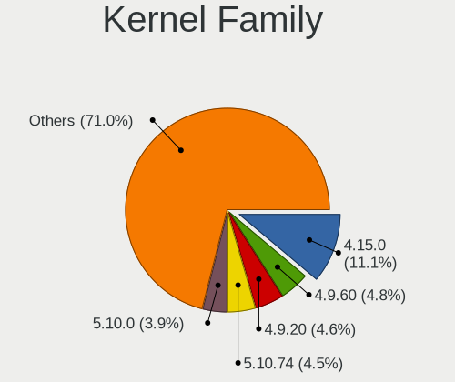
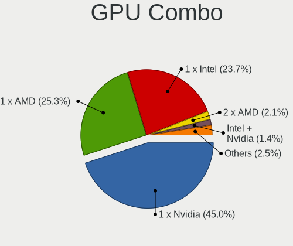
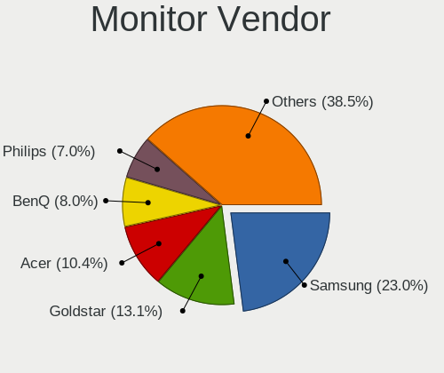
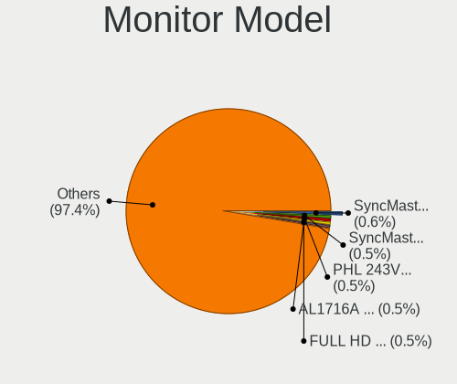

Linux in Russia - Tested Hardware & Statistics (Desktops)
---------------------------------------------------------

A project to collect tested hardware configurations for Linux in Russia.

Anyone can contribute to this report by the [hw-probe](https://github.com/linuxhw/hw-probe) tool:

    sudo -E hw-probe -all -upload

Please contribute! Especially if your hardware is rare.

Contents
--------

* [ Test Cases ](#test-cases)

* [ System ](#system)
  - [ OS                       ](#os)
  - [ OS Family                ](#os-family)
  - [ Kernel                   ](#kernel)
  - [ Kernel Family            ](#kernel-family)
  - [ Kernel Major Ver.        ](#kernel-major-ver)
  - [ Arch                     ](#arch)
  - [ DE                       ](#de)
  - [ Display Server           ](#display-server)
  - [ Display Manager          ](#display-manager)
  - [ OS Lang                  ](#os-lang)
  - [ Boot Mode                ](#boot-mode)
  - [ Filesystem               ](#filesystem)
  - [ Part. scheme             ](#part-scheme)
  - [ Dual Boot with Linux/BSD ](#dual-boot-with-linuxbsd)
  - [ Dual Boot (Win)          ](#dual-boot-win)

* [ Board ](#board)
  - [ Vendor                   ](#vendor)
  - [ Model                    ](#model)
  - [ Model Family             ](#model-family)
  - [ MFG Year                 ](#mfg-year)
  - [ Form Factor              ](#form-factor)
  - [ Secure Boot              ](#secure-boot)
  - [ Coreboot                 ](#coreboot)
  - [ RAM Size                 ](#ram-size)
  - [ RAM Used                 ](#ram-used)
  - [ Total Drives             ](#total-drives)
  - [ Has CD-ROM               ](#has-cd-rom)
  - [ Has Ethernet             ](#has-ethernet)
  - [ Has WiFi                 ](#has-wifi)
  - [ Has Bluetooth            ](#has-bluetooth)

* [ Location ](#location)
  - [ Country                  ](#country)
  - [ City                     ](#city)

* [ Drives ](#drives)
  - [ Drive Vendor             ](#drive-vendor)
  - [ Drive Model              ](#drive-model)
  - [ HDD Vendor               ](#hdd-vendor)
  - [ SSD Vendor               ](#ssd-vendor)
  - [ Drive Kind               ](#drive-kind)
  - [ Drive Connector          ](#drive-connector)
  - [ Drive Size               ](#drive-size)
  - [ Space Total              ](#space-total)
  - [ Space Used               ](#space-used)
  - [ Malfunc. Drives          ](#malfunc-drives)
  - [ Malfunc. Drive Vendor    ](#malfunc-drive-vendor)
  - [ Malfunc. HDD Vendor      ](#malfunc-hdd-vendor)
  - [ Malfunc. Drive Kind      ](#malfunc-drive-kind)
  - [ Failed Drives            ](#failed-drives)
  - [ Failed Drive Vendor      ](#failed-drive-vendor)
  - [ Drive Status             ](#drive-status)

* [ Storage controller ](#storage-controller)
  - [ Storage Vendor           ](#storage-vendor)
  - [ Storage Model            ](#storage-model)
  - [ Storage Kind             ](#storage-kind)

* [ Processor ](#processor)
  - [ CPU Vendor               ](#cpu-vendor)
  - [ CPU Model                ](#cpu-model)
  - [ CPU Model Family         ](#cpu-model-family)
  - [ CPU Cores                ](#cpu-cores)
  - [ CPU Sockets              ](#cpu-sockets)
  - [ CPU Threads              ](#cpu-threads)
  - [ CPU Op-Modes             ](#cpu-op-modes)
  - [ CPU Microcode            ](#cpu-microcode)
  - [ CPU Microarch            ](#cpu-microarch)

* [ Graphics ](#graphics)
  - [ GPU Vendor               ](#gpu-vendor)
  - [ GPU Model                ](#gpu-model)
  - [ GPU Combo                ](#gpu-combo)
  - [ GPU Driver               ](#gpu-driver)
  - [ GPU Memory               ](#gpu-memory)

* [ Monitor ](#monitor)
  - [ Monitor Vendor           ](#monitor-vendor)
  - [ Monitor Model            ](#monitor-model)
  - [ Monitor Resolution       ](#monitor-resolution)
  - [ Monitor Diagonal         ](#monitor-diagonal)
  - [ Monitor Width            ](#monitor-width)
  - [ Aspect Ratio             ](#aspect-ratio)
  - [ Monitor Area             ](#monitor-area)
  - [ Pixel Density            ](#pixel-density)
  - [ Multiple Monitors        ](#multiple-monitors)

* [ Network ](#network)
  - [ Net Controller Vendor    ](#net-controller-vendor)
  - [ Net Controller Model     ](#net-controller-model)
  - [ Wireless Vendor          ](#wireless-vendor)
  - [ Wireless Model           ](#wireless-model)
  - [ Ethernet Vendor          ](#ethernet-vendor)
  - [ Ethernet Model           ](#ethernet-model)
  - [ Net Controller Kind      ](#net-controller-kind)
  - [ Used Controller          ](#used-controller)
  - [ NICs                     ](#nics)
  - [ IPv6                     ](#ipv6)

* [ Bluetooth ](#bluetooth)
  - [ Bluetooth Vendor         ](#bluetooth-vendor)
  - [ Bluetooth Model          ](#bluetooth-model)

* [ Sound ](#sound)
  - [ Sound Vendor             ](#sound-vendor)
  - [ Sound Model              ](#sound-model)

* [ Memory ](#memory)
  - [ Memory Vendor            ](#memory-vendor)
  - [ Memory Model             ](#memory-model)
  - [ Memory Kind              ](#memory-kind)
  - [ Memory Form Factor       ](#memory-form-factor)
  - [ Memory Size              ](#memory-size)
  - [ Memory Speed             ](#memory-speed)

* [ Printers & scanners ](#printers--scanners)
  - [ Printer Vendor           ](#printer-vendor)
  - [ Printer Model            ](#printer-model)
  - [ Scanner Vendor           ](#scanner-vendor)
  - [ Scanner Model            ](#scanner-model)

* [ Camera ](#camera)
  - [ Camera Vendor            ](#camera-vendor)
  - [ Camera Model             ](#camera-model)

* [ Security ](#security)
  - [ Fingerprint Vendor       ](#fingerprint-vendor)
  - [ Fingerprint Model        ](#fingerprint-model)
  - [ Chipcard Vendor          ](#chipcard-vendor)
  - [ Chipcard Model           ](#chipcard-model)

* [ Unsupported ](#unsupported)
  - [ Unsupported Devices      ](#unsupported-devices)
  - [ Unsupported Device Types ](#unsupported-device-types)

Test Cases
----------

Total: 19840

| Vendor        | Model                       | Probe                                                      | Date         |
|---------------|-----------------------------|------------------------------------------------------------|--------------|
| Gigabyte      | 970A-D3                     | [9b47949b87](https://linux-hardware.org/?probe=9b47949b87) | Oct 01, 2023 |
| ASUSTek       | PRIME B450-PLUS             | [cd4c3fb654](https://linux-hardware.org/?probe=cd4c3fb654) | Oct 01, 2023 |
| Huanan        | X99 F8D V2.2                | [50101ff8ee](https://linux-hardware.org/?probe=50101ff8ee) | Oct 01, 2023 |
| Gigabyte      | B550M AORUS PRO-P           | [b85781f0d8](https://linux-hardware.org/?probe=b85781f0d8) | Oct 01, 2023 |
| Gigabyte      | H61M-S2-B3                  | [447e04bd9d](https://linux-hardware.org/?probe=447e04bd9d) | Sep 30, 2023 |
| ECS           | G31T-M7                     | [0749fa9352](https://linux-hardware.org/?probe=0749fa9352) | Sep 30, 2023 |
| ASUSTek       | H110M-R                     | [b8aadf6823](https://linux-hardware.org/?probe=b8aadf6823) | Sep 30, 2023 |
| MSI           | 890FXA-GD70                 | [f9c2509bc6](https://linux-hardware.org/?probe=f9c2509bc6) | Sep 30, 2023 |
| Gigabyte      | G31M-S2L                    | [4f147c1f3a](https://linux-hardware.org/?probe=4f147c1f3a) | Sep 30, 2023 |
| Gigabyte      | G31M-S2L                    | [391af7c221](https://linux-hardware.org/?probe=391af7c221) | Sep 30, 2023 |
| ASUSTek       | P8H61-M LX2                 | [b2a213cc18](https://linux-hardware.org/?probe=b2a213cc18) | Sep 30, 2023 |
| MSI           | MAG X570S TOMAHAWK MAX W... | [813b0bcb38](https://linux-hardware.org/?probe=813b0bcb38) | Sep 30, 2023 |
| ASUSTek       | P8H61-M LX2                 | [60e32143f5](https://linux-hardware.org/?probe=60e32143f5) | Sep 29, 2023 |
| 3Logic Gro... | DMB-H510-MCA01              | [7cc521d927](https://linux-hardware.org/?probe=7cc521d927) | Sep 29, 2023 |
| 3Logic Gro... | DMB-H510-MCA01              | [b952cdd71d](https://linux-hardware.org/?probe=b952cdd71d) | Sep 29, 2023 |
| ASUSTek       | TUF B450M-PRO GAMING        | [b34539564f](https://linux-hardware.org/?probe=b34539564f) | Sep 29, 2023 |
| MSI           | MAG B650 TOMAHAWK WIFI      | [f79a27e406](https://linux-hardware.org/?probe=f79a27e406) | Sep 29, 2023 |
| Gigabyte      | H97-D3H-CF                  | [c0c34400ad](https://linux-hardware.org/?probe=c0c34400ad) | Sep 29, 2023 |
| ASRock        | H510M-HVS R2.0              | [f50b0e51d3](https://linux-hardware.org/?probe=f50b0e51d3) | Sep 29, 2023 |
| Wistron       | ProLiant ML110 G6           | [4284ef7737](https://linux-hardware.org/?probe=4284ef7737) | Sep 28, 2023 |
| Wistron       | ProLiant ML110 G6           | [6282804553](https://linux-hardware.org/?probe=6282804553) | Sep 28, 2023 |
| ASUSTek       | PRIME X470-PRO              | [1f420db3fd](https://linux-hardware.org/?probe=1f420db3fd) | Sep 28, 2023 |
| ASRock        | B450 Pro4 R2.0              | [82562e75c3](https://linux-hardware.org/?probe=82562e75c3) | Sep 28, 2023 |
| ASUSTek       | PRIME X370-PRO              | [872af2bc77](https://linux-hardware.org/?probe=872af2bc77) | Sep 28, 2023 |
| Gigabyte      | H410M H V3                  | [3a08b7188c](https://linux-hardware.org/?probe=3a08b7188c) | Sep 28, 2023 |
| Intel         | X99H                        | [d5390cf599](https://linux-hardware.org/?probe=d5390cf599) | Sep 28, 2023 |
| Pegatron      | IPMSB-H61                   | [d0e64d2ebf](https://linux-hardware.org/?probe=d0e64d2ebf) | Sep 28, 2023 |
| Gigabyte      | C1037UN-EU                  | [3a4cc5469a](https://linux-hardware.org/?probe=3a4cc5469a) | Sep 28, 2023 |
| Gigabyte      | C1037UN-EU                  | [1c2d4da0c6](https://linux-hardware.org/?probe=1c2d4da0c6) | Sep 27, 2023 |
| Gigabyte      | Z390 AORUS MASTER-CF        | [1458dfe403](https://linux-hardware.org/?probe=1458dfe403) | Sep 27, 2023 |
| ASUSTek       | P8H61-MX R2.0               | [cfc3a037ed](https://linux-hardware.org/?probe=cfc3a037ed) | Sep 27, 2023 |
| Huanan        | X99-BD4 V1.34, NALEX        | [493d23b3f0](https://linux-hardware.org/?probe=493d23b3f0) | Sep 27, 2023 |
| ASUSTek       | P5QD TURBO                  | [9e8a75e698](https://linux-hardware.org/?probe=9e8a75e698) | Sep 27, 2023 |
| ASUSTek       | PRIME X370-PRO              | [e5cd50e4ea](https://linux-hardware.org/?probe=e5cd50e4ea) | Sep 27, 2023 |
| MSI           | H81M-P33                    | [8b0d086b89](https://linux-hardware.org/?probe=8b0d086b89) | Sep 27, 2023 |
| ASRock        | B450M Steel Legend          | [b4de4fe266](https://linux-hardware.org/?probe=b4de4fe266) | Sep 27, 2023 |
| Gigabyte      | B550M AORUS PRO-P           | [ef982a7d39](https://linux-hardware.org/?probe=ef982a7d39) | Sep 26, 2023 |
| Gigabyte      | B550M AORUS PRO-P           | [d8f229b5d7](https://linux-hardware.org/?probe=d8f229b5d7) | Sep 26, 2023 |
| Supermicro    | X10DRL-i                    | [4215bb2639](https://linux-hardware.org/?probe=4215bb2639) | Sep 26, 2023 |
| ASUSTek       | H110M-K                     | [a067d2e97d](https://linux-hardware.org/?probe=a067d2e97d) | Sep 26, 2023 |
| ASUSTek       | P8B75-M LE                  | [96d214417d](https://linux-hardware.org/?probe=96d214417d) | Sep 26, 2023 |
| ASUSTek       | H110M-K                     | [74a379288b](https://linux-hardware.org/?probe=74a379288b) | Sep 26, 2023 |
| ASRock        | A320M-HDV R3.0              | [c8d5bce997](https://linux-hardware.org/?probe=c8d5bce997) | Sep 26, 2023 |
| DEPO Compu... | DPA520S                     | [45d07666f9](https://linux-hardware.org/?probe=45d07666f9) | Sep 26, 2023 |
| Intel         | DP35DP AAD81073-206         | [426e9aff0f](https://linux-hardware.org/?probe=426e9aff0f) | Sep 26, 2023 |
| MSI           | B450M-A PRO MAX             | [41f2aab706](https://linux-hardware.org/?probe=41f2aab706) | Sep 26, 2023 |
| MSI           | MPG B650I EDGE WIFI         | [fc79d63b87](https://linux-hardware.org/?probe=fc79d63b87) | Sep 26, 2023 |
| Shenzhen M... | F7BFD                       | [a4891e1691](https://linux-hardware.org/?probe=a4891e1691) | Sep 25, 2023 |
| ASUSTek       | TUF Gaming B550M-PLUS       | [977a189b29](https://linux-hardware.org/?probe=977a189b29) | Sep 25, 2023 |
| ASUSTek       | P6T DELUXE V2               | [a0fa16f85c](https://linux-hardware.org/?probe=a0fa16f85c) | Sep 25, 2023 |
| HP            | 8949 11                     | [acb62cff2b](https://linux-hardware.org/?probe=acb62cff2b) | Sep 25, 2023 |
| HP            | 2AF9                        | [0e6399ab05](https://linux-hardware.org/?probe=0e6399ab05) | Sep 25, 2023 |
| Gigabyte      | GA-MA770T-UD3               | [85663cb9a6](https://linux-hardware.org/?probe=85663cb9a6) | Sep 25, 2023 |
| MSI           | FM2-A55M-E33                | [40ef9a86ab](https://linux-hardware.org/?probe=40ef9a86ab) | Sep 25, 2023 |
| Biostar       | B550MH                      | [4ef9bbad17](https://linux-hardware.org/?probe=4ef9bbad17) | Sep 24, 2023 |
| Gigabyte      | B450 AORUS ELITE V2         | [57a4e724b8](https://linux-hardware.org/?probe=57a4e724b8) | Sep 24, 2023 |
| Gigabyte      | GA-MA790XT-UD4P             | [945e2bc260](https://linux-hardware.org/?probe=945e2bc260) | Sep 24, 2023 |
| ASUSTek       | E520                        | [50ea664229](https://linux-hardware.org/?probe=50ea664229) | Sep 24, 2023 |
| ASRock        | B550 Phantom Gaming 4       | [39e26bf376](https://linux-hardware.org/?probe=39e26bf376) | Sep 24, 2023 |
| Unknown       | Unknown                     | [7e1caa679f](https://linux-hardware.org/?probe=7e1caa679f) | Sep 24, 2023 |
| Unknown       | Unknown                     | [5a57428971](https://linux-hardware.org/?probe=5a57428971) | Sep 24, 2023 |
| MSI           | MPG Z790 CARBON WIFI        | [d17427680f](https://linux-hardware.org/?probe=d17427680f) | Sep 24, 2023 |
| MSI           | MPG Z790 CARBON WIFI        | [1c0c7815dd](https://linux-hardware.org/?probe=1c0c7815dd) | Sep 24, 2023 |
| ASRock        | H97 Anniversary             | [018c8fa4d1](https://linux-hardware.org/?probe=018c8fa4d1) | Sep 24, 2023 |
| MSI           | H110M PRO-VD PLUS           | [b8d1509801](https://linux-hardware.org/?probe=b8d1509801) | Sep 24, 2023 |
| Gigabyte      | G31M-ES2L                   | [bbf676f129](https://linux-hardware.org/?probe=bbf676f129) | Sep 24, 2023 |
| Gigabyte      | H61M-D2-B3                  | [90bdd8a3e6](https://linux-hardware.org/?probe=90bdd8a3e6) | Sep 23, 2023 |
| Gigabyte      | H61M-D2-B3                  | [41dba827f2](https://linux-hardware.org/?probe=41dba827f2) | Sep 23, 2023 |
| ASUSTek       | Z97-C                       | [e4c1f075b9](https://linux-hardware.org/?probe=e4c1f075b9) | Sep 23, 2023 |
| MSI           | MAG X570S TOMAHAWK MAX W... | [17963d3a87](https://linux-hardware.org/?probe=17963d3a87) | Sep 23, 2023 |
| Gigabyte      | H110-D3-CF                  | [0762df27f4](https://linux-hardware.org/?probe=0762df27f4) | Sep 23, 2023 |
| Gigabyte      | PH67A-D3-B3                 | [e3023f5f8c](https://linux-hardware.org/?probe=e3023f5f8c) | Sep 23, 2023 |
| ASUSTek       | PRIME X370-PRO              | [1f987f4720](https://linux-hardware.org/?probe=1f987f4720) | Sep 23, 2023 |
| MSI           | B460M PRO-VDH               | [c5429120bb](https://linux-hardware.org/?probe=c5429120bb) | Sep 23, 2023 |
| ASUSTek       | H81M-A                      | [09ce373b34](https://linux-hardware.org/?probe=09ce373b34) | Sep 22, 2023 |
| Gigabyte      | H61M-DS2H                   | [f3e31ed154](https://linux-hardware.org/?probe=f3e31ed154) | Sep 22, 2023 |
| Gigabyte      | P43-ES3G                    | [79557b8229](https://linux-hardware.org/?probe=79557b8229) | Sep 22, 2023 |
| ASUSTek       | TUF Gaming X670E-PLUS WI... | [a9f9ccb4f9](https://linux-hardware.org/?probe=a9f9ccb4f9) | Sep 22, 2023 |
| Gigabyte      | H87M-HD3                    | [f5fead6eb4](https://linux-hardware.org/?probe=f5fead6eb4) | Sep 22, 2023 |
| ASUSTek       | PRIME B660M-K D4            | [85c3791741](https://linux-hardware.org/?probe=85c3791741) | Sep 21, 2023 |
| ASRock        | A320M-DVS R4.0              | [893ef72c0c](https://linux-hardware.org/?probe=893ef72c0c) | Sep 21, 2023 |
| ASRock        | A520M-ITX/ac                | [35be6167f1](https://linux-hardware.org/?probe=35be6167f1) | Sep 21, 2023 |
| Biostar       | A68MHE                      | [8ab720b66b](https://linux-hardware.org/?probe=8ab720b66b) | Sep 21, 2023 |
| Gigabyte      | GA-E350N-USB3               | [b9a29448e1](https://linux-hardware.org/?probe=b9a29448e1) | Sep 21, 2023 |
| HP            | 2820h                       | [cd402f5dad](https://linux-hardware.org/?probe=cd402f5dad) | Sep 21, 2023 |
| Unknown       | Unknown                     | [339f506aa1](https://linux-hardware.org/?probe=339f506aa1) | Sep 21, 2023 |
| Gigabyte      | B360M D3H-CF                | [875f4f3f2a](https://linux-hardware.org/?probe=875f4f3f2a) | Sep 21, 2023 |
| ASUSTek       | E520                        | [f5be06ecdb](https://linux-hardware.org/?probe=f5be06ecdb) | Sep 21, 2023 |
| Gigabyte      | B560M DS3H V2               | [182384fdaa](https://linux-hardware.org/?probe=182384fdaa) | Sep 20, 2023 |
| Shenzhen M... | F7BFD                       | [b898184916](https://linux-hardware.org/?probe=b898184916) | Sep 20, 2023 |
| iEi           | SAT3 V1.03                  | [d303736416](https://linux-hardware.org/?probe=d303736416) | Sep 20, 2023 |
| ASUSTek       | P7H55-M SI                  | [26648aff1a](https://linux-hardware.org/?probe=26648aff1a) | Sep 20, 2023 |
| HP            | 3048h                       | [f140c33d20](https://linux-hardware.org/?probe=f140c33d20) | Sep 20, 2023 |
| ASRock        | N68C-GS FX                  | [7c54afbcbd](https://linux-hardware.org/?probe=7c54afbcbd) | Sep 20, 2023 |
| ASRock        | H310CM-ITX/ac               | [4959eecff1](https://linux-hardware.org/?probe=4959eecff1) | Sep 19, 2023 |
| Gigabyte      | H81M-DS2                    | [85d35b008d](https://linux-hardware.org/?probe=85d35b008d) | Sep 19, 2023 |
| ASUSTek       | P8H61-M LE                  | [7f04e1eefd](https://linux-hardware.org/?probe=7f04e1eefd) | Sep 19, 2023 |
| MSI           | A320M-A PRO                 | [03da63d741](https://linux-hardware.org/?probe=03da63d741) | Sep 19, 2023 |
| ASUSTek       | H81M-K                      | [6735d18449](https://linux-hardware.org/?probe=6735d18449) | Sep 19, 2023 |
| Supermicro    | X9DRW                       | [6f4a97a40b](https://linux-hardware.org/?probe=6f4a97a40b) | Sep 19, 2023 |
| Gigabyte      | B550I AORUS PRO AX          | [2666cd8dbe](https://linux-hardware.org/?probe=2666cd8dbe) | Sep 19, 2023 |
| ASRock        | FM2A78 Pro4+                | [cad8cdf94c](https://linux-hardware.org/?probe=cad8cdf94c) | Sep 19, 2023 |
| Gigabyte      | 970A-DS3P                   | [0ddcc2944f](https://linux-hardware.org/?probe=0ddcc2944f) | Sep 19, 2023 |
| AZW           | GTR V02                     | [094b661573](https://linux-hardware.org/?probe=094b661573) | Sep 18, 2023 |
| Unknown       | DMB-A520-MCA01              | [a959513e7c](https://linux-hardware.org/?probe=a959513e7c) | Sep 18, 2023 |
| MSI           | MS-7366                     | [96731b6fc6](https://linux-hardware.org/?probe=96731b6fc6) | Sep 18, 2023 |
| ASUSTek       | J1800I-C                    | [970e148d8d](https://linux-hardware.org/?probe=970e148d8d) | Sep 18, 2023 |
| MSI           | H81M-P33                    | [d0287bbd0f](https://linux-hardware.org/?probe=d0287bbd0f) | Sep 18, 2023 |
| ASRock        | B450M-HDV R4.0              | [e517de2d8f](https://linux-hardware.org/?probe=e517de2d8f) | Sep 18, 2023 |
| Gigabyte      | H410M H V3                  | [cdb4402859](https://linux-hardware.org/?probe=cdb4402859) | Sep 18, 2023 |
| ASUSTek       | P5GC-MX/1333                | [232bd09926](https://linux-hardware.org/?probe=232bd09926) | Sep 17, 2023 |
| Lenovo        | H420                        | [3cb3765e4c](https://linux-hardware.org/?probe=3cb3765e4c) | Sep 17, 2023 |
| MSI           | B450M MORTAR MAX            | [beaa4e5554](https://linux-hardware.org/?probe=beaa4e5554) | Sep 17, 2023 |
| Supermicro    | X9DR3-F                     | [c2f0532df1](https://linux-hardware.org/?probe=c2f0532df1) | Sep 17, 2023 |
| ASUSTek       | ROG Maximus XIII HERO       | [b07ec8f845](https://linux-hardware.org/?probe=b07ec8f845) | Sep 17, 2023 |
| Unknown       | Unknown                     | [bd72d25583](https://linux-hardware.org/?probe=bd72d25583) | Sep 17, 2023 |
| MSI           | B460M-A PRO                 | [b2d52a5d1c](https://linux-hardware.org/?probe=b2d52a5d1c) | Sep 16, 2023 |
| Gigabyte      | GA-880GA-UD3H               | [12b833e456](https://linux-hardware.org/?probe=12b833e456) | Sep 16, 2023 |
| Gigabyte      | B550M AORUS PRO-P           | [0f3cba16d7](https://linux-hardware.org/?probe=0f3cba16d7) | Sep 16, 2023 |
| Gigabyte      | EP45T-DS3                   | [0e22b4fe1d](https://linux-hardware.org/?probe=0e22b4fe1d) | Sep 16, 2023 |
| ASUSTek       | PRIME A320M-K               | [bef465f035](https://linux-hardware.org/?probe=bef465f035) | Sep 16, 2023 |
| Gigabyte      | Z490 AORUS ELITE AC         | [c63f4e5865](https://linux-hardware.org/?probe=c63f4e5865) | Sep 16, 2023 |
| Unknown       | Unknown                     | [ce7fc75838](https://linux-hardware.org/?probe=ce7fc75838) | Sep 15, 2023 |
| Supermicro    | X10DRU-i+A                  | [d0cee7fa36](https://linux-hardware.org/?probe=d0cee7fa36) | Sep 15, 2023 |
| ASUSTek       | PRIME B660-PLUS D4          | [b6a802c0ac](https://linux-hardware.org/?probe=b6a802c0ac) | Sep 15, 2023 |
| MSI           | A520M-A PRO                 | [d97b8e1ce0](https://linux-hardware.org/?probe=d97b8e1ce0) | Sep 15, 2023 |
| Gigabyte      | B450 AORUS M                | [119acd8c0d](https://linux-hardware.org/?probe=119acd8c0d) | Sep 15, 2023 |
| Supermicro    | X11SSH-F                    | [2f12035902](https://linux-hardware.org/?probe=2f12035902) | Sep 15, 2023 |
| Supermicro    | X11SSH-F                    | [c46a08bb48](https://linux-hardware.org/?probe=c46a08bb48) | Sep 15, 2023 |
| Supermicro    | X11SSH-F                    | [aa351597ea](https://linux-hardware.org/?probe=aa351597ea) | Sep 15, 2023 |
| Gigabyte      | H110M-H-CF                  | [5eadb71ae4](https://linux-hardware.org/?probe=5eadb71ae4) | Sep 15, 2023 |
| ASUSTek       | M3A78-CM                    | [5a47ad5c25](https://linux-hardware.org/?probe=5a47ad5c25) | Sep 15, 2023 |
| ASUSTek       | M3A78-CM                    | [876175ae24](https://linux-hardware.org/?probe=876175ae24) | Sep 15, 2023 |
| Gigabyte      | H55M-USB3                   | [6cf3ece600](https://linux-hardware.org/?probe=6cf3ece600) | Sep 15, 2023 |
| MSI           | MAG B550 TOMAHAWK           | [3b3ba64d46](https://linux-hardware.org/?probe=3b3ba64d46) | Sep 14, 2023 |
| Gigabyte      | H61M-S1                     | [40ffb44424](https://linux-hardware.org/?probe=40ffb44424) | Sep 14, 2023 |
| ASRock        | N68-S3 UCC                  | [4164e2d7c7](https://linux-hardware.org/?probe=4164e2d7c7) | Sep 14, 2023 |
| Gigabyte      | B450 AORUS M                | [9b3fc9218b](https://linux-hardware.org/?probe=9b3fc9218b) | Sep 14, 2023 |
| ASUSTek       | B75M-PLUS                   | [6cc800f5dc](https://linux-hardware.org/?probe=6cc800f5dc) | Sep 14, 2023 |
| ASUSTek       | PRIME H510M-A               | [b66654e80e](https://linux-hardware.org/?probe=b66654e80e) | Sep 14, 2023 |
| ASRock        | B450 Pro4                   | [b961eae623](https://linux-hardware.org/?probe=b961eae623) | Sep 14, 2023 |
| ASRock        | B650M PG Riptide            | [3a1c100a69](https://linux-hardware.org/?probe=3a1c100a69) | Sep 14, 2023 |
| ASUSTek       | PRIME Z690-P D4             | [3c09b49188](https://linux-hardware.org/?probe=3c09b49188) | Sep 14, 2023 |
| Intel         | DH87MC AAG74242-401         | [6c37cc0b51](https://linux-hardware.org/?probe=6c37cc0b51) | Sep 14, 2023 |
| MSI           | PRO H610M-G DDR4            | [33f52069d5](https://linux-hardware.org/?probe=33f52069d5) | Sep 13, 2023 |
| ASUSTek       | ROG Maximus XIII HERO       | [5923e88c3b](https://linux-hardware.org/?probe=5923e88c3b) | Sep 13, 2023 |
| Supermicro    | X10DRU-i+B                  | [3650d44342](https://linux-hardware.org/?probe=3650d44342) | Sep 13, 2023 |
| Lenovo        | SHARKBAY 0B98401 PRO        | [904a4a7d23](https://linux-hardware.org/?probe=904a4a7d23) | Sep 13, 2023 |
| Acer          | Veriton X275                | [6dcd8b863a](https://linux-hardware.org/?probe=6dcd8b863a) | Sep 13, 2023 |
| Unknown       | Unknown                     | [2035ddd158](https://linux-hardware.org/?probe=2035ddd158) | Sep 13, 2023 |
| Lenovo        | SHARKBAY 0B98401 PRO        | [d178c2211b](https://linux-hardware.org/?probe=d178c2211b) | Sep 13, 2023 |
| ASRock        | X470 Taichi                 | [49aca37979](https://linux-hardware.org/?probe=49aca37979) | Sep 13, 2023 |
| ASUSTek       | H110M-R                     | [3530c6e606](https://linux-hardware.org/?probe=3530c6e606) | Sep 13, 2023 |
| ASUSTek       | PRIME X570-PRO              | [746f94b75d](https://linux-hardware.org/?probe=746f94b75d) | Sep 13, 2023 |
| ASRock        | K10N78D                     | [fa2852026b](https://linux-hardware.org/?probe=fa2852026b) | Sep 13, 2023 |
| ASRock        | K10N78D                     | [adf8e09915](https://linux-hardware.org/?probe=adf8e09915) | Sep 13, 2023 |
| Gigabyte      | X570 I AORUS PRO WIFI       | [035fb7f099](https://linux-hardware.org/?probe=035fb7f099) | Sep 13, 2023 |
| Supermicro    | X11SSH-F                    | [3a9630bdc5](https://linux-hardware.org/?probe=3a9630bdc5) | Sep 13, 2023 |
| Lenovo        | BRASWELL NOK                | [621f570151](https://linux-hardware.org/?probe=621f570151) | Sep 13, 2023 |
| ASRock        | E350M1                      | [49c94468cf](https://linux-hardware.org/?probe=49c94468cf) | Sep 13, 2023 |
| MSI           | MPG X570 GAMING PRO CARB... | [279517882b](https://linux-hardware.org/?probe=279517882b) | Sep 13, 2023 |
| Gigabyte      | G1.Assassin                 | [4b60be7fca](https://linux-hardware.org/?probe=4b60be7fca) | Sep 12, 2023 |
| Gigabyte      | A520M AORUS ELITE           | [05ac023ab9](https://linux-hardware.org/?probe=05ac023ab9) | Sep 12, 2023 |
| ASUSTek       | TUF Gaming B550-PLUS        | [d8747ce048](https://linux-hardware.org/?probe=d8747ce048) | Sep 12, 2023 |
| Dell          | 0J190T A01                  | [b14e059cea](https://linux-hardware.org/?probe=b14e059cea) | Sep 12, 2023 |
| Gigabyte      | A320M-S2H V2-CF             | [e6879c5a23](https://linux-hardware.org/?probe=e6879c5a23) | Sep 12, 2023 |
| MSI           | H510M-A PRO                 | [f1a2a6d936](https://linux-hardware.org/?probe=f1a2a6d936) | Sep 12, 2023 |
| Gigabyte      | GA-870A-UD3                 | [b3acd03fb0](https://linux-hardware.org/?probe=b3acd03fb0) | Sep 12, 2023 |
| Biostar       | TF570 SLI A2+               | [718a7467d0](https://linux-hardware.org/?probe=718a7467d0) | Sep 12, 2023 |
| ASUSTek       | PRIME X570-P                | [efc20753cd](https://linux-hardware.org/?probe=efc20753cd) | Sep 12, 2023 |
| ASUSTek       | PRIME X570-P                | [c6f2b822c7](https://linux-hardware.org/?probe=c6f2b822c7) | Sep 12, 2023 |
| MSI           | 785GT-E63                   | [ac5b6e8a67](https://linux-hardware.org/?probe=ac5b6e8a67) | Sep 12, 2023 |
| Gigabyte      | H77N-WIFI                   | [fe040c7510](https://linux-hardware.org/?probe=fe040c7510) | Sep 12, 2023 |
| ASUSTek       | P5G41T-M LX2/GB             | [53cdc3e4f0](https://linux-hardware.org/?probe=53cdc3e4f0) | Sep 12, 2023 |
| ASUSTek       | PRIME H310M-R R2.0          | [d7b21557f8](https://linux-hardware.org/?probe=d7b21557f8) | Sep 12, 2023 |
| Gigabyte      | EP45-UD3LR                  | [7dc196091d](https://linux-hardware.org/?probe=7dc196091d) | Sep 12, 2023 |
| ASUSTek       | TUF Gaming B460M-PLUS       | [b99104eeb7](https://linux-hardware.org/?probe=b99104eeb7) | Sep 11, 2023 |
| Intel         | H81 V2.3                    | [0673e1f5ed](https://linux-hardware.org/?probe=0673e1f5ed) | Sep 11, 2023 |
| ASRock        | B560M-HDV                   | [4df04c540a](https://linux-hardware.org/?probe=4df04c540a) | Sep 11, 2023 |
| Gigabyte      | M68MT-S2                    | [cb129260e1](https://linux-hardware.org/?probe=cb129260e1) | Sep 11, 2023 |
| ECS           | G31T-M9                     | [9d2ba7fe88](https://linux-hardware.org/?probe=9d2ba7fe88) | Sep 11, 2023 |
| Gigabyte      | GA-M56S-S3                  | [df2602c134](https://linux-hardware.org/?probe=df2602c134) | Sep 11, 2023 |
| ASUSTek       | P5KPL-AM                    | [3f55a69040](https://linux-hardware.org/?probe=3f55a69040) | Sep 11, 2023 |
| Intel         | H81                         | [9844243c1a](https://linux-hardware.org/?probe=9844243c1a) | Sep 11, 2023 |
| Intel         | SKYBAY                      | [63b6f62eae](https://linux-hardware.org/?probe=63b6f62eae) | Sep 11, 2023 |
| ASUSTek       | PRIME H410M-R               | [962fd46c5c](https://linux-hardware.org/?probe=962fd46c5c) | Sep 11, 2023 |
| Unknown       | X79A                        | [96d6dc2e5d](https://linux-hardware.org/?probe=96d6dc2e5d) | Sep 10, 2023 |
| ASRock        | H110M-DVS R3.0              | [b0305f4ba4](https://linux-hardware.org/?probe=b0305f4ba4) | Sep 10, 2023 |
| ASUSTek       | PRIME H310M-E R2.0          | [5cb754a533](https://linux-hardware.org/?probe=5cb754a533) | Sep 10, 2023 |
| ASUSTek       | PRIME H310M-K               | [a17cc2a1d2](https://linux-hardware.org/?probe=a17cc2a1d2) | Sep 10, 2023 |
| Gigabyte      | X570 AORUS ELITE            | [e49a8302ef](https://linux-hardware.org/?probe=e49a8302ef) | Sep 10, 2023 |
| MSI           | MAG B550M MORTAR WIFI       | [91b6565880](https://linux-hardware.org/?probe=91b6565880) | Sep 09, 2023 |
| MSI           | MAG B650M MORTAR WIFI       | [b3957e19eb](https://linux-hardware.org/?probe=b3957e19eb) | Sep 09, 2023 |
| ASUSTek       | H81M-E                      | [4bb36bc968](https://linux-hardware.org/?probe=4bb36bc968) | Sep 09, 2023 |
| ASUSTek       | P8H61-MX                    | [be54d62e88](https://linux-hardware.org/?probe=be54d62e88) | Sep 09, 2023 |
| ASUSTek       | P8H61-MX                    | [f9568de8f3](https://linux-hardware.org/?probe=f9568de8f3) | Sep 09, 2023 |
| ASUSTek       | P8H61-M LE/USB3             | [099e89d09f](https://linux-hardware.org/?probe=099e89d09f) | Sep 08, 2023 |
| Unknown       | Unknown                     | [72447e3c4b](https://linux-hardware.org/?probe=72447e3c4b) | Sep 08, 2023 |
| ASUSTek       | Pro H610T D4                | [ebced0bee8](https://linux-hardware.org/?probe=ebced0bee8) | Sep 08, 2023 |
| ASRock        | H510M-HVS R2.0              | [018a3b8abe](https://linux-hardware.org/?probe=018a3b8abe) | Sep 08, 2023 |
| MSI           | 760GA-P43                   | [b067d69499](https://linux-hardware.org/?probe=b067d69499) | Sep 08, 2023 |
| Supermicro    | X10DRU-i+A                  | [abdec86bab](https://linux-hardware.org/?probe=abdec86bab) | Sep 07, 2023 |
| ASUSTek       | B75M-PLUS                   | [394dd17b98](https://linux-hardware.org/?probe=394dd17b98) | Sep 07, 2023 |
| ASUSTek       | ProArt Z690-CREATOR WIFI    | [881837a1cb](https://linux-hardware.org/?probe=881837a1cb) | Sep 07, 2023 |
| ASUSTek       | Z170 PRO GAMING             | [7684d60e85](https://linux-hardware.org/?probe=7684d60e85) | Sep 07, 2023 |
| ASUSTek       | P8H77-V LE                  | [38ebaae5c3](https://linux-hardware.org/?probe=38ebaae5c3) | Sep 07, 2023 |
| Gigabyte      | Z790 UD                     | [3f67617c93](https://linux-hardware.org/?probe=3f67617c93) | Sep 07, 2023 |
| Gigabyte      | H610M S2 V2 DDR4            | [7323821425](https://linux-hardware.org/?probe=7323821425) | Sep 07, 2023 |
| Gigabyte      | X670E AORUS MASTER          | [ade0754252](https://linux-hardware.org/?probe=ade0754252) | Sep 07, 2023 |
| Biostar       | A320MH                      | [87ae9fef79](https://linux-hardware.org/?probe=87ae9fef79) | Sep 07, 2023 |
| Acer          | Veriton X2640G V:1.0        | [76b044add6](https://linux-hardware.org/?probe=76b044add6) | Sep 07, 2023 |
| Gigabyte      | X470 AORUS ULTRA GAMING-... | [67934ce24a](https://linux-hardware.org/?probe=67934ce24a) | Sep 07, 2023 |
| ASUSTek       | P8Z77-V LE PLUS             | [43fa75d035](https://linux-hardware.org/?probe=43fa75d035) | Sep 07, 2023 |
| Biostar       | B550M-SILVER                | [12ad2e157b](https://linux-hardware.org/?probe=12ad2e157b) | Sep 07, 2023 |
| ASUSTek       | PRIME X370-PRO              | [d095848fec](https://linux-hardware.org/?probe=d095848fec) | Sep 06, 2023 |
| ASRock        | Z68 Pro3                    | [757ebbe056](https://linux-hardware.org/?probe=757ebbe056) | Sep 06, 2023 |
| Gigabyte      | F2A68HM-DS2                 | [ffe10aadbe](https://linux-hardware.org/?probe=ffe10aadbe) | Sep 06, 2023 |
| MSI           | MPG B550 GAMING PLUS        | [48cc912b75](https://linux-hardware.org/?probe=48cc912b75) | Sep 06, 2023 |
| Lenovo        | H420                        | [f84aae6411](https://linux-hardware.org/?probe=f84aae6411) | Sep 06, 2023 |
| Lenovo        | 3708 NOK                    | [153f0dfa9d](https://linux-hardware.org/?probe=153f0dfa9d) | Sep 06, 2023 |
| ASUSTek       | TUF B450M-PRO GAMING        | [5ba13c092c](https://linux-hardware.org/?probe=5ba13c092c) | Sep 06, 2023 |
| Gigabyte      | H61M-S2PV                   | [c22fad9c67](https://linux-hardware.org/?probe=c22fad9c67) | Sep 06, 2023 |
| MSI           | MS-B0A41                    | [c93409061c](https://linux-hardware.org/?probe=c93409061c) | Sep 06, 2023 |
| Supermicro    | X9DRW                       | [01d640708d](https://linux-hardware.org/?probe=01d640708d) | Sep 06, 2023 |
| Gigabyte      | H410M H V3                  | [c7bdf1cee6](https://linux-hardware.org/?probe=c7bdf1cee6) | Sep 06, 2023 |
| MSI           | B550-A PRO                  | [4a5a98638e](https://linux-hardware.org/?probe=4a5a98638e) | Sep 06, 2023 |
| ASRock        | Z690 PG Velocita            | [0064d9d9e2](https://linux-hardware.org/?probe=0064d9d9e2) | Sep 06, 2023 |
| MSI           | MAG B550 TOMAHAWK           | [1c8b9eed31](https://linux-hardware.org/?probe=1c8b9eed31) | Sep 06, 2023 |
| Biostar       | A68MHE                      | [65bd192bf0](https://linux-hardware.org/?probe=65bd192bf0) | Sep 06, 2023 |
| Gigabyte      | B550M S2H                   | [54556adb0b](https://linux-hardware.org/?probe=54556adb0b) | Sep 05, 2023 |
| ECS           | A740GM-M                    | [132b141a7d](https://linux-hardware.org/?probe=132b141a7d) | Sep 05, 2023 |
| Gigabyte      | F2A85X-UP4                  | [9c7d201848](https://linux-hardware.org/?probe=9c7d201848) | Sep 05, 2023 |
| ASRock        | A320M-HDV R4.0              | [0f5597eb7e](https://linux-hardware.org/?probe=0f5597eb7e) | Sep 05, 2023 |
| Foxconn       | 2ABF                        | [baad816533](https://linux-hardware.org/?probe=baad816533) | Sep 05, 2023 |
| ASRock        | X670E Steel Legend          | [8bca1f8244](https://linux-hardware.org/?probe=8bca1f8244) | Sep 05, 2023 |
| Intel         | DP43TF AAE34878-404         | [d83ba68fcb](https://linux-hardware.org/?probe=d83ba68fcb) | Sep 05, 2023 |
| Biostar       | A68MHE                      | [65a3d0ff34](https://linux-hardware.org/?probe=65a3d0ff34) | Sep 05, 2023 |
| ASRock        | B450M Pro4-F R2.0           | [3eef4ac5d3](https://linux-hardware.org/?probe=3eef4ac5d3) | Sep 05, 2023 |
| Gigabyte      | EP31-DS3L                   | [bce72e53fa](https://linux-hardware.org/?probe=bce72e53fa) | Sep 04, 2023 |
| HP            | 8526 MVB, A                 | [3133ab688e](https://linux-hardware.org/?probe=3133ab688e) | Sep 04, 2023 |
| MACHINIST     | X99-K9 V2.0                 | [3462791aa1](https://linux-hardware.org/?probe=3462791aa1) | Sep 04, 2023 |
| OEM           | Intel H81                   | [649a092684](https://linux-hardware.org/?probe=649a092684) | Sep 04, 2023 |
| ASRock        | 960GM-VGS3 FX               | [c3059a2ebc](https://linux-hardware.org/?probe=c3059a2ebc) | Sep 04, 2023 |
| MSI           | B360M MORTAR                | [d023a05e0b](https://linux-hardware.org/?probe=d023a05e0b) | Sep 04, 2023 |
| Foxconn       | 2ABF                        | [8928cdbfa8](https://linux-hardware.org/?probe=8928cdbfa8) | Sep 04, 2023 |
| ASUSTek       | Leonite2                    | [543ae5c1f3](https://linux-hardware.org/?probe=543ae5c1f3) | Sep 04, 2023 |
| ASUSTek       | Leonite2                    | [cb59b205d9](https://linux-hardware.org/?probe=cb59b205d9) | Sep 04, 2023 |
| ASRock        | 970 Pro3 R2.0               | [590b5224d9](https://linux-hardware.org/?probe=590b5224d9) | Sep 04, 2023 |
| MSI           | B360M MORTAR ILYA MUROME... | [0899e4058a](https://linux-hardware.org/?probe=0899e4058a) | Sep 04, 2023 |
| ASUSTek       | TUF Gaming X670E-PLUS       | [0eff1074a1](https://linux-hardware.org/?probe=0eff1074a1) | Sep 03, 2023 |
| MSI           | MAG B550 TOMAHAWK           | [c5ffec4746](https://linux-hardware.org/?probe=c5ffec4746) | Sep 03, 2023 |
| ASUSTek       | M5A78L-M/USB3               | [d8b388ed5f](https://linux-hardware.org/?probe=d8b388ed5f) | Sep 03, 2023 |
| ASRock        | FM2A78M-HD+                 | [a2d8c14a71](https://linux-hardware.org/?probe=a2d8c14a71) | Sep 03, 2023 |
| ASRock        | A320D4-P1                   | [244c92966f](https://linux-hardware.org/?probe=244c92966f) | Sep 03, 2023 |
| ASUSTek       | H97M-E                      | [6624329e1c](https://linux-hardware.org/?probe=6624329e1c) | Sep 03, 2023 |
| Gigabyte      | GA-780T-D3L                 | [f0c5bbc0c1](https://linux-hardware.org/?probe=f0c5bbc0c1) | Sep 03, 2023 |
| ASUSTek       | M2N                         | [1df62dde56](https://linux-hardware.org/?probe=1df62dde56) | Sep 03, 2023 |
| MSI           | 770-C45                     | [002c1856c6](https://linux-hardware.org/?probe=002c1856c6) | Sep 03, 2023 |
| MSI           | MAG B550M MORTAR WIFI       | [6b33c9cb36](https://linux-hardware.org/?probe=6b33c9cb36) | Sep 02, 2023 |
| MSI           | MAG B550M MORTAR            | [3ee4e0f848](https://linux-hardware.org/?probe=3ee4e0f848) | Sep 02, 2023 |
| ASUSTek       | P7P55-M                     | [c74782636f](https://linux-hardware.org/?probe=c74782636f) | Sep 02, 2023 |
| MSI           | MAG B650M MORTAR WIFI       | [1b5109eb83](https://linux-hardware.org/?probe=1b5109eb83) | Sep 02, 2023 |
| Gigabyte      | X299 UD4 Pro-CF             | [48c352470d](https://linux-hardware.org/?probe=48c352470d) | Sep 02, 2023 |
| MSI           | MPG B650I EDGE WIFI         | [3ea725d275](https://linux-hardware.org/?probe=3ea725d275) | Sep 02, 2023 |
| ASRock        | Z370M Pro4                  | [b50da6446a](https://linux-hardware.org/?probe=b50da6446a) | Sep 02, 2023 |
| Gigabyte      | H510M H                     | [1aeb1ffd17](https://linux-hardware.org/?probe=1aeb1ffd17) | Sep 02, 2023 |
| Foxconn       | 45CS                        | [56c503e42c](https://linux-hardware.org/?probe=56c503e42c) | Sep 02, 2023 |
| ASUSTek       | ROG Maximus XIII HERO       | [91d7a53a1b](https://linux-hardware.org/?probe=91d7a53a1b) | Sep 01, 2023 |
| ASUSTek       | STRIX Z270H GAMING          | [1e51610ea3](https://linux-hardware.org/?probe=1e51610ea3) | Sep 01, 2023 |
| ASUSTek       | PRIME B350-PLUS             | [238b7ca83d](https://linux-hardware.org/?probe=238b7ca83d) | Sep 01, 2023 |
| Huanan        | X99-QD4 V1.0                | [45c37720b0](https://linux-hardware.org/?probe=45c37720b0) | Sep 01, 2023 |
| ASUSTek       | M5A97 R2.0                  | [52911d341d](https://linux-hardware.org/?probe=52911d341d) | Sep 01, 2023 |
| ASRock        | N68-GS4 FX                  | [87f94b4ba7](https://linux-hardware.org/?probe=87f94b4ba7) | Sep 01, 2023 |
| ASUSTek       | N3050T                      | [fa4b0cbf08](https://linux-hardware.org/?probe=fa4b0cbf08) | Sep 01, 2023 |
| MSI           | MPG B650I EDGE WIFI         | [dd5735f315](https://linux-hardware.org/?probe=dd5735f315) | Sep 01, 2023 |
| Acer          | Veriton N4660G              | [25339d5009](https://linux-hardware.org/?probe=25339d5009) | Aug 31, 2023 |
| Gigabyte      | B450M K-CF                  | [2086d348b2](https://linux-hardware.org/?probe=2086d348b2) | Aug 31, 2023 |
| Intel         | B75                         | [55695d0962](https://linux-hardware.org/?probe=55695d0962) | Aug 31, 2023 |
| MSI           | MPG B550 GAMING PLUS        | [a829cc0dce](https://linux-hardware.org/?probe=a829cc0dce) | Aug 31, 2023 |
| ASUSTek       | P5Q SE2                     | [293c912276](https://linux-hardware.org/?probe=293c912276) | Aug 31, 2023 |
| ASUSTek       | P8H61-M LX3 PLUS R2.0       | [9cb322dda0](https://linux-hardware.org/?probe=9cb322dda0) | Aug 30, 2023 |
| Supermicro    | X9DRW                       | [a71700e059](https://linux-hardware.org/?probe=a71700e059) | Aug 30, 2023 |
| MSI           | H510M-A PRO                 | [afb724c8da](https://linux-hardware.org/?probe=afb724c8da) | Aug 30, 2023 |
| ASUSTek       | P8H61 EVO                   | [facd465366](https://linux-hardware.org/?probe=facd465366) | Aug 30, 2023 |
| ASUSTek       | PRIME B660M-A D4            | [d4f09e50b2](https://linux-hardware.org/?probe=d4f09e50b2) | Aug 30, 2023 |
| Gigabyte      | B450M H                     | [cd7bf0b2db](https://linux-hardware.org/?probe=cd7bf0b2db) | Aug 30, 2023 |
| MSI           | A68HM-P33 V2                | [44d09f93c9](https://linux-hardware.org/?probe=44d09f93c9) | Aug 30, 2023 |
| ASUSTek       | PRIME H310M-R R2.0          | [91d3472ba6](https://linux-hardware.org/?probe=91d3472ba6) | Aug 30, 2023 |
| Gigabyte      | 970A-DS3P                   | [3eb3a344ee](https://linux-hardware.org/?probe=3eb3a344ee) | Aug 30, 2023 |
| ASRock        | M3A UCC                     | [b46f15b2d2](https://linux-hardware.org/?probe=b46f15b2d2) | Aug 30, 2023 |
| Supermicro    | X9DRW                       | [1ff3234fa5](https://linux-hardware.org/?probe=1ff3234fa5) | Aug 30, 2023 |
| Foxconn       | H55MXV Series               | [af9d0ad662](https://linux-hardware.org/?probe=af9d0ad662) | Aug 30, 2023 |
| Foxconn       | 2ABF                        | [26558ed0ce](https://linux-hardware.org/?probe=26558ed0ce) | Aug 30, 2023 |
| Dell          | 0J2J3Y A00                  | [57ac609885](https://linux-hardware.org/?probe=57ac609885) | Aug 30, 2023 |
| Huanan        | X99-QD4 V1.0                | [c5030f8fa1](https://linux-hardware.org/?probe=c5030f8fa1) | Aug 30, 2023 |
| Gigabyte      | G41M-Combo                  | [927a574e71](https://linux-hardware.org/?probe=927a574e71) | Aug 30, 2023 |
| ASUSTek       | PRIME B350-PLUS             | [708fc220a9](https://linux-hardware.org/?probe=708fc220a9) | Aug 29, 2023 |
| MSI           | PH61-SP35                   | [590f47f3fd](https://linux-hardware.org/?probe=590f47f3fd) | Aug 29, 2023 |
| ASUSTek       | PRIME B560-PLUS             | [4acce51a96](https://linux-hardware.org/?probe=4acce51a96) | Aug 29, 2023 |
| ASUSTek       | PRIME B560-PLUS             | [205286a7e8](https://linux-hardware.org/?probe=205286a7e8) | Aug 29, 2023 |
| ASUSTek       | P8H61-MX                    | [861e741d6a](https://linux-hardware.org/?probe=861e741d6a) | Aug 29, 2023 |
| ASRock        | B460 Steel Legend           | [09ed405682](https://linux-hardware.org/?probe=09ed405682) | Aug 29, 2023 |
| ASUSTek       | STRIX B250G GAMING          | [16d3d84013](https://linux-hardware.org/?probe=16d3d84013) | Aug 29, 2023 |
| ASRock        | X670E Steel Legend          | [6bd291c8b0](https://linux-hardware.org/?probe=6bd291c8b0) | Aug 29, 2023 |
| Gigabyte      | H110-D3-CF                  | [e0d36eed9a](https://linux-hardware.org/?probe=e0d36eed9a) | Aug 29, 2023 |
| Intel         | SKYBAY                      | [59cfa4ea58](https://linux-hardware.org/?probe=59cfa4ea58) | Aug 29, 2023 |
| Huanan        | X99-ZD4 V2.1                | [2ab7a21e20](https://linux-hardware.org/?probe=2ab7a21e20) | Aug 29, 2023 |
| ASUSTek       | M3N78-EH                    | [c0fb869905](https://linux-hardware.org/?probe=c0fb869905) | Aug 29, 2023 |
| Gigabyte      | 8IPE1000                    | [50a9455c00](https://linux-hardware.org/?probe=50a9455c00) | Aug 28, 2023 |
| MSI           | 770-C45                     | [6f52d0be24](https://linux-hardware.org/?probe=6f52d0be24) | Aug 28, 2023 |
| Gigabyte      | 8IPE1000                    | [eb4740694a](https://linux-hardware.org/?probe=eb4740694a) | Aug 28, 2023 |
| ASRock        | Z97 Pro4                    | [6c232e36c3](https://linux-hardware.org/?probe=6c232e36c3) | Aug 28, 2023 |
| ASUSTek       | P5QL/EPU                    | [b2bc9269e5](https://linux-hardware.org/?probe=b2bc9269e5) | Aug 28, 2023 |
| ASUSTek       | PRIME H510M-R               | [c6614846b5](https://linux-hardware.org/?probe=c6614846b5) | Aug 28, 2023 |
| Gigabyte      | AB350M-DS3H V2-CF           | [9d90b80d9a](https://linux-hardware.org/?probe=9d90b80d9a) | Aug 27, 2023 |
| ASRock        | B460 Steel Legend           | [ad478d48ad](https://linux-hardware.org/?probe=ad478d48ad) | Aug 27, 2023 |
| Gigabyte      | B550M AORUS PRO-P           | [4e7e2a9946](https://linux-hardware.org/?probe=4e7e2a9946) | Aug 27, 2023 |
| MSI           | A320M-A PRO                 | [14d4e6bf4c](https://linux-hardware.org/?probe=14d4e6bf4c) | Aug 27, 2023 |
| Gigabyte      | AB350M-DS3H V2-CF           | [1f59c17089](https://linux-hardware.org/?probe=1f59c17089) | Aug 27, 2023 |
| MSI           | A320M-A PRO                 | [5ad490f8cb](https://linux-hardware.org/?probe=5ad490f8cb) | Aug 27, 2023 |
| Gigabyte      | Z490 GAMING X               | [ee07c69165](https://linux-hardware.org/?probe=ee07c69165) | Aug 27, 2023 |
| ASRock        | N68PV-GS                    | [d9171bedd5](https://linux-hardware.org/?probe=d9171bedd5) | Aug 27, 2023 |
| Unknown       | Unknown                     | [4d432af6c0](https://linux-hardware.org/?probe=4d432af6c0) | Aug 27, 2023 |
| Gigabyte      | F2A55M-DS2                  | [3efec986ee](https://linux-hardware.org/?probe=3efec986ee) | Aug 27, 2023 |
| ASRock        | X670E Steel Legend          | [c675cc9767](https://linux-hardware.org/?probe=c675cc9767) | Aug 27, 2023 |
| Gigabyte      | H61M-S2-B3                  | [c9505b94ed](https://linux-hardware.org/?probe=c9505b94ed) | Aug 26, 2023 |
| ASUSTek       | PRIME H310M-K               | [1f606cb9da](https://linux-hardware.org/?probe=1f606cb9da) | Aug 26, 2023 |
| Gigabyte      | Z87-HD3                     | [3601cce38e](https://linux-hardware.org/?probe=3601cce38e) | Aug 26, 2023 |
| ASUSTek       | P8Z77-V LX                  | [9f1872b5e9](https://linux-hardware.org/?probe=9f1872b5e9) | Aug 26, 2023 |
| Gigabyte      | GA-880GA-UD3H               | [5d4b85d28b](https://linux-hardware.org/?probe=5d4b85d28b) | Aug 26, 2023 |
| ASUSTek       | PRIME X370-PRO              | [e4200e4c9a](https://linux-hardware.org/?probe=e4200e4c9a) | Aug 25, 2023 |
| ASUSTek       | PRIME X370-PRO              | [fd03f60906](https://linux-hardware.org/?probe=fd03f60906) | Aug 25, 2023 |
| Gigabyte      | 990FXA-UD3                  | [083aa2f63c](https://linux-hardware.org/?probe=083aa2f63c) | Aug 25, 2023 |
| MSI           | B450M MORTAR MAX            | [b328603445](https://linux-hardware.org/?probe=b328603445) | Aug 25, 2023 |
| ASRock        | M3N78D                      | [cbaee686c2](https://linux-hardware.org/?probe=cbaee686c2) | Aug 25, 2023 |
| ASUSTek       | PRIME H310M-R R2.0          | [0cc7a0f138](https://linux-hardware.org/?probe=0cc7a0f138) | Aug 25, 2023 |
| ASUSTek       | M4N78 SE                    | [aff07fea82](https://linux-hardware.org/?probe=aff07fea82) | Aug 25, 2023 |
| ASUSTek       | PRIME H310M-R R2.0          | [241fead3e6](https://linux-hardware.org/?probe=241fead3e6) | Aug 25, 2023 |
| Biostar       | TF570 SLI A2+               | [825725cf8d](https://linux-hardware.org/?probe=825725cf8d) | Aug 25, 2023 |
| Gigabyte      | H87-HD3                     | [84ef801923](https://linux-hardware.org/?probe=84ef801923) | Aug 24, 2023 |
| Intel         | D2700DC AAG32420-602        | [d3743d52fa](https://linux-hardware.org/?probe=d3743d52fa) | Aug 24, 2023 |
| Gigabyte      | H110-D3-CF                  | [2436229edb](https://linux-hardware.org/?probe=2436229edb) | Aug 24, 2023 |
| Intel         | D2700DC AAG32420-602        | [3381b3de96](https://linux-hardware.org/?probe=3381b3de96) | Aug 24, 2023 |
| Gigabyte      | B450M S2H                   | [9d09e14624](https://linux-hardware.org/?probe=9d09e14624) | Aug 24, 2023 |
| ASUSTek       | STRIX H270F GAMING          | [eeff109a12](https://linux-hardware.org/?probe=eeff109a12) | Aug 24, 2023 |
| ASUSTek       | P8H77-M PRO                 | [4953513629](https://linux-hardware.org/?probe=4953513629) | Aug 24, 2023 |
| ASUSTek       | M5A78L-M LX3                | [b96cc7270e](https://linux-hardware.org/?probe=b96cc7270e) | Aug 24, 2023 |
| Gigabyte      | AB350M-DS3H V2-CF           | [083700ba74](https://linux-hardware.org/?probe=083700ba74) | Aug 23, 2023 |
| ASRock        | M3N78D                      | [86e93b6cec](https://linux-hardware.org/?probe=86e93b6cec) | Aug 23, 2023 |
| ASRock        | P4i945GC                    | [5fd422ae68](https://linux-hardware.org/?probe=5fd422ae68) | Aug 23, 2023 |
| Gigabyte      | F2A55M-DS2                  | [2889ef1f56](https://linux-hardware.org/?probe=2889ef1f56) | Aug 23, 2023 |
| ASRock        | X370 Pro4                   | [190a0f1eee](https://linux-hardware.org/?probe=190a0f1eee) | Aug 23, 2023 |
| Biostar       | A68MHE                      | [3ff360b5c5](https://linux-hardware.org/?probe=3ff360b5c5) | Aug 23, 2023 |
| MSI           | MPG X570 GAMING PLUS        | [1510eba46f](https://linux-hardware.org/?probe=1510eba46f) | Aug 22, 2023 |
| MSI           | PRO B660M-A WIFI DDR4       | [64f3da359d](https://linux-hardware.org/?probe=64f3da359d) | Aug 22, 2023 |
| Gigabyte      | H61M-S2PV                   | [df34a2b0db](https://linux-hardware.org/?probe=df34a2b0db) | Aug 22, 2023 |
| MSI           | G31TM-P21                   | [c8aa8973a4](https://linux-hardware.org/?probe=c8aa8973a4) | Aug 22, 2023 |
| Foxconn       | 2ABF                        | [82b421a678](https://linux-hardware.org/?probe=82b421a678) | Aug 22, 2023 |
| ASUSTek       | P5Q-E                       | [39fa23e4b7](https://linux-hardware.org/?probe=39fa23e4b7) | Aug 22, 2023 |
| ASUSTek       | E35M1-M                     | [5b3a30e3bc](https://linux-hardware.org/?probe=5b3a30e3bc) | Aug 22, 2023 |
| MSI           | H510M-A PRO                 | [e405022cc9](https://linux-hardware.org/?probe=e405022cc9) | Aug 22, 2023 |
| ASUSTek       | P7P55-M                     | [01ee3a9784](https://linux-hardware.org/?probe=01ee3a9784) | Aug 21, 2023 |
| Gigabyte      | H61M-S2PV                   | [2e06223da9](https://linux-hardware.org/?probe=2e06223da9) | Aug 21, 2023 |
| MSI           | X470 GAMING PLUS            | [191c724d49](https://linux-hardware.org/?probe=191c724d49) | Aug 21, 2023 |
| ASUSTek       | E35M1-M                     | [c3207e25fd](https://linux-hardware.org/?probe=c3207e25fd) | Aug 21, 2023 |
| WeiBu         | H310CX1B V1.0               | [b3ec8e66ae](https://linux-hardware.org/?probe=b3ec8e66ae) | Aug 21, 2023 |
| Gigabyte      | M68M-S2P                    | [41ba06b203](https://linux-hardware.org/?probe=41ba06b203) | Aug 21, 2023 |
| Biostar       | TF570 SLI A2+               | [3d706eb2f3](https://linux-hardware.org/?probe=3d706eb2f3) | Aug 21, 2023 |
| ASRock        | H510M-HVS R2.0              | [7993a53688](https://linux-hardware.org/?probe=7993a53688) | Aug 21, 2023 |
| Intel         | X99                         | [c1ad35e185](https://linux-hardware.org/?probe=c1ad35e185) | Aug 20, 2023 |
| Gigabyte      | GA-970A-D3                  | [e784b29438](https://linux-hardware.org/?probe=e784b29438) | Aug 20, 2023 |
| Intel         | X99                         | [3f141e2bd1](https://linux-hardware.org/?probe=3f141e2bd1) | Aug 20, 2023 |
| Gigabyte      | B660 DS3H DDR4              | [581265dcb6](https://linux-hardware.org/?probe=581265dcb6) | Aug 20, 2023 |
| Lenovo        | H420                        | [0741adee29](https://linux-hardware.org/?probe=0741adee29) | Aug 20, 2023 |
| Gigabyte      | GA-A55M-S2V                 | [11d699cccd](https://linux-hardware.org/?probe=11d699cccd) | Aug 20, 2023 |
| ASUSTek       | P5KPL-AM SE                 | [d8fd2a6d98](https://linux-hardware.org/?probe=d8fd2a6d98) | Aug 20, 2023 |
| ASUSTek       | P5P41D                      | [4ccbd3e19e](https://linux-hardware.org/?probe=4ccbd3e19e) | Aug 20, 2023 |
| Biostar       | H310MHC2                    | [12f3b0d269](https://linux-hardware.org/?probe=12f3b0d269) | Aug 20, 2023 |
| Lenovo        | H420                        | [ef44de6298](https://linux-hardware.org/?probe=ef44de6298) | Aug 20, 2023 |
| Intel         | X99                         | [e16fe5b0f3](https://linux-hardware.org/?probe=e16fe5b0f3) | Aug 19, 2023 |
| Gigabyte      | B250M-DS3H-CF               | [34a23c836c](https://linux-hardware.org/?probe=34a23c836c) | Aug 19, 2023 |
| K-Systems     | Unknown                     | [52ff91dc03](https://linux-hardware.org/?probe=52ff91dc03) | Aug 19, 2023 |
| Huanan        | X99-F8D V2.4                | [8af741a2c4](https://linux-hardware.org/?probe=8af741a2c4) | Aug 19, 2023 |
| ASRock        | Z370 Pro4                   | [9b7cf0384c](https://linux-hardware.org/?probe=9b7cf0384c) | Aug 18, 2023 |
| ASUSTek       | P8H61-MX                    | [767b42eeca](https://linux-hardware.org/?probe=767b42eeca) | Aug 18, 2023 |
| Gigabyte      | B450 AORUS ELITE            | [097825338b](https://linux-hardware.org/?probe=097825338b) | Aug 18, 2023 |
| Gigabyte      | B560M D3H                   | [7a9ae970e6](https://linux-hardware.org/?probe=7a9ae970e6) | Aug 18, 2023 |
| ASUSTek       | ROG STRIX Z690-F GAMING ... | [7911ff1df6](https://linux-hardware.org/?probe=7911ff1df6) | Aug 18, 2023 |
| ASRock        | H510M-HVS R2.0              | [0a2d342da5](https://linux-hardware.org/?probe=0a2d342da5) | Aug 18, 2023 |
| Gigabyte      | X470 AORUS GAMING 5 WIFI... | [2de4fc4556](https://linux-hardware.org/?probe=2de4fc4556) | Aug 18, 2023 |
| ASRock        | H510M-HVS R2.0              | [b83a6ac1b7](https://linux-hardware.org/?probe=b83a6ac1b7) | Aug 18, 2023 |
| ASUSTek       | P8H77-M PRO                 | [98b50f195d](https://linux-hardware.org/?probe=98b50f195d) | Aug 18, 2023 |
| Biostar       | A68MHE                      | [0c88bf33f4](https://linux-hardware.org/?probe=0c88bf33f4) | Aug 18, 2023 |
| DEPO Compu... | DPH410S                     | [88076446b3](https://linux-hardware.org/?probe=88076446b3) | Aug 18, 2023 |
| DEPO Compu... | DPH410S                     | [201a0612e4](https://linux-hardware.org/?probe=201a0612e4) | Aug 18, 2023 |
| Gigabyte      | H61M-S1                     | [dbe8d496ac](https://linux-hardware.org/?probe=dbe8d496ac) | Aug 17, 2023 |
| ASRock        | 970 Pro3 R2.0               | [54a5786749](https://linux-hardware.org/?probe=54a5786749) | Aug 17, 2023 |
| ASUSTek       | TUF Gaming B660-PLUS WIF... | [4b8894823c](https://linux-hardware.org/?probe=4b8894823c) | Aug 17, 2023 |
| Supermicro    | X9DRW                       | [eb0dd75419](https://linux-hardware.org/?probe=eb0dd75419) | Aug 17, 2023 |
| Intel         | X99H                        | [ee1fff7602](https://linux-hardware.org/?probe=ee1fff7602) | Aug 17, 2023 |
| Gigabyte      | B360M DS3H                  | [31165e8a73](https://linux-hardware.org/?probe=31165e8a73) | Aug 17, 2023 |
| Intel         | DE3815TYKH H26998-402       | [a2a8c567a3](https://linux-hardware.org/?probe=a2a8c567a3) | Aug 17, 2023 |
| Gigabyte      | B85M-D3H                    | [fe8d01fa26](https://linux-hardware.org/?probe=fe8d01fa26) | Aug 17, 2023 |
| Gigabyte      | GA-MA780G-UD3H              | [83e6c3323d](https://linux-hardware.org/?probe=83e6c3323d) | Aug 16, 2023 |
| Gigabyte      | 965P-S3                     | [d9557da16c](https://linux-hardware.org/?probe=d9557da16c) | Aug 16, 2023 |
| ASRock        | H310CM-DVS                  | [26b07a9b9c](https://linux-hardware.org/?probe=26b07a9b9c) | Aug 16, 2023 |
| Gigabyte      | P55-USB3                    | [4e25d8ef9f](https://linux-hardware.org/?probe=4e25d8ef9f) | Aug 16, 2023 |
| Huanan        | X99-F8 GAMING V5.0          | [25279b238a](https://linux-hardware.org/?probe=25279b238a) | Aug 16, 2023 |
| ASUSTek       | PRIME B450M-K II            | [7052cd45dc](https://linux-hardware.org/?probe=7052cd45dc) | Aug 15, 2023 |
| Unknown       | Unknown                     | [632e853b38](https://linux-hardware.org/?probe=632e853b38) | Aug 15, 2023 |
| ASUSTek       | P8H61-M LX                  | [e1d0ef3bb8](https://linux-hardware.org/?probe=e1d0ef3bb8) | Aug 15, 2023 |
| ASUSTek       | M4A77TD                     | [a2c6278e77](https://linux-hardware.org/?probe=a2c6278e77) | Aug 15, 2023 |
| ASUSTek       | P5K SE                      | [8d6a3e990c](https://linux-hardware.org/?probe=8d6a3e990c) | Aug 15, 2023 |
| Supermicro    | X9DRW                       | [0fdb533afb](https://linux-hardware.org/?probe=0fdb533afb) | Aug 15, 2023 |
| ASUSTek       | P8H61-M LE R2.0             | [ac6dd63085](https://linux-hardware.org/?probe=ac6dd63085) | Aug 15, 2023 |
| ASUSTek       | M5A99X EVO R2.0             | [0d21b420ac](https://linux-hardware.org/?probe=0d21b420ac) | Aug 15, 2023 |
| HP            | 1495                        | [d038a45bbd](https://linux-hardware.org/?probe=d038a45bbd) | Aug 15, 2023 |
| Acer          | Veriton X2640G V:1.0        | [f4ba515a8d](https://linux-hardware.org/?probe=f4ba515a8d) | Aug 14, 2023 |
| Acer          | Veriton X2640G V:1.0        | [2473d1c807](https://linux-hardware.org/?probe=2473d1c807) | Aug 14, 2023 |
| ASRock        | G41C-GS R2.0                | [82d639b155](https://linux-hardware.org/?probe=82d639b155) | Aug 14, 2023 |
| ASUSTek       | P8H61-M LX                  | [63c0e75955](https://linux-hardware.org/?probe=63c0e75955) | Aug 14, 2023 |
| ASRock        | B550M-ITX/ac                | [64aa93e41b](https://linux-hardware.org/?probe=64aa93e41b) | Aug 14, 2023 |
| ASUSTek       | B85-PLUS                    | [64c547a12b](https://linux-hardware.org/?probe=64c547a12b) | Aug 13, 2023 |
| ASUSTek       | TUF Gaming B450-PLUS II     | [ee66d3a81c](https://linux-hardware.org/?probe=ee66d3a81c) | Aug 13, 2023 |
| ECS           | G41T-M2                     | [b67afe5845](https://linux-hardware.org/?probe=b67afe5845) | Aug 13, 2023 |
| MSI           | MPG X570 GAMING PLUS        | [d11f1184c5](https://linux-hardware.org/?probe=d11f1184c5) | Aug 13, 2023 |
| Gigabyte      | Z790 AORUS ELITE AX-W       | [ccaf390b87](https://linux-hardware.org/?probe=ccaf390b87) | Aug 13, 2023 |
| Gigabyte      | Z790 AORUS ELITE AX-W       | [aeee4a0b68](https://linux-hardware.org/?probe=aeee4a0b68) | Aug 13, 2023 |
| ASUSTek       | PRIME B365M-K               | [1f86102443](https://linux-hardware.org/?probe=1f86102443) | Aug 12, 2023 |
| Gigabyte      | Z77X-D3H                    | [8599cd2ad3](https://linux-hardware.org/?probe=8599cd2ad3) | Aug 12, 2023 |
| ASUSTek       | SABERTOOTH 990FX R2.0       | [ae8c13e17e](https://linux-hardware.org/?probe=ae8c13e17e) | Aug 12, 2023 |
| MSI           | P67A-GD65                   | [1024e95ca9](https://linux-hardware.org/?probe=1024e95ca9) | Aug 12, 2023 |
| Gigabyte      | Z77X-D3H                    | [f57a3e9f6a](https://linux-hardware.org/?probe=f57a3e9f6a) | Aug 12, 2023 |
| MSI           | MPG X570 GAMING PLUS        | [2c92ed92eb](https://linux-hardware.org/?probe=2c92ed92eb) | Aug 12, 2023 |
| ASUSTek       | M5A97 R2.0                  | [96995d7026](https://linux-hardware.org/?probe=96995d7026) | Aug 12, 2023 |
| Gigabyte      | B560M DS3H V2               | [2805e140b5](https://linux-hardware.org/?probe=2805e140b5) | Aug 11, 2023 |
| Unknown       | Unknown                     | [e32bb1bbb2](https://linux-hardware.org/?probe=e32bb1bbb2) | Aug 11, 2023 |
| Gigabyte      | B85M-D2V                    | [d8d7d7bad7](https://linux-hardware.org/?probe=d8d7d7bad7) | Aug 11, 2023 |
| MSI           | G33M                        | [65de454e8b](https://linux-hardware.org/?probe=65de454e8b) | Aug 11, 2023 |
| ASUSTek       | ROG STRIX B350-F GAMING     | [cc7efa7eba](https://linux-hardware.org/?probe=cc7efa7eba) | Aug 11, 2023 |
| Huanan        | X99-F8 V2.0                 | [f028b8f65d](https://linux-hardware.org/?probe=f028b8f65d) | Aug 11, 2023 |
| MSI           | B450M PRO-M2 MAX            | [07e0bad7da](https://linux-hardware.org/?probe=07e0bad7da) | Aug 10, 2023 |
| ASUSTek       | P7P55-M                     | [6f80191c4a](https://linux-hardware.org/?probe=6f80191c4a) | Aug 10, 2023 |
| ASUSTek       | TUF Gaming A520M-PLUS II    | [fb99152b24](https://linux-hardware.org/?probe=fb99152b24) | Aug 10, 2023 |
| Lenovo        | H420                        | [d418e9d1d1](https://linux-hardware.org/?probe=d418e9d1d1) | Aug 10, 2023 |
| MSI           | H97 GAMING 3                | [584a47e4ae](https://linux-hardware.org/?probe=584a47e4ae) | Aug 10, 2023 |
| ASUSTek       | TUF Gaming X570-PLUS        | [4a7cc2835f](https://linux-hardware.org/?probe=4a7cc2835f) | Aug 09, 2023 |
| ASUSTek       | B85M-G                      | [9fcf84ff7c](https://linux-hardware.org/?probe=9fcf84ff7c) | Aug 09, 2023 |
| Gigabyte      | X570 AORUS PRO              | [a43111576a](https://linux-hardware.org/?probe=a43111576a) | Aug 09, 2023 |
| Gigabyte      | Z370M D3H-CF                | [9326dd9736](https://linux-hardware.org/?probe=9326dd9736) | Aug 09, 2023 |
| Supermicro    | X8ST3                       | [13099babf6](https://linux-hardware.org/?probe=13099babf6) | Aug 09, 2023 |
| ASUSTek       | TUF Gaming A520M-PLUS II    | [5aeb5ebcbf](https://linux-hardware.org/?probe=5aeb5ebcbf) | Aug 09, 2023 |
| ASUSTek       | P8H67-M LX                  | [62d3166469](https://linux-hardware.org/?probe=62d3166469) | Aug 09, 2023 |
| ASUSTek       | PRIME H510M-R               | [38ab435feb](https://linux-hardware.org/?probe=38ab435feb) | Aug 08, 2023 |
| MSI           | H61M-P31                    | [3fa41aaf62](https://linux-hardware.org/?probe=3fa41aaf62) | Aug 08, 2023 |
| MSI           | H97M-G43                    | [f8905cffe2](https://linux-hardware.org/?probe=f8905cffe2) | Aug 08, 2023 |
| Gigabyte      | B360HD3                     | [4dc4fb1691](https://linux-hardware.org/?probe=4dc4fb1691) | Aug 08, 2023 |
| MSI           | H97 GAMING 3                | [04962a5072](https://linux-hardware.org/?probe=04962a5072) | Aug 08, 2023 |
| Soyo          | SY-Classic B450M            | [708e9837c5](https://linux-hardware.org/?probe=708e9837c5) | Aug 07, 2023 |
| ASUSTek       | Z170-K                      | [209b568765](https://linux-hardware.org/?probe=209b568765) | Aug 07, 2023 |
| DEPO Compu... | DPA520S                     | [71b00682fc](https://linux-hardware.org/?probe=71b00682fc) | Aug 07, 2023 |
| ASUSTek       | M4A77TD                     | [667b258dd5](https://linux-hardware.org/?probe=667b258dd5) | Aug 06, 2023 |
| Soyo          | SY-Classic B450M            | [04a850b33b](https://linux-hardware.org/?probe=04a850b33b) | Aug 06, 2023 |
| MSI           | B450M-A PRO MAX             | [ec1bd43523](https://linux-hardware.org/?probe=ec1bd43523) | Aug 05, 2023 |
| ASUSTek       | Z97-K                       | [4c1ef04fe9](https://linux-hardware.org/?probe=4c1ef04fe9) | Aug 05, 2023 |
| ASRock        | B550 PG Velocita            | [71ca443602](https://linux-hardware.org/?probe=71ca443602) | Aug 05, 2023 |
| ASUSTek       | H81M-C                      | [cd16d74fc1](https://linux-hardware.org/?probe=cd16d74fc1) | Aug 04, 2023 |
| ASUSTek       | AT4NM10T-I                  | [a650338ead](https://linux-hardware.org/?probe=a650338ead) | Aug 04, 2023 |
| ASUSTek       | P5K SE/EPU                  | [c125911c18](https://linux-hardware.org/?probe=c125911c18) | Aug 04, 2023 |
| ASRock        | G31M-S                      | [02bb341cc9](https://linux-hardware.org/?probe=02bb341cc9) | Aug 04, 2023 |
| Gigabyte      | B250M-DS3H-CF               | [701c63b20d](https://linux-hardware.org/?probe=701c63b20d) | Aug 04, 2023 |
| Gigabyte      | H77-DS3H                    | [4c677637c2](https://linux-hardware.org/?probe=4c677637c2) | Aug 04, 2023 |
| ASUSTek       | M5A97 LE R2.0               | [6d37036a76](https://linux-hardware.org/?probe=6d37036a76) | Aug 03, 2023 |
| MSI           | PRO B550M-P GEN3            | [163708151e](https://linux-hardware.org/?probe=163708151e) | Aug 03, 2023 |
| ASUSTek       | P9X79                       | [381ebee880](https://linux-hardware.org/?probe=381ebee880) | Aug 03, 2023 |
| MSI           | H110M PRO-VD Plus           | [de9bb54769](https://linux-hardware.org/?probe=de9bb54769) | Aug 03, 2023 |
| ASUSTek       | P8B75-M LX                  | [6d7ac5bfd2](https://linux-hardware.org/?probe=6d7ac5bfd2) | Aug 03, 2023 |
| Supermicro    | X7DWU                       | [beddea6e34](https://linux-hardware.org/?probe=beddea6e34) | Aug 03, 2023 |
| Supermicro    | X7DWN+                      | [92bf3762f2](https://linux-hardware.org/?probe=92bf3762f2) | Aug 03, 2023 |
| Supermicro    | X7DWU                       | [37ebe498c2](https://linux-hardware.org/?probe=37ebe498c2) | Aug 03, 2023 |
| Supermicro    | X7DWN+                      | [53edc778db](https://linux-hardware.org/?probe=53edc778db) | Aug 03, 2023 |
| Supermicro    | X7DWU                       | [dc1c75a471](https://linux-hardware.org/?probe=dc1c75a471) | Aug 03, 2023 |
| DEPO Compu... | DPA520S                     | [28007801d5](https://linux-hardware.org/?probe=28007801d5) | Aug 03, 2023 |
| DEPO Compu... | DPA520S                     | [5e3a46dee8](https://linux-hardware.org/?probe=5e3a46dee8) | Aug 03, 2023 |
| ASUSTek       | PRIME Z270-P                | [219278bb56](https://linux-hardware.org/?probe=219278bb56) | Aug 03, 2023 |
| Gigabyte      | X570 I AORUS PRO WIFI       | [448ad2c06a](https://linux-hardware.org/?probe=448ad2c06a) | Aug 03, 2023 |
| Gigabyte      | H67A-USB3-B3                | [5a368bb70f](https://linux-hardware.org/?probe=5a368bb70f) | Aug 03, 2023 |
| Gigabyte      | B550 AORUS PRO              | [bd5d07f54f](https://linux-hardware.org/?probe=bd5d07f54f) | Aug 02, 2023 |
| ASUSTek       | P5K PRO                     | [b8c2590139](https://linux-hardware.org/?probe=b8c2590139) | Aug 02, 2023 |
| ASUSTek       | P8H77-M PRO                 | [1ea7139d7e](https://linux-hardware.org/?probe=1ea7139d7e) | Aug 02, 2023 |
| MSI           | B560M PRO-E                 | [b10154befd](https://linux-hardware.org/?probe=b10154befd) | Aug 02, 2023 |
| Gigabyte      | H67A-USB3-B3                | [23ba156377](https://linux-hardware.org/?probe=23ba156377) | Aug 02, 2023 |
| ASUSTek       | H110M-K                     | [c12e9ed368](https://linux-hardware.org/?probe=c12e9ed368) | Aug 02, 2023 |
| Gigabyte      | H61M-S2PV                   | [70c8bcf589](https://linux-hardware.org/?probe=70c8bcf589) | Aug 02, 2023 |
| ASUSTek       | P7F-M                       | [5c04bf12d0](https://linux-hardware.org/?probe=5c04bf12d0) | Aug 02, 2023 |
| Dell          | 0GRJJ9 A01                  | [dca7ee3fdc](https://linux-hardware.org/?probe=dca7ee3fdc) | Aug 02, 2023 |
| ASRock        | B450M-HDV                   | [56c71bf2d5](https://linux-hardware.org/?probe=56c71bf2d5) | Aug 01, 2023 |
| MSI           | G41M-P33 Combo              | [ec5e4c2338](https://linux-hardware.org/?probe=ec5e4c2338) | Aug 01, 2023 |
| Gigabyte      | Z490 UD                     | [bdf93fa781](https://linux-hardware.org/?probe=bdf93fa781) | Jul 31, 2023 |
| ASUSTek       | TUF H310-PLUS GAMING        | [a9326ba27e](https://linux-hardware.org/?probe=a9326ba27e) | Jul 31, 2023 |
| Supermicro    | X7DWE                       | [a35080b0e5](https://linux-hardware.org/?probe=a35080b0e5) | Jul 31, 2023 |
| Gigabyte      | Z490 GAMING X               | [f710ad8b96](https://linux-hardware.org/?probe=f710ad8b96) | Jul 31, 2023 |
| ASRock        | ALiveSATA2-GLAN             | [3c4fbfa426](https://linux-hardware.org/?probe=3c4fbfa426) | Jul 31, 2023 |
| Gigabyte      | B75M-D3V                    | [ef86202c7f](https://linux-hardware.org/?probe=ef86202c7f) | Jul 31, 2023 |
| Gigabyte      | B450 I AORUS PRO WIFI-CF    | [e11390bc86](https://linux-hardware.org/?probe=e11390bc86) | Jul 31, 2023 |
| Huanan        | X99-F8 GAMING V2.0          | [6bf2e91f31](https://linux-hardware.org/?probe=6bf2e91f31) | Jul 30, 2023 |
| Huanan        | X99-F8 GAMING V2.0          | [0f9accc3e8](https://linux-hardware.org/?probe=0f9accc3e8) | Jul 30, 2023 |
| ASRock        | X570 Phantom Gaming X       | [df34eb4472](https://linux-hardware.org/?probe=df34eb4472) | Jul 30, 2023 |
| ASRock        | X570 Phantom Gaming X       | [0449350f3d](https://linux-hardware.org/?probe=0449350f3d) | Jul 30, 2023 |
| Gigabyte      | Z790 AORUS ELITE AX-W       | [9c5eccdca7](https://linux-hardware.org/?probe=9c5eccdca7) | Jul 29, 2023 |
| ASRock        | G41M-VS2                    | [74564d3418](https://linux-hardware.org/?probe=74564d3418) | Jul 28, 2023 |
| Gigabyte      | B660 GAMING X DDR4          | [3ef07a69e6](https://linux-hardware.org/?probe=3ef07a69e6) | Jul 28, 2023 |
| Gigabyte      | P55-UD3L                    | [82a3947c74](https://linux-hardware.org/?probe=82a3947c74) | Jul 28, 2023 |
| ECS           | G33T_M                      | [cfaf5eaf20](https://linux-hardware.org/?probe=cfaf5eaf20) | Jul 28, 2023 |
| Lenovo        | No DPK                      | [c6af16725d](https://linux-hardware.org/?probe=c6af16725d) | Jul 28, 2023 |
| ASUSTek       | A88XM-A                     | [3ef67c1e1c](https://linux-hardware.org/?probe=3ef67c1e1c) | Jul 27, 2023 |
| ASRock        | X670E Pro RS                | [27a13f80b2](https://linux-hardware.org/?probe=27a13f80b2) | Jul 27, 2023 |
| Gigabyte      | GA-870A-UD3                 | [cc502a8417](https://linux-hardware.org/?probe=cc502a8417) | Jul 27, 2023 |
| Unknown       | SCHNEIDER                   | [6ab609f07e](https://linux-hardware.org/?probe=6ab609f07e) | Jul 27, 2023 |
| HP            | 1495                        | [7db2d77f67](https://linux-hardware.org/?probe=7db2d77f67) | Jul 27, 2023 |
| HP            | 1495                        | [376f9777d4](https://linux-hardware.org/?probe=376f9777d4) | Jul 27, 2023 |
| ASRock        | H470M-HVS                   | [23183da982](https://linux-hardware.org/?probe=23183da982) | Jul 27, 2023 |
| ASRock        | H470M-HVS                   | [77d42f4b5c](https://linux-hardware.org/?probe=77d42f4b5c) | Jul 27, 2023 |
| Acer          | Aspire XC-885 V:1.1         | [eebd657892](https://linux-hardware.org/?probe=eebd657892) | Jul 27, 2023 |
| Gigabyte      | Z490 UD                     | [370243099a](https://linux-hardware.org/?probe=370243099a) | Jul 27, 2023 |
| ASRock        | H470M-HVS                   | [e8abbb213e](https://linux-hardware.org/?probe=e8abbb213e) | Jul 27, 2023 |
| ASRock        | H470M-HVS                   | [bb4812527c](https://linux-hardware.org/?probe=bb4812527c) | Jul 27, 2023 |
| ASRock        | H470M-HVS                   | [2b7085bd2b](https://linux-hardware.org/?probe=2b7085bd2b) | Jul 27, 2023 |
| MSI           | Z97A GAMING 7               | [cf2d32f045](https://linux-hardware.org/?probe=cf2d32f045) | Jul 27, 2023 |
| ASRock        | H470M-HVS                   | [a375e21964](https://linux-hardware.org/?probe=a375e21964) | Jul 26, 2023 |
| ASRock        | H470M-HVS                   | [d0e6321772](https://linux-hardware.org/?probe=d0e6321772) | Jul 26, 2023 |
| ASRock        | H470M-HVS                   | [28ea1c85d1](https://linux-hardware.org/?probe=28ea1c85d1) | Jul 26, 2023 |
| ASRock        | H470M-HVS                   | [3fd18c9a77](https://linux-hardware.org/?probe=3fd18c9a77) | Jul 26, 2023 |
| ASRock        | H470M-HVS                   | [d974298840](https://linux-hardware.org/?probe=d974298840) | Jul 26, 2023 |
| ASRock        | H470M-HVS                   | [b06f493001](https://linux-hardware.org/?probe=b06f493001) | Jul 26, 2023 |
| ASRock        | H470M-HVS                   | [894bb319dc](https://linux-hardware.org/?probe=894bb319dc) | Jul 26, 2023 |
| ASRock        | H470M-HVS                   | [7ec6d64d2f](https://linux-hardware.org/?probe=7ec6d64d2f) | Jul 26, 2023 |
| ASRock        | H470M-HVS                   | [09662b0f5d](https://linux-hardware.org/?probe=09662b0f5d) | Jul 26, 2023 |
| ASRock        | H470M-HVS                   | [3c8721254c](https://linux-hardware.org/?probe=3c8721254c) | Jul 26, 2023 |
| ASRock        | H470M-HVS                   | [7dfa96789f](https://linux-hardware.org/?probe=7dfa96789f) | Jul 26, 2023 |
| ASRock        | H470M-HVS                   | [c538742db7](https://linux-hardware.org/?probe=c538742db7) | Jul 26, 2023 |
| ASRock        | H470M-HVS                   | [9da53986f9](https://linux-hardware.org/?probe=9da53986f9) | Jul 26, 2023 |
| ASRock        | H470M-HVS                   | [c950f7dbc1](https://linux-hardware.org/?probe=c950f7dbc1) | Jul 26, 2023 |
| ASRock        | H470M-HVS                   | [dcf4ead958](https://linux-hardware.org/?probe=dcf4ead958) | Jul 26, 2023 |
| ASRock        | N68C-GS FX                  | [6b35cdc0ae](https://linux-hardware.org/?probe=6b35cdc0ae) | Jul 26, 2023 |
| Gigabyte      | Z490 UD                     | [29aa67256f](https://linux-hardware.org/?probe=29aa67256f) | Jul 26, 2023 |
| Gigabyte      | A320M-S2H V2-CF             | [759b0f997f](https://linux-hardware.org/?probe=759b0f997f) | Jul 26, 2023 |
| Gigabyte      | A320M-S2H V2-CF             | [a1ef57fb8e](https://linux-hardware.org/?probe=a1ef57fb8e) | Jul 26, 2023 |
| ASRock        | A320M Pro4                  | [9ecdd1e4d3](https://linux-hardware.org/?probe=9ecdd1e4d3) | Jul 26, 2023 |
| Gigabyte      | A320M-S2H V2-CF             | [f45c4baaa3](https://linux-hardware.org/?probe=f45c4baaa3) | Jul 26, 2023 |
| Gigabyte      | A320M-S2H V2-CF             | [7abbda5ed3](https://linux-hardware.org/?probe=7abbda5ed3) | Jul 26, 2023 |
| MSI           | MPG X570 GAMING PLUS        | [3a59ab6dd1](https://linux-hardware.org/?probe=3a59ab6dd1) | Jul 26, 2023 |
| Gigabyte      | A320M-S2H V2-CF             | [67036356d3](https://linux-hardware.org/?probe=67036356d3) | Jul 26, 2023 |
| Gigabyte      | A320M-S2H V2-CF             | [5a134aede2](https://linux-hardware.org/?probe=5a134aede2) | Jul 26, 2023 |
| Gigabyte      | A320M-S2H V2-CF             | [28c92b6f8d](https://linux-hardware.org/?probe=28c92b6f8d) | Jul 26, 2023 |
| MSI           | H110M PRO-VD                | [808dae186a](https://linux-hardware.org/?probe=808dae186a) | Jul 26, 2023 |
| MSI           | H110M PRO-VD                | [b45586c5cf](https://linux-hardware.org/?probe=b45586c5cf) | Jul 26, 2023 |
| AZW           | U59                         | [fcf46a9025](https://linux-hardware.org/?probe=fcf46a9025) | Jul 25, 2023 |
| Gigabyte      | A320M-H-CF                  | [1852d1455f](https://linux-hardware.org/?probe=1852d1455f) | Jul 25, 2023 |
| Shenzhen M... | F7BAA                       | [761f825569](https://linux-hardware.org/?probe=761f825569) | Jul 25, 2023 |
| Gigabyte      | B360HD3                     | [b297b777be](https://linux-hardware.org/?probe=b297b777be) | Jul 25, 2023 |
| ASUSTek       | P7H55-M LX                  | [543257c1b1](https://linux-hardware.org/?probe=543257c1b1) | Jul 25, 2023 |
| ASUSTek       | D500TC                      | [4fa391d922](https://linux-hardware.org/?probe=4fa391d922) | Jul 25, 2023 |
| Gigabyte      | X570 AORUS ULTRA            | [bfa56fe825](https://linux-hardware.org/?probe=bfa56fe825) | Jul 25, 2023 |
| Intel         | D34010WYK H14771-304        | [c5960175bc](https://linux-hardware.org/?probe=c5960175bc) | Jul 25, 2023 |
| MSI           | ZH77A-G41                   | [8528da5360](https://linux-hardware.org/?probe=8528da5360) | Jul 24, 2023 |
| SiS Techno... | 760                         | [1c5bd52522](https://linux-hardware.org/?probe=1c5bd52522) | Jul 24, 2023 |
| Gigabyte      | H110M-H-CF                  | [6dbfb1d71e](https://linux-hardware.org/?probe=6dbfb1d71e) | Jul 24, 2023 |
| ASUSTek       | PRIME B250M-K               | [5b6e05fa3b](https://linux-hardware.org/?probe=5b6e05fa3b) | Jul 24, 2023 |
| Lenovo        | MAHOBAY 0B98401 PRO         | [b571da19fb](https://linux-hardware.org/?probe=b571da19fb) | Jul 24, 2023 |
| ASUSTek       | M4A87TD EVO                 | [2a23928116](https://linux-hardware.org/?probe=2a23928116) | Jul 24, 2023 |
| ASUSTek       | M4A87TD EVO                 | [247870abec](https://linux-hardware.org/?probe=247870abec) | Jul 24, 2023 |
| Gigabyte      | Z77-DS3H                    | [27a5af5007](https://linux-hardware.org/?probe=27a5af5007) | Jul 24, 2023 |
| MSI           | MPG X570S EDGE MAX WIFI     | [f8df0d0706](https://linux-hardware.org/?probe=f8df0d0706) | Jul 24, 2023 |
| MSI           | H110M PRO-VD                | [7076b096fd](https://linux-hardware.org/?probe=7076b096fd) | Jul 24, 2023 |
| ASRock        | N68-GS4 FX                  | [304505406b](https://linux-hardware.org/?probe=304505406b) | Jul 24, 2023 |
| Dell          | 0Y5DDC A00                  | [a0cb68bf97](https://linux-hardware.org/?probe=a0cb68bf97) | Jul 24, 2023 |
| Gigabyte      | H510M S2H V2                | [95290b34e3](https://linux-hardware.org/?probe=95290b34e3) | Jul 23, 2023 |
| Gigabyte      | GA-MA785GM-US2H             | [3eadaff590](https://linux-hardware.org/?probe=3eadaff590) | Jul 23, 2023 |
| MSI           | Z87 MPOWER                  | [dcbda0f556](https://linux-hardware.org/?probe=dcbda0f556) | Jul 23, 2023 |
| Intel         | X79 V1.x                    | [dda9563d4a](https://linux-hardware.org/?probe=dda9563d4a) | Jul 23, 2023 |
| Gigabyte      | X570 GAMING X               | [b0e064a98a](https://linux-hardware.org/?probe=b0e064a98a) | Jul 23, 2023 |
| Gigabyte      | B360M D2V                   | [eef08e2598](https://linux-hardware.org/?probe=eef08e2598) | Jul 22, 2023 |
| ASUSTek       | P9X79                       | [2f8efec736](https://linux-hardware.org/?probe=2f8efec736) | Jul 22, 2023 |
| Biostar       | A320MH                      | [b4ad5e7452](https://linux-hardware.org/?probe=b4ad5e7452) | Jul 22, 2023 |
| HP            | 2AA6 PVT                    | [de8572b8cf](https://linux-hardware.org/?probe=de8572b8cf) | Jul 22, 2023 |
| MSI           | MAG B550 TOMAHAWK MAX WI... | [d47c43e734](https://linux-hardware.org/?probe=d47c43e734) | Jul 22, 2023 |
| ASRock        | M3N78D                      | [4ab55414b4](https://linux-hardware.org/?probe=4ab55414b4) | Jul 21, 2023 |
| ASRock        | M3N78D                      | [8175c636e8](https://linux-hardware.org/?probe=8175c636e8) | Jul 21, 2023 |
| Lenovo        | ThinkCentre M81 5049C12     | [a3cb3aa377](https://linux-hardware.org/?probe=a3cb3aa377) | Jul 21, 2023 |
| ASUSTek       | P5Q-PRO                     | [cc299998bb](https://linux-hardware.org/?probe=cc299998bb) | Jul 20, 2023 |
| Gigabyte      | H61M-DS2V                   | [4720d80645](https://linux-hardware.org/?probe=4720d80645) | Jul 20, 2023 |
| Gigabyte      | GA-MA785GM-US2H             | [97c85ab250](https://linux-hardware.org/?probe=97c85ab250) | Jul 20, 2023 |
| MSI           | B450M PRO-VDH MAX           | [b0efbdb752](https://linux-hardware.org/?probe=b0efbdb752) | Jul 20, 2023 |
| Gigabyte      | H81M-S2V                    | [014e4a907f](https://linux-hardware.org/?probe=014e4a907f) | Jul 19, 2023 |
| Gigabyte      | H81M-S2V                    | [39742015a1](https://linux-hardware.org/?probe=39742015a1) | Jul 19, 2023 |
| Gigabyte      | H81M-S2V                    | [e69885810c](https://linux-hardware.org/?probe=e69885810c) | Jul 19, 2023 |
| Gigabyte      | H81M-S2V                    | [02958438e7](https://linux-hardware.org/?probe=02958438e7) | Jul 19, 2023 |
| Gigabyte      | H81M-S2V                    | [28850b9e94](https://linux-hardware.org/?probe=28850b9e94) | Jul 19, 2023 |
| Gigabyte      | H81M-S2V                    | [35c4f96184](https://linux-hardware.org/?probe=35c4f96184) | Jul 19, 2023 |
| Gigabyte      | H81M-S2V                    | [3b0be53d2b](https://linux-hardware.org/?probe=3b0be53d2b) | Jul 19, 2023 |
| Gigabyte      | H81M-S2V                    | [f35f948278](https://linux-hardware.org/?probe=f35f948278) | Jul 19, 2023 |
| Gigabyte      | H81M-S2V                    | [cb12281aa1](https://linux-hardware.org/?probe=cb12281aa1) | Jul 19, 2023 |
| Gigabyte      | H81M-S2V                    | [3bfca8e034](https://linux-hardware.org/?probe=3bfca8e034) | Jul 19, 2023 |
| Gigabyte      | H81M-S2V                    | [667a30309b](https://linux-hardware.org/?probe=667a30309b) | Jul 19, 2023 |
| Gigabyte      | H81M-S2V                    | [08cca00ba4](https://linux-hardware.org/?probe=08cca00ba4) | Jul 19, 2023 |
| Gigabyte      | H81M-S2V                    | [646ef2c43e](https://linux-hardware.org/?probe=646ef2c43e) | Jul 19, 2023 |
| Gigabyte      | H81M-S2V                    | [b380a59bd3](https://linux-hardware.org/?probe=b380a59bd3) | Jul 19, 2023 |
| Gigabyte      | H81M-S2V                    | [d1f453b1cf](https://linux-hardware.org/?probe=d1f453b1cf) | Jul 19, 2023 |
| Gigabyte      | H81M-S2V                    | [0525e36038](https://linux-hardware.org/?probe=0525e36038) | Jul 19, 2023 |
| Gigabyte      | H81M-S2V                    | [56571f9682](https://linux-hardware.org/?probe=56571f9682) | Jul 19, 2023 |
| Gigabyte      | H81M-S2V                    | [b4516f6d51](https://linux-hardware.org/?probe=b4516f6d51) | Jul 19, 2023 |
| ASRock        | A520M-HVS                   | [9dd9b64ff1](https://linux-hardware.org/?probe=9dd9b64ff1) | Jul 19, 2023 |
| Biostar       | H61MHV2                     | [c108eac8f6](https://linux-hardware.org/?probe=c108eac8f6) | Jul 19, 2023 |
| ASUSTek       | P5QL-CM                     | [65fe34f4ce](https://linux-hardware.org/?probe=65fe34f4ce) | Jul 19, 2023 |
| ASRock        | FM2A58M-VG3+ R2.0           | [278c03b690](https://linux-hardware.org/?probe=278c03b690) | Jul 19, 2023 |
| ASUSTek       | H81M-K                      | [5facab887b](https://linux-hardware.org/?probe=5facab887b) | Jul 18, 2023 |
| ASUSTek       | P8H61-MX                    | [c68138ca5c](https://linux-hardware.org/?probe=c68138ca5c) | Jul 18, 2023 |
| Gigabyte      | Z77-DS3H                    | [0eea552cfa](https://linux-hardware.org/?probe=0eea552cfa) | Jul 18, 2023 |
| Gigabyte      | Z490 GAMING X               | [866bc45d05](https://linux-hardware.org/?probe=866bc45d05) | Jul 18, 2023 |
| ASUSTek       | P5B-Deluxe                  | [0cf82c02d3](https://linux-hardware.org/?probe=0cf82c02d3) | Jul 18, 2023 |
| ASRock        | X99M Extreme4               | [f799654e45](https://linux-hardware.org/?probe=f799654e45) | Jul 18, 2023 |
| Gigabyte      | B85M-D3H                    | [0e8d97083a](https://linux-hardware.org/?probe=0e8d97083a) | Jul 18, 2023 |
| Unknown       | X79A                        | [2ed232ccd6](https://linux-hardware.org/?probe=2ed232ccd6) | Jul 18, 2023 |
| Gigabyte      | Z490 GAMING X               | [3c5ef629e4](https://linux-hardware.org/?probe=3c5ef629e4) | Jul 18, 2023 |
| Gigabyte      | J1800N-D2H                  | [a62fb79aac](https://linux-hardware.org/?probe=a62fb79aac) | Jul 17, 2023 |
| ASUSTek       | H81M-C                      | [d75cfffdca](https://linux-hardware.org/?probe=d75cfffdca) | Jul 17, 2023 |
| Gigabyte      | H77N-WIFI                   | [6bbfd9fb86](https://linux-hardware.org/?probe=6bbfd9fb86) | Jul 17, 2023 |
| Gigabyte      | H77N-WIFI                   | [3f0741555c](https://linux-hardware.org/?probe=3f0741555c) | Jul 17, 2023 |
| ASUSTek       | B85M-G                      | [fc5b33ac00](https://linux-hardware.org/?probe=fc5b33ac00) | Jul 17, 2023 |
| ASUSTek       | P5B-Deluxe                  | [da27044389](https://linux-hardware.org/?probe=da27044389) | Jul 17, 2023 |
| Dell          | 0Y5DDC A00                  | [dd5a0bc45b](https://linux-hardware.org/?probe=dd5a0bc45b) | Jul 17, 2023 |
| MSI           | H61M-P32/W8                 | [e6fab16cf4](https://linux-hardware.org/?probe=e6fab16cf4) | Jul 17, 2023 |
| Gigabyte      | G41M-ES2L                   | [69a2bba4a9](https://linux-hardware.org/?probe=69a2bba4a9) | Jul 16, 2023 |
| ECS           | H61H2-M17                   | [853b239a9a](https://linux-hardware.org/?probe=853b239a9a) | Jul 16, 2023 |
| MSI           | 890FXA-GD70                 | [43f7b3e0e2](https://linux-hardware.org/?probe=43f7b3e0e2) | Jul 16, 2023 |
| MACHINIST     | X99-RS9 V3.0                | [4cb2ff7ed5](https://linux-hardware.org/?probe=4cb2ff7ed5) | Jul 15, 2023 |
| ASUSTek       | P8Z77-V LK                  | [f29be846e3](https://linux-hardware.org/?probe=f29be846e3) | Jul 15, 2023 |
| AZW           | MINI S 10                   | [8f835cc3a7](https://linux-hardware.org/?probe=8f835cc3a7) | Jul 15, 2023 |
| Dell          | 0KWVT8 A03                  | [e07a936bc3](https://linux-hardware.org/?probe=e07a936bc3) | Jul 14, 2023 |
| PC Partner    | A512-H110 HYOSUNG TNS       | [67a987c4e7](https://linux-hardware.org/?probe=67a987c4e7) | Jul 14, 2023 |
| MSI           | B450M PRO-VDH MAX           | [47d9a3330d](https://linux-hardware.org/?probe=47d9a3330d) | Jul 14, 2023 |
| Biostar       | H310MHC2                    | [7952179adb](https://linux-hardware.org/?probe=7952179adb) | Jul 14, 2023 |
| ASUSTek       | H110M-R                     | [b52ebf4fc9](https://linux-hardware.org/?probe=b52ebf4fc9) | Jul 13, 2023 |
| Lenovo        | ThinkCentre M90p 3853W1B    | [72b02c6cc1](https://linux-hardware.org/?probe=72b02c6cc1) | Jul 13, 2023 |
| ASUSTek       | PRIME H510M-R               | [d251995cde](https://linux-hardware.org/?probe=d251995cde) | Jul 13, 2023 |
| Unknown       | Unknown                     | [5dbf56c4bb](https://linux-hardware.org/?probe=5dbf56c4bb) | Jul 13, 2023 |
| Intel         | X79 (INTEL Xeon E5/Corei... | [45a5b265be](https://linux-hardware.org/?probe=45a5b265be) | Jul 13, 2023 |
| MSI           | MAG Z690 TOMAHAWK WIFI      | [d7abb793a4](https://linux-hardware.org/?probe=d7abb793a4) | Jul 12, 2023 |
| ASUSTek       | PRIME B450M-A               | [6321a0ad87](https://linux-hardware.org/?probe=6321a0ad87) | Jul 12, 2023 |
| ASUSTek       | H81M-R                      | [d06f7da2b4](https://linux-hardware.org/?probe=d06f7da2b4) | Jul 12, 2023 |
| ASUSTek       | PRIME B360M-K               | [3a06b254a5](https://linux-hardware.org/?probe=3a06b254a5) | Jul 12, 2023 |
| ASRock        | X370 Pro4                   | [4e8926a95b](https://linux-hardware.org/?probe=4e8926a95b) | Jul 11, 2023 |
| Huanan        | X99 F8D V2.2                | [b170940e9c](https://linux-hardware.org/?probe=b170940e9c) | Jul 11, 2023 |
| AZW           | MINI S 10                   | [3517d6f744](https://linux-hardware.org/?probe=3517d6f744) | Jul 11, 2023 |
| ASRock        | 4Core1600-GLAN              | [3e733151f2](https://linux-hardware.org/?probe=3e733151f2) | Jul 11, 2023 |
| Unknown       | X79                         | [95331fcaf5](https://linux-hardware.org/?probe=95331fcaf5) | Jul 11, 2023 |
| Foxconn       | G33M03                      | [487435e6e7](https://linux-hardware.org/?probe=487435e6e7) | Jul 11, 2023 |
| iRU           | AraT                        | [e3b810837e](https://linux-hardware.org/?probe=e3b810837e) | Jul 11, 2023 |
| ASUSTek       | P5K                         | [c80746e740](https://linux-hardware.org/?probe=c80746e740) | Jul 11, 2023 |
| Gigabyte      | GA-MA770-ES3                | [9af789d1d2](https://linux-hardware.org/?probe=9af789d1d2) | Jul 10, 2023 |
| Biostar       | A780LB                      | [b911227789](https://linux-hardware.org/?probe=b911227789) | Jul 10, 2023 |
| ASUSTek       | PRIME X470-PRO              | [eca6eabcb2](https://linux-hardware.org/?probe=eca6eabcb2) | Jul 10, 2023 |
| ASUSTek       | PRIME H310M-R R2.0          | [47136e08eb](https://linux-hardware.org/?probe=47136e08eb) | Jul 10, 2023 |
| ASUSTek       | Q87M-E                      | [0d59e226ae](https://linux-hardware.org/?probe=0d59e226ae) | Jul 10, 2023 |
| Unknown       | 1.0                         | [dcf11d8f40](https://linux-hardware.org/?probe=dcf11d8f40) | Jul 10, 2023 |
| Unknown       | SKYBAY                      | [c699ea4ec4](https://linux-hardware.org/?probe=c699ea4ec4) | Jul 10, 2023 |
| ASUSTek       | H81M-K                      | [6593286092](https://linux-hardware.org/?probe=6593286092) | Jul 10, 2023 |
| ASUSTek       | Maximus VI IMPACT           | [ce682089cb](https://linux-hardware.org/?probe=ce682089cb) | Jul 10, 2023 |
| MSI           | B450M-A PRO MAX             | [84738fcbb3](https://linux-hardware.org/?probe=84738fcbb3) | Jul 10, 2023 |
| ASUSTek       | PRIME H310M-K               | [e7c0c87a14](https://linux-hardware.org/?probe=e7c0c87a14) | Jul 09, 2023 |
| ASUSTek       | ROG CROSSHAIR X670E HERO    | [7e933bc3ff](https://linux-hardware.org/?probe=7e933bc3ff) | Jul 09, 2023 |
| ASRock        | Z390 Phantom Gaming 9       | [c00debe968](https://linux-hardware.org/?probe=c00debe968) | Jul 08, 2023 |
| ASRock        | Z390 Phantom Gaming 9       | [a72d3eff75](https://linux-hardware.org/?probe=a72d3eff75) | Jul 08, 2023 |
| Huanan        | X99 F8D V2.2                | [0c834188ca](https://linux-hardware.org/?probe=0c834188ca) | Jul 08, 2023 |
| ASUSTek       | PRIME B365M-K               | [2d7f5009a9](https://linux-hardware.org/?probe=2d7f5009a9) | Jul 08, 2023 |
| ASUSTek       | PRIME B365M-K               | [0b55f3b050](https://linux-hardware.org/?probe=0b55f3b050) | Jul 08, 2023 |
| ASUSTek       | Z97-PRO                     | [abeb4f46cf](https://linux-hardware.org/?probe=abeb4f46cf) | Jul 08, 2023 |
| ASUSTek       | Z97-DELUXE                  | [fbf3c93eec](https://linux-hardware.org/?probe=fbf3c93eec) | Jul 07, 2023 |
| ASUSTek       | PRIME H510M-K               | [c0b828ddc4](https://linux-hardware.org/?probe=c0b828ddc4) | Jul 07, 2023 |
| Gigabyte      | Z490 GAMING X               | [27e600a93b](https://linux-hardware.org/?probe=27e600a93b) | Jul 07, 2023 |
| ASUSTek       | PRIME A320M-K               | [c199c7040b](https://linux-hardware.org/?probe=c199c7040b) | Jul 07, 2023 |
| HP            | 8906 SMVB                   | [804e22a102](https://linux-hardware.org/?probe=804e22a102) | Jul 06, 2023 |
| ASUSTek       | Z97-PRO                     | [fbfcef1b58](https://linux-hardware.org/?probe=fbfcef1b58) | Jul 06, 2023 |
| MSI           | H510M PRO-E                 | [598f789eb0](https://linux-hardware.org/?probe=598f789eb0) | Jul 06, 2023 |
| ASUSTek       | PRIME H310M-K               | [65cc87f2f0](https://linux-hardware.org/?probe=65cc87f2f0) | Jul 05, 2023 |
| ASUSTek       | P6X58D PREMIUM              | [7e3ad6f5a7](https://linux-hardware.org/?probe=7e3ad6f5a7) | Jul 05, 2023 |
| Gigabyte      | B550 AORUS ELITE AX V2      | [df9456692e](https://linux-hardware.org/?probe=df9456692e) | Jul 05, 2023 |
| Acer          | Veriton X2640G V:1.0        | [19359bc748](https://linux-hardware.org/?probe=19359bc748) | Jul 05, 2023 |
| Gigabyte      | MZBSWAP-00                  | [4e61ff196e](https://linux-hardware.org/?probe=4e61ff196e) | Jul 05, 2023 |
| Gigabyte      | P85-D3                      | [6b4a40a1db](https://linux-hardware.org/?probe=6b4a40a1db) | Jul 04, 2023 |
| Gigabyte      | H110-D3A-CF                 | [8c75792d03](https://linux-hardware.org/?probe=8c75792d03) | Jul 04, 2023 |
| Unknown       | Intel X79                   | [dd5b91674c](https://linux-hardware.org/?probe=dd5b91674c) | Jul 04, 2023 |
| ASUSTek       | P6X58D PREMIUM              | [8c224974f3](https://linux-hardware.org/?probe=8c224974f3) | Jul 04, 2023 |
| ASRock        | H87 Pro4                    | [23a37febbf](https://linux-hardware.org/?probe=23a37febbf) | Jul 04, 2023 |
| ASRock        | G41C-GS R2.0                | [03f7bb8764](https://linux-hardware.org/?probe=03f7bb8764) | Jul 04, 2023 |
| Unknown       | Unknown                     | [23956fd693](https://linux-hardware.org/?probe=23956fd693) | Jul 04, 2023 |
| Gigabyte      | B550M S2H                   | [d2a57633e1](https://linux-hardware.org/?probe=d2a57633e1) | Jul 04, 2023 |
| ASUSTek       | B85M-G                      | [05c3f236ca](https://linux-hardware.org/?probe=05c3f236ca) | Jul 04, 2023 |
| iEi           | SAT3 V1.03                  | [fa5767b5f5](https://linux-hardware.org/?probe=fa5767b5f5) | Jul 03, 2023 |
| Gigabyte      | P85-D3                      | [4685aa488b](https://linux-hardware.org/?probe=4685aa488b) | Jul 03, 2023 |
| Kupi deshe... | X99Z-V102 Date 27052020     | [0cdbbfe5b3](https://linux-hardware.org/?probe=0cdbbfe5b3) | Jul 03, 2023 |
| ASUSTek       | A68HM-K                     | [19922b162e](https://linux-hardware.org/?probe=19922b162e) | Jul 03, 2023 |
| ASRock        | H510M-HVS R2.0              | [7ea0a824ca](https://linux-hardware.org/?probe=7ea0a824ca) | Jul 03, 2023 |
| EPoX Compu... | Intel I945 DDR2 : 5P945-... | [5aa77af58f](https://linux-hardware.org/?probe=5aa77af58f) | Jul 03, 2023 |
| Intel         | DG45ID AAE27729-307         | [c0610a0bfd](https://linux-hardware.org/?probe=c0610a0bfd) | Jul 03, 2023 |
| ASUSTek       | PRIME B550M-A               | [1be2c32147](https://linux-hardware.org/?probe=1be2c32147) | Jul 03, 2023 |
| ASUSTek       | PRIME H510M-K               | [8c03022351](https://linux-hardware.org/?probe=8c03022351) | Jul 03, 2023 |
| Gigabyte      | Z490 GAMING X               | [107fe61a53](https://linux-hardware.org/?probe=107fe61a53) | Jul 02, 2023 |
| MSI           | MPG X570 GAMING PLUS        | [590efa4873](https://linux-hardware.org/?probe=590efa4873) | Jul 02, 2023 |
| OEM           | X79G                        | [828b034832](https://linux-hardware.org/?probe=828b034832) | Jul 02, 2023 |
| ASUSTek       | P5G41T-M LX2/GB             | [ba67c9d426](https://linux-hardware.org/?probe=ba67c9d426) | Jul 02, 2023 |
| AZW           | MINI S                      | [fb96f8d7bf](https://linux-hardware.org/?probe=fb96f8d7bf) | Jul 02, 2023 |
| ASUSTek       | P8H77-M PRO                 | [5c3eb7ce7c](https://linux-hardware.org/?probe=5c3eb7ce7c) | Jul 02, 2023 |
| Gigabyte      | Z490 GAMING X               | [5e8900dde2](https://linux-hardware.org/?probe=5e8900dde2) | Jul 02, 2023 |
| Gigabyte      | Z490 GAMING X               | [b819a1fb21](https://linux-hardware.org/?probe=b819a1fb21) | Jul 02, 2023 |
| Gigabyte      | B450M DS3H-CF               | [edfee8084e](https://linux-hardware.org/?probe=edfee8084e) | Jul 02, 2023 |
| Gigabyte      | B75-D3V                     | [a05a3f6ca0](https://linux-hardware.org/?probe=a05a3f6ca0) | Jul 01, 2023 |
| MSI           | Z490-A PRO                  | [eb4b65c767](https://linux-hardware.org/?probe=eb4b65c767) | Jul 01, 2023 |
| ASUSTek       | ROG STRIX B650E-E GAMING... | [46c52eedc1](https://linux-hardware.org/?probe=46c52eedc1) | Jul 01, 2023 |
| Supermicro    | X8ST3                       | [91e094e5c8](https://linux-hardware.org/?probe=91e094e5c8) | Jul 01, 2023 |
| Supermicro    | X8ST3                       | [bac142132d](https://linux-hardware.org/?probe=bac142132d) | Jul 01, 2023 |
| MSI           | A68HM-P33 V2                | [4cc48107c9](https://linux-hardware.org/?probe=4cc48107c9) | Jul 01, 2023 |
| Supermicro    | X8ST3                       | [f1eddf9437](https://linux-hardware.org/?probe=f1eddf9437) | Jul 01, 2023 |
| MSI           | A68HM-P33 V2                | [3d124a5e1a](https://linux-hardware.org/?probe=3d124a5e1a) | Jul 01, 2023 |
| Gigabyte      | Z390 AORUS MASTER-CF        | [0f0e96b03c](https://linux-hardware.org/?probe=0f0e96b03c) | Jul 01, 2023 |
| ASRock        | H55M-LE                     | [cc1f0cad53](https://linux-hardware.org/?probe=cc1f0cad53) | Jul 01, 2023 |
| Gigabyte      | H61M-USB3V                  | [cebfe5c301](https://linux-hardware.org/?probe=cebfe5c301) | Jul 01, 2023 |
| Gigabyte      | H61M-USB3V                  | [715907e0c3](https://linux-hardware.org/?probe=715907e0c3) | Jul 01, 2023 |
| ASRock        | X299 Taichi CLX             | [ff1f31ff36](https://linux-hardware.org/?probe=ff1f31ff36) | Jul 01, 2023 |
| ASRock        | X299 Taichi CLX             | [d4362fb3ca](https://linux-hardware.org/?probe=d4362fb3ca) | Jul 01, 2023 |
| Supermicro    | X10DDW-i                    | [c43e65f1ae](https://linux-hardware.org/?probe=c43e65f1ae) | Jun 30, 2023 |
| Gigabyte      | B550 AORUS ELITE V2         | [0eb501cde5](https://linux-hardware.org/?probe=0eb501cde5) | Jun 30, 2023 |
| ASUSTek       | P6X58D PREMIUM              | [b2d81d6e67](https://linux-hardware.org/?probe=b2d81d6e67) | Jun 30, 2023 |
| Gigabyte      | G33M-S2L                    | [99ffcc407b](https://linux-hardware.org/?probe=99ffcc407b) | Jun 30, 2023 |
| Gigabyte      | H55M-UD2H                   | [befac7b8de](https://linux-hardware.org/?probe=befac7b8de) | Jun 30, 2023 |
| MSI           | MPG X570 GAMING PRO CARB... | [661dc06ef7](https://linux-hardware.org/?probe=661dc06ef7) | Jun 30, 2023 |
| MSI           | B450-A PRO MAX              | [2fe05dff41](https://linux-hardware.org/?probe=2fe05dff41) | Jun 30, 2023 |
| MSI           | B450-A PRO MAX              | [5199efd89e](https://linux-hardware.org/?probe=5199efd89e) | Jun 30, 2023 |
| Gigabyte      | B365M DS3H                  | [0272953855](https://linux-hardware.org/?probe=0272953855) | Jun 30, 2023 |
| Supermicro    | X9DRW                       | [cb955d7a58](https://linux-hardware.org/?probe=cb955d7a58) | Jun 30, 2023 |
| ASRock        | Z68 Pro3 Gen3               | [9fc143ab80](https://linux-hardware.org/?probe=9fc143ab80) | Jun 30, 2023 |
| ASRock        | G31M-GS                     | [3bd67e0f9f](https://linux-hardware.org/?probe=3bd67e0f9f) | Jun 30, 2023 |
| Gigabyte      | B450M S2H                   | [9a9ca045af](https://linux-hardware.org/?probe=9a9ca045af) | Jun 30, 2023 |
| Gigabyte      | H77N-WIFI                   | [a366d05b2b](https://linux-hardware.org/?probe=a366d05b2b) | Jun 30, 2023 |
| Huanan        | X99-F8 GAMING V5.0          | [6a95d2096d](https://linux-hardware.org/?probe=6a95d2096d) | Jun 29, 2023 |
| MSI           | MS-7267 100                 | [3a014aae8a](https://linux-hardware.org/?probe=3a014aae8a) | Jun 29, 2023 |
| ASUSTek       | H81M-C                      | [e12c71fb39](https://linux-hardware.org/?probe=e12c71fb39) | Jun 29, 2023 |
| Acer          | Aspire TC-705               | [326f873ac3](https://linux-hardware.org/?probe=326f873ac3) | Jun 29, 2023 |
| Biostar       | H510MHP                     | [7ddeb5c281](https://linux-hardware.org/?probe=7ddeb5c281) | Jun 29, 2023 |
| Gigabyte      | B365M D3H-CF                | [f40af0020a](https://linux-hardware.org/?probe=f40af0020a) | Jun 29, 2023 |
| Supermicro    | X8ST3                       | [305a3e3c1a](https://linux-hardware.org/?probe=305a3e3c1a) | Jun 29, 2023 |
| ASUSTek       | M2A-VM                      | [d25910c419](https://linux-hardware.org/?probe=d25910c419) | Jun 28, 2023 |
| Gigabyte      | MRHM3AP                     | [2d91c7c05a](https://linux-hardware.org/?probe=2d91c7c05a) | Jun 28, 2023 |
| Intel         | DG965SS AAD41678-304        | [696cd9ce01](https://linux-hardware.org/?probe=696cd9ce01) | Jun 28, 2023 |
| Huanan        | X99-BD4 V1.31               | [fcd9a6b1e2](https://linux-hardware.org/?probe=fcd9a6b1e2) | Jun 28, 2023 |
| ASUSTek       | PRIME B550-PLUS             | [6a2c4254e7](https://linux-hardware.org/?probe=6a2c4254e7) | Jun 28, 2023 |
| ASUSTek       | PRIME A320I-K               | [bc9d733b89](https://linux-hardware.org/?probe=bc9d733b89) | Jun 27, 2023 |
| Gigabyte      | MRHM3AP                     | [7007bb2db5](https://linux-hardware.org/?probe=7007bb2db5) | Jun 27, 2023 |
| Gigabyte      | H61M-D2-B3                  | [7de1b2a03f](https://linux-hardware.org/?probe=7de1b2a03f) | Jun 27, 2023 |
| ASUSTek       | PRIME H510M-K               | [b96f0a3b19](https://linux-hardware.org/?probe=b96f0a3b19) | Jun 27, 2023 |
| Gigabyte      | H410M S2 V2                 | [65794907cc](https://linux-hardware.org/?probe=65794907cc) | Jun 27, 2023 |
| ASUSTek       | TUF Gaming B550M-PLUS       | [2ed9f4248c](https://linux-hardware.org/?probe=2ed9f4248c) | Jun 27, 2023 |
| ASUSTek       | PRIME H510M-K               | [a0c358b2b3](https://linux-hardware.org/?probe=a0c358b2b3) | Jun 27, 2023 |
| MSI           | H81M-P33                    | [1726bb80ec](https://linux-hardware.org/?probe=1726bb80ec) | Jun 27, 2023 |
| ASUSTek       | P5P41D                      | [cd85f8d99e](https://linux-hardware.org/?probe=cd85f8d99e) | Jun 27, 2023 |
| Gigabyte      | B450M DS3H-CF               | [b21d5b2e0a](https://linux-hardware.org/?probe=b21d5b2e0a) | Jun 26, 2023 |
| ASUSTek       | M4A78T-E                    | [7b60ea1445](https://linux-hardware.org/?probe=7b60ea1445) | Jun 26, 2023 |
| Pegatron      | 2A99h                       | [86b2544e47](https://linux-hardware.org/?probe=86b2544e47) | Jun 26, 2023 |
| Pegatron      | 2A99h                       | [e3716dffd6](https://linux-hardware.org/?probe=e3716dffd6) | Jun 26, 2023 |
| ASUSTek       | P5P41D                      | [aaf9376be5](https://linux-hardware.org/?probe=aaf9376be5) | Jun 25, 2023 |
| ASUSTek       | PRIME H510M-K               | [3f74c8ae6f](https://linux-hardware.org/?probe=3f74c8ae6f) | Jun 25, 2023 |
| ASUSTek       | ROG Maximus X HERO          | [02db87eec4](https://linux-hardware.org/?probe=02db87eec4) | Jun 25, 2023 |
| Gigabyte      | B760M GAMING X AX DDR4      | [9f48465b75](https://linux-hardware.org/?probe=9f48465b75) | Jun 24, 2023 |
| MSI           | 760GM-P21                   | [a6ab8ab499](https://linux-hardware.org/?probe=a6ab8ab499) | Jun 24, 2023 |
| ASUSTek       | PRIME H510M-K               | [6da517e892](https://linux-hardware.org/?probe=6da517e892) | Jun 23, 2023 |
| Gigabyte      | A320M-S2H V2-CF             | [d4f7477589](https://linux-hardware.org/?probe=d4f7477589) | Jun 23, 2023 |
| Foxconn       | G31MXP FAB:1.1              | [9ed9153958](https://linux-hardware.org/?probe=9ed9153958) | Jun 23, 2023 |
| ASUSTek       | P5VD2-VM                    | [d6e01ed04d](https://linux-hardware.org/?probe=d6e01ed04d) | Jun 23, 2023 |
| ASUSTek       | P5VD2-VM                    | [ec3da2f6be](https://linux-hardware.org/?probe=ec3da2f6be) | Jun 23, 2023 |
| Foxconn       | H61MXV/H67MXV               | [167de0618f](https://linux-hardware.org/?probe=167de0618f) | Jun 23, 2023 |
| Gigabyte      | G41M-ES2L                   | [d2e49b65bc](https://linux-hardware.org/?probe=d2e49b65bc) | Jun 23, 2023 |
| Gigabyte      | F2A75M-D3H                  | [12fb789329](https://linux-hardware.org/?probe=12fb789329) | Jun 23, 2023 |
| Unknown       | Unknown                     | [cac503031c](https://linux-hardware.org/?probe=cac503031c) | Jun 22, 2023 |
| Supermicro    | X9DRW                       | [3b2f007f67](https://linux-hardware.org/?probe=3b2f007f67) | Jun 22, 2023 |
| ASRock        | N68-GS4 FX                  | [c665b54f21](https://linux-hardware.org/?probe=c665b54f21) | Jun 22, 2023 |
| MSI           | MAG X570S TOMAHAWK MAX W... | [52bcb712ec](https://linux-hardware.org/?probe=52bcb712ec) | Jun 22, 2023 |
| ASUSTek       | P8H61-M LE R2.0             | [3c27e4a91d](https://linux-hardware.org/?probe=3c27e4a91d) | Jun 22, 2023 |
| HP            | 3048h                       | [e4353bb3d2](https://linux-hardware.org/?probe=e4353bb3d2) | Jun 22, 2023 |
| MSI           | B360M PRO-VDH               | [744a4b8498](https://linux-hardware.org/?probe=744a4b8498) | Jun 22, 2023 |
| MSI           | H510M-A PRO                 | [5d9a09395c](https://linux-hardware.org/?probe=5d9a09395c) | Jun 22, 2023 |
| HP            | ProLiant ML150 G5           | [9106155d17](https://linux-hardware.org/?probe=9106155d17) | Jun 21, 2023 |
| Intel         | D34010WYK H14771-302        | [acda87fcd6](https://linux-hardware.org/?probe=acda87fcd6) | Jun 21, 2023 |
| iRU           | AraT                        | [de31116bbc](https://linux-hardware.org/?probe=de31116bbc) | Jun 21, 2023 |
| Gigabyte      | B360M DS3H                  | [f4894017da](https://linux-hardware.org/?probe=f4894017da) | Jun 21, 2023 |
| Gigabyte      | B360M DS3H                  | [f92fdecc78](https://linux-hardware.org/?probe=f92fdecc78) | Jun 21, 2023 |
| Acer          | H11H4-AI V:1.0              | [9f5f612aa7](https://linux-hardware.org/?probe=9f5f612aa7) | Jun 21, 2023 |
| Huanan        | B660-D4 V1.0                | [b28fa98f7e](https://linux-hardware.org/?probe=b28fa98f7e) | Jun 21, 2023 |
| ASUSTek       | TUF Gaming B550-PRO         | [07f19ac996](https://linux-hardware.org/?probe=07f19ac996) | Jun 20, 2023 |
| ASUSTek       | PRIME H310M-K               | [1742a525de](https://linux-hardware.org/?probe=1742a525de) | Jun 20, 2023 |
| ASUSTek       | PRIME H310M-K               | [cfc9cd338e](https://linux-hardware.org/?probe=cfc9cd338e) | Jun 20, 2023 |
| ASUSTek       | P8B75-M LE                  | [8e171dc32b](https://linux-hardware.org/?probe=8e171dc32b) | Jun 20, 2023 |
| Aquarius      | AQX300M                     | [e0052dddf2](https://linux-hardware.org/?probe=e0052dddf2) | Jun 19, 2023 |
| Aquarius      | AQX300M                     | [c94b718636](https://linux-hardware.org/?probe=c94b718636) | Jun 19, 2023 |
| MSI           | B450M PRO-VDH               | [ed8ee7af2c](https://linux-hardware.org/?probe=ed8ee7af2c) | Jun 19, 2023 |
| Biostar       | H610MH                      | [ba1951d1fa](https://linux-hardware.org/?probe=ba1951d1fa) | Jun 19, 2023 |
| ASUSTek       | PRIME A320M-K               | [3eab70981f](https://linux-hardware.org/?probe=3eab70981f) | Jun 19, 2023 |
| ASUSTek       | P8H67-M                     | [4c2f50a608](https://linux-hardware.org/?probe=4c2f50a608) | Jun 19, 2023 |
| Gigabyte      | B450M DS3H-CF               | [41eb54fba2](https://linux-hardware.org/?probe=41eb54fba2) | Jun 19, 2023 |
| ASUSTek       | PRIME Z690-P WIFI D4        | [924b6e8d54](https://linux-hardware.org/?probe=924b6e8d54) | Jun 18, 2023 |
| MSI           | MPG X570 GAMING PLUS        | [0c4198042a](https://linux-hardware.org/?probe=0c4198042a) | Jun 18, 2023 |
| AZW           | U59                         | [6f1191e5e2](https://linux-hardware.org/?probe=6f1191e5e2) | Jun 18, 2023 |
| ASUSTek       | TUF Gaming Z590-PLUS WIF... | [c867520de1](https://linux-hardware.org/?probe=c867520de1) | Jun 18, 2023 |
| ASUSTek       | PRIME Z390M-PLUS            | [4be686b049](https://linux-hardware.org/?probe=4be686b049) | Jun 18, 2023 |
| ASUSTek       | TUF Gaming Z590-PLUS WIF... | [bc9f4e0f09](https://linux-hardware.org/?probe=bc9f4e0f09) | Jun 18, 2023 |
| MSI           | B75A-G43                    | [d2399f16bd](https://linux-hardware.org/?probe=d2399f16bd) | Jun 18, 2023 |
| Gigabyte      | AB350M-DS3H-CF              | [fac7a3587a](https://linux-hardware.org/?probe=fac7a3587a) | Jun 18, 2023 |
| ASUSTek       | M5A78L-M LE/USB3            | [e4eb86f394](https://linux-hardware.org/?probe=e4eb86f394) | Jun 18, 2023 |
| Gigabyte      | B550 GAMING X V2            | [c3b7f0c23e](https://linux-hardware.org/?probe=c3b7f0c23e) | Jun 18, 2023 |
| Gigabyte      | GA-M56S-S3                  | [bb3ad00508](https://linux-hardware.org/?probe=bb3ad00508) | Jun 17, 2023 |
| ASUSTek       | ROG STRIX B550-I GAMING     | [ae4661e26f](https://linux-hardware.org/?probe=ae4661e26f) | Jun 17, 2023 |
| ASUSTek       | M2A-VM                      | [0d1a4c9975](https://linux-hardware.org/?probe=0d1a4c9975) | Jun 17, 2023 |
| ASUSTek       | TUF Gaming Z590-PLUS WIF... | [2791b66594](https://linux-hardware.org/?probe=2791b66594) | Jun 17, 2023 |
| Lenovo        | H420                        | [c8d4d2fe1b](https://linux-hardware.org/?probe=c8d4d2fe1b) | Jun 17, 2023 |
| Acer          | H11H4-AI V:1.0              | [da28ef1e25](https://linux-hardware.org/?probe=da28ef1e25) | Jun 17, 2023 |
| ASRock        | N68-GS4 FX                  | [10376b9b47](https://linux-hardware.org/?probe=10376b9b47) | Jun 17, 2023 |
| Huanan        | X99-ZD4 V2.0                | [be1f0f151e](https://linux-hardware.org/?probe=be1f0f151e) | Jun 16, 2023 |
| ASUSTek       | PRIME Z270-A                | [e2531ea6c8](https://linux-hardware.org/?probe=e2531ea6c8) | Jun 16, 2023 |
| Gigabyte      | B760M DS3H DDR4             | [6a93f8d5d8](https://linux-hardware.org/?probe=6a93f8d5d8) | Jun 16, 2023 |
| iRU           | AraT                        | [3720460510](https://linux-hardware.org/?probe=3720460510) | Jun 16, 2023 |
| NCR           | Estoril                     | [d29339575f](https://linux-hardware.org/?probe=d29339575f) | Jun 16, 2023 |
| ASUSTek       | P5QL-CM                     | [13f819c2d6](https://linux-hardware.org/?probe=13f819c2d6) | Jun 16, 2023 |
| MSI           | MAG B550M MORTAR MAX WIF... | [9994571651](https://linux-hardware.org/?probe=9994571651) | Jun 15, 2023 |
| ASUSTek       | H97M-E                      | [f3a2b5f30f](https://linux-hardware.org/?probe=f3a2b5f30f) | Jun 15, 2023 |
| Gigabyte      | B760M DS3H DDR4             | [02e4016a2f](https://linux-hardware.org/?probe=02e4016a2f) | Jun 15, 2023 |
| ASUSTek       | PRIME B450M-A               | [91787f8dfb](https://linux-hardware.org/?probe=91787f8dfb) | Jun 15, 2023 |
| ASUSTek       | M4A78T-E                    | [5ec4b74af2](https://linux-hardware.org/?probe=5ec4b74af2) | Jun 15, 2023 |
| MSI           | H81M-P33                    | [49cfb3fdda](https://linux-hardware.org/?probe=49cfb3fdda) | Jun 15, 2023 |
| Unknown       | Unknown                     | [377af23ae8](https://linux-hardware.org/?probe=377af23ae8) | Jun 15, 2023 |
| Gigabyte      | GA-M56S-S3                  | [a708d51992](https://linux-hardware.org/?probe=a708d51992) | Jun 15, 2023 |
| MSI           | MPG B560I GAMING EDGE WI... | [a796ed0ed7](https://linux-hardware.org/?probe=a796ed0ed7) | Jun 14, 2023 |
| Gigabyte      | P55-USB3                    | [eb497abe93](https://linux-hardware.org/?probe=eb497abe93) | Jun 14, 2023 |
| Gigabyte      | B450M DS3H-CF               | [dcfab5627c](https://linux-hardware.org/?probe=dcfab5627c) | Jun 14, 2023 |
| Gigabyte      | G41MT-S2PT                  | [bb75cfba76](https://linux-hardware.org/?probe=bb75cfba76) | Jun 14, 2023 |
| ASRock        | A320M-HDV R4.0              | [2a3c6cf0ab](https://linux-hardware.org/?probe=2a3c6cf0ab) | Jun 14, 2023 |
| MAINBRD       | OPS62A-SHA                  | [d7e7c84a43](https://linux-hardware.org/?probe=d7e7c84a43) | Jun 14, 2023 |
| Gigabyte      | B660M GAMING X DDR4         | [493866d0e6](https://linux-hardware.org/?probe=493866d0e6) | Jun 14, 2023 |
| MSI           | MEG X570 UNIFY              | [deeef80345](https://linux-hardware.org/?probe=deeef80345) | Jun 13, 2023 |
| Gigabyte      | H510M H                     | [337e4a106e](https://linux-hardware.org/?probe=337e4a106e) | Jun 13, 2023 |
| ASRock        | A520M-HVS                   | [0834ca7236](https://linux-hardware.org/?probe=0834ca7236) | Jun 13, 2023 |
| Gigabyte      | H61M-DS2                    | [06c6c417c9](https://linux-hardware.org/?probe=06c6c417c9) | Jun 13, 2023 |
| ECS           | G31T-M9                     | [ba2a738c96](https://linux-hardware.org/?probe=ba2a738c96) | Jun 13, 2023 |
| MSI           | A68HM-P33 V2                | [23097e912c](https://linux-hardware.org/?probe=23097e912c) | Jun 12, 2023 |
| ASUSTek       | P8Z77-V LX                  | [b5b264d1e8](https://linux-hardware.org/?probe=b5b264d1e8) | Jun 12, 2023 |
| Gigabyte      | G31M-ES2L                   | [887dced95a](https://linux-hardware.org/?probe=887dced95a) | Jun 12, 2023 |
| MSI           | A520M-A PRO                 | [0dfc0118d2](https://linux-hardware.org/?probe=0dfc0118d2) | Jun 12, 2023 |
| Gigabyte      | P55-USB3                    | [33915148d2](https://linux-hardware.org/?probe=33915148d2) | Jun 11, 2023 |
| ASUSTek       | PRIME H310M-K               | [f1614bb08f](https://linux-hardware.org/?probe=f1614bb08f) | Jun 11, 2023 |
| ASUSTek       | M4N68T V2                   | [4be2f626a3](https://linux-hardware.org/?probe=4be2f626a3) | Jun 11, 2023 |
| Acer          | Aspire TC-605               | [d28c61c2a7](https://linux-hardware.org/?probe=d28c61c2a7) | Jun 11, 2023 |
| MSI           | MPG X570 GAMING PLUS        | [0aeb6a400a](https://linux-hardware.org/?probe=0aeb6a400a) | Jun 11, 2023 |
| Gigabyte      | A520M H                     | [af18d05812](https://linux-hardware.org/?probe=af18d05812) | Jun 10, 2023 |
| ASRock        | G41M-VS3                    | [d592b19e9b](https://linux-hardware.org/?probe=d592b19e9b) | Jun 10, 2023 |
| Gigabyte      | 8I865GVMK-775               | [3d90d76b7b](https://linux-hardware.org/?probe=3d90d76b7b) | Jun 10, 2023 |
| Gigabyte      | H410M H                     | [dfba5357ee](https://linux-hardware.org/?probe=dfba5357ee) | Jun 10, 2023 |
| Huanan        | X99 F8D V2.2                | [1eeaac2701](https://linux-hardware.org/?probe=1eeaac2701) | Jun 10, 2023 |
| MSI           | MAG B760 TOMAHAWK WIFI      | [88955e82f2](https://linux-hardware.org/?probe=88955e82f2) | Jun 10, 2023 |
| Gigabyte      | B450M S2H                   | [82adaa06b7](https://linux-hardware.org/?probe=82adaa06b7) | Jun 10, 2023 |
| ASRock        | H610M-ITX/ac                | [80002221f5](https://linux-hardware.org/?probe=80002221f5) | Jun 10, 2023 |
| MSI           | B250M PRO-VH                | [16b496c21d](https://linux-hardware.org/?probe=16b496c21d) | Jun 10, 2023 |
| ECS           | G31T-M9                     | [d8ca98b733](https://linux-hardware.org/?probe=d8ca98b733) | Jun 09, 2023 |
| MSI           | A520M-A PRO                 | [8a9223ce9f](https://linux-hardware.org/?probe=8a9223ce9f) | Jun 09, 2023 |
| Gigabyte      | B450M S2H V2                | [fb883c82bc](https://linux-hardware.org/?probe=fb883c82bc) | Jun 09, 2023 |
| Gigabyte      | B450 AORUS ELITE            | [b2c39972c2](https://linux-hardware.org/?probe=b2c39972c2) | Jun 09, 2023 |
| Gigabyte      | B450M H                     | [e54b5ce7da](https://linux-hardware.org/?probe=e54b5ce7da) | Jun 09, 2023 |
| Supermicro    | X10DRG-Q                    | [c03c5ea1b9](https://linux-hardware.org/?probe=c03c5ea1b9) | Jun 08, 2023 |
| Biostar       | H610MH                      | [a2c82f65b6](https://linux-hardware.org/?probe=a2c82f65b6) | Jun 08, 2023 |
| HJS           | OPSH110D4                   | [bfb0ead991](https://linux-hardware.org/?probe=bfb0ead991) | Jun 08, 2023 |
| ASUSTek       | M4A78T-E                    | [fa22309a62](https://linux-hardware.org/?probe=fa22309a62) | Jun 08, 2023 |
| Biostar       | H610MH                      | [2cd4e157d4](https://linux-hardware.org/?probe=2cd4e157d4) | Jun 08, 2023 |
| MSI           | H510M-A PRO                 | [86dfe28c7a](https://linux-hardware.org/?probe=86dfe28c7a) | Jun 08, 2023 |
| Gigabyte      | A520M H                     | [302bb0628a](https://linux-hardware.org/?probe=302bb0628a) | Jun 08, 2023 |
| ASRock        | A320M-DVS R4.0              | [aaf59358b7](https://linux-hardware.org/?probe=aaf59358b7) | Jun 07, 2023 |
| ASUSTek       | P8Z77-V LE PLUS             | [45cc99775f](https://linux-hardware.org/?probe=45cc99775f) | Jun 07, 2023 |
| Gigabyte      | Z390 GAMING SLI-CF          | [5f0e8ab63a](https://linux-hardware.org/?probe=5f0e8ab63a) | Jun 07, 2023 |
| Gigabyte      | GA-M56S-S3                  | [b2c6247a0e](https://linux-hardware.org/?probe=b2c6247a0e) | Jun 07, 2023 |
| ASUSTek       | M5A97 R2.0                  | [369f5d3044](https://linux-hardware.org/?probe=369f5d3044) | Jun 07, 2023 |
| MSI           | MAG B550 TOMAHAWK           | [96256dca48](https://linux-hardware.org/?probe=96256dca48) | Jun 07, 2023 |
| Kraftway      | KWH510                      | [3a5ccb373b](https://linux-hardware.org/?probe=3a5ccb373b) | Jun 07, 2023 |
| ASUSTek       | PRIME Z690M-PLUS D4         | [468f6fe603](https://linux-hardware.org/?probe=468f6fe603) | Jun 06, 2023 |
| Gigabyte      | H67MA-USB3-B3               | [c2f52c637b](https://linux-hardware.org/?probe=c2f52c637b) | Jun 06, 2023 |
| Gigabyte      | M68MT-S2                    | [2ff7b71aed](https://linux-hardware.org/?probe=2ff7b71aed) | Jun 06, 2023 |
| Intel         | E5 V1.0                     | [077c08c2dc](https://linux-hardware.org/?probe=077c08c2dc) | Jun 06, 2023 |
| Gigabyte      | H61M-DS2                    | [10ecbb2117](https://linux-hardware.org/?probe=10ecbb2117) | Jun 06, 2023 |
| ASUSTek       | PRIME H410I-PLUS            | [83988ad739](https://linux-hardware.org/?probe=83988ad739) | Jun 06, 2023 |
| ASUSTek       | PRIME Z370-P II             | [5a66eed08e](https://linux-hardware.org/?probe=5a66eed08e) | Jun 05, 2023 |
| Unknown       | X79                         | [8c1de0f494](https://linux-hardware.org/?probe=8c1de0f494) | Jun 05, 2023 |
| ECS           | G31T-M9                     | [8bb444bdd6](https://linux-hardware.org/?probe=8bb444bdd6) | Jun 05, 2023 |
| ASUSTek       | P5Q                         | [85c6e06d3b](https://linux-hardware.org/?probe=85c6e06d3b) | Jun 05, 2023 |
| Gigabyte      | M68MT-S2                    | [2ec944c5d0](https://linux-hardware.org/?probe=2ec944c5d0) | Jun 05, 2023 |
| Gigabyte      | GA-M56S-S3                  | [8896a460d4](https://linux-hardware.org/?probe=8896a460d4) | Jun 05, 2023 |
| Gigabyte      | M68MT-S2                    | [d392dff6bb](https://linux-hardware.org/?probe=d392dff6bb) | Jun 05, 2023 |
| ASRock        | 960GM-GS3 FX                | [72702690e5](https://linux-hardware.org/?probe=72702690e5) | Jun 05, 2023 |
| ECS           | G31T-M9                     | [630360ab38](https://linux-hardware.org/?probe=630360ab38) | Jun 05, 2023 |
| ASUSTek       | M5A78L-M LX3 PLUS           | [1f07862108](https://linux-hardware.org/?probe=1f07862108) | Jun 05, 2023 |
| Gigabyte      | M68MT-S2                    | [991c5472ac](https://linux-hardware.org/?probe=991c5472ac) | Jun 05, 2023 |
| ASUSTek       | SABERTOOTH 55i              | [c208cb2024](https://linux-hardware.org/?probe=c208cb2024) | Jun 05, 2023 |
| MSI           | MAG B550 TOMAHAWK           | [d7ae224bea](https://linux-hardware.org/?probe=d7ae224bea) | Jun 04, 2023 |
| Gigabyte      | G41MT-S2P                   | [aa5ed8cbc0](https://linux-hardware.org/?probe=aa5ed8cbc0) | Jun 04, 2023 |
| ASRock        | G31M-GS                     | [558dec9114](https://linux-hardware.org/?probe=558dec9114) | Jun 04, 2023 |
| ASUSTek       | P8B75-M LE                  | [640faccae0](https://linux-hardware.org/?probe=640faccae0) | Jun 03, 2023 |
| ECS           | G31T-M                      | [55d38b75c7](https://linux-hardware.org/?probe=55d38b75c7) | Jun 03, 2023 |
| ASUSTek       | PRIME H310M-R R2.0          | [5387bcbf7d](https://linux-hardware.org/?probe=5387bcbf7d) | Jun 03, 2023 |
| ASUSTek       | PRIME H310M-R R2.0          | [881df8f45c](https://linux-hardware.org/?probe=881df8f45c) | Jun 03, 2023 |
| ASUSTek       | PRIME H310M-R R2.0          | [0dd3be3300](https://linux-hardware.org/?probe=0dd3be3300) | Jun 03, 2023 |
| ASUSTek       | PRIME A520M-A               | [7dac003c12](https://linux-hardware.org/?probe=7dac003c12) | Jun 03, 2023 |
| MSI           | PRO Z790-A WIFI             | [1c7cc37995](https://linux-hardware.org/?probe=1c7cc37995) | Jun 03, 2023 |
| ASUSTek       | PRIME B450M-A II            | [11e04db670](https://linux-hardware.org/?probe=11e04db670) | Jun 02, 2023 |
| MSI           | G31TM-P21                   | [964377db0b](https://linux-hardware.org/?probe=964377db0b) | Jun 02, 2023 |
| Dell          | 0VNM11 A01                  | [df3c87a033](https://linux-hardware.org/?probe=df3c87a033) | Jun 02, 2023 |
| ASUSTek       | PRIME B450M-K               | [853bd25ca5](https://linux-hardware.org/?probe=853bd25ca5) | Jun 02, 2023 |
| ASUSTek       | PRIME B450M-K               | [3a9fb692f1](https://linux-hardware.org/?probe=3a9fb692f1) | Jun 02, 2023 |
| ASUSTek       | PRIME B450M-K               | [9b549fe65a](https://linux-hardware.org/?probe=9b549fe65a) | Jun 02, 2023 |
| ASUSTek       | PRIME B450M-K               | [db685837d0](https://linux-hardware.org/?probe=db685837d0) | Jun 02, 2023 |
| ASUSTek       | PRIME B450M-K               | [968b38e0b9](https://linux-hardware.org/?probe=968b38e0b9) | Jun 02, 2023 |
| ASUSTek       | PRIME B450M-K               | [c9a04d8da0](https://linux-hardware.org/?probe=c9a04d8da0) | Jun 02, 2023 |
| ASUSTek       | PRIME B450M-K               | [238931757a](https://linux-hardware.org/?probe=238931757a) | Jun 02, 2023 |
| ASUSTek       | PRIME B450M-K               | [e190e991a6](https://linux-hardware.org/?probe=e190e991a6) | Jun 02, 2023 |
| ASUSTek       | PRIME B450M-K               | [0816e77499](https://linux-hardware.org/?probe=0816e77499) | Jun 02, 2023 |
| ASUSTek       | PRIME B450M-K               | [ff143ac918](https://linux-hardware.org/?probe=ff143ac918) | Jun 02, 2023 |
| Gigabyte      | GA-880GMA-USB3              | [3feb5e9cb5](https://linux-hardware.org/?probe=3feb5e9cb5) | Jun 02, 2023 |
| ASRock        | Z77M                        | [eae1adee21](https://linux-hardware.org/?probe=eae1adee21) | Jun 01, 2023 |
| Gigabyte      | H61M-DS2                    | [f3b666f725](https://linux-hardware.org/?probe=f3b666f725) | Jun 01, 2023 |
| Dell          | 0VNM11 A01                  | [308b943182](https://linux-hardware.org/?probe=308b943182) | Jun 01, 2023 |
| Gigabyte      | H61M-DS2                    | [1cf7ec0aa5](https://linux-hardware.org/?probe=1cf7ec0aa5) | Jun 01, 2023 |
| ASRock        | J3455M                      | [ca1db2cfb9](https://linux-hardware.org/?probe=ca1db2cfb9) | Jun 01, 2023 |
| Gigabyte      | B360M DS3H                  | [09b2200a7f](https://linux-hardware.org/?probe=09b2200a7f) | Jun 01, 2023 |
| Gigabyte      | H61M-DS2                    | [7f9d81bd57](https://linux-hardware.org/?probe=7f9d81bd57) | Jun 01, 2023 |
| Gigabyte      | B450 GAMING X               | [b92d2128ad](https://linux-hardware.org/?probe=b92d2128ad) | Jun 01, 2023 |
| ASUSTek       | Z97-K                       | [1bd92e67d7](https://linux-hardware.org/?probe=1bd92e67d7) | Jun 01, 2023 |
| ASUSTek       | TUF Gaming B550M-PLUS WI... | [9afffc17a1](https://linux-hardware.org/?probe=9afffc17a1) | Jun 01, 2023 |
| ASRock        | J4125-ITX                   | [31e0f624be](https://linux-hardware.org/?probe=31e0f624be) | Jun 01, 2023 |
| Gigabyte      | EP45T-DS3                   | [0dd3baa28d](https://linux-hardware.org/?probe=0dd3baa28d) | Jun 01, 2023 |
| ASUSTek       | P8Z77-V LE PLUS             | [d94ba8fb27](https://linux-hardware.org/?probe=d94ba8fb27) | Jun 01, 2023 |
| MSI           | X370 GAMING PLUS            | [ba0b4e2430](https://linux-hardware.org/?probe=ba0b4e2430) | May 31, 2023 |
| ASRock        | FM2A88X-ITX+                | [6a2cd16e95](https://linux-hardware.org/?probe=6a2cd16e95) | May 31, 2023 |
| ASUSTek       | P5G41T-M LX3                | [483bf9a882](https://linux-hardware.org/?probe=483bf9a882) | May 31, 2023 |
| ASRock        | A320D4-P1                   | [195945844b](https://linux-hardware.org/?probe=195945844b) | May 31, 2023 |
| ECS           | G31T-M9                     | [f227323587](https://linux-hardware.org/?probe=f227323587) | May 31, 2023 |
| ASUSTek       | PRIME A320M-K               | [6bcba3e54d](https://linux-hardware.org/?probe=6bcba3e54d) | May 31, 2023 |
| ASUSTek       | PRIME B450M-A               | [4833d37ec3](https://linux-hardware.org/?probe=4833d37ec3) | May 30, 2023 |
| Gigabyte      | M68MT-S2                    | [c56271ea6a](https://linux-hardware.org/?probe=c56271ea6a) | May 30, 2023 |
| MSI           | B350M PRO-VD PLUS           | [ca4e5a8f82](https://linux-hardware.org/?probe=ca4e5a8f82) | May 30, 2023 |
| Biostar       | H610MH                      | [708df29fd6](https://linux-hardware.org/?probe=708df29fd6) | May 30, 2023 |
| ASRock        | B550 Phantom Gaming 4       | [c23ef58095](https://linux-hardware.org/?probe=c23ef58095) | May 30, 2023 |
| MSI           | PRO Z790-A WIFI             | [676d83919f](https://linux-hardware.org/?probe=676d83919f) | May 30, 2023 |
| Gigabyte      | M68MT-S2                    | [a0ffb7fd40](https://linux-hardware.org/?probe=a0ffb7fd40) | May 30, 2023 |
| Gigabyte      | H61M-S2PV                   | [446d026ac1](https://linux-hardware.org/?probe=446d026ac1) | May 30, 2023 |
| Supermicro    | X9DR3-F                     | [afcfc0fdf3](https://linux-hardware.org/?probe=afcfc0fdf3) | May 30, 2023 |
| Gigabyte      | B560M D3H                   | [8579e0281a](https://linux-hardware.org/?probe=8579e0281a) | May 30, 2023 |
| ASRock        | A320M-DVS R4.0              | [611b47056d](https://linux-hardware.org/?probe=611b47056d) | May 30, 2023 |
| ASUSTek       | P9X79                       | [dacfbfd038](https://linux-hardware.org/?probe=dacfbfd038) | May 30, 2023 |
| ASUSTek       | M5A97 EVO R2.0              | [8e0413af72](https://linux-hardware.org/?probe=8e0413af72) | May 30, 2023 |
| ASRock        | B450 Gaming K4              | [2ef322a58d](https://linux-hardware.org/?probe=2ef322a58d) | May 29, 2023 |
| Gigabyte      | M68MT-S2                    | [80c2e03e4e](https://linux-hardware.org/?probe=80c2e03e4e) | May 29, 2023 |
| Huanan        | X99 F8D V2.2                | [b4e407cdb0](https://linux-hardware.org/?probe=b4e407cdb0) | May 29, 2023 |
| ECS           | G31T-M9                     | [8f4cd5b132](https://linux-hardware.org/?probe=8f4cd5b132) | May 29, 2023 |
| Gigabyte      | M68MT-S2                    | [ffe8469edc](https://linux-hardware.org/?probe=ffe8469edc) | May 29, 2023 |
| ASUSTek       | B85M-G                      | [8f51b4170e](https://linux-hardware.org/?probe=8f51b4170e) | May 29, 2023 |
| Gigabyte      | F2A68HM-S1                  | [9b21df1d8e](https://linux-hardware.org/?probe=9b21df1d8e) | May 29, 2023 |
| Gigabyte      | GA-M56S-S3                  | [e9f274ad89](https://linux-hardware.org/?probe=e9f274ad89) | May 29, 2023 |
| Gigabyte      | M68MT-S2                    | [62a5559050](https://linux-hardware.org/?probe=62a5559050) | May 29, 2023 |
| Gigabyte      | GA-M56S-S3                  | [a9c147d701](https://linux-hardware.org/?probe=a9c147d701) | May 29, 2023 |
| MSI           | 770-C45                     | [dae0d25fcc](https://linux-hardware.org/?probe=dae0d25fcc) | May 29, 2023 |
| ASUSTek       | PRIME H510M-K               | [0c7bfc7977](https://linux-hardware.org/?probe=0c7bfc7977) | May 28, 2023 |
| Unknown       | X79                         | [cfda28fe65](https://linux-hardware.org/?probe=cfda28fe65) | May 28, 2023 |
| Gigabyte      | H81M-S1                     | [849ff29f29](https://linux-hardware.org/?probe=849ff29f29) | May 28, 2023 |
| Gigabyte      | H81M-S1                     | [45a2eb8526](https://linux-hardware.org/?probe=45a2eb8526) | May 28, 2023 |
| ASRock        | B550M Phantom Gaming 4      | [773f0d5242](https://linux-hardware.org/?probe=773f0d5242) | May 28, 2023 |
| MSI           | Z590-A PRO                  | [39f6ad44fe](https://linux-hardware.org/?probe=39f6ad44fe) | May 28, 2023 |
| AZW           | MINI S                      | [55c17a6700](https://linux-hardware.org/?probe=55c17a6700) | May 27, 2023 |
| ASUSTek       | H81M-PLUS                   | [e43931a1af](https://linux-hardware.org/?probe=e43931a1af) | May 27, 2023 |
| Huanan        | X79 249PC V2.2              | [0723379042](https://linux-hardware.org/?probe=0723379042) | May 27, 2023 |
| Huanan        | X79 249PC V2.2              | [ef1a056412](https://linux-hardware.org/?probe=ef1a056412) | May 27, 2023 |
| Gigabyte      | B360M D2V                   | [7fce8e04b2](https://linux-hardware.org/?probe=7fce8e04b2) | May 27, 2023 |
| Gigabyte      | H81M-S2V                    | [bcdfc5a2bf](https://linux-hardware.org/?probe=bcdfc5a2bf) | May 27, 2023 |
| Gigabyte      | H81M-S2V                    | [68cb8bdf49](https://linux-hardware.org/?probe=68cb8bdf49) | May 27, 2023 |
| ASUSTek       | M4A785-M                    | [ff2e86c530](https://linux-hardware.org/?probe=ff2e86c530) | May 27, 2023 |
| Gigabyte      | F2A55M-DS2                  | [f1bfd18361](https://linux-hardware.org/?probe=f1bfd18361) | May 27, 2023 |
| ASRock        | B450 Gaming K4              | [985e20f0ad](https://linux-hardware.org/?probe=985e20f0ad) | May 27, 2023 |
| MSI           | MPG B650I EDGE WIFI         | [8fdbd504af](https://linux-hardware.org/?probe=8fdbd504af) | May 27, 2023 |
| Gigabyte      | Z690 AORUS MASTER           | [95231653d0](https://linux-hardware.org/?probe=95231653d0) | May 26, 2023 |
| ASUSTek       | B85M-G                      | [92836191e9](https://linux-hardware.org/?probe=92836191e9) | May 26, 2023 |
| ASUSTek       | B85M-G                      | [0d449702e3](https://linux-hardware.org/?probe=0d449702e3) | May 26, 2023 |
| ASUSTek       | B85M-G                      | [a5fbe0c1ba](https://linux-hardware.org/?probe=a5fbe0c1ba) | May 26, 2023 |
| ASUSTek       | B85M-G                      | [f9fd99a8b7](https://linux-hardware.org/?probe=f9fd99a8b7) | May 26, 2023 |
| ASUSTek       | B85M-G                      | [6c87853f8c](https://linux-hardware.org/?probe=6c87853f8c) | May 26, 2023 |
| ASUSTek       | H81M-C                      | [138348e6eb](https://linux-hardware.org/?probe=138348e6eb) | May 26, 2023 |
| ASUSTek       | B85M-G                      | [388eed2f8e](https://linux-hardware.org/?probe=388eed2f8e) | May 26, 2023 |
| ASUSTek       | B85M-G                      | [1bc02afebc](https://linux-hardware.org/?probe=1bc02afebc) | May 26, 2023 |
| ASUSTek       | B85M-G                      | [485617123a](https://linux-hardware.org/?probe=485617123a) | May 26, 2023 |

...

See full list of test cases in the file [Test_Cases.md](</Location/Russia/Desktop/Test_Cases.md>).

System
------

OS
--

Installed operating systems

| Name               | Desktops | Percent |
|--------------------|----------|---------|
| ROSA R11           | 1606     | 10.93%  |
| ROSA R10           | 1538     | 10.46%  |
| ROSA R8.1          | 1139     | 7.75%   |
| ROSA R8            | 1050     | 7.14%   |
| ROSA R9            | 928      | 6.31%   |
| ROSA 12.2          | 918      | 6.25%   |
| ROSA R11.1         | 887      | 6.03%   |
| Debian 11          | 701      | 4.77%   |
| ROSA 12.3          | 442      | 3.01%   |
| ROSA 12.4          | 374      | 2.54%   |
| Ubuntu 20.04       | 338      | 2.3%    |
| OpenMandriva 4.2   | 233      | 1.59%   |
| Ubuntu 18.04       | 205      | 1.39%   |
| OpenMandriva 4.3   | 182      | 1.24%   |
| Debian 12          | 173      | 1.18%   |
| Ubuntu 22.04       | 158      | 1.07%   |
| ROSA 12.1          | 155      | 1.05%   |
| Arch Rolling       | 141      | 0.96%   |
| ROSA 12            | 110      | 0.75%   |
| KDE neon 20.04     | 87       | 0.59%   |
| Debian 10          | 85       | 0.58%   |
| Xubuntu 20.04      | 81       | 0.55%   |
| Kometa P10         | 81       | 0.55%   |
| OpenMandriva 23.01 | 74       | 0.5%    |
| OpenMandriva 23.03 | 71       | 0.48%   |
| Manjaro            | 70       | 0.48%   |
| Arch               | 68       | 0.46%   |
| Red OS 7.3         | 62       | 0.42%   |
| Linux Mint 20.3    | 58       | 0.39%   |
| RED X3             | 56       | 0.38%   |
| RED X4             | 52       | 0.35%   |
| Linux Mint 18.3    | 51       | 0.35%   |
| Kubuntu 20.04      | 51       | 0.35%   |
| ALT Linux 10.1     | 51       | 0.35%   |
| Fedora 36          | 49       | 0.33%   |
| Red OS 7.3.2       | 47       | 0.32%   |
| Red OS 7.3.1       | 47       | 0.32%   |
| Linux Mint 21.1    | 46       | 0.31%   |
| Linux Mint 19.3    | 44       | 0.3%    |
| Linux Mint 19.1    | 43       | 0.29%   |

OS Family
---------

OS without a version

| Name         | Desktops | Percent |
|--------------|----------|---------|
| ROSA         | 7831     | 60.71%  |
| Debian       | 955      | 7.4%    |
| Ubuntu       | 843      | 6.54%   |
| OpenMandriva | 633      | 4.91%   |
| Linux Mint   | 431      | 3.34%   |
| Fedora       | 267      | 2.07%   |
| ALT Linux    | 248      | 1.92%   |
| Manjaro      | 241      | 1.87%   |
| Arch         | 203      | 1.57%   |
| Red OS       | 155      | 1.2%    |
| Xubuntu      | 125      | 0.97%   |
| KDE neon     | 116      | 0.9%    |
| RED          | 114      | 0.88%   |
| Kubuntu      | 107      | 0.83%   |
| Gentoo       | 63       | 0.49%   |
| Endless      | 54       | 0.42%   |
| Pop!_OS      | 51       | 0.4%    |
| openSUSE     | 46       | 0.36%   |
| Ubuntu MATE  | 31       | 0.24%   |
| Elementary   | 29       | 0.22%   |
| Clear Linux  | 27       | 0.21%   |
| ArcoLinux    | 26       | 0.2%    |
| CentOS       | 24       | 0.19%   |
| RELS         | 22       | 0.17%   |
| Zorin        | 21       | 0.16%   |
| Ubuntu Unity | 19       | 0.15%   |
| LMDE         | 19       | 0.15%   |
| Lubuntu      | 18       | 0.14%   |
| Kali         | 17       | 0.13%   |
| EndeavourOS  | 10       | 0.08%   |
| MX           | 9        | 0.07%   |
| Astra Linux  | 9        | 0.07%   |
| Artix        | 8        | 0.06%   |
| Solus        | 6        | 0.05%   |
| Rocky Linux  | 5        | 0.04%   |
| Nobara       | 5        | 0.04%   |
| Devuan       | 5        | 0.04%   |
| Calculate    | 5        | 0.04%   |
| Xero         | 4        | 0.03%   |
| Void Linux   | 4        | 0.03%   |

Kernel
------

Version of the Linux kernel

| Version                             | Desktops | Percent |
|-------------------------------------|----------|---------|
| 5.10.74-generic-2rosa2021.1-x86_64  | 794      | 5.02%   |
| 4.15.0-desktop-45.1rosa-x86_64      | 702      | 4.44%   |
| 4.9.60-nrj-desktop-1rosa-x86_64     | 697      | 4.41%   |
| 4.9.20-nrj-desktop-1rosa-x86_64     | 667      | 4.22%   |
| 5.10.0-7-amd64                      | 472      | 2.98%   |
| 4.1.34-nrj-desktop-2rosa-x86_64     | 401      | 2.53%   |
| 4.9.124-nrj-desktop-1rosa-x86_64    | 332      | 2.1%    |
| 4.1.25-nrj-desktop-1rosa-x86_64     | 318      | 2.01%   |
| 4.9.9-nrj-desktop-1rosa-x86_64      | 255      | 1.61%   |
| 4.1.38-nrj-desktop-2rosa-x86_64     | 250      | 1.58%   |
| 5.10.14-desktop-1omv4002            | 223      | 1.41%   |
| 6.1.20-generic-2rosa2021.1-x86_64   | 211      | 1.33%   |
| 4.9.76-nrj-desktop-1rosa-x86_64     | 205      | 1.3%    |
| 4.9.155-nrj-desktop-1rosa-x86_64    | 199      | 1.26%   |
| 4.9.41-nrj-desktop-1rosa-x86_64     | 196      | 1.24%   |
| 4.15.0-desktop-68.5rosa-x86_64      | 195      | 1.23%   |
| 4.9.60-nrj-desktop-1rosa-i586       | 189      | 1.19%   |
| 4.15.0-desktop-122.124.1rosa-x86_64 | 185      | 1.17%   |
| 4.9.20-nrj-desktop-1rosa-i586       | 183      | 1.16%   |
| 4.15.0-desktop-45.1rosa-i586        | 169      | 1.07%   |
| 5.16.7-desktop-1omv4003             | 168      | 1.06%   |
| 5.10.118-generic-2rosa2021.1-x86_64 | 168      | 1.06%   |
| 4.15.0-desktop-47.2rosa-x86_64      | 165      | 1.04%   |
| 5.4.32-generic-2rosa-x86_64         | 161      | 1.02%   |
| 4.9.9-nrj-desktop-1rosa-i586        | 151      | 0.95%   |
| 5.4.83-generic-2rosa-x86_64         | 149      | 0.94%   |
| 5.15.75-generic-1rosa2021.1-x86_64  | 148      | 0.94%   |
| 4.1.34-nrj-desktop-2rosa-i586       | 148      | 0.94%   |
| 6.1.0-4-amd64                       | 140      | 0.88%   |
| 5.15.79-generic-1rosa2021.1-x86_64  | 138      | 0.87%   |
| 4.15.0-desktop-94.1rosa-x86_64      | 137      | 0.87%   |
| 4.1.38-nrj-desktop-2rosa-i586       | 112      | 0.71%   |
| 4.1.25-nrj-desktop-1rosa-i586       | 112      | 0.71%   |
| 5.10.0-2-amd64                      | 110      | 0.7%    |
| 5.10.71-generic-1rosa2021.1-x86_64  | 93       | 0.59%   |
| 4.15.0-desktop-60.7rosa-x86_64      | 92       | 0.58%   |
| 4.9.95-nrj-desktop-2rosa-x86_64     | 91       | 0.58%   |
| 4.9.111-nrj-desktop-2rosa-x86_64    | 83       | 0.52%   |
| 6.2.6-desktop-1omv2390              | 70       | 0.44%   |
| 6.1.1-desktop-1omv2290              | 66       | 0.42%   |

Kernel Family
-------------

Linux kernel without a distro release

| Version  | Desktops | Percent |
|----------|----------|---------|
| 4.15.0   | 2014     | 13.13%  |
| 4.9.60   | 884      | 5.76%   |
| 4.9.20   | 846      | 5.52%   |
| 5.10.74  | 808      | 5.27%   |
| 5.10.0   | 701      | 4.57%   |
| 5.4.0    | 558      | 3.64%   |
| 4.1.34   | 546      | 3.56%   |
| 4.1.38   | 434      | 2.83%   |
| 4.1.25   | 430      | 2.8%    |
| 4.9.9    | 402      | 2.62%   |
| 4.9.124  | 395      | 2.58%   |
| 5.15.0   | 304      | 1.98%   |
| 4.9.155  | 264      | 1.72%   |
| 4.9.76   | 251      | 1.64%   |
| 4.9.41   | 250      | 1.63%   |
| 6.1.20   | 223      | 1.45%   |
| 5.10.14  | 223      | 1.45%   |
| 5.4.32   | 214      | 1.4%    |
| 5.4.83   | 192      | 1.25%   |
| 6.1.0    | 184      | 1.2%    |
| 5.10.118 | 174      | 1.13%   |
| 5.16.7   | 169      | 1.1%    |
| 5.15.75  | 161      | 1.05%   |
| 5.8.0    | 139      | 0.91%   |
| 5.15.79  | 138      | 0.9%    |
| 5.3.0    | 137      | 0.89%   |
| 5.11.0   | 130      | 0.85%   |
| 4.9.95   | 120      | 0.78%   |
| 5.0.0    | 111      | 0.72%   |
| 4.9.111  | 104      | 0.68%   |
| 5.10.71  | 94       | 0.61%   |
| 5.13.0   | 89       | 0.58%   |
| 4.9.87   | 82       | 0.53%   |
| 4.18.0   | 82       | 0.53%   |
| 5.19.0   | 81       | 0.53%   |
| 6.2.6    | 77       | 0.5%    |
| 4.19.0   | 76       | 0.5%    |
| 6.1.1    | 72       | 0.47%   |
| 6.1.38   | 66       | 0.43%   |
| 5.10.109 | 51       | 0.33%   |

Kernel Major Ver.
-----------------

Linux kernel major version

| Version | Desktops | Percent |
|---------|----------|---------|
| 4.9     | 3195     | 22.33%  |
| 5.10    | 2249     | 15.72%  |
| 4.15    | 2026     | 14.16%  |
| 4.1     | 1369     | 9.57%   |
| 5.4     | 1139     | 7.96%   |
| 5.15    | 944      | 6.6%    |
| 6.1     | 655      | 4.58%   |
| 5.16    | 239      | 1.67%   |
| 5.11    | 208      | 1.45%   |
| 5.8     | 196      | 1.37%   |
| 5.3     | 186      | 1.3%    |
| 6.2     | 169      | 1.18%   |
| 5.0     | 130      | 0.91%   |
| 5.19    | 127      | 0.89%   |
| 5.13    | 125      | 0.87%   |
| 5.18    | 124      | 0.87%   |
| 6.0     | 117      | 0.82%   |
| 4.19    | 111      | 0.78%   |
| 4.18    | 92       | 0.64%   |
| 5.17    | 85       | 0.59%   |
| 6.4     | 84       | 0.59%   |
| 5.14    | 71       | 0.5%    |
| 5.6     | 60       | 0.42%   |
| 5.9     | 57       | 0.4%    |
| 4.4     | 52       | 0.36%   |
| 4.13    | 51       | 0.36%   |
| 5.12    | 47       | 0.33%   |
| 6.3     | 40       | 0.28%   |
| 3.10    | 39       | 0.27%   |
| 5.7     | 38       | 0.27%   |
| 4.8     | 36       | 0.25%   |
| 5.5     | 27       | 0.19%   |
| 6.5     | 26       | 0.18%   |
| 4.14    | 26       | 0.18%   |
| 4.16    | 25       | 0.17%   |
| 3.14    | 23       | 0.16%   |
| 5.2     | 21       | 0.15%   |
| 4.10    | 20       | 0.14%   |
| 4.20    | 13       | 0.09%   |
| 4.17    | 13       | 0.09%   |

Arch
----

OS architecture (x86_64, i586, etc.)

| Name        | Desktops | Percent |
|-------------|----------|---------|
| x86_64      | 10989    | 86.99%  |
| i686        | 1635     | 12.94%  |
| e2k         | 5        | 0.04%   |
| ppc64       | 1        | 0.01%   |
| loongarch64 | 1        | 0.01%   |
| armv6l      | 1        | 0.01%   |

DE
--

Desktop Environment

| Name              | Desktops | Percent |
|-------------------|----------|---------|
| KDE4              | 4727     | 35.25%  |
| KDE5              | 3725     | 27.78%  |
| GNOME             | 1858     | 13.85%  |
| Unknown           | 1228     | 9.16%   |
| XFCE              | 420      | 3.13%   |
| MATE              | 394      | 2.94%   |
| LXQt              | 349      | 2.6%    |
| X-Cinnamon        | 216      | 1.61%   |
| Cinnamon          | 199      | 1.48%   |
| KDE               | 137      | 1.02%   |
| Pantheon          | 28       | 0.21%   |
| LXDE              | 24       | 0.18%   |
| Unity             | 19       | 0.14%   |
| i3                | 13       | 0.1%    |
| Budgie            | 11       | 0.08%   |
| GNOME Flashback   | 8        | 0.06%   |
| Deepin            | 8        | 0.06%   |
| GNOME Classic     | 7        | 0.05%   |
| Openbox           | 6        | 0.04%   |
| fly               | 5        | 0.04%   |
| awesome           | 5        | 0.04%   |
| Hyprland          | 4        | 0.03%   |
| lightdm-xsession  | 3        | 0.02%   |
| icewm             | 3        | 0.02%   |
| bspwm             | 3        | 0.02%   |
| xmonad            | 2        | 0.01%   |
| sway              | 2        | 0.01%   |
| DWM               | 2        | 0.01%   |
| X-Generic         | 1        | 0.01%   |
| Trinity           | 1        | 0.01%   |
| steamos           | 1        | 0.01%   |
| i3-with-shmlog    | 1        | 0.01%   |
| /etc/X11/Xsession | 1        | 0.01%   |

Display Server
--------------

X11 or Wayland

| Name    | Desktops | Percent |
|---------|----------|---------|
| X11     | 9965     | 77.18%  |
| Wayland | 1917     | 14.85%  |
| Unknown | 876      | 6.78%   |
| Tty     | 154      | 1.19%   |

Display Manager
---------------

SDDM, LightDM, etc.

| Name    | Desktops | Percent |
|---------|----------|---------|
| KDM     | 4769     | 35.7%   |
| SDDM    | 3763     | 28.17%  |
| Unknown | 2208     | 16.53%  |
| GDM     | 1496     | 11.2%   |
| LightDM | 482      | 3.61%   |
| TDM     | 320      | 2.4%    |
| GDM3    | 262      | 1.96%   |
| MDM     | 22       | 0.16%   |
| XDM     | 10       | 0.07%   |
| SLiM    | 8        | 0.06%   |
| LXDM    | 7        | 0.05%   |
| FLY-DM  | 6        | 0.04%   |
| Ly      | 2        | 0.01%   |
| WDM     | 1        | 0.01%   |
| NODM    | 1        | 0.01%   |
| LDM     | 1        | 0.01%   |
| GREETD  | 1        | 0.01%   |

OS Lang
-------

Language

| Lang        | Desktops | Percent |
|-------------|----------|---------|
| Unknown     | 6246     | 47.89%  |
| ru_RU       | 5697     | 43.68%  |
| en_US       | 956      | 7.33%   |
| C           | 61       | 0.47%   |
| en_GB       | 25       | 0.19%   |
| ru_UA       | 9        | 0.07%   |
| ru_RU.UTF_8 | 9        | 0.07%   |
| ru_RU.UTF8  | 8        | 0.06%   |
| C.UTF8      | 7        | 0.05%   |
| POSIX       | 4        | 0.03%   |
| cv_RU       | 4        | 0.03%   |
| en_DK       | 3        | 0.02%   |
| tt_RU       | 2        | 0.02%   |
| ba_RU       | 2        | 0.02%   |
| zh_CN       | 1        | 0.01%   |
| uk_UA       | 1        | 0.01%   |
| myv_RU      | 1        | 0.01%   |
| fr_FR       | 1        | 0.01%   |
| en_RU       | 1        | 0.01%   |
| en_CA       | 1        | 0.01%   |
| en_AG       | 1        | 0.01%   |
| de_DE       | 1        | 0.01%   |
| ce_RU       | 1        | 0.01%   |

Boot Mode
---------

EFI or BIOS

| Mode | Desktops | Percent |
|------|----------|---------|
| BIOS | 9084     | 70.92%  |
| EFI  | 3724     | 29.08%  |

Filesystem
----------

Type of filesystem

| Type     | Desktops | Percent |
|----------|----------|---------|
| Ext4     | 7307     | 55.03%  |
| Unknown  | 3833     | 28.87%  |
| Overlay  | 1243     | 9.36%   |
| Btrfs    | 604      | 4.55%   |
| Xfs      | 105      | 0.79%   |
| Ext3     | 46       | 0.35%   |
| Zfs      | 39       | 0.29%   |
| Tmpfs    | 30       | 0.23%   |
| F2fs     | 27       | 0.2%    |
| Ext2     | 20       | 0.15%   |
| Aufs     | 6        | 0.05%   |
| Reiserfs | 4        | 0.03%   |
| Jfs      | 4        | 0.03%   |
| XXXXXXX  | 3        | 0.02%   |
| SAMSUNG  | 3        | 0.02%   |
| Rootfs   | 2        | 0.02%   |
| XXXXX    | 1        | 0.01%   |
| Exfat    | 1        | 0.01%   |

Part. scheme
------------

Scheme of partitioning

| Type    | Desktops | Percent |
|---------|----------|---------|
| MBR     | 6081     | 45.72%  |
| GPT     | 4107     | 30.88%  |
| Unknown | 3112     | 23.4%   |

Dual Boot with Linux/BSD
------------------------

Hosting more than one Linux/BSD

| Dual boot | Desktops | Percent |
|-----------|----------|---------|
| No        | 10819    | 83.23%  |
| Yes       | 2180     | 16.77%  |

Dual Boot (Win)
---------------

Hosting Linux and Windows

| Dual boot | Desktops | Percent |
|-----------|----------|---------|
| No        | 8216     | 62.56%  |
| Yes       | 4918     | 37.44%  |

Board
-----

Vendor
------

Motherboard manufacturer

| Name                | Desktops | Percent |
|---------------------|----------|---------|
| ASUSTek Computer    | 4395     | 35.19%  |
| Gigabyte Technology | 3070     | 24.58%  |
| ASRock              | 1366     | 10.94%  |
| MSI                 | 1351     | 10.82%  |
| Intel               | 385      | 3.08%   |
| ECS                 | 274      | 2.19%   |
| Hewlett-Packard     | 196      | 1.57%   |
| Unknown             | 195      | 1.56%   |
| Acer                | 154      | 1.23%   |
| Biostar             | 139      | 1.11%   |
| Foxconn             | 128      | 1.02%   |
| Lenovo              | 108      | 0.86%   |
| Dell                | 99       | 0.79%   |
| Huanan              | 92       | 0.74%   |
| Pegatron            | 84       | 0.67%   |
| Supermicro          | 38       | 0.3%    |
| DEPO Computers      | 26       | 0.21%   |
| AZW                 | 26       | 0.21%   |
| EPoX Computer       | 25       | 0.2%    |
| WinFast             | 20       | 0.16%   |
| Fujitsu             | 19       | 0.15%   |
| Aquarius            | 16       | 0.13%   |
| MACHINIST           | 15       | 0.12%   |
| Fujitsu Siemens     | 13       | 0.1%    |
| OEM                 | 11       | 0.09%   |
| Nvidia              | 10       | 0.08%   |
| AMD                 | 10       | 0.08%   |
| Kraftway            | 9        | 0.07%   |
| iRU                 | 9        | 0.07%   |
| SiS Technology      | 8        | 0.06%   |
| Shuttle             | 8        | 0.06%   |
| JW Technology       | 8        | 0.06%   |
| Kllisre             | 7        | 0.06%   |
| ABIT                | 6        | 0.05%   |
| Packard Bell        | 5        | 0.04%   |
| Lite-On             | 5        | 0.04%   |
| IBM                 | 5        | 0.04%   |
| eMachines           | 5        | 0.04%   |
| Colorful Technology | 5        | 0.04%   |
| AMI                 | 5        | 0.04%   |

Model
-----

Motherboard model

| Name                     | Desktops | Percent |
|--------------------------|----------|---------|
| ASUS All Series          | 398      | 3.19%   |
| Unknown                  | 213      | 1.71%   |
| MSI MS-7996              | 75       | 0.6%    |
| Gigabyte 970A-DS3P       | 73       | 0.58%   |
| MSI MS-7817              | 72       | 0.58%   |
| ASUS M5A78L-M LX3        | 69       | 0.55%   |
| ASUS H110M-R             | 63       | 0.5%    |
| ASUS P8H61-M LX3 R2.0    | 59       | 0.47%   |
| ASUS S20 K29             | 55       | 0.44%   |
| Intel SKYBAY             | 51       | 0.41%   |
| ASUS P5K                 | 50       | 0.4%    |
| ASUS M5A97 R2.0          | 49       | 0.39%   |
| ASRock G31M-S            | 47       | 0.38%   |
| MSI MS-7529              | 46       | 0.37%   |
| Gigabyte H61M-S1         | 46       | 0.37%   |
| Gigabyte G31M-ES2L       | 45       | 0.36%   |
| ASUS P5G41T-M LX2/GB     | 45       | 0.36%   |
| ASUS P5KPL-AM            | 44       | 0.35%   |
| Gigabyte H61M-S2PV       | 43       | 0.34%   |
| ASUS PRIME A320M-K       | 42       | 0.34%   |
| MSI MS-7592              | 41       | 0.33%   |
| ASRock N68C-S UCC        | 40       | 0.32%   |
| Gigabyte H81M-S2V        | 39       | 0.31%   |
| ASUS M5A78L-M/USB3       | 39       | 0.31%   |
| ASUS M5A97 LE R2.0       | 38       | 0.3%    |
| ECS G31T-M9              | 36       | 0.29%   |
| Gigabyte Z77-DS3H        | 35       | 0.28%   |
| Gigabyte A320M-S2H V2    | 34       | 0.27%   |
| ASUS P5B                 | 34       | 0.27%   |
| ASUS A68HM-K             | 34       | 0.27%   |
| ASUS P5Q SE2             | 33       | 0.26%   |
| ASUS PRIME H310M-R R2.0  | 32       | 0.26%   |
| ASUS P5KPL-AM IN/ROEM/SI | 32       | 0.26%   |
| ASUS H110M-K             | 32       | 0.26%   |
| ASRock G41M-VS3          | 32       | 0.26%   |
| MSI MS-7721              | 31       | 0.25%   |
| Gigabyte GA-78LMT-S2     | 31       | 0.25%   |
| ASUS P8Z77-V LX          | 31       | 0.25%   |
| Gigabyte GA-78LMT-S2P    | 30       | 0.24%   |
| ASUS P8B75-V             | 30       | 0.24%   |

Model Family
------------

Motherboard model prefix

| Name               | Desktops | Percent |
|--------------------|----------|---------|
| ASUS PRIME         | 454      | 3.63%   |
| ASUS All           | 398      | 3.19%   |
| Unknown            | 213      | 1.71%   |
| ASUS P8H61-M       | 194      | 1.55%   |
| ASUS M5A78L-M      | 180      | 1.44%   |
| ASUS P5KPL-AM      | 128      | 1.02%   |
| ASUS M5A97         | 117      | 0.94%   |
| ASUS P5G41T-M      | 111      | 0.89%   |
| ASUS P5K           | 102      | 0.82%   |
| ASUS TUF           | 91       | 0.73%   |
| Acer Aspire        | 91       | 0.73%   |
| ASUS P8Z77-V       | 90       | 0.72%   |
| ASUS ROG           | 85       | 0.68%   |
| Gigabyte B450M     | 77       | 0.62%   |
| MSI MS-7996        | 75       | 0.6%    |
| Gigabyte 970A-DS3P | 74       | 0.59%   |
| ASUS P5Q           | 74       | 0.59%   |
| HP Compaq          | 73       | 0.58%   |
| MSI MS-7817        | 72       | 0.58%   |
| Dell OptiPlex      | 68       | 0.54%   |
| ASUS H110M-R       | 63       | 0.5%    |
| Gigabyte B450      | 59       | 0.47%   |
| Gigabyte A320M-S2H | 55       | 0.44%   |
| ASUS S20           | 55       | 0.44%   |
| ASUS P8H77-V       | 55       | 0.44%   |
| ASUS P8H67-M       | 55       | 0.44%   |
| ASUS P8H61-MX      | 54       | 0.43%   |
| Lenovo ThinkCentre | 52       | 0.42%   |
| Intel SKYBAY       | 51       | 0.41%   |
| ASUS SABERTOOTH    | 51       | 0.41%   |
| Acer Veriton       | 49       | 0.39%   |
| ASUS P7H55-M       | 47       | 0.38%   |
| ASRock G31M-S      | 47       | 0.38%   |
| MSI MS-7529        | 46       | 0.37%   |
| Gigabyte H61M-S1   | 46       | 0.37%   |
| Gigabyte H310M     | 45       | 0.36%   |
| Gigabyte G31M-ES2L | 45       | 0.36%   |
| ASUS P8B75-M       | 45       | 0.36%   |
| Gigabyte H61M-S2PV | 43       | 0.34%   |
| Gigabyte H410M     | 42       | 0.34%   |

MFG Year
--------

Motherboard manufacture year

| Year    | Desktops | Percent |
|---------|----------|---------|
| 2012    | 1662     | 13.31%  |
| 2009    | 1067     | 8.54%   |
| 2011    | 1057     | 8.46%   |
| 2010    | 967      | 7.74%   |
| 2018    | 932      | 7.46%   |
| 2013    | 900      | 7.21%   |
| 2008    | 792      | 6.34%   |
| 2007    | 748      | 5.99%   |
| 2014    | 522      | 4.18%   |
| 2016    | 517      | 4.14%   |
| 2020    | 490      | 3.92%   |
| 2006    | 487      | 3.9%    |
| 2019    | 471      | 3.77%   |
| 2017    | 462      | 3.7%    |
| 2021    | 441      | 3.53%   |
| 2015    | 431      | 3.45%   |
| 2005    | 198      | 1.59%   |
| 2022    | 181      | 1.45%   |
| 2004    | 70       | 0.56%   |
| 2003    | 44       | 0.35%   |
| Unknown | 20       | 0.16%   |
| 2023    | 18       | 0.14%   |
| 2002    | 8        | 0.06%   |
| 2001    | 4        | 0.03%   |
| 2000    | 1        | 0.01%   |

Form Factor
-----------

Physical design of the computer

| Name    | Desktops | Percent |
|---------|----------|---------|
| Desktop | 12490    | 100%    |

Secure Boot
-----------

Enabled or disabled

| State    | Desktops | Percent |
|----------|----------|---------|
| Disabled | 12404    | 99.26%  |
| Enabled  | 93       | 0.74%   |

Coreboot
--------

Have coreboot on board

| Used | Desktops | Percent |
|------|----------|---------|
| No   | 12488    | 99.98%  |
| Yes  | 2        | 0.02%   |

RAM Size
--------

Total RAM memory

| Size in GB      | Desktops | Percent |
|-----------------|----------|---------|
| 3.01-4.0        | 3175     | 24.4%   |
| 8.01-16.0       | 2847     | 21.88%  |
| 4.01-8.0        | 2066     | 15.88%  |
| 16.01-24.0      | 1945     | 14.95%  |
| 1.01-2.0        | 1044     | 8.02%   |
| 32.01-64.0      | 740      | 5.69%   |
| 2.01-3.0        | 663      | 5.09%   |
| 64.01-256.0     | 198      | 1.52%   |
| 0.51-1.0        | 159      | 1.22%   |
| 24.01-32.0      | 157      | 1.21%   |
| 0.01-0.5        | 13       | 0.1%    |
| More than 256.0 | 4        | 0.03%   |
| Unknown         | 3        | 0.02%   |

RAM Used
--------

Used RAM memory

| Used GB     | Desktops | Percent |
|-------------|----------|---------|
| 1.01-2.0    | 5398     | 37.97%  |
| 0.51-1.0    | 4726     | 33.24%  |
| 2.01-3.0    | 1823     | 12.82%  |
| 4.01-8.0    | 851      | 5.99%   |
| 3.01-4.0    | 746      | 5.25%   |
| 0.01-0.5    | 303      | 2.13%   |
| 8.01-16.0   | 258      | 1.81%   |
| 16.01-24.0  | 58       | 0.41%   |
| 32.01-64.0  | 20       | 0.14%   |
| 24.01-32.0  | 18       | 0.13%   |
| Unknown     | 11       | 0.08%   |
| 64.01-256.0 | 6        | 0.04%   |

Total Drives
------------

Number of drives on board

| Drives  | Desktops | Percent |
|---------|----------|---------|
| 1       | 6515     | 49.14%  |
| 2       | 3584     | 27.03%  |
| 3       | 1770     | 13.35%  |
| 4       | 782      | 5.9%    |
| 5       | 322      | 2.43%   |
| 6       | 107      | 0.81%   |
| 0       | 88       | 0.66%   |
| 7       | 42       | 0.32%   |
| 8       | 21       | 0.16%   |
| 9       | 10       | 0.08%   |
| 10      | 5        | 0.04%   |
| 12      | 2        | 0.02%   |
| Unknown | 2        | 0.02%   |
| 26      | 1        | 0.01%   |
| 25      | 1        | 0.01%   |
| 18      | 1        | 0.01%   |
| 17      | 1        | 0.01%   |
| 16      | 1        | 0.01%   |
| 13      | 1        | 0.01%   |
| 11      | 1        | 0.01%   |

Has CD-ROM
----------

Has CD-ROM on board

| Presented | Desktops | Percent |
|-----------|----------|---------|
| No        | 6812     | 53.26%  |
| Yes       | 5979     | 46.74%  |

Has Ethernet
------------

Has Ethernet on board

| Presented | Desktops | Percent |
|-----------|----------|---------|
| Yes       | 12373    | 99.06%  |
| No        | 118      | 0.94%   |

Has WiFi
--------

Has WiFi module

| Presented | Desktops | Percent |
|-----------|----------|---------|
| No        | 9650     | 75.92%  |
| Yes       | 3060     | 24.08%  |

Has Bluetooth
-------------

Has Bluetooth module

| Presented | Desktops | Percent |
|-----------|----------|---------|
| No        | 10865    | 85.75%  |
| Yes       | 1805     | 14.25%  |

Location
--------

Country
-------

Geographic location (country)

| Country | Desktops | Percent |
|---------|----------|---------|
| Russia  | 12490    | 100%    |

City
----

Geographic location (city)

| City             | Desktops | Percent |
|------------------|----------|---------|
| Moscow           | 2182     | 16.36%  |
| St Petersburg    | 875      | 6.56%   |
| Voronezh         | 863      | 6.47%   |
| Pecherskoye      | 421      | 3.16%   |
| Novosibirsk      | 403      | 3.02%   |
| Yekaterinburg    | 339      | 2.54%   |
| Krasnodar        | 293      | 2.2%    |
| Samara           | 261      | 1.96%   |
| Nizhniy Novgorod | 250      | 1.87%   |
| Rostov-on-Don    | 240      | 1.8%    |
| Perm             | 213      | 1.6%    |
| Chelyabinsk      | 207      | 1.55%   |
| Krasnoyarsk      | 166      | 1.24%   |
| Saratov          | 147      | 1.1%    |
| Omsk             | 143      | 1.07%   |
| Volgograd        | 132      | 0.99%   |
| Ufa              | 132      | 0.99%   |
| Kazan         | 126      | 0.94%   |
| Vladivostok      | 115      | 0.86%   |
| Stavropol        | 111      | 0.83%   |
| Barnaul          | 110      | 0.82%   |
| Irkutsk          | 104      | 0.78%   |
| Tyumen           | 102      | 0.76%   |
| Khabarovsk       | 101      | 0.76%   |
| Ulyanovsk        | 87       | 0.65%   |
| Tomsk            | 85       | 0.64%   |
| Orenburg         | 83       | 0.62%   |
| Bryansk          | 81       | 0.61%   |
| Kemerovo         | 77       | 0.58%   |
| Tolyatti         | 76       | 0.57%   |
| Novokuznetsk     | 75       | 0.56%   |
| Belgorod         | 75       | 0.56%   |
| Yaroslavl        | 73       | 0.55%   |
| Cheboksary       | 72       | 0.54%   |
| Tula             | 70       | 0.52%   |
| Izhevsk          | 67       | 0.5%    |
| Lipetsk          | 65       | 0.49%   |
| Kaliningrad      | 64       | 0.48%   |
| Ryazan           | 62       | 0.46%   |
| Penza            | 62       | 0.46%   |

Drives
------

Drive Vendor
------------

Hard drive vendors

| Vendor              | Desktops | Drives | Percent |
|---------------------|----------|--------|---------|
| Seagate             | 4997     | 8143   | 24.01%  |
| WDC                 | 4943     | 8596   | 23.75%  |
| Samsung Electronics | 1833     | 2824   | 8.81%   |
| Toshiba             | 1400     | 2101   | 6.73%   |
| Kingston            | 1113     | 1526   | 5.35%   |
| Hitachi             | 1082     | 1548   | 5.2%    |
| A-DATA Technology   | 386      | 536    | 1.85%   |
| China               | 356      | 503    | 1.71%   |
| Crucial             | 348      | 460    | 1.67%   |
| SPCC                | 314      | 403    | 1.51%   |
| Maxtor              | 288      | 365    | 1.38%   |
| OCZ                 | 245      | 319    | 1.18%   |
| Intel               | 243      | 409    | 1.17%   |
| SanDisk             | 235      | 355    | 1.13%   |
| Apacer              | 222      | 298    | 1.07%   |
| Plextor             | 206      | 317    | 0.99%   |
| HGST                | 203      | 311    | 0.98%   |
| Patriot             | 137      | 179    | 0.66%   |
| AMD                 | 137      | 176    | 0.66%   |
| Smartbuy            | 131      | 180    | 0.63%   |
| Silicon Motion      | 110      | 138    | 0.53%   |
| Netac               | 103      | 202    | 0.49%   |
| KingSpec            | 96       | 120    | 0.46%   |
| Transcend           | 91       | 115    | 0.44%   |
| HUAWEI              | 90       | 106    | 0.43%   |
| GOODRAM             | 89       | 125    | 0.43%   |
| Corsair             | 85       | 125    | 0.41%   |
| Unknown             | 72       | 112    | 0.35%   |
| Gigabyte Technology | 68       | 83     | 0.33%   |
| Phison              | 58       | 67     | 0.28%   |
| XPG                 | 49       | 64     | 0.24%   |
| KingDian            | 46       | 73     | 0.22%   |
| XrayDisk            | 45       | 58     | 0.22%   |
| Fujitsu             | 44       | 53     | 0.21%   |
| JMicron Technology  | 38       | 39     | 0.18%   |
| Foxline             | 37       | 46     | 0.18%   |
| Unknown             | 37       | 40     | 0.18%   |
| Kingmax             | 35       | 63     | 0.17%   |
| Hewlett-Packard     | 34       | 54     | 0.16%   |
| AXIOMTEK            | 29       | 31     | 0.14%   |

Drive Model
-----------

Hard drive models

| Model                            | Desktops | Percent |
|----------------------------------|----------|---------|
| Seagate ST500DM002-1BD142 500GB  | 405      | 1.7%    |
| Toshiba DT01ACA050 500GB         | 298      | 1.25%   |
| Seagate ST1000DM010-2EP102 1TB   | 271      | 1.13%   |
| Toshiba HDWD110 1TB              | 269      | 1.13%   |
| Seagate ST3500418AS 500GB        | 261      | 1.09%   |
| WDC WD10EZEX-08WN4A0 1TB         | 242      | 1.01%   |
| Seagate ST1000DM003-1CH162 1TB   | 210      | 0.88%   |
| Toshiba DT01ACA100 1TB           | 204      | 0.85%   |
| Kingston SA400S37240G 240GB SSD  | 179      | 0.75%   |
| Kingston SA400S37120G 120GB SSD  | 171      | 0.72%   |
| Samsung SSD 860 EVO 250GB        | 152      | 0.64%   |
| Kingston SV300S37A120G 120GB SSD | 150      | 0.63%   |
| WDC WDS240G2G0A-00JH30 240GB SSD | 143      | 0.6%    |
| WDC WD5000AAKX-001CA0 500GB      | 142      | 0.59%   |
| Seagate ST3250410AS 250GB        | 139      | 0.58%   |
| Seagate ST1000DM003-1ER162 1TB   | 137      | 0.57%   |
| Seagate ST380011A 80GB           | 132      | 0.55%   |
| Seagate ST380815AS 80GB          | 128      | 0.54%   |
| Seagate ST31000524AS 1TB         | 125      | 0.52%   |
| Seagate ST3160815AS 160GB        | 124      | 0.52%   |
| Hitachi HDS721050CLA362 500GB    | 122      | 0.51%   |
| Seagate ST31000528AS 1TB         | 121      | 0.51%   |
| Seagate ST3250310AS 250GB        | 117      | 0.49%   |
| Toshiba HDWD105 500GB            | 107      | 0.45%   |
| Seagate ST1000DM003-9YN162 1TB   | 107      | 0.45%   |
| WDC WDS120G2G0A-00JH30 120GB SSD | 106      | 0.44%   |
| Crucial CT480BX500SSD1 480GB     | 104      | 0.44%   |
| Seagate ST250DM000-1BD141 250GB  | 94       | 0.39%   |
| WDC WD5000AAKX-00ERMA0 500GB     | 93       | 0.39%   |
| Seagate ST3500413AS 500GB        | 93       | 0.39%   |
| Seagate ST3250318AS 250GB        | 91       | 0.38%   |
| WDC WD10EZEX-00BN5A0 1TB         | 87       | 0.36%   |
| Samsung SSD 860 EVO 500GB        | 84       | 0.35%   |
| SPCC Solid State Disk 120GB      | 83       | 0.35%   |
| Seagate ST3320613AS 320GB        | 83       | 0.35%   |
| Seagate ST2000DM001-1CH164 2TB   | 80       | 0.34%   |
| Crucial CT240BX500SSD1 240GB     | 80       | 0.34%   |
| Seagate ST3320620AS 320GB        | 77       | 0.32%   |
| WDC WD5000AADS-00S9B0 500GB      | 76       | 0.32%   |
| Seagate ST2000DM008-2FR102 2TB   | 73       | 0.31%   |

HDD Vendor
----------

Hard disk drive vendors

| Vendor              | Desktops | Drives | Percent |
|---------------------|----------|--------|---------|
| Seagate             | 4979     | 8098   | 37.1%   |
| WDC                 | 4608     | 7842   | 34.34%  |
| Toshiba             | 1343     | 1984   | 10.01%  |
| Hitachi             | 1081     | 1547   | 8.06%   |
| Samsung Electronics | 773      | 1119   | 5.76%   |
| Maxtor              | 286      | 363    | 2.13%   |
| HGST                | 203      | 311    | 1.51%   |
| Fujitsu             | 43       | 52     | 0.32%   |
| Unknown             | 20       | 31     | 0.15%   |
| IBM/Hitachi         | 12       | 15     | 0.09%   |
| Hewlett-Packard     | 11       | 22     | 0.08%   |
| External            | 9        | 11     | 0.07%   |
| USB3.0              | 5        | 5      | 0.04%   |
| IBM                 | 4        | 4      | 0.03%   |
| Quantum             | 3        | 3      | 0.02%   |
| ASMT                | 3        | 13     | 0.02%   |
| WD MediaMax         | 2        | 2      | 0.01%   |
| USB                 | 2        | 2      | 0.01%   |
| Synology            | 2        | 3      | 0.01%   |
| JMicron Technology  | 2        | 2      | 0.01%   |
| ExcelStor           | 2        | 2      | 0.01%   |
| CLOVER              | 2        | 2      | 0.01%   |
| ASMT106x            | 2        | 3      | 0.01%   |
| Apple               | 2        | 2      | 0.01%   |
| Unknown             | 2        | 2      | 0.01%   |
| USB 3.0             | 1        | 1      | 0.01%   |
| TDAS                | 1        | 4      | 0.01%   |
| StoreJet            | 1        | 1      | 0.01%   |
| Silicon             | 1        | 1      | 0.01%   |
| SAGE                | 1        | 1      | 0.01%   |
| Pioneer             | 1        | 1      | 0.01%   |
| MR2020              | 1        | 1      | 0.01%   |
| Min Yi U            | 1        | 1      | 0.01%   |
| MARVELL             | 1        | 1      | 0.01%   |
| MARSHAL             | 1        | 1      | 0.01%   |
| LIO-ORG             | 1        | 1      | 0.01%   |
| KESU                | 1        | 1      | 0.01%   |
| IET                 | 1        | 2      | 0.01%   |
| HPE                 | 1        | 2      | 0.01%   |
| HGST HTS            | 1        | 1      | 0.01%   |

SSD Vendor
----------

Solid state drive vendors

| Vendor              | Desktops | Drives | Percent |
|---------------------|----------|--------|---------|
| Kingston            | 989      | 1345   | 16.33%  |
| Samsung Electronics | 706      | 1043   | 11.66%  |
| WDC                 | 498      | 681    | 8.22%   |
| China               | 353      | 500    | 5.83%   |
| Crucial             | 337      | 444    | 5.57%   |
| A-DATA Technology   | 315      | 419    | 5.2%    |
| SPCC                | 295      | 377    | 4.87%   |
| OCZ                 | 244      | 318    | 4.03%   |
| Apacer              | 194      | 257    | 3.2%    |
| Plextor             | 188      | 275    | 3.1%    |
| SanDisk             | 185      | 282    | 3.06%   |
| Intel               | 171      | 295    | 2.82%   |
| Patriot             | 126      | 167    | 2.08%   |
| AMD                 | 124      | 155    | 2.05%   |
| Smartbuy            | 121      | 168    | 2%      |
| KingSpec            | 95       | 119    | 1.57%   |
| GOODRAM             | 83       | 119    | 1.37%   |
| Transcend           | 81       | 100    | 1.34%   |
| Netac               | 81       | 174    | 1.34%   |
| Toshiba             | 79       | 110    | 1.3%    |
| Corsair             | 79       | 115    | 1.3%    |
| Gigabyte Technology | 50       | 56     | 0.83%   |
| KingDian            | 46       | 73     | 0.76%   |
| XrayDisk            | 35       | 47     | 0.58%   |
| Kingmax             | 35       | 63     | 0.58%   |
| Foxline             | 35       | 44     | 0.58%   |
| AXIOMTEK            | 29       | 31     | 0.48%   |
| JMicron Technology  | 25       | 25     | 0.41%   |
| Unknown             | 25       | 28     | 0.41%   |
| Qumo                | 22       | 30     | 0.36%   |
| Hewlett-Packard     | 17       | 23     | 0.28%   |
| Team                | 16       | 18     | 0.26%   |
| Seagate             | 13       | 25     | 0.21%   |
| Londisk             | 13       | 14     | 0.21%   |
| Micron Technology   | 12       | 16     | 0.2%    |
| KingFast            | 12       | 16     | 0.2%    |
| Palit               | 11       | 16     | 0.18%   |
| OCZ-VERTEX3         | 11       | 16     | 0.18%   |
| Zheino              | 10       | 14     | 0.17%   |
| TO Exter            | 10       | 11     | 0.17%   |

Drive Kind
----------

HDD or SSD

| Kind    | Desktops | Drives | Percent |
|---------|----------|--------|---------|
| HDD     | 10381    | 21464  | 61.09%  |
| SSD     | 5040     | 8412   | 29.66%  |
| NVMe    | 1321     | 2018   | 7.77%   |
| Unknown | 232      | 272    | 1.37%   |
| MMC     | 18       | 24     | 0.11%   |

Drive Connector
---------------

SATA, SAS, NVMe, etc.

| Type | Desktops | Drives | Percent |
|------|----------|--------|---------|
| SATA | 12034    | 29565  | 87.22%  |
| NVMe | 1320     | 2015   | 9.57%   |
| SAS  | 426      | 586    | 3.09%   |
| MMC  | 18       | 24     | 0.13%   |

Drive Size
----------

Size of hard drive

| Size in TB      | Desktops | Drives | Percent |
|-----------------|----------|--------|---------|
| 0.01-0.5        | 10254    | 19687  | 63.32%  |
| 0.51-1.0        | 4247     | 7297   | 26.22%  |
| 1.01-2.0        | 1102     | 1846   | 6.8%    |
| 2.01-3.0        | 250      | 428    | 1.54%   |
| 3.01-4.0        | 197      | 327    | 1.22%   |
| 4.01-10.0       | 110      | 232    | 0.68%   |
| 10.01-20.0      | 26       | 49     | 0.16%   |
| More than 100.0 | 7        | 8      | 0.04%   |
| 20.01-50.0      | 1        | 1      | 0.01%   |
| 0               | 1        | 1      | 0.01%   |

Space Total
-----------

Amount of disk space available on the file system

| Size in GB     | Desktops | Percent |
|----------------|----------|---------|
| 101-250        | 3544     | 25.16%  |
| 251-500        | 2442     | 17.33%  |
| 501-1000       | 1769     | 12.56%  |
| 1-20           | 1435     | 10.19%  |
| 51-100         | 1376     | 9.77%   |
| 1001-2000      | 1095     | 7.77%   |
| Unknown        | 820      | 5.82%   |
| 21-50          | 797      | 5.66%   |
| More than 3000 | 405      | 2.87%   |
| 2001-3000      | 405      | 2.87%   |

Space Used
----------

Amount of used disk space

| Used GB        | Desktops | Percent |
|----------------|----------|---------|
| 1-20           | 7299     | 51.61%  |
| 21-50          | 1466     | 10.37%  |
| 101-250        | 1161     | 8.21%   |
| 51-100         | 962      | 6.8%    |
| 251-500        | 910      | 6.43%   |
| Unknown        | 820      | 5.8%    |
| 501-1000       | 757      | 5.35%   |
| 1001-2000      | 461      | 3.26%   |
| More than 3000 | 169      | 1.2%    |
| 2001-3000      | 136      | 0.96%   |
| 0              | 1        | 0.01%   |

Malfunc. Drives
---------------

Drive models with a malfunction

| Model                              | Desktops | Drives | Percent |
|------------------------------------|----------|--------|---------|
| Seagate ST500DM002-1BD142 500GB    | 155      | 193    | 2.67%   |
| Seagate ST3500418AS 500GB          | 115      | 148    | 1.98%   |
| Seagate ST3250410AS 250GB          | 92       | 118    | 1.59%   |
| WDC WD5000AAKX-001CA0 500GB        | 71       | 90     | 1.22%   |
| Seagate ST3250310AS 250GB          | 69       | 114    | 1.19%   |
| Seagate ST3320613AS 320GB          | 63       | 84     | 1.09%   |
| Seagate ST1000DM003-1CH162 1TB     | 58       | 89     | 1%      |
| Seagate ST31000528AS 1TB           | 56       | 63     | 0.97%   |
| Seagate ST1000DM003-9YN162 1TB     | 55       | 65     | 0.95%   |
| Hitachi HDS721050CLA362 500GB      | 49       | 59     | 0.84%   |
| WDC WD5000AADS-00S9B0 500GB        | 46       | 53     | 0.79%   |
| Seagate ST380011A 80GB             | 45       | 48     | 0.78%   |
| Seagate ST3160815AS 160GB          | 45       | 56     | 0.78%   |
| Seagate ST250DM000-1BD141 250GB    | 45       | 60     | 0.78%   |
| Seagate ST31000524AS 1TB           | 43       | 58     | 0.74%   |
| WDC WD3200AAJS-00L7A0 320GB        | 42       | 47     | 0.72%   |
| Seagate ST3250318AS 250GB          | 40       | 52     | 0.69%   |
| Hitachi HDS721010CLA332 1TB        | 39       | 46     | 0.67%   |
| WDC WD5000AAKX-60U6AA0 500GB       | 38       | 59     | 0.66%   |
| WDC WD10EARS-00Y5B1 1TB            | 38       | 62     | 0.66%   |
| Hitachi HDS721616PLA380 160GB      | 38       | 52     | 0.66%   |
| Seagate ST3160811AS 160GB          | 36       | 52     | 0.62%   |
| WDC WD5000AAKX-00ERMA0 500GB       | 34       | 43     | 0.59%   |
| Seagate ST380815AS 80GB            | 34       | 46     | 0.59%   |
| Samsung Electronics HD160JJ/ 160GB | 34       | 54     | 0.59%   |
| Kingston SV300S37A120G 120GB SSD   | 34       | 35     | 0.59%   |
| Seagate ST3500413AS 500GB          | 33       | 36     | 0.57%   |
| Samsung Electronics HD080HJ 80GB   | 32       | 42     | 0.55%   |
| Maxtor STM3250310AS 250GB          | 31       | 40     | 0.53%   |
| Seagate ST31500341AS 1TB           | 29       | 38     | 0.5%    |
| Hitachi HDP725050GLA360 500GB      | 28       | 40     | 0.48%   |
| WDC WD5000AAKS-00V1A0 500GB        | 26       | 31     | 0.45%   |
| Seagate ST3320620AS 320GB          | 26       | 34     | 0.45%   |
| Toshiba DT01ACA050 500GB           | 25       | 37     | 0.43%   |
| Samsung Electronics HD161HJ 160GB  | 25       | 31     | 0.43%   |
| Toshiba DT01ACA100 1TB             | 24       | 37     | 0.41%   |
| Seagate ST3320418AS 320GB          | 23       | 27     | 0.4%    |
| Kingston SHFS37A120G 120GB SSD     | 23       | 28     | 0.4%    |
| Hitachi HDS721050CLA360 500GB      | 23       | 28     | 0.4%    |
| WDC WD5000AAKS-00UU3A0 500GB       | 22       | 27     | 0.38%   |

Malfunc. Drive Vendor
---------------------

Vendors of faulty drives

| Vendor              | Desktops | Drives | Percent |
|---------------------|----------|--------|---------|
| Seagate             | 1985     | 2850   | 36.69%  |
| WDC                 | 1617     | 2290   | 29.89%  |
| Hitachi             | 489      | 657    | 9.04%   |
| Samsung Electronics | 411      | 579    | 7.6%    |
| Toshiba             | 188      | 251    | 3.48%   |
| Maxtor              | 167      | 200    | 3.09%   |
| Kingston            | 103      | 114    | 1.9%    |
| OCZ                 | 54       | 72     | 1%      |
| SPCC                | 38       | 45     | 0.7%    |
| HGST                | 35       | 42     | 0.65%   |
| A-DATA Technology   | 35       | 50     | 0.65%   |
| Intel               | 29       | 37     | 0.54%   |
| Corsair             | 29       | 44     | 0.54%   |
| Kingmax             | 24       | 46     | 0.44%   |
| KingSpec            | 15       | 17     | 0.28%   |
| China               | 15       | 17     | 0.28%   |
| AMD                 | 15       | 18     | 0.28%   |
| SanDisk             | 14       | 19     | 0.26%   |
| Plextor             | 14       | 26     | 0.26%   |
| Netac               | 11       | 11     | 0.2%    |
| IBM/Hitachi         | 11       | 14     | 0.2%    |
| Fujitsu             | 10       | 12     | 0.18%   |
| Crucial             | 10       | 20     | 0.18%   |
| Neo                 | 7        | 14     | 0.13%   |
| OCZ-VERTEX3         | 6        | 11     | 0.11%   |
| Apacer              | 5        | 5      | 0.09%   |
| Unknown             | 5        | 6      | 0.09%   |
| KingDian            | 4        | 5      | 0.07%   |
| XPG                 | 3        | 7      | 0.06%   |
| Silicon Motion      | 3        | 4      | 0.06%   |
| Qumo                | 3        | 7      | 0.06%   |
| PNY                 | 3        | 3      | 0.06%   |
| LITEONIT            | 3        | 3      | 0.06%   |
| IBM                 | 3        | 3      | 0.06%   |
| Hewlett-Packard     | 3        | 4      | 0.06%   |
| XrayDisk            | 2        | 4      | 0.04%   |
| Verbatim            | 2        | 2      | 0.04%   |
| Smartbuy            | 2        | 3      | 0.04%   |
| Quantum             | 2        | 2      | 0.04%   |
| Patriot             | 2        | 2      | 0.04%   |

Malfunc. HDD Vendor
-------------------

Vendors of faulty HDD drives

| Vendor              | Desktops | Drives | Percent |
|---------------------|----------|--------|---------|
| Seagate             | 1984     | 2847   | 40.87%  |
| WDC                 | 1583     | 2230   | 32.61%  |
| Hitachi             | 489      | 657    | 10.07%  |
| Samsung Electronics | 378      | 538    | 7.79%   |
| Toshiba             | 185      | 248    | 3.81%   |
| Maxtor              | 167      | 200    | 3.44%   |
| HGST                | 35       | 42     | 0.72%   |
| IBM/Hitachi         | 11       | 14     | 0.23%   |
| Fujitsu             | 10       | 12     | 0.21%   |
| IBM                 | 3        | 3      | 0.06%   |
| Hewlett-Packard     | 3        | 4      | 0.06%   |
| Quantum             | 2        | 2      | 0.04%   |
| WD MediaMax         | 1        | 1      | 0.02%   |
| MARSHAL             | 1        | 1      | 0.02%   |
| ExcelStor           | 1        | 1      | 0.02%   |
| ASMT                | 1        | 2      | 0.02%   |
| Unknown             | 1        | 1      | 0.02%   |

Malfunc. Drive Kind
-------------------

Kinds of faulty drives

| Kind | Desktops | Drives | Percent |
|------|----------|--------|---------|
| HDD  | 4262     | 6803   | 88.53%  |
| SSD  | 520      | 704    | 10.8%   |
| NVMe | 32       | 51     | 0.66%   |

Failed Drives
-------------

Failed drive models

| Model                             | Desktops | Drives | Percent |
|-----------------------------------|----------|--------|---------|
| Seagate ST31000528AS 1TB          | 8        | 10     | 4.28%   |
| Seagate ST31000524AS 1TB          | 7        | 9      | 3.74%   |
| Hitachi HDS721010DLE630 1TB       | 6        | 7      | 3.21%   |
| Seagate ST3500418AS 500GB         | 5        | 6      | 2.67%   |
| Seagate ST3500412AS 500GB         | 5        | 6      | 2.67%   |
| Seagate ST3320613AS 320GB         | 4        | 5      | 2.14%   |
| Seagate ST31000333AS 1TB          | 3        | 3      | 1.6%    |
| Samsung Electronics SP0411N 40GB  | 3        | 4      | 1.6%    |
| Maxtor 6Y080L0 82GB               | 3        | 3      | 1.6%    |
| Hitachi HDS721010CLA332 1TB       | 3        | 3      | 1.6%    |
| HGST HTS545050A7E380 500GB        | 3        | 3      | 1.6%    |
| WDC WD5000AAKS-00V1A0 500GB       | 2        | 2      | 1.07%   |
| WDC WD3200AAJS-00L7A0 320GB       | 2        | 2      | 1.07%   |
| WDC WD20EARS-00MVWB0 2TB          | 2        | 2      | 1.07%   |
| WDC WD15EARS-00MVWB0 1TB          | 2        | 4      | 1.07%   |
| Seagate STM3500418AS 500GB        | 2        | 2      | 1.07%   |
| Seagate ST500DM005 HD502HJ 500GB  | 2        | 3      | 1.07%   |
| Seagate ST500DM002-1BD142 500GB   | 2        | 2      | 1.07%   |
| Seagate ST500DM002-1BC142 500GB   | 2        | 2      | 1.07%   |
| Seagate ST3750528AS 752GB         | 2        | 2      | 1.07%   |
| Seagate ST3250318AS 250GB         | 2        | 2      | 1.07%   |
| Seagate ST32000542AS 2TB          | 2        | 4      | 1.07%   |
| Seagate ST3160318AS 160GB         | 2        | 2      | 1.07%   |
| Seagate ST250DM000-1BD141 250GB   | 2        | 2      | 1.07%   |
| Samsung Electronics HD503HI 500GB | 2        | 2      | 1.07%   |
| Samsung Electronics HD204UI 2TB   | 2        | 2      | 1.07%   |
| Samsung Electronics HD105SI 1TB   | 2        | 2      | 1.07%   |
| Hitachi HDT721032SLA380 320GB     | 2        | 2      | 1.07%   |
| Hitachi HDS721050DLE630 500GB     | 2        | 2      | 1.07%   |
| Hitachi HDS721025CLA382 250GB     | 2        | 2      | 1.07%   |
| WDC WD800JD-22LSA0 80GB           | 1        | 1      | 0.53%   |
| WDC WD800JB-00JJC0 80GB           | 1        | 1      | 0.53%   |
| WDC WD800JB-00FMA0 80GB           | 1        | 1      | 0.53%   |
| WDC WD800BB-55JKC0 80GB           | 1        | 2      | 0.53%   |
| WDC WD800BB-22JHA0 80GB           | 1        | 1      | 0.53%   |
| WDC WD800BB-00JKC0 80GB           | 1        | 2      | 0.53%   |
| WDC WD800BB-00JHC0 80GB           | 1        | 1      | 0.53%   |
| WDC WD7501AALS-00J7B0 752GB       | 1        | 2      | 0.53%   |
| WDC WD6400AACS-00G8B0 640GB       | 1        | 1      | 0.53%   |
| WDC WD5001AALS-00E3A0 500GB       | 1        | 1      | 0.53%   |

Failed Drive Vendor
-------------------

Failed drive vendors

| Vendor              | Desktops | Drives | Percent |
|---------------------|----------|--------|---------|
| Seagate             | 70       | 82     | 37.84%  |
| WDC                 | 48       | 64     | 25.95%  |
| Samsung Electronics | 22       | 24     | 11.89%  |
| Hitachi             | 18       | 19     | 9.73%   |
| Toshiba             | 7        | 7      | 3.78%   |
| Maxtor              | 7        | 7      | 3.78%   |
| HGST                | 5        | 5      | 2.7%    |
| Transcend           | 1        | 1      | 0.54%   |
| OCZ                 | 1        | 1      | 0.54%   |
| Intel               | 1        | 1      | 0.54%   |
| Hewlett-Packard     | 1        | 1      | 0.54%   |
| GOODRAM             | 1        | 1      | 0.54%   |
| Crucial             | 1        | 1      | 0.54%   |
| Corsair             | 1        | 1      | 0.54%   |
| A-DATA Technology   | 1        | 1      | 0.54%   |

Drive Status
------------

Number of failed and malfunc. drives

| Status   | Desktops | Drives | Percent |
|----------|----------|--------|---------|
| Works    | 8784     | 19731  | 56.11%  |
| Malfunc  | 4636     | 7558   | 29.61%  |
| Detected | 2054     | 4685   | 13.12%  |
| Failed   | 181      | 216    | 1.16%   |

Storage controller
------------------

Storage Vendor
--------------

Storage controller vendors

| Vendor                           | Desktops | Percent |
|----------------------------------|----------|---------|
| Intel                            | 8267     | 52.31%  |
| AMD                              | 3300     | 20.88%  |
| JMicron Technology               | 806      | 5.1%    |
| Nvidia                           | 790      | 5%      |
| Samsung Electronics              | 458      | 2.9%    |
| Marvell Technology Group         | 452      | 2.86%   |
| ASMedia Technology               | 409      | 2.59%   |
| VIA Technologies                 | 215      | 1.36%   |
| Silicon Motion                   | 192      | 1.21%   |
| Kingston Technology Company      | 156      | 0.99%   |
| Phison Electronics               | 154      | 0.97%   |
| SanDisk                          | 102      | 0.65%   |
| ADATA Technology                 | 90       | 0.57%   |
| Realtek Semiconductor            | 68       | 0.43%   |
| Silicon Integrated Systems [SiS] | 40       | 0.25%   |
| Silicon Image                    | 36       | 0.23%   |
| MAXIO Technology (Hangzhou)      | 33       | 0.21%   |
| Integrated Technology Express    | 31       | 0.2%    |
| Lite-On Technology               | 30       | 0.19%   |
| Netac Technology                 | 21       | 0.13%   |
| Adaptec                          | 20       | 0.13%   |
| SK hynix                         | 16       | 0.1%    |
| Micron/Crucial Technology        | 16       | 0.1%    |
| Broadcom / LSI                   | 13       | 0.08%   |
| LSI Logic / Symbios Logic        | 9        | 0.06%   |
| Toshiba America Info Systems     | 6        | 0.04%   |
| Micron Technology                | 6        | 0.04%   |
| KIOXIA                           | 6        | 0.04%   |
| INNOGRIT                         | 6        | 0.04%   |
| Hewlett-Packard                  | 6        | 0.04%   |
| Shenzhen Longsys Electronics     | 5        | 0.03%   |
| MCST                             | 5        | 0.03%   |
| Lite-On IT Corp. / Plextor       | 5        | 0.03%   |
| ULi Electronics                  | 4        | 0.03%   |
| Seagate Technology               | 4        | 0.03%   |
| Promise Technology               | 4        | 0.03%   |
| Solid State Storage Technology   | 3        | 0.02%   |
| OCZ Technology Group             | 3        | 0.02%   |
| Biwin Storage Technology         | 3        | 0.02%   |
| Union Memory (Shenzhen)          | 2        | 0.01%   |

Storage Model
-------------

Storage controller models

| Model                                                                                   | Desktops | Percent |
|-----------------------------------------------------------------------------------------|----------|---------|
| Intel NM10/ICH7 Family SATA Controller [IDE mode]                                       | 1445     | 6.53%   |
| AMD FCH SATA Controller [AHCI mode]                                                     | 1334     | 6.03%   |
| AMD SB7x0/SB8x0/SB9x0 IDE Controller                                                    | 1093     | 4.94%   |
| Intel 82801G (ICH7 Family) IDE Controller                                               | 1090     | 4.93%   |
| AMD SB7x0/SB8x0/SB9x0 SATA Controller [IDE mode]                                        | 777      | 3.51%   |
| Intel 8 Series/C220 Series Chipset Family 6-port SATA Controller 1 [AHCI mode]          | 750      | 3.39%   |
| AMD SB7x0/SB8x0/SB9x0 SATA Controller [AHCI mode]                                       | 646      | 2.92%   |
| Intel Q170/Q150/B150/H170/H110/Z170/CM236 Chipset SATA Controller [AHCI Mode]           | 637      | 2.88%   |
| Intel 6 Series/C200 Series Chipset Family Desktop SATA Controller (IDE mode, ports 4-5) | 621      | 2.81%   |
| Intel 6 Series/C200 Series Chipset Family Desktop SATA Controller (IDE mode, ports 0-3) | 620      | 2.8%    |
| Intel 6 Series/C200 Series Chipset Family 6 port Desktop SATA AHCI Controller           | 615      | 2.78%   |
| AMD 400 Series Chipset SATA Controller                                                  | 499      | 2.25%   |
| Intel 7 Series/C210 Series Chipset Family 6-port SATA Controller [AHCI mode]            | 492      | 2.22%   |
| Intel 200 Series PCH SATA controller [AHCI mode]                                        | 464      | 2.1%    |
| Nvidia MCP61 SATA Controller                                                            | 408      | 1.84%   |
| JMicron JMB363 SATA/IDE Controller                                                      | 396      | 1.79%   |
| ASMedia ASM1062 Serial ATA Controller                                                   | 393      | 1.78%   |
| Nvidia MCP61 IDE                                                                        | 381      | 1.72%   |
| JMicron JMB368 IDE controller                                                           | 309      | 1.4%    |
| Intel 82801JI (ICH10 Family) 2 port SATA IDE Controller #2                              | 287      | 1.3%    |
| Intel 82801JI (ICH10 Family) 4 port SATA IDE Controller #1                              | 285      | 1.29%   |
| Samsung NVMe SSD Controller SM981/PM981/PM983                                           | 273      | 1.23%   |
| Intel 82801I (ICH9 Family) 2 port SATA Controller [IDE mode]                            | 273      | 1.23%   |
| Intel 500 Series Chipset Family SATA AHCI Controller                                    | 245      | 1.11%   |
| AMD 500 Series Chipset SATA Controller                                                  | 214      | 0.97%   |
| AMD FCH SATA Controller D                                                               | 213      | 0.96%   |
| Intel Cannon Lake PCH SATA AHCI Controller                                              | 211      | 0.95%   |
| Intel 7 Series/C210 Series Chipset Family 4-port SATA Controller [IDE mode]             | 195      | 0.88%   |
| Intel 7 Series/C210 Series Chipset Family 2-port SATA Controller [IDE mode]             | 195      | 0.88%   |
| Intel 5 Series/3400 Series Chipset 4 port SATA IDE Controller                           | 192      | 0.87%   |
| Intel 5 Series/3400 Series Chipset 2 port SATA IDE Controller                           | 191      | 0.86%   |
| Intel 82801IB (ICH9) 2 port SATA Controller [IDE mode]                                  | 178      | 0.8%    |
| Silicon Motion SM2263EN/SM2263XT (DRAM-less) NVMe SSD Controllers                       | 171      | 0.77%   |
| AMD 300 Series Chipset SATA Controller                                                  | 154      | 0.7%    |
| Intel 82801JI (ICH10 Family) SATA AHCI Controller                                       | 148      | 0.67%   |
| AMD FCH IDE Controller                                                                  | 148      | 0.67%   |
| Intel 9 Series Chipset Family SATA Controller [AHCI Mode]                               | 139      | 0.63%   |
| Intel 5 Series/3400 Series Chipset 6 port SATA AHCI Controller                          | 129      | 0.58%   |
| Intel 82801H (ICH8 Family) 4 port SATA Controller [IDE mode]                            | 126      | 0.57%   |
| AMD FCH SATA Controller [IDE mode]                                                      | 122      | 0.55%   |

Storage Kind
------------

Kind of storage controller (IDE, SATA, NVMe, SAS, ...)

| Kind | Desktops | Percent |
|------|----------|---------|
| SATA | 8151     | 51.44%  |
| IDE  | 6014     | 37.95%  |
| NVMe | 1323     | 8.35%   |
| RAID | 322      | 2.03%   |
| SAS  | 29       | 0.18%   |
| SCSI | 8        | 0.05%   |

Processor
---------

CPU Vendor
----------

Processor vendors

| Vendor       | Desktops | Percent |
|--------------|----------|---------|
| Intel        | 8409     | 67.32%  |
| AMD          | 4072     | 32.6%   |
| CentaurHauls | 2        | 0.02%   |
| PowerMac7,2  | 1        | 0.01%   |
| MBE8C-PC     | 1        | 0.01%   |
| Loongson     | 1        | 0.01%   |
| Elbrus-MCST  | 1        | 0.01%   |
| E8C/EATX     | 1        | 0.01%   |
| E8C-SWTX     | 1        | 0.01%   |
| E8C-mITX     | 1        | 0.01%   |
| Unknown      | 1        | 0.01%   |

CPU Model
---------

Processor models

| Model                                       | Desktops | Percent |
|---------------------------------------------|----------|---------|
| Intel Core 2 Duo CPU E8400 @ 3.00GHz        | 169      | 1.34%   |
| AMD Ryzen 5 3600 6-Core Processor           | 125      | 0.99%   |
| Intel Core i3-2120 CPU @ 3.30GHz            | 124      | 0.98%   |
| Intel Core i3-2100 CPU @ 3.10GHz            | 116      | 0.92%   |
| Intel Pentium 4 CPU 3.00GHz                 | 113      | 0.89%   |
| Intel Core 2 Duo CPU E7500 @ 2.93GHz        | 110      | 0.87%   |
| AMD FX-6300 Six-Core Processor              | 110      | 0.87%   |
| Intel Core i3-3220 CPU @ 3.30GHz            | 109      | 0.86%   |
| Intel Core i5-3470 CPU @ 3.20GHz            | 108      | 0.85%   |
| Intel Core i5-9400 CPU @ 2.90GHz            | 103      | 0.82%   |
| AMD FX-8350 Eight-Core Processor            | 94       | 0.74%   |
| AMD Athlon II X2 250 Processor              | 94       | 0.74%   |
| Intel Pentium CPU G4400 @ 3.30GHz           | 92       | 0.73%   |
| Intel Core 2 Quad CPU Q6600 @ 2.40GHz       | 88       | 0.7%    |
| Intel Core i3-6100 CPU @ 3.70GHz            | 85       | 0.67%   |
| AMD Ryzen 5 2600 Six-Core Processor         | 85       | 0.67%   |
| AMD Ryzen 5 1600 Six-Core Processor         | 85       | 0.67%   |
| Intel Core i5-2400 CPU @ 3.10GHz            | 80       | 0.63%   |
| AMD FX-4300 Quad-Core Processor             | 78       | 0.62%   |
| AMD Ryzen 3 2200G with Radeon Vega Graphics | 77       | 0.61%   |
| Intel Core i5-4460 CPU @ 3.20GHz            | 76       | 0.6%    |
| Intel Core i3-4130 CPU @ 3.40GHz            | 75       | 0.59%   |
| Intel Pentium Dual-Core CPU E5300 @ 2.60GHz | 74       | 0.59%   |
| Intel Pentium Dual-Core CPU E5700 @ 3.00GHz | 69       | 0.55%   |
| Intel Core i3-10100 CPU @ 3.60GHz           | 69       | 0.55%   |
| Intel Core 2 Duo CPU E6550 @ 2.33GHz        | 67       | 0.53%   |
| AMD FX-8320 Eight-Core Processor            | 67       | 0.53%   |
| Intel Pentium Dual-Core CPU E6500 @ 2.93GHz | 64       | 0.51%   |
| Intel Core i5-2500 CPU @ 3.30GHz            | 63       | 0.5%    |
| Intel Core i5-10400 CPU @ 2.90GHz           | 63       | 0.5%    |
| Intel Core i5-7400 CPU @ 3.00GHz            | 62       | 0.49%   |
| Intel Core i5-3570 CPU @ 3.40GHz            | 62       | 0.49%   |
| Intel Core i3-7100 CPU @ 3.90GHz            | 61       | 0.48%   |
| Intel Core 2 Duo CPU E8500 @ 3.16GHz        | 61       | 0.48%   |
| Intel Core i7-3770 CPU @ 3.40GHz            | 60       | 0.47%   |
| Intel Core i5-8400 CPU @ 2.80GHz            | 60       | 0.47%   |
| Intel Core i3-3240 CPU @ 3.40GHz            | 60       | 0.47%   |
| Intel Pentium Dual-Core CPU E5200 @ 2.50GHz | 59       | 0.47%   |
| Intel Core 2 Duo CPU E4500 @ 2.20GHz        | 59       | 0.47%   |
| Intel Xeon CPU E5450 @ 3.00GHz              | 58       | 0.46%   |

CPU Model Family
----------------

Processor model prefix

| Model                   | Desktops | Percent |
|-------------------------|----------|---------|
| Intel Core i5           | 1728     | 13.71%  |
| Intel Core i3           | 1318     | 10.46%  |
| Intel Core 2 Duo        | 769      | 6.1%    |
| Intel Celeron           | 738      | 5.86%   |
| Intel Pentium           | 718      | 5.7%    |
| Intel Core i7           | 694      | 5.51%   |
| AMD FX                  | 644      | 5.11%   |
| AMD Ryzen 5             | 626      | 4.97%   |
| Intel Xeon              | 594      | 4.71%   |
| AMD Athlon 64 X2        | 413      | 3.28%   |
| Intel Pentium Dual-Core | 397      | 3.15%   |
| Intel Core 2 Quad       | 357      | 2.83%   |
| AMD Athlon II X2        | 331      | 2.63%   |
| Intel Pentium 4         | 260      | 2.06%   |
| AMD Ryzen 7             | 249      | 1.98%   |
| AMD Phenom II X4        | 213      | 1.69%   |
| Other                   | 211      | 1.67%   |
| AMD Ryzen 3             | 184      | 1.46%   |
| AMD Athlon II X4        | 152      | 1.21%   |
| Intel Pentium Dual      | 146      | 1.16%   |
| Intel Core 2            | 138      | 1.1%    |
| Intel Atom              | 122      | 0.97%   |
| AMD Athlon II X3        | 121      | 0.96%   |
| AMD A8                  | 110      | 0.87%   |
| Intel Pentium D         | 109      | 0.86%   |
| AMD A10                 | 107      | 0.85%   |
| AMD Phenom              | 102      | 0.81%   |
| AMD A4                  | 98       | 0.78%   |
| AMD Athlon 64           | 93       | 0.74%   |
| AMD Phenom II X6        | 85       | 0.67%   |
| Intel Pentium Gold      | 82       | 0.65%   |
| AMD Athlon              | 82       | 0.65%   |
| AMD Ryzen 9             | 78       | 0.62%   |
| AMD A6                  | 77       | 0.61%   |
| AMD Athlon X4           | 75       | 0.6%    |
| AMD Sempron             | 43       | 0.34%   |
| Intel Genuine           | 38       | 0.3%    |
| Intel Core i9           | 37       | 0.29%   |
| AMD Phenom II X2        | 33       | 0.26%   |
| AMD Ryzen 5 PRO         | 26       | 0.21%   |

CPU Cores
---------

Number of processor cores

| Number  | Desktops | Percent |
|---------|----------|---------|
| 2       | 5119     | 39.93%  |
| 4       | 3876     | 30.23%  |
| 6       | 1264     | 9.86%   |
| Unknown | 794      | 6.19%   |
| 1       | 652      | 5.09%   |
| 8       | 530      | 4.13%   |
| 3       | 322      | 2.51%   |
| 12      | 112      | 0.87%   |
| 10      | 53       | 0.41%   |
| 16      | 52       | 0.41%   |
| 24      | 19       | 0.15%   |
| 14      | 8        | 0.06%   |
| 18      | 6        | 0.05%   |
| 28      | 4        | 0.03%   |
| 20      | 4        | 0.03%   |
| 32      | 2        | 0.02%   |
| 36      | 1        | 0.01%   |
| 22      | 1        | 0.01%   |
| 15      | 1        | 0.01%   |
| 5       | 1        | 0.01%   |

CPU Sockets
-----------

Number of sockets

| Number  | Desktops | Percent |
|---------|----------|---------|
| 1       | 12407    | 99.3%   |
| 2       | 78       | 0.62%   |
| Unknown | 7        | 0.06%   |
| 4       | 1        | 0.01%   |
| 0       | 1        | 0.01%   |

CPU Threads
-----------

Threads per core (Hyper-Threading)

| Number  | Desktops | Percent |
|---------|----------|---------|
| 1       | 7041     | 55.09%  |
| 2       | 4943     | 38.67%  |
| Unknown | 794      | 6.21%   |
| 8       | 2        | 0.02%   |
| 6       | 2        | 0.02%   |

CPU Op-Modes
------------

CPU Operation Modes (32-bit, 64-bit)

| Op mode        | Desktops | Percent |
|----------------|----------|---------|
| 32-bit, 64-bit | 12240    | 97.9%   |
| 32-bit         | 187      | 1.5%    |
| Unknown        | 71       | 0.57%   |
| 64-bit         | 5        | 0.04%   |

CPU Microcode
-------------

Microcode number

| Number     | Desktops | Percent |
|------------|----------|---------|
| Unknown    | 1448     | 11.24%  |
| 0x1067a    | 1049     | 8.14%   |
| 0x206a7    | 955      | 7.41%   |
| 0x306c3    | 867      | 6.73%   |
| 0x306a9    | 864      | 6.71%   |
| 0x010000c8 | 506      | 3.93%   |
| 0x506e3    | 430      | 3.34%   |
| 0x906e9    | 324      | 2.51%   |
| 0x906ea    | 310      | 2.41%   |
| 0x6fd      | 282      | 2.19%   |
| 0x10676    | 270      | 2.1%    |
| 0x6fb      | 235      | 1.82%   |
| 0x06000852 | 234      | 1.82%   |
| 0x06001119 | 228      | 1.77%   |
| 0xa0653    | 215      | 1.67%   |
| 0x08701021 | 185      | 1.44%   |
| 0x0800820d | 184      | 1.43%   |
| 0x0600084f | 171      | 1.33%   |
| 0x010000db | 146      | 1.13%   |
| 0x106e5    | 127      | 0.99%   |
| 0x20655    | 112      | 0.87%   |
| 0x08108109 | 112      | 0.87%   |
| 0x06003106 | 105      | 0.81%   |
| 0x906eb    | 97       | 0.75%   |
| 0x08001138 | 97       | 0.75%   |
| 0x306f2    | 94       | 0.73%   |
| 0x206d7    | 93       | 0.72%   |
| 0x08101016 | 90       | 0.7%    |
| 0xf49      | 86       | 0.67%   |
| 0x6f6      | 82       | 0.64%   |
| 0x6f2      | 82       | 0.64%   |
| 0xa0671    | 77       | 0.6%    |
| 0x010000c7 | 76       | 0.59%   |
| 0xf41      | 74       | 0.57%   |
| 0x20652    | 73       | 0.57%   |
| 0x03000027 | 71       | 0.55%   |
| 0x010000dc | 71       | 0.55%   |
| 0x906ed    | 70       | 0.54%   |
| 0x0600063d | 69       | 0.54%   |
| 0x0600063e | 65       | 0.5%    |

CPU Microarch
-------------

Microarchitecture

| Name             | Desktops | Percent |
|------------------|----------|---------|
| Penryn           | 1360     | 10.79%  |
| SandyBridge      | 1097     | 8.7%    |
| K10              | 1063     | 8.43%   |
| Haswell          | 1030     | 8.17%   |
| IvyBridge        | 990      | 7.85%   |
| KabyLake         | 912      | 7.23%   |
| Core             | 812      | 6.44%   |
| Piledriver       | 736      | 5.84%   |
| K8 Hammer        | 518      | 4.11%   |
| Skylake          | 483      | 3.83%   |
| NetBurst         | 483      | 3.83%   |
| Zen+             | 352      | 2.79%   |
| Zen              | 349      | 2.77%   |
| Zen 2            | 334      | 2.65%   |
| CometLake        | 321      | 2.55%   |
| Westmere         | 221      | 1.75%   |
| Zen 3            | 208      | 1.65%   |
| Unknown          | 203      | 1.61%   |
| Nehalem          | 183      | 1.45%   |
| Bulldozer        | 145      | 1.15%   |
| Steamroller      | 116      | 0.92%   |
| Silvermont       | 108      | 0.86%   |
| Bonnell          | 99       | 0.79%   |
| K10 Llano        | 77       | 0.61%   |
| Alderlake Hybrid | 73       | 0.58%   |
| Excavator        | 59       | 0.47%   |
| Goldmont plus    | 56       | 0.44%   |
| Icelake          | 53       | 0.42%   |
| Broadwell        | 34       | 0.27%   |
| Goldmont         | 29       | 0.23%   |
| Bobcat           | 26       | 0.21%   |
| Jaguar           | 25       | 0.2%    |
| Tremont          | 22       | 0.17%   |
| K6               | 11       | 0.09%   |
| Puma             | 7        | 0.06%   |
| TigerLake        | 5        | 0.04%   |
| P6               | 5        | 0.04%   |
| K8 & K10 hybrid  | 1        | 0.01%   |
| Gracemont        | 1        | 0.01%   |

Graphics
--------

GPU Vendor
----------

Vendors of graphics cards

| Vendor                                       | Desktops | Percent |
|----------------------------------------------|----------|---------|
| Nvidia                                       | 6212     | 46.91%  |
| AMD                                          | 3536     | 26.7%   |
| Intel                                        | 3412     | 25.77%  |
| ASPEED Technology                            | 24       | 0.18%   |
| Matrox Electronics Systems                   | 22       | 0.17%   |
| VIA Technologies                             | 16       | 0.12%   |
| ATI Technologies                             | 7        | 0.05%   |
| Silicon Integrated Systems [SiS]             | 3        | 0.02%   |
| S3 Graphics                                  | 3        | 0.02%   |
| XGI Technology (eXtreme Graphics Innovation) | 2        | 0.02%   |
| Silicon Motion                               | 2        | 0.02%   |
| Zhaoxin                                      | 1        | 0.01%   |
| Loongson Technology                          | 1        | 0.01%   |

GPU Model
---------

Graphics card models

| Model                                                                       | Desktops | Percent |
|-----------------------------------------------------------------------------|----------|---------|
| Intel Xeon E3-1200 v3/4th Gen Core Processor Integrated Graphics Controller | 399      | 2.89%   |
| Intel 2nd Generation Core Processor Family Integrated Graphics Controller   | 399      | 2.89%   |
| Nvidia GP107 [GeForce GTX 1050 Ti]                                          | 331      | 2.4%    |
| AMD Ellesmere [Radeon RX 470/480/570/570X/580/580X/590]                     | 307      | 2.22%   |
| Nvidia GK208B [GeForce GT 710]                                              | 279      | 2.02%   |
| Intel Xeon E3-1200 v2/3rd Gen Core processor Graphics Controller            | 275      | 1.99%   |
| Nvidia GT218 [GeForce 210]                                                  | 263      | 1.91%   |
| Intel CoffeeLake-S GT2 [UHD Graphics 630]                                   | 235      | 1.7%    |
| Intel 4 Series Chipset Integrated Graphics Controller                       | 227      | 1.65%   |
| Intel 82G33/G31 Express Integrated Graphics Controller                      | 224      | 1.62%   |
| Nvidia GF108 [GeForce GT 630]                                               | 184      | 1.33%   |
| Nvidia GK107 [GeForce GTX 650]                                              | 182      | 1.32%   |
| Intel HD Graphics 530                                                       | 177      | 1.28%   |
| Nvidia G94 [GeForce 9600 GT]                                                | 172      | 1.25%   |
| Intel CometLake-S GT2 [UHD Graphics 630]                                    | 165      | 1.2%    |
| Nvidia GM107 [GeForce GTX 750 Ti]                                           | 156      | 1.13%   |
| Nvidia GF119 [GeForce GT 610]                                               | 153      | 1.11%   |
| Nvidia GF116 [GeForce GTX 550 Ti]                                           | 152      | 1.1%    |
| Intel HD Graphics 630                                                       | 149      | 1.08%   |
| Nvidia GP108 [GeForce GT 1030]                                              | 143      | 1.04%   |
| Nvidia GP106 [GeForce GTX 1060 6GB]                                         | 142      | 1.03%   |
| Nvidia GK208B [GeForce GT 730]                                              | 136      | 0.99%   |
| AMD Raven Ridge [Radeon Vega Series / Radeon Vega Mobile Series]            | 134      | 0.97%   |
| Nvidia GF108 [GeForce GT 430]                                               | 131      | 0.95%   |
| AMD RS780L [Radeon 3000]                                                    | 125      | 0.91%   |
| Nvidia GF108 [GeForce GT 440]                                               | 121      | 0.88%   |
| Intel 4th Generation Core Processor Family Integrated Graphics Controller   | 121      | 0.88%   |
| Nvidia G92 [GeForce GTS 250]                                                | 120      | 0.87%   |
| Nvidia GF108 [GeForce GT 730]                                               | 119      | 0.86%   |
| Intel 82945G/GZ Integrated Graphics Controller                              | 116      | 0.84%   |
| Nvidia GK106 [GeForce GTX 660]                                              | 113      | 0.82%   |
| AMD Picasso/Raven 2 [Radeon Vega Series / Radeon Vega Mobile Series]        | 112      | 0.81%   |
| Nvidia GP107 [GeForce GTX 1050]                                             | 111      | 0.8%    |
| Nvidia GT215 [GeForce GT 240]                                               | 102      | 0.74%   |
| Nvidia G96C [GeForce 9500 GT]                                               | 101      | 0.73%   |
| Intel HD Graphics 510                                                       | 97       | 0.7%    |
| Nvidia G92 [GeForce 9800 GT]                                                | 94       | 0.68%   |
| Nvidia GP106 [GeForce GTX 1060 3GB]                                         | 92       | 0.67%   |
| Nvidia G84 [GeForce 8600 GT]                                                | 92       | 0.67%   |
| AMD Lexa PRO [Radeon 540/540X/550/550X / RX 540X/550/550X]                  | 89       | 0.64%   |

GPU Combo
---------

Combinations of graphics cards

| Name                          | Desktops | Percent |
|-------------------------------|----------|---------|
| 1 x Nvidia                    | 5940     | 46.48%  |
| 1 x AMD                       | 3174     | 24.84%  |
| 1 x Intel                     | 2980     | 23.32%  |
| 2 x AMD                       | 271      | 2.12%   |
| Intel + Nvidia                | 178      | 1.39%   |
| AMD + Nvidia                  | 59       | 0.46%   |
| Intel + AMD                   | 45       | 0.35%   |
| 2 x Nvidia                    | 34       | 0.27%   |
| 1 x ASPEED                    | 22       | 0.17%   |
| 1 x Matrox                    | 19       | 0.15%   |
| 1 x VIA                       | 16       | 0.13%   |
| Other                         | 8        | 0.06%   |
| 3 x AMD                       | 4        | 0.03%   |
| 3 x Nvidia                    | 3        | 0.02%   |
| 2 x Intel                     | 3        | 0.02%   |
| 1 x SiS                       | 3        | 0.02%   |
| Nvidia + Matrox               | 3        | 0.02%   |
| 1 x XGI                       | 2        | 0.02%   |
| 1 x Silicon Motion            | 2        | 0.02%   |
| 1 x S3 Graphics               | 2        | 0.02%   |
| Intel + 2 x AMD               | 2        | 0.02%   |
| 3 x Nvidia + 1 x ASPEED       | 1        | 0.01%   |
| 2 x AMD + 1 x Nvidia          | 1        | 0.01%   |
| Nvidia + Zhaoxin              | 1        | 0.01%   |
| Nvidia + ASPEED               | 1        | 0.01%   |
| 1 x Loongson Technology       | 1        | 0.01%   |
| Intel + 2 x Nvidia            | 1        | 0.01%   |
| Intel + SiS + 1 x S3 Graphics | 1        | 0.01%   |
| Intel + AMD + 4 x Nvidia      | 1        | 0.01%   |
| AMD + 2 x Nvidia              | 1        | 0.01%   |

GPU Driver
----------

Free vs proprietary

| Driver      | Desktops | Percent |
|-------------|----------|---------|
| Free        | 9145     | 69.58%  |
| Proprietary | 2545     | 19.36%  |
| Unknown     | 1454     | 11.06%  |

GPU Memory
----------

Total video memory

| Size in GB | Desktops | Percent |
|------------|----------|---------|
| Unknown    | 3788     | 28.59%  |
| 1.01-2.0   | 2569     | 19.39%  |
| 0.51-1.0   | 2468     | 18.63%  |
| 0.01-0.5   | 2396     | 18.08%  |
| 3.01-4.0   | 1007     | 7.6%    |
| 7.01-8.0   | 476      | 3.59%   |
| 5.01-6.0   | 244      | 1.84%   |
| 2.01-3.0   | 165      | 1.25%   |
| 8.01-16.0  | 120      | 0.91%   |
| 16.01-24.0 | 11       | 0.08%   |
| 4.01-5.0   | 6        | 0.05%   |

Monitor
-------

Monitor Vendor
--------------

Monitor vendors

| Vendor               | Desktops | Percent |
|----------------------|----------|---------|
| Samsung Electronics  | 2838     | 23.83%  |
| Goldstar             | 1649     | 13.85%  |
| Acer                 | 1291     | 10.84%  |
| BenQ                 | 1008     | 8.46%   |
| Philips              | 804      | 6.75%   |
| ViewSonic            | 576      | 4.84%   |
| AOC                  | 562      | 4.72%   |
| Dell                 | 521      | 4.37%   |
| Ancor Communications | 388      | 3.26%   |
| Hewlett-Packard      | 336      | 2.82%   |
| NEC Computers        | 262      | 2.2%    |
| Iiyama               | 158      | 1.33%   |
| Sony                 | 111      | 0.93%   |
| ASUSTek Computer     | 90       | 0.76%   |
| Unknown              | 82       | 0.69%   |
| LG Electronics       | 63       | 0.53%   |
| Envision Peripherals | 63       | 0.53%   |
| Plain Tree Systems   | 58       | 0.49%   |
| Packard Bell         | 51       | 0.43%   |
| HHT                  | 49       | 0.41%   |
| Lenovo               | 48       | 0.4%    |
| Mi                   | 35       | 0.29%   |
| ___                  | 34       | 0.29%   |
| Toshiba              | 27       | 0.23%   |
| MSI                  | 27       | 0.23%   |
| HUAWEI               | 26       | 0.22%   |
| Fujitsu Siemens      | 25       | 0.21%   |
| CHR                  | 25       | 0.21%   |
| KTC                  | 22       | 0.18%   |
| MStar                | 21       | 0.18%   |
| MiTAC                | 21       | 0.18%   |
| VIE                  | 20       | 0.17%   |
| JRY                  | 20       | 0.17%   |
| HannStar             | 19       | 0.16%   |
| HKC                  | 16       | 0.13%   |
| Haier                | 16       | 0.13%   |
| Unknown              | 16       | 0.13%   |
| Panasonic            | 15       | 0.13%   |
| AGO                  | 15       | 0.13%   |
| SGT                  | 14       | 0.12%   |

Monitor Model
-------------

Monitor models

| Model                                                                | Desktops | Percent |
|----------------------------------------------------------------------|----------|---------|
| Samsung Electronics SyncMaster SAM01E1 1280x1024 380x300mm 19.1-inch | 82       | 0.66%   |
| Samsung Electronics SyncMaster SAM011E 1280x1024 338x270mm 17.0-inch | 73       | 0.59%   |
| Acer AL1716 ACRAD46 1280x1024 338x270mm 17.0-inch                    | 71       | 0.57%   |
| Samsung Electronics SyncMaster SAM036E 1280x1024 376x301mm 19.0-inch | 66       | 0.53%   |
| Goldstar FULL HD GSM5B55 1920x1080 480x270mm 21.7-inch               | 63       | 0.51%   |
| Goldstar W1943 GSM4BAD 1360x768 406x229mm 18.4-inch                  | 62       | 0.5%    |
| Samsung Electronics SyncMaster SAM01B7 1280x1024 338x270mm 17.0-inch | 59       | 0.48%   |
| Philips PHL 243V7 PHLC155 1920x1080 527x296mm 23.8-inch              | 51       | 0.41%   |
| Philips PHL 223V5 PHLC0CF 1920x1080 477x268mm 21.5-inch              | 48       | 0.39%   |
| HHT ActivPanel V6 HHT0030 3840x2160 944x398mm 40.3-inch              | 48       | 0.39%   |
| BenQ GL2460 BNQ78CE 1920x1080 531x299mm 24.0-inch                    | 48       | 0.39%   |
| Samsung Electronics SME1920NR SAM06A4 1280x1024 376x301mm 19.0-inch  | 44       | 0.36%   |
| Samsung Electronics SyncMaster SAM02AD 1440x900 410x257mm 19.1-inch  | 42       | 0.34%   |
| Goldstar W1942 GSM4B6F 1440x900 408x255mm 18.9-inch                  | 41       | 0.33%   |
| Samsung Electronics S24D300 SAM0B43 1920x1080 531x299mm 24.0-inch    | 39       | 0.31%   |
| Goldstar ULTRAWIDE GSM59F1 2560x1080 673x284mm 28.8-inch             | 39       | 0.31%   |
| AOC 24V2W1G5 AOC2402 1920x1080 527x296mm 23.8-inch                   | 38       | 0.31%   |
| BenQ GW2270 BNQ78DB 1920x1080 476x268mm 21.5-inch                    | 37       | 0.3%    |
| Goldstar IPS FULLHD GSM5AB8 1920x1080 480x270mm 21.7-inch            | 35       | 0.28%   |
| Acer AL1916 ACRAD49 1280x1024 376x301mm 19.0-inch                    | 33       | 0.27%   |
| Samsung Electronics C24F390 SAM0D2C 1920x1080 521x293mm 23.5-inch    | 32       | 0.26%   |
| Philips PHL 243V5 PHLC0D1 1920x1080 521x293mm 23.5-inch              | 31       | 0.25%   |
| AOC 27B2 AOC2702 1920x1080 598x336mm 27.0-inch                       | 31       | 0.25%   |
| Goldstar IPS FULLHD GSM5AB6 1920x1080 480x270mm 21.7-inch            | 30       | 0.24%   |
| Samsung Electronics SyncMaster SAM036F 1440x900 428x255mm 19.6-inch  | 29       | 0.23%   |
| Goldstar L1942 GSM4B85 1280x1024 376x301mm 19.0-inch                 | 29       | 0.23%   |
| Dell U2412M DELA07A 1920x1200 518x324mm 24.1-inch                    | 29       | 0.23%   |
| AOC 2470W AOC2470 1920x1080 521x293mm 23.5-inch                      | 29       | 0.23%   |
| Goldstar IPS FULLHD GSM5AB7 1920x1080 480x270mm 21.7-inch            | 28       | 0.23%   |
| Samsung Electronics SyncMaster SAM011F 1280x1024 376x301mm 19.0-inch | 27       | 0.22%   |
| Samsung Electronics C27F390 SAM0D32 1920x1080 598x336mm 27.0-inch    | 27       | 0.22%   |
| AOC 2269W AOC2269 1920x1080 477x268mm 21.5-inch                      | 27       | 0.22%   |
| Samsung Electronics S24F350 SAM0D20 1920x1080 521x293mm 23.5-inch    | 26       | 0.21%   |
| Plain Tree Systems Monitor PTS06A5 1280x1024 337x270mm 17.0-inch     | 25       | 0.2%    |
| Goldstar W2043 GSM4E9D 1600x900 443x249mm 20.0-inch                  | 25       | 0.2%    |
| Goldstar L1952S GSM4AE0 1280x1024 376x301mm 19.0-inch                | 24       | 0.19%   |
| Goldstar L1730S GSM438D 1280x1024 338x270mm 17.0-inch                | 24       | 0.19%   |
| Samsung Electronics SyncMaster SAM0580 1280x1024 376x301mm 19.0-inch | 23       | 0.19%   |
| Philips PHL 273V7 PHLC156 1920x1080 600x340mm 27.2-inch              | 23       | 0.19%   |
| Goldstar L192WS GSM4B32 1440x900 410x260mm 19.1-inch                 | 23       | 0.19%   |

Monitor Resolution
------------------

Monitor screen resolution

| Resolution         | Desktops | Percent |
|--------------------|----------|---------|
| 1920x1080 (FHD)    | 5121     | 43.74%  |
| 1280x1024 (SXGA)   | 2315     | 19.77%  |
| 1680x1050 (WSXGA+) | 648      | 5.53%   |
| 1440x900 (WXGA+)   | 576      | 4.92%   |
| 2560x1440 (QHD)    | 477      | 4.07%   |
| 1366x768 (WXGA)    | 467      | 3.99%   |
| 3840x2160 (4K)     | 458      | 3.91%   |
| 1600x900 (HD+)     | 407      | 3.48%   |
| 1920x1200 (WUXGA)  | 221      | 1.89%   |
| 1360x768           | 199      | 1.7%    |
| 1024x768 (XGA)     | 165      | 1.41%   |
| 2560x1080          | 101      | 0.86%   |
| Unknown            | 99       | 0.85%   |
| 1600x1200          | 90       | 0.77%   |
| 3440x1440          | 62       | 0.53%   |
| 1280x720 (HD)      | 38       | 0.32%   |
| 1920x540           | 33       | 0.28%   |
| 3840x1080          | 29       | 0.25%   |
| 1400x1050          | 27       | 0.23%   |
| 2288x1287          | 19       | 0.16%   |
| 1280x960           | 14       | 0.12%   |
| 1152x864           | 14       | 0.12%   |
| 2048x1536          | 13       | 0.11%   |
| 2560x1600          | 10       | 0.09%   |
| 4480x1440          | 9        | 0.08%   |
| 2048x1152          | 9        | 0.08%   |
| 1920x1440          | 8        | 0.07%   |
| 5760x2160          | 6        | 0.05%   |
| 3200x1080          | 5        | 0.04%   |
| 2160x1200          | 5        | 0.04%   |
| 7680x2160          | 4        | 0.03%   |
| 5760x1080          | 4        | 0.03%   |
| 3840x2560          | 4        | 0.03%   |
| 3600x1080          | 4        | 0.03%   |
| 5120x1440          | 3        | 0.03%   |
| 3840x1600          | 3        | 0.03%   |
| 1280x768           | 3        | 0.03%   |
| 5120x1080          | 2        | 0.02%   |
| 4093x4093          | 2        | 0.02%   |
| 4000x1440          | 2        | 0.02%   |

Monitor Diagonal
----------------

Diagonal size in inches

| Inches  | Desktops | Percent |
|---------|----------|---------|
| 21      | 1914     | 15.99%  |
| 19      | 1638     | 13.68%  |
| 23      | 1548     | 12.93%  |
| 24      | 1262     | 10.54%  |
| 17      | 1136     | 9.49%   |
| 27      | 849      | 7.09%   |
| 18      | 648      | 5.41%   |
| 20      | 543      | 4.54%   |
| Unknown | 500      | 4.18%   |
| 22      | 398      | 3.32%   |
| 15      | 298      | 2.49%   |
| 31      | 198      | 1.65%   |
| 34      | 145      | 1.21%   |
| 40      | 126      | 1.05%   |
| 72      | 95       | 0.79%   |
| 54      | 93       | 0.78%   |
| 32      | 89       | 0.74%   |
| 52      | 52       | 0.43%   |
| 16      | 44       | 0.37%   |
| 25      | 40       | 0.33%   |
| 84      | 37       | 0.31%   |
| 48      | 28       | 0.23%   |
| 46      | 28       | 0.23%   |
| 26      | 23       | 0.19%   |
| 12      | 23       | 0.19%   |
| 42      | 22       | 0.18%   |
| 28      | 22       | 0.18%   |
| 43      | 19       | 0.16%   |
| 142     | 17       | 0.14%   |
| 14      | 16       | 0.13%   |
| 33      | 13       | 0.11%   |
| 29      | 13       | 0.11%   |
| 65      | 12       | 0.1%    |
| 13      | 12       | 0.1%    |
| 58      | 8        | 0.07%   |
| 39      | 7        | 0.06%   |
| 37      | 7        | 0.06%   |
| 60      | 6        | 0.05%   |
| 50      | 6        | 0.05%   |
| 99      | 5        | 0.04%   |

Monitor Width
-------------

Physical width

| Width in mm    | Desktops | Percent |
|----------------|----------|---------|
| 401-500        | 3998     | 33.98%  |
| 501-600        | 3490     | 29.66%  |
| 301-350        | 1450     | 12.32%  |
| 351-400        | 1158     | 9.84%   |
| Unknown        | 500      | 4.25%   |
| 601-700        | 281      | 2.39%   |
| 701-800        | 250      | 2.12%   |
| 1001-1500      | 244      | 2.07%   |
| 1501-2000      | 137      | 1.16%   |
| 801-900        | 96       | 0.82%   |
| 901-1000       | 91       | 0.77%   |
| 201-300        | 49       | 0.42%   |
| More than 2000 | 22       | 0.19%   |
| 1-100          | 1        | 0.01%   |

Aspect Ratio
------------

Proportional relationship between the width and the height

| Ratio   | Desktops | Percent |
|---------|----------|---------|
| 16/9    | 6623     | 57.98%  |
| 5/4     | 2197     | 19.23%  |
| 16/10   | 1373     | 12.02%  |
| 4/3     | 470      | 4.11%   |
| Unknown | 381      | 3.34%   |
| 21/9    | 206      | 1.8%    |
| 3/2     | 105      | 0.92%   |
| 6/5     | 37       | 0.32%   |
| 1.00    | 17       | 0.15%   |
| 32/9    | 11       | 0.1%    |
| 2.00    | 2        | 0.02%   |
| 0.56    | 1        | 0.01%   |

Monitor Area
------------

Area in inch

| Area in inch | Desktops | Percent |
|----------------|----------|---------|
| 201-250        | 4351     | 36.86%  |
| 151-200        | 2685     | 22.75%  |
| 141-150        | 1616     | 13.69%  |
| 301-350        | 870      | 7.37%   |
| Unknown        | 500      | 4.24%   |
| 351-500        | 459      | 3.89%   |
| More than 1000 | 364      | 3.08%   |
| 251-300        | 334      | 2.83%   |
| 501-1000       | 227      | 1.92%   |
| 101-110        | 192      | 1.63%   |
| 111-120        | 123      | 1.04%   |
| 71-80          | 25       | 0.21%   |
| 121-130        | 25       | 0.21%   |
| 131-140        | 16       | 0.14%   |
| 81-90          | 9        | 0.08%   |
| 91-100         | 5        | 0.04%   |
| 61-70          | 1        | 0.01%   |
| 51-60          | 1        | 0.01%   |
| 1-40           | 1        | 0.01%   |

Pixel Density
-------------

Pixels per inch

| Density       | Desktops | Percent |
|---------------|----------|---------|
| 51-100        | 7883     | 69.12%  |
| 101-120       | 2313     | 20.28%  |
| Unknown       | 500      | 4.38%   |
| 1-50          | 418      | 3.67%   |
| 121-160       | 192      | 1.68%   |
| 161-240       | 97       | 0.85%   |
| More than 240 | 2        | 0.02%   |

Multiple Monitors
-----------------

Total monitors connected

| Total | Desktops | Percent |
|-------|----------|---------|
| 1     | 10439    | 81.7%   |
| 0     | 1219     | 9.54%   |
| 2     | 1044     | 8.17%   |
| 3     | 70       | 0.55%   |
| 4     | 5        | 0.04%   |

Network
-------

Net Controller Vendor
---------------------

Controller vendors

| Vendor                                 | Desktops | Percent |
|----------------------------------------|----------|---------|
| Realtek Semiconductor                  | 8964     | 55.66%  |
| Intel                                  | 1937     | 12.03%  |
| Qualcomm Atheros                       | 1505     | 9.35%   |
| Nvidia                                 | 681      | 4.23%   |
| Ralink Technology                      | 408      | 2.53%   |
| Huawei Technologies                    | 270      | 1.68%   |
| TP-Link                                | 237      | 1.47%   |
| Marvell Technology Group               | 230      | 1.43%   |
| Ralink                                 | 200      | 1.24%   |
| VIA Technologies                       | 187      | 1.16%   |
| D-Link System                          | 152      | 0.94%   |
| Broadcom                               | 142      | 0.88%   |
| D-Link                                 | 130      | 0.81%   |
| ASUSTek Computer                       | 108      | 0.67%   |
| Qualcomm Atheros Communications        | 100      | 0.62%   |
| MediaTek                               | 87       | 0.54%   |
| Broadcom Limited                       | 73       | 0.45%   |
| ZTE WCDMA Technologies MSM             | 71       | 0.44%   |
| Xiaomi                                 | 71       | 0.44%   |
| Samsung Electronics                    | 46       | 0.29%   |
| Sundance Technology Inc / IC Plus      | 37       | 0.23%   |
| 3Com                                   | 32       | 0.2%    |
| Silicon Integrated Systems [SiS]       | 30       | 0.19%   |
| Microsoft                              | 28       | 0.17%   |
| NetGear                                | 21       | 0.13%   |
| Mercucys                               | 19       | 0.12%   |
| IMC Networks                           | 16       | 0.1%    |
| ZyXEL Communications                   | 15       | 0.09%   |
| HTC (High Tech Computer)               | 15       | 0.09%   |
| Gemtek                                 | 15       | 0.09%   |
| ASIX Electronics                       | 15       | 0.09%   |
| Aquantia                               | 15       | 0.09%   |
| Qualcomm                               | 14       | 0.09%   |
| Spreadtrum Communications              | 12       | 0.07%   |
| OPPO Electronics                       | 12       | 0.07%   |
| Sony Ericsson Mobile Communications AB | 10       | 0.06%   |
| LSI                                    | 10       | 0.06%   |
| Tenda                                  | 9        | 0.06%   |
| T & A Mobile Phones                    | 9        | 0.06%   |
| Vimtron Electronics                    | 8        | 0.05%   |

Net Controller Model
--------------------

Controller models

| Model                                                             | Desktops | Percent |
|-------------------------------------------------------------------|----------|---------|
| Realtek RTL8111/8168/8411 PCI Express Gigabit Ethernet Controller | 7547     | 43.71%  |
| Realtek RTL810xE PCI Express Fast Ethernet controller             | 487      | 2.82%   |
| Realtek RTL-8100/8101L/8139 PCI Fast Ethernet Adapter             | 418      | 2.42%   |
| Nvidia MCP61 Ethernet                                             | 363      | 2.1%    |
| Ralink MT7601U Wireless Adapter                                   | 255      | 1.48%   |
| Intel Ethernet Connection (2) I219-V                              | 238      | 1.38%   |
| Qualcomm Atheros AR8151 v2.0 Gigabit Ethernet                     | 216      | 1.25%   |
| Realtek RTL8125 2.5GbE Controller                                 | 204      | 1.18%   |
| Intel I211 Gigabit Network Connection                             | 204      | 1.18%   |
| Qualcomm Atheros Attansic L1 Gigabit Ethernet                     | 186      | 1.08%   |
| Realtek RTL8188EUS 802.11n Wireless Network Adapter               | 172      | 1%      |
| Intel 82579V Gigabit Network Connection                           | 165      | 0.96%   |
| Qualcomm Atheros AR8121/AR8113/AR8114 Gigabit or Fast Ethernet    | 154      | 0.89%   |
| Qualcomm Atheros AR8161 Gigabit Ethernet                          | 141      | 0.82%   |
| Huawei Modem/Networkcard                                          | 135      | 0.78%   |
| VIA VT6105/VT6106S [Rhine-III]                                    | 129      | 0.75%   |
| Qualcomm Atheros AR8131 Gigabit Ethernet                          | 121      | 0.7%    |
| Qualcomm Atheros AR9485 Wireless Network Adapter                  | 109      | 0.63%   |
| Marvell Group 88E8056 PCI-E Gigabit Ethernet Controller           | 107      | 0.62%   |
| Intel Wi-Fi 6 AX200                                               | 106      | 0.61%   |
| Realtek RTL8192CU 802.11n WLAN Adapter                            | 99       | 0.57%   |
| Intel Ethernet Connection (14) I219-V                             | 95       | 0.55%   |
| Intel Ethernet Controller I225-V                                  | 88       | 0.51%   |
| Realtek RTL-8110SC/8169SC Gigabit Ethernet                        | 84       | 0.49%   |
| Qualcomm Atheros AR9271 802.11n                                   | 81       | 0.47%   |
| Realtek RTL8169 PCI Gigabit Ethernet Controller                   | 78       | 0.45%   |
| Marvell Group 88E8001 Gigabit Ethernet Controller                 | 78       | 0.45%   |
| Intel Ethernet Connection I217-V                                  | 78       | 0.45%   |
| Qualcomm Atheros QCA8171 Gigabit Ethernet                         | 74       | 0.43%   |
| Intel Ethernet Connection (7) I219-V                              | 74       | 0.43%   |
| Nvidia MCP77 Ethernet                                             | 70       | 0.41%   |
| Intel Dual Band Wireless-AC 3168NGW [Stone Peak]                  | 70       | 0.41%   |
| Realtek 802.11ac NIC                                              | 69       | 0.4%    |
| Qualcomm Atheros AR9227 Wireless Network Adapter                  | 68       | 0.39%   |
| Qualcomm Atheros AR8152 v2.0 Fast Ethernet                        | 68       | 0.39%   |
| Nvidia CK804 Ethernet Controller                                  | 68       | 0.39%   |
| Intel 82574L Gigabit Network Connection                           | 68       | 0.39%   |
| Qualcomm Atheros Attansic L2 Fast Ethernet                        | 67       | 0.39%   |
| Intel 82579LM Gigabit Network Connection (Lewisville)             | 65       | 0.38%   |
| Intel Ethernet Connection (2) I218-V                              | 64       | 0.37%   |

Wireless Vendor
---------------

Wireless vendors

| Vendor                                | Desktops | Percent |
|---------------------------------------|----------|---------|
| Realtek Semiconductor                 | 804      | 24.91%  |
| Intel                                 | 503      | 15.58%  |
| Qualcomm Atheros                      | 409      | 12.67%  |
| Ralink Technology                     | 408      | 12.64%  |
| TP-Link                               | 232      | 7.19%   |
| Ralink                                | 200      | 6.2%    |
| D-Link                                | 126      | 3.9%    |
| ASUSTek Computer                      | 102      | 3.16%   |
| Qualcomm Atheros Communications       | 100      | 3.1%    |
| Broadcom                              | 81       | 2.51%   |
| D-Link System                         | 63       | 1.95%   |
| MediaTek                              | 40       | 1.24%   |
| Microsoft                             | 28       | 0.87%   |
| NetGear                               | 20       | 0.62%   |
| Mercucys                              | 19       | 0.59%   |
| IMC Networks                          | 16       | 0.5%    |
| Broadcom Limited                      | 14       | 0.43%   |
| ZyXEL Communications                  | 13       | 0.4%    |
| Tenda                                 | 9        | 0.28%   |
| Xiaomi                                | 7        | 0.22%   |
| ZyDAS                                 | 3        | 0.09%   |
| VIA Technologies                      | 3        | 0.09%   |
| Texas Instruments                     | 3        | 0.09%   |
| Micro Star International              | 3        | 0.09%   |
| Marvell Technology Group              | 3        | 0.09%   |
| Edimax Technology                     | 3        | 0.09%   |
| TRENDnet                              | 2        | 0.06%   |
| Linksys                               | 2        | 0.06%   |
| Z-Com                                 | 1        | 0.03%   |
| Wilocity                              | 1        | 0.03%   |
| Sierra Wireless                       | 1        | 0.03%   |
| Gemtek                                | 1        | 0.03%   |
| Chu Yuen Enterprise                   | 1        | 0.03%   |
| BUFFALO                               | 1        | 0.03%   |
| Belkin Components                     | 1        | 0.03%   |
| ASUSTek Computer (wrong ID)           | 1        | 0.03%   |
| AirTies Wireless Networks             | 1        | 0.03%   |
| Accton Technology                     | 1        | 0.03%   |
| AboCom Systems                        | 1        | 0.03%   |
| 802.11g Adapter [Linksys WUSB54GC v3] | 1        | 0.03%   |

Wireless Model
--------------

Wireless models

| Model                                                              | Desktops | Percent |
|--------------------------------------------------------------------|----------|---------|
| Ralink MT7601U Wireless Adapter                                    | 255      | 7.82%   |
| Realtek RTL8188EUS 802.11n Wireless Network Adapter                | 172      | 5.27%   |
| Qualcomm Atheros AR9485 Wireless Network Adapter                   | 109      | 3.34%   |
| Intel Wi-Fi 6 AX200                                                | 106      | 3.25%   |
| Realtek RTL8192CU 802.11n WLAN Adapter                             | 99       | 3.04%   |
| Qualcomm Atheros AR9271 802.11n                                    | 81       | 2.48%   |
| Intel Dual Band Wireless-AC 3168NGW [Stone Peak]                   | 70       | 2.15%   |
| Realtek 802.11ac NIC                                               | 69       | 2.12%   |
| Qualcomm Atheros AR9227 Wireless Network Adapter                   | 68       | 2.09%   |
| Ralink RT5370 Wireless Adapter                                     | 63       | 1.93%   |
| Realtek RTL8188CE 802.11b/g/n WiFi Adapter                         | 61       | 1.87%   |
| Intel Wi-Fi 6 AX210/AX211/AX411 160MHz                             | 54       | 1.66%   |
| TP-Link TL-WN722N v2/v3 [Realtek RTL8188EUS]                       | 52       | 1.59%   |
| Realtek RTL8188EE Wireless Network Adapter                         | 52       | 1.59%   |
| Qualcomm Atheros AR9285 Wireless Network Adapter (PCI-Express)     | 50       | 1.53%   |
| Ralink RT2870/RT3070 Wireless Adapter                              | 49       | 1.5%    |
| Realtek RTL8188CUS 802.11n WLAN Adapter                            | 47       | 1.44%   |
| Intel Wireless 3165                                                | 46       | 1.41%   |
| Intel Wireless-AC 9260                                             | 42       | 1.29%   |
| Ralink RT3060 Wireless 802.11n 1T/1R                               | 41       | 1.26%   |
| Ralink RT2561/RT61 rev B 802.11g                                   | 40       | 1.23%   |
| Realtek RTL8192EU 802.11b/g/n WLAN Adapter                         | 38       | 1.17%   |
| Qualcomm Atheros AR9287 Wireless Network Adapter (PCI-Express)     | 36       | 1.1%    |
| Qualcomm Atheros AR5212/5213/2414 Wireless Network Adapter         | 35       | 1.07%   |
| Ralink RT5360 Wireless 802.11n 1T/1R                               | 33       | 1.01%   |
| Qualcomm Atheros AR93xx Wireless Network Adapter                   | 33       | 1.01%   |
| TP-Link TL-WN823N v2/v3 [Realtek RTL8192EU]                        | 32       | 0.98%   |
| TP-Link TL-WN821N Version 5 RTL8192EU                              | 32       | 0.98%   |
| Realtek RTL8192EE PCIe Wireless Network Adapter                    | 32       | 0.98%   |
| Realtek RTL8821CE 802.11ac PCIe Wireless Network Adapter           | 30       | 0.92%   |
| Intel Wireless 7265                                                | 29       | 0.89%   |
| ASUS N10 Nano 802.11n Network Adapter [Realtek RTL8192CU]          | 28       | 0.86%   |
| D-Link 802.11 n WLAN                                               | 27       | 0.83%   |
| Broadcom BCM4360 802.11ac Wireless Network Adapter                 | 27       | 0.83%   |
| Realtek RTL8811AU 802.11a/b/g/n/ac WLAN Adapter                    | 26       | 0.8%    |
| TP-Link Archer T2U PLUS [RTL8821AU]                                | 24       | 0.74%   |
| TP-Link 802.11n NIC                                                | 22       | 0.67%   |
| Ralink RT5390 Wireless 802.11n 1T/1R PCIe                          | 22       | 0.67%   |
| Intel Cannon Lake PCH CNVi WiFi                                    | 22       | 0.67%   |
| ASUS USB-N13 802.11n Network Adapter (rev. B1) [Realtek RTL8192CU] | 20       | 0.61%   |

Ethernet Vendor
---------------

Ethernet vendors

| Vendor                                 | Desktops | Percent |
|----------------------------------------|----------|---------|
| Realtek Semiconductor                  | 8708     | 64.84%  |
| Intel                                  | 1651     | 12.29%  |
| Qualcomm Atheros                       | 1138     | 8.47%   |
| Nvidia                                 | 681      | 5.07%   |
| Marvell Technology Group               | 227      | 1.69%   |
| VIA Technologies                       | 182      | 1.36%   |
| D-Link System                          | 90       | 0.67%   |
| Huawei Technologies                    | 89       | 0.66%   |
| ZTE WCDMA Technologies MSM             | 66       | 0.49%   |
| Xiaomi                                 | 64       | 0.48%   |
| Broadcom                               | 61       | 0.45%   |
| Broadcom Limited                       | 59       | 0.44%   |
| Samsung Electronics                    | 46       | 0.34%   |
| MediaTek                               | 46       | 0.34%   |
| Sundance Technology Inc / IC Plus      | 37       | 0.28%   |
| 3Com                                   | 32       | 0.24%   |
| Silicon Integrated Systems [SiS]       | 30       | 0.22%   |
| HTC (High Tech Computer)               | 15       | 0.11%   |
| ASIX Electronics                       | 15       | 0.11%   |
| Aquantia                               | 15       | 0.11%   |
| Qualcomm                               | 14       | 0.1%    |
| Gemtek                                 | 14       | 0.1%    |
| Spreadtrum Communications              | 12       | 0.09%   |
| OPPO Electronics                       | 12       | 0.09%   |
| Sony Ericsson Mobile Communications AB | 10       | 0.07%   |
| T & A Mobile Phones                    | 9        | 0.07%   |
| Vimtron Electronics                    | 8        | 0.06%   |
| GCT Semiconductor                      | 8        | 0.06%   |
| JMicron Technology                     | 7        | 0.05%   |
| TP-Link                                | 6        | 0.04%   |
| HMD Global                             | 6        | 0.04%   |
| ASUSTek Computer                       | 6        | 0.04%   |
| MCST                                   | 5        | 0.04%   |
| Lenovo                                 | 5        | 0.04%   |
| ULi Electronics                        | 4        | 0.03%   |
| Mellanox Technologies                  | 4        | 0.03%   |
| D-Link                                 | 4        | 0.03%   |
| OnePlus Technology (Shenzhen)          | 3        | 0.02%   |
| ICS Advent                             | 3        | 0.02%   |
| Davicom Semiconductor                  | 3        | 0.02%   |

Ethernet Model
--------------

Ethernet models

| Model                                                             | Desktops | Percent |
|-------------------------------------------------------------------|----------|---------|
| Realtek RTL8111/8168/8411 PCI Express Gigabit Ethernet Controller | 7547     | 54.91%  |
| Realtek RTL810xE PCI Express Fast Ethernet controller             | 487      | 3.54%   |
| Realtek RTL-8100/8101L/8139 PCI Fast Ethernet Adapter             | 418      | 3.04%   |
| Nvidia MCP61 Ethernet                                             | 363      | 2.64%   |
| Intel Ethernet Connection (2) I219-V                              | 238      | 1.73%   |
| Qualcomm Atheros AR8151 v2.0 Gigabit Ethernet                     | 216      | 1.57%   |
| Realtek RTL8125 2.5GbE Controller                                 | 204      | 1.48%   |
| Intel I211 Gigabit Network Connection                             | 204      | 1.48%   |
| Qualcomm Atheros Attansic L1 Gigabit Ethernet                     | 186      | 1.35%   |
| Intel 82579V Gigabit Network Connection                           | 165      | 1.2%    |
| Qualcomm Atheros AR8121/AR8113/AR8114 Gigabit or Fast Ethernet    | 154      | 1.12%   |
| Qualcomm Atheros AR8161 Gigabit Ethernet                          | 141      | 1.03%   |
| VIA VT6105/VT6106S [Rhine-III]                                    | 129      | 0.94%   |
| Qualcomm Atheros AR8131 Gigabit Ethernet                          | 121      | 0.88%   |
| Marvell Group 88E8056 PCI-E Gigabit Ethernet Controller           | 107      | 0.78%   |
| Intel Ethernet Connection (14) I219-V                             | 95       | 0.69%   |
| Intel Ethernet Controller I225-V                                  | 88       | 0.64%   |
| Realtek RTL-8110SC/8169SC Gigabit Ethernet                        | 84       | 0.61%   |
| Realtek RTL8169 PCI Gigabit Ethernet Controller                   | 78       | 0.57%   |
| Marvell Group 88E8001 Gigabit Ethernet Controller                 | 78       | 0.57%   |
| Intel Ethernet Connection I217-V                                  | 78       | 0.57%   |
| Qualcomm Atheros QCA8171 Gigabit Ethernet                         | 74       | 0.54%   |
| Intel Ethernet Connection (7) I219-V                              | 74       | 0.54%   |
| Nvidia MCP77 Ethernet                                             | 70       | 0.51%   |
| Qualcomm Atheros AR8152 v2.0 Fast Ethernet                        | 68       | 0.49%   |
| Nvidia CK804 Ethernet Controller                                  | 68       | 0.49%   |
| Intel 82574L Gigabit Network Connection                           | 68       | 0.49%   |
| Qualcomm Atheros Attansic L2 Fast Ethernet                        | 67       | 0.49%   |
| Intel 82579LM Gigabit Network Connection (Lewisville)             | 65       | 0.47%   |
| Intel Ethernet Connection (2) I218-V                              | 64       | 0.47%   |
| D-Link System DGE-528T Gigabit Ethernet Adapter                   | 58       | 0.42%   |
| Realtek RTL8152 Fast Ethernet Adapter                             | 55       | 0.4%    |
| ZTE WCDMA MSM SCSI CD-ROM 2.31                                    | 53       | 0.39%   |
| VIA VT6102/VT6103 [Rhine-II]                                      | 52       | 0.38%   |
| Nvidia MCP55 Ethernet                                             | 51       | 0.37%   |
| Xiaomi Mi/Redmi series (RNDIS)                                    | 49       | 0.36%   |
| Huawei JKM-LX1                                                    | 49       | 0.36%   |
| Qualcomm Atheros Killer E220x Gigabit Ethernet Controller         | 44       | 0.32%   |
| Intel 82566DM-2 Gigabit Network Connection                        | 41       | 0.3%    |
| Intel 82567LM-3 Gigabit Network Connection                        | 40       | 0.29%   |

Net Controller Kind
-------------------

Ethernet, WiFi or modem

| Kind     | Desktops | Percent |
|----------|----------|---------|
| Ethernet | 12367    | 78.82%  |
| WiFi     | 3061     | 19.51%  |
| Modem    | 242      | 1.54%   |
| Unknown  | 20       | 0.13%   |

Used Controller
---------------

Currently used network controller

| Kind     | Desktops | Percent |
|----------|----------|---------|
| Ethernet | 10488    | 84.42%  |
| WiFi     | 1935     | 15.57%  |
| Modem    | 1        | 0.01%   |

NICs
----

Total network controllers on board

| Total | Desktops | Percent |
|-------|----------|---------|
| 1     | 10050    | 79.88%  |
| 2     | 2192     | 17.42%  |
| 3     | 182      | 1.45%   |
| 0     | 106      | 0.84%   |
| 4     | 41       | 0.33%   |
| 5     | 3        | 0.02%   |
| 8     | 2        | 0.02%   |
| 6     | 2        | 0.02%   |
| 33    | 1        | 0.01%   |
| 13    | 1        | 0.01%   |
| 7     | 1        | 0.01%   |

IPv6
----

IPv6 vs IPv4

| Used | Desktops | Percent |
|------|----------|---------|
| No   | 12322    | 98.33%  |
| Yes  | 209      | 1.67%   |

Bluetooth
---------

Bluetooth Vendor
----------------

Controller vendors

| Vendor                          | Desktops | Percent |
|---------------------------------|----------|---------|
| Cambridge Silicon Radio         | 763      | 41.29%  |
| Intel                           | 456      | 24.68%  |
| ASUSTek Computer                | 155      | 8.39%   |
| Realtek Semiconductor           | 148      | 8.01%   |
| Broadcom                        | 89       | 4.82%   |
| Qualcomm Atheros Communications | 52       | 2.81%   |
| MediaTek                        | 30       | 1.62%   |
| Integrated System Solution      | 28       | 1.52%   |
| IMC Networks                    | 21       | 1.14%   |
| TP-Link                         | 20       | 1.08%   |
| Lite-On Technology              | 12       | 0.65%   |
| Apple                           | 11       | 0.6%    |
| ISSC                            | 9        | 0.49%   |
| Conwise Technology              | 9        | 0.49%   |
| Ralink                          | 6        | 0.32%   |
| Foxconn / Hon Hai               | 6        | 0.32%   |
| Roper                           | 5        | 0.27%   |
| HTC (High Tech Computer)        | 5        | 0.27%   |
| Actions                         | 5        | 0.27%   |
| Logitech                        | 4        | 0.22%   |
| D-Link System                   | 4        | 0.22%   |
| Hewlett-Packard                 | 3        | 0.16%   |
| Realtek                         | 2        | 0.11%   |
| Micro Star International        | 2        | 0.11%   |
| TRENDnet                        | 1        | 0.05%   |
| Toshiba                         | 1        | 0.05%   |
| Edimax Technology               | 1        | 0.05%   |

Bluetooth Model
---------------

Controller models

| Model                                                                | Desktops | Percent |
|----------------------------------------------------------------------|----------|---------|
| Cambridge Silicon Radio Bluetooth Dongle (HCI mode)                  | 763      | 41.2%   |
| Realtek Bluetooth Radio                                              | 135      | 7.29%   |
| Intel Bluetooth wireless interface                                   | 118      | 6.37%   |
| Intel AX200 Bluetooth                                                | 102      | 5.51%   |
| Intel Wireless-AC 3168 Bluetooth                                     | 68       | 3.67%   |
| ASUS Broadcom BCM20702A0 Bluetooth                                   | 65       | 3.51%   |
| Intel AX210 Bluetooth                                                | 50       | 2.7%    |
| Intel Wireless-AC 9260 Bluetooth Adapter                             | 37       | 2%      |
| Intel Bluetooth 9460/9560 Jefferson Peak (JfP)                       | 32       | 1.73%   |
| Qualcomm Atheros AR3011 Bluetooth                                    | 31       | 1.67%   |
| MediaTek Wireless_Device                                             | 30       | 1.62%   |
| Intel AX201 Bluetooth                                                | 25       | 1.35%   |
| ASUS Bluetooth Adapter                                               | 23       | 1.24%   |
| Broadcom BCM20702A0 Bluetooth 4.0                                    | 21       | 1.13%   |
| TP-Link UB5A Adapter                                                 | 20       | 1.08%   |
| Broadcom BCM2045 Bluetooth                                           | 19       | 1.03%   |
| ASUS BCM20702A0                                                      | 19       | 1.03%   |
| Broadcom Bluetooth 3.0 Dongle                                        | 17       | 0.92%   |
| Integrated System Solution Bluetooth Device                          | 16       | 0.86%   |
| Intel Bluetooth Device                                               | 15       | 0.81%   |
| ASUS ASUS USB-BT500                                                  | 15       | 0.81%   |
| Integrated System Solution KY-BT100 Bluetooth Adapter                | 12       | 0.65%   |
| ASUS Bluetooth Radio                                                 | 12       | 0.65%   |
| ASUS Qualcomm Bluetooth 4.1                                          | 11       | 0.59%   |
| Realtek  Bluetooth 4.2 Adapter                                       | 10       | 0.54%   |
| Lite-On Bluetooth Device                                             | 10       | 0.54%   |
| Intel Centrino Bluetooth Wireless Transceiver                        | 10       | 0.54%   |
| ISSC Bluetooth Device                                                | 9        | 0.49%   |
| Conwise CW6622                                                       | 9        | 0.49%   |
| Qualcomm Atheros  Bluetooth Device                                   | 7        | 0.38%   |
| Apple Bluetooth Host Controller                                      | 7        | 0.38%   |
| Ralink RT3290 Bluetooth                                              | 6        | 0.32%   |
| IMC Networks Bluetooth Radio                                         | 6        | 0.32%   |
| ASUS Bluetooth Device                                                | 6        | 0.32%   |
| Roper Class 1 Bluetooth Dongle                                       | 5        | 0.27%   |
| Qualcomm Atheros Bluetooth (AR3011)                                  | 5        | 0.27%   |
| HTC (High Tech Computer) Vive Hub Bluetooth 4.1 (Broadcom BCM920703) | 5        | 0.27%   |
| Broadcom Bluetooth 2.0+eDR dongle                                    | 5        | 0.27%   |
| Actions general adapter                                              | 5        | 0.27%   |
| Logitech BT Mini-Receiver (HCI mode)                                 | 4        | 0.22%   |

Sound
-----

Sound Vendor
------------

Sound card vendors

| Vendor                               | Desktops | Percent |
|--------------------------------------|----------|---------|
| Intel                                | 7983     | 39.95%  |
| Nvidia                               | 5394     | 27%     |
| AMD                                  | 4661     | 23.33%  |
| C-Media Electronics                  | 522      | 2.61%   |
| Creative Labs                        | 323      | 1.62%   |
| VIA Technologies                     | 122      | 0.61%   |
| Creative Technology                  | 87       | 0.44%   |
| JMTek                                | 80       | 0.4%    |
| Logitech                             | 77       | 0.39%   |
| Texas Instruments                    | 52       | 0.26%   |
| Generalplus Technology               | 52       | 0.26%   |
| Silicon Integrated Systems [SiS]     | 38       | 0.19%   |
| ASUSTek Computer                     | 30       | 0.15%   |
| Kingston Technology                  | 26       | 0.13%   |
| Plantronics                          | 20       | 0.1%    |
| Sony                                 | 17       | 0.09%   |
| Razer USA                            | 17       | 0.09%   |
| Micro Star International             | 17       | 0.09%   |
| Yamaha                               | 15       | 0.08%   |
| KTMicro                              | 15       | 0.08%   |
| A4Tech                               | 13       | 0.07%   |
| GN Netcom                            | 12       | 0.06%   |
| Focusrite-Novation                   | 12       | 0.06%   |
| Samson Technologies                  | 11       | 0.06%   |
| Pixart Imaging                       | 11       | 0.06%   |
| SteelSeries ApS                      | 10       | 0.05%   |
| M-Audio                              | 10       | 0.05%   |
| Ensoniq                              | 10       | 0.05%   |
| XMOS                                 | 9        | 0.05%   |
| fifine Microphones                   | 8        | 0.04%   |
| Conexant Systems                     | 8        | 0.04%   |
| BEHRINGER International              | 8        | 0.04%   |
| Realtek Semiconductor                | 7        | 0.04%   |
| Microsoft                            | 7        | 0.04%   |
| ESS Technology                       | 7        | 0.04%   |
| ATI Technologies                     | 7        | 0.04%   |
| Thesycon Systemsoftware & Consulting | 6        | 0.03%   |
| Tenx Technology                      | 6        | 0.03%   |
| Shenzhen Rapoo Technology            | 6        | 0.03%   |
| Nordic Semiconductor ASA             | 6        | 0.03%   |

Sound Model
-----------

Sound card models

| Model                                                                      | Desktops | Percent |
|----------------------------------------------------------------------------|----------|---------|
| Intel NM10/ICH7 Family High Definition Audio Controller                    | 1455     | 6.48%   |
| AMD SBx00 Azalia (Intel HDA)                                               | 1445     | 6.43%   |
| Intel 6 Series/C200 Series Chipset Family High Definition Audio Controller | 1197     | 5.33%   |
| Intel 8 Series/C220 Series Chipset High Definition Audio Controller        | 788      | 3.51%   |
| Intel 7 Series/C216 Chipset Family High Definition Audio Controller        | 706      | 3.14%   |
| Intel 100 Series/C230 Series Chipset Family HD Audio Controller            | 625      | 2.78%   |
| Nvidia GF108 High Definition Audio Controller                              | 588      | 2.62%   |
| Intel 200 Series PCH HD Audio                                              | 479      | 2.13%   |
| AMD Oland/Hainan/Cape Verde/Pitcairn HDMI Audio [Radeon HD 7000 Series]    | 462      | 2.06%   |
| AMD FCH Azalia Controller                                                  | 458      | 2.04%   |
| Nvidia GK208 HDMI/DP Audio Controller                                      | 454      | 2.02%   |
| Nvidia High Definition Audio Controller                                    | 450      | 2%      |
| Nvidia GP107GL High Definition Audio Controller                            | 448      | 1.99%   |
| AMD Family 17h/19h HD Audio Controller                                     | 442      | 1.97%   |
| Intel Xeon E3-1200 v3/4th Gen Core Processor HD Audio Controller           | 411      | 1.83%   |
| Intel 82801JI (ICH10 Family) HD Audio Controller                           | 404      | 1.8%    |
| Nvidia MCP61 High Definition Audio                                         | 394      | 1.75%   |
| AMD Family 17h (Models 00h-0fh) HD Audio Controller                        | 392      | 1.75%   |
| AMD Starship/Matisse HD Audio Controller                                   | 379      | 1.69%   |
| Intel 82801I (ICH9 Family) HD Audio Controller                             | 324      | 1.44%   |
| AMD Ellesmere HDMI Audio [Radeon RX 470/480 / 570/580/590]                 | 321      | 1.43%   |
| Nvidia GK107 HDMI Audio Controller                                         | 315      | 1.4%    |
| Intel 5 Series/3400 Series Chipset High Definition Audio                   | 304      | 1.35%   |
| Nvidia GM107 High Definition Audio Controller [GeForce 940MX]              | 252      | 1.12%   |
| Nvidia GP106 High Definition Audio Controller                              | 239      | 1.06%   |
| AMD Raven/Raven2/Fenghuang HDMI/DP Audio Controller                        | 232      | 1.03%   |
| Nvidia GK106 HDMI Audio Controller                                         | 231      | 1.03%   |
| Nvidia GF119 HDMI Audio Controller                                         | 227      | 1.01%   |
| Intel Cannon Lake PCH cAVS                                                 | 220      | 0.98%   |
| Nvidia GF116 High Definition Audio Controller                              | 210      | 0.93%   |
| AMD Baffin HDMI/DP Audio [Radeon RX 550 640SP / RX 560/560X]               | 209      | 0.93%   |
| Nvidia GK104 HDMI Audio Controller                                         | 171      | 0.76%   |
| Intel Smart Sound Technology (SST) Audio Controller                        | 166      | 0.74%   |
| Intel 82801H (ICH8 Family) HD Audio Controller                             | 149      | 0.66%   |
| AMD Turks HDMI Audio [Radeon HD 6500/6600 / 6700M Series]                  | 147      | 0.65%   |
| Nvidia GP108 High Definition Audio Controller                              | 143      | 0.64%   |
| Nvidia GP104 High Definition Audio Controller                              | 140      | 0.62%   |
| C-Media Electronics CMI8788 [Oxygen HD Audio]                              | 139      | 0.62%   |
| Nvidia TU116 High Definition Audio Controller                              | 138      | 0.61%   |
| AMD Juniper HDMI Audio [Radeon HD 5700 Series]                             | 138      | 0.61%   |

Memory
------

Memory Vendor
-------------

Memory module vendors

| Vendor                       | Desktops | Percent |
|------------------------------|----------|---------|
| Unknown                      | 4756     | 38.96%  |
| Kingston                     | 2357     | 19.31%  |
| Crucial                      | 983      | 8.05%   |
| Samsung Electronics          | 792      | 6.49%   |
| SK hynix                     | 507      | 4.15%   |
| Corsair                      | 483      | 3.96%   |
| Patriot                      | 336      | 2.75%   |
| AMD                          | 335      | 2.74%   |
| Micron Technology            | 184      | 1.51%   |
| A-DATA Technology            | 142      | 1.16%   |
| Goodram                      | 104      | 0.85%   |
| G.Skill                      | 101      | 0.83%   |
| Nanya Technology             | 84       | 0.69%   |
| Apacer                       | 79       | 0.65%   |
| Kingmax                      | 69       | 0.57%   |
| Unknown                      | 68       | 0.56%   |
| Foxline                      | 64       | 0.52%   |
| Qumo                         | 63       | 0.52%   |
| Silicon Power                | 52       | 0.43%   |
| Goldkey                      | 52       | 0.43%   |
| Elpida                       | 45       | 0.37%   |
| Kllisre                      | 40       | 0.33%   |
| Transcend                    | 37       | 0.3%    |
| KETECH                       | 30       | 0.25%   |
| GeIL                         | 28       | 0.23%   |
| Atermiter                    | 28       | 0.23%   |
| Ramaxel Technology           | 27       | 0.22%   |
| Hikvision                    | 27       | 0.22%   |
| Unifosa                      | 23       | 0.19%   |
| Team                         | 22       | 0.18%   |
| Unknown (ABCD)               | 18       | 0.15%   |
| Ramos Technology             | 17       | 0.14%   |
| Patriot Memory (PDP Systems) | 16       | 0.13%   |
| Qimonda                      | 13       | 0.11%   |
| Patriot Memory               | 11       | 0.09%   |
| Neo Forza                    | 11       | 0.09%   |
| TakeMS                       | 9        | 0.07%   |
| Juhor                        | 9        | 0.07%   |
| Wilk Elektronik              | 7        | 0.06%   |
| Hexon                        | 7        | 0.06%   |

Memory Model
------------

Memory module models

| Model                                                    | Desktops | Percent |
|----------------------------------------------------------|----------|---------|
| Unknown RAM Module 2048MB DIMM DDR2 800MT/s              | 291      | 2.05%   |
| Unknown RAM Module 2048MB DIMM SDRAM                     | 269      | 1.89%   |
| Unknown RAM Module 2048MB DIMM 800MT/s                   | 263      | 1.85%   |
| Unknown RAM Module 1024MB DIMM SDRAM                     | 223      | 1.57%   |
| Unknown RAM Module 2048MB DIMM 1333MT/s                  | 214      | 1.51%   |
| Unknown RAM Module 4096MB DIMM 1333MT/s                  | 206      | 1.45%   |
| Unknown RAM Module 1024MB DIMM DDR2 800MT/s              | 187      | 1.32%   |
| Unknown RAM Module 1024MB DIMM 800MT/s                   | 142      | 1%      |
| Unknown RAM Module 1024MB DIMM DDR2 667MT/s              | 137      | 0.96%   |
| Unknown RAM Module 2048MB DIMM DDR2 667MT/s              | 122      | 0.86%   |
| Unknown RAM Module 2GB DIMM SDRAM                        | 108      | 0.76%   |
| Kingston RAM KHX1600C9D3/4GX 4GB DIMM DDR3 1600MT/s      | 99       | 0.7%    |
| Unknown RAM Module 4096MB DIMM DDR3 1333MT/s             | 97       | 0.68%   |
| Unknown RAM Module 2048MB DIMM 667MT/s                   | 89       | 0.63%   |
| Unknown RAM Module 4096MB DIMM 1600MT/s                  | 86       | 0.6%    |
| Unknown RAM Module 1024MB DIMM 667MT/s                   | 86       | 0.6%    |
| Unknown RAM Module 512MB DIMM SDRAM                      | 83       | 0.58%   |
| Unknown RAM Module 2048MB DIMM 400MT/s                   | 83       | 0.58%   |
| Unknown RAM Module 2GB DIMM DDR2 800MT/s                 | 81       | 0.57%   |
| Unknown RAM Module 2GB DIMM 800MT/s                      | 77       | 0.54%   |
| Unknown RAM Module 4GB DIMM 1333MT/s                     | 75       | 0.53%   |
| Unknown RAM Module 1024MB DIMM                           | 71       | 0.5%    |
| Kingston RAM 99U5584-005.A00LF 4GB DIMM DDR3 1600MT/s    | 70       | 0.49%   |
| Unknown RAM Module 2048MB DIMM DDR3 1333MT/s             | 69       | 0.49%   |
| Unknown                                                  | 68       | 0.48%   |
| Unknown RAM Module 2048MB DIMM DDR 1333MT/s              | 65       | 0.46%   |
| Unknown RAM Module 4096MB DIMM 400MT/s                   | 64       | 0.45%   |
| Unknown RAM Module 2GB DIMM 1333MT/s                     | 62       | 0.44%   |
| Unknown RAM Module 4096MB DIMM DDR3 1600MT/s             | 61       | 0.43%   |
| Unknown RAM Module 1024MB DIMM DDR2 333MT/s              | 60       | 0.42%   |
| Kingston RAM KHX1600C10D3/8G 8GB DIMM DDR3 1648MT/s      | 60       | 0.42%   |
| Kingston RAM 99U5471-012.A00LF 4GB DIMM 1600MT/s         | 60       | 0.42%   |
| Unknown RAM Module 512MB DIMM                            | 50       | 0.35%   |
| Kingston RAM KHX2666C16/8G 8GB DIMM DDR4 3466MT/s        | 50       | 0.35%   |
| Kingston RAM 99U5584-010.A00LF 4GB DIMM DDR3 1866MT/s    | 49       | 0.34%   |
| Unknown RAM Module 4096MB DIMM SDRAM                     | 47       | 0.33%   |
| Unknown RAM Module 2048MB DIMM                           | 47       | 0.33%   |
| Unknown RAM Module 1GB DIMM SDRAM                        | 47       | 0.33%   |
| Kingston RAM KHX3200C16D4/8GX 8GB DIMM DDR4 3600MT/s     | 47       | 0.33%   |
| Kingston RAM 99U5471-020.A00LF 4096MB DIMM DDR3 1600MT/s | 47       | 0.33%   |

Memory Kind
-----------

Memory module kinds

| Kind         | Desktops | Percent |
|--------------|----------|---------|
| DDR3         | 3724     | 33.55%  |
| DDR4         | 2711     | 24.43%  |
| Unknown      | 1991     | 17.94%  |
| DDR2         | 1281     | 11.54%  |
| SDRAM        | 1000     | 9.01%   |
| DDR          | 295      | 2.66%   |
| DDR5         | 46       | 0.41%   |
| LPDDR4       | 27       | 0.24%   |
| DRAM         | 21       | 0.19%   |
| DDR2 FB-DIMM | 2        | 0.02%   |
| LPDDR3       | 1        | 0.01%   |

Memory Form Factor
------------------

Physical design of the memory module

| Name         | Desktops | Percent |
|--------------|----------|---------|
| DIMM         | 10648    | 96.82%  |
| SODIMM       | 339      | 3.08%   |
| FB-DIMM      | 6        | 0.05%   |
| Row Of Chips | 4        | 0.04%   |
| RIMM         | 1        | 0.01%   |

Memory Size
-----------

Memory module size

| Size  | Desktops | Percent |
|-------|----------|---------|
| 4096  | 3587     | 28.21%  |
| 2048  | 3271     | 25.72%  |
| 8192  | 2861     | 22.5%   |
| 1024  | 1686     | 13.26%  |
| 16384 | 618      | 4.86%   |
| 512   | 419      | 3.3%    |
| 32768 | 175      | 1.38%   |
| 256   | 88       | 0.69%   |
| 32    | 5        | 0.04%   |
| 128   | 2        | 0.02%   |
| 16    | 2        | 0.02%   |
| 65536 | 1        | 0.01%   |
| 24576 | 1        | 0.01%   |

Memory Speed
------------

Memory module speed

| Speed   | Desktops | Percent |
|---------|----------|---------|
| 1600    | 2107     | 17.4%   |
| 1333    | 1874     | 15.47%  |
| 800     | 1280     | 10.57%  |
| Unknown | 994      | 8.21%   |
| 667     | 706      | 5.83%   |
| 2400    | 617      | 5.09%   |
| 2667    | 505      | 4.17%   |
| 2133    | 451      | 3.72%   |
| 3200    | 443      | 3.66%   |
| 400     | 282      | 2.33%   |
| 3600    | 259      | 2.14%   |
| 1866    | 239      | 1.97%   |
| 1867    | 232      | 1.92%   |
| 1066    | 180      | 1.49%   |
| 333     | 137      | 1.13%   |
| 533     | 135      | 1.11%   |
| 3400    | 132      | 1.09%   |
| 2666    | 130      | 1.07%   |
| 2933    | 123      | 1.02%   |
| 1800    | 105      | 0.87%   |
| 3466    | 74       | 0.61%   |
| 3000    | 67       | 0.55%   |
| 3266    | 65       | 0.54%   |
| 1067    | 61       | 0.5%    |
| 2800    | 59       | 0.49%   |
| 266     | 59       | 0.49%   |
| 1334    | 48       | 0.4%    |
| 3333    | 43       | 0.36%   |
| 2866    | 43       | 0.36%   |
| 1648    | 36       | 0.3%    |
| 66      | 33       | 0.27%   |
| 2000    | 30       | 0.25%   |
| 3334    | 28       | 0.23%   |
| 2134    | 28       | 0.23%   |
| 1400    | 26       | 0.21%   |
| 3733    | 25       | 0.21%   |
| 3066    | 24       | 0.2%    |
| 4333    | 21       | 0.17%   |
| 3800    | 20       | 0.17%   |
| 4800    | 19       | 0.16%   |

Printers & scanners
-------------------

Printer Vendor
--------------

Printer device vendors

| Vendor                          | Desktops | Percent |
|---------------------------------|----------|---------|
| Hewlett-Packard                 | 295      | 29.24%  |
| Canon                           | 214      | 21.21%  |
| Samsung Electronics             | 169      | 16.75%  |
| Seiko Epson                     | 90       | 8.92%   |
| Brother Industries              | 71       | 7.04%   |
| Xerox                           | 37       | 3.67%   |
| Pantum                          | 36       | 3.57%   |
| Panasonic (Matsushita)          | 25       | 2.48%   |
| Kyocera                         | 20       | 1.98%   |
| QinHeng Electronics             | 12       | 1.19%   |
| Ricoh                           | 10       | 0.99%   |
| Prolific Technology             | 6        | 0.59%   |
| TSC Auto ID Technology          | 2        | 0.2%    |
| STMicroelectronics              | 2        | 0.2%    |
| NXP Semiconductors              | 2        | 0.2%    |
| Lexmark International           | 2        | 0.2%    |
| Konica Minolta                  | 2        | 0.2%    |
| Custom Engineering SPA          | 2        | 0.2%    |
| cab Produkttechnik GmbH & Co KG | 2        | 0.2%    |
| Apple                           | 2        | 0.2%    |
| Sharp                           | 1        | 0.1%    |
| Samsung Info. Systems America   | 1        | 0.1%    |
| NCR                             | 1        | 0.1%    |
| KODAK                           | 1        | 0.1%    |
| HIPER                           | 1        | 0.1%    |
| GODEX INTERNATIONAL             | 1        | 0.1%    |
| Fuji Xerox                      | 1        | 0.1%    |
| Datamax-O'Neil                  | 1        | 0.1%    |

Printer Model
-------------

Printer device models

| Model                                 | Desktops | Percent |
|---------------------------------------|----------|---------|
| HP LaserJet 1020                      | 31       | 3.05%   |
| Canon LBP2900                         | 29       | 2.85%   |
| Samsung SCX-4200 series               | 28       | 2.76%   |
| HP LaserJet 1018                      | 28       | 2.76%   |
| HP LaserJet P1102                     | 26       | 2.56%   |
| Panasonic (Matsushita) KX-MB1500RU    | 18       | 1.77%   |
| HP LaserJet 1010                      | 18       | 1.77%   |
| HP LaserJet P1005                     | 16       | 1.57%   |
| Samsung SCX-3400 Series               | 15       | 1.48%   |
| Seiko Epson Printer                   | 14       | 1.38%   |
| Samsung SCX-3200 Series               | 14       | 1.38%   |
| Canon MF4410                          | 14       | 1.38%   |
| HP LaserJet 1320                      | 13       | 1.28%   |
| Canon MF4010 series                   | 13       | 1.28%   |
| Canon MF3010                          | 13       | 1.28%   |
| Seiko Epson USB2.0 Printer (Hi-speed) | 12       | 1.18%   |
| QinHeng CH340S                        | 12       | 1.18%   |
| Pantum P2200 series                   | 12       | 1.18%   |
| Samsung M2070 Series                  | 11       | 1.08%   |
| HP DeskJet 2130 series                | 11       | 1.08%   |
| HP LaserJet 1300                      | 10       | 0.98%   |
| HP LaserJet 1200                      | 10       | 0.98%   |
| Seiko Epson L210 Series               | 9        | 0.89%   |
| Samsung SCX-4100 Scanner              | 9        | 0.89%   |
| Samsung ML-2010P Mono Laser Printer   | 9        | 0.89%   |
| Samsung ML-1640 Series Laser Printer  | 9        | 0.89%   |
| Pantum M6500 series                   | 9        | 0.89%   |
| HP LaserJet 1022                      | 9        | 0.89%   |
| Canon LBP810                          | 9        | 0.89%   |
| Canon LBP3010/LBP3018/LBP3050         | 9        | 0.89%   |
| Xerox Phaser 3140 and 3155            | 8        | 0.79%   |
| Samsung ML-216x Series Laser Printer  | 8        | 0.79%   |
| Samsung ML-1210 Printer               | 8        | 0.79%   |
| Canon PIXMA MG2500 Series             | 8        | 0.79%   |
| Canon LBP6000                         | 8        | 0.79%   |
| Brother HL-2030 Laser Printer         | 8        | 0.79%   |
| Brother HL-1110 series                | 8        | 0.79%   |
| Brother DCP-7057 scanner/printer      | 8        | 0.79%   |
| Xerox WorkCentre 3119 Series          | 7        | 0.69%   |
| Xerox Phaser 3020                     | 7        | 0.69%   |

Scanner Vendor
--------------

Scanner device vendors

| Vendor                      | Desktops | Percent |
|-----------------------------|----------|---------|
| Canon                       | 106      | 38.41%  |
| Seiko Epson                 | 67       | 24.28%  |
| Hewlett-Packard             | 48       | 17.39%  |
| Mustek Systems              | 28       | 10.14%  |
| Acer Peripherals (now BenQ) | 11       | 3.99%   |
| Ultima Electronics          | 10       | 3.62%   |
| KYE Systems (Mouse Systems) | 3        | 1.09%   |
| Avision                     | 2        | 0.72%   |
| Canon Electronics           | 1        | 0.36%   |

Scanner Model
-------------

Scanner device models

| Model                                                                                 | Desktops | Percent |
|---------------------------------------------------------------------------------------|----------|---------|
| HP ScanJet 2400c                                                                      | 18       | 6.5%    |
| Canon CanoScan LIDE 25                                                                | 18       | 6.5%    |
| Canon CanoScan LiDE 110                                                               | 18       | 6.5%    |
| Canon CanoScan LiDE 120                                                               | 16       | 5.78%   |
| Mustek Systems BearPaw 1200 CU Plus                                                   | 11       | 3.97%   |
| Canon CanoScan LiDE 210                                                               | 11       | 3.97%   |
| Ultima Artec Ultima 2000 (GT6801 based)/Lifetec LT9385/ScanMagic 1200 UB Plus Scanner | 9        | 3.25%   |
| Seiko Epson GT-F730 [GT-S630/Perfection V33/V330 Photo]                               | 9        | 3.25%   |
| Seiko Epson GT-F650 [GT-S600/Perfection V10/V100]                                     | 8        | 2.89%   |
| Seiko Epson GT-F500/GT-F550 [Perfection 2480/2580 PHOTO]                              | 8        | 2.89%   |
| Seiko Epson GT-7400U [Perfection 1270]                                                | 8        | 2.89%   |
| Canon CanoScan N670U/N676U/LiDE 20                                                    | 8        | 2.89%   |
| Mustek Systems SNAPSCAN e22                                                           | 6        | 2.17%   |
| Mustek Systems BearPaw 2400 CU Plus                                                   | 6        | 2.17%   |
| Seiko Epson GT-F670 [Perfection V200 Photo]                                           | 5        | 1.81%   |
| Seiko Epson GT-F520/GT-F570 [Perfection 3590 PHOTO]                                   | 5        | 1.81%   |
| Canon CanoScan LiDE 60                                                                | 5        | 1.81%   |
| Canon CanoScan LiDE 220                                                               | 5        | 1.81%   |
| Canon CanoScan LiDE 100                                                               | 5        | 1.81%   |
| Seiko Epson GT-8400UF [Perfection 1670/1670 PHOTO]                                    | 4        | 1.44%   |
| HP ScanJet 3800c                                                                      | 4        | 1.44%   |
| Acer Peripherals (now BenQ) Benq 5560                                                 | 4        | 1.44%   |
| Seiko Epson Perfection 660                                                            | 3        | 1.08%   |
| HP ScanJet 3970c                                                                      | 3        | 1.08%   |
| Canon CanoScan N1240U/LiDE 30                                                         | 3        | 1.08%   |
| Canon CanoScan LiDE 70                                                                | 3        | 1.08%   |
| Canon CanoScan LiDE 50/LiDE 35/LiDE 40                                                | 3        | 1.08%   |
| Seiko Epson GT-X770 [Perfection V500]                                                 | 2        | 0.72%   |
| Seiko Epson GT-X750 [Perfection 4490 Photo]                                           | 2        | 0.72%   |
| Seiko Epson GT-F720 [GT-S620/Perfection V30/V300 Photo]                               | 2        | 0.72%   |
| Seiko Epson GT-9300UF [Perfection 2400 PHOTO]                                         | 2        | 0.72%   |
| Mustek Systems BearPaw 2448 TA Plus                                                   | 2        | 0.72%   |
| HP ScanJet G4050                                                                      | 2        | 0.72%   |
| HP Scanjet G2710                                                                      | 2        | 0.72%   |
| HP ScanJet 4300c                                                                      | 2        | 0.72%   |
| HP ScanJet 2300c                                                                      | 2        | 0.72%   |
| Canon CanoScan LiDE 700F                                                              | 2        | 0.72%   |
| Canon CanoScan LiDE 200                                                               | 2        | 0.72%   |
| Canon CanoScan                                                                        | 2        | 0.72%   |
| Avision iVina FB1600/UMAX Astra 4500                                                  | 2        | 0.72%   |

Camera
------

Camera Vendor
-------------

Camera device vendors

| Vendor                                 | Desktops | Percent |
|----------------------------------------|----------|---------|
| Logitech                               | 800      | 33.2%   |
| Z-Star Microelectronics                | 388      | 16.1%   |
| Microdia                               | 183      | 7.59%   |
| Microsoft                              | 123      | 5.1%    |
| KYE Systems (Mouse Systems)            | 94       | 3.9%    |
| Arkmicro Technologies                  | 74       | 3.07%   |
| GEMBIRD                                | 68       | 2.82%   |
| Aveo Technology                        | 62       | 2.57%   |
| Cubeternet                             | 52       | 2.16%   |
| Pixart Imaging                         | 51       | 2.12%   |
| Chicony Electronics                    | 50       | 2.07%   |
| Creative Technology                    | 47       | 1.95%   |
| Realtek Semiconductor                  | 44       | 1.83%   |
| Alcor Micro                            | 43       | 1.78%   |
| Sunplus Innovation Technology          | 34       | 1.41%   |
| Apple                                  | 33       | 1.37%   |
| Samsung Electronics                    | 23       | 0.95%   |
| A4Tech                                 | 21       | 0.87%   |
| Genesys Logic                          | 18       | 0.75%   |
| Guillemot                              | 14       | 0.58%   |
| SunplusIT                              | 13       | 0.54%   |
| Hewlett-Packard                        | 12       | 0.5%    |
| Generalplus Technology                 | 11       | 0.46%   |
| AVerMedia Technologies                 | 11       | 0.46%   |
| Philips (or NXP)                       | 10       | 0.41%   |
| lihappe8                               | 10       | 0.41%   |
| SiGma Micro                            | 8        | 0.33%   |
| IMC Networks                           | 8        | 0.33%   |
| Trust                                  | 7        | 0.29%   |
| Jieli Technology                       | 5        | 0.21%   |
| Xiaomi                                 | 4        | 0.17%   |
| Unknown                                | 4        | 0.17%   |
| Silicon Motion                         | 4        | 0.17%   |
| Cheng Uei Precision Industry (Foxlink) | 4        | 0.17%   |
| ANYKA                                  | 4        | 0.17%   |
| Suyin                                  | 3        | 0.12%   |
| Sony                                   | 3        | 0.12%   |
| Sonix Technology                       | 3        | 0.12%   |
| OPPO Electronics                       | 3        | 0.12%   |
| Nokia Mobile Phones                    | 3        | 0.12%   |

Camera Model
------------

Camera device models

| Model                                             | Desktops | Percent |
|---------------------------------------------------|----------|---------|
| Logitech Webcam C270                              | 289      | 11.97%  |
| Z-Star Venus USB2.0 Camera                        | 166      | 6.88%   |
| Microdia Camera                                   | 117      | 4.85%   |
| Z-Star A4 TECH USB2.0 PC Camera J                 | 110      | 4.56%   |
| Z-Star A4 tech USB2.0 Camera                      | 81       | 3.36%   |
| Arkmicro USB2.0 PC CAMERA                         | 68       | 2.82%   |
| Logitech Webcam C170                              | 66       | 2.73%   |
| Logitech Webcam C310                              | 62       | 2.57%   |
| Logitech HD Webcam C525                           | 58       | 2.4%    |
| Logitech Webcam C210                              | 47       | 1.95%   |
| Microsoft LifeCam HD-3000                         | 39       | 1.62%   |
| Pixart Imaging GE 1.3 MP MiniCam Pro              | 38       | 1.57%   |
| GEMBIRD USB2.0 PC CAMERA                          | 36       | 1.49%   |
| Logitech HD Pro Webcam C920                       | 34       | 1.41%   |
| GEMBIRD Generic UVC 1.00 camera [AppoTech AX2311] | 31       | 1.28%   |
| Cubeternet GL-UPC822 UVC WebCam                   | 30       | 1.24%   |
| Alcor Micro USB 2.0 PC Camera                     | 29       | 1.2%    |
| Apple iPhone 5/5C/5S/6/SE/7/8/X/XR                | 28       | 1.16%   |
| Logitech Webcam C110                              | 27       | 1.12%   |
| Logitech HD Webcam C510                           | 25       | 1.04%   |
| Aveo Camera                                       | 24       | 0.99%   |
| Samsung Galaxy series, misc. (MTP mode)           | 22       | 0.91%   |
| Microsoft LifeCam VX-800                          | 22       | 0.91%   |
| Logitech HD Webcam C615                           | 20       | 0.83%   |
| Logitech Logitech Webcam C160                     | 19       | 0.79%   |
| Logitech HD Webcam C910                           | 19       | 0.79%   |
| Aveo USB2.0 Camera                                | 19       | 0.79%   |
| Realtek Full HD webcam                            | 18       | 0.75%   |
| Microdia USB 2.0 Camera                           | 17       | 0.7%    |
| Z-Star Full HD 1080P PC Camera                    | 16       | 0.66%   |
| Microdia Sonix USB 2.0 Camera                     | 15       | 0.62%   |
| Cubeternet USB2.0 Camera                          | 15       | 0.62%   |
| Aveo UVC camera (Bresser microscope)              | 15       | 0.62%   |
| Microsoft LifeCam VX-2000                         | 14       | 0.58%   |
| Microsoft LifeCam HD-5000                         | 14       | 0.58%   |
| Logitech Logitech Webcam C100                     | 14       | 0.58%   |
| A4Tech FHD 1080P PC Camera                        | 14       | 0.58%   |
| Microsoft LifeCam Cinema                          | 13       | 0.54%   |
| Genesys Logic Camera                              | 12       | 0.5%    |
| Microdia MSI Starcam Racer                        | 11       | 0.46%   |

Security
--------

Fingerprint Vendor
------------------

Fingerprint sensor vendors

| Vendor                | Desktops | Percent |
|-----------------------|----------|---------|
| LighTuning Technology | 5        | 50%     |
| STMicroelectronics    | 2        | 20%     |
| Microsoft             | 2        | 20%     |
| Elan Microelectronics | 1        | 10%     |

Fingerprint Model
-----------------

Fingerprint sensor models

| Model                                       | Desktops | Percent |
|---------------------------------------------|----------|---------|
| LighTuning Fingerprint Sensor               | 3        | 30%     |
| STMicroelectronics Fingerprint Reader       | 2        | 20%     |
| Microsoft Fingerprint Reader                | 2        | 20%     |
| LighTuning ES603 Swipe Fingerprint Sensor   | 1        | 10%     |
| LighTuning EgisTec Touch Fingerprint Sensor | 1        | 10%     |
| Elan fingerprint sensor [FeinTech FPS00200] | 1        | 10%     |

Chipcard Vendor
---------------

Chipcard module vendors

| Vendor                     | Desktops | Percent |
|----------------------------|----------|---------|
| Aktiv                      | 13       | 27.08%  |
| Aladdin Knowledge Systems  | 10       | 20.83%  |
| Aladdin R.D.               | 8        | 16.67%  |
| Athena Smartcard Solutions | 4        | 8.33%   |
| Alcor Micro                | 4        | 8.33%   |
| Advanced Card Systems      | 4        | 8.33%   |
| Yubico.com                 | 2        | 4.17%   |
| OmniKey                    | 1        | 2.08%   |
| Gemalto (was Gemplus)      | 1        | 2.08%   |
| Castles Technology         | 1        | 2.08%   |

Chipcard Model
--------------

Chipcard module models

| Model                                            | Desktops | Percent |
|--------------------------------------------------|----------|---------|
| Aktiv Rutoken lite                               | 13       | 27.08%  |
| Aladdin Knowledge Systems Token JC               | 10       | 20.83%  |
| Aladdin R.D. JaCarta                             | 6        | 12.5%   |
| Athena Smartcard Solutions ASEDrive CCID         | 4        | 8.33%   |
| Alcor Micro Watchdata W 1981                     | 3        | 6.25%   |
| Yubico.com Yubikey 4/5 U2F+CCID                  | 2        | 4.17%   |
| OmniKey Smart Card Reader USB                    | 1        | 2.08%   |
| Gemalto (was Gemplus) GemPC Key SmartCard Reader | 1        | 2.08%   |
| Castles Technology EZCCID Smart Card Reader      | 1        | 2.08%   |
| Alcor Micro AU9540 Smartcard Reader              | 1        | 2.08%   |
| Aladdin R.D. Smart card reader JCR721            | 1        | 2.08%   |
| Aladdin R.D. JaCarta LT                          | 1        | 2.08%   |
| Advanced Card Systems ACR39U                     | 1        | 2.08%   |
| Advanced Card Systems ACR3901U                   | 1        | 2.08%   |
| Advanced Card Systems ACR38 SmartCard Reader     | 1        | 2.08%   |
| Advanced Card Systems ACR1281 1S Dual Reader     | 1        | 2.08%   |

Unsupported
-----------

Unsupported Devices
-------------------

Total unsupported devices on board

| Total | Desktops | Percent |
|-------|----------|---------|
| 0     | 10477    | 81.72%  |
| 1     | 2090     | 16.3%   |
| 2     | 199      | 1.55%   |
| 3     | 32       | 0.25%   |
| 4     | 16       | 0.12%   |
| 6     | 3        | 0.02%   |
| 5     | 2        | 0.02%   |
| 9     | 1        | 0.01%   |
| 7     | 1        | 0.01%   |

Unsupported Device Types
------------------------

Types of unsupported devices

| Type                     | Desktops | Percent |
|--------------------------|----------|---------|
| Graphics card            | 1659     | 65.55%  |
| Net/wireless             | 252      | 9.96%   |
| Communication controller | 157      | 6.2%    |
| Unassigned class         | 112      | 4.43%   |
| Multimedia controller    | 69       | 2.73%   |
| Sound                    | 61       | 2.41%   |
| Camera                   | 39       | 1.54%   |
| Chipcard                 | 36       | 1.42%   |
| Net/ethernet             | 27       | 1.07%   |
| Bluetooth                | 21       | 0.83%   |
| Network                  | 20       | 0.79%   |
| Modem                    | 17       | 0.67%   |
| Storage/raid             | 14       | 0.55%   |
| Fingerprint reader       | 10       | 0.4%    |
| Firewire controller      | 8        | 0.32%   |
| Dvb card                 | 8        | 0.32%   |
| Storage/ata              | 6        | 0.24%   |
| Storage/ide              | 5        | 0.2%    |
| Tv card                  | 4        | 0.16%   |
| Storage                  | 3        | 0.12%   |
| Video                    | 1        | 0.04%   |
| Unclassified device      | 1        | 0.04%   |
| Card reader              | 1        | 0.04%   |

