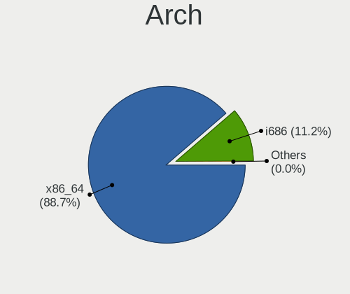
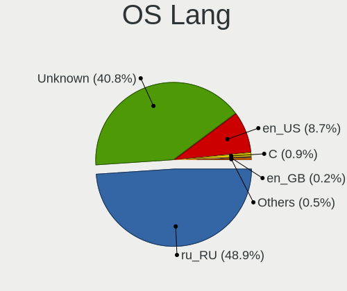
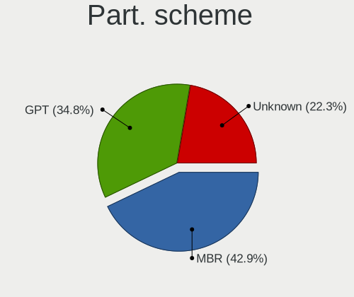
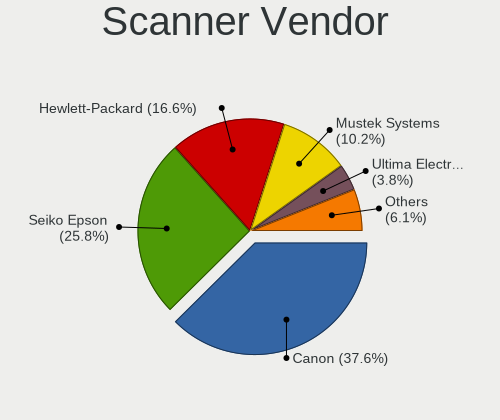

Linux in Russia - Tested Hardware & Statistics (Desktops)
---------------------------------------------------------

A project to collect tested hardware configurations for Linux in Russia.

Anyone can contribute to this report by the [hw-probe](https://github.com/linuxhw/hw-probe) tool:

    sudo -E hw-probe -all -upload

Please contribute! Especially if your hardware is rare.

Contents
--------

* [ Test Cases ](#test-cases)

* [ System ](#system)
  - [ OS                       ](#os)
  - [ OS Family                ](#os-family)
  - [ Kernel                   ](#kernel)
  - [ Kernel Family            ](#kernel-family)
  - [ Kernel Major Ver.        ](#kernel-major-ver)
  - [ Arch                     ](#arch)
  - [ DE                       ](#de)
  - [ Display Server           ](#display-server)
  - [ Display Manager          ](#display-manager)
  - [ OS Lang                  ](#os-lang)
  - [ Boot Mode                ](#boot-mode)
  - [ Filesystem               ](#filesystem)
  - [ Part. scheme             ](#part-scheme)
  - [ Dual Boot with Linux/BSD ](#dual-boot-with-linuxbsd)
  - [ Dual Boot (Win)          ](#dual-boot-win)

* [ Board ](#board)
  - [ Vendor                   ](#vendor)
  - [ Model                    ](#model)
  - [ Model Family             ](#model-family)
  - [ MFG Year                 ](#mfg-year)
  - [ Form Factor              ](#form-factor)
  - [ Secure Boot              ](#secure-boot)
  - [ Coreboot                 ](#coreboot)
  - [ RAM Size                 ](#ram-size)
  - [ RAM Used                 ](#ram-used)
  - [ Total Drives             ](#total-drives)
  - [ Has CD-ROM               ](#has-cd-rom)
  - [ Has Ethernet             ](#has-ethernet)
  - [ Has WiFi                 ](#has-wifi)
  - [ Has Bluetooth            ](#has-bluetooth)

* [ Location ](#location)
  - [ Country                  ](#country)
  - [ City                     ](#city)

* [ Drives ](#drives)
  - [ Drive Vendor             ](#drive-vendor)
  - [ Drive Model              ](#drive-model)
  - [ HDD Vendor               ](#hdd-vendor)
  - [ SSD Vendor               ](#ssd-vendor)
  - [ Drive Kind               ](#drive-kind)
  - [ Drive Connector          ](#drive-connector)
  - [ Drive Size               ](#drive-size)
  - [ Space Total              ](#space-total)
  - [ Space Used               ](#space-used)
  - [ Malfunc. Drives          ](#malfunc-drives)
  - [ Malfunc. Drive Vendor    ](#malfunc-drive-vendor)
  - [ Malfunc. HDD Vendor      ](#malfunc-hdd-vendor)
  - [ Malfunc. Drive Kind      ](#malfunc-drive-kind)
  - [ Failed Drives            ](#failed-drives)
  - [ Failed Drive Vendor      ](#failed-drive-vendor)
  - [ Drive Status             ](#drive-status)

* [ Storage controller ](#storage-controller)
  - [ Storage Vendor           ](#storage-vendor)
  - [ Storage Model            ](#storage-model)
  - [ Storage Kind             ](#storage-kind)

* [ Processor ](#processor)
  - [ CPU Vendor               ](#cpu-vendor)
  - [ CPU Model                ](#cpu-model)
  - [ CPU Model Family         ](#cpu-model-family)
  - [ CPU Cores                ](#cpu-cores)
  - [ CPU Sockets              ](#cpu-sockets)
  - [ CPU Threads              ](#cpu-threads)
  - [ CPU Op-Modes             ](#cpu-op-modes)
  - [ CPU Microcode            ](#cpu-microcode)
  - [ CPU Microarch            ](#cpu-microarch)

* [ Graphics ](#graphics)
  - [ GPU Vendor               ](#gpu-vendor)
  - [ GPU Model                ](#gpu-model)
  - [ GPU Combo                ](#gpu-combo)
  - [ GPU Driver               ](#gpu-driver)
  - [ GPU Memory               ](#gpu-memory)

* [ Monitor ](#monitor)
  - [ Monitor Vendor           ](#monitor-vendor)
  - [ Monitor Model            ](#monitor-model)
  - [ Monitor Resolution       ](#monitor-resolution)
  - [ Monitor Diagonal         ](#monitor-diagonal)
  - [ Monitor Width            ](#monitor-width)
  - [ Aspect Ratio             ](#aspect-ratio)
  - [ Monitor Area             ](#monitor-area)
  - [ Pixel Density            ](#pixel-density)
  - [ Multiple Monitors        ](#multiple-monitors)

* [ Network ](#network)
  - [ Net Controller Vendor    ](#net-controller-vendor)
  - [ Net Controller Model     ](#net-controller-model)
  - [ Wireless Vendor          ](#wireless-vendor)
  - [ Wireless Model           ](#wireless-model)
  - [ Ethernet Vendor          ](#ethernet-vendor)
  - [ Ethernet Model           ](#ethernet-model)
  - [ Net Controller Kind      ](#net-controller-kind)
  - [ Used Controller          ](#used-controller)
  - [ NICs                     ](#nics)
  - [ IPv6                     ](#ipv6)

* [ Bluetooth ](#bluetooth)
  - [ Bluetooth Vendor         ](#bluetooth-vendor)
  - [ Bluetooth Model          ](#bluetooth-model)

* [ Sound ](#sound)
  - [ Sound Vendor             ](#sound-vendor)
  - [ Sound Model              ](#sound-model)

* [ Memory ](#memory)
  - [ Memory Vendor            ](#memory-vendor)
  - [ Memory Model             ](#memory-model)
  - [ Memory Kind              ](#memory-kind)
  - [ Memory Form Factor       ](#memory-form-factor)
  - [ Memory Size              ](#memory-size)
  - [ Memory Speed             ](#memory-speed)

* [ Printers & scanners ](#printers--scanners)
  - [ Printer Vendor           ](#printer-vendor)
  - [ Printer Model            ](#printer-model)
  - [ Scanner Vendor           ](#scanner-vendor)
  - [ Scanner Model            ](#scanner-model)

* [ Camera ](#camera)
  - [ Camera Vendor            ](#camera-vendor)
  - [ Camera Model             ](#camera-model)

* [ Security ](#security)
  - [ Fingerprint Vendor       ](#fingerprint-vendor)
  - [ Fingerprint Model        ](#fingerprint-model)
  - [ Chipcard Vendor          ](#chipcard-vendor)
  - [ Chipcard Model           ](#chipcard-model)

* [ Unsupported ](#unsupported)
  - [ Unsupported Devices      ](#unsupported-devices)
  - [ Unsupported Device Types ](#unsupported-device-types)

Test Cases
----------

Total: 20697

| Vendor        | Model                       | Probe                                                      | Date         |
|---------------|-----------------------------|------------------------------------------------------------|--------------|
| MSI           | MAG B550M MORTAR            | [3fbea8cbf8](https://linux-hardware.org/?probe=3fbea8cbf8) | Jan 02, 2024 |
| ASUSTek       | P5QL                        | [723455abf9](https://linux-hardware.org/?probe=723455abf9) | Jan 02, 2024 |
| ECS           | GLKD-I2                     | [97247e0a90](https://linux-hardware.org/?probe=97247e0a90) | Jan 02, 2024 |
| Gigabyte      | B560M DS3H                  | [4ff670c80b](https://linux-hardware.org/?probe=4ff670c80b) | Jan 02, 2024 |
| Gigabyte      | B560M DS3H                  | [1529597f3c](https://linux-hardware.org/?probe=1529597f3c) | Jan 02, 2024 |
| ASRock        | J3355M                      | [305d025c0f](https://linux-hardware.org/?probe=305d025c0f) | Jan 01, 2024 |
| Gigabyte      | H470M K                     | [90b6ff9ff3](https://linux-hardware.org/?probe=90b6ff9ff3) | Jan 01, 2024 |
| HP            | ProLiant ML310e Gen8 v2     | [7271f244c2](https://linux-hardware.org/?probe=7271f244c2) | Jan 01, 2024 |
| Acer          | WMCP78M                     | [e2d232fa11](https://linux-hardware.org/?probe=e2d232fa11) | Dec 31, 2023 |
| Gigabyte      | B450M DS3H-CF               | [c341d04885](https://linux-hardware.org/?probe=c341d04885) | Dec 31, 2023 |
| ASUSTek       | H81M-K                      | [8262129320](https://linux-hardware.org/?probe=8262129320) | Dec 31, 2023 |
| ASUSTek       | PRIME B360M-K               | [d333516660](https://linux-hardware.org/?probe=d333516660) | Dec 31, 2023 |
| ASUSTek       | M2N-VM HDMI                 | [3429c969a5](https://linux-hardware.org/?probe=3429c969a5) | Dec 30, 2023 |
| ASUSTek       | M2N-VM HDMI                 | [e90dfa13e1](https://linux-hardware.org/?probe=e90dfa13e1) | Dec 30, 2023 |
| MSI           | B450M-A PRO MAX II          | [3698a044ca](https://linux-hardware.org/?probe=3698a044ca) | Dec 30, 2023 |
| DFI           | LP DK 790FXB-M2RS           | [8d0c82bedc](https://linux-hardware.org/?probe=8d0c82bedc) | Dec 30, 2023 |
| Gigabyte      | H61M-S2PV                   | [455d19da89](https://linux-hardware.org/?probe=455d19da89) | Dec 30, 2023 |
| ASUSTek       | A88XM-A                     | [175ef5b9a8](https://linux-hardware.org/?probe=175ef5b9a8) | Dec 30, 2023 |
| ASRock        | J4125M                      | [59f93c9ec4](https://linux-hardware.org/?probe=59f93c9ec4) | Dec 30, 2023 |
| HP            | 8949 11                     | [1add0bc0e2](https://linux-hardware.org/?probe=1add0bc0e2) | Dec 30, 2023 |
| Unknown       | X99                         | [cc4f5ea8e5](https://linux-hardware.org/?probe=cc4f5ea8e5) | Dec 29, 2023 |
| ASRock        | 970 Pro3 R2.0               | [2f24e45b02](https://linux-hardware.org/?probe=2f24e45b02) | Dec 29, 2023 |
| Supermicro    | X10DDW-i                    | [36b4cb3de7](https://linux-hardware.org/?probe=36b4cb3de7) | Dec 29, 2023 |
| Supermicro    | X10DDW-i                    | [7accaaedbb](https://linux-hardware.org/?probe=7accaaedbb) | Dec 29, 2023 |
| Supermicro    | X10DDW-i                    | [5d7ab2ff4b](https://linux-hardware.org/?probe=5d7ab2ff4b) | Dec 29, 2023 |
| Supermicro    | X10DDW-i                    | [be9b9577fd](https://linux-hardware.org/?probe=be9b9577fd) | Dec 29, 2023 |
| Supermicro    | X10DDW-i                    | [4f7ea59b94](https://linux-hardware.org/?probe=4f7ea59b94) | Dec 29, 2023 |
| Gigabyte      | B550 AORUS ELITE V2         | [7b33e176ed](https://linux-hardware.org/?probe=7b33e176ed) | Dec 29, 2023 |
| ASUSTek       | ROG STRIX Z390-E GAMING     | [51ab2c0529](https://linux-hardware.org/?probe=51ab2c0529) | Dec 29, 2023 |
| MSI           | 890FXA-GD70                 | [f97a148a6d](https://linux-hardware.org/?probe=f97a148a6d) | Dec 28, 2023 |
| Gigabyte      | GA-MA69G-S3H                | [25eaed96f5](https://linux-hardware.org/?probe=25eaed96f5) | Dec 28, 2023 |
| Gigabyte      | H77-D3H                     | [2fe4c01bc1](https://linux-hardware.org/?probe=2fe4c01bc1) | Dec 28, 2023 |
| Intel         | D410PT AAE76528-404         | [14f9de700a](https://linux-hardware.org/?probe=14f9de700a) | Dec 27, 2023 |
| ASUSTek       | M2NPV-VM                    | [98103e5513](https://linux-hardware.org/?probe=98103e5513) | Dec 27, 2023 |
| ASUSTek       | M5A78L-M PLUS/USB3          | [8319279670](https://linux-hardware.org/?probe=8319279670) | Dec 27, 2023 |
| ASUSTek       | P8Z68-V LX                  | [1d40495aae](https://linux-hardware.org/?probe=1d40495aae) | Dec 27, 2023 |
| ASUSTek       | P5K Premium                 | [b1c8bc2127](https://linux-hardware.org/?probe=b1c8bc2127) | Dec 26, 2023 |
| ASUSTek       | H170-PRO                    | [969aa3e243](https://linux-hardware.org/?probe=969aa3e243) | Dec 26, 2023 |
| MSI           | H510M-A PRO                 | [0260c1a342](https://linux-hardware.org/?probe=0260c1a342) | Dec 26, 2023 |
| MSI           | MPG B560I GAMING EDGE WI... | [36ca57b5f2](https://linux-hardware.org/?probe=36ca57b5f2) | Dec 26, 2023 |
| SZMZ          | X99-S3                      | [85c9abf0f3](https://linux-hardware.org/?probe=85c9abf0f3) | Dec 26, 2023 |
| Supermicro    | X8SIL                       | [16a2d27e0a](https://linux-hardware.org/?probe=16a2d27e0a) | Dec 26, 2023 |
| HJS           | OPSADLPA07                  | [2a502cf786](https://linux-hardware.org/?probe=2a502cf786) | Dec 26, 2023 |
| Lenovo        | 102F SDK0E50510 WIN 2625... | [9227fed37d](https://linux-hardware.org/?probe=9227fed37d) | Dec 26, 2023 |
| ASUSTek       | P5QL                        | [3e67d03984](https://linux-hardware.org/?probe=3e67d03984) | Dec 26, 2023 |
| ASUSTek       | PRIME Z370-A II             | [2013c4457a](https://linux-hardware.org/?probe=2013c4457a) | Dec 26, 2023 |
| ASUSTek       | P8H61-M LX3 R2.0            | [81d482c238](https://linux-hardware.org/?probe=81d482c238) | Dec 25, 2023 |
| ASUSTek       | PRIME X570-PRO              | [0867d19407](https://linux-hardware.org/?probe=0867d19407) | Dec 25, 2023 |
| ASUSTek       | M5A97 R2.0                  | [5775a72a93](https://linux-hardware.org/?probe=5775a72a93) | Dec 25, 2023 |
| Gigabyte      | GA-870A-UD3                 | [77da0ba60c](https://linux-hardware.org/?probe=77da0ba60c) | Dec 25, 2023 |
| ASUSTek       | PRIME B550-PLUS             | [f72b5c344b](https://linux-hardware.org/?probe=f72b5c344b) | Dec 25, 2023 |
| AZW           | T4 PRO                      | [2b34c0a2cc](https://linux-hardware.org/?probe=2b34c0a2cc) | Dec 25, 2023 |
| ASUSTek       | P5LD2                       | [d7be999894](https://linux-hardware.org/?probe=d7be999894) | Dec 25, 2023 |
| ASUSTek       | PRIME Z370-A II             | [57131068a4](https://linux-hardware.org/?probe=57131068a4) | Dec 25, 2023 |
| ASUSTek       | TUF Z390M-PRO GAMING        | [9007132e3a](https://linux-hardware.org/?probe=9007132e3a) | Dec 25, 2023 |
| ASUSTek       | PRIME A520M-K               | [c37ceeb88e](https://linux-hardware.org/?probe=c37ceeb88e) | Dec 24, 2023 |
| ASUSTek       | P5QL                        | [3f5460760f](https://linux-hardware.org/?probe=3f5460760f) | Dec 24, 2023 |
| MSI           | H510M-A PRO                 | [9f369b34fa](https://linux-hardware.org/?probe=9f369b34fa) | Dec 24, 2023 |
| ASUSTek       | A88XM-A                     | [34a574fc4f](https://linux-hardware.org/?probe=34a574fc4f) | Dec 24, 2023 |
| MSI           | 770-C45                     | [5aa1ef152a](https://linux-hardware.org/?probe=5aa1ef152a) | Dec 24, 2023 |
| ASUSTek       | P5B-VM SE                   | [7a453f721a](https://linux-hardware.org/?probe=7a453f721a) | Dec 24, 2023 |
| iRU           | LPGR.469559.012             | [0f955d2b87](https://linux-hardware.org/?probe=0f955d2b87) | Dec 24, 2023 |
| ASRock        | H610D4-P1                   | [88f9c52b47](https://linux-hardware.org/?probe=88f9c52b47) | Dec 24, 2023 |
| MSI           | 770-C45                     | [b627deabe4](https://linux-hardware.org/?probe=b627deabe4) | Dec 24, 2023 |
| MSI           | H510M-A PRO                 | [fe19f4de86](https://linux-hardware.org/?probe=fe19f4de86) | Dec 23, 2023 |
| MSI           | MPG B550 GAMING PLUS        | [9aa71593d4](https://linux-hardware.org/?probe=9aa71593d4) | Dec 23, 2023 |
| MSI           | MPG B550 GAMING PLUS        | [3819a04ddd](https://linux-hardware.org/?probe=3819a04ddd) | Dec 23, 2023 |
| MSI           | H110M PRO-D                 | [7a442e82cf](https://linux-hardware.org/?probe=7a442e82cf) | Dec 23, 2023 |
| ASUSTek       | P5B-VM SE                   | [4640d8f333](https://linux-hardware.org/?probe=4640d8f333) | Dec 23, 2023 |
| MSI           | H110M PRO-D                 | [10257919e4](https://linux-hardware.org/?probe=10257919e4) | Dec 23, 2023 |
| ASUSTek       | PRIME H310M-K R2.0          | [8decde512f](https://linux-hardware.org/?probe=8decde512f) | Dec 23, 2023 |
| ASUSTek       | P8H61-M LX                  | [29bb247885](https://linux-hardware.org/?probe=29bb247885) | Dec 23, 2023 |
| MSI           | 890FXA-GD70                 | [1093dc8236](https://linux-hardware.org/?probe=1093dc8236) | Dec 23, 2023 |
| Dell          | 0Y5DDC A00                  | [7ab5ac3907](https://linux-hardware.org/?probe=7ab5ac3907) | Dec 23, 2023 |
| HP            | 1495                        | [475715312b](https://linux-hardware.org/?probe=475715312b) | Dec 22, 2023 |
| ASUSTek       | SABERTOOTH 990FX R3.0       | [a1a6c29257](https://linux-hardware.org/?probe=a1a6c29257) | Dec 22, 2023 |
| ASUSTek       | P7P55D PRO                  | [ce940a8975](https://linux-hardware.org/?probe=ce940a8975) | Dec 22, 2023 |
| MSI           | B75A-G43                    | [70c44f3ff8](https://linux-hardware.org/?probe=70c44f3ff8) | Dec 22, 2023 |
| Gigabyte      | B550 AORUS PRO V2           | [be8f1bf021](https://linux-hardware.org/?probe=be8f1bf021) | Dec 22, 2023 |
| Gigabyte      | A320M-S2H-CF                | [7a1be2ed24](https://linux-hardware.org/?probe=7a1be2ed24) | Dec 21, 2023 |
| ASUSTek       | P5G41T-M LX                 | [8bc6ac892f](https://linux-hardware.org/?probe=8bc6ac892f) | Dec 21, 2023 |
| INTECH PRO    | H510-M2 v5.0                | [9d99caa058](https://linux-hardware.org/?probe=9d99caa058) | Dec 21, 2023 |
| Intel         | SKYBAY                      | [36f317de81](https://linux-hardware.org/?probe=36f317de81) | Dec 21, 2023 |
| ASUSTek       | H97M-E                      | [090fcf5a52](https://linux-hardware.org/?probe=090fcf5a52) | Dec 21, 2023 |
| ASUSTek       | M2NPV-VM                    | [312d56f544](https://linux-hardware.org/?probe=312d56f544) | Dec 21, 2023 |
| Gigabyte      | A320M-H-CF                  | [4294629777](https://linux-hardware.org/?probe=4294629777) | Dec 21, 2023 |
| MSI           | 770-C45                     | [cf5f865e2a](https://linux-hardware.org/?probe=cf5f865e2a) | Dec 21, 2023 |
| ASUSTek       | TUF Gaming B550M-PLUS       | [d5f60126bb](https://linux-hardware.org/?probe=d5f60126bb) | Dec 20, 2023 |
| ASUSTek       | VM40B                       | [8deb79e86e](https://linux-hardware.org/?probe=8deb79e86e) | Dec 20, 2023 |
| Lenovo        | ThinkCentre A70 7099L8G     | [9720608634](https://linux-hardware.org/?probe=9720608634) | Dec 20, 2023 |
| ASUSTek       | TUF Gaming B550M-PLUS       | [70aa06688c](https://linux-hardware.org/?probe=70aa06688c) | Dec 20, 2023 |
| MSI           | 760GM-P23                   | [cec4f5fa78](https://linux-hardware.org/?probe=cec4f5fa78) | Dec 20, 2023 |
| Intel         | DX58SO AAE29331-701         | [2d58e75a01](https://linux-hardware.org/?probe=2d58e75a01) | Dec 20, 2023 |
| Intel         | SKYBAY                      | [09a66cdc69](https://linux-hardware.org/?probe=09a66cdc69) | Dec 20, 2023 |
| ASUSTek       | P7P55D PRO                  | [15f5598650](https://linux-hardware.org/?probe=15f5598650) | Dec 20, 2023 |
| ASRock        | M3A UCC                     | [f28e499d94](https://linux-hardware.org/?probe=f28e499d94) | Dec 20, 2023 |
| Gigabyte      | Z77-DS3H                    | [6c1f758e88](https://linux-hardware.org/?probe=6c1f758e88) | Dec 19, 2023 |
| Gigabyte      | GA-78LMT-S2P                | [0e95772674](https://linux-hardware.org/?probe=0e95772674) | Dec 19, 2023 |
| Gigabyte      | GA-78LMT-S2P                | [f2d2625715](https://linux-hardware.org/?probe=f2d2625715) | Dec 19, 2023 |
| Gigabyte      | Z790 UD                     | [94a40a476d](https://linux-hardware.org/?probe=94a40a476d) | Dec 19, 2023 |
| AZW           | MINI S 10                   | [9fd8cc1993](https://linux-hardware.org/?probe=9fd8cc1993) | Dec 19, 2023 |
| ASUSTek       | H110M-R                     | [61211b72bb](https://linux-hardware.org/?probe=61211b72bb) | Dec 19, 2023 |
| MSI           | B360-A PRO                  | [a19733520c](https://linux-hardware.org/?probe=a19733520c) | Dec 19, 2023 |
| ASUSTek       | STRIX X99 GAMING            | [4becb790c2](https://linux-hardware.org/?probe=4becb790c2) | Dec 18, 2023 |
| Gigabyte      | H410M S2H V3                | [498141a78c](https://linux-hardware.org/?probe=498141a78c) | Dec 18, 2023 |
| ASUSTek       | P5LD2                       | [6b2cff0ab3](https://linux-hardware.org/?probe=6b2cff0ab3) | Dec 18, 2023 |
| ASUSTek       | PRIME B360M-K               | [d52ec68e39](https://linux-hardware.org/?probe=d52ec68e39) | Dec 18, 2023 |
| Biostar       | H610MH                      | [6a0d454360](https://linux-hardware.org/?probe=6a0d454360) | Dec 18, 2023 |
| ASUSTek       | ROG STRIX B550-I GAMING     | [0bedf3955a](https://linux-hardware.org/?probe=0bedf3955a) | Dec 17, 2023 |
| ASRock        | B460 Phantom Gaming 4       | [8a69294494](https://linux-hardware.org/?probe=8a69294494) | Dec 17, 2023 |
| Gigabyte      | A320M-H-CF                  | [d346ec3767](https://linux-hardware.org/?probe=d346ec3767) | Dec 17, 2023 |
| Gigabyte      | X570S UD                    | [058c14cd39](https://linux-hardware.org/?probe=058c14cd39) | Dec 17, 2023 |
| ASUSTek       | M4A87TD/USB3                | [df3eb3c253](https://linux-hardware.org/?probe=df3eb3c253) | Dec 17, 2023 |
| Unknown       | YL-J1900-V1                 | [257144f3a3](https://linux-hardware.org/?probe=257144f3a3) | Dec 17, 2023 |
| Unknown       | YL-J1900-V1                 | [c14e43b65f](https://linux-hardware.org/?probe=c14e43b65f) | Dec 17, 2023 |
| Gigabyte      | Z790 UD                     | [bfe9651fbd](https://linux-hardware.org/?probe=bfe9651fbd) | Dec 17, 2023 |
| Gigabyte      | B450 GAMING X               | [28f3e414e2](https://linux-hardware.org/?probe=28f3e414e2) | Dec 17, 2023 |
| ASUSTek       | PRIME A320M-K               | [65aee92c23](https://linux-hardware.org/?probe=65aee92c23) | Dec 17, 2023 |
| Gigabyte      | H77M-D3H                    | [de9dcb40ba](https://linux-hardware.org/?probe=de9dcb40ba) | Dec 17, 2023 |
| Foxconn       | G41MX/G41MX-K 2.0 1.0       | [cdebd77402](https://linux-hardware.org/?probe=cdebd77402) | Dec 16, 2023 |
| ASRock        | 970M Pro3                   | [1e7fb2b8d8](https://linux-hardware.org/?probe=1e7fb2b8d8) | Dec 16, 2023 |
| ASUSTek       | PRIME A320M-A               | [862ce85408](https://linux-hardware.org/?probe=862ce85408) | Dec 16, 2023 |
| AZW           | MINI S 10                   | [c3fcd194a9](https://linux-hardware.org/?probe=c3fcd194a9) | Dec 16, 2023 |
| Gigabyte      | H110M-S2H-CF                | [26e619e2e4](https://linux-hardware.org/?probe=26e619e2e4) | Dec 16, 2023 |
| AZW           | MINI S 10                   | [eae1cb11b4](https://linux-hardware.org/?probe=eae1cb11b4) | Dec 16, 2023 |
| AZW           | MINI S 10                   | [8d0d99e3ca](https://linux-hardware.org/?probe=8d0d99e3ca) | Dec 15, 2023 |
| MSI           | H61M-P21                    | [e452b4a816](https://linux-hardware.org/?probe=e452b4a816) | Dec 15, 2023 |
| ASUSTek       | M5A78L-M LX                 | [6225f2f85f](https://linux-hardware.org/?probe=6225f2f85f) | Dec 15, 2023 |
| Gigabyte      | Z790 UD                     | [77da8f68cd](https://linux-hardware.org/?probe=77da8f68cd) | Dec 15, 2023 |
| JUXIESHI      | X99-MR9A PRO MAX V5.0       | [9e2f9a2d1b](https://linux-hardware.org/?probe=9e2f9a2d1b) | Dec 14, 2023 |
| Gigabyte      | P35-DS4                     | [23e146afdc](https://linux-hardware.org/?probe=23e146afdc) | Dec 14, 2023 |
| Gigabyte      | 970A-DS3P                   | [35e6b7852f](https://linux-hardware.org/?probe=35e6b7852f) | Dec 14, 2023 |
| Gigabyte      | 970A-DS3P                   | [e3a708296c](https://linux-hardware.org/?probe=e3a708296c) | Dec 14, 2023 |
| MSI           | G41M-P26                    | [fea030b929](https://linux-hardware.org/?probe=fea030b929) | Dec 14, 2023 |
| Gigabyte      | X38-DQ6                     | [67c13b1f2a](https://linux-hardware.org/?probe=67c13b1f2a) | Dec 14, 2023 |
| MSI           | B550M PRO-VDH WIFI          | [7e77c20625](https://linux-hardware.org/?probe=7e77c20625) | Dec 14, 2023 |
| MSI           | B460M PRO-VDH               | [262206ab21](https://linux-hardware.org/?probe=262206ab21) | Dec 14, 2023 |
| Gigabyte      | H410M S2H V3                | [101f8237e0](https://linux-hardware.org/?probe=101f8237e0) | Dec 14, 2023 |
| ASUSTek       | P8H61-M LX                  | [f40c7514a6](https://linux-hardware.org/?probe=f40c7514a6) | Dec 14, 2023 |
| Gigabyte      | B85M-D3V-A                  | [004355ae40](https://linux-hardware.org/?probe=004355ae40) | Dec 13, 2023 |
| Gigabyte      | H410M S2H V3                | [e198c73fa2](https://linux-hardware.org/?probe=e198c73fa2) | Dec 13, 2023 |
| ASUSTek       | P5G41T-M LE                 | [e6205fb709](https://linux-hardware.org/?probe=e6205fb709) | Dec 13, 2023 |
| Intel         | DZ68DB AAG27985-105         | [7df70f0023](https://linux-hardware.org/?probe=7df70f0023) | Dec 13, 2023 |
| ASUSTek       | B85-PLUS                    | [0baafe2f04](https://linux-hardware.org/?probe=0baafe2f04) | Dec 13, 2023 |
| Biostar       | B560MHP                     | [51c947f8c6](https://linux-hardware.org/?probe=51c947f8c6) | Dec 12, 2023 |
| ASUSTek       | B75M-PLUS                   | [03dcd079c2](https://linux-hardware.org/?probe=03dcd079c2) | Dec 12, 2023 |
| ASUSTek       | PRIME Z790M-PLUS D4         | [eadc049e56](https://linux-hardware.org/?probe=eadc049e56) | Dec 12, 2023 |
| Gigabyte      | Z790 UD                     | [44f9c5ad81](https://linux-hardware.org/?probe=44f9c5ad81) | Dec 12, 2023 |
| ASUSTek       | P8H77-V                     | [6b62180e3e](https://linux-hardware.org/?probe=6b62180e3e) | Dec 12, 2023 |
| HP            | 859C                        | [2388872960](https://linux-hardware.org/?probe=2388872960) | Dec 12, 2023 |
| ASUSTek       | P8H61-M LX R2.0             | [2a6159034b](https://linux-hardware.org/?probe=2a6159034b) | Dec 12, 2023 |
| ASUSTek       | P7H55                       | [3642e15edd](https://linux-hardware.org/?probe=3642e15edd) | Dec 11, 2023 |
| MSI           | Z490-A PRO                  | [bd1772e0a0](https://linux-hardware.org/?probe=bd1772e0a0) | Dec 11, 2023 |
| ASUSTek       | A88X-PLUS/USB               | [0856a3d881](https://linux-hardware.org/?probe=0856a3d881) | Dec 11, 2023 |
| Gigabyte      | H610M H DDR4                | [88b93b571e](https://linux-hardware.org/?probe=88b93b571e) | Dec 11, 2023 |
| ASRock        | A320M-DVS R4.0              | [2349ef67ed](https://linux-hardware.org/?probe=2349ef67ed) | Dec 11, 2023 |
| Gigabyte      | A320M-S2H V2-CF             | [15409fd336](https://linux-hardware.org/?probe=15409fd336) | Dec 11, 2023 |
| MSI           | B450M-A PRO MAX             | [fa533e33bb](https://linux-hardware.org/?probe=fa533e33bb) | Dec 10, 2023 |
| MSI           | A320M-A PRO                 | [0542ba556a](https://linux-hardware.org/?probe=0542ba556a) | Dec 10, 2023 |
| ASRock        | N68C-GS FX                  | [a23bf3790b](https://linux-hardware.org/?probe=a23bf3790b) | Dec 10, 2023 |
| MSI           | B550-A PRO                  | [43b1cafae8](https://linux-hardware.org/?probe=43b1cafae8) | Dec 10, 2023 |
| Gigabyte      | F2A88XM-DS2                 | [0c5f882efd](https://linux-hardware.org/?probe=0c5f882efd) | Dec 10, 2023 |
| Lenovo        | SHARKBAY NOK                | [cdf1824579](https://linux-hardware.org/?probe=cdf1824579) | Dec 10, 2023 |
| MSI           | A88XM-E35                   | [c0bf97d7e0](https://linux-hardware.org/?probe=c0bf97d7e0) | Dec 09, 2023 |
| ASUSTek       | H170-PRO                    | [5e8d3ff468](https://linux-hardware.org/?probe=5e8d3ff468) | Dec 09, 2023 |
| MSI           | MPG Z790 CARBON WIFI        | [e8520b5d0c](https://linux-hardware.org/?probe=e8520b5d0c) | Dec 09, 2023 |
| Huanan        | X99-F8                      | [8c534cb0a4](https://linux-hardware.org/?probe=8c534cb0a4) | Dec 09, 2023 |
| Huanan        | X99-F8                      | [6d1bdd1b81](https://linux-hardware.org/?probe=6d1bdd1b81) | Dec 09, 2023 |
| Gigabyte      | M55S-S3                     | [bf362d71c7](https://linux-hardware.org/?probe=bf362d71c7) | Dec 09, 2023 |
| Gigabyte      | 970A-DS3P                   | [ea510ad39c](https://linux-hardware.org/?probe=ea510ad39c) | Dec 09, 2023 |
| MSI           | A88XM-E35                   | [b90d791132](https://linux-hardware.org/?probe=b90d791132) | Dec 08, 2023 |
| MSI           | MPG Z790 CARBON WIFI        | [dff716bcac](https://linux-hardware.org/?probe=dff716bcac) | Dec 08, 2023 |
| ASRock        | M3A UCC                     | [f73d6783e6](https://linux-hardware.org/?probe=f73d6783e6) | Dec 08, 2023 |
| Unknown       | Unknown                     | [85f36603e0](https://linux-hardware.org/?probe=85f36603e0) | Dec 07, 2023 |
| Biostar       | A68MHE                      | [28d5e46d68](https://linux-hardware.org/?probe=28d5e46d68) | Dec 07, 2023 |
| Biostar       | A68MHE                      | [adab01b31b](https://linux-hardware.org/?probe=adab01b31b) | Dec 07, 2023 |
| Gigabyte      | E350N WIN8                  | [b5f6aa3741](https://linux-hardware.org/?probe=b5f6aa3741) | Dec 07, 2023 |
| ASRock        | AB350M-HDV R3.0             | [d5c946c229](https://linux-hardware.org/?probe=d5c946c229) | Dec 06, 2023 |
| MSI           | H510M-A PRO                 | [6b2fb03fb3](https://linux-hardware.org/?probe=6b2fb03fb3) | Dec 06, 2023 |
| Supermicro    | X10DDW-i                    | [30c6080de4](https://linux-hardware.org/?probe=30c6080de4) | Dec 06, 2023 |
| Supermicro    | X10DDW-i                    | [0226f5545c](https://linux-hardware.org/?probe=0226f5545c) | Dec 06, 2023 |
| Supermicro    | X10DDW-i                    | [cf63284103](https://linux-hardware.org/?probe=cf63284103) | Dec 06, 2023 |
| Supermicro    | X10DDW-i                    | [6d0a010766](https://linux-hardware.org/?probe=6d0a010766) | Dec 06, 2023 |
| Gigabyte      | X570 GAMING X               | [b7070058fb](https://linux-hardware.org/?probe=b7070058fb) | Dec 06, 2023 |
| Supermicro    | X9DRW                       | [485f869e9b](https://linux-hardware.org/?probe=485f869e9b) | Dec 06, 2023 |
| Supermicro    | X10DRL-i                    | [f30d1a0a40](https://linux-hardware.org/?probe=f30d1a0a40) | Dec 06, 2023 |
| Supermicro    | X10DRL-i                    | [7f6c70bab0](https://linux-hardware.org/?probe=7f6c70bab0) | Dec 06, 2023 |
| Supermicro    | X9SCL/X9SCMA                | [c7a3277bfa](https://linux-hardware.org/?probe=c7a3277bfa) | Dec 06, 2023 |
| Gigabyte      | Z370 HD3-CF                 | [1b3a42caac](https://linux-hardware.org/?probe=1b3a42caac) | Dec 06, 2023 |
| Supermicro    | X9SCL/X9SCMA                | [3176cf1b45](https://linux-hardware.org/?probe=3176cf1b45) | Dec 06, 2023 |
| Lenovo        | 0x30F617AA NOK              | [c57e8b797a](https://linux-hardware.org/?probe=c57e8b797a) | Dec 06, 2023 |
| ASUSTek       | P7P55-M                     | [f19bc05960](https://linux-hardware.org/?probe=f19bc05960) | Dec 06, 2023 |
| ASRock        | B365M-ITX/ac                | [01d47685dd](https://linux-hardware.org/?probe=01d47685dd) | Dec 06, 2023 |
| ASUSTek       | M2NPV-VM                    | [63a226690c](https://linux-hardware.org/?probe=63a226690c) | Dec 06, 2023 |
| ASUSTek       | PRIME A320M-K               | [be8fd86ad0](https://linux-hardware.org/?probe=be8fd86ad0) | Dec 05, 2023 |
| Gigabyte      | EP45-UD3LR                  | [f6bc6674c6](https://linux-hardware.org/?probe=f6bc6674c6) | Dec 05, 2023 |
| Intel         | H81 V2.3                    | [708916ead2](https://linux-hardware.org/?probe=708916ead2) | Dec 05, 2023 |
| ASUSTek       | PRIME B450M-K               | [110604e0da](https://linux-hardware.org/?probe=110604e0da) | Dec 05, 2023 |
| MSI           | MS-B1711                    | [8c0247cf89](https://linux-hardware.org/?probe=8c0247cf89) | Dec 05, 2023 |
| Gigabyte      | F2A68HM-DS2                 | [6152f696ba](https://linux-hardware.org/?probe=6152f696ba) | Dec 05, 2023 |
| ASUSTek       | P8H61-M LX3 R2.0            | [7bd10d1922](https://linux-hardware.org/?probe=7bd10d1922) | Dec 05, 2023 |
| ASUSTek       | A88XM-A                     | [e91058f8a8](https://linux-hardware.org/?probe=e91058f8a8) | Dec 05, 2023 |
| Gigabyte      | GA-970A-UD3                 | [08a2ed40a1](https://linux-hardware.org/?probe=08a2ed40a1) | Dec 05, 2023 |
| ASRock        | AD2550B-ITX                 | [6e518f6d21](https://linux-hardware.org/?probe=6e518f6d21) | Dec 05, 2023 |
| Supermicro    | X10DRG-Q                    | [5844ee0f43](https://linux-hardware.org/?probe=5844ee0f43) | Dec 04, 2023 |
| Supermicro    | X10DRG-Q                    | [175bbb55cb](https://linux-hardware.org/?probe=175bbb55cb) | Dec 04, 2023 |
| Gigabyte      | GA-A55M-DS2                 | [479a8762cb](https://linux-hardware.org/?probe=479a8762cb) | Dec 04, 2023 |
| Gigabyte      | B660 GAMING X DDR4          | [8825d0fec5](https://linux-hardware.org/?probe=8825d0fec5) | Dec 04, 2023 |
| HP            | 0B4Ch D                     | [85c03e03e8](https://linux-hardware.org/?probe=85c03e03e8) | Dec 04, 2023 |
| ASUSTek       | Z87M-PLUS                   | [be471e354a](https://linux-hardware.org/?probe=be471e354a) | Dec 04, 2023 |
| ASUSTek       | Q87M-E                      | [df56e68ebc](https://linux-hardware.org/?probe=df56e68ebc) | Dec 04, 2023 |
| MSI           | B550-A PRO                  | [0f258ceffb](https://linux-hardware.org/?probe=0f258ceffb) | Dec 04, 2023 |
| ASUSTek       | P5P800-VM                   | [dff0c991af](https://linux-hardware.org/?probe=dff0c991af) | Dec 04, 2023 |
| ASUSTek       | P8H61-M LX R2.0             | [61163dcc3a](https://linux-hardware.org/?probe=61163dcc3a) | Dec 04, 2023 |
| Huanan        | X99-F8 GAMING V5.0          | [6e9e9a487a](https://linux-hardware.org/?probe=6e9e9a487a) | Dec 03, 2023 |
| Gigabyte      | GA-78LMT-S2 sex             | [9c9a12b12c](https://linux-hardware.org/?probe=9c9a12b12c) | Dec 03, 2023 |
| MSI           | X470 GAMING PLUS MAX        | [8d6b25d674](https://linux-hardware.org/?probe=8d6b25d674) | Dec 03, 2023 |
| MSI           | X470 GAMING PLUS MAX        | [595ed9849e](https://linux-hardware.org/?probe=595ed9849e) | Dec 03, 2023 |
| ASUSTek       | P5LD2                       | [427dcf0f2e](https://linux-hardware.org/?probe=427dcf0f2e) | Dec 03, 2023 |
| MSI           | PRO B650-VC WIFI            | [9e15f48c96](https://linux-hardware.org/?probe=9e15f48c96) | Dec 03, 2023 |
| Intel         | X99                         | [b1ae912db2](https://linux-hardware.org/?probe=b1ae912db2) | Dec 03, 2023 |
| ASRock        | N68C-S UCC                  | [d42ebb9252](https://linux-hardware.org/?probe=d42ebb9252) | Dec 03, 2023 |
| ASRock        | N68C-S UCC                  | [13d2b9187f](https://linux-hardware.org/?probe=13d2b9187f) | Dec 03, 2023 |
| Huanan        | X99-F8D PLUS V1.3           | [848f3c01c3](https://linux-hardware.org/?probe=848f3c01c3) | Dec 03, 2023 |
| ASUSTek       | P7P55 LX                    | [0d59473ae1](https://linux-hardware.org/?probe=0d59473ae1) | Dec 02, 2023 |
| Gigabyte      | B450M DS3H-CF               | [e830e69a5d](https://linux-hardware.org/?probe=e830e69a5d) | Dec 02, 2023 |
| Intel         | X99                         | [e96bed5f38](https://linux-hardware.org/?probe=e96bed5f38) | Dec 02, 2023 |
| MSI           | B350 GAMING PLUS            | [883665fb17](https://linux-hardware.org/?probe=883665fb17) | Dec 02, 2023 |
| Gigabyte      | B550M DS3H                  | [a7ab6a0555](https://linux-hardware.org/?probe=a7ab6a0555) | Dec 02, 2023 |
| ASUSTek       | P6X58D PREMIUM              | [28312db8a0](https://linux-hardware.org/?probe=28312db8a0) | Dec 02, 2023 |
| Gigabyte      | H97M-HD3                    | [aa52a8ceac](https://linux-hardware.org/?probe=aa52a8ceac) | Dec 02, 2023 |
| Gigabyte      | B450M DS3H-CF               | [5f195d4731](https://linux-hardware.org/?probe=5f195d4731) | Dec 02, 2023 |
| OEM           | X79G                        | [febfd97ad1](https://linux-hardware.org/?probe=febfd97ad1) | Dec 01, 2023 |
| ASRock        | B450M Pro4-F                | [d0911fd21c](https://linux-hardware.org/?probe=d0911fd21c) | Dec 01, 2023 |
| Gigabyte      | A320M-H-CF                  | [4172cccae3](https://linux-hardware.org/?probe=4172cccae3) | Dec 01, 2023 |
| ASUSTek       | H110M-K                     | [aaa13df3bd](https://linux-hardware.org/?probe=aaa13df3bd) | Dec 01, 2023 |
| ASRock        | B450M Steel Legend          | [7d88a4ceef](https://linux-hardware.org/?probe=7d88a4ceef) | Dec 01, 2023 |
| Gigabyte      | B150M-DS3H-CF               | [50332d509a](https://linux-hardware.org/?probe=50332d509a) | Dec 01, 2023 |
| Gigabyte      | B460M D3H                   | [b83f7a31ff](https://linux-hardware.org/?probe=b83f7a31ff) | Dec 01, 2023 |
| ASUSTek       | P5QL-VM EPU                 | [c70c2ff27f](https://linux-hardware.org/?probe=c70c2ff27f) | Dec 01, 2023 |
| MSI           | A68HM-P33 V2                | [b1131b7587](https://linux-hardware.org/?probe=b1131b7587) | Dec 01, 2023 |
| MSI           | MAG B550 TOMAHAWK MAX WI... | [a0e082b7d2](https://linux-hardware.org/?probe=a0e082b7d2) | Dec 01, 2023 |
| Gigabyte      | B450M H                     | [48d13cedfc](https://linux-hardware.org/?probe=48d13cedfc) | Dec 01, 2023 |
| Huanan        | X99 F8D V2.2                | [acc68bea5c](https://linux-hardware.org/?probe=acc68bea5c) | Nov 30, 2023 |
| MSI           | 770-C45                     | [59a879c475](https://linux-hardware.org/?probe=59a879c475) | Nov 30, 2023 |
| ASUSTek       | B85M-G                      | [97b2117c5e](https://linux-hardware.org/?probe=97b2117c5e) | Nov 30, 2023 |
| MSI           | B450M-A PRO MAX             | [9accd13cb5](https://linux-hardware.org/?probe=9accd13cb5) | Nov 30, 2023 |
| ASUSTek       | PRIME Z790M-PLUS D4         | [3630fd2945](https://linux-hardware.org/?probe=3630fd2945) | Nov 30, 2023 |
| Gigabyte      | H370 HD3-CF                 | [d7367e7072](https://linux-hardware.org/?probe=d7367e7072) | Nov 30, 2023 |
| ECS           | GLKD-I2                     | [05d3dc06a0](https://linux-hardware.org/?probe=05d3dc06a0) | Nov 30, 2023 |
| ASUSTek       | P5KPL-AM                    | [241a9d1cad](https://linux-hardware.org/?probe=241a9d1cad) | Nov 30, 2023 |
| Lenovo        | MAHOBAY NO DPK              | [bada3a056e](https://linux-hardware.org/?probe=bada3a056e) | Nov 30, 2023 |
| ASUSTek       | P5LD2                       | [7cc743250b](https://linux-hardware.org/?probe=7cc743250b) | Nov 30, 2023 |
| MSI           | B450M-A PRO MAX             | [a6ae767fad](https://linux-hardware.org/?probe=a6ae767fad) | Nov 30, 2023 |
| Kllisre       | X79 V2.72S                  | [cd66ba8786](https://linux-hardware.org/?probe=cd66ba8786) | Nov 30, 2023 |
| Gigabyte      | A320M-S2H-CF                | [01105932ac](https://linux-hardware.org/?probe=01105932ac) | Nov 30, 2023 |
| Gigabyte      | Z370 HD3-CF                 | [7a171ad95d](https://linux-hardware.org/?probe=7a171ad95d) | Nov 30, 2023 |
| ASUSTek       | P8Z77-I DELUXE              | [a139e1830c](https://linux-hardware.org/?probe=a139e1830c) | Nov 29, 2023 |
| MACHINIST     | X99 RS9                     | [722f516451](https://linux-hardware.org/?probe=722f516451) | Nov 29, 2023 |
| Acer          | Aspire XC-1660 V:1.1        | [509ae42a22](https://linux-hardware.org/?probe=509ae42a22) | Nov 29, 2023 |
| Gigabyte      | B85-HD3                     | [b64fc99109](https://linux-hardware.org/?probe=b64fc99109) | Nov 29, 2023 |
| Intel         | SKYBAY                      | [5734274ccd](https://linux-hardware.org/?probe=5734274ccd) | Nov 29, 2023 |
| MSI           | MAG Z690 TOMAHAWK WIFI      | [a418438d62](https://linux-hardware.org/?probe=a418438d62) | Nov 29, 2023 |
| MSI           | MPG X570 GAMING PLUS        | [2d7376da77](https://linux-hardware.org/?probe=2d7376da77) | Nov 29, 2023 |
| Gigabyte      | G41MT-S2P                   | [6a2c279391](https://linux-hardware.org/?probe=6a2c279391) | Nov 29, 2023 |
| Gigabyte      | Z270P-D3-CF                 | [9b31bd67fb](https://linux-hardware.org/?probe=9b31bd67fb) | Nov 29, 2023 |
| Gigabyte      | GA-780T-D3L                 | [b3dee75350](https://linux-hardware.org/?probe=b3dee75350) | Nov 29, 2023 |
| ASRock        | J4125M                      | [9e5951e82e](https://linux-hardware.org/?probe=9e5951e82e) | Nov 29, 2023 |
| ASUSTek       | PRIME B450-PLUS             | [cf46975c18](https://linux-hardware.org/?probe=cf46975c18) | Nov 28, 2023 |
| ASUSTek       | A88X-PLUS/USB               | [8603cdd73e](https://linux-hardware.org/?probe=8603cdd73e) | Nov 28, 2023 |
| Gigabyte      | B550M AORUS ELITE           | [82528116e5](https://linux-hardware.org/?probe=82528116e5) | Nov 28, 2023 |
| ASRock        | H61DE/S3                    | [50d5c63e0f](https://linux-hardware.org/?probe=50d5c63e0f) | Nov 28, 2023 |
| ASRock        | B450 Gaming K4              | [96ff1ae1f7](https://linux-hardware.org/?probe=96ff1ae1f7) | Nov 28, 2023 |
| MSI           | X299 GAMING PRO CARBON      | [07d105a830](https://linux-hardware.org/?probe=07d105a830) | Nov 28, 2023 |
| ASUSTek       | SABERTOOTH P67              | [8b5f96b606](https://linux-hardware.org/?probe=8b5f96b606) | Nov 28, 2023 |
| MSI           | MAG X570S TOMAHAWK MAX W... | [348a2974d6](https://linux-hardware.org/?probe=348a2974d6) | Nov 28, 2023 |
| ASRock        | H81M-DGS R2.0               | [2196f5ec5e](https://linux-hardware.org/?probe=2196f5ec5e) | Nov 28, 2023 |
| ASUSTek       | ROG STRIX B550-E GAMING     | [dcfc4409e2](https://linux-hardware.org/?probe=dcfc4409e2) | Nov 28, 2023 |
| Graviton      | DMB-A520-MCA01 1.o          | [f989b31edd](https://linux-hardware.org/?probe=f989b31edd) | Nov 28, 2023 |
| ASUSTek       | PRIME B450-PLUS             | [ebd9b385a7](https://linux-hardware.org/?probe=ebd9b385a7) | Nov 28, 2023 |
| Gigabyte      | A320M-S2H-CF                | [ae4263fce1](https://linux-hardware.org/?probe=ae4263fce1) | Nov 28, 2023 |
| Biostar       | H310MHP                     | [58282ae6c7](https://linux-hardware.org/?probe=58282ae6c7) | Nov 28, 2023 |
| Graviton      | DMB-A520-MCA01 1.o          | [1dce0a4738](https://linux-hardware.org/?probe=1dce0a4738) | Nov 28, 2023 |
| MSI           | A520M-A PRO                 | [2d9e2ea88b](https://linux-hardware.org/?probe=2d9e2ea88b) | Nov 28, 2023 |
| ASRock        | B450M Steel Legend          | [67a80483fe](https://linux-hardware.org/?probe=67a80483fe) | Nov 27, 2023 |
| Gigabyte      | P67A-D3-B3                  | [fc4a8c9532](https://linux-hardware.org/?probe=fc4a8c9532) | Nov 27, 2023 |
| Foxconn       | H67MP-S/-V/H67MP            | [c5f3edc9d1](https://linux-hardware.org/?probe=c5f3edc9d1) | Nov 27, 2023 |
| ASUSTek       | P5K                         | [d5cb9ac79b](https://linux-hardware.org/?probe=d5cb9ac79b) | Nov 27, 2023 |
| Huanan        | X99-T8 GAMING V2.0          | [f2a97cce30](https://linux-hardware.org/?probe=f2a97cce30) | Nov 27, 2023 |
| ECS           | GLKD-I2                     | [c1f9ed7186](https://linux-hardware.org/?probe=c1f9ed7186) | Nov 27, 2023 |
| ASRock        | H510M-HVS R2.0              | [e8867e4bb9](https://linux-hardware.org/?probe=e8867e4bb9) | Nov 27, 2023 |
| Supermicro    | X10DRL-i                    | [5ef70291dd](https://linux-hardware.org/?probe=5ef70291dd) | Nov 27, 2023 |
| Supermicro    | X10DRU-i+A                  | [1dc89f1473](https://linux-hardware.org/?probe=1dc89f1473) | Nov 27, 2023 |
| Supermicro    | X9DRW                       | [86356d229c](https://linux-hardware.org/?probe=86356d229c) | Nov 27, 2023 |
| MSI           | H310M PRO-VDH PLUS          | [68644f2689](https://linux-hardware.org/?probe=68644f2689) | Nov 27, 2023 |
| Supermicro    | X10DRL-i                    | [258e338541](https://linux-hardware.org/?probe=258e338541) | Nov 27, 2023 |
| Supermicro    | X10DDW-i                    | [dd750184ff](https://linux-hardware.org/?probe=dd750184ff) | Nov 27, 2023 |
| Supermicro    | X10DDW-i                    | [275dfaabe4](https://linux-hardware.org/?probe=275dfaabe4) | Nov 27, 2023 |
| Supermicro    | X10DDW-i                    | [7a9789da62](https://linux-hardware.org/?probe=7a9789da62) | Nov 27, 2023 |
| Supermicro    | X10DDW-i                    | [792780c033](https://linux-hardware.org/?probe=792780c033) | Nov 27, 2023 |
| Supermicro    | X9DRW                       | [c764c8a98e](https://linux-hardware.org/?probe=c764c8a98e) | Nov 27, 2023 |
| Gigabyte      | X570 GAMING X               | [4609a7f037](https://linux-hardware.org/?probe=4609a7f037) | Nov 27, 2023 |
| Gigabyte      | Z490 UD                     | [38d2e85b40](https://linux-hardware.org/?probe=38d2e85b40) | Nov 27, 2023 |
| MSI           | H310M PRO-VDH PLUS          | [6fcbd9b64c](https://linux-hardware.org/?probe=6fcbd9b64c) | Nov 27, 2023 |
| Gigabyte      | H410M S2H V2                | [07a85d20b8](https://linux-hardware.org/?probe=07a85d20b8) | Nov 27, 2023 |
| Gigabyte      | G31M-ES2L                   | [f3e5b85b92](https://linux-hardware.org/?probe=f3e5b85b92) | Nov 27, 2023 |
| Unknown       | Unknown                     | [2cd14cbfbd](https://linux-hardware.org/?probe=2cd14cbfbd) | Nov 27, 2023 |
| ECS           | G31T-M9                     | [fa44ca9239](https://linux-hardware.org/?probe=fa44ca9239) | Nov 27, 2023 |
| ASUSTek       | P5B-Deluxe                  | [1af8016aed](https://linux-hardware.org/?probe=1af8016aed) | Nov 27, 2023 |
| ASUSTek       | P5B-Deluxe                  | [668b258270](https://linux-hardware.org/?probe=668b258270) | Nov 27, 2023 |
| Gigabyte      | 970A-DS3P                   | [182a3875c4](https://linux-hardware.org/?probe=182a3875c4) | Nov 27, 2023 |
| Gigabyte      | 970A-DS3P                   | [196be5def7](https://linux-hardware.org/?probe=196be5def7) | Nov 27, 2023 |
| Intel         | X99H                        | [2cbd1213a8](https://linux-hardware.org/?probe=2cbd1213a8) | Nov 27, 2023 |
| MSI           | MPG Z790 CARBON WIFI        | [81c2675a1e](https://linux-hardware.org/?probe=81c2675a1e) | Nov 26, 2023 |
| Gigabyte      | GA-MA790X-DS4               | [5435d9e2ba](https://linux-hardware.org/?probe=5435d9e2ba) | Nov 26, 2023 |
| Huanan        | X99-BD4 V1.1, NALEX         | [751dbeae2c](https://linux-hardware.org/?probe=751dbeae2c) | Nov 26, 2023 |
| ASUSTek       | A88XM-A                     | [1431a6559b](https://linux-hardware.org/?probe=1431a6559b) | Nov 26, 2023 |
| Red Hat       | RHEL RHEL-9.2.0 PC          | [33dabf03ca](https://linux-hardware.org/?probe=33dabf03ca) | Nov 26, 2023 |
| ASUSTek       | P8Z77-I DELUXE              | [bb98eb3ce9](https://linux-hardware.org/?probe=bb98eb3ce9) | Nov 26, 2023 |
| MSI           | H310M PRO-VH PLUS           | [f21d57f728](https://linux-hardware.org/?probe=f21d57f728) | Nov 26, 2023 |
| HP            | ProLiant SL230s Gen8        | [a0b680d2ac](https://linux-hardware.org/?probe=a0b680d2ac) | Nov 26, 2023 |
| HP            | ProLiant SL230s Gen8        | [b1d3f26e5d](https://linux-hardware.org/?probe=b1d3f26e5d) | Nov 26, 2023 |
| HP            | ProLiant SL230s Gen8        | [800b1eab76](https://linux-hardware.org/?probe=800b1eab76) | Nov 26, 2023 |
| MSI           | B85M-G43                    | [c8c114c2df](https://linux-hardware.org/?probe=c8c114c2df) | Nov 26, 2023 |
| HP            | ProLiant SL230s Gen8        | [35b226a480](https://linux-hardware.org/?probe=35b226a480) | Nov 26, 2023 |
| Unknown       | Unknown                     | [72915fd0dd](https://linux-hardware.org/?probe=72915fd0dd) | Nov 26, 2023 |
| Gigabyte      | B560M D3H                   | [ecf8bf3010](https://linux-hardware.org/?probe=ecf8bf3010) | Nov 26, 2023 |
| MSI           | Z490-A PRO                  | [8fdcfb665c](https://linux-hardware.org/?probe=8fdcfb665c) | Nov 26, 2023 |
| Dell          | 0Y5DDC A00                  | [db9963f44a](https://linux-hardware.org/?probe=db9963f44a) | Nov 26, 2023 |
| ASRock        | H61M-GS                     | [b1448b5814](https://linux-hardware.org/?probe=b1448b5814) | Nov 25, 2023 |
| ASUSTek       | PRIME A520M-K               | [7514ce50b9](https://linux-hardware.org/?probe=7514ce50b9) | Nov 25, 2023 |
| ASUSTek       | P8H77-V                     | [73eebdebc2](https://linux-hardware.org/?probe=73eebdebc2) | Nov 25, 2023 |
| Unknown       | HX90                        | [b4eef50430](https://linux-hardware.org/?probe=b4eef50430) | Nov 25, 2023 |
| MSI           | MAG B550 TOMAHAWK           | [976fa4dff9](https://linux-hardware.org/?probe=976fa4dff9) | Nov 25, 2023 |
| MSI           | Z87-G41 PC Mate             | [cff699d67d](https://linux-hardware.org/?probe=cff699d67d) | Nov 25, 2023 |
| ASRock        | B450 Pro4                   | [1fb358fc57](https://linux-hardware.org/?probe=1fb358fc57) | Nov 25, 2023 |
| SZMZ          | X99 DUAL Z8                 | [d218c8ce18](https://linux-hardware.org/?probe=d218c8ce18) | Nov 25, 2023 |
| ASUSTek       | TUF Gaming B550M-E          | [5e32800db0](https://linux-hardware.org/?probe=5e32800db0) | Nov 24, 2023 |
| ASUSTek       | B85M-G                      | [6497745451](https://linux-hardware.org/?probe=6497745451) | Nov 24, 2023 |
| ASUSTek       | TUF X299 MARK 2             | [bb8bae6a59](https://linux-hardware.org/?probe=bb8bae6a59) | Nov 24, 2023 |
| ASUSTek       | ROG STRIX B650E-E GAMING... | [2a14b62cf5](https://linux-hardware.org/?probe=2a14b62cf5) | Nov 24, 2023 |
| ASUSTek       | ROG STRIX X299-E GAMING ... | [ebf074490a](https://linux-hardware.org/?probe=ebf074490a) | Nov 24, 2023 |
| Acer          | Veriton N4660G              | [2d59329fc6](https://linux-hardware.org/?probe=2d59329fc6) | Nov 24, 2023 |
| ASRock        | B450M Pro4                  | [bbd1246656](https://linux-hardware.org/?probe=bbd1246656) | Nov 23, 2023 |
| ASUSTek       | PRIME H510M-R               | [798ff06944](https://linux-hardware.org/?probe=798ff06944) | Nov 23, 2023 |
| SZMZ          | X99 DUAL Z8                 | [aaa9f78cd9](https://linux-hardware.org/?probe=aaa9f78cd9) | Nov 23, 2023 |
| MSI           | Z87-G41 PC Mate             | [ae2a4ee822](https://linux-hardware.org/?probe=ae2a4ee822) | Nov 23, 2023 |
| ASUSTek       | PRIME X670-P WIFI           | [9d776a8aa8](https://linux-hardware.org/?probe=9d776a8aa8) | Nov 23, 2023 |
| ASRock        | A320M-HDV R4.0              | [a67ae23c5a](https://linux-hardware.org/?probe=a67ae23c5a) | Nov 23, 2023 |
| ASRock        | 4Core1600-GLAN              | [d850b7a222](https://linux-hardware.org/?probe=d850b7a222) | Nov 23, 2023 |
| ASUSTek       | PRIME X370-A                | [27f6e938d0](https://linux-hardware.org/?probe=27f6e938d0) | Nov 23, 2023 |
| Biostar       | TF570 SLI A2+               | [50eb6f63d8](https://linux-hardware.org/?probe=50eb6f63d8) | Nov 23, 2023 |
| Biostar       | TF570 SLI A2+               | [052c9cc626](https://linux-hardware.org/?probe=052c9cc626) | Nov 23, 2023 |
| Unknown       | X79                         | [e66769bf5c](https://linux-hardware.org/?probe=e66769bf5c) | Nov 23, 2023 |
| Gigabyte      | A320M-H-CF                  | [fbce369e50](https://linux-hardware.org/?probe=fbce369e50) | Nov 23, 2023 |
| Huanan        | X99-F8 V2.0                 | [b4f7ce646b](https://linux-hardware.org/?probe=b4f7ce646b) | Nov 22, 2023 |
| MSI           | B350M PRO-VDH               | [b8a0ad5987](https://linux-hardware.org/?probe=b8a0ad5987) | Nov 22, 2023 |
| ASRock        | B450 Pro4                   | [5b63e87d07](https://linux-hardware.org/?probe=5b63e87d07) | Nov 22, 2023 |
| Biostar       | B550M-SILVER                | [d2502c76d5](https://linux-hardware.org/?probe=d2502c76d5) | Nov 22, 2023 |
| Huanan        | X99-F8D PLUS V1.2           | [2edde2bb35](https://linux-hardware.org/?probe=2edde2bb35) | Nov 22, 2023 |
| MSI           | B550-A PRO                  | [3914c7ac4f](https://linux-hardware.org/?probe=3914c7ac4f) | Nov 22, 2023 |
| Unknown       | Unknown                     | [f1a988f291](https://linux-hardware.org/?probe=f1a988f291) | Nov 22, 2023 |
| ASUSTek       | PRIME B250M-PLUS            | [aad08ec259](https://linux-hardware.org/?probe=aad08ec259) | Nov 22, 2023 |
| MSI           | A68HM-P33 V2                | [bee7ef1689](https://linux-hardware.org/?probe=bee7ef1689) | Nov 22, 2023 |
| ASUSTek       | P8H61 PRO                   | [f5ae04b987](https://linux-hardware.org/?probe=f5ae04b987) | Nov 22, 2023 |
| ASUSTek       | H97-PRO                     | [92e445a4fc](https://linux-hardware.org/?probe=92e445a4fc) | Nov 22, 2023 |
| Gigabyte      | A520M S2H                   | [450e29b3a9](https://linux-hardware.org/?probe=450e29b3a9) | Nov 21, 2023 |
| Supermicro    | X10DRU-i+A                  | [bcefaeb3bc](https://linux-hardware.org/?probe=bcefaeb3bc) | Nov 21, 2023 |
| Dell          | 0MGK50 A02                  | [44cca29f66](https://linux-hardware.org/?probe=44cca29f66) | Nov 21, 2023 |
| ASUSTek       | H110M-D                     | [c871779bc5](https://linux-hardware.org/?probe=c871779bc5) | Nov 21, 2023 |
| ASUSTek       | P5B-Premium                 | [53c5d42789](https://linux-hardware.org/?probe=53c5d42789) | Nov 21, 2023 |
| Huanan        | X99 F8D V2.2                | [793263f898](https://linux-hardware.org/?probe=793263f898) | Nov 21, 2023 |
| Gigabyte      | Z690 UD                     | [a0458c3220](https://linux-hardware.org/?probe=a0458c3220) | Nov 21, 2023 |
| ASUSTek       | P8H61 PRO                   | [e029a02461](https://linux-hardware.org/?probe=e029a02461) | Nov 21, 2023 |
| ASUSTek       | P8H61 PRO                   | [966108e5dc](https://linux-hardware.org/?probe=966108e5dc) | Nov 21, 2023 |
| Gigabyte      | PH67A-D3-B3                 | [b95aa31de0](https://linux-hardware.org/?probe=b95aa31de0) | Nov 21, 2023 |
| MSI           | H310M PRO-VD                | [aabdcbb08a](https://linux-hardware.org/?probe=aabdcbb08a) | Nov 20, 2023 |
| Gigabyte      | B85M-D3V                    | [5a04938662](https://linux-hardware.org/?probe=5a04938662) | Nov 20, 2023 |
| ASUSTek       | PRIME H310M-E R2.0          | [746b73efa5](https://linux-hardware.org/?probe=746b73efa5) | Nov 20, 2023 |
| MSI           | H110M PRO-VD                | [9fab1b4add](https://linux-hardware.org/?probe=9fab1b4add) | Nov 20, 2023 |
| ASUSTek       | P8H61-M LX3 R2.0            | [7d8f15f875](https://linux-hardware.org/?probe=7d8f15f875) | Nov 20, 2023 |
| Gigabyte      | B75M-D3V                    | [48a562a1b6](https://linux-hardware.org/?probe=48a562a1b6) | Nov 20, 2023 |
| Gigabyte      | H61M-S1                     | [5b55e90cd2](https://linux-hardware.org/?probe=5b55e90cd2) | Nov 20, 2023 |
| ASUSTek       | Z87-A                       | [ef419190cb](https://linux-hardware.org/?probe=ef419190cb) | Nov 20, 2023 |
| Gigabyte      | H270-HD3-CF                 | [c492bd0c05](https://linux-hardware.org/?probe=c492bd0c05) | Nov 20, 2023 |
| Gigabyte      | A320M-S2H-CF                | [05b1279d72](https://linux-hardware.org/?probe=05b1279d72) | Nov 20, 2023 |
| Gigabyte      | H270-HD3-CF                 | [d203bd1f2e](https://linux-hardware.org/?probe=d203bd1f2e) | Nov 20, 2023 |
| ASUSTek       | PRIME B350M-K               | [3fb45b3fae](https://linux-hardware.org/?probe=3fb45b3fae) | Nov 20, 2023 |
| ASUSTek       | PRIME B350M-K               | [1e85870bb4](https://linux-hardware.org/?probe=1e85870bb4) | Nov 20, 2023 |
| Gigabyte      | Z390 GAMING X-CF            | [8c04d88a1a](https://linux-hardware.org/?probe=8c04d88a1a) | Nov 20, 2023 |
| Gigabyte      | A320M-S2H-CF                | [d97ba119eb](https://linux-hardware.org/?probe=d97ba119eb) | Nov 20, 2023 |
| Unknown       | TA320 Series                | [2ba015f4da](https://linux-hardware.org/?probe=2ba015f4da) | Nov 20, 2023 |
| ASRock        | B365M-ITX/ac                | [d9aef8d62e](https://linux-hardware.org/?probe=d9aef8d62e) | Nov 20, 2023 |
| HP            | ProLiant ML310e Gen8 v2     | [eccc68d336](https://linux-hardware.org/?probe=eccc68d336) | Nov 20, 2023 |
| ONDA          | H410D4 IPC                  | [5ace66c92d](https://linux-hardware.org/?probe=5ace66c92d) | Nov 20, 2023 |
| BESHTAU       | B560RU V51                  | [188829d0c2](https://linux-hardware.org/?probe=188829d0c2) | Nov 20, 2023 |
| ASUSTek       | TUF Gaming B550M-E WIFI     | [f4f0cc26d8](https://linux-hardware.org/?probe=f4f0cc26d8) | Nov 20, 2023 |
| MSI           | B350M PRO-VDH               | [56cd0716d9](https://linux-hardware.org/?probe=56cd0716d9) | Nov 19, 2023 |
| ASUSTek       | P7P55-M                     | [7fd9d79c06](https://linux-hardware.org/?probe=7fd9d79c06) | Nov 19, 2023 |
| Intel         | X99H                        | [056d58d460](https://linux-hardware.org/?probe=056d58d460) | Nov 19, 2023 |
| Intel         | X99H                        | [409013cb66](https://linux-hardware.org/?probe=409013cb66) | Nov 19, 2023 |
| ASUSTek       | PRIME Z690-P D4             | [f12026549d](https://linux-hardware.org/?probe=f12026549d) | Nov 19, 2023 |
| Lenovo        | No DPK                      | [b569bd1d22](https://linux-hardware.org/?probe=b569bd1d22) | Nov 19, 2023 |
| ASRock        | B550 Phantom Gaming 4       | [fc7f2d74b8](https://linux-hardware.org/?probe=fc7f2d74b8) | Nov 19, 2023 |
| MSI           | A88XM-E35                   | [daa37d291c](https://linux-hardware.org/?probe=daa37d291c) | Nov 19, 2023 |
| EPoX Compu... | nF4/nF500 DDR2: MF5-J, M... | [e95c5e0c3f](https://linux-hardware.org/?probe=e95c5e0c3f) | Nov 19, 2023 |
| Intel         | X99                         | [c07799299c](https://linux-hardware.org/?probe=c07799299c) | Nov 19, 2023 |
| ASUSTek       | ROG STRIX B650E-F GAMING... | [8b59b311ca](https://linux-hardware.org/?probe=8b59b311ca) | Nov 18, 2023 |
| ASUSTek       | M2N68 Plus                  | [881ae0051a](https://linux-hardware.org/?probe=881ae0051a) | Nov 18, 2023 |
| ASRock        | AB350 Gaming K4             | [281925660d](https://linux-hardware.org/?probe=281925660d) | Nov 18, 2023 |
| ASUSTek       | ROG STRIX B650E-F GAMING... | [7d34e7f4b0](https://linux-hardware.org/?probe=7d34e7f4b0) | Nov 18, 2023 |
| Gigabyte      | B760M DS3H DDR4             | [dd65d07da5](https://linux-hardware.org/?probe=dd65d07da5) | Nov 17, 2023 |
| MSI           | MS-B0A91                    | [1fd5a38fea](https://linux-hardware.org/?probe=1fd5a38fea) | Nov 17, 2023 |
| ASRock        | 760GM-GS3                   | [bc38c966fd](https://linux-hardware.org/?probe=bc38c966fd) | Nov 17, 2023 |
| ASUSTek       | PRIME A320M-K               | [68aadf1f9b](https://linux-hardware.org/?probe=68aadf1f9b) | Nov 17, 2023 |
| ICL           | H410SB-TM2                  | [d63641c6e3](https://linux-hardware.org/?probe=d63641c6e3) | Nov 17, 2023 |
| ASUSTek       | P6X58D-E                    | [79c73471d5](https://linux-hardware.org/?probe=79c73471d5) | Nov 17, 2023 |
| Gigabyte      | B75M-D3V                    | [2ca3738c72](https://linux-hardware.org/?probe=2ca3738c72) | Nov 17, 2023 |
| Gigabyte      | B360M H                     | [05634e2369](https://linux-hardware.org/?probe=05634e2369) | Nov 17, 2023 |
| ASUSTek       | H81M-R                      | [a0617305eb](https://linux-hardware.org/?probe=a0617305eb) | Nov 17, 2023 |
| Gigabyte      | B360M H                     | [bea2b1a0b7](https://linux-hardware.org/?probe=bea2b1a0b7) | Nov 17, 2023 |
| ASRock        | H81M-DG4                    | [089b0f3839](https://linux-hardware.org/?probe=089b0f3839) | Nov 17, 2023 |
| Gigabyte      | B560 HD3                    | [161d0a2dd8](https://linux-hardware.org/?probe=161d0a2dd8) | Nov 17, 2023 |
| Gigabyte      | Z690 UD                     | [02ae7d47a1](https://linux-hardware.org/?probe=02ae7d47a1) | Nov 17, 2023 |
| Supermicro    | X10DRU-i+A                  | [507da23117](https://linux-hardware.org/?probe=507da23117) | Nov 16, 2023 |
| Gigabyte      | H410M S2H V2                | [821667100c](https://linux-hardware.org/?probe=821667100c) | Nov 16, 2023 |
| Gigabyte      | B450 I AORUS PRO WIFI-CF    | [bc84c6feed](https://linux-hardware.org/?probe=bc84c6feed) | Nov 16, 2023 |
| Gigabyte      | 970A-DS3P FX                | [5b960b8464](https://linux-hardware.org/?probe=5b960b8464) | Nov 16, 2023 |
| ASUSTek       | M5A78L-M LX                 | [7d69c8e446](https://linux-hardware.org/?probe=7d69c8e446) | Nov 15, 2023 |
| ASRock        | B550M Phantom Gaming 4      | [2bbb1aca78](https://linux-hardware.org/?probe=2bbb1aca78) | Nov 15, 2023 |
| HP            | 843B                        | [a7a209a2b6](https://linux-hardware.org/?probe=a7a209a2b6) | Nov 15, 2023 |
| ASUSTek       | H97-PRO                     | [c5890b8a51](https://linux-hardware.org/?probe=c5890b8a51) | Nov 15, 2023 |
| MSI           | 760GM-P23                   | [f6f9371495](https://linux-hardware.org/?probe=f6f9371495) | Nov 14, 2023 |
| Gigabyte      | EP43-DS3L                   | [acdeeb756d](https://linux-hardware.org/?probe=acdeeb756d) | Nov 14, 2023 |
| Pegatron      | 2AB5                        | [8d788a9b4d](https://linux-hardware.org/?probe=8d788a9b4d) | Nov 14, 2023 |
| MSI           | MAG B550 TOMAHAWK MAX WI... | [1105d135a2](https://linux-hardware.org/?probe=1105d135a2) | Nov 14, 2023 |
| ASUSTek       | P8B75-M LE                  | [4470b846a0](https://linux-hardware.org/?probe=4470b846a0) | Nov 14, 2023 |
| Gigabyte      | A320M-S2H V2-CF             | [fbaed4a09a](https://linux-hardware.org/?probe=fbaed4a09a) | Nov 14, 2023 |
| MSI           | MPG B650I EDGE WIFI         | [1c989dab38](https://linux-hardware.org/?probe=1c989dab38) | Nov 14, 2023 |
| Pegatron      | 2AB5                        | [c04b52c00e](https://linux-hardware.org/?probe=c04b52c00e) | Nov 14, 2023 |
| Intel         | H610-MIX v1.0               | [fef86e593d](https://linux-hardware.org/?probe=fef86e593d) | Nov 14, 2023 |
| INTECH PRO    | H510-M2 v5.0                | [9eb08d648d](https://linux-hardware.org/?probe=9eb08d648d) | Nov 14, 2023 |
| Gigabyte      | B85M-HD3                    | [6cd89560fd](https://linux-hardware.org/?probe=6cd89560fd) | Nov 14, 2023 |
| Intel         | X99 V1.0                    | [9f4eb05a5f](https://linux-hardware.org/?probe=9f4eb05a5f) | Nov 13, 2023 |
| ASUSTek       | P8H61                       | [0a801dd4f0](https://linux-hardware.org/?probe=0a801dd4f0) | Nov 13, 2023 |
| ASUSTek       | P8B75-M LE                  | [9290054f05](https://linux-hardware.org/?probe=9290054f05) | Nov 13, 2023 |
| ASUSTek       | Z170 PRO GAMING             | [63e36c8c1e](https://linux-hardware.org/?probe=63e36c8c1e) | Nov 13, 2023 |
| ASUSTek       | P7P55D PRO                  | [9d6ebd2770](https://linux-hardware.org/?probe=9d6ebd2770) | Nov 13, 2023 |
| Shenzhen M... | F7BSC                       | [dfed21c5c4](https://linux-hardware.org/?probe=dfed21c5c4) | Nov 13, 2023 |
| MSI           | MAG B550 TOMAHAWK MAX WI... | [ab65845e2f](https://linux-hardware.org/?probe=ab65845e2f) | Nov 12, 2023 |
| Gigabyte      | B560M DS3H                  | [9a83b08ba1](https://linux-hardware.org/?probe=9a83b08ba1) | Nov 12, 2023 |
| Gigabyte      | A320M-S2H V2-CF             | [02a5498c27](https://linux-hardware.org/?probe=02a5498c27) | Nov 12, 2023 |
| Gigabyte      | H410M H V2                  | [56a87ac439](https://linux-hardware.org/?probe=56a87ac439) | Nov 12, 2023 |
| Gigabyte      | X570 AORUS ULTRA            | [6525548dab](https://linux-hardware.org/?probe=6525548dab) | Nov 12, 2023 |
| ASUSTek       | Q87M-E                      | [2c0511f79f](https://linux-hardware.org/?probe=2c0511f79f) | Nov 12, 2023 |
| MSI           | B550-A PRO                  | [b0bc13f5f8](https://linux-hardware.org/?probe=b0bc13f5f8) | Nov 12, 2023 |
| AZW           | MINI S                      | [c7a46003d0](https://linux-hardware.org/?probe=c7a46003d0) | Nov 11, 2023 |
| ASUSTek       | SABERTOOTH 990FX            | [7b086dcc71](https://linux-hardware.org/?probe=7b086dcc71) | Nov 11, 2023 |
| Gigabyte      | H61M-S2PV                   | [4174372199](https://linux-hardware.org/?probe=4174372199) | Nov 11, 2023 |
| ASUSTek       | P8Z77-V LX                  | [dd321d1fb2](https://linux-hardware.org/?probe=dd321d1fb2) | Nov 11, 2023 |
| Unknown       | Intel X79                   | [42adc3c9ce](https://linux-hardware.org/?probe=42adc3c9ce) | Nov 11, 2023 |
| ASUSTek       | P8H67                       | [6703e993d2](https://linux-hardware.org/?probe=6703e993d2) | Nov 11, 2023 |
| AZW           | T4 PRO                      | [16bdb6f56c](https://linux-hardware.org/?probe=16bdb6f56c) | Nov 10, 2023 |
| Gigabyte      | B75M-HD3                    | [57548f89da](https://linux-hardware.org/?probe=57548f89da) | Nov 10, 2023 |
| Intel         | SKYBAY                      | [f5934c1986](https://linux-hardware.org/?probe=f5934c1986) | Nov 10, 2023 |
| Gigabyte      | B450M S2H V2                | [3a7e86a61d](https://linux-hardware.org/?probe=3a7e86a61d) | Nov 10, 2023 |
| Gigabyte      | H61M-D2-B3                  | [f63e590b7d](https://linux-hardware.org/?probe=f63e590b7d) | Nov 10, 2023 |
| ASUSTek       | P5B-Premium                 | [5a031990bf](https://linux-hardware.org/?probe=5a031990bf) | Nov 10, 2023 |
| MSI           | B75A-G43                    | [8dcfda3039](https://linux-hardware.org/?probe=8dcfda3039) | Nov 10, 2023 |
| Intel         | SKYBAY                      | [49d4fabd38](https://linux-hardware.org/?probe=49d4fabd38) | Nov 10, 2023 |
| Unknown       | Unknown                     | [2a03c8f49d](https://linux-hardware.org/?probe=2a03c8f49d) | Nov 10, 2023 |
| ASUSTek       | ROG STRIX B550-E GAMING     | [8db3107f3f](https://linux-hardware.org/?probe=8db3107f3f) | Nov 10, 2023 |
| Gigabyte      | B550M DS3H                  | [fa61fdff34](https://linux-hardware.org/?probe=fa61fdff34) | Nov 09, 2023 |
| ASRock        | A320M-HDV R4.0              | [9222374410](https://linux-hardware.org/?probe=9222374410) | Nov 09, 2023 |
| MSI           | B550M PRO-VDH WIFI          | [b5d7666605](https://linux-hardware.org/?probe=b5d7666605) | Nov 09, 2023 |
| Gigabyte      | B550M S2H                   | [b748728f16](https://linux-hardware.org/?probe=b748728f16) | Nov 09, 2023 |
| HP            | ProLiant ML310e Gen8 v2     | [280a15fb6e](https://linux-hardware.org/?probe=280a15fb6e) | Nov 09, 2023 |
| Gigabyte      | B450M S2H V2                | [983877d365](https://linux-hardware.org/?probe=983877d365) | Nov 09, 2023 |
| ASRock        | B365M Pro4-F                | [cc09f89cd0](https://linux-hardware.org/?probe=cc09f89cd0) | Nov 09, 2023 |
| ASRock        | B365M Pro4-F                | [17ec369170](https://linux-hardware.org/?probe=17ec369170) | Nov 09, 2023 |
| ASUSTek       | H110M-R                     | [0cfb1d6280](https://linux-hardware.org/?probe=0cfb1d6280) | Nov 09, 2023 |
| Gigabyte      | B450M S2H                   | [542759f111](https://linux-hardware.org/?probe=542759f111) | Nov 09, 2023 |
| Gigabyte      | B450M DS3H-CF               | [babe4865df](https://linux-hardware.org/?probe=babe4865df) | Nov 09, 2023 |
| Gigabyte      | B450 AORUS ELITE            | [406de45098](https://linux-hardware.org/?probe=406de45098) | Nov 09, 2023 |
| Gigabyte      | B450M S2H V2                | [41bf6a7181](https://linux-hardware.org/?probe=41bf6a7181) | Nov 09, 2023 |
| Gigabyte      | B450M S2H V2                | [606524d77e](https://linux-hardware.org/?probe=606524d77e) | Nov 09, 2023 |
| Gigabyte      | B450M H                     | [d52ce3ac0c](https://linux-hardware.org/?probe=d52ce3ac0c) | Nov 09, 2023 |
| MSI           | A320M-A PRO                 | [9f16fd11b7](https://linux-hardware.org/?probe=9f16fd11b7) | Nov 09, 2023 |
| ASUSTek       | PRIME A320M-E               | [51c5522570](https://linux-hardware.org/?probe=51c5522570) | Nov 09, 2023 |
| Gigabyte      | B550M S2H                   | [92f4499514](https://linux-hardware.org/?probe=92f4499514) | Nov 09, 2023 |
| Gigabyte      | H61M-S2PV                   | [749f236b5d](https://linux-hardware.org/?probe=749f236b5d) | Nov 09, 2023 |
| ASUSTek       | ROG STRIX Z490-F GAMING     | [c5f2735e94](https://linux-hardware.org/?probe=c5f2735e94) | Nov 08, 2023 |
| Supermicro    | X10DDW-i                    | [0e4c00f6cc](https://linux-hardware.org/?probe=0e4c00f6cc) | Nov 08, 2023 |
| Supermicro    | X10DDW-i                    | [a9857525ee](https://linux-hardware.org/?probe=a9857525ee) | Nov 08, 2023 |
| Supermicro    | X10DDW-i                    | [675f3cc7a6](https://linux-hardware.org/?probe=675f3cc7a6) | Nov 08, 2023 |
| Supermicro    | X10DDW-i                    | [5458cc44c1](https://linux-hardware.org/?probe=5458cc44c1) | Nov 08, 2023 |
| Supermicro    | X10DDW-i                    | [d303acb833](https://linux-hardware.org/?probe=d303acb833) | Nov 08, 2023 |
| Dell          | 0M860N A00                  | [9cf0cdf157](https://linux-hardware.org/?probe=9cf0cdf157) | Nov 08, 2023 |
| Gigabyte      | H61M-D2-B3                  | [ddf4e5c8ba](https://linux-hardware.org/?probe=ddf4e5c8ba) | Nov 08, 2023 |
| 3Logic Gro... | DMB-H510-MCA01              | [cddd4ac163](https://linux-hardware.org/?probe=cddd4ac163) | Nov 08, 2023 |
| Supermicro    | X10DDW-i                    | [9e7421405d](https://linux-hardware.org/?probe=9e7421405d) | Nov 08, 2023 |
| Supermicro    | X10DDW-i                    | [2dbce05146](https://linux-hardware.org/?probe=2dbce05146) | Nov 08, 2023 |
| Supermicro    | X10DDW-i                    | [72b1e3ca13](https://linux-hardware.org/?probe=72b1e3ca13) | Nov 08, 2023 |
| Supermicro    | X10DDW-i                    | [c0c649585d](https://linux-hardware.org/?probe=c0c649585d) | Nov 08, 2023 |
| Supermicro    | X10DDW-i                    | [9cdae7f88f](https://linux-hardware.org/?probe=9cdae7f88f) | Nov 08, 2023 |
| Gigabyte      | A320M-H-CF                  | [290c167538](https://linux-hardware.org/?probe=290c167538) | Nov 08, 2023 |
| ASUSTek       | P5K                         | [4870e13f93](https://linux-hardware.org/?probe=4870e13f93) | Nov 08, 2023 |
| AOpen         | i57QMx-HA R1.01 55ADE10A... | [061ce4d9ac](https://linux-hardware.org/?probe=061ce4d9ac) | Nov 08, 2023 |
| Gigabyte      | B75M-D3V                    | [a5d6a40643](https://linux-hardware.org/?probe=a5d6a40643) | Nov 08, 2023 |
| ASRock        | B450 Gaming K4              | [94dac5876f](https://linux-hardware.org/?probe=94dac5876f) | Nov 07, 2023 |
| ASRock        | B450 Gaming K4              | [77879ace29](https://linux-hardware.org/?probe=77879ace29) | Nov 07, 2023 |
| ASUSTek       | TUF Gaming B450-PLUS II     | [72e1e18d98](https://linux-hardware.org/?probe=72e1e18d98) | Nov 07, 2023 |
| ASUSTek       | P7H55                       | [62ecde0340](https://linux-hardware.org/?probe=62ecde0340) | Nov 07, 2023 |
| QBIC          | BXT-512-7100U               | [d43cd77f6f](https://linux-hardware.org/?probe=d43cd77f6f) | Nov 07, 2023 |
| Supermicro    | X10DRU-i+B                  | [5e4205720d](https://linux-hardware.org/?probe=5e4205720d) | Nov 07, 2023 |
| Gigabyte      | D525TUD                     | [19cffdb377](https://linux-hardware.org/?probe=19cffdb377) | Nov 06, 2023 |
| ASUSTek       | Z170 PRO GAMING             | [240fd7c644](https://linux-hardware.org/?probe=240fd7c644) | Nov 06, 2023 |
| MSI           | A88XM-E35                   | [c7d6ab1d5a](https://linux-hardware.org/?probe=c7d6ab1d5a) | Nov 06, 2023 |
| MSI           | A520M PRO                   | [b83b272494](https://linux-hardware.org/?probe=b83b272494) | Nov 06, 2023 |
| ASUSTek       | A68HM-K                     | [c3e5415128](https://linux-hardware.org/?probe=c3e5415128) | Nov 06, 2023 |
| Huanan        | X99-QD4 V1.0                | [3cedc8f704](https://linux-hardware.org/?probe=3cedc8f704) | Nov 05, 2023 |
| ASUSTek       | ROG STRIX B550-F GAMING     | [8ee603dbfc](https://linux-hardware.org/?probe=8ee603dbfc) | Nov 05, 2023 |
| ASUSTek       | P5K PRO                     | [7dd5e78310](https://linux-hardware.org/?probe=7dd5e78310) | Nov 05, 2023 |
| ASUSTek       | PRIME H310M-R R2.0          | [3d09b709c4](https://linux-hardware.org/?probe=3d09b709c4) | Nov 05, 2023 |
| ASUSTek       | PRIME H310M-R R2.0          | [e079b95148](https://linux-hardware.org/?probe=e079b95148) | Nov 05, 2023 |
| Gigabyte      | X570 UD                     | [287ceab4df](https://linux-hardware.org/?probe=287ceab4df) | Nov 05, 2023 |
| Gigabyte      | X570 UD                     | [1c9b1632b8](https://linux-hardware.org/?probe=1c9b1632b8) | Nov 05, 2023 |
| Pegatron      | IPMIP-H55-GEN               | [f87bf6e0dd](https://linux-hardware.org/?probe=f87bf6e0dd) | Nov 04, 2023 |
| Intel         | DG33BU AAD79951-407         | [734dafca4e](https://linux-hardware.org/?probe=734dafca4e) | Nov 04, 2023 |
| MSI           | H110M PRO-D                 | [9a7337554c](https://linux-hardware.org/?probe=9a7337554c) | Nov 04, 2023 |
| Gigabyte      | GA-870A-USB3L               | [d2412dfd7c](https://linux-hardware.org/?probe=d2412dfd7c) | Nov 04, 2023 |
| Lenovo        | 317E NOK                    | [1d038af880](https://linux-hardware.org/?probe=1d038af880) | Nov 04, 2023 |
| Gigabyte      | H470M K                     | [d69493b7d2](https://linux-hardware.org/?probe=d69493b7d2) | Nov 04, 2023 |
| Pegatron      | E60                         | [42e0c4ad61](https://linux-hardware.org/?probe=42e0c4ad61) | Nov 04, 2023 |
| MSI           | B550M PRO-VDH WIFI          | [cda17ca99b](https://linux-hardware.org/?probe=cda17ca99b) | Nov 04, 2023 |
| Gigabyte      | H470M K                     | [80085c7047](https://linux-hardware.org/?probe=80085c7047) | Nov 04, 2023 |
| ASUSTek       | P8H61-M LX3 R2.0            | [18bafa67dc](https://linux-hardware.org/?probe=18bafa67dc) | Nov 04, 2023 |
| Supermicro    | X9DRW                       | [d9bb198389](https://linux-hardware.org/?probe=d9bb198389) | Nov 03, 2023 |
| ASUSTek       | P5QD TURBO                  | [4a350b6fdb](https://linux-hardware.org/?probe=4a350b6fdb) | Nov 03, 2023 |
| ASRock        | A770DE+                     | [330e203c8a](https://linux-hardware.org/?probe=330e203c8a) | Nov 03, 2023 |
| Intel         | H610-MIX v1.0               | [eeaea55301](https://linux-hardware.org/?probe=eeaea55301) | Nov 03, 2023 |
| Supermicro    | X10DRL-i                    | [cada5224ab](https://linux-hardware.org/?probe=cada5224ab) | Nov 03, 2023 |
| ASRock        | H170M Pro4                  | [b87ccd7768](https://linux-hardware.org/?probe=b87ccd7768) | Nov 03, 2023 |
| MSI           | 760GM-P21                   | [f3b16a05ae](https://linux-hardware.org/?probe=f3b16a05ae) | Nov 03, 2023 |
| Supermicro    | X10DRU-i+B                  | [305ce5bbcc](https://linux-hardware.org/?probe=305ce5bbcc) | Nov 03, 2023 |
| Supermicro    | X10DDW-i                    | [8a0ff875f1](https://linux-hardware.org/?probe=8a0ff875f1) | Nov 03, 2023 |
| Supermicro    | X10DDW-i                    | [3138fbde8e](https://linux-hardware.org/?probe=3138fbde8e) | Nov 03, 2023 |
| Supermicro    | X10DDW-i                    | [f3023a2a6f](https://linux-hardware.org/?probe=f3023a2a6f) | Nov 03, 2023 |
| Supermicro    | X10DDW-i                    | [d9dcb6003e](https://linux-hardware.org/?probe=d9dcb6003e) | Nov 03, 2023 |
| Shenzhen M... | F7BFD                       | [f2b8e311c3](https://linux-hardware.org/?probe=f2b8e311c3) | Nov 02, 2023 |
| ASUSTek       | A88XM-E                     | [b828019cc1](https://linux-hardware.org/?probe=b828019cc1) | Nov 02, 2023 |
| Gigabyte      | B550 AORUS PRO AC           | [54a7f5d1fa](https://linux-hardware.org/?probe=54a7f5d1fa) | Nov 02, 2023 |
| Gigabyte      | B550 AORUS PRO AC           | [175020104d](https://linux-hardware.org/?probe=175020104d) | Nov 02, 2023 |
| Supermicro    | X10DRU-i+A                  | [2eee634512](https://linux-hardware.org/?probe=2eee634512) | Nov 02, 2023 |
| Supermicro    | X9DRW                       | [406a1425ae](https://linux-hardware.org/?probe=406a1425ae) | Nov 02, 2023 |
| Supermicro    | X10DRL-i                    | [7d77c86bc5](https://linux-hardware.org/?probe=7d77c86bc5) | Nov 02, 2023 |
| MSI           | 760GM-P21                   | [2d08e07e5d](https://linux-hardware.org/?probe=2d08e07e5d) | Nov 02, 2023 |
| ASRock        | H61M-VS                     | [677490b7c2](https://linux-hardware.org/?probe=677490b7c2) | Nov 02, 2023 |
| Gigabyte      | B560M AORUS ELITE           | [3de1d3a50f](https://linux-hardware.org/?probe=3de1d3a50f) | Nov 02, 2023 |
| Gigabyte      | B560M AORUS ELITE           | [64a57926cf](https://linux-hardware.org/?probe=64a57926cf) | Nov 02, 2023 |
| Gigabyte      | 945GCMX-S2                  | [9e43e8bb79](https://linux-hardware.org/?probe=9e43e8bb79) | Nov 01, 2023 |
| ASRock        | N68C-S UCC                  | [cc636af8e3](https://linux-hardware.org/?probe=cc636af8e3) | Nov 01, 2023 |
| ASUSTek       | PRIME B350M-K               | [bc9c6a8334](https://linux-hardware.org/?probe=bc9c6a8334) | Nov 01, 2023 |
| Gigabyte      | B550M AORUS ELITE           | [be72cba293](https://linux-hardware.org/?probe=be72cba293) | Nov 01, 2023 |
| Aquarius      | AQX300M                     | [b70a012245](https://linux-hardware.org/?probe=b70a012245) | Nov 01, 2023 |
| MAINBRD       | OPS62A-SHA                  | [41dc7afbc6](https://linux-hardware.org/?probe=41dc7afbc6) | Nov 01, 2023 |
| Gigabyte      | X570 GAMING X               | [fee5d3eded](https://linux-hardware.org/?probe=fee5d3eded) | Nov 01, 2023 |
| ASRock        | B450M-HDV R4.0              | [c962dd6f41](https://linux-hardware.org/?probe=c962dd6f41) | Nov 01, 2023 |
| Unknown       | Unknown                     | [ae244bf378](https://linux-hardware.org/?probe=ae244bf378) | Nov 01, 2023 |
| Gigabyte      | B760 GAMING X               | [a360fd740f](https://linux-hardware.org/?probe=a360fd740f) | Nov 01, 2023 |
| Unknown       | Unknown                     | [e135ca8165](https://linux-hardware.org/?probe=e135ca8165) | Oct 31, 2023 |
| Gigabyte      | AX370M-Gaming 3-CF          | [d271d2ae41](https://linux-hardware.org/?probe=d271d2ae41) | Oct 31, 2023 |
| Gigabyte      | EP43T-UD3L                  | [a3a25165b1](https://linux-hardware.org/?probe=a3a25165b1) | Oct 31, 2023 |
| Gigabyte      | A320M-S2H V2-CF             | [763630b66c](https://linux-hardware.org/?probe=763630b66c) | Oct 31, 2023 |
| Gigabyte      | B75M-D3V                    | [c6d1fc4965](https://linux-hardware.org/?probe=c6d1fc4965) | Oct 31, 2023 |
| Unknown       | Unknown                     | [4e9f4aa1ab](https://linux-hardware.org/?probe=4e9f4aa1ab) | Oct 31, 2023 |
| Gigabyte      | H510M H                     | [d89e17690d](https://linux-hardware.org/?probe=d89e17690d) | Oct 31, 2023 |
| Gigabyte      | H610M H DDR4                | [6e876b597c](https://linux-hardware.org/?probe=6e876b597c) | Oct 31, 2023 |
| Gigabyte      | H610M H DDR4                | [01f9a9c872](https://linux-hardware.org/?probe=01f9a9c872) | Oct 31, 2023 |
| MSI           | MAG X570S TOMAHAWK MAX W... | [b522c4b372](https://linux-hardware.org/?probe=b522c4b372) | Oct 31, 2023 |
| ASRock        | B450M-HDV R4.0              | [54a16261d5](https://linux-hardware.org/?probe=54a16261d5) | Oct 31, 2023 |
| Gigabyte      | Z590 D                      | [d986377165](https://linux-hardware.org/?probe=d986377165) | Oct 31, 2023 |
| ASUSTek       | P8Z77-M                     | [69cd55a4dc](https://linux-hardware.org/?probe=69cd55a4dc) | Oct 31, 2023 |
| Huanan        | X99-F8                      | [0bcf4adaf6](https://linux-hardware.org/?probe=0bcf4adaf6) | Oct 31, 2023 |
| ASUSTek       | M5A78L LE                   | [d7dd5dbdf7](https://linux-hardware.org/?probe=d7dd5dbdf7) | Oct 30, 2023 |
| Gigabyte      | H97M-HD3                    | [0d712d2765](https://linux-hardware.org/?probe=0d712d2765) | Oct 30, 2023 |
| Supermicro    | X10DRU-i+B                  | [516d10eb4d](https://linux-hardware.org/?probe=516d10eb4d) | Oct 30, 2023 |
| Supermicro    | X10DRU-i+A                  | [87881094e7](https://linux-hardware.org/?probe=87881094e7) | Oct 30, 2023 |
| Supermicro    | X10DDW-i                    | [175f00718f](https://linux-hardware.org/?probe=175f00718f) | Oct 30, 2023 |
| Supermicro    | X10DDW-i                    | [a3b51e3697](https://linux-hardware.org/?probe=a3b51e3697) | Oct 30, 2023 |
| MSI           | MPG B550 GAMING PLUS        | [c8b24699a5](https://linux-hardware.org/?probe=c8b24699a5) | Oct 30, 2023 |
| ASUSTek       | ROG STRIX Z390-E GAMING     | [102224106e](https://linux-hardware.org/?probe=102224106e) | Oct 30, 2023 |
| ASUSTek       | PRIME B250-PRO              | [ac060a5eb6](https://linux-hardware.org/?probe=ac060a5eb6) | Oct 29, 2023 |
| Gigabyte      | GA-890GPA-UD3H              | [0be3861a6a](https://linux-hardware.org/?probe=0be3861a6a) | Oct 29, 2023 |
| Intel         | H81 V2.3                    | [ad1b4d2589](https://linux-hardware.org/?probe=ad1b4d2589) | Oct 29, 2023 |
| Biostar       | H610MH                      | [82198b27e1](https://linux-hardware.org/?probe=82198b27e1) | Oct 29, 2023 |
| Dell          | 0Y5DDC A00                  | [537823e1ce](https://linux-hardware.org/?probe=537823e1ce) | Oct 29, 2023 |
| ASUSTek       | PRIME H410M-R               | [c9a6bd4217](https://linux-hardware.org/?probe=c9a6bd4217) | Oct 29, 2023 |
| ASUSTek       | M5A87                       | [7e4a0870d1](https://linux-hardware.org/?probe=7e4a0870d1) | Oct 29, 2023 |
| Shenzhen M... | F7BFD                       | [28096584b1](https://linux-hardware.org/?probe=28096584b1) | Oct 28, 2023 |
| MSI           | MS-7235                     | [a20f50ce09](https://linux-hardware.org/?probe=a20f50ce09) | Oct 28, 2023 |
| Gigabyte      | EG41MF-US2H                 | [e79e5c88a2](https://linux-hardware.org/?probe=e79e5c88a2) | Oct 28, 2023 |
| Gigabyte      | EG41MF-US2H                 | [54665c8266](https://linux-hardware.org/?probe=54665c8266) | Oct 28, 2023 |
| Gigabyte      | B75M-D3H                    | [97d8cfe6f0](https://linux-hardware.org/?probe=97d8cfe6f0) | Oct 28, 2023 |
| MSI           | A320M GRENADE               | [723b3a152b](https://linux-hardware.org/?probe=723b3a152b) | Oct 28, 2023 |
| Gigabyte      | B660M DS3H AX DDR4          | [7610254116](https://linux-hardware.org/?probe=7610254116) | Oct 27, 2023 |
| MSI           | B550M PRO-VDH WIFI          | [2cb1fb1ec9](https://linux-hardware.org/?probe=2cb1fb1ec9) | Oct 27, 2023 |
| Gigabyte      | Z370M D3H-CF                | [80b6c027b0](https://linux-hardware.org/?probe=80b6c027b0) | Oct 27, 2023 |
| ASUSTek       | TUF Gaming B550-PLUS        | [a8e35b3846](https://linux-hardware.org/?probe=a8e35b3846) | Oct 27, 2023 |
| Supermicro    | X10DDW-i                    | [4ae7cd098c](https://linux-hardware.org/?probe=4ae7cd098c) | Oct 27, 2023 |
| Supermicro    | X10DDW-i                    | [27eeb454c8](https://linux-hardware.org/?probe=27eeb454c8) | Oct 27, 2023 |
| Supermicro    | X10DDW-i                    | [a822fb4575](https://linux-hardware.org/?probe=a822fb4575) | Oct 27, 2023 |
| Supermicro    | X10DDW-i                    | [7b1a0dde51](https://linux-hardware.org/?probe=7b1a0dde51) | Oct 27, 2023 |
| Gigabyte      | Z590 Gaming X               | [86bb741092](https://linux-hardware.org/?probe=86bb741092) | Oct 27, 2023 |
| Acer          | Veriton N4660G              | [712511f568](https://linux-hardware.org/?probe=712511f568) | Oct 27, 2023 |
| Supermicro    | X10DDW-i                    | [6afb6d264d](https://linux-hardware.org/?probe=6afb6d264d) | Oct 27, 2023 |
| Supermicro    | X10DDW-i                    | [36fadbfb7a](https://linux-hardware.org/?probe=36fadbfb7a) | Oct 27, 2023 |
| Gigabyte      | B550M AORUS PRO-P           | [298718536d](https://linux-hardware.org/?probe=298718536d) | Oct 26, 2023 |
| ASRock        | G31M-GS                     | [362c4857dd](https://linux-hardware.org/?probe=362c4857dd) | Oct 26, 2023 |
| ASUSTek       | P5G41T-M LE                 | [ca332e91ff](https://linux-hardware.org/?probe=ca332e91ff) | Oct 26, 2023 |
| Intel         | X99                         | [c23c2dd478](https://linux-hardware.org/?probe=c23c2dd478) | Oct 26, 2023 |
| MSI           | A320M-A PRO                 | [5a0de31e5c](https://linux-hardware.org/?probe=5a0de31e5c) | Oct 26, 2023 |
| Gigabyte      | X670 AORUS ELITE AX         | [fff464540a](https://linux-hardware.org/?probe=fff464540a) | Oct 26, 2023 |
| Pegatron      | 2AC3                        | [1508d1c2f7](https://linux-hardware.org/?probe=1508d1c2f7) | Oct 26, 2023 |
| Unknown       | Unknown                     | [4631da3dbf](https://linux-hardware.org/?probe=4631da3dbf) | Oct 26, 2023 |
| Intel         | H81                         | [59ac163151](https://linux-hardware.org/?probe=59ac163151) | Oct 26, 2023 |
| MSI           | B450M PRO-VDH MAX           | [df61e58a34](https://linux-hardware.org/?probe=df61e58a34) | Oct 26, 2023 |
| Huanan        | X99-T8 GAMING V2.0          | [27d22c45c8](https://linux-hardware.org/?probe=27d22c45c8) | Oct 26, 2023 |
| Gigabyte      | B550M AORUS PRO-P           | [b74c61d287](https://linux-hardware.org/?probe=b74c61d287) | Oct 25, 2023 |
| Lenovo        | MAHOBAY NO DPK              | [7ed95a4707](https://linux-hardware.org/?probe=7ed95a4707) | Oct 25, 2023 |
| MSI           | H110M PRO-VD                | [b62701c032](https://linux-hardware.org/?probe=b62701c032) | Oct 25, 2023 |
| Huanan        | X99-F8                      | [69329218c9](https://linux-hardware.org/?probe=69329218c9) | Oct 25, 2023 |
| Gigabyte      | A320M-S2H-CF                | [b3e80c2dc5](https://linux-hardware.org/?probe=b3e80c2dc5) | Oct 25, 2023 |
| ASRock        | X570 Phantom Gaming 4       | [893389d935](https://linux-hardware.org/?probe=893389d935) | Oct 25, 2023 |
| ASUSTek       | P5KPL-AM IN/ROEM/SI         | [56826e6464](https://linux-hardware.org/?probe=56826e6464) | Oct 25, 2023 |
| ASUSTek       | P5KPL-AM IN/ROEM/SI         | [b4e2c4d9b6](https://linux-hardware.org/?probe=b4e2c4d9b6) | Oct 25, 2023 |
| MSI           | MPG B650I EDGE WIFI         | [7107e2ed21](https://linux-hardware.org/?probe=7107e2ed21) | Oct 25, 2023 |
| Gigabyte      | H77M-D3H                    | [1d3f58a610](https://linux-hardware.org/?probe=1d3f58a610) | Oct 25, 2023 |
| ECS           | A55F-M3                     | [6da483b400](https://linux-hardware.org/?probe=6da483b400) | Oct 25, 2023 |
| ASRock        | X570 Taichi                 | [e0a94cc59e](https://linux-hardware.org/?probe=e0a94cc59e) | Oct 25, 2023 |
| Gigabyte      | X570 GAMING X               | [78716080bb](https://linux-hardware.org/?probe=78716080bb) | Oct 24, 2023 |
| ASUSTek       | B85M-G                      | [a7463f3745](https://linux-hardware.org/?probe=a7463f3745) | Oct 24, 2023 |
| ASRock        | N68C-GS FX                  | [0c3142b94d](https://linux-hardware.org/?probe=0c3142b94d) | Oct 24, 2023 |
| ASUSTek       | M5A87                       | [273561af88](https://linux-hardware.org/?probe=273561af88) | Oct 24, 2023 |
| Gigabyte      | A320M-H-CF                  | [3d211c5277](https://linux-hardware.org/?probe=3d211c5277) | Oct 24, 2023 |
| Gigabyte      | B550M AORUS ELITE           | [4e13c711c7](https://linux-hardware.org/?probe=4e13c711c7) | Oct 24, 2023 |
| ASUSTek       | H81M-PLUS                   | [541d6f63b0](https://linux-hardware.org/?probe=541d6f63b0) | Oct 23, 2023 |
| ASUSTek       | P5G41-M LX2/GB              | [ffc0782186](https://linux-hardware.org/?probe=ffc0782186) | Oct 23, 2023 |
| ASUSTek       | P6X58D-E                    | [6af3baae7b](https://linux-hardware.org/?probe=6af3baae7b) | Oct 23, 2023 |
| MSI           | 770-C45                     | [9b5876d0eb](https://linux-hardware.org/?probe=9b5876d0eb) | Oct 23, 2023 |
| ASRock        | P67 Pro3                    | [93d23ddc07](https://linux-hardware.org/?probe=93d23ddc07) | Oct 23, 2023 |
| Gigabyte      | MZBSWAP-00                  | [1d274146ba](https://linux-hardware.org/?probe=1d274146ba) | Oct 23, 2023 |
| Gigabyte      | G41MT-S2                    | [3df6a3e3e4](https://linux-hardware.org/?probe=3df6a3e3e4) | Oct 23, 2023 |
| Gigabyte      | GA-870A-UD3                 | [e0cffa70b5](https://linux-hardware.org/?probe=e0cffa70b5) | Oct 23, 2023 |
| Lenovo        | 1052 SDK0J40697 WIN 3305... | [9bf87234d6](https://linux-hardware.org/?probe=9bf87234d6) | Oct 23, 2023 |
| Lenovo        | 1052 SDK0J40697 WIN 3305... | [d1f56e838d](https://linux-hardware.org/?probe=d1f56e838d) | Oct 23, 2023 |
| ASUSTek       | PRIME B450M-K II            | [4123085fec](https://linux-hardware.org/?probe=4123085fec) | Oct 22, 2023 |
| ASUSTek       | P5KPL-SE                    | [2a58496283](https://linux-hardware.org/?probe=2a58496283) | Oct 22, 2023 |
| Gigabyte      | B450M DS3H V2               | [7c81d548d6](https://linux-hardware.org/?probe=7c81d548d6) | Oct 22, 2023 |
| Gigabyte      | B360M AORUS Gaming 3-CF     | [7b963d7fff](https://linux-hardware.org/?probe=7b963d7fff) | Oct 21, 2023 |
| Gigabyte      | A320M-S2H-CF                | [53a0ed7609](https://linux-hardware.org/?probe=53a0ed7609) | Oct 21, 2023 |
| WinFast       | 761GXK8MC                   | [7b4f49eda5](https://linux-hardware.org/?probe=7b4f49eda5) | Oct 21, 2023 |
| ASRock        | D1800B-ITX                  | [c332512757](https://linux-hardware.org/?probe=c332512757) | Oct 21, 2023 |
| ASRock        | P45DE3                      | [2f9bd57442](https://linux-hardware.org/?probe=2f9bd57442) | Oct 21, 2023 |
| ASUSTek       | PRIME A320M-K               | [57a08b87d8](https://linux-hardware.org/?probe=57a08b87d8) | Oct 21, 2023 |
| ASRock        | B650E PG Riptide WiFi       | [3c5e76a975](https://linux-hardware.org/?probe=3c5e76a975) | Oct 21, 2023 |
| ASRock        | H61M                        | [b58eae7b88](https://linux-hardware.org/?probe=b58eae7b88) | Oct 21, 2023 |
| Gigabyte      | Z790 AORUS ELITE AX         | [0748fa3430](https://linux-hardware.org/?probe=0748fa3430) | Oct 21, 2023 |
| Gigabyte      | 970A-DS3P                   | [10fab00c5f](https://linux-hardware.org/?probe=10fab00c5f) | Oct 21, 2023 |
| ASUSTek       | PRIME H410M-R               | [e5362858a0](https://linux-hardware.org/?probe=e5362858a0) | Oct 20, 2023 |
| ASUSTek       | PRIME H410M-R               | [01544384cc](https://linux-hardware.org/?probe=01544384cc) | Oct 20, 2023 |
| ASUSTek       | P8H77-M PRO                 | [968efc7996](https://linux-hardware.org/?probe=968efc7996) | Oct 20, 2023 |
| ASUSTek       | PRIME B450M-K               | [a0b48d8a7e](https://linux-hardware.org/?probe=a0b48d8a7e) | Oct 20, 2023 |
| ASRock        | A320M-HDV R4.0              | [17f5bf3cef](https://linux-hardware.org/?probe=17f5bf3cef) | Oct 20, 2023 |
| ASUSTek       | P7H55-M                     | [ad3f143871](https://linux-hardware.org/?probe=ad3f143871) | Oct 20, 2023 |
| MSI           | 760GM-P23                   | [77ee2b1957](https://linux-hardware.org/?probe=77ee2b1957) | Oct 20, 2023 |
| ASRock        | J3455M                      | [9e627ef04c](https://linux-hardware.org/?probe=9e627ef04c) | Oct 20, 2023 |
| MSI           | A320M-A PRO                 | [6290cec60c](https://linux-hardware.org/?probe=6290cec60c) | Oct 20, 2023 |
| MSI           | A320M-A PRO                 | [287fa14302](https://linux-hardware.org/?probe=287fa14302) | Oct 20, 2023 |
| MACHINIST     | X79 Z9-D7 V1.2              | [7ad6760006](https://linux-hardware.org/?probe=7ad6760006) | Oct 19, 2023 |
| Supermicro    | X10DDW-i                    | [7f765cc00f](https://linux-hardware.org/?probe=7f765cc00f) | Oct 19, 2023 |
| Supermicro    | X10DDW-i                    | [fbe57c97ea](https://linux-hardware.org/?probe=fbe57c97ea) | Oct 19, 2023 |
| Supermicro    | X10DRL-i                    | [3ff4f4f39b](https://linux-hardware.org/?probe=3ff4f4f39b) | Oct 19, 2023 |
| Supermicro    | X10DDW-i                    | [bc6515ee92](https://linux-hardware.org/?probe=bc6515ee92) | Oct 19, 2023 |
| Supermicro    | X10DDW-i                    | [2d8d01b0df](https://linux-hardware.org/?probe=2d8d01b0df) | Oct 19, 2023 |
| Supermicro    | X10DDW-i                    | [494b45d07d](https://linux-hardware.org/?probe=494b45d07d) | Oct 19, 2023 |
| Supermicro    | X10DRL-i                    | [f25155c26d](https://linux-hardware.org/?probe=f25155c26d) | Oct 19, 2023 |
| Supermicro    | X10DRL-i                    | [78fdf3830c](https://linux-hardware.org/?probe=78fdf3830c) | Oct 19, 2023 |
| MSI           | 760GM-P23                   | [5936be0473](https://linux-hardware.org/?probe=5936be0473) | Oct 19, 2023 |
| ASUSTek       | M5A78L-M LE                 | [3f5646fdfb](https://linux-hardware.org/?probe=3f5646fdfb) | Oct 19, 2023 |
| ASRock        | J3455M                      | [a65255a6ec](https://linux-hardware.org/?probe=a65255a6ec) | Oct 19, 2023 |
| Gigabyte      | B550M K                     | [2167b15aa8](https://linux-hardware.org/?probe=2167b15aa8) | Oct 19, 2023 |
| Gigabyte      | B75M-D3V                    | [0fd9732532](https://linux-hardware.org/?probe=0fd9732532) | Oct 19, 2023 |
| Gigabyte      | X58A-UD3R                   | [e5ecd53787](https://linux-hardware.org/?probe=e5ecd53787) | Oct 19, 2023 |
| ASUSTek       | PRIME H310M-A R2.0          | [745f21d8bc](https://linux-hardware.org/?probe=745f21d8bc) | Oct 19, 2023 |
| Yadro         | YadroB560                   | [d231d3b930](https://linux-hardware.org/?probe=d231d3b930) | Oct 19, 2023 |
| ASUSTek       | P8H61-M LE                  | [4d8a513d99](https://linux-hardware.org/?probe=4d8a513d99) | Oct 19, 2023 |
| MSI           | H110M PRO-VD                | [d0664cf154](https://linux-hardware.org/?probe=d0664cf154) | Oct 19, 2023 |
| Lenovo        | 3708 NOK                    | [398302b1e5](https://linux-hardware.org/?probe=398302b1e5) | Oct 19, 2023 |
| Gigabyte      | B550M K                     | [05c587e8e0](https://linux-hardware.org/?probe=05c587e8e0) | Oct 18, 2023 |
| Gigabyte      | B550M AORUS PRO-P           | [6e17195f7d](https://linux-hardware.org/?probe=6e17195f7d) | Oct 18, 2023 |
| Gigabyte      | H510M H                     | [a0282a457d](https://linux-hardware.org/?probe=a0282a457d) | Oct 18, 2023 |
| Supermicro    | X10DDW-i                    | [b3685de812](https://linux-hardware.org/?probe=b3685de812) | Oct 18, 2023 |
| Supermicro    | X10DDW-i                    | [a84fa735c7](https://linux-hardware.org/?probe=a84fa735c7) | Oct 18, 2023 |
| MSI           | B360M PRO-VD                | [4d1cd49c1c](https://linux-hardware.org/?probe=4d1cd49c1c) | Oct 18, 2023 |
| Supermicro    | X10DRU-i+B                  | [f2e360b8e4](https://linux-hardware.org/?probe=f2e360b8e4) | Oct 18, 2023 |
| Supermicro    | X10DRU-i+A                  | [1245e9bcc8](https://linux-hardware.org/?probe=1245e9bcc8) | Oct 18, 2023 |
| Supermicro    | X9DRW                       | [c57bad94cc](https://linux-hardware.org/?probe=c57bad94cc) | Oct 18, 2023 |
| Gigabyte      | G31M-S2L                    | [4d40f6adef](https://linux-hardware.org/?probe=4d40f6adef) | Oct 18, 2023 |
| ASUSTek       | PRIME Z270-P                | [07d65e0ac6](https://linux-hardware.org/?probe=07d65e0ac6) | Oct 18, 2023 |
| Supermicro    | X10DRU-i+A                  | [8f574baa5b](https://linux-hardware.org/?probe=8f574baa5b) | Oct 18, 2023 |
| Gigabyte      | H310M S2 x.x                | [dd1f79a66a](https://linux-hardware.org/?probe=dd1f79a66a) | Oct 18, 2023 |
| ASUSTek       | ROG STRIX X370-F GAMING     | [3e5a5380d7](https://linux-hardware.org/?probe=3e5a5380d7) | Oct 18, 2023 |
| MACHINIST     | X79 Z9-D7 V1.2              | [bc7e7d2817](https://linux-hardware.org/?probe=bc7e7d2817) | Oct 17, 2023 |
| QBIC          | BXT-512-7100U               | [e23f579099](https://linux-hardware.org/?probe=e23f579099) | Oct 17, 2023 |
| MSI           | PRO X670-P WIFI             | [9d4c7bd9ba](https://linux-hardware.org/?probe=9d4c7bd9ba) | Oct 17, 2023 |
| MSI           | PRO X670-P WIFI             | [47378e3400](https://linux-hardware.org/?probe=47378e3400) | Oct 17, 2023 |
| Unknown       | Unknown                     | [9947f3f38b](https://linux-hardware.org/?probe=9947f3f38b) | Oct 17, 2023 |
| ASRock        | H510M-HVS R2.0              | [83c36787ea](https://linux-hardware.org/?probe=83c36787ea) | Oct 17, 2023 |
| Intel         | H81                         | [317de00832](https://linux-hardware.org/?probe=317de00832) | Oct 17, 2023 |
| Gigabyte      | X570 I AORUS PRO WIFI       | [a80532e1a0](https://linux-hardware.org/?probe=a80532e1a0) | Oct 17, 2023 |
| Gigabyte      | B360M DS3H                  | [cf5190078f](https://linux-hardware.org/?probe=cf5190078f) | Oct 17, 2023 |
| Unknown       | Unknown                     | [4e34e33eee](https://linux-hardware.org/?probe=4e34e33eee) | Oct 17, 2023 |
| Gigabyte      | B360M DS3H                  | [06e6e5db34](https://linux-hardware.org/?probe=06e6e5db34) | Oct 17, 2023 |
| Unknown       | Unknown                     | [fc0368a716](https://linux-hardware.org/?probe=fc0368a716) | Oct 17, 2023 |
| OEM           | X79G                        | [887a2b8f36](https://linux-hardware.org/?probe=887a2b8f36) | Oct 17, 2023 |
| HP            | 2820h                       | [73769961eb](https://linux-hardware.org/?probe=73769961eb) | Oct 16, 2023 |
| ASUSTek       | P8H61-M                     | [66c28b84cf](https://linux-hardware.org/?probe=66c28b84cf) | Oct 16, 2023 |
| ASUSTek       | P8H61-M                     | [982543f4bc](https://linux-hardware.org/?probe=982543f4bc) | Oct 16, 2023 |
| Gigabyte      | B450M S2H V2                | [72258458a5](https://linux-hardware.org/?probe=72258458a5) | Oct 16, 2023 |
| ASUSTek       | PRIME H510M-A               | [8f5d44a983](https://linux-hardware.org/?probe=8f5d44a983) | Oct 16, 2023 |
| MSI           | A520M-A PRO                 | [478d753363](https://linux-hardware.org/?probe=478d753363) | Oct 16, 2023 |
| ASUSTek       | PRIME H510M-A               | [bad56db313](https://linux-hardware.org/?probe=bad56db313) | Oct 16, 2023 |
| MSI           | B360M PRO-VD                | [98deafd70e](https://linux-hardware.org/?probe=98deafd70e) | Oct 15, 2023 |
| MSI           | H110M PRO-D                 | [14ad3343a7](https://linux-hardware.org/?probe=14ad3343a7) | Oct 15, 2023 |
| ASUSTek       | P5K PRO                     | [a4c386b42e](https://linux-hardware.org/?probe=a4c386b42e) | Oct 15, 2023 |
| ASUSTek       | PRIME B350-PLUS             | [e040ec5e03](https://linux-hardware.org/?probe=e040ec5e03) | Oct 15, 2023 |
| ASUSTek       | P5K PRO                     | [aa244a1f00](https://linux-hardware.org/?probe=aa244a1f00) | Oct 15, 2023 |
| AZW           | MINI S                      | [0083fabd4c](https://linux-hardware.org/?probe=0083fabd4c) | Oct 15, 2023 |
| MSI           | PRO B660M-P DDR4            | [364fd8849a](https://linux-hardware.org/?probe=364fd8849a) | Oct 15, 2023 |
| ECS           | G31T-M                      | [8f11ce9a6a](https://linux-hardware.org/?probe=8f11ce9a6a) | Oct 15, 2023 |
| MSI           | X299 RAIDER                 | [28f37d6590](https://linux-hardware.org/?probe=28f37d6590) | Oct 14, 2023 |
| MSI           | 770-C45                     | [c1e11a6e3d](https://linux-hardware.org/?probe=c1e11a6e3d) | Oct 14, 2023 |
| Gigabyte      | EP43-DS3L                   | [7cc4c9f010](https://linux-hardware.org/?probe=7cc4c9f010) | Oct 14, 2023 |
| ASUSTek       | P8Z77-V LX                  | [6457a793cd](https://linux-hardware.org/?probe=6457a793cd) | Oct 14, 2023 |
| Gigabyte      | Z390 AORUS ELITE-CF         | [8ee594360c](https://linux-hardware.org/?probe=8ee594360c) | Oct 14, 2023 |
| Gigabyte      | 970A-UD3P                   | [1d90e142fd](https://linux-hardware.org/?probe=1d90e142fd) | Oct 14, 2023 |
| Biostar       | H81MHV3 5.0                 | [11b853321a](https://linux-hardware.org/?probe=11b853321a) | Oct 14, 2023 |
| MSI           | MPG X570 GAMING PRO CARB... | [a8e7e9b968](https://linux-hardware.org/?probe=a8e7e9b968) | Oct 14, 2023 |
| ASUSTek       | P5QD TURBO                  | [63c82d8692](https://linux-hardware.org/?probe=63c82d8692) | Oct 13, 2023 |
| Biostar       | H81MHV3 5.0                 | [9fdaa00358](https://linux-hardware.org/?probe=9fdaa00358) | Oct 13, 2023 |
| Unknown       | Unknown                     | [05b441657d](https://linux-hardware.org/?probe=05b441657d) | Oct 13, 2023 |
| Unknown       | HX90                        | [f247716ab0](https://linux-hardware.org/?probe=f247716ab0) | Oct 13, 2023 |
| ASUSTek       | P8H61-MX R2.0               | [a654820b23](https://linux-hardware.org/?probe=a654820b23) | Oct 13, 2023 |
| ASRock        | H55M-LE                     | [db9ce33137](https://linux-hardware.org/?probe=db9ce33137) | Oct 13, 2023 |
| Gigabyte      | H510M H                     | [f5edac9c7d](https://linux-hardware.org/?probe=f5edac9c7d) | Oct 13, 2023 |
| Biostar       | H510MHP                     | [1de1d57c17](https://linux-hardware.org/?probe=1de1d57c17) | Oct 13, 2023 |
| ASUSTek       | H110M-R                     | [6b5ff499ec](https://linux-hardware.org/?probe=6b5ff499ec) | Oct 13, 2023 |
| Gigabyte      | H55M-USB3                   | [ba758fb431](https://linux-hardware.org/?probe=ba758fb431) | Oct 13, 2023 |
| Gigabyte      | A320M-S2H-CF                | [683a06d3a1](https://linux-hardware.org/?probe=683a06d3a1) | Oct 12, 2023 |
| MSI           | PRO H610M-B DDR4            | [5a954486f1](https://linux-hardware.org/?probe=5a954486f1) | Oct 12, 2023 |
| Intel         | X99 V3.0                    | [10d96ed192](https://linux-hardware.org/?probe=10d96ed192) | Oct 12, 2023 |
| Lenovo        | MAHOBAY NO DPK              | [f39e659abb](https://linux-hardware.org/?probe=f39e659abb) | Oct 12, 2023 |
| MSI           | Z390-A PRO                  | [41ceddf203](https://linux-hardware.org/?probe=41ceddf203) | Oct 12, 2023 |
| Intel         | X99 V3.0                    | [e22c1235d0](https://linux-hardware.org/?probe=e22c1235d0) | Oct 12, 2023 |
| DEPO Compu... | DPA520S                     | [d6cf338b8c](https://linux-hardware.org/?probe=d6cf338b8c) | Oct 12, 2023 |
| Gigabyte      | B550M S2H                   | [fdcf79df44](https://linux-hardware.org/?probe=fdcf79df44) | Oct 12, 2023 |
| ASUSTek       | P8H61-MX R2.0               | [b756b81d33](https://linux-hardware.org/?probe=b756b81d33) | Oct 12, 2023 |
| ASUSTek       | STRIX B250F GAMING          | [8d4eefa612](https://linux-hardware.org/?probe=8d4eefa612) | Oct 12, 2023 |
| ASUSTek       | M2N68-AM SE2                | [398c921a7c](https://linux-hardware.org/?probe=398c921a7c) | Oct 11, 2023 |
| ASUSTek       | PRIME A320M-K               | [9af9d0ea5e](https://linux-hardware.org/?probe=9af9d0ea5e) | Oct 11, 2023 |
| Lenovo        | 317E NOK                    | [618b7ebe59](https://linux-hardware.org/?probe=618b7ebe59) | Oct 11, 2023 |
| MSI           | H310M PRO-M2 PLUS           | [e185192929](https://linux-hardware.org/?probe=e185192929) | Oct 11, 2023 |
| Gigabyte      | B550M AORUS PRO-P           | [d9183a2d23](https://linux-hardware.org/?probe=d9183a2d23) | Oct 11, 2023 |
| ASUSTek       | B85-PLUS                    | [62e3b0f03f](https://linux-hardware.org/?probe=62e3b0f03f) | Oct 11, 2023 |
| ASUSTek       | Z170 PRO GAMING             | [f4bae74275](https://linux-hardware.org/?probe=f4bae74275) | Oct 11, 2023 |
| Acer          | Aspire XC-830               | [21a3b6601a](https://linux-hardware.org/?probe=21a3b6601a) | Oct 10, 2023 |
| Acer          | Aspire XC-830               | [c7453db83a](https://linux-hardware.org/?probe=c7453db83a) | Oct 10, 2023 |
| Unknown       | SpringdalePE                | [e29427ba94](https://linux-hardware.org/?probe=e29427ba94) | Oct 10, 2023 |
| MSI           | 785GM-E51                   | [6034bcda1d](https://linux-hardware.org/?probe=6034bcda1d) | Oct 10, 2023 |
| Lenovo        | 3752 NOK                    | [e3eda8aae7](https://linux-hardware.org/?probe=e3eda8aae7) | Oct 10, 2023 |
| Gigabyte      | H55M-USB3                   | [9bf81b8cb2](https://linux-hardware.org/?probe=9bf81b8cb2) | Oct 09, 2023 |
| Gigabyte      | GA-8S655FX-L                | [4c81a7a377](https://linux-hardware.org/?probe=4c81a7a377) | Oct 09, 2023 |
| ASRock        | Z390 Phantom Gaming-ITX/... | [2c7e31eb6f](https://linux-hardware.org/?probe=2c7e31eb6f) | Oct 09, 2023 |
| ASUSTek       | Z170M-PLUS                  | [dc37b22fc2](https://linux-hardware.org/?probe=dc37b22fc2) | Oct 09, 2023 |
| ASUSTek       | M2A-VM                      | [ac2f8ef69c](https://linux-hardware.org/?probe=ac2f8ef69c) | Oct 09, 2023 |
| ASRock        | N68C-GS FX                  | [2da75b7afa](https://linux-hardware.org/?probe=2da75b7afa) | Oct 09, 2023 |
| ASUSTek       | P5KPL-AM IN/GB              | [a1db2cd9a7](https://linux-hardware.org/?probe=a1db2cd9a7) | Oct 09, 2023 |
| MSI           | Z87I                        | [6cd843a979](https://linux-hardware.org/?probe=6cd843a979) | Oct 09, 2023 |
| ASUSTek       | PRIME B450M-K               | [c21d708813](https://linux-hardware.org/?probe=c21d708813) | Oct 09, 2023 |
| Biostar       | A320MH                      | [9623471fc7](https://linux-hardware.org/?probe=9623471fc7) | Oct 09, 2023 |
| Gigabyte      | B450M K-CF                  | [4f495e0c37](https://linux-hardware.org/?probe=4f495e0c37) | Oct 09, 2023 |
| Gigabyte      | G41MT-S2P                   | [3988bb6847](https://linux-hardware.org/?probe=3988bb6847) | Oct 09, 2023 |
| ASRock        | H410M-HVS                   | [bf5a178b35](https://linux-hardware.org/?probe=bf5a178b35) | Oct 09, 2023 |
| Intel         | SKYBAY                      | [a501059141](https://linux-hardware.org/?probe=a501059141) | Oct 09, 2023 |
| ASUSTek       | M2A74-AM SE                 | [05c13f10df](https://linux-hardware.org/?probe=05c13f10df) | Oct 09, 2023 |
| Gigabyte      | B550M DS3H                  | [7070641150](https://linux-hardware.org/?probe=7070641150) | Oct 08, 2023 |
| Unknown       | Unknown                     | [27022c7042](https://linux-hardware.org/?probe=27022c7042) | Oct 08, 2023 |
| Pegatron      | 2A94h                       | [4c5ce13f3a](https://linux-hardware.org/?probe=4c5ce13f3a) | Oct 08, 2023 |
| ASRock        | N68C-GS FX                  | [67ebeba633](https://linux-hardware.org/?probe=67ebeba633) | Oct 08, 2023 |
| Gigabyte      | 970A-DS3P                   | [b8d92e6419](https://linux-hardware.org/?probe=b8d92e6419) | Oct 08, 2023 |
| MSI           | MPG X570 GAMING PLUS        | [bb515300c4](https://linux-hardware.org/?probe=bb515300c4) | Oct 08, 2023 |
| ASUSTek       | TUF Gaming X670E-PLUS WI... | [e401b0c370](https://linux-hardware.org/?probe=e401b0c370) | Oct 07, 2023 |
| Biostar       | A58MD                       | [4a953dc846](https://linux-hardware.org/?probe=4a953dc846) | Oct 07, 2023 |
| Gigabyte      | 970A-DS3P                   | [5b05f29471](https://linux-hardware.org/?probe=5b05f29471) | Oct 07, 2023 |
| ASUSTek       | Leonite2                    | [67f5bc1c0a](https://linux-hardware.org/?probe=67f5bc1c0a) | Oct 07, 2023 |
| ASUSTek       | P7H55                       | [89472bd2f3](https://linux-hardware.org/?probe=89472bd2f3) | Oct 07, 2023 |
| Gigabyte      | H97-D3H-CF                  | [6f0b19f927](https://linux-hardware.org/?probe=6f0b19f927) | Oct 07, 2023 |
| Gigabyte      | B75M-D3V                    | [17cdd65d6b](https://linux-hardware.org/?probe=17cdd65d6b) | Oct 07, 2023 |
| Gigabyte      | A320M-S2H-CF                | [75ceec744e](https://linux-hardware.org/?probe=75ceec744e) | Oct 07, 2023 |
| Gigabyte      | GA-K8NE                     | [8cb50a99b7](https://linux-hardware.org/?probe=8cb50a99b7) | Oct 07, 2023 |
| Huanan        | X99-BD4 V1.33               | [9477d90e51](https://linux-hardware.org/?probe=9477d90e51) | Oct 07, 2023 |
| Gigabyte      | F2A55M-DS2                  | [75d90cf644](https://linux-hardware.org/?probe=75d90cf644) | Oct 07, 2023 |
| ASUSTek       | P8H77-V LE                  | [0b38be8780](https://linux-hardware.org/?probe=0b38be8780) | Oct 06, 2023 |
| Huanan        | X99-TF GAMING V2.0          | [cab0ac17ec](https://linux-hardware.org/?probe=cab0ac17ec) | Oct 06, 2023 |
| MACHINIST     | E5-V2.82H V1.1              | [2a5bdb0b90](https://linux-hardware.org/?probe=2a5bdb0b90) | Oct 06, 2023 |
| Supermicro    | X9DRW                       | [e593458a23](https://linux-hardware.org/?probe=e593458a23) | Oct 06, 2023 |
| Supermicro    | X10DRL-i                    | [ef056af977](https://linux-hardware.org/?probe=ef056af977) | Oct 06, 2023 |
| Gigabyte      | A320M-S2H V2-CF             | [63087df172](https://linux-hardware.org/?probe=63087df172) | Oct 06, 2023 |
| ASUSTek       | Z87-PRO                     | [31248aa2bf](https://linux-hardware.org/?probe=31248aa2bf) | Oct 06, 2023 |
| ASUSTek       | PRIME X470-PRO              | [37d9a6d75f](https://linux-hardware.org/?probe=37d9a6d75f) | Oct 06, 2023 |
| ASUSTek       | P8H77-V LE                  | [26a7af1326](https://linux-hardware.org/?probe=26a7af1326) | Oct 06, 2023 |
| Intel         | SKYBAY                      | [9f8bbc14f4](https://linux-hardware.org/?probe=9f8bbc14f4) | Oct 05, 2023 |
| Gigabyte      | B550 AORUS ELITE V2         | [c2fcd9d06e](https://linux-hardware.org/?probe=c2fcd9d06e) | Oct 05, 2023 |
| Lenovo        | 3752 NOK                    | [5e3d37b336](https://linux-hardware.org/?probe=5e3d37b336) | Oct 05, 2023 |
| ECS           | H61H2-M13                   | [7a5404c2d6](https://linux-hardware.org/?probe=7a5404c2d6) | Oct 05, 2023 |
| Gigabyte      | X570 GAMING X               | [3f46a7499f](https://linux-hardware.org/?probe=3f46a7499f) | Oct 05, 2023 |
| Gigabyte      | GA-870A-UD3                 | [fca602c192](https://linux-hardware.org/?probe=fca602c192) | Oct 05, 2023 |
| AZW           | T4 PRO                      | [6d08ccbaf2](https://linux-hardware.org/?probe=6d08ccbaf2) | Oct 05, 2023 |
| AZW           | T4 PRO                      | [f435cc8ab2](https://linux-hardware.org/?probe=f435cc8ab2) | Oct 05, 2023 |
| ASUSTek       | PRIME B365M-C               | [81ab5fe3f3](https://linux-hardware.org/?probe=81ab5fe3f3) | Oct 04, 2023 |
| MSI           | P43 Neo-F                   | [4b19989894](https://linux-hardware.org/?probe=4b19989894) | Oct 04, 2023 |
| ASUSTek       | PRIME H510M-K               | [9483230f98](https://linux-hardware.org/?probe=9483230f98) | Oct 04, 2023 |
| ASUSTek       | P5G41T-M LX2/GB             | [a3ea9b4b56](https://linux-hardware.org/?probe=a3ea9b4b56) | Oct 04, 2023 |
| ASUSTek       | P5K PRO                     | [2d4ce43693](https://linux-hardware.org/?probe=2d4ce43693) | Oct 04, 2023 |
| MSI           | P43 Neo-F                   | [c4e8261756](https://linux-hardware.org/?probe=c4e8261756) | Oct 04, 2023 |
| Gigabyte      | X570S AERO G                | [5ddc45085a](https://linux-hardware.org/?probe=5ddc45085a) | Oct 04, 2023 |
| 3Logic Gro... | DMB-H510-MCA01              | [a74a8b1c25](https://linux-hardware.org/?probe=a74a8b1c25) | Oct 04, 2023 |
| 3Logic Gro... | DMB-H510-MCA01              | [38db8e9cf2](https://linux-hardware.org/?probe=38db8e9cf2) | Oct 04, 2023 |
| ASUSTek       | PRIME Z270-P                | [207efb7a0a](https://linux-hardware.org/?probe=207efb7a0a) | Oct 04, 2023 |
| ASUSTek       | M5A97 R2.0                  | [ab02b2a3e7](https://linux-hardware.org/?probe=ab02b2a3e7) | Oct 04, 2023 |
| Unknown       | Unknown                     | [3493650868](https://linux-hardware.org/?probe=3493650868) | Oct 03, 2023 |
| ASUSTek       | P5K                         | [83eea396c1](https://linux-hardware.org/?probe=83eea396c1) | Oct 03, 2023 |
| 3Logic Gro... | DMB-H510-MCA01              | [88d950a0fc](https://linux-hardware.org/?probe=88d950a0fc) | Oct 03, 2023 |
| ECS           | H61H2-M13                   | [df2309fcb0](https://linux-hardware.org/?probe=df2309fcb0) | Oct 03, 2023 |
| ASUSTek       | PRIME H510M-K               | [62e437adf3](https://linux-hardware.org/?probe=62e437adf3) | Oct 03, 2023 |
| ASRock        | H110M-DGS R3.0              | [a8d8ab9d2c](https://linux-hardware.org/?probe=a8d8ab9d2c) | Oct 02, 2023 |
| MSI           | FM2-A55M-E33                | [ed22a192a5](https://linux-hardware.org/?probe=ed22a192a5) | Oct 02, 2023 |
| Biostar       | H510MHP                     | [1d6b309a9a](https://linux-hardware.org/?probe=1d6b309a9a) | Oct 02, 2023 |
| ASRock        | N68C-GS FX                  | [49d7edb011](https://linux-hardware.org/?probe=49d7edb011) | Oct 02, 2023 |
| ASUSTek       | P5K                         | [e8cf25ae85](https://linux-hardware.org/?probe=e8cf25ae85) | Oct 02, 2023 |
| ASUSTek       | P8H61-M LX2 R2.0            | [e1f02a7f4f](https://linux-hardware.org/?probe=e1f02a7f4f) | Oct 02, 2023 |
| MSI           | Z170A TOMAHAWK              | [6f48b6d79c](https://linux-hardware.org/?probe=6f48b6d79c) | Oct 02, 2023 |
| Unknown       | X79                         | [64628cc08d](https://linux-hardware.org/?probe=64628cc08d) | Oct 01, 2023 |
| ASUSTek       | ROG STRIX B650E-F GAMING... | [0236b6af15](https://linux-hardware.org/?probe=0236b6af15) | Oct 01, 2023 |
| Gigabyte      | B550M AORUS PRO-P           | [7109a8a11b](https://linux-hardware.org/?probe=7109a8a11b) | Oct 01, 2023 |
| ASUSTek       | TUF Gaming B550M-E          | [e9ec306962](https://linux-hardware.org/?probe=e9ec306962) | Oct 01, 2023 |
| Gigabyte      | 970A-D3                     | [9b47949b87](https://linux-hardware.org/?probe=9b47949b87) | Oct 01, 2023 |
| ASUSTek       | PRIME B450-PLUS             | [cd4c3fb654](https://linux-hardware.org/?probe=cd4c3fb654) | Oct 01, 2023 |
| Huanan        | X99 F8D V2.2                | [50101ff8ee](https://linux-hardware.org/?probe=50101ff8ee) | Oct 01, 2023 |
| Gigabyte      | B550M AORUS PRO-P           | [b85781f0d8](https://linux-hardware.org/?probe=b85781f0d8) | Oct 01, 2023 |
| Gigabyte      | H61M-S2-B3                  | [447e04bd9d](https://linux-hardware.org/?probe=447e04bd9d) | Sep 30, 2023 |
| ECS           | G31T-M7                     | [0749fa9352](https://linux-hardware.org/?probe=0749fa9352) | Sep 30, 2023 |
| ASUSTek       | H110M-R                     | [b8aadf6823](https://linux-hardware.org/?probe=b8aadf6823) | Sep 30, 2023 |
| MSI           | 890FXA-GD70                 | [f9c2509bc6](https://linux-hardware.org/?probe=f9c2509bc6) | Sep 30, 2023 |
| Gigabyte      | G31M-S2L                    | [4f147c1f3a](https://linux-hardware.org/?probe=4f147c1f3a) | Sep 30, 2023 |
| Gigabyte      | G31M-S2L                    | [391af7c221](https://linux-hardware.org/?probe=391af7c221) | Sep 30, 2023 |
| ASUSTek       | P8H61-M LX2                 | [b2a213cc18](https://linux-hardware.org/?probe=b2a213cc18) | Sep 30, 2023 |
| MSI           | MAG X570S TOMAHAWK MAX W... | [813b0bcb38](https://linux-hardware.org/?probe=813b0bcb38) | Sep 30, 2023 |
| ASUSTek       | P8H61-M LX2                 | [60e32143f5](https://linux-hardware.org/?probe=60e32143f5) | Sep 29, 2023 |
| 3Logic Gro... | DMB-H510-MCA01              | [7cc521d927](https://linux-hardware.org/?probe=7cc521d927) | Sep 29, 2023 |
| 3Logic Gro... | DMB-H510-MCA01              | [b952cdd71d](https://linux-hardware.org/?probe=b952cdd71d) | Sep 29, 2023 |
| ASUSTek       | TUF B450M-PRO GAMING        | [b34539564f](https://linux-hardware.org/?probe=b34539564f) | Sep 29, 2023 |
| MSI           | MAG B650 TOMAHAWK WIFI      | [f79a27e406](https://linux-hardware.org/?probe=f79a27e406) | Sep 29, 2023 |
| Gigabyte      | H97-D3H-CF                  | [c0c34400ad](https://linux-hardware.org/?probe=c0c34400ad) | Sep 29, 2023 |
| ASRock        | H510M-HVS R2.0              | [f50b0e51d3](https://linux-hardware.org/?probe=f50b0e51d3) | Sep 29, 2023 |
| Wistron       | ProLiant ML110 G6           | [4284ef7737](https://linux-hardware.org/?probe=4284ef7737) | Sep 28, 2023 |
| Wistron       | ProLiant ML110 G6           | [6282804553](https://linux-hardware.org/?probe=6282804553) | Sep 28, 2023 |
| ASUSTek       | PRIME X470-PRO              | [1f420db3fd](https://linux-hardware.org/?probe=1f420db3fd) | Sep 28, 2023 |
| ASRock        | B450 Pro4 R2.0              | [82562e75c3](https://linux-hardware.org/?probe=82562e75c3) | Sep 28, 2023 |
| ASUSTek       | PRIME X370-PRO              | [872af2bc77](https://linux-hardware.org/?probe=872af2bc77) | Sep 28, 2023 |
| Gigabyte      | H410M H V3                  | [3a08b7188c](https://linux-hardware.org/?probe=3a08b7188c) | Sep 28, 2023 |
| Intel         | X99H                        | [d5390cf599](https://linux-hardware.org/?probe=d5390cf599) | Sep 28, 2023 |
| Pegatron      | IPMSB-H61                   | [d0e64d2ebf](https://linux-hardware.org/?probe=d0e64d2ebf) | Sep 28, 2023 |
| Gigabyte      | C1037UN-EU                  | [3a4cc5469a](https://linux-hardware.org/?probe=3a4cc5469a) | Sep 28, 2023 |
| Gigabyte      | C1037UN-EU                  | [1c2d4da0c6](https://linux-hardware.org/?probe=1c2d4da0c6) | Sep 27, 2023 |
| Gigabyte      | Z390 AORUS MASTER-CF        | [1458dfe403](https://linux-hardware.org/?probe=1458dfe403) | Sep 27, 2023 |
| ASUSTek       | P8H61-MX R2.0               | [cfc3a037ed](https://linux-hardware.org/?probe=cfc3a037ed) | Sep 27, 2023 |
| Huanan        | X99-BD4 V1.34, NALEX        | [493d23b3f0](https://linux-hardware.org/?probe=493d23b3f0) | Sep 27, 2023 |
| ASUSTek       | P5QD TURBO                  | [9e8a75e698](https://linux-hardware.org/?probe=9e8a75e698) | Sep 27, 2023 |
| ASUSTek       | PRIME X370-PRO              | [e5cd50e4ea](https://linux-hardware.org/?probe=e5cd50e4ea) | Sep 27, 2023 |
| MSI           | H81M-P33                    | [8b0d086b89](https://linux-hardware.org/?probe=8b0d086b89) | Sep 27, 2023 |
| ASRock        | B450M Steel Legend          | [b4de4fe266](https://linux-hardware.org/?probe=b4de4fe266) | Sep 27, 2023 |
| Gigabyte      | B550M AORUS PRO-P           | [ef982a7d39](https://linux-hardware.org/?probe=ef982a7d39) | Sep 26, 2023 |
| Gigabyte      | B550M AORUS PRO-P           | [d8f229b5d7](https://linux-hardware.org/?probe=d8f229b5d7) | Sep 26, 2023 |
| Supermicro    | X10DRL-i                    | [4215bb2639](https://linux-hardware.org/?probe=4215bb2639) | Sep 26, 2023 |
| ASUSTek       | H110M-K                     | [a067d2e97d](https://linux-hardware.org/?probe=a067d2e97d) | Sep 26, 2023 |
| ASUSTek       | P8B75-M LE                  | [96d214417d](https://linux-hardware.org/?probe=96d214417d) | Sep 26, 2023 |
| ASUSTek       | H110M-K                     | [74a379288b](https://linux-hardware.org/?probe=74a379288b) | Sep 26, 2023 |
| ASRock        | A320M-HDV R3.0              | [c8d5bce997](https://linux-hardware.org/?probe=c8d5bce997) | Sep 26, 2023 |
| DEPO Compu... | DPA520S                     | [45d07666f9](https://linux-hardware.org/?probe=45d07666f9) | Sep 26, 2023 |
| Intel         | DP35DP AAD81073-206         | [426e9aff0f](https://linux-hardware.org/?probe=426e9aff0f) | Sep 26, 2023 |
| MSI           | B450M-A PRO MAX             | [41f2aab706](https://linux-hardware.org/?probe=41f2aab706) | Sep 26, 2023 |
| MSI           | MPG B650I EDGE WIFI         | [fc79d63b87](https://linux-hardware.org/?probe=fc79d63b87) | Sep 26, 2023 |
| Shenzhen M... | F7BFD                       | [a4891e1691](https://linux-hardware.org/?probe=a4891e1691) | Sep 25, 2023 |
| ASUSTek       | TUF Gaming B550M-PLUS       | [977a189b29](https://linux-hardware.org/?probe=977a189b29) | Sep 25, 2023 |
| ASUSTek       | P6T DELUXE V2               | [a0fa16f85c](https://linux-hardware.org/?probe=a0fa16f85c) | Sep 25, 2023 |
| HP            | 8949 11                     | [acb62cff2b](https://linux-hardware.org/?probe=acb62cff2b) | Sep 25, 2023 |
| HP            | 2AF9                        | [0e6399ab05](https://linux-hardware.org/?probe=0e6399ab05) | Sep 25, 2023 |
| Gigabyte      | GA-MA770T-UD3               | [85663cb9a6](https://linux-hardware.org/?probe=85663cb9a6) | Sep 25, 2023 |
| MSI           | FM2-A55M-E33                | [40ef9a86ab](https://linux-hardware.org/?probe=40ef9a86ab) | Sep 25, 2023 |
| Biostar       | B550MH                      | [4ef9bbad17](https://linux-hardware.org/?probe=4ef9bbad17) | Sep 24, 2023 |
| Gigabyte      | B450 AORUS ELITE V2         | [57a4e724b8](https://linux-hardware.org/?probe=57a4e724b8) | Sep 24, 2023 |
| Gigabyte      | GA-MA790XT-UD4P             | [945e2bc260](https://linux-hardware.org/?probe=945e2bc260) | Sep 24, 2023 |
| ASUSTek       | E520                        | [50ea664229](https://linux-hardware.org/?probe=50ea664229) | Sep 24, 2023 |
| ASRock        | B550 Phantom Gaming 4       | [39e26bf376](https://linux-hardware.org/?probe=39e26bf376) | Sep 24, 2023 |
| Unknown       | Unknown                     | [7e1caa679f](https://linux-hardware.org/?probe=7e1caa679f) | Sep 24, 2023 |
| Unknown       | Unknown                     | [5a57428971](https://linux-hardware.org/?probe=5a57428971) | Sep 24, 2023 |
| MSI           | MPG Z790 CARBON WIFI        | [d17427680f](https://linux-hardware.org/?probe=d17427680f) | Sep 24, 2023 |
| MSI           | MPG Z790 CARBON WIFI        | [1c0c7815dd](https://linux-hardware.org/?probe=1c0c7815dd) | Sep 24, 2023 |
| ASRock        | H97 Anniversary             | [018c8fa4d1](https://linux-hardware.org/?probe=018c8fa4d1) | Sep 24, 2023 |
| MSI           | H110M PRO-VD PLUS           | [b8d1509801](https://linux-hardware.org/?probe=b8d1509801) | Sep 24, 2023 |
| Gigabyte      | G31M-ES2L                   | [bbf676f129](https://linux-hardware.org/?probe=bbf676f129) | Sep 24, 2023 |
| Gigabyte      | H61M-D2-B3                  | [90bdd8a3e6](https://linux-hardware.org/?probe=90bdd8a3e6) | Sep 23, 2023 |
| Gigabyte      | H61M-D2-B3                  | [41dba827f2](https://linux-hardware.org/?probe=41dba827f2) | Sep 23, 2023 |
| ASUSTek       | Z97-C                       | [e4c1f075b9](https://linux-hardware.org/?probe=e4c1f075b9) | Sep 23, 2023 |
| MSI           | MAG X570S TOMAHAWK MAX W... | [17963d3a87](https://linux-hardware.org/?probe=17963d3a87) | Sep 23, 2023 |
| Gigabyte      | H110-D3-CF                  | [0762df27f4](https://linux-hardware.org/?probe=0762df27f4) | Sep 23, 2023 |
| Gigabyte      | PH67A-D3-B3                 | [e3023f5f8c](https://linux-hardware.org/?probe=e3023f5f8c) | Sep 23, 2023 |
| ASUSTek       | PRIME X370-PRO              | [1f987f4720](https://linux-hardware.org/?probe=1f987f4720) | Sep 23, 2023 |
| MSI           | B460M PRO-VDH               | [c5429120bb](https://linux-hardware.org/?probe=c5429120bb) | Sep 23, 2023 |
| ASUSTek       | H81M-A                      | [09ce373b34](https://linux-hardware.org/?probe=09ce373b34) | Sep 22, 2023 |
| Gigabyte      | H61M-DS2H                   | [f3e31ed154](https://linux-hardware.org/?probe=f3e31ed154) | Sep 22, 2023 |
| Gigabyte      | P43-ES3G                    | [79557b8229](https://linux-hardware.org/?probe=79557b8229) | Sep 22, 2023 |
| ASUSTek       | TUF Gaming X670E-PLUS WI... | [a9f9ccb4f9](https://linux-hardware.org/?probe=a9f9ccb4f9) | Sep 22, 2023 |
| Gigabyte      | H87M-HD3                    | [f5fead6eb4](https://linux-hardware.org/?probe=f5fead6eb4) | Sep 22, 2023 |
| ASUSTek       | PRIME B660M-K D4            | [85c3791741](https://linux-hardware.org/?probe=85c3791741) | Sep 21, 2023 |
| ASRock        | A320M-DVS R4.0              | [893ef72c0c](https://linux-hardware.org/?probe=893ef72c0c) | Sep 21, 2023 |
| ASRock        | A520M-ITX/ac                | [35be6167f1](https://linux-hardware.org/?probe=35be6167f1) | Sep 21, 2023 |
| Biostar       | A68MHE                      | [8ab720b66b](https://linux-hardware.org/?probe=8ab720b66b) | Sep 21, 2023 |
| Gigabyte      | GA-E350N-USB3               | [b9a29448e1](https://linux-hardware.org/?probe=b9a29448e1) | Sep 21, 2023 |
| HP            | 2820h                       | [cd402f5dad](https://linux-hardware.org/?probe=cd402f5dad) | Sep 21, 2023 |
| Unknown       | Unknown                     | [339f506aa1](https://linux-hardware.org/?probe=339f506aa1) | Sep 21, 2023 |
| Gigabyte      | B360M D3H-CF                | [875f4f3f2a](https://linux-hardware.org/?probe=875f4f3f2a) | Sep 21, 2023 |
| ASUSTek       | E520                        | [f5be06ecdb](https://linux-hardware.org/?probe=f5be06ecdb) | Sep 21, 2023 |
| Gigabyte      | B560M DS3H V2               | [182384fdaa](https://linux-hardware.org/?probe=182384fdaa) | Sep 20, 2023 |
| Shenzhen M... | F7BFD                       | [b898184916](https://linux-hardware.org/?probe=b898184916) | Sep 20, 2023 |
| iEi           | SAT3 V1.03                  | [d303736416](https://linux-hardware.org/?probe=d303736416) | Sep 20, 2023 |
| ASUSTek       | P7H55-M SI                  | [26648aff1a](https://linux-hardware.org/?probe=26648aff1a) | Sep 20, 2023 |
| HP            | 3048h                       | [f140c33d20](https://linux-hardware.org/?probe=f140c33d20) | Sep 20, 2023 |
| ASRock        | N68C-GS FX                  | [7c54afbcbd](https://linux-hardware.org/?probe=7c54afbcbd) | Sep 20, 2023 |
| ASRock        | H310CM-ITX/ac               | [4959eecff1](https://linux-hardware.org/?probe=4959eecff1) | Sep 19, 2023 |
| Gigabyte      | H81M-DS2                    | [85d35b008d](https://linux-hardware.org/?probe=85d35b008d) | Sep 19, 2023 |
| ASUSTek       | P8H61-M LE                  | [7f04e1eefd](https://linux-hardware.org/?probe=7f04e1eefd) | Sep 19, 2023 |
| MSI           | A320M-A PRO                 | [03da63d741](https://linux-hardware.org/?probe=03da63d741) | Sep 19, 2023 |
| ASUSTek       | H81M-K                      | [6735d18449](https://linux-hardware.org/?probe=6735d18449) | Sep 19, 2023 |
| Supermicro    | X9DRW                       | [6f4a97a40b](https://linux-hardware.org/?probe=6f4a97a40b) | Sep 19, 2023 |
| Gigabyte      | B550I AORUS PRO AX          | [2666cd8dbe](https://linux-hardware.org/?probe=2666cd8dbe) | Sep 19, 2023 |
| ASRock        | FM2A78 Pro4+                | [cad8cdf94c](https://linux-hardware.org/?probe=cad8cdf94c) | Sep 19, 2023 |
| Gigabyte      | 970A-DS3P                   | [0ddcc2944f](https://linux-hardware.org/?probe=0ddcc2944f) | Sep 19, 2023 |
| AZW           | GTR V02                     | [094b661573](https://linux-hardware.org/?probe=094b661573) | Sep 18, 2023 |
| Unknown       | DMB-A520-MCA01              | [a959513e7c](https://linux-hardware.org/?probe=a959513e7c) | Sep 18, 2023 |
| MSI           | MS-7366                     | [96731b6fc6](https://linux-hardware.org/?probe=96731b6fc6) | Sep 18, 2023 |
| ASUSTek       | J1800I-C                    | [970e148d8d](https://linux-hardware.org/?probe=970e148d8d) | Sep 18, 2023 |
| MSI           | H81M-P33                    | [d0287bbd0f](https://linux-hardware.org/?probe=d0287bbd0f) | Sep 18, 2023 |
| ASRock        | B450M-HDV R4.0              | [e517de2d8f](https://linux-hardware.org/?probe=e517de2d8f) | Sep 18, 2023 |
| Gigabyte      | H410M H V3                  | [cdb4402859](https://linux-hardware.org/?probe=cdb4402859) | Sep 18, 2023 |
| ASUSTek       | P5GC-MX/1333                | [232bd09926](https://linux-hardware.org/?probe=232bd09926) | Sep 17, 2023 |
| Lenovo        | H420                        | [3cb3765e4c](https://linux-hardware.org/?probe=3cb3765e4c) | Sep 17, 2023 |
| MSI           | B450M MORTAR MAX            | [beaa4e5554](https://linux-hardware.org/?probe=beaa4e5554) | Sep 17, 2023 |
| Supermicro    | X9DR3-F                     | [c2f0532df1](https://linux-hardware.org/?probe=c2f0532df1) | Sep 17, 2023 |
| ASUSTek       | ROG Maximus XIII HERO       | [b07ec8f845](https://linux-hardware.org/?probe=b07ec8f845) | Sep 17, 2023 |
| Unknown       | Unknown                     | [bd72d25583](https://linux-hardware.org/?probe=bd72d25583) | Sep 17, 2023 |
| MSI           | B460M-A PRO                 | [b2d52a5d1c](https://linux-hardware.org/?probe=b2d52a5d1c) | Sep 16, 2023 |
| Gigabyte      | GA-880GA-UD3H               | [12b833e456](https://linux-hardware.org/?probe=12b833e456) | Sep 16, 2023 |
| Gigabyte      | B550M AORUS PRO-P           | [0f3cba16d7](https://linux-hardware.org/?probe=0f3cba16d7) | Sep 16, 2023 |
| Gigabyte      | EP45T-DS3                   | [0e22b4fe1d](https://linux-hardware.org/?probe=0e22b4fe1d) | Sep 16, 2023 |
| ASUSTek       | PRIME A320M-K               | [bef465f035](https://linux-hardware.org/?probe=bef465f035) | Sep 16, 2023 |
| Gigabyte      | Z490 AORUS ELITE AC         | [c63f4e5865](https://linux-hardware.org/?probe=c63f4e5865) | Sep 16, 2023 |
| Unknown       | Unknown                     | [ce7fc75838](https://linux-hardware.org/?probe=ce7fc75838) | Sep 15, 2023 |
| Supermicro    | X10DRU-i+A                  | [d0cee7fa36](https://linux-hardware.org/?probe=d0cee7fa36) | Sep 15, 2023 |
| ASUSTek       | PRIME B660-PLUS D4          | [b6a802c0ac](https://linux-hardware.org/?probe=b6a802c0ac) | Sep 15, 2023 |
| MSI           | A520M-A PRO                 | [d97b8e1ce0](https://linux-hardware.org/?probe=d97b8e1ce0) | Sep 15, 2023 |
| Gigabyte      | B450 AORUS M                | [119acd8c0d](https://linux-hardware.org/?probe=119acd8c0d) | Sep 15, 2023 |
| Supermicro    | X11SSH-F                    | [2f12035902](https://linux-hardware.org/?probe=2f12035902) | Sep 15, 2023 |
| Supermicro    | X11SSH-F                    | [c46a08bb48](https://linux-hardware.org/?probe=c46a08bb48) | Sep 15, 2023 |
| Supermicro    | X11SSH-F                    | [aa351597ea](https://linux-hardware.org/?probe=aa351597ea) | Sep 15, 2023 |
| Gigabyte      | H110M-H-CF                  | [5eadb71ae4](https://linux-hardware.org/?probe=5eadb71ae4) | Sep 15, 2023 |
| ASUSTek       | M3A78-CM                    | [5a47ad5c25](https://linux-hardware.org/?probe=5a47ad5c25) | Sep 15, 2023 |
| ASUSTek       | M3A78-CM                    | [876175ae24](https://linux-hardware.org/?probe=876175ae24) | Sep 15, 2023 |
| Gigabyte      | H55M-USB3                   | [6cf3ece600](https://linux-hardware.org/?probe=6cf3ece600) | Sep 15, 2023 |
| MSI           | MAG B550 TOMAHAWK           | [3b3ba64d46](https://linux-hardware.org/?probe=3b3ba64d46) | Sep 14, 2023 |
| Gigabyte      | H61M-S1                     | [40ffb44424](https://linux-hardware.org/?probe=40ffb44424) | Sep 14, 2023 |
| ASRock        | N68-S3 UCC                  | [4164e2d7c7](https://linux-hardware.org/?probe=4164e2d7c7) | Sep 14, 2023 |
| Gigabyte      | B450 AORUS M                | [9b3fc9218b](https://linux-hardware.org/?probe=9b3fc9218b) | Sep 14, 2023 |
| ASUSTek       | B75M-PLUS                   | [6cc800f5dc](https://linux-hardware.org/?probe=6cc800f5dc) | Sep 14, 2023 |
| ASUSTek       | PRIME H510M-A               | [b66654e80e](https://linux-hardware.org/?probe=b66654e80e) | Sep 14, 2023 |
| ASRock        | B450 Pro4                   | [b961eae623](https://linux-hardware.org/?probe=b961eae623) | Sep 14, 2023 |
| ASRock        | B650M PG Riptide            | [3a1c100a69](https://linux-hardware.org/?probe=3a1c100a69) | Sep 14, 2023 |
| ASUSTek       | PRIME Z690-P D4             | [3c09b49188](https://linux-hardware.org/?probe=3c09b49188) | Sep 14, 2023 |
| Intel         | DH87MC AAG74242-401         | [6c37cc0b51](https://linux-hardware.org/?probe=6c37cc0b51) | Sep 14, 2023 |

...

See full list of test cases in the file [Test_Cases.md](</Location/Russia/Desktop/Test_Cases.md>).

System
------

OS
--

Installed operating systems

| Name               | Desktops | Percent |
|--------------------|----------|---------|
| ROSA R11           | 1606     | 10.51%  |
| ROSA R10           | 1538     | 10.06%  |
| ROSA R8.1          | 1139     | 7.45%   |
| ROSA R8            | 1050     | 6.87%   |
| ROSA R9            | 928      | 6.07%   |
| ROSA 12.2          | 920      | 6.02%   |
| ROSA R11.1         | 893      | 5.84%   |
| Debian 11          | 706      | 4.62%   |
| ROSA 12.4          | 536      | 3.51%   |
| ROSA 12.3          | 445      | 2.91%   |
| Ubuntu 20.04       | 341      | 2.23%   |
| OpenMandriva 4.2   | 236      | 1.54%   |
| Debian 12          | 226      | 1.48%   |
| Ubuntu 18.04       | 205      | 1.34%   |
| Ubuntu 22.04       | 202      | 1.32%   |
| OpenMandriva 4.3   | 186      | 1.22%   |
| Arch Rolling       | 159      | 1.04%   |
| ROSA 12.1          | 157      | 1.03%   |
| ROSA 12            | 131      | 0.86%   |
| Red OS 7.3         | 96       | 0.63%   |
| KDE neon 20.04     | 87       | 0.57%   |
| Debian 10          | 86       | 0.56%   |
| Xubuntu 20.04      | 82       | 0.54%   |
| Kometa P10         | 81       | 0.53%   |
| Manjaro            | 78       | 0.51%   |
| OpenMandriva 23.01 | 74       | 0.48%   |
| OpenMandriva 23.03 | 72       | 0.47%   |
| Arch               | 68       | 0.44%   |
| ALT Linux 10.1     | 63       | 0.41%   |
| Linux Mint 20.3    | 59       | 0.39%   |
| RED X3             | 56       | 0.37%   |
| RED X4             | 52       | 0.34%   |
| OpenMandriva 23.08 | 52       | 0.34%   |
| Linux Mint 18.3    | 51       | 0.33%   |
| Kubuntu 20.04      | 51       | 0.33%   |
| Red OS 7.3.1       | 49       | 0.32%   |
| Fedora 36          | 49       | 0.32%   |
| Linux Mint 21.1    | 48       | 0.31%   |
| Fedora 38          | 48       | 0.31%   |
| Red OS 7.3.2       | 47       | 0.31%   |

OS Family
---------

OS without a version

| Name             | Desktops | Percent |
|------------------|----------|---------|
| ROSA             | 7993     | 59.57%  |
| Debian           | 1011     | 7.54%   |
| Ubuntu           | 902      | 6.72%   |
| OpenMandriva     | 678      | 5.05%   |
| Linux Mint       | 449      | 3.35%   |
| Fedora           | 288      | 2.15%   |
| ALT Linux        | 278      | 2.07%   |
| Manjaro          | 251      | 1.87%   |
| Arch             | 221      | 1.65%   |
| Red OS           | 191      | 1.42%   |
| Xubuntu          | 129      | 0.96%   |
| KDE neon         | 120      | 0.89%   |
| RED              | 114      | 0.85%   |
| Kubuntu          | 109      | 0.81%   |
| Gentoo           | 66       | 0.49%   |
| Pop!_OS          | 58       | 0.43%   |
| Endless          | 54       | 0.4%    |
| openSUSE         | 50       | 0.37%   |
| Ubuntu MATE      | 32       | 0.24%   |
| Elementary       | 31       | 0.23%   |
| ArcoLinux        | 29       | 0.22%   |
| Clear Linux      | 27       | 0.2%    |
| CentOS           | 25       | 0.19%   |
| RELS             | 23       | 0.17%   |
| Zorin            | 21       | 0.16%   |
| Ubuntu Unity     | 20       | 0.15%   |
| Lubuntu          | 19       | 0.14%   |
| LMDE             | 19       | 0.14%   |
| Kali             | 18       | 0.13%   |
| MX               | 12       | 0.09%   |
| EndeavourOS      | 12       | 0.09%   |
| Artix            | 11       | 0.08%   |
| Astra Linux      | 10       | 0.07%   |
| Nobara           | 8        | 0.06%   |
| Xero             | 7        | 0.05%   |
| org.kde.Platform | 7        | 0.05%   |
| Solus            | 6        | 0.04%   |
| NixOS            | 6        | 0.04%   |
| Rocky Linux      | 5        | 0.04%   |
| RELD             | 5        | 0.04%   |

Kernel
------

Version of the Linux kernel

| Version                             | Desktops | Percent |
|-------------------------------------|----------|---------|
| 5.10.74-generic-2rosa2021.1-x86_64  | 800      | 4.86%   |
| 4.15.0-desktop-45.1rosa-x86_64      | 702      | 4.27%   |
| 4.9.60-nrj-desktop-1rosa-x86_64     | 697      | 4.23%   |
| 4.9.20-nrj-desktop-1rosa-x86_64     | 667      | 4.05%   |
| 5.10.0-7-amd64                      | 472      | 2.87%   |
| 4.1.34-nrj-desktop-2rosa-x86_64     | 401      | 2.44%   |
| 4.9.124-nrj-desktop-1rosa-x86_64    | 332      | 2.02%   |
| 4.1.25-nrj-desktop-1rosa-x86_64     | 318      | 1.93%   |
| 6.1.20-generic-2rosa2021.1-x86_64   | 264      | 1.6%    |
| 4.9.9-nrj-desktop-1rosa-x86_64      | 255      | 1.55%   |
| 4.1.38-nrj-desktop-2rosa-x86_64     | 250      | 1.52%   |
| 5.10.14-desktop-1omv4002            | 226      | 1.37%   |
| 4.9.76-nrj-desktop-1rosa-x86_64     | 205      | 1.25%   |
| 4.9.155-nrj-desktop-1rosa-x86_64    | 199      | 1.21%   |
| 4.9.41-nrj-desktop-1rosa-x86_64     | 196      | 1.19%   |
| 4.15.0-desktop-68.5rosa-x86_64      | 195      | 1.18%   |
| 4.9.60-nrj-desktop-1rosa-i586       | 189      | 1.15%   |
| 4.15.0-desktop-122.124.1rosa-x86_64 | 186      | 1.13%   |
| 4.9.20-nrj-desktop-1rosa-i586       | 183      | 1.11%   |
| 5.16.7-desktop-1omv4003             | 171      | 1.04%   |
| 4.15.0-desktop-45.1rosa-i586        | 169      | 1.03%   |
| 6.1.0-4-amd64                       | 168      | 1.02%   |
| 5.10.118-generic-2rosa2021.1-x86_64 | 168      | 1.02%   |
| 4.15.0-desktop-47.2rosa-x86_64      | 165      | 1%      |
| 5.4.32-generic-2rosa-x86_64         | 161      | 0.98%   |
| 5.4.83-generic-2rosa-x86_64         | 151      | 0.92%   |
| 5.15.75-generic-1rosa2021.1-x86_64  | 151      | 0.92%   |
| 4.9.9-nrj-desktop-1rosa-i586        | 151      | 0.92%   |
| 4.1.34-nrj-desktop-2rosa-i586       | 148      | 0.9%    |
| 5.15.79-generic-1rosa2021.1-x86_64  | 138      | 0.84%   |
| 4.15.0-desktop-94.1rosa-x86_64      | 137      | 0.83%   |
| 4.1.38-nrj-desktop-2rosa-i586       | 112      | 0.68%   |
| 4.1.25-nrj-desktop-1rosa-i586       | 112      | 0.68%   |
| 5.10.0-2-amd64                      | 110      | 0.67%   |
| 5.10.71-generic-1rosa2021.1-x86_64  | 93       | 0.57%   |
| 4.15.0-desktop-60.7rosa-x86_64      | 92       | 0.56%   |
| 4.9.95-nrj-desktop-2rosa-x86_64     | 91       | 0.55%   |
| 6.1.58-generic-1rosa2021.1-x86_64   | 87       | 0.53%   |
| 4.9.111-nrj-desktop-2rosa-x86_64    | 83       | 0.5%    |
| 6.1.46-generic-2rosa2021.1-x86_64   | 82       | 0.5%    |

Kernel Family
-------------

Linux kernel without a distro release

| Version  | Desktops | Percent |
|----------|----------|---------|
| 4.15.0   | 2017     | 12.63%  |
| 4.9.60   | 884      | 5.54%   |
| 4.9.20   | 846      | 5.3%    |
| 5.10.74  | 814      | 5.1%    |
| 5.10.0   | 706      | 4.42%   |
| 5.4.0    | 561      | 3.51%   |
| 4.1.34   | 546      | 3.42%   |
| 4.1.38   | 434      | 2.72%   |
| 4.1.25   | 430      | 2.69%   |
| 4.9.9    | 402      | 2.52%   |
| 4.9.124  | 395      | 2.47%   |
| 5.15.0   | 327      | 2.05%   |
| 6.1.20   | 276      | 1.73%   |
| 4.9.155  | 264      | 1.65%   |
| 4.9.76   | 251      | 1.57%   |
| 4.9.41   | 250      | 1.57%   |
| 6.1.0    | 234      | 1.47%   |
| 5.10.14  | 226      | 1.42%   |
| 5.4.32   | 215      | 1.35%   |
| 5.4.83   | 194      | 1.21%   |
| 5.10.118 | 174      | 1.09%   |
| 5.16.7   | 172      | 1.08%   |
| 5.15.75  | 164      | 1.03%   |
| 5.8.0    | 139      | 0.87%   |
| 5.15.79  | 138      | 0.86%   |
| 5.3.0    | 137      | 0.86%   |
| 5.11.0   | 130      | 0.81%   |
| 4.9.95   | 120      | 0.75%   |
| 5.0.0    | 111      | 0.7%    |
| 5.19.0   | 108      | 0.68%   |
| 4.9.111  | 104      | 0.65%   |
| 5.10.71  | 94       | 0.59%   |
| 6.1.58   | 91       | 0.57%   |
| 5.13.0   | 89       | 0.56%   |
| 6.1.46   | 84       | 0.53%   |
| 4.18.0   | 84       | 0.53%   |
| 4.9.87   | 82       | 0.51%   |
| 6.2.6    | 78       | 0.49%   |
| 4.19.0   | 76       | 0.48%   |
| 6.1.1    | 72       | 0.45%   |

Kernel Major Ver.
-----------------

Linux kernel major version

| Version | Desktops | Percent |
|---------|----------|---------|
| 4.9     | 3195     | 21.45%  |
| 5.10    | 2287     | 15.36%  |
| 4.15    | 2029     | 13.62%  |
| 4.1     | 1369     | 9.19%   |
| 5.4     | 1147     | 7.7%    |
| 5.15    | 997      | 6.69%   |
| 6.1     | 905      | 6.08%   |
| 5.16    | 243      | 1.63%   |
| 6.2     | 210      | 1.41%   |
| 5.11    | 208      | 1.4%    |
| 5.8     | 196      | 1.32%   |
| 5.3     | 186      | 1.25%   |
| 5.19    | 154      | 1.03%   |
| 5.0     | 130      | 0.87%   |
| 5.13    | 125      | 0.84%   |
| 5.18    | 124      | 0.83%   |
| 6.0     | 118      | 0.79%   |
| 4.19    | 111      | 0.75%   |
| 6.4     | 105      | 0.7%    |
| 6.5     | 94       | 0.63%   |
| 4.18    | 94       | 0.63%   |
| 5.17    | 86       | 0.58%   |
| 5.14    | 76       | 0.51%   |
| 5.6     | 61       | 0.41%   |
| 6.6     | 57       | 0.38%   |
| 5.9     | 57       | 0.38%   |
| 4.4     | 52       | 0.35%   |
| 4.13    | 51       | 0.34%   |
| 5.12    | 47       | 0.32%   |
| 6.3     | 44       | 0.3%    |
| 3.10    | 39       | 0.26%   |
| 5.7     | 38       | 0.26%   |
| 4.8     | 36       | 0.24%   |
| 5.5     | 27       | 0.18%   |
| 4.14    | 26       | 0.17%   |
| 4.16    | 25       | 0.17%   |
| 3.14    | 23       | 0.15%   |
| 5.2     | 21       | 0.14%   |
| 4.10    | 20       | 0.13%   |
| 4.20    | 13       | 0.09%   |

Arch
----

OS architecture (x86_64, i586, etc.)

| Name        | Desktops | Percent |
|-------------|----------|---------|
| x86_64      | 11472    | 87.4%   |
| i686        | 1645     | 12.53%  |
| e2k         | 6        | 0.05%   |
| ppc64       | 1        | 0.01%   |
| loongarch64 | 1        | 0.01%   |
| armv6l      | 1        | 0.01%   |

DE
--

Desktop Environment

| Name              | Desktops | Percent |
|-------------------|----------|---------|
| KDE4              | 4731     | 33.95%  |
| KDE5              | 3915     | 28.1%   |
| GNOME             | 1982     | 14.22%  |
| Unknown           | 1308     | 9.39%   |
| XFCE              | 441      | 3.16%   |
| MATE              | 436      | 3.13%   |
| LXQt              | 373      | 2.68%   |
| X-Cinnamon        | 234      | 1.68%   |
| Cinnamon          | 203      | 1.46%   |
| KDE               | 137      | 0.98%   |
| Pantheon          | 30       | 0.22%   |
| LXDE              | 25       | 0.18%   |
| Unity             | 20       | 0.14%   |
| i3                | 18       | 0.13%   |
| Budgie            | 11       | 0.08%   |
| GNOME Flashback   | 8        | 0.06%   |
| Deepin            | 8        | 0.06%   |
| GNOME Classic     | 7        | 0.05%   |
| fly               | 7        | 0.05%   |
| Openbox           | 6        | 0.04%   |
| awesome           | 6        | 0.04%   |
| Hyprland          | 5        | 0.04%   |
| sway              | 3        | 0.02%   |
| lightdm-xsession  | 3        | 0.02%   |
| icewm             | 3        | 0.02%   |
| bspwm             | 3        | 0.02%   |
| xmonad            | 2        | 0.01%   |
| DWM               | 2        | 0.01%   |
| x-session-manager | 1        | 0.01%   |
| X-Generic         | 1        | 0.01%   |
| Trinity           | 1        | 0.01%   |
| steamos           | 1        | 0.01%   |
| KDE6              | 1        | 0.01%   |
| i3-with-shmlog    | 1        | 0.01%   |
| /etc/X11/Xsession | 1        | 0.01%   |

Display Server
--------------

X11 or Wayland

| Name    | Desktops | Percent |
|---------|----------|---------|
| X11     | 10190    | 75.82%  |
| Wayland | 2122     | 15.79%  |
| Unknown | 931      | 6.93%   |
| Tty     | 197      | 1.47%   |

Display Manager
---------------

SDDM, LightDM, etc.

| Name    | Desktops | Percent |
|---------|----------|---------|
| KDM     | 4773     | 34.35%  |
| SDDM    | 3934     | 28.31%  |
| Unknown | 2355     | 16.95%  |
| GDM     | 1606     | 11.56%  |
| LightDM | 543      | 3.91%   |
| TDM     | 320      | 2.3%    |
| GDM3    | 299      | 2.15%   |
| MDM     | 22       | 0.16%   |
| XDM     | 11       | 0.08%   |
| LXDM    | 9        | 0.06%   |
| SLiM    | 8        | 0.06%   |
| FLY-DM  | 7        | 0.05%   |
| Ly      | 2        | 0.01%   |
| LDM     | 2        | 0.01%   |
| WDM     | 1        | 0.01%   |
| NODM    | 1        | 0.01%   |
| GREETD  | 1        | 0.01%   |

OS Lang
-------

Language

| Lang        | Desktops | Percent |
|-------------|----------|---------|
| Unknown     | 6249     | 46.12%  |
| ru_RU       | 6084     | 44.9%   |
| en_US       | 1043     | 7.7%    |
| C           | 83       | 0.61%   |
| en_GB       | 29       | 0.21%   |
| ru_UA       | 9        | 0.07%   |
| ru_RU.UTF_8 | 9        | 0.07%   |
| ru_RU.UTF8  | 9        | 0.07%   |
| C.UTF8      | 8        | 0.06%   |
| POSIX       | 4        | 0.03%   |
| cv_RU       | 4        | 0.03%   |
| en_DK       | 3        | 0.02%   |
| tt_RU       | 2        | 0.01%   |
| ba_RU       | 2        | 0.01%   |
| zh_CN       | 1        | 0.01%   |
| uk_UA       | 1        | 0.01%   |
| ru          | 1        | 0.01%   |
| myv_RU      | 1        | 0.01%   |
| fr_FR       | 1        | 0.01%   |
| en_RU       | 1        | 0.01%   |
| en_CA       | 1        | 0.01%   |
| en_AU       | 1        | 0.01%   |
| en_AG       | 1        | 0.01%   |
| de_DE       | 1        | 0.01%   |
| ce_RU       | 1        | 0.01%   |

Boot Mode
---------

EFI or BIOS

| Mode | Desktops | Percent |
|------|----------|---------|
| BIOS | 9352     | 70.24%  |
| EFI  | 3963     | 29.76%  |

Filesystem
----------

Type of filesystem

| Type     | Desktops | Percent |
|----------|----------|---------|
| Ext4     | 7640     | 55.37%  |
| Unknown  | 3833     | 27.78%  |
| Overlay  | 1318     | 9.55%   |
| Btrfs    | 679      | 4.92%   |
| Xfs      | 110      | 0.8%    |
| Tmpfs    | 52       | 0.38%   |
| Ext3     | 46       | 0.33%   |
| Zfs      | 45       | 0.33%   |
| F2fs     | 31       | 0.22%   |
| Ext2     | 20       | 0.14%   |
| Aufs     | 6        | 0.04%   |
| Reiserfs | 4        | 0.03%   |
| Jfs      | 4        | 0.03%   |
| XXXXXXX  | 3        | 0.02%   |
| SAMSUNG  | 3        | 0.02%   |
| Rootfs   | 2        | 0.01%   |
| XXXXX    | 1        | 0.01%   |
| Exfat    | 1        | 0.01%   |

Part. scheme
------------

Scheme of partitioning

| Type    | Desktops | Percent |
|---------|----------|---------|
| MBR     | 6232     | 45.12%  |
| GPT     | 4379     | 31.71%  |
| Unknown | 3200     | 23.17%  |

Dual Boot with Linux/BSD
------------------------

Hosting more than one Linux/BSD

| Dual boot | Desktops | Percent |
|-----------|----------|---------|
| No        | 11220    | 82.99%  |
| Yes       | 2300     | 17.01%  |

Dual Boot (Win)
---------------

Hosting Linux and Windows

| Dual boot | Desktops | Percent |
|-----------|----------|---------|
| No        | 8528     | 62.45%  |
| Yes       | 5127     | 37.55%  |

Board
-----

Vendor
------

Motherboard manufacturer

| Name                | Desktops | Percent |
|---------------------|----------|---------|
| ASUSTek Computer    | 4532     | 34.91%  |
| Gigabyte Technology | 3187     | 24.55%  |
| MSI                 | 1413     | 10.88%  |
| ASRock              | 1402     | 10.8%   |
| Intel               | 403      | 3.1%    |
| ECS                 | 277      | 2.13%   |
| Unknown             | 216      | 1.66%   |
| Hewlett-Packard     | 206      | 1.59%   |
| Acer                | 159      | 1.22%   |
| Biostar             | 145      | 1.12%   |
| Foxconn             | 129      | 0.99%   |
| Lenovo              | 116      | 0.89%   |
| Huanan              | 101      | 0.78%   |
| Dell                | 101      | 0.78%   |
| Pegatron            | 88       | 0.68%   |
| Supermicro          | 57       | 0.44%   |
| AZW                 | 32       | 0.25%   |
| DEPO Computers      | 27       | 0.21%   |
| EPoX Computer       | 26       | 0.2%    |
| WinFast             | 21       | 0.16%   |
| Fujitsu             | 19       | 0.15%   |
| MACHINIST           | 17       | 0.13%   |
| Aquarius            | 17       | 0.13%   |
| OEM                 | 13       | 0.1%    |
| Fujitsu Siemens     | 13       | 0.1%    |
| Nvidia              | 10       | 0.08%   |
| iRU                 | 10       | 0.08%   |
| AMD                 | 10       | 0.08%   |
| Kraftway            | 9        | 0.07%   |
| SiS Technology      | 8        | 0.06%   |
| Shuttle             | 8        | 0.06%   |
| JW Technology       | 8        | 0.06%   |
| Kllisre             | 7        | 0.05%   |
| ABIT                | 6        | 0.05%   |
| 3Logic Group        | 6        | 0.05%   |
| Packard Bell        | 5        | 0.04%   |
| MAINBRD             | 5        | 0.04%   |
| Lite-On             | 5        | 0.04%   |
| IBM                 | 5        | 0.04%   |
| eMachines           | 5        | 0.04%   |

Model
-----

Motherboard model

| Name                     | Desktops | Percent |
|--------------------------|----------|---------|
| ASUS All Series          | 412      | 3.17%   |
| Unknown                  | 234      | 1.8%    |
| MSI MS-7996              | 78       | 0.6%    |
| Gigabyte 970A-DS3P       | 74       | 0.57%   |
| MSI MS-7817              | 72       | 0.55%   |
| ASUS M5A78L-M LX3        | 69       | 0.53%   |
| ASUS H110M-R             | 66       | 0.51%   |
| ASUS P8H61-M LX3 R2.0    | 62       | 0.48%   |
| Intel SKYBAY             | 57       | 0.44%   |
| ASUS S20 K29             | 55       | 0.42%   |
| ASUS P5K                 | 53       | 0.41%   |
| ASUS M5A97 R2.0          | 51       | 0.39%   |
| Gigabyte H61M-S1         | 47       | 0.36%   |
| ASRock G31M-S            | 47       | 0.36%   |
| MSI MS-7529              | 46       | 0.35%   |
| Gigabyte G31M-ES2L       | 46       | 0.35%   |
| ASUS PRIME A320M-K       | 45       | 0.35%   |
| ASUS P5G41T-M LX2/GB     | 45       | 0.35%   |
| ASUS P5KPL-AM            | 44       | 0.34%   |
| Gigabyte H61M-S2PV       | 43       | 0.33%   |
| MSI MS-7592              | 42       | 0.32%   |
| ASRock N68C-S UCC        | 41       | 0.32%   |
| Gigabyte H81M-S2V        | 39       | 0.3%    |
| ASUS M5A78L-M/USB3       | 39       | 0.3%    |
| ASUS M5A97 LE R2.0       | 38       | 0.29%   |
| Gigabyte A320M-S2H V2    | 37       | 0.29%   |
| Gigabyte Z77-DS3H        | 36       | 0.28%   |
| ECS G31T-M9              | 36       | 0.28%   |
| ASUS P5B                 | 34       | 0.26%   |
| ASUS A68HM-K             | 34       | 0.26%   |
| ASUS PRIME H310M-R R2.0  | 33       | 0.25%   |
| ASUS P8Z77-V LX          | 33       | 0.25%   |
| ASUS P5Q SE2             | 33       | 0.25%   |
| ASUS P5KPL-AM IN/ROEM/SI | 33       | 0.25%   |
| ASUS H110M-K             | 33       | 0.25%   |
| MSI MS-7721              | 32       | 0.25%   |
| Gigabyte GA-78LMT-S2     | 32       | 0.25%   |
| ASRock G41M-VS3          | 32       | 0.25%   |
| MSI MS-7641              | 30       | 0.23%   |
| Gigabyte GA-78LMT-S2P    | 30       | 0.23%   |

Model Family
------------

Motherboard model prefix

| Name               | Desktops | Percent |
|--------------------|----------|---------|
| ASUS PRIME         | 487      | 3.75%   |
| ASUS All           | 412      | 3.17%   |
| Unknown            | 234      | 1.8%    |
| ASUS P8H61-M       | 202      | 1.56%   |
| ASUS M5A78L-M      | 182      | 1.4%    |
| ASUS P5KPL-AM      | 130      | 1%      |
| ASUS M5A97         | 119      | 0.92%   |
| ASUS P5G41T-M      | 114      | 0.88%   |
| ASUS P5K           | 108      | 0.83%   |
| ASUS TUF           | 99       | 0.76%   |
| ASUS ROG           | 95       | 0.73%   |
| Acer Aspire        | 94       | 0.72%   |
| ASUS P8Z77-V       | 92       | 0.71%   |
| Gigabyte B450M     | 85       | 0.65%   |
| MSI MS-7996        | 78       | 0.6%    |
| Gigabyte 970A-DS3P | 76       | 0.59%   |
| HP Compaq          | 75       | 0.58%   |
| ASUS P5Q           | 74       | 0.57%   |
| MSI MS-7817        | 72       | 0.55%   |
| Dell OptiPlex      | 70       | 0.54%   |
| ASUS H110M-R       | 66       | 0.51%   |
| Gigabyte A320M-S2H | 61       | 0.47%   |
| Gigabyte B450      | 60       | 0.46%   |
| Intel SKYBAY       | 57       | 0.44%   |
| Lenovo ThinkCentre | 56       | 0.43%   |
| ASUS P8H77-V       | 56       | 0.43%   |
| ASUS S20           | 55       | 0.42%   |
| ASUS P8H67-M       | 55       | 0.42%   |
| ASUS P8H61-MX      | 54       | 0.42%   |
| ASUS SABERTOOTH    | 52       | 0.4%    |
| Acer Veriton       | 51       | 0.39%   |
| ASUS P7H55-M       | 48       | 0.37%   |
| Gigabyte H61M-S1   | 47       | 0.36%   |
| ASRock G31M-S      | 47       | 0.36%   |
| MSI MS-7529        | 46       | 0.35%   |
| Gigabyte H410M     | 46       | 0.35%   |
| Gigabyte H310M     | 46       | 0.35%   |
| Gigabyte G31M-ES2L | 46       | 0.35%   |
| ASUS P8B75-M       | 46       | 0.35%   |
| ASRock B450M       | 44       | 0.34%   |

MFG Year
--------

Motherboard manufacture year

| Year    | Desktops | Percent |
|---------|----------|---------|
| 2012    | 1710     | 13.17%  |
| 2009    | 1097     | 8.45%   |
| 2011    | 1092     | 8.41%   |
| 2018    | 992      | 7.64%   |
| 2010    | 985      | 7.59%   |
| 2013    | 909      | 7%      |
| 2008    | 800      | 6.16%   |
| 2007    | 764      | 5.89%   |
| 2020    | 536      | 4.13%   |
| 2014    | 536      | 4.13%   |
| 2016    | 521      | 4.01%   |
| 2019    | 497      | 3.83%   |
| 2006    | 493      | 3.8%    |
| 2017    | 485      | 3.74%   |
| 2021    | 483      | 3.72%   |
| 2015    | 461      | 3.55%   |
| 2022    | 225      | 1.73%   |
| 2005    | 200      | 1.54%   |
| 2004    | 71       | 0.55%   |
| 2023    | 46       | 0.35%   |
| 2003    | 44       | 0.34%   |
| Unknown | 22       | 0.17%   |
| 2002    | 8        | 0.06%   |
| 2001    | 4        | 0.03%   |
| 2000    | 1        | 0.01%   |

Form Factor
-----------

Physical design of the computer

| Name    | Desktops | Percent |
|---------|----------|---------|
| Desktop | 12982    | 100%    |

Secure Boot
-----------

Enabled or disabled

| State    | Desktops | Percent |
|----------|----------|---------|
| Disabled | 12885    | 99.19%  |
| Enabled  | 105      | 0.81%   |

Coreboot
--------

Have coreboot on board

| Used | Desktops | Percent |
|------|----------|---------|
| No   | 12980    | 99.98%  |
| Yes  | 2        | 0.02%   |

RAM Size
--------

Total RAM memory

| Size in GB      | Desktops | Percent |
|-----------------|----------|---------|
| 3.01-4.0        | 3234     | 23.9%   |
| 8.01-16.0       | 2935     | 21.69%  |
| 4.01-8.0        | 2163     | 15.99%  |
| 16.01-24.0      | 2062     | 15.24%  |
| 1.01-2.0        | 1061     | 7.84%   |
| 32.01-64.0      | 808      | 5.97%   |
| 2.01-3.0        | 669      | 4.94%   |
| 64.01-256.0     | 241      | 1.78%   |
| 24.01-32.0      | 172      | 1.27%   |
| 0.51-1.0        | 160      | 1.18%   |
| 0.01-0.5        | 13       | 0.1%    |
| More than 256.0 | 9        | 0.07%   |
| Unknown         | 3        | 0.02%   |

RAM Used
--------

Used RAM memory

| Used GB     | Desktops | Percent |
|-------------|----------|---------|
| 1.01-2.0    | 5615     | 37.98%  |
| 0.51-1.0    | 4785     | 32.37%  |
| 2.01-3.0    | 1932     | 13.07%  |
| 4.01-8.0    | 935      | 6.32%   |
| 3.01-4.0    | 794      | 5.37%   |
| 0.01-0.5    | 312      | 2.11%   |
| 8.01-16.0   | 288      | 1.95%   |
| 16.01-24.0  | 62       | 0.42%   |
| 32.01-64.0  | 23       | 0.16%   |
| 24.01-32.0  | 20       | 0.14%   |
| Unknown     | 11       | 0.07%   |
| 64.01-256.0 | 6        | 0.04%   |

Total Drives
------------

Number of drives on board

| Drives  | Desktops | Percent |
|---------|----------|---------|
| 1       | 6751     | 48.91%  |
| 2       | 3725     | 26.99%  |
| 3       | 1846     | 13.37%  |
| 4       | 829      | 6.01%   |
| 5       | 343      | 2.49%   |
| 6       | 115      | 0.83%   |
| 0       | 92       | 0.67%   |
| 7       | 50       | 0.36%   |
| 8       | 23       | 0.17%   |
| 9       | 10       | 0.07%   |
| 10      | 6        | 0.04%   |
| 17      | 2        | 0.01%   |
| 12      | 2        | 0.01%   |
| Unknown | 2        | 0.01%   |
| 26      | 1        | 0.01%   |
| 25      | 1        | 0.01%   |
| 18      | 1        | 0.01%   |
| 16      | 1        | 0.01%   |
| 13      | 1        | 0.01%   |
| 11      | 1        | 0.01%   |

Has CD-ROM
----------

Has CD-ROM on board

| Presented | Desktops | Percent |
|-----------|----------|---------|
| No        | 7211     | 54.23%  |
| Yes       | 6086     | 45.77%  |

Has Ethernet
------------

Has Ethernet on board

| Presented | Desktops | Percent |
|-----------|----------|---------|
| Yes       | 12862    | 99.07%  |
| No        | 121      | 0.93%   |

Has WiFi
--------

Has WiFi module

| Presented | Desktops | Percent |
|-----------|----------|---------|
| No        | 9998     | 75.69%  |
| Yes       | 3212     | 24.31%  |

Has Bluetooth
-------------

Has Bluetooth module

| Presented | Desktops | Percent |
|-----------|----------|---------|
| No        | 11240    | 85.31%  |
| Yes       | 1935     | 14.69%  |

Location
--------

Country
-------

Geographic location (country)

| Country | Desktops | Percent |
|---------|----------|---------|
| Russia  | 12982    | 100%    |

City
----

Geographic location (city)

| City             | Desktops | Percent |
|------------------|----------|---------|
| Moscow           | 2313     | 16.69%  |
| St Petersburg    | 917      | 6.62%   |
| Voronezh         | 893      | 6.44%   |
| Pecherskoye      | 422      | 3.05%   |
| Novosibirsk      | 414      | 2.99%   |
| Yekaterinburg    | 350      | 2.53%   |
| Krasnodar        | 305      | 2.2%    |
| Samara           | 267      | 1.93%   |
| Nizhniy Novgorod | 256      | 1.85%   |
| Rostov-on-Don    | 249      | 1.8%    |
| Perm             | 222      | 1.6%    |
| Chelyabinsk      | 211      | 1.52%   |
| Krasnoyarsk      | 169      | 1.22%   |
| Saratov          | 153      | 1.1%    |
| Omsk             | 148      | 1.07%   |
| Volgograd        | 141      | 1.02%   |
| Ufa              | 138      | 1%      |
| Kazan         | 132      | 0.95%   |
| Vladivostok      | 118      | 0.85%   |
| Stavropol        | 118      | 0.85%   |
| Barnaul          | 112      | 0.81%   |
| Tyumen           | 107      | 0.77%   |
| Irkutsk          | 107      | 0.77%   |
| Khabarovsk       | 101      | 0.73%   |
| Ulyanovsk        | 90       | 0.65%   |
| Tomsk            | 85       | 0.61%   |
| Bryansk          | 85       | 0.61%   |
| Orenburg         | 83       | 0.6%    |
| Kemerovo         | 80       | 0.58%   |
| Belgorod         | 79       | 0.57%   |
| Yaroslavl        | 78       | 0.56%   |
| Tolyatti         | 78       | 0.56%   |
| Novokuznetsk     | 77       | 0.56%   |
| Tula             | 74       | 0.53%   |
| Cheboksary       | 73       | 0.53%   |
| Lipetsk          | 69       | 0.5%    |
| Penza            | 68       | 0.49%   |
| Izhevsk          | 68       | 0.49%   |
| Smolensk         | 64       | 0.46%   |
| Ryazan           | 64       | 0.46%   |

Drives
------

Drive Vendor
------------

Hard drive vendors

| Vendor              | Desktops | Drives | Percent |
|---------------------|----------|--------|---------|
| Seagate             | 5124     | 8378   | 23.58%  |
| WDC                 | 5105     | 8906   | 23.5%   |
| Samsung Electronics | 1930     | 2976   | 8.88%   |
| Toshiba             | 1465     | 2222   | 6.74%   |
| Kingston            | 1169     | 1622   | 5.38%   |
| Hitachi             | 1103     | 1592   | 5.08%   |
| A-DATA Technology   | 419      | 583    | 1.93%   |
| China               | 375      | 531    | 1.73%   |
| Crucial             | 369      | 491    | 1.7%    |
| SPCC                | 322      | 414    | 1.48%   |
| Maxtor              | 295      | 376    | 1.36%   |
| Intel               | 257      | 489    | 1.18%   |
| OCZ                 | 256      | 330    | 1.18%   |
| SanDisk             | 247      | 371    | 1.14%   |
| Apacer              | 245      | 334    | 1.13%   |
| HGST                | 217      | 350    | 1%      |
| Plextor             | 208      | 322    | 0.96%   |
| Patriot             | 150      | 200    | 0.69%   |
| AMD                 | 149      | 193    | 0.69%   |
| Smartbuy            | 137      | 190    | 0.63%   |
| Netac               | 118      | 219    | 0.54%   |
| Silicon Motion      | 117      | 148    | 0.54%   |
| KingSpec            | 105      | 131    | 0.48%   |
| Transcend           | 95       | 121    | 0.44%   |
| GOODRAM             | 93       | 131    | 0.43%   |
| HUAWEI              | 90       | 106    | 0.41%   |
| Corsair             | 88       | 128    | 0.41%   |
| Unknown             | 81       | 124    | 0.37%   |
| Gigabyte Technology | 71       | 88     | 0.33%   |
| Phison              | 60       | 70     | 0.28%   |
| XPG                 | 54       | 72     | 0.25%   |
| XrayDisk            | 51       | 67     | 0.23%   |
| KingDian            | 48       | 75     | 0.22%   |
| Fujitsu             | 46       | 62     | 0.21%   |
| JMicron Technology  | 43       | 44     | 0.2%    |
| Unknown             | 42       | 46     | 0.19%   |
| Hewlett-Packard     | 39       | 63     | 0.18%   |
| Foxline             | 39       | 48     | 0.18%   |
| Kingmax             | 36       | 64     | 0.17%   |
| AXIOMTEK            | 32       | 34     | 0.15%   |

Drive Model
-----------

Hard drive models

| Model                            | Desktops | Percent |
|----------------------------------|----------|---------|
| Seagate ST500DM002-1BD142 500GB  | 416      | 1.67%   |
| Toshiba DT01ACA050 500GB         | 309      | 1.24%   |
| Seagate ST1000DM010-2EP102 1TB   | 284      | 1.14%   |
| Toshiba HDWD110 1TB              | 277      | 1.11%   |
| Seagate ST3500418AS 500GB        | 264      | 1.06%   |
| WDC WD10EZEX-08WN4A0 1TB         | 247      | 0.99%   |
| Toshiba DT01ACA100 1TB           | 214      | 0.86%   |
| Seagate ST1000DM003-1CH162 1TB   | 213      | 0.85%   |
| Kingston SA400S37240G 240GB SSD  | 190      | 0.76%   |
| Kingston SA400S37120G 120GB SSD  | 175      | 0.7%    |
| Samsung SSD 860 EVO 250GB        | 161      | 0.65%   |
| Kingston SV300S37A120G 120GB SSD | 153      | 0.61%   |
| WDC WDS240G2G0A-00JH30 240GB SSD | 148      | 0.59%   |
| WDC WD5000AAKX-001CA0 500GB      | 145      | 0.58%   |
| Seagate ST3250410AS 250GB        | 141      | 0.57%   |
| Seagate ST1000DM003-1ER162 1TB   | 139      | 0.56%   |
| Seagate ST380011A 80GB           | 134      | 0.54%   |
| Seagate ST380815AS 80GB          | 133      | 0.53%   |
| Seagate ST31000524AS 1TB         | 128      | 0.51%   |
| Seagate ST3160815AS 160GB        | 127      | 0.51%   |
| Seagate ST31000528AS 1TB         | 122      | 0.49%   |
| Hitachi HDS721050CLA362 500GB    | 122      | 0.49%   |
| Seagate ST3250310AS 250GB        | 119      | 0.48%   |
| WDC WDS120G2G0A-00JH30 120GB SSD | 114      | 0.46%   |
| Toshiba HDWD105 500GB            | 112      | 0.45%   |
| Crucial CT480BX500SSD1 480GB     | 111      | 0.45%   |
| Seagate ST1000DM003-9YN162 1TB   | 108      | 0.43%   |
| WDC WD5000AAKX-00ERMA0 500GB     | 95       | 0.38%   |
| Seagate ST3500413AS 500GB        | 95       | 0.38%   |
| Seagate ST250DM000-1BD141 250GB  | 95       | 0.38%   |
| Seagate ST3250318AS 250GB        | 92       | 0.37%   |
| WDC WD10EZEX-00BN5A0 1TB         | 89       | 0.36%   |
| Kingston SA400S37480G 480GB SSD  | 87       | 0.35%   |
| Samsung SSD 860 EVO 500GB        | 86       | 0.34%   |
| Seagate ST3320613AS 320GB        | 84       | 0.34%   |
| SPCC Solid State Disk 120GB      | 83       | 0.33%   |
| Seagate ST2000DM001-1CH164 2TB   | 82       | 0.33%   |
| Crucial CT240BX500SSD1 240GB     | 82       | 0.33%   |
| Seagate ST3320620AS 320GB        | 79       | 0.32%   |
| WDC WD5000AADS-00S9B0 500GB      | 77       | 0.31%   |

HDD Vendor
----------

Hard disk drive vendors

| Vendor              | Desktops | Drives | Percent |
|---------------------|----------|--------|---------|
| Seagate             | 5106     | 8332   | 36.92%  |
| WDC                 | 4753     | 8107   | 34.37%  |
| Toshiba             | 1407     | 2102   | 10.17%  |
| Hitachi             | 1102     | 1591   | 7.97%   |
| Samsung Electronics | 791      | 1146   | 5.72%   |
| Maxtor              | 292      | 373    | 2.11%   |
| HGST                | 217      | 350    | 1.57%   |
| Fujitsu             | 45       | 61     | 0.33%   |
| Unknown             | 22       | 35     | 0.16%   |
| IBM/Hitachi         | 12       | 15     | 0.09%   |
| Hewlett-Packard     | 11       | 22     | 0.08%   |
| TO Exter            | 10       | 11     | 0.07%   |
| External            | 9        | 11     | 0.07%   |
| USB3.0              | 5        | 5      | 0.04%   |
| StoreJet            | 4        | 4      | 0.03%   |
| IBM                 | 4        | 4      | 0.03%   |
| Quantum             | 3        | 3      | 0.02%   |
| ASMT                | 3        | 14     | 0.02%   |
| WD MediaMax         | 2        | 2      | 0.01%   |
| USB                 | 2        | 2      | 0.01%   |
| Synology            | 2        | 3      | 0.01%   |
| JMicron Technology  | 2        | 2      | 0.01%   |
| ExcelStor           | 2        | 2      | 0.01%   |
| CLOVER              | 2        | 2      | 0.01%   |
| ASMT106x            | 2        | 3      | 0.01%   |
| Apple               | 2        | 2      | 0.01%   |
| Unknown             | 2        | 2      | 0.01%   |
| USB 3.0             | 1        | 1      | 0.01%   |
| TDAS                | 1        | 4      | 0.01%   |
| Silicon             | 1        | 1      | 0.01%   |
| SAGE                | 1        | 1      | 0.01%   |
| Pioneer             | 1        | 1      | 0.01%   |
| MR2020              | 1        | 1      | 0.01%   |
| Min Yi U            | 1        | 1      | 0.01%   |
| MARVELL             | 1        | 1      | 0.01%   |
| MARSHAL             | 1        | 1      | 0.01%   |
| LIO-ORG             | 1        | 1      | 0.01%   |
| KESU                | 1        | 1      | 0.01%   |
| IET                 | 1        | 2      | 0.01%   |
| HPE                 | 1        | 2      | 0.01%   |

SSD Vendor
----------

Solid state drive vendors

| Vendor              | Desktops | Drives | Percent |
|---------------------|----------|--------|---------|
| Kingston            | 1027     | 1413   | 16.08%  |
| Samsung Electronics | 742      | 1090   | 11.62%  |
| WDC                 | 529      | 720    | 8.28%   |
| China               | 372      | 528    | 5.82%   |
| Crucial             | 357      | 470    | 5.59%   |
| A-DATA Technology   | 334      | 447    | 5.23%   |
| SPCC                | 299      | 383    | 4.68%   |
| OCZ                 | 255      | 329    | 3.99%   |
| Apacer              | 214      | 288    | 3.35%   |
| Plextor             | 189      | 279    | 2.96%   |
| SanDisk             | 188      | 288    | 2.94%   |
| Intel               | 183      | 369    | 2.87%   |
| Patriot             | 138      | 187    | 2.16%   |
| AMD                 | 136      | 169    | 2.13%   |
| Smartbuy            | 127      | 176    | 1.99%   |
| KingSpec            | 102      | 128    | 1.6%    |
| Netac               | 92       | 186    | 1.44%   |
| GOODRAM             | 87       | 125    | 1.36%   |
| Transcend           | 83       | 103    | 1.3%    |
| Corsair             | 82       | 118    | 1.28%   |
| Toshiba             | 80       | 113    | 1.25%   |
| Gigabyte Technology | 52       | 59     | 0.81%   |
| KingDian            | 48       | 75     | 0.75%   |
| XrayDisk            | 41       | 56     | 0.64%   |
| Foxline             | 37       | 46     | 0.58%   |
| Kingmax             | 36       | 64     | 0.56%   |
| AXIOMTEK            | 32       | 34     | 0.5%    |
| JMicron Technology  | 29       | 29     | 0.45%   |
| Unknown             | 28       | 32     | 0.44%   |
| Qumo                | 23       | 32     | 0.36%   |
| Team                | 19       | 22     | 0.3%    |
| Hewlett-Packard     | 17       | 24     | 0.27%   |
| Micron Technology   | 15       | 19     | 0.23%   |
| KingFast            | 14       | 18     | 0.22%   |
| Seagate             | 13       | 25     | 0.2%    |
| Londisk             | 13       | 15     | 0.2%    |
| Palit               | 11       | 16     | 0.17%   |
| OCZ-VERTEX3         | 11       | 16     | 0.17%   |
| Zheino              | 10       | 14     | 0.16%   |
| PNY                 | 10       | 12     | 0.16%   |

Drive Kind
----------

HDD or SSD

| Kind    | Desktops | Drives | Percent |
|---------|----------|--------|---------|
| HDD     | 10689    | 22226  | 60.22%  |
| SSD     | 5311     | 8941   | 29.92%  |
| NVMe    | 1481     | 2281   | 8.34%   |
| Unknown | 248      | 293    | 1.4%    |
| MMC     | 20       | 27     | 0.11%   |

Drive Connector
---------------

SATA, SAS, NVMe, etc.

| Type | Desktops | Drives | Percent |
|------|----------|--------|---------|
| SATA | 12458    | 30834  | 86.45%  |
| NVMe | 1480     | 2277   | 10.27%  |
| SAS  | 453      | 630    | 3.14%   |
| MMC  | 20       | 27     | 0.14%   |

Drive Size
----------

Size of hard drive

| Size in TB      | Desktops | Drives | Percent |
|-----------------|----------|--------|---------|
| 0.01-0.5        | 10567    | 20332  | 62.75%  |
| 0.51-1.0        | 4395     | 7605   | 26.1%   |
| 1.01-2.0        | 1240     | 2072   | 7.36%   |
| 2.01-3.0        | 267      | 455    | 1.59%   |
| 3.01-4.0        | 216      | 373    | 1.28%   |
| 4.01-10.0       | 120      | 262    | 0.71%   |
| 10.01-20.0      | 25       | 58     | 0.15%   |
| More than 100.0 | 7        | 8      | 0.04%   |
| 20.01-50.0      | 1        | 1      | 0.01%   |
| 0               | 1        | 1      | 0.01%   |

Space Total
-----------

Amount of disk space available on the file system

| Size in GB     | Desktops | Percent |
|----------------|----------|---------|
| 101-250        | 3667     | 25.02%  |
| 251-500        | 2548     | 17.38%  |
| 501-1000       | 1842     | 12.57%  |
| 1-20           | 1482     | 10.11%  |
| 51-100         | 1409     | 9.61%   |
| 1001-2000      | 1156     | 7.89%   |
| Unknown        | 881      | 6.01%   |
| 21-50          | 809      | 5.52%   |
| More than 3000 | 439      | 3%      |
| 2001-3000      | 424      | 2.89%   |

Space Used
----------

Amount of used disk space

| Used GB        | Desktops | Percent |
|----------------|----------|---------|
| 1-20           | 7494     | 50.94%  |
| 21-50          | 1559     | 10.6%   |
| 101-250        | 1213     | 8.25%   |
| 51-100         | 1009     | 6.86%   |
| 251-500        | 958      | 6.51%   |
| Unknown        | 881      | 5.99%   |
| 501-1000       | 791      | 5.38%   |
| 1001-2000      | 478      | 3.25%   |
| More than 3000 | 183      | 1.24%   |
| 2001-3000      | 142      | 0.97%   |
| 0              | 3        | 0.02%   |

Malfunc. Drives
---------------

Drive models with a malfunction

| Model                             | Desktops | Drives | Percent |
|-----------------------------------|----------|--------|---------|
| Seagate ST500DM002-1BD142 500GB   | 160      | 199    | 2.7%    |
| Seagate ST3500418AS 500GB         | 116      | 150    | 1.95%   |
| Seagate ST3250410AS 250GB         | 94       | 120    | 1.58%   |
| WDC WD5000AAKX-001CA0 500GB       | 72       | 92     | 1.21%   |
| Seagate ST3250310AS 250GB         | 70       | 115    | 1.18%   |
| Seagate ST3320613AS 320GB         | 63       | 85     | 1.06%   |
| Seagate ST1000DM003-1CH162 1TB    | 58       | 89     | 0.98%   |
| Seagate ST31000528AS 1TB          | 56       | 63     | 0.94%   |
| Seagate ST1000DM003-9YN162 1TB    | 55       | 65     | 0.93%   |
| Hitachi HDS721050CLA362 500GB     | 49       | 59     | 0.83%   |
| WDC WD5000AADS-00S9B0 500GB       | 46       | 53     | 0.77%   |
| Seagate ST380011A 80GB            | 46       | 49     | 0.77%   |
| Seagate ST3160815AS 160GB         | 46       | 57     | 0.77%   |
| Seagate ST31000524AS 1TB          | 45       | 61     | 0.76%   |
| Seagate ST250DM000-1BD141 250GB   | 45       | 61     | 0.76%   |
| WDC WD3200AAJS-00L7A0 320GB       | 43       | 48     | 0.72%   |
| Seagate ST3250318AS 250GB         | 41       | 53     | 0.69%   |
| Hitachi HDS721010CLA332 1TB       | 40       | 47     | 0.67%   |
| WDC WD5000AAKX-60U6AA0 500GB      | 39       | 60     | 0.66%   |
| Hitachi HDS721616PLA380 160GB     | 39       | 53     | 0.66%   |
| WDC WD10EARS-00Y5B1 1TB           | 38       | 64     | 0.64%   |
| Seagate ST380815AS 80GB           | 37       | 49     | 0.62%   |
| Seagate ST3160811AS 160GB         | 37       | 53     | 0.62%   |
| WDC WD5000AAKX-00ERMA0 500GB      | 35       | 46     | 0.59%   |
| Kingston SV300S37A120G 120GB SSD  | 35       | 37     | 0.59%   |
| Seagate ST3500413AS 500GB         | 34       | 37     | 0.57%   |
| Samsung Electronics HD160JJ 160GB | 34       | 54     | 0.57%   |
| Samsung Electronics HD080HJ 80GB  | 32       | 42     | 0.54%   |
| Maxtor STM3250310AS 250GB         | 32       | 41     | 0.54%   |
| Seagate ST31500341AS 1TB          | 29       | 38     | 0.49%   |
| Hitachi HDP725050GLA360 500GB     | 28       | 40     | 0.47%   |
| WDC WD5000AAKS-00V1A0 500GB       | 27       | 32     | 0.45%   |
| Toshiba DT01ACA050 500GB          | 26       | 39     | 0.44%   |
| Seagate ST3320620AS 320GB         | 26       | 34     | 0.44%   |
| Samsung Electronics HD161HJ 160GB | 26       | 32     | 0.44%   |
| Hitachi HDS721050CLA360 500GB     | 25       | 30     | 0.42%   |
| Toshiba DT01ACA100 1TB            | 24       | 38     | 0.4%    |
| Seagate ST3500320AS 500GB         | 23       | 27     | 0.39%   |
| Seagate ST3320418AS 320GB         | 23       | 27     | 0.39%   |
| Kingston SHFS37A120G 120GB SSD    | 23       | 29     | 0.39%   |

Malfunc. Drive Vendor
---------------------

Vendors of faulty drives

| Vendor              | Desktops | Drives | Percent |
|---------------------|----------|--------|---------|
| Seagate             | 2025     | 2905   | 36.56%  |
| WDC                 | 1652     | 2342   | 29.82%  |
| Hitachi             | 502      | 672    | 9.06%   |
| Samsung Electronics | 419      | 588    | 7.56%   |
| Toshiba             | 193      | 258    | 3.48%   |
| Maxtor              | 170      | 205    | 3.07%   |
| Kingston            | 105      | 119    | 1.9%    |
| OCZ                 | 56       | 74     | 1.01%   |
| SPCC                | 38       | 45     | 0.69%   |
| HGST                | 37       | 44     | 0.67%   |
| A-DATA Technology   | 37       | 53     | 0.67%   |
| Intel               | 34       | 56     | 0.61%   |
| Corsair             | 31       | 46     | 0.56%   |
| Kingmax             | 24       | 46     | 0.43%   |
| China               | 17       | 20     | 0.31%   |
| KingSpec            | 15       | 17     | 0.27%   |
| AMD                 | 15       | 18     | 0.27%   |
| SanDisk             | 14       | 19     | 0.25%   |
| Plextor             | 14       | 27     | 0.25%   |
| Netac               | 12       | 12     | 0.22%   |
| IBM/Hitachi         | 11       | 14     | 0.2%    |
| Fujitsu             | 11       | 15     | 0.2%    |
| Crucial             | 11       | 21     | 0.2%    |
| Neo                 | 8        | 16     | 0.14%   |
| OCZ-VERTEX3         | 6        | 11     | 0.11%   |
| Apacer              | 5        | 5      | 0.09%   |
| Unknown             | 5        | 6      | 0.09%   |
| KingDian            | 4        | 5      | 0.07%   |
| XrayDisk            | 3        | 5      | 0.05%   |
| XPG                 | 3        | 7      | 0.05%   |
| Silicon Motion      | 3        | 4      | 0.05%   |
| Qumo                | 3        | 7      | 0.05%   |
| PNY                 | 3        | 3      | 0.05%   |
| LITEONIT            | 3        | 3      | 0.05%   |
| IBM                 | 3        | 3      | 0.05%   |
| Hewlett-Packard     | 3        | 4      | 0.05%   |
| Verbatim            | 2        | 2      | 0.04%   |
| Smartbuy            | 2        | 3      | 0.04%   |
| Quantum             | 2        | 2      | 0.04%   |
| Patriot             | 2        | 2      | 0.04%   |

Malfunc. HDD Vendor
-------------------

Vendors of faulty HDD drives

| Vendor              | Desktops | Drives | Percent |
|---------------------|----------|--------|---------|
| Seagate             | 2024     | 2902   | 40.85%  |
| WDC                 | 1613     | 2277   | 32.55%  |
| Hitachi             | 502      | 672    | 10.13%  |
| Samsung Electronics | 383      | 544    | 7.73%   |
| Toshiba             | 190      | 255    | 3.83%   |
| Maxtor              | 170      | 205    | 3.43%   |
| HGST                | 37       | 44     | 0.75%   |
| IBM/Hitachi         | 11       | 14     | 0.22%   |
| Fujitsu             | 11       | 15     | 0.22%   |
| IBM                 | 3        | 3      | 0.06%   |
| Hewlett-Packard     | 3        | 4      | 0.06%   |
| Quantum             | 2        | 2      | 0.04%   |
| WD MediaMax         | 1        | 1      | 0.02%   |
| StoreJet            | 1        | 1      | 0.02%   |
| MARSHAL             | 1        | 1      | 0.02%   |
| ExcelStor           | 1        | 1      | 0.02%   |
| ASMT                | 1        | 2      | 0.02%   |
| Unknown             | 1        | 1      | 0.02%   |

Malfunc. Drive Kind
-------------------

Kinds of faulty drives

| Kind | Desktops | Drives | Percent |
|------|----------|--------|---------|
| HDD  | 4353     | 6944   | 88.22%  |
| SSD  | 547      | 752    | 11.09%  |
| NVMe | 34       | 53     | 0.69%   |

Failed Drives
-------------

Failed drive models

| Model                             | Desktops | Drives | Percent |
|-----------------------------------|----------|--------|---------|
| Seagate ST31000528AS 1TB          | 8        | 10     | 4.21%   |
| Seagate ST31000524AS 1TB          | 7        | 9      | 3.68%   |
| Hitachi HDS721010DLE630 1TB       | 6        | 7      | 3.16%   |
| Seagate ST3500418AS 500GB         | 5        | 6      | 2.63%   |
| Seagate ST3500412AS 500GB         | 5        | 6      | 2.63%   |
| Seagate ST3320613AS 320GB         | 4        | 5      | 2.11%   |
| Seagate ST31000333AS 1TB          | 3        | 3      | 1.58%   |
| Samsung Electronics SP0411N 40GB  | 3        | 4      | 1.58%   |
| Maxtor 6Y080L0 82GB               | 3        | 3      | 1.58%   |
| Hitachi HDS721010CLA332 1TB       | 3        | 3      | 1.58%   |
| HGST HTS545050A7E380 500GB        | 3        | 3      | 1.58%   |
| WDC WD5000AAKS-00V1A0 500GB       | 2        | 2      | 1.05%   |
| WDC WD3200AAJS-00L7A0 320GB       | 2        | 2      | 1.05%   |
| WDC WD20EARS-00MVWB0 2TB          | 2        | 2      | 1.05%   |
| WDC WD15EARS-00MVWB0 1TB          | 2        | 4      | 1.05%   |
| Seagate STM3500418AS 500GB        | 2        | 2      | 1.05%   |
| Seagate ST500DM005 HD502HJ 500GB  | 2        | 3      | 1.05%   |
| Seagate ST500DM002-1BD142 500GB   | 2        | 2      | 1.05%   |
| Seagate ST500DM002-1BC142 500GB   | 2        | 2      | 1.05%   |
| Seagate ST3750528AS 752GB         | 2        | 2      | 1.05%   |
| Seagate ST3250318AS 250GB         | 2        | 2      | 1.05%   |
| Seagate ST32000542AS 2TB          | 2        | 4      | 1.05%   |
| Seagate ST3160318AS 160GB         | 2        | 2      | 1.05%   |
| Seagate ST250DM000-1BD141 250GB   | 2        | 2      | 1.05%   |
| Samsung Electronics HD503HI 500GB | 2        | 2      | 1.05%   |
| Samsung Electronics HD204UI 2TB   | 2        | 2      | 1.05%   |
| Samsung Electronics HD105SI 1TB   | 2        | 2      | 1.05%   |
| Hitachi HDT721032SLA380 320GB     | 2        | 2      | 1.05%   |
| Hitachi HDS721050DLE630 500GB     | 2        | 2      | 1.05%   |
| Hitachi HDS721025CLA382 250GB     | 2        | 2      | 1.05%   |
| WDC WD800JD-22LSA0 80GB           | 1        | 1      | 0.53%   |
| WDC WD800JB-00JJC0 80GB           | 1        | 1      | 0.53%   |
| WDC WD800JB-00FMA0 80GB           | 1        | 1      | 0.53%   |
| WDC WD800BB-55JKC0 80GB           | 1        | 2      | 0.53%   |
| WDC WD800BB-22JHA0 80GB           | 1        | 1      | 0.53%   |
| WDC WD800BB-00JKC0 80GB           | 1        | 2      | 0.53%   |
| WDC WD800BB-00JHC0 80GB           | 1        | 1      | 0.53%   |
| WDC WD7501AALS-00J7B0 752GB       | 1        | 2      | 0.53%   |
| WDC WD6400AACS-00G8B0 640GB       | 1        | 1      | 0.53%   |
| WDC WD5001AALS-00E3A0 500GB       | 1        | 1      | 0.53%   |

Failed Drive Vendor
-------------------

Failed drive vendors

| Vendor              | Desktops | Drives | Percent |
|---------------------|----------|--------|---------|
| Seagate             | 70       | 82     | 37.23%  |
| WDC                 | 48       | 64     | 25.53%  |
| Samsung Electronics | 23       | 25     | 12.23%  |
| Hitachi             | 18       | 19     | 9.57%   |
| Toshiba             | 7        | 7      | 3.72%   |
| Maxtor              | 7        | 7      | 3.72%   |
| HGST                | 6        | 7      | 3.19%   |
| Intel               | 2        | 5      | 1.06%   |
| Transcend           | 1        | 1      | 0.53%   |
| OCZ                 | 1        | 1      | 0.53%   |
| Hewlett-Packard     | 1        | 1      | 0.53%   |
| GOODRAM             | 1        | 1      | 0.53%   |
| Crucial             | 1        | 1      | 0.53%   |
| Corsair             | 1        | 1      | 0.53%   |
| A-DATA Technology   | 1        | 1      | 0.53%   |

Drive Status
------------

Number of failed and malfunc. drives

| Status   | Desktops | Drives | Percent |
|----------|----------|--------|---------|
| Works    | 9136     | 20779  | 56.2%   |
| Malfunc  | 4750     | 7749   | 29.22%  |
| Detected | 2187     | 5017   | 13.45%  |
| Failed   | 184      | 223    | 1.13%   |

Storage controller
------------------

Storage Vendor
--------------

Storage controller vendors

| Vendor                           | Desktops | Percent |
|----------------------------------|----------|---------|
| Intel                            | 8594     | 51.97%  |
| AMD                              | 3447     | 20.84%  |
| JMicron Technology               | 826      | 4.99%   |
| Nvidia                           | 799      | 4.83%   |
| Samsung Electronics              | 510      | 3.08%   |
| Marvell Technology Group         | 466      | 2.82%   |
| ASMedia Technology               | 425      | 2.57%   |
| VIA Technologies                 | 220      | 1.33%   |
| Silicon Motion                   | 201      | 1.22%   |
| Kingston Technology Company      | 182      | 1.1%    |
| Phison Electronics               | 171      | 1.03%   |
| SanDisk                          | 114      | 0.69%   |
| ADATA Technology                 | 109      | 0.66%   |
| Realtek Semiconductor            | 80       | 0.48%   |
| MAXIO Technology (Hangzhou)      | 51       | 0.31%   |
| Silicon Integrated Systems [SiS] | 41       | 0.25%   |
| Silicon Image                    | 36       | 0.22%   |
| Lite-On Technology               | 31       | 0.19%   |
| Integrated Technology Express    | 31       | 0.19%   |
| Adaptec                          | 25       | 0.15%   |
| Netac Technology                 | 24       | 0.15%   |
| Micron/Crucial Technology        | 21       | 0.13%   |
| SK hynix                         | 17       | 0.1%    |
| Broadcom / LSI                   | 17       | 0.1%    |
| LSI Logic / Symbios Logic        | 10       | 0.06%   |
| INNOGRIT                         | 8        | 0.05%   |
| Micron Technology                | 7        | 0.04%   |
| Toshiba America Info Systems     | 6        | 0.04%   |
| Shenzhen Longsys Electronics     | 6        | 0.04%   |
| KIOXIA                           | 6        | 0.04%   |
| Hewlett-Packard                  | 6        | 0.04%   |
| MCST                             | 5        | 0.03%   |
| Lite-On IT Corp. / Plextor       | 5        | 0.03%   |
| ULi Electronics                  | 4        | 0.02%   |
| Seagate Technology               | 4        | 0.02%   |
| Promise Technology               | 4        | 0.02%   |
| Biwin Storage Technology         | 4        | 0.02%   |
| Union Memory (Shenzhen)          | 3        | 0.02%   |
| Transcend                        | 3        | 0.02%   |
| Solid State Storage Technology   | 3        | 0.02%   |

Storage Model
-------------

Storage controller models

| Model                                                                                   | Desktops | Percent |
|-----------------------------------------------------------------------------------------|----------|---------|
| Intel NM10/ICH7 Family SATA Controller [IDE mode]                                       | 1468     | 6.37%   |
| AMD FCH SATA Controller [AHCI mode]                                                     | 1405     | 6.1%    |
| AMD SB7x0/SB8x0/SB9x0 IDE Controller                                                    | 1113     | 4.83%   |
| Intel 82801G (ICH7 Family) IDE Controller                                               | 1102     | 4.78%   |
| AMD SB7x0/SB8x0/SB9x0 SATA Controller [IDE mode]                                        | 788      | 3.42%   |
| Intel 8 Series/C220 Series Chipset Family 6-port SATA Controller 1 [AHCI mode]          | 779      | 3.38%   |
| AMD SB7x0/SB8x0/SB9x0 SATA Controller [AHCI mode]                                       | 660      | 2.87%   |
| Intel Q170/Q150/B150/H170/H110/Z170/CM236 Chipset SATA Controller [AHCI Mode]           | 658      | 2.86%   |
| Intel 6 Series/C200 Series Chipset Family Desktop SATA Controller (IDE mode, ports 4-5) | 637      | 2.77%   |
| Intel 6 Series/C200 Series Chipset Family Desktop SATA Controller (IDE mode, ports 0-3) | 636      | 2.76%   |
| Intel 6 Series/C200 Series Chipset Family 6 port Desktop SATA AHCI Controller           | 631      | 2.74%   |
| AMD 400 Series Chipset SATA Controller                                                  | 522      | 2.27%   |
| Intel 7 Series/C210 Series Chipset Family 6-port SATA Controller [AHCI mode]            | 505      | 2.19%   |
| Intel 200 Series PCH SATA controller [AHCI mode]                                        | 484      | 2.1%    |
| Nvidia MCP61 SATA Controller                                                            | 410      | 1.78%   |
| JMicron JMB363 SATA/IDE Controller                                                      | 408      | 1.77%   |
| ASMedia ASM1062 Serial ATA Controller                                                   | 407      | 1.77%   |
| Nvidia MCP61 IDE                                                                        | 383      | 1.66%   |
| JMicron JMB368 IDE controller                                                           | 315      | 1.37%   |
| Samsung NVMe SSD Controller SM981/PM981/PM983                                           | 299      | 1.3%    |
| Intel 82801JI (ICH10 Family) 2 port SATA IDE Controller #2                              | 295      | 1.28%   |
| Intel 82801JI (ICH10 Family) 4 port SATA IDE Controller #1                              | 293      | 1.27%   |
| Intel 82801I (ICH9 Family) 2 port SATA Controller [IDE mode]                            | 278      | 1.21%   |
| Intel 500 Series Chipset Family SATA AHCI Controller                                    | 268      | 1.16%   |
| AMD 500 Series Chipset SATA Controller                                                  | 254      | 1.1%    |
| AMD FCH SATA Controller D                                                               | 233      | 1.01%   |
| Intel Cannon Lake PCH SATA AHCI Controller                                              | 229      | 0.99%   |
| Intel 7 Series/C210 Series Chipset Family 4-port SATA Controller [IDE mode]             | 202      | 0.88%   |
| Intel 7 Series/C210 Series Chipset Family 2-port SATA Controller [IDE mode]             | 202      | 0.88%   |
| Intel 5 Series/3400 Series Chipset 4 port SATA IDE Controller                           | 197      | 0.86%   |
| Intel 5 Series/3400 Series Chipset 2 port SATA IDE Controller                           | 196      | 0.85%   |
| Intel 82801IB (ICH9) 2 port SATA Controller [IDE mode]                                  | 181      | 0.79%   |
| Silicon Motion SM2263EN/SM2263XT (DRAM-less) NVMe SSD Controllers                       | 178      | 0.77%   |
| AMD 300 Series Chipset SATA Controller                                                  | 163      | 0.71%   |
| Intel 82801JI (ICH10 Family) SATA AHCI Controller                                       | 153      | 0.66%   |
| AMD FCH IDE Controller                                                                  | 150      | 0.65%   |
| Intel 9 Series Chipset Family SATA Controller [AHCI Mode]                               | 142      | 0.62%   |
| Intel 5 Series/3400 Series Chipset 6 port SATA AHCI Controller                          | 135      | 0.59%   |
| Intel 82801H (ICH8 Family) 4 port SATA Controller [IDE mode]                            | 129      | 0.56%   |
| AMD FCH SATA Controller [IDE mode]                                                      | 125      | 0.54%   |

Storage Kind
------------

Kind of storage controller (IDE, SATA, NVMe, SAS, ...)

| Kind | Desktops | Percent |
|------|----------|---------|
| SATA | 8554     | 51.68%  |
| IDE  | 6133     | 37.05%  |
| NVMe | 1489     | 9%      |
| RAID | 335      | 2.02%   |
| SAS  | 33       | 0.2%    |
| SCSI | 8        | 0.05%   |

Processor
---------

CPU Vendor
----------

Processor vendors

| Vendor       | Desktops | Percent |
|--------------|----------|---------|
| Intel        | 8737     | 67.3%   |
| AMD          | 4234     | 32.61%  |
| CentaurHauls | 2        | 0.02%   |
| Unknown      | 2        | 0.02%   |
| PowerMac7,2  | 1        | 0.01%   |
| MBE8C-PC     | 1        | 0.01%   |
| Loongson     | 1        | 0.01%   |
| Elbrus-MCST  | 1        | 0.01%   |
| EL2S4        | 1        | 0.01%   |
| E8C/EATX     | 1        | 0.01%   |
| E8C-SWTX     | 1        | 0.01%   |
| E8C-mITX     | 1        | 0.01%   |

CPU Model
---------

Processor models

| Model                                       | Desktops | Percent |
|---------------------------------------------|----------|---------|
| Intel Core 2 Duo CPU E8400 @ 3.00GHz        | 172      | 1.31%   |
| AMD Ryzen 5 3600 6-Core Processor           | 130      | 0.99%   |
| Intel Core i3-2120 CPU @ 3.30GHz            | 126      | 0.96%   |
| Intel Core i3-2100 CPU @ 3.10GHz            | 116      | 0.88%   |
| Intel Pentium 4 CPU 3.00GHz                 | 113      | 0.86%   |
| Intel Core 2 Duo CPU E7500 @ 2.93GHz        | 113      | 0.86%   |
| AMD FX-6300 Six-Core Processor              | 113      | 0.86%   |
| Intel Core i3-3220 CPU @ 3.30GHz            | 112      | 0.85%   |
| Intel Core i5-3470 CPU @ 3.20GHz            | 111      | 0.84%   |
| Intel Core i5-9400 CPU @ 2.90GHz            | 105      | 0.8%    |
| AMD Athlon II X2 250 Processor              | 100      | 0.76%   |
| Intel Pentium CPU G4400 @ 3.30GHz           | 95       | 0.72%   |
| AMD FX-8350 Eight-Core Processor            | 94       | 0.72%   |
| Intel Core 2 Quad CPU Q6600 @ 2.40GHz       | 92       | 0.7%    |
| AMD Ryzen 5 2600 Six-Core Processor         | 91       | 0.69%   |
| Intel Core i5-2400 CPU @ 3.10GHz            | 87       | 0.66%   |
| Intel Core i3-6100 CPU @ 3.70GHz            | 86       | 0.65%   |
| AMD Ryzen 5 1600 Six-Core Processor         | 86       | 0.65%   |
| AMD Ryzen 3 2200G with Radeon Vega Graphics | 80       | 0.61%   |
| AMD FX-4300 Quad-Core Processor             | 78       | 0.59%   |
| Intel Pentium Dual-Core CPU E5300 @ 2.60GHz | 77       | 0.59%   |
| Intel Core i5-4460 CPU @ 3.20GHz            | 76       | 0.58%   |
| Intel Core i3-4130 CPU @ 3.40GHz            | 75       | 0.57%   |
| Intel Core i3-10100 CPU @ 3.60GHz           | 74       | 0.56%   |
| Intel Pentium Dual-Core CPU E5700 @ 3.00GHz | 71       | 0.54%   |
| Intel Core i5-10400 CPU @ 2.90GHz           | 71       | 0.54%   |
| AMD FX-8320 Eight-Core Processor            | 68       | 0.52%   |
| Intel Core 2 Duo CPU E6550 @ 2.33GHz        | 67       | 0.51%   |
| Intel Pentium Dual-Core CPU E6500 @ 2.93GHz | 65       | 0.49%   |
| Intel Core i5-8400 CPU @ 2.80GHz            | 64       | 0.49%   |
| Intel Core i5-2500 CPU @ 3.30GHz            | 64       | 0.49%   |
| Intel Core i3-7100 CPU @ 3.90GHz            | 64       | 0.49%   |
| Intel Core i5-7400 CPU @ 3.00GHz            | 63       | 0.48%   |
| Intel Core i5-3570 CPU @ 3.40GHz            | 63       | 0.48%   |
| Intel Core i3-3240 CPU @ 3.40GHz            | 63       | 0.48%   |
| Intel Core 2 Duo CPU E8500 @ 3.16GHz        | 63       | 0.48%   |
| Intel Core i7-3770 CPU @ 3.40GHz            | 62       | 0.47%   |
| Intel Pentium Dual-Core CPU E5200 @ 2.50GHz | 60       | 0.46%   |
| AMD Ryzen 5 5600X 6-Core Processor          | 60       | 0.46%   |
| AMD Ryzen 5 5600G with Radeon Graphics      | 60       | 0.46%   |

CPU Model Family
----------------

Processor model prefix

| Model                   | Desktops | Percent |
|-------------------------|----------|---------|
| Intel Core i5           | 1798     | 13.72%  |
| Intel Core i3           | 1363     | 10.4%   |
| Intel Core 2 Duo        | 784      | 5.98%   |
| Intel Celeron           | 755      | 5.76%   |
| Intel Core i7           | 734      | 5.6%    |
| Intel Pentium           | 732      | 5.59%   |
| AMD Ryzen 5             | 676      | 5.16%   |
| Intel Xeon              | 653      | 4.98%   |
| AMD FX                  | 653      | 4.98%   |
| AMD Athlon 64 X2        | 418      | 3.19%   |
| Intel Pentium Dual-Core | 406      | 3.1%    |
| Intel Core 2 Quad       | 369      | 2.82%   |
| AMD Athlon II X2        | 339      | 2.59%   |
| AMD Ryzen 7             | 274      | 2.09%   |
| Intel Pentium 4         | 262      | 2%      |
| Other                   | 244      | 1.86%   |
| AMD Phenom II X4        | 217      | 1.66%   |
| AMD Ryzen 3             | 195      | 1.49%   |
| AMD Athlon II X4        | 155      | 1.18%   |
| Intel Pentium Dual      | 147      | 1.12%   |
| Intel Core 2            | 141      | 1.08%   |
| Intel Atom              | 125      | 0.95%   |
| AMD Athlon II X3        | 122      | 0.93%   |
| AMD A8                  | 117      | 0.89%   |
| Intel Pentium D         | 109      | 0.83%   |
| AMD A10                 | 108      | 0.82%   |
| AMD Phenom              | 103      | 0.79%   |
| AMD A4                  | 99       | 0.76%   |
| AMD Ryzen 9             | 93       | 0.71%   |
| AMD Athlon 64           | 93       | 0.71%   |
| AMD Phenom II X6        | 88       | 0.67%   |
| Intel Pentium Gold      | 87       | 0.66%   |
| AMD Athlon              | 85       | 0.65%   |
| AMD A6                  | 81       | 0.62%   |
| AMD Athlon X4           | 75       | 0.57%   |
| AMD Sempron             | 44       | 0.34%   |
| Intel Core i9           | 43       | 0.33%   |
| Intel Genuine           | 38       | 0.29%   |
| AMD Phenom II X2        | 33       | 0.25%   |
| AMD Ryzen 5 PRO         | 32       | 0.24%   |

CPU Cores
---------

Number of processor cores

| Number  | Desktops | Percent |
|---------|----------|---------|
| 2       | 5234     | 39.29%  |
| 4       | 4030     | 30.25%  |
| 6       | 1359     | 10.2%   |
| Unknown | 794      | 5.96%   |
| 1       | 665      | 4.99%   |
| 8       | 576      | 4.32%   |
| 3       | 330      | 2.48%   |
| 12      | 134      | 1.01%   |
| 16      | 68       | 0.51%   |
| 10      | 62       | 0.47%   |
| 24      | 26       | 0.2%    |
| 14      | 12       | 0.09%   |
| 28      | 9        | 0.07%   |
| 18      | 9        | 0.07%   |
| 32      | 4        | 0.03%   |
| 20      | 4        | 0.03%   |
| 22      | 2        | 0.02%   |
| 36      | 1        | 0.01%   |
| 15      | 1        | 0.01%   |
| 5       | 1        | 0.01%   |

CPU Sockets
-----------

Number of sockets

| Number  | Desktops | Percent |
|---------|----------|---------|
| 1       | 12872    | 99.11%  |
| 2       | 104      | 0.8%    |
| Unknown | 7        | 0.05%   |
| 4       | 2        | 0.02%   |
| 6       | 1        | 0.01%   |
| 0       | 1        | 0.01%   |

CPU Threads
-----------

Threads per core (Hyper-Threading)

| Number  | Desktops | Percent |
|---------|----------|---------|
| 1       | 7229     | 54.44%  |
| 2       | 5252     | 39.55%  |
| Unknown | 794      | 5.98%   |
| 8       | 2        | 0.02%   |
| 6       | 2        | 0.02%   |

CPU Op-Modes
------------

CPU Operation Modes (32-bit, 64-bit)

| Op mode        | Desktops | Percent |
|----------------|----------|---------|
| 32-bit, 64-bit | 12730    | 97.96%  |
| 32-bit         | 188      | 1.45%   |
| Unknown        | 72       | 0.55%   |
| 64-bit         | 5        | 0.04%   |

CPU Microcode
-------------

Microcode number

| Number     | Desktops | Percent |
|------------|----------|---------|
| Unknown    | 1610     | 12.01%  |
| 0x1067a    | 1072     | 7.99%   |
| 0x206a7    | 971      | 7.24%   |
| 0x306c3    | 884      | 6.59%   |
| 0x306a9    | 881      | 6.57%   |
| 0x010000c8 | 513      | 3.83%   |
| 0x506e3    | 442      | 3.3%    |
| 0x906e9    | 334      | 2.49%   |
| 0x906ea    | 319      | 2.38%   |
| 0x6fd      | 284      | 2.12%   |
| 0x10676    | 273      | 2.04%   |
| 0x6fb      | 238      | 1.77%   |
| 0x06000852 | 236      | 1.76%   |
| 0xa0653    | 231      | 1.72%   |
| 0x06001119 | 229      | 1.71%   |
| 0x0800820d | 194      | 1.45%   |
| 0x08701021 | 190      | 1.42%   |
| 0x0600084f | 171      | 1.28%   |
| 0x010000db | 148      | 1.1%    |
| 0x106e5    | 130      | 0.97%   |
| 0x08108109 | 118      | 0.88%   |
| 0x20655    | 115      | 0.86%   |
| 0x06003106 | 107      | 0.8%    |
| 0x306f2    | 106      | 0.79%   |
| 0x906eb    | 101      | 0.75%   |
| 0x08001138 | 101      | 0.75%   |
| 0x206d7    | 98       | 0.73%   |
| 0x08101016 | 92       | 0.69%   |
| 0xf49      | 86       | 0.64%   |
| 0x6f6      | 85       | 0.63%   |
| 0x6f2      | 82       | 0.61%   |
| 0xa0671    | 79       | 0.59%   |
| 0x010000c7 | 76       | 0.57%   |
| 0xf41      | 74       | 0.55%   |
| 0x20652    | 74       | 0.55%   |
| 0x03000027 | 73       | 0.54%   |
| 0x010000dc | 73       | 0.54%   |
| 0x906ed    | 72       | 0.54%   |
| 0x0600063d | 69       | 0.51%   |
| 0x06000822 | 67       | 0.5%    |

CPU Microarch
-------------

Microarchitecture

| Name             | Desktops | Percent |
|------------------|----------|---------|
| Penryn           | 1391     | 10.62%  |
| SandyBridge      | 1128     | 8.61%   |
| K10              | 1084     | 8.27%   |
| Haswell          | 1077     | 8.22%   |
| IvyBridge        | 1018     | 7.77%   |
| KabyLake         | 954      | 7.28%   |
| Core             | 823      | 6.28%   |
| Piledriver       | 744      | 5.68%   |
| K8 Hammer        | 526      | 4.01%   |
| Skylake          | 503      | 3.84%   |
| NetBurst         | 486      | 3.71%   |
| Zen+             | 369      | 2.82%   |
| Zen              | 360      | 2.75%   |
| CometLake        | 359      | 2.74%   |
| Zen 2            | 358      | 2.73%   |
| Zen 3            | 258      | 1.97%   |
| Westmere         | 225      | 1.72%   |
| Unknown          | 222      | 1.69%   |
| Nehalem          | 195      | 1.49%   |
| Bulldozer        | 148      | 1.13%   |
| Steamroller      | 119      | 0.91%   |
| Silvermont       | 111      | 0.85%   |
| Bonnell          | 102      | 0.78%   |
| Alderlake Hybrid | 90       | 0.69%   |
| K10 Llano        | 79       | 0.6%    |
| Excavator        | 66       | 0.5%    |
| Goldmont plus    | 58       | 0.44%   |
| Icelake          | 57       | 0.44%   |
| Broadwell        | 49       | 0.37%   |
| Goldmont         | 33       | 0.25%   |
| Bobcat           | 26       | 0.2%    |
| Jaguar           | 25       | 0.19%   |
| Tremont          | 23       | 0.18%   |
| K6               | 11       | 0.08%   |
| TigerLake        | 8        | 0.06%   |
| Puma             | 7        | 0.05%   |
| P6               | 5        | 0.04%   |
| Gracemont        | 4        | 0.03%   |
| K8 & K10 hybrid  | 1        | 0.01%   |

Graphics
--------

GPU Vendor
----------

Vendors of graphics cards

| Vendor                                       | Desktops | Percent |
|----------------------------------------------|----------|---------|
| Nvidia                                       | 6413     | 46.57%  |
| AMD                                          | 3691     | 26.8%   |
| Intel                                        | 3556     | 25.82%  |
| ASPEED Technology                            | 41       | 0.3%    |
| Matrox Electronics Systems                   | 29       | 0.21%   |
| VIA Technologies                             | 16       | 0.12%   |
| ATI Technologies                             | 10       | 0.07%   |
| S3 Graphics                                  | 4        | 0.03%   |
| Silicon Motion                               | 3        | 0.02%   |
| Silicon Integrated Systems [SiS]             | 3        | 0.02%   |
| XGI Technology (eXtreme Graphics Innovation) | 2        | 0.01%   |
| Zhaoxin                                      | 1        | 0.01%   |
| Red Hat                                      | 1        | 0.01%   |
| Loongson Technology                          | 1        | 0.01%   |

GPU Model
---------

Graphics card models

| Model                                                                       | Desktops | Percent |
|-----------------------------------------------------------------------------|----------|---------|
| Intel Xeon E3-1200 v3/4th Gen Core Processor Integrated Graphics Controller | 415      | 2.89%   |
| Intel 2nd Generation Core Processor Family Integrated Graphics Controller   | 406      | 2.83%   |
| Nvidia GP107 [GeForce GTX 1050 Ti]                                          | 341      | 2.38%   |
| AMD Ellesmere [Radeon RX 470/480/570/570X/580/580X/590]                     | 319      | 2.22%   |
| Nvidia GK208B [GeForce GT 710]                                              | 291      | 2.03%   |
| Intel Xeon E3-1200 v2/3rd Gen Core processor Graphics Controller            | 287      | 2%      |
| Nvidia GT218 [GeForce 210]                                                  | 272      | 1.9%    |
| Intel CoffeeLake-S GT2 [UHD Graphics 630]                                   | 243      | 1.69%   |
| Intel 4 Series Chipset Integrated Graphics Controller                       | 234      | 1.63%   |
| Intel 82G33/G31 Express Integrated Graphics Controller                      | 230      | 1.6%    |
| Nvidia GF108 [GeForce GT 630]                                               | 186      | 1.3%    |
| Intel HD Graphics 530                                                       | 186      | 1.3%    |
| Intel CometLake-S GT2 [UHD Graphics 630]                                    | 186      | 1.3%    |
| Nvidia GK107 [GeForce GTX 650]                                              | 185      | 1.29%   |
| Nvidia G94 [GeForce 9600 GT]                                                | 172      | 1.2%    |
| Nvidia GM107 [GeForce GTX 750 Ti]                                           | 161      | 1.12%   |
| Nvidia GF119 [GeForce GT 610]                                               | 156      | 1.09%   |
| Intel HD Graphics 630                                                       | 155      | 1.08%   |
| Nvidia GF116 [GeForce GTX 550 Ti]                                           | 154      | 1.07%   |
| Nvidia GP106 [GeForce GTX 1060 6GB]                                         | 149      | 1.04%   |
| Nvidia GP108 [GeForce GT 1030]                                              | 148      | 1.03%   |
| AMD Raven Ridge [Radeon Vega Series / Radeon Vega Mobile Series]            | 139      | 0.97%   |
| Nvidia GK208B [GeForce GT 730]                                              | 137      | 0.95%   |
| Nvidia GF108 [GeForce GT 430]                                               | 136      | 0.95%   |
| AMD RS780L [Radeon 3000]                                                    | 128      | 0.89%   |
| Intel 4th Generation Core Processor Family Integrated Graphics Controller   | 122      | 0.85%   |
| Nvidia GF108 [GeForce GT 440]                                               | 121      | 0.84%   |
| Nvidia G92 [GeForce GTS 250]                                                | 120      | 0.84%   |
| Nvidia GF108 [GeForce GT 730]                                               | 119      | 0.83%   |
| AMD Picasso/Raven 2 [Radeon Vega Series / Radeon Vega Mobile Series]        | 118      | 0.82%   |
| Intel 82945G/GZ Integrated Graphics Controller                              | 117      | 0.82%   |
| Nvidia GP107 [GeForce GTX 1050]                                             | 115      | 0.8%    |
| Nvidia GK106 [GeForce GTX 660]                                              | 115      | 0.8%    |
| Nvidia GT215 [GeForce GT 240]                                               | 102      | 0.71%   |
| Nvidia G96C [GeForce 9500 GT]                                               | 102      | 0.71%   |
| Intel HD Graphics 510                                                       | 100      | 0.7%    |
| Nvidia G92 [GeForce 9800 GT]                                                | 97       | 0.68%   |
| AMD Lexa PRO [Radeon 540/540X/550/550X / RX 540X/550/550X]                  | 97       | 0.68%   |
| Nvidia GP106 [GeForce GTX 1060 3GB]                                         | 95       | 0.66%   |
| Nvidia G84 [GeForce 8600 GT]                                                | 95       | 0.66%   |

GPU Combo
---------

Combinations of graphics cards

| Name                          | Desktops | Percent |
|-------------------------------|----------|---------|
| 1 x Nvidia                    | 6124     | 46.1%   |
| 1 x AMD                       | 3317     | 24.97%  |
| 1 x Intel                     | 3104     | 23.36%  |
| 2 x AMD                       | 276      | 2.08%   |
| Intel + Nvidia                | 187      | 1.41%   |
| AMD + Nvidia                  | 67       | 0.5%    |
| Intel + AMD                   | 45       | 0.34%   |
| 1 x ASPEED                    | 39       | 0.29%   |
| 2 x Nvidia                    | 34       | 0.26%   |
| 1 x Matrox                    | 26       | 0.2%    |
| 1 x VIA                       | 16       | 0.12%   |
| Other                         | 12       | 0.09%   |
| 3 x AMD                       | 4        | 0.03%   |
| 3 x Nvidia                    | 3        | 0.02%   |
| 2 x Intel                     | 3        | 0.02%   |
| 1 x SiS                       | 3        | 0.02%   |
| 1 x Silicon Motion            | 3        | 0.02%   |
| Nvidia + Matrox               | 3        | 0.02%   |
| Intel + 2 x AMD               | 3        | 0.02%   |
| 1 x XGI                       | 2        | 0.02%   |
| 1 x S3 Graphics               | 2        | 0.02%   |
| 3 x Nvidia + 1 x ASPEED       | 1        | 0.01%   |
| 2 x AMD + 1 x Nvidia          | 1        | 0.01%   |
| 1 x Red Hat                   | 1        | 0.01%   |
| Nvidia + Zhaoxin              | 1        | 0.01%   |
| Nvidia + ASPEED               | 1        | 0.01%   |
| 1 x Loongson Technology       | 1        | 0.01%   |
| 1 x Intel + 3 x Nvidia        | 1        | 0.01%   |
| Intel + 2 x Nvidia            | 1        | 0.01%   |
| Intel + SiS + 1 x S3 Graphics | 1        | 0.01%   |
| Intel + S3 Graphics           | 1        | 0.01%   |
| Intel + AMD + 4 x Nvidia      | 1        | 0.01%   |
| AMD + 2 x Nvidia              | 1        | 0.01%   |

GPU Driver
----------

Free vs proprietary

| Driver      | Desktops | Percent |
|-------------|----------|---------|
| Free        | 9478     | 69.43%  |
| Proprietary | 2638     | 19.32%  |
| Unknown     | 1536     | 11.25%  |

GPU Memory
----------

Total video memory

| Size in GB | Desktops | Percent |
|------------|----------|---------|
| Unknown    | 4030     | 29.25%  |
| 1.01-2.0   | 2630     | 19.09%  |
| 0.51-1.0   | 2516     | 18.26%  |
| 0.01-0.5   | 2451     | 17.79%  |
| 3.01-4.0   | 1044     | 7.58%   |
| 7.01-8.0   | 514      | 3.73%   |
| 5.01-6.0   | 268      | 1.95%   |
| 2.01-3.0   | 168      | 1.22%   |
| 8.01-16.0  | 137      | 0.99%   |
| 16.01-24.0 | 12       | 0.09%   |
| 4.01-5.0   | 6        | 0.04%   |

Monitor
-------

Monitor Vendor
--------------

Monitor vendors

| Vendor               | Desktops | Percent |
|----------------------|----------|---------|
| Samsung Electronics  | 2916     | 23.58%  |
| Goldstar             | 1694     | 13.7%   |
| Acer                 | 1332     | 10.77%  |
| BenQ                 | 1035     | 8.37%   |
| Philips              | 851      | 6.88%   |
| AOC                  | 594      | 4.8%    |
| ViewSonic            | 593      | 4.79%   |
| Dell                 | 550      | 4.45%   |
| Ancor Communications | 401      | 3.24%   |
| Hewlett-Packard      | 349      | 2.82%   |
| NEC Computers        | 266      | 2.15%   |
| Iiyama               | 164      | 1.33%   |
| Sony                 | 111      | 0.9%    |
| ASUSTek Computer     | 98       | 0.79%   |
| Unknown              | 88       | 0.71%   |
| LG Electronics       | 65       | 0.53%   |
| Envision Peripherals | 64       | 0.52%   |
| Plain Tree Systems   | 58       | 0.47%   |
| Packard Bell         | 54       | 0.44%   |
| HHT                  | 54       | 0.44%   |
| Lenovo               | 50       | 0.4%    |
| Mi                   | 42       | 0.34%   |
| ___                  | 34       | 0.27%   |
| MSI                  | 34       | 0.27%   |
| HUAWEI               | 29       | 0.23%   |
| Toshiba              | 27       | 0.22%   |
| Fujitsu Siemens      | 26       | 0.21%   |
| CHR                  | 26       | 0.21%   |
| VIE                  | 22       | 0.18%   |
| MStar                | 22       | 0.18%   |
| MiTAC                | 22       | 0.18%   |
| KTC                  | 22       | 0.18%   |
| RTK                  | 20       | 0.16%   |
| JRY                  | 20       | 0.16%   |
| Unknown              | 20       | 0.16%   |
| HannStar             | 19       | 0.15%   |
| SGT                  | 18       | 0.15%   |
| HKC                  | 16       | 0.13%   |
| Haier                | 16       | 0.13%   |
| Panasonic            | 15       | 0.12%   |

Monitor Model
-------------

Monitor models

| Model                                                                | Desktops | Percent |
|----------------------------------------------------------------------|----------|---------|
| Samsung Electronics SyncMaster SAM01E1 1280x1024 380x300mm 19.1-inch | 85       | 0.66%   |
| Samsung Electronics SyncMaster SAM011E 1280x1024 338x270mm 17.0-inch | 74       | 0.57%   |
| Acer AL1716A ACRAD46 1280x1024 338x270mm 17.0-inch                   | 73       | 0.57%   |
| Samsung Electronics SyncMaster SAM036E 1280x1024 376x301mm 19.0-inch | 68       | 0.53%   |
| Goldstar FULL HD GSM5B55 1920x1080 480x270mm 21.7-inch               | 64       | 0.5%    |
| Samsung Electronics SyncMaster SAM01B7 1280x1024 340x270mm 17.1-inch | 62       | 0.48%   |
| Goldstar W1943 GSM4BAD 1360x768 406x229mm 18.4-inch                  | 62       | 0.48%   |
| Philips PHL 243V7 PHLC155 1920x1080 527x296mm 23.8-inch              | 56       | 0.44%   |
| Philips PHL 223V5 PHLC0CF 1920x1080 480x270mm 21.7-inch              | 54       | 0.42%   |
| HHT ActivPanel V6 HHT0030 3840x2160 944x398mm 40.3-inch              | 53       | 0.41%   |
| BenQ GL2460 BNQ78CE 1920x1080 531x299mm 24.0-inch                    | 48       | 0.37%   |
| Samsung Electronics SME1920NR SAM06A4 1280x1024 376x301mm 19.0-inch  | 45       | 0.35%   |
| Samsung Electronics SyncMaster SAM02AD 1440x900 410x257mm 19.1-inch  | 42       | 0.33%   |
| Goldstar W1942 GSM4B6F 1440x900 408x255mm 18.9-inch                  | 42       | 0.33%   |
| AOC 24B2W1G5 AOC2402 1920x1080 527x296mm 23.8-inch                   | 41       | 0.32%   |
| Samsung Electronics S24D300 SAM0B43 1920x1080 531x299mm 24.0-inch    | 39       | 0.3%    |
| Goldstar ULTRAWIDE GSM59F1 2560x1080 673x284mm 28.8-inch             | 39       | 0.3%    |
| BenQ GW2270 BNQ78DB 1920x1080 476x268mm 21.5-inch                    | 38       | 0.3%    |
| Philips PHL 243V5 PHLC0D1 1920x1080 521x293mm 23.5-inch              | 35       | 0.27%   |
| Goldstar LG IPS FULLHD GSM5AB8 1920x1080 480x270mm 21.7-inch         | 35       | 0.27%   |
| Samsung Electronics C24F390 SAM0D2C 1920x1080 521x293mm 23.5-inch    | 34       | 0.26%   |
| AOC 27G2G4 AOC2702 1920x1080 598x336mm 27.0-inch                     | 34       | 0.26%   |
| Acer AL1916 ACRAD49 1280x1024 376x301mm 19.0-inch                    | 33       | 0.26%   |
| Goldstar L1942 GSM4B85 1280x1024 376x301mm 19.0-inch                 | 31       | 0.24%   |
| Goldstar IPS FULLHD GSM5AB6 1920x1080 480x270mm 21.7-inch            | 31       | 0.24%   |
| Dell U2412M DELA07A 1920x1200 520x320mm 24.0-inch                    | 31       | 0.24%   |
| Samsung Electronics SyncMaster SAM036F 1440x900 428x255mm 19.6-inch  | 30       | 0.23%   |
| Goldstar LG IPS FULLHD GSM5AB7 1920x1080 480x270mm 21.7-inch         | 30       | 0.23%   |
| Samsung Electronics SyncMaster SAM011F 1280x1024 376x301mm 19.0-inch | 29       | 0.23%   |
| AOC 2470W AOC2470 1920x1080 521x293mm 23.5-inch                      | 29       | 0.23%   |
| AOC 2269WM AOC2269 1920x1080 477x268mm 21.5-inch                     | 28       | 0.22%   |
| Samsung Electronics S24F350 SAM0D20 1920x1080 521x293mm 23.5-inch    | 27       | 0.21%   |
| Samsung Electronics C27F390 SAM0D32 1920x1080 598x336mm 27.0-inch    | 27       | 0.21%   |
| Goldstar L1730S GSM438D 1280x1024 338x270mm 17.0-inch                | 27       | 0.21%   |
| Goldstar W2043 GSM4E9D 1600x900 443x249mm 20.0-inch                  | 26       | 0.2%    |
| Goldstar L1952S GSM4AE0 1280x1024 376x301mm 19.0-inch                | 26       | 0.2%    |
| Plain Tree Systems Monitor PTS06A5 1280x1024 337x270mm 17.0-inch     | 25       | 0.19%   |
| Philips PHL 273V7 PHLC156 1920x1080 598x336mm 27.0-inch              | 24       | 0.19%   |
| Goldstar L192WS GSM4B32 1440x900 410x256mm 19.0-inch                 | 24       | 0.19%   |
| Goldstar L1918S GSM4B31 1280x1024 376x301mm 19.0-inch                | 24       | 0.19%   |

Monitor Resolution
------------------

Monitor screen resolution

| Resolution         | Desktops | Percent |
|--------------------|----------|---------|
| 1920x1080 (FHD)    | 5350     | 44.02%  |
| 1280x1024 (SXGA)   | 2371     | 19.51%  |
| 1680x1050 (WSXGA+) | 665      | 5.47%   |
| 1440x900 (WXGA+)   | 582      | 4.79%   |
| 2560x1440 (QHD)    | 506      | 4.16%   |
| 3840x2160 (4K)     | 494      | 4.06%   |
| 1366x768 (WXGA)    | 481      | 3.96%   |
| 1600x900 (HD+)     | 417      | 3.43%   |
| 1920x1200 (WUXGA)  | 230      | 1.89%   |
| 1360x768           | 203      | 1.67%   |
| 1024x768 (XGA)     | 166      | 1.37%   |
| 2560x1080          | 106      | 0.87%   |
| Unknown            | 103      | 0.85%   |
| 1600x1200          | 92       | 0.76%   |
| 3440x1440          | 71       | 0.58%   |
| 1280x720 (HD)      | 39       | 0.32%   |
| 1920x540           | 34       | 0.28%   |
| 3840x1080          | 30       | 0.25%   |
| 1400x1050          | 27       | 0.22%   |
| 2288x1287          | 25       | 0.21%   |
| 1280x960           | 14       | 0.12%   |
| 1152x864           | 14       | 0.12%   |
| 2048x1536          | 13       | 0.11%   |
| 4480x1440          | 11       | 0.09%   |
| 2048x1152          | 11       | 0.09%   |
| 2560x1600          | 10       | 0.08%   |
| 1920x1440          | 8        | 0.07%   |
| 5760x2160          | 6        | 0.05%   |
| 3200x1080          | 5        | 0.04%   |
| 2160x1200          | 5        | 0.04%   |
| 7680x2160          | 4        | 0.03%   |
| 5760x1080          | 4        | 0.03%   |
| 5120x1440          | 4        | 0.03%   |
| 3840x2560          | 4        | 0.03%   |
| 3600x1080          | 4        | 0.03%   |
| 1280x768           | 4        | 0.03%   |
| 3840x1600          | 3        | 0.02%   |
| 5120x1080          | 2        | 0.02%   |
| 4093x4093          | 2        | 0.02%   |
| 4000x1440          | 2        | 0.02%   |

Monitor Diagonal
----------------

Diagonal size in inches

| Inches  | Desktops | Percent |
|---------|----------|---------|
| 21      | 1990     | 16.01%  |
| 19      | 1678     | 13.5%   |
| 23      | 1621     | 13.04%  |
| 24      | 1332     | 10.71%  |
| 17      | 1163     | 9.35%   |
| 27      | 906      | 7.29%   |
| 18      | 660      | 5.31%   |
| 20      | 556      | 4.47%   |
| Unknown | 517      | 4.16%   |
| 22      | 408      | 3.28%   |
| 15      | 302      | 2.43%   |
| 31      | 210      | 1.69%   |
| 34      | 157      | 1.26%   |
| 40      | 135      | 1.09%   |
| 72      | 96       | 0.77%   |
| 54      | 95       | 0.76%   |
| 32      | 93       | 0.75%   |
| 52      | 53       | 0.43%   |
| 16      | 45       | 0.36%   |
| 25      | 41       | 0.33%   |
| 84      | 37       | 0.3%    |
| 46      | 31       | 0.25%   |
| 48      | 28       | 0.23%   |
| 28      | 24       | 0.19%   |
| 12      | 24       | 0.19%   |
| 142     | 23       | 0.19%   |
| 42      | 23       | 0.19%   |
| 26      | 23       | 0.19%   |
| 43      | 20       | 0.16%   |
| 14      | 17       | 0.14%   |
| 29      | 14       | 0.11%   |
| 33      | 13       | 0.1%    |
| 65      | 12       | 0.1%    |
| 13      | 12       | 0.1%    |
| 39      | 9        | 0.07%   |
| 58      | 8        | 0.06%   |
| 37      | 7        | 0.06%   |
| 60      | 6        | 0.05%   |
| 50      | 6        | 0.05%   |
| 99      | 5        | 0.04%   |

Monitor Width
-------------

Physical width

| Width in mm    | Desktops | Percent |
|----------------|----------|---------|
| 401-500        | 4118     | 33.7%   |
| 501-600        | 3679     | 30.11%  |
| 301-350        | 1481     | 12.12%  |
| 351-400        | 1189     | 9.73%   |
| Unknown        | 517      | 4.23%   |
| 601-700        | 299      | 2.45%   |
| 701-800        | 266      | 2.18%   |
| 1001-1500      | 252      | 2.06%   |
| 1501-2000      | 138      | 1.13%   |
| 801-900        | 101      | 0.83%   |
| 901-1000       | 99       | 0.81%   |
| 201-300        | 51       | 0.42%   |
| More than 2000 | 28       | 0.23%   |
| 1-100          | 1        | 0.01%   |

Aspect Ratio
------------

Proportional relationship between the width and the height

| Ratio   | Desktops | Percent |
|---------|----------|---------|
| 16/9    | 6913     | 58.32%  |
| 5/4     | 2253     | 19.01%  |
| 16/10   | 1407     | 11.87%  |
| 4/3     | 477      | 4.02%   |
| Unknown | 396      | 3.34%   |
| 21/9    | 224      | 1.89%   |
| 3/2     | 106      | 0.89%   |
| 6/5     | 38       | 0.32%   |
| 1.00    | 23       | 0.19%   |
| 32/9    | 13       | 0.11%   |
| 2.00    | 2        | 0.02%   |
| 0.56    | 1        | 0.01%   |

Monitor Area
------------

Area in inch

| Area in inch | Desktops | Percent |
|----------------|----------|---------|
| 201-250        | 4547     | 37.12%  |
| 151-200        | 2736     | 22.34%  |
| 141-150        | 1655     | 13.51%  |
| 301-350        | 927      | 7.57%   |
| Unknown        | 517      | 4.22%   |
| 351-500        | 488      | 3.98%   |
| More than 1000 | 374      | 3.05%   |
| 251-300        | 354      | 2.89%   |
| 501-1000       | 246      | 2.01%   |
| 101-110        | 197      | 1.61%   |
| 111-120        | 124      | 1.01%   |
| 71-80          | 26       | 0.21%   |
| 121-130        | 25       | 0.2%    |
| 131-140        | 16       | 0.13%   |
| 81-90          | 9        | 0.07%   |
| 91-100         | 5        | 0.04%   |
| 61-70          | 1        | 0.01%   |
| 51-60          | 1        | 0.01%   |
| 1-40           | 1        | 0.01%   |

Pixel Density
-------------

Pixels per inch

| Density       | Desktops | Percent |
|---------------|----------|---------|
| 51-100        | 8168     | 68.97%  |
| 101-120       | 2418     | 20.42%  |
| Unknown       | 517      | 4.37%   |
| 1-50          | 432      | 3.65%   |
| 121-160       | 201      | 1.7%    |
| 161-240       | 105      | 0.89%   |
| More than 240 | 2        | 0.02%   |

Multiple Monitors
-----------------

Total monitors connected

| Total | Desktops | Percent |
|-------|----------|---------|
| 1     | 10797    | 81.28%  |
| 0     | 1305     | 9.82%   |
| 2     | 1102     | 8.3%    |
| 3     | 74       | 0.56%   |
| 4     | 5        | 0.04%   |

Network
-------

Net Controller Vendor
---------------------

Controller vendors

| Vendor                                 | Desktops | Percent |
|----------------------------------------|----------|---------|
| Realtek Semiconductor                  | 9327     | 55.71%  |
| Intel                                  | 2079     | 12.42%  |
| Qualcomm Atheros                       | 1532     | 9.15%   |
| Nvidia                                 | 689      | 4.12%   |
| Ralink Technology                      | 427      | 2.55%   |
| Huawei Technologies                    | 271      | 1.62%   |
| TP-Link                                | 250      | 1.49%   |
| Marvell Technology Group               | 237      | 1.42%   |
| Ralink                                 | 205      | 1.22%   |
| VIA Technologies                       | 188      | 1.12%   |
| D-Link System                          | 156      | 0.93%   |
| Broadcom                               | 147      | 0.88%   |
| D-Link                                 | 132      | 0.79%   |
| ASUSTek Computer                       | 109      | 0.65%   |
| MediaTek                               | 102      | 0.61%   |
| Qualcomm Atheros Communications        | 101      | 0.6%    |
| Xiaomi                                 | 77       | 0.46%   |
| Broadcom Limited                       | 73       | 0.44%   |
| ZTE WCDMA Technologies MSM             | 71       | 0.42%   |
| Samsung Electronics                    | 48       | 0.29%   |
| Sundance Technology Inc / IC Plus      | 37       | 0.22%   |
| 3Com                                   | 32       | 0.19%   |
| Silicon Integrated Systems [SiS]       | 31       | 0.19%   |
| Microsoft                              | 28       | 0.17%   |
| NetGear                                | 22       | 0.13%   |
| Mercucys                               | 22       | 0.13%   |
| Aquantia                               | 17       | 0.1%    |
| IMC Networks                           | 16       | 0.1%    |
| ZyXEL Communications                   | 15       | 0.09%   |
| HTC (High Tech Computer)               | 15       | 0.09%   |
| Gemtek                                 | 15       | 0.09%   |
| ASIX Electronics                       | 15       | 0.09%   |
| Spreadtrum Communications              | 14       | 0.08%   |
| Qualcomm                               | 14       | 0.08%   |
| OPPO Electronics                       | 13       | 0.08%   |
| T & A Mobile Phones                    | 10       | 0.06%   |
| Sony Ericsson Mobile Communications AB | 10       | 0.06%   |
| LSI                                    | 10       | 0.06%   |
| Tenda                                  | 9        | 0.05%   |
| Vimtron Electronics                    | 8        | 0.05%   |

Net Controller Model
--------------------

Controller models

| Model                                                             | Desktops | Percent |
|-------------------------------------------------------------------|----------|---------|
| Realtek RTL8111/8168/8411 PCI Express Gigabit Ethernet Controller | 7842     | 43.63%  |
| Realtek RTL810xE PCI Express Fast Ethernet controller             | 495      | 2.75%   |
| Realtek RTL-8100/8101L/8139 PCI Fast Ethernet Adapter             | 425      | 2.36%   |
| Nvidia MCP61 Ethernet                                             | 365      | 2.03%   |
| Ralink MT7601U Wireless Adapter                                   | 269      | 1.5%    |
| Intel Ethernet Connection (2) I219-V                              | 253      | 1.41%   |
| Realtek RTL8125 2.5GbE Controller                                 | 238      | 1.32%   |
| Qualcomm Atheros AR8151 v2.0 Gigabit Ethernet                     | 221      | 1.23%   |
| Intel I211 Gigabit Network Connection                             | 209      | 1.16%   |
| Qualcomm Atheros Attansic L1 Gigabit Ethernet                     | 190      | 1.06%   |
| Realtek RTL8188EUS 802.11n Wireless Network Adapter               | 178      | 0.99%   |
| Intel 82579V Gigabit Network Connection                           | 167      | 0.93%   |
| Qualcomm Atheros AR8121/AR8113/AR8114 Gigabit or Fast Ethernet    | 155      | 0.86%   |
| Qualcomm Atheros AR8161 Gigabit Ethernet                          | 143      | 0.8%    |
| Huawei Modem/Networkcard                                          | 135      | 0.75%   |
| VIA VT6105/VT6106S [Rhine-III]                                    | 130      | 0.72%   |
| Qualcomm Atheros AR8131 Gigabit Ethernet                          | 124      | 0.69%   |
| Intel Wi-Fi 6 AX200                                               | 115      | 0.64%   |
| Marvell Group 88E8056 PCI-E Gigabit Ethernet Controller           | 112      | 0.62%   |
| Qualcomm Atheros AR9485 Wireless Network Adapter                  | 111      | 0.62%   |
| Intel Ethernet Connection (14) I219-V                             | 103      | 0.57%   |
| Realtek RTL8192CU 802.11n WLAN Adapter                            | 100      | 0.56%   |
| Intel Ethernet Controller I225-V                                  | 99       | 0.55%   |
| Realtek RTL-8110SC/8169SC Gigabit Ethernet                        | 88       | 0.49%   |
| Intel Ethernet Connection (7) I219-V                              | 83       | 0.46%   |
| Qualcomm Atheros AR9271 802.11n                                   | 82       | 0.46%   |
| Realtek RTL8169 PCI Gigabit Ethernet Controller                   | 79       | 0.44%   |
| Marvell Group 88E8001 Gigabit Ethernet Controller                 | 79       | 0.44%   |
| Intel Ethernet Connection I217-V                                  | 79       | 0.44%   |
| Realtek 802.11ac NIC                                              | 77       | 0.43%   |
| Intel Dual Band Wireless-AC 3168NGW [Stone Peak]                  | 75       | 0.42%   |
| Qualcomm Atheros QCA8171 Gigabit Ethernet                         | 74       | 0.41%   |
| Nvidia MCP77 Ethernet                                             | 71       | 0.4%    |
| Intel 82574L Gigabit Network Connection                           | 71       | 0.4%    |
| Qualcomm Atheros AR8152 v2.0 Fast Ethernet                        | 70       | 0.39%   |
| Nvidia CK804 Ethernet Controller                                  | 69       | 0.38%   |
| Qualcomm Atheros AR9227 Wireless Network Adapter                  | 68       | 0.38%   |
| Intel 82579LM Gigabit Network Connection (Lewisville)             | 68       | 0.38%   |
| Ralink RT5370 Wireless Adapter                                    | 67       | 0.37%   |
| Qualcomm Atheros Attansic L2 Fast Ethernet                        | 67       | 0.37%   |

Wireless Vendor
---------------

Wireless vendors

| Vendor                                | Desktops | Percent |
|---------------------------------------|----------|---------|
| Realtek Semiconductor                 | 845      | 24.97%  |
| Intel                                 | 548      | 16.19%  |
| Ralink Technology                     | 427      | 12.62%  |
| Qualcomm Atheros                      | 415      | 12.26%  |
| TP-Link                               | 245      | 7.24%   |
| Ralink                                | 205      | 6.06%   |
| D-Link                                | 128      | 3.78%   |
| ASUSTek Computer                      | 103      | 3.04%   |
| Qualcomm Atheros Communications       | 101      | 2.98%   |
| Broadcom                              | 83       | 2.45%   |
| D-Link System                         | 64       | 1.89%   |
| MediaTek                              | 55       | 1.63%   |
| Microsoft                             | 28       | 0.83%   |
| Mercucys                              | 22       | 0.65%   |
| NetGear                               | 21       | 0.62%   |
| IMC Networks                          | 16       | 0.47%   |
| Broadcom Limited                      | 14       | 0.41%   |
| ZyXEL Communications                  | 13       | 0.38%   |
| Tenda                                 | 9        | 0.27%   |
| Xiaomi                                | 8        | 0.24%   |
| ZyDAS                                 | 3        | 0.09%   |
| VIA Technologies                      | 3        | 0.09%   |
| Texas Instruments                     | 3        | 0.09%   |
| Micro Star International              | 3        | 0.09%   |
| Marvell Technology Group              | 3        | 0.09%   |
| Edimax Technology                     | 3        | 0.09%   |
| TRENDnet                              | 2        | 0.06%   |
| Linksys                               | 2        | 0.06%   |
| Z-Com                                 | 1        | 0.03%   |
| Wilocity                              | 1        | 0.03%   |
| Sierra Wireless                       | 1        | 0.03%   |
| Gemtek                                | 1        | 0.03%   |
| Chu Yuen Enterprise                   | 1        | 0.03%   |
| BUFFALO                               | 1        | 0.03%   |
| Belkin Components                     | 1        | 0.03%   |
| ASUSTek Computer (wrong ID)           | 1        | 0.03%   |
| AirTies Wireless Networks             | 1        | 0.03%   |
| Accton Technology                     | 1        | 0.03%   |
| AboCom Systems                        | 1        | 0.03%   |
| 802.11g Adapter [Linksys WUSB54GC v3] | 1        | 0.03%   |

Wireless Model
--------------

Wireless models

| Model                                                          | Desktops | Percent |
|----------------------------------------------------------------|----------|---------|
| Ralink MT7601U Wireless Adapter                                | 269      | 7.87%   |
| Realtek RTL8188EUS 802.11n Wireless Network Adapter            | 178      | 5.2%    |
| Intel Wi-Fi 6 AX200                                            | 115      | 3.36%   |
| Qualcomm Atheros AR9485 Wireless Network Adapter               | 111      | 3.25%   |
| Realtek RTL8192CU 802.11n WLAN Adapter                         | 100      | 2.92%   |
| Qualcomm Atheros AR9271 802.11n                                | 82       | 2.4%    |
| Realtek 802.11ac NIC                                           | 77       | 2.25%   |
| Intel Dual Band Wireless-AC 3168NGW [Stone Peak]               | 75       | 2.19%   |
| Qualcomm Atheros AR9227 Wireless Network Adapter               | 68       | 1.99%   |
| Ralink RT5370 Wireless Adapter                                 | 67       | 1.96%   |
| Realtek RTL8188CE 802.11b/g/n WiFi Adapter                     | 65       | 1.9%    |
| Intel Wi-Fi 6 AX210/AX211/AX411 160MHz                         | 57       | 1.67%   |
| TP-Link TL-WN722N v2/v3 [Realtek RTL8188EUS]                   | 54       | 1.58%   |
| Realtek RTL8188EE Wireless Network Adapter                     | 54       | 1.58%   |
| Qualcomm Atheros AR9285 Wireless Network Adapter (PCI-Express) | 50       | 1.46%   |
| Ralink RT2870/RT3070 Wireless Adapter                          | 49       | 1.43%   |
| Intel Wireless 3165                                            | 49       | 1.43%   |
| Realtek RTL8188CUS 802.11n WLAN Adapter                        | 47       | 1.37%   |
| Intel Wireless-AC 9260                                         | 43       | 1.26%   |
| Ralink RT3060 Wireless 802.11n 1T/1R                           | 42       | 1.23%   |
| Realtek RTL8192EU 802.11b/g/n WLAN Adapter                     | 40       | 1.17%   |
| Ralink RT2561/RT61 rev B 802.11g                               | 40       | 1.17%   |
| Intel Wireless 7265                                            | 39       | 1.14%   |
| Qualcomm Atheros AR5212/5213/2414 Wireless Network Adapter     | 37       | 1.08%   |
| Qualcomm Atheros AR9287 Wireless Network Adapter (PCI-Express) | 36       | 1.05%   |
| TP-Link TL-WN821N Version 5 RTL8192EU                          | 34       | 0.99%   |
| Realtek RTL8821CE 802.11ac PCIe Wireless Network Adapter       | 34       | 0.99%   |
| Ralink RT5360 Wireless 802.11n 1T/1R                           | 34       | 0.99%   |
| Realtek RTL8192EE PCIe Wireless Network Adapter                | 33       | 0.96%   |
| Qualcomm Atheros AR93xx Wireless Network Adapter               | 33       | 0.96%   |
| TP-Link TL-WN823N v2/v3 [Realtek RTL8192EU]                    | 32       | 0.94%   |
| ASUS N10 Nano 802.11n Network Adapter [Realtek RTL8192CU]      | 29       | 0.85%   |
| Realtek RTL8811AU 802.11a/b/g/n/ac WLAN Adapter                | 28       | 0.82%   |
| D-Link 802.11 n WLAN                                           | 28       | 0.82%   |
| Broadcom BCM4360 802.11ac Dual Band Wireless Network Adapter   | 28       | 0.82%   |
| TP-Link Archer T2U PLUS [RTL8821AU]                            | 27       | 0.79%   |
| MediaTek MT7921K (RZ608) Wi-Fi 6E 80MHz                        | 26       | 0.76%   |
| Intel Cannon Lake PCH CNVi WiFi                                | 25       | 0.73%   |
| Ralink RT5390 Wireless 802.11n 1T/1R PCIe                      | 24       | 0.7%    |
| Intel Alder Lake-S PCH CNVi WiFi                               | 20       | 0.58%   |

Ethernet Vendor
---------------

Ethernet vendors

| Vendor                                 | Desktops | Percent |
|----------------------------------------|----------|---------|
| Realtek Semiconductor                  | 9062     | 64.98%  |
| Intel                                  | 1763     | 12.64%  |
| Qualcomm Atheros                       | 1159     | 8.31%   |
| Nvidia                                 | 689      | 4.94%   |
| Marvell Technology Group               | 234      | 1.68%   |
| VIA Technologies                       | 183      | 1.31%   |
| D-Link System                          | 93       | 0.67%   |
| Huawei Technologies                    | 90       | 0.65%   |
| Xiaomi                                 | 69       | 0.49%   |
| ZTE WCDMA Technologies MSM             | 66       | 0.47%   |
| Broadcom                               | 64       | 0.46%   |
| Broadcom Limited                       | 59       | 0.42%   |
| MediaTek                               | 46       | 0.33%   |
| Samsung Electronics                    | 39       | 0.28%   |
| Sundance Technology Inc / IC Plus      | 37       | 0.27%   |
| 3Com                                   | 32       | 0.23%   |
| Silicon Integrated Systems [SiS]       | 31       | 0.22%   |
| Aquantia                               | 17       | 0.12%   |
| HTC (High Tech Computer)               | 15       | 0.11%   |
| ASIX Electronics                       | 15       | 0.11%   |
| Spreadtrum Communications              | 14       | 0.1%    |
| Qualcomm                               | 14       | 0.1%    |
| Gemtek                                 | 14       | 0.1%    |
| OPPO Electronics                       | 13       | 0.09%   |
| Sony Ericsson Mobile Communications AB | 10       | 0.07%   |
| T & A Mobile Phones                    | 9        | 0.06%   |
| Vimtron Electronics                    | 8        | 0.06%   |
| GCT Semiconductor                      | 8        | 0.06%   |
| JMicron Technology                     | 7        | 0.05%   |
| TP-Link                                | 6        | 0.04%   |
| HMD Global                             | 6        | 0.04%   |
| ASUSTek Computer                       | 6        | 0.04%   |
| MCST                                   | 5        | 0.04%   |
| Lenovo                                 | 5        | 0.04%   |
| ULi Electronics                        | 4        | 0.03%   |
| Mellanox Technologies                  | 4        | 0.03%   |
| ICS Advent                             | 4        | 0.03%   |
| D-Link                                 | 4        | 0.03%   |
| OnePlus Technology (Shenzhen)          | 3        | 0.02%   |
| Davicom Semiconductor                  | 3        | 0.02%   |

Ethernet Model
--------------

Ethernet models

| Model                                                             | Desktops | Percent |
|-------------------------------------------------------------------|----------|---------|
| Realtek RTL8111/8168/8411 PCI Express Gigabit Ethernet Controller | 7842     | 54.92%  |
| Realtek RTL810xE PCI Express Fast Ethernet controller             | 495      | 3.47%   |
| Realtek RTL-8100/8101L/8139 PCI Fast Ethernet Adapter             | 425      | 2.98%   |
| Nvidia MCP61 Ethernet                                             | 365      | 2.56%   |
| Intel Ethernet Connection (2) I219-V                              | 253      | 1.77%   |
| Realtek RTL8125 2.5GbE Controller                                 | 238      | 1.67%   |
| Qualcomm Atheros AR8151 v2.0 Gigabit Ethernet                     | 221      | 1.55%   |
| Intel I211 Gigabit Network Connection                             | 209      | 1.46%   |
| Qualcomm Atheros Attansic L1 Gigabit Ethernet                     | 190      | 1.33%   |
| Intel 82579V Gigabit Network Connection                           | 167      | 1.17%   |
| Qualcomm Atheros AR8121/AR8113/AR8114 Gigabit or Fast Ethernet    | 155      | 1.09%   |
| Qualcomm Atheros AR8161 Gigabit Ethernet                          | 143      | 1%      |
| VIA VT6105/VT6106S [Rhine-III]                                    | 130      | 0.91%   |
| Qualcomm Atheros AR8131 Gigabit Ethernet                          | 124      | 0.87%   |
| Marvell Group 88E8056 PCI-E Gigabit Ethernet Controller           | 112      | 0.78%   |
| Intel Ethernet Connection (14) I219-V                             | 103      | 0.72%   |
| Intel Ethernet Controller I225-V                                  | 99       | 0.69%   |
| Realtek RTL-8110SC/8169SC Gigabit Ethernet                        | 88       | 0.62%   |
| Intel Ethernet Connection (7) I219-V                              | 83       | 0.58%   |
| Realtek RTL8169 PCI Gigabit Ethernet Controller                   | 79       | 0.55%   |
| Marvell Group 88E8001 Gigabit Ethernet Controller                 | 79       | 0.55%   |
| Intel Ethernet Connection I217-V                                  | 79       | 0.55%   |
| Qualcomm Atheros QCA8171 Gigabit Ethernet                         | 74       | 0.52%   |
| Nvidia MCP77 Ethernet                                             | 71       | 0.5%    |
| Intel 82574L Gigabit Network Connection                           | 71       | 0.5%    |
| Qualcomm Atheros AR8152 v2.0 Fast Ethernet                        | 70       | 0.49%   |
| Nvidia CK804 Ethernet Controller                                  | 69       | 0.48%   |
| Intel 82579LM Gigabit Network Connection (Lewisville)             | 68       | 0.48%   |
| Qualcomm Atheros Attansic L2 Fast Ethernet                        | 67       | 0.47%   |
| Intel Ethernet Connection (2) I218-V                              | 66       | 0.46%   |
| Realtek RTL8152 Fast Ethernet Adapter                             | 61       | 0.43%   |
| D-Link System DGE-528T Gigabit Ethernet Adapter                   | 60       | 0.42%   |
| ZTE WCDMA MSM DEMO Mobile Boardband                               | 53       | 0.37%   |
| Xiaomi Mi/Redmi series (RNDIS)                                    | 52       | 0.36%   |
| VIA VT6102/VT6103 [Rhine-II]                                      | 52       | 0.36%   |
| Nvidia MCP55 Ethernet                                             | 52       | 0.36%   |
| Huawei MAR-LX1M                                                   | 49       | 0.34%   |
| Qualcomm Atheros Killer E220x Gigabit Ethernet Controller         | 44       | 0.31%   |
| Intel 82566DM-2 Gigabit Network Connection                        | 42       | 0.29%   |
| Intel 82567LM-3 Gigabit Network Connection                        | 41       | 0.29%   |

Net Controller Kind
-------------------

Ethernet, WiFi or modem

| Kind     | Desktops | Percent |
|----------|----------|---------|
| Ethernet | 12856    | 78.67%  |
| WiFi     | 3211     | 19.65%  |
| Modem    | 255      | 1.56%   |
| Unknown  | 20       | 0.12%   |

Used Controller
---------------

Currently used network controller

| Kind     | Desktops | Percent |
|----------|----------|---------|
| Ethernet | 10898    | 84.32%  |
| WiFi     | 2024     | 15.66%  |
| Modem    | 2        | 0.02%   |

NICs
----

Total network controllers on board

| Total | Desktops | Percent |
|-------|----------|---------|
| 1     | 10391    | 79.45%  |
| 2     | 2332     | 17.83%  |
| 3     | 189      | 1.45%   |
| 0     | 111      | 0.85%   |
| 4     | 44       | 0.34%   |
| 5     | 4        | 0.03%   |
| 6     | 3        | 0.02%   |
| 8     | 2        | 0.02%   |
| 33    | 1        | 0.01%   |
| 13    | 1        | 0.01%   |
| 7     | 1        | 0.01%   |

IPv6
----

IPv6 vs IPv4

| Used | Desktops | Percent |
|------|----------|---------|
| No   | 12798    | 98.23%  |
| Yes  | 231      | 1.77%   |

Bluetooth
---------

Bluetooth Vendor
----------------

Controller vendors

| Vendor                          | Desktops | Percent |
|---------------------------------|----------|---------|
| Cambridge Silicon Radio         | 796      | 40.14%  |
| Intel                           | 500      | 25.21%  |
| Realtek Semiconductor           | 166      | 8.37%   |
| ASUSTek Computer                | 152      | 7.67%   |
| Broadcom                        | 114      | 5.75%   |
| Qualcomm Atheros Communications | 52       | 2.62%   |
| MediaTek                        | 44       | 2.22%   |
| Integrated System Solution      | 29       | 1.46%   |
| TP-Link                         | 26       | 1.31%   |
| IMC Networks                    | 24       | 1.21%   |
| Lite-On Technology              | 13       | 0.66%   |
| Apple                           | 11       | 0.55%   |
| Conwise Technology              | 9        | 0.45%   |
| Foxconn / Hon Hai               | 7        | 0.35%   |
| Ralink                          | 6        | 0.3%    |
| Roper                           | 5        | 0.25%   |
| HTC (High Tech Computer)        | 5        | 0.25%   |
| Actions                         | 5        | 0.25%   |
| Logitech                        | 4        | 0.2%    |
| D-Link System                   | 4        | 0.2%    |
| Realtek                         | 3        | 0.15%   |
| Hewlett-Packard                 | 3        | 0.15%   |
| Micro Star International        | 2        | 0.1%    |
| TRENDnet                        | 1        | 0.05%   |
| Toshiba                         | 1        | 0.05%   |
| Edimax Technology               | 1        | 0.05%   |

Bluetooth Model
---------------

Controller models

| Model                                                                | Desktops | Percent |
|----------------------------------------------------------------------|----------|---------|
| Cambridge Silicon Radio Bluetooth Dongle (HCI mode)                  | 796      | 40.02%  |
| Realtek Bluetooth Radio                                              | 141      | 7.09%   |
| Intel Bluetooth wireless interface                                   | 135      | 6.79%   |
| Intel AX200 Bluetooth                                                | 112      | 5.63%   |
| Intel Wireless-AC 3168 Bluetooth                                     | 73       | 3.67%   |
| ASUS Broadcom BCM20702A0 Bluetooth                                   | 67       | 3.37%   |
| Intel AX210 Bluetooth                                                | 52       | 2.61%   |
| Intel Bluetooth Device                                               | 46       | 2.31%   |
| MediaTek Wireless_Device                                             | 44       | 2.21%   |
| Intel Wireless-AC 9260 Bluetooth Adapter                             | 38       | 1.91%   |
| Intel Bluetooth 9460/9560 Jefferson Peak (JfP)                       | 36       | 1.81%   |
| Qualcomm Atheros AR3011 Bluetooth                                    | 31       | 1.56%   |
| TP-Link UB500 Adapter                                                | 26       | 1.31%   |
| ASUS Bluetooth Device                                                | 25       | 1.26%   |
| ASUS Bluetooth Adapter                                               | 23       | 1.16%   |
| Broadcom BCM20702A0 Bluetooth 4.0                                    | 21       | 1.06%   |
| Broadcom BCM2045 Bluetooth                                           | 20       | 1.01%   |
| Integrated System Solution Bluetooth Device                          | 17       | 0.85%   |
| Broadcom Bluetooth 3.0 Dongle                                        | 17       | 0.85%   |
| Broadcom BCM20702A0                                                  | 13       | 0.65%   |
| ASUS Bluetooth Radio                                                 | 13       | 0.65%   |
| Realtek Bluetooth 5.1 Radio                                          | 12       | 0.6%    |
| Integrated System Solution KY-BT100 Bluetooth Adapter                | 12       | 0.6%    |
| Realtek  Bluetooth 4.2 Adapter                                       | 11       | 0.55%   |
| ASUS Qualcomm Bluetooth 4.1                                          | 11       | 0.55%   |
| Lite-On Bluetooth Device                                             | 10       | 0.5%    |
| Intel Centrino Bluetooth Wireless Transceiver                        | 10       | 0.5%    |
| Conwise CW6622                                                       | 9        | 0.45%   |
| Broadcom BCM92045B3 ROM                                              | 9        | 0.45%   |
| ASUS BCM20702A0                                                      | 9        | 0.45%   |
| IMC Networks Bluetooth Radio                                         | 8        | 0.4%    |
| Apple Bluetooth USB Host Controller                                  | 8        | 0.4%    |
| Qualcomm Atheros  Bluetooth Device                                   | 7        | 0.35%   |
| Ralink RT3290 Bluetooth                                              | 6        | 0.3%    |
| Broadcom BCM920702 Bluetooth 4.0 Zero Touch Dongle                   | 6        | 0.3%    |
| Roper Class 1 Bluetooth Dongle                                       | 5        | 0.25%   |
| Qualcomm Atheros Bluetooth (AR3011)                                  | 5        | 0.25%   |
| IMC Networks Wireless_Device                                         | 5        | 0.25%   |
| HTC (High Tech Computer) Vive Hub Bluetooth 4.1 (Broadcom BCM920703) | 5        | 0.25%   |
| Broadcom Bluetooth 2.0+eDR dongle                                    | 5        | 0.25%   |

Sound
-----

Sound Vendor
------------

Sound card vendors

| Vendor                                          | Desktops | Percent |
|-------------------------------------------------|----------|---------|
| Intel                                           | 8275     | 39.84%  |
| Nvidia                                          | 5584     | 26.88%  |
| AMD                                             | 4854     | 23.37%  |
| C-Media Electronics                             | 547      | 2.63%   |
| Creative Labs                                   | 334      | 1.61%   |
| VIA Technologies                                | 122      | 0.59%   |
| Creative Technology                             | 89       | 0.43%   |
| JMTek                                           | 88       | 0.42%   |
| Logitech                                        | 80       | 0.39%   |
| Generalplus Technology                          | 58       | 0.28%   |
| Texas Instruments                               | 55       | 0.26%   |
| Silicon Integrated Systems [SiS]                | 39       | 0.19%   |
| ASUSTek Computer                                | 34       | 0.16%   |
| Kingston Technology                             | 27       | 0.13%   |
| Micro Star International                        | 23       | 0.11%   |
| Plantronics                                     | 21       | 0.1%    |
| Razer USA                                       | 20       | 0.1%    |
| KTMicro                                         | 19       | 0.09%   |
| Sony                                            | 17       | 0.08%   |
| Yamaha                                          | 15       | 0.07%   |
| A4Tech                                          | 14       | 0.07%   |
| SteelSeries ApS                                 | 13       | 0.06%   |
| Focusrite-Novation                              | 13       | 0.06%   |
| Pixart Imaging                                  | 12       | 0.06%   |
| GN Netcom                                       | 12       | 0.06%   |
| Samson Technologies                             | 11       | 0.05%   |
| M-Audio                                         | 11       | 0.05%   |
| Ensoniq                                         | 11       | 0.05%   |
| XMOS                                            | 9        | 0.04%   |
| FIFINE Microphones                              | 9        | 0.04%   |
| BEHRINGER International                         | 9        | 0.04%   |
| Microsoft                                       | 8        | 0.04%   |
| Conexant Systems                                | 8        | 0.04%   |
| ATI Technologies                                | 8        | 0.04%   |
| Unknown                                         | 8        | 0.04%   |
| Zoran Co. Personal Media Division (Nogatech)    | 7        | 0.03%   |
| Tenx Technology                                 | 7        | 0.03%   |
| Realtek Semiconductor                           | 7        | 0.03%   |
| Licensed by Sony Computer Entertainment America | 7        | 0.03%   |
| ESS Technology                                  | 7        | 0.03%   |

Sound Model
-----------

Sound card models

| Model                                                                      | Desktops | Percent |
|----------------------------------------------------------------------------|----------|---------|
| Intel NM10/ICH7 Family High Definition Audio Controller                    | 1478     | 6.32%   |
| AMD SBx00 Azalia (Intel HDA)                                               | 1472     | 6.3%    |
| Intel 6 Series/C200 Series Chipset Family High Definition Audio Controller | 1227     | 5.25%   |
| Intel 8 Series/C220 Series Chipset High Definition Audio Controller        | 817      | 3.49%   |
| Intel 7 Series/C216 Chipset Family High Definition Audio Controller        | 725      | 3.1%    |
| Intel 100 Series/C230 Series Chipset Family HD Audio Controller            | 645      | 2.76%   |
| Nvidia GF108 High Definition Audio Controller                              | 596      | 2.55%   |
| Intel 200 Series PCH HD Audio                                              | 500      | 2.14%   |
| AMD Family 17h/19h HD Audio Controller                                     | 494      | 2.11%   |
| AMD Oland/Hainan/Cape Verde/Pitcairn HDMI Audio [Radeon HD 7000 Series]    | 479      | 2.05%   |
| Nvidia GK208 HDMI/DP Audio Controller                                      | 467      | 2%      |
| AMD FCH Azalia Controller                                                  | 464      | 1.98%   |
| Nvidia GP107GL High Definition Audio Controller                            | 462      | 1.98%   |
| Nvidia High Definition Audio Controller                                    | 460      | 1.97%   |
| Intel Xeon E3-1200 v3/4th Gen Core Processor HD Audio Controller           | 423      | 1.81%   |
| Intel 82801JI (ICH10 Family) HD Audio Controller                           | 418      | 1.79%   |
| AMD Starship/Matisse HD Audio Controller                                   | 416      | 1.78%   |
| AMD Family 17h (Models 00h-0fh) HD Audio Controller                        | 409      | 1.75%   |
| Nvidia MCP61 High Definition Audio                                         | 395      | 1.69%   |
| AMD Ellesmere HDMI Audio [Radeon RX 470/480 / 570/580/590]                 | 336      | 1.44%   |
| Intel 82801I (ICH9 Family) HD Audio Controller                             | 333      | 1.42%   |
| Nvidia GK107 HDMI Audio Controller                                         | 325      | 1.39%   |
| Intel 5 Series/3400 Series Chipset High Definition Audio                   | 313      | 1.34%   |
| Nvidia GM107 High Definition Audio Controller [GeForce 940MX]              | 258      | 1.1%    |
| Nvidia GP106 High Definition Audio Controller                              | 249      | 1.06%   |
| AMD Raven/Raven2/Fenghuang HDMI/DP Audio Controller                        | 243      | 1.04%   |
| Intel Cannon Lake PCH cAVS                                                 | 240      | 1.03%   |
| Nvidia GK106 HDMI Audio Controller                                         | 235      | 1.01%   |
| Nvidia GF119 HDMI Audio Controller                                         | 231      | 0.99%   |
| AMD Baffin HDMI/DP Audio [Radeon RX 550 640SP / RX 560/560X]               | 222      | 0.95%   |
| Nvidia GF116 High Definition Audio Controller                              | 218      | 0.93%   |
| Intel Smart Sound Technology (SST) Audio Controller                        | 186      | 0.8%    |
| Nvidia GK104 HDMI Audio Controller                                         | 173      | 0.74%   |
| AMD Renoir Radeon High Definition Audio Controller                         | 167      | 0.71%   |
| Nvidia TU116 High Definition Audio Controller                              | 158      | 0.68%   |
| Intel 82801H (ICH8 Family) HD Audio Controller                             | 152      | 0.65%   |
| Nvidia GP104 High Definition Audio Controller                              | 151      | 0.65%   |
| Nvidia GP108 High Definition Audio Controller                              | 148      | 0.63%   |
| AMD Turks HDMI Audio [Radeon HD 6500/6600 / 6700M Series]                  | 147      | 0.63%   |
| C-Media Electronics CMI8788 [Oxygen HD Audio]                              | 143      | 0.61%   |

Memory
------

Memory Vendor
-------------

Memory module vendors

| Vendor                       | Desktops | Percent |
|------------------------------|----------|---------|
| Unknown                      | 4851     | 38.23%  |
| Kingston                     | 2457     | 19.36%  |
| Crucial                      | 1024     | 8.07%   |
| Samsung Electronics          | 829      | 6.53%   |
| SK hynix                     | 522      | 4.11%   |
| Corsair                      | 497      | 3.92%   |
| Patriot                      | 359      | 2.83%   |
| AMD                          | 352      | 2.77%   |
| Micron Technology            | 202      | 1.59%   |
| A-DATA Technology            | 159      | 1.25%   |
| G.Skill                      | 111      | 0.87%   |
| GOODRAM                      | 109      | 0.86%   |
| Unknown                      | 93       | 0.73%   |
| Apacer                       | 89       | 0.7%    |
| Nanya Technology             | 84       | 0.66%   |
| Kingmax                      | 71       | 0.56%   |
| Foxline                      | 67       | 0.53%   |
| Qumo                         | 63       | 0.5%    |
| Silicon Power                | 56       | 0.44%   |
| Goldkey                      | 53       | 0.42%   |
| Elpida                       | 45       | 0.35%   |
| Kllisre                      | 40       | 0.32%   |
| Transcend                    | 39       | 0.31%   |
| KETECH                       | 30       | 0.24%   |
| GeIL                         | 30       | 0.24%   |
| Atermiter                    | 30       | 0.24%   |
| Ramaxel Technology           | 27       | 0.21%   |
| Hikvision                    | 27       | 0.21%   |
| Unifosa                      | 23       | 0.18%   |
| Team                         | 22       | 0.17%   |
| Unknown (ABCD)               | 20       | 0.16%   |
| Patriot Memory (PDP Systems) | 19       | 0.15%   |
| Ramos Technology             | 17       | 0.13%   |
| Qimonda                      | 14       | 0.11%   |
| Patriot Memory               | 14       | 0.11%   |
| Neo Forza                    | 11       | 0.09%   |
| KingSpec                     | 10       | 0.08%   |
| Juhor                        | 10       | 0.08%   |
| TakeMS                       | 9        | 0.07%   |
| Hexon                        | 8        | 0.06%   |

Memory Model
------------

Memory module models

| Model                                                    | Desktops | Percent |
|----------------------------------------------------------|----------|---------|
| Unknown RAM Module 2048MB DIMM DDR2 800MT/s              | 291      | 1.97%   |
| Unknown RAM Module 2048MB DIMM SDRAM                     | 269      | 1.82%   |
| Unknown RAM Module 2048MB DIMM 800MT/s                   | 263      | 1.78%   |
| Unknown RAM Module 1024MB DIMM SDRAM                     | 223      | 1.51%   |
| Unknown RAM Module 2048MB DIMM 1333MT/s                  | 214      | 1.45%   |
| Unknown RAM Module 4096MB DIMM 1333MT/s                  | 206      | 1.4%    |
| Unknown RAM Module 1024MB DIMM DDR2 800MT/s              | 188      | 1.27%   |
| Unknown RAM Module 1024MB DIMM 800MT/s                   | 142      | 0.96%   |
| Unknown RAM Module 1024MB DIMM DDR2 667MT/s              | 138      | 0.94%   |
| Unknown RAM Module 2048MB DIMM DDR2 667MT/s              | 124      | 0.84%   |
| Unknown RAM Module 2GB DIMM SDRAM                        | 112      | 0.76%   |
| Kingston RAM KHX1600C9D3/4GX 4096MB DIMM DDR3 1600MT/s   | 101      | 0.68%   |
| Unknown RAM Module 4096MB DIMM DDR3 1333MT/s             | 97       | 0.66%   |
| Unknown                                                  | 93       | 0.63%   |
| Unknown RAM Module 2GB DIMM DDR2 800MT/s                 | 91       | 0.62%   |
| Unknown RAM Module 2048MB DIMM 667MT/s                   | 89       | 0.6%    |
| Unknown RAM Module 4096MB DIMM 1600MT/s                  | 86       | 0.58%   |
| Unknown RAM Module 1024MB DIMM 667MT/s                   | 86       | 0.58%   |
| Unknown RAM Module 512MB DIMM SDRAM                      | 84       | 0.57%   |
| Unknown RAM Module 2048MB DIMM 400MT/s                   | 83       | 0.56%   |
| Unknown RAM Module 2GB DIMM 800MT/s                      | 82       | 0.56%   |
| Unknown RAM Module 4GB DIMM 1333MT/s                     | 80       | 0.54%   |
| Unknown RAM Module 1024MB DIMM                           | 71       | 0.48%   |
| Kingston RAM 99U5584-005.A00LF 4GB DIMM DDR3 1600MT/s    | 70       | 0.47%   |
| Unknown RAM Module 2048MB DIMM DDR3 1333MT/s             | 69       | 0.47%   |
| Unknown RAM Module 2GB DIMM 1333MT/s                     | 66       | 0.45%   |
| Unknown RAM Module 2048MB DIMM DDR 1333MT/s              | 65       | 0.44%   |
| Unknown RAM Module 4096MB DIMM 400MT/s                   | 64       | 0.43%   |
| Unknown RAM Module 4096MB DIMM DDR3 1600MT/s             | 61       | 0.41%   |
| Kingston RAM KHX1600C10D3/8G 8GB DIMM DDR3 1648MT/s      | 61       | 0.41%   |
| Unknown RAM Module 1024MB DIMM DDR2 333MT/s              | 60       | 0.41%   |
| Kingston RAM 99U5471-012.A00LF 4GB DIMM DDR3 1600MT/s    | 60       | 0.41%   |
| Kingston RAM 99U5584-010.A00LF 4096MB DIMM DDR3 1866MT/s | 51       | 0.35%   |
| Unknown RAM Module 512MB DIMM                            | 50       | 0.34%   |
| Kingston RAM KHX2666C16/8G 8GB DIMM DDR4 3466MT/s        | 50       | 0.34%   |
| Unknown RAM Module 1GB DIMM SDRAM                        | 48       | 0.33%   |
| Kingston RAM KHX3200C16D4/8GX 8GB DIMM DDR4 3733MT/s     | 48       | 0.33%   |
| Unknown RAM Module 4096MB DIMM SDRAM                     | 47       | 0.32%   |
| Unknown RAM Module 2048MB DIMM                           | 47       | 0.32%   |
| Kingston RAM 99U5471-020.A00LF 4096MB DIMM DDR3 1600MT/s | 47       | 0.32%   |

Memory Kind
-----------

Memory module kinds

| Kind         | Desktops | Percent |
|--------------|----------|---------|
| DDR3         | 3817     | 33.14%  |
| DDR4         | 2930     | 25.44%  |
| Unknown      | 2033     | 17.65%  |
| DDR2         | 1305     | 11.33%  |
| SDRAM        | 1009     | 8.76%   |
| DDR          | 305      | 2.65%   |
| DDR5         | 59       | 0.51%   |
| LPDDR4       | 29       | 0.25%   |
| DRAM         | 26       | 0.23%   |
| DDR2 FB-DIMM | 2        | 0.02%   |
| RAM          | 1        | 0.01%   |
| LPDDR3       | 1        | 0.01%   |

Memory Form Factor
------------------

Physical design of the memory module

| Name         | Desktops | Percent |
|--------------|----------|---------|
| DIMM         | 11023    | 96.61%  |
| SODIMM       | 376      | 3.3%    |
| FB-DIMM      | 6        | 0.05%   |
| Row Of Chips | 4        | 0.04%   |
| RIMM         | 1        | 0.01%   |

Memory Size
-----------

Memory module size

| Size  | Desktops | Percent |
|-------|----------|---------|
| 4096  | 3699     | 28.05%  |
| 2048  | 3336     | 25.3%   |
| 8192  | 3001     | 22.76%  |
| 1024  | 1711     | 12.98%  |
| 16384 | 702      | 5.32%   |
| 512   | 422      | 3.2%    |
| 32768 | 214      | 1.62%   |
| 256   | 89       | 0.67%   |
| 32    | 5        | 0.04%   |
| 128   | 2        | 0.02%   |
| 16    | 2        | 0.02%   |
| 65536 | 1        | 0.01%   |
| 24576 | 1        | 0.01%   |
| 12536 | 1        | 0.01%   |

Memory Speed
------------

Memory module speed

| Speed   | Desktops | Percent |
|---------|----------|---------|
| 1600    | 2151     | 17.1%   |
| 1333    | 1929     | 15.33%  |
| 800     | 1302     | 10.35%  |
| Unknown | 1008     | 8.01%   |
| 667     | 717      | 5.7%    |
| 2400    | 635      | 5.05%   |
| 2667    | 549      | 4.36%   |
| 3200    | 512      | 4.07%   |
| 2133    | 478      | 3.8%    |
| 400     | 290      | 2.31%   |
| 3600    | 257      | 2.04%   |
| 1866    | 250      | 1.99%   |
| 1867    | 237      | 1.88%   |
| 1066    | 188      | 1.49%   |
| 2666    | 153      | 1.22%   |
| 3400    | 143      | 1.14%   |
| 2933    | 138      | 1.1%    |
| 533     | 137      | 1.09%   |
| 333     | 137      | 1.09%   |
| 1800    | 107      | 0.85%   |
| 3733    | 78       | 0.62%   |
| 3466    | 75       | 0.6%    |
| 3000    | 67       | 0.53%   |
| 1067    | 61       | 0.48%   |
| 266     | 59       | 0.47%   |
| 2800    | 52       | 0.41%   |
| 1334    | 48       | 0.38%   |
| 3266    | 45       | 0.36%   |
| 2866    | 44       | 0.35%   |
| 3333    | 43       | 0.34%   |
| 1648    | 37       | 0.29%   |
| 66      | 33       | 0.26%   |
| 2000    | 30       | 0.24%   |
| 3334    | 28       | 0.22%   |
| 2134    | 28       | 0.22%   |
| 3800    | 27       | 0.21%   |
| 1400    | 27       | 0.21%   |
| 4800    | 25       | 0.2%    |
| 3066    | 25       | 0.2%    |
| 4333    | 21       | 0.17%   |

Printers & scanners
-------------------

Printer Vendor
--------------

Printer device vendors

| Vendor                          | Desktops | Percent |
|---------------------------------|----------|---------|
| Hewlett-Packard                 | 306      | 29.39%  |
| Canon                           | 220      | 21.13%  |
| Samsung Electronics             | 175      | 16.81%  |
| Seiko Epson                     | 92       | 8.84%   |
| Brother Industries              | 73       | 7.01%   |
| Pantum                          | 39       | 3.75%   |
| Xerox                           | 37       | 3.55%   |
| Panasonic (Matsushita)          | 25       | 2.4%    |
| Kyocera                         | 21       | 2.02%   |
| QinHeng Electronics             | 12       | 1.15%   |
| Ricoh                           | 10       | 0.96%   |
| Prolific Technology             | 7        | 0.67%   |
| TSC Auto ID Technology          | 2        | 0.19%   |
| STMicroelectronics              | 2        | 0.19%   |
| NXP Semiconductors              | 2        | 0.19%   |
| Lexmark International           | 2        | 0.19%   |
| Konica Minolta                  | 2        | 0.19%   |
| Custom Engineering SPA          | 2        | 0.19%   |
| cab Produkttechnik GmbH & Co KG | 2        | 0.19%   |
| Apple                           | 2        | 0.19%   |
| Sharp                           | 1        | 0.1%    |
| Samsung Info. Systems America   | 1        | 0.1%    |
| NCR                             | 1        | 0.1%    |
| KODAK                           | 1        | 0.1%    |
| HIPER                           | 1        | 0.1%    |
| GODEX INTERNATIONAL             | 1        | 0.1%    |
| Fuji Xerox                      | 1        | 0.1%    |
| Datamax-O'Neil                  | 1        | 0.1%    |

Printer Model
-------------

Printer device models

| Model                                | Desktops | Percent |
|--------------------------------------|----------|---------|
| HP LaserJet 1020                     | 31       | 2.96%   |
| HP LaserJet 1018                     | 30       | 2.86%   |
| Samsung SCX-4200 series              | 29       | 2.77%   |
| Canon LBP2900                        | 29       | 2.77%   |
| HP LaserJet P1102                    | 28       | 2.67%   |
| HP LaserJet 1010                     | 19       | 1.81%   |
| Panasonic (Matsushita) KX-MB1500RU   | 18       | 1.72%   |
| HP LaserJet P1005                    | 16       | 1.53%   |
| Samsung SCX-3400 Series              | 15       | 1.43%   |
| Seiko Epson Printer                  | 14       | 1.34%   |
| Samsung SCX-3200 Series              | 14       | 1.34%   |
| Canon MF4410                         | 14       | 1.34%   |
| Canon MF4010 series                  | 14       | 1.34%   |
| Samsung M2070 Series                 | 13       | 1.24%   |
| HP LaserJet 1320                     | 13       | 1.24%   |
| Canon MF3010                         | 13       | 1.24%   |
| Seiko Epson USB2.0 Printer           | 12       | 1.15%   |
| QinHeng CH340S                       | 12       | 1.15%   |
| Pantum P2200 series                  | 12       | 1.15%   |
| HP DeskJet 2130 series               | 12       | 1.15%   |
| Samsung ML-2010P Mono Laser Printer  | 11       | 1.05%   |
| Pantum M6500 series                  | 10       | 0.95%   |
| HP LaserJet 1300                     | 10       | 0.95%   |
| HP LaserJet 1200                     | 10       | 0.95%   |
| Canon LBP3010/LBP3018/LBP3050        | 10       | 0.95%   |
| Seiko Epson L210 Series              | 9        | 0.86%   |
| Samsung SCX-4100 Scanner             | 9        | 0.86%   |
| Samsung ML-1640 Series Laser Printer | 9        | 0.86%   |
| HP LaserJet 1022                     | 9        | 0.86%   |
| Canon LBP810                         | 9        | 0.86%   |
| Xerox Phaser 3140 and 3155           | 8        | 0.76%   |
| Samsung ML-216x Series Laser Printer | 8        | 0.76%   |
| Samsung ML-1210 Printer              | 8        | 0.76%   |
| Canon PIXMA MG2500 Series            | 8        | 0.76%   |
| Canon LBP6000                        | 8        | 0.76%   |
| Brother HL-2030 Laser Printer        | 8        | 0.76%   |
| Brother HL-1110 series               | 8        | 0.76%   |
| Brother DCP-7057 scanner/printer     | 8        | 0.76%   |
| Xerox WorkCentre 3119 Series         | 7        | 0.67%   |
| Xerox Phaser 3020                    | 7        | 0.67%   |

Scanner Vendor
--------------

Scanner device vendors

| Vendor                      | Desktops | Percent |
|-----------------------------|----------|---------|
| Canon                       | 107      | 37.81%  |
| Seiko Epson                 | 69       | 24.38%  |
| Hewlett-Packard             | 49       | 17.31%  |
| Mustek Systems              | 29       | 10.25%  |
| Acer Peripherals (now BenQ) | 12       | 4.24%   |
| Ultima Electronics          | 10       | 3.53%   |
| KYE Systems (Mouse Systems) | 3        | 1.06%   |
| Avision                     | 2        | 0.71%   |
| Plustek                     | 1        | 0.35%   |
| Canon Electronics           | 1        | 0.35%   |

Scanner Model
-------------

Scanner device models

| Model                                                                                 | Desktops | Percent |
|---------------------------------------------------------------------------------------|----------|---------|
| Canon CanoScan LiDE 110                                                               | 19       | 6.69%   |
| HP ScanJet 2400c                                                                      | 18       | 6.34%   |
| Canon CanoScan LIDE 25                                                                | 18       | 6.34%   |
| Canon CanoScan LiDE 120                                                               | 16       | 5.63%   |
| Mustek Systems BearPaw 1200 CU Plus                                                   | 11       | 3.87%   |
| Canon CanoScan LiDE 210                                                               | 11       | 3.87%   |
| Ultima Artec Ultima 2000 (GT6801 based)/Lifetec LT9385/ScanMagic 1200 UB Plus Scanner | 9        | 3.17%   |
| Seiko Epson GT-F730 [GT-S630/Perfection V33/V330 Photo]                               | 9        | 3.17%   |
| Seiko Epson GT-F650 [GT-S600/Perfection V10/V100]                                     | 8        | 2.82%   |
| Seiko Epson GT-F500/GT-F550 [Perfection 2480/2580 PHOTO]                              | 8        | 2.82%   |
| Seiko Epson GT-7400U [Perfection 1270]                                                | 8        | 2.82%   |
| Canon CanoScan N670U/N676U/LiDE 20                                                    | 8        | 2.82%   |
| Mustek Systems SNAPSCAN e22                                                           | 6        | 2.11%   |
| Mustek Systems BearPaw 2400 CU Plus                                                   | 6        | 2.11%   |
| Seiko Epson GT-F670 [Perfection V200 Photo]                                           | 5        | 1.76%   |
| Seiko Epson GT-F520/GT-F570 [Perfection 3590 PHOTO]                                   | 5        | 1.76%   |
| Canon CanoScan LiDE 60                                                                | 5        | 1.76%   |
| Canon CanoScan LiDE 220                                                               | 5        | 1.76%   |
| Canon CanoScan LiDE 100                                                               | 5        | 1.76%   |
| Acer Peripherals (now BenQ) Benq 5560                                                 | 5        | 1.76%   |
| Seiko Epson GT-8400UF [Perfection 1670/1670 PHOTO]                                    | 4        | 1.41%   |
| HP ScanJet 3800c                                                                      | 4        | 1.41%   |
| Seiko Epson Perfection 660                                                            | 3        | 1.06%   |
| Seiko Epson GT-9300UF [Perfection 2400 PHOTO]                                         | 3        | 1.06%   |
| Mustek Systems BearPaw 2448 TA Plus                                                   | 3        | 1.06%   |
| HP ScanJet 3970c                                                                      | 3        | 1.06%   |
| Canon CanoScan N1240U/LiDE 30                                                         | 3        | 1.06%   |
| Canon CanoScan LiDE 70                                                                | 3        | 1.06%   |
| Canon CanoScan LiDE 50/LiDE 35/LiDE 40                                                | 3        | 1.06%   |
| Seiko Epson GT-X770 [Perfection V500]                                                 | 2        | 0.7%    |
| Seiko Epson GT-X750 [Perfection 4490 Photo]                                           | 2        | 0.7%    |
| Seiko Epson GT-F720 [GT-S620/Perfection V30/V300 Photo]                               | 2        | 0.7%    |
| HP ScanJet G4050                                                                      | 2        | 0.7%    |
| HP Scanjet G2710                                                                      | 2        | 0.7%    |
| HP ScanJet 4300c                                                                      | 2        | 0.7%    |
| HP ScanJet 2300c                                                                      | 2        | 0.7%    |
| Canon CanoScan LiDE 700F                                                              | 2        | 0.7%    |
| Canon CanoScan LiDE 200                                                               | 2        | 0.7%    |
| Canon CanoScan                                                                        | 2        | 0.7%    |
| Avision iVina FB1600/UMAX Astra 4500                                                  | 2        | 0.7%    |

Camera
------

Camera Vendor
-------------

Camera device vendors

| Vendor                                 | Desktops | Percent |
|----------------------------------------|----------|---------|
| Logitech                               | 823      | 33%     |
| Z-Star Microelectronics                | 395      | 15.84%  |
| Microdia                               | 188      | 7.54%   |
| Microsoft                              | 125      | 5.01%   |
| KYE Systems (Mouse Systems)            | 98       | 3.93%   |
| Arkmicro Technologies                  | 75       | 3.01%   |
| GEMBIRD                                | 69       | 2.77%   |
| Aveo Technology                        | 65       | 2.61%   |
| Cubeternet                             | 53       | 2.13%   |
| Pixart Imaging                         | 52       | 2.09%   |
| Chicony Electronics                    | 52       | 2.09%   |
| Realtek Semiconductor                  | 48       | 1.92%   |
| Creative Technology                    | 47       | 1.88%   |
| Sunplus Innovation Technology          | 44       | 1.76%   |
| Alcor Micro                            | 43       | 1.72%   |
| Apple                                  | 34       | 1.36%   |
| Samsung Electronics                    | 23       | 0.92%   |
| A4Tech                                 | 22       | 0.88%   |
| SunplusIT                              | 20       | 0.8%    |
| Genesys Logic                          | 18       | 0.72%   |
| Guillemot                              | 14       | 0.56%   |
| lihappe8                               | 13       | 0.52%   |
| Hewlett-Packard                        | 13       | 0.52%   |
| Generalplus Technology                 | 11       | 0.44%   |
| AVerMedia Technologies                 | 11       | 0.44%   |
| Philips (or NXP)                       | 10       | 0.4%    |
| SiGma Micro                            | 8        | 0.32%   |
| IMC Networks                           | 8        | 0.32%   |
| Trust                                  | 7        | 0.28%   |
| Jieli Technology                       | 7        | 0.28%   |
| Xiaomi                                 | 4        | 0.16%   |
| Unknown                                | 4        | 0.16%   |
| Silicon Motion                         | 4        | 0.16%   |
| Cheng Uei Precision Industry (Foxlink) | 4        | 0.16%   |
| ANYKA                                  | 4        | 0.16%   |
| YGTek                                  | 3        | 0.12%   |
| Suyin                                  | 3        | 0.12%   |
| Sony                                   | 3        | 0.12%   |
| Sonix Technology                       | 3        | 0.12%   |
| OPPO Electronics                       | 3        | 0.12%   |

Camera Model
------------

Camera device models

| Model                                             | Desktops | Percent |
|---------------------------------------------------|----------|---------|
| Logitech Webcam C270                              | 294      | 11.76%  |
| Z-Star Venus USB2.0 Camera                        | 169      | 6.76%   |
| Microdia Camera                                   | 120      | 4.8%    |
| Z-Star A4 TECH USB2.0 PC Camera J                 | 112      | 4.48%   |
| Z-Star A4 TECH USB2.0 PC Camera E                 | 82       | 3.28%   |
| Arkmicro USB2.0 PC CAMERA                         | 69       | 2.76%   |
| Logitech Webcam C170                              | 67       | 2.68%   |
| Logitech Webcam C310                              | 65       | 2.6%    |
| Logitech HD Webcam C525                           | 60       | 2.4%    |
| Logitech Webcam C210                              | 48       | 1.92%   |
| Microsoft LifeCam HD-3000                         | 40       | 1.6%    |
| Pixart Imaging GE 1.3 MP MiniCam Pro              | 39       | 1.56%   |
| GEMBIRD USB2.0 PC CAMERA                          | 37       | 1.48%   |
| Logitech HD Pro Webcam C920                       | 32       | 1.28%   |
| GEMBIRD Generic UVC 1.00 camera [AppoTech AX2311] | 31       | 1.24%   |
| Cubeternet GL-UPC822 UVC WebCam                   | 30       | 1.2%    |
| Apple iPhone 5/5C/5S/6/SE                         | 29       | 1.16%   |
| Alcor Micro USB 2.0 PC Camera                     | 29       | 1.16%   |
| Logitech Webcam C110                              | 27       | 1.08%   |
| Logitech HD Webcam C510                           | 26       | 1.04%   |
| Aveo Camera                                       | 25       | 1%      |
| Samsung Galaxy series, misc. (MTP mode)           | 22       | 0.88%   |
| Microsoft LifeCam VX-800                          | 22       | 0.88%   |
| Logitech Logitech Webcam C160                     | 21       | 0.84%   |
| Logitech HD Webcam C615                           | 21       | 0.84%   |
| Aveo USB2.0 Camera                                | 21       | 0.84%   |
| Logitech HD Webcam C910                           | 19       | 0.76%   |
| Realtek Full HD webcam                            | 18       | 0.72%   |
| Z-Star A4 TECH HD PC Camera                       | 16       | 0.64%   |
| Cubeternet USB2.0 Camera                          | 16       | 0.64%   |
| SunplusIT USB Camera                              | 15       | 0.6%    |
| Microdia USB 2.0 Camera                           | 15       | 0.6%    |
| Microdia Sonix USB 2.0 Camera                     | 15       | 0.6%    |
| Logitech Logitech Webcam C100                     | 15       | 0.6%    |
| Aveo UVC camera (Bresser microscope)              | 15       | 0.6%    |
| Microsoft LifeCam VX-2000                         | 14       | 0.56%   |
| Microsoft LifeCam HD-5000                         | 14       | 0.56%   |
| Microsoft LifeCam Cinema                          | 13       | 0.52%   |
| lihappe8 USB 2.0 Camera                           | 13       | 0.52%   |
| Logitech C922 Pro Stream Webcam                   | 12       | 0.48%   |

Security
--------

Fingerprint Vendor
------------------

Fingerprint sensor vendors

| Vendor                | Desktops | Percent |
|-----------------------|----------|---------|
| LighTuning Technology | 5        | 50%     |
| STMicroelectronics    | 2        | 20%     |
| Microsoft             | 2        | 20%     |
| Elan Microelectronics | 1        | 10%     |

Fingerprint Model
-----------------

Fingerprint sensor models

| Model                                       | Desktops | Percent |
|---------------------------------------------|----------|---------|
| LighTuning Fingerprint Sensor               | 3        | 30%     |
| STMicroelectronics Fingerprint Reader       | 2        | 20%     |
| Microsoft Fingerprint Reader                | 2        | 20%     |
| LighTuning ES603 Swipe Fingerprint Sensor   | 1        | 10%     |
| LighTuning EgisTec Touch Fingerprint Sensor | 1        | 10%     |
| Elan fingerprint sensor [FeinTech FPS00200] | 1        | 10%     |

Chipcard Vendor
---------------

Chipcard module vendors

| Vendor                     | Desktops | Percent |
|----------------------------|----------|---------|
| Aktiv                      | 15       | 28.3%   |
| Aladdin Knowledge Systems  | 12       | 22.64%  |
| Aladdin R.D.               | 8        | 15.09%  |
| Athena Smartcard Solutions | 4        | 7.55%   |
| Alcor Micro                | 4        | 7.55%   |
| Advanced Card Systems      | 4        | 7.55%   |
| Yubico.com                 | 2        | 3.77%   |
| Realtek Semiconductor      | 1        | 1.89%   |
| OmniKey                    | 1        | 1.89%   |
| Gemalto (was Gemplus)      | 1        | 1.89%   |
| Castles Technology         | 1        | 1.89%   |

Chipcard Model
--------------

Chipcard module models

| Model                                             | Desktops | Percent |
|---------------------------------------------------|----------|---------|
| Aktiv Rutoken lite                                | 15       | 28.3%   |
| Aladdin Knowledge Systems Token JC                | 12       | 22.64%  |
| Aladdin R.D. JaCarta                              | 6        | 11.32%  |
| Athena Smartcard Solutions ASEDrive CCID          | 4        | 7.55%   |
| Alcor Micro Watchdata W 1981                      | 3        | 5.66%   |
| Yubico.com Yubikey 4/5 U2F+CCID                   | 2        | 3.77%   |
| Realtek Semiconductor Smart Card Reader Interface | 1        | 1.89%   |
| OmniKey Smart Card Reader USB                     | 1        | 1.89%   |
| Gemalto (was Gemplus) GemPC Key SmartCard Reader  | 1        | 1.89%   |
| Castles Technology EZCCID Smart Card Reader       | 1        | 1.89%   |
| Alcor Micro AU9540 Smartcard Reader               | 1        | 1.89%   |
| Aladdin R.D. Smart card reader JCR721             | 1        | 1.89%   |
| Aladdin R.D. JaCarta LT                           | 1        | 1.89%   |
| Advanced Card Systems ACR39U                      | 1        | 1.89%   |
| Advanced Card Systems ACR3901U                    | 1        | 1.89%   |
| Advanced Card Systems ACR38 SmartCard Reader      | 1        | 1.89%   |
| Advanced Card Systems ACR1281 1S Dual Reader      | 1        | 1.89%   |

Unsupported
-----------

Unsupported Devices
-------------------

Total unsupported devices on board

| Total | Desktops | Percent |
|-------|----------|---------|
| 0     | 10878    | 81.67%  |
| 1     | 2154     | 16.17%  |
| 2     | 212      | 1.59%   |
| 4     | 33       | 0.25%   |
| 3     | 33       | 0.25%   |
| 6     | 3        | 0.02%   |
| 5     | 3        | 0.02%   |
| 10    | 1        | 0.01%   |
| 9     | 1        | 0.01%   |
| 7     | 1        | 0.01%   |

Unsupported Device Types
------------------------

Types of unsupported devices

| Type                     | Desktops | Percent |
|--------------------------|----------|---------|
| Graphics card            | 1729     | 64.61%  |
| Net/wireless             | 261      | 9.75%   |
| Communication controller | 182      | 6.8%    |
| Unassigned class         | 140      | 5.23%   |
| Multimedia controller    | 70       | 2.62%   |
| Sound                    | 63       | 2.35%   |
| Camera                   | 39       | 1.46%   |
| Chipcard                 | 36       | 1.35%   |
| Net/ethernet             | 29       | 1.08%   |
| Bluetooth                | 24       | 0.9%    |
| Network                  | 21       | 0.78%   |
| Modem                    | 17       | 0.64%   |
| Storage/raid             | 16       | 0.6%    |
| Fingerprint reader       | 10       | 0.37%   |
| Dvb card                 | 9        | 0.34%   |
| Firewire controller      | 8        | 0.3%    |
| Storage/ide              | 6        | 0.22%   |
| Storage/ata              | 6        | 0.22%   |
| Tv card                  | 4        | 0.15%   |
| Storage                  | 3        | 0.11%   |
| Video                    | 1        | 0.04%   |
| Unclassified device      | 1        | 0.04%   |
| Card reader              | 1        | 0.04%   |

