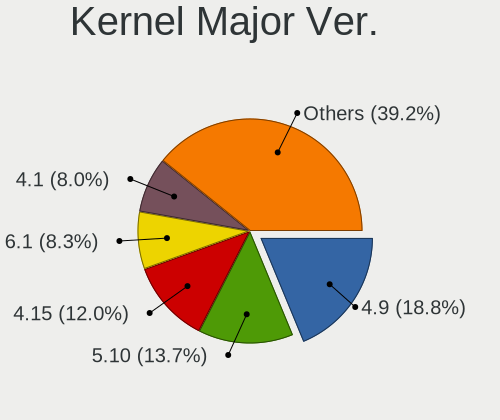
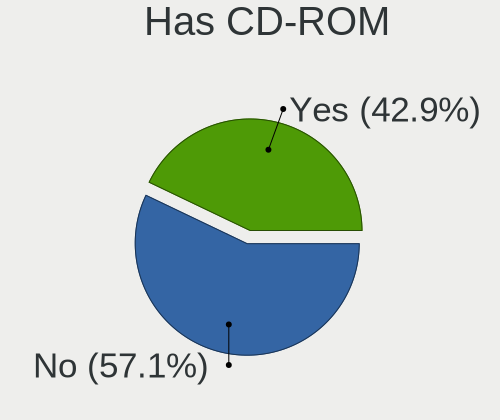
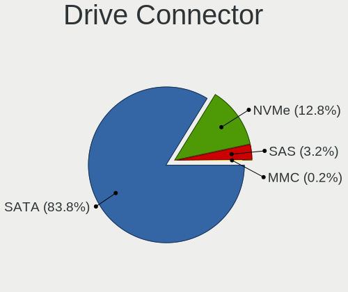
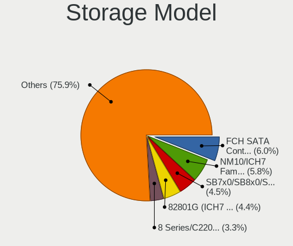
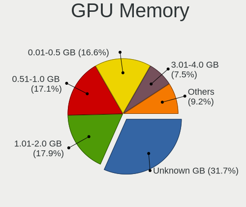
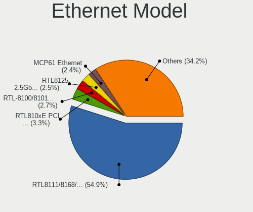
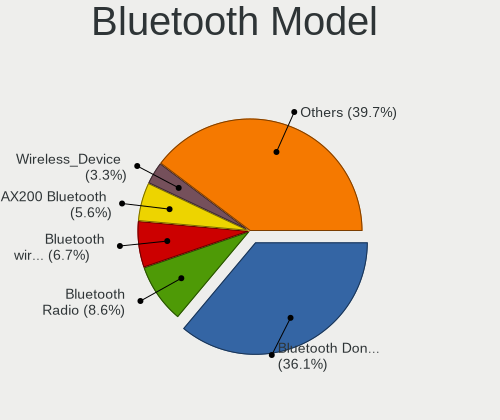

Linux in Russia - Tested Hardware & Statistics (Desktops)
---------------------------------------------------------

A project to collect tested hardware configurations for Linux in Russia.

Anyone can contribute to this report by the [hw-probe](https://github.com/linuxhw/hw-probe) tool:

    sudo -E hw-probe -all -upload

Please contribute! Especially if your hardware is rare.

Contents
--------

* [ Test Cases ](#test-cases)

* [ System ](#system)
  - [ OS                       ](#os)
  - [ OS Family                ](#os-family)
  - [ Kernel                   ](#kernel)
  - [ Kernel Family            ](#kernel-family)
  - [ Kernel Major Ver.        ](#kernel-major-ver)
  - [ Arch                     ](#arch)
  - [ DE                       ](#de)
  - [ Display Server           ](#display-server)
  - [ Display Manager          ](#display-manager)
  - [ OS Lang                  ](#os-lang)
  - [ Boot Mode                ](#boot-mode)
  - [ Filesystem               ](#filesystem)
  - [ Part. scheme             ](#part-scheme)
  - [ Dual Boot with Linux/BSD ](#dual-boot-with-linuxbsd)
  - [ Dual Boot (Win)          ](#dual-boot-win)

* [ Board ](#board)
  - [ Vendor                   ](#vendor)
  - [ Model                    ](#model)
  - [ Model Family             ](#model-family)
  - [ MFG Year                 ](#mfg-year)
  - [ Form Factor              ](#form-factor)
  - [ Secure Boot              ](#secure-boot)
  - [ Coreboot                 ](#coreboot)
  - [ RAM Size                 ](#ram-size)
  - [ RAM Used                 ](#ram-used)
  - [ Total Drives             ](#total-drives)
  - [ Has CD-ROM               ](#has-cd-rom)
  - [ Has Ethernet             ](#has-ethernet)
  - [ Has WiFi                 ](#has-wifi)
  - [ Has Bluetooth            ](#has-bluetooth)

* [ Location ](#location)
  - [ Country                  ](#country)
  - [ City                     ](#city)

* [ Drives ](#drives)
  - [ Drive Vendor             ](#drive-vendor)
  - [ Drive Model              ](#drive-model)
  - [ HDD Vendor               ](#hdd-vendor)
  - [ SSD Vendor               ](#ssd-vendor)
  - [ Drive Kind               ](#drive-kind)
  - [ Drive Connector          ](#drive-connector)
  - [ Drive Size               ](#drive-size)
  - [ Space Total              ](#space-total)
  - [ Space Used               ](#space-used)
  - [ Malfunc. Drives          ](#malfunc-drives)
  - [ Malfunc. Drive Vendor    ](#malfunc-drive-vendor)
  - [ Malfunc. HDD Vendor      ](#malfunc-hdd-vendor)
  - [ Malfunc. Drive Kind      ](#malfunc-drive-kind)
  - [ Failed Drives            ](#failed-drives)
  - [ Failed Drive Vendor      ](#failed-drive-vendor)
  - [ Drive Status             ](#drive-status)

* [ Storage controller ](#storage-controller)
  - [ Storage Vendor           ](#storage-vendor)
  - [ Storage Model            ](#storage-model)
  - [ Storage Kind             ](#storage-kind)

* [ Processor ](#processor)
  - [ CPU Vendor               ](#cpu-vendor)
  - [ CPU Model                ](#cpu-model)
  - [ CPU Model Family         ](#cpu-model-family)
  - [ CPU Cores                ](#cpu-cores)
  - [ CPU Sockets              ](#cpu-sockets)
  - [ CPU Threads              ](#cpu-threads)
  - [ CPU Op-Modes             ](#cpu-op-modes)
  - [ CPU Microcode            ](#cpu-microcode)
  - [ CPU Microarch            ](#cpu-microarch)

* [ Graphics ](#graphics)
  - [ GPU Vendor               ](#gpu-vendor)
  - [ GPU Model                ](#gpu-model)
  - [ GPU Combo                ](#gpu-combo)
  - [ GPU Driver               ](#gpu-driver)
  - [ GPU Memory               ](#gpu-memory)

* [ Monitor ](#monitor)
  - [ Monitor Vendor           ](#monitor-vendor)
  - [ Monitor Model            ](#monitor-model)
  - [ Monitor Resolution       ](#monitor-resolution)
  - [ Monitor Diagonal         ](#monitor-diagonal)
  - [ Monitor Width            ](#monitor-width)
  - [ Aspect Ratio             ](#aspect-ratio)
  - [ Monitor Area             ](#monitor-area)
  - [ Pixel Density            ](#pixel-density)
  - [ Multiple Monitors        ](#multiple-monitors)

* [ Network ](#network)
  - [ Net Controller Vendor    ](#net-controller-vendor)
  - [ Net Controller Model     ](#net-controller-model)
  - [ Wireless Vendor          ](#wireless-vendor)
  - [ Wireless Model           ](#wireless-model)
  - [ Ethernet Vendor          ](#ethernet-vendor)
  - [ Ethernet Model           ](#ethernet-model)
  - [ Net Controller Kind      ](#net-controller-kind)
  - [ Used Controller          ](#used-controller)
  - [ NICs                     ](#nics)
  - [ IPv6                     ](#ipv6)

* [ Bluetooth ](#bluetooth)
  - [ Bluetooth Vendor         ](#bluetooth-vendor)
  - [ Bluetooth Model          ](#bluetooth-model)

* [ Sound ](#sound)
  - [ Sound Vendor             ](#sound-vendor)
  - [ Sound Model              ](#sound-model)

* [ Memory ](#memory)
  - [ Memory Vendor            ](#memory-vendor)
  - [ Memory Model             ](#memory-model)
  - [ Memory Kind              ](#memory-kind)
  - [ Memory Form Factor       ](#memory-form-factor)
  - [ Memory Size              ](#memory-size)
  - [ Memory Speed             ](#memory-speed)

* [ Printers & scanners ](#printers--scanners)
  - [ Printer Vendor           ](#printer-vendor)
  - [ Printer Model            ](#printer-model)
  - [ Scanner Vendor           ](#scanner-vendor)
  - [ Scanner Model            ](#scanner-model)

* [ Camera ](#camera)
  - [ Camera Vendor            ](#camera-vendor)
  - [ Camera Model             ](#camera-model)

* [ Security ](#security)
  - [ Fingerprint Vendor       ](#fingerprint-vendor)
  - [ Fingerprint Model        ](#fingerprint-model)
  - [ Chipcard Vendor          ](#chipcard-vendor)
  - [ Chipcard Model           ](#chipcard-model)

* [ Unsupported ](#unsupported)
  - [ Unsupported Devices      ](#unsupported-devices)
  - [ Unsupported Device Types ](#unsupported-device-types)

Test Cases
----------

Total: 16491

| Vendor        | Model                       | Probe                                                      | Date         |
|---------------|-----------------------------|------------------------------------------------------------|--------------|
| ASRock        | J5005-ITX                   | [783c72d32e](https://linux-hardware.org/?probe=783c72d32e) | Oct 01, 2022 |
| MSI           | MS-7235                     | [838e2c27f1](https://linux-hardware.org/?probe=838e2c27f1) | Oct 01, 2022 |
| MSI           | B450M-A PRO MAX             | [649f4ec8c6](https://linux-hardware.org/?probe=649f4ec8c6) | Oct 01, 2022 |
| Unknown       | Unknown                     | [0c82fc9806](https://linux-hardware.org/?probe=0c82fc9806) | Oct 01, 2022 |
| ASUSTek       | M5A87                       | [89ca067566](https://linux-hardware.org/?probe=89ca067566) | Oct 01, 2022 |
| ASUSTek       | H81-PLUS                    | [e251d6b8f7](https://linux-hardware.org/?probe=e251d6b8f7) | Sep 30, 2022 |
| ASRock        | B450M Pro4-F                | [75b0aa3c75](https://linux-hardware.org/?probe=75b0aa3c75) | Sep 30, 2022 |
| ASUSTek       | P5KPL-AM EPU                | [66877298d4](https://linux-hardware.org/?probe=66877298d4) | Sep 30, 2022 |
| ASUSTek       | PRIME B660M-K D4            | [7efad28576](https://linux-hardware.org/?probe=7efad28576) | Sep 30, 2022 |
| Gigabyte      | Z390 AORUS ULTRA-CF         | [8d8e54ed69](https://linux-hardware.org/?probe=8d8e54ed69) | Sep 30, 2022 |
| ASRock        | B360M-HDV                   | [fad5a877f5](https://linux-hardware.org/?probe=fad5a877f5) | Sep 30, 2022 |
| HP            | 859C                        | [08161b9516](https://linux-hardware.org/?probe=08161b9516) | Sep 30, 2022 |
| MSI           | B450M MORTAR MAX            | [21028f343b](https://linux-hardware.org/?probe=21028f343b) | Sep 30, 2022 |
| ASRock        | N68C-S UCC                  | [90d8579454](https://linux-hardware.org/?probe=90d8579454) | Sep 30, 2022 |
| ASUSTek       | Maximus V GENE              | [7998f02578](https://linux-hardware.org/?probe=7998f02578) | Sep 29, 2022 |
| ASUSTek       | B85M-G                      | [a9983b2858](https://linux-hardware.org/?probe=a9983b2858) | Sep 29, 2022 |
| ASRock        | X399M Taichi                | [b7943d1645](https://linux-hardware.org/?probe=b7943d1645) | Sep 29, 2022 |
| ASUSTek       | B85M-G                      | [ba607b91e0](https://linux-hardware.org/?probe=ba607b91e0) | Sep 29, 2022 |
| HP            | 805D                        | [84d451ab19](https://linux-hardware.org/?probe=84d451ab19) | Sep 29, 2022 |
| ASUSTek       | H81M-D                      | [a1580941c3](https://linux-hardware.org/?probe=a1580941c3) | Sep 29, 2022 |
| ECS           | G31T-M9                     | [45b25aaf8c](https://linux-hardware.org/?probe=45b25aaf8c) | Sep 29, 2022 |
| ASRock        | N68-GS4 FX                  | [3c4d5b4c65](https://linux-hardware.org/?probe=3c4d5b4c65) | Sep 29, 2022 |
| Biostar       | IH61MF-Q5                   | [7a63314188](https://linux-hardware.org/?probe=7a63314188) | Sep 29, 2022 |
| ASUSTek       | M4A785T-M                   | [03277d55bc](https://linux-hardware.org/?probe=03277d55bc) | Sep 28, 2022 |
| MSI           | G41M-P26                    | [45f0101515](https://linux-hardware.org/?probe=45f0101515) | Sep 28, 2022 |
| HP            | 339A                        | [5c961ef93f](https://linux-hardware.org/?probe=5c961ef93f) | Sep 28, 2022 |
| Gigabyte      | B560M H                     | [80e3cd655a](https://linux-hardware.org/?probe=80e3cd655a) | Sep 28, 2022 |
| Gigabyte      | B560M H                     | [0192951511](https://linux-hardware.org/?probe=0192951511) | Sep 28, 2022 |
| HP            | 339A                        | [ac9538b489](https://linux-hardware.org/?probe=ac9538b489) | Sep 28, 2022 |
| ASUSTek       | M5A97 R2.0                  | [2c82f3311d](https://linux-hardware.org/?probe=2c82f3311d) | Sep 28, 2022 |
| ASUSTek       | P8H61-M LX3 R2.0            | [82b108b3b8](https://linux-hardware.org/?probe=82b108b3b8) | Sep 28, 2022 |
| ASUSTek       | P8H61-MX R2.0               | [3def6cd1c2](https://linux-hardware.org/?probe=3def6cd1c2) | Sep 28, 2022 |
| ASUSTek       | H87-PLUS                    | [ccb24cd91e](https://linux-hardware.org/?probe=ccb24cd91e) | Sep 28, 2022 |
| Gigabyte      | 970A-DS3P                   | [ada186ce05](https://linux-hardware.org/?probe=ada186ce05) | Sep 27, 2022 |
| Gigabyte      | B550M AORUS PRO-P           | [3273908698](https://linux-hardware.org/?probe=3273908698) | Sep 27, 2022 |
| ASUSTek       | PRIME B560-PLUS             | [03fff6add6](https://linux-hardware.org/?probe=03fff6add6) | Sep 27, 2022 |
| MSI           | B365M PRO-VDH               | [45e07c7119](https://linux-hardware.org/?probe=45e07c7119) | Sep 27, 2022 |
| ASUSTek       | P8H61-M LE                  | [0d9fdddd8a](https://linux-hardware.org/?probe=0d9fdddd8a) | Sep 27, 2022 |
| HP            | 339A                        | [25ef7556cc](https://linux-hardware.org/?probe=25ef7556cc) | Sep 27, 2022 |
| Gigabyte      | B360M HD3                   | [1107ba42b7](https://linux-hardware.org/?probe=1107ba42b7) | Sep 27, 2022 |
| Dell          | 0Y5DDC A00                  | [a135b97045](https://linux-hardware.org/?probe=a135b97045) | Sep 27, 2022 |
| Unknown       | Unknown                     | [128a8b6e2f](https://linux-hardware.org/?probe=128a8b6e2f) | Sep 27, 2022 |
| Gigabyte      | B450M S2H                   | [b5cc268970](https://linux-hardware.org/?probe=b5cc268970) | Sep 27, 2022 |
| ASUSTek       | Maximus V GENE              | [fc7a783877](https://linux-hardware.org/?probe=fc7a783877) | Sep 26, 2022 |
| Huanan        | X99-F8                      | [24c118fb0c](https://linux-hardware.org/?probe=24c118fb0c) | Sep 26, 2022 |
| Biostar       | TH67XE                      | [24df0079b5](https://linux-hardware.org/?probe=24df0079b5) | Sep 26, 2022 |
| Huanan        | X99 F8D V2.2                | [7663168534](https://linux-hardware.org/?probe=7663168534) | Sep 26, 2022 |
| ASRock        | 960GM-VGS3 FX               | [45bf4d54bf](https://linux-hardware.org/?probe=45bf4d54bf) | Sep 26, 2022 |
| ASUSTek       | H81M-K                      | [c449af2ab6](https://linux-hardware.org/?probe=c449af2ab6) | Sep 26, 2022 |
| Unknown       | Unknown                     | [4cff54bad3](https://linux-hardware.org/?probe=4cff54bad3) | Sep 26, 2022 |
| Gigabyte      | H81M-S2PV                   | [76a7224818](https://linux-hardware.org/?probe=76a7224818) | Sep 26, 2022 |
| HP            | 339A                        | [07986ca95e](https://linux-hardware.org/?probe=07986ca95e) | Sep 26, 2022 |
| Gigabyte      | H81M-DS2                    | [c8f6c9dd27](https://linux-hardware.org/?probe=c8f6c9dd27) | Sep 26, 2022 |
| Unknown       | Unknown                     | [681b9501bf](https://linux-hardware.org/?probe=681b9501bf) | Sep 26, 2022 |
| RDW           | MB-B450M V.1                | [8c3a565d43](https://linux-hardware.org/?probe=8c3a565d43) | Sep 26, 2022 |
| MSI           | 870-C45                     | [b110878f50](https://linux-hardware.org/?probe=b110878f50) | Sep 26, 2022 |
| ASUSTek       | PRIME B350-PLUS             | [a9c5aeb1f0](https://linux-hardware.org/?probe=a9c5aeb1f0) | Sep 25, 2022 |
| Gigabyte      | B550M DS3H                  | [4c7d9584fc](https://linux-hardware.org/?probe=4c7d9584fc) | Sep 25, 2022 |
| Gigabyte      | Z590 GAMING X               | [1adef3d977](https://linux-hardware.org/?probe=1adef3d977) | Sep 25, 2022 |
| ASRock        | B550 Pro4                   | [d17f3c7447](https://linux-hardware.org/?probe=d17f3c7447) | Sep 25, 2022 |
| Gigabyte      | A520I AC                    | [61bf9d5e84](https://linux-hardware.org/?probe=61bf9d5e84) | Sep 25, 2022 |
| MSI           | MS-7253                     | [d697f7b879](https://linux-hardware.org/?probe=d697f7b879) | Sep 25, 2022 |
| Gigabyte      | B450 AORUS ELITE            | [8749a17d26](https://linux-hardware.org/?probe=8749a17d26) | Sep 25, 2022 |
| Huanan        | X99-8M-F V1.3               | [6e96f4620a](https://linux-hardware.org/?probe=6e96f4620a) | Sep 25, 2022 |
| Huanan        | X99-8M-F V1.3               | [acb677ddeb](https://linux-hardware.org/?probe=acb677ddeb) | Sep 25, 2022 |
| ASRock        | B450 Pro4                   | [fe99b8a461](https://linux-hardware.org/?probe=fe99b8a461) | Sep 25, 2022 |
| ASUSTek       | P8Z77-V LE PLUS             | [d58256a0f6](https://linux-hardware.org/?probe=d58256a0f6) | Sep 24, 2022 |
| Huanan        | X99 F8D V2.2                | [6316c089eb](https://linux-hardware.org/?probe=6316c089eb) | Sep 24, 2022 |
| Gigabyte      | G31M-S2C                    | [d0aa96a903](https://linux-hardware.org/?probe=d0aa96a903) | Sep 24, 2022 |
| ASRock        | H470M-HDV                   | [dc08f98ca5](https://linux-hardware.org/?probe=dc08f98ca5) | Sep 24, 2022 |
| Huanan        | X79 INTEL (INTEL Xeon E5... | [08a8ad598f](https://linux-hardware.org/?probe=08a8ad598f) | Sep 23, 2022 |
| Huanan        | X79 INTEL (INTEL Xeon E5... | [8e620e891f](https://linux-hardware.org/?probe=8e620e891f) | Sep 23, 2022 |
| ASUSTek       | PRIME B250M-C               | [2e45736b42](https://linux-hardware.org/?probe=2e45736b42) | Sep 23, 2022 |
| Gigabyte      | H81M-S2V                    | [6c884d4968](https://linux-hardware.org/?probe=6c884d4968) | Sep 23, 2022 |
| Gigabyte      | H81M-S2V                    | [39a94459dc](https://linux-hardware.org/?probe=39a94459dc) | Sep 23, 2022 |
| ASUSTek       | H110M-R                     | [c9f00bec8e](https://linux-hardware.org/?probe=c9f00bec8e) | Sep 23, 2022 |
| Gigabyte      | EP45-DS3                    | [7b827acac4](https://linux-hardware.org/?probe=7b827acac4) | Sep 23, 2022 |
| ASUSTek       | H61M-K                      | [682eb02d48](https://linux-hardware.org/?probe=682eb02d48) | Sep 22, 2022 |
| Gigabyte      | B550 AORUS ELITE V2         | [1748378749](https://linux-hardware.org/?probe=1748378749) | Sep 22, 2022 |
| Lenovo        | ThinkCentre M58 8910A8U     | [e9028d165d](https://linux-hardware.org/?probe=e9028d165d) | Sep 22, 2022 |
| Lenovo        | ThinkCentre M58 8910A8U     | [03a3a22c54](https://linux-hardware.org/?probe=03a3a22c54) | Sep 22, 2022 |
| ASUSTek       | H110M-R                     | [0d2eec569a](https://linux-hardware.org/?probe=0d2eec569a) | Sep 22, 2022 |
| Gigabyte      | B75M-D3V                    | [3888b56318](https://linux-hardware.org/?probe=3888b56318) | Sep 22, 2022 |
| Intel         | X99                         | [d751fcb309](https://linux-hardware.org/?probe=d751fcb309) | Sep 22, 2022 |
| Gigabyte      | Z370P D3-CF                 | [5513e351d9](https://linux-hardware.org/?probe=5513e351d9) | Sep 22, 2022 |
| Huanan        | X99-TF                      | [1361d73bcd](https://linux-hardware.org/?probe=1361d73bcd) | Sep 22, 2022 |
| ASUSTek       | ET2230I                     | [074ecf956a](https://linux-hardware.org/?probe=074ecf956a) | Sep 22, 2022 |
| Thecus        | N2810 0001                  | [f54df3994c](https://linux-hardware.org/?probe=f54df3994c) | Sep 21, 2022 |
| ECS           | G31T-M9                     | [6e67780df1](https://linux-hardware.org/?probe=6e67780df1) | Sep 21, 2022 |
| Gigabyte      | H61M-DS2                    | [a9e18191f7](https://linux-hardware.org/?probe=a9e18191f7) | Sep 21, 2022 |
| ASRock        | H470M-HVS                   | [e267d78b42](https://linux-hardware.org/?probe=e267d78b42) | Sep 21, 2022 |
| Gigabyte      | H61M-S2PV                   | [65dc86f8d2](https://linux-hardware.org/?probe=65dc86f8d2) | Sep 21, 2022 |
| Gigabyte      | H61M-S2PV                   | [b905e8df57](https://linux-hardware.org/?probe=b905e8df57) | Sep 21, 2022 |
| ECS           | G31T-M9                     | [46fd18ee44](https://linux-hardware.org/?probe=46fd18ee44) | Sep 21, 2022 |
| ASUSTek       | M3N78-VM                    | [03e6d4f5bc](https://linux-hardware.org/?probe=03e6d4f5bc) | Sep 21, 2022 |
| ASUSTek       | M3N78-VM                    | [658141844b](https://linux-hardware.org/?probe=658141844b) | Sep 21, 2022 |
| ASUSTek       | PRIME B350-PLUS             | [c03d31a1c5](https://linux-hardware.org/?probe=c03d31a1c5) | Sep 21, 2022 |
| HP            | 339A                        | [bc2a08f514](https://linux-hardware.org/?probe=bc2a08f514) | Sep 21, 2022 |
| MACHINIST     | B75 PRO V1.0                | [752cb8efae](https://linux-hardware.org/?probe=752cb8efae) | Sep 21, 2022 |
| Gigabyte      | B550 AORUS ELITE V2         | [66a228f8c5](https://linux-hardware.org/?probe=66a228f8c5) | Sep 21, 2022 |
| Gigabyte      | P85-D3                      | [d0b65afb41](https://linux-hardware.org/?probe=d0b65afb41) | Sep 20, 2022 |
| ASRock        | H55M-LE                     | [d361539e5a](https://linux-hardware.org/?probe=d361539e5a) | Sep 20, 2022 |
| Gigabyte      | P85-D3                      | [97849eb715](https://linux-hardware.org/?probe=97849eb715) | Sep 20, 2022 |
| ASUSTek       | TUF Gaming Z590-PLUS WIF... | [8886c62f6c](https://linux-hardware.org/?probe=8886c62f6c) | Sep 20, 2022 |
| ASUSTek       | B85M-G                      | [f9fa37f0d2](https://linux-hardware.org/?probe=f9fa37f0d2) | Sep 20, 2022 |
| ECS           | A55F-M3                     | [4961be8414](https://linux-hardware.org/?probe=4961be8414) | Sep 20, 2022 |
| Gigabyte      | GA-M56S-S3                  | [ecd62e14f4](https://linux-hardware.org/?probe=ecd62e14f4) | Sep 20, 2022 |
| Gigabyte      | GA-780T-D3L                 | [3e0939e549](https://linux-hardware.org/?probe=3e0939e549) | Sep 20, 2022 |
| Gigabyte      | H61M-S2PV                   | [a82f4ceccc](https://linux-hardware.org/?probe=a82f4ceccc) | Sep 20, 2022 |
| Colorful T... | C.A68M-K PLUS V16           | [805edc36d5](https://linux-hardware.org/?probe=805edc36d5) | Sep 20, 2022 |
| MSI           | H67MS-E23                   | [5093a2b5b8](https://linux-hardware.org/?probe=5093a2b5b8) | Sep 20, 2022 |
| Huanan        | X99-F8 Gaming 2021          | [8a290737bd](https://linux-hardware.org/?probe=8a290737bd) | Sep 19, 2022 |
| Gigabyte      | B550M AORUS PRO-P           | [25d7dc8f0d](https://linux-hardware.org/?probe=25d7dc8f0d) | Sep 19, 2022 |
| ASRock        | H470M-HVS                   | [ee235bf98c](https://linux-hardware.org/?probe=ee235bf98c) | Sep 19, 2022 |
| MSI           | B450 GAMING PLUS MAX        | [8072b6c0e0](https://linux-hardware.org/?probe=8072b6c0e0) | Sep 19, 2022 |
| ASUSTek       | P8Q77-M2                    | [1e067b7c4f](https://linux-hardware.org/?probe=1e067b7c4f) | Sep 19, 2022 |
| ASUSTek       | Z97-P                       | [37f0f7b888](https://linux-hardware.org/?probe=37f0f7b888) | Sep 19, 2022 |
| ASUSTek       | H110T                       | [a9304d84fa](https://linux-hardware.org/?probe=a9304d84fa) | Sep 19, 2022 |
| MSI           | H67MS-E23                   | [2f819d4ed2](https://linux-hardware.org/?probe=2f819d4ed2) | Sep 19, 2022 |
| Gigabyte      | B550M AORUS PRO-P           | [f5a62dce47](https://linux-hardware.org/?probe=f5a62dce47) | Sep 19, 2022 |
| MSI           | B250M PRO-VDH               | [b0836f0c26](https://linux-hardware.org/?probe=b0836f0c26) | Sep 19, 2022 |
| ASUSTek       | P8Q77-M2                    | [171e24a5c1](https://linux-hardware.org/?probe=171e24a5c1) | Sep 19, 2022 |
| MSI           | H61M-P23                    | [8719bdc05a](https://linux-hardware.org/?probe=8719bdc05a) | Sep 18, 2022 |
| ASUSTek       | PRIME H410M-K R2.0          | [7d18b85f33](https://linux-hardware.org/?probe=7d18b85f33) | Sep 18, 2022 |
| Gigabyte      | H61M-DS2                    | [3a2c9cfad3](https://linux-hardware.org/?probe=3a2c9cfad3) | Sep 18, 2022 |
| ASUSTek       | P8Z77-V LE PLUS             | [fbd2c2c234](https://linux-hardware.org/?probe=fbd2c2c234) | Sep 18, 2022 |
| MSI           | B250M PRO-VDH               | [3b6b90fee6](https://linux-hardware.org/?probe=3b6b90fee6) | Sep 18, 2022 |
| Gigabyte      | B550M AORUS PRO-P           | [d11c4e27df](https://linux-hardware.org/?probe=d11c4e27df) | Sep 18, 2022 |
| ASUSTek       | PRIME B250M-A               | [082bdbb3a9](https://linux-hardware.org/?probe=082bdbb3a9) | Sep 18, 2022 |
| ASUSTek       | A68HM-K                     | [eaccfe0b67](https://linux-hardware.org/?probe=eaccfe0b67) | Sep 18, 2022 |
| Huanan        | H97-ZD3 V2.0                | [e54a1ee16e](https://linux-hardware.org/?probe=e54a1ee16e) | Sep 18, 2022 |
| ASUSTek       | M3A78-VM                    | [1a85e8ddb9](https://linux-hardware.org/?probe=1a85e8ddb9) | Sep 17, 2022 |
| ASUSTek       | C8HM70-I/HDMI               | [b8609443fe](https://linux-hardware.org/?probe=b8609443fe) | Sep 17, 2022 |
| Gigabyte      | A520M H                     | [d75913fe94](https://linux-hardware.org/?probe=d75913fe94) | Sep 17, 2022 |
| ASUSTek       | K30AM-J                     | [c583746579](https://linux-hardware.org/?probe=c583746579) | Sep 17, 2022 |
| Gigabyte      | 945GCMX-S2                  | [fda56f277f](https://linux-hardware.org/?probe=fda56f277f) | Sep 17, 2022 |
| Gigabyte      | GA-78LMT-S2                 | [f75308c465](https://linux-hardware.org/?probe=f75308c465) | Sep 17, 2022 |
| Gigabyte      | M61PME-S2P                  | [128b564017](https://linux-hardware.org/?probe=128b564017) | Sep 16, 2022 |
| Lenovo        | MAHOBAY Win8 Pro DPK TPG    | [07d731bb3e](https://linux-hardware.org/?probe=07d731bb3e) | Sep 16, 2022 |
| Lenovo        | MAHOBAY Win8 Pro DPK TPG    | [bf7824cf20](https://linux-hardware.org/?probe=bf7824cf20) | Sep 16, 2022 |
| Gigabyte      | H77N-WIFI                   | [4c524e3336](https://linux-hardware.org/?probe=4c524e3336) | Sep 16, 2022 |
| ASRock        | H470M-HVS                   | [205e3937a8](https://linux-hardware.org/?probe=205e3937a8) | Sep 16, 2022 |
| MACHINIST     | B75 PRO V1.0                | [ef89bf1d8c](https://linux-hardware.org/?probe=ef89bf1d8c) | Sep 16, 2022 |
| ASUSTek       | B75M-A                      | [2680627549](https://linux-hardware.org/?probe=2680627549) | Sep 16, 2022 |
| Gigabyte      | H110M-S2-CF                 | [43a9184afe](https://linux-hardware.org/?probe=43a9184afe) | Sep 16, 2022 |
| ASRock        | P43DE3                      | [c1c1a13db0](https://linux-hardware.org/?probe=c1c1a13db0) | Sep 16, 2022 |
| ASUSTek       | Z97-K                       | [3f362093da](https://linux-hardware.org/?probe=3f362093da) | Sep 16, 2022 |
| Gigabyte      | Z490 UD                     | [66c96720a1](https://linux-hardware.org/?probe=66c96720a1) | Sep 16, 2022 |
| Gigabyte      | G41M-Combo                  | [a4b02d9021](https://linux-hardware.org/?probe=a4b02d9021) | Sep 16, 2022 |
| ASRock        | H61M-VS                     | [6aef75c837](https://linux-hardware.org/?probe=6aef75c837) | Sep 15, 2022 |
| Gigabyte      | H410M S2H                   | [d852f09d43](https://linux-hardware.org/?probe=d852f09d43) | Sep 15, 2022 |
| Gigabyte      | H410M S2H                   | [a0bdfffa04](https://linux-hardware.org/?probe=a0bdfffa04) | Sep 15, 2022 |
| Gigabyte      | H410M S2H                   | [196e6b048b](https://linux-hardware.org/?probe=196e6b048b) | Sep 15, 2022 |
| Gigabyte      | H410M S2H                   | [8e95a850da](https://linux-hardware.org/?probe=8e95a850da) | Sep 15, 2022 |
| Gigabyte      | H410M S2H                   | [499d354033](https://linux-hardware.org/?probe=499d354033) | Sep 15, 2022 |
| Gigabyte      | H410M S2H                   | [a830a7b6e5](https://linux-hardware.org/?probe=a830a7b6e5) | Sep 15, 2022 |
| Gigabyte      | H410M S2H                   | [19ba71f923](https://linux-hardware.org/?probe=19ba71f923) | Sep 15, 2022 |
| Gigabyte      | H410M S2H                   | [ad888e4455](https://linux-hardware.org/?probe=ad888e4455) | Sep 15, 2022 |
| Gigabyte      | H410M S2H                   | [d35bf4c513](https://linux-hardware.org/?probe=d35bf4c513) | Sep 15, 2022 |
| Gigabyte      | H410M S2H                   | [dce51bb6d6](https://linux-hardware.org/?probe=dce51bb6d6) | Sep 15, 2022 |
| Gigabyte      | H410M S2H                   | [3bc232858d](https://linux-hardware.org/?probe=3bc232858d) | Sep 15, 2022 |
| Gigabyte      | H410M S2H                   | [ca79460771](https://linux-hardware.org/?probe=ca79460771) | Sep 15, 2022 |
| Gigabyte      | H410M S2H                   | [1e24243624](https://linux-hardware.org/?probe=1e24243624) | Sep 15, 2022 |
| Gigabyte      | H410M S2H                   | [b0625e01e3](https://linux-hardware.org/?probe=b0625e01e3) | Sep 15, 2022 |
| Gigabyte      | H410M S2H                   | [f97cd53683](https://linux-hardware.org/?probe=f97cd53683) | Sep 15, 2022 |
| Gigabyte      | H410M S2H                   | [cd3fc03204](https://linux-hardware.org/?probe=cd3fc03204) | Sep 15, 2022 |
| Intel         | D33217GKE G76540-204        | [cb5eb5c2c6](https://linux-hardware.org/?probe=cb5eb5c2c6) | Sep 15, 2022 |
| ASUSTek       | P8H61-M LE                  | [d8ecff6375](https://linux-hardware.org/?probe=d8ecff6375) | Sep 15, 2022 |
| ASUSTek       | P8H61-M LX3                 | [b1e2832974](https://linux-hardware.org/?probe=b1e2832974) | Sep 15, 2022 |
| Huanan        | X99-F8D V2.4                | [6f3638ecc6](https://linux-hardware.org/?probe=6f3638ecc6) | Sep 15, 2022 |
| MSI           | H110M PRO-VD                | [23194305f6](https://linux-hardware.org/?probe=23194305f6) | Sep 15, 2022 |
| Gigabyte      | H110M-S2-CF                 | [fd03d25b78](https://linux-hardware.org/?probe=fd03d25b78) | Sep 15, 2022 |
| ASUSTek       | B85M-G                      | [9f2a08c261](https://linux-hardware.org/?probe=9f2a08c261) | Sep 15, 2022 |
| ASUSTek       | P5QL-EM                     | [e4659f8ce4](https://linux-hardware.org/?probe=e4659f8ce4) | Sep 15, 2022 |
| MSI           | B450M PRO-VDH MAX           | [15d3d95ab2](https://linux-hardware.org/?probe=15d3d95ab2) | Sep 15, 2022 |
| Foxconn       | G41MD                       | [9b301e1ebe](https://linux-hardware.org/?probe=9b301e1ebe) | Sep 15, 2022 |
| ASUSTek       | H81M-K                      | [a6bc49b4f3](https://linux-hardware.org/?probe=a6bc49b4f3) | Sep 15, 2022 |
| ASUSTek       | PRIME Z690-P WIFI D4        | [f9b8b0731f](https://linux-hardware.org/?probe=f9b8b0731f) | Sep 15, 2022 |
| ECS           | H510H6-M7                   | [1275257180](https://linux-hardware.org/?probe=1275257180) | Sep 14, 2022 |
| ASUSTek       | PRIME Z690-P WIFI D4        | [40448fe966](https://linux-hardware.org/?probe=40448fe966) | Sep 14, 2022 |
| ASRock        | H470M-HVS                   | [01d92ffc28](https://linux-hardware.org/?probe=01d92ffc28) | Sep 14, 2022 |
| ASRock        | H470M-HVS                   | [c04d19fe27](https://linux-hardware.org/?probe=c04d19fe27) | Sep 14, 2022 |
| ASRock        | H470M-HVS                   | [ad0ac85a1c](https://linux-hardware.org/?probe=ad0ac85a1c) | Sep 14, 2022 |
| ASRock        | H470M-HVS                   | [6cb46b9558](https://linux-hardware.org/?probe=6cb46b9558) | Sep 14, 2022 |
| ASRock        | H470M-HVS                   | [bec6da09ae](https://linux-hardware.org/?probe=bec6da09ae) | Sep 14, 2022 |
| ASRock        | H470M-HVS                   | [0366b6294c](https://linux-hardware.org/?probe=0366b6294c) | Sep 14, 2022 |
| ASRock        | H470M-HVS                   | [a914907c0f](https://linux-hardware.org/?probe=a914907c0f) | Sep 14, 2022 |
| ASRock        | H470M-HVS                   | [662117584a](https://linux-hardware.org/?probe=662117584a) | Sep 14, 2022 |
| ASRock        | H470M-HVS                   | [272b6ec971](https://linux-hardware.org/?probe=272b6ec971) | Sep 14, 2022 |
| ASRock        | H470M-HVS                   | [2528bbb7ac](https://linux-hardware.org/?probe=2528bbb7ac) | Sep 14, 2022 |
| ASRock        | H470M-HVS                   | [212a063241](https://linux-hardware.org/?probe=212a063241) | Sep 14, 2022 |
| ASRock        | H470M-HVS                   | [2b6d3fc6f0](https://linux-hardware.org/?probe=2b6d3fc6f0) | Sep 14, 2022 |
| ASRock        | H470M-HVS                   | [9bc2776801](https://linux-hardware.org/?probe=9bc2776801) | Sep 14, 2022 |
| ASRock        | H470M-HVS                   | [4048396126](https://linux-hardware.org/?probe=4048396126) | Sep 14, 2022 |
| ASRock        | H470M-HVS                   | [7036d4bc55](https://linux-hardware.org/?probe=7036d4bc55) | Sep 14, 2022 |
| ASRock        | H470M-HVS                   | [e4147da882](https://linux-hardware.org/?probe=e4147da882) | Sep 14, 2022 |
| ASRock        | H470M-HVS                   | [f85ab5e109](https://linux-hardware.org/?probe=f85ab5e109) | Sep 14, 2022 |
| MSI           | 760GM-P21                   | [172a6c16be](https://linux-hardware.org/?probe=172a6c16be) | Sep 14, 2022 |
| Gigabyte      | X79-UD3                     | [e343c2470f](https://linux-hardware.org/?probe=e343c2470f) | Sep 14, 2022 |
| Gigabyte      | Z77M-D3H                    | [d4b7cae48f](https://linux-hardware.org/?probe=d4b7cae48f) | Sep 14, 2022 |
| Huanan        | X99-F8D V2.4                | [c364778ad7](https://linux-hardware.org/?probe=c364778ad7) | Sep 14, 2022 |
| ASRock        | B450M Pro4-F                | [af402f9448](https://linux-hardware.org/?probe=af402f9448) | Sep 14, 2022 |
| Gigabyte      | MZBSWMP-00                  | [92d4357c28](https://linux-hardware.org/?probe=92d4357c28) | Sep 14, 2022 |
| ASRock        | N68-S3 UCC                  | [5f3b320503](https://linux-hardware.org/?probe=5f3b320503) | Sep 14, 2022 |
| ASUSTek       | Maximus IV Extreme-Z        | [1c7a238f26](https://linux-hardware.org/?probe=1c7a238f26) | Sep 13, 2022 |
| Gigabyte      | A320M-H-CF                  | [591cf6246a](https://linux-hardware.org/?probe=591cf6246a) | Sep 13, 2022 |
| ASUSTek       | PRIME H310M-E R2.0          | [377d466877](https://linux-hardware.org/?probe=377d466877) | Sep 13, 2022 |
| MSI           | 870-G45                     | [0245395372](https://linux-hardware.org/?probe=0245395372) | Sep 13, 2022 |
| ASUSTek       | X99-DELUXE II               | [8c9013ec12](https://linux-hardware.org/?probe=8c9013ec12) | Sep 13, 2022 |
| ASUSTek       | PRIME B450-PLUS             | [9b2a84cd02](https://linux-hardware.org/?probe=9b2a84cd02) | Sep 13, 2022 |
| ASUSTek       | PRIME B450-PLUS             | [1285ab4d66](https://linux-hardware.org/?probe=1285ab4d66) | Sep 13, 2022 |
| ASUSTek       | TUF Gaming B660M-PLUS WI... | [2adaf06b86](https://linux-hardware.org/?probe=2adaf06b86) | Sep 13, 2022 |
| Biostar       | NF560-A2G                   | [96c296c2f3](https://linux-hardware.org/?probe=96c296c2f3) | Sep 13, 2022 |
| ASRock        | H470M-HDV                   | [41977548bc](https://linux-hardware.org/?probe=41977548bc) | Sep 13, 2022 |
| Gigabyte      | Z77M-D3H                    | [5f8b8dc32d](https://linux-hardware.org/?probe=5f8b8dc32d) | Sep 13, 2022 |
| ASUSTek       | H81M-K                      | [19ddc4ed5d](https://linux-hardware.org/?probe=19ddc4ed5d) | Sep 13, 2022 |
| Gigabyte      | H110M-D3H R2-CF             | [87971a36df](https://linux-hardware.org/?probe=87971a36df) | Sep 13, 2022 |
| ASRock        | N68-GS4 FX                  | [85daab087c](https://linux-hardware.org/?probe=85daab087c) | Sep 13, 2022 |
| ASUSTek       | PRIME H310-PLUS             | [0937dcb89c](https://linux-hardware.org/?probe=0937dcb89c) | Sep 12, 2022 |
| Gigabyte      | AX370-Gaming K3             | [e3720a691a](https://linux-hardware.org/?probe=e3720a691a) | Sep 12, 2022 |
| ASUSTek       | P5LD2-VM DH                 | [a16bc87810](https://linux-hardware.org/?probe=a16bc87810) | Sep 12, 2022 |
| Gigabyte      | H410M S2H                   | [31ca5d0add](https://linux-hardware.org/?probe=31ca5d0add) | Sep 12, 2022 |
| Gigabyte      | H410M S2H                   | [d76d427a61](https://linux-hardware.org/?probe=d76d427a61) | Sep 12, 2022 |
| Gigabyte      | H410M S2H                   | [c996d652d3](https://linux-hardware.org/?probe=c996d652d3) | Sep 12, 2022 |
| Gigabyte      | H410M S2H                   | [d08cb8e35b](https://linux-hardware.org/?probe=d08cb8e35b) | Sep 12, 2022 |
| Gigabyte      | H410M S2H                   | [0c2d66313e](https://linux-hardware.org/?probe=0c2d66313e) | Sep 12, 2022 |
| Gigabyte      | H410M S2H                   | [5461cdbf3b](https://linux-hardware.org/?probe=5461cdbf3b) | Sep 12, 2022 |
| Gigabyte      | H410M S2H                   | [c055d82971](https://linux-hardware.org/?probe=c055d82971) | Sep 12, 2022 |
| Gigabyte      | H410M S2H                   | [8c0d419ac8](https://linux-hardware.org/?probe=8c0d419ac8) | Sep 12, 2022 |
| Huanan        | X99 F8D V2.2                | [ea2b1239e5](https://linux-hardware.org/?probe=ea2b1239e5) | Sep 12, 2022 |
| ASUSTek       | PRIME B360-PLUS             | [c5b53f9f74](https://linux-hardware.org/?probe=c5b53f9f74) | Sep 12, 2022 |
| Huanan        | X99 F8D V2.2                | [a463708cda](https://linux-hardware.org/?probe=a463708cda) | Sep 12, 2022 |
| ASUSTek       | TUF Gaming Z590-PLUS WIF... | [1930cd2551](https://linux-hardware.org/?probe=1930cd2551) | Sep 12, 2022 |
| ASUSTek       | TUF Gaming Z590-PLUS WIF... | [9062abaf37](https://linux-hardware.org/?probe=9062abaf37) | Sep 12, 2022 |
| ASUSTek       | PRIME H510M-K               | [19b674cc6d](https://linux-hardware.org/?probe=19b674cc6d) | Sep 12, 2022 |
| ASRock        | H110M-DGS R3.0              | [451dab91c7](https://linux-hardware.org/?probe=451dab91c7) | Sep 11, 2022 |
| Gigabyte      | Z490 UD                     | [d7cbff0646](https://linux-hardware.org/?probe=d7cbff0646) | Sep 11, 2022 |
| Intel         | D2500HN AAG81480-500        | [e78623b2a0](https://linux-hardware.org/?probe=e78623b2a0) | Sep 11, 2022 |
| ASRock        | 880GM-LE                    | [87e17aae81](https://linux-hardware.org/?probe=87e17aae81) | Sep 11, 2022 |
| MSI           | B450M PRO-VDH MAX           | [2944280488](https://linux-hardware.org/?probe=2944280488) | Sep 11, 2022 |
| ASRock        | G41M-VS3                    | [ea9ac42e6d](https://linux-hardware.org/?probe=ea9ac42e6d) | Sep 10, 2022 |
| ASUSTek       | H87-PLUS                    | [76dd595c93](https://linux-hardware.org/?probe=76dd595c93) | Sep 10, 2022 |
| ASRock        | A320M-HDV R4.0              | [cbb786796b](https://linux-hardware.org/?probe=cbb786796b) | Sep 10, 2022 |
| Gigabyte      | A320M-H-CF                  | [9fe50985ad](https://linux-hardware.org/?probe=9fe50985ad) | Sep 10, 2022 |
| ASRock        | H510M-HVS                   | [0874eaca4c](https://linux-hardware.org/?probe=0874eaca4c) | Sep 09, 2022 |
| ASUSTek       | PRIME H310M-E R2.0          | [8f8a2cc0cb](https://linux-hardware.org/?probe=8f8a2cc0cb) | Sep 09, 2022 |
| ASRock        | H470M-HVS                   | [17e4855f90](https://linux-hardware.org/?probe=17e4855f90) | Sep 09, 2022 |
| Gigabyte      | B550M AORUS PRO-P           | [b699c5f701](https://linux-hardware.org/?probe=b699c5f701) | Sep 09, 2022 |
| Biostar       | NF560-A2G                   | [68ffa42095](https://linux-hardware.org/?probe=68ffa42095) | Sep 09, 2022 |
| ASRock        | H310CM-HDV                  | [4f0ec780ee](https://linux-hardware.org/?probe=4f0ec780ee) | Sep 09, 2022 |
| Gigabyte      | A320M-S2H-CF                | [e4d2c1c120](https://linux-hardware.org/?probe=e4d2c1c120) | Sep 09, 2022 |
| Gigabyte      | A320M-S2H-CF                | [d28677add3](https://linux-hardware.org/?probe=d28677add3) | Sep 09, 2022 |
| ASUSTek       | TUF B365M-PLUS GAMING       | [c61b5df29b](https://linux-hardware.org/?probe=c61b5df29b) | Sep 09, 2022 |
| Gigabyte      | M61PME-S2                   | [2557dd83ce](https://linux-hardware.org/?probe=2557dd83ce) | Sep 09, 2022 |
| ASRock        | B550M Pro4                  | [e43ef549eb](https://linux-hardware.org/?probe=e43ef549eb) | Sep 08, 2022 |
| ASRock        | B550M Pro4                  | [ac6cb859ad](https://linux-hardware.org/?probe=ac6cb859ad) | Sep 08, 2022 |
| ASRock        | X370 Professional Gaming    | [a4bbe3346b](https://linux-hardware.org/?probe=a4bbe3346b) | Sep 08, 2022 |
| ASRock        | X370 Professional Gaming    | [129011f0c7](https://linux-hardware.org/?probe=129011f0c7) | Sep 08, 2022 |
| ASUSTek       | TUF Gaming B450M-PRO S      | [97374173e6](https://linux-hardware.org/?probe=97374173e6) | Sep 08, 2022 |
| ASUSTek       | P8H61-MX R2.0               | [17675b7bc8](https://linux-hardware.org/?probe=17675b7bc8) | Sep 08, 2022 |
| Gigabyte      | B550 AORUS PRO AC           | [0f0a18c852](https://linux-hardware.org/?probe=0f0a18c852) | Sep 08, 2022 |
| Gigabyte      | B550 AORUS PRO AC           | [e06271e233](https://linux-hardware.org/?probe=e06271e233) | Sep 08, 2022 |
| MSI           | H61M-P23                    | [457a0bd32f](https://linux-hardware.org/?probe=457a0bd32f) | Sep 08, 2022 |
| Gigabyte      | M61PME-S2                   | [1c48e52b18](https://linux-hardware.org/?probe=1c48e52b18) | Sep 08, 2022 |
| ASUSTek       | M5A78L-M LX3                | [82ea2a555b](https://linux-hardware.org/?probe=82ea2a555b) | Sep 08, 2022 |
| Gigabyte      | A520M DS3H                  | [036c262ad4](https://linux-hardware.org/?probe=036c262ad4) | Sep 08, 2022 |
| Gigabyte      | B550M AORUS PRO-P           | [70f5e3d77c](https://linux-hardware.org/?probe=70f5e3d77c) | Sep 08, 2022 |
| MSI           | Z77IA-E53                   | [b906901dd1](https://linux-hardware.org/?probe=b906901dd1) | Sep 07, 2022 |
| MSI           | Z77IA-E53                   | [3f33f46a9f](https://linux-hardware.org/?probe=3f33f46a9f) | Sep 07, 2022 |
| Gigabyte      | GA-M56S-S3                  | [b090ccb8fe](https://linux-hardware.org/?probe=b090ccb8fe) | Sep 07, 2022 |
| ASUSTek       | ROG CROSSHAIR VII HERO      | [068c169aa0](https://linux-hardware.org/?probe=068c169aa0) | Sep 07, 2022 |
| ASUSTek       | P5G41T-M LE                 | [6949fd04b7](https://linux-hardware.org/?probe=6949fd04b7) | Sep 07, 2022 |
| ASUSTek       | P8H77-V LE                  | [ae533c2bdf](https://linux-hardware.org/?probe=ae533c2bdf) | Sep 07, 2022 |
| ASUSTek       | PRIME B360-PLUS             | [d35810173c](https://linux-hardware.org/?probe=d35810173c) | Sep 07, 2022 |
| MSI           | H110M PRO-VD                | [754b9daf74](https://linux-hardware.org/?probe=754b9daf74) | Sep 07, 2022 |
| Gigabyte      | H55M-S2                     | [4aaaeb3cc4](https://linux-hardware.org/?probe=4aaaeb3cc4) | Sep 07, 2022 |
| Gigabyte      | P43T-ES3G                   | [9b62da0565](https://linux-hardware.org/?probe=9b62da0565) | Sep 07, 2022 |
| ASUSTek       | P8B75-V                     | [6848ab681b](https://linux-hardware.org/?probe=6848ab681b) | Sep 07, 2022 |
| ASUSTek       | P8B75-V                     | [cb3f77526b](https://linux-hardware.org/?probe=cb3f77526b) | Sep 06, 2022 |
| Gigabyte      | Z390 UD                     | [01ab1f5015](https://linux-hardware.org/?probe=01ab1f5015) | Sep 06, 2022 |
| ASRock        | B550M-HDV                   | [c786c365d5](https://linux-hardware.org/?probe=c786c365d5) | Sep 06, 2022 |
| Gigabyte      | GA-M56S-S3                  | [9012dd4a5d](https://linux-hardware.org/?probe=9012dd4a5d) | Sep 06, 2022 |
| Foxconn       | H61MXL/H61MXL-K             | [92af2339e3](https://linux-hardware.org/?probe=92af2339e3) | Sep 06, 2022 |
| ASRock        | H110M-DVS R2.0              | [a47d0d40bf](https://linux-hardware.org/?probe=a47d0d40bf) | Sep 06, 2022 |
| ECS           | G31T-M9                     | [5005d8382e](https://linux-hardware.org/?probe=5005d8382e) | Sep 06, 2022 |
| ASUSTek       | P8H61-M LX3 R2.0            | [f7b09fb3e3](https://linux-hardware.org/?probe=f7b09fb3e3) | Sep 06, 2022 |
| ASUSTek       | ROG CROSSHAIR VIII EXTRE... | [6e0984d7ff](https://linux-hardware.org/?probe=6e0984d7ff) | Sep 06, 2022 |
| ASUSTek       | PRIME H310M-R R2.0          | [dacafc4729](https://linux-hardware.org/?probe=dacafc4729) | Sep 06, 2022 |
| Gigabyte      | 970A-DS3P                   | [537708f71a](https://linux-hardware.org/?probe=537708f71a) | Sep 06, 2022 |
| ASUSTek       | PRIME B350-PLUS             | [b86276ae55](https://linux-hardware.org/?probe=b86276ae55) | Sep 06, 2022 |
| Gigabyte      | 990XA-UD3                   | [307df0d230](https://linux-hardware.org/?probe=307df0d230) | Sep 05, 2022 |
| Gigabyte      | B450M DS3H V2               | [2049a5586c](https://linux-hardware.org/?probe=2049a5586c) | Sep 05, 2022 |
| Gigabyte      | H510M S2H V2                | [16567e6e92](https://linux-hardware.org/?probe=16567e6e92) | Sep 05, 2022 |
| ASRock        | N68-GS4 FX                  | [883f8c2b0c](https://linux-hardware.org/?probe=883f8c2b0c) | Sep 05, 2022 |
| Gigabyte      | G31M-ES2L                   | [49bd6dbb99](https://linux-hardware.org/?probe=49bd6dbb99) | Sep 05, 2022 |
| Gigabyte      | X79-UD3                     | [a3ebfb427d](https://linux-hardware.org/?probe=a3ebfb427d) | Sep 05, 2022 |
| Unknown       | Unknown                     | [40c1fd4544](https://linux-hardware.org/?probe=40c1fd4544) | Sep 05, 2022 |
| Lenovo        | 30D2 SDK0J40697 WIN 3305... | [b4a71c0eff](https://linux-hardware.org/?probe=b4a71c0eff) | Sep 04, 2022 |
| Lenovo        | 3178 NOK                    | [9752c3bf3a](https://linux-hardware.org/?probe=9752c3bf3a) | Sep 04, 2022 |
| ASUSTek       | P5G41T-M LX2/GB             | [792cbc3418](https://linux-hardware.org/?probe=792cbc3418) | Sep 04, 2022 |
| Gigabyte      | B450 AORUS PRO-CF           | [04b62ac6e3](https://linux-hardware.org/?probe=04b62ac6e3) | Sep 04, 2022 |
| Gigabyte      | B450 AORUS PRO-CF           | [a60315c259](https://linux-hardware.org/?probe=a60315c259) | Sep 04, 2022 |
| JGINYUE       | X99 TITANIUM D4             | [12ac2b2e8b](https://linux-hardware.org/?probe=12ac2b2e8b) | Sep 04, 2022 |
| MACHINIST     | B75 PRO V1.0                | [5280e4d0ad](https://linux-hardware.org/?probe=5280e4d0ad) | Sep 04, 2022 |
| Gigabyte      | F2A68HM-DS2                 | [b5c65ceb22](https://linux-hardware.org/?probe=b5c65ceb22) | Sep 03, 2022 |
| Gigabyte      | B560 HD3                    | [35c081a440](https://linux-hardware.org/?probe=35c081a440) | Sep 03, 2022 |
| ASUSTek       | P8Z77-M                     | [fc29a8d6f0](https://linux-hardware.org/?probe=fc29a8d6f0) | Sep 03, 2022 |
| Gigabyte      | M57SLI-S4                   | [0384b171c7](https://linux-hardware.org/?probe=0384b171c7) | Sep 03, 2022 |
| MSI           | B450M BAZOOKA V2            | [6cb8a5dda5](https://linux-hardware.org/?probe=6cb8a5dda5) | Sep 03, 2022 |
| Lenovo        | 3140 NOK                    | [15c11bff97](https://linux-hardware.org/?probe=15c11bff97) | Sep 03, 2022 |
| MACHINIST     | B75 PRO V1.0                | [0f6c8f7249](https://linux-hardware.org/?probe=0f6c8f7249) | Sep 03, 2022 |
| ASRock        | G31M-S                      | [1adc4fd6b0](https://linux-hardware.org/?probe=1adc4fd6b0) | Sep 03, 2022 |
| ASUSTek       | A55BM-E                     | [69de391136](https://linux-hardware.org/?probe=69de391136) | Sep 03, 2022 |
| Gigabyte      | H81M-S1                     | [03a13ca37c](https://linux-hardware.org/?probe=03a13ca37c) | Sep 03, 2022 |
| Gigabyte      | B85-HD3                     | [3fdc9bf72e](https://linux-hardware.org/?probe=3fdc9bf72e) | Sep 03, 2022 |
| Lenovo        | H420                        | [becb9210d9](https://linux-hardware.org/?probe=becb9210d9) | Sep 03, 2022 |
| Intel         | X79M-S                      | [a435283f55](https://linux-hardware.org/?probe=a435283f55) | Sep 03, 2022 |
| Pegatron      | 2A73h                       | [42b260ec6b](https://linux-hardware.org/?probe=42b260ec6b) | Sep 03, 2022 |
| ASUSTek       | P5K-E                       | [632cd1e47d](https://linux-hardware.org/?probe=632cd1e47d) | Sep 03, 2022 |
| ASUSTek       | P5P43TD PRO                 | [f79c38f9ff](https://linux-hardware.org/?probe=f79c38f9ff) | Sep 02, 2022 |
| Unknown       | Intel X79                   | [9e666e1530](https://linux-hardware.org/?probe=9e666e1530) | Sep 02, 2022 |
| ASRock        | J3455-ITX                   | [262c6222d1](https://linux-hardware.org/?probe=262c6222d1) | Sep 02, 2022 |
| ECS           | G31T-M9                     | [c3212ee5a3](https://linux-hardware.org/?probe=c3212ee5a3) | Sep 02, 2022 |
| ECS           | G31T-M9                     | [673b33ac0c](https://linux-hardware.org/?probe=673b33ac0c) | Sep 02, 2022 |
| ECS           | G31T-M9                     | [18a2d69632](https://linux-hardware.org/?probe=18a2d69632) | Sep 02, 2022 |
| ECS           | G31T-M9                     | [965107cf86](https://linux-hardware.org/?probe=965107cf86) | Sep 02, 2022 |
| ECS           | G31T-M9                     | [d8f5734dd8](https://linux-hardware.org/?probe=d8f5734dd8) | Sep 02, 2022 |
| ECS           | G31T-M9                     | [b2f37a3080](https://linux-hardware.org/?probe=b2f37a3080) | Sep 02, 2022 |
| ECS           | G31T-M9                     | [91857942dd](https://linux-hardware.org/?probe=91857942dd) | Sep 02, 2022 |
| ECS           | G31T-M9                     | [940fb9c208](https://linux-hardware.org/?probe=940fb9c208) | Sep 02, 2022 |
| ECS           | G31T-M9                     | [10315fa577](https://linux-hardware.org/?probe=10315fa577) | Sep 02, 2022 |
| ECS           | G31T-M9                     | [aedc37e8e4](https://linux-hardware.org/?probe=aedc37e8e4) | Sep 02, 2022 |
| ASRock        | A520M-HVS                   | [69253a16ad](https://linux-hardware.org/?probe=69253a16ad) | Sep 02, 2022 |
| ASRock        | A320M-DVS R4.0              | [599f5e06cb](https://linux-hardware.org/?probe=599f5e06cb) | Sep 02, 2022 |
| ASUSTek       | PRIME H310M-R R2.0          | [3870423379](https://linux-hardware.org/?probe=3870423379) | Sep 02, 2022 |
| Gigabyte      | F2A88XN-WIFI                | [6ae1e9ad80](https://linux-hardware.org/?probe=6ae1e9ad80) | Sep 02, 2022 |
| Gigabyte      | H77-DS3H                    | [11f9e9fa68](https://linux-hardware.org/?probe=11f9e9fa68) | Sep 02, 2022 |
| Dell          | 0RY007                      | [29ee3bdaac](https://linux-hardware.org/?probe=29ee3bdaac) | Sep 02, 2022 |
| ASRock        | N68-GS4 FX                  | [f222b860da](https://linux-hardware.org/?probe=f222b860da) | Sep 02, 2022 |
| ASUSTek       | H87-PLUS                    | [04ccc2e007](https://linux-hardware.org/?probe=04ccc2e007) | Sep 02, 2022 |
| ASUSTek       | TUF Gaming Z490-PLUS        | [3a8803f198](https://linux-hardware.org/?probe=3a8803f198) | Sep 01, 2022 |
| ASRock        | 990FX Extreme3              | [1e75cefa31](https://linux-hardware.org/?probe=1e75cefa31) | Sep 01, 2022 |
| ASUSTek       | P8Z77-V LE PLUS             | [0f7d76d65c](https://linux-hardware.org/?probe=0f7d76d65c) | Sep 01, 2022 |
| Gigabyte      | P55-US3L                    | [93e1829d36](https://linux-hardware.org/?probe=93e1829d36) | Sep 01, 2022 |
| ASUSTek       | PRIME H310M-R R2.0          | [b226dd8bc2](https://linux-hardware.org/?probe=b226dd8bc2) | Sep 01, 2022 |
| ASRock        | N68-VS3 FX                  | [b4c043c208](https://linux-hardware.org/?probe=b4c043c208) | Sep 01, 2022 |
| Gigabyte      | GA-E6010N                   | [8daf2205a5](https://linux-hardware.org/?probe=8daf2205a5) | Sep 01, 2022 |
| ASUSTek       | PRIME B350M-K               | [ae0450c52a](https://linux-hardware.org/?probe=ae0450c52a) | Sep 01, 2022 |
| ASUSTek       | PRIME H310M-R R2.0          | [c1ba9218de](https://linux-hardware.org/?probe=c1ba9218de) | Sep 01, 2022 |
| Gigabyte      | 970A-DS3P                   | [1bc16dc2be](https://linux-hardware.org/?probe=1bc16dc2be) | Sep 01, 2022 |
| ASRock        | A320M-DVS R4.0              | [c3ca58ba40](https://linux-hardware.org/?probe=c3ca58ba40) | Sep 01, 2022 |
| ASUSTek       | P8H61-MX                    | [52e7588080](https://linux-hardware.org/?probe=52e7588080) | Aug 31, 2022 |
| Intel         | X99                         | [8f4cdd5290](https://linux-hardware.org/?probe=8f4cdd5290) | Aug 31, 2022 |
| Gigabyte      | H55M-UD2H                   | [1a72b89675](https://linux-hardware.org/?probe=1a72b89675) | Aug 31, 2022 |
| Gigabyte      | B75M-D3H                    | [0146e0f5c8](https://linux-hardware.org/?probe=0146e0f5c8) | Aug 31, 2022 |
| Gigabyte      | M68MT-S2                    | [29b9669488](https://linux-hardware.org/?probe=29b9669488) | Aug 31, 2022 |
| ASUSTek       | M2A-VM HDMI                 | [9d9462f5a9](https://linux-hardware.org/?probe=9d9462f5a9) | Aug 31, 2022 |
| MSI           | H510M-A PRO                 | [120400698e](https://linux-hardware.org/?probe=120400698e) | Aug 31, 2022 |
| ASUSTek       | TUF Gaming X570-PLUS        | [858b04d480](https://linux-hardware.org/?probe=858b04d480) | Aug 30, 2022 |
| ASRock        | B550M-HDV                   | [61f310f2a2](https://linux-hardware.org/?probe=61f310f2a2) | Aug 30, 2022 |
| Gigabyte      | M68MT-S2                    | [16b07a7497](https://linux-hardware.org/?probe=16b07a7497) | Aug 30, 2022 |
| Gigabyte      | B550M S2H                   | [73a8574652](https://linux-hardware.org/?probe=73a8574652) | Aug 30, 2022 |
| ASUSTek       | P5G41-M LX                  | [ecf64e8d47](https://linux-hardware.org/?probe=ecf64e8d47) | Aug 30, 2022 |
| ASUSTek       | P5G41-M LX                  | [b7e2198026](https://linux-hardware.org/?probe=b7e2198026) | Aug 30, 2022 |
| ASUSTek       | PRIME H310M-R R2.0          | [9d3e935355](https://linux-hardware.org/?probe=9d3e935355) | Aug 30, 2022 |
| ASUSTek       | PRIME H310M-R R2.0          | [28f3abde34](https://linux-hardware.org/?probe=28f3abde34) | Aug 30, 2022 |
| Gigabyte      | M68MT-S2                    | [cfd6369e5a](https://linux-hardware.org/?probe=cfd6369e5a) | Aug 30, 2022 |
| MACHINIST     | X99-RS9 V2.0                | [d972083fa3](https://linux-hardware.org/?probe=d972083fa3) | Aug 30, 2022 |
| Unknown       | Unknown                     | [3f51be2653](https://linux-hardware.org/?probe=3f51be2653) | Aug 30, 2022 |
| Intel         | D525MWV AAE93081-401        | [985d906899](https://linux-hardware.org/?probe=985d906899) | Aug 29, 2022 |
| Gigabyte      | B450 AORUS ELITE            | [a37d7cae28](https://linux-hardware.org/?probe=a37d7cae28) | Aug 29, 2022 |
| Gigabyte      | B550M S2H                   | [ac1d1ffdba](https://linux-hardware.org/?probe=ac1d1ffdba) | Aug 29, 2022 |
| ASRock        | A320M-DVS R4.0              | [5140e742a9](https://linux-hardware.org/?probe=5140e742a9) | Aug 29, 2022 |
| MSI           | B560M-A PRO                 | [a550031b1d](https://linux-hardware.org/?probe=a550031b1d) | Aug 28, 2022 |
| Gigabyte      | GA-870A-UD3                 | [809a84e36c](https://linux-hardware.org/?probe=809a84e36c) | Aug 28, 2022 |
| Gigabyte      | Z170-HD3P-CF                | [3ca98fc058](https://linux-hardware.org/?probe=3ca98fc058) | Aug 28, 2022 |
| Gigabyte      | GA-870A-UD3                 | [d037b5e961](https://linux-hardware.org/?probe=d037b5e961) | Aug 28, 2022 |
| ASRock        | 990FX Extreme3              | [ec517dabad](https://linux-hardware.org/?probe=ec517dabad) | Aug 28, 2022 |
| MSI           | B360M PRO-VD                | [b5c030133e](https://linux-hardware.org/?probe=b5c030133e) | Aug 28, 2022 |
| ASUSTek       | P7P55D                      | [4476755d78](https://linux-hardware.org/?probe=4476755d78) | Aug 28, 2022 |
| KupiDesheg... | Intel X79 lga 2011          | [92f097526f](https://linux-hardware.org/?probe=92f097526f) | Aug 28, 2022 |
| ASRock        | B550M Pro4                  | [8c6b85a46c](https://linux-hardware.org/?probe=8c6b85a46c) | Aug 27, 2022 |
| Dell          | 0RY007                      | [8ff65ac056](https://linux-hardware.org/?probe=8ff65ac056) | Aug 27, 2022 |
| ASUSTek       | PRIME A320M-A               | [517c813c17](https://linux-hardware.org/?probe=517c813c17) | Aug 27, 2022 |
| Gigabyte      | GA-MA78LMT-S2               | [a18db0fafd](https://linux-hardware.org/?probe=a18db0fafd) | Aug 27, 2022 |
| Gigabyte      | GA-E6010N                   | [5a180519a2](https://linux-hardware.org/?probe=5a180519a2) | Aug 27, 2022 |
| ASRock        | B560 Steel Legend           | [c64907de8d](https://linux-hardware.org/?probe=c64907de8d) | Aug 27, 2022 |
| ASRock        | A320M-HDV R4.0              | [67712f11d9](https://linux-hardware.org/?probe=67712f11d9) | Aug 27, 2022 |
| Gigabyte      | H77N-WIFI                   | [458442867e](https://linux-hardware.org/?probe=458442867e) | Aug 27, 2022 |
| ASUSTek       | Z170 PRO GAMING             | [e0fedafd62](https://linux-hardware.org/?probe=e0fedafd62) | Aug 27, 2022 |
| ASUSTek       | M5A97 EVO R2.0              | [0d6eddc581](https://linux-hardware.org/?probe=0d6eddc581) | Aug 27, 2022 |
| ASRock        | N68-GS4 FX                  | [cec8fd2c2a](https://linux-hardware.org/?probe=cec8fd2c2a) | Aug 27, 2022 |
| ASUSTek       | M5A78L-M PLUS/USB3          | [d745245f37](https://linux-hardware.org/?probe=d745245f37) | Aug 27, 2022 |
| Intel         | X99                         | [4acddafcc3](https://linux-hardware.org/?probe=4acddafcc3) | Aug 26, 2022 |
| MSI           | G31TM-P21                   | [cf0bc232f5](https://linux-hardware.org/?probe=cf0bc232f5) | Aug 26, 2022 |
| ASUSTek       | P5KPL-AM IN/ROEM/SI         | [8ca59c4893](https://linux-hardware.org/?probe=8ca59c4893) | Aug 26, 2022 |
| ASRock        | B560 Steel Legend           | [55ebdff357](https://linux-hardware.org/?probe=55ebdff357) | Aug 26, 2022 |
| MSI           | 760GM-P21                   | [7e45cde899](https://linux-hardware.org/?probe=7e45cde899) | Aug 26, 2022 |
| Gigabyte      | B250M-DS3H-CF               | [5d4e41a441](https://linux-hardware.org/?probe=5d4e41a441) | Aug 26, 2022 |
| ASUSTek       | P5QL-E                      | [f1c16cf6e7](https://linux-hardware.org/?probe=f1c16cf6e7) | Aug 26, 2022 |
| ASUSTek       | P5QL-E                      | [e69218ea58](https://linux-hardware.org/?probe=e69218ea58) | Aug 26, 2022 |
| Gigabyte      | B450 AORUS ELITE            | [bb51a9a03b](https://linux-hardware.org/?probe=bb51a9a03b) | Aug 26, 2022 |
| Dell          | 0D4MD1 A02                  | [7a06622253](https://linux-hardware.org/?probe=7a06622253) | Aug 25, 2022 |
| ASUSTek       | P8H67-M LE                  | [7bf3626764](https://linux-hardware.org/?probe=7bf3626764) | Aug 25, 2022 |
| Gigabyte      | Z170X-Gaming 3              | [d1ca2bc878](https://linux-hardware.org/?probe=d1ca2bc878) | Aug 25, 2022 |
| Dell          | 0RY007                      | [8dece84856](https://linux-hardware.org/?probe=8dece84856) | Aug 25, 2022 |
| Gigabyte      | Z170X-Gaming 3              | [8cb82a76c6](https://linux-hardware.org/?probe=8cb82a76c6) | Aug 25, 2022 |
| Gigabyte      | Z170X-Gaming 3              | [faf428d3aa](https://linux-hardware.org/?probe=faf428d3aa) | Aug 25, 2022 |
| ASRock        | Z87 Extreme4                | [c1c23ef82f](https://linux-hardware.org/?probe=c1c23ef82f) | Aug 24, 2022 |
| ASUSTek       | PRIME H310M-E R2.0          | [bc06f151fa](https://linux-hardware.org/?probe=bc06f151fa) | Aug 24, 2022 |
| Dell          | 0D4MD1 A02                  | [b634bcdfa9](https://linux-hardware.org/?probe=b634bcdfa9) | Aug 24, 2022 |
| ASUSTek       | TUF B450-PRO GAMING         | [e3d3a359b5](https://linux-hardware.org/?probe=e3d3a359b5) | Aug 24, 2022 |
| Huanan        | X99-F8D V2.4                | [11cfa7a502](https://linux-hardware.org/?probe=11cfa7a502) | Aug 24, 2022 |
| Gigabyte      | GA-MA770T-UD3               | [4ed5107048](https://linux-hardware.org/?probe=4ed5107048) | Aug 24, 2022 |
| ASUSTek       | Z170-A                      | [d3c0ea0334](https://linux-hardware.org/?probe=d3c0ea0334) | Aug 23, 2022 |
| ASUSTek       | Z170-A                      | [257425efde](https://linux-hardware.org/?probe=257425efde) | Aug 23, 2022 |
| ASUSTek       | P8B75-M LX PLUS             | [9f66ff50d5](https://linux-hardware.org/?probe=9f66ff50d5) | Aug 23, 2022 |
| ASUSTek       | TUF Gaming B550M-PLUS       | [a8eb4233e8](https://linux-hardware.org/?probe=a8eb4233e8) | Aug 23, 2022 |
| MSI           | Z390-A PRO                  | [f48d5a0a1c](https://linux-hardware.org/?probe=f48d5a0a1c) | Aug 23, 2022 |
| Gigabyte      | B550M S2H                   | [8b5fe2494e](https://linux-hardware.org/?probe=8b5fe2494e) | Aug 23, 2022 |
| Dell          | 0T1D10 A01                  | [c67ce079c7](https://linux-hardware.org/?probe=c67ce079c7) | Aug 23, 2022 |
| Aquarius      | AQH310CM                    | [5e7e2820f4](https://linux-hardware.org/?probe=5e7e2820f4) | Aug 23, 2022 |
| ASUSTek       | TUF X470-PLUS GAMING        | [ef940d86f4](https://linux-hardware.org/?probe=ef940d86f4) | Aug 23, 2022 |
| Gigabyte      | Z170-HD3P-CF                | [5a6911f8d2](https://linux-hardware.org/?probe=5a6911f8d2) | Aug 23, 2022 |
| Soyo          | SY-Classic B660M            | [7a2731c6bb](https://linux-hardware.org/?probe=7a2731c6bb) | Aug 23, 2022 |
| Soyo          | SY-Classic B660M            | [dcb41473bd](https://linux-hardware.org/?probe=dcb41473bd) | Aug 23, 2022 |
| ASUSTek       | P5QPL-AM                    | [1fdb1ad301](https://linux-hardware.org/?probe=1fdb1ad301) | Aug 23, 2022 |
| Gigabyte      | AB350M-DS3H-CF              | [f1947c5f8a](https://linux-hardware.org/?probe=f1947c5f8a) | Aug 23, 2022 |
| ASRock        | N68-GS4 FX                  | [026abd6a11](https://linux-hardware.org/?probe=026abd6a11) | Aug 23, 2022 |
| Gigabyte      | A320M-H-CF                  | [70d138aa2e](https://linux-hardware.org/?probe=70d138aa2e) | Aug 23, 2022 |
| Gigabyte      | F2A88XM-DS2                 | [6c91036286](https://linux-hardware.org/?probe=6c91036286) | Aug 22, 2022 |
| ASUSTek       | P9X79                       | [e279591136](https://linux-hardware.org/?probe=e279591136) | Aug 22, 2022 |
| ASUSTek       | PRIME H310M-E R2.0          | [37af41aa76](https://linux-hardware.org/?probe=37af41aa76) | Aug 22, 2022 |
| Gigabyte      | 970A-DS3                    | [ae71518dcf](https://linux-hardware.org/?probe=ae71518dcf) | Aug 22, 2022 |
| MSI           | H110M PRO-VD                | [7652f87b3a](https://linux-hardware.org/?probe=7652f87b3a) | Aug 22, 2022 |
| MSI           | P41T-C31                    | [f8487b4fdb](https://linux-hardware.org/?probe=f8487b4fdb) | Aug 22, 2022 |
| ASRock        | B365M Pro4-F                | [3b519201e2](https://linux-hardware.org/?probe=3b519201e2) | Aug 22, 2022 |
| MSI           | MAG B550M MORTAR            | [441eb14634](https://linux-hardware.org/?probe=441eb14634) | Aug 21, 2022 |
| Huanan        | X99 F8D V2.2                | [d12525038d](https://linux-hardware.org/?probe=d12525038d) | Aug 21, 2022 |
| Gigabyte      | G41MT-S2P                   | [6d96e92f0d](https://linux-hardware.org/?probe=6d96e92f0d) | Aug 21, 2022 |
| Gigabyte      | G41MT-S2P                   | [e47aa0a7b1](https://linux-hardware.org/?probe=e47aa0a7b1) | Aug 21, 2022 |
| Foxconn       | G31MX Series                | [a68130c719](https://linux-hardware.org/?probe=a68130c719) | Aug 21, 2022 |
| ASUSTek       | PRIME H510M-K               | [d52c203fc9](https://linux-hardware.org/?probe=d52c203fc9) | Aug 21, 2022 |
| ECS           | B75H2-M3                    | [c42410be8b](https://linux-hardware.org/?probe=c42410be8b) | Aug 21, 2022 |
| ASUSTek       | VM45                        | [7d7b99c7f4](https://linux-hardware.org/?probe=7d7b99c7f4) | Aug 21, 2022 |
| ASUSTek       | A88XM-A                     | [f8900d8840](https://linux-hardware.org/?probe=f8900d8840) | Aug 20, 2022 |
| Gigabyte      | B550M DS3H                  | [fd0604d0fb](https://linux-hardware.org/?probe=fd0604d0fb) | Aug 20, 2022 |
| Gigabyte      | H61M-S1                     | [a558a229d2](https://linux-hardware.org/?probe=a558a229d2) | Aug 20, 2022 |
| MSI           | Z590-A PRO                  | [8445aa0041](https://linux-hardware.org/?probe=8445aa0041) | Aug 20, 2022 |
| MSI           | MPG X570 GAMING PRO CARB... | [8b871bcdc8](https://linux-hardware.org/?probe=8b871bcdc8) | Aug 20, 2022 |
| Gigabyte      | Z170-D3H-CF                 | [8b3ca4e7d1](https://linux-hardware.org/?probe=8b3ca4e7d1) | Aug 19, 2022 |
| MSI           | Z390-A PRO                  | [4bb68951b6](https://linux-hardware.org/?probe=4bb68951b6) | Aug 19, 2022 |
| MSI           | B85I                        | [454972a062](https://linux-hardware.org/?probe=454972a062) | Aug 19, 2022 |
| HP            | 8184 X4                     | [2dcf653d17](https://linux-hardware.org/?probe=2dcf653d17) | Aug 19, 2022 |
| HP            | 8184 X4                     | [080aadafd7](https://linux-hardware.org/?probe=080aadafd7) | Aug 19, 2022 |
| ASRock        | B450M-HDV R4.0              | [2f99e182f6](https://linux-hardware.org/?probe=2f99e182f6) | Aug 19, 2022 |
| Gigabyte      | Z590 UD AC                  | [2709dfd2c3](https://linux-hardware.org/?probe=2709dfd2c3) | Aug 19, 2022 |
| ASUSTek       | P8H67-M LE                  | [ce8c93b28f](https://linux-hardware.org/?probe=ce8c93b28f) | Aug 19, 2022 |
| ASUSTek       | P5KPL-VM                    | [803031cd3b](https://linux-hardware.org/?probe=803031cd3b) | Aug 19, 2022 |
| Gigabyte      | X58-USB3                    | [5119bcb630](https://linux-hardware.org/?probe=5119bcb630) | Aug 19, 2022 |
| Gigabyte      | B450 GAMING X               | [699e2fb2ee](https://linux-hardware.org/?probe=699e2fb2ee) | Aug 19, 2022 |
| ASUSTek       | M4A77TD PRO                 | [a93d70f67b](https://linux-hardware.org/?probe=a93d70f67b) | Aug 19, 2022 |
| Gigabyte      | A320M-S2H V2-CF             | [38eed67854](https://linux-hardware.org/?probe=38eed67854) | Aug 18, 2022 |
| Gigabyte      | H310M H x.x                 | [67f253af6e](https://linux-hardware.org/?probe=67f253af6e) | Aug 18, 2022 |
| ASUSTek       | SABERTOOTH 990FX R2.0       | [334844dd8c](https://linux-hardware.org/?probe=334844dd8c) | Aug 18, 2022 |
| ECS           | H61H2-M13                   | [fb83ed3720](https://linux-hardware.org/?probe=fb83ed3720) | Aug 18, 2022 |
| ECS           | G31T-M9                     | [d5b3edd559](https://linux-hardware.org/?probe=d5b3edd559) | Aug 18, 2022 |
| ASUSTek       | M5A88-V EVO                 | [e8b519c4de](https://linux-hardware.org/?probe=e8b519c4de) | Aug 18, 2022 |
| ASRock        | 960GM-GS3 FX                | [ea73b0ba84](https://linux-hardware.org/?probe=ea73b0ba84) | Aug 17, 2022 |
| ASRock        | B550M Pro4                  | [41b271c4e7](https://linux-hardware.org/?probe=41b271c4e7) | Aug 17, 2022 |
| ASUSTek       | PRIME B250-PRO              | [870d7102f5](https://linux-hardware.org/?probe=870d7102f5) | Aug 17, 2022 |
| Acer          | Aspire TC-705               | [22d9229d27](https://linux-hardware.org/?probe=22d9229d27) | Aug 17, 2022 |
| ASUSTek       | P8H77-V LE                  | [7f6138d8ce](https://linux-hardware.org/?probe=7f6138d8ce) | Aug 17, 2022 |
| Gigabyte      | H61M-DS2                    | [d066e1bcdf](https://linux-hardware.org/?probe=d066e1bcdf) | Aug 17, 2022 |
| ASUSTek       | STRIX X99 GAMING            | [49872997f2](https://linux-hardware.org/?probe=49872997f2) | Aug 17, 2022 |
| ECS           | G31T-M9                     | [6192258c32](https://linux-hardware.org/?probe=6192258c32) | Aug 17, 2022 |
| ASRock        | FM2A75M-DGS R2.0            | [f6ff5fc2bf](https://linux-hardware.org/?probe=f6ff5fc2bf) | Aug 17, 2022 |
| ASUSTek       | Z170-P                      | [e6503a6655](https://linux-hardware.org/?probe=e6503a6655) | Aug 17, 2022 |
| ASUSTek       | F2A85-V                     | [a6a798ce96](https://linux-hardware.org/?probe=a6a798ce96) | Aug 16, 2022 |
| ASRock        | B660M-HDV                   | [937e7be38d](https://linux-hardware.org/?probe=937e7be38d) | Aug 16, 2022 |
| Gigabyte      | B550M AORUS PRO             | [ea53a9b42b](https://linux-hardware.org/?probe=ea53a9b42b) | Aug 16, 2022 |
| Gigabyte      | B450 I AORUS PRO WIFI-CF    | [315c1df30c](https://linux-hardware.org/?probe=315c1df30c) | Aug 16, 2022 |
| MSI           | 870-G45                     | [37a9139281](https://linux-hardware.org/?probe=37a9139281) | Aug 16, 2022 |
| Gigabyte      | 990XA-UD3                   | [6c1d243576](https://linux-hardware.org/?probe=6c1d243576) | Aug 16, 2022 |
| MSI           | Z170-A PRO                  | [c4a4ad3997](https://linux-hardware.org/?probe=c4a4ad3997) | Aug 16, 2022 |
| Intel         | DG33BU AAD79951-408         | [1880ca91f1](https://linux-hardware.org/?probe=1880ca91f1) | Aug 16, 2022 |
| Huanan        | X79 INTEL (INTEL Xeon E5... | [9e3fd854a1](https://linux-hardware.org/?probe=9e3fd854a1) | Aug 16, 2022 |
| Huanan        | X79 INTEL (INTEL Xeon E5... | [8f472765f9](https://linux-hardware.org/?probe=8f472765f9) | Aug 16, 2022 |
| ASRock        | 970 Pro3 R2.0               | [ca6f08767b](https://linux-hardware.org/?probe=ca6f08767b) | Aug 16, 2022 |
| Gigabyte      | 965P-S3                     | [46a181ec76](https://linux-hardware.org/?probe=46a181ec76) | Aug 15, 2022 |
| ASUSTek       | M3A76-CM                    | [710f116ee9](https://linux-hardware.org/?probe=710f116ee9) | Aug 15, 2022 |
| ASUSTek       | P6T WS PRO                  | [155ba78790](https://linux-hardware.org/?probe=155ba78790) | Aug 15, 2022 |
| MSI           | B450 TOMAHAWK MAX II        | [0b0efd02ad](https://linux-hardware.org/?probe=0b0efd02ad) | Aug 15, 2022 |
| MACHINIST     | X99-K9 V2.0                 | [9193936bdf](https://linux-hardware.org/?probe=9193936bdf) | Aug 15, 2022 |
| ASUSTek       | Z87-C                       | [e4ee5f823e](https://linux-hardware.org/?probe=e4ee5f823e) | Aug 15, 2022 |
| ASUSTek       | PRIME B550M-A               | [bd04485397](https://linux-hardware.org/?probe=bd04485397) | Aug 14, 2022 |
| ASUSTek       | STRIX X99 GAMING            | [b326bf9edc](https://linux-hardware.org/?probe=b326bf9edc) | Aug 14, 2022 |
| ASUSTek       | P8H77-V                     | [83abda5bc9](https://linux-hardware.org/?probe=83abda5bc9) | Aug 14, 2022 |
| Unknown       | 1.0                         | [35d076bae0](https://linux-hardware.org/?probe=35d076bae0) | Aug 14, 2022 |
| Gigabyte      | H87-D3H-CF                  | [a37d2f3c90](https://linux-hardware.org/?probe=a37d2f3c90) | Aug 13, 2022 |
| ASRock        | H110M-DGS R3.0              | [5ae618501c](https://linux-hardware.org/?probe=5ae618501c) | Aug 13, 2022 |
| MSI           | B450M GAMING PLUS           | [ac47b6f330](https://linux-hardware.org/?probe=ac47b6f330) | Aug 13, 2022 |
| ASUSTek       | SABERTOOTH 990FX R2.0       | [c00d2d23cb](https://linux-hardware.org/?probe=c00d2d23cb) | Aug 13, 2022 |
| Gigabyte      | X470 AORUS ULTRA GAMING-... | [f542f6836c](https://linux-hardware.org/?probe=f542f6836c) | Aug 13, 2022 |
| ASRock        | J5040-ITX                   | [acb79396fd](https://linux-hardware.org/?probe=acb79396fd) | Aug 13, 2022 |
| MSI           | B350M PRO-VD PLUS           | [ba65d9b67e](https://linux-hardware.org/?probe=ba65d9b67e) | Aug 13, 2022 |
| ASRock        | H61M-HVS                    | [12ad08259b](https://linux-hardware.org/?probe=12ad08259b) | Aug 12, 2022 |
| ASUSTek       | PRIME Z370-P                | [7afaba2067](https://linux-hardware.org/?probe=7afaba2067) | Aug 12, 2022 |
| MSI           | H110M PRO-VD                | [57be8a8829](https://linux-hardware.org/?probe=57be8a8829) | Aug 12, 2022 |
| ASUSTek       | P8Z77-V LK                  | [913f2b20a8](https://linux-hardware.org/?probe=913f2b20a8) | Aug 12, 2022 |
| ASRock        | H110M-DGS R3.0              | [934583e785](https://linux-hardware.org/?probe=934583e785) | Aug 11, 2022 |
| Aquarius      | AQH310CM                    | [4084737708](https://linux-hardware.org/?probe=4084737708) | Aug 11, 2022 |
| MSI           | H110M PRO-VD                | [830489f44c](https://linux-hardware.org/?probe=830489f44c) | Aug 11, 2022 |
| Gigabyte      | P35-DS3L                    | [c765f5b81c](https://linux-hardware.org/?probe=c765f5b81c) | Aug 11, 2022 |
| Gigabyte      | H87M-HD3                    | [f0b52d55d6](https://linux-hardware.org/?probe=f0b52d55d6) | Aug 11, 2022 |
| Gigabyte      | B360M HD3                   | [d8432224a8](https://linux-hardware.org/?probe=d8432224a8) | Aug 11, 2022 |
| Gigabyte      | B360M HD3                   | [1325d40c4e](https://linux-hardware.org/?probe=1325d40c4e) | Aug 11, 2022 |
| ASUSTek       | P7P55 LX                    | [8211ccc6cc](https://linux-hardware.org/?probe=8211ccc6cc) | Aug 11, 2022 |
| HP            | 87D6 SMVB                   | [8c0df7e19f](https://linux-hardware.org/?probe=8c0df7e19f) | Aug 11, 2022 |
| HP            | 87D6 SMVB                   | [948aa1d638](https://linux-hardware.org/?probe=948aa1d638) | Aug 11, 2022 |
| ASUSTek       | H81-PLUS                    | [fd9673005a](https://linux-hardware.org/?probe=fd9673005a) | Aug 10, 2022 |
| ASRock        | G31M-S                      | [335a6f8616](https://linux-hardware.org/?probe=335a6f8616) | Aug 10, 2022 |
| MSI           | H81M-P33                    | [fd910dc3ca](https://linux-hardware.org/?probe=fd910dc3ca) | Aug 10, 2022 |
| MSI           | G41M-P28                    | [c20d54489d](https://linux-hardware.org/?probe=c20d54489d) | Aug 10, 2022 |
| Gigabyte      | H55M-USB3                   | [505a83fd9d](https://linux-hardware.org/?probe=505a83fd9d) | Aug 10, 2022 |
| win elemen... | M1K A00                     | [b8fbdf223f](https://linux-hardware.org/?probe=b8fbdf223f) | Aug 10, 2022 |
| MSI           | H81M-P33                    | [243392c01f](https://linux-hardware.org/?probe=243392c01f) | Aug 10, 2022 |
| ASUSTek       | H81M-K                      | [79d09da66f](https://linux-hardware.org/?probe=79d09da66f) | Aug 10, 2022 |
| win elemen... | M1K A00                     | [06eeaf2405](https://linux-hardware.org/?probe=06eeaf2405) | Aug 10, 2022 |
| MSI           | X470 GAMING M7 AC           | [58947090d5](https://linux-hardware.org/?probe=58947090d5) | Aug 09, 2022 |
| ASUSTek       | M5A78L LE                   | [e4cf778f69](https://linux-hardware.org/?probe=e4cf778f69) | Aug 09, 2022 |
| Dell          | 0Y5DDC A00                  | [d9058af5e6](https://linux-hardware.org/?probe=d9058af5e6) | Aug 09, 2022 |
| HP            | 3048h                       | [9055fb67c5](https://linux-hardware.org/?probe=9055fb67c5) | Aug 09, 2022 |
| ASUSTek       | P8H61-M LX3                 | [19346d16de](https://linux-hardware.org/?probe=19346d16de) | Aug 09, 2022 |
| ASUSTek       | PRIME B660M-K D4            | [be80ebda16](https://linux-hardware.org/?probe=be80ebda16) | Aug 09, 2022 |
| MSI           | B250M PRO-VD                | [1cc3a005fc](https://linux-hardware.org/?probe=1cc3a005fc) | Aug 09, 2022 |
| ASUSTek       | Z87-C                       | [7427172180](https://linux-hardware.org/?probe=7427172180) | Aug 09, 2022 |
| Gigabyte      | H110M-S2V-CF                | [df0b3c4e19](https://linux-hardware.org/?probe=df0b3c4e19) | Aug 08, 2022 |
| Gigabyte      | B450 GAMING X               | [cb35907248](https://linux-hardware.org/?probe=cb35907248) | Aug 08, 2022 |
| Foxconn       | G41MXP/G41MXP-V             | [91fb10e9c6](https://linux-hardware.org/?probe=91fb10e9c6) | Aug 08, 2022 |
| ASUSTek       | AT3IONT-I DELUXE            | [642e31466d](https://linux-hardware.org/?probe=642e31466d) | Aug 08, 2022 |
| Intel         | X99                         | [7004914e87](https://linux-hardware.org/?probe=7004914e87) | Aug 08, 2022 |
| MSI           | B85-G43                     | [d35fcb0c87](https://linux-hardware.org/?probe=d35fcb0c87) | Aug 08, 2022 |
| Pegatron      | IPX41-D3                    | [2b76b11954](https://linux-hardware.org/?probe=2b76b11954) | Aug 08, 2022 |
| ASUSTek       | ROG STRIX B660-F GAMING ... | [b421a8c6c4](https://linux-hardware.org/?probe=b421a8c6c4) | Aug 08, 2022 |
| ECS           | G31T-M9                     | [6d24097613](https://linux-hardware.org/?probe=6d24097613) | Aug 08, 2022 |
| ASUSTek       | P8H67-M LE                  | [07c89bcbc6](https://linux-hardware.org/?probe=07c89bcbc6) | Aug 08, 2022 |
| Gigabyte      | X58-USB3                    | [c4b360063d](https://linux-hardware.org/?probe=c4b360063d) | Aug 08, 2022 |
| MSI           | MAG B550M MORTAR            | [7cf010b820](https://linux-hardware.org/?probe=7cf010b820) | Aug 08, 2022 |
| ASUSTek       | B85M-G                      | [82c2bcc60f](https://linux-hardware.org/?probe=82c2bcc60f) | Aug 07, 2022 |
| ASRock        | 960GM-VGS3 FX               | [c5c5963283](https://linux-hardware.org/?probe=c5c5963283) | Aug 07, 2022 |
| Gigabyte      | MZGLKAP-00                  | [5a349b05d2](https://linux-hardware.org/?probe=5a349b05d2) | Aug 07, 2022 |
| ASUSTek       | H110M-R                     | [5c19c69b07](https://linux-hardware.org/?probe=5c19c69b07) | Aug 07, 2022 |
| ASUSTek       | ROG STRIX X570-F GAMING     | [02fcf42041](https://linux-hardware.org/?probe=02fcf42041) | Aug 07, 2022 |
| ASUSTek       | PRIME Z370-P                | [6c9131c742](https://linux-hardware.org/?probe=6c9131c742) | Aug 07, 2022 |
| AZW           | U59                         | [33aea75ff4](https://linux-hardware.org/?probe=33aea75ff4) | Aug 07, 2022 |
| ASRock        | N68C-GS UCC                 | [c426402288](https://linux-hardware.org/?probe=c426402288) | Aug 06, 2022 |
| ASRock        | 970 Pro3 R2.0               | [3bdcd4ebd0](https://linux-hardware.org/?probe=3bdcd4ebd0) | Aug 06, 2022 |
| Gigabyte      | H110M-M2-CF                 | [23e85738fb](https://linux-hardware.org/?probe=23e85738fb) | Aug 06, 2022 |
| MSI           | B550-A PRO                  | [a3aa8d0879](https://linux-hardware.org/?probe=a3aa8d0879) | Aug 05, 2022 |
| ECS           | G31T-M9                     | [8cdebd57de](https://linux-hardware.org/?probe=8cdebd57de) | Aug 05, 2022 |
| Gigabyte      | H81M-S2V                    | [696740d407](https://linux-hardware.org/?probe=696740d407) | Aug 05, 2022 |
| ASUSTek       | P8Z77-V LX                  | [62ec3bce07](https://linux-hardware.org/?probe=62ec3bce07) | Aug 05, 2022 |
| Gigabyte      | P35-DS3L                    | [8479ed8742](https://linux-hardware.org/?probe=8479ed8742) | Aug 05, 2022 |
| ASUSTek       | A68HM-K                     | [d5d981cf7b](https://linux-hardware.org/?probe=d5d981cf7b) | Aug 04, 2022 |
| ASUSTek       | ROG STRIX B550-E GAMING     | [c6e5356615](https://linux-hardware.org/?probe=c6e5356615) | Aug 04, 2022 |
| ASUSTek       | P8H61-MX R2.0               | [37bbf9a538](https://linux-hardware.org/?probe=37bbf9a538) | Aug 04, 2022 |
| ASRock        | X299 Professional Gaming... | [759afd2f9a](https://linux-hardware.org/?probe=759afd2f9a) | Aug 04, 2022 |
| MSI           | MEG B550 UNIFY-X            | [7e2cdd3016](https://linux-hardware.org/?probe=7e2cdd3016) | Aug 04, 2022 |
| MSI           | MEG B550 UNIFY-X            | [ced1fc4e4a](https://linux-hardware.org/?probe=ced1fc4e4a) | Aug 04, 2022 |
| Biostar       | TB85                        | [8d00176a54](https://linux-hardware.org/?probe=8d00176a54) | Aug 03, 2022 |
| Gigabyte      | 970A-DS3P                   | [7f6ef3b14a](https://linux-hardware.org/?probe=7f6ef3b14a) | Aug 03, 2022 |
| Dell          | 0RY007                      | [2ae37df942](https://linux-hardware.org/?probe=2ae37df942) | Aug 03, 2022 |
| Koloe         | X58                         | [19c2318b39](https://linux-hardware.org/?probe=19c2318b39) | Aug 03, 2022 |
| Koloe         | X58                         | [a98013f216](https://linux-hardware.org/?probe=a98013f216) | Aug 03, 2022 |
| Huanan        | X79 PLUS V6.11              | [a4109a7ce6](https://linux-hardware.org/?probe=a4109a7ce6) | Aug 03, 2022 |
| ASUSTek       | P8H61-M LX3                 | [3d945110f8](https://linux-hardware.org/?probe=3d945110f8) | Aug 03, 2022 |
| Gigabyte      | Z77P-D3                     | [216f67b619](https://linux-hardware.org/?probe=216f67b619) | Aug 03, 2022 |
| ASRock        | AB350M-HDV                  | [4678a0f755](https://linux-hardware.org/?probe=4678a0f755) | Aug 03, 2022 |
| ASUSTek       | A88XM-A                     | [633c971916](https://linux-hardware.org/?probe=633c971916) | Aug 02, 2022 |
| ASUSTek       | PRIME B350-PLUS             | [ff0e034cfa](https://linux-hardware.org/?probe=ff0e034cfa) | Aug 02, 2022 |
| ASUSTek       | P8H61-M LX2                 | [e1918e04fc](https://linux-hardware.org/?probe=e1918e04fc) | Aug 02, 2022 |
| MSI           | H510M-A PRO                 | [b570321ffa](https://linux-hardware.org/?probe=b570321ffa) | Aug 02, 2022 |
| ASRock        | X370 Pro4                   | [674f15b7f7](https://linux-hardware.org/?probe=674f15b7f7) | Aug 02, 2022 |
| ASRock        | X370 Pro4                   | [3f9dca3a33](https://linux-hardware.org/?probe=3f9dca3a33) | Aug 02, 2022 |
| ASRock        | X370 Pro4                   | [d907eedbad](https://linux-hardware.org/?probe=d907eedbad) | Aug 02, 2022 |
| ASUSTek       | P5G41T-M LE                 | [80c0577159](https://linux-hardware.org/?probe=80c0577159) | Aug 02, 2022 |
| ASRock        | B75M-GL R2.0                | [eed9f05678](https://linux-hardware.org/?probe=eed9f05678) | Aug 01, 2022 |
| ASUSTek       | TUF B450M-PRO GAMING        | [afdfe95192](https://linux-hardware.org/?probe=afdfe95192) | Aug 01, 2022 |
| Dell          | 0W0CHX A00                  | [7d9b8e0f96](https://linux-hardware.org/?probe=7d9b8e0f96) | Aug 01, 2022 |
| ASRock        | G41M-VS3                    | [db7419f5a9](https://linux-hardware.org/?probe=db7419f5a9) | Aug 01, 2022 |
| ASRock        | H110M-DVS R2.0              | [c02a953cda](https://linux-hardware.org/?probe=c02a953cda) | Aug 01, 2022 |
| Gigabyte      | B365M DS3H                  | [14f73b6a3a](https://linux-hardware.org/?probe=14f73b6a3a) | Aug 01, 2022 |
| Gigabyte      | H110M-S2V-CF                | [c82958696b](https://linux-hardware.org/?probe=c82958696b) | Aug 01, 2022 |
| ASRock        | H470M-HVS                   | [5282e92d2c](https://linux-hardware.org/?probe=5282e92d2c) | Aug 01, 2022 |
| Gigabyte      | Z370M D3H-CF                | [73f940e59b](https://linux-hardware.org/?probe=73f940e59b) | Jul 31, 2022 |
| Intel         | X99                         | [db7e6016bd](https://linux-hardware.org/?probe=db7e6016bd) | Jul 31, 2022 |
| ASRock        | B450M Pro4                  | [33185c0a98](https://linux-hardware.org/?probe=33185c0a98) | Jul 31, 2022 |
| Intel         | X99                         | [c78ab21f9d](https://linux-hardware.org/?probe=c78ab21f9d) | Jul 31, 2022 |
| Gigabyte      | GA-M56S-S3                  | [cb93c45a3a](https://linux-hardware.org/?probe=cb93c45a3a) | Jul 31, 2022 |
| ASUSTek       | P8B75-M LE                  | [2433e8dc49](https://linux-hardware.org/?probe=2433e8dc49) | Jul 31, 2022 |
| MSI           | A68HM-P33 V2                | [35aafbb9db](https://linux-hardware.org/?probe=35aafbb9db) | Jul 31, 2022 |
| Gigabyte      | H61MS                       | [45fe0a0e86](https://linux-hardware.org/?probe=45fe0a0e86) | Jul 31, 2022 |
| ASRock        | J5040-ITX                   | [4a45cd058d](https://linux-hardware.org/?probe=4a45cd058d) | Jul 31, 2022 |
| ASUSTek       | P8B75-M LE                  | [d24e7e66b7](https://linux-hardware.org/?probe=d24e7e66b7) | Jul 31, 2022 |
| Gigabyte      | B450M DS3H-CF               | [addad8d630](https://linux-hardware.org/?probe=addad8d630) | Jul 31, 2022 |
| Gigabyte      | X570 GAMING X               | [b9feec66d2](https://linux-hardware.org/?probe=b9feec66d2) | Jul 31, 2022 |
| Gigabyte      | H110M-S2V-CF                | [492fb06d3e](https://linux-hardware.org/?probe=492fb06d3e) | Jul 31, 2022 |
| ASUSTek       | P8H61-M LE/USB3             | [baa47b4cd4](https://linux-hardware.org/?probe=baa47b4cd4) | Jul 30, 2022 |
| Gigabyte      | A320M-H-CF                  | [5facb7723f](https://linux-hardware.org/?probe=5facb7723f) | Jul 30, 2022 |
| ASUSTek       | B85M-G                      | [ef873d3e58](https://linux-hardware.org/?probe=ef873d3e58) | Jul 30, 2022 |
| ASRock        | J5040-ITX                   | [714707a291](https://linux-hardware.org/?probe=714707a291) | Jul 30, 2022 |
| ECS           | GF8100VM-M5                 | [ddefa755d1](https://linux-hardware.org/?probe=ddefa755d1) | Jul 30, 2022 |
| Gigabyte      | H55M-UD2H                   | [82b5528a51](https://linux-hardware.org/?probe=82b5528a51) | Jul 30, 2022 |
| ASUSTek       | ROG STRIX Z690-F GAMING ... | [9ff7c179fc](https://linux-hardware.org/?probe=9ff7c179fc) | Jul 30, 2022 |
| ASRock        | B365M Pro4                  | [ecc6f6025c](https://linux-hardware.org/?probe=ecc6f6025c) | Jul 30, 2022 |
| ASUSTek       | P8H61-M LX3                 | [0cdabe4b69](https://linux-hardware.org/?probe=0cdabe4b69) | Jul 30, 2022 |
| Gigabyte      | PH67A-D3-B3                 | [0c9e0bd6d5](https://linux-hardware.org/?probe=0c9e0bd6d5) | Jul 30, 2022 |
| ASUSTek       | M4A77TD                     | [f10ef09086](https://linux-hardware.org/?probe=f10ef09086) | Jul 30, 2022 |
| MSI           | MAG B550 TOMAHAWK           | [630db8885b](https://linux-hardware.org/?probe=630db8885b) | Jul 30, 2022 |
| Acer          | Predator G3100              | [f730533a75](https://linux-hardware.org/?probe=f730533a75) | Jul 30, 2022 |
| ASRock        | J5040-ITX                   | [2cc4fd5d75](https://linux-hardware.org/?probe=2cc4fd5d75) | Jul 30, 2022 |
| Gigabyte      | Z170X-Gaming 3              | [d01440215a](https://linux-hardware.org/?probe=d01440215a) | Jul 29, 2022 |
| ASUSTek       | PRIME B550-PLUS             | [692f1e17ec](https://linux-hardware.org/?probe=692f1e17ec) | Jul 29, 2022 |
| ASUSTek       | P8H67                       | [b1b842e547](https://linux-hardware.org/?probe=b1b842e547) | Jul 29, 2022 |
| MSI           | H110M PRO-VD                | [675b1fa2ff](https://linux-hardware.org/?probe=675b1fa2ff) | Jul 29, 2022 |
| ASUSTek       | PRIME B450M-K               | [25d688e258](https://linux-hardware.org/?probe=25d688e258) | Jul 29, 2022 |
| ASUSTek       | PRIME B450M-K               | [93caf82d7a](https://linux-hardware.org/?probe=93caf82d7a) | Jul 29, 2022 |
| ASUSTek       | P5QL PRO                    | [d105090c63](https://linux-hardware.org/?probe=d105090c63) | Jul 29, 2022 |
| ASUSTek       | Z87M-PLUS                   | [1b47c32e5d](https://linux-hardware.org/?probe=1b47c32e5d) | Jul 29, 2022 |
| Gigabyte      | A320M-H-CF                  | [4abf7b2771](https://linux-hardware.org/?probe=4abf7b2771) | Jul 29, 2022 |
| ASUSTek       | PRIME B250M-A               | [14b9dbb179](https://linux-hardware.org/?probe=14b9dbb179) | Jul 28, 2022 |
| AZW           | MINI S                      | [53ba28d9c3](https://linux-hardware.org/?probe=53ba28d9c3) | Jul 28, 2022 |
| ASUSTek       | M2N-E                       | [79286bb1fe](https://linux-hardware.org/?probe=79286bb1fe) | Jul 28, 2022 |
| AZW           | MINI S                      | [46216b2db1](https://linux-hardware.org/?probe=46216b2db1) | Jul 28, 2022 |
| Pegatron      | NARRA3                      | [5fd0fd95f8](https://linux-hardware.org/?probe=5fd0fd95f8) | Jul 28, 2022 |
| MSI           | H110M PRO-D                 | [9d4c1e01db](https://linux-hardware.org/?probe=9d4c1e01db) | Jul 28, 2022 |
| MSI           | PRO Z690-A DDR4             | [b5b5f049d0](https://linux-hardware.org/?probe=b5b5f049d0) | Jul 28, 2022 |
| ASUSTek       | PRIME B250M-K               | [311e74ba31](https://linux-hardware.org/?probe=311e74ba31) | Jul 28, 2022 |
| Gigabyte      | H77M-D3H                    | [8e2b057fa6](https://linux-hardware.org/?probe=8e2b057fa6) | Jul 28, 2022 |
| MSI           | H110M PRO-VD                | [33961c087b](https://linux-hardware.org/?probe=33961c087b) | Jul 28, 2022 |
| Gigabyte      | AB350-Gaming 3-CF           | [f666b16fde](https://linux-hardware.org/?probe=f666b16fde) | Jul 28, 2022 |
| Gigabyte      | G41M-ES2L                   | [036e802b2a](https://linux-hardware.org/?probe=036e802b2a) | Jul 28, 2022 |
| Gigabyte      | GA-970A-UD3                 | [62b86d61af](https://linux-hardware.org/?probe=62b86d61af) | Jul 28, 2022 |
| ASUSTek       | P8H67-M LE                  | [08af503a5a](https://linux-hardware.org/?probe=08af503a5a) | Jul 28, 2022 |
| ASRock        | A320M-HDV                   | [cc72c3c914](https://linux-hardware.org/?probe=cc72c3c914) | Jul 28, 2022 |
| Lenovo        | Tiger Hill                  | [66597a565e](https://linux-hardware.org/?probe=66597a565e) | Jul 28, 2022 |
| ASRock        | B450M Pro4-F                | [af4d396115](https://linux-hardware.org/?probe=af4d396115) | Jul 27, 2022 |
| ASRock        | J4005M                      | [8a55aa249a](https://linux-hardware.org/?probe=8a55aa249a) | Jul 27, 2022 |
| Gigabyte      | B660M GAMING DDR4           | [661a4a67d4](https://linux-hardware.org/?probe=661a4a67d4) | Jul 27, 2022 |
| ECS           | G31T-M9                     | [5537dcbed3](https://linux-hardware.org/?probe=5537dcbed3) | Jul 27, 2022 |
| MSI           | A68HM-P33 V2                | [4231780b0b](https://linux-hardware.org/?probe=4231780b0b) | Jul 27, 2022 |
| ASUSTek       | P5KPL-AM                    | [4a59fcf1b0](https://linux-hardware.org/?probe=4a59fcf1b0) | Jul 27, 2022 |
| Gigabyte      | X470 AORUS ULTRA GAMING-... | [b69c800641](https://linux-hardware.org/?probe=b69c800641) | Jul 27, 2022 |
| Gigabyte      | H55M-S2H                    | [a9a6ab85ac](https://linux-hardware.org/?probe=a9a6ab85ac) | Jul 27, 2022 |
| MSI           | H97M-G43                    | [e220da0122](https://linux-hardware.org/?probe=e220da0122) | Jul 27, 2022 |
| Gigabyte      | H410M S2 V3                 | [29d5401a6b](https://linux-hardware.org/?probe=29d5401a6b) | Jul 27, 2022 |
| ASUSTek       | TUF Gaming B550M-PLUS WI... | [bc6041d3f7](https://linux-hardware.org/?probe=bc6041d3f7) | Jul 26, 2022 |
| ASUSTek       | P8H61-M PRO                 | [ffb7529fba](https://linux-hardware.org/?probe=ffb7529fba) | Jul 26, 2022 |
| ASUSTek       | PRIME H310M-K               | [ba71ad5870](https://linux-hardware.org/?probe=ba71ad5870) | Jul 26, 2022 |
| Gigabyte      | A320M-S2H V2-CF             | [62975df2af](https://linux-hardware.org/?probe=62975df2af) | Jul 26, 2022 |
| ASRock        | G41M-VS3                    | [583b5285ac](https://linux-hardware.org/?probe=583b5285ac) | Jul 26, 2022 |
| Gigabyte      | H61M-S1                     | [5e8e9fbd71](https://linux-hardware.org/?probe=5e8e9fbd71) | Jul 26, 2022 |
| Gigabyte      | X570 AORUS ELITE            | [76199852e8](https://linux-hardware.org/?probe=76199852e8) | Jul 26, 2022 |
| Gigabyte      | 990XA-UD3                   | [803bd277e7](https://linux-hardware.org/?probe=803bd277e7) | Jul 26, 2022 |
| ASRock        | Z690 PG Riptide             | [87c499b088](https://linux-hardware.org/?probe=87c499b088) | Jul 26, 2022 |
| ASUSTek       | H110M-A D3                  | [fba82ed085](https://linux-hardware.org/?probe=fba82ed085) | Jul 26, 2022 |
| AZW           | GK mini                     | [56356fc0eb](https://linux-hardware.org/?probe=56356fc0eb) | Jul 26, 2022 |
| MSI           | B150M PRO-VD                | [8194e1dc19](https://linux-hardware.org/?probe=8194e1dc19) | Jul 26, 2022 |
| ASUSTek       | P5P43TD                     | [638bc6215a](https://linux-hardware.org/?probe=638bc6215a) | Jul 26, 2022 |
| Gigabyte      | Z590 D                      | [fe718899cb](https://linux-hardware.org/?probe=fe718899cb) | Jul 26, 2022 |
| MB            | A320-SF110                  | [936406dfb2](https://linux-hardware.org/?probe=936406dfb2) | Jul 26, 2022 |
| Dell          | 040DDP A00                  | [5375c9c059](https://linux-hardware.org/?probe=5375c9c059) | Jul 26, 2022 |
| ASUSTek       | P8H61-M LX3 R2.0            | [03991d3f80](https://linux-hardware.org/?probe=03991d3f80) | Jul 25, 2022 |
| ASRock        | AQB560M                     | [2cf4291e7c](https://linux-hardware.org/?probe=2cf4291e7c) | Jul 25, 2022 |
| ASRock        | 970M Pro3                   | [940bce56b9](https://linux-hardware.org/?probe=940bce56b9) | Jul 25, 2022 |
| Gigabyte      | AB350M-DS3H V2-CF           | [4a573758de](https://linux-hardware.org/?probe=4a573758de) | Jul 25, 2022 |
| ASUSTek       | P8H67-M LE                  | [a27a0707b8](https://linux-hardware.org/?probe=a27a0707b8) | Jul 25, 2022 |
| Gigabyte      | GA-78LMT-S2 R2              | [29c648d305](https://linux-hardware.org/?probe=29c648d305) | Jul 25, 2022 |
| MSI           | B450 TOMAHAWK MAX           | [bd776e5a09](https://linux-hardware.org/?probe=bd776e5a09) | Jul 25, 2022 |
| MSI           | MPG B460I GAMING EDGE WI... | [3baa91e586](https://linux-hardware.org/?probe=3baa91e586) | Jul 25, 2022 |
| ASUSTek       | H81M-K                      | [a3eeaecb07](https://linux-hardware.org/?probe=a3eeaecb07) | Jul 25, 2022 |
| Biostar       | TB85                        | [17b8f1263b](https://linux-hardware.org/?probe=17b8f1263b) | Jul 24, 2022 |
| Biostar       | TB85                        | [6f1bbe8f3a](https://linux-hardware.org/?probe=6f1bbe8f3a) | Jul 24, 2022 |
| ASUSTek       | P5KPL-AM                    | [3428dd60cf](https://linux-hardware.org/?probe=3428dd60cf) | Jul 24, 2022 |
| ASUSTek       | H110M-R                     | [ec3bb5d501](https://linux-hardware.org/?probe=ec3bb5d501) | Jul 24, 2022 |
| ASUSTek       | Z170-P                      | [85e3fee140](https://linux-hardware.org/?probe=85e3fee140) | Jul 24, 2022 |
| ASUSTek       | PRIME Z490-P                | [373007ed4b](https://linux-hardware.org/?probe=373007ed4b) | Jul 24, 2022 |
| Intel         | X99                         | [046538e5fc](https://linux-hardware.org/?probe=046538e5fc) | Jul 24, 2022 |
| Gigabyte      | GA-78LMT-S2P                | [49edf80315](https://linux-hardware.org/?probe=49edf80315) | Jul 24, 2022 |
| MSI           | H61I-E35 V2/W8              | [2fe8a156ac](https://linux-hardware.org/?probe=2fe8a156ac) | Jul 24, 2022 |
| Gigabyte      | X470 AORUS ULTRA GAMING-... | [278cc97533](https://linux-hardware.org/?probe=278cc97533) | Jul 24, 2022 |
| Gigabyte      | A320M-S2H-CF                | [ac9e055be0](https://linux-hardware.org/?probe=ac9e055be0) | Jul 24, 2022 |
| ASUSTek       | P8H61-MX                    | [6614f30e6a](https://linux-hardware.org/?probe=6614f30e6a) | Jul 24, 2022 |
| ASUSTek       | P5E3 PRO                    | [357b10a053](https://linux-hardware.org/?probe=357b10a053) | Jul 23, 2022 |
| MSI           | G31TM-P21                   | [abc0948b06](https://linux-hardware.org/?probe=abc0948b06) | Jul 23, 2022 |
| Gigabyte      | G31M-ES2L                   | [2ce8318d14](https://linux-hardware.org/?probe=2ce8318d14) | Jul 23, 2022 |
| ASUSTek       | P8P67 PRO                   | [99558bf48f](https://linux-hardware.org/?probe=99558bf48f) | Jul 23, 2022 |
| ASUSTek       | P8P67 PRO                   | [cc41561533](https://linux-hardware.org/?probe=cc41561533) | Jul 23, 2022 |
| ASUSTek       | PRIME A320M-K               | [e334207c19](https://linux-hardware.org/?probe=e334207c19) | Jul 23, 2022 |
| MSI           | B250M PRO-VD                | [386ad212fa](https://linux-hardware.org/?probe=386ad212fa) | Jul 23, 2022 |
| Gigabyte      | H61MS                       | [0f5ed14a04](https://linux-hardware.org/?probe=0f5ed14a04) | Jul 23, 2022 |
| ASUSTek       | M5A78L-M/USB3               | [4b3a55fc55](https://linux-hardware.org/?probe=4b3a55fc55) | Jul 23, 2022 |
| ASUSTek       | Z97-A                       | [3fe5c6dded](https://linux-hardware.org/?probe=3fe5c6dded) | Jul 23, 2022 |
| ASUSTek       | PRIME B550-PLUS             | [4277e38f9c](https://linux-hardware.org/?probe=4277e38f9c) | Jul 23, 2022 |
| ASUSTek       | M4A88TD-V EVO/USB3          | [50fb96b70d](https://linux-hardware.org/?probe=50fb96b70d) | Jul 23, 2022 |
| Intel         | X79 (INTEL Xeon E5/Corei... | [94a1c47910](https://linux-hardware.org/?probe=94a1c47910) | Jul 23, 2022 |
| Huanan        | X99-BD4 V1.1, NALEX         | [321c8cd47c](https://linux-hardware.org/?probe=321c8cd47c) | Jul 23, 2022 |
| Biostar       | J1800NH3                    | [68dcd9c23c](https://linux-hardware.org/?probe=68dcd9c23c) | Jul 23, 2022 |
| ASUSTek       | P7H55-M/USB3                | [7e7606e64d](https://linux-hardware.org/?probe=7e7606e64d) | Jul 23, 2022 |
| ASUSTek       | P4B-M                       | [a193b562fa](https://linux-hardware.org/?probe=a193b562fa) | Jul 22, 2022 |
| Biostar       | J1800NH3                    | [18aed7d90f](https://linux-hardware.org/?probe=18aed7d90f) | Jul 22, 2022 |
| ASUSTek       | P8H61-M LX3 PLUS            | [3c5c67efc0](https://linux-hardware.org/?probe=3c5c67efc0) | Jul 22, 2022 |
| ASRock        | A320M-DVS R4.0              | [55d3f800e3](https://linux-hardware.org/?probe=55d3f800e3) | Jul 22, 2022 |
| ASUSTek       | PRIME B550-PLUS             | [6bcdafc2d6](https://linux-hardware.org/?probe=6bcdafc2d6) | Jul 22, 2022 |
| ASUSTek       | P4B-M                       | [5128fcd55d](https://linux-hardware.org/?probe=5128fcd55d) | Jul 22, 2022 |
| ECS           | G31T-M9                     | [f7489c3b16](https://linux-hardware.org/?probe=f7489c3b16) | Jul 22, 2022 |
| MSI           | H110M PRO-VD                | [ffd65c627e](https://linux-hardware.org/?probe=ffd65c627e) | Jul 22, 2022 |
| ASUSTek       | M4A77TD                     | [80a1ec4ca0](https://linux-hardware.org/?probe=80a1ec4ca0) | Jul 22, 2022 |
| ECS           | H110M4-C2H                  | [17dee7ab46](https://linux-hardware.org/?probe=17dee7ab46) | Jul 22, 2022 |
| Gigabyte      | H170-Gaming 3               | [237d2d1e66](https://linux-hardware.org/?probe=237d2d1e66) | Jul 22, 2022 |
| Gigabyte      | X470 AORUS GAMING 7 WIFI... | [540a660447](https://linux-hardware.org/?probe=540a660447) | Jul 22, 2022 |
| MACHINIST     | B75 PRO V1.0                | [fddf3dc875](https://linux-hardware.org/?probe=fddf3dc875) | Jul 22, 2022 |
| ASUSTek       | P8Z77-V                     | [9643e881e0](https://linux-hardware.org/?probe=9643e881e0) | Jul 22, 2022 |
| Gigabyte      | X570S UD                    | [72ae03a2ab](https://linux-hardware.org/?probe=72ae03a2ab) | Jul 22, 2022 |
| Gigabyte      | GA-870A-UD3                 | [4f3b1e063a](https://linux-hardware.org/?probe=4f3b1e063a) | Jul 22, 2022 |
| DEPO Compu... | DPH310T                     | [7cc031e93b](https://linux-hardware.org/?probe=7cc031e93b) | Jul 22, 2022 |
| DEPO Compu... | DPH310T                     | [946610c122](https://linux-hardware.org/?probe=946610c122) | Jul 22, 2022 |
| DEPO Compu... | DPH310T                     | [fbff39be7e](https://linux-hardware.org/?probe=fbff39be7e) | Jul 22, 2022 |
| DEPO Compu... | DPH310T                     | [0076bf5efc](https://linux-hardware.org/?probe=0076bf5efc) | Jul 22, 2022 |
| Gigabyte      | H61M-S2PH                   | [88ba417ebb](https://linux-hardware.org/?probe=88ba417ebb) | Jul 21, 2022 |
| MSI           | H110M PRO-VD                | [ffcc0670ba](https://linux-hardware.org/?probe=ffcc0670ba) | Jul 21, 2022 |
| Gigabyte      | M68MT-S2                    | [e505d3e2da](https://linux-hardware.org/?probe=e505d3e2da) | Jul 21, 2022 |
| MSI           | G31TM-P21                   | [34b4e0a6ea](https://linux-hardware.org/?probe=34b4e0a6ea) | Jul 21, 2022 |
| Gigabyte      | M68MT-S2                    | [de41a6c75f](https://linux-hardware.org/?probe=de41a6c75f) | Jul 21, 2022 |
| ASUSTek       | M5A97 R2.0                  | [0401a46931](https://linux-hardware.org/?probe=0401a46931) | Jul 21, 2022 |
| Intel         | DH67BL AAG10189-209         | [8b924d9018](https://linux-hardware.org/?probe=8b924d9018) | Jul 21, 2022 |
| ASUSTek       | M5A78L-M PLUS/USB3          | [6de28040de](https://linux-hardware.org/?probe=6de28040de) | Jul 21, 2022 |
| MSI           | Z270-A PRO                  | [d76061a5b9](https://linux-hardware.org/?probe=d76061a5b9) | Jul 20, 2022 |
| Intel         | DH67BL AAG10189-209         | [d9ce312767](https://linux-hardware.org/?probe=d9ce312767) | Jul 20, 2022 |
| Intel         | DH67BL AAG10189-209         | [7bb5f0bd56](https://linux-hardware.org/?probe=7bb5f0bd56) | Jul 20, 2022 |
| ASUSTek       | Z97-A                       | [c7ad7491bc](https://linux-hardware.org/?probe=c7ad7491bc) | Jul 20, 2022 |
| MSI           | MS-7236                     | [e824199021](https://linux-hardware.org/?probe=e824199021) | Jul 20, 2022 |
| ASUSTek       | PRIME X470-PRO              | [c763e49e7e](https://linux-hardware.org/?probe=c763e49e7e) | Jul 20, 2022 |
| ASUSTek       | H81M-D                      | [fdc23ee163](https://linux-hardware.org/?probe=fdc23ee163) | Jul 20, 2022 |
| ASUSTek       | H97-PLUS                    | [e19704214a](https://linux-hardware.org/?probe=e19704214a) | Jul 20, 2022 |
| Gigabyte      | B550M AORUS ELITE           | [053851058e](https://linux-hardware.org/?probe=053851058e) | Jul 20, 2022 |
| Machinist/... | X99Z GAMING Beta            | [4f26d9126f](https://linux-hardware.org/?probe=4f26d9126f) | Jul 20, 2022 |
| Intel         | DH67BL AAG10189-209         | [ff8bfdfce1](https://linux-hardware.org/?probe=ff8bfdfce1) | Jul 19, 2022 |
| MSI           | H110M PRO-VD                | [ecf613ee2c](https://linux-hardware.org/?probe=ecf613ee2c) | Jul 19, 2022 |
| ASRock        | H470M-HVS                   | [2ccd5ab488](https://linux-hardware.org/?probe=2ccd5ab488) | Jul 19, 2022 |
| MSI           | H110M PRO-VD                | [069d79d670](https://linux-hardware.org/?probe=069d79d670) | Jul 19, 2022 |
| Supermicro    | C7Q67 V1.01                 | [9f8446c364](https://linux-hardware.org/?probe=9f8446c364) | Jul 19, 2022 |
| MSI           | B450-A PRO MAX              | [2e74bdb9aa](https://linux-hardware.org/?probe=2e74bdb9aa) | Jul 19, 2022 |
| ASUSTek       | PRIME B550-PLUS             | [b8d9c889eb](https://linux-hardware.org/?probe=b8d9c889eb) | Jul 19, 2022 |
| ASUSTek       | ROG STRIX B550-F GAMING     | [190936df71](https://linux-hardware.org/?probe=190936df71) | Jul 19, 2022 |
| ASUSTek       | PRIME Z370-P II             | [7006cb0938](https://linux-hardware.org/?probe=7006cb0938) | Jul 19, 2022 |
| Huanan        | X79 VAA1                    | [9069c6e2ad](https://linux-hardware.org/?probe=9069c6e2ad) | Jul 19, 2022 |
| ASRock        | H510M-HDV R2.0              | [96716b3d26](https://linux-hardware.org/?probe=96716b3d26) | Jul 19, 2022 |
| Gigabyte      | B450M H                     | [1fccd3aedc](https://linux-hardware.org/?probe=1fccd3aedc) | Jul 19, 2022 |
| Gigabyte      | AX370-Gaming K3             | [753e334d99](https://linux-hardware.org/?probe=753e334d99) | Jul 18, 2022 |
| ASUSTek       | P8H77-V LE                  | [6fce019adb](https://linux-hardware.org/?probe=6fce019adb) | Jul 18, 2022 |
| Acer          | Aspire XC-895 V:1.0         | [febfc57e99](https://linux-hardware.org/?probe=febfc57e99) | Jul 18, 2022 |
| ASUSTek       | H81M-C                      | [a647799d18](https://linux-hardware.org/?probe=a647799d18) | Jul 18, 2022 |
| ASUSTek       | M5A78L-M LX V2              | [4dd271969d](https://linux-hardware.org/?probe=4dd271969d) | Jul 18, 2022 |
| MSI           | H110M PRO-VD                | [b9799fcb96](https://linux-hardware.org/?probe=b9799fcb96) | Jul 18, 2022 |
| Gigabyte      | B550M AORUS PRO-P           | [f75e0f6ba1](https://linux-hardware.org/?probe=f75e0f6ba1) | Jul 18, 2022 |
| ASUSTek       | P5K SE/EPU                  | [b2b12a6837](https://linux-hardware.org/?probe=b2b12a6837) | Jul 18, 2022 |
| Acer          | Revo RN86                   | [f68b3df3f5](https://linux-hardware.org/?probe=f68b3df3f5) | Jul 18, 2022 |
| ASUSTek       | Leonite2                    | [9097aa6d1c](https://linux-hardware.org/?probe=9097aa6d1c) | Jul 18, 2022 |
| ASUSTek       | P5K                         | [f3c730853e](https://linux-hardware.org/?probe=f3c730853e) | Jul 18, 2022 |
| ASUSTek       | P5K                         | [581ed01922](https://linux-hardware.org/?probe=581ed01922) | Jul 18, 2022 |
| Intel         | X99                         | [211d5f94be](https://linux-hardware.org/?probe=211d5f94be) | Jul 18, 2022 |
| ASRock        | G31M-GS                     | [67b94e9781](https://linux-hardware.org/?probe=67b94e9781) | Jul 18, 2022 |
| Gigabyte      | 970A-D3                     | [f2ae77cc0c](https://linux-hardware.org/?probe=f2ae77cc0c) | Jul 17, 2022 |
| Dell          | 0Y5DDC A00                  | [a251d3536a](https://linux-hardware.org/?probe=a251d3536a) | Jul 17, 2022 |
| ASUSTek       | PRIME B550-PLUS             | [ec0b4cc4e3](https://linux-hardware.org/?probe=ec0b4cc4e3) | Jul 17, 2022 |
| Lenovo        | Bantry CRB NOK              | [0fdca53da8](https://linux-hardware.org/?probe=0fdca53da8) | Jul 17, 2022 |
| Gigabyte      | B85-HD3                     | [97f8c4636f](https://linux-hardware.org/?probe=97f8c4636f) | Jul 16, 2022 |
| MSI           | Z370 TOMAHAWK               | [0d8471735a](https://linux-hardware.org/?probe=0d8471735a) | Jul 16, 2022 |
| Gigabyte      | G1.Sniper A88X-CF           | [478e424482](https://linux-hardware.org/?probe=478e424482) | Jul 16, 2022 |
| Gigabyte      | B450M GAMING                | [ecdd88304f](https://linux-hardware.org/?probe=ecdd88304f) | Jul 16, 2022 |
| ASUSTek       | M5A78L-M LX3                | [20ca5341d9](https://linux-hardware.org/?probe=20ca5341d9) | Jul 16, 2022 |
| ASUSTek       | TUF B450M-PRO GAMING        | [53fd2c87d2](https://linux-hardware.org/?probe=53fd2c87d2) | Jul 16, 2022 |
| ASUSTek       | M5A78L-M LX V2              | [6a76cd2ddb](https://linux-hardware.org/?probe=6a76cd2ddb) | Jul 16, 2022 |
| Pegatron      | IPPPV-D3G                   | [979b4ac5cb](https://linux-hardware.org/?probe=979b4ac5cb) | Jul 15, 2022 |
| Gigabyte      | F2A68HM-DS2                 | [76f19b26c3](https://linux-hardware.org/?probe=76f19b26c3) | Jul 15, 2022 |
| ASUSTek       | P5E3 PRO                    | [b4c3e4eeb0](https://linux-hardware.org/?probe=b4c3e4eeb0) | Jul 15, 2022 |
| Gigabyte      | B660M GAMING X AX           | [9c3731dc13](https://linux-hardware.org/?probe=9c3731dc13) | Jul 15, 2022 |
| Gigabyte      | B660M GAMING X AX           | [8649d7a30c](https://linux-hardware.org/?probe=8649d7a30c) | Jul 15, 2022 |
| ASUSTek       | M5A78L-M LX3                | [cc88f91e8d](https://linux-hardware.org/?probe=cc88f91e8d) | Jul 15, 2022 |
| Dell          | 0HX555                      | [8e7e5d3902](https://linux-hardware.org/?probe=8e7e5d3902) | Jul 15, 2022 |
| Gigabyte      | B450M S2H                   | [2fcccdc54a](https://linux-hardware.org/?probe=2fcccdc54a) | Jul 15, 2022 |
| Gigabyte      | AB350M-DS3H-CF              | [83a48fffb4](https://linux-hardware.org/?probe=83a48fffb4) | Jul 15, 2022 |
| MSI           | H110M PRO-VD PLUS           | [03eaa344c6](https://linux-hardware.org/?probe=03eaa344c6) | Jul 15, 2022 |
| Gigabyte      | H55M-USB3                   | [b0deeb66d6](https://linux-hardware.org/?probe=b0deeb66d6) | Jul 14, 2022 |
| Gigabyte      | B250M-DS3H-CF               | [85f6b3a720](https://linux-hardware.org/?probe=85f6b3a720) | Jul 14, 2022 |
| Gigabyte      | H55M-USB3                   | [dc4170aeed](https://linux-hardware.org/?probe=dc4170aeed) | Jul 14, 2022 |
| OEM           | KX-18 V1.0                  | [a68e653aa9](https://linux-hardware.org/?probe=a68e653aa9) | Jul 14, 2022 |
| Gigabyte      | AB350M-DS3H-CF              | [cc25170369](https://linux-hardware.org/?probe=cc25170369) | Jul 14, 2022 |
| Intel         | DH67BL AAG10189-209         | [15c0aec8fc](https://linux-hardware.org/?probe=15c0aec8fc) | Jul 14, 2022 |
| ASRock        | B550M Pro4                  | [dcdc04db9f](https://linux-hardware.org/?probe=dcdc04db9f) | Jul 14, 2022 |
| ASRock        | B550M Pro4                  | [d77acde39a](https://linux-hardware.org/?probe=d77acde39a) | Jul 14, 2022 |
| Gigabyte      | H61M-DS2                    | [d0f1a65579](https://linux-hardware.org/?probe=d0f1a65579) | Jul 14, 2022 |
| ASRock        | B550M Pro4                  | [a48a330460](https://linux-hardware.org/?probe=a48a330460) | Jul 14, 2022 |
| ASRock        | A320M-DVS R4.0              | [14395a121e](https://linux-hardware.org/?probe=14395a121e) | Jul 14, 2022 |
| ASUSTek       | P8H61-M LX3 R2.0            | [2e7dfda4f6](https://linux-hardware.org/?probe=2e7dfda4f6) | Jul 13, 2022 |
| ASUSTek       | M3N78-VM                    | [cc00e74a6d](https://linux-hardware.org/?probe=cc00e74a6d) | Jul 13, 2022 |
| Foxconn       | 945 7MD Series              | [30585b93f0](https://linux-hardware.org/?probe=30585b93f0) | Jul 13, 2022 |
| ASUSTek       | M3N78-VM                    | [e78fb477b9](https://linux-hardware.org/?probe=e78fb477b9) | Jul 13, 2022 |
| ASUSTek       | H110M-R                     | [5af2c9a59e](https://linux-hardware.org/?probe=5af2c9a59e) | Jul 13, 2022 |
| ASUSTek       | PRIME A320M-K               | [65cc11dd3e](https://linux-hardware.org/?probe=65cc11dd3e) | Jul 13, 2022 |
| Gigabyte      | B550M S2H                   | [983c7f423d](https://linux-hardware.org/?probe=983c7f423d) | Jul 13, 2022 |
| Huanan        | X99 F8D V2.2                | [775fef826e](https://linux-hardware.org/?probe=775fef826e) | Jul 13, 2022 |
| Gigabyte      | H370M DS3H-CF               | [1ff67f7042](https://linux-hardware.org/?probe=1ff67f7042) | Jul 13, 2022 |
| Gigabyte      | H61M-DS2                    | [d581679f95](https://linux-hardware.org/?probe=d581679f95) | Jul 13, 2022 |
| Gigabyte      | Z77MX-D3H                   | [c8051cd18e](https://linux-hardware.org/?probe=c8051cd18e) | Jul 13, 2022 |
| ASUSTek       | H110M-R                     | [b1ec1ae2ba](https://linux-hardware.org/?probe=b1ec1ae2ba) | Jul 13, 2022 |
| ASRock        | H470M-HVS                   | [8f07cb2956](https://linux-hardware.org/?probe=8f07cb2956) | Jul 13, 2022 |
| ASUSTek       | P8H61-M LX3 R2.0            | [a8ac58a241](https://linux-hardware.org/?probe=a8ac58a241) | Jul 13, 2022 |
| MSI           | MEG B550 UNIFY-X            | [bb5cce0952](https://linux-hardware.org/?probe=bb5cce0952) | Jul 12, 2022 |
| ASUSTek       | PRIME X470-PRO              | [41274c8964](https://linux-hardware.org/?probe=41274c8964) | Jul 12, 2022 |
| Gigabyte      | B560M H                     | [9a929d58ed](https://linux-hardware.org/?probe=9a929d58ed) | Jul 12, 2022 |
| Gigabyte      | A320M-S2H-CF                | [4f48cb70b8](https://linux-hardware.org/?probe=4f48cb70b8) | Jul 12, 2022 |
| Unknown       | X79                         | [023bd2382f](https://linux-hardware.org/?probe=023bd2382f) | Jul 12, 2022 |
| Gigabyte      | H61M-S1                     | [12c6a843df](https://linux-hardware.org/?probe=12c6a843df) | Jul 12, 2022 |
| MSI           | 870-G45                     | [59f1589337](https://linux-hardware.org/?probe=59f1589337) | Jul 12, 2022 |
| HP            | 8768 A                      | [f4afb80e18](https://linux-hardware.org/?probe=f4afb80e18) | Jul 12, 2022 |
| ASUSTek       | P5P43TD PRO                 | [b29e109f61](https://linux-hardware.org/?probe=b29e109f61) | Jul 11, 2022 |
| ASUSTek       | P8Q77-M                     | [8ae6499adf](https://linux-hardware.org/?probe=8ae6499adf) | Jul 11, 2022 |
| ASUSTek       | P5E3 PRO                    | [4703d86794](https://linux-hardware.org/?probe=4703d86794) | Jul 11, 2022 |
| ECS           | G31T-M9                     | [3465370e70](https://linux-hardware.org/?probe=3465370e70) | Jul 11, 2022 |
| Gigabyte      | H310M S2H x.x               | [8dbe4d55a5](https://linux-hardware.org/?probe=8dbe4d55a5) | Jul 11, 2022 |
| Gigabyte      | P31-ES3G                    | [f66b3a5de5](https://linux-hardware.org/?probe=f66b3a5de5) | Jul 11, 2022 |
| MSI           | H110M PRO-VD                | [4fd6d22bdc](https://linux-hardware.org/?probe=4fd6d22bdc) | Jul 11, 2022 |
| Gigabyte      | A320M-S2H V2-CF             | [618141855c](https://linux-hardware.org/?probe=618141855c) | Jul 11, 2022 |
| ASRock        | H470M-HVS                   | [d670acc906](https://linux-hardware.org/?probe=d670acc906) | Jul 11, 2022 |
| ASUSTek       | TUF B450M-PRO GAMING        | [33c06e2d9c](https://linux-hardware.org/?probe=33c06e2d9c) | Jul 11, 2022 |
| ASUSTek       | PRIME B360M-A               | [692ed35cd1](https://linux-hardware.org/?probe=692ed35cd1) | Jul 11, 2022 |
| MSI           | H110M PRO-VD                | [56a2a5762d](https://linux-hardware.org/?probe=56a2a5762d) | Jul 11, 2022 |
| ECS           | GF8100VM-M5                 | [428124c0e7](https://linux-hardware.org/?probe=428124c0e7) | Jul 11, 2022 |
| ASRock        | B450 Steel Legend           | [1ba8cb2781](https://linux-hardware.org/?probe=1ba8cb2781) | Jul 11, 2022 |
| Gigabyte      | 946GMX-S2                   | [2b071ab326](https://linux-hardware.org/?probe=2b071ab326) | Jul 10, 2022 |
| ASUSTek       | P5G41T-M LX                 | [c813a37eae](https://linux-hardware.org/?probe=c813a37eae) | Jul 10, 2022 |
| ASUSTek       | ROG Maximus XI CODE         | [4c5776af5a](https://linux-hardware.org/?probe=4c5776af5a) | Jul 10, 2022 |
| ASUSTek       | M2A-MX                      | [0f3fa9a51b](https://linux-hardware.org/?probe=0f3fa9a51b) | Jul 10, 2022 |
| ASUSTek       | PRIME B450M-K               | [8caa3e9871](https://linux-hardware.org/?probe=8caa3e9871) | Jul 10, 2022 |
| ASUSTek       | PRIME H510M-A WIFI          | [7b4eeea730](https://linux-hardware.org/?probe=7b4eeea730) | Jul 10, 2022 |
| Gigabyte      | Z77-D3H                     | [14e18ec6af](https://linux-hardware.org/?probe=14e18ec6af) | Jul 10, 2022 |
| Gigabyte      | B450M S2H                   | [144a2f33ee](https://linux-hardware.org/?probe=144a2f33ee) | Jul 10, 2022 |
| ASRock        | G41M-VS2                    | [6eacb3b109](https://linux-hardware.org/?probe=6eacb3b109) | Jul 10, 2022 |
| Intel         | D33217GKE G76540-203        | [57d950e617](https://linux-hardware.org/?probe=57d950e617) | Jul 10, 2022 |
| ABIT          | IP35-E                      | [797026a126](https://linux-hardware.org/?probe=797026a126) | Jul 09, 2022 |
| ABIT          | IP35-E                      | [e217f62c10](https://linux-hardware.org/?probe=e217f62c10) | Jul 09, 2022 |
| Gigabyte      | 945PL-S3                    | [72ffb35881](https://linux-hardware.org/?probe=72ffb35881) | Jul 09, 2022 |
| ASUSTek       | P5E3 PRO                    | [0bc17db2de](https://linux-hardware.org/?probe=0bc17db2de) | Jul 09, 2022 |
| ASRock        | AMCP7A-ION                  | [5852afeb48](https://linux-hardware.org/?probe=5852afeb48) | Jul 09, 2022 |
| MSI           | B450-A PRO MAX              | [86165b2c7a](https://linux-hardware.org/?probe=86165b2c7a) | Jul 09, 2022 |
| ASRock        | FM2A88M Pro3+               | [58dad8074b](https://linux-hardware.org/?probe=58dad8074b) | Jul 09, 2022 |
| ASUSTek       | PRIME H270-PRO              | [05d4c3d3bb](https://linux-hardware.org/?probe=05d4c3d3bb) | Jul 09, 2022 |
| ASUSTek       | PRIME Z370-P II             | [0119a0878a](https://linux-hardware.org/?probe=0119a0878a) | Jul 08, 2022 |
| ASRock        | H470M-HVS                   | [ec73826821](https://linux-hardware.org/?probe=ec73826821) | Jul 08, 2022 |
| ASRock        | H470M-HVS                   | [ef38616f11](https://linux-hardware.org/?probe=ef38616f11) | Jul 08, 2022 |
| ASRock        | H470M-HVS                   | [d6274d6dbb](https://linux-hardware.org/?probe=d6274d6dbb) | Jul 08, 2022 |
| ASRock        | H470M-HVS                   | [d3f3acf23a](https://linux-hardware.org/?probe=d3f3acf23a) | Jul 08, 2022 |
| ASRock        | H470M-HVS                   | [0d57ba971f](https://linux-hardware.org/?probe=0d57ba971f) | Jul 08, 2022 |
| ASRock        | H470M-HVS                   | [1d775a2c62](https://linux-hardware.org/?probe=1d775a2c62) | Jul 08, 2022 |
| ASRock        | H470M-HVS                   | [74b436de8d](https://linux-hardware.org/?probe=74b436de8d) | Jul 08, 2022 |
| ASRock        | H470M-HVS                   | [8a7a7fc746](https://linux-hardware.org/?probe=8a7a7fc746) | Jul 08, 2022 |
| ASRock        | H470M-HVS                   | [cfbc35dc7d](https://linux-hardware.org/?probe=cfbc35dc7d) | Jul 08, 2022 |
| ASRock        | H470M-HVS                   | [6e1e9f1321](https://linux-hardware.org/?probe=6e1e9f1321) | Jul 08, 2022 |
| ASRock        | M3A UCC                     | [a7ffeac935](https://linux-hardware.org/?probe=a7ffeac935) | Jul 08, 2022 |
| ASUSTek       | M5A78L-M LX3                | [b6d0798e99](https://linux-hardware.org/?probe=b6d0798e99) | Jul 08, 2022 |
| ASUSTek       | P5K                         | [31df9a51bc](https://linux-hardware.org/?probe=31df9a51bc) | Jul 08, 2022 |
| ASUSTek       | P5Q SE2                     | [0921d27377](https://linux-hardware.org/?probe=0921d27377) | Jul 08, 2022 |
| ASRock        | 960GM-GS3 FX                | [f2a2bd39fe](https://linux-hardware.org/?probe=f2a2bd39fe) | Jul 08, 2022 |
| MSI           | MAG B460 TOMAHAWK           | [61c557efad](https://linux-hardware.org/?probe=61c557efad) | Jul 07, 2022 |
| MSI           | MAG B460 TOMAHAWK           | [6b4fa112f7](https://linux-hardware.org/?probe=6b4fa112f7) | Jul 07, 2022 |
| ASRock        | Z590 Phantom Gaming 4       | [25a3de7484](https://linux-hardware.org/?probe=25a3de7484) | Jul 07, 2022 |
| ASUSTek       | P5B                         | [0c722e5ec0](https://linux-hardware.org/?probe=0c722e5ec0) | Jul 07, 2022 |
| MSI           | B75MA-E33                   | [b98db7e4b2](https://linux-hardware.org/?probe=b98db7e4b2) | Jul 07, 2022 |
| HP            | 158B                        | [1f3ebf7ecf](https://linux-hardware.org/?probe=1f3ebf7ecf) | Jul 07, 2022 |
| Gigabyte      | H61M-DS2                    | [429afcad43](https://linux-hardware.org/?probe=429afcad43) | Jul 07, 2022 |
| ASUSTek       | P8H61-M LX3 R2.0            | [28a59cd061](https://linux-hardware.org/?probe=28a59cd061) | Jul 07, 2022 |
| Intel         | DQ35MP AAD82086-801         | [1f861ad92a](https://linux-hardware.org/?probe=1f861ad92a) | Jul 07, 2022 |
| Dell          | 0NK5PH A00                  | [6e17948aa5](https://linux-hardware.org/?probe=6e17948aa5) | Jul 07, 2022 |
| MSI           | H410M-A PRO                 | [90656c66bf](https://linux-hardware.org/?probe=90656c66bf) | Jul 07, 2022 |
| Supermicro    | X9SCL/X9SCM                 | [b806c8fc09](https://linux-hardware.org/?probe=b806c8fc09) | Jul 07, 2022 |
| Biostar       | A58MD                       | [03b59fe9ff](https://linux-hardware.org/?probe=03b59fe9ff) | Jul 07, 2022 |
| Gigabyte      | H61MA-D3V                   | [f07968d013](https://linux-hardware.org/?probe=f07968d013) | Jul 07, 2022 |
| Dell          | 0NK5PH A00                  | [56b772ade4](https://linux-hardware.org/?probe=56b772ade4) | Jul 07, 2022 |
| ASRock        | 960GM-GS3 FX                | [55c73d32ea](https://linux-hardware.org/?probe=55c73d32ea) | Jul 07, 2022 |
| Gigabyte      | B365M DS3H                  | [ef4a747ba3](https://linux-hardware.org/?probe=ef4a747ba3) | Jul 07, 2022 |
| Supermicro    | X10SRW-FB                   | [17c2ecc642](https://linux-hardware.org/?probe=17c2ecc642) | Jul 07, 2022 |
| Gigabyte      | H61M-S1                     | [9648c0aba6](https://linux-hardware.org/?probe=9648c0aba6) | Jul 07, 2022 |
| Gigabyte      | GA-MA790XT-UD4P             | [6a41cd85d1](https://linux-hardware.org/?probe=6a41cd85d1) | Jul 07, 2022 |
| Gigabyte      | AB350M-DS3H V2-CF           | [dc2bfcfb73](https://linux-hardware.org/?probe=dc2bfcfb73) | Jul 06, 2022 |
| ASRock        | K10N78D                     | [86b8ddf9fc](https://linux-hardware.org/?probe=86b8ddf9fc) | Jul 06, 2022 |
| ASUSTek       | ROG Maximus XI CODE         | [748907aeb9](https://linux-hardware.org/?probe=748907aeb9) | Jul 06, 2022 |
| ASUSTek       | PRIME Z270-A                | [66599eb01c](https://linux-hardware.org/?probe=66599eb01c) | Jul 06, 2022 |
| ASUSTek       | PRIME B450M-K               | [2ef60dfefe](https://linux-hardware.org/?probe=2ef60dfefe) | Jul 06, 2022 |
| ASUSTek       | M4A785T-M                   | [c45fe99d74](https://linux-hardware.org/?probe=c45fe99d74) | Jul 06, 2022 |
| ECS           | G31T-M9                     | [f075057e96](https://linux-hardware.org/?probe=f075057e96) | Jul 06, 2022 |
| MSI           | Z270-A PRO                  | [5946d280af](https://linux-hardware.org/?probe=5946d280af) | Jul 06, 2022 |
| Intel         | X79Turbo V1.x               | [497c3810d8](https://linux-hardware.org/?probe=497c3810d8) | Jul 06, 2022 |
| MSI           | G31TM-P21                   | [8c15268c47](https://linux-hardware.org/?probe=8c15268c47) | Jul 06, 2022 |
| MSI           | G31TM-P21                   | [a0a2cd9568](https://linux-hardware.org/?probe=a0a2cd9568) | Jul 06, 2022 |
| ASUSTek       | P5QL-CM                     | [0402b4f4c9](https://linux-hardware.org/?probe=0402b4f4c9) | Jul 06, 2022 |
| Intel         | DQ35MP AAD82086-702         | [a0cae9f6a9](https://linux-hardware.org/?probe=a0cae9f6a9) | Jul 06, 2022 |
| Gigabyte      | B450M S2H V2                | [5da0f57567](https://linux-hardware.org/?probe=5da0f57567) | Jul 06, 2022 |
| Intel         | HM87                        | [f86bb0ddd0](https://linux-hardware.org/?probe=f86bb0ddd0) | Jul 06, 2022 |
| Biostar       | A320MH                      | [1f7673bcc5](https://linux-hardware.org/?probe=1f7673bcc5) | Jul 06, 2022 |
| Gigabyte      | 970A-DS3P                   | [54f8e71da0](https://linux-hardware.org/?probe=54f8e71da0) | Jul 06, 2022 |
| ASUSTek       | ROG STRIX B660-F GAMING ... | [0954f0b44c](https://linux-hardware.org/?probe=0954f0b44c) | Jul 06, 2022 |
| ASRock        | B460 Phantom Gaming 4       | [0dc125da55](https://linux-hardware.org/?probe=0dc125da55) | Jul 05, 2022 |
| ASUSTek       | M2N68-AM SE2                | [602e9ed838](https://linux-hardware.org/?probe=602e9ed838) | Jul 05, 2022 |
| MSI           | PRO H610M-G DDR4            | [7a95d588c4](https://linux-hardware.org/?probe=7a95d588c4) | Jul 05, 2022 |
| Biostar       | H310MHC2                    | [9fc3974ab1](https://linux-hardware.org/?probe=9fc3974ab1) | Jul 05, 2022 |
| MSI           | H110M PRO-VD                | [cf4ef3e43e](https://linux-hardware.org/?probe=cf4ef3e43e) | Jul 05, 2022 |
| Gigabyte      | Z390 UD                     | [90f1c1255e](https://linux-hardware.org/?probe=90f1c1255e) | Jul 05, 2022 |
| ASUSTek       | SABERTOOTH 990FX R3.0       | [18145a20be](https://linux-hardware.org/?probe=18145a20be) | Jul 05, 2022 |
| ASRock        | H61M-VS                     | [c68e40b7eb](https://linux-hardware.org/?probe=c68e40b7eb) | Jul 05, 2022 |
| Gigabyte      | X58-USB3                    | [f62be90460](https://linux-hardware.org/?probe=f62be90460) | Jul 04, 2022 |
| MSI           | MEG X570 UNIFY              | [f1de99a0da](https://linux-hardware.org/?probe=f1de99a0da) | Jul 04, 2022 |
| ASRock        | B550M Pro4                  | [39803eaf94](https://linux-hardware.org/?probe=39803eaf94) | Jul 04, 2022 |
| ASRock        | B550M Pro4                  | [747051c1fc](https://linux-hardware.org/?probe=747051c1fc) | Jul 04, 2022 |
| ASUSTek       | M5A97 R2.0                  | [11107017de](https://linux-hardware.org/?probe=11107017de) | Jul 04, 2022 |
| Gigabyte      | EP41-UD3L                   | [11c91773f2](https://linux-hardware.org/?probe=11c91773f2) | Jul 04, 2022 |
| MSI           | B250M PRO-VDH               | [fb76db49bd](https://linux-hardware.org/?probe=fb76db49bd) | Jul 04, 2022 |
| ASRock        | B250M Pro4                  | [15a6e579fe](https://linux-hardware.org/?probe=15a6e579fe) | Jul 04, 2022 |
| ASUSTek       | M5A78L LE                   | [3e6ad05443](https://linux-hardware.org/?probe=3e6ad05443) | Jul 04, 2022 |
| Intel         | X79M-S                      | [06f54dbe3b](https://linux-hardware.org/?probe=06f54dbe3b) | Jul 04, 2022 |
| Gigabyte      | N3160TN                     | [b92830b100](https://linux-hardware.org/?probe=b92830b100) | Jul 03, 2022 |
| ASUSTek       | P5E3 PRO                    | [aed74cd5a2](https://linux-hardware.org/?probe=aed74cd5a2) | Jul 03, 2022 |
| HP            | 2AA6 PVT                    | [965700558a](https://linux-hardware.org/?probe=965700558a) | Jul 03, 2022 |
| Acer          | RS780HVF                    | [8bae7e5a7e](https://linux-hardware.org/?probe=8bae7e5a7e) | Jul 03, 2022 |
| ASUSTek       | M4A87TD/USB3                | [537a056c32](https://linux-hardware.org/?probe=537a056c32) | Jul 03, 2022 |
| Gigabyte      | X38-DS5                     | [3e0cd40392](https://linux-hardware.org/?probe=3e0cd40392) | Jul 03, 2022 |
| MSI           | B450 TOMAHAWK MAX           | [81c0f5f40c](https://linux-hardware.org/?probe=81c0f5f40c) | Jul 03, 2022 |
| ASRock        | B75M-DGS                    | [3675718365](https://linux-hardware.org/?probe=3675718365) | Jul 03, 2022 |
| MSI           | MS-7142                     | [6d9191e9ff](https://linux-hardware.org/?probe=6d9191e9ff) | Jul 03, 2022 |
| ASUSTek       | P6T WS PRO                  | [4160bc427a](https://linux-hardware.org/?probe=4160bc427a) | Jul 03, 2022 |
| ASUSTek       | H87-PLUS                    | [0a169988e9](https://linux-hardware.org/?probe=0a169988e9) | Jul 03, 2022 |
| ASRock        | A320M-HDV R4.0              | [d04c4404a6](https://linux-hardware.org/?probe=d04c4404a6) | Jul 03, 2022 |
| Gigabyte      | Z690 AORUS MASTER           | [cf8784ac23](https://linux-hardware.org/?probe=cf8784ac23) | Jul 03, 2022 |
| ASUSTek       | M5A78L-M LX3                | [2ed81eecda](https://linux-hardware.org/?probe=2ed81eecda) | Jul 03, 2022 |
| ASUSTek       | X99-E WS/USB                | [9027c6428d](https://linux-hardware.org/?probe=9027c6428d) | Jul 03, 2022 |
| ASUSTek       | P8H77-V LE                  | [25d916f403](https://linux-hardware.org/?probe=25d916f403) | Jul 02, 2022 |
| American M... | E5 Ver:3.2S                 | [b32bdd8a5e](https://linux-hardware.org/?probe=b32bdd8a5e) | Jul 02, 2022 |
| Pegatron      | NARRA3                      | [08eda77022](https://linux-hardware.org/?probe=08eda77022) | Jul 02, 2022 |
| Huanan        | X99-F8 GAMING V2.0          | [b6b37e157c](https://linux-hardware.org/?probe=b6b37e157c) | Jul 02, 2022 |
| ASRock        | B550 Steel Legend           | [70e0a9a17c](https://linux-hardware.org/?probe=70e0a9a17c) | Jul 02, 2022 |
| ASUSTek       | H81M-C                      | [4c166046a9](https://linux-hardware.org/?probe=4c166046a9) | Jul 02, 2022 |
| Gigabyte      | F2A68HM-HD2                 | [b9bb349f68](https://linux-hardware.org/?probe=b9bb349f68) | Jul 02, 2022 |
| ASUSTek       | PRIME X470-PRO              | [cac54bd273](https://linux-hardware.org/?probe=cac54bd273) | Jul 02, 2022 |
| Acer          | RS780HVF                    | [6c76b26692](https://linux-hardware.org/?probe=6c76b26692) | Jul 02, 2022 |
| Dell          | 0U649C                      | [3d43c77453](https://linux-hardware.org/?probe=3d43c77453) | Jul 02, 2022 |
| Gigabyte      | X470 AORUS GAMING 7 WIFI... | [47f8ea8d1d](https://linux-hardware.org/?probe=47f8ea8d1d) | Jul 01, 2022 |
| Intel         | X99 V3.0                    | [278a8cf70a](https://linux-hardware.org/?probe=278a8cf70a) | Jul 01, 2022 |
| Gigabyte      | B450 GAMING X               | [b381e9b1fe](https://linux-hardware.org/?probe=b381e9b1fe) | Jul 01, 2022 |
| Intel         | X99 V3.0                    | [c697bf23dd](https://linux-hardware.org/?probe=c697bf23dd) | Jul 01, 2022 |
| ASUSTek       | P5G41T-M LX2/GB             | [faf850bb00](https://linux-hardware.org/?probe=faf850bb00) | Jul 01, 2022 |
| ASUSTek       | M5A78L LE                   | [19dbe00e60](https://linux-hardware.org/?probe=19dbe00e60) | Jul 01, 2022 |
| Gigabyte      | H81M-DS2V                   | [5f35ee7109](https://linux-hardware.org/?probe=5f35ee7109) | Jul 01, 2022 |
| ASUSTek       | STRIX Z270H GAMING          | [48ff25c4d2](https://linux-hardware.org/?probe=48ff25c4d2) | Jul 01, 2022 |
| Gigabyte      | AB350-Gaming-CF             | [6b1b522b7e](https://linux-hardware.org/?probe=6b1b522b7e) | Jul 01, 2022 |
| ASUSTek       | PRIME H310M-R R2.0          | [d7d9387e6d](https://linux-hardware.org/?probe=d7d9387e6d) | Jul 01, 2022 |
| Gigabyte      | B550M DS3H                  | [36ea7e26d0](https://linux-hardware.org/?probe=36ea7e26d0) | Jul 01, 2022 |
| Gigabyte      | B85M-D3H                    | [d0d9e7b5c7](https://linux-hardware.org/?probe=d0d9e7b5c7) | Jul 01, 2022 |
| ASRock        | H270 Pro4                   | [729a9705aa](https://linux-hardware.org/?probe=729a9705aa) | Jul 01, 2022 |
| Intel         | MAHOBAY                     | [7df5adcb79](https://linux-hardware.org/?probe=7df5adcb79) | Jul 01, 2022 |
| Gigabyte      | GA-MA770T-UD3P              | [50ef3e22eb](https://linux-hardware.org/?probe=50ef3e22eb) | Jul 01, 2022 |
| Gigabyte      | A320M-S2H V2-CF             | [a045d05273](https://linux-hardware.org/?probe=a045d05273) | Jul 01, 2022 |
| Gigabyte      | H110M-S2-CF                 | [8146084972](https://linux-hardware.org/?probe=8146084972) | Jul 01, 2022 |
| Gigabyte      | X58-USB3                    | [d8289501d0](https://linux-hardware.org/?probe=d8289501d0) | Jul 01, 2022 |
| ASRock        | P67 Pro3 SE                 | [4243c2b021](https://linux-hardware.org/?probe=4243c2b021) | Jun 30, 2022 |
| ASUSTek       | PRIME Z590-A                | [c119afc3de](https://linux-hardware.org/?probe=c119afc3de) | Jun 30, 2022 |
| ASUSTek       | M5A78L-M LX3                | [9b58b7a4a5](https://linux-hardware.org/?probe=9b58b7a4a5) | Jun 30, 2022 |
| ASUSTek       | P5G41T-M LX2/GB             | [3bbee83307](https://linux-hardware.org/?probe=3bbee83307) | Jun 30, 2022 |
| ASUSTek       | P5G41T-M LX2/GB             | [0b299bea1b](https://linux-hardware.org/?probe=0b299bea1b) | Jun 30, 2022 |
| ASUSTek       | M3A78                       | [e478c0f488](https://linux-hardware.org/?probe=e478c0f488) | Jun 30, 2022 |
| ASUSTek       | P5KPL-E                     | [c969c7cce8](https://linux-hardware.org/?probe=c969c7cce8) | Jun 30, 2022 |
| ASRock        | H270 Pro4                   | [06005e844d](https://linux-hardware.org/?probe=06005e844d) | Jun 30, 2022 |
| ASRock        | H270 Pro4                   | [c45e976ae1](https://linux-hardware.org/?probe=c45e976ae1) | Jun 30, 2022 |
| ASRock        | ALiveXFire-eSATA2           | [f8d5c0bcd3](https://linux-hardware.org/?probe=f8d5c0bcd3) | Jun 30, 2022 |
| Gigabyte      | B560M DS3H V2               | [85b8793585](https://linux-hardware.org/?probe=85b8793585) | Jun 29, 2022 |
| Gigabyte      | H110M-S2V-CF                | [a12936e2d1](https://linux-hardware.org/?probe=a12936e2d1) | Jun 29, 2022 |
| ASUSTek       | P8H61-M LX3 PLUS R2.0       | [fcd0308b18](https://linux-hardware.org/?probe=fcd0308b18) | Jun 29, 2022 |
| Gigabyte      | GA-880GMA-USB3              | [4f8c462b4b](https://linux-hardware.org/?probe=4f8c462b4b) | Jun 29, 2022 |
| ASUSTek       | P5LD2-SE                    | [883ce9ac34](https://linux-hardware.org/?probe=883ce9ac34) | Jun 29, 2022 |
| Gigabyte      | H110M-S2V-CF                | [92a81791a4](https://linux-hardware.org/?probe=92a81791a4) | Jun 29, 2022 |
| ASUSTek       | P5KPL-AM SE                 | [3ee15448fc](https://linux-hardware.org/?probe=3ee15448fc) | Jun 28, 2022 |
| ASUSTek       | M4A785T-M                   | [aa1cb0ee66](https://linux-hardware.org/?probe=aa1cb0ee66) | Jun 28, 2022 |
| Gigabyte      | X58A-UD3R                   | [c414829bec](https://linux-hardware.org/?probe=c414829bec) | Jun 28, 2022 |
| Dell          | 0KWVT8 A03                  | [36ff1ef4b8](https://linux-hardware.org/?probe=36ff1ef4b8) | Jun 28, 2022 |
| Unknown       | Intel X79                   | [926d1b6b4e](https://linux-hardware.org/?probe=926d1b6b4e) | Jun 28, 2022 |
| Dell          | 0Y3R3K A01                  | [d6465d0684](https://linux-hardware.org/?probe=d6465d0684) | Jun 28, 2022 |
| Intel         | D945PLRN AAD32731-404       | [d9519690b8](https://linux-hardware.org/?probe=d9519690b8) | Jun 28, 2022 |
| ASUSTek       | M3A78-VM                    | [7f5cd79da9](https://linux-hardware.org/?probe=7f5cd79da9) | Jun 28, 2022 |
| Huanan        | X99 F8D V2.2                | [e6a457b28f](https://linux-hardware.org/?probe=e6a457b28f) | Jun 28, 2022 |
| Gigabyte      | H55M-USB3                   | [3dbf4d1f1b](https://linux-hardware.org/?probe=3dbf4d1f1b) | Jun 28, 2022 |

...

See full list of test cases in the file [Test_Cases.md](</Location/Russia/Desktop/Test_Cases.md>).

System
------

OS
--

Installed operating systems

| Name             | Desktops | Percent |
|------------------|----------|---------|
| ROSA R11         | 1599     | 13.11%  |
| ROSA R10         | 1538     | 12.61%  |
| ROSA R8.1        | 1139     | 9.34%   |
| ROSA R8          | 1050     | 8.61%   |
| ROSA R9          | 928      | 7.61%   |
| ROSA R11.1       | 846      | 6.94%   |
| ROSA 12.2        | 798      | 6.54%   |
| Debian 11        | 584      | 4.79%   |
| Ubuntu 20.04     | 320      | 2.62%   |
| OpenMandriva 4.2 | 221      | 1.81%   |
| Ubuntu 18.04     | 197      | 1.62%   |
| ROSA 12.1        | 137      | 1.12%   |
| OpenMandriva 4.3 | 129      | 1.06%   |
| ROSA 12          | 89       | 0.73%   |
| KDE neon 20.04   | 85       | 0.7%    |
| Kometa P10       | 81       | 0.66%   |
| Debian 10        | 80       | 0.66%   |
| Arch Rolling     | 77       | 0.63%   |
| Arch             | 68       | 0.56%   |
| Ubuntu 22.04     | 60       | 0.49%   |
| Xubuntu 20.04    | 59       | 0.48%   |
| RED X3           | 56       | 0.46%   |
| RED X4           | 51       | 0.42%   |
| Linux Mint 18.3  | 50       | 0.41%   |
| Linux Mint 20.3  | 49       | 0.4%    |
| Kubuntu 20.04    | 49       | 0.4%    |
| Manjaro          | 47       | 0.39%   |
| Linux Mint 19.1  | 43       | 0.35%   |
| Fedora 36        | 42       | 0.34%   |
| Linux Mint 19.3  | 41       | 0.34%   |
| ROSA R12         | 38       | 0.31%   |
| Linux Mint 20    | 38       | 0.31%   |
| Linux Mint 20.1  | 33       | 0.27%   |
| Fedora 35        | 33       | 0.27%   |
| ROSA R7          | 32       | 0.26%   |
| Linux Mint 19    | 32       | 0.26%   |
| Fedora 32        | 32       | 0.26%   |
| ALT Linux 9.1    | 32       | 0.26%   |
| Ubuntu 19.10     | 31       | 0.25%   |
| Linux Mint 20.2  | 31       | 0.25%   |

OS Family
---------

OS without a version

| Name         | Desktops | Percent |
|--------------|----------|---------|
| ROSA         | 7083     | 65.26%  |
| Debian       | 712      | 6.56%   |
| Ubuntu       | 696      | 6.41%   |
| OpenMandriva | 392      | 3.61%   |
| Linux Mint   | 351      | 3.23%   |
| Manjaro      | 209      | 1.93%   |
| Fedora       | 183      | 1.69%   |
| ALT Linux    | 170      | 1.57%   |
| Arch         | 142      | 1.31%   |
| RED          | 113      | 1.04%   |
| KDE neon     | 100      | 0.92%   |
| Xubuntu      | 97       | 0.89%   |
| Kubuntu      | 86       | 0.79%   |
| Endless      | 53       | 0.49%   |
| Gentoo       | 51       | 0.47%   |
| Red OS       | 49       | 0.45%   |
| Pop!_OS      | 42       | 0.39%   |
| openSUSE     | 32       | 0.29%   |
| Ubuntu MATE  | 26       | 0.24%   |
| Clear Linux  | 23       | 0.21%   |
| RELS         | 22       | 0.2%    |
| CentOS       | 21       | 0.19%   |
| Ubuntu Unity | 18       | 0.17%   |
| Lubuntu      | 17       | 0.16%   |
| Elementary   | 16       | 0.15%   |
| Zorin        | 14       | 0.13%   |
| LMDE         | 12       | 0.11%   |
| ArcoLinux    | 12       | 0.11%   |
| Kali         | 7        | 0.06%   |
| EndeavourOS  | 6        | 0.06%   |
| Astra Linux  | 6        | 0.06%   |
| Artix        | 6        | 0.06%   |
| Solus        | 5        | 0.05%   |
| Void Linux   | 4        | 0.04%   |
| Virtuozzo    | 4        | 0.04%   |
| Devuan       | 4        | 0.04%   |
| Calculate    | 4        | 0.04%   |
| Alpine       | 4        | 0.04%   |
| Slackware    | 3        | 0.03%   |
| RHEL         | 3        | 0.03%   |

Kernel
------

Version of the Linux kernel

| Version                             | Desktops | Percent |
|-------------------------------------|----------|---------|
| 5.10.74-generic-2rosa2021.1-x86_64  | 707      | 5.38%   |
| 4.9.60-nrj-desktop-1rosa-x86_64     | 697      | 5.3%    |
| 4.15.0-desktop-45.1rosa-x86_64      | 697      | 5.3%    |
| 4.9.20-nrj-desktop-1rosa-x86_64     | 667      | 5.07%   |
| 5.10.0-7-amd64                      | 441      | 3.35%   |
| 4.1.34-nrj-desktop-2rosa-x86_64     | 401      | 3.05%   |
| 4.9.124-nrj-desktop-1rosa-x86_64    | 332      | 2.53%   |
| 4.1.25-nrj-desktop-1rosa-x86_64     | 318      | 2.42%   |
| 4.9.9-nrj-desktop-1rosa-x86_64      | 255      | 1.94%   |
| 4.1.38-nrj-desktop-2rosa-x86_64     | 250      | 1.9%    |
| 5.10.14-desktop-1omv4002            | 210      | 1.6%    |
| 4.9.76-nrj-desktop-1rosa-x86_64     | 205      | 1.56%   |
| 4.9.41-nrj-desktop-1rosa-x86_64     | 196      | 1.49%   |
| 4.9.155-nrj-desktop-1rosa-x86_64    | 196      | 1.49%   |
| 4.15.0-desktop-68.5rosa-x86_64      | 195      | 1.48%   |
| 4.9.60-nrj-desktop-1rosa-i586       | 189      | 1.44%   |
| 4.9.20-nrj-desktop-1rosa-i586       | 183      | 1.39%   |
| 4.15.0-desktop-122.124.1rosa-x86_64 | 173      | 1.32%   |
| 4.15.0-desktop-45.1rosa-i586        | 166      | 1.26%   |
| 4.15.0-desktop-47.2rosa-x86_64      | 165      | 1.26%   |
| 5.4.32-generic-2rosa-x86_64         | 155      | 1.18%   |
| 4.9.9-nrj-desktop-1rosa-i586        | 151      | 1.15%   |
| 4.1.34-nrj-desktop-2rosa-i586       | 148      | 1.13%   |
| 5.4.83-generic-2rosa-x86_64         | 144      | 1.1%    |
| 4.15.0-desktop-94.1rosa-x86_64      | 137      | 1.04%   |
| 5.10.118-generic-2rosa2021.1-x86_64 | 131      | 1%      |
| 5.16.7-desktop-1omv4003             | 126      | 0.96%   |
| 4.1.38-nrj-desktop-2rosa-i586       | 112      | 0.85%   |
| 4.1.25-nrj-desktop-1rosa-i586       | 112      | 0.85%   |
| 4.15.0-desktop-60.7rosa-x86_64      | 92       | 0.7%    |
| 4.9.95-nrj-desktop-2rosa-x86_64     | 91       | 0.69%   |
| 5.10.71-generic-1rosa2021.1-x86_64  | 86       | 0.65%   |
| 4.9.111-nrj-desktop-2rosa-x86_64    | 83       | 0.63%   |
| 5.10.0-2-amd64                      | 71       | 0.54%   |
| 4.1.38-nrj-desktop-1rosa-x86_64     | 65       | 0.49%   |
| 4.9.87-nrj-desktop-2rosa-x86_64     | 64       | 0.49%   |
| 4.9.124-nrj-desktop-1rosa-i586      | 64       | 0.49%   |
| 4.9.155-nrj-desktop-1rosa-i586      | 62       | 0.47%   |
| 4.9.41-nrj-desktop-1rosa-i586       | 56       | 0.43%   |
| 5.4.32-generic-2rosa-i586           | 51       | 0.39%   |

Kernel Family
-------------

Linux kernel without a distro release

| Version  | Desktops | Percent |
|----------|----------|---------|
| 4.15.0   | 1991     | 15.66%  |
| 4.9.60   | 884      | 6.95%   |
| 4.9.20   | 846      | 6.65%   |
| 5.10.74  | 719      | 5.65%   |
| 5.10.0   | 582      | 4.58%   |
| 4.1.34   | 546      | 4.29%   |
| 5.4.0    | 515      | 4.05%   |
| 4.1.38   | 434      | 3.41%   |
| 4.1.25   | 430      | 3.38%   |
| 4.9.9    | 402      | 3.16%   |
| 4.9.124  | 395      | 3.11%   |
| 4.9.155  | 258      | 2.03%   |
| 4.9.76   | 251      | 1.97%   |
| 4.9.41   | 250      | 1.97%   |
| 5.10.14  | 210      | 1.65%   |
| 5.4.32   | 205      | 1.61%   |
| 5.4.83   | 181      | 1.42%   |
| 5.8.0    | 138      | 1.09%   |
| 5.3.0    | 137      | 1.08%   |
| 5.10.118 | 133      | 1.05%   |
| 5.16.7   | 127      | 1%      |
| 5.15.0   | 126      | 0.99%   |
| 5.11.0   | 123      | 0.97%   |
| 4.9.95   | 120      | 0.94%   |
| 5.0.0    | 110      | 0.87%   |
| 4.9.111  | 104      | 0.82%   |
| 5.13.0   | 90       | 0.71%   |
| 5.10.71  | 87       | 0.68%   |
| 4.9.87   | 82       | 0.64%   |
| 4.18.0   | 80       | 0.63%   |
| 4.19.0   | 70       | 0.55%   |
| 5.10.109 | 51       | 0.4%    |
| 4.9.14   | 48       | 0.38%   |
| 5.4.40   | 39       | 0.31%   |
| 4.13.0   | 38       | 0.3%    |
| 4.9.34   | 37       | 0.29%   |
| 3.10.0   | 37       | 0.29%   |
| 5.15.32  | 35       | 0.28%   |
| 5.15.43  | 27       | 0.21%   |
| 5.10.102 | 27       | 0.21%   |

Kernel Major Ver.
-----------------

Linux kernel major version

| Version | Desktops | Percent |
|---------|----------|---------|
| 4.9     | 3192     | 26.87%  |
| 4.15    | 2002     | 16.85%  |
| 5.10    | 1882     | 15.84%  |
| 4.1     | 1369     | 11.52%  |
| 5.4     | 1073     | 9.03%   |
| 5.15    | 303      | 2.55%   |
| 5.11    | 201      | 1.69%   |
| 5.8     | 195      | 1.64%   |
| 5.3     | 185      | 1.56%   |
| 5.16    | 183      | 1.54%   |
| 5.0     | 129      | 1.09%   |
| 5.13    | 126      | 1.06%   |
| 5.18    | 110      | 0.93%   |
| 4.19    | 102      | 0.86%   |
| 4.18    | 90       | 0.76%   |
| 5.6     | 60       | 0.51%   |
| 5.9     | 57       | 0.48%   |
| 5.17    | 56       | 0.47%   |
| 5.14    | 54       | 0.45%   |
| 4.4     | 52       | 0.44%   |
| 4.13    | 51       | 0.43%   |
| 5.12    | 47       | 0.4%    |
| 5.7     | 38       | 0.32%   |
| 3.10    | 37       | 0.31%   |
| 4.8     | 36       | 0.3%    |
| 5.19    | 29       | 0.24%   |
| 5.5     | 26       | 0.22%   |
| 4.14    | 26       | 0.22%   |
| 4.16    | 25       | 0.21%   |
| 3.14    | 23       | 0.19%   |
| 5.2     | 21       | 0.18%   |
| 4.10    | 20       | 0.17%   |
| 4.20    | 13       | 0.11%   |
| 4.17    | 13       | 0.11%   |
| 4.12    | 13       | 0.11%   |
| 4.11    | 11       | 0.09%   |
| 4.7     | 8        | 0.07%   |
| 5.1     | 4        | 0.03%   |
| 6.0     | 3        | 0.03%   |
| 3.16    | 3        | 0.03%   |

Arch
----

OS architecture (x86_64, i586, etc.)

| Name   | Desktops | Percent |
|--------|----------|---------|
| x86_64 | 9095     | 85.09%  |
| i686   | 1589     | 14.87%  |
| e2k    | 3        | 0.03%   |
| ppc64  | 1        | 0.01%   |
| armv6l | 1        | 0.01%   |

DE
--

Desktop Environment

| Name             | Desktops | Percent |
|------------------|----------|---------|
| KDE4             | 4701     | 41.61%  |
| KDE5             | 2868     | 25.39%  |
| GNOME            | 1305     | 11.55%  |
| Unknown          | 991      | 8.77%   |
| XFCE             | 320      | 2.83%   |
| LXQt             | 271      | 2.4%    |
| MATE             | 266      | 2.35%   |
| Cinnamon         | 175      | 1.55%   |
| X-Cinnamon       | 144      | 1.27%   |
| KDE              | 136      | 1.2%    |
| LXDE             | 22       | 0.19%   |
| Unity            | 18       | 0.16%   |
| Pantheon         | 15       | 0.13%   |
| Budgie           | 11       | 0.1%    |
| GNOME Flashback  | 8        | 0.07%   |
| GNOME Classic    | 7        | 0.06%   |
| Deepin           | 7        | 0.06%   |
| Openbox          | 6        | 0.05%   |
| i3               | 6        | 0.05%   |
| awesome          | 5        | 0.04%   |
| fly              | 4        | 0.04%   |
| xmonad           | 2        | 0.02%   |
| sway             | 2        | 0.02%   |
| lightdm-xsession | 2        | 0.02%   |
| ICEWM            | 2        | 0.02%   |
| Trinity          | 1        | 0.01%   |
| DWM              | 1        | 0.01%   |
| bspwm            | 1        | 0.01%   |

Display Server
--------------

X11 or Wayland

| Name    | Desktops | Percent |
|---------|----------|---------|
| X11     | 8965     | 82.92%  |
| Wayland | 1059     | 9.8%    |
| Unknown | 687      | 6.35%   |
| Tty     | 100      | 0.92%   |

Display Manager
---------------

SDDM, LightDM, etc.

| Name    | Desktops | Percent |
|---------|----------|---------|
| KDM     | 4743     | 42.19%  |
| SDDM    | 2963     | 26.36%  |
| Unknown | 1745     | 15.52%  |
| GDM     | 1003     | 8.92%   |
| TDM     | 320      | 2.85%   |
| LightDM | 278      | 2.47%   |
| GDM3    | 140      | 1.25%   |
| MDM     | 22       | 0.2%    |
| XDM     | 9        | 0.08%   |
| SLiM    | 7        | 0.06%   |
| LXDM    | 5        | 0.04%   |
| FLY-DM  | 4        | 0.04%   |
| Ly      | 2        | 0.02%   |
| LDM     | 1        | 0.01%   |

OS Lang
-------

Language

| Lang        | Desktops | Percent |
|-------------|----------|---------|
| Unknown     | 6179     | 56.09%  |
| ru_RU       | 4090     | 37.12%  |
| en_US       | 655      | 5.95%   |
| C           | 35       | 0.32%   |
| en_GB       | 14       | 0.13%   |
| ru_RU.UTF_8 | 9        | 0.08%   |
| ru_UA       | 6        | 0.05%   |
| ru_RU.UTF8  | 6        | 0.05%   |
| C.UTF8      | 5        | 0.05%   |
| POSIX       | 3        | 0.03%   |
| cv_RU       | 3        | 0.03%   |
| tt_RU       | 2        | 0.02%   |
| en_DK       | 2        | 0.02%   |
| ba_RU       | 2        | 0.02%   |
| zh_CN       | 1        | 0.01%   |
| myv_RU      | 1        | 0.01%   |
| fr_FR       | 1        | 0.01%   |
| en_CA       | 1        | 0.01%   |
| en_AG       | 1        | 0.01%   |
| de_DE       | 1        | 0.01%   |

Boot Mode
---------

EFI or BIOS

| Mode | Desktops | Percent |
|------|----------|---------|
| BIOS | 8043     | 74.32%  |
| EFI  | 2779     | 25.68%  |

Filesystem
----------

Type of filesystem

| Type     | Desktops | Percent |
|----------|----------|---------|
| Ext4     | 5878     | 52.35%  |
| Unknown  | 3833     | 34.14%  |
| Overlay  | 907      | 8.08%   |
| Btrfs    | 398      | 3.54%   |
| Xfs      | 83       | 0.74%   |
| Ext3     | 40       | 0.36%   |
| Zfs      | 31       | 0.28%   |
| F2fs     | 18       | 0.16%   |
| Ext2     | 18       | 0.16%   |
| Aufs     | 5        | 0.04%   |
| XXXXXXX  | 3        | 0.03%   |
| SAMSUNG  | 3        | 0.03%   |
| Jfs      | 3        | 0.03%   |
| Tmpfs    | 2        | 0.02%   |
| Rootfs   | 2        | 0.02%   |
| Reiserfs | 2        | 0.02%   |
| XXXXX    | 1        | 0.01%   |
| Exfat    | 1        | 0.01%   |

Part. scheme
------------

Scheme of partitioning

| Type    | Desktops | Percent |
|---------|----------|---------|
| MBR     | 5450     | 48.38%  |
| GPT     | 2952     | 26.21%  |
| Unknown | 2862     | 25.41%  |

Dual Boot with Linux/BSD
------------------------

Hosting more than one Linux/BSD

| Dual boot | Desktops | Percent |
|-----------|----------|---------|
| No        | 9260     | 84.52%  |
| Yes       | 1696     | 15.48%  |

Dual Boot (Win)
---------------

Hosting Linux and Windows

| Dual boot | Desktops | Percent |
|-----------|----------|---------|
| No        | 7138     | 64.38%  |
| Yes       | 3949     | 35.62%  |

Board
-----

Vendor
------

Motherboard manufacturer

| Name                | Desktops | Percent |
|---------------------|----------|---------|
| ASUSTek Computer    | 3828     | 36.27%  |
| Gigabyte Technology | 2578     | 24.42%  |
| ASRock              | 1170     | 11.08%  |
| MSI                 | 1104     | 10.46%  |
| Intel               | 320      | 3.03%   |
| ECS                 | 247      | 2.34%   |
| Hewlett-Packard     | 158      | 1.5%    |
| Unknown             | 157      | 1.49%   |
| Acer                | 139      | 1.32%   |
| Foxconn             | 114      | 1.08%   |
| Biostar             | 110      | 1.04%   |
| Lenovo              | 90       | 0.85%   |
| Dell                | 88       | 0.83%   |
| Pegatron            | 78       | 0.74%   |
| Huanan              | 63       | 0.6%    |
| EPoX Computer       | 21       | 0.2%    |
| WinFast             | 20       | 0.19%   |
| DEPO Computers      | 19       | 0.18%   |
| Supermicro          | 17       | 0.16%   |
| Fujitsu             | 15       | 0.14%   |
| Fujitsu Siemens     | 12       | 0.11%   |
| Nvidia              | 10       | 0.09%   |
| AMD                 | 10       | 0.09%   |
| JW Technology       | 8        | 0.08%   |
| Aquarius            | 8        | 0.08%   |
| SiS Technology      | 7        | 0.07%   |
| Shuttle             | 7        | 0.07%   |
| MACHINIST           | 7        | 0.07%   |
| Kraftway            | 7        | 0.07%   |
| AZW                 | 6        | 0.06%   |
| ABIT                | 6        | 0.06%   |
| Packard Bell        | 5        | 0.05%   |
| OEM                 | 5        | 0.05%   |
| Lite-On             | 5        | 0.05%   |
| Kllisre             | 5        | 0.05%   |
| IBM                 | 5        | 0.05%   |
| iRU                 | 4        | 0.04%   |
| ASRockRack          | 4        | 0.04%   |
| AMI                 | 4        | 0.04%   |
| AIO                 | 4        | 0.04%   |

Model
-----

Motherboard model

| Name                       | Desktops | Percent |
|----------------------------|----------|---------|
| ASUS All Series            | 337      | 3.19%   |
| Unknown                    | 172      | 1.63%   |
| Gigabyte 970A-DS3P         | 69       | 0.65%   |
| MSI MS-7996                | 67       | 0.63%   |
| ASUS M5A78L-M LX3          | 66       | 0.63%   |
| MSI MS-7817                | 62       | 0.59%   |
| ASUS P8H61-M LX3 R2.0      | 57       | 0.54%   |
| ASUS S20 K29               | 55       | 0.52%   |
| ASUS H110M-R               | 55       | 0.52%   |
| Intel SKYBAY               | 46       | 0.44%   |
| ASRock G31M-S              | 46       | 0.44%   |
| ASUS M5A97 R2.0            | 43       | 0.41%   |
| MSI MS-7529                | 42       | 0.4%    |
| Gigabyte H61M-S1           | 42       | 0.4%    |
| Gigabyte G31M-ES2L         | 41       | 0.39%   |
| ASUS P5KPL-AM              | 40       | 0.38%   |
| ASUS P5K                   | 40       | 0.38%   |
| ASUS P5G41T-M LX2/GB       | 40       | 0.38%   |
| ASRock N68C-S UCC          | 39       | 0.37%   |
| ASUS M5A78L-M/USB3         | 38       | 0.36%   |
| MSI MS-7592                | 37       | 0.35%   |
| Gigabyte H61M-S2PV         | 37       | 0.35%   |
| ASUS M5A97 LE R2.0         | 36       | 0.34%   |
| Gigabyte Z77-DS3H          | 32       | 0.3%    |
| ASUS P5B                   | 32       | 0.3%    |
| ASUS A68HM-K               | 32       | 0.3%    |
| ASUS PRIME A320M-K         | 31       | 0.29%   |
| ASUS P5KPL-AM IN/ROEM/SI   | 31       | 0.29%   |
| ASRock G41M-VS3            | 31       | 0.29%   |
| MSI MS-7721                | 30       | 0.28%   |
| ECS G31T-M9                | 30       | 0.28%   |
| ASUS P8Z77-V LX            | 30       | 0.28%   |
| ASUS P5Q SE2               | 30       | 0.28%   |
| MSI MS-7693                | 29       | 0.27%   |
| Gigabyte GA-78LMT-S2P      | 29       | 0.27%   |
| Gigabyte GA-78LMT-S2       | 28       | 0.27%   |
| ASUS PRIME H310M-R R2.0    | 28       | 0.27%   |
| ASUS H110M-K               | 28       | 0.27%   |
| ASUS SABERTOOTH 990FX R2.0 | 27       | 0.26%   |
| MSI MS-7309                | 25       | 0.24%   |

Model Family
------------

Motherboard model prefix

| Name               | Desktops | Percent |
|--------------------|----------|---------|
| ASUS All           | 337      | 3.19%   |
| ASUS PRIME         | 332      | 3.15%   |
| ASUS P8H61-M       | 176      | 1.67%   |
| Unknown            | 172      | 1.63%   |
| ASUS M5A78L-M      | 169      | 1.6%    |
| ASUS P5KPL-AM      | 119      | 1.13%   |
| ASUS M5A97         | 104      | 0.99%   |
| ASUS P5G41T-M      | 100      | 0.95%   |
| ASUS P5K           | 88       | 0.83%   |
| Acer Aspire        | 87       | 0.82%   |
| ASUS P8Z77-V       | 83       | 0.79%   |
| Gigabyte 970A-DS3P | 70       | 0.66%   |
| ASUS P5Q           | 70       | 0.66%   |
| MSI MS-7996        | 67       | 0.63%   |
| MSI MS-7817        | 62       | 0.59%   |
| HP Compaq          | 62       | 0.59%   |
| ASUS ROG           | 62       | 0.59%   |
| Dell OptiPlex      | 61       | 0.58%   |
| ASUS TUF           | 57       | 0.54%   |
| ASUS S20           | 55       | 0.52%   |
| ASUS H110M-R       | 55       | 0.52%   |
| Gigabyte B450M     | 52       | 0.49%   |
| ASUS P8H67-M       | 50       | 0.47%   |
| Intel SKYBAY       | 46       | 0.44%   |
| Gigabyte B450      | 46       | 0.44%   |
| ASRock G31M-S      | 46       | 0.44%   |
| ASUS SABERTOOTH    | 45       | 0.43%   |
| ASUS P8H77-V       | 44       | 0.42%   |
| MSI MS-7529        | 42       | 0.4%    |
| Gigabyte H61M-S1   | 42       | 0.4%    |
| ASUS P8H61-MX      | 42       | 0.4%    |
| Lenovo ThinkCentre | 41       | 0.39%   |
| Gigabyte G31M-ES2L | 41       | 0.39%   |
| ASUS P8B75-M       | 41       | 0.39%   |
| ASRock N68C-S      | 40       | 0.38%   |
| Gigabyte A320M-S2H | 39       | 0.37%   |
| Acer Veriton       | 39       | 0.37%   |
| ASUS P5B           | 38       | 0.36%   |
| MSI MS-7592        | 37       | 0.35%   |
| Gigabyte H61M-S2PV | 37       | 0.35%   |

MFG Year
--------

Motherboard manufacture year

| Year    | Desktops | Percent |
|---------|----------|---------|
| 2012    | 1506     | 14.27%  |
| 2009    | 945      | 8.95%   |
| 2011    | 932      | 8.83%   |
| 2010    | 861      | 8.16%   |
| 2013    | 790      | 7.48%   |
| 2018    | 726      | 6.88%   |
| 2008    | 726      | 6.88%   |
| 2007    | 708      | 6.71%   |
| 2016    | 472      | 4.47%   |
| 2006    | 444      | 4.21%   |
| 2014    | 415      | 3.93%   |
| 2017    | 391      | 3.7%    |
| 2019    | 364      | 3.45%   |
| 2015    | 355      | 3.36%   |
| 2020    | 331      | 3.14%   |
| 2021    | 232      | 2.2%    |
| 2005    | 190      | 1.8%    |
| 2004    | 67       | 0.63%   |
| 2003    | 40       | 0.38%   |
| 2022    | 32       | 0.3%    |
| Unknown | 17       | 0.16%   |
| 2002    | 7        | 0.07%   |
| 2001    | 4        | 0.04%   |

Form Factor
-----------

Physical design of the computer

| Name    | Desktops | Percent |
|---------|----------|---------|
| Desktop | 10555    | 100%    |

Secure Boot
-----------

Enabled or disabled

| State    | Desktops | Percent |
|----------|----------|---------|
| Disabled | 10504    | 99.49%  |
| Enabled  | 54       | 0.51%   |

Coreboot
--------

Have coreboot on board

| Used | Desktops | Percent |
|------|----------|---------|
| No   | 10553    | 99.98%  |
| Yes  | 2        | 0.02%   |

RAM Size
--------

Total RAM memory

| Size in GB      | Desktops | Percent |
|-----------------|----------|---------|
| 3.01-4.0        | 2870     | 26.09%  |
| 8.01-16.0       | 2482     | 22.56%  |
| 4.01-8.0        | 1723     | 15.66%  |
| 16.01-24.0      | 1456     | 13.24%  |
| 1.01-2.0        | 968      | 8.8%    |
| 2.01-3.0        | 625      | 5.68%   |
| 32.01-64.0      | 481      | 4.37%   |
| 0.51-1.0        | 153      | 1.39%   |
| 64.01-256.0     | 115      | 1.05%   |
| 24.01-32.0      | 111      | 1.01%   |
| 0.01-0.5        | 12       | 0.11%   |
| Unknown         | 3        | 0.03%   |
| More than 256.0 | 2        | 0.02%   |

RAM Used
--------

Used RAM memory

| Used GB     | Desktops | Percent |
|-------------|----------|---------|
| 1.01-2.0    | 4556     | 38.18%  |
| 0.51-1.0    | 4332     | 36.3%   |
| 2.01-3.0    | 1338     | 11.21%  |
| 4.01-8.0    | 632      | 5.3%    |
| 3.01-4.0    | 547      | 4.58%   |
| 0.01-0.5    | 271      | 2.27%   |
| 8.01-16.0   | 178      | 1.49%   |
| 16.01-24.0  | 44       | 0.37%   |
| 32.01-64.0  | 14       | 0.12%   |
| 24.01-32.0  | 10       | 0.08%   |
| Unknown     | 9        | 0.08%   |
| 64.01-256.0 | 2        | 0.02%   |

Total Drives
------------

Number of drives on board

| Drives  | Desktops | Percent |
|---------|----------|---------|
| 1       | 5618     | 50.32%  |
| 2       | 3015     | 27.01%  |
| 3       | 1457     | 13.05%  |
| 4       | 613      | 5.49%   |
| 5       | 250      | 2.24%   |
| 6       | 79       | 0.71%   |
| 0       | 71       | 0.64%   |
| 7       | 29       | 0.26%   |
| 8       | 15       | 0.13%   |
| 9       | 8        | 0.07%   |
| 10      | 2        | 0.02%   |
| Unknown | 2        | 0.02%   |
| 18      | 1        | 0.01%   |
| 17      | 1        | 0.01%   |
| 13      | 1        | 0.01%   |
| 12      | 1        | 0.01%   |
| 11      | 1        | 0.01%   |

Has CD-ROM
----------

Has CD-ROM on board

| Presented | Desktops | Percent |
|-----------|----------|---------|
| Yes       | 5451     | 50.46%  |
| No        | 5351     | 49.54%  |

Has Ethernet
------------

Has Ethernet on board

| Presented | Desktops | Percent |
|-----------|----------|---------|
| Yes       | 10456    | 99.05%  |
| No        | 100      | 0.95%   |

Has WiFi
--------

Has WiFi module

| Presented | Desktops | Percent |
|-----------|----------|---------|
| No        | 8290     | 77.27%  |
| Yes       | 2439     | 22.73%  |

Has Bluetooth
-------------

Has Bluetooth module

| Presented | Desktops | Percent |
|-----------|----------|---------|
| No        | 9380     | 87.78%  |
| Yes       | 1306     | 12.22%  |

Location
--------

Country
-------

Geographic location (country)

| Country | Desktops | Percent |
|---------|----------|---------|
| Russia  | 10555    | 100%    |

City
----

Geographic location (city)

| City             | Desktops | Percent |
|------------------|----------|---------|
| Moscow           | 1775     | 15.79%  |
| St Petersburg    | 717      | 6.38%   |
| Voronezh         | 672      | 5.98%   |
| Pecherskoye      | 421      | 3.75%   |
| Novosibirsk      | 341      | 3.03%   |
| Yekaterinburg    | 286      | 2.54%   |
| Krasnodar        | 239      | 2.13%   |
| Samara           | 225      | 2%      |
| Nizhniy Novgorod | 220      | 1.96%   |
| Rostov-on-Don    | 207      | 1.84%   |
| Chelyabinsk      | 184      | 1.64%   |
| Perm             | 183      | 1.63%   |
| Krasnoyarsk      | 138      | 1.23%   |
| Saratov          | 130      | 1.16%   |
| Omsk             | 129      | 1.15%   |
| Kazan         | 106      | 0.94%   |
| Volgograd        | 103      | 0.92%   |
| Barnaul          | 100      | 0.89%   |
| Vladivostok      | 99       | 0.88%   |
| Ufa              | 99       | 0.88%   |
| Tyumen           | 92       | 0.82%   |
| Stavropol        | 91       | 0.81%   |
| Irkutsk          | 90       | 0.8%    |
| Khabarovsk       | 87       | 0.77%   |
| Ulyanovsk        | 75       | 0.67%   |
| Tomsk            | 73       | 0.65%   |
| Orenburg         | 73       | 0.65%   |
| Belgorod         | 70       | 0.62%   |
| Bryansk          | 69       | 0.61%   |
| Kemerovo         | 65       | 0.58%   |
| Yaroslavl        | 64       | 0.57%   |
| Tula             | 64       | 0.57%   |
| Tolyatti         | 62       | 0.55%   |
| Cheboksary       | 62       | 0.55%   |
| Novokuznetsk     | 61       | 0.54%   |
| Lipetsk          | 60       | 0.53%   |
| Izhevsk          | 59       | 0.52%   |
| Ryazan           | 58       | 0.52%   |
| Kaliningrad      | 57       | 0.51%   |
| Murmansk         | 56       | 0.5%    |

Drives
------

Drive Vendor
------------

Hard drive vendors

| Vendor              | Desktops | Drives | Percent |
|---------------------|----------|--------|---------|
| Seagate             | 4391     | 7090   | 25.59%  |
| WDC                 | 4246     | 7237   | 24.75%  |
| Samsung Electronics | 1520     | 2273   | 8.86%   |
| Toshiba             | 1172     | 1735   | 6.83%   |
| Hitachi             | 972      | 1307   | 5.67%   |
| Kingston            | 843      | 1160   | 4.91%   |
| A-DATA Technology   | 277      | 381    | 1.61%   |
| SPCC                | 265      | 332    | 1.54%   |
| Maxtor              | 265      | 337    | 1.54%   |
| China               | 257      | 368    | 1.5%    |
| Crucial             | 254      | 340    | 1.48%   |
| OCZ                 | 219      | 287    | 1.28%   |
| Intel               | 192      | 318    | 1.12%   |
| SanDisk             | 185      | 256    | 1.08%   |
| Plextor             | 177      | 272    | 1.03%   |
| HGST                | 168      | 253    | 0.98%   |
| Apacer              | 130      | 184    | 0.76%   |
| Smartbuy            | 106      | 141    | 0.62%   |
| HUAWEI              | 87       | 102    | 0.51%   |
| Patriot             | 83       | 111    | 0.48%   |
| AMD                 | 82       | 100    | 0.48%   |
| Corsair             | 75       | 109    | 0.44%   |
| GOODRAM             | 74       | 101    | 0.43%   |
| Transcend           | 68       | 85     | 0.4%    |
| Silicon Motion      | 63       | 77     | 0.37%   |
| KingSpec            | 61       | 79     | 0.36%   |
| Unknown             | 53       | 87     | 0.31%   |
| Netac               | 50       | 121    | 0.29%   |
| Phison              | 47       | 54     | 0.27%   |
| Gigabyte Technology | 44       | 50     | 0.26%   |
| KingDian            | 42       | 66     | 0.24%   |
| Fujitsu             | 37       | 43     | 0.22%   |
| Kingmax             | 35       | 59     | 0.2%    |
| XPG                 | 34       | 41     | 0.2%    |
| Foxline             | 26       | 30     | 0.15%   |
| AXIOMTEK            | 26       | 26     | 0.15%   |
| JMicron Technology  | 25       | 26     | 0.15%   |
| ZTE                 | 22       | 26     | 0.13%   |
| TF CARD             | 20       | 24     | 0.12%   |
| Hewlett-Packard     | 20       | 29     | 0.12%   |

Drive Model
-----------

Hard drive models

| Model                            | Desktops | Percent |
|----------------------------------|----------|---------|
| Seagate ST500DM002-1BD142 500GB  | 358      | 1.81%   |
| Toshiba DT01ACA050 500GB         | 249      | 1.26%   |
| Seagate ST3500418AS 500GB        | 231      | 1.17%   |
| Seagate ST1000DM010-2EP102 1TB   | 217      | 1.1%    |
| Toshiba HDWD110 1TB              | 212      | 1.07%   |
| WDC WD10EZEX-08WN4A0 1TB         | 197      | 1%      |
| Seagate ST1000DM003-1CH162 1TB   | 184      | 0.93%   |
| Toshiba DT01ACA100 1TB           | 176      | 0.89%   |
| Kingston SV300S37A120G 120GB SSD | 140      | 0.71%   |
| Kingston SA400S37120G 120GB SSD  | 136      | 0.69%   |
| WDC WD5000AAKX-001CA0 500GB      | 133      | 0.67%   |
| Samsung SSD 860 EVO 250GB        | 129      | 0.65%   |
| Seagate ST380011A 80GB           | 125      | 0.63%   |
| Seagate ST3250410AS 250GB        | 125      | 0.63%   |
| Kingston SA400S37240G 240GB SSD  | 120      | 0.61%   |
| Seagate ST380815AS 80GB          | 117      | 0.59%   |
| Seagate ST31000524AS 1TB         | 114      | 0.58%   |
| WDC WDS240G2G0A-00JH30 240GB SSD | 112      | 0.57%   |
| Seagate ST3160815AS 160GB        | 112      | 0.57%   |
| Seagate ST31000528AS 1TB         | 110      | 0.56%   |
| Hitachi HDS721050CLA362 500GB    | 110      | 0.56%   |
| Seagate ST3250310AS 250GB        | 107      | 0.54%   |
| Seagate ST1000DM003-1ER162 1TB   | 105      | 0.53%   |
| Seagate ST1000DM003-9YN162 1TB   | 97       | 0.49%   |
| Toshiba HDWD105 500GB            | 92       | 0.47%   |
| WDC WDS120G2G0A-00JH30 120GB SSD | 85       | 0.43%   |
| Seagate ST3250318AS 250GB        | 84       | 0.43%   |
| Seagate ST250DM000-1BD141 250GB  | 84       | 0.43%   |
| Seagate ST3500413AS 500GB        | 82       | 0.42%   |
| Crucial CT480BX500SSD1 480GB     | 80       | 0.41%   |
| Seagate ST2000DM001-1CH164 2TB   | 78       | 0.4%    |
| WDC WD5000AAKX-00ERMA0 500GB     | 77       | 0.39%   |
| SPCC Solid State Disk 120GB      | 77       | 0.39%   |
| WDC WD10EZEX-00BN5A0 1TB         | 75       | 0.38%   |
| Seagate ST3320613AS 320GB        | 74       | 0.37%   |
| Seagate ST3320620AS 320GB        | 72       | 0.36%   |
| WDC WD5000AADS-00S9B0 500GB      | 70       | 0.35%   |
| Hitachi HDS721616PLA380 160GB    | 65       | 0.33%   |
| Hitachi HDS721010CLA332 1TB      | 65       | 0.33%   |
| SPCC Solid State Disk 64GB       | 64       | 0.32%   |

HDD Vendor
----------

Hard disk drive vendors

| Vendor              | Desktops | Drives | Percent |
|---------------------|----------|--------|---------|
| Seagate             | 4374     | 7052   | 37.31%  |
| WDC                 | 3994     | 6683   | 34.07%  |
| Toshiba             | 1122     | 1633   | 9.57%   |
| Hitachi             | 972      | 1307   | 8.29%   |
| Samsung Electronics | 716      | 1035   | 6.11%   |
| Maxtor              | 264      | 336    | 2.25%   |
| HGST                | 168      | 253    | 1.43%   |
| Fujitsu             | 36       | 42     | 0.31%   |
| Unknown             | 17       | 23     | 0.15%   |
| IBM/Hitachi         | 12       | 15     | 0.1%    |
| Hewlett-Packard     | 8        | 11     | 0.07%   |
| IBM                 | 4        | 4      | 0.03%   |
| USB3.0              | 3        | 3      | 0.03%   |
| Quantum             | 3        | 3      | 0.03%   |
| WD MediaMax         | 2        | 2      | 0.02%   |
| Synology            | 2        | 3      | 0.02%   |
| PHD 3.0             | 2        | 2      | 0.02%   |
| ExcelStor           | 2        | 2      | 0.02%   |
| CLOVER              | 2        | 2      | 0.02%   |
| ASMT106x            | 2        | 3      | 0.02%   |
| ASMT                | 2        | 6      | 0.02%   |
| Apple               | 2        | 2      | 0.02%   |
| USB 3.0             | 1        | 1      | 0.01%   |
| USB                 | 1        | 1      | 0.01%   |
| Silicon             | 1        | 1      | 0.01%   |
| SATAFIRM            | 1        | 1      | 0.01%   |
| SAGE                | 1        | 1      | 0.01%   |
| MR2020              | 1        | 1      | 0.01%   |
| MARVELL             | 1        | 1      | 0.01%   |
| LIO-ORG             | 1        | 1      | 0.01%   |
| KESU                | 1        | 1      | 0.01%   |
| JMicron Technology  | 1        | 1      | 0.01%   |
| IET                 | 1        | 2      | 0.01%   |
| HGST HTS            | 1        | 1      | 0.01%   |
| ASMedia             | 1        | 2      | 0.01%   |
| Unknown             | 1        | 1      | 0.01%   |

SSD Vendor
----------

Solid state drive vendors

| Vendor              | Desktops | Drives | Percent |
|---------------------|----------|--------|---------|
| Kingston            | 778      | 1067   | 16.9%   |
| Samsung Electronics | 567      | 814    | 12.32%  |
| WDC                 | 388      | 515    | 8.43%   |
| China               | 255      | 366    | 5.54%   |
| SPCC                | 250      | 313    | 5.43%   |
| Crucial             | 247      | 328    | 5.36%   |
| A-DATA Technology   | 228      | 298    | 4.95%   |
| OCZ                 | 218      | 286    | 4.74%   |
| Plextor             | 162      | 237    | 3.52%   |
| SanDisk             | 160      | 229    | 3.48%   |
| Intel               | 141      | 240    | 3.06%   |
| Apacer              | 117      | 169    | 2.54%   |
| Smartbuy            | 100      | 133    | 2.17%   |
| Patriot             | 80       | 107    | 1.74%   |
| AMD                 | 74       | 90     | 1.61%   |
| Toshiba             | 72       | 100    | 1.56%   |
| Corsair             | 72       | 103    | 1.56%   |
| GOODRAM             | 69       | 96     | 1.5%    |
| Transcend           | 64       | 80     | 1.39%   |
| KingSpec            | 61       | 79     | 1.32%   |
| Netac               | 45       | 116    | 0.98%   |
| KingDian            | 42       | 66     | 0.91%   |
| Kingmax             | 35       | 59     | 0.76%   |
| Gigabyte Technology | 33       | 36     | 0.72%   |
| Foxline             | 26       | 30     | 0.56%   |
| AXIOMTEK            | 26       | 26     | 0.56%   |
| XrayDisk            | 13       | 20     | 0.28%   |
| Qumo                | 13       | 17     | 0.28%   |
| Londisk             | 12       | 13     | 0.26%   |
| Seagate             | 11       | 19     | 0.24%   |
| KingFast            | 10       | 13     | 0.22%   |
| Palit               | 9        | 13     | 0.2%    |
| Micron Technology   | 9        | 13     | 0.2%    |
| Hewlett-Packard     | 9        | 14     | 0.2%    |
| Zheino              | 8        | 10     | 0.17%   |
| Unknown             | 8        | 12     | 0.17%   |
| Team                | 8        | 8      | 0.17%   |
| OCZ-VERTEX3         | 8        | 12     | 0.17%   |
| TO Exter            | 7        | 7      | 0.15%   |
| PNY                 | 7        | 8      | 0.15%   |

Drive Kind
----------

HDD or SSD

| Kind    | Desktops | Drives | Percent |
|---------|----------|--------|---------|
| HDD     | 9058     | 18438  | 64.69%  |
| SSD     | 3911     | 6383   | 27.93%  |
| NVMe    | 813      | 1180   | 5.81%   |
| Unknown | 209      | 241    | 1.49%   |
| MMC     | 12       | 18     | 0.09%   |

Drive Connector
---------------

SATA, SAS, NVMe, etc.

| Type | Desktops | Drives | Percent |
|------|----------|--------|---------|
| SATA | 10264    | 24655  | 89.85%  |
| NVMe | 796      | 1158   | 6.97%   |
| SAS  | 352      | 429    | 3.08%   |
| MMC  | 12       | 18     | 0.11%   |

Drive Size
----------

Size of hard drive

| Size in TB      | Desktops | Drives | Percent |
|-----------------|----------|--------|---------|
| 0.01-0.5        | 8767     | 16535  | 64.15%  |
| 0.51-1.0        | 3553     | 6039   | 26%     |
| 1.01-2.0        | 907      | 1480   | 6.64%   |
| 2.01-3.0        | 206      | 331    | 1.51%   |
| 3.01-4.0        | 148      | 241    | 1.08%   |
| 4.01-10.0       | 71       | 169    | 0.52%   |
| 10.01-20.0      | 13       | 24     | 0.1%    |
| More than 100.0 | 1        | 1      | 0.01%   |
| 20.01-50.0      | 1        | 1      | 0.01%   |

Space Total
-----------

Amount of disk space available on the file system

| Size in GB     | Desktops | Percent |
|----------------|----------|---------|
| 101-250        | 2979     | 25.14%  |
| 251-500        | 2051     | 17.31%  |
| 501-1000       | 1480     | 12.49%  |
| 1-20           | 1243     | 10.49%  |
| 51-100         | 1238     | 10.45%  |
| 1001-2000      | 884      | 7.46%   |
| 21-50          | 724      | 6.11%   |
| Unknown        | 636      | 5.37%   |
| 2001-3000      | 317      | 2.68%   |
| More than 3000 | 296      | 2.5%    |

Space Used
----------

Amount of used disk space

| Used GB        | Desktops | Percent |
|----------------|----------|---------|
| 1-20           | 6374     | 53.65%  |
| 21-50          | 1169     | 9.84%   |
| 101-250        | 917      | 7.72%   |
| 251-500        | 779      | 6.56%   |
| 51-100         | 775      | 6.52%   |
| Unknown        | 636      | 5.35%   |
| 501-1000       | 635      | 5.35%   |
| 1001-2000      | 363      | 3.06%   |
| More than 3000 | 123      | 1.04%   |
| 2001-3000      | 108      | 0.91%   |
| 0              | 1        | 0.01%   |

Malfunc. Drives
---------------

Drive models with a malfunction

| Model                             | Desktops | Drives | Percent |
|-----------------------------------|----------|--------|---------|
| Seagate ST500DM002-1BD142 500GB   | 132      | 167    | 2.59%   |
| Seagate ST3500418AS 500GB         | 103      | 133    | 2.02%   |
| Seagate ST3250410AS 250GB         | 83       | 105    | 1.63%   |
| WDC WD5000AAKX-001CA0 500GB       | 63       | 81     | 1.23%   |
| Seagate ST3250310AS 250GB         | 62       | 100    | 1.22%   |
| Seagate ST3320613AS 320GB         | 56       | 74     | 1.1%    |
| Seagate ST31000528AS 1TB          | 51       | 58     | 1%      |
| Seagate ST1000DM003-9YN162 1TB    | 50       | 60     | 0.98%   |
| Seagate ST1000DM003-1CH162 1TB    | 49       | 76     | 0.96%   |
| Hitachi HDS721050CLA362 500GB     | 45       | 52     | 0.88%   |
| WDC WD5000AADS-00S9B0 500GB       | 44       | 51     | 0.86%   |
| Seagate ST380011A 80GB            | 44       | 47     | 0.86%   |
| Seagate ST3160815AS 160GB         | 41       | 52     | 0.8%    |
| Seagate ST250DM000-1BD141 250GB   | 41       | 54     | 0.8%    |
| Seagate ST31000524AS 1TB          | 40       | 53     | 0.78%   |
| Seagate ST3250318AS 250GB         | 36       | 43     | 0.71%   |
| Hitachi HDS721010CLA332 1TB       | 36       | 43     | 0.71%   |
| WDC WD3200AAJS-00L7A0 320GB       | 35       | 40     | 0.69%   |
| WDC WD10EARS-00Y5B1 1TB           | 35       | 59     | 0.69%   |
| Seagate ST3160811AS 160GB         | 34       | 49     | 0.67%   |
| Hitachi HDS721616PLA380 160GB     | 34       | 47     | 0.67%   |
| Seagate ST380815AS 80GB           | 33       | 45     | 0.65%   |
| Samsung Electronics HD160JJ 160GB | 33       | 53     | 0.65%   |
| WDC WD5000AAKX-60U6AA0 500GB      | 32       | 40     | 0.63%   |
| Samsung Electronics HD080HJ/ 80GB | 32       | 42     | 0.63%   |
| Maxtor STM3250310AS 250GB         | 30       | 39     | 0.59%   |
| Kingston SV300S37A120G 120GB SSD  | 30       | 31     | 0.59%   |
| Seagate ST31500341AS 1TB          | 28       | 36     | 0.55%   |
| WDC WD5000AAKX-00ERMA0 500GB      | 27       | 36     | 0.53%   |
| Seagate ST3500413AS 500GB         | 26       | 28     | 0.51%   |
| Hitachi HDP725050GLA360 500GB     | 25       | 37     | 0.49%   |
| Seagate ST3320620AS 320GB         | 24       | 31     | 0.47%   |
| Samsung Electronics HD161HJ 160GB | 24       | 30     | 0.47%   |
| WDC WD5000AAKS-00V1A0 500GB       | 23       | 26     | 0.45%   |
| Toshiba DT01ACA050 500GB          | 21       | 32     | 0.41%   |
| Seagate ST3500320AS 500GB         | 21       | 25     | 0.41%   |
| Samsung Electronics HD321KJ 320GB | 21       | 26     | 0.41%   |
| Kingston SHFS37A120G 120GB SSD    | 21       | 26     | 0.41%   |
| WDC WD5000AAKS-00UU3A0 500GB      | 20       | 25     | 0.39%   |
| Toshiba DT01ACA100 1TB            | 20       | 30     | 0.39%   |

Malfunc. Drive Vendor
---------------------

Vendors of faulty drives

| Vendor              | Desktops | Drives | Percent |
|---------------------|----------|--------|---------|
| Seagate             | 1770     | 2535   | 37.26%  |
| WDC                 | 1421     | 1995   | 29.91%  |
| Hitachi             | 440      | 580    | 9.26%   |
| Samsung Electronics | 380      | 534    | 8%      |
| Maxtor              | 153      | 183    | 3.22%   |
| Toshiba             | 150      | 203    | 3.16%   |
| Kingston            | 86       | 97     | 1.81%   |
| OCZ                 | 47       | 63     | 0.99%   |
| SPCC                | 34       | 41     | 0.72%   |
| HGST                | 30       | 36     | 0.63%   |
| A-DATA Technology   | 29       | 42     | 0.61%   |
| Corsair             | 27       | 38     | 0.57%   |
| Intel               | 25       | 29     | 0.53%   |
| Kingmax             | 24       | 42     | 0.51%   |
| Plextor             | 12       | 22     | 0.25%   |
| SanDisk             | 11       | 16     | 0.23%   |
| IBM/Hitachi         | 11       | 14     | 0.23%   |
| KingSpec            | 10       | 10     | 0.21%   |
| Fujitsu             | 9        | 10     | 0.19%   |
| Crucial             | 9        | 19     | 0.19%   |
| China               | 9        | 11     | 0.19%   |
| AMD                 | 7        | 9      | 0.15%   |
| OCZ-VERTEX3         | 4        | 8      | 0.08%   |
| Qumo                | 3        | 4      | 0.06%   |
| KingDian            | 3        | 4      | 0.06%   |
| IBM                 | 3        | 3      | 0.06%   |
| Verbatim            | 2        | 2      | 0.04%   |
| Smartbuy            | 2        | 2      | 0.04%   |
| Silicon Motion      | 2        | 3      | 0.04%   |
| Quantum             | 2        | 2      | 0.04%   |
| Patriot             | 2        | 2      | 0.04%   |
| Netac               | 2        | 2      | 0.04%   |
| Neo                 | 2        | 2      | 0.04%   |
| LITEONIT            | 2        | 2      | 0.04%   |
| Intenso             | 2        | 8      | 0.04%   |
| Hewlett-Packard     | 2        | 3      | 0.04%   |
| Apacer              | 2        | 2      | 0.04%   |
| XPG                 | 1        | 1      | 0.02%   |
| WD MediaMax         | 1        | 1      | 0.02%   |
| walram              | 1        | 1      | 0.02%   |

Malfunc. HDD Vendor
-------------------

Vendors of faulty HDD drives

| Vendor              | Desktops | Drives | Percent |
|---------------------|----------|--------|---------|
| Seagate             | 1769     | 2532   | 40.85%  |
| WDC                 | 1401     | 1955   | 32.36%  |
| Hitachi             | 440      | 580    | 10.16%  |
| Samsung Electronics | 359      | 511    | 8.29%   |
| Maxtor              | 153      | 183    | 3.53%   |
| Toshiba             | 148      | 201    | 3.42%   |
| HGST                | 30       | 36     | 0.69%   |
| IBM/Hitachi         | 11       | 14     | 0.25%   |
| Fujitsu             | 9        | 10     | 0.21%   |
| IBM                 | 3        | 3      | 0.07%   |
| Quantum             | 2        | 2      | 0.05%   |
| Hewlett-Packard     | 2        | 3      | 0.05%   |
| WD MediaMax         | 1        | 1      | 0.02%   |
| ExcelStor           | 1        | 1      | 0.02%   |
| ASMT                | 1        | 2      | 0.02%   |

Malfunc. Drive Kind
-------------------

Kinds of faulty drives

| Kind | Desktops | Drives | Percent |
|------|----------|--------|---------|
| HDD  | 3804     | 6034   | 90.1%   |
| SSD  | 403      | 544    | 9.55%   |
| NVMe | 15       | 25     | 0.36%   |

Failed Drives
-------------

Failed drive models

| Model                            | Desktops | Drives | Percent |
|----------------------------------|----------|--------|---------|
| Seagate ST31000528AS 1TB         | 7        | 9      | 4.07%   |
| Seagate ST31000524AS 1TB         | 7        | 9      | 4.07%   |
| Seagate ST3500418AS 500GB        | 5        | 6      | 2.91%   |
| Seagate ST3500412AS 500GB        | 5        | 6      | 2.91%   |
| Hitachi HDS721010DLE630 1TB      | 5        | 6      | 2.91%   |
| Seagate ST31000333AS 1TB         | 3        | 3      | 1.74%   |
| Samsung Electronics SP0411N 40GB | 3        | 4      | 1.74%   |
| Maxtor 6Y080L0 81GB              | 3        | 3      | 1.74%   |
| Hitachi HDS721010CLA332 1TB      | 3        | 3      | 1.74%   |
| WDC WD5000AAKS-00V1A0 500GB      | 2        | 2      | 1.16%   |
| WDC WD3200AAJS-00L7A0 320GB      | 2        | 2      | 1.16%   |
| WDC WD20EARS-00MVWB0 2TB         | 2        | 2      | 1.16%   |
| WDC WD15EARS-00MVWB0 1TB         | 2        | 4      | 1.16%   |
| Seagate STM3500418AS 500GB       | 2        | 2      | 1.16%   |
| Seagate ST500DM005 HD502HJ 500GB | 2        | 3      | 1.16%   |
| Seagate ST500DM002-1BD142 500GB  | 2        | 2      | 1.16%   |
| Seagate ST500DM002-1BC142 500GB  | 2        | 2      | 1.16%   |
| Seagate ST3750528AS 752GB        | 2        | 2      | 1.16%   |
| Seagate ST3320613AS 320GB        | 2        | 3      | 1.16%   |
| Seagate ST3250318AS 250GB        | 2        | 2      | 1.16%   |
| Seagate ST32000542AS 2TB         | 2        | 4      | 1.16%   |
| Seagate ST3160318AS 160GB        | 2        | 2      | 1.16%   |
| Samsung Electronics HD204UI 2TB  | 2        | 2      | 1.16%   |
| Samsung Electronics HD105SI 1TB  | 2        | 2      | 1.16%   |
| Hitachi HDT721032SLA380 320GB    | 2        | 2      | 1.16%   |
| Hitachi HDS721025CLA382 165GB    | 2        | 2      | 1.16%   |
| HGST HTS545050A7E380 500GB       | 2        | 2      | 1.16%   |
| WDC WD800JD-22LSA0 80GB          | 1        | 1      | 0.58%   |
| WDC WD800BB-55JKC0 80GB          | 1        | 2      | 0.58%   |
| WDC WD800BB-22JHA0 80GB          | 1        | 1      | 0.58%   |
| WDC WD800BB-00JKC0 80GB          | 1        | 2      | 0.58%   |
| WDC WD800BB-00JHC0 80GB          | 1        | 1      | 0.58%   |
| WDC WD6400AACS-00G8B0 640GB      | 1        | 1      | 0.58%   |
| WDC WD5001AALS-00E3A0 500GB      | 1        | 1      | 0.58%   |
| WDC WD5000BPVT-00HXZT1 500GB     | 1        | 1      | 0.58%   |
| WDC WD5000BEVT-00ZAT0 500GB      | 1        | 2      | 0.58%   |
| WDC WD5000BEVT-00A0RT0 500GB     | 1        | 1      | 0.58%   |
| WDC WD5000AAKX-001CA0 500GB      | 1        | 1      | 0.58%   |
| WDC WD5000AAKS-22A7B2 500GB      | 1        | 2      | 0.58%   |
| WDC WD5000AAKS-00M9A0 500GB      | 1        | 1      | 0.58%   |

Failed Drive Vendor
-------------------

Failed drive vendors

| Vendor              | Desktops | Drives | Percent |
|---------------------|----------|--------|---------|
| Seagate             | 64       | 76     | 37.43%  |
| WDC                 | 46       | 59     | 26.9%   |
| Samsung Electronics | 21       | 23     | 12.28%  |
| Hitachi             | 16       | 17     | 9.36%   |
| Maxtor              | 7        | 7      | 4.09%   |
| Toshiba             | 6        | 6      | 3.51%   |
| HGST                | 4        | 4      | 2.34%   |
| Transcend           | 1        | 1      | 0.58%   |
| OCZ                 | 1        | 1      | 0.58%   |
| Hewlett-Packard     | 1        | 1      | 0.58%   |
| GOODRAM             | 1        | 1      | 0.58%   |
| Crucial             | 1        | 1      | 0.58%   |
| Corsair             | 1        | 1      | 0.58%   |
| A-DATA Technology   | 1        | 1      | 0.58%   |

Drive Status
------------

Number of failed and malfunc. drives

| Status   | Desktops | Drives | Percent |
|----------|----------|--------|---------|
| Works    | 7357     | 15849  | 55.56%  |
| Malfunc  | 4077     | 6603   | 30.79%  |
| Detected | 1639     | 3609   | 12.38%  |
| Failed   | 168      | 199    | 1.27%   |

Storage controller
------------------

Storage Vendor
--------------

Storage controller vendors

| Vendor                           | Desktops | Percent |
|----------------------------------|----------|---------|
| Intel                            | 6984     | 53.51%  |
| AMD                              | 2717     | 20.82%  |
| Nvidia                           | 731      | 5.6%    |
| JMicron Technology               | 718      | 5.5%    |
| Marvell Technology Group         | 402      | 3.08%   |
| ASMedia Technology               | 336      | 2.57%   |
| Samsung Electronics              | 308      | 2.36%   |
| VIA Technologies                 | 199      | 1.52%   |
| Silicon Motion                   | 108      | 0.83%   |
| Phison Electronics               | 94       | 0.72%   |
| Kingston Technology Company      | 76       | 0.58%   |
| SanDisk                          | 56       | 0.43%   |
| ADATA Technology                 | 52       | 0.4%    |
| Realtek Semiconductor            | 44       | 0.34%   |
| Silicon Integrated Systems [SiS] | 39       | 0.3%    |
| Silicon Image                    | 33       | 0.25%   |
| Integrated Technology Express    | 28       | 0.21%   |
| Lite-On Technology               | 26       | 0.2%    |
| SK hynix                         | 14       | 0.11%   |
| Micron/Crucial Technology        | 9        | 0.07%   |
| Broadcom / LSI                   | 9        | 0.07%   |
| Adaptec                          | 9        | 0.07%   |
| Lite-On IT Corp. / Plextor       | 5        | 0.04%   |
| ULi Electronics                  | 4        | 0.03%   |
| Promise Technology               | 4        | 0.03%   |
| Micron Technology                | 4        | 0.03%   |
| MAXIO Technology (Hangzhou)      | 4        | 0.03%   |
| LSI Logic / Symbios Logic        | 4        | 0.03%   |
| Hewlett-Packard                  | 4        | 0.03%   |
| Shenzhen Longsys Electronics     | 3        | 0.02%   |
| Seagate Technology               | 3        | 0.02%   |
| OCZ Technology Group             | 3        | 0.02%   |
| MCST                             | 3        | 0.02%   |
| KIOXIA                           | 3        | 0.02%   |
| Union Memory (Shenzhen)          | 2        | 0.02%   |
| Toshiba America Info Systems     | 2        | 0.02%   |
| Solid State Storage Technology   | 2        | 0.02%   |
| Netac Technology                 | 2        | 0.02%   |
| Broadcom                         | 2        | 0.02%   |
| 3ware                            | 2        | 0.02%   |

Storage Model
-------------

Storage controller models

| Model                                                                                   | Desktops | Percent |
|-----------------------------------------------------------------------------------------|----------|---------|
| Intel NM10/ICH7 Family SATA Controller [IDE mode]                                       | 1339     | 7.17%   |
| AMD FCH SATA Controller [AHCI mode]                                                     | 1056     | 5.65%   |
| Intel 82801G (ICH7 Family) IDE Controller                                               | 1008     | 5.4%    |
| AMD SB7x0/SB8x0/SB9x0 IDE Controller                                                    | 997      | 5.34%   |
| AMD SB7x0/SB8x0/SB9x0 SATA Controller [IDE mode]                                        | 718      | 3.84%   |
| Intel 8 Series/C220 Series Chipset Family 6-port SATA Controller 1 [AHCI mode]          | 626      | 3.35%   |
| AMD SB7x0/SB8x0/SB9x0 SATA Controller [AHCI mode]                                       | 571      | 3.06%   |
| Intel 6 Series/C200 Series Chipset Family Desktop SATA Controller (IDE mode, ports 4-5) | 562      | 3.01%   |
| Intel 6 Series/C200 Series Chipset Family Desktop SATA Controller (IDE mode, ports 0-3) | 561      | 3%      |
| Intel Q170/Q150/B150/H170/H110/Z170/CM236 Chipset SATA Controller [AHCI Mode]           | 553      | 2.96%   |
| Intel 6 Series/C200 Series Chipset Family 6 port Desktop SATA AHCI Controller           | 523      | 2.8%    |
| Intel 7 Series/C210 Series Chipset Family 6-port SATA Controller [AHCI mode]            | 439      | 2.35%   |
| Nvidia MCP61 SATA Controller                                                            | 380      | 2.03%   |
| Intel 200 Series PCH SATA controller [AHCI mode]                                        | 380      | 2.03%   |
| AMD 400 Series Chipset SATA Controller                                                  | 362      | 1.94%   |
| Nvidia MCP61 IDE                                                                        | 356      | 1.91%   |
| JMicron JMB363 SATA/IDE Controller                                                      | 351      | 1.88%   |
| ASMedia ASM1062 Serial ATA Controller                                                   | 322      | 1.72%   |
| JMicron JMB368 IDE controller                                                           | 275      | 1.47%   |
| Intel 82801JI (ICH10 Family) 4 port SATA IDE Controller #1                              | 258      | 1.38%   |
| Intel 82801JI (ICH10 Family) 2 port SATA IDE Controller #2                              | 258      | 1.38%   |
| Intel 82801I (ICH9 Family) 2 port SATA Controller [IDE mode]                            | 244      | 1.31%   |
| Samsung NVMe SSD Controller SM981/PM981/PM983                                           | 200      | 1.07%   |
| Intel 5 Series/3400 Series Chipset 4 port SATA IDE Controller                           | 170      | 0.91%   |
| Intel 5 Series/3400 Series Chipset 2 port SATA IDE Controller                           | 169      | 0.9%    |
| Intel 7 Series/C210 Series Chipset Family 4-port SATA Controller [IDE mode]             | 168      | 0.9%    |
| Intel 7 Series/C210 Series Chipset Family 2-port SATA Controller [IDE mode]             | 168      | 0.9%    |
| AMD FCH SATA Controller D                                                               | 159      | 0.85%   |
| Intel Cannon Lake PCH SATA AHCI Controller                                              | 155      | 0.83%   |
| Intel 82801IB (ICH9) 2 port SATA Controller [IDE mode]                                  | 153      | 0.82%   |
| AMD FCH IDE Controller                                                                  | 135      | 0.72%   |
| Intel 82801JI (ICH10 Family) SATA AHCI Controller                                       | 127      | 0.68%   |
| AMD 300 Series Chipset SATA Controller                                                  | 123      | 0.66%   |
| Intel 500 Series Chipset Family SATA AHCI Controller                                    | 122      | 0.65%   |
| Intel 82801H (ICH8 Family) 4 port SATA Controller [IDE mode]                            | 115      | 0.62%   |
| AMD FCH SATA Controller [IDE mode]                                                      | 114      | 0.61%   |
| Intel 82801HR/HO/HH (ICH8R/DO/DH) 2 port SATA Controller [IDE mode]                     | 110      | 0.59%   |
| Intel 5 Series/3400 Series Chipset 6 port SATA AHCI Controller                          | 110      | 0.59%   |
| VIA VT6415 PATA IDE Host Controller                                                     | 106      | 0.57%   |
| Marvell Group 88SE6101/6102 single-port PATA133 interface                               | 106      | 0.57%   |

Storage Kind
------------

Kind of storage controller (IDE, SATA, NVMe, SAS, ...)

| Kind | Desktops | Percent |
|------|----------|---------|
| SATA | 6615     | 50.18%  |
| IDE  | 5486     | 41.61%  |
| NVMe | 805      | 6.11%   |
| RAID | 256      | 1.94%   |
| SAS  | 15       | 0.11%   |
| SCSI | 6        | 0.05%   |

Processor
---------

CPU Vendor
----------

Processor vendors

| Vendor       | Desktops | Percent |
|--------------|----------|---------|
| Intel        | 7123     | 67.48%  |
| AMD          | 3425     | 32.45%  |
| CentaurHauls | 2        | 0.02%   |
| PowerMac7,2  | 1        | 0.01%   |
| MBE8C-PC     | 1        | 0.01%   |
| E8C/EATX     | 1        | 0.01%   |
| E8C-SWTX     | 1        | 0.01%   |
| Unknown      | 1        | 0.01%   |

CPU Model
---------

Processor models

| Model                                       | Desktops | Percent |
|---------------------------------------------|----------|---------|
| Intel Core 2 Duo CPU E8400 @ 3.00GHz        | 160      | 1.5%    |
| Intel Pentium 4 CPU 3.00GHz                 | 112      | 1.05%   |
| Intel Core i3-2120 CPU @ 3.30GHz            | 106      | 0.99%   |
| Intel Core i3-2100 CPU @ 3.10GHz            | 104      | 0.97%   |
| Intel Core 2 Duo CPU E7500 @ 2.93GHz        | 101      | 0.95%   |
| AMD FX-6300 Six-Core Processor              | 97       | 0.91%   |
| Intel Core i3-3220 CPU @ 3.30GHz            | 96       | 0.9%    |
| Intel Core i5-9400 CPU @ 2.90GHz            | 93       | 0.87%   |
| Intel Core i5-3470 CPU @ 3.20GHz            | 93       | 0.87%   |
| AMD FX-8350 Eight-Core Processor            | 89       | 0.83%   |
| AMD Athlon II X2 250 Processor              | 87       | 0.82%   |
| AMD Ryzen 5 3600 6-Core Processor           | 83       | 0.78%   |
| Intel Pentium CPU G4400 @ 3.30GHz           | 81       | 0.76%   |
| Intel Core 2 Quad CPU Q6600 @ 2.40GHz       | 79       | 0.74%   |
| Intel Core i3-6100 CPU @ 3.70GHz            | 77       | 0.72%   |
| AMD Ryzen 5 1600 Six-Core Processor         | 72       | 0.67%   |
| AMD FX-4300 Quad-Core Processor             | 72       | 0.67%   |
| Intel Pentium Dual-Core CPU E5300 @ 2.60GHz | 69       | 0.65%   |
| Intel Core i5-2400 CPU @ 3.10GHz            | 66       | 0.62%   |
| Intel Core i5-4460 CPU @ 3.20GHz            | 65       | 0.61%   |
| AMD FX-8320 Eight-Core Processor            | 64       | 0.6%    |
| Intel Core 2 Duo CPU E6550 @ 2.33GHz        | 63       | 0.59%   |
| AMD Ryzen 5 2600 Six-Core Processor         | 63       | 0.59%   |
| Intel Pentium Dual-Core CPU E5700 @ 3.00GHz | 62       | 0.58%   |
| AMD Ryzen 3 2200G with Radeon Vega Graphics | 59       | 0.55%   |
| Intel Pentium Dual-Core CPU E5200 @ 2.50GHz | 56       | 0.52%   |
| Intel Core i5-2500 CPU @ 3.30GHz            | 56       | 0.52%   |
| Intel Pentium Dual-Core CPU E6500 @ 2.93GHz | 54       | 0.51%   |
| Intel Core i7-3770 CPU @ 3.40GHz            | 54       | 0.51%   |
| Intel Core i3-4130 CPU @ 3.40GHz            | 54       | 0.51%   |
| Intel Core i3-3240 CPU @ 3.40GHz            | 53       | 0.5%    |
| Intel Core 2 Duo CPU E8500 @ 3.16GHz        | 53       | 0.5%    |
| Intel Core 2 Duo CPU E4500 @ 2.20GHz        | 53       | 0.5%    |
| Intel Core i3-7100 CPU @ 3.90GHz            | 51       | 0.48%   |
| Intel Pentium CPU G630 @ 2.70GHz            | 50       | 0.47%   |
| Intel Pentium CPU G3420 @ 3.20GHz           | 50       | 0.47%   |
| Intel Core i5-7400 CPU @ 3.00GHz            | 50       | 0.47%   |
| Intel Core i5-3570K CPU @ 3.40GHz           | 50       | 0.47%   |
| Intel Core i5-3330 CPU @ 3.00GHz            | 50       | 0.47%   |
| Intel Xeon CPU E5450 @ 3.00GHz              | 49       | 0.46%   |

CPU Model Family
----------------

Processor model prefix

| Model                   | Desktops | Percent |
|-------------------------|----------|---------|
| Intel Core i5           | 1443     | 13.55%  |
| Intel Core i3           | 1072     | 10.07%  |
| Intel Core 2 Duo        | 704      | 6.61%   |
| Intel Pentium           | 641      | 6.02%   |
| Intel Celeron           | 635      | 5.96%   |
| AMD FX                  | 588      | 5.52%   |
| Intel Core i7           | 583      | 5.48%   |
| Intel Xeon              | 444      | 4.17%   |
| AMD Ryzen 5             | 426      | 4%      |
| AMD Athlon 64 X2        | 394      | 3.7%    |
| Intel Pentium Dual-Core | 360      | 3.38%   |
| Intel Core 2 Quad       | 325      | 3.05%   |
| AMD Athlon II X2        | 306      | 2.87%   |
| Intel Pentium 4         | 252      | 2.37%   |
| AMD Phenom II X4        | 187      | 1.76%   |
| AMD Ryzen 7             | 155      | 1.46%   |
| AMD Athlon II X4        | 143      | 1.34%   |
| AMD Ryzen 3             | 142      | 1.33%   |
| Intel Pentium Dual      | 137      | 1.29%   |
| Intel Core 2            | 129      | 1.21%   |
| AMD Athlon II X3        | 110      | 1.03%   |
| Intel Atom              | 107      | 1%      |
| Intel Pentium D         | 104      | 0.98%   |
| Other                   | 99       | 0.93%   |
| AMD A8                  | 99       | 0.93%   |
| AMD Phenom              | 94       | 0.88%   |
| AMD A4                  | 93       | 0.87%   |
| AMD A10                 | 91       | 0.85%   |
| AMD Athlon 64           | 86       | 0.81%   |
| AMD Phenom II X6        | 71       | 0.67%   |
| AMD A6                  | 71       | 0.67%   |
| AMD Athlon X4           | 70       | 0.66%   |
| Intel Pentium Gold      | 65       | 0.61%   |
| AMD Athlon              | 64       | 0.6%    |
| AMD Sempron             | 41       | 0.39%   |
| AMD Ryzen 9             | 38       | 0.36%   |
| Intel Genuine           | 32       | 0.3%    |
| AMD Phenom II X2        | 32       | 0.3%    |
| Intel Core i9           | 28       | 0.26%   |
| AMD Phenom II X3        | 20       | 0.19%   |

CPU Cores
---------

Number of processor cores

| Number  | Desktops | Percent |
|---------|----------|---------|
| 2       | 4554     | 41.93%  |
| 4       | 3218     | 29.63%  |
| 6       | 904      | 8.32%   |
| Unknown | 794      | 7.31%   |
| 1       | 602      | 5.54%   |
| 8       | 359      | 3.31%   |
| 3       | 282      | 2.6%    |
| 12      | 67       | 0.62%   |
| 16      | 31       | 0.29%   |
| 10      | 30       | 0.28%   |
| 24      | 9        | 0.08%   |
| 18      | 3        | 0.03%   |
| 32      | 2        | 0.02%   |
| 20      | 2        | 0.02%   |
| 14      | 2        | 0.02%   |
| 22      | 1        | 0.01%   |
| 15      | 1        | 0.01%   |
| 5       | 1        | 0.01%   |

CPU Sockets
-----------

Number of sockets

| Number  | Desktops | Percent |
|---------|----------|---------|
| 1       | 10496    | 99.41%  |
| 2       | 53       | 0.5%    |
| Unknown | 7        | 0.07%   |
| 4       | 1        | 0.01%   |
| 0       | 1        | 0.01%   |

CPU Threads
-----------

Threads per core (Hyper-Threading)

| Number  | Desktops | Percent |
|---------|----------|---------|
| 1       | 6207     | 57.29%  |
| 2       | 3833     | 35.38%  |
| Unknown | 794      | 7.33%   |
| 6       | 1        | 0.01%   |

CPU Op-Modes
------------

CPU Operation Modes (32-bit, 64-bit)

| Op mode        | Desktops | Percent |
|----------------|----------|---------|
| 32-bit, 64-bit | 10317    | 97.62%  |
| 32-bit         | 178      | 1.68%   |
| Unknown        | 68       | 0.64%   |
| 64-bit         | 5        | 0.05%   |

CPU Microcode
-------------

Microcode number

| Number     | Desktops | Percent |
|------------|----------|---------|
| Unknown    | 1045     | 9.65%   |
| 0x1067a    | 952      | 8.79%   |
| 0x206a7    | 864      | 7.98%   |
| 0x306a9    | 768      | 7.09%   |
| 0x306c3    | 739      | 6.83%   |
| 0x010000c8 | 478      | 4.41%   |
| 0x506e3    | 384      | 3.55%   |
| 0x906e9    | 278      | 2.57%   |
| 0x6fd      | 263      | 2.43%   |
| 0x906ea    | 257      | 2.37%   |
| 0x10676    | 252      | 2.33%   |
| 0x06000852 | 228      | 2.11%   |
| 0x6fb      | 217      | 2%      |
| 0x06001119 | 208      | 1.92%   |
| 0x0600084f | 171      | 1.58%   |
| 0x010000db | 144      | 1.33%   |
| 0x0800820d | 142      | 1.31%   |
| 0x08701021 | 135      | 1.25%   |
| 0xa0653    | 125      | 1.15%   |
| 0x106e5    | 114      | 1.05%   |
| 0x20655    | 99       | 0.91%   |
| 0x06003106 | 94       | 0.87%   |
| 0xf49      | 82       | 0.76%   |
| 0x6f6      | 80       | 0.74%   |
| 0x08108109 | 79       | 0.73%   |
| 0x08001138 | 79       | 0.73%   |
| 0x906eb    | 77       | 0.71%   |
| 0x6f2      | 77       | 0.71%   |
| 0x010000c7 | 75       | 0.69%   |
| 0x206d7    | 73       | 0.67%   |
| 0xf41      | 72       | 0.67%   |
| 0x306f2    | 68       | 0.63%   |
| 0x0600063d | 68       | 0.63%   |
| 0x010000dc | 68       | 0.63%   |
| 0x03000027 | 65       | 0.6%    |
| 0x20652    | 62       | 0.57%   |
| 0x08101016 | 62       | 0.57%   |
| 0x0600063e | 62       | 0.57%   |
| 0x10677    | 60       | 0.55%   |
| 0xf65      | 57       | 0.53%   |

CPU Microarch
-------------

Microarchitecture

| Name             | Desktops | Percent |
|------------------|----------|---------|
| Penryn           | 1227     | 11.53%  |
| SandyBridge      | 965      | 9.06%   |
| K10              | 962      | 9.04%   |
| IvyBridge        | 855      | 8.03%   |
| Haswell          | 848      | 7.97%   |
| Core             | 757      | 7.11%   |
| KabyLake         | 731      | 6.87%   |
| Piledriver       | 670      | 6.29%   |
| K8 Hammer        | 489      | 4.59%   |
| NetBurst         | 463      | 4.35%   |
| Skylake          | 423      | 3.97%   |
| Zen              | 279      | 2.62%   |
| Zen+             | 267      | 2.51%   |
| Zen 2            | 240      | 2.25%   |
| Westmere         | 190      | 1.78%   |
| CometLake        | 183      | 1.72%   |
| Nehalem          | 160      | 1.5%    |
| Unknown          | 146      | 1.37%   |
| Bulldozer        | 135      | 1.27%   |
| Steamroller      | 104      | 0.98%   |
| Bonnell          | 86       | 0.81%   |
| Silvermont       | 85       | 0.8%    |
| Zen 3            | 70       | 0.66%   |
| K10 Llano        | 70       | 0.66%   |
| Excavator        | 51       | 0.48%   |
| Goldmont plus    | 43       | 0.4%    |
| Jaguar           | 24       | 0.23%   |
| Goldmont         | 24       | 0.23%   |
| Icelake          | 23       | 0.22%   |
| Bobcat           | 20       | 0.19%   |
| Broadwell        | 18       | 0.17%   |
| Alderlake Hybrid | 13       | 0.12%   |
| K6               | 11       | 0.1%    |
| Puma             | 5        | 0.05%   |
| P6               | 4        | 0.04%   |
| Tremont          | 2        | 0.02%   |
| TigerLake        | 2        | 0.02%   |
| K8 & K10 hybrid  | 1        | 0.01%   |

Graphics
--------

GPU Vendor
----------

Vendors of graphics cards

| Vendor                                       | Desktops | Percent |
|----------------------------------------------|----------|---------|
| Nvidia                                       | 5367     | 48.16%  |
| AMD                                          | 2922     | 26.22%  |
| Intel                                        | 2797     | 25.1%   |
| VIA Technologies                             | 15       | 0.13%   |
| ASPEED Technology                            | 15       | 0.13%   |
| Matrox Electronics Systems                   | 12       | 0.11%   |
| ATI Technologies                             | 7        | 0.06%   |
| Silicon Integrated Systems [SiS]             | 3        | 0.03%   |
| S3 Graphics                                  | 3        | 0.03%   |
| Silicon Motion                               | 2        | 0.02%   |
| Zhaoxin                                      | 1        | 0.01%   |
| XGI Technology (eXtreme Graphics Innovation) | 1        | 0.01%   |

GPU Model
---------

Graphics card models

| Model                                                                       | Desktops | Percent |
|-----------------------------------------------------------------------------|----------|---------|
| Intel 2nd Generation Core Processor Family Integrated Graphics Controller   | 347      | 2.99%   |
| Intel Xeon E3-1200 v3/4th Gen Core Processor Integrated Graphics Controller | 341      | 2.94%   |
| Nvidia GP107 [GeForce GTX 1050 Ti]                                          | 267      | 2.3%    |
| Nvidia GK208B [GeForce GT 710]                                              | 250      | 2.15%   |
| Nvidia GT218 [GeForce 210]                                                  | 239      | 2.06%   |
| AMD Ellesmere [Radeon RX 470/480/570/570X/580/580X/590]                     | 229      | 1.97%   |
| Intel Xeon E3-1200 v2/3rd Gen Core processor Graphics Controller            | 224      | 1.93%   |
| Intel 82G33/G31 Express Integrated Graphics Controller                      | 201      | 1.73%   |
| Intel 4 Series Chipset Integrated Graphics Controller                       | 199      | 1.71%   |
| Intel CoffeeLake-S GT2 [UHD Graphics 630]                                   | 194      | 1.67%   |
| Nvidia GF108 [GeForce GT 630]                                               | 166      | 1.43%   |
| Nvidia GK107 [GeForce GTX 650]                                              | 164      | 1.41%   |
| Nvidia G94 [GeForce 9600 GT]                                                | 159      | 1.37%   |
| Intel HD Graphics 530                                                       | 152      | 1.31%   |
| Nvidia GF119 [GeForce GT 610]                                               | 140      | 1.21%   |
| Nvidia GF116 [GeForce GTX 550 Ti]                                           | 140      | 1.21%   |
| Nvidia GM107 [GeForce GTX 750 Ti]                                           | 139      | 1.2%    |
| Intel HD Graphics 630                                                       | 127      | 1.09%   |
| Nvidia GF108 [GeForce GT 430]                                               | 113      | 0.97%   |
| Nvidia GP106 [GeForce GTX 1060 6GB]                                         | 112      | 0.96%   |
| Nvidia GF108 [GeForce GT 440]                                               | 112      | 0.96%   |
| Nvidia GK208B [GeForce GT 730]                                              | 111      | 0.96%   |
| Nvidia G92 [GeForce GTS 250]                                                | 111      | 0.96%   |
| AMD RS780L [Radeon 3000]                                                    | 111      | 0.96%   |
| Intel 82945G/GZ Integrated Graphics Controller                              | 107      | 0.92%   |
| Nvidia GP108 [GeForce GT 1030]                                              | 105      | 0.9%    |
| Nvidia GK106 [GeForce GTX 660]                                              | 103      | 0.89%   |
| Nvidia GP107 [GeForce GTX 1050]                                             | 100      | 0.86%   |
| Intel CometLake-S GT2 [UHD Graphics 630]                                    | 100      | 0.86%   |
| AMD Raven Ridge [Radeon Vega Series / Radeon Vega Mobile Series]            | 100      | 0.86%   |
| Nvidia GT215 [GeForce GT 240]                                               | 95       | 0.82%   |
| Nvidia GF108 [GeForce GT 730]                                               | 93       | 0.8%    |
| Intel 4th Generation Core Processor Family Integrated Graphics Controller   | 92       | 0.79%   |
| Nvidia G92 [GeForce 9800 GT]                                                | 90       | 0.78%   |
| Nvidia G96C [GeForce 9500 GT]                                               | 88       | 0.76%   |
| Nvidia G84 [GeForce 8600 GT]                                                | 88       | 0.76%   |
| Intel HD Graphics 510                                                       | 86       | 0.74%   |
| Nvidia GF106 [GeForce GTS 450]                                              | 82       | 0.71%   |
| Nvidia GP106 [GeForce GTX 1060 3GB]                                         | 81       | 0.7%    |
| Nvidia GK106 [GeForce GTX 650 Ti]                                           | 81       | 0.7%    |

GPU Combo
---------

Combinations of graphics cards

| Name                          | Desktops | Percent |
|-------------------------------|----------|---------|
| 1 x Nvidia                    | 5156     | 47.8%   |
| 1 x AMD                       | 2616     | 24.25%  |
| 1 x Intel                     | 2462     | 22.83%  |
| 2 x AMD                       | 246      | 2.28%   |
| Intel + Nvidia                | 137      | 1.27%   |
| AMD + Nvidia                  | 42       | 0.39%   |
| 2 x Nvidia                    | 30       | 0.28%   |
| Intel + AMD                   | 29       | 0.27%   |
| 1 x VIA                       | 15       | 0.14%   |
| 1 x ASPEED                    | 13       | 0.12%   |
| 1 x Matrox                    | 10       | 0.09%   |
| Other                         | 7        | 0.06%   |
| 3 x Nvidia                    | 3        | 0.03%   |
| 1 x SiS                       | 3        | 0.03%   |
| 3 x AMD                       | 2        | 0.02%   |
| 1 x Silicon Motion            | 2        | 0.02%   |
| 1 x S3 Graphics               | 2        | 0.02%   |
| Nvidia + Matrox               | 2        | 0.02%   |
| Nvidia + ASPEED               | 2        | 0.02%   |
| 2 x AMD + 1 x Nvidia          | 1        | 0.01%   |
| 1 x XGI                       | 1        | 0.01%   |
| Nvidia + Zhaoxin              | 1        | 0.01%   |
| Intel + 2 x AMD               | 1        | 0.01%   |
| Intel + SiS + 1 x S3 Graphics | 1        | 0.01%   |
| Intel + AMD + 4 x Nvidia      | 1        | 0.01%   |
| AMD + 2 x Nvidia              | 1        | 0.01%   |

GPU Driver
----------

Free vs proprietary

| Driver      | Desktops | Percent |
|-------------|----------|---------|
| Free        | 7717     | 69.38%  |
| Proprietary | 2199     | 19.77%  |
| Unknown     | 1207     | 10.85%  |

GPU Memory
----------

Total video memory

| Size in GB | Desktops | Percent |
|------------|----------|---------|
| Unknown    | 2860     | 25.62%  |
| 1.01-2.0   | 2316     | 20.75%  |
| 0.51-1.0   | 2252     | 20.18%  |
| 0.01-0.5   | 2200     | 19.71%  |
| 3.01-4.0   | 837      | 7.5%    |
| 7.01-8.0   | 319      | 2.86%   |
| 5.01-6.0   | 180      | 1.61%   |
| 2.01-3.0   | 142      | 1.27%   |
| 8.01-16.0  | 48       | 0.43%   |
| 4.01-5.0   | 5        | 0.04%   |
| 16.01-24.0 | 3        | 0.03%   |

Monitor
-------

Monitor Vendor
--------------

Monitor vendors

| Vendor               | Desktops | Percent |
|----------------------|----------|---------|
| Samsung Electronics  | 2499     | 24.78%  |
| Goldstar             | 1452     | 14.4%   |
| Acer                 | 1117     | 11.08%  |
| BenQ                 | 884      | 8.77%   |
| Philips              | 666      | 6.61%   |
| ViewSonic            | 504      | 5%      |
| AOC                  | 465      | 4.61%   |
| Dell                 | 417      | 4.14%   |
| Ancor Communications | 332      | 3.29%   |
| Hewlett-Packard      | 255      | 2.53%   |
| NEC Computers        | 228      | 2.26%   |
| Iiyama               | 132      | 1.31%   |
| Sony                 | 93       | 0.92%   |
| Unknown              | 70       | 0.69%   |
| Envision Peripherals | 58       | 0.58%   |
| Plain Tree Systems   | 55       | 0.55%   |
| LG Electronics       | 49       | 0.49%   |
| ASUSTek Computer     | 49       | 0.49%   |
| HHT                  | 44       | 0.44%   |
| Lenovo               | 40       | 0.4%    |
| Packard Bell         | 37       | 0.37%   |
| ___                  | 31       | 0.31%   |
| Toshiba              | 24       | 0.24%   |
| Fujitsu Siemens      | 22       | 0.22%   |
| CHR                  | 20       | 0.2%    |
| MiTAC                | 19       | 0.19%   |
| KTC                  | 18       | 0.18%   |
| HannStar             | 17       | 0.17%   |
| VIE                  | 16       | 0.16%   |
| Mi                   | 15       | 0.15%   |
| HKC                  | 15       | 0.15%   |
| MStar                | 14       | 0.14%   |
| JRY                  | 14       | 0.14%   |
| AGO                  | 14       | 0.14%   |
| Panasonic            | 13       | 0.13%   |
| Haier                | 13       | 0.13%   |
| Hitachi              | 11       | 0.11%   |
| BBK                  | 11       | 0.11%   |
| CTV                  | 10       | 0.1%    |
| Sharp                | 9        | 0.09%   |

Monitor Model
-------------

Monitor models

| Model                                                                | Desktops | Percent |
|----------------------------------------------------------------------|----------|---------|
| Samsung Electronics SyncMaster SAM01E1 1280x1024 376x301mm 19.0-inch | 76       | 0.73%   |
| Samsung Electronics SyncMaster SAM011E 1280x1024 338x270mm 17.0-inch | 68       | 0.65%   |
| Acer AL1716 ACRAD46 1280x1024 338x270mm 17.0-inch                    | 65       | 0.62%   |
| Samsung Electronics SyncMaster SAM036E 1280x1024 380x300mm 19.1-inch | 61       | 0.58%   |
| Goldstar W1943 GSM4BAD 1360x768 406x229mm 18.4-inch                  | 60       | 0.57%   |
| Samsung Electronics SyncMaster SAM01B7 1280x1024 338x270mm 17.0-inch | 52       | 0.5%    |
| Goldstar FULL HD GSM5B55 1920x1080 480x270mm 21.7-inch               | 48       | 0.46%   |
| Philips PHL 223V5 PHLC0CF 1920x1080 477x268mm 21.5-inch              | 44       | 0.42%   |
| HHT ActviPanel V5 HHT0030 3840x2160 944x398mm 40.3-inch              | 43       | 0.41%   |
| BenQ GL2460 BNQ78CE 1920x1080 531x299mm 24.0-inch                    | 43       | 0.41%   |
| Samsung Electronics SME1920NR SAM06A4 1280x1024 376x301mm 19.0-inch  | 41       | 0.39%   |
| Samsung Electronics SyncMaster SAM02AD 1440x900 410x257mm 19.1-inch  | 39       | 0.37%   |
| Philips PHL 243V7 PHLC155 1920x1080 527x296mm 23.8-inch              | 39       | 0.37%   |
| Goldstar W1942 GSM4B6F 1440x900 408x255mm 18.9-inch                  | 38       | 0.36%   |
| Goldstar ULTRAWIDE GSM59F1 2560x1080 673x284mm 28.8-inch             | 35       | 0.33%   |
| Samsung Electronics S24D300 SAM0B43 1920x1080 531x299mm 24.0-inch    | 32       | 0.31%   |
| Acer AL1916 ACRAD49 1280x1024 376x301mm 19.0-inch                    | 32       | 0.31%   |
| BenQ GW2270 BNQ78DB 1920x1080 476x268mm 21.5-inch                    | 29       | 0.28%   |
| Goldstar L1942 GSM4B85 1280x1024 376x301mm 19.0-inch                 | 28       | 0.27%   |
| AOC 24B2W1G5 AOC2402 1920x1080 527x296mm 23.8-inch                   | 28       | 0.27%   |
| Samsung Electronics SyncMaster SAM036F 1440x900 428x255mm 19.6-inch  | 26       | 0.25%   |
| Goldstar W2043 GSM4E9D 1600x900 443x249mm 20.0-inch                  | 25       | 0.24%   |
| Dell U2412M DELA07A 1920x1200 518x324mm 24.1-inch                    | 25       | 0.24%   |
| Samsung Electronics C24F390 SAM0D2C 1920x1080 521x293mm 23.5-inch    | 24       | 0.23%   |
| Plain Tree Systems Monitor PTS06A5 1280x1024 337x270mm 17.0-inch     | 24       | 0.23%   |
| Goldstar IPS FULLHD GSM5AB8 1920x1080 480x270mm 21.7-inch            | 24       | 0.23%   |
| Goldstar IPS FULLHD GSM5AB6 1920x1080 480x270mm 21.7-inch            | 24       | 0.23%   |
| AOC 2470W AOC2470 1920x1080 521x293mm 23.5-inch                      | 24       | 0.23%   |
| Samsung Electronics SyncMaster SAM011F 1280x1024 376x301mm 19.0-inch | 23       | 0.22%   |
| Philips PHL 243V5 PHLC0D1 1920x1080 521x293mm 23.5-inch              | 23       | 0.22%   |
| Goldstar L1952S GSM4AE0 1280x1024 376x301mm 19.0-inch                | 23       | 0.22%   |
| Goldstar L1918S GSM4B31 1280x1024 376x301mm 19.0-inch                | 23       | 0.22%   |
| Goldstar L1730S GSM438D 1280x1024 338x270mm 17.0-inch                | 23       | 0.22%   |
| Goldstar IPS FULLHD GSM5AB7 1920x1080 480x270mm 21.7-inch            | 23       | 0.22%   |
| AOC 2269W AOC2269 1920x1080 477x268mm 21.5-inch                      | 22       | 0.21%   |
| Samsung Electronics C27F390 SAM0D32 1920x1080 600x340mm 27.2-inch    | 21       | 0.2%    |
| Goldstar W2242 GSM5677 1680x1050 474x296mm 22.0-inch                 | 21       | 0.2%    |
| Goldstar L1718S GSM443C 1280x1024 338x270mm 17.0-inch                | 21       | 0.2%    |
| Samsung Electronics SyncMaster SAM022B 1280x1024 340x270mm 17.1-inch | 20       | 0.19%   |
| Goldstar W2243 GSM56FE 1920x1080 477x268mm 21.5-inch                 | 20       | 0.19%   |

Monitor Resolution
------------------

Monitor screen resolution

| Resolution         | Desktops | Percent |
|--------------------|----------|---------|
| 1920x1080 (FHD)    | 4256     | 42.87%  |
| 1280x1024 (SXGA)   | 2120     | 21.36%  |
| 1680x1050 (WSXGA+) | 587      | 5.91%   |
| 1440x900 (WXGA+)   | 524      | 5.28%   |
| 1366x768 (WXGA)    | 407      | 4.1%    |
| 1600x900 (HD+)     | 357      | 3.6%    |
| 3840x2160 (4K)     | 331      | 3.33%   |
| 2560x1440 (QHD)    | 307      | 3.09%   |
| 1920x1200 (WUXGA)  | 185      | 1.86%   |
| 1360x768           | 182      | 1.83%   |
| 1024x768 (XGA)     | 153      | 1.54%   |
| 1600x1200          | 84       | 0.85%   |
| 2560x1080          | 78       | 0.79%   |
| Unknown            | 78       | 0.79%   |
| 3440x1440          | 37       | 0.37%   |
| 1280x720 (HD)      | 33       | 0.33%   |
| 1920x540           | 30       | 0.3%    |
| 1400x1050          | 24       | 0.24%   |
| 3840x1080          | 21       | 0.21%   |
| 2048x1536          | 13       | 0.13%   |
| 1152x864           | 13       | 0.13%   |
| 2288x1287          | 12       | 0.12%   |
| 1280x960           | 12       | 0.12%   |
| 2048x1152          | 8        | 0.08%   |
| 1920x1440          | 8        | 0.08%   |
| 4480x1440          | 7        | 0.07%   |
| 5760x1080          | 4        | 0.04%   |
| 3600x1080          | 4        | 0.04%   |
| 3200x1080          | 4        | 0.04%   |
| 2160x1200          | 4        | 0.04%   |
| 7680x2160          | 3        | 0.03%   |
| 5760x2160          | 3        | 0.03%   |
| 2560x1600          | 3        | 0.03%   |
| 5120x1440          | 2        | 0.02%   |
| 4000x1440          | 2        | 0.02%   |
| 3840x1200          | 2        | 0.02%   |
| 3286x1080          | 2        | 0.02%   |
| 3200x900           | 2        | 0.02%   |
| 2960x1050          | 2        | 0.02%   |
| 2560x1024          | 2        | 0.02%   |

Monitor Diagonal
----------------

Diagonal size in inches

| Inches  | Desktops | Percent |
|---------|----------|---------|
| 21      | 1633     | 16.13%  |
| 19      | 1491     | 14.73%  |
| 23      | 1269     | 12.53%  |
| 17      | 1048     | 10.35%  |
| 24      | 995      | 9.83%   |
| 27      | 653      | 6.45%   |
| 18      | 574      | 5.67%   |
| 20      | 482      | 4.76%   |
| Unknown | 394      | 3.89%   |
| 22      | 363      | 3.59%   |
| 15      | 273      | 2.7%    |
| 31      | 151      | 1.49%   |
| 34      | 103      | 1.02%   |
| 40      | 91       | 0.9%    |
| 72      | 84       | 0.83%   |
| 54      | 79       | 0.78%   |
| 32      | 65       | 0.64%   |
| 52      | 41       | 0.4%    |
| 16      | 38       | 0.38%   |
| 25      | 33       | 0.33%   |
| 84      | 27       | 0.27%   |
| 48      | 25       | 0.25%   |
| 46      | 24       | 0.24%   |
| 43      | 18       | 0.18%   |
| 26      | 18       | 0.18%   |
| 12      | 17       | 0.17%   |
| 14      | 15       | 0.15%   |
| 42      | 14       | 0.14%   |
| 28      | 12       | 0.12%   |
| 13      | 12       | 0.12%   |
| 142     | 10       | 0.1%    |
| 33      | 9        | 0.09%   |
| 50      | 7        | 0.07%   |
| 29      | 7        | 0.07%   |
| 60      | 6        | 0.06%   |
| 39      | 6        | 0.06%   |
| 37      | 6        | 0.06%   |
| 47      | 5        | 0.05%   |
| 99      | 4        | 0.04%   |
| 65      | 4        | 0.04%   |

Monitor Width
-------------

Physical width

| Width in mm    | Desktops | Percent |
|----------------|----------|---------|
| 401-500        | 3503     | 35.13%  |
| 501-600        | 2799     | 28.07%  |
| 301-350        | 1335     | 13.39%  |
| 351-400        | 1054     | 10.57%  |
| Unknown        | 394      | 3.95%   |
| 601-700        | 202      | 2.03%   |
| 1001-1500      | 197      | 1.98%   |
| 701-800        | 176      | 1.77%   |
| 1501-2000      | 115      | 1.15%   |
| 901-1000       | 77       | 0.77%   |
| 801-900        | 62       | 0.62%   |
| 201-300        | 42       | 0.42%   |
| More than 2000 | 14       | 0.14%   |
| 1-100          | 1        | 0.01%   |

Aspect Ratio
------------

Proportional relationship between the width and the height

| Ratio   | Desktops | Percent |
|---------|----------|---------|
| 16/9    | 5454     | 56.19%  |
| 5/4     | 2008     | 20.69%  |
| 16/10   | 1222     | 12.59%  |
| 4/3     | 429      | 4.42%   |
| Unknown | 290      | 2.99%   |
| 21/9    | 152      | 1.57%   |
| 3/2     | 97       | 1%      |
| 6/5     | 36       | 0.37%   |
| 1.00    | 10       | 0.1%    |
| 32/9    | 8        | 0.08%   |
| 2.00    | 1        | 0.01%   |

Monitor Area
------------

Area in inch

| Area in inch | Desktops | Percent |
|----------------|----------|---------|
| 201-250        | 3635     | 36.33%  |
| 151-200        | 2417     | 24.16%  |
| 141-150        | 1467     | 14.66%  |
| 301-350        | 668      | 6.68%   |
| Unknown        | 394      | 3.94%   |
| 351-500        | 330      | 3.3%    |
| More than 1000 | 291      | 2.91%   |
| 251-300        | 267      | 2.67%   |
| 501-1000       | 177      | 1.77%   |
| 101-110        | 171      | 1.71%   |
| 111-120        | 116      | 1.16%   |
| 121-130        | 24       | 0.24%   |
| 71-80          | 19       | 0.19%   |
| 131-140        | 13       | 0.13%   |
| 81-90          | 9        | 0.09%   |
| 91-100         | 5        | 0.05%   |
| 61-70          | 1        | 0.01%   |
| 51-60          | 1        | 0.01%   |
| 1-40           | 1        | 0.01%   |

Pixel Density
-------------

Pixels per inch

| Density       | Desktops | Percent |
|---------------|----------|---------|
| 51-100        | 6768     | 69.97%  |
| 101-120       | 1924     | 19.89%  |
| Unknown       | 394      | 4.07%   |
| 1-50          | 354      | 3.66%   |
| 121-160       | 153      | 1.58%   |
| 161-240       | 78       | 0.81%   |
| More than 240 | 2        | 0.02%   |

Multiple Monitors
-----------------

Total monitors connected

| Total | Desktops | Percent |
|-------|----------|---------|
| 1     | 8974     | 83.19%  |
| 0     | 922      | 8.55%   |
| 2     | 831      | 7.7%    |
| 3     | 57       | 0.53%   |
| 4     | 3        | 0.03%   |

Network
-------

Net Controller Vendor
---------------------

Controller vendors

| Vendor                                 | Desktops | Percent |
|----------------------------------------|----------|---------|
| Realtek Semiconductor                  | 7545     | 55.67%  |
| Intel                                  | 1457     | 10.75%  |
| Qualcomm Atheros                       | 1342     | 9.9%    |
| Nvidia                                 | 633      | 4.67%   |
| Ralink Technology                      | 345      | 2.55%   |
| Huawei Technologies                    | 251      | 1.85%   |
| Marvell Technology Group               | 211      | 1.56%   |
| Ralink                                 | 177      | 1.31%   |
| VIA Technologies                       | 174      | 1.28%   |
| TP-Link                                | 160      | 1.18%   |
| D-Link System                          | 139      | 1.03%   |
| D-Link                                 | 124      | 0.91%   |
| Broadcom                               | 118      | 0.87%   |
| ASUSTek Computer                       | 97       | 0.72%   |
| Qualcomm Atheros Communications        | 92       | 0.68%   |
| ZTE WCDMA Technologies MSM             | 66       | 0.49%   |
| Broadcom Limited                       | 63       | 0.46%   |
| Xiaomi                                 | 59       | 0.44%   |
| MediaTek                               | 44       | 0.32%   |
| Sundance Technology Inc / IC Plus      | 37       | 0.27%   |
| Samsung Electronics                    | 36       | 0.27%   |
| 3Com                                   | 30       | 0.22%   |
| Silicon Integrated Systems [SiS]       | 29       | 0.21%   |
| Microsoft                              | 22       | 0.16%   |
| NetGear                                | 18       | 0.13%   |
| HTC (High Tech Computer)               | 15       | 0.11%   |
| Gemtek                                 | 15       | 0.11%   |
| ZyXEL Communications                   | 14       | 0.1%    |
| IMC Networks                           | 14       | 0.1%    |
| Mercucys                               | 13       | 0.1%    |
| Spreadtrum Communications              | 12       | 0.09%   |
| ASIX Electronics                       | 11       | 0.08%   |
| Sony Ericsson Mobile Communications AB | 10       | 0.07%   |
| Aquantia                               | 10       | 0.07%   |
| Qualcomm                               | 9        | 0.07%   |
| LSI                                    | 9        | 0.07%   |
| GCT Semiconductor                      | 8        | 0.06%   |
| Xilinx                                 | 7        | 0.05%   |
| T & A Mobile Phones                    | 7        | 0.05%   |
| Vimtron Electronics                    | 6        | 0.04%   |

Net Controller Model
--------------------

Controller models

| Model                                                             | Desktops | Percent |
|-------------------------------------------------------------------|----------|---------|
| Realtek RTL8111/8168/8411 PCI Express Gigabit Ethernet Controller | 6356     | 43.93%  |
| Realtek RTL810xE PCI Express Fast Ethernet controller             | 449      | 3.1%    |
| Realtek RTL-8100/8101L/8139 PCI Fast Ethernet Adapter             | 388      | 2.68%   |
| Nvidia MCP61 Ethernet                                             | 338      | 2.34%   |
| Ralink MT7601U Wireless Adapter                                   | 206      | 1.42%   |
| Intel Ethernet Connection (2) I219-V                              | 193      | 1.33%   |
| Qualcomm Atheros AR8151 v2.0 Gigabit Ethernet                     | 192      | 1.33%   |
| Qualcomm Atheros Attansic L1 Gigabit Ethernet                     | 167      | 1.15%   |
| Intel I211 Gigabit Network Connection                             | 167      | 1.15%   |
| Intel 82579V Gigabit Network Connection                           | 154      | 1.06%   |
| Realtek RTL8188EUS 802.11n Wireless Network Adapter               | 146      | 1.01%   |
| Qualcomm Atheros AR8121/AR8113/AR8114 Gigabit or Fast Ethernet    | 139      | 0.96%   |
| Huawei Modem/Networkcard                                          | 134      | 0.93%   |
| Qualcomm Atheros AR8161 Gigabit Ethernet                          | 127      | 0.88%   |
| VIA VT6105/VT6106S [Rhine-III]                                    | 117      | 0.81%   |
| Qualcomm Atheros AR8131 Gigabit Ethernet                          | 108      | 0.75%   |
| Qualcomm Atheros AR9485 Wireless Network Adapter                  | 102      | 0.7%    |
| Marvell Group 88E8056 PCI-E Gigabit Ethernet Controller           | 98       | 0.68%   |
| Realtek RTL8192CU 802.11n WLAN Adapter                            | 87       | 0.6%    |
| Realtek RTL8125 2.5GbE Controller                                 | 85       | 0.59%   |
| Realtek RTL-8110SC/8169SC Gigabit Ethernet                        | 78       | 0.54%   |
| Marvell Group 88E8001 Gigabit Ethernet Controller                 | 77       | 0.53%   |
| Qualcomm Atheros AR9271 802.11n                                   | 75       | 0.52%   |
| Realtek RTL8169 PCI Gigabit Ethernet Controller                   | 71       | 0.49%   |
| Intel Ethernet Connection I217-V                                  | 70       | 0.48%   |
| Intel Wi-Fi 6 AX200                                               | 67       | 0.46%   |
| Qualcomm Atheros QCA8171 Gigabit Ethernet                         | 66       | 0.46%   |
| Qualcomm Atheros AR9227 Wireless Network Adapter                  | 63       | 0.44%   |
| Qualcomm Atheros Attansic L2 Fast Ethernet                        | 62       | 0.43%   |
| Nvidia MCP77 Ethernet                                             | 62       | 0.43%   |
| Nvidia CK804 Ethernet Controller                                  | 62       | 0.43%   |
| Qualcomm Atheros AR8152 v2.0 Fast Ethernet                        | 61       | 0.42%   |
| Ralink RT5370 Wireless Adapter                                    | 60       | 0.41%   |
| Intel 82574L Gigabit Network Connection                           | 56       | 0.39%   |
| Realtek RTL8188CE 802.11b/g/n WiFi Adapter                        | 54       | 0.37%   |
| Intel Ethernet Connection (14) I219-V                             | 54       | 0.37%   |
| Intel Ethernet Connection (2) I218-V                              | 53       | 0.37%   |
| Intel 82579LM Gigabit Network Connection (Lewisville)             | 52       | 0.36%   |
| ZTE WCDMA MSM ZTE WCDMA MSM                                       | 51       | 0.35%   |
| VIA VT6102/VT6103 [Rhine-II]                                      | 51       | 0.35%   |

Wireless Vendor
---------------

Wireless vendors

| Vendor                          | Desktops | Percent |
|---------------------------------|----------|---------|
| Realtek Semiconductor           | 644      | 25.13%  |
| Qualcomm Atheros                | 365      | 14.24%  |
| Ralink Technology               | 345      | 13.46%  |
| Intel                           | 310      | 12.1%   |
| Ralink                          | 177      | 6.91%   |
| TP-Link                         | 156      | 6.09%   |
| D-Link                          | 120      | 4.68%   |
| Qualcomm Atheros Communications | 92       | 3.59%   |
| ASUSTek Computer                | 91       | 3.55%   |
| Broadcom                        | 70       | 2.73%   |
| D-Link System                   | 58       | 2.26%   |
| Microsoft                       | 22       | 0.86%   |
| NetGear                         | 17       | 0.66%   |
| IMC Networks                    | 14       | 0.55%   |
| Mercucys                        | 13       | 0.51%   |
| ZyXEL Communications            | 12       | 0.47%   |
| Broadcom Limited                | 9        | 0.35%   |
| Xiaomi                          | 7        | 0.27%   |
| Tenda                           | 6        | 0.23%   |
| MediaTek                        | 5        | 0.2%    |
| ZyDAS                           | 3        | 0.12%   |
| VIA Technologies                | 3        | 0.12%   |
| Texas Instruments               | 3        | 0.12%   |
| Micro Star International        | 3        | 0.12%   |
| Marvell Technology Group        | 3        | 0.12%   |
| TRENDnet                        | 2        | 0.08%   |
| Edimax Technology               | 2        | 0.08%   |
| Z-Com                           | 1        | 0.04%   |
| Wilocity                        | 1        | 0.04%   |
| Sierra Wireless                 | 1        | 0.04%   |
| Linksys                         | 1        | 0.04%   |
| Gemtek                          | 1        | 0.04%   |
| Chu Yuen Enterprise             | 1        | 0.04%   |
| BUFFALO                         | 1        | 0.04%   |
| Belkin Components               | 1        | 0.04%   |
| ASUSTek Computer (wrong ID)     | 1        | 0.04%   |
| Accton Technology               | 1        | 0.04%   |
| AboCom Systems                  | 1        | 0.04%   |

Wireless Model
--------------

Wireless models

| Model                                                              | Desktops | Percent |
|--------------------------------------------------------------------|----------|---------|
| Ralink MT7601U Wireless Adapter                                    | 206      | 7.95%   |
| Realtek RTL8188EUS 802.11n Wireless Network Adapter                | 146      | 5.64%   |
| Qualcomm Atheros AR9485 Wireless Network Adapter                   | 102      | 3.94%   |
| Realtek RTL8192CU 802.11n WLAN Adapter                             | 87       | 3.36%   |
| Qualcomm Atheros AR9271 802.11n                                    | 75       | 2.9%    |
| Intel Wi-Fi 6 AX200                                                | 67       | 2.59%   |
| Qualcomm Atheros AR9227 Wireless Network Adapter                   | 63       | 2.43%   |
| Ralink RT5370 Wireless Adapter                                     | 60       | 2.32%   |
| Realtek RTL8188CE 802.11b/g/n WiFi Adapter                         | 54       | 2.08%   |
| Realtek RTL8188CUS 802.11n WLAN Adapter                            | 46       | 1.78%   |
| Ralink RT2870/RT3070 Wireless Adapter                              | 46       | 1.78%   |
| Intel Dual Band Wireless-AC 3168NGW [Stone Peak]                   | 44       | 1.7%    |
| Realtek RTL8188EE Wireless Network Adapter                         | 43       | 1.66%   |
| Realtek 802.11ac NIC                                               | 41       | 1.58%   |
| Qualcomm Atheros AR9285 Wireless Network Adapter (PCI-Express)     | 41       | 1.58%   |
| TP-Link TL-WN722N v2/v3 [Realtek RTL8188EUS]                       | 38       | 1.47%   |
| Ralink RT3060 Wireless 802.11n 1T/1R                               | 37       | 1.43%   |
| Ralink RT2561/RT61 rev B 802.11g                                   | 35       | 1.35%   |
| Intel Wireless-AC 9260                                             | 33       | 1.27%   |
| Qualcomm Atheros AR9287 Wireless Network Adapter (PCI-Express)     | 32       | 1.24%   |
| Qualcomm Atheros AR5212/5213/2414 Wireless Network Adapter         | 29       | 1.12%   |
| Realtek RTL8192EU 802.11b/g/n WLAN Adapter                         | 28       | 1.08%   |
| Ralink RT5360 Wireless 802.11n 1T/1R                               | 28       | 1.08%   |
| Qualcomm Atheros AR93xx Wireless Network Adapter                   | 28       | 1.08%   |
| D-Link 802.11 n WLAN                                               | 27       | 1.04%   |
| TP-Link TL-WN823N v2/v3 [Realtek RTL8192EU]                        | 26       | 1%      |
| Intel Wi-Fi 6 AX210/AX211/AX411 160MHz                             | 25       | 0.97%   |
| ASUS N10 Nano 802.11n Network Adapter [Realtek RTL8192CU]          | 25       | 0.97%   |
| Intel Wireless 3165                                                | 24       | 0.93%   |
| Broadcom BCM4360 802.11ac Wireless Network Adapter                 | 24       | 0.93%   |
| Realtek RTL8192EE PCIe Wireless Network Adapter                    | 23       | 0.89%   |
| Realtek RTL8811AU 802.11a/b/g/n/ac WLAN Adapter                    | 22       | 0.85%   |
| TP-Link TL-WN821N v5/v6 [RTL8192EU]                                | 21       | 0.81%   |
| Realtek RTL8821CE 802.11ac PCIe Wireless Network Adapter           | 21       | 0.81%   |
| Ralink RT5390 Wireless 802.11n 1T/1R PCIe                          | 19       | 0.73%   |
| Qualcomm Atheros AR9462 Wireless Network Adapter                   | 19       | 0.73%   |
| ASUS USB-N13 802.11n Network Adapter (rev. B1) [Realtek RTL8192CU] | 19       | 0.73%   |
| Realtek RTL-8185 IEEE 802.11a/b/g Wireless LAN Controller          | 18       | 0.69%   |
| Intel Wireless 7265                                                | 17       | 0.66%   |
| D-Link DWA-125 Wireless N 150 Adapter(rev.A3) [Ralink RT5370]      | 17       | 0.66%   |

Ethernet Vendor
---------------

Ethernet vendors

| Vendor                                 | Desktops | Percent |
|----------------------------------------|----------|---------|
| Realtek Semiconductor                  | 7335     | 64.48%  |
| Intel                                  | 1294     | 11.38%  |
| Qualcomm Atheros                       | 1017     | 8.94%   |
| Nvidia                                 | 633      | 5.56%   |
| Marvell Technology Group               | 208      | 1.83%   |
| VIA Technologies                       | 169      | 1.49%   |
| D-Link System                          | 82       | 0.72%   |
| Huawei Technologies                    | 72       | 0.63%   |
| ZTE WCDMA Technologies MSM             | 61       | 0.54%   |
| Broadcom Limited                       | 54       | 0.47%   |
| Xiaomi                                 | 52       | 0.46%   |
| Broadcom                               | 48       | 0.42%   |
| MediaTek                               | 38       | 0.33%   |
| Sundance Technology Inc / IC Plus      | 37       | 0.33%   |
| Samsung Electronics                    | 36       | 0.32%   |
| 3Com                                   | 30       | 0.26%   |
| Silicon Integrated Systems [SiS]       | 29       | 0.25%   |
| Gemtek                                 | 14       | 0.12%   |
| HTC (High Tech Computer)               | 13       | 0.11%   |
| Spreadtrum Communications              | 12       | 0.11%   |
| ASIX Electronics                       | 11       | 0.1%    |
| Sony Ericsson Mobile Communications AB | 10       | 0.09%   |
| Aquantia                               | 10       | 0.09%   |
| Qualcomm                               | 9        | 0.08%   |
| GCT Semiconductor                      | 8        | 0.07%   |
| T & A Mobile Phones                    | 7        | 0.06%   |
| Vimtron Electronics                    | 6        | 0.05%   |
| JMicron Technology                     | 6        | 0.05%   |
| HMD Global                             | 6        | 0.05%   |
| ASUSTek Computer                       | 6        | 0.05%   |
| Lenovo                                 | 5        | 0.04%   |
| ULi Electronics                        | 4        | 0.04%   |
| TP-Link                                | 4        | 0.04%   |
| OPPO Electronics                       | 4        | 0.04%   |
| D-Link                                 | 4        | 0.04%   |
| OnePlus Technology (Shenzhen)          | 3        | 0.03%   |
| MCST                                   | 3        | 0.03%   |
| ICS Advent                             | 3        | 0.03%   |
| ZyXEL Communications                   | 2        | 0.02%   |
| NTmore                                 | 2        | 0.02%   |

Ethernet Model
--------------

Ethernet models

| Model                                                             | Desktops | Percent |
|-------------------------------------------------------------------|----------|---------|
| Realtek RTL8111/8168/8411 PCI Express Gigabit Ethernet Controller | 6356     | 54.63%  |
| Realtek RTL810xE PCI Express Fast Ethernet controller             | 449      | 3.86%   |
| Realtek RTL-8100/8101L/8139 PCI Fast Ethernet Adapter             | 388      | 3.33%   |
| Nvidia MCP61 Ethernet                                             | 338      | 2.91%   |
| Intel Ethernet Connection (2) I219-V                              | 193      | 1.66%   |
| Qualcomm Atheros AR8151 v2.0 Gigabit Ethernet                     | 192      | 1.65%   |
| Qualcomm Atheros Attansic L1 Gigabit Ethernet                     | 167      | 1.44%   |
| Intel I211 Gigabit Network Connection                             | 167      | 1.44%   |
| Intel 82579V Gigabit Network Connection                           | 154      | 1.32%   |
| Qualcomm Atheros AR8121/AR8113/AR8114 Gigabit or Fast Ethernet    | 139      | 1.19%   |
| Qualcomm Atheros AR8161 Gigabit Ethernet                          | 127      | 1.09%   |
| VIA VT6105/VT6106S [Rhine-III]                                    | 117      | 1.01%   |
| Qualcomm Atheros AR8131 Gigabit Ethernet                          | 108      | 0.93%   |
| Marvell Group 88E8056 PCI-E Gigabit Ethernet Controller           | 98       | 0.84%   |
| Realtek RTL8125 2.5GbE Controller                                 | 85       | 0.73%   |
| Realtek RTL-8110SC/8169SC Gigabit Ethernet                        | 78       | 0.67%   |
| Marvell Group 88E8001 Gigabit Ethernet Controller                 | 77       | 0.66%   |
| Realtek RTL8169 PCI Gigabit Ethernet Controller                   | 71       | 0.61%   |
| Intel Ethernet Connection I217-V                                  | 70       | 0.6%    |
| Qualcomm Atheros QCA8171 Gigabit Ethernet                         | 66       | 0.57%   |
| Qualcomm Atheros Attansic L2 Fast Ethernet                        | 62       | 0.53%   |
| Nvidia MCP77 Ethernet                                             | 62       | 0.53%   |
| Nvidia CK804 Ethernet Controller                                  | 62       | 0.53%   |
| Qualcomm Atheros AR8152 v2.0 Fast Ethernet                        | 61       | 0.52%   |
| Intel 82574L Gigabit Network Connection                           | 56       | 0.48%   |
| Intel Ethernet Connection (14) I219-V                             | 54       | 0.46%   |
| Intel Ethernet Connection (2) I218-V                              | 53       | 0.46%   |
| Intel 82579LM Gigabit Network Connection (Lewisville)             | 52       | 0.45%   |
| ZTE WCDMA MSM ZTE WCDMA MSM                                       | 51       | 0.44%   |
| VIA VT6102/VT6103 [Rhine-II]                                      | 51       | 0.44%   |
| Nvidia MCP55 Ethernet                                             | 51       | 0.44%   |
| D-Link System DGE-528T Gigabit Ethernet Adapter                   | 51       | 0.44%   |
| Intel Ethernet Connection (7) I219-V                              | 49       | 0.42%   |
| Realtek RTL8152 Fast Ethernet Adapter                             | 48       | 0.41%   |
| Huawei YAL-L21                                                    | 41       | 0.35%   |
| Intel 82567LM-3 Gigabit Network Connection                        | 39       | 0.34%   |
| Intel 82566DM-2 Gigabit Network Connection                        | 39       | 0.34%   |
| Xiaomi Mi/Redmi series (RNDIS)                                    | 38       | 0.33%   |
| Intel Ethernet Controller I225-V                                  | 38       | 0.33%   |
| Nvidia MCP51 Ethernet Controller                                  | 37       | 0.32%   |

Net Controller Kind
-------------------

Ethernet, WiFi or modem

| Kind     | Desktops | Percent |
|----------|----------|---------|
| Ethernet | 10450    | 79.57%  |
| WiFi     | 2440     | 18.58%  |
| Modem    | 225      | 1.71%   |
| Unknown  | 18       | 0.14%   |

Used Controller
---------------

Currently used network controller

| Kind     | Desktops | Percent |
|----------|----------|---------|
| Ethernet | 8861     | 84.78%  |
| WiFi     | 1588     | 15.19%  |
| Modem    | 3        | 0.03%   |

NICs
----

Total network controllers on board

| Total | Desktops | Percent |
|-------|----------|---------|
| 1     | 8602     | 80.91%  |
| 2     | 1772     | 16.67%  |
| 3     | 138      | 1.3%    |
| 0     | 88       | 0.83%   |
| 4     | 22       | 0.21%   |
| 5     | 3        | 0.03%   |
| 8     | 2        | 0.02%   |
| 6     | 2        | 0.02%   |
| 33    | 1        | 0.01%   |
| 13    | 1        | 0.01%   |

IPv6
----

IPv6 vs IPv4

| Used | Desktops | Percent |
|------|----------|---------|
| No   | 10460    | 98.85%  |
| Yes  | 122      | 1.15%   |

Bluetooth
---------

Bluetooth Vendor
----------------

Controller vendors

| Vendor                          | Desktops | Percent |
|---------------------------------|----------|---------|
| Cambridge Silicon Radio         | 614      | 45.99%  |
| Intel                           | 273      | 20.45%  |
| ASUSTek Computer                | 131      | 9.81%   |
| Realtek Semiconductor           | 85       | 6.37%   |
| Broadcom                        | 85       | 6.37%   |
| Qualcomm Atheros Communications | 44       | 3.3%    |
| Integrated System Solution      | 26       | 1.95%   |
| IMC Networks                    | 16       | 1.2%    |
| Lite-On Technology              | 12       | 0.9%    |
| Conwise Technology              | 8        | 0.6%    |
| Ralink                          | 6        | 0.45%   |
| Apple                           | 6        | 0.45%   |
| Roper                           | 5        | 0.37%   |
| Logitech                        | 4        | 0.3%    |
| HTC (High Tech Computer)        | 4        | 0.3%    |
| TP-Link                         | 3        | 0.22%   |
| Hewlett-Packard                 | 3        | 0.22%   |
| Foxconn / Hon Hai               | 3        | 0.22%   |
| D-Link System                   | 3        | 0.22%   |
| Micro Star International        | 2        | 0.15%   |
| TRENDnet                        | 1        | 0.07%   |
| Edimax Technology               | 1        | 0.07%   |

Bluetooth Model
---------------

Controller models

| Model                                                                | Desktops | Percent |
|----------------------------------------------------------------------|----------|---------|
| Cambridge Silicon Radio Bluetooth Dongle (HCI mode)                  | 614      | 45.92%  |
| Intel Bluetooth wireless interface                                   | 77       | 5.76%   |
| Realtek Bluetooth Radio                                              | 74       | 5.53%   |
| Intel AX200 Bluetooth                                                | 64       | 4.79%   |
| ASUS Broadcom BCM20702A0 Bluetooth                                   | 57       | 4.26%   |
| Intel Wireless-AC 3168 Bluetooth                                     | 42       | 3.14%   |
| Intel Wireless-AC 9260 Bluetooth Adapter                             | 28       | 2.09%   |
| Qualcomm Atheros AR3011 Bluetooth                                    | 26       | 1.94%   |
| ASUS Bluetooth Adapter                                               | 23       | 1.72%   |
| Intel AX210 Bluetooth                                                | 22       | 1.65%   |
| Intel Bluetooth 9460/9560 Jefferson Peak (JfP)                       | 19       | 1.42%   |
| Broadcom BCM20702A0 Bluetooth 4.0                                    | 19       | 1.42%   |
| Broadcom BCM2045 Bluetooth                                           | 17       | 1.27%   |
| Integrated System Solution Bluetooth Device                          | 15       | 1.12%   |
| ASUS BCM20702A0                                                      | 14       | 1.05%   |
| Broadcom Bluetooth 3.0 Dongle                                        | 13       | 0.97%   |
| ASUS Bluetooth Radio                                                 | 12       | 0.9%    |
| Intel AX201 Bluetooth                                                | 11       | 0.82%   |
| Integrated System Solution KY-BT100 Bluetooth Adapter                | 11       | 0.82%   |
| Lite-On Bluetooth Device                                             | 10       | 0.75%   |
| Realtek  Bluetooth 4.2 Adapter                                       | 9        | 0.67%   |
| Broadcom BCM92045B3 ROM                                              | 9        | 0.67%   |
| ASUS Qualcomm Bluetooth 4.1                                          | 9        | 0.67%   |
| Intel Centrino Bluetooth Wireless Transceiver                        | 8        | 0.6%    |
| Conwise CW6622                                                       | 8        | 0.6%    |
| ASUS ASUS USB-BT500                                                  | 7        | 0.52%   |
| Ralink RT3290 Bluetooth                                              | 6        | 0.45%   |
| ASUS Bluetooth Device                                                | 6        | 0.45%   |
| Roper Class 1 Bluetooth Dongle                                       | 5        | 0.37%   |
| Qualcomm Atheros  Bluetooth Device                                   | 5        | 0.37%   |
| Qualcomm Atheros Bluetooth (AR3011)                                  | 5        | 0.37%   |
| Logitech BT Mini-Receiver (HCI mode)                                 | 4        | 0.3%    |
| IMC Networks Bluetooth Module                                        | 4        | 0.3%    |
| HTC (High Tech Computer) Vive Hub Bluetooth 4.1 (Broadcom BCM920703) | 4        | 0.3%    |
| Broadcom Bluetooth dongle                                            | 4        | 0.3%    |
| Broadcom Bluetooth 2.0+eDR dongle                                    | 4        | 0.3%    |
| Broadcom BCM920702 Bluetooth 4.0 Zero Touch Dongle                   | 4        | 0.3%    |
| Broadcom BCM92046DG-CL1ROM Bluetooth 2.1 Adapter                     | 4        | 0.3%    |
| Apple Bluetooth USB Host Controller                                  | 4        | 0.3%    |
| TP-Link UB500 Adapter                                                | 3        | 0.22%   |

Sound
-----

Sound Vendor
------------

Sound card vendors

| Vendor                               | Desktops | Percent |
|--------------------------------------|----------|---------|
| Intel                                | 6755     | 40.3%   |
| Nvidia                               | 4603     | 27.46%  |
| AMD                                  | 3873     | 23.1%   |
| C-Media Electronics                  | 438      | 2.61%   |
| Creative Labs                        | 283      | 1.69%   |
| VIA Technologies                     | 113      | 0.67%   |
| Creative Technology                  | 64       | 0.38%   |
| Logitech                             | 60       | 0.36%   |
| JMTek                                | 59       | 0.35%   |
| Silicon Integrated Systems [SiS]     | 37       | 0.22%   |
| Texas Instruments                    | 35       | 0.21%   |
| Generalplus Technology               | 31       | 0.18%   |
| ASUSTek Computer                     | 21       | 0.13%   |
| Plantronics                          | 18       | 0.11%   |
| Kingston Technology                  | 16       | 0.1%    |
| Yamaha                               | 13       | 0.08%   |
| Razer USA                            | 12       | 0.07%   |
| Pixart Imaging                       | 11       | 0.07%   |
| A4Tech                               | 11       | 0.07%   |
| Sony                                 | 10       | 0.06%   |
| Ensoniq                              | 10       | 0.06%   |
| SteelSeries ApS                      | 9        | 0.05%   |
| Focusrite-Novation                   | 9        | 0.05%   |
| M-Audio                              | 8        | 0.05%   |
| GN Netcom                            | 8        | 0.05%   |
| Samson Technologies                  | 7        | 0.04%   |
| Microsoft                            | 7        | 0.04%   |
| ESS Technology                       | 7        | 0.04%   |
| Conexant Systems                     | 7        | 0.04%   |
| BEHRINGER International              | 7        | 0.04%   |
| ATI Technologies                     | 7        | 0.04%   |
| XMOS                                 | 6        | 0.04%   |
| Shenzhen Rapoo Technology            | 6        | 0.04%   |
| Aureal Semiconductor                 | 6        | 0.04%   |
| Thesycon Systemsoftware & Consulting | 5        | 0.03%   |
| Tenx Technology                      | 5        | 0.03%   |
| SAVITECH                             | 5        | 0.03%   |
| Realtek Semiconductor                | 5        | 0.03%   |
| Nordic Semiconductor ASA             | 5        | 0.03%   |
| Elite Silicon                        | 5        | 0.03%   |

Sound Model
-----------

Sound card models

| Model                                                                      | Desktops | Percent |
|----------------------------------------------------------------------------|----------|---------|
| Intel NM10/ICH7 Family High Definition Audio Controller                    | 1344     | 7.18%   |
| AMD SBx00 Azalia (Intel HDA)                                               | 1311     | 7%      |
| Intel 6 Series/C200 Series Chipset Family High Definition Audio Controller | 1046     | 5.59%   |
| Intel 8 Series/C220 Series Chipset High Definition Audio Controller        | 655      | 3.5%    |
| Intel 7 Series/C216 Chipset Family High Definition Audio Controller        | 622      | 3.32%   |
| Intel 100 Series/C230 Series Chipset Family HD Audio Controller            | 544      | 2.9%    |
| Nvidia GF108 High Definition Audio Controller                              | 517      | 2.76%   |
| AMD FCH Azalia Controller                                                  | 420      | 2.24%   |
| AMD Oland/Hainan/Cape Verde/Pitcairn HDMI Audio [Radeon HD 7000 Series]    | 415      | 2.22%   |
| Nvidia High Definition Audio Controller                                    | 409      | 2.18%   |
| Nvidia GK208 HDMI/DP Audio Controller                                      | 397      | 2.12%   |
| Intel 200 Series PCH HD Audio                                              | 392      | 2.09%   |
| Nvidia GP107GL High Definition Audio Controller                            | 371      | 1.98%   |
| Nvidia MCP61 High Definition Audio                                         | 367      | 1.96%   |
| Intel 82801JI (ICH10 Family) HD Audio Controller                           | 360      | 1.92%   |
| Intel Xeon E3-1200 v3/4th Gen Core Processor HD Audio Controller           | 340      | 1.82%   |
| AMD Family 17h (Models 00h-0fh) HD Audio Controller                        | 319      | 1.7%    |
| Intel 82801I (ICH9 Family) HD Audio Controller                             | 293      | 1.56%   |
| Nvidia GK107 HDMI Audio Controller                                         | 288      | 1.54%   |
| AMD Family 17h/19h HD Audio Controller                                     | 270      | 1.44%   |
| Intel 5 Series/3400 Series Chipset High Definition Audio                   | 266      | 1.42%   |
| AMD Starship/Matisse HD Audio Controller                                   | 237      | 1.27%   |
| AMD Ellesmere HDMI Audio [Radeon RX 470/480 / 570/580/590]                 | 232      | 1.24%   |
| Nvidia GM107 High Definition Audio Controller [GeForce 940MX]              | 221      | 1.18%   |
| Nvidia GK106 HDMI Audio Controller                                         | 212      | 1.13%   |
| Nvidia GF119 HDMI Audio Controller                                         | 207      | 1.11%   |
| Nvidia GP106 High Definition Audio Controller                              | 196      | 1.05%   |
| Nvidia GF116 High Definition Audio Controller                              | 192      | 1.03%   |
| AMD Baffin HDMI/DP Audio [Radeon RX 550 640SP / RX 560/560X]               | 174      | 0.93%   |
| AMD Raven/Raven2/Fenghuang HDMI/DP Audio Controller                        | 173      | 0.92%   |
| Intel Cannon Lake PCH cAVS                                                 | 162      | 0.87%   |
| Nvidia GK104 HDMI Audio Controller                                         | 155      | 0.83%   |
| Intel 82801H (ICH8 Family) HD Audio Controller                             | 136      | 0.73%   |
| C-Media Electronics CMI8738/CMI8768 PCI Audio                              | 131      | 0.7%    |
| AMD Turks HDMI Audio [Radeon HD 6500/6600 / 6700M Series]                  | 129      | 0.69%   |
| C-Media Electronics CMI8788 [Oxygen HD Audio]                              | 125      | 0.67%   |
| AMD Juniper HDMI Audio [Radeon HD 5700 Series]                             | 123      | 0.66%   |
| Nvidia GP104 High Definition Audio Controller                              | 113      | 0.6%    |
| AMD RV710/730 HDMI Audio [Radeon HD 4000 series]                           | 108      | 0.58%   |
| Nvidia GP108 High Definition Audio Controller                              | 105      | 0.56%   |

Memory
------

Memory Vendor
-------------

Memory module vendors

| Vendor                | Desktops | Percent |
|-----------------------|----------|---------|
| Unknown               | 4359     | 42.18%  |
| Kingston              | 1949     | 18.86%  |
| Crucial               | 839      | 8.12%   |
| Samsung Electronics   | 628      | 6.08%   |
| Corsair               | 436      | 4.22%   |
| SK hynix              | 429      | 4.15%   |
| Patriot               | 259      | 2.51%   |
| AMD                   | 229      | 2.22%   |
| Micron Technology     | 147      | 1.42%   |
| GOODRAM               | 78       | 0.75%   |
| Nanya Technology      | 76       | 0.74%   |
| A-DATA Technology     | 76       | 0.74%   |
| G.Skill               | 65       | 0.63%   |
| Kingmax               | 61       | 0.59%   |
| Qumo                  | 55       | 0.53%   |
| Apacer                | 49       | 0.47%   |
| Silicon Power         | 46       | 0.45%   |
| Goldkey               | 44       | 0.43%   |
| Foxline               | 43       | 0.42%   |
| Elpida                | 38       | 0.37%   |
| Transcend             | 37       | 0.36%   |
| Kllisre               | 36       | 0.35%   |
| Unknown               | 30       | 0.29%   |
| KETECH                | 28       | 0.27%   |
| GeIL                  | 25       | 0.24%   |
| Ramaxel Technology    | 22       | 0.21%   |
| Hikvision             | 21       | 0.2%    |
| Unifosa               | 20       | 0.19%   |
| Team                  | 18       | 0.17%   |
| Atermiter             | 16       | 0.15%   |
| Ramos Technology      | 13       | 0.13%   |
| Unknown (ABCD)        | 9        | 0.09%   |
| Qimonda               | 9        | 0.09%   |
| Neo Forza             | 9        | 0.09%   |
| TakeMS                | 8        | 0.08%   |
| Hexon                 | 7        | 0.07%   |
| Wilk Elektronik       | 6        | 0.06%   |
| PLEXHD                | 5        | 0.05%   |
| OCZ                   | 5        | 0.05%   |
| Kingmax Semiconductor | 5        | 0.05%   |

Memory Model
------------

Memory module models

| Model                                                    | Desktops | Percent |
|----------------------------------------------------------|----------|---------|
| Unknown RAM Module 2048MB DIMM DDR2 800MT/s              | 287      | 2.37%   |
| Unknown RAM Module 2048MB DIMM SDRAM                     | 268      | 2.22%   |
| Unknown RAM Module 2048MB DIMM 800MT/s                   | 263      | 2.18%   |
| Unknown RAM Module 1024MB DIMM SDRAM                     | 221      | 1.83%   |
| Unknown RAM Module 2048MB DIMM 1333MT/s                  | 211      | 1.75%   |
| Unknown RAM Module 4096MB DIMM 1333MT/s                  | 203      | 1.68%   |
| Unknown RAM Module 1024MB DIMM DDR2 800MT/s              | 183      | 1.51%   |
| Unknown RAM Module 1024MB DIMM 800MT/s                   | 141      | 1.17%   |
| Unknown RAM Module 1024MB DIMM DDR2 667MT/s              | 137      | 1.13%   |
| Unknown RAM Module 2048MB DIMM DDR2 667MT/s              | 122      | 1.01%   |
| Unknown RAM Module 4096MB DIMM DDR3 1333MT/s             | 97       | 0.8%    |
| Unknown RAM Module 2048MB DIMM 667MT/s                   | 89       | 0.74%   |
| Unknown RAM Module 1024MB DIMM 667MT/s                   | 86       | 0.71%   |
| Kingston RAM KHX1600C9D3/4GX 4GB DIMM DDR3 2400MT/s      | 85       | 0.7%    |
| Unknown RAM Module 4096MB DIMM 1600MT/s                  | 84       | 0.7%    |
| Unknown RAM Module 2048MB DIMM 400MT/s                   | 83       | 0.69%   |
| Unknown RAM Module 512MB DIMM SDRAM                      | 78       | 0.65%   |
| Unknown RAM Module 2GB DIMM SDRAM                        | 78       | 0.65%   |
| Unknown RAM Module 1024MB DIMM                           | 71       | 0.59%   |
| Unknown RAM Module 2048MB DIMM DDR3 1333MT/s             | 69       | 0.57%   |
| Unknown RAM Module 4096MB DIMM 400MT/s                   | 63       | 0.52%   |
| Unknown RAM Module 2048MB DIMM DDR 1333MT/s              | 63       | 0.52%   |
| Unknown RAM Module 4096MB DIMM DDR3 1600MT/s             | 61       | 0.5%    |
| Unknown RAM Module 1024MB DIMM DDR2 333MT/s              | 60       | 0.5%    |
| Kingston RAM 99U5584-005.A00LF 4096MB DIMM DDR3 1600MT/s | 57       | 0.47%   |
| Kingston RAM 99U5471-012.A00LF 4096MB DIMM DDR3 1600MT/s | 53       | 0.44%   |
| Kingston RAM KHX1600C10D3/8G 8GB DIMM DDR3 1600MT/s      | 51       | 0.42%   |
| Unknown RAM Module 4GB DIMM 1333MT/s                     | 47       | 0.39%   |
| Unknown RAM Module 2048MB DIMM                           | 47       | 0.39%   |
| Unknown RAM Module 4096MB DIMM SDRAM                     | 46       | 0.38%   |
| Unknown RAM Module 2GB DIMM DDR2 800MT/s                 | 46       | 0.38%   |
| Unknown RAM Module 1024MB DIMM DDR2                      | 46       | 0.38%   |
| Unknown RAM Module 2GB DIMM 800MT/s                      | 45       | 0.37%   |
| Unknown RAM Module 2048MB DIMM DDR2                      | 45       | 0.37%   |
| Unknown RAM Module 512MB DIMM                            | 44       | 0.36%   |
| Unknown RAM Module 2048MB DIMM 1066MT/s                  | 44       | 0.36%   |
| Unknown RAM Module 4096MB DIMM 667MT/s                   | 43       | 0.36%   |
| Kingston RAM 99U5471-020.A00LF 4GB DIMM DDR3 1600MT/s    | 42       | 0.35%   |
| Kingston RAM KHX1866C10D3/8G 8GB DIMM DDR3 2133MT/s      | 41       | 0.34%   |
| Unknown RAM Module 2GB DIMM 1333MT/s                     | 40       | 0.33%   |

Memory Kind
-----------

Memory module kinds

| Kind    | Desktops | Percent |
|---------|----------|---------|
| DDR3    | 3272     | 34.69%  |
| DDR4    | 1949     | 20.66%  |
| Unknown | 1822     | 19.32%  |
| DDR2    | 1184     | 12.55%  |
| SDRAM   | 912      | 9.67%   |
| DDR     | 266      | 2.82%   |
| DRAM    | 14       | 0.15%   |
| LPDDR4  | 13       | 0.14%   |
| DDR5    | 1        | 0.01%   |

Memory Form Factor
------------------

Physical design of the memory module

| Name    | Desktops | Percent |
|---------|----------|---------|
| DIMM    | 9101     | 97.39%  |
| SODIMM  | 238      | 2.55%   |
| FB-DIMM | 5        | 0.05%   |
| RIMM    | 1        | 0.01%   |

Memory Size
-----------

Memory module size

| Size  | Desktops | Percent |
|-------|----------|---------|
| 4096  | 3186     | 29.4%   |
| 2048  | 2991     | 27.6%   |
| 8192  | 2125     | 19.61%  |
| 1024  | 1579     | 14.57%  |
| 16384 | 399      | 3.68%   |
| 512   | 389      | 3.59%   |
| 256   | 85       | 0.78%   |
| 32768 | 75       | 0.69%   |
| 32    | 5        | 0.05%   |
| 128   | 2        | 0.02%   |
| 16    | 2        | 0.02%   |

Memory Speed
------------

Memory module speed

| Speed   | Desktops | Percent |
|---------|----------|---------|
| 1600    | 1870     | 18.29%  |
| 1333    | 1668     | 16.31%  |
| 800     | 1161     | 11.36%  |
| Unknown | 934      | 9.14%   |
| 667     | 660      | 6.46%   |
| 2400    | 513      | 5.02%   |
| 2133    | 403      | 3.94%   |
| 2667    | 348      | 3.4%    |
| 3200    | 281      | 2.75%   |
| 400     | 264      | 2.58%   |
| 1867    | 205      | 2.01%   |
| 1866    | 183      | 1.79%   |
| 1066    | 159      | 1.56%   |
| 3600    | 137      | 1.34%   |
| 333     | 129      | 1.26%   |
| 533     | 123      | 1.2%    |
| 2933    | 105      | 1.03%   |
| 2666    | 103      | 1.01%   |
| 3400    | 73       | 0.71%   |
| 1800    | 67       | 0.66%   |
| 3466    | 65       | 0.64%   |
| 266     | 57       | 0.56%   |
| 1067    | 56       | 0.55%   |
| 3000    | 54       | 0.53%   |
| 2866    | 50       | 0.49%   |
| 1334    | 43       | 0.42%   |
| 2800    | 38       | 0.37%   |
| 66      | 33       | 0.32%   |
| 3066    | 32       | 0.31%   |
| 2134    | 28       | 0.27%   |
| 2000    | 27       | 0.26%   |
| 1400    | 25       | 0.24%   |
| 3334    | 22       | 0.22%   |
| 200     | 18       | 0.18%   |
| 3733    | 17       | 0.17%   |
| 3333    | 15       | 0.15%   |
| 2733    | 15       | 0.15%   |
| 2187    | 15       | 0.15%   |
| 2934    | 14       | 0.14%   |
| 3500    | 12       | 0.12%   |

Printers & scanners
-------------------

Printer Vendor
--------------

Printer device vendors

| Vendor                          | Desktops | Percent |
|---------------------------------|----------|---------|
| Hewlett-Packard                 | 253      | 28.62%  |
| Canon                           | 190      | 21.49%  |
| Samsung Electronics             | 159      | 17.99%  |
| Seiko Epson                     | 83       | 9.39%   |
| Brother Industries              | 61       | 6.9%    |
| Xerox                           | 31       | 3.51%   |
| Panasonic (Matsushita)          | 25       | 2.83%   |
| Pantum                          | 21       | 2.38%   |
| Kyocera                         | 17       | 1.92%   |
| QinHeng Electronics             | 11       | 1.24%   |
| Ricoh                           | 9        | 1.02%   |
| Prolific Technology             | 6        | 0.68%   |
| TSC Auto ID Technology          | 2        | 0.23%   |
| NXP Semiconductors              | 2        | 0.23%   |
| Lexmark International           | 2        | 0.23%   |
| Konica Minolta                  | 2        | 0.23%   |
| cab Produkttechnik GmbH & Co KG | 2        | 0.23%   |
| STMicroelectronics              | 1        | 0.11%   |
| Sharp                           | 1        | 0.11%   |
| Samsung Info. Systems America   | 1        | 0.11%   |
| KODAK                           | 1        | 0.11%   |
| GODEX INTERNATIONAL             | 1        | 0.11%   |
| Fuji Xerox                      | 1        | 0.11%   |
| Datamax-O'Neil                  | 1        | 0.11%   |
| Apple                           | 1        | 0.11%   |

Printer Model
-------------

Printer device models

| Model                                 | Desktops | Percent |
|---------------------------------------|----------|---------|
| HP LaserJet 1020                      | 29       | 3.25%   |
| Canon LBP2900                         | 29       | 3.25%   |
| Samsung SCX-4200 series               | 28       | 3.14%   |
| HP LaserJet P1102                     | 24       | 2.69%   |
| HP LaserJet 1018                      | 23       | 2.58%   |
| Panasonic (Matsushita) KX-MB1500RU    | 18       | 2.02%   |
| HP LaserJet 1010                      | 16       | 1.8%    |
| Samsung SCX-3400 Series               | 15       | 1.68%   |
| Seiko Epson Printer                   | 14       | 1.57%   |
| Seiko Epson USB2.0 Printer (Hi-speed) | 12       | 1.35%   |
| HP LaserJet P1005                     | 12       | 1.35%   |
| Samsung SCX-3200 Series               | 11       | 1.23%   |
| QinHeng CH340S                        | 11       | 1.23%   |
| Canon MF4410                          | 11       | 1.23%   |
| Canon MF3010                          | 11       | 1.23%   |
| HP LaserJet 1320                      | 10       | 1.12%   |
| HP LaserJet 1300                      | 10       | 1.12%   |
| Samsung SCX-4100 Scanner              | 9        | 1.01%   |
| Samsung ML-2010P Mono Laser Printer   | 9        | 1.01%   |
| Samsung M2070 Series                  | 9        | 1.01%   |
| Pantum P2200 series                   | 9        | 1.01%   |
| HP LaserJet 1200                      | 9        | 1.01%   |
| Canon MF4010 series                   | 9        | 1.01%   |
| Canon LBP3010/LBP3018/LBP3050         | 9        | 1.01%   |
| Samsung ML-1640 Series Laser Printer  | 8        | 0.9%    |
| Samsung ML-1210 Printer               | 8        | 0.9%    |
| HP LaserJet 1022                      | 8        | 0.9%    |
| HP DeskJet 2130 series                | 8        | 0.9%    |
| Canon PIXMA MG2500 Series             | 8        | 0.9%    |
| Canon LBP810                          | 8        | 0.9%    |
| Xerox WorkCentre 3119 Series          | 7        | 0.79%   |
| Xerox Phaser 3140 and 3155            | 7        | 0.79%   |
| Seiko Epson L210 Series               | 7        | 0.79%   |
| Samsung ML-216x Series Laser Printer  | 7        | 0.79%   |
| Pantum M6500 series                   | 7        | 0.79%   |
| HP LaserJet 1000                      | 7        | 0.79%   |
| Canon MG2400 series                   | 7        | 0.79%   |
| Canon LBP6000                         | 7        | 0.79%   |
| Brother HL-2030 Laser Printer         | 7        | 0.79%   |
| Brother HL-1110 series                | 7        | 0.79%   |

Scanner Vendor
--------------

Scanner device vendors

| Vendor                      | Desktops | Percent |
|-----------------------------|----------|---------|
| Canon                       | 98       | 37.69%  |
| Seiko Epson                 | 64       | 24.62%  |
| Hewlett-Packard             | 44       | 16.92%  |
| Mustek Systems              | 28       | 10.77%  |
| Ultima Electronics          | 10       | 3.85%   |
| Acer Peripherals (now BenQ) | 10       | 3.85%   |
| KYE Systems (Mouse Systems) | 3        | 1.15%   |
| Avision                     | 2        | 0.77%   |
| Canon Electronics           | 1        | 0.38%   |

Scanner Model
-------------

Scanner device models

| Model                                                                                 | Desktops | Percent |
|---------------------------------------------------------------------------------------|----------|---------|
| HP ScanJet 2400c                                                                      | 17       | 6.51%   |
| Canon CanoScan LIDE 25                                                                | 17       | 6.51%   |
| Canon CanoScan LiDE 120                                                               | 16       | 6.13%   |
| Canon CanoScan LiDE 110                                                               | 15       | 5.75%   |
| Mustek Systems BearPaw 1200 CU Plus                                                   | 11       | 4.21%   |
| Canon CanoScan LiDE 210                                                               | 10       | 3.83%   |
| Ultima Artec Ultima 2000 (GT6801 based)/Lifetec LT9385/ScanMagic 1200 UB Plus Scanner | 9        | 3.45%   |
| Seiko Epson GT-F730 [GT-S630/Perfection V33/V330 Photo]                               | 9        | 3.45%   |
| Seiko Epson GT-7400U [Perfection 1270]                                                | 8        | 3.07%   |
| Canon CanoScan N670U/N676U/LiDE 20                                                    | 8        | 3.07%   |
| Seiko Epson GT-F650 [GT-S600/Perfection V10/V100]                                     | 7        | 2.68%   |
| Seiko Epson GT-F500/GT-F550 [Perfection 2480/2580 PHOTO]                              | 6        | 2.3%    |
| Mustek Systems SNAPSCAN e22                                                           | 6        | 2.3%    |
| Mustek Systems BearPaw 2400 CU Plus                                                   | 6        | 2.3%    |
| Seiko Epson GT-F670 [Perfection V200 Photo]                                           | 5        | 1.92%   |
| Seiko Epson GT-F520/GT-F570 [Perfection 3590 PHOTO]                                   | 5        | 1.92%   |
| Canon CanoScan LiDE 60                                                                | 5        | 1.92%   |
| Canon CanoScan LiDE 220                                                               | 5        | 1.92%   |
| Canon CanoScan LiDE 100                                                               | 5        | 1.92%   |
| Seiko Epson GT-8400UF [Perfection 1670/1670 PHOTO]                                    | 4        | 1.53%   |
| HP ScanJet 3800c                                                                      | 4        | 1.53%   |
| Seiko Epson Perfection 660                                                            | 3        | 1.15%   |
| HP ScanJet 3970c                                                                      | 3        | 1.15%   |
| Canon CanoScan LiDE 70                                                                | 3        | 1.15%   |
| Canon CanoScan LiDE 50/LiDE 35/LiDE 40                                                | 3        | 1.15%   |
| Acer Peripherals (now BenQ) Benq 5560                                                 | 3        | 1.15%   |
| Seiko Epson GT-X770 [Perfection V500]                                                 | 2        | 0.77%   |
| Seiko Epson GT-X750 [Perfection 4490 Photo]                                           | 2        | 0.77%   |
| Seiko Epson GT-F720 [GT-S620/Perfection V30/V300 Photo]                               | 2        | 0.77%   |
| Seiko Epson GT-9300UF [Perfection 2400 PHOTO]                                         | 2        | 0.77%   |
| Mustek Systems BearPaw 2448 TA Plus                                                   | 2        | 0.77%   |
| HP ScanJet G4050                                                                      | 2        | 0.77%   |
| HP ScanJet 4300c                                                                      | 2        | 0.77%   |
| HP ScanJet 2300c                                                                      | 2        | 0.77%   |
| Canon CanoScan N1240U/LiDE 30                                                         | 2        | 0.77%   |
| Canon CanoScan LiDE 700F                                                              | 2        | 0.77%   |
| Canon CanoScan                                                                        | 2        | 0.77%   |
| Avision iVina FB1600/UMAX Astra 4500                                                  | 2        | 0.77%   |
| Acer Peripherals (now BenQ) Color FlatbedScanner39                                    | 2        | 0.77%   |
| Acer Peripherals (now BenQ) Benq 5000                                                 | 2        | 0.77%   |

Camera
------

Camera Vendor
-------------

Camera device vendors

| Vendor                                 | Desktops | Percent |
|----------------------------------------|----------|---------|
| Logitech                               | 703      | 33.25%  |
| Z-Star Microelectronics                | 362      | 17.12%  |
| Microdia                               | 162      | 7.66%   |
| Microsoft                              | 108      | 5.11%   |
| KYE Systems (Mouse Systems)            | 84       | 3.97%   |
| Arkmicro Technologies                  | 70       | 3.31%   |
| GEMBIRD                                | 61       | 2.89%   |
| Aveo Technology                        | 60       | 2.84%   |
| Pixart Imaging                         | 49       | 2.32%   |
| Cubeternet                             | 47       | 2.22%   |
| Chicony Electronics                    | 43       | 2.03%   |
| Creative Technology                    | 41       | 1.94%   |
| Alcor Micro                            | 38       | 1.8%    |
| Realtek Semiconductor                  | 34       | 1.61%   |
| Apple                                  | 27       | 1.28%   |
| Samsung Electronics                    | 20       | 0.95%   |
| Genesys Logic                          | 18       | 0.85%   |
| A4Tech                                 | 15       | 0.71%   |
| Sunplus Innovation Technology          | 14       | 0.66%   |
| Guillemot                              | 13       | 0.61%   |
| Philips (or NXP)                       | 10       | 0.47%   |
| Hewlett-Packard                        | 10       | 0.47%   |
| SiGma Micro                            | 8        | 0.38%   |
| IMC Networks                           | 8        | 0.38%   |
| Generalplus Technology                 | 8        | 0.38%   |
| lihappe8                               | 7        | 0.33%   |
| AVerMedia Technologies                 | 7        | 0.33%   |
| Trust                                  | 5        | 0.24%   |
| Unknown                                | 4        | 0.19%   |
| SunplusIT                              | 4        | 0.19%   |
| Suyin                                  | 3        | 0.14%   |
| Sony                                   | 3        | 0.14%   |
| Sonix Technology                       | 3        | 0.14%   |
| Silicon Motion                         | 3        | 0.14%   |
| Nokia Mobile Phones                    | 3        | 0.14%   |
| MacroSilicon                           | 3        | 0.14%   |
| Jieli Technology                       | 3        | 0.14%   |
| Cheng Uei Precision Industry (Foxlink) | 3        | 0.14%   |
| Canon                                  | 3        | 0.14%   |
| Acer                                   | 3        | 0.14%   |

Camera Model
------------

Camera device models

| Model                                             | Desktops | Percent |
|---------------------------------------------------|----------|---------|
| Logitech Webcam C270                              | 253      | 11.95%  |
| Z-Star Venus USB2.0 Camera                        | 154      | 7.27%   |
| Z-Star A4 TECH USB2.0 PC Camera J                 | 104      | 4.91%   |
| Microdia Camera                                   | 101      | 4.77%   |
| Z-Star A4 TECH USB2.0 PC Camera E                 | 76       | 3.59%   |
| Arkmicro USB2.0 PC CAMERA                         | 64       | 3.02%   |
| Logitech Webcam C170                              | 58       | 2.74%   |
| Logitech Webcam C310                              | 55       | 2.6%    |
| Logitech HD Webcam C525                           | 53       | 2.5%    |
| Logitech Webcam C210                              | 44       | 2.08%   |
| Pixart Imaging GE 1.3 MP MiniCam Pro              | 37       | 1.75%   |
| Microsoft LifeCam HD-3000                         | 32       | 1.51%   |
| GEMBIRD USB2.0 PC CAMERA                          | 31       | 1.46%   |
| Logitech HD Pro Webcam C920                       | 29       | 1.37%   |
| GEMBIRD Generic UVC 1.00 camera [AppoTech AX2311] | 29       | 1.37%   |
| Cubeternet GL-UPC822 UVC WebCam                   | 25       | 1.18%   |
| Logitech Webcam C110                              | 24       | 1.13%   |
| Logitech HD Webcam C510                           | 24       | 1.13%   |
| Aveo Camera                                       | 22       | 1.04%   |
| Apple iPhone5/5C/5S/6                             | 22       | 1.04%   |
| Microsoft LifeCam VX-800                          | 21       | 0.99%   |
| Samsung Galaxy A5 (MTP)                           | 19       | 0.9%    |
| Logitech Logitech Webcam C160                     | 19       | 0.9%    |
| Aveo USB2.0 Camera                                | 19       | 0.9%    |
| Alcor Micro USB2.0 Camera                         | 16       | 0.76%   |
| Realtek FULL HD 1080P Webcam                      | 15       | 0.71%   |
| Microdia USB 2.0 Camera                           | 15       | 0.71%   |
| Logitech HD Webcam C910                           | 15       | 0.71%   |
| Cubeternet USB2.0 Camera                          | 15       | 0.71%   |
| Aveo UVC camera (Bresser microscope)              | 15       | 0.71%   |
| Z-Star A4 TECH HD PC Camera                       | 14       | 0.66%   |
| Logitech HD Webcam C615                           | 14       | 0.66%   |
| Microsoft LifeCam VX-2000                         | 13       | 0.61%   |
| Microsoft LifeCam HD-5000                         | 13       | 0.61%   |
| Microsoft LifeCam Cinema                          | 13       | 0.61%   |
| Microdia Sonix USB 2.0 Camera                     | 13       | 0.61%   |
| Logitech Logitech Webcam C100                     | 13       | 0.61%   |
| Genesys Logic Camera                              | 12       | 0.57%   |
| Realtek USB Camera                                | 11       | 0.52%   |
| Microdia MSI Starcam Racer                        | 11       | 0.52%   |

Security
--------

Fingerprint Vendor
------------------

Fingerprint sensor vendors

| Vendor                | Desktops | Percent |
|-----------------------|----------|---------|
| STMicroelectronics    | 2        | 40%     |
| LighTuning Technology | 2        | 40%     |
| Elan Microelectronics | 1        | 20%     |

Fingerprint Model
-----------------

Fingerprint sensor models

| Model                                       | Desktops | Percent |
|---------------------------------------------|----------|---------|
| STMicroelectronics Fingerprint Reader       | 2        | 40%     |
| LighTuning ES603 Swipe Fingerprint Sensor   | 1        | 20%     |
| LighTuning EgisTec Touch Fingerprint Sensor | 1        | 20%     |
| Elan fingerprint sensor [FeinTech FPS00200] | 1        | 20%     |

Chipcard Vendor
---------------

Chipcard module vendors

| Vendor                     | Desktops | Percent |
|----------------------------|----------|---------|
| Aktiv                      | 10       | 23.81%  |
| Aladdin Knowledge Systems  | 9        | 21.43%  |
| Aladdin R.D.               | 6        | 14.29%  |
| Athena Smartcard Solutions | 4        | 9.52%   |
| Alcor Micro                | 4        | 9.52%   |
| Advanced Card Systems      | 4        | 9.52%   |
| Yubico.com                 | 2        | 4.76%   |
| OmniKey                    | 1        | 2.38%   |
| Gemalto (was Gemplus)      | 1        | 2.38%   |
| Castles Technology         | 1        | 2.38%   |

Chipcard Model
--------------

Chipcard module models

| Model                                            | Desktops | Percent |
|--------------------------------------------------|----------|---------|
| Aktiv Rutoken lite                               | 10       | 23.81%  |
| Aladdin Knowledge Systems Token JC               | 9        | 21.43%  |
| Aladdin R.D. JaCarta                             | 6        | 14.29%  |
| Athena Smartcard Solutions ASEDrive CCID         | 4        | 9.52%   |
| Alcor Micro Watchdata W 1981                     | 3        | 7.14%   |
| Yubico.com Yubikey 4/5 U2F+CCID                  | 2        | 4.76%   |
| OmniKey Smart Card Reader USB                    | 1        | 2.38%   |
| Gemalto (was Gemplus) GemPC Key SmartCard Reader | 1        | 2.38%   |
| Castles Technology EZCCID Smart Card Reader      | 1        | 2.38%   |
| Alcor Micro AU9540 Smartcard Reader              | 1        | 2.38%   |
| Advanced Card Systems ACR39U                     | 1        | 2.38%   |
| Advanced Card Systems ACR3901U                   | 1        | 2.38%   |
| Advanced Card Systems ACR38 SmartCard Reader     | 1        | 2.38%   |
| Advanced Card Systems ACR1281 1S Dual Reader     | 1        | 2.38%   |

Unsupported
-----------

Unsupported Devices
-------------------

Total unsupported devices on board

| Total | Desktops | Percent |
|-------|----------|---------|
| 0     | 8931     | 82.48%  |
| 1     | 1716     | 15.85%  |
| 2     | 148      | 1.37%   |
| 3     | 19       | 0.18%   |
| 4     | 8        | 0.07%   |
| 6     | 3        | 0.03%   |
| 9     | 1        | 0.01%   |
| 7     | 1        | 0.01%   |
| 5     | 1        | 0.01%   |

Unsupported Device Types
------------------------

Types of unsupported devices

| Type                     | Desktops | Percent |
|--------------------------|----------|---------|
| Graphics card            | 1340     | 65.94%  |
| Net/wireless             | 198      | 9.74%   |
| Communication controller | 129      | 6.35%   |
| Unassigned class         | 80       | 3.94%   |
| Multimedia controller    | 63       | 3.1%    |
| Sound                    | 48       | 2.36%   |
| Chipcard                 | 32       | 1.57%   |
| Camera                   | 29       | 1.43%   |
| Network                  | 18       | 0.89%   |
| Net/ethernet             | 17       | 0.84%   |
| Bluetooth                | 17       | 0.84%   |
| Modem                    | 15       | 0.74%   |
| Storage/raid             | 10       | 0.49%   |
| Dvb card                 | 7        | 0.34%   |
| Firewire controller      | 6        | 0.3%    |
| Storage/ide              | 5        | 0.25%   |
| Storage/ata              | 5        | 0.25%   |
| Fingerprint reader       | 5        | 0.25%   |
| Tv card                  | 3        | 0.15%   |
| Storage                  | 2        | 0.1%    |
| Video                    | 1        | 0.05%   |
| Unclassified device      | 1        | 0.05%   |
| Card reader              | 1        | 0.05%   |

